# battle-tested-patterns

> 通过 gitingest 于 2026-07-08 抓取自 https://github.com/Totoro-jam/battle-tested-patterns

Directory structure:
└── totoro-jam-battle-tested-patterns/
    ├── README.md
    ├── README.zh-CN.md
    ├── AGENTS.md
    ├── CHANGELOG.md
    ├── CLAUDE.md
    ├── CODE_OF_CONDUCT.md
    ├── commitlint.config.ts
    ├── eslint.config.mjs
    ├── LICENSE
    ├── package.json
    ├── pnpm-lock.yaml
    ├── pnpm-workspace.yaml
    ├── release-please-config.json
    ├── STUDY_PLAN.md
    ├── stylelint.config.mjs
    ├── .all-contributorsrc
    ├── .markdownlint.json
    ├── .node-version
    ├── .npmrc
    ├── .nvmrc
    ├── .prettierignore
    ├── .prettierrc.json
    ├── .release-please-manifest.json
    ├── docs/
    │   ├── index.md
    │   ├── package.json
    │   ├── vitest.config.ts
    │   ├── __tests__/
    │   │   ├── mermaid-loader.test.ts
    │   │   ├── setup.ts
    │   │   ├── components/
    │   │   │   ├── ActorModelViz.test.ts
    │   │   │   ├── ArenaAllocatorViz.test.ts
    │   │   │   ├── BackpressureViz.test.ts
    │   │   │   ├── BatchProcessingViz.test.ts
    │   │   │   ├── BitmaskViz.test.ts
    │   │   │   ├── BloomFilterViz.test.ts
    │   │   │   ├── BPlusTreeViz.test.ts
    │   │   │   ├── CheckpointingViz.test.ts
    │   │   │   ├── CircuitBreakerViz.test.ts
    │   │   │   ├── ConsistentHashViz.test.ts
    │   │   │   ├── CooperativeSchedulingViz.test.ts
    │   │   │   ├── CopyOnWriteViz.test.ts
    │   │   │   ├── DependencyGraphViz.test.ts
    │   │   │   ├── DiffPatchViz.test.ts
    │   │   │   ├── DirtyFlagViz.test.ts
    │   │   │   ├── DoubleBufferingViz.test.ts
    │   │   │   ├── ErrorBoundary.test.ts
    │   │   │   ├── EventLoopViz.test.ts
    │   │   │   ├── FlyweightViz.test.ts
    │   │   │   ├── FreeListViz.test.ts
    │   │   │   ├── InterningViz.test.ts
    │   │   │   ├── IteratorViz.test.ts
    │   │   │   ├── LogicalClockViz.test.ts
    │   │   │   ├── LRUCacheViz.test.ts
    │   │   │   ├── LSMTreeViz.test.ts
    │   │   │   ├── MergeIteratorViz.test.ts
    │   │   │   ├── MerkleTreeViz.test.ts
    │   │   │   ├── MiddlewareChainViz.test.ts
    │   │   │   ├── MinHeapViz.test.ts
    │   │   │   ├── MVCCViz.test.ts
    │   │   │   ├── ObjectPoolViz.test.ts
    │   │   │   ├── ObserverViz.test.ts
    │   │   │   ├── RateLimiterViz.test.ts
    │   │   │   ├── ReferenceCountingViz.test.ts
    │   │   │   ├── RegistryViz.test.ts
    │   │   │   ├── RetryBackoffViz.test.ts
    │   │   │   ├── RingBufferViz.test.ts
    │   │   │   ├── SemaphoreViz.test.ts
    │   │   │   ├── SkipListViz.test.ts
    │   │   │   ├── StateMachineViz.test.ts
    │   │   │   ├── TaggedUnionViz.test.ts
    │   │   │   ├── time-travel-regressions.test.ts
    │   │   │   ├── time-travel.test.ts
    │   │   │   ├── TombstoneViz.test.ts
    │   │   │   ├── TrieViz.test.ts
    │   │   │   ├── VisitorViz.test.ts
    │   │   │   ├── VizErrorBoundary.test.ts
    │   │   │   ├── VTableViz.test.ts
    │   │   │   ├── WorkStealingViz.test.ts
    │   │   │   └── WriteAheadLogViz.test.ts
    │   │   ├── composables/
    │   │   │   ├── useI18n.test.ts
    │   │   │   ├── useVizHistory.test.ts
    │   │   │   ├── useVizLog.test.ts
    │   │   │   └── useVizTimers.test.ts
    │   │   ├── helpers/
    │   │   │   ├── error-boundary.ts
    │   │   │   └── viz-interactions.ts
    │   │   └── mocks/
    │   │       └── vitepress.ts
    │   ├── by-project/
    │   │   ├── distributed-systems.md
    │   │   ├── game-engines.md
    │   │   ├── git.md
    │   │   ├── go-runtime.md
    │   │   ├── linux.md
    │   │   ├── more-projects.md
    │   │   ├── nodejs.md
    │   │   ├── react.md
    │   │   └── rust.md
    │   ├── case-studies/
    │   │   ├── git-commit.md
    │   │   ├── go-scheduler.md
    │   │   ├── kafka-log.md
    │   │   ├── leveldb-lsm.md
    │   │   ├── linux-read.md
    │   │   ├── lucene-index.md
    │   │   ├── nodejs-request.md
    │   │   ├── postgres-mvcc.md
    │   │   ├── react-fiber.md
    │   │   ├── redis-single-thread.md
    │   │   └── sqlite-wal.md
    │   ├── guide/
    │   │   ├── cheatsheet.md
    │   │   ├── complexity.md
    │   │   ├── exercises.md
    │   │   ├── how-to-contribute.md
    │   │   ├── interview.md
    │   │   ├── learning-paths.md
    │   │   ├── pattern-comparison.md
    │   │   ├── pattern-connections.md
    │   │   ├── timeline.md
    │   │   ├── use-cases.md
    │   │   └── what-is-this.md
    │   ├── patterns/
    │   │   ├── index.md
    │   │   ├── actor-model/
    │   │   │   └── index.md
    │   │   ├── arena-allocator/
    │   │   │   └── index.md
    │   │   ├── b-plus-tree/
    │   │   │   └── index.md
    │   │   ├── backpressure/
    │   │   │   └── index.md
    │   │   ├── batch-processing/
    │   │   │   └── index.md
    │   │   ├── bitmask/
    │   │   │   └── index.md
    │   │   ├── bloom-filter/
    │   │   │   └── index.md
    │   │   ├── checkpointing/
    │   │   │   └── index.md
    │   │   ├── circuit-breaker/
    │   │   │   └── index.md
    │   │   ├── consistent-hashing/
    │   │   │   └── index.md
    │   │   ├── cooperative-scheduling/
    │   │   │   └── index.md
    │   │   ├── copy-on-write/
    │   │   │   └── index.md
    │   │   ├── dependency-graph/
    │   │   │   └── index.md
    │   │   ├── diff-patch/
    │   │   │   └── index.md
    │   │   ├── dirty-flag/
    │   │   │   └── index.md
    │   │   ├── double-buffering/
    │   │   │   └── index.md
    │   │   ├── event-loop/
    │   │   │   └── index.md
    │   │   ├── flyweight/
    │   │   │   └── index.md
    │   │   ├── free-list/
    │   │   │   └── index.md
    │   │   ├── interning/
    │   │   │   └── index.md
    │   │   ├── iterator/
    │   │   │   └── index.md
    │   │   ├── logical-clock/
    │   │   │   └── index.md
    │   │   ├── lru-cache/
    │   │   │   └── index.md
    │   │   ├── lsm-tree/
    │   │   │   └── index.md
    │   │   ├── merge-iterator/
    │   │   │   └── index.md
    │   │   ├── merkle-tree/
    │   │   │   └── index.md
    │   │   ├── middleware-chain/
    │   │   │   └── index.md
    │   │   ├── min-heap/
    │   │   │   └── index.md
    │   │   ├── mvcc/
    │   │   │   └── index.md
    │   │   ├── object-pool/
    │   │   │   └── index.md
    │   │   ├── observer/
    │   │   │   └── index.md
    │   │   ├── rate-limiter/
    │   │   │   └── index.md
    │   │   ├── reference-counting/
    │   │   │   └── index.md
    │   │   ├── registry/
    │   │   │   └── index.md
    │   │   ├── retry-backoff/
    │   │   │   └── index.md
    │   │   ├── ring-buffer/
    │   │   │   └── index.md
    │   │   ├── semaphore/
    │   │   │   └── index.md
    │   │   ├── skip-list/
    │   │   │   └── index.md
    │   │   ├── state-machine/
    │   │   │   └── index.md
    │   │   ├── tagged-union/
    │   │   │   └── index.md
    │   │   ├── tombstone/
    │   │   │   └── index.md
    │   │   ├── trie/
    │   │   │   └── index.md
    │   │   ├── visitor/
    │   │   │   └── index.md
    │   │   ├── vtable/
    │   │   │   └── index.md
    │   │   ├── work-stealing/
    │   │   │   └── index.md
    │   │   └── write-ahead-log/
    │   │       └── index.md
    │   ├── public/
    │   │   ├── bfcd2abc8abd4e40a52162ce5d705972.txt
    │   │   ├── googlee39f394d18e8b45a.html
    │   │   └── robots.txt
    │   ├── zh/
    │   │   ├── index.md
    │   │   ├── by-project/
    │   │   │   ├── distributed-systems.md
    │   │   │   ├── game-engines.md
    │   │   │   ├── git.md
    │   │   │   ├── go-runtime.md
    │   │   │   ├── linux.md
    │   │   │   ├── more-projects.md
    │   │   │   ├── nodejs.md
    │   │   │   ├── react.md
    │   │   │   └── rust.md
    │   │   ├── case-studies/
    │   │   │   ├── git-commit.md
    │   │   │   ├── go-scheduler.md
    │   │   │   ├── kafka-log.md
    │   │   │   ├── leveldb-lsm.md
    │   │   │   ├── linux-read.md
    │   │   │   ├── lucene-index.md
    │   │   │   ├── nodejs-request.md
    │   │   │   ├── postgres-mvcc.md
    │   │   │   ├── react-fiber.md
    │   │   │   ├── redis-single-thread.md
    │   │   │   └── sqlite-wal.md
    │   │   ├── guide/
    │   │   │   ├── cheatsheet.md
    │   │   │   ├── complexity.md
    │   │   │   ├── exercises.md
    │   │   │   ├── how-to-contribute.md
    │   │   │   ├── interview.md
    │   │   │   ├── learning-paths.md
    │   │   │   ├── pattern-comparison.md
    │   │   │   ├── pattern-connections.md
    │   │   │   ├── timeline.md
    │   │   │   ├── use-cases.md
    │   │   │   └── what-is-this.md
    │   │   └── patterns/
    │   │       ├── index.md
    │   │       ├── actor-model/
    │   │       │   └── index.md
    │   │       ├── arena-allocator/
    │   │       │   └── index.md
    │   │       ├── b-plus-tree/
    │   │       │   └── index.md
    │   │       ├── backpressure/
    │   │       │   └── index.md
    │   │       ├── batch-processing/
    │   │       │   └── index.md
    │   │       ├── bitmask/
    │   │       │   └── index.md
    │   │       ├── bloom-filter/
    │   │       │   └── index.md
    │   │       ├── checkpointing/
    │   │       │   └── index.md
    │   │       ├── circuit-breaker/
    │   │       │   └── index.md
    │   │       ├── consistent-hashing/
    │   │       │   └── index.md
    │   │       ├── cooperative-scheduling/
    │   │       │   └── index.md
    │   │       ├── copy-on-write/
    │   │       │   └── index.md
    │   │       ├── dependency-graph/
    │   │       │   └── index.md
    │   │       ├── diff-patch/
    │   │       │   └── index.md
    │   │       ├── dirty-flag/
    │   │       │   └── index.md
    │   │       ├── double-buffering/
    │   │       │   └── index.md
    │   │       ├── event-loop/
    │   │       │   └── index.md
    │   │       ├── flyweight/
    │   │       │   └── index.md
    │   │       ├── free-list/
    │   │       │   └── index.md
    │   │       ├── interning/
    │   │       │   └── index.md
    │   │       ├── iterator/
    │   │       │   └── index.md
    │   │       ├── logical-clock/
    │   │       │   └── index.md
    │   │       ├── lru-cache/
    │   │       │   └── index.md
    │   │       ├── lsm-tree/
    │   │       │   └── index.md
    │   │       ├── merge-iterator/
    │   │       │   └── index.md
    │   │       ├── merkle-tree/
    │   │       │   └── index.md
    │   │       ├── middleware-chain/
    │   │       │   └── index.md
    │   │       ├── min-heap/
    │   │       │   └── index.md
    │   │       ├── mvcc/
    │   │       │   └── index.md
    │   │       ├── object-pool/
    │   │       │   └── index.md
    │   │       ├── observer/
    │   │       │   └── index.md
    │   │       ├── rate-limiter/
    │   │       │   └── index.md
    │   │       ├── reference-counting/
    │   │       │   └── index.md
    │   │       ├── registry/
    │   │       │   └── index.md
    │   │       ├── retry-backoff/
    │   │       │   └── index.md
    │   │       ├── ring-buffer/
    │   │       │   └── index.md
    │   │       ├── semaphore/
    │   │       │   └── index.md
    │   │       ├── skip-list/
    │   │       │   └── index.md
    │   │       ├── state-machine/
    │   │       │   └── index.md
    │   │       ├── tagged-union/
    │   │       │   └── index.md
    │   │       ├── tombstone/
    │   │       │   └── index.md
    │   │       ├── trie/
    │   │       │   └── index.md
    │   │       ├── visitor/
    │   │       │   └── index.md
    │   │       ├── vtable/
    │   │       │   └── index.md
    │   │       ├── work-stealing/
    │   │       │   └── index.md
    │   │       └── write-ahead-log/
    │   │           └── index.md
    │   └── .vitepress/
    │       ├── config.ts
    │       ├── related-patterns.json
    │       ├── plugins/
    │       │   └── mermaid-markdown-it.ts
    │       └── theme/
    │           ├── chunk-error-handler.ts
    │           ├── custom.css
    │           ├── index.ts
    │           ├── mermaid-loader.ts
    │           ├── components/
    │           │   ├── ActorModelViz.vue
    │           │   ├── ArenaAllocatorViz.vue
    │           │   ├── BackpressureViz.vue
    │           │   ├── BackToTop.vue
    │           │   ├── BatchProcessingViz.vue
    │           │   ├── BitmaskViz.vue
    │           │   ├── BloomFilterViz.vue
    │           │   ├── BPlusTreeViz.vue
    │           │   ├── CheckpointingViz.vue
    │           │   ├── CircuitBreakerViz.vue
    │           │   ├── CompositionFlow.vue
    │           │   ├── ConsistentHashViz.vue
    │           │   ├── CooperativeSchedulingViz.vue
    │           │   ├── CopyOnWriteViz.vue
    │           │   ├── DecisionTree.vue
    │           │   ├── DemoBadge.vue
    │           │   ├── DependencyGraphViz.vue
    │           │   ├── DifficultyBadge.vue
    │           │   ├── DiffPatchViz.vue
    │           │   ├── DirtyFlagViz.vue
    │           │   ├── DoubleBufferingViz.vue
    │           │   ├── ErrorBoundary.ts
    │           │   ├── ErrorFallback.vue
    │           │   ├── EventLoopViz.vue
    │           │   ├── FlyweightViz.vue
    │           │   ├── FreeListViz.vue
    │           │   ├── InterningViz.vue
    │           │   ├── IteratorViz.vue
    │           │   ├── LogicalClockViz.vue
    │           │   ├── LRUCacheViz.vue
    │           │   ├── LSMTreeViz.vue
    │           │   ├── MergeIteratorViz.vue
    │           │   ├── MerkleTreeViz.vue
    │           │   ├── MiddlewareChainViz.vue
    │           │   ├── MinHeapSkeleton.vue
    │           │   ├── MinHeapViz.vue
    │           │   ├── MVCCViz.vue
    │           │   ├── ObjectPoolViz.vue
    │           │   ├── ObserverViz.vue
    │           │   ├── PatternConnectionsViz.vue
    │           │   ├── PatternTimelineViz.vue
    │           │   ├── RateLimiterViz.vue
    │           │   ├── ReferenceCountingViz.vue
    │           │   ├── RegistryViz.vue
    │           │   ├── RetryBackoffViz.vue
    │           │   ├── RingBufferViz.vue
    │           │   ├── SemaphoreViz.vue
    │           │   ├── SkipListViz.vue
    │           │   ├── StateMachineViz.vue
    │           │   ├── TaggedUnionViz.vue
    │           │   ├── TimelineSkeleton.vue
    │           │   ├── TombstoneViz.vue
    │           │   ├── TrieViz.vue
    │           │   ├── VisitorViz.vue
    │           │   ├── VizErrorBoundary.ts
    │           │   ├── VizLog.vue
    │           │   ├── VizPlaybackBar.vue
    │           │   ├── VizSkeleton.vue
    │           │   ├── VTableViz.vue
    │           │   ├── WorkStealingViz.vue
    │           │   └── WriteAheadLogViz.vue
    │           └── composables/
    │               ├── useI18n.ts
    │               ├── useVizHistory.ts
    │               ├── useVizLog.ts
    │               └── useVizTimers.ts
    ├── exercises/
    │   ├── package.json
    │   ├── tsconfig.json
    │   ├── vitest.config.ts
    │   ├── answers/
    │   │   ├── README.md
    │   │   ├── go/
    │   │   │   ├── actor_model/
    │   │   │   │   └── actor_model.go
    │   │   │   ├── arena_allocator/
    │   │   │   │   └── arena_allocator.go
    │   │   │   ├── b_plus_tree/
    │   │   │   │   └── b_plus_tree.go
    │   │   │   ├── backpressure/
    │   │   │   │   └── backpressure.go
    │   │   │   ├── batch_processing/
    │   │   │   │   └── batch_processing.go
    │   │   │   ├── bitmask/
    │   │   │   │   └── bitmask.go
    │   │   │   ├── bloom_filter/
    │   │   │   │   └── bloom_filter.go
    │   │   │   ├── checkpointing/
    │   │   │   │   └── checkpointing.go
    │   │   │   ├── circuit_breaker/
    │   │   │   │   └── circuit_breaker.go
    │   │   │   ├── consistent_hashing/
    │   │   │   │   └── consistent_hashing.go
    │   │   │   ├── cooperative_scheduling/
    │   │   │   │   └── cooperative_scheduling.go
    │   │   │   ├── copy_on_write/
    │   │   │   │   └── copy_on_write.go
    │   │   │   ├── dependency_graph/
    │   │   │   │   └── dependency_graph.go
    │   │   │   ├── diff_patch/
    │   │   │   │   └── diff_patch.go
    │   │   │   ├── dirty_flag/
    │   │   │   │   └── dirty_flag.go
    │   │   │   ├── double_buffering/
    │   │   │   │   └── double_buffering.go
    │   │   │   ├── event_loop/
    │   │   │   │   └── event_loop.go
    │   │   │   ├── flyweight/
    │   │   │   │   └── flyweight.go
    │   │   │   ├── free_list/
    │   │   │   │   └── free_list.go
    │   │   │   ├── interning/
    │   │   │   │   └── interning.go
    │   │   │   ├── iterator/
    │   │   │   │   └── iterator.go
    │   │   │   ├── logical_clock/
    │   │   │   │   └── logical_clock.go
    │   │   │   ├── lru_cache/
    │   │   │   │   └── lru_cache.go
    │   │   │   ├── lsm_tree/
    │   │   │   │   └── lsm_tree.go
    │   │   │   ├── merge_iterator/
    │   │   │   │   └── merge_iterator.go
    │   │   │   ├── merkle_tree/
    │   │   │   │   └── merkle_tree.go
    │   │   │   ├── middleware_chain/
    │   │   │   │   └── middleware_chain.go
    │   │   │   ├── min_heap/
    │   │   │   │   └── min_heap.go
    │   │   │   ├── mvcc/
    │   │   │   │   └── mvcc.go
    │   │   │   ├── object_pool/
    │   │   │   │   └── object_pool.go
    │   │   │   ├── observer/
    │   │   │   │   └── observer.go
    │   │   │   ├── rate_limiter/
    │   │   │   │   └── rate_limiter.go
    │   │   │   ├── reference_counting/
    │   │   │   │   └── reference_counting.go
    │   │   │   ├── registry/
    │   │   │   │   └── registry.go
    │   │   │   ├── retry_backoff/
    │   │   │   │   └── retry_backoff.go
    │   │   │   ├── ring_buffer/
    │   │   │   │   └── ring_buffer.go
    │   │   │   ├── semaphore/
    │   │   │   │   └── semaphore.go
    │   │   │   ├── skip_list/
    │   │   │   │   └── skip_list.go
    │   │   │   ├── state_machine/
    │   │   │   │   └── state_machine.go
    │   │   │   ├── tagged_union/
    │   │   │   │   └── tagged_union.go
    │   │   │   ├── tombstone/
    │   │   │   │   └── tombstone.go
    │   │   │   ├── trie/
    │   │   │   │   └── trie.go
    │   │   │   ├── visitor/
    │   │   │   │   └── visitor.go
    │   │   │   ├── vtable/
    │   │   │   │   └── vtable.go
    │   │   │   ├── work_stealing/
    │   │   │   │   └── work_stealing.go
    │   │   │   └── write_ahead_log/
    │   │   │       └── write_ahead_log.go
    │   │   ├── python/
    │   │   │   ├── actor_model/
    │   │   │   │   └── actor_model.py
    │   │   │   ├── arena_allocator/
    │   │   │   │   └── arena_allocator.py
    │   │   │   ├── b_plus_tree/
    │   │   │   │   └── b_plus_tree.py
    │   │   │   ├── backpressure/
    │   │   │   │   └── backpressure.py
    │   │   │   ├── batch_processing/
    │   │   │   │   └── batch_processing.py
    │   │   │   ├── bitmask/
    │   │   │   │   └── bitmask.py
    │   │   │   ├── bloom_filter/
    │   │   │   │   └── bloom_filter.py
    │   │   │   ├── checkpointing/
    │   │   │   │   └── checkpointing.py
    │   │   │   ├── circuit_breaker/
    │   │   │   │   └── circuit_breaker.py
    │   │   │   ├── consistent_hashing/
    │   │   │   │   └── consistent_hashing.py
    │   │   │   ├── cooperative_scheduling/
    │   │   │   │   └── cooperative_scheduling.py
    │   │   │   ├── copy_on_write/
    │   │   │   │   └── copy_on_write.py
    │   │   │   ├── dependency_graph/
    │   │   │   │   └── dependency_graph.py
    │   │   │   ├── diff_patch/
    │   │   │   │   └── diff_patch.py
    │   │   │   ├── dirty_flag/
    │   │   │   │   └── dirty_flag.py
    │   │   │   ├── double_buffering/
    │   │   │   │   └── double_buffering.py
    │   │   │   ├── event_loop/
    │   │   │   │   └── event_loop.py
    │   │   │   ├── flyweight/
    │   │   │   │   └── flyweight.py
    │   │   │   ├── free_list/
    │   │   │   │   └── free_list.py
    │   │   │   ├── interning/
    │   │   │   │   └── interning.py
    │   │   │   ├── iterator/
    │   │   │   │   └── iterator.py
    │   │   │   ├── logical_clock/
    │   │   │   │   └── logical_clock.py
    │   │   │   ├── lru_cache/
    │   │   │   │   └── lru_cache.py
    │   │   │   ├── lsm_tree/
    │   │   │   │   └── lsm_tree.py
    │   │   │   ├── merge_iterator/
    │   │   │   │   └── merge_iterator.py
    │   │   │   ├── merkle_tree/
    │   │   │   │   └── merkle_tree.py
    │   │   │   ├── middleware_chain/
    │   │   │   │   └── middleware_chain.py
    │   │   │   ├── min_heap/
    │   │   │   │   └── min_heap.py
    │   │   │   ├── mvcc/
    │   │   │   │   └── mvcc.py
    │   │   │   ├── object_pool/
    │   │   │   │   └── object_pool.py
    │   │   │   ├── observer/
    │   │   │   │   └── observer.py
    │   │   │   ├── rate_limiter/
    │   │   │   │   └── rate_limiter.py
    │   │   │   ├── reference_counting/
    │   │   │   │   └── reference_counting.py
    │   │   │   ├── registry/
    │   │   │   │   └── registry.py
    │   │   │   ├── retry_backoff/
    │   │   │   │   └── retry_backoff.py
    │   │   │   ├── ring_buffer/
    │   │   │   │   └── ring_buffer.py
    │   │   │   ├── semaphore/
    │   │   │   │   └── semaphore.py
    │   │   │   ├── skip_list/
    │   │   │   │   └── skip_list.py
    │   │   │   ├── state_machine/
    │   │   │   │   └── state_machine.py
    │   │   │   ├── tagged_union/
    │   │   │   │   └── tagged_union.py
    │   │   │   ├── tombstone/
    │   │   │   │   └── tombstone.py
    │   │   │   ├── trie/
    │   │   │   │   └── trie.py
    │   │   │   ├── visitor/
    │   │   │   │   └── visitor.py
    │   │   │   ├── vtable/
    │   │   │   │   └── vtable.py
    │   │   │   ├── work_stealing/
    │   │   │   │   └── work_stealing.py
    │   │   │   └── write_ahead_log/
    │   │   │       └── write_ahead_log.py
    │   │   ├── rust/
    │   │   │   ├── actor_model/
    │   │   │   │   └── actor_model.rs
    │   │   │   ├── arena_allocator/
    │   │   │   │   └── arena_allocator.rs
    │   │   │   ├── b_plus_tree/
    │   │   │   │   └── b_plus_tree.rs
    │   │   │   ├── backpressure/
    │   │   │   │   └── backpressure.rs
    │   │   │   ├── batch_processing/
    │   │   │   │   └── batch_processing.rs
    │   │   │   ├── bitmask/
    │   │   │   │   └── bitmask.rs
    │   │   │   ├── bloom_filter/
    │   │   │   │   └── bloom_filter.rs
    │   │   │   ├── checkpointing/
    │   │   │   │   └── checkpointing.rs
    │   │   │   ├── circuit_breaker/
    │   │   │   │   └── circuit_breaker.rs
    │   │   │   ├── consistent_hashing/
    │   │   │   │   └── consistent_hashing.rs
    │   │   │   ├── cooperative_scheduling/
    │   │   │   │   └── cooperative_scheduling.rs
    │   │   │   ├── copy_on_write/
    │   │   │   │   └── copy_on_write.rs
    │   │   │   ├── dependency_graph/
    │   │   │   │   └── dependency_graph.rs
    │   │   │   ├── diff_patch/
    │   │   │   │   └── diff_patch.rs
    │   │   │   ├── dirty_flag/
    │   │   │   │   └── dirty_flag.rs
    │   │   │   ├── double_buffering/
    │   │   │   │   └── double_buffering.rs
    │   │   │   ├── event_loop/
    │   │   │   │   └── event_loop.rs
    │   │   │   ├── flyweight/
    │   │   │   │   └── flyweight.rs
    │   │   │   ├── free_list/
    │   │   │   │   └── free_list.rs
    │   │   │   ├── interning/
    │   │   │   │   └── interning.rs
    │   │   │   ├── iterator/
    │   │   │   │   └── iterator.rs
    │   │   │   ├── logical_clock/
    │   │   │   │   └── logical_clock.rs
    │   │   │   ├── lru_cache/
    │   │   │   │   └── lru_cache.rs
    │   │   │   ├── lsm_tree/
    │   │   │   │   └── lsm_tree.rs
    │   │   │   ├── merge_iterator/
    │   │   │   │   └── merge_iterator.rs
    │   │   │   ├── merkle_tree/
    │   │   │   │   └── merkle_tree.rs
    │   │   │   ├── middleware_chain/
    │   │   │   │   └── middleware_chain.rs
    │   │   │   ├── min_heap/
    │   │   │   │   └── min_heap.rs
    │   │   │   ├── mvcc/
    │   │   │   │   └── mvcc.rs
    │   │   │   ├── object_pool/
    │   │   │   │   └── object_pool.rs
    │   │   │   ├── observer/
    │   │   │   │   └── observer.rs
    │   │   │   ├── rate_limiter/
    │   │   │   │   └── rate_limiter.rs
    │   │   │   ├── reference_counting/
    │   │   │   │   └── reference_counting.rs
    │   │   │   ├── registry/
    │   │   │   │   └── registry.rs
    │   │   │   ├── retry_backoff/
    │   │   │   │   └── retry_backoff.rs
    │   │   │   ├── ring_buffer/
    │   │   │   │   └── ring_buffer.rs
    │   │   │   ├── semaphore/
    │   │   │   │   └── semaphore.rs
    │   │   │   ├── skip_list/
    │   │   │   │   └── skip_list.rs
    │   │   │   ├── state_machine/
    │   │   │   │   └── state_machine.rs
    │   │   │   ├── tagged_union/
    │   │   │   │   └── tagged_union.rs
    │   │   │   ├── tombstone/
    │   │   │   │   └── tombstone.rs
    │   │   │   ├── trie/
    │   │   │   │   └── trie.rs
    │   │   │   ├── visitor/
    │   │   │   │   └── visitor.rs
    │   │   │   ├── vtable/
    │   │   │   │   └── vtable.rs
    │   │   │   ├── work_stealing/
    │   │   │   │   └── work_stealing.rs
    │   │   │   └── write_ahead_log/
    │   │   │       └── write_ahead_log.rs
    │   │   └── typescript/
    │   │       ├── actor-model/
    │   │       │   └── actor-model.ts
    │   │       ├── arena-allocator/
    │   │       │   └── arena-allocator.ts
    │   │       ├── b-plus-tree/
    │   │       │   └── b-plus-tree.ts
    │   │       ├── backpressure/
    │   │       │   └── backpressure.ts
    │   │       ├── batch-processing/
    │   │       │   └── batch-processing.ts
    │   │       ├── bitmask/
    │   │       │   └── bitmask.ts
    │   │       ├── bloom-filter/
    │   │       │   └── bloom-filter.ts
    │   │       ├── checkpointing/
    │   │       │   └── checkpointing.ts
    │   │       ├── circuit-breaker/
    │   │       │   └── circuit-breaker.ts
    │   │       ├── consistent-hashing/
    │   │       │   └── consistent-hashing.ts
    │   │       ├── cooperative-scheduling/
    │   │       │   └── cooperative-scheduling.ts
    │   │       ├── copy-on-write/
    │   │       │   └── copy-on-write.ts
    │   │       ├── dependency-graph/
    │   │       │   └── dependency-graph.ts
    │   │       ├── diff-patch/
    │   │       │   └── diff-patch.ts
    │   │       ├── dirty-flag/
    │   │       │   └── dirty-flag.ts
    │   │       ├── double-buffering/
    │   │       │   └── double-buffering.ts
    │   │       ├── event-loop/
    │   │       │   └── event-loop.ts
    │   │       ├── flyweight/
    │   │       │   └── flyweight.ts
    │   │       ├── free-list/
    │   │       │   └── free-list.ts
    │   │       ├── interning/
    │   │       │   └── interning.ts
    │   │       ├── iterator/
    │   │       │   └── iterator.ts
    │   │       ├── logical-clock/
    │   │       │   └── logical-clock.ts
    │   │       ├── lru-cache/
    │   │       │   └── lru-cache.ts
    │   │       ├── lsm-tree/
    │   │       │   └── lsm-tree.ts
    │   │       ├── merge-iterator/
    │   │       │   └── merge-iterator.ts
    │   │       ├── merkle-tree/
    │   │       │   └── merkle-tree.ts
    │   │       ├── middleware-chain/
    │   │       │   └── middleware-chain.ts
    │   │       ├── min-heap/
    │   │       │   └── min-heap.ts
    │   │       ├── mvcc/
    │   │       │   └── mvcc.ts
    │   │       ├── object-pool/
    │   │       │   └── object-pool.ts
    │   │       ├── observer/
    │   │       │   └── observer.ts
    │   │       ├── rate-limiter/
    │   │       │   └── rate-limiter.ts
    │   │       ├── reference-counting/
    │   │       │   └── reference-counting.ts
    │   │       ├── registry/
    │   │       │   └── registry.ts
    │   │       ├── retry-backoff/
    │   │       │   └── retry-backoff.ts
    │   │       ├── ring-buffer/
    │   │       │   └── ring-buffer.ts
    │   │       ├── semaphore/
    │   │       │   └── semaphore.ts
    │   │       ├── skip-list/
    │   │       │   └── skip-list.ts
    │   │       ├── state-machine/
    │   │       │   └── state-machine.ts
    │   │       ├── tagged-union/
    │   │       │   └── tagged-union.ts
    │   │       ├── tombstone/
    │   │       │   └── tombstone.ts
    │   │       ├── trie/
    │   │       │   └── trie.ts
    │   │       ├── visitor/
    │   │       │   └── visitor.ts
    │   │       ├── vtable/
    │   │       │   └── vtable.ts
    │   │       ├── work-stealing/
    │   │       │   └── work-stealing.ts
    │   │       └── write-ahead-log/
    │   │           └── write-ahead-log.ts
    │   ├── go/
    │   │   ├── go.mod
    │   │   ├── actor_model/
    │   │   │   └── actor_model_test.go
    │   │   ├── arena_allocator/
    │   │   │   └── arena_allocator_test.go
    │   │   ├── b_plus_tree/
    │   │   │   └── b_plus_tree_test.go
    │   │   ├── backpressure/
    │   │   │   └── backpressure_test.go
    │   │   ├── batch_processing/
    │   │   │   └── batch_processing_test.go
    │   │   ├── bitmask/
    │   │   │   └── bitmask_test.go
    │   │   ├── bloom_filter/
    │   │   │   └── bloom_filter_test.go
    │   │   ├── checkpointing/
    │   │   │   └── checkpointing_test.go
    │   │   ├── circuit_breaker/
    │   │   │   └── circuit_breaker_test.go
    │   │   ├── consistent_hashing/
    │   │   │   └── consistent_hashing_test.go
    │   │   ├── cooperative_scheduling/
    │   │   │   └── cooperative_scheduling_test.go
    │   │   ├── copy_on_write/
    │   │   │   └── copy_on_write_test.go
    │   │   ├── dependency_graph/
    │   │   │   └── dependency_graph_test.go
    │   │   ├── diff_patch/
    │   │   │   └── diff_patch_test.go
    │   │   ├── dirty_flag/
    │   │   │   └── dirty_flag_test.go
    │   │   ├── double_buffering/
    │   │   │   └── double_buffering_test.go
    │   │   ├── event_loop/
    │   │   │   └── event_loop_test.go
    │   │   ├── flyweight/
    │   │   │   └── flyweight_test.go
    │   │   ├── free_list/
    │   │   │   └── free_list_test.go
    │   │   ├── interning/
    │   │   │   └── interning_test.go
    │   │   ├── iterator/
    │   │   │   └── iterator_test.go
    │   │   ├── logical_clock/
    │   │   │   └── logical_clock_test.go
    │   │   ├── lru_cache/
    │   │   │   └── lru_cache_test.go
    │   │   ├── lsm_tree/
    │   │   │   └── lsm_tree_test.go
    │   │   ├── merge_iterator/
    │   │   │   └── merge_iterator_test.go
    │   │   ├── merkle_tree/
    │   │   │   └── merkle_tree_test.go
    │   │   ├── middleware_chain/
    │   │   │   └── middleware_chain_test.go
    │   │   ├── min_heap/
    │   │   │   └── min_heap_test.go
    │   │   ├── mvcc/
    │   │   │   └── mvcc_test.go
    │   │   ├── object_pool/
    │   │   │   └── object_pool_test.go
    │   │   ├── observer/
    │   │   │   └── observer_test.go
    │   │   ├── rate_limiter/
    │   │   │   └── rate_limiter_test.go
    │   │   ├── reference_counting/
    │   │   │   └── reference_counting_test.go
    │   │   ├── registry/
    │   │   │   └── registry_test.go
    │   │   ├── retry_backoff/
    │   │   │   └── retry_backoff_test.go
    │   │   ├── ring_buffer/
    │   │   │   └── ring_buffer_test.go
    │   │   ├── semaphore/
    │   │   │   └── semaphore_test.go
    │   │   ├── skip_list/
    │   │   │   └── skip_list_test.go
    │   │   ├── state_machine/
    │   │   │   └── state_machine_test.go
    │   │   ├── tagged_union/
    │   │   │   └── tagged_union_test.go
    │   │   ├── tombstone/
    │   │   │   └── tombstone_test.go
    │   │   ├── trie/
    │   │   │   └── trie_test.go
    │   │   ├── visitor/
    │   │   │   └── visitor_test.go
    │   │   ├── vtable/
    │   │   │   └── vtable_test.go
    │   │   ├── work_stealing/
    │   │   │   └── work_stealing_test.go
    │   │   └── write_ahead_log/
    │   │       └── write_ahead_log_test.go
    │   ├── python/
    │   │   ├── conftest.py
    │   │   ├── requirements.txt
    │   │   ├── .python-version
    │   │   ├── actor_model/
    │   │   │   └── test_actor_model.py
    │   │   ├── arena_allocator/
    │   │   │   └── test_arena_allocator.py
    │   │   ├── b_plus_tree/
    │   │   │   └── test_b_plus_tree.py
    │   │   ├── backpressure/
    │   │   │   └── test_backpressure.py
    │   │   ├── batch_processing/
    │   │   │   └── test_batch_processing.py
    │   │   ├── bitmask/
    │   │   │   └── test_bitmask.py
    │   │   ├── bloom_filter/
    │   │   │   └── test_bloom_filter.py
    │   │   ├── checkpointing/
    │   │   │   └── test_checkpointing.py
    │   │   ├── circuit_breaker/
    │   │   │   └── test_circuit_breaker.py
    │   │   ├── consistent_hashing/
    │   │   │   └── test_consistent_hashing.py
    │   │   ├── cooperative_scheduling/
    │   │   │   └── test_cooperative_scheduling.py
    │   │   ├── copy_on_write/
    │   │   │   └── test_copy_on_write.py
    │   │   ├── dependency_graph/
    │   │   │   └── test_dependency_graph.py
    │   │   ├── diff_patch/
    │   │   │   └── test_diff_patch.py
    │   │   ├── dirty_flag/
    │   │   │   └── test_dirty_flag.py
    │   │   ├── double_buffering/
    │   │   │   └── test_double_buffering.py
    │   │   ├── event_loop/
    │   │   │   └── test_event_loop.py
    │   │   ├── flyweight/
    │   │   │   └── test_flyweight.py
    │   │   ├── free_list/
    │   │   │   └── test_free_list.py
    │   │   ├── interning/
    │   │   │   └── test_interning.py
    │   │   ├── iterator/
    │   │   │   └── test_iterator.py
    │   │   ├── logical_clock/
    │   │   │   └── test_logical_clock.py
    │   │   ├── lru_cache/
    │   │   │   └── test_lru_cache.py
    │   │   ├── lsm_tree/
    │   │   │   └── test_lsm_tree.py
    │   │   ├── merge_iterator/
    │   │   │   └── test_merge_iterator.py
    │   │   ├── merkle_tree/
    │   │   │   └── test_merkle_tree.py
    │   │   ├── middleware_chain/
    │   │   │   └── test_middleware_chain.py
    │   │   ├── min_heap/
    │   │   │   └── test_min_heap.py
    │   │   ├── mvcc/
    │   │   │   └── test_mvcc.py
    │   │   ├── object_pool/
    │   │   │   └── test_object_pool.py
    │   │   ├── observer/
    │   │   │   └── test_observer.py
    │   │   ├── rate_limiter/
    │   │   │   └── test_rate_limiter.py
    │   │   ├── reference_counting/
    │   │   │   └── test_reference_counting.py
    │   │   ├── registry/
    │   │   │   └── test_registry.py
    │   │   ├── retry_backoff/
    │   │   │   └── test_retry_backoff.py
    │   │   ├── ring_buffer/
    │   │   │   └── test_ring_buffer.py
    │   │   ├── semaphore/
    │   │   │   └── test_semaphore.py
    │   │   ├── skip_list/
    │   │   │   └── test_skip_list.py
    │   │   ├── state_machine/
    │   │   │   └── test_state_machine.py
    │   │   ├── tagged_union/
    │   │   │   └── test_tagged_union.py
    │   │   ├── tombstone/
    │   │   │   └── test_tombstone.py
    │   │   ├── trie/
    │   │   │   └── test_trie.py
    │   │   ├── visitor/
    │   │   │   └── test_visitor.py
    │   │   ├── vtable/
    │   │   │   └── test_vtable.py
    │   │   ├── work_stealing/
    │   │   │   └── test_work_stealing.py
    │   │   └── write_ahead_log/
    │   │       └── test_write_ahead_log.py
    │   ├── rust/
    │   │   ├── Cargo.toml
    │   │   └── src/
    │   │       ├── main.rs
    │   │       ├── actor_model/
    │   │       │   └── mod.rs
    │   │       ├── arena_allocator/
    │   │       │   └── mod.rs
    │   │       ├── b_plus_tree/
    │   │       │   └── mod.rs
    │   │       ├── backpressure/
    │   │       │   └── mod.rs
    │   │       ├── batch_processing/
    │   │       │   └── mod.rs
    │   │       ├── bitmask/
    │   │       │   └── mod.rs
    │   │       ├── bloom_filter/
    │   │       │   └── mod.rs
    │   │       ├── checkpointing/
    │   │       │   └── mod.rs
    │   │       ├── circuit_breaker/
    │   │       │   └── mod.rs
    │   │       ├── consistent_hashing/
    │   │       │   └── mod.rs
    │   │       ├── cooperative_scheduling/
    │   │       │   └── mod.rs
    │   │       ├── copy_on_write/
    │   │       │   └── mod.rs
    │   │       ├── dependency_graph/
    │   │       │   └── mod.rs
    │   │       ├── diff_patch/
    │   │       │   └── mod.rs
    │   │       ├── dirty_flag/
    │   │       │   └── mod.rs
    │   │       ├── double_buffering/
    │   │       │   └── mod.rs
    │   │       ├── event_loop/
    │   │       │   └── mod.rs
    │   │       ├── flyweight/
    │   │       │   └── mod.rs
    │   │       ├── free_list/
    │   │       │   └── mod.rs
    │   │       ├── interning/
    │   │       │   └── mod.rs
    │   │       ├── iterator/
    │   │       │   └── mod.rs
    │   │       ├── logical_clock/
    │   │       │   └── mod.rs
    │   │       ├── lru_cache/
    │   │       │   └── mod.rs
    │   │       ├── lsm_tree/
    │   │       │   └── mod.rs
    │   │       ├── merge_iterator/
    │   │       │   └── mod.rs
    │   │       ├── merkle_tree/
    │   │       │   └── mod.rs
    │   │       ├── middleware_chain/
    │   │       │   └── mod.rs
    │   │       ├── min_heap/
    │   │       │   └── mod.rs
    │   │       ├── mvcc/
    │   │       │   └── mod.rs
    │   │       ├── object_pool/
    │   │       │   └── mod.rs
    │   │       ├── observer/
    │   │       │   └── mod.rs
    │   │       ├── rate_limiter/
    │   │       │   └── mod.rs
    │   │       ├── reference_counting/
    │   │       │   └── mod.rs
    │   │       ├── registry/
    │   │       │   └── mod.rs
    │   │       ├── retry_backoff/
    │   │       │   └── mod.rs
    │   │       ├── ring_buffer/
    │   │       │   └── mod.rs
    │   │       ├── semaphore/
    │   │       │   └── mod.rs
    │   │       ├── skip_list/
    │   │       │   └── mod.rs
    │   │       ├── state_machine/
    │   │       │   └── mod.rs
    │   │       ├── tagged_union/
    │   │       │   └── mod.rs
    │   │       ├── tombstone/
    │   │       │   └── mod.rs
    │   │       ├── trie/
    │   │       │   └── mod.rs
    │   │       ├── visitor/
    │   │       │   └── mod.rs
    │   │       ├── vtable/
    │   │       │   └── mod.rs
    │   │       ├── work_stealing/
    │   │       │   └── mod.rs
    │   │       └── write_ahead_log/
    │   │           └── mod.rs
    │   └── typescript/
    │       ├── actor-model/
    │       │   ├── 01-basic.test.ts
    │       │   └── 02-intermediate.test.ts
    │       ├── arena-allocator/
    │       │   ├── 01-basic.test.ts
    │       │   └── 02-intermediate.test.ts
    │       ├── b-plus-tree/
    │       │   ├── 01-basic.test.ts
    │       │   └── 02-intermediate.test.ts
    │       ├── backpressure/
    │       │   ├── 01-basic.test.ts
    │       │   └── 02-intermediate.test.ts
    │       ├── batch-processing/
    │       │   ├── 01-basic.test.ts
    │       │   └── 02-intermediate.test.ts
    │       ├── bitmask/
    │       │   ├── 01-basic.test.ts
    │       │   ├── 02-permission-system.test.ts
    │       │   └── 03-react-flags.test.ts
    │       ├── bloom-filter/
    │       │   ├── 01-basic.test.ts
    │       │   └── 02-intermediate.test.ts
    │       ├── checkpointing/
    │       │   ├── 01-basic.test.ts
    │       │   └── 02-intermediate.test.ts
    │       ├── circuit-breaker/
    │       │   ├── 01-basic.test.ts
    │       │   └── 02-intermediate.test.ts
    │       ├── consistent-hashing/
    │       │   ├── 01-basic.test.ts
    │       │   └── 02-intermediate.test.ts
    │       ├── cooperative-scheduling/
    │       │   ├── 01-basic.test.ts
    │       │   └── 02-priority-scheduler.test.ts
    │       ├── copy-on-write/
    │       │   ├── 01-basic.test.ts
    │       │   └── 02-intermediate.test.ts
    │       ├── dependency-graph/
    │       │   ├── 01-basic.test.ts
    │       │   └── 02-intermediate.test.ts
    │       ├── diff-patch/
    │       │   ├── 01-basic.test.ts
    │       │   └── 02-patch-apply.test.ts
    │       ├── dirty-flag/
    │       │   ├── 01-basic.test.ts
    │       │   └── 02-intermediate.test.ts
    │       ├── double-buffering/
    │       │   ├── 01-basic.test.ts
    │       │   └── 02-fiber-alternate.test.ts
    │       ├── event-loop/
    │       │   ├── 01-basic.test.ts
    │       │   └── 02-intermediate.test.ts
    │       ├── flyweight/
    │       │   ├── 01-basic.test.ts
    │       │   └── 02-intermediate.test.ts
    │       ├── free-list/
    │       │   ├── 01-basic.test.ts
    │       │   └── 02-intermediate.test.ts
    │       ├── interning/
    │       │   ├── 01-basic.test.ts
    │       │   └── 02-intermediate.test.ts
    │       ├── iterator/
    │       │   ├── 01-basic.test.ts
    │       │   └── 02-intermediate.test.ts
    │       ├── logical-clock/
    │       │   ├── 01-basic.test.ts
    │       │   └── 02-intermediate.test.ts
    │       ├── lru-cache/
    │       │   ├── 01-basic.test.ts
    │       │   └── 02-intermediate.test.ts
    │       ├── lsm-tree/
    │       │   ├── 01-basic.test.ts
    │       │   └── 02-intermediate.test.ts
    │       ├── merge-iterator/
    │       │   ├── 01-basic.test.ts
    │       │   └── 02-intermediate.test.ts
    │       ├── merkle-tree/
    │       │   ├── 01-basic.test.ts
    │       │   └── 02-intermediate.test.ts
    │       ├── middleware-chain/
    │       │   ├── 01-basic.test.ts
    │       │   └── 02-intermediate.test.ts
    │       ├── min-heap/
    │       │   ├── 01-basic.test.ts
    │       │   └── 02-task-scheduler.test.ts
    │       ├── mvcc/
    │       │   ├── 01-basic.test.ts
    │       │   └── 02-intermediate.test.ts
    │       ├── object-pool/
    │       │   ├── 01-basic.test.ts
    │       │   └── 02-connection-pool.test.ts
    │       ├── observer/
    │       │   ├── 01-basic.test.ts
    │       │   └── 02-intermediate.test.ts
    │       ├── rate-limiter/
    │       │   ├── 01-basic.test.ts
    │       │   └── 02-intermediate.test.ts
    │       ├── reference-counting/
    │       │   ├── 01-basic.test.ts
    │       │   └── 02-intermediate.test.ts
    │       ├── registry/
    │       │   ├── 01-basic.test.ts
    │       │   └── 02-intermediate.test.ts
    │       ├── retry-backoff/
    │       │   ├── 01-basic.test.ts
    │       │   └── 02-intermediate.test.ts
    │       ├── ring-buffer/
    │       │   ├── 01-basic.test.ts
    │       │   └── 02-intermediate.test.ts
    │       ├── semaphore/
    │       │   ├── 01-basic.test.ts
    │       │   └── 02-intermediate.test.ts
    │       ├── skip-list/
    │       │   ├── 01-basic.test.ts
    │       │   └── 02-intermediate.test.ts
    │       ├── state-machine/
    │       │   ├── 01-basic.test.ts
    │       │   └── 02-intermediate.test.ts
    │       ├── tagged-union/
    │       │   ├── 01-basic.test.ts
    │       │   └── 02-intermediate.test.ts
    │       ├── tombstone/
    │       │   ├── 01-basic.test.ts
    │       │   └── 02-intermediate.test.ts
    │       ├── trie/
    │       │   ├── 01-basic.test.ts
    │       │   └── 02-intermediate.test.ts
    │       ├── visitor/
    │       │   ├── 01-basic.test.ts
    │       │   └── 02-intermediate.test.ts
    │       ├── vtable/
    │       │   ├── 01-basic.test.ts
    │       │   └── 02-intermediate.test.ts
    │       ├── work-stealing/
    │       │   ├── 01-basic.test.ts
    │       │   └── 02-intermediate.test.ts
    │       └── write-ahead-log/
    │           ├── 01-basic.test.ts
    │           └── 02-intermediate.test.ts
    ├── plugins/
    │   └── pattern-skills/
    │       ├── skills/
    │       │   ├── adopt-pattern/
    │       │   │   └── SKILL.md
    │       │   └── audit-pattern/
    │       │       └── SKILL.md
    │       └── .claude-plugin/
    │           └── plugin.json
    ├── scripts/
    │   ├── check-exercises.ts
    │   ├── check-relations.ts
    │   ├── check-structure.ts
    │   ├── check-zh-parity.ts
    │   ├── convert-to-sha-links.ts
    │   ├── generate-skill-catalog.mjs
    │   ├── run-python.ts
    │   ├── sync-code-blocks.mjs
    │   ├── test-exercises.ts
    │   ├── verify-code-blocks.ts
    │   ├── verify-line-ranges.ts
    │   ├── verify-mermaid.ts
    │   ├── verify-source-links.ts
    │   └── lib/
    │       ├── patterns.ts
    │       └── toolchain.ts
    ├── .claude/
    │   ├── settings.json
    │   └── skills/
    │       ├── diagnose/
    │       │   └── SKILL.md
    │       ├── new-pattern/
    │       │   └── SKILL.md
    │       └── verify-source/
    │           └── SKILL.md
    ├── .claude-plugin/
    │   └── marketplace.json
    ├── .github/
    │   ├── CONTRIBUTING.md
    │   ├── CONTRIBUTING.zh-CN.md
    │   ├── dependabot.yml
    │   ├── PULL_REQUEST_TEMPLATE.md
    │   ├── ISSUE_TEMPLATE/
    │   │   ├── broken-link.md
    │   │   ├── bug_report.md
    │   │   ├── config.yml
    │   │   └── new-pattern.md
    │   └── workflows/
    │       ├── ci.yml
    │       ├── deploy.yml
    │       ├── release-please.yml
    │       ├── verify-links.yml
    │       └── welcome.yml
    ├── .husky/
    │   ├── commit-msg
    │   └── pre-commit
    └── .sop/
        ├── README.md
        ├── 01-new-pattern.md
        ├── 02-verify-source.md
        ├── 03-multi-lang-impl.md
        ├── 04-exercise-design.md
        ├── 05-pr-review.md
        ├── 06-broken-link-fix.md
        ├── 07-ci-cd-verification.md
        ├── 08-release.md
        ├── 09-vue-build-pitfalls.md
        ├── 10-viz-component-audit.md
        ├── 11-difficulty-classification.md
        ├── 12-related-patterns-audit.md
        ├── 13-content-quality-audit.md
        ├── 14-lint-toolchain.md
        └── 15-case-study.md

================================================
FILE: README.md
================================================
<div align="center">

# Battle-Tested Patterns

**Code-level programming patterns extracted from production codebases.**

Interactive visualizations with time-travel playback · Precise source links · Multi-language · Runnable exercises

[📖 Documentation](https://totoro-jam.github.io/battle-tested-patterns/) · [📖 中文文档](https://totoro-jam.github.io/battle-tested-patterns/zh/)

English | [简体中文](README.zh-CN.md)

[](https://github.com/Totoro-jam/battle-tested-patterns/actions/workflows/ci.yml)
[](https://github.com/Totoro-jam/battle-tested-patterns/actions/workflows/deploy.yml)
[](LICENSE)
[](.github/CONTRIBUTING.md)

</div>

<p align="center">
  
</p>

## 46 Patterns at a Glance

<!-- markdownlint-disable MD036 MD032 -->
<table>
<tr>
<td width="33%">

**🧠 Data Structures**
- [Bitmask](https://totoro-jam.github.io/battle-tested-patterns/patterns/bitmask/) — flags in one int
- [Min Heap](https://totoro-jam.github.io/battle-tested-patterns/patterns/min-heap/) — priority queue
- [Ring Buffer](https://totoro-jam.github.io/battle-tested-patterns/patterns/ring-buffer/) — fixed-size FIFO
- [Trie](https://totoro-jam.github.io/battle-tested-patterns/patterns/trie/) — prefix search
- [Skip List](https://totoro-jam.github.io/battle-tested-patterns/patterns/skip-list/) — probabilistic order
- [Bloom Filter](https://totoro-jam.github.io/battle-tested-patterns/patterns/bloom-filter/) — set membership
- [LRU Cache](https://totoro-jam.github.io/battle-tested-patterns/patterns/lru-cache/) — eviction policy
- [B+ Tree](https://totoro-jam.github.io/battle-tested-patterns/patterns/b-plus-tree/) — disk-optimized index
- [Tagged Union](https://totoro-jam.github.io/battle-tested-patterns/patterns/tagged-union/) — type-safe dispatch
- [Merkle Tree](https://totoro-jam.github.io/battle-tested-patterns/patterns/merkle-tree/) — integrity proof
- [Merge Iterator](https://totoro-jam.github.io/battle-tested-patterns/patterns/merge-iterator/) — k-way merge

</td>
<td width="33%">

**⚡ Concurrency**
- [Semaphore](https://totoro-jam.github.io/battle-tested-patterns/patterns/semaphore/) — bounded access
- [Actor Model](https://totoro-jam.github.io/battle-tested-patterns/patterns/actor-model/) — message passing
- [Work Stealing](https://totoro-jam.github.io/battle-tested-patterns/patterns/work-stealing/) — load balance
- [MVCC](https://totoro-jam.github.io/battle-tested-patterns/patterns/mvcc/) — snapshot isolation
- [Cooperative Scheduling](https://totoro-jam.github.io/battle-tested-patterns/patterns/cooperative-scheduling/) — yield control
- [Double Buffering](https://totoro-jam.github.io/battle-tested-patterns/patterns/double-buffering/) — atomic swap
- [Backpressure](https://totoro-jam.github.io/battle-tested-patterns/patterns/backpressure/) — flow control
- [Event Loop](https://totoro-jam.github.io/battle-tested-patterns/patterns/event-loop/) — I/O multiplexing
- [Logical Clock](https://totoro-jam.github.io/battle-tested-patterns/patterns/logical-clock/) — event ordering

</td>
<td width="33%">

**🏗️ Systems**
- [Circuit Breaker](https://totoro-jam.github.io/battle-tested-patterns/patterns/circuit-breaker/) — fault tolerance
- [Rate Limiter](https://totoro-jam.github.io/battle-tested-patterns/patterns/rate-limiter/) — throttle
- [Retry Backoff](https://totoro-jam.github.io/battle-tested-patterns/patterns/retry-backoff/) — resilience
- [Write-Ahead Log](https://totoro-jam.github.io/battle-tested-patterns/patterns/write-ahead-log/) — durability
- [Batch Processing](https://totoro-jam.github.io/battle-tested-patterns/patterns/batch-processing/) — throughput
- [Consistent Hashing](https://totoro-jam.github.io/battle-tested-patterns/patterns/consistent-hashing/) — distribution
- [Dependency Graph](https://totoro-jam.github.io/battle-tested-patterns/patterns/dependency-graph/) — ordering
- [Middleware Chain](https://totoro-jam.github.io/battle-tested-patterns/patterns/middleware-chain/) — pipeline
- [Registry](https://totoro-jam.github.io/battle-tested-patterns/patterns/registry/) — self-register
- [Dirty Flag](https://totoro-jam.github.io/battle-tested-patterns/patterns/dirty-flag/) — deferred recompute
- [LSM Tree](https://totoro-jam.github.io/battle-tested-patterns/patterns/lsm-tree/) — write-optimized store
- [Checkpointing](https://totoro-jam.github.io/battle-tested-patterns/patterns/checkpointing/) — snapshot recovery

</td>
</tr>
<tr>
<td>

**♻️ Memory**
- [Object Pool](https://totoro-jam.github.io/battle-tested-patterns/patterns/object-pool/) — reuse instances
- [Flyweight](https://totoro-jam.github.io/battle-tested-patterns/patterns/flyweight/) — share immutables
- [Arena Allocator](https://totoro-jam.github.io/battle-tested-patterns/patterns/arena-allocator/) — bump alloc
- [Free List](https://totoro-jam.github.io/battle-tested-patterns/patterns/free-list/) — O(1) alloc/free
- [Copy-on-Write](https://totoro-jam.github.io/battle-tested-patterns/patterns/copy-on-write/) — defer copy
- [Reference Counting](https://totoro-jam.github.io/battle-tested-patterns/patterns/reference-counting/) — auto-cleanup
- [Tombstone](https://totoro-jam.github.io/battle-tested-patterns/patterns/tombstone/) — deferred deletion
- [Interning](https://totoro-jam.github.io/battle-tested-patterns/patterns/interning/) — deduplicate values

</td>
<td>

**🔄 Behavioral**
- [State Machine](https://totoro-jam.github.io/battle-tested-patterns/patterns/state-machine/) — transitions
- [Observer](https://totoro-jam.github.io/battle-tested-patterns/patterns/observer/) — pub/sub
- [Iterator](https://totoro-jam.github.io/battle-tested-patterns/patterns/iterator/) — lazy eval
- [Diff / Patch](https://totoro-jam.github.io/battle-tested-patterns/patterns/diff-patch/) — minimal edits
- [Vtable](https://totoro-jam.github.io/battle-tested-patterns/patterns/vtable/) — manual polymorphism
- [Visitor](https://totoro-jam.github.io/battle-tested-patterns/patterns/visitor/) — tree traversal dispatch

</td>
<td>

**📊 Proven In**
- React · Linux · Go
- Redis · PostgreSQL
- Kafka · Chromium
- Tokio · Erlang/OTP
- LevelDB · RocksDB · etcd
- Nginx · Akka
- LLVM · Vue · Godot
- PyTorch · CPython · ZFS

</td>
</tr>
</table>
<!-- markdownlint-enable MD036 MD032 -->

## The Gap This Fills

| What exists | What's missing |
|------------|----------------|
| Design patterns books | Too abstract, too OOP-centric |
| Algorithm repos | Disconnected from real engineering |
| System design guides | Architecture-level, not code-level |

This project: **code-level techniques from React, Linux, Go, Chromium — each with verifiable source links**.

## Patterns

| Pattern | What It Does | Proven In |
|---------|-------------|-----------|
| [**Bitmask**](https://totoro-jam.github.io/battle-tested-patterns/patterns/bitmask/) | Pack N flags into one integer, check any combo in O(1) | [React Flags](https://github.com/facebook/react/blob/34b78a2897cc208260a88e6b62ecaf9ca2a9dfe4/packages/react-reconciler/src/ReactFiberFlags.js#L14-L36) · [Linux stat.h](https://github.com/torvalds/linux/blob/acb7500801e98639f6d8c2d796ed9f64cba83d3a/include/uapi/linux/stat.h#L25-L33)|
| [**Double Buffering**](https://totoro-jam.github.io/battle-tested-patterns/patterns/double-buffering/) | Swap two copies atomically, zero allocation | [React Fiber](https://github.com/facebook/react/blob/34b78a2897cc208260a88e6b62ecaf9ca2a9dfe4/packages/react-reconciler/src/ReactFiber.js#L327-L355) · [SDL](https://github.com/libsdl-org/SDL/blob/14b0e9d922da78001223e563efd2f54f473a4115/src/render/SDL_render.c)|
| [**Cooperative Scheduling**](https://totoro-jam.github.io/battle-tested-patterns/patterns/cooperative-scheduling/) | Yield control between work chunks to stay responsive | [React Scheduler](https://github.com/facebook/react/blob/34b78a2897cc208260a88e6b62ecaf9ca2a9dfe4/packages/scheduler/src/forks/Scheduler.js#L188-L258) · [Go Runtime](https://github.com/golang/go/blob/f5cdf4745455415c7a43cfc7d925214d4511489b/src/runtime/proc.go#L4143-L4200)|
| [**Min Heap**](https://totoro-jam.github.io/battle-tested-patterns/patterns/min-heap/) | O(1) peek at highest priority, O(log n) push/pop | [React MinHeap](https://github.com/facebook/react/blob/34b78a2897cc208260a88e6b62ecaf9ca2a9dfe4/packages/scheduler/src/SchedulerMinHeap.js#L17-L90) · [Linux CFS](https://github.com/torvalds/linux/blob/acb7500801e98639f6d8c2d796ed9f64cba83d3a/kernel/sched/fair.c#L1407-L1460)|
| [**Diff / Patch**](https://totoro-jam.github.io/battle-tested-patterns/patterns/diff-patch/) | Compute minimal edits between two sequences | [React Reconciler](https://github.com/facebook/react/blob/34b78a2897cc208260a88e6b62ecaf9ca2a9dfe4/packages/react-reconciler/src/ReactChildFiber.js#L1169-L1340) · [Git](https://github.com/git/git/blob/1ff279f3404a482a83fb04c7457e41ab26884aea/diff.c#L5020-L5060)|
| [**Object Pool**](https://totoro-jam.github.io/battle-tested-patterns/patterns/object-pool/) | Pre-allocate and reuse to avoid GC pressure | [Go sync.Pool](https://github.com/golang/go/blob/f5cdf4745455415c7a43cfc7d925214d4511489b/src/sync/pool.go#L52-L97) · [Godot](https://github.com/godotengine/godot/blob/ec67cbe92628bdaf979b10594359ba6f02cf8838/core/templates/pooled_list.h#L35-L100)|
| [**Ring Buffer**](https://totoro-jam.github.io/battle-tested-patterns/patterns/ring-buffer/) | Fixed-size circular queue, zero allocation | [LMAX Disruptor](https://github.com/LMAX-Exchange/disruptor/blob/c871ca49826a6be7ada6957f6fbafcfecf7b1f87/src/main/java/com/lmax/disruptor/RingBuffer.java#L84-L130) · [Linux](https://github.com/torvalds/linux/blob/acb7500801e98639f6d8c2d796ed9f64cba83d3a/include/linux/ring_buffer.h#L12-L70)|
| [**State Machine**](https://totoro-jam.github.io/battle-tested-patterns/patterns/state-machine/) | Explicit states, impossible transitions unrepresentable | [XState](https://github.com/statelyai/xstate/blob/9d9b9f1439b773979c5120a793215f5aa4568d8f/packages/core/src/StateMachine.ts#L58-L120) · [Linux TCP](https://github.com/torvalds/linux/blob/acb7500801e98639f6d8c2d796ed9f64cba83d3a/net/ipv4/tcp_input.c#L4865-L4920)|
| [**Copy-on-Write**](https://totoro-jam.github.io/battle-tested-patterns/patterns/copy-on-write/) | Share by reference, copy only on mutation | [Git objects](https://github.com/git/git/blob/1ff279f3404a482a83fb04c7457e41ab26884aea/object-file.c#L719-L730) · [Rust Cow](https://github.com/rust-lang/rust/blob/ab26b175979ee7b2cb3302dce204b99df96f7efb/library/alloc/src/borrow.rs#L169-L220)|
| [**Observer**](https://totoro-jam.github.io/battle-tested-patterns/patterns/observer/) | Subscribe to events, decouple producers from consumers | [Node EventEmitter](https://github.com/nodejs/node/blob/19c46abbefdb8711b913d7237b3c1299367f87d7/lib/events.js#L456-L520) · [Redux](https://github.com/reduxjs/redux/blob/1d761f471cf58faabe88c50ea16645212d986cd0/src/createStore.ts#L211-L280)|
| [**Iterator**](https://totoro-jam.github.io/battle-tested-patterns/patterns/iterator/) | Lazy sequences, zero intermediate allocations | [Rust Iterator](https://github.com/rust-lang/rust/blob/ab26b175979ee7b2cb3302dce204b99df96f7efb/library/core/src/iter/traits/iterator.rs#L68-L112) · [Python gen](https://github.com/python/cpython/blob/7a014f44c393fda6d1c4bd135608ebcfc21d626c/Objects/genobject.c)|
| [**Semaphore**](https://totoro-jam.github.io/battle-tested-patterns/patterns/semaphore/) | Bounded concurrency with a counter | [Linux](https://github.com/torvalds/linux/blob/acb7500801e98639f6d8c2d796ed9f64cba83d3a/include/linux/semaphore.h#L15-L55) · [Go x/sync](https://github.com/golang/sync/blob/5071ed6a9f1617117556b66384f765c934de3698/semaphore/semaphore.go)|
| [**Batch Processing**](https://totoro-jam.github.io/battle-tested-patterns/patterns/batch-processing/) | Accumulate ops, execute as group | [Kafka](https://github.com/apache/kafka/blob/ab53829feb7280a1d453ebdaad032c4b64bb0f4d/clients/src/main/java/org/apache/kafka/clients/producer/internals/RecordAccumulator.java#L69-L120)|
| [**Retry with Backoff**](https://totoro-jam.github.io/battle-tested-patterns/patterns/retry-backoff/) | Exponential delay + jitter on failure | [Kubernetes](https://github.com/kubernetes/kubernetes/blob/586cc904093af4fe7492e564908a796f0b107f97/staging/src/k8s.io/apimachinery/pkg/util/wait/backoff.go#L30-L50) · [gRPC](https://github.com/grpc/grpc/blob/19f781499b13a4890bc39d1a0e6a7909d3294de5/doc/connection-backoff.md)|
| [**Event Loop**](https://totoro-jam.github.io/battle-tested-patterns/patterns/event-loop/) | Single-threaded loop multiplexes I/O via epoll/kqueue | [libuv](https://github.com/libuv/libuv/blob/f6b713398e464a9f166328765be1703fd860981f/src/unix/core.c#L427-L492) · [Redis ae](https://github.com/redis/redis/blob/df63a65d4d4ee33ae67e9f101885074febe0bccb/src/ae.c#L360-L468)|
| [**Flyweight**](https://totoro-jam.github.io/battle-tested-patterns/patterns/flyweight/) | Share identical objects, avoid duplicates | [Python int cache](https://github.com/python/cpython/blob/7a014f44c393fda6d1c4bd135608ebcfc21d626c/Objects/longobject.c#L61-L75)|
| [**Bloom Filter**](https://totoro-jam.github.io/battle-tested-patterns/patterns/bloom-filter/) | Probabilistic set membership, zero false negatives | [LevelDB](https://github.com/google/leveldb/blob/7ee830d02b623e8ffe0b95d59a74db1e58da04c5/util/bloom.cc#L17-L80) · [Chromium](https://github.com/chromium/chromium/blob/92b3e1f66aa55921a0ab431b7c17b25ae1f3faef/third_party/blink/renderer/core/css/selector_filter.h#L149-L175)|
| [**Circuit Breaker**](https://totoro-jam.github.io/battle-tested-patterns/patterns/circuit-breaker/) | Stop calling failing services, fail fast | [Hystrix](https://github.com/Netflix/Hystrix/blob/5ce3bc58c38e7ca60ef2fe0e516e390e294ad941/hystrix-core/src/main/java/com/netflix/hystrix/HystrixCircuitBreaker.java#L138-L289) · [gobreaker](https://github.com/sony/gobreaker/blob/fed8e9eb35f9cd3e5c2a67842c924346c3e1fbdd/gobreaker.go#L117-L131)|
| [**Arena Allocator**](https://totoro-jam.github.io/battle-tested-patterns/patterns/arena-allocator/) | Bump-allocate, free all at once | [bumpalo](https://github.com/fitzgen/bumpalo/blob/d2cc4dd0b8830d5b05d44e9decc776823e6a70ea/src/lib.rs#L378-L383) · [Go arena](https://github.com/golang/go/blob/f5cdf4745455415c7a43cfc7d925214d4511489b/src/arena/arena.go#L44-L67)|
| [**B+ Tree**](https://totoro-jam.github.io/battle-tested-patterns/patterns/b-plus-tree/) | High-fanout balanced tree — internal nodes guide, leaves store and link for range scans | [PostgreSQL](https://github.com/postgres/postgres/blob/e18b0cb7344cb4bd28468f6c0aeeb9b9241d30aa/src/backend/access/nbtree/nbtinsert.c#L22-L55) · [SQLite](https://github.com/sqlite/sqlite/blob/2cb57d9d4ac7eac3b1d15cfa71511f54817cb3e4/src/btreeInt.h#L190-L198)|
| [**Backpressure**](https://totoro-jam.github.io/battle-tested-patterns/patterns/backpressure/) | Slow producers when consumers can't keep up | [Node.js Streams](https://github.com/nodejs/node/blob/19c46abbefdb8711b913d7237b3c1299367f87d7/lib/internal/streams/writable.js#L312-L370) · [Reactive Streams](https://github.com/reactive-streams/reactive-streams-jvm/blob/a625d3aba756e9842ad1291a5b73f5db280b6168/api/src/main/java/org/reactivestreams/Subscription.java#L14-L37)|
| [**Write-Ahead Log**](https://totoro-jam.github.io/battle-tested-patterns/patterns/write-ahead-log/) | Log mutations before applying, crash recovery | [etcd](https://github.com/etcd-io/etcd/blob/e9b62f804766edf77cfa918d600cb6fb2c56b401/server/storage/wal/wal.go#L72-L95) · [PostgreSQL](https://github.com/postgres/postgres/blob/e18b0cb7344cb4bd28468f6c0aeeb9b9241d30aa/src/backend/access/transam/xlog.c)|
| [**Logical Clock**](https://totoro-jam.github.io/battle-tested-patterns/patterns/logical-clock/) | Monotonic counter orders events without wall-clock time | [etcd](https://github.com/etcd-io/etcd/blob/e9b62f804766edf77cfa918d600cb6fb2c56b401/server/storage/mvcc/kvstore.go#L53-L72) · [LevelDB](https://github.com/google/leveldb/blob/7ee830d02b623e8ffe0b95d59a74db1e58da04c5/db/dbformat.h#L62-L66)|
| [**LRU Cache**](https://totoro-jam.github.io/battle-tested-patterns/patterns/lru-cache/) | Evict least recently used, O(1) get/put | [groupcache](https://github.com/golang/groupcache/blob/2c02b8208cf8c02a3e358cb1d9b60950647543fc/lru/lru.go#L28-L76) · [Linux](https://github.com/torvalds/linux/blob/acb7500801e98639f6d8c2d796ed9f64cba83d3a/include/linux/list_lru.h#L15-L55)|
| [**Consistent Hashing**](https://totoro-jam.github.io/battle-tested-patterns/patterns/consistent-hashing/) | Add/remove nodes remaps ~1/n keys | [groupcache](https://github.com/golang/groupcache/blob/2c02b8208cf8c02a3e358cb1d9b60950647543fc/consistenthash/consistenthash.go#L28-L81) · [HAProxy](https://github.com/haproxy/haproxy/blob/fb38e40ad5751090992cde15d919866b1e91b8aa/src/lb_chash.c#L415-L491)|
| [**Trie**](https://totoro-jam.github.io/battle-tested-patterns/patterns/trie/) | O(k) lookup, shared prefixes share nodes | [Linux FIB](https://github.com/torvalds/linux/blob/acb7500801e98639f6d8c2d796ed9f64cba83d3a/net/ipv4/fib_trie.c#L80-L120) · [Redis rax](https://github.com/redis/redis/blob/df63a65d4d4ee33ae67e9f101885074febe0bccb/src/rax.h#L80-L130)|
| [**Skip List**](https://totoro-jam.github.io/battle-tested-patterns/patterns/skip-list/) | Probabilistic O(log n) sorted structure | [Redis](https://github.com/redis/redis/blob/df63a65d4d4ee33ae67e9f101885074febe0bccb/src/t_zset.c#L70-L130) · [LevelDB](https://github.com/google/leveldb/blob/7ee830d02b623e8ffe0b95d59a74db1e58da04c5/db/skiplist.h#L40-L90)|
| [**Rate Limiter**](https://totoro-jam.github.io/battle-tested-patterns/patterns/rate-limiter/) | Token bucket controls throughput | [Go rate](https://github.com/golang/time/blob/812b343c8714c317b0dad633efa6d103e554c006/rate/rate.go#L57-L66) · [Nginx](https://github.com/nginx/nginx/blob/d994f5b8220847eb8f7e4400be5f7e6eb4538e46/src/http/modules/ngx_http_limit_req_module.c#L405-L532)|
| [**Reference Counting**](https://totoro-jam.github.io/battle-tested-patterns/patterns/reference-counting/) | Atomic counter tracks owners, auto-cleanup at zero | [CPython](https://github.com/python/cpython/blob/7a014f44c393fda6d1c4bd135608ebcfc21d626c/Include/refcount.h#L255-L310) · [Rust Arc](https://github.com/rust-lang/rust/blob/ab26b175979ee7b2cb3302dce204b99df96f7efb/library/alloc/src/sync.rs#L269-L276)|
| [**Registry**](https://totoro-jam.github.io/battle-tested-patterns/patterns/registry/) | Components self-register into a global lookup table by name | [TensorFlow](https://github.com/tensorflow/tensorflow/blob/b4c7e9a660badf8c8c81075fe9f781d23ed6f28a/tensorflow/core/framework/op.h#L258-L290) · [gRPC-Go](https://github.com/grpc/grpc-go/blob/f1864955bbb48efa131f6652933fa8b2189d9305/server.go#L154-L170)|
| [**Work Stealing**](https://totoro-jam.github.io/battle-tested-patterns/patterns/work-stealing/) | Idle threads steal from busy queues | [Go proc.go](https://github.com/golang/go/blob/f5cdf4745455415c7a43cfc7d925214d4511489b/src/runtime/proc.go#L3836-L3903) · [Tokio](https://github.com/tokio-rs/tokio/blob/bde89678532a8091d958268c0d36eac9362317d8/tokio/src/runtime/scheduler/multi_thread/worker.rs#L1136-L1175)|
| [**MVCC**](https://totoro-jam.github.io/battle-tested-patterns/patterns/mvcc/) | Timestamped versions, readers never block | [PostgreSQL](https://github.com/postgres/postgres/blob/e18b0cb7344cb4bd28468f6c0aeeb9b9241d30aa/src/backend/access/heap/heapam_visibility.c#L917-L1096) · [etcd](https://github.com/etcd-io/etcd/blob/e9b62f804766edf77cfa918d600cb6fb2c56b401/server/storage/mvcc/kvstore.go#L53-L135)|
| [**Free List**](https://totoro-jam.github.io/battle-tested-patterns/patterns/free-list/) | O(1) alloc/free via linked freed slots | [Go mfixalloc](https://github.com/golang/go/blob/f5cdf4745455415c7a43cfc7d925214d4511489b/src/runtime/mfixalloc.go#L31-L109) · [Linux SLUB](https://github.com/torvalds/linux/blob/acb7500801e98639f6d8c2d796ed9f64cba83d3a/mm/slub.c#L530-L551)|
| [**Dependency Graph**](https://totoro-jam.github.io/battle-tested-patterns/patterns/dependency-graph/) | DAG + toposort for execution order | [Cargo](https://github.com/rust-lang/cargo/blob/b50aa179d3d1099b53548bc8693dd17ddd019ab4/src/cargo/core/resolver/dep_cache.rs#L1-L50) · [pnpm](https://github.com/pnpm/pnpm/blob/46fd26afc9926b4391636a851ae32493f9b2c9ff/workspace/projects-sorter/src/index.ts)|
| [**Dirty Flag**](https://totoro-jam.github.io/battle-tested-patterns/patterns/dirty-flag/) | Mark "dirty" on mutation, defer recomputation until needed | [Chromium/Blink](https://github.com/chromium/chromium/blob/92b3e1f66aa55921a0ab431b7c17b25ae1f3faef/third_party/blink/renderer/core/layout/layout_object.h#L1425-L1430) · [React](https://github.com/facebook/react/blob/34b78a2897cc208260a88e6b62ecaf9ca2a9dfe4/packages/react-reconciler/src/ReactFiberFlags.js#L18-L22)|
| [**Actor Model**](https://totoro-jam.github.io/battle-tested-patterns/patterns/actor-model/) | Private state + mailbox, no locks | [Akka](https://github.com/akka/akka/blob/aded7b67a9dafcb32b8a5dc95f6debce3a97c0e9/akka-actor/src/main/scala/akka/actor/Actor.scala#L476-L547) · [Erlang/OTP](https://github.com/erlang/otp/blob/1f1daf0b156853659106bbf64aa6f9b5b8400c6a/erts/emulator/beam/erl_process.h#L1043-L1205)|
| [**Tagged Union**](https://totoro-jam.github.io/battle-tested-patterns/patterns/tagged-union/) | Type tag + union for safe dispatch | [Godot Variant](https://github.com/godotengine/godot/blob/ec67cbe92628bdaf979b10594359ba6f02cf8838/core/variant/variant.h#L78-L120) · [PyTorch IValue](https://github.com/pytorch/pytorch/blob/7469c0815567461107545b9cb5278846171ed828/aten/src/ATen/core/ivalue.h#L51-L96)|
| [**Interning**](https://totoro-jam.github.io/battle-tested-patterns/patterns/interning/) | Deduplicate values, O(1) equality | [Rust Symbol](https://github.com/rust-lang/rust/blob/ab26b175979ee7b2cb3302dce204b99df96f7efb/compiler/rustc_span/src/symbol.rs#L24-L79) · [CPython](https://github.com/python/cpython/blob/7a014f44c393fda6d1c4bd135608ebcfc21d626c/Objects/unicodeobject.c#L14416-L14472)|
| [**Vtable**](https://totoro-jam.github.io/battle-tested-patterns/patterns/vtable/) | Function pointer struct for polymorphism | [Linux file_operations](https://github.com/torvalds/linux/blob/acb7500801e98639f6d8c2d796ed9f64cba83d3a/include/linux/fs.h#L2093-L2163) · [CPython PyTypeObject](https://github.com/python/cpython/blob/7a014f44c393fda6d1c4bd135608ebcfc21d626c/Include/cpython/object.h#L250-L340)|
| [**Visitor**](https://totoro-jam.github.io/battle-tested-patterns/patterns/visitor/) | Dispatch callbacks on tree nodes | [LLVM InstVisitor](https://github.com/llvm/llvm-project/blob/7087ea37449027cc4c73a375b542cdc397c4474b/llvm/include/llvm/IR/InstVisitor.h#L45-L107) · [Vue transforms](https://github.com/vuejs/core/blob/48ad452dd61926a59e358da3c74c5ef750ae21c4/packages/compiler-core/src/transforms/vIf.ts#L35-L60)|
| [**Merkle Tree**](https://totoro-jam.github.io/battle-tested-patterns/patterns/merkle-tree/) | Hash upward to root for integrity | [Git tree.c](https://github.com/git/git/blob/1ff279f3404a482a83fb04c7457e41ab26884aea/tree.c#L136-L171) · [ZFS blkptr](https://github.com/openzfs/zfs/blob/7e054b2e7ea80c7c838f7fd44b7d517eea5c9d18/module/zfs/blkptr.c#L30-L77)|
| [**Merge Iterator**](https://totoro-jam.github.io/battle-tested-patterns/patterns/merge-iterator/) | K-way merge of sorted streams | [LevelDB merger](https://github.com/google/leveldb/blob/7ee830d02b623e8ffe0b95d59a74db1e58da04c5/table/merger.cc#L17-L100) · [RocksDB merge](https://github.com/facebook/rocksdb/blob/7affaee1c49ebc80cb213ad86fe7d2a3ad447da2/db/merge_helper.cc#L87-L156)|
| [**Middleware Chain**](https://totoro-jam.github.io/battle-tested-patterns/patterns/middleware-chain/) | Compose handlers where each wraps the next — bidirectional pipeline | [gRPC-Go](https://github.com/grpc/grpc-go/blob/f1864955bbb48efa131f6652933fa8b2189d9305/server.go#L1224-L1260) · [Koa.js](https://github.com/koajs/koa/blob/78efdc87df1f8d49a494f313d478814d67c3f00f/lib/application.js#L152-L204)|
| [**LSM Tree**](https://totoro-jam.github.io/battle-tested-patterns/patterns/lsm-tree/) | Buffer writes, flush to sorted files | [LevelDB DBImpl](https://github.com/google/leveldb/blob/7ee830d02b623e8ffe0b95d59a74db1e58da04c5/db/db_impl.cc#L1241-L1368) · [RocksDB MemTable](https://github.com/facebook/rocksdb/blob/7affaee1c49ebc80cb213ad86fe7d2a3ad447da2/db/memtable.cc#L458-L534)|
| [**Checkpointing**](https://totoro-jam.github.io/battle-tested-patterns/patterns/checkpointing/) | Snapshot state, recover from checkpoint | [PostgreSQL](https://github.com/postgres/postgres/blob/e18b0cb7344cb4bd28468f6c0aeeb9b9241d30aa/src/backend/postmaster/checkpointer.c#L218-L360) · [Redis RDB](https://github.com/redis/redis/blob/df63a65d4d4ee33ae67e9f101885074febe0bccb/src/rdb.c#L1414-L1529)|
| [**Tombstone**](https://totoro-jam.github.io/battle-tested-patterns/patterns/tombstone/) | Mark deleted with a tombstone, background reclaims later | [LevelDB](https://github.com/google/leveldb/blob/7ee830d02b623e8ffe0b95d59a74db1e58da04c5/db/dbformat.h#L39-L43) · [Cassandra](https://github.com/apache/cassandra/blob/3831d8265d748c21c0fef9d31d4777b134b20637/src/java/org/apache/cassandra/db/DeletionTime.java#L37-L99)|

> Every "Proven In" link goes to the **exact lines** in the source code. Not a directory. Not a file. The lines.

## What a Pattern Looks Like

Each pattern follows a consistent structure — here's a taste from **Bitmask**:

```text
  Bit position:   7    6    5    4    3    2    1    0
                ┌────┬────┬────┬────┬────┬────┬────┬────┐
  Flags:        │    │    │    │ SN │ CB │ RF │ UP │ PL │
                └────┴────┴────┴──┬─┴──┬─┴──┬─┴──┬─┴──┬─┘
                                  │    │    │    │    └── Placement  (1 << 0)
                                  │    │    │    └─────── Update     (1 << 1)
                                  │    │    └──────────── Ref        (1 << 2)
                                  │    └───────────────── Callback   (1 << 3)
                                  └────────────────────── Snapshot   (1 << 4)
```

Implementations in 4 languages, each idiomatic:

```typescript
// TypeScript                          // Python
const READ  = 1 << 0;                  READ  = 1 << 0
const WRITE = 1 << 1;                  WRITE = 1 << 1
const perms = READ | WRITE;            perms = READ | WRITE
(perms & READ) !== 0;  // true         bool(perms & READ)  # True
```

Then exercises at 2 difficulty levels — all with tests you can run.

## What's Inside

| Feature | Details |
|---------|---------|
| 46 patterns | Bitmask, LRU Cache, MVCC, Work Stealing, Actor Model, and 41 more |
| 46 interactive visualizations | Hands-on SVG visualizations — click, drag, experiment, then undo or replay any step with the time-travel playback bar |
| 93 TS exercises + 46 per lang | 4 languages (TS/Rust/Go/Python), 1,073+ tests across real-world scenarios |
| 184 challenge questions | "Guess what happens" scenario Q&A to test understanding |
| 9 system case studies | How React, Linux, Go, Git, Node.js, Rust, game engines, and distributed systems compose patterns |
| 4 languages | TypeScript, Go, Python, Rust — idiomatic implementations |
| Bilingual | Full English + Chinese documentation |
| Learning guides | [Learning Paths](https://totoro-jam.github.io/battle-tested-patterns/guide/learning-paths) · [Complexity Cheat Sheet](https://totoro-jam.github.io/battle-tested-patterns/guide/complexity) · [Pattern Comparison](https://totoro-jam.github.io/battle-tested-patterns/guide/pattern-comparison) · [Study Plan](STUDY_PLAN.md) |

## Quick Start

### Prerequisites

| Tool | Version | Required for |
|------|---------|-------------|
| [Node.js](https://nodejs.org/) | ≥ 22 | Docs site, TypeScript exercises |
| [pnpm](https://pnpm.io/) | ≥ 9 | Package manager |
| [Rust](https://rustup.rs/) | stable | Rust exercises (optional) |
| [Go](https://go.dev/) | ≥ 1.23 | Go exercises (optional) |
| [Python](https://python.org/) | ≥ 3.10 | Python exercises (optional) |

```bash
git clone https://github.com/Totoro-jam/battle-tested-patterns.git
cd battle-tested-patterns && pnpm install

# Run exercises in any language
pnpm test:exercises               # All 4 languages (TS/Rust/Go/Python)
pnpm test:ts                      # TypeScript only (491 tests, Vitest)
pnpm test:rust                    # Rust only   (173 tests)
pnpm test:go                      # Go only     (176 tests)
pnpm test:python                  # Python only (233 tests)

pnpm test                         # Run ALL tests: docs components + all 4 exercise languages

pnpm dev                          # Local docs site
```

See the [Exercise Guide](https://totoro-jam.github.io/battle-tested-patterns/guide/exercises) for detailed setup instructions per language.

## Agent Skills

Two agent skills let AI coding assistants work with the pattern catalog:

- **adopt-pattern** — given a problem, find the right pattern and adapt it to your codebase with a regression test
- **audit-pattern** — grade an existing codebase's patterns against the catalog and flag mislabels

Install via [Claude Code](https://docs.anthropic.com/en/docs/claude-code) plugin marketplace:

```text
/plugin marketplace add Totoro-jam/battle-tested-patterns
/plugin install pattern-skills@battle-tested-patterns
```

Or use the [npx skills](https://github.com/vercel-labs/skills) installer (works with Claude Code, Codex, Copilot, and more):

```bash
npx skills add Totoro-jam/battle-tested-patterns/plugins/pattern-skills
```

Both skills fetch pattern doc URLs at runtime, so you can also invoke them without installing — they'll read the catalog from the repo.

## Contributing

See [CONTRIBUTING.md](.github/CONTRIBUTING.md). The bar is intentionally high:

1. **≥ 2 production proofs** with verified, line-number-precise source links
2. **TypeScript + ≥ 1 other language** — idiomatic, not translated
3. **Exercise files in all 4 languages** (TS/Rust/Go/Python) + answer files
4. **Chinese translation** with identical code blocks
5. All tests pass (`pnpm test` runs all 4 languages + docs), no lint errors
6. Source links checked weekly by CI — broken links auto-open an Issue

## Contributors

<!-- ALL-CONTRIBUTORS-LIST:START - Do not remove or modify this section -->
<!-- prettier-ignore-start -->
<!-- markdownlint-disable -->
<table>
  <tbody>
    <tr>
      <td align="center" valign="top" width="14.28%"><a href="https://github.com/Totoro-jam"><br /><sub><b>Totoro-jam</b></sub></a><br /><a href="https://github.com/Totoro-jam/battle-tested-patterns/commits?author=Totoro-jam" title="Code">💻</a> <a href="https://github.com/Totoro-jam/battle-tested-patterns/commits?author=Totoro-jam" title="Documentation">📖</a> <a href="#design-Totoro-jam" title="Design">🎨</a> <a href="#maintenance-Totoro-jam" title="Maintenance">🚧</a> <a href="#ideas-Totoro-jam" title="Ideas, Planning, & Feedback">🤔</a></td>
      <td align="center" valign="top" width="14.28%"><a href="http://www.cyberfeng.com"><br /><sub><b>Raymond Feng</b></sub></a><br /><a href="https://github.com/Totoro-jam/battle-tested-patterns/commits?author=raymondfeng" title="Code">💻</a> <a href="https://github.com/Totoro-jam/battle-tested-patterns/commits?author=raymondfeng" title="Documentation">📖</a> <a href="#ideas-raymondfeng" title="Ideas, Planning, & Feedback">🤔</a></td>
      <td align="center" valign="top" width="14.28%"><a href="https://github.com/a1576471428"><br /><sub><b>小朝</b></sub></a><br /><a href="https://github.com/Totoro-jam/battle-tested-patterns/issues?q=author%3Aa1576471428" title="Bug reports">🐛</a></td>
    </tr>
  </tbody>
</table>

<!-- markdownlint-restore -->
<!-- prettier-ignore-end -->

<!-- ALL-CONTRIBUTORS-LIST:END -->

This project follows the [all-contributors](https://github.com/all-contributors/all-contributors) specification. Contributions of any kind welcome!

## Star History

[](https://star-history.com/#Totoro-jam/battle-tested-patterns&Date)

## License

[MIT](LICENSE) © Totoro-jam


================================================
FILE: README.zh-CN.md
================================================
<div align="center">

# Battle-Tested Patterns

**从顶级开源项目源码中提炼的代码级编程模式。**

交互式可视化（支持时间旅行回放）· 精确到行号的源码链接 · 多语言实现 · 可运行练习

[📖 Documentation](https://totoro-jam.github.io/battle-tested-patterns/) · [📖 中文文档](https://totoro-jam.github.io/battle-tested-patterns/zh/)

[English](README.md) | 简体中文

[](https://github.com/Totoro-jam/battle-tested-patterns/actions/workflows/ci.yml)
[](https://github.com/Totoro-jam/battle-tested-patterns/actions/workflows/deploy.yml)
[](LICENSE)
[](.github/CONTRIBUTING.md)

</div>

<p align="center">
  
</p>

## 46 个模式速览

<!-- markdownlint-disable MD036 MD032 -->
<table>
<tr>
<td width="33%">

**🧠 数据结构**
- [Bitmask](https://totoro-jam.github.io/battle-tested-patterns/zh/patterns/bitmask/) — 标志位压缩
- [Min Heap](https://totoro-jam.github.io/battle-tested-patterns/zh/patterns/min-heap/) — 优先队列
- [Ring Buffer](https://totoro-jam.github.io/battle-tested-patterns/zh/patterns/ring-buffer/) — 定长 FIFO
- [Trie](https://totoro-jam.github.io/battle-tested-patterns/zh/patterns/trie/) — 前缀搜索
- [Skip List](https://totoro-jam.github.io/battle-tested-patterns/zh/patterns/skip-list/) — 概率有序
- [Bloom Filter](https://totoro-jam.github.io/battle-tested-patterns/zh/patterns/bloom-filter/) — 集合判存
- [LRU Cache](https://totoro-jam.github.io/battle-tested-patterns/zh/patterns/lru-cache/) — 淘汰策略
- [B+ Tree](https://totoro-jam.github.io/battle-tested-patterns/zh/patterns/b-plus-tree/) — 磁盘优化索引
- [Tagged Union](https://totoro-jam.github.io/battle-tested-patterns/zh/patterns/tagged-union/) — 类型安全分发
- [Merkle Tree](https://totoro-jam.github.io/battle-tested-patterns/zh/patterns/merkle-tree/) — 完整性证明
- [Merge Iterator](https://totoro-jam.github.io/battle-tested-patterns/zh/patterns/merge-iterator/) — K 路合并

</td>
<td width="33%">

**⚡ 并发**
- [Semaphore](https://totoro-jam.github.io/battle-tested-patterns/zh/patterns/semaphore/) — 有界访问
- [Actor Model](https://totoro-jam.github.io/battle-tested-patterns/zh/patterns/actor-model/) — 消息传递
- [Work Stealing](https://totoro-jam.github.io/battle-tested-patterns/zh/patterns/work-stealing/) — 负载均衡
- [MVCC](https://totoro-jam.github.io/battle-tested-patterns/zh/patterns/mvcc/) — 快照隔离
- [Cooperative Scheduling](https://totoro-jam.github.io/battle-tested-patterns/zh/patterns/cooperative-scheduling/) — 协作让出
- [Double Buffering](https://totoro-jam.github.io/battle-tested-patterns/zh/patterns/double-buffering/) — 原子交换
- [Backpressure](https://totoro-jam.github.io/battle-tested-patterns/zh/patterns/backpressure/) — 流量控制
- [Event Loop](https://totoro-jam.github.io/battle-tested-patterns/zh/patterns/event-loop/) — I/O 多路复用
- [Logical Clock](https://totoro-jam.github.io/battle-tested-patterns/zh/patterns/logical-clock/) — 事件排序

</td>
<td width="33%">

**🏗️ 系统**
- [Circuit Breaker](https://totoro-jam.github.io/battle-tested-patterns/zh/patterns/circuit-breaker/) — 容错
- [Rate Limiter](https://totoro-jam.github.io/battle-tested-patterns/zh/patterns/rate-limiter/) — 限流
- [Retry Backoff](https://totoro-jam.github.io/battle-tested-patterns/zh/patterns/retry-backoff/) — 弹性
- [Write-Ahead Log](https://totoro-jam.github.io/battle-tested-patterns/zh/patterns/write-ahead-log/) — 持久性
- [Batch Processing](https://totoro-jam.github.io/battle-tested-patterns/zh/patterns/batch-processing/) — 吞吐
- [Consistent Hashing](https://totoro-jam.github.io/battle-tested-patterns/zh/patterns/consistent-hashing/) — 分布
- [Dependency Graph](https://totoro-jam.github.io/battle-tested-patterns/zh/patterns/dependency-graph/) — 排序
- [Middleware Chain](https://totoro-jam.github.io/battle-tested-patterns/zh/patterns/middleware-chain/) — 管道
- [Registry](https://totoro-jam.github.io/battle-tested-patterns/zh/patterns/registry/) — 自注册
- [Dirty Flag](https://totoro-jam.github.io/battle-tested-patterns/zh/patterns/dirty-flag/) — 延迟重算
- [LSM Tree](https://totoro-jam.github.io/battle-tested-patterns/zh/patterns/lsm-tree/) — 写优化存储
- [Checkpointing](https://totoro-jam.github.io/battle-tested-patterns/zh/patterns/checkpointing/) — 快照恢复

</td>
</tr>
<tr>
<td>

**♻️ 内存**
- [Object Pool](https://totoro-jam.github.io/battle-tested-patterns/zh/patterns/object-pool/) — 复用实例
- [Flyweight](https://totoro-jam.github.io/battle-tested-patterns/zh/patterns/flyweight/) — 共享不可变
- [Arena Allocator](https://totoro-jam.github.io/battle-tested-patterns/zh/patterns/arena-allocator/) — bump 分配
- [Free List](https://totoro-jam.github.io/battle-tested-patterns/zh/patterns/free-list/) — O(1) 分配释放
- [Copy-on-Write](https://totoro-jam.github.io/battle-tested-patterns/zh/patterns/copy-on-write/) — 延迟复制
- [Reference Counting](https://totoro-jam.github.io/battle-tested-patterns/zh/patterns/reference-counting/) — 自动清理
- [Tombstone](https://totoro-jam.github.io/battle-tested-patterns/zh/patterns/tombstone/) — 延迟删除
- [Interning](https://totoro-jam.github.io/battle-tested-patterns/zh/patterns/interning/) — 去重驻留

</td>
<td>

**🔄 行为型**
- [State Machine](https://totoro-jam.github.io/battle-tested-patterns/zh/patterns/state-machine/) — 状态转换
- [Observer](https://totoro-jam.github.io/battle-tested-patterns/zh/patterns/observer/) — 发布订阅
- [Iterator](https://totoro-jam.github.io/battle-tested-patterns/zh/patterns/iterator/) — 惰性求值
- [Diff / Patch](https://totoro-jam.github.io/battle-tested-patterns/zh/patterns/diff-patch/) — 最小编辑
- [Vtable](https://totoro-jam.github.io/battle-tested-patterns/zh/patterns/vtable/) — 手动多态
- [Visitor](https://totoro-jam.github.io/battle-tested-patterns/zh/patterns/visitor/) — 树遍历分发

</td>
<td>

**📊 验证来源**
- React · Linux · Go
- Redis · PostgreSQL
- Kafka · Chromium
- Tokio · Erlang/OTP
- LevelDB · RocksDB · etcd
- Nginx · Akka
- LLVM · Vue · Godot
- PyTorch · CPython · ZFS

</td>
</tr>
</table>
<!-- markdownlint-enable MD036 MD032 -->

## 填补什么空白

| 现有资源 | 缺失的部分 |
|---------|-----------|
| 设计模式书 | 太抽象，过于 OOP |
| 算法仓库 | 脱离工程实践 |
| 系统设计指南 | 架构层面，不涉及代码级 |

本项目：**从 React、Linux、Go、Chromium 等项目中提取的代码级技巧——每个都有可验证的源码链接**。

## 编程模式

| 模式 | 做什么 | 验证来源 |
|------|--------|---------|
| [**位掩码**](https://totoro-jam.github.io/battle-tested-patterns/zh/patterns/bitmask/) | 将 N 个标志打包到一个整数，O(1) 检查任意组合 | [React Flags](https://github.com/facebook/react/blob/34b78a2897cc208260a88e6b62ecaf9ca2a9dfe4/packages/react-reconciler/src/ReactFiberFlags.js#L14-L36) · [Linux stat.h](https://github.com/torvalds/linux/blob/acb7500801e98639f6d8c2d796ed9f64cba83d3a/include/uapi/linux/stat.h#L25-L33)|
| [**双缓冲**](https://totoro-jam.github.io/battle-tested-patterns/zh/patterns/double-buffering/) | 原子交换两份副本，零分配 | [React Fiber](https://github.com/facebook/react/blob/34b78a2897cc208260a88e6b62ecaf9ca2a9dfe4/packages/react-reconciler/src/ReactFiber.js#L327-L355) · [SDL](https://github.com/libsdl-org/SDL/blob/14b0e9d922da78001223e563efd2f54f473a4115/src/render/SDL_render.c)|
| [**协作调度**](https://totoro-jam.github.io/battle-tested-patterns/zh/patterns/cooperative-scheduling/) | 在工作块之间让出控制权保持响应 | [React Scheduler](https://github.com/facebook/react/blob/34b78a2897cc208260a88e6b62ecaf9ca2a9dfe4/packages/scheduler/src/forks/Scheduler.js#L188-L258) · [Go Runtime](https://github.com/golang/go/blob/f5cdf4745455415c7a43cfc7d925214d4511489b/src/runtime/proc.go#L4143-L4200)|
| [**最小堆**](https://totoro-jam.github.io/battle-tested-patterns/zh/patterns/min-heap/) | O(1) 查看最高优先级，O(log n) 插入/删除 | [React MinHeap](https://github.com/facebook/react/blob/34b78a2897cc208260a88e6b62ecaf9ca2a9dfe4/packages/scheduler/src/SchedulerMinHeap.js#L17-L90) · [Linux CFS](https://github.com/torvalds/linux/blob/acb7500801e98639f6d8c2d796ed9f64cba83d3a/kernel/sched/fair.c#L1407-L1460)|
| [**差异/补丁**](https://totoro-jam.github.io/battle-tested-patterns/zh/patterns/diff-patch/) | 计算两个序列之间的最小编辑 | [React Reconciler](https://github.com/facebook/react/blob/34b78a2897cc208260a88e6b62ecaf9ca2a9dfe4/packages/react-reconciler/src/ReactChildFiber.js#L1169-L1340) · [Git](https://github.com/git/git/blob/1ff279f3404a482a83fb04c7457e41ab26884aea/diff.c#L5020-L5060)|
| [**对象池**](https://totoro-jam.github.io/battle-tested-patterns/zh/patterns/object-pool/) | 预分配复用对象，避免 GC 压力 | [Go sync.Pool](https://github.com/golang/go/blob/f5cdf4745455415c7a43cfc7d925214d4511489b/src/sync/pool.go#L52-L97) · [Godot](https://github.com/godotengine/godot/blob/ec67cbe92628bdaf979b10594359ba6f02cf8838/core/templates/pooled_list.h#L35-L100)|
| [**环形缓冲区**](https://totoro-jam.github.io/battle-tested-patterns/zh/patterns/ring-buffer/) | 固定大小循环队列，零分配 | [LMAX Disruptor](https://github.com/LMAX-Exchange/disruptor/blob/c871ca49826a6be7ada6957f6fbafcfecf7b1f87/src/main/java/com/lmax/disruptor/RingBuffer.java#L84-L130) · [Linux](https://github.com/torvalds/linux/blob/acb7500801e98639f6d8c2d796ed9f64cba83d3a/include/linux/ring_buffer.h#L12-L70)|
| [**状态机**](https://totoro-jam.github.io/battle-tested-patterns/zh/patterns/state-machine/) | 显式状态，不可能的转换不存在 | [XState](https://github.com/statelyai/xstate/blob/9d9b9f1439b773979c5120a793215f5aa4568d8f/packages/core/src/StateMachine.ts#L58-L120) · [Linux TCP](https://github.com/torvalds/linux/blob/acb7500801e98639f6d8c2d796ed9f64cba83d3a/net/ipv4/tcp_input.c#L4865-L4920)|
| [**写时复制**](https://totoro-jam.github.io/battle-tested-patterns/zh/patterns/copy-on-write/) | 引用共享，修改时才复制 | [Git objects](https://github.com/git/git/blob/1ff279f3404a482a83fb04c7457e41ab26884aea/object-file.c#L719-L730) · [Rust Cow](https://github.com/rust-lang/rust/blob/ab26b175979ee7b2cb3302dce204b99df96f7efb/library/alloc/src/borrow.rs#L169-L220)|
| [**观察者**](https://totoro-jam.github.io/battle-tested-patterns/zh/patterns/observer/) | 订阅事件，生产者消费者解耦 | [Node EventEmitter](https://github.com/nodejs/node/blob/19c46abbefdb8711b913d7237b3c1299367f87d7/lib/events.js#L456-L520) · [Redux](https://github.com/reduxjs/redux/blob/1d761f471cf58faabe88c50ea16645212d986cd0/src/createStore.ts#L211-L280)|
| [**迭代器**](https://totoro-jam.github.io/battle-tested-patterns/zh/patterns/iterator/) | 惰性序列，零中间分配 | [Rust Iterator](https://github.com/rust-lang/rust/blob/ab26b175979ee7b2cb3302dce204b99df96f7efb/library/core/src/iter/traits/iterator.rs#L68-L112) · [Python gen](https://github.com/python/cpython/blob/7a014f44c393fda6d1c4bd135608ebcfc21d626c/Objects/genobject.c)|
| [**信号量**](https://totoro-jam.github.io/battle-tested-patterns/zh/patterns/semaphore/) | 计数器限制并发 | [Linux](https://github.com/torvalds/linux/blob/acb7500801e98639f6d8c2d796ed9f64cba83d3a/include/linux/semaphore.h#L15-L55) · [Go x/sync](https://github.com/golang/sync/blob/5071ed6a9f1617117556b66384f765c934de3698/semaphore/semaphore.go)|
| [**批处理**](https://totoro-jam.github.io/battle-tested-patterns/zh/patterns/batch-processing/) | 累积操作批量执行 | [Kafka](https://github.com/apache/kafka/blob/ab53829feb7280a1d453ebdaad032c4b64bb0f4d/clients/src/main/java/org/apache/kafka/clients/producer/internals/RecordAccumulator.java#L69-L120)|
| [**指数退避重试**](https://totoro-jam.github.io/battle-tested-patterns/zh/patterns/retry-backoff/) | 指数延迟 + 抖动重试 | [Kubernetes](https://github.com/kubernetes/kubernetes/blob/586cc904093af4fe7492e564908a796f0b107f97/staging/src/k8s.io/apimachinery/pkg/util/wait/backoff.go#L30-L50) · [gRPC](https://github.com/grpc/grpc/blob/19f781499b13a4890bc39d1a0e6a7909d3294de5/doc/connection-backoff.md)|
| [**事件循环**](https://totoro-jam.github.io/battle-tested-patterns/zh/patterns/event-loop/) | 单线程循环通过 epoll/kqueue 复用 I/O | [libuv](https://github.com/libuv/libuv/blob/f6b713398e464a9f166328765be1703fd860981f/src/unix/core.c#L427-L492) · [Redis ae](https://github.com/redis/redis/blob/df63a65d4d4ee33ae67e9f101885074febe0bccb/src/ae.c#L360-L468)|
| [**享元/驻留**](https://totoro-jam.github.io/battle-tested-patterns/zh/patterns/flyweight/) | 共享相同对象避免重复 | [Python int cache](https://github.com/python/cpython/blob/7a014f44c393fda6d1c4bd135608ebcfc21d626c/Objects/longobject.c#L61-L75)|
| [**布隆过滤器**](https://totoro-jam.github.io/battle-tested-patterns/zh/patterns/bloom-filter/) | 概率集合成员测试，零漏判 | [LevelDB](https://github.com/google/leveldb/blob/7ee830d02b623e8ffe0b95d59a74db1e58da04c5/util/bloom.cc#L17-L80) · [Chromium](https://github.com/chromium/chromium/blob/92b3e1f66aa55921a0ab431b7c17b25ae1f3faef/third_party/blink/renderer/core/css/selector_filter.h#L149-L175)|
| [**熔断器**](https://totoro-jam.github.io/battle-tested-patterns/zh/patterns/circuit-breaker/) | 停止调用故障服务，快速失败 | [Hystrix](https://github.com/Netflix/Hystrix/blob/5ce3bc58c38e7ca60ef2fe0e516e390e294ad941/hystrix-core/src/main/java/com/netflix/hystrix/HystrixCircuitBreaker.java#L138-L289) · [gobreaker](https://github.com/sony/gobreaker/blob/fed8e9eb35f9cd3e5c2a67842c924346c3e1fbdd/gobreaker.go#L117-L131)|
| [**Arena 分配器**](https://totoro-jam.github.io/battle-tested-patterns/zh/patterns/arena-allocator/) | 区域内推进指针分配，一次性释放 | [bumpalo](https://github.com/fitzgen/bumpalo/blob/d2cc4dd0b8830d5b05d44e9decc776823e6a70ea/src/lib.rs#L378-L383) · [Go arena](https://github.com/golang/go/blob/f5cdf4745455415c7a43cfc7d925214d4511489b/src/arena/arena.go#L44-L67)|
| [**B+ 树**](https://totoro-jam.github.io/battle-tested-patterns/zh/patterns/b-plus-tree/) | 高扇出平衡树——内部节点引导，叶节点存储并链接用于范围扫描 | [PostgreSQL](https://github.com/postgres/postgres/blob/e18b0cb7344cb4bd28468f6c0aeeb9b9241d30aa/src/backend/access/nbtree/nbtinsert.c#L22-L55) · [SQLite](https://github.com/sqlite/sqlite/blob/2cb57d9d4ac7eac3b1d15cfa71511f54817cb3e4/src/btreeInt.h#L190-L198)|
| [**背压**](https://totoro-jam.github.io/battle-tested-patterns/zh/patterns/backpressure/) | 消费者跟不上时减慢生产者 | [Node.js Streams](https://github.com/nodejs/node/blob/19c46abbefdb8711b913d7237b3c1299367f87d7/lib/internal/streams/writable.js#L312-L370) · [Reactive Streams](https://github.com/reactive-streams/reactive-streams-jvm/blob/a625d3aba756e9842ad1291a5b73f5db280b6168/api/src/main/java/org/reactivestreams/Subscription.java#L14-L37)|
| [**预写日志**](https://totoro-jam.github.io/battle-tested-patterns/zh/patterns/write-ahead-log/) | 应用前先记录变更，崩溃可恢复 | [etcd](https://github.com/etcd-io/etcd/blob/e9b62f804766edf77cfa918d600cb6fb2c56b401/server/storage/wal/wal.go#L72-L95) · [PostgreSQL](https://github.com/postgres/postgres/blob/e18b0cb7344cb4bd28468f6c0aeeb9b9241d30aa/src/backend/access/transam/xlog.c)|
| [**逻辑时钟**](https://totoro-jam.github.io/battle-tested-patterns/zh/patterns/logical-clock/) | 单调递增计数器，无需物理时钟即可排序事件 | [etcd](https://github.com/etcd-io/etcd/blob/e9b62f804766edf77cfa918d600cb6fb2c56b401/server/storage/mvcc/kvstore.go#L53-L72) · [LevelDB](https://github.com/google/leveldb/blob/7ee830d02b623e8ffe0b95d59a74db1e58da04c5/db/dbformat.h#L62-L66)|
| [**LRU 缓存**](https://totoro-jam.github.io/battle-tested-patterns/zh/patterns/lru-cache/) | 淘汰最近最少使用，O(1) get/put | [groupcache](https://github.com/golang/groupcache/blob/2c02b8208cf8c02a3e358cb1d9b60950647543fc/lru/lru.go#L28-L76) · [Linux](https://github.com/torvalds/linux/blob/acb7500801e98639f6d8c2d796ed9f64cba83d3a/include/linux/list_lru.h#L15-L55)|
| [**一致性哈希**](https://totoro-jam.github.io/battle-tested-patterns/zh/patterns/consistent-hashing/) | 添加/移除节点只重映射约 1/n | [groupcache](https://github.com/golang/groupcache/blob/2c02b8208cf8c02a3e358cb1d9b60950647543fc/consistenthash/consistenthash.go#L28-L81) · [HAProxy](https://github.com/haproxy/haproxy/blob/fb38e40ad5751090992cde15d919866b1e91b8aa/src/lb_chash.c#L415-L491)|
| [**Trie 前缀树**](https://totoro-jam.github.io/battle-tested-patterns/zh/patterns/trie/) | 按键长度 O(k) 查找 | [Linux FIB](https://github.com/torvalds/linux/blob/acb7500801e98639f6d8c2d796ed9f64cba83d3a/net/ipv4/fib_trie.c#L80-L120) · [Redis rax](https://github.com/redis/redis/blob/df63a65d4d4ee33ae67e9f101885074febe0bccb/src/rax.h#L80-L130)|
| [**跳表**](https://totoro-jam.github.io/battle-tested-patterns/zh/patterns/skip-list/) | 概率 O(log n) 有序结构 | [Redis](https://github.com/redis/redis/blob/df63a65d4d4ee33ae67e9f101885074febe0bccb/src/t_zset.c#L70-L130) · [LevelDB](https://github.com/google/leveldb/blob/7ee830d02b623e8ffe0b95d59a74db1e58da04c5/db/skiplist.h#L40-L90)|
| [**限流器**](https://totoro-jam.github.io/battle-tested-patterns/zh/patterns/rate-limiter/) | 令牌桶控制吞吐量 | [Go rate](https://github.com/golang/time/blob/812b343c8714c317b0dad633efa6d103e554c006/rate/rate.go#L57-L66) · [Nginx](https://github.com/nginx/nginx/blob/d994f5b8220847eb8f7e4400be5f7e6eb4538e46/src/http/modules/ngx_http_limit_req_module.c#L405-L532)|
| [**引用计数**](https://totoro-jam.github.io/battle-tested-patterns/zh/patterns/reference-counting/) | 原子计数器追踪所有者，归零时自动清理 | [CPython](https://github.com/python/cpython/blob/7a014f44c393fda6d1c4bd135608ebcfc21d626c/Include/refcount.h#L255-L310) · [Rust Arc](https://github.com/rust-lang/rust/blob/ab26b175979ee7b2cb3302dce204b99df96f7efb/library/alloc/src/sync.rs#L269-L276)|
| [**注册表**](https://totoro-jam.github.io/battle-tested-patterns/zh/patterns/registry/) | 组件按名自注册到全局查找表 | [TensorFlow](https://github.com/tensorflow/tensorflow/blob/b4c7e9a660badf8c8c81075fe9f781d23ed6f28a/tensorflow/core/framework/op.h#L258-L290) · [gRPC-Go](https://github.com/grpc/grpc-go/blob/f1864955bbb48efa131f6652933fa8b2189d9305/server.go#L154-L170)|
| [**工作窃取**](https://totoro-jam.github.io/battle-tested-patterns/zh/patterns/work-stealing/) | 空闲线程从繁忙队列窃取 | [Go proc.go](https://github.com/golang/go/blob/f5cdf4745455415c7a43cfc7d925214d4511489b/src/runtime/proc.go#L3836-L3903) · [Tokio](https://github.com/tokio-rs/tokio/blob/bde89678532a8091d958268c0d36eac9362317d8/tokio/src/runtime/scheduler/multi_thread/worker.rs#L1136-L1175)|
| [**MVCC**](https://totoro-jam.github.io/battle-tested-patterns/zh/patterns/mvcc/) | 带时间戳版本，读者不阻塞 | [PostgreSQL](https://github.com/postgres/postgres/blob/e18b0cb7344cb4bd28468f6c0aeeb9b9241d30aa/src/backend/access/heap/heapam_visibility.c#L917-L1096) · [etcd](https://github.com/etcd-io/etcd/blob/e9b62f804766edf77cfa918d600cb6fb2c56b401/server/storage/mvcc/kvstore.go#L53-L135)|
| [**空闲链表**](https://totoro-jam.github.io/battle-tested-patterns/zh/patterns/free-list/) | O(1) 分配/释放 | [Go mfixalloc](https://github.com/golang/go/blob/f5cdf4745455415c7a43cfc7d925214d4511489b/src/runtime/mfixalloc.go#L31-L109) · [Linux SLUB](https://github.com/torvalds/linux/blob/acb7500801e98639f6d8c2d796ed9f64cba83d3a/mm/slub.c#L530-L551)|
| [**依赖图**](https://totoro-jam.github.io/battle-tested-patterns/zh/patterns/dependency-graph/) | DAG + 拓扑排序 | [Cargo](https://github.com/rust-lang/cargo/blob/b50aa179d3d1099b53548bc8693dd17ddd019ab4/src/cargo/core/resolver/dep_cache.rs#L1-L50) · [pnpm](https://github.com/pnpm/pnpm/blob/46fd26afc9926b4391636a851ae32493f9b2c9ff/workspace/projects-sorter/src/index.ts)|
| [**脏标志**](https://totoro-jam.github.io/battle-tested-patterns/zh/patterns/dirty-flag/) | 变更时标记"脏"，延迟重计算直到需要时 | [Chromium/Blink](https://github.com/chromium/chromium/blob/92b3e1f66aa55921a0ab431b7c17b25ae1f3faef/third_party/blink/renderer/core/layout/layout_object.h#L1425-L1430) · [React](https://github.com/facebook/react/blob/34b78a2897cc208260a88e6b62ecaf9ca2a9dfe4/packages/react-reconciler/src/ReactFiberFlags.js#L18-L22)|
| [**Actor 模型**](https://totoro-jam.github.io/battle-tested-patterns/zh/patterns/actor-model/) | 私有状态+信箱，无锁 | [Akka](https://github.com/akka/akka/blob/aded7b67a9dafcb32b8a5dc95f6debce3a97c0e9/akka-actor/src/main/scala/akka/actor/Actor.scala#L476-L547) · [Erlang/OTP](https://github.com/erlang/otp/blob/1f1daf0b156853659106bbf64aa6f9b5b8400c6a/erts/emulator/beam/erl_process.h#L1043-L1205)|
| [**标签联合**](https://totoro-jam.github.io/battle-tested-patterns/zh/patterns/tagged-union/) | 类型标签 + 联合体安全分发 | [Godot Variant](https://github.com/godotengine/godot/blob/ec67cbe92628bdaf979b10594359ba6f02cf8838/core/variant/variant.h#L78-L120) · [PyTorch IValue](https://github.com/pytorch/pytorch/blob/7469c0815567461107545b9cb5278846171ed828/aten/src/ATen/core/ivalue.h#L51-L96)|
| [**驻留**](https://totoro-jam.github.io/battle-tested-patterns/zh/patterns/interning/) | 去重不可变值，O(1) 等值判断 | [Rust Symbol](https://github.com/rust-lang/rust/blob/ab26b175979ee7b2cb3302dce204b99df96f7efb/compiler/rustc_span/src/symbol.rs#L24-L79) · [CPython](https://github.com/python/cpython/blob/7a014f44c393fda6d1c4bd135608ebcfc21d626c/Objects/unicodeobject.c#L14416-L14472)|
| [**虚函数表**](https://totoro-jam.github.io/battle-tested-patterns/zh/patterns/vtable/) | 函数指针结构体实现多态 | [Linux file_operations](https://github.com/torvalds/linux/blob/acb7500801e98639f6d8c2d796ed9f64cba83d3a/include/linux/fs.h#L2093-L2163) · [CPython PyTypeObject](https://github.com/python/cpython/blob/7a014f44c393fda6d1c4bd135608ebcfc21d626c/Include/cpython/object.h#L250-L340)|
| [**访问者**](https://totoro-jam.github.io/battle-tested-patterns/zh/patterns/visitor/) | 对树节点分发类型特定回调 | [LLVM InstVisitor](https://github.com/llvm/llvm-project/blob/7087ea37449027cc4c73a375b542cdc397c4474b/llvm/include/llvm/IR/InstVisitor.h#L45-L107) · [Vue transforms](https://github.com/vuejs/core/blob/48ad452dd61926a59e358da3c74c5ef750ae21c4/packages/compiler-core/src/transforms/vIf.ts#L35-L60)|
| [**默克尔树**](https://totoro-jam.github.io/battle-tested-patterns/zh/patterns/merkle-tree/) | 哈希逐层上推实现完整性证明 | [Git tree.c](https://github.com/git/git/blob/1ff279f3404a482a83fb04c7457e41ab26884aea/tree.c#L136-L171) · [ZFS blkptr](https://github.com/openzfs/zfs/blob/7e054b2e7ea80c7c838f7fd44b7d517eea5c9d18/module/zfs/blkptr.c#L30-L77)|
| [**归并迭代器**](https://totoro-jam.github.io/battle-tested-patterns/zh/patterns/merge-iterator/) | 最小堆实现 K 路有序流合并 | [LevelDB merger](https://github.com/google/leveldb/blob/7ee830d02b623e8ffe0b95d59a74db1e58da04c5/table/merger.cc#L17-L100) · [RocksDB merge](https://github.com/facebook/rocksdb/blob/7affaee1c49ebc80cb213ad86fe7d2a3ad447da2/db/merge_helper.cc#L87-L156)|
| [**中间件链**](https://totoro-jam.github.io/battle-tested-patterns/zh/patterns/middleware-chain/) | 组合处理器，每个包装下一个——双向管道 | [gRPC-Go](https://github.com/grpc/grpc-go/blob/f1864955bbb48efa131f6652933fa8b2189d9305/server.go#L1224-L1260) · [Koa.js](https://github.com/koajs/koa/blob/78efdc87df1f8d49a494f313d478814d67c3f00f/lib/application.js#L152-L204)|
| [**LSM 树**](https://totoro-jam.github.io/battle-tested-patterns/zh/patterns/lsm-tree/) | 写入缓冲，刷入有序文件 | [LevelDB DBImpl](https://github.com/google/leveldb/blob/7ee830d02b623e8ffe0b95d59a74db1e58da04c5/db/db_impl.cc#L1241-L1368) · [RocksDB MemTable](https://github.com/facebook/rocksdb/blob/7affaee1c49ebc80cb213ad86fe7d2a3ad447da2/db/memtable.cc#L458-L534)|
| [**检查点**](https://totoro-jam.github.io/battle-tested-patterns/zh/patterns/checkpointing/) | 周期快照状态，从检查点恢复 | [PostgreSQL](https://github.com/postgres/postgres/blob/e18b0cb7344cb4bd28468f6c0aeeb9b9241d30aa/src/backend/postmaster/checkpointer.c#L218-L360) · [Redis RDB](https://github.com/redis/redis/blob/df63a65d4d4ee33ae67e9f101885074febe0bccb/src/rdb.c#L1414-L1529)|
| [**墓碑删除**](https://totoro-jam.github.io/battle-tested-patterns/zh/patterns/tombstone/) | 标记删除而非物理删除，后台回收空间 | [LevelDB](https://github.com/google/leveldb/blob/7ee830d02b623e8ffe0b95d59a74db1e58da04c5/db/dbformat.h#L39-L43) · [Cassandra](https://github.com/apache/cassandra/blob/3831d8265d748c21c0fef9d31d4777b134b20637/src/java/org/apache/cassandra/db/DeletionTime.java#L37-L99)|

> 每个"验证来源"链接都指向源代码的**精确行号**。不是目录，不是文件，是行。

## 模式长什么样

每个模式遵循一致的结构——以**位掩码**为例：

```text
    比特位:         7    6    5    4    3    2    1    0
                  ┌────┬────┬────┬────┬────┬────┬────┬────┐
    标志:         ｜    │    │    │ SN │ CB │ RF │ UP │ PL │
                  └────┴────┴────┴──┬─┴──┬─┴──┬─┴──┬─┴──┬─┘
                                    │    │    │    │    └── Placement  (1 << 0)
                                    │    │    │    └─────── Update     (1 << 1)
                                    │    │    └──────────── Ref        (1 << 2)
                                    │    └───────────────── Callback   (1 << 3)
                                    └────────────────────── Snapshot   (1 << 4)
```

4 种语言实现，各自地道：

```typescript
// TypeScript                          // Python
const READ  = 1 << 0;                  READ  = 1 << 0
const WRITE = 1 << 1;                  WRITE = 1 << 1
const perms = READ | WRITE;            perms = READ | WRITE
(perms & READ) !== 0;  // true         bool(perms & READ)  # True
```

然后是 2 个难度等级的练习——全部配套可运行测试。

## 项目亮点

| 特性 | 详情 |
|------|------|
| 46 个模式 | Bitmask、LRU Cache、MVCC、Work Stealing、Actor Model 等 |
| 46 个交互式可视化 | 可点击、可拖拽的 SVG 可视化，动手操作建立直觉，还能用播放栏撤销或回放任意步骤 |
| 93 个 TS 练习 + 每语言 46 个 | 4 种语言（TS/Rust/Go/Python），共 1,073+ 个测试用例 |
| 184 个挑战题 | "你猜会怎样"场景问答，验证真正理解 |
| 9 个系统案例 | React、Linux、Go、Git、Node.js、Rust、游戏引擎、分布式系统如何组合模式 |
| 4 种语言 | TypeScript、Go、Python、Rust 地道实现 |
| 双语 | 完整中英文文档 |
| 学习指南 | [学习路径](https://totoro-jam.github.io/battle-tested-patterns/zh/guide/learning-paths) · [复杂度速查表](https://totoro-jam.github.io/battle-tested-patterns/zh/guide/complexity) · [模式对比](https://totoro-jam.github.io/battle-tested-patterns/zh/guide/pattern-comparison) · [学习计划](STUDY_PLAN.md) |

## 快速开始

### 前置依赖

| 工具 | 版本 | 用途 |
|------|------|------|
| [Node.js](https://nodejs.org/) | ≥ 22 | 文档站、TypeScript 练习 |
| [pnpm](https://pnpm.io/) | ≥ 9 | 包管理器 |
| [Rust](https://rustup.rs/) | stable | Rust 练习（可选） |
| [Go](https://go.dev/) | ≥ 1.23 | Go 练习（可选） |
| [Python](https://python.org/) | ≥ 3.10 | Python 练习（可选） |

```bash
git clone https://github.com/Totoro-jam/battle-tested-patterns.git
cd battle-tested-patterns && pnpm install

# 运行任意语言的练习
pnpm test:exercises               # 全部 4 种语言（TS/Rust/Go/Python）
pnpm test:ts                      # 仅 TypeScript（491 个测试，Vitest）
pnpm test:rust                    # 仅 Rust（173 个测试）
pnpm test:go                      # 仅 Go（176 个测试）
pnpm test:python                  # 仅 Python（233 个测试）

pnpm test                         # 运行全部测试：docs 组件 + 4 种语言的练习

pnpm dev                          # 本地文档站
```

各语言详细设置请参考[练习指南](https://totoro-jam.github.io/battle-tested-patterns/zh/guide/exercises)。

## Agent 技能

两个 Agent 技能可让 AI 编码助手与模式目录协同工作：

- **adopt-pattern** — 根据问题找到合适的模式，并将其适配到你的代码中（附回归测试）
- **audit-pattern** — 对照目录审计现有代码库中的模式实现，标记误用

通过 [Claude Code](https://docs.anthropic.com/en/docs/claude-code) 插件市场安装：

```text
/plugin marketplace add Totoro-jam/battle-tested-patterns
/plugin install pattern-skills@battle-tested-patterns
```

或使用 [npx skills](https://github.com/vercel-labs/skills) 安装器（支持 Claude Code、Codex、Copilot 等）：

```bash
npx skills add Totoro-jam/battle-tested-patterns/plugins/pattern-skills
```

两个技能在运行时获取模式文档 URL，因此你也可以不安装直接调用——它们会从仓库读取目录。

## 参与贡献

详见 [CONTRIBUTING.md](.github/CONTRIBUTING.md)。门槛不低：

1. **≥ 2 个生产验证** — 精确到行号的已验证源码链接
2. **TypeScript + ≥ 1 种其他语言** — 地道实现，不是翻译
3. **4 种语言的练习文件**（TS/Rust/Go/Python）+ 答案文件
4. **中文翻译**且代码块一致
5. 所有测试通过（`pnpm test` 一次运行 4 种语言 + docs），无 lint 错误
6. 源码链接每周由 CI 自动检查——失效链接自动开 Issue

## 贡献者

<!-- ALL-CONTRIBUTORS-LIST:START - Do not remove or modify this section -->
<!-- prettier-ignore-start -->
<!-- markdownlint-disable -->
<table>
  <tbody>
    <tr>
      <td align="center" valign="top" width="14.28%"><a href="https://github.com/Totoro-jam"><br /><sub><b>Totoro-jam</b></sub></a><br /><a href="https://github.com/Totoro-jam/battle-tested-patterns/commits?author=Totoro-jam" title="Code">💻</a> <a href="https://github.com/Totoro-jam/battle-tested-patterns/commits?author=Totoro-jam" title="Documentation">📖</a> <a href="#design-Totoro-jam" title="Design">🎨</a> <a href="#maintenance-Totoro-jam" title="Maintenance">🚧</a> <a href="#ideas-Totoro-jam" title="Ideas, Planning, & Feedback">🤔</a></td>
      <td align="center" valign="top" width="14.28%"><a href="http://www.cyberfeng.com"><br /><sub><b>Raymond Feng</b></sub></a><br /><a href="https://github.com/Totoro-jam/battle-tested-patterns/commits?author=raymondfeng" title="Code">💻</a> <a href="https://github.com/Totoro-jam/battle-tested-patterns/commits?author=raymondfeng" title="Documentation">📖</a> <a href="#ideas-raymondfeng" title="Ideas, Planning, & Feedback">🤔</a></td>
      <td align="center" valign="top" width="14.28%"><a href="https://github.com/a1576471428"><br /><sub><b>小朝</b></sub></a><br /><a href="https://github.com/Totoro-jam/battle-tested-patterns/issues?q=author%3Aa1576471428" title="Bug reports">🐛</a></td>
    </tr>
  </tbody>
</table>

<!-- markdownlint-restore -->
<!-- prettier-ignore-end -->

<!-- ALL-CONTRIBUTORS-LIST:END -->

本项目遵循 [all-contributors](https://github.com/all-contributors/all-contributors) 规范。欢迎任何形式的贡献！

## Star History

[](https://star-history.com/#Totoro-jam/battle-tested-patterns&Date)

## 许可证

[MIT](LICENSE) © Totoro-jam


================================================
FILE: AGENTS.md
================================================
@CLAUDE.md


================================================
FILE: CHANGELOG.md
================================================
# Changelog

All notable changes to this project will be documented in this file.

See [commit history](https://github.com/Totoro-jam/battle-tested-patterns/commits/main) for detailed changes.

## [1.16.1](https://github.com/Totoro-jam/battle-tested-patterns/compare/v1.16.0...v1.16.1) (2026-07-02)


### Bug Fixes

* **circuit-breaker:** correct Q3 HALF_OPEN thundering herd answer ([0307be9](https://github.com/Totoro-jam/battle-tested-patterns/commit/0307be9d2702567840f10bddfebf91c8868711a1)), closes [#63](https://github.com/Totoro-jam/battle-tested-patterns/issues/63)

## [1.16.0](https://github.com/Totoro-jam/battle-tested-patterns/compare/v1.15.0...v1.16.0) (2026-06-20)


### Features

* **case-studies:** add SQLite, Kafka, and Lucene three-pattern studies ([987234c](https://github.com/Totoro-jam/battle-tested-patterns/commit/987234c98c133a4dfe7f2643104e3540c362cbaa))
* **skills:** add adopt-pattern and audit-patterns agent skills ([e6177b0](https://github.com/Totoro-jam/battle-tested-patterns/commit/e6177b09c43059e4a822e96f71b879647aae57d1))
* **skills:** add pattern skills as installable Claude Code plugin ([b9f5696](https://github.com/Totoro-jam/battle-tested-patterns/commit/b9f569664d751edf380bad866e5994f8460d8336))
* **skills:** make skills installable as a Claude Code plugin via marketplace ([8bafd16](https://github.com/Totoro-jam/battle-tested-patterns/commit/8bafd16ee4b7c1d9c4c12ff8b7e8f4b3f70e2aaa))


### Bug Fixes

* **check-relations:** make R3 actually validate the catalog pages ([0757ddf](https://github.com/Totoro-jam/battle-tested-patterns/commit/0757ddf30bf2477c5a37cc739cb2765dfdf45e5a))
* **ci:** use test:ts in CI TypeScript job, fix remaining doc references ([aecd3df](https://github.com/Totoro-jam/battle-tested-patterns/commit/aecd3dfd00afd5a32025b000a78e14d6d79ad702))
* **lru-cache:** correct zh tradeoff translation in Production Proof ([f6d473b](https://github.com/Totoro-jam/battle-tested-patterns/commit/f6d473b75c54f40df094c10de65e1fb8b4cd614c))
* **skip-list:** replace fake Rust answer with a real skip list ([a696ad0](https://github.com/Totoro-jam/battle-tested-patterns/commit/a696ad0a43f358554d0317436dba8e75bafbce76))
* **test:** add Python minimum version check (≥ 3.10) to toolchain probe ([e37feed](https://github.com/Totoro-jam/battle-tested-patterns/commit/e37feed63aa54a3dbee6d574b1a6c91e29b36110))
* **test:** add Python version guard + diagnostic to test:python script ([72cb51a](https://github.com/Totoro-jam/battle-tested-patterns/commit/72cb51a664e9eae68bd76e962fcb519ee93469df))
* **test:** smart Python interpreter discovery for macOS conda users ([da0c965](https://github.com/Totoro-jam/battle-tested-patterns/commit/da0c965bc08944857a8e58040884a0486f6316b7))
* **viz:** align 5 more demos with their pattern bodies ([413e329](https://github.com/Totoro-jam/battle-tested-patterns/commit/413e32964a8d4531bc6303c25241dc6df47ec286))
* **viz:** align diff-patch & backpressure demos with their pattern bodies ([56eee78](https://github.com/Totoro-jam/battle-tested-patterns/commit/56eee7898166f82462b55e281e205c9e9aefe3a9))


### Documentation

* add Agent Skills install section to README (EN + ZH) ([74c7014](https://github.com/Totoro-jam/battle-tested-patterns/commit/74c7014b978182c053fddb9422efa65b005fc8ef))
* add raymondfeng as a contributor for code, doc, and ideas ([#50](https://github.com/Totoro-jam/battle-tested-patterns/issues/50)) ([0698508](https://github.com/Totoro-jam/battle-tested-patterns/commit/06985085b98d74f7aef65cfd06bdce6e1b882e8b))
* **case-studies:** apply three-role review fixes to linux-read & go-scheduler ([0ad02fe](https://github.com/Totoro-jam/battle-tested-patterns/commit/0ad02fe32fee956089203cd943a130bf924350df))
* **event-loop:** clarify reactor vs JS loop, link JSV9000 ([a59ac95](https://github.com/Totoro-jam/battle-tested-patterns/commit/a59ac959aad2e843bc7e7418205b1ee5df24b81c))
* **go-scheduler:** fix Production Proof header to match evidence types ([2963772](https://github.com/Totoro-jam/battle-tested-patterns/commit/2963772d4215b7c6f8f1249380c4e40718fa018b))
* **patterns:** update exercise run command to test:ts in 92 pattern docs ([125f753](https://github.com/Totoro-jam/battle-tested-patterns/commit/125f75346402a179d2dcff0ef677294c3e800047))
* suppress pre-existing markdownlint MD036/MD032 in README patterns table ([c0527f6](https://github.com/Totoro-jam/battle-tested-patterns/commit/c0527f62e618ec781a9dec1d93d0c8e7e752e07e))
* sync CLAUDE.md and CONTRIBUTING with new test:python behavior ([15d1052](https://github.com/Totoro-jam/battle-tested-patterns/commit/15d10523f11deda1c70390fde77a923e0fadf7e4))
* sync SOP 04/08, PR template, and diagnose skill with unified test commands ([a033324](https://github.com/Totoro-jam/battle-tested-patterns/commit/a03332460af577a101987aea05fa78b9844efe4f))


### Code Refactoring

* **test:** rename scripts for semantic clarity and sync docs ([f8d944d](https://github.com/Totoro-jam/battle-tested-patterns/commit/f8d944d61ca698286b36823c86f720209df7aa2e))
* **viz:** raise default useVizLog max from 30 to 60 ([02cb71b](https://github.com/Totoro-jam/battle-tested-patterns/commit/02cb71b671b6409560358a5bb3e3dde3550e8352))

## [1.15.0](https://github.com/Totoro-jam/battle-tested-patterns/compare/v1.14.1...v1.15.0) (2026-06-18)


### Features

* **case-study:** add LevelDB LSM multi-pattern case study (EN+ZH) ([8cbcd23](https://github.com/Totoro-jam/battle-tested-patterns/commit/8cbcd2326a934d564445833b28c92f7507435b7b))
* **case-study:** add PostgreSQL MVCC multi-pattern case study (EN+ZH) ([54d89b3](https://github.com/Totoro-jam/battle-tested-patterns/commit/54d89b38895cff68e0b84c689e522d7176b61946))
* **case-study:** add Redis single-thread multi-pattern case study (EN+ZH) ([37e9a13](https://github.com/Totoro-jam/battle-tested-patterns/commit/37e9a13045a3a58112e6fab54790a36242dbf3f9))
* **scripts:** add structure checks for case studies (C1-C5) ([28252e6](https://github.com/Totoro-jam/battle-tested-patterns/commit/28252e60cd3cb7703acb0a76de0b1a0f0af6d9cc))
* **scripts:** extend line-range & zh-parity checks to by-project pages ([99b6bf9](https://github.com/Totoro-jam/battle-tested-patterns/commit/99b6bf9e5c817925902bdb1ca1c0152be493c82a))
* **scripts:** extend line-range & zh-parity checks to case studies ([965e2cb](https://github.com/Totoro-jam/battle-tested-patterns/commit/965e2cb1aab84d24fc932897630ce9c10177784c))


### Bug Fixes

* **by-project:** correct Linux vtable line range to file_operations ([9a1589e](https://github.com/Totoro-jam/battle-tested-patterns/commit/9a1589e21695c84c1b14f8aa0b84118ae4678437))
* **ci:** correct first-interaction v3 input names to underscores ([387253c](https://github.com/Totoro-jam/battle-tested-patterns/commit/387253c52a372de29154be6b0f4848d1a02f6aa3))
* **ci:** skip welcome workflow for bots like dependabot ([af2ed2f](https://github.com/Totoro-jam/battle-tested-patterns/commit/af2ed2f45efd912f2db7e198a35fe92d98365a8e))
* **deps:** upgrade vitest to 4 and fix node type resolution ([2471fd1](https://github.com/Totoro-jam/battle-tested-patterns/commit/2471fd140a4d552b7ccc7b842a7334fef5db6631))


### Documentation

* **case-study:** add Git commit multi-pattern case study (EN+ZH) ([839b6ef](https://github.com/Totoro-jam/battle-tested-patterns/commit/839b6efe855fafff18e4882f82850358761373e9))
* **case-study:** add Go scheduler multi-pattern case study (EN+ZH) ([d62c3d4](https://github.com/Totoro-jam/battle-tested-patterns/commit/d62c3d4efeeebedacac849bf5967aff4c813ae4d))
* **case-study:** add Linux read() multi-pattern case study (EN+ZH) ([cd341b6](https://github.com/Totoro-jam/battle-tested-patterns/commit/cd341b655a2c7ddb3120fd5918850c8c0312898e))
* **case-study:** add Node.js request multi-pattern case study (EN+ZH) ([999ceb2](https://github.com/Totoro-jam/battle-tested-patterns/commit/999ceb2279215e52b8f05f18e503f23c47dca9cb))
* **case-study:** add React Fiber multi-pattern case study (EN+ZH) ([70c243c](https://github.com/Totoro-jam/battle-tested-patterns/commit/70c243cbc9ea0b0d07424bb5e0ac43da36f60349))
* **case-study:** deepen React Fiber study with lanes, flag bubbling, mental models ([b102414](https://github.com/Totoro-jam/battle-tested-patterns/commit/b102414552c6d39f2083f19c3c936d9293692a37))
* **case-study:** polish react-fiber after a fresh three-role review ([829df7f](https://github.com/Totoro-jam/battle-tested-patterns/commit/829df7fbc6a6e89725dbefc44ab5b80554b33d7e))
* **case-study:** refine 4 studies after a 3-role review pass ([bf7ed8f](https://github.com/Totoro-jam/battle-tested-patterns/commit/bf7ed8fa024c077d8cf6db1343412b2d659903b8))
* **case-study:** tighten technical precision across all 4 studies ([145a2d1](https://github.com/Totoro-jam/battle-tested-patterns/commit/145a2d1967c128c1989fa63f89d239677045ecd9))
* **git-commit:** apply three-role review fixes ([1d472c6](https://github.com/Totoro-jam/battle-tested-patterns/commit/1d472c659a65e90c15dd599e4813d99daaeee39c))
* **guide:** clarify when to use feat vs docs in commit convention ([5834d1e](https://github.com/Totoro-jam/battle-tested-patterns/commit/5834d1e00ab618624702fdd606b78ea7aa326f22))
* **sop,case-study:** iterate SOP 15 and fix per-P wording ([baef70a](https://github.com/Totoro-jam/battle-tested-patterns/commit/baef70a55c15305815bdb7d1a79c3145f999b4a2))
* **sop,case-study:** require 20-source research; enrich Further Reading ([ed2db61](https://github.com/Totoro-jam/battle-tested-patterns/commit/ed2db618578e74f678c2fb30f2534f6835b421c9))
* **sop:** add SOP 15 case study authoring methodology ([2680f8a](https://github.com/Totoro-jam/battle-tested-patterns/commit/2680f8a28844cc7e369c7ea2441d59a74a1af80b))

## [1.14.1](https://github.com/Totoro-jam/battle-tested-patterns/compare/v1.14.0...v1.14.1) (2026-06-16)


### Bug Fixes

* **scripts:** retry verify-links on HTTP 429 rate limiting ([c255a9f](https://github.com/Totoro-jam/battle-tested-patterns/commit/c255a9f4b9deb1bba401da2234452739275d633d))
* **scripts:** stop link extractor from eating HTML attribute quotes ([0d0302f](https://github.com/Totoro-jam/battle-tested-patterns/commit/0d0302f53c15514c1aebe1827282ce8a9f66dd6b))

## [1.14.0](https://github.com/Totoro-jam/battle-tested-patterns/compare/v1.13.0...v1.14.0) (2026-06-16)


### Features

* **theme:** add mobile back-to-top button and sticky navigation ([e5c08cb](https://github.com/Totoro-jam/battle-tested-patterns/commit/e5c08cb255e869687e4e978d2eb85a80e5ca5885))


### Bug Fixes

* **docs:** use &lt;div&gt; not &lt;p&gt; to wrap markdown, preventing invalid nesting ([c477570](https://github.com/Totoro-jam/battle-tested-patterns/commit/c477570d93eed3f93bf81e7a18d0b2ce8b361130))
* **theme:** give pinned mobile navbar an opaque background ([635d46b](https://github.com/Totoro-jam/battle-tested-patterns/commit/635d46b66e6ddd91faae2280582ec9948a437b99))
* **viz:** commit time-travel snapshot for missing write ops ([b66effa](https://github.com/Totoro-jam/battle-tested-patterns/commit/b66effaf1b34900ae2a8c365c14a3ae7574583f0))
* **viz:** correct time-travel label and clear stale read panel ([b143752](https://github.com/Totoro-jam/battle-tested-patterns/commit/b143752c5c652acaf00e36fc401b7ef3c21cc54c))
* **viz:** include structural fields in time-travel snapshots ([967eb80](https://github.com/Totoro-jam/battle-tested-patterns/commit/967eb804c6a9ab1ead26fd9c299a371deae4cf95))

## [1.13.0](https://github.com/Totoro-jam/battle-tested-patterns/compare/v1.12.0...v1.13.0) (2026-06-14)


### Features

* add time-travel playback infrastructure ([f0e1e3c](https://github.com/Totoro-jam/battle-tested-patterns/commit/f0e1e3c3fbe704f980de91e1cf87fc38fd43d6df))
* integrate time-travel into all viz components ([2509b96](https://github.com/Totoro-jam/battle-tested-patterns/commit/2509b96afd3fe4bb7fe4269488c92afbebb71c8d))

## v1.12.0

[compare changes](https://github.com/Totoro-jam/battle-tested-patterns/compare/v1.11.0...v1.12.0)

### Features

- Add ErrorBoundary and VizErrorBoundary components (Vue `defineComponent`) with ErrorFallback.vue for graceful error display
- Add mermaid FOUC prevention: CSS `visibility: hidden` + `data-mermaid-status` lifecycle + Apple HIG shimmer placeholder (dark/light mode)
- Add stale chunk auto-reload handler for deploy version skew (SPA navigation resilience)
- Add `verify-skip` info-string flag for code blocks that should not be compiled

### Performance

- Rewrite `verify-code-blocks.ts` execution engine (~30x faster: 115s → 3.6s)
  - TypeScript: single `ts.createProgram` with per-block module isolation
  - Rust: `rustc --emit=metadata` (skip codegen+linking) + bounded concurrency
  - Go: shared module + single `go vet ./...`
  - Python: bounded-concurrency `py_compile`

### Fixes

- Fix `<p>` nesting hydration warning in docs/index.md
- Fix Rust answer for batch-processing pattern exercise
- Unify approximate year notation in zh timeline table (`约` → `~`, `~1960s` → `~1960`)
- Downgrade mermaid render failure log from `console.error` to `console.warn`

### CI/CD

- Split `verify-code` into dedicated CI job with all 4 toolchains — fixes historical gap where 138 non-TS code blocks were silently skipped in CI
- Fix Go cache warnings (use `go.mod` instead of non-existent `go.sum`)
- Script now fails hard in CI (`CI=true`) when a toolchain is missing

### Documentation

- Expand SOP 08 AI Agent Review from 2 to 7 specialized roles (Contributor, Content, Source Proof, Multi-Language, Bilingual, Security, Frontend & A11y)
- Add prerequisites table to CONTRIBUTING.md and CONTRIBUTING.zh-CN.md

## v1.11.0

[compare changes](https://github.com/Totoro-jam/battle-tested-patterns/compare/v1.10.0...v1.11.0)

### Features

- Add `scripts/lib/patterns.ts` shared library for pattern discovery, frontmatter parsing, and CI diagnostics
- Add `scripts/check-structure.ts` — validate frontmatter, required sections, tab order, property table, and production proof links (rules S1–S8)
- Add `scripts/check-zh-parity.ts` — validate EN/ZH code block, section, and source link parity (rules P1–P7)
- Add `scripts/check-exercises.ts` — validate exercise/answer files, solution markers, and runner scripts (rules E1–E6)
- Add `scripts/check-relations.ts` — validate Related Patterns bidirectionality and sidebar consistency (rules R1–R3)
- Add `scripts/verify-line-ranges.ts` — validate production proof line ranges against actual file content with caching (rules L1–L2)
- Add `pnpm check:content`, `pnpm check:structure`, `pnpm check:zh-parity`, `pnpm check:exercises`, `pnpm check:relations`, `pnpm verify-lines` commands
- Merge 5 CI heredoc jobs into single typed `check-content` job

### Security

- Replace `execSync` with `execFileSync` in `verify-code-blocks.ts` — eliminates shell command injection (3 call sites)
- Add `sanitizeAnnotation()` in `patterns.ts` — prevents GitHub Actions annotation injection
- Add `AbortSignal.timeout(15s)` to all `fetch` calls in `verify-line-ranges.ts`, `verify-source-links.ts`, and `convert-to-sha-links.ts`
- Cap retry depth (2) and wait time (60s) in `convert-to-sha-links.ts` `resolveSHA` — prevents unbounded recursion

### Fixes

- Fix interning pattern `unicodeobject.c` line range (L15575→L14416)
- Fix backpressure `Subscription.java` line range (L25-L45→L14-L37)
- Fix stale line range references in README.md and README.zh-CN.md

### Documentation

- Update CLAUDE.md with new check/verify commands
- Update CONTRIBUTING guides, PR template, and SOPs 01/02/07/08/13
- Update `.claude/skills/verify-source/SKILL.md` for new toolchain

## v1.10.0

[compare changes](https://github.com/Totoro-jam/battle-tested-patterns/compare/v1.9.1...v1.10.0)

### Features

- Convert all 166 production proof links to SHA-pinned permalinks (never drift)
- Add `scripts/resolve-sha-links.ts` tooling for automated link conversion
- Replace vitepress-plugin-mermaid with conditional loading (`app.*.js` 608KB → 1.3KB, -99.8%)
- Add `scripts/verify-mermaid.ts` for Mermaid syntax validation (26 blocks, 0 errors)
- Add `ci-pass` gate job — Branch Protection now requires single `CI / CI Pass` check
- Upgrade ErrorBoundary to Apple HIG design (backdrop-filter blur, SF Mono, smooth transitions)
- Add global async component error handler in VitePress theme

### CI

- Merge `content-quality.yml` (5 jobs) into `ci.yml` — eliminates duplicate runs on push
- Add Vue component test job (`test-components`) to CI pipeline
- Split test scripts: `pnpm test` (all), `pnpm test:exercises`, `pnpm test:docs`
- Gate job aggregates all 12 CI jobs; Branch Protection only needs one check
- Fix Go cache warning by specifying `cache-dependency-path`

### Fixes

- Fix flawed component tests: ReferenceCountingViz wrong selector, VisitorViz count mismatch, SkipListViz conditional guards, MiddlewareChainViz reset logic
- Correct TS test count back to 491; total 1,073
- Resolve SSR hydration mismatch causing skeleton/component coexistence bug
- Eliminate shell injection risk in `verify-code-blocks.ts` (internally controlled paths)
- Rewrite actor-model Rust implementation with `enum` + `VecDeque`
- Correct Bitmask "Four operations" label to "Core operations"
- Sync Observer ZH translation with EN version
- Add 8 missing patterns to README pattern lists
- Fix stale exercise paths in ZH pattern docs and SOPs

### Testing

- Add Viz component test infrastructure: vitest + @vue/test-utils + jsdom + VitePress mock
- Add unit tests for 46 Viz components — 295 docs tests total
- Add edge-case tests for CircuitBreakerViz, RetryBackoffViz, SemaphoreViz, SkipListViz

### Refactors

- Restructure Go exercises into package-per-directory layout (46 pattern subdirectories)
- Restructure Python exercises into pattern subdirectories for pytest discovery
- Replace 229 hardcoded CSS values with `--viz-*` design tokens across 50 Viz components

### Documentation

- Update all docs to reference `pnpm test:exercises` (92 pattern files, guides, SOPs, skills)
- Align Viz design tokens with Apple HIG principles
- Add LRU Cache screenshots to EN/ZH READMEs
- Add clickable documentation links to all 46 patterns in STUDY_PLAN.md
- Add property tables to 4 remaining patterns — 46/46 coverage
- Add `package.json` keywords and homepage field
- Add Star History badge to README

### Chores

- Add Husky git hooks, a11y contrast fix, README prerequisites
- Add `.nvmrc`, `.python-version` for consistent tooling
- Organize exercises and answers into per-pattern directories
- Fix pnpm config for reliable dependency resolution

## v1.9.1

[compare changes](https://github.com/Totoro-jam/battle-tested-patterns/compare/v1.9.0...v1.9.1)

### Fixes

- Correct stale test counts across READMEs and exercise guides (TS 553→491→492, total 1,073→1,074)
- Add retry logic to verify-source-links for transient 5xx errors (avoids false-positive issues)
- Add `// TODO: implement` markers to all 46 Rust exercise files for consistency with TS/Go/Python
- Remove dead warn/strict split in verify-code-blocks script
- Standardize code-group tab order to TypeScript > Rust > Go > Python across all 66 pattern docs (EN+ZH)
- Add explicit frontmatter `title` to all 92 pattern docs + 22 guide pages + 18 by-project pages for SEO (og:title, browser tabs)
- Update markdownlint config for frontmatter title compatibility (MD025 front_matter_title)

### CI

- Extract release notes from CHANGELOG.md instead of changelogen (fixes empty release notes)
- Add answer file existence check to content-quality workflow
- Add frontmatter completeness and code-group tab order checks to content-quality workflow
- Expand content-quality trigger paths to include guide/ and by-project/ pages
- Increase Rust/Go compile timeouts in verify-code-blocks (fixes sporadic CI ETIMEDOUT)

### Chores

- Remove unused `changelogen` dependency and `changelog` script
- Sync package.json version from 1.5.0 to 1.9.0 (root + docs workspace)
- Add package.json version bump step to SOP 08 release process
- Bump dependency specifiers: commitlint 21.0.2, tsx 4.22, vitepress 1.6.4, vue 3.5.35

### Documentation

- Update SOPs 01/05/08 to match current 4-language exercise and release workflow
- Add missing commands to CLAUDE.md (verify-code, Rust, Go)
- Update CONTRIBUTING guides with 4-language exercise requirement and full command set
- Update Contributing quality bar in READMEs (EN+ZH) to match current standards
- Update PR template with complete quality checklist (exercises, i18n, related patterns)
- Update issue templates for 4-language standard (Python replaces C, add Rust/Go/Python env fields)

## v1.9.0

[compare changes](https://github.com/Totoro-jam/battle-tested-patterns/compare/v1.8.0...v1.9.0)

### Features

- Add Go implementation for diff-patch pattern
- Add Rust implementation for batch-processing pattern
- Add complexity cheat sheet and pattern comparison pages (EN+ZH)
- Add difficulty labels, learning paths, study plan, and real-world analogies
- Replace ASCII composition diagrams with interactive CompositionFlow Vue component
- Add DecisionTree interactive component for guide pages
- Add VizLog universal log panel with visual design upgrade to all 48 Viz components
- Add 3rd preset scenario + highlight logs to BPlusTree, MinHeap, SkipList
- Revamp homepage with value-focused tagline, live Viz demo, and PatternTimelineViz
- Add JSON-LD structured data for search engine rich results (WebSite, BreadcrumbList, TechArticle)
- Add dedicated skeleton loading for homepage MinHeap and Timeline components
- Add CJK word segmentation for VitePress local search using `Intl.Segmenter`

### Fixes

- Fix broken Erlang/BEAM VM source link (file moved to `emu/` subdirectory)
- Sync 23 missing When to Use / When NOT to Use entries in ZH patterns
- Restore missing arrow in ZH flyweight mermaid diagram
- Add property tables to 14 patterns + fix ZH diagram structural issues
- Remove technical terms from Real-World Analogy sections
- Add source links to 29 More Production Uses entries across 15 patterns
- Replace 3 imprecise Production Proof links with correct line numbers
- Correct pattern-connections matrix (remove 2 false positives, add 2 missing)
- Standardize em dashes in One Liner sections
- Add 37 missing bidirectional Related Patterns back-links (EN+ZH)
- Add precise line numbers to production proof links (EN+ZH)
- Correct 8 factual errors in challenge question answers (EN+ZH)
- Comprehensive quality audit: sync ZH code, fix implementations, improve SEO
- Address multi-role exercise audit findings
- Align Rust/Go exercises with TS/Python API coverage
- Add focus-visible styles and dark mode color overrides to viz CSS
- Replace `*` with `×` for multiplication in challenge answers and state-machine
- Normalize `--` to em dash (—) in prose text across EN+ZH patterns
- Add 11 missing patterns to pattern-connections page (EN+ZH)
- Add ARIA attributes to all 49 Viz components
- Add keyboard support to interactive non-button elements
- Add missing `isAborted()` checks after delay in preset scenarios
- Translate hardcoded English strings in VizLog and VizSkeleton
- Add mobile responsive styles for viz components on small screens

### Internationalization

- Translate "Exercise files:" to "练习文件：" across all 46 ZH pattern pages
- Translate "Production Proof" to "生产验证" in ZH interview guide
- Sync ZH code block text with EN in interning and visitor patterns
- Sync ZH/EN sidebar titles with page titles across 10 patterns
- Replace "Interview Guide" hero button with "Learning Paths" (EN+ZH)
- Add Chinese translations for VitePress UI elements
- Add 404 page and footer translations for both locales
- Add outline level [2,3] to ZH config to show h3 in page navigation
- Rename 归并迭代器 → 合并迭代器 in merge-iterator pattern page
- Translate all English pattern names to Chinese in use-cases.md

### SEO

- Add x-default hreflang for international search engines
- Add theme-color meta tag for mobile browser chrome

### Documentation

- Add 5 pattern comparison pairs: Backpressure vs Rate Limiter, Tombstone vs Dirty Flag, Interning vs Flyweight, Event Loop vs Work Stealing, Visitor vs Middleware Chain (EN+ZH)
- Add B+ Tree and Registry to more-projects by-project page (EN+ZH)
- Correct Go test count from ~170 to 173 in README
- Add SOP 12 (Related Patterns bidirectionality), SOP 13 (content quality audit)
- Add missing patterns to learning paths (Registry, Visitor, Vtable)
- Update stale test counts and sync STUDY_PLAN with learning paths
- Add game frame composition diagram to game-engines by-project page (EN+ZH)
- Add composition diagrams to ZH by-project pages
- Add exercise getting-started guide (EN+ZH)
- Add Rust/Go/Python exercise file paths to all 92 pattern docs
- Update READMEs with 4-language exercise stats and guide links
- Add learning guides row to README pattern tables (EN+ZH)
- Reorganize guide sidebar into 4 logical groups (EN+ZH)

### CI

- Add EN-ZH code parity check to content-quality workflow
- Expand exercise file check from TypeScript-only to all 4 languages (Rust/Go/Python)
- Use requirements.txt for pytest version in Python CI test step
- Increase Rust verify-code timeout to 30s for CI runner stability
- Upgrade GitHub Actions: setup-node v6, setup-python v6, deploy-pages v5, github-script v9
- Add cargo, gomod, pip ecosystems to dependabot config
- Bump pytest requirement to >=9.0.3

## v1.8.0

[compare changes](https://github.com/Totoro-jam/battle-tested-patterns/compare/v1.7.0...v1.8.0)

### Fixes

- Resolve broken source links flagged by CI (#11)

### Documentation

- Add narrative composition walkthroughs to React and Linux by-project pages
- Add goroutine scheduling composition walkthrough to Go page
- Add distributed write composition walkthrough
- Add git commit composition walkthrough
- Address multi-agent audit findings across exercises, CI, and docs

## v1.7.0

[compare changes](https://github.com/Totoro-jam/battle-tested-patterns/compare/v1.6.0...v1.7.0)

### Features

- Add Go and Rust exercises for final 8 patterns (batch 6) — full 4-language exercise coverage
- Add Go and Rust exercises for 8 more patterns (batch 5)
- Add Go and Rust exercises for 8 more patterns (batch 4)

## v1.6.0

[compare changes](https://github.com/Totoro-jam/battle-tested-patterns/compare/v1.5.1...v1.6.0)

### Features

- Add Go and Rust exercises for 20 patterns (batches 1-3) — first multi-language exercise expansion
- Add `DemoBadge` component for interactive demo discovery on all 92 pattern pages
- Add skeleton screen loading state for lazy-loaded viz components

### Fixes

- Replace eager Go `Filter` with lazy `iter.Seq` in iterator pattern (Go 1.23)
- Upgrade Go to 1.23 for `iter.Seq` support in CI and verify script
- Unify iterator pattern diagram with interactive component
- Align ZH LSM tree ASCII diagram box-top widths
- Correct 11 viz component bugs from comprehensive audit
- Adjust homepage feature icon size to 100×100

### Documentation

- Add recommended learning paths to getting-started guide (EN+ZH)
- Add pattern timeline entry to homepage pattern table area
- Add SOP 10 for interactive viz component audit checklist

## v1.5.1

[compare changes](https://github.com/Totoro-jam/battle-tested-patterns/compare/v1.5.0...v1.5.1)

### Features

- Add composition chains and expand cross-system pattern table in pattern-connections guide (React Reconciler, PostgreSQL, Kafka Broker, Go Runtime)

### Fixes

- Add Skip List coverage to use-cases guide and correct interview pattern mappings (cycle detection, read-write lock)
- Crop homepage feature icon whitespace and increase display size to 120×120

### Documentation

- Write proper CHANGELOG entries for v1.5.0

## v1.5.0

[compare changes](https://github.com/Totoro-jam/battle-tested-patterns/compare/v1.4.0...v1.5.0)

### Features

- Add 46 interactive SVG visualizations — 100% pattern coverage (Ring Buffer, LRU Cache, Bloom Filter, Min Heap, Skip List, Trie, State Machine, Circuit Breaker, Consistent Hashing, Event Loop, Rate Limiter, Merkle Tree, B+ Tree, Dependency Graph, Observer, Backpressure, Copy-on-Write, and more)
- Upgrade all 46 viz components with `useVizTimers` composable, scenario presets, and speed controls
- Add i18n composable with full bilingual support for all 46 visualizations
- Replace stacked mermaid charts with interactive components
- Add Pattern Timeline page — 80 years of computing history (EN+ZH)
- Add Cheat Sheet, Use Cases, Interview Guide pages (EN+ZH)
- Add homepage PNG icons for feature cards
- Add sitemap.xml generation and robots.txt for SEO
- Add description frontmatter to all 92 pattern pages and guide pages

### Fixes

- Add `onUnmounted` cleanup to all viz components with timers
- Move viz-status hints to top of visualization area
- Align LSM tree and Interning ASCII diagram box widths
- Add missing abort guards to animation loops
- Fix CJK double-width character alignment in Chinese README
- Add precise line numbers to gRPC-Go middleware-chain source link
- Fix mermaid timeline chart type causing global render errors

### Documentation

- Add SOP 09 for Vue component build pitfalls
- Add Related Patterns cross-references to all 92 pattern pages
- Add 4th challenge question to 7 patterns (EN+ZH)
- Complete timeline with 15 missing patterns, enrich by-project pages
- Update README pattern count, exercise counts, and test case counts
- Add missing intro paragraphs and Further Reading to ZH by-project pages
- Sync missing code blocks from EN to 14 ZH pattern pages

### Performance

- Lazy-load all 46 visualizer components via `defineAsyncComponent`
- Increase Node.js heap size for 46-component VitePress build
- Skip SSR for interactive visualizer components

## v1.4.0

[compare changes](https://github.com/Totoro-jam/battle-tested-patterns/compare/v1.3.0...v1.4.0)

### Features

- Add 4 new patterns: Tagged Union, Interning, Vtable, Visitor (Batch 3)
- Add final 4 patterns: Merkle Tree, Merge Iterator, LSM Tree, Checkpointing (Batch 4) — total reaches **46 patterns**
- Upgrade GitHub Actions to latest major versions

### Fixes

- Merkle Tree: remove external deps (crypto/sha2 → FNV hash, fully self-contained)
- Fix 10 ASCII alignment issues + ZH challenge translations
- Replace `x` with checkmark in pattern-connections summary table (EN+ZH)

### Documentation

- Add Batch 2 patterns to homepage and README cheat sheet (EN+ZH)
- Update all navigation for 46 patterns + fix lint
- SOP updates: pre-tag full audit, pattern-connections sync, by-project sync, accessibility verification

## v1.3.0

[compare changes](https://github.com/Totoro-jam/battle-tested-patterns/compare/v1.2.0...v1.3.0)

### Features

- Add 4 new patterns: Reference Counting, Logical Clock, Event Loop, Middleware Chain
- Add 4 new patterns: B+ Tree, Tombstone, Registry, Dirty Flag (Batch 2)
- Definitive OG social preview image — 35+ real project icons across full canvas
- Add Open Graph and Twitter Card meta tags for SEO

### Fixes

- OG image iteration: SVG → AI-generated PNG → compressed (643KB), correct dimensions (1200×630)
- Strict typecheck errors in free-list and WAL exercises
- Sync PostgreSQL visibility map fix to ZH pattern-connections
- ASCII alignment fixes: work-stealing STEAL box, skip-list level connectors

### Documentation

- Add 30-pattern cheat sheet to README + improve CONTRIBUTING
- Translate pattern-connections to Chinese (6 system case studies)
- Add 4 new patterns to sidebar and homepage tables (EN+ZH)
- Polish homepage, README, exercise tables
- SOP updates: tag release step, OG metadata iteration

## v1.2.0

[compare changes](https://github.com/Totoro-jam/battle-tested-patterns/compare/v1.1.1...v1.2.0)

### Features

- Exercises depth expansion: additional test scenarios for existing patterns
- ZH challenge question translations for all 30 patterns
- System case studies: cross-pattern composition walkthroughs

## v1.1.1

[compare changes](https://github.com/Totoro-jam/battle-tested-patterns/compare/v1.1.0...v1.1.1)

### Fixes

- Correct 6 factual errors in challenge questions across patterns

## v1.1.0

[compare changes](https://github.com/Totoro-jam/battle-tested-patterns/compare/v1.0.1...v1.1.0)

### Features

- Add challenge questions (3-4 scenario-based Q&A) to all 30 patterns
- Add 10 intermediate exercises with real-world scenarios

## v1.0.1

[compare changes](https://github.com/Totoro-jam/battle-tested-patterns/compare/v1.0.0...v1.0.1)

### Fixes

- Escape pipe character in bitmask Production Proof table

## v1.0.0

**First stable release** — 30 production-proven patterns with bilingual documentation.

### Highlights

- 30 patterns across 5 categories: Bit Manipulation, Scheduling & Concurrency, Data Structures, Resilience, and Memory Management
- Full bilingual support (English + 简体中文) with VitePress i18n
- TypeScript + Python exercises with Vitest and pytest
- Every pattern includes: One Liner, Core Idea with ASCII diagram, Production Proof with precise GitHub source links, multi-language implementations (TypeScript + Rust/Go/Python/C), exercises, When to Use / When NOT to Use, and Related Patterns
- All production proof links verified (277 unique GitHub URLs)
- GitHub Pages deployment with CI/CD

## v0.3.0

[compare changes](https://github.com/Totoro-jam/battle-tested-patterns/compare/v0.2.1...v0.3.0)

### Features

- Add Python exercises for all patterns (232 tests) + answer files for all 4 languages

### Chores

- Add `__pycache__` and `.pytest_cache` to `.gitignore`

## v0.2.1

[compare changes](https://github.com/Totoro-jam/battle-tested-patterns/compare/v0.2.0...v0.2.1)

See [commit history](https://github.com/Totoro-jam/battle-tested-patterns/commits/v0.2.1) for changes.

## v0.2.0

[compare changes](https://github.com/Totoro-jam/battle-tested-patterns/compare/v0.1.0...v0.2.0)

See [commit history](https://github.com/Totoro-jam/battle-tested-patterns/commits/v0.2.0) for changes.

## v0.1.0

**Initial release** — project scaffolding and first patterns.


================================================
FILE: CLAUDE.md
================================================
# Battle Tested Patterns

## Project Overview

Production-proven programming patterns extracted from React, Linux, Go, Chromium and more.
Each pattern has precise source links, multi-language implementations, and runnable exercises.

- **Docs**: VitePress site deployed to GitHub Pages
- **Exercises**: Vitest (TS) + cargo test (Rust) + go test (Go) + pytest (Python)
- **Monorepo**: pnpm workspace (`docs/`, `exercises/`)

## Quality Red Lines

1. **Never fabricate source links** — leave a `TODO` rather than invent a URL
2. **Never claim "project X uses this pattern"** without a verifiable link
3. **Code must be runnable** — no pseudocode
4. **Multi-language implementations must be idiomatic** — not line-by-line translation
5. **Exercise tests must pass** — verify with `pnpm test:exercises` (runs all 4 languages; or `pnpm test:ts` / `test:rust` / `test:go` / `test:python` individually)

## Source Link Standard

```text
✅ https://github.com/facebook/react/blob/main/packages/react-reconciler/src/ReactFiberFlags.js#L18-L22
✅ https://github.com/torvalds/linux/blob/master/include/uapi/linux/stat.h#L28-L35
❌ Directory-level links (not precise enough)
❌ Feature branch links (may be deleted)
❌ Links not verified with `curl -I`
```

Always target `main`/`master` branch. Convert to commit SHA permalinks before release using `tsx scripts/convert-to-sha-links.ts`.

## Pattern File Template

Every pattern in `docs/patterns/` **must** contain these sections:

1. `# Pattern: [Name]`
2. `## One Liner` — ≤ 30 English words
3. `## Core Idea` — with ASCII diagram or Excalidraw
4. `## Production Proof` — table with ≥ 2 projects, precise GitHub URLs to line numbers
5. `## Implementation` — subsections per language (TypeScript required + ≥ 1 other: Rust/Go/Python/C)
6. `## Exercises` — links to exercise files, ≥ 2 test cases, difficulty labeled
7. `## When to Use` — applicable scenarios
8. `## When NOT to Use` — limitations and alternatives
9. `## More Production Uses` — bullet list with repo links
10. `## Related Patterns` — table linking to ≥ 2 related patterns
11. `## Challenge Questions` — 3-4 scenario-based Q&A using `::: details` syntax

## Commit Convention

Use [Conventional Commits](https://www.conventionalcommits.org/). This is a
**content-as-product** docs site, so the version number should reflect
*content milestones*, not just code changes. Pick the type by **reader-facing
impact**, not by which files changed.

| Type | When to use | Version bump | In CHANGELOG? |
|------|-------------|--------------|---------------|
| `feat:` | **New reader-facing content as a whole unit** — a new pattern, a new language impl, a **whole new case study**, a new guide page | minor | ✅ Features |
| `fix:` | Fix incorrect content or a broken link | patch | ✅ Bug Fixes |
| `docs:` | **Revising / expanding existing reader-facing content** — deepening a case study, polishing a pattern, edits under `docs/` | none | ✅ Documentation |
| `refactor:` | Restructuring content or code without behaviour change | none | ✅ Code Refactoring |
| `perf:` | Build/runtime performance improvements | patch | ✅ Performance |
| `test:` | Exercise / component test changes | none | hidden |
| `ci:` | Workflow / CI changes | none | hidden |
| `build:` | Build system / bundling | none | hidden |
| `chore:` | **Internal-only artefacts** — `.sop/` updates, tooling, config, deps, `CLAUDE.md` | none | hidden |

**Key rules (固化):**

- **New whole content unit → `feat`** (a new case study, pattern, or guide page).
  This is the only way it bumps the version and lands in *Features* — a real
  content milestone.
- **Revising existing content → `docs`.** Shows up under *Documentation* but
  does **not** bump the version (avoids version churn for typo/polish edits).
- **`.sop/` updates → `chore(sop):`, NOT `docs`.** The SOP is for *people who
  build the book*, not *people who read it* — it never ships to the site, so it
  stays out of the reader-facing CHANGELOG. (Historically these used
  `docs(sop):`; use `chore(sop):` going forward.)
- CHANGELOG sections are configured in `release-please-config.json`
  (`changelog-sections`); `docs`/`refactor` are visible, internal types hidden.

## Commands

```bash
pnpm dev          # Start VitePress dev server
pnpm build        # Build docs site
pnpm test         # Run ALL tests: docs components + exercises in all 4 languages (missing toolchains skip locally, fail in CI)
pnpm test:exercises # Run exercise tests across all 4 languages (TS/Rust/Go/Python)
pnpm test:ts      # Run TypeScript exercises only (Vitest)
pnpm test:docs    # Run Vue component tests only
pnpm check        # Run all checks (lint + typecheck + test + verify + content quality)
pnpm lint         # Lint markdown + JS/TS/Vue (ESLint) + CSS/Vue styles (Stylelint); see .sop/14
pnpm typecheck    # TypeScript strict type check
pnpm verify-code  # Verify all code blocks in patterns compile (TS/Rust/Go/Python)
pnpm verify-mermaid # Validate Mermaid diagram syntax
pnpm verify-links # Verify all source URLs are alive (requires network)
pnpm verify-lines # Verify Production Proof line ranges match content (requires network)
pnpm check:content   # Run all content quality checks (structure + parity + exercises + relations + skill-catalog freshness)
pnpm check:structure # Verify doc structure: frontmatter, sections, tab order, property table
pnpm check:zh-parity # Verify EN/ZH code blocks, links, and Mermaid parity
pnpm check:exercises # Verify exercise + answer files exist for all patterns
pnpm check:relations # Verify Related Patterns bidirectionality and sidebar consistency
pnpm check:skill-catalog # Fail if adopt-pattern SKILL.md catalog is stale (run by check:content)
pnpm gen:skill-catalog # Regenerate adopt-pattern SKILL.md catalog from README.md + frontmatter
pnpm test:rust    # Run Rust exercises (cd exercises/rust && cargo test)
pnpm test:go      # Run Go exercises   (cd exercises/go && go test ./...)
pnpm test:python  # Run Python exercises (smart interpreter discovery, needs Python ≥ 3.10)
```

## Skills

Two kinds of agent skills, in different directories:

**Distribution skills** (`plugins/pattern-skills/skills/`) — shipped to users via the Claude Code plugin marketplace:

- `adopt-pattern` — route a problem to the right pattern and adapt it with a regression test
- `audit-pattern` — grade an existing codebase against the catalog and flag mislabels

**Internal build skills** (`.claude/skills/`) — used by maintainers only, not distributed:

- `/new-pattern` — guided workflow to create a pattern (validates topic → verifies sources → writes doc → implements → tests)
- `/verify-source` — check all production proof links for HTTP status, format, and content accuracy
- `/diagnose` — structured debugging loop: reproduce → isolate → hypothesize → fix → verify

### Skill catalog generation

The `adopt-pattern` skill embeds a pattern catalog table generated from `README.md`. After adding or editing a pattern:

```bash
pnpm gen:skill-catalog     # Regenerate the catalog block in adopt-pattern/SKILL.md
pnpm check:skill-catalog   # CI gate: fail if catalog is stale
```

`check:skill-catalog` is also run by `pnpm check:content`.

## Git Guardrails

`.claude/settings.json` configures a PreToolUse hook that blocks destructive git operations (`push`, `reset --hard`, `clean -f`, `branch -D`). The agent can commit but must not push — push manually after review.

## SOPs

Standard Operating Procedures live in `.sop/`. Read them before:

- Adding a new pattern → `.sop/01-new-pattern.md`
- Verifying source links → `.sop/02-verify-source.md`
- Writing multi-language code → `.sop/03-multi-lang-impl.md`
- Designing exercises → `.sop/04-exercise-design.md`
- Reviewing PRs → `.sop/05-pr-review.md`
- Fixing broken links → `.sop/06-broken-link-fix.md`
- CI/CD verification → `.sop/07-ci-cd-verification.md`
- Release process → `.sop/08-release.md`
- Vue component build pitfalls → `.sop/09-vue-build-pitfalls.md`
- Building/auditing/testing interactive viz components (incl. time-travel via `useVizHistory` + `VizPlaybackBar`, and test-selector discipline) → `.sop/10-viz-component-audit.md`
- Difficulty classification criteria → `.sop/11-difficulty-classification.md`
- Related Patterns bidirectionality → `.sop/12-related-patterns-audit.md`
- Content quality audit methodology → `.sop/13-content-quality-audit.md`
- Writing multi-pattern case studies (evidence grading, composition proof, dual-perspective review) → `.sop/15-case-study.md`

## Node Version

This project requires Node.js LTS (v22). See `.nvmrc`. Run `nvm use` before working.


================================================
FILE: CODE_OF_CONDUCT.md
================================================
# Contributor Covenant Code of Conduct

## Our Pledge

We as members, contributors, and leaders pledge to make participation in our community a harassment-free experience for everyone, regardless of age, body size, visible or invisible disability, ethnicity, sex characteristics, gender identity and expression, level of experience, education, socio-economic status, nationality, personal appearance, race, religion, or sexual identity and orientation.

## Our Standards

Examples of behavior that contributes to a positive environment:

- Using welcoming and inclusive language
- Being respectful of differing viewpoints and experiences
- Gracefully accepting constructive criticism
- Focusing on what is best for the community
- Showing empathy towards other community members

Examples of unacceptable behavior:

- The use of sexualized language or imagery and unwelcome sexual attention
- Trolling, insulting or derogatory comments, and personal or political attacks
- Public or private harassment
- Publishing others' private information without explicit permission
- Other conduct which could reasonably be considered inappropriate

## Enforcement

Instances of abusive, harassing, or otherwise unacceptable behavior may be reported to the project maintainers. All complaints will be reviewed and investigated promptly and fairly.

## Attribution

This Code of Conduct is adapted from the [Contributor Covenant](https://www.contributor-covenant.org), version 2.1.


================================================
FILE: commitlint.config.ts
================================================
export default {
  extends: ['@commitlint/config-conventional'],
};


================================================
FILE: eslint.config.mjs
================================================
// ESLint flat config — code quality only.
// Formatting is owned by Prettier; eslint-config-prettier (last) disables any
// stylistic rules that would conflict. Markdown is handled by markdownlint
// (lint:md), so it is not linted here.
import js from '@eslint/js';
import tseslint from 'typescript-eslint';
import vue from 'eslint-plugin-vue';
import prettier from 'eslint-config-prettier';
import globals from 'globals';

export default tseslint.config(
  // Ignore generated / vendored output (flat config has no .eslintignore).
  {
    ignores: [
      '**/node_modules/**',
      'docs/.vitepress/dist/**',
      'docs/.vitepress/cache/**',
      'docs/.vitepress/.temp/**',
      'exercises/rust/target/**',
      'coverage/**',
      'tmp/**',
      '.tmp-code-verify/**',
    ],
  },

  // Base JS + TS recommended rules.
  js.configs.recommended,
  ...tseslint.configs.recommended,

  // Vue SFC support.
  ...vue.configs['flat/recommended'],

  // Make .vue <script> blocks parse with the TS parser.
  {
    files: ['**/*.vue'],
    languageOptions: {
      parserOptions: {
        parser: tseslint.parser,
      },
    },
  },

  // Project-wide language options + lightweight rule overrides.
  {
    languageOptions: {
      ecmaVersion: 'latest',
      sourceType: 'module',
      globals: {
        ...globals.browser,
        ...globals.node,
      },
    },
    rules: {
      // Teaching codebase: keep these low-noise.
      'no-console': 'off',
      '@typescript-eslint/no-explicit-any': 'off',
      // Allow intentionally-unused args/vars prefixed with underscore.
      '@typescript-eslint/no-unused-vars': [
        'warn',
        { argsIgnorePattern: '^_', varsIgnorePattern: '^_', caughtErrorsIgnorePattern: '^_' },
      ],
      // `vue/attributes-order` is classified by eslint-plugin-vue as a
      // "Layout & Formatting" rule — that is Prettier's job, not ESLint's.
      // eslint-config-prettier does NOT disable it, so we turn it off here to
      // keep the linter focused on code quality and avoid 100+ style-only
      // warnings drowning out real issues.
      'vue/attributes-order': 'off',
    },
  },

  // Inline helper components in tests / theme scaffolding are intentional;
  // one-component-per-file targets app SFCs, not test/utility files.
  {
    files: [
      '**/__tests__/**',
      '**/*.test.{ts,js}',
      'docs/.vitepress/theme/index.ts',
      'docs/.vitepress/theme/components/**/*.{ts,tsx}',
    ],
    rules: {
      'vue/one-component-per-file': 'off',
    },
  },

  // Exercise answer files are standalone, self-contained reference solutions
  // that are intentionally NOT exported (they are read by learners, not
  // imported by tests). Their top-level class/function is therefore "unused"
  // by design, so no-unused-vars is a false positive here — disable it for
  // this directory only.
  {
    files: ['exercises/answers/**/*.{ts,js}'],
    rules: {
      '@typescript-eslint/no-unused-vars': 'off',
    },
  },

  // Config / script files run in Node.
  {
    files: ['**/*.{js,mjs,cjs}', 'scripts/**/*.ts'],
    languageOptions: {
      globals: { ...globals.node },
    },
  },

  // MUST be last: turn off all formatting rules that conflict with Prettier.
  prettier,
);


================================================
FILE: LICENSE
================================================
MIT License

Copyright (c) 2026 Totoro-jam

Permission is hereby granted, free of charge, to any person obtaining a copy
of this software and associated documentation files (the "Software"), to deal
in the Software without restriction, including without limitation the rights
to use, copy, modify, merge, publish, distribute, sublicense, and/or sell
copies of the Software, and to permit persons to whom the Software is
furnished to do so, subject to the following conditions:

The above copyright notice and this permission notice shall be included in all
copies or substantial portions of the Software.

THE SOFTWARE IS PROVIDED "AS IS", WITHOUT WARRANTY OF ANY KIND, EXPRESS OR
IMPLIED, INCLUDING BUT NOT LIMITED TO THE WARRANTIES OF MERCHANTABILITY,
FITNESS FOR A PARTICULAR PURPOSE AND NONINFRINGEMENT. IN NO EVENT SHALL THE
AUTHORS OR COPYRIGHT HOLDERS BE LIABLE FOR ANY CLAIM, DAMAGES OR OTHER
LIABILITY, WHETHER IN AN ACTION OF CONTRACT, TORT OR OTHERWISE, ARISING FROM,
OUT OF OR IN CONNECTION WITH THE SOFTWARE OR THE USE OR OTHER DEALINGS IN THE
SOFTWARE.


================================================
FILE: package.json
================================================
{
  "name": "battle-tested-patterns",
  "version": "1.16.1",
  "private": true,
  "description": "Battle-tested programming patterns from production codebases. Multi-language examples, precise source links, interactive visualizations.",
  "license": "MIT",
  "author": "Totoro-jam",
  "homepage": "https://totoro-jam.github.io/battle-tested-patterns/",
  "keywords": [
    "design-patterns",
    "programming-patterns",
    "data-structures",
    "algorithms",
    "systems-programming",
    "concurrency",
    "typescript",
    "rust",
    "go",
    "python",
    "production",
    "exercises"
  ],
  "repository": {
    "type": "git",
    "url": "git+https://github.com/Totoro-jam/battle-tested-patterns.git"
  },
  "scripts": {
    "dev": "pnpm --filter docs dev",
    "build": "pnpm --filter docs build",
    "preview": "pnpm --filter docs preview",
    "test": "pnpm test:docs && pnpm test:exercises",
    "test:exercises": "tsx scripts/test-exercises.ts",
    "test:ts": "pnpm --filter exercises test",
    "test:rust": "cd exercises/rust && cargo test",
    "test:go": "cd exercises/go && go test ./...",
    "test:python": "tsx scripts/run-python.ts",
    "test:docs": "pnpm --filter docs test",
    "check": "pnpm lint && pnpm typecheck && pnpm test && pnpm verify-code && pnpm verify-mermaid && pnpm check:content",
    "check:structure": "tsx scripts/check-structure.ts",
    "check:zh-parity": "tsx scripts/check-zh-parity.ts",
    "check:exercises": "tsx scripts/check-exercises.ts",
    "check:relations": "tsx scripts/check-relations.ts",
    "check:skill-catalog": "node scripts/generate-skill-catalog.mjs --check",
    "gen:skill-catalog": "node scripts/generate-skill-catalog.mjs",
    "check:content": "tsx scripts/check-structure.ts && tsx scripts/check-zh-parity.ts && tsx scripts/check-exercises.ts && tsx scripts/check-relations.ts && pnpm check:skill-catalog",
    "lint": "pnpm lint:md && pnpm lint:code && pnpm lint:css",
    "lint:md": "markdownlint 'docs/**/*.md' --ignore 'docs/node_modules' --config .markdownlint.json",
    "lint:code": "eslint .",
    "lint:css": "stylelint 'docs/.vitepress/theme/custom.css' 'docs/.vitepress/**/*.vue'",
    "lint:css:fix": "stylelint 'docs/.vitepress/theme/custom.css' 'docs/.vitepress/**/*.vue' --fix",
    "lint:fix": "eslint . --fix",
    "format": "prettier --write .",
    "format:check": "prettier --check .",
    "typecheck": "pnpm --filter exercises typecheck",
    "verify-links": "tsx scripts/verify-source-links.ts",
    "verify-lines": "tsx scripts/verify-line-ranges.ts",
    "verify-code": "tsx scripts/verify-code-blocks.ts",
    "verify-mermaid": "tsx scripts/verify-mermaid.ts",
    "prepare": "husky"
  },
  "devDependencies": {
    "@commitlint/cli": "^21.2.0",
    "@commitlint/config-conventional": "^21.2.0",
    "@eslint/js": "^9.39.4",
    "@types/jsdom": "^28.0.3",
    "eslint": "^9.39.4",
    "eslint-config-prettier": "^9.1.2",
    "eslint-plugin-vue": "^9.33.0",
    "globals": "^17.7.0",
    "husky": "^9.1.7",
    "jsdom": "^29.1.1",
    "lint-staged": "^17.0.8",
    "markdownlint-cli": "^0.49.0",
    "postcss-html": "^1.8.1",
    "prettier": "^3.9.4",
    "stylelint": "^17.14.0",
    "stylelint-config-recommended-vue": "^1.6.1",
    "stylelint-config-standard": "^40.0.0",
    "tsx": "^4.22.4",
    "typescript": "^5.9.3",
    "typescript-eslint": "^8.62.1",
    "vue-eslint-parser": "^9.4.3"
  },
  "packageManager": "pnpm@11.3.0",
  "engines": {
    "node": ">=22.5 <25",
    "pnpm": ">=9"
  },
  "lint-staged": {
    "*.{ts,js,mjs,cjs}": [
      "eslint --fix",
      "prettier --write"
    ],
    "*.vue": [
      "eslint --fix",
      "stylelint --fix",
      "prettier --write"
    ],
    "*.css": [
      "stylelint --fix",
      "prettier --write"
    ],
    "*.{json,yaml,yml}": "prettier --write",
    "*.md": "markdownlint --config .markdownlint.json"
  }
}


================================================
FILE: pnpm-lock.yaml
================================================
lockfileVersion: '9.0'

settings:
  autoInstallPeers: true
  excludeLinksFromLockfile: false

overrides:
  debug: 4.4.0
  js-tokens: 10.0.0
  postcss: ^8.5.16

importers:

  .:
    devDependencies:
      '@commitlint/cli':
        specifier: ^21.2.0
        version: 21.2.0(@types/node@26.0.1)(typescript@5.9.3)
      '@commitlint/config-conventional':
        specifier: ^21.2.0
        version: 21.2.0
      '@eslint/js':
        specifier: ^9.39.4
        version: 9.39.4
      '@types/jsdom':
        specifier: ^28.0.3
        version: 28.0.3
      eslint:
        specifier: ^9.39.4
        version: 9.39.4(jiti@2.6.1)
      eslint-config-prettier:
        specifier: ^9.1.2
        version: 9.1.2(eslint@9.39.4(jiti@2.6.1))
      eslint-plugin-vue:
        specifier: ^9.33.0
        version: 9.33.0(eslint@9.39.4(jiti@2.6.1))
      globals:
        specifier: ^17.7.0
        version: 17.7.0
      husky:
        specifier: ^9.1.7
        version: 9.1.7
      jsdom:
        specifier: ^29.1.1
        version: 29.1.1
      lint-staged:
        specifier: ^17.0.8
        version: 17.0.8
      markdownlint-cli:
        specifier: ^0.49.0
        version: 0.49.0
      postcss-html:
        specifier: ^1.8.1
        version: 1.8.1
      prettier:
        specifier: ^3.9.4
        version: 3.9.4
      stylelint:
        specifier: ^17.14.0
        version: 17.14.0(typescript@5.9.3)
      stylelint-config-recommended-vue:
        specifier: ^1.6.1
        version: 1.6.1(postcss-html@1.8.1)(stylelint@17.14.0(typescript@5.9.3))
      stylelint-config-standard:
        specifier: ^40.0.0
        version: 40.0.0(stylelint@17.14.0(typescript@5.9.3))
      tsx:
        specifier: ^4.22.4
        version: 4.22.4
      typescript:
        specifier: ^5.9.3
        version: 5.9.3
      typescript-eslint:
        specifier: ^8.62.1
        version: 8.62.1(eslint@9.39.4(jiti@2.6.1))(typescript@5.9.3)
      vue-eslint-parser:
        specifier: ^9.4.3
        version: 9.4.3(eslint@9.39.4(jiti@2.6.1))

  docs:
    devDependencies:
      '@playwright/test':
        specifier: ^1.61.1
        version: 1.61.1
      '@vitejs/plugin-vue':
        specifier: ^6.0.7
        version: 6.0.7(vite@7.3.5(@types/node@26.0.1)(jiti@2.6.1)(tsx@4.22.4)(yaml@2.9.0))(vue@3.5.38(typescript@5.9.3))
      '@vue/test-utils':
        specifier: ^2.4.11
        version: 2.4.11(@vue/compiler-dom@3.5.38)(@vue/server-renderer@3.5.38(vue@3.5.38(typescript@5.9.3)))(vue@3.5.38(typescript@5.9.3))
      comma-separated-tokens:
        specifier: ^2.0.3
        version: 2.0.3
      jsdom:
        specifier: ^29.1.1
        version: 29.1.1
      mermaid:
        specifier: ^11.16.0
        version: 11.16.0
      vitepress:
        specifier: ^1.6.4
        version: 1.6.4(@algolia/client-search@5.53.0)(@types/node@26.0.1)(postcss@8.5.16)(search-insights@2.17.3)(typescript@5.9.3)
      vitest:
        specifier: ^4.1.9
        version: 4.1.9(@types/node@26.0.1)(jsdom@29.1.1)(vite@7.3.5(@types/node@26.0.1)(jiti@2.6.1)(tsx@4.22.4)(yaml@2.9.0))
      vue:
        specifier: ^3.5.38
        version: 3.5.38(typescript@5.9.3)

  exercises:
    devDependencies:
      '@types/node':
        specifier: ^26.0.1
        version: 26.0.1
      typescript:
        specifier: ^5.7.3
        version: 5.9.3
      vitest:
        specifier: ^4.1.9
        version: 4.1.9(@types/node@26.0.1)(jsdom@29.1.1)(vite@7.3.5(@types/node@26.0.1)(jiti@2.6.1)(tsx@4.22.4)(yaml@2.9.0))

packages:

  '@algolia/abtesting@1.19.0':
    resolution: {integrity: sha512-Lhnez3hhXHk25lfxLAMxvkP4fmN3+1RgADhD2ssMDBYuAsDVReeyP+3SGRx+ntq8ijMrLqUyfvO72TB6jsTteQ==}
    engines: {node: '>= 14.0.0'}

  '@algolia/autocomplete-core@1.17.7':
    resolution: {integrity: sha512-BjiPOW6ks90UKl7TwMv7oNQMnzU+t/wk9mgIDi6b1tXpUek7MW0lbNOUHpvam9pe3lVCf4xPFT+lK7s+e+fs7Q==}

  '@algolia/autocomplete-plugin-algolia-insights@1.17.7':
    resolution: {integrity: sha512-Jca5Ude6yUOuyzjnz57og7Et3aXjbwCSDf/8onLHSQgw1qW3ALl9mrMWaXb5FmPVkV3EtkD2F/+NkT6VHyPu9A==}
    peerDependencies:
      search-insights: '>= 1 < 3'

  '@algolia/autocomplete-preset-algolia@1.17.7':
    resolution: {integrity: sha512-ggOQ950+nwbWROq2MOCIL71RE0DdQZsceqrg32UqnhDz8FlO9rL8ONHNsI2R1MH0tkgVIDKI/D0sMiUchsFdWA==}
    peerDependencies:
      '@algolia/client-search': '>= 4.9.1 < 6'
      algoliasearch: '>= 4.9.1 < 6'

  '@algolia/autocomplete-shared@1.17.7':
    resolution: {integrity: sha512-o/1Vurr42U/qskRSuhBH+VKxMvkkUVTLU6WZQr+L5lGZZLYWyhdzWjW0iGXY7EkwRTjBqvN2EsR81yCTGV/kmg==}
    peerDependencies:
      '@algolia/client-search': '>= 4.9.1 < 6'
      algoliasearch: '>= 4.9.1 < 6'

  '@algolia/client-abtesting@5.53.0':
    resolution: {integrity: sha512-0ZjA5Hcmaoz5Lj6OG0zhfIyeqzJZnLW2CRJA1W17UwMFGRtZAJ9yJKRvPEDA6gkpsIoQxORTSW6sWFiuYncPNQ==}
    engines: {node: '>= 14.0.0'}

  '@algolia/client-analytics@5.53.0':
    resolution: {integrity: sha512-kWNodP75iiEaOtemC9F/hlxNBG5E2QUjN1BusnE6m2b4l7Qh/BUO3fGCVsmKJI65VO4VKGGmT43ICvHtTcJ2JQ==}
    engines: {node: '>= 14.0.0'}

  '@algolia/client-common@5.53.0':
    resolution: {integrity: sha512-YPN45TXD9Wrse185t/Ta7nktZsqpv97oOjCzp2sblHnCL6rBc9TDeJAg1IGl2UpdwnSD05Zu/5wLB4watOUMyg==}
    engines: {node: '>= 14.0.0'}

  '@algolia/client-insights@5.53.0':
    resolution: {integrity: sha512-qAcYTDJE6m924FDDUQvdD6vh7DYaqOeSpFS74IP37/JRV0v4cGBauyxTF2WzDnokUylQDbqreoFIJZfg0Fitmw==}
    engines: {node: '>= 14.0.0'}

  '@algolia/client-personalization@5.53.0':
    resolution: {integrity: sha512-fQaY+DkSJOpuUVUe8MQTwrdiKAqkJGhpDarB08duBn/sUv7Bkib6MDRQauCcWTWTe4HIW+EbwQP9R4kci1V/Yw==}
    engines: {node: '>= 14.0.0'}

  '@algolia/client-query-suggestions@5.53.0':
    resolution: {integrity: sha512-o72tsiEZGfeS/dxL9IADfzcZWGEwKDEe5CvtrBuT//3JR+SHuTtHRI2ZTf7D7bcKagcbojvO8hnkHdfoakSlYg==}
    engines: {node: '>= 14.0.0'}

  '@algolia/client-search@5.53.0':
    resolution: {integrity: sha512-Ds16IyPm/dNJPCU8OzApo2gwGrgWT5BYHhE3NFwZbpCveqyvPDB9sZDDkJ5DsdOGT2aC+R3i0/M1OVXF2qdgPg==}
    engines: {node: '>= 14.0.0'}

  '@algolia/ingestion@1.53.0':
    resolution: {integrity: sha512-oNbT6z4NwD8Pou9VPINGlN/tlG1afESh2EbxqnP6rwl95xKVD/Zlciis1PpNeO/9U/rrajc1+7DcfKi03tX1KQ==}
    engines: {node: '>= 14.0.0'}

  '@algolia/monitoring@1.53.0':
    resolution: {integrity: sha512-G+KZb/yd+qAOFn/cEvTGeLxQm8aP3a0od50l3z/ylccY+/o4YG3TNcjU1tFQHW4mXC137GPyR7W70R0kRQDLnA==}
    engines: {node: '>= 14.0.0'}

  '@algolia/recommend@5.53.0':
    resolution: {integrity: sha512-6aVfYd55Un6IUgPLbo84WfgFZlS3L0vA1ttzXL5vahHewUJ8jYgd89TzlWRTeej7w70mb9RWsVlFYGmJ/diQww==}
    engines: {node: '>= 14.0.0'}

  '@algolia/requester-browser-xhr@5.53.0':
    resolution: {integrity: sha512-ke27DqgzCOlt+RbeEdCxtXxMQOnAOi8ujr2wid0DmDKzR95Kw/f9sBsuhBxtjevCqJRJszfRTLY0B1pbO6IhkA==}
    engines: {node: '>= 14.0.0'}

  '@algolia/requester-fetch@5.53.0':
    resolution: {integrity: sha512-GngiOqt2Gq4oLno6yXQVj9om+qSO9SWAoduoTOEg79dKZ62brB8OOIvSJG/vDNoanYi6a7Al9uDZwXvi+bcVTg==}
    engines: {node: '>= 14.0.0'}

  '@algolia/requester-node-http@5.53.0':
    resolution: {integrity: sha512-6mF9LZMUk0QqWvrnxkxBqhswwz6Xfiwy6/gmTzL5HrlhdVG3ITAqGV2k3XmVThP1h0Ulc3VQwiNCD7/Nr4JNlQ==}
    engines: {node: '>= 14.0.0'}

  '@antfu/install-pkg@1.1.0':
    resolution: {integrity: sha512-MGQsmw10ZyI+EJo45CdSER4zEb+p31LpDAFp2Z3gkSd1yqVZGi0Ebx++YTEMonJy4oChEMLsxZ64j8FH6sSqtQ==}

  '@asamuzakjp/css-color@5.1.11':
    resolution: {integrity: sha512-KVw6qIiCTUQhByfTd78h2yD1/00waTmm9uy/R7Ck/ctUyAPj+AEDLkQIdJW0T8+qGgj3j5bpNKK7Q3G+LedJWg==}
    engines: {node: ^20.19.0 || ^22.12.0 || >=24.0.0}

  '@asamuzakjp/dom-selector@7.1.1':
    resolution: {integrity: sha512-67RZDnYRc8H/8MLDgQCDE//zoqVFwajkepHZgmXrbwybzXOEwOWGPYGmALYl9J2DOLfFPPs6kKCqmbzV895hTQ==}
    engines: {node: ^20.19.0 || ^22.12.0 || >=24.0.0}

  '@asamuzakjp/generational-cache@1.0.1':
    resolution: {integrity: sha512-wajfB8KqzMCN2KGNFdLkReeHncd0AslUSrvHVvvYWuU8ghncRJoA50kT3zP9MVL0+9g4/67H+cdvBskj9THPzg==}
    engines: {node: ^20.19.0 || ^22.12.0 || >=24.0.0}

  '@asamuzakjp/nwsapi@2.3.9':
    resolution: {integrity: sha512-n8GuYSrI9bF7FFZ/SjhwevlHc8xaVlb/7HmHelnc/PZXBD2ZR49NnN9sMMuDdEGPeeRQ5d0hqlSlEpgCX3Wl0Q==}

  '@babel/code-frame@7.29.7':
    resolution: {integrity: sha512-Aup7aUOfpbAUg2ROOJN6Iw5f9DMBlzu0mIkm/malLQFN/YQgO48wCj0Kxa3sEHJvPVFg7siR+qRInwXd2qhQKw==}
    engines: {node: '>=6.9.0'}

  '@babel/helper-string-parser@7.29.7':
    resolution: {integrity: sha512-Pb5ijPrZ89GDH8223L4UP8i6QApWxs04RbPQJTeWDV0/keR2E36MeKnyr6LYmUUvqRRI+Iv87SuF1W6ErINzYw==}
    engines: {node: '>=6.9.0'}

  '@babel/helper-validator-identifier@7.29.7':
    resolution: {integrity: sha512-qehxGkRj55h/ff8EMaJ+cYhyaKlHIxqYDn682wQD7RNp9UujOQsHog2uS0r2vzr4pW+sXf90NeeayjcNaX3fFg==}
    engines: {node: '>=6.9.0'}

  '@babel/parser@7.29.7':
    resolution: {integrity: sha512-hnORnjP/1P/zFEndoeX+n+t1RwWRJiJpM/jO7FW32Kn9r5+sJB2JWOdYo4L6k78j15eCwY3Gm/7364B1EMwtNg==}
    engines: {node: '>=6.0.0'}
    hasBin: true

  '@babel/types@7.29.7':
    resolution: {integrity: sha512-4zBIxpPzowiZpusoFkyGVwakdRJUyuH5PxQ/PrqghfdFWWasvnCdPfQXHrenDai+gyLARulZjZowCOj6fjT4pA==}
    engines: {node: '>=6.9.0'}

  '@braintree/sanitize-url@7.1.2':
    resolution: {integrity: sha512-jigsZK+sMF/cuiB7sERuo9V7N9jx+dhmHHnQyDSVdpZwVutaBu7WvNYqMDLSgFgfB30n452TP3vjDAvFC973mA==}

  '@bramus/specificity@2.4.2':
    resolution: {integrity: sha512-ctxtJ/eA+t+6q2++vj5j7FYX3nRu311q1wfYH3xjlLOsczhlhxAg2FWNUXhpGvAw3BWo1xBcvOV6/YLc2r5FJw==}
    hasBin: true

  '@cacheable/memory@2.2.0':
    resolution: {integrity: sha512-CTLKqLItRCEixEAewD3/j9DB3/o96gpTPD4eJ1v+DGOlxZRZncRQkGYqqnAGCscYd6RNeXfGeiuCphsPtqyIfQ==}

  '@cacheable/utils@2.5.0':
    resolution: {integrity: sha512-buipgOVDkkPXNR5+xBpDw7Zk2n1EvU7qBJCNUcL7rhQ//kfpOXPAvQ511Os0vpLYJ1pZnvudNytkQt2hst3wqA==}

  '@chevrotain/types@11.1.2':
    resolution: {integrity: sha512-U+HFai5+zmJCkK86QsaJtoITlboZHBqrVketcO2ROv865xfCMSFpELQoz1GkX5GzME8pTa+3kbKrZHQtI0gdbw==}

  '@commitlint/cli@21.2.0':
    resolution: {integrity: sha512-4GLVIhUaT3c3GBlQ0GB80/5H3xXdn/Tgw4lrsuoOQVDu2wl4Xw0GuzSar8xZKSMv4H3xaKaQXmvH91GmdyYBZA==}
    engines: {node: '>=22.12.0'}
    hasBin: true

  '@commitlint/config-conventional@21.2.0':
    resolution: {integrity: sha512-Qf8WRDVcyVd14if6VTWenebxFbKnVnbzPUJjlzjkyJGeHK2xCGd63Dr1XZzj0plXKQb9P0BfOxoc1HVeCo2BWQ==}
    engines: {node: '>=22.12.0'}

  '@commitlint/config-validator@21.2.0':
    resolution: {integrity: sha512-t7AzNHAKeIdo/3NRGwzpufKHsKkPHmFs/56N2Fnsh0/r0rGtnQzTxk6vnFgjaGr4hdSQKNB50/KAhR9Yk4LJKA==}
    engines: {node: '>=22.12.0'}

  '@commitlint/ensure@21.2.0':
    resolution: {integrity: sha512-76IF9vDNS13lAzEEik9eKwzt8f9hYhWiwVXZ2AnyLCz5/f511FsEQ3pw1X3/zSQpdRLQU7i5qDMVKyXi1GWjSg==}
    engines: {node: '>=22.12.0'}

  '@commitlint/execute-rule@21.0.1':
    resolution: {integrity: sha512-RifH+FmImozKBE6mozhF4K3r2RRKP7SMi/Q/zLCmExtp5e05lhHOUYqGBlFBAGNHaZxU/WYw1XuugYK9jQzqnA==}
    engines: {node: '>=22.12.0'}

  '@commitlint/format@21.2.0':
    resolution: {integrity: sha512-c4q64xaav2U83t7k7RyzJerBZurPer7FxUOY0RL5L/6CZijZ7K+s6HIBGIghj0ey1P2+seRX0J9XQYtDued6tg==}
    engines: {node: '>=22.12.0'}

  '@commitlint/is-ignored@21.2.0':
    resolution: {integrity: sha512-4/eB0vBN7L88O/oC4ajAEqi7j2ZfNgxl/+11RfAV9YosejZgDXhY2C9VcHnHJhOzPLoSy5P3Mg/46kqeyJfXKw==}
    engines: {node: '>=22.12.0'}

  '@commitlint/lint@21.2.0':
    resolution: {integrity: sha512-ceO5dp9pLjEZ6y6qbq/uXWXDPykqqlTsyzoQ0NzecpisSJhK3kTy9qzQoPeJuWG/IMNdV1lO0RgmzqoAlSi1uw==}
    engines: {node: '>=22.12.0'}

  '@commitlint/load@21.2.0':
    resolution: {integrity: sha512-RjlzWQqruRwIenJEfZtq7kG97co97nKoHpflE5YnF61tDLXxHPrdWImgzw6VL6MlFyaOcVlk74eBV8ZQmc3oIA==}
    engines: {node: '>=22.12.0'}

  '@commitlint/message@21.2.0':
    resolution: {integrity: sha512-YxGoiXD/HXNXLJPrQwE5poXa+XH0CBEm+mdvbHQP0g6MV/dmJyUFCzPNzZbxL93GvZ70TmtTK0Z0/IBpAqHv8g==}
    engines: {node: '>=22.12.0'}

  '@commitlint/parse@21.2.0':
    resolution: {integrity: sha512-QHWxG4d0PLTF634/AdyZ0MQS+CLn5YOuJlCFhMMlSGKFxzYGUetkHBj18xgBD+6fVzUrA2lrCdi/vlS2f/oYXg==}
    engines: {node: '>=22.12.0'}

  '@commitlint/read@21.2.0':
    resolution: {integrity: sha512-ELx8Ovh/JoAw5lpvDgxc6Y0We9skf2IPI2RFN+gnYgDGjRdMSF8zeodxhZmcclLWzfUIF7hXLOa8gOlllYcvBA==}
    engines: {node: '>=22.12.0'}

  '@commitlint/resolve-extends@21.2.0':
    resolution: {integrity: sha512-4O/1j51+79Wth9s/MGxt/5gs0XYLDgNlYpltQfhAvLE0itusLKs9zruxbiNg1oOkmkb9L9L4USYGjEj7n87NxA==}
    engines: {node: '>=22.12.0'}

  '@commitlint/rules@21.2.0':
    resolution: {integrity: sha512-C2yXMNpiB8ETZKfx5JD8+ExgF8vTU1VQMKPSUUYwqKpw9oJWQBrlXBpdU038mj2WPjof7o9UzFpmTyBeGMZwZg==}
    engines: {node: '>=22.12.0'}

  '@commitlint/to-lines@21.0.1':
    resolution: {integrity: sha512-bd1BFII7p1EQZre9Kaj+kKaMFP3cFCdt21K7DItVux9XP5WjLgJ0/Uy1pJJh9aPwVJ6SKg62PxqlZaHI8hQAXw==}
    engines: {node: '>=22.12.0'}

  '@commitlint/top-level@21.2.0':
    resolution: {integrity: sha512-Y5gmQ+KxzqCrBFJfLvFEPvvwD3LDiNZoTT2yeFBm96M8qhmqSzQc5DvX3rheAaAMjyIvMXOCLS/mWfdpONsjyQ==}
    engines: {node: '>=22.12.0'}

  '@commitlint/types@21.2.0':
    resolution: {integrity: sha512-7zVFCDB2reMvJH5dmbKnOQPjZEvjdJTH8jc0U/PIPU1r3/+vf5pD1HlfitV2MWsWXrvu7u39iY1lyLUPOaN0Gw==}
    engines: {node: '>=22.12.0'}

  '@conventional-changelog/git-client@2.7.0':
    resolution: {integrity: sha512-j7A8/LBEQ+3rugMzPXoKYzyUPpw/0CBQCyvtTR7Lmu4olG4yRC/Tfkq79Mr3yuPs0SUitlO2HwGP3gitMJnRFw==}
    engines: {node: '>=18'}
    peerDependencies:
      conventional-commits-filter: ^5.0.0
      conventional-commits-parser: ^6.4.0
    peerDependenciesMeta:
      conventional-commits-filter:
        optional: true
      conventional-commits-parser:
        optional: true

  '@conventional-changelog/template@1.2.0':
    resolution: {integrity: sha512-12qHxvlKjHmP0PQ+17EREgC7lWyLwbph1RKcZQZ7k7ZWGmrxfxC9gadHGfvzr0g0u8BhiBGg3tks93txodlyRQ==}
    engines: {node: '>=22'}

  '@csstools/color-helpers@6.1.0':
    resolution: {integrity: sha512-064IFJdjTfUqnjpCVpMOdbr8FLQBhinbZj6yRv2An2E41O/pLEXqfFRWqGq/SxlE5PEUYTlvWsG2r8MswAVvkg==}
    engines: {node: '>=20.19.0'}

  '@csstools/css-calc@3.2.1':
    resolution: {integrity: sha512-DtdHlgXh5ZkA43cwBcAm+huzgJiwx3ZTWVjBs94kwz2xKqSimDA3lBgCjphYgwgVUMWatSM0pDd8TILB1yrVVg==}
    engines: {node: '>=20.19.0'}
    peerDependencies:
      '@csstools/css-parser-algorithms': ^4.0.0
      '@csstools/css-tokenizer': ^4.0.0

  '@csstools/css-color-parser@4.1.9':
    resolution: {integrity: sha512-paQcIaOO53Rk5+YrBaBjm/SgrV4INImjo2BT1DtQRYr+XeTRbeAYlS+jxXp9drqvKmtFnWRJKIalDLhZZDu42A==}
    engines: {node: '>=20.19.0'}
    peerDependencies:
      '@csstools/css-parser-algorithms': ^4.0.0
      '@csstools/css-tokenizer': ^4.0.0

  '@csstools/css-parser-algorithms@4.0.0':
    resolution: {integrity: sha512-+B87qS7fIG3L5h3qwJ/IFbjoVoOe/bpOdh9hAjXbvx0o8ImEmUsGXN0inFOnk2ChCFgqkkGFQ+TpM5rbhkKe4w==}
    engines: {node: '>=20.19.0'}
    peerDependencies:
      '@csstools/css-tokenizer': ^4.0.0

  '@csstools/css-syntax-patches-for-csstree@1.1.6':
    resolution: {integrity: sha512-TcJCWFbXLPpJYq6z7bfOyjWYJDiDg2/I4gyUC9pqPNqHFRIey0EB0q0L5cSnQDfWJg8Jd6VadakxdIez/3zkqQ==}
    peerDependencies:
      css-tree: ^3.2.1
    peerDependenciesMeta:
      css-tree:
        optional: true

  '@csstools/css-tokenizer@4.0.0':
    resolution: {integrity: sha512-QxULHAm7cNu72w97JUNCBFODFaXpbDg+dP8b/oWFAZ2MTRppA3U00Y2L1HqaS4J6yBqxwa/Y3nMBaxVKbB/NsA==}
    engines: {node: '>=20.19.0'}

  '@csstools/media-query-list-parser@5.0.0':
    resolution: {integrity: sha512-T9lXmZOfnam3eMERPsszjY5NK0jX8RmThmmm99FZ8b7z8yMaFZWKwLWGZuTwdO3ddRY5fy13GmmEYZXB4I98Eg==}
    engines: {node: '>=20.19.0'}
    peerDependencies:
      '@csstools/css-parser-algorithms': ^4.0.0
      '@csstools/css-tokenizer': ^4.0.0

  '@csstools/selector-resolve-nested@4.0.0':
    resolution: {integrity: sha512-9vAPxmp+Dx3wQBIUwc1v7Mdisw1kbbaGqXUM8QLTgWg7SoPGYtXBsMXvsFs/0Bn5yoFhcktzxNZGNaUt0VjgjA==}
    engines: {node: '>=20.19.0'}
    peerDependencies:
      postcss-selector-parser: ^7.1.1

  '@csstools/selector-specificity@6.0.0':
    resolution: {integrity: sha512-4sSgl78OtOXEX/2d++8A83zHNTgwCJMaR24FvsYL7Uf/VS8HZk9PTwR51elTbGqMuwH3szLvvOXEaVnqn0Z3zA==}
    engines: {node: '>=20.19.0'}
    peerDependencies:
      postcss-selector-parser: ^7.1.1

  '@docsearch/css@3.8.2':
    resolution: {integrity: sha512-y05ayQFyUmCXze79+56v/4HpycYF3uFqB78pLPrSV5ZKAlDuIAAJNhaRi8tTdRNXh05yxX/TyNnzD6LwSM89vQ==}

  '@docsearch/js@3.8.2':
    resolution: {integrity: sha512-Q5wY66qHn0SwA7Taa0aDbHiJvaFJLOJyHmooQ7y8hlwwQLQ/5WwCcoX0g7ii04Qi2DJlHsd0XXzJ8Ypw9+9YmQ==}

  '@docsearch/react@3.8.2':
    resolution: {integrity: sha512-xCRrJQlTt8N9GU0DG4ptwHRkfnSnD/YpdeaXe02iKfqs97TkZJv60yE+1eq/tjPcVnTW8dP5qLP7itifFVV5eg==}
    peerDependencies:
      '@types/react': '>= 16.8.0 < 19.0.0'
      react: '>= 16.8.0 < 19.0.0'
      react-dom: '>= 16.8.0 < 19.0.0'
      search-insights: '>= 1 < 3'
    peerDependenciesMeta:
      '@types/react':
        optional: true
      react:
        optional: true
      react-dom:
        optional: true
      search-insights:
        optional: true

  '@esbuild/aix-ppc64@0.21.5':
    resolution: {integrity: sha512-1SDgH6ZSPTlggy1yI6+Dbkiz8xzpHJEVAlF/AM1tHPLsf5STom9rwtjE4hKAF20FfXXNTFqEYXyJNWh1GiZedQ==}
    engines: {node: '>=12'}
    cpu: [ppc64]
    os: [aix]

  '@esbuild/aix-ppc64@0.27.7':
    resolution: {integrity: sha512-EKX3Qwmhz1eMdEJokhALr0YiD0lhQNwDqkPYyPhiSwKrh7/4KRjQc04sZ8db+5DVVnZ1LmbNDI1uAMPEUBnQPg==}
    engines: {node: '>=18'}
    cpu: [ppc64]
    os: [aix]

  '@esbuild/aix-ppc64@0.28.1':
    resolution: {integrity: sha512-Svl7tq8k/08+p6CXPpRjQ1fKX+1odH/BQbb48fV6fj3CWHhsoIOoY87w1oHXm0qEpkIK3ZfVgp0hed3XBXzXMQ==}
    engines: {node: '>=18'}
    cpu: [ppc64]
    os: [aix]

  '@esbuild/android-arm64@0.21.5':
    resolution: {integrity: sha512-c0uX9VAUBQ7dTDCjq+wdyGLowMdtR/GoC2U5IYk/7D1H1JYC0qseD7+11iMP2mRLN9RcCMRcjC4YMclCzGwS/A==}
    engines: {node: '>=12'}
    cpu: [arm64]
    os: [android]

  '@esbuild/android-arm64@0.27.7':
    resolution: {integrity: sha512-62dPZHpIXzvChfvfLJow3q5dDtiNMkwiRzPylSCfriLvZeq0a1bWChrGx/BbUbPwOrsWKMn8idSllklzBy+dgQ==}
    engines: {node: '>=18'}
    cpu: [arm64]
    os: [android]

  '@esbuild/android-arm64@0.28.1':
    resolution: {integrity: sha512-34EGEbCIAgosYz6goLcopX6Mo7NyGv9tfwEM2/7Ce2VcVRk568iSvniGWcUXIy7wEDR1wzolcxcriFVrWYcwBg==}
    engines: {node: '>=18'}
    cpu: [arm64]
    os: [android]

  '@esbuild/android-arm@0.21.5':
    resolution: {integrity: sha512-vCPvzSjpPHEi1siZdlvAlsPxXl7WbOVUBBAowWug4rJHb68Ox8KualB+1ocNvT5fjv6wpkX6o/iEpbDrf68zcg==}
    engines: {node: '>=12'}
    cpu: [arm]
    os: [android]

  '@esbuild/android-arm@0.27.7':
    resolution: {integrity: sha512-jbPXvB4Yj2yBV7HUfE2KHe4GJX51QplCN1pGbYjvsyCZbQmies29EoJbkEc+vYuU5o45AfQn37vZlyXy4YJ8RQ==}
    engines: {node: '>=18'}
    cpu: [arm]
    os: [android]

  '@esbuild/android-arm@0.28.1':
    resolution: {integrity: sha512-0k2F129Xdio1TdJfzJ8sy1Q47vUD2NnwdhiAf7drUN1EBTfPf4hsFCtmMgu/6m8JSzsBrlmVjudMBQqOfG8usQ==}
    engines: {node: '>=18'}
    cpu: [arm]
    os: [android]

  '@esbuild/android-x64@0.21.5':
    resolution: {integrity: sha512-D7aPRUUNHRBwHxzxRvp856rjUHRFW1SdQATKXH2hqA0kAZb1hKmi02OpYRacl0TxIGz/ZmXWlbZgjwWYaCakTA==}
    engines: {node: '>=12'}
    cpu: [x64]
    os: [android]

  '@esbuild/android-x64@0.27.7':
    resolution: {integrity: sha512-x5VpMODneVDb70PYV2VQOmIUUiBtY3D3mPBG8NxVk5CogneYhkR7MmM3yR/uMdITLrC1ml/NV1rj4bMJuy9MCg==}
    engines: {node: '>=18'}
    cpu: [x64]
    os: [android]

  '@esbuild/android-x64@0.28.1':
    resolution: {integrity: sha512-dbwY7ltSMDWsRatcRpCnES4F+im88OCUgGZjy52shC7GqHRE/cYlxNbB4Z4UpJswpcc4Qxd2oE/ufM0p61IKng==}
    engines: {node: '>=18'}
    cpu: [x64]
    os: [android]

  '@esbuild/darwin-arm64@0.21.5':
    resolution: {integrity: sha512-DwqXqZyuk5AiWWf3UfLiRDJ5EDd49zg6O9wclZ7kUMv2WRFr4HKjXp/5t8JZ11QbQfUS6/cRCKGwYhtNAY88kQ==}
    engines: {node: '>=12'}
    cpu: [arm64]
    os: [darwin]

  '@esbuild/darwin-arm64@0.27.7':
    resolution: {integrity: sha512-5lckdqeuBPlKUwvoCXIgI2D9/ABmPq3Rdp7IfL70393YgaASt7tbju3Ac+ePVi3KDH6N2RqePfHnXkaDtY9fkw==}
    engines: {node: '>=18'}
    cpu: [arm64]
    os: [darwin]

  '@esbuild/darwin-arm64@0.28.1':
    resolution: {integrity: sha512-TZbWkQY7kvTAXbXUT7uVACR5cMHsDiSz9z7ZKAX/RTq/WJEk3QyRr0wZpNhBDX+/0CtdqUIJlOiodQcta6tY3Q==}
    engines: {node: '>=18'}
    cpu: [arm64]
    os: [darwin]

  '@esbuild/darwin-x64@0.21.5':
    resolution: {integrity: sha512-se/JjF8NlmKVG4kNIuyWMV/22ZaerB+qaSi5MdrXtd6R08kvs2qCN4C09miupktDitvh8jRFflwGFBQcxZRjbw==}
    engines: {node: '>=12'}
    cpu: [x64]
    os: [darwin]

  '@esbuild/darwin-x64@0.27.7':
    resolution: {integrity: sha512-rYnXrKcXuT7Z+WL5K980jVFdvVKhCHhUwid+dDYQpH+qu+TefcomiMAJpIiC2EM3Rjtq0sO3StMV/+3w3MyyqQ==}
    engines: {node: '>=18'}
    cpu: [x64]
    os: [darwin]

  '@esbuild/darwin-x64@0.28.1':
    resolution: {integrity: sha512-zfdzgK9ACBNZLI/CyHTOx81SyNbM6YXn7rxSgX97VjyiPl9W1i4Ka4fgKECEoFCKGpvBj5qArWIGgQjOwkgskQ==}
    engines: {node: '>=18'}
    cpu: [x64]
    os: [darwin]

  '@esbuild/freebsd-arm64@0.21.5':
    resolution: {integrity: sha512-5JcRxxRDUJLX8JXp/wcBCy3pENnCgBR9bN6JsY4OmhfUtIHe3ZW0mawA7+RDAcMLrMIZaf03NlQiX9DGyB8h4g==}
    engines: {node: '>=12'}
    cpu: [arm64]
    os: [freebsd]

  '@esbuild/freebsd-arm64@0.27.7':
    resolution: {integrity: sha512-B48PqeCsEgOtzME2GbNM2roU29AMTuOIN91dsMO30t+Ydis3z/3Ngoj5hhnsOSSwNzS+6JppqWsuhTp6E82l2w==}
    engines: {node: '>=18'}
    cpu: [arm64]
    os: [freebsd]

  '@esbuild/freebsd-arm64@0.28.1':
    resolution: {integrity: sha512-wG2EA8ENdEI0qhkSZMjfqrdY+ziCYCPMmtZjjIwOmXFjmyzEHn+UUxk5of+SYsjtfs3VpnlC7QLzSI5hY/rOAw==}
    engines: {node: '>=18'}
    cpu: [arm64]
    os: [freebsd]

  '@esbuild/freebsd-x64@0.21.5':
    resolution: {integrity: sha512-J95kNBj1zkbMXtHVH29bBriQygMXqoVQOQYA+ISs0/2l3T9/kj42ow2mpqerRBxDJnmkUDCaQT/dfNXWX/ZZCQ==}
    engines: {node: '>=12'}
    cpu: [x64]
    os: [freebsd]

  '@esbuild/freebsd-x64@0.27.7':
    resolution: {integrity: sha512-jOBDK5XEjA4m5IJK3bpAQF9/Lelu/Z9ZcdhTRLf4cajlB+8VEhFFRjWgfy3M1O4rO2GQ/b2dLwCUGpiF/eATNQ==}
    engines: {node: '>=18'}
    cpu: [x64]
    os: [freebsd]

  '@esbuild/freebsd-x64@0.28.1':
    resolution: {integrity: sha512-i7dZ9vQgnvSCzi/rYCXNgtF/U+eKZNJBzu3eTQbRgHnM7tNSizLOkRFAl3qzVc/Op/u5YkHHa4pf/3DOYHthLQ==}
    engines: {node: '>=18'}
    cpu: [x64]
    os: [freebsd]

  '@esbuild/linux-arm64@0.21.5':
    resolution: {integrity: sha512-ibKvmyYzKsBeX8d8I7MH/TMfWDXBF3db4qM6sy+7re0YXya+K1cem3on9XgdT2EQGMu4hQyZhan7TeQ8XkGp4Q==}
    engines: {node: '>=12'}
    cpu: [arm64]
    os: [linux]

  '@esbuild/linux-arm64@0.27.7':
    resolution: {integrity: sha512-RZPHBoxXuNnPQO9rvjh5jdkRmVizktkT7TCDkDmQ0W2SwHInKCAV95GRuvdSvA7w4VMwfCjUiPwDi0ZO6Nfe9A==}
    engines: {node: '>=18'}
    cpu: [arm64]
    os: [linux]

  '@esbuild/linux-arm64@0.28.1':
    resolution: {integrity: sha512-yHs+0uc8+nvEAfAfxrWQKK5peSNzBc4PegcMO0EJ2hT71uA7vB8Ihg2e77R2P7SG5uYjPbHlLLmve4LLLRCf0g==}
    engines: {node: '>=18'}
    cpu: [arm64]
    os: [linux]

  '@esbuild/linux-arm@0.21.5':
    resolution: {integrity: sha512-bPb5AHZtbeNGjCKVZ9UGqGwo8EUu4cLq68E95A53KlxAPRmUyYv2D6F0uUI65XisGOL1hBP5mTronbgo+0bFcA==}
    engines: {node: '>=12'}
    cpu: [arm]
    os: [linux]

  '@esbuild/linux-arm@0.27.7':
    resolution: {integrity: sha512-RkT/YXYBTSULo3+af8Ib0ykH8u2MBh57o7q/DAs3lTJlyVQkgQvlrPTnjIzzRPQyavxtPtfg0EopvDyIt0j1rA==}
    engines: {node: '>=18'}
    cpu: [arm]
    os: [linux]

  '@esbuild/linux-arm@0.28.1':
    resolution: {integrity: sha512-qVXBOHQS+d5Y722GwJzJUtOLlX7km3CraOaGormF1pDtPd2C/l1SHRPgjLunLGe51Sh5YYWKMFDyV4SxgMQYTQ==}
    engines: {node: '>=18'}
    cpu: [arm]
    os: [linux]

  '@esbuild/linux-ia32@0.21.5':
    resolution: {integrity: sha512-YvjXDqLRqPDl2dvRODYmmhz4rPeVKYvppfGYKSNGdyZkA01046pLWyRKKI3ax8fbJoK5QbxblURkwK/MWY18Tg==}
    engines: {node: '>=12'}
    cpu: [ia32]
    os: [linux]

  '@esbuild/linux-ia32@0.27.7':
    resolution: {integrity: sha512-GA48aKNkyQDbd3KtkplYWT102C5sn/EZTY4XROkxONgruHPU72l+gW+FfF8tf2cFjeHaRbWpOYa/uRBz/Xq1Pg==}
    engines: {node: '>=18'}
    cpu: [ia32]
    os: [linux]

  '@esbuild/linux-ia32@0.28.1':
    resolution: {integrity: sha512-d1z4ZuP0ajrfz/FhGT4vv278rX8KnPPJx8i5+AtK7TYbx9Le9F1hyzurZpkEyjkGa9dUGhQow4C1NmeGvqxN2w==}
    engines: {node: '>=18'}
    cpu: [ia32]
    os: [linux]

  '@esbuild/linux-loong64@0.21.5':
    resolution: {integrity: sha512-uHf1BmMG8qEvzdrzAqg2SIG/02+4/DHB6a9Kbya0XDvwDEKCoC8ZRWI5JJvNdUjtciBGFQ5PuBlpEOXQj+JQSg==}
    engines: {node: '>=12'}
    cpu: [loong64]
    os: [linux]

  '@esbuild/linux-loong64@0.27.7':
    resolution: {integrity: sha512-a4POruNM2oWsD4WKvBSEKGIiWQF8fZOAsycHOt6JBpZ+JN2n2JH9WAv56SOyu9X5IqAjqSIPTaJkqN8F7XOQ5Q==}
    engines: {node: '>=18'}
    cpu: [loong64]
    os: [linux]

  '@esbuild/linux-loong64@0.28.1':
    resolution: {integrity: sha512-M5sRjUVZrkm1OAPR3dlOYzNmN+loZKGVi1VUQGrwuqLcbR6qeAz+famMhjASeH3YVKvZz+zT1jlh/keC3Rj/lg==}
    engines: {node: '>=18'}
    cpu: [loong64]
    os: [linux]

  '@esbuild/linux-mips64el@0.21.5':
    resolution: {integrity: sha512-IajOmO+KJK23bj52dFSNCMsz1QP1DqM6cwLUv3W1QwyxkyIWecfafnI555fvSGqEKwjMXVLokcV5ygHW5b3Jbg==}
    engines: {node: '>=12'}
    cpu: [mips64el]
    os: [linux]

  '@esbuild/linux-mips64el@0.27.7':
    resolution: {integrity: sha512-KabT5I6StirGfIz0FMgl1I+R1H73Gp0ofL9A3nG3i/cYFJzKHhouBV5VWK1CSgKvVaG4q1RNpCTR2LuTVB3fIw==}
    engines: {node: '>=18'}
    cpu: [mips64el]
    os: [linux]

  '@esbuild/linux-mips64el@0.28.1':
    resolution: {integrity: sha512-mRObBZeHh2OxcBFPWE/FjylkRgZdYuiTR3vaTozquCGOH14iP9oN4x4Ge81CoIDYQrXmIxpFumJBu5MtZpnQJQ==}
    engines: {node: '>=18'}
    cpu: [mips64el]
    os: [linux]

  '@esbuild/linux-ppc64@0.21.5':
    resolution: {integrity: sha512-1hHV/Z4OEfMwpLO8rp7CvlhBDnjsC3CttJXIhBi+5Aj5r+MBvy4egg7wCbe//hSsT+RvDAG7s81tAvpL2XAE4w==}
    engines: {node: '>=12'}
    cpu: [ppc64]
    os: [linux]

  '@esbuild/linux-ppc64@0.27.7':
    resolution: {integrity: sha512-gRsL4x6wsGHGRqhtI+ifpN/vpOFTQtnbsupUF5R5YTAg+y/lKelYR1hXbnBdzDjGbMYjVJLJTd2OFmMewAgwlQ==}
    engines: {node: '>=18'}
    cpu: [ppc64]
    os: [linux]

  '@esbuild/linux-ppc64@0.28.1':
    resolution: {integrity: sha512-slScBsMAb3GFDcdrCgLwZtPYRoH2H/youv10QiZyRjmsP48fznoveWytSgCI/R0ZcUgpc0ZhIUEx6LHts8yrfQ==}
    engines: {node: '>=18'}
    cpu: [ppc64]
    os: [linux]

  '@esbuild/linux-riscv64@0.21.5':
    resolution: {integrity: sha512-2HdXDMd9GMgTGrPWnJzP2ALSokE/0O5HhTUvWIbD3YdjME8JwvSCnNGBnTThKGEB91OZhzrJ4qIIxk/SBmyDDA==}
    engines: {node: '>=12'}
    cpu: [riscv64]
    os: [linux]

  '@esbuild/linux-riscv64@0.27.7':
    resolution: {integrity: sha512-hL25LbxO1QOngGzu2U5xeXtxXcW+/GvMN3ejANqXkxZ/opySAZMrc+9LY/WyjAan41unrR3YrmtTsUpwT66InQ==}
    engines: {node: '>=18'}
    cpu: [riscv64]
    os: [linux]

  '@esbuild/linux-riscv64@0.28.1':
    resolution: {integrity: sha512-kw0owk1o0GFETUJyW0jc0G4Yzs0BHZn0JDZ8JRT088vjJYX777BAs1fDGxAC+q831qOs2DTC96mNsG2opdfyyQ==}
    engines: {node: '>=18'}
    cpu: [riscv64]
    os: [linux]

  '@esbuild/linux-s390x@0.21.5':
    resolution: {integrity: sha512-zus5sxzqBJD3eXxwvjN1yQkRepANgxE9lgOW2qLnmr8ikMTphkjgXu1HR01K4FJg8h1kEEDAqDcZQtbrRnB41A==}
    engines: {node: '>=12'}
    cpu: [s390x]
    os: [linux]

  '@esbuild/linux-s390x@0.27.7':
    resolution: {integrity: sha512-2k8go8Ycu1Kb46vEelhu1vqEP+UeRVj2zY1pSuPdgvbd5ykAw82Lrro28vXUrRmzEsUV0NzCf54yARIK8r0fdw==}
    engines: {node: '>=18'}
    cpu: [s390x]
    os: [linux]

  '@esbuild/linux-s390x@0.28.1':
    resolution: {integrity: sha512-/lAIjX8aYFRByhh6L5rYtPEDRqa9de/4V/juOXcta5frjvzXO4/sqEtyytse0g3zZFuWu5cDN0MkLz2qRDD2Ag==}
    engines: {node: '>=18'}
    cpu: [s390x]
    os: [linux]

  '@esbuild/linux-x64@0.21.5':
    resolution: {integrity: sha512-1rYdTpyv03iycF1+BhzrzQJCdOuAOtaqHTWJZCWvijKD2N5Xu0TtVC8/+1faWqcP9iBCWOmjmhoH94dH82BxPQ==}
    engines: {node: '>=12'}
    cpu: [x64]
    os: [linux]

  '@esbuild/linux-x64@0.27.7':
    resolution: {integrity: sha512-hzznmADPt+OmsYzw1EE33ccA+HPdIqiCRq7cQeL1Jlq2gb1+OyWBkMCrYGBJ+sxVzve2ZJEVeePbLM2iEIZSxA==}
    engines: {node: '>=18'}
    cpu: [x64]
    os: [linux]

  '@esbuild/linux-x64@0.28.1':
    resolution: {integrity: sha512-u/anNYF2mmVOEDwLtnQ1wOr3EZ9sTNGLWrsYGYwHWzGA3Si84IOkHXlbWTD1NB+9/1lcnweYKO54uhxZydNzfA==}
    engines: {node: '>=18'}
    cpu: [x64]
    os: [linux]

  '@esbuild/netbsd-arm64@0.27.7':
    resolution: {integrity: sha512-b6pqtrQdigZBwZxAn1UpazEisvwaIDvdbMbmrly7cDTMFnw/+3lVxxCTGOrkPVnsYIosJJXAsILG9XcQS+Yu6w==}
    engines: {node: '>=18'}
    cpu: [arm64]
    os: [netbsd]

  '@esbuild/netbsd-arm64@0.28.1':
    resolution: {integrity: sha512-oks0DYbLwWMmaakTsCb+zL4E+aHRVLom9IJZOAthMQEPiQmydXHkziYEsGYRx0uNV/IjEKGAV941JzH02pflqw==}
    engines: {node: '>=18'}
    cpu: [arm64]
    os: [netbsd]

  '@esbuild/netbsd-x64@0.21.5':
    resolution: {integrity: sha512-Woi2MXzXjMULccIwMnLciyZH4nCIMpWQAs049KEeMvOcNADVxo0UBIQPfSmxB3CWKedngg7sWZdLvLczpe0tLg==}
    engines: {node: '>=12'}
    cpu: [x64]
    os: [netbsd]

  '@esbuild/netbsd-x64@0.27.7':
    resolution: {integrity: sha512-OfatkLojr6U+WN5EDYuoQhtM+1xco+/6FSzJJnuWiUw5eVcicbyK3dq5EeV/QHT1uy6GoDhGbFpprUiHUYggrw==}
    engines: {node: '>=18'}
    cpu: [x64]
    os: [netbsd]

  '@esbuild/netbsd-x64@0.28.1':
    resolution: {integrity: sha512-aeL6lAnN89Hz43Mlh1G8ARasbuoYvSITDEx0tHh5b7jJnHcssqgjy9Yx430GDpmCa6OyrKoS0aNRjKundRizGg==}
    engines: {node: '>=18'}
    cpu: [x64]
    os: [netbsd]

  '@esbuild/openbsd-arm64@0.27.7':
    resolution: {integrity: sha512-AFuojMQTxAz75Fo8idVcqoQWEHIXFRbOc1TrVcFSgCZtQfSdc1RXgB3tjOn/krRHENUB4j00bfGjyl2mJrU37A==}
    engines: {node: '>=18'}
    cpu: [arm64]
    os: [openbsd]

  '@esbuild/openbsd-arm64@0.28.1':
    resolution: {integrity: sha512-MEFJe5C3R8pwXdZ5Y21oo6m7ePiS0d9pWucn99O/wvyJZChoIQKrQDxKrGeW8F5+T0okTHesAmDeiHDTIq0V/Q==}
    engines: {node: '>=18'}
    cpu: [arm64]
    os: [openbsd]

  '@esbuild/openbsd-x64@0.21.5':
    resolution: {integrity: sha512-HLNNw99xsvx12lFBUwoT8EVCsSvRNDVxNpjZ7bPn947b8gJPzeHWyNVhFsaerc0n3TsbOINvRP2byTZ5LKezow==}
    engines: {node: '>=12'}
    cpu: [x64]
    os: [openbsd]

  '@esbuild/openbsd-x64@0.27.7':
    resolution: {integrity: sha512-+A1NJmfM8WNDv5CLVQYJ5PshuRm/4cI6WMZRg1by1GwPIQPCTs1GLEUHwiiQGT5zDdyLiRM/l1G0Pv54gvtKIg==}
    engines: {node: '>=18'}
    cpu: [x64]
    os: [openbsd]

  '@esbuild/openbsd-x64@0.28.1':
    resolution: {integrity: sha512-i/ZLIOafE0Z8cI/XANJAixoJL/uRAoS2xOA3rb0xN+KK0K177cMAsQYkzHtBrtMXAKuAc7HGgcWiZ/sRC1Nxgw==}
    engines: {node: '>=18'}
    cpu: [x64]
    os: [openbsd]

  '@esbuild/openharmony-arm64@0.27.7':
    resolution: {integrity: sha512-+KrvYb/C8zA9CU/g0sR6w2RBw7IGc5J2BPnc3dYc5VJxHCSF1yNMxTV5LQ7GuKteQXZtspjFbiuW5/dOj7H4Yw==}
    engines: {node: '>=18'}
    cpu: [arm64]
    os: [openharmony]

  '@esbuild/openharmony-arm64@0.28.1':
    resolution: {integrity: sha512-ge+Z7EXFNt2BO1oAMsVpiQ8EwndV9i1xXerAeTIK7AtPs3bKFXQM7nlRxDSIUIMeueR1CNXxqztLzdNeReKBJg==}
    engines: {node: '>=18'}
    cpu: [arm64]
    os: [openharmony]

  '@esbuild/sunos-x64@0.21.5':
    resolution: {integrity: sha512-6+gjmFpfy0BHU5Tpptkuh8+uw3mnrvgs+dSPQXQOv3ekbordwnzTVEb4qnIvQcYXq6gzkyTnoZ9dZG+D4garKg==}
    engines: {node: '>=12'}
    cpu: [x64]
    os: [sunos]

  '@esbuild/sunos-x64@0.27.7':
    resolution: {integrity: sha512-ikktIhFBzQNt/QDyOL580ti9+5mL/YZeUPKU2ivGtGjdTYoqz6jObj6nOMfhASpS4GU4Q/Clh1QtxWAvcYKamA==}
    engines: {node: '>=18'}
    cpu: [x64]
    os: [sunos]

  '@esbuild/sunos-x64@0.28.1':
    resolution: {integrity: sha512-BEjgtECkL3vY+SaSQ6nzVfiALUeFxpawyp8Jmf5PtYhf1Ug40N1h/hxlhts+f1FvSvarEigdxS3BlSMI2PJLcQ==}
    engines: {node: '>=18'}
    cpu: [x64]
    os: [sunos]

  '@esbuild/win32-arm64@0.21.5':
    resolution: {integrity: sha512-Z0gOTd75VvXqyq7nsl93zwahcTROgqvuAcYDUr+vOv8uHhNSKROyU961kgtCD1e95IqPKSQKH7tBTslnS3tA8A==}
    engines: {node: '>=12'}
    cpu: [arm64]
    os: [win32]

  '@esbuild/win32-arm64@0.27.7':
    resolution: {integrity: sha512-7yRhbHvPqSpRUV7Q20VuDwbjW5kIMwTHpptuUzV+AA46kiPze5Z7qgt6CLCK3pWFrHeNfDd1VKgyP4O+ng17CA==}
    engines: {node: '>=18'}
    cpu: [arm64]
    os: [win32]

  '@esbuild/win32-arm64@0.28.1':
    resolution: {integrity: sha512-lCv9eK/H6ZJWbE7bh2nw54CZ9M2nupBxJcTsdk/QQnWkdSjKGuxmmH8/GWrlT1eMmZfn4dGcCjRte397WqfQXA==}
    engines: {node: '>=18'}
    cpu: [arm64]
    os: [win32]

  '@esbuild/win32-ia32@0.21.5':
    resolution: {integrity: sha512-SWXFF1CL2RVNMaVs+BBClwtfZSvDgtL//G/smwAc5oVK/UPu2Gu9tIaRgFmYFFKrmg3SyAjSrElf0TiJ1v8fYA==}
    engines: {node: '>=12'}
    cpu: [ia32]
    os: [win32]

  '@esbuild/win32-ia32@0.27.7':
    resolution: {integrity: sha512-SmwKXe6VHIyZYbBLJrhOoCJRB/Z1tckzmgTLfFYOfpMAx63BJEaL9ExI8x7v0oAO3Zh6D/Oi1gVxEYr5oUCFhw==}
    engines: {node: '>=18'}
    cpu: [ia32]
    os: [win32]

  '@esbuild/win32-ia32@0.28.1':
    resolution: {integrity: sha512-zvb/mB2bSCoJOpoCBgYKKpX6YM6mJBlBUVUtVj41DlZJVEB6/0CKlRYxP5wWl1C1ILiCoAU5wZZ4q1P3qeS6Eg==}
    engines: {node: '>=18'}
    cpu: [ia32]
    os: [win32]

  '@esbuild/win32-x64@0.21.5':
    resolution: {integrity: sha512-tQd/1efJuzPC6rCFwEvLtci/xNFcTZknmXs98FYDfGE4wP9ClFV98nyKrzJKVPMhdDnjzLhdUyMX4PsQAPjwIw==}
    engines: {node: '>=12'}
    cpu: [x64]
    os: [win32]

  '@esbuild/win32-x64@0.27.7':
    resolution: {integrity: sha512-56hiAJPhwQ1R4i+21FVF7V8kSD5zZTdHcVuRFMW0hn753vVfQN8xlx4uOPT4xoGH0Z/oVATuR82AiqSTDIpaHg==}
    engines: {node: '>=18'}
    cpu: [x64]
    os: [win32]

  '@esbuild/win32-x64@0.28.1':
    resolution: {integrity: sha512-bm4Mowrv+GXMlpWX++EcXw/iLyd1o3+bJkC2DkWXYVvgZCqD/bSj9ctZeAMC3cIxgjRVR2Dufaiu4YPxr5gW1A==}
    engines: {node: '>=18'}
    cpu: [x64]
    os: [win32]

  '@eslint-community/eslint-utils@4.9.1':
    resolution: {integrity: sha512-phrYmNiYppR7znFEdqgfWHXR6NCkZEK7hwWDHZUjit/2/U0r6XvkDl0SYnoM51Hq7FhCGdLDT6zxCCOY1hexsQ==}
    engines: {node: ^12.22.0 || ^14.17.0 || >=16.0.0}
    peerDependencies:
      eslint: ^6.0.0 || ^7.0.0 || >=8.0.0

  '@eslint-community/regexpp@4.12.2':
    resolution: {integrity: sha512-EriSTlt5OC9/7SXkRSCAhfSxxoSUgBm33OH+IkwbdpgoqsSsUg7y3uh+IICI/Qg4BBWr3U2i39RpmycbxMq4ew==}
    engines: {node: ^12.0.0 || ^14.0.0 || >=16.0.0}

  '@eslint/config-array@0.21.2':
    resolution: {integrity: sha512-nJl2KGTlrf9GjLimgIru+V/mzgSK0ABCDQRvxw5BjURL7WfH5uoWmizbH7QB6MmnMBd8cIC9uceWnezL1VZWWw==}
    engines: {node: ^18.18.0 || ^20.9.0 || >=21.1.0}

  '@eslint/config-helpers@0.4.2':
    resolution: {integrity: sha512-gBrxN88gOIf3R7ja5K9slwNayVcZgK6SOUORm2uBzTeIEfeVaIhOpCtTox3P6R7o2jLFwLFTLnC7kU/RGcYEgw==}
    engines: {node: ^18.18.0 || ^20.9.0 || >=21.1.0}

  '@eslint/core@0.17.0':
    resolution: {integrity: sha512-yL/sLrpmtDaFEiUj1osRP4TI2MDz1AddJL+jZ7KSqvBuliN4xqYY54IfdN8qD8Toa6g1iloph1fxQNkjOxrrpQ==}
    engines: {node: ^18.18.0 || ^20.9.0 || >=21.1.0}

  '@eslint/eslintrc@3.3.5':
    resolution: {integrity: sha512-4IlJx0X0qftVsN5E+/vGujTRIFtwuLbNsVUe7TO6zYPDR1O6nFwvwhIKEKSrl6dZchmYBITazxKoUYOjdtjlRg==}
    engines: {node: ^18.18.0 || ^20.9.0 || >=21.1.0}

  '@eslint/js@9.39.4':
    resolution: {integrity: sha512-nE7DEIchvtiFTwBw4Lfbu59PG+kCofhjsKaCWzxTpt4lfRjRMqG6uMBzKXuEcyXhOHoUp9riAm7/aWYGhXZ9cw==}
    engines: {node: ^18.18.0 || ^20.9.0 || >=21.1.0}

  '@eslint/object-schema@2.1.7':
    resolution: {integrity: sha512-VtAOaymWVfZcmZbp6E2mympDIHvyjXs/12LqWYjVw6qjrfF+VK+fyG33kChz3nnK+SU5/NeHOqrTEHS8sXO3OA==}
    engines: {node: ^18.18.0 || ^20.9.0 || >=21.1.0}

  '@eslint/plugin-kit@0.4.1':
    resolution: {integrity: sha512-43/qtrDUokr7LJqoF2c3+RInu/t4zfrpYdoSDfYyhg52rwLV6TnOvdG4fXm7IkSB3wErkcmJS9iEhjVtOSEjjA==}
    engines: {node: ^18.18.0 || ^20.9.0 || >=21.1.0}

  '@exodus/bytes@1.15.1':
    resolution: {integrity: sha512-S6mL0yNB/Abt9Ei4tq8gDhcczc4S3+vQ4ra7vxnAf+YHC02srtqxKKZghx2Dq6p0e66THKwR6r8N6P95wEty7Q==}
    engines: {node: ^20.19.0 || ^22.12.0 || >=24.0.0}
    peerDependencies:
      '@noble/hashes': ^1.8.0 || ^2.0.0
    peerDependenciesMeta:
      '@noble/hashes':
        optional: true

  '@humanfs/core@0.19.2':
    resolution: {integrity: sha512-UhXNm+CFMWcbChXywFwkmhqjs3PRCmcSa/hfBgLIb7oQ5HNb1wS0icWsGtSAUNgefHeI+eBrA8I1fxmbHsGdvA==}
    engines: {node: '>=18.18.0'}

  '@humanfs/node@0.16.8':
    resolution: {integrity: sha512-gE1eQNZ3R++kTzFUpdGlpmy8kDZD/MLyHqDwqjkVQI0JMdI1D51sy1H958PNXYkM2rAac7e5/CnIKZrHtPh3BQ==}
    engines: {node: '>=18.18.0'}

  '@humanfs/types@0.15.0':
    resolution: {integrity: sha512-ZZ1w0aoQkwuUuC7Yf+7sdeaNfqQiiLcSRbfI08oAxqLtpXQr9AIVX7Ay7HLDuiLYAaFPu8oBYNq/QIi9URHJ3Q==}
    engines: {node: '>=18.18.0'}

  '@humanwhocodes/module-importer@1.0.1':
    resolution: {integrity: sha512-bxveV4V8v5Yb4ncFTT3rPSgZBOpCkjfK0y4oVVVJwIuDVBRMDXrPyXRL988i5ap9m9bnyEEjWfm5WkBmtffLfA==}
    engines: {node: '>=12.22'}

  '@humanwhocodes/retry@0.4.3':
    resolution: {integrity: sha512-bV0Tgo9K4hfPCek+aMAn81RppFKv2ySDQeMoSZuvTASywNTnVJCArCZE2FWqpvIatKu7VMRLWlR1EazvVhDyhQ==}
    engines: {node: '>=18.18'}

  '@iconify-json/simple-icons@1.2.84':
    resolution: {integrity: sha512-v4JVu6xIewGoETD4mm2k6UAdFAbTlY1duw5ZNSxYORfs2yFsHDhoU9Omn/BgrV0nR/ptWkF3ZIr/ZHoYXI/6Jw==}

  '@iconify/types@2.0.0':
    resolution: {integrity: sha512-+wluvCrRhXrhyOmRDJ3q8mux9JkKy5SJ/v8ol2tu4FVjyYvtEzkc/3pK15ET6RKg4b4w4BmTk1+gsCUhf21Ykg==}

  '@iconify/utils@3.1.3':
    resolution: {integrity: sha512-LPKOXPn/zV+zis1oOfGWogaXVpqUybF3ZS6SCZIsz8vg0ivVp9+fVqyYB7xq0aiST/VhUQYGO1qo6uoYSiEJqw==}

  '@isaacs/cliui@8.0.2':
    resolution: {integrity: sha512-O8jcjabXaleOG9DQ0+ARXWZBTfnP4WNAqzuiJK7ll44AmxGKv/J2M4TPjxjY3znBCfvBXFzucm1twdyFybFqEA==}
    engines: {node: '>=12'}

  '@jridgewell/sourcemap-codec@1.5.5':
    resolution: {integrity: sha512-cYQ9310grqxueWbl+WuIUIaiUaDcj7WOq5fVhEljNVgRfOUhY9fy2zTvfoqWsnebh8Sl70VScFbICvJnLKB0Og==}

  '@keyv/bigmap@1.3.1':
    resolution: {integrity: sha512-WbzE9sdmQtKy8vrNPa9BRnwZh5UF4s1KTmSK0KUVLo3eff5BlQNNWDnFOouNpKfPKDnms9xynJjsMYjMaT/aFQ==}
    engines: {node: '>= 18'}
    peerDependencies:
      keyv: ^5.6.0

  '@keyv/serialize@1.1.1':
    resolution: {integrity: sha512-dXn3FZhPv0US+7dtJsIi2R+c7qWYiReoEh5zUntWCf4oSpMNib8FDhSoed6m3QyZdx5hK7iLFkYk3rNxwt8vTA==}

  '@mermaid-js/parser@1.2.0':
    resolution: {integrity: sha512-oYPyv8A4As1yH5Bx+04iQEQxXuIQDe0GKCNSRgao6z8AM9jixXIfP0vsppRLvGf+nKIOb9/LdpWA4YuJiVvESA==}

  '@nodelib/fs.scandir@2.1.5':
    resolution: {integrity: sha512-vq24Bq3ym5HEQm2NKCr3yXDwjc7vTsEThRDnkp2DK9p1uqLR+DHurm/NOTo0KG7HYHU7eppKZj3MyqYuMBf62g==}
    engines: {node: '>= 8'}

  '@nodelib/fs.stat@2.0.5':
    resolution: {integrity: sha512-RkhPPp2zrqDAQA/2jNhnztcPAlv64XdhIp7a7454A5ovI7Bukxgt7MX7udwAu3zg1DcpPU0rz3VV1SeaqvY4+A==}
    engines: {node: '>= 8'}

  '@nodelib/fs.walk@1.2.8':
    resolution: {integrity: sha512-oGB+UxlgWcgQkgwo8GcEGwemoTFt3FIO9ababBmaGwXIoBKZ+GTy0pP185beGg7Llih/NSHSV2XAs1lnznocSg==}
    engines: {node: '>= 8'}

  '@one-ini/wasm@0.1.1':
    resolution: {integrity: sha512-XuySG1E38YScSJoMlqovLru4KTUNSjgVTIjyh7qMX6aNN5HY5Ct5LhRJdxO79JtTzKfzV/bnWpz+zquYrISsvw==}

  '@pkgjs/parseargs@0.11.0':
    resolution: {integrity: sha512-+1VkjdD0QBLPodGrJUeqarH8VAIvQODIbwh9XpP5Syisf7YoQgsJKPNFoqqLQlu+VQ/tVSshMR6loPMn8U+dPg==}
    engines: {node: '>=14'}

  '@playwright/test@1.61.1':
    resolution: {integrity: sha512-8nKv6+0RJSL9FE4jYOEGXnPeM/Hg12qZpmqzZjRh3qM0Y7c3z1mrOTfFLids72RDQYVh9WpLEfR5WdpNX4fkig==}
    engines: {node: '>=18'}
    hasBin: true

  '@rolldown/pluginutils@1.0.1':
    resolution: {integrity: sha512-2j9bGt5Jh8hj+vPtgzPtl72j0yRxHAyumoo6TNfAjsLB04UtpSvPbPcDcBMxz7n+9CYB0c1GxQFxYRg2jimqGw==}

  '@rollup/rollup-android-arm-eabi@4.61.0':
    resolution: {integrity: sha512-dnxczajOqt0gesZlN5pGQ1s1imQVrsmCw5G2Ci4oM+0WvNz3pyRnlWrT7McoZIb8VlFwCawdmbWRmxRn7HI+VQ==}
    cpu: [arm]
    os: [android]

  '@rollup/rollup-android-arm-eabi@4.62.2':
    resolution: {integrity: sha512-6o7ZLZK+BeenkZCFNDXqpbjw9bD6nuWonvS/lwQJp7NoVVxm6p3qE7qQ5jGuBjiFsgvqjD8mZAU5oWxTmbOeOg==}
    cpu: [arm]
    os: [android]

  '@rollup/rollup-android-arm64@4.61.0':
    resolution: {integrity: sha512-Bp3JpGP00Vu3f238ivRrjf7z3xSzVPXqCmaJYA9t2c+c8vKYvOzmXF7LkkeUalTEGd6cZcSWe+PFIP3Vy48fRg==}
    cpu: [arm64]
    os: [android]

  '@rollup/rollup-android-arm64@4.62.2':
    resolution: {integrity: sha512-BaH7BllCACHoH1LguOU56UItGfUWjujlO65kS9LAodViaN4bwIKd7oeW/ZHJ/4ljr/7MIiENnNy3HJ0zXv8Zkw==}
    cpu: [arm64]
    os: [android]

  '@rollup/rollup-darwin-arm64@4.61.0':
    resolution: {integrity: sha512-zaYIpr670mUmmZ1tVzUFplbQbG7h3Gugx3L5FoqhsC2m/YnLlR1a7zVLmXNPy+iY1tFPEbNG+HHBXZGyId0G5w==}
    cpu: [arm64]
    os: [darwin]

  '@rollup/rollup-darwin-arm64@4.62.2':
    resolution: {integrity: sha512-v39RCCvj4He82I9sFmk+M1VZ0PLM9sfsLVikjfx2hYBNALhrrOR2D3JjQA6AhlaSOgcR+RzrKY7e1+bT6SUO/A==}
    cpu: [arm64]
    os: [darwin]

  '@rollup/rollup-darwin-x64@4.61.0':
    resolution: {integrity: sha512-+P49fvkv2dSoeevUW+lgZ/I2JHSsJCK1Lyjj7Cu6E4UHG4tS9XIefzIjo5qhgELjAclnen1rLzK2PMKJdo+Dyg==}
    cpu: [x64]
    os: [darwin]

  '@rollup/rollup-darwin-x64@4.62.2':
    resolution: {integrity: sha512-yl0y2vq3S3lHeuXhEdss6TWfKW8vkujImO12tn4ZkG/4oghr09LvdYm2RElVjokTQiUvDUGXLGsYeLqUMCKpGA==}
    cpu: [x64]
    os: [darwin]

  '@rollup/rollup-freebsd-arm64@4.61.0':
    resolution: {integrity: sha512-l3FAAOyKJXH2ea6KNFN+MMgC/rnE94YGLXs2ehYqDcCoHt1DpvgWX75BhUJxN38XojP7Ul+4H8PRn7EdyqSDrw==}
    cpu: [arm64]
    os: [freebsd]

  '@rollup/rollup-freebsd-arm64@4.62.2':
    resolution: {integrity: sha512-tT4pvt4qXD+vEoezupCWi+a1F0vvDiksiHc+PxRlYTOH1I6/X4id9jPxTP+Fg+545euaFT1jJVs4CEdHZAU1vw==}
    cpu: [arm64]
    os: [freebsd]

  '@rollup/rollup-freebsd-x64@4.61.0':
    resolution: {integrity: sha512-VokPN3TSctKj65cyCNPaUh4vMFA8awxOot/0sp+4J7ZlNRKQEhXhawqPwajoi8H5ZFt61i0ugZJuTKXBjGJ17Q==}
    cpu: [x64]
    os: [freebsd]

  '@rollup/rollup-freebsd-x64@4.62.2':
    resolution: {integrity: sha512-6nU5F2wCW+qvCBhTn1pdIU3bzsIoF7EUwsCDRxilWGprQR6yd508YnH9+OKFCwpfS8pjZqDUmnCAr7exax0XCg==}
    cpu: [x64]
    os: [freebsd]

  '@rollup/rollup-linux-arm-gnueabihf@4.61.0':
    resolution: {integrity: sha512-DxH0P3wxm+Yzs/p3zrk9dw1rURu8p0Nv5+MRK/L7OtnLNg5rLZraSBFZ8iUXOd9f2BlhJyEpIZUH/emjq4UJ4g==}
    cpu: [arm]
    os: [linux]
    libc: [glibc]

  '@rollup/rollup-linux-arm-gnueabihf@4.62.2':
    resolution: {integrity: sha512-n1GJHPOvpIfhi3TmrCeh6S6URt9BFCt0KQE3qvexyGCTAKpR4Lg+eWvNZEqu7epxwus/8ElT3hacYEucm49SZg==}
    cpu: [arm]
    os: [linux]
    libc: [glibc]

  '@rollup/rollup-linux-arm-musleabihf@4.61.0':
    resolution: {integrity: sha512-T6ZvMNe84kAz6TBWHC7hGAoEtzP1LWYw/AqayGWEF6uISt3Abk/st06LqRD9THd7Xz3NxzurUpzAuEAUbZf+nw==}
    cpu: [arm]
    os: [linux]
    libc: [musl]

  '@rollup/rollup-linux-arm-musleabihf@4.62.2':
    resolution: {integrity: sha512-JqgflS8wEB+UXV/vS1RpRbifGBeN4D5lz8D8oOFbFZw4vedvdOgCFAjfBmIMdW3yL10XpQQ0Ambepw6MXrhOnA==}
    cpu: [arm]
    os: [linux]
    libc: [musl]

  '@rollup/rollup-linux-arm64-gnu@4.61.0':
    resolution: {integrity: sha512-q/4hzvQkDs8b4jIBab1pnLiiM0ayTZsN2amBFPDzuyZxjEd4wDwx0UJFYM3cOZzSf5Kw8fnWSprJzIBMkcR44Q==}
    cpu: [arm64]
    os: [linux]
    libc: [glibc]

  '@rollup/rollup-linux-arm64-gnu@4.62.2':
    resolution: {integrity: sha512-wnFJkogWvN4jm/hQRF2UBaeUmk20j5+DmHvoyWii2b8HJDyvz1MF2OU/6ynXt2KR63rbZLWkFpoytpdc/yBuSA==}
    cpu: [arm64]
    os: [linux]
    libc: [glibc]

  '@rollup/rollup-linux-arm64-musl@4.61.0':
    resolution: {integrity: sha512-vvYWX3akdEAY6km+9wAqFDnk6pQsbJKVnj7xawcvs/+fdlYBGp+U+Qq/lLfpIxYIZvZLHMAKD9HLdacSx/r3dw==}
    cpu: [arm64]
    os: [linux]
    libc: [musl]

  '@rollup/rollup-linux-arm64-musl@4.62.2':
    resolution: {integrity: sha512-HVu2bp0zhvJ8xHEV9+UUs7S90VadmBSY3LcIMvozbPo4AuMGDWlz3ymHLHZPX4hR67TKTt8Qp5PJ5RBg/i+RMQ==}
    cpu: [arm64]
    os: [linux]
    libc: [musl]

  '@rollup/rollup-linux-loong64-gnu@4.61.0':
    resolution: {integrity: sha512-DePa5cqOxDP/Zp0VOXpeWaGew5iIv5DXp9NYbzkX5PFQyWVX9184WCTh3hvr/7lhXo8ZVlbFLkz8+o/q1dU6gA==}
    cpu: [loong64]
    os: [linux]
    libc: [glibc]

  '@rollup/rollup-linux-loong64-gnu@4.62.2':
    resolution: {integrity: sha512-mQqqAV8QaoSgr9I2fKDLY2BAVvmKjWoGiu/cSYQonsLvtqwEn1E4QYfnCOcp5zoEqNhsDYin1s6jx/VJmrxlZg==}
    cpu: [loong64]
    os: [linux]
    libc: [glibc]

  '@rollup/rollup-linux-loong64-musl@4.61.0':
    resolution: {integrity: sha512-LV8aWMB8UChglMCEzs7RkN0GsH29RJaLLqwm9fCIjlqwxQTiWAqNcc7wjBkH31hV0PU/yVxGYvrYsgfea2qw6g==}
    cpu: [loong64]
    os: [linux]
    libc: [musl]

  '@rollup/rollup-linux-loong64-musl@4.62.2':
    resolution: {integrity: sha512-IxKLoxCQ2IWi6bT2akyDUBGsOImDKB+sPp4EsTmwFQ/fMwpCKm8uLSSgP/Kx/QYUgKis6SEZ5/Nlhup0DIA0PQ==}
    cpu: [loong64]
    os: [linux]
    libc: [musl]

  '@rollup/rollup-linux-ppc64-gnu@4.61.0':
    resolution: {integrity: sha512-QoNSnwQtaeNu5grdBbsL0tt1uyl5EnS8DA8Mr3nluMXbhdQNyhN+G4tBax7VCdxLKj8YJ0/4OO9Ho84jMnJtKA==}
    cpu: [ppc64]
    os: [linux]
    libc: [glibc]

  '@rollup/rollup-linux-ppc64-gnu@4.62.2':
    resolution: {integrity: sha512-Mk5ha2RQSgyFfmYYLkBpPnUk8D8FriBxesO1u9O75X0mHgXL1UQcH5Itl2lurWL2tj0RxV9b9tJgipac0hRY9A==}
    cpu: [ppc64]
    os: [linux]
    libc: [glibc]

  '@rollup/rollup-linux-ppc64-musl@4.61.0':
    resolution: {integrity: sha512-/zZp5MKapIIApE8trN8qLGNSiRN9TUoaUZ1cmVu4XnVdd5LQLOXTtyi+vtfUbNnT3iyjzpPqYeKXmvJ+gJGYWw==}
    cpu: [ppc64]
    os: [linux]
    libc: [musl]

  '@rollup/rollup-linux-ppc64-musl@4.62.2':
    resolution: {integrity: sha512-CjvEnqJL/0/TQ3TXX3OPIJ/kmBellrWd4heXUmHeJlTnmwjKpSJzoehLaL6Xk0ZnMHBu9dZuFADNOrtjF4v+2w==}
    cpu: [ppc64]
    os: [linux]
    libc: [musl]

  '@rollup/rollup-linux-riscv64-gnu@4.61.0':
    resolution: {integrity: sha512-RbrzcD3aJ1k3UbtMRRBNwojdVVyXjuVAFTfn/xPa6EEl6GE9Sm/akPgFTb9aAC9pMKGJ6CtWxaGrqWcabH+ySg==}
    cpu: [riscv64]
    os: [linux]
    libc: [glibc]

  '@rollup/rollup-linux-riscv64-gnu@4.62.2':
    resolution: {integrity: sha512-1SiZbzwdkaDURsew/tSOrooKiYy7EQGT6m8ufavAi9NEyQb/6VuIxFXAL1fqa4iZe3g4NbNk4P7J32z2tw5Mgg==}
    cpu: [riscv64]
    os: [linux]
    libc: [glibc]

  '@rollup/rollup-linux-riscv64-musl@4.61.0':
    resolution: {integrity: sha512-ZF+onDsBso8PJf1XaG9lB+O9RnBpKGnY6OrzC4CSHrtC1jb6jWLTKK4bRqdoCXHd22gyr2hiYmEAm8Wns/BOCw==}
    cpu: [riscv64]
    os: [linux]
    libc: [musl]

  '@rollup/rollup-linux-riscv64-musl@4.62.2':
    resolution: {integrity: sha512-nQts12zJ3NQRoE6uYljOH89v7szzLDvG2JD/vsX+vGXU8w/At1GowTZ5/7qeFQ8m7L55rpR8Okugnuo5bgjy2Q==}
    cpu: [riscv64]
    os: [linux]
    libc: [musl]

  '@rollup/rollup-linux-s390x-gnu@4.61.0':
    resolution: {integrity: sha512-Atk0aSIk5Zx2Wuh9dgRQgLP0Koc8hOeYpbWryMXyk8G8/HmPkwPPkMqIIDhrXHHYqfUzSJA/I7IWSBv8xSmRBA==}
    cpu: [s390x]
    os: [linux]
    libc: [glibc]

  '@rollup/rollup-linux-s390x-gnu@4.62.2':
    resolution: {integrity: sha512-E9/ll019jhPIJgpzfZoIkBGhcz+kKNgVWYRY0zr9srBdPPFVpvOKW8VaJKUbeK+eZXyQF9ltME+Kk6affeaPgg==}
    cpu: [s390x]
    os: [linux]
    libc: [glibc]

  '@rollup/rollup-linux-x64-gnu@4.61.0':
    resolution: {integrity: sha512-0uMOcf3eZ5K+K4cYHkdxShFMPlPXCOdfDFEFn9dNYAEEd2cVvmOfH7zFgRVoDgmtQ1m9k5q7qfrHzyMAubKYUA==}
    cpu: [x64]
    os: [linux]
    libc: [glibc]

  '@rollup/rollup-linux-x64-gnu@4.62.2':
    resolution: {integrity: sha512-5BqxR/pshjey51iliyzTD5Xi3EN0aLmQ2lZ3lvefVV9c82BvrLo2/6OT55iifpWBufs6kdwWbuOKS841DrmK9A==}
    cpu: [x64]
    os: [linux]
    libc: [glibc]

  '@rollup/rollup-linux-x64-musl@4.61.0':
    resolution: {integrity: sha512-mvFtE4A/t/7hRJ7X8Ozmu8FsIkAUat2nzl12pgU337BRmq87AQUJztwHz2Zv5/tjo9/C95E66CK03SI/ToEDJw==}
    cpu: [x64]
    os: [linux]
    libc: [musl]

  '@rollup/rollup-linux-x64-musl@4.62.2':
    resolution: {integrity: sha512-uNN83XxQrRAh/w0/pmAfibcwyb6YWt4gP+dpnQKPVJshAloQ785ii8CT8ZCIxkGg9opVsvAlGhFitSm6D1Jjpg==}
    cpu: [x64]
    os: [linux]
    libc: [musl]

  '@rollup/rollup-openbsd-x64@4.61.0':
    resolution: {integrity: sha512-z9b9+aTxvt8n2rNltMPvyaUfB8NJ+CVyOrGK/MdIKHx7B+lXmZpm/XbRsU7Rpf3fRqJ2uS6mBJiJveCtq8LHDg==}
    cpu: [x64]
    os: [openbsd]

  '@rollup/rollup-openbsd-x64@4.62.2':
    resolution: {integrity: sha512-srjEIxSH3LRnJN6THczDHWQplqEMFiAJrTab0msUryh9kwNpkICf3Ea6q6MN/2cZwRFUNx5w+h6Hpi4QuHS6Zg==}
    cpu: [x64]
    os: [openbsd]

  '@rollup/rollup-openharmony-arm64@4.61.0':
    resolution: {integrity: sha512-jXaXFqKMehsOc+g8R6oo33RRC6w07G9jDBxAE5eAKX7mOcCbZloYIPNhfG9Wl+P9O9IWHFO4OJgPi1Ml2qkt7w==}
    cpu: [arm64]
    os: [openharmony]

  '@rollup/rollup-openharmony-arm64@4.62.2':
    resolution: {integrity: sha512-8hOJnxgbyObnCm5AlRA3A931xX19xq80RjVTKgJOvEKWqJruP/Uf12IbAOaDjjEXYRewwHLfmF0YRIdK3OwKWA==}
    cpu: [arm64]
    os: [openharmony]

  '@rollup/rollup-win32-arm64-msvc@4.61.0':
    resolution: {integrity: sha512-OXNWVFocS2IA4+QplhTZZ2a+8hPZR7T8KuozsNmJKK8y7cp83StHvGksfHzPG3wczWTczyWHVQuqeiTUbjiyBg==}
    cpu: [arm64]
    os: [win32]

  '@rollup/rollup-win32-arm64-msvc@4.62.2':
    resolution: {integrity: sha512-mmF4AY1i0hG/bLWUctUq59gtmgaSIRa3cu/A3JFRp/sCNEme2bgDEiDS22P9FbnJB8NJNF4jPJiSP5RHQpUTDg==}
    cpu: [arm64]
    os: [win32]

  '@rollup/rollup-win32-ia32-msvc@4.61.0':
    resolution: {integrity: sha512-AlAbNtBO637LxSldqV43z0FfXoGfl2TW1DgAg/bs7aQswFbDewz2SJm3BUhiGfbOVtW571xbc9p+REdxhyN/Eg==}
    cpu: [ia32]
    os: [win32]

  '@rollup/rollup-win32-ia32-msvc@4.62.2':
    resolution: {integrity: sha512-DZgkknc6jhHrk46V25vbAM0zZkyP0nSDkJB8/dRkLTxv470dOmWDqGoEJl/9A0dFfS7yE3REOwNDxpHwSLSt0Q==}
    cpu: [ia32]
    os: [win32]

  '@rollup/rollup-win32-x64-gnu@4.61.0':
    resolution: {integrity: sha512-QRSrQXyJ1M4tjNXdR0/G/IgV6lzfQQJYBjlWIEYkY2Xs86DRl/iEpQ4blMDjJxSl7n19eDKKXMg0AmuBVYy8pQ==}
    cpu: [x64]
    os: [win32]

  '@rollup/rollup-win32-x64-gnu@4.62.2':
    resolution: {integrity: sha512-T6xr6ucWSFto+VGajA8YH26LdpHRuP4YLHEKAtCWvJDOlnmWcDZVCI2Jmjr+IFHDlt2zRaTAKE4tfjTaWLgJBg==}
    cpu: [x64]
    os: [win32]

  '@rollup/rollup-win32-x64-msvc@4.61.0':
    resolution: {integrity: sha512-tkuFxhvKO/HlGd0VsINF6vHSYH8AF8W0TcNxKDK6JZmrehngFj78pToc8iemtnvwilDjs2G/qSzYFhe9U8q+fw==}
    cpu: [x64]
    os: [win32]

  '@rollup/rollup-win32-x64-msvc@4.62.2':
    resolution: {integrity: sha512-BfzEnDJOt9T8M989/lA37EcJgat01wLRnoi5dQf3QzOH7jzpqTAzdDbVfRljVr5r+jzKqpbHeyOfAaXxAd0PAA==}
    cpu: [x64]
    os: [win32]

  '@shikijs/core@2.5.0':
    resolution: {integrity: sha512-uu/8RExTKtavlpH7XqnVYBrfBkUc20ngXiX9NSrBhOVZYv/7XQRKUyhtkeflY5QsxC0GbJThCerruZfsUaSldg==}

  '@shikijs/engine-javascript@2.5.0':
    resolution: {integrity: sha512-VjnOpnQf8WuCEZtNUdjjwGUbtAVKuZkVQ/5cHy/tojVVRIRtlWMYVjyWhxOmIq05AlSOv72z7hRNRGVBgQOl0w==}

  '@shikijs/engine-oniguruma@2.5.0':
    resolution: {integrity: sha512-pGd1wRATzbo/uatrCIILlAdFVKdxImWJGQ5rFiB5VZi2ve5xj3Ax9jny8QvkaV93btQEwR/rSz5ERFpC5mKNIw==}

  '@shikijs/langs@2.5.0':
    resolution: {integrity: sha512-Qfrrt5OsNH5R+5tJ/3uYBBZv3SuGmnRPejV9IlIbFH3HTGLDlkqgHymAlzklVmKBjAaVmkPkyikAV/sQ1wSL+w==}

  '@shikijs/themes@2.5.0':
    resolution: {integrity: sha512-wGrk+R8tJnO0VMzmUExHR+QdSaPUl/NKs+a4cQQRWyoc3YFbUzuLEi/KWK1hj+8BfHRKm2jNhhJck1dfstJpiw==}

  '@shikijs/transformers@2.5.0':
    resolution: {integrity: sha512-SI494W5X60CaUwgi8u4q4m4s3YAFSxln3tzNjOSYqq54wlVgz0/NbbXEb3mdLbqMBztcmS7bVTaEd2w0qMmfeg==}

  '@shikijs/types@2.5.0':
    resolution: {integrity: sha512-ygl5yhxki9ZLNuNpPitBWvcy9fsSKKaRuO4BAlMyagszQidxcpLAr0qiW/q43DtSIDxO6hEbtYLiFZNXO/hdGw==}

  '@shikijs/vscode-textmate@10.0.2':
    resolution: {integrity: sha512-83yeghZ2xxin3Nj8z1NMd/NCuca+gsYXswywDy5bHvwlWL8tpTQmzGeUuHd9FC3E/SBEMvzJRwWEOz5gGes9Qg==}

  '@simple-libs/child-process-utils@1.0.2':
    resolution: {integrity: sha512-/4R8QKnd/8agJynkNdJmNw2MBxuFTRcNFnE5Sg/G+jkSsV8/UBgULMzhizWWW42p8L5H7flImV2ATi79Ove2Tw==}
    engines: {node: '>=18'}

  '@simple-libs/stream-utils@1.2.0':
    resolution: {integrity: sha512-KxXvfapcixpz6rVEB6HPjOUZT22yN6v0vI0urQSk1L8MlEWPDFCZkhw2xmkyoTGYeFw7tWTZd7e3lVzRZRN/EA==}
    engines: {node: '>=18'}

  '@simple-libs/stream-utils@2.0.0':
    resolution: {integrity: sha512-fCTuZK4QBa+39Oz9l4OGfJfz+GpwCp3AqO7Zch3to99xHPgstVsRFpeQ8LNd2o1Gv8raL2mCFwiaHh7bFSp5DQ==}
    engines: {node: '>=22'}

  '@sindresorhus/merge-streams@4.0.0':
    resolution: {integrity: sha512-tlqY9xq5ukxTUZBmoOp+m61cqwQD5pHJtFY3Mn8CA8ps6yghLH/Hw8UPdqg4OLmFW3IFlcXnQNmo/dh8HzXYIQ==}
    engines: {node: '>=18'}

  '@standard-schema/spec@1.1.0':
    resolution: {integrity: sha512-l2aFy5jALhniG5HgqrD6jXLi/rUWrKvqN/qJx6yoJsgKhblVd+iqqU4RCXavm/jPityDo5TCvKMnpjKnOriy0w==}

  '@types/chai@5.2.3':
    resolution: {integrity: sha512-Mw558oeA9fFbv65/y4mHtXDs9bPnFMZAL/jxdPFUpOHHIXX91mcgEHbS5Lahr+pwZFR8A7GQleRWeI6cGFC2UA==}

  '@types/d3-array@3.2.2':
    resolution: {integrity: sha512-hOLWVbm7uRza0BYXpIIW5pxfrKe0W+D5lrFiAEYR+pb6w3N2SwSMaJbXdUfSEv+dT4MfHBLtn5js0LAWaO6otw==}

  '@types/d3-axis@3.0.6':
    resolution: {integrity: sha512-pYeijfZuBd87T0hGn0FO1vQ/cgLk6E1ALJjfkC0oJ8cbwkZl3TpgS8bVBLZN+2jjGgg38epgxb2zmoGtSfvgMw==}

  '@types/d3-brush@3.0.6':
    resolution: {integrity: sha512-nH60IZNNxEcrh6L1ZSMNA28rj27ut/2ZmI3r96Zd+1jrZD++zD3LsMIjWlvg4AYrHn/Pqz4CF3veCxGjtbqt7A==}

  '@types/d3-chord@3.0.6':
    resolution: {integrity: sha512-LFYWWd8nwfwEmTZG9PfQxd17HbNPksHBiJHaKuY1XeqscXacsS2tyoo6OdRsjf+NQYeB6XrNL3a25E3gH69lcg==}

  '@types/d3-color@3.1.3':
    resolution: {integrity: sha512-iO90scth9WAbmgv7ogoq57O9YpKmFBbmoEoCHDB2xMBY0+/KVrqAaCDyCE16dUspeOvIxFFRI+0sEtqDqy2b4A==}

  '@types/d3-contour@3.0.6':
    resolution: {integrity: sha512-BjzLgXGnCWjUSYGfH1cpdo41/hgdWETu4YxpezoztawmqsvCeep+8QGfiY6YbDvfgHz/DkjeIkkZVJavB4a3rg==}

  '@types/d3-delaunay@6.0.4':
    resolution: {integrity: sha512-ZMaSKu4THYCU6sV64Lhg6qjf1orxBthaC161plr5KuPHo3CNm8DTHiLw/5Eq2b6TsNP0W0iJrUOFscY6Q450Hw==}

  '@types/d3-dispatch@3.0.7':
    resolution: {integrity: sha512-5o9OIAdKkhN1QItV2oqaE5KMIiXAvDWBDPrD85e58Qlz1c1kI/J0NcqbEG88CoTwJrYe7ntUCVfeUl2UJKbWgA==}

  '@types/d3-drag@3.0.7':
    resolution: {integrity: sha512-HE3jVKlzU9AaMazNufooRJ5ZpWmLIoc90A37WU2JMmeq28w1FQqCZswHZ3xR+SuxYftzHq6WU6KJHvqxKzTxxQ==}

  '@types/d3-dsv@3.0.7':
    resolution: {integrity: sha512-n6QBF9/+XASqcKK6waudgL0pf/S5XHPPI8APyMLLUHd8NqouBGLsU8MgtO7NINGtPBtk9Kko/W4ea0oAspwh9g==}

  '@types/d3-ease@3.0.2':
    resolution: {integrity: sha512-NcV1JjO5oDzoK26oMzbILE6HW7uVXOHLQvHshBUW4UMdZGfiY6v5BeQwh9a9tCzv+CeefZQHJt5SRgK154RtiA==}

  '@types/d3-fetch@3.0.7':
    resolution: {integrity: sha512-fTAfNmxSb9SOWNB9IoG5c8Hg6R+AzUHDRlsXsDZsNp6sxAEOP0tkP3gKkNSO/qmHPoBFTxNrjDprVHDQDvo5aA==}

  '@types/d3-force@3.0.10':
    resolution: {integrity: sha512-ZYeSaCF3p73RdOKcjj+swRlZfnYpK1EbaDiYICEEp5Q6sUiqFaFQ9qgoshp5CzIyyb/yD09kD9o2zEltCexlgw==}

  '@types/d3-format@3.0.4':
    resolution: {integrity: sha512-fALi2aI6shfg7vM5KiR1wNJnZ7r6UuggVqtDA+xiEdPZQwy/trcQaHnwShLuLdta2rTymCNpxYTiMZX/e09F4g==}

  '@types/d3-geo@3.1.0':
    resolution: {integrity: sha512-856sckF0oP/diXtS4jNsiQw/UuK5fQG8l/a9VVLeSouf1/PPbBE1i1W852zVwKwYCBkFJJB7nCFTbk6UMEXBOQ==}

  '@types/d3-hierarchy@3.1.7':
    resolution: {integrity: sha512-tJFtNoYBtRtkNysX1Xq4sxtjK8YgoWUNpIiUee0/jHGRwqvzYxkq0hGVbbOGSz+JgFxxRu4K8nb3YpG3CMARtg==}

  '@types/d3-interpolate@3.0.4':
    resolution: {integrity: sha512-mgLPETlrpVV1YRJIglr4Ez47g7Yxjl1lj7YKsiMCb27VJH9W8NVM6Bb9d8kkpG/uAQS5AmbA48q2IAolKKo1MA==}

  '@types/d3-path@3.1.1':
    resolution: {integrity: sha512-VMZBYyQvbGmWyWVea0EHs/BwLgxc+MKi1zLDCONksozI4YJMcTt8ZEuIR4Sb1MMTE8MMW49v0IwI5+b7RmfWlg==}

  '@types/d3-polygon@3.0.2':
    resolution: {integrity: sha512-ZuWOtMaHCkN9xoeEMr1ubW2nGWsp4nIql+OPQRstu4ypeZ+zk3YKqQT0CXVe/PYqrKpZAi+J9mTs05TKwjXSRA==}

  '@types/d3-quadtree@3.0.6':
    resolution: {integrity: sha512-oUzyO1/Zm6rsxKRHA1vH0NEDG58HrT5icx/azi9MF1TWdtttWl0UIUsjEQBBh+SIkrpd21ZjEv7ptxWys1ncsg==}

  '@types/d3-random@3.0.3':
    resolution: {integrity: sha512-Imagg1vJ3y76Y2ea0871wpabqp613+8/r0mCLEBfdtqC7xMSfj9idOnmBYyMoULfHePJyxMAw3nWhJxzc+LFwQ==}

  '@types/d3-scale-chromatic@3.1.0':
    resolution: {integrity: sha512-iWMJgwkK7yTRmWqRB5plb1kadXyQ5Sj8V/zYlFGMUBbIPKQScw+Dku9cAAMgJG+z5GYDoMjWGLVOvjghDEFnKQ==}

  '@types/d3-scale@4.0.9':
    resolution: {integrity: sha512-dLmtwB8zkAeO/juAMfnV+sItKjlsw2lKdZVVy6LRr0cBmegxSABiLEpGVmSJJ8O08i4+sGR6qQtb6WtuwJdvVw==}

  '@types/d3-selection@3.0.11':
    resolution: {integrity: sha512-bhAXu23DJWsrI45xafYpkQ4NtcKMwWnAC/vKrd2l+nxMFuvOT3XMYTIj2opv8vq8AO5Yh7Qac/nSeP/3zjTK0w==}

  '@types/d3-shape@3.1.8':
    resolution: {integrity: sha512-lae0iWfcDeR7qt7rA88BNiqdvPS5pFVPpo5OfjElwNaT2yyekbM0C9vK+yqBqEmHr6lDkRnYNoTBYlAgJa7a4w==}

  '@types/d3-time-format@4.0.3':
    resolution: {integrity: sha512-5xg9rC+wWL8kdDj153qZcsJ0FWiFt0J5RB6LYUNZjwSnesfblqrI/bJ1wBdJ8OQfncgbJG5+2F+qfqnqyzYxyg==}

  '@types/d3-time@3.0.4':
    resolution: {integrity: sha512-yuzZug1nkAAaBlBBikKZTgzCeA+k1uy4ZFwWANOfKw5z5LRhV0gNA7gNkKm7HoK+HRN0wX3EkxGk0fpbWhmB7g==}

  '@types/d3-timer@3.0.2':
    resolution: {integrity: sha512-Ps3T8E8dZDam6fUyNiMkekK3XUsaUEik+idO9/YjPtfj2qruF8tFBXS7XhtE4iIXBLxhmLjP3SXpLhVf21I9Lw==}

  '@types/d3-transition@3.0.9':
    resolution: {integrity: sha512-uZS5shfxzO3rGlu0cC3bjmMFKsXv+SmZZcgp0KD22ts4uGXp5EVYGzu/0YdwZeKmddhcAccYtREJKkPfXkZuCg==}

  '@types/d3-zoom@3.0.8':
    resolution: {integrity: sha512-iqMC4/YlFCSlO8+2Ii1GGGliCAY4XdeG748w5vQUbevlbDu0zSjH/+jojorQVBK/se0j6DUFNPBGSqD3YWYnDw==}

  '@types/d3@7.4.3':
    resolution: {integrity: sha512-lZXZ9ckh5R8uiFVt8ogUNf+pIrK4EsWrx2Np75WvF/eTpJ0FMHNhjXk8CKEx/+gpHbNQyJWehbFaTvqmHWB3ww==}

  '@types/debug@4.1.13':
    resolution: {integrity: sha512-KSVgmQmzMwPlmtljOomayoR89W4FynCAi3E8PPs7vmDVPe84hT+vGPKkJfThkmXs0x0jAaa9U8uW8bbfyS2fWw==}

  '@types/deep-eql@4.0.2':
    resolution: {integrity: sha512-c9h9dVVMigMPc4bwTvC5dxqtqJZwQPePsWjPlpSOnojbor6pGqdk541lfA7AqFQr5pB1BRdq0juY9db81BwyFw==}

  '@types/estree@1.0.9':
    resolution: {integrity: sha512-GhdPgy1el4/ImP05X05Uw4cw2/M93BCUmnEvWZNStlCzEKME4Fkk+YpoA5OiHNQmoS7Cafb8Xa3Pya8m1Qrzeg==}

  '@types/geojson@7946.0.16':
    resolution: {integrity: sha512-6C8nqWur3j98U6+lXDfTUWIfgvZU+EumvpHKcYjujKH7woYyLj2sUmff0tRhrqM7BohUw7Pz3ZB1jj2gW9Fvmg==}

  '@types/hast@3.0.4':
    resolution: {integrity: sha512-WPs+bbQw5aCj+x6laNGWLH3wviHtoCv/P3+otBhbOhJgG8qtpdAMlTCxLtsTWA7LH1Oh/bFCHsBn0TPS5m30EQ==}

  '@types/jsdom@28.0.3':
    resolution: {integrity: sha512-/HQ2uFoetFTXuye8vzIcHw2z6Fwi7Hi/qcgC+RoS9NCyewiqxhVGqlG+ViGB6lkax481R6dmhf1I7lIGlzJStQ==}

  '@types/json-schema@7.0.15':
    resolution: {integrity: sha512-5+fP8P8MFNC+AyZCDxrB2pkZFPGzqQWUzpSeuuVLvm8VMcorNYavBqoFcxK8bQz4Qsbn4oUEEem4wDLfcysGHA==}

  '@types/katex@0.16.8':
    resolution: {integrity: sha512-trgaNyfU+Xh2Tc+ABIb44a5AYUpicB3uwirOioeOkNPPbmgRNtcWyDeeFRzjPZENO9Vq8gvVqfhaaXWLlevVwg==}

  '@types/linkify-it@5.0.0':
    resolution: {integrity: sha512-sVDA58zAw4eWAffKOaQH5/5j3XeayukzDk+ewSsnv3p4yJEZHCCzMDiZM8e0OUrRvmpGZ85jf4yDHkHsgBNr9Q==}

  '@types/markdown-it@14.1.2':
    resolution: {integrity: sha512-promo4eFwuiW+TfGxhi+0x3czqTYJkG8qB17ZUJiVF10Xm7NLVRSLUsfRTU/6h1e24VvRnXCx+hG7li58lkzog==}

  '@types/mdast@4.0.4':
    resolution: {integrity: sha512-kGaNbPh1k7AFzgpud/gMdvIm5xuECykRR+JnWKQno9TAXVa6WIVCGTPvYGekIDL4uwCZQSYbUxNBSb1aUo79oA==}

  '@types/mdurl@2.0.0':
    resolution: {integrity: sha512-RGdgjQUZba5p6QEFAVx2OGb8rQDL/cPRG7GiedRzMcJ1tYnUANBncjbSB1NRGwbvjcPeikRABz2nshyPk1bhWg==}

  '@types/ms@2.1.0':
    resolution: {integrity: sha512-GsCCIZDE/p3i96vtEqx+7dBUGXrc7zeSK3wwPHIaRThS+9OhWIXRqzs4d6k1SVU8g91DrNRWxWUGhp5KXQb2VA==}

  '@types/node@26.0.1':
    resolution: {integrity: sha512-fc3KiUoBt6kie0N9bIW3E47vZsuaMf0PM2AaUpLCLT0s/LvX1nxAim6Fc049cNxODPpGm6qRAuUOB86SkRuPQw==}

  '@types/tough-cookie@4.0.5':
    resolution: {integrity: sha512-/Ad8+nIOV7Rl++6f1BdKxFSMgmoqEoYbHRpPcx3JEfv8VRsQe9Z4mCXeJBzxs7mbHY/XOZZuXlRNfhpVPbs6ZA==}

  '@types/trusted-types@2.0.7':
    resolution: {integrity: sha512-ScaPdn1dQczgbl0QFTeTOmVHFULt394XJgOQNoyVhZ6r2vLnMLJfBPd53SB52T/3G36VI1/g2MZaX0cwDuXsfw==}

  '@types/unist@2.0.11':
    resolution: {integrity: sha512-CmBKiL6NNo/OqgmMn95Fk9Whlp2mtvIv+KNpQKN2F4SjvrEesubTRWGYSg+BnWZOnlCaSTU1sMpsBOzgbYhnsA==}

  '@types/unist@3.0.3':
    resolution: {integrity: sha512-ko/gIFJRv177XgZsZcBwnqJN5x/Gien8qNOn0D5bQU/zAzVf9Zt3BlcUiLqhV9y4ARk0GbT3tnUiPNgnTXzc/Q==}

  '@types/web-bluetooth@0.0.21':
    resolution: {integrity: sha512-oIQLCGWtcFZy2JW77j9k8nHzAOpqMHLQejDA48XXMWH6tjCQHz5RCFz1bzsmROyL6PUm+LLnUiI4BCn221inxA==}

  '@typescript-eslint/eslint-plugin@8.62.1':
    resolution: {integrity: sha512-4EQM77WgVNxj7OkL/5b/D/xZsw00G577+UriYTC7JF5opcF3T2AuoeY7ueLaZgSVjSgCS6yOAJB5bRGLPSJUzA==}
    engines: {node: ^18.18.0 || ^20.9.0 || >=21.1.0}
    peerDependencies:
      '@typescript-eslint/parser': ^8.62.1
      eslint: ^8.57.0 || ^9.0.0 || ^10.0.0
      typescript: '>=4.8.4 <6.1.0'

  '@typescript-eslint/parser@8.62.1':
    resolution: {integrity: sha512-sPhE4iHuJDSvoAiec+Ro8JyXw8f0ql13HFR82P99nCm9GwTEKG0KYLvDe6REk8BCXuit6vJAv/Yxg5ABaNS2rA==}
    engines: {node: ^18.18.0 || ^20.9.0 || >=21.1.0}
    peerDependencies:
      eslint: ^8.57.0 || ^9.0.0 || ^10.0.0
      typescript: '>=4.8.4 <6.1.0'

  '@typescript-eslint/project-service@8.62.1':
    resolution: {integrity: sha512-yQ3RgY5RkSBpsNS1Bx/JQEcA24FOSdfGktoyprAr5u18390UQdtVcfnEv4nIrIshNnavlVyZBKxQwT1fIAE6cg==}
    engines: {node: ^18.18.0 || ^20.9.0 || >=21.1.0}
    peerDependencies:
      typescript: '>=4.8.4 <6.1.0'

  '@typescript-eslint/scope-manager@8.62.1':
    resolution: {integrity: sha512-r4d249KbQ1SFdpeStvob8Ih6aPPIzfqllPVOtvhve6ZcpuVcYo5/7zUWckKpHE7StASX4kTKZTLf0WQm/wPkcg==}
    engines: {node: ^18.18.0 || ^20.9.0 || >=21.1.0}

  '@typescript-eslint/tsconfig-utils@8.62.1':
    resolution: {integrity: sha512-xadytJqX9vJVQ2fdQjkcIVigwaOJNWkpjdLt6cEQ+xPnrI1fkp+/jZE/I97k9KUjqtpd25i0HeyZf3T6dutv2g==}
    engines: {node: ^18.18.0 || ^20.9.0 || >=21.1.0}
    peerDependencies:
      typescript: '>=4.8.4 <6.1.0'

  '@typescript-eslint/type-utils@8.62.1':
    resolution: {integrity: sha512-aXM5xlqXiTxPibXB93cLAURfT3rlizf7uMXISCXy66Isr/9hISJx3yDsKl0L7lKa51b8JpFuNKby0/O0pEm9jg==}
    engines: {node: ^18.18.0 || ^20.9.0 || >=21.1.0}
    peerDependencies:
      eslint: ^8.57.0 || ^9.0.0 || ^10.0.0
      typescript: '>=4.8.4 <6.1.0'

  '@typescript-eslint/types@8.62.1':
    resolution: {integrity: sha512-ooCzJFaf+Hg+uG6fA3NRFGuFjlfNlDhBthbv4ZPU/0elCAFUfnyXUvf/WOpHz/jYwSmvU2GkR2LtyUfy1AxZ1Q==}
    engines: {node: ^18.18.0 || ^20.9.0 || >=21.1.0}

  '@typescript-eslint/typescript-estree@8.62.1':
    resolution: {integrity: sha512-xMcW9oP9u7fAMXYs9A65CVmtLQe2r//oXINHfi8HV+oiqhih17sbLdhXr4540YWlgpDKQdY854OL5ZrdCiQsAA==}
    engines: {node: ^18.18.0 || ^20.9.0 || >=21.1.0}
    peerDependencies:
      typescript: '>=4.8.4 <6.1.0'

  '@typescript-eslint/utils@8.62.1':
    resolution: {integrity: sha512-sHtbPfuKNZCG+ih8SyjjucqRntSVmp8XgL5u6o9mAhiSn8ds5o/M/XdM0abweme2Tln3szOstOrZ9OXitvPh0g==}
    engines: {node: ^18.18.0 || ^20.9.0 || >=21.1.0}
    peerDependencies:
      eslint: ^8.57.0 || ^9.0.0 || ^10.0.0
      typescript: '>=4.8.4 <6.1.0'

  '@typescript-eslint/visitor-keys@8.62.1':
    resolution: {integrity: sha512-4g3BLxfdTMy8iZG0MaBkadnlRrCJ74cQiFbyEVMrkwIoqdyaXXQM22cotDvrl4x28wgIZ9rEJRoM+mmhSJpJ1g==}
    engines: {node: ^18.18.0 || ^20.9.0 || >=21.1.0}

  '@ungap/structured-clone@1.3.1':
    resolution: {integrity: sha512-mUFwbeTqrVgDQxFveS+df2yfap6iuP20NAKAsBt5jDEoOTDew+zwLAOilHCeQJOVSvmgCX4ogqIrA0mnyr08yQ==}

  '@upsetjs/venn.js@2.0.0':
    resolution: {integrity: sha512-WbBhLrooyePuQ1VZxrJjtLvTc4NVfpOyKx0sKqioq9bX1C1m7Jgykkn8gLrtwumBioXIqam8DLxp88Adbue6Hw==}

  '@vitejs/plugin-vue@5.2.4':
    resolution: {integrity: sha512-7Yx/SXSOcQq5HiiV3orevHUFn+pmMB4cgbEkDYgnkUWb0WfeQ/wa2yFv6D5ICiCQOVpjA7vYDXrC7AGO8yjDHA==}
    engines: {node: ^18.0.0 || >=20.0.0}
    peerDependencies:
      vite: ^5.0.0 || ^6.0.0
      vue: ^3.2.25

  '@vitejs/plugin-vue@6.0.7':
    resolution: {integrity: sha512-km+p+XdSz9Sxm5rqUbqcSfZYaAniKxWBj1KURl+Jr7UaPvvX7BmaWMdP69I5rrFDeQGyxAG7NXdc57vz+snhWg==}
    engines: {node: ^20.19.0 || >=22.12.0}
    peerDependencies:
      vite: ^5.0.0 || ^6.0.0 || ^7.0.0 || ^8.0.0
      vue: ^3.2.25

  '@vitest/expect@4.1.9':
    resolution: {integrity: sha512-vl/rYsUKcBr3SnQn166+XR5ZQcgMx3DQhFWdfli/cWpLnLUmbxZvyrJZotLFUryib+LtArYMSTJ5RbQ57ZqrlA==}

  '@vitest/mocker@4.1.9':
    resolution: {integrity: sha512-EVkXzBjrPGM+cK8/ANWgBrkUCfJfb38/EfTSO8h7pWvKkyPkpWxvR7BkD2MyItMF62C97zAEoqdpUixwR/e+Rw==}
    peerDependencies:
      msw: ^2.4.9
      vite: ^6.0.0 || ^7.0.0 || ^8.0.0
    peerDependenciesMeta:
      msw:
        optional: true
      vite:
        optional: true

  '@vitest/pretty-format@4.1.9':
    resolution: {integrity: sha512-s0iufns3iIFitdgm+YR7g1whCAaGtXz459VS9/PqyKDEEFgYIhsHOQmXgIgDuYCt7DeQmiZT0Qe2OA2p4ZPu5A==}

  '@vitest/runner@4.1.9':
    resolution: {integrity: sha512-KXLMDtc7oe70+3mJfGrPUWPesswH+3sTxAMAMl8DG7I8IUQT4XW718dY5ID3vPUcmlu27CcKfY4P3h3I29SLJg==}

  '@vitest/snapshot@4.1.9':
    resolution: {integrity: sha512-Jc7RKGNBo8Z28WYIm0Niej4xdSPByRf6mU58VpHQkd6Zh05rlnA+twjbK5HyeIGHxrzsc3mJgS43uM0CZKzaIA==}

  '@vitest/spy@4.1.9':
    resolution: {integrity: sha512-fHpsS6mIi+PiEW+vcRVOMkX1oSaPKne3VOclSFICPcGOmfKgXPU5iAah+wcNcj2xPrCCmfq99IDGf+EojhhvhA==}

  '@vitest/utils@4.1.9':
    resolution: {integrity: sha512-A51o8ymO5PpqlWNnBP9ZHPXDIpuMtTLlGSjN7la4US+LJzoUMyhwjA5QXlm39JexgwHKW4Xjs8Z2d3dLCXOeuA==}

  '@vue/compiler-core@3.5.38':
    resolution: {integrity: sha512-s99aGxWYig9ErHbct27KXEGhrBYlRI6c4MwAgXErOAbX9xiW37/uMa+XUDO69zLz83dng8UUZ70CTOJrLrYrEQ==}

  '@vue/compiler-dom@3.5.38':
    resolution: {integrity: sha512-JTqp25l8aFfJYF7/KmsXZjAxJz7T+SjmTJLoXVjHtc2BrSgSiW2n9Aem/cWq1OPe68A8JL06B3eVdhlP0H4TVw==}

  '@vue/compiler-sfc@3.5.38':
    resolution: {integrity: sha512-DuA2GiZawSEW442iw/9+Fkol8hTgb4Ke5KkhmSry65QA7YuyMbIdy8p0XZRMvNwJdgRz307W8g1CSzdvS4nuNg==}

  '@vue/compiler-ssr@3.5.38':
    resolution: {integrity: sha512-7s+W5Gc42FGxZMcuwl8H5B29T8BJPMdBT7KHFE+BbAuZ/iTEdTtv7z2XiMjiaUUw4w3ZcCEdHs36RuYJ2VA7bA==}

  '@vue/devtools-api@7.7.9':
    resolution: {integrity: sha512-kIE8wvwlcZ6TJTbNeU2HQNtaxLx3a84aotTITUuL/4bzfPxzajGBOoqjMhwZJ8L9qFYDU/lAYMEEm11dnZOD6g==}

  '@vue/devtools-kit@7.7.9':
    resolution: {integrity: sha512-PyQ6odHSgiDVd4hnTP+aDk2X4gl2HmLDfiyEnn3/oV+ckFDuswRs4IbBT7vacMuGdwY/XemxBoh302ctbsptuA==}

  '@vue/devtools-shared@7.7.9':
    resolution: {integrity: sha512-iWAb0v2WYf0QWmxCGy0seZNDPdO3Sp5+u78ORnyeonS6MT4PC7VPrryX2BpMJrwlDeaZ6BD4vP4XKjK0SZqaeA==}

  '@vue/reactivity@3.5.38':
    resolution: {integrity: sha512-pG6LV/NDNRbKizcUjFFLAfjaL8mcv4DmR9avNcUw2gDHBzZneuS2TWCmp633ynzxz9YYKNeEPK2I8Wraqy2HUQ==}

  '@vue/runtime-core@3.5.38':
    resolution: {integrity: sha512-iyW8WVfF1CpCXxncZY5Ei6rSd6oZr5DgEom//fUjRBRl56AXPD+s9ATvukRt77ZFTuYlnVA1bxY+dJB94tWVYw==}

  '@vue/runtime-dom@3.5.38':
    resolution: {integrity: sha512-apX2wt9sdfDshS+a2xueFZLVpt0GkRJZSoPmrW/SA4yzXTznhfcMVW59gr7h4YQeY0vJhdJkk2rsIDwgfFgC5A==}

  '@vue/server-renderer@3.5.38':
    resolution: {integrity: sha512-vue8vbf2QlV4quHqzwmJy6dWfmRhP1J8l4wtZg60CL6VoKqcPY2oe7may3+1d9qfpedjK5PRLFqd5k3Isj9mUw==}
    peerDependencies:
      vue: 3.5.38

  '@vue/shared@3.5.35':
    resolution: {integrity: sha512-zSbjL7gRXwks2ZQLRGCajBtBXEOXW9Ddhn/HvSdrGkE2dqGnumzW8XtusRrxrE9LvqtiqDXQ+A60Hp6mvdYxfA==}

  '@vue/shared@3.5.38':
    resolution: {integrity: sha512-FTW0AFZNaK5/mOqvGBwVfUlNLU38TiQn4+DQgIFUnrBBJQ1crMJ82yeGQLV5jyKFsO8yRukpbuP7x+nRbH6aug==}

  '@vue/test-utils@2.4.11':
    resolution: {integrity: sha512-GDqaqZsA6m2E5vNzej0aYiIb6BX8xV9pNSbbbXKOfEYwg7ZNblVX8suyqmUBThq8VIrgAJNxn+z72hVtUeiWHA==}
    peerDependencies:
      '@vue/compiler-dom': 3.x
      '@vue/server-renderer': 3.x
      vue: 3.x
    peerDependenciesMeta:
      '@vue/server-renderer':
        optional: true

  '@vueuse/core@12.8.2':
    resolution: {integrity: sha512-HbvCmZdzAu3VGi/pWYm5Ut+Kd9mn1ZHnn4L5G8kOQTPs/IwIAmJoBrmYk2ckLArgMXZj0AW3n5CAejLUO+PhdQ==}

  '@vueuse/integrations@12.8.2':
    resolution: {integrity: sha512-fbGYivgK5uBTRt7p5F3zy6VrETlV9RtZjBqd1/HxGdjdckBgBM4ugP8LHpjolqTj14TXTxSK1ZfgPbHYyGuH7g==}
    peerDependencies:
      async-validator: ^4
      axios: ^1
      change-case: ^5
      drauu: ^0.4
      focus-trap: ^7
      fuse.js: ^7
      idb-keyval: ^6
      jwt-decode: ^4
      nprogress: ^0.2
      qrcode: ^1.5
      sortablejs: ^1
      universal-cookie: ^7
    peerDependenciesMeta:
      async-validator:
        optional: true
      axios:
        optional: true
      change-case:
        optional: true
      drauu:
        optional: true
      focus-trap:
        optional: true
      fuse.js:
        optional: true
      idb-keyval:
        optional: true
      jwt-decode:
        optional: true
      nprogress:
        optional: true
      qrcode:
        optional: true
      sortablejs:
        optional: true
      universal-cookie:
        optional: true

  '@vueuse/metadata@12.8.2':
    resolution: {integrity: sha512-rAyLGEuoBJ/Il5AmFHiziCPdQzRt88VxR+Y/A/QhJ1EWtWqPBBAxTAFaSkviwEuOEZNtW8pvkPgoCZQ+HxqW1A==}

  '@vueuse/shared@12.8.2':
    resolution: {integrity: sha512-dznP38YzxZoNloI0qpEfpkms8knDtaoQ6Y/sfS0L7Yki4zh40LFHEhur0odJC6xTHG5dxWVPiUWBXn+wCG2s5w==}

  abbrev@2.0.0:
    resolution: {integrity: sha512-6/mh1E2u2YgEsCHdY0Yx5oW+61gZU+1vXaoiHHrpKeuRNNgFvS+/jrwHiQhB5apAf5oB7UB7E19ol2R2LKH8hQ==}
    engines: {node: ^14.17.0 || ^16.13.0 || >=18.0.0}

  acorn-jsx@5.3.2:
    resolution: {integrity: sha512-rq9s+JNhf0IChjtDXxllJ7g41oZk5SlXtp0LHwyA5cejwn7vKmKp4pPri6YEePv2PU65sAsegbXtIinmDFDXgQ==}
    peerDependencies:
      acorn: ^6.0.0 || ^7.0.0 || ^8.0.0

  acorn@8.17.0:
    resolution: {integrity: sha512-xRQbDb9BnwDafYNn6Vwl839DYVjqXYb1XVGtWAZ1kcDc6iwAL4hg3B1dZlRiuENFeO2H53gFG3in621AdERVAg==}
    engines: {node: '>=0.4.0'}
    hasBin: true

  ajv@6.15.0:
    resolution: {integrity: sha512-fgFx7Hfoq60ytK2c7DhnF8jIvzYgOMxfugjLOSMHjLIPgenqa7S7oaagATUq99mV6IYvN2tRmC0wnTYX6iPbMw==}

  ajv@8.20.0:
    resolution: {integrity: sha512-Thbli+OlOj+iMPYFBVBfJ3OmCAnaSyNn4M1vz9T6Gka5Jt9ba/HIR56joy65tY6kx/FCF5VXNB819Y7/GUrBGA==}

  algoliasearch@5.53.0:
    resolution: {integrity: sha512-OGW1q6b91CRSSeiOnM8LxuR5NYJ2esvw66jUZ4IIvdv+ItNkx3pwLuyR+jaCdbGee4ov5WgUnyPryyh11xvByQ==}
    engines: {node: '>= 14.0.0'}

  ansi-escapes@7.3.0:
    resolution: {integrity: sha512-BvU8nYgGQBxcmMuEeUEmNTvrMVjJNSH7RgW24vXexN4Ven6qCvy4TntnvlnwnMLTVlcRQQdbRY8NKnaIoeWDNg==}
    engines: {node: '>=18'}

  ansi-regex@5.0.1:
    resolution: {integrity: sha512-quJQXlTSUGL2LH9SUXo8VwsY4soanhgo6LNSm84E1LBcE8s3O0wpdiRzyR9z/ZZJMlMWv37qOOb9pdJlMUEKFQ==}
    engines: {node: '>=8'}

  ansi-regex@6.2.2:
    resolution: {integrity: sha512-Bq3SmSpyFHaWjPk8If9yc6svM8c56dB5BAtW4Qbw5jHTwwXXcTLoRMkpDJp6VL0XzlWaCHTXrkFURMYmD0sLqg==}
    engines: {node: '>=12'}

  ansi-styles@4.3.0:
    resolution: {integrity: sha512-zbB9rCJAT1rbjiVDb2hqKFHNYLxgtk8NURxZ3IZwD3F6NtxbXZQCnnSi1Lkx+IDohdPlFp222wVALIheZJQSEg==}
    engines: {node: '>=8'}

  ansi-styles@6.2.3:
    resolution: {integrity: sha512-4Dj6M28JB+oAH8kFkTLUo+a2jwOFkuqb3yucU0CANcRRUbxS0cP0nZYCGjcc3BNXwRIsUVmDGgzawme7zvJHvg==}
    engines: {node: '>=12'}

  argparse@2.0.1:
    resolution: {integrity: sha512-8+9WqebbFzpX9OR+Wa6O29asIogeRMzcGtAINdpMHHyAg10f05aSFVBbcEqGf/PXw1EjAZ+q2/bEBg3DvurK3Q==}

  assertion-error@2.0.1:
    resolution: {integrity: sha512-Izi8RQcffqCeNVgFigKli1ssklIbpHnCYc6AknXGYoB6grJqyeby7jv12JUQgmTAnIDnbck1uxksT4dzN3PWBA==}
    engines: {node: '>=12'}

  astral-regex@2.0.0:
    resolution: {integrity: sha512-Z7tMw1ytTXt5jqMcOP+OQteU1VuNK9Y02uuJtKQ1Sv69jXQKKg5cibLwGJow8yzZP+eAc18EmLGPal0bp36rvQ==}
    engines: {node: '>=8'}

  balanced-match@1.0.2:
    resolution: {integrity: sha512-3oSeUO0TMV67hN1AmbXsK4yaqU7tjiHlbxRDZOpH0KW9+CeX4bRAaX0Anxt0tx2MrpRpWwQaPwIlISEJhYU5Pw==}

  balanced-match@4.0.4:
    resolution: {integrity: sha512-BLrgEcRTwX2o6gGxGOCNyMvGSp35YofuYzw9h1IMTRmKqttAZZVU67bdb9Pr2vUHA8+j3i2tJfjO6C6+4myGTA==}
    engines: {node: 18 || 20 || >=22}

  bidi-js@1.0.3:
    resolution: {integrity: sha512-RKshQI1R3YQ+n9YJz2QQ147P66ELpa1FQEg20Dk8oW9t2KgLbpDLLp9aGZ7y8WHSshDknG0bknqGw5/tyCs5tw==}

  birpc@2.9.0:
    resolution: {integrity: sha512-KrayHS5pBi69Xi9JmvoqrIgYGDkD6mcSe/i6YKi3w5kekCLzrX4+nawcXqrj2tIp50Kw/mT/s3p+GVK0A0sKxw==}

  boolbase@1.0.0:
    resolution: {integrity: sha512-JZOSA7Mo9sNGB8+UjSgzdLtokWAky1zbztM3WRLCbZ70/3cTANmQmOdR7y2g+J0e2WXywy1yS468tY+IruqEww==}

  brace-expansion@1.1.15:
    resolution: {integrity: sha512-EwOCDEex4quD37XhqM3omwtMoJjr//isUZz1JopUNWms+4Z2ViyM/k1YIRePpoVNnQhENnxtFjLaxNHrT7xIUg==}

  brace-expansion@2.1.1:
    resolution: {integrity: sha512-WR1cURNjuvBLMZBMbqM0UoE+WAfdUcEV1ccD8PVBVOI+Z3ND4+SZbN8RsfT2bMuG1qwz5RFvPukSZm5fF2D5eA==}

  brace-expansion@5.0.7:
    resolution: {integrity: sha512-7oFy703dxfY3/NLxC1fh2SUCQ0H9rmAY+5EpDVfXjUTTs+HEwR2nYaqLv+GWcTsumwxPfiz6CzCNkwXwBUwqCA==}
    engines: {node: 18 || 20 || >=22}

  braces@3.0.3:
    resolution: {integrity: sha512-yQbXgO/OSZVD2IsiLlro+7Hf6Q18EJrKSEsdoMzKePKXct3gvD8oLcOQdIzGupr5Fj+EDe8gO/lxc1BzfMpxvA==}
    engines: {node: '>=8'}

  cacheable@2.5.0:
    resolution: {integrity: sha512-60cyAOytib/OzBw1JNSoSV/boK1AtHryDIjvVBk7XbN4ugfkM3+Sry7fEjNgPMGgOjuaZPAp8ruZ0Cxafwyq9g==}

  callsites@3.1.0:
    resolution: {integrity: sha512-P8BjAsXvZS+VIDUI11hHCQEv74YT67YUi5JJFNWIqL235sBmjX4+qx9Muvls5ivyNENctx46xQLQ3aTuE7ssaQ==}
    engines: {node: '>=6'}

  ccount@2.0.1:
    resolution: {integrity: sha512-eyrF0jiFpY+3drT6383f1qhkbGsLSifNAjA61IUjZjmLCWjItY6LB9ft9YhoDgwfmclB2zhu51Lc7+95b8NRAg==}

  chai@6.2.2:
    resolution: {integrity: sha512-NUPRluOfOiTKBKvWPtSD4PhFvWCqOi0BGStNWs57X9js7XGTprSmFoz5F0tWhR4WPjNeR9jXqdC7/UpSJTnlRg==}
    engines: {node: '>=18'}

  chalk@4.1.2:
    resolution: {integrity: sha512-oKnbhFyRIXpUuez8iBMmyEa4nbj4IOQyuhc/wy9kY7/WVPcwIO9VA668Pu8RkO7+0G76SLROeyw9CpQ061i4mA==}
    engines: {node: '>=10'}

  character-entities-html4@2.1.0:
    resolution: {integrity: sha512-1v7fgQRj6hnSwFpq1Eu0ynr/CDEw0rXo2B61qXrLNdHZmPKgb7fqS1a2JwF0rISo9q77jDI8VMEHoApn8qDoZA==}

  character-entities-legacy@3.0.0:
    resolution: {integrity: sha512-RpPp0asT/6ufRm//AJVwpViZbGM/MkjQFxJccQRHmISF/22NBtsHqAWmL+/pmkPWoIUJdWyeVleTl1wydHATVQ==}

  character-entities@2.0.2:
    resolution: {integrity: sha512-shx7oQ0Awen/BRIdkjkvz54PnEEI/EjwXDSIZp86/KKdbafHh1Df/RYGBhn4hbe2+uKC9FnT5UCEdyPz3ai9hQ==}

  character-reference-invalid@2.0.1:
    resolution: {integrity: sha512-iBZ4F4wRbyORVsu0jPV7gXkOsGYjGHPmAyv+HiHG8gi5PtC9KI2j1+v8/tlibRvjoWX027ypmG/n0HtO5t7unw==}

  cli-cursor@5.0.0:
    resolution: {integrity: sha512-aCj4O5wKyszjMmDT4tZj93kxyydN/K5zPWSCe6/0AV/AA1pqe5ZBIw0a2ZfPQV7lL5/yb5HsUreJ6UFAF1tEQw==}
    engines: {node: '>=18'}

  cli-truncate@5.2.0:
    resolution: {integrity: sha512-xRwvIOMGrfOAnM1JYtqQImuaNtDEv9v6oIYAs4LIHwTiKee8uwvIi363igssOC0O5U04i4AlENs79LQLu9tEMw==}
    engines: {node: '>=20'}

  cliui@9.0.1:
    resolution: {integrity: sha512-k7ndgKhwoQveBL+/1tqGJYNz097I7WOvwbmmU2AR5+magtbjPWQTS1C5vzGkBC8Ym8UWRzfKUzUUqFLypY4Q+w==}
    engines: {node: '>=20'}

  color-convert@2.0.1:
    resolution: {integrity: sha512-RRECPsj7iu/xb5oKYcsFHSppFNnsj/52OVTRKb4zP5onXwVF3zVmmToNcOfGC+CRDpfK/U584fMg38ZHCaElKQ==}
    engines: {node: '>=7.0.0'}

  color-name@1.1.4:
    resolution: {integrity: sha512-dOy+3AuW3a2wNbZHIuMZpTcgjGuLU/uBL/ubcZF9OXbDo8ff4O8yVp5Bf0efS8uEoYo5q4Fx7dY9OgQGXgAsQA==}

  colord@2.9.3:
    resolution: {integrity: sha512-jeC1axXpnb0/2nn/Y1LPuLdgXBLH7aDcHu4KEKfqw3CUhX7ZpfBSlPKyqXE6btIgEzfWtrX3/tyBCaCvXvMkOw==}

  comma-separated-tokens@2.0.3:
    resolution: {integrity: sha512-Fu4hJdvzeylCfQPp9SGWidpzrMs7tTrlu6Vb8XGaRGck8QSNZJJp538Wrb60Lax4fPwR64ViY468OIUTbRlGZg==}

  commander@10.0.1:
    resolution: {integrity: sha512-y4Mg2tXshplEbSGzx7amzPwKKOCGuoSRP/CjEdwwk0FOGlUbq6lKuoyDZTNZkmxHdJtp54hdfY/JUrdL7Xfdug==}
    engines: {node: '>=14'}

  commander@15.0.0:
    resolution: {integrity: sha512-z67u4ZhzCL/Tydu1lJARtEZYWbWaN7oYLHbsuzocr6y4N6WZAagG3RQ4FW61V1/0+jImpj293XfrcYnd1qxtPg==}
    engines: {node: '>=22.12.0'}

  commander@7.2.0:
    resolution: {integrity: sha512-QrWXB+ZQSVPmIWIhtEO9H+gwHaMGYiF5ChvoJ+K9ZGHG/sVsa6yiesAD1GC/x46sET00Xlwo1u49RVVVzvcSkw==}
    engines: {node: '>= 10'}

  commander@8.3.0:
    resolution: {integrity: sha512-OkTL9umf+He2DZkUq8f8J9of7yL6RJKI24dVITBmNfZBmri9zYZQrKkuXiKhyfPSu8tUhnVBB1iKXevvnlR4Ww==}
    engines: {node: '>= 12'}

  concat-map@0.0.1:
    resolution: {integrity: sha512-/Srv4dswyQNBfohGpz9o6Yb3Gz3SrUDqBH5rTuhGR7ahtlbYKnVxw2bCFMRljaA7EXHaXZ8wsHdodFvbkhKmqg==}

  config-chain@1.1.13:
    resolution: {integrity: sha512-qj+f8APARXHrM0hraqXYb2/bOVSV4PvJQlNZ/DVj0QrmNM2q2euizkeuVckQ57J+W0mRH6Hvi+k50M4Jul2VRQ==}

  conventional-changelog-angular@9.2.0:
    resolution: {integrity: sha512-2EihZvM1KmbBGwuUow8lNXLe+ECRFsyOcV8X0197/WI7Rvvgfi55Oicfw0wxJTXGGIVXSfj+xBoNj+cxLlIiVw==}
    engines: {node: '>=22'}

  conventional-changelog-conventionalcommits@10.2.0:
    resolution: {integrity: sha512-UtlM9GqolY7OmlQh5L/UEVoKsTUpTgUVy1PU8JN5gl5Ydaejb7WRklGliG1SKPxxj7hzA173eG3Kt5fYWE2pmg==}
    engines: {node: '>=22'}

  conventional-commits-parser@7.0.0:
    resolution: {integrity: sha512-dZe/p+FgGQLNJFqaCgNdl8j6a7gI8xuaN30Wy5g7nvyK3jqOpNUEUZ3pGJ5D68h89uRh038FtkeOk/bnGmYkmg==}
    engines: {node: '>=22'}
    hasBin: true

  convert-source-map@2.0.0:
    resolution: {integrity: sha512-Kvp459HrV2FEJ1CAsi1Ku+MY3kasH19TFykTz2xWmMeq6bk2NU3XXvfJ+Q61m0xktWwt+1HSYf3JZsTms3aRJg==}

  copy-anything@4.0.5:
    resolution: {integrity: sha512-7Vv6asjS4gMOuILabD3l739tsaxFQmC+a7pLZm02zyvs8p977bL3zEgq3yDk5rn9B0PbYgIv++jmHcuUab4RhA==}
    engines: {node: '>=18'}

  cose-base@1.0.3:
    resolution: {integrity: sha512-s9whTXInMSgAp/NVXVNuVxVKzGH2qck3aQlVHxDCdAEPgtMKwc4Wq6/QKhgdEdgbLSi9rBTAcPoRa6JpiG4ksg==}

  cose-base@2.2.0:
    resolution: {integrity: sha512-AzlgcsCbUMymkADOJtQm3wO9S3ltPfYOFD5033keQn9NJzIbtnZj+UdBJe7DYml/8TdbtHJW3j58SOnKhWY/5g==}

  cosmiconfig-typescript-loader@6.3.0:
    resolution: {integrity: sha512-Akr82WH1Wfqatyiqpj8HDkO2o2KmJRu1FhKfSNJP3K4IdXwHfEyL7MOb62i1AGQVLtIQM+iCE9CGOtrfhR+mmA==}
    engines: {node: '>=v18'}
    peerDependencies:
      '@types/node': '*'
      cosmiconfig: '>=9'
      typescript: '>=5'

  cosmiconfig@9.0.2:
    resolution: {integrity: sha512-gtTZxTDau1wL7Y7zifc2dd8jHSK/k6BTx/2Xp/BpdlAdnlYWFVt7qhJqgwi7637yRwRQ3qL4ZidbB4I8tA5VOg==}
    engines: {node: '>=14'}
    peerDependencies:
      typescript: '>=4.9.5'
    peerDependenciesMeta:
      typescript:
        optional: true

  cross-spawn@7.0.6:
    resolution: {integrity: sha512-uV2QOWP2nWzsy2aMp8aRibhi9dlzF5Hgh5SHaB9OiTGEyDTiJJyx0uy51QXdyWbtAHNua4XJzUKca3OzKUd3vA==}
    engines: {node: '>= 8'}

  css-functions-list@3.3.3:
    resolution: {integrity: sha512-8HFEBPKhOpJPEPu70wJJetjKta86Gw9+CCyCnB3sui2qQfOvRyqBy4IKLKKAwdMpWb2lHXWk9Wb4Z6AmaUT1Pg==}
    engines: {node: '>=12'}

  css-tree@3.2.1:
    resolution: {integrity: sha512-X7sjQzceUhu1u7Y/ylrRZFU2FS6LRiFVp6rKLPg23y3x3c3DOKAwuXGDp+PAGjh6CSnCjYeAul8pcT8bAl+lSA==}
    engines: {node: ^10 || ^12.20.0 || ^14.13.0 || >=15.0.0}

  cssesc@3.0.0:
    resolution: {integrity: sha512-/Tb/JcjK111nNScGob5MNtsntNM1aCNUDipB/TkwZFhyDrrE47SOx/18wF2bbjgc3ZzCSKW1T5nt5EbFoAz/Vg==}
    engines: {node: '>=4'}
    hasBin: true

  csstype@3.2.3:
    resolution: {integrity: sha512-z1HGKcYy2xA8AGQfwrn0PAy+PB7X/GSj3UVJW9qKyn43xWa+gl5nXmU4qqLMRzWVLFC8KusUX8T/0kCiOYpAIQ==}

  cytoscape-cose-bilkent@4.1.0:
    resolution: {integrity: sha512-wgQlVIUJF13Quxiv5e1gstZ08rnZj2XaLHGoFMYXz7SkNfCDOOteKBE6SYRfA9WxxI/iBc3ajfDoc6hb/MRAHQ==}
    peerDependencies:
      cytoscape: ^3.2.0

  cytoscape-fcose@2.2.0:
    resolution: {integrity: sha512-ki1/VuRIHFCzxWNrsshHYPs6L7TvLu3DL+TyIGEsRcvVERmxokbf5Gdk7mFxZnTdiGtnA4cfSmjZJMviqSuZrQ==}
    peerDependencies:
      cytoscape: ^3.2.0

  cytoscape@3.34.0:
    resolution: {integrity: sha512-62rNSrioXw93uliKFBwjukeQyeWwH2PqDrTac31r2P6464u3AUvTk0xS4LVvT251g7IgkFunrI48ZEZGjywSOg==}
    engines: {node: '>=0.10'}

  d3-array@2.12.1:
    resolution: {integrity: sha512-B0ErZK/66mHtEsR1TkPEEkwdy+WDesimkM5gpZr5Dsg54BiTA5RXtYW5qTLIAcekaS9xfZrzBLF/OAkB3Qn1YQ==}

  d3-array@3.2.4:
    resolution: {integrity: sha512-tdQAmyA18i4J7wprpYq8ClcxZy3SC31QMeByyCFyRt7BVHdREQZ5lpzoe5mFEYZUWe+oq8HBvk9JjpibyEV4Jg==}
    engines: {node: '>=12'}

  d3-axis@3.0.0:
    resolution: {integrity: sha512-IH5tgjV4jE/GhHkRV0HiVYPDtvfjHQlQfJHs0usq7M30XcSBvOotpmH1IgkcXsO/5gEQZD43B//fc7SRT5S+xw==}
    engines: {node: '>=12'}

  d3-brush@3.0.0:
    resolution: {integrity: sha512-ALnjWlVYkXsVIGlOsuWH1+3udkYFI48Ljihfnh8FZPF2QS9o+PzGLBslO0PjzVoHLZ2KCVgAM8NVkXPJB2aNnQ==}
    engines: {node: '>=12'}

  d3-chord@3.0.1:
    resolution: {integrity: sha512-VE5S6TNa+j8msksl7HwjxMHDM2yNK3XCkusIlpX5kwauBfXuyLAtNg9jCp/iHH61tgI4sb6R/EIMWCqEIdjT/g==}
    engines: {node: '>=12'}

  d3-color@3.1.0:
    resolution: {integrity: sha512-zg/chbXyeBtMQ1LbD/WSoW2DpC3I0mpmPdW+ynRTj/x2DAWYrIY7qeZIHidozwV24m4iavr15lNwIwLxRmOxhA==}
    engines: {node: '>=12'}

  d3-contour@4.0.2:
    resolution: {integrity: sha512-4EzFTRIikzs47RGmdxbeUvLWtGedDUNkTcmzoeyg4sP/dvCexO47AaQL7VKy/gul85TOxw+IBgA8US2xwbToNA==}
    engines: {node: '>=12'}

  d3-delaunay@6.0.4:
    resolution: {integrity: sha512-mdjtIZ1XLAM8bm/hx3WwjfHt6Sggek7qH043O8KEjDXN40xi3vx/6pYSVTwLjEgiXQTbvaouWKynLBiUZ6SK6A==}
    engines: {node: '>=12'}

  d3-dispatch@3.0.1:
    resolution: {integrity: sha512-rzUyPU/S7rwUflMyLc1ETDeBj0NRuHKKAcvukozwhshr6g6c5d8zh4c2gQjY2bZ0dXeGLWc1PF174P2tVvKhfg==}
    engines: {node: '>=12'}

  d3-drag@3.0.0:
    resolution: {integrity: sha512-pWbUJLdETVA8lQNJecMxoXfH6x+mO2UQo8rSmZ+QqxcbyA3hfeprFgIT//HW2nlHChWeIIMwS2Fq+gEARkhTkg==}
    engines: {node: '>=12'}

  d3-dsv@3.0.1:
    resolution: {integrity: sha512-UG6OvdI5afDIFP9w4G0mNq50dSOsXHJaRE8arAS5o9ApWnIElp8GZw1Dun8vP8OyHOZ/QJUKUJwxiiCCnUwm+Q==}
    engines: {node: '>=12'}
    hasBin: true

  d3-ease@3.0.1:
    resolution: {integrity: sha512-wR/XK3D3XcLIZwpbvQwQ5fK+8Ykds1ip7A2Txe0yxncXSdq1L9skcG7blcedkOX+ZcgxGAmLX1FrRGbADwzi0w==}
    engines: {node: '>=12'}

  d3-fetch@3.0.1:
    resolution: {integrity: sha512-kpkQIM20n3oLVBKGg6oHrUchHM3xODkTzjMoj7aWQFq5QEM+R6E4WkzT5+tojDY7yjez8KgCBRoj4aEr99Fdqw==}
    engines: {node: '>=12'}

  d3-force@3.0.0:
    resolution: {integrity: sha512-zxV/SsA+U4yte8051P4ECydjD/S+qeYtnaIyAs9tgHCqfguma/aAQDjo85A9Z6EKhBirHRJHXIgJUlffT4wdLg==}
    engines: {node: '>=12'}

  d3-format@3.1.2:
    resolution: {integrity: sha512-AJDdYOdnyRDV5b6ArilzCPPwc1ejkHcoyFarqlPqT7zRYjhavcT3uSrqcMvsgh2CgoPbK3RCwyHaVyxYcP2Arg==}
    engines: {node: '>=12'}

  d3-geo@3.1.1:
    resolution: {integrity: sha512-637ln3gXKXOwhalDzinUgY83KzNWZRKbYubaG+fGVuc/dxO64RRljtCTnf5ecMyE1RIdtqpkVcq0IbtU2S8j2Q==}
    engines: {node: '>=12'}

  d3-hierarchy@3.1.2:
    resolution: {integrity: sha512-FX/9frcub54beBdugHjDCdikxThEqjnR93Qt7PvQTOHxyiNCAlvMrHhclk3cD5VeAaq9fxmfRp+CnWw9rEMBuA==}
    engines: {node: '>=12'}

  d3-interpolate@3.0.1:
    resolution: {integrity: sha512-3bYs1rOD33uo8aqJfKP3JWPAibgw8Zm2+L9vBKEHJ2Rg+viTR7o5Mmv5mZcieN+FRYaAOWX5SJATX6k1PWz72g==}
    engines: {node: '>=12'}

  d3-path@1.0.9:
    resolution: {integrity: sha512-VLaYcn81dtHVTjEHd8B+pbe9yHWpXKZUC87PzoFmsFrJqgFwDe/qxfp5MlfsfM1V5E/iVt0MmEbWQ7FVIXh/bg==}

  d3-path@3.1.0:
    resolution: {integrity: sha512-p3KP5HCf/bvjBSSKuXid6Zqijx7wIfNW+J/maPs+iwR35at5JCbLUT0LzF1cnjbCHWhqzQTIN2Jpe8pRebIEFQ==}
    engines: {node: '>=12'}

  d3-polygon@3.0.1:
    resolution: {integrity: sha512-3vbA7vXYwfe1SYhED++fPUQlWSYTTGmFmQiany/gdbiWgU/iEyQzyymwL9SkJjFFuCS4902BSzewVGsHHmHtXg==}
    engines: {node: '>=12'}

  d3-quadtree@3.0.1:
    resolution: {integrity: sha512-04xDrxQTDTCFwP5H6hRhsRcb9xxv2RzkcsygFzmkSIOJy3PeRJP7sNk3VRIbKXcog561P9oU0/rVH6vDROAgUw==}
    engines: {node: '>=12'}

  d3-random@3.0.1:
    resolution: {integrity: sha512-FXMe9GfxTxqd5D6jFsQ+DJ8BJS4E/fT5mqqdjovykEB2oFbTMDVdg1MGFxfQW+FBOGoB++k8swBrgwSHT1cUXQ==}
    engines: {node: '>=12'}

  d3-sankey@0.12.3:
    resolution: {integrity: sha512-nQhsBRmM19Ax5xEIPLMY9ZmJ/cDvd1BG3UVvt5h3WRxKg5zGRbvnteTyWAbzeSvlh3tW7ZEmq4VwR5mB3tutmQ==}

  d3-scale-chromatic@3.1.0:
    resolution: {integrity: sha512-A3s5PWiZ9YCXFye1o246KoscMWqf8BsD9eRiJ3He7C9OBaxKhAd5TFCdEx/7VbKtxxTsu//1mMJFrEt572cEyQ==}
    engines: {node: '>=12'}

  d3-scale@4.0.2:
    resolution: {integrity: sha512-GZW464g1SH7ag3Y7hXjf8RoUuAFIqklOAq3MRl4OaWabTFJY9PN/E1YklhXLh+OQ3fM9yS2nOkCoS+WLZ6kvxQ==}
    engines: {node: '>=12'}

  d3-selection@3.0.0:
    resolution: {integrity: sha512-fmTRWbNMmsmWq6xJV8D19U/gw/bwrHfNXxrIN+HfZgnzqTHp9jOmKMhsTUjXOJnZOdZY9Q28y4yebKzqDKlxlQ==}
    engines: {node: '>=12'}

  d3-shape@1.3.7:
    resolution: {integrity: sha512-EUkvKjqPFUAZyOlhY5gzCxCeI0Aep04LwIRpsZ/mLFelJiUfnK56jo5JMDSE7yyP2kLSb6LtF+S5chMk7uqPqw==}

  d3-shape@3.2.0:
    resolution: {integrity: sha512-SaLBuwGm3MOViRq2ABk3eLoxwZELpH6zhl3FbAoJ7Vm1gofKx6El1Ib5z23NUEhF9AsGl7y+dzLe5Cw2AArGTA==}
    engines: {node: '>=12'}

  d3-time-format@4.1.0:
    resolution: {integrity: sha512-dJxPBlzC7NugB2PDLwo9Q8JiTR3M3e4/XANkreKSUxF8vvXKqm1Yfq4Q5dl8budlunRVlUUaDUgFt7eA8D6NLg==}
    engines: {node: '>=12'}

  d3-time@3.1.0:
    resolution: {integrity: sha512-VqKjzBLejbSMT4IgbmVgDjpkYrNWUYJnbCGo874u7MMKIWsILRX+OpX/gTk8MqjpT1A/c6HY2dCA77ZN0lkQ2Q==}
    engines: {node: '>=12'}

  d3-timer@3.0.1:
    resolution: {integrity: sha512-ndfJ/JxxMd3nw31uyKoY2naivF+r29V+Lc0svZxe1JvvIRmi8hUsrMvdOwgS1o6uBHmiz91geQ0ylPP0aj1VUA==}
    engines: {node: '>=12'}

  d3-transition@3.0.1:
    resolution: {integrity: sha512-ApKvfjsSR6tg06xrL434C0WydLr7JewBB3V+/39RMHsaXTOG0zmt/OAXeng5M5LBm0ojmxJrpomQVZ1aPvBL4w==}
    engines: {node: '>=12'}
    peerDependencies:
      d3-selection: 2 - 3

  d3-zoom@3.0.0:
    resolution: {integrity: sha512-b8AmV3kfQaqWAuacbPuNbL6vahnOJflOhexLzMMNLga62+/nh0JzvJ0aO/5a5MVgUFGS7Hu1P9P03o3fJkDCyw==}
    engines: {node: '>=12'}

  d3@7.9.0:
    resolution: {integrity: sha512-e1U46jVP+w7Iut8Jt8ri1YsPOvFpg46k+K8TpCb0P+zjCkjkPnV7WzfDJzMHy1LnA+wj5pLT1wjO901gLXeEhA==}
    engines: {node: '>=12'}

  dagre-d3-es@7.0.14:
    resolution: {integrity: sha512-P4rFMVq9ESWqmOgK+dlXvOtLwYg0i7u0HBGJER0LZDJT2VHIPAMZ/riPxqJceWMStH5+E61QxFra9kIS3AqdMg==}

  data-urls@7.0.0:
    resolution: {integrity: sha512-23XHcCF+coGYevirZceTVD7NdJOqVn+49IHyxgszm+JIiHLoB2TkmPtsYkNWT1pvRSGkc35L6NHs0yHkN2SumA==}
    engines: {node: ^20.19.0 || ^22.12.0 || >=24.0.0}

  dayjs@1.11.21:
    resolution: {integrity: sha512-98IT+HOahAisibz/yjKbzuOBwYcjJ7BCLPzARyHiyEBmRz4fatF+KPJszEHXsGYjUG234aH/cOjW1wwTbKUZlA==}

  debug@4.4.0:
    resolution: {integrity: sha512-6WTZ/IxCY/T6BALoZHaE4ctp9xm+Z5kY/pzYaCHRFeyVhojxlrm+46y68HA6hr0TcwEssoxNiDEUJQjfPZ/RYA==}
    engines: {node: '>=6.0'}
    peerDependencies:
      supports-color: '*'
    peerDependenciesMeta:
      supports-color:
        optional: true

  decimal.js@10.6.0:
    resolution: {integrity: sha512-YpgQiITW3JXGntzdUmyUR1V812Hn8T1YVXhCu+wO3OpS4eU9l4YdD3qjyiKdV6mvV29zapkMeD390UVEf2lkUg==}

  decode-named-character-reference@1.3.0:
    resolution: {integrity: sha512-GtpQYB283KrPp6nRw50q3U9/VfOutZOe103qlN7BPP6Ad27xYnOIWv4lPzo8HCAL+mMZofJ9KEy30fq6MfaK6Q==}

  deep-extend@0.6.0:
    resolution: {integrity: sha512-LOHxIOaPYdHlJRtCQfDIVZtfw/ufM8+rVj649RIHzcm/vGwQRXFt6OPqIFWsm2XEMrNIEtWR64sY1LEKD2vAOA==}
    engines: {node: '>=4.0.0'}

  deep-is@0.1.4:
    resolution: {integrity: sha512-oIPzksmTg4/MriiaYGO+okXDT7ztn/w3Eptv/+gSIdMdKsJo0u4CfYNFJPy+4SKMuCqGw2wxnA+URMg3t8a/bQ==}

  delaunator@5.1.0:
    resolution: {integrity: sha512-AGrQ4QSgssa1NGmWmLPqN5NY2KajF5MqxetNEO+o0n3ZwZZeTmt7bBnvzHWrmkZFxGgr4HdyFgelzgi06otLuQ==}

  dequal@2.0.3:
    resolution: {integrity: sha512-0je+qPKHEMohvfRTCEo3CrPG6cAzAYgmzKyxRiYSSDkS6eGJdyVJm7WaYA5ECaAD9wLB2T4EEeymA5aFVcYXCA==}
    engines: {node: '>=6'}

  devlop@1.1.0:
    resolution: {integrity: sha512-RWmIqhcFf1lRYBvNmr7qTNuyCt/7/ns2jbpp1+PalgE/rDQcBT0fioSMUpJ93irlUhC5hrg4cYqe6U+0ImW0rA==}

  dom-serializer@2.0.0:
    resolution: {integrity: sha512-wIkAryiqt/nV5EQKqQpo3SToSOV9J0DnbJqwK7Wv/Trc92zIAYZ4FlMu+JPFW1DfGFt81ZTCGgDEabffXeLyJg==}

  domelementtype@2.3.0:
    resolution: {integrity: sha512-OLETBj6w0OsagBwdXnPdN0cnMfF9opN69co+7ZrbfPGrdpPVNBUj02spi6B1N7wChLQiPn4CSH/zJvXw56gmHw==}

  domhandler@5.0.3:
    resolution: {integrity: sha512-cgwlv/1iFQiFnU96XXgROh8xTeetsnJiDsTc7TYCLFd9+/WNkIqPTxiM/8pSd8VIrhXGTf1Ny1q1hquVqDJB5w==}
    engines: {node: '>= 4'}

  dompurify@3.4.11:
    resolution: {integrity: sha512-zhlUV12GsaRzMsf9q5M254YhA4+VuF0fG+QFqu6aYpoGlKtz+w8//jBcGVYBgQkR5GHjUomejY84AV+/uPbWdw==}

  domutils@3.2.2:
    resolution: {integrity: sha512-6kZKyUajlDuqlHKVX1w7gyslj9MPIXzIFiz/rGu35uC1wMi+kMhQwGhl4lt9unC9Vb9INnY9Z3/ZA3+FhASLaw==}

  eastasianwidth@0.2.0:
    resolution: {integrity: sha512-I88TYZWc9XiYHRQ4/3c5rjjfgkjhLyW2luGIheGERbNQ6OY7yTybanSpDXZa8y7VUP9YmDcYa+eyq4ca7iLqWA==}

  editorconfig@1.0.7:
    resolution: {integrity: sha512-e0GOtq/aTQhVdNyDU9e02+wz9oDDM+SIOQxWME2QRjzRX5yyLAuHDE+0aE8vHb9XRC8XD37eO2u57+F09JqFhw==}
    engines: {node: '>=14'}
    hasBin: true

  emoji-regex-xs@1.0.0:
    resolution: {integrity: sha512-LRlerrMYoIDrT6jgpeZ2YYl/L8EulRTt5hQcYjy5AInh7HWXKimpqx68aknBFpGL2+/IcogTcaydJEgaTmOpDg==}

  emoji-regex@10.6.0:
    resolution: {integrity: sha512-toUI84YS5YmxW219erniWD0CIVOo46xGKColeNQRgOzDorgBi1v4D71/OFzgD9GO2UGKIv1C3Sp8DAn0+j5w7A==}

  emoji-regex@8.0.0:
    resolution: {integrity: sha512-MSjYzcWNOA0ewAHpz0MxpYFvwg6yjy1NG3xteoqz644VCo/RPgnr1/GGt+ic3iJTzQ8Eu3TdM14SawnVUmGE6A==}

  emoji-regex@9.2.2:
    resolution: {integrity: sha512-L18DaJsXSUk2+42pv8mLs5jJT2hqFkFE4j21wOmgbUqsZ2hL72NsUU785g9RXgo3s0ZNgVl42TiHp3ZtOv/Vyg==}

  entities@4.5.0:
    resolution: {integrity: sha512-V0hjH4dGPh9Ao5p0MoRY6BVqtwCjhz6vI5LT8AJ55H+4g9/4vbHx1I54fS0XuclLhDHArPQCiMjDxjaL8fPxhw==}
    engines: {node: '>=0.12'}

  entities@7.0.1:
    resolution: {integrity: sha512-TWrgLOFUQTH994YUyl1yT4uyavY5nNB5muff+RtWaqNVCAK408b5ZnnbNAUEWLTCpum9w6arT70i1XdQ4UeOPA==}
    engines: {node: '>=0.12'}

  entities@8.0.0:
    resolution: {integrity: sha512-zwfzJecQ/Uej6tusMqwAqU/6KL2XaB2VZ2Jg54Je6ahNBGNH6Ek6g3jjNCF0fG9EWQKGZNddNjU5F1ZQn/sBnA==}
    engines: {node: '>=20.19.0'}

  env-paths@2.2.1:
    resolution: {integrity: sha512-+h1lkLKhZMTYjog1VEpJNG7NZJWcuc2DDk/qsqSTRRCOXiLjeQ1d1/udrUGhqMxUgAlwKNZ0cf2uqan5GLuS2A==}
    engines: {node: '>=6'}

  environment@1.1.0:
    resolution: {integrity: sha512-xUtoPkMggbz0MPyPiIWr1Kp4aeWJjDZ6SMvURhimjdZgsRuDplF5/s9hcgGhyXMhs+6vpnuoiZ2kFiu3FMnS8Q==}
    engines: {node: '>=18'}

  error-ex@1.3.4:
    resolution: {integrity: sha512-sqQamAnR14VgCr1A618A3sGrygcpK+HEbenA/HiEAkkUwcZIIB/tgWqHFxWgOyDh4nB4JCRimh79dR5Ywc9MDQ==}

  es-module-lexer@2.1.0:
    resolution: {integrity: sha512-n27zTYMjYu1aj4MjCWzSP7G9r75utsaoc8m61weK+W8JMBGGQybd43GstCXZ3WNmSFtGT9wi59qQTW6mhTR5LQ==}

  es-toolkit@1.49.0:
    resolution: {integrity: sha512-G5iZ6Pc/FNRY/soKZHC+TxGDD83rHUDXxzaWhGCX44vAv/tMs56WMusnm/KMNK+luUPsgA9U28cGr4RDlSzL2g==}

  esbuild@0.21.5:
    resolution: {integrity: sha512-mg3OPMV4hXywwpoDxu3Qda5xCKQi+vCTZq8S9J/EpkhB2HzKXq4SNFZE3+NK93JYxc8VMSep+lOUSC/RVKaBqw==}
    engines: {node: '>=12'}
    hasBin: true

  esbuild@0.27.7:
    resolution: {integrity: sha512-IxpibTjyVnmrIQo5aqNpCgoACA/dTKLTlhMHihVHhdkxKyPO1uBBthumT0rdHmcsk9uMonIWS0m4FljWzILh3w==}
    engines: {node: '>=18'}
    hasBin: true

  esbuild@0.28.1:
    resolution: {integrity: sha512-HrJrvZv5ayxBzPfwphOoNzkzOIIlifzk0KJrGK2c8R4+LKpMtpYLQeUdjnwjWv/LZlkH2laZk+4w78pi99D4Vw==}
    engines: {node: '>=18'}
    hasBin: true

  escalade@3.2.0:
    resolution: {integrity: sha512-WUj2qlxaQtO4g6Pq5c29GTcWGDyd8itL8zTlipgECz3JesAiiOKotd8JU6otB3PACgG6xkJUyVhboMS+bje/jA==}
    engines: {node: '>=6'}

  escape-string-regexp@4.0.0:
    resolution: {integrity: sha512-TtpcNJ3XAzx3Gq8sWRzJaVajRs0uVxA2YAkdb1jm2YkPz4G6egUFAyA3n5vtEIZefPk5Wa4UXbKuS5fKkJWdgA==}
    engines: {node: '>=10'}

  eslint-config-prettier@9.1.2:
    resolution: {integrity: sha512-iI1f+D2ViGn+uvv5HuHVUamg8ll4tN+JRHGc6IJi4TP9Kl976C57fzPXgseXNs8v0iA8aSJpHsTWjDb9QJamGQ==}
    hasBin: true
    peerDependencies:
      eslint: '>=7.0.0'

  eslint-plugin-vue@9.33.0:
    resolution: {integrity: sha512-174lJKuNsuDIlLpjeXc5E2Tss8P44uIimAfGD0b90k0NoirJqpG7stLuU9Vp/9ioTOrQdWVREc4mRd1BD+CvGw==}
    engines: {node: ^14.17.0 || >=16.0.0}
    peerDependencies:
      eslint: ^6.2.0 || ^7.0.0 || ^8.0.0 || ^9.0.0

  eslint-scope@7.2.2:
    resolution: {integrity: sha512-dOt21O7lTMhDM+X9mB4GX+DZrZtCUJPL/wlcTqxyrx5IvO0IYtILdtrQGQp+8n5S0gwSVmOf9NQrjMOgfQZlIg==}
    engines: {node: ^12.22.0 || ^14.17.0 || >=16.0.0}

  eslint-scope@8.4.0:
    resolution: {integrity: sha512-sNXOfKCn74rt8RICKMvJS7XKV/Xk9kA7DyJr8mJik3S7Cwgy3qlkkmyS2uQB3jiJg6VNdZd/pDBJu0nvG2NlTg==}
    engines: {node: ^18.18.0 || ^20.9.0 || >=21.1.0}

  eslint-visitor-keys@3.4.3:
    resolution: {integrity: sha512-wpc+LXeiyiisxPlEkUzU6svyS1frIO3Mgxj1fdy7Pm8Ygzguax2N3Fa/D/ag1WqbOprdI+uY6wMUl8/a2G+iag==}
    engines: {node: ^12.22.0 || ^14.17.0 || >=16.0.0}

  eslint-visitor-keys@4.2.1:
    resolution: {integrity: sha512-Uhdk5sfqcee/9H/rCOJikYz67o0a2Tw2hGRPOG2Y1R2dg7brRe1uG0yaNQDHu+TO/uQPF/5eCapvYSmHUjt7JQ==}
    engines: {node: ^18.18.0 || ^20.9.0 || >=21.1.0}

  eslint-visitor-keys@5.0.1:
    resolution: {integrity: sha512-tD40eHxA35h0PEIZNeIjkHoDR4YjjJp34biM0mDvplBe//mB+IHCqHDGV7pxF+7MklTvighcCPPZC7ynWyjdTA==}
    engines: {node: ^20.19.0 || ^22.13.0 || >=24}

  eslint@9.39.4:
    resolution: {integrity: sha512-XoMjdBOwe/esVgEvLmNsD3IRHkm7fbKIUGvrleloJXUZgDHig2IPWNniv+GwjyJXzuNqVjlr5+4yVUZjycJwfQ==}
    engines: {node: ^18.18.0 || ^20.9.0 || >=21.1.0}
    hasBin: true
    peerDependencies:
      jiti: '*'
    peerDependenciesMeta:
      jiti:
        optional: true

  espree@10.4.0:
    resolution: {integrity: sha512-j6PAQ2uUr79PZhBjP5C5fhl8e39FmRnOjsD5lGnWrFU8i2G776tBK7+nP8KuQUTTyAZUwfQqXAgrVH5MbH9CYQ==}
    engines: {node: ^18.18.0 || ^20.9.0 || >=21.1.0}

  espree@9.6.1:
    resolution: {integrity: sha512-oruZaFkjorTpF32kDSI5/75ViwGeZginGGy2NoOSg3Q9bnwlnmDm4HLnkl0RE3n+njDXR037aY1+x58Z/zFdwQ==}
    engines: {node: ^12.22.0 || ^14.17.0 || >=16.0.0}

  esquery@1.7.0:
    resolution: {integrity: sha512-Ap6G0WQwcU/LHsvLwON1fAQX9Zp0A2Y6Y/cJBl9r/JbW90Zyg4/zbG6zzKa2OTALELarYHmKu0GhpM5EO+7T0g==}
    engines: {node: '>=0.10'}

  esrecurse@4.3.0:
    resolution: {integrity: sha512-KmfKL3b6G+RXvP8N1vr3Tq1kL/oCFgn2NYXEtqP8/L3pKapUA4G8cFVaoF3SU323CD4XypR/ffioHmkti6/Tag==}
    engines: {node: '>=4.0'}

  estraverse@5.3.0:
    resolution: {integrity: sha512-MMdARuVEQziNTeJD8DgMqmhwR11BRQ/cBP+pLtYdSTnf3MIO8fFeiINEbX36ZdNlfU/7A9f3gUw49B3oQsvwBA==}
    engines: {node: '>=4.0'}

  estree-walker@2.0.2:
    resolution: {integrity: sha512-Rfkk/Mp/DL7JVje3u18FxFujQlTNR2q6QfMSMB7AvCBx91NGj/ba3kCfza0f6dVDbw7YlRf/nDrn7pQrCCyQ/w==}

  estree-walker@3.0.3:
    resolution: {integrity: sha512-7RUKfXgSMMkzt6ZuXmqapOurLGPPfgj6l9uRZ7lRGolvk0y2yocc35LdcxKC5PQZdn2DMqioAQ2NoWcrTKmm6g==}

  esutils@2.0.3:
    resolution: {integrity: sha512-kVscqXk4OCp68SZ0dkgEKVi6/8ij300KBWTJq32P/dYeWTSwK41WyTxalN1eRmA5Z9UU/LX9D7FWSmV9SAYx6g==}
    engines: {node: '>=0.10.0'}

  eventemitter3@5.0.4:
    resolution: {integrity: sha512-mlsTRyGaPBjPedk6Bvw+aqbsXDtoAyAzm5MO7JgU+yVRyMQ5O8bD4Kcci7BS85f93veegeCPkL8R4GLClnjLFw==}

  expect-type@1.3.0:
    resolution: {integrity: sha512-knvyeauYhqjOYvQ66MznSMs83wmHrCycNEN6Ao+2AeYEfxUIkuiVxdEa1qlGEPK+We3n0THiDciYSsCcgW/DoA==}
    engines: {node: '>=12.0.0'}

  fast-deep-equal@3.1.3:
    resolution: {integrity: sha512-f3qQ9oQy9j2AhBe/H9VC91wLmKBCCU/gDOnKNAYG5hswO7BLKj09Hc5HYNz9cGI++xlpDCIgDaitVs03ATR84Q==}

  fast-glob@3.3.3:
    resolution: {integrity: sha512-7MptL8U0cqcFdzIzwOTHoilX9x5BrNqye7Z/LuC7kCMRio1EMSyqRK3BEAUD7sXRq4iT4AzTVuZdhgQ2TCvYLg==}
    engines: {node: '>=8.6.0'}

  fast-json-stable-stringify@2.1.0:
    resolution: {integrity: sha512-lhd/wF+Lk98HZoTCtlVraHtfh5XYijIjalXck7saUtuanSDyLMxnHhSXEDJqHxD7msR8D0uCmqlkwjCV8xvwHw==}

  fast-levenshtein@2.0.6:
    resolution: {integrity: sha512-DCXu6Ifhqcks7TZKY3Hxp3y6qphY5SJZmrWMDrKcERSOXWQdMhU9Ig/PYrzyw/ul9jOIyh0N4M0tbC5hodg8dw==}

  fast-uri@3.1.3:
    resolution: {integrity: sha512-i70LwGWUduXqzicKXWshooq+sWL1K3WUU5rKZNG/0i3a1OSoX3HqhH5WbWwTmqWfor4urUakGPiRQcleRZTwOg==}

  fastest-levenshtein@1.0.16:
    resolution: {integrity: sha512-eRnCtTTtGZFpQCwhJiUOuxPQWRXVKYDn0b2PeHfXL6/Zi53SLAzAHfVhVWK2AryC/WH05kGfxhFIPvTF0SXQzg==}
    engines: {node: '>= 4.9.1'}

  fastq@1.20.1:
    resolution: {integrity: sha512-GGToxJ/w1x32s/D2EKND7kTil4n8OVk/9mycTc4VDza13lOvpUZTGX3mFSCtV9ksdGBVzvsyAVLM6mHFThxXxw==}

  fdir@6.5.0:
    resolution: {integrity: sha512-tIbYtZbucOs0BRGqPJkshJUYdL+SDH7dVM8gjy+ERp3WAUjLEFJE+02kanyHtwjWOnwrKYBiwAmM0p4kLJAnXg==}
    engines: {node: '>=12.0.0'}
    peerDependencies:
      picomatch: ^3 || ^4
    peerDependenciesMeta:
      picomatch:
        optional: true

  file-entry-cache@11.1.5:
    resolution: {integrity: sha512-+PFTHITI08JIGhnNpGNI8T8inUpgZfk3GNEqfT9R2zZV2iFXg3CvqzSl/uEhs7TSGujYRELEANyDvS8Fj7+S7Q==}

  file-entry-cache@8.0.0:
    resolution: {integrity: sha512-XXTUwCvisa5oacNGRP9SfNtYBNAMi+RPwBFmblZEF7N7swHYQS6/Zfk7SRwx4D5j3CH211YNRco1DEMNVfZCnQ==}
    engines: {node: '>=16.0.0'}

  fill-range@7.1.1:
    resolution: {integrity: sha512-YsGpe3WHLK8ZYi4tWDg2Jy3ebRz2rXowDxnld4bkQB00cc/1Zw9AWnC0i9ztDJitivtQvaI9KaLyKrc+hBW0yg==}
    engines: {node: '>=8'}

  find-up@5.0.0:
    resolution: {integrity: sha512-78/PXT1wlLLDgTzDs7sjq9hzz0vXD+zn+7wypEe4fXQxCmdmqfGsEPQxmiCSQI3ajFV91bVSsvNtrJRiW6nGng==}
    engines: {node: '>=10'}

  flat-cache@4.0.1:
    resolution: {integrity: sha512-f7ccFPK3SXFHpx15UIGyRJ/FJQctuKZ0zVuN3frBo4HnK3cay9VEW0R6yPYFHC0AgqhukPzKjq22t5DmAyqGyw==}
    engines: {node: '>=16'}

  flat-cache@6.1.23:
    resolution: {integrity: sha512-f++BY9pTk+983xK1FLzlLpmM0i0z+jHmx3QESGkURMXujQZz1k5wzwX6hjnQ8goaD0B+sYnDK1yZ6MTyZfUaqA==}

  flatted@3.4.2:
    resolution: {integrity: sha512-PjDse7RzhcPkIJwy5t7KPWQSZ9cAbzQXcafsetQoD7sOJRQlGikNbx7yZp2OotDnJyrDcbyRq3Ttb18iYOqkxA==}

  focus-trap@7.8.0:
    resolution: {integrity: sha512-/yNdlIkpWbM0ptxno3ONTuf+2g318kh2ez3KSeZN5dZ8YC6AAmgeWz+GasYYiBJPFaYcSAPeu4GfhUaChzIJXA==}

  foreground-child@3.3.1:
    resolution: {integrity: sha512-gIXjKqtFuWEgzFRJA9WCQeSJLZDjgJUOMCMzxtvFq/37KojM1BFGufqsCy0r4qSQmYLsZYMeyRqzIWOMup03sw==}
    engines: {node: '>=14'}

  fsevents@2.3.2:
    resolution: {integrity: sha512-xiqMQR4xAeHTuB9uWm+fFRcIOgKBMiOBP+eXiyT7jsgVCq1bkVygt00oASowB7EdtpOHaaPgKt812P9ab+DDKA==}
    engines: {node: ^8.16.0 || ^10.6.0 || >=11.0.0}
    os: [darwin]

  fsevents@2.3.3:
    resolution: {integrity: sha512-5xoDfX+fL7faATnagmWPpbFtwh/R77WmMMqqHGS65C3vvB0YHrgF+B1YmZ3441tMj5n63k0212XNoJwzlhffQw==}
    engines: {node: ^8.16.0 || ^10.6.0 || >=11.0.0}
    os: [darwin]

  get-caller-file@2.0.5:
    resolution: {integrity: sha512-DyFP3BM/3YHTQOCUL/w0OZHR0lpKeGrxotcHWcqNEdnltqFwXVfhEBQ94eIo34AfQpo0rGki4cyIiftY06h2Fg==}
    engines: {node: 6.* || 8.* || >= 10.*}

  get-east-asian-width@1.6.0:
    resolution: {integrity: sha512-QRbvDIbx6YklUe6RxeTeleMR0yv3cYH6PsPZHcnVn7xv7zO1BHN8r0XETu8n6Ye3Q+ahtSarc3WgtNWmehIBfA==}
    engines: {node: '>=18'}

  git-raw-commits@5.0.1:
    resolution: {integrity: sha512-Y+csSm2GD/PCSh6Isd/WiMjNAydu0VBiG9J7EdQsNA5P9uXvLayqjmTsNlK5Gs9IhblFZqOU0yid5Il5JPoLiQ==}
    engines: {node: '>=18'}
    deprecated: Deprecated and no longer maintained. Use @conventional-changelog/git-client instead.
    hasBin: true

  glob-parent@5.1.2:
    resolution: {integrity: sha512-AOIgSQCepiJYwP3ARnGx+5VnTu2HBYdzbGP45eLw1vr3zB3vZLeyed1sC9hnbcOc9/SrMyM5RPQrkGz4aS9Zow==}
    engines: {node: '>= 6'}

  glob-parent@6.0.2:
    resolution: {integrity: sha512-XxwI8EOhVQgWp6iDL+3b0r86f4d6AX6zSU55HfB4ydCEuXLXc5FcYeOu+nnGftS4TEju/11rt4KJPTMgbfmv4A==}
    engines: {node: '>=10.13.0'}

  glob@10.4.5:
    resolution: {integrity: sha512-7Bv8RF0k6xjo7d4A/PxYLbUCfb6c+Vpd2/mB2yRDlew7Jb5hEXiCD9ibfO7wpk8i4sevK6DFny9h7EYbM3/sHg==}
    deprecated: Old versions of glob are not supported, and contain widely publicized security vulnerabilities, which have been fixed in the current version. Please update. Support for old versions may be purchased (at exorbitant rates) by contacting i@izs.me
    hasBin: true

  global-directory@5.0.0:
    resolution: {integrity: sha512-1pgFdhK3J2LeM+dVf2Pd424yHx2ou338lC0ErNP2hPx4j8eW1Sp0XqSjNxtk6Tc4Kr5wlWtSvz8cn2yb7/SG/w==}
    engines: {node: '>=20'}

  global-modules@2.0.0:
    resolution: {integrity: sha512-NGbfmJBp9x8IxyJSd1P+otYK8vonoJactOogrVfFRIAEY1ukil8RSKDz2Yo7wh1oihl51l/r6W4epkeKJHqL8A==}
    engines: {node: '>=6'}

  global-prefix@3.0.0:
    resolution: {integrity: sha512-awConJSVCHVGND6x3tmMaKcQvwXLhjdkmomy2W+Goaui8YPgYgXJZewhg3fWC+DlfqqQuWg8AwqjGTD2nAPVWg==}
    engines: {node: '>=6'}

  globals@13.24.0:
    resolution: {integrity: sha512-AhO5QUcj8llrbG09iWhPU2B204J1xnPeL8kQmVorSsy+Sjj1sk8gIyh6cUocGmH4L0UuhAJy+hJMRA4mgA4mFQ==}
    engines: {node: '>=8'}

  globals@14.0.0:
    resolution: {integrity: sha512-oahGvuMGQlPw/ivIYBjVSrWAfWLBeku5tpPE2fOPLi+WHffIWbuh2tCjhyQhTBPMf5E9jDEH4FOmTYgYwbKwtQ==}
    engines: {node: '>=18'}

  globals@17.7.0:
    resolution: {integrity: sha512-Czmyns5dUsq4seFBR/Kdydhmo8y9kC79hiSkPn0YcGtNnYWnrgt0vjrSjx9tspoDGWm2CMarffRuLjM4xUz8xg==}
    engines: {node: '>=18'}

  globby@16.2.0:
    resolution: {integrity: sha512-QrJia2qDf5BB/V6HYlDTs0I0lBahyjLzpGQg3KT7FnCdTonAyPy2RtY802m2k4ALx6Dp752f82WsOczEVr3l6Q==}
    engines: {node: '>=20'}

  globjoin@0.1.4:
    resolution: {integrity: sha512-xYfnw62CKG8nLkZBfWbhWwDw02CHty86jfPcc2cr3ZfeuK9ysoVPPEUxf21bAD/rWAgk52SuBrLJlefNy8mvFg==}

  hachure-fill@0.5.2:
    resolution: {integrity: sha512-3GKBOn+m2LX9iq+JC1064cSFprJY4jL1jCXTcpnfER5HYE2l/4EfWSGzkPa/ZDBmYI0ZOEj5VHV/eKnPGkHuOg==}

  has-flag@4.0.0:
    resolution: {integrity: sha512-EykJT/Q1KjTWctppgIAgfSO0tKVuZUjhgMr17kqTumMl6Afv3EISleU7qZUzoXDFTAHTDC4NOoG/ZxU3EvlMPQ==}
    engines: {node: '>=8'}

  has-flag@5.0.1:
    resolution: {integrity: sha512-CsNUt5x9LUdx6hnk/E2SZLsDyvfqANZSUq4+D3D8RzDJ2M+HDTIkF60ibS1vHaK55vzgiZw1bEPFG9yH7l33wA==}
    engines: {node: '>=12'}

  hashery@1.5.1:
    resolution: {integrity: sha512-iZyKG96/JwPz1N55vj2Ie2vXbhu440zfUfJvSwEqEbeLluk7NnapfGqa7LH0mOsnDxTF85Mx8/dyR6HfqcbmbQ==}
    engines: {node: '>=20'}

  hast-util-to-html@9.0.5:
    resolution: {integrity: sha512-OguPdidb+fbHQSU4Q4ZiLKnzWo8Wwsf5bZfbvu7//a9oTYoqD/fWpe96NuHkoS9h0ccGOTe0C4NGXdtS0iObOw==}

  hast-util-whitespace@3.0.0:
    resolution: {integrity: sha512-88JUN06ipLwsnv+dVn+OIYOvAuvBMy/Qoi6O7mQHxdPXpjy+Cd6xRkWwux7DKO+4sYILtLBRIKgsdpS2gQc7qw==}

  hookable@5.5.3:
    resolution: {integrity: sha512-Yc+BQe8SvoXH1643Qez1zqLRmbA5rCL+sSmk6TVos0LWVfNIB7PGncdlId77WzLGSIB5KaWgTaNTs2lNVEI6VQ==}

  hookified@1.15.1:
    resolution: {integrity: sha512-MvG/clsADq1GPM2KGo2nyfaWVyn9naPiXrqIe4jYjXNZQt238kWyOGrsyc/DmRAQ+Re6yeo6yX/yoNCG5KAEVg==}

  hookified@2.2.0:
    resolution: {integrity: sha512-p/LgFzRN5FeoD3DLS6bkUapeye6E4SI6yJs6KetENd18S+FBthqYq2amJUWpt5z0EQwwHemidjY5OqJGEKm5uA==}

  html-encoding-sniffer@6.0.0:
    resolution: {integrity: sha512-CV9TW3Y3f8/wT0BRFc1/KAVQ3TUHiXmaAb6VW9vtiMFf7SLoMd1PdAc4W3KFOFETBJUb90KatHqlsZMWV+R9Gg==}
    engines: {node: ^20.19.0 || ^22.12.0 || >=24.0.0}

  html-tags@5.1.0:
    resolution: {integrity: sha512-n6l5uca7/y5joxZ3LUePhzmBFUJ+U2YWzhMa8XUTecSeSlQiZdF5XAd/Q3/WUl0VsXgUwWi8I7CNIwdI5WN1SQ==}
    engines: {node: '>=20.10'}

  html-void-elements@3.0.0:
    resolution: {integrity: sha512-bEqo66MRXsUGxWHV5IP0PUiAWwoEjba4VCzg0LjFJBpchPaTfyfCKTG6bc5F8ucKec3q5y6qOdGyYTSBEvhCrg==}

  htmlparser2@8.0.2:
    resolution: {integrity: sha512-GYdjWKDkbRLkZ5geuHs5NY1puJ+PXwP7+fHPRz06Eirsb9ugf6d8kkXav6ADhcODhFFPMIXyxkxSuMf3D6NCFA==}

  husky@9.1.7:
    resolution: {integrity: sha512-5gs5ytaNjBrh5Ow3zrvdUUY+0VxIuWVL4i9irt6friV+BqdCfmV11CQTWMiBYWHbXhco+J1kHfTOUkePhCDvMA==}
    engines: {node: '>=18'}
    hasBin: true

  iconv-lite@0.6.3:
    resolution: {integrity: sha512-4fCk79wshMdzMp2rH06qWrJE4iolqLhCUH+OiuIgU++RB0+94NlDL81atO7GX55uUKueo0txHNtvEyI6D7WdMw==}
    engines: {node: '>=0.10.0'}

  ignore@5.3.2:
    resolution: {integrity: sha512-hsBTNUqQTDwkWtcdYI2i06Y/nUBEsNEDJKjWdigLvegy8kDuJAS8uRlpkkcQpyEXL0Z/pjDy5HBmMjRCJ2gq+g==}
    engines: {node: '>= 4'}

  ignore@7.0.5:
    resolution: {integrity: sha512-Hs59xBNfUIunMFgWAbGX5cq6893IbWg4KnrjbYwX3tx0ztorVgTDA6B2sxf8ejHJ4wz8BqGUMYlnzNBer5NvGg==}
    engines: {node: '>= 4'}

  import-fresh@3.3.1:
    resolution: {integrity: sha512-TR3KfrTZTYLPB6jUjfx6MF9WcWrHL9su5TObK4ZkYgBdWKPOFoSoQIdEuTuR82pmtxH2spWG9h6etwfr1pLBqQ==}
    engines: {node: '>=6'}

  import-meta-resolve@4.2.0:
    resolution: {integrity: sha512-Iqv2fzaTQN28s/FwZAoFq0ZSs/7hMAHJVX+w8PZl3cY19Pxk6jFFalxQoIfW2826i/fDLXv8IiEZRIT0lDuWcg==}

  imurmurhash@0.1.4:
    resolution: {integrity: sha512-JmXMZ6wuvDmLiHEml9ykzqO6lwFbof0GG4IkcGaENdCRDDmMVnny7s5HsIgHCbaq0w2MyPhDqkhTUgS2LU2PHA==}
    engines: {node: '>=0.8.19'}

  ini@1.3.8:
    resolution: {integrity: sha512-JV/yugV2uzW5iMRSiZAyDtQd+nxtUnjeLt0acNdw98kKLrvuRVyB80tsREOE7yvGVgalhZ6RNXCmEHkUKBKxew==}

  ini@4.1.3:
    resolution: {integrity: sha512-X7rqawQBvfdjS10YU1y1YVreA3SsLrW9dX2CewP2EbBJM4ypVNLDkO5y04gejPwKIY9lR+7r9gn3rFPt/kmWFg==}
    engines: {node: ^14.17.0 || ^16.13.0 || >=18.0.0}

  ini@6.0.0:
    resolution: {integrity: sha512-IBTdIkzZNOpqm7q3dRqJvMaldXjDHWkEDfrwGEQTs5eaQMWV+djAhR+wahyNNMAa+qpbDUhBMVt4ZKNwpPm7xQ==}
    engines: {node: ^20.17.0 || >=22.9.0}

  internmap@1.0.1:
    resolution: {integrity: sha512-lDB5YccMydFBtasVtxnZ3MRBHuaoE8GKsppq+EchKL2U4nK/DmEpPHNH8MZe5HkMtpSiTSOZwfN0tzYjO/lJEw==}

  internmap@2.0.3:
    resolution: {integrity: sha512-5Hh7Y1wQbvY5ooGgPbDaL5iYLAPzMTUrjMulskHLH6wnv/A+1q5rgEaiuqEjB+oxGXIVZs1FF+R/KPN3ZSQYYg==}
    engines: {node: '>=12'}

  is-alphabetical@2.0.1:
    resolution: {integrity: sha512-FWyyY60MeTNyeSRpkM2Iry0G9hpr7/9kD40mD/cGQEuilcZYS4okz8SN2Q6rLCJ8gbCt6fN+rC+6tMGS99LaxQ==}

  is-alphanumerical@2.0.1:
    resolution: {integrity: sha512-hmbYhX/9MUMF5uh7tOXyK/n0ZvWpad5caBA17GsC6vyuCqaWliRG5K1qS9inmUhEMaOBIW7/whAnSwveW/LtZw==}

  is-arrayish@0.2.1:
    resolution: {integrity: sha512-zz06S8t0ozoDXMG+ube26zeCTNXcKIPJZJi8hBrF4idCLms4CG9QtK7qBl1boi5ODzFpjswb5JPmHCbMpjaYzg==}

  is-decimal@2.0.1:
    resolution: {integrity: sha512-AAB9hiomQs5DXWcRB1rqsxGUstbRroFOPPVAomNk/3XHR5JyEZChOyTWe2oayKnsSsr/kcGqF+z6yuH6HHpN0A==}

  is-extglob@2.1.1:
    resolution: {integrity: sha512-SbKbANkN603Vi4jEZv49LeVJMn4yGwsbzZworEoyEiutsN3nJYdbO36zfhGJ6QEDpOZIFkDtnq5JRxmvl3jsoQ==}
    engines: {node: '>=0.10.0'}

  is-fullwidth-code-point@3.0.0:
    resolution: {integrity: sha512-zymm5+u+sCsSWyD9qNaejV3DFvhCKclKdizYaJUuHA83RLjb7nSuGnddCHGv0hk+KY7BMAlsWeK4Ueg6EV6XQg==}
    engines: {node: '>=8'}

  is-fullwidth-code-point@5.1.0:
    resolution: {integrity: sha512-5XHYaSyiqADb4RnZ1Bdad6cPp8Toise4TzEjcOYDHZkTCbKgiUl7WTUCpNWHuxmDt91wnsZBc9xinNzopv3JMQ==}
    engines: {node: '>=18'}

  is-glob@4.0.3:
    resolution: {integrity: sha512-xelSayHH36ZgE7ZWhli7pW34hNbNl8Ojv5KVmkJD4hBdD3th8Tfk9vYasLM+mXWOZhFkgZfxhLSnrwRr4elSSg==}
    engines: {node: '>=0.10.0'}

  is-hexadecimal@2.0.1:
    resolution: {integrity: sha512-DgZQp241c8oO6cA1SbTEWiXeoxV42vlcJxgH+B3hi1AiqqKruZR3ZGF8In3fj4+/y/7rHvlOZLZtgJ/4ttYGZg==}

  is-number@7.0.0:
    resolution: {integrity: sha512-41Cifkg6e8TylSpdtTpeLVMqvSBEVzTttHvERD741+pnZ8ANv0004MRL43QKPDlK9cGvNp6NZWZUBlbGXYxxng==}
    engines: {node: '>=0.12.0'}

  is-path-inside@4.0.0:
    resolution: {integrity: sha512-lJJV/5dYS+RcL8uQdBDW9c9uWFLLBNRyFhnAKXw5tVqLlKZ4RMGZKv+YQ/IA3OhD+RpbJa1LLFM1FQPGyIXvOA==}
    engines: {node: '>=12'}

  is-plain-obj@4.1.0:
    resolution: {integrity: sha512-+Pgi+vMuUNkJyExiMBt5IlFoMyKnr5zhJ4Uspz58WOhBF5QoIZkFyNHIbBAtHwzVAgk5RtndVNsDRN61/mmDqg==}
    engines: {node: '>=12'}

  is-potential-custom-element-name@1.0.1:
    resolution: {integrity: sha512-bCYeRA2rVibKZd+s2625gGnGF/t7DSqDs4dP7CrLA1m7jKWz6pps0LpYLJN8Q64HtmPKJ1hrN3nzPNKFEKOUiQ==}

  is-what@5.5.0:
    resolution: {integrity: sha512-oG7cgbmg5kLYae2N5IVd3jm2s+vldjxJzK1pcu9LfpGuQ93MQSzo0okvRna+7y5ifrD+20FE8FvjusyGaz14fw==}
    engines: {node: '>=18'}

  isexe@2.0.0:
    resolution: {integrity: sha512-RHxMLp9lnKHGHRng9QFhRCMbYAcVpn69smSGcq3f36xjgVVWThj4qqLbTLlq7Ssj8B+fIQ1EuCEGI2lKsyQeIw==}

  jackspeak@3.4.3:
    resolution: {integrity: sha512-OGlZQpz2yfahA/Rd1Y8Cd9SIEsqvXkLVoSw/cgwhnhFMDbsQFeZYoJJ7bIZBS9BcamUW96asq/npPWugM+RQBw==}

  jiti@2.6.1:
    resolution: {integrity: sha512-ekilCSN1jwRvIbgeg/57YFh8qQDNbwDb9xT/qu2DAHbFFZUicIl4ygVaAvzveMhMVr3LnpSKTNnwt8PoOfmKhQ==}
    hasBin: true

  js-beautify@1.15.4:
    resolution: {integrity: sha512-9/KXeZUKKJwqCXUdBxFJ3vPh467OCckSBmYDwSK/EtV090K+iMJ7zx2S3HLVDIWFQdqMIsZWbnaGiba18aWhaA==}
    engines: {node: '>=14'}
    hasBin: true

  js-cookie@3.0.8:
    resolution: {integrity: sha512-yeJd4aNAdYZQjaon2bpD/Gb0B/omw7HQOsynXXcOiWVCacbBcPlgn8S/d1X6blFSaHao7ozqtW7NZW19xpCtIw==}

  js-tokens@10.0.0:
    resolution: {integrity: sha512-lM/UBzQmfJRo9ABXbPWemivdCW8V2G8FHaHdypQaIy523snUjog0W71ayWXTjiR+ixeMyVHN2XcpnTd/liPg/Q==}

  js-yaml@4.2.0:
    resolution: {integrity: sha512-ePWsvanv0DWuDRsW8dnt+R4jQ31SCRCQ7hhNcPXZPsoBZiemuZNYGf7adZdqX2D86j6rvKp3RpCxVTSb8WQlOw==}
    hasBin: true

  js-yaml@4.3.0:
    resolution: {integrity: sha512-1td788aAnnZ5qs7V2QIRl1owjtYpbKt749Y3xauqQgwIIGF/xXWz1wMTEBx5O3LK3lXLVuqXPdPxj2BoFHaW9Q==}
    hasBin: true

  jsdom@29.1.1:
    resolution: {integrity: sha512-ECi4Fi2f7BdJtUKTflYRTiaMxIB0O6zfR1fX0GXpUrf6flp8QIYn1UT20YQqdSOfk2dfkCwS8LAFoJDEppNK5Q==}
    engines: {node: ^20.19.0 || ^22.13.0 || >=24.0.0}
    peerDependencies:
      canvas: ^3.0.0
    peerDependenciesMeta:
      canvas:
        optional: true

  json-buffer@3.0.1:
    resolution: {integrity: sha512-4bV5BfR2mqfQTJm+V5tPPdf+ZpuhiIvTuAB5g8kcrXOZpTT/QwwVRWBywX1ozr6lEuPdbHxwaJlm9G6mI2sfSQ==}

  json-parse-even-better-errors@2.3.1:
    resolution: {integrity: sha512-xyFwyhro/JEof6Ghe2iz2NcXoj2sloNsWr/XsERDK/oiPCfaNhl5ONfp+jQdAZRQQ0IJWNzH9zIZF7li91kh2w==}

  json-schema-traverse@0.4.1:
    resolution: {integrity: sha512-xbbCH5dCYU5T8LcEhhuh7HJ88HXuW3qsI3Y0zOZFKfZEHcpWiHU/Jxzk629Brsab/mMiHQti9wMP+845RPe3Vg==}

  json-schema-traverse@1.0.0:
    resolution: {integrity: sha512-NM8/P9n3XjXhIZn1lLhkFaACTOURQXjWhV4BA/RnOv8xvgqtqpAX9IO4mRQxSx1Rlo4tqzeqb0sOlruaOy3dug==}

  json-stable-stringify-without-jsonify@1.0.1:
    resolution: {integrity: sha512-Bdboy+l7tA3OGW6FjyFHWkP5LuByj1Tk33Ljyq0axyzdk9//JSi2u3fP1QSmd1KNwq6VOKYGlAu87CisVir6Pw==}

  jsonc-parser@3.3.1:
    resolution: {integrity: sha512-HUgH65KyejrUFPvHFPbqOY0rsFip3Bo5wb4ngvdi1EpCYWUQDC5V+Y7mZws+DLkr4M//zQJoanu1SP+87Dv1oQ==}

  jsonpointer@5.0.1:
    resolution: {integrity: sha512-p/nXbhSEcu3pZRdkW1OfJhpsVtW1gd4Wa1fnQc9YLiTfAjn0312eMKimbdIQzuZl9aa9xUGaRlP9T/CJE/ditQ==}
    engines: {node: '>=0.10.0'}

  katex@0.16.47:
    resolution: {integrity: sha512-Eeo8Ys1doU1z+x8AZsPpQu+p/QcZBI5PeOo7QGQdy2x2m0MU/hYagBbGOmXwr5KVbEfVuWv9LpnQWeehogurjg==}
    hasBin: true

  keyv@4.5.4:
    resolution: {integrity: sha512-oxVHkHR/EJf2CNXnWxRLW6mg7JyCCUcG0DtEGmL2ctUo1PNTin1PUil+r/+4r5MpVgC/fn1kjsx7mjSujKqIpw==}

  keyv@5.6.0:
    resolution: {integrity: sha512-CYDD3SOtsHtyXeEORYRx2qBtpDJFjRTGXUtmNEMGyzYOKj1TE3tycdlho7kA1Ufx9OYWZzg52QFBGALTirzDSw==}

  khroma@2.1.0:
    resolution: {integrity: sha512-Ls993zuzfayK269Svk9hzpeGUKob/sIgZzyHYdjQoAdQetRKpOLj+k/QQQ/6Qi0Yz65mlROrfd+Ev+1+7dz9Kw==}

  kind-of@6.0.3:
    resolution: {integrity: sha512-dcS1ul+9tmeD95T+x28/ehLgd9mENa3LsvDTtzm3vyBEO7RPptvAD+t44WVXaUjTBRcrpFeFlC8WCruUR456hw==}
    engines: {node: '>=0.10.0'}

  layout-base@1.0.2:
    resolution: {integrity: sha512-8h2oVEZNktL4BH2JCOI90iD1yXwL6iNW7KcCKT2QZgQJR2vbqDsldCTPRU9NifTCqHZci57XvQQ15YTu+sTYPg==}

  layout-base@2.0.1:
    resolution: {integrity: sha512-dp3s92+uNI1hWIpPGH3jK2kxE2lMjdXdr+DH8ynZHpd6PUlH6x6cbuXnoMmiNumznqaNO31xu9e79F0uuZ0JFg==}

  levn@0.4.1:
    resolution: {integrity: sha512-+bT2uH4E5LGE7h/n3evcS/sQlJXCpIp6ym8OWJ5eV6+67Dsql/LaaT7qJBAt2rzfoa/5QBGBhxDix1dMt2kQKQ==}
    engines: {node: '>= 0.8.0'}

  lines-and-columns@1.2.4:
    resolution: {integrity: sha512-7ylylesZQ/PV29jhEDl3Ufjo6ZX7gCqJr5F7PKrqc93v7fzSymt1BpwEU8nAUXs8qzzvqhbjhK5QZg6Mt/HkBg==}

  linkify-it@5.0.1:
    resolution: {integrity: sha512-wVoTjP4Q6R0NW5hiZkVJaFZPWgtXfoGF+6LucL3/FtiNjmcHhYjEr5f1Kqjirc1nBW07J/ZuRFumqr2oqccEWg==}

  lint-staged@17.0.8:
    resolution: {integrity: sha512-B2P/d+jVW0UXOQ0MVMLrB/9ydA1P+zz6jYfdrbbEd9ur3S2rcbduFWKiUCC02Sm5hbC8nrm7y24WuYMG54HfxA==}
    engines: {node: '>=22.22.1'}
    hasBin: true

  listr2@10.2.2:
    resolution: {integrity: sha512-JtNtbZj8q5BnDMR7trpwvwk3RIrANtIVzEUm8w7amp6xelLgyuq+4WZoTH913XaQAoH/cNdYhaNzBPA2U3xbDw==}
    engines: {node: '>=22.13.0'}

  locate-path@6.0.0:
    resolution: {integrity: sha512-iPZK6eYjbxRu3uB4/WZ3EsEIMJFMqAoopl3R+zuq0UjcAm/MO6KCweDgPfP3elTztoKP3KtnVHxTn2NHBSDVUw==}
    engines: {node: '>=10'}

  lodash-es@4.18.1:
    resolution: {integrity: sha512-J8xewKD/Gk22OZbhpOVSwcs60zhd95ESDwezOFuA3/099925PdHJ7OFHNTGtajL3AlZkykD32HykiMo+BIBI8A==}

  lodash.merge@4.6.2:
    resolution: {integrity: sha512-0KpjqXRVvrYyCsX1swR/XTK0va6VQkQM6MNo7PqW77ByjAhoARA8EfrP1N4+KlKj8YS0ZUCtRT/YUuhyYDujIQ==}

  lodash.truncate@4.4.2:
    resolution: {integrity: sha512-jttmRe7bRse52OsWIMDLaXxWqRAmtIUccAQ3garviCqJjafXOfNMO0yMfNpdD6zbGaTU0P5Nz7e7gAT6cKmJRw==}

  lodash@4.18.1:
    resolution: {integrity: sha512-dMInicTPVE8d1e5otfwmmjlxkZoUpiVLwyeTdUsi/Caj/gfzzblBcCE5sRHV/AsjuCmxWrte2TNGSYuCeCq+0Q==}

  log-update@6.1.0:
    resolution: {integrity: sha512-9ie8ItPR6tjY5uYJh8K/Zrv/RMZ5VOlOWvtZdEHYSTFKZfIBPQa9tOAEeAWhd+AnIneLJ22w5fjOYtoutpWq5w==}
    engines: {node: '>=18'}

  lru-cache@10.4.3:
    resolution: {integrity: sha512-JNAzZcXrCt42VGLuYz0zfAzDfAvJWW6AfYlDBQyDV5DClI2m5sAmK+OIO7s59XfsRsWHp02jAJrRadPRGTt6SQ==}

  lru-cache@11.5.1:
    resolution: {integrity: sha512-RPimw/7aMdv2oqRrxKwvZXcPfwBrn/JZ2xYcY9Hus/6LaS3VOAKVWKWgNLCFSiOm1ESXinjsDlidVU7JlnCN2A==}
    engines: {node: 20 || >=22}

  magic-string@0.30.21:
    resolution: {integrity: sha512-vd2F4YUyEXKGcLHoq+TEyCjxueSeHnFxyyjNp80yg0XV4vUhnDer/lvvlqM/arB5bXQN5K2/3oinyCRyx8T2CQ==}

  mark.js@8.11.1:
    resolution: {integrity: sha512-1I+1qpDt4idfgLQG+BNWmrqku+7/2bi5nLf4YwF8y8zXvmfiTBY3PV3ZibfrjBueCByROpuBjLLFCajqkgYoLQ==}

  markdown-it@14.2.0:
    resolution: {integrity: sha512-1TGiQiJVRQ3NPmZH6sx5Cfnmg6GQm9jvC1ch4TK511NjSJvjzKLzn5pPfZRNZkRPZP0HqCioSndqH8v2nRaWVQ==}
    hasBin: true

  markdownlint-cli@0.49.0:
    resolution: {integrity: sha512-vS5tWq5W91Gg33LD4pyAaXPclnz/sRvo6/RGOyDQjQ3eds2DkK6H4szUuE0M9TiRB/u/VBx1gtd9Ktrtx5WlSA==}
    engines: {node: '>=22'}
    hasBin: true

  markdownlint@0.41.0:
    resolution: {integrity: sha512-xMUI3ChBuRuxuLF4ENvCZyS8z/+Jly1coUcZwErKLIB3sDj7ojpaTBa1e9YVPhSN4jGEIjYGQCldbTJS/hqS+A==}
    engines: {node: '>=22'}

  marked@16.4.2:
    resolution: {integrity: sha512-TI3V8YYWvkVf3KJe1dRkpnjs68JUPyEa5vjKrp1XEEJUAOaQc+Qj+L1qWbPd0SJuAdQkFU0h73sXXqwDYxsiDA==}
    engines: {node: '>= 20'}
    hasBin: true

  mathml-tag-names@4.0.0:
    resolution: {integrity: sha512-aa6AU2Pcx0VP/XWnh8IGL0SYSgQHDT6Ucror2j2mXeFAlN3ahaNs8EZtG1YiticMkSLj3Gt6VPFfZogt7G5iFQ==}

  mdast-util-to-hast@13.2.1:
    resolution: {integrity: sha512-cctsq2wp5vTsLIcaymblUriiTcZd0CwWtCbLvrOzYCDZoWyMNV8sZ7krj09FSnsiJi3WVsHLM4k6Dq/yaPyCXA==}

  mdn-data@2.27.1:
    resolution: {integrity: sha512-9Yubnt3e8A0OKwxYSXyhLymGW4sCufcLG6VdiDdUGVkPhpqLxlvP5vl1983gQjJl3tqbrM731mjaZaP68AgosQ==}

  mdurl@2.0.0:
    resolution: {integrity: sha512-Lf+9+2r+Tdp5wXDXC4PcIBjTDtq4UKjCPMQhKIuzpJNW0b96kVqSwW0bT7FhRSfmAiFYgP+SCRvdrDozfh0U5w==}

  meow@13.2.0:
    resolution: {integrity: sha512-pxQJQzB6djGPXh08dacEloMFopsOqGVRKFPYvPOt9XDZ1HasbgDZA74CJGreSU4G3Ak7EFJGoiH2auq+yXISgA==}
    engines: {node: '>=18'}

  meow@14.1.0:
    resolution: {integrity: sha512-EDYo6VlmtnumlcBCbh1gLJ//9jvM/ndXHfVXIFrZVr6fGcwTUyCTFNTLCKuY3ffbK8L/+3Mzqnd58RojiZqHVw==}
    engines: {node: '>=20'}

  merge2@1.4.1:
    resolution: {integrity: sha512-8q7VEgMJW4J8tcfVPy8g09NcQwZdbwFEqhe/WZkoIzjn/3TGDwtOCYtXGxA3O8tPzpczCCDgv+P2P5y00ZJOOg==}
    engines: {node: '>= 8'}

  mermaid@11.16.0:
    resolution: {integrity: sha512-Zvm3kbstgdpvIJPPItlL7fppIZ3kibvc1oZIGxdvk9t6UFz6flv+Jw7FtRGKwfcI8OckmH04LqG6LlS6X4B1pA==}

  micromark-core-commonmark@2.0.3:
    resolution: {integrity: sha512-RDBrHEMSxVFLg6xvnXmb1Ayr2WzLAWjeSATAoxwKYJV94TeNavgoIdA0a9ytzDSVzBy2YKFK+emCPOEibLeCrg==}

  micromark-extension-directive@4.0.0:
    resolution: {integrity: sha512-/C2nqVmXXmiseSSuCdItCMho7ybwwop6RrrRPk0KbOHW21JKoCldC+8rFOaundDoRBUWBnJJcxeA/Kvi34WQXg==}

  micromark-extension-gfm-autolink-literal@2.1.0:
    resolution: {integrity: sha512-oOg7knzhicgQ3t4QCjCWgTmfNhvQbDDnJeVu9v81r7NltNCVmhPy1fJRX27pISafdjL+SVc4d3l48Gb6pbRypw==}

  micromark-extension-gfm-footnote@2.1.0:
    resolution: {integrity: sha512-/yPhxI1ntnDNsiHtzLKYnE3vf9JZ6cAisqVDauhp4CEHxlb4uoOTxOCJ+9s51bIB8U1N1FJ1RXOKTIlD5B/gqw==}

  micromark-extension-gfm-table@2.1.1:
    resolution: {integrity: sha512-t2OU/dXXioARrC6yWfJ4hqB7rct14e8f7m0cbI5hUmDyyIlwv5vEtooptH8INkbLzOatzKuVbQmAYcbWoyz6Dg==}

  micromark-extension-math@3.1.0:
    resolution: {integrity: sha512-lvEqd+fHjATVs+2v/8kg9i5Q0AP2k85H0WUOwpIVvUML8BapsMvh1XAogmQjOCsLpoKRCVQqEkQBB3NhVBcsOg==}

  micromark-factory-destination@2.0.1:
    resolution: {integrity: sha512-Xe6rDdJlkmbFRExpTOmRj9N3MaWmbAgdpSrBQvCFqhezUn4AHqJHbaEnfbVYYiexVSs//tqOdY/DxhjdCiJnIA==}

  micromark-factory-label@2.0.1:
    resolution: {integrity: sha512-VFMekyQExqIW7xIChcXn4ok29YE3rnuyveW3wZQWWqF4Nv9Wk5rgJ99KzPvHjkmPXF93FXIbBp6YdW3t71/7Vg==}

  micromark-factory-space@2.0.1:
    resolution: {integrity: sha512-zRkxjtBxxLd2Sc0d+fbnEunsTj46SWXgXciZmHq0kDYGnck/ZSGj9/wULTV95uoeYiK5hRXP2mJ98Uo4cq/LQg==}

  micromark-factory-title@2.0.1:
    resolution: {integrity: sha512-5bZ+3CjhAd9eChYTHsjy6TGxpOFSKgKKJPJxr293jTbfry2KDoWkhBb6TcPVB4NmzaPhMs1Frm9AZH7OD4Cjzw==}

  micromark-factory-whitespace@2.0.1:
    resolution: {integrity: sha512-Ob0nuZ3PKt/n0hORHyvoD9uZhr+Za8sFoP+OnMcnWK5lngSzALgQYKMr9RJVOWLqQYuyn6ulqGWSXdwf6F80lQ==}

  micromark-util-character@2.1.1:
    resolution: {integrity: sha512-wv8tdUTJ3thSFFFJKtpYKOYiGP2+v96Hvk4Tu8KpCAsTMs6yi+nVmGh1syvSCsaxz45J6Jbw+9DD6g97+NV67Q==}

  micromark-util-chunked@2.0.1:
    resolution: {integrity: sha512-QUNFEOPELfmvv+4xiNg2sRYeS/P84pTW0TCgP5zc9FpXetHY0ab7SxKyAQCNCc1eK0459uoLI1y5oO5Vc1dbhA==}

  micromark-util-classify-character@2.0.1:
    resolution: {integrity: sha512-K0kHzM6afW/MbeWYWLjoHQv1sgg2Q9EccHEDzSkxiP/EaagNzCm7T/WMKZ3rjMbvIpvBiZgwR3dKMygtA4mG1Q==}

  micromark-util-combine-extensions@2.0.1:
    resolution: {integrity: sha512-OnAnH8Ujmy59JcyZw8JSbK9cGpdVY44NKgSM7E9Eh7DiLS2E9RNQf0dONaGDzEG9yjEl5hcqeIsj4hfRkLH/Bg==}

  micromark-util-decode-numeric-character-reference@2.0.2:
    resolution: {integrity: sha512-ccUbYk6CwVdkmCQMyr64dXz42EfHGkPQlBj5p7YVGzq8I7CtjXZJrubAYezf7Rp+bjPseiROqe7G6foFd+lEuw==}

  micromark-util-encode@2.0.1:
    resolution: {integrity: sha512-c3cVx2y4KqUnwopcO9b/SCdo2O67LwJJ/UyqGfbigahfegL9myoEFoDYZgkT7f36T0bLrM9hZTAaAyH+PCAXjw==}

  micromark-util-html-tag-name@2.0.1:
    resolution: {integrity: sha512-2cNEiYDhCWKI+Gs9T0Tiysk136SnR13hhO8yW6BGNyhOC4qYFnwF1nKfD3HFAIXA5c45RrIG1ub11GiXeYd1xA==}

  micromark-util-normalize-identifier@2.0.1:
    resolution: {integrity: sha512-sxPqmo70LyARJs0w2UclACPUUEqltCkJ6PhKdMIDuJ3gSf/Q+/GIe3WKl0Ijb/GyH9lOpUkRAO2wp0GVkLvS9Q==}

  micromark-util-resolve-all@2.0.1:
    resolution: {integrity: sha512-VdQyxFWFT2/FGJgwQnJYbe1jjQoNTS4RjglmSjTUlpUMa95Htx9NHeYW4rGDJzbjvCsl9eLjMQwGeElsqmzcHg==}

  micromark-util-sanitize-uri@2.0.1:
    resolution: {integrity: sha512-9N9IomZ/YuGGZZmQec1MbgxtlgougxTodVwDzzEouPKo3qFWvymFHWcnDi2vzV1ff6kas9ucW+o3yzJK9YB1AQ==}

  micromark-util-subtokenize@2.1.0:
    resolution: {integrity: sha512-XQLu552iSctvnEcgXw6+Sx75GflAPNED1qx7eBJ+wydBb2KCbRZe+NwvIEEMM83uml1+2WSXpBAcp9IUCgCYWA==}

  micromark-util-symbol@2.0.1:
    resolution: {integrity: sha512-vs5t8Apaud9N28kgCrRUdEed4UJ+wWNvicHLPxCa9ENlYuAY31M0ETy5y1vA33YoNPDFTghEbnh6efaE8h4x0Q==}

  micromark-util-types@2.0.2:
    resolution: {integrity: sha512-Yw0ECSpJoViF1qTU4DC6NwtC4aWGt1EkzaQB8KPPyCRR8z9TWeV0HbEFGTO+ZY1wB22zmxnJqhPyTpOVCpeHTA==}

  micromark@4.0.2:
    resolution: {integrity: sha512-zpe98Q6kvavpCr1NPVSCMebCKfD7CA2NqZ+rykeNhONIJBpc1tFKt9hucLGwha3jNTNI8lHpctWJWoimVF4PfA==}

  micromatch@4.0.8:
    resolution: {integrity: sha512-PXwfBhYu0hBCPw8Dn0E+WDYb7af3dSLVWKi3HGv84IdF4TyFoC0ysxFd0Goxw7nSv4T/PzEJQxsYsEiFCKo2BA==}
    engines: {node: '>=8.6'}

  mimic-function@5.0.1:
    resolution: {integrity: sha512-VP79XUPxV2CigYP3jWwAUFSku2aKqBH7uTAapFWCBqutsbmDo96KY5o8uh6U+/YSIn5OxJnXp73beVkpqMIGhA==}
    engines: {node: '>=18'}

  minimatch@10.2.5:
    resolution: {integrity: sha512-MULkVLfKGYDFYejP07QOurDLLQpcjk7Fw+7jXS2R2czRQzR56yHRveU5NDJEOviH+hETZKSkIk5c+T23GjFUMg==}
    engines: {node: 18 || 20 || >=22}

  minimatch@3.1.5:
    resolution: {integrity: sha512-VgjWUsnnT6n+NUk6eZq77zeFdpW2LWDzP6zFGrCbHXiYNul5Dzqk2HHQ5uFH2DNW5Xbp8+jVzaeNt94ssEEl4w==}

  minimatch@9.0.9:
    resolution: {integrity: sha512-OBwBN9AL4dqmETlpS2zasx+vTeWclWzkblfZk7KTA5j3jeOONz/tRCnZomUyvNg83wL5Zv9Ss6HMJXAgL8R2Yg==}
    engines: {node: '>=16 || 14 >=14.17'}

  minimist@1.2.8:
    resolution: {integrity: sha512-2yyAR8qBkN3YuheJanUpWC5U3bb5osDywNB8RzDVlDwDHbocAJveqqj1u8+SVD7jkWT4yvsHCpWqqWqAxb0zCA==}

  minipass@7.1.3:
    resolution: {integrity: sha512-tEBHqDnIoM/1rXME1zgka9g6Q2lcoCkxHLuc7ODJ5BxbP5d4c2Z5cGgtXAku59200Cx7diuHTOYfSBD8n6mm8A==}
    engines: {node: '>=16 || 14 >=14.17'}

  minisearch@7.2.0:
    resolution: {integrity: sha512-dqT2XBYUOZOiC5t2HRnwADjhNS2cecp9u+TJRiJ1Qp/f5qjkeT5APcGPjHw+bz89Ms8Jp+cG4AlE+QZ/QnDglg==}

  mitt@3.0.1:
    resolution: {integrity: sha512-vKivATfr97l2/QBCYAkXYDbrIWPM2IIKEl7YPhjCvKlG3kE2gm+uBo6nEXK3M5/Ffh/FLpKExzOQ3JJoJGFKBw==}

  ms@2.1.3:
    resolution: {integrity: sha512-6FlzubTLZG3J2a/NVCAleEhjzq5oxgHyaCU9yYXvcLsvoVaHJq/s5xXI6/XXP6tz7R9xAOtHnSO/tXtF3WRTlA==}

  nanoid@3.3.15:
    resolution: {integrity: sha512-y7Wygv/7mEOvxTuEQDB8StXdMRBWf1kR/tlhAzBRUFkB2jfcLOAxO/SHmOO2zgz1pVgK29/kyupn059/bCHdjA==}
    engines: {node: ^10 || ^12 || ^13.7 || ^14 || >=15.0.1}
    hasBin: true

  natural-compare@1.4.0:
    resolution: {integrity: sha512-OWND8ei3VtNC9h7V60qff3SVobHr996CTwgxubgyQYEpg290h9J0buyECNNJexkFm5sOajh5G116RYA1c8ZMSw==}

  nopt@7.2.1:
    resolution: {integrity: sha512-taM24ViiimT/XntxbPyJQzCG+p4EKOpgD3mxFwW38mGjVUrfERQOeY4EDHjdnptttfHuHQXFx+lTP08Q+mLa/w==}
    engines: {node: ^14.17.0 || ^16.13.0 || >=18.0.0}
    hasBin: true

  normalize-path@3.0.0:
    resolution: {integrity: sha512-6eZs5Ls3WtCisHWp9S2GUy8dqkpGi4BVSz3GaqiE6ezub0512ESztXUwUB6C6IKbQkY2Pnb/mD4WYojCRwcwLA==}
    engines: {node: '>=0.10.0'}

  nth-check@2.1.1:
    resolution: {integrity: sha512-lqjrjmaOoAnWfMmBPL+XNnynZh2+swxiX3WUE0s4yEHI6m+AwrK2UZOimIRl3X/4QctVqS8AiZjFqyOGrMXb/w==}

  obug@2.1.3:
    resolution: {integrity: sha512-9miFgM2OFba7hB+pRgvtV84pYTBaoTHohvmIgiRt6dRIzbwEOIaNaP+dIlGs2fNFoB0SeISs0Jz5WFVRid6Xyg==}
    engines: {node: '>=12.20.0'}

  onetime@7.0.0:
    resolution: {integrity: sha512-VXJjc87FScF88uafS3JllDgvAm+c/Slfz06lorj2uAY34rlUu0Nt+v8wreiImcrgAjjIHp1rXpTDlLOGw29WwQ==}
    engines: {node: '>=18'}

  oniguruma-to-es@3.1.1:
    resolution: {integrity: sha512-bUH8SDvPkH3ho3dvwJwfonjlQ4R80vjyvrU8YpxuROddv55vAEJrTuCuCVUhhsHbtlD9tGGbaNApGQckXhS8iQ==}

  optionator@0.9.4:
    resolution: {integrity: sha512-6IpQ7mKUxRcZNLIObR0hz7lxsapSSIYNZJwXPGeF0mTVqGKFIXj1DQcMoT22S3ROcLyY/rz0PWaWZ9ayWmad9g==}
    engines: {node: '>= 0.8.0'}

  p-limit@3.1.0:
    resolution: {integrity: sha512-TYOanM3wGwNGsZN2cVTYPArw454xnXj5qmWF1bEoAc4+cU/ol7GVh7odevjp1FNHduHc3KZMcFduxU5Xc6uJRQ==}
    engines: {node: '>=10'}

  p-locate@5.0.0:
    resolution: {integrity: sha512-LaNjtRWUBY++zB5nE/NwcaoMylSPk+S+ZHNB1TzdbMJMny6dynpAGt7X/tl/QYq3TIeE6nxHppbo2LGymrG5Pw==}
    engines: {node: '>=10'}

  package-json-from-dist@1.0.1:
    resolution: {integrity: sha512-UEZIS3/by4OC8vL3P2dTXRETpebLI2NiI5vIrjaD/5UtrkFX/tNbwjTSRAGC/+7CAo2pIcBaRgWmcBBHcsaCIw==}

  package-manager-detector@1.6.0:
    resolution: {integrity: sha512-61A5ThoTiDG/C8s8UMZwSorAGwMJ0ERVGj2OjoW5pAalsNOg15+iQiPzrLJ4jhZ1HJzmC2PIHT2oEiH3R5fzNA==}

  parent-module@1.0.1:
    resolution: {integrity: sha512-GQ2EWRpQV8/o+Aw8YqtfZZPfNRWZYkbidE9k5rpl/hC3vtHHBfGm2Ifi6qWV+coDGkrUKZAxE3Lot5kcsRlh+g==}
    engines: {node: '>=6'}

  parse-entities@4.0.2:
    resolution: {integrity: sha512-GG2AQYWoLgL877gQIKeRPGO1xF9+eG1ujIb5soS5gPvLQ1y2o8FL90w2QWNdf9I361Mpp7726c+lj3U0qK1uGw==}

  parse-json@5.2.0:
    resolution: {integrity: sha512-ayCKvm/phCGxOkYRSCM82iDwct8/EonSEgCSxWxD7ve6jHggsFl4fZVQBPRNgQoKiuV/odhFrGzQXZwbifC8Rg==}
    engines: {node: '>=8'}

  parse5@8.0.1:
    resolution: {integrity: sha512-z1e/HMG90obSGeidlli3hj7cbocou0/wa5HacvI3ASx34PecNjNQeaHNo5WIZpWofN9kgkqV1q5YvXe3F0FoPw==}

  path-data-parser@0.1.0:
    resolution: {integrity: sha512-NOnmBpt5Y2RWbuv0LMzsayp3lVylAHLPUTut412ZA3l+C4uw4ZVkQbjShYCQ8TCpUMdPapr4YjUqLYD6v68j+w==}

  path-exists@4.0.0:
    resolution: {integrity: sha512-ak9Qy5Q7jYb2Wwcey5Fpvg2KoAc/ZIhLSLOSBmRmygPsGwkVVt0fZa0qrtMz+m6tJTAHfZQ8FnmB4MG4LWy7/w==}
    engines: {node: '>=8'}

  path-key@3.1.1:
    resolution: {integrity: sha512-ojmeN0qd+y0jszEtoY48r0Peq5dwMEkIlCOu6Q5f41lfkswXuKtYrhgoTpLnyIcHm24Uhqx+5Tqm2InSwLhE6Q==}
    engines: {node: '>=8'}

  path-scurry@1.11.1:
    resolution: {integrity: sha512-Xa4Nw17FS9ApQFJ9umLiJS4orGjm7ZzwUrwamcGQuHSzDyth9boKDaycYdDcZDuqYATXw4HFXgaqWTctW/v1HA==}
    engines: {node: '>=16 || 14 >=14.18'}

  pathe@2.0.3:
    resolution: {integrity: sha512-WUjGcAqP1gQacoQe+OBJsFA7Ld4DyXuUIjZ5cc75cLHvJ7dtNsTugphxIADwspS+AraAUePCKrSVtPLFj/F88w==}

  perfect-debounce@1.0.0:
    resolution: {integrity: sha512-xCy9V055GLEqoFaHoC1SoLIaLmWctgCUaBaWxDZ7/Zx4CTyX7cJQLJOok/orfjZAh9kEYpjJa4d0KcJmCbctZA==}

  picocolors@1.1.1:
    resolution: {integrity: sha512-xceH2snhtb5M9liqDsmEw56le376mTZkEX/jEb/RxNFyegNul7eNslCXP9FDj/Lcu0X8KEyMceP2ntpaHrDEVA==}

  picomatch@2.3.2:
    resolution: {integrity: sha512-V7+vQEJ06Z+c5tSye8S+nHUfI51xoXIXjHQ99cQtKUkQqqO1kO/KCJUfZXuB47h/YBlDhah2H3hdUGXn8ie0oA==}
    engines: {node: '>=8.6'}

  picomatch@4.0.4:
    resolution: {integrity: sha512-QP88BAKvMam/3NxH6vj2o21R6MjxZUAd6nlwAS/pnGvN9IVLocLHxGYIzFhg6fUQ+5th6P4dv4eW9jX3DSIj7A==}
    engines: {node: '>=12'}

  picomatch@4.0.5:
    resolution: {integrity: sha512-RvwwcruNjI1ncT5xRakeyS9Lf8lcItv34KD+aif+VH9kduAyfYBipGh12274xtenIPZ119/R9BdTBa8gAwSh0A==}
    engines: {node: '>=12'}

  playwright-core@1.61.1:
    resolution: {integrity: sha512-h7Qlt6m4REp25qvIdvbDtVmD4LqVXfpRxhORv9L0jzETM05p4fuPJ3dKyuSXQxDSbXnmS79HAgi9589lGSpLkg==}
    engines: {node: '>=18'}
    hasBin: true

  playwright@1.61.1:
    resolution: {integrity: sha512-DWnY5o3YbLWK4GovuAVwpqL+1VwGNdUGrRr++8j8PtQQzvAVZUIMjKQ90fY689sEJZJBbZVw1rXaOKSTitkzPQ==}
    engines: {node: '>=18'}
    hasBin: true

  points-on-curve@0.2.0:
    resolution: {integrity: sha512-0mYKnYYe9ZcqMCWhUjItv/oHjvgEsfKvnUTg8sAtnHr3GVy7rGkXCb6d5cSyqrWqL4k81b9CPg3urd+T7aop3A==}

  points-on-path@0.2.1:
    resolution: {integrity: sha512-25ClnWWuw7JbWZcgqY/gJ4FQWadKxGWk+3kR/7kD0tCaDtPPMj7oHu2ToLaVhfpnHrZzYby2w6tUA0eOIuUg8g==}

  postcss-html@1.8.1:
    resolution: {integrity: sha512-OLF6P7qctfAWayOhLpcVnTGqVeJzu2W3WpIYelfz2+JV5oGxfkcEvweN9U4XpeqE0P98dcD9ssusGwlF0TK0uQ==}
    engines: {node: ^12 || >=14}

  postcss-safe-parser@6.0.0:
    resolution: {integrity: sha512-FARHN8pwH+WiS2OPCxJI8FuRJpTVnn6ZNFiqAM2aeW2LwTHWWmWgIyKC6cUo0L8aeKiF/14MNvnpls6R2PBeMQ==}
    engines: {node: '>=12.0'}
    peerDependencies:
      postcss: ^8.5.16

  postcss-safe-parser@7.0.1:
    resolution: {integrity: sha512-0AioNCJZ2DPYz5ABT6bddIqlhgwhpHZ/l65YAYo0BCIn0xiDpsnTHz0gnoTGk0OXZW0JRs+cDwL8u/teRdz+8A==}
    engines: {node: '>=18.0'}
    peerDependencies:
      postcss: ^8.5.16

  postcss-selector-parser@6.1.4:
    resolution: {integrity: sha512-bIoJLOmjCO1S9XdY/DcnR5hJxvrDir1PbGChrzXG3vw0/FOliy/fA3dmdhQ441kah4gKv+TwckGzex6wNS5cnQ==}
    engines: {node: '>=4'}

  postcss-selector-parser@7.1.4:
    resolution: {integrity: sha512-HeP7D2wyhkR+XaK6v4W8oRF62Dsz4flyuczALJp61GckGm42u1saSSJ/0auvcBqxs3jMRFEcPK34At/0JBKdOg==}
    engines: {node: '>=4'}

  postcss-value-parser@4.2.0:
    resolution: {integrity: sha512-1NNCs6uurfkVbeXG4S8JFT9t19m45ICnif8zWLd5oPSZ50QnwMfK+H3jv408d4jw/7Bttv5axS5IiHoLaVNHeQ==}

  postcss@8.5.16:
    resolution: {integrity: sha512-vuwillviilfKZsg0VGj5R/YwwcHx4SLsIOI/7K6mQkWx+l5cUHTjj5g0AasTBcyXsbfTgrwsUNmVUb5xVwyPwg==}
    engines: {node: ^10 || ^12 || >=14}

  preact@10.29.2:
    resolution: {integrity: sha512-7tNmwg/7mzzAoB/8kSg6Hl37JraAZw3Z3A0JSY7VXlZwo82Xn0G7wKbNNs2qoF4ZEEsQGTwDAroNdqKs1ofJxQ==}

  prelude-ls@1.2.1:
    resolution: {integrity: sha512-vkcDPrRZo1QZLbn5RLGPpg/WmIQ65qoWWhcGKf/b5eplkkarX0m9z8ppCat4mlOqUsWpyNuYgO3VRyrYHSzX5g==}
    engines: {node: '>= 0.8.0'}

  prettier@3.9.4:
    resolution: {integrity: sha512-yWG/o/4oJfo036EKAfK6ACAoDOfHeRHx4tuxkfBZiauURiaSmYwlpOr5LQqKtIkRD2z1PLteme2WoxEnj4tHTg==}
    engines: {node: '>=14'}
    hasBin: true

  property-information@7.1.0:
    resolution: {integrity: sha512-TwEZ+X+yCJmYfL7TPUOcvBZ4QfoT5YenQiJuX//0th53DE6w0xxLEtfK3iyryQFddXuvkIk51EEgrJQ0WJkOmQ==}

  proto-list@1.2.4:
    resolution: {integrity: sha512-vtK/94akxsTMhe0/cbfpR+syPuszcuwhqVjJq26CuNDgFGj682oRBXOP5MJpv2r7JtE8MsiepGIqvvOTBwn2vA==}

  punycode.js@2.3.1:
    resolution: {integrity: sha512-uxFIHU0YlHYhDQtV4R9J6a52SLx28BCjT+4ieh7IGbgwVJWO+km431c4yRlREUAsAmt/uMjQUyQHNEPf0M39CA==}
    engines: {node: '>=6'}

  punycode@2.3.1:
    resolution: {integrity: sha512-vYt7UD1U9Wg6138shLtLOvdAu+8DsC/ilFtEVHcH+wydcSpNE20AfSOduf6MkRFahL5FY7X1oU7nKVZFtfq8Fg==}
    engines: {node: '>=6'}

  qified@0.10.1:
    resolution: {integrity: sha512-+Owyggi9IxT1ePKGafcI87ubSmxol6smwJ+RAHDQlx9+9cPwFWDiKFFCPuWhr9ignlGpZ9vDQLw67N4dcTVFEA==}
    engines: {node: '>=20'}

  queue-microtask@1.2.3:
    resolution: {integrity: sha512-NuaNSa6flKT5JaSYQzJok04JzTL1CA6aGhv5rfLW3PgqA+M2ChpZQnAC8h8i4ZFkBS8X5RqkDBHA7r4hej3K9A==}

  regex-recursion@6.0.2:
    resolution: {integrity: sha512-0YCaSCq2VRIebiaUviZNs0cBz1kg5kVS2UKUfNIx8YVs1cN3AV7NTctO5FOKBA+UT2BPJIWZauYHPqJODG50cg==}

  regex-utilities@2.3.0:
    resolution: {integrity: sha512-8VhliFJAWRaUiVvREIiW2NXXTmHs4vMNnSzuJVhscgmGav3g9VDxLrQndI3dZZVVdp0ZO/5v0xmX516/7M9cng==}

  regex@6.1.0:
    resolution: {integrity: sha512-6VwtthbV4o/7+OaAF9I5L5V3llLEsoPyq9P1JVXkedTP33c7MfCG0/5NOPcSJn0TzXcG9YUrR0gQSWioew3LDg==}

  require-from-string@2.0.2:
    resolution: {integrity: sha512-Xf0nWe6RseziFMu+Ap9biiUbmplq6S9/p+7w7YXP/JBHhrUDDUhwa+vANyubuqfZWTveU//DYVGsDG7RKL/vEw==}
    engines: {node: '>=0.10.0'}

  resolve-from@4.0.0:
    resolution: {integrity: sha512-pb/MYmXstAkysRFx8piNI1tGFNQIFA3vkE3Gq4EuA1dF6gHp/+vgZqsCGJapvy8N3Q+4o7FwvquPJcnZ7RYy4g==}
    engines: {node: '>=4'}

  resolve-from@5.0.0:
    resolution: {integrity: sha512-qYg9KP24dD5qka9J47d0aVky0N+b4fTU89LN9iDnjB5waksiC49rvMB0PrUJQGoTmH50XPiqOvAjDfaijGxYZw==}
    engines: {node: '>=8'}

  restore-cursor@5.1.0:
    resolution: {integrity: sha512-oMA2dcrw6u0YfxJQXm342bFKX/E4sG9rbTzO9ptUcR/e8A33cHuvStiYOwH7fszkZlZ1z/ta9AAoPk2F4qIOHA==}
    engines: {node: '>=18'}

  reusify@1.1.0:
    resolution: {integrity: sha512-g6QUff04oZpHs0eG5p83rFLhHeV00ug/Yf9nZM6fLeUrPguBTkTQOdpAWWspMh55TZfVQDPaN3NQJfbVRAxdIw==}
    engines: {iojs: '>=1.0.0', node: '>=0.10.0'}

  rfdc@1.4.1:
    resolution: {integrity: sha512-q1b3N5QkRUWUl7iyylaaj3kOpIT0N2i9MqIEQXP73GVsN9cw3fdx8X63cEmWhJGi2PPCF23Ijp7ktmd39rawIA==}

  robust-predicates@3.0.3:
    resolution: {integrity: sha512-NS3levdsRIUOmiJ8FZWCP7LG3QpJyrs/TE0Zpf1yvZu8cAJJ6QMW92H1c7kWpdIHo8RvmLxN/o2JXTKHp74lUA==}

  rollup@4.61.0:
    resolution: {integrity: sha512-T9mWdbWfQtp0B5lv/HX+wrhYsmXRlcWnXXmJbXqKJhlRaoS6KMhq0gpyzW4UJfclcxrEdLnTgjT2NjruLONu0g==}
    engines: {node: '>=18.0.0', npm: '>=8.0.0'}
    hasBin: true

  rollup@4.62.2:
    resolution: {integrity: sha512-RFnrW4lhXA3s3eqHDZvN654g8OTjzRfqpIRJYczCGB6HzphckVAi/Qh4tbPUbRuDi7s1Llv8g/NspLkttY3gTA==}
    engines: {node: '>=18.0.0', npm: '>=8.0.0'}
    hasBin: true

  roughjs@4.6.6:
    resolution: {integrity: sha512-ZUz/69+SYpFN/g/lUlo2FXcIjRkSu3nDarreVdGGndHEBJ6cXPdKguS8JGxwj5HA5xIbVKSmLgr5b3AWxtRfvQ==}

  run-con@1.3.2:
    resolution: {integrity: sha512-CcfE+mYiTcKEzg0IqS08+efdnH0oJ3zV0wSUFBNrMHMuxCtXvBCLzCJHatwuXDcu/RlhjTziTo/a1ruQik6/Yg==}
    hasBin: true

  run-parallel@1.2.0:
    resolution: {integrity: sha512-5l4VyZR86LZ/lDxZTR6jqL8AFE2S0IFLMP26AbjsLVADxHdhB/c0GUsH+y39UfCi3dzz8OlQuPmnaJOMoDHQBA==}

  rw@1.3.3:
    resolution: {integrity: sha512-PdhdWy89SiZogBLaw42zdeqtRJ//zFd2PgQavcICDUgJT5oW10QCRKbJ6bg4r0/UY2M6BWd5tkxuGFRvCkgfHQ==}

  safer-buffer@2.1.2:
    resolution: {integrity: sha512-YZo3K82SD7Riyi0E1EQPojLz7kpepnSQI9IyPbHHg1XXXevb5dJI7tpyN2ADxGcQbHG7vcyRHk0cbwqcQriUtg==}

  saxes@6.0.0:
    resolution: {integrity: sha512-xAg7SOnEhrm5zI3puOOKyy1OMcMlIJZYNJY7xLBwSze0UjhPLnWfj2GF2EpT0jmzaJKIWKHLsaSSajf35bcYnA==}
    engines: {node: '>=v12.22.7'}

  search-insights@2.17.3:
    resolution: {integrity: sha512-RQPdCYTa8A68uM2jwxoY842xDhvx3E5LFL1LxvxCNMev4o5mLuokczhzjAgGwUZBAmOKZknArSxLKmXtIi2AxQ==}

  semver@7.8.5:
    resolution: {integrity: sha512-Y7/KDsb8LjooZpwaqGyulO6DQlksgCncchHGk+sZIY4SBvUocMBEFH5Ur1fI4dV+Jvl0w6cjvucaIi40puRioA==}
    engines: {node: '>=10'}
    hasBin: true

  shebang-command@2.0.0:
    resolution: {integrity: sha512-kHxr2zZpYtdmrN1qDjrrX/Z1rR1kG8Dx+gkpK1G4eXmvXswmcE1hTWBWYUzlraYw1/yZp6YuDY77YtvbN0dmDA==}
    engines: {node: '>=8'}

  shebang-regex@3.0.0:
    resolution: {integrity: sha512-7++dFhtcx3353uBaq8DDR4NuxBetBzC7ZQOhmTQInHEd6bSrXdiEyzCvG07Z44UYdLShWUyXt5M/yhz8ekcb1A==}
    engines: {node: '>=8'}

  shiki@2.5.0:
    resolution: {integrity: sha512-mI//trrsaiCIPsja5CNfsyNOqgAZUb6VpJA+340toL42UpzQlXpwRV9nch69X6gaUxrr9kaOOa6e3y3uAkGFxQ==}

  siginfo@2.0.0:
    resolution: {integrity: sha512-ybx0WO1/8bSBLEWXZvEd7gMW3Sn3JFlW3TvX1nREbDLRNQNaeNN8WK0meBwPdAaOI7TtRRRJn/Es1zhrrCHu7g==}

  signal-exit@4.1.0:
    resolution: {integrity: sha512-bzyZ1e88w9O1iNJbKnOlvYTrWPDl46O1bG0D3XInv+9tkPrxrN8jUUTiFlDkkmKWgn1M6CfIA13SuGqOa9Korw==}
    engines: {node: '>=14'}

  slash@5.1.0:
    resolution: {integrity: sha512-ZA6oR3T/pEyuqwMgAKT0/hAv8oAXckzbkmR0UkUosQ+Mc4RxGoJkRmwHgHufaenlyAgE1Mxgpdcrf75y6XcnDg==}
    engines: {node: '>=14.16'}

  slice-ansi@4.0.0:
    resolution: {integrity: sha512-qMCMfhY040cVHT43K9BFygqYbUPFZKHOg7K73mtTWJRb8pyP3fzf4Ixd5SzdEJQ6MRUg/WBnOLxghZtKKurENQ==}
    engines: {node: '>=10'}

  slice-ansi@7.1.2:
    resolution: {integrity: sha512-iOBWFgUX7caIZiuutICxVgX1SdxwAVFFKwt1EvMYYec/NWO5meOJ6K5uQxhrYBdQJne4KxiqZc+KptFOWFSI9w==}
    engines: {node: '>=18'}

  slice-ansi@8.0.0:
    resolution: {integrity: sha512-stxByr12oeeOyY2BlviTNQlYV5xOj47GirPr4yA1hE9JCtxfQN0+tVbkxwCtYDQWhEKWFHsEK48ORg5jrouCAg==}
    engines: {node: '>=20'}

  smol-toml@1.6.1:
    resolution: {integrity: sha512-dWUG8F5sIIARXih1DTaQAX4SsiTXhInKf1buxdY9DIg4ZYPZK5nGM1VRIYmEbDbsHt7USo99xSLFu5Q1IqTmsg==}
    engines: {node: '>= 18'}

  source-map-js@1.2.1:
    resolution: {integrity: sha512-UXWMKhLOwVKb728IUtQPXxfYU+usdybtUrK/8uGE8CQMvrhOpwvzDBwj0QhSL7MQc7vIsISBG8VQ8+IDQxpfQA==}
    engines: {node: '>=0.10.0'}

  space-separated-tokens@2.0.2:
    resolution: {integrity: sha512-PEGlAwrG8yXGXRjW32fGbg66JAlOAwbObuqVoJpv/mRgoWDQfgH1wDPvtzWyUSNAXBGSk8h755YDbbcEy3SH2Q==}

  speakingurl@14.0.1:
    resolution: {integrity: sha512-1POYv7uv2gXoyGFpBCmpDVSNV74IfsWlDW216UPjbWufNf+bSU6GdbDsxdcxtfwb4xlI3yxzOTKClUosxARYrQ==}
    engines: {node: '>=0.10.0'}

  stackback@0.0.2:
    resolution: {integrity: sha512-1XMJE5fQo1jGH6Y/7ebnwPOBEkIEnT4QF32d5R1+VXdXveM0IBMJt8zfaxX1P3QhVwrYe+576+jkANtSS2mBbw==}

  std-env@4.1.0:
    resolution: {integrity: sha512-Rq7ybcX2RuC55r9oaPVEW7/xu3tj8u4GeBYHBWCychFtzMIr86A7e3PPEBPT37sHStKX3+TiX/Fr/ACmJLVlLQ==}

  string-argv@0.3.2:
    resolution: {integrity: sha512-aqD2Q0144Z+/RqG52NeHEkZauTAUWJO8c6yTftGJKO3Tja5tUgIfmIl6kExvhtxSDP7fXB6DvzkfMpCd/F3G+Q==}
    engines: {node: '>=0.6.19'}

  string-width@4.2.3:
    resolution: {integrity: sha512-wKyQRQpjJ0sIp62ErSZdGsjMJWsap5oRNihHhu6G7JVO/9jIB6UyevL+tXuOqrng8j/cxKTWyWUwvSTriiZz/g==}
    engines: {node: '>=8'}

  string-width@5.1.2:
    resolution: {integrity: sha512-HnLOCR3vjcY8beoNLtcjZ5/nxn2afmME6lhrDrebokqMap+XbeW8n9TXpPDOqdGK5qcI3oT0GKTW6wC7EMiVqA==}
    engines: {node: '>=12'}

  string-width@7.2.0:
    resolution: {integrity: sha512-tsaTIkKW9b4N+AEj+SVA+WhJzV7/zMhcSu78mLKWSk7cXMOSHsBKFWUs0fWwq8QyK3MgJBQRX6Gbi4kYbdvGkQ==}
    engines: {node: '>=18'}

  string-width@8.2.1:
    resolution: {integrity: sha512-IIaP0g3iy9Cyy18w3M9YcaDudujEAVHKt3a3QJg1+sr/oX96TbaGUubG0hJyCjCBThFH+tFpcIyoUHUn1ogaLA==}
    engines: {node: '>=20'}

  stringify-entities@4.0.4:
    resolution: {integrity: sha512-IwfBptatlO+QCJUo19AqvrPNqlVMpW9YEL2LIVY+Rpv2qsjCGxaDLNRgeGsQWJhfItebuJhsGSLjaBbNSQ+ieg==}

  strip-ansi@6.0.1:
    resolution: {integrity: sha512-Y38VPSHcqkFrCpFnQ9vuSXmquuv5oXOKpGeT6aGrr3o3Gc9AlVa6JBfUSOCnbxGGZF+/0ooI7KrPuUSztUdU5A==}
    engines: {node: '>=8'}

  strip-ansi@7.2.0:
    resolution: {integrity: sha512-yDPMNjp4WyfYBkHnjIRLfca1i6KMyGCtsVgoKe/z1+6vukgaENdgGBZt+ZmKPc4gavvEZ5OgHfHdrazhgNyG7w==}
    engines: {node: '>=12'}

  strip-json-comments@3.1.1:
    resolution: {integrity: sha512-6fPc+R4ihwqP6N/aIv2f1gMH8lOVtWQHoqC4yK6oSDVVocumAsfCqjkXnqiYMhmMwS/mEHLp7Vehlt3ql6lEig==}
    engines: {node: '>=8'}

  stylelint-config-html@1.1.0:
    resolution: {integrity: sha512-IZv4IVESjKLumUGi+HWeb7skgO6/g4VMuAYrJdlqQFndgbj6WJAXPhaysvBiXefX79upBdQVumgYcdd17gCpjQ==}
    engines: {node: ^12 || >=14}
    peerDependencies:
      postcss-html: ^1.0.0
      stylelint: '>=14.0.0'

  stylelint-config-recommended-vue@1.6.1:
    resolution: {integrity: sha512-lLW7hTIMBiTfjenGuDq2kyHA6fBWd/+Df7MO4/AWOxiFeXP9clbpKgg27kHfwA3H7UNMGC7aeP3mNlZB5LMmEQ==}
    engines: {node: ^12 || >=14}
    peerDependencies:
      postcss-html: ^1.0.0
      stylelint: '>=14.0.0'

  stylelint-config-recommended@18.0.0:
    resolution: {integrity: sha512-mxgT2XY6YZ3HWWe3Di8umG6aBmWmHTblTgu/f10rqFXnyWxjKWwNdjSWkgkwCtxIKnqjSJzvFmPT5yabVIRxZg==}
    engines: {node: '>=20.19.0'}
    peerDependencies:
      stylelint: ^17.0.0

  stylelint-config-standard@40.0.0:
    resolution: {integrity: sha512-EznGJxOUhtWck2r6dJpbgAdPATIzvpLdK9+i5qPd4Lx70es66TkBPljSg4wN3Qnc6c4h2n+WbUrUynQ3fanjHw==}
    engines: {node: '>=20.19.0'}
    peerDependencies:
      stylelint: ^17.0.0

  stylelint@17.14.0:
    resolution: {integrity: sha512-8xkHPpdqYryeIsOgfsYTmr6cIeC4nLYWk5S8BPxpodq8mIuepggkMljsHewWfuAjj/+qpRKou2QerhjMH3iasg==}
    engines: {node: '>=20.19.0'}
    hasBin: true

  stylis@4.4.0:
    resolution: {integrity: sha512-5Z9ZpRzfuH6l/UAvCPAPUo3665Nk2wLaZU3x+TLHKVzIz33+sbJqbtrYoC3KD4/uVOr2Zp+L0LySezP9OHV9yA==}

  superjson@2.2.6:
    resolution: {integrity: sha512-H+ue8Zo4vJmV2nRjpx86P35lzwDT3nItnIsocgumgr0hHMQ+ZGq5vrERg9kJBo5AWGmxZDhzDo+WVIJqkB0cGA==}
    engines: {node: '>=16'}

  supports-color@10.2.2:
    resolution: {integrity: sha512-SS+jx45GF1QjgEXQx4NJZV9ImqmO2NPz5FNsIHrsDjh2YsHnawpan7SNQ1o8NuhrbHZy9AZhIoCUiCeaW/C80g==}
    engines: {node: '>=18'}

  supports-color@7.2.0:
    resolution: {integrity: sha512-qpCAvRl9stuOHveKsn7HncJRvv501qIacKzQlO/+Lwxc9+0q2wLyv4Dfvt80/DPn2pqOBsJdDiogXGR9+OvwRw==}
    engines: {node: '>=8'}

  supports-hyperlinks@4.5.0:
    resolution: {integrity: sha512-ZW2OvfeCXrNTbLakPUzjQG922EeGCOteFSVoek5DKStTh898wf7zgtuFlzQN8HfZCxC3Eh02yJVrRW51hADf+w==}
    engines: {node: '>=20'}

  svg-tags@1.0.0:
    resolution: {integrity: sha512-ovssysQTa+luh7A5Weu3Rta6FJlFBBbInjOh722LIt6klpU2/HtdUbszju/G4devcvk8PGt7FCLv5wftu3THUA==}

  symbol-tree@3.2.4:
    resolution: {integrity: sha512-9QNk5KwDF+Bvz+PyObkmSYjI5ksVUYtjW7AU22r2NKcfLJcXp96hkDWU3+XndOsUb+AQ9QhfzfCT2O+CNWT5Tw==}

  tabbable@6.4.0:
    resolution: {integrity: sha512-05PUHKSNE8ou2dwIxTngl4EzcnsCDZGJ/iCLtDflR/SHB/ny14rXc+qU5P4mG9JkusiV7EivzY9Mhm55AzAvCg==}

  table@6.9.0:
    resolution: {integrity: sha512-9kY+CygyYM6j02t5YFHbNz2FN5QmYGv9zAjVp4lCDjlCw7amdckXlEt/bjMhUIfj4ThGRE4gCUH5+yGnNuPo5A==}
    engines: {node: '>=10.0.0'}

  tinybench@2.9.0:
    resolution: {integrity: sha512-0+DUvqWMValLmha6lr4kD8iAMK1HzV0/aKnCtWb9v9641TnP/MFb7Pc2bxoxQjTXAErryXVgUOfv2YqNllqGeg==}

  tinyexec@1.2.4:
    resolution: {integrity: sha512-SHf/r48b7vOrjve9PxJo3MN5v5yuyjHvdUcrQffT3WXMUfnGmHDVbC4k3sHJaJTgZCwpUplIaAo5ANtMyp3YHg==}
    engines: {node: '>=18'}

  tinyglobby@0.2.17:
    resolution: {integrity: sha512-wXR/dYpcqKmfWpEdZjiKJOwCNFndD0DMnrW/cYjVGttEkBfVgcLFHoNrlj47mjOVic9yyNu65alsgF4NQyTa2g==}
    engines: {node: '>=12.0.0'}

  tinyrainbow@3.1.0:
    resolution: {integrity: sha512-Bf+ILmBgretUrdJxzXM0SgXLZ3XfiaUuOj/IKQHuTXip+05Xn+uyEYdVg0kYDipTBcLrCVyUzAPz7QmArb0mmw==}
    engines: {node: '>=14.0.0'}

  tldts-core@7.4.5:
    resolution: {integrity: sha512-pGrwzZDvPwKe+7NNUqAunb6rqTfynr0VOUhCMdqbu5xlvNiszsAJygRzwvpVycdzejlbpY+SWJOn+s75Og7FEA==}

  tldts@7.4.5:
    resolution: {integrity: sha512-RfEzKWcq5fHUOFq7J3rl3Oz6ylKGtcHqUznzj4EcXsxLSIjJcvpbXAQtWGeJQ0xKnimR5e0Cn+cn9TssfMzm+g==}
    hasBin: true

  to-regex-range@5.0.1:
    resolution: {integrity: sha512-65P7iz6X5yEr1cwcgvQxbbIw7Uk3gOy5dIdtZ4rDveLqhrdJP+Li/Hx6tyK0NEb+2GCyneCMJiGqrADCSNk8sQ==}
    engines: {node: '>=8.0'}

  tough-cookie@6.0.1:
    resolution: {integrity: sha512-LktZQb3IeoUWB9lqR5EWTHgW/VTITCXg4D21M+lvybRVdylLrRMnqaIONLVb5mav8vM19m44HIcGq4qASeu2Qw==}
    engines: {node: '>=16'}

  tr46@6.0.0:
    resolution: {integrity: sha512-bLVMLPtstlZ4iMQHpFHTR7GAGj2jxi8Dg0s2h2MafAE4uSWF98FC/3MomU51iQAMf8/qDUbKWf5GxuvvVcXEhw==}
    engines: {node: '>=20'}

  trim-lines@3.0.1:
    resolution: {integrity: sha512-kRj8B+YHZCc9kQYdWfJB2/oUl9rA99qbowYYBtr4ui4mZyAQ2JpvVBd/6U2YloATfqBhBTSMhTpgBHtU0Mf3Rg==}

  ts-api-utils@2.5.0:
    resolution: {integrity: sha512-OJ/ibxhPlqrMM0UiNHJ/0CKQkoKF243/AEmplt3qpRgkW8VG7IfOS41h7V8TjITqdByHzrjcS/2si+y4lIh8NA==}
    engines: {node: '>=18.12'}
    peerDependencies:
      typescript: '>=4.8.4'

  ts-dedent@2.3.0:
    resolution: {integrity: sha512-JfJeIHke7y2egdGGgRAvpCwYFUsHlM2gPcrVOxFkznt/4uzQ7HFmvE63iFHVLBJNDuyDOQgijDK/tXH/f6Msjg==}
    engines: {node: '>=6.10'}

  tsx@4.22.4:
    resolution: {integrity: sha512-X8EX+XV4QR5xCsrgxaED954zTDfY8KqlDtskKEL0cHhyS/P8b4IFOvGDQpsC9Q1XnLq915wEfwwY/zzskCtmhg==}
    engines: {node: '>=18.0.0'}
    hasBin: true

  type-check@0.4.0:
    resolution: {integrity: sha512-XleUoc9uwGXqjWwXaUTZAmzMcFZ5858QA2vvx1Ur5xIcixXIP+8LnFDgRplU30us6teqdlskFfu+ae4K79Ooew==}
    engines: {node: '>= 0.8.0'}

  type-fest@0.20.2:
    resolution: {integrity: sha512-Ne+eE4r0/iWnpAxD852z3A+N0Bt5RN//NjJwRd2VFHEmrywxf5vsZlh4R6lixl6B+wz/8d+maTSAkN1FIkI3LQ==}
    engines: {node: '>=10'}

  typescript-eslint@8.62.1:
    resolution: {integrity: sha512-vymnnM5g0AKQDSAyfP12nMIBvgwgA42syg74kkuZ4x1VuTzwQKwc5h9rGxeShCjny5o+zWAb6OEoz7XLgrIkIw==}
    engines: {node: ^18.18.0 || ^20.9.0 || >=21.1.0}
    peerDependencies:
      eslint: ^8.57.0 || ^9.0.0 || ^10.0.0
      typescript: '>=4.8.4 <6.1.0'

  typescript@5.9.3:
    resolution: {integrity: sha512-jl1vZzPDinLr9eUt3J/t7V6FgNEw9QjvBPdysz9KfQDD41fQrC2Y4vKQdiaUpFT4bXlb1RHhLpp8wtm6M5TgSw==}
    engines: {node: '>=14.17'}
    hasBin: true

  uc.micro@2.1.0:
    resolution: {integrity: sha512-ARDJmphmdvUk6Glw7y9DQ2bFkKBHwQHLi2lsaH6PPmz/Ka9sFOBsBluozhDltWmnv9u/cF6Rt87znRTPV+yp/A==}

  undici-types@7.28.0:
    resolution: {integrity: sha512-LJAfY+2w6HGeT8d8J1wNQsUGUEGio6NWWpwdwurQe4f6oojzCFuGLizl1KSve4irsTxyLly1QhEeE6iapdaIvQ==}

  undici-types@8.3.0:
    resolution: {integrity: sha512-j375ScV60dom+YkPFIfTLcOiPxkN/buHz5GobjLhixFuANaNs3C9l4GmrWqejgXWJ7BbJcFYpTEUkS1Ge8bpZQ==}

  undici@7.28.0:
    resolution: {integrity: sha512-cRZYrTDwWznlnRiPjggAGxZXanty6M8RV1ff8Wm4LWXBp7/IG8v5DnOm74DtUBp9OONpK75YlPnIjQqX0dBDtA==}
    engines: {node: '>=20.18.1'}

  unicorn-magic@0.4.0:
    resolution: {integrity: sha512-wH590V9VNgYH9g3lH9wWjTrUoKsjLF6sGLjhR4sH1LWpLmCOH0Zf7PukhDA8BiS7KHe4oPNkcTHqYkj7SOGUOw==}
    engines: {node: '>=20'}

  unist-util-is@6.0.1:
    resolution: {integrity: sha512-LsiILbtBETkDz8I9p1dQ0uyRUWuaQzd/cuEeS1hoRSyW5E5XGmTzlwY1OrNzzakGowI9Dr/I8HVaw4hTtnxy8g==}

  unist-util-position@5.0.0:
    resolution: {integrity: sha512-fucsC7HjXvkB5R3kTCO7kUjRdrS0BJt3M/FPxmHMBOm8JQi2BsHAHFsy27E0EolP8rp0NzXsJ+jNPyDWvOJZPA==}

  unist-util-stringify-position@4.0.0:
    resolution: {integrity: sha512-0ASV06AAoKCDkS2+xw5RXJywruurpbC4JZSm7nr7MOt1ojAzvyyaO+UxZf18j8FCF6kmzCZKcAgN/yu2gm2XgQ==}

  unist-util-visit-parents@6.0.2:
    resolution: {integrity: sha512-goh1s1TBrqSqukSc8wrjwWhL0hiJxgA8m4kFxGlQ+8FYQ3C/m11FcTs4YYem7V664AhHVvgoQLk890Ssdsr2IQ==}

  unist-util-visit@5.1.0:
    resolution: {integrity: sha512-m+vIdyeCOpdr/QeQCu2EzxX/ohgS8KbnPDgFni4dQsfSCtpz8UqDyY5GjRru8PDKuYn7Fq19j1CQ+nJSsGKOzg==}

  uri-js@4.4.1:
    resolution: {integrity: sha512-7rKUyy33Q1yc98pQ1DAmLtwX109F7TIfWlW1Ydo8Wl1ii1SeHieeh0HHfPeL2fMXK6z0s8ecKs9frCuLJvndBg==}

  util-deprecate@1.0.2:
    resolution: {integrity: sha512-EPD5q1uXyFxJpCrLnCc1nHnq3gOa6DZBocAIiI2TaSCA7VCJ1UJDMagCzIkXNsUYfD1daK//LTEQ8xiIbrHtcw==}

  uuid@14.0.1:
    resolution: {integrity: sha512-6ZxzVpzDXDa3bJWaHilVayA+BH/1zmxCJoVgvmqJnid/gPoKHxUrS/aC/T6LGQtNHT+XHG9fXPJB4d+IrU30Ew==}
    hasBin: true

  vfile-message@4.0.3:
    resolution: {integrity: sha512-QTHzsGd1EhbZs4AsQ20JX1rC3cOlt/IWJruk893DfLRr57lcnOeMaWG4K0JrRta4mIJZKth2Au3mM3u03/JWKw==}

  vfile@6.0.3:
    resolution: {integrity: sha512-KzIbH/9tXat2u30jf+smMwFCsno4wHVdNmzFyL+T/L3UGqqk6JKfVqOFOZEpZSHADH1k40ab6NUIXZq422ov3Q==}

  vite@5.4.21:
    resolution: {integrity: sha512-o5a9xKjbtuhY6Bi5S3+HvbRERmouabWbyUcpXXUA1u+GNUKoROi9byOJ8M0nHbHYHkYICiMlqxkg1KkYmm25Sw==}
    engines: {node: ^18.0.0 || >=20.0.0}
    hasBin: true
    peerDependencies:
      '@types/node': ^18.0.0 || >=20.0.0
      less: '*'
      lightningcss: ^1.21.0
      sass: '*'
      sass-embedded: '*'
      stylus: '*'
      sugarss: '*'
      terser: ^5.4.0
    peerDependenciesMeta:
      '@types/node':
        optional: true
      less:
        optional: true
      lightningcss:
        optional: true
      sass:
        optional: true
      sass-embedded:
        optional: true
      stylus:
        optional: true
      sugarss:
        optional: true
      terser:
        optional: true

  vite@7.3.5:
    resolution: {integrity: sha512-KuOaNhcnGFN2zIPGA7wRmzF+lJA1sea7rHq17aiJ++9lzY1WWG6Jpwqwe1KNbRVPIqHmr8GLYx7jbrQcN/7/ww==}
    engines: {node: ^20.19.0 || >=22.12.0}
    hasBin: true
    peerDependencies:
      '@types/node': ^20.19.0 || >=22.12.0
      jiti: '>=1.21.0'
      less: ^4.0.0
      lightningcss: ^1.21.0
      sass: ^1.70.0
      sass-embedded: ^1.70.0
      stylus: '>=0.54.8'
      sugarss: ^5.0.0
      terser: ^5.16.0
      tsx: ^4.8.1
      yaml: ^2.4.2
    peerDependenciesMeta:
      '@types/node':
        optional: true
      jiti:
        optional: true
      less:
        optional: true
      lightningcss:
        optional: true
      sass:
        optional: true
      sass-embedded:
        optional: true
      stylus:
        optional: true
      sugarss:
        optional: true
      terser:
        optional: true
      tsx:
        optional: true
      yaml:
        optional: true

  vitepress@1.6.4:
    resolution: {integrity: sha512-+2ym1/+0VVrbhNyRoFFesVvBvHAVMZMK0rw60E3X/5349M1GuVdKeazuksqopEdvkKwKGs21Q729jX81/bkBJg==}
    hasBin: true
    peerDependencies:
      markdown-it-mathjax3: ^4
      postcss: ^8.5.16
    peerDependenciesMeta:
      markdown-it-mathjax3:
        optional: true
      postcss:
        optional: true

  vitest@4.1.9:
    resolution: {integrity: sha512-nE3/LEyc0z87uHYLZebqCUOaJr2hdtuPp7BQ4BosVFnfltxgAvMG08NyrSGlPpOUWvR27c5flSmYFTNr78L9GQ==}
    engines: {node: ^20.0.0 || ^22.0.0 || >=24.0.0}
    hasBin: true
    peerDependencies:
      '@edge-runtime/vm': '*'
      '@opentelemetry/api': ^1.9.0
      '@types/node': ^20.0.0 || ^22.0.0 || >=24.0.0
      '@vitest/browser-playwright': 4.1.9
      '@vitest/browser-preview': 4.1.9
      '@vitest/browser-webdriverio': 4.1.9
      '@vitest/coverage-istanbul': 4.1.9
      '@vitest/coverage-v8': 4.1.9
      '@vitest/ui': 4.1.9
      happy-dom: '*'
      jsdom: '*'
      vite: ^6.0.0 || ^7.0.0 || ^8.0.0
    peerDependenciesMeta:
      '@edge-runtime/vm':
        optional: true
      '@opentelemetry/api':
        optional: true
      '@types/node':
        optional: true
      '@vitest/browser-playwright':
        optional: true
      '@vitest/browser-preview':
        optional: true
      '@vitest/browser-webdriverio':
        optional: true
      '@vitest/coverage-istanbul':
        optional: true
      '@vitest/coverage-v8':
        optional: true
      '@vitest/ui':
        optional: true
      happy-dom:
        optional: true
      jsdom:
        optional: true

  vue-component-type-helpers@3.3.4:
    resolution: {integrity: sha512-joip1uZTaQR0nD23N400gIdJ7xY+WiiiMA/BCKz842gvGBknqDQAzklUvDEhqFvvrhQY8S2ZANBMu4X70VMFGw==}

  vue-eslint-parser@9.4.3:
    resolution: {integrity: sha512-2rYRLWlIpaiN8xbPiDyXZXRgLGOtWxERV7ND5fFAv5qo1D2N9Fu9MNajBNc6o13lZ+24DAWCkQCvj4klgmcITg==}
    engines: {node: ^14.17.0 || >=16.0.0}
    peerDependencies:
      eslint: '>=6.0.0'

  vue@3.5.38:
    resolution: {integrity: sha512-vAMKHfImQlYSy0C+PBue4s3ERZ2xGKfgZg5GXAsLInq1dyh2H78ILVP5sK0KPFPVW4kv+OGCIvBEondcjpZp7A==}
    peerDependencies:
      typescript: '*'
    peerDependenciesMeta:
      typescript:
        optional: true

  w3c-xmlserializer@5.0.0:
    resolution: {integrity: sha512-o8qghlI8NZHU1lLPrpi2+Uq7abh4GGPpYANlalzWxyWteJOCsr/P+oPBA49TOLu5FTZO4d3F9MnWJfiMo4BkmA==}
    engines: {node: '>=18'}

  webidl-conversions@8.0.1:
    resolution: {integrity: sha512-BMhLD/Sw+GbJC21C/UgyaZX41nPt8bUTg+jWyDeg7e7YN4xOM05YPSIXceACnXVtqyEw/LMClUQMtMZ+PGGpqQ==}
    engines: {node: '>=20'}

  whatwg-mimetype@5.0.0:
    resolution: {integrity: sha512-sXcNcHOC51uPGF0P/D4NVtrkjSU2fNsm9iog4ZvZJsL3rjoDAzXZhkm2MWt1y+PUdggKAYVoMAIYcs78wJ51Cw==}
    engines: {node: '>=20'}

  whatwg-url@16.0.1:
    resolution: {integrity: sha512-1to4zXBxmXHV3IiSSEInrreIlu02vUOvrhxJJH5vcxYTBDAx51cqZiKdyTxlecdKNSjj8EcxGBxNf6Vg+945gw==}
    engines: {node: ^20.19.0 || ^22.12.0 || >=24.0.0}

  which@1.3.1:
    resolution: {integrity: sha512-HxJdYWq1MTIQbJ3nw0cqssHoTNU267KlrDuGZ1WYlxDStUtKUhOaJmh112/TZmHxxUfuJqPXSOm7tDyas0OSIQ==}
    hasBin: true

  which@2.0.2:
    resolution: {integrity: sha512-BLI3Tl1TW3Pvl70l3yq3Y64i+awpwXqsGBYWkkqMtnbXgrMD+yj7rhW0kuEDxzJaYXGjEW5ogapKNMEKNMjibA==}
    engines: {node: '>= 8'}
    hasBin: true

  why-is-node-running@2.3.0:
    resolution: {integrity: sha512-hUrmaWBdVDcxvYqnyh09zunKzROWjbZTiNy8dBEjkS7ehEDQibXJ7XvlmtbwuTclUiIyN+CyXQD4Vmko8fNm8w==}
    engines: {node: '>=8'}
    hasBin: true

  word-wrap@1.2.5:
    resolution: {integrity: sha512-BN22B5eaMMI9UMtjrGd5g5eCYPpCPDUy0FJXbYsaT5zYxjFOckS53SQDE3pWkVoWpHXVb3BrYcEN4Twa55B5cA==}
    engines: {node: '>=0.10.0'}

  wrap-ansi@10.0.0:
    resolution: {integrity: sha512-SGcvg80f0wUy2/fXES19feHMz8E0JoXv2uNgHOu4Dgi2OrCy1lqwFYEJz1BLbDI0exjPMe/ZdzZ/YpGECBG/aQ==}
    engines: {node: '>=20'}

  wrap-ansi@7.0.0:
    resolution: {integrity: sha512-YVGIj2kamLSTxw6NsZjoBxfSwsn0ycdesmc4p+Q21c5zPuZ1pl+NfxVdxPtdHvmNVOQ6XSYG4AUtyt/Fi7D16Q==}
    engines: {node: '>=10'}

  wrap-ansi@8.1.0:
    resolution: {integrity: sha512-si7QWI6zUMq56bESFvagtmzMdGOtoxfR+Sez11Mobfc7tm+VkUckk9bW2UeffTGVUbOksxmSw0AA2gs8g71NCQ==}
    engines: {node: '>=12'}

  wrap-ansi@9.0.2:
    resolution: {integrity: sha512-42AtmgqjV+X1VpdOfyTGOYRi0/zsoLqtXQckTmqTeybT+BDIbM/Guxo7x3pE2vtpr1ok6xRqM9OpBe+Jyoqyww==}
    engines: {node: '>=18'}

  write-file-atomic@7.0.1:
    resolution: {integrity: sha512-OTIk8iR8/aCRWBqvxrzxR0hgxWpnYBblY1S5hDWBQfk/VFmJwzmJgQFN3WsoUKHISv2eAwe+PpbUzyL1CKTLXg==}
    engines: {node: ^20.17.0 || >=22.9.0}

  xml-name-validator@4.0.0:
    resolution: {integrity: sha512-ICP2e+jsHvAj2E2lIHxa5tjXRlKDJo4IdvPvCXbXQGdzSfmSpNVyIKMvoZHjDY9DP0zV17iI85o90vRFXNccRw==}
    engines: {node: '>=12'}

  xml-name-validator@5.0.0:
    resolution: {integrity: sha512-EvGK8EJ3DhaHfbRlETOWAS5pO9MZITeauHKJyb8wyajUfQUenkIg2MvLDTZ4T/TgIcm3HU0TFBgWWboAZ30UHg==}
    engines: {node: '>=18'}

  xmlchars@2.2.0:
    resolution: {integrity: sha512-JZnDKK8B0RCDw84FNdDAIpZK+JuJw+s7Lz8nksI7SIuU3UXJJslUthsi+uWBUYOwPFwW7W7PRLRfUKpxjtjFCw==}

  y18n@5.0.8:
    resolution: {integrity: sha512-0pfFzegeDWJHJIAmTLRP2DwHjdF5s7jo9tuztdQxAhINCdvS+3nGINqPd00AphqJR/0LhANUS6/+7SCb98YOfA==}
    engines: {node: '>=10'}

  yaml@2.9.0:
    resolution: {integrity: sha512-2AvhNX3mb8zd6Zy7INTtSpl1F15HW6Wnqj0srWlkKLcpYl/gMIMJiyuGq2KeI2YFxUPjdlB+3Lc10seMLtL4cA==}
    engines: {node: '>= 14.6'}
    hasBin: true

  yargs-parser@22.0.0:
    resolution: {integrity: sha512-rwu/ClNdSMpkSrUb+d6BRsSkLUq1fmfsY6TOpYzTwvwkg1/NRG85KBy3kq++A8LKQwX6lsu+aWad+2khvuXrqw==}
    engines: {node: ^20.19.0 || ^22.12.0 || >=23}

  yargs@18.0.0:
    resolution: {integrity: sha512-4UEqdc2RYGHZc7Doyqkrqiln3p9X2DZVxaGbwhn2pi7MrRagKaOcIKe8L3OxYcbhXLgLFUS3zAYuQjKBQgmuNg==}
    engines: {node: ^20.19.0 || ^22.12.0 || >=23}

  yocto-queue@0.1.0:
    resolution: {integrity: sha512-rVksvsnNCdJ/ohGc6xgPwyN8eheCxsiLM8mxuE/t/mOVqJewPuO1miLpTHQiRgTKCLexL4MeAFVagts7HmNZ2Q==}
    engines: {node: '>=10'}

  zwitch@2.0.4:
    resolution: {integrity: sha512-bXE4cR/kVZhKZX/RjPEflHaKVhUVl85noU3v6b8apfQEc1x4A+zBxjZ4lN8LqGd6WZ3dl98pY4o717VFmoPp+A==}

snapshots:

  '@algolia/abtesting@1.19.0':
    dependencies:
      '@algolia/client-common': 5.53.0
      '@algolia/requester-browser-xhr': 5.53.0
      '@algolia/requester-fetch': 5.53.0
      '@algolia/requester-node-http': 5.53.0

  '@algolia/autocomplete-core@1.17.7(@algolia/client-search@5.53.0)(algoliasearch@5.53.0)(search-insights@2.17.3)':
    dependencies:
      '@algolia/autocomplete-plugin-algolia-insights': 1.17.7(@algolia/client-search@5.53.0)(algoliasearch@5.53.0)(search-insights@2.17.3)
      '@algolia/autocomplete-shared': 1.17.7(@algolia/client-search@5.53.0)(algoliasearch@5.53.0)
    transitivePeerDependencies:
      - '@algolia/client-search'
      - algoliasearch
      - search-insights

  '@algolia/autocomplete-plugin-algolia-insights@1.17.7(@algolia/client-search@5.53.0)(algoliasearch@5.53.0)(search-insights@2.17.3)':
    dependencies:
      '@algolia/autocomplete-shared': 1.17.7(@algolia/client-search@5.53.0)(algoliasearch@5.53.0)
      search-insights: 2.17.3
    transitivePeerDependencies:
      - '@algolia/client-search'
      - algoliasearch

  '@algolia/autocomplete-preset-algolia@1.17.7(@algolia/client-search@5.53.0)(algoliasearch@5.53.0)':
    dependencies:
      '@algolia/autocomplete-shared': 1.17.7(@algolia/client-search@5.53.0)(algoliasearch@5.53.0)
      '@algolia/client-search': 5.53.0
      algoliasearch: 5.53.0

  '@algolia/autocomplete-shared@1.17.7(@algolia/client-search@5.53.0)(algoliasearch@5.53.0)':
    dependencies:
      '@algolia/client-search': 5.53.0
      algoliasearch: 5.53.0

  '@algolia/client-abtesting@5.53.0':
    dependencies:
      '@algolia/client-common': 5.53.0
      '@algolia/requester-browser-xhr': 5.53.0
      '@algolia/requester-fetch': 5.53.0
      '@algolia/requester-node-http': 5.53.0

  '@algolia/client-analytics@5.53.0':
    dependencies:
      '@algolia/client-common': 5.53.0
      '@algolia/requester-browser-xhr': 5.53.0
      '@algolia/requester-fetch': 5.53.0
      '@algolia/requester-node-http': 5.53.0

  '@algolia/client-common@5.53.0': {}

  '@algolia/client-insights@5.53.0':
    dependencies:
      '@algolia/client-common': 5.53.0
      '@algolia/requester-browser-xhr': 5.53.0
      '@algolia/requester-fetch': 5.53.0
      '@algolia/requester-node-http': 5.53.0

  '@algolia/client-personalization@5.53.0':
    dependencies:
      '@algolia/client-common': 5.53.0
      '@algolia/requester-browser-xhr': 5.53.0
      '@algolia/requester-fetch': 5.53.0
      '@algolia/requester-node-http': 5.53.0

  '@algolia/client-query-suggestions@5.53.0':
    dependencies:
      '@algolia/client-common': 5.53.0
      '@algolia/requester-browser-xhr': 5.53.0
      '@algolia/requester-fetch': 5.53.0
      '@algolia/requester-node-http': 5.53.0

  '@algolia/client-search@5.53.0':
    dependencies:
      '@algolia/client-common': 5.53.0
      '@algolia/requester-browser-xhr': 5.53.0
      '@algolia/requester-fetch': 5.53.0
      '@algolia/requester-node-http': 5.53.0

  '@algolia/ingestion@1.53.0':
    dependencies:
      '@algolia/client-common': 5.53.0
      '@algolia/requester-browser-xhr': 5.53.0
      '@algolia/requester-fetch': 5.53.0
      '@algolia/requester-node-http': 5.53.0

  '@algolia/monitoring@1.53.0':
    dependencies:
      '@algolia/client-common': 5.53.0
      '@algolia/requester-browser-xhr': 5.53.0
      '@algolia/requester-fetch': 5.53.0
      '@algolia/requester-node-http': 5.53.0

  '@algolia/recommend@5.53.0':
    dependencies:
      '@algolia/client-common': 5.53.0
      '@algolia/requester-browser-xhr': 5.53.0
      '@algolia/requester-fetch': 5.53.0
      '@algolia/requester-node-http': 5.53.0

  '@algolia/requester-browser-xhr@5.53.0':
    dependencies:
      '@algolia/client-common': 5.53.0

  '@algolia/requester-fetch@5.53.0':
    dependencies:
      '@algolia/client-common': 5.53.0

  '@algolia/requester-node-http@5.53.0':
    dependencies:
      '@algolia/client-common': 5.53.0

  '@antfu/install-pkg@1.1.0':
    dependencies:
      package-manager-detector: 1.6.0
      tinyexec: 1.2.4

  '@asamuzakjp/css-color@5.1.11':
    dependencies:
      '@asamuzakjp/generational-cache': 1.0.1
      '@csstools/css-calc': 3.2.1(@csstools/css-parser-algorithms@4.0.0(@csstools/css-tokenizer@4.0.0))(@csstools/css-tokenizer@4.0.0)
      '@csstools/css-color-parser': 4.1.9(@csstools/css-parser-algorithms@4.0.0(@csstools/css-tokenizer@4.0.0))(@csstools/css-tokenizer@4.0.0)
      '@csstools/css-parser-algorithms': 4.0.0(@csstools/css-tokenizer@4.0.0)
      '@csstools/css-tokenizer': 4.0.0

  '@asamuzakjp/dom-selector@7.1.1':
    dependencies:
      '@asamuzakjp/generational-cache': 1.0.1
      '@asamuzakjp/nwsapi': 2.3.9
      bidi-js: 1.0.3
      css-tree: 3.2.1
      is-potential-custom-element-name: 1.0.1

  '@asamuzakjp/generational-cache@1.0.1': {}

  '@asamuzakjp/nwsapi@2.3.9': {}

  '@babel/code-frame@7.29.7':
    dependencies:
      '@babel/helper-validator-identifier': 7.29.7
      js-tokens: 10.0.0
      picocolors: 1.1.1

  '@babel/helper-string-parser@7.29.7': {}

  '@babel/helper-validator-identifier@7.29.7': {}

  '@babel/parser@7.29.7':
    dependencies:
      '@babel/types': 7.29.7

  '@babel/types@7.29.7':
    dependencies:
      '@babel/helper-string-parser': 7.29.7
      '@babel/helper-validator-identifier': 7.29.7

  '@braintree/sanitize-url@7.1.2': {}

  '@bramus/specificity@2.4.2':
    dependencies:
      css-tree: 3.2.1

  '@cacheable/memory@2.2.0':
    dependencies:
      '@cacheable/utils': 2.5.0
      '@keyv/bigmap': 1.3.1(keyv@5.6.0)
      hookified: 1.15.1
      keyv: 5.6.0

  '@cacheable/utils@2.5.0':
    dependencies:
      hashery: 1.5.1
      keyv: 5.6.0

  '@chevrotain/types@11.1.2': {}

  '@commitlint/cli@21.2.0(@types/node@26.0.1)(typescript@5.9.3)':
    dependencies:
      '@commitlint/config-conventional': 21.2.0
      '@commitlint/format': 21.2.0
      '@commitlint/lint': 21.2.0
      '@commitlint/load': 21.2.0(@types/node@26.0.1)(typescript@5.9.3)
      '@commitlint/read': 21.2.0
      '@commitlint/types': 21.2.0
      tinyexec: 1.2.4
      yargs: 18.0.0
    transitivePeerDependencies:
      - '@types/node'
      - conventional-commits-filter
      - conventional-commits-parser
      - typescript

  '@commitlint/config-conventional@21.2.0':
    dependencies:
      '@commitlint/types': 21.2.0
      conventional-changelog-conventionalcommits: 10.2.0

  '@commitlint/config-validator@21.2.0':
    dependencies:
      '@commitlint/types': 21.2.0
      ajv: 8.20.0

  '@commitlint/ensure@21.2.0':
    dependencies:
      '@commitlint/types': 21.2.0
      es-toolkit: 1.49.0

  '@commitlint/execute-rule@21.0.1': {}

  '@commitlint/format@21.2.0':
    dependencies:
      '@commitlint/types': 21.2.0
      picocolors: 1.1.1

  '@commitlint/is-ignored@21.2.0':
    dependencies:
      '@commitlint/types': 21.2.0
      semver: 7.8.5

  '@commitlint/lint@21.2.0':
    dependencies:
      '@commitlint/is-ignored': 21.2.0
      '@commitlint/parse': 21.2.0
      '@commitlint/rules': 21.2.0
      '@commitlint/types': 21.2.0

  '@commitlint/load@21.2.0(@types/node@26.0.1)(typescript@5.9.3)':
    dependencies:
      '@commitlint/config-validator': 21.2.0
      '@commitlint/execute-rule': 21.0.1
      '@commitlint/resolve-extends': 21.2.0
      '@commitlint/types': 21.2.0
      cosmiconfig: 9.0.2(typescript@5.9.3)
      cosmiconfig-typescript-loader: 6.3.0(@types/node@26.0.1)(cosmiconfig@9.0.2(typescript@5.9.3))(typescript@5.9.3)
      es-toolkit: 1.49.0
      is-plain-obj: 4.1.0
      picocolors: 1.1.1
    transitivePeerDependencies:
      - '@types/node'
      - typescript

  '@commitlint/message@21.2.0': {}

  '@commitlint/parse@21.2.0':
    dependencies:
      '@commitlint/types': 21.2.0
      conventional-changelog-angular: 9.2.0
      conventional-commits-parser: 7.0.0

  '@commitlint/read@21.2.0':
    dependencies:
      '@commitlint/top-level': 21.2.0
      '@commitlint/types': 21.2.0
      git-raw-commits: 5.0.1
      tinyexec: 1.2.4
    transitivePeerDependencies:
      - conventional-commits-filter
      - conventional-commits-parser

  '@commitlint/resolve-extends@21.2.0':
    dependencies:
      '@commitlint/config-validator': 21.2.0
      '@commitlint/types': 21.2.0
      es-toolkit: 1.49.0
      global-directory: 5.0.0
      resolve-from: 5.0.0

  '@commitlint/rules@21.2.0':
    dependencies:
      '@commitlint/ensure': 21.2.0
      '@commitlint/message': 21.2.0
      '@commitlint/to-lines': 21.0.1
      '@commitlint/types': 21.2.0

  '@commitlint/to-lines@21.0.1': {}

  '@commitlint/top-level@21.2.0':
    dependencies:
      escalade: 3.2.0

  '@commitlint/types@21.2.0':
    dependencies:
      conventional-commits-parser: 7.0.0
      picocolors: 1.1.1

  '@conventional-changelog/git-client@2.7.0':
    dependencies:
      '@simple-libs/child-process-utils': 1.0.2
      '@simple-libs/stream-utils': 1.2.0
      semver: 7.8.5

  '@conventional-changelog/template@1.2.0': {}

  '@csstools/color-helpers@6.1.0': {}

  '@csstools/css-calc@3.2.1(@csstools/css-parser-algorithms@4.0.0(@csstools/css-tokenizer@4.0.0))(@csstools/css-tokenizer@4.0.0)':
    dependencies:
      '@csstools/css-parser-algorithms': 4.0.0(@csstools/css-tokenizer@4.0.0)
      '@csstools/css-tokenizer': 4.0.0

  '@csstools/css-color-parser@4.1.9(@csstools/css-parser-algorithms@4.0.0(@csstools/css-tokenizer@4.0.0))(@csstools/css-tokenizer@4.0.0)':
    dependencies:
      '@csstools/color-helpers': 6.1.0
      '@csstools/css-calc': 3.2.1(@csstools/css-parser-algorithms@4.0.0(@csstools/css-tokenizer@4.0.0))(@csstools/css-tokenizer@4.0.0)
      '@csstools/css-parser-algorithms': 4.0.0(@csstools/css-tokenizer@4.0.0)
      '@csstools/css-tokenizer': 4.0.0

  '@csstools/css-parser-algorithms@4.0.0(@csstools/css-tokenizer@4.0.0)':
    dependencies:
      '@csstools/css-tokenizer': 4.0.0

  '@csstools/css-syntax-patches-for-csstree@1.1.6(css-tree@3.2.1)':
    optionalDependencies:
      css-tree: 3.2.1

  '@csstools/css-tokenizer@4.0.0': {}

  '@csstools/media-query-list-parser@5.0.0(@csstools/css-parser-algorithms@4.0.0(@csstools/css-tokenizer@4.0.0))(@csstools/css-tokenizer@4.0.0)':
    dependencies:
      '@csstools/css-parser-algorithms': 4.0.0(@csstools/css-tokenizer@4.0.0)
      '@csstools/css-tokenizer': 4.0.0

  '@csstools/selector-resolve-nested@4.0.0(postcss-selector-parser@7.1.4)':
    dependencies:
      postcss-selector-parser: 7.1.4

  '@csstools/selector-specificity@6.0.0(postcss-selector-parser@7.1.4)':
    dependencies:
      postcss-selector-parser: 7.1.4

  '@docsearch/css@3.8.2': {}

  '@docsearch/js@3.8.2(@algolia/client-search@5.53.0)(search-insights@2.17.3)':
    dependencies:
      '@docsearch/react': 3.8.2(@algolia/client-search@5.53.0)(search-insights@2.17.3)
      preact: 10.29.2
    transitivePeerDependencies:
      - '@algolia/client-search'
      - '@types/react'
      - react
      - react-dom
      - search-insights

  '@docsearch/react@3.8.2(@algolia/client-search@5.53.0)(search-insights@2.17.3)':
    dependencies:
      '@algolia/autocomplete-core': 1.17.7(@algolia/client-search@5.53.0)(algoliasearch@5.53.0)(search-insights@2.17.3)
      '@algolia/autocomplete-preset-algolia': 1.17.7(@algolia/client-search@5.53.0)(algoliasearch@5.53.0)
      '@docsearch/css': 3.8.2
      algoliasearch: 5.53.0
    optionalDependencies:
      search-insights: 2.17.3
    transitivePeerDependencies:
      - '@algolia/client-search'

  '@esbuild/aix-ppc64@0.21.5':
    optional: true

  '@esbuild/aix-ppc64@0.27.7':
    optional: true

  '@esbuild/aix-ppc64@0.28.1':
    optional: true

  '@esbuild/android-arm64@0.21.5':
    optional: true

  '@esbuild/android-arm64@0.27.7':
    optional: true

  '@esbuild/android-arm64@0.28.1':
    optional: true

  '@esbuild/android-arm@0.21.5':
    optional: true

  '@esbuild/android-arm@0.27.7':
    optional: true

  '@esbuild/android-arm@0.28.1':
    optional: true

  '@esbuild/android-x64@0.21.5':
    optional: true

  '@esbuild/android-x64@0.27.7':
    optional: true

  '@esbuild/android-x64@0.28.1':
    optional: true

  '@esbuild/darwin-arm64@0.21.5':
    optional: true

  '@esbuild/darwin-arm64@0.27.7':
    optional: true

  '@esbuild/darwin-arm64@0.28.1':
    optional: true

  '@esbuild/darwin-x64@0.21.5':
    optional: true

  '@esbuild/darwin-x64@0.27.7':
    optional: true

  '@esbuild/darwin-x64@0.28.1':
    optional: true

  '@esbuild/freebsd-arm64@0.21.5':
    optional: true

  '@esbuild/freebsd-arm64@0.27.7':
    optional: true

  '@esbuild/freebsd-arm64@0.28.1':
    optional: true

  '@esbuild/freebsd-x64@0.21.5':
    optional: true

  '@esbuild/freebsd-x64@0.27.7':
    optional: true

  '@esbuild/freebsd-x64@0.28.1':
    optional: true

  '@esbuild/linux-arm64@0.21.5':
    optional: true

  '@esbuild/linux-arm64@0.27.7':
    optional: true

  '@esbuild/linux-arm64@0.28.1':
    optional: true

  '@esbuild/linux-arm@0.21.5':
    optional: true

  '@esbuild/linux-arm@0.27.7':
    optional: true

  '@esbuild/linux-arm@0.28.1':
    optional: true

  '@esbuild/linux-ia32@0.21.5':
    optional: true

  '@esbuild/linux-ia32@0.27.7':
    optional: true

  '@esbuild/linux-ia32@0.28.1':
    optional: true

  '@esbuild/linux-loong64@0.21.5':
    optional: true

  '@esbuild/linux-loong64@0.27.7':
    optional: true

  '@esbuild/linux-loong64@0.28.1':
    optional: true

  '@esbuild/linux-mips64el@0.21.5':
    optional: true

  '@esbuild/linux-mips64el@0.27.7':
    optional: true

  '@esbuild/linux-mips64el@0.28.1':
    optional: true

  '@esbuild/linux-ppc64@0.21.5':
    optional: true

  '@esbuild/linux-ppc64@0.27.7':
    optional: true

  '@esbuild/linux-ppc64@0.28.1':
    optional: true

  '@esbuild/linux-riscv64@0.21.5':
    optional: true

  '@esbuild/linux-riscv64@0.27.7':
    optional: true

  '@esbuild/linux-riscv64@0.28.1':
    optional: true

  '@esbuild/linux-s390x@0.21.5':
    optional: true

  '@esbuild/linux-s390x@0.27.7':
    optional: true

  '@esbuild/linux-s390x@0.28.1':
    optional: true

  '@esbuild/linux-x64@0.21.5':
    optional: true

  '@esbuild/linux-x64@0.27.7':
    optional: true

  '@esbuild/linux-x64@0.28.1':
    optional: true

  '@esbuild/netbsd-arm64@0.27.7':
    optional: true

  '@esbuild/netbsd-arm64@0.28.1':
    optional: true

  '@esbuild/netbsd-x64@0.21.5':
    optional: true

  '@esbuild/netbsd-x64@0.27.7':
    optional: true

  '@esbuild/netbsd-x64@0.28.1':
    optional: true

  '@esbuild/openbsd-arm64@0.27.7':
    optional: true

  '@esbuild/openbsd-arm64@0.28.1':
    optional: true

  '@esbuild/openbsd-x64@0.21.5':
    optional: true

  '@esbuild/openbsd-x64@0.27.7':
    optional: true

  '@esbuild/openbsd-x64@0.28.1':
    optional: true

  '@esbuild/openharmony-arm64@0.27.7':
    optional: true

  '@esbuild/openharmony-arm64@0.28.1':
    optional: true

  '@esbuild/sunos-x64@0.21.5':
    optional: true

  '@esbuild/sunos-x64@0.27.7':
    optional: true

  '@esbuild/sunos-x64@0.28.1':
    optional: true

  '@esbuild/win32-arm64@0.21.5':
    optional: true

  '@esbuild/win32-arm64@0.27.7':
    optional: true

  '@esbuild/win32-arm64@0.28.1':
    optional: true

  '@esbuild/win32-ia32@0.21.5':
    optional: true

  '@esbuild/win32-ia32@0.27.7':
    optional: true

  '@esbuild/win32-ia32@0.28.1':
    optional: true

  '@esbuild/win32-x64@0.21.5':
    optional: true

  '@esbuild/win32-x64@0.27.7':
    optional: true

  '@esbuild/win32-x64@0.28.1':
    optional: true

  '@eslint-community/eslint-utils@4.9.1(eslint@9.39.4(jiti@2.6.1))':
    dependencies:
      eslint: 9.39.4(jiti@2.6.1)
      eslint-visitor-keys: 3.4.3

  '@eslint-community/regexpp@4.12.2': {}

  '@eslint/config-array@0.21.2':
    dependencies:
      '@eslint/object-schema': 2.1.7
      debug: 4.4.0
      minimatch: 3.1.5
    transitivePeerDependencies:
      - supports-color

  '@eslint/config-helpers@0.4.2':
    dependencies:
      '@eslint/core': 0.17.0

  '@eslint/core@0.17.0':
    dependencies:
      '@types/json-schema': 7.0.15

  '@eslint/eslintrc@3.3.5':
    dependencies:
      ajv: 6.15.0
      debug: 4.4.0
      espree: 10.4.0
      globals: 14.0.0
      ignore: 5.3.2
      import-fresh: 3.3.1
      js-yaml: 4.3.0
      minimatch: 3.1.5
      strip-json-comments: 3.1.1
    transitivePeerDependencies:
      - supports-color

  '@eslint/js@9.39.4': {}

  '@eslint/object-schema@2.1.7': {}

  '@eslint/plugin-kit@0.4.1':
    dependencies:
      '@eslint/core': 0.17.0
      levn: 0.4.1

  '@exodus/bytes@1.15.1': {}

  '@humanfs/core@0.19.2':
    dependencies:
      '@humanfs/types': 0.15.0

  '@humanfs/node@0.16.8':
    dependencies:
      '@humanfs/core': 0.19.2
      '@humanfs/types': 0.15.0
      '@humanwhocodes/retry': 0.4.3

  '@humanfs/types@0.15.0': {}

  '@humanwhocodes/module-importer@1.0.1': {}

  '@humanwhocodes/retry@0.4.3': {}

  '@iconify-json/simple-icons@1.2.84':
    dependencies:
      '@iconify/types': 2.0.0

  '@iconify/types@2.0.0': {}

  '@iconify/utils@3.1.3':
    dependencies:
      '@antfu/install-pkg': 1.1.0
      '@iconify/types': 2.0.0
      import-meta-resolve: 4.2.0

  '@isaacs/cliui@8.0.2':
    dependencies:
      string-width: 5.1.2
      string-width-cjs: string-width@4.2.3
      strip-ansi: 7.2.0
      strip-ansi-cjs: strip-ansi@6.0.1
      wrap-ansi: 8.1.0
      wrap-ansi-cjs: wrap-ansi@7.0.0

  '@jridgewell/sourcemap-codec@1.5.5': {}

  '@keyv/bigmap@1.3.1(keyv@5.6.0)':
    dependencies:
      hashery: 1.5.1
      hookified: 1.15.1
      keyv: 5.6.0

  '@keyv/serialize@1.1.1': {}

  '@mermaid-js/parser@1.2.0':
    dependencies:
      '@chevrotain/types': 11.1.2

  '@nodelib/fs.scandir@2.1.5':
    dependencies:
      '@nodelib/fs.stat': 2.0.5
      run-parallel: 1.2.0

  '@nodelib/fs.stat@2.0.5': {}

  '@nodelib/fs.walk@1.2.8':
    dependencies:
      '@nodelib/fs.scandir': 2.1.5
      fastq: 1.20.1

  '@one-ini/wasm@0.1.1': {}

  '@pkgjs/parseargs@0.11.0':
    optional: true

  '@playwright/test@1.61.1':
    dependencies:
      playwright: 1.61.1

  '@rolldown/pluginutils@1.0.1': {}

  '@rollup/rollup-android-arm-eabi@4.61.0':
    optional: true

  '@rollup/rollup-android-arm-eabi@4.62.2':
    optional: true

  '@rollup/rollup-android-arm64@4.61.0':
    optional: true

  '@rollup/rollup-android-arm64@4.62.2':
    optional: true

  '@rollup/rollup-darwin-arm64@4.61.0':
    optional: true

  '@rollup/rollup-darwin-arm64@4.62.2':
    optional: true

  '@rollup/rollup-darwin-x64@4.61.0':
    optional: true

  '@rollup/rollup-darwin-x64@4.62.2':
    optional: true

  '@rollup/rollup-freebsd-arm64@4.61.0':
    optional: true

  '@rollup/rollup-freebsd-arm64@4.62.2':
    optional: true

  '@rollup/rollup-freebsd-x64@4.61.0':
    optional: true

  '@rollup/rollup-freebsd-x64@4.62.2':
    optional: true

  '@rollup/rollup-linux-arm-gnueabihf@4.61.0':
    optional: true

  '@rollup/rollup-linux-arm-gnueabihf@4.62.2':
    optional: true

  '@rollup/rollup-linux-arm-musleabihf@4.61.0':
    optional: true

  '@rollup/rollup-linux-arm-musleabihf@4.62.2':
    optional: true

  '@rollup/rollup-linux-arm64-gnu@4.61.0':
    optional: true

  '@rollup/rollup-linux-arm64-gnu@4.62.2':
    optional: true

  '@rollup/rollup-linux-arm64-musl@4.61.0':
    optional: true

  '@rollup/rollup-linux-arm64-musl@4.62.2':
    optional: true

  '@rollup/rollup-linux-loong64-gnu@4.61.0':
    optional: true

  '@rollup/rollup-linux-loong64-gnu@4.62.2':
    optional: true

  '@rollup/rollup-linux-loong64-musl@4.61.0':
    optional: true

  '@rollup/rollup-linux-loong64-musl@4.62.2':
    optional: true

  '@rollup/rollup-linux-ppc64-gnu@4.61.0':
    optional: true

  '@rollup/rollup-linux-ppc64-gnu@4.62.2':
    optional: true

  '@rollup/rollup-linux-ppc64-musl@4.61.0':
    optional: true

  '@rollup/rollup-linux-ppc64-musl@4.62.2':
    optional: true

  '@rollup/rollup-linux-riscv64-gnu@4.61.0':
    optional: true

  '@rollup/rollup-linux-riscv64-gnu@4.62.2':
    optional: true

  '@rollup/rollup-linux-riscv64-musl@4.61.0':
    optional: true

  '@rollup/rollup-linux-riscv64-musl@4.62.2':
    optional: true

  '@rollup/rollup-linux-s390x-gnu@4.61.0':
    optional: true

  '@rollup/rollup-linux-s390x-gnu@4.62.2':
    optional: true

  '@rollup/rollup-linux-x64-gnu@4.61.0':
    optional: true

  '@rollup/rollup-linux-x64-gnu@4.62.2':
    optional: true

  '@rollup/rollup-linux-x64-musl@4.61.0':
    optional: true

  '@rollup/rollup-linux-x64-musl@4.62.2':
    optional: true

  '@rollup/rollup-openbsd-x64@4.61.0':
    optional: true

  '@rollup/rollup-openbsd-x64@4.62.2':
    optional: true

  '@rollup/rollup-openharmony-arm64@4.61.0':
    optional: true

  '@rollup/rollup-openharmony-arm64@4.62.2':
    optional: true

  '@rollup/rollup-win32-arm64-msvc@4.61.0':
    optional: true

  '@rollup/rollup-win32-arm64-msvc@4.62.2':
    optional: true

  '@rollup/rollup-win32-ia32-msvc@4.61.0':
    optional: true

  '@rollup/rollup-win32-ia32-msvc@4.62.2':
    optional: true

  '@rollup/rollup-win32-x64-gnu@4.61.0':
    optional: true

  '@rollup/rollup-win32-x64-gnu@4.62.2':
    optional: true

  '@rollup/rollup-win32-x64-msvc@4.61.0':
    optional: true

  '@rollup/rollup-win32-x64-msvc@4.62.2':
    optional: true

  '@shikijs/core@2.5.0':
    dependencies:
      '@shikijs/engine-javascript': 2.5.0
      '@shikijs/engine-oniguruma': 2.5.0
      '@shikijs/types': 2.5.0
      '@shikijs/vscode-textmate': 10.0.2
      '@types/hast': 3.0.4
      hast-util-to-html: 9.0.5

  '@shikijs/engine-javascript@2.5.0':
    dependencies:
      '@shikijs/types': 2.5.0
      '@shikijs/vscode-textmate': 10.0.2
      oniguruma-to-es: 3.1.1

  '@shikijs/engine-oniguruma@2.5.0':
    dependencies:
      '@shikijs/types': 2.5.0
      '@shikijs/vscode-textmate': 10.0.2

  '@shikijs/langs@2.5.0':
    dependencies:
      '@shikijs/types': 2.5.0

  '@shikijs/themes@2.5.0':
    dependencies:
      '@shikijs/types': 2.5.0

  '@shikijs/transformers@2.5.0':
    dependencies:
      '@shikijs/core': 2.5.0
      '@shikijs/types': 2.5.0

  '@shikijs/types@2.5.0':
    dependencies:
      '@shikijs/vscode-textmate': 10.0.2
      '@types/hast': 3.0.4

  '@shikijs/vscode-textmate@10.0.2': {}

  '@simple-libs/child-process-utils@1.0.2':
    dependencies:
      '@simple-libs/stream-utils': 1.2.0

  '@simple-libs/stream-utils@1.2.0': {}

  '@simple-libs/stream-utils@2.0.0': {}

  '@sindresorhus/merge-streams@4.0.0': {}

  '@standard-schema/spec@1.1.0': {}

  '@types/chai@5.2.3':
    dependencies:
      '@types/deep-eql': 4.0.2
      assertion-error: 2.0.1

  '@types/d3-array@3.2.2': {}

  '@types/d3-axis@3.0.6':
    dependencies:
      '@types/d3-selection': 3.0.11

  '@types/d3-brush@3.0.6':
    dependencies:
      '@types/d3-selection': 3.0.11

  '@types/d3-chord@3.0.6': {}

  '@types/d3-color@3.1.3': {}

  '@types/d3-contour@3.0.6':
    dependencies:
      '@types/d3-array': 3.2.2
      '@types/geojson': 7946.0.16

  '@types/d3-delaunay@6.0.4': {}

  '@types/d3-dispatch@3.0.7': {}

  '@types/d3-drag@3.0.7':
    dependencies:
      '@types/d3-selection': 3.0.11

  '@types/d3-dsv@3.0.7': {}

  '@types/d3-ease@3.0.2': {}

  '@types/d3-fetch@3.0.7':
    dependencies:
      '@types/d3-dsv': 3.0.7

  '@types/d3-force@3.0.10': {}

  '@types/d3-format@3.0.4': {}

  '@types/d3-geo@3.1.0':
    dependencies:
      '@types/geojson': 7946.0.16

  '@types/d3-hierarchy@3.1.7': {}

  '@types/d3-interpolate@3.0.4':
    dependencies:
      '@types/d3-color': 3.1.3

  '@types/d3-path@3.1.1': {}

  '@types/d3-polygon@3.0.2': {}

  '@types/d3-quadtree@3.0.6': {}

  '@types/d3-random@3.0.3': {}

  '@types/d3-scale-chromatic@3.1.0': {}

  '@types/d3-scale@4.0.9':
    dependencies:
      '@types/d3-time': 3.0.4

  '@types/d3-selection@3.0.11': {}

  '@types/d3-shape@3.1.8':
    dependencies:
      '@types/d3-path': 3.1.1

  '@types/d3-time-format@4.0.3': {}

  '@types/d3-time@3.0.4': {}

  '@types/d3-timer@3.0.2': {}

  '@types/d3-transition@3.0.9':
    dependencies:
      '@types/d3-selection': 3.0.11

  '@types/d3-zoom@3.0.8':
    dependencies:
      '@types/d3-interpolate': 3.0.4
      '@types/d3-selection': 3.0.11

  '@types/d3@7.4.3':
    dependencies:
      '@types/d3-array': 3.2.2
      '@types/d3-axis': 3.0.6
      '@types/d3-brush': 3.0.6
      '@types/d3-chord': 3.0.6
      '@types/d3-color': 3.1.3
      '@types/d3-contour': 3.0.6
      '@types/d3-delaunay': 6.0.4
      '@types/d3-dispatch': 3.0.7
      '@types/d3-drag': 3.0.7
      '@types/d3-dsv': 3.0.7
      '@types/d3-ease': 3.0.2
      '@types/d3-fetch': 3.0.7
      '@types/d3-force': 3.0.10
      '@types/d3-format': 3.0.4
      '@types/d3-geo': 3.1.0
      '@types/d3-hierarchy': 3.1.7
      '@types/d3-interpolate': 3.0.4
      '@types/d3-path': 3.1.1
      '@types/d3-polygon': 3.0.2
      '@types/d3-quadtree': 3.0.6
      '@types/d3-random': 3.0.3
      '@types/d3-scale': 4.0.9
      '@types/d3-scale-chromatic': 3.1.0
      '@types/d3-selection': 3.0.11
      '@types/d3-shape': 3.1.8
      '@types/d3-time': 3.0.4
      '@types/d3-time-format': 4.0.3
      '@types/d3-timer': 3.0.2
      '@types/d3-transition': 3.0.9
      '@types/d3-zoom': 3.0.8

  '@types/debug@4.1.13':
    dependencies:
      '@types/ms': 2.1.0

  '@types/deep-eql@4.0.2': {}

  '@types/estree@1.0.9': {}

  '@types/geojson@7946.0.16': {}

  '@types/hast@3.0.4':
    dependencies:
      '@types/unist': 3.0.3

  '@types/jsdom@28.0.3':
    dependencies:
      '@types/node': 26.0.1
      '@types/tough-cookie': 4.0.5
      parse5: 8.0.1
      undici-types: 7.28.0

  '@types/json-schema@7.0.15': {}

  '@types/katex@0.16.8': {}

  '@types/linkify-it@5.0.0': {}

  '@types/markdown-it@14.1.2':
    dependencies:
      '@types/linkify-it': 5.0.0
      '@types/mdurl': 2.0.0

  '@types/mdast@4.0.4':
    dependencies:
      '@types/unist': 3.0.3

  '@types/mdurl@2.0.0': {}

  '@types/ms@2.1.0': {}

  '@types/node@26.0.1':
    dependencies:
      undici-types: 8.3.0

  '@types/tough-cookie@4.0.5': {}

  '@types/trusted-types@2.0.7':
    optional: true

  '@types/unist@2.0.11': {}

  '@types/unist@3.0.3': {}

  '@types/web-bluetooth@0.0.21': {}

  '@typescript-eslint/eslint-plugin@8.62.1(@typescript-eslint/parser@8.62.1(eslint@9.39.4(jiti@2.6.1))(typescript@5.9.3))(eslint@9.39.4(jiti@2.6.1))(typescript@5.9.3)':
    dependencies:
      '@eslint-community/regexpp': 4.12.2
      '@typescript-eslint/parser': 8.62.1(eslint@9.39.4(jiti@2.6.1))(typescript@5.9.3)
      '@typescript-eslint/scope-manager': 8.62.1
      '@typescript-eslint/type-utils': 8.62.1(eslint@9.39.4(jiti@2.6.1))(typescript@5.9.3)
      '@typescript-eslint/utils': 8.62.1(eslint@9.39.4(jiti@2.6.1))(typescript@5.9.3)
      '@typescript-eslint/visitor-keys': 8.62.1
      eslint: 9.39.4(jiti@2.6.1)
      ignore: 7.0.5
      natural-compare: 1.4.0
      ts-api-utils: 2.5.0(typescript@5.9.3)
      typescript: 5.9.3
    transitivePeerDependencies:
      - supports-color

  '@typescript-eslint/parser@8.62.1(eslint@9.39.4(jiti@2.6.1))(typescript@5.9.3)':
    dependencies:
      '@typescript-eslint/scope-manager': 8.62.1
      '@typescript-eslint/types': 8.62.1
      '@typescript-eslint/typescript-estree': 8.62.1(typescript@5.9.3)
      '@typescript-eslint/visitor-keys': 8.62.1
      debug: 4.4.0
      eslint: 9.39.4(jiti@2.6.1)
      typescript: 5.9.3
    transitivePeerDependencies:
      - supports-color

  '@typescript-eslint/project-service@8.62.1(typescript@5.9.3)':
    dependencies:
      '@typescript-eslint/tsconfig-utils': 8.62.1(typescript@5.9.3)
      '@typescript-eslint/types': 8.62.1
      debug: 4.4.0
      typescript: 5.9.3
    transitivePeerDependencies:
      - supports-color

  '@typescript-eslint/scope-manager@8.62.1':
    dependencies:
      '@typescript-eslint/types': 8.62.1
      '@typescript-eslint/visitor-keys': 8.62.1

  '@typescript-eslint/tsconfig-utils@8.62.1(typescript@5.9.3)':
    dependencies:
      typescript: 5.9.3

  '@typescript-eslint/type-utils@8.62.1(eslint@9.39.4(jiti@2.6.1))(typescript@5.9.3)':
    dependencies:
      '@typescript-eslint/types': 8.62.1
      '@typescript-eslint/typescript-estree': 8.62.1(typescript@5.9.3)
      '@typescript-eslint/utils': 8.62.1(eslint@9.39.4(jiti@2.6.1))(typescript@5.9.3)
      debug: 4.4.0
      eslint: 9.39.4(jiti@2.6.1)
      ts-api-utils: 2.5.0(typescript@5.9.3)
      typescript: 5.9.3
    transitivePeerDependencies:
      - supports-color

  '@typescript-eslint/types@8.62.1': {}

  '@typescript-eslint/typescript-estree@8.62.1(typescript@5.9.3)':
    dependencies:
      '@typescript-eslint/project-service': 8.62.1(typescript@5.9.3)
      '@typescript-eslint/tsconfig-utils': 8.62.1(typescript@5.9.3)
      '@typescript-eslint/types': 8.62.1
      '@typescript-eslint/visitor-keys': 8.62.1
      debug: 4.4.0
      minimatch: 10.2.5
      semver: 7.8.5
      tinyglobby: 0.2.17
      ts-api-utils: 2.5.0(typescript@5.9.3)
      typescript: 5.9.3
    transitivePeerDependencies:
      - supports-color

  '@typescript-eslint/utils@8.62.1(eslint@9.39.4(jiti@2.6.1))(typescript@5.9.3)':
    dependencies:
      '@eslint-community/eslint-utils': 4.9.1(eslint@9.39.4(jiti@2.6.1))
      '@typescript-eslint/scope-manager': 8.62.1
      '@typescript-eslint/types': 8.62.1
      '@typescript-eslint/typescript-estree': 8.62.1(typescript@5.9.3)
      eslint: 9.39.4(jiti@2.6.1)
      typescript: 5.9.3
    transitivePeerDependencies:
      - supports-color

  '@typescript-eslint/visitor-keys@8.62.1':
    dependencies:
      '@typescript-eslint/types': 8.62.1
      eslint-visitor-keys: 5.0.1

  '@ungap/structured-clone@1.3.1': {}

  '@upsetjs/venn.js@2.0.0':
    optionalDependencies:
      d3-selection: 3.0.0
      d3-transition: 3.0.1(d3-selection@3.0.0)

  '@vitejs/plugin-vue@5.2.4(vite@5.4.21(@types/node@26.0.1))(vue@3.5.38(typescript@5.9.3))':
    dependencies:
      vite: 5.4.21(@types/node@26.0.1)
      vue: 3.5.38(typescript@5.9.3)

  '@vitejs/plugin-vue@6.0.7(vite@7.3.5(@types/node@26.0.1)(jiti@2.6.1)(tsx@4.22.4)(yaml@2.9.0))(vue@3.5.38(typescript@5.9.3))':
    dependencies:
      '@rolldown/pluginutils': 1.0.1
      vite: 7.3.5(@types/node@26.0.1)(jiti@2.6.1)(tsx@4.22.4)(yaml@2.9.0)
      vue: 3.5.38(typescript@5.9.3)

  '@vitest/expect@4.1.9':
    dependencies:
      '@standard-schema/spec': 1.1.0
      '@types/chai': 5.2.3
      '@vitest/spy': 4.1.9
      '@vitest/utils': 4.1.9
      chai: 6.2.2
      tinyrainbow: 3.1.0

  '@vitest/mocker@4.1.9(vite@7.3.5(@types/node@26.0.1)(jiti@2.6.1)(tsx@4.22.4)(yaml@2.9.0))':
    dependencies:
      '@vitest/spy': 4.1.9
      estree-walker: 3.0.3
      magic-string: 0.30.21
    optionalDependencies:
      vite: 7.3.5(@types/node@26.0.1)(jiti@2.6.1)(tsx@4.22.4)(yaml@2.9.0)

  '@vitest/pretty-format@4.1.9':
    dependencies:
      tinyrainbow: 3.1.0

  '@vitest/runner@4.1.9':
    dependencies:
      '@vitest/utils': 4.1.9
      pathe: 2.0.3

  '@vitest/snapshot@4.1.9':
    dependencies:
      '@vitest/pretty-format': 4.1.9
      '@vitest/utils': 4.1.9
      magic-string: 0.30.21
      pathe: 2.0.3

  '@vitest/spy@4.1.9': {}

  '@vitest/utils@4.1.9':
    dependencies:
      '@vitest/pretty-format': 4.1.9
      convert-source-map: 2.0.0
      tinyrainbow: 3.1.0

  '@vue/compiler-core@3.5.38':
    dependencies:
      '@babel/parser': 7.29.7
      '@vue/shared': 3.5.38
      entities: 7.0.1
      estree-walker: 2.0.2
      source-map-js: 1.2.1

  '@vue/compiler-dom@3.5.38':
    dependencies:
      '@vue/compiler-core': 3.5.38
      '@vue/shared': 3.5.38

  '@vue/compiler-sfc@3.5.38':
    dependencies:
      '@babel/parser': 7.29.7
      '@vue/compiler-core': 3.5.38
      '@vue/compiler-dom': 3.5.38
      '@vue/compiler-ssr': 3.5.38
      '@vue/shared': 3.5.38
      estree-walker: 2.0.2
      magic-string: 0.30.21
      postcss: 8.5.16
      source-map-js: 1.2.1

  '@vue/compiler-ssr@3.5.38':
    dependencies:
      '@vue/compiler-dom': 3.5.38
      '@vue/shared': 3.5.38

  '@vue/devtools-api@7.7.9':
    dependencies:
      '@vue/devtools-kit': 7.7.9

  '@vue/devtools-kit@7.7.9':
    dependencies:
      '@vue/devtools-shared': 7.7.9
      birpc: 2.9.0
      hookable: 5.5.3
      mitt: 3.0.1
      perfect-debounce: 1.0.0
      speakingurl: 14.0.1
      superjson: 2.2.6

  '@vue/devtools-shared@7.7.9':
    dependencies:
      rfdc: 1.4.1

  '@vue/reactivity@3.5.38':
    dependencies:
      '@vue/shared': 3.5.38

  '@vue/runtime-core@3.5.38':
    dependencies:
      '@vue/reactivity': 3.5.38
      '@vue/shared': 3.5.38

  '@vue/runtime-dom@3.5.38':
    dependencies:
      '@vue/reactivity': 3.5.38
      '@vue/runtime-core': 3.5.38
      '@vue/shared': 3.5.38
      csstype: 3.2.3

  '@vue/server-renderer@3.5.38(vue@3.5.38(typescript@5.9.3))':
    dependencies:
      '@vue/compiler-ssr': 3.5.38
      '@vue/shared': 3.5.38
      vue: 3.5.38(typescript@5.9.3)

  '@vue/shared@3.5.35': {}

  '@vue/shared@3.5.38': {}

  '@vue/test-utils@2.4.11(@vue/compiler-dom@3.5.38)(@vue/server-renderer@3.5.38(vue@3.5.38(typescript@5.9.3)))(vue@3.5.38(typescript@5.9.3))':
    dependencies:
      '@vue/compiler-dom': 3.5.38
      js-beautify: 1.15.4
      vue: 3.5.38(typescript@5.9.3)
      vue-component-type-helpers: 3.3.4
    optionalDependencies:
      '@vue/server-renderer': 3.5.38(vue@3.5.38(typescript@5.9.3))

  '@vueuse/core@12.8.2(typescript@5.9.3)':
    dependencies:
      '@types/web-bluetooth': 0.0.21
      '@vueuse/metadata': 12.8.2
      '@vueuse/shared': 12.8.2(typescript@5.9.3)
      vue: 3.5.38(typescript@5.9.3)
    transitivePeerDependencies:
      - typescript

  '@vueuse/integrations@12.8.2(focus-trap@7.8.0)(typescript@5.9.3)':
    dependencies:
      '@vueuse/core': 12.8.2(typescript@5.9.3)
      '@vueuse/shared': 12.8.2(typescript@5.9.3)
      vue: 3.5.38(typescript@5.9.3)
    optionalDependencies:
      focus-trap: 7.8.0
    transitivePeerDependencies:
      - typescript

  '@vueuse/metadata@12.8.2': {}

  '@vueuse/shared@12.8.2(typescript@5.9.3)':
    dependencies:
      vue: 3.5.38(typescript@5.9.3)
    transitivePeerDependencies:
      - typescript

  abbrev@2.0.0: {}

  acorn-jsx@5.3.2(acorn@8.17.0):
    dependencies:
      acorn: 8.17.0

  acorn@8.17.0: {}

  ajv@6.15.0:
    dependencies:
      fast-deep-equal: 3.1.3
      fast-json-stable-stringify: 2.1.0
      json-schema-traverse: 0.4.1
      uri-js: 4.4.1

  ajv@8.20.0:
    dependencies:
      fast-deep-equal: 3.1.3
      fast-uri: 3.1.3
      json-schema-traverse: 1.0.0
      require-from-string: 2.0.2

  algoliasearch@5.53.0:
    dependencies:
      '@algolia/abtesting': 1.19.0
      '@algolia/client-abtesting': 5.53.0
      '@algolia/client-analytics': 5.53.0
      '@algolia/client-common': 5.53.0
      '@algolia/client-insights': 5.53.0
      '@algolia/client-personalization': 5.53.0
      '@algolia/client-query-suggestions': 5.53.0
      '@algolia/client-search': 5.53.0
      '@algolia/ingestion': 1.53.0
      '@algolia/monitoring': 1.53.0
      '@algolia/recommend': 5.53.0
      '@algolia/requester-browser-xhr': 5.53.0
      '@algolia/requester-fetch': 5.53.0
      '@algolia/requester-node-http': 5.53.0

  ansi-escapes@7.3.0:
    dependencies:
      environment: 1.1.0

  ansi-regex@5.0.1: {}

  ansi-regex@6.2.2: {}

  ansi-styles@4.3.0:
    dependencies:
      color-convert: 2.0.1

  ansi-styles@6.2.3: {}

  argparse@2.0.1: {}

  assertion-error@2.0.1: {}

  astral-regex@2.0.0: {}

  balanced-match@1.0.2: {}

  balanced-match@4.0.4: {}

  bidi-js@1.0.3:
    dependencies:
      require-from-string: 2.0.2

  birpc@2.9.0: {}

  boolbase@1.0.0: {}

  brace-expansion@1.1.15:
    dependencies:
      balanced-match: 1.0.2
      concat-map: 0.0.1

  brace-expansion@2.1.1:
    dependencies:
      balanced-match: 1.0.2

  brace-expansion@5.0.7:
    dependencies:
      balanced-match: 4.0.4

  braces@3.0.3:
    dependencies:
      fill-range: 7.1.1

  cacheable@2.5.0:
    dependencies:
      '@cacheable/memory': 2.2.0
      '@cacheable/utils': 2.5.0
      hookified: 1.15.1
      keyv: 5.6.0
      qified: 0.10.1

  callsites@3.1.0: {}

  ccount@2.0.1: {}

  chai@6.2.2: {}

  chalk@4.1.2:
    dependencies:
      ansi-styles: 4.3.0
      supports-color: 7.2.0

  character-entities-html4@2.1.0: {}

  character-entities-legacy@3.0.0: {}

  character-entities@2.0.2: {}

  character-reference-invalid@2.0.1: {}

  cli-cursor@5.0.0:
    dependencies:
      restore-cursor: 5.1.0

  cli-truncate@5.2.0:
    dependencies:
      slice-ansi: 8.0.0
      string-width: 8.2.1

  cliui@9.0.1:
    dependencies:
      string-width: 7.2.0
      strip-ansi: 7.2.0
      wrap-ansi: 9.0.2

  color-convert@2.0.1:
    dependencies:
      color-name: 1.1.4

  color-name@1.1.4: {}

  colord@2.9.3: {}

  comma-separated-tokens@2.0.3: {}

  commander@10.0.1: {}

  commander@15.0.0: {}

  commander@7.2.0: {}

  commander@8.3.0: {}

  concat-map@0.0.1: {}

  config-chain@1.1.13:
    dependencies:
      ini: 1.3.8
      proto-list: 1.2.4

  conventional-changelog-angular@9.2.0:
    dependencies:
      '@conventional-changelog/template': 1.2.0

  conventional-changelog-conventionalcommits@10.2.0:
    dependencies:
      '@conventional-changelog/template': 1.2.0

  conventional-commits-parser@7.0.0:
    dependencies:
      '@simple-libs/stream-utils': 2.0.0
      meow: 14.1.0

  convert-source-map@2.0.0: {}

  copy-anything@4.0.5:
    dependencies:
      is-what: 5.5.0

  cose-base@1.0.3:
    dependencies:
      layout-base: 1.0.2

  cose-base@2.2.0:
    dependencies:
      layout-base: 2.0.1

  cosmiconfig-typescript-loader@6.3.0(@types/node@26.0.1)(cosmiconfig@9.0.2(typescript@5.9.3))(typescript@5.9.3):
    dependencies:
      '@types/node': 26.0.1
      cosmiconfig: 9.0.2(typescript@5.9.3)
      jiti: 2.6.1
      typescript: 5.9.3

  cosmiconfig@9.0.2(typescript@5.9.3):
    dependencies:
      env-paths: 2.2.1
      import-fresh: 3.3.1
      js-yaml: 4.3.0
      parse-json: 5.2.0
    optionalDependencies:
      typescript: 5.9.3

  cross-spawn@7.0.6:
    dependencies:
      path-key: 3.1.1
      shebang-command: 2.0.0
      which: 2.0.2

  css-functions-list@3.3.3: {}

  css-tree@3.2.1:
    dependencies:
      mdn-data: 2.27.1
      source-map-js: 1.2.1

  cssesc@3.0.0: {}

  csstype@3.2.3: {}

  cytoscape-cose-bilkent@4.1.0(cytoscape@3.34.0):
    dependencies:
      cose-base: 1.0.3
      cytoscape: 3.34.0

  cytoscape-fcose@2.2.0(cytoscape@3.34.0):
    dependencies:
      cose-base: 2.2.0
      cytoscape: 3.34.0

  cytoscape@3.34.0: {}

  d3-array@2.12.1:
    dependencies:
      internmap: 1.0.1

  d3-array@3.2.4:
    dependencies:
      internmap: 2.0.3

  d3-axis@3.0.0: {}

  d3-brush@3.0.0:
    dependencies:
      d3-dispatch: 3.0.1
      d3-drag: 3.0.0
      d3-interpolate: 3.0.1
      d3-selection: 3.0.0
      d3-transition: 3.0.1(d3-selection@3.0.0)

  d3-chord@3.0.1:
    dependencies:
      d3-path: 3.1.0

  d3-color@3.1.0: {}

  d3-contour@4.0.2:
    dependencies:
      d3-array: 3.2.4

  d3-delaunay@6.0.4:
    dependencies:
      delaunator: 5.1.0

  d3-dispatch@3.0.1: {}

  d3-drag@3.0.0:
    dependencies:
      d3-dispatch: 3.0.1
      d3-selection: 3.0.0

  d3-dsv@3.0.1:
    dependencies:
      commander: 7.2.0
      iconv-lite: 0.6.3
      rw: 1.3.3

  d3-ease@3.0.1: {}

  d3-fetch@3.0.1:
    dependencies:
      d3-dsv: 3.0.1

  d3-force@3.0.0:
    dependencies:
      d3-dispatch: 3.0.1
      d3-quadtree: 3.0.1
      d3-timer: 3.0.1

  d3-format@3.1.2: {}

  d3-geo@3.1.1:
    dependencies:
      d3-array: 3.2.4

  d3-hierarchy@3.1.2: {}

  d3-interpolate@3.0.1:
    dependencies:
      d3-color: 3.1.0

  d3-path@1.0.9: {}

  d3-path@3.1.0: {}

  d3-polygon@3.0.1: {}

  d3-quadtree@3.0.1: {}

  d3-random@3.0.1: {}

  d3-sankey@0.12.3:
    dependencies:
      d3-array: 2.12.1
      d3-shape: 1.3.7

  d3-scale-chromatic@3.1.0:
    dependencies:
      d3-color: 3.1.0
      d3-interpolate: 3.0.1

  d3-scale@4.0.2:
    dependencies:
      d3-array: 3.2.4
      d3-format: 3.1.2
      d3-interpolate: 3.0.1
      d3-time: 3.1.0
      d3-time-format: 4.1.0

  d3-selection@3.0.0: {}

  d3-shape@1.3.7:
    dependencies:
      d3-path: 1.0.9

  d3-shape@3.2.0:
    dependencies:
      d3-path: 3.1.0

  d3-time-format@4.1.0:
    dependencies:
      d3-time: 3.1.0

  d3-time@3.1.0:
    dependencies:
      d3-array: 3.2.4

  d3-timer@3.0.1: {}

  d3-transition@3.0.1(d3-selection@3.0.0):
    dependencies:
      d3-color: 3.1.0
      d3-dispatch: 3.0.1
      d3-ease: 3.0.1
      d3-interpolate: 3.0.1
      d3-selection: 3.0.0
      d3-timer: 3.0.1

  d3-zoom@3.0.0:
    dependencies:
      d3-dispatch: 3.0.1
      d3-drag: 3.0.0
      d3-interpolate: 3.0.1
      d3-selection: 3.0.0
      d3-transition: 3.0.1(d3-selection@3.0.0)

  d3@7.9.0:
    dependencies:
      d3-array: 3.2.4
      d3-axis: 3.0.0
      d3-brush: 3.0.0
      d3-chord: 3.0.1
      d3-color: 3.1.0
      d3-contour: 4.0.2
      d3-delaunay: 6.0.4
      d3-dispatch: 3.0.1
      d3-drag: 3.0.0
      d3-dsv: 3.0.1
      d3-ease: 3.0.1
      d3-fetch: 3.0.1
      d3-force: 3.0.0
      d3-format: 3.1.2
      d3-geo: 3.1.1
      d3-hierarchy: 3.1.2
      d3-interpolate: 3.0.1
      d3-path: 3.1.0
      d3-polygon: 3.0.1
      d3-quadtree: 3.0.1
      d3-random: 3.0.1
      d3-scale: 4.0.2
      d3-scale-chromatic: 3.1.0
      d3-selection: 3.0.0
      d3-shape: 3.2.0
      d3-time: 3.1.0
      d3-time-format: 4.1.0
      d3-timer: 3.0.1
      d3-transition: 3.0.1(d3-selection@3.0.0)
      d3-zoom: 3.0.0

  dagre-d3-es@7.0.14:
    dependencies:
      d3: 7.9.0
      lodash-es: 4.18.1

  data-urls@7.0.0:
    dependencies:
      whatwg-mimetype: 5.0.0
      whatwg-url: 16.0.1
    transitivePeerDependencies:
      - '@noble/hashes'

  dayjs@1.11.21: {}

  debug@4.4.0:
    dependencies:
      ms: 2.1.3

  decimal.js@10.6.0: {}

  decode-named-character-reference@1.3.0:
    dependencies:
      character-entities: 2.0.2

  deep-extend@0.6.0: {}

  deep-is@0.1.4: {}

  delaunator@5.1.0:
    dependencies:
      robust-predicates: 3.0.3

  dequal@2.0.3: {}

  devlop@1.1.0:
    dependencies:
      dequal: 2.0.3

  dom-serializer@2.0.0:
    dependencies:
      domelementtype: 2.3.0
      domhandler: 5.0.3
      entities: 4.5.0

  domelementtype@2.3.0: {}

  domhandler@5.0.3:
    dependencies:
      domelementtype: 2.3.0

  dompurify@3.4.11:
    optionalDependencies:
      '@types/trusted-types': 2.0.7

  domutils@3.2.2:
    dependencies:
      dom-serializer: 2.0.0
      domelementtype: 2.3.0
      domhandler: 5.0.3

  eastasianwidth@0.2.0: {}

  editorconfig@1.0.7:
    dependencies:
      '@one-ini/wasm': 0.1.1
      commander: 10.0.1
      minimatch: 9.0.9
      semver: 7.8.5

  emoji-regex-xs@1.0.0: {}

  emoji-regex@10.6.0: {}

  emoji-regex@8.0.0: {}

  emoji-regex@9.2.2: {}

  entities@4.5.0: {}

  entities@7.0.1: {}

  entities@8.0.0: {}

  env-paths@2.2.1: {}

  environment@1.1.0: {}

  error-ex@1.3.4:
    dependencies:
      is-arrayish: 0.2.1

  es-module-lexer@2.1.0: {}

  es-toolkit@1.49.0: {}

  esbuild@0.21.5:
    optionalDependencies:
      '@esbuild/aix-ppc64': 0.21.5
      '@esbuild/android-arm': 0.21.5
      '@esbuild/android-arm64': 0.21.5
      '@esbuild/android-x64': 0.21.5
      '@esbuild/darwin-arm64': 0.21.5
      '@esbuild/darwin-x64': 0.21.5
      '@esbuild/freebsd-arm64': 0.21.5
      '@esbuild/freebsd-x64': 0.21.5
      '@esbuild/linux-arm': 0.21.5
      '@esbuild/linux-arm64': 0.21.5
      '@esbuild/linux-ia32': 0.21.5
      '@esbuild/linux-loong64': 0.21.5
      '@esbuild/linux-mips64el': 0.21.5
      '@esbuild/linux-ppc64': 0.21.5
      '@esbuild/linux-riscv64': 0.21.5
      '@esbuild/linux-s390x': 0.21.5
      '@esbuild/linux-x64': 0.21.5
      '@esbuild/netbsd-x64': 0.21.5
      '@esbuild/openbsd-x64': 0.21.5
      '@esbuild/sunos-x64': 0.21.5
      '@esbuild/win32-arm64': 0.21.5
      '@esbuild/win32-ia32': 0.21.5
      '@esbuild/win32-x64': 0.21.5

  esbuild@0.27.7:
    optionalDependencies:
      '@esbuild/aix-ppc64': 0.27.7
      '@esbuild/android-arm': 0.27.7
      '@esbuild/android-arm64': 0.27.7
      '@esbuild/android-x64': 0.27.7
      '@esbuild/darwin-arm64': 0.27.7
      '@esbuild/darwin-x64': 0.27.7
      '@esbuild/freebsd-arm64': 0.27.7
      '@esbuild/freebsd-x64': 0.27.7
      '@esbuild/linux-arm': 0.27.7
      '@esbuild/linux-arm64': 0.27.7
      '@esbuild/linux-ia32': 0.27.7
      '@esbuild/linux-loong64': 0.27.7
      '@esbuild/linux-mips64el': 0.27.7
      '@esbuild/linux-ppc64': 0.27.7
      '@esbuild/linux-riscv64': 0.27.7
      '@esbuild/linux-s390x': 0.27.7
      '@esbuild/linux-x64': 0.27.7
      '@esbuild/netbsd-arm64': 0.27.7
      '@esbuild/netbsd-x64': 0.27.7
      '@esbuild/openbsd-arm64': 0.27.7
      '@esbuild/openbsd-x64': 0.27.7
      '@esbuild/openharmony-arm64': 0.27.7
      '@esbuild/sunos-x64': 0.27.7
      '@esbuild/win32-arm64': 0.27.7
      '@esbuild/win32-ia32': 0.27.7
      '@esbuild/win32-x64': 0.27.7

  esbuild@0.28.1:
    optionalDependencies:
      '@esbuild/aix-ppc64': 0.28.1
      '@esbuild/android-arm': 0.28.1
      '@esbuild/android-arm64': 0.28.1
      '@esbuild/android-x64': 0.28.1
      '@esbuild/darwin-arm64': 0.28.1
      '@esbuild/darwin-x64': 0.28.1
      '@esbuild/freebsd-arm64': 0.28.1
      '@esbuild/freebsd-x64': 0.28.1
      '@esbuild/linux-arm': 0.28.1
      '@esbuild/linux-arm64': 0.28.1
      '@esbuild/linux-ia32': 0.28.1
      '@esbuild/linux-loong64': 0.28.1
      '@esbuild/linux-mips64el': 0.28.1
      '@esbuild/linux-ppc64': 0.28.1
      '@esbuild/linux-riscv64': 0.28.1
      '@esbuild/linux-s390x': 0.28.1
      '@esbuild/linux-x64': 0.28.1
      '@esbuild/netbsd-arm64': 0.28.1
      '@esbuild/netbsd-x64': 0.28.1
      '@esbuild/openbsd-arm64': 0.28.1
      '@esbuild/openbsd-x64': 0.28.1
      '@esbuild/openharmony-arm64': 0.28.1
      '@esbuild/sunos-x64': 0.28.1
      '@esbuild/win32-arm64': 0.28.1
      '@esbuild/win32-ia32': 0.28.1
      '@esbuild/win32-x64': 0.28.1

  escalade@3.2.0: {}

  escape-string-regexp@4.0.0: {}

  eslint-config-prettier@9.1.2(eslint@9.39.4(jiti@2.6.1)):
    dependencies:
      eslint: 9.39.4(jiti@2.6.1)

  eslint-plugin-vue@9.33.0(eslint@9.39.4(jiti@2.6.1)):
    dependencies:
      '@eslint-community/eslint-utils': 4.9.1(eslint@9.39.4(jiti@2.6.1))
      eslint: 9.39.4(jiti@2.6.1)
      globals: 13.24.0
      natural-compare: 1.4.0
      nth-check: 2.1.1
      postcss-selector-parser: 6.1.4
      semver: 7.8.5
      vue-eslint-parser: 9.4.3(eslint@9.39.4(jiti@2.6.1))
      xml-name-validator: 4.0.0
    transitivePeerDependencies:
      - supports-color

  eslint-scope@7.2.2:
    dependencies:
      esrecurse: 4.3.0
      estraverse: 5.3.0

  eslint-scope@8.4.0:
    dependencies:
      esrecurse: 4.3.0
      estraverse: 5.3.0

  eslint-visitor-keys@3.4.3: {}

  eslint-visitor-keys@4.2.1: {}

  eslint-visitor-keys@5.0.1: {}

  eslint@9.39.4(jiti@2.6.1):
    dependencies:
      '@eslint-community/eslint-utils': 4.9.1(eslint@9.39.4(jiti@2.6.1))
      '@eslint-community/regexpp': 4.12.2
      '@eslint/config-array': 0.21.2
      '@eslint/config-helpers': 0.4.2
      '@eslint/core': 0.17.0
      '@eslint/eslintrc': 3.3.5
      '@eslint/js': 9.39.4
      '@eslint/plugin-kit': 0.4.1
      '@humanfs/node': 0.16.8
      '@humanwhocodes/module-importer': 1.0.1
      '@humanwhocodes/retry': 0.4.3
      '@types/estree': 1.0.9
      ajv: 6.15.0
      chalk: 4.1.2
      cross-spawn: 7.0.6
      debug: 4.4.0
      escape-string-regexp: 4.0.0
      eslint-scope: 8.4.0
      eslint-visitor-keys: 4.2.1
      espree: 10.4.0
      esquery: 1.7.0
      esutils: 2.0.3
      fast-deep-equal: 3.1.3
      file-entry-cache: 8.0.0
      find-up: 5.0.0
      glob-parent: 6.0.2
      ignore: 5.3.2
      imurmurhash: 0.1.4
      is-glob: 4.0.3
      json-stable-stringify-without-jsonify: 1.0.1
      lodash.merge: 4.6.2
      minimatch: 3.1.5
      natural-compare: 1.4.0
      optionator: 0.9.4
    optionalDependencies:
      jiti: 2.6.1
    transitivePeerDependencies:
      - supports-color

  espree@10.4.0:
    dependencies:
      acorn: 8.17.0
      acorn-jsx: 5.3.2(acorn@8.17.0)
      eslint-visitor-keys: 4.2.1

  espree@9.6.1:
    dependencies:
      acorn: 8.17.0
      acorn-jsx: 5.3.2(acorn@8.17.0)
      eslint-visitor-keys: 3.4.3

  esquery@1.7.0:
    dependencies:
      estraverse: 5.3.0

  esrecurse@4.3.0:
    dependencies:
      estraverse: 5.3.0

  estraverse@5.3.0: {}

  estree-walker@2.0.2: {}

  estree-walker@3.0.3:
    dependencies:
      '@types/estree': 1.0.9

  esutils@2.0.3: {}

  eventemitter3@5.0.4: {}

  expect-type@1.3.0: {}

  fast-deep-equal@3.1.3: {}

  fast-glob@3.3.3:
    dependencies:
      '@nodelib/fs.stat': 2.0.5
      '@nodelib/fs.walk': 1.2.8
      glob-parent: 5.1.2
      merge2: 1.4.1
      micromatch: 4.0.8

  fast-json-stable-stringify@2.1.0: {}

  fast-levenshtein@2.0.6: {}

  fast-uri@3.1.3: {}

  fastest-levenshtein@1.0.16: {}

  fastq@1.20.1:
    dependencies:
      reusify: 1.1.0

  fdir@6.5.0(picomatch@4.0.4):
    optionalDependencies:
      picomatch: 4.0.4

  fdir@6.5.0(picomatch@4.0.5):
    optionalDependencies:
      picomatch: 4.0.5

  file-entry-cache@11.1.5:
    dependencies:
      flat-cache: 6.1.23

  file-entry-cache@8.0.0:
    dependencies:
      flat-cache: 4.0.1

  fill-range@7.1.1:
    dependencies:
      to-regex-range: 5.0.1

  find-up@5.0.0:
    dependencies:
      locate-path: 6.0.0
      path-exists: 4.0.0

  flat-cache@4.0.1:
    dependencies:
      flatted: 3.4.2
      keyv: 4.5.4

  flat-cache@6.1.23:
    dependencies:
      cacheable: 2.5.0
      flatted: 3.4.2
      hookified: 1.15.1

  flatted@3.4.2: {}

  focus-trap@7.8.0:
    dependencies:
      tabbable: 6.4.0

  foreground-child@3.3.1:
    dependencies:
      cross-spawn: 7.0.6
      signal-exit: 4.1.0

  fsevents@2.3.2:
    optional: true

  fsevents@2.3.3:
    optional: true

  get-caller-file@2.0.5: {}

  get-east-asian-width@1.6.0: {}

  git-raw-commits@5.0.1:
    dependencies:
      '@conventional-changelog/git-client': 2.7.0
      meow: 13.2.0
    transitivePeerDependencies:
      - conventional-commits-filter
      - conventional-commits-parser

  glob-parent@5.1.2:
    dependencies:
      is-glob: 4.0.3

  glob-parent@6.0.2:
    dependencies:
      is-glob: 4.0.3

  glob@10.4.5:
    dependencies:
      foreground-child: 3.3.1
      jackspeak: 3.4.3
      minimatch: 9.0.9
      minipass: 7.1.3
      package-json-from-dist: 1.0.1
      path-scurry: 1.11.1

  global-directory@5.0.0:
    dependencies:
      ini: 6.0.0

  global-modules@2.0.0:
    dependencies:
      global-prefix: 3.0.0

  global-prefix@3.0.0:
    dependencies:
      ini: 1.3.8
      kind-of: 6.0.3
      which: 1.3.1

  globals@13.24.0:
    dependencies:
      type-fest: 0.20.2

  globals@14.0.0: {}

  globals@17.7.0: {}

  globby@16.2.0:
    dependencies:
      '@sindresorhus/merge-streams': 4.0.0
      fast-glob: 3.3.3
      ignore: 7.0.5
      is-path-inside: 4.0.0
      slash: 5.1.0
      unicorn-magic: 0.4.0

  globjoin@0.1.4: {}

  hachure-fill@0.5.2: {}

  has-flag@4.0.0: {}

  has-flag@5.0.1: {}

  hashery@1.5.1:
    dependencies:
      hookified: 1.15.1

  hast-util-to-html@9.0.5:
    dependencies:
      '@types/hast': 3.0.4
      '@types/unist': 3.0.3
      ccount: 2.0.1
      comma-separated-tokens: 2.0.3
      hast-util-whitespace: 3.0.0
      html-void-elements: 3.0.0
      mdast-util-to-hast: 13.2.1
      property-information: 7.1.0
      space-separated-tokens: 2.0.2
      stringify-entities: 4.0.4
      zwitch: 2.0.4

  hast-util-whitespace@3.0.0:
    dependencies:
      '@types/hast': 3.0.4

  hookable@5.5.3: {}

  hookified@1.15.1: {}

  hookified@2.2.0: {}

  html-encoding-sniffer@6.0.0:
    dependencies:
      '@exodus/bytes': 1.15.1
    transitivePeerDependencies:
      - '@noble/hashes'

  html-tags@5.1.0: {}

  html-void-elements@3.0.0: {}

  htmlparser2@8.0.2:
    dependencies:
      domelementtype: 2.3.0
      domhandler: 5.0.3
      domutils: 3.2.2
      entities: 4.5.0

  husky@9.1.7: {}

  iconv-lite@0.6.3:
    dependencies:
      safer-buffer: 2.1.2

  ignore@5.3.2: {}

  ignore@7.0.5: {}

  import-fresh@3.3.1:
    dependencies:
      parent-module: 1.0.1
      resolve-from: 4.0.0

  import-meta-resolve@4.2.0: {}

  imurmurhash@0.1.4: {}

  ini@1.3.8: {}

  ini@4.1.3: {}

  ini@6.0.0: {}

  internmap@1.0.1: {}

  internmap@2.0.3: {}

  is-alphabetical@2.0.1: {}

  is-alphanumerical@2.0.1:
    dependencies:
      is-alphabetical: 2.0.1
      is-decimal: 2.0.1

  is-arrayish@0.2.1: {}

  is-decimal@2.0.1: {}

  is-extglob@2.1.1: {}

  is-fullwidth-code-point@3.0.0: {}

  is-fullwidth-code-point@5.1.0:
    dependencies:
      get-east-asian-width: 1.6.0

  is-glob@4.0.3:
    dependencies:
      is-extglob: 2.1.1

  is-hexadecimal@2.0.1: {}

  is-number@7.0.0: {}

  is-path-inside@4.0.0: {}

  is-plain-obj@4.1.0: {}

  is-potential-custom-element-name@1.0.1: {}

  is-what@5.5.0: {}

  isexe@2.0.0: {}

  jackspeak@3.4.3:
    dependencies:
      '@isaacs/cliui': 8.0.2
    optionalDependencies:
      '@pkgjs/parseargs': 0.11.0

  jiti@2.6.1: {}

  js-beautify@1.15.4:
    dependencies:
      config-chain: 1.1.13
      editorconfig: 1.0.7
      glob: 10.4.5
      js-cookie: 3.0.8
      nopt: 7.2.1

  js-cookie@3.0.8: {}

  js-tokens@10.0.0: {}

  js-yaml@4.2.0:
    dependencies:
      argparse: 2.0.1

  js-yaml@4.3.0:
    dependencies:
      argparse: 2.0.1

  jsdom@29.1.1:
    dependencies:
      '@asamuzakjp/css-color': 5.1.11
      '@asamuzakjp/dom-selector': 7.1.1
      '@bramus/specificity': 2.4.2
      '@csstools/css-syntax-patches-for-csstree': 1.1.6(css-tree@3.2.1)
      '@exodus/bytes': 1.15.1
      css-tree: 3.2.1
      data-urls: 7.0.0
      decimal.js: 10.6.0
      html-encoding-sniffer: 6.0.0
      is-potential-custom-element-name: 1.0.1
      lru-cache: 11.5.1
      parse5: 8.0.1
      saxes: 6.0.0
      symbol-tree: 3.2.4
      tough-cookie: 6.0.1
      undici: 7.28.0
      w3c-xmlserializer: 5.0.0
      webidl-conversions: 8.0.1
      whatwg-mimetype: 5.0.0
      whatwg-url: 16.0.1
      xml-name-validator: 5.0.0
    transitivePeerDependencies:
      - '@noble/hashes'

  json-buffer@3.0.1: {}

  json-parse-even-better-errors@2.3.1: {}

  json-schema-traverse@0.4.1: {}

  json-schema-traverse@1.0.0: {}

  json-stable-stringify-without-jsonify@1.0.1: {}

  jsonc-parser@3.3.1: {}

  jsonpointer@5.0.1: {}

  katex@0.16.47:
    dependencies:
      commander: 8.3.0

  keyv@4.5.4:
    dependencies:
      json-buffer: 3.0.1

  keyv@5.6.0:
    dependencies:
      '@keyv/serialize': 1.1.1

  khroma@2.1.0: {}

  kind-of@6.0.3: {}

  layout-base@1.0.2: {}

  layout-base@2.0.1: {}

  levn@0.4.1:
    dependencies:
      prelude-ls: 1.2.1
      type-check: 0.4.0

  lines-and-columns@1.2.4: {}

  linkify-it@5.0.1:
    dependencies:
      uc.micro: 2.1.0

  lint-staged@17.0.8:
    dependencies:
      listr2: 10.2.2
      picomatch: 4.0.4
      string-argv: 0.3.2
      tinyexec: 1.2.4
    optionalDependencies:
      yaml: 2.9.0

  listr2@10.2.2:
    dependencies:
      cli-truncate: 5.2.0
      eventemitter3: 5.0.4
      log-update: 6.1.0
      rfdc: 1.4.1
      wrap-ansi: 10.0.0

  locate-path@6.0.0:
    dependencies:
      p-locate: 5.0.0

  lodash-es@4.18.1: {}

  lodash.merge@4.6.2: {}

  lodash.truncate@4.4.2: {}

  lodash@4.18.1: {}

  log-update@6.1.0:
    dependencies:
      ansi-escapes: 7.3.0
      cli-cursor: 5.0.0
      slice-ansi: 7.1.2
      strip-ansi: 7.2.0
      wrap-ansi: 9.0.2

  lru-cache@10.4.3: {}

  lru-cache@11.5.1: {}

  magic-string@0.30.21:
    dependencies:
      '@jridgewell/sourcemap-codec': 1.5.5

  mark.js@8.11.1: {}

  markdown-it@14.2.0:
    dependencies:
      argparse: 2.0.1
      entities: 4.5.0
      linkify-it: 5.0.1
      mdurl: 2.0.0
      punycode.js: 2.3.1
      uc.micro: 2.1.0

  markdownlint-cli@0.49.0:
    dependencies:
      commander: 15.0.0
      deep-extend: 0.6.0
      ignore: 7.0.5
      js-yaml: 4.2.0
      jsonc-parser: 3.3.1
      jsonpointer: 5.0.1
      markdown-it: 14.2.0
      markdownlint: 0.41.0
      minimatch: 10.2.5
      run-con: 1.3.2
      smol-toml: 1.6.1
      tinyglobby: 0.2.17
    transitivePeerDependencies:
      - supports-color

  markdownlint@0.41.0:
    dependencies:
      micromark: 4.0.2
      micromark-core-commonmark: 2.0.3
      micromark-extension-directive: 4.0.0
      micromark-extension-gfm-autolink-literal: 2.1.0
      micromark-extension-gfm-footnote: 2.1.0
      micromark-extension-gfm-table: 2.1.1
      micromark-extension-math: 3.1.0
      micromark-util-types: 2.0.2
      string-width: 8.2.1
    transitivePeerDependencies:
      - supports-color

  marked@16.4.2: {}

  mathml-tag-names@4.0.0: {}

  mdast-util-to-hast@13.2.1:
    dependencies:
      '@types/hast': 3.0.4
      '@types/mdast': 4.0.4
      '@ungap/structured-clone': 1.3.1
      devlop: 1.1.0
      micromark-util-sanitize-uri: 2.0.1
      trim-lines: 3.0.1
      unist-util-position: 5.0.0
      unist-util-visit: 5.1.0
      vfile: 6.0.3

  mdn-data@2.27.1: {}

  mdurl@2.0.0: {}

  meow@13.2.0: {}

  meow@14.1.0: {}

  merge2@1.4.1: {}

  mermaid@11.16.0:
    dependencies:
      '@braintree/sanitize-url': 7.1.2
      '@iconify/utils': 3.1.3
      '@mermaid-js/parser': 1.2.0
      '@types/d3': 7.4.3
      '@upsetjs/venn.js': 2.0.0
      cytoscape: 3.34.0
      cytoscape-cose-bilkent: 4.1.0(cytoscape@3.34.0)
      cytoscape-fcose: 2.2.0(cytoscape@3.34.0)
      d3: 7.9.0
      d3-sankey: 0.12.3
      dagre-d3-es: 7.0.14
      dayjs: 1.11.21
      dompurify: 3.4.11
      es-toolkit: 1.49.0
      katex: 0.16.47
      khroma: 2.1.0
      marked: 16.4.2
      roughjs: 4.6.6
      stylis: 4.4.0
      ts-dedent: 2.3.0
      uuid: 14.0.1

  micromark-core-commonmark@2.0.3:
    dependencies:
      decode-named-character-reference: 1.3.0
      devlop: 1.1.0
      micromark-factory-destination: 2.0.1
      micromark-factory-label: 2.0.1
      micromark-factory-space: 2.0.1
      micromark-factory-title: 2.0.1
      micromark-factory-whitespace: 2.0.1
      micromark-util-character: 2.1.1
      micromark-util-chunked: 2.0.1
      micromark-util-classify-character: 2.0.1
      micromark-util-html-tag-name: 2.0.1
      micromark-util-normalize-identifier: 2.0.1
      micromark-util-resolve-all: 2.0.1
      micromark-util-subtokenize: 2.1.0
      micromark-util-symbol: 2.0.1
      micromark-util-types: 2.0.2

  micromark-extension-directive@4.0.0:
    dependencies:
      devlop: 1.1.0
      micromark-factory-space: 2.0.1
      micromark-factory-whitespace: 2.0.1
      micromark-util-character: 2.1.1
      micromark-util-symbol: 2.0.1
      micromark-util-types: 2.0.2
      parse-entities: 4.0.2

  micromark-extension-gfm-autolink-literal@2.1.0:
    dependencies:
      micromark-util-character: 2.1.1
      micromark-util-sanitize-uri: 2.0.1
      micromark-util-symbol: 2.0.1
      micromark-util-types: 2.0.2

  micromark-extension-gfm-footnote@2.1.0:
    dependencies:
      devlop: 1.1.0
      micromark-core-commonmark: 2.0.3
      micromark-factory-space: 2.0.1
      micromark-util-character: 2.1.1
      micromark-util-normalize-identifier: 2.0.1
      micromark-util-sanitize-uri: 2.0.1
      micromark-util-symbol: 2.0.1
      micromark-util-types: 2.0.2

  micromark-extension-gfm-table@2.1.1:
    dependencies:
      devlop: 1.1.0
      micromark-factory-space: 2.0.1
      micromark-util-character: 2.1.1
      micromark-util-symbol: 2.0.1
      micromark-util-types: 2.0.2

  micromark-extension-math@3.1.0:
    dependencies:
      '@types/katex': 0.16.8
      devlop: 1.1.0
      katex: 0.16.47
      micromark-factory-space: 2.0.1
      micromark-util-character: 2.1.1
      micromark-util-symbol: 2.0.1
      micromark-util-types: 2.0.2

  micromark-factory-destination@2.0.1:
    dependencies:
      micromark-util-character: 2.1.1
      micromark-util-symbol: 2.0.1
      micromark-util-types: 2.0.2

  micromark-factory-label@2.0.1:
    dependencies:
      devlop: 1.1.0
      micromark-util-character: 2.1.1
      micromark-util-symbol: 2.0.1
      micromark-util-types: 2.0.2

  micromark-factory-space@2.0.1:
    dependencies:
      micromark-util-character: 2.1.1
      micromark-util-types: 2.0.2

  micromark-factory-title@2.0.1:
    dependencies:
      micromark-factory-space: 2.0.1
      micromark-util-character: 2.1.1
      micromark-util-symbol: 2.0.1
      micromark-util-types: 2.0.2

  micromark-factory-whitespace@2.0.1:
    dependencies:
      micromark-factory-space: 2.0.1
      micromark-util-character: 2.1.1
      micromark-util-symbol: 2.0.1
      micromark-util-types: 2.0.2

  micromark-util-character@2.1.1:
    dependencies:
      micromark-util-symbol: 2.0.1
      micromark-util-types: 2.0.2

  micromark-util-chunked@2.0.1:
    dependencies:
      micromark-util-symbol: 2.0.1

  micromark-util-classify-character@2.0.1:
    dependencies:
      micromark-util-character: 2.1.1
      micromark-util-symbol: 2.0.1
      micromark-util-types: 2.0.2

  micromark-util-combine-extensions@2.0.1:
    dependencies:
      micromark-util-chunked: 2.0.1
      micromark-util-types: 2.0.2

  micromark-util-decode-numeric-character-reference@2.0.2:
    dependencies:
      micromark-util-symbol: 2.0.1

  micromark-util-encode@2.0.1: {}

  micromark-util-html-tag-name@2.0.1: {}

  micromark-util-normalize-identifier@2.0.1:
    dependencies:
      micromark-util-symbol: 2.0.1

  micromark-util-resolve-all@2.0.1:
    dependencies:
      micromark-util-types: 2.0.2

  micromark-util-sanitize-uri@2.0.1:
    dependencies:
      micromark-util-character: 2.1.1
      micromark-util-encode: 2.0.1
      micromark-util-symbol: 2.0.1

  micromark-util-subtokenize@2.1.0:
    dependencies:
      devlop: 1.1.0
      micromark-util-chunked: 2.0.1
      micromark-util-symbol: 2.0.1
      micromark-util-types: 2.0.2

  micromark-util-symbol@2.0.1: {}

  micromark-util-types@2.0.2: {}

  micromark@4.0.2:
    dependencies:
      '@types/debug': 4.1.13
      debug: 4.4.0
      decode-named-character-reference: 1.3.0
      devlop: 1.1.0
      micromark-core-commonmark: 2.0.3
      micromark-factory-space: 2.0.1
      micromark-util-character: 2.1.1
      micromark-util-chunked: 2.0.1
      micromark-util-combine-extensions: 2.0.1
      micromark-util-decode-numeric-character-reference: 2.0.2
      micromark-util-encode: 2.0.1
      micromark-util-normalize-identifier: 2.0.1
      micromark-util-resolve-all: 2.0.1
      micromark-util-sanitize-uri: 2.0.1
      micromark-util-subtokenize: 2.1.0
      micromark-util-symbol: 2.0.1
      micromark-util-types: 2.0.2
    transitivePeerDependencies:
      - supports-color

  micromatch@4.0.8:
    dependencies:
      braces: 3.0.3
      picomatch: 2.3.2

  mimic-function@5.0.1: {}

  minimatch@10.2.5:
    dependencies:
      brace-expansion: 5.0.7

  minimatch@3.1.5:
    dependencies:
      brace-expansion: 1.1.15

  minimatch@9.0.9:
    dependencies:
      brace-expansion: 2.1.1

  minimist@1.2.8: {}

  minipass@7.1.3: {}

  minisearch@7.2.0: {}

  mitt@3.0.1: {}

  ms@2.1.3: {}

  nanoid@3.3.15: {}

  natural-compare@1.4.0: {}

  nopt@7.2.1:
    dependencies:
      abbrev: 2.0.0

  normalize-path@3.0.0: {}

  nth-check@2.1.1:
    dependencies:
      boolbase: 1.0.0

  obug@2.1.3: {}

  onetime@7.0.0:
    dependencies:
      mimic-function: 5.0.1

  oniguruma-to-es@3.1.1:
    dependencies:
      emoji-regex-xs: 1.0.0
      regex: 6.1.0
      regex-recursion: 6.0.2

  optionator@0.9.4:
    dependencies:
      deep-is: 0.1.4
      fast-levenshtein: 2.0.6
      levn: 0.4.1
      prelude-ls: 1.2.1
      type-check: 0.4.0
      word-wrap: 1.2.5

  p-limit@3.1.0:
    dependencies:
      yocto-queue: 0.1.0

  p-locate@5.0.0:
    dependencies:
      p-limit: 3.1.0

  package-json-from-dist@1.0.1: {}

  package-manager-detector@1.6.0: {}

  parent-module@1.0.1:
    dependencies:
      callsites: 3.1.0

  parse-entities@4.0.2:
    dependencies:
      '@types/unist': 2.0.11
      character-entities-legacy: 3.0.0
      character-reference-invalid: 2.0.1
      decode-named-character-reference: 1.3.0
      is-alphanumerical: 2.0.1
      is-decimal: 2.0.1
      is-hexadecimal: 2.0.1

  parse-json@5.2.0:
    dependencies:
      '@babel/code-frame': 7.29.7
      error-ex: 1.3.4
      json-parse-even-better-errors: 2.3.1
      lines-and-columns: 1.2.4

  parse5@8.0.1:
    dependencies:
      entities: 8.0.0

  path-data-parser@0.1.0: {}

  path-exists@4.0.0: {}

  path-key@3.1.1: {}

  path-scurry@1.11.1:
    dependencies:
      lru-cache: 10.4.3
      minipass: 7.1.3

  pathe@2.0.3: {}

  perfect-debounce@1.0.0: {}

  picocolors@1.1.1: {}

  picomatch@2.3.2: {}

  picomatch@4.0.4: {}

  picomatch@4.0.5: {}

  playwright-core@1.61.1: {}

  playwright@1.61.1:
    dependencies:
      playwright-core: 1.61.1
    optionalDependencies:
      fsevents: 2.3.2

  points-on-curve@0.2.0: {}

  points-on-path@0.2.1:
    dependencies:
      path-data-parser: 0.1.0
      points-on-curve: 0.2.0

  postcss-html@1.8.1:
    dependencies:
      htmlparser2: 8.0.2
      js-tokens: 10.0.0
      postcss: 8.5.16
      postcss-safe-parser: 6.0.0(postcss@8.5.16)

  postcss-safe-parser@6.0.0(postcss@8.5.16):
    dependencies:
      postcss: 8.5.16

  postcss-safe-parser@7.0.1(postcss@8.5.16):
    dependencies:
      postcss: 8.5.16

  postcss-selector-parser@6.1.4:
    dependencies:
      cssesc: 3.0.0
      util-deprecate: 1.0.2

  postcss-selector-parser@7.1.4:
    dependencies:
      cssesc: 3.0.0
      util-deprecate: 1.0.2

  postcss-value-parser@4.2.0: {}

  postcss@8.5.16:
    dependencies:
      nanoid: 3.3.15
      picocolors: 1.1.1
      source-map-js: 1.2.1

  preact@10.29.2: {}

  prelude-ls@1.2.1: {}

  prettier@3.9.4: {}

  property-information@7.1.0: {}

  proto-list@1.2.4: {}

  punycode.js@2.3.1: {}

  punycode@2.3.1: {}

  qified@0.10.1:
    dependencies:
      hookified: 2.2.0

  queue-microtask@1.2.3: {}

  regex-recursion@6.0.2:
    dependencies:
      regex-utilities: 2.3.0

  regex-utilities@2.3.0: {}

  regex@6.1.0:
    dependencies:
      regex-utilities: 2.3.0

  require-from-string@2.0.2: {}

  resolve-from@4.0.0: {}

  resolve-from@5.0.0: {}

  restore-cursor@5.1.0:
    dependencies:
      onetime: 7.0.0
      signal-exit: 4.1.0

  reusify@1.1.0: {}

  rfdc@1.4.1: {}

  robust-predicates@3.0.3: {}

  rollup@4.61.0:
    dependencies:
      '@types/estree': 1.0.9
    optionalDependencies:
      '@rollup/rollup-android-arm-eabi': 4.61.0
      '@rollup/rollup-android-arm64': 4.61.0
      '@rollup/rollup-darwin-arm64': 4.61.0
      '@rollup/rollup-darwin-x64': 4.61.0
      '@rollup/rollup-freebsd-arm64': 4.61.0
      '@rollup/rollup-freebsd-x64': 4.61.0
      '@rollup/rollup-linux-arm-gnueabihf': 4.61.0
      '@rollup/rollup-linux-arm-musleabihf': 4.61.0
      '@rollup/rollup-linux-arm64-gnu': 4.61.0
      '@rollup/rollup-linux-arm64-musl': 4.61.0
      '@rollup/rollup-linux-loong64-gnu': 4.61.0
      '@rollup/rollup-linux-loong64-musl': 4.61.0
      '@rollup/rollup-linux-ppc64-gnu': 4.61.0
      '@rollup/rollup-linux-ppc64-musl': 4.61.0
      '@rollup/rollup-linux-riscv64-gnu': 4.61.0
      '@rollup/rollup-linux-riscv64-musl': 4.61.0
      '@rollup/rollup-linux-s390x-gnu': 4.61.0
      '@rollup/rollup-linux-x64-gnu': 4.61.0
      '@rollup/rollup-linux-x64-musl': 4.61.0
      '@rollup/rollup-openbsd-x64': 4.61.0
      '@rollup/rollup-openharmony-arm64': 4.61.0
      '@rollup/rollup-win32-arm64-msvc': 4.61.0
      '@rollup/rollup-win32-ia32-msvc': 4.61.0
      '@rollup/rollup-win32-x64-gnu': 4.61.0
      '@rollup/rollup-win32-x64-msvc': 4.61.0
      fsevents: 2.3.3

  rollup@4.62.2:
    dependencies:
      '@types/estree': 1.0.9
    optionalDependencies:
      '@rollup/rollup-android-arm-eabi': 4.62.2
      '@rollup/rollup-android-arm64': 4.62.2
      '@rollup/rollup-darwin-arm64': 4.62.2
      '@rollup/rollup-darwin-x64': 4.62.2
      '@rollup/rollup-freebsd-arm64': 4.62.2
      '@rollup/rollup-freebsd-x64': 4.62.2
      '@rollup/rollup-linux-arm-gnueabihf': 4.62.2
      '@rollup/rollup-linux-arm-musleabihf': 4.62.2
      '@rollup/rollup-linux-arm64-gnu': 4.62.2
      '@rollup/rollup-linux-arm64-musl': 4.62.2
      '@rollup/rollup-linux-loong64-gnu': 4.62.2
      '@rollup/rollup-linux-loong64-musl': 4.62.2
      '@rollup/rollup-linux-ppc64-gnu': 4.62.2
      '@rollup/rollup-linux-ppc64-musl': 4.62.2
      '@rollup/rollup-linux-riscv64-gnu': 4.62.2
      '@rollup/rollup-linux-riscv64-musl': 4.62.2
      '@rollup/rollup-linux-s390x-gnu': 4.62.2
      '@rollup/rollup-linux-x64-gnu': 4.62.2
      '@rollup/rollup-linux-x64-musl': 4.62.2
      '@rollup/rollup-openbsd-x64': 4.62.2
      '@rollup/rollup-openharmony-arm64': 4.62.2
      '@rollup/rollup-win32-arm64-msvc': 4.62.2
      '@rollup/rollup-win32-ia32-msvc': 4.62.2
      '@rollup/rollup-win32-x64-gnu': 4.62.2
      '@rollup/rollup-win32-x64-msvc': 4.62.2
      fsevents: 2.3.3

  roughjs@4.6.6:
    dependencies:
      hachure-fill: 0.5.2
      path-data-parser: 0.1.0
      points-on-curve: 0.2.0
      points-on-path: 0.2.1

  run-con@1.3.2:
    dependencies:
      deep-extend: 0.6.0
      ini: 4.1.3
      minimist: 1.2.8
      strip-json-comments: 3.1.1

  run-parallel@1.2.0:
    dependencies:
      queue-microtask: 1.2.3

  rw@1.3.3: {}

  safer-buffer@2.1.2: {}

  saxes@6.0.0:
    dependencies:
      xmlchars: 2.2.0

  search-insights@2.17.3: {}

  semver@7.8.5: {}

  shebang-command@2.0.0:
    dependencies:
      shebang-regex: 3.0.0

  shebang-regex@3.0.0: {}

  shiki@2.5.0:
    dependencies:
      '@shikijs/core': 2.5.0
      '@shikijs/engine-javascript': 2.5.0
      '@shikijs/engine-oniguruma': 2.5.0
      '@shikijs/langs': 2.5.0
      '@shikijs/themes': 2.5.0
      '@shikijs/types': 2.5.0
      '@shikijs/vscode-textmate': 10.0.2
      '@types/hast': 3.0.4

  siginfo@2.0.0: {}

  signal-exit@4.1.0: {}

  slash@5.1.0: {}

  slice-ansi@4.0.0:
    dependencies:
      ansi-styles: 4.3.0
      astral-regex: 2.0.0
      is-fullwidth-code-point: 3.0.0

  slice-ansi@7.1.2:
    dependencies:
      ansi-styles: 6.2.3
      is-fullwidth-code-point: 5.1.0

  slice-ansi@8.0.0:
    dependencies:
      ansi-styles: 6.2.3
      is-fullwidth-code-point: 5.1.0

  smol-toml@1.6.1: {}

  source-map-js@1.2.1: {}

  space-separated-tokens@2.0.2: {}

  speakingurl@14.0.1: {}

  stackback@0.0.2: {}

  std-env@4.1.0: {}

  string-argv@0.3.2: {}

  string-width@4.2.3:
    dependencies:
      emoji-regex: 8.0.0
      is-fullwidth-code-point: 3.0.0
      strip-ansi: 6.0.1

  string-width@5.1.2:
    dependencies:
      eastasianwidth: 0.2.0
      emoji-regex: 9.2.2
      strip-ansi: 7.2.0

  string-width@7.2.0:
    dependencies:
      emoji-regex: 10.6.0
      get-east-asian-width: 1.6.0
      strip-ansi: 7.2.0

  string-width@8.2.1:
    dependencies:
      get-east-asian-width: 1.6.0
      strip-ansi: 7.2.0

  stringify-entities@4.0.4:
    dependencies:
      character-entities-html4: 2.1.0
      character-entities-legacy: 3.0.0

  strip-ansi@6.0.1:
    dependencies:
      ansi-regex: 5.0.1

  strip-ansi@7.2.0:
    dependencies:
      ansi-regex: 6.2.2

  strip-json-comments@3.1.1: {}

  stylelint-config-html@1.1.0(postcss-html@1.8.1)(stylelint@17.14.0(typescript@5.9.3)):
    dependencies:
      postcss-html: 1.8.1
      stylelint: 17.14.0(typescript@5.9.3)

  stylelint-config-recommended-vue@1.6.1(postcss-html@1.8.1)(stylelint@17.14.0(typescript@5.9.3)):
    dependencies:
      postcss-html: 1.8.1
      semver: 7.8.5
      stylelint: 17.14.0(typescript@5.9.3)
      stylelint-config-html: 1.1.0(postcss-html@1.8.1)(stylelint@17.14.0(typescript@5.9.3))
      stylelint-config-recommended: 18.0.0(stylelint@17.14.0(typescript@5.9.3))

  stylelint-config-recommended@18.0.0(stylelint@17.14.0(typescript@5.9.3)):
    dependencies:
      stylelint: 17.14.0(typescript@5.9.3)

  stylelint-config-standard@40.0.0(stylelint@17.14.0(typescript@5.9.3)):
    dependencies:
      stylelint: 17.14.0(typescript@5.9.3)
      stylelint-config-recommended: 18.0.0(stylelint@17.14.0(typescript@5.9.3))

  stylelint@17.14.0(typescript@5.9.3):
    dependencies:
      '@csstools/css-calc': 3.2.1(@csstools/css-parser-algorithms@4.0.0(@csstools/css-tokenizer@4.0.0))(@csstools/css-tokenizer@4.0.0)
      '@csstools/css-parser-algorithms': 4.0.0(@csstools/css-tokenizer@4.0.0)
      '@csstools/css-syntax-patches-for-csstree': 1.1.6(css-tree@3.2.1)
      '@csstools/css-tokenizer': 4.0.0
      '@csstools/media-query-list-parser': 5.0.0(@csstools/css-parser-algorithms@4.0.0(@csstools/css-tokenizer@4.0.0))(@csstools/css-tokenizer@4.0.0)
      '@csstools/selector-resolve-nested': 4.0.0(postcss-selector-parser@7.1.4)
      '@csstools/selector-specificity': 6.0.0(postcss-selector-parser@7.1.4)
      colord: 2.9.3
      cosmiconfig: 9.0.2(typescript@5.9.3)
      css-functions-list: 3.3.3
      css-tree: 3.2.1
      debug: 4.4.0
      fast-glob: 3.3.3
      fastest-levenshtein: 1.0.16
      file-entry-cache: 11.1.5
      global-modules: 2.0.0
      globby: 16.2.0
      globjoin: 0.1.4
      html-tags: 5.1.0
      ignore: 7.0.5
      import-meta-resolve: 4.2.0
      mathml-tag-names: 4.0.0
      meow: 14.1.0
      micromatch: 4.0.8
      normalize-path: 3.0.0
      picocolors: 1.1.1
      postcss: 8.5.16
      postcss-safe-parser: 7.0.1(postcss@8.5.16)
      postcss-selector-parser: 7.1.4
      postcss-value-parser: 4.2.0
      string-width: 8.2.1
      supports-hyperlinks: 4.5.0
      svg-tags: 1.0.0
      table: 6.9.0
      write-file-atomic: 7.0.1
    transitivePeerDependencies:
      - supports-color
      - typescript

  stylis@4.4.0: {}

  superjson@2.2.6:
    dependencies:
      copy-anything: 4.0.5

  supports-color@10.2.2: {}

  supports-color@7.2.0:
    dependencies:
      has-flag: 4.0.0

  supports-hyperlinks@4.5.0:
    dependencies:
      has-flag: 5.0.1
      supports-color: 10.2.2

  svg-tags@1.0.0: {}

  symbol-tree@3.2.4: {}

  tabbable@6.4.0: {}

  table@6.9.0:
    dependencies:
      ajv: 8.20.0
      lodash.truncate: 4.4.2
      slice-ansi: 4.0.0
      string-width: 4.2.3
      strip-ansi: 6.0.1

  tinybench@2.9.0: {}

  tinyexec@1.2.4: {}

  tinyglobby@0.2.17:
    dependencies:
      fdir: 6.5.0(picomatch@4.0.4)
      picomatch: 4.0.4

  tinyrainbow@3.1.0: {}

  tldts-core@7.4.5: {}

  tldts@7.4.5:
    dependencies:
      tldts-core: 7.4.5

  to-regex-range@5.0.1:
    dependencies:
      is-number: 7.0.0

  tough-cookie@6.0.1:
    dependencies:
      tldts: 7.4.5

  tr46@6.0.0:
    dependencies:
      punycode: 2.3.1

  trim-lines@3.0.1: {}

  ts-api-utils@2.5.0(typescript@5.9.3):
    dependencies:
      typescript: 5.9.3

  ts-dedent@2.3.0: {}

  tsx@4.22.4:
    dependencies:
      esbuild: 0.28.1
    optionalDependencies:
      fsevents: 2.3.3

  type-check@0.4.0:
    dependencies:
      prelude-ls: 1.2.1

  type-fest@0.20.2: {}

  typescript-eslint@8.62.1(eslint@9.39.4(jiti@2.6.1))(typescript@5.9.3):
    dependencies:
      '@typescript-eslint/eslint-plugin': 8.62.1(@typescript-eslint/parser@8.62.1(eslint@9.39.4(jiti@2.6.1))(typescript@5.9.3))(eslint@9.39.4(jiti@2.6.1))(typescript@5.9.3)
      '@typescript-eslint/parser': 8.62.1(eslint@9.39.4(jiti@2.6.1))(typescript@5.9.3)
      '@typescript-eslint/typescript-estree': 8.62.1(typescript@5.9.3)
      '@typescript-eslint/utils': 8.62.1(eslint@9.39.4(jiti@2.6.1))(typescript@5.9.3)
      eslint: 9.39.4(jiti@2.6.1)
      typescript: 5.9.3
    transitivePeerDependencies:
      - supports-color

  typescript@5.9.3: {}

  uc.micro@2.1.0: {}

  undici-types@7.28.0: {}

  undici-types@8.3.0: {}

  undici@7.28.0: {}

  unicorn-magic@0.4.0: {}

  unist-util-is@6.0.1:
    dependencies:
      '@types/unist': 3.0.3

  unist-util-position@5.0.0:
    dependencies:
      '@types/unist': 3.0.3

  unist-util-stringify-position@4.0.0:
    dependencies:
      '@types/unist': 3.0.3

  unist-util-visit-parents@6.0.2:
    dependencies:
      '@types/unist': 3.0.3
      unist-util-is: 6.0.1

  unist-util-visit@5.1.0:
    dependencies:
      '@types/unist': 3.0.3
      unist-util-is: 6.0.1
      unist-util-visit-parents: 6.0.2

  uri-js@4.4.1:
    dependencies:
      punycode: 2.3.1

  util-deprecate@1.0.2: {}

  uuid@14.0.1: {}

  vfile-message@4.0.3:
    dependencies:
      '@types/unist': 3.0.3
      unist-util-stringify-position: 4.0.0

  vfile@6.0.3:
    dependencies:
      '@types/unist': 3.0.3
      vfile-message: 4.0.3

  vite@5.4.21(@types/node@26.0.1):
    dependencies:
      esbuild: 0.21.5
      postcss: 8.5.16
      rollup: 4.61.0
    optionalDependencies:
      '@types/node': 26.0.1
      fsevents: 2.3.3

  vite@7.3.5(@types/node@26.0.1)(jiti@2.6.1)(tsx@4.22.4)(yaml@2.9.0):
    dependencies:
      esbuild: 0.27.7
      fdir: 6.5.0(picomatch@4.0.5)
      picomatch: 4.0.5
      postcss: 8.5.16
      rollup: 4.62.2
      tinyglobby: 0.2.17
    optionalDependencies:
      '@types/node': 26.0.1
      fsevents: 2.3.3
      jiti: 2.6.1
      tsx: 4.22.4
      yaml: 2.9.0

  vitepress@1.6.4(@algolia/client-search@5.53.0)(@types/node@26.0.1)(postcss@8.5.16)(search-insights@2.17.3)(typescript@5.9.3):
    dependencies:
      '@docsearch/css': 3.8.2
      '@docsearch/js': 3.8.2(@algolia/client-search@5.53.0)(search-insights@2.17.3)
      '@iconify-json/simple-icons': 1.2.84
      '@shikijs/core': 2.5.0
      '@shikijs/transformers': 2.5.0
      '@shikijs/types': 2.5.0
      '@types/markdown-it': 14.1.2
      '@vitejs/plugin-vue': 5.2.4(vite@5.4.21(@types/node@26.0.1))(vue@3.5.38(typescript@5.9.3))
      '@vue/devtools-api': 7.7.9
      '@vue/shared': 3.5.35
      '@vueuse/core': 12.8.2(typescript@5.9.3)
      '@vueuse/integrations': 12.8.2(focus-trap@7.8.0)(typescript@5.9.3)
      focus-trap: 7.8.0
      mark.js: 8.11.1
      minisearch: 7.2.0
      shiki: 2.5.0
      vite: 5.4.21(@types/node@26.0.1)
      vue: 3.5.38(typescript@5.9.3)
    optionalDependencies:
      postcss: 8.5.16
    transitivePeerDependencies:
      - '@algolia/client-search'
      - '@types/node'
      - '@types/react'
      - async-validator
      - axios
      - change-case
      - drauu
      - fuse.js
      - idb-keyval
      - jwt-decode
      - less
      - lightningcss
      - nprogress
      - qrcode
      - react
      - react-dom
      - sass
      - sass-embedded
      - search-insights
      - sortablejs
      - stylus
      - sugarss
      - terser
      - typescript
      - universal-cookie

  vitest@4.1.9(@types/node@26.0.1)(jsdom@29.1.1)(vite@7.3.5(@types/node@26.0.1)(jiti@2.6.1)(tsx@4.22.4)(yaml@2.9.0)):
    dependencies:
      '@vitest/expect': 4.1.9
      '@vitest/mocker': 4.1.9(vite@7.3.5(@types/node@26.0.1)(jiti@2.6.1)(tsx@4.22.4)(yaml@2.9.0))
      '@vitest/pretty-format': 4.1.9
      '@vitest/runner': 4.1.9
      '@vitest/snapshot': 4.1.9
      '@vitest/spy': 4.1.9
      '@vitest/utils': 4.1.9
      es-module-lexer: 2.1.0
      expect-type: 1.3.0
      magic-string: 0.30.21
      obug: 2.1.3
      pathe: 2.0.3
      picomatch: 4.0.4
      std-env: 4.1.0
      tinybench: 2.9.0
      tinyexec: 1.2.4
      tinyglobby: 0.2.17
      tinyrainbow: 3.1.0
      vite: 7.3.5(@types/node@26.0.1)(jiti@2.6.1)(tsx@4.22.4)(yaml@2.9.0)
      why-is-node-running: 2.3.0
    optionalDependencies:
      '@types/node': 26.0.1
      jsdom: 29.1.1
    transitivePeerDependencies:
      - msw

  vue-component-type-helpers@3.3.4: {}

  vue-eslint-parser@9.4.3(eslint@9.39.4(jiti@2.6.1)):
    dependencies:
      debug: 4.4.0
      eslint: 9.39.4(jiti@2.6.1)
      eslint-scope: 7.2.2
      eslint-visitor-keys: 3.4.3
      espree: 9.6.1
      esquery: 1.7.0
      lodash: 4.18.1
      semver: 7.8.5
    transitivePeerDependencies:
      - supports-color

  vue@3.5.38(typescript@5.9.3):
    dependencies:
      '@vue/compiler-dom': 3.5.38
      '@vue/compiler-sfc': 3.5.38
      '@vue/runtime-dom': 3.5.38
      '@vue/server-renderer': 3.5.38(vue@3.5.38(typescript@5.9.3))
      '@vue/shared': 3.5.38
    optionalDependencies:
      typescript: 5.9.3

  w3c-xmlserializer@5.0.0:
    dependencies:
      xml-name-validator: 5.0.0

  webidl-conversions@8.0.1: {}

  whatwg-mimetype@5.0.0: {}

  whatwg-url@16.0.1:
    dependencies:
      '@exodus/bytes': 1.15.1
      tr46: 6.0.0
      webidl-conversions: 8.0.1
    transitivePeerDependencies:
      - '@noble/hashes'

  which@1.3.1:
    dependencies:
      isexe: 2.0.0

  which@2.0.2:
    dependencies:
      isexe: 2.0.0

  why-is-node-running@2.3.0:
    dependencies:
      siginfo: 2.0.0
      stackback: 0.0.2

  word-wrap@1.2.5: {}

  wrap-ansi@10.0.0:
    dependencies:
      ansi-styles: 6.2.3
      string-width: 8.2.1
      strip-ansi: 7.2.0

  wrap-ansi@7.0.0:
    dependencies:
      ansi-styles: 4.3.0
      string-width: 4.2.3
      strip-ansi: 6.0.1

  wrap-ansi@8.1.0:
    dependencies:
      ansi-styles: 6.2.3
      string-width: 5.1.2
      strip-ansi: 7.2.0

  wrap-ansi@9.0.2:
    dependencies:
      ansi-styles: 6.2.3
      string-width: 7.2.0
      strip-ansi: 7.2.0

  write-file-atomic@7.0.1:
    dependencies:
      signal-exit: 4.1.0

  xml-name-validator@4.0.0: {}

  xml-name-validator@5.0.0: {}

  xmlchars@2.2.0: {}

  y18n@5.0.8: {}

  yaml@2.9.0:
    optional: true

  yargs-parser@22.0.0: {}

  yargs@18.0.0:
    dependencies:
      cliui: 9.0.1
      escalade: 3.2.0
      get-caller-file: 2.0.5
      string-width: 7.2.0
      y18n: 5.0.8
      yargs-parser: 22.0.0

  yocto-queue@0.1.0: {}

  zwitch@2.0.4: {}


================================================
FILE: pnpm-workspace.yaml
================================================
packages:
  - 'docs'
  - 'exercises'

nodeLinker: hoisted

allowBuilds:
  esbuild: true

onlyBuiltDependencies:
  - esbuild

overrides:
  debug: '4.4.0'
  js-tokens: '10.0.0'
  postcss: '^8.5.16'


================================================
FILE: release-please-config.json
================================================
{
  "packages": {
    ".": {
      "release-type": "node",
      "package-name": "battle-tested-patterns",
      "changelog-path": "CHANGELOG.md",
      "include-component-in-tag": false,
      "last-release-sha": "3dfd4631b7f61091c3e87c98553d9d05503a4d91",
      "changelog-sections": [
        { "type": "feat", "section": "Features" },
        { "type": "fix", "section": "Bug Fixes" },
        { "type": "docs", "section": "Documentation" },
        { "type": "perf", "section": "Performance Improvements" },
        { "type": "refactor", "section": "Code Refactoring" },
        { "type": "test", "section": "Tests", "hidden": true },
        { "type": "ci", "section": "Continuous Integration", "hidden": true },
        { "type": "build", "section": "Build System", "hidden": true },
        { "type": "chore", "section": "Miscellaneous Chores", "hidden": true }
      ]
    }
  },
  "$schema": "https://raw.githubusercontent.com/googleapis/release-please/main/schemas/config.json"
}


================================================
FILE: STUDY_PLAN.md
================================================
# Study Plan

> **Fork this repo** and check off patterns as you complete them. Your progress is saved in your fork.
>
> For each pattern: read the doc → try the visualization → complete the exercise → answer the challenge questions.
>
> See the [Learning Paths](https://totoro-jam.github.io/battle-tested-patterns/guide/learning-paths) page for recommended order and study tips.

## Track 1: Data Structures Fundamentals

- [ ] [Bitmask](https://totoro-jam.github.io/battle-tested-patterns/patterns/bitmask/) — Pack N flags into one integer
- [ ] [Ring Buffer](https://totoro-jam.github.io/battle-tested-patterns/patterns/ring-buffer/) — Fixed-size FIFO with zero allocation
- [ ] [Tagged Union](https://totoro-jam.github.io/battle-tested-patterns/patterns/tagged-union/) — Type tag for safe dispatch
- [ ] [Min Heap](https://totoro-jam.github.io/battle-tested-patterns/patterns/min-heap/) — O(1) access to highest-priority item
- [ ] [Trie](https://totoro-jam.github.io/battle-tested-patterns/patterns/trie/) — O(k) lookup by key length
- [ ] [Bloom Filter](https://totoro-jam.github.io/battle-tested-patterns/patterns/bloom-filter/) — Probabilistic membership testing
- [ ] [LRU Cache](https://totoro-jam.github.io/battle-tested-patterns/patterns/lru-cache/) — Hash map + linked list combo
- [ ] [Skip List](https://totoro-jam.github.io/battle-tested-patterns/patterns/skip-list/) — Probabilistic sorted structure
- [ ] [B+ Tree](https://totoro-jam.github.io/battle-tested-patterns/patterns/b-plus-tree/) — Disk-optimized balanced tree
- [ ] [Merkle Tree](https://totoro-jam.github.io/battle-tested-patterns/patterns/merkle-tree/) — Hash chain for integrity proofs
- [ ] [Visitor](https://totoro-jam.github.io/battle-tested-patterns/patterns/visitor/) — Decouple traversal from operations

## Track 2: Concurrency & Scheduling

- [ ] [Semaphore](https://totoro-jam.github.io/battle-tested-patterns/patterns/semaphore/) — Counter-based concurrency limit
- [ ] [Double Buffering](https://totoro-jam.github.io/battle-tested-patterns/patterns/double-buffering/) — Atomic swap of two buffers
- [ ] [Observer](https://totoro-jam.github.io/battle-tested-patterns/patterns/observer/) — Subscribe/notify decoupling
- [ ] [Event Loop](https://totoro-jam.github.io/battle-tested-patterns/patterns/event-loop/) — Single-threaded I/O multiplexing
- [ ] [Backpressure](https://totoro-jam.github.io/battle-tested-patterns/patterns/backpressure/) — Flow control between producer/consumer
- [ ] [Copy-on-Write](https://totoro-jam.github.io/battle-tested-patterns/patterns/copy-on-write/) — Share until mutation
- [ ] [Cooperative Scheduling](https://totoro-jam.github.io/battle-tested-patterns/patterns/cooperative-scheduling/) — Yield points for responsiveness
- [ ] [MVCC](https://totoro-jam.github.io/battle-tested-patterns/patterns/mvcc/) — Versioned reads never block writers
- [ ] [Work Stealing](https://totoro-jam.github.io/battle-tested-patterns/patterns/work-stealing/) — Idle threads steal from busy queues
- [ ] [Actor Model](https://totoro-jam.github.io/battle-tested-patterns/patterns/actor-model/) — Isolated state + message passing

## Track 3: System Reliability

- [ ] [Retry with Backoff](https://totoro-jam.github.io/battle-tested-patterns/patterns/retry-backoff/) — Exponential delay + jitter
- [ ] [Batch Processing](https://totoro-jam.github.io/battle-tested-patterns/patterns/batch-processing/) — Amortize per-operation overhead
- [ ] [State Machine](https://totoro-jam.github.io/battle-tested-patterns/patterns/state-machine/) — Explicit states, impossible transitions blocked
- [ ] [Circuit Breaker](https://totoro-jam.github.io/battle-tested-patterns/patterns/circuit-breaker/) — Fail fast when service is down
- [ ] [Rate Limiter](https://totoro-jam.github.io/battle-tested-patterns/patterns/rate-limiter/) — Token bucket controls throughput
- [ ] [Middleware Chain](https://totoro-jam.github.io/battle-tested-patterns/patterns/middleware-chain/) — Composable request handlers
- [ ] [Dependency Graph](https://totoro-jam.github.io/battle-tested-patterns/patterns/dependency-graph/) — DAG + topological sort
- [ ] [Registry](https://totoro-jam.github.io/battle-tested-patterns/patterns/registry/) — Self-registration for plugin discovery
- [ ] [Consistent Hashing](https://totoro-jam.github.io/battle-tested-patterns/patterns/consistent-hashing/) — Minimal remapping on node change
- [ ] [Logical Clock](https://totoro-jam.github.io/battle-tested-patterns/patterns/logical-clock/) — Causal ordering without wall clocks

## Track 4: Storage Engine Internals

- [ ] [Tombstone](https://totoro-jam.github.io/battle-tested-patterns/patterns/tombstone/) — Mark deleted, compact later
- [ ] [Dirty Flag](https://totoro-jam.github.io/battle-tested-patterns/patterns/dirty-flag/) — Skip recomputation if unchanged
- [ ] [Iterator](https://totoro-jam.github.io/battle-tested-patterns/patterns/iterator/) — Lazy pull-based traversal
- [ ] [Write-Ahead Log](https://totoro-jam.github.io/battle-tested-patterns/patterns/write-ahead-log/) — Log before apply for crash safety
- [ ] [Checkpointing](https://totoro-jam.github.io/battle-tested-patterns/patterns/checkpointing/) — Periodic state snapshots
- [ ] [Diff / Patch](https://totoro-jam.github.io/battle-tested-patterns/patterns/diff-patch/) — Minimal change computation
- [ ] [LSM Tree](https://totoro-jam.github.io/battle-tested-patterns/patterns/lsm-tree/) — Write-optimized on-disk storage
- [ ] [Merge Iterator](https://totoro-jam.github.io/battle-tested-patterns/patterns/merge-iterator/) — K-way merge of sorted streams

## Bonus: Memory Management

- [ ] [Reference Counting](https://totoro-jam.github.io/battle-tested-patterns/patterns/reference-counting/) — Deterministic cleanup at rc=0
- [ ] [Object Pool](https://totoro-jam.github.io/battle-tested-patterns/patterns/object-pool/) — Pre-allocate and reuse
- [ ] [Flyweight](https://totoro-jam.github.io/battle-tested-patterns/patterns/flyweight/) — Share identical instances
- [ ] [Interning](https://totoro-jam.github.io/battle-tested-patterns/patterns/interning/) — Hash-based deduplication
- [ ] [Free List](https://totoro-jam.github.io/battle-tested-patterns/patterns/free-list/) — O(1) alloc from freed slots
- [ ] [Arena Allocator](https://totoro-jam.github.io/battle-tested-patterns/patterns/arena-allocator/) — Bump-allocate, bulk-free
- [ ] [Vtable](https://totoro-jam.github.io/battle-tested-patterns/patterns/vtable/) — Function pointers for runtime polymorphism

---

**Progress**: 0 / 46 patterns completed

> **Tip**: After completing all exercises in a track, revisit the [Pattern Connections](https://totoro-jam.github.io/battle-tested-patterns/guide/pattern-connections) page to see how the patterns you've learned compose together in production systems.


================================================
FILE: stylelint.config.mjs
================================================
/** @type {import('stylelint').Config} */
export default {
  // recommended-vue must come last so its postcss-html syntax wins for .vue files.
  extends: ['stylelint-config-standard', 'stylelint-config-recommended-vue'],
  rules: {
    // Vue/VitePress scoped selectors use these pseudo-classes.
    'selector-pseudo-class-no-unknown': [
      true,
      { ignorePseudoClasses: ['deep', 'global', 'slotted'] },
    ],
    // VitePress ships PascalCase component classes (.VPNav, .VPNavBar, .Layout, …)
    // that we override; we cannot rename them, so don't enforce kebab-case.
    'selector-class-pattern': null,
    // -webkit-backdrop-filter / -webkit-user-select are still required for Safari.
    'property-no-vendor-prefix': null,
    // `word-break: break-word` is intentional; the "modern" replacement
    // (overflow-wrap) has different semantics, so keep it.
    'declaration-property-value-keyword-no-deprecated': null,
  },
  overrides: [
    {
      // Vue SFCs use scoped CSS ([data-v-*] isolation), so cross-rule
      // specificity ordering is a non-issue; base styles after state
      // variants (.x-on .y / :hover-then-:disabled) are intentional.
      files: ['**/*.vue'],
      rules: {
        'no-descending-specificity': null,
      },
    },
  ],
};


================================================
FILE: .all-contributorsrc
================================================
{
  "projectName": "battle-tested-patterns",
  "projectOwner": "Totoro-jam",
  "repoType": "github",
  "repoHost": "https://github.com",
  "files": [
    "README.md",
    "README.zh-CN.md"
  ],
  "imageSize": 100,
  "commit": false,
  "commitConvention": "angular",
  "contributors": [
    {
      "login": "Totoro-jam",
      "name": "Totoro-jam",
      "avatar_url": "https://avatars.githubusercontent.com/u/62227038?v=4",
      "profile": "https://github.com/Totoro-jam",
      "contributions": [
        "code",
        "doc",
        "design",
        "maintenance",
        "ideas"
      ]
    },
    {
      "login": "raymondfeng",
      "name": "Raymond Feng",
      "avatar_url": "https://avatars.githubusercontent.com/u/540892?v=4",
      "profile": "http://www.cyberfeng.com",
      "contributions": [
        "code",
        "doc",
        "ideas"
      ]
    },
    {
      "login": "a1576471428",
      "name": "小朝",
      "avatar_url": "https://avatars.githubusercontent.com/u/26965732?v=4",
      "profile": "https://github.com/a1576471428",
      "contributions": [
        "bug"
      ]
    }
  ],
  "contributorsPerLine": 7,
  "skipCi": true,
  "commitType": "docs"
}


================================================
FILE: .markdownlint.json
================================================
{
  "default": true,
  "MD010": {
    "code_blocks": false
  },
  "MD013": false,
  "MD033": false,
  "MD025": {
    "front_matter_title": ""
  },
  "MD041": false,
  "MD024": {
    "siblings_only": true
  },
  "MD060": false
}


================================================
FILE: .node-version
================================================
22


================================================
FILE: .npmrc
================================================
registry=https://registry.npmjs.org
strict-peer-dependencies=false
auto-install-peers=true


================================================
FILE: .nvmrc
================================================
22


================================================
FILE: .prettierignore
================================================
# Dependencies & build output
node_modules/
docs/.vitepress/dist/
docs/.vitepress/cache/
docs/.vitepress/.temp/
exercises/rust/target/
coverage/

# Lockfiles & generated
pnpm-lock.yaml

# Temp
tmp/
.tmp-code-verify/
.pnpm-store/

# Markdown is handled by markdownlint (lint:md), not Prettier
**/*.md


================================================
FILE: .prettierrc.json
================================================
{
  "semi": true,
  "singleQuote": true,
  "tabWidth": 2,
  "printWidth": 100,
  "trailingComma": "all",
  "arrowParens": "always",
  "endOfLine": "lf"
}


================================================
FILE: .release-please-manifest.json
================================================
{
  ".": "1.16.1"
}


================================================
FILE: docs/index.md
================================================
---
layout: home
description: "46 battle-tested programming patterns from React, Linux, Go, and Chromium — interactive visualizations, precise source links, multi-language implementations, and runnable exercises."

hero:
  name: Battle-Tested Patterns
  text: Production-Proven Programming Patterns
  tagline: From React Scheduler to Linux kernel — 46 patterns you can explore interactively, trace to real source code, and implement in 4 languages.
  actions:
    - theme: brand
      text: Get Started
      link: /guide/what-is-this
    - theme: alt
      text: Browse Patterns
      link: /patterns/
    - theme: alt
      text: Learning Paths
      link: /guide/learning-paths

features:
  - icon:
      src: /images/interactive_visualizations.png
      width: 100
      height: 100
    title: Interactive Visualizations
    details: Every pattern has a hands-on SVG visualization. Click, drag, and experiment to build intuition — then undo any step, replay, or scrub through the algorithm's history with the time-travel playback bar.
  - icon:
      src: /images/production_proof.png
      width: 100
      height: 100
    title: Production Proof
    details: Every pattern comes with precise GitHub source links (down to line numbers) proving it's used in real-world projects.
  - icon:
      src: /images/multi-language.png
      width: 100
      height: 100
    title: Multi-Language
    details: Idiomatic implementations in TypeScript, Rust, Go, and Python — not mechanical translations, but native expressions of each pattern.
  - icon:
      src: /images/runnable_exercises.png
      width: 100
      height: 100
    title: Runnable Exercises
    details: Progressive exercises (basic → intermediate → advanced) with test suites you can run locally.
  - icon:
      src: /images/challengequestions.png
      width: 100
      height: 100
    title: Challenge Questions
    details: Each pattern includes 3-4 scenario-based "guess what happens" questions to test real understanding, not just reading.
  - icon:
      src: /images/real_system_case.png
      width: 100
      height: 100
    title: Real System Case Studies
    details: See how React, Redis, Go runtime, Linux, PostgreSQL, and Kafka compose multiple patterns in production.
---

## Try It — Interactive Min Heap

Every pattern page has a hands-on visualization like this one. Click **Insert Random** to watch the heap algorithm in action, or try the **React Scheduler** scenario. Use the playback bar below the visualization to undo any step, replay, or scrub through the algorithm's history:

<MinHeapViz />

## All 46 Patterns — Interactive Timeline

> 80+ years of computing history. Click any card to explore the pattern. [Browse by category →](/patterns/) · [Full timeline page →](/guide/timeline)

<PatternTimelineViz />

<div style="text-align: center; margin-top: 2rem;">

[Browse all 46 patterns →](/patterns/)

</div>


================================================
FILE: docs/package.json
================================================
{
  "name": "@battle-tested-patterns/docs",
  "version": "1.10.0",
  "private": true,
  "type": "module",
  "scripts": {
    "dev": "vitepress dev",
    "build": "vitepress build",
    "preview": "vitepress preview",
    "test": "vitest run",
    "test:watch": "vitest"
  },
  "devDependencies": {
    "@playwright/test": "^1.61.1",
    "@vitejs/plugin-vue": "^6.0.7",
    "@vue/test-utils": "^2.4.11",
    "comma-separated-tokens": "^2.0.3",
    "jsdom": "^29.1.1",
    "mermaid": "^11.16.0",
    "vitepress": "^1.6.4",
    "vitest": "^4.1.9",
    "vue": "^3.5.38"
  }
}


================================================
FILE: docs/vitest.config.ts
================================================
import { defineConfig } from 'vitest/config';
import vue from '@vitejs/plugin-vue';
import { resolve } from 'path';

export default defineConfig({
  plugins: [vue()],
  test: {
    environment: 'jsdom',
    include: ['__tests__/**/*.test.ts'],
    globals: true,
    setupFiles: ['__tests__/setup.ts'],
  },
  resolve: {
    alias: {
      vitepress: resolve(__dirname, '__tests__/mocks/vitepress.ts'),
    },
  },
});


================================================
FILE: docs/__tests__/mermaid-loader.test.ts
================================================
import { describe, it, expect, vi, beforeEach, afterEach } from 'vitest';
import { initMermaidLoader, type MermaidRenderer } from '../.vitepress/theme/mermaid-loader';

// Mock the mermaid library so we control initialize()/run() behavior.
// Notes on the mock setup (both matter — verified by trial):
//   1. vi.hoisted() makes the mock fns exist before vi.mock's factory runs.
//      Without it the factory closes over still-undefined module-scope vars.
//   2. The mocks carry a default implementation (run resolves, initialize is a
//      no-op) AND beforeEach uses mockClear() — NOT mockReset(). mockReset()
//      strips the implementation, leaving run() returning undefined; under the
//      dynamic-import mock resolution that lets a call slip through to the real
//      mermaid library, which crashes in jsdom (SVG getBBox() is unimplemented)
//      and emits a stray "[mermaid-loader] ... getBBox is not a function" log.
//      mockClear() keeps the implementation while resetting call history.
const { runMock, initializeMock } = vi.hoisted(() => ({
  runMock: vi.fn(async () => {}),
  initializeMock: vi.fn(() => {}),
}));
vi.mock('mermaid', () => ({
  default: {
    initialize: initializeMock,
    run: runMock,
  },
}));

describe('mermaid-loader', () => {
  // Each initMermaidLoader() registers a MutationObserver on <html> that
  // re-renders on theme (.dark) changes. Without cleanup those observers
  // outlive the test: a later beforeEach toggling documentElement.className
  // fires a floating render AFTER afterEach has restored console.warn, leaking
  // a stray "[mermaid-loader] Failed to render diagram(s)" line to stderr.
  // We track every loader and dispose() it in teardown to stop the observer.
  const loaders: MermaidRenderer[] = [];
  function createLoader(): MermaidRenderer {
    const loader = initMermaidLoader();
    loaders.push(loader);
    return loader;
  }

  beforeEach(() => {
    vi.spyOn(console, 'warn').mockImplementation(() => {});
    runMock.mockClear();
    initializeMock.mockClear();
    document.body.innerHTML = '';
    document.documentElement.className = '';
  });

  afterEach(() => {
    // Disconnect observers BEFORE restoring mocks so no floating re-render can
    // fire outside the spied-console window.
    loaders.forEach((l) => l.dispose());
    loaders.length = 0;
    vi.restoreAllMocks();
  });

  function addDiagram(source = 'graph TD; A-->B') {
    const pre = document.createElement('pre');
    pre.className = 'mermaid';
    pre.textContent = source;
    document.body.appendChild(pre);
    return pre;
  }

  it('returns a no-op resolved promise when there are no .mermaid elements', async () => {
    const render = createLoader();
    await expect(render()).resolves.toBeUndefined();
    expect(runMock).not.toHaveBeenCalled();
  });

  it('renders diagrams via mermaid.run when .mermaid elements exist', async () => {
    addDiagram();

    const render = createLoader();
    await render();

    expect(initializeMock).toHaveBeenCalledTimes(1);
    expect(runMock).toHaveBeenCalledTimes(1);
  });

  it('does not reject when mermaid.run throws — error is isolated', async () => {
    addDiagram('this is not a valid diagram {{{');
    runMock.mockRejectedValueOnce(new Error('Parse error on malformed diagram'));

    const render = createLoader();

    // The crash must be swallowed: renderMermaid resolves, never rejects.
    await expect(render()).resolves.toBeUndefined();
    expect(console.warn).toHaveBeenCalledWith(
      '[mermaid-loader] Failed to render diagram(s):',
      expect.any(Error),
    );
  });

  it('preserves the raw diagram source in dataset for re-rendering', async () => {
    const pre = addDiagram('graph LR; X-->Y');

    const render = createLoader();
    await render();

    expect(pre.dataset.mermaidSource).toBe('graph LR; X-->Y');
  });

  it('uses dark theme when the html element has the dark class', async () => {
    document.documentElement.classList.add('dark');
    addDiagram();

    const render = createLoader();
    await render();

    expect(initializeMock).toHaveBeenCalledWith(expect.objectContaining({ theme: 'dark' }));
  });

  // --- FOUC prevention: data-mermaid-status lifecycle ---

  it('marks elements with data-mermaid-status="rendered" after successful render', async () => {
    const pre = addDiagram();

    const render = createLoader();
    await render();

    expect(pre.dataset.mermaidStatus).toBe('rendered');
  });

  it('marks elements with data-mermaid-status="error" when render fails (FOUC fallback)', async () => {
    const pre = addDiagram('bad diagram');
    runMock.mockRejectedValueOnce(new Error('Parse error'));

    const render = createLoader();
    await render();

    expect(pre.dataset.mermaidStatus).toBe('error');
  });

  it('dispose() stops the theme-change observer from triggering re-renders', async () => {
    addDiagram();
    const render = createLoader();
    await render();
    runMock.mockClear();

    render.dispose();
    // After dispose, toggling the theme class must NOT trigger another render.
    document.documentElement.classList.add('dark');
    await Promise.resolve();
    await Promise.resolve();
    expect(runMock).not.toHaveBeenCalled();
  });
});


================================================
FILE: docs/__tests__/setup.ts
================================================
global.ResizeObserver = class {
  observe() {}
  unobserve() {}
  disconnect() {}
} as any;

global.IntersectionObserver = class {
  observe() {}
  unobserve() {}
  disconnect() {}
  root = null;
  rootMargin = '';
  thresholds: number[] = [];
  takeRecords() {
    return [];
  }
} as any;

// jsdom does not implement SVG layout, so SVGElement.getBBox() is missing.
// Any code path that touches SVG measurement (e.g. mermaid's renderer) throws
// "getBBox is not a function". Provide a zero-size stub so such libraries can
// run under tests without crashing. This is the standard jsdom + SVG polyfill.
if (typeof SVGElement !== 'undefined' && !(SVGElement.prototype as any).getBBox) {
  (SVGElement.prototype as any).getBBox = () => ({ x: 0, y: 0, width: 0, height: 0 });
}


================================================
FILE: docs/__tests__/components/ActorModelViz.test.ts
================================================
import { describe, it, expect, vi, beforeEach, afterEach } from 'vitest';
import { mount, flushPromises } from '@vue/test-utils';
import ActorModelViz from '../../.vitepress/theme/components/ActorModelViz.vue';
import { clickButton, clickReset } from '../helpers/viz-interactions';

describe('ActorModelViz', () => {
  beforeEach(() => {
    vi.useFakeTimers();
  });

  afterEach(() => {
    vi.useRealTimers();
  });

  it('renders 3 actors with idle state', () => {
    const wrapper = mount(ActorModelViz);
    const actors = wrapper.findAll('.am-actor');
    expect(actors).toHaveLength(3);
  });

  it('starts with 0 sent and 0 processed in stats', () => {
    const wrapper = mount(ActorModelViz);
    const stats = wrapper.findAll('.am-stat');
    expect(stats.length).toBeGreaterThanOrEqual(3);
  });

  it('send button delivers a message to target actor mailbox', async () => {
    const wrapper = mount(ActorModelViz);
    await clickButton(wrapper, ['Send', '发送']);
    vi.advanceTimersByTime(1000);
    await flushPromises();

    const text = wrapper.text();
    expect(text).toMatch(/1/);
  });

  it('reset clears all mailboxes and stats', async () => {
    const wrapper = mount(ActorModelViz);
    await clickButton(wrapper, ['Send', '发送']);
    vi.advanceTimersByTime(500);
    await flushPromises();

    await clickReset(wrapper);

    const actors = wrapper.findAll('.am-actor');
    expect(actors).toHaveLength(3);
  });

  it('has preset scenario buttons', () => {
    const wrapper = mount(ActorModelViz);
    expect(wrapper.find('.viz-presets').exists()).toBe(true);
  });
});


================================================
FILE: docs/__tests__/components/ArenaAllocatorViz.test.ts
================================================
import { describe, it, expect, vi, beforeEach, afterEach } from 'vitest';
import { mount, flushPromises } from '@vue/test-utils';
import ArenaAllocatorViz from '../../.vitepress/theme/components/ArenaAllocatorViz.vue';
import { clickButton, clickReset } from '../helpers/viz-interactions';

describe('ArenaAllocatorViz', () => {
  beforeEach(() => {
    vi.useFakeTimers();
  });

  afterEach(() => {
    vi.useRealTimers();
  });

  it('starts with 1 arena block', () => {
    const wrapper = mount(ArenaAllocatorViz);
    const blocks = wrapper.findAll('.arena-block');
    expect(blocks).toHaveLength(1);
  });

  it('has stats showing used, free, total, allocations, arenas', () => {
    const wrapper = mount(ArenaAllocatorViz);
    const stats = wrapper.findAll('.arena-stat');
    expect(stats).toHaveLength(5);
  });

  it('allocate button creates an allocation in the arena', async () => {
    const wrapper = mount(ArenaAllocatorViz);
    await clickButton(wrapper, ['Allocate', '分配']);
    vi.advanceTimersByTime(500);
    await flushPromises();

    const text = wrapper.text();
    expect(text).toMatch(/1/);
  });

  it('reset clears all allocations', async () => {
    const wrapper = mount(ArenaAllocatorViz);
    await clickButton(wrapper, ['Allocate', '分配']);

    await clickReset(wrapper);

    const blocks = wrapper.findAll('.arena-block');
    expect(blocks).toHaveLength(1);
  });

  it('has preset scenario buttons', () => {
    const wrapper = mount(ArenaAllocatorViz);
    expect(wrapper.find('.viz-presets').exists()).toBe(true);
  });
});


================================================
FILE: docs/__tests__/components/BackpressureViz.test.ts
================================================
import { describe, it, expect, vi, beforeEach, afterEach } from 'vitest';
import { mount } from '@vue/test-utils';
import BackpressureViz from '../../.vitepress/theme/components/BackpressureViz.vue';
import { clickReset, clickButton } from '../helpers/viz-interactions';

describe('BackpressureViz', () => {
  beforeEach(() => {
    vi.useFakeTimers();
  });

  afterEach(() => {
    vi.useRealTimers();
  });

  it('renders producer and consumer actors', () => {
    const wrapper = mount(BackpressureViz);
    expect(wrapper.find('.bp-producer').exists()).toBe(true);
    expect(wrapper.find('.bp-consumer').exists()).toBe(true);
  });

  it('renders queue with 12 slots', () => {
    const wrapper = mount(BackpressureViz);
    const slots = wrapper.findAll('.bp-slot');
    expect(slots).toHaveLength(12);
  });

  it('starts with empty stats', () => {
    const wrapper = mount(BackpressureViz);
    const stats = wrapper.find('.bp-stats');
    expect(stats.exists()).toBe(true);
    expect(stats.text()).toContain('0');
  });

  it('has producer and consumer rate sliders', () => {
    const wrapper = mount(BackpressureViz);
    const sliders = wrapper.findAll('.bp-rate-slider');
    expect(sliders).toHaveLength(2);
  });

  it('reset clears queue and stats', async () => {
    const wrapper = mount(BackpressureViz);
    await clickReset(wrapper);

    const filledSlots = wrapper.findAll('.bp-slot--filled');
    expect(filledSlots).toHaveLength(0);
  });

  it('has preset scenario buttons', () => {
    const wrapper = mount(BackpressureViz);
    expect(wrapper.find('.viz-presets').exists()).toBe(true);
  });

  it('defaults to the Block strategy and exposes a strategy toggle', () => {
    // Semantic alignment with the pattern body: Block is the primary,
    // lossless strategy ("producer waits until buffer has space"); Drop is
    // the lossy opt-in. The component must default to Block.
    const wrapper = mount(BackpressureViz);
    expect(wrapper.find('.bp-strategy').exists()).toBe(true);
    // Block strategy shows a "Blocked" stat, not "Dropped".
    expect(wrapper.find('.bp-stat-block').exists()).toBe(true);
    expect(wrapper.find('.bp-stat-drop').exists()).toBe(false);
  });

  it('Block strategy makes the producer wait when full — never drops (semantic alignment)', async () => {
    // Regression for the viz-vs-body semantic audit: the pattern defines
    // backpressure as slowing/blocking the producer (lossless), NOT dropping.
    // Drive a fast producer with no consumer; once the 12-slot queue fills,
    // the producer must BLOCK (waiting state + Blocked count), and nothing
    // may be dropped.
    const wrapper = mount(BackpressureViz);
    await clickButton(wrapper, ['Start Producer', '启动生产者']);

    // producer rate 3/s → 1 tick per ~333ms; run well past filling 12 slots.
    await vi.advanceTimersByTimeAsync(8000);
    await wrapper.vm.$nextTick();

    // Queue is capped at 12, producer is shown as waiting, and the Block
    // counter is non-zero. Crucially, the Dropped path was never taken.
    const queueLabel = wrapper.find('.bp-queue-label').text();
    expect(queueLabel).toContain('12/12');
    expect(wrapper.find('.bp-actor-waiting').exists()).toBe(true);
    expect(wrapper.find('.bp-stat-drop').exists()).toBe(false); // still Block strategy
    // The Blocked stat shows a positive count (producer waited at least once).
    const blockStat = wrapper.find('.bp-stat-block').text();
    expect(blockStat).not.toMatch(/\b0\b/);
  });

  it('Drop strategy discards when full (lossy opt-in)', async () => {
    const wrapper = mount(BackpressureViz);
    await clickButton(wrapper, ['Drop (lossy)', '丢弃（有损）']);
    await clickButton(wrapper, ['Start Producer', '启动生产者']);

    await vi.advanceTimersByTimeAsync(8000);
    await wrapper.vm.$nextTick();

    // In Drop mode the Dropped stat is shown and grows; no waiting state.
    expect(wrapper.find('.bp-stat-drop').exists()).toBe(true);
    expect(wrapper.find('.bp-stat-block').exists()).toBe(false);
    const dropStat = wrapper.find('.bp-stat-drop').text();
    expect(dropStat).not.toMatch(/\b0\b/);
  });
});


================================================
FILE: docs/__tests__/components/BatchProcessingViz.test.ts
================================================
import { describe, it, expect, vi, beforeEach, afterEach } from 'vitest';
import { mount, flushPromises } from '@vue/test-utils';
import BatchProcessingViz from '../../.vitepress/theme/components/BatchProcessingViz.vue';
import { clickButton, clickReset } from '../helpers/viz-interactions';

describe('BatchProcessingViz', () => {
  beforeEach(() => {
    vi.useFakeTimers();
  });

  afterEach(() => {
    vi.useRealTimers();
  });

  it('renders 5 buffer slots, all empty initially', () => {
    const wrapper = mount(BatchProcessingViz);
    const slots = wrapper.findAll('.bp-slot');
    expect(slots).toHaveLength(5);
    const filled = wrapper.findAll('.bp-slot--filled');
    expect(filled).toHaveLength(0);
  });

  it('add item fills one slot', async () => {
    const wrapper = mount(BatchProcessingViz);
    await clickButton(wrapper, ['Add Item', '添加元素']);

    const filled = wrapper.findAll('.bp-slot--filled');
    expect(filled).toHaveLength(1);
  });

  it('auto-flushes when buffer reaches threshold of 5', async () => {
    const wrapper = mount(BatchProcessingViz);

    for (let i = 0; i < 5; i++) {
      await clickButton(wrapper, ['Add Item', '添加元素']);
    }

    vi.advanceTimersByTime(1000);
    await flushPromises();

    const batches = wrapper.findAll('.bp-batch');
    expect(batches).toHaveLength(1);
    const filled = wrapper.findAll('.bp-slot--filled');
    expect(filled).toHaveLength(0);
  });

  it('force flush processes partial buffer', async () => {
    const wrapper = mount(BatchProcessingViz);

    for (let i = 0; i < 3; i++) {
      await clickButton(wrapper, ['Add Item', '添加元素']);
    }

    await clickButton(wrapper, ['Force Flush', '强制刷新']);
    vi.advanceTimersByTime(1000);
    await flushPromises();

    const batches = wrapper.findAll('.bp-batch');
    expect(batches).toHaveLength(1);
  });

  it('has stats section with total, batches, and avg', () => {
    const wrapper = mount(BatchProcessingViz);
    const stats = wrapper.find('.bp-stats');
    expect(stats.exists()).toBe(true);
    const statItems = wrapper.findAll('.bp-stat');
    expect(statItems).toHaveLength(3);
  });

  it('reset clears buffer and batches', async () => {
    const wrapper = mount(BatchProcessingViz);
    await clickButton(wrapper, ['Add Item', '添加元素']);

    await clickReset(wrapper);

    expect(wrapper.findAll('.bp-slot--filled')).toHaveLength(0);
    expect(wrapper.findAll('.bp-batch')).toHaveLength(0);
  });

  it('has preset scenario buttons', () => {
    const wrapper = mount(BatchProcessingViz);
    const presets = wrapper.find('.viz-presets');
    expect(presets.exists()).toBe(true);
  });
});


================================================
FILE: docs/__tests__/components/BitmaskViz.test.ts
================================================
import { describe, it, expect } from 'vitest';
import { mount } from '@vue/test-utils';
import BitmaskViz from '../../.vitepress/theme/components/BitmaskViz.vue';
import { clickButton } from '../helpers/viz-interactions';

describe('BitmaskViz', () => {
  it('renders 8 bit flag buttons', () => {
    const wrapper = mount(BitmaskViz);
    const flags = wrapper.findAll('.bm-flag');
    expect(flags).toHaveLength(8);
  });

  it('toggling a flag updates the binary display', async () => {
    const wrapper = mount(BitmaskViz);
    const firstFlag = wrapper.findAll('.bm-flag')[0];
    await firstFlag.trigger('click');

    expect(wrapper.text()).toContain('00000001');
  });

  it('toggling multiple flags produces correct mask', async () => {
    const wrapper = mount(BitmaskViz);
    const flags = wrapper.findAll('.bm-flag');

    await flags[0].trigger('click'); // bit 0 = 1
    await flags[2].trigger('click'); // bit 2 = 4

    expect(wrapper.text()).toContain('00000101');
  });

  it('toggling same flag twice returns to 0', async () => {
    const wrapper = mount(BitmaskViz);
    const flag = wrapper.findAll('.bm-flag')[0];

    await flag.trigger('click');
    await flag.trigger('click');

    expect(wrapper.text()).toContain('00000000');
  });

  it('set all button sets all bits', async () => {
    const wrapper = mount(BitmaskViz);
    await clickButton(wrapper, ['Set All', '全部设置']);

    expect(wrapper.text()).toContain('11111111');
  });

  it('displays hex value', async () => {
    const wrapper = mount(BitmaskViz);
    expect(wrapper.text()).toContain('0x00');

    const flags = wrapper.findAll('.bm-flag');
    await flags[0].trigger('click');
    expect(wrapper.text()).toContain('0x01');
  });
});


================================================
FILE: docs/__tests__/components/BloomFilterViz.test.ts
================================================
import { describe, it, expect, vi, beforeEach, afterEach } from 'vitest';
import { mount, flushPromises } from '@vue/test-utils';
import BloomFilterViz from '../../.vitepress/theme/components/BloomFilterViz.vue';
import { clickButton, clickReset } from '../helpers/viz-interactions';

describe('BloomFilterViz', () => {
  beforeEach(() => {
    vi.useFakeTimers();
  });

  afterEach(() => {
    vi.useRealTimers();
  });

  it('renders bit array with all zeros initially', () => {
    const wrapper = mount(BloomFilterViz);
    const bits = wrapper.findAll('.bloom-bit');
    expect(bits.length).toBeGreaterThan(0);
    expect(wrapper.text()).toContain('0%');
  });

  it('add button inserts an item', async () => {
    const wrapper = mount(BloomFilterViz);
    const input = wrapper.find('.bloom-input');

    await input.setValue('hello');
    await clickButton(wrapper, ['Add', '添加']);

    vi.advanceTimersByTime(500);
    await flushPromises();

    expect(wrapper.text()).toContain('hello');
  });

  it('test on added item shows positive result', async () => {
    const wrapper = mount(BloomFilterViz);
    const input = wrapper.find('.bloom-input');

    await input.setValue('hello');
    await clickButton(wrapper, ['Add', '添加']);
    vi.advanceTimersByTime(500);
    await flushPromises();

    await input.setValue('hello');
    await clickButton(wrapper, ['Test', '测试']);
    vi.advanceTimersByTime(500);
    await flushPromises();

    const text = wrapper.text();
    expect(text).toMatch(/YES|PROBABLY|可能存在|definitely/i);
  });

  it('test on missing item shows negative result', async () => {
    const wrapper = mount(BloomFilterViz);
    const input = wrapper.find('.bloom-input');

    await input.setValue('nonexistent');
    await clickButton(wrapper, ['Test', '测试']);
    vi.advanceTimersByTime(500);
    await flushPromises();

    const text = wrapper.text();
    expect(text).toMatch(/NO|DEFINITELY NOT|一定不存在|not in/i);
  });

  it('reset clears all bits and items', async () => {
    const wrapper = mount(BloomFilterViz);
    const input = wrapper.find('.bloom-input');

    await input.setValue('hello');
    await clickButton(wrapper, ['Add', '添加']);
    vi.advanceTimersByTime(500);
    await flushPromises();

    await clickReset(wrapper);

    expect(wrapper.text()).toContain('0%');
  });

  it('fill rate increases as items are added', async () => {
    const wrapper = mount(BloomFilterViz);
    const input = wrapper.find('.bloom-input');

    for (const item of ['apple', 'banana', 'cherry']) {
      await input.setValue(item);
      await clickButton(wrapper, ['Add', '添加']);
      vi.advanceTimersByTime(500);
      await flushPromises();
    }

    expect(wrapper.text()).not.toContain('0%');
  });
});


================================================
FILE: docs/__tests__/components/BPlusTreeViz.test.ts
================================================
import { describe, it, expect, vi, beforeEach, afterEach } from 'vitest';
import { mount, flushPromises } from '@vue/test-utils';
import BPlusTreeViz from '../../.vitepress/theme/components/BPlusTreeViz.vue';
import { clickButton, clickReset } from '../helpers/viz-interactions';

describe('BPlusTreeViz', () => {
  beforeEach(() => {
    vi.useFakeTimers();
  });

  afterEach(() => {
    vi.useRealTimers();
  });

  it('renders SVG tree visualization', () => {
    const wrapper = mount(BPlusTreeViz);
    expect(wrapper.find('.bptree-svg').exists()).toBe(true);
  });

  it('insert button adds a key to the tree', async () => {
    const wrapper = mount(BPlusTreeViz);
    await clickButton(wrapper, ['Insert Random', '随机插入']);
    vi.advanceTimersByTime(1000);
    await flushPromises();

    const status = wrapper.find('.viz-status');
    expect(status.text().length).toBeGreaterThan(0);
  });

  it('reset clears the tree', async () => {
    const wrapper = mount(BPlusTreeViz);
    await clickButton(wrapper, ['Insert Random', '随机插入']);
    vi.advanceTimersByTime(500);
    await flushPromises();

    await clickReset(wrapper);

    const status = wrapper.find('.viz-status');
    expect(status.exists()).toBe(true);
  });

  it('has preset scenario buttons', () => {
    const wrapper = mount(BPlusTreeViz);
    expect(wrapper.find('.viz-presets').exists()).toBe(true);
  });

  it('load demo records a time-travel step (regression: loadDemo must commit)', async () => {
    const wrapper = mount(BPlusTreeViz);
    // Before any write the playback bar is hidden (only the initial snapshot).
    expect(wrapper.find('.viz-playback__counter').exists()).toBe(false);

    await clickButton(wrapper, ['Demo', '示例']);
    await flushPromises();

    // loadDemo resets history then inserts 9 keys; it must commit one snapshot
    // so the loaded tree is reachable via time travel (counter shows 2/2).
    const counter = wrapper.find('.viz-playback__counter');
    expect(counter.exists()).toBe(true);
    expect(counter.text()).toBe('2/2');
  });
});


================================================
FILE: docs/__tests__/components/CheckpointingViz.test.ts
================================================
import { describe, it, expect, vi, beforeEach, afterEach } from 'vitest';
import { mount, flushPromises } from '@vue/test-utils';
import CheckpointingViz from '../../.vitepress/theme/components/CheckpointingViz.vue';
import { clickButton, clickReset, playbackStepBack } from '../helpers/viz-interactions';

describe('CheckpointingViz', () => {
  beforeEach(() => {
    vi.useFakeTimers();
  });

  afterEach(() => {
    vi.useRealTimers();
  });

  it('starts with empty log and state value 0', () => {
    const wrapper = mount(CheckpointingViz);
    expect(wrapper.findAll('.cp-log-entry')).toHaveLength(0);
    const stateBox = wrapper.find('.cp-state-value');
    expect(stateBox.text()).toBe('0');
  });

  it('applying an operation adds a log entry and changes state', async () => {
    const wrapper = mount(CheckpointingViz);
    await clickButton(wrapper, '+3');
    vi.advanceTimersByTime(500);
    await flushPromises();
    expect(wrapper.findAll('.cp-log-entry').length).toBeGreaterThanOrEqual(1);
  });

  it('checkpoint creates a marker in the log', async () => {
    const wrapper = mount(CheckpointingViz);
    await clickButton(wrapper, '+3');
    vi.advanceTimersByTime(500);
    await flushPromises();

    await clickButton(wrapper, ['Checkpoint', '创建快照']);
    vi.advanceTimersByTime(500);
    await flushPromises();

    const markers = wrapper.findAll('.cp-marker');
    expect(markers.length).toBeGreaterThanOrEqual(1);
  });

  it('reset clears log, state, and checkpoints', async () => {
    const wrapper = mount(CheckpointingViz);
    await clickReset(wrapper);

    expect(wrapper.findAll('.cp-log-entry')).toHaveLength(0);
  });

  it('has preset scenario buttons', () => {
    const wrapper = mount(CheckpointingViz);
    expect(wrapper.find('.viz-presets').exists()).toBe(true);
  });

  it('time travel restores recovery stats with the snapshot (regression: M1)', async () => {
    const wrapper = mount(CheckpointingViz);

    // Build a WAL, checkpoint, add one more op, crash, then recover.
    await clickButton(wrapper, '+3');
    await flushPromises();
    await clickButton(wrapper, ['Checkpoint', '创建快照']);
    await flushPromises();
    await clickButton(wrapper, '+3');
    await flushPromises();
    await clickButton(wrapper, ['Crash', '模拟崩溃']);
    await flushPromises();
    await clickButton(wrapper, ['Recover', '恢复']);
    // Let the replay animation finish so replayedCount > 0 and the stats panel shows.
    for (let i = 0; i < 12; i++) {
      vi.advanceTimersByTime(500);
      await flushPromises();
    }
    expect(wrapper.find('.cp-recovery-stats').exists()).toBe(true);

    // Step back to the pre-recovery step: replayedCount must travel with the
    // snapshot (it was 0 then), so the stats panel must disappear. Before the
    // fix it leaked the live value and lingered on historical steps.
    await playbackStepBack(wrapper);
    expect(wrapper.find('.cp-recovery-stats').exists()).toBe(false);
  });
});


================================================
FILE: docs/__tests__/components/CircuitBreakerViz.test.ts
================================================
import { describe, it, expect, vi, beforeEach, afterEach } from 'vitest';
import { mount } from '@vue/test-utils';
import CircuitBreakerViz from '../../.vitepress/theme/components/CircuitBreakerViz.vue';
import { clickButton, clickReset } from '../helpers/viz-interactions';

describe('CircuitBreakerViz', () => {
  beforeEach(() => {
    vi.useFakeTimers();
  });

  afterEach(() => {
    vi.useRealTimers();
  });

  it('renders in CLOSED state initially', () => {
    const wrapper = mount(CircuitBreakerViz);
    expect(wrapper.text()).toContain('CLOSED');
  });

  it('renders SVG state diagram', () => {
    const wrapper = mount(CircuitBreakerViz);
    const svg = wrapper.find('.cb-svg');
    expect(svg.exists()).toBe(true);
  });

  it('send success button adds to request log', async () => {
    const wrapper = mount(CircuitBreakerViz);
    await clickButton(wrapper, ['Send Success', '发送成功']);

    const dots = wrapper.findAll('.cb-log-dot');
    expect(dots.length).toBeGreaterThanOrEqual(1);
  });

  it('multiple failures transition to OPEN state', async () => {
    const wrapper = mount(CircuitBreakerViz);

    for (let i = 0; i < 5; i++) {
      await clickButton(wrapper, ['Send Failure', '发送失败']);
    }

    expect(wrapper.text()).toContain('OPEN');
  });

  it('reset button returns to CLOSED', async () => {
    const wrapper = mount(CircuitBreakerViz);

    for (let i = 0; i < 5; i++) {
      await clickButton(wrapper, ['Send Failure', '发送失败']);
    }

    await clickReset(wrapper);

    expect(wrapper.text()).toContain('CLOSED');
  });

  it('has preset scenario buttons', () => {
    const wrapper = mount(CircuitBreakerViz);
    const presets = wrapper.find('.viz-presets');
    expect(presets.exists()).toBe(true);
    const presetBtns = presets.findAll('.viz-btn');
    expect(presetBtns.length).toBeGreaterThanOrEqual(3);
  });

  it('success in CLOSED state resets failure counter', async () => {
    const wrapper = mount(CircuitBreakerViz);

    // Send 2 failures (below threshold of 3)
    await clickButton(wrapper, ['Send Failure', '发送失败']);
    await clickButton(wrapper, ['Send Failure', '发送失败']);

    // Send 1 success — should reset counter to 0
    await clickButton(wrapper, ['Send Success', '发送成功']);

    expect(wrapper.text()).toMatch(/reset.*0|重置.*0/i);

    // Now send 2 more failures — should NOT trigger OPEN (counter was reset)
    await clickButton(wrapper, ['Send Failure', '发送失败']);
    await clickButton(wrapper, ['Send Failure', '发送失败']);

    // Still CLOSED because counter was reset by the success
    expect(wrapper.text()).toContain('CLOSED');
  });

  it('a single probe success in HALF_OPEN closes the circuit (semantic alignment)', async () => {
    // Regression for the viz-vs-body semantic audit: the pattern's state
    // table says HALF_OPEN "Allow one probe call. Success → CLOSED." The
    // component must close on ONE success, not require two.
    const wrapper = mount(CircuitBreakerViz);

    // Trip to OPEN with 3 failures (threshold = 3).
    for (let i = 0; i < 3; i++) {
      await clickButton(wrapper, ['Send Failure', '发送失败']);
    }
    expect(wrapper.find('.viz-status').text()).toMatch(/→ OPEN|打开/);

    // Timeout elapses → HALF_OPEN (one probe allowed).
    await clickButton(wrapper, ['Timeout Reset', '超时重置']);
    expect(wrapper.find('.viz-status').text()).toMatch(/HALF-OPEN/);

    // A SINGLE successful probe must close the circuit immediately.
    await clickButton(wrapper, ['Send Success', '发送成功']);
    expect(wrapper.find('.viz-status').text()).toMatch(
      /HALF-OPEN → CLOSED|HALF-OPEN 中探测调用成功 → 关闭/,
    );
  });

  it('a single failure in HALF_OPEN re-trips to OPEN', async () => {
    const wrapper = mount(CircuitBreakerViz);
    for (let i = 0; i < 3; i++) {
      await clickButton(wrapper, ['Send Failure', '发送失败']);
    }
    await clickButton(wrapper, ['Timeout Reset', '超时重置']);
    expect(wrapper.find('.viz-status').text()).toMatch(/HALF-OPEN/);

    // One failed probe re-opens the circuit.
    await clickButton(wrapper, ['Send Failure', '发送失败']);
    expect(wrapper.find('.viz-status').text()).toMatch(
      /HALF-OPEN → back to OPEN|HALF-OPEN 中失败 → 重新打开/,
    );
  });
});


================================================
FILE: docs/__tests__/components/ConsistentHashViz.test.ts
================================================
import { describe, it, expect, vi, beforeEach, afterEach } from 'vitest';
import { mount, flushPromises } from '@vue/test-utils';
import ConsistentHashViz from '../../.vitepress/theme/components/ConsistentHashViz.vue';
import { clickButton, clickReset } from '../helpers/viz-interactions';

describe('ConsistentHashViz', () => {
  beforeEach(() => {
    vi.useFakeTimers();
  });

  afterEach(() => {
    vi.useRealTimers();
  });

  it('renders SVG hash ring with 3 initial nodes', () => {
    const wrapper = mount(ConsistentHashViz);
    expect(wrapper.find('.ch-svg').exists()).toBe(true);
    const nodes = wrapper.findAll('.ch-node');
    expect(nodes).toHaveLength(3);
  });

  it('add key places a key on the ring', async () => {
    const wrapper = mount(ConsistentHashViz);
    await clickButton(wrapper, ['Add Key', '添加键']);
    vi.advanceTimersByTime(600);
    await flushPromises();

    const keys = wrapper.findAll('.ch-key');
    expect(keys).toHaveLength(1);
  });

  it('add node increases node count', async () => {
    const wrapper = mount(ConsistentHashViz);
    await clickButton(wrapper, ['Add Node', '添加节点']);

    const nodes = wrapper.findAll('.ch-node');
    expect(nodes).toHaveLength(4);
  });

  it('reset restores to 3 nodes and 0 keys', async () => {
    const wrapper = mount(ConsistentHashViz);
    await clickButton(wrapper, ['Add Key', '添加键']);

    await clickReset(wrapper);

    expect(wrapper.findAll('.ch-node')).toHaveLength(3);
    expect(wrapper.findAll('.ch-key')).toHaveLength(0);
  });

  it('has preset scenario buttons', () => {
    const wrapper = mount(ConsistentHashViz);
    expect(wrapper.find('.viz-presets').exists()).toBe(true);
  });

  it('add-key narration describes the clockwise walk it shows, not a false binary search (semantic alignment)', async () => {
    // Regression for the viz-vs-body semantic audit: findOwner() does a
    // linear clockwise scan, so the narration must describe that — and only
    // attribute O(log N) binary search to production rings, not to the demo.
    const wrapper = mount(ConsistentHashViz);
    await clickButton(wrapper, ['Add Key', '添加键']);
    vi.advanceTimersByTime(600);
    await flushPromises();

    const status = wrapper.find('.viz-status').text();
    expect(status).toMatch(/clockwise|顺时针/);
    // Must NOT claim the demo's own lookup is binary search.
    expect(status).not.toMatch(/Lookup is O\(log N\) via binary search/);
  });
});


================================================
FILE: docs/__tests__/components/CooperativeSchedulingViz.test.ts
================================================
import { describe, it, expect, vi, beforeEach, afterEach } from 'vitest';
import { mount, flushPromises } from '@vue/test-utils';
import CooperativeSchedulingViz from '../../.vitepress/theme/components/CooperativeSchedulingViz.vue';
import { hasButton } from '../helpers/viz-interactions';

describe('CooperativeSchedulingViz', () => {
  beforeEach(() => {
    vi.useFakeTimers();
  });

  afterEach(() => {
    vi.useRealTimers();
  });

  it('renders cooperative/blocking toggle in blocking mode by default', () => {
    const wrapper = mount(CooperativeSchedulingViz);
    expect(wrapper.find('.cs-toggle').exists()).toBe(true);
    expect(wrapper.find('.cs-toggle-label').text()).toMatch(/Blocking|阻塞/);
  });

  it('renders ball animation area for UI responsiveness', () => {
    const wrapper = mount(CooperativeSchedulingViz);
    expect(wrapper.find('.cs-ball-area').exists()).toBe(true);
    expect(wrapper.find('.cs-ball').exists()).toBe(true);
  });

  it('has start task and reset buttons', () => {
    const wrapper = mount(CooperativeSchedulingViz);
    expect(hasButton(wrapper, ['Start Long Task', '启动长任务'])).toBe(true);
    expect(hasButton(wrapper, ['Reset', '重置'])).toBe(true);
  });

  it('toggle switches to cooperative mode', async () => {
    const wrapper = mount(CooperativeSchedulingViz);
    const toggle = wrapper.find('.cs-toggle');
    await toggle.trigger('click');
    await flushPromises();

    expect(wrapper.find('.cs-toggle-label').text()).toMatch(/Cooperative|协作/);
  });

  it('has preset scenario buttons', () => {
    const wrapper = mount(CooperativeSchedulingViz);
    expect(wrapper.find('.viz-presets').exists()).toBe(true);
  });
});


================================================
FILE: docs/__tests__/components/CopyOnWriteViz.test.ts
================================================
import { describe, it, expect, vi, beforeEach, afterEach } from 'vitest';
import { mount } from '@vue/test-utils';
import CopyOnWriteViz from '../../.vitepress/theme/components/CopyOnWriteViz.vue';

describe('CopyOnWriteViz', () => {
  beforeEach(() => {
    vi.useFakeTimers();
  });

  afterEach(() => {
    vi.useRealTimers();
  });

  it('renders initial version group', () => {
    const wrapper = mount(CopyOnWriteViz);
    const groups = wrapper.findAll('.cow-group');
    expect(groups).toHaveLength(1);
  });

  it('renders 3 readers initially', () => {
    const wrapper = mount(CopyOnWriteViz);
    const readers = wrapper.findAll('.cow-reader');
    expect(readers).toHaveLength(3);
  });

  it('renders 4 data items', () => {
    const wrapper = mount(CopyOnWriteViz);
    const items = wrapper.findAll('.cow-item');
    expect(items).toHaveLength(4);
  });

  it('has step progress indicator', () => {
    const wrapper = mount(CopyOnWriteViz);
    const steps = wrapper.findAll('.cow-step');
    expect(steps).toHaveLength(3);
  });

  it('has preset scenario buttons', () => {
    const wrapper = mount(CopyOnWriteViz);
    const presets = wrapper.find('.viz-presets');
    expect(presets.exists()).toBe(true);
  });
});


================================================
FILE: docs/__tests__/components/DependencyGraphViz.test.ts
================================================
import { describe, it, expect, vi, beforeEach, afterEach } from 'vitest';
import { mount, flushPromises } from '@vue/test-utils';
import DependencyGraphViz from '../../.vitepress/theme/components/DependencyGraphViz.vue';
import { clickButton, clickReset } from '../helpers/viz-interactions';

describe('DependencyGraphViz', () => {
  beforeEach(() => {
    vi.useFakeTimers();
  });

  afterEach(() => {
    vi.useRealTimers();
  });

  it('renders SVG dependency graph', () => {
    const wrapper = mount(DependencyGraphViz);
    expect(wrapper.find('.depgraph-svg').exists()).toBe(true);
  });

  it('topo sort button produces sorted order', async () => {
    const wrapper = mount(DependencyGraphViz);
    await clickButton(wrapper, ['Topo Sort', '拓扑排序']);
    for (let i = 0; i < 30; i++) {
      vi.advanceTimersByTime(200);
      await flushPromises();
    }

    const orderItems = wrapper.findAll('.dg-order-item');
    expect(orderItems.length).toBeGreaterThanOrEqual(1);
  });

  it('reset clears sorted order', async () => {
    const wrapper = mount(DependencyGraphViz);
    await clickReset(wrapper);

    expect(wrapper.findAll('.dg-order-item')).toHaveLength(0);
  });

  it('has preset scenario buttons', () => {
    const wrapper = mount(DependencyGraphViz);
    expect(wrapper.find('.viz-presets').exists()).toBe(true);
  });
});


================================================
FILE: docs/__tests__/components/DiffPatchViz.test.ts
================================================
import { describe, it, expect, vi, beforeEach, afterEach } from 'vitest';
import { mount, flushPromises } from '@vue/test-utils';
import DiffPatchViz from '../../.vitepress/theme/components/DiffPatchViz.vue';
import { clickButton, clickReset } from '../helpers/viz-interactions';

describe('DiffPatchViz', () => {
  beforeEach(() => {
    vi.useFakeTimers();
  });

  afterEach(() => {
    vi.useRealTimers();
  });

  it('renders original and modified panels', () => {
    const wrapper = mount(DiffPatchViz);
    const panels = wrapper.findAll('.dp-panel');
    expect(panels).toHaveLength(2);
  });

  it('original panel has lines', () => {
    const wrapper = mount(DiffPatchViz);
    const lines = wrapper.findAll('.dp-line');
    expect(lines.length).toBeGreaterThanOrEqual(1);
  });

  it('modify then diff produces diff output', async () => {
    const wrapper = mount(DiffPatchViz);
    await clickButton(wrapper, ['Modify', '修改']);

    await clickButton(wrapper, 'Diff');
    vi.advanceTimersByTime(1000);
    await flushPromises();

    expect(wrapper.find('.dp-diff').exists()).toBe(true);
  });

  it('reset clears diff output', async () => {
    const wrapper = mount(DiffPatchViz);
    await clickReset(wrapper);

    expect(wrapper.find('.dp-diff').exists()).toBe(false);
  });

  it('has preset scenario buttons', () => {
    const wrapper = mount(DiffPatchViz);
    expect(wrapper.find('.viz-presets').exists()).toBe(true);
  });

  it('modify records a time-travel step (regression: modify must commit)', async () => {
    const wrapper = mount(DiffPatchViz);
    // Before any write the playback bar is hidden (only the initial snapshot).
    expect(wrapper.find('.viz-playback__counter').exists()).toBe(false);

    await clickButton(wrapper, ['Modify', '修改']);
    await flushPromises();

    // modify() changes modifiedLines/diffResult/hasDiff/patched — it must commit
    // so the edited state is reachable via time travel (counter shows 2/2).
    const counter = wrapper.find('.viz-playback__counter');
    expect(counter.exists()).toBe(true);
    expect(counter.text()).toBe('2/2');
  });

  it('uses a greedy forward scan, not LCS (semantic alignment with the pattern body)', async () => {
    // Regression for the viz-vs-body semantic audit: the pattern's
    // Implementation section documents a greedy forward scan ("not a
    // guaranteed-minimal edit script"). The component must demonstrate THAT
    // algorithm — never claim LCS / minimum edit distance.
    const wrapper = mount(DiffPatchViz);

    // "Minimal Change" preset renames a parameter on line 1; lines 2-4 unchanged.
    // Greedy scan: line 1 mismatches → delete old[0], insert new[0]; then 3 keeps.
    await clickButton(wrapper, ['Minimal Change', '最小改动']);
    await vi.advanceTimersByTimeAsync(2000);
    await flushPromises();

    const diffLines = wrapper.findAll('.dp-diff-line');
    const adds = diffLines.filter((l) => l.classes().includes('dp-diff-line--add'));
    const dels = diffLines.filter((l) => l.classes().includes('dp-diff-line--del'));
    // 1 deletion + 1 insertion + 3 unchanged = 5 rows total.
    expect(dels).toHaveLength(1);
    expect(adds).toHaveLength(1);
    expect(diffLines).toHaveLength(5);

    // The narration must describe the greedy scan, never LCS / minimum edit.
    const status = wrapper.find('.viz-status').text();
    expect(status).not.toMatch(/LCS|Longest Common|minimum edit|最小编辑/);
  });
});


================================================
FILE: docs/__tests__/components/DirtyFlagViz.test.ts
================================================
import { describe, it, expect, vi, beforeEach, afterEach } from 'vitest';
import { mount, flushPromises } from '@vue/test-utils';
import DirtyFlagViz from '../../.vitepress/theme/components/DirtyFlagViz.vue';
import { clickButton, clickReset } from '../helpers/viz-interactions';

describe('DirtyFlagViz', () => {
  beforeEach(() => {
    vi.useFakeTimers();
  });

  afterEach(() => {
    vi.useRealTimers();
  });

  it('renders SVG with entity circles', () => {
    const wrapper = mount(DirtyFlagViz);
    const svg = wrapper.find('.df-svg');
    expect(svg.exists()).toBe(true);
    const circles = wrapper.findAll('circle[role="button"]');
    expect(circles).toHaveLength(3);
  });

  it('clicking an entity marks it dirty', async () => {
    const wrapper = mount(DirtyFlagViz);
    const circle = wrapper.find('circle[role="button"]');
    await circle.trigger('click');
    await flushPromises();

    expect(wrapper.text()).toContain('DIRTY');
  });

  it('recompute clears dirty flags', async () => {
    const wrapper = mount(DirtyFlagViz);
    const circle = wrapper.find('circle[role="button"]');
    await circle.trigger('click');
    await flushPromises();

    await clickButton(wrapper, ['Recompute (dirty only)', '重算（仅脏数据）']);

    expect(wrapper.text()).toMatch(/Skipped|跳过/);
  });

  it('reset restores initial state', async () => {
    const wrapper = mount(DirtyFlagViz);
    const circle = wrapper.find('circle[role="button"]');
    await circle.trigger('click');
    await flushPromises();

    await clickReset(wrapper);

    const stats = wrapper.find('.df-stats');
    expect(stats.exists()).toBe(true);
  });

  it('has preset scenario buttons', () => {
    const wrapper = mount(DirtyFlagViz);
    const presets = wrapper.find('.viz-presets');
    expect(presets.exists()).toBe(true);
  });
});


================================================
FILE: docs/__tests__/components/DoubleBufferingViz.test.ts
================================================
import { describe, it, expect, vi, beforeEach, afterEach } from 'vitest';
import { mount, flushPromises } from '@vue/test-utils';
import DoubleBufferingViz from '../../.vitepress/theme/components/DoubleBufferingViz.vue';
import { clickButton, clickReset } from '../helpers/viz-interactions';

describe('DoubleBufferingViz', () => {
  beforeEach(() => {
    vi.useFakeTimers();
  });

  afterEach(() => {
    vi.useRealTimers();
  });

  it('renders two buffers with 12 cells each', () => {
    const wrapper = mount(DoubleBufferingViz);
    const buffers = wrapper.findAll('.db-buffer');
    expect(buffers).toHaveLength(2);
    const grids = wrapper.findAll('.db-grid');
    expect(grids).toHaveLength(2);
    expect(grids[0].findAll('.db-cell')).toHaveLength(12);
    expect(grids[1].findAll('.db-cell')).toHaveLength(12);
  });

  it('starts with frame count 0 and no filled cells', () => {
    const wrapper = mount(DoubleBufferingViz);
    const frameNum = wrapper.find('.db-frame-number');
    expect(frameNum.text()).toBe('0');
    const filled = wrapper.findAll('.db-cell--filled');
    expect(filled).toHaveLength(0);
  });

  it('draw frame fills back buffer and increments frame count', async () => {
    const wrapper = mount(DoubleBufferingViz);
    await clickButton(wrapper, ['Draw Frame', '绘制帧']);

    expect(wrapper.find('.db-frame-number').text()).toBe('1');
    const filled = wrapper.findAll('.db-cell--filled');
    expect(filled.length).toBeGreaterThanOrEqual(1);
  });

  it('swap exchanges front and back buffer contents', async () => {
    const wrapper = mount(DoubleBufferingViz);
    await clickButton(wrapper, ['Draw Frame', '绘制帧']);

    const grids = wrapper.findAll('.db-grid');
    const backFilledBefore = grids[1].findAll('.db-cell--filled').length;
    expect(backFilledBefore).toBeGreaterThanOrEqual(1);

    await clickButton(wrapper, ['Swap', '交换']);
    vi.advanceTimersByTime(500);
    await flushPromises();

    const frontFilledAfter = grids[0].findAll('.db-cell--filled').length;
    expect(frontFilledAfter).toBeGreaterThanOrEqual(1);
  });

  it('reset clears all cells and resets frame count', async () => {
    const wrapper = mount(DoubleBufferingViz);
    await clickButton(wrapper, ['Draw Frame', '绘制帧']);

    await clickReset(wrapper);

    expect(wrapper.find('.db-frame-number').text()).toBe('0');
    expect(wrapper.findAll('.db-cell--filled')).toHaveLength(0);
  });

  it('has swap arrow indicator', () => {
    const wrapper = mount(DoubleBufferingViz);
    expect(wrapper.find('.db-swap-arrow').exists()).toBe(true);
  });

  it('has preset scenario buttons', () => {
    const wrapper = mount(DoubleBufferingViz);
    const presets = wrapper.find('.viz-presets');
    expect(presets.exists()).toBe(true);
  });
});


================================================
FILE: docs/__tests__/components/ErrorBoundary.test.ts
================================================
import { describe, it, expect, vi, beforeEach, afterEach } from 'vitest';
import { mount, flushPromises } from '@vue/test-utils';
import { defineComponent, h, nextTick } from 'vue';
import ErrorBoundary from '../../.vitepress/theme/components/ErrorBoundary';
import {
  CrashOnSetup,
  CrashOnMount,
  HealthyChild,
  createCrashOnce,
} from '../helpers/error-boundary';

// Mock vitepress useData for useI18n
const mockLang = { value: 'en-US' };
vi.mock('vitepress', () => ({
  useData: () => ({ lang: mockLang }),
}));

/** Mount ErrorBoundary with a child component via :component prop */
function mountWithChild(child: any, props: { name?: string } = {}) {
  return mount(ErrorBoundary, { props: { component: child, ...props } });
}

describe('ErrorBoundary', () => {
  beforeEach(() => {
    vi.spyOn(console, 'error').mockImplementation(() => {});
    vi.spyOn(console, 'warn').mockImplementation(() => {});
  });

  afterEach(() => {
    vi.restoreAllMocks();
    mockLang.value = 'en-US';
  });

  // --- Core functionality ---

  it('renders child component normally when no error', async () => {
    const wrapper = mountWithChild(HealthyChild);
    await nextTick();

    expect(wrapper.find('.healthy-child').exists()).toBe(true);
    expect(wrapper.find('.error-boundary').exists()).toBe(false);
  });

  it('catches synchronous setup error and shows error boundary', async () => {
    const wrapper = mountWithChild(CrashOnSetup, { name: 'TestComp' });
    await nextTick();

    expect(wrapper.find('.error-boundary').exists()).toBe(true);
    expect(wrapper.find('.error-boundary-title').text()).toContain('Component failed to render');
  });

  it('catches onMounted error and shows error boundary', async () => {
    const wrapper = mountWithChild(CrashOnMount, { name: 'TestComp' });
    await flushPromises();
    await nextTick();

    expect(wrapper.find('.error-boundary').exists()).toBe(true);
    expect(wrapper.find('.error-boundary-hint').text()).toContain("won't affect the rest");
  });

  // --- Error isolation ---

  it('does not propagate error to parent — page remains intact', async () => {
    const Page = defineComponent({
      setup() {
        return () =>
          h('div', { class: 'page' }, [
            h('h1', 'Page Title'),
            h(ErrorBoundary, { name: 'TestComp', component: CrashOnSetup }),
            h('footer', 'Footer'),
          ]);
      },
    });

    const wrapper = mount(Page);
    await nextTick();

    expect(wrapper.find('h1').text()).toBe('Page Title');
    expect(wrapper.find('footer').text()).toBe('Footer');
    expect(wrapper.find('.error-boundary').exists()).toBe(true);
  });

  // --- Retry ---

  it('retry button clears error state and re-renders child', async () => {
    const CrashOnce = createCrashOnce();
    const wrapper = mountWithChild(CrashOnce, { name: 'TestComp' });
    await nextTick();

    expect(wrapper.find('.error-boundary').exists()).toBe(true);

    // Click retry
    await wrapper.find('.error-boundary-btn').trigger('click');
    await nextTick();

    expect(wrapper.find('.error-boundary').exists()).toBe(false);
    expect(wrapper.find('.recovered').exists()).toBe(true);
    expect(wrapper.find('.recovered').text()).toBe('Recovered!');
  });

  // --- Report Issue link ---

  it('shows Report Issue link with correct URL format', async () => {
    const wrapper = mountWithChild(CrashOnSetup, { name: 'CompositionFlow' });
    await nextTick();

    const link = wrapper.find('.error-boundary-btn--outline');
    expect(link.exists()).toBe(true);
    expect(link.text()).toBe('Report Issue');
    const href = link.attributes('href') || '';
    expect(href).toContain('github.com/nicepkg/battle-tested-patterns/issues/new');
    expect(href).toContain('labels=bug');
    expect(href).not.toContain('labels=bug,viz'); // generic uses "bug" not "bug,viz"
  });

  it('Report Issue link includes component name and error message', async () => {
    const wrapper = mountWithChild(CrashOnSetup, { name: 'DecisionTree' });
    await nextTick();

    const link = wrapper.find('.error-boundary-btn--outline');
    const href = link.attributes('href') || '';
    expect(href).toContain('DecisionTree');
    expect(href).toContain(encodeURIComponent('Setup crash'));
  });

  it('Report Issue link opens in new tab with security attributes', async () => {
    const wrapper = mountWithChild(CrashOnSetup, { name: 'TestComp' });
    await nextTick();

    const link = wrapper.find('.error-boundary-btn--outline');
    expect(link.attributes('target')).toBe('_blank');
    expect(link.attributes('rel')).toBe('noopener noreferrer');
  });

  // --- Accessibility ---

  it('displays role="alert" for accessibility', async () => {
    const wrapper = mountWithChild(CrashOnSetup, { name: 'TestComp' });
    await nextTick();

    const boundary = wrapper.find('.error-boundary');
    expect(boundary.attributes('role')).toBe('alert');
  });

  it('displays aria-atomic="true" for accessibility', async () => {
    const wrapper = mountWithChild(CrashOnSetup, { name: 'TestComp' });
    await nextTick();

    const boundary = wrapper.find('.error-boundary');
    expect(boundary.attributes('aria-atomic')).toBe('true');
  });

  // --- i18n ---

  it('shows Chinese text when lang is zh-CN', async () => {
    mockLang.value = 'zh-CN';
    const wrapper = mountWithChild(CrashOnSetup, { name: 'TestComp' });
    await nextTick();

    expect(wrapper.find('.error-boundary-title').text()).toContain('组件加载失败');
    expect(wrapper.find('.error-boundary-hint').text()).toContain('不会影响页面其他内容');
    const buttons = wrapper.findAll('.error-boundary-btn');
    expect(buttons[0].text()).toBe('重试');
    expect(buttons[1].text()).toBe('反馈问题');
  });

  it('shows English text when lang is en-US', async () => {
    mockLang.value = 'en-US';
    const wrapper = mountWithChild(CrashOnSetup, { name: 'TestComp' });
    await nextTick();

    expect(wrapper.find('.error-boundary-title').text()).toContain('Component failed to render');
    expect(wrapper.find('.error-boundary-hint').text()).toContain("won't affect the rest");
    const buttons = wrapper.findAll('.error-boundary-btn');
    expect(buttons[0].text()).toBe('Retry');
    expect(buttons[1].text()).toBe('Report Issue');
  });

  // --- Error details ---

  it('shows error details in collapsible details element', async () => {
    const wrapper = mountWithChild(CrashOnSetup, { name: 'TestComp' });
    await nextTick();

    const details = wrapper.find('.error-boundary-details');
    expect(details.exists()).toBe(true);
    expect(details.find('summary').text()).toBe('Show Details');
    expect(details.find('pre').text()).toContain('[TestComp]');
    expect(details.find('pre').text()).toContain('Setup crash');
  });

  it('includes component name in error details', async () => {
    const wrapper = mountWithChild(CrashOnSetup, { name: 'CompositionFlow' });
    await nextTick();

    const pre = wrapper.find('.error-boundary-details pre');
    expect(pre.text()).toContain('[CompositionFlow]');
    expect(pre.text()).toContain('Setup crash');
  });
});


================================================
FILE: docs/__tests__/components/EventLoopViz.test.ts
================================================
import { describe, it, expect, vi, beforeEach, afterEach } from 'vitest';
import { mount, flushPromises } from '@vue/test-utils';
import EventLoopViz from '../../.vitepress/theme/components/EventLoopViz.vue';
import { clickButton, clickReset } from '../helpers/viz-interactions';

describe('EventLoopViz', () => {
  beforeEach(() => {
    vi.useFakeTimers();
  });

  afterEach(() => {
    vi.useRealTimers();
  });

  it('renders three columns (Call Stack, Microtask, Macrotask)', () => {
    const wrapper = mount(EventLoopViz);
    const columns = wrapper.findAll('.el-column');
    expect(columns).toHaveLength(3);
  });

  it('starts with idle phase and empty queues', () => {
    const wrapper = mount(EventLoopViz);
    const phase = wrapper.find('.el-phase');
    expect(phase.text()).toContain('IDLE');
    const items = wrapper.findAll('.el-item');
    expect(items).toHaveLength(0);
  });

  it('add sync pushes item to call stack', async () => {
    const wrapper = mount(EventLoopViz);
    await clickButton(wrapper, ['+ Sync', '+ 同步']);

    const syncItems = wrapper.findAll('.el-item--sync');
    expect(syncItems).toHaveLength(1);
  });

  it('add macro queues a macrotask', async () => {
    const wrapper = mount(EventLoopViz);
    await clickButton(wrapper, ['+ Macro', '+ 宏任务']);

    const macroItems = wrapper.findAll('.el-item--macro');
    expect(macroItems).toHaveLength(1);
  });

  it('add micro queues a microtask', async () => {
    const wrapper = mount(EventLoopViz);
    await clickButton(wrapper, ['+ Micro', '+ 微任务']);

    const microItems = wrapper.findAll('.el-item--micro');
    expect(microItems).toHaveLength(1);
  });

  it('step executes a call stack item and logs it', async () => {
    const wrapper = mount(EventLoopViz);
    await clickButton(wrapper, ['+ Sync', '+ 同步']);

    await clickButton(wrapper, ['Step', '单步']);
    vi.advanceTimersByTime(500);
    await flushPromises();

    const syncItems = wrapper.findAll('.el-item--sync');
    expect(syncItems).toHaveLength(0);
    const logEntries = wrapper.findAll('.el-log-entry');
    expect(logEntries.length).toBeGreaterThanOrEqual(1);
  });

  it('reset clears all queues and log', async () => {
    const wrapper = mount(EventLoopViz);
    await clickButton(wrapper, ['+ Sync', '+ 同步']);

    await clickReset(wrapper);

    expect(wrapper.findAll('.el-item')).toHaveLength(0);
    expect(wrapper.findAll('.el-log-entry')).toHaveLength(0);
  });

  it('has preset scenario buttons', () => {
    const wrapper = mount(EventLoopViz);
    const presets = wrapper.find('.viz-presets');
    expect(presets.exists()).toBe(true);
  });
});


================================================
FILE: docs/__tests__/components/FlyweightViz.test.ts
================================================
import { describe, it, expect, vi, beforeEach, afterEach } from 'vitest';
import { mount } from '@vue/test-utils';
import FlyweightViz from '../../.vitepress/theme/components/FlyweightViz.vue';
import { clickReset } from '../helpers/viz-interactions';

describe('FlyweightViz', () => {
  beforeEach(() => {
    vi.useFakeTimers();
  });

  afterEach(() => {
    vi.useRealTimers();
  });

  it('auto-initializes with "Hello Flyweight" creating pool chips and grid cells', () => {
    const wrapper = mount(FlyweightViz);
    const chips = wrapper.findAll('.fw-pool-chip');
    expect(chips.length).toBeGreaterThanOrEqual(1);
    const cells = wrapper.findAll('.fw-grid-cell');
    expect(cells).toHaveLength(15);
  });

  it('creates fewer flyweights than total instances (sharing works)', () => {
    const wrapper = mount(FlyweightViz);
    const chips = wrapper.findAll('.fw-pool-chip');
    const cells = wrapper.findAll('.fw-grid-cell');
    expect(chips.length).toBeLessThan(cells.length);
  });

  it('renders 4 stat cards showing metrics', () => {
    const wrapper = mount(FlyweightViz);
    const cards = wrapper.findAll('.fw-stat-card');
    expect(cards).toHaveLength(4);
  });

  it('has memory comparison showing savings', () => {
    const wrapper = mount(FlyweightViz);
    const compare = wrapper.find('.fw-memory-compare');
    expect(compare.exists()).toBe(true);
    const withoutSection = wrapper.find('.fw-mem-without');
    const withSection = wrapper.find('.fw-mem-with');
    expect(withoutSection.exists()).toBe(true);
    expect(withSection.exists()).toBe(true);
  });

  it('reset clears all instances and pool', async () => {
    const wrapper = mount(FlyweightViz);
    await clickReset(wrapper);

    expect(wrapper.findAll('.fw-pool-chip')).toHaveLength(0);
    expect(wrapper.findAll('.fw-grid-cell')).toHaveLength(0);
  });

  it('has preset scenario buttons', () => {
    const wrapper = mount(FlyweightViz);
    const presets = wrapper.find('.viz-presets');
    expect(presets.exists()).toBe(true);
  });
});


================================================
FILE: docs/__tests__/components/FreeListViz.test.ts
================================================
import { describe, it, expect, vi, beforeEach, afterEach } from 'vitest';
import { mount, flushPromises } from '@vue/test-utils';
import FreeListViz from '../../.vitepress/theme/components/FreeListViz.vue';
import { clickButton, clickReset } from '../helpers/viz-interactions';

describe('FreeListViz', () => {
  beforeEach(() => {
    vi.useFakeTimers();
  });

  afterEach(() => {
    vi.useRealTimers();
  });

  it('renders 10 blocks, all free initially', () => {
    const wrapper = mount(FreeListViz);
    const blocks = wrapper.findAll('.fl-block');
    expect(blocks).toHaveLength(10);
    const free = wrapper.findAll('.fl-block--free');
    expect(free).toHaveLength(10);
  });

  it('allocate marks a block as allocated', async () => {
    const wrapper = mount(FreeListViz);
    await clickButton(wrapper, ['Allocate', '分配']);
    vi.advanceTimersByTime(500);
    await flushPromises();

    const allocated = wrapper.findAll('.fl-block--allocated');
    expect(allocated).toHaveLength(1);
  });

  it('has stats showing total, allocated, free, and head', () => {
    const wrapper = mount(FreeListViz);
    const stats = wrapper.findAll('.fl-stat');
    expect(stats).toHaveLength(4);
  });

  it('reset restores all blocks to free', async () => {
    const wrapper = mount(FreeListViz);
    await clickButton(wrapper, ['Allocate', '分配']);
    vi.advanceTimersByTime(500);
    await flushPromises();

    await clickReset(wrapper);

    expect(wrapper.findAll('.fl-block--allocated')).toHaveLength(0);
    expect(wrapper.findAll('.fl-block--free')).toHaveLength(10);
  });

  it('has preset scenario buttons', () => {
    const wrapper = mount(FreeListViz);
    expect(wrapper.find('.viz-presets').exists()).toBe(true);
  });
});


================================================
FILE: docs/__tests__/components/InterningViz.test.ts
================================================
import { describe, it, expect, vi, beforeEach, afterEach } from 'vitest';
import { mount, flushPromises } from '@vue/test-utils';
import InterningViz from '../../.vitepress/theme/components/InterningViz.vue';
import { clickReset } from '../helpers/viz-interactions';

describe('InterningViz', () => {
  beforeEach(() => {
    vi.useFakeTimers();
  });

  afterEach(() => {
    vi.useRealTimers();
  });

  it('starts with empty pool and no variables', () => {
    const wrapper = mount(InterningViz);
    expect(wrapper.findAll('.in-entry')).toHaveLength(0);
    expect(wrapper.findAll('.in-var')).toHaveLength(0);
  });

  it('has stats section', () => {
    const wrapper = mount(InterningViz);
    const stats = wrapper.findAll('.in-stat');
    expect(stats.length).toBeGreaterThanOrEqual(2);
  });

  it('has quick-add preset buttons', () => {
    const wrapper = mount(InterningViz);
    const presetBtns = wrapper.findAll('.in-preset-btn');
    expect(presetBtns.length).toBeGreaterThanOrEqual(1);
  });

  it('clicking a preset string interns it into the pool', async () => {
    const wrapper = mount(InterningViz);
    const presetBtns = wrapper.findAll('.in-preset-btn');
    await presetBtns[0].trigger('click');
    await flushPromises();

    expect(wrapper.findAll('.in-entry')).toHaveLength(1);
    expect(wrapper.findAll('.in-var')).toHaveLength(1);
  });

  it('interning same string twice reuses pool entry', async () => {
    const wrapper = mount(InterningViz);
    const presetBtns = wrapper.findAll('.in-preset-btn');
    await presetBtns[0].trigger('click');
    await flushPromises();
    await presetBtns[0].trigger('click');
    await flushPromises();

    expect(wrapper.findAll('.in-entry')).toHaveLength(1);
    expect(wrapper.findAll('.in-var')).toHaveLength(2);
  });

  it('reset clears pool and variables', async () => {
    const wrapper = mount(InterningViz);
    const presetBtns = wrapper.findAll('.in-preset-btn');
    await presetBtns[0].trigger('click');
    await flushPromises();

    await clickReset(wrapper);

    expect(wrapper.findAll('.in-entry')).toHaveLength(0);
    expect(wrapper.findAll('.in-var')).toHaveLength(0);
  });

  it('has preset scenario buttons', () => {
    const wrapper = mount(InterningViz);
    expect(wrapper.find('.viz-presets').exists()).toBe(true);
  });
});


================================================
FILE: docs/__tests__/components/IteratorViz.test.ts
================================================
import { describe, it, expect, vi, beforeEach, afterEach } from 'vitest';
import { mount, flushPromises } from '@vue/test-utils';
import IteratorViz from '../../.vitepress/theme/components/IteratorViz.vue';
import { clickButton, clickReset } from '../helpers/viz-interactions';

describe('IteratorViz', () => {
  beforeEach(() => {
    vi.useFakeTimers();
  });

  afterEach(() => {
    vi.useRealTimers();
  });

  it('renders 10 source elements and 5 pipeline stages', () => {
    const wrapper = mount(IteratorViz);
    const sourceItems = wrapper.findAll('.it-item--waiting');
    expect(sourceItems).toHaveLength(10);
    const stages = wrapper.findAll('.it-stage');
    expect(stages.length).toBeGreaterThanOrEqual(5);
  });

  it('shows 4 stats: Processed, In Source, Collected, Never Touched', () => {
    const wrapper = mount(IteratorViz);
    const stats = wrapper.findAll('.it-stat');
    expect(stats).toHaveLength(4);
    expect(wrapper.text()).toContain('0');
    expect(wrapper.text()).toContain('10');
  });

  it('Pull Next advances pipeline and processes one element', async () => {
    const wrapper = mount(IteratorViz);
    await clickButton(wrapper, ['Pull Next', '拉取下一个']);
    vi.advanceTimersByTime(5000);
    await flushPromises();

    const text = wrapper.text();
    expect(text).toMatch(/1|Processed|Source/);
  });

  it('reset restores initial state', async () => {
    const wrapper = mount(IteratorViz);
    await clickButton(wrapper, ['Pull Next', '拉取下一个']);
    vi.advanceTimersByTime(2000);
    await flushPromises();

    await clickReset(wrapper);

    const waitingItems = wrapper.findAll('.it-item--waiting');
    expect(waitingItems).toHaveLength(10);
  });

  it('has 3 preset scenario buttons', () => {
    const wrapper = mount(IteratorViz);
    const presets = wrapper.find('.viz-presets');
    expect(presets.exists()).toBe(true);
    const btns = presets.findAll('.viz-btn');
    expect(btns).toHaveLength(3);
  });
});


================================================
FILE: docs/__tests__/components/LogicalClockViz.test.ts
================================================
import { describe, it, expect, vi, beforeEach, afterEach } from 'vitest';
import { mount } from '@vue/test-utils';
import LogicalClockViz from '../../.vitepress/theme/components/LogicalClockViz.vue';
import { clickButton, clickReset, clickButtonInScope } from '../helpers/viz-interactions';

describe('LogicalClockViz', () => {
  beforeEach(() => {
    vi.useFakeTimers();
  });

  afterEach(() => {
    vi.useRealTimers();
  });

  it('renders 3 processes P1, P2, P3 with clock=0', () => {
    const wrapper = mount(LogicalClockViz);
    const processes = wrapper.findAll('.lc-process');
    expect(processes).toHaveLength(3);
    expect(wrapper.text()).toContain('P1');
    expect(wrapper.text()).toContain('P2');
    expect(wrapper.text()).toContain('P3');
  });

  it('each process has Local, Send, Receive buttons', () => {
    const wrapper = mount(LogicalClockViz);
    const actionGroups = wrapper.findAll('.lc-actions');
    expect(actionGroups).toHaveLength(3);
    actionGroups.forEach((group) => {
      const btns = group.findAll('.lc-btn');
      expect(btns).toHaveLength(3);
    });
  });

  it('Local event increments process clock by 1', async () => {
    const wrapper = mount(LogicalClockViz);
    await clickButton(wrapper, ['Local', '本地']);

    const events = wrapper.findAll('.lc-event-local');
    expect(events).toHaveLength(1);
    expect(wrapper.text()).toContain('1');
  });

  it('Send creates a pending message', async () => {
    const wrapper = mount(LogicalClockViz);
    await clickButton(wrapper, ['Send', '发送']);

    expect(wrapper.find('.lc-pending').exists()).toBe(true);
  });

  it('Receive on another process merges clocks with max()+1', async () => {
    const wrapper = mount(LogicalClockViz);
    // P1 does 3 local events (clock=3), then sends (clock=4).
    // P1's Local/Send are the first such buttons, so locate them by text.
    await clickButton(wrapper, ['Local', '本地']);
    await clickButton(wrapper, ['Local', '本地']);
    await clickButton(wrapper, ['Local', '本地']);
    await clickButton(wrapper, ['Send', '发送']);

    // P2's Receive: all three processes expose an identical "Receive" label,
    // so we scope to P2's process row and locate the button by its text there
    // (a grouping container + behavioral text, not a brittle global DOM index).
    const p2 = wrapper.findAll('.lc-process')[1];
    await clickButtonInScope(p2, ['Receive', '接收']);

    const recvEvents = wrapper.findAll('.lc-event-recv');
    expect(recvEvents).toHaveLength(1);
  });

  it('reset clears all events and clocks', async () => {
    const wrapper = mount(LogicalClockViz);
    await clickButton(wrapper, ['Local', '本地']);

    await clickReset(wrapper);

    expect(wrapper.findAll('.lc-event')).toHaveLength(0);
  });

  it('has 3 preset scenario buttons', () => {
    const wrapper = mount(LogicalClockViz);
    const presets = wrapper.find('.viz-presets');
    const btns = presets.findAll('.viz-btn');
    expect(btns).toHaveLength(3);
  });
});


================================================
FILE: docs/__tests__/components/LRUCacheViz.test.ts
================================================
import { describe, it, expect, vi, beforeEach, afterEach } from 'vitest';
import { mount } from '@vue/test-utils';
import LRUCacheViz from '../../.vitepress/theme/components/LRUCacheViz.vue';
import { clickButton, clickReset } from '../helpers/viz-interactions';

describe('LRUCacheViz', () => {
  beforeEach(() => {
    vi.useFakeTimers();
  });

  afterEach(() => {
    vi.useRealTimers();
  });

  it('renders with capacity 4 and empty slots', () => {
    const wrapper = mount(LRUCacheViz);
    const emptyNodes = wrapper.findAll('.lru-node--empty');
    expect(emptyNodes).toHaveLength(4);
  });

  it('put adds an entry to the chain', async () => {
    const wrapper = mount(LRUCacheViz);
    const keyInput = wrapper.find('input[placeholder="Key"]');
    const valInput = wrapper.find('input[placeholder="Val"]');

    await keyInput.setValue('A');
    await valInput.setValue('1');
    await clickButton(wrapper, 'Put');

    const nodes = wrapper.findAll('.lru-node:not(.lru-node--empty)');
    expect(nodes).toHaveLength(1);
    expect(nodes[0].text()).toContain('A');
  });

  it('get on existing key shows HIT', async () => {
    const wrapper = mount(LRUCacheViz);
    const keyInput = wrapper.find('input[placeholder="Key"]');
    const valInput = wrapper.find('input[placeholder="Val"]');

    await keyInput.setValue('A');
    await valInput.setValue('1');
    await clickButton(wrapper, 'Put');

    await keyInput.setValue('A');
    await clickButton(wrapper, ['Get', '获取']);

    expect(wrapper.text()).toContain('HIT');
  });

  it('get on missing key shows MISS', async () => {
    const wrapper = mount(LRUCacheViz);
    const keyInput = wrapper.find('input[placeholder="Key"]');

    await keyInput.setValue('Z');
    await clickButton(wrapper, ['Get', '获取']);

    expect(wrapper.text()).toContain('MISS');
  });

  it('evicts LRU entry when capacity exceeded', async () => {
    const wrapper = mount(LRUCacheViz);
    const keyInput = wrapper.find('input[placeholder="Key"]');
    const valInput = wrapper.find('input[placeholder="Val"]');

    for (const key of ['A', 'B', 'C', 'D', 'E']) {
      await keyInput.setValue(key);
      await valInput.setValue(key.toLowerCase());
      await clickButton(wrapper, 'Put');
    }

    const nodes = wrapper.findAll('.lru-node:not(.lru-node--empty)');
    expect(nodes).toHaveLength(4);
    const allText = nodes.map((n) => n.text()).join(' ');
    expect(allText).not.toContain('A');
    expect(allText).toContain('E');
  });

  it('reset clears all entries', async () => {
    const wrapper = mount(LRUCacheViz);
    const keyInput = wrapper.find('input[placeholder="Key"]');
    const valInput = wrapper.find('input[placeholder="Val"]');

    await keyInput.setValue('A');
    await valInput.setValue('1');
    await clickButton(wrapper, 'Put');

    expect(wrapper.findAll('.lru-node:not(.lru-node--empty)')).toHaveLength(1);

    await clickReset(wrapper);

    expect(wrapper.findAll('.lru-node:not(.lru-node--empty)')).toHaveLength(0);
  });

  it('shows MRU and LRU labels', () => {
    const wrapper = mount(LRUCacheViz);
    expect(wrapper.text()).toContain('MRU');
    expect(wrapper.text()).toContain('LRU');
  });
});


================================================
FILE: docs/__tests__/components/LSMTreeViz.test.ts
================================================
import { describe, it, expect, vi, beforeEach, afterEach } from 'vitest';
import { mount, flushPromises } from '@vue/test-utils';
import LSMTreeViz from '../../.vitepress/theme/components/LSMTreeViz.vue';
import { clickButton, clickReset } from '../helpers/viz-interactions';

describe('LSMTreeViz', () => {
  beforeEach(() => {
    vi.useFakeTimers();
  });

  afterEach(() => {
    vi.useRealTimers();
  });

  it('renders Memtable, Level 0, Level 1 layers', () => {
    const wrapper = mount(LSMTreeViz);
    expect(wrapper.text()).toContain('Memtable');
    expect(wrapper.text()).toContain('Level 0');
    expect(wrapper.text()).toContain('Level 1');
  });

  it('has write and read input controls', () => {
    const wrapper = mount(LSMTreeViz);
    const inputs = wrapper.findAll('.lsm-input');
    expect(inputs.length).toBeGreaterThanOrEqual(3); // key, value, search key
  });

  it('write inserts entry into memtable', async () => {
    const wrapper = mount(LSMTreeViz);
    const inputs = wrapper.findAll('.lsm-input');
    await inputs[0].setValue('a');
    await inputs[1].setValue('1');

    await clickButton(wrapper, ['Write', '写入']);
    vi.advanceTimersByTime(1000);
    await flushPromises();

    const entries = wrapper.findAll('.lsm-entry');
    expect(entries.length).toBeGreaterThanOrEqual(1);
  });

  it('memtable shows capacity progress bar', () => {
    const wrapper = mount(LSMTreeViz);
    expect(wrapper.find('.lsm-capacity-track').exists()).toBe(true);
  });

  it('reset clears all levels', async () => {
    const wrapper = mount(LSMTreeViz);
    const inputs = wrapper.findAll('.lsm-input');
    await inputs[0].setValue('x');
    await inputs[1].setValue('1');
    await clickButton(wrapper, ['Write', '写入']);
    vi.advanceTimersByTime(500);
    await flushPromises();

    await clickReset(wrapper);

    expect(wrapper.text()).toContain('empty');
  });

  it('has 3 preset scenario buttons', () => {
    const wrapper = mount(LSMTreeViz);
    const presets = wrapper.find('.viz-presets');
    const btns = presets.findAll('.viz-btn');
    expect(btns).toHaveLength(3);
  });
});


================================================
FILE: docs/__tests__/components/MergeIteratorViz.test.ts
================================================
import { describe, it, expect, vi, beforeEach, afterEach } from 'vitest';
import { mount } from '@vue/test-utils';
import MergeIteratorViz from '../../.vitepress/theme/components/MergeIteratorViz.vue';
import { clickButton, clickReset } from '../helpers/viz-interactions';

describe('MergeIteratorViz', () => {
  beforeEach(() => {
    vi.useFakeTimers();
  });

  afterEach(() => {
    vi.useRealTimers();
  });

  it('renders 3 iterators with sorted data', () => {
    const wrapper = mount(MergeIteratorViz);
    const rows = wrapper.findAll('.mi-row');
    expect(rows).toHaveLength(3);
    expect(wrapper.text()).toContain('Iter 1');
    expect(wrapper.text()).toContain('Iter 2');
    expect(wrapper.text()).toContain('Iter 3');
  });

  it('each iterator shows head indicator', () => {
    const wrapper = mount(MergeIteratorViz);
    const heads = wrapper.findAll('.mi-head-indicator');
    expect(heads).toHaveLength(3);
    expect(wrapper.text()).toContain('head=');
  });

  it('Next button picks minimum head and adds to output', async () => {
    const wrapper = mount(MergeIteratorViz);
    await clickButton(wrapper, ['Next', '下一个']);

    const outputCells = wrapper.findAll('.mi-cell--output');
    expect(outputCells).toHaveLength(1);
    expect(outputCells[0].text()).toBe('1'); // min of 1,2,3
  });

  it('consumed cells get crossed out after picking', async () => {
    const wrapper = mount(MergeIteratorViz);
    await clickButton(wrapper, ['Next', '下一个']);

    const consumed = wrapper.findAll('.mi-cell--consumed');
    expect(consumed).toHaveLength(1);
  });

  it('reset restores all iterators and clears output', async () => {
    const wrapper = mount(MergeIteratorViz);
    await clickButton(wrapper, ['Next', '下一个']);
    await clickButton(wrapper, ['Next', '下一个']);

    await clickReset(wrapper);

    expect(wrapper.findAll('.mi-cell--consumed')).toHaveLength(0);
    expect(wrapper.findAll('.mi-cell--output')).toHaveLength(0);
  });

  it('has 3 preset scenario buttons', () => {
    const wrapper = mount(MergeIteratorViz);
    const presets = wrapper.find('.viz-presets');
    const btns = presets.findAll('.viz-btn');
    expect(btns).toHaveLength(3);
  });
});


================================================
FILE: docs/__tests__/components/MerkleTreeViz.test.ts
================================================
import { describe, it, expect, vi, beforeEach, afterEach } from 'vitest';
import { mount, flushPromises } from '@vue/test-utils';
import MerkleTreeViz from '../../.vitepress/theme/components/MerkleTreeViz.vue';
import { clickButton, clickReset } from '../helpers/viz-interactions';

describe('MerkleTreeViz', () => {
  beforeEach(() => {
    vi.useFakeTimers();
  });

  afterEach(() => {
    vi.useRealTimers();
  });

  it('renders SVG with 7 tree nodes and 6 edges', () => {
    const wrapper = mount(MerkleTreeViz);
    const svg = wrapper.find('.merkle-svg');
    expect(svg.exists()).toBe(true);
    const rects = svg.findAll('rect');
    expect(rects).toHaveLength(7);
    const lines = svg.findAll('line');
    expect(lines).toHaveLength(6);
  });

  it('shows Root, H12, H34, and leaf labels', () => {
    const wrapper = mount(MerkleTreeViz);
    const text = wrapper.text();
    expect(text).toContain('Root');
    expect(text).toContain('H(A)');
    expect(text).toContain('H(D)');
  });

  it('Verify A triggers path highlighting animation', async () => {
    const wrapper = mount(MerkleTreeViz);
    await clickButton(wrapper, ['Verify A', '验证 A']);

    for (let i = 0; i < 12; i++) {
      vi.advanceTimersByTime(400);
      await flushPromises();
    }

    expect(wrapper.text()).toMatch(/Verified|验证/);
  });

  it('Tamper changes leaf data and root hash', async () => {
    const wrapper = mount(MerkleTreeViz);
    await clickButton(wrapper, ['Tamper!', '篡改！']);

    expect(wrapper.text()).toMatch(/Tampered|篡改/);
  });

  it('reset restores leaves to A, B, C, D', async () => {
    const wrapper = mount(MerkleTreeViz);
    await clickButton(wrapper, ['Tamper!', '篡改！']);

    await clickReset(wrapper);

    expect(wrapper.text()).toContain('H(A)');
    expect(wrapper.text()).toContain('H(D)');
  });

  it('has 3 preset scenario buttons', () => {
    const wrapper = mount(MerkleTreeViz);
    const presets = wrapper.find('.viz-presets');
    const btns = presets.findAll('.viz-btn');
    expect(btns).toHaveLength(3);
  });
});


================================================
FILE: docs/__tests__/components/MiddlewareChainViz.test.ts
================================================
import { describe, it, expect, vi, beforeEach, afterEach } from 'vitest';
import { mount, flushPromises } from '@vue/test-utils';
import MiddlewareChainViz from '../../.vitepress/theme/components/MiddlewareChainViz.vue';
import { clickReset, clickButton } from '../helpers/viz-interactions';

describe('MiddlewareChainViz', () => {
  beforeEach(() => {
    vi.useFakeTimers();
  });

  afterEach(() => {
    vi.useRealTimers();
  });

  it('renders 5 middleware nodes in chain', () => {
    const wrapper = mount(MiddlewareChainViz);
    const nodes = wrapper.findAll('.mw-node');
    expect(nodes).toHaveLength(5);
  });

  it('renders 5 config items', () => {
    const wrapper = mount(MiddlewareChainViz);
    const items = wrapper.findAll('.mw-config-item');
    expect(items).toHaveLength(5);
  });

  it('has REQ and RES endpoints', () => {
    const wrapper = mount(MiddlewareChainViz);
    const endpoints = wrapper.findAll('.mw-endpoint');
    expect(endpoints).toHaveLength(2);
  });

  it('reset restores all middleware to enabled', async () => {
    const wrapper = mount(MiddlewareChainViz);

    // First disable a middleware (index 1 = RateLimit, not Handler which can't be disabled)
    const checkboxes = wrapper.findAll('.mw-config-item input[type="checkbox"]');
    // Toggle the second checkbox (RateLimit) to disabled
    await checkboxes[1].setValue(false);
    await flushPromises();

    // Verify it's actually disabled
    const disabled = wrapper.findAll('.mw-config-item-disabled');
    expect(disabled.length).toBeGreaterThanOrEqual(1);

    // Now reset
    await clickReset(wrapper);

    // All should be enabled again
    const disabledAfter = wrapper.findAll('.mw-config-item-disabled');
    expect(disabledAfter).toHaveLength(0);
  });

  it('has preset scenario buttons', () => {
    const wrapper = mount(MiddlewareChainViz);
    const presets = wrapper.find('.viz-presets');
    expect(presets.exists()).toBe(true);
  });

  it('orders the chain with Logger outermost (onion model — semantic alignment)', () => {
    // Regression for the viz-vs-body semantic audit: the pattern's onion
    // diagram puts logging at the OUTERMOST layer (A=logging → B=auth →
    // C=handler), so the component's chain must start with Logger.
    const wrapper = mount(MiddlewareChainViz);
    const names = wrapper.findAll('.mw-config-name').map((n) => n.text());
    expect(names).toEqual(['Logger', 'Auth', 'RateLimit', 'Validator', 'Handler']);
  });

  it('Auth Reject preset rejects at Auth, not Logger (regression: name-based, not index)', async () => {
    // After moving Logger to index 0, a positional `middlewares[0].behavior
    // = 'reject'` would wrongly reject Logger. The preset must target Auth
    // by name. Assert via the run LOG (which records the *actual* rejecting
    // middleware's name), not the preset's hardcoded summary message.
    const wrapper = mount(MiddlewareChainViz);
    await clickButton(wrapper, ['Auth Reject', 'Auth 拒绝']);
    for (let i = 0; i < 30; i++) {
      vi.advanceTimersByTime(300);
      await flushPromises();
    }

    const logText = wrapper
      .findAll('.viz-log-entry')
      .map((e) => e.text())
      .join('\n');
    // The log records "[#N] Auth: REJECTED" — the real rejecting middleware.
    expect(logText).toMatch(/Auth: REJECTED|Auth: 已拒绝/);
    // The bug would reject Logger (index 0). That must NOT happen.
    expect(logText).not.toMatch(/Logger: REJECTED|Logger: 已拒绝/);
  });

  it('Minimal preset keeps Logger, Auth, Handler enabled (regression: name-based disable)', async () => {
    // `presetSkipMiddleware` disables RateLimit + Validator by name. After
    // the Logger reorder, the old positional indices would have disabled the
    // wrong middleware (Auth). Verify RateLimit/Validator are the disabled ones.
    const wrapper = mount(MiddlewareChainViz);
    await clickButton(wrapper, ['Minimal', '最小管道']);
    await flushPromises();

    // Find each config item by its name and check enabled/disabled class.
    const items = wrapper.findAll('.mw-config-item');
    const byName: Record<string, boolean> = {};
    for (const item of items) {
      const name = item.find('.mw-config-name').text();
      byName[name] = !item.classes().includes('mw-config-item-disabled');
    }
    expect(byName['Logger']).toBe(true);
    expect(byName['Auth']).toBe(true);
    expect(byName['Handler']).toBe(true);
    expect(byName['RateLimit']).toBe(false);
    expect(byName['Validator']).toBe(false);
  });
});


================================================
FILE: docs/__tests__/components/MinHeapViz.test.ts
================================================
import { describe, it, expect, vi, beforeEach, afterEach } from 'vitest';
import { mount, flushPromises } from '@vue/test-utils';
import MinHeapViz from '../../.vitepress/theme/components/MinHeapViz.vue';
import { clickButton, clickReset } from '../helpers/viz-interactions';

describe('MinHeapViz', () => {
  beforeEach(() => {
    vi.useFakeTimers();
  });

  afterEach(() => {
    vi.useRealTimers();
  });

  it('renders SVG tree area and controls', () => {
    const wrapper = mount(MinHeapViz);
    expect(wrapper.find('svg').exists()).toBe(true);
    expect(wrapper.find('.viz-controls').exists()).toBe(true);
  });

  it('starts with empty heap (no circle nodes)', () => {
    const wrapper = mount(MinHeapViz);
    const circles = wrapper.findAll('svg circle');
    expect(circles).toHaveLength(0);
  });

  it('insert button adds a node to the heap', async () => {
    const wrapper = mount(MinHeapViz);
    await clickButton(wrapper, ['Insert Random', '插入随机值']);

    for (let i = 0; i < 10; i++) {
      vi.advanceTimersByTime(500);
      await flushPromises();
    }

    const circles = wrapper.findAll('svg circle');
    expect(circles.length).toBeGreaterThanOrEqual(1);
  });

  it('reset clears the heap', async () => {
    const wrapper = mount(MinHeapViz);
    await clickButton(wrapper, ['Insert Random', '插入随机值']);

    for (let i = 0; i < 10; i++) {
      vi.advanceTimersByTime(500);
      await flushPromises();
    }

    await clickReset(wrapper);

    const circles = wrapper.findAll('svg circle');
    expect(circles).toHaveLength(0);
  });

  it('has preset scenario buttons', () => {
    const wrapper = mount(MinHeapViz);
    const presets = wrapper.find('.viz-presets');
    expect(presets.exists()).toBe(true);
  });
});


================================================
FILE: docs/__tests__/components/MVCCViz.test.ts
================================================
import { describe, it, expect, vi, beforeEach, afterEach } from 'vitest';
import { mount } from '@vue/test-utils';
import { clickButton, clickReset } from '../helpers/viz-interactions';
import MVCCViz from '../../.vitepress/theme/components/MVCCViz.vue';

describe('MVCCViz', () => {
  beforeEach(() => {
    vi.useFakeTimers();
  });

  afterEach(() => {
    vi.useRealTimers();
  });

  it('renders initial store with user and balance keys', () => {
    const wrapper = mount(MVCCViz);
    expect(wrapper.text()).toContain('user');
    expect(wrapper.text()).toContain('balance');
  });

  it('Begin Transaction creates a new active transaction', async () => {
    const wrapper = mount(MVCCViz);
    await clickButton(wrapper, ['Begin Txn', '开始事务']);

    expect(wrapper.text()).toMatch(/T1/);
  });

  it('shows transaction snapshot version', async () => {
    const wrapper = mount(MVCCViz);
    await clickButton(wrapper, ['Begin Txn', '开始事务']);

    expect(wrapper.text()).toMatch(/snapshot|快照|v1/i);
  });

  it('reset clears all transactions', async () => {
    const wrapper = mount(MVCCViz);
    await clickButton(wrapper, ['Begin Txn', '开始事务']);

    await clickReset(wrapper);

    expect(wrapper.findAll('.mv-txn')).toHaveLength(0);
  });

  it('has preset scenario buttons', () => {
    const wrapper = mount(MVCCViz);
    const presets = wrapper.find('.viz-presets');
    expect(presets.exists()).toBe(true);
  });
});


================================================
FILE: docs/__tests__/components/ObjectPoolViz.test.ts
================================================
import { describe, it, expect, vi, beforeEach, afterEach } from 'vitest';
import { mount } from '@vue/test-utils';
import ObjectPoolViz from '../../.vitepress/theme/components/ObjectPoolViz.vue';
import { clickButton, clickReset } from '../helpers/viz-interactions';

describe('ObjectPoolViz', () => {
  beforeEach(() => {
    vi.useFakeTimers();
  });

  afterEach(() => {
    vi.useRealTimers();
  });

  it('renders initial pool of 5 objects', () => {
    const wrapper = mount(ObjectPoolViz);
    const cards = wrapper.findAll('.op-card');
    expect(cards).toHaveLength(5);
  });

  it('all objects start as available', () => {
    const wrapper = mount(ObjectPoolViz);
    const available = wrapper.findAll('.op-card--available');
    expect(available).toHaveLength(5);
  });

  it('acquire marks an object as in-use', async () => {
    const wrapper = mount(ObjectPoolViz);
    await clickButton(wrapper, ['Acquire', '获取']);

    const inUse = wrapper.findAll('.op-card--in-use');
    expect(inUse).toHaveLength(1);
  });

  it('reset restores all objects to available', async () => {
    const wrapper = mount(ObjectPoolViz);
    await clickButton(wrapper, ['Acquire', '获取']);

    await clickReset(wrapper);

    const available = wrapper.findAll('.op-card--available');
    expect(available).toHaveLength(5);
  });

  it('has preset scenario buttons', () => {
    const wrapper = mount(ObjectPoolViz);
    const presets = wrapper.find('.viz-presets');
    expect(presets.exists()).toBe(true);
  });

  it('grow pool records a time-travel step (regression: growPool must commit)', async () => {
    const wrapper = mount(ObjectPoolViz);
    // Before any write the playback bar is hidden (only the initial snapshot).
    expect(wrapper.find('.viz-playback__counter').exists()).toBe(false);

    await clickButton(wrapper, ['Grow Pool +2', '扩容 +2']);

    // After growing, the bar appears and the counter shows step 2 of 2
    // (initial snapshot + the grow snapshot) — proving growPool committed.
    const counter = wrapper.find('.viz-playback__counter');
    expect(counter.exists()).toBe(true);
    expect(counter.text()).toBe('2/2');
  });
});


================================================
FILE: docs/__tests__/components/ObserverViz.test.ts
================================================
import { describe, it, expect, vi, beforeEach, afterEach } from 'vitest';
import { mount } from '@vue/test-utils';
import { clickButton, clickReset } from '../helpers/viz-interactions';
import ObserverViz from '../../.vitepress/theme/components/ObserverViz.vue';

describe('ObserverViz', () => {
  beforeEach(() => {
    vi.useFakeTimers();
  });

  afterEach(() => {
    vi.useRealTimers();
  });

  it('renders with initial subscribers', () => {
    const wrapper = mount(ObserverViz);
    const subs = wrapper.findAll('.obs-subscriber');
    expect(subs).toHaveLength(3);
  });

  it('add subscriber increases count', async () => {
    const wrapper = mount(ObserverViz);
    await clickButton(wrapper, ['+ Subscribe', '+ 订阅']);

    expect(wrapper.findAll('.obs-subscriber')).toHaveLength(4);
  });

  it('remove subscriber decreases count', async () => {
    const wrapper = mount(ObserverViz);
    await clickButton(wrapper, ['- Unsubscribe', '- 取消订阅']);

    expect(wrapper.findAll('.obs-subscriber')).toHaveLength(2);
  });

  it('publisher element exists', () => {
    const wrapper = mount(ObserverViz);
    const pub = wrapper.find('.obs-publisher');
    expect(pub.exists()).toBe(true);
  });

  it('reset restores initial state', async () => {
    const wrapper = mount(ObserverViz);
    await clickButton(wrapper, ['+ Subscribe', '+ 订阅']);
    expect(wrapper.findAll('.obs-subscriber')).toHaveLength(4);

    await clickReset(wrapper);

    expect(wrapper.findAll('.obs-subscriber')).toHaveLength(3);
  });
});


================================================
FILE: docs/__tests__/components/RateLimiterViz.test.ts
================================================
import { describe, it, expect, vi, beforeEach, afterEach } from 'vitest';
import { mount, flushPromises } from '@vue/test-utils';
import { clickButton, clickReset } from '../helpers/viz-interactions';
import RateLimiterViz from '../../.vitepress/theme/components/RateLimiterViz.vue';

describe('RateLimiterViz', () => {
  beforeEach(() => {
    vi.useFakeTimers();
  });

  afterEach(() => {
    vi.useRealTimers();
  });

  it('renders SVG token bucket at capacity 5 (matches the pattern Core Idea diagram)', () => {
    const wrapper = mount(RateLimiterViz);
    const svg = wrapper.find('.rl-svg');
    expect(svg.exists()).toBe(true);
    const rects = wrapper.findAll('.rl-token-active');
    // capacity=5 / rate=2/sec aligns with the pattern body's ASCII diagram.
    expect(rects.length).toBe(5);
  });

  it('send request consumes a token', async () => {
    const wrapper = mount(RateLimiterViz);
    await clickButton(wrapper, ['Send Request', '发送请求']);

    const activeTokens = wrapper.findAll('.rl-token-active');
    expect(activeTokens.length).toBe(4);
  });

  it('burst sends multiple requests', async () => {
    const wrapper = mount(RateLimiterViz);
    await clickButton(wrapper, ['Burst', '突发']);
    for (let i = 0; i < 10; i++) {
      vi.advanceTimersByTime(100);
      await flushPromises();
    }

    const dots = wrapper.findAll('.rl-log-dot');
    expect(dots.length).toBeGreaterThanOrEqual(1);
  });

  it('requests are rejected when tokens depleted', async () => {
    const wrapper = mount(RateLimiterViz);

    for (let i = 0; i < 10; i++) {
      await clickButton(wrapper, ['Send Request', '发送请求']);
    }

    const rejectDots = wrapper.findAll('.rl-dot-reject');
    expect(rejectDots.length).toBeGreaterThanOrEqual(1);
  });

  it('reset restores full tokens', async () => {
    const wrapper = mount(RateLimiterViz);

    for (let i = 0; i < 5; i++) {
      await clickButton(wrapper, ['Send Request', '发送请求']);
    }

    await clickReset(wrapper);

    const activeTokens = wrapper.findAll('.rl-token-active');
    expect(activeTokens.length).toBe(5);
  });
});


================================================
FILE: docs/__tests__/components/ReferenceCountingViz.test.ts
================================================
import { describe, it, expect, vi, beforeEach, afterEach } from 'vitest';
import { mount, flushPromises } from '@vue/test-utils';
import { clickReset } from '../helpers/viz-interactions';
import ReferenceCountingViz from '../../.vitepress/theme/components/ReferenceCountingViz.vue';

describe('ReferenceCountingViz', () => {
  beforeEach(() => {
    vi.useFakeTimers();
  });

  afterEach(() => {
    vi.useRealTimers();
  });

  it('renders 2 initial objects and 3 references', () => {
    const wrapper = mount(ReferenceCountingViz);
    expect(wrapper.text()).toContain('Obj A');
    expect(wrapper.text()).toContain('Obj B');
    expect(wrapper.text()).toContain('var x');
    expect(wrapper.text()).toContain('var y');
    expect(wrapper.text()).toContain('var z');
  });

  it('shows reference count for each object', () => {
    const wrapper = mount(ReferenceCountingViz);
    expect(wrapper.text()).toContain('rc=2'); // Obj A has 2 refs
    expect(wrapper.text()).toContain('rc=1'); // Obj B has 1 ref
  });

  it('drop reference removes a reference and decrements count', async () => {
    const wrapper = mount(ReferenceCountingViz);
    // Component uses .rc-ref elements with @click="dropRef(i)"
    const refs = wrapper.findAll('.rc-ref');
    expect(refs.length).toBeGreaterThanOrEqual(1);

    await refs[0].trigger('click');
    vi.advanceTimersByTime(1000);
    await flushPromises();

    // After dropping one ref from Obj A (initially rc=2), it should become rc=1
    expect(wrapper.text()).toContain('rc=1');
  });

  it('reset restores initial objects and references', async () => {
    const wrapper = mount(ReferenceCountingViz);
    await clickReset(wrapper);

    expect(wrapper.text()).toContain('Obj A');
    expect(wrapper.text()).toContain('rc=2');
  });

  it('has preset scenario buttons', () => {
    const wrapper = mount(ReferenceCountingViz);
    const presets = wrapper.find('.viz-presets');
    expect(presets.exists()).toBe(true);
  });
});


================================================
FILE: docs/__tests__/components/RegistryViz.test.ts
================================================
import { describe, it, expect, vi, beforeEach, afterEach } from 'vitest';
import { mount, flushPromises } from '@vue/test-utils';
import { clickButton, clickReset } from '../helpers/viz-interactions';
import RegistryViz from '../../.vitepress/theme/components/RegistryViz.vue';

describe('RegistryViz', () => {
  beforeEach(() => {
    vi.useFakeTimers();
  });

  afterEach(() => {
    vi.useRealTimers();
  });

  it('renders 5 available plugins', () => {
    const wrapper = mount(RegistryViz);
    expect(wrapper.text()).toContain('JSONHandler');
    expect(wrapper.text()).toContain('XMLHandler');
    expect(wrapper.text()).toContain('CSVHandler');
  });

  it('starts with empty registry table', () => {
    const wrapper = mount(RegistryViz);
    expect(wrapper.text()).toContain('No handlers registered');
  });

  it('clicking a plugin registers it into the registry', async () => {
    const wrapper = mount(RegistryViz);
    await clickButton(wrapper, ['Register', '注册']);
    vi.advanceTimersByTime(1000);
    await flushPromises();
    expect(wrapper.text()).toMatch(/Registered|已注册|1 handler/i);
  });

  it('reset clears the registry', async () => {
    const wrapper = mount(RegistryViz);
    await clickReset(wrapper);

    expect(wrapper.text()).toContain('No handlers registered');
  });

  it('has preset scenario buttons', () => {
    const wrapper = mount(RegistryViz);
    const presets = wrapper.find('.viz-presets');
    expect(presets.exists()).toBe(true);
  });
});


================================================
FILE: docs/__tests__/components/RetryBackoffViz.test.ts
================================================
import { describe, it, expect, vi, beforeEach, afterEach } from 'vitest';
import { mount, flushPromises } from '@vue/test-utils';
import RetryBackoffViz from '../../.vitepress/theme/components/RetryBackoffViz.vue';
import { clickButton, clickReset, hasButton } from '../helpers/viz-interactions';

describe('RetryBackoffViz', () => {
  beforeEach(() => {
    vi.useFakeTimers();
  });

  afterEach(() => {
    vi.useRealTimers();
  });

  it('renders with start button', () => {
    const wrapper = mount(RetryBackoffViz);
    expect(hasButton(wrapper, ['Send Request', '发送请求'])).toBe(true);
  });

  it('start button initiates retry sequence', async () => {
    const wrapper = mount(RetryBackoffViz);
    await clickButton(wrapper, ['Send Request', '发送请求']);

    for (let i = 0; i < 50; i++) {
      vi.advanceTimersByTime(200);
      await flushPromises();
    }

    const attempts = wrapper.findAll('.rb-attempt');
    expect(attempts.length).toBeGreaterThanOrEqual(1);
  });

  it('reset clears attempts', async () => {
    const wrapper = mount(RetryBackoffViz);
    await clickButton(wrapper, ['Send Request', '发送请求']);

    for (let i = 0; i < 50; i++) {
      vi.advanceTimersByTime(200);
      await flushPromises();
    }

    await clickReset(wrapper);

    const attempts = wrapper.findAll('.rb-attempt');
    expect(attempts).toHaveLength(0);
  });

  it('has failure rate slider', () => {
    const wrapper = mount(RetryBackoffViz);
    const slider = wrapper.find('input[type="range"]');
    expect(slider.exists()).toBe(true);
  });

  it('has preset scenario buttons', () => {
    const wrapper = mount(RetryBackoffViz);
    const presets = wrapper.find('.viz-presets');
    expect(presets.exists()).toBe(true);
  });

  it('empty state SVG viewBox is wide enough for text (>=280)', () => {
    const wrapper = mount(RetryBackoffViz);
    const emptySvg = wrapper.find('.rb-empty-svg');
    expect(emptySvg.exists()).toBe(true);
    const viewBox = emptySvg.attributes('viewBox') || emptySvg.attributes('viewbox') || '';
    const width = parseInt(viewBox.split(' ')[2] || '0', 10);
    // Must be at least 280 to fit English placeholder text
    expect(width).toBeGreaterThanOrEqual(280);
  });

  it('formula bar uses additive jitter, not ± (semantic alignment)', () => {
    // Regression for the viz-vs-body semantic audit: the pattern formula is
    // additive — delay = min(base*2^attempt + random(0, jitter), cap).
    // The bar must NOT show the old two-directional '± random jitter'.
    const wrapper = mount(RetryBackoffViz);
    const formula = wrapper.find('.rb-formula').text();
    expect(formula).toContain('random(0, jitter)');
    expect(formula).not.toContain('±');
  });
});


================================================
FILE: docs/__tests__/components/RingBufferViz.test.ts
================================================
import { describe, it, expect, vi, beforeEach, afterEach } from 'vitest';
import { mount, flushPromises } from '@vue/test-utils';
import { clickButton, clickReset, hasButton } from '../helpers/viz-interactions';
import RingBufferViz from '../../.vitepress/theme/components/RingBufferViz.vue';

describe('RingBufferViz', () => {
  beforeEach(() => {
    vi.useFakeTimers();
  });

  afterEach(() => {
    vi.useRealTimers();
  });

  it('renders 8 buffer cells as SVG circles', () => {
    const wrapper = mount(RingBufferViz);
    const circles = wrapper.findAll('.ringbuf-svg circle[r="22"]');
    expect(circles).toHaveLength(8);
  });

  it('shows count as 0/8 initially', () => {
    const wrapper = mount(RingBufferViz);
    const svg = wrapper.find('.ringbuf-svg');
    expect(svg.text()).toContain('0');
    expect(svg.text()).toContain('/8');
  });

  it('shows tail pointer label initially', () => {
    const wrapper = mount(RingBufferViz);
    const svg = wrapper.find('.ringbuf-svg');
    expect(svg.text()).toContain('T');
  });

  it('enqueue button exists and is clickable', async () => {
    const wrapper = mount(RingBufferViz);
    expect(hasButton(wrapper, ['Enqueue', '入队'])).toBe(true);

    await clickButton(wrapper, ['Enqueue', '入队']);
    vi.advanceTimersByTime(500);
    await flushPromises();

    const svg = wrapper.find('.ringbuf-svg');
    expect(svg.text()).toContain('1');
  });

  it('reset button clears buffer', async () => {
    const wrapper = mount(RingBufferViz);

    await clickButton(wrapper, ['Enqueue', '入队']);
    vi.advanceTimersByTime(500);
    await flushPromises();

    await clickReset(wrapper);

    const svg = wrapper.find('.ringbuf-svg');
    expect(svg.text()).toContain('0');
  });
});


================================================
FILE: docs/__tests__/components/SemaphoreViz.test.ts
================================================
import { describe, it, expect, vi, beforeEach, afterEach } from 'vitest';
import { mount, flushPromises } from '@vue/test-utils';
import { clickButton, clickReset, playbackStepBack } from '../helpers/viz-interactions';
import SemaphoreViz from '../../.vitepress/theme/components/SemaphoreViz.vue';

describe('SemaphoreViz', () => {
  beforeEach(() => {
    vi.useFakeTimers();
  });

  afterEach(() => {
    vi.useRealTimers();
  });

  it('renders initial state with 3 permit circles', () => {
    const wrapper = mount(SemaphoreViz);
    const circles = wrapper.findAll('circle[r="10"]');
    expect(circles).toHaveLength(3);
  });

  it('acquire creates an active worker', async () => {
    const wrapper = mount(SemaphoreViz);
    await clickButton(wrapper, ['Acquire', '获取']);

    const workerBoxes = wrapper.findAll('.sem-worker-box');
    expect(workerBoxes).toHaveLength(1);
  });

  it('fourth acquire goes to waiting queue', async () => {
    const wrapper = mount(SemaphoreViz);

    for (let i = 0; i < 4; i++) {
      await clickButton(wrapper, ['Acquire', '获取']);
    }

    const waiting = wrapper.findAll('.sem-waiting-box');
    expect(waiting).toHaveLength(1);
  });

  it('worker completes and releases permit after timer', async () => {
    const wrapper = mount(SemaphoreViz);
    await clickButton(wrapper, ['Acquire', '获取']);

    expect(wrapper.findAll('.sem-worker-box')).toHaveLength(1);

    vi.advanceTimersByTime(3500);
    await flushPromises();

    expect(wrapper.findAll('.sem-worker-box')).toHaveLength(0);
  });

  it('waiting worker gets promoted when permit frees', async () => {
    const wrapper = mount(SemaphoreViz);

    for (let i = 0; i < 4; i++) {
      await clickButton(wrapper, ['Acquire', '获取']);
    }

    expect(wrapper.findAll('.sem-waiting-box')).toHaveLength(1);

    // Advance enough for all workers to complete (random duration 1000-3000ms)
    for (let t = 0; t < 40; t++) {
      vi.advanceTimersByTime(100);
      await flushPromises();
    }

    expect(wrapper.findAll('.sem-waiting-box')).toHaveLength(0);
  });

  it('reset clears all workers', async () => {
    const wrapper = mount(SemaphoreViz);

    await clickButton(wrapper, ['Acquire', '获取']);
    expect(wrapper.findAll('.sem-worker-box')).toHaveLength(1);

    await clickReset(wrapper);
    expect(wrapper.findAll('.sem-worker-box')).toHaveLength(0);
  });

  it('SVG viewBox expands with waiting workers', async () => {
    const wrapper = mount(SemaphoreViz);

    for (let i = 0; i < 6; i++) {
      await clickButton(wrapper, ['Acquire', '获取']);
    }

    const svg = wrapper.find('.sem-svg');
    const viewBox = svg.attributes('viewbox') || svg.attributes('viewBox');
    const height = parseInt(viewBox!.split(' ')[3]);
    expect(height).toBeGreaterThan(204);
  });

  it('max permits select changes capacity', async () => {
    const wrapper = mount(SemaphoreViz);
    const select = wrapper.find('.sem-select');
    await select.setValue(1);
    await flushPromises();

    const circles = wrapper.findAll('circle[r="10"]');
    expect(circles).toHaveLength(1);
  });

  it('worker ID text elements use y attribute (not cy)', async () => {
    const wrapper = mount(SemaphoreViz);

    await clickButton(wrapper, ['Acquire', '获取']);

    const idTexts = wrapper.findAll('.sem-svg-id');
    for (const textEl of idTexts) {
      // SVG <text> must use y, not cy (cy is for circle/ellipse)
      expect(textEl.attributes('cy')).toBeUndefined();
      expect(textEl.attributes('y')).toBeDefined();
    }
  });

  it('time travel restores MAX_PERMITS with the snapshot (regression: S4)', async () => {
    const wrapper = mount(SemaphoreViz);
    // Shrink capacity to 1 permit (this resets history), then acquire once so
    // the snapshot is taken while MAX_PERMITS === 1.
    await wrapper.find('.sem-select').setValue(1);
    await flushPromises();
    expect(wrapper.findAll('circle[r="10"]')).toHaveLength(1);

    await clickButton(wrapper, ['Acquire', '获取']); // commits snapshot {maxPermits:1,...}
    await clickButton(wrapper, ['Acquire', '获取']); // second worker waits, commits again

    // Step back through history; MAX_PERMITS must travel with the snapshot, so
    // the permit-slot count stays 1 (before the fix it leaked the live value).
    await playbackStepBack(wrapper);
    expect(wrapper.findAll('circle[r="10"]')).toHaveLength(1);
  });
});


================================================
FILE: docs/__tests__/components/SkipListViz.test.ts
================================================
import { describe, it, expect, vi, beforeEach, afterEach } from 'vitest';
import { mount, flushPromises } from '@vue/test-utils';
import { clickButton, clickReset } from '../helpers/viz-interactions';
import SkipListViz from '../../.vitepress/theme/components/SkipListViz.vue';

describe('SkipListViz', () => {
  beforeEach(() => {
    vi.useFakeTimers();
  });

  afterEach(() => {
    vi.useRealTimers();
  });

  it('renders SVG visualization area', () => {
    const wrapper = mount(SkipListViz);
    expect(wrapper.find('svg').exists()).toBe(true);
  });

  it('starts with empty skip list', () => {
    const wrapper = mount(SkipListViz);
    expect(wrapper.text()).toMatch(/empty|空|Insert|插入/i);
  });

  it('insert button adds a node', async () => {
    const wrapper = mount(SkipListViz);
    await clickButton(wrapper, ['Insert Random', '插入随机值']);
    vi.advanceTimersByTime(2000);
    await flushPromises();

    expect(wrapper.text()).toMatch(/Inserted|已插入|level/i);
  });

  it('reset clears all nodes', async () => {
    const wrapper = mount(SkipListViz);
    await clickButton(wrapper, ['Insert Random', '插入随机值']);
    vi.advanceTimersByTime(1000);
    await flushPromises();

    await clickReset(wrapper);

    expect(wrapper.text()).toMatch(/empty|空|Insert|插入/i);
  });

  it('has preset scenario buttons', () => {
    const wrapper = mount(SkipListViz);
    const presets = wrapper.find('.viz-presets');
    expect(presets.exists()).toBe(true);
  });

  it('empty state SVG viewBox has minimum width for text visibility', () => {
    const wrapper = mount(SkipListViz);
    const svg = wrapper.find('svg');
    const viewBox = svg.attributes('viewBox') || '';
    const width = parseInt(viewBox.split(' ')[2] || '0', 10);
    // Must be at least 320 to fit empty state text
    expect(width).toBeGreaterThanOrEqual(320);
  });

  it('search message references sorted linked list (not array)', async () => {
    const wrapper = mount(SkipListViz);

    // Insert a few nodes
    for (let i = 0; i < 3; i++) {
      await clickButton(wrapper, ['Insert Random', '插入随机值']);
      vi.advanceTimersByTime(2000);
      await flushPromises();
    }

    // Trigger search
    await clickButton(wrapper, ['Search', '搜索']);

    // Search uses multiple delay() calls — advance timers in small increments
    for (let i = 0; i < 20; i++) {
      vi.advanceTimersByTime(500);
      await flushPromises();
    }

    const text = wrapper.text();
    // Ensure search actually completed
    expect(text).toMatch(/Found|Not found|找到|未找到/);
    // Should mention "linked list" not "array" in the message
    expect(text).toMatch(/linked list|链表/i);
    expect(text).not.toContain('sorted array');
  });
});


================================================
FILE: docs/__tests__/components/StateMachineViz.test.ts
================================================
import { describe, it, expect, vi, beforeEach, afterEach } from 'vitest';
import { mount, flushPromises } from '@vue/test-utils';
import StateMachineViz from '../../.vitepress/theme/components/StateMachineViz.vue';
import { clickReset } from '../helpers/viz-interactions';

describe('StateMachineViz', () => {
  beforeEach(() => {
    vi.useFakeTimers();
  });

  afterEach(() => {
    vi.useRealTimers();
  });

  it('renders in IDLE state initially', () => {
    const wrapper = mount(StateMachineViz);
    const svg = wrapper.find('.sm-svg');
    expect(svg.exists()).toBe(true);
    const activeNode = wrapper.find('.sm-node-active');
    expect(activeNode.exists()).toBe(true);
  });

  it('renders all event buttons', () => {
    const wrapper = mount(StateMachineViz);
    const btns = wrapper.findAll('.viz-btn');
    const eventNames = ['FETCH', 'RESOLVE', 'REJECT', 'RETRY', 'RESET'];
    for (const name of eventNames) {
      const found = btns.some((b) => b.text().includes(name));
      expect(found).toBe(true);
    }
  });

  it('FETCH transitions from IDLE to LOADING', async () => {
    const wrapper = mount(StateMachineViz);
    const fetchBtn = wrapper.findAll('.viz-btn').find((b) => b.text().includes('FETCH'));

    await fetchBtn!.trigger('click');
    await flushPromises();

    expect(wrapper.text()).toContain('LOADING');
  });

  it('invalid event shows error message', async () => {
    const wrapper = mount(StateMachineViz);
    const resolveBtn = wrapper.findAll('.viz-btn').find((b) => b.text().includes('RESOLVE'));

    await resolveBtn!.trigger('click');
    await flushPromises();

    const text = wrapper.text().toLowerCase();
    expect(text).toMatch(/cannot|invalid|impossible|无法/i);
  });

  it('full happy path: IDLE → LOADING → SUCCESS', async () => {
    const wrapper = mount(StateMachineViz);
    const btns = wrapper.findAll('.viz-btn');
    const fetchBtn = btns.find((b) => b.text().includes('FETCH'));
    const resolveBtn = btns.find((b) => b.text().includes('RESOLVE'));

    await fetchBtn!.trigger('click');
    await flushPromises();

    await resolveBtn!.trigger('click');
    await flushPromises();

    expect(wrapper.text()).toContain('SUCCESS');
  });

  it('reset returns to IDLE', async () => {
    const wrapper = mount(StateMachineViz);
    const btns = wrapper.findAll('.viz-btn');
    const fetchBtn = btns.find((b) => b.text().includes('FETCH'));

    await fetchBtn!.trigger('click');
    await flushPromises();

    await clickReset(wrapper);

    const historyItems = wrapper.findAll('.sm-history-item');
    expect(historyItems).toHaveLength(0);
  });

  it('tracks transition history', async () => {
    const wrapper = mount(StateMachineViz);
    const fetchBtn = wrapper.findAll('.viz-btn').find((b) => b.text().includes('FETCH'));

    await fetchBtn!.trigger('click');
    await flushPromises();

    const historyItems = wrapper.findAll('.sm-history-item');
    expect(historyItems.length).toBeGreaterThanOrEqual(1);
  });
});


================================================
FILE: docs/__tests__/components/TaggedUnionViz.test.ts
================================================
import { describe, it, expect, vi, beforeEach, afterEach } from 'vitest';
import { mount } from '@vue/test-utils';
import TaggedUnionViz from '../../.vitepress/theme/components/TaggedUnionViz.vue';
import { clickButton, clickReset } from '../helpers/viz-interactions';

describe('TaggedUnionViz', () => {
  beforeEach(() => {
    vi.useFakeTimers();
  });

  afterEach(() => {
    vi.useRealTimers();
  });

  it('renders 4 type buttons: Number, String, Bool, None', () => {
    const wrapper = mount(TaggedUnionViz);
    const btns = wrapper.findAll('.tu-type-btn');
    expect(btns).toHaveLength(4);
    expect(btns[0].text()).toContain('Number');
    expect(btns[1].text()).toContain('String');
    expect(btns[2].text()).toContain('Bool');
    expect(btns[3].text()).toContain('None');
  });

  it('starts with Number tag active and displays 42', () => {
    const wrapper = mount(TaggedUnionViz);
    const badge = wrapper.find('.tu-tag-badge');
    expect(badge.text()).toBe('Number');
    expect(wrapper.find('.tu-var-value').text()).toBe('42');
  });

  it('shows 9 memory cells (1 tag byte + 8 value bytes)', () => {
    const wrapper = mount(TaggedUnionViz);
    const cells = wrapper.findAll('.tu-mem-cell');
    expect(cells).toHaveLength(9);
    expect(cells[0].classes()).toContain('tu-mem-cell--tag');
    expect(cells[0].text()).toContain('0x01');
  });

  it('clicking String button changes tag, value, and memory layout', async () => {
    const wrapper = mount(TaggedUnionViz);

    // Type buttons render their tag name as text (e.g. `String("hello")`),
    // so locate by the tag label rather than DOM index.
    await clickButton(wrapper, 'String');

    expect(wrapper.find('.tu-tag-badge').text()).toBe('String');
    expect(wrapper.find('.tu-var-value').text()).toBe('"hello"');
    const tagCell = wrapper.findAll('.tu-mem-cell')[0];
    expect(tagCell.text()).toContain('0x02');
  });

  it('Run match highlights the correct branch and shows output', async () => {
    const wrapper = mount(TaggedUnionViz);

    await clickButton(wrapper, ['Run match', '运行 match']);

    const activeArm = wrapper.find('.tu-match-arm--active');
    expect(activeArm.exists()).toBe(true);
    expect(activeArm.text()).toContain('Number');

    const result = wrapper.find('.tu-match-result');
    expect(result.exists()).toBe(true);
    expect(result.text()).toContain('"got number: 42"');
  });

  it('switching type then running match dispatches to the new branch', async () => {
    const wrapper = mount(TaggedUnionViz);

    await clickButton(wrapper, 'Bool');

    await clickButton(wrapper, ['Run match', '运行 match']);

    const activeArm = wrapper.find('.tu-match-arm--active');
    expect(activeArm.text()).toContain('Bool');
    expect(wrapper.find('.tu-match-result').text()).toContain('"got bool: true"');
  });

  it('reset restores Number tag and clears match result', async () => {
    const wrapper = mount(TaggedUnionViz);

    await clickButton(wrapper, 'String');
    await clickButton(wrapper, ['Run match', '运行 match']);

    await clickReset(wrapper);

    expect(wrapper.find('.tu-tag-badge').text()).toBe('Number');
    expect(wrapper.find('.tu-match-result').exists()).toBe(false);
  });

  it('has 3 preset scenario buttons', () => {
    const wrapper = mount(TaggedUnionViz);
    const presets = wrapper.find('.viz-presets');
    expect(presets.exists()).toBe(true);
    const btns = presets.findAll('.viz-btn');
    expect(btns).toHaveLength(3);
  });
});


================================================
FILE: docs/__tests__/components/time-travel-regressions.test.ts
================================================
/**
 * Targeted time-travel regression tests for the specific bugs found in the
 * June-2026 useVizHistory audit. Each test reproduces the exact scenario that
 * was broken and asserts the fix holds.
 *
 * These are intentionally separate from the generic `time-travel.test.ts`
 * contract suite: they drive component-specific interactions (multiple clicks,
 * async animation settling) that the generic suite deliberately avoids.
 *
 * Controls are located by their visible label via the shared `viz-interactions`
 * helper, never by style class or DOM index — so reordering or restyling a
 * button cannot silently make a test click the wrong control.
 */
import { describe, it, expect, vi, beforeEach, afterEach } from 'vitest';
import { mount } from '@vue/test-utils';

import MinHeapViz from '../../.vitepress/theme/components/MinHeapViz.vue';
import FreeListViz from '../../.vitepress/theme/components/FreeListViz.vue';
import ReferenceCountingViz from '../../.vitepress/theme/components/ReferenceCountingViz.vue';
import MVCCViz from '../../.vitepress/theme/components/MVCCViz.vue';
import {
  clickButton,
  playbackCounter,
  playbackStepBack,
  settle,
} from '../helpers/viz-interactions';

describe('time-travel regressions (audit fixes)', () => {
  beforeEach(() => vi.useFakeTimers());
  afterEach(() => vi.useRealTimers());

  // Bug #1: MinHeapViz.extractMin() single-element branch skipped commit().
  // Repro: insert → extractMin (heap becomes empty). Before the fix the empty
  // extract committed no snapshot, so playback "only showed inserts".
  describe('MinHeapViz', () => {
    it('extractMin on a single-element heap commits per-step snapshots', async () => {
      const wrapper = mount(MinHeapViz);

      await clickButton(wrapper, ['Insert Random', '插入随机值']);
      await settle();
      const afterInsert = playbackCounter(wrapper);
      expect(afterInsert).not.toBeNull();
      const totalAfterInsert = afterInsert!.total;

      await clickButton(wrapper, ['Extract Min', '提取最小值']);
      await settle();
      const afterExtract = playbackCounter(wrapper);
      expect(afterExtract).not.toBeNull();
      // Per-step commits: extractMin on a 1-element heap produces 2 snapshots
      // (start highlight + done after pop).
      expect(afterExtract!.total).toBe(totalAfterInsert + 2);
    });

    it('insert → extract → insert → extract records all sub-steps', async () => {
      const wrapper = mount(MinHeapViz);

      await clickButton(wrapper, ['Insert Random', '插入随机值']);
      await settle();
      await clickButton(wrapper, ['Extract Min', '提取最小值']);
      await settle();
      await clickButton(wrapper, ['Insert Random', '插入随机值']);
      await settle();
      await clickButton(wrapper, ['Extract Min', '提取最小值']);
      await settle();

      // Per-step commits: on an empty/single-element heap each operation
      // produces multiple snapshots (insert: push+root = 2, extract: start+done = 2).
      // initial(1) + 2+2+2+2 = 9 total steps.
      expect(playbackCounter(wrapper)!.total).toBe(9);
    });

    // P1 (message-in-snapshot): time travel must restore the status-bar text,
    // not leave it stuck on the latest step's narration.
    it('undo restores the status-bar message to the prior step', async () => {
      const wrapper = mount(MinHeapViz);

      await clickButton(wrapper, ['Insert Random', '插入随机值']);
      await settle();
      const msgAfterFirst = wrapper.find('.viz-status').text();
      const totalAfterFirst = playbackCounter(wrapper)!.total;

      await clickButton(wrapper, ['Insert Random', '插入随机值']);
      await settle();
      const msgAfterSecond = wrapper.find('.viz-status').text();
      // Two random inserts produce different narration (different values/indices).
      // Even if identical, the test below still proves restoration is wired.

      // With per-step commits, one playbackStepBack only undoes ONE sub-step
      // (e.g. from :root back to :push within the same insert). Step back
      // enough times to return to the first insert's final snapshot.
      const totalAfterSecond = playbackCounter(wrapper)!.total;
      const stepsToUndo = totalAfterSecond - totalAfterFirst;
      for (let i = 0; i < stepsToUndo; i++) {
        await playbackStepBack(wrapper);
      }

      // Status bar must reflect the FIRST insert's final message again.
      expect(wrapper.find('.viz-status').text()).toBe(msgAfterFirst);
      // Sanity: we actually moved off the second step's state.
      expect(msgAfterSecond).not.toBe('');
    });
  });

  // Bug #14: FreeListViz.freeAll() committed nothing.
  describe('FreeListViz', () => {
    it('freeAll commits a snapshot after allocating', async () => {
      const wrapper = mount(FreeListViz);
      await clickButton(wrapper, ['Allocate', '分配']);
      await settle();
      const before = playbackCounter(wrapper)!;

      await clickButton(wrapper, ['Free All', '全部释放']);
      await settle();

      // freeAll frees the allocated block(s) → must commit a new snapshot.
      expect(playbackCounter(wrapper)!.total).toBe(before.total + 1);
    });
  });

  // Bug #15: ReferenceCountingViz.addObject() committed nothing.
  describe('ReferenceCountingViz', () => {
    it('addObject commits a snapshot', async () => {
      const wrapper = mount(ReferenceCountingViz);
      await clickButton(wrapper, ['+ Object', '+ 对象']);
      await settle();
      const c = playbackCounter(wrapper);
      // First committed action → playback bar visible with total >= 2.
      expect(c).not.toBeNull();
      expect(c!.total).toBeGreaterThanOrEqual(2);
    });
  });

  // Bug #13: MVCCViz.abortTxn() committed nothing.
  describe('MVCCViz', () => {
    it('abortTxn commits a snapshot', async () => {
      const wrapper = mount(MVCCViz);
      // Begin a transaction. beginTxn() does NOT auto-select, so we must click
      // the active transaction row to select it before Abort becomes enabled.
      await clickButton(wrapper, ['Begin Txn', '开始事务']);
      await settle();
      const before = playbackCounter(wrapper)!;

      // The active transaction row is component-specific UI (not a button), so
      // it is legitimately located by its component class.
      const txnRow = wrapper.find('.mv-txn--active');
      expect(txnRow.exists()).toBe(true);
      await txnRow.trigger('click');
      await settle();

      await clickButton(wrapper, ['Abort', '中止']);
      await settle();

      // Abort changes txn status → must commit a new snapshot.
      expect(playbackCounter(wrapper)!.total).toBe(before.total + 1);
    });
  });
});


================================================
FILE: docs/__tests__/components/time-travel.test.ts
================================================
/**
 * Universal time-travel regression suite for the interactive Viz components.
 *
 * Why this exists:
 * A June-2026 audit of `useVizHistory` integration found systemic time-travel
 * bugs (missing commits, incomplete onRestore, orphaned timers, preset locks).
 * This suite codifies the cross-component contract so the bugs cannot recur.
 *
 * Scope note:
 * Components differ widely in how their first action is triggered — many require
 * typing into an input before a snapshot is committed (e.g. BloomFilter.add,
 * LRUCache.put, Trie.insertWord), and a few primary buttons are read-only demos
 * (e.g. BitmaskViz.testOp). So this suite only asserts the *truly universal*
 * contract that every VizPlaybackBar component must satisfy regardless of its
 * domain logic:
 *
 *   1. Mounts without throwing; playback bar hidden at initial state
 *      (progressive disclosure), except components that seed demo state in
 *      setup() and therefore commit on mount.
 *   2. Reset returns history to a single step (history.reset() ran).
 *   3. Unmounting mid-action does not throw (onUnmounted timer cleanup is safe).
 *
 * Controls are located by visible label / accessible name via the shared
 * `viz-interactions` helper. The only remaining class-based lookup is the
 * "first action" entry button, which is a best-effort trigger (some components
 * legitimately no-op without input) — see FIRST_ACTION below.
 *
 * Per-component commit/undo/redo/onRestore correctness — including the exact
 * bugs found in the audit — is asserted in `time-travel-regressions.test.ts`.
 */
import { describe, it, expect, vi, beforeEach, afterEach } from 'vitest';
import { mount, flushPromises } from '@vue/test-utils';
import { clickReset, playbackVisible, settle } from '../helpers/viz-interactions';

function nameFromPath(path: string): string {
  return path.split('/').pop()!.replace('.vue', '');
}

// All *Viz.vue components.
const allModules = import.meta.glob('../../.vitepress/theme/components/*Viz.vue');

// Static pattern-navigation components that match the *Viz.vue glob but are NOT
// interactive time-travel components (no VizPlaybackBar, no useVizHistory).
// They use VitePress `withBase`, unavailable in the test environment.
const NON_INTERACTIVE = new Set<string>(['PatternConnectionsViz', 'PatternTimelineViz']);

// Components that commit a snapshot during setup (pre-populated demo state), so
// their playback bar is visible immediately on mount — by design, not a bug.
const COMMITS_ON_MOUNT = new Set<string>([
  'FlyweightViz', // setup() calls applyText() which commits "Hello Flyweight"
]);

// Best-effort first-action entry button per component. Most use the primary
// action button; a few need a different entry. This is the ONE place a class
// selector is acceptable: a miss here is harmless (the test only needs *a*
// first action to reveal the playback bar, and falls back gracefully).
const FIRST_ACTION_SELECTOR: Record<string, string> = {
  LogicalClockViz: '.lc-btn',
};
const DEFAULT_FIRST_ACTION = '.viz-btn--primary';

const modules = Object.fromEntries(
  Object.entries(allModules).filter(([path]) => !NON_INTERACTIVE.has(nameFromPath(path))),
);

/** Trigger a best-effort first action to reveal the playback bar. */
async function triggerFirstAction(wrapper: ReturnType<typeof mount>, name: string) {
  const selector = FIRST_ACTION_SELECTOR[name] ?? DEFAULT_FIRST_ACTION;
  const btn = wrapper.find(selector);
  if (btn.exists()) {
    await btn.trigger('click');
    await settle();
  }
}

describe('time-travel contract (VizPlaybackBar components)', () => {
  beforeEach(() => vi.useFakeTimers());
  afterEach(() => vi.useRealTimers());

  for (const [path, loader] of Object.entries(modules)) {
    const name = nameFromPath(path);

    describe(name, () => {
      it('mounts without throwing; playback bar hidden initially', async () => {
        const mod = (await loader()) as { default: unknown };
        const wrapper = mount(mod.default as never);
        if (!COMMITS_ON_MOUNT.has(name)) {
          expect(playbackVisible(wrapper)).toBe(false);
        }
        wrapper.unmount();
      });

      it('exposes a reset control that restores initial history', async () => {
        const mod = (await loader()) as { default: unknown };
        const wrapper = mount(mod.default as never);

        await triggerFirstAction(wrapper, name);

        // Reset is located by label (never by .viz-btn--danger, which is also
        // used for Abort/Crash/Tamper/Send Failure in several components).
        const didReset = await clickReset(wrapper);
        expect(didReset).toBe(true);
        await settle();

        // After history.reset(), totalSteps === 1 → bar hidden again.
        // COMMITS_ON_MOUNT components re-seed on reset, so allow either.
        if (!COMMITS_ON_MOUNT.has(name)) {
          expect(playbackVisible(wrapper)).toBe(false);
        }
        wrapper.unmount();
      });

      it('unmount mid-action does not throw (timer cleanup safe)', async () => {
        const mod = (await loader()) as { default: unknown };
        const wrapper = mount(mod.default as never);
        const selector = FIRST_ACTION_SELECTOR[name] ?? DEFAULT_FIRST_ACTION;
        const btn = wrapper.find(selector);
        if (btn.exists()) await btn.trigger('click');
        await flushPromises();
        // Unmount mid-animation; pending timers must be cleared by onUnmounted.
        expect(() => wrapper.unmount()).not.toThrow();
        vi.advanceTimersByTime(5000);
      });
    });
  }
});


================================================
FILE: docs/__tests__/components/TombstoneViz.test.ts
================================================
import { describe, it, expect, vi, beforeEach, afterEach } from 'vitest';
import { mount, flushPromises } from '@vue/test-utils';
import TombstoneViz from '../../.vitepress/theme/components/TombstoneViz.vue';
import { clickButton, clickReset } from '../helpers/viz-interactions';

describe('TombstoneViz', () => {
  beforeEach(() => {
    vi.useFakeTimers();
  });

  afterEach(() => {
    vi.useRealTimers();
  });

  it('renders 12 grid cells with 4 active and 8 free initially', () => {
    const wrapper = mount(TombstoneViz);
    const cells = wrapper.findAll('.ts-cell');
    expect(cells).toHaveLength(12);

    const activeCells = wrapper.findAll('.ts-cell--active');
    expect(activeCells).toHaveLength(4);

    const freeCells = wrapper.findAll('.ts-cell--free');
    expect(freeCells).toHaveLength(8);
  });

  it('shows initial entries: user:1=Alice, user:2=Bob, user:3=Carol, cfg:theme=dark', () => {
    const wrapper = mount(TombstoneViz);
    expect(wrapper.text()).toContain('user:1');
    expect(wrapper.text()).toContain('Alice');
    expect(wrapper.text()).toContain('user:2');
    expect(wrapper.text()).toContain('Bob');
    expect(wrapper.text()).toContain('cfg:theme');
    expect(wrapper.text()).toContain('dark');
  });

  it('displays usage stats: Active 4, Tombstoned 0, Free 8', () => {
    const wrapper = mount(TombstoneViz);
    const stats = wrapper.find('.ts-usage-stats');
    expect(stats.text()).toContain('4');
    expect(stats.text()).toContain('0');
    expect(stats.text()).toContain('8');
  });

  it('delete button tombstones an active entry', async () => {
    const wrapper = mount(TombstoneViz);
    const deleteBtn = wrapper.find('.ts-delete-btn');
    await deleteBtn.trigger('click');
    vi.advanceTimersByTime(1000);
    await flushPromises();

    const tombstoned = wrapper.findAll('.ts-cell--tombstoned');
    expect(tombstoned).toHaveLength(1);
  });

  it('write button adds a new entry to a free slot', async () => {
    const wrapper = mount(TombstoneViz);
    await clickButton(wrapper, ['Write', '写入']);
    vi.advanceTimersByTime(1000);
    await flushPromises();

    const activeCells = wrapper.findAll('.ts-cell--active');
    expect(activeCells).toHaveLength(5);
  });

  it('compact button is disabled when no tombstoned entries exist', () => {
    const wrapper = mount(TombstoneViz);
    // Located by visible text (not style class); we need the element itself to
    // assert the `disabled` attribute, so we can't use clickButton here.
    const compactBtn = wrapper
      .findAll('button')
      .find((b) => b.text().includes('Compact') || b.text().includes('压缩'));
    expect(compactBtn!.attributes('disabled')).toBeDefined();
  });

  it('reset restores initial 4 entries and 8 free slots', async () => {
    const wrapper = mount(TombstoneViz);

    const deleteBtn = wrapper.find('.ts-delete-btn');
    await deleteBtn.trigger('click');
    vi.advanceTimersByTime(1000);
    await flushPromises();

    await clickReset(wrapper);

    expect(wrapper.findAll('.ts-cell--active')).toHaveLength(4);
    expect(wrapper.findAll('.ts-cell--free')).toHaveLength(8);
  });

  it('has 3 preset scenario buttons', () => {
    const wrapper = mount(TombstoneViz);
    const presets = wrapper.find('.viz-presets');
    expect(presets.exists()).toBe(true);
    const btns = presets.findAll('.viz-btn');
    expect(btns).toHaveLength(3);
  });
});


================================================
FILE: docs/__tests__/components/TrieViz.test.ts
================================================
import { describe, it, expect, vi, beforeEach, afterEach } from 'vitest';
import { mount, flushPromises } from '@vue/test-utils';
import TrieViz from '../../.vitepress/theme/components/TrieViz.vue';
import { clickButton, clickReset } from '../helpers/viz-interactions';

describe('TrieViz', () => {
  beforeEach(() => {
    vi.useFakeTimers();
  });

  afterEach(() => {
    vi.useRealTimers();
  });

  it('renders SVG with empty-state text when no words inserted', () => {
    const wrapper = mount(TrieViz);
    expect(wrapper.find('svg').exists()).toBe(true);
    expect(wrapper.text()).toMatch(/empty|空/i);
  });

  it('has insert, search, demo, and reset buttons', () => {
    const wrapper = mount(TrieViz);
    const btns = wrapper.findAll('.viz-btn, .viz-btn--primary, .viz-btn--danger');
    const texts = btns.map((b) => b.text());
    expect(texts.some((t) => t.includes('Insert') || t.includes('插入'))).toBe(true);
    expect(texts.some((t) => t.includes('Search') || t.includes('搜索'))).toBe(true);
    expect(texts.some((t) => t.includes('Reset') || t.includes('重置'))).toBe(true);
  });

  it('inserting a word adds it to the word list and creates tree nodes', async () => {
    const wrapper = mount(TrieViz);
    const input = wrapper.find('.viz-input');
    await input.setValue('cat');

    await clickButton(wrapper, ['Insert', '插入']);
    vi.advanceTimersByTime(1000);
    await flushPromises();

    expect(wrapper.find('.trie-words').exists()).toBe(true);
    expect(wrapper.find('.trie-word-tag').text()).toBe('cat');

    const circles = wrapper.findAll('svg circle');
    expect(circles.length).toBeGreaterThanOrEqual(4);
  });

  it('demo button adds preset words (cat, car, card, care, dog, do)', async () => {
    const wrapper = mount(TrieViz);
    await clickButton(wrapper, ['Demo', '演示']);
    vi.advanceTimersByTime(2000);
    await flushPromises();

    const tags = wrapper.findAll('.trie-word-tag');
    expect(tags.length).toBe(6);
    expect(tags.map((t) => t.text())).toContain('cat');
    expect(tags.map((t) => t.text())).toContain('dog');
  });

  it('clicking demo twice resets cleanly and leaves no residual input', async () => {
    const wrapper = mount(TrieViz);

    await clickButton(wrapper, ['Demo', '演示']);
    vi.advanceTimersByTime(2000);
    await flushPromises();

    await clickButton(wrapper, ['Demo', '演示']);
    vi.advanceTimersByTime(2000);
    await flushPromises();

    // No duplicate words after a second demo run
    const tags = wrapper.findAll('.trie-word-tag');
    expect(tags.length).toBe(6);

    // Input box must be empty (no leftover "do" from early-return on duplicates)
    const input = wrapper.find('.viz-input').element as HTMLInputElement;
    expect(input.value).toBe('');
  });

  it('reset clears all words and tree nodes', async () => {
    const wrapper = mount(TrieViz);
    const input = wrapper.find('.viz-input');
    await input.setValue('hi');
    await clickButton(wrapper, ['Insert', '插入']);
    vi.advanceTimersByTime(1000);
    await flushPromises();

    await clickReset(wrapper);

    expect(wrapper.find('.trie-words').exists()).toBe(false);
    expect(wrapper.text()).toMatch(/empty|空/i);
  });

  it('has 3 preset scenario buttons', () => {
    const wrapper = mount(TrieViz);
    const presets = wrapper.find('.viz-presets');
    expect(presets.exists()).toBe(true);
    const btns = presets.findAll('.viz-btn');
    expect(btns).toHaveLength(3);
  });
});


================================================
FILE: docs/__tests__/components/VisitorViz.test.ts
================================================
import { describe, it, expect, vi, beforeEach, afterEach } from 'vitest';
import { mount, flushPromises } from '@vue/test-utils';
import { clickButton, clickReset } from '../helpers/viz-interactions';
import VisitorViz from '../../.vitepress/theme/components/VisitorViz.vue';

describe('VisitorViz', () => {
  beforeEach(() => {
    vi.useFakeTimers();
  });

  afterEach(() => {
    vi.useRealTimers();
  });

  it('renders AST tree with 10 SVG nodes (1 Prog, 2 Func, 3 Stmt, 4 Expr)', () => {
    const wrapper = mount(VisitorViz);
    expect(wrapper.find('svg').exists()).toBe(true);

    const nodeTexts = wrapper.findAll('svg text').map((t) => t.text());
    expect(nodeTexts.filter((t) => t === 'Prog')).toHaveLength(1);
    expect(nodeTexts.filter((t) => t === 'Func')).toHaveLength(2);
    expect(nodeTexts.filter((t) => t === 'Stmt')).toHaveLength(3);
    expect(nodeTexts.filter((t) => t === 'Expr')).toHaveLength(4);
  });

  it('has Print Visitor and Count Visitor type buttons', () => {
    const wrapper = mount(VisitorViz);
    const typeBtns = wrapper.findAll('.vv-type-btn');
    expect(typeBtns).toHaveLength(2);
    expect(typeBtns[0].text()).toBe('Print Visitor');
    expect(typeBtns[1].text()).toBe('Count Visitor');
  });

  it('clicking Visit with Print Visitor shows visit output for all nodes', async () => {
    const wrapper = mount(VisitorViz);
    await clickButton(wrapper, ['Visit', '访问']);

    for (let i = 0; i < 20; i++) {
      vi.advanceTimersByTime(500);
      await flushPromises();
    }

    const outputLines = wrapper.findAll('.vv-output-line');
    expect(outputLines.length).toBe(10);
    expect(outputLines[0].text()).toContain('visit(Program)');
  });

  it('Count Visitor shows incrementing count for each node', async () => {
    const wrapper = mount(VisitorViz);

    await clickButton(wrapper, 'Count Visitor');

    await clickButton(wrapper, ['Visit', '访问']);

    for (let i = 0; i < 20; i++) {
      vi.advanceTimersByTime(500);
      await flushPromises();
    }

    const outputLines = wrapper.findAll('.vv-output-line');
    expect(outputLines.length).toBe(10);
    expect(outputLines[0].text()).toContain('count = 1');
  });

  it('reset clears visitor output and restores tree', async () => {
    const wrapper = mount(VisitorViz);
    await clickButton(wrapper, ['Visit', '访问']);

    for (let i = 0; i < 25; i++) {
      vi.advanceTimersByTime(500);
      await flushPromises();
    }

    await clickReset(wrapper);

    expect(wrapper.find('.vv-output').exists()).toBe(false);
  });

  it('has 3 preset scenario buttons', () => {
    const wrapper = mount(VisitorViz);
    const presets = wrapper.find('.viz-presets');
    expect(presets.exists()).toBe(true);
    const btns = presets.findAll('.viz-btn');
    expect(btns).toHaveLength(3);
  });
});


================================================
FILE: docs/__tests__/components/VizErrorBoundary.test.ts
================================================
import { describe, it, expect, vi, beforeEach, afterEach } from 'vitest';
import { mount, flushPromises } from '@vue/test-utils';
import { defineComponent, h, nextTick } from 'vue';
import VizErrorBoundary from '../../.vitepress/theme/components/VizErrorBoundary';
import {
  CrashOnSetup,
  CrashOnMount,
  HealthyChild,
  createCrashOnce,
} from '../helpers/error-boundary';

// Mock vitepress useData for useI18n
const mockLang = { value: 'en-US' };
vi.mock('vitepress', () => ({
  useData: () => ({ lang: mockLang }),
}));

/** Mount VizErrorBoundary with a child component via :component prop */
function mountWithChild(child: any, props: { name?: string } = {}) {
  return mount(VizErrorBoundary, { props: { component: child, ...props } });
}

describe('VizErrorBoundary', () => {
  beforeEach(() => {
    vi.spyOn(console, 'error').mockImplementation(() => {});
    vi.spyOn(console, 'warn').mockImplementation(() => {});
  });

  afterEach(() => {
    vi.restoreAllMocks();
    mockLang.value = 'en-US';
  });

  // --- Core functionality ---

  it('renders child component normally when no error', async () => {
    const wrapper = mountWithChild(HealthyChild, { name: 'TestViz' });
    await nextTick();

    expect(wrapper.find('.healthy-child').exists()).toBe(true);
    expect(wrapper.find('.viz-error-boundary').exists()).toBe(false);
  });

  it('catches synchronous setup error and shows error boundary', async () => {
    const wrapper = mountWithChild(CrashOnSetup, { name: 'TestViz' });
    await nextTick();

    expect(wrapper.find('.viz-error-boundary').exists()).toBe(true);
    expect(wrapper.find('.viz-error-title').text()).toContain('failed to render');
  });

  it('catches onMounted error and shows error boundary', async () => {
    const wrapper = mountWithChild(CrashOnMount, { name: 'TestViz' });
    await flushPromises();
    await nextTick();

    expect(wrapper.find('.viz-error-boundary').exists()).toBe(true);
    expect(wrapper.find('.viz-error-hint').text()).toContain('retry');
  });

  // --- Error isolation ---

  it('does not propagate error to parent — page remains intact', async () => {
    const Page = defineComponent({
      setup() {
        return () =>
          h('div', { class: 'page' }, [
            h('h1', 'Page Title'),
            h(VizErrorBoundary, { name: 'TestViz', component: CrashOnSetup }),
            h('footer', 'Footer'),
          ]);
      },
    });

    const wrapper = mount(Page);
    await nextTick();

    expect(wrapper.find('h1').text()).toBe('Page Title');
    expect(wrapper.find('footer').text()).toBe('Footer');
    expect(wrapper.find('.viz-error-boundary').exists()).toBe(true);
  });

  // --- Retry ---

  it('retry button clears error state and re-renders child', async () => {
    const CrashOnce = createCrashOnce();
    const wrapper = mountWithChild(CrashOnce, { name: 'TestViz' });
    await nextTick();

    expect(wrapper.find('.viz-error-boundary').exists()).toBe(true);

    // Click retry — clears hasError, re-renders child (which now succeeds)
    await wrapper.find('.viz-btn').trigger('click');
    await nextTick();

    expect(wrapper.find('.viz-error-boundary').exists()).toBe(false);
    expect(wrapper.find('.recovered').exists()).toBe(true);
    expect(wrapper.find('.recovered').text()).toBe('Recovered!');
  });

  // --- Accessibility ---

  it('displays role="alert" for accessibility', async () => {
    const wrapper = mountWithChild(CrashOnSetup, { name: 'TestViz' });
    await nextTick();

    const boundary = wrapper.find('.viz-error-boundary');
    expect(boundary.attributes('role')).toBe('alert');
  });

  it('displays aria-atomic="true" for accessibility', async () => {
    const wrapper = mountWithChild(CrashOnSetup, { name: 'TestViz' });
    await nextTick();

    const boundary = wrapper.find('.viz-error-boundary');
    expect(boundary.attributes('aria-atomic')).toBe('true');
  });

  // --- i18n ---

  it('shows Chinese text when lang is zh-CN', async () => {
    mockLang.value = 'zh-CN';
    const wrapper = mountWithChild(CrashOnSetup, { name: 'ConsistentHashViz' });
    await nextTick();

    expect(wrapper.find('.viz-error-title').text()).toContain('渲染失败');
    expect(wrapper.find('.viz-error-hint').text()).toContain('不会影响页面其他内容');
    const buttons = wrapper.findAll('.viz-btn');
    expect(buttons[0].text()).toBe('重试');
    expect(wrapper.find('.viz-btn--outline').text()).toBe('反馈问题');
    expect(wrapper.find('.viz-btn--ghost').text()).toBe('查看详情');
  });

  it('shows English text when lang is en-US', async () => {
    mockLang.value = 'en-US';
    const wrapper = mountWithChild(CrashOnSetup, { name: 'SkipListViz' });
    await nextTick();

    expect(wrapper.find('.viz-error-title').text()).toContain('Visualization failed to render');
    expect(wrapper.find('.viz-error-hint').text()).toContain("won't affect the rest");
    const buttons = wrapper.findAll('.viz-btn');
    expect(buttons[0].text()).toBe('Retry');
    expect(wrapper.find('.viz-btn--outline').text()).toBe('Report Issue');
  });

  // --- Report Issue link ---

  it('shows Report Issue link with correct URL format including bug,viz labels', async () => {
    const wrapper = mountWithChild(CrashOnSetup, { name: 'BloomFilterViz' });
    await nextTick();

    const link = wrapper.find('.viz-btn--outline');
    const href = link.attributes('href') || '';
    expect(href).toContain('github.com/nicepkg/battle-tested-patterns/issues/new');
    expect(href).toContain('labels=bug,viz');
    expect(href).toContain('BloomFilterViz');
    expect(href).toContain(encodeURIComponent('Setup crash'));
    expect(link.attributes('target')).toBe('_blank');
    expect(link.attributes('rel')).toBe('noopener noreferrer');
  });

  // --- Show/Hide Details ---

  it('toggles error details visibility via button', async () => {
    const wrapper = mountWithChild(CrashOnSetup, { name: 'MVCCViz' });
    await nextTick();

    // Initially hidden
    expect(wrapper.find('.viz-error-details').exists()).toBe(false);
    const detailsBtn = wrapper.find('.viz-btn--ghost');
    expect(detailsBtn.text()).toBe('Show Details');

    // Click to show
    await detailsBtn.trigger('click');
    await nextTick();
    expect(wrapper.find('.viz-error-details').exists()).toBe(true);
    expect(wrapper.find('.viz-error-details').text()).toContain('[MVCCViz]');
    expect(wrapper.find('.viz-error-details').text()).toContain('Setup crash');

    // Button text changes
    expect(wrapper.find('.viz-btn--ghost').text()).toBe('Hide Details');

    // Click to hide
    await wrapper.find('.viz-btn--ghost').trigger('click');
    await nextTick();
    expect(wrapper.find('.viz-error-details').exists()).toBe(false);
  });

  // --- Behavioral regression (matches current clientOnly behavior) ---

  it('uses viz-container and viz-error-boundary CSS classes', async () => {
    const wrapper = mountWithChild(CrashOnSetup, { name: 'TestViz' });
    await nextTick();

    const boundary = wrapper.find('.viz-error-boundary');
    expect(boundary.exists()).toBe(true);
    expect(boundary.classes()).toContain('viz-container');
    expect(boundary.classes()).toContain('viz-error-boundary');
  });
});


================================================
FILE: docs/__tests__/components/VTableViz.test.ts
================================================
import { describe, it, expect, vi, beforeEach, afterEach } from 'vitest';
import { mount, flushPromises } from '@vue/test-utils';
import { clickReset } from '../helpers/viz-interactions';
import VTableViz from '../../.vitepress/theme/components/VTableViz.vue';

describe('VTableViz', () => {
  beforeEach(() => {
    vi.useFakeTimers();
  });

  afterEach(() => {
    vi.useRealTimers();
  });

  it('renders object selector with Dog, Cat, Bird options', () => {
    const wrapper = mount(VTableViz);
    const select = wrapper.find('.vt-select');
    const options = select.findAll('option');
    expect(options).toHaveLength(3);
    expect(options[0].text()).toContain('Dog');
    expect(options[1].text()).toContain('Cat');
    expect(options[2].text()).toContain('Bird');
  });

  it('renders 3 method buttons: speak(), move(), eat()', () => {
    const wrapper = mount(VTableViz);
    const methodBtns = wrapper.findAll('.vt-method-btn');
    expect(methodBtns).toHaveLength(3);
    expect(methodBtns[0].text()).toBe('speak()');
    expect(methodBtns[1].text()).toBe('move()');
    expect(methodBtns[2].text()).toBe('eat()');
  });

  it('shows vtable with entries for the selected class', () => {
    const wrapper = mount(VTableViz);
    const vtable = wrapper.find('.vt-vtable');
    const rows = vtable.findAll('.vt-vtable-row');
    expect(rows).toHaveLength(3);
    expect(rows[0].text()).toContain('speak()');
    expect(rows[0].text()).toContain('Dog::speak');
  });

  it('Call Method dispatches through vtable and shows result', async () => {
    const wrapper = mount(VTableViz);
    const callBtn = wrapper.find('.vt-call-btn');
    await callBtn.trigger('click');

    for (let i = 0; i < 10; i++) {
      vi.advanceTimersByTime(500);
      await flushPromises();
    }

    expect(wrapper.text()).toContain('Dog::speak');
    expect(wrapper.text()).toContain('"Woof!"');
  });

  it('dispatch adds entry to history', async () => {
    const wrapper = mount(VTableViz);
    const callBtn = wrapper.find('.vt-call-btn');
    await callBtn.trigger('click');

    for (let i = 0; i < 8; i++) {
      vi.advanceTimersByTime(1000);
      await flushPromises();
    }

    const history = wrapper.find('.vt-history');
    expect(history.exists()).toBe(true);
    expect(history.text()).toContain('dog1.speak()');
    expect(history.text()).toContain('Dog::speak');
  });

  it('Compare All VTables details shows all 4 class vtables', async () => {
    const wrapper = mount(VTableViz);
    const details = wrapper.find('.vt-details');
    expect(details.exists()).toBe(true);

    const compareTables = wrapper.findAll('.vt-compare-table');
    expect(compareTables).toHaveLength(4);
  });

  it('reset clears dispatch result and history', async () => {
    const wrapper = mount(VTableViz);
    const callBtn = wrapper.find('.vt-call-btn');
    await callBtn.trigger('click');
    vi.advanceTimersByTime(5000);
    await flushPromises();

    await clickReset(wrapper);

    expect(wrapper.find('.vt-result').exists()).toBe(false);
    expect(wrapper.find('.vt-history').exists()).toBe(false);
  });

  it('has 3 preset scenario buttons', () => {
    const wrapper = mount(VTableViz);
    const presets = wrapper.find('.viz-presets');
    expect(presets.exists()).toBe(true);
    const btns = presets.findAll('.viz-btn');
    expect(btns).toHaveLength(3);
  });
});


================================================
FILE: docs/__tests__/components/WorkStealingViz.test.ts
================================================
import { describe, it, expect, vi, beforeEach, afterEach } from 'vitest';
import { mount, flushPromises } from '@vue/test-utils';
import WorkStealingViz from '../../.vitepress/theme/components/WorkStealingViz.vue';
import { clickReset } from '../helpers/viz-interactions';

describe('WorkStealingViz', () => {
  beforeEach(() => {
    vi.useFakeTimers();
  });

  afterEach(() => {
    vi.useRealTimers();
  });

  it('renders 3 workers', () => {
    const wrapper = mount(WorkStealingViz);
    const workers = wrapper.findAll('.ws-worker');
    expect(workers).toHaveLength(3);
  });

  it('all workers start with empty queues', () => {
    const wrapper = mount(WorkStealingViz);
    const tasks = wrapper.findAll('.ws-task');
    expect(tasks).toHaveLength(0);
    const idles = wrapper.findAll('.ws-empty');
    expect(idles).toHaveLength(3);
  });

  it('add tasks button adds tasks to a worker', async () => {
    const wrapper = mount(WorkStealingViz);
    const addBtns = wrapper.findAll('.ws-add-btn');
    await addBtns[0].trigger('click');
    await flushPromises();

    const tasks = wrapper.findAll('.ws-task');
    expect(tasks.length).toBeGreaterThanOrEqual(1);
  });

  it('reset clears all tasks', async () => {
    const wrapper = mount(WorkStealingViz);
    const addBtns = wrapper.findAll('.ws-add-btn');
    await addBtns[0].trigger('click');
    await flushPromises();

    await clickReset(wrapper);

    expect(wrapper.findAll('.ws-task')).toHaveLength(0);
  });

  it('has preset scenario buttons', () => {
    const wrapper = mount(WorkStealingViz);
    expect(wrapper.find('.viz-presets').exists()).toBe(true);
  });
});


================================================
FILE: docs/__tests__/components/WriteAheadLogViz.test.ts
================================================
import { describe, it, expect, vi, beforeEach, afterEach } from 'vitest';
import { mount } from '@vue/test-utils';
import WriteAheadLogViz from '../../.vitepress/theme/components/WriteAheadLogViz.vue';
import { clickButton } from '../helpers/viz-interactions';

describe('WriteAheadLogViz', () => {
  beforeEach(() => {
    vi.useFakeTimers();
  });

  afterEach(() => {
    vi.useRealTimers();
  });

  it('renders WAL and Table sections', () => {
    const wrapper = mount(WriteAheadLogViz);
    const sections = wrapper.findAll('.wal-section');
    expect(sections).toHaveLength(2);
  });

  it('starts with empty WAL', () => {
    const wrapper = mount(WriteAheadLogViz);
    const entries = wrapper.findAll('.wal-entry');
    expect(entries).toHaveLength(0);
  });

  it('write button adds a WAL entry', async () => {
    const wrapper = mount(WriteAheadLogViz);
    await clickButton(wrapper, ['Write', '写入']);

    const entries = wrapper.findAll('.wal-entry');
    expect(entries).toHaveLength(1);
  });

  it('flush moves data to table', async () => {
    const wrapper = mount(WriteAheadLogViz);
    await clickButton(wrapper, ['Write', '写入']);

    await clickButton(wrapper, ['Flush to Table', '刷写到表']);

    const rows = wrapper.findAll('.wal-row');
    expect(rows).toHaveLength(1);
  });

  it('has preset scenario buttons', () => {
    const wrapper = mount(WriteAheadLogViz);
    const presets = wrapper.find('.viz-presets');
    expect(presets.exists()).toBe(true);
  });
});


================================================
FILE: docs/__tests__/composables/useI18n.test.ts
================================================
import { describe, it, expect, vi, beforeEach } from 'vitest';
import { ref } from 'vue';

const mockLang = ref('en-US');
vi.mock('vitepress', () => ({
  useData: () => ({ lang: mockLang }),
}));

import { useI18n } from '../../.vitepress/theme/composables/useI18n';

describe('useI18n', () => {
  beforeEach(() => {
    mockLang.value = 'en-US';
  });

  it('returns English text when lang is en-US', () => {
    const { t } = useI18n();
    expect(t('Hello', '你好')).toBe('Hello');
  });

  it('returns Chinese text when lang is zh-CN', () => {
    mockLang.value = 'zh-CN';
    const { t } = useI18n();
    expect(t('Hello', '你好')).toBe('你好');
  });

  it('isZh computed reflects language', () => {
    const { isZh } = useI18n();
    expect(isZh.value).toBe(false);

    mockLang.value = 'zh-CN';
    expect(isZh.value).toBe(true);
  });
});


================================================
FILE: docs/__tests__/composables/useVizHistory.test.ts
================================================
import { describe, it, expect, vi, beforeEach, afterEach } from 'vitest';
import { defineComponent } from 'vue';
import { mount } from '@vue/test-utils';
import { useVizHistory } from '../../.vitepress/theme/composables/useVizHistory';

function withSetup<T>(fn: () => T) {
  let result!: T;
  const wrapper = mount(
    defineComponent({
      setup() {
        result = fn();
        return () => null;
      },
    }),
  );
  return { result, unmount: () => wrapper.unmount() };
}

describe('useVizHistory', () => {
  beforeEach(() => vi.useFakeTimers());
  afterEach(() => vi.useRealTimers());

  it('initializes with one entry at index 0', () => {
    const { result } = withSetup(() => useVizHistory<number[]>([]));
    expect(result.currentIndex.value).toBe(0);
    expect(result.totalSteps.value).toBe(1);
    expect(result.canUndo.value).toBe(false);
    expect(result.canRedo.value).toBe(false);
  });

  it('commit adds a snapshot and advances index', () => {
    const { result } = withSetup(() => useVizHistory<number[]>([]));
    result.commit([1], 'add 1');
    expect(result.currentIndex.value).toBe(1);
    expect(result.totalSteps.value).toBe(2);
    expect(result.canUndo.value).toBe(true);
    expect(result.canRedo.value).toBe(false);
    expect(result.currentLabel.value).toBe('add 1');
  });

  it('undo returns previous state', () => {
    const { result } = withSetup(() => useVizHistory<number[]>([]));
    result.commit([1], 'add 1');
    result.commit([1, 2], 'add 2');
    const state = result.undo();
    expect(state).toEqual([1]);
    expect(result.currentIndex.value).toBe(1);
    expect(result.canRedo.value).toBe(true);
  });

  it('redo returns next state', () => {
    const { result } = withSetup(() => useVizHistory<number[]>([]));
    result.commit([1], 'add 1');
    result.commit([1, 2], 'add 2');
    result.undo();
    const state = result.redo();
    expect(state).toEqual([1, 2]);
    expect(result.currentIndex.value).toBe(2);
    expect(result.canRedo.value).toBe(false);
  });

  it('undo at start returns undefined', () => {
    const { result } = withSetup(() => useVizHistory<number[]>([]));
    expect(result.undo()).toBeUndefined();
    expect(result.currentIndex.value).toBe(0);
  });

  it('redo at end returns undefined', () => {
    const { result } = withSetup(() => useVizHistory<number[]>([]));
    result.commit([1]);
    expect(result.redo()).toBeUndefined();
  });

  it('commit after undo truncates redo history', () => {
    const { result } = withSetup(() => useVizHistory<number[]>([]));
    result.commit([1], 'a');
    result.commit([1, 2], 'b');
    result.commit([1, 2, 3], 'c');
    result.undo(); // back to [1, 2]
    result.undo(); // back to [1]
    result.commit([1, 99], 'branch'); // new branch
    expect(result.totalSteps.value).toBe(3); // initial + [1] + [1,99]
    expect(result.canRedo.value).toBe(false);
    expect(result.redo()).toBeUndefined();
  });

  it('goto jumps to specific index', () => {
    const { result } = withSetup(() => useVizHistory<number[]>([]));
    result.commit([1]);
    result.commit([1, 2]);
    result.commit([1, 2, 3]);
    const state = result.goto(1);
    expect(state).toEqual([1]);
    expect(result.currentIndex.value).toBe(1);
  });

  it('goto with invalid index returns undefined', () => {
    const { result } = withSetup(() => useVizHistory<number[]>([]));
    expect(result.goto(-1)).toBeUndefined();
    expect(result.goto(99)).toBeUndefined();
  });

  it('reset clears history', () => {
    const { result } = withSetup(() => useVizHistory<number[]>([]));
    result.commit([1]);
    result.commit([1, 2]);
    result.reset();
    expect(result.currentIndex.value).toBe(0);
    expect(result.totalSteps.value).toBe(1);
    expect(result.canUndo.value).toBe(false);
  });

  it('reset with new initial state', () => {
    const { result } = withSetup(() => useVizHistory<number[]>([]));
    result.commit([1]);
    result.reset([99]);
    const state = result.goto(0);
    expect(state).toEqual([99]);
  });

  it('enforces maxHistory limit', () => {
    const { result } = withSetup(() => useVizHistory<number>(0, { maxHistory: 5 }));
    for (let i = 1; i <= 10; i++) result.commit(i);
    expect(result.totalSteps.value).toBe(5);
    // Oldest entries trimmed, newest preserved
    const oldest = result.goto(0);
    expect(oldest).toBe(6); // entries 6,7,8,9,10
  });

  it('play auto-advances through history', () => {
    const { result, unmount } = withSetup(() => useVizHistory<number>(0));
    result.commit(1);
    result.commit(2);
    result.commit(3);
    result.goto(0); // go to start
    result.play();
    expect(result.isPlaying.value).toBe(true);
    vi.advanceTimersByTime(800);
    expect(result.currentIndex.value).toBe(1);
    vi.advanceTimersByTime(800);
    expect(result.currentIndex.value).toBe(2);
    vi.advanceTimersByTime(800);
    expect(result.currentIndex.value).toBe(3);
    expect(result.isPlaying.value).toBe(false); // stops at end
    unmount();
  });

  it('pause stops auto-play', () => {
    const { result, unmount } = withSetup(() => useVizHistory<number>(0));
    result.commit(1);
    result.commit(2);
    result.goto(0);
    result.play();
    vi.advanceTimersByTime(800);
    result.pause();
    expect(result.isPlaying.value).toBe(false);
    vi.advanceTimersByTime(5000);
    expect(result.currentIndex.value).toBe(1); // didn't advance further
    unmount();
  });

  it('play from end restarts from beginning', () => {
    const { result, unmount } = withSetup(() => useVizHistory<number>(0));
    result.commit(1);
    result.commit(2);
    // Already at end (index 2)
    result.play();
    expect(result.currentIndex.value).toBe(0); // restarted
    vi.advanceTimersByTime(800);
    expect(result.currentIndex.value).toBe(1);
    unmount();
  });

  it('cleans up timer on unmount', () => {
    const { result, unmount } = withSetup(() => useVizHistory<number>(0));
    result.commit(1);
    result.goto(0);
    result.play();
    unmount();
    // Should not throw
    vi.advanceTimersByTime(10000);
  });

  it('snapshots are independent (mutation safety)', () => {
    const { result } = withSetup(() => useVizHistory<number[]>([]));
    const arr = [1, 2, 3];
    result.commit(arr, 'original');
    arr.push(4); // mutate original
    const restored = result.goto(1);
    expect(restored).toEqual([1, 2, 3]); // snapshot unaffected
  });

  // === onRestore boundary tests ===

  describe('onRestore callback boundaries', () => {
    it('commit does NOT trigger onRestore (no circular loop)', () => {
      const onRestore = vi.fn();
      const { result } = withSetup(() => useVizHistory<number>(0, { onRestore }));
      result.commit(1, 'a');
      result.commit(2, 'b');
      result.commit(3, 'c');
      expect(onRestore).not.toHaveBeenCalled();
    });

    it('reset does NOT trigger onRestore', () => {
      const onRestore = vi.fn();
      const { result } = withSetup(() => useVizHistory<number>(0, { onRestore }));
      result.commit(1);
      result.commit(2);
      result.reset();
      expect(onRestore).not.toHaveBeenCalled();
    });

    it('undo triggers onRestore with correct state', () => {
      const onRestore = vi.fn();
      const { result } = withSetup(() => useVizHistory<number>(0, { onRestore }));
      result.commit(10);
      result.commit(20);
      result.undo(); // back to 10
      expect(onRestore).toHaveBeenCalledTimes(1);
      // onRestore receives (state, message); message is undefined without getMessage.
      expect(onRestore).toHaveBeenCalledWith(10, undefined);
    });

    it('redo triggers onRestore with correct state', () => {
      const onRestore = vi.fn();
      const { result } = withSetup(() => useVizHistory<number>(0, { onRestore }));
      result.commit(10);
      result.commit(20);
      result.undo(); // triggers once
      onRestore.mockClear();
      result.redo(); // back to 20
      expect(onRestore).toHaveBeenCalledTimes(1);
      expect(onRestore).toHaveBeenCalledWith(20, undefined);
    });

    it('goto triggers onRestore', () => {
      const onRestore = vi.fn();
      const { result } = withSetup(() => useVizHistory<number>(0, { onRestore }));
      result.commit(1);
      result.commit(2);
      result.commit(3);
      result.goto(1); // jump to state=1
      expect(onRestore).toHaveBeenCalledTimes(1);
      expect(onRestore).toHaveBeenCalledWith(1, undefined);
    });

    it('goto with invalid index does NOT trigger onRestore', () => {
      const onRestore = vi.fn();
      const { result } = withSetup(() => useVizHistory<number>(0, { onRestore }));
      result.commit(1);
      result.goto(-1);
      result.goto(99);
      expect(onRestore).not.toHaveBeenCalled();
    });

    it('play triggers onRestore for each step', () => {
      const onRestore = vi.fn();
      const { result, unmount } = withSetup(() => useVizHistory<number>(0, { onRestore }));
      result.commit(1);
      result.commit(2);
      result.commit(3);
      result.goto(0); // triggers once
      onRestore.mockClear();
      result.play();
      vi.advanceTimersByTime(800); // step to 1
      expect(onRestore).toHaveBeenCalledWith(1, undefined);
      vi.advanceTimersByTime(800); // step to 2
      expect(onRestore).toHaveBeenCalledWith(2, undefined);
      vi.advanceTimersByTime(800); // step to 3
      expect(onRestore).toHaveBeenCalledWith(3, undefined);
      expect(onRestore).toHaveBeenCalledTimes(3);
      expect(result.isPlaying.value).toBe(false); // auto-stopped
      unmount();
    });

    it('reset after commit then immediate commit works correctly', () => {
      const onRestore = vi.fn();
      const { result } = withSetup(() => useVizHistory<number>(0, { onRestore }));
      result.commit(1);
      result.commit(2);
      result.reset();
      // Immediately commit after reset
      result.commit(99, 'fresh');
      expect(result.totalSteps.value).toBe(2); // initial + 99
      expect(result.currentIndex.value).toBe(1);
      expect(onRestore).not.toHaveBeenCalled(); // neither reset nor commit triggers
    });

    it('rapid consecutive commits do not lose entries', () => {
      const onRestore = vi.fn();
      const { result } = withSetup(() => useVizHistory<number>(0, { onRestore }));
      for (let i = 1; i <= 50; i++) result.commit(i);
      expect(result.totalSteps.value).toBe(51); // initial + 50
      expect(result.currentIndex.value).toBe(50);
      expect(onRestore).not.toHaveBeenCalled();
      // Undo all the way back
      for (let i = 0; i < 50; i++) result.undo();
      expect(result.currentIndex.value).toBe(0);
      expect(onRestore).toHaveBeenCalledTimes(50);
      expect(onRestore).toHaveBeenLastCalledWith(0, undefined); // initial state
    });

    it('onRestore receives a clone, not a reference to internal state', () => {
      let restored: number[] | null = null;
      const { result } = withSetup(() =>
        useVizHistory<number[]>([], {
          onRestore: (s) => {
            restored = s;
          },
        }),
      );
      result.commit([1, 2, 3]);
      result.undo(); // restores []
      expect(restored).toEqual([]);
      // Mutate the restored value — should not affect history
      restored!.push(999);
      result.redo(); // restores [1,2,3]
      expect(restored).toEqual([1, 2, 3]); // not polluted
    });

    it('play restart from end triggers onRestore for index 0', () => {
      const onRestore = vi.fn();
      const { result, unmount } = withSetup(() => useVizHistory<number>(0, { onRestore }));
      result.commit(1);
      result.commit(2);
      // At end (index 2), play should restart from 0
      result.play();
      // play() sets index to 0 which triggers onRestore
      expect(onRestore).toHaveBeenCalledWith(0, undefined);
      unmount();
    });
  });

  // === getMessage / message-in-snapshot boundaries ===

  describe('getMessage (status-bar message travels with snapshots)', () => {
    it('captures the current message at commit time', () => {
      let msg = 'initial msg';
      const onRestore = vi.fn();
      const { result } = withSetup(() =>
        useVizHistory<number>(0, { onRestore, getMessage: () => msg }),
      );
      msg = 'after first action';
      result.commit(1);
      msg = 'after second action';
      result.commit(2);

      // Undo restores the message captured when state=1 was committed.
      msg = 'live message (should be overwritten by restore)';
      result.undo();
      expect(onRestore).toHaveBeenLastCalledWith(1, 'after first action');
    });

    it('restores the per-step message on undo/redo/goto', () => {
      let msg = 'm0';
      const seen: Array<[number, string | undefined]> = [];
      const { result } = withSetup(() =>
        useVizHistory<number>(0, {
          getMessage: () => msg,
          onRestore: (s, m) => seen.push([s, m]),
        }),
      );
      msg = 'm1';
      result.commit(1);
      msg = 'm2';
      result.commit(2);
      msg = 'm3';
      result.commit(3);

      result.goto(1); // → state 1 / m1
      result.goto(0); // → state 0 / initial snapshot has NO message (TDZ-safe)
      result.redo(); // → state 1 / m1
      expect(seen).toEqual([
        [1, 'm1'],
        [0, undefined],
        [1, 'm1'],
      ]);
    });

    it('initial snapshot omits message at construction but reset re-captures it', () => {
      let msg = 'start';
      const onRestore = vi.fn();
      const { result } = withSetup(() =>
        useVizHistory<number>(0, { onRestore, getMessage: () => msg }),
      );
      msg = 'changed';
      result.commit(1);
      // The construction-time initial snapshot intentionally has NO message
      // (getMessage() is not called during setup to avoid declaration-order TDZ
      // in components where the message ref is declared after useVizHistory()).
      result.undo();
      expect(onRestore).toHaveBeenLastCalledWith(0, undefined);

      // reset() runs after setup, so it safely re-captures the current message
      // for the fresh initial snapshot.
      msg = 'after reset';
      result.reset();
      onRestore.mockClear();
      msg = 'changed again';
      result.commit(9);
      result.undo();
      expect(onRestore).toHaveBeenLastCalledWith(0, 'after reset');
    });

    it('message is omitted (undefined) when getMessage is not provided', () => {
      const onRestore = vi.fn();
      const { result } = withSetup(() => useVizHistory<number>(0, { onRestore }));
      result.commit(1);
      result.undo();
      expect(onRestore).toHaveBeenLastCalledWith(0, undefined);
    });
  });
});


================================================
FILE: docs/__tests__/composables/useVizLog.test.ts
================================================
import { describe, it, expect } from 'vitest';
import { useVizLog } from '../../.vitepress/theme/composables/useVizLog';

describe('useVizLog', () => {
  it('adds entries with incrementing index', () => {
    const { entries, log } = useVizLog();
    log('first', 'info');
    log('second', 'success');

    expect(entries.value).toHaveLength(2);
    expect(entries.value[0].index).toBe(1);
    expect(entries.value[1].index).toBe(2);
    expect(entries.value[0].type).toBe('info');
    expect(entries.value[1].type).toBe('success');
  });

  it('trims to max entries', () => {
    const { entries, log } = useVizLog(5);
    for (let i = 0; i < 8; i++) log(`entry ${i}`, 'info');

    expect(entries.value).toHaveLength(5);
    expect(entries.value[0].text).toBe('entry 3');
    expect(entries.value[4].text).toBe('entry 7');
  });

  it('clear resets entries and counter', () => {
    const { entries, log, clear } = useVizLog();
    log('test', 'info');
    log('test2', 'warning');
    clear();

    expect(entries.value).toHaveLength(0);
    log('after clear', 'info');
    expect(entries.value[0].index).toBe(1);
  });

  it('supports all entry types', () => {
    const { entries, log } = useVizLog();
    const types = ['info', 'success', 'warning', 'error', 'highlight'] as const;
    types.forEach((t) => log(`msg-${t}`, t));

    expect(entries.value).toHaveLength(5);
    types.forEach((t, i) => {
      expect(entries.value[i].type).toBe(t);
    });
  });

  it('default max is 60', () => {
    const { entries, log } = useVizLog();
    for (let i = 0; i < 65; i++) log(`entry ${i}`, 'info');
    expect(entries.value).toHaveLength(60);
  });
});


================================================
FILE: docs/__tests__/composables/useVizTimers.test.ts
================================================
import { describe, it, expect, vi, beforeEach, afterEach } from 'vitest';
import { mount } from '@vue/test-utils';
import { defineComponent } from 'vue';
import { useVizTimers } from '../../.vitepress/theme/composables/useVizTimers';

function withSetup<T>(composable: () => T): { result: T; unmount: () => void } {
  let result!: T;
  const wrapper = mount(
    defineComponent({
      setup() {
        result = composable();
        return () => null;
      },
    }),
  );
  return { result, unmount: () => wrapper.unmount() };
}

describe('useVizTimers', () => {
  beforeEach(() => {
    vi.useFakeTimers();
  });

  afterEach(() => {
    vi.useRealTimers();
  });

  it('delay resolves after specified time', async () => {
    const { result, unmount } = withSetup(() => useVizTimers());
    let resolved = false;
    result.delay(1000).then(() => {
      resolved = true;
    });

    vi.advanceTimersByTime(500);
    await Promise.resolve();
    expect(resolved).toBe(false);

    vi.advanceTimersByTime(500);
    await Promise.resolve();
    expect(resolved).toBe(true);
    unmount();
  });

  it('speed affects timer duration', async () => {
    const { result, unmount } = withSetup(() => useVizTimers());
    result.speed.value = 2;
    let resolved = false;
    result.delay(1000).then(() => {
      resolved = true;
    });

    vi.advanceTimersByTime(500);
    await Promise.resolve();
    expect(resolved).toBe(true);
    unmount();
  });

  it('safeInterval calls function repeatedly', () => {
    const { result, unmount } = withSetup(() => useVizTimers());
    const fn = vi.fn();
    result.safeInterval(fn, 100);

    vi.advanceTimersByTime(350);
    expect(fn).toHaveBeenCalledTimes(3);
    unmount();
  });

  it('clearAll stops all timers', () => {
    const { result, unmount } = withSetup(() => useVizTimers());
    const fn = vi.fn();
    result.safeInterval(fn, 100);
    result.clearAll();

    vi.advanceTimersByTime(500);
    expect(fn).toHaveBeenCalledTimes(0);
    unmount();
  });

  it('unmounting component aborts timers', async () => {
    const { result, unmount } = withSetup(() => useVizTimers());
    const fn = vi.fn();
    result.safeInterval(fn, 100);

    unmount();
    vi.advanceTimersByTime(500);
    expect(fn).toHaveBeenCalledTimes(0);
  });

  it('isAborted returns true after unmount', () => {
    const { result, unmount } = withSetup(() => useVizTimers());
    expect(result.isAborted()).toBe(false);
    unmount();
    expect(result.isAborted()).toBe(true);
  });

  it('safeTimeout executes once', () => {
    const { result, unmount } = withSetup(() => useVizTimers());
    const fn = vi.fn();
    result.safeTimeout(fn, 200);

    vi.advanceTimersByTime(200);
    expect(fn).toHaveBeenCalledTimes(1);

    vi.advanceTimersByTime(200);
    expect(fn).toHaveBeenCalledTimes(1);
    unmount();
  });
});


================================================
FILE: docs/__tests__/helpers/error-boundary.ts
================================================
import { defineComponent, h, onMounted } from 'vue';

/** A child component that throws during setup */
export const CrashOnSetup = defineComponent({
  name: 'CrashOnSetup',
  setup() {
    throw new Error('Setup crash');
  },
  render() {
    return h('div', 'unreachable');
  },
});

/** A child component that throws during onMounted */
export const CrashOnMount = defineComponent({
  name: 'CrashOnMount',
  setup() {
    onMounted(() => {
      throw new Error('Mount crash');
    });
    return () => h('div', { class: 'mount-child' }, 'mounted child');
  },
});

/** A healthy child component */
export const HealthyChild = defineComponent({
  name: 'HealthyChild',
  setup() {
    return () => h('div', { class: 'healthy-child' }, 'I am healthy');
  },
});

/** Creates a child that crashes on first render but succeeds on second */
export function createCrashOnce() {
  let renderCount = 0;
  return defineComponent({
    name: 'CrashOnce',
    setup() {
      renderCount++;
      if (renderCount === 1) {
        throw new Error('First render crash');
      }
      return () => h('div', { class: 'recovered' }, 'Recovered!');
    },
  });
}


================================================
FILE: docs/__tests__/helpers/viz-interactions.ts
================================================
/**
 * Shared interaction helpers for Viz component tests.
 *
 * Why this exists:
 * Tests historically located controls by *style* classes (`.viz-btn--primary`,
 * `.viz-btn--danger`) or by DOM index (`findAll('.viz-btn')[1]`). Those are
 * implementation details — they break when buttons are reordered or restyled,
 * and worse, an index that silently shifts can make a test pass while exercising
 * the wrong control (false green).
 *
 * These helpers locate controls the way a user does — by their visible label or
 * accessible name — and skip disabled controls. They keep tests aligned with the
 * 3A pattern: the Act step reads as the user's intent, not as DOM trivia.
 *
 * Selector priority (most → least stable):
 *   1. Accessible name (aria-label)  — used by VizPlaybackBar
 *   2. Visible button text (i18n EN/ZH) — used by every *Viz action button
 *   3. (avoided) style class / DOM index
 */
import { flushPromises, type VueWrapper, type DOMWrapper } from '@vue/test-utils';
import { vi } from 'vitest';

type AnyWrapper = VueWrapper<any>;
type Btn = DOMWrapper<HTMLButtonElement>;

/** A label can be a single string or an EN/ZH pair (tests run in EN by default). */
export type Label = string | string[];

function labels(label: Label): string[] {
  return Array.isArray(label) ? label : [label];
}

function isDisabled(el: Element): boolean {
  return (el as HTMLButtonElement).disabled === true;
}

/**
 * Find an enabled <button> whose visible text matches `label`.
 * Exact match wins over a contains-match so "Reset" never grabs "Timeout Reset".
 * Returns null if none found.
 */
export function findButtonByText(wrapper: AnyWrapper, label: Label): Btn | null {
  const wanted = labels(label).map((s) => s.trim());
  const buttons = (wrapper.findAll('button') as Btn[]).filter((b) => !isDisabled(b.element));
  // Exact match pass.
  for (const w of wanted) {
    const exact = buttons.find((b) => b.text().trim() === w);
    if (exact) return exact;
  }
  // Contains pass.
  for (const w of wanted) {
    const partial = buttons.find((b) => b.text().trim().includes(w));
    if (partial) return partial;
  }
  return null;
}

/** Find an enabled element by its accessible name (aria-label). Returns null if none. */
export function findByAriaLabel(wrapper: AnyWrapper, label: Label): DOMWrapper<Element> | null {
  for (const w of labels(label)) {
    const el = wrapper.find(`[aria-label="${w}"]`);
    if (el.exists() && !isDisabled(el.element)) return el;
  }
  return null;
}

/**
 * Click a button located by its visible label. Throws a descriptive error if
 * the button is missing — surfacing test/markup drift loudly instead of silently
 * clicking the wrong element.
 */
export async function clickButton(wrapper: AnyWrapper, label: Label): Promise<void> {
  const btn = findButtonByText(wrapper, label);
  if (!btn) {
    const available = wrapper
      .findAll('button')
      .map((b) => `"${b.text().trim()}"`)
      .join(', ');
    throw new Error(
      `clickButton: no enabled button matching ${JSON.stringify(label)}. ` +
        `Available buttons: [${available}]`,
    );
  }
  await btn.trigger('click');
  await flushPromises();
}

/** True if a button with the given label exists and is enabled. */
export function hasButton(wrapper: AnyWrapper, label: Label): boolean {
  return findButtonByText(wrapper, label) !== null;
}

/**
 * Find an enabled <button> by visible text *within a scope element* (e.g. one
 * row/group). Use this when several identical labels exist across repeated UI
 * groups (e.g. each process row exposes its own "Receive" button), so a plain
 * text lookup is ambiguous. The scope is located by the caller (typically a
 * group wrapper from `findAll(...)`), keeping the test's intent explicit while
 * still avoiding brittle global DOM-index math.
 */
export function findButtonInScope(scope: DOMWrapper<Element>, label: Label): Btn | null {
  const wanted = labels(label).map((s) => s.trim());
  const buttons = (scope.findAll('button') as Btn[]).filter((b) => !isDisabled(b.element));
  for (const w of wanted) {
    const exact = buttons.find((b) => b.text().trim() === w);
    if (exact) return exact;
  }
  for (const w of wanted) {
    const partial = buttons.find((b) => b.text().trim().includes(w));
    if (partial) return partial;
  }
  return null;
}

/** Click a button located by visible text within a scope element. Throws if missing. */
export async function clickButtonInScope(scope: DOMWrapper<Element>, label: Label): Promise<void> {
  const btn = findButtonInScope(scope, label);
  if (!btn) {
    const available = scope
      .findAll('button')
      .map((b) => `"${b.text().trim()}"`)
      .join(', ');
    throw new Error(
      `clickButtonInScope: no enabled button matching ${JSON.stringify(label)}. ` +
        `Available buttons in scope: [${available}]`,
    );
  }
  await btn.trigger('click');
  await flushPromises();
}

// ── Reset ──────────────────────────────────────────────────────────────────
// `.viz-btn--danger` is also used for destructive demo actions (Abort / Crash /
// Tamper / Send Failure), so reset must be located by its label, not its class.
// Note: most components label their reset control "Reset"/"重置"; a few use
// "Reset All"/"全部重置" (CircuitBreaker, ArenaAllocator) or "Clear All"/"全部清除"
// (BitmaskViz). Exact-match passes run before contains-match (see
// findButtonByText) so "Reset" never grabs an unrelated "Timeout Reset".
export const RESET_LABELS = ['Reset All', 'Reset', 'Clear All', '全部重置', '重置', '全部清除'];

/** Click the reset control (located by label, never by .viz-btn--danger). */
export async function clickReset(wrapper: AnyWrapper): Promise<boolean> {
  const btn = findButtonByText(wrapper, RESET_LABELS);
  if (!btn) return false;
  await btn.trigger('click');
  await flushPromises();
  return true;
}

// ── VizPlaybackBar (located by aria-label) ───────────────────────────────────
const PLAYBACK = {
  skipStart: ['Skip to start', '跳到开头'],
  stepBack: ['Step back', '后退一步'],
  stepForward: ['Step forward', '前进一步'],
  skipEnd: ['Skip to end', '跳到末尾'],
} as const;

/** Whether the playback bar is currently shown (progressive disclosure). */
export function playbackVisible(wrapper: AnyWrapper): boolean {
  return wrapper.find('.viz-playback').exists();
}

/** Read the playback counter "{idx+1}/{total}" → { idx, total } (1-based idx as shown). */
export function playbackCounter(wrapper: AnyWrapper): { idx: number; total: number } | null {
  const el = wrapper.find('.viz-playback__counter');
  if (!el.exists()) return null;
  const [a, b] = el.text().split('/');
  return { idx: parseInt(a ?? '0', 10), total: parseInt(b ?? '0', 10) };
}

async function clickPlayback(wrapper: AnyWrapper, label: Label): Promise<boolean> {
  const el = findByAriaLabel(wrapper, label);
  if (!el) return false;
  await el.trigger('click');
  await flushPromises();
  return true;
}

export const playbackStepBack = (w: AnyWrapper) =>
  clickPlayback(w, PLAYBACK.stepBack as unknown as string[]);
export const playbackStepForward = (w: AnyWrapper) =>
  clickPlayback(w, PLAYBACK.stepForward as unknown as string[]);
export const playbackSkipStart = (w: AnyWrapper) =>
  clickPlayback(w, PLAYBACK.skipStart as unknown as string[]);
export const playbackSkipEnd = (w: AnyWrapper) =>
  clickPlayback(w, PLAYBACK.skipEnd as unknown as string[]);

// ── Timer settling ───────────────────────────────────────────────────────────
/** Advance fake timers in steps so chained safeTimeout/await delay() chains resolve. */
export async function settle(steps = 12, stepMs = 500): Promise<void> {
  for (let i = 0; i < steps; i++) {
    vi.advanceTimersByTime(stepMs);
    await flushPromises();
  }
}


================================================
FILE: docs/__tests__/mocks/vitepress.ts
================================================
import { ref } from 'vue';

export function useData() {
  return {
    lang: ref('en-US'),
    isDark: ref(false),
    page: ref({ relativePath: '' }),
    frontmatter: ref({}),
    title: ref(''),
    description: ref(''),
  };
}

export default {};


================================================
FILE: docs/by-project/distributed-systems.md
================================================
---
title: "Patterns from Distributed Systems"
description: "Distributed systems patterns: ring buffer (LMAX Disruptor), consistent hashing, WAL, MVCC, and circuit breaker."
---

# Patterns from Distributed Systems

High-throughput messaging and trading systems push throughput patterns to the extreme.

| Pattern | Project | Where | What It Does |
|---------|---------|-------|--------------|
| [Ring Buffer](/patterns/ring-buffer/) | LMAX Disruptor | [`RingBuffer.java`](https://github.com/LMAX-Exchange/disruptor/blob/c871ca49826a6be7ada6957f6fbafcfecf7b1f87/src/main/java/com/lmax/disruptor/RingBuffer.java#L84-L130) | Core data structure — 6M orders/sec at LMAX Exchange |
| [Batch Processing](/patterns/batch-processing/) | Apache Kafka | [`RecordAccumulator.java`](https://github.com/apache/kafka/blob/b7b1c0a83d856766390ee0c05e33b63711eee80e/clients/src/main/java/org/apache/kafka/clients/producer/internals/RecordAccumulator.java#L69-L120) | Accumulate records into batches per partition for throughput |
| [Circuit Breaker](/patterns/circuit-breaker/) | Netflix Hystrix | [`HystrixCircuitBreaker.java`](https://github.com/Netflix/Hystrix/blob/5ce3bc58c38e7ca60ef2fe0e516e390e294ad941/hystrix-core/src/main/java/com/netflix/hystrix/HystrixCircuitBreaker.java#L138-L289) | Three-state circuit breaker for microservice resilience |
| [Circuit Breaker](/patterns/circuit-breaker/) | Sony gobreaker | [`gobreaker.go`](https://github.com/sony/gobreaker/blob/fed8e9eb35f9cd3e5c2a67842c924346c3e1fbdd/gobreaker.go#L117-L131) | Go circuit breaker with generation-based staleness detection |
| [Backpressure](/patterns/backpressure/) | Reactive Streams | [`Subscription.java`](https://github.com/reactive-streams/reactive-streams-jvm/blob/a625d3aba756e9842ad1291a5b73f5db280b6168/api/src/main/java/org/reactivestreams/Subscription.java#L14-L37) | `request(n)` pull-based flow control specification |
| [Write-Ahead Log](/patterns/write-ahead-log/) | etcd | [`wal.go`](https://github.com/etcd-io/etcd/blob/e9b62f804766edf77cfa918d600cb6fb2c56b401/server/storage/wal/wal.go#L72-L95) | Raft consensus WAL — source of truth for distributed state |
| [Write-Ahead Log](/patterns/write-ahead-log/) | PostgreSQL | [`xlog.c`](https://github.com/postgres/postgres/blob/e18b0cb7344cb4bd28468f6c0aeeb9b9241d30aa/src/backend/access/transam/xlog.c#L783-L1128) | Transaction WAL for crash recovery, replication, PITR |
| [MVCC](/patterns/mvcc/) | PostgreSQL | [`heapam_visibility.c`](https://github.com/postgres/postgres/blob/e18b0cb7344cb4bd28468f6c0aeeb9b9241d30aa/src/backend/access/heap/heapam_visibility.c#L917-L1096) | `HeapTupleSatisfiesMVCC` — snapshot isolation visibility check |
| [MVCC](/patterns/mvcc/) | etcd | [`kvstore.go`](https://github.com/etcd-io/etcd/blob/e9b62f804766edf77cfa918d600cb6fb2c56b401/server/storage/mvcc/kvstore.go#L53-L135) | Multi-version key-value store powering Kubernetes config |
| [Consistent Hashing](/patterns/consistent-hashing/) | groupcache | [`consistenthash.go`](https://github.com/golang/groupcache/blob/2c02b8208cf8c02a3e358cb1d9b60950647543fc/consistenthash/consistenthash.go#L28-L81) | Hash ring with virtual replicas for distributed caching |
| [Actor Model](/patterns/actor-model/) | Akka | [`Actor.scala`](https://github.com/akka/akka-core/blob/aded7b67a9dafcb32b8a5dc95f6debce3a97c0e9/akka-actor/src/main/scala/akka/actor/Actor.scala#L476-L547) | `trait Actor` — message-driven concurrency for JVM |
| [Actor Model](/patterns/actor-model/) | Erlang/OTP | [`erl_process.h`](https://github.com/erlang/otp/blob/c75602432b4eff922bcaf4a175144dc61adbd6d6/erts/emulator/beam/erl_process.h#L1043-L1205) | BEAM VM process struct — lightweight actor with mailbox |
| [Rate Limiter](/patterns/rate-limiter/) | Nginx | [`ngx_http_limit_req_module.c`](https://github.com/nginx/nginx/blob/d994f5b8220847eb8f7e4400be5f7e6eb4538e46/src/http/modules/ngx_http_limit_req_module.c#L405-L532) | Leaky bucket rate limiting for HTTP requests |
| [Logical Clock](/patterns/logical-clock/) | etcd | [`mvcc/revision.go`](https://github.com/etcd-io/etcd/blob/e9b62f804766edf77cfa918d600cb6fb2c56b401/server/storage/mvcc/revision.go) | Monotonic revision counter for event ordering across cluster |
| [Logical Clock](/patterns/logical-clock/) | LevelDB | [`db_impl.cc` sequence number](https://github.com/google/leveldb/blob/7ee830d02b623e8ffe0b95d59a74db1e58da04c5/db/db_impl.cc#L1311-L1337) | Sequence numbers order all writes without wall-clock time |
| [Retry Backoff](/patterns/retry-backoff/) | Kubernetes | [`backoff.go`](https://github.com/kubernetes/kubernetes/blob/586cc904093af4fe7492e564908a796f0b107f97/staging/src/k8s.io/apimachinery/pkg/util/wait/backoff.go#L30-L50) | Pod restart backoff, API server retries with exponential delay |
| [Tombstone](/patterns/tombstone/) | Cassandra | [Tombstone markers](https://github.com/apache/cassandra) | Delete markers in distributed delete propagation |
| [LSM Tree](/patterns/lsm-tree/) | LevelDB | [`db_impl.cc`](https://github.com/google/leveldb/blob/7ee830d02b623e8ffe0b95d59a74db1e58da04c5/db/db_impl.cc#L1241-L1368) | Buffer writes in memory, flush to sorted files, compact in background |
| [Checkpointing](/patterns/checkpointing/) | PostgreSQL | [`checkpointer.c`](https://github.com/postgres/postgres/blob/e18b0cb7344cb4bd28468f6c0aeeb9b9241d30aa/src/backend/postmaster/checkpointer.c#L218-L360) | Periodic state snapshot bounds WAL replay time on crash recovery |

## How They Compose: A Distributed Write

When a client writes a key to a distributed database like etcd, patterns chain across the entire path:

<CompositionFlow variant="distributed-write" />

The patterns form a durability pipeline: rate limiting protects the system, consistent hashing routes the request, WAL ensures durability, logical clocks order events, MVCC provides isolation, and checkpoints bound recovery time.

## Further Reading

- [LMAX Disruptor (GitHub)](https://github.com/LMAX-Exchange/disruptor) · [Apache Kafka (GitHub)](https://github.com/apache/kafka)
- [Netflix Hystrix (GitHub)](https://github.com/Netflix/Hystrix) · [etcd (GitHub)](https://github.com/etcd-io/etcd)


================================================
FILE: docs/by-project/game-engines.md
================================================
---
title: "Patterns from Game Engines"
description: "Game engine patterns from Godot and SDL: object pool, tagged union, double buffering, and dirty flag for 60fps performance."
---

# Patterns from Game Engines

Game engines push patterns to their limits — every frame counts at 60fps.

| Pattern | Project | Where | What It Does |
|---------|---------|-------|--------------|
| [Object Pool](/patterns/object-pool/) | Godot | [`core/templates/pooled_list.h`](https://github.com/godotengine/godot/blob/ec67cbe92628bdaf979b10594359ba6f02cf8838/core/templates/pooled_list.h#L35-L100) | Freelist-based pool for entities, particles, physics bodies |
| [Double Buffering](/patterns/double-buffering/) | SDL | [`src/render/SDL_render.c`](https://github.com/libsdl-org/SDL/blob/14b0e9d922da78001223e563efd2f54f473a4115/src/render/SDL_render.c#L5535-L5570) | Front/back buffer swap for tear-free rendering |
| [Free List](/patterns/free-list/) | Godot | [`core/templates/pooled_list.h`](https://github.com/godotengine/godot/blob/ec67cbe92628bdaf979b10594359ba6f02cf8838/core/templates/pooled_list.h#L35-L100) | Non-intrusive freelist allocator for O(1) entity alloc/free |
| [Ring Buffer](/patterns/ring-buffer/) | Game audio | Various engines | Lock-free audio streaming buffers between main and audio threads |
| [State Machine](/patterns/state-machine/) | Godot | [`scene/animation/animation_tree.h`](https://github.com/godotengine/godot/blob/ec67cbe92628bdaf979b10594359ba6f02cf8838/scene/animation/animation_tree.h) | Animation state machines for character animation blending |
| [Arena Allocator](/patterns/arena-allocator/) | Frame allocators | Common pattern | Per-frame bump allocator — reset every frame, zero free cost |
| [Flyweight](/patterns/flyweight/) | Godot | [`servers/rendering/`](https://github.com/godotengine/godot/tree/ec67cbe92628bdaf979b10594359ba6f02cf8838/servers/rendering) | Shared mesh/texture resources referenced by multiple instances |
| [Batch Processing](/patterns/batch-processing/) | Godot / Unity | Render batching | Batch draw calls to minimize GPU state changes |
| [Tagged Union](/patterns/tagged-union/) | Godot | [`variant.h`](https://github.com/godotengine/godot/blob/ec67cbe92628bdaf979b10594359ba6f02cf8838/core/variant/variant.h#L78-L120) | `Variant::Type` enum + union — every GDScript value is a `Variant` |
| [Dirty Flag](/patterns/dirty-flag/) | Godot / Unity | Transform hierarchies | Dirty flag on parent transform invalidates child world matrices — recompute only when accessed |
| [Event Loop](/patterns/event-loop/) | Godot | [`main_loop.h`](https://github.com/godotengine/godot/blob/ec67cbe92628bdaf979b10594359ba6f02cf8838/core/os/main_loop.h) | Main game loop — process input, update, render in fixed-step cycle |

## How They Compose: One Game Frame

At 60fps, each frame has ~16ms. Multiple patterns work together inside that budget:

<CompositionFlow variant="game-frame" />

The key insight: game engines minimize per-object overhead. Pools avoid malloc, dirty flags avoid recomputation, batching avoids GPU calls, and arenas avoid per-object deallocation. All of these share the same design philosophy — pay O(1) per operation, defer or amortize the expensive work.

## Further Reading

- [Godot Engine (GitHub)](https://github.com/godotengine/godot) · [SDL (GitHub)](https://github.com/libsdl-org/SDL)
- [Game Programming Patterns (book)](https://gameprogrammingpatterns.com/) by Robert Nystrom


================================================
FILE: docs/by-project/git.md
================================================
---
title: "Patterns from Git"
description: "Git's pattern usage: copy-on-write objects, Merkle trees for integrity, and diff/patch for minimal changes."
---

# Patterns from Git

Git's data model is built on copy-on-write immutable objects and efficient diffing.

| Pattern | Where | What It Does |
|---------|-------|--------------|
| [Copy-on-Write](/patterns/copy-on-write/) | [`object-file.c`](https://github.com/git/git/blob/1ff279f3404a482a83fb04c7457e41ab26884aea/object-file.c#L719-L730) | Content-addressed immutable objects; branches share data, copy only on change |
| [Diff / Patch](/patterns/diff-patch/) | [`diff.c`](https://github.com/git/git/blob/1ff279f3404a482a83fb04c7457e41ab26884aea/diff.c#L5020-L5060), `xdiff/` | Myers' diff algorithm for minimal edit distance between file versions |
| [Bitmask](/patterns/bitmask/) | [`read-cache-ll.h`](https://github.com/git/git/blob/1ff279f3404a482a83fb04c7457e41ab26884aea/read-cache-ll.h) | `CE_*` cache entry flags — staged, valid, intent-to-add |
| [Bloom Filter](/patterns/bloom-filter/) | [`bloom.c`](https://github.com/git/git/blob/1ff279f3404a482a83fb04c7457e41ab26884aea/bloom.c) | Changed-path bloom filters for faster `git log -- <path>` |
| [Trie](/patterns/trie/) | [`read-cache.c`](https://github.com/git/git/blob/1ff279f3404a482a83fb04c7457e41ab26884aea/read-cache.c) | Name hash table for fast directory-level path lookup |
| [LRU Cache](/patterns/lru-cache/) | [`pack-objects.c`](https://github.com/git/git/blob/1ff279f3404a482a83fb04c7457e41ab26884aea/pack-objects.c) | Delta base cache for reusing computed deltas during pack |
| [Merkle Tree](/patterns/merkle-tree/) | [`tree.c`](https://github.com/git/git/blob/1ff279f3404a482a83fb04c7457e41ab26884aea/tree.c#L136-L171) | Content-addressed Merkle DAG — every commit, tree, blob is hashed; changing one byte changes all hashes up to root |

## How They Compose: `git commit`

When you run `git commit`, multiple patterns work together to create an immutable, verifiable snapshot:

<CompositionFlow variant="git-commit" />

The core insight is that copy-on-write + Merkle hashing gives Git both space efficiency (shared objects) and integrity verification (tamper-evident hashes) with no trade-off between the two.

## Further Reading

- [Git Source Code (GitHub)](https://github.com/git/git)


================================================
FILE: docs/by-project/go-runtime.md
================================================
---
title: "Patterns from Go"
description: "Go runtime patterns: work stealing, object pool, cooperative scheduling, semaphore, free list, flyweight, and arena allocator."
---

# Patterns from Go

Go's runtime and standard library demonstrate clean, practical pattern implementations.

| Pattern | Where in Go | What It Does |
|---------|------------|--------------|
| [Cooperative Scheduling](/patterns/cooperative-scheduling/) | [`runtime/proc.go`](https://github.com/golang/go/blob/f5cdf4745455415c7a43cfc7d925214d4511489b/src/runtime/proc.go#L4143-L4200) | Goroutine scheduling with cooperative preemption points |
| [Bitmask](/patterns/bitmask/) | [`os/types.go`](https://github.com/golang/go/blob/f5cdf4745455415c7a43cfc7d925214d4511489b/src/os/types.go#L32-L46) | `FileMode` — Unix permission flags via typed constants with `iota` |
| [Object Pool](/patterns/object-pool/) | [`sync/pool.go`](https://github.com/golang/go/blob/f5cdf4745455415c7a43cfc7d925214d4511489b/src/sync/pool.go#L52-L97) | `sync.Pool` — per-P local pools with lock-free fast path, used in `fmt`, `encoding/json` |
| [Work Stealing](/patterns/work-stealing/) | [`runtime/proc.go`](https://github.com/golang/go/blob/f5cdf4745455415c7a43cfc7d925214d4511489b/src/runtime/proc.go#L3836-L3903) | `stealWork` — goroutine scheduler steals from other P's run queues via `runqsteal`/`runqgrab` |
| [Free List](/patterns/free-list/) | [`runtime/mfixalloc.go`](https://github.com/golang/go/blob/f5cdf4745455415c7a43cfc7d925214d4511489b/src/runtime/mfixalloc.go#L31-L109) | `fixalloc` — fixed-size free-list allocator with intrusive `mlink` nodes |
| [LRU Cache](/patterns/lru-cache/) | [groupcache `lru/lru.go`](https://github.com/golang/groupcache/blob/2c02b8208cf8c02a3e358cb1d9b60950647543fc/lru/lru.go#L23-L104) | `Cache` struct with doubly linked list + hash map, by Brad Fitzpatrick |
| [Consistent Hashing](/patterns/consistent-hashing/) | [groupcache `consistenthash.go`](https://github.com/golang/groupcache/blob/2c02b8208cf8c02a3e358cb1d9b60950647543fc/consistenthash/consistenthash.go#L28-L81) | Hash ring with virtual nodes for distributed caching |
| [Rate Limiter](/patterns/rate-limiter/) | [`x/time/rate`](https://github.com/golang/time/blob/812b343c8714c317b0dad633efa6d103e554c006/rate/rate.go#L57-L66) | Token bucket rate limiter in the extended standard library |
| [Semaphore](/patterns/semaphore/) | [`x/sync/semaphore`](https://github.com/golang/sync/blob/5071ed6a9f1617117556b66384f765c934de3698/semaphore/semaphore.go#L28-L107) | Weighted semaphore — used internally by `errgroup` for goroutine concurrency limiting |
| [Flyweight](/patterns/flyweight/) | [`sync/pool.go`](https://github.com/golang/go/blob/f5cdf4745455415c7a43cfc7d925214d4511489b/src/sync/pool.go#L52-L97) | `sync.Pool` as flyweight — `Get()` returns a cached instance instead of allocating, `Put()` returns it for reuse |
| [Arena Allocator](/patterns/arena-allocator/) | [`arena/arena.go`](https://github.com/golang/go/blob/f5cdf4745455415c7a43cfc7d925214d4511489b/src/arena/arena.go#L44-L67) | Experimental arena allocator — `New[T]()` allocates, `Free()` releases everything at once bypassing GC |

## How They Compose: Goroutine Scheduling

When you launch `go func()`, multiple patterns work together to run millions of goroutines on a few OS threads:

<CompositionFlow variant="go-goroutine" />

The GMP model (Goroutines, M threads, P processors) is the glue: each P owns a local run queue, a free-list allocator, and a sync.Pool shard. Work stealing only kicks in when a P runs dry. This design means most operations are lock-free on the fast path, and contention only happens during stealing — which is the rare case by design.

## Further Reading

- [Go Source Code (GitHub)](https://github.com/golang/go)
- [Go Runtime Package Docs](https://pkg.go.dev/runtime)


================================================
FILE: docs/by-project/linux.md
================================================
---
title: "Patterns from Linux Kernel"
description: "Programming patterns from the Linux kernel: bitmask, semaphore, ring buffer, trie, LRU cache, free list, vtable, and more."
---

# Patterns from Linux Kernel

The Linux kernel has been refined over 30+ years. These patterns have survived decades of real-world use across millions of devices.

| Pattern | Where in Linux | What It Does |
|---------|---------------|--------------|
| [Bitmask](/patterns/bitmask/) | [`include/uapi/linux/stat.h`](https://github.com/torvalds/linux/blob/acb7500801e98639f6d8c2d796ed9f64cba83d3a/include/uapi/linux/stat.h#L25-L33) | File permission bits (`rwxrwxrwx`) |
| [Min Heap](/patterns/min-heap/) | [`kernel/sched/fair.c` (CFS)](https://github.com/torvalds/linux/blob/acb7500801e98639f6d8c2d796ed9f64cba83d3a/kernel/sched/fair.c#L1407-L1460) | Completely Fair Scheduler — pick task with lowest vruntime |
| [Ring Buffer](/patterns/ring-buffer/) | [`include/linux/ring_buffer.h`](https://github.com/torvalds/linux/blob/acb7500801e98639f6d8c2d796ed9f64cba83d3a/include/linux/ring_buffer.h#L12-L70) | ftrace event logging, per-CPU lock-free buffers |
| [State Machine](/patterns/state-machine/) | [`net/ipv4/tcp_input.c`](https://github.com/torvalds/linux/blob/acb7500801e98639f6d8c2d796ed9f64cba83d3a/net/ipv4/tcp_input.c#L4865-L4920) | TCP connection state machine (SYN_SENT → ESTABLISHED → FIN_WAIT) |
| [Semaphore](/patterns/semaphore/) | [`include/linux/semaphore.h`](https://github.com/torvalds/linux/blob/acb7500801e98639f6d8c2d796ed9f64cba83d3a/include/linux/semaphore.h#L15-L55) | Kernel counting semaphore with `down()`/`up()` |
| [Backpressure](/patterns/backpressure/) | [`net/ipv4/tcp_output.c`](https://github.com/torvalds/linux/blob/acb7500801e98639f6d8c2d796ed9f64cba83d3a/net/ipv4/tcp_output.c) | TCP congestion window (`cwnd`) — flow control backpressure |
| [Free List](/patterns/free-list/) | [`mm/slub.c`](https://github.com/torvalds/linux/blob/acb7500801e98639f6d8c2d796ed9f64cba83d3a/mm/slub.c#L530-L551) | SLUB slab allocator — intrusive free list with XOR-hardened pointers |
| [Trie](/patterns/trie/) | [`net/ipv4/fib_trie.c`](https://github.com/torvalds/linux/blob/acb7500801e98639f6d8c2d796ed9f64cba83d3a/net/ipv4/fib_trie.c#L80-L120) | IP routing table as a compressed trie (LC-trie) |
| [Vtable](/patterns/vtable/) | [`include/linux/fs.h`](https://github.com/torvalds/linux/blob/acb7500801e98639f6d8c2d796ed9f64cba83d3a/include/linux/fs.h#L1926-L1970) | `file_operations` struct — function pointer vtable for VFS dispatch (`.read`, `.write`, `.open`) |
| [Batch Processing](/patterns/batch-processing/) | [`block/blk-merge.c`](https://github.com/torvalds/linux/blob/acb7500801e98639f6d8c2d796ed9f64cba83d3a/block/blk-merge.c#L350-L395) | Block layer merges adjacent I/O requests to amortize seek time |
| [Rate Limiter](/patterns/rate-limiter/) | [`net/sched/sch_tbf.c`](https://github.com/torvalds/linux/blob/acb7500801e98639f6d8c2d796ed9f64cba83d3a/net/sched/sch_tbf.c#L98-L114) | Token bucket filter for kernel traffic control |
| [Reference Counting](/patterns/reference-counting/) | [`lib/kobject.c`](https://github.com/torvalds/linux/blob/acb7500801e98639f6d8c2d796ed9f64cba83d3a/lib/kobject.c) | `kref` provides reference counting for kernel objects |

## How They Compose: Reading a File

When a process calls `read()`, multiple patterns activate in a single syscall:

<CompositionFlow variant="linux-read" />

The "everything is a file" abstraction works because vtable dispatch lets the kernel treat ext4 files, network sockets, and `/proc` entries identically. The bitmask permission check happens once regardless of filesystem type. And reference counting ensures no resource is freed while in use — even if another process deletes the file.

## Further Reading

- [Linux Source Code (GitHub mirror)](https://github.com/torvalds/linux)
- [Linux Kernel Documentation](https://www.kernel.org/doc/html/latest/)


================================================
FILE: docs/by-project/more-projects.md
================================================
---
title: "More Projects"
description: "Additional patterns from PostgreSQL, Redis, Kafka, LLVM, Chromium, V8, and other open-source projects."
---

# More Projects

Patterns from databases, JVM ecosystem, browsers, and other notable open-source projects.

## Databases & Storage

| Pattern | Project | Where | What It Does |
|---------|---------|-------|--------------|
| [MVCC](/patterns/mvcc/) | PostgreSQL | [`heapam_visibility.c`](https://github.com/postgres/postgres/blob/e18b0cb7344cb4bd28468f6c0aeeb9b9241d30aa/src/backend/access/heap/heapam_visibility.c#L917-L1096) | `HeapTupleSatisfiesMVCC` — snapshot isolation visibility check |
| [Write-Ahead Log](/patterns/write-ahead-log/) | PostgreSQL | [`xlog.c`](https://github.com/postgres/postgres/blob/e18b0cb7344cb4bd28468f6c0aeeb9b9241d30aa/src/backend/access/transam/xlog.c#L783-L1128) | Transaction WAL for crash recovery, replication, PITR |
| [MVCC](/patterns/mvcc/) | etcd | [`kvstore.go`](https://github.com/etcd-io/etcd/blob/e9b62f804766edf77cfa918d600cb6fb2c56b401/server/storage/mvcc/kvstore.go#L53-L135) | Multi-version KV store powering Kubernetes config |
| [Write-Ahead Log](/patterns/write-ahead-log/) | etcd | [`wal.go`](https://github.com/etcd-io/etcd/blob/e9b62f804766edf77cfa918d600cb6fb2c56b401/server/storage/wal/wal.go#L72-L95) | Raft consensus WAL for distributed state |
| [LRU Cache](/patterns/lru-cache/) | Redis | [`evict.c`](https://github.com/redis/redis/blob/df63a65d4d4ee33ae67e9f101885074febe0bccb/src/evict.c#L55-L83) | Approximated LRU with sampling-based eviction pool |
| [Trie](/patterns/trie/) | Redis | [`rax.c` / `rax.h`](https://github.com/redis/redis/blob/df63a65d4d4ee33ae67e9f101885074febe0bccb/src/rax.h#L80-L130) | RAX radix tree for Streams and sorted key ranges |
| [Skip List](/patterns/skip-list/) | Redis | [`t_zset.c`](https://github.com/redis/redis/blob/df63a65d4d4ee33ae67e9f101885074febe0bccb/src/t_zset.c#L70-L130) | Sorted set implementation with probabilistic balancing |
| [Bloom Filter](/patterns/bloom-filter/) | LevelDB | [`bloom.cc`](https://github.com/google/leveldb/blob/7ee830d02b623e8ffe0b95d59a74db1e58da04c5/util/bloom.cc#L17-L80) | Block-level bloom filter to skip unnecessary disk reads |
| [Skip List](/patterns/skip-list/) | LevelDB | [`skiplist.h`](https://github.com/google/leveldb/blob/7ee830d02b623e8ffe0b95d59a74db1e58da04c5/db/skiplist.h#L40-L90) | Lock-free memtable with atomic next pointers |
| [Arena Allocator](/patterns/arena-allocator/) | LevelDB | [`arena.cc`](https://github.com/google/leveldb/blob/7ee830d02b623e8ffe0b95d59a74db1e58da04c5/util/arena.cc) | Block-based arena for memtable allocations |
| [Merge Iterator](/patterns/merge-iterator/) | LevelDB | [`merger.cc`](https://github.com/google/leveldb/blob/7ee830d02b623e8ffe0b95d59a74db1e58da04c5/table/merger.cc#L17-L100) | `MergingIterator` merges sorted iterators (memtable + SSTable levels) into single sorted view |
| [LSM Tree](/patterns/lsm-tree/) | LevelDB | [`db_impl.cc`](https://github.com/google/leveldb/blob/7ee830d02b623e8ffe0b95d59a74db1e58da04c5/db/db_impl.cc#L1241-L1368) | `DBImpl::Write` — batch writes to WAL, insert into memtable, flush to SST on threshold |
| [Merge Iterator](/patterns/merge-iterator/) | RocksDB | [`merge_helper.cc`](https://github.com/facebook/rocksdb/blob/7affaee1c49ebc80cb213ad86fe7d2a3ad447da2/db/merge_helper.cc#L87-L156) | `TimedFullMerge` combines multiple versions of the same key during compaction |
| [LSM Tree](/patterns/lsm-tree/) | RocksDB | [`memtable.cc`](https://github.com/facebook/rocksdb/blob/7affaee1c49ebc80cb213ad86fe7d2a3ad447da2/db/memtable.cc#L458-L534) | `MemTable::Add` — skip-list backed memtable, flush to L0 SST when full |
| [B+ Tree](/patterns/b-plus-tree/) | PostgreSQL | [`nbtinsert.c`](https://github.com/postgres/postgres/blob/e18b0cb7344cb4bd28468f6c0aeeb9b9241d30aa/src/backend/access/nbtree/nbtinsert.c#L22-L55) | B-link tree (Lehman-Yao variant) — all tables and indexes backed by B+ trees on disk pages |
| [B+ Tree](/patterns/b-plus-tree/) | SQLite | [`btreeInt.h`](https://github.com/sqlite/sqlite/blob/2cb57d9d4ac7eac3b1d15cfa71511f54817cb3e4/src/btreeInt.h#L190-L198) | Interior cells hold child page pointers + keys; leaf cells hold payloads. Page splitting via `balance_nonroot()` |
| [Merkle Tree](/patterns/merkle-tree/) | ZFS (OpenZFS) | [`blkptr.c`](https://github.com/openzfs/zfs/blob/7e054b2e7ea80c7c838f7fd44b7d517eea5c9d18/module/zfs/blkptr.c#L30-L77) | Block pointer checksums form a Merkle tree from data blocks to uberblock for silent corruption detection |
| [Checkpointing](/patterns/checkpointing/) | PostgreSQL | [`checkpointer.c`](https://github.com/postgres/postgres/blob/e18b0cb7344cb4bd28468f6c0aeeb9b9241d30aa/src/backend/postmaster/checkpointer.c#L218-L360) | `CheckpointerMain` — flush dirty buffers, write checkpoint WAL record, update `pg_control` |
| [Checkpointing](/patterns/checkpointing/) | Redis | [`rdb.c`](https://github.com/redis/redis/blob/df63a65d4d4ee33ae67e9f101885074febe0bccb/src/rdb.c#L1414-L1529) | `rdbSaveRio` — fork child process to write point-in-time RDB snapshot without blocking main thread |

## JVM Ecosystem

| Pattern | Project | Where | What It Does |
|---------|---------|-------|--------------|
| [Actor Model](/patterns/actor-model/) | Akka | [`Actor.scala`](https://github.com/akka/akka-core/blob/aded7b67a9dafcb32b8a5dc95f6debce3a97c0e9/akka-actor/src/main/scala/akka/actor/Actor.scala#L476-L547) | `trait Actor` — message-driven concurrency for JVM |
| [Circuit Breaker](/patterns/circuit-breaker/) | Netflix Hystrix | [`HystrixCircuitBreaker.java`](https://github.com/Netflix/Hystrix/blob/5ce3bc58c38e7ca60ef2fe0e516e390e294ad941/hystrix-core/src/main/java/com/netflix/hystrix/HystrixCircuitBreaker.java#L138-L289) | Three-state circuit breaker for microservice resilience |
| [Batch Processing](/patterns/batch-processing/) | Apache Kafka | [`RecordAccumulator.java`](https://github.com/apache/kafka/blob/b7b1c0a83d856766390ee0c05e33b63711eee80e/clients/src/main/java/org/apache/kafka/clients/producer/internals/RecordAccumulator.java#L69-L120) | Accumulate records into batches per partition |
| [Work Stealing](/patterns/work-stealing/) | OpenJDK | [`ForkJoinPool.java`](https://github.com/openjdk/jdk/blob/4b3ec455c85314d051800a8f46dd8f5c93881e3a/src/java.base/share/classes/java/util/concurrent/ForkJoinPool.java) | `scan` method with randomized work stealing |
| [LRU Cache](/patterns/lru-cache/) | Guava | [`CacheBuilder`](https://github.com/google/guava/blob/3e65944ec9207ca652128969fd1334e9920dde07/guava/src/com/google/common/cache/CacheBuilder.java) | `maximumSize()` with LRU eviction |
| [Rate Limiter](/patterns/rate-limiter/) | Guava | [`RateLimiter`](https://github.com/google/guava/blob/3e65944ec9207ca652128969fd1334e9920dde07/guava/src/com/google/common/util/concurrent/RateLimiter.java) | Smooth bursty / warm-up token bucket |
| [Consistent Hashing](/patterns/consistent-hashing/) | groupcache | [`consistenthash.go`](https://github.com/golang/groupcache/blob/2c02b8208cf8c02a3e358cb1d9b60950647543fc/consistenthash/consistenthash.go#L28-L81) | Hash ring with virtual replicas (by Brad Fitzpatrick) |

## Erlang / BEAM VM

| Pattern | Project | Where | What It Does |
|---------|---------|-------|--------------|
| [Actor Model](/patterns/actor-model/) | Erlang/OTP | [`erl_process.h`](https://github.com/erlang/otp/blob/c75602432b4eff922bcaf4a175144dc61adbd6d6/erts/emulator/beam/erl_process.h#L1043-L1205) | BEAM VM process struct — lightweight actor with mailbox |
| [Cooperative Scheduling](/patterns/cooperative-scheduling/) | Erlang/OTP | [BEAM scheduler](https://github.com/erlang/otp/blob/c75602432b4eff922bcaf4a175144dc61adbd6d6/erts/emulator/beam/erl_process.c) | Reduction-based preemption for millions of processes |
| [Semaphore](/patterns/semaphore/) | Erlang/OTP | [`erl_process_lock.c`](https://github.com/erlang/otp/blob/c75602432b4eff922bcaf4a175144dc61adbd6d6/erts/emulator/beam/erl_process_lock.c) | Process locks for safe concurrent access |

## Browsers & Web

| Pattern | Project | Where | What It Does |
|---------|---------|-------|--------------|
| [Bloom Filter](/patterns/bloom-filter/) | Chromium | [`selector_filter.h`](https://github.com/chromium/chromium/blob/5cffea3f665b7762369a0fa84d2f208875e7225e/third_party/blink/renderer/core/css/selector_filter.h#L149-L175) | CSS selector bloom filter — skip 60-70% of rules |
| [Bitmask](/patterns/bitmask/) | React | [`ReactFiberFlags.js`](https://github.com/facebook/react/blob/34b78a2897cc208260a88e6b62ecaf9ca2a9dfe4/packages/react-reconciler/src/ReactFiberFlags.js#L14-L36) | Fiber effect flags — `Placement`, `Update`, `Deletion` |
| [Double Buffering](/patterns/double-buffering/) | React | [Fiber architecture](https://github.com/facebook/react/blob/34b78a2897cc208260a88e6b62ecaf9ca2a9dfe4/packages/react-reconciler/src/ReactFiber.js#L327-L355) | Current tree vs work-in-progress tree swap on commit |
| [Diff / Patch](/patterns/diff-patch/) | React | [`ReactChildFiber.js`](https://github.com/facebook/react/blob/34b78a2897cc208260a88e6b62ecaf9ca2a9dfe4/packages/react-reconciler/src/ReactChildFiber.js#L1169-L1340) | List reconciliation with key-based matching |

## Infrastructure & Cloud

| Pattern | Project | Where | What It Does |
|---------|---------|-------|--------------|
| [Retry Backoff](/patterns/retry-backoff/) | Kubernetes | [`backoff.go`](https://github.com/kubernetes/kubernetes/blob/586cc904093af4fe7492e564908a796f0b107f97/staging/src/k8s.io/apimachinery/pkg/util/wait/backoff.go#L30-L50) | Pod restart backoff, API server retries |
| [Retry Backoff](/patterns/retry-backoff/) | gRPC-Go | [`internal/backoff/backoff.go`](https://github.com/grpc/grpc-go/blob/f1864955bbb48efa131f6652933fa8b2189d9305/internal/backoff/backoff.go#L56-L75) | Exponential connection backoff with jitter |
| [Dependency Graph](/patterns/dependency-graph/) | Terraform | [Resource graph](https://github.com/hashicorp/terraform) | Parallel resource apply with DAG ordering |
| [Dependency Graph](/patterns/dependency-graph/) | Bazel | [Action graph](https://github.com/bazelbuild/bazel) | Topological execution of build targets |
| [Registry](/patterns/registry/) | gRPC-Go | [`server.go`](https://github.com/grpc/grpc-go/blob/f1864955bbb48efa131f6652933fa8b2189d9305/server.go#L154-L170) | `RegisterService` adds service descriptions to the server's service map for RPC method dispatch |
| [Registry](/patterns/registry/) | TensorFlow | [`op.h`](https://github.com/tensorflow/tensorflow/blob/b4c7e9a660badf8c8c81075fe9f781d23ed6f28a/tensorflow/core/framework/op.h#L258-L290) | `REGISTER_OP` macro registers operations into the global `OpRegistry` for computation graph building |
| [Consistent Hashing](/patterns/consistent-hashing/) | Nginx | [`ngx_http_upstream_hash`](https://github.com/nginx/nginx/blob/d994f5b8220847eb8f7e4400be5f7e6eb4538e46/src/http/modules/ngx_http_upstream_hash_module.c) | Upstream load balancing with ketama hashing |

## Compilers & Language Runtimes

| Pattern | Project | Where | What It Does |
|---------|---------|-------|--------------|
| [Visitor](/patterns/visitor/) | LLVM | [`InstVisitor.h`](https://github.com/llvm/llvm-project/blob/1dc53bacd24fb555dfd2ec030a5ee33f5db3fadf/llvm/include/llvm/IR/InstVisitor.h#L45-L107) | CRTP visitor dispatches on IR instruction opcode for optimization passes |
| [Visitor](/patterns/visitor/) | Vue.js | [`transforms/vIf.ts`](https://github.com/vuejs/core/blob/48ad452dd61926a59e358da3c74c5ef750ae21c4/packages/compiler-core/src/transforms/vIf.ts#L35-L60) | `transformIf` is a `NodeTransform` visitor that walks the template AST |
| [Vtable](/patterns/vtable/) | CPython | [`object.h`](https://github.com/python/cpython/blob/ff64d8de66ab7f8e56b5d410796a7d76c955280c/Include/cpython/object.h#L250-L340) | `PyTypeObject` vtable — `tp_repr`, `tp_hash`, `tp_call`, protocol suites |
| [Interning](/patterns/interning/) | CPython | [`unicodeobject.c`](https://github.com/python/cpython/blob/ff64d8de66ab7f8e56b5d410796a7d76c955280c/Objects/unicodeobject.c#L14416-L14427) | `PyUnicode_InternInPlace` — intern identifier strings for O(1) dict lookups |
| [Interning](/patterns/interning/) | Rust (rustc) | [`symbol.rs`](https://github.com/rust-lang/rust/blob/ab26b175979ee7b2cb3302dce204b99df96f7efb/compiler/rustc_span/src/symbol.rs#L24-L79) | `Symbol` is a `u32` index into global interner — all identifiers interned |
| [Tagged Union](/patterns/tagged-union/) | Godot Engine | [`variant.h`](https://github.com/godotengine/godot/blob/ec67cbe92628bdaf979b10594359ba6f02cf8838/core/variant/variant.h#L78-L120) | `Variant::Type` enum + union — every GDScript value is a `Variant` |
| [Tagged Union](/patterns/tagged-union/) | PyTorch | [`ivalue.h`](https://github.com/pytorch/pytorch/blob/cef26d1e97fcb9dd61b4471f9bd7fa9a32bd42b9/aten/src/ATen/core/ivalue.h#L51-L96) | `IValue` holds a `Tag` enum + `Payload` union for TorchScript interpreter |

## Further Reading

- [PostgreSQL (GitHub)](https://github.com/postgres/postgres) · [Redis (GitHub)](https://github.com/redis/redis) · [LevelDB (GitHub)](https://github.com/google/leveldb)
- [Akka (GitHub)](https://github.com/akka/akka) · [Erlang/OTP (GitHub)](https://github.com/erlang/otp)
- [Kubernetes (GitHub)](https://github.com/kubernetes/kubernetes) · [gRPC (GitHub)](https://github.com/grpc/grpc-go)


================================================
FILE: docs/by-project/nodejs.md
================================================
---
title: "Patterns from Node.js Ecosystem"
description: "Node.js ecosystem patterns: observer (EventEmitter), backpressure (Streams), state machine (XState), and middleware chain (Koa)."
---

# Patterns from Node.js Ecosystem

Node.js, Redux, and XState demonstrate event-driven and state management patterns at scale.

| Pattern | Project | Where | What It Does |
|---------|---------|-------|--------------|
| [Observer / Pub-Sub](/patterns/observer/) | Node.js | [`lib/events.js`](https://github.com/nodejs/node/blob/19c46abbefdb8711b913d7237b3c1299367f87d7/lib/events.js#L456-L520) | `EventEmitter` — foundation of Node's event-driven architecture |
| [Observer / Pub-Sub](/patterns/observer/) | Redux | [`createStore.ts`](https://github.com/reduxjs/redux/blob/1d761f471cf58faabe88c50ea16645212d986cd0/src/createStore.ts#L211-L280) | `subscribe()` + `dispatch()` — state change notification |
| [State Machine](/patterns/state-machine/) | XState | [`StateMachine.ts`](https://github.com/statelyai/xstate/blob/9d9b9f1439b773979c5120a793215f5aa4568d8f/packages/core/src/StateMachine.ts#L58-L120) | Industry-standard finite state machine library |
| [Backpressure](/patterns/backpressure/) | Node.js | [`writable.js`](https://github.com/nodejs/node/blob/19c46abbefdb8711b913d7237b3c1299367f87d7/lib/internal/streams/writable.js#L548-L585) | `writeOrBuffer()` — `highWaterMark` + `drain` event flow control |
| [Iterator / Lazy Eval](/patterns/iterator/) | Node.js | [`lib/internal/streams/`](https://github.com/nodejs/node/tree/19c46abbefdb8711b913d7237b3c1299367f87d7/lib/internal/streams) | Async iterators for streams — `for await (const chunk of stream)` |
| [Retry Backoff](/patterns/retry-backoff/) | Node.js | [`dns`](https://github.com/nodejs/node/blob/19c46abbefdb8711b913d7237b3c1299367f87d7/lib/dns.js), [`http`](https://github.com/nodejs/node/blob/19c46abbefdb8711b913d7237b3c1299367f87d7/lib/http.js) | DNS resolution retry with exponential backoff |
| [Dependency Graph](/patterns/dependency-graph/) | pnpm | [`graph-sequencer`](https://github.com/pnpm/pnpm/blob/46fd26afc9926b4391636a851ae32493f9b2c9ff/deps/graph-sequencer/src/index.ts#L22-L125) | Topological sort of workspace packages for build order |
| [Rate Limiter](/patterns/rate-limiter/) | Express | [`express-rate-limit`](https://github.com/express-rate-limit/express-rate-limit) | Token bucket middleware for API rate limiting |
| [Circuit Breaker](/patterns/circuit-breaker/) | opossum | [`lib/circuit.js`](https://github.com/nodeshift/opossum/blob/506c3c056781c2cc5a6c175f46259172edc29859/lib/circuit.js) | Node.js circuit breaker for microservice resilience |
| [Event Loop](/patterns/event-loop/) | Node.js (libuv) | [`deps/uv/src/unix/core.c`](https://github.com/nodejs/node/blob/19c46abbefdb8711b913d7237b3c1299367f87d7/deps/uv/src/unix/core.c) | `uv_run()` — single-threaded I/O multiplexing via epoll/kqueue |
| [Middleware Chain](/patterns/middleware-chain/) | Koa.js | [`koa-compose`](https://github.com/koajs/compose/blob/9a2a426b32c614835b812ecb8de5af06c6c87f6f/index.js) | Compose middleware into an onion-model pipeline with `async/await` |

## How They Compose: An HTTP Request

When an Express/Koa server handles a request, patterns compose from the network layer through to the response:

<CompositionFlow variant="nodejs-request" />

The event loop is the foundation: everything runs on a single thread, and I/O never blocks. This is why Node.js can handle thousands of concurrent connections — each request uses patterns (middleware, observers, backpressure) rather than spawning threads.

## Further Reading

- [Node.js (GitHub)](https://github.com/nodejs/node) · [Redux (GitHub)](https://github.com/reduxjs/redux) · [XState (GitHub)](https://github.com/statelyai/xstate)
- [pnpm (GitHub)](https://github.com/pnpm/pnpm)


================================================
FILE: docs/by-project/react.md
================================================
---
title: "Patterns from React"
description: "How React combines bitmask, double buffering, cooperative scheduling, min heap, and diff/patch patterns in a single render cycle."
---

# Patterns from React

React's reconciler is a masterclass in combining low-level patterns. The first five patterns all appear in a single render cycle.

## Render Cycle Patterns

| Pattern | Where in React | What It Does |
|---------|---------------|--------------|
| [Bitmask](/patterns/bitmask/) | [`ReactFiberFlags.js`](https://github.com/facebook/react/blob/34b78a2897cc208260a88e6b62ecaf9ca2a9dfe4/packages/react-reconciler/src/ReactFiberFlags.js#L14-L36) | Side-effect flags on fiber nodes |
| [Double Buffering](/patterns/double-buffering/) | [Fiber `current` / `alternate`](https://github.com/facebook/react/blob/34b78a2897cc208260a88e6b62ecaf9ca2a9dfe4/packages/react-reconciler/src/ReactFiber.js#L327-L355) | Atomic tree swap during reconciliation |
| [Cooperative Scheduling](/patterns/cooperative-scheduling/) | [`workLoopConcurrent`](https://github.com/facebook/react/blob/34b78a2897cc208260a88e6b62ecaf9ca2a9dfe4/packages/scheduler/src/forks/Scheduler.js#L188-L258) | Yield every 5ms to keep UI responsive |
| [Min Heap](/patterns/min-heap/) | [`SchedulerMinHeap.js`](https://github.com/facebook/react/blob/34b78a2897cc208260a88e6b62ecaf9ca2a9dfe4/packages/scheduler/src/SchedulerMinHeap.js#L17-L90) | Priority queue for scheduled tasks |
| [Diff / Patch](/patterns/diff-patch/) | [`ReactChildFiber.js`](https://github.com/facebook/react/blob/34b78a2897cc208260a88e6b62ecaf9ca2a9dfe4/packages/react-reconciler/src/ReactChildFiber.js#L1169-L1340) | Reconcile old and new children lists |

### How They Compose: A Single Render Cycle

When you call `setState`, all five patterns fire in sequence:

<CompositionFlow variant="react-render" />

The key insight: **these patterns are not independent features — they form a pipeline.** The heap decides *what* to render, cooperative scheduling decides *when* to render, diff/patch decides *what changed*, bitmasks encode *how* it changed, and double buffering ensures the swap is atomic.

See [Pattern Connections](/guide/pattern-connections) for the full interactive composition diagram.

For a deep dive into how three of these patterns interlock — bitmask, min-heap, and cooperative scheduling — with every claim backed by source code, read the [React Fiber case study](/case-studies/react-fiber).

## More Patterns in React

| Pattern | Where in React | What It Does |
|---------|---------------|--------------|
| [Batch Processing](/patterns/batch-processing/) | `unstable_batchedUpdates` | Multiple `setState` calls batched into a single re-render |
| [Dirty Flag](/patterns/dirty-flag/) | [`ReactFiberFlags.js`](https://github.com/facebook/react/blob/34b78a2897cc208260a88e6b62ecaf9ca2a9dfe4/packages/react-reconciler/src/ReactFiberFlags.js#L18-L22) | Fiber flags (`Placement`, `Update`, `Deletion`) mark which subtrees need work |
| [Observer](/patterns/observer/) | `useEffect` cleanup pattern | Subscribe on mount, unsubscribe on cleanup — decoupled state observation |

## Further Reading

- [React Source Code (GitHub)](https://github.com/facebook/react)
- [React Fiber Architecture](https://github.com/acdlite/react-fiber-architecture)


================================================
FILE: docs/by-project/rust.md
================================================
---
title: "Patterns from Rust"
description: "Rust standard library patterns: iterator, copy-on-write (Cow), reference counting (Arc), interning, and arena allocation."
---

# Patterns from Rust

Rust's standard library embodies zero-cost abstractions through its type system.

| Pattern | Where | What It Does |
|---------|-------|--------------|
| [Iterator / Lazy Eval](/patterns/iterator/) | [`core/iter/traits/iterator.rs`](https://github.com/rust-lang/rust/blob/d56483a91d6cf5041351a3208b8d08f98f0c8b56/library/core/src/iter/traits/iterator.rs#L68-L112) | The `Iterator` trait — `next()` + composable `map`/`filter`/`fold` |
| [Copy-on-Write](/patterns/copy-on-write/) | [`alloc/src/borrow.rs`](https://github.com/rust-lang/rust/blob/d56483a91d6cf5041351a3208b8d08f98f0c8b56/library/alloc/src/borrow.rs#L169-L220) | `Cow<'a, B>` — clone-on-write smart pointer for zero-copy parsing |
| [Arena Allocator](/patterns/arena-allocator/) | [bumpalo `lib.rs`](https://github.com/fitzgen/bumpalo/blob/d2cc4dd0b8830d5b05d44e9decc776823e6a70ea/src/lib.rs#L378-L383) | `Bump` — canonical Rust arena allocator, used in wasm-bindgen and Deno |
| [Work Stealing](/patterns/work-stealing/) | [Tokio `worker.rs`](https://github.com/tokio-rs/tokio/blob/bde89678532a8091d958268c0d36eac9362317d8/tokio/src/runtime/scheduler/multi_thread/worker.rs#L1136-L1175) | `Core::steal_work` — multi-threaded async runtime work stealing |
| [Dependency Graph](/patterns/dependency-graph/) | [Cargo `resolver/`](https://github.com/rust-lang/cargo/blob/b50aa179d3d1099b53548bc8693dd17ddd019ab4/src/cargo/core/resolver/dep_cache.rs#L1-L50) | DAG-based dependency resolution for crate compilation order |
| [Reference Counting](/patterns/reference-counting/) | [`alloc/src/sync.rs`](https://github.com/rust-lang/rust/blob/d56483a91d6cf5041351a3208b8d08f98f0c8b56/library/alloc/src/sync.rs) | `Arc<T>` — atomic reference counting for shared ownership across threads |
| [Interning](/patterns/interning/) | [rustc `symbol.rs`](https://github.com/rust-lang/rust/blob/ab26b175979ee7b2cb3302dce204b99df96f7efb/compiler/rustc_span/src/symbol.rs#L24-L79) | `Symbol` is a `u32` index into global interner — all identifiers interned for O(1) comparison |
| [Semaphore](/patterns/semaphore/) | [Tokio `semaphore.rs`](https://github.com/tokio-rs/tokio/blob/bde89678532a8091d958268c0d36eac9362317d8/tokio/src/sync/semaphore.rs) | `Semaphore` — async-aware bounded concurrency control |

## How They Compose: Compiling a Crate

When `cargo build` compiles a Rust crate, the compiler and runtime use these patterns together:

<CompositionFlow variant="rust-build" />

Rust's zero-cost abstractions philosophy means these patterns have no runtime overhead beyond what a hand-written C implementation would have. The `Iterator` trait compiles down to the same machine code as a manual loop. `Cow<T>` avoids cloning when the data is only read. `Arc<T>` uses atomic operations only when actually shared.

## Further Reading

- [Rust Source Code (GitHub)](https://github.com/rust-lang/rust) · [bumpalo (GitHub)](https://github.com/fitzgen/bumpalo) · [Tokio (GitHub)](https://github.com/tokio-rs/tokio)


================================================
FILE: docs/case-studies/git-commit.md
================================================
---
title: 'Case Study: How Git Composes Three Patterns in a Commit'
description: A deep dive into how Git's commit machinery combines content-addressed copy-on-write objects, a Merkle DAG, and Myers diff — every claim backed by source code at a pinned commit.
---

# Case Study: How Git Composes Three Patterns in a Commit

> **What this is.** Most pattern docs teach one pattern in isolation. This case
> study does the opposite: it dissects how one real system — Git's object store
> — composes **three** patterns so that a commit is simultaneously
> space-efficient, tamper-evident, and cheap to compare. Every per-pattern claim
> links to source code at a pinned commit; the composition argument is backed by
> Git's own documentation.

## The Problem Git Solves

A version control system has to store the entire history of a project and let
you move between any two points in it instantly. Naively, that means keeping a
full copy of every file at every revision — which would explode on disk — or
storing deltas in a chain so long that checking out an old version becomes slow.
Git also has a second, harder requirement: history must be **tamper-evident**.
If a single byte of any past file silently changes, Git must be able to tell.

Git's answer is an object store where content is **addressed by its own hash**.
Achieving "small on disk + provably unchanged + fast to diff" at once requires
three patterns working together. None is novel alone — what is instructive is
*how they compose*.

| Question | Pattern | How Git answers it |
|----------|---------|--------------------|
| *How do we avoid copying unchanged data?* | **Copy-on-write** | Content-addressed objects; identical content is stored once and shared |
| *How do we prove nothing was tampered with?* | **Merkle tree** | Each object's name is the hash of its content, including child hashes |
| *How do we show what changed between versions?* | **Diff / patch** | Myers diff computes a minimal edit script on demand |

## Pattern 1 — Copy-on-write: content-addressed objects

Git never stores a file under its path. It stores the file's *content* — called a
**blob** in Git's terminology — under the **hash of that content**. The function that turns bytes into a name is
`hash_object_file`:

```c
void hash_object_file(const struct git_hash_algo *algo, const void *buf,
                      unsigned long len, enum object_type type,
                      struct object_id *oid)
{
  char hdr[MAX_HEADER_LEN];
  int hdrlen = sizeof(hdr);
  write_object_file_prepare(algo, buf, len, type, oid, hdr, &hdrlen);
}
```

The `oid` (object id) it produces *is* the storage key (e.g. an empty file hashes
to `e69de29bb2d1d6434b8b29ae775ad8c2e48c5391`). This gives
copy-on-write for free: if two commits contain the same file, both reference the
same object id, so the bytes are stored **once**. A new commit only writes
objects whose content actually changed; everything else is shared by reference.

::: tip Mental model
Think of the object store as a content-keyed hash map: `oid → bytes`. "Editing"
a file never mutates an object — it creates a *new* object with a *new* name and
leaves the old one untouched. Old commits keep pointing at the old name, so they
are unaffected. That immutability is exactly what copy-on-write means.
:::

→ For the pattern in isolation, see [Copy-on-Write](/patterns/copy-on-write/).

## Pattern 2 — Merkle tree: hashing that bubbles up

Content-addressing one file is easy. The clever part is how Git names a
*directory*. A tree object lists its entries — each entry being a mode, a name,
and the **object id of its child** — and then hashes that list. The child's hash
is part of the parent's content, so the parent's hash depends on it:

```c
strbuf_addf(&buffer, "%o %.*s%c", mode, entlen, path + baselen, '\0');
strbuf_add(&buffer, oid->hash, the_hash_algo->rawsz);   // ← child hash goes in
/* ...for every entry... */
hash_object_file(the_hash_algo, buffer.buf, buffer.len, OBJ_TREE, &it->oid);
```

This is a **Merkle DAG**: change one byte in one file, and its object id
changes; that new id changes the hash of the tree containing it; which changes
the hash of every tree above it, up to the commit. A commit hash therefore
fingerprints the *entire* tree of content reachable from it.

::: tip Mental model
The Merkle property turns integrity into a single comparison. To check whether
two huge directory trees are identical, you do **not** walk them — you compare
their top-level hashes. Equal hash ⇒ identical content, all the way down. This
is also why you cannot quietly alter old history: doing so would change a hash
that everything downstream commits to.
:::

→ For the pattern in isolation, see [Merkle Tree](/patterns/merkle-tree/).

## Pattern 3 — Diff / patch: computing change on demand

Because objects are immutable and content-addressed, Git does **not** store
"what changed" — it stores whole snapshots and *computes* the difference when
you ask (`git diff`, `git log -p`, rename detection). `run_diff` is the entry
point that produces the edit script between two versions of a file:

```c
static void run_diff(struct diff_filepair *p, struct diff_options *o)
{
  struct diff_filespec *one = p->one;   // old version
  struct diff_filespec *two = p->two;   // new version
  /* ...resolve paths, fill oid info, then run the diff algorithm... */
  diff_fill_oid_info(one, o->repo->index);
}
```

Under the hood this runs a Myers-style minimal-edit-distance diff (in `xdiff/`),
turning "snapshot A" and "snapshot B" into the smallest set of line
insertions/deletions that explains the change.

::: warning Logical model vs. on-disk storage
"Stores whole snapshots" is the **logical** model: every version is a complete,
content-addressed object. On disk, Git later repacks these into *packfiles* that
delta-compress similar objects (zlib + delta chains), so it does not literally
keep a full uncompressed copy per version. The two are not in conflict — diffs
are still computed on demand from the logical snapshots; packing is a separate
storage optimisation.
:::

::: tip Mental model
Snapshots are the source of truth; diffs are a *view* computed from them. This
inverts the naive design (store diffs, reconstruct snapshots): Git stores
snapshots cheaply via sharing, and pays the diff cost only when a human actually
wants to see a change.
:::

→ For the pattern in isolation, see [Diff / Patch](/patterns/diff-patch/).

## How the Three Compose

Run `git commit` and the three patterns hand off in order:

1. **Diff / patch** is what you *looked at* to decide what to stage — but it is a
   view, not storage. The commit itself stores snapshots.
2. **Copy-on-write** writes a new object only for content that changed; every
   unchanged blob and subtree is reused by its existing object id.
3. **Merkle tree** hashes the new tree(s) bottom-up — each parent's hash folds in
   its children's hashes — producing one commit hash that fingerprints the whole
   snapshot.

```text
edit files
    │  (diff/patch: a *view* of what changed — not stored)
    ▼
write changed blobs only ───► content-addressed objects (copy-on-write)
    │                             identical content shared by oid
    ▼
build tree objects bottom-up
    │  each entry embeds child oid.hash, then hash_object_file(OBJ_TREE)
    ▼
commit hash = fingerprint of the entire reachable tree (Merkle DAG)
```

The result: a commit is **cheap** (only changed objects are written),
**verifiable** (one hash covers everything reachable), and **diffable** (any two
commits can be compared on demand). Remove any one pattern and it breaks:
without content-addressing there is no sharing and no stable name; without the
Merkle structure a hash could not cover a whole tree, so tampering would go
undetected; without on-demand diff, Git would have to choose between storing
bulky snapshots *and* bulky deltas.

::: info Architectural inference
The framing of these three as a *deliberately composed* design rests on Git's
own documentation of its object model (see the evidence table and Further
Reading), not on any single source file. The per-pattern code links are direct
source-code evidence; the "combined by design" claim is supported by that
design-level material.
:::

## Production Proof

All source links are pinned to Git commit
`1ff279f3404a482a83fb04c7457e41ab26884aea`. Per-pattern claims are
`source-code` (L1); the composition relationship is backed by official
documentation (`official-doc`).

| Pattern / Claim | Source | Evidence | Role in `git commit` |
|-----------------|--------|----------|----------------------|
| Copy-on-write | [object-file.c#L719-L730](https://github.com/git/git/blob/1ff279f3404a482a83fb04c7457e41ab26884aea/object-file.c#L719-L730) | source-code | `hash_object_file` names content by its hash → identical content stored once |
| Merkle tree | [cache-tree.c#L435-L458](https://github.com/git/git/blob/1ff279f3404a482a83fb04c7457e41ab26884aea/cache-tree.c#L435-L458) | source-code | Each tree entry embeds its child's `oid->hash`, then the tree itself is hashed |
| Diff / patch | [diff.c#L5020-L5060](https://github.com/git/git/blob/1ff279f3404a482a83fb04c7457e41ab26884aea/diff.c#L5020-L5060) | source-code | `run_diff` computes the edit script between two versions of a file on demand |
| Composition (by design) | [Pro Git — Git Objects](https://git-scm.com/book/en/v2/Git-Internals-Git-Objects) | official-doc | Official explanation of the content-addressed object model commits are built on |

## Takeaways

- **Patterns rarely ship alone.** A version control object store needs a
  *storage* pattern (copy-on-write), an *integrity* pattern (Merkle tree), and a
  *comparison* pattern (diff/patch) at once — and they hand off in order.
- **Store snapshots, compute diffs.** Git inverts the naive "store the deltas"
  design: immutability + sharing makes snapshots cheap, and diffs become a view
  produced only when needed.
- **Hashing content is what unifies them.** Content-addressing is simultaneously
  the sharing key (copy-on-write) and the integrity fingerprint (Merkle) — one
  primitive doing two jobs, just like bitmask in the React Fiber study.
- **Follow the data, not the command.** `git commit` reads as one action, but
  tracing what it *writes* reveals three patterns interlocking.

## Further Reading

A path from "I read this" to "I can recognise these patterns anywhere":

1. **Start with the object model** — [Pro Git: Git Objects](https://git-scm.com/book/en/v2/Git-Internals-Git-Objects)
   explains blobs, trees, and commits as content-addressed objects. Read this
   first; everything else confirms it.
2. **Then read the source, in this order** — content hashing
   ([object-file.c](https://github.com/git/git/blob/1ff279f3404a482a83fb04c7457e41ab26884aea/object-file.c#L719-L730))
   → how trees fold child hashes upward
   ([cache-tree.c](https://github.com/git/git/blob/1ff279f3404a482a83fb04c7457e41ab26884aea/cache-tree.c#L435-L458))
   → diff on demand
   ([diff.c](https://github.com/git/git/blob/1ff279f3404a482a83fb04c7457e41ab26884aea/diff.c#L5020-L5060)).
3. **Experiment locally** — run `git cat-file -p HEAD^{tree}` to see a real tree
   object's entries, then `git hash-object` a file and watch the same name come
   back for identical content. Seeing the hash stay stable makes copy-on-write
   and the Merkle property concrete.
4. **Practise the recognition** — open the three pattern pages below; then look
   for the same three roles (storage / integrity / comparison) in another system
   you know, such as a content-addressed cache or a blockchain.
5. **See it explained from another angle** — Julia Evans'
   [Inside .git](https://jvns.ca/blog/2024/01/26/inside-git/) walks the same
   object model interactively, a great complement to reading the source.

## Study These Patterns

- [Copy-on-Write](/patterns/copy-on-write/) — share until a write forces a copy
- [Merkle Tree](/patterns/merkle-tree/) — hashing that makes tampering detectable
- [Diff / Patch](/patterns/diff-patch/) — minimal edit script between versions


================================================
FILE: docs/case-studies/go-scheduler.md
================================================
---
title: 'Case Study: How Go Composes Three Patterns to Schedule Goroutines'
description: A deep dive into how Go's runtime combines a cooperative scheduler, work stealing, and per-P object pools to run millions of goroutines on a few threads — every claim backed by source code at a pinned commit.
---

# Case Study: How Go Composes Three Patterns to Schedule Goroutines

> **What this is.** Most pattern docs teach one pattern in isolation. This case
> study does the opposite: it dissects how one real system — Go's runtime
> scheduler (the GMP model) — composes **three** patterns so that millions of
> goroutines run on a handful of OS threads, lock-free on the fast path. Every
> per-pattern claim links to source code at a pinned commit; the composition
> argument is backed by Go's own design documentation.

## The Problem Go Solves

A goroutine is supposed to feel free: `go func()` should cost almost nothing, and
a program should be able to spawn hundreds of thousands of them. But OS threads
are expensive (megabytes of stack, kernel scheduling overhead), so Go cannot map
one goroutine to one thread. It must multiplex *many* goroutines onto *few*
threads — and do so without a global lock that every `go` statement contends on.

Go's answer is the **GMP model**: **G**oroutines run on **M** OS threads, each
driven by a **P** (logical processor) that owns a local run queue. Making this
fast — cheap spawning, balanced load, minimal contention — requires three
patterns working together. None is novel alone; what is instructive is *how they
compose*.

| Question | Pattern | How Go answers it |
|----------|---------|-------------------|
| *How does one thread pick what to run next?* | **Cooperative scheduling** | `schedule()` loops, finds a runnable G, and Gs yield at safe points |
| *How do we keep all threads busy without a global lock?* | **Work stealing** | An idle P steals goroutines from another P's queue |
| *How do we avoid allocating on every reuse?* | **Object pool** | Per-P `sync.Pool` shards hand back cached objects lock-free |

## Pattern 1 — Cooperative scheduling: the per-thread loop

Each M (thread) runs `schedule()`, the heart of the runtime. It finds the next
runnable goroutine and switches to it. Goroutines yield **cooperatively** at
safe points (function preludes, channel ops, syscalls) for the common case;
since Go 1.14 the runtime *also* supports signal-based **asynchronous
preemption**, so a goroutine stuck in a tight loop with no safe point can still
be stopped. The scheduling loop below is the cooperative half — the part you
read to understand how a thread picks its next goroutine.

```go
func schedule() {
  mp := getg().m
  // ...guards: not holding locks, not in cgo, handle locked g...
  // find a runnable goroutine (local queue, global queue, or steal),
  // then execute it on this M.
}
```

The loop's job is "what runs next on *this* thread". It first checks the P's own
local run queue (the cheap, common case), then the global queue, and only if both
are empty does it reach for the next pattern. (Two details for the curious: every
61st scheduling tick it checks the global queue *first*, so a P that never
empties its local queue cannot starve global work; and `findRunnable` also polls
the network poller and may run a GC worker. The local→global→steal sketch is the
spine, not the whole anatomy.)

::: tip Mental model
Think of each P as a worker with its own to-do list (the local run queue).
`schedule()` is the worker repeatedly grabbing the next task off its own list.
Because the list is P-local, taking a task needs no global lock — that is the
whole point of giving each P its own queue.
:::

→ For the pattern in isolation, see [Cooperative Scheduling](/patterns/cooperative-scheduling/).

## Pattern 2 — Work stealing: balancing without a central queue

If every P only ever drained its own queue, an unlucky P could sit idle while
another is overloaded. A single shared queue would fix balance but reintroduce
the global lock. Go's resolution is **work stealing**: when a P's local queue is
empty, it tries to *steal* goroutines from another P.

```go
func stealWork(now int64) (gp *g, inheritTime bool, rnow, pollUntil int64, newWork bool) {
  pp := getg().m.p.ptr()
  const stealTries = 4
  for i := 0; i < stealTries; i++ {
    // walk other Ps in a randomized order; try to grab half of a victim's queue
    for enum := stealOrder.start(cheaprand()); !enum.done(); enum.next() {
      // ...runqsteal from allp[enum.position()]...
    }
  }
}
```

The key design choices: the victim order is **randomized** (so thieves don't all
pile onto P0), it steals **half** the victim's queue (so the work, and future
steals, are amortized), and it only happens **on the slow path** — when a P has
nothing of its own to do. Contention is therefore the rare case *by design*.

::: tip Mental model
Work stealing is "idle workers help busy ones, on their own initiative." No
manager hands out work; an empty-handed P walks over to a random colleague and
takes half their pile. The fast path (your own queue) stays lock-free; the lock
only appears during the rare steal.
:::

→ For the pattern in isolation, see [Work Stealing](/patterns/work-stealing/).

## Pattern 3 — Object pool: per-P caches that avoid allocation

Scheduling millions of goroutines means churning through short-lived temporary
objects (buffers in `fmt`, `encoding/json`, etc.). Allocating and GC-ing each one
would dominate the cost. `sync.Pool` solves this with the **same per-P sharding
idea** as the scheduler: each P has its own pool shard, so `Get`/`Put` are
lock-free on the fast path.

```go
type Pool struct {
  noCopy noCopy
  local     unsafe.Pointer // per-P fixed-size pool, actual type is [P]poolLocal
  localSize uintptr        // size of the local array
  victim     unsafe.Pointer // local from previous GC cycle
  victimSize uintptr
  New func() any           // optional factory when the pool is empty
}
```

The `local` field is an array indexed by P. A goroutine running on P*i* touches
only `local[i]`, so concurrent `Get`/`Put` from different Ps never contend. The
`victim` field is a one-GC-cycle grace buffer that smooths out reuse across GC.

::: tip Mental model
`sync.Pool` is the scheduler's per-P philosophy applied to *memory* instead of
*work*: shard by P so the common case is lock-free, and only fall back to a
shared/slow path under contention or GC. Recognising the same sharding idea in
two subsystems is the mark of reading a runtime deeply.
:::

→ For the pattern in isolation, see [Object Pool](/patterns/object-pool/).

## How the Three Compose

Launch `go func()` and the three patterns hand off around the P:

1. **Cooperative scheduling** (`schedule()`) drains *this* P's local run queue —
   the lock-free fast path that handles the overwhelming majority of switches.
2. **Work stealing** (`stealWork()`) only fires when that local queue is empty,
   rebalancing load by grabbing half of a random victim P's queue.
3. **Object pool** (`sync.Pool`) shards by the *same* P, so the temporary objects
   that scheduling and user code churn through are reused without allocation or a
   global lock.

```text
go func()  ──► enqueue G on current P's local run queue
                         │
                         ▼
        schedule() drains P-local queue   ◄── fast path, lock-free
                         │  (empty?)
                         ▼
        stealWork(): grab half of a random P's queue  ◄── slow path, rare
                         │
        (running goroutines reuse temporaries via)
                         ▼
        sync.Pool local[P]  ◄── per-P shard, lock-free Get/Put
```

The unifying idea is **per-P ownership**: give each logical processor its own run
queue and its own pool shard, so the common case touches only P-local state and
needs no lock. A global structure (or lock) only appears on the rare slow paths —
stealing when a P runs dry, or the shared pool under GC. Remove any one pattern
and it breaks: without the cooperative per-P loop there is no lock-free fast path;
without stealing, load imbalance starves some Ps; without per-P pools, allocation
and GC dominate the very workloads the scheduler is trying to make cheap.

::: info Architectural inference
The framing of these patterns as a *deliberately composed* design — unified by
per-P ownership — rests on Go's own scheduler design documentation (see Further
Reading), not on any single source file. The per-pattern code links are direct
source-code evidence; the "combined by design" claim is supported by that
design-level material.
:::

## Production Proof

All source links are pinned to Go commit
`f5cdf4745455415c7a43cfc7d925214d4511489b`. Per-pattern claims are
`source-code` (L1); the composition relationship is backed by design-level
evidence — the runtime's own in-source design comment (`source-code`) and
official documentation (`official-doc`).

| Pattern / Claim | Source | Evidence | Role in GMP scheduling |
|-----------------|--------|----------|------------------------|
| Cooperative scheduling | [proc.go#L4143-L4200](https://github.com/golang/go/blob/f5cdf4745455415c7a43cfc7d925214d4511489b/src/runtime/proc.go#L4143-L4200) | source-code | `schedule()` — the per-M loop that finds and runs the next goroutine |
| Work stealing | [proc.go#L3836-L3903](https://github.com/golang/go/blob/f5cdf4745455415c7a43cfc7d925214d4511489b/src/runtime/proc.go#L3836-L3903) | source-code | `stealWork()` — an idle P steals half of a random victim P's run queue |
| Object pool | [sync/pool.go#L52-L97](https://github.com/golang/go/blob/f5cdf4745455415c7a43cfc7d925214d4511489b/src/sync/pool.go#L52-L97) | source-code | `Pool` struct — per-P `local` shards give lock-free `Get`/`Put` |
| Composition (by design) | [proc.go#L25-L36 (scheduler design comment)](https://github.com/golang/go/blob/f5cdf4745455415c7a43cfc7d925214d4511489b/src/runtime/proc.go#L25-L36) | source-code | The runtime's own header comment defining the G/M/P model the three patterns serve |
| Goroutines & concurrency | [Effective Go — Concurrency](https://go.dev/doc/effective_go#concurrency) | official-doc | Official explanation of goroutines multiplexed onto OS threads |

## Takeaways

- **Patterns rarely ship alone.** A runtime scheduler needs a *control-flow*
  pattern (cooperative scheduling), a *balancing* pattern (work stealing), and a
  *memory* pattern (object pool) at once — and they hand off around the P.
- **One idea can unify a subsystem.** Per-P ownership is the single principle
  behind the local run queue *and* the `sync.Pool` shard. Spotting one idea in
  two places is what deep source reading buys you.
- **Design the fast path lock-free; let contention be the rare case.** Go's
  scheduler is fast not because stealing is fast, but because stealing almost
  never happens — the P-local fast path dominates.
- **This echoes React Fiber.** Both schedule work cooperatively (yield at safe
  points rather than hard-preempt). Comparing the two cooperative schedulers
  across languages sharpens the pattern.

## Further Reading

A path from "I read this" to "I can recognise these patterns anywhere":

1. **Start with the design comment** — the runtime's own
   [G/M/P header comment in proc.go](https://github.com/golang/go/blob/f5cdf4745455415c7a43cfc7d925214d4511489b/src/runtime/proc.go#L25-L36)
   defines the model and explains *why* scheduler state is distributed per-P.
   Read this first; the rest of the source then confirms it.
2. **Get the concurrency model** — [Effective Go: Concurrency](https://go.dev/doc/effective_go#concurrency)
   frames goroutines as cheap, multiplexed onto threads.
3. **Then read the source, in this order** — the per-P loop
   ([schedule](https://github.com/golang/go/blob/f5cdf4745455415c7a43cfc7d925214d4511489b/src/runtime/proc.go#L4143-L4200))
   → how an idle P rebalances
   ([stealWork](https://github.com/golang/go/blob/f5cdf4745455415c7a43cfc7d925214d4511489b/src/runtime/proc.go#L3836-L3903))
   → the same per-P idea applied to memory
   ([sync.Pool](https://github.com/golang/go/blob/f5cdf4745455415c7a43cfc7d925214d4511489b/src/sync/pool.go#L52-L97)).
4. **Compare across languages** — read the [React Fiber case study](/case-studies/react-fiber)
   and contrast its cooperative scheduler with Go's. Same pattern, different
   constraints (browser frame budget vs. OS threads).
5. **Practise the recognition** — open the three pattern pages below and look for
   "shard per P, lock-free fast path, rare slow path" in another system.
6. **Read the runtime's own notes** — the
   [runtime/HACKING.md](https://github.com/golang/go/blob/f5cdf4745455415c7a43cfc7d925214d4511489b/src/runtime/HACKING.md)
   document explains the scheduler's conventions (Ps, Ms, work, parking) in the
   maintainers' own words.

## Study These Patterns

- [Cooperative Scheduling](/patterns/cooperative-scheduling/) — yield at safe points
- [Work Stealing](/patterns/work-stealing/) — idle workers steal from busy ones
- [Object Pool](/patterns/object-pool/) — reuse instead of allocate


================================================
FILE: docs/case-studies/kafka-log.md
================================================
---
title: 'Case Study: How Kafka Composes Three Patterns for a High-Throughput Log'
description: A deep dive into how Apache Kafka combines an append-only commit log, producer-side batching, and backpressure so a single cluster sustains millions of messages per second without losing data or running out of memory — every claim backed by source code at a pinned commit.
---

# Case Study: How Kafka Composes Three Patterns for a High-Throughput Log

> **What this is.** Most pattern docs teach one pattern in isolation. This case
> study does the opposite: it dissects how one real system — Apache Kafka, the
> de-facto distributed log — composes **three** patterns so that a cluster
> ingests millions of messages per second, replays them in order, and slows a
> too-fast producer instead of dropping data or running out of memory. Every
> per-pattern claim links to source code at a pinned commit; the composition
> argument is backed by Kafka's own design writing.

## The Problem Kafka Solves

A messaging backbone has to move enormous volumes of small records between many
producers and many consumers, durably and in order — and keep doing it when one
side is faster than the other. Three pressures collide:

- **Throughput**: sending each tiny record as its own network round-trip would
  cap throughput at "messages per RTT", far below what the hardware allows.
- **Durability and ordering**: a consumer that crashes and restarts must be able
  to replay exactly what it missed, in the original order.
- **Stability under overload**: if producers outrun consumers, something must
  give — and "silently drop data" or "OOM the broker" are both unacceptable.

Kafka's answer rests on one foundational choice — **model every partition as an
append-only log** — and two client-side disciplines layered on top. Three
patterns work together.

| Question | Pattern | How Kafka answers it |
|----------|---------|----------------------|
| *How do we store and replay records durably, in order?* | **Write-ahead log** | Each partition is an append-only commit log on disk; `LogSegment.append` writes records sequentially and indexes their offsets |
| *How do we avoid one network round-trip per record?* | **Batch processing** | The producer accumulates records into per-partition batches and sends them in bulk |
| *How do we slow a too-fast producer without dropping data?* | **Backpressure** | When the producer's buffer is full, `BufferPool.allocate` blocks the calling thread until memory frees up |

## Pattern 1 — Write-ahead log: every partition is an append-only commit log

Kafka's durability and ordering come from one idea: a partition is not a queue of
mutable slots, it is an **append-only log**. On the broker, each partition is a
sequence of segment files, and new records are only ever appended to the active
segment's tail. `LogSegment.append` is that primitive:

```java
public void append(long largestOffset,
                   long largestTimestampMs,
                   long shallowOffsetOfMaxTimestamp,
                   MemoryRecords records) throws IOException {
    if (records.sizeInBytes() > 0) {
        int physicalPosition = log.sizeInBytes();
        ensureOffsetInRange(largestOffset);
        // append the messages
        long appendedBytes = log.append(records);
        // append an entry to the index (if needed)
        if (bytesSinceLastIndexEntry > indexIntervalBytes) {
            offsetIndex().append(largestOffset, physicalPosition);
            timeIndex().maybeAppend(maxTimestampSoFar(), offsetOfMaxTimestampSoFar());
            bytesSinceLastIndexEntry = 0;
        }
        bytesSinceLastIndexEntry += records.sizeInBytes();
    }
}
```

Two things matter. First, `log.append(records)` only ever writes to the end of the
file — sequential I/O, the fastest disk access pattern, and the reason a single
broker can saturate a disk. Second, every record gets a monotonically increasing
**offset**, and a sparse offset index is updated as the log grows. A consumer is
just a cursor over offsets: to replay, it asks for "everything from offset N", and
ordering is automatic because the log is, by construction, ordered.

::: tip Mental model
A Kafka partition is a tape that only ever grows at one end. Producers write to
the tip; consumers are bookmarks at different positions reading forward. Nobody
edits the middle — "deleting" old data just means cutting off the tail of the tape
(segment expiry). Replay is trivial: rewind your bookmark and read forward again.
:::

→ For the pattern in isolation, see [Write-Ahead Log](/patterns/write-ahead-log/).

## Pattern 2 — Batch processing: amortize the network round-trip

A producer that sent one record per request would be bottlenecked by network
latency, not bandwidth. Kafka's producer instead **accumulates** records into
per-partition batches and sends them in bulk. `RecordAccumulator.append` is where
a record joins its batch:

```java
public RecordAppendResult append(String topic,
                                 int partition,
                                 long timestamp,
                                 byte[] key,
                                 byte[] value,
                                 Header[] headers,
                                 AppendCallbacks callbacks,
                                 long maxTimeToBlock,
                                 boolean abortOnNewBatch,
                                 long nowMs,
                                 Cluster cluster) throws InterruptedException {
    TopicInfo topicInfo = topicInfoMap.computeIfAbsent(topic, k -> new TopicInfo(logContext, k, batchSize));
    appendsInProgress.incrementAndGet();
    ByteBuffer buffer = null;
    // ...try to append to the in-progress batch for this partition's deque;
    //    if it is full, allocate a new batch buffer and start a fresh one...
}
```

Records pile into a `ProducerBatch` per partition until the batch reaches
`batch.size` (default 16 KB) or `linger.ms` elapses; then a background `Sender`
thread `drain`s the ready batches grouped by destination broker and ships each
group in a single request. One round-trip now carries thousands of records, so
throughput is bounded by bandwidth, not latency. The connection to Pattern 1: each
batch the producer ships becomes the `MemoryRecords` that `LogSegment.append`
writes to the partition's log in one sequential append.

::: tip Mental model
Batching is carpooling for records. Instead of each passenger (record) hailing its
own taxi (request), they wait briefly at a stop (`linger.ms`) until the van fills
(`batch.size`), then ride together. The road (network) does the same number of
trips for vastly more passengers.
:::

→ For the pattern in isolation, see [Batch Processing](/patterns/batch-processing/).

## Pattern 3 — Backpressure: block the producer instead of dropping or OOMing

Batching needs memory to hold un-sent records. If producers outrun the network,
that memory must be bounded — otherwise the JVM heap blows up. Kafka caps it at
`buffer.memory` (default 32 MB) and, when the buffer is exhausted, **blocks the
calling thread** rather than dropping records. `BufferPool.allocate` is the gate:

```java
public ByteBuffer allocate(int size, long maxTimeToBlockMs) throws InterruptedException {
    if (size > this.totalMemory)
        throw new IllegalArgumentException("Attempt to allocate " + size
            + " bytes, but there is a hard limit of " + this.totalMemory + " ...");
    ByteBuffer buffer = null;
    this.lock.lock();
    try {
        int freeListSize = freeSize() * this.poolableSize;
        if (this.nonPooledAvailableMemory + freeListSize >= size) {
            // enough memory on hand — satisfy immediately
        } else {
            // out of memory: block until another thread frees some
            Condition moreMemory = this.lock.newCondition();
            this.waiters.addLast(moreMemory);
            while (accumulated < size) {
                // wait up to max.block.ms for memory to be released
                moreMemory.await(remainingTimeToBlockNs, TimeUnit.NANOSECONDS);
                // ...accumulate freed memory, then proceed or time out...
            }
        }
    } finally {
        this.lock.unlock();
    }
}
```

When the buffer is full the calling thread parks on a `Condition` and waits — up
to `max.block.ms` — for the `Sender` to free memory by shipping batches. The
producer's `send()` therefore *slows down* exactly when the downstream can't keep
up. This is **block-style backpressure**: lossless, applying the slowdown to the
source, not discarding data. (Consumers exert the symmetric flow control with
`max.poll.records` and `fetch.max.bytes`.)

::: tip Mental model
The producer's buffer is a sink with a fixed-size basin. As long as the drain
(network) keeps up, water (records) flows freely. When the basin fills, the tap
(`send()`) is held shut until the drain catches up — the water never overflows
onto the floor (drops) and the basin never bursts (OOM). The producer feels the
slowdown directly.
:::

→ For the pattern in isolation, see [Backpressure](/patterns/backpressure/).

## How the Three Compose

Send a record and the three patterns hand off:

1. **Batch processing** (`RecordAccumulator.append`) groups the record into its
   partition's in-progress batch; the `Sender` later drains ready batches per
   broker — turning many small records into few large requests.
2. **Backpressure** (`BufferPool.allocate`) governs the rate: if the producer's
   `buffer.memory` is exhausted because the network can't drain batches fast
   enough, the calling thread blocks until space frees up — no drops, no OOM.
3. **Write-ahead log** (`LogSegment.append`) makes it durable and replayable: each
   shipped batch is appended sequentially to the partition's commit log and its
   offset indexed, so any consumer can replay from any offset in order.

```text
producer.send(record)
        │  (batch: RecordAccumulator.append groups records per partition)
        ▼
   per-partition ProducerBatch  ◄── fills to batch.size or linger.ms
        │  (backpressure: BufferPool.allocate blocks if buffer.memory is exhausted)
        ▼
   Sender drains ready batches, one request per broker
        │
        ▼
   broker: LogSegment.append writes the batch to the partition's commit log
        │   (sequential append + offset index)
        ▼
   durable, ordered log  ──►  consumers replay from any offset, in order
```

The unifying idea is **an append-only log fed by an amortized, self-throttling
pipe**. The log gives durability and ordering for free (append + offset); batching
turns latency-bound sends into bandwidth-bound ones; backpressure keeps the whole
pipe stable when consumers lag. Remove any one and it breaks: without the log,
there is no ordered replay; without batching, throughput collapses to one record
per round-trip; without backpressure, a slow consumer either drops data or
exhausts producer memory.

::: info Architectural inference
The framing of these three as a *deliberately composed* design — the partitioned,
append-only log as a unifying abstraction fed by a batching, back-pressured
producer — rests on Kafka's design documentation and Jay Kreps's "The Log" (see
Further Reading), not on any single source file. The per-pattern code links are
direct source-code evidence; the "combined by design" claim is supported by that
design-level material.
:::

## Production Proof

All source links are pinned to Apache Kafka commit
`2ae524ed625438c5fee89e78648bd73e64a3ada0` (tag `3.7.0`). Per-pattern claims are
`source-code` (L1); the composition relationship is backed by official material
(`official-doc` / `official-blog`).

| Pattern / Claim | Source | Evidence | Role in the producer→log path |
|-----------------|--------|----------|-------------------------------|
| Write-ahead log | [LogSegment.java#L245-L275](https://github.com/apache/kafka/blob/2ae524ed625438c5fee89e78648bd73e64a3ada0/storage/src/main/java/org/apache/kafka/storage/internals/log/LogSegment.java#L245-L275) | source-code | `LogSegment.append` appends a batch of records to the partition's commit log sequentially and indexes their offsets |
| Batch processing | [RecordAccumulator.java#L284-L315](https://github.com/apache/kafka/blob/2ae524ed625438c5fee89e78648bd73e64a3ada0/clients/src/main/java/org/apache/kafka/clients/producer/internals/RecordAccumulator.java#L284-L315) | source-code | `RecordAccumulator.append` accumulates records into per-partition batches sent in bulk |
| Backpressure | [BufferPool.java#L111-L160](https://github.com/apache/kafka/blob/2ae524ed625438c5fee89e78648bd73e64a3ada0/clients/src/main/java/org/apache/kafka/clients/producer/internals/BufferPool.java#L111-L160) | source-code | `BufferPool.allocate` blocks the producer thread when `buffer.memory` is exhausted |
| Composition (by design) | [The Log (Jay Kreps)](https://engineering.linkedin.com/distributed-systems/log-what-every-software-engineer-should-know-about-real-time-datas-unifying) | official-blog | Kafka's foundational argument for the partitioned, append-only log as a unifying abstraction |
| Composition (by design) | [Kafka Design documentation](https://kafka.apache.org/documentation/#design) | official-doc | Official explanation of producer batching, the log, and buffer/throughput design intent |

## Takeaways

- **Patterns rarely ship alone.** A high-throughput log needs a *durability*
  pattern (write-ahead log), a *throughput* pattern (batch processing), and a
  *stability* pattern (backpressure) at once — and they hand off in a pipe.
- **The log is the foundation; everything else feeds it.** Ordering and replay are
  free consequences of "only ever append + assign an offset". Recognising the
  partition *as* a log is the whole architecture in one phrase.
- **Backpressure is block, not drop.** Kafka slows the producer (`BufferPool`
  parks the thread) rather than discarding records — losslessness is a deliberate
  choice, and the slowdown is applied to the source.
- **This echoes SQLite and LevelDB.** All three lean on an append-only log for
  durability and turn random work into sequential writes. Reading one makes the
  others' write path easier to recognise.

## Further Reading

A path from "I read this" to "I can recognise these patterns anywhere":

1. **Start with the foundational essay** — Jay Kreps's
   [The Log: What every software engineer should know about real-time data's
   unifying abstraction](https://engineering.linkedin.com/distributed-systems/log-what-every-software-engineer-should-know-about-real-time-datas-unifying)
   frames the partitioned append-only log as Kafka's core idea. Read this first;
   the source then confirms it.
2. **Then the official design** — [Kafka Design](https://kafka.apache.org/documentation/#design)
   covers the log, producer batching, and the throughput/durability trade-offs.
3. **Then the producer knobs** — [Producer configs](https://kafka.apache.org/documentation/#producerconfigs)
   document `batch.size`, `linger.ms`, `buffer.memory`, and `max.block.ms` — the
   exact parameters the batching and backpressure code reads.
4. **Then a coupling proof** — [KIP-794: Strictly Uniform Sticky Partitioner](https://cwiki.apache.org/confluence/display/KAFKA/KIP-794%3A+Strictly+Uniform+Sticky+Partitioner)
   shows how partitioning, batch formation, and buffer-pool pressure interact in
   the producer.
5. **Compare across systems** — read the [SQLite WAL case study](/case-studies/sqlite-wal)
   and note how "append first, durable on commit" appears as WAL frames there and
   as log segments here.

## Study These Patterns

- [Write-Ahead Log](/patterns/write-ahead-log/) — log every mutation before applying it; replay to recover
- [Batch Processing](/patterns/batch-processing/) — accumulate work and process it in bulk to amortize fixed costs
- [Backpressure](/patterns/backpressure/) — slow a fast producer for a slow consumer instead of dropping data


================================================
FILE: docs/case-studies/leveldb-lsm.md
================================================
---
title: 'Case Study: How LevelDB Composes Three Patterns for a Write-Optimized Store'
description: A deep dive into how LevelDB combines an LSM-tree, Bloom filters, and tombstones so writes stay fast, reads skip irrelevant files, and deletes are cheap — every claim backed by source code at a pinned commit.
---

# Case Study: How LevelDB Composes Three Patterns for a Write-Optimized Store

> **What this is.** Most pattern docs teach one pattern in isolation. This case
> study does the opposite: it dissects how one real system — LevelDB, Google's
> embedded key-value store — composes **three** patterns so that writes stay
> blazingly fast, reads avoid touching files that can't hold the key, and even
> deletes are a cheap append. Every per-pattern claim links to source code at a
> pinned commit; the composition argument is backed by LevelDB's own design docs.

## The Problem LevelDB Solves

A storage engine faces a tension. Random writes to disk are slow — seeking to the
right spot, updating it in place, and keeping an index sorted all cost I/O. A
B-tree (what most databases use) optimizes *reads* by keeping data sorted on disk,
but pays for it on *writes*: every insert may split a page and scatter random
writes across the disk.

LevelDB makes the opposite bet. It **never writes randomly and never overwrites**:
every write — insert, update, *or delete* — is an append. New data lands in memory
first and is later flushed to disk as an immutable, sorted file. This makes writes
sequential and fast, but it pushes the cost onto reads (a key might live in any of
several files) and onto space (old versions pile up). Three patterns work together
to make that trade pay off.

| Question | Pattern | How LevelDB answers it |
|----------|---------|------------------------|
| *How do we make writes fast and never random?* | **LSM-tree** | Write to an in-memory table; flush sorted, immutable files in batches |
| *How does a read avoid scanning blocks that can't hold the key?* | **Bloom filter** | A tiny per-block bit array says "definitely not here" in O(1) |
| *How do we delete without rewriting a file?* | **Tombstone** | A delete is just another append — a marker that hides older versions |

## Pattern 1 — LSM-tree: write to memory, flush in sorted batches

LevelDB never edits a file in place. Every write first goes into an in-memory
sorted table (the *memtable*). `MemTable::Add` is the entry point — and notice
what it does: it encodes the key, a *sequence number* (a write counter that
increases on every operation, used later to tell newer entries from older), and a
*value type* (a tag marking whether this is a real value or a delete marker —
see Pattern 3), then appends the whole entry into an *arena* (a pre-allocated
memory buffer that hands out chunks without a separate `malloc` each time). No disk
seek, no page split.

```cpp
void MemTable::Add(SequenceNumber s, ValueType type, const Slice& key,
                   const Slice& value) {
  // Format of an entry is concatenation of:
  //  key_size, key bytes, value_size, value bytes
  size_t key_size = key.size();
  size_t val_size = value.size();
  size_t internal_key_size = key_size + 8;
  // ...allocate, then EncodeFixed64(p, (s << 8) | type)...
}
```

When the memtable fills, LevelDB flushes it to disk as an **SSTable** (Sorted
String Table): an immutable, sorted file written in a single sequential pass —
the fastest possible disk write. Reads check the memtable first, then the SSTables
newest-to-oldest. Over time, background **compaction** merges SSTables, discarding
superseded versions. The result: writes are always sequential, and the sorted-file
invariant is maintained lazily in the background instead of on every write.

::: tip Mental model
A B-tree is like editing a printed encyclopedia: to add an entry you find the
exact page and squeeze it in, possibly reflowing the whole volume. An LSM-tree is
like keeping a desk notepad: you jot new notes at the top (fast), and periodically
a clerk files the notes into sorted binders (compaction). Writing is always cheap;
the filing happens later, in bulk, off the critical path.
:::

→ For the pattern in isolation, see [LSM-tree](/patterns/lsm-tree/).

## Pattern 2 — Bloom filter: skip files that can't hold the key

The LSM trade has a cost: a key might live in the memtable or in *any* SSTable, so
a lookup may have to read several files. Reading a data block from disk just to
discover the key isn't there is wasted I/O. LevelDB stores **Bloom filters** inside
each SSTable — one small bit array per *data block* — that answer "is this key
*possibly* in this block?" in O(1), with no disk read. `KeyMayMatch` is the probe:

```cpp
bool KeyMayMatch(const Slice& key, const Slice& bloom_filter) const override {
  const size_t len = bloom_filter.size();
  // ...
  uint32_t h = BloomHash(key);
  const uint32_t delta = (h >> 17) | (h << 15);  // Rotate right 17 bits
  for (size_t j = 0; j < k; j++) {
    const uint32_t bitpos = h % bits;
    if ((array[bitpos / 8] & (1 << (bitpos % 8))) == 0) return false;
    h += delta;
  }
  return true;
}
```

The logic is asymmetric and that's the point: if *any* of the `k` hashed bit
positions is 0, the key is **definitely not** in this block — return `false`,
skip the block, no disk read. If all `k` bits are 1, the key is *probably*
present, so LevelDB reads the block to confirm. (The `k` bit positions come cheaply
from *one* hash plus a rotated `delta` added each round — a standard trick to
simulate `k` independent hashes without computing `k` of them.) False positives
waste an occasional read; false negatives never happen. So the filter turns "read
every candidate block" into "read only the few that might actually contain the key."

::: tip Mental model
A Bloom filter is a bouncer with a rough guest list. Ask "is Alice inside?" and a
"no" is final — she's definitely not in. A "yes" means "probably, go check." You
only walk into the club (read the file) when the bouncer doesn't rule you out. A
cheap O(1) "no" saves an expensive trip inside.
:::

→ For the pattern in isolation, see [Bloom Filter](/patterns/bloom-filter/).

## Pattern 3 — Tombstone: delete by appending, not erasing

Here's the problem the append-only design creates: if SSTables are immutable, how
do you *delete* a key? You can't open an old file and erase the entry. LevelDB's
answer is to make a delete *look exactly like a write* — it appends a special
marker called a **tombstone**. In the source, this is just a value of an enum:

```cpp
enum ValueType { kTypeDeletion = 0x0, kTypeValue = 0x1 };
```

That one line is the whole idea. Every entry — via the same `MemTable::Add` from
Pattern 1, which takes a `ValueType type` — is tagged either `kTypeValue` (a real
value) or `kTypeDeletion` (a tombstone). A delete writes a tombstone through the
*same fast append path* as any put. On read, LevelDB scans newest-to-oldest and
stops at the first entry for the key: if it's a tombstone, the key is reported as
absent — even though older live versions may still sit in lower SSTables. For
example: `Put(x, 1)` then `Delete(x)`. A later `Get(x)` meets the tombstone first
(it's newest) and reports "not found", even though the old `x=1` entry is still
physically present in an older file. Those stale versions and the tombstone itself
are removed later, during compaction.

::: tip Mental model
You can't un-write ink in a logbook. To "delete" an entry you don't scratch it
out — you write a new line: "entry X is cancelled." Anyone reading top-down sees
the cancellation first and treats X as gone. The old line is still there until
someone recopies the logbook (compaction) and leaves the cancelled entries out.
:::

→ For the pattern in isolation, see [Tombstone](/patterns/tombstone/).

## How the Three Compose

A `Put`, a `Get`, and a `Delete` all flow through the same append-first machinery:

```text
  Put(k,v)    ──► MemTable::Add(seq, kTypeValue, k, v)   ─┐
  Delete(k)   ──► MemTable::Add(seq, kTypeDeletion, k, "") ┤ same fast append path
                          │                                 │
                          ▼  (memtable full)
                  flush → immutable sorted SSTable  ◄── sequential write
                          │   + Bloom filters (one per data block)
                          ▼
  Get(k) ──► check memtable, then each SSTable newest→oldest:
                  Bloom filter says "not here"? ──► skip block, no disk read
                  says "maybe"? ──► read block; first hit wins
                                    (tombstone ⇒ report "not found")
                          │
                          ▼
              background compaction merges files,
              drops superseded values AND tombstones
```

The unifying idea is **turn every mutation into a cheap append; pay the cost later,
in the background**. The LSM-tree makes *writes* an append (memory, then a batched
sequential flush). The tombstone makes *deletes* an append too — the very same
code path, distinguished only by a `ValueType`. And the Bloom filter pays down the
*read* cost that this append-everything design creates, by skipping files in O(1).
Remove any one and it breaks: without the LSM-tree there's no fast write path;
without tombstones, deletes would have to rewrite immutable files; without Bloom
filters, every read would have to fetch candidate blocks from disk just to find
the key isn't there.

::: info Architectural inference
The framing of these patterns as a *deliberately composed* design — unified by
"append now, compact later" — rests on LevelDB's own documentation (see Further
Reading), not on any single source file. The per-pattern code links are direct
source-code evidence; the "combined by design" claim is supported by that
design-level material.
:::

## Production Proof

All source links are pinned to LevelDB commit
`99b3c03b3284f5886f9ef9a4ef703d57373e61be` (tag `1.23`). Per-pattern claims are
`source-code` (L1); the composition relationship is backed by official
documentation (`official-doc`).

| Pattern / Claim | Source | Evidence | Role in LevelDB |
|-----------------|--------|----------|-----------------|
| LSM-tree | [memtable.cc#L76-L97](https://github.com/google/leveldb/blob/99b3c03b3284f5886f9ef9a4ef703d57373e61be/db/memtable.cc#L76-L97) | source-code | `MemTable::Add` — a write is an in-memory append, not a disk seek |
| Bloom filter | [bloom.cc#L56-L80](https://github.com/google/leveldb/blob/99b3c03b3284f5886f9ef9a4ef703d57373e61be/util/bloom.cc#L56-L80) | source-code | `KeyMayMatch` — one 0 bit ⇒ "definitely not in this block", skip it |
| Bloom filter (build) | [bloom.cc#L28-L54](https://github.com/google/leveldb/blob/99b3c03b3284f5886f9ef9a4ef703d57373e61be/util/bloom.cc#L28-L54) | source-code | `CreateFilter` — per-SSTable bit array set from k hashes of each key |
| Tombstone | [dbformat.h#L54](https://github.com/google/leveldb/blob/99b3c03b3284f5886f9ef9a4ef703d57373e61be/db/dbformat.h#L54) | source-code | `ValueType { kTypeDeletion, kTypeValue }` — a delete is a value type |
| Composition (by design) | [LevelDB documentation (impl)](https://github.com/google/leveldb/blob/99b3c03b3284f5886f9ef9a4ef703d57373e61be/doc/impl.md) | official-doc | LevelDB's own implementation notes on memtable, SSTables, and compaction |

## Takeaways

- **Patterns rarely ship alone.** A write-optimized store needs a *write* pattern
  (LSM-tree), a *read-acceleration* pattern (Bloom filter), and a *deletion*
  pattern (tombstone) at once — each answering a cost the others create.
- **One idea can unify a system.** "Append now, compact later" is the single
  principle behind the memtable flush, the tombstone, and the lazy background
  merge. Spotting one idea behind three subsystems is what deep source reading buys.
- **A delete being "just a value type" is the elegant core.** `kTypeDeletion` lets
  deletes reuse the entire fast write path; immutability is preserved because
  nothing is ever erased — only superseded.
- **This echoes Git and PostgreSQL.** All three never overwrite: Git adds objects,
  PostgreSQL adds tuple versions, LevelDB appends entries and tombstones. "Append
  new, never mutate" is a cross-domain idea worth recognising everywhere.

## Further Reading

A path from "I read this" to "I can recognise these patterns anywhere":

1. **Start with the design notes** — LevelDB's own
   [implementation doc](https://github.com/google/leveldb/blob/99b3c03b3284f5886f9ef9a4ef703d57373e61be/doc/impl.md)
   describes the memtable, SSTables, and compaction — read this first; the source
   then confirms it.
2. **Understand the file format** — the
   [table format doc](https://github.com/google/leveldb/blob/99b3c03b3284f5886f9ef9a4ef703d57373e61be/doc/table_format.md)
   shows where the Bloom filter ("meta") block lives inside each SSTable.
3. **Then read the source, in this order** — the write append
   ([MemTable::Add](https://github.com/google/leveldb/blob/99b3c03b3284f5886f9ef9a4ef703d57373e61be/db/memtable.cc#L76-L97))
   → the read filter
   ([KeyMayMatch](https://github.com/google/leveldb/blob/99b3c03b3284f5886f9ef9a4ef703d57373e61be/util/bloom.cc#L56-L80))
   → the delete marker
   ([ValueType](https://github.com/google/leveldb/blob/99b3c03b3284f5886f9ef9a4ef703d57373e61be/db/dbformat.h#L54)).
4. **Compare across systems** — read the [PostgreSQL MVCC case study](/case-studies/postgres-mvcc)
   and the [Git commit case study](/case-studies/git-commit), then notice all three
   share "never overwrite, append a new version" with different mechanics.
5. **Practise the recognition** — open the three pattern pages below and look for
   "append now, compact later" in another system.

## Study These Patterns

- [LSM-tree](/patterns/lsm-tree/) — buffer writes in memory, flush sorted files
- [Bloom Filter](/patterns/bloom-filter/) — O(1) "definitely not present" check
- [Tombstone](/patterns/tombstone/) — mark as deleted instead of erasing


================================================
FILE: docs/case-studies/linux-read.md
================================================
---
title: 'Case Study: How Linux Composes Three Patterns to Read a File'
description: A deep dive into how a single read() syscall combines a vtable for VFS dispatch, a bitmask for permission bits, and reference counting to keep resources alive — every claim backed by source code at a pinned commit.
---

# Case Study: How Linux Composes Three Patterns to Read a File

> **What this is.** Most pattern docs teach one pattern in isolation. This case
> study does the opposite: it dissects how one real system — the Linux kernel's
> VFS layer — composes **three** patterns so that a single `read()` works
> identically on an ext4 file, a socket, or a `/proc` entry, checks permissions
> cheaply, and never frees a resource that is still in use. Every per-pattern
> claim links to source code at a pinned commit; the composition argument is
> backed by the kernel's own documentation.

## The Problem Linux Solves

"Everything is a file" is Unix's defining abstraction: the same `read()`,
`write()`, and `close()` calls must work whether the target is a regular file, a
pipe, a network socket, or a kernel pseudo-file. But these live in completely
different subsystems with completely different code. The kernel needs to:

- **dispatch** `read()` to the right implementation without a giant `switch` on
  file type;
- **check permissions** quickly, on every open, regardless of filesystem;
- **never free** an open file's resources while another process is still using
  it — even if the file is deleted mid-read.

Achieving all three at once needs three patterns working together. None is novel
alone — what is instructive is *how they compose*.

| Question | Pattern | How Linux answers it |
|----------|---------|----------------------|
| *How do we run the right `read()` for any file type?* | **Vtable** | `file_operations` — a struct of function pointers per file type |
| *How do we check permissions cheaply?* | **Bitmask** | Mode bits (`rwxrwxrwx`) packed into one integer |
| *How do we keep a resource alive while in use?* | **Reference counting** | `kref` — increment on get, free only when the count hits zero |

## Pattern 1 — Vtable: one call, many implementations

Every open file in the kernel points at a `file_operations` struct (via the
`f_op` field on `struct file`): a table of
function pointers. `read()` does not know or care what kind of file it is — it
calls into the file's `file_operations`. (`vfs_read` first tries `->read`, and
falls back to `->read_iter` via `new_sync_read` when `->read` is absent —
modern filesystems supply only `->read_iter`.) ext4, a socket, and `/proc` each
supply their *own* `file_operations`, so the same syscall lands in the right code.

```c
struct file_operations {
  struct module *owner;
  fop_flags_t fop_flags;
  loff_t (*llseek) (struct file *, loff_t, int);
  ssize_t (*read) (struct file *, char __user *, size_t, loff_t *);
  ssize_t (*write) (struct file *, const char __user *, size_t, loff_t *);
  ssize_t (*read_iter) (struct kiocb *, struct iov_iter *);
  /* ...open, release, mmap, poll, ioctl... */
} __randomize_layout;
```

This is a **vtable**: the same idea as a C++ virtual method table, hand-rolled in
C as a struct of function pointers. Polymorphism without inheritance — the kernel
gets per-type behaviour through a pointer indirection, not a type check.

::: tip Mental model
Think of `file_operations` as a "what this file can do" menu attached to every
open file. `read()` reads the menu and calls whatever `read_iter` the menu lists.
Swap the menu (ext4 vs. socket) and the *same* syscall does the right thing — no
`if (is_socket) ... else if (is_ext4) ...` anywhere.
:::

→ For the pattern in isolation, see [Vtable](/patterns/vtable/).

## Pattern 2 — Bitmask: permission bits in one integer

Before `read()` can dispatch, the file had to be opened, and the open had to pass
a permission check. Unix permissions are the textbook **bitmask**: the
`rwxrwxrwx` triplet for owner/group/other is packed into a single integer's low
bits.

```c
#define S_IRWXU 00700   /* owner:  read+write+execute */
#define S_IRUSR 00400   /* owner:  read */
#define S_IWUSR 00200   /* owner:  write */
#define S_IXUSR 00100   /* owner:  execute */
/* ...group (00070) and other (00007) follow the same layout... */
```

The check happens at `open()` time, not on every `read()`: `inode_permission`
compares the requested access against the inode's `i_mode` bits — a fast
`mode & S_IRWXU`-style test that is the first gate (ACLs, capabilities, and
LSMs can extend it). Once `open()` succeeds you hold an authorised `fd`, so the
per-`read()` hot path pays no permission cost. The point stands: the common
case is one bitwise AND, not a structure walk.

::: tip Mental model
`rwxrwxrwx` is nine yes/no answers compressed into nine bits. "Can the owner
read?" is not a lookup — it is `mode & 0o400`. Octal `0700`, `0640`, `0755` are
just three of those bits at a time. One integer, nine permissions, O(1) checks.
:::

→ For the pattern in isolation, see [Bitmask](/patterns/bitmask/).

## Pattern 3 — Reference counting: don't free what's in use

An open file is shared: multiple processes (or multiple file descriptors) can
hold the same underlying object, and the file can even be *unlinked* from the
directory tree while still open. So the kernel cannot free the object when any
one holder is done — it must free it only when the **last** holder lets go. That
is **reference counting**, and the kernel's generic mechanism is `kref`:

```c
struct kobject *kobject_get(struct kobject *kobj)
{
  if (kobj) {
    /* ...warn if not initialized... */
    kref_get(&kobj->kref);   // bump the count: "I'm using this now"
  }
  return kobj;
}
```

Every holder calls `kobject_get` (count++) when it starts using the object and
`kobject_put` (count--) when done; the object is released *only* when the count
reaches zero. This is what makes "delete an open file" safe: `unlink` drops one
reference, but the bytes survive until the last reader's `put`.

::: warning Which counter actually holds the file
`kref` (shown here via `kobject_get`) is the kernel's **generic** reference-count
idiom — the clearest place to read the pattern. The `struct file` on the `read()`
path is not literally a `kobject`; it uses its own `f_count` (an `atomic_long`,
bumped by `get_file`, dropped by `fput`), and the inode uses `i_count`. The
mechanism differs, but the pattern — free only on the last release — is identical.
:::

::: tip Mental model
A `kref` is a "how many people are holding this right now" counter. The resource
is a room that auto-locks-and-cleans only when the *last* person leaves. Deleting
the file just means "the front door's nameplate is gone" — anyone already inside
keeps their copy until they too walk out.
:::

→ For the pattern in isolation, see [Reference Counting](/patterns/reference-counting/).

## How the Three Compose

Call `read(fd, buf, n)` and the three patterns activate in order:

1. **Bitmask** already gated the `open()` that produced `fd`: the mode bits were
   AND-checked once, regardless of filesystem type.
2. **Reference counting** keeps the `struct file` (and its inode) alive for the
   whole duration of the read — even if another process deletes the file
   meanwhile — by holding a reference that is only dropped on `close()`.
3. **Vtable** dispatches the actual transfer: `file->f_op->read_iter()` runs
   ext4's, the socket's, or `/proc`'s implementation, with no type switch.

```text
read(fd, buf, n)
        │
        │  (open already passed the bitmask permission check: mode & S_IRUSR)
        ▼
   struct file (kept alive by kref — safe even if the file is unlinked)
        │
        ▼
   file->f_op->read_iter()   ◄── vtable dispatch: ext4 / socket / proc, same call
        │
        ▼
   bytes copied to user space
```

The unifying idea is **a uniform interface over heterogeneous resources**: the
vtable makes every file type look the same to `read()`, the bitmask makes every
permission check the same regardless of filesystem, and reference counting makes
lifetime management the same for all of them. Remove any one and it breaks:
without the vtable, `read()` needs a switch over every file type; without the
bitmask, permission checks become structure walks on the hot path; without
reference counting, deleting an open file would free memory another process is
still reading — a use-after-free.

::: info Architectural inference
The framing of these three as a *deliberately composed* design — the "everything
is a file" abstraction — rests on the kernel's VFS documentation (see Further
Reading), not on any single source file. The per-pattern code links are direct
source-code evidence; the "combined by design" claim is supported by that
design-level material.
:::

## Production Proof

All source links are pinned to Linux commit
`acb7500801e98639f6d8c2d796ed9f64cba83d3a`. Per-pattern claims are
`source-code` (L1); the composition relationship is backed by official
documentation (`official-doc`).

| Pattern / Claim | Source | Evidence | Role in `read()` |
|-----------------|--------|----------|------------------|
| Vtable | [fs.h#L1926-L1970](https://github.com/torvalds/linux/blob/acb7500801e98639f6d8c2d796ed9f64cba83d3a/include/linux/fs.h#L1926-L1970) | source-code | `struct file_operations` — function-pointer table (`.read`, `.read_iter`, `.open`…) dispatched per file type |
| Bitmask | [stat.h#L25-L41](https://github.com/torvalds/linux/blob/acb7500801e98639f6d8c2d796ed9f64cba83d3a/include/uapi/linux/stat.h#L25-L41) | source-code | Permission bits (`S_IRWXU`/`S_IRUSR`…) packed into one integer; checks are `mode & flag` |
| Reference counting | [kobject.c#L636-L644](https://github.com/torvalds/linux/blob/acb7500801e98639f6d8c2d796ed9f64cba83d3a/lib/kobject.c#L636-L644) | source-code | `kobject_get` bumps the `kref`; the object is freed only when the count hits zero |
| Composition (by design) | [VFS documentation](https://www.kernel.org/doc/html/latest/filesystems/vfs.html) | official-doc | The kernel's own explanation of how `file_operations` makes "everything is a file" work |

## Takeaways

- **Patterns rarely ship alone.** Reading a file needs a *dispatch* pattern
  (vtable), an *access-control* pattern (bitmask), and a *lifetime* pattern
  (reference counting) at once — and they hand off in order.
- **A vtable is polymorphism in C.** Where C++ has virtual methods, the kernel
  hand-rolls a struct of function pointers. Recognising "struct of function
  pointers" as a vtable unlocks how most C subsystems do dispatch.
- **Reference counting is what makes sharing safe.** "Delete an open file"
  working correctly is not magic — it is one counter that defers free until the
  last holder leaves.
- **This echoes Go's runtime.** Both use a function-pointer/interface table to
  abstract over many implementations; reading the hot path of one makes the
  other easier to recognise.

## Further Reading

A path from "I read this" to "I can recognise these patterns anywhere":

1. **Start with the abstraction** — the kernel's
   [VFS documentation](https://www.kernel.org/doc/html/latest/filesystems/vfs.html)
   explains why `file_operations` exists and how "everything is a file" works.
   Read this first; the source then confirms it.
2. **Then read the source, in this order** — the dispatch table
   ([file_operations](https://github.com/torvalds/linux/blob/acb7500801e98639f6d8c2d796ed9f64cba83d3a/include/linux/fs.h#L1926-L1970))
   → the permission bits it gates on
   ([mode bits](https://github.com/torvalds/linux/blob/acb7500801e98639f6d8c2d796ed9f64cba83d3a/include/uapi/linux/stat.h#L25-L41))
   → the counter that keeps it alive
   ([kobject_get](https://github.com/torvalds/linux/blob/acb7500801e98639f6d8c2d796ed9f64cba83d3a/lib/kobject.c#L636-L644)).
3. **Experiment locally** — run `stat -c '%a %A' somefile` to see the same mode
   as octal *and* `rwx` letters, then `ls -l /proc/self/fd` to watch reference
   counts keep deleted-but-open files alive.
4. **Compare across systems** — read the [Go scheduler case study](/case-studies/go-scheduler)
   and note how Go's interface dispatch plays the same role as the kernel's
   vtable. Same pattern, different language.
5. **Practise the recognition** — open the three pattern pages below and look for
   "struct of function pointers", "flags packed in an int", and "free on last
   release" in another system you know.
6. **Read the reference-count primer** — the kernel's official
   [kref documentation](https://www.kernel.org/doc/html/latest/core-api/kref.html)
   explains the get/put discipline and the classic pitfalls, complementing the
   `f_count` note above.

## Study These Patterns

- [Vtable](/patterns/vtable/) — function-pointer table for polymorphic dispatch
- [Bitmask](/patterns/bitmask/) — pack many flags into one integer
- [Reference Counting](/patterns/reference-counting/) — free only on the last release


================================================
FILE: docs/case-studies/lucene-index.md
================================================
---
title: 'Case Study: How Lucene Composes Three Patterns for Fast Full-Text Search'
description: A deep dive into how Apache Lucene combines a multi-level skip list, a merge iterator, and an optional Bloom filter so term lookups skip ahead, segment merges stay streaming, and missing terms are rejected in O(1) — every claim backed by source code at a pinned commit.
---

# Case Study: How Lucene Composes Three Patterns for Fast Full-Text Search

> **What this is.** Most pattern docs teach one pattern in isolation. This case
> study does the opposite: it dissects how one real system — Apache Lucene, the
> search library under Elasticsearch and Solr — composes **three** patterns so
> that scanning a long postings list skips ahead instead of walking it, merging
> many immutable segments stays a streaming merge, and a term that isn't present
> is rejected without touching the dictionary. Every per-pattern claim links to
> source code at a pinned commit; the composition argument is backed by Lucene's
> own architecture documentation.

## The Problem Lucene Solves

Full-text search inverts the data: instead of "document → its words", Lucene keeps
a *postings list* per term — "word → every document that contains it". Querying
`cat AND dog` means intersecting the postings list of `cat` with that of `dog`.
Three difficulties follow:

- **Postings lists are long.** A common term appears in millions of documents.
  Walking the list one doc id at a time to find a match is far too slow.
- **The index is many immutable segments.** Lucene never edits an index in place;
  it writes new immutable *segments* and merges them in the background. A term's
  full postings must be assembled by merging its per-segment lists in doc-id order.
- **Most segments don't contain most terms.** A lookup that consults a segment's
  term dictionary only to find the term absent is wasted work, repeated across
  every segment.

Three patterns answer these in turn — and the third is an *optional* component you
opt into when the workload warrants it.

| Question | Pattern | How Lucene answers it |
|----------|---------|-----------------------|
| *How do we jump ahead in a long postings list?* | **Skip list** | A multi-level skip list over the postings lets `advance(target)` jump in `O(log n)` instead of scanning |
| *How do we read one term across many segments in order?* | **Merge iterator** | A priority-queue-driven merge yields doc ids from all segments' postings in global order |
| *How do we reject an absent term without a dictionary lookup?* | **Bloom filter** | An optional per-segment Bloom filter answers "definitely not here" in `O(1)` |

## Pattern 1 — Skip list: jump ahead instead of scanning

A query like `cat AND dog` repeatedly asks the `cat` postings list "give me your
first doc id ≥ this one I just got from `dog`". Answering that by scanning forward
one doc at a time is `O(n)`. Lucene instead builds a **multi-level skip list** over
each postings list, so `advance`/`skipTo` can leap. `MultiLevelSkipListReader.skipTo`
is the core:

```java
public int skipTo(int target) throws IOException {
  // walk up the levels until highest level is found that has a skip for this target
  int level = 0;
  while (level < numberOfSkipLevels - 1 && target > skipDoc[level + 1]) {
    level++;
  }
  while (level >= 0) {
    if (target > skipDoc[level]) {
      if (!loadNextSkip(level)) continue;
    } else {
      // go down one level
      if (level > 0 && lastChildPointer > skipStream[level - 1].getFilePointer()) {
        seekChild(level - 1);
      }
      level--;
    }
  }
  return numSkipped[0] - skipInterval[0] - 1;
}
```

The structure is a tower of linked lists: the top level skips over huge spans, each
lower level over smaller ones. `skipTo(target)` climbs to the highest level whose
next skip still overshoots `target`, then descends, taking the largest jumps that
don't overshoot at each level. The effect is the classic skip-list `O(log n)`
search — the same structure Redis uses for sorted sets, here applied to doc-id
postings.

::: tip Mental model
A skip list is an express-train map laid over a local line. The top track stops
only at major stations (big jumps); lower tracks stop more often. To reach a
station you ride the fastest line that doesn't overshoot, then transfer down. The
postings list is the local line; the skip levels are the expresses.
:::

→ For the pattern in isolation, see [Skip List](/patterns/skip-list/).

## Pattern 2 — Merge iterator: read one term across many segments in order

Because Lucene writes immutable segments and merges them lazily, a term's complete
postings are spread across several segments. To merge segments — or to read a term
across them — Lucene must produce doc ids from all of them in a single ascending
stream. `MappingMultiPostingsEnum.nextDoc` is the merge iterator over per-segment
postings:

```java
public int nextDoc() throws IOException {
  current = docIDMerger.next();
  if (current == null) {
    return NO_MORE_DOCS;
  } else {
    return current.mappedDocID;
  }
}
```

The `docIDMerger` is a priority queue keyed on doc id: each call to `next()` pops
the sub-iterator currently at the smallest doc id, advances it, and re-heaps. The
result is a single iterator that streams the merged postings in global doc-id order
without materialising them all in memory — the textbook **k-way merge**. The
`mappedDocID` step renumbers ids into the merged segment's address space.

::: tip Mental model
Merging segments is like interleaving several already-sorted card piles into one
sorted pile. You repeatedly take the smallest card showing on top of any pile and
place it down, then flip the next card on that pile. A priority queue tracks "which
pile shows the smallest card" so each step is cheap. You never need all cards in
hand at once.
:::

→ For the pattern in isolation, see [Merge Iterator](/patterns/merge-iterator/).

## Pattern 3 — Bloom filter: reject absent terms in O(1)

Looking up a term means consulting a segment's term dictionary. If the term isn't
in that segment, the lookup was wasted — and across many segments and many queried
terms, that waste adds up. Lucene offers an **optional** `BloomFilteringPostingsFormat`
(in the `lucene-codecs` module, not the default codec) that keeps a per-field Bloom
filter so a definitely-absent term is rejected before any dictionary work.
`FuzzySet.contains` is the test:

```java
public ContainsResult contains(BytesRef value) {
  long hash = hashFunction.hash(value);
  int msb = (int) (hash >>> Integer.SIZE);
  int lsb = (int) hash;
  for (int i = 0; i < hashCount; i++) {
    int bloomPos = (lsb + i * msb);     // k hashes via one hash + delta rotation
    if (!mayContainValue(bloomPos)) {
      return ContainsResult.NO;         // definitely not present — skip the dictionary
    }
  }
  return ContainsResult.MAYBE;          // possibly present — go check the dictionary
}
```

Note the `lsb + i * msb` trick: rather than computing `hashCount` independent hash
functions, Lucene derives all `k` bit positions from a single 64-bit hash split
into two halves — the same double-hashing shortcut LevelDB uses. The contract is
asymmetric: `NO` is certain (skip the dictionary entirely), `MAYBE` means "do the
real lookup". Being optional, it is a pure speed/space trade you enable only when
many queries probe terms that are absent from most segments.

::: tip Mental model
The Bloom filter is a bouncer with a guest list compressed into a few bits. Ask
"is `xyzzy` inside?" and a `NO` is final — don't bother opening the door (the
dictionary). A `MAYBE` just means "check the actual list". The bouncer can never
wrongly turn away a real guest (no false negatives), only occasionally wave through
a non-guest (false positive).
:::

→ For the pattern in isolation, see [Bloom Filter](/patterns/bloom-filter/).

## How the Three Compose

Run a multi-term query against an index of many segments and the three patterns
hand off:

1. **Bloom filter** (`FuzzySet.contains`), when enabled, fronts each segment's term
   lookup: a `NO` skips that segment's dictionary entirely for that term.
2. **Skip list** (`MultiLevelSkipListReader.skipTo`) accelerates the postings scan
   within a segment: `advance(target)` leaps ahead in `O(log n)` instead of walking
   doc by doc — this is what makes `AND` intersection fast.
3. **Merge iterator** (`MappingMultiPostingsEnum.nextDoc`) streams a term's postings
   across all segments in global doc-id order — both at query time and during the
   background segment merges that keep the index healthy.

```text
query: cat AND dog   (index = many immutable segments)
        │
        │  (bloom: FuzzySet.contains → NO ⇒ skip this segment's dictionary for the term)
        ▼
   per-segment term lookup (only where MAYBE)
        │  (skip list: skipTo(target) leaps ahead in the postings — O(log n) advance)
        ▼
   per-segment postings iterators
        │  (merge iterator: docIDMerger.next() yields doc ids in global order)
        ▼
   single ascending doc-id stream  ──►  intersect for AND, score, return
```

The unifying idea is **make every scan skip the work it can prove is unnecessary**.
The Bloom filter skips whole segments that can't hold the term; the skip list skips
spans of a postings list that can't hold the target; the merge iterator avoids
materialising all postings by streaming the minimum at each step. Remove any one
and it degrades: without the skip list, intersection walks every posting; without
the merge iterator, multi-segment reads buffer everything; without the (optional)
Bloom filter, every absent-term probe pays a dictionary lookup.

::: info Architectural inference
The framing of these three as a *deliberately composed* design — skip-accelerated
postings, streaming segment merges, and optional Bloom-filtered term lookups —
rests on Lucene's codec/segment architecture documentation and core-committer
writing (see Further Reading), not on any single source file. The per-pattern code
links are direct source-code evidence; the "combined by design" claim is supported
by that design-level material. The Bloom filter is explicitly an *optional* codec,
not part of the default index.
:::

## Production Proof

All source links are pinned to Apache Lucene commit
`e913796758de3d9b9440669384b29bec07e6a5cd` (release 9.12.0). Per-pattern claims are
`source-code` (L1); the composition relationship is backed by official
documentation (`official-doc`) and core-committer writing (`official-blog`).

| Pattern / Claim | Source | Evidence | Role in a query / merge |
|-----------------|--------|----------|-------------------------|
| Skip list | [MultiLevelSkipListReader.java#L112-L135](https://github.com/apache/lucene/blob/e913796758de3d9b9440669384b29bec07e6a5cd/lucene/core/src/java/org/apache/lucene/codecs/MultiLevelSkipListReader.java#L112-L135) | source-code | `skipTo` leaps over a postings list in `O(log n)` via a multi-level skip structure |
| Merge iterator | [MappingMultiPostingsEnum.java#L99-L107](https://github.com/apache/lucene/blob/e913796758de3d9b9440669384b29bec07e6a5cd/lucene/core/src/java/org/apache/lucene/index/MappingMultiPostingsEnum.java#L99-L107) | source-code | `nextDoc` pops the smallest doc id from a priority-queue merge of per-segment postings |
| Bloom filter (optional) | [FuzzySet.java#L152-L163](https://github.com/apache/lucene/blob/e913796758de3d9b9440669384b29bec07e6a5cd/lucene/codecs/src/java/org/apache/lucene/codecs/bloom/FuzzySet.java#L152-L163) | source-code | `contains` returns `NO`/`MAYBE` so an absent term skips the dictionary; an opt-in `BloomFilteringPostingsFormat` |
| Composition (by design) | [Lucene codecs package documentation](https://lucene.apache.org/core/9_12_0/core/org/apache/lucene/codecs/package-summary.html) | official-doc | Lucene's own description of the codec/postings/segment architecture these patterns serve |
| Composition (by design) | [Changing Bits (Michael McCandless)](https://blog.mikemccandless.com/) | official-blog | A core Lucene committer's writing on segment merging and skip lists |

## Takeaways

- **Patterns rarely ship alone.** Fast search needs a *jump* pattern (skip list), a
  *streaming-merge* pattern (merge iterator), and an *avoid-the-lookup* pattern
  (Bloom filter) at once — and they hand off across the query path.
- **Every layer skips provable-unnecessary work.** Bloom skips whole segments, the
  skip list skips spans of a postings list, the merge iterator skips materialising
  everything. The composition is "prove it's not needed, then don't do it", three
  times over.
- **Optional means optional — say so.** Lucene's Bloom filter is a codec you opt
  into; describing it as always-on would mislead. Honest scoping is part of the
  claim.
- **This echoes LevelDB and Kafka.** The merge iterator is the same k-way merge that
  drives LSM compaction; the Bloom filter uses LevelDB's exact double-hashing trick.
  Reading one makes the others' read path easier to recognise.

## Further Reading

A path from "I read this" to "I can recognise these patterns anywhere":

1. **Start with the codec architecture** — Lucene's
   [codecs package documentation](https://lucene.apache.org/core/9_12_0/core/org/apache/lucene/codecs/package-summary.html)
   explains postings formats, the segment model, and where skip data and Bloom
   filters fit. Read this first; the source then confirms it.
2. **Then a committer's perspective** — [Changing Bits](https://blog.mikemccandless.com/),
   Michael McCandless's blog, covers segment merging and skip lists from the inside.
3. **Then browse the API** — the [Lucene 9.12.0 Javadoc](https://lucene.apache.org/core/9_12_0/index.html)
   lets you trace `advance`, `PostingsEnum`, and the codec interfaces.
4. **Compare across systems** — read the [LevelDB LSM case study](/case-studies/leveldb-lsm)
   and note how the same k-way merge and Bloom double-hashing appear in a key-value
   store. Same patterns, different domain.

## Study These Patterns

- [Skip List](/patterns/skip-list/) — probabilistic multi-level lists for `O(log n)` search and skip
- [Merge Iterator](/patterns/merge-iterator/) — stream k sorted inputs into one ordered output via a heap
- [Bloom Filter](/patterns/bloom-filter/) — a tiny bit array that answers "definitely not present" in `O(1)`


================================================
FILE: docs/case-studies/nodejs-request.md
================================================
---
title: 'Case Study: How Node.js Composes Three Patterns to Serve a Request'
description: A deep dive into how Node.js handles an HTTP request by combining libuv's event loop, the EventEmitter observer, and stream backpressure — every claim backed by source code at a pinned commit.
---

# Case Study: How Node.js Composes Three Patterns to Serve a Request

> **What this is.** Most pattern docs teach one pattern in isolation. This case
> study does the opposite: it dissects how one real system — Node.js — composes
> **three** patterns so that a single thread can serve thousands of concurrent
> HTTP connections without blocking, notify code when data arrives, and avoid
> drowning a slow client in data. Every per-pattern claim links to source code
> at a pinned commit; the composition argument is backed by Node's and libuv's
> own documentation.

## The Problem Node.js Solves

A server must handle many connections at once. The classic answer — one thread
(or process) per connection — costs a stack and a kernel scheduling slot per
client, so it stops scaling at a few thousand connections. Node.js takes the
opposite bet: **one thread, never blocked**. That single thread must:

- **wait on thousands of sockets at once** without a thread each, and wake only
  when one is actually ready;
- **tell application code** that "data arrived" / "request ended" / "response
  finished" without the code polling;
- **not let a fast producer overwhelm a slow consumer** — if a client reads
  slowly, the server must stop buffering unbounded data in memory.

Achieving all three needs three patterns working together. None is novel alone —
what is instructive is *how they compose*.

| Question | Pattern | How Node answers it |
|----------|---------|---------------------|
| *How does one thread wait on thousands of sockets?* | **Event loop** | libuv's `uv_run` polls the OS (epoll/kqueue) and dispatches ready events |
| *How does code learn an event happened?* | **Observer** | `EventEmitter.emit` calls every registered listener (`'data'`, `'end'`…) |
| *How do we not overwhelm a slow consumer?* | **Backpressure** | `writeOrBuffer` returns `false` past `highWaterMark`; caller waits for `'drain'` |

## Pattern 1 — Event loop: one thread, many sockets

At Node's core is libuv's `uv_run`: a loop that asks the OS "which of these
thousands of file descriptors are ready?" (via `epoll` on Linux, `kqueue` on
macOS), runs the callbacks for the ready ones, then loops again. No descriptor
gets a thread; the thread blocks only inside the *one* poll call.

```c
int uv_run(uv_loop_t* loop, uv_run_mode mode) {
  /* ...setup... */
  while (r != 0 && loop->stop_flag == 0) {
    uv__run_timers(loop);
    /* ...run pending, idle, prepare handles... */
    uv__io_poll(loop, timeout);   // ← block here on epoll/kqueue until ready
    /* ...run check & close handles... */
    r = uv__loop_alive(loop);
  }
  return r;
}
```

The loop runs forever (for a server) and blocks **only** in `uv__io_poll`. When
a socket has bytes, `epoll` returns, libuv runs that socket's callback, and the
thread moves on. Idle connections cost almost nothing — they are just file
descriptors the kernel is watching.

::: tip Mental model
The event loop is a single waiter serving a full restaurant. Instead of one
waiter per table (thread per connection), one waiter circles the room, stopping
only at tables that have raised a hand (ready sockets). The "raise a hand" is
`epoll`; the circling is the `while` loop. Idle tables cost the waiter nothing.
:::

→ For the pattern in isolation, see [Event Loop](/patterns/event-loop/).

## Pattern 2 — Observer: turning readiness into callbacks

The event loop knows *that* a socket is ready, but application code wants to say
"when a request emits data, run my handler". Node bridges the two with the
**observer** pattern: `EventEmitter`. A socket/request is an emitter; your code
registers listeners; when the loop delivers readiness, the emitter calls every
listener via `emit`.

```js
EventEmitter.prototype.emit = function emit(type, ...args) {
  // ...special-case 'error'...
  const handler = events[type];
  if (handler === undefined) return false;
  // call each registered listener with the event's args
  // (single listener fast path, or loop over the array)
};
```

This is what `req.on('data', …)`, `req.on('end', …)`, and `res.on('finish', …)`
hang off of: the HTTP layer turns low-level socket readiness into named events,
and `emit` fans them out to listeners. Decoupling the producer (the socket) from
consumers (your handlers) is exactly the observer pattern's job.

::: tip Mental model
`EventEmitter` is a subscription list. The socket does not know who is listening;
it just shouts `emit('data', chunk)`, and everyone who subscribed with
`on('data', …)` hears it. Add or remove listeners freely — the emitter neither
knows nor cares. That decoupling is why Node's whole I/O surface is event-driven.
:::

→ For the pattern in isolation, see [Observer](/patterns/observer/).

## Pattern 3 — Backpressure: don't outrun a slow consumer

A response (`res`) is a writable stream. If your handler generates data faster
than the client can receive it (a slow mobile connection downloading a big
file), naively buffering everything blows up memory. Node's writable streams
implement **backpressure**: `writeOrBuffer` tracks how much is queued and, once
it crosses `highWaterMark`, returns `false` to tell the caller "stop and wait".

```js
function writeOrBuffer(stream, state, chunk, encoding, callback) {
  const len = (state[kState] & kObjectMode) !== 0 ? 1 : chunk.length;
  state.length += len;
  // ...buffer the chunk if the stream is busy, else write through...
  const ret = state.length < state.highWaterMark;
  // ret === false  →  caller should wait for the 'drain' event
  return ret;
}
```

The caller is expected to honour the signal: when `write()` returns `false`, stop
writing and wait for the `'drain'` event before continuing. That is the contract
that keeps a fast server and a slow client in balance without unbounded memory
growth.

::: tip Mental model
Backpressure is a "please wait" sign at a counter. `write()` returning `false`
means "my queue is full — stop handing me work until I say `'drain'`." A
well-behaved producer waits; ignoring the sign means piling data into memory
until the process dies. The `highWaterMark` is just where the sign flips on.
:::

→ For the pattern in isolation, see [Backpressure](/patterns/backpressure/).

## How the Three Compose

Serve one HTTP request and the three patterns hand off in a cycle:

1. **Event loop** (`uv_run`) blocks in `epoll` until the client's socket has
   bytes, then runs the socket's callback — no thread was spent waiting.
2. **Observer** (`emit`) turns that readiness into named events: the request
   stream (`IncomingMessage`, a Readable driven by the `llhttp` parser) emits
   `'data'` and `'end'`, and your `on(...)` listeners run.
3. **Backpressure** (`writeOrBuffer`) governs the reply: `res.write()` returns
   `false` when the client is slow, so the handler pauses until `'drain'` — and
   that `'drain'` is itself an event delivered by the loop via the emitter.

```text
client socket ready
        │  (event loop: uv__io_poll wakes on epoll/kqueue)
        ▼
   run socket callback ──► HTTP parser
        │  (observer: emit('data'/'end') → your req.on(...) listeners)
        ▼
   handler writes response (res.write)
        │  (backpressure: writeOrBuffer returns false past highWaterMark)
        ▼
   wait for 'drain'  ◄── delivered as an event by the loop + emitter, looping back
```

The unifying idea is **a single thread driven entirely by events**: the loop
decides *when* to run code (only on readiness), the observer decides *what* code
runs (listeners for named events), and backpressure decides *how fast* data may
flow (pause on `false`, resume on `'drain'`). Remove any one and it breaks:
without the loop, you are back to a thread per connection; without the observer,
the loop has no way to reach application code; without backpressure, one slow
client can exhaust the server's memory.

::: info Architectural inference
The framing of these three as a *deliberately composed* event-driven design
rests on Node's and libuv's own documentation (see Further Reading), not on any
single source file. The per-pattern code links are direct source-code evidence;
the "combined by design" claim is supported by that design-level material.
:::

## Production Proof

All source links are pinned to Node.js commit
`19c46abbefdb8711b913d7237b3c1299367f87d7` (libuv code lives under `deps/uv`).
Per-pattern claims are `source-code` (L1); the composition relationship is
backed by official documentation (`official-doc`).

| Pattern / Claim | Source | Evidence | Role in serving a request |
|-----------------|--------|----------|---------------------------|
| Event loop | [core.c#L427-L492](https://github.com/nodejs/node/blob/19c46abbefdb8711b913d7237b3c1299367f87d7/deps/uv/src/unix/core.c#L427-L492) | source-code | `uv_run` — the loop that blocks in `uv__io_poll` (epoll/kqueue) and dispatches ready events |
| Observer | [events.js#L456-L520](https://github.com/nodejs/node/blob/19c46abbefdb8711b913d7237b3c1299367f87d7/lib/events.js#L456-L520) | source-code | `EventEmitter.prototype.emit` — fans an event out to every registered listener |
| Backpressure | [writable.js#L548-L585](https://github.com/nodejs/node/blob/19c46abbefdb8711b913d7237b3c1299367f87d7/lib/internal/streams/writable.js#L548-L585) | source-code | `writeOrBuffer` — returns `false` past `highWaterMark`, signalling the caller to await `'drain'` |
| Composition (by design) | [Node.js Stream docs](https://nodejs.org/api/stream.html) | official-doc | Official explanation of streams, the `'drain'` contract, and the event-driven I/O model |
| Composition (by design) | [libuv design overview](https://docs.libuv.org/en/v1.x/design.html) | official-doc | libuv's own description of the event loop and how I/O is multiplexed |

## Takeaways

- **Patterns rarely ship alone.** Serving a request needs a *scheduling* pattern
  (event loop), a *notification* pattern (observer), and a *flow-control* pattern
  (backpressure) at once — and they hand off in a cycle, not a line.
- **One thread + events beats one thread per connection.** Node scales to many
  connections not by doing work faster, but by never blocking the one thread it
  has — idle sockets are free.
- **Backpressure is a contract, not magic.** `write()` returning `false` only
  helps if the caller waits for `'drain'`. Ignoring it trades a
  thread-per-connection problem for an out-of-memory one.
- **This echoes the React Fiber and Go studies.** All three are cooperative,
  event/loop-driven schedulers; comparing how each yields and resumes sharpens
  the pattern across very different runtimes.

## Further Reading

A path from "I read this" to "I can recognise these patterns anywhere":

1. **Start with the loop's design** — libuv's
   [design overview](https://docs.libuv.org/en/v1.x/design.html) explains the
   event loop, the I/O poll phase, and the thread pool. Read this first; the
   `uv_run` source then confirms it.
2. **Get the stream + backpressure contract** — Node's official
   [Backpressuring in Streams](https://nodejs.org/en/learn/modules/backpressuring-in-streams)
   guide and the [Stream API docs](https://nodejs.org/api/stream.html) explain
   `write()` returning `false` and the `'drain'` event.
3. **Then read the source, in this order** — the loop
   ([uv_run](https://github.com/nodejs/node/blob/19c46abbefdb8711b913d7237b3c1299367f87d7/deps/uv/src/unix/core.c#L427-L492))
   → how readiness becomes callbacks
   ([emit](https://github.com/nodejs/node/blob/19c46abbefdb8711b913d7237b3c1299367f87d7/lib/events.js#L456-L520))
   → how writes are throttled
   ([writeOrBuffer](https://github.com/nodejs/node/blob/19c46abbefdb8711b913d7237b3c1299367f87d7/lib/internal/streams/writable.js#L548-L585)).
4. **Compare across runtimes** — read the [Go scheduler](/case-studies/go-scheduler)
   and [React Fiber](/case-studies/react-fiber) studies; all three are
   event/loop-driven cooperative schedulers with different constraints.
5. **Practise the recognition** — open the three pattern pages below and look for
   "one loop polling readiness", "emit to subscribers", and "pause on full,
   resume on drain" in another system you know.

## Study These Patterns

- [Event Loop](/patterns/event-loop/) — one thread polling many sources
- [Observer](/patterns/observer/) — emit events to decoupled subscribers
- [Backpressure](/patterns/backpressure/) — pause a fast producer for a slow consumer


================================================
FILE: docs/case-studies/postgres-mvcc.md
================================================
---
title: 'Case Study: How PostgreSQL Composes Three Patterns for Concurrent Transactions'
description: A deep dive into how PostgreSQL combines MVCC, a transaction-ID logical clock, and write-ahead logging so readers never block writers, writers never block readers, and a crash loses nothing — every claim backed by source code at a pinned commit.
---

# Case Study: How PostgreSQL Composes Three Patterns for Concurrent Transactions

> **What this is.** Most pattern docs teach one pattern in isolation. This case
> study does the opposite: it dissects how one real system — PostgreSQL — composes
> **three** patterns so that many transactions read and write the same table at
> once without blocking each other, while a crash mid-transaction loses nothing.
> Every per-pattern claim links to source code at a pinned commit; the
> composition argument is backed by PostgreSQL's own documentation.

## The Problem PostgreSQL Solves

A database must let many transactions touch the same rows *concurrently* and
still behave as if each ran alone (isolation), and it must survive a crash with
no committed data lost (durability). The naive way to get isolation is locking:
a reader locks a row so no writer can change it mid-read, a writer locks it so no
reader sees a half-written value. But locks serialize everything — under load,
readers and writers spend their time waiting for each other.

PostgreSQL's answer avoids read/write locks almost entirely. The trick is to
**never overwrite a row in place**: an update writes a *new version* and leaves
the old one. Readers and writers then operate on *different versions*, so they
don't collide. Making that work — and making it crash-safe — requires three
patterns working together.

| Question | Pattern | How PostgreSQL answers it |
|----------|---------|---------------------------|
| *How can a reader and a writer touch the same row without blocking?* | **MVCC** | Keep multiple row versions; each version is stamped with `xmin`/`xmax` |
| *Which version should this transaction see?* | **Logical clock** | Transaction IDs (XIDs) are a monotonic clock; a snapshot says "who came before me" |
| *How do we survive a crash without losing a commit?* | **Write-ahead log** | Append the change to the WAL buffer; flush the WAL (not the data file) on commit |

## Pattern 1 — MVCC: many versions, no in-place overwrite

PostgreSQL never edits a row in place. Every row version (a *tuple*) carries two
hidden system columns: `xmin` (the XID of the transaction that created it) and
`xmax` (the XID of the transaction that deleted/superseded it, or 0). An `UPDATE`
is really an insert of a new tuple plus stamping `xmax` on the old one — so both
versions coexist.

For a concrete picture: suppose a row exists as version V1 with `xmin=10`. Now
transaction 20 runs `UPDATE`, and transaction 25 runs `SELECT` on that row *at the
same time*. The update writes V2 (`xmin=20`) and stamps V1's `xmax=20`; but until
transaction 20 commits, transaction 25's snapshot still treats 20 as "not done",
so it reads V1 unbothered. No lock, no wait — the reader and writer were looking
at different versions all along. The question "is this version visible to me?" is
answered by `HeapTupleSatisfiesMVCC`, comparing the tuple's `xmin`/`xmax` against
the caller's snapshot.

```c
HeapTupleSatisfiesMVCC(HeapTuple htup, Snapshot snapshot,
                       Buffer buffer)
{
    HeapTupleHeader tuple = htup->t_data;
    // ...
    if (!HeapTupleHeaderXminCommitted(tuple))
    {
        if (HeapTupleHeaderXminInvalid(tuple))
            return false;
        // ...is xmin in my snapshot? committed before I started?...
    }
    // ...is xmax set and committed? then this version is gone for me...
}
```

The rule, simplified: a version is visible if its `xmin` committed *before* my
snapshot was taken **and** its `xmax` is either unset or belongs to a transaction
that had *not* committed when my snapshot was taken. A reader therefore sees a
consistent set of versions — the ones that were committed as of its snapshot —
while a concurrent writer is busy creating *newer* versions the reader simply
ignores. Readers never block writers, writers never block readers.

> MVCC removes the *read/write* conflict, not every conflict. Two transactions
> that `UPDATE` the **same row** still serialize: the second one waits on a
> row-level lock until the first commits or aborts. MVCC's promise is precisely
> that reads and writes don't block each other — write/write contention on one row
> is still resolved by locking.

::: tip Mental model
Think of each row as a stack of dated photographs, not a whiteboard you erase. An
update doesn't wipe the board — it pins a new photo on top and writes an end-date
on the old one. Each reader carries a timestamp and looks down the stack for the
photo that was "current" at *its* time. Two people reading at different times see
different photos of the same row, and neither stops a writer from pinning the
next one.
:::

→ For the pattern in isolation, see [MVCC](/patterns/mvcc/).

## Pattern 2 — Logical clock: transaction IDs order the world

"Committed before my snapshot" only means something if transactions can be
*ordered*. PostgreSQL assigns each transaction a **transaction ID (XID)** from a
monotonically increasing counter — a **logical clock**. A *snapshot*, built by
`GetSnapshotData`, captures the clock at an instant: the smallest still-running
XID (`xmin`), the next-unassigned XID (`xmax`), and the list of XIDs in progress.
That triple is enough to decide, for any tuple, whether its creating/deleting
transaction counts as "in the past" relative to this snapshot.

```c
GetSnapshotData(Snapshot snapshot)
{
    ProcArrayStruct *arrayP = procArray;
    TransactionId *other_xids = ProcGlobal->xids;
    TransactionId xmin;
    TransactionId xmax;
    // ...scan the array of running transactions, record xmin/xmax/xip[]...
}
```

The snapshot is the bridge between Pattern 1 and the clock: `HeapTupleSatisfiesMVCC`
doesn't compare raw timestamps, it asks "is this tuple's XID *visible in this
snapshot*?" Because XIDs are a logical clock, "before" and "after" are just
integer comparisons (done in modulo-2³² arithmetic so the counter can wrap around
without time appearing to reverse).

::: tip Mental model
The XID counter is a ticket dispenser at a deli: every transaction takes the next
number. A snapshot is you noting "I'm ticket 50, and tickets 47 and 48 are still
being served." From that you know exactly whose work counts as finished-before-you
(tickets ≤ 46 that aren't 47/48) and whose doesn't. No wall-clock time needed —
just the order the tickets were handed out.
:::

→ For the pattern in isolation, see [Logical Clock](/patterns/logical-clock/).

## Pattern 3 — Write-ahead log: durability without flushing everything

MVCC keeps concurrency correct *in memory*, but a commit must survive a crash.
Flushing every modified data page to disk on each commit would be ruinously slow
(random writes scattered across the heap). PostgreSQL instead follows the
**write-ahead logging** rule: before a change touches a data file, a record
describing that change must be appended to the WAL. `XLogInsert` is the entry
point that assembles such a record and inserts it into the in-memory WAL buffers.

```c
XLogRecPtr
XLogInsert(RmgrId rmid, uint8 info)
{
    XLogRecPtr  EndPos;

    /* XLogBeginInsert() must have been called. */
    if (!begininsert_called)
        elog(ERROR, "XLogBeginInsert was not called");
    // ...assemble the record, then insert it into the WAL buffers...
}
```

Inserting into the buffer is not yet durable — that is a separate step. At commit
time, `XLogFlush` forces the WAL up to this record out to disk with `fsync` (a
syscall that makes the OS actually persist the bytes, not just cache them). The
WAL is a single, *sequential* file, so appending is fast and one `fsync` can make
many transactions durable at once. Crucially, only the WAL needs flushing on
commit; the data pages can be written lazily later. If the server crashes,
recovery **replays** the WAL — *roll-forward*, also called REDO: it re-applies, in
log order, every committed change that hadn't yet reached its data page. So a
crash never loses a committed transaction, and never leaves a half-applied one.

::: tip Mental model
WAL is a chef's order ticket. Before cooking (changing the dish), the chef writes
the order on a spike in arrival order. If the kitchen burns down mid-service, the
tickets survive, and the chef re-cooks exactly what was ordered, in order. Writing
one ticket is far cheaper than plating every dish to disk — and the ticket, not
the plate, is what makes the order "official."
:::

→ For the pattern in isolation, see [Write-Ahead Log](/patterns/write-ahead-log/).

## How the Three Compose

A single `UPDATE ... ; COMMIT;` walks through all three patterns:

```text
UPDATE row              ──► MVCC: write a NEW tuple (xmin = my XID),
                                  stamp old tuple's xmax = my XID
                                         │
            (but first, before the heap page is changed)
                                         ▼
                            WAL: XLogInsert the change into the WAL buffer;
                                 XLogFlush fsyncs it to disk on commit
                                         │
   meanwhile, a concurrent SELECT        ▼
   takes a snapshot ──► LOGICAL CLOCK: GetSnapshotData records the XID frontier
                                         │
                                         ▼
   for each tuple ──► MVCC: HeapTupleSatisfiesMVCC compares xmin/xmax
                            against that snapshot → sees the OLD version,
                            unbothered by the in-flight UPDATE
```

The unifying idea is **order plus versions, never overwrite**. MVCC gives every
row multiple versions so readers and writers touch different ones; the XID logical
clock gives a total order so each snapshot can decide which version is "current
for me"; and the WAL records that order durably so a crash can replay it. Remove
any one and it breaks: without versions (MVCC), readers and writers collide and
you're back to locking; without the logical clock, "which version is visible" has
no answer; without the WAL, a crash between commit and data-page flush loses the
transaction.

::: info Architectural inference
The framing of these patterns as a *deliberately composed* design — unified by
"order plus versions, never overwrite" — rests on PostgreSQL's own documentation
(see Further Reading), not on any single source file. The per-pattern code links
are direct source-code evidence; the "combined by design" claim is supported by
that design-level material.
:::

## Production Proof

All source links are pinned to PostgreSQL commit
`6304632eaa2107bb1763d29e213ff166ff6104c0` (tag `REL_17_2`). Per-pattern claims
are `source-code` (L1); the composition relationship is backed by official
documentation (`official-doc`).

| Pattern / Claim | Source | Evidence | Role in PostgreSQL |
|-----------------|--------|----------|--------------------|
| MVCC | [heapam_visibility.c#L960-L975](https://github.com/postgres/postgres/blob/6304632eaa2107bb1763d29e213ff166ff6104c0/src/backend/access/heap/heapam_visibility.c#L960-L975) | source-code | `HeapTupleSatisfiesMVCC` — decides if a tuple version is visible via `xmin`/`xmax` |
| Logical clock | [procarray.c#L2177-L2182](https://github.com/postgres/postgres/blob/6304632eaa2107bb1763d29e213ff166ff6104c0/src/backend/storage/ipc/procarray.c#L2177-L2182) | source-code | `GetSnapshotData` — captures the running-XID frontier into a snapshot |
| Write-ahead log | [xloginsert.c#L473-L490](https://github.com/postgres/postgres/blob/6304632eaa2107bb1763d29e213ff166ff6104c0/src/backend/access/transam/xloginsert.c#L473-L490) | source-code | `XLogInsert` — append a change record to the WAL before touching data |
| MVCC (intro) | [Concurrency Control — Introduction](https://www.postgresql.org/docs/current/mvcc-intro.html) | official-doc | Official statement that PostgreSQL uses MVCC so readers/writers don't block |
| WAL (by design) | [Write-Ahead Logging (WAL)](https://www.postgresql.org/docs/current/wal-intro.html) | official-doc | Official explanation of the log-before-data rule and REDO recovery |

## Takeaways

- **Patterns rarely ship alone.** Concurrent, crash-safe transactions need a
  *versioning* pattern (MVCC), an *ordering* pattern (logical clock), and a
  *durability* pattern (WAL) at once — each answering a different question.
- **One idea can unify a system.** "Order plus versions, never overwrite" is the
  single principle behind keeping old tuples, comparing XIDs, and appending to the
  log. Spotting one idea behind three subsystems is what deep source reading buys.
- **"Never overwrite" turns conflicts into non-events.** Because an update creates
  a new version instead of mutating the old one, the classic reader-writer
  conflict simply doesn't arise — the reader was looking at a different version
  all along.
- **This echoes Git.** Git also never overwrites — a commit adds new
  content-addressed objects and moves a pointer. Comparing PostgreSQL's MVCC with
  Git's immutable objects shows "append new, never mutate" as a cross-domain idea.

## Further Reading

A path from "I read this" to "I can recognise these patterns anywhere":

1. **Start with the model** — the
   [Concurrency Control introduction](https://www.postgresql.org/docs/current/mvcc-intro.html)
   states *why* PostgreSQL uses MVCC: readers don't block writers and vice versa.
   Read this first; the source then shows *how*.
2. **Understand visibility** — the
   [Transaction Isolation docs](https://www.postgresql.org/docs/current/transaction-iso.html)
   explain isolation levels, which are exactly the rules `HeapTupleSatisfiesMVCC`
   enforces against a snapshot.
3. **Understand durability** — the
   [Write-Ahead Logging docs](https://www.postgresql.org/docs/current/wal-intro.html)
   describe the log-before-data rule and REDO recovery the WAL provides.
4. **Then read the source, in this order** — visibility
   ([HeapTupleSatisfiesMVCC](https://github.com/postgres/postgres/blob/6304632eaa2107bb1763d29e213ff166ff6104c0/src/backend/access/heap/heapam_visibility.c#L960-L975))
   → the snapshot it consults
   ([GetSnapshotData](https://github.com/postgres/postgres/blob/6304632eaa2107bb1763d29e213ff166ff6104c0/src/backend/storage/ipc/procarray.c#L2177-L2182))
   → the durability underneath
   ([XLogInsert](https://github.com/postgres/postgres/blob/6304632eaa2107bb1763d29e213ff166ff6104c0/src/backend/access/transam/xloginsert.c#L473-L490)).
5. **Compare across systems** — read the [Git commit case study](/case-studies/git-commit)
   and contrast its content-addressed immutability with PostgreSQL's tuple
   versions. Same "append new, never overwrite" idea, different domain.
6. **Practise the recognition** — open the three pattern pages below and look for
   "keep versions, order them, log the order" in another system.

## Study These Patterns

- [MVCC](/patterns/mvcc/) — multiple versions so readers and writers don't block
- [Logical Clock](/patterns/logical-clock/) — order events without wall-clock time
- [Write-Ahead Log](/patterns/write-ahead-log/) — log the change before applying it


================================================
FILE: docs/case-studies/react-fiber.md
================================================
---
title: 'Case Study: How React Fiber Composes Three Patterns'
description: A deep dive into how React's Fiber reconciler combines bitmask flags, a min-heap scheduler, and cooperative scheduling — every claim backed by source code at a pinned commit.
---

# Case Study: How React Fiber Composes Three Patterns

> **What this is.** Most pattern docs teach one pattern in isolation. This case
> study does the opposite: it dissects how a single real system — React's Fiber
> reconciler — composes **three** patterns to render without freezing the main
> thread. Every per-pattern claim links to source code at a pinned commit; the
> composition argument is backed by the React team's own design writing.

## The Problem Fiber Solves

Before Fiber (React 15 and earlier), reconciliation — React's process of
diffing the new component tree against the old one to decide which DOM nodes to
change — was recursive and **synchronous**: once React started walking the
component tree to compute updates, it could not stop until it finished. On a
large tree, that single uninterruptible call stack could occupy the main thread
for tens of milliseconds — long enough to drop animation frames, delay clicks,
and introduce visible input latency. The browser has one main thread; if React
holds it, nothing else (paint, input, layout) can happen.

Fiber (shipped in React 16, refined through React 18) re-architected
reconciliation around one idea: **make rendering interruptible**. To interrupt
work and resume it later, React needed to stop relying on the JavaScript call
stack (which you cannot pause) and instead model work as **data** it controls.
A "fiber" is exactly that — a plain object representing one unit of work, with
pointers to its parent, child, and sibling, so React can walk the tree with a
loop instead of recursion.

Once work is data in a loop, three questions appear, and each is answered by a
classic pattern:

| Question | Pattern | How Fiber answers it |
|----------|---------|----------------------|
| *What does each unit of work need doing?* | **Bitmask** | A `flags` integer per fiber; one bit per effect, bubbled up the tree |
| *Which work runs next?* | **Min-heap** | A priority queue keyed by expiration time; O(1) peek of the most urgent |
| *When do we stop and let the browser breathe?* | **Cooperative scheduling** | A work loop that checks a deadline between units and yields |

The rest of this study takes each in turn — first the pattern, then its exact
role in Fiber with the source to prove it — and finally shows the one ~30-line
function where all three meet.

## Pattern 1 — Bitmask: the language of "what needs doing"

Bitmask shows up in Fiber **twice**, for two different jobs. Seeing both is the
fastest way to understand why React reaches for it so often.

### 1a. Side-effect flags

Each fiber node carries a `flags` field describing the work it needs in the
commit phase: placement, update, deletion, ref attachment, and so on. React
stores these as a **bitmask** — one integer where each bit is a distinct effect.

```js
export const NoFlags = /*        */ 0b0000000000000000000000000000000;
export const Placement = /*      */ 0b0000000000000000000000000000010;
export const Update = /*         */ 0b0000000000000000000000000000100;
export const ChildDeletion = /*  */ 0b0000000000000000000000000010000;
```

Two properties make this the right encoding during reconciliation:

- **Combine** several effects on one node with a single `|=` — no array, no
  dedup, no allocation.
- **Bubble** a subtree's effects toward the root so a later pass knows, in one
  comparison, whether a whole subtree can be skipped.

The bubbling is not hand-waving — it is a literal loop in `completeWork`. As
React finishes each fiber, `bubbleProperties` ORs every child's flags into the
parent's `subtreeFlags`:

```js
function bubbleProperties(completedWork) {
  let subtreeFlags = NoFlags;
  let child = completedWork.child;
  while (child !== null) {
    subtreeFlags |= child.subtreeFlags;   // child's whole subtree
    subtreeFlags |= child.flags;          // child itself
    child = child.sibling;
  }
  completedWork.subtreeFlags |= subtreeFlags;
}
```

Now the commit phase can ask "does this subtree contain any mutations?" with a
single masked compare — `finishedWork.subtreeFlags & MutationMask` — and prune
entire branches that have no work. On a tree of thousands of nodes, that is the
difference between a per-node array merge and a handful of integer ORs.

::: tip Mental model
Think of `flags` as a node's *to-do list* compressed into one integer, and
`subtreeFlags` as a *cached summary* of every to-do list beneath it. The summary
is what lets React skip clean branches in O(1) instead of re-walking them.
:::

### 1b. Lane priorities

The same idea encodes **priority**. React's "lanes" model represents update
priorities as bits in an integer — 31 lanes, from `SyncLane` (most urgent) down
to idle work:

```js
export const TotalLanes = 31;
export const NoLanes      = 0b0000000000000000000000000000000;
export const SyncLane     = 0b0000000000000000000000000000010;
export const DefaultLane  = 0b0000000000000000000000000100000;
```

Because lanes are bits, React can hold *a set of pending priorities* in one
integer, merge them with OR, and extract the most urgent with bit tricks
(`getHighestPriorityLanes`). The priority then flows through **three steps**
before it reaches the heap:

1. **lane** — the reconciler reasons in lanes (a bitmask).
2. **Scheduler level** — the chosen lane maps to one of the Scheduler's coarse
   priority levels (e.g. `ImmediatePriority`, `NormalPriority`).
3. **expiration time** — the Scheduler turns that level into a concrete
   expiration time, which becomes the task's `sortIndex` — the key the
   min-heap (next section) orders on.

So the hand-off is: **bitmask (lanes) picks the priority; the heap orders by the
resulting expiration time.**

For a concrete trace: a click handler's update is tagged `SyncLane` → maps to
`ImmediatePriority` → becomes a very small (near-zero) expiration time → so its
task sorts to the very top of the min-heap and runs before any
lower-priority work. A background update would get a larger expiration time and
sit lower in the heap.

→ For the pattern in isolation, see [Bitmask](/patterns/bitmask/).

## Pattern 2 — Min-heap: ordering the work

Fiber's scheduler keeps a queue of tasks, each tagged with a `sortIndex`
(derived from the lane's expiration time). The next task to run is always the
one expiring soonest. A **min-heap** gives O(1) access to that minimum and
O(log n) insert/remove — the right trade-off for a queue where tasks are
constantly added and popped.

```js
export function push(heap, node) { /* append + siftUp */ }
export function peek(heap) { return heap.length === 0 ? null : heap[0]; }
export function pop(heap)  { /* swap root with last + siftDown */ }
```

`peek()` is the hot path: on every scheduling tick the work loop peeks the heap
to decide what to do next, without paying to re-sort. The whole heap is ~75
lines — `push` sifts a new node up, `pop` swaps the root with the last element
and sifts down. No balancing, no pointers, just an array.

::: tip Mental model
Why a heap and not a sorted array? A sorted array gives O(1) peek too, but O(n)
insert (shift everything). React inserts and removes tasks *constantly*, so it
needs cheap insert **and** cheap peek — that is precisely a heap's trade. (A
balanced BST would also work but costs more per operation and is cache-hostile;
see the Min Heap pattern's Challenge Questions for the CFS-vs-React contrast.)
:::

→ For the pattern in isolation, see [Min Heap](/patterns/min-heap/).

## Pattern 3 — Cooperative scheduling: yielding the thread

The work loop pulls the highest-priority task off the heap and runs it — but
**checks a deadline between units of work**. If the current time slice (~5ms)
has elapsed and the task has not expired, it `break`s out of the loop and
schedules a continuation, handing the main thread back to the *host* (the
browser environment) so it can paint and process input before React resumes.

```js
function workLoop(initialTime) {
  let currentTime = initialTime;
  currentTask = peek(taskQueue);            // ← uses the min-heap
  while (currentTask !== null) {
    if (currentTask.expirationTime > currentTime && shouldYieldToHost()) {
      break;                                // ← cooperative yield
    }
    // ...run the task's callback; if it returns a continuation, keep it...
    currentTask = peek(taskQueue);
  }
}
```

This is **voluntary** yielding: nothing preempts React — React itself decides to
stop. Two things gate the decision: a task that has already *expired* runs to
completion regardless (urgent work is never starved), while non-expired work
yields the moment `shouldYieldToHost()` says the slice is up. The continuation
is posted via `MessageChannel`, so the browser gets a real turn before React
picks up where it left off.

> The snippet above is simplified. The real condition also checks
> `hasTimeRemaining`, and the ~5ms slice is `shouldYieldToHost()`'s own deadline
> (the `frameInterval`), not the `expirationTime > currentTime` comparison —
> that comparison only decides whether *this* task may be deferred at all.

::: tip Mental model
Cooperative scheduling is "render a little, look up, render a little." Compare it
to a long-running task that hogs the CPU: the OS can *preempt* a thread, but the
browser cannot preempt your JavaScript. So React simulates preemption by
checking the clock itself and choosing to stop — cooperation in place of
interruption.
:::

→ For the pattern in isolation, see [Cooperative Scheduling](/patterns/cooperative-scheduling/).

## How the Three Compose

Read the `workLoop` above once more — it is where all three meet, and the order
of the hand-offs is the whole design:

1. **Bitmask (lanes)** turns "what changed and how urgent" into a priority,
   which becomes a task's expiration time.
2. **Min-heap** orders tasks by that expiration time and answers *what runs
   next* in O(1) (`peek(taskQueue)`).
3. **Cooperative scheduling** runs that task in bounded slices and decides *when
   to stop* (`shouldYieldToHost()`).
4. **Bitmask (flags)** is *what each unit of work manipulates* — as the loop
   processes a fiber it reads and writes that fiber's `flags`, and
   `bubbleProperties` ORs `subtreeFlags` toward the root so the later commit
   phase knows, in one masked compare, exactly which branches to touch.

```text
lane priority (bitmask)
        │  becomes expirationTime
        ▼
   min-heap  ──peek()──►  highest-priority task
        ▲                        │
        │                        ▼
   push/pop            workLoop runs it in ≤5ms slices
   as work arrives              │  shouldYieldToHost()? → break, continue later
                                ▼
                    fiber.flags / subtreeFlags (bitmask)
                    mark + bubble what the commit phase must do
```

The result is a renderer that processes a **prioritised** queue, in
**interruptible** slices, where the state of "what still needs doing" is a
**cheap integer** per node. Remove any one pattern and the design collapses:
without lanes there is no priority to sort on; without the heap there is no
cheap "what's most urgent"; without yielding it is back to blocking; without the
flags bitmask, the commit phase must re-discover work by walking the whole tree.

::: info Architectural inference
The framing of these patterns as a *deliberately composed* design — rather than
independent implementation details — rests on the React team's own design
writing (see Further Reading and the composition rows below), not on any single
source file. The per-pattern code links are direct source-code evidence; the
"combined by design" claim is supported by that design-level material.
:::

## Production Proof

All source links are pinned to React commit
`34b78a2897cc208260a88e6b62ecaf9ca2a9dfe4`. Per-pattern claims are
`source-code` (L1); the composition relationship is backed by design-level
evidence (`official-doc`).

| Pattern / Claim | Source | Evidence | Role in Fiber |
|-----------------|--------|----------|---------------|
| Bitmask (flags) | [ReactFiberFlags.js#L14-L36](https://github.com/facebook/react/blob/34b78a2897cc208260a88e6b62ecaf9ca2a9dfe4/packages/react-reconciler/src/ReactFiberFlags.js#L14-L36) | source-code | Side-effect flags encoded as bits (`Placement`, `Update`, `ChildDeletion`…) |
| Bitmask (bubble) | [ReactFiberCompleteWork.js#L791-L815](https://github.com/facebook/react/blob/34b78a2897cc208260a88e6b62ecaf9ca2a9dfe4/packages/react-reconciler/src/ReactFiberCompleteWork.js#L791-L815) | source-code | `bubbleProperties` ORs child `subtreeFlags`/`flags` into the parent |
| Bitmask (lanes) | [ReactFiberLane.js#L41-L54](https://github.com/facebook/react/blob/34b78a2897cc208260a88e6b62ecaf9ca2a9dfe4/packages/react-reconciler/src/ReactFiberLane.js#L41-L54) | source-code | 31 priority lanes encoded as bits (`SyncLane`, `DefaultLane`…) |
| Lane → priority selection | [ReactFiberLane.js#L249-L321](https://github.com/facebook/react/blob/34b78a2897cc208260a88e6b62ecaf9ca2a9dfe4/packages/react-reconciler/src/ReactFiberLane.js#L249-L321) | source-code | `getNextLanes` picks the highest-priority pending lanes via bit tricks |
| Min-heap | [SchedulerMinHeap.js#L17-L90](https://github.com/facebook/react/blob/34b78a2897cc208260a88e6b62ecaf9ca2a9dfe4/packages/scheduler/src/SchedulerMinHeap.js#L17-L90) | source-code | `push`/`peek`/`pop` + `siftUp`/`siftDown`; O(1) peek of highest-priority task |
| Cooperative scheduling | [Scheduler.js#L188-L258](https://github.com/facebook/react/blob/34b78a2897cc208260a88e6b62ecaf9ca2a9dfe4/packages/scheduler/src/forks/Scheduler.js#L188-L258) | source-code | `workLoop` peeks the heap, runs tasks, and yields when the time slice elapses |
| Composition (by design) | [react-fiber-architecture](https://github.com/acdlite/react-fiber-architecture) | official-doc | Andrew Clark's canonical Fiber design write-up: unit-of-work + priority model |
| Composition (by design) | [React 18 Working Group #27](https://github.com/reactwg/react-18/discussions/27) | official-doc | React team discussion of cooperative rendering / time-slicing |
| Render vs commit phases | [react.dev — Render and Commit](https://react.dev/learn/render-and-commit) | official-doc | Official explanation of the two phases the flags bitmask connects |

## Takeaways

- **Patterns rarely ship alone.** A real renderer needs a *data* pattern
  (bitmask), an *ordering* pattern (min-heap), and a *control-flow* pattern
  (cooperative scheduling) at once — and they hand off to each other in a
  specific order.
- **The same primitive can do two jobs.** Bitmask encodes both *what work* a
  node needs (flags) and *how urgent* an update is (lanes). Recognising one
  primitive in two roles is a mark of reading source deeply.
- **Each pattern earns its place by a property.** Flags: cheap combine + bubble.
  Lanes: a priority set in one integer. Heap: O(1) peek of the min. Cooperative
  scheduling: bounded main-thread occupancy.
- **The hot path reveals the architecture.** `workLoop` is ~30 lines and touches
  all three — reading the hot path of a real system is often the fastest way to
  understand how its patterns interlock.

## Further Reading

A suggested path to go from "I read this" to "I can see these patterns in any
codebase":

1. **Start with the mental model** — [react.dev: Render and Commit](https://react.dev/learn/render-and-commit)
   gives the official two-phase framing (render = compute, commit = apply) that
   the flags bitmask connects.
2. **Read the canonical design doc** — [react-fiber-architecture](https://github.com/acdlite/react-fiber-architecture)
   by Andrew Clark (a React core maintainer) explains *why* work became data and
   what a "unit of work" is. This is the source for the composition claim.
3. **Follow the React 18 reasoning** — [React 18 Working Group #27](https://github.com/reactwg/react-18/discussions/27)
   shows the team's own words on cooperative rendering and time-slicing.
4. **Then read the source, in this order** — flags
   ([ReactFiberFlags.js](https://github.com/facebook/react/blob/34b78a2897cc208260a88e6b62ecaf9ca2a9dfe4/packages/react-reconciler/src/ReactFiberFlags.js#L14-L36))
   → how they bubble
   ([bubbleProperties](https://github.com/facebook/react/blob/34b78a2897cc208260a88e6b62ecaf9ca2a9dfe4/packages/react-reconciler/src/ReactFiberCompleteWork.js#L791-L815))
   → the heap
   ([SchedulerMinHeap.js](https://github.com/facebook/react/blob/34b78a2897cc208260a88e6b62ecaf9ca2a9dfe4/packages/scheduler/src/SchedulerMinHeap.js#L17-L90))
   → the loop that ties them together
   ([Scheduler.js workLoop](https://github.com/facebook/react/blob/34b78a2897cc208260a88e6b62ecaf9ca2a9dfe4/packages/scheduler/src/forks/Scheduler.js#L188-L258)).
   Reading code *after* the model means each function confirms something you
   already expect, instead of being a wall of unfamiliar names.
5. **Practise the recognition** — open the three pattern pages below and do their
   exercises; then try to spot the same three roles (data / ordering /
   control-flow) in another system you know.
6. **Go deeper into the mental model** — Dan Abramov's
   [React as a UI Runtime](https://overreacted.io/react-as-a-ui-runtime/)
   (a React core author) frames the whole reconciler as a runtime, which makes
   *why* Fiber needs these three patterns click.

## Study These Patterns

- [Bitmask](/patterns/bitmask/) — compact flag encoding
- [Min Heap](/patterns/min-heap/) — priority queue with O(1) peek
- [Cooperative Scheduling](/patterns/cooperative-scheduling/) — yielding the thread


================================================
FILE: docs/case-studies/redis-single-thread.md
================================================
---
title: 'Case Study: How Redis Composes Three Patterns to Stay Fast on One Thread'
description: A deep dive into how Redis combines an event loop, copy-on-write fork snapshots, and LRU eviction so a single-threaded server stays fast, persists data, and bounds memory — every claim backed by source code at a pinned commit.
---

# Case Study: How Redis Composes Three Patterns to Stay Fast on One Thread

> **What this is.** Most pattern docs teach one pattern in isolation. This case
> study does the opposite: it dissects how one real system — Redis, the
> in-memory data store — composes **three** patterns so that a *single-threaded*
> server can serve hundreds of thousands of operations per second, snapshot its
> data to disk without pausing, and keep memory bounded. Every per-pattern claim
> links to source code at a pinned commit; the composition argument is backed by
> Redis's own documentation.

## The Problem Redis Solves

Redis keeps the entire dataset in RAM and executes commands on **one thread**.
That sounds like a bottleneck, yet Redis routinely beats multi-threaded,
disk-backed databases. The single thread is actually the source of its speed: no
locks, no context switches, no cache-line contention between cores. A command is
just a memory operation, and memory operations are nanoseconds.

> Redis 6+ can use extra threads for *network I/O* (reading and parsing requests,
> writing replies — the `io-threads` option). But the part that mutates data —
> **command execution** — is still strictly single-threaded. That is the thread
> this case study is about.

But one thread is also a liability. If *anything* blocks that thread — waiting on
a slow client socket, writing a multi-gigabyte snapshot to disk, or scanning
millions of keys to free memory — the *whole server* stalls. So Redis's real
engineering problem is: **how do you do everything a database must do (I/O,
persistence, memory management) without ever blocking the one thread that runs
commands?** Three patterns answer three halves of that question.

| Question | Pattern | How Redis answers it |
|----------|---------|----------------------|
| *How does one thread serve thousands of clients without blocking on I/O?* | **Event loop** | `aeMain` loops, asking the kernel (epoll/kqueue) which sockets are ready |
| *How do we snapshot GBs to disk without pausing command execution?* | **Copy-on-write** | `fork()` a child; the OS shares pages and copies only what changes |
| *How do we keep memory bounded without an expensive global scan?* | **LRU eviction** | Sample keys, approximate idle time, evict the coldest under `maxmemory` |

## Pattern 1 — Event loop: one thread, many sockets

The heart of Redis is `aeMain`: a single `while` loop that runs until the server
stops. Each turn calls `aeProcessEvents`, which asks the kernel "which of my
sockets are ready?" and dispatches the ready ones.

```c
void aeMain(aeEventLoop *eventLoop) {
    eventLoop->stop = 0;
    while (!eventLoop->stop) {
        aeProcessEvents(eventLoop, AE_ALL_EVENTS|
                                   AE_CALL_BEFORE_SLEEP|
                                   AE_CALL_AFTER_SLEEP);
    }
}
```

The "which sockets are ready" question is answered by **I/O multiplexing**. Inside
`aeProcessEvents`, Redis calls `aeApiPoll` — a thin wrapper over `epoll` (Linux),
`kqueue` (BSD/macOS), or `select`. These are OS facilities that let one thread
watch thousands of sockets at once and block until *any* of them has data. The
kernel blocks the thread *only* until at least one socket is ready, then returns
the ready set. The thread never spins, and never blocks on a single slow client.

```c
int aeProcessEvents(aeEventLoop *eventLoop, int flags)
{
    int processed = 0, numevents;
    // ...
    numevents = aeApiPoll(eventLoop, tvp);  // epoll/kqueue: who's ready?
    // ...dispatch each ready fd to its handler...
}
```

::: tip Mental model
Picture one waiter for a whole restaurant. Instead of standing at one table until
it finishes (blocking), the waiter scans *all* tables and only walks over to the
ones with a raised hand. `aeApiPoll` is that scan; the kernel raises the hands.
One thread serves everyone because it never waits on any single table.
:::

→ For the pattern in isolation, see [Event Loop](/patterns/event-loop/).

## Pattern 2 — Copy-on-write: snapshot without pausing

Redis persists by snapshotting RAM to an `.rdb` file. Writing gigabytes to disk
takes seconds — an eternity for the command thread. Blocking it would freeze
every client. Redis's answer is to *not write from the main thread at all*: it
calls `fork()`, and the **child** process writes the snapshot while the **parent**
keeps serving commands.

```c
int rdbSaveBackground(int req, char *filename, rdbSaveInfo *rsi, int rdbflags) {
    pid_t childpid;
    // ...
    if ((childpid = redisFork(CHILD_TYPE_RDB)) == 0) {
        /* Child */
        int retval = rdbSave(req, filename, rsi, rdbflags);
        if (retval == C_OK) {
            sendChildCowInfo(CHILD_INFO_TYPE_RDB_COW_SIZE, "RDB");
        }
        exitFromChild((retval == C_OK) ? 0 : 1);
    } else {
        /* Parent keeps serving clients... */
    }
}
```

The magic is **copy-on-write**, provided by the OS. `redisFork()` (a thin wrapper
over the `fork()` system call) does *not* copy the dataset; parent and child share
the same physical memory pages, marked read-only. The child reads them to write
the snapshot. Only when the parent *modifies* a key does the kernel copy that one
page — so Redis tracks how much got copied and reports it as `RDB_COW_SIZE`, a
useful signal of how much the dataset churned during the save. A snapshot of a
10 GB dataset starts in microseconds and copies only the pages that change during
the save, not all 10 GB.

::: tip Mental model
`fork()` does not hand the child a real copy of memory — it hands it the *same*
pages, shared and frozen read-only. The child writes those shared pages to disk at
its leisure; the moment the parent mutates a key, the kernel quietly duplicates
just that one page so the child still sees the old value. The command thread never
pauses for I/O.
:::

→ For the pattern in isolation, see [Copy-on-write](/patterns/copy-on-write/).

## Pattern 3 — LRU eviction: bound memory without a global scan

RAM is finite. When an eviction policy is configured and Redis reaches its
`maxmemory` limit, it must free space before accepting new writes. (The default
policy is `noeviction`, which simply rejects writes with an error instead — but
when a policy like `allkeys-lru` is set, Redis must evict.) It cannot afford to
sort *all* keys by access time (that would be O(n) and block the thread). Instead
it **samples**: pick a handful of keys, estimate how long each has been idle, and
evict the coldest.

```c
int performEvictions(void) {
    if (!isSafeToPerformEvictions()) return EVICT_OK;
    int keys_freed = 0;
    size_t mem_reported, mem_tofree;
    // ...while over maxmemory: sample keys into a pool, evict the best candidate...
}
```

The "how cold is this key" question uses an **approximate LRU clock**. Each object
stores a coarse timestamp; `estimateObjectIdleTime` subtracts it from a global
clock to estimate idle time — no per-access bookkeeping, no linked list to
maintain on the hot path. (The global clock is a fixed-width counter that wraps
around back to zero, so the `else` branch below handles the wraparound case.)

```c
unsigned long long estimateObjectIdleTime(robj *o) {
    unsigned long long lruclock = LRU_CLOCK();
    if (lruclock >= o->lru) {
        return (lruclock - o->lru) * LRU_CLOCK_RESOLUTION;
    } else {
        return (lruclock + (LRU_CLOCK_MAX - o->lru)) *
                    LRU_CLOCK_RESOLUTION;
    }
}
```

Redis trades exactness for speed: it does not guarantee evicting the *globally*
coldest key, just a *very cold* one from a small sample. With a default sample of
a few keys plus a pool of best candidates carried across calls, the approximation
is close to true LRU — at O(1) per eviction instead of O(n).

::: tip Mental model
True LRU keeps a sorted list and pays on every access. Redis instead grabs a
random handful of keys and evicts the coldest of *those*. It's like clearing your
desk by glancing at five random papers and tossing the dustiest — not perfect,
but fast, and good enough at scale. Sampling turns an O(n) sort into O(1) work.
:::

→ For the pattern in isolation, see [LRU Cache](/patterns/lru-cache/).

## How the Three Compose

Every one of these patterns exists to protect the *same* scarce resource: the
single command thread. They guard it on three different fronts.

```text
            ┌──────────────────────────────────────────────┐
            │           the one command thread             │
            └──────────────────────────────────────────────┘
                 ▲                ▲                  ▲
   I/O won't ────┘   persistence ─┘    memory growth ┘ won't
   block it:         won't block it:    block it:
   EVENT LOOP        COPY-ON-WRITE      LRU EVICTION
   (aeApiPoll waits  (fork(): child     (sample + evict,
    in the kernel,    writes snapshot;   O(1), never an
    never on one      parent keeps       O(n) global scan)
    slow socket)      serving)
```

1. **Event loop** keeps *I/O* off the critical path: the thread blocks in the
   kernel waiting for *any* ready socket, never on one slow client.
2. **Copy-on-write** keeps *persistence* off the critical path: a forked child
   writes the snapshot against a cheap, shared-page photograph of memory while the
   parent thread keeps executing commands.
3. **LRU eviction** keeps *memory management* off the critical path: sampling
   makes "free some memory" an O(1) operation instead of an O(n) scan that would
   stall the thread.

The unifying idea is **never block the one thread**. Single-threaded execution is
what makes Redis fast (lock-free, no contention), but it only works if every
potentially slow operation is either *delegated* (I/O to the kernel, snapshots to
a child process) or *approximated* (eviction by sampling instead of sorting).
Remove any one and the model breaks: without the event loop, one slow socket
freezes everyone; without COW, every save pauses the server for seconds; without
sampled eviction, an eviction policy hitting `maxmemory` would trigger an O(n) scan
that stalls commands.

::: info Architectural inference
The framing of these patterns as a *deliberately composed* design — unified by
"protect the single thread" — rests on Redis's own documentation (see Further
Reading), not on any single source file. The per-pattern code links are direct
source-code evidence; the "combined by design" claim is supported by that
design-level material.
:::

## Production Proof

All source links are pinned to Redis commit
`e91a340e241cf0abe3c6a0c254214fbe4aa1d95f` (tag `8.0.0`). Per-pattern claims are
`source-code` (L1); the composition relationship is backed by official
documentation (`official-doc`).

| Pattern / Claim | Source | Evidence | Role in Redis |
|-----------------|--------|----------|---------------|
| Event loop | [ae.c#L492-L499](https://github.com/redis/redis/blob/e91a340e241cf0abe3c6a0c254214fbe4aa1d95f/src/ae.c#L492-L499) | source-code | `aeMain` — the single `while` loop driving the whole server |
| Event loop (I/O multiplexing) | [ae.c#L360-L398](https://github.com/redis/redis/blob/e91a340e241cf0abe3c6a0c254214fbe4aa1d95f/src/ae.c#L360-L398) | source-code | `aeProcessEvents` calls `aeApiPoll` (epoll/kqueue) to find ready sockets |
| Copy-on-write | [rdb.c#L1642-L1662](https://github.com/redis/redis/blob/e91a340e241cf0abe3c6a0c254214fbe4aa1d95f/src/rdb.c#L1642-L1662) | source-code | `rdbSaveBackground` — `redisFork()` lets a child snapshot via OS copy-on-write |
| LRU eviction | [evict.c#L521-L530](https://github.com/redis/redis/blob/e91a340e241cf0abe3c6a0c254214fbe4aa1d95f/src/evict.c#L521-L530) | source-code | `performEvictions` — free memory under `maxmemory` by sampling candidates |
| LRU eviction (idle estimate) | [evict.c#L73-L79](https://github.com/redis/redis/blob/e91a340e241cf0abe3c6a0c254214fbe4aa1d95f/src/evict.c#L73-L79) | source-code | `estimateObjectIdleTime` — approximate LRU from a coarse per-object clock |
| Single-threaded design | [Redis FAQ — single threaded](https://redis.io/docs/latest/develop/reference/faq/) | official-doc | Official explanation of why command execution is single-threaded |

## Takeaways

- **Patterns rarely ship alone.** Staying fast on one thread needs an *I/O*
  pattern (event loop), a *persistence* pattern (copy-on-write), and a *memory*
  pattern (LRU eviction) at once — each removing a different way the thread could
  block.
- **One constraint can unify a system.** "Never block the single thread" is the
  single principle behind delegating I/O to the kernel, snapshots to a child, and
  eviction to sampling. Spotting one idea behind three subsystems is what deep
  source reading buys you.
- **Delegate or approximate — don't block.** Slow work is either handed off (I/O
  to the kernel, saves to a forked child) or made cheap by approximation
  (sampled eviction). Redis is fast because the thread always has something it can
  do *right now*.
- **This echoes Node.js.** Both build on a single-threaded event loop over
  epoll/kqueue. Comparing Redis (a database) with Node (a runtime) shows the same
  reactor pattern solving different problems.

## Further Reading

A path from "I read this" to "I can recognise these patterns anywhere":

1. **Start with the model** — the
   [Redis FAQ on single-threading](https://redis.io/docs/latest/develop/reference/faq/)
   explains *why* command execution uses one thread, the premise everything else
   protects. Read this first; the source then shows *how* it's protected.
2. **Understand persistence** — the
   [Redis persistence docs](https://redis.io/docs/latest/operate/oss_and_stack/management/persistence/)
   describe RDB snapshots and why a forked child (copy-on-write) does the writing.
3. **Understand eviction** — the
   [key-eviction docs](https://redis.io/docs/latest/develop/reference/eviction/)
   cover `maxmemory`, the LRU/LFU policies, and the sampling approximation.
4. **Then read the source, in this order** — the loop
   ([aeMain](https://github.com/redis/redis/blob/e91a340e241cf0abe3c6a0c254214fbe4aa1d95f/src/ae.c#L492-L499))
   → the snapshot fork
   ([rdbSaveBackground](https://github.com/redis/redis/blob/e91a340e241cf0abe3c6a0c254214fbe4aa1d95f/src/rdb.c#L1642-L1662))
   → memory bounding
   ([performEvictions](https://github.com/redis/redis/blob/e91a340e241cf0abe3c6a0c254214fbe4aa1d95f/src/evict.c#L521-L530)).
5. **Compare across systems** — read the [Node.js request case study](/case-studies/nodejs-request)
   and contrast its event loop with Redis's. Same reactor pattern, different
   purpose (a runtime serving callbacks vs. a database serving commands).
6. **Practise the recognition** — open the three pattern pages below and look for
   "delegate the slow work, keep the hot path free" in another system.

## Study These Patterns

- [Event Loop](/patterns/event-loop/) — one thread, many sockets via multiplexing
- [Copy-on-write](/patterns/copy-on-write/) — share pages, copy only on mutation
- [LRU Cache](/patterns/lru-cache/) — evict the coldest, approximate with sampling


================================================
FILE: docs/case-studies/sqlite-wal.md
================================================
---
title: 'Case Study: How SQLite Composes Three Patterns for Durable, Concurrent Writes'
description: A deep dive into how SQLite combines a write-ahead log, B-trees, and checkpointing so writers never block readers, the database file stays consistent, and a crash can always be recovered — every claim backed by source code at a pinned commit.
---

# Case Study: How SQLite Composes Three Patterns for Durable, Concurrent Writes

> **What this is.** Most pattern docs teach one pattern in isolation. This case
> study does the opposite: it dissects how one real system — SQLite, the most
> widely deployed database engine on earth — composes **three** patterns so that
> a write is durable the instant it commits, readers never block on a writer, and
> a power loss mid-write can always be rolled forward or back. Every per-pattern
> claim links to source code at a pinned commit; the composition argument is
> backed by SQLite's own design documentation.

## The Problem SQLite Solves

A database engine must satisfy two demands that pull against each other. First,
**durability**: once a transaction commits, its data must survive a crash — even
if the power dies one instruction later. Second, **concurrency**: a long-running
reader should not freeze every writer, and a writer should not corrupt what a
reader is in the middle of scanning.

The naive approach — overwrite pages in the main database file in place — fails
both. A crash halfway through overwriting a page leaves the file corrupt, and an
in-place writer must lock out readers to stop them seeing a half-written page.

SQLite's Write-Ahead Logging mode makes a different bet: **never overwrite the
main file during a transaction.** New page images are appended to a separate log
file; the main database is only updated later, in a controlled background step.
This keeps the main file consistent at all times, lets readers keep reading the
old pages while a writer appends new ones, and turns crash recovery into "replay
the log." Three patterns work together to make that bet pay off.

| Question | Pattern | How SQLite answers it |
|----------|---------|-----------------------|
| *How do we commit durably without overwriting the live file?* | **Write-ahead log** | Append each changed page as a *frame* to a `-wal` file; the last frame of a commit carries a commit marker |
| *How do we store rows and indexes so lookups stay logarithmic?* | **B-tree** | Every table and index is a B-tree of fixed-size pages; the "dirty pages" the WAL records are these B-tree pages |
| *How do we fold the log back without blocking readers?* | **Checkpointing** | A checkpoint backfills committed frames into the main file up to the point no active reader still needs |

## Pattern 1 — Write-ahead log: commit by appending, never overwrite

When a transaction modifies pages, SQLite does **not** write them back to the
main database file. Instead each dirty page is encoded as a *WAL frame* — a small
header plus the full page image — and appended to the `-wal` file.
`walWriteOneFrame` is the primitive that writes one such frame:

```c
static int walWriteOneFrame(
  WalWriter *p,               /* Where to write the frame */
  PgHdr *pPage,               /* The page of the frame to be written */
  int nTruncate,              /* The commit flag.  Usually 0.  >0 for commit */
  sqlite3_int64 iOffset       /* Byte offset at which to write */
){
  int rc;
  void *pData = pPage->pData;
  u8 aFrame[WAL_FRAME_HDRSIZE];
  walEncodeFrame(p->pWal, pPage->pgno, nTruncate, pData, aFrame);
  rc = walWriteToLog(p, aFrame, sizeof(aFrame), iOffset);    /* frame header */
  if( rc ) return rc;
  rc = walWriteToLog(p, pData, p->szPage, iOffset+sizeof(aFrame)); /* page data */
  return rc;
}
```

The `nTruncate` argument is the trick: on every frame except the last of a commit
it is `0`; on the final frame it is set to the database size in pages, which
*also* marks that frame as a commit. A reader that scans the WAL stops trusting
frames past the last committed one. So a crash mid-transaction is harmless — the
half-written frames have no commit marker, so recovery simply ignores them. The
main database file was never touched.

::: tip Mental model
Think of the main database file as a printed ledger you refuse to erase. Every
change is written on a sticky note (a WAL frame) and stuck on top in arrival
order. The note that completes a transaction is initialled (the commit marker).
A reader reads the ledger *plus* every initialled note above it; an un-initialled
trailing note (a crash) is just peeled off and thrown away.
:::

→ For the pattern in isolation, see [Write-Ahead Log](/patterns/write-ahead-log/).

## Pattern 2 — B-tree: what the pages actually contain

The "pages" the WAL records are not opaque blobs. Every table and every index in
SQLite is a **B-tree** — a balanced tree of fixed-size pages where interior pages
route and leaf pages hold the data. (Tables use a B+tree variant — row data lives
only in the leaves — while indexes use a plain B-tree; this study links to the
[B+ Tree](/patterns/b-plus-tree/) pattern for the shared "balanced tree of pages"
idea.) `sqlite3BtreeInsert` is the entry point that
adds a row or index entry into the right page:

```c
int sqlite3BtreeInsert(
  BtCursor *pCur,                /* Insert data into the table of this cursor */
  const BtreePayload *pX,        /* Content of the row to be inserted */
  int flags,                     /* True if this is likely an append */
  int seekResult                 /* Result of prior IndexMoveto() call */
){
  int rc;
  int loc = seekResult;          /* -1: before desired location  +1: after */
  int szNew = 0;
  MemPage *pPage;
  Btree *p = pCur->pBtree;
  /* ...locate the leaf page, then insert the cell; if the page overflows,
     balance_nonroot() splits it and pushes a separator key up... */
}
```

When a leaf page fills, `balance_nonroot` splits it and propagates a separator key
upward — the classic B-tree split that keeps the tree shallow and lookups
`O(log n)`. The crucial connection to Pattern 1: an insert dirties one or more
B-tree pages, and **those dirtied pages are exactly what the WAL appends as
frames**. The B-tree decides *which* pages change; the WAL decides *how* those
changes reach disk durably.

::: tip Mental model
A B-tree is a library's card catalogue: a few index cards at the top point you to
drawers, drawers point to sub-drawers, and the bottom holds the actual cards. Add
a card to a full drawer and you split the drawer in two and file a new pointer
upstairs. SQLite stores every table and index this way; the WAL is just how those
drawer-pages get written down safely.
:::

→ For the pattern in isolation, see [B+ Tree](/patterns/b-plus-tree/).

## Pattern 3 — Checkpointing: folding the log back into the file

The WAL cannot grow forever, and reads get slower the more frames they must scan.
**Checkpointing** is the background step that copies committed frames from the WAL
back into the main database file — *backfilling* — after which the WAL space can
be reused. `walCheckpoint` drives it:

```c
static int walCheckpoint(
  Wal *pWal,                      /* Wal connection */
  sqlite3 *db,                    /* Check for interrupts on this handle */
  int eMode,                      /* One of PASSIVE, FULL or RESTART */
  int (*xBusy)(void*),            /* Function to call when busy */
  void *pBusyArg,                 /* Context argument for xBusyHandler */
  int sync_flags,                 /* Flags for OsSync() (or 0) */
  u8 *zBuf                        /* Temporary buffer to use */
){
  /* ...compute mxSafeFrame: the last WAL frame safe to copy back without
     overwriting a page some active reader is still using, then backfill
     pages from the WAL into the main database file up to that frame... */
}
```

The subtle part is `mxSafeFrame`: a checkpoint may only backfill frames up to the
oldest page still needed by an active reader. This is exactly what lets readers
and the checkpointer run concurrently — the checkpointer never overwrites a page
out from under a reader. The modes (`PASSIVE`, `FULL`, `RESTART`) trade off how
hard the checkpoint tries versus how much it may block.

::: tip Mental model
Checkpointing is the clerk who, when the stack of sticky notes gets tall, copies
the settled notes into the ledger and removes them — but only the notes that no
one is currently reading. The ledger (main file) is always valid; the stack (WAL)
stays bounded; nobody reading is ever interrupted.
:::

→ For the pattern in isolation, see [Checkpointing](/patterns/checkpointing/).

## How the Three Compose

Run a transaction and the three patterns hand off in order:

1. **B-tree** decides which pages change: `sqlite3BtreeInsert` locates the leaf,
   inserts the cell, and (if the page overflows) splits it — producing a set of
   *dirty pages*.
2. **Write-ahead log** makes the commit durable: each dirty page is appended to
   the `-wal` file by `walWriteOneFrame`, and the final frame carries the commit
   marker. The main database file is untouched, so readers keep reading.
3. **Checkpointing** reclaims space later: `walCheckpoint` backfills committed
   frames into the main file up to `mxSafeFrame` — never past a page an active
   reader still needs — then the WAL can be reused.

```text
BEGIN ... INSERT ... COMMIT
        │
        │  (B-tree: sqlite3BtreeInsert dirties leaf/interior pages; balance splits)
        ▼
   dirty B-tree pages
        │  (WAL: walWriteOneFrame appends each as a frame; last frame = commit marker)
        ▼
   -wal file  ──►  durable on COMMIT, main DB file untouched (readers unblocked)
        │
        │  (later, in the background)
        ▼
   checkpoint: walCheckpoint backfills frames into the main DB up to mxSafeFrame
        │        (never overwriting a page an active reader still needs)
        ▼
   main database file updated, WAL space reclaimed
```

The unifying idea is **separate the durable record of change from the place
changes eventually live**. The WAL is the durable, append-only record; the B-tree
file is where data eventually settles; the checkpoint is the controlled bridge
between them that respects readers. Remove any one and it breaks: without the WAL,
a crash mid-write corrupts the file; without the B-tree, there is no efficient
structure to read or to dirty; without checkpointing, the WAL grows without bound
and reads slow to a crawl.

::: info Architectural inference
The framing of these three as a *deliberately composed* design — the WAL mode that
makes SQLite concurrent and crash-safe — rests on SQLite's own WAL documentation
(see Further Reading), not on any single source file. The per-pattern code links
are direct source-code evidence; the "combined by design" claim is supported by
that design-level material.
:::

## Production Proof

All source links are pinned to SQLite commit
`593b55cb78250bf3c8e77911f0daf30e9a59dc5a`. Per-pattern claims are
`source-code` (L1); the composition relationship is backed by official
documentation (`official-doc`).

| Pattern / Claim | Source | Evidence | Role in a WAL-mode transaction |
|-----------------|--------|----------|--------------------------------|
| Write-ahead log | [wal.c#L3963-L3979](https://github.com/sqlite/sqlite/blob/593b55cb78250bf3c8e77911f0daf30e9a59dc5a/src/wal.c#L3963-L3979) | source-code | `walWriteOneFrame` appends one changed page as a WAL frame; the commit flag marks the last frame of a commit |
| B-tree | [btree.c#L9414-L9440](https://github.com/sqlite/sqlite/blob/593b55cb78250bf3c8e77911f0daf30e9a59dc5a/src/btree.c#L9414-L9440) | source-code | `sqlite3BtreeInsert` inserts into the leaf page; `balance_nonroot` splits a full page — these are the dirty pages the WAL records |
| Checkpointing | [wal.c#L2199-L2230](https://github.com/sqlite/sqlite/blob/593b55cb78250bf3c8e77911f0daf30e9a59dc5a/src/wal.c#L2199-L2230) | source-code | `walCheckpoint` backfills committed frames into the main file up to `mxSafeFrame`, never past an active reader |
| Composition (by design) | [SQLite WAL documentation](https://sqlite.org/wal.html) | official-doc | SQLite's own explanation of how writing frames, reading them, and checkpointing combine into concurrent, durable WAL mode |

## Takeaways

- **Patterns rarely ship alone.** Durable concurrent writes need a *durability*
  pattern (write-ahead log), a *structure* pattern (B-tree), and a *space-reclaim*
  pattern (checkpointing) at once — and they hand off in order.
- **The log records change; the tree holds data.** SQLite's WAL frames are page
  images of B-tree pages. Recognising "the thing the log appends is the thing the
  tree dirties" is the whole composition in one sentence.
- **Concurrency falls out of not overwriting.** Because a writer only appends to
  the WAL and the checkpointer respects `mxSafeFrame`, readers never see a
  half-written page — concurrency is a *consequence* of the append-only discipline,
  not a separate locking scheme.
- **This echoes LevelDB.** Both append changes first and reorganise later (WAL +
  checkpoint here; memtable + compaction there). Reading one makes the other's
  write path easier to recognise.

## Further Reading

A path from "I read this" to "I can recognise these patterns anywhere":

1. **Start with the WAL design** — SQLite's official
   [Write-Ahead Logging](https://sqlite.org/wal.html) page explains frames, the
   commit marker, the `-wal`/`-shm` files, and checkpointing. Read this first; the
   source then confirms it.
2. **Then the architecture overview** — [SQLite Architecture](https://sqlite.org/arch.html)
   shows where the B-tree layer, the pager, and the WAL sit relative to each other.
3. **Then the on-disk format** — [SQLite Database File Format](https://sqlite.org/fileformat2.html)
   documents the B-tree page layout that the WAL frames carry.
4. **Then atomic commit** — [Atomic Commit In SQLite](https://sqlite.org/atomiccommit.html)
   explains the durability guarantees the WAL provides (and how rollback-journal
   mode differs).
5. **Compare across systems** — read the [LevelDB LSM case study](/case-studies/leveldb-lsm)
   and note how "append first, reorganise later" appears as memtable + compaction.
   Same idea, different structure.

## Study These Patterns

- [Write-Ahead Log](/patterns/write-ahead-log/) — log every mutation before applying it; replay to recover
- [B+ Tree](/patterns/b-plus-tree/) — balanced tree of pages for `O(log n)` lookups and range scans
- [Checkpointing](/patterns/checkpointing/) — periodically fold the log back into the main store


================================================
FILE: docs/guide/cheatsheet.md
================================================
---
title: "Cheat Sheet"
description: "Quick reference card for all 46 battle-tested patterns — complexity, when to use, and pick-by-problem guide."
---

# Cheat Sheet

A single-page reference for all 46 patterns. Print it, bookmark it, or ctrl-F your way through it.

## Pick by Problem

Not sure which pattern you need? Start here.

| I need to... | Reach for | Why |
|---|---|---|
| Limit concurrent access | [Semaphore](/patterns/semaphore/) | Counter-based, proven in OS kernels |
| Handle slow consumers | [Backpressure](/patterns/backpressure/) | Don't drop — push back |
| Cache with eviction | [LRU Cache](/patterns/lru-cache/) | O(1) get/put, auto-evict coldest |
| Fast prefix lookup | [Trie](/patterns/trie/) | O(k) by key length, not collection size |
| Probably-in-set check | [Bloom Filter](/patterns/bloom-filter/) | Zero false negatives, tiny memory |
| Sorted range queries | [B+ Tree](/patterns/b-plus-tree/) or [Skip List](/patterns/skip-list/) | B+ Tree for disk, Skip List for memory |
| Crash-safe writes | [WAL](/patterns/write-ahead-log/) + [Checkpointing](/patterns/checkpointing/) | Log-then-apply + periodic snapshots |
| Stop cascading failure | [Circuit Breaker](/patterns/circuit-breaker/) | Fail fast, recover gradually |
| Retry failed calls | [Retry with Backoff](/patterns/retry-backoff/) | Exponential delay + jitter |
| Control throughput | [Rate Limiter](/patterns/rate-limiter/) | Token bucket, constant refill |
| Verify data integrity | [Merkle Tree](/patterns/merkle-tree/) | O(log n) proof with hash chain |
| Reduce memory via sharing | [Flyweight](/patterns/flyweight/) or [Interning](/patterns/interning/) | Share immutable values |
| Avoid GC pressure | [Object Pool](/patterns/object-pool/) or [Arena](/patterns/arena-allocator/) | Reuse or bulk-free |
| Detect changes cheaply | [Dirty Flag](/patterns/dirty-flag/) | Skip recomputation if clean |
| Order distributed events | [Logical Clock](/patterns/logical-clock/) | Lamport or vector clocks |
| Lazy evaluation | [Iterator](/patterns/iterator/) | Pull-based, zero intermediate alloc |
| Handle multiple types | [Tagged Union](/patterns/tagged-union/) or [Vtable](/patterns/vtable/) | Tag for closed set, vtable for open set |
| Write-heavy workload | [LSM Tree](/patterns/lsm-tree/) | Buffer → flush → merge |
| Compose middleware | [Middleware Chain](/patterns/middleware-chain/) | Onion model, each handler wraps next |
| Balance work across threads | [Work Stealing](/patterns/work-stealing/) | Idle steals from busy |
| Track multiple flags | [Bitmask](/patterns/bitmask/) | N flags in one integer |
| Schedule by priority | [Min Heap](/patterns/min-heap/) | O(1) peek, O(log n) push/pop |
| Fixed-size FIFO | [Ring Buffer](/patterns/ring-buffer/) | Wraps around, zero alloc |
| Minimal diff between states | [Diff / Patch](/patterns/diff-patch/) | Compute + apply changes |
| Decouple producers/consumers | [Observer](/patterns/observer/) | Subscribe model |
| Distribute keys across nodes | [Consistent Hashing](/patterns/consistent-hashing/) | Add/remove node remaps ~1/n |
| Build order from dependencies | [Dependency Graph](/patterns/dependency-graph/) | DAG + topological sort |
| Atomic state transitions | [State Machine](/patterns/state-machine/) | Explicit states, impossible transitions unrepresentable |
| Soft-delete with later cleanup | [Tombstone](/patterns/tombstone/) | Mark deleted, compact later |
| Copy-on-mutation sharing | [Copy-on-Write](/patterns/copy-on-write/) | Share until someone writes |
| Deterministic cleanup | [Reference Counting](/patterns/reference-counting/) | Free at rc=0, no GC pause |
| Register/discover services | [Registry](/patterns/registry/) | Name → handler map |
| Atomic swap of state | [Double Buffering](/patterns/double-buffering/) | Write to back, swap to front |
| Non-blocking reads | [MVCC](/patterns/mvcc/) | Versioned snapshots |
| Responsive main thread | [Cooperative Scheduling](/patterns/cooperative-scheduling/) | Yield between chunks |
| Single-thread I/O | [Event Loop](/patterns/event-loop/) | Multiplex without threads |
| Accumulate then flush | [Batch Processing](/patterns/batch-processing/) | Amortize per-op overhead |
| Actor-style isolation | [Actor Model](/patterns/actor-model/) | Private state + message passing |
| Tree traversal dispatch | [Visitor](/patterns/visitor/) | Type-specific callbacks |
| O(1) alloc from freed slots | [Free List](/patterns/free-list/) | Linked list of free blocks |
| Merge sorted streams | [Merge Iterator](/patterns/merge-iterator/) | K-way merge via min-heap |

## Complexity Reference

### Data Structures

| Pattern | Insert | Lookup | Delete | Space | Key Tradeoff |
|---|---|---|---|---|---|
| [Bitmask](/patterns/bitmask/) | O(1) | O(1) | O(1) | O(1) | Limited to word-size flags |
| [Min Heap](/patterns/min-heap/) | O(log n) | O(1) peek | O(log n) | O(n) | Only peek-min is fast |
| [Ring Buffer](/patterns/ring-buffer/) | O(1) | O(1) | O(1) | O(n) fixed | Fixed capacity |
| [Trie](/patterns/trie/) | O(k) | O(k) | O(k) | O(SIGMA * n) | Memory-hungry for sparse keys |
| [Skip List](/patterns/skip-list/) | O(log n) avg | O(log n) avg | O(log n) avg | O(n) avg | Probabilistic, simpler than trees |
| [Bloom Filter](/patterns/bloom-filter/) | O(k) | O(k) | N/A | O(m) bits | False positives possible |
| [LRU Cache](/patterns/lru-cache/) | O(1) | O(1) | O(1) | O(n) | Evicts on capacity |
| [B+ Tree](/patterns/b-plus-tree/) | O(log n) | O(log n) | O(log n) | O(n) | Disk-optimized, high fan-out |
| [Tagged Union](/patterns/tagged-union/) | N/A | O(1) dispatch | N/A | O(max variant) | Closed set of types |
| [Merkle Tree](/patterns/merkle-tree/) | O(log n) | O(log n) | O(log n) | O(n) | Verification, not search |
| [Merge Iterator](/patterns/merge-iterator/) | N/A | O(log k) next | N/A | O(k) | k = number of streams |

### System Patterns

| Pattern | Throughput | Latency | Failure Mode |
|---|---|---|---|
| [Circuit Breaker](/patterns/circuit-breaker/) | Normal when closed | +0 closed, fail-fast open | Blocks all calls when open |
| [Rate Limiter](/patterns/rate-limiter/) | Capped at token rate | +0 if tokens available | Rejects excess (429) |
| [Retry with Backoff](/patterns/retry-backoff/) | Reduced during retries | Exponential increase | Amplifies if no jitter |
| [WAL](/patterns/write-ahead-log/) | Sequential write speed | +1 write (log first) | Safe — replay from log |
| [Batch Processing](/patterns/batch-processing/) | Higher (amortized) | Higher (waits for batch) | Loses batch on crash |
| [Consistent Hashing](/patterns/consistent-hashing/) | Same as underlying | +hash computation | ~1/n keys remap on node change |

### Memory Patterns

| Pattern | Alloc | Free | Overhead | Best For |
|---|---|---|---|---|
| [Object Pool](/patterns/object-pool/) | O(1) amortized | O(1) return | Pool size | High-churn same-type objects |
| [Arena Allocator](/patterns/arena-allocator/) | O(1) bump | O(1) bulk free | Alignment waste | Phase-based lifetimes |
| [Free List](/patterns/free-list/) | O(1) | O(1) | Per-slot next pointer | Fixed-size blocks |
| [Flyweight](/patterns/flyweight/) | O(1) lookup | Shared, not freed | Lookup table | Many identical small objects |
| [Copy-on-Write](/patterns/copy-on-write/) | O(1) share | O(n) on first write | Ref count per page | Read-heavy shared data |
| [Reference Counting](/patterns/reference-counting/) | O(1) clone | O(1) at rc=0 | Per-object counter | Deterministic cleanup |
| [Interning](/patterns/interning/) | O(k) first, O(1) after | Pooled | Hash table | String/symbol deduplication |

## Pattern Combos

Patterns rarely appear alone. These are the most common production combos:

| Combo | Used In | Why Together |
|---|---|---|
| WAL + Checkpointing | PostgreSQL, etcd | WAL for safety, checkpoint to bound replay |
| Bloom Filter + LSM Tree | LevelDB, RocksDB | Skip unnecessary disk reads |
| Min Heap + Merge Iterator | LevelDB compaction | Efficiently merge K sorted runs |
| Circuit Breaker + Retry | gRPC, Hystrix | Retry transient failures, break on persistent |
| Rate Limiter + Backpressure | API gateways | Limit ingress, signal overload |
| Ring Buffer + Event Loop | libuv, io_uring | Fixed-size queue for I/O events |
| Object Pool + Free List | Go runtime | Pool manages slabs, free list tracks slots |
| MVCC + B+ Tree | PostgreSQL | Versioned rows in disk-optimized index |
| Dirty Flag + Double Buffering | React Fiber | Mark dirty, batch into next frame |
| Bitmask + State Machine | React reconciler | Flags encode state, transitions via bitwise ops |
| Consistent Hashing + Registry | Service mesh | Hash to locate, registry to discover |
| Trie + Interning | Compilers | Intern strings, look up by prefix |

## Decision Trees

### "Which cache?"

<DecisionTree variant="which-cache" />

### "Which memory strategy?"

<DecisionTree variant="which-memory" />

### "Which concurrency model?"

<DecisionTree variant="which-concurrency" />


================================================
FILE: docs/guide/complexity.md
================================================
---
title: "Complexity Cheat Sheet"
description: "Big-O complexity reference for all 46 patterns — key operations, time & space at a glance."
---

# Complexity Cheat Sheet

Quick reference for time and space complexity of every pattern's key operations. Use this to compare trade-offs before choosing a pattern.

## How to Read This

- **n** = number of elements / items
- **k** = key length (for string-keyed structures)
- **m** = number of hash functions (Bloom filter)
- **L** = number of levels (skip list, LSM tree)
- Amortized costs marked with **(amort.)**

## Data Structures

| Pattern | Insert | Lookup | Delete | Space | Notes |
|---------|--------|--------|--------|-------|-------|
| [Bitmask](/patterns/bitmask/) | O(1) | O(1) | O(1) | O(1) | Fixed-size; limited to word width (32/64 flags) |
| [Ring Buffer](/patterns/ring-buffer/) | O(1) | O(1) | O(1) | O(n) | Fixed capacity; overwrites oldest on full |
| [Tagged Union](/patterns/tagged-union/) | — | O(1) | — | O(max variant) | Dispatch by tag; no dynamic allocation |
| [Min Heap](/patterns/min-heap/) | O(log n) | O(1) peek | O(log n) | O(n) | O(1) min access; used for priority queues |
| [Trie](/patterns/trie/) | O(k) | O(k) | O(k) | O(n × k) | Independent of total entries; prefix queries O(k + results) |
| [Bloom Filter](/patterns/bloom-filter/) | O(m) | O(m) | ✗ | O(n) | Probabilistic; false positives possible, no false negatives |
| [LRU Cache](/patterns/lru-cache/) | O(1) | O(1) | O(1) | O(n) | Hash map + doubly linked list |
| [Skip List](/patterns/skip-list/) | O(log n) avg | O(log n) avg | O(log n) avg | O(n) | Probabilistic balancing; range queries supported |
| [B+ Tree](/patterns/b-plus-tree/) | O(log n) | O(log n) | O(log n) | O(n) | Disk-optimized; high fan-out minimizes I/O |
| [Merkle Tree](/patterns/merkle-tree/) | O(log n) | O(log n) | O(log n) | O(n) | Verification O(log n) proofs |
| [Merge Iterator](/patterns/merge-iterator/) | — | O(log k) next | — | O(k) | k = number of streams; heap-based merge |

## Concurrency

| Pattern | Key Operation | Cost | Space | Notes |
|---------|--------------|------|-------|-------|
| [Semaphore](/patterns/semaphore/) | acquire / release | O(1) | O(1) | Counter-based; may block on contention |
| [Double Buffering](/patterns/double-buffering/) | swap | O(1) | O(2n) | Pointer swap; no copy |
| [Event Loop](/patterns/event-loop/) | enqueue / dequeue | O(1) | O(queue) | Single-threaded; I/O multiplexed |
| [Backpressure](/patterns/backpressure/) | signal / check | O(1) | O(1) | Flow control; often piggybacked on existing channel |
| [Copy-on-Write](/patterns/copy-on-write/) | read | O(1) | O(n) per snapshot | Write triggers O(n) clone; reads never block |
| [Cooperative Scheduling](/patterns/cooperative-scheduling/) | yield | O(1) | O(tasks) | Requires voluntary yield points |
| [MVCC](/patterns/mvcc/) | read / write | O(1) + GC | O(n × versions) | Reads never block; GC cost amortized |
| [Work Stealing](/patterns/work-stealing/) | push / steal | O(1) amort. | O(tasks) | Lock-free deque; cache-line aware |
| [Actor Model](/patterns/actor-model/) | send message | O(1) | O(actors × mailbox) | Isolated state; no shared memory |
| [Logical Clock](/patterns/logical-clock/) | tick / merge | O(1) Lamport, O(n) Vector | O(1) / O(n) | Vector clock grows with node count |

## System

| Pattern | Key Operation | Cost | Space | Notes |
|---------|--------------|------|-------|-------|
| [State Machine](/patterns/state-machine/) | transition | O(1) | O(states) | Constant-time dispatch; explicit states |
| [Circuit Breaker](/patterns/circuit-breaker/) | call / check | O(1) | O(1) | Counter + timer; 3 states |
| [Rate Limiter](/patterns/rate-limiter/) | allow? | O(1) | O(1) per limiter | Token bucket or sliding window |
| [Retry with Backoff](/patterns/retry-backoff/) | retry | O(retries) total | O(1) | Exponential delay + jitter |
| [Batch Processing](/patterns/batch-processing/) | flush | O(batch) | O(batch) | Amortizes per-item overhead |
| [Middleware Chain](/patterns/middleware-chain/) | execute | O(middlewares) | O(middlewares) | Linear pipeline; each handler O(1) |
| [Registry](/patterns/registry/) | register / lookup | O(1) hash | O(n) | String-keyed service locator |
| [Dirty Flag](/patterns/dirty-flag/) | check / mark | O(1) | O(1) | Boolean guard; skip unchanged |
| [Dependency Graph](/patterns/dependency-graph/) | topo sort | O(V + E) | O(V + E) | DAG; detects cycles |
| [Consistent Hashing](/patterns/consistent-hashing/) | lookup node | O(log n) | O(n × vnodes) | Binary search on ring; minimal reshuffling |
| [Write-Ahead Log](/patterns/write-ahead-log/) | append | O(1) amort. | O(log size) | Sequential writes; fsync for durability |
| [Checkpointing](/patterns/checkpointing/) | snapshot | O(state size) | O(state size) | Periodic; truncates WAL |
| [LSM Tree](/patterns/lsm-tree/) | write / read | O(1) write, O(L) read | O(n) | Write-optimized; compaction in background |

## Memory

| Pattern | Allocate | Free | Lookup | Space | Notes |
|---------|----------|------|--------|-------|-------|
| [Object Pool](/patterns/object-pool/) | O(1) | O(1) | — | O(pool size) | Pre-allocated; avoids GC pressure |
| [Flyweight](/patterns/flyweight/) | — | — | O(1) | O(unique) | Share identical instances |
| [Arena Allocator](/patterns/arena-allocator/) | O(1) bump | O(1) bulk | — | O(arena size) | Bump pointer; free all at once |
| [Free List](/patterns/free-list/) | O(1) | O(1) | — | O(n) | Linked list of freed slots |
| [Copy-on-Write](/patterns/copy-on-write/) | O(1) share | O(n) on write | O(1) | O(n) per snapshot | Deferred copy |
| [Reference Counting](/patterns/reference-counting/) | O(1) clone | O(1) drop | — | O(1) per ref | Deterministic; no cycles |
| [Tombstone](/patterns/tombstone/) | — | O(1) mark | O(1) | O(n + deleted) | Soft delete; compacted later |
| [Interning](/patterns/interning/) | O(k) first, O(1) after | — | O(1) | O(unique × k) | Hash-based dedup; compare by pointer |

## Behavioral

| Pattern | Key Operation | Cost | Space | Notes |
|---------|--------------|------|-------|-------|
| [Observer](/patterns/observer/) | notify | O(subscribers) | O(subscribers) | Fan-out; order may vary |
| [Iterator](/patterns/iterator/) | next | O(1) per step | O(1) | Lazy evaluation; pull-based |
| [Diff / Patch](/patterns/diff-patch/) | diff | O(n × m) Myers | O(n + m) | Minimal edit distance |
| [Vtable](/patterns/vtable/) | dispatch | O(1) | O(methods) | Pointer indirection; static resolution |
| [Visitor](/patterns/visitor/) | visit | O(nodes) | O(tree depth) | Double dispatch; traversal + operation |

## Key Trade-offs Summary

| If you need... | Choose | Trade-off |
|---------------|--------|-----------|
| O(1) lookup + O(1) eviction | [LRU Cache](/patterns/lru-cache/) | Extra memory for doubly linked list |
| O(1) writes at scale | [LSM Tree](/patterns/lsm-tree/) | Read amplification (multiple levels) |
| O(1) membership test | [Bloom Filter](/patterns/bloom-filter/) | False positives (no false negatives) |
| O(1) allocation | [Arena](/patterns/arena-allocator/) or [Free List](/patterns/free-list/) | No individual free (arena) or fragmentation (free list) |
| O(log n) sorted access | [Skip List](/patterns/skip-list/) or [B+ Tree](/patterns/b-plus-tree/) | Skip list simpler, B+ tree disk-optimized |
| Zero-copy reads | [Copy-on-Write](/patterns/copy-on-write/) or [MVCC](/patterns/mvcc/) | Write amplification on mutation |
| Minimal rehash on scale | [Consistent Hashing](/patterns/consistent-hashing/) | Virtual nodes add memory overhead |


================================================
FILE: docs/guide/exercises.md
================================================
---
title: "Exercise Guide"
description: "Step-by-step setup for TypeScript, Rust, Go, and Python exercises — prerequisites, how to run tests, and troubleshooting."
---

# Exercise Guide

This project includes **exercises in 4 languages** — TypeScript, Rust, Go, and Python. Each pattern has at least one exercise per language with working implementations and `TODO` markers for you to rewrite.

## Prerequisites

| Language | Required Version | Install |
|----------|-----------------|---------|
| Node.js | v22 LTS | [nvm](https://github.com/nvm-sh/nvm) or [nodejs.org](https://nodejs.org/) |
| Rust | stable (latest) | [rustup.rs](https://rustup.rs/) |
| Go | 1.21+ | [go.dev/dl](https://go.dev/dl/) |
| Python | 3.10+ | [python.org](https://www.python.org/downloads/) or system package manager |

## Quick Start

```bash
# Clone the repository
git clone https://github.com/Totoro-jam/battle-tested-patterns.git
cd battle-tested-patterns

# Use the correct Node.js version
nvm use   # reads .nvmrc → Node 22
```

## Setup by Language

### TypeScript

```bash
# Install dependencies (one time)
pnpm install

# Run all TypeScript exercises
pnpm test:ts

# Run a specific pattern
pnpm test:ts bitmask

# Watch mode — re-runs on file save
pnpm test:ts -- --watch
```

**File location:** `exercises/typescript/<pattern-name>/01-basic.test.ts`

Each pattern has 1–3 exercise files by difficulty level (01-basic, 02-intermediate, 03-advanced).

### Rust

```bash
# No extra install needed — Cargo handles everything

# Run all Rust exercises
cd exercises/rust
cargo test

# Run a specific pattern
cargo test bitmask

# Run with output visible
cargo test bitmask -- --nocapture
```

**File location:** `exercises/rust/src/<pattern_name>/mod.rs`

Each file contains the implementation and tests in a single module with `#[cfg(test)]`.

### Go

```bash
# No extra install needed — Go modules handle dependencies

# Run all Go exercises
cd exercises/go
go test ./...

# Run a specific pattern
go test -run Bitmask -v ./...

# Run with verbose output
go test -v ./...
```

**File location:** `exercises/go/<pattern_name>/<pattern_name>_test.go`

Each file contains both the implementation and test functions in the same package.

### Python

```bash
# Install pytest (one time)
pip install pytest

# Run all Python exercises
cd exercises/python
pytest

# Run a specific pattern
pytest bitmask/test_bitmask.py

# Run with verbose output
pytest -v
```

**File location:** `exercises/python/<pattern_name>/test_<pattern_name>.py`

Each file is self-contained — no cross-file imports.

## How Exercises Work

Every exercise follows the **TODO-stub format**:

1. Functions have **working implementations** (so CI always passes)
2. `// TODO: implement` markers indicate lines for you to rewrite
3. Tests below the separator line are **immutable** — don't modify them
4. Delete the function body, implement from scratch, run the tests

### Example workflow

```bash
# 1. Pick a pattern — say, ring-buffer
# 2. Open the exercise file in your editor
# 3. Find the TODO markers
# 4. Delete the implementation, keep the function signature
# 5. Write your own implementation
# 6. Run the test to check your work:
pnpm test:ts ring-buffer     # TypeScript
cargo test ring_buffer     # Rust
go test -run RingBuffer    # Go
pytest ring_buffer/test_ring_buffer.py # Python
```

### Separator line

```text
// ─── Tests (do not modify below this line) ───────────────────────
```

Everything above this line is your playground. Everything below is the test suite.

### What success / failure looks like

When your implementation is correct:

```text
✓ Ring Buffer - Basic: should enqueue and dequeue in FIFO order (2ms)
✓ Ring Buffer - Basic: should reject enqueue when full
```

When something is wrong:

```text
✗ Ring Buffer - Basic: should enqueue and dequeue in FIFO order
  → expected 1, got undefined
```

## Answer Files

Reference implementations live in `exercises/answers/<language>/<pattern>/`:

```text
exercises/answers/
├── typescript/   # 46 directories, one .ts each
├── rust/         # 46 directories, one .rs each
├── go/           # 46 directories, one .go each
└── python/       # 46 directories, one .py each
```

These contain pure implementation code (no tests). Use them to check your work or study alternative approaches.

## Running All Languages at Once

```bash
# From the project root:
pnpm test:exercises                        # All 4 languages at once (TS/Rust/Go/Python)

# …or one language at a time:
pnpm test:ts                               # TypeScript (491 tests)
pnpm test:rust                             # Rust (173 tests)
pnpm test:go                               # Go (176 tests)
pnpm test:python                           # Python (233 tests)
```

## Troubleshooting

| Problem | Solution |
|---------|----------|
| `nvm: command not found` | Install nvm: `curl -o- https://raw.githubusercontent.com/nvm-sh/nvm/v0.40.3/install.sh \| bash` |
| `pnpm: command not found` | Install pnpm: `npm install -g pnpm` |
| `rustup: command not found` | Install Rust: `curl --proto '=https' --tlsv1.2 -sSf https://sh.rustup.rs \| sh` |
| `go: command not found` | Download from [go.dev/dl](https://go.dev/dl/) and add to PATH |
| `pytest: command not found` | `pip install pytest` (or `pip3 install pytest`) |
| TypeScript tests fail with import errors | Run `pnpm install` first |
| Rust tests fail to compile | Run `rustup update` to get latest stable |
| Go tests show module errors | Run `go mod tidy` in `exercises/go/` |
| Python `ModuleNotFoundError` | Each file is self-contained — no imports needed |


================================================
FILE: docs/guide/how-to-contribute.md
================================================
---
title: "How to Contribute"
description: "How to contribute a new pattern: verification requirements, source link standards, multi-language implementation guidelines."
---

# How to Contribute

We welcome contributions! Here's how to get started.

## Quick Start

```bash
git clone https://github.com/Totoro-jam/battle-tested-patterns.git
cd battle-tested-patterns
pnpm install
pnpm dev        # Start docs dev server
pnpm test       # Run ALL tests: docs components + exercises in all 4 languages
```

## Types of Contributions

### Add a New Pattern

1. Open an [Issue](https://github.com/Totoro-jam/battle-tested-patterns/issues/new?template=new-pattern.md) to propose the pattern
2. Follow [SOP 01: New Pattern](https://github.com/Totoro-jam/battle-tested-patterns/blob/e758be266d38db94723be233863e6f3effbf46cc/.sop/01-new-pattern.md)
3. Submit a PR with the filled-out checklist

### Add a Language Implementation

- Pick a pattern that's missing your language
- Follow [SOP 03: Multi-Language Implementation](https://github.com/Totoro-jam/battle-tested-patterns/blob/e758be266d38db94723be233863e6f3effbf46cc/.sop/03-multi-lang-impl.md)
- Implementations must be **idiomatic** — not line-by-line translations

### Fix a Broken Link

- Follow [SOP 06: Broken Link Fix](https://github.com/Totoro-jam/battle-tested-patterns/blob/e758be266d38db94723be233863e6f3effbf46cc/.sop/06-broken-link-fix.md)

### Improve Documentation

- Fix typos, clarify explanations, improve diagrams
- Use commit type `docs:` for revising existing content; use `feat:` when you
  add a whole new content unit (a new pattern, case study, or guide page)

## Quality Bar

Every pattern must meet these minimums:

- ≥ 2 production proofs with precise GitHub links (to line numbers)
- TypeScript implementation + ≥ 1 other language (Rust/Go/Python)
- Exercise files in all 4 languages (TS, Rust, Go, Python) + answer files
- Chinese translation with identical code blocks
- All tests pass (`pnpm test` runs all 4 languages + docs), no lint errors

See the full checklist in the [PR template](https://github.com/Totoro-jam/battle-tested-patterns/blob/e758be266d38db94723be233863e6f3effbf46cc/.github/PULL_REQUEST_TEMPLATE.md).

## Commit Convention

We use [Conventional Commits](https://www.conventionalcommits.org/):

```text
feat: add cooperative-scheduling pattern
fix: update broken Linux source link in bitmask
docs: improve Core Idea diagram for double-buffering
test: add advanced exercise for min-heap
ci: add Go test step to CI workflow
chore: update dependencies
```

Pick the type by **reader-facing impact**, not by which files changed:

- **A whole new content unit** (pattern, case study, guide page) → `feat:`
  (this is what bumps the version and lands in the changelog as a milestone).
- **Revising existing content** (deepening, polishing, fixing wording) → `docs:`
  (shown in the changelog, but does not bump the version).
- **Internal-only changes** — `.sop/` updates, tooling, config → `chore:`
  (kept out of the reader-facing changelog).


================================================
FILE: docs/guide/interview.md
================================================
---
title: "Interview Guide"
description: "Ace system design and coding interviews — 46 patterns mapped to interview topics with sample questions and what interviewers look for."
---

# Interview Guide

These patterns show up constantly in system design and coding interviews. This page maps them to the questions you'll actually get asked.

## How to Use This Page

1. **Find the interview topic** you're preparing for
2. **Read the pattern pages** linked in each section (understand the mechanism, not just the name)
3. **Run the interactive visualizations** — interviewers love candidates who can draw and explain
4. **Try the exercises** — they're structured like coding interview problems

## System Design Interviews

### "Design a Rate Limiter"

This is the single most common system design question. You need:

| Concept | Pattern | What to Say |
|---|---|---|
| Token bucket algorithm | [Rate Limiter](/patterns/rate-limiter/) | "I'd use a token bucket — it handles bursts up to capacity while maintaining a steady refill rate" |
| Distributed rate limiting | [Consistent Hashing](/patterns/consistent-hashing/) | "For multi-node, I'd hash client IPs to specific rate limiter instances to avoid cross-node coordination" |
| Sliding window fallback | [Ring Buffer](/patterns/ring-buffer/) | "A ring buffer can track request timestamps in the sliding window variant" |

### "Design a Cache"

| Concept | Pattern | What to Say |
|---|---|---|
| Eviction policy | [LRU Cache](/patterns/lru-cache/) | "LRU with a doubly-linked list + hash map gives O(1) get/put/evict" |
| Cache stampede prevention | [Semaphore](/patterns/semaphore/) | "Use a semaphore so only one request computes the value, others wait" |
| Distributed cache routing | [Consistent Hashing](/patterns/consistent-hashing/) | "Consistent hashing lets me add/remove cache nodes without full redistribution" |
| Negative cache | [Bloom Filter](/patterns/bloom-filter/) | "A Bloom filter in front avoids cache lookups for keys that definitely don't exist" |

### "Design a Key-Value Store"

| Concept | Pattern | What to Say |
|---|---|---|
| Write path | [LSM Tree](/patterns/lsm-tree/) | "Write to WAL, then memtable. When memtable is full, flush to sorted SSTable on disk" |
| Read optimization | [Bloom Filter](/patterns/bloom-filter/) | "Each SSTable has a Bloom filter — skip files that definitely don't contain the key" |
| Crash recovery | [WAL](/patterns/write-ahead-log/) + [Checkpointing](/patterns/checkpointing/) | "WAL ensures durability. Periodic checkpoints bound recovery time" |
| Compaction | [Merge Iterator](/patterns/merge-iterator/) | "K-way merge of sorted SSTables using a min-heap" |
| Deletion | [Tombstone](/patterns/tombstone/) | "Can't remove from immutable SSTables — write a tombstone marker, compact later" |

### "Design a Distributed Database"

| Concept | Pattern | What to Say |
|---|---|---|
| Replication | [WAL](/patterns/write-ahead-log/) + [State Machine](/patterns/state-machine/) | "Raft: replicate WAL entries, apply to state machine in order" |
| Consistency | [Logical Clock](/patterns/logical-clock/) | "Lamport timestamps for total order, vector clocks for causal consistency" |
| Partitioning | [Consistent Hashing](/patterns/consistent-hashing/) | "Consistent hashing with virtual nodes for even distribution" |
| Anti-entropy | [Merkle Tree](/patterns/merkle-tree/) | "Compare Merkle roots between replicas to find divergence in O(log n)" |
| Concurrent reads | [MVCC](/patterns/mvcc/) | "Each transaction sees a consistent snapshot — readers never block writers" |
| Conflict resolution | [Tombstone](/patterns/tombstone/) + [Logical Clock](/patterns/logical-clock/) | "Last-write-wins using vector clock comparison, tombstones for deletes" |

### "Design a Task Scheduler"

| Concept | Pattern | What to Say |
|---|---|---|
| Priority queue | [Min Heap](/patterns/min-heap/) | "Min-heap by deadline/priority — O(1) peek, O(log n) insert" |
| Fair scheduling | [Work Stealing](/patterns/work-stealing/) | "Idle workers steal from busy queues — Go runtime does exactly this" |
| Time slicing | [Cooperative Scheduling](/patterns/cooperative-scheduling/) | "Each task yields after a time slice — React Scheduler does this to stay under 16ms" |
| Concurrency limit | [Semaphore](/patterns/semaphore/) | "Semaphore with N permits limits concurrent task execution" |
| Task dependency | [Dependency Graph](/patterns/dependency-graph/) | "DAG of tasks, execute in topological order" |

### "Design a Message Queue"

| Concept | Pattern | What to Say |
|---|---|---|
| Producer buffering | [Ring Buffer](/patterns/ring-buffer/) | "Fixed-size ring buffer for zero-allocation enqueue/dequeue" |
| Consumer flow control | [Backpressure](/patterns/backpressure/) | "If consumer is slow, signal producer to slow down — don't drop messages" |
| Ordered delivery | [Logical Clock](/patterns/logical-clock/) | "Lamport timestamps ensure causal ordering across partitions" |
| Batched writes | [Batch Processing](/patterns/batch-processing/) | "Accumulate messages, fsync as a batch — Kafka does this for throughput" |
| Durability | [WAL](/patterns/write-ahead-log/) | "Append-only log on disk — replay for recovery" |

### "Design an API Gateway"

| Concept | Pattern | What to Say |
|---|---|---|
| Rate limiting | [Rate Limiter](/patterns/rate-limiter/) | "Token bucket per client, per endpoint" |
| Circuit breaking | [Circuit Breaker](/patterns/circuit-breaker/) | "If backend error rate exceeds threshold, open circuit and fail fast" |
| Retry policy | [Retry with Backoff](/patterns/retry-backoff/) | "Exponential backoff with jitter to avoid thundering herd" |
| Request pipeline | [Middleware Chain](/patterns/middleware-chain/) | "Auth → rate limit → transform → route → response — composable handlers" |
| Service discovery | [Registry](/patterns/registry/) | "Services self-register, gateway looks up by name" |

## Coding Interviews

### Data Structure Design

| Question | Core Pattern | Key Insight |
|---|---|---|
| "Implement an LRU cache" | [LRU Cache](/patterns/lru-cache/) | Hash map + doubly-linked list, O(1) everything |
| "Design a trie with insert/search/startsWith" | [Trie](/patterns/trie/) | Recursive children map, isEnd flag |
| "Implement a min-heap" | [Min Heap](/patterns/min-heap/) | Array-based, siftUp on insert, siftDown on extract |
| "Design a skip list" | [Skip List](/patterns/skip-list/) | Randomized levels, search by descending levels |
| "Implement a Bloom filter" | [Bloom Filter](/patterns/bloom-filter/) | k hash functions, bit array, no false negatives |
| "Design a thread-safe object pool" | [Object Pool](/patterns/object-pool/) | Acquire/release with mutex or CAS |

### Algorithm Problems

| Question | Core Pattern | Key Insight |
|---|---|---|
| "Merge K sorted lists" | [Merge Iterator](/patterns/merge-iterator/) | Min-heap of k heads, extract-min and advance |
| "Find the median in a stream" | [Min Heap](/patterns/min-heap/) | Two heaps: max-heap for lower half, min-heap for upper |
| "Implement an iterator that flattens nested lists" | [Iterator](/patterns/iterator/) | Stack-based lazy traversal |
| "Detect cycle in linked list" | [Reference Counting](/patterns/reference-counting/) | Floyd's two-pointer is the standard solve — but cycles break ref counting, understanding why sets you apart |
| "Serialize/deserialize a tree" | [Visitor](/patterns/visitor/) | Pre-order visit for serialize, recursive rebuild for deserialize |
| "Compute minimum edit distance" | [Diff / Patch](/patterns/diff-patch/) | Dynamic programming on two sequences |

### Concurrency Problems

| Question | Core Pattern | Key Insight |
|---|---|---|
| "Implement a semaphore" | [Semaphore](/patterns/semaphore/) | Counter + mutex + condition variable |
| "Design a thread pool" | [Work Stealing](/patterns/work-stealing/) | Per-thread deque, steal from tail |
| "Implement a read-write lock" | [Semaphore](/patterns/semaphore/) | Counting semaphore for shared readers, mutex for exclusive writer |
| "Producer-consumer problem" | [Ring Buffer](/patterns/ring-buffer/) + [Backpressure](/patterns/backpressure/) | Bounded buffer with wait/signal |
| "Dining philosophers" | [Semaphore](/patterns/semaphore/) | Resource ordering prevents deadlock |

## What Interviewers Actually Look For

It's not about memorizing patterns. Here's what distinguishes strong candidates:

### 1. Tradeoff Awareness

Don't just say "I'd use a Bloom filter." Say:

> "A Bloom filter gives us O(k) lookups in O(m) bits of space, with tunable false positive rate. The tradeoff is we can't delete — for that we'd need a counting Bloom filter, which uses 4x the space."

Every pattern in this book has a **When NOT to Use** section — read those.

### 2. Production Context

Don't say "I'd use a queue." Say:

> "I'd use a ring buffer like LMAX Disruptor — fixed size, no allocation, and the producer/consumer can be on different cores without cache-line contention because they access different indices."

The **Production Proof** section of each pattern gives you these references.

### 3. Composition

Real systems combine patterns. When designing a KV store, don't just say "LSM tree." Walk through the full stack:

> "Writes go to a WAL for durability, then a memtable (sorted in-memory). When full, flush to an SSTable. Each SSTable has a Bloom filter for read optimization. Compaction uses a merge iterator to combine SSTables. Deletes use tombstones."

The [Cheat Sheet](/guide/cheatsheet) has a **Pattern Combos** section for this.

### 4. Drawing

If you can sketch a pattern's mechanism on a whiteboard, you understand it. If you can't, you've only memorized the name. Every pattern's interactive visualization teaches you what to draw.

## Study Plan

### 1 Week Sprint

| Day | Focus | Patterns |
|---|---|---|
| 1 | Caching & Lookup | LRU Cache, Bloom Filter, Trie |
| 2 | Storage Engine | WAL, LSM Tree, B+ Tree, Checkpointing |
| 3 | Reliability | Circuit Breaker, Rate Limiter, Retry with Backoff |
| 4 | Concurrency | Semaphore, MVCC, Work Stealing |
| 5 | Distributed | Consistent Hashing, Logical Clock, Merkle Tree |
| 6 | Memory & Runtime | Object Pool, Arena, Reference Counting, Copy-on-Write |
| 7 | Review | Run all exercises, practice drawing mechanisms |

### Weekend Crash Course

Focus on the 10 patterns that cover 80% of system design interviews:

1. [LRU Cache](/patterns/lru-cache/) — every cache question
2. [Rate Limiter](/patterns/rate-limiter/) — dedicated interview question + used in API gateway
3. [Consistent Hashing](/patterns/consistent-hashing/) — every distributed question
4. [WAL](/patterns/write-ahead-log/) — every storage/database question
5. [LSM Tree](/patterns/lsm-tree/) — KV store design
6. [Bloom Filter](/patterns/bloom-filter/) — read optimization, set membership
7. [Circuit Breaker](/patterns/circuit-breaker/) — API gateway, microservices
8. [MVCC](/patterns/mvcc/) — database concurrency
9. [Min Heap](/patterns/min-heap/) — scheduler, merge-k, median
10. [Merkle Tree](/patterns/merkle-tree/) — data integrity, anti-entropy


================================================
FILE: docs/guide/learning-paths.md
================================================
---
title: "Learning Paths"
description: "Four curated learning tracks to guide you through the 46 patterns — from beginner-friendly data structures to advanced distributed systems."
---

# Learning Paths

Not sure where to start? Pick a track that matches your goal. Each track is ordered so that earlier patterns build foundations for later ones.

## How Difficulty Works

Every pattern is tagged with a difficulty level:

- **Beginner** — single core mechanism, minimal prerequisites
- **Intermediate** — combines 2-3 concepts, requires some background
- **Advanced** — complex multi-component systems, strong prerequisites

## Track 1: Data Structures Fundamentals

Build your way up from simple fixed-size containers to self-balancing trees.

| # | Pattern | Difficulty | Key Takeaway |
|---|---------|-----------|--------------|
| 1 | [Bitmask](/patterns/bitmask/) | Beginner | Pack N flags into one integer |
| 2 | [Ring Buffer](/patterns/ring-buffer/) | Beginner | Fixed-size FIFO with zero allocation |
| 3 | [Tagged Union](/patterns/tagged-union/) | Beginner | Type tag for safe dispatch |
| 4 | [Min Heap](/patterns/min-heap/) | Intermediate | O(1) access to highest-priority item |
| 5 | [Trie](/patterns/trie/) | Intermediate | O(k) lookup by key length |
| 6 | [Bloom Filter](/patterns/bloom-filter/) | Intermediate | Probabilistic membership testing |
| 7 | [LRU Cache](/patterns/lru-cache/) | Intermediate | Hash map + linked list combo |
| 8 | [Skip List](/patterns/skip-list/) | Advanced | Probabilistic sorted structure |
| 9 | [B+ Tree](/patterns/b-plus-tree/) | Advanced | Disk-optimized balanced tree |
| 10 | [Merkle Tree](/patterns/merkle-tree/) | Advanced | Hash chain for integrity proofs |
| 11 | [Visitor](/patterns/visitor/) | Advanced | Decouple traversal from operations |

**After this track** you'll understand the core data structures behind databases (B+ Tree), caches (LRU), and blockchains (Merkle Tree).

## Track 2: Concurrency & Scheduling

From basic locking primitives to production-grade work distribution.

| # | Pattern | Difficulty | Key Takeaway |
|---|---------|-----------|--------------|
| 1 | [Semaphore](/patterns/semaphore/) | Beginner | Counter-based concurrency limit |
| 2 | [Double Buffering](/patterns/double-buffering/) | Beginner | Atomic swap of two buffers |
| 3 | [Observer](/patterns/observer/) | Beginner | Subscribe/notify decoupling |
| 4 | [Event Loop](/patterns/event-loop/) | Intermediate | Single-threaded I/O multiplexing |
| 5 | [Backpressure](/patterns/backpressure/) | Intermediate | Flow control between producer/consumer |
| 6 | [Copy-on-Write](/patterns/copy-on-write/) | Intermediate | Share until mutation |
| 7 | [Cooperative Scheduling](/patterns/cooperative-scheduling/) | Advanced | Yield points for responsiveness |
| 8 | [MVCC](/patterns/mvcc/) | Advanced | Versioned reads never block writers |
| 9 | [Work Stealing](/patterns/work-stealing/) | Advanced | Idle threads steal from busy queues |
| 10 | [Actor Model](/patterns/actor-model/) | Advanced | Isolated state + message passing |

**After this track** you'll understand how React stays responsive (Cooperative Scheduling), how databases handle concurrent transactions (MVCC), and how Go/Tokio schedule goroutines (Work Stealing).

## Track 3: System Reliability

Build resilient services that handle failures gracefully.

| # | Pattern | Difficulty | Key Takeaway |
|---|---------|-----------|--------------|
| 1 | [Retry with Backoff](/patterns/retry-backoff/) | Beginner | Exponential delay + jitter |
| 2 | [Batch Processing](/patterns/batch-processing/) | Beginner | Amortize per-operation overhead |
| 3 | [State Machine](/patterns/state-machine/) | Beginner | Explicit states, impossible transitions blocked |
| 4 | [Circuit Breaker](/patterns/circuit-breaker/) | Intermediate | Fail fast when service is down |
| 5 | [Rate Limiter](/patterns/rate-limiter/) | Intermediate | Token bucket controls throughput |
| 6 | [Middleware Chain](/patterns/middleware-chain/) | Intermediate | Composable request handlers |
| 7 | [Dependency Graph](/patterns/dependency-graph/) | Intermediate | DAG + topological sort |
| 8 | [Registry](/patterns/registry/) | Beginner | Self-registration for plugin discovery |
| 9 | [Consistent Hashing](/patterns/consistent-hashing/) | Advanced | Minimal remapping on node change |
| 10 | [Logical Clock](/patterns/logical-clock/) | Advanced | Causal ordering without wall clocks |

**After this track** you'll be able to design resilient API gateways, service meshes, and distributed task schedulers.

## Track 4: Storage Engine Internals

Understand how databases and storage engines work under the hood.

| # | Pattern | Difficulty | Key Takeaway |
|---|---------|-----------|--------------|
| 1 | [Tombstone](/patterns/tombstone/) | Beginner | Mark deleted, compact later |
| 2 | [Dirty Flag](/patterns/dirty-flag/) | Beginner | Skip recomputation if unchanged |
| 3 | [Iterator](/patterns/iterator/) | Beginner | Lazy pull-based traversal |
| 4 | [Write-Ahead Log](/patterns/write-ahead-log/) | Intermediate | Log before apply for crash safety |
| 5 | [Checkpointing](/patterns/checkpointing/) | Intermediate | Periodic state snapshots |
| 6 | [Diff / Patch](/patterns/diff-patch/) | Intermediate | Minimal change computation |
| 7 | [LSM Tree](/patterns/lsm-tree/) | Advanced | Write-optimized on-disk storage |
| 8 | [Merge Iterator](/patterns/merge-iterator/) | Advanced | K-way merge of sorted streams |

**After this track** you'll understand the architecture of LevelDB/RocksDB (LSM Tree + WAL + Checkpointing) and how Git tracks changes (Diff/Patch + Merkle Tree).

## Memory Management Track (Bonus)

For systems programmers who want to understand allocators and GC alternatives.

| # | Pattern | Difficulty | Key Takeaway |
|---|---------|-----------|--------------|
| 1 | [Reference Counting](/patterns/reference-counting/) | Beginner | Deterministic cleanup at rc=0 |
| 2 | [Object Pool](/patterns/object-pool/) | Beginner | Pre-allocate and reuse |
| 3 | [Flyweight](/patterns/flyweight/) | Beginner | Share identical instances |
| 4 | [Interning](/patterns/interning/) | Intermediate | Hash-based deduplication |
| 5 | [Free List](/patterns/free-list/) | Intermediate | O(1) alloc from freed slots |
| 6 | [Arena Allocator](/patterns/arena-allocator/) | Intermediate | Bump-allocate, bulk-free |
| 7 | [Vtable](/patterns/vtable/) | Advanced | Function pointers for runtime polymorphism |

**After this track** you'll understand how Go's `sync.Pool`, Rust's `bumpalo`, and CPython's small object allocator work.

## Suggested Study Schedule

| Pace | Daily Time | Full Completion |
|------|-----------|-----------------|
| Relaxed | 30 min/day | ~8 weeks |
| Moderate | 1 hr/day | ~4 weeks |
| Intensive | 2 hr/day | ~2 weeks |

For each pattern: read the doc (10 min) → run the visualization (5 min) → complete the exercise in one language (15-30 min) → try the challenge questions (5 min).

> **Tip**: Fork the repo and use the [Study Plan](https://github.com/Totoro-jam/battle-tested-patterns/blob/e758be266d38db94723be233863e6f3effbf46cc/STUDY_PLAN.md) to track your progress with checkboxes.


================================================
FILE: docs/guide/pattern-comparison.md
================================================
---
title: "Pattern Comparison Matrix"
description: "Head-to-head comparisons of similar patterns — when to pick one over the other."
---

# Pattern Comparison Matrix

Some patterns look alike but serve different purposes. This guide compares commonly confused pairs to help you choose the right tool.

## Cache vs Pool

| Dimension | [LRU Cache](/patterns/lru-cache/) | [Object Pool](/patterns/object-pool/) |
|-----------|-----------|-------------|
| **Purpose** | Speed up repeated lookups | Avoid allocation/GC cost |
| **Eviction** | Least-recently-used out | Returned by user, reused |
| **Content** | Read-only cached values | Mutable, reusable objects |
| **Hit rate** | Depends on access pattern | 100% (pre-allocated) |
| **Example** | DNS cache, HTTP cache | DB connection pool, thread pool |
| **When confused** | If you're "caching" objects to reuse | → that's a pool |

## Arena Allocator vs Free List

| Dimension | [Arena Allocator](/patterns/arena-allocator/) | [Free List](/patterns/free-list/) |
|-----------|-----------------|-----------|
| **Allocation** | O(1) bump pointer | O(1) pop from free chain |
| **Deallocation** | All-at-once only | Individual O(1) return |
| **Fragmentation** | None (contiguous) | Possible (non-contiguous) |
| **Lifetime** | Phase-based (parse, render) | Object-by-object |
| **Example** | Compiler per-query arena | Game entity recycling |
| **When confused** | If you need individual free | → use free list |

## Observer vs Actor Model

| Dimension | [Observer](/patterns/observer/) | [Actor Model](/patterns/actor-model/) |
|-----------|----------|-------------|
| **Communication** | Synchronous callbacks | Asynchronous messages |
| **Coupling** | Shared memory, same thread | Isolated state, any location |
| **Scaling** | Single process | Distributed systems |
| **Failure isolation** | One bad observer blocks all | Actor crashes independently |
| **Example** | DOM events, React state | Erlang/OTP, Akka |
| **When confused** | If observers need isolation | → use actors |

## Skip List vs B+ Tree

| Dimension | [Skip List](/patterns/skip-list/) | [B+ Tree](/patterns/b-plus-tree/) |
|-----------|-----------|---------|
| **Balancing** | Probabilistic (random levels) | Deterministic (splits/merges) |
| **Concurrency** | Lock-free possible | Complex locking |
| **Disk I/O** | Poor (pointer chasing) | Excellent (high fan-out) |
| **Implementation** | Simple (~100 lines) | Complex (~500+ lines) |
| **Example** | Redis sorted sets, LevelDB memtable | MySQL InnoDB, filesystem indexes |
| **When confused** | In-memory sorted data → skip list | On-disk → B+ tree |

## Ring Buffer vs Queue (FIFO)

| Dimension | [Ring Buffer](/patterns/ring-buffer/) | Standard Queue |
|-----------|-------------|------|
| **Capacity** | Fixed, pre-allocated | Dynamic, grows on demand |
| **Overflow** | Overwrites oldest (or blocks) | Allocates more memory |
| **Memory** | O(capacity), no alloc | O(n), may cause GC |
| **Use case** | Bounded buffers, audio streams | Unbounded task queues |
| **Example** | Linux `io_uring`, logging | Message queues, BFS |
| **When confused** | If capacity is known → ring buffer | If unbounded → queue |

## Copy-on-Write vs Double Buffering

| Dimension | [Copy-on-Write](/patterns/copy-on-write/) | [Double Buffering](/patterns/double-buffering/) |
|-----------|---------------|-----------------|
| **Buffer count** | 1 (cloned on write) | 2 (always allocated) |
| **Copy trigger** | On mutation | Never (swap pointers) |
| **Read cost** | O(1) always | O(1) always |
| **Write cost** | O(n) clone on first write | O(write) to back buffer |
| **Memory** | O(n) only when written | O(2n) always |
| **Example** | Linux fork(), Rc\<T\> | GPU rendering, game loops |
| **When confused** | If writes are rare → CoW | If writes are continuous → double buffer |

## Circuit Breaker vs Rate Limiter

| Dimension | [Circuit Breaker](/patterns/circuit-breaker/) | [Rate Limiter](/patterns/rate-limiter/) |
|-----------|-----------------|-------------|
| **Protects** | Caller from broken downstream | Server from excess traffic |
| **Trigger** | Failure count threshold | Request count threshold |
| **Direction** | Outbound (your calls to others) | Inbound (others' calls to you) |
| **Recovery** | Auto-recover after timeout | Refill tokens over time |
| **Example** | Microservice → database | API gateway, login attempts |
| **When confused** | Protecting yourself → circuit breaker | Protecting your server → rate limiter |

## State Machine vs Strategy/Vtable

| Dimension | [State Machine](/patterns/state-machine/) | [Vtable](/patterns/vtable/) |
|-----------|---------------|--------|
| **Dispatch by** | Current state | Object type |
| **Transitions** | Explicit, guarded | Not applicable |
| **State count** | Changes at runtime | Fixed at compile time |
| **Validation** | "Can this transition happen?" | "Which implementation to call?" |
| **Example** | TCP connection states | Trait objects, interfaces |
| **When confused** | If behavior changes over time → state machine | If it varies by type → vtable |

## Bloom Filter vs Hash Set

| Dimension | [Bloom Filter](/patterns/bloom-filter/) | Hash Set |
|-----------|-------------|----------|
| **False positives** | Yes (tunable) | No |
| **False negatives** | No | No |
| **Memory** | ~10 bits/element | ~50+ bytes/element |
| **Delete** | Not supported | O(1) |
| **Use case** | "Definitely not in set" fast check | Exact membership |
| **Example** | Chrome Safe Browsing, LSM read filter | Deduplication, visited URLs |
| **When confused** | If 1% false positive is OK + memory matters | → Bloom filter |

## Write-Ahead Log vs Checkpointing

| Dimension | [Write-Ahead Log](/patterns/write-ahead-log/) | [Checkpointing](/patterns/checkpointing/) |
|-----------|-----------------|---------------|
| **Granularity** | Every operation | Periodic snapshot |
| **Recovery** | Replay from last checkpoint | Load snapshot + replay remaining WAL |
| **Disk usage** | Grows unbounded (without truncation) | Fixed per snapshot |
| **Write cost** | O(1) append per op | O(state size) per snapshot |
| **Together?** | **Yes** — WAL provides durability | Checkpoint limits replay length |
| **Example** | PostgreSQL WAL, Redis AOF | PostgreSQL base backup, Redis RDB |

## Backpressure vs Rate Limiter

| Dimension | [Backpressure](/patterns/backpressure/) | [Rate Limiter](/patterns/rate-limiter/) |
|-----------|---------------|-------------|
| **Direction** | Producer → Consumer (upstream signal) | External → Server (gateway enforcement) |
| **Mechanism** | Slow/pause the producer | Drop or queue excess requests |
| **Scope** | Internal pipeline flow control | External API boundary |
| **Adaptation** | Dynamic (adjusts to consumer speed) | Static threshold (tokens/sec) |
| **Example** | Node.js stream `.pipe()`, Reactive Streams | Stripe API 25 req/sec, Nginx `limit_req` |
| **When confused** | If you control the producer → backpressure | If you can't control the sender → rate limiter |

## Tombstone vs Dirty Flag

| Dimension | [Tombstone](/patterns/tombstone/) | [Dirty Flag](/patterns/dirty-flag/) |
|-----------|-----------|------------|
| **Marks** | "This item is deleted" | "This item needs recomputation" |
| **Lifecycle** | Permanent until compaction | Cleared after recomputation |
| **Purpose** | Defer physical deletion | Defer expensive recalculation |
| **Visibility** | Readers must skip tombstoned items | Readers see stale-until-recalculated value |
| **Example** | Cassandra tombstones, LevelDB delete markers | Chromium layout invalidation, game transform |
| **When confused** | If marking something as "gone" → tombstone | If marking "needs update" → dirty flag |

## Interning vs Flyweight

| Dimension | [Interning](/patterns/interning/) | [Flyweight](/patterns/flyweight/) |
|-----------|-----------|-----------|
| **Sharing** | Identical values share one instance | Intrinsic state shared, extrinsic differs |
| **Lookup** | Global table (hash map) | Factory with cache |
| **Identity** | Pointer equality replaces value equality | Objects still compared by value |
| **Mutability** | Immutable (must be) | Intrinsic immutable, extrinsic mutable |
| **Example** | Python `sys.intern()`, Rust `Symbol`, Java string pool | Font glyphs, game tile sprites, CSS rule objects |
| **When confused** | If all instances are identical → interning | If instances share *partial* state → flyweight |

## Event Loop vs Work Stealing

| Dimension | [Event Loop](/patterns/event-loop/) | [Work Stealing](/patterns/work-stealing/) |
|-----------|------------|---------------|
| **Threads** | Single thread + I/O multiplexing | Multiple threads, one deque each |
| **Best for** | I/O-bound, high-connection workloads | CPU-bound, recursive/parallel workloads |
| **Scheduling** | Cooperative (callbacks/promises) | Preemptive steal from other deques |
| **Latency** | One slow callback blocks all | Idle threads steal work, stays balanced |
| **Example** | Node.js, Nginx, Redis | Go scheduler, Java ForkJoinPool, Tokio |
| **When confused** | If mostly I/O + few CPUs → event loop | If CPU-heavy + many cores → work stealing |

## Visitor vs Middleware Chain

| Dimension | [Visitor](/patterns/visitor/) | [Middleware Chain](/patterns/middleware-chain/) |
|-----------|---------|------------------|
| **Traversal** | Walk a tree/graph of typed nodes | Walk a linear pipeline |
| **Dispatch** | By node type (double dispatch) | By registration order |
| **Adding ops** | New visitor = new operation | New middleware = new layer |
| **Data flow** | Visitor accumulates result | Request/response flows through |
| **Example** | LLVM IR passes, AST transforms | Express.js, Django, gRPC interceptors |
| **When confused** | If processing a heterogeneous tree → visitor | If processing a request/response pipeline → middleware |

## Choosing the Right Pattern: Decision Flowchart

<DecisionTree variant="pattern-selector" />


================================================
FILE: docs/guide/pattern-connections.md
================================================
---
title: "How Patterns Connect"
description: "How the 46 patterns connect: composition chains, shared building blocks, and real-world pattern combinations."
---

# How Patterns Connect

These patterns don't exist in isolation. The most interesting insight is how production systems **compose** them together.

**Explore interactively** — click any system to see which patterns it uses and why:

<PatternConnectionsViz />

## Composition Chains

The most powerful insight isn't which patterns exist — it's how they **chain together** in real systems.

### React Reconciler: From Flag to Frame

```text
Bitmask          → flags encode which work is needed
    ↓
Dirty Flag       → skip subtrees that haven't changed
    ↓
Min Heap         → pick highest-priority work first
    ↓
Cooperative Scheduling → yield every 5ms to avoid jank
    ↓
Diff / Patch     → compute minimal tree changes
    ↓
Double Buffering → build workInProgress tree, swap atomically
    ↓
Batch Processing → flush all state updates in one commit
```

### PostgreSQL: From Write to Recovery

```text
Write-Ahead Log  → every mutation logged before applying
    ↓
Checkpointing    → periodic snapshot bounds replay on crash
    ↓
B+ Tree          → disk-optimized index for range queries
    ↓
MVCC             → readers see consistent snapshot, never block writers
    ↓
LRU Cache        → buffer pool keeps hot pages in memory
    ↓
Bloom Filter     → skip index lookups for absent keys
```

### Kafka Broker: From Producer to Consumer

```text
Batch Processing → accumulate messages, fsync as a group
    ↓
Write-Ahead Log  → append-only log segments on disk
    ↓
Ring Buffer      → fixed-size I/O event queue
    ↓
Backpressure     → slow consumers signal producers to throttle
    ↓
Consistent Hashing → partition assignment across brokers
    ↓
Tombstone        → log compaction removes obsolete records
```

### Go Runtime: Scheduling + Memory

```text
Work Stealing    → idle P steals goroutines from busy P's queue
    ↓
Semaphore        → GOMAXPROCS limits concurrent OS threads
    ↓
Object Pool      → sync.Pool recycles frequently allocated objects
    ↓
Free List        → mspan tracks free slots in size classes
    ↓
Arena Allocator  → stack frames allocated as bump pointer
    ↓
Copy-on-Write    → slice append copies only when capacity exceeded
```

## The Bigger Picture

Understanding individual patterns is useful. Understanding how they **compose** is what separates a senior engineer from a junior one.

When you see a performance problem, you don't think "I need a bitmask." You think "I need to track multiple states cheaply (bitmask), skip work that hasn't changed (subtree flags), process work incrementally (cooperative scheduling), prioritize urgent work (min heap), and avoid allocation on the hot path (double buffering)."

That's what React's team built. That's what Redis, Go, Linux, PostgreSQL, and Kafka all demonstrate. The same patterns recombine in different configurations to solve different problems.

## Summary: Patterns Across Systems

| Pattern | React | Redis | Go Runtime | Linux | PostgreSQL | Kafka |
|---------|:-----:|:-----:|:----------:|:-----:|:----------:|:-----:|
| [**Bitmask**](/patterns/bitmask/) | ✅ | | ✅ | ✅ | | |
| [**Min Heap**](/patterns/min-heap/) | ✅ | | ✅ | ✅ | | |
| [**Cooperative Scheduling**](/patterns/cooperative-scheduling/) | ✅ | | ✅ | | | |
| [**Diff / Patch**](/patterns/diff-patch/) | ✅ | | | | | |
| [**Double Buffering**](/patterns/double-buffering/) | ✅ | | | | | |
| [**Batch Processing**](/patterns/batch-processing/) | ✅ | ✅ | | ✅ | | ✅ |
| [**Dirty Flag**](/patterns/dirty-flag/) | ✅ | | | | | |
| [**Observer**](/patterns/observer/) | ✅ | | | | | |
| [**Skip List**](/patterns/skip-list/) | | ✅ | | | | |
| [**LRU Cache**](/patterns/lru-cache/) | | ✅ | ✅ | | ✅ | |
| [**Trie**](/patterns/trie/) | | ✅ | | ✅ | | |
| [**Bloom Filter**](/patterns/bloom-filter/) | | | | | ✅ | |
| [**Work Stealing**](/patterns/work-stealing/) | | | ✅ | | | |
| [**Free List**](/patterns/free-list/) | | | ✅ | ✅ | | |
| [**Semaphore**](/patterns/semaphore/) | | | ✅ | ✅ | | |
| [**Object Pool**](/patterns/object-pool/) | | | ✅ | | | |
| [**Flyweight**](/patterns/flyweight/) | | | ✅ | | | |
| [**Rate Limiter**](/patterns/rate-limiter/) | | | ✅ | ✅ | | |
| [**Arena Allocator**](/patterns/arena-allocator/) | | | ✅ | | | |
| [**State Machine**](/patterns/state-machine/) | | | | ✅ | | |
| [**Ring Buffer**](/patterns/ring-buffer/) | | | | ✅ | | ✅ |
| [**Backpressure**](/patterns/backpressure/) | | | | ✅ | | ✅ |
| [**Vtable**](/patterns/vtable/) | | | | ✅ | | |
| [**Reference Counting**](/patterns/reference-counting/) | | | | ✅ | | |
| [**Copy-on-Write**](/patterns/copy-on-write/) | | ✅ | ✅ | ✅ | | |
| [**Tombstone**](/patterns/tombstone/) | | | | | | ✅ |
| [**MVCC**](/patterns/mvcc/) | | | | | ✅ | |
| [**Write-Ahead Log**](/patterns/write-ahead-log/) | | | | | ✅ | ✅ |
| [**B+ Tree**](/patterns/b-plus-tree/) | | | | ✅ | ✅ | |
| [**Checkpointing**](/patterns/checkpointing/) | | ✅ | | | ✅ | |
| [**Event Loop**](/patterns/event-loop/) | | ✅ | ✅ | ✅ | | |
| [**Iterator**](/patterns/iterator/) | ✅ | | ✅ | | | |
| [**Tagged Union**](/patterns/tagged-union/) | ✅ | | ✅ | | | |
| [**Retry Backoff**](/patterns/retry-backoff/) | | | | | | ✅ |
| [**Consistent Hashing**](/patterns/consistent-hashing/) | | | ✅ | | | ✅ |

### Patterns Anchored in Other Systems

The remaining 11 patterns live primarily in systems beyond the six above:

| Pattern | Primary Systems |
|---------|----------------|
| [**LSM Tree**](/patterns/lsm-tree/) | LevelDB, RocksDB — the core write engine for modern KV stores |
| [**Merge Iterator**](/patterns/merge-iterator/) | LevelDB, RocksDB — K-way merge during compaction |
| [**Logical Clock**](/patterns/logical-clock/) | etcd (Raft term/index), LevelDB (sequence numbers) |
| [**Merkle Tree**](/patterns/merkle-tree/) | Git (object integrity), ZFS (block checksums) |
| [**Actor Model**](/patterns/actor-model/) | Erlang/OTP, Akka — message-passing concurrency |
| [**Circuit Breaker**](/patterns/circuit-breaker/) | Netflix Hystrix, gobreaker — resilience in microservices |
| [**Middleware Chain**](/patterns/middleware-chain/) | gRPC-Go interceptors, Koa.js onion model |
| [**Registry**](/patterns/registry/) | TensorFlow (op registry), gRPC-Go (service registration) |
| [**Dependency Graph**](/patterns/dependency-graph/) | Cargo (build resolution), pnpm (workspace scheduling) |
| [**Visitor**](/patterns/visitor/) | LLVM (InstVisitor), Vue compiler (AST transforms) |
| [**Interning**](/patterns/interning/) | rustc (symbol interning), CPython (string/int caching) |


================================================
FILE: docs/guide/timeline.md
================================================
---
title: "Pattern Timeline"
description: "Timeline of programming patterns: 80 years of computing history from von Neumann to modern distributed systems."
---

# Pattern Timeline

These patterns span 80+ years of computing history — from the earliest stored-program computers to modern distributed systems.

**Explore interactively** — filter by category, click any card to jump to the pattern:

<PatternTimelineViz />

## The Full Table

| Year | Pattern | Origin |
|------|---------|--------|
| ~1943 | [State Machine](/patterns/state-machine/) | McCulloch & Pitts modeled neurons as finite automata; Mealy (1955) and Moore (1956) formalized the two canonical types |
| ~1945 | [Bitmask](/patterns/bitmask/) | Inherent to stored-program computers; von Neumann's EDVAC report described bit-level operations |
| ~1953 | [Double Buffering](/patterns/double-buffering/) | Used in IBM 701/709 I/O subsystems to overlap computation with data transfer |
| ~1956 | [Batch Processing](/patterns/batch-processing/) | GM-NAA I/O monitor for IBM 704 — the first documented batch processing system |
| 1958 | [Free List](/patterns/free-list/) | McCarthy's LISP used free lists to manage cons cell allocation |
| 1958 | [Cooperative Scheduling](/patterns/cooperative-scheduling/) | Melvin Conway described coroutines (published 1963), formalizing voluntary yield |
| 1959 | [Trie](/patterns/trie/) | Rene de la Briandais described the trie; Fredkin coined the name "trie" (from retrieval) in 1960 |
| ~1960 | [Ring Buffer](/patterns/ring-buffer/) | Used in telecommunications and real-time I/O systems; no single inventor |
| ~1960 | [Arena Allocator](/patterns/arena-allocator/) | Region-based allocation in compilers; Knuth discussed pool allocation in TAOCP (1968) |
| 1960 | [Reference Counting](/patterns/reference-counting/) | George Collins described reference counting for automatic storage reclamation |
| ~1960 | [Interning](/patterns/interning/) | LISP interned symbols from its earliest implementations; the technique predates the name |
| 1962 | [Dependency Graph](/patterns/dependency-graph/) | Kahn published "Topological sorting of large networks" in CACM |
| 1964 | [Min Heap](/patterns/min-heap/) | Williams invented the binary heap for heapsort; Floyd improved it the same year |
| 1965 | [Semaphore](/patterns/semaphore/) | Dijkstra invented P() and V() for the THE operating system |
| ~1965 | [Dirty Flag](/patterns/dirty-flag/) | Virtual memory systems used "dirty bits" to track modified pages; the pattern generalized to any deferred recomputation |
| 1966 | [LRU Cache](/patterns/lru-cache/) | Belady's "A study of replacement algorithms for virtual-storage computers" (IBM Systems Journal) |
| ~1966 | [Tagged Union](/patterns/tagged-union/) | Algol 68 formalized discriminated unions; earlier assembly programmers used type tags informally |
| 1967 | [Vtable](/patterns/vtable/) | Simula 67 introduced virtual method dispatch via method tables; C++ later popularized the "vtable" name |
| ~1967 | [Event Loop](/patterns/event-loop/) | Early interactive systems used event-driven dispatch; popularized by Smalltalk (1980) and X Window System (1984) |
| 1970 | [Bloom Filter](/patterns/bloom-filter/) | Burton Bloom published "Space/Time Trade-offs in Hash Coding with Allowable Errors" (CACM) |
| ~1970 | [B+ Tree](/patterns/b-plus-tree/) | Bayer & McCreight invented B-trees (1970); the B+ variant with leaf-linked pages emerged by 1972 for database indexing |
| ~1971 | [Copy-on-Write](/patterns/copy-on-write/) | IBM VM/370 virtual memory; later adopted by BSD Unix for fork() |
| 1973 | [Actor Model](/patterns/actor-model/) | Hewitt, Bishop, Steiger: "A Universal Modular Actor Formalism for AI" |
| 1973 | [Retry with Backoff](/patterns/retry-backoff/) | Metcalfe's Ethernet introduced truncated binary exponential backoff for CSMA/CD |
| 1974 | [Diff / Patch](/patterns/diff-patch/) | McIlroy created diff for Unix V5 at Bell Labs |
| ~1974 | [Backpressure](/patterns/backpressure/) | TCP flow control (Cerf & Kahn) — the earliest production form of backpressure |
| 1975 | [Iterator](/patterns/iterator/) | Liskov's CLU language introduced iterators as first-class abstractions |
| ~1975 | [Tombstone](/patterns/tombstone/) | Used in database systems for delete markers; essential for B-tree deletion and later LSM trees |
| ~1976 | [Write-Ahead Log](/patterns/write-ahead-log/) | IBM System R, the first SQL relational database; formalized in ARIES (1992) |
| ~1976 | [Checkpointing](/patterns/checkpointing/) | Used alongside WAL in System R for crash recovery; formalized in ARIES |
| 1978 | [MVCC](/patterns/mvcc/) | David Reed's MIT PhD dissertation on multi-version concurrency control |
| 1978 | [Logical Clock](/patterns/logical-clock/) | Lamport's "Time, Clocks, and the Ordering of Events in a Distributed System" — Lamport timestamps |
| 1979 | [Observer](/patterns/observer/) | Reenskaug's MVC pattern at Xerox PARC for Smalltalk |
| 1979 | [Merkle Tree](/patterns/merkle-tree/) | Ralph Merkle patented the hash tree for efficient and secure verification of large data structures |
| 1981 | [Work Stealing](/patterns/work-stealing/) | Burton & Sleep described task stealing for parallel graph reduction |
| ~1986 | [Rate Limiter](/patterns/rate-limiter/) | Turner described the leaky bucket for network traffic shaping |
| 1989 | [Skip List](/patterns/skip-list/) | Pugh: "Skip Lists: A Probabilistic Alternative to Balanced Trees" (CACM) |
| 1990 | [Flyweight](/patterns/flyweight/) | Calder & Linton: "Glyphs: Flyweight Objects for User Interfaces" (USENIX) |
| ~1993 | [Middleware Chain](/patterns/middleware-chain/) | Chain of Responsibility (GoF 1994) generalized into middleware pipelines by web frameworks; CORBA middleware predates this |
| ~1993 | [Registry](/patterns/registry/) | COM (1993) and CORBA used registries for component discovery; GoF's Abstract Factory is related |
| ~1994 | [Object Pool](/patterns/object-pool/) | Bonwick's slab allocator for Solaris; database connection pooling popularized it |
| 1994 | [Visitor](/patterns/visitor/) | GoF "Design Patterns" formalized the Visitor pattern for double dispatch on object structures |
| 1996 | [LSM Tree](/patterns/lsm-tree/) | O'Neil et al.: "The Log-Structured Merge-Tree" — buffer writes in memory, flush to sorted files |
| 1997 | [Consistent Hashing](/patterns/consistent-hashing/) | Karger et al.: "Consistent Hashing and Random Trees" (STOC) |
| ~2003 | [Merge Iterator](/patterns/merge-iterator/) | K-way merge of sorted streams via min-heap; formalized in LevelDB/BigTable-era systems |
| 2007 | [Circuit Breaker](/patterns/circuit-breaker/) | Nygard described it in "Release It!" — borrowed from electrical engineering |

> **Note:** Dates marked with ~ are approximate — these concepts emerged organically from engineering practice rather than a single publication.

## What This Tells Us

1. **The fundamentals are OLD.** Semaphores (1965), heaps (1964), and state machines (1943) have been battle-tested for 60-80 years. When you use them, you're standing on decades of proven engineering.

2. **Most "new" patterns are compositions.** React's reconciler (2017) composes bitmask + min heap + cooperative scheduling + diff/patch + double buffering — all invented between 1943 and 1974.

3. **The gap between invention and widespread adoption is shrinking.** Bloom filters took 30 years from paper (1970) to widespread use in databases (2000s). Circuit breakers took only 5 years from book (2007) to Netflix Hystrix (2012).

4. **Patterns outlive the technologies that popularized them.** Copy-on-Write was invented for IBM mainframes in 1971 — it's now in Git, Rust, and every modern OS kernel.


================================================
FILE: docs/guide/use-cases.md
================================================
---
title: "Use Cases"
description: "Find the right pattern by scenario — web APIs, databases, distributed systems, frontend, compilers, and more."
---

# Use Cases

Find patterns by the kind of system you're building.

## Web APIs & Microservices

Building a REST/gRPC service? These patterns keep it reliable under load.

| Scenario | Patterns | Real Example |
|---|---|---|
| Protect against downstream outages | [Circuit Breaker](/patterns/circuit-breaker/) + [Retry with Backoff](/patterns/retry-backoff/) | Netflix Hystrix wraps every HTTP client call |
| API rate limiting | [Rate Limiter](/patterns/rate-limiter/) | Stripe allows burst of 25, refills at 25/sec |
| Request middleware (auth, logging, tracing) | [Middleware Chain](/patterns/middleware-chain/) | gRPC interceptors, Koa.js onion model |
| Service discovery | [Registry](/patterns/registry/) | Consul, etcd service registration |
| Load distribution across nodes | [Consistent Hashing](/patterns/consistent-hashing/) | HAProxy, groupcache key distribution |
| Prevent overload | [Backpressure](/patterns/backpressure/) + [Batch Processing](/patterns/batch-processing/) | Node.js stream piping, Kafka consumer groups |

## Databases & Storage

The patterns behind PostgreSQL, Redis, LevelDB, and every serious storage engine.

| Scenario | Patterns | Real Example |
|---|---|---|
| Crash recovery | [WAL](/patterns/write-ahead-log/) + [Checkpointing](/patterns/checkpointing/) | PostgreSQL: WAL + periodic checkpoint |
| Write-heavy workload | [LSM Tree](/patterns/lsm-tree/) + [Bloom Filter](/patterns/bloom-filter/) | LevelDB/RocksDB: memtable → SSTable + bloom skip |
| Range queries on disk | [B+ Tree](/patterns/b-plus-tree/) | PostgreSQL btree index, SQLite |
| Concurrent reads/writes | [MVCC](/patterns/mvcc/) | PostgreSQL tuple versioning, etcd revisions |
| Data integrity verification | [Merkle Tree](/patterns/merkle-tree/) | ZFS block checksums, Git object store |
| Sorted key merge | [Merge Iterator](/patterns/merge-iterator/) + [Min Heap](/patterns/min-heap/) | LevelDB compaction |
| Delete without immediate removal | [Tombstone](/patterns/tombstone/) | Cassandra tombstones, LevelDB deletion markers |
| In-memory sorted set | [Skip List](/patterns/skip-list/) | Redis ZADD/ZRANGE sorted sets |
| In-memory cache | [LRU Cache](/patterns/lru-cache/) | Redis LRU eviction, Go groupcache |
| Event ordering without clocks | [Logical Clock](/patterns/logical-clock/) | etcd Raft log, DynamoDB version vectors |

## Frontend & UI Frameworks

React, Vue, and browser engines use these patterns every frame.

| Scenario | Patterns | Real Example |
|---|---|---|
| Virtual DOM diffing | [Diff / Patch](/patterns/diff-patch/) + [Bitmask](/patterns/bitmask/) | React reconciler: diff tree, apply minimal patches |
| Responsive rendering | [Cooperative Scheduling](/patterns/cooperative-scheduling/) | React Scheduler: yield every 5ms to stay under 16ms |
| Frame-safe state updates | [Double Buffering](/patterns/double-buffering/) | React Fiber: workInProgress ↔ current tree swap |
| Avoid unnecessary re-renders | [Dirty Flag](/patterns/dirty-flag/) | React shouldComponentUpdate, Chromium layout |
| State management | [Observer](/patterns/observer/) + [State Machine](/patterns/state-machine/) | Redux subscribe, XState finite states |
| Priority-based task scheduling | [Min Heap](/patterns/min-heap/) | React Scheduler priority queue |

## Distributed Systems

Patterns for systems that span multiple machines.

| Scenario | Patterns | Real Example |
|---|---|---|
| Consensus log | [WAL](/patterns/write-ahead-log/) + [Logical Clock](/patterns/logical-clock/) | etcd Raft: append-only log with term/index |
| Partition-tolerant routing | [Consistent Hashing](/patterns/consistent-hashing/) | Amazon DynamoDB, Cassandra ring |
| Replicated state | [State Machine](/patterns/state-machine/) + [WAL](/patterns/write-ahead-log/) | Raft: replicated state machine via log |
| Conflict-free replication | [Logical Clock](/patterns/logical-clock/) + [Tombstone](/patterns/tombstone/) | CRDTs, Dynamo-style last-write-wins |
| Data synchronization | [Merkle Tree](/patterns/merkle-tree/) | Cassandra anti-entropy repair |
| Message-driven architecture | [Actor Model](/patterns/actor-model/) + [Backpressure](/patterns/backpressure/) | Akka cluster, Erlang/OTP |
| Build/deploy pipelines | [Dependency Graph](/patterns/dependency-graph/) + [Batch Processing](/patterns/batch-processing/) | Cargo build graph, pnpm workspace |

## Runtime & Memory Management

How Go, CPython, V8, and game engines manage memory and execution.

| Scenario | Patterns | Real Example |
|---|---|---|
| Reduce GC pressure | [Object Pool](/patterns/object-pool/) + [Free List](/patterns/free-list/) | Go sync.Pool, Linux SLUB allocator |
| Phase-based allocation | [Arena Allocator](/patterns/arena-allocator/) | Rust bumpalo, Go arena (experimental) |
| Deterministic cleanup | [Reference Counting](/patterns/reference-counting/) | CPython refcount, Rust Rc/Arc |
| String deduplication | [Interning](/patterns/interning/) + [Flyweight](/patterns/flyweight/) | Rust compiler symbol interning, Python small int cache |
| Efficient cloning | [Copy-on-Write](/patterns/copy-on-write/) | Linux fork(), Rust `Cow<T>` |
| Work distribution across cores | [Work Stealing](/patterns/work-stealing/) | Go runtime P/M/G scheduler, Tokio |
| I/O multiplexing | [Event Loop](/patterns/event-loop/) + [Ring Buffer](/patterns/ring-buffer/) | libuv (Node.js), Redis single-thread |
| Thread-safe counters | [Semaphore](/patterns/semaphore/) | Linux kernel semaphores, Go x/sync |

## Compilers & Language Tools

Patterns used in LLVM, V8, rustc, and the Vue/React compilers.

| Scenario | Patterns | Real Example |
|---|---|---|
| AST traversal | [Visitor](/patterns/visitor/) | LLVM InstVisitor, Vue compiler transforms |
| Dynamic dispatch | [Vtable](/patterns/vtable/) | CPython tp_* slots, Rust dyn Trait |
| Symbol tables | [Interning](/patterns/interning/) + [Trie](/patterns/trie/) | rustc Symbol interning |
| IR transformations | [Iterator](/patterns/iterator/) + [Diff / Patch](/patterns/diff-patch/) | Rust Iterator adapters, tree-sitter edits |
| Type representation | [Tagged Union](/patterns/tagged-union/) | V8 tagged pointers, PyTorch TensorImpl |
| Plugin systems | [Registry](/patterns/registry/) + [Middleware Chain](/patterns/middleware-chain/) | Babel plugins, webpack loaders |

## Networking & Protocols

| Scenario | Patterns | Real Example |
|---|---|---|
| Connection state tracking | [State Machine](/patterns/state-machine/) | Linux TCP state machine (SYN_SENT → ESTABLISHED → ...) |
| IP routing | [Trie](/patterns/trie/) | Linux LC-trie for IPv4 FIB |
| Packet buffering | [Ring Buffer](/patterns/ring-buffer/) | Linux sk_buff, DPDK ring |
| Flow control | [Backpressure](/patterns/backpressure/) + [Rate Limiter](/patterns/rate-limiter/) | TCP flow control, Nginx limit_req |
| DNS resolution | [Trie](/patterns/trie/) + [LRU Cache](/patterns/lru-cache/) | Domain name lookup + response cache |


================================================
FILE: docs/guide/what-is-this.md
================================================
---
title: "What is This?"
description: "Battle-Tested Patterns: 46 production-proven programming patterns from React, Linux, Go, and Chromium with interactive visualizations."
---

# What is This?

**Battle-Tested Patterns** collects programming patterns that are:

1. **Production-proven** — used in top-tier projects like React, Linux kernel, Go runtime, and Chromium
2. **Interactive** — every pattern has a hands-on SVG visualization you can click, drag, and experiment with
3. **Cross-language** — idiomatic implementations in TypeScript, Rust, Go, and Python
4. **Code-level** — concrete techniques you can apply today, not abstract architecture concepts

## Why This Exists

There are plenty of "design patterns" books and "algorithms" repositories. But there's a gap:

| Existing Resources | What They Miss |
|---|---|
| Design Patterns (GoF) | Too abstract, too OOP-centric |
| Algorithm repositories | Disconnected from engineering practice |
| System Design guides | Architecture-level, not code-level |
| "Awesome" lists | Link collections, no teaching |
| Interactive tutorials | Usually one-off, not a systematic collection |

This project fills the gap: **code-level techniques extracted from production source code, with interactive visualizations and precise references you can verify yourself**.

## What Makes a Pattern "Battle-Tested"?

Every pattern in this collection must have:

- **≥ 2 production proofs** — precise GitHub links (to exact line numbers) showing the pattern in use
- **Multi-language implementations** — idiomatic code in TypeScript + at least one other language
- **Runnable exercises** — progressive difficulty levels with test suites

We never fabricate source links. If we can't find a verifiable reference, we don't include the pattern.

## Recommended Learning Paths

Pick a path based on your background — or just browse freely.

### Frontend Developer

Start with patterns you already use (possibly without realizing it):

1. [Diff / Patch](/patterns/diff-patch/) — React's virtual DOM reconciliation
2. [Bitmask](/patterns/bitmask/) — React fiber flags
3. [Cooperative Scheduling](/patterns/cooperative-scheduling/) — why React yields every 5ms
4. [Observer](/patterns/observer/) — Redux, EventEmitter
5. [Double Buffering](/patterns/double-buffering/) — React Fiber's `current` / `workInProgress`

Then see them compose: [Patterns from React](/by-project/react) · Quick reference: [Cheat Sheet](/guide/cheatsheet)

### Backend / Systems Developer

Start with patterns that appear in databases and distributed systems:

1. [Write-Ahead Log](/patterns/write-ahead-log/) — crash recovery in PostgreSQL, etcd
2. [MVCC](/patterns/mvcc/) — how readers never block writers
3. [Circuit Breaker](/patterns/circuit-breaker/) — fail fast in microservices
4. [Rate Limiter](/patterns/rate-limiter/) — token bucket for throughput control
5. [Consistent Hashing](/patterns/consistent-hashing/) — distribute keys across nodes

Then see the full picture: [Patterns from Distributed Systems](/by-project/distributed-systems) · Quick reference: [Cheat Sheet](/guide/cheatsheet)

### Performance / Low-Level Engineer

Start with memory and concurrency patterns:

1. [Arena Allocator](/patterns/arena-allocator/) — bump allocate, free all at once
2. [Object Pool](/patterns/object-pool/) — avoid GC pressure
3. [Free List](/patterns/free-list/) — O(1) alloc/free
4. [Work Stealing](/patterns/work-stealing/) — Go runtime, Tokio scheduler
5. [Ring Buffer](/patterns/ring-buffer/) — lock-free queues

Then see how they compose: [Patterns from Go Runtime](/by-project/go-runtime) · [Patterns from Linux](/by-project/linux) · Quick reference: [Cheat Sheet](/guide/cheatsheet)

## How to Use This

- **Play with visualizations** — each pattern page has an interactive SVG visualization — click, drag, and build intuition
- **Browse patterns** — read the concept, study the production proof, then try the exercises
- **Run exercises locally** — `pnpm test:ts` for TypeScript, `cargo test` for Rust, `go test` for Go, or `pnpm test:exercises` for all at once
- **Try it online** — copy any code example into an official playground: [TypeScript](https://www.typescriptlang.org/play) · [Go](https://go.dev/play/) · [Rust](https://play.rust-lang.org/) · [Python](https://www.online-python.com/)
- **Contribute** — see [How to Contribute](./how-to-contribute)


================================================
FILE: docs/patterns/index.md
================================================
---
description: "Browse all 46 battle-tested programming patterns organized by category: data structures, concurrency, system, memory, and behavioral."
---

# All Patterns

46 production-proven patterns organized by category. Each one has interactive visualization, multi-language implementations, exercises, and precise source links.

## Data Structures

| Pattern | One-Liner | Sources |
|---------|-----------|---------|
| [Bitmask](./bitmask/) | Pack N flags into one integer, O(1) test any combo | React, Linux |
| [Min Heap](./min-heap/) | O(1) peek at highest priority, O(log n) push/pop | React, Linux CFS |
| [Ring Buffer](./ring-buffer/) | Fixed-size FIFO, wraps around, zero allocation | LMAX, Linux |
| [Trie](./trie/) | O(k) prefix lookup, shared prefixes share nodes | Linux FIB, Redis |
| [Skip List](./skip-list/) | Probabilistic O(log n) sorted structure | Redis, LevelDB |
| [Bloom Filter](./bloom-filter/) | Probabilistic set membership, zero false negatives | LevelDB, Chromium |
| [LRU Cache](./lru-cache/) | Evict least recently used, O(1) get/put | groupcache, Linux |
| [B+ Tree](./b-plus-tree/) | High-branching tree, leaf-linked for range scans | PostgreSQL, SQLite |
| [Tagged Union](./tagged-union/) | Type tag + union for safe multi-type dispatch | Godot, PyTorch |
| [Merkle Tree](./merkle-tree/) | Hash upward for O(log n) integrity proof | Git, ZFS |
| [Merge Iterator](./merge-iterator/) | K-way merge via min-heap | LevelDB, RocksDB |

## Concurrency

| Pattern | One-Liner | Sources |
|---------|-----------|---------|
| [Semaphore](./semaphore/) | Counter limits concurrent access | Linux, Go |
| [Actor Model](./actor-model/) | Private state + mailbox, no shared memory | Akka, Erlang |
| [Work Stealing](./work-stealing/) | Idle threads steal from busy queues | Go, Tokio |
| [MVCC](./mvcc/) | Versioned rows let readers never block writers | PostgreSQL, etcd |
| [Cooperative Scheduling](./cooperative-scheduling/) | Yield between work chunks to stay responsive | React, Go |
| [Double Buffering](./double-buffering/) | Swap two copies for atomic update | React Fiber, GPU |
| [Backpressure](./backpressure/) | Slow producer when consumer can't keep up | Node.js, Reactive |
| [Event Loop](./event-loop/) | Single-threaded I/O multiplexing | libuv, Redis |
| [Logical Clock](./logical-clock/) | Order events without wall-clock time | etcd, LevelDB |

## System

| Pattern | One-Liner | Sources |
|---------|-----------|---------|
| [Circuit Breaker](./circuit-breaker/) | Stop calling failing services, fail fast | Hystrix, gobreaker |
| [Rate Limiter](./rate-limiter/) | Token bucket controls throughput | Go, Nginx |
| [Retry with Backoff](./retry-backoff/) | Exponential delay + jitter on failure | K8s, gRPC |
| [Write-Ahead Log](./write-ahead-log/) | Log changes before applying, crash-safe | etcd, PostgreSQL |
| [Batch Processing](./batch-processing/) | Accumulate ops, execute as group | Kafka, React |
| [Consistent Hashing](./consistent-hashing/) | Add/remove nodes remaps ~1/n keys | groupcache, HAProxy |
| [Dependency Graph](./dependency-graph/) | DAG + topological sort | Cargo, pnpm |
| [Middleware Chain](./middleware-chain/) | Composable pre/post handlers | gRPC, Koa |
| [Registry](./registry/) | Self-register by name, discover at runtime | TensorFlow, gRPC |
| [Dirty Flag](./dirty-flag/) | Recompute only when marked changed | Chromium, React |
| [LSM Tree](./lsm-tree/) | Buffer writes in memory, flush sorted to disk | LevelDB, RocksDB |
| [Checkpointing](./checkpointing/) | Periodic snapshot, recover from checkpoint | PostgreSQL, Redis |

## Memory

| Pattern | One-Liner | Sources |
|---------|-----------|---------|
| [Object Pool](./object-pool/) | Pre-allocate and reuse to skip GC | Go sync.Pool, Godot |
| [Flyweight](./flyweight/) | Share identical immutable objects | Python int cache, V8 |
| [Arena Allocator](./arena-allocator/) | Bump-allocate in region, free all at once | bumpalo, Go |
| [Free List](./free-list/) | O(1) alloc/free via linked freed slots | Go runtime, Linux |
| [Copy-on-Write](./copy-on-write/) | Share by reference, copy on mutation | Git, Rust Cow |
| [Reference Counting](./reference-counting/) | Auto-cleanup at zero owners | CPython, Rust Arc |
| [Tombstone](./tombstone/) | Mark deleted, reclaim later | LevelDB, Cassandra |
| [Interning](./interning/) | Deduplicate immutable values, pointer equality | Rust compiler, CPython |

## Behavioral

| Pattern | One-Liner | Sources |
|---------|-----------|---------|
| [State Machine](./state-machine/) | Explicit states, impossible transitions unrepresentable | XState, Linux TCP |
| [Observer](./observer/) | Subscribe to events, decouple producer/consumer | EventEmitter, Redux |
| [Iterator](./iterator/) | Lazy sequences, zero intermediate allocations | Rust, Python |
| [Diff / Patch](./diff-patch/) | Compute minimal changes between two states | React, Git |
| [Vtable](./vtable/) | Function pointer struct for polymorphism | Linux kernel, CPython |
| [Visitor](./visitor/) | Dispatch type-specific callbacks on tree nodes | LLVM, Vue |


================================================
FILE: docs/patterns/actor-model/index.md
================================================
---
title: "Pattern: Actor Model"
description: "Each actor has a mailbox and processes messages sequentially — no shared state, no locks, just message passing for safe concurrency."
difficulty: "advanced"
---

# Pattern: Actor Model

<DifficultyBadge />

## One Liner

Each actor has a mailbox and processes messages sequentially — no shared state, no locks, just message passing for safe concurrency.

<DemoBadge />

## Real-World Analogy

Coworkers communicating only through sealed envelopes in mailboxes. No one walks into another's office — you write a message, drop it in their mailbox, and go back to your own work. Each person processes their mail one message at a time.

## Core Idea

An actor is a lightweight process with private state and a mailbox (message queue). Actors communicate exclusively by sending asynchronous messages. Each actor processes one message at a time, updating its state and optionally sending messages to other actors. This eliminates shared-state concurrency bugs by design.

```text
  Actor A                    Actor B                    Actor C
  ┌──────────────────┐      ┌──────────────────┐      ┌──────────────────┐
  │ State: count=3   │      │ State: items=[]  │      │ State: total=0   │
  │                  │      │                  │      │                  │
  │ Mailbox:         │      │ Mailbox:         │      │ Mailbox:         │
  │ ┌──┬──┬──┐       │ send │ ┌──┬──┐          │      │ ┌──┐             │
  │ │m1│m2│m3│       │─────►│ │m4│m5│          │      │ │m6│             │
  │ └──┴──┴──┘       │      │ └──┴──┘          │      │ └──┘             │
  │ Processing: m1   │      │ Processing: m4   │      │ Idle             │
  └──────────────────┘      └──────────────────┘      └──────────────────┘
```

| Property | Value |
|----------|-------|
| Concurrency | No shared state — message passing only |
| Processing | Sequential per actor (one message at a time) |
| Failure isolation | Actor crash doesn't corrupt other actors |
| Scalability | Millions of lightweight actors (Erlang: 2KB per process) |

**Try it yourself** — send messages between actors and observe mailbox processing and state isolation:

<ActorModelViz />

## Production Proof

| Project | Source | Usage |
|---------|--------|-------|
| Akka (Scala) | [Actor.scala#L476-L547](https://github.com/akka/akka-core/blob/aded7b67a9dafcb32b8a5dc95f6debce3a97c0e9/akka-actor/src/main/scala/akka/actor/Actor.scala#L476-L547) | `trait Actor` — the core actor interface. Defines `context`, `self`, `sender()`, and `def receive: Actor.Receive` (L528) where every Akka actor specifies its message-handling behavior via a partial function. `aroundReceive` (L540-L546) is the dispatch hook. |
| Erlang/OTP | [erl_process.h#L1043-L1205](https://github.com/erlang/otp/blob/c75602432b4eff922bcaf4a175144dc61adbd6d6/erts/emulator/beam/erl_process.h#L1043-L1205) | `struct process` — the BEAM VM's representation of an Erlang process (actor). Key fields: `sig_qs` (L1107, signal/message queues — the mailbox), `sig_inq` (L1168, concurrent signal input queue), `state` (L1165, atomic process state flags). Each process is a lightweight actor with its own heap and mailbox. |

## Implementation

::: code-group

```typescript [TypeScript]
type MessageHandler<S> = (state: S, msg: unknown) => S;

class Actor<S> {
  private state: S;
  private mailbox: unknown[] = [];
  private processing = false;

  constructor(initialState: S, private handler: MessageHandler<S>) {
    this.state = initialState;
  }

  send(msg: unknown): void {
    this.mailbox.push(msg);
    if (!this.processing) this.processMailbox();
  }

  private processMailbox(): void {
    this.processing = true;
    while (this.mailbox.length > 0) {
      const msg = this.mailbox.shift()!;
      this.state = this.handler(this.state, msg);
    }
    this.processing = false;
  }

  getState(): S {
    return this.state;
  }
}
```

```rust [Rust]
use std::collections::VecDeque;

pub struct Actor<M, S> {
    state: S,
    mailbox: VecDeque<M>,
}

impl<M, S> Actor<M, S> {
    pub fn new(initial_state: S) -> Self {
        Actor { state: initial_state, mailbox: VecDeque::new() }
    }

    pub fn send(&mut self, msg: M) {
        self.mailbox.push_back(msg);
    }

    pub fn process<F>(&mut self, handler: F)
    where F: Fn(&S, M) -> S {
        while let Some(msg) = self.mailbox.pop_front() {
            self.state = handler(&self.state, msg);
        }
    }

    pub fn state(&self) -> &S {
        &self.state
    }
}
```

```go [Go]
type Actor struct {
	state   interface{}
	mailbox chan interface{}
	handler func(state interface{}, msg interface{}) interface{}
}

func NewActor(initial interface{}, handler func(interface{}, interface{}) interface{}) *Actor {
	a := &Actor{
		state:   initial,
		mailbox: make(chan interface{}, 100),
		handler: handler,
	}
	go a.run()
	return a
}

func (a *Actor) Send(msg interface{}) {
	a.mailbox <- msg
}

func (a *Actor) run() {
	for msg := range a.mailbox {
		a.state = a.handler(a.state, msg)
	}
}
```

```python [Python]
from collections import deque
from typing import Any, Callable

class Actor:
    def __init__(self, initial_state: Any, handler: Callable[[Any, Any], Any]):
        self.state = initial_state
        self.handler = handler
        self._mailbox: deque[Any] = deque()
        self._processing = False

    def send(self, msg: Any) -> None:
        self._mailbox.append(msg)
        if not self._processing:
            self._process_mailbox()

    def _process_mailbox(self) -> None:
        self._processing = True
        while self._mailbox:
            msg = self._mailbox.popleft()
            self.state = self.handler(self.state, msg)
        self._processing = False

    def get_state(self) -> Any:
        return self.state
```

:::

## Exercises

| Level | Exercise | File |
|-------|----------|------|
| Basic | Implement an actor with mailbox and message processing | `exercises/typescript/actor-model/01-basic.test.ts` |
| Intermediate | Actor supervision — parent restarts crashed children | `exercises/typescript/actor-model/02-intermediate.test.ts` |

Run exercises: `pnpm test:ts` (TypeScript) · `cargo test` (Rust) · `go test ./...` (Go) · `pytest` (Python)

Exercise files: Rust `exercises/rust/src/actor_model/mod.rs` · Go `exercises/go/actor_model/actor_model_test.go` · Python `exercises/python/actor_model/test_actor_model.py`

## When to Use

- **Distributed systems** — actors map naturally to network nodes (Erlang/OTP, Akka Cluster)
- **Game servers** — each entity (player, NPC, room) as an independent actor
- **IoT** — each device as an actor processing sensor events
- **Telecom** — Erlang's origin: millions of concurrent call sessions
- **Chat systems** — each conversation/room as an actor

## When NOT to Use

- **Tight data coupling** — if components need shared mutable state, message passing adds latency
- **Simple request-response** — a function call is simpler than an actor roundtrip
- **Computation-heavy, no concurrency** — actor overhead without concurrency benefit
- **Strong consistency** — actors provide eventual consistency; use transactions for ACID

## More Production Uses

- [Orleans (C#)](https://github.com/dotnet/orleans/blob/bab4fb03e99c978ae483c24d0d759f5b93222a74/src/Orleans.Runtime/Catalog/ActivationData.cs#L31-L55) — virtual actor ("grain") with `RunMessageLoop` dispatch at L980-L1012
- [Proto.Actor (Go)](https://github.com/asynkron/protoactor-go/blob/288962e52f3f59533c8f463fc31f98b8d5d39e41/actor/message.go#L12-L14) — minimal `Actor` interface with single `Receive(c Context)` method
- [Actix (Rust)](https://github.com/actix/actix) — actor framework for Rust with typed messages
- [Microsoft DAPR](https://github.com/dapr/dapr) — virtual actors for microservices

## Related Patterns

| Pattern | Relationship |
|---------|-------------|
| [Observer](/patterns/observer/) | Actors communicate via messages, similar to observer's publish/subscribe pattern |
| [Event Loop](/patterns/event-loop/) | Each actor processes its mailbox sequentially, like a single-threaded event loop |
| [State Machine](/patterns/state-machine/) | Actor behavior often follows a state machine pattern for its internal logic |

## Challenge Questions

::: details Q1: Actors communicate only via asynchronous messages, with no shared state or locks. A colleague claims "actors can't deadlock since there are no locks." Is this true?
**Answer:** Actors can still deadlock through circular message dependencies, even without any locks.

If Actor A sends a message to Actor B and waits for a response, while Actor B sends a message to Actor A and waits for a response, neither can process the other's message — both mailboxes contain an unprocessed message that requires the other to proceed. This is logically equivalent to a lock-based deadlock. The mitigation is to avoid synchronous request-reply patterns between actors, use timeouts on all message exchanges, or design message flows as DAGs (directed acyclic graphs) rather than cycles.
:::

::: details Q2: Your actor system has a fast producer actor sending 10,000 messages/second to a slow consumer actor that processes 100 messages/second. The consumer's mailbox grows unboundedly. How should an actor system handle this back pressure?
**Answer:** Bounded mailboxes with explicit back-pressure signals — when the mailbox is full, the sender must either drop messages, block, or receive a rejection signal.

Unbounded mailboxes are a common pitfall in actor systems — they trade memory for liveness, eventually causing OOM crashes. Akka offers `BoundedMailbox` which blocks senders when full, and flow-control via Akka Streams (reactive streams back-pressure). Erlang processes have unbounded mailboxes by design but rely on the OTP supervision tree to restart processes that consume too much memory. The architectural insight is that back-pressure is a system design concern, not just an actor concern — you need to decide at each producer-consumer boundary what happens when the consumer can't keep up.
:::

::: details Q3: An actor processing a payment message crashes mid-execution due to a bug. The payment was partially processed (funds debited but not credited). How does Erlang/OTP handle actor crashes without corrupting the system?
**Answer:** OTP's supervision tree restarts the crashed actor with fresh state — the key insight is that actor state is ephemeral and the source of truth lives elsewhere (database, message log).

Erlang's "let it crash" philosophy means actors don't try to recover from unexpected errors — they die, and a supervisor process restarts them. But this only works if the actor's side effects are either idempotent or transactional. For the payment case, the debit and credit should be wrapped in a database transaction, or the actor should use an outbox pattern: write the intent to a durable log first, then execute. If it crashes mid-execution, the restarted actor replays the log. The actor model isolates the crash (other actors are unaffected), but durability and consistency still require explicit design.
:::

::: details Q4: Erlang can run millions of actors (processes) on a single machine, each with only ~2KB of memory. The Go implementation in this doc uses goroutines with a channel mailbox. Could you run 1 million Go actors the same way?
**Answer:** Yes for the goroutine count (Go supports millions of goroutines), but each channel in the implementation allocates a buffer of 100 elements, and the combined channel overhead is significant.

A goroutine starts at 2KB stack (since Go 1.4), so 1 million goroutines cost ~2GB of stack memory alone. Each buffered channel adds its buffer size times the element size. Since Go 1.14, goroutines are asynchronously preempted via signals, so CPU-bound actors won't starve others. The deeper difference is Erlang's per-process garbage collection — each actor's GC pause is independent and microsecond-scale. Go's GC is global but concurrent, with STW pauses typically sub-millisecond (often under 100μs since Go 1.8+). The real tradeoff is that Erlang's per-process GC keeps pause impact localized, while Go's concurrent GC traverses the entire heap — meaningful at extreme actor counts. For truly massive actor counts, Erlang's BEAM VM was purpose-built for this; Go can approximate it but with different GC tradeoffs.
:::


================================================
FILE: docs/patterns/arena-allocator/index.md
================================================
[Binary file]


================================================
FILE: docs/patterns/b-plus-tree/index.md
================================================
---
title: "Pattern: B+ Tree"
description: "Self-balancing tree with high branching factor — internal nodes guide, leaf nodes store, all leaves linked for efficient range scans."
difficulty: "advanced"
---

# Pattern: B+ Tree

<DifficultyBadge />

## One Liner

Self-balancing tree with high branching factor — internal nodes guide, leaf nodes store, all leaves linked for efficient range scans.

<DemoBadge />

## Real-World Analogy

A library's card catalog with multiple levels. The top drawer says 'A-M' and 'N-Z.' Inside 'A-M,' you find 'A-D', 'E-H', etc. You keep narrowing until you reach the actual cards, which are linked together for easy browsing.

## Core Idea

A B+ tree separates routing from storage. Internal nodes hold only keys and child pointers to guide searches down the tree. Leaf nodes hold actual key-value pairs and are linked together, enabling efficient sequential scans. The high branching factor (hundreds of keys per node) keeps the tree shallow — typically 3-4 levels for billions of records — minimizing disk I/O.

```text
                    ┌──────────────┐
                    │   [30 | 60]  │          Internal (keys only)
                    └──┬─────┬──┬──┘
                       │     │  │
          ┌────────────┘     │  └────────────┐
          ▼                  ▼               ▼
     ┌─────────┐      ┌──────────┐     ┌─────────┐
     │[10 | 20]│      │[40 | 50] │     │[70 | 80]│   Internal
     └─┬──┬──┬─┘      └──┬──┬──┬─┘     └─┬──┬──┬─┘
       │  │  │           │  │  │         │  │  │
       ▼  ▼  ▼           ▼  ▼  ▼         ▼  ▼  ▼
     ┌───┬───┬───┬───┬───┬───┬───┬───┬───┐
     │1-9│10-│20-│30-│40-│50-│60-│70-│80-│  Leaf nodes
     │   │ 19│ 29│ 39│ 49│ 59│ 69│ 79│ 99│  (data here)
     └─►─┴─►─┴─►─┴─►─┴─►─┴─►─┴─►─┴─►─┴───┘
       Linked list for range scans ──────►
```

| Property | Value |
|----------|-------|
| Search | O(log_B n) — B = branching factor |
| Insert | O(log_B n) — may split nodes |
| Range scan | O(log_B n + k) — k = result count |
| Space | O(n) |
| Fan-out | Typically 100-1000 keys per node |

**Try it yourself** — insert keys and watch the B+ tree split nodes to stay balanced:

<BPlusTreeViz />

## Production Proof

| Project | Source | Usage |
|---------|--------|-------|
| PostgreSQL | [nbtinsert.c#L22-L55](https://github.com/postgres/postgres/blob/e18b0cb7344cb4bd28468f6c0aeeb9b9241d30aa/src/backend/access/nbtree/nbtinsert.c#L22-L55) | B-link tree (Lehman-Yao variant of B+ tree). `_bt_doinsert` manages concurrent insertions with right-links between siblings. Internal pages store keys + child pointers; leaf pages store heap TIDs and are chained for index scans via `_bt_readnextpage`. |
| SQLite | [btreeInt.h#L190-L198](https://github.com/sqlite/sqlite/blob/2cb57d9d4ac7eac3b1d15cfa71511f54817cb3e4/src/btreeInt.h#L190-L198) | All tables and indexes backed by B+ trees on disk pages. Cell format defined in `btreeInt.h`: interior cells hold child page pointers + keys; leaf cells hold complete payloads. `balance_nonroot()` handles page splitting when a node overflows. |

## Implementation

::: code-group

```typescript [TypeScript]
class BPlusLeaf<K, V> {
  keys: K[] = [];
  values: V[] = [];
  next: BPlusLeaf<K, V> | null = null;
}

class BPlusInternal<K> {
  keys: K[] = [];
  children: (BPlusInternal<K> | BPlusLeaf<K, any>)[] = [];
}

type BPlusNode<K, V> = BPlusInternal<K> | BPlusLeaf<K, V>;

class BPlusTree<V> {
  private root: BPlusNode<number, V>;

  constructor(private order: number) {
    this.root = new BPlusLeaf<number, V>();
  }

  search(key: number): V | undefined {
    let node = this.root;
    while (node instanceof BPlusInternal) {
      let i = 0;
      while (i < node.keys.length && key >= node.keys[i]) i++;
      node = node.children[i];
    }
    const leaf = node as BPlusLeaf<number, V>;
    const idx = leaf.keys.indexOf(key);
    return idx >= 0 ? leaf.values[idx] : undefined;
  }

  insert(key: number, value: V): void {
    const result = this.insertNode(this.root, key, value);
    if (result) {
      const newRoot = new BPlusInternal<number>();
      newRoot.keys = [result.key];
      newRoot.children = [this.root, result.node];
      this.root = newRoot;
    }
  }

  rangeQuery(start: number, end: number): V[] {
    let node = this.root;
    while (node instanceof BPlusInternal) {
      let i = 0;
      while (i < node.keys.length && start >= node.keys[i]) i++;
      node = node.children[i];
    }
    const results: V[] = [];
    let leaf: BPlusLeaf<number, V> | null = node as BPlusLeaf<number, V>;
    while (leaf) {
      for (let i = 0; i < leaf.keys.length; i++) {
        if (leaf.keys[i] > end) return results;
        if (leaf.keys[i] >= start) results.push(leaf.values[i]);
      }
      leaf = leaf.next;
    }
    return results;
  }

  private insertNode(
    node: BPlusNode<number, V>,
    key: number,
    value: V,
  ): { key: number; node: BPlusNode<number, V> } | null {
    if (node instanceof BPlusLeaf) {
      let i = 0;
      while (i < node.keys.length && node.keys[i] < key) i++;
      if (i < node.keys.length && node.keys[i] === key) {
        node.values[i] = value;
        return null;
      }
      node.keys.splice(i, 0, key);
      node.values.splice(i, 0, value);
      if (node.keys.length >= this.order) {
        return this.splitLeaf(node);
      }
      return null;
    }
    const internal = node as BPlusInternal<number>;
    let i = 0;
    while (i < internal.keys.length && key >= internal.keys[i]) i++;
    const result = this.insertNode(internal.children[i], key, value);
    if (!result) return null;
    internal.keys.splice(i, 0, result.key);
    internal.children.splice(i + 1, 0, result.node);
    if (internal.keys.length >= this.order) {
      return this.splitInternal(internal);
    }
    return null;
  }

  private splitLeaf(leaf: BPlusLeaf<number, V>) {
    const mid = Math.ceil(leaf.keys.length / 2);
    const newLeaf = new BPlusLeaf<number, V>();
    newLeaf.keys = leaf.keys.splice(mid);
    newLeaf.values = leaf.values.splice(mid);
    newLeaf.next = leaf.next;
    leaf.next = newLeaf;
    return { key: newLeaf.keys[0], node: newLeaf as BPlusNode<number, V> };
  }

  private splitInternal(node: BPlusInternal<number>) {
    const mid = Math.floor(node.keys.length / 2);
    const promoteKey = node.keys[mid];
    const newNode = new BPlusInternal<number>();
    newNode.keys = node.keys.splice(mid + 1);
    newNode.children = node.children.splice(mid + 1);
    node.keys.pop();
    return { key: promoteKey, node: newNode as BPlusNode<number, any> };
  }
}
```

```rust [Rust]
pub struct BPlusTree {
    order: usize,
    root: BPlusNode,
}

enum BPlusNode {
    Leaf(LeafNode),
    Internal(InternalNode),
}

struct LeafNode {
    keys: Vec<i64>,
    values: Vec<String>,
}

struct InternalNode {
    keys: Vec<i64>,
    children: Vec<BPlusNode>,
}

impl BPlusTree {
    pub fn new(order: usize) -> Self {
        BPlusTree {
            order,
            root: BPlusNode::Leaf(LeafNode { keys: vec![], values: vec![] }),
        }
    }

    pub fn search(&self, key: i64) -> Option<&str> {
        let mut node = &self.root;
        loop {
            match node {
                BPlusNode::Internal(n) => {
                    let mut i = 0;
                    while i < n.keys.len() && key >= n.keys[i] { i += 1; }
                    node = &n.children[i];
                }
                BPlusNode::Leaf(leaf) => {
                    for (i, &k) in leaf.keys.iter().enumerate() {
                        if k == key { return Some(&leaf.values[i]); }
                    }
                    return None;
                }
            }
        }
    }

    pub fn insert(&mut self, key: i64, value: String) {
        let order = self.order;
        let root = std::mem::replace(
            &mut self.root,
            BPlusNode::Leaf(LeafNode { keys: vec![], values: vec![] }),
        );
        let (new_root, split) = Self::insert_node(root, key, value, order);
        if let Some((promote_key, right)) = split {
            let left = new_root;
            self.root = BPlusNode::Internal(InternalNode {
                keys: vec![promote_key],
                children: vec![left, right],
            });
        } else {
            self.root = new_root;
        }
    }

    fn insert_node(
        node: BPlusNode, key: i64, value: String, order: usize,
    ) -> (BPlusNode, Option<(i64, BPlusNode)>) {
        match node {
            BPlusNode::Leaf(mut leaf) => {
                let pos = leaf.keys.iter().position(|&k| k >= key);
                match pos {
                    Some(i) if leaf.keys[i] == key => {
                        leaf.values[i] = value;
                        (BPlusNode::Leaf(leaf), None)
                    }
                    Some(i) => {
                        leaf.keys.insert(i, key);
                        leaf.values.insert(i, value);
                        Self::maybe_split_leaf(leaf, order)
                    }
                    None => {
                        leaf.keys.push(key);
                        leaf.values.push(value);
                        Self::maybe_split_leaf(leaf, order)
                    }
                }
            }
            BPlusNode::Internal(mut internal) => {
                let mut i = 0;
                while i < internal.keys.len() && key >= internal.keys[i] { i += 1; }
                let child = internal.children.remove(i);
                let (new_child, split) = Self::insert_node(child, key, value, order);
                internal.children.insert(i, new_child);
                if let Some((promote_key, right)) = split {
                    internal.keys.insert(i, promote_key);
                    internal.children.insert(i + 1, right);
                    if internal.keys.len() >= order {
                        return Self::split_internal(internal);
                    }
                }
                (BPlusNode::Internal(internal), None)
            }
        }
    }

    fn maybe_split_leaf(
        mut leaf: LeafNode, order: usize,
    ) -> (BPlusNode, Option<(i64, BPlusNode)>) {
        if leaf.keys.len() < order {
            return (BPlusNode::Leaf(leaf), None);
        }
        let mid = leaf.keys.len() / 2;
        let new_leaf = LeafNode {
            keys: leaf.keys.split_off(mid),
            values: leaf.values.split_off(mid),
        };
        let promote = new_leaf.keys[0];
        (BPlusNode::Leaf(leaf), Some((promote, BPlusNode::Leaf(new_leaf))))
    }

    fn split_internal(
        mut node: InternalNode,
    ) -> (BPlusNode, Option<(i64, BPlusNode)>) {
        let mid = node.keys.len() / 2;
        let promote = node.keys[mid];
        let right_keys = node.keys.split_off(mid + 1);
        node.keys.pop();
        let right_children = node.children.split_off(mid + 1);
        let right = InternalNode { keys: right_keys, children: right_children };
        (BPlusNode::Internal(node), Some((promote, BPlusNode::Internal(right))))
    }
}
```

```go [Go]
type BPlusTree struct {
	order int
	root  bpNode
}

type bpNode interface {
	isLeaf() bool
}

type bpLeaf struct {
	keys   []int
	values []string
	next   *bpLeaf
}

type bpInternal struct {
	keys     []int
	children []bpNode
}

func (l *bpLeaf) isLeaf() bool     { return true }
func (n *bpInternal) isLeaf() bool  { return false }

func NewBPlusTree(order int) *BPlusTree {
	return &BPlusTree{order: order, root: &bpLeaf{}}
}

func (t *BPlusTree) Search(key int) (string, bool) {
	node := t.root
	for !node.isLeaf() {
		internal := node.(*bpInternal)
		i := 0
		for i < len(internal.keys) && key >= internal.keys[i] {
			i++
		}
		node = internal.children[i]
	}
	leaf := node.(*bpLeaf)
	for i, k := range leaf.keys {
		if k == key {
			return leaf.values[i], true
		}
	}
	return "", false
}

func (t *BPlusTree) RangeQuery(start, end int) []string {
	node := t.root
	for !node.isLeaf() {
		internal := node.(*bpInternal)
		i := 0
		for i < len(internal.keys) && start >= internal.keys[i] {
			i++
		}
		node = internal.children[i]
	}
	var results []string
	leaf := node.(*bpLeaf)
	for leaf != nil {
		for i, k := range leaf.keys {
			if k > end {
				return results
			}
			if k >= start {
				results = append(results, leaf.values[i])
			}
		}
		leaf = leaf.next
	}
	return results
}
```

```python [Python]
class BPlusLeaf:
    def __init__(self):
        self.keys: list[int] = []
        self.values: list[str] = []
        self.next: "BPlusLeaf | None" = None

class BPlusInternal:
    def __init__(self):
        self.keys: list[int] = []
        self.children: list = []

class BPlusTree:
    def __init__(self, order: int):
        self.order = order
        self.root: BPlusLeaf | BPlusInternal = BPlusLeaf()

    def search(self, key: int) -> str | None:
        node = self.root
        while isinstance(node, BPlusInternal):
            i = 0
            while i < len(node.keys) and key >= node.keys[i]:
                i += 1
            node = node.children[i]
        leaf: BPlusLeaf = node
        for i, k in enumerate(leaf.keys):
            if k == key:
                return leaf.values[i]
        return None

    def insert(self, key: int, value: str) -> None:
        result = self._insert(self.root, key, value)
        if result:
            new_root = BPlusInternal()
            new_root.keys = [result[0]]
            new_root.children = [self.root, result[1]]
            self.root = new_root

    def _insert(self, node, key, value):
        if isinstance(node, BPlusLeaf):
            i = 0
            while i < len(node.keys) and node.keys[i] < key:
                i += 1
            if i < len(node.keys) and node.keys[i] == key:
                node.values[i] = value
                return None
            node.keys.insert(i, key)
            node.values.insert(i, value)
            if len(node.keys) >= self.order:
                return self._split_leaf(node)
            return None

        internal: BPlusInternal = node
        i = 0
        while i < len(internal.keys) and key >= internal.keys[i]:
            i += 1
        result = self._insert(internal.children[i], key, value)
        if result is None:
            return None
        internal.keys.insert(i, result[0])
        internal.children.insert(i + 1, result[1])
        if len(internal.keys) >= self.order:
            return self._split_internal(internal)
        return None

    def _split_leaf(self, leaf: BPlusLeaf):
        mid = len(leaf.keys) // 2
        new_leaf = BPlusLeaf()
        new_leaf.keys = leaf.keys[mid:]
        new_leaf.values = leaf.values[mid:]
        leaf.keys = leaf.keys[:mid]
        leaf.values = leaf.values[:mid]
        new_leaf.next = leaf.next
        leaf.next = new_leaf
        return (new_leaf.keys[0], new_leaf)

    def _split_internal(self, node: BPlusInternal):
        mid = len(node.keys) // 2
        promote_key = node.keys[mid]
        new_node = BPlusInternal()
        new_node.keys = node.keys[mid + 1:]
        new_node.children = node.children[mid + 1:]
        node.keys = node.keys[:mid]
        node.children = node.children[:mid + 1]
        return (promote_key, new_node)

    def range_query(self, start: int, end: int) -> list[str]:
        node = self.root
        while isinstance(node, BPlusInternal):
            i = 0
            while i < len(node.keys) and start >= node.keys[i]:
                i += 1
            node = node.children[i]
        results: list[str] = []
        leaf: BPlusLeaf | None = node
        while leaf is not None:
            for i, k in enumerate(leaf.keys):
                if k > end:
                    return results
                if k >= start:
                    results.append(leaf.values[i])
            leaf = leaf.next
        return results
```

:::

## Exercises

| Level | Exercise | File |
|-------|----------|------|
| Basic | Implement a B+ tree with insert and search | `exercises/typescript/b-plus-tree/01-basic.test.ts` |
| Intermediate | Add range queries with linked leaf traversal | `exercises/typescript/b-plus-tree/02-intermediate.test.ts` |

Run exercises: `pnpm test:ts` (TypeScript) · `cargo test` (Rust) · `go test ./...` (Go) · `pytest` (Python)

Exercise files: Rust `exercises/rust/src/b_plus_tree/mod.rs` · Go `exercises/go/b_plus_tree/b_plus_tree_test.go` · Python `exercises/python/b_plus_tree/test_b_plus_tree.py`

## When to Use

- **Database indexes** — every RDBMS uses B+ trees for primary and secondary indexes
- **File systems** — NTFS, ext4, Btrfs store directory entries and metadata in B+ trees
- **Range queries needed** — linked leaves enable efficient `WHERE x BETWEEN a AND b`
- **Disk-backed storage** — high fan-out minimizes disk seeks (3-4 levels for billions of rows)
- **Ordered iteration** — leaf chain provides sorted traversal without tree walk

## When NOT to Use

- **In-memory only with small data** — a hash map or balanced BST is simpler and faster
- **Write-heavy with no reads** — LSM trees (LevelDB, RocksDB) batch writes more efficiently
- **Point lookups only** — hash indexes are O(1) vs O(log n); skip the tree overhead
- **Append-only workloads** — random inserts cause page splits; log-structured storage avoids this

## More Production Uses

- [InnoDB (MySQL)](https://github.com/mysql/mysql-server) — clustered index is a B+ tree; secondary indexes point back to it
- [MongoDB WiredTiger](https://github.com/mongodb/mongo) — WiredTiger storage engine uses B+ trees for indexes
- [LMDB](https://github.com/LMDB/lmdb) — copy-on-write B+ tree for crash-safe memory-mapped storage
- [Btrfs](https://github.com/torvalds/linux) — Linux filesystem built entirely on B-trees / B+ trees

## Related Patterns

| Pattern | Relationship |
|---------|-------------|
| [Skip List](/patterns/skip-list/) | Simpler probabilistic alternative with comparable O(log n) performance |
| [LSM Tree (Log-Structured Merge Tree)](/patterns/lsm-tree/) | LSM trees buffer writes for speed; B+ trees optimize reads with balanced structure |
| [Merkle Tree](/patterns/merkle-tree/) | Both are tree structures — Merkle for integrity verification, B+ for ordered storage |
| [Merge Iterator (K-Way Merge)](/patterns/merge-iterator/) | B+ tree range scans use iterator patterns similar to merge iterators |
| [Min-Heap / Priority Queue](/patterns/min-heap/) | Both are tree-based structures — B+ trees optimize range queries, min-heaps optimize priority extraction |

## Challenge Questions

::: details Q1: A B+ tree with order 100 and 1 billion keys. How many levels deep is it? How many disk reads for a point lookup?
**Answer:** At most 5 levels.

Each internal node holds up to 99 keys and 100 children. Level 0 (root): 1 node. Level 1: 100 nodes. Level 2: 10,000 nodes. Level 3: 1,000,000 nodes. Level 4 (leaves): 100,000,000 nodes.

100^4 = 10 billion > 1 billion, so 5 levels suffice. A point lookup reads one node per level = 5 disk reads. In practice the root and top internal levels are cached in RAM, so typically 2-3 disk reads.
:::

::: details Q2: Why do B+ trees store values ONLY in leaves, unlike B-trees which store values in internal nodes too?
**Answer:** Two reasons:

1. **Higher fan-out**: Internal nodes without values are smaller, so more keys fit per page. More keys per node = shallower tree = fewer disk reads.
2. **Simpler range scans**: All values are at the leaf level linked together. A range query walks the leaf chain linearly. In a B-tree, you'd need an in-order traversal visiting every level.

The tradeoff: exact-match lookups always go to leaf level in a B+ tree (never short-circuit at an internal node). But disk-backed systems optimize for fan-out, making B+ trees the universal choice for databases.
:::

::: details Q3: PostgreSQL uses a "B-link tree" instead of a standard B+ tree. What problem does the right-link solve?
**Answer:** Concurrent access without global locks.

In a standard B+ tree, a split requires locking the parent to insert the new child pointer. This can cascade up to the root, creating a bottleneck. Lehman and Yao's B-link tree adds a right-link pointer between siblings at every level. A reader that lands on a node mid-split can follow the right-link to find the new sibling. Writers only need to lock the node being split and its right neighbor — no parent lock needed at split time.

This is why PostgreSQL can handle concurrent index insertions without locking the entire tree.
:::

::: details Q4: Your B+ tree index works well for `SELECT * FROM orders WHERE price BETWEEN 10 AND 50`, but `SELECT * FROM orders WHERE status = 'pending' AND region = 'US'` is slow despite having a composite index on (status, region). What happened?
**Answer:** The query likely isn't using the index's leftmost prefix, or the column order in the composite index doesn't match the query pattern.

A B+ tree composite index on (status, region) stores entries sorted first by status, then by region within each status. This index handles `WHERE status = 'pending'` and `WHERE status = 'pending' AND region = 'US'` efficiently. But if the query filters on `region` alone without `status`, the B+ tree can't skip to the right leaf — it must scan the entire index. This is the "leftmost prefix" rule: a composite B+ tree index is only useful for queries that filter on a prefix of the indexed columns in order. For multi-column filtering on arbitrary combinations, consider separate indexes or a different indexing strategy.
:::


================================================
FILE: docs/patterns/backpressure/index.md
================================================
---
title: "Pattern: Backpressure / Flow Control"
description: "Slow down producers when consumers can't keep up — use bounded buffers and demand signals to prevent resource exhaustion."
difficulty: "intermediate"
---

# Pattern: Backpressure / Flow Control

<DifficultyBadge />

## One Liner

Slow down producers when consumers can't keep up — use bounded buffers and demand signals to prevent resource exhaustion.

<DemoBadge />

## Real-World Analogy

A waiter telling the kitchen 'slow down, tables are full.' Instead of piling up plates that go cold, the waiter signals the kitchen to reduce output until diners finish. The consumer controls the producer's pace.

## Core Idea

Backpressure is a flow control mechanism where the consumer signals the producer to slow down or stop. Without it, a fast producer overwhelms a slow consumer, causing unbounded memory growth, dropped messages, or system crashes. The key: **bounded buffers** + **blocking/signaling when full**.

```text
  Producer                     Bounded Buffer                Consumer
  ─────────                   ──────────────                ─────────
  emit(data) ──────────►  ┌──┬──┬──┬──┬──┐  ──────────►  process(data)
                          │ 5│ 4│ 3│ 2│ 1│
  ◄─ WAIT (buffer full)   └──┴──┴──┴──┴──┘  request(n) ──►
                            capacity = 5
```

| Strategy | How it works |
|----------|-------------|
| **Block** | Producer waits until buffer has space (Go channels, Node.js streams) |
| **Drop** | Discard newest/oldest items when buffer is full (lossy, for metrics) |
| **Signal** | Consumer sends `request(n)` to pull exactly n items (Reactive Streams) |
| **Throttle** | Rate-limit the producer (token bucket / leaky bucket) |

| Property | Value |
|----------|-------|
| Signal overhead | O(1) — boolean flag or counter check |
| Buffer bound | Fixed capacity — prevents unbounded memory growth |
| Throughput | Adapts dynamically to consumer speed |
| Latency trade-off | Increases under load — producer waits instead of dropping |

**Try it yourself** — start the producer and consumer to see what happens when production outpaces consumption:

<BackpressureViz />

## Production Proof

| Project | Source | Usage |
|---------|--------|-------|
| Node.js Streams | [writable.js#L548-L585](https://github.com/nodejs/node/blob/19c46abbefdb8711b913d7237b3c1299367f87d7/lib/internal/streams/writable.js#L548-L585) | `writeOrBuffer()` — L576 checks `state.length < state.highWaterMark`; when buffer exceeds the threshold, L579 sets `kNeedDrain` flag and L585 returns `false`, signaling the producer to pause until the `drain` event fires. |
| Reactive Streams | [Subscription.java#L14-L37](https://github.com/reactive-streams/reactive-streams-jvm/blob/a625d3aba756e9842ad1291a5b73f5db280b6168/api/src/main/java/org/reactivestreams/Subscription.java#L14-L37) | `request(long n)` (L29) — the consumer explicitly requests `n` items from the producer. "No events will be sent by a Publisher until demand is signaled via this method." Foundation of RxJava Flowable, Project Reactor, and Akka Streams. |

## Implementation

::: code-group

```typescript [TypeScript]
class BoundedQueue<T> {
  private buffer: T[] = [];
  private pushWaiters: Array<() => void> = [];
  private pullWaiters: Array<(value: T) => void> = [];

  constructor(private capacity: number) {}

  async push(item: T): Promise<void> {
    if (this.pullWaiters.length > 0) {
      this.pullWaiters.shift()!(item);
      return;
    }
    if (this.buffer.length >= this.capacity) {
      await new Promise<void>((r) => this.pushWaiters.push(r));
    }
    this.buffer.push(item);
  }

  async pull(): Promise<T> {
    if (this.buffer.length > 0) {
      const item = this.buffer.shift()!;
      if (this.pushWaiters.length > 0) this.pushWaiters.shift()!();
      return item;
    }
    return new Promise<T>((r) => this.pullWaiters.push(r));
  }
}
```

```rust [Rust]
use std::sync::{Arc, Mutex, Condvar};

pub struct BoundedQueue<T> {
    data: Mutex<Vec<T>>,
    capacity: usize,
    not_full: Condvar,
    not_empty: Condvar,
}

impl<T> BoundedQueue<T> {
    pub fn new(capacity: usize) -> Self {
        BoundedQueue {
            data: Mutex::new(Vec::new()),
            capacity,
            not_full: Condvar::new(),
            not_empty: Condvar::new(),
        }
    }

    pub fn push(&self, item: T) {
        let mut buf = self.data.lock().unwrap();
        while buf.len() >= self.capacity {
            buf = self.not_full.wait(buf).unwrap();
        }
        buf.push(item);
        self.not_empty.notify_one();
    }

    pub fn pull(&self) -> T {
        let mut buf = self.data.lock().unwrap();
        while buf.is_empty() {
            buf = self.not_empty.wait(buf).unwrap();
        }
        let item = buf.remove(0);
        self.not_full.notify_one();
        item
    }
}
```

```go [Go]
// Go: bounded channels provide backpressure natively
func producer(ch chan<- int) {
	for i := 0; ; i++ {
		ch <- i // blocks when channel is full
	}
}

func consumer(ch <-chan int) {
	for v := range ch {
		fmt.Println(v) // process at consumer's pace
	}
}

func Run() {
	ch := make(chan int, 10) // bounded buffer of 10
	go producer(ch)
	consumer(ch)
}
```

```python [Python]
import asyncio

async def producer(queue: asyncio.Queue[int]):
    for i in range(100):
        await queue.put(i)  # blocks when queue is full

async def consumer(queue: asyncio.Queue[int]):
    while True:
        item = await queue.get()  # blocks when queue is empty
        await asyncio.sleep(0.1)  # simulate slow processing

async def main():
    queue: asyncio.Queue[int] = asyncio.Queue(maxsize=5)  # bounded
    await asyncio.gather(producer(queue), consumer(queue))
```

:::

## Exercises

| Level | Exercise | File |
|-------|----------|------|
| Basic | Implement a bounded async queue with flow control | `exercises/typescript/backpressure/01-basic.test.ts` |
| Intermediate | Bounded async channel with blocking send/receive | `exercises/typescript/backpressure/02-intermediate.test.ts` |

Run exercises: `pnpm test:ts` (TypeScript) · `cargo test` (Rust) · `go test ./...` (Go) · `pytest` (Python)

Exercise files: Rust `exercises/rust/src/backpressure/mod.rs` · Go `exercises/go/backpressure/backpressure_test.go` · Python `exercises/python/backpressure/test_backpressure.py`

## When to Use

- **Stream processing** — prevent fast data sources from overwhelming processors
- **Microservices** — protect downstream services from overload
- **I/O pipelines** — disk reads faster than network writes (or vice versa)
- **Event-driven systems** — producers fire events faster than handlers can process

## When NOT to Use

- **Lossy is acceptable** — if dropping data is fine (metrics, sampling), just drop without blocking
- **Single-speed systems** — if producer and consumer run at the same speed, backpressure adds unnecessary complexity
- **Fire-and-forget** — if the producer doesn't need to wait, use an unbounded queue with monitoring
- **Real-time constraints** — blocking the producer may violate latency SLAs

## More Production Uses

- [RxJava Flowable](https://github.com/ReactiveX/RxJava) — backpressure-aware reactive streams
- [Kafka](https://github.com/apache/kafka) — producer `buffer.memory` and `max.block.ms` for flow control
- [Linux TCP](https://github.com/torvalds/linux/blob/acb7500801e98639f6d8c2d796ed9f64cba83d3a/net/ipv4/tcp_output.c) — congestion window (`cwnd`) as backpressure
- [gRPC](https://github.com/grpc/grpc) — flow control windows in HTTP/2

## Related Patterns

| Pattern | Relationship |
|---------|-------------|
| [Ring Buffer (Circular Buffer)](/patterns/ring-buffer/) | Bounded ring buffers are a common mechanism for implementing backpressure |
| [Rate Limiter (Token Bucket)](/patterns/rate-limiter/) | Rate limiting controls intake speed; backpressure signals the producer to slow down |
| [Semaphore](/patterns/semaphore/) | Semaphores can implement backpressure by limiting outstanding work |
| [Batch Processing](/patterns/batch-processing/) | Batching smooths bursty input, complementing backpressure mechanisms |

## Challenge Questions

::: details Q1: Your bounded queue is full. Should you block the producer or drop the newest item? How do you decide?
**Answer:** It depends on whether data loss is acceptable. Block when every item matters (financial transactions, user actions). Drop when freshness matters more than completeness (metrics, sensor telemetry).

Blocking preserves all data but propagates slowness upstream — if the consumer is permanently slow, the producer stalls and the whole pipeline stops. Dropping loses data but keeps the producer responsive. A common hybrid is "drop oldest" for monitoring dashboards (you want the latest readings) and "block" for event sourcing (you can't lose events). The choice is a business decision, not a technical one.
:::

::: details Q2: You set Node.js stream highWaterMark to 1MB. Traffic spikes and memory usage jumps to 500MB with 500 concurrent streams. What went wrong?
**Answer:** Each stream allocates its own highWaterMark-sized buffer, so 500 streams x 1MB = 500MB of buffer memory. The highWaterMark is per-stream, not global.

highWaterMark is not a system-wide limit — it's the threshold per individual stream at which `write()` returns `false`. With many concurrent streams, total memory is `concurrency x highWaterMark`. The fix is either to lower the highWaterMark (16KB-64KB is typical), limit concurrency, or use a global memory budget that dynamically adjusts per-stream thresholds.
:::

::: details Q3: How is backpressure different from rate limiting? A teammate says they're the same thing.
**Answer:** Rate limiting caps throughput at a fixed rate regardless of consumer capacity. Backpressure dynamically adjusts based on the consumer's actual ability to keep up.

Rate limiting says "max 100 requests/second" even if the consumer could handle 200. Backpressure says "send as fast as the consumer can process, whatever that speed is right now." Rate limiting is a policy; backpressure is a feedback mechanism. They can complement each other: rate limiting at the API gateway, backpressure inside the processing pipeline. But they solve different problems — rate limiting protects against abuse, backpressure prevents resource exhaustion.
:::

::: details Q4: A Go developer says "I don't need backpressure, I just use buffered channels." Is that correct?
**Answer:** Buffered channels ARE backpressure. A bounded channel blocks the sender when full, which is exactly the "block" backpressure strategy.

The developer is already using backpressure — they just don't recognize it by name. `ch := make(chan int, 10)` creates a bounded buffer of 10. When the buffer fills, `ch <- item` blocks the goroutine, slowing the producer to match the consumer. The key question is whether the buffer size is well-chosen: too small and you get unnecessary blocking on small bursts; too large and you delay the feedback signal, allowing memory to grow.
:::


================================================
FILE: docs/patterns/batch-processing/index.md
================================================
---
title: "Pattern: Batch Processing"
description: "Accumulate individual operations and execute them together as a group, amortizing per-operation overhead across the batch."
difficulty: "beginner"
---

# Pattern: Batch Processing

<DifficultyBadge />

## One Liner

Accumulate individual operations and execute them together as a group, amortizing per-operation overhead across the batch.

<DemoBadge />

## Real-World Analogy

Loading a dishwasher. You don't run it after every plate — you accumulate dishes throughout the day and run one full cycle. The per-dish cost of water, heat, and time is amortized across the whole load.

## Core Idea

Instead of processing each item individually (N round-trips, N context switches), batch processing collects items and processes them in one go. The trade-off: slightly higher latency for individual items, dramatically higher throughput overall.

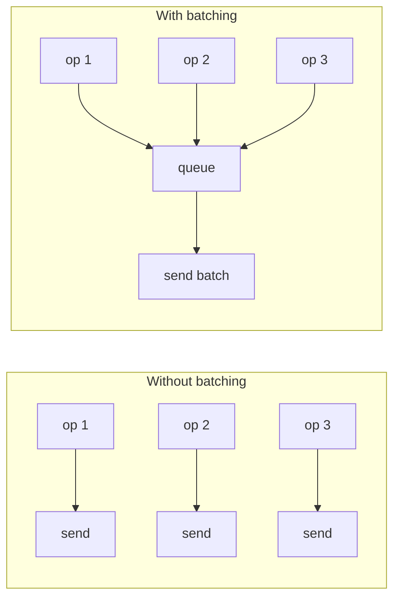

| Property | Value |
|----------|-------|
| Throughput | Amortizes per-item overhead — N items at near-1-item cost |
| Latency | Increased per-item (waits for batch to fill or timer to fire) |
| Flush triggers | Size threshold, time deadline, or explicit flush |
| Memory | O(batch size) — bounded buffer for pending items |

**Try it yourself** — add items and watch them batch up, then flush together:

<BatchProcessingViz />

## Production Proof

| Project | Source | Usage |
|---------|--------|-------|
| Apache Kafka | [RecordAccumulator.java#L69-L120](https://github.com/apache/kafka/blob/b7b1c0a83d856766390ee0c05e33b63711eee80e/clients/src/main/java/org/apache/kafka/clients/producer/internals/RecordAccumulator.java#L69-L120) | The Kafka producer accumulates records into batches per partition. `append()` (line 280) adds records to the current batch; the sender thread drains ready batches. This is how Kafka achieves millions of messages/sec. |
| Linux Kernel | [blk-merge.c#L350-L395](https://github.com/torvalds/linux/blob/acb7500801e98639f6d8c2d796ed9f64cba83d3a/block/blk-merge.c#L350-L395) | `blk_attempt_req_merge` — the block layer merges adjacent I/O requests into batched operations, amortizing seek time. Checks if two requests have contiguous sectors and compatible flags before merging. |

::: info Note
React's `setState` batching is another well-known example — multiple `setState` calls within the same event handler are batched into a single re-render.
:::

## Implementation

::: code-group

```typescript [TypeScript]
class BatchProcessor<T, R> {
  private queue: Array<{ item: T; resolve: (r: R) => void }> = [];
  private timer: ReturnType<typeof setTimeout> | null = null;

  constructor(
    private processBatch: (items: T[]) => Promise<R[]>,
    private maxSize: number = 10,
    private maxWaitMs: number = 50,
  ) {}

  async add(item: T): Promise<R> {
    return new Promise<R>((resolve) => {
      this.queue.push({ item, resolve });
      if (this.queue.length >= this.maxSize) {
        this.flush();
      } else if (!this.timer) {
        this.timer = setTimeout(() => this.flush(), this.maxWaitMs);
      }
    });
  }

  private async flush(): Promise<void> {
    if (this.timer) { clearTimeout(this.timer); this.timer = null; }
    const batch = this.queue.splice(0);
    if (batch.length === 0) return;
    const results = await this.processBatch(batch.map((b) => b.item));
    batch.forEach((b, i) => b.resolve(results[i]!));
  }
}
```

```rust [Rust]
use std::sync::{Arc, Mutex};

struct BatchProcessor<T, R> {
    queue: Mutex<Vec<T>>,
    process: Box<dyn Fn(Vec<T>) -> Vec<R> + Send + Sync>,
    max_size: usize,
}

impl<T, R> BatchProcessor<T, R> {
    fn new(
        process: impl Fn(Vec<T>) -> Vec<R> + Send + Sync + 'static,
        max_size: usize,
    ) -> Arc<Self> {
        Arc::new(Self {
            queue: Mutex::new(Vec::new()),
            process: Box::new(process),
            max_size,
        })
    }

    fn add(&self, item: T) -> Option<Vec<R>> {
        let mut queue = self.queue.lock().unwrap();
        queue.push(item);
        if queue.len() >= self.max_size {
            let batch: Vec<T> = queue.drain(..).collect();
            Some((self.process)(batch))
        } else {
            None
        }
    }

    fn flush(&self) -> Vec<R> {
        let mut queue = self.queue.lock().unwrap();
        let batch: Vec<T> = queue.drain(..).collect();
        if batch.is_empty() { return Vec::new(); }
        (self.process)(batch)
    }
}
```

```go [Go]
type BatchProcessor[T any, R any] struct {
	queue   []batchEntry[T, R]
	process func([]T) []R
	maxSize int
	mu      sync.Mutex
}

type batchEntry[T any, R any] struct {
	item T
	ch   chan R
}

func (bp *BatchProcessor[T, R]) Add(item T) R {
	bp.mu.Lock()
	ch := make(chan R, 1)
	bp.queue = append(bp.queue, batchEntry[T, R]{item, ch})
	if len(bp.queue) >= bp.maxSize {
		bp.flush()
	}
	bp.mu.Unlock()
	return <-ch
}

func (bp *BatchProcessor[T, R]) flush() {
	items := make([]T, len(bp.queue))
	for i, e := range bp.queue { items[i] = e.item }
	results := bp.process(items)
	for i, e := range bp.queue { e.ch <- results[i] }
	bp.queue = bp.queue[:0]
}
```

```python [Python]
import asyncio
from typing import TypeVar, Callable, Awaitable

T = TypeVar("T")
R = TypeVar("R")

class BatchProcessor:
    def __init__(self, process_batch, max_size=10, max_wait=0.05):
        self._process = process_batch
        self._max_size = max_size
        self._max_wait = max_wait
        self._queue = []
        self._timer = None

    async def add(self, item):
        future = asyncio.get_event_loop().create_future()
        self._queue.append((item, future))
        if len(self._queue) >= self._max_size:
            await self._flush()
        elif not self._timer:
            self._timer = asyncio.get_event_loop().call_later(
                self._max_wait, lambda: asyncio.ensure_future(self._flush()))
        return await future

    async def _flush(self):
        if self._timer: self._timer.cancel(); self._timer = None
        batch = self._queue[:]; self._queue.clear()
        results = await self._process([item for item, _ in batch])
        for (_, future), result in zip(batch, results):
            future.set_result(result)
```

:::

## Exercises

| Level | Exercise | File |
|-------|----------|------|
| Basic | Implement a batch processor with size-based flushing | `exercises/typescript/batch-processing/01-basic.test.ts` |
| Intermediate | Timeout flush — flush on size OR time, whichever comes first | `exercises/typescript/batch-processing/02-intermediate.test.ts` |

Run exercises: `pnpm test:ts` (TypeScript) · `cargo test` (Rust) · `go test ./...` (Go) · `pytest` (Python)

Exercise files: Rust `exercises/rust/src/batch_processing/mod.rs` · Go `exercises/go/batch_processing/batch_processing_test.go` · Python `exercises/python/batch_processing/test_batch_processing.py`

## When to Use

- **Database writes** — batch INSERT instead of N individual INSERTs
- **API calls** — batch GraphQL/REST requests to reduce round-trips
- **Message queues** — Kafka, SQS batch send/receive
- **UI updates** — React batched setState, browser layout batching
- **Network I/O** — TCP Nagle's algorithm, HTTP/2 multiplexing

## When NOT to Use

- **Latency-critical** — batching adds delay; if every millisecond matters, process immediately
- **Small volume** — if you rarely have more than 1 item, batching adds complexity for no gain
- **Partial failure isolation** — if one item in a batch fails, you need retry/dead-letter logic for the whole batch; individual processing is simpler when failure isolation matters
- **Unbounded memory** — without size limits, batches can grow during traffic spikes and OOM the process

## More Production Uses

- [React automatic batching](https://github.com/facebook/react/blob/34b78a2897cc208260a88e6b62ecaf9ca2a9dfe4/packages/react-reconciler/src/ReactFiberWorkLoop.js#L588-L600) — React 18+ batches all state updates by default
- [DataLoader](https://github.com/graphql/dataloader) — GraphQL N+1
- [Redis](https://github.com/redis/redis) — Pipeline
- [Elasticsearch](https://github.com/elastic/elasticsearch) — Bulk API

## Related Patterns

| Pattern | Relationship |
|---------|-------------|
| [Ring Buffer (Circular Buffer)](/patterns/ring-buffer/) | Ring buffers accumulate items for batch consumption |
| [Backpressure](/patterns/backpressure/) | Batching smooths bursty input and works with backpressure mechanisms |
| [Retry with Exponential Backoff](/patterns/retry-backoff/) | Individual batch items can be retried with exponential backoff on failure |

## Challenge Questions

::: details Q1: Your batch processor uses maxSize=100 and maxWaitMs=50ms. Traffic drops to 1 request/second. What happens, and how do you fix it?
**Answer:** Each request waits the full 50ms timeout before flushing a batch of 1, adding unnecessary latency.

The timeout triggers with just a single item in the queue because the batch never reaches 100 items. The fix is to make the batch size and/or timeout adaptive — for example, flush immediately when the queue has been idle, or use a shorter timeout when the queue depth is low. Kafka's `linger.ms` works this way: it only delays if there are more records expected.
:::

::: details Q2: A batch of 100 database inserts fails because row 57 violates a unique constraint. What should happen to the other 99 rows?
**Answer:** It depends on whether you need atomicity. If the batch runs in a single transaction, all 100 rows roll back. If not, you need per-item error handling.

The common production approach is to return a result array with per-item success/failure status (like Elasticsearch's Bulk API does). This lets callers retry only the failed items. If you wrap the entire batch in one transaction for atomicity, a single bad row kills the whole batch — which is simpler but wastes work.
:::

::: details Q3: You have both a size trigger (maxSize=50) and a time trigger (maxWaitMs=100ms). A burst of 200 items arrives in 10ms. How many batches fire, and when?
**Answer:** Four batches of 50 fire immediately, all within that 10ms burst. The time trigger never activates.

The size trigger takes priority whenever the queue reaches maxSize. As items pour in, the queue hits 50, flushes, hits 50 again, flushes, and so on. The timer is only relevant when the queue has items but hasn't reached maxSize — it's a "don't wait forever" safety net, not the primary trigger under load.
:::

::: details Q4: Why does Kafka batch per-partition rather than using a single global batch across all partitions?
**Answer:** Because each partition is an independent append-only log on a specific broker. A single cross-partition batch would need to be split at send time anyway.

Batching per-partition means each batch targets a specific broker (the partition leader). The Sender then groups multiple partition batches destined for the same broker into a single `ProduceRequest`, minimizing network round-trips. It also preserves per-partition ordering guarantees. A global batch would lose the natural partition→broker mapping, adding complexity with no throughput benefit.
:::


================================================
FILE: docs/patterns/bitmask/index.md
================================================
---
title: "Pattern: Bitmask"
description: "Pack multiple boolean flags into a single integer and manipulate them with bitwise operators for constant-time set operations."
difficulty: "beginner"
---

# Pattern: Bitmask

<DifficultyBadge />

## One Liner

Pack multiple boolean flags into a single integer and manipulate them with bitwise operators for constant-time set operations.

<DemoBadge />

## Real-World Analogy

A row of light switches on a wall panel. Each switch is either on or off. You can flip any switch independently, check which ones are on at a glance, and the panel takes the same amount of wall space whether you have 8 switches or 32.

## Core Idea

Instead of using an array of booleans or an object with multiple fields, a bitmask encodes each flag as a single bit in an integer. This gives you O(1) set/check/clear/toggle and trivial combination of multiple flags.

```text
 bit  7     6     5     4     3     2     1     0
    ┌─────┬─────┬─────┬─────┬─────┬─────┬─────┬─────┐
    │     │     │     │ SN  │ CB  │ RF  │ UP  │ PL  │
    └─────┴─────┴─────┴──┬──┴──┬──┴──┬──┴──┬──┴──┬──┘
                         │     │     │     │     └── Placement  1 << 0
                         │     │     │     └──────── Update     1 << 1
                         │     │     └────────────── Ref        1 << 2
                         │     └──────────────────── Callback   1 << 3
                         └────────────────────────── Snapshot   1 << 4
```

**Core operations** — all O(1), no branching:

| Want to... | Write | Why it works |
|------------|-------|-------------|
| Set a flag | `flags \|= FLAG` | OR turns the bit on, others unchanged |
| Check a flag | `(flags & FLAG) !== 0` | AND isolates the bit — nonzero = set |
| Clear a flag | `flags &= ~FLAG` | AND with inverted mask turns bit off |
| Toggle a flag | `flags ^= FLAG` | XOR flips the bit |
| Combine flags | `flags = A \| B \| C` | OR merges multiple flags into one value |
| Check ALL of mask | `(flags & mask) === mask` | True only if every bit in mask is set |
| Check ANY of mask | `(flags & mask) !== 0` | True if at least one bit in mask is set |
| Count set bits | `n.toString(2).split('1').length - 1` | Population count (popcnt) |

Key insight: a single `&` operation can check any combination of flags simultaneously — no loops, no branching.

| Property | Value |
|----------|-------|
| Set / check / clear | O(1) — single bitwise operation, no branching |
| Combine multiple flags | O(1) — one `\|` or `&` regardless of flag count |
| Max flags | Word width — 32 or 64 on most platforms |
| Space | O(1) — one integer stores all flags |

**Try it yourself** — toggle permission bits and see the mask value update in binary, decimal, and hex:

<BitmaskViz />

## Production Proof

| Project | Source | Usage |
|---------|--------|-------|
| React | [ReactFiberFlags.js#L14-L36](https://github.com/facebook/react/blob/34b78a2897cc208260a88e6b62ecaf9ca2a9dfe4/packages/react-reconciler/src/ReactFiberFlags.js#L14-L36) | Side-effect flags — `Placement = 0b0000010`, `Update = 0b0000100`. Tested with `fiber.flags & Update`, combined with bitwise OR. One integer replaces a dozen booleans for pending effects during reconciliation. |
| Linux Kernel | [stat.h#L25-L33](https://github.com/torvalds/linux/blob/acb7500801e98639f6d8c2d796ed9f64cba83d3a/include/uapi/linux/stat.h#L25-L33) | File permission bits — the classic `rwxrwxrwx` (read/write/execute for owner/group/other) encoded as a 9-bit mask |
| Go stdlib | [types.go#L32-L46](https://github.com/golang/go/blob/f5cdf4745455415c7a43cfc7d925214d4511489b/src/os/types.go#L32-L46) | `os.FileMode` — Go's file mode bits mirror Unix permission flags using typed constants with iota bit-shifting |

## Implementation

::: code-group

```typescript [TypeScript]
// Define flags as powers of 2
const Flags = {
  Read:    1 << 0,  // 0b0001
  Write:   1 << 1,  // 0b0010
  Execute: 1 << 2,  // 0b0100
  Delete:  1 << 3,  // 0b1000
} as const;

type FlagSet = number;

const hasFlag = (set: FlagSet, flag: number): boolean =>
  (set & flag) === flag;

const hasAny = (set: FlagSet, mask: number): boolean =>
  (set & mask) !== 0;

const setFlag = (set: FlagSet, flag: number): FlagSet =>
  set | flag;

const clearFlag = (set: FlagSet, flag: number): FlagSet =>
  set & ~flag;

const toggleFlag = (set: FlagSet, flag: number): FlagSet =>
  set ^ flag;

// Usage: combine multiple flags
const editorPerms = Flags.Read | Flags.Write;
hasFlag(editorPerms, Flags.Read);    // true
hasFlag(editorPerms, Flags.Delete);  // false
```

```rust [Rust]
// Idiomatic Rust: typed constants, bitwise ops on u32
pub const READ:    u32 = 1 << 0;
pub const WRITE:   u32 = 1 << 1;
pub const EXECUTE: u32 = 1 << 2;
pub const DELETE:  u32 = 1 << 3;

pub fn has_flag(flags: u32, flag: u32) -> bool {
    (flags & flag) == flag
}

pub fn has_any(flags: u32, mask: u32) -> bool {
    (flags & mask) != 0
}

pub fn set_flag(flags: u32, flag: u32) -> u32 {
    flags | flag
}

pub fn clear_flag(flags: u32, flag: u32) -> u32 {
    flags & !flag
}

pub fn toggle_flag(flags: u32, flag: u32) -> u32 {
    flags ^ flag
}

// Usage
let editor = READ | WRITE;
assert!(has_flag(editor, READ));     // true
assert!(!has_flag(editor, DELETE));  // false
```

```go [Go]
// Idiomatic Go: typed constants with iota
type Permission uint32

const (
    Read    Permission = 1 << iota // 0b0001
    Write                          // 0b0010
    Execute                        // 0b0100
    Delete                         // 0b1000
)

func HasFlag(flags, flag Permission) bool {
    return flags&flag == flag
}

func HasAny(flags, mask Permission) bool {
    return flags&mask != 0
}

func SetFlag(flags, flag Permission) Permission {
    return flags | flag
}

func ClearFlag(flags, flag Permission) Permission {
    return flags &^ flag // Go's AND NOT operator
}

func ToggleFlag(flags, flag Permission) Permission {
    return flags ^ flag
}

// Usage
editor := Read | Write
HasFlag(editor, Read)    // true
HasFlag(editor, Delete)  // false
```

```python [Python]
# Python: native bitwise operators, no size limit on integers
READ    = 1 << 0  # 0b0001
WRITE   = 1 << 1  # 0b0010
EXECUTE = 1 << 2  # 0b0100
DELETE  = 1 << 3  # 0b1000

def has_flag(flags: int, flag: int) -> bool:
    return (flags & flag) == flag

def has_any(flags: int, mask: int) -> bool:
    return (flags & mask) != 0

def set_flag(flags: int, flag: int) -> int:
    return flags | flag

def clear_flag(flags: int, flag: int) -> int:
    return flags & ~flag

def toggle_flag(flags: int, flag: int) -> int:
    return flags ^ flag

# Usage
editor = READ | WRITE
assert has_flag(editor, READ)       # True
assert not has_flag(editor, DELETE)  # True
```

:::

## Exercises

| Level | Exercise | File |
|-------|----------|------|
| Basic | Fundamental bitwise flag operations (set, check, clear, toggle) | `exercises/typescript/bitmask/01-basic.test.ts` |
| Intermediate | Build a role-based permission system | `exercises/typescript/bitmask/02-permission-system.test.ts` |
| Advanced | React-style fiber flags with subtree bubbling | `exercises/typescript/bitmask/03-react-flags.test.ts` |

Run exercises: `pnpm test:ts` (TypeScript) · `cargo test` (Rust) · `go test ./...` (Go) · `pytest` (Python)

Exercise files: Rust `exercises/rust/src/bitmask/mod.rs` · Go `exercises/go/bitmask/bitmask_test.go` · Python `exercises/python/bitmask/test_bitmask.py`

## When to Use

- **Multiple boolean flags on a hot path** — one integer instead of N booleans saves memory and enables batch operations
- **Combinatorial state** — when you need to check "any of these" or "all of these" in one operation
- **Serialization** — a single integer is trivial to store, transmit, and compare
- **Permission systems** — the Unix `rwx` model is a bitmask for a reason
- **ECS (Entity Component System)** — component membership masks in game engines

## When NOT to Use

- **More than 32 flags** — JavaScript's bitwise operators work on 32-bit integers; beyond that, use `BigInt` or a `Set`
- **Mutually exclusive states** — if only one value can be active at a time, use an `enum` instead
- **Readability matters more than performance** — named boolean fields are clearer to most developers
- **Dynamic flag sets** — if the set of possible flags is not known at compile time, use a `Set<string>`

## More Production Uses

- [Chromium](https://chromium.googlesource.com/chromium/src) — layer compositing flags
- [SQLite](https://www.sqlite.org/src) — VFS flags
- [Nginx](https://github.com/nginx/nginx) — event flags
- [Bevy ECS](https://github.com/bevyengine/bevy/blob/fd4f66fc36ec9f8181afe85d65e22c52b14e86a9/crates/bevy_ecs/src/archetype.rs) — component membership masks in archetype-based ECS
- [Linux fcntl](https://github.com/torvalds/linux/blob/acb7500801e98639f6d8c2d796ed9f64cba83d3a/include/uapi/asm-generic/fcntl.h#L5-L30) — `O_RDONLY`, `O_WRONLY`, `O_CREAT` file control flags

## Related Patterns

| Pattern | Relationship |
|---------|-------------|
| [Tagged Union](/patterns/tagged-union/) | Both encode type information in compact integer representations |
| [Dirty Flag](/patterns/dirty-flag/) | Dirty flags are often stored as bitmask bits |
| [Double Buffering](/patterns/double-buffering/) | React uses bitmask flags on each Fiber node to track work in its double-buffered tree |

## Challenge Questions

::: details Q1: Your team defines 40 feature flags as a bitmask in a JavaScript config system. QA reports that flags 32-39 behave erratically — sometimes checking a flag returns false even though it was set. What went wrong?
**Answer:** JavaScript bitwise operators only work on 32-bit integers, so flags at positions 32 and above are silently truncated.

The `|`, `&`, `^`, and `~` operators internally convert operands to signed 32-bit integers. `1 << 32` wraps around to `1` (same as `1 << 0`), meaning flag 32 collides with flag 0. Beyond 32 flags, you need `BigInt` for bitwise operations or switch to a `Set<string>` approach.
:::

::: details Q2: You have `permissions = Read | Write | Execute`. A junior dev writes `if (permissions === Read)` to check if a user has read access. This works in unit tests but fails in production. Why?
**Answer:** The `===` check tests for exact equality, so it only returns true when permissions is *exactly* `Read` and nothing else.

In production, users typically have multiple permissions combined. `permissions === Read` would be false for `Read | Write` (value 3 vs value 1). The correct check is `(permissions & Read) !== 0` or `(permissions & Read) === Read`, which isolates and tests just the Read bit regardless of other flags.
:::

::: details Q3: React uses bitmask flags for fiber side-effects. Why would React choose a bitmask over an array of strings like `['placement', 'update', 'ref']` for tracking which effects a fiber needs?
**Answer:** A bitmask lets React check, combine, and propagate multiple effect flags in a single integer operation instead of iterating arrays.

During reconciliation, React "bubbles" child effects into parent fibers using `parent.subtreeFlags |= child.flags`. With arrays, this would require deduplication and concatenation. The bitmask approach also enables checking "does this subtree have any work?" with a single `subtreeFlags !== 0` comparison — critical when traversing thousands of fiber nodes per frame.
:::

::: details Q4: You're designing a permission system where roles are mutually exclusive — a user is exactly one of Admin, Editor, or Viewer. A colleague suggests using a bitmask. Is this the right pattern?
**Answer:** No. Mutually exclusive states should use an enum, not a bitmask.

Bitmasks shine when flags can be freely combined (`Read | Write | Execute`). For mutually exclusive roles, a bitmask lets you accidentally set `Admin | Viewer`, which is a nonsensical state. An enum enforces exactly one value at the type level, making invalid states unrepresentable. Bitmasks are for combinatorial flags; enums are for exclusive states.
:::


================================================
FILE: docs/patterns/bloom-filter/index.md
================================================
---
title: "Pattern: Bloom Filter"
description: "Test set membership in O(k) time with zero false negatives — at the cost of a tunable false positive rate."
difficulty: "intermediate"
---

# Pattern: Bloom Filter

<DifficultyBadge />

## One Liner

Test set membership in O(k) time with zero false negatives — at the cost of a tunable false positive rate.

<DemoBadge />

## Real-World Analogy

A bouncer with a guest list who sometimes lets in non-guests. If the bouncer says 'you're NOT on the list,' that's definitive. But if he says 'you might be on the list,' you still need to check with the actual registry inside.

## Core Idea

A bloom filter is a space-efficient probabilistic data structure. It uses a bit array of size `m` and `k` independent hash functions. To **add** an element, hash it `k` times and set those bit positions. To **test**, hash it `k` times and check if all positions are set.

```text
  hash1=2         hash2=5               hash3=9
     │               │                     │
     ▼               ▼                     ▼
  ┌──┬──┬──┬──┬──┬──┬──┬──┬──┬──┬──┬──┐
  │ 0│ 0│ 1│ 0│ 0│ 1│ 0│ 0│ 0│ 1│ 0│ 0│  m=12
  └──┴──┴──┴──┴──┴──┴──┴──┴──┴──┴──┴──┘
    0  1  2  3  4  5  6  7  8  9 10 11

  add("apple")  → set bits 2, 5, 9
  test("apple") → all set     → "maybe yes"
  test("grape") → bit 7 not set → "definitely no"
```

| Property | Value |
|----------|-------|
| False negatives | **Impossible** — added elements always test positive |
| False positives | **Possible** — non-added elements may test positive |
| False positive rate | ≈ `(1 - e^(-kn/m))^k` where `n` = elements inserted |
| Deletion | **Not supported** — clearing bits may affect other elements |

**Try it yourself** — add items and test membership to see false positives in action:

<BloomFilterViz />

## Production Proof

| Project | Source | Usage |
|---------|--------|-------|
| LevelDB | [bloom.cc#L17-L80](https://github.com/google/leveldb/blob/7ee830d02b623e8ffe0b95d59a74db1e58da04c5/util/bloom.cc#L17-L80) | `BloomFilterPolicy` — uses double-hashing (Kirsch-Mitzenmacher) with rotate-right-17 to set `k` bits per key. `KeyMayMatch` returns false immediately if any probed bit is zero. Avoids disk reads for keys that don't exist. |
| Chromium (Blink) | [selector_filter.h#L149-L175](https://github.com/chromium/chromium/blob/5cffea3f665b7762369a0fa84d2f208875e7225e/third_party/blink/renderer/core/css/selector_filter.h#L149-L175) | 8192-bit bloom filter for CSS ancestor selector fast-rejection — discards 60-70% of CSS rules without full matching. Uses salted hashing (tag/id/class/attr) to prevent cross-type collisions. |

## Implementation

::: code-group

```typescript [TypeScript]
class BloomFilter {
  private bits: Uint8Array;
  private size: number;
  private hashCount: number;

  constructor(size: number, hashCount = 3) {
    this.size = size;
    this.hashCount = hashCount;
    this.bits = new Uint8Array(size);
  }

  private hashes(item: string): number[] {
    let h1 = 0;
    let h2 = 0;
    for (let i = 0; i < item.length; i++) {
      h1 = (h1 * 31 + item.charCodeAt(i)) | 0;
      h2 = (h2 * 37 + item.charCodeAt(i)) | 0;
    }
    const result: number[] = [];
    for (let i = 0; i < this.hashCount; i++) {
      result.push(((h1 + i * h2) % this.size + this.size) % this.size);
    }
    return result;
  }

  add(item: string): void {
    for (const pos of this.hashes(item)) {
      this.bits[pos] = 1;
    }
  }

  mightContain(item: string): boolean {
    return this.hashes(item).every((pos) => this.bits[pos] === 1);
  }
}
```

```rust [Rust]
pub struct BloomFilter {
    bits: Vec<bool>,
    size: usize,
    hash_count: usize,
}

impl BloomFilter {
    pub fn new(size: usize, hash_count: usize) -> Self {
        BloomFilter { bits: vec![false; size], size, hash_count }
    }

    fn hashes(&self, item: &str) -> Vec<usize> {
        let mut h1: i32 = 0;
        let mut h2: i32 = 0;
        for b in item.bytes() {
            h1 = h1.wrapping_mul(31).wrapping_add(b as i32);
            h2 = h2.wrapping_mul(37).wrapping_add(b as i32);
        }
        (0..self.hash_count)
            .map(|i| ((h1.wrapping_add((i as i32).wrapping_mul(h2))) as usize) % self.size)
            .collect()
    }

    pub fn add(&mut self, item: &str) {
        for pos in self.hashes(item) {
            self.bits[pos] = true;
        }
    }

    pub fn might_contain(&self, item: &str) -> bool {
        self.hashes(item).iter().all(|&pos| self.bits[pos])
    }
}
```

```go [Go]
type BloomFilter struct {
	bits      []bool
	size      int
	hashCount int
}

func NewBloomFilter(size, hashCount int) *BloomFilter {
	return &BloomFilter{bits: make([]bool, size), size: size, hashCount: hashCount}
}

func (bf *BloomFilter) hashes(item string) []int {
	h1, h2 := 0, 0
	for _, b := range []byte(item) {
		h1 = h1*31 + int(b)
		h2 = h2*37 + int(b)
	}
	result := make([]int, bf.hashCount)
	for i := range result {
		result[i] = ((h1 + i*h2) % bf.size + bf.size) % bf.size
	}
	return result
}

func (bf *BloomFilter) Add(item string) {
	for _, pos := range bf.hashes(item) {
		bf.bits[pos] = true
	}
}

func (bf *BloomFilter) MightContain(item string) bool {
	for _, pos := range bf.hashes(item) {
		if !bf.bits[pos] {
			return false
		}
	}
	return true
}
```

```python [Python]
class BloomFilter:
    def __init__(self, size: int, hash_count: int = 3):
        self.size = size
        self.hash_count = hash_count
        self.bits = [False] * size

    def _hashes(self, item: str) -> list[int]:
        h1, h2 = 0, 0
        for ch in item:
            h1 = (h1 * 31 + ord(ch)) & 0xFFFFFFFF
            h2 = (h2 * 37 + ord(ch)) & 0xFFFFFFFF
        return [(h1 + i * h2) % self.size for i in range(self.hash_count)]

    def add(self, item: str) -> None:
        for pos in self._hashes(item):
            self.bits[pos] = True

    def might_contain(self, item: str) -> bool:
        return all(self.bits[pos] for pos in self._hashes(item))
```

:::

## Exercises

| Level | Exercise | File |
|-------|----------|------|
| Basic | Implement a bloom filter with add/mightContain | `exercises/typescript/bloom-filter/01-basic.test.ts` |
| Intermediate | Spell checker using a bloom filter dictionary | `exercises/typescript/bloom-filter/02-intermediate.test.ts` |

Run exercises: `pnpm test:ts` (TypeScript) · `cargo test` (Rust) · `go test ./...` (Go) · `pytest` (Python)

Exercise files: Rust `exercises/rust/src/bloom_filter/mod.rs` · Go `exercises/go/bloom_filter/bloom_filter_test.go` · Python `exercises/python/bloom_filter/test_bloom_filter.py`

## When to Use

- **Database key lookup** — skip disk reads for keys that definitely don't exist (LevelDB, Cassandra, HBase)
- **Web caching** — avoid caching one-hit-wonders by checking if a URL was seen before
- **Network security** — check if a URL is in a malicious list without storing all URLs
- **Spell checkers** — fast "definitely not a word" rejection before dictionary lookup
- **Distributed systems** — reduce inter-node communication by filtering locally first

## When NOT to Use

- **Need deletion** — standard bloom filters don't support removal (use counting bloom filters instead)
- **Need exact membership** — if false positives are unacceptable, use a hash set
- **Small sets** — for < 1000 elements, a hash set uses comparable memory with zero false positives
- **Need to enumerate elements** — bloom filters only answer "is X in the set?", not "what's in the set?"

## More Production Uses

- [PostgreSQL](https://github.com/postgres/postgres/blob/e18b0cb7344cb4bd28468f6c0aeeb9b9241d30aa/contrib/bloom/blutils.c#L265-L293) — bloom index for multi-column filtering
- [Apache Cassandra](https://github.com/apache/cassandra) — SSTable bloom filters to avoid disk reads
- [bits-and-blooms/bloom](https://github.com/bits-and-blooms/bloom/blob/f0c3e57ab5ce07691a0a3124b9ed2db6df82ac9b/bloom.go#L77-L81) — popular Go bloom filter library (7k+ stars)
- [Bitcoin](https://github.com/bitcoin/bitcoin) — SPV bloom filters for lightweight clients

## Related Patterns

| Pattern | Relationship |
|---------|-------------|
| [LSM Tree (Log-Structured Merge Tree)](/patterns/lsm-tree/) | LSM trees attach bloom filters to each SSTable to avoid unnecessary disk reads |
| [Trie (Prefix Tree)](/patterns/trie/) | Bloom filter pre-screens before expensive trie traversal |
| [LRU Cache](/patterns/lru-cache/) | Both speed up lookups — bloom filters eliminate negatives, LRU caches store positives |
| [Interning / Symbol Table](/patterns/interning/) | Bloom filters can pre-check before expensive intern table lookups |
| [Skip List](/patterns/skip-list/) | Bloom filters can reduce unnecessary disk reads in skip-list-based storage |

## Challenge Questions

::: details Q1: You deploy a bloom filter with m=1000 bits and k=3 hashes to check URL membership. After inserting 800 URLs, your false positive rate is unacceptably high. You expected around 1%. What went wrong?
**Answer:** The bit array is oversaturated — 800 items in 1000 bits means most bits are set to 1, making almost any query return "maybe yes."

The false positive rate formula `(1 - e^(-kn/m))^k` shows that with k=3, n=800, m=1000, approximately 91% of bits are set, giving a ~75% false positive rate. The fix is to increase m. For a 1% false positive rate with n=800 and k=3, you need roughly m=11,500 bits (about 1.4 KB). The rule of thumb is ~10 bits per element for a 1% false positive rate.
:::

::: details Q2: Your colleague proposes deleting items from a bloom filter by clearing the bits that were set during insertion. Why does this break the data structure?
**Answer:** Clearing bits for one item can destroy membership evidence for other items whose hashes mapped to the same bit positions.

In a bloom filter, multiple items share bits. If "apple" and "banana" both hash to bit position 5, clearing bit 5 when removing "apple" creates a false negative for "banana" — violating the bloom filter's fundamental guarantee of zero false negatives. Counting bloom filters solve this by storing counters instead of single bits, decrementing on delete and only clearing when the counter reaches zero.
:::

::: details Q3: Your system has two bloom filters — one built from server A's dataset and another from server B's dataset. A query needs to check "was this key seen by either server?" Can you answer this without querying both filters separately?
**Answer:** Yes. Bitwise OR the two bit arrays together to create a union filter that answers "seen by A or B" in a single query.

This works because a bloom filter's membership test is purely a function of which bits are set. ORing the arrays produces a filter where a bit is set if it was set in either A or B, which is exactly the union semantics. The resulting filter has a higher false positive rate (more bits are set), but zero false negatives are preserved. This property makes bloom filters uniquely composable — you cannot do this with hash sets without transferring all elements.
:::

::: details Q4: LevelDB uses bloom filters to skip disk reads for nonexistent keys. If the bloom filter says "maybe yes" for a key that doesn't actually exist, what is the cost? What if it said "no" for a key that does exist?
**Answer:** A false positive costs one unnecessary disk read (wasted I/O but correct result). A false negative would return "key not found" for an existing key — silent data loss.

This asymmetry is why bloom filters guarantee zero false negatives. A false positive just means "we checked the disk and the key wasn't there" — the system self-corrects at the cost of one extra I/O. But if a bloom filter could produce false negatives, the database would skip the disk read entirely and incorrectly report the key as missing. That's data corruption, not a performance issue. The entire value of bloom filters in databases depends on this one-sided error guarantee.
:::


================================================
FILE: docs/patterns/checkpointing/index.md
================================================
---
title: "Pattern: Checkpointing"
description: "Periodically snapshot consistent state so recovery replays only from the checkpoint — not from the beginning of time."
difficulty: "intermediate"
---

# Pattern: Checkpointing

<DifficultyBadge />

## One Liner

Periodically snapshot consistent state so recovery replays only from the checkpoint — not from the beginning of time.

<DemoBadge />

## Real-World Analogy

Saving your game. You play for a while, hit 'save,' and if you die, you restart from the last save point instead of the beginning. The more often you save, the less progress you lose — but each save takes time.

## Core Idea

Checkpointing captures a consistent snapshot of the current system state at a known point. On crash, recovery loads the last checkpoint and replays only the operations logged after it. Without checkpointing, a WAL-based system must replay its entire history on every restart — which grows unbounded. Checkpointing bounds recovery time to the interval since the last checkpoint.

```text
  Time ──────────────────────────────────────────────►

  WAL:  [op1] [op2] [op3] [op4] [op5] [op6] [op7] [op8]
                          ▲                    ▲
                     Checkpoint 1         Checkpoint 2
                     (state snapshot)     (state snapshot)

  Without checkpointing:
    Recovery replays: op1, op2, op3, op4, op5, op6, op7, op8

  With checkpointing:
    Recovery loads Checkpoint 2, replays: op7, op8 only
```

| Property | Value |
|----------|-------|
| Recovery time | Proportional to ops since last checkpoint |
| Checkpoint cost | O(state_size) to serialize current state |
| WAL truncation | Safe to discard log entries before checkpoint |
| Consistency | Checkpoint must capture a consistent snapshot |

**Try it yourself** — increment state, take checkpoints, crash, and restore from a checkpoint:

<CheckpointingViz />

## Production Proof

| Project | Source | Usage |
|---------|--------|-------|
| PostgreSQL | [checkpointer.c#L218-L360](https://github.com/postgres/postgres/blob/e18b0cb7344cb4bd28468f6c0aeeb9b9241d30aa/src/backend/postmaster/checkpointer.c#L218-L360) | `CheckpointerMain` — the checkpoint background process. Runs in a loop waiting for checkpoint requests or `checkpoint_timeout` (default 5 minutes). Calls `CreateCheckPoint` which flushes all dirty buffers to disk, writes a checkpoint WAL record, and updates `pg_control` with the checkpoint location. On crash recovery, PostgreSQL reads `pg_control` to find the last checkpoint and replays WAL only from that point. |
| Redis | [rdb.c#L1414-L1529](https://github.com/redis/redis/blob/df63a65d4d4ee33ae67e9f101885074febe0bccb/src/rdb.c#L1414-L1529) | `rdbSaveRio` serializes the entire Redis dataset to an RDB file — a point-in-time snapshot. Redis forks a child process (`rdbSaveBackground`) to write the snapshot without blocking the main thread. The RDB file is a complete checkpoint: on restart, Redis loads it to restore state instantly. Combined with AOF (append-only file), Redis can replay only the AOF entries written after the last RDB snapshot. |

## Implementation

::: code-group

```typescript [TypeScript]
interface LogEntry {
  id: number;
  operation: string;
  data: Record<string, unknown>;
}

class CheckpointableStore {
  private state: Map<string, unknown> = new Map();
  private wal: LogEntry[] = [];
  private nextId = 1;
  private checkpoint: { state: Map<string, unknown>; walPosition: number } | null = null;

  /** Apply an operation, logging it to the WAL first. */
  apply(operation: string, key: string, value: unknown): void {
    const entry: LogEntry = {
      id: this.nextId++,
      operation,
      data: { key, value },
    };
    this.wal.push(entry);
    this.executeOp(entry);
  }

  get(key: string): unknown {
    return this.state.get(key);
  }

  /** Take a checkpoint: snapshot current state and record WAL position. */
  takeCheckpoint(): void {
    this.checkpoint = {
      state: new Map(this.state),
      walPosition: this.wal.length,
    };
  }

  /** Simulate crash: wipe in-memory state but keep WAL and checkpoint. */
  simulateCrash(): void {
    this.state = new Map();
  }

  /** Recover from crash using checkpoint + WAL replay. */
  recover(): number {
    if (this.checkpoint) {
      this.state = new Map(this.checkpoint.state);
      let replayed = 0;
      for (let i = this.checkpoint.walPosition; i < this.wal.length; i++) {
        this.executeOp(this.wal[i]!);
        replayed++;
      }
      return replayed;
    }
    // No checkpoint: replay entire WAL
    this.state = new Map();
    for (const entry of this.wal) {
      this.executeOp(entry);
    }
    return this.wal.length;
  }

  private executeOp(entry: LogEntry): void {
    const { key, value } = entry.data as { key: string; value: unknown };
    if (entry.operation === 'SET') {
      this.state.set(key, value);
    } else if (entry.operation === 'DELETE') {
      this.state.delete(key);
    }
  }

  get walLength(): number { return this.wal.length; }
  get stateSize(): number { return this.state.size; }
}
```

```rust [Rust]
use std::collections::HashMap;

pub struct LogEntry {
    pub id: usize,
    pub operation: String,
    pub key: String,
    pub value: Option<String>,
}

struct Snapshot {
    state: HashMap<String, String>,
    wal_position: usize,
}

pub struct CheckpointableStore {
    state: HashMap<String, String>,
    wal: Vec<LogEntry>,
    next_id: usize,
    checkpoint: Option<Snapshot>,
}

impl CheckpointableStore {
    pub fn new() -> Self {
        CheckpointableStore {
            state: HashMap::new(),
            wal: Vec::new(),
            next_id: 1,
            checkpoint: None,
        }
    }

    pub fn apply(&mut self, operation: &str, key: &str, value: Option<&str>) {
        let entry = LogEntry {
            id: self.next_id,
            operation: operation.to_string(),
            key: key.to_string(),
            value: value.map(|v| v.to_string()),
        };
        self.next_id += 1;
        self.execute_op(&entry);
        self.wal.push(entry);
    }

    pub fn get(&self, key: &str) -> Option<&str> {
        self.state.get(key).map(|s| s.as_str())
    }

    pub fn take_checkpoint(&mut self) {
        self.checkpoint = Some(Snapshot {
            state: self.state.clone(),
            wal_position: self.wal.len(),
        });
    }

    pub fn simulate_crash(&mut self) {
        self.state.clear();
    }

    pub fn recover(&mut self) -> usize {
        if let Some(ref snap) = self.checkpoint {
            self.state = snap.state.clone();
            let start = snap.wal_position;
            let mut replayed = 0;
            for i in start..self.wal.len() {
                self.execute_op_by_index(i);
                replayed += 1;
            }
            return replayed;
        }
        self.state.clear();
        for i in 0..self.wal.len() {
            self.execute_op_by_index(i);
        }
        self.wal.len()
    }

    fn execute_op(&mut self, entry: &LogEntry) {
        if entry.operation == "SET" {
            if let Some(ref v) = entry.value {
                self.state.insert(entry.key.clone(), v.clone());
            }
        } else if entry.operation == "DELETE" {
            self.state.remove(&entry.key);
        }
    }

    fn execute_op_by_index(&mut self, idx: usize) {
        let op = self.wal[idx].operation.clone();
        let key = self.wal[idx].key.clone();
        let value = self.wal[idx].value.clone();
        if op == "SET" {
            if let Some(v) = value {
                self.state.insert(key, v);
            }
        } else if op == "DELETE" {
            self.state.remove(&key);
        }
    }

    pub fn wal_length(&self) -> usize { self.wal.len() }
    pub fn state_size(&self) -> usize { self.state.len() }
}
```

```go [Go]
package checkpoint

type LogEntry struct {
	ID        int
	Operation string
	Key       string
	Value     any
}

type stateSnapshot struct {
	state       map[string]any
	walPosition int
}

type CheckpointableStore struct {
	state      map[string]any
	wal        []LogEntry
	nextID     int
	checkpoint *stateSnapshot
}

func NewStore() *CheckpointableStore {
	return &CheckpointableStore{
		state:  make(map[string]any),
		nextID: 1,
	}
}

func (s *CheckpointableStore) Apply(operation, key string, value any) {
	entry := LogEntry{ID: s.nextID, Operation: operation, Key: key, Value: value}
	s.nextID++
	s.wal = append(s.wal, entry)
	s.executeOp(entry)
}

func (s *CheckpointableStore) Get(key string) (any, bool) {
	v, ok := s.state[key]
	return v, ok
}

func (s *CheckpointableStore) TakeCheckpoint() {
	snap := make(map[string]any, len(s.state))
	for k, v := range s.state {
		snap[k] = v
	}
	s.checkpoint = &stateSnapshot{state: snap, walPosition: len(s.wal)}
}

func (s *CheckpointableStore) SimulateCrash() {
	s.state = make(map[string]any)
}

func (s *CheckpointableStore) Recover() int {
	if s.checkpoint != nil {
		s.state = make(map[string]any, len(s.checkpoint.state))
		for k, v := range s.checkpoint.state {
			s.state[k] = v
		}
		replayed := 0
		for i := s.checkpoint.walPosition; i < len(s.wal); i++ {
			s.executeOp(s.wal[i])
			replayed++
		}
		return replayed
	}
	s.state = make(map[string]any)
	for _, entry := range s.wal {
		s.executeOp(entry)
	}
	return len(s.wal)
}

func (s *CheckpointableStore) executeOp(entry LogEntry) {
	if entry.Operation == "SET" {
		s.state[entry.Key] = entry.Value
	} else if entry.Operation == "DELETE" {
		delete(s.state, entry.Key)
	}
}

func (s *CheckpointableStore) WALLength() int   { return len(s.wal) }
func (s *CheckpointableStore) StateSize() int    { return len(s.state) }
```

```python [Python]
from dataclasses import dataclass, field
from typing import Any

@dataclass
class LogEntry:
    id: int
    operation: str
    key: str
    value: Any = None

class CheckpointableStore:
    def __init__(self):
        self._state: dict[str, Any] = {}
        self._wal: list[LogEntry] = []
        self._next_id = 1
        self._checkpoint: dict | None = None  # {state, wal_position}

    def apply(self, operation: str, key: str, value: Any = None) -> None:
        entry = LogEntry(id=self._next_id, operation=operation, key=key, value=value)
        self._next_id += 1
        self._wal.append(entry)
        self._execute_op(entry)

    def get(self, key: str) -> Any:
        return self._state.get(key)

    def take_checkpoint(self) -> None:
        self._checkpoint = {
            "state": dict(self._state),
            "wal_position": len(self._wal),
        }

    def simulate_crash(self) -> None:
        self._state = {}

    def recover(self) -> int:
        if self._checkpoint is not None:
            self._state = dict(self._checkpoint["state"])
            replayed = 0
            for i in range(self._checkpoint["wal_position"], len(self._wal)):
                self._execute_op(self._wal[i])
                replayed += 1
            return replayed
        self._state = {}
        for entry in self._wal:
            self._execute_op(entry)
        return len(self._wal)

    def _execute_op(self, entry: LogEntry) -> None:
        if entry.operation == "SET":
            self._state[entry.key] = entry.value
        elif entry.operation == "DELETE":
            self._state.pop(entry.key, None)

    @property
    def wal_length(self) -> int:
        return len(self._wal)

    @property
    def state_size(self) -> int:
        return len(self._state)
```

:::

## Exercises

| Level | Exercise | File |
|-------|----------|------|
| Basic | WAL with checkpoint and recovery | `exercises/typescript/checkpointing/01-basic.test.ts` |
| Intermediate | Incremental checkpoint (only dirty pages) | `exercises/typescript/checkpointing/02-intermediate.test.ts` |

Run exercises: `pnpm test:ts` (TypeScript) · `cargo test` (Rust) · `go test ./...` (Go) · `pytest` (Python)

Exercise files: Rust `exercises/rust/src/checkpointing/mod.rs` · Go `exercises/go/checkpointing/checkpointing_test.go` · Python `exercises/python/checkpointing/test_checkpointing.py`

## When to Use

- **Database crash recovery** — bound WAL replay time (PostgreSQL, MySQL)
- **In-memory caches** — persist state to survive restarts (Redis RDB)
- **Stream processing** — save processing position for exactly-once guarantees (Flink, Kafka)
- **Long-running computations** — save progress to resume after failure (ML training)
- **Game saves** — snapshot game state at safe points

## When NOT to Use

- **Stateless services** — no state to checkpoint
- **Very small state** — if WAL replay takes < 1 second, checkpointing adds complexity for little benefit
- **Rapidly changing state** — if the entire state changes between checkpoints, snapshots are as expensive as replaying the WAL
- **Distributed state** — coordinating consistent checkpoints across nodes requires distributed snapshot protocols (Chandy-Lamport)

## More Production Uses

- [Apache Flink](https://github.com/apache/flink) — distributed snapshots for exactly-once stream processing
- [etcd](https://github.com/etcd-io/etcd) — periodic snapshots to compact the Raft log
- [SQLite WAL mode](https://www.sqlite.org/wal.html) — WAL checkpointing transfers pages back to the database file
- [PyTorch](https://github.com/pytorch/pytorch) — model checkpointing to resume training after interruption

## Related Patterns

| Pattern | Relationship |
|---------|-------------|
| [Write-Ahead Log (WAL)](/patterns/write-ahead-log/) | Checkpoints truncate the WAL — recovery replays only from the latest checkpoint |
| [Copy-on-Write (CoW)](/patterns/copy-on-write/) | Copy-on-write enables consistent snapshots without stopping writes |
| [Logical Clock](/patterns/logical-clock/) | Checkpoints are associated with logical clock positions for consistency |
| [Merkle Tree](/patterns/merkle-tree/) | Merkle trees verify checkpoint integrity by detecting which subtrees changed |

## Challenge Questions

::: details Q1: Your PostgreSQL database is configured with checkpoint_timeout = 30 minutes. The server crashes. What's the worst-case recovery time, and how would you reduce it?
**Answer:** Worst case: replaying up to 30 minutes of WAL entries. Reduce it by lowering checkpoint_timeout (e.g., to 5 minutes) or checkpoint_completion_target.

The trade-off is clear: more frequent checkpoints mean faster recovery but more I/O overhead during normal operation. Each checkpoint flushes all dirty pages to disk, which can cause a write burst. PostgreSQL's `checkpoint_completion_target` (default 0.9) spreads the I/O over 90% of the checkpoint interval to avoid spikes. In high-throughput systems, you might checkpoint every 1-5 minutes; for low-traffic systems, 30 minutes or more is fine.
:::

::: details Q2: Redis uses fork() to create a child process for RDB snapshots. The database is 10GB. Does Redis need 20GB of RAM during the snapshot?
**Answer:** No, thanks to copy-on-write (COW). The forked child shares the parent's memory pages. Only pages modified by the parent after the fork are duplicated. In practice, memory overhead during snapshot is typically 10-30% of the dataset, not 100%.

The OS kernel uses COW for forked process pages. The child reads the frozen state while the parent continues serving writes. Only pages that the parent modifies get copied (by the kernel's COW mechanism). If write volume is low during the snapshot, memory overhead is minimal. However, under heavy write load, COW page duplication can approach 100% in the worst case. This is why Redis recommends monitoring `rss` during background saves.
:::

::: details Q3: You're implementing checkpointing for a stream processing system. Each checkpoint takes 5 seconds to write, but the system processes 100K events/second. What happens to the 500K events that arrive during checkpoint creation?
**Answer:** The system must continue processing events during checkpoint creation. The checkpoint captures a consistent snapshot of the state at the moment it starts, not when it finishes. Incoming events are processed normally and logged to the WAL.

This is the "consistent snapshot" problem. Solutions: (1) use a copy-on-write snapshot (like Redis fork) — the checkpoint captures state at fork time while new writes go to COW pages; (2) use a fuzzy checkpoint with a "redo log" — start the snapshot, track which pages changed during the snapshot, and include those changes in the checkpoint metadata; (3) use barriers — pause processing briefly to take a consistent cut, then resume. Apache Flink uses asynchronous barrier snapshots inspired by the Chandy-Lamport algorithm.
:::

::: details Q4: Your system takes a checkpoint every hour, but the checkpoint file is 50GB. The disk write speed is 200MB/s, so writing takes ~4 minutes. During those 4 minutes, can you safely truncate the WAL?
**Answer:** No. You can only truncate WAL entries before the checkpoint AFTER the checkpoint is fully written and confirmed durable (fsynced). If the system crashes during checkpoint writing, you need the WAL to recover.

This is a common mistake: truncating the WAL before the checkpoint is complete. If the checkpoint write fails midway (disk full, crash, power loss), you've lost both the incomplete checkpoint AND the WAL entries you need for recovery. The safe sequence is: (1) write checkpoint to a temporary file, (2) fsync the temp file, (3) atomically rename it to the checkpoint file, (4) THEN truncate the WAL. PostgreSQL follows exactly this protocol, and etcd's snapshot mechanism does the same.
:::


================================================
FILE: docs/patterns/circuit-breaker/index.md
================================================
---
title: "Pattern: Circuit Breaker"
description: "Stop calling a failing service by tracking errors and tripping open — fail fast instead of piling up timeouts."
difficulty: "intermediate"
---

# Pattern: Circuit Breaker

<DifficultyBadge />

## One Liner

Stop calling a failing service by tracking errors and tripping open — fail fast instead of piling up timeouts.

<DemoBadge />

## Real-World Analogy

An electrical fuse in your home. If too much current flows (repeated failures), the fuse blows and cuts the circuit immediately — protecting the wiring. After cooling down (timeout), you can reset it and try again.

## Core Idea

A circuit breaker wraps remote calls with a state machine that has three states. In the **closed** state, calls pass through normally. After a threshold of consecutive failures, the breaker **trips open** and all calls fail immediately without attempting the operation. After a cooldown period, the breaker enters the **half-open** state, allowing one probe call to test if the downstream service has recovered.

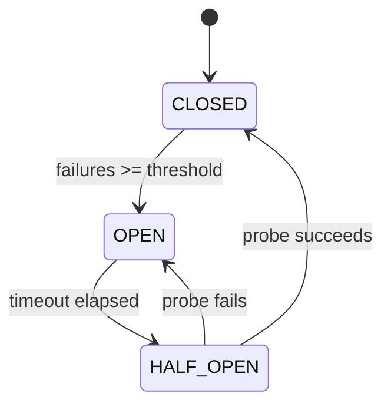

| State | Behavior |
|-------|----------|
| CLOSED | Calls pass through. Count consecutive failures. |
| OPEN | Calls fail immediately (`CircuitOpenError`). Timer running. |
| HALF_OPEN | Allow one probe call. Success → CLOSED. Failure → OPEN. |

| Property | Value |
|----------|-------|
| Call check | O(1) — compare state + failure counter |
| State transitions | O(1) — atomic state change |
| States | 3 — Closed, Open, Half-Open |
| Space | O(1) — counter + timer + state enum |

**Try it yourself** — send successes and failures to see the state machine transitions:

<CircuitBreakerViz />

## Production Proof

| Project | Source | Usage |
|---------|--------|-------|
| Netflix Hystrix | [HystrixCircuitBreaker.java#L138-L289](https://github.com/Netflix/Hystrix/blob/5ce3bc58c38e7ca60ef2fe0e516e390e294ad941/hystrix-core/src/main/java/com/netflix/hystrix/HystrixCircuitBreaker.java#L138-L289) | `HystrixCircuitBreakerImpl` — the canonical circuit breaker. Three-state enum (L142), `markSuccess`/`markNonSuccess` for HALF_OPEN transitions (L204-L224), `attemptExecution` for OPEN→HALF_OPEN via `compareAndSet` after sleep window (L264-L289). Used across Netflix's entire microservice fleet. |
| Sony gobreaker | [gobreaker.go#L117-L131](https://github.com/sony/gobreaker/blob/fed8e9eb35f9cd3e5c2a67842c924346c3e1fbdd/gobreaker.go#L117-L131) | `CircuitBreaker` struct with state, generation counter, counts, and mutex. `onSuccess`/`onFailure` (L310-L332) drive transitions; generation-based staleness detection (L334-L380) prevents acting on stale state reads. Production use at Sony. |
| Resilience4j | [CircuitBreakerStateMachine.java#L1062-L1107](https://github.com/resilience4j/resilience4j/blob/94982b82577d06e7e76ef5fe0e4a7329b8fb2ddd/resilience4j-circuitbreaker/src/main/java/io/github/resilience4j/circuitbreaker/internal/CircuitBreakerStateMachine.java#L1062-L1107) | `HalfOpenState` inner class — `AtomicInteger permittedNumberOfCalls` initialized from `permittedNumberOfCallsInHalfOpenState` (default 10). `tryAcquirePermission()` atomically decrements the counter via `getAndUpdate`, acting as an explicit permit gate during HALF_OPEN. OPEN→HALF_OPEN transition uses `isOpen.compareAndSet(true, false)` under `ReentrantLock` (L803-L808). Default for Spring Boot/Micronaut services. |

## Implementation

::: code-group

```typescript [TypeScript]
type State = 'CLOSED' | 'OPEN' | 'HALF_OPEN';

class CircuitBreaker {
  private state: State = 'CLOSED';
  private failureCount = 0;
  private lastFailureTime = 0;

  constructor(
    private threshold: number,
    private resetTimeout: number,
  ) {}

  getState(): State {
    if (this.state === 'OPEN' && Date.now() - this.lastFailureTime >= this.resetTimeout) {
      this.state = 'HALF_OPEN';
    }
    return this.state;
  }

  async call<T>(fn: () => Promise<T>): Promise<T> {
    if (this.getState() === 'OPEN') throw new Error('Circuit is OPEN');
    try {
      const result = await fn();
      this.failureCount = 0;
      this.state = 'CLOSED';
      return result;
    } catch (err) {
      this.failureCount++;
      this.lastFailureTime = Date.now();
      if (this.failureCount >= this.threshold) this.state = 'OPEN';
      throw err;
    }
  }
}
```

```rust [Rust]
use std::time::Instant;

pub enum State { Closed, Open, HalfOpen }

pub struct CircuitBreaker {
    threshold: u32,
    reset_timeout_ms: u128,
    state: State,
    failure_count: u32,
    last_failure: Option<Instant>,
}

impl CircuitBreaker {
    pub fn new(threshold: u32, reset_timeout_ms: u128) -> Self {
        CircuitBreaker {
            threshold, reset_timeout_ms,
            state: State::Closed, failure_count: 0, last_failure: None,
        }
    }

    pub fn get_state(&mut self) -> &State {
        if let State::Open = self.state {
            if let Some(t) = self.last_failure {
                if t.elapsed().as_millis() >= self.reset_timeout_ms {
                    self.state = State::HalfOpen;
                }
            }
        }
        &self.state
    }

    pub fn call<T, E>(&mut self, f: impl FnOnce() -> Result<T, E>) -> Result<T, String>
    where E: std::fmt::Display {
        if matches!(self.get_state(), State::Open) {
            return Err("Circuit is OPEN".into());
        }
        match f() {
            Ok(v) => { self.failure_count = 0; self.state = State::Closed; Ok(v) }
            Err(e) => {
                self.failure_count += 1;
                self.last_failure = Some(Instant::now());
                if self.failure_count >= self.threshold { self.state = State::Open; }
                Err(e.to_string())
            }
        }
    }
}
```

```go [Go]
type State int

const (
	StateClosed   State = iota
	StateOpen
	StateHalfOpen
)

type CircuitBreaker struct {
	threshold    int
	resetTimeout int64
	state        State
	failureCount int
	lastFailure  int64
}

func NewCircuitBreaker(threshold int, resetTimeoutMs int64) *CircuitBreaker {
	return &CircuitBreaker{threshold: threshold, resetTimeout: resetTimeoutMs}
}

func now() int64 { return time.Now().UnixMilli() }

func (cb *CircuitBreaker) GetState() State {
	if cb.state == StateOpen && now()-cb.lastFailure >= cb.resetTimeout {
		cb.state = StateHalfOpen
	}
	return cb.state
}

func (cb *CircuitBreaker) Call(fn func() error) error {
	if cb.GetState() == StateOpen {
		return fmt.Errorf("circuit is OPEN")
	}
	if err := fn(); err != nil {
		cb.failureCount++
		cb.lastFailure = now()
		if cb.failureCount >= cb.threshold {
			cb.state = StateOpen
		}
		return err
	}
	cb.failureCount = 0
	cb.state = StateClosed
	return nil
}
```

```python [Python]
import time

class CircuitBreaker:
    def __init__(self, threshold: int = 5, reset_timeout: float = 30.0):
        self.threshold = threshold
        self.reset_timeout = reset_timeout
        self.state = "CLOSED"
        self.failure_count = 0
        self.last_failure_time = 0.0

    def get_state(self) -> str:
        if self.state == "OPEN" and time.time() - self.last_failure_time >= self.reset_timeout:
            self.state = "HALF_OPEN"
        return self.state

    def call(self, fn):
        if self.get_state() == "OPEN":
            raise RuntimeError("Circuit is OPEN")
        try:
            result = fn()
            self.failure_count = 0
            self.state = "CLOSED"
            return result
        except Exception:
            self.failure_count += 1
            self.last_failure_time = time.time()
            if self.failure_count >= self.threshold:
                self.state = "OPEN"
            raise
```

:::

## Exercises

| Level | Exercise | File |
|-------|----------|------|
| Basic | Implement a circuit breaker with three states | `exercises/typescript/circuit-breaker/01-basic.test.ts` |
| Intermediate | Circuit breaker with failure rate and rolling window | `exercises/typescript/circuit-breaker/02-intermediate.test.ts` |

Run exercises: `pnpm test:ts` (TypeScript) · `cargo test` (Rust) · `go test ./...` (Go) · `pytest` (Python)

Exercise files: Rust `exercises/rust/src/circuit_breaker/mod.rs` · Go `exercises/go/circuit_breaker/circuit_breaker_test.go` · Python `exercises/python/circuit_breaker/test_circuit_breaker.py`

## When to Use

- **Microservice calls** — prevent cascading failures when a downstream service goes down
- **Database connections** — stop hammering a database that's overloaded
- **External APIs** — handle third-party service outages gracefully
- **Shared resources** — protect any shared resource that can become temporarily unavailable

## When NOT to Use

- **In-process calls** — circuit breakers add overhead; use error handling for local function calls
- **Idempotency not guaranteed** — if retries after half-open can cause duplicates, add deduplication first
- **Single-consumer systems** — if there's only one caller, backoff/retry is simpler than a full state machine
- **Fire-and-forget** — if you don't wait for a response, there's nothing to circuit-break

## More Production Uses

- [resilience4j](https://github.com/resilience4j/resilience4j) — Java circuit breaker for Spring/Micronaut
- [Polly](https://github.com/App-vNext/Polly) — .NET resilience library with circuit breaker policy
- [Envoy Proxy](https://github.com/envoyproxy/envoy) — outlier detection acts as a distributed circuit breaker
- [AWS SDK](https://github.com/aws/aws-sdk-js-v3) — retry with circuit-breaking for service endpoints

## Related Patterns

| Pattern | Relationship |
|---------|-------------|
| [Retry with Exponential Backoff](/patterns/retry-backoff/) | Circuit breaker prevents retries when the service is known to be down |
| [State Machine](/patterns/state-machine/) | Circuit breaker is a state machine: closed -> open -> half-open |
| [Rate Limiter (Token Bucket)](/patterns/rate-limiter/) | Both protect services — rate limiter controls throughput, circuit breaker stops failures |

## Challenge Questions

::: details Q1: Your circuit breaker has a 30-second reset timeout. The downstream service has an average recovery time of 5 seconds. A colleague suggests lowering the timeout to 5 seconds so requests resume faster. What's the tradeoff?
**Answer:** A shorter timeout means you'll probe the service sooner, but if it hasn't recovered, each failed probe resets the timer and generates additional load on an already-struggling service.

The reset timeout is a tradeoff between recovery speed and protection. If you probe too early and fail, you reopen the circuit and wait another full timeout. Meanwhile, the failed probe adds load to the unhealthy service. A good timeout should be longer than the typical recovery time — 2-3x is common — to give the downstream service breathing room. Some implementations use exponential backoff on the timeout itself.
:::

::: details Q2: Service A calls Service B, which calls Service C. Service C goes down. Without circuit breakers, what happens to Service A even though it doesn't directly depend on C?
**Answer:** Service A's threads pile up waiting for Service B, which is itself blocked waiting for Service C — this is a cascading failure.

Each call from A to B occupies a thread (or connection) while B waits for C's timeout. As B's threads exhaust, B starts timing out too, causing A's threads to pile up. Soon A appears down to its own callers. This is exactly why Netflix built Hystrix: a circuit breaker on each service boundary would let B fail fast on C calls and return errors to A immediately, keeping A's threads free. Without it, one downstream failure can topple an entire call chain.
:::

::: details Q3: Your circuit breaker enters HALF_OPEN and allows one probe request. But in a high-traffic system, 200 concurrent requests arrive in the same millisecond. All 200 see the state as HALF_OPEN and send probe requests simultaneously. How would you prevent this thundering herd?
**Answer:** Use an atomic compare-and-swap (CAS) to gate entry — then explicitly block subsequent arrivals during HALF_OPEN.

The CAS handles the instant of transition: exactly one thread wins `compareAndSet(OPEN, HALF_OPEN)` and becomes the probe. But protection doesn't stop there. Requests arriving *after* the transition find the state already HALF_OPEN — and the CAS fails because the expected value (OPEN) no longer matches. Those callers must also be rejected, and the implementation must ensure the CAS loser path returns `false` (fail fast) rather than proceeding regardless.

Netflix Hystrix demonstrates this in `attemptExecution()`: the `compareAndSet(Status.OPEN, Status.HALF_OPEN)` at [HystrixCircuitBreaker.java#L281](https://github.com/Netflix/Hystrix/blob/5ce3bc58c38e7ca60ef2fe0e516e390e294ad941/hystrix-core/src/main/java/com/netflix/hystrix/HystrixCircuitBreaker.java#L281) is inside an `if/else` — only the winner returns `true`, everyone else returns `false`. `allowRequest()` separately blocks during HALF_OPEN by returning `false` when the state is already HALF_OPEN ([L262-L263](https://github.com/Netflix/Hystrix/blob/5ce3bc58c38e7ca60ef2fe0e516e390e294ad941/hystrix-core/src/main/java/com/netflix/hystrix/HystrixCircuitBreaker.java#L262-L263)), and after a probe failure `markNonSuccess` uses CAS again to transition HALF_OPEN → OPEN ([L219-L224](https://github.com/Netflix/Hystrix/blob/5ce3bc58c38e7ca60ef2fe0e516e390e294ad941/hystrix-core/src/main/java/com/netflix/hystrix/HystrixCircuitBreaker.java#L219-L224)), which restarts the sleep window.

Mature libraries add a **second layer** — an explicit permit counter during HALF_OPEN. Sony's gobreaker gates with `counts.Requests >= maxRequests` ([gobreaker.go#L334-L340](https://github.com/sony/gobreaker/blob/fed8e9eb35f9cd3e5c2a67842c924346c3e1fbdd/gobreaker.go#L334-L340)) as an additional guard alongside its mutex and generation counter. Resilience4j's `CircuitBreakerStateMachine` tracks `permittedNumberOfCalls` via `AtomicInteger` in its `HalfOpenState` inner class — `tryAcquirePermission()` atomically decrements the counter and returns `false` when it hits zero ([CircuitBreakerStateMachine.java#L1064-L1107](https://github.com/resilience4j/resilience4j/blob/94982b82577d06e7e76ef5fe0e4a7329b8fb2ddd/resilience4j-circuitbreaker/src/main/java/io/github/resilience4j/circuitbreaker/internal/CircuitBreakerStateMachine.java#L1064-L1107)).

Getting this wrong has real consequences. Resilience4j v1.7.0 had a confirmed bug ([#1432](https://github.com/resilience4j/resilience4j/issues/1432)) where multiple threads bypassed the CAS gate because threads that lost the CAS still returned `true` — `permittedNumberOfCallsInHalfOpenState` was effectively ignored. Polly v5.0.4 had the same class of bug ([#216](https://github.com/App-vNext/Polly/issues/216)): multiple `Execute()` calls slipped through during half-open. Both were fixed by coupling the CAS result to the permission decision and adding explicit concurrency limiting.

The key insight is that HALF_OPEN requires **two** concurrency controls: (1) CAS for the OPEN → HALF_OPEN transition, and (2) an explicit gate (permit counter, mutex, or CAS-semantics check) that rejects all subsequent arrivals until the probe completes.
:::

::: details Q4: Your team uses a circuit breaker for database calls. A developer notices the breaker trips open during a routine database migration that causes 5 seconds of elevated latency but zero actual errors. Should the circuit breaker be tracking latency, not just errors?
**Answer:** Yes, but carefully. Latency-based tripping protects callers from slow responses, but you need distinct thresholds for "slow" vs "failed" to avoid false trips during normal variance.

A request that takes 10 seconds and eventually succeeds still ties up a thread for 10 seconds. In a thread-pool model, slow responses are functionally equivalent to failures because they exhaust capacity. Hystrix tracked both errors and timeouts as failures. The nuance is choosing the latency threshold: set it too low and normal P99 variance trips the breaker; set it too high and it provides no protection.
:::


================================================
FILE: docs/patterns/consistent-hashing/index.md
================================================
---
title: "Pattern: Consistent Hashing"
description: "Distribute keys across nodes on a virtual ring so that adding or removing a node only remaps ~1/n of the keys."
difficulty: "advanced"
---

# Pattern: Consistent Hashing

<DifficultyBadge />

## One Liner

Distribute keys across nodes on a virtual ring so that adding or removing a node only remaps ~1/n of the keys.

<DemoBadge />

## Real-World Analogy

Assigning delivery zones in a circular city map. Each courier covers a section of the circle. When a new courier joins, they take over only a small adjacent section — the other couriers barely notice. When one leaves, only the next courier picks up the slack.

## Core Idea

Traditional modular hashing (`hash(key) % n`) remaps almost every key when `n` changes. Consistent hashing places both nodes and keys on a circular ring. Each key maps to the first node clockwise from its position. Adding or removing a node only affects keys in the arc between it and its predecessor.

```text
  Hash ring (0 to 2^32, wraps around):

  0         Node A    ●k1     Node B          ●k2     Node C    2^32→0
  ├───────────┼─────────┼───────┼───────────────┼───────┼─────────┤
              ▲         │       ▲               │       ▲         │
              │         │       │               │       │         │
              │         └───►───┘               └───►───┘         │
              │              ↑                       ↑            │
              │         k1→Node B              k2→Node C          │
              └───────────────────────────────────────────────────┘
                              k3 wraps around → Node A

  ●k1 = key "user:42"     → next node clockwise = Node B
  ●k2 = key "session:99"  → next node clockwise = Node C
  ●k3 = key "order:7" (between Node C and 2^32) → wraps → Node A
```

| Property | Value |
|----------|-------|
| Key remapping on add/remove | ~1/n (vs 100% with modular hash) |
| Virtual nodes (replicas) | Improve balance — each physical node maps to k positions on the ring |
| Lookup | O(log n) via binary search on sorted ring |

**Try it yourself** — add keys, then add/remove nodes to see minimal key redistribution:

<ConsistentHashViz />

## Production Proof

| Project | Source | Usage |
|---------|--------|-------|
| Go groupcache | [consistenthash.go#L28-L81](https://github.com/golang/groupcache/blob/2c02b8208cf8c02a3e358cb1d9b60950647543fc/consistenthash/consistenthash.go#L28-L81) | `Map` struct (L28-L33) with sorted keys and hashMap. `Add` (L53-L62) inserts virtual nodes. `Get` (L65-L81) uses `sort.Search` binary search to find the closest node clockwise. By Brad Fitzpatrick (creator of memcached). |
| HAProxy | [lb_chash.c#L415-L491](https://github.com/haproxy/haproxy/blob/fb38e40ad5751090992cde15d919866b1e91b8aa/src/lb_chash.c#L415-L491) | `chash_get_server_hash` — finds the nearest server on the consistent hash ring using elastic binary trees (eb-trees) for O(log n) lookups. Supports bounded-loads balancing and server eligibility checks. |

## Implementation

::: code-group

```typescript [TypeScript]
class HashRing {
  private ring = new Map<number, string>();
  private sortedKeys: number[] = [];

  constructor(private replicas = 100) {}

  private hash(key: string): number {
    let h = 2166136261;
    for (let i = 0; i < key.length; i++) {
      h ^= key.charCodeAt(i);
      h = Math.imul(h, 16777619);
    }
    return h >>> 0;
  }

  addNode(node: string): void {
    for (let i = 0; i < this.replicas; i++) {
      const h = this.hash(`${node}:${i}`);
      this.ring.set(h, node);
      this.sortedKeys.push(h);
    }
    this.sortedKeys.sort((a, b) => a - b);
  }

  removeNode(node: string): void {
    for (let i = 0; i < this.replicas; i++) {
      this.ring.delete(this.hash(`${node}:${i}`));
    }
    this.sortedKeys = this.sortedKeys.filter((k) => this.ring.has(k));
  }

  getNode(key: string): string | undefined {
    if (this.sortedKeys.length === 0) return undefined;
    const h = this.hash(key);
    for (const k of this.sortedKeys) {
      if (k >= h) return this.ring.get(k);
    }
    return this.ring.get(this.sortedKeys[0]!);
  }
}
```

```rust [Rust]
pub struct HashRing {
    replicas: usize,
    keys: Vec<u32>,
    ring: std::collections::HashMap<u32, String>,
}

impl HashRing {
    pub fn new(replicas: usize) -> Self {
        HashRing { replicas, keys: Vec::new(), ring: std::collections::HashMap::new() }
    }

    fn hash(key: &str) -> u32 {
        let mut h: u32 = 2166136261;
        for b in key.bytes() {
            h ^= b as u32;
            h = h.wrapping_mul(16777619);
        }
        h
    }

    pub fn add_node(&mut self, node: &str) {
        for i in 0..self.replicas {
            let h = Self::hash(&format!("{}:{}", node, i));
            self.ring.insert(h, node.to_string());
            self.keys.push(h);
        }
        self.keys.sort();
    }

    pub fn get_node(&self, key: &str) -> Option<&str> {
        if self.keys.is_empty() { return None; }
        let h = Self::hash(key);
        let idx = self.keys.partition_point(|&k| k < h);
        let idx = if idx >= self.keys.len() { 0 } else { idx };
        self.ring.get(&self.keys[idx]).map(|s| s.as_str())
    }
}
```

```go [Go]
type HashRing struct {
	replicas int
	keys     []int
	hashMap  map[int]string
}

func fnv1a(s string) int {
	h := 2166136261
	for i := 0; i < len(s); i++ {
		h ^= int(s[i])
		h *= 16777619
	}
	if h < 0 {
		h = -h
	}
	return h
}

func NewHashRing(replicas int) *HashRing {
	return &HashRing{replicas: replicas, hashMap: make(map[int]string)}
}

func (r *HashRing) AddNode(node string) {
	for i := 0; i < r.replicas; i++ {
		h := fnv1a(fmt.Sprintf("%s:%d", node, i))
		r.keys = append(r.keys, h)
		r.hashMap[h] = node
	}
	sort.Ints(r.keys)
}

func (r *HashRing) GetNode(key string) string {
	if len(r.keys) == 0 {
		return ""
	}
	h := fnv1a(key)
	idx := sort.SearchInts(r.keys, h)
	if idx >= len(r.keys) {
		idx = 0
	}
	return r.hashMap[r.keys[idx]]
}
```

```python [Python]
import bisect

class HashRing:
    def __init__(self, replicas: int = 100):
        self.replicas = replicas
        self.ring: dict[int, str] = {}
        self.sorted_keys: list[int] = []

    def _hash(self, key: str) -> int:
        h = 2166136261
        for ch in key:
            h ^= ord(ch)
            h = (h * 16777619) & 0xFFFFFFFF
        return h

    def add_node(self, node: str) -> None:
        for i in range(self.replicas):
            h = self._hash(f"{node}:{i}")
            self.ring[h] = node
            bisect.insort(self.sorted_keys, h)

    def get_node(self, key: str) -> str | None:
        if not self.sorted_keys:
            return None
        h = self._hash(key)
        idx = bisect.bisect_left(self.sorted_keys, h)
        if idx >= len(self.sorted_keys):
            idx = 0
        return self.ring[self.sorted_keys[idx]]
```

:::

## Exercises

| Level | Exercise | File |
|-------|----------|------|
| Basic | Implement a hash ring with addNode/getNode | `exercises/typescript/consistent-hashing/01-basic.test.ts` |
| Intermediate | Consistent hash ring with virtual nodes | `exercises/typescript/consistent-hashing/02-intermediate.test.ts` |

Run exercises: `pnpm test:ts` (TypeScript) · `cargo test` (Rust) · `go test ./...` (Go) · `pytest` (Python)

Exercise files: Rust `exercises/rust/src/consistent_hashing/mod.rs` · Go `exercises/go/consistent_hashing/consistent_hashing_test.go` · Python `exercises/python/consistent_hashing/test_consistent_hashing.py`

## When to Use

- **Distributed caches** — route keys to cache servers, minimize cache invalidation on scale events
- **Load balancing** — distribute requests with minimal disruption when backends change
- **Sharded databases** — assign data partitions to nodes
- **CDNs** — route content to edge servers based on URL hash

## When NOT to Use

- **Static topology** — if nodes never change, modular hashing is simpler
- **Small clusters** — with < 5 nodes, random or round-robin may be good enough
- **Strict ordering** — consistent hashing doesn't preserve key ordering
- **Uniform distribution required** — without virtual nodes, distribution can be uneven

## More Production Uses

- [serialx/hashring](https://github.com/serialx/hashring/blob/22c0c7ab6b1be4be7b950bae8b117767da7b18b6/hashring.go#L31-L37) — Go hash ring with weighted nodes
- [Apache Cassandra](https://github.com/apache/cassandra) — partitioner uses consistent hashing for token ring
- [Amazon DynamoDB](https://www.allthingsdistributed.com/2007/10/amazons_dynamo.html) — original paper on consistent hashing in production
- [Memcached](https://github.com/memcached/memcached) — client-side consistent hashing (ketama algorithm)

## Related Patterns

| Pattern | Relationship |
|---------|-------------|
| [Registry](/patterns/registry/) | Registry discovers services; consistent hashing routes to them |
| [LRU Cache](/patterns/lru-cache/) | Distributed LRU caches use consistent hashing to route keys to the right node |
| [Rate Limiter (Token Bucket)](/patterns/rate-limiter/) | Per-node rate limiting in consistent hashing clusters |

## Challenge Questions

::: details Q1: You have a hash ring with 3 physical nodes, each with 1 virtual node (no replicas). One node owns 60% of the key space while the others own 20% each. How do virtual nodes fix this, and why does groupcache default to a high replica count?
**Answer:** Virtual nodes spread each physical node across multiple positions on the ring, making the distribution converge toward uniform as the number of virtual nodes increases.

With only 1 position per node, the arc lengths between nodes are determined by hash values — essentially random, leading to high variance. With 100-200 virtual nodes per physical node, the law of large numbers kicks in and each physical node owns approximately 1/n of the ring. Groupcache defaults to a high replica count because statistical uniformity requires many samples. The tradeoff is memory: more virtual nodes means a larger sorted key array and ring map.
:::

::: details Q2: Node B crashes and is removed from a 5-node ring. Which node(s) absorb its traffic? Does every remaining node share the load equally?
**Answer:** Only the node immediately clockwise from B on the ring absorbs all of B's keys — the other three nodes are completely unaffected.

This is both the strength and weakness of consistent hashing. When B is removed, keys that mapped to B now "fall through" to the next clockwise node. Without virtual nodes, one node absorbs 100% of the redistributed load, potentially doubling its traffic. With virtual nodes, B's multiple ring positions are distributed, so its keys scatter across multiple successor nodes — closer to an even split. This is a key reason virtual nodes exist: they turn a "one neighbor absorbs all" failure into a "many neighbors share the load" failure.
:::

::: details Q3: Your cache cluster uses consistent hashing. A new product launch causes one specific key ("homepage_banner") to receive 100x the normal request rate. Consistent hashing maps it to Node C, which is now overloaded while other nodes are idle. Does consistent hashing solve hotspot problems?
**Answer:** No. Consistent hashing distributes keys evenly across nodes, but it cannot distribute load evenly when individual keys have vastly different request rates.

Consistent hashing solves the key *assignment* problem, not the key *popularity* problem. A single hot key always maps to one node. Solutions include: read replicas (cache the hot key on multiple nodes), request-level load balancing (route reads for hot keys randomly), or key splitting (split "homepage_banner" into "homepage_banner:1" through "homepage_banner:10" spread across nodes). The bounded-loads extension to consistent hashing addresses this by redirecting overflow traffic to the next node on the ring.
:::

::: details Q4: You need to migrate your cache cluster from 3 nodes to 5 nodes with zero downtime. During migration, both old and new nodes coexist. A key that remaps to a new node returns a cache miss even though the data exists on the old node. How do you handle this?
**Answer:** Use double-read during migration: look up the key on the new ring first, and on miss, fall back to the old ring.

Consistent hashing guarantees minimal remapping (~1/n keys move), but the keys that do move will miss on the new node until they're populated. The migration strategy is: (1) compute the key's owner on both the old and new rings, (2) read from the new node first, (3) on miss, read from the old node and backfill the new node. Once all keys are migrated (or the TTL expires naturally), remove the old ring. This is the approach used by systems like Memcached (ketama algorithm) and Cassandra during resharding — the consistent hash ring defines the target state, but a transition period handles the gap. (Note: Redis Cluster uses a fixed 16,384-slot hash scheme, not consistent hashing.)
:::


================================================
FILE: docs/patterns/cooperative-scheduling/index.md
================================================
---
title: "Pattern: Cooperative Scheduling"
description: "Break long-running work into small chunks, yielding control back to the host between each chunk to keep the system responsive."
difficulty: "advanced"
---

# Pattern: Cooperative Scheduling

<DifficultyBadge />

## One Liner

Break long-running work into small chunks, yielding control back to the host between each chunk to keep the system responsive.

<DemoBadge />

## Real-World Analogy

A meeting facilitator who asks speakers to pause after 5 minutes so others can talk. No one is forcibly cut off — each speaker voluntarily yields. The facilitator keeps the meeting responsive by ensuring no one monopolizes the floor.

## Core Idea

In cooperative scheduling, a task voluntarily checks whether it should pause and let other work run. Unlike preemptive scheduling (where the OS forcibly interrupts), cooperative scheduling relies on the task itself to yield at safe points.

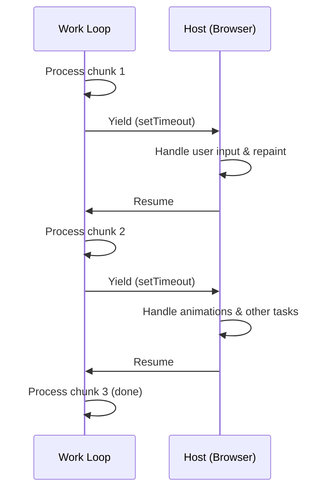

**Without yielding**: one long task blocks everything. **With yielding**: small chunks interleave with UI updates.

The pattern: run a loop, check a deadline after each unit of work, and `yield` if time is up.

| Property | Value |
|----------|-------|
| Scheduling model | Non-preemptive — tasks must yield voluntarily |
| Yield check | O(1) — compare current time to deadline |
| Starvation risk | One task that never yields blocks everything |
| Typical chunk budget | 5–16 ms (one frame at 60 fps) |

**Try it yourself** — start tasks and watch cooperative round-robin scheduling with yielding:

<CooperativeSchedulingViz />

## Production Proof

| Project | Source | Usage |
|---------|--------|-------|
| React | [Scheduler.js#L188-L258](https://github.com/facebook/react/blob/34b78a2897cc208260a88e6b62ecaf9ca2a9dfe4/packages/scheduler/src/forks/Scheduler.js#L188-L258) | The `workLoop` function processes tasks from a min-heap. At each iteration it calls `shouldYieldToHost()` (line ~447) to check if the 5ms time slice has elapsed — if so, it breaks and schedules a continuation via `MessageChannel`. |
| Go Runtime | [proc.go#L4143-L4200](https://github.com/golang/go/blob/f5cdf4745455415c7a43cfc7d925214d4511489b/src/runtime/proc.go#L4143-L4200) | The `schedule()` function is the goroutine scheduler's main loop. `Gosched()` (line 394) is the voluntary yield point, and `goschedImpl` (line 4315) handles the actual context switch. |

## Implementation

::: code-group

```typescript [TypeScript]
type Task = () => boolean; // returns true if more work remains

interface Scheduler {
  scheduleTask(task: Task): void;
  flush(): void;
}

function createScheduler(yieldInterval: number = 5): Scheduler {
  const queue: Task[] = [];
  let isRunning = false;

  function shouldYield(startTime: number): boolean {
    return performance.now() - startTime >= yieldInterval;
  }

  function workLoop(): void {
    const startTime = performance.now();

    while (queue.length > 0) {
      if (shouldYield(startTime)) {
        // Yield to the host — schedule continuation
        setTimeout(workLoop, 0);
        return;
      }

      const task = queue[0]!;
      const hasMoreWork = task();

      if (!hasMoreWork) {
        queue.shift();
      }
    }

    isRunning = false;
  }

  return {
    scheduleTask(task: Task) {
      queue.push(task);
      if (!isRunning) {
        isRunning = true;
        setTimeout(workLoop, 0);
      }
    },
    flush() {
      while (queue.length > 0) {
        const task = queue[0]!;
        if (!task()) queue.shift();
      }
      isRunning = false;
    },
  };
}
```

```rust [Rust]
use std::time::{Duration, Instant};

pub struct CooperativeScheduler {
    yield_interval: Duration,
}

impl CooperativeScheduler {
    pub fn new(yield_ms: u64) -> Self {
        CooperativeScheduler {
            yield_interval: Duration::from_millis(yield_ms),
        }
    }

    pub fn run<F>(&self, mut work_units: Vec<F>) -> Vec<F>
    where
        F: FnMut() -> bool,
    {
        let start = Instant::now();

        while !work_units.is_empty() {
            if start.elapsed() >= self.yield_interval {
                // Yield: return remaining work to caller
                return work_units;
            }

            let done = (work_units[0])();
            if done {
                work_units.remove(0);
            }
        }

        work_units // empty = all done
    }
}
```

```go [Go]
package scheduling

import "time"

type Task func() bool // returns true when done

type Scheduler struct {
	YieldInterval time.Duration
	queue         []Task
}

func New(yieldInterval time.Duration) *Scheduler {
	return &Scheduler{YieldInterval: yieldInterval}
}

func (s *Scheduler) Schedule(task Task) {
	s.queue = append(s.queue, task)
}

// WorkLoop processes tasks, yielding when the time slice expires.
// Returns true if all work is done, false if yielded.
func (s *Scheduler) WorkLoop() bool {
	start := time.Now()

	for len(s.queue) > 0 {
		if time.Since(start) >= s.YieldInterval {
			return false // yield
		}

		done := s.queue[0]()
		if done {
			s.queue = s.queue[1:]
		}
	}

	return true // all done
}
```

```python [Python]
import time

def work_loop(items, process_item, yield_ms=5):
    """Process items, yielding when time budget exceeded."""
    start = time.monotonic()
    completed = 0

    while completed < len(items):
        elapsed_ms = (time.monotonic() - start) * 1000
        if elapsed_ms >= yield_ms:
            return items[completed:]  # return remaining work

        process_item(items[completed])
        completed += 1

    return []  # all done

# Usage
results = []
remaining = work_loop(
    list(range(100)),
    lambda x: results.append(x * 2),
    yield_ms=5
)
# remaining contains items not yet processed (if any)
```

:::

## Exercises

| Level | Exercise | File |
|-------|----------|------|
| Basic | Implement a time-sliced work loop with yield check | `exercises/typescript/cooperative-scheduling/01-basic.test.ts` |
| Intermediate | Build a priority scheduler that yields between tasks | `exercises/typescript/cooperative-scheduling/02-priority-scheduler.test.ts` |

Run exercises: `pnpm test:ts` (TypeScript) · `cargo test` (Rust) · `go test ./...` (Go) · `pytest` (Python)

Exercise files: Rust `exercises/rust/src/cooperative_scheduling/mod.rs` · Go `exercises/go/cooperative_scheduling/cooperative_scheduling_test.go` · Python `exercises/python/cooperative_scheduling/test_cooperative_scheduling.py`

## When to Use

- **UI thread work** — keep animations and input responsive while processing large datasets
- **Batch processing** — process items in chunks with pauses for other system work
- **Long computations** — break recursive tree traversals or list operations into resumable chunks
- **Concurrent runtimes** — implement green threads or coroutine scheduling

## When NOT to Use

- **Short tasks** — if the work finishes in < 1ms, the yield overhead isn't worth it
- **Real-time guarantees** — cooperative scheduling can't guarantee deadlines; use preemptive scheduling
- **CPU-bound with no interaction** — if nothing else needs the thread, yielding wastes time
- **When `requestIdleCallback` suffices** — for non-urgent work, the browser's built-in API may be enough

## More Production Uses

- [Lua](https://github.com/lua/lua) — coroutines
- Python [asyncio](https://github.com/python/cpython/blob/ff64d8de66ab7f8e56b5d410796a7d76c955280c/Lib/asyncio/tasks.py#L1-L50) — `Task` wraps coroutines, `__step` drives them one `send()` at a time
- [Erlang/BEAM VM](https://github.com/erlang/otp/blob/c75602432b4eff922bcaf4a175144dc61adbd6d6/erts/emulator/beam/emu/beam_emu.c#L305-L350) — reduction counting (yields after ~4000 reductions)
- [Unity](https://github.com/Unity-Technologies/UnityCsReference/blob/59b03b8a0f179c0b7e038178c90b6c80b340aa9f/Runtime/Export/Scripting/Coroutines.cs) — coroutines with `yield return`

## Related Patterns

| Pattern | Relationship |
|---------|-------------|
| [Event Loop](/patterns/event-loop/) | Event loops rely on cooperative scheduling — long tasks must yield to keep I/O flowing |
| [Work Stealing](/patterns/work-stealing/) | Cooperative scheduling works within a thread; work stealing distributes across threads |
| [Min Heap](/patterns/min-heap/) | React's scheduler uses a min-heap to select which cooperative task runs next |

## Challenge Questions

::: details Q1: React yields every 5ms. What happens if you increase this to 50ms? What if you decrease it to 0.5ms?
**Answer:** 50ms causes visible UI jank (3 dropped frames at 60fps); 0.5ms wastes most time on yield overhead instead of useful work.

The 5ms target is a sweet spot: short enough that a frame's 16ms budget still has room for browser paint and input handling, but long enough that the scheduler does meaningful work per slice. At 50ms, user input and animations freeze noticeably. At 0.5ms, the overhead of checking the clock, scheduling a `MessageChannel` callback, and re-entering the work loop dominates — you spend more time scheduling than working.
:::

::: details Q2: A cooperatively scheduled task has a bug where it never returns `true` (never signals completion). What happens to the system?
**Answer:** The task monopolizes every time slice forever, starving all other queued tasks.

Unlike preemptive scheduling, the scheduler cannot forcibly remove a misbehaving task. The work loop gives the buggy task CPU time every slice, it runs for 5ms, yields, gets picked up again — endlessly. Other tasks in the queue never execute. This is the fundamental weakness of cooperative scheduling: it trusts tasks to behave. Production schedulers mitigate this with timeouts or starvation detection that can cancel or deprioritize stuck tasks.
:::

::: details Q3: Why does React use `MessageChannel` instead of `setTimeout(fn, 0)` for yielding?
**Answer:** `setTimeout(fn, 0)` has a minimum 4ms delay enforced by browsers after several nested calls, making it too slow for 5ms time slices.

After about 5 nested `setTimeout` calls, browsers clamp the delay to at least 4ms (HTML spec). This means a 5ms time slice followed by a 4ms yield gap wastes nearly half the time. `MessageChannel` posts a macrotask without the 4ms clamping — the browser can interleave paint and input handling between macrotasks, then dispatch the callback typically in under 1ms. This keeps the scheduler responsive without wasting idle time on artificial delays.
:::

::: details Q4: A colleague says "just use Web Workers instead of cooperative scheduling — they run in parallel." Why isn't this a replacement?
**Answer:** Web Workers cannot access the DOM, so they cannot perform UI rendering work like React's reconciliation.

React's cooperative scheduling exists specifically because reconciliation must read and write DOM state, which is only available on the main thread. Workers are great for pure computation (parsing, compression, image processing), but any task that touches the DOM, measures layout, or updates the UI must run on the main thread. Cooperative scheduling is how you share that single thread fairly among rendering, input handling, and application logic.
:::


================================================
FILE: docs/patterns/copy-on-write/index.md
================================================
---
title: "Pattern: Copy-on-Write (CoW)"
description: "Share data by reference until someone modifies it — only then make a private copy, saving memory and allocation cost for read-heavy workloads."
difficulty: "intermediate"
---

# Pattern: Copy-on-Write (CoW)

<DifficultyBadge />

## One Liner

Share data by reference until someone modifies it — only then make a private copy, saving memory and allocation cost for read-heavy workloads.

<DemoBadge />

## Real-World Analogy

A shared Google Doc link set to 'view only.' Everyone reads the same document. The moment someone wants to edit, the system creates their own copy. Until that write happens, only one copy exists.

## Core Idea

Copy-on-Write defers the expense of copying until a mutation actually happens. Multiple readers can share the same data. When a writer needs to modify it, the system creates a copy for that writer, leaving all other references untouched.

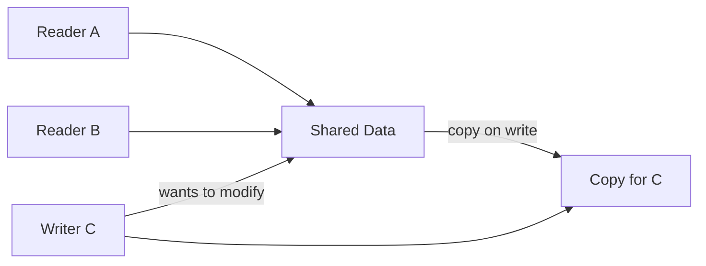

The key insight: **most data is read far more often than it is written**. CoW exploits this asymmetry — free sharing for reads, pay-per-write for mutations.

| Property | Value |
|----------|-------|
| Read (shared) | O(1) — direct reference, no copy |
| Write (first mutation) | O(n) — full copy of data |
| Write (already owned) | O(1) — mutate in place |
| Space (no writes) | O(1) — all readers share one copy |

**Try it yourself** — click "Write" on any reader to trigger a copy-on-write and watch reference counts change:

<CopyOnWriteViz />

## Production Proof

| Project | Source | Usage |
|---------|--------|-------|
| Git | [object-file.c#L719-L730](https://github.com/git/git/blob/1ff279f3404a482a83fb04c7457e41ab26884aea/object-file.c#L719-L730) | Git objects are immutable content-addressed blobs. When you branch, Git doesn't copy files — it shares the same objects. A new commit only creates new objects for changed files, reusing unchanged ones. This is CoW at the data model level. |
| Rust stdlib | [borrow.rs#L169-L220](https://github.com/rust-lang/rust/blob/d56483a91d6cf5041351a3208b8d08f98f0c8b56/library/alloc/src/borrow.rs#L169-L220) | `Cow<'a, B>` (Clone on Write) — an enum that holds either a `Borrowed` reference or an `Owned` value. `to_mut()` (line 283) clones the data only if it's currently borrowed, making it owned for mutation. Used throughout the Rust ecosystem for zero-copy parsing. |

## Implementation

::: code-group

```typescript [TypeScript]
class Cow<T extends object> {
  private data: T;
  private shared: boolean;

  constructor(data: T) {
    this.data = data;
    this.shared = false;
  }

  static from<T extends object>(data: T): Cow<T> {
    const cow = new Cow(data);
    cow.shared = true;
    return cow;
  }

  read(): Readonly<T> {
    return this.data;
  }

  write(): T {
    if (this.shared) {
      this.data = structuredClone(this.data);
      this.shared = false;
    }
    return this.data;
  }

  isOwned(): boolean {
    return !this.shared;
  }
}
```

```rust [Rust]
use std::borrow::Cow;

fn process(input: &str) -> Cow<'_, str> {
    if input.contains("bad") {
        // Only allocate when modification needed
        Cow::Owned(input.replace("bad", "good"))
    } else {
        // Zero-copy: just borrow the original
        Cow::Borrowed(input)
    }
}

// Usage
let clean = process("hello world");     // Borrowed, no allocation
let fixed = process("hello bad world"); // Owned, allocated
```

```go [Go]
type CowSlice[T any] struct {
	data   []T
	shared bool
}

func Share[T any](data []T) *CowSlice[T] {
	return &CowSlice[T]{data: data, shared: true}
}

func (c *CowSlice[T]) Read() []T {
	return c.data
}

func (c *CowSlice[T]) Write() []T {
	if c.shared {
		copied := make([]T, len(c.data))
		copy(copied, c.data)
		c.data = copied
		c.shared = false
	}
	return c.data
}
```

```python [Python]
import copy

class Cow:
    """Copy-on-Write wrapper."""
    def __init__(self, data, shared=False):
        self._data = data
        self._shared = shared

    @classmethod
    def share(cls, data):
        return cls(data, shared=True)

    def read(self):
        return self._data

    def write(self):
        if self._shared:
            self._data = copy.deepcopy(self._data)
            self._shared = False
        return self._data

# Usage
original = {"users": ["alice", "bob"]}
view = Cow.share(original)
print(view.read() is original)  # True — same object, no copy

mutable = view.write()          # NOW it copies
mutable["users"].append("charlie")
print(original["users"])        # ["alice", "bob"] — unchanged
```

:::

## Exercises

| Level | Exercise | File |
|-------|----------|------|
| Basic | Implement a Cow wrapper that defers copying until write | `exercises/typescript/copy-on-write/01-basic.test.ts` |
| Intermediate | Versioned config store with CoW fork | `exercises/typescript/copy-on-write/02-intermediate.test.ts` |

Run exercises: `pnpm test:ts` (TypeScript) · `cargo test` (Rust) · `go test ./...` (Go) · `pytest` (Python)

Exercise files: Rust `exercises/rust/src/copy_on_write/mod.rs` · Go `exercises/go/copy_on_write/copy_on_write_test.go` · Python `exercises/python/copy_on_write/test_copy_on_write.py`

## When to Use

- **Read-heavy data** — config objects, parsed ASTs, cached responses
- **Branching / versioning** — Git's object model, database snapshots
- **Zero-copy parsing** — Rust's `Cow<str>` avoids allocation when input is already valid
- **Undo systems** — share state snapshots, copy only on mutation
- **Immutable-by-default architectures** — React state, Redux reducers

## When NOT to Use

- **Write-heavy workloads** — every write triggers a copy, negating the benefit
- **Small data** — copying a small struct is cheaper than the CoW bookkeeping
- **Concurrent writes** — CoW doesn't solve concurrent mutation; use locks or atomics
- **Deep structures** — shallow CoW can lead to shared mutable sub-objects

## More Production Uses

- [Linux fork()](https://github.com/torvalds/linux/blob/acb7500801e98639f6d8c2d796ed9f64cba83d3a/kernel/fork.c#L580-L620) — page table CoW via `copy_page_range`
- [Swift](https://github.com/swiftlang/swift) — value types
- [Redis](https://github.com/redis/redis) — `BGSAVE`
- [ZFS](https://github.com/openzfs/zfs) / Btrfs — filesystem snapshots

## Related Patterns

| Pattern | Relationship |
|---------|-------------|
| [Double Buffering](/patterns/double-buffering/) | Both defer costs — CoW copies on write, double buffering prepares a second copy |
| [Flyweight](/patterns/flyweight/) | Flyweight shares immutable data; CoW shares mutable data until modification |
| [Merkle Tree](/patterns/merkle-tree/) | Merkle trees enable efficient CoW — only rehash the path from changed node to root |
| [Reference Counting](/patterns/reference-counting/) | Reference counting tracks CoW sharing — copy when ref count > 1 and writing |
| [Checkpointing](/patterns/checkpointing/) | Checkpointing captures CoW snapshots — CoW makes snapshot creation O(1) |
| [Diff & Patch](/patterns/diff-patch/) | Diff-patch computes changes between CoW snapshots for incremental updates |
| [MVCC](/patterns/mvcc/) | MVCC uses CoW to create version snapshots for concurrent readers |

## Challenge Questions

::: details Q1: Your CoW wrapper does a shallow copy on write. A reader and writer share a nested object `{ users: [{ name: "alice" }] }`. The writer calls `write()` and mutates `users[0].name`. Does the reader see the mutation?
**Answer:** Yes — a shallow copy only duplicates the top-level object, so the nested `users` array and its elements are still shared references.

This is the "shallow CoW trap." After `write()`, the writer has a new top-level object, but `writer.users === reader.users` still holds. Mutating `users[0].name` affects both. To get true isolation, you need either a deep copy (expensive), structural sharing (copy the spine of the path to the mutation, like immutable.js), or a rule that CoW objects only contain primitives. React and Redux solve this by requiring immutable update patterns: `{ ...state, users: [...state.users] }`.
:::

::: details Q2: Linux `fork()` uses CoW for process memory pages. A child process immediately calls `exec()` to replace its memory. Why is CoW essential here?
**Answer:** Without CoW, `fork()` would copy the entire parent address space only to discard it immediately when `exec()` loads a new program — a massive waste.

The `fork()` + `exec()` pattern is one of the most common operations in Unix. The parent may have gigabytes of memory. CoW means `fork()` is nearly instant: it just duplicates the page table entries and marks all pages read-only. When `exec()` runs, it replaces all mappings anyway, so no pages ever needed copying. Without CoW, spawning a process from a large application (like a web server forking a worker) would be prohibitively slow and memory-intensive.
:::

::: details Q3: A system uses CoW for configuration objects. 100 readers share the config; a writer updates it every second. Under what workload pattern does CoW waste memory compared to a simple mutex-protected shared object?
**Answer:** When every read is followed by a write (100% write ratio), CoW creates a full copy on every access, using more memory than a single shared object protected by a lock.

CoW's advantage is proportional to the read/write ratio. At 99% reads, 100 readers share one copy and only the rare writer pays for a clone — excellent. At 50% reads, half the accesses trigger copies — the benefit is marginal. At 100% writes, every access copies — you've turned a single shared object into N independent copies with no sharing benefit, plus the overhead of tracking shared state. The break-even point depends on object size, but the principle holds: CoW is for read-heavy workloads.
:::

::: details Q4: Rust's `Cow<'a, str>` is an enum with `Borrowed(&'a str)` and `Owned(String)`. Why is this more useful than just always cloning the string?
**Answer:** It lets functions accept and return string data without allocating when the input is already in the right form, achieving zero-copy in the common case.

Consider a URL decoder: most URLs have no percent-encoded characters and can be returned as-is (`Borrowed`). Only URLs with `%20` etc. need a new `String` (`Owned`). With `Cow`, the function signature is `fn decode(input: &str) -> Cow<str>` — callers get the original reference back 90% of the time with zero allocation. Without `Cow`, you'd either always clone (wasteful) or return an enum manually (which is exactly what `Cow` already is, with standard library integration).
:::


================================================
FILE: docs/patterns/dependency-graph/index.md
================================================
---
title: "Pattern: Dependency Graph"
description: "Model dependencies as a directed acyclic graph and topologically sort to determine a valid execution order — detecting cycles before they deadlock."
difficulty: "intermediate"
---

# Pattern: Dependency Graph

<DifficultyBadge />

## One Liner

Model dependencies as a directed acyclic graph and topologically sort to determine a valid execution order — detecting cycles before they deadlock.

<DemoBadge />

## Real-World Analogy

A course prerequisite chart in a university catalog. You can't take Advanced Physics without Intro to Physics first. You follow the chart from prerequisites to advanced courses, ensuring you never skip a required step.

## Core Idea

A dependency graph represents items as nodes and ordering constraints as directed edges. `addEdge(A, B)` means "A must come before B" — A is a prerequisite of B. Topological sort (Kahn's algorithm) repeatedly removes zero-in-degree nodes, producing an ordering where every prerequisite appears before its dependents.

```text
  addEdge(wash, dry)     wash ──► dry ──► fold
  addEdge(dry, fold)          0        1       2
  addEdge(wash, fold)         │                ▲
                              └────────────────┘

  In-degree:  wash=0   dry=1   fold=2
  Output:     wash  →  dry  →  fold
  (zero in-degree first, then dependents)

  Cycle:  a → b → c → a  ← ERROR: no valid order
```

| Property | Value |
|----------|-------|
| Add node/edge | O(1) |
| Topological sort | O(V + E) — visit each node and edge once |
| Cycle detection | Built into topological sort (remaining nodes = cycle) |
| Space | O(V + E) — adjacency list |

**Try it yourself** — add nodes and edges, then run topological sort to watch Kahn's algorithm step through:

<DependencyGraphViz />

## Production Proof

| Project | Source | Usage |
|---------|--------|-------|
| Cargo (Rust) | [dep_cache.rs#L143-L175](https://github.com/rust-lang/cargo/blob/b50aa179d3d1099b53548bc8693dd17ddd019ab4/src/cargo/core/resolver/dep_cache.rs#L143-L175) | `RegistryQueryer` manages the dependency resolution graph for Rust packages. Dependencies form a DAG resolved via backtracking, with `build_deps` (L207) producing the set of dependencies activated by each candidate. |
| pnpm | [graph-sequencer#L22-L125](https://github.com/pnpm/pnpm/blob/46fd26afc9926b4391636a851ae32493f9b2c9ff/deps/graph-sequencer/src/index.ts#L22-L125) | `graphSequencer` — topologically sorts workspace packages by their inter-dependencies with cycle detection. Used by `pnpm -r` recursive commands to respect dependency ordering across a monorepo. |

## Implementation

::: code-group

```typescript [TypeScript]
class DependencyGraph<T> {
  private adjacency = new Map<T, Set<T>>();

  addNode(node: T): void {
    if (!this.adjacency.has(node)) this.adjacency.set(node, new Set());
  }

  addEdge(from: T, to: T): void {
    this.addNode(from);
    this.addNode(to);
    this.adjacency.get(from)!.add(to);
  }

  topologicalSort(): T[] {
    const inDegree = new Map<T, number>();
    for (const node of this.adjacency.keys()) inDegree.set(node, 0);
    for (const [, deps] of this.adjacency) {
      for (const dep of deps) {
        inDegree.set(dep, (inDegree.get(dep) ?? 0) + 1);
      }
    }

    const queue: T[] = [];
    for (const [node, degree] of inDegree) {
      if (degree === 0) queue.push(node);
    }

    const result: T[] = [];
    while (queue.length > 0) {
      const node = queue.shift()!;
      result.push(node);
      for (const dep of this.adjacency.get(node) ?? []) {
        const newDegree = inDegree.get(dep)! - 1;
        inDegree.set(dep, newDegree);
        if (newDegree === 0) queue.push(dep);
      }
    }

    if (result.length !== this.adjacency.size) {
      throw new Error('Cycle detected');
    }
    return result;
  }
}
```

```rust [Rust]
use std::collections::HashMap;

pub struct DependencyGraph {
    adj: HashMap<String, Vec<String>>,
}

impl DependencyGraph {
    pub fn new() -> Self {
        DependencyGraph { adj: HashMap::new() }
    }

    pub fn add_node(&mut self, node: &str) {
        self.adj.entry(node.to_string()).or_default();
    }

    pub fn add_edge(&mut self, from: &str, to: &str) {
        self.add_node(from);
        self.add_node(to);
        self.adj.get_mut(from).unwrap().push(to.to_string());
    }

    pub fn topological_sort(&self) -> Result<Vec<String>, &'static str> {
        let mut in_degree: HashMap<&str, usize> = HashMap::new();
        for node in self.adj.keys() {
            in_degree.entry(node.as_str()).or_insert(0);
        }
        for deps in self.adj.values() {
            for dep in deps {
                *in_degree.entry(dep.as_str()).or_insert(0) += 1;
            }
        }

        let mut queue: Vec<&str> = in_degree.iter()
            .filter(|(_, &d)| d == 0)
            .map(|(&n, _)| n)
            .collect();
        queue.sort();

        let mut result = Vec::new();
        while let Some(node) = queue.first().copied() {
            queue.remove(0);
            result.push(node.to_string());
            if let Some(deps) = self.adj.get(node) {
                for dep in deps {
                    let d = in_degree.get_mut(dep.as_str()).unwrap();
                    *d -= 1;
                    if *d == 0 {
                        queue.push(dep.as_str());
                        queue.sort();
                    }
                }
            }
        }

        if result.len() != self.adj.len() {
            return Err("Cycle detected");
        }
        Ok(result)
    }
}
```

```go [Go]
type DependencyGraph struct {
	adj map[string][]string
}

func NewDependencyGraph() *DependencyGraph {
	return &DependencyGraph{adj: make(map[string][]string)}
}

func (g *DependencyGraph) AddNode(node string) {
	if _, ok := g.adj[node]; !ok {
		g.adj[node] = nil
	}
}

func (g *DependencyGraph) AddEdge(from, to string) {
	g.AddNode(from)
	g.AddNode(to)
	g.adj[from] = append(g.adj[from], to)
}

func (g *DependencyGraph) TopologicalSort() ([]string, error) {
	inDegree := make(map[string]int)
	for node := range g.adj {
		inDegree[node] = 0
	}
	for _, deps := range g.adj {
		for _, dep := range deps {
			inDegree[dep]++
		}
	}

	var queue []string
	for node, deg := range inDegree {
		if deg == 0 {
			queue = append(queue, node)
		}
	}
	sort.Strings(queue)

	var result []string
	for len(queue) > 0 {
		node := queue[0]
		queue = queue[1:]
		result = append(result, node)
		for _, dep := range g.adj[node] {
			inDegree[dep]--
			if inDegree[dep] == 0 {
				queue = append(queue, dep)
			}
		}
	}

	if len(result) != len(g.adj) {
		return nil, fmt.Errorf("cycle detected")
	}
	return result, nil
}
```

```python [Python]
from collections import deque

class DependencyGraph:
    def __init__(self):
        self.adj: dict[str, list[str]] = {}

    def add_node(self, node: str) -> None:
        if node not in self.adj:
            self.adj[node] = []

    def add_edge(self, from_node: str, to_node: str) -> None:
        self.add_node(from_node)
        self.add_node(to_node)
        self.adj[from_node].append(to_node)

    def topological_sort(self) -> list[str]:
        in_degree: dict[str, int] = {n: 0 for n in self.adj}
        for deps in self.adj.values():
            for dep in deps:
                in_degree[dep] = in_degree.get(dep, 0) + 1

        queue = deque(n for n, d in in_degree.items() if d == 0)
        result: list[str] = []

        while queue:
            node = queue.popleft()
            result.append(node)
            for dep in self.adj.get(node, []):
                in_degree[dep] -= 1
                if in_degree[dep] == 0:
                    queue.append(dep)

        if len(result) != len(self.adj):
            raise ValueError("Cycle detected")
        return result
```

:::

## Exercises

| Level | Exercise | File |
|-------|----------|------|
| Basic | Implement topological sort with cycle detection | `exercises/typescript/dependency-graph/01-basic.test.ts` |
| Intermediate | Parallel execution planner — compute execution waves | `exercises/typescript/dependency-graph/02-intermediate.test.ts` |

Run exercises: `pnpm test:ts` (TypeScript) · `cargo test` (Rust) · `go test ./...` (Go) · `pytest` (Python)

Exercise files: Rust `exercises/rust/src/dependency_graph/mod.rs` · Go `exercises/go/dependency_graph/dependency_graph_test.go` · Python `exercises/python/dependency_graph/test_dependency_graph.py`

## When to Use

- **Build systems** — compile dependencies before dependents (Make, Bazel, Cargo)
- **Package managers** — install/build order for workspace packages (pnpm, npm, yarn)
- **Task scheduling** — job orchestration with prerequisites (Airflow, CI/CD pipelines)
- **Module bundlers** — determine chunk splitting and loading order (webpack, Rollup)
- **Database migrations** — apply schema changes in dependency order

## When NOT to Use

- **Circular dependencies exist by design** — use a different model (e.g., event-driven, lazy evaluation)
- **No ordering needed** — if tasks are independent, a simple list suffices
- **Dynamic dependencies** — if edges change at runtime, incremental approaches are better
- **Very large graphs** — consider parallel algorithms (Kahn's is inherently sequential without modifications)

## More Production Uses

- [Make (GNU)](https://github.com/mirror/make) — prerequisite DAG determines target rebuild order
- [Bazel](https://github.com/bazelbuild/bazel) — action graph with topological execution phases
- [webpack](https://github.com/webpack/webpack) — `ModuleGraph` for chunk splitting and tree shaking
- [Terraform](https://github.com/hashicorp/terraform) — resource dependency graph for parallel apply

## Related Patterns

| Pattern | Relationship |
|---------|-------------|
| [Visitor](/patterns/visitor/) | Tree traversal over dependency graphs dispatches to type-specific handlers |
| [Iterator](/patterns/iterator/) | Topological iteration produces a lazy sequence of nodes in dependency order |
| [Dirty Flag](/patterns/dirty-flag/) | Dirty propagation follows dependency edges to mark downstream nodes for recomputation |
| [Registry](/patterns/registry/) | Registries track component metadata; dependency graphs track their relationships |

## Challenge Questions

::: details Q1: Given a dependency graph where A->C, B->C, and A and B have no dependencies, how many tasks can run in parallel? How does topological sort reveal this?
**Answer:** A and B can run in parallel (both have in-degree 0). C must wait for both. Maximum parallelism is 2.

Topological sort using Kahn's algorithm naturally exposes parallelism: all nodes with in-degree 0 at any given step can execute simultaneously. In this example, the first "wave" is {A, B} (both in-degree 0), and the second wave is {C} (in-degree drops to 0 after both A and B complete). Build systems like Bazel and Make exploit this by processing each wave in parallel.
:::

::: details Q2: Package D depends on both B and C. B depends on A. C also depends on A. This is a "diamond dependency." Does topological sort handle it correctly?
**Answer:** Yes. Topological sort handles diamonds correctly because it tracks in-degree, not paths. A runs first, then B and C (in parallel), then D.

A diamond is not a cycle — it's just two paths converging on the same node. Kahn's algorithm processes A (in-degree 0), decrements B and C's in-degrees to 0, processes both, then decrements D's in-degree to 0 and processes it. The potential problem is not in ordering but in version conflicts: if B needs A v1 and C needs A v2, you have a compatibility issue that the graph structure alone doesn't solve.
:::

::: details Q3: You change file `utils.ts` in a large project. An incremental build system only recompiles files that depend on `utils.ts`. How does the dependency graph enable this?
**Answer:** The build system walks the dependency graph forward from `utils.ts`, collecting all transitive dependents. Only those files (plus `utils.ts` itself) need recompilation.

This is the key advantage of maintaining a dependency graph over a flat file list. Without the graph, you'd have to recompile everything or maintain manual lists of dependencies. With the graph, you compute the affected subgraph in O(V+E) time. Tools like webpack's `ModuleGraph` and Bazel's action graph do exactly this — they track which outputs depend on which inputs and invalidate only the affected subtree.
:::

::: details Q4: A developer adds a dependency from module A to module B, but B already transitively depends on A (B -> C -> A). What should the build system do?
**Answer:** Reject the change. Adding A -> B creates a cycle (A -> B -> C -> A), which means there is no valid build order.

Kahn's algorithm detects this: after processing all zero-in-degree nodes, some nodes remain with non-zero in-degree — those nodes form the cycle. The build system should report the exact cycle path so the developer can redesign the dependency (e.g., extract shared code into a new module, use dependency inversion, or use lazy/dynamic imports to break the compile-time cycle).
:::


================================================
FILE: docs/patterns/diff-patch/index.md
================================================
---
title: "Pattern: Diff / Patch"
description: "Compare two sequences to compute the minimal set of operations (insert, delete, move) needed to transform one into the other."
difficulty: "intermediate"
---

# Pattern: Diff / Patch

<DifficultyBadge />

## One Liner

Compare two sequences to compute the minimal set of operations (insert, delete, move) needed to transform one into the other.

<DemoBadge />

## Real-World Analogy

A track-changes document in Word. Instead of sending the whole document, you send just the red-lined changes: 'delete paragraph 3, insert this sentence after paragraph 5.' The recipient applies the patch to their copy.

## Core Idea

Given an old list and a new list, the diff algorithm determines which items were added, removed, or moved. The result is a "patch" — a minimal set of mutations to apply.

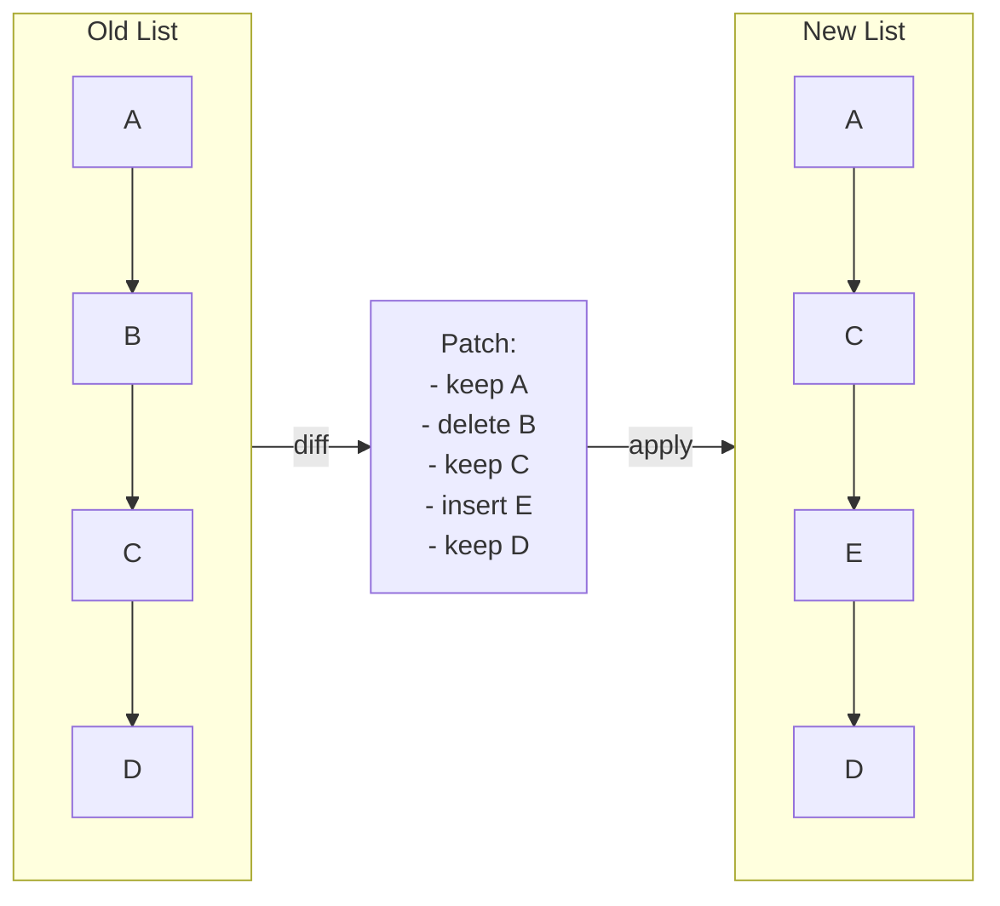

React's reconciler uses this to determine which DOM nodes to create, update, or remove. Git uses it to show what changed between commits.

| Property | Value |
|----------|-------|
| Diff (Myers') | O(n·d) where d = edit distance; O(n) when similar |
| Diff (list with keys) | O(n) — key-based matching avoids quadratic search |
| Patch apply | O(patch size) — each operation is O(1) |
| Space | O(n) — for the edit script / patch |

**Try it yourself** — edit old and new text, then compute and apply the diff:

<DiffPatchViz />

## Production Proof

| Project | Source | Usage |
|---------|--------|-------|
| React | [ReactChildFiber.js#L1169-L1340](https://github.com/facebook/react/blob/34b78a2897cc208260a88e6b62ecaf9ca2a9dfe4/packages/react-reconciler/src/ReactChildFiber.js#L1169-L1340) | `reconcileChildrenArray` diffs old and new children. Line ~1294 calls `mapRemainingChildren` to build a key→fiber map, then iterates new children via `updateFromMap` to detect moves, insertions, and deletions. |
| Git | [diff.c#L5020-L5060](https://github.com/git/git/blob/1ff279f3404a482a83fb04c7457e41ab26884aea/diff.c#L5020-L5060) | `run_diff` dispatches file-pair comparisons. `builtin_diff` (line 3839) handles the actual diffing, producing the familiar `+`/`-` patch output. Git uses an optimized Myers' algorithm internally (in `xdiff/`). |

## Implementation

::: info Note on algorithm
The implementation below uses a **greedy forward scan** — simple and clear for learning. Production systems like Git use [Myers' diff algorithm](https://blog.jcoglan.com/2017/02/12/the-myers-diff-algorithm-part-1/) which guarantees a minimum edit sequence. React uses a key-based approach optimized for UI list reconciliation, not general-purpose diffing.
:::

::: code-group

```typescript [TypeScript]
type Op<T> =
  | { type: 'keep'; value: T }
  | { type: 'insert'; value: T }
  | { type: 'delete'; value: T };

function diff<T>(oldList: T[], newList: T[], eq: (a: T, b: T) => boolean = (a, b) => a === b): Op<T>[] {
  const ops: Op<T>[] = [];
  let oldIdx = 0;
  let newIdx = 0;

  // Build a map of old items by value for O(1) lookup
  const oldMap = new Map<string, number>();
  oldList.forEach((item, i) => oldMap.set(String(item), i));

  while (oldIdx < oldList.length && newIdx < newList.length) {
    if (eq(oldList[oldIdx]!, newList[newIdx]!)) {
      ops.push({ type: 'keep', value: oldList[oldIdx]! });
      oldIdx++;
      newIdx++;
    } else if (!newList.some((n, ni) => ni >= newIdx && eq(n, oldList[oldIdx]!))) {
      ops.push({ type: 'delete', value: oldList[oldIdx]! });
      oldIdx++;
    } else {
      ops.push({ type: 'insert', value: newList[newIdx]! });
      newIdx++;
    }
  }

  while (oldIdx < oldList.length) {
    ops.push({ type: 'delete', value: oldList[oldIdx]! });
    oldIdx++;
  }

  while (newIdx < newList.length) {
    ops.push({ type: 'insert', value: newList[newIdx]! });
    newIdx++;
  }

  return ops;
}

function patch<T>(oldList: T[], ops: Op<T>[]): T[] {
  const result: T[] = [];
  for (const op of ops) {
    if (op.type === 'keep' || op.type === 'insert') result.push(op.value);
  }
  return result;
}
```

```rust [Rust]
#[derive(Debug, PartialEq)]
pub enum Op<T> {
    Keep(T),
    Insert(T),
    Delete(T),
}

pub fn diff<T: PartialEq + Clone>(old: &[T], new: &[T]) -> Vec<Op<T>> {
    let mut ops = Vec::new();
    let (mut oi, mut ni) = (0, 0);

    while oi < old.len() && ni < new.len() {
        if old[oi] == new[ni] {
            ops.push(Op::Keep(old[oi].clone()));
            oi += 1;
            ni += 1;
        } else if !new[ni..].contains(&old[oi]) {
            ops.push(Op::Delete(old[oi].clone()));
            oi += 1;
        } else {
            ops.push(Op::Insert(new[ni].clone()));
            ni += 1;
        }
    }

    while oi < old.len() { ops.push(Op::Delete(old[oi].clone())); oi += 1; }
    while ni < new.len() { ops.push(Op::Insert(new[ni].clone())); ni += 1; }

    ops
}

pub fn patch<T: Clone>(ops: &[Op<T>]) -> Vec<T> {
    ops.iter().filter_map(|op| match op {
        Op::Keep(v) | Op::Insert(v) => Some(v.clone()),
        Op::Delete(_) => None,
    }).collect()
}
```

```go [Go]
type OpType int

const (
	Keep OpType = iota
	Insert
	Delete
)

type Op struct {
	Type  OpType
	Value string
}

func contains(slice []string, val string) bool {
	for _, s := range slice {
		if s == val {
			return true
		}
	}
	return false
}

func Diff(old, new []string) []Op {
	var ops []Op
	oi, ni := 0, 0

	for oi < len(old) && ni < len(new) {
		if old[oi] == new[ni] {
			ops = append(ops, Op{Keep, old[oi]})
			oi++
			ni++
		} else if !contains(new[ni:], old[oi]) {
			ops = append(ops, Op{Delete, old[oi]})
			oi++
		} else {
			ops = append(ops, Op{Insert, new[ni]})
			ni++
		}
	}

	for oi < len(old) {
		ops = append(ops, Op{Delete, old[oi]})
		oi++
	}
	for ni < len(new) {
		ops = append(ops, Op{Insert, new[ni]})
		ni++
	}
	return ops
}

func Patch(ops []Op) []string {
	var result []string
	for _, op := range ops {
		if op.Type != Delete {
			result = append(result, op.Value)
		}
	}
	return result
}
```

```python [Python]
from typing import TypeVar, List, Tuple, Literal

T = TypeVar("T")
Op = Tuple[Literal["keep", "insert", "delete"], T]

def diff(old: List[T], new: List[T]) -> List[Op]:
    ops: List[Op] = []
    oi, ni = 0, 0

    while oi < len(old) and ni < len(new):
        if old[oi] == new[ni]:
            ops.append(("keep", old[oi]))
            oi += 1; ni += 1
        elif old[oi] not in new[ni:]:
            ops.append(("delete", old[oi]))
            oi += 1
        else:
            ops.append(("insert", new[ni]))
            ni += 1

    while oi < len(old): ops.append(("delete", old[oi])); oi += 1
    while ni < len(new): ops.append(("insert", new[ni])); ni += 1
    return ops

def patch(ops: List[Op]) -> List[T]:
    return [val for op_type, val in ops if op_type != "delete"]

# Usage
ops = diff(["a", "b", "c", "d"], ["a", "c", "e", "d"])
assert patch(ops) == ["a", "c", "e", "d"]
```

:::

## Exercises

| Level | Exercise | File |
|-------|----------|------|
| Basic | Implement a simple list diff that produces keep/insert/delete ops | `exercises/typescript/diff-patch/01-basic.test.ts` |
| Intermediate | Apply a patch to reconstruct the new list from the old | `exercises/typescript/diff-patch/02-patch-apply.test.ts` |

Run exercises: `pnpm test:ts` (TypeScript) · `cargo test` (Rust) · `go test ./...` (Go) · `pytest` (Python)

Exercise files: Rust `exercises/rust/src/diff_patch/mod.rs` · Go `exercises/go/diff_patch/diff_patch_test.go` · Python `exercises/python/diff_patch/test_diff_patch.py`

## When to Use

- **UI reconciliation** — minimize DOM mutations by diffing virtual trees
- **Version control** — compute file changes between commits
- **Collaborative editing** — merge concurrent edits via operational transform or CRDT diffs
- **State synchronization** — send only deltas instead of full state over the network
- **Undo/redo** — store diffs as compact undo entries instead of full snapshots

## When NOT to Use

- **Completely different lists** — if > 80% of items changed, just replace the whole list
- **Unordered sets** — diff assumes order matters; for sets, use set intersection/difference
- **Real-time streaming** — if items arrive one at a time, an incremental approach is better than batch diffing
- **Large lists without keys** — without stable identifiers, diff degrades to O(n²)

## More Production Uses

- [VS Code](https://github.com/microsoft/vscode) — text buffer diff
- [jsdiff](https://github.com/kpdecker/jsdiff)
- [Vue 3](https://github.com/vuejs/core) — template diff
- [Git](https://github.com/git/git/blob/1ff279f3404a482a83fb04c7457e41ab26884aea/diff.c) — core diff engine for commits, merges, and patches

## Related Patterns

| Pattern | Relationship |
|---------|-------------|
| [Copy-on-Write (CoW)](/patterns/copy-on-write/) | Diff/patch computes what changed; CoW defers the actual copying until needed |
| [Merkle Tree](/patterns/merkle-tree/) | Merkle trees identify which subtrees changed, narrowing where to diff |
| [Double Buffering](/patterns/double-buffering/) | React diffs the current tree against the work-in-progress double buffer |

## Challenge Questions

::: details Q1: React's diff produces insert/delete/update ops but not "move." How does it handle a list that was merely reordered?
**Answer:** React does not emit explicit "move" operations. Instead, it reuses existing DOM nodes and repositions them via `insertBefore`.

Without keys, React compares children by position — reordering looks like every element changed. With keys, React builds a map of `key -> fiber`, matches old and new children by key, and reuses existing DOM nodes. It tracks a `lastPlacedIndex` and flags fibers that need repositioning — the browser moves the DOM node rather than destroying and recreating it. This is simpler than computing a minimum-edit-distance move sequence but produces near-optimal DOM mutations for typical UI lists.
:::

::: details Q2: The greedy diff algorithm in this pattern is O(n*m) worst case. What causes this, and how does Myers' algorithm improve it?
**Answer:** The greedy algorithm's `some()` call scans the remaining new list for each old item, creating O(n*m) comparisons. Myers' algorithm runs in O((n+m) * d) where d is the edit distance.

Myers' key insight is that it searches for the shortest edit script by exploring diagonals in an edit graph. When the two lists are similar (small d), it runs in nearly O(n+m). The greedy approach has no such optimization — it doesn't minimize the edit sequence and degrades badly when the lists have many differences scattered throughout.
:::

::: details Q3: Two developers independently edit the same file. Developer A deletes line 5; Developer B modifies line 5. How does a diff-based merge handle this conflict?
**Answer:** This is a true conflict that cannot be auto-resolved — the merge tool must flag it for human review.

Three-way merge computes two diffs: (base -> A) and (base -> B). If both diffs touch the same region, they conflict. A's diff says "delete line 5," B's diff says "replace line 5." These are mutually exclusive operations on the same hunk. The merge tool inserts conflict markers (`<<<<<<<`, `=======`, `>>>>>>>`) and the developer decides. Non-overlapping changes in different regions merge cleanly.
:::

::: details Q4: You need to sync state between a server and 10,000 connected clients. Should you diff the full state and send patches, or use a different approach?
**Answer:** Diffing the full state per client does not scale. Use event sourcing or operational transforms to send individual mutations as they happen.

Computing a diff requires holding both old and new state, and the diff cost is proportional to state size. With 10,000 clients, you'd compute 10,000 diffs per update. Instead, capture each mutation as a small operation (e.g., "set user.name = X") and broadcast it. Clients apply operations incrementally. Diff-patch is better suited for periodic reconciliation (like React's render cycle) or offline sync, not real-time high-fan-out distribution.
:::


================================================
FILE: docs/patterns/dirty-flag/index.md
================================================
---
title: "Pattern: Dirty Flag"
description: 'Mark objects as "dirty" on mutation, defer expensive recomputation until the value is actually needed, then clear the flag.'
difficulty: "beginner"
---

# Pattern: Dirty Flag

<DifficultyBadge />

## One Liner

Mark objects as "dirty" on mutation, defer expensive recomputation until the value is actually needed, then clear the flag.

<DemoBadge />

## Real-World Analogy

A "needs cleaning" sign on a hotel room door. Housekeeping only enters rooms marked dirty. If a guest hasn't been in the room, the sign stays clean, and housekeeping skips it — no wasted effort.

## Core Idea

The dirty flag pattern avoids redundant computation by tracking whether derived state is out of date. When a source value changes, instead of immediately recomputing all dependent values, we simply set a "dirty" flag. The expensive recomputation only happens when the derived value is actually requested. After recomputation, the flag is cleared. This trades a boolean check on every read for potentially expensive computations that may never be needed.

```text
  Mutation cycle:

  ┌─────────┐   set()     ┌─────────────┐
  │  Clean  │ ──────────► │    Dirty    │
  │ (valid  │             │ (stale      │
  │  cache) │             │  cache)     │
  └─────────┘             └──────┬──────┘
       ▲                         │
       │         get()           │
       │    (recompute + clear)  │
       └─────────────────────────┘

  Timeline:
  set(x)  set(y)  set(z)  get()     set(w)  get()
    │       │       │       │          │       │
    ▼       ▼       ▼       ▼          ▼       ▼
   dirty  dirty   dirty  recompute  dirty  recompute
                          (1 time)          (1 time)
                           ▲                  ▲
            3 mutations,   │   1 mutation,    │
            1 computation ─┘   1 computation ─┘
```

| Property | Value |
|----------|-------|
| Mutation cost | O(1) — just set a boolean flag |
| Read cost (clean) | O(1) — return cached value |
| Read cost (dirty) | O(recompute) — compute + cache + clear flag |
| Space | O(1) per tracked value — one boolean flag |

**Try it yourself** — move entities to mark them dirty, then recompute to see optimization savings:

<DirtyFlagViz />

## Production Proof

| Project | Source | Usage |
|---------|--------|-------|
| Chromium/Blink | [layout_object.h#L1425-L1430](https://github.com/chromium/chromium/blob/5cffea3f665b7762369a0fa84d2f208875e7225e/third_party/blink/renderer/core/layout/layout_object.h#L1425-L1430) | `NeedsLayout()` returns whether the layout object's geometry is dirty. When CSS properties change, `SetNeedsLayout()` marks the node and ancestors dirty. Layout computation only happens during the next layout pass — not on every style change. This batches hundreds of DOM mutations into a single layout computation. |
| React | [ReactFiberFlags.js#L18-L22](https://github.com/facebook/react/blob/34b78a2897cc208260a88e6b62ecaf9ca2a9dfe4/packages/react-reconciler/src/ReactFiberFlags.js#L18-L22) | Fiber flags like `Placement`, `Update`, `Deletion` are dirty flags on fiber nodes. When state changes, fibers are marked with flags. The commit phase only processes fibers with non-zero flags, skipping unchanged subtrees entirely. |

## Implementation

::: code-group

```typescript [TypeScript]
class DirtyFlag<T> {
  private dirty = true;
  private cached: T | undefined;

  constructor(private compute: () => T) {}

  /** Mark as dirty — next get() will recompute. */
  markDirty(): void {
    this.dirty = true;
  }

  /** Get the value. Recomputes only if dirty. */
  get(): T {
    if (this.dirty) {
      this.cached = this.compute();
      this.dirty = false;
    }
    return this.cached!;
  }

  get isDirty(): boolean {
    return this.dirty;
  }
}

/** A transform node with dirty-flag-based world matrix caching. */
class TransformNode {
  private localX = 0;
  private localY = 0;
  private worldDirty = true;
  private worldX = 0;
  private worldY = 0;
  private children: TransformNode[] = [];
  private parent: TransformNode | null = null;

  setPosition(x: number, y: number): void {
    this.localX = x;
    this.localY = y;
    this.markWorldDirty();
  }

  getWorldPosition(): { x: number; y: number } {
    if (this.worldDirty) {
      if (this.parent) {
        const pw = this.parent.getWorldPosition();
        this.worldX = pw.x + this.localX;
        this.worldY = pw.y + this.localY;
      } else {
        this.worldX = this.localX;
        this.worldY = this.localY;
      }
      this.worldDirty = false;
    }
    return { x: this.worldX, y: this.worldY };
  }

  addChild(child: TransformNode): void {
    child.parent = this;
    this.children.push(child);
    child.markWorldDirty();
  }

  private markWorldDirty(): void {
    this.worldDirty = true;
    for (const child of this.children) {
      child.markWorldDirty();
    }
  }
}
```

```rust [Rust]
pub struct DirtyFlag<T, F: Fn() -> T> {
    dirty: bool,
    cached: Option<T>,
    compute: F,
}

impl<T, F: Fn() -> T> DirtyFlag<T, F> {
    pub fn new(compute: F) -> Self {
        DirtyFlag { dirty: true, cached: None, compute }
    }

    pub fn mark_dirty(&mut self) {
        self.dirty = true;
    }

    pub fn get(&mut self) -> &T {
        if self.dirty {
            self.cached = Some((self.compute)());
            self.dirty = false;
        }
        self.cached.as_ref().unwrap()
    }

    pub fn is_dirty(&self) -> bool {
        self.dirty
    }
}
```

```go [Go]
type DirtyFlag[T any] struct {
	dirty   bool
	cached  T
	compute func() T
}

func NewDirtyFlag[T any](compute func() T) *DirtyFlag[T] {
	return &DirtyFlag[T]{dirty: true, compute: compute}
}

func (d *DirtyFlag[T]) MarkDirty() {
	d.dirty = true
}

func (d *DirtyFlag[T]) Get() T {
	if d.dirty {
		d.cached = d.compute()
		d.dirty = false
	}
	return d.cached
}

func (d *DirtyFlag[T]) IsDirty() bool {
	return d.dirty
}
```

```python [Python]
from typing import TypeVar, Generic, Callable

T = TypeVar("T")

class DirtyFlag(Generic[T]):
    def __init__(self, compute: Callable[[], T]):
        self._compute = compute
        self._dirty = True
        self._cached: T | None = None

    def mark_dirty(self) -> None:
        self._dirty = True

    def get(self) -> T:
        if self._dirty:
            self._cached = self._compute()
            self._dirty = False
        return self._cached  # type: ignore

    @property
    def is_dirty(self) -> bool:
        return self._dirty
```

:::

## Exercises

| Level | Exercise | File |
|-------|----------|------|
| Basic | Implement a dirty-flag-based lazy computation wrapper | `exercises/typescript/dirty-flag/01-basic.test.ts` |
| Intermediate | Build a transform hierarchy with dirty-flag world position caching | `exercises/typescript/dirty-flag/02-intermediate.test.ts` |

Run exercises: `pnpm test:ts` (TypeScript) · `cargo test` (Rust) · `go test ./...` (Go) · `pytest` (Python)

Exercise files: Rust `exercises/rust/src/dirty_flag/mod.rs` · Go `exercises/go/dirty_flag/dirty_flag_test.go` · Python `exercises/python/dirty_flag/test_dirty_flag.py`

## When to Use

- **UI layout engines** — mark nodes dirty on style change, batch layout computation
- **Game scene graphs** — dirty world transforms cascade from parent to children; recompute only when rendered
- **Spreadsheet cells** — mark dependent cells dirty on input change, recompute on display
- **Build systems** — mark targets dirty when source files change, rebuild only what's needed
- **Derived state caching** — any computed property that's expensive and read less often than its inputs change

## When NOT to Use

- **Recomputation is cheap** — if the computation takes nanoseconds, the flag check adds overhead for no benefit
- **Every mutation requires the result** — if you always read after every write, you're just adding a flag check to every operation
- **Concurrency without synchronization** — dirty flags are inherently mutable shared state; concurrent reads and writes need locks or atomics

## More Production Uses

- [Unity Engine](https://github.com/Unity-Technologies/UnityCsReference) — `Transform.hasChanged` flag defers world matrix recomputation
- [Qt Framework](https://github.com/qt/qtbase/blob/70891a20ed56ac28c8d4c8265266a06700ce5a09/src/widgets/kernel/qwidget.cpp) — `QWidget::update()` marks regions dirty; painting happens in the next event loop iteration
- [Make](https://www.gnu.org/software/make/) — file modification times as dirty flags; only rebuild targets newer than sources
- [Excel/Google Sheets](https://support.google.com) — cell dependency graph with dirty propagation; only recalculates changed subgraph

## Related Patterns

| Pattern | Relationship |
|---------|-------------|
| [Observer](/patterns/observer/) | Observer notifies when state changes; dirty flag defers the reaction until needed |
| [Bitmask](/patterns/bitmask/) | Dirty flags are efficiently stored as bits in a bitmask |
| [Dependency Graph](/patterns/dependency-graph/) | Dirty propagation follows dependency graph edges to mark downstream nodes |
| [Double Buffering](/patterns/double-buffering/) | Dirty flags track which buffer has changed and needs to be swapped |

## Challenge Questions

::: details Q1: A scene graph has 1000 nodes. The root moves, making all descendants dirty. But only 3 nodes are actually rendered this frame. How many recomputations happen?
**Answer:** 3 recomputations (plus ancestors of each rendered node).

Setting 1000 nodes dirty costs O(1000) — just flipping booleans. But recomputation only happens when `getWorldPosition()` is called on a node. Only the 3 rendered nodes trigger recomputation, and each walks up to the root to compute its chain. If the 3 nodes share ancestors, those ancestors are recomputed once and cached (flag cleared).

This is the key insight: dirty-flag cost is proportional to nodes **read**, not nodes **dirtied**.
:::

::: details Q2: React marks fiber nodes with flags like Placement|Update. Why use bitmask flags instead of a simple boolean dirty flag?
**Answer:** Multiple orthogonal kinds of "dirty."

A fiber node can need a placement (new DOM node), an update (changed props), a deletion, a ref update, or a layout effect — all independently. A single boolean can only say "something changed." Bitmask flags encode **what** changed, so the commit phase can process each kind of work separately without re-examining the fiber.

This is a combination of the Dirty Flag pattern and the Bitmask pattern — each bit is an independent dirty flag for a specific concern.
:::

::: details Q3: Your dirty-flag cache has a bug: `get()` returns stale data. The flag is set correctly. What's wrong?
**Answer:** The compute function captures stale closures or references.

Common causes:

1. The compute function closes over a variable that has since been reassigned (stale closure in React, for example).
2. The compute function reads from a cached/memoized source that is itself stale.
3. The dirty flag is cleared before the computation finishes (async compute).

Fix: ensure the compute function reads current values at call time, not captured values from registration time. In React, this is why `useMemo` takes a dependency array — it creates a new compute function when dependencies change.
:::

::: details Q4: Your build system uses file modification timestamps as dirty flags. A developer checks out an old branch, which resets file timestamps to "now." The build system sees all files as "dirty" and triggers a full rebuild. How would you fix this?
**Answer:** Use content hashes instead of (or in addition to) timestamps as the dirty flag.

Timestamps are cheap to check but semantically fragile — they track *when* a file changed, not *whether* it actually changed. Git checkout, file copy, CI artifact extraction, and clock skew all produce misleading timestamps. Content-based dirty flags (e.g., SHA-256 of the file) are immune to these problems: if the hash matches, the file hasn't changed, regardless of its timestamp. This is why Bazel and Buck use content hashing over timestamps. The tradeoff is that computing a hash is more expensive than `stat()`, but for build systems the cost of unnecessary recompilation far exceeds the cost of hashing.
:::


================================================
FILE: docs/patterns/double-buffering/index.md
================================================
---
title: "Pattern: Double Buffering"
description: "Maintain two copies of state and atomically swap between them so readers always see a consistent snapshot."
difficulty: "beginner"
---

# Pattern: Double Buffering

<DifficultyBadge />

## One Liner

Maintain two copies of state and atomically swap between them so readers always see a consistent snapshot.

<DemoBadge />

## Real-World Analogy

A restaurant kitchen with two serving windows. The chef prepares the next order on one counter while the waiter picks up the current order from the other. When the new order is ready, they swap — the customer never sees half-prepared food.

## Core Idea

Double buffering keeps two versions of a data structure: one "current" (being read) and one "work-in-progress" (being written). When the write is complete, the two are swapped atomically. This avoids tearing — readers never see a half-updated state.

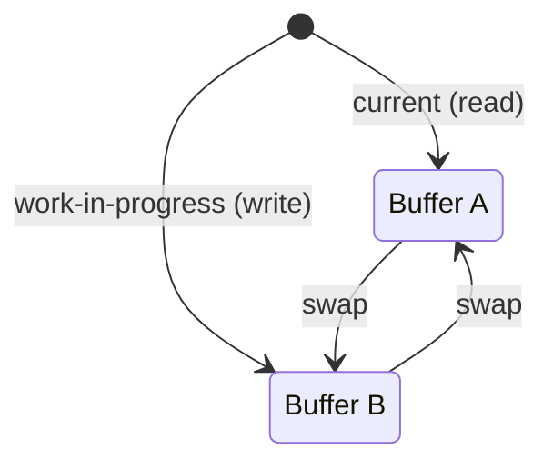

After swap: old "current" becomes new "work-in-progress" (reused, not GC'd). The same two objects are recycled forever — **zero allocation** on the hot path.

| Property | Value |
|----------|-------|
| Swap | O(1) — pointer/reference swap |
| Allocations on hot path | Zero — both buffers are pre-allocated and recycled |
| Memory | 2× single buffer — exactly two copies |
| Tearing | Impossible — readers see a consistent snapshot |

**Try it yourself** — draw frames and swap buffers to see double buffering prevent tearing:

<DoubleBufferingViz />

## Production Proof

| Project | Source | Usage |
|---------|--------|-------|
| React | [ReactFiber.js#L327-L355](https://github.com/facebook/react/blob/34b78a2897cc208260a88e6b62ecaf9ca2a9dfe4/packages/react-reconciler/src/ReactFiber.js#L327-L355) | `createWorkInProgress` — creates or reuses an alternate fiber. The comment says: *"We use a double buffering pooling technique because we know that we'll only ever need at most two versions of a tree."* `current.alternate = workInProgress` and `workInProgress.alternate = current` establish the mutual link. |
| SDL | [SDL_render.c#L5535-L5570](https://github.com/libsdl-org/SDL/blob/14b0e9d922da78001223e563efd2f54f473a4115/src/render/SDL_render.c#L5535-L5570) | `SDL_RenderPresent` — flushes queued render commands, calls the backend's `RenderPresent` to swap front/back buffers for tear-free frame presentation, and handles vsync simulation. |

## Implementation

::: code-group

```typescript [TypeScript]
class DoubleBuffer<T> {
  private buffers: [T, T];
  private currentIndex: 0 | 1 = 0;

  constructor(createBuffer: () => T) {
    this.buffers = [createBuffer(), createBuffer()];
  }

  current(): T {
    return this.buffers[this.currentIndex];
  }

  next(): T {
    return this.buffers[this.currentIndex === 0 ? 1 : 0];
  }

  swap(): void {
    this.currentIndex = this.currentIndex === 0 ? 1 : 0;
  }
}

// React-style fiber double buffering
interface Fiber {
  tag: string;
  pendingProps: Record<string, unknown>;
  memoizedState: unknown;
  alternate: Fiber | null;
}

function createWorkInProgress(current: Fiber, pendingProps: Record<string, unknown>): Fiber {
  let wip = current.alternate;

  if (wip === null) {
    // First render: create the alternate
    wip = {
      tag: current.tag,
      pendingProps,
      memoizedState: current.memoizedState,
      alternate: current,
    };
    current.alternate = wip;
  } else {
    // Subsequent renders: reuse the alternate (zero allocation)
    wip.pendingProps = pendingProps;
    wip.memoizedState = current.memoizedState;
  }

  return wip;
}
```

```rust [Rust]
pub struct DoubleBuffer<T> {
    buffers: [T; 2],
    current: usize,
}

impl<T: Default + Clone> DoubleBuffer<T> {
    pub fn new(init: T) -> Self {
        DoubleBuffer {
            buffers: [init.clone(), init],
            current: 0,
        }
    }

    pub fn current(&self) -> &T {
        &self.buffers[self.current]
    }

    pub fn next(&mut self) -> &mut T {
        &mut self.buffers[1 - self.current]
    }

    pub fn swap(&mut self) {
        self.current = 1 - self.current;
    }
}
```

```go [Go]
type DoubleBuffer[T any] struct {
	buffers [2]T
	current int
}

func NewDoubleBuffer[T any](init T, clone func(T) T) *DoubleBuffer[T] {
	return &DoubleBuffer[T]{
		buffers: [2]T{clone(init), init},
		current: 0,
	}
}

func (db *DoubleBuffer[T]) Current() *T {
	return &db.buffers[db.current]
}

func (db *DoubleBuffer[T]) Next() *T {
	return &db.buffers[1-db.current]
}

func (db *DoubleBuffer[T]) Swap() {
	db.current = 1 - db.current
}
```

```python [Python]
class DoubleBuffer:
    def __init__(self, create_buffer):
        self._buffers = [create_buffer(), create_buffer()]
        self._current = 0

    def current(self):
        return self._buffers[self._current]

    def next(self):
        return self._buffers[1 - self._current]

    def swap(self):
        self._current = 1 - self._current

# Usage
buf = DoubleBuffer(lambda: {"pixels": [0, 0]})
buf.next()["pixels"] = [255, 128]  # write to back buffer
assert buf.current()["pixels"] == [0, 0]  # front unchanged
buf.swap()
assert buf.current()["pixels"] == [255, 128]  # now visible
```

:::

## Exercises

| Level | Exercise | File |
|-------|----------|------|
| Basic | Implement a generic double buffer with swap | `exercises/typescript/double-buffering/01-basic.test.ts` |
| Intermediate | Build React-style fiber alternates | `exercises/typescript/double-buffering/02-fiber-alternate.test.ts` |

Run exercises: `pnpm test:ts` (TypeScript) · `cargo test` (Rust) · `go test ./...` (Go) · `pytest` (Python)

Exercise files: Rust `exercises/rust/src/double_buffering/mod.rs` · Go `exercises/go/double_buffering/double_buffering_test.go` · Python `exercises/python/double_buffering/test_double_buffering.py`

## When to Use

- **Render pipelines** — GPU front/back buffer, game frame rendering
- **Concurrent reads and writes** — readers see consistent state while writers prepare the next version
- **Tree reconciliation** — React's fiber architecture uses this to diff old and new trees
- **Zero-allocation hot paths** — reuse two buffers forever instead of allocating new ones
- **Database MVCC** — readers see a snapshot while writers prepare a new version

## When NOT to Use

- **Simple state updates** — if your state is a single value and updates are atomic, double buffering adds unnecessary complexity
- **Memory-constrained environments** — you're paying 2x memory cost
- **Frequent partial reads** — if readers need real-time access to in-progress writes, double buffering hides updates until the swap

## More Production Uses

- [OpenGL](https://www.khronos.org/opengl/) / Vulkan — swap chains
- [PostgreSQL](https://github.com/postgres/postgres) — MVCC snapshot isolation
- [Godot Engine](https://github.com/godotengine/godot/blob/ec67cbe92628bdaf979b10594359ba6f02cf8838/servers/rendering/renderer_rd/renderer_scene_render_rd.cpp) — double-buffered frame rendering
- [Linux fbdev](https://github.com/torvalds/linux/blob/acb7500801e98639f6d8c2d796ed9f64cba83d3a/drivers/video/fbdev/core/fbmem.c) — framebuffer double buffering for console and display output

## Related Patterns

| Pattern | Relationship |
|---------|-------------|
| [Copy-on-Write (CoW)](/patterns/copy-on-write/) | Both defer mutation costs — double buffering swaps whole copies, CoW copies on write |
| [Ring Buffer (Circular Buffer)](/patterns/ring-buffer/) | Ring buffers can be seen as multi-slot generalizations of double buffering |
| [Dirty Flag](/patterns/dirty-flag/) | Dirty flags track which buffer has changed and needs to be swapped |
| [Bitmask](/patterns/bitmask/) | Bitmasks can track which buffer is active in a double-buffering scheme |
| [Diff & Patch](/patterns/diff-patch/) | Diff-patch can compute the delta between the front and back buffer |

## Challenge Questions

::: details Q1: If double buffering eliminates tearing, why do GPUs use triple buffering?
**Answer:** Triple buffering decouples the swap timing from vsync, reducing input latency without reintroducing tearing.

With double buffering and vsync enabled, if the GPU finishes a frame early, it must wait for the next vsync interval before swapping — the CPU/GPU pipeline stalls. A third buffer lets the GPU keep rendering into a spare back buffer while the front buffer waits for vsync. The display always gets the most recently completed frame, so latency drops while tearing stays eliminated.
:::

::: details Q2: A junior developer proposes calling `swap()` in the middle of writing to the back buffer to "publish partial progress." What goes wrong?
**Answer:** This reintroduces the exact tearing problem double buffering is designed to prevent.

The whole point of double buffering is that the swap happens only after the back buffer is fully written. If you swap mid-write, readers now see a half-updated buffer — some pixels from the old frame, some from the new. The invariant is: the back buffer is private to the writer until the swap makes it public atomically.
:::

::: details Q3: React's fiber tree uses double buffering, but it never actually swaps two screen buffers. What is being "swapped" and why does it still qualify?
**Answer:** React swaps which fiber tree is "current" and which is "work-in-progress" by reassigning a single pointer (`root.current = finishedWork`).

The pattern is structural, not visual. React maintains two fiber trees linked via `.alternate`. During rendering, it builds the work-in-progress tree without affecting what is displayed. On commit, it atomically designates the WIP tree as "current." The old current becomes the next WIP tree (recycled, not GC'd). This is the same principle as GPU buffer swapping: prepare privately, publish atomically, recycle the old version.
:::

::: details Q4: Double buffering uses 2x memory. Under what condition does this cost become zero effective overhead?
**Answer:** When you would have needed a separate "scratch" buffer anyway to prepare the next state.

If the alternative to double buffering is allocating a new buffer every frame and discarding the old one, double buffering actually saves memory by reusing two fixed buffers forever. The 2x cost only hurts when compared to an in-place update scenario — and in-place updates risk tearing. So the real cost comparison is: 2 persistent buffers vs. N short-lived allocations plus GC pressure.
:::


================================================
FILE: docs/patterns/event-loop/index.md
================================================
---
title: "Pattern: Event Loop / Reactor"
description: "A single-threaded loop that multiplexes I/O via epoll/kqueue, dispatching ready events to callbacks — thousands of connections without threads."
difficulty: "intermediate"
---

# Pattern: Event Loop / Reactor

<DifficultyBadge />

## One Liner

A single-threaded loop that multiplexes I/O via epoll/kqueue, dispatching ready events to callbacks — thousands of connections without threads.

<DemoBadge />

## Real-World Analogy

A single receptionist handling a busy office. She can't talk to two callers simultaneously, but she puts each on hold, handles quick tasks, and circles back to each caller in turn. Nothing stalls — if a task takes time, she notes it and moves on.

## Core Idea

Instead of dedicating one thread per connection (expensive context switches, high memory), the reactor pattern uses a single thread that blocks on an OS polling mechanism (`epoll`, `kqueue`, `IOCP`). When any registered file descriptor becomes ready, the loop dispatches to the associated callback. This is how Node.js handles 10,000+ concurrent connections on a single thread.

```text
  ┌─────────────────────────────────────────────────┐
  │                  Event Loop                     │
  │                                                 │
  │  ┌──────────┐    ┌──────────┐    ┌──────────┐   │
  │  │ Register │    │  Poll    │    │ Dispatch │   │
  │  │ interest │───►│ (block)  │───►│ ready    │   │
  │  │ (fds)    │    │          │    │ handlers │   │
  │  └──────────┘    └──────────┘    └────┬─────┘   │
  │       ▲                               │         │
  │       └───────────────────────────────┘         │
  │                   repeat                        │
  └─────────────────────────────────────────────────┘

  Phase detail (libuv model):
  ┌────────┐  ┌──────────┐  ┌──────┐  ┌───────┐  ┌───────┐
  │ Timers │─►│ Pending  │─►│ Poll │─►│ Check │─►│ Close │──► next iteration
  │        │  │ callbacks│  │      │  │       │  │       │
  └────────┘  └──────────┘  └──────┘  └───────┘  └───────┘
```

| Property | Value |
|----------|-------|
| Concurrency model | Single-threaded, non-blocking I/O |
| Connections | Thousands per thread (limited by file descriptors, not threads) |
| Latency | Low for I/O-bound work; one slow callback blocks everything |
| Memory | O(connections) for state, not O(connections * stack_size) |

**Try it yourself** — add tasks to the call stack and queues, then step through the event loop execution order:

<EventLoopViz />

::: tip Two "event loops", one name
This page covers the **reactor** sense of the event loop: the OS-level loop in
libuv/Redis that multiplexes I/O across phases (`timers → poll → check → …`),
proven in the source links below. JavaScript's language-level loop is a
*narrower* slice of the same idea — a call stack draining **microtasks**
(`Promise.then`) and **macrotasks** (`setTimeout`) in a fixed order. To build
intuition for that JS slice specifically, [JSV9000](https://www.jsv9000.app/)
is an excellent interactive visualizer: paste JS and watch the call stack,
microtask queue, and macrotask queue drain step by step.
:::

## Production Proof

| Project | Source | Usage |
|---------|--------|-------|
| libuv | [core.c#L427-L492](https://github.com/libuv/libuv/blob/f6b713398e464a9f166328765be1703fd860981f/src/unix/core.c#L427-L492) | `uv_run` (L427-L492) is the main event loop function used by Node.js. Processes timers, pending callbacks, polls for I/O (`uv__io_poll`), runs check handles, and closes handles in a single `while` loop. Supports three run modes: `UV_RUN_DEFAULT` (run until no more active handles), `UV_RUN_ONCE`, `UV_RUN_NOWAIT`. |
| Redis | [ae.c#L360-L468](https://github.com/redis/redis/blob/df63a65d4d4ee33ae67e9f101885074febe0bccb/src/ae.c#L360-L468) | `aeProcessEvents` (L360-L468) is Redis's event loop core. Calculates the nearest timer, calls `aeApiPoll` (epoll/kqueue/select abstraction) with that timeout, then dispatches file events and timer events. Redis achieves 100K+ ops/sec on a single thread because the event loop never blocks on individual operations. |

## Implementation

::: code-group

```typescript [TypeScript]
type Handler = () => void;

class EventLoop {
  private handlers = new Map<number, Handler>();

  /** Register a handler for a file descriptor. */
  addHandler(fd: number, callback: Handler): void {
    this.handlers.set(fd, callback);
  }

  /** Remove a handler for a file descriptor. */
  removeHandler(fd: number): void {
    this.handlers.delete(fd);
  }

  /** Execute one tick: call all registered handlers once. */
  tick(): number {
    const count = this.handlers.size;
    for (const [, handler] of this.handlers) {
      handler();
    }
    return count;
  }

  /** Run the event loop for up to maxTicks. Stops early if no handlers. */
  run(maxTicks: number): number {
    let ticksRun = 0;
    for (let i = 0; i < maxTicks; i++) {
      if (this.handlers.size === 0) break;
      this.tick();
      ticksRun++;
    }
    return ticksRun;
  }

  get handlerCount(): number {
    return this.handlers.size;
  }
}
```

```rust [Rust]
use std::collections::HashMap;

pub struct EventLoop {
    handlers: HashMap<i32, Box<dyn FnMut()>>,
}

impl EventLoop {
    pub fn new() -> Self {
        EventLoop { handlers: HashMap::new() }
    }

    pub fn add_handler(&mut self, fd: i32, handler: impl FnMut() + 'static) {
        self.handlers.insert(fd, Box::new(handler));
    }

    pub fn remove_handler(&mut self, fd: i32) {
        self.handlers.remove(&fd);
    }

    pub fn tick(&mut self) -> usize {
        let count = self.handlers.len();
        for handler in self.handlers.values_mut() {
            handler();
        }
        count
    }

    pub fn run(&mut self, max_ticks: usize) -> usize {
        let mut ticks_run = 0;
        for _ in 0..max_ticks {
            if self.handlers.is_empty() {
                break;
            }
            self.tick();
            ticks_run += 1;
        }
        ticks_run
    }
}
```

```go [Go]
type EventLoop struct {
	handlers map[int]func()
}

func NewEventLoop() *EventLoop {
	return &EventLoop{handlers: make(map[int]func())}
}

func (el *EventLoop) AddHandler(fd int, handler func()) {
	el.handlers[fd] = handler
}

func (el *EventLoop) RemoveHandler(fd int) {
	delete(el.handlers, fd)
}

func (el *EventLoop) Tick() int {
	count := len(el.handlers)
	for _, handler := range el.handlers {
		handler()
	}
	return count
}

func (el *EventLoop) Run(maxTicks int) int {
	ticksRun := 0
	for i := 0; i < maxTicks; i++ {
		if len(el.handlers) == 0 {
			break
		}
		el.Tick()
		ticksRun++
	}
	return ticksRun
}
```

```python [Python]
from typing import Callable

class EventLoop:
    def __init__(self) -> None:
        self._handlers: dict[int, Callable[[], None]] = {}

    def add_handler(self, fd: int, callback: Callable[[], None]) -> None:
        self._handlers[fd] = callback

    def remove_handler(self, fd: int) -> None:
        self._handlers.pop(fd, None)

    def tick(self) -> int:
        count = len(self._handlers)
        for handler in list(self._handlers.values()):
            handler()
        return count

    def run(self, max_ticks: int) -> int:
        ticks_run = 0
        for _ in range(max_ticks):
            if not self._handlers:
                break
            self.tick()
            ticks_run += 1
        return ticks_run
```

:::

## Exercises

| Level | Exercise | File |
|-------|----------|------|
| Basic | Implement a mini event loop with handler registration and tick/run | `exercises/typescript/event-loop/01-basic.test.ts` |
| Intermediate | Extend with timer support (one-shot timers interleaved with I/O) | `exercises/typescript/event-loop/02-intermediate.test.ts` |

Run exercises: `pnpm test:ts` (TypeScript) · `cargo test` (Rust) · `go test ./...` (Go) · `pytest` (Python)

Exercise files: Rust `exercises/rust/src/event_loop/mod.rs` · Go `exercises/go/event_loop/event_loop_test.go` · Python `exercises/python/event_loop/test_event_loop.py`

## When to Use

- **High-connection servers** — web servers, chat servers, API gateways where thousands of connections are mostly idle (waiting for I/O)
- **I/O-bound workloads** — network proxies, load balancers, database connection pools where CPU work per request is minimal
- **Real-time communication** — WebSocket servers, game servers, notification systems where low latency per-message matters more than throughput
- **Embedded/resource-constrained** — when you can't afford the memory overhead of one thread per connection (each thread = 1-8 MB stack)

## When NOT to Use

- **CPU-bound work** — a single-threaded event loop blocks on computation. If you need to hash passwords, resize images, or run ML inference, use thread pools or worker processes alongside the event loop.
- **Simple request-response** — if you have < 100 concurrent connections and each request is straightforward, threads-per-request is simpler and debuggable. The event loop adds complexity (callback management, state machines) without benefit.
- **Strict ordering requirements** — when events must be processed in exact arrival order with no interleaving, a simple sequential loop or queue consumer is clearer.

## More Production Uses

- [Node.js](https://github.com/nodejs/node) — libuv-based event loop powering the entire Node.js runtime
- [Nginx](https://github.com/nginx/nginx) — worker processes each run an event loop with epoll/kqueue
- [Tokio](https://github.com/tokio-rs/tokio) — Rust async runtime built on mio (cross-platform reactor)
- [Netty](https://github.com/netty/netty) — Java NIO event loop for high-performance networking

## Related Patterns

| Pattern | Relationship |
|---------|-------------|
| [Cooperative Scheduling](/patterns/cooperative-scheduling/) | Event loops require cooperative scheduling — handlers must not block |
| [Observer](/patterns/observer/) | Event loops dispatch events to registered observers/callbacks |
| [Ring Buffer (Circular Buffer)](/patterns/ring-buffer/) | Event queues are typically implemented as ring buffers |
| [Actor Model](/patterns/actor-model/) | Each actor is essentially a single-threaded event loop over its mailbox |
| [Min-Heap / Priority Queue](/patterns/min-heap/) | Event loops use min-heaps to schedule timer callbacks by earliest deadline |

## Challenge Questions

::: details Q1: Your Node.js server handles 5,000 WebSocket connections fine, but adding a single endpoint that computes a Fibonacci number blocks ALL connections. Why?
**Answer:** The event loop is single-threaded. While computing Fibonacci (CPU-bound, synchronous), the event loop cannot process any I/O events. All 5,000 WebSocket connections are frozen until the computation completes.

Solutions: (1) offload CPU work to a `worker_threads` pool, (2) break computation into chunks with `setImmediate()` to yield back to the event loop between chunks, (3) use a separate microservice for heavy computation. This is the fundamental tradeoff of the event loop model — cooperative multitasking means one bad actor blocks everyone.
:::

::: details Q2: Redis uses a single-threaded event loop for command execution (with optional I/O threads since Redis 6.0), yet it handles 100K+ operations per second. How?
**Answer:** Redis operations are extremely fast — most are O(1) hash table lookups or O(log N) sorted set operations that take microseconds. The event loop overhead is negligible compared to network I/O time.

The bottleneck is not CPU but network: reading/writing to sockets, parsing the protocol, and serializing responses. Since Redis uses non-blocking I/O via `aeProcessEvents`, it processes one command per event (read → parse → execute → write) and immediately moves to the next ready socket. There's no context switching, no lock contention, and the entire dataset fits in memory — pure sequential throughput.
:::

::: details Q3: libuv's `uv_run` has three modes: DEFAULT, ONCE, NOWAIT. When would you use each?
**Answer:**

- **DEFAULT**: Normal operation — run until all handles/requests are done. This is what `node app.js` uses. The process stays alive until there are no more timers, servers, or pending callbacks.
- **ONCE**: Process one round of events, then return. Useful for embedding libuv in another event loop (e.g., a game engine's main loop that also needs to handle Node.js events).
- **NOWAIT**: Like ONCE but never blocks on I/O poll. Only processes already-ready events. Useful for polling in a tight loop where blocking would cause missed frames or deadlines.

The key difference: DEFAULT blocks indefinitely, ONCE blocks for one iteration, NOWAIT never blocks.
:::

::: details Q4: Why does Nginx use multiple worker processes each with its own event loop, rather than one single event loop?
**Answer:** One event loop on one CPU core wastes the other cores. Nginx spawns N worker processes (typically one per CPU core), each running its own independent event loop.

This gives you: (1) multi-core utilization without shared-state threading bugs, (2) process isolation — one crashed worker doesn't take down others, (3) zero-downtime reload — new workers start with new config while old workers drain. The `SO_REUSEPORT` socket option lets all workers accept connections on the same port, with the kernel load-balancing across them.
:::


================================================
FILE: docs/patterns/flyweight/index.md
================================================
---
title: "Pattern: Flyweight / Interning"
description: "Share identical immutable objects instead of creating duplicates, trading a lookup cost for massive memory savings when many instances have the same value."
difficulty: "beginner"
---

# Pattern: Flyweight / Interning

<DifficultyBadge />

## One Liner

Share identical immutable objects instead of creating duplicates, trading a lookup cost for massive memory savings when many instances have the same value.

<DemoBadge />

## Real-World Analogy

A theater company's costume closet. There's only one pirate costume, one royal robe, and one peasant outfit. Every actor playing that role wears the same shared costume rather than having a personal copy made.

## Core Idea

When thousands of objects have the same value (strings, small integers, colors), allocating each separately wastes memory. Flyweight/interning maintains a pool of canonical instances and returns the same reference for equal values.

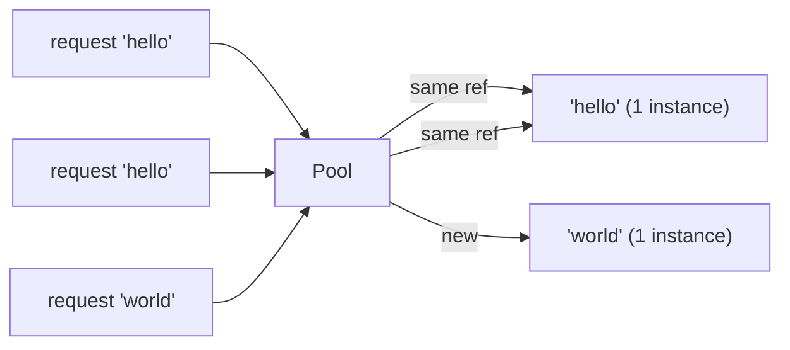

Two requests for `"hello"` get the **same object** — not a copy. This is why `"hello" === "hello"` in many languages (string interning).

| Property | Value |
|----------|-------|
| Lookup/intern | O(1) amortized — hash table lookup |
| Memory savings | O(unique) instead of O(total) instances |
| Equality check | O(1) — pointer comparison instead of value comparison |
| Trade-off | Pool memory + lookup cost vs. per-object allocation cost |

**Try it yourself** — add characters and see how flyweight objects are shared:

<FlyweightViz />

## Production Proof

| Project | Source | Usage |
|---------|--------|-------|
| Python (CPython) | [longobject.c#L61-L75](https://github.com/python/cpython/blob/ff64d8de66ab7f8e56b5d410796a7d76c955280c/Objects/longobject.c#L61-L75) | `get_small_int` returns pre-cached integer objects for -5 to 256. `a = 42; b = 42; a is b` is `True` because both reference the same cached object. This avoids millions of integer allocations in typical programs. |
| Go stdlib | [pool.go#L52-L97](https://github.com/golang/go/blob/f5cdf4745455415c7a43cfc7d925214d4511489b/src/sync/pool.go#L52-L97) | `sync.Pool` is the flyweight pattern applied to temporary objects — `Get()` returns a cached instance instead of allocating, `Put()` returns it for reuse. Used in `fmt.Fprintf`, `encoding/json`, and HTTP handlers to share buffers. |

::: info Note
Java's `String.intern()`, JavaScript engine string tables (V8), and Rust's `&'static str` all implement variations of this pattern. The JVM interns all string literals automatically.
:::

## Implementation

::: code-group

```typescript [TypeScript]
class Interner<T> {
  private pool = new Map<string, T>();

  intern(key: string, create: () => T): T {
    if (this.pool.has(key)) {
      return this.pool.get(key)!;
    }
    const value = create();
    this.pool.set(key, value);
    return value;
  }

  has(key: string): boolean {
    return this.pool.has(key);
  }

  get size(): number {
    return this.pool.size;
  }
}
```

```rust [Rust]
use std::collections::HashMap;

pub struct Interner {
    pool: HashMap<String, usize>,
    strings: Vec<String>,
}

impl Interner {
    pub fn new() -> Self {
        Interner { pool: HashMap::new(), strings: Vec::new() }
    }

    pub fn intern(&mut self, s: &str) -> usize {
        if let Some(&id) = self.pool.get(s) {
            return id;
        }
        let id = self.strings.len();
        self.strings.push(s.to_string());
        self.pool.insert(s.to_string(), id);
        id
    }

    pub fn resolve(&self, id: usize) -> &str {
        &self.strings[id]
    }
}
```

```go [Go]
type Interner struct {
	pool map[string]int
	data []string
}

func NewInterner() *Interner {
	return &Interner{pool: make(map[string]int)}
}

func (in *Interner) Intern(s string) int {
	if id, ok := in.pool[s]; ok {
		return id
	}
	id := len(in.data)
	in.data = append(in.data, s)
	in.pool[s] = id
	return id
}

func (in *Interner) Resolve(id int) string {
	return in.data[id]
}
```

```python [Python]
import sys

class Interner:
    def __init__(self):
        self._pool: dict[str, object] = {}

    def intern(self, key: str, factory=None):
        if key in self._pool:
            return self._pool[key]
        value = factory() if factory else key
        self._pool[key] = value
        return value

    @property
    def size(self) -> int:
        return len(self._pool)

# Python already interns small integers:
a = 256
b = 256
print(a is b)  # True — same object, flyweight!
print(sys.getrefcount(256))  # many references to the same int
```

:::

## Exercises

| Level | Exercise | File |
|-------|----------|------|
| Basic | Implement a string interner with intern/resolve | `exercises/typescript/flyweight/01-basic.test.ts` |
| Intermediate | Icon registry that deduplicates objects by name | `exercises/typescript/flyweight/02-intermediate.test.ts` |

Run exercises: `pnpm test:ts` (TypeScript) · `cargo test` (Rust) · `go test ./...` (Go) · `pytest` (Python)

Exercise files: Rust `exercises/rust/src/flyweight/mod.rs` · Go `exercises/go/flyweight/flyweight_test.go` · Python `exercises/python/flyweight/test_flyweight.py`

## When to Use

- **Repeated identical values** — strings, colors, icons, type tags
- **Memory-constrained environments** — embedded systems, mobile, browser tabs
- **Compilers and interpreters** — symbol tables, string interning
- **Game engines** — shared meshes, textures, materials
- **Database query results** — deduplicate repeated column values

## When NOT to Use

- **Unique values** — if every instance is different, the pool adds overhead
- **Mutable objects** — flyweight assumes shared objects are immutable
- **Short-lived data** — if objects are created and discarded quickly, interning adds lookup cost
- **Thread safety** — concurrent intern requires synchronization

## More Production Uses

- [Java String.intern()](https://github.com/openjdk/jdk/blob/4b3ec455c85314d051800a8f46dd8f5c93881e3a/src/java.base/share/classes/java/lang/String.java) — JVM string pool deduplicates identical string literals
- [Python small int cache](https://github.com/python/cpython/blob/ff64d8de66ab7f8e56b5d410796a7d76c955280c/Objects/longobject.c) — CPython pre-allocates integers -5 to 256
- [Rust string_cache](https://crates.io/crates/string_cache) crate
- [.NET string interning](https://github.com/dotnet/runtime/blob/bee7953796edc09e516e847e3c9006b486ab0f6d/src/libraries/System.Private.CoreLib/src/System/String.cs) — `String.Intern()` maintains a CLR-wide intern pool
- [Chromium CSS](https://github.com/chromium/chromium/blob/5cffea3f665b7762369a0fa84d2f208875e7225e/third_party/blink/renderer/core/css/) — CSS value deduplication in the Blink rendering engine

## Related Patterns

| Pattern | Relationship |
|---------|-------------|
| [Interning](/patterns/interning/) | Interning is the mechanism that implements flyweight — deduplicate identical values |
| [Copy-on-Write (CoW)](/patterns/copy-on-write/) | Both share data — flyweight shares immutable objects, CoW shares until mutation |
| [LRU Cache](/patterns/lru-cache/) | LRU caches can store flyweight instances, evicting least-used shared objects |

## Challenge Questions

::: details Q1: Someone interns a mutable object (say, a config map) and later modifies it. What breaks?
**Answer:** Every consumer sharing that reference sees the mutation, causing unpredictable behavior across unrelated parts of the system.

Flyweight's entire premise is that shared instances are identical and interchangeable. If one caller mutates the shared object, all other callers silently get the changed value. This is why interned/flyweight objects must be immutable. If you need mutation, clone-on-write or don't intern.
:::

::: details Q2: Python caches integers -5 to 256 as flyweights. Why not cache all integers?
**Answer:** Because the memory cost of pre-allocating every possible integer far exceeds the savings from sharing. The cache only pays off for values that appear frequently.

The range -5 to 256 was chosen empirically — these cover loop counters, array indices, boolean-like values, and common constants. Caching `1_000_000` would waste memory since most large integers appear only once. The flyweight pattern only saves memory when duplicates are common.
:::

::: details Q3: You build a string interner for a compiler. After processing 10,000 source files, the interner holds 2 million strings and uses 500MB. What went wrong?
**Answer:** The interner never evicts entries, so it accumulates every string ever seen — including one-off identifiers and string literals that are never referenced again.

A production interner needs a strategy for scope: either clear it per-compilation-unit, use weak references so unreferenced strings get collected, or limit interning to identifiers (which repeat frequently) and skip arbitrary string literals. Unbounded growth is the classic flyweight pitfall.
:::

::: details Q4: Two threads simultaneously call `intern("hello")` and both see it as missing from the pool. What can go wrong?
**Answer:** Both threads create a new instance and insert it, resulting in two different objects for the same key — breaking the "same reference for same value" guarantee.

Without synchronization, you get a race: thread A checks the pool, finds nothing, creates the object; thread B does the same before A inserts. Now consumers on different threads hold different references for `"hello"`, defeating identity comparison (`===` / `is`). The fix is a lock around the check-and-insert, or a concurrent map with `putIfAbsent` semantics.
:::


================================================
FILE: docs/patterns/free-list/index.md
================================================
---
title: "Pattern: Free List"
description: "Maintain a linked list of freed slots so allocation and deallocation are O(1) — reuse memory without calling the system allocator."
difficulty: "intermediate"
---

# Pattern: Free List

<DifficultyBadge />

## One Liner

Maintain a linked list of freed slots so allocation and deallocation are O(1) — reuse memory without calling the system allocator.

<DemoBadge />

## Real-World Analogy

A parking lot that keeps a chain of empty spots on a clipboard. When a car arrives, you hand out the first empty spot instantly. When a car leaves, its spot goes back to the top of the list. No scanning needed.

## Core Idea

A free list tracks available memory slots in a linked list threaded through the free slots themselves (intrusive) or via a separate index array (non-intrusive). `alloc()` pops the head; `free()` pushes onto the head. No fragmentation within the pool, no system calls, predictable O(1) performance.

```text
  Free List Head
       │
       ▼
  ┌────────┐    ┌────────┐    ┌────────┐
  │ slot 3 │───►│ slot 0 │───►│ slot 7 │───► null
  └────────┘    └────────┘    └────────┘

  alloc() → returns slot 3, head moves to slot 0
  free(5) → slot 5 becomes new head, points to slot 0
```

| Property | Value |
|----------|-------|
| alloc | O(1) — pop from head |
| free | O(1) — push to head |
| Fragmentation | None within pool (fixed-size slots) |
| Overhead | One pointer per free slot (intrusive) or index array (non-intrusive) |

**Try it yourself** — allocate and free blocks, observe how the free list links available slots:

<FreeListViz />

## Production Proof

| Project | Source | Usage |
|---------|--------|-------|
| Go runtime | [mfixalloc.go#L31-L109](https://github.com/golang/go/blob/f5cdf4745455415c7a43cfc7d925214d4511489b/src/runtime/mfixalloc.go#L31-L109) | `fixalloc` — fixed-size free-list allocator. `mlink` struct (L49-L52) is the intrusive list node overlaid on freed blocks. `alloc()` (L74-L87) pops from the free list; `free()` (L106-L108) pushes onto it. Classic LIFO free list powering Go's memory subsystem. |
| Linux kernel (SLUB) | [slub.c#L530-L551](https://github.com/torvalds/linux/blob/acb7500801e98639f6d8c2d796ed9f64cba83d3a/mm/slub.c#L530-L551) | `get_freepointer` / `set_freepointer` — reads/writes the next-free pointer embedded inside each free slab object at `object + s->offset`. Uses XOR-encoded pointers (L504-L528) under `CONFIG_SLAB_FREELIST_HARDENED` to defend against heap corruption attacks. |

## Implementation

::: code-group

```typescript [TypeScript]
class FreeList {
  private freeSlots: number[] = [];
  private nextSlot: number;

  constructor(private capacity: number) {
    this.nextSlot = 0;
  }

  alloc(): number | null {
    if (this.freeSlots.length > 0) {
      return this.freeSlots.pop()!;
    }
    if (this.nextSlot >= this.capacity) return null;
    return this.nextSlot++;
  }

  free(slot: number): void {
    this.freeSlots.push(slot);
  }

  get available(): number {
    return this.freeSlots.length + (this.capacity - this.nextSlot);
  }

  get allocated(): number {
    return this.nextSlot - this.freeSlots.length;
  }
}
```

```rust [Rust]
pub struct FreeList {
    capacity: usize,
    next_slot: usize,
    free: Vec<usize>,
}

impl FreeList {
    pub fn new(capacity: usize) -> Self {
        FreeList { capacity, next_slot: 0, free: Vec::new() }
    }

    pub fn alloc(&mut self) -> Option<usize> {
        if let Some(slot) = self.free.pop() {
            return Some(slot);
        }
        if self.next_slot >= self.capacity {
            return None;
        }
        let slot = self.next_slot;
        self.next_slot += 1;
        Some(slot)
    }

    pub fn free(&mut self, slot: usize) {
        self.free.push(slot);
    }

    pub fn available(&self) -> usize {
        self.free.len() + (self.capacity - self.next_slot)
    }

    pub fn allocated(&self) -> usize {
        self.next_slot - self.free.len()
    }
}
```

```go [Go]
type FreeList struct {
	capacity int
	nextSlot int
	free     []int
}

func NewFreeList(capacity int) *FreeList {
	return &FreeList{capacity: capacity, free: nil}
}

func (fl *FreeList) Alloc() (int, bool) {
	if len(fl.free) > 0 {
		slot := fl.free[len(fl.free)-1]
		fl.free = fl.free[:len(fl.free)-1]
		return slot, true
	}
	if fl.nextSlot >= fl.capacity {
		return 0, false
	}
	slot := fl.nextSlot
	fl.nextSlot++
	return slot, true
}

func (fl *FreeList) Free(slot int) {
	fl.free = append(fl.free, slot)
}

func (fl *FreeList) Available() int {
	return len(fl.free) + (fl.capacity - fl.nextSlot)
}

func (fl *FreeList) Allocated() int {
	return fl.nextSlot - len(fl.free)
}
```

```python [Python]
class FreeList:
    def __init__(self, capacity: int):
        self.capacity = capacity
        self._next_slot = 0
        self._free: list[int] = []

    def alloc(self) -> int | None:
        if self._free:
            return self._free.pop()
        if self._next_slot >= self.capacity:
            return None
        slot = self._next_slot
        self._next_slot += 1
        return slot

    def free(self, slot: int) -> None:
        self._free.append(slot)

    @property
    def available(self) -> int:
        return len(self._free) + (self.capacity - self._next_slot)

    @property
    def allocated(self) -> int:
        return self._next_slot - len(self._free)
```

:::

## Exercises

| Level | Exercise | File |
|-------|----------|------|
| Basic | Implement a free list allocator with alloc/free and tracking | `exercises/typescript/free-list/01-basic.test.ts` |
| Intermediate | Generational pool with stale-handle detection | `exercises/typescript/free-list/02-intermediate.test.ts` |

Run exercises: `pnpm test:ts` (TypeScript) · `cargo test` (Rust) · `go test ./...` (Go) · `pytest` (Python)

Exercise files: Rust `exercises/rust/src/free_list/mod.rs` · Go `exercises/go/free_list/free_list_test.go` · Python `exercises/python/free_list/test_free_list.py`

## When to Use

- **Game engines** — entity/component pools with rapid alloc/free cycles
- **OS kernels** — slab allocators for fixed-size kernel objects (inodes, task structs)
- **Embedded systems** — no heap, deterministic allocation timing
- **Network stacks** — buffer pools for packet headers
- **Database engines** — page allocators for B-tree nodes

## When NOT to Use

- **Variable-size objects** — free list requires fixed-size slots (use a general-purpose allocator)
- **Rarely freed** — if objects live forever, the free list stays empty (use bump/arena allocator)
- **Small pools** — overhead of managing the list outweighs benefits below ~16 slots
- **Thread-safe required** — basic free list needs external synchronization (or use lock-free variants)

## More Production Uses

- [Godot Engine](https://github.com/godotengine/godot/blob/ec67cbe92628bdaf979b10594359ba6f02cf8838/core/templates/pooled_list.h#L57-L131) — `PooledList<T>` non-intrusive free list with separate index array
- [jemalloc](https://github.com/jemalloc/jemalloc) — thread-cache free lists for small allocations
- [mimalloc](https://github.com/microsoft/mimalloc) — segment-level free lists with sharded design
- [Vulkan Memory Allocator](https://github.com/GPUOpen-LibrariesAndSDKs/VulkanMemoryAllocator) — sub-allocation pools with free lists

## Related Patterns

| Pattern | Relationship |
|---------|-------------|
| [Arena Allocator](/patterns/arena-allocator/) | Arena bulk-frees; free lists recycle individual slots for O(1) reuse |
| [Object Pool](/patterns/object-pool/) | Object pools use free lists internally to track available objects |
| [Ring Buffer (Circular Buffer)](/patterns/ring-buffer/) | Both provide O(1) slot management — ring buffers via modular index, free lists via linked chain |
| [LRU Cache](/patterns/lru-cache/) | LRU caches use free lists to recycle evicted node slots for O(1) reuse |
| [Skip List](/patterns/skip-list/) | Skip lists can use free lists to recycle deleted node slots |
| [Tombstone / Soft Delete](/patterns/tombstone/) | Tombstone-based deletion defers slot recycling; free lists reclaim those slots |
| [Work Stealing](/patterns/work-stealing/) | Work-stealing queues can use free lists to manage task node allocation |

## Challenge Questions

::: details Q1: A bug causes `free(slot)` to be called twice on the same slot. What happens with a naive free list, and how do production systems detect this?
**Answer:** The slot appears twice in the free list. Two subsequent `alloc()` calls return the same slot, and two callers write to overlapping memory, causing data corruption.

Double-free is one of the most dangerous memory bugs. Detection techniques include: a bitmap tracking which slots are allocated (check before freeing), poison values written into freed slots (detect if the value is already the poison), and the Linux SLUB allocator's approach of XOR-encoding free list pointers with a per-cache random value so corruption is detected on the next alloc. Some allocators abort immediately on double-free rather than silently corrupting.
:::

::: details Q2: An intrusive free list stores the "next" pointer inside the free slot itself. What's the advantage over a separate index array, and what's the risk?
**Answer:** Intrusive lists use zero extra memory — the next pointer occupies space that's unused anyway (the slot is free). The risk is that a use-after-free bug can overwrite the next pointer, corrupting the entire free list.

With a non-intrusive design (separate array of indices), corrupting a freed slot's data doesn't break the free list structure. With intrusive design, if code accidentally writes to a freed slot, it overwrites the next pointer and the free list chain breaks — subsequent allocs may return garbage addresses. This is why Linux's SLUB uses `CONFIG_SLAB_FREELIST_HARDENED` to XOR-encode the pointers.
:::

::: details Q3: Free lists return the most recently freed slot (LIFO). Why is this better for performance than returning the oldest freed slot (FIFO)?
**Answer:** The most recently freed slot is likely still in CPU cache. Reusing it immediately gives better cache hit rates than returning a slot freed long ago.

LIFO reuse is a deliberate cache optimization. When you free slot N and immediately alloc, you get slot N back — which was just accessed and is likely still in L1/L2 cache. FIFO would return a slot freed many operations ago, which has probably been evicted from cache. For hot allocation paths (game engines doing thousands of alloc/free per frame), this cache locality difference is measurable.
:::

::: details Q4: You have a free list pool of 1,000 slots. Monitoring shows the pool is 95% allocated at steady state, and alloc() frequently returns null. Should you increase the pool size?
**Answer:** Not necessarily. First check whether allocated slots are actually in use or are being leaked (allocated but never freed).

A common bug is forgetting to call `free()` on slots that are no longer needed, causing the pool to slowly drain. Adding more slots just delays the inevitable exhaustion. Check the `allocated` count over time — if it monotonically increases, you have a leak. If it fluctuates around 950 with occasional spikes to 1000, then the pool is genuinely too small and should be increased.
:::


================================================
FILE: docs/patterns/interning/index.md
================================================
---
title: "Pattern: Interning / Symbol Table"
description: "Deduplicate immutable values through a canonical lookup table — O(1) equality by pointer comparison instead of O(n) content comparison."
difficulty: "intermediate"
---

# Pattern: Interning / Symbol Table

<DifficultyBadge />

## One Liner

Deduplicate immutable values through a canonical lookup table — O(1) equality by pointer comparison instead of O(n) content comparison.

<DemoBadge />

## Real-World Analogy

A post office that stores one copy of each ZIP code and gives everyone a reference to it. Instead of every letter carrying its own copy of '94105', they all point to the same shared entry.

## Core Idea

Interning stores each unique value exactly once in a table and hands out lightweight identifiers (symbols, IDs, or interned pointers) that refer to the canonical copy. Two values that are structurally equal get the same identifier, so equality checks become O(1) pointer/integer comparisons instead of O(n) content comparisons. This trades upfront deduplication cost for massive savings on repeated equality checks.

```text
  intern("hello") → 0     intern("world") → 1     intern("hello") → 0
                                                     (reuse!)

  ┌───────────────────────┐
  │    Symbol Table       │
  ├────┬──────────────────┤
  │ ID │  Value           │
  ├────┼──────────────────┤
  │  0 │  "hello"         │
  │  1 │  "world"         │
  │  2 │  "foo"           │
  └────┴──────────────────┘

  Equality: symbol_a == symbol_b  (integer comparison, O(1))
  Instead of: strcmp(str_a, str_b) (character scan, O(n))
```

| Property | Value |
|----------|-------|
| intern() | O(n) first time (hash + store), O(1) amortized on hit |
| Equality | O(1) — integer/pointer comparison |
| Memory | Deduplicated — each unique value stored once |
| Tradeoff | Intern table grows monotonically (values never freed) |

**Try it yourself** — intern strings and see how duplicates resolve to the same ID:

<InterningViz />

## Production Proof

| Project | Source | Usage |
|---------|--------|-------|
| Rust Compiler (rustc) | [symbol.rs#L24-L79](https://github.com/rust-lang/rust/blob/ab26b175979ee7b2cb3302dce204b99df96f7efb/compiler/rustc_span/src/symbol.rs#L24-L79) | `Symbol` (L24) is a newtype around `u32` — an index into the global interning table. `Interner` (L56-L79) stores strings in a `Vec` and deduplicates via a `HashMap`. All identifiers in the Rust compiler are `Symbol`s — equality is a single `u32` comparison. |
| CPython | [unicodeobject.c#L14416-L14472](https://github.com/python/cpython/blob/ff64d8de66ab7f8e56b5d410796a7d76c955280c/Objects/unicodeobject.c#L14416-L14472) | `PyUnicode_InternInPlace` (L14416) interns Python strings by storing them in a global dict. If the string already exists, the existing object is returned and the new one's refcount is decremented. All identifier strings (variable names, attribute names) are interned automatically for O(1) dict lookups. |

## Implementation

::: code-group

```typescript [TypeScript]
class StringInterner {
  private strToId = new Map<string, number>();
  private idToStr: string[] = [];

  intern(s: string): number {
    const existing = this.strToId.get(s);
    if (existing !== undefined) return existing;
    const id = this.idToStr.length;
    this.strToId.set(s, id);
    this.idToStr.push(s);
    return id;
  }

  resolve(id: number): string | undefined {
    return this.idToStr[id];
  }

  get size(): number {
    return this.idToStr.length;
  }
}
```

```rust [Rust]
use std::collections::HashMap;

pub struct Interner {
    str_to_id: HashMap<String, u32>,
    id_to_str: Vec<String>,
}

impl Interner {
    pub fn new() -> Self {
        Interner { str_to_id: HashMap::new(), id_to_str: Vec::new() }
    }

    pub fn intern(&mut self, s: &str) -> u32 {
        if let Some(&id) = self.str_to_id.get(s) {
            return id;
        }
        let id = self.id_to_str.len() as u32;
        self.str_to_id.insert(s.to_string(), id);
        self.id_to_str.push(s.to_string());
        id
    }

    pub fn resolve(&self, id: u32) -> Option<&str> {
        self.id_to_str.get(id as usize).map(|s| s.as_str())
    }
}
```

```go [Go]
type Interner struct {
	strToID map[string]int
	idToStr []string
}

func NewInterner() *Interner {
	return &Interner{strToID: make(map[string]int)}
}

func (it *Interner) Intern(s string) int {
	if id, ok := it.strToID[s]; ok {
		return id
	}
	id := len(it.idToStr)
	it.strToID[s] = id
	it.idToStr = append(it.idToStr, s)
	return id
}

func (it *Interner) Resolve(id int) (string, bool) {
	if id < 0 || id >= len(it.idToStr) {
		return "", false
	}
	return it.idToStr[id], true
}
```

```python [Python]
class StringInterner:
    def __init__(self):
        self._str_to_id: dict[str, int] = {}
        self._id_to_str: list[str] = []

    def intern(self, s: str) -> int:
        if s in self._str_to_id:
            return self._str_to_id[s]
        sym_id = len(self._id_to_str)
        self._str_to_id[s] = sym_id
        self._id_to_str.append(s)
        return sym_id

    def resolve(self, sym_id: int) -> str | None:
        if 0 <= sym_id < len(self._id_to_str):
            return self._id_to_str[sym_id]
        return None
```

:::

## Exercises

| Level | Exercise | File |
|-------|----------|------|
| Basic | Implement a string interner with intern/resolve | `exercises/typescript/interning/01-basic.test.ts` |
| Intermediate | Type interner with structural equality | `exercises/typescript/interning/02-intermediate.test.ts` |

Run exercises: `pnpm test:ts` (TypeScript) · `cargo test` (Rust) · `go test ./...` (Go) · `pytest` (Python)

Exercise files: Rust `exercises/rust/src/interning/mod.rs` · Go `exercises/go/interning/interning_test.go` · Python `exercises/python/interning/test_interning.py`

## When to Use

- **Compilers and interpreters** — intern identifiers, keywords, and type descriptors for fast equality
- **Database query engines** — intern column names, table names for fast comparison in query planning
- **Serialization** — intern repeated field names in JSON/XML to reduce memory
- **Game engines** — intern asset names, material IDs, animation states
- **String-heavy workloads** — any system that compares the same strings millions of times

## When NOT to Use

- **Short-lived strings** — if strings are created and discarded quickly, interning overhead outweighs benefit
- **Mostly unique strings** — if few strings repeat, the intern table wastes memory without saving comparisons
- **Memory-constrained with no cleanup** — classic interning tables grow monotonically; consider weak references if cleanup is needed

## More Production Uses

- [Java String.intern()](https://github.com/openjdk/jdk) — JVM-level string interning in the string pool
- [V8 Internalized Strings](https://chromium.googlesource.com/v8/v8/+/refs/heads/main/src/objects/string.h) — V8 interns strings used as property names for O(1) property lookup
- [Ruby Symbol](https://github.com/ruby/ruby) — `Symbol` is an interned string that's never garbage-collected
- [LLVM StringPool](https://github.com/llvm/llvm-project) — interned strings for identifiers across the compiler pipeline

## Related Patterns

| Pattern | Relationship |
|---------|-------------|
| [Flyweight](/patterns/flyweight/) | Interning is the mechanism behind flyweight — deduplicate identical immutable values |
| [LRU Cache](/patterns/lru-cache/) | Intern tables can use LRU eviction to bound memory usage |
| [Bloom Filter](/patterns/bloom-filter/) | Bloom filters can pre-check before expensive intern table lookups |

## Challenge Questions

::: details Q1: Your compiler interns 100,000 identifiers. How does interning affect memory compared to storing raw strings?
**Answer:** Each unique string is stored exactly once in the intern table. Every reference is a `u32` (4 bytes) instead of a pointer + length + heap allocation (typically 24+ bytes per string on 64-bit systems).

If the average identifier is 12 characters with 5x duplication, raw storage costs 100,000 * (24 + 12) = 3.6MB. With interning, you store 20,000 unique strings (720KB) + 100,000 IDs at 4 bytes each (400KB) = 1.12MB. That's ~3x less memory, plus O(1) equality checks.
:::

::: details Q2: Ruby Symbols are interned and never garbage-collected. What's the security risk?
**Answer:** An attacker can exhaust server memory by generating unlimited unique symbols (e.g., converting user input to symbols via `to_sym`). Since symbols are never GC'd, each unique input permanently consumes memory.

Symbol table exhaustion was a known attack vector in Ruby (related vulnerabilities include CVE-2013-0269 in the JSON gem). The fix: never intern user-controlled input. Use strings for external data, symbols only for known constants. Ruby 2.2+ introduced "mortal symbols" — dynamically created symbols (including via `to_sym`) are now garbage-collectible. Only symbols that appear literally in source code remain immortal.
:::

::: details Q3: Why does the Rust compiler use u32 for Symbol instead of u64 or usize?
**Answer:** A u32 limits the compiler to ~4 billion unique symbols, which is more than enough for any real program. The benefit is that every `Symbol` is only 4 bytes — half the size of `u64` on 64-bit systems.

Since symbols appear everywhere in the compiler's data structures (AST nodes, types, scopes), halving their size provides meaningful cache efficiency improvements. This is a deliberate space-time tradeoff: the compiler's performance is memory-bound, so smaller data = fewer cache misses.
:::

::: details Q4: Your multi-threaded application uses a global string interner protected by a mutex. Profiling shows the intern lock is the top contention point. How would you reduce contention without giving up interning?
**Answer:** Use per-thread (thread-local) interners for the hot path, and merge into a global table only when cross-thread comparison is needed.

A single global interner becomes a serialization bottleneck when many threads intern concurrently. The solution is sharded or thread-local interning: each thread maintains its own interner for fast, lock-free interning. Symbols from different thread-local interners are not directly comparable, so cross-thread comparison requires either a merge step or a two-level scheme (local ID + thread ID). The Rust compiler uses a scoped interner per session, and some JVMs use concurrent hash maps with striped locks to reduce contention. The key insight is that most equality checks are thread-local (within a single compilation unit or query), so paying for global synchronization on every intern is wasteful.
:::


================================================
FILE: docs/patterns/iterator/index.md
================================================
---
title: "Pattern: Iterator / Lazy Evaluation"
description: "Process sequences one element at a time without materializing the entire collection, enabling composable transformations with zero intermediate allocations."
difficulty: "beginner"
---

# Pattern: Iterator / Lazy Evaluation

<DifficultyBadge />

## One Liner

Process sequences one element at a time without materializing the entire collection, enabling composable transformations with zero intermediate allocations.

<DemoBadge />

## Real-World Analogy

A deck of cards held face-down. You draw one card at a time without knowing what's underneath. You don't need to spread out the entire deck — you just keep drawing until you're done or decide to stop.

## Core Idea

An iterator is an object that produces values one at a time via a `next()` method. Transformations (map, filter, fold) are chained lazily — nothing executes until a terminal operation (collect, for-each) drives the chain.

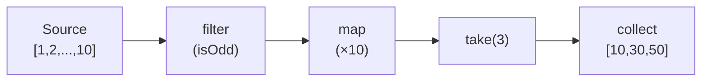

No intermediate arrays are created. Each element flows through the entire chain before the next one starts. `take(3)` stops after 3 results — elements 6-10 are never touched.

| Property | Value |
|----------|-------|
| next() | O(1) per element — one step through the pipeline |
| Memory | O(1) — no intermediate collections, one element at a time |
| Short-circuit | `take(k)` stops early — only k elements are processed |
| Composability | Chain map/filter/fold without allocating intermediate arrays |

**Try it yourself** — step through array and tree iterators, watching elements get visited one at a time:

<IteratorViz />

## Production Proof

| Project | Source | Usage |
|---------|--------|-------|
| Rust stdlib | [iterator.rs#L68-L112](https://github.com/rust-lang/rust/blob/d56483a91d6cf5041351a3208b8d08f98f0c8b56/library/core/src/iter/traits/iterator.rs#L68-L112) | The `Iterator` trait — `next()` (line 78) is the single required method. `map` (line 831), `filter` (line 952), `fold`, `collect` are all built on top. This is the foundation of Rust's zero-cost abstraction for sequences. |
| Python | [genobject.c#L259-L374](https://github.com/python/cpython/blob/ff64d8de66ab7f8e56b5d410796a7d76c955280c/Objects/genobject.c#L259-L374) | `gen_send_ex2` (L259-L324) — core generator send: pushes arg onto frame stack, calls `_PyEval_EvalFrame`, distinguishes yield vs return. `gen_send_ex` (L329-L374) validates generator state (CREATED/EXECUTING/FINISHED) before delegating. |

## Implementation

::: code-group

```typescript [TypeScript]
class Iter<T> {
  constructor(private source: () => Generator<T>) {}

  static from<T>(items: T[]): Iter<T> {
    return new Iter(function* () { yield* items; });
  }

  map<U>(fn: (x: T) => U): Iter<U> {
    const source = this.source;
    return new Iter(function* () {
      for (const item of source()) yield fn(item);
    });
  }

  filter(pred: (x: T) => boolean): Iter<T> {
    const source = this.source;
    return new Iter(function* () {
      for (const item of source()) if (pred(item)) yield item;
    });
  }

  take(n: number): Iter<T> {
    const source = this.source;
    return new Iter(function* () {
      let i = 0;
      for (const item of source()) {
        if (i++ >= n) break;
        yield item;
      }
    });
  }

  collect(): T[] {
    return [...this.source()];
  }

  fold<U>(init: U, fn: (acc: U, x: T) => U): U {
    let acc = init;
    for (const item of this.source()) acc = fn(acc, item);
    return acc;
  }
}
```

```rust [Rust]
// Rust's Iterator trait is built-in. Usage:
fn example() {
    let result: Vec<i32> = (1..=10)
        .filter(|x| x % 2 == 0)
        .map(|x| x * x)
        .collect();
    // [4, 16, 36, 64, 100] — no intermediate Vec allocated
}
```

```go [Go]
// Go 1.23+ iter.Seq for lazy iteration
package iterator

import "iter"

func Filter[T any](seq iter.Seq[T], pred func(T) bool) iter.Seq[T] {
	return func(yield func(T) bool) {
		for v := range seq {
			if pred(v) && !yield(v) {
				return
			}
		}
	}
}

func Map[T, U any](seq iter.Seq[T], fn func(T) U) iter.Seq[U] {
	return func(yield func(U) bool) {
		for v := range seq {
			if !yield(fn(v)) {
				return
			}
		}
	}
}

func Take[T any](seq iter.Seq[T], n int) iter.Seq[T] {
	return func(yield func(T) bool) {
		i := 0
		for v := range seq {
			if i >= n || !yield(v) {
				return
			}
			i++
		}
	}
}

func Collect[T any](seq iter.Seq[T]) []T {
	var out []T
	for v := range seq {
		out = append(out, v)
	}
	return out
}

// Usage: lazy pipeline — only processes 5 elements to find 3 odd ones
// source := slices.Values([]int{1,2,3,4,5,6,7,8,9,10})
// result := Collect(Take(Map(Filter(source, isOdd), times10), 3))
// → [10, 30, 50]
```

```python [Python]
# Python generators are native lazy iterators
def fibonacci():
    a, b = 0, 1
    while True:
        yield a
        a, b = b, a + b

# Take first 10 even Fibonacci numbers — lazy, infinite-safe
evens = (x for x in fibonacci() if x % 2 == 0)
first_10 = [next(evens) for _ in range(10)]
```

:::

## Exercises

| Level | Exercise | File |
|-------|----------|------|
| Basic | Implement a lazy iterator with map, filter, collect | `exercises/typescript/iterator/01-basic.test.ts` |
| Intermediate | Lazy pipeline with flatMap, take, and reduce | `exercises/typescript/iterator/02-intermediate.test.ts` |

Run exercises: `pnpm test:ts` (TypeScript) · `cargo test` (Rust) · `go test ./...` (Go) · `pytest` (Python)

Exercise files: Rust `exercises/rust/src/iterator/mod.rs` · Go `exercises/go/iterator/iterator_test.go` · Python `exercises/python/iterator/test_iterator.py`

## When to Use

- **Large/infinite sequences** — process millions of rows without loading all into memory
- **Composable pipelines** — chain transformations without intermediate allocations
- **Early termination** — `take(5)` on a billion-element source only processes 5
- **Stream processing** — files, network data, event streams

## When NOT to Use

- **Random access** — iterators are sequential; use arrays/vectors for index-based access
- **Multiple passes** — most iterators are single-use; use a collection if you need to traverse twice
- **Simple loops** — a plain `for` loop is clearer than a one-step iterator chain

## More Production Uses

- [Java Streams](https://github.com/openjdk/jdk/blob/4b3ec455c85314d051800a8f46dd8f5c93881e3a/src/java.base/share/classes/java/util/stream/Stream.java) — lazy pipeline with intermediate/terminal operations
- [C# LINQ](https://github.com/dotnet/runtime/blob/bee7953796edc09e516e847e3c9006b486ab0f6d/src/libraries/System.Linq/src/System/Linq/Enumerable.cs) — deferred query execution over `IEnumerable<T>`
- [GHC Haskell](https://github.com/ghc/ghc) — lazy lists are the default; every `[a]` is an iterator
- [Kotlin Sequences](https://github.com/JetBrains/kotlin/blob/9a0a74253fc6720b322756ca3a20febf2b266a1e/libraries/stdlib/src/kotlin/collections/Sequences.kt) — lazy evaluation analogous to Java Streams
- [Swift LazySequence](https://github.com/swiftlang/swift/blob/626f109a4614c6482adc3b2326adb49718c3aef0/stdlib/public/core/LazySequence.swift) — `.lazy` adapter for deferred computation

## Related Patterns

| Pattern | Relationship |
|---------|-------------|
| [Merge Iterator (K-Way Merge)](/patterns/merge-iterator/) | Merge iterator composes multiple iterators into one sorted output |
| [Visitor](/patterns/visitor/) | Both traverse data structures — iterators yield elements, visitors dispatch callbacks |
| [Middleware](/patterns/middleware-chain/) | Middleware chains iterate through handler sequences |
| [Dependency Graph](/patterns/dependency-graph/) | Topological iteration over dependency graphs uses the iterator pattern for traversal |

## Challenge Questions

::: details Q1: You create an infinite iterator `fibonacci()` and call `.collect()` on it. What happens?
**Answer:** The program runs until it exhausts memory and crashes — `collect()` tries to materialize an infinite sequence into a finite array.

Infinite iterators are only safe with operations that consume a bounded number of elements: `take(n)`, `find()`, `any()`, `first()`. Terminal operations like `collect()`, `count()`, or `fold()` attempt to consume every element and will never terminate on an infinite source. This is why lazy evaluation requires discipline: the chain must include a bounding combinator before any materializing terminal. Rust's type system does not prevent this — it's a runtime issue.
:::

::: details Q2: You have `iter.filter(expensiveCheck).take(5).collect()`. Does `expensiveCheck` run on all elements or only until 5 pass?
**Answer:** `expensiveCheck` runs only until 5 elements pass the filter — then `take` stops pulling from the source.

This is the power of lazy evaluation: `take(5)` pulls from `filter`, which pulls from the source, one element at a time. Once `take` has accumulated 5 passing elements, it stops requesting more. If only 1 in 10 elements passes the filter, `expensiveCheck` runs on roughly 50 elements (to find 5 that pass), not 1 million. This demand-driven execution is why lazy iterators excel at early termination — no wasted work.
:::

::: details Q3: You try to iterate over the same iterator twice. The second loop produces no elements. Why, and how do you fix it?
**Answer:** Most iterators are single-use — once consumed, their internal cursor is at the end and `next()` returns `None`/`done` forever.

An iterator is a stateful cursor, not a collection. After the first loop exhausts it, the state is permanently "finished." To iterate twice, you need either: (1) create a new iterator from the original source (`source.iter()` called twice), (2) collect into a collection first and iterate the collection, or (3) use a "replayable" abstraction like Kotlin's `Sequence` or Rust's `IntoIterator` on a collection (which creates a fresh iterator each time). Python generators have the same single-use constraint.
:::

::: details Q4: Two consumers need to process the same stream of events — one filters for errors, the other counts totals. Can they share a single iterator?
**Answer:** No, a single iterator has one cursor. You need either `tee` (clone the iterator) or a broadcast pattern (observer) to feed multiple consumers.

Python's `itertools.tee` creates N independent iterators from one source by buffering elements that one consumer has read but others haven't. The catch: if one consumer is much faster than the other, the buffer grows unboundedly. For truly independent consumption of a live stream, the observer/pub-sub pattern is more appropriate — the source pushes to all subscribers rather than subscribers pulling from a shared cursor. Iterators are fundamentally single-consumer; multiple consumers need a fan-out mechanism.
:::


================================================
FILE: docs/patterns/logical-clock/index.md
================================================
---
title: "Pattern: Logical Clock / Epoch"
description: "A monotonically increasing counter that orders events without wall-clock time — enabling consistent snapshots and staleness detection."
difficulty: "advanced"
---

# Pattern: Logical Clock / Epoch

<DifficultyBadge />

## One Liner

A monotonically increasing counter that orders events without wall-clock time — enabling consistent snapshots and staleness detection.

<DemoBadge />

## Real-World Analogy

Numbering messages in a group chat where everyone is in different time zones. Instead of using wall-clock time (which differs), you stamp each message with a sequence number that respects 'I saw your message before sending mine' — causal order, not clock order.

## Core Idea

Wall clocks are unreliable in distributed systems — they drift, jump on NTP sync, and differ across machines. A logical clock is a simple integer that only goes up. Lamport's rule: increment on local event, take `max(local, remote) + 1` on message receive. This guarantees: if event A causally precedes event B, then `clock(A) < clock(B)`.

```text
  Process P1          Process P2
  ─────────           ─────────
  tick → 1
  tick → 2
  send(2) ──────────► receive(2)
                      max(0, 2)+1 = 3
                      tick → 4
  receive(4) ◄─────── send(4)
  max(2, 4)+1 = 5
  tick → 6

  Causal order: P1:1 → P1:2 → P2:3 → P2:4 → P1:5 → P1:6
```

| Property | Value |
|----------|-------|
| Increment | O(1) — counter++ |
| Receive | O(1) — max + 1 |
| Guarantees | If A → B (causally), then clock(A) < clock(B) |
| Limitation | Converse is NOT true: clock(A) < clock(B) does not imply A → B |

**Try it yourself** — perform local events and send messages between processes to see Lamport clocks:

<LogicalClockViz />

## Production Proof

| Project | Source | Usage |
|---------|--------|-------|
| etcd | [kvstore.go#L53-L72](https://github.com/etcd-io/etcd/blob/e9b62f804766edf77cfa918d600cb6fb2c56b401/server/storage/mvcc/kvstore.go#L53-L72) | `store` struct (L53) with `currentRev int64` (L72) — a monotonic revision counter. Incremented in [kvstore_txn.go#L214](https://github.com/etcd-io/etcd/blob/e9b62f804766edf77cfa918d600cb6fb2c56b401/server/storage/mvcc/kvstore_txn.go#L214) (`tw.s.currentRev++`) on every write transaction. Watches and snapshots use this revision for consistent reads — "give me everything after revision 42." |
| LevelDB | [dbformat.h#L62-L66](https://github.com/google/leveldb/blob/7ee830d02b623e8ffe0b95d59a74db1e58da04c5/db/dbformat.h#L62-L66) | `SequenceNumber` (L62) is a `uint64_t` incremented on every write operation. `kMaxSequenceNumber` (L66) reserves 8 bits for packing type info alongside the sequence. Used to order writes in the WAL, determine snapshot visibility, and resolve key conflicts during compaction. |

## Implementation

::: code-group

```typescript [TypeScript]
class LamportClock {
  private time = 0;

  /** Increment the clock for a local event. */
  tick(): void {
    this.time++;
  }

  /** Record a send event and return the timestamp. */
  send(): number {
    this.time++;
    return this.time;
  }

  /** Receive a message with a remote timestamp. */
  receive(remoteTimestamp: number): void {
    this.time = Math.max(this.time, remoteTimestamp) + 1;
  }

  /** Current clock value. */
  now(): number {
    return this.time;
  }
}
```

```rust [Rust]
use std::sync::atomic::{AtomicU64, Ordering};

pub struct LamportClock {
    time: AtomicU64,
}

impl LamportClock {
    pub fn new() -> Self {
        LamportClock { time: AtomicU64::new(0) }
    }

    pub fn tick(&self) -> u64 {
        self.time.fetch_add(1, Ordering::SeqCst) + 1
    }

    pub fn send(&self) -> u64 {
        self.tick()
    }

    pub fn receive(&self, remote: u64) -> u64 {
        loop {
            let current = self.time.load(Ordering::SeqCst);
            let new_time = std::cmp::max(current, remote) + 1;
            if self.time.compare_exchange(
                current, new_time, Ordering::SeqCst, Ordering::SeqCst
            ).is_ok() {
                return new_time;
            }
        }
    }

    pub fn now(&self) -> u64 {
        self.time.load(Ordering::SeqCst)
    }
}
```

```go [Go]
type LamportClock struct {
	mu   sync.Mutex
	time uint64
}

func (c *LamportClock) Tick() uint64 {
	c.mu.Lock()
	defer c.mu.Unlock()
	c.time++
	return c.time
}

func (c *LamportClock) Send() uint64 {
	c.mu.Lock()
	defer c.mu.Unlock()
	c.time++
	return c.time
}

func (c *LamportClock) Receive(remote uint64) uint64 {
	c.mu.Lock()
	defer c.mu.Unlock()
	if remote > c.time {
		c.time = remote
	}
	c.time++
	return c.time
}

func (c *LamportClock) Now() uint64 {
	c.mu.Lock()
	defer c.mu.Unlock()
	return c.time
}
```

```python [Python]
class LamportClock:
    def __init__(self) -> None:
        self._time = 0

    def tick(self) -> None:
        self._time += 1

    def send(self) -> int:
        self._time += 1
        return self._time

    def receive(self, remote_timestamp: int) -> None:
        self._time = max(self._time, remote_timestamp) + 1

    def now(self) -> int:
        return self._time
```

:::

## Exercises

| Level | Exercise | File |
|-------|----------|------|
| Basic | Implement a Lamport clock with tick/send/receive | `exercises/typescript/logical-clock/01-basic.test.ts` |
| Intermediate | Build a version vector for multi-node causality tracking | `exercises/typescript/logical-clock/02-intermediate.test.ts` |

Run exercises: `pnpm test:ts` (TypeScript) · `cargo test` (Rust) · `go test ./...` (Go) · `pytest` (Python)

Exercise files: Rust `exercises/rust/src/logical_clock/mod.rs` · Go `exercises/go/logical_clock/logical_clock_test.go` · Python `exercises/python/logical_clock/test_logical_clock.py`

## When to Use

- **Database revision tracking** — etcd, CockroachDB, and Spanner use monotonic revisions for consistent snapshots and watch APIs
- **Cache invalidation** — epoch-based invalidation: "if your cached epoch < current epoch, your data is stale"
- **Distributed event ordering** — ordering messages across nodes without synchronized clocks (message queues, event sourcing)
- **MVCC (multi-version concurrency control)** — each transaction gets a sequence number; readers see a consistent snapshot at a point-in-time
- **Optimistic concurrency** — "update this row only if the version matches" (compare-and-swap with logical timestamps)

## When NOT to Use

- **Wall-clock time is needed** — if you need "this happened at 2:30 PM" for user-facing timestamps, a logical clock gives you ordering but not real time. Use Hybrid Logical Clocks (HLC) or TrueTime.
- **Detecting concurrent events** — a Lamport clock cannot determine if two events are concurrent or causally related when `clock(A) < clock(B)`. You need vector clocks for that.
- **Single-process sequential code** — if everything runs in one thread with no distribution, a simple counter or array index suffices. The Lamport machinery adds nothing.

## More Production Uses

- [CockroachDB](https://github.com/cockroachdb/cockroach) — Hybrid Logical Clock (HLC) combining wall clock + logical counter for serializable transactions
- [Amazon DynamoDB](https://www.allthingsdistributed.com/files/amazon-dynamo-sosp2007.pdf) — vector clocks for conflict detection across replicas
- [Kafka](https://github.com/apache/kafka) — offsets as monotonic logical positions in a partition log
- [Raft consensus](https://github.com/etcd-io/raft) — `term` is a logical epoch; higher term wins leader election

## Related Patterns

| Pattern | Relationship |
|---------|-------------|
| [MVCC (Multi-Version Concurrency Control)](/patterns/mvcc/) | MVCC uses logical timestamps as version identifiers |
| [Write-Ahead Log (WAL)](/patterns/write-ahead-log/) | WAL entries are ordered by logical clock sequence numbers |
| [Checkpointing](/patterns/checkpointing/) | Checkpoints are taken at specific logical clock positions |

## Challenge Questions

::: details Q1: Process A has Lamport clock 5, Process B has clock 3. Can you determine which event happened first?
**Answer:** No. Lamport clocks only guarantee: if A causally precedes B, then `clock(A) < clock(B)`. The converse is NOT guaranteed.

`clock(A) = 5 > clock(B) = 3` does NOT mean A happened after B. They could be concurrent events on different machines that never communicated. To detect concurrency, you need a **vector clock** — one counter per node, with component-wise comparison.
:::

::: details Q2: How does a Hybrid Logical Clock (HLC) improve on a pure Lamport clock?
**Answer:** An HLC combines a physical timestamp (wall clock) with a logical counter. The physical part gives you real-time proximity — "this happened around 2:30 PM." The logical part breaks ties and maintains the Lamport guarantee.

Rule: `hlc = max(local_wall_clock, local_hlc, remote_hlc)`. If the wall clock advances, the logical part resets. If the wall clock is behind (NTP hasn't caught up), the logical part increments.

CockroachDB uses HLC because it needs both: causal ordering for consistency AND real-time bounds for transaction deadlines. A pure Lamport clock gives ordering but the numbers are meaningless as time. A pure wall clock gives time but can go backward.
:::

::: details Q3: Your cache uses an epoch counter for invalidation. A server restarts and the epoch resets to 0. What breaks?
**Answer:** Stale cache entries appear valid. A client with cached epoch 5 sees the server's epoch 0 and might incorrectly conclude it has newer data (or, depending on the protocol, force a full re-fetch).

Solutions: (1) persist the epoch to disk and restore on restart, (2) use a combination of server ID + epoch so restarts are distinguishable, (3) use a timestamp-based epoch that only increases. etcd solves this with persistent revision + a member ID that changes on rejoin.
:::

::: details Q4: You're building an event sourcing system. Should you use Lamport clocks or sequence numbers as event IDs?
**Answer:** Sequence numbers are better for a single-writer event store. A Lamport clock adds unnecessary complexity when there's only one source of events — a simple auto-incrementing integer is a perfectly valid logical clock.

Lamport clocks shine when multiple independent writers exist (distributed systems). For single-writer: use a sequence number. For multi-writer with one coordinating node: use a centralized sequence (like Kafka partition offsets). For truly distributed multi-writer: use Lamport or vector clocks. Match the tool to the distribution model.
:::


================================================
FILE: docs/patterns/lru-cache/index.md
================================================
---
title: "Pattern: LRU Cache"
description: "Evict the least recently used entry when the cache is full — O(1) get and put using a hash map plus a doubly linked list."
difficulty: "intermediate"
---

# Pattern: LRU Cache

<DifficultyBadge />

## One Liner

Evict the least recently used entry when the cache is full — O(1) get and put using a hash map plus a doubly linked list.

<DemoBadge />

## Real-World Analogy

A small desk with limited space. You keep the books you've used most recently on the desk. When you need room for a new book, you move the one you haven't touched longest back to the bookshelf.

## Core Idea

An LRU cache combines a hash map (for O(1) key lookup) with a doubly linked list (for O(1) recency tracking). On every access, the entry moves to the front. When the cache exceeds capacity, the entry at the back (least recently used) is evicted.

```text
  Most Recent                                    Least Recent
  ┌─────┐    ┌─────┐    ┌─────┐    ┌─────┐    ┌─────┐
  │  E  │◄──►│  D  │◄──►│  C  │◄──►│  B  │◄──►│  A  │  ← evict this
  └─────┘    └─────┘    └─────┘    └─────┘    └─────┘

  get("B") → move B to front:
  ┌─────┐    ┌─────┐    ┌─────┐    ┌─────┐    ┌─────┐
  │  B  │◄──►│  E  │◄──►│  D  │◄──►│  C  │◄──►│  A  │
  └─────┘    └─────┘    └─────┘    └─────┘    └─────┘

  put("F") with capacity=5 → evict A, add F to front
```

| Property | Value |
|----------|-------|
| get | O(1) — hash map lookup + move to front |
| put | O(1) — hash map insert + evict if over capacity |
| Eviction policy | Least Recently Used (tail of list) |
| Space | O(capacity) |

**Try it yourself** — put and get keys to see how the LRU eviction works:

<LRUCacheViz />

## Production Proof

| Project | Source | Usage |
|---------|--------|-------|
| Go groupcache | [lru.go#L23-L104](https://github.com/golang/groupcache/blob/2c02b8208cf8c02a3e358cb1d9b60950647543fc/lru/lru.go#L23-L104) | `Cache` struct (L23-L34) with doubly linked list + hash map. `Add` (L56-L71) inserts/updates and moves to front; `Get` (L74-L83) moves to front on hit; `RemoveOldest` (L96-L104) evicts from back. By Brad Fitzpatrick (memcached creator). |
| Redis | [evict.c#L55-L83](https://github.com/redis/redis/blob/df63a65d4d4ee33ae67e9f101885074febe0bccb/src/evict.c#L55-L83) | Approximated LRU — reduced-bit LRU clock and idle-time estimation with wraparound. `evictionPoolPopulate` (L134-L225) samples N keys and inserts into a sorted eviction pool. Engineering tradeoff: O(1) memory overhead at scale vs exact LRU. |

## Implementation

::: code-group

```typescript [TypeScript]
class LRUCache<K, V> {
  private map = new Map<K, V>();

  constructor(private capacity: number) {}

  get(key: K): V | undefined {
    if (!this.map.has(key)) return undefined;
    const value = this.map.get(key)!;
    this.map.delete(key);
    this.map.set(key, value);
    return value;
  }

  put(key: K, value: V): void {
    if (this.map.has(key)) this.map.delete(key);
    this.map.set(key, value);
    if (this.map.size > this.capacity) {
      const oldest = this.map.keys().next().value!;
      this.map.delete(oldest);
    }
  }
}
```

```rust [Rust]
use std::collections::HashMap;

pub struct LRUCache {
    capacity: usize,
    order: Vec<String>,
    map: HashMap<String, String>,
}

impl LRUCache {
    pub fn new(capacity: usize) -> Self {
        LRUCache { capacity, order: Vec::new(), map: HashMap::new() }
    }

    pub fn get(&mut self, key: &str) -> Option<&str> {
        if !self.map.contains_key(key) { return None; }
        self.order.retain(|k| k != key);
        self.order.push(key.to_string());
        self.map.get(key).map(|v| v.as_str())
    }

    pub fn put(&mut self, key: &str, value: &str) {
        self.order.retain(|k| k != key);
        self.order.push(key.to_string());
        self.map.insert(key.to_string(), value.to_string());
        if self.map.len() > self.capacity {
            if let Some(oldest) = self.order.first().cloned() {
                self.order.remove(0);
                self.map.remove(&oldest);
            }
        }
    }
}
```

```go [Go]
type entry struct {
	key   string
	value any
}

type LRUCache struct {
	capacity int
	ll       *list.List
	cache    map[string]*list.Element
}

func NewLRUCache(capacity int) *LRUCache {
	return &LRUCache{capacity: capacity, ll: list.New(), cache: make(map[string]*list.Element)}
}

func (c *LRUCache) Get(key string) (any, bool) {
	if ele, ok := c.cache[key]; ok {
		c.ll.MoveToFront(ele)
		return ele.Value.(*entry).value, true
	}
	return nil, false
}

func (c *LRUCache) Put(key string, value any) {
	if ele, ok := c.cache[key]; ok {
		c.ll.MoveToFront(ele)
		ele.Value.(*entry).value = value
		return
	}
	ele := c.ll.PushFront(&entry{key, value})
	c.cache[key] = ele
	if c.ll.Len() > c.capacity {
		oldest := c.ll.Back()
		c.ll.Remove(oldest)
		delete(c.cache, oldest.Value.(*entry).key)
	}
}
```

```python [Python]
from collections import OrderedDict

class LRUCache:
    def __init__(self, capacity: int):
        self.capacity = capacity
        self.cache: OrderedDict[str, object] = OrderedDict()

    def get(self, key: str):
        if key not in self.cache:
            return None
        self.cache.move_to_end(key)
        return self.cache[key]

    def put(self, key: str, value: object) -> None:
        if key in self.cache:
            self.cache.move_to_end(key)
        self.cache[key] = value
        if len(self.cache) > self.capacity:
            self.cache.popitem(last=False)
```

:::

## Exercises

| Level | Exercise | File |
|-------|----------|------|
| Basic | Implement an LRU cache with get/put and eviction | `exercises/typescript/lru-cache/01-basic.test.ts` |
| Intermediate | TTL-aware LRU cache with expiry | `exercises/typescript/lru-cache/02-intermediate.test.ts` |

Run exercises: `pnpm test:ts` (TypeScript) · `cargo test` (Rust) · `go test ./...` (Go) · `pytest` (Python)

Exercise files: Rust `exercises/rust/src/lru_cache/mod.rs` · Go `exercises/go/lru_cache/lru_cache_test.go` · Python `exercises/python/lru_cache/test_lru_cache.py`

## When to Use

- **Database query caching** — cache hot queries, evict cold ones
- **DNS resolution** — cache recent lookups
- **Web browsers** — page/resource cache with bounded memory
- **API response caching** — keep frequently requested responses warm
- **Operating systems** — page cache, dentry cache, inode cache

## When NOT to Use

- **Scan-resistant workloads** — a full table scan evicts all useful entries (use LRU-K or ARC instead)
- **Time-based expiration needed** — LRU evicts by access recency, not age (add TTL layer separately)
- **Frequency matters more** — if popular items get evicted by a burst of unique requests, use LFU
- **Unbounded growth OK** — if memory isn't constrained, a simple hash map is simpler

## More Production Uses

- [Redis](https://github.com/redis/redis) — `maxmemory-policy allkeys-lru` for LRU eviction
- [Guava Cache](https://github.com/google/guava) — `CacheBuilder.maximumSize()` with LRU eviction
- [Python functools](https://github.com/python/cpython) — `@lru_cache` decorator
- [Caffeine](https://github.com/ben-manes/caffeine) — high-performance Java cache (Window TinyLfu, inspired by LRU)

## Related Patterns

| Pattern | Relationship |
|---------|-------------|
| [Free List](/patterns/free-list/) | LRU eviction frees nodes; free lists recycle them without calling the allocator |
| [Flyweight](/patterns/flyweight/) | Both reduce memory — LRU limits cache size, flyweight shares identical objects |
| [Consistent Hashing](/patterns/consistent-hashing/) | Distributed caches use consistent hashing to route keys to the right LRU instance |
| [Tombstone](/patterns/tombstone/) | Tombstones mark deleted cache entries in distributed LRU caches |
| [Bloom Filter](/patterns/bloom-filter/) | Bloom filters pre-check before expensive LRU cache lookups to avoid cache misses |
| [Interning / Symbol Table](/patterns/interning/) | Intern tables can use LRU eviction to bound memory usage |

## Challenge Questions

::: details Q1: LRU cache with capacity 3. Operations: put(A), put(B), put(C), put(D), get(B). What's in the cache?
**Answer:** `{B, D, C}`

After put(A,B,C), cache is full. put(D) evicts A (least recently used). Now `{D, C, B}`. get(B) moves B to front. Final order most→least recent: `B, D, C`.

Key insight: `get()` counts as "use" — it moves the entry to the front, not just returns it.
:::

::: details Q2: You have a web server with an LRU cache for API responses. A bot crawls every page once. What happens?
**Answer:** The bot evicts all your hot cache entries.

Each crawled page is accessed once, pushed to front, and evicts a frequently-used page. After the crawl, your cache is full of pages nobody will request again. This is the **scan resistance** problem — LRU is vulnerable to sequential scans. Solutions: LRU-K (evict only if accessed < K times), ARC (adaptive), or a two-tier cache.
:::

::: details Q3: Why does Redis use "approximated LRU" instead of exact LRU?
**Answer:** Exact LRU requires a doubly linked list per key — that's 2 pointers (16 bytes on 64-bit) per key just for ordering. With millions of keys, that's significant overhead.

Redis instead stores a 24-bit LRU clock per key (3 bytes) and samples N random keys when eviction is needed, evicting the one with the oldest clock. This trades perfect eviction order for O(1) memory overhead per key. In practice, sampling 10 keys gives results very close to exact LRU.
:::

::: details Q4: Can you build an LRU cache in O(1) without a doubly linked list?
**Answer:** Yes — using a language with ordered hash maps. In JavaScript, `Map` preserves insertion order. Delete and re-insert on access to move to "most recent." This is exactly what the TypeScript implementation above does.

In languages without ordered maps (C, Go), you need the classic hash map + doubly linked list approach. Go's `groupcache` does this with `container/list`.
:::


================================================
FILE: docs/patterns/lsm-tree/index.md
================================================
---
title: "Pattern: LSM Tree (Log-Structured Merge Tree)"
description: "Buffer writes in memory, flush to sorted files on disk, merge files in background — trading read amplification for fast writes."
difficulty: "advanced"
---

# Pattern: LSM Tree (Log-Structured Merge Tree)

<DifficultyBadge />

## One Liner

Buffer writes in memory, flush to sorted files on disk, merge files in background — trading read amplification for fast writes.

<DemoBadge />

## Real-World Analogy

A filing system where you first write notes on a sticky pad (memtable), then periodically file them into sorted folders (SSTables). Over time, you merge small folders into bigger ones during quiet hours (compaction).

## Core Idea

An LSM tree absorbs writes into an in-memory sorted structure (the memtable). When the memtable reaches a size threshold, it is flushed to disk as an immutable sorted run (SSTable). Background compaction merges multiple sorted runs to bound the number of files and reclaim space from deleted/overwritten keys. Reads check the memtable first, then each level of sorted runs.

```text
  Write Path                          Read Path
  ──────────                          ─────────
  PUT k=v ──►  ┌────────────┐         GET k
               │  Memtable  │ ◄──── 1. Check memtable
               │ (sorted,   │
               │  in-memory)│
               └─────┬──────┘
          flush when  │
          size > limit│
                      ▼
               ┌────────────┐
               │  Level 0   │ ◄──── 2. Check L0 files
               │  (SSTables)│
               └─────┬──────┘
          compact     │
          when full   │
                      ▼
               ┌────────────┐
               │  Level 1   │ ◄──── 3. Check L1 files
               │  (merged)  │
               └─────┬──────┘
                      ▼
                     ...
```

| Property | Value |
|----------|-------|
| Write amplification | O(level_count) due to compaction |
| Read amplification | O(level_count) in worst case |
| Write throughput | Very high — sequential I/O only |
| Space amplification | Temporary duplication during compaction |

**Try it yourself** — write keys to the memtable, watch it flush to SSTables, and compact levels:

<LSMTreeViz />

## Production Proof

| Project | Source | Usage |
|---------|--------|-------|
| LevelDB | [db_impl.cc#L1241-L1368](https://github.com/google/leveldb/blob/7ee830d02b623e8ffe0b95d59a74db1e58da04c5/db/db_impl.cc#L1241-L1368) | `DBImpl::Write` — the core write path. Batches writes into a group (L1241-L1288), appends to WAL (L1311), inserts into memtable (L1337-L1354). When memtable exceeds `write_buffer_size`, `MakeRoomForWrite` (L1368) triggers a flush: the current memtable becomes immutable and a new one is created. Background compaction then merges SSTable files across levels. |
| RocksDB | [memtable.cc#L458-L534](https://github.com/facebook/rocksdb/blob/7affaee1c49ebc80cb213ad86fe7d2a3ad447da2/db/memtable.cc#L458-L534) | `MemTable::Add` inserts a key-value pair with sequence number and type into the skip-list backed memtable. The memtable is the first destination for all writes. When it reaches `write_buffer_size`, it's made immutable and scheduled for flush to an L0 SST file. RocksDB extends LevelDB's design with concurrent memtable writes, column families, and pluggable memtable implementations. |

## Implementation

::: code-group

```typescript [TypeScript]
interface KVEntry {
  key: string;
  value: string | null; // null = tombstone (deleted)
  seq: number;
}

class Memtable {
  private entries: Map<string, KVEntry> = new Map();
  private _size = 0;

  put(key: string, value: string, seq: number): void {
    this.entries.set(key, { key, value, seq });
    this._size++;
  }

  delete(key: string, seq: number): void {
    this.entries.set(key, { key, value: null, seq });
    this._size++;
  }

  get(key: string): KVEntry | undefined {
    return this.entries.get(key);
  }

  get size(): number { return this._size; }

  flush(): KVEntry[] {
    const sorted = [...this.entries.values()].sort((a, b) => a.key.localeCompare(b.key));
    this.entries.clear();
    this._size = 0;
    return sorted;
  }
}

type SortedRun = KVEntry[];

class LSMTree {
  private memtable = new Memtable();
  private runs: SortedRun[] = []; // L0 sorted runs, newest first
  private seq = 0;
  private readonly flushThreshold: number;
  private readonly maxRuns: number;

  constructor(flushThreshold = 4, maxRuns = 4) {
    this.flushThreshold = flushThreshold;
    this.maxRuns = maxRuns;
  }

  put(key: string, value: string): void {
    this.memtable.put(key, value, this.seq++);
    if (this.memtable.size >= this.flushThreshold) {
      this.flushMemtable();
    }
  }

  delete(key: string): void {
    this.memtable.delete(key, this.seq++);
    if (this.memtable.size >= this.flushThreshold) {
      this.flushMemtable();
    }
  }

  get(key: string): string | undefined {
    // Check memtable first
    const memEntry = this.memtable.get(key);
    if (memEntry) return memEntry.value ?? undefined;

    // Check sorted runs (newest first)
    for (const run of this.runs) {
      const entry = this.binarySearch(run, key);
      if (entry) return entry.value ?? undefined;
    }
    return undefined;
  }

  private binarySearch(run: SortedRun, key: string): KVEntry | undefined {
    let lo = 0, hi = run.length - 1;
    while (lo <= hi) {
      const mid = (lo + hi) >> 1;
      const cmp = run[mid]!.key.localeCompare(key);
      if (cmp === 0) return run[mid];
      if (cmp < 0) lo = mid + 1;
      else hi = mid - 1;
    }
    return undefined;
  }

  private flushMemtable(): void {
    const run = this.memtable.flush();
    this.runs.unshift(run); // newest first
    if (this.runs.length > this.maxRuns) {
      this.compact();
    }
  }

  private compact(): void {
    // Merge all runs into one
    const merged = new Map<string, KVEntry>();
    // Process oldest first so newest wins
    for (let i = this.runs.length - 1; i >= 0; i--) {
      for (const entry of this.runs[i]!) {
        merged.set(entry.key, entry);
      }
    }
    // Remove tombstones and sort
    const compacted = [...merged.values()]
      .filter((e) => e.value !== null)
      .sort((a, b) => a.key.localeCompare(b.key));
    this.runs = compacted.length > 0 ? [compacted] : [];
  }

  get runCount(): number { return this.runs.length; }
}
```

```rust [Rust]
use std::collections::BTreeMap;

#[derive(Clone, Debug)]
pub struct KVEntry {
    pub key: String,
    pub value: Option<String>, // None = tombstone
    pub seq: usize,
}

pub struct Memtable {
    entries: BTreeMap<String, KVEntry>,
    size: usize,
}

impl Memtable {
    pub fn new() -> Self {
        Memtable { entries: BTreeMap::new(), size: 0 }
    }

    pub fn put(&mut self, key: &str, value: &str, seq: usize) {
        self.entries.insert(key.to_string(), KVEntry {
            key: key.to_string(), value: Some(value.to_string()), seq,
        });
        self.size += 1;
    }

    pub fn delete(&mut self, key: &str, seq: usize) {
        self.entries.insert(key.to_string(), KVEntry {
            key: key.to_string(), value: None, seq,
        });
        self.size += 1;
    }

    pub fn get(&self, key: &str) -> Option<&KVEntry> {
        self.entries.get(key)
    }

    pub fn size(&self) -> usize { self.size }

    pub fn flush(&mut self) -> Vec<KVEntry> {
        let result: Vec<KVEntry> = self.entries.values().cloned().collect();
        self.entries.clear();
        self.size = 0;
        result
    }
}

pub struct LSMTree {
    memtable: Memtable,
    runs: Vec<Vec<KVEntry>>,
    seq: usize,
    flush_threshold: usize,
    max_runs: usize,
}

impl LSMTree {
    pub fn new(flush_threshold: usize, max_runs: usize) -> Self {
        LSMTree {
            memtable: Memtable::new(),
            runs: Vec::new(),
            seq: 0,
            flush_threshold,
            max_runs,
        }
    }

    pub fn put(&mut self, key: &str, value: &str) {
        self.memtable.put(key, value, self.seq);
        self.seq += 1;
        if self.memtable.size() >= self.flush_threshold {
            self.flush_memtable();
        }
    }

    pub fn delete(&mut self, key: &str) {
        self.memtable.delete(key, self.seq);
        self.seq += 1;
        if self.memtable.size() >= self.flush_threshold {
            self.flush_memtable();
        }
    }

    pub fn get(&self, key: &str) -> Option<&str> {
        if let Some(entry) = self.memtable.get(key) {
            return entry.value.as_deref();
        }
        for run in &self.runs {
            if let Ok(idx) = run.binary_search_by(|e| e.key.as_str().cmp(key)) {
                return run[idx].value.as_deref();
            }
        }
        None
    }

    fn flush_memtable(&mut self) {
        let run = self.memtable.flush();
        self.runs.insert(0, run);
        if self.runs.len() > self.max_runs {
            self.compact();
        }
    }

    fn compact(&mut self) {
        let mut merged = BTreeMap::new();
        for run in self.runs.iter().rev() {
            for entry in run {
                merged.insert(entry.key.clone(), entry.clone());
            }
        }
        let result: Vec<KVEntry> = merged.into_values()
            .filter(|e| e.value.is_some())
            .collect();
        self.runs = if result.is_empty() { vec![] } else { vec![result] };
    }

    pub fn run_count(&self) -> usize { self.runs.len() }
}
```

```go [Go]
package lsm

import "sort"

type KVEntry struct {
	Key   string
	Value *string // nil = tombstone
	Seq   int
}

type Memtable struct {
	entries map[string]KVEntry
	size    int
}

func NewMemtable() *Memtable {
	return &Memtable{entries: make(map[string]KVEntry)}
}

func (m *Memtable) Put(key, value string, seq int) {
	m.entries[key] = KVEntry{Key: key, Value: &value, Seq: seq}
	m.size++
}

func (m *Memtable) Delete(key string, seq int) {
	m.entries[key] = KVEntry{Key: key, Value: nil, Seq: seq}
	m.size++
}

func (m *Memtable) Get(key string) (KVEntry, bool) {
	e, ok := m.entries[key]
	return e, ok
}

func (m *Memtable) Flush() []KVEntry {
	result := make([]KVEntry, 0, len(m.entries))
	for _, e := range m.entries {
		result = append(result, e)
	}
	sort.Slice(result, func(i, j int) bool {
		return result[i].Key < result[j].Key
	})
	m.entries = make(map[string]KVEntry)
	m.size = 0
	return result
}

type LSMTree struct {
	memtable       *Memtable
	runs           [][]KVEntry
	seq            int
	flushThreshold int
	maxRuns        int
}

func NewLSMTree(flushThreshold, maxRuns int) *LSMTree {
	return &LSMTree{
		memtable:       NewMemtable(),
		flushThreshold: flushThreshold,
		maxRuns:        maxRuns,
	}
}

func (t *LSMTree) Put(key, value string) {
	t.memtable.Put(key, value, t.seq)
	t.seq++
	if t.memtable.size >= t.flushThreshold {
		t.flushMemtable()
	}
}

func (t *LSMTree) Delete(key string) {
	t.memtable.Delete(key, t.seq)
	t.seq++
	if t.memtable.size >= t.flushThreshold {
		t.flushMemtable()
	}
}

func (t *LSMTree) Get(key string) (string, bool) {
	if e, ok := t.memtable.Get(key); ok {
		if e.Value == nil {
			return "", false
		}
		return *e.Value, true
	}
	for _, run := range t.runs {
		if e := binarySearch(run, key); e != nil {
			if e.Value == nil {
				return "", false
			}
			return *e.Value, true
		}
	}
	return "", false
}

func binarySearch(run []KVEntry, key string) *KVEntry {
	lo, hi := 0, len(run)-1
	for lo <= hi {
		mid := (lo + hi) / 2
		if run[mid].Key == key {
			return &run[mid]
		}
		if run[mid].Key < key {
			lo = mid + 1
		} else {
			hi = mid - 1
		}
	}
	return nil
}

func (t *LSMTree) flushMemtable() {
	run := t.memtable.Flush()
	t.runs = append([][]KVEntry{run}, t.runs...)
	if len(t.runs) > t.maxRuns {
		t.compact()
	}
}

func (t *LSMTree) compact() {
	merged := make(map[string]KVEntry)
	for i := len(t.runs) - 1; i >= 0; i-- {
		for _, e := range t.runs[i] {
			merged[e.Key] = e
		}
	}
	result := make([]KVEntry, 0)
	for _, e := range merged {
		if e.Value != nil {
			result = append(result, e)
		}
	}
	sort.Slice(result, func(i, j int) bool {
		return result[i].Key < result[j].Key
	})
	if len(result) > 0 {
		t.runs = [][]KVEntry{result}
	} else {
		t.runs = nil
	}
}

func (t *LSMTree) RunCount() int {
	return len(t.runs)
}
```

```python [Python]
from dataclasses import dataclass, field
from bisect import bisect_left

@dataclass
class KVEntry:
    key: str
    value: str | None  # None = tombstone
    seq: int = 0

class Memtable:
    def __init__(self):
        self._entries: dict[str, KVEntry] = {}
        self._size = 0

    def put(self, key: str, value: str, seq: int) -> None:
        self._entries[key] = KVEntry(key=key, value=value, seq=seq)
        self._size += 1

    def delete(self, key: str, seq: int) -> None:
        self._entries[key] = KVEntry(key=key, value=None, seq=seq)
        self._size += 1

    def get(self, key: str) -> KVEntry | None:
        return self._entries.get(key)

    @property
    def size(self) -> int:
        return self._size

    def flush(self) -> list[KVEntry]:
        result = sorted(self._entries.values(), key=lambda e: e.key)
        self._entries.clear()
        self._size = 0
        return result

class LSMTree:
    def __init__(self, flush_threshold: int = 4, max_runs: int = 4):
        self._memtable = Memtable()
        self._runs: list[list[KVEntry]] = []
        self._seq = 0
        self._flush_threshold = flush_threshold
        self._max_runs = max_runs

    def put(self, key: str, value: str) -> None:
        self._memtable.put(key, value, self._seq)
        self._seq += 1
        if self._memtable.size >= self._flush_threshold:
            self._flush()

    def delete(self, key: str) -> None:
        self._memtable.delete(key, self._seq)
        self._seq += 1
        if self._memtable.size >= self._flush_threshold:
            self._flush()

    def get(self, key: str) -> str | None:
        entry = self._memtable.get(key)
        if entry is not None:
            return entry.value

        for run in self._runs:
            entry = self._binary_search(run, key)
            if entry is not None:
                return entry.value
        return None

    def _binary_search(self, run: list[KVEntry], key: str) -> KVEntry | None:
        keys = [e.key for e in run]
        i = bisect_left(keys, key)
        if i < len(run) and run[i].key == key:
            return run[i]
        return None

    def _flush(self) -> None:
        run = self._memtable.flush()
        self._runs.insert(0, run)
        if len(self._runs) > self._max_runs:
            self._compact()

    def _compact(self) -> None:
        merged: dict[str, KVEntry] = {}
        for run in reversed(self._runs):
            for entry in run:
                merged[entry.key] = entry
        result = [e for e in merged.values() if e.value is not None]
        result.sort(key=lambda e: e.key)
        self._runs = [result] if result else []

    @property
    def run_count(self) -> int:
        return len(self._runs)
```

:::

## Exercises

| Level | Exercise | File |
|-------|----------|------|
| Basic | In-memory memtable with flush to sorted runs | `exercises/typescript/lsm-tree/01-basic.test.ts` |
| Intermediate | Multi-level compaction with size-triggered merge | `exercises/typescript/lsm-tree/02-intermediate.test.ts` |

Run exercises: `pnpm test:ts` (TypeScript) · `cargo test` (Rust) · `go test ./...` (Go) · `pytest` (Python)

Exercise files: Rust `exercises/rust/src/lsm_tree/mod.rs` · Go `exercises/go/lsm_tree/lsm_tree_test.go` · Python `exercises/python/lsm_tree/test_lsm_tree.py`

## When to Use

- **Write-heavy workloads** — logging, time-series data, event streams
- **Key-value stores** — LevelDB, RocksDB, Cassandra, HBase
- **Embedded databases** — space-efficient, simple to implement
- **Append-mostly data** — IoT sensor data, analytics events
- **SSD-optimized storage** — sequential writes maximize SSD lifespan

## When NOT to Use

- **Read-heavy workloads** — reads may check multiple levels; use B+ trees for fast reads
- **Small datasets** — LSM overhead (compaction, multiple files) isn't worth it for data that fits in a B+ tree
- **Range scans with strict latency** — compaction can cause latency spikes
- **Update-heavy with point reads** — repeated updates to the same key create write amplification during compaction

## More Production Uses

- [Apache Cassandra](https://github.com/apache/cassandra) — LSM-based distributed NoSQL database
- [ScyllaDB](https://github.com/scylladb/scylladb) — high-performance Cassandra-compatible LSM store
- [BadgerDB](https://github.com/dgraph-io/badger) — Go-native LSM key-value store with value separation
- [SQLite LSM extension](https://www.sqlite.org/lsm.html) — LSM-based storage backend for SQLite

## Related Patterns

| Pattern | Relationship |
|---------|-------------|
| [Skip List](/patterns/skip-list/) | Skip lists serve as the in-memory sorted buffer (memtable) in LSM trees |
| [Bloom Filter](/patterns/bloom-filter/) | Bloom filters on each SSTable avoid unnecessary disk reads during lookups |
| [Merge Iterator (K-Way Merge)](/patterns/merge-iterator/) | Compaction merges multiple sorted SSTables using merge iterators |
| [Write-Ahead Log (WAL)](/patterns/write-ahead-log/) | WAL ensures memtable writes survive crashes before flushing to SSTables |
| [Tombstone](/patterns/tombstone/) | LSM trees use tombstones to mark deletions that are cleaned up during compaction |
| [B+ Tree](/patterns/b-plus-tree/) | B+ trees provide read-optimized indexing; LSM trees optimize for write-heavy workloads |

## Challenge Questions

::: details Q1: Your LSM tree has 5 levels (L0-L4). A read for key "user:999" finds nothing. How many files did it potentially have to check?
**Answer:** In the worst case, all files across all levels. L0 files can overlap, so you check all L0 files. L1-L4 files are non-overlapping within a level, so you check at most one file per level. Total: all L0 files + 4 (one per remaining level).

This is "read amplification" — the fundamental trade-off of LSM trees. Solutions: (1) Bloom filters on each SSTable to skip files that definitely don't contain the key (LevelDB/RocksDB do this); (2) minimize L0 files by compacting aggressively; (3) use a prefix-based index to skip entire levels. RocksDB's Bloom filter typically reduces reads to 1-2 file reads even with many levels.
:::

::: details Q2: You delete a key from the LSM tree. The key still exists in an older SSTable on disk. Is the space freed immediately?
**Answer:** No. The delete writes a tombstone marker to the memtable. The original key-value pair remains in the old SSTable until compaction merges that SSTable and encounters the tombstone, at which point both are discarded.

This is why LSM trees have "space amplification." Deleted data occupies disk space until compaction reaches it. In extreme cases (delete-heavy workloads), the disk usage can temporarily exceed the logical data size significantly. RocksDB addresses this with periodic compaction filters and manual compaction triggers. The tombstone itself also occupies space and must be kept long enough to shadow all older copies of the key across all levels.
:::

::: details Q3: Your LSM tree is receiving 100K writes/second. Compaction can't keep up — L0 is accumulating files faster than they're merged. What happens and how do you fix it?
**Answer:** Write stalls. When L0 exceeds its file limit, the system must throttle or pause incoming writes until compaction catches up. This causes latency spikes.

LevelDB's `MakeRoomForWrite` explicitly checks L0 file count and sleeps if it exceeds `kL0_SlowdownWritesTrigger` (8 files) or stops writes entirely at `kL0_StopWritesTrigger` (12 files). Solutions: (1) increase compaction parallelism (RocksDB supports concurrent compaction threads); (2) use leveled compaction instead of size-tiered to bound L0 growth; (3) increase memtable size to flush less often; (4) use write rate limiting to smooth out bursts rather than hitting hard stops.
:::

::: details Q4: LevelDB uses a single-threaded compaction model. RocksDB switched to multi-threaded compaction. What problem does this solve, and what new problem does it create?
**Answer:** Multi-threaded compaction solves the throughput bottleneck — compaction can keep up with higher write rates by running multiple merge operations in parallel. The new problem: concurrent compaction of overlapping key ranges can cause write conflicts and requires careful coordination.

With single-threaded compaction, one slow merge blocks all others — write stalls become common under high load. Multi-threaded compaction allows L0→L1 and L2→L3 merges to happen simultaneously. However, two compaction jobs touching the same key range would produce conflicting outputs. RocksDB solves this by tracking which key ranges are "locked" by active compactions and only scheduling non-overlapping compaction jobs. This coordination adds complexity but dramatically improves sustained write throughput.
:::


================================================
FILE: docs/patterns/merge-iterator/index.md
================================================
---
title: "Pattern: Merge Iterator (K-Way Merge)"
description: 'Combine K sorted streams into one sorted output using a min-heap — the universal "unified view" over multiple data sources.'
difficulty: "advanced"
---

# Pattern: Merge Iterator (K-Way Merge)

<DifficultyBadge />

## One Liner

Combine K sorted streams into one sorted output using a min-heap — the universal "unified view" over multiple data sources.

<DemoBadge />

## Real-World Analogy

Merging sorted stacks of exam papers from different classrooms. You look at the top paper of each stack, pick the one with the lowest student number, place it in the merged pile, and repeat. You only ever compare the top papers.

## Core Idea

A merge iterator maintains a min-heap of size K, where each entry tracks the current element and which stream it came from. On each `next()` call, it pops the smallest element, advances that stream, and pushes the next element from that stream back into the heap. This produces a globally sorted output in O(n log K) time, where n is the total number of elements.

```text
  Stream 0: [1, 5, 9]
  Stream 1: [2, 6, 7]
  Stream 2: [3, 4, 8]

  Min-Heap (tracks smallest from each stream):
  ┌─────────────────────────┐
  │  pop min → push next    │
  │  ┌───┐                  │
  │  │ 1 │ ← Stream 0      │
  │  ├───┤                  │
  │  │ 2 │ ← Stream 1      │
  │  ├───┤                  │
  │  │ 3 │ ← Stream 2      │
  │  └───┘                  │
  └─────────────────────────┘

  Output: 1, 2, 3, 4, 5, 6, 7, 8, 9
```

| Property | Value |
|----------|-------|
| Time complexity | O(n log K) for n total elements, K streams |
| Space complexity | O(K) for the heap |
| Stream requirement | Each input stream must be sorted |
| Output guarantee | Globally sorted, stable within equal keys |

**Try it yourself** — add sorted streams and merge them into one globally sorted output:

<MergeIteratorViz />

## Production Proof

| Project | Source | Usage |
|---------|--------|-------|
| LevelDB | [merger.cc#L17-L100](https://github.com/google/leveldb/blob/7ee830d02b623e8ffe0b95d59a74db1e58da04c5/table/merger.cc#L17-L100) | `MergingIterator` merges multiple sorted table iterators (memtable + multiple SSTable levels) into a single sorted view. `FindSmallest()` (L84-L100) scans children to find the iterator with the smallest current key. This is the core read path of LevelDB — every `Get()` and `Seek()` goes through this merger to present a unified view of data spread across multiple files and memory. |
| RocksDB | [merge_helper.cc#L87-L156](https://github.com/facebook/rocksdb/blob/7affaee1c49ebc80cb213ad86fe7d2a3ad447da2/db/merge_helper.cc#L87-L156) | `TimedFullMerge` implements the merge operator that combines multiple versions of the same key. During compaction, `MergeHelper::MergeUntil` walks through an iterator of sorted entries, merging values for duplicate keys. This is how RocksDB supports user-defined merge operations (e.g., append, increment) efficiently during compaction. |

## Implementation

::: code-group

```typescript [TypeScript]
class MinHeap<T> {
  private data: T[] = [];
  constructor(private compare: (a: T, b: T) => number) {}

  push(val: T): void {
    this.data.push(val);
    this.bubbleUp(this.data.length - 1);
  }

  pop(): T | undefined {
    if (this.data.length === 0) return undefined;
    const top = this.data[0]!;
    const last = this.data.pop()!;
    if (this.data.length > 0) {
      this.data[0] = last;
      this.sinkDown(0);
    }
    return top;
  }

  get size(): number { return this.data.length; }

  private bubbleUp(i: number): void {
    while (i > 0) {
      const parent = (i - 1) >> 1;
      if (this.compare(this.data[i]!, this.data[parent]!) >= 0) break;
      [this.data[i], this.data[parent]] = [this.data[parent]!, this.data[i]!];
      i = parent;
    }
  }

  private sinkDown(i: number): void {
    const n = this.data.length;
    while (true) {
      let smallest = i;
      const left = 2 * i + 1;
      const right = 2 * i + 2;
      if (left < n && this.compare(this.data[left]!, this.data[smallest]!) < 0) smallest = left;
      if (right < n && this.compare(this.data[right]!, this.data[smallest]!) < 0) smallest = right;
      if (smallest === i) break;
      [this.data[i], this.data[smallest]] = [this.data[smallest]!, this.data[i]!];
      i = smallest;
    }
  }
}

function mergeKSorted(streams: number[][]): number[] {
  const heap = new MinHeap<{ val: number; stream: number; index: number }>(
    (a, b) => a.val - b.val,
  );

  for (let s = 0; s < streams.length; s++) {
    if (streams[s]!.length > 0) {
      heap.push({ val: streams[s]![0]!, stream: s, index: 0 });
    }
  }

  const result: number[] = [];
  while (heap.size > 0) {
    const { val, stream, index } = heap.pop()!;
    result.push(val);
    const nextIndex = index + 1;
    if (nextIndex < streams[stream]!.length) {
      heap.push({ val: streams[stream]![nextIndex]!, stream, index: nextIndex });
    }
  }
  return result;
}
```

```rust [Rust]
use std::collections::BinaryHeap;
use std::cmp::Reverse;

pub fn merge_k_sorted(streams: &[Vec<i32>]) -> Vec<i32> {
    // (value, stream_index, element_index)
    let mut heap: BinaryHeap<Reverse<(i32, usize, usize)>> = BinaryHeap::new();

    for (s, stream) in streams.iter().enumerate() {
        if !stream.is_empty() {
            heap.push(Reverse((stream[0], s, 0)));
        }
    }

    let mut result = Vec::new();
    while let Some(Reverse((val, stream_idx, elem_idx))) = heap.pop() {
        result.push(val);
        let next_idx = elem_idx + 1;
        if next_idx < streams[stream_idx].len() {
            heap.push(Reverse((streams[stream_idx][next_idx], stream_idx, next_idx)));
        }
    }
    result
}
```

```go [Go]
package mergeiter

type heapEntry struct {
	val    int
	stream int
	index  int
}

type minHeap struct {
	data []heapEntry
}

func (h *minHeap) Len() int            { return len(h.data) }
func (h *minHeap) Less(i, j int) bool  { return h.data[i].val < h.data[j].val }
func (h *minHeap) Swap(i, j int)       { h.data[i], h.data[j] = h.data[j], h.data[i] }
func (h *minHeap) Push(x heapEntry)    { h.data = append(h.data, x); h.bubbleUp(len(h.data) - 1) }

func (h *minHeap) Pop() heapEntry {
	top := h.data[0]
	last := h.data[len(h.data)-1]
	h.data = h.data[:len(h.data)-1]
	if len(h.data) > 0 {
		h.data[0] = last
		h.sinkDown(0)
	}
	return top
}

func (h *minHeap) bubbleUp(i int) {
	for i > 0 {
		parent := (i - 1) / 2
		if h.data[i].val >= h.data[parent].val {
			break
		}
		h.data[i], h.data[parent] = h.data[parent], h.data[i]
		i = parent
	}
}

func (h *minHeap) sinkDown(i int) {
	n := len(h.data)
	for {
		smallest := i
		left, right := 2*i+1, 2*i+2
		if left < n && h.data[left].val < h.data[smallest].val {
			smallest = left
		}
		if right < n && h.data[right].val < h.data[smallest].val {
			smallest = right
		}
		if smallest == i {
			break
		}
		h.data[i], h.data[smallest] = h.data[smallest], h.data[i]
		i = smallest
	}
}

func MergeKSorted(streams [][]int) []int {
	h := &minHeap{}
	for s, stream := range streams {
		if len(stream) > 0 {
			h.Push(heapEntry{val: stream[0], stream: s, index: 0})
		}
	}

	var result []int
	for h.Len() > 0 {
		entry := h.Pop()
		result = append(result, entry.val)
		nextIdx := entry.index + 1
		if nextIdx < len(streams[entry.stream]) {
			h.Push(heapEntry{val: streams[entry.stream][nextIdx], stream: entry.stream, index: nextIdx})
		}
	}
	return result
}
```

```python [Python]
import heapq

def merge_k_sorted(streams: list[list[int]]) -> list[int]:
    heap: list[tuple[int, int, int]] = []  # (value, stream_idx, element_idx)

    for s, stream in enumerate(streams):
        if stream:
            heapq.heappush(heap, (stream[0], s, 0))

    result: list[int] = []
    while heap:
        val, stream_idx, elem_idx = heapq.heappop(heap)
        result.append(val)
        next_idx = elem_idx + 1
        if next_idx < len(streams[stream_idx]):
            heapq.heappush(heap, (streams[stream_idx][next_idx], stream_idx, next_idx))

    return result
```

:::

## Exercises

| Level | Exercise | File |
|-------|----------|------|
| Basic | Merge K sorted arrays into one sorted array | `exercises/typescript/merge-iterator/01-basic.test.ts` |
| Intermediate | Merge with deduplication (latest-wins by key) | `exercises/typescript/merge-iterator/02-intermediate.test.ts` |

Run exercises: `pnpm test:ts` (TypeScript) · `cargo test` (Rust) · `go test ./...` (Go) · `pytest` (Python)

Exercise files: Rust `exercises/rust/src/merge_iterator/mod.rs` · Go `exercises/go/merge_iterator/merge_iterator_test.go` · Python `exercises/python/merge_iterator/test_merge_iterator.py`

## When to Use

- **LSM-tree reads** — merge memtable + multiple SSTable levels into one sorted view (LevelDB, RocksDB)
- **External sorting** — merge sorted runs that don't fit in memory
- **Log aggregation** — combine time-sorted logs from multiple services
- **Database joins** — merge-join of pre-sorted tables
- **Search engines** — merge posting lists from multiple index segments

## When NOT to Use

- **Unsorted inputs** — K-way merge requires pre-sorted streams; sort first or use a different approach
- **K = 2** — simple two-pointer merge is simpler and avoids heap overhead
- **Random access patterns** — merge iterators are for sequential scans, not point lookups
- **Very large K with tiny streams** — heap overhead dominates when streams are very short

## More Production Uses

- [TiKV](https://github.com/tikv/tikv) — merge iterator over multiple RocksDB column families
- [Apache Lucene](https://github.com/apache/lucene) — merge segments during index optimization
- [ClickHouse](https://github.com/ClickHouse/ClickHouse) — MergingSortedTransform for merging sorted data parts
- [CockroachDB](https://github.com/cockroachdb/cockroach) — merge joins and range scan across multiple ranges

## Related Patterns

| Pattern | Relationship |
|---------|-------------|
| [Min Heap](/patterns/min-heap/) | The min-heap is the core data structure powering K-way merge |
| [LSM Tree (Log-Structured Merge Tree)](/patterns/lsm-tree/) | LSM compaction merges multiple sorted SSTables using merge iterators |
| [Iterator](/patterns/iterator/) | Merge iterator is a composition of the iterator pattern across multiple sources |
| [Skip List](/patterns/skip-list/) | Skip lists provide the sorted input streams that merge iterators consume |
| [B+ Tree](/patterns/b-plus-tree/) | Merge iterators combine sorted ranges from multiple B+ tree leaf scans |

## Challenge Questions

::: details Q1: You're merging 100 sorted streams, each with 1 million elements. What's the total number of heap operations, and why is this better than sorting all 100 million elements?
**Answer:** About 200 million heap operations (each element is pushed and popped once), each costing O(log 100) ~ 7 comparisons. Total: ~1.4 billion comparisons. Sorting 100M elements with merge sort: O(100M × log(100M)) ~ 100M × 27 ~ 2.7 billion comparisons. K-way merge is roughly 2x faster.

The key advantage isn't just fewer comparisons — it's the streaming nature. K-way merge uses O(K) memory regardless of total data size. You can merge terabytes of sorted data from disk using only a few KB of heap space. Full sorting would require loading everything into memory or implementing multi-pass external sort, which is essentially K-way merge anyway.
:::

::: details Q2: LevelDB's MergingIterator uses a linear scan (FindSmallest) instead of a heap to find the minimum. When is this actually faster than a heap?
**Answer:** When K is small (typically K < 10). Linear scan over K elements costs O(K) comparisons per next() but has better cache locality and no pointer chasing. A heap costs O(log K) but has worse constant factors.

LevelDB typically merges 2-7 levels, so K is very small. At K=4, linear scan does 4 comparisons per next() vs. ~2 for a heap, but avoids heap bookkeeping and has better branch prediction. For large K (hundreds of streams, like in external sort), a heap is clearly better. This is a classic micro-optimization where knowing your typical K matters more than asymptotic complexity.
:::

::: details Q3: Your merge iterator is combining streams from different database shards. Two shards return the same key "user:123" but with different values and timestamps. How should the merger handle this?
**Answer:** Use the timestamp as a tiebreaker: when keys are equal, the entry with the latest timestamp wins. Pop all entries with the same key, keep only the newest.

This is the "latest-wins" deduplication strategy used by LSM trees. During merge, when you encounter duplicate keys, you compare sequence numbers or timestamps and keep only the most recent value. In LevelDB, newer entries (higher sequence numbers) shadow older ones. This must be done during the merge — not after — because you need to know which stream each entry came from to determine recency.
:::

::: details Q4: You're using a merge iterator for real-time log aggregation from 50 microservices. Each service produces ~1000 events/second. The merge output suddenly falls behind. What's happening?
**Answer:** One slow/stalled stream is blocking the merge. The heap can't emit any element larger than the smallest current element across all streams, so if one stream stops producing, the merge stalls waiting for it.

This is the "straggler problem" in streaming merges. Solutions: (1) set a timeout per stream — if no data arrives within T ms, skip that stream temporarily; (2) use watermarks — emit all events below a certain timestamp even if some streams haven't reported; (3) buffer and re-sort in windows rather than strict global ordering. Apache Flink and Google Dataflow use watermark-based approaches for exactly this reason.
:::


================================================
FILE: docs/patterns/merkle-tree/index.md
================================================
---
title: "Pattern: Merkle Tree"
description: "Hash leaves, then hash pairs upward to a root — verify any leaf's integrity in O(log n) without re-hashing the entire dataset."
difficulty: "advanced"
---

# Pattern: Merkle Tree

<DifficultyBadge />

## One Liner

Hash leaves, then hash pairs upward to a root — verify any leaf's integrity in O(log n) without re-hashing the entire dataset.

<DemoBadge />

## Real-World Analogy

A tamper-evident shipping seal system. Each box gets a unique wax seal. Boxes are grouped into crates, each crate sealed with a stamp derived from all its box seals. Crates go into containers with their own master seal. If one item is swapped, every seal above it breaks — and you can find the tampered box by checking just log(n) seals instead of opening every box.

## Core Idea

A Merkle tree is a binary tree of hashes. Each leaf node contains the hash of a data block. Each internal node contains the hash of its two children concatenated. The root hash is a fingerprint of the entire dataset. To verify a single leaf, you only need the "proof path" — the sibling hashes along the path from the leaf to the root — giving O(log n) verification.

```text
                    Root Hash
                   H(H12 + H34)
                  /             \
              H12                H34
           H(H1+H2)          H(H3+H4)
            /    \             /    \
          H1      H2        H3      H4
          |       |         |       |
        Data A  Data B    Data C  Data D

  Verify Data C:
  ┌──────────────────────────────────────┐
  │ Need: H4 (sibling), H12 (uncle)     │
  │ Compute: H3 = hash(Data C)          │
  │          H34 = hash(H3 + H4)        │
  │          root = hash(H12 + H34)     │
  │ Compare: root == known root? ✓      │
  └──────────────────────────────────────┘
```

| Property | Value |
|----------|-------|
| Verification cost | O(log n) hashes per leaf |
| Tree construction | O(n) hashes |
| Space for proof | O(log n) sibling hashes |
| Tamper detection | Any change flips the root hash |

**Try it yourself** — verify a leaf's integrity by tracing the proof path, or tamper with data to see the root hash change:

<MerkleTreeViz />

## Production Proof

| Project | Source | Usage |
|---------|--------|-------|
| Git | [tree.c#L136-L171](https://github.com/git/git/blob/1ff279f3404a482a83fb04c7457e41ab26884aea/tree.c#L136-L171) | `parse_tree_gently` parses tree objects, each storing hashes of child blobs/trees. Git's object model is a Merkle DAG — every commit, tree, and blob is content-addressed by SHA-1. Changing a single byte in any file changes all hashes up to the root commit. This enables efficient diff, fetch (only transfer missing objects), and integrity verification with `git fsck`. |
| ZFS | [blkptr.c (OpenZFS)](https://github.com/openzfs/zfs/blob/7e054b2e7ea80c7c838f7fd44b7d517eea5c9d18/module/zfs/blkptr.c#L30-L77) | `blkptr_verify` validates block pointer checksums. Every block in ZFS stores a checksum of its contents in the parent block's pointer — forming a Merkle tree from data blocks up to the uberblock. This self-validating structure detects silent data corruption (bit rot) without a separate integrity database. The `zpool scrub` command walks this tree to verify every block. |

## Implementation

::: code-group

```typescript [TypeScript]
function hash(data: string): string {
  let h = 0x811c9dc5;
  for (let i = 0; i < data.length; i++) {
    h ^= data.charCodeAt(i);
    h = Math.imul(h, 0x01000193);
  }
  return (h >>> 0).toString(16).padStart(8, '0');
}

class MerkleTree {
  private leaves: string[];
  private layers: string[][];

  constructor(data: string[]) {
    this.leaves = data.map((d) => hash(d));
    this.layers = [this.leaves];
    this.buildTree();
  }

  private buildTree(): void {
    let current = this.leaves;
    while (current.length > 1) {
      const next: string[] = [];
      for (let i = 0; i < current.length; i += 2) {
        const left = current[i]!;
        const right = current[i + 1] ?? left; // duplicate last if odd
        next.push(hash(left + right));
      }
      this.layers.push(next);
      current = next;
    }
  }

  get root(): string {
    return this.layers[this.layers.length - 1]![0]!;
  }

  getProof(index: number): Array<{ hash: string; position: 'left' | 'right' }> {
    const proof: Array<{ hash: string; position: 'left' | 'right' }> = [];
    let idx = index;
    for (let i = 0; i < this.layers.length - 1; i++) {
      const layer = this.layers[i]!;
      const isRight = idx % 2 === 1;
      const siblingIdx = isRight ? idx - 1 : idx + 1;
      if (siblingIdx < layer.length) {
        proof.push({
          hash: layer[siblingIdx]!,
          position: isRight ? 'left' : 'right',
        });
      } else {
        proof.push({ hash: layer[idx]!, position: 'right' });
      }
      idx = Math.floor(idx / 2);
    }
    return proof;
  }

  static verify(
    leaf: string,
    proof: Array<{ hash: string; position: 'left' | 'right' }>,
    root: string,
  ): boolean {
    let current = hash(leaf);
    for (const step of proof) {
      if (step.position === 'left') {
        current = hash(step.hash + current);
      } else {
        current = hash(current + step.hash);
      }
    }
    return current === root;
  }
}
```

```rust [Rust]
fn hash_str(data: &str) -> String {
    let mut h: u64 = 0xcbf29ce484222325;
    for b in data.bytes() {
        h ^= b as u64;
        h = h.wrapping_mul(0x100000001b3);
    }
    format!("{:016x}", h)
}

pub struct ProofStep {
    pub hash: String,
    pub position: String, // "left" or "right"
}

pub struct MerkleTree {
    layers: Vec<Vec<String>>,
}

impl MerkleTree {
    pub fn new(data: &[&str]) -> Self {
        let leaves: Vec<String> = data.iter().map(|d| hash_str(d)).collect();
        let mut tree = MerkleTree { layers: vec![leaves] };
        tree.build_tree();
        tree
    }

    fn build_tree(&mut self) {
        let mut current = self.layers[0].clone();
        while current.len() > 1 {
            let mut next = Vec::new();
            for i in (0..current.len()).step_by(2) {
                let left = &current[i];
                let right = if i + 1 < current.len() { &current[i + 1] } else { left };
                next.push(hash_str(&format!("{}{}", left, right)));
            }
            self.layers.push(next.clone());
            current = next;
        }
    }

    pub fn root(&self) -> &str {
        &self.layers.last().unwrap()[0]
    }

    pub fn get_proof(&self, index: usize) -> Vec<ProofStep> {
        let mut proof = Vec::new();
        let mut idx = index;
        for i in 0..self.layers.len() - 1 {
            let layer = &self.layers[i];
            let is_right = idx % 2 == 1;
            let sibling_idx = if is_right { idx - 1 } else { idx + 1 };
            if sibling_idx < layer.len() {
                let pos = if is_right { "left" } else { "right" };
                proof.push(ProofStep {
                    hash: layer[sibling_idx].clone(),
                    position: pos.to_string(),
                });
            } else {
                proof.push(ProofStep {
                    hash: layer[idx].clone(),
                    position: "right".to_string(),
                });
            }
            idx /= 2;
        }
        proof
    }

    pub fn verify(leaf: &str, proof: &[ProofStep], root: &str) -> bool {
        let mut current = hash_str(leaf);
        for step in proof {
            if step.position == "left" {
                current = hash_str(&format!("{}{}", step.hash, current));
            } else {
                current = hash_str(&format!("{}{}", current, step.hash));
            }
        }
        current == root
    }
}
```

```go [Go]
package merkle

import (
	"crypto/sha256"
	"encoding/hex"
)

func hashStr(data string) string {
	h := sha256.Sum256([]byte(data))
	return hex.EncodeToString(h[:])
}

type ProofStep struct {
	Hash     string
	Position string // "left" or "right"
}

type MerkleTree struct {
	layers [][]string
}

func NewMerkleTree(data []string) *MerkleTree {
	leaves := make([]string, len(data))
	for i, d := range data {
		leaves[i] = hashStr(d)
	}
	t := &MerkleTree{layers: [][]string{leaves}}
	t.buildTree()
	return t
}

func (t *MerkleTree) buildTree() {
	current := t.layers[0]
	for len(current) > 1 {
		next := make([]string, 0, (len(current)+1)/2)
		for i := 0; i < len(current); i += 2 {
			left := current[i]
			right := left
			if i+1 < len(current) {
				right = current[i+1]
			}
			next = append(next, hashStr(left+right))
		}
		t.layers = append(t.layers, next)
		current = next
	}
}

func (t *MerkleTree) Root() string {
	top := t.layers[len(t.layers)-1]
	return top[0]
}

func (t *MerkleTree) GetProof(index int) []ProofStep {
	var proof []ProofStep
	idx := index
	for i := 0; i < len(t.layers)-1; i++ {
		layer := t.layers[i]
		isRight := idx%2 == 1
		siblingIdx := idx + 1
		if isRight {
			siblingIdx = idx - 1
		}
		if siblingIdx < len(layer) {
			pos := "right"
			if isRight {
				pos = "left"
			}
			proof = append(proof, ProofStep{Hash: layer[siblingIdx], Position: pos})
		} else {
			proof = append(proof, ProofStep{Hash: layer[idx], Position: "right"})
		}
		idx = idx / 2
	}
	return proof
}

func Verify(leaf string, proof []ProofStep, root string) bool {
	current := hashStr(leaf)
	for _, step := range proof {
		if step.Position == "left" {
			current = hashStr(step.Hash + current)
		} else {
			current = hashStr(current + step.Hash)
		}
	}
	return current == root
}
```

```python [Python]
import hashlib

def sha256_hash(data: str) -> str:
    return hashlib.sha256(data.encode()).hexdigest()

class MerkleTree:
    def __init__(self, data: list[str]):
        self._leaves = [sha256_hash(d) for d in data]
        self._layers: list[list[str]] = [self._leaves[:]]
        self._build_tree()

    def _build_tree(self) -> None:
        current = self._leaves
        while len(current) > 1:
            next_layer: list[str] = []
            for i in range(0, len(current), 2):
                left = current[i]
                right = current[i + 1] if i + 1 < len(current) else left
                next_layer.append(sha256_hash(left + right))
            self._layers.append(next_layer)
            current = next_layer

    @property
    def root(self) -> str:
        return self._layers[-1][0]

    def get_proof(self, index: int) -> list[dict[str, str]]:
        proof: list[dict[str, str]] = []
        idx = index
        for i in range(len(self._layers) - 1):
            layer = self._layers[i]
            is_right = idx % 2 == 1
            sibling_idx = idx - 1 if is_right else idx + 1
            if sibling_idx < len(layer):
                pos = "left" if is_right else "right"
                proof.append({"hash": layer[sibling_idx], "position": pos})
            else:
                proof.append({"hash": layer[idx], "position": "right"})
            idx = idx // 2
        return proof

    @staticmethod
    def verify(leaf: str, proof: list[dict[str, str]], root: str) -> bool:
        current = sha256_hash(leaf)
        for step in proof:
            if step["position"] == "left":
                current = sha256_hash(step["hash"] + current)
            else:
                current = sha256_hash(current + step["hash"])
        return current == root
```

:::

## Exercises

| Level | Exercise | File |
|-------|----------|------|
| Basic | Build a Merkle tree, get root hash, generate and verify proof | `exercises/typescript/merkle-tree/01-basic.test.ts` |
| Intermediate | Detect tampered leaf and generate minimal proof path | `exercises/typescript/merkle-tree/02-intermediate.test.ts` |

Run exercises: `pnpm test:ts` (TypeScript) · `cargo test` (Rust) · `go test ./...` (Go) · `pytest` (Python)

Exercise files: Rust `exercises/rust/src/merkle_tree/mod.rs` · Go `exercises/go/merkle_tree/merkle_tree_test.go` · Python `exercises/python/merkle_tree/test_merkle_tree.py`

## When to Use

- **Version control** — content-addressed storage where any change is detectable (Git)
- **Blockchain** — transaction verification without downloading the full chain (Bitcoin SPV)
- **File systems** — silent data corruption detection (ZFS, Btrfs)
- **Peer-to-peer** — verify downloaded chunks from untrusted peers (BitTorrent, IPFS)
- **Certificate transparency** — append-only Merkle log of TLS certificates

## When NOT to Use

- **Small datasets** — if you can hash everything at once, a Merkle tree adds needless complexity
- **Frequently changing data** — every mutation requires O(log n) rehashes up to the root
- **Non-verifiable context** — if you trust the data source entirely, integrity proofs are wasted work
- **Ordered access patterns** — Merkle trees are not search trees; use B+ trees for range queries

## More Production Uses

- [Bitcoin](https://github.com/bitcoin/bitcoin) — block header contains Merkle root of all transactions
- [Ethereum](https://github.com/ethereum/go-ethereum) — Patricia Merkle Trie for state, transactions, and receipts
- [IPFS](https://github.com/ipfs/kubo) — content-addressed Merkle DAG for distributed file storage
- [Certificate Transparency](https://certificate.transparency.dev/) — Merkle tree log for auditing TLS certificates

## Related Patterns

| Pattern | Relationship |
|---------|-------------|
| [Copy-on-Write (CoW)](/patterns/copy-on-write/) | Merkle trees enable efficient copy-on-write — only rehash the changed path |
| [Write-Ahead Log (WAL)](/patterns/write-ahead-log/) | WAL records changes; Merkle trees verify the resulting state is consistent |
| [Checkpointing](/patterns/checkpointing/) | Merkle roots serve as integrity proofs for checkpoint snapshots |
| [B+ Tree](/patterns/b-plus-tree/) | Both are tree structures — Merkle for verification, B+ for ordered access |
| [Diff & Patch](/patterns/diff-patch/) | Merkle trees enable efficient diff detection — only rehash paths to changed nodes |

## Challenge Questions

::: details Q1: Your Merkle tree has 1 million leaves. A client wants to verify that leaf #500,000 is authentic. How many hashes does the client need to receive and compute?
**Answer:** About 20 hashes (log2(1,000,000) ~ 20). The client receives ~20 sibling hashes (the proof path) and computes ~20 hash operations to walk from the leaf to the root.

This is the core value proposition of Merkle trees: verification cost is logarithmic in the dataset size. The client needs the leaf data, the proof path (one sibling hash per tree level), and the known root hash. For 1 million leaves, that's roughly 20 × 32 bytes = 640 bytes of proof data — trivial compared to re-downloading and hashing all 1 million leaves.
:::

::: details Q2: Git uses SHA-1 for its Merkle DAG. If you change a single character in a file deep in the repository, what exactly changes in the object database?
**Answer:** The blob hash changes, which changes the tree hash of its parent directory, which changes every tree hash up to the root tree, which changes the commit hash. All ancestor objects get new hashes.

This is the "tamper-evident" property: a single-bit change at any leaf cascades all the way to the root. In Git, this means every commit hash is a fingerprint of the entire repository state at that point. It's also why Git can efficiently determine what changed between two commits — if two tree hashes match, the entire subtree is identical, so Git can skip it entirely during diff/fetch operations.
:::

::: details Q3: You're building a Merkle tree with an odd number of leaves (e.g., 5). How do you handle the unpaired leaf at each level?
**Answer:** Duplicate the last leaf (hash it with itself) to create a pair. This is the standard approach used in Bitcoin's Merkle tree implementation.

There are two common strategies: (1) duplicate the unpaired node and hash it with itself (Bitcoin's approach), or (2) promote the unpaired node to the next level unchanged (some academic implementations). The duplication approach is simpler but creates a subtle issue: two different datasets (e.g., [A, B, C] and [A, B, C, C]) could produce the same root hash. Bitcoin addresses this with additional validation rules. The promote approach avoids this ambiguity but makes proof generation slightly more complex.
:::

::: details Q4: Your Merkle tree is used in a peer-to-peer file sharing system. A malicious peer sends you a valid proof for a leaf, but the leaf data itself is garbage. Does the proof verify?
**Answer:** No. The proof won't verify because hash(garbage_data) will produce a different leaf hash than the original, and the computed root won't match the known root.

The proof verification recomputes the root starting from hash(received_data). If the data is different, hash(received_data) != hash(original_data), and the mismatch propagates up through every level. This is exactly why Merkle proofs work for untrusted data sources — you don't need to trust the peer, only the root hash (which comes from a trusted source like the blockchain or a signed manifest).
:::


================================================
FILE: docs/patterns/middleware-chain/index.md
================================================
---
title: "Pattern: Middleware / Pipeline Chain"
description: "Compose handlers where each wraps the next — pre-process, call next, post-process — forming a bidirectional pipeline."
difficulty: "intermediate"
---

# Pattern: Middleware / Pipeline Chain

<DifficultyBadge />

## One Liner

Compose handlers where each wraps the next — pre-process, call next, post-process — forming a bidirectional pipeline.

<DemoBadge />

## Real-World Analogy

An airport security checkpoint. Your bag goes through X-ray (logging), then a metal detector (auth), then document check (validation). Each station does one thing and passes you to the next. Any station can reject you.

## Core Idea

Each middleware receives a context and a `next()` function. Calling `next()` passes control to the next middleware in the chain. After `next()` returns, the middleware can run post-processing logic. Not calling `next()` short-circuits the chain. This creates an "onion model" where the request flows inward and the response flows outward.

```text
  Request ──────────────────────────────────────► Response

  ┌─────────────────────────────────────────────────┐
  │  Middleware A (logging)                         │
  │  ┌─────────────────────────────────────────┐    │
  │  │  Middleware B (auth)                    │    │
  │  │  ┌─────────────────────────────────┐    │    │
  │  │  │  Middleware C (handler)         │    │    │
  │  │  │                                 │    │    │
  │  │  │  process request → response     │    │    │
  │  │  │                                 │    │    │
  │  │  └─────────────────────────────────┘    │    │
  │  │  post-process (add auth headers)        │    │
  │  └─────────────────────────────────────────┘    │
  │  post-process (log duration)                    │
  └─────────────────────────────────────────────────┘

  Execution order:
  A.pre → B.pre → C.pre → C.post → B.post → A.post
```

| Property | Value |
|----------|-------|
| Composition | O(n) middleware executed per request |
| Short-circuit | Any middleware can skip the rest by not calling `next()` |
| Context sharing | All middleware share the same mutable context object |
| Direction | Bidirectional — pre-process on the way in, post-process on the way out |

**Try it yourself** — send a request through the middleware chain and watch it flow forward then backward:

<MiddlewareChainViz />

## Production Proof

| Project | Source | Usage |
|---------|--------|-------|
| gRPC-Go | [server.go#L1224-L1260](https://github.com/grpc/grpc-go/blob/f1864955bbb48efa131f6652933fa8b2189d9305/server.go#L1224-L1260) | `chainUnaryServerInterceptors` (L1224) chains interceptors into a single handler. `getChainUnaryHandler` (L1252) recursively builds the chain — each interceptor receives the request and a `handler` function (equivalent to `next`). Used for authentication, logging, tracing, and rate limiting in production gRPC services. |
| Koa.js | [application.js#L152-L204](https://github.com/koajs/koa/blob/78efdc87df1f8d49a494f313d478814d67c3f00f/lib/application.js#L152-L204) | `use()` (L152-L157) pushes middleware into an array. `callback()` (L168) composes them via `koa-compose` into a single function. `handleRequest` (L198-L205) executes the composed chain. Koa pioneered the async onion model — each `await next()` creates a stack frame, enabling clean try/catch/finally around downstream middleware. |

## Implementation

::: code-group

```typescript [TypeScript]
type Middleware<T> = (ctx: T, next: () => void) => void;

class Pipeline<T> {
  private middlewares: Middleware<T>[] = [];

  /** Add a middleware to the end of the chain. */
  use(middleware: Middleware<T>): void {
    this.middlewares.push(middleware);
  }

  /** Execute the middleware chain with the given context. */
  execute(ctx: T): void {
    let index = 0;

    const next = (): void => {
      if (index < this.middlewares.length) {
        const mw = this.middlewares[index]!;
        index++;
        mw(ctx, next);
      }
    };

    next();
  }
}
```

```rust [Rust]
use std::collections::HashMap;

type Ctx = HashMap<String, String>;
type Next<'a> = Box<dyn FnOnce(&mut Ctx) + 'a>;
type MiddlewareFn = Box<dyn Fn(&mut Ctx, Next<'_>)>;

pub struct Pipeline {
    middlewares: Vec<MiddlewareFn>,
}

impl Pipeline {
    pub fn new() -> Self {
        Pipeline { middlewares: Vec::new() }
    }

    pub fn use_mw(&mut self, mw: impl Fn(&mut Ctx, Next<'_>) + 'static) {
        self.middlewares.push(Box::new(mw));
    }

    pub fn execute(&self, ctx: &mut Ctx) {
        self.run(ctx, 0);
    }

    fn run(&self, ctx: &mut Ctx, index: usize) {
        if index < self.middlewares.len() {
            let mw = &self.middlewares[index];
            let next: Next<'_> = Box::new(|c: &mut Ctx| {
                self.run(c, index + 1);
            });
            mw(ctx, next);
        }
    }
}
```

```go [Go]
type Handler func(ctx map[string]any)

type Middleware func(ctx map[string]any, next Handler)

func Chain(middlewares ...Middleware) Handler {
	return func(ctx map[string]any) {
		var run func(i int)
		run = func(i int) {
			if i < len(middlewares) {
				middlewares[i](ctx, func(c map[string]any) {
					run(i + 1)
				})
			}
		}
		run(0)
	}
}
```

```python [Python]
from typing import Any, Callable

Ctx = dict[str, Any]
NextFn = Callable[[], None]
MiddlewareFn = Callable[[Ctx, NextFn], None]

class Pipeline:
    def __init__(self) -> None:
        self._middlewares: list[MiddlewareFn] = []

    def use(self, middleware: MiddlewareFn) -> None:
        self._middlewares.append(middleware)

    def execute(self, ctx: Ctx) -> None:
        index = 0

        def next_fn() -> None:
            nonlocal index
            if index < len(self._middlewares):
                mw = self._middlewares[index]
                index += 1
                mw(ctx, next_fn)

        next_fn()
```

:::

## Exercises

| Level | Exercise | File |
|-------|----------|------|
| Basic | Build a synchronous middleware pipeline with use/execute and short-circuit | `exercises/typescript/middleware-chain/01-basic.test.ts` |
| Intermediate | Extend with async middleware, error capture, and onion-model cleanup | `exercises/typescript/middleware-chain/02-intermediate.test.ts` |

Run exercises: `pnpm test:ts` (TypeScript) · `cargo test` (Rust) · `go test ./...` (Go) · `pytest` (Python)

Exercise files: Rust `exercises/rust/src/middleware_chain/mod.rs` · Go `exercises/go/middleware_chain/middleware_chain_test.go` · Python `exercises/python/middleware_chain/test_middleware_chain.py`

## When to Use

- **HTTP request processing** — authentication, logging, CORS, compression, rate limiting as composable layers (Express, Koa, Gin, ASP.NET)
- **RPC interceptors** — gRPC interceptors for tracing, auth, retry, and metrics that wrap every call without modifying business logic
- **Build/compile pipelines** — Webpack loaders, Babel transforms, PostCSS plugins each process and pass to the next
- **CLI command processing** — argument parsing, validation, help generation as middleware before the actual command handler

## When NOT to Use

- **Event fan-out (one-to-many)** — if you need multiple independent handlers for the same event, use the Observer pattern. Middleware is a chain (one path), not a broadcast.
- **Stateless transformations** — if each step just transforms data without needing to wrap the next step (no pre/post), use a simple `array.map().filter().reduce()` pipeline. Middleware's power is the bidirectional wrapping; without it, you pay complexity for nothing.
- **Performance-critical hot paths** — each middleware adds a function call and closure allocation. In a tight loop processing millions of items, the overhead matters. Use direct function calls.

## More Production Uses

- [Express.js](https://github.com/expressjs/express) — `app.use()` chains middleware for HTTP request processing
- [Redux](https://github.com/reduxjs/redux) — `applyMiddleware` wraps `dispatch` for logging, thunks, sagas
- [ASP.NET Core](https://github.com/dotnet/aspnetcore) — `IApplicationBuilder.Use()` middleware pipeline
- [Gin](https://github.com/gin-gonic/gin) — Go HTTP framework with `Use()` middleware and `c.Next()`/`c.Abort()`

## Related Patterns

| Pattern | Relationship |
|---------|-------------|
| [Iterator](/patterns/iterator/) | Middleware chain iterates through handlers like an iterator over a sequence |
| [Observer](/patterns/observer/) | Middleware can observe and modify requests/responses flowing through the pipeline |
| [Vtable](/patterns/vtable/) | Each middleware is a function pointer implementing a common interface, like a vtable entry |
| [Registry](/patterns/registry/) | Registries can store and manage middleware components in the chain |

## Challenge Questions

::: details Q1: You have middleware A (logging), B (auth), C (handler). A user sends a request with an invalid token. B rejects it by NOT calling next(). What does A's post-processing see?
**Answer:** A's post-processing still runs. When B doesn't call `next()`, C never executes. But B's function returns normally to A (since A called `next()` which invoked B). A's code after its `next()` call executes as usual.

This is the onion model in action: A wraps B wraps C. Even if B short-circuits, A's wrapping is still intact. This is why logging middleware works correctly even for rejected requests — it records the duration and status regardless of whether downstream middleware ran.
:::

::: details Q2: You swap the order of auth middleware and rate-limiter middleware. What security issue can this create?
**Answer:** If rate-limiting runs before auth, unauthenticated requests consume rate-limit quota. An attacker can exhaust the rate limit for legitimate users by sending a flood of invalid requests, causing a denial of service for authenticated users.

If auth runs first, invalid requests are rejected immediately (cheap) and never reach the rate limiter. The rate limiter then only counts authenticated requests, which is the correct behavior. **Middleware ordering is a security concern**, not just a correctness one.
:::

::: details Q3: Koa uses `async/await` middleware. Express uses callback-style `(req, res, next)`. What practical difference does this make for error handling?
**Answer:** In Koa, `await next()` means errors from downstream middleware automatically propagate via promise rejection. A single try/catch in outer middleware catches all downstream errors:

```javascript
app.use(async (ctx, next) => {
  try { await next(); }
  catch (err) { ctx.status = 500; }
});
```

In Express, errors must be explicitly passed via `next(err)`, and a special 4-argument error handler `(err, req, res, next)` must be registered. If a middleware throws synchronously or an async callback rejects without calling `next(err)`, the error is lost and the request hangs.

The async/await model makes the onion pattern natural — try/catch/finally maps directly to setup/handle/cleanup.
:::

::: details Q4: Can you implement middleware ordering that runs some middleware only for specific routes (like Express's `app.get('/api', authMiddleware, handler)`)?
**Answer:** Yes — add a predicate to each middleware that checks the context before executing. The pipeline wraps each middleware in a conditional:

```javascript
function routeMiddleware(path, mw) {
  return (ctx, next) => {
    if (ctx.path.startsWith(path)) { mw(ctx, next); }
    else { next(); } // skip this middleware
  };
}
```

Express implements this by maintaining separate middleware stacks per route. When a request arrives, it finds the matching route and only runs that route's middleware chain. This is essentially a tree of pipelines rather than a single flat chain.
:::


================================================
FILE: docs/patterns/min-heap/index.md
================================================
---
title: "Pattern: Min Heap / Priority Queue"
description: "A binary tree stored in an array where the smallest element is always at the root, enabling O(1) peek and O(log n) insert/remove."
difficulty: "intermediate"
---

# Pattern: Min Heap / Priority Queue

<DifficultyBadge />

## One Liner

A binary tree stored in an array where the smallest element is always at the root, enabling O(1) peek and O(log n) insert/remove.

<DemoBadge />

## Real-World Analogy

An emergency room triage desk. Patients aren't seen in arrival order — the most critical case is always next. New patients are slotted into the queue by severity, and the system always knows who's most urgent without scanning everyone.

## Core Idea

A min heap is a complete binary tree where every parent is smaller than its children. By storing it in a flat array (parent at `i`, children at `2i+1` and `2i+2`), you avoid pointer overhead and get cache-friendly access.

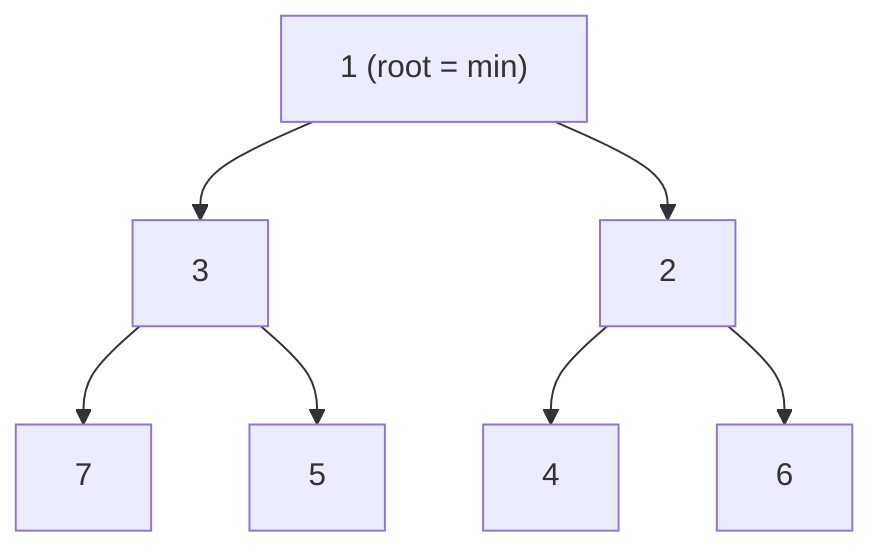

Two operations maintain the invariant:

- **sift up** — after inserting at the end, bubble the element up until the parent is smaller
- **sift down** — after removing the root (swap with last element), push the new root down until both children are larger

Array layout: `[1, 3, 2, 7, 5, 4, 6]` — the tree above stored flat.

| Property | Value |
|----------|-------|
| peek (get min) | O(1) — always at index 0 |
| push (insert) | O(log n) — sift up from bottom |
| pop (extract min) | O(log n) — swap root with last, sift down |
| Space | O(n) — flat array, no pointers |

**Try it yourself** — insert values and extract the minimum to see sift-up and sift-down in action:

<MinHeapViz />

## Production Proof

| Project | Source | Usage |
|---------|--------|-------|
| React | [SchedulerMinHeap.js#L17-L90](https://github.com/facebook/react/blob/34b78a2897cc208260a88e6b62ecaf9ca2a9dfe4/packages/scheduler/src/SchedulerMinHeap.js#L17-L90) | React's scheduler stores scheduled tasks in a min heap sorted by `sortIndex` (expiration time). `peek()` returns the highest-priority task in O(1). The entire implementation is ~75 lines. |
| Linux Kernel | [fair.c#L1407-L1460](https://github.com/torvalds/linux/blob/acb7500801e98639f6d8c2d796ed9f64cba83d3a/kernel/sched/fair.c#L1407-L1460) | CFS's `update_curr` updates each task's virtual runtime. `pick_next_task_fair` (line 9234) selects the task with the smallest vruntime from a red-black tree — the same "always access the minimum" principle as a min heap. |

## Implementation

::: code-group

```typescript [TypeScript]
interface HeapNode {
  sortIndex: number;
  id: number;
}

class MinHeap<T extends HeapNode> {
  private heap: T[] = [];

  peek(): T | null {
    return this.heap[0] ?? null;
  }

  push(node: T): void {
    this.heap.push(node);
    this.siftUp(this.heap.length - 1);
  }

  pop(): T | null {
    if (this.heap.length === 0) return null;
    const first = this.heap[0]!;
    const last = this.heap.pop()!;
    if (this.heap.length > 0) {
      this.heap[0] = last;
      this.siftDown(0);
    }
    return first;
  }

  get size(): number {
    return this.heap.length;
  }

  private siftUp(i: number): void {
    while (i > 0) {
      const parent = (i - 1) >>> 1;
      if (this.compare(this.heap[i]!, this.heap[parent]!) < 0) {
        this.swap(i, parent);
        i = parent;
      } else break;
    }
  }

  private siftDown(i: number): void {
    const len = this.heap.length;
    const half = len >>> 1;
    while (i < half) {
      let smallest = i;
      const left = 2 * i + 1;
      const right = 2 * i + 2;
      if (left < len && this.compare(this.heap[left]!, this.heap[smallest]!) < 0) smallest = left;
      if (right < len && this.compare(this.heap[right]!, this.heap[smallest]!) < 0) smallest = right;
      if (smallest !== i) {
        this.swap(i, smallest);
        i = smallest;
      } else break;
    }
  }

  private compare(a: T, b: T): number {
    const diff = a.sortIndex - b.sortIndex;
    return diff !== 0 ? diff : a.id - b.id;
  }

  private swap(i: number, j: number): void {
    [this.heap[i], this.heap[j]] = [this.heap[j]!, this.heap[i]!];
  }
}
```

```rust [Rust]
pub struct MinHeap<T: Ord> {
    data: Vec<T>,
}

impl<T: Ord> MinHeap<T> {
    pub fn new() -> Self { MinHeap { data: Vec::new() } }

    pub fn peek(&self) -> Option<&T> { self.data.first() }

    pub fn push(&mut self, val: T) {
        self.data.push(val);
        self.sift_up(self.data.len() - 1);
    }

    pub fn pop(&mut self) -> Option<T> {
        if self.data.is_empty() { return None; }
        let last = self.data.len() - 1;
        self.data.swap(0, last);
        let val = self.data.pop();
        if !self.data.is_empty() { self.sift_down(0); }
        val
    }

    fn sift_up(&mut self, mut i: usize) {
        while i > 0 {
            let parent = (i - 1) / 2;
            if self.data[i] < self.data[parent] {
                self.data.swap(i, parent);
                i = parent;
            } else { break; }
        }
    }

    fn sift_down(&mut self, mut i: usize) {
        let len = self.data.len();
        loop {
            let (left, right) = (2 * i + 1, 2 * i + 2);
            let mut smallest = i;
            if left < len && self.data[left] < self.data[smallest] { smallest = left; }
            if right < len && self.data[right] < self.data[smallest] { smallest = right; }
            if smallest != i { self.data.swap(i, smallest); i = smallest; }
            else { break; }
        }
    }
}
```

```go [Go]
type HeapNode struct {
	SortIndex int
	ID        int
}

type MinHeap struct {
	data []HeapNode
}

func (h *MinHeap) Peek() (HeapNode, bool) {
	if len(h.data) == 0 { return HeapNode{}, false }
	return h.data[0], true
}

func (h *MinHeap) Push(node HeapNode) {
	h.data = append(h.data, node)
	h.siftUp(len(h.data) - 1)
}

func (h *MinHeap) Pop() (HeapNode, bool) {
	if len(h.data) == 0 { return HeapNode{}, false }
	val := h.data[0]
	last := len(h.data) - 1
	h.data[0] = h.data[last]
	h.data = h.data[:last]
	if len(h.data) > 0 { h.siftDown(0) }
	return val, true
}

func (h *MinHeap) siftUp(i int) {
	for i > 0 {
		parent := (i - 1) / 2
		if h.less(i, parent) { h.data[i], h.data[parent] = h.data[parent], h.data[i]; i = parent } else { break }
	}
}

func (h *MinHeap) siftDown(i int) {
	n := len(h.data)
	for {
		left, right, smallest := 2*i+1, 2*i+2, i
		if left < n && h.less(left, smallest) { smallest = left }
		if right < n && h.less(right, smallest) { smallest = right }
		if smallest != i { h.data[i], h.data[smallest] = h.data[smallest], h.data[i]; i = smallest } else { break }
	}
}

func (h *MinHeap) less(i, j int) bool {
	if h.data[i].SortIndex != h.data[j].SortIndex { return h.data[i].SortIndex < h.data[j].SortIndex }
	return h.data[i].ID < h.data[j].ID
}
```

```python [Python]
import heapq

# Python's heapq module implements a min heap on a list
heap = []

heapq.heappush(heap, (10, "low-priority"))
heapq.heappush(heap, (1, "urgent"))
heapq.heappush(heap, (5, "medium"))

# peek: heap[0] is always the minimum
assert heap[0] == (1, "urgent")

# pop in priority order
assert heapq.heappop(heap) == (1, "urgent")
assert heapq.heappop(heap) == (5, "medium")
assert heapq.heappop(heap) == (10, "low-priority")

# Custom: from-scratch implementation
class MinHeap:
    def __init__(self):
        self._data = []

    def push(self, val):
        self._data.append(val)
        self._sift_up(len(self._data) - 1)

    def pop(self):
        if not self._data:
            return None
        self._data[0], self._data[-1] = self._data[-1], self._data[0]
        val = self._data.pop()
        if self._data:
            self._sift_down(0)
        return val

    def peek(self):
        return self._data[0] if self._data else None

    def _sift_up(self, i):
        while i > 0:
            parent = (i - 1) // 2
            if self._data[i] < self._data[parent]:
                self._data[i], self._data[parent] = self._data[parent], self._data[i]
                i = parent
            else:
                break

    def _sift_down(self, i):
        n = len(self._data)
        while True:
            smallest, left, right = i, 2*i+1, 2*i+2
            if left < n and self._data[left] < self._data[smallest]:
                smallest = left
            if right < n and self._data[right] < self._data[smallest]:
                smallest = right
            if smallest != i:
                self._data[i], self._data[smallest] = self._data[smallest], self._data[i]
                i = smallest
            else:
                break
```

:::

## Exercises

| Level | Exercise | File |
|-------|----------|------|
| Basic | Implement push, pop, peek with sift operations | `exercises/typescript/min-heap/01-basic.test.ts` |
| Intermediate | Build a React-style task scheduler using min heap | `exercises/typescript/min-heap/02-task-scheduler.test.ts` |

Run exercises: `pnpm test:ts` (TypeScript) · `cargo test` (Rust) · `go test ./...` (Go) · `pytest` (Python)

Exercise files: Rust `exercises/rust/src/min_heap/mod.rs` · Go `exercises/go/min_heap/min_heap_test.go` · Python `exercises/python/min_heap/test_min_heap.py`

## When to Use

- **Task scheduling** — always process the highest-priority (lowest deadline) task first
- **Event-driven systems** — timer heaps for scheduling callbacks at specific times
- **Graph algorithms** — Dijkstra's shortest path, Prim's MST
- **Streaming top-K** — maintain the K smallest/largest elements from a stream
- **OS schedulers** — CFS uses a tree with min-heap properties for fair CPU distribution

## When NOT to Use

- **Need O(1) arbitrary lookup** — heaps only guarantee O(1) for the minimum; use a hash map for lookups
- **Sorted iteration** — if you need all elements in order, sort once; repeated pop is O(n log n)
- **Small fixed sets** — for < 10 elements, a linear scan is simpler and often faster
- **Need stable ordering** — equal-priority items may change order across operations

## More Production Uses

- [Node.js libuv](https://github.com/libuv/libuv) — timer queue
- [Java PriorityQueue](https://github.com/openjdk/jdk/blob/4b3ec455c85314d051800a8f46dd8f5c93881e3a/src/java.base/share/classes/java/util/PriorityQueue.java) — binary heap backed priority queue
- [Python heapq](https://github.com/python/cpython/blob/ff64d8de66ab7f8e56b5d410796a7d76c955280c/Lib/heapq.py)
- [Rust BinaryHeap](https://github.com/rust-lang/rust/blob/d56483a91d6cf5041351a3208b8d08f98f0c8b56/library/alloc/src/collections/binary_heap/mod.rs) — max-heap in std, wrappable as min-heap via `Reverse`

## Related Patterns

| Pattern | Relationship |
|---------|-------------|
| [Merge Iterator (K-Way Merge)](/patterns/merge-iterator/) | K-way merge uses a min-heap to select the smallest element across streams |
| [Cooperative Scheduling](/patterns/cooperative-scheduling/) | React's scheduler uses a min-heap to pick the highest-priority task |
| [Event Loop](/patterns/event-loop/) | Timer queues in event loops often use min-heaps for earliest-deadline scheduling |
| [B+ Tree](/patterns/b-plus-tree/) | Alternative ordered structure — B+ trees optimize for disk, heaps for priority access |

## Challenge Questions

::: details Q1: How do you convert a min heap into a max heap without changing the data structure?
**Answer:** Negate the sort keys on insert and negate them back on extract.

Push `-priority` instead of `priority`. The min heap puts the most negative value (highest original priority) at the root. On pop, negate the key again to recover the original value. This works because a min heap over negated values is equivalent to a max heap over the original values. Python's `heapq` community uses this trick since the stdlib only provides a min heap.
:::

::: details Q2: Why does React use a min heap for scheduling instead of a sorted array?
**Answer:** A sorted array has O(n) insertion (shifting elements), while a min heap has O(log n) insertion and O(1) peek.

React's scheduler frequently inserts new tasks with varying expiration times and always needs the earliest-expiring task. A sorted array gives O(1) access to the minimum but costs O(n) to insert (binary search + shift). A min heap gives O(1) peek and O(log n) insert/remove — a better tradeoff for a dynamic queue where tasks are constantly added and removed. For a static, one-time sort, the sorted array wins.
:::

::: details Q3: A balanced BST (like a red-black tree) also gives O(log n) insert and O(log n) find-min. Why does Linux CFS use a red-black tree but React uses a min heap?
**Answer:** CFS needs to remove arbitrary tasks (not just the minimum) when processes exit, which a BST handles in O(log n) but a heap handles in O(n).

A min heap only efficiently removes the root. Deleting an arbitrary element requires O(n) search + O(log n) sift. A red-black tree supports O(log n) deletion of any node. CFS frequently removes processes that exit or change priority, so the BST is justified. React's scheduler almost exclusively pops the highest-priority task from the front, making the simpler min heap (with its smaller constant factors and cache-friendly array layout) the better choice.
:::

::: details Q4: You have 1 billion log entries and need the 10 most recent. Should you use a min heap or a max heap, and what size?
**Answer:** Use a min heap of size 10. For each entry, if it's larger than the heap's minimum, pop the minimum and push the new entry.

This is the "top-K" pattern. A min heap of size K keeps the K largest elements seen so far, with the smallest of those K at the root as a gatekeeper. Each new element is compared to the root in O(1) — if it's smaller, skip it; if larger, replace the root in O(log K). Total cost: O(n log K) with O(K) memory, not O(n log n) for a full sort.
:::


================================================
FILE: docs/patterns/mvcc/index.md
================================================
---
title: "Pattern: MVCC (Multi-Version Concurrency Control)"
description: "Keep multiple timestamped versions of each value so readers never block writers — each transaction sees a consistent snapshot without locks."
difficulty: "advanced"
---

# Pattern: MVCC (Multi-Version Concurrency Control)

<DifficultyBadge />

## One Liner

Keep multiple timestamped versions of each value so readers never block writers — each transaction sees a consistent snapshot without locks.

<DemoBadge />

## Real-World Analogy

A library that keeps old editions of books alongside new ones. Readers who checked out edition 3 can finish reading it even after edition 4 is published. Each reader sees a consistent snapshot — no one sees a half-written update.

## Core Idea

MVCC stores every write as a new version tagged with a timestamp or transaction ID. Readers see the latest version visible to their snapshot, ignoring concurrent writes. This eliminates read-write contention: readers never block writers, writers never block readers.

```text
  Key "balance"
  ┌──────────┬──────────┬──────────┬──────────┐
  │ t=100    │ t=200    │ t=300    │ t=400    │
  │ val=500  │ val=450  │ val=600  │ val=580  │
  └──────────┴──────────┴──────────┴──────────┘

  Transaction at t=250:  sees val=450  (latest version ≤ 250)
  Transaction at t=350:  sees val=600  (latest version ≤ 350)
  Both read without blocking the writer at t=400.
```

| Property | Value |
|----------|-------|
| Read-write conflict | **None** — readers see their snapshot, writers append new versions |
| Write-write conflict | Detected at commit time (first-writer-wins or abort) |
| Space overhead | Multiple versions per key (garbage collected via compaction) |
| Isolation level | Snapshot isolation (stronger than read-committed, weaker than serializable) |

**Try it yourself** — start transactions, read and write keys, and observe snapshot isolation:

<MVCCViz />

## Production Proof

| Project | Source | Usage |
|---------|--------|-------|
| PostgreSQL | [heapam_visibility.c#L917-L1096](https://github.com/postgres/postgres/blob/e18b0cb7344cb4bd28468f6c0aeeb9b9241d30aa/src/backend/access/heap/heapam_visibility.c#L917-L1096) | `HeapTupleSatisfiesMVCC` — the core visibility check. Given a heap tuple and an MVCC snapshot, determines if the tuple is visible to the current transaction. Uses `XidInMVCCSnapshot` to check transaction visibility without contention on `ProcArrayLock`. |
| etcd | [kvstore.go#L53-L135](https://github.com/etcd-io/etcd/blob/e9b62f804766edf77cfa918d600cb6fb2c56b401/server/storage/mvcc/kvstore.go#L53-L135) | `store` struct (L53-L82) tracks `currentRev` and `compactMainRev` with a B-tree `kvindex` for multi-version lookups. `NewStore` (L87-L135) initializes the MVCC store and rebuilds the in-memory index from persisted revisions. Powers Kubernetes' configuration backbone. |

## Implementation

::: code-group

```typescript [TypeScript]
interface Version<T> {
  timestamp: number;
  value: T;
  deleted: boolean;
}

class MVCCStore<T> {
  private store = new Map<string, Version<T>[]>();

  put(key: string, value: T, timestamp: number): void {
    if (!this.store.has(key)) this.store.set(key, []);
    this.store.get(key)!.push({ timestamp, value, deleted: false });
  }

  get(key: string, timestamp: number): T | undefined {
    const versions = this.store.get(key);
    if (!versions) return undefined;
    let best: Version<T> | undefined;
    for (const v of versions) {
      if (v.timestamp <= timestamp && (!best || v.timestamp > best.timestamp)) {
        best = v;
      }
    }
    return best && !best.deleted ? best.value : undefined;
  }

  delete(key: string, timestamp: number): void {
    if (!this.store.has(key)) this.store.set(key, []);
    this.store.get(key)!.push({ timestamp, value: undefined as T, deleted: true });
  }
}
```

```rust [Rust]
pub struct Version {
    pub timestamp: u64,
    pub value: Option<String>,
}

pub struct MVCCStore {
    data: std::collections::HashMap<String, Vec<Version>>,
}

impl MVCCStore {
    pub fn new() -> Self {
        MVCCStore { data: std::collections::HashMap::new() }
    }

    pub fn put(&mut self, key: &str, value: &str, ts: u64) {
        self.data.entry(key.to_string()).or_default()
            .push(Version { timestamp: ts, value: Some(value.to_string()) });
    }

    pub fn get(&self, key: &str, ts: u64) -> Option<&str> {
        let versions = self.data.get(key)?;
        let mut best: Option<&Version> = None;
        for v in versions {
            if v.timestamp <= ts && best.map_or(true, |b| v.timestamp > b.timestamp) {
                best = Some(v);
            }
        }
        best.and_then(|v| v.value.as_deref())
    }

    pub fn delete(&mut self, key: &str, ts: u64) {
        self.data.entry(key.to_string()).or_default()
            .push(Version { timestamp: ts, value: None });
    }
}
```

```go [Go]
type Version struct {
	Timestamp int
	Value     string
	Deleted   bool
}

type MVCCStore struct {
	data map[string][]Version
}

func NewMVCCStore() *MVCCStore {
	return &MVCCStore{data: make(map[string][]Version)}
}

func (s *MVCCStore) Put(key, value string, ts int) {
	s.data[key] = append(s.data[key], Version{Timestamp: ts, Value: value})
}

func (s *MVCCStore) Get(key string, ts int) (string, bool) {
	versions := s.data[key]
	var best *Version
	for i := range versions {
		v := &versions[i]
		if v.Timestamp <= ts && (best == nil || v.Timestamp > best.Timestamp) {
			best = v
		}
	}
	if best == nil || best.Deleted {
		return "", false
	}
	return best.Value, true
}

func (s *MVCCStore) Delete(key string, ts int) {
	s.data[key] = append(s.data[key], Version{Timestamp: ts, Deleted: true})
}
```

```python [Python]
from dataclasses import dataclass
from typing import Any

@dataclass
class Version:
    timestamp: int
    value: Any
    deleted: bool = False

class MVCCStore:
    def __init__(self):
        self._data: dict[str, list[Version]] = {}

    def put(self, key: str, value: Any, timestamp: int) -> None:
        self._data.setdefault(key, []).append(Version(timestamp, value))

    def get(self, key: str, timestamp: int) -> Any:
        versions = self._data.get(key, [])
        best = None
        for v in versions:
            if v.timestamp <= timestamp and (best is None or v.timestamp > best.timestamp):
                best = v
        if best is None or best.deleted:
            return None
        return best.value

    def delete(self, key: str, timestamp: int) -> None:
        self._data.setdefault(key, []).append(Version(timestamp, None, deleted=True))
```

:::

## Exercises

| Level | Exercise | File |
|-------|----------|------|
| Basic | Implement a multi-version key-value store | `exercises/typescript/mvcc/01-basic.test.ts` |
| Intermediate | Snapshot transactions with consistent reads | `exercises/typescript/mvcc/02-intermediate.test.ts` |

Run exercises: `pnpm test:ts` (TypeScript) · `cargo test` (Rust) · `go test ./...` (Go) · `pytest` (Python)

Exercise files: Rust `exercises/rust/src/mvcc/mod.rs` · Go `exercises/go/mvcc/mvcc_test.go` · Python `exercises/python/mvcc/test_mvcc.py`

## When to Use

- **Databases** — snapshot isolation for concurrent transactions (PostgreSQL, MySQL InnoDB)
- **Distributed KV stores** — consistent reads without distributed locks (etcd, CockroachDB, TiKV)
- **Time-travel queries** — read data as of a past timestamp
- **Optimistic concurrency** — detect conflicts at commit time instead of locking upfront

## When NOT to Use

- **Single-writer systems** — MVCC overhead is unnecessary if only one writer exists
- **Memory-constrained** — multiple versions per key consume significant storage
- **Write-heavy, no reads** — version management overhead with no reader benefit
- **Strict serializability needed** — MVCC provides snapshot isolation; full serializability requires additional mechanisms (SSI)

## More Production Uses

- [CockroachDB](https://github.com/cockroachdb/cockroach/blob/5f5932a2bf50713ff76a0f859a41fd7985dec307/pkg/storage/mvcc.go#L1923-L1962) — `MVCCPut` / `MVCCGet` for distributed SQL
- [MySQL InnoDB](https://github.com/mysql/mysql-server) — undo logs for MVCC row versioning
- [TiKV](https://github.com/tikv/tikv) — Percolator-based distributed MVCC transactions
- [FoundationDB](https://github.com/apple/foundationdb) — multi-version storage layer

## Related Patterns

| Pattern | Relationship |
|---------|-------------|
| [Copy-on-Write (CoW)](/patterns/copy-on-write/) | MVCC creates new versions on write, similar to copy-on-write semantics |
| [Logical Clock](/patterns/logical-clock/) | Logical clocks provide the version timestamps that MVCC depends on |
| [Tombstone](/patterns/tombstone/) | MVCC marks deleted versions with tombstones for later garbage collection |
| [Write-Ahead Log (WAL)](/patterns/write-ahead-log/) | WAL ensures MVCC version changes survive crashes |

## Challenge Questions

::: details Q1: Your MVCC store keeps every version of every key forever. After a year of operation, storage usage is 50x the actual live dataset size. How do production databases like PostgreSQL handle this?
**Answer:** They run garbage collection (called "vacuuming" in PostgreSQL) to remove versions that are no longer visible to any active transaction.

PostgreSQL's `VACUUM` process identifies "dead" tuples — versions older than the oldest active transaction's snapshot. Since no transaction can ever see these versions, they're safe to reclaim. etcd uses `compaction` to discard revisions older than a threshold. The challenge is determining the "low-water mark": the oldest snapshot still in use. If a long-running transaction holds an old snapshot, it blocks garbage collection for all versions newer than that snapshot — a common source of PostgreSQL bloat.
:::

::: details Q2: Two transactions both read key "balance" (value=100) at the same snapshot timestamp, then both try to write "balance=90" (deducting 10). Under MVCC snapshot isolation, both reads succeed without blocking. What happens at commit time?
**Answer:** One transaction commits successfully; the other detects a write-write conflict and aborts. The balance ends up at 90, not 80.

This is the "lost update" anomaly under snapshot isolation. Both transactions read the same snapshot (balance=100) and independently compute balance=90. MVCC detects the conflict at commit time using a "first-writer-wins" rule: the first to commit writes version t=200 with value=90. The second transaction tries to commit but sees that "balance" was modified after its snapshot — it must abort and retry. On retry, it reads the new value (90) and writes 80. This is why MVCC provides snapshot isolation, not serializable: it prevents lost updates but requires application-level handling of write conflicts.
:::

::: details Q3: Your team uses MVCC with snapshot isolation for a banking system. A compliance audit asks: "Can two concurrent transfers between the same accounts produce an inconsistent total?" Your team says snapshot isolation prevents this. Are they correct?
**Answer:** No. Snapshot isolation prevents lost updates but is vulnerable to write skew anomalies, where two transactions read overlapping data and make non-conflicting writes that together violate a constraint.

Example: accounts A=50 and B=50 with a constraint "A+B >= 0." Transaction 1 reads both, sees total=100, writes A=-10. Transaction 2 reads both (same snapshot, A=50, B=50), writes B=-60. Both pass the constraint check independently, both commit (they write different keys, so no write-write conflict), and the result is A=-10, B=-60, total=-70 — violating the constraint. Full serializability (PostgreSQL's SSI, CockroachDB's serializable mode) is needed to prevent write skew.
:::

::: details Q4: etcd uses MVCC to power Kubernetes' configuration store. Why does a distributed key-value store benefit from keeping old versions, rather than just storing the latest value?
**Answer:** Old versions enable watch/subscribe semantics — clients can ask "what changed since revision X?" without polling, and disconnected clients can catch up from their last-seen revision.

Kubernetes controllers (like the replication controller) use etcd watches to react to state changes. If etcd only stored the latest value, a controller that disconnects for 5 seconds would miss intermediate changes and need a full resync. With MVCC, the controller reconnects and says "give me all changes since revision 12345," receiving a precise stream of what changed. This is also essential for etcd's consistency guarantees: linearizable reads can be served from a specific revision, and time-travel queries enable debugging ("what was the cluster state 10 minutes ago?").
:::


================================================
FILE: docs/patterns/object-pool/index.md
================================================
---
title: "Pattern: Object Pool"
description: "Pre-allocate a set of reusable objects to avoid the cost of repeated allocation and garbage collection on hot paths."
difficulty: "beginner"
---

# Pattern: Object Pool

<DifficultyBadge />

## One Liner

Pre-allocate a set of reusable objects to avoid the cost of repeated allocation and garbage collection on hot paths.

<DemoBadge />

## Real-World Analogy

A bike-sharing station. Instead of buying a new bike every time you need one, you grab one from the dock, ride it, and return it. The bikes are pre-purchased and reused by many riders.

## Core Idea

Creating and destroying objects is expensive — memory allocation, constructor logic, GC pressure. An object pool maintains a collection of pre-initialized objects. When you need one, you "get" it from the pool; when done, you "put" it back instead of discarding it.

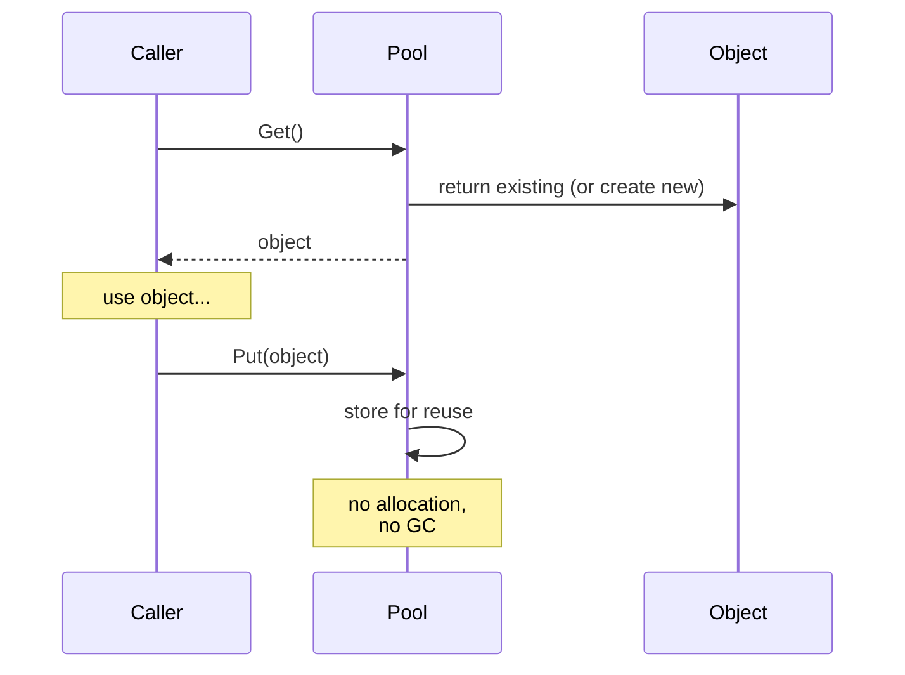

The pool acts as a cache of allocated objects. The key trade-off: memory usage (idle objects sitting in the pool) vs. CPU/GC savings (no allocation on the hot path).

| Property | Value |
|----------|-------|
| Get (pool has idle) | O(1) — return existing object |
| Get (pool empty) | O(alloc) — create new object |
| Put (return) | O(1) — push to free list + reset |
| Memory | O(pool size) — idle objects held in reserve |

**Try it yourself** — acquire connections from the pool and watch what happens when it's exhausted:

<ObjectPoolViz />

## Production Proof

| Project | Source | Usage |
|---------|--------|-------|
| Go stdlib | [pool.go#L52-L97](https://github.com/golang/go/blob/f5cdf4745455415c7a43cfc7d925214d4511489b/src/sync/pool.go#L52-L97) | `sync.Pool` — Go's standard library pool for temporary objects. `Get()` (line 132) retrieves from a per-P local pool first (lock-free), then falls back to stealing from other Ps. `Put()` (line 100) returns objects for reuse. Used extensively in `fmt`, `encoding/json`, and HTTP handlers. |
| Godot Engine | [pooled_list.h#L35-L100](https://github.com/godotengine/godot/blob/ec67cbe92628bdaf979b10594359ba6f02cf8838/core/templates/pooled_list.h#L35-L100) | `PooledList` — a freelist-based pool for game engine objects. Elements are allocated in contiguous pages and recycled via a freelist, avoiding per-frame allocation for entities, particles, and physics bodies. |

## Implementation

::: code-group

```typescript [TypeScript]
class ObjectPool<T> {
  private pool: T[] = [];
  private factory: () => T;
  private reset: (obj: T) => void;

  constructor(factory: () => T, reset: (obj: T) => void, initialSize = 0) {
    this.factory = factory;
    this.reset = reset;
    for (let i = 0; i < initialSize; i++) {
      this.pool.push(factory());
    }
  }

  get(): T {
    if (this.pool.length > 0) {
      return this.pool.pop()!;
    }
    return this.factory();
  }

  release(obj: T): void {
    this.reset(obj);
    this.pool.push(obj);
  }

  get size(): number {
    return this.pool.length;
  }
}
```

```rust [Rust]
pub struct ObjectPool<T> {
    pool: Vec<T>,
    factory: Box<dyn Fn() -> T>,
}

impl<T> ObjectPool<T> {
    pub fn new(factory: impl Fn() -> T + 'static, initial: usize) -> Self {
        let factory = Box::new(factory);
        let pool = (0..initial).map(|_| (factory)()).collect();
        ObjectPool { pool, factory }
    }

    pub fn get(&mut self) -> T {
        self.pool.pop().unwrap_or_else(|| (self.factory)())
    }

    pub fn release(&mut self, obj: T) {
        self.pool.push(obj);
    }
}
```

```go [Go]
package pool

import "sync"

// In production, use sync.Pool directly:
var bufPool = sync.Pool{
	New: func() any {
		return make([]byte, 0, 4096)
	},
}

func ProcessRequest(data []byte) []byte {
	buf := bufPool.Get().([]byte)
	buf = buf[:0] // reset length, keep capacity
	buf = append(buf, data...)
	// ... process ...
	result := make([]byte, len(buf))
	copy(result, buf)
	bufPool.Put(buf) // return to pool
	return result
}
```

```python [Python]
from typing import TypeVar, Callable, List

T = TypeVar("T")

class ObjectPool:
    def __init__(self, factory: Callable[[], T], reset: Callable[[T], None], initial: int = 0):
        self._factory = factory
        self._reset = reset
        self._pool: List[T] = [factory() for _ in range(initial)]

    def get(self) -> T:
        if self._pool:
            return self._pool.pop()
        return self._factory()

    def release(self, obj: T) -> None:
        self._reset(obj)
        self._pool.append(obj)
```

:::

## Exercises

| Level | Exercise | File |
|-------|----------|------|
| Basic | Implement a generic object pool with get/release | `exercises/typescript/object-pool/01-basic.test.ts` |
| Intermediate | Build a connection pool with max-size and timeout | `exercises/typescript/object-pool/02-connection-pool.test.ts` |

Run exercises: `pnpm test:ts` (TypeScript) · `cargo test` (Rust) · `go test ./...` (Go) · `pytest` (Python)

Exercise files: Rust `exercises/rust/src/object_pool/mod.rs` · Go `exercises/go/object_pool/object_pool_test.go` · Python `exercises/python/object_pool/test_object_pool.py`

## When to Use

- **High-frequency allocation** — game loops, request handlers, particle systems
- **Expensive constructors** — database connections, thread contexts, large buffers
- **GC-sensitive environments** — real-time systems, game engines, low-latency services
- **Fixed resource limits** — connection pools, thread pools, file descriptor pools

## When NOT to Use

- **Cheap objects** — if allocation is fast and GC is not a concern, a pool adds complexity
- **Varied lifetimes** — if objects are held for long, unpredictable durations, the pool won't help
- **Small scale** — for a handful of objects, the pool overhead exceeds the savings
- **Immutable objects** — pool only makes sense for mutable objects that need resetting

## More Production Uses

- [Java ThreadPoolExecutor](https://github.com/openjdk/jdk/blob/4b3ec455c85314d051800a8f46dd8f5c93881e3a/src/java.base/share/classes/java/util/concurrent/ThreadPoolExecutor.java) — thread pool with core/max size and configurable rejection
- [.NET ArrayPool\<T\>](https://github.com/dotnet/runtime/blob/bee7953796edc09e516e847e3c9006b486ab0f6d/src/libraries/System.Private.CoreLib/src/System/Buffers/ArrayPool.cs) — shared pool of reusable arrays
- [HikariCP](https://github.com/brettwooldridge/HikariCP) — JDBC connection pool
- [Unity ObjectPool](https://github.com/Unity-Technologies/UnityCsReference) — `ObjectPool<T>` for reusable game objects

## Related Patterns

| Pattern | Relationship |
|---------|-------------|
| [Free List](/patterns/free-list/) | Free lists manage the pool's internal allocation of slots |
| [Arena Allocator](/patterns/arena-allocator/) | Arena allocators batch-allocate for pool objects; both avoid per-object malloc |
| [Semaphore](/patterns/semaphore/) | Pool size acts as a semaphore limiting concurrent object usage |
| [Reference Counting](/patterns/reference-counting/) | Reference counting tracks when pooled objects can be returned to the pool |
| [Work Stealing](/patterns/work-stealing/) | Work-stealing queues can pool task objects to reduce allocation overhead |

## Challenge Questions

::: details Q1: Your pool is initialized with 10 objects, but at peak load you need 100. Should the pool grow dynamically or reject requests beyond 10?
**Answer:** It depends on the resource type. Grow dynamically for cheap objects (buffers); enforce a hard cap for expensive/limited resources (database connections).

A buffer pool should grow on demand and optionally shrink during idle periods — the cost of allocating an extra buffer is low. A database connection pool should enforce `maxSize` because each connection consumes server memory, file descriptors, and auth state. Requests beyond the cap should queue and wait (with a timeout) rather than creating unbounded connections that crash the database. HikariCP defaults to a max of 10 connections for this reason.
:::

::: details Q2: A developer calls `pool.get()` but never calls `pool.release()`. How does this "object leak" manifest, and how can you detect it?
**Answer:** The pool gradually empties and starts allocating new objects every time, defeating its purpose and potentially exhausting resources.

Detection strategies: (1) track outstanding objects with a Set and log warnings when count exceeds a threshold, (2) use weak references and a finalizer to detect objects that were GC'd without being returned, (3) wrap pooled objects in a proxy that auto-releases after a timeout. Go's `sync.Pool` sidesteps this entirely — it offers no guarantees about object retention and lets the GC reclaim idle pool entries, making leaks less catastrophic but the pool less predictable.
:::

::: details Q3: Two goroutines call `pool.Get()` simultaneously. What makes Go's `sync.Pool` safe here without an explicit mutex around every get/put?
**Answer:** `sync.Pool` uses per-P (per-processor) local pools with lock-free access, falling back to a shared pool with a mutex only when the local pool is empty.

Each P (logical processor in Go's scheduler, distinct from M which is the OS thread) has its own private pool slot. `Get()` first checks the local slot (no lock needed — only one goroutine runs on a P at a time). If empty, it steals from other Ps' pools under a lock. `Put()` goes to the local slot first. This per-P sharding pattern minimizes contention. For a hand-rolled pool in a multithreaded environment, you would need a mutex or a lock-free data structure like a concurrent stack.
:::

::: details Q4: You build an object pool for HTTP request objects in a Node.js server. After profiling, you discover it's slower than just using `new Request()`. What went wrong?
**Answer:** In V8's generational GC, short-lived small objects are allocated and collected almost for free — the pool's reset logic and bookkeeping cost more than the allocation it avoids.

V8's young generation GC uses bump-pointer allocation (essentially free) and collects short-lived objects by copying survivors, not scanning garbage. If your `Request` objects are small, created per-request, and discarded immediately, GC handles them efficiently. The pool adds overhead: maintaining the free list, resetting object state, preventing V8 from optimizing object shapes. Object pools shine for expensive constructors (DB connections, compiled regexes) or GC-pause-sensitive contexts (game loops), not for cheap objects in a modern GC runtime.
:::


================================================
FILE: docs/patterns/observer/index.md
================================================
---
title: "Pattern: Observer / Pub-Sub"
description: "Decouple producers from consumers by letting objects subscribe to events and get notified when something happens, without the source knowing who's listening."
difficulty: "beginner"
---

# Pattern: Observer / Pub-Sub

<DifficultyBadge />

## One Liner

Decouple producers from consumers by letting objects subscribe to events and get notified when something happens, without the source knowing who's listening.

<DemoBadge />

## Real-World Analogy

A newspaper subscription. You sign up once, and every morning the paper arrives at your door. You don't have to check the newsstand — the publisher pushes updates to all subscribers. Cancel anytime.

## Core Idea

The Observer pattern creates a one-to-many dependency: when the subject changes state, all registered observers are notified. The subject doesn't know what the observers do — it just calls them.

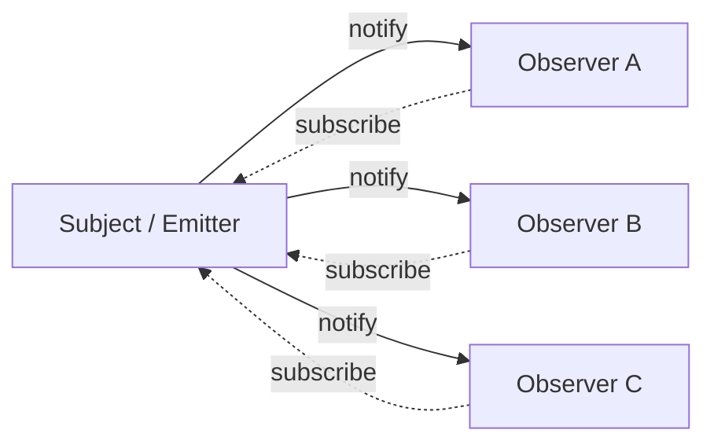

This decoupling is why the pattern is everywhere: from DOM `addEventListener` to Redux `store.subscribe` to Node.js `EventEmitter` to React's `useEffect` cleanup pattern.

| Property | Value |
|----------|-------|
| subscribe | O(1) — add to listener set |
| unsubscribe | O(1) — remove from listener set |
| emit / notify | O(n) — call each of n listeners |
| Space | O(listeners) per event type |

**Try it yourself** — emit events and watch them fan out to all subscribers:

<ObserverViz />

## Production Proof

| Project | Source | Usage |
|---------|--------|-------|
| Node.js | [events.js#L456-L520](https://github.com/nodejs/node/blob/19c46abbefdb8711b913d7237b3c1299367f87d7/lib/events.js#L456-L520) | `EventEmitter.prototype.emit` — the core method that iterates over registered listeners and calls each one. Line 209 defines the `EventEmitter` constructor. This is the foundation of Node's event-driven architecture. |
| Redux | [createStore.ts#L211-L280](https://github.com/reduxjs/redux/blob/1d761f471cf58faabe88c50ea16645212d986cd0/src/createStore.ts#L211-L280) | `subscribe()` adds a listener, `dispatch()` (line 280) calls all listeners after running the reducer. Redux snapshots the listener array before dispatch to handle subscribe/unsubscribe during notification safely. |

## Implementation

::: code-group

```typescript [TypeScript]
type Listener<T> = (data: T) => void;

class EventEmitter<Events extends Record<string, unknown>> {
  private listeners = new Map<keyof Events, Set<Listener<any>>>();

  on<K extends keyof Events>(event: K, listener: Listener<Events[K]>): () => void {
    if (!this.listeners.has(event)) {
      this.listeners.set(event, new Set());
    }
    this.listeners.get(event)!.add(listener);

    return () => this.off(event, listener);
  }

  off<K extends keyof Events>(event: K, listener: Listener<Events[K]>): void {
    this.listeners.get(event)?.delete(listener);
  }

  emit<K extends keyof Events>(event: K, data: Events[K]): void {
    this.listeners.get(event)?.forEach((listener) => listener(data));
  }

  listenerCount(event: keyof Events): number {
    return this.listeners.get(event)?.size ?? 0;
  }
}
```

```rust [Rust]
use std::collections::HashMap;

pub struct EventEmitter {
    listeners: HashMap<String, Vec<Box<dyn Fn(&str)>>>,
}

impl EventEmitter {
    pub fn new() -> Self {
        EventEmitter { listeners: HashMap::new() }
    }

    pub fn on(&mut self, event: &str, listener: impl Fn(&str) + 'static) {
        self.listeners
            .entry(event.to_string())
            .or_default()
            .push(Box::new(listener));
    }

    pub fn emit(&self, event: &str, data: &str) {
        if let Some(listeners) = self.listeners.get(event) {
            for listener in listeners {
                listener(data);
            }
        }
    }
}
```

```go [Go]
type Listener func(data any)

type EventEmitter struct {
	listeners map[string][]Listener
}

func NewEmitter() *EventEmitter {
	return &EventEmitter{listeners: make(map[string][]Listener)}
}

func (e *EventEmitter) On(event string, listener Listener) {
	e.listeners[event] = append(e.listeners[event], listener)
}

func (e *EventEmitter) Emit(event string, data any) {
	for _, listener := range e.listeners[event] {
		listener(data)
	}
}
```

```python [Python]
from collections import defaultdict
from typing import Callable, Any

class EventEmitter:
    def __init__(self):
        self._listeners: dict[str, list[Callable]] = defaultdict(list)

    def on(self, event: str, listener: Callable) -> Callable:
        self._listeners[event].append(listener)
        return lambda: self._listeners[event].remove(listener)

    def emit(self, event: str, data: Any = None) -> None:
        for listener in self._listeners[event]:
            listener(data)

    def listener_count(self, event: str) -> int:
        return len(self._listeners[event])

# Usage
emitter = EventEmitter()

messages = []
unsub = emitter.on("message", lambda data: messages.append(data))

emitter.emit("message", "hello")
emitter.emit("message", "world")
print(messages)  # ["hello", "world"]

unsub()  # unsubscribe
emitter.emit("message", "ignored")
print(messages)  # ["hello", "world"] — unchanged
```

:::

## Exercises

| Level | Exercise | File |
|-------|----------|------|
| Basic | Implement an EventEmitter with on/off/emit | `exercises/typescript/observer/01-basic.test.ts` |
| Intermediate | Typed event bus with on/once/off/emit | `exercises/typescript/observer/02-intermediate.test.ts` |

Run exercises: `pnpm test:ts` (TypeScript) · `cargo test` (Rust) · `go test ./...` (Go) · `pytest` (Python)

Exercise files: Rust `exercises/rust/src/observer/mod.rs` · Go `exercises/go/observer/observer_test.go` · Python `exercises/python/observer/test_observer.py`

## When to Use

- **Event-driven systems** — UI events, network events, message queues
- **Decoupling modules** — plugins, middleware, extension points
- **State management** — Redux store, MobX observables, Vue reactivity
- **Logging / metrics** — emit events without knowing who collects them
- **Real-time updates** — WebSocket message distribution, live feeds

## When NOT to Use

- **Synchronous pipelines** — if the order and completion of processing matters, use direct function calls
- **Too many events** — event storms can be hard to debug; consider batching
- **Circular dependencies** — A observes B, B observes A → infinite loop
- **Strong ordering guarantees** — observer notification order may not be deterministic across implementations

## More Production Uses

- [RxJS](https://github.com/ReactiveX/rxjs) — reactive streams
- [Vue 3](https://github.com/vuejs/core) — reactivity system
- [MobX](https://github.com/mobxjs/mobx)
- [Chromium EventTarget](https://github.com/chromium/chromium/blob/5cffea3f665b7762369a0fa84d2f208875e7225e/third_party/blink/renderer/core/dom/events/event_target.cc) — DOM `addEventListener` implementation in Blink
- [.NET events](https://github.com/dotnet/runtime/blob/bee7953796edc09e516e847e3c9006b486ab0f6d/src/libraries/System.Private.CoreLib/src/System/EventHandler.cs) — C# `event` keyword delegates

## Related Patterns

| Pattern | Relationship |
|---------|-------------|
| [Event Loop](/patterns/event-loop/) | Event loops dispatch events to observers registered for specific event types |
| [Dirty Flag](/patterns/dirty-flag/) | Observer triggers notification; dirty flag defers the expensive reaction |
| [Middleware](/patterns/middleware-chain/) | Middleware observes and transforms data flowing through a pipeline |
| [Actor Model](/patterns/actor-model/) | Both decouple producers from consumers — observer via callbacks, actors via message passing |

## Challenge Questions

::: details Q1: A React component subscribes to a store in `useEffect` but forgets to return a cleanup function. What happens when the component unmounts?
**Answer:** The listener remains registered, causing a memory leak and phantom updates to an unmounted component.

The store holds a reference to the listener callback, which closes over the component's state. The component is unmounted but never garbage collected because the store still references it. Worse, when the store emits, the stale listener runs and may call `setState` on an unmounted component. This is the classic observer memory leak — every `subscribe` must have a corresponding `unsubscribe`, and `useEffect`'s cleanup function is the mechanism React provides for this.
:::

::: details Q2: You have 3 observers: A logs to a file, B updates the UI, C sends a network request. Does the order they are notified matter?
**Answer:** In most implementations, observers are called in registration order, but you should not rely on this — the pattern makes no ordering guarantees.

If B's UI update depends on A's log completing first, you have an implicit coupling that the observer pattern is supposed to eliminate. Each observer should be independent. If ordering matters, you need a different pattern: a middleware chain, a pipeline, or explicit dependency declaration. Node.js's `EventEmitter` calls listeners in registration order, but Redux explicitly snapshots the listener array to avoid order-dependent bugs during subscribe/unsubscribe within a dispatch.
:::

::: details Q3: An `emit('data', payload)` call triggers 50 synchronous observers, one of which throws an exception. What happens to observers 2-50?
**Answer:** In a naive implementation, observers 2-50 never execute — the exception propagates up and aborts the `emit` loop.

This is why production implementations wrap each listener call in a try-catch. Node.js `EventEmitter` does NOT do this by default — one throwing listener kills the rest. You must handle errors yourself. RxJS uses an error boundary per subscriber. The design choice is: fail-fast (one bad observer stops everything) vs. fault-tolerant (isolate failures, continue notifying). For critical systems, always isolate observer failures.
:::

::: details Q4: Should observer notifications be synchronous or asynchronous? What breaks if you switch from sync to async?
**Answer:** Synchronous notifications guarantee that all observers have processed the event before `emit()` returns; switching to async breaks any code that assumes state is updated immediately after emitting.

With sync: `emit('change'); readState()` sees the updated state because observers ran inline. With async: `emit('change'); readState()` sees the OLD state because observers are queued. This breaks patterns like Redux where `dispatch()` is expected to have fully completed by the time it returns. Async notification is better for performance (non-blocking) but requires the system to handle the "eventually consistent" gap between emit and observer execution.
:::


================================================
FILE: docs/patterns/rate-limiter/index.md
================================================
[Binary file]


================================================
FILE: docs/patterns/reference-counting/index.md
================================================
---
title: "Pattern: Reference Counting"
description: "Track owners via atomic counter, auto-cleanup at zero — deterministic resource lifetime without garbage collection."
difficulty: "beginner"
---

# Pattern: Reference Counting

<DifficultyBadge />

## One Liner

Track owners via atomic counter, auto-cleanup at zero — deterministic resource lifetime without garbage collection.

<DemoBadge />

## Real-World Analogy

A shared Netflix account. You keep track of how many people are actively using it. When the last person cancels, the subscription is terminated. No background check needed — the count reaching zero is the signal.

## Core Idea

Reference counting assigns each shared resource a counter. Every new owner (clone) increments it; every release (drop) decrements it. When the counter reaches zero, the resource is immediately cleaned up — no GC pause, no finalizer queue, fully deterministic.

```text
  ┌────────────┐
  │  Resource  │   refcount = 1
  │  (value)   │
  └─────┬──────┘
        │
     owner A

  A.clone() → B
  ┌────────────┐
  │  Resource  │   refcount = 2
  │  (value)   │
  └──┬─────┬───┘
     │     │
  owner A  owner B

  A.drop()
  ┌────────────┐
  │  Resource  │   refcount = 1
  │  (value)   │
  └─────┬──────┘
        │
     owner B

  B.drop()
  ┌────────────┐
  │  Resource  │   refcount = 0 → cleanup()!
  │  (value)   │
  └────────────┘
```

| Property | Value |
|----------|-------|
| Clone | O(1) — increment counter |
| Drop | O(1) — decrement counter, conditionally cleanup |
| Cleanup trigger | Deterministic — exactly when last owner drops |
| Thread safety | Requires atomic operations (or mutex) for multi-threaded use |

**Try it yourself** — drop references to decrement ref counts and watch objects get freed at rc=0:

<ReferenceCountingViz />

## Production Proof

| Project | Source | Usage |
|---------|--------|-------|
| CPython | [refcount.h#L255-L310](https://github.com/python/cpython/blob/ff64d8de66ab7f8e56b5d410796a7d76c955280c/Include/refcount.h#L255-L310) | `Py_INCREF` (L255-L310) is the inline function that increments `ob_refcnt`. `Py_DECREF` (L417-L430) decrements and calls `_Py_Dealloc` at zero. Every Python object carries `ob_refcnt` in `PyObject` ([object.h#L127-L150](https://github.com/python/cpython/blob/ff64d8de66ab7f8e56b5d410796a7d76c955280c/Include/object.h#L127-L150)). This is the primary memory management mechanism — GC only exists to break reference cycles. |
| Rust std | [sync.rs#L269-L276](https://github.com/rust-lang/rust/blob/ab26b175979ee7b2cb3302dce204b99df96f7efb/library/alloc/src/sync.rs#L269-L276) | `Arc<T>` (Atomic Reference Counted) struct at L269. `Drop` impl (L2799-L2875) calls `fetch_sub(1, Release)` on strong count, Acquire fence, then `drop_slow()` at zero. Used pervasively across Tokio, Actix, and OS-level Rust code. |

## Implementation

::: code-group

```typescript [TypeScript]
type CleanupFn<T> = (value: T) => void;

interface RefCountedInner<T> {
  value: T;
  count: number;
  dropped: boolean;
  cleanup: CleanupFn<T>;
}

class RefCounted<T> {
  private inner: RefCountedInner<T>;
  private owned: boolean;

  constructor(value: T, cleanup: CleanupFn<T>) {
    this.inner = { value, count: 1, dropped: false, cleanup };
    this.owned = true;
  }

  /** Create a new owner sharing the same value. */
  clone(): RefCounted<T> {
    if (!this.owned) throw new Error('Cannot clone a dropped reference');
    this.inner.count++;
    const cloned = Object.create(RefCounted.prototype) as RefCounted<T>;
    cloned.inner = this.inner;
    cloned.owned = true;
    return cloned;
  }

  /** Release this owner's reference. Triggers cleanup when count hits 0. */
  drop(): void {
    if (!this.owned) return; // double-drop is a no-op
    this.owned = false;
    this.inner.count--;
    if (this.inner.count === 0 && !this.inner.dropped) {
      this.inner.dropped = true;
      this.inner.cleanup(this.inner.value);
    }
  }

  refCount(): number { return this.inner.count; }

  value(): T {
    if (!this.owned) throw new Error('Reference has been dropped');
    return this.inner.value;
  }
}
```

```rust [Rust]
use std::cell::Cell;

struct RcInner<T> {
    value: T,
    count: Cell<usize>,
}

pub struct Rc<T> {
    inner: *const RcInner<T>,
}

impl<T> Rc<T> {
    pub fn new(value: T) -> Self {
        let inner = Box::into_raw(Box::new(RcInner {
            value,
            count: Cell::new(1),
        }));
        Rc { inner }
    }

    pub fn strong_count(&self) -> usize {
        unsafe { (*self.inner).count.get() }
    }

    pub fn value(&self) -> &T {
        unsafe { &(*self.inner).value }
    }
}

impl<T> Clone for Rc<T> {
    fn clone(&self) -> Self {
        unsafe {
            let c = (*self.inner).count.get();
            (*self.inner).count.set(c + 1);
        }
        Rc { inner: self.inner }
    }
}

impl<T> Drop for Rc<T> {
    fn drop(&mut self) {
        unsafe {
            let c = (*self.inner).count.get();
            (*self.inner).count.set(c - 1);
            if c == 1 {
                drop(Box::from_raw(self.inner as *mut RcInner<T>));
            }
        }
    }
}
```

```go [Go]
type RefCounted[T any] struct {
	mu      sync.Mutex
	value   T
	count   int
	cleanup func(T)
}

func NewRefCounted[T any](value T, cleanup func(T)) *RefCounted[T] {
	return &RefCounted[T]{value: value, count: 1, cleanup: cleanup}
}

func (rc *RefCounted[T]) Clone() *RefCounted[T] {
	rc.mu.Lock()
	defer rc.mu.Unlock()
	rc.count++
	return rc // same pointer, shared state
}

func (rc *RefCounted[T]) Drop() {
	rc.mu.Lock()
	defer rc.mu.Unlock()
	rc.count--
	if rc.count == 0 {
		rc.cleanup(rc.value)
	}
}

func (rc *RefCounted[T]) Count() int {
	rc.mu.Lock()
	defer rc.mu.Unlock()
	return rc.count
}
```

```python [Python]
from typing import TypeVar, Generic, Callable, Optional

T = TypeVar("T")

class RefCounted(Generic[T]):
    def __init__(self, value: T, cleanup: Callable[[T], None]):
        self._value = value
        self._count = 1
        self._dropped = False
        self._cleanup = cleanup
        self._owned = True

    def clone(self) -> "RefCounted[T]":
        if not self._owned:
            raise RuntimeError("Cannot clone a dropped reference")
        self._count += 1
        copy = object.__new__(RefCounted)
        # Share internal state by reference
        copy.__dict__ = self.__dict__
        copy._owned = True
        return copy

    def drop(self) -> None:
        if not self._owned:
            return
        self._owned = False
        self._count -= 1
        if self._count == 0 and not self._dropped:
            self._dropped = True
            self._cleanup(self._value)

    @property
    def ref_count(self) -> int:
        return self._count

    @property
    def value(self) -> T:
        if not self._owned:
            raise RuntimeError("Reference has been dropped")
        return self._value
```

:::

## Exercises

| Level | Exercise | File |
|-------|----------|------|
| Basic | Implement a ref-counted value with clone/drop and cleanup callback | `exercises/typescript/reference-counting/01-basic.test.ts` |
| Intermediate | Extend with weak references that don't prevent cleanup | `exercises/typescript/reference-counting/02-intermediate.test.ts` |

Run exercises: `pnpm test:ts` (TypeScript) · `cargo test` (Rust) · `go test ./...` (Go) · `pytest` (Python)

Exercise files: Rust `exercises/rust/src/reference_counting/mod.rs` · Go `exercises/go/reference_counting/reference_counting_test.go` · Python `exercises/python/reference_counting/test_reference_counting.py`

## When to Use

- **Shared ownership with deterministic cleanup** — multiple parts of code need the same resource, and you need it freed the moment the last user is done (file handles, GPU buffers, database connections)
- **Avoiding GC pauses** — real-time systems (games, audio) where stop-the-world GC is unacceptable
- **Interop between languages** — CPython's refcount lets C extensions manage Python objects naturally; COM uses `AddRef`/`Release` across DLL boundaries
- **Short-lived shared state** — when objects are mostly owned by one place but occasionally shared briefly (Rust's `Rc`/`Arc` pattern)

## When NOT to Use

- **Cyclic data structures** — parent-child cycles (e.g., doubly linked lists, graph nodes) leak because the count never reaches zero. Use weak references or a tracing GC.
- **High-contention sharing** — if many threads constantly clone/drop the same object, the atomic counter becomes a cache-line bottleneck. Consider epoch-based reclamation or hazard pointers.
- **Bulk allocation patterns** — if you allocate/free thousands of small objects, per-object counters add overhead. Use arena allocation instead.

## More Production Uses

- [Swift ARC](https://github.com/apple/swift) — Swift's entire memory model is built on automatic reference counting (compiler-inserted retain/release)
- [COM IUnknown](https://learn.microsoft.com/en-us/windows/win32/api/unknwn/nn-unknwn-iunknown) — `AddRef`/`Release` across every COM object in Windows
- [Linux kernel kobject](https://github.com/torvalds/linux/blob/acb7500801e98639f6d8c2d796ed9f64cba83d3a/lib/kobject.c) — `kref` provides reference counting for kernel objects
- [Objective-C ARC](https://clang.llvm.org/docs/AutomaticReferenceCounting.html) — compiler-managed `retain`/`release` calls

## Related Patterns

| Pattern | Relationship |
|---------|-------------|
| [Copy-on-Write (CoW)](/patterns/copy-on-write/) | Reference counting determines when a CoW value needs to be copied |
| [Object Pool](/patterns/object-pool/) | Pools provide an alternative to reference counting — return objects instead of freeing |
| [Tombstone](/patterns/tombstone/) | Tombstones defer cleanup like reference counting defers deallocation |
| [Arena Allocator](/patterns/arena-allocator/) | Arenas avoid per-object reference counting by freeing everything at scope end |

## Challenge Questions

::: details Q1: Object A references B, and B references A. Both have refcount 2. You drop your handle to A. What happens?
**Answer:** Memory leak. Dropping your handle to A decrements A's refcount to 1 (B still references A). A's refcount never reaches 0, so A is never freed. Since A is never freed, it never drops its reference to B, so B's refcount stays at 1 forever.

This is the **reference cycle problem** — the fundamental weakness of reference counting. Solutions: (1) use weak references for back-pointers (Rust's `Weak<T>`, Python's `weakref`), (2) add a cycle-detecting GC on top (CPython does this), (3) redesign to avoid cycles entirely.
:::

::: details Q2: CPython uses refcounting as its primary GC strategy, yet it still has a cycle collector. Why not just use refcounting alone?
**Answer:** Reference counting alone cannot reclaim reference cycles. Any data structure with mutual references (parent-child, graph edges, closures capturing `self`) would leak.

CPython's cycle collector (`gc` module) periodically walks objects that *could* form cycles (containers like lists, dicts, objects with `__dict__`) and identifies unreachable groups. The refcount handles the ~95% of objects that don't participate in cycles, making the cycle collector's job lighter. This hybrid approach gives deterministic cleanup for most objects while still handling cycles.
:::

::: details Q3: Rust's `Arc` uses `fetch_add(1, Relaxed)` for Clone but `fetch_sub(1, Release)` for Drop. Why different memory orderings?
**Answer:** Clone only needs to ensure the counter is incremented — no data is accessed or freed, so `Relaxed` (cheapest ordering) suffices. The counter just needs to go up atomically.

Drop is different: before freeing the resource, all previous writes by all threads must be visible. `Release` on the decrement ensures that the thread doing the final cleanup (which uses an `Acquire` fence) sees all data written by every thread that ever held a reference. Without this, the destructor might read stale data.

On x86 (Total Store Ordering), both `Relaxed` and `Release` RMW operations compile to the same `lock xadd` instruction — the distinction is free on x86. The ordering matters on weakly-ordered architectures like ARM, where `Release` requires a store barrier. Rust uses `Relaxed` for clone and `Release` for drop to ensure correctness across all architectures.
:::

::: details Q4: You're building a resource pool. Should you use reference counting or a finalizer/destructor?
**Answer:** Neither alone is ideal for pools. Reference counting triggers cleanup at zero, but "cleanup" for a pooled resource should mean "return to pool," not "destroy."

The correct pattern is: wrap the pool item in a ref-counted handle where the "cleanup" callback returns the item to the pool instead of freeing it. This is exactly how database connection pools work — `Drop` on the handle returns the connection rather than closing it. The pool itself manages actual destruction (e.g., on shutdown or when connections are stale).
:::


================================================
FILE: docs/patterns/registry/index.md
================================================
---
title: "Pattern: Registry / Self-Registration"
description: "Components register themselves into a global lookup table by name — consumers discover implementations at runtime without hardcoded dependencies."
difficulty: "beginner"
---

# Pattern: Registry / Self-Registration

<DifficultyBadge />

## One Liner

Components register themselves into a global lookup table by name — consumers discover implementations at runtime without hardcoded dependencies.

<DemoBadge />

## Real-World Analogy

A hotel front desk. Guests check in with their name, and anyone can ask the desk 'which room is Alice in?' The desk doesn't care what happens in the rooms — it just maps names to locations.

## Core Idea

A registry is a central map from names (strings) to implementations (functions, classes, factories). Producers register themselves at startup — often via decorators, macros, or init functions. Consumers look up implementations by name at runtime, eliminating compile-time coupling. This enables plugin architectures where new functionality can be added without modifying existing code.

```text
  Registration (startup):

  ┌──────────┐    register("json")    ┌────────────────────┐
  │ JsonCodec│─────────────────────►  │     Registry       │
  └──────────┘                        │                    │
  ┌──────────┐    register("xml")     │  "json" → JsonCodec│
  │ XmlCodec │─────────────────────►  │  "xml"  → XmlCodec │
  └──────────┘                        │  "csv"  → CsvCodec │
  ┌──────────┐    register("csv")     │                    │
  │ CsvCodec │─────────────────────►  └────────────────────┘
  └──────────┘
                                             │
  Lookup (runtime):                          │
                                             ▼
  ┌──────────┐    get("json")         ┌────────────┐
  │ Consumer │─────────────────────►  │ JsonCodec  │
  └──────────┘                        └────────────┘
```

| Property | Value |
|----------|-------|
| Register | O(1) — hash map insert |
| Lookup | O(1) — hash map get |
| Coupling | Zero compile-time dependency between producer and consumer |
| Extensibility | Add new implementations without modifying existing code |

**Try it yourself** — register handlers by name and look them up at runtime:

<RegistryViz />

## Production Proof

| Project | Source | Usage |
|---------|--------|-------|
| TensorFlow | [op.h#L258-L290](https://github.com/tensorflow/tensorflow/blob/b4c7e9a660badf8c8c81075fe9f781d23ed6f28a/tensorflow/core/framework/op.h#L258-L290) | `REGISTER_OP` macro registers a new operation into the global `OpRegistry`. Each op defines its name, inputs, outputs, and shape function. The runtime looks up ops by name when building computation graphs, so new ops can be added without touching the graph executor. |
| gRPC-Go | [server.go#L154-L170](https://github.com/grpc/grpc-go/blob/f1864955bbb48efa131f6652933fa8b2189d9305/server.go#L154-L170) | `RegisterService` adds a service description (methods, handler functions) to the server's service map. When an RPC arrives, the server looks up the method in this registry to dispatch to the correct handler. Services self-register during init. |

## Implementation

::: code-group

```typescript [TypeScript]
type Factory<T> = (...args: any[]) => T;

class Registry<T> {
  private entries = new Map<string, Factory<T>>();

  register(name: string, factory: Factory<T>): void {
    if (this.entries.has(name)) {
      throw new Error(`"${name}" is already registered`);
    }
    this.entries.set(name, factory);
  }

  get(name: string): Factory<T> {
    const factory = this.entries.get(name);
    if (!factory) {
      throw new Error(`"${name}" is not registered`);
    }
    return factory;
  }

  create(name: string, ...args: any[]): T {
    return this.get(name)(...args);
  }

  has(name: string): boolean {
    return this.entries.has(name);
  }

  list(): string[] {
    return [...this.entries.keys()];
  }
}
```

```rust [Rust]
use std::collections::HashMap;

pub struct Registry<T> {
    entries: HashMap<String, Box<dyn Fn() -> T>>,
}

impl<T> Registry<T> {
    pub fn new() -> Self {
        Registry { entries: HashMap::new() }
    }

    pub fn register<F: Fn() -> T + 'static>(
        &mut self, name: &str, factory: F,
    ) -> Result<(), String> {
        if self.entries.contains_key(name) {
            return Err(format!("\"{}\" is already registered", name));
        }
        self.entries.insert(name.to_string(), Box::new(factory));
        Ok(())
    }

    pub fn create(&self, name: &str) -> Result<T, String> {
        self.entries.get(name)
            .map(|f| f())
            .ok_or_else(|| format!("\"{}\" is not registered", name))
    }

    pub fn has(&self, name: &str) -> bool {
        self.entries.contains_key(name)
    }

    pub fn list(&self) -> Vec<&str> {
        self.entries.keys().map(|s| s.as_str()).collect()
    }
}
```

```go [Go]
type Factory func(args ...any) any

type Registry struct {
	mu      sync.RWMutex
	entries map[string]Factory
}

func NewRegistry() *Registry {
	return &Registry{entries: make(map[string]Factory)}
}

func (r *Registry) Register(name string, factory Factory) error {
	r.mu.Lock()
	defer r.mu.Unlock()
	if _, ok := r.entries[name]; ok {
		return fmt.Errorf("%q is already registered", name)
	}
	r.entries[name] = factory
	return nil
}

func (r *Registry) Get(name string) (Factory, error) {
	r.mu.RLock()
	defer r.mu.RUnlock()
	factory, ok := r.entries[name]
	if !ok {
		return nil, fmt.Errorf("%q is not registered", name)
	}
	return factory, nil
}

func (r *Registry) Create(name string, args ...any) (any, error) {
	factory, err := r.Get(name)
	if err != nil {
		return nil, err
	}
	return factory(args...), nil
}

func (r *Registry) Has(name string) bool {
	r.mu.RLock()
	defer r.mu.RUnlock()
	_, ok := r.entries[name]
	return ok
}

func (r *Registry) List() []string {
	r.mu.RLock()
	defer r.mu.RUnlock()
	names := make([]string, 0, len(r.entries))
	for name := range r.entries {
		names = append(names, name)
	}
	return names
}
```

```python [Python]
from typing import Any, Callable

class Registry:
    def __init__(self):
        self._entries: dict[str, Callable[..., Any]] = {}

    def register(self, name: str, factory: Callable[..., Any]) -> None:
        if name in self._entries:
            raise ValueError(f'"{name}" is already registered')
        self._entries[name] = factory

    def get(self, name: str) -> Callable[..., Any]:
        if name not in self._entries:
            raise KeyError(f'"{name}" is not registered')
        return self._entries[name]

    def create(self, name: str, *args: Any, **kwargs: Any) -> Any:
        return self.get(name)(*args, **kwargs)

    def has(self, name: str) -> bool:
        return name in self._entries

    def list(self) -> list[str]:
        return list(self._entries.keys())

    def decorator(self, name: str):
        """Use as @registry.decorator("name") to auto-register."""
        def wrapper(cls):
            self.register(name, cls)
            return cls
        return wrapper
```

:::

## Exercises

| Level | Exercise | File |
|-------|----------|------|
| Basic | Implement a typed registry with register/get/list | `exercises/typescript/registry/01-basic.test.ts` |
| Intermediate | Add decorator-based auto-registration and dependency validation | `exercises/typescript/registry/02-intermediate.test.ts` |

Run exercises: `pnpm test:ts` (TypeScript) · `cargo test` (Rust) · `go test ./...` (Go) · `pytest` (Python)

Exercise files: Rust `exercises/rust/src/registry/mod.rs` · Go `exercises/go/registry/registry_test.go` · Python `exercises/python/registry/test_registry.py`

## When to Use

- **Plugin systems** — load and discover plugins by name without compile-time coupling
- **Serialization codecs** — register JSON, XML, Protobuf codecs; look up by content-type
- **Command/handler dispatch** — CLI commands, RPC methods, event handlers register themselves
- **Test fixtures** — register test factories by name for parameterized tests
- **ML framework ops** — TensorFlow, PyTorch register operators that can be composed into graphs

## When NOT to Use

- **Few fixed implementations** — if there are only 2-3 known implementations, a switch/match is simpler
- **Type safety is critical** — string-based lookup loses compile-time type checking; use dependency injection or generics instead
- **Order matters** — registries are typically unordered; if initialization order is important, use explicit sequencing

## More Production Uses

- [Terraform](https://github.com/hashicorp/terraform) — provider registry: each cloud provider registers resource types and data sources
- [Babel](https://github.com/babel/babel) — plugin registry: transforms register themselves by visitor pattern name
- [pytest](https://github.com/pytest-dev/pytest) — fixture registry: `@pytest.fixture` registers functions discoverable by parameter name
- [Docker](https://github.com/moby/moby) — driver registry: storage, network, and logging drivers register at daemon startup

## Related Patterns

| Pattern | Relationship |
|---------|-------------|
| [Middleware](/patterns/middleware-chain/) | Middleware handlers often register themselves into a registry |
| [Dependency Graph](/patterns/dependency-graph/) | Registries can track dependencies between registered components |
| [Consistent Hashing](/patterns/consistent-hashing/) | Service registries feed consistent hashing with available node lists |
| [Trie (Prefix Tree)](/patterns/trie/) | Tries can serve as the underlying lookup structure for prefix-based registry queries |

## Challenge Questions

::: details Q1: Two plugins both try to register the name "json". What should happen?
**Answer:** Fail fast with an error at registration time.

Silent overwrite hides bugs — the first plugin's handler disappears without warning, causing subtle runtime failures. "Last writer wins" policies work for configuration but are dangerous for code dispatch.

The correct approach: throw/return an error on duplicate registration. If intentional replacement is needed, provide an explicit `override()` or `replace()` method that signals intent.
:::

::: details Q2: Your registry uses string keys. How do you prevent typos like "josn" instead of "json" from causing runtime errors?
**Answer:** Multiple strategies:

1. **Constants**: Define keys as exported constants (`const JSON = "json"`) so the compiler catches typos.
2. **Enums**: Use an enum type instead of raw strings — limits the key space at compile time.
3. **Registration validation**: At startup, verify all expected keys are registered before accepting traffic.
4. **Fuzzy matching**: On lookup failure, suggest similar registered names (Levenshtein distance).

The best approach depends on whether the registry is open (plugins add keys) or closed (keys are known at compile time). Closed registries should use enums; open registries should validate at startup.
:::

::: details Q3: TensorFlow's REGISTER_OP uses a C++ macro to register ops at static initialization time. What's the risk?
**Answer:** The static initialization order fiasco.

In C++, the order of static initialization across translation units is undefined. If op A's registration depends on op B being registered first, and they're in different .cc files, the program may crash or silently fail.

TensorFlow mitigates this by making registration order-independent — each op registers itself with no dependencies on other ops. The `OpRegistry` singleton is created on first use (Meyers' singleton), avoiding the "static initialization order fiasco" for the registry itself.
:::

::: details Q4: How does a registry differ from dependency injection (DI)?
**Answer:** Control flow direction.

- **Registry**: The consumer actively pulls an implementation by name. The consumer knows the name and calls `registry.get("json")`.
- **DI**: The framework pushes dependencies into the consumer. The consumer declares what it needs (via constructor params or annotations), and the DI container wires it up.

Registry is simpler but couples the consumer to the registry API and string names. DI decouples further but adds framework complexity. In practice, DI containers often use an internal registry under the hood.
:::


================================================
FILE: docs/patterns/retry-backoff/index.md
================================================
---
title: "Pattern: Retry with Exponential Backoff"
description: "When an operation fails, retry it with progressively longer delays plus random jitter to avoid thundering herd."
difficulty: "beginner"
---

# Pattern: Retry with Exponential Backoff

<DifficultyBadge />

## One Liner

When an operation fails, retry it with progressively longer delays plus random jitter to avoid thundering herd.

<DemoBadge />

## Real-World Analogy

Calling a busy restaurant for a reservation. You try once, get a busy signal, wait a minute, try again. Still busy? Wait two minutes. Then four. You also vary the timing slightly so that everyone who got a busy signal isn't calling back at the exact same moment.

## Core Idea

Instead of retrying immediately (which overloads the failing service) or giving up (which loses the request), exponential backoff doubles the wait time on each retry. Adding jitter randomizes the delay so thousands of clients don't retry simultaneously.

```text
  Time ────────────────────────────────────────────────►

  Attempt 1  ✗ ├─┤ 1s
  Attempt 2  ✗ ├───┤ 2s
  Attempt 3  ✗ ├───────┤ 4s
  Attempt 4  ✗ ├───────────────┤ 8s
  Attempt 5  ✗ ├───────────────────────────────┤ 16s (cap)
  Attempt 6  ✓

  Each bar = wait before next retry (doubles each time)
  + jitter: randomize within each bar to avoid thundering herd
```

The formula: `delay = min(base * 2^attempt + random(0, jitter), maxDelay)`

| Property | Value |
|----------|-------|
| Delay growth | Exponential — doubles each attempt |
| Max delay | Capped (typically 30–60 s) to bound worst-case wait |
| Jitter | Randomized to prevent thundering herd |
| Total attempts | Bounded (typically 3–10) to avoid infinite loops |

**Try it yourself** — send a request and watch exponential backoff with jitter in action:

<RetryBackoffViz />

## Production Proof

| Project | Source | Usage |
|---------|--------|-------|
| Kubernetes | [backoff.go#L30-L50](https://github.com/kubernetes/kubernetes/blob/586cc904093af4fe7492e564908a796f0b107f97/staging/src/k8s.io/apimachinery/pkg/util/wait/backoff.go#L30-L50) | `Backoff` struct defines `Duration`, `Factor`, `Jitter`, `Steps`, `Cap`. `ExponentialBackoff` (line 475) retries with this config. Used for pod restart backoff, API server retries, controller reconciliation. |
| gRPC-Go | [backoff.go#L56-L75](https://github.com/grpc/grpc-go/blob/f1864955bbb48efa131f6652933fa8b2189d9305/internal/backoff/backoff.go#L56-L75) | `Exponential.Backoff()` — computes exponential delay with jitter. Base delay doubles per retry, capped at `MaxDelay`. `RunF` (L86-L109) is the retry orchestration loop with context cancellation and `ErrResetBackoff` support. |

## Implementation

::: code-group

```typescript [TypeScript]
interface BackoffConfig {
  maxRetries: number;
  baseDelay: number;
  maxDelay: number;
  jitter: number; // 0-1
}

async function retryWithBackoff<T>(
  fn: () => Promise<T>,
  config: BackoffConfig = { maxRetries: 5, baseDelay: 1000, maxDelay: 30000, jitter: 0.5 },
): Promise<T> {
  let lastError: Error | undefined;

  for (let attempt = 0; attempt <= config.maxRetries; attempt++) {
    try {
      return await fn();
    } catch (err) {
      lastError = err as Error;
      if (attempt === config.maxRetries) break;

      const exponential = config.baseDelay * Math.pow(2, attempt);
      const jitter = exponential * config.jitter * Math.random();
      const delay = Math.min(exponential + jitter, config.maxDelay);

      await new Promise((r) => setTimeout(r, delay));
    }
  }

  throw lastError;
}
```

```rust [Rust]
use std::time::Duration;

pub struct Backoff {
    pub max_retries: u32,
    pub base_delay: Duration,
    pub max_delay: Duration,
}

impl Backoff {
    pub fn delay_for(&self, attempt: u32) -> Duration {
        let exponential = self.base_delay.as_millis() as u64 * 2u64.pow(attempt);
        let capped = exponential.min(self.max_delay.as_millis() as u64);
        Duration::from_millis(capped)
    }
}
```

```go [Go]
package backoff

import (
	"math"
	"math/rand"
	"time"
)

type Config struct {
	MaxRetries int
	BaseDelay  time.Duration
	MaxDelay   time.Duration
	Jitter     float64
}

func Retry(fn func() error, cfg Config) error {
	var lastErr error
	for attempt := 0; attempt <= cfg.MaxRetries; attempt++ {
		lastErr = fn()
		if lastErr == nil {
			return nil
		}
		if attempt == cfg.MaxRetries {
			break
		}
		exp := float64(cfg.BaseDelay) * math.Pow(2, float64(attempt))
		jitter := exp * cfg.Jitter * rand.Float64()
		delay := time.Duration(math.Min(exp+jitter, float64(cfg.MaxDelay)))
		time.Sleep(delay)
	}
	return lastErr
}
```

```python [Python]
import time
import random

def retry_with_backoff(fn, max_retries=5, base_delay=1.0, max_delay=30.0, jitter=0.5):
    last_error = None
    for attempt in range(max_retries + 1):
        try:
            return fn()
        except Exception as e:
            last_error = e
            if attempt == max_retries:
                break
            exponential = base_delay * (2 ** attempt)
            delay = min(exponential + exponential * jitter * random.random(), max_delay)
            time.sleep(delay)
    raise last_error
```

:::

## Exercises

| Level | Exercise | File |
|-------|----------|------|
| Basic | Implement retry with configurable backoff | `exercises/typescript/retry-backoff/01-basic.test.ts` |
| Intermediate | Retry with circuit breaker integration | `exercises/typescript/retry-backoff/02-intermediate.test.ts` |

Run exercises: `pnpm test:ts` (TypeScript) · `cargo test` (Rust) · `go test ./...` (Go) · `pytest` (Python)

Exercise files: Rust `exercises/rust/src/retry_backoff/mod.rs` · Go `exercises/go/retry_backoff/retry_backoff_test.go` · Python `exercises/python/retry_backoff/test_retry_backoff.py`

## When to Use

- **Network requests** — HTTP calls, database connections, RPC
- **Distributed systems** — service-to-service calls that may transiently fail
- **Rate-limited APIs** — back off when hitting rate limits (often 429 responses)
- **Queue consumers** — retry failed message processing

## When NOT to Use

- **Non-transient errors** — 400 Bad Request won't succeed on retry; validate input instead
- **Idempotency not guaranteed** — retrying a non-idempotent POST could create duplicates
- **User-facing latency** — exponential backoff means 30+ second waits; show an error instead
- **Local operations** — file not found, parse error — these won't fix themselves on retry

## More Production Uses

- [AWS SDK](https://github.com/aws/aws-sdk-js-v3)
- [Azure SDK](https://github.com/Azure/azure-sdk-for-js)
- [Google Cloud](https://github.com/googleapis/google-cloud-node)
- [Envoy](https://github.com/envoyproxy/envoy) — proxy
- [Celery](https://github.com/celery/celery) — Python task queue

## Related Patterns

| Pattern | Relationship |
|---------|-------------|
| [Circuit Breaker](/patterns/circuit-breaker/) | Circuit breaker tells you when to stop retrying entirely |
| [Batch Processing](/patterns/batch-processing/) | Failed batch items can be retried with backoff independently |
| [Rate Limiter (Token Bucket)](/patterns/rate-limiter/) | Jittered backoff prevents retry storms, similar to rate limiting's goal |

## Challenge Questions

::: details Q1: You remove jitter from your retry logic to make delays "predictable." Under a thundering herd scenario, what happens?
**Answer:** All clients that failed at the same time retry at exactly the same intervals, repeatedly overloading the recovering service in synchronized waves.

Without jitter, 10,000 clients that got a 503 at t=0 all retry at t=1s, then t=2s, then t=4s — creating periodic traffic spikes that prevent recovery. Jitter spreads retries across the delay window so the recovering service sees a smooth trickle instead of synchronized bursts. This is why every production retry library includes jitter.
:::

::: details Q2: Your service retries a POST /create-order endpoint that is NOT idempotent. The first attempt times out but actually succeeded on the server. What happens on retry?
**Answer:** The retry creates a duplicate order. The customer gets charged twice.

A timeout does not mean the request failed — it means you don't know if it succeeded. Retrying a non-idempotent operation risks duplication. The fix is to make the operation idempotent using an idempotency key: the client generates a unique ID and the server deduplicates. Without idempotency, you should not retry write operations.
:::

::: details Q3: A downstream service returns HTTP 400 Bad Request. Should you retry with exponential backoff?
**Answer:** No. A 400 is a client error indicating bad input. Retrying the same request will produce the same error every time.

Retry with backoff is designed for transient failures — 503 Service Unavailable, 429 Too Many Requests, network timeouts, connection resets. A 400 means "your request is malformed," which won't fix itself with time. Retrying it wastes resources and delays the real fix (correcting the input). Always classify errors before deciding to retry.
:::

::: details Q4: Your retry config uses baseDelay=1s, maxDelay=30s, maxRetries=10. A junior engineer asks: "Why not set maxRetries=1000 so we never lose a request?" What's wrong with that?
**Answer:** With exponential backoff capped at 30s and 1000 retries, the client would spend up to 8+ hours retrying a single request, holding resources the entire time.

High retry counts consume connection pool slots, memory, goroutines/threads, and often hold database transactions or locks open. If the downstream service is truly down, those retries won't help — you need a circuit breaker to fail fast and shed load. In practice, 3-5 retries with backoff is enough to handle transient blips; anything longer should be handled by a persistent queue with dead-letter semantics.
:::


================================================
FILE: docs/patterns/ring-buffer/index.md
================================================
---
title: "Pattern: Ring Buffer (Circular Buffer)"
description: "A fixed-size buffer that wraps around using modular arithmetic, enabling constant-time enqueue and dequeue without memory allocation."
difficulty: "beginner"
---

# Pattern: Ring Buffer (Circular Buffer)

<DifficultyBadge />

## One Liner

A fixed-size buffer that wraps around using modular arithmetic, enabling constant-time enqueue and dequeue without memory allocation.

<DemoBadge />

## Real-World Analogy

A sushi conveyor belt in a restaurant. The belt has a fixed number of plates. The chef places new plates at one end, and diners take plates as they pass. When the belt is full, the chef must wait. When it's empty, diners must wait. The belt loops back around endlessly.

## Core Idea

A ring buffer uses a fixed array with two pointers — `head` (next read position) and `tail` (next write position). When either pointer reaches the end, it wraps to the beginning. No shifting, no resizing, no allocation.

```text
  Capacity: 8       head=2, tail=6

  ┌───┬───┬───┬───┬───┬───┬───┬───┐
  │   │   │ A │ B │ C │ D │   │   │
  └───┴───┴─▲─┴───┴───┴───┴─▲─┴───┘
            │               │
          head            tail

  Write 'E' at tail (index 6), then tail = (6+1) % 8 = 7
  Read 'A' at head (index 2), then head = (2+1) % 8 = 3
```

The wrap-around `index % capacity` is what makes it "ring" — it never runs out of space in the array, it just overwrites old data (or blocks, depending on the implementation).

| Property | Value |
|----------|-------|
| enqueue / write | O(1) — write at tail, advance pointer |
| dequeue / read | O(1) — read at head, advance pointer |
| Space | O(capacity) — fixed, pre-allocated |
| Overflow policy | Block (bounded queue) or overwrite oldest (log buffer) |

**Try it yourself** — enqueue and dequeue items to see how head/tail pointers wrap around:

<RingBufferViz />

## Production Proof

| Project | Source | Usage |
|---------|--------|-------|
| LMAX Disruptor | [RingBuffer.java#L84-L130](https://github.com/LMAX-Exchange/disruptor/blob/c871ca49826a6be7ada6957f6fbafcfecf7b1f87/src/main/java/com/lmax/disruptor/RingBuffer.java#L84-L130) | The Disruptor's `RingBuffer` is the core data structure behind LMAX Exchange — processes 6 million orders per second. Uses power-of-2 sizing for bitwise modulo (`sequence & (bufferSize - 1)`). |
| Linux Kernel | [ring_buffer.h#L12-L70](https://github.com/torvalds/linux/blob/acb7500801e98639f6d8c2d796ed9f64cba83d3a/include/linux/ring_buffer.h#L12-L70) | `ring_buffer_event` struct with `type_len` packed into 5 bits + 27-bit timestamp delta. Per-CPU ring buffers — `ring_buffer_read`/`ring_buffer_consume` advance a read pointer without locks. Overflow silently overwrites oldest events. |

## Implementation

::: code-group

```typescript [TypeScript]
class RingBuffer<T> {
  private buffer: (T | undefined)[];
  private head = 0;
  private tail = 0;
  private count = 0;
  private capacity: number;

  constructor(capacity: number) {
    this.capacity = capacity;
    this.buffer = new Array(capacity);
  }

  enqueue(item: T): boolean {
    if (this.count === this.capacity) return false;
    this.buffer[this.tail] = item;
    this.tail = (this.tail + 1) % this.capacity;
    this.count++;
    return true;
  }

  dequeue(): T | undefined {
    if (this.count === 0) return undefined;
    const item = this.buffer[this.head];
    this.buffer[this.head] = undefined;
    this.head = (this.head + 1) % this.capacity;
    this.count--;
    return item;
  }

  peek(): T | undefined {
    return this.count > 0 ? this.buffer[this.head] : undefined;
  }

  get size(): number { return this.count; }
  get isFull(): boolean { return this.count === this.capacity; }
  get isEmpty(): boolean { return this.count === 0; }
}
```

```rust [Rust]
pub struct RingBuffer<T> {
    buffer: Vec<Option<T>>,
    head: usize,
    tail: usize,
    count: usize,
    capacity: usize,
}

impl<T> RingBuffer<T> {
    pub fn new(capacity: usize) -> Self {
        let mut buffer = Vec::with_capacity(capacity);
        buffer.resize_with(capacity, || None);
        RingBuffer { buffer, head: 0, tail: 0, count: 0, capacity }
    }

    pub fn enqueue(&mut self, item: T) -> bool {
        if self.count == self.capacity { return false; }
        self.buffer[self.tail] = Some(item);
        self.tail = (self.tail + 1) % self.capacity;
        self.count += 1;
        true
    }

    pub fn dequeue(&mut self) -> Option<T> {
        if self.count == 0 { return None; }
        let item = self.buffer[self.head].take();
        self.head = (self.head + 1) % self.capacity;
        self.count -= 1;
        item
    }

    pub fn len(&self) -> usize { self.count }
    pub fn is_full(&self) -> bool { self.count == self.capacity }
}
```

```go [Go]
type RingBuffer[T any] struct {
	buf  []T
	head int
	tail int
	cnt  int
	cap  int
}

func NewRingBuffer[T any](capacity int) *RingBuffer[T] {
	return &RingBuffer[T]{buf: make([]T, capacity), cap: capacity}
}

func (r *RingBuffer[T]) Enqueue(item T) bool {
	if r.cnt == r.cap { return false }
	r.buf[r.tail] = item
	r.tail = (r.tail + 1) % r.cap
	r.cnt++
	return true
}

func (r *RingBuffer[T]) Dequeue() (T, bool) {
	var zero T
	if r.cnt == 0 { return zero, false }
	item := r.buf[r.head]
	r.head = (r.head + 1) % r.cap
	r.cnt--
	return item, true
}

func (r *RingBuffer[T]) Len() int { return r.cnt }
```

```python [Python]
class RingBuffer:
    def __init__(self, capacity: int):
        self._buf = [None] * capacity
        self._head = 0
        self._tail = 0
        self._count = 0
        self._cap = capacity

    def enqueue(self, item) -> bool:
        if self._count == self._cap:
            return False
        self._buf[self._tail] = item
        self._tail = (self._tail + 1) % self._cap
        self._count += 1
        return True

    def dequeue(self):
        if self._count == 0:
            return None
        item = self._buf[self._head]
        self._head = (self._head + 1) % self._cap
        self._count -= 1
        return item

    def __len__(self):
        return self._count
```

:::

## Exercises

| Level | Exercise | File |
|-------|----------|------|
| Basic | Implement a ring buffer with enqueue/dequeue | `exercises/typescript/ring-buffer/01-basic.test.ts` |
| Intermediate | Streaming moving average over last N values | `exercises/typescript/ring-buffer/02-intermediate.test.ts` |

Run exercises: `pnpm test:ts` (TypeScript) · `cargo test` (Rust) · `go test ./...` (Go) · `pytest` (Python)

Exercise files: Rust `exercises/rust/src/ring_buffer/mod.rs` · Go `exercises/go/ring_buffer/ring_buffer_test.go` · Python `exercises/python/ring_buffer/test_ring_buffer.py`

## When to Use

- **Fixed-size queues** — bounded producer-consumer buffers
- **Streaming data** — log buffers, audio/video frames, network packets
- **Lock-free concurrency** — with atomic head/tail, enables wait-free SPSC queues
- **Overwrite-oldest semantics** — telemetry, recent-N caches
- **Embedded / real-time** — no heap allocation, deterministic timing

## When NOT to Use

- **Unbounded growth** — if you can't predict maximum size, use a linked list or `Vec`/`deque`
- **Random access by key** — ring buffers are sequential; use a hash map
- **Variable-size elements** — packing different-sized items is complex; use a message queue

## More Production Uses

- Linux [io_uring](https://github.com/axboe/liburing)
- [ZeroMQ](https://github.com/zeromq/libzmq)
- [Kafka](https://github.com/apache/kafka) — log segments
- [PortAudio](https://github.com/portaudio/portaudio/blob/b0fe9de7ec86ebe5a26086f1d662ab74d7ebfae4/src/common/pa_ringbuffer.c) — lock-free SPSC ring buffer for real-time audio

## Related Patterns

| Pattern | Relationship |
|---------|-------------|
| [Backpressure](/patterns/backpressure/) | Bounded ring buffers naturally create backpressure when full |
| [Event Loop](/patterns/event-loop/) | Event loops use ring buffers for I/O event queues |
| [Double Buffering](/patterns/double-buffering/) | Both avoid allocation — ring buffers reuse slots, double buffering swaps pointers |
| [Batch Processing](/patterns/batch-processing/) | Ring buffers accumulate events for batch consumption |
| [Free List](/patterns/free-list/) | Both provide O(1) slot management — ring buffers via modular index, free lists via linked chain |

## Challenge Questions

::: details Q1: You implement a ring buffer with capacity 8, but without a separate `count` field — you only track `head` and `tail`. When `head === tail`, you can't tell if the buffer is completely full or completely empty. How do production systems solve this?
**Answer:** The most common solution is to either keep a separate count, or allocate capacity + 1 slots and treat `(tail + 1) % capacity === head` as full.

With only `head` and `tail`, both the empty and full states look identical (`head === tail`). LMAX Disruptor uses sequence numbers that grow monotonically rather than wrapping pointers, so `tail - head` directly gives the count. The "waste one slot" approach sacrifices one element of capacity but avoids the overhead of maintaining an atomic counter in concurrent scenarios.
:::

::: details Q2: The LMAX Disruptor requires ring buffer capacity to be a power of 2. Your colleague says any size works since you're using `% capacity` anyway. Why does LMAX insist on power-of-2?
**Answer:** Power-of-2 sizing lets you replace the modulo operation with a bitwise AND (`index & (capacity - 1)`), which is significantly faster.

The modulo operator `%` compiles to a division instruction, which takes 20-40 CPU cycles on most architectures. A bitwise AND takes 1 cycle. In a system processing 6 million events per second, this optimization on every enqueue and dequeue adds up. It only works because `n & (2^k - 1)` is mathematically equivalent to `n % 2^k` when the divisor is a power of 2.
:::

::: details Q3: Your logging system uses a ring buffer for recent log entries. During a production incident, you notice the oldest logs you need for debugging have already been overwritten. Increasing the buffer size to "large enough" is not practical. What architectural change would you make?
**Answer:** Add a drain/consumer that flushes entries to persistent storage before they're overwritten, turning the ring buffer into a staging area rather than the final store.

A ring buffer is inherently bounded — that's its strength (predictable memory) and its limitation (data loss under sustained load). The pattern used by Linux's `io_uring` and kernel trace buffers is to have a consumer that reads entries and persists them. The ring buffer absorbs bursts, and the consumer handles steady-state throughput. This separates the write-fast concern from the store-everything concern.
:::

::: details Q4: You're building a single-producer, single-consumer (SPSC) ring buffer for an audio pipeline. The producer writes 48,000 samples/sec and the consumer reads in 1024-sample blocks. Occasionally the consumer stalls for 50ms (e.g., disk I/O). What capacity do you choose, and what happens if you get it wrong?
**Answer:** At least 48000 × 0.05 = 2,400 samples to survive a 50ms stall, rounded up to the next power of 2 (4,096). In practice, double or quadruple that (8,192 or 16,384) to handle back-to-back stalls.

If the buffer is too small, the producer overwrites unread samples (audio glitches) or blocks (pipeline stall). If too large, you add latency — the consumer is always reading samples that were written further in the past. Audio systems typically size the buffer to 2-3x the maximum expected stall duration as a safety margin. This is the fundamental ring buffer tradeoff: capacity = maximum burst tolerance, and every extra slot adds one sample period of worst-case latency.
:::


================================================
FILE: docs/patterns/semaphore/index.md
================================================
---
title: "Pattern: Semaphore / Bounded Concurrency"
description: "Limit the number of concurrent operations by maintaining a counter — acquire before work, release after, block when the limit is reached."
difficulty: "beginner"
---

# Pattern: Semaphore / Bounded Concurrency

<DifficultyBadge />

## One Liner

Limit the number of concurrent operations by maintaining a counter — acquire before work, release after, block when the limit is reached.

<DemoBadge />

## Real-World Analogy

A parking garage with a capacity sign. The sign shows how many spots are left. Cars enter (decrementing the count) and leave (incrementing it). When it reads 0, incoming cars must wait at the gate.

## Core Idea

A semaphore is a counter with two atomic operations: `acquire` (decrement, block if zero) and `release` (increment). It controls how many concurrent tasks can access a shared resource.

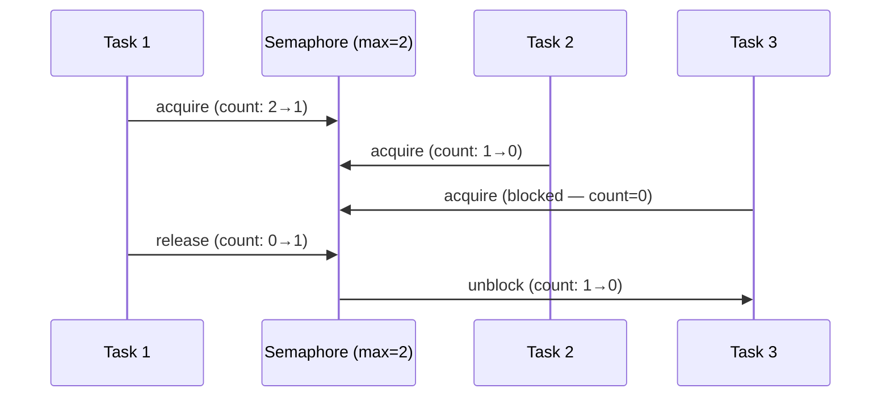

| Property | Value |
|----------|-------|
| acquire | O(1) if permits available; blocks if count = 0 |
| release | O(1) — increment counter, wake one waiter |
| Fairness | Implementation-dependent (FIFO or arbitrary) |
| Space | O(1) for counter + O(waiters) for blocked tasks |

**Try it yourself** — acquire permits and watch workers queue when the semaphore is full:

<SemaphoreViz />

## Production Proof

| Project | Source | Usage |
|---------|--------|-------|
| Linux Kernel | [semaphore.h#L15-L55](https://github.com/torvalds/linux/blob/acb7500801e98639f6d8c2d796ed9f64cba83d3a/include/linux/semaphore.h#L15-L55) | `struct semaphore` — kernel counting semaphore with `down()` (acquire) and `up()` (release). Used for device driver access control, limiting concurrent I/O operations. |
| Go stdlib | [semaphore.go#L28-L107](https://github.com/golang/sync/blob/5071ed6a9f1617117556b66384f765c934de3698/semaphore/semaphore.go#L28-L107) | `Weighted` struct (L28-L33) with `size`, `cur`, `mu`, `waiters`. `Acquire` (L38-L107) blocks until semaphore weight is available or context is cancelled. Used internally by `errgroup` to limit goroutine concurrency. |

## Implementation

::: code-group

```typescript [TypeScript]
class Semaphore {
  private queue: (() => void)[] = [];
  private count: number;

  constructor(private max: number) {
    this.count = max;
  }

  async acquire(): Promise<void> {
    if (this.count > 0) {
      this.count--;
      return;
    }
    return new Promise<void>((resolve) => this.queue.push(resolve));
  }

  release(): void {
    const next = this.queue.shift();
    if (next) {
      next();
    } else {
      this.count++;
    }
  }

  get available(): number {
    return this.count;
  }
}

async function withSemaphore<T>(sem: Semaphore, fn: () => Promise<T>): Promise<T> {
  await sem.acquire();
  try { return await fn(); }
  finally { sem.release(); }
}
```

```rust [Rust]
use std::sync::{Arc, Mutex, Condvar};

pub struct Semaphore {
    count: Mutex<usize>,
    cvar: Condvar,
}

impl Semaphore {
    pub fn new(max: usize) -> Self {
        Semaphore { count: Mutex::new(max), cvar: Condvar::new() }
    }

    pub fn acquire(&self) {
        let mut count = self.count.lock().unwrap();
        while *count == 0 { count = self.cvar.wait(count).unwrap(); }
        *count -= 1;
    }

    pub fn release(&self) {
        *self.count.lock().unwrap() += 1;
        self.cvar.notify_one();
    }
}
```

```go [Go]
// Idiomatic Go: buffered channel as semaphore
func process(s string) { /* work */ }

func processWithLimit(items []string, maxConcurrent int) {
	sem := make(chan struct{}, maxConcurrent)
	var wg sync.WaitGroup

	for _, item := range items {
		wg.Add(1)
		sem <- struct{}{} // acquire
		go func(s string) {
			defer wg.Done()
			defer func() { <-sem }() // release
			process(s)
		}(item)
	}
	wg.Wait()
}
```

```python [Python]
import asyncio

async def fetch_with_limit(urls: list[str], max_concurrent: int = 5):
    sem = asyncio.Semaphore(max_concurrent)
    async def fetch_one(url: str):
        async with sem:  # acquire + release via context manager
            return await do_fetch(url)
    return await asyncio.gather(*(fetch_one(u) for u in urls))
```

:::

## Exercises

| Level | Exercise | File |
|-------|----------|------|
| Basic | Implement a counting semaphore with acquire/release | `exercises/typescript/semaphore/01-basic.test.ts` |
| Intermediate | Connection pool guarded by a semaphore | `exercises/typescript/semaphore/02-intermediate.test.ts` |

Run exercises: `pnpm test:ts` (TypeScript) · `cargo test` (Rust) · `go test ./...` (Go) · `pytest` (Python)

Exercise files: Rust `exercises/rust/src/semaphore/mod.rs` · Go `exercises/go/semaphore/semaphore_test.go` · Python `exercises/python/semaphore/test_semaphore.py`

## When to Use

- **Rate limiting** — limit concurrent API calls, database connections
- **Resource pools** — control access to a fixed number of resources
- **Backpressure** — prevent overwhelming downstream services
- **Throttling** — limit concurrent file I/O, network requests

## When NOT to Use

- **Mutual exclusion** — if you need exclusive access (max=1), use a mutex/lock instead
- **Simple counters** — if you don't need blocking, use an atomic counter
- **Queue-based flow** — if order matters, use a bounded queue instead

## More Production Uses

- [Java Semaphore](https://github.com/openjdk/jdk/blob/4b3ec455c85314d051800a8f46dd8f5c93881e3a/src/java.base/share/classes/java/util/concurrent/Semaphore.java) — fair/nonfair counting semaphore
- [Python threading.Semaphore](https://github.com/python/cpython/blob/ff64d8de66ab7f8e56b5d410796a7d76c955280c/Lib/threading.py) — condition-variable-based semaphore
- [Nginx](https://github.com/nginx/nginx) — worker connections
- [PostgreSQL](https://github.com/postgres/postgres) — `max_connections`

## Related Patterns

| Pattern | Relationship |
|---------|-------------|
| [Rate Limiter (Token Bucket)](/patterns/rate-limiter/) | Rate limiters control throughput over time; semaphores control concurrent access count |
| [Backpressure](/patterns/backpressure/) | Semaphores implement backpressure by blocking when the limit is reached |
| [Object Pool](/patterns/object-pool/) | Pool size is effectively a semaphore — acquire an object, release when done |

## Challenge Questions

::: details Q1: A semaphore with max=1 behaves like a mutex. Why would you ever use a mutex instead of a semaphore(1)?
**Answer:** A mutex has ownership semantics — only the thread that acquired it can release it — which prevents accidental release by another thread and enables priority inheritance.

A semaphore is an anonymous counter: any thread can call `release()` regardless of who called `acquire()`. This means a bug where thread B accidentally releases thread A's semaphore goes undetected. A mutex tracks its owner, so an unlock by a non-owner is an error (or panic). Additionally, mutex ownership enables priority inheritance: if a high-priority thread is waiting for a mutex held by a low-priority thread, the OS can temporarily boost the holder's priority. Semaphores can't do this because there's no "holder."
:::

::: details Q2: Three high-priority tasks and one low-priority task share a semaphore(1). The low-priority task acquires the semaphore, then a medium-priority task preempts it. The high-priority tasks are now blocked. What is this called and how is it solved?
**Answer:** This is priority inversion — a high-priority task is indirectly blocked by a medium-priority task that preempts the low-priority lock holder.

The classic example is the Mars Pathfinder bug. The medium-priority task runs indefinitely because it doesn't need the semaphore, preventing the low-priority task from finishing and releasing the semaphore. Solutions: (1) priority inheritance — temporarily boost the lock holder to the highest waiter's priority, (2) priority ceiling — assign the semaphore a ceiling priority equal to the highest-priority task that uses it, (3) avoid holding semaphores across preemption points.
:::

::: details Q3: You use a semaphore(10) to limit concurrent database connections. Under load, you discover connections are being created and destroyed rapidly. What is wrong with this design?
**Answer:** A semaphore only limits concurrency, not reuse. You need a connection pool (object pool pattern) combined with a semaphore, not a semaphore alone.

A semaphore permits up to 10 tasks to proceed but doesn't manage the connections themselves. Each task creates a new connection, uses it, and destroys it — the semaphore just gates how many do this simultaneously. A connection pool holds 10 pre-created connections and lends them out. The pool internally uses a semaphore (or equivalent blocking mechanism) to make callers wait when all connections are checked out. The semaphore is the concurrency primitive; the pool is the resource manager.
:::

::: details Q4: Go uses a buffered channel as a semaphore (`sem := make(chan struct{}, N)`). What advantage does this have over a traditional semaphore implementation?
**Answer:** It composes naturally with Go's `select` statement, enabling timeout, cancellation, and multi-resource acquisition without additional APIs.

With a channel-based semaphore, you can write `select { case sem <- struct{}{}: /* acquired */ case <-ctx.Done(): /* cancelled */ }` — combining acquisition with context cancellation in one construct. A traditional semaphore needs a separate `TryAcquire` or `AcquireWithTimeout` method. The channel approach also benefits from Go's runtime scheduler: goroutines blocked on channel operations are parked efficiently without consuming OS threads. The tradeoff is that channels have slightly higher overhead than a mutex-based counter for simple cases.
:::


================================================
FILE: docs/patterns/skip-list/index.md
================================================
---
title: "Pattern: Skip List"
description: "A probabilistic sorted data structure with O(log n) search, insert, and delete — simpler to implement than balanced trees with comparable performance."
difficulty: "advanced"
---

# Pattern: Skip List

<DifficultyBadge />

## One Liner

A probabilistic sorted data structure with O(log n) search, insert, and delete — simpler to implement than balanced trees with comparable performance.

<DemoBadge />

## Real-World Analogy

An express train system with local and express stops. The express line skips most stations, letting you jump ahead quickly. Once you're close to your destination, you switch to the local line for precise stops. Multiple express levels speed up long searches.

## Core Idea

A skip list is a multi-level linked list where each level skips over more elements. The bottom level is a regular sorted linked list. Higher levels act as "express lanes" that allow binary-search-like behavior. Each node is randomly promoted to higher levels with probability p (typically 0.5).

```text
  Level 3:  HEAD ─────────────────────────────── 30 ─ NIL
              │                                  │
  Level 2:  HEAD ─────── 10 ──────────────────── 30 ─ NIL
              │           │                      │
  Level 1:  HEAD ── 5 ── 10 ──── 20 ──────────── 30 ─ NIL
              │     │     │       │              │
  Level 0:  HEAD  3  5  7  10  15  20  25  30 ─ NIL
              │   │  │  │   │   │   │   │   │
              ▼   ▼  ▼  ▼   ▼   ▼   ▼   ▼   ▼

  Search(15): L3→30(far)↓ L2→10→30(far)↓ L1→20(far)↓ L0→15 ✓
```

| Property | Value |
|----------|-------|
| Search | O(log n) average |
| Insert | O(log n) average |
| Delete | O(log n) average |
| Space | O(n) expected |
| Advantage | Simpler than red-black/AVL trees, lock-free variants possible |

**Try it yourself** — insert values and search to see how express lanes speed up traversal:

<SkipListViz />

## Production Proof

| Project | Source | Usage |
|---------|--------|-------|
| Redis | [t_zset.c#L70-L130](https://github.com/redis/redis/blob/df63a65d4d4ee33ae67e9f101885074febe0bccb/src/t_zset.c#L70-L130) | `zskiplist` / `zskiplistNode` — Redis sorted sets use a skip list (not a balanced tree) for O(log n) range queries. `zslInsert` creates nodes with random levels. Chosen by Antirez for its simplicity and cache-friendliness. |
| LevelDB | [skiplist.h#L40-L90](https://github.com/google/leveldb/blob/7ee830d02b623e8ffe0b95d59a74db1e58da04c5/db/skiplist.h#L40-L90) | `SkipList` class template — used as the in-memory sorted structure (MemTable) for LevelDB. `Insert` and `Contains` with compare-and-swap for concurrent reads. Foundation of LSM-tree architecture. |

## Implementation

::: code-group

```typescript [TypeScript]
class SkipNode {
  forward: (SkipNode | null)[];
  constructor(public key: number, public value: string, level: number) {
    this.forward = new Array(level + 1).fill(null);
  }
}

class SkipList {
  private maxLevel = 16;
  private level = 0;
  private header = new SkipNode(-Infinity, '', 16);

  private randomLevel(): number {
    let lvl = 0;
    while (lvl < this.maxLevel && Math.random() < 0.5) lvl++;
    return lvl;
  }

  insert(key: number, value: string): void {
    const update: (SkipNode | null)[] = new Array(this.maxLevel + 1).fill(null);
    let cur = this.header;
    for (let i = this.level; i >= 0; i--) {
      while (cur.forward[i] && cur.forward[i]!.key < key) cur = cur.forward[i]!;
      update[i] = cur;
    }
    if (cur.forward[0]?.key === key) { cur.forward[0]!.value = value; return; }
    const newLvl = this.randomLevel();
    if (newLvl > this.level) {
      for (let i = this.level + 1; i <= newLvl; i++) update[i] = this.header;
      this.level = newLvl;
    }
    const node = new SkipNode(key, value, newLvl);
    for (let i = 0; i <= newLvl; i++) {
      node.forward[i] = update[i]!.forward[i];
      update[i]!.forward[i] = node;
    }
  }

  search(key: number): string | undefined {
    let cur = this.header;
    for (let i = this.level; i >= 0; i--) {
      while (cur.forward[i] && cur.forward[i]!.key < key) cur = cur.forward[i]!;
    }
    return cur.forward[0]?.key === key ? cur.forward[0]!.value : undefined;
  }
}
```

```rust [Rust]
const MAX_LEVEL: usize = 4;

struct SkipNode {
    key: i64,
    value: String,
    forward: Vec<Option<usize>>,
}

pub struct SkipList {
    nodes: Vec<SkipNode>,
    head: usize,
    level: usize,
    seed: u64,
}

impl SkipList {
    pub fn new() -> Self {
        let head = SkipNode { key: i64::MIN, value: String::new(), forward: vec![None; MAX_LEVEL] };
        SkipList { nodes: vec![head], head: 0, level: 0, seed: 42 }
    }

    fn random_level(&mut self) -> usize {
        let mut lvl = 0;
        while lvl < MAX_LEVEL - 1 {
            self.seed ^= self.seed << 13;
            self.seed ^= self.seed >> 7;
            self.seed ^= self.seed << 17;
            if self.seed % 2 == 0 { lvl += 1; } else { break; }
        }
        lvl
    }

    pub fn insert(&mut self, key: i64, value: &str) {
        let mut update = [0usize; MAX_LEVEL];
        let mut cur = self.head;
        for i in (0..=self.level).rev() {
            while let Some(nx) = self.nodes[cur].forward[i] {
                if self.nodes[nx].key < key { cur = nx; } else { break; }
            }
            update[i] = cur;
        }
        if let Some(nx) = self.nodes[cur].forward[0] {
            if self.nodes[nx].key == key {
                self.nodes[nx].value = value.to_string();
                return;
            }
        }
        let lvl = self.random_level();
        if lvl > self.level {
            for i in (self.level + 1)..=lvl { update[i] = self.head; }
            self.level = lvl;
        }
        let idx = self.nodes.len();
        self.nodes.push(SkipNode { key, value: value.to_string(), forward: vec![None; lvl + 1] });
        for i in 0..=lvl {
            self.nodes[idx].forward[i] = self.nodes[update[i]].forward[i];
            self.nodes[update[i]].forward[i] = Some(idx);
        }
    }

    pub fn search(&self, key: i64) -> Option<&str> {
        let mut cur = self.head;
        for i in (0..=self.level).rev() {
            while let Some(nx) = self.nodes[cur].forward[i] {
                if self.nodes[nx].key < key { cur = nx; } else { break; }
            }
        }
        if let Some(nx) = self.nodes[cur].forward[0] {
            if self.nodes[nx].key == key { return Some(&self.nodes[nx].value); }
        }
        None
    }
}
```

```go [Go]
type SkipNode struct {
	key     int
	value   string
	forward []*SkipNode
}

type SkipList struct {
	header   *SkipNode
	level    int
	maxLevel int
}

func NewSkipList() *SkipList {
	header := &SkipNode{forward: make([]*SkipNode, 17)}
	return &SkipList{header: header, maxLevel: 16}
}

func (sl *SkipList) Insert(key int, value string) {
	update := make([]*SkipNode, sl.maxLevel+1)
	cur := sl.header
	for i := sl.level; i >= 0; i-- {
		for cur.forward[i] != nil && cur.forward[i].key < key {
			cur = cur.forward[i]
		}
		update[i] = cur
	}
	if cur.forward[0] != nil && cur.forward[0].key == key {
		cur.forward[0].value = value
		return
	}
	lvl := 0
	for lvl < sl.maxLevel && rand.Float64() < 0.5 {
		lvl++
	}
	if lvl > sl.level {
		for i := sl.level + 1; i <= lvl; i++ {
			update[i] = sl.header
		}
		sl.level = lvl
	}
	node := &SkipNode{key: key, value: value, forward: make([]*SkipNode, lvl+1)}
	for i := 0; i <= lvl; i++ {
		node.forward[i] = update[i].forward[i]
		update[i].forward[i] = node
	}
}

func (sl *SkipList) Search(key int) (string, bool) {
	cur := sl.header
	for i := sl.level; i >= 0; i-- {
		for cur.forward[i] != nil && cur.forward[i].key < key {
			cur = cur.forward[i]
		}
	}
	if cur.forward[0] != nil && cur.forward[0].key == key {
		return cur.forward[0].value, true
	}
	return "", false
}
```

```python [Python]
import random

class SkipNode:
    def __init__(self, key: int, value: str, level: int):
        self.key = key
        self.value = value
        self.forward: list[SkipNode | None] = [None] * (level + 1)

class SkipList:
    def __init__(self, max_level: int = 16, p: float = 0.5):
        self.max_level = max_level
        self.p = p
        self.level = 0
        self.header = SkipNode(-1, '', max_level)

    def _random_level(self) -> int:
        lvl = 0
        while lvl < self.max_level and random.random() < self.p:
            lvl += 1
        return lvl

    def insert(self, key: int, value: str) -> None:
        update = [self.header] * (self.max_level + 1)
        cur = self.header
        for i in range(self.level, -1, -1):
            while cur.forward[i] and cur.forward[i].key < key:
                cur = cur.forward[i]
            update[i] = cur
        if cur.forward[0] and cur.forward[0].key == key:
            cur.forward[0].value = value
            return
        lvl = self._random_level()
        if lvl > self.level:
            for i in range(self.level + 1, lvl + 1):
                update[i] = self.header
            self.level = lvl
        node = SkipNode(key, value, lvl)
        for i in range(lvl + 1):
            node.forward[i] = update[i].forward[i]
            update[i].forward[i] = node

    def search(self, key: int) -> str | None:
        cur = self.header
        for i in range(self.level, -1, -1):
            while cur.forward[i] and cur.forward[i].key < key:
                cur = cur.forward[i]
        if cur.forward[0] and cur.forward[0].key == key:
            return cur.forward[0].value
        return None
```

:::

## Exercises

| Level | Exercise | File |
|-------|----------|------|
| Basic | Implement a skip list with insert/search/delete | `exercises/typescript/skip-list/01-basic.test.ts` |
| Intermediate | Skip list with range query | `exercises/typescript/skip-list/02-intermediate.test.ts` |

Run exercises: `pnpm test:ts` (TypeScript) · `cargo test` (Rust) · `go test ./...` (Go) · `pytest` (Python)

Exercise files: Rust `exercises/rust/src/skip_list/mod.rs` · Go `exercises/go/skip_list/skip_list_test.go` · Python `exercises/python/skip_list/test_skip_list.py`

## When to Use

- **In-memory sorted storage** — when you need sorted iteration + fast point lookups (Redis sorted sets)
- **Concurrent data structures** — lock-free skip lists are simpler than lock-free balanced trees
- **Database memtables** — in-memory write buffer before flushing to disk (LevelDB, RocksDB)
- **Range queries** — efficient range scans on sorted data

## When NOT to Use

- **Pure key-value lookup** — hash maps are O(1) average vs skip list's O(log n)
- **Deterministic performance needed** — skip list has probabilistic guarantees, not worst-case
- **Memory-constrained** — forward pointer arrays use more memory than a balanced tree
- **Persistent storage** — B-trees are better optimized for disk I/O patterns

## More Production Uses

- [RocksDB](https://github.com/facebook/rocksdb/blob/7affaee1c49ebc80cb213ad86fe7d2a3ad447da2/memtable/inlineskiplist.h) — `InlineSkipList` for concurrent MemTable
- [CockroachDB](https://github.com/cockroachdb/cockroach) — skip list-based memtable for Pebble storage engine
- [Java ConcurrentSkipListMap](https://github.com/openjdk/jdk) — lock-free sorted map in JDK
- [FoundationDB](https://github.com/apple/foundationdb) — skip list for in-memory sorted data

## Related Patterns

| Pattern | Relationship |
|---------|-------------|
| [LSM Tree (Log-Structured Merge Tree)](/patterns/lsm-tree/) | LSM trees use skip lists as their in-memory sorted buffer (memtable) |
| [B+ Tree](/patterns/b-plus-tree/) | B+ trees guarantee O(log n); skip lists achieve it probabilistically with simpler code |
| [Bloom Filter](/patterns/bloom-filter/) | Both are probabilistic — bloom filters for membership, skip lists for ordering |
| [Free List](/patterns/free-list/) | Skip list nodes need allocation management; free lists provide O(1) alloc for fixed-size nodes |
| [Merge Iterator](/patterns/merge-iterator/) | Merge iterators combine sorted output from multiple skip list levels or instances |
| [Trie (Prefix Tree)](/patterns/trie/) | Both provide ordered key traversal — skip lists via probabilistic balance, tries via prefix structure |

## Challenge Questions

::: details Q1: A skip list uses `Math.random()` to decide node promotion levels. Your colleague argues this makes skip list performance "unreliable" since a bad random sequence could produce O(n) search. Is this a real concern in production?
**Answer:** In theory yes, but in practice the probability is astronomically low — comparable to a hash table degenerating to O(n) from collisions.

With promotion probability p=0.5, the chance of a node reaching level k is (1/2)^k. The expected maximum level for n elements is O(log n). For a skip list to degrade to O(n), a large fraction of nodes would need to be at level 0 only — an event with probability so close to zero it's practically impossible. Redis chose skip lists over red-black trees for this reason: the average-case guarantees are strong enough, and the implementation is dramatically simpler. LevelDB uses skip lists for the same reasoning.
:::

::: details Q2: Redis uses a skip list (not a red-black tree or B-tree) for sorted sets. Both skip lists and balanced BSTs offer O(log n) operations. What makes skip lists preferable for Redis's use case?
**Answer:** Skip lists are simpler to implement correctly, support efficient range queries by following forward pointers, and are easier to make lock-free for concurrent access.

In a balanced BST, range queries require an in-order traversal that bounces between parent and child pointers. In a skip list, once you find the range start at level 0, you simply follow forward pointers — sequential and cache-friendly. Additionally, lock-free skip list algorithms (used in LevelDB and ConcurrentSkipListMap) are well-understood, while lock-free balanced tree algorithms are notoriously complex. Antirez (Redis creator) also cited implementation simplicity: skip list insert/delete code is straightforward compared to red-black tree rotations.
:::

::: details Q3: LevelDB's skip list supports concurrent reads without locks but requires external synchronization for writes. Why not make writes lock-free too?
**Answer:** LevelDB only has one writer thread (the memtable writer), so lock-free writes add complexity without benefit — the design constraint is concurrent readers, not concurrent writers.

LevelDB's LSM-tree architecture funnels all writes through a single write-ahead log and then into the memtable. Since there's only one writer, a mutex is trivial and adds no contention. The skip list uses atomic operations for the forward pointers so that the single writer and multiple reader threads can operate simultaneously without read locks. This is the SWMR (single-writer, multiple-reader) insight: optimize for the actual concurrency pattern, not the general case.
:::

::: details Q4: You're implementing a skip list for a leaderboard that needs the top-100 players by score. A naive approach iterates from the head of level 0. Your colleague says "just maintain a pointer to the tail for reverse iteration." Why doesn't this work as easily as it does in a doubly-linked list?
**Answer:** Skip lists are inherently forward-only structures. Adding backward pointers at every level doubles the pointer count and complicates insertion/deletion, negating the simplicity advantage over balanced trees.

In a doubly-linked list, maintaining a tail pointer and iterating backward is trivial. In a skip list, you'd need backward pointers at every level to get O(log n) reverse traversal — otherwise you'd fall back to O(n) at level 0. This essentially turns the skip list into a bidirectional skip list, which is significantly more complex. The practical solution for "top-K" queries is to store scores negated (or use a reverse comparator) so that the highest scores sort first, then iterate forward from the head. Redis sorted sets take this approach with `ZREVRANGE` by walking forward pointers on a skip list that supports both directions at level 0 only.
:::


================================================
FILE: docs/patterns/state-machine/index.md
================================================
---
title: "Pattern: State Machine"
description: "Model an entity's lifecycle as a set of states with explicit transitions, making impossible states unrepresentable and every state change auditable."
difficulty: "beginner"
---

# Pattern: State Machine

<DifficultyBadge />

## One Liner

Model an entity's lifecycle as a set of states with explicit transitions, making impossible states unrepresentable and every state change auditable.

<DemoBadge />

## Real-World Analogy

A vending machine. It has clearly defined states: idle, coin-inserted, dispensing. You can't dispense without inserting a coin, and you can't insert a coin while it's already dispensing. Every button press is only valid in certain states.

## Core Idea

A state machine defines a finite set of states an entity can be in, and the transitions between them. At any point, the entity is in exactly one state. Transitions are triggered by events and can have guard conditions.

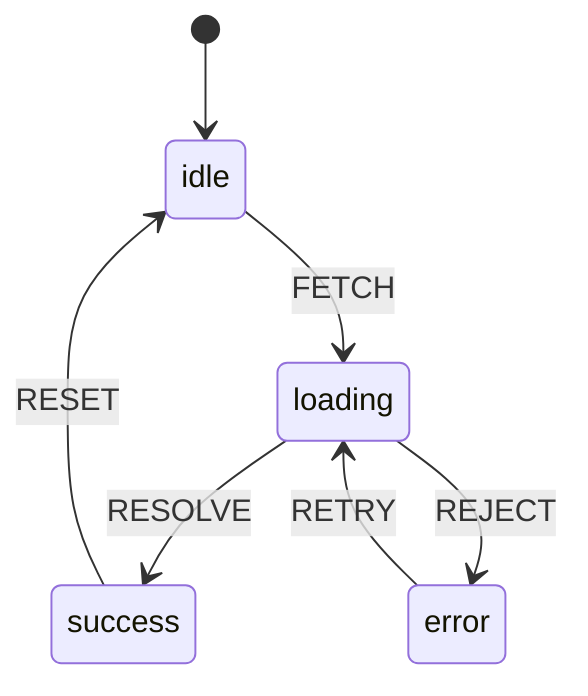

The power: **impossible transitions don't exist**. You can't go from `success` to `error` because no such transition is defined. The compiler (or runtime) enforces this.

| Property | Value |
|----------|-------|
| Transition | O(1) — lookup in state×event table |
| Current state | O(1) — single variable |
| Valid events | Enumerable per state — enables exhaustive checking |
| Space | O(states × events) for the transition table |

**Try it yourself** — click events to trigger transitions and observe which events are valid in each state:

<StateMachineViz />

## Production Proof

| Project | Source | Usage |
|---------|--------|-------|
| XState | [StateMachine.ts#L58-L120](https://github.com/statelyai/xstate/blob/9d9b9f1439b773979c5120a793215f5aa4568d8f/packages/core/src/StateMachine.ts#L58-L120) | `StateMachine` class — `transition()` takes current state + event, evaluates guard conditions, returns next state config. Supports hierarchical states via nested `states` property with parallel regions and history nodes. |
| Linux Kernel | [tcp_input.c#L4865-L4920](https://github.com/torvalds/linux/blob/acb7500801e98639f6d8c2d796ed9f64cba83d3a/net/ipv4/tcp_input.c#L4865-L4920) | TCP connection state machine — the `switch (sk->sk_state)` block implements the TCP state transitions (LISTEN → SYN_SENT → ESTABLISHED → FIN_WAIT, etc.) that every internet connection uses. |

## Implementation

::: code-group

```typescript [TypeScript]
type StateConfig<S extends string, E extends string> = {
  [state in S]: {
    on: Partial<Record<E, S>>;
  };
};

class StateMachine<S extends string, E extends string> {
  private current: S;

  constructor(
    private config: StateConfig<S, E>,
    initial: S,
  ) {
    this.current = initial;
  }

  get state(): S {
    return this.current;
  }

  send(event: E): S {
    const transitions = this.config[this.current].on;
    const next = transitions[event];
    if (next !== undefined) {
      this.current = next;
    }
    return this.current;
  }

  can(event: E): boolean {
    return this.config[this.current].on[event] !== undefined;
  }
}
```

```rust [Rust]
use std::collections::HashMap;

pub struct StateMachine {
    current: String,
    transitions: HashMap<(String, String), String>,
}

impl StateMachine {
    pub fn new(initial: &str) -> Self {
        StateMachine {
            current: initial.to_string(),
            transitions: HashMap::new(),
        }
    }

    pub fn add_transition(&mut self, from: &str, event: &str, to: &str) {
        self.transitions.insert(
            (from.to_string(), event.to_string()),
            to.to_string(),
        );
    }

    pub fn send(&mut self, event: &str) -> &str {
        let key = (self.current.clone(), event.to_string());
        if let Some(next) = self.transitions.get(&key) {
            self.current = next.clone();
        }
        &self.current
    }

    pub fn state(&self) -> &str {
        &self.current
    }
}
```

```go [Go]
type StateMachine struct {
	current     string
	transitions map[string]map[string]string // state -> event -> next
}

func New(initial string) *StateMachine {
	return &StateMachine{
		current:     initial,
		transitions: make(map[string]map[string]string),
	}
}

func (sm *StateMachine) AddTransition(from, event, to string) {
	if sm.transitions[from] == nil {
		sm.transitions[from] = make(map[string]string)
	}
	sm.transitions[from][event] = to
}

func (sm *StateMachine) Send(event string) string {
	if next, ok := sm.transitions[sm.current][event]; ok {
		sm.current = next
	}
	return sm.current
}

func (sm *StateMachine) State() string { return sm.current }
```

```python [Python]
class StateMachine:
    def __init__(self, config: dict, initial: str):
        self._config = config
        self._current = initial

    @property
    def state(self) -> str:
        return self._current

    def send(self, event: str) -> str:
        transitions = self._config.get(self._current, {}).get("on", {})
        if event in transitions:
            self._current = transitions[event]
        return self._current

    def can(self, event: str) -> bool:
        return event in self._config.get(self._current, {}).get("on", {})

# Usage
traffic_light = StateMachine({
    "green":  {"on": {"TIMER": "yellow"}},
    "yellow": {"on": {"TIMER": "red"}},
    "red":    {"on": {"TIMER": "green"}},
}, initial="green")

traffic_light.send("TIMER")  # "yellow"
traffic_light.send("TIMER")  # "red"
traffic_light.send("TIMER")  # "green"
```

:::

## Exercises

| Level | Exercise | File |
|-------|----------|------|
| Basic | Implement a state machine with send/can | `exercises/typescript/state-machine/01-basic.test.ts` |
| Intermediate | Traffic light controller with timed transitions | `exercises/typescript/state-machine/02-intermediate.test.ts` |

Run exercises: `pnpm test:ts` (TypeScript) · `cargo test` (Rust) · `go test ./...` (Go) · `pytest` (Python)

Exercise files: Rust `exercises/rust/src/state_machine/mod.rs` · Go `exercises/go/state_machine/state_machine_test.go` · Python `exercises/python/state_machine/test_state_machine.py`

## When to Use

- **Protocol implementation** — TCP, HTTP, WebSocket state transitions
- **UI flow management** — multi-step forms, authentication flows, modals
- **Game logic** — character states (idle, walking, attacking, dead)
- **Workflow engines** — approval chains, deployment pipelines
- **Parsing** — tokenizers, regex engines, protocol decoders

## When NOT to Use

- **Simple boolean toggles** — a `true`/`false` doesn't need a state machine
- **Unbounded states** — if the state space is continuous (positions, scores), use plain variables
- **No invalid transitions** — if any state can transition to any other, you don't need constraints
- **Combinatorial explosion** — 5 independent toggles = 32 states; model orthogonal concerns as parallel machines or use statecharts

## More Production Uses

- [RE2](https://github.com/google/re2/blob/972a15cedd008d846f1a39b2e88ce48d7f166cbd/re2/nfa.cc) — NFA-based regex engine using Thompson's algorithm
- HTTP/2 stream states ([RFC 7540](https://datatracker.ietf.org/doc/html/rfc7540))
- [Kubernetes](https://github.com/kubernetes/kubernetes/blob/586cc904093af4fe7492e564908a796f0b107f97/pkg/kubelet/lifecycle/handlers.go) — pod lifecycle state transitions
- [Godot Engine](https://github.com/godotengine/godot/blob/ec67cbe92628bdaf979b10594359ba6f02cf8838/scene/animation/animation_tree.cpp) — animation state machine for game characters

## Related Patterns

| Pattern | Relationship |
|---------|-------------|
| [Actor Model](/patterns/actor-model/) | Actors often use state machines to manage their internal behavior |
| [Circuit Breaker](/patterns/circuit-breaker/) | Circuit breaker is a classic state machine: closed -> open -> half-open |
| [Visitor](/patterns/visitor/) | Visitors can dispatch differently based on state machine's current state |

## Challenge Questions

::: details Q1: A form has 4 steps, each with a "valid" and "invalid" sub-state, plus a "submitting" and "submitted" state. That's 4 × 2 + 2 = 10 states. If you add a "dirty/clean" dimension, it doubles to 20. How do you avoid this state explosion?
**Answer:** Use parallel (orthogonal) state machines — one for the form step, one for validation status, one for dirty tracking — instead of one flat machine with every combination.

This is exactly what statecharts (Harel's extension of FSMs) solve. Each concern runs as an independent region: the step machine handles `NEXT`/`BACK`, the validation machine handles `VALIDATE`/`INVALIDATE`, the dirty machine handles `CHANGE`/`SAVE`. They compose without multiplying. XState supports this via `type: 'parallel'`. The total states are 4 + 2 + 2 = 8 instead of 4 × 2 × 2 = 16.
:::

::: details Q2: In the traffic light example, you want the light to stay red for 60s but yellow for only 5s. Where does this timing logic belong — in the state machine or outside it?
**Answer:** The timing lives outside the machine as the event source; the machine only defines which transitions are valid.

A state machine is not a scheduler — it defines *what* can happen, not *when*. An external timer fires a `TIMER` event after the appropriate delay. The machine receives the event and transitions. This separation is important: the same machine definition works whether timers are real (production), instant (tests), or manual (debugging). Putting delays inside transitions couples the machine to time, making it harder to test and reason about.
:::

::: details Q3: You add a guard condition: "only transition from `loading` to `success` if the response has status 200." What happens if no guard matches — is the event silently dropped?
**Answer:** Yes, in most implementations the event is silently ignored and the machine stays in its current state.

This is by design — an unhandled event is not an error in state machine semantics. If no transition matches (because no guard passes), the machine remains stable. This is safer than throwing an exception, because events often arrive asynchronously and may be irrelevant to the current state. If you need to handle "no transition matched" explicitly, model it as a catch-all transition to an error state, or use an `onEvent` hook to log unhandled events.
:::

::: details Q4: TCP has 11 states and ~25 transitions. Could you replace the state machine with a series of `if/else` checks on boolean flags like `isConnected`, `isSynSent`, `isFinWait`?
**Answer:** Technically yes, but you lose the guarantee that impossible states are unrepresentable — boolean flags allow invalid combinations like `isConnected && isFinWait`.

With 11 booleans you have 2^11 = 2048 possible combinations, of which only 11 are valid. Every `if/else` must guard against the 2037 invalid states. A state machine makes this impossible by construction: the entity is always in exactly one state, and only defined transitions can change it. The TCP spec itself is defined as a state diagram, not as boolean logic, because the state machine representation is provably correct while the boolean approach is provably fragile.
:::


================================================
FILE: docs/patterns/tagged-union/index.md
================================================
---
title: "Pattern: Tagged Union / Variant"
description: "Store a type tag alongside a value union so one variable safely holds different types, dispatching behavior via the tag."
difficulty: "beginner"
---

# Pattern: Tagged Union / Variant

<DifficultyBadge />

## One Liner

Store a type tag alongside a value union so one variable safely holds different types, dispatching behavior via the tag.

<DemoBadge />

## Real-World Analogy

A shipping label on a package. The label says 'fragile', 'perishable', or 'standard', and the warehouse handles each type differently. The label (tag) determines the handling procedure (dispatch) — one system, multiple behaviors.

## Core Idea

A tagged union (also called a variant, discriminated union, or sum type) pairs a type discriminator with a value payload. At runtime, code inspects the tag to determine which type the value actually is, then dispatches to the correct handler. This is the manual foundation behind TypeScript discriminated unions, Rust enums, and algebraic data types.

```text
  TaggedValue
  ┌────────┬───────────────────┐
  │  tag   │      value        │
  ├────────┼───────────────────┤
  │ NUMBER │  42               │
  │ STRING │  "hello"          │
  │ ARRAY  │  [val, val, ...]  │
  │ OBJECT │  {key: val, ...}  │
  └────────┴───────────────────┘

  Dispatch:
  switch (v.tag) {
    NUMBER → handle as number
    STRING → handle as string
    ARRAY  → recurse into children
    OBJECT → iterate key-value pairs
  }
```

| Property | Value |
|----------|-------|
| Memory | Size of tag + size of largest variant |
| Type safety | Exhaustive switch ensures all cases handled |
| Extension | Add a new tag + handler (open to extension) |
| Zero-cost? | In C/Rust: yes (enum tag + union). In JS/Python: object overhead |

**Try it yourself** — switch between variant types and see tag-based dispatch in action:

<TaggedUnionViz />

## Production Proof

| Project | Source | Usage |
|---------|--------|-------|
| Godot Engine | [variant.h#L78-L120](https://github.com/godotengine/godot/blob/ec67cbe92628bdaf979b10594359ba6f02cf8838/core/variant/variant.h#L78-L120) | `Variant::Type` enum (L78-L108) lists 38 types (NIL, BOOL, INT, FLOAT, STRING, VECTOR2, ...). The `Variant` class stores a `Type` tag and a union of all possible values. Every GDScript value is a `Variant` — the engine dispatches operations via the tag. |
| PyTorch | [ivalue.h#L51-L96](https://github.com/pytorch/pytorch/blob/cef26d1e97fcb9dd61b4471f9bd7fa9a32bd42b9/aten/src/ATen/core/ivalue.h#L51-L96) | `IValue` (Interpreter Value) holds a tag (`Tag` enum: Tensor, Int, Double, Bool, String, List, Dict, etc.) and a `Payload` union. The TorchScript interpreter uses tag-based dispatch for all operations on heterogeneous values. |

## Implementation

::: code-group

```typescript [TypeScript]
type Tag = 'null' | 'boolean' | 'number' | 'string' | 'array' | 'object';

interface TaggedValue {
  tag: Tag;
  value: null | boolean | number | string | TaggedValue[] | Record<string, TaggedValue>;
}

function stringify(tv: TaggedValue): string {
  switch (tv.tag) {
    case 'null': return 'null';
    case 'boolean': return String(tv.value);
    case 'number': return String(tv.value);
    case 'string': return `"${tv.value}"`;
    case 'array': {
      const items = (tv.value as TaggedValue[]).map(stringify);
      return `[${items.join(',')}]`;
    }
    case 'object': {
      const obj = tv.value as Record<string, TaggedValue>;
      const pairs = Object.keys(obj).map(k => `"${k}":${stringify(obj[k])}`);
      return `{${pairs.join(',')}}`;
    }
  }
}
```

```rust [Rust]
enum Value {
    Null,
    Bool(bool),
    Number(f64),
    Str(String),
}

impl Value {
    fn display(&self) -> String {
        match self {
            Value::Null => "null".to_string(),
            Value::Bool(b) => b.to_string(),
            Value::Number(n) => n.to_string(),
            Value::Str(s) => format!("\"{}\"", s),
        }
    }

    fn try_add(&self, other: &Value) -> Option<Value> {
        match (self, other) {
            (Value::Number(a), Value::Number(b)) => Some(Value::Number(a + b)),
            _ => None,
        }
    }
}
```

```go [Go]
type Tag int

const (
	TagNull Tag = iota
	TagBool
	TagNumber
	TagString
)

type TaggedValue struct {
	Tag    Tag
	Bool   bool
	Number float64
	Str    string
}

func Display(tv TaggedValue) string {
	switch tv.Tag {
	case TagNull:
		return "null"
	case TagBool:
		if tv.Bool {
			return "true"
		}
		return "false"
	case TagNumber:
		return fmt.Sprintf("%g", tv.Number)
	case TagString:
		return fmt.Sprintf("%q", tv.Str)
	default:
		return "unknown"
	}
}
```

```python [Python]
from dataclasses import dataclass
from typing import Union

@dataclass
class TaggedValue:
    tag: str  # "null", "bool", "number", "string"
    value: Union[None, bool, int, float, str]

def display(tv: TaggedValue) -> str:
    if tv.tag == "null":
        return "null"
    elif tv.tag == "bool":
        return str(tv.value).lower()
    elif tv.tag == "number":
        return str(tv.value)
    elif tv.tag == "string":
        return f'"{tv.value}"'
    raise ValueError(f"Unknown tag: {tv.tag}")

def try_add(a: TaggedValue, b: TaggedValue) -> TaggedValue | None:
    if a.tag != "number" or b.tag != "number":
        return None
    return TaggedValue("number", a.value + b.value)
```

:::

## Exercises

| Level | Exercise | File |
|-------|----------|------|
| Basic | Implement tagged values with type dispatch | `exercises/typescript/tagged-union/01-basic.test.ts` |
| Intermediate | JSON-like value type with nested arrays/objects | `exercises/typescript/tagged-union/02-intermediate.test.ts` |

Run exercises: `pnpm test:ts` (TypeScript) · `cargo test` (Rust) · `go test ./...` (Go) · `pytest` (Python)

Exercise files: Rust `exercises/rust/src/tagged_union/mod.rs` · Go `exercises/go/tagged_union/tagged_union_test.go` · Python `exercises/python/tagged_union/test_tagged_union.py`

## When to Use

- **Scripting language values** — a single Value type holds numbers, strings, arrays, etc. (Godot Variant, Lua TValue)
- **Serialization formats** — JSON, MessagePack, Protocol Buffers oneof fields
- **Compiler IRs** — AST nodes, instruction operands, interpreter values
- **Configuration systems** — settings that can be string, number, boolean, or list
- **Database drivers** — column values of varying SQL types in a single interface

## When NOT to Use

- **Homogeneous collections** — if everything is the same type, a plain array is simpler
- **Performance-critical inner loops** — tag dispatch has branch overhead; use concrete types when the type is known statically
- **Deep hierarchies** — if you need 50+ variants with complex behavior, consider a class hierarchy or trait objects instead

## More Production Uses

- [V8 Engine](https://github.com/v8/v8/blob/02a623d69f6ba69f513ae2c7aef84b9914fbde51/src/objects/tagged-value.h) — JavaScript values use tagged pointers to distinguish Smis (small integers) from heap objects
- [SQLite](https://github.com/sqlite/sqlite) — internal `Mem` struct stores type tag + value union for all SQL types
- [Lua TValue](https://github.com/lua/lua) — every Lua value is a `TValue` with a type tag and `Value` union
- [GHC Haskell](https://github.com/ghc/ghc) — algebraic data types compile to tagged heap objects

## Related Patterns

| Pattern | Relationship |
|---------|-------------|
| [Vtable](/patterns/vtable/) | Both enable runtime polymorphism — tagged unions via switch, vtables via function pointers |
| [Bitmask](/patterns/bitmask/) | Bitmask flags can serve as type tags in lightweight tagged union implementations |
| [Visitor](/patterns/visitor/) | Visitors dispatch on node types, which are often represented as tagged unions |

## Challenge Questions

::: details Q1: You have a tagged union with 4 types. How many bytes does the value occupy in C if the largest variant is 24 bytes?
**Answer:** The union size equals the largest member: 24 bytes. Add the tag (typically 4 bytes with padding) and you get 28 or 32 bytes total depending on alignment.

Key insight: In a union, all variants share the same memory. The compiler allocates enough space for the largest one. The tag is stored separately (not inside the union), so total size = sizeof(tag) + padding + sizeof(largest_variant).
:::

::: details Q2: TypeScript has discriminated unions built-in. Why would you still implement a tagged union manually?
**Answer:** TypeScript's discriminated unions only exist at compile time — they're erased to plain JavaScript objects at runtime. If you need runtime type checking (e.g., deserializing JSON from an API, or a plugin system where types aren't known at compile time), you need an explicit tag field that survives into runtime.

Also, when storing heterogeneous values in a database, serialization format, or cross-language boundary, you need a physical tag — TypeScript's type system can't help there.
:::

::: details Q3: Godot's Variant has 38 type tags. What's the risk of adding more tags over time?
**Answer:** Every function that switches on the tag must handle the new case. If any switch is not exhaustive, you get a runtime error or silent bug. This is the "expression problem" — adding new types is easy (add a tag), but you must update every operation.

Mitigation strategies: (1) Exhaustive switch warnings in the compiler, (2) A default/fallback case, (3) Visitor pattern to centralize dispatch, (4) Rust's `match` enforces exhaustiveness at compile time.
:::

::: details Q4: What's the difference between a tagged union and a class hierarchy for polymorphism?
**Answer:** Tagged unions are *closed* — all variants are known upfront and dispatched via a switch. Class hierarchies are *open* — you can add subclasses without modifying existing code, dispatched via vtable.

Tradeoffs: Tagged unions make it easy to add new *operations* (just write a new switch). Class hierarchies make it easy to add new *types* (just add a subclass). This is the classic expression problem. Tagged unions are better for data-oriented designs (serialization, interpreters), while class hierarchies suit behavior-oriented designs (UI widgets, game entities).
:::


================================================
FILE: docs/patterns/tombstone/index.md
================================================
---
title: "Pattern: Tombstone / Deferred Deletion"
description: "Mark deleted entries with a tombstone marker instead of removing them — a background process reclaims space later."
difficulty: "beginner"
---

# Pattern: Tombstone / Deferred Deletion

<DifficultyBadge />

## One Liner

Mark deleted entries with a tombstone marker instead of removing them — a background process reclaims space later.

<DemoBadge />

## Real-World Analogy

A library book marked 'withdrawn' with a sticker but left on the shelf. Patrons see it's no longer available, and the librarian collects withdrawn books in batch during the monthly shelf cleanup.

## Core Idea

Instead of immediately removing data, write a special "tombstone" record that shadows the original. Reads check for tombstones and treat marked entries as deleted. A background compaction process later reclaims space by physically removing both the tombstone and the shadowed data. This decouples the fast path (mark deleted) from the slow path (reclaim space).

```text
  Write path:                      Read path:

  delete("B")                      get("B")
      │                                │
      ▼                                ▼
  ┌──────────┐                   ┌───────────┐
  │ Log/SST  │                   │  Lookup   │
  ├──────────┤                   ├───────────┤
  │ A = "v1" │                   │ Found:    │
  │ B = tomb │ ◄── tombstone     │ B = tomb  │──► return NOT FOUND
  │ C = "v3" │                   │           │
  └──────────┘                   └───────────┘

  Compaction (background):
  ┌──────────┐      ┌──────────┐
  │ A = "v1" │      │ A = "v1" │
  │ B = "v2" │ ──►  │ C = "v3" │  B removed (tombstone + original)
  │ B = tomb │      └──────────┘
  │ C = "v3" │
  └──────────┘
```

| Property | Value |
|----------|-------|
| Delete | O(1) — just append a tombstone marker |
| Space reclaim | Deferred — background compaction |
| Read overhead | Must check for tombstones |
| Consistency | Tombstone must propagate to all replicas before removal |

**Try it yourself** — write entries, delete them with tombstones, and compact to reclaim space:

<TombstoneViz />

## Production Proof

| Project | Source | Usage |
|---------|--------|-------|
| LevelDB | [dbformat.h#L39-L43](https://github.com/google/leveldb/blob/7ee830d02b623e8ffe0b95d59a74db1e58da04c5/db/dbformat.h#L39-L43) | `kTypeDeletion` (value 0x0) marks a key as deleted in the write-ahead log and SSTables. During compaction (`DoCompactionWork` in db_impl.cc), tombstones are dropped once no older snapshot references the key. |
| Apache Cassandra | [DeletionTime.java#L37-L99](https://github.com/apache/cassandra/blob/3831d8265d748c21c0fef9d31d4777b134b20637/src/java/org/apache/cassandra/db/DeletionTime.java#L37-L99) | `DeletionTime` class represents tombstones with `markedForDeleteAt` timestamp. `isLive()` (L99) checks tombstone status on read. Tombstones propagate across replicas during `gc_grace_seconds` (default 10 days, referenced at L89) before compaction purges them. |

## Implementation

::: code-group

```typescript [TypeScript]
interface Entry<V> {
  value: V | null;
  deleted: boolean;
  timestamp: number;
}

class TombstoneStore<V> {
  private store = new Map<string, Entry<V>>();
  private tombstoneCount = 0;

  put(key: string, value: V): void {
    this.store.set(key, {
      value,
      deleted: false,
      timestamp: Date.now(),
    });
  }

  get(key: string): V | undefined {
    const entry = this.store.get(key);
    if (!entry || entry.deleted) return undefined;
    return entry.value!;
  }

  delete(key: string): boolean {
    const entry = this.store.get(key);
    if (!entry || entry.deleted) return false;
    entry.deleted = true;
    entry.value = null;
    entry.timestamp = Date.now();
    this.tombstoneCount++;
    return true;
  }

  /** Compact: remove tombstones older than maxAge ms. */
  compact(maxAge: number): number {
    const cutoff = Date.now() - maxAge;
    let removed = 0;
    for (const [key, entry] of this.store) {
      if (entry.deleted && entry.timestamp < cutoff) {
        this.store.delete(key);
        removed++;
        this.tombstoneCount--;
      }
    }
    return removed;
  }

  get size(): number {
    let count = 0;
    for (const entry of this.store.values()) {
      if (!entry.deleted) count++;
    }
    return count;
  }

  get pendingTombstones(): number {
    return this.tombstoneCount;
  }
}
```

```rust [Rust]
use std::collections::HashMap;
use std::time::{SystemTime, UNIX_EPOCH};

struct Entry {
    value: Option<String>,
    deleted: bool,
    timestamp: u128,
}

pub struct TombstoneStore {
    store: HashMap<String, Entry>,
    tombstone_count: usize,
}

impl TombstoneStore {
    pub fn new() -> Self {
        TombstoneStore { store: HashMap::new(), tombstone_count: 0 }
    }

    fn now_ms() -> u128 {
        SystemTime::now().duration_since(UNIX_EPOCH).unwrap().as_millis()
    }

    pub fn put(&mut self, key: &str, value: &str) {
        self.store.insert(key.to_string(), Entry {
            value: Some(value.to_string()),
            deleted: false,
            timestamp: Self::now_ms(),
        });
    }

    pub fn get(&self, key: &str) -> Option<&str> {
        self.store.get(key)
            .filter(|e| !e.deleted)
            .and_then(|e| e.value.as_deref())
    }

    pub fn delete(&mut self, key: &str) -> bool {
        if let Some(entry) = self.store.get_mut(key) {
            if !entry.deleted {
                entry.deleted = true;
                entry.value = None;
                entry.timestamp = Self::now_ms();
                self.tombstone_count += 1;
                return true;
            }
        }
        false
    }

    pub fn compact(&mut self, max_age_ms: u128) -> usize {
        let cutoff = Self::now_ms().saturating_sub(max_age_ms);
        let to_remove: Vec<String> = self.store.iter()
            .filter(|(_, e)| e.deleted && e.timestamp < cutoff)
            .map(|(k, _)| k.clone())
            .collect();
        let count = to_remove.len();
        for key in to_remove {
            self.store.remove(&key);
        }
        self.tombstone_count -= count;
        count
    }

    pub fn size(&self) -> usize {
        self.store.values().filter(|e| !e.deleted).count()
    }
}
```

```go [Go]
type Entry struct {
	Value     string
	Deleted   bool
	Timestamp int64
}

type TombstoneStore struct {
	store          map[string]*Entry
	tombstoneCount int
}

func NewTombstoneStore() *TombstoneStore {
	return &TombstoneStore{store: make(map[string]*Entry)}
}

func (s *TombstoneStore) Put(key, value string) {
	s.store[key] = &Entry{Value: value, Deleted: false, Timestamp: time.Now().UnixMilli()}
}

func (s *TombstoneStore) Get(key string) (string, bool) {
	entry, ok := s.store[key]
	if !ok || entry.Deleted {
		return "", false
	}
	return entry.Value, true
}

func (s *TombstoneStore) Delete(key string) bool {
	entry, ok := s.store[key]
	if !ok || entry.Deleted {
		return false
	}
	entry.Deleted = true
	entry.Value = ""
	entry.Timestamp = time.Now().UnixMilli()
	s.tombstoneCount++
	return true
}

func (s *TombstoneStore) Compact(maxAgeMs int64) int {
	cutoff := time.Now().UnixMilli() - maxAgeMs
	removed := 0
	for key, entry := range s.store {
		if entry.Deleted && entry.Timestamp < cutoff {
			delete(s.store, key)
			removed++
			s.tombstoneCount--
		}
	}
	return removed
}

func (s *TombstoneStore) Size() int {
	count := 0
	for _, entry := range s.store {
		if !entry.Deleted {
			count++
		}
	}
	return count
}
```

```python [Python]
import time

class TombstoneStore:
    def __init__(self):
        self._store: dict[str, dict] = {}
        self._tombstone_count = 0

    def put(self, key: str, value: str) -> None:
        self._store[key] = {
            "value": value,
            "deleted": False,
            "timestamp": time.time() * 1000,
        }

    def get(self, key: str) -> str | None:
        entry = self._store.get(key)
        if entry is None or entry["deleted"]:
            return None
        return entry["value"]

    def delete(self, key: str) -> bool:
        entry = self._store.get(key)
        if entry is None or entry["deleted"]:
            return False
        entry["deleted"] = True
        entry["value"] = None
        entry["timestamp"] = time.time() * 1000
        self._tombstone_count += 1
        return True

    def compact(self, max_age_ms: float) -> int:
        cutoff = time.time() * 1000 - max_age_ms
        to_remove = [
            k for k, e in self._store.items()
            if e["deleted"] and e["timestamp"] < cutoff
        ]
        for k in to_remove:
            del self._store[k]
        self._tombstone_count -= len(to_remove)
        return len(to_remove)

    @property
    def size(self) -> int:
        return sum(1 for e in self._store.values() if not e["deleted"])

    @property
    def pending_tombstones(self) -> int:
        return self._tombstone_count
```

:::

## Exercises

| Level | Exercise | File |
|-------|----------|------|
| Basic | Implement a key-value store with tombstone deletion | `exercises/typescript/tombstone/01-basic.test.ts` |
| Intermediate | Add time-based compaction and tombstone metrics | `exercises/typescript/tombstone/02-intermediate.test.ts` |

Run exercises: `pnpm test:ts` (TypeScript) · `cargo test` (Rust) · `go test ./...` (Go) · `pytest` (Python)

Exercise files: Rust `exercises/rust/src/tombstone/mod.rs` · Go `exercises/go/tombstone/tombstone_test.go` · Python `exercises/python/tombstone/test_tombstone.py`

## When to Use

- **LSM-tree storage engines** — LevelDB, RocksDB, Cassandra append tombstones; compaction cleans up
- **Distributed databases** — tombstones propagate deletion intent across replicas before physical removal
- **Soft delete in applications** — mark records as deleted but keep audit trail; purge after retention period
- **Immutable/append-only logs** — cannot modify existing entries, so deletion requires a shadow record
- **Concurrent data structures** — mark nodes deleted to avoid unsafe pointer manipulation during concurrent reads

## When NOT to Use

- **Mutable in-place storage** — if you can directly remove the entry (hash table, mutable array), just remove it
- **Memory-constrained systems** — tombstones consume space until compaction; if space is tight, immediate deletion is better
- **No background processing** — compaction requires a background thread/process; if unavailable, tombstones accumulate forever

## More Production Uses

- [RocksDB](https://github.com/facebook/rocksdb) — `kTypeDeletion` and `kTypeSingleDeletion` tombstones with configurable compaction triggers
- [Apache HBase](https://github.com/apache/hbase) — delete markers propagate to all store files during major compaction
- [CockroachDB](https://github.com/cockroachdb/cockroach) — MVCC tombstones for range deletions, GC-ed by background job
- [Elasticsearch](https://github.com/elastic/elasticsearch) — soft-deleted docs marked with `_deleted` flag, purged on segment merge

## Related Patterns

| Pattern | Relationship |
|---------|-------------|
| [LSM Tree (Log-Structured Merge Tree)](/patterns/lsm-tree/) | LSM trees use tombstones extensively — they're cleaned up during compaction |
| [MVCC (Multi-Version Concurrency Control)](/patterns/mvcc/) | MVCC marks old versions with tombstones for garbage collection |
| [Free List](/patterns/free-list/) | After tombstone cleanup, freed slots can be managed by a free list |
| [LRU Cache](/patterns/lru-cache/) | LRU caches use tombstones to mark deleted entries in distributed scenarios |
| [Reference Counting](/patterns/reference-counting/) | Reference counting determines when tombstoned objects can be safely reclaimed |

## Challenge Questions

::: details Q1: A Cassandra cluster with gc_grace_seconds=10 days. Node C goes down for 15 days. What happens when C comes back online?
**Answer:** Node C may resurrect deleted data.

While C was down, other nodes deleted some keys and their tombstones expired (gc_grace_seconds=10 days). When C comes back, it still has the original data without tombstones. During anti-entropy repair, C's "live" data wins because there's no tombstone to contradict it. The deleted data reappears across the cluster.

Fix: Run `nodetool repair` before gc_grace_seconds expires, or increase gc_grace_seconds to exceed the maximum expected downtime.
:::

::: details Q2: Your LSM-tree database has a "tombstone accumulation" problem — reads are getting slower. Why?
**Answer:** Tombstones must be checked during reads.

When you read a key, the database must scan from the newest SSTable to the oldest. If it finds a tombstone, it knows the key is deleted — but it still had to read through all the levels to find it. Worse, range scans must check every tombstone in the range to filter deleted keys.

If compaction falls behind or the delete rate is high, tombstones pile up across levels. Solutions: trigger compaction more aggressively on tombstone-heavy SSTables, or use "single delete" (RocksDB) which cancels exactly one put, avoiding tombstone persistence.
:::

::: details Q3: Why can't you just immediately delete the tombstone after all replicas acknowledge the deletion?
**Answer:** Because of read-repair and anti-entropy.

Even if all currently-live replicas acknowledge the deletion, a temporarily-offline replica might still hold the original data. When it comes back, it would re-introduce the data. The tombstone must persist long enough to "win" conflict resolution against stale data from any replica that was down.

This is why Cassandra uses `gc_grace_seconds` — it's the maximum expected time for a node to be offline. The tombstone lives at least that long to guarantee it outlives any stale replica.
:::

::: details Q4: Your application performs a bulk delete of 10 million rows using tombstones. Immediately after, a range scan over the deleted range takes 30 seconds instead of the expected 0 seconds. Explain why the range scan isn't instant, even though all rows are "deleted."
**Answer:** The tombstones themselves are data that must be read and evaluated during the scan.

A range scan doesn't know which keys are deleted until it reads each entry and checks for the tombstone marker. With 10 million tombstones, the scan reads 10 million entries, evaluates each one, and returns zero results. This is the "tombstone scan" problem — the work is proportional to the number of tombstones, not the number of live results. Solutions include: range tombstones (RocksDB's `DeleteRange` marks an entire key range deleted with a single marker instead of per-key tombstones), immediate compaction of the affected range, or using a separate index that tracks only live keys.
:::


================================================
FILE: docs/patterns/trie/index.md
================================================
[Binary file]


================================================
FILE: docs/patterns/visitor/index.md
================================================
---
title: "Pattern: Visitor / Tree Walker"
description: "Decouple tree traversal from operations by dispatching to type-specific callbacks — enabling new operations without modifying the tree."
difficulty: "advanced"
---

# Pattern: Visitor / Tree Walker

<DifficultyBadge />

## One Liner

Decouple tree traversal from operations by dispatching to type-specific callbacks — enabling new operations without modifying the tree.

<DemoBadge />

## Real-World Analogy

A building inspector visiting different types of rooms. The inspector has a specific checklist for each room type — kitchen inspection differs from bathroom inspection. The rooms don't need to know how to inspect themselves; they just open the door and let the inspector do the right thing based on room type.

## Core Idea

The visitor pattern separates "how to walk a tree" from "what to do at each node." The tree defines an `accept(visitor)` method that dispatches to the visitor's type-specific callback (e.g., `visitAdd`, `visitMultiply`). To add a new operation (evaluation, printing, optimization), you create a new visitor — no tree node classes need to change.

```text
  AST:         +               Eval Visitor:
              / \                visitNumber(n) → n
             *   4              visitAdd(l, r)  → visit(l) + visit(r)
            / \                 visitMul(l, r)  → visit(l) * visit(r)
           2   3

  visit(tree, evalVisitor):
    visitAdd(
      visitMul(visitNumber(2), visitNumber(3)),   → 6
      visitNumber(4)                               → 4
    ) → 10

  Print Visitor (new operation, zero tree changes):
    visitAdd(l, r) → "(" + visit(l) + " + " + visit(r) + ")"
    → "((2 * 3) + 4)"
```

| Property | Value |
|----------|-------|
| Adding operations | Easy — write a new visitor |
| Adding node types | Hard — must update all visitors (expression problem) |
| Traversal | Controlled by visitor or by accept() methods |
| Pattern family | Behavioral — related to Strategy and Iterator |

**Try it yourself** — select a visitor type and traverse the AST, watching each node get visited:

<VisitorViz />

## Production Proof

| Project | Source | Usage |
|---------|--------|-------|
| LLVM | [InstVisitor.h#L45-L107](https://github.com/llvm/llvm-project/blob/1dc53bacd24fb555dfd2ec030a5ee33f5db3fadf/llvm/include/llvm/IR/InstVisitor.h#L45-L107) | `InstVisitor<SubClass, RetTy>` (L45) is a CRTP visitor over all LLVM IR instruction types. It dispatches via `visit(Instruction &I)` which switches on opcode to call `visitAdd`, `visitBr`, `visitCall`, etc. Used for instruction counting, constant folding, and optimization passes. Default behavior delegates to parent class visitors. |
| Vue.js | [transforms/vIf.ts#L35-L60](https://github.com/vuejs/core/blob/48ad452dd61926a59e358da3c74c5ef750ae21c4/packages/compiler-core/src/transforms/vIf.ts#L35-L60) | `transformIf` is a `NodeTransform` visitor that walks the template AST. The compiler's `traverseNode` (in transform.ts) dispatches each AST node to registered transform visitors. Each transform (v-if, v-for, v-bind) is a visitor that rewrites nodes without modifying the AST structure code. |

## Implementation

::: code-group

```typescript [TypeScript]
type Expr =
  | { type: 'number'; value: number }
  | { type: 'add'; left: Expr; right: Expr }
  | { type: 'multiply'; left: Expr; right: Expr };

interface ExprVisitor<T> {
  visitNumber: (value: number) => T;
  visitAdd: (left: Expr, right: Expr) => T;
  visitMultiply: (left: Expr, right: Expr) => T;
}

function visit<T>(expr: Expr, v: ExprVisitor<T>): T {
  switch (expr.type) {
    case 'number': return v.visitNumber(expr.value);
    case 'add': return v.visitAdd(expr.left, expr.right);
    case 'multiply': return v.visitMultiply(expr.left, expr.right);
  }
}

// Eval visitor
const evalVisitor: ExprVisitor<number> = {
  visitNumber: (n) => n,
  visitAdd: (l, r) => visit(l, evalVisitor) + visit(r, evalVisitor),
  visitMultiply: (l, r) => visit(l, evalVisitor) * visit(r, evalVisitor),
};
```

```rust [Rust]
enum Expr {
    Number(f64),
    Add(Box<Expr>, Box<Expr>),
    Multiply(Box<Expr>, Box<Expr>),
}

trait ExprVisitor {
    type Output;
    fn visit_number(&mut self, value: f64) -> Self::Output;
    fn visit_add(&mut self, left: &Expr, right: &Expr) -> Self::Output;
    fn visit_multiply(&mut self, left: &Expr, right: &Expr) -> Self::Output;
}

fn visit<V: ExprVisitor>(expr: &Expr, v: &mut V) -> V::Output {
    match expr {
        Expr::Number(n) => v.visit_number(*n),
        Expr::Add(l, r) => v.visit_add(l, r),
        Expr::Multiply(l, r) => v.visit_multiply(l, r),
    }
}

struct Evaluator;
impl ExprVisitor for Evaluator {
    type Output = f64;
    fn visit_number(&mut self, value: f64) -> f64 { value }
    fn visit_add(&mut self, left: &Expr, right: &Expr) -> f64 {
        visit(left, self) + visit(right, self)
    }
    fn visit_multiply(&mut self, left: &Expr, right: &Expr) -> f64 {
        visit(left, self) * visit(right, self)
    }
}
```

```go [Go]
type Expr interface{ exprNode() }

type NumberExpr struct{ Value float64 }
type AddExpr struct{ Left, Right Expr }
type MulExpr struct{ Left, Right Expr }

func (NumberExpr) exprNode() {}
func (AddExpr) exprNode()    {}
func (MulExpr) exprNode()    {}

func Eval(e Expr) float64 {
	switch n := e.(type) {
	case NumberExpr:
		return n.Value
	case AddExpr:
		return Eval(n.Left) + Eval(n.Right)
	case MulExpr:
		return Eval(n.Left) * Eval(n.Right)
	default:
		panic("unknown node")
	}
}
```

```python [Python]
from dataclasses import dataclass
from typing import Protocol, TypeVar

T = TypeVar("T")

@dataclass
class Number:
    value: float

@dataclass
class Add:
    left: "Expr"
    right: "Expr"

@dataclass
class Multiply:
    left: "Expr"
    right: "Expr"

Expr = Number | Add | Multiply

def visit(expr: Expr, visitor: dict) -> float:
    if isinstance(expr, Number):
        return visitor["number"](expr.value)
    elif isinstance(expr, Add):
        return visitor["add"](expr.left, expr.right)
    elif isinstance(expr, Multiply):
        return visitor["multiply"](expr.left, expr.right)
    raise TypeError(f"Unknown expr: {expr}")

eval_visitor = {
    "number": lambda v: v,
    "add": lambda l, r: visit(l, eval_visitor) + visit(r, eval_visitor),
    "multiply": lambda l, r: visit(l, eval_visitor) * visit(r, eval_visitor),
}
```

:::

## Exercises

| Level | Exercise | File |
|-------|----------|------|
| Basic | AST visitor for math expressions (eval + print) | `exercises/typescript/visitor/01-basic.test.ts` |
| Intermediate | Transform visitor that rewrites the tree (constant folding) | `exercises/typescript/visitor/02-intermediate.test.ts` |

Run exercises: `pnpm test:ts` (TypeScript) · `cargo test` (Rust) · `go test ./...` (Go) · `pytest` (Python)

Exercise files: Rust `exercises/rust/src/visitor/mod.rs` · Go `exercises/go/visitor/visitor_test.go` · Python `exercises/python/visitor/test_visitor.py`

## When to Use

- **Compilers and interpreters** — evaluation, type checking, optimization passes over ASTs
- **Linters and formatters** — walk code AST to detect patterns or reformat
- **Serialization** — traverse an object graph to emit JSON, XML, or binary
- **UI frameworks** — walk component tree for rendering, diffing, or accessibility checks
- **Query planners** — walk and optimize SQL query plans

## When NOT to Use

- **Frequently changing node types** — if you add node types often, every visitor must be updated (expression problem)
- **Simple single-pass logic** — if you only need one operation, a simple recursive function is clearer than a full visitor
- **Flat data** — visitors shine on tree/graph structures; for flat lists, a simple loop suffices

## More Production Uses

- [Babel](https://github.com/babel/babel) — JavaScript AST transforms use a visitor-based plugin architecture
- [ESLint](https://github.com/eslint/eslint) — lint rules are visitors that walk the AST and report violations
- [Roslyn](https://github.com/dotnet/roslyn) — C# compiler's syntax tree visitors for analysis and code generation
- [rustc](https://github.com/rust-lang/rust) — HIR and MIR visitor traits for borrow checking, optimization, and codegen

## Related Patterns

| Pattern | Relationship |
|---------|-------------|
| [Iterator](/patterns/iterator/) | Both traverse structures — visitors dispatch callbacks, iterators yield elements |
| [Vtable](/patterns/vtable/) | Visitor's dispatch table is conceptually a vtable indexed by node type |
| [Dependency Graph](/patterns/dependency-graph/) | Visitors walk dependency graphs to process nodes in correct order |
| [Tagged Union](/patterns/tagged-union/) | Visitor dispatch matches on tagged union's type tag |
| [State Machine](/patterns/state-machine/) | Visitors can traverse state machine nodes; state machines can drive visitor dispatch |

## Challenge Questions

::: details Q1: You're building a compiler with 20 AST node types and 15 optimization passes. Should you use visitors or switch statements?
**Answer:** Visitors. With 15 passes (operations) and 20 node types, you'd need 15 separate switch statements each handling 20 cases. With visitors, each pass is a self-contained visitor class.

If you add a new pass, you write one visitor. If you use switches, you add one function with 20 cases. The visitor keeps each pass's logic cohesive. However, if you add a new node type, you must update all 15 visitors — this is the classic tradeoff.
:::

::: details Q2: Babel plugins are visitors. What happens if two plugins visit the same node type and conflict?
**Answer:** Plugin order matters. Babel runs visitors in the order plugins are listed in the config. If plugin A transforms a node that plugin B also expects, the first plugin's output becomes the second plugin's input.

This can cause subtle bugs: plugin A rewrites `import` to `require`, then plugin B (expecting `import`) doesn't match. Solutions: (1) Document plugin ordering requirements, (2) Use visitor priorities, (3) Run conflicting plugins in separate passes. Babel's `pre`/`post` hooks help coordinate.
:::

::: details Q3: The transform visitor in the exercise creates new nodes instead of mutating. Why is immutability important here?
**Answer:** Immutable transforms are safer because the original tree is preserved. This enables: (1) running multiple transforms on the same input, (2) comparing before/after for debugging, (3) rolling back if a transform fails, (4) parallel transforms on the same tree.

Mutable visitors are faster (no allocation) but dangerous — one visitor's mutation can break another visitor that's reading the same tree. LLVM uses mutable visitors for performance, but Vue's compiler uses immutable transforms for safety.
:::

::: details Q4: LLVM's InstVisitor has a default case that calls the parent instruction class's visitor. Why is this useful?
**Answer:** It implements fallback behavior via the class hierarchy. If you don't override `visitAdd`, it falls back to `visitBinaryOperator`, then to `visitInstruction`, then to a no-op.

This means you only need to override the cases you care about. An instruction counter can override just `visitInstruction` to count all instructions. A binary operation optimizer can override just `visitBinaryOperator` to handle add, sub, mul, div at once, without listing each. This is the "template method" pattern applied to visitors.
:::


================================================
FILE: docs/patterns/vtable/index.md
================================================
---
title: "Pattern: Vtable / Ops Dispatch"
description: "Group function pointers into a struct to achieve runtime polymorphism — the manual foundation behind interfaces, traits, and virtual methods."
difficulty: "advanced"
---

# Pattern: Vtable / Ops Dispatch

<DifficultyBadge />

## One Liner

Group function pointers into a struct to achieve runtime polymorphism — the manual foundation behind interfaces, traits, and virtual methods.

<DemoBadge />

## Real-World Analogy

A restaurant menu where each dish links to its own recipe card in the kitchen. The waiter doesn't know how to cook — they just look up the recipe card for the ordered dish and hand it to the right chef. Different restaurants can have different recipe cards for the same dish name.

## Core Idea

A vtable (virtual function table) is a struct of function pointers that defines the operations available on a type. Each "object" stores a pointer to its vtable alongside its data. To call a method, you indirect through the vtable pointer — this is how C achieves polymorphism without classes, and how compilers implement interfaces and virtual methods under the hood.

```text
  Circle                   Rectangle
  ┌──────────┐             ┌──────────┐
  │ data:    │             │ data:    │
  │  r = 5   │             │  w = 4   │
  │          │             │  h = 6   │
  │ vtable ──┼──┐          │ vtable ──┼──┐
  └──────────┘  │          └──────────┘  │
                ▼                        ▼
  ┌──────────────────┐   ┌──────────────────┐
  │  circle_vtable   │   │   rect_vtable    │
  ├──────────────────┤   ├──────────────────┤
  │ area:  pi*r*r    │   │ area:  w*h       │
  │ perim: 2*pi*r    │   │ perim: 2*(w+h)   │
  └──────────────────┘   └──────────────────┘

  Dispatch: shape.vtable.area(shape.data)
```

| Property | Value |
|----------|-------|
| Call overhead | One pointer indirection (vtable lookup) |
| Adding new types | Add a new vtable — no existing code changes |
| Adding new operations | Must update ALL vtables (the expression problem) |
| Memory | One vtable per type (shared across all instances) |

**Try it yourself** — call methods on objects and watch vtable dispatch resolve the implementation:

<VTableViz />

## Production Proof

| Project | Source | Usage |
|---------|--------|-------|
| Linux Kernel | [fs.h#L2093-L2163](https://github.com/torvalds/linux/blob/acb7500801e98639f6d8c2d796ed9f64cba83d3a/include/linux/fs.h#L2093-L2163) | `file_operations` struct (L2093) is a vtable of function pointers: `.read`, `.write`, `.open`, `.release`, `.mmap`, `.poll`, etc. Every file system (ext4, btrfs, tmpfs) provides its own `file_operations` instance. The VFS layer dispatches `read()` / `write()` calls through this vtable — one API, many implementations. |
| CPython | [object.h#L250-L340](https://github.com/python/cpython/blob/ff64d8de66ab7f8e56b5d410796a7d76c955280c/Include/cpython/object.h#L250-L340) | `PyTypeObject` (L250) is the vtable for all Python types. It contains function pointers like `tp_repr`, `tp_hash`, `tp_call`, `tp_getattro`, `tp_richcompare`, and protocol suites (`tp_as_number`, `tp_as_sequence`, `tp_as_mapping`). Every Python `type` object points to a `PyTypeObject` vtable. |

## Implementation

::: code-group

```typescript [TypeScript]
interface ShapeVtable {
  area: (data: number[]) => number;
  perimeter: (data: number[]) => number;
}

interface Shape {
  vtable: ShapeVtable;
  data: number[];
}

const circleVtable: ShapeVtable = {
  area: (d) => Math.PI * d[0] * d[0],
  perimeter: (d) => 2 * Math.PI * d[0],
};

const rectVtable: ShapeVtable = {
  area: (d) => d[0] * d[1],
  perimeter: (d) => 2 * (d[0] + d[1]),
};

function createCircle(r: number): Shape {
  return { vtable: circleVtable, data: [r] };
}

function createRect(w: number, h: number): Shape {
  return { vtable: rectVtable, data: [w, h] };
}

// Polymorphic dispatch — works for any shape
function totalArea(shapes: Shape[]): number {
  return shapes.reduce((sum, s) => sum + s.vtable.area(s.data), 0);
}
```

```rust [Rust]
struct ShapeVtable {
    area: fn(&[f64]) -> f64,
    perimeter: fn(&[f64]) -> f64,
}

struct Shape {
    vtable: &'static ShapeVtable,
    data: Vec<f64>,
}

static CIRCLE_VTABLE: ShapeVtable = ShapeVtable {
    area: |d| std::f64::consts::PI * d[0] * d[0],
    perimeter: |d| 2.0 * std::f64::consts::PI * d[0],
};

static RECT_VTABLE: ShapeVtable = ShapeVtable {
    area: |d| d[0] * d[1],
    perimeter: |d| 2.0 * (d[0] + d[1]),
};

fn create_circle(r: f64) -> Shape {
    Shape { vtable: &CIRCLE_VTABLE, data: vec![r] }
}

fn create_rect(w: f64, h: f64) -> Shape {
    Shape { vtable: &RECT_VTABLE, data: vec![w, h] }
}
```

```go [Go]
type ShapeOps struct {
	Area      func(data []float64) float64
	Perimeter func(data []float64) float64
}

type Shape struct {
	Ops  *ShapeOps
	Data []float64
}

var CircleOps = &ShapeOps{
	Area:      func(d []float64) float64 { return math.Pi * d[0] * d[0] },
	Perimeter: func(d []float64) float64 { return 2 * math.Pi * d[0] },
}

var RectOps = &ShapeOps{
	Area:      func(d []float64) float64 { return d[0] * d[1] },
	Perimeter: func(d []float64) float64 { return 2 * (d[0] + d[1]) },
}

func NewCircle(r float64) Shape { return Shape{Ops: CircleOps, Data: []float64{r}} }
func NewRect(w, h float64) Shape { return Shape{Ops: RectOps, Data: []float64{w, h}} }
```

```python [Python]
from dataclasses import dataclass
from typing import Callable

@dataclass
class ShapeVtable:
    area: Callable[[list[float]], float]
    perimeter: Callable[[list[float]], float]

@dataclass
class Shape:
    vtable: ShapeVtable
    data: list[float]

import math

circle_vtable = ShapeVtable(
    area=lambda d: math.pi * d[0] ** 2,
    perimeter=lambda d: 2 * math.pi * d[0],
)

rect_vtable = ShapeVtable(
    area=lambda d: d[0] * d[1],
    perimeter=lambda d: 2 * (d[0] + d[1]),
)

def create_circle(r: float) -> Shape:
    return Shape(vtable=circle_vtable, data=[r])

def create_rect(w: float, h: float) -> Shape:
    return Shape(vtable=rect_vtable, data=[w, h])
```

:::

## Exercises

| Level | Exercise | File |
|-------|----------|------|
| Basic | Implement vtable dispatch for shapes (area/perimeter) | `exercises/typescript/vtable/01-basic.test.ts` |
| Intermediate | Plugin system with vtable-based extension points | `exercises/typescript/vtable/02-intermediate.test.ts` |

Run exercises: `pnpm test:ts` (TypeScript) · `cargo test` (Rust) · `go test ./...` (Go) · `pytest` (Python)

Exercise files: Rust `exercises/rust/src/vtable/mod.rs` · Go `exercises/go/vtable/vtable_test.go` · Python `exercises/python/vtable/test_vtable.py`

## When to Use

- **Plugin architectures** — plugins provide a vtable of callbacks the host calls
- **OS kernel abstractions** — file systems, device drivers, network protocols all use ops structs
- **Language runtimes** — Python types, Ruby classes, Lua metatables are all vtables
- **Database storage engines** — each engine (InnoDB, RocksDB) provides read/write/scan ops
- **Rendering backends** — OpenGL, Vulkan, Metal behind a common vtable interface

## When NOT to Use

- **Single implementation** — if there's only ever one implementation, direct function calls are simpler and faster
- **Hot inner loops** — vtable indirection inhibits inlining and branch prediction; consider monomorphization
- **Few operations, many types** — if you mostly add operations (not types), the expression problem makes vtables painful

## More Production Uses

- [Rust dyn Trait](https://github.com/rust-lang/rust) — trait objects use a vtable pointer for dynamic dispatch
- [Go interfaces](https://github.com/golang/go) — interface values contain an itable (interface table) pointer
- [SQLite VFS](https://github.com/sqlite/sqlite) — Virtual File System layer uses function pointer struct for OS abstraction
- [QEMU](https://github.com/qemu/qemu) — device models provide ops structs for memory-mapped I/O handlers

## Related Patterns

| Pattern | Relationship |
|---------|-------------|
| [Tagged Union](/patterns/tagged-union/) | Both enable polymorphism — vtable via indirection, tagged union via switch |
| [Visitor](/patterns/visitor/) | Visitors dispatch on type, often via vtable-like function pointer lookups |
| [Middleware](/patterns/middleware-chain/) | Each middleware handler is a function pointer, forming a dynamic vtable |

## Challenge Questions

::: details Q1: In C++, every class with virtual methods has a hidden vptr. What's the memory cost for 1 million objects?
**Answer:** Each object stores one vptr (8 bytes on 64-bit systems). For 1 million objects: 8MB just for vtable pointers.

But the vtable itself is shared — one per class, not per instance. If you have 10 classes, that's only 10 vtables (a few hundred bytes total). The per-object cost is the vptr, not the vtable.

Key insight: vtable is per-type, vptr is per-instance. Inheritance depth doesn't change the vptr size — each object has exactly one vptr.
:::

::: details Q2: Linux has ~70 function pointers in file_operations. What happens when a filesystem doesn't support an operation?
**Answer:** The function pointer is set to NULL, and the VFS layer checks for NULL before calling. If NULL, it returns `-EINVAL` or `-EOPNOTSUPP`.

For example, `tmpfs` doesn't support `llseek` on certain files, so its `file_operations` has `.llseek = NULL`. The VFS checks this in `vfs_llseek()` and returns an error. This is the "partial vtable" pattern — not every type needs every operation.
:::

::: details Q3: Rust has both static dispatch (generics) and dynamic dispatch (dyn Trait). When would you choose dynamic?
**Answer:** Dynamic dispatch (`dyn Trait`) when you need heterogeneous collections — e.g., `Vec<Box<dyn Shape>>` holding circles and rectangles together. Static dispatch (generics) when the type is known at compile time and you want the compiler to inline and optimize.

Dynamic dispatch costs ~2-5ns per call (pointer indirection + cache miss risk). Static dispatch is zero-cost but increases binary size through monomorphization. Rule of thumb: hot paths use generics, cold paths and APIs use `dyn Trait`.
:::

::: details Q4: How does CPython's PyTypeObject differ from a C++ vtable?
**Answer:** A C++ vtable is compiler-generated and hidden — you can't modify it at runtime. CPython's `PyTypeObject` is a regular C struct that's fully mutable at runtime.

This enables Python's dynamic nature: you can add/replace methods on a type at runtime by modifying the `PyTypeObject`'s slots. It also supports inheritance by copying parent slots and allowing overrides. The tradeoff: every method call goes through a dict lookup + type slot, making Python method dispatch ~100x slower than C++ virtual calls.
:::


================================================
FILE: docs/patterns/work-stealing/index.md
================================================
[Binary file]


================================================
FILE: docs/patterns/write-ahead-log/index.md
================================================
---
title: "Pattern: Write-Ahead Log (WAL)"
description: "Log every mutation to durable storage before applying it — replay the log to recover from crashes without data loss."
difficulty: "intermediate"
---

# Pattern: Write-Ahead Log (WAL)

<DifficultyBadge />

## One Liner

Log every mutation to durable storage before applying it — replay the log to recover from crashes without data loss.

<DemoBadge />

## Real-World Analogy

A captain's logbook. Before changing course, the captain writes the intended change in the log. If the ship loses power mid-turn, the crew can read the log and complete or undo the maneuver. The log is the source of truth.

## Core Idea

A write-ahead log records every state change as a sequential append before the actual state is modified. If the system crashes mid-operation, the log survives and can be replayed to reconstruct the exact state. The key insight: **sequential writes are fast** (disk-friendly), and **replay is idempotent** (safe to redo).

```text
  Client                  WAL (on disk)              State (in memory)
  ──────                  ────────────              ─────────────────
  SET x=1  ──────►  [1] SET x=1    ──────►  { x: 1 }
  SET y=2  ──────►  [2] SET y=2    ──────►  { x: 1, y: 2 }
  DEL x    ──────►  [3] DEL x      ──────►  { y: 2 }
                         ▲
              *** CRASH HERE ***

  Recovery: replay log entries 1, 2, 3 → { y: 2 } ✓
```

| Property | Value |
|----------|-------|
| Write pattern | Sequential append (optimal for disk) |
| Durability | Survives crashes — log is on durable storage |
| Recovery | Replay from beginning or last checkpoint |
| Overhead | One extra write per mutation (log + state) |

**Try it yourself** — write operations to the WAL, flush to table, then simulate a crash and recover:

<WriteAheadLogViz />

## Production Proof

| Project | Source | Usage |
|---------|--------|-------|
| etcd | [wal.go#L72-L95](https://github.com/etcd-io/etcd/blob/e9b62f804766edf77cfa918d600cb6fb2c56b401/server/storage/wal/wal.go#L72-L95) | `WAL` struct (L72) holds dir, encoder, mutex, and file pipeline. `Save` method (L958-L1000) persists Raft hard state and entries, syncs to disk, and rotates segments when exceeding `SegmentSizeBytes`. The WAL is the source of truth for etcd's distributed consensus. |
| PostgreSQL | [xlog.c#L783-L1128](https://github.com/postgres/postgres/blob/e18b0cb7344cb4bd28468f6c0aeeb9b9241d30aa/src/backend/access/transam/xlog.c#L783-L1128) | `XLogInsertRecord` — the core WAL insert entry point. Reserves space, copies record data into WAL buffers, triggers flush if needed. `XLogWrite` (L2324-L2622) writes WAL pages from shared buffers to disk. Enables crash recovery, replication, and PITR. |

## Implementation

::: code-group

```typescript [TypeScript]
interface LogEntry {
  id: number;
  operation: string;
  data: Record<string, unknown>;
  applied: boolean;
}

class WriteAheadLog {
  private entries: LogEntry[] = [];
  private nextId = 1;

  append(operation: string, data: Record<string, unknown>): number {
    const id = this.nextId++;
    this.entries.push({ id, operation, data, applied: false });
    return id;
  }

  apply(applyFn: (entry: LogEntry) => void): number {
    let count = 0;
    for (const entry of this.entries) {
      if (!entry.applied) {
        applyFn(entry);
        entry.applied = true;
        count++;
      }
    }
    return count;
  }

  recover(applyFn: (entry: LogEntry) => void): number {
    let count = 0;
    for (const entry of this.entries) {
      applyFn(entry);
      entry.applied = true;
      count++;
    }
    return count;
  }
}
```

```rust [Rust]
use std::collections::HashMap;

pub struct LogEntry {
    pub id: usize,
    pub operation: String,
    pub data: HashMap<String, String>,
    pub applied: bool,
}

pub struct WriteAheadLog {
    entries: Vec<LogEntry>,
    next_id: usize,
}

impl WriteAheadLog {
    pub fn new() -> Self {
        WriteAheadLog { entries: Vec::new(), next_id: 1 }
    }

    pub fn append(&mut self, operation: &str, data: HashMap<String, String>) -> usize {
        let id = self.next_id;
        self.next_id += 1;
        self.entries.push(LogEntry {
            id, operation: operation.to_string(), data, applied: false,
        });
        id
    }

    pub fn apply(&mut self, apply_fn: &dyn Fn(&LogEntry)) -> usize {
        let mut count = 0;
        for entry in &mut self.entries {
            if !entry.applied {
                apply_fn(entry);
                entry.applied = true;
                count += 1;
            }
        }
        count
    }

    pub fn recover(&mut self, apply_fn: &dyn Fn(&LogEntry)) -> usize {
        let mut count = 0;
        for entry in &mut self.entries {
            apply_fn(entry);
            entry.applied = true;
            count += 1;
        }
        count
    }
}
```

```go [Go]
type LogEntry struct {
	ID        int
	Operation string
	Data      map[string]any
	Applied   bool
}

type WAL struct {
	entries []LogEntry
	nextID  int
}

func NewWAL() *WAL {
	return &WAL{nextID: 1}
}

func (w *WAL) Append(op string, data map[string]any) int {
	id := w.nextID
	w.nextID++
	w.entries = append(w.entries, LogEntry{ID: id, Operation: op, Data: data})
	return id
}

func (w *WAL) Apply(fn func(LogEntry)) int {
	count := 0
	for i := range w.entries {
		if !w.entries[i].Applied {
			fn(w.entries[i])
			w.entries[i].Applied = true
			count++
		}
	}
	return count
}

func (w *WAL) Recover(fn func(LogEntry)) int {
	count := 0
	for i := range w.entries {
		fn(w.entries[i])
		w.entries[i].Applied = true
		count++
	}
	return count
}
```

```python [Python]
from dataclasses import dataclass, field
from typing import Any

@dataclass
class LogEntry:
    id: int
    operation: str
    data: dict[str, Any]
    applied: bool = False

class WriteAheadLog:
    def __init__(self):
        self._entries: list[LogEntry] = []
        self._next_id = 1

    def append(self, operation: str, data: dict[str, Any]) -> int:
        entry = LogEntry(id=self._next_id, operation=operation, data=data)
        self._next_id += 1
        self._entries.append(entry)
        return entry.id

    def apply(self, apply_fn) -> int:
        count = 0
        for entry in self._entries:
            if not entry.applied:
                apply_fn(entry)
                entry.applied = True
                count += 1
        return count

    def recover(self, apply_fn) -> int:
        count = 0
        for entry in self._entries:
            apply_fn(entry)
            entry.applied = True
            count += 1
        return count
```

:::

## Exercises

| Level | Exercise | File |
|-------|----------|------|
| Basic | Implement an in-memory write-ahead log | `exercises/typescript/write-ahead-log/01-basic.test.ts` |
| Intermediate | Checkpoint recovery — replay only after last checkpoint | `exercises/typescript/write-ahead-log/02-intermediate.test.ts` |

Run exercises: `pnpm test:ts` (TypeScript) · `cargo test` (Rust) · `go test ./...` (Go) · `pytest` (Python)

Exercise files: Rust `exercises/rust/src/write_ahead_log/mod.rs` · Go `exercises/go/write_ahead_log/write_ahead_log_test.go` · Python `exercises/python/write_ahead_log/test_write_ahead_log.py`

## When to Use

- **Databases** — crash recovery for transactions (PostgreSQL, SQLite, MySQL InnoDB)
- **Distributed consensus** — Raft/Paxos log replication (etcd, ZooKeeper)
- **Message queues** — durable message storage (Kafka, Pulsar)
- **File systems** — journaling for metadata integrity (ext4, NTFS)
- **Event sourcing** — the event log IS the write-ahead log

## When NOT to Use

- **Ephemeral data** — cache entries or session data don't need crash recovery
- **Idempotent operations** — if you can safely re-derive state, a WAL adds unnecessary overhead
- **High-frequency updates to same key** — WAL grows fast; consider LSM tree or periodic snapshots
- **Read-heavy workloads** — WAL is write-optimized; reads still go through the in-memory state

## More Production Uses

- [SQLite](https://www.sqlite.org/wal.html) — WAL mode for concurrent readers with a single writer
- [RocksDB](https://github.com/facebook/rocksdb) — WAL for LSM-tree based storage
- [CockroachDB](https://github.com/cockroachdb/cockroach) — Raft WAL for distributed SQL
- [Apache Kafka](https://github.com/apache/kafka) — commit log as the core storage abstraction

## Related Patterns

| Pattern | Relationship |
|---------|-------------|
| [Checkpointing](/patterns/checkpointing/) | Checkpoints truncate the WAL — recover from checkpoint + replay remaining log |
| [LSM Tree (Log-Structured Merge Tree)](/patterns/lsm-tree/) | LSM trees use WAL to ensure memtable writes survive crashes before flushing |
| [Merkle Tree](/patterns/merkle-tree/) | Merkle trees verify the state that WAL helps reconstruct after recovery |
| [Logical Clock](/patterns/logical-clock/) | WAL entries are sequenced by logical clock for ordering guarantees |
| [MVCC](/patterns/mvcc/) | WAL records all mutations that MVCC versions are based on, enabling crash recovery |

## Challenge Questions

::: details Q1: Your WAL implementation calls write() but not fsync(). The OS crashes (not just the process). Is your data safe?
**Answer:** No. Without fsync, data may be in the OS page cache but not on disk. An OS crash or power loss loses the unflushed writes.

`write()` transfers data to the kernel's page cache, which is volatile memory. Only `fsync()` (or `fdatasync()`) forces it to durable storage. This is why databases like PostgreSQL have `synchronous_commit` and etcd calls `sync()` after every WAL write. The trade-off: fsync on every write is slow (especially on spinning disks), so many systems batch writes and fsync periodically, accepting a small window of potential data loss.
:::

::: details Q2: Your WAL has been running for 6 months and contains 200 million log entries. Recovery after a crash takes 45 minutes. How do you fix this?
**Answer:** Take periodic snapshots (checkpoints) of the current state and truncate the WAL up to that point. Recovery replays only entries after the last snapshot.

This is log compaction or checkpointing. Instead of replaying the entire history, you serialize the current state to a snapshot file, record the WAL position, and delete older log entries. Recovery loads the snapshot and replays only the entries after it. etcd does this with its snapshot mechanism; PostgreSQL uses checkpoints. Without it, WAL-based systems become progressively slower to recover.
:::

::: details Q3: A teammate suggests using periodic full-state snapshots instead of a WAL. "Just snapshot every 5 seconds." What does the WAL give you that snapshots alone don't?
**Answer:** The WAL gives you point-in-time recovery with zero data loss. A 5-second snapshot interval means you can lose up to 5 seconds of writes on crash.

Snapshots capture state at discrete intervals, so any writes between the last snapshot and the crash are lost. The WAL records every individual mutation, so recovery replays up to the last successfully written entry — typically losing at most one operation. Most production systems use both: the WAL for durability between snapshots, and snapshots to bound WAL size and speed up recovery.
:::

::: details Q4: Two operations in the WAL are: (1) SET balance=100, (2) SET balance=200. During recovery, the system replays both. Does the replay order matter, and why?
**Answer:** Yes, order matters. Replaying (2) before (1) would set balance to 100, which is incorrect. WAL entries must be replayed in the exact order they were written.

WAL correctness depends on sequential replay reproducing the exact same state transitions as the original execution. This is why the WAL is an ordered, append-only log — not a set of unordered operations. If operations were commutative and idempotent (like "increment by 5"), order might not matter, but most real mutations (SET, DELETE) are order-dependent.
:::


================================================
FILE: docs/public/bfcd2abc8abd4e40a52162ce5d705972.txt
================================================
bfcd2abc8abd4e40a52162ce5d705972


================================================
FILE: docs/public/googlee39f394d18e8b45a.html
================================================
google-site-verification: googlee39f394d18e8b45a.html


================================================
FILE: docs/public/robots.txt
================================================
User-agent: *
Allow: /

Sitemap: https://totoro-jam.github.io/battle-tested-patterns/sitemap.xml


================================================
FILE: docs/zh/index.md
================================================
---
layout: home
description: "46 个经过生产验证的编程模式，源自 React、Linux、Go、Chromium — 交互式可视化、精确源码链接、多语言实现、可运行练习。"

hero:
  name: Battle-Tested Patterns
  text: 生产验证的编程模式
  tagline: 从 React 调度器到 Linux 内核——46 个模式，可交互探索、可溯源真实代码、可用 4 种语言实现。
  actions:
    - theme: brand
      text: 快速开始
      link: /zh/guide/what-is-this
    - theme: alt
      text: 浏览模式
      link: /zh/patterns/
    - theme: alt
      text: 学习路径
      link: /zh/guide/learning-paths

features:
  - icon:
      src: /images/interactive_visualizations.png
      width: 100
      height: 100
    title: 交互式可视化
    details: 每个模式都配有动手操作的 SVG 可视化。点击、拖拽、实验——通过亲身操作建立直觉，还能用时间旅行播放栏撤销任意步骤、回放或拖拽浏览算法执行历史。
  - icon:
      src: /images/production_proof.png
      width: 100
      height: 100
    title: 生产验证
    details: 每个模式附带精确到行号的 GitHub 源码链接，证明它在真实项目中被使用。
  - icon:
      src: /images/multi-language.png
      width: 100
      height: 100
    title: 多语言实现
    details: TypeScript、Rust、Go、Python 的地道实现——不是机械翻译，而是每种语言的原生表达。
  - icon:
      src: /images/runnable_exercises.png
      width: 100
      height: 100
    title: 可运行练习
    details: 渐进式练习（基础 → 进阶 → 高级），配套测试用例，本地即可运行。
  - icon:
      src: /images/challengequestions.png
      width: 100
      height: 100
    title: 挑战题
    details: 每个模式包含 3-4 个场景化"你猜会怎样"题目，验证真正理解而非泛泛浏览。
  - icon:
      src: /images/real_system_case.png
      width: 100
      height: 100
    title: 真实系统案例
    details: 看 React、Redis、Go runtime、Linux、PostgreSQL、Kafka 如何在生产中组合使用多个模式。
---

## 试试看——交互式最小堆

每个模式页面都有类似的动手可视化。点击 **插入随机值** 观看堆算法运行，或试试 **React 调度器** 场景。使用可视化下方的播放栏可以撤销任意步骤、回放或拖拽浏览算法执行历史：

<MinHeapViz />

## 全部 46 个模式——交互式时间线

> 80 余年计算机发展史。点击任意卡片进入模式详情。[按分类浏览 →](/zh/patterns/) · [完整时间线 →](/zh/guide/timeline)

<PatternTimelineViz />

<div style="text-align: center; margin-top: 2rem;">

[浏览全部 46 个模式 →](/zh/patterns/)

</div>


================================================
FILE: docs/zh/by-project/distributed-systems.md
================================================
---
title: "分布式系统中的模式"
description: "分布式系统模式：环形缓冲区（LMAX Disruptor）、一致性哈希、WAL、MVCC 和熔断器。"
---

# 分布式系统中的模式

高吞吐消息系统和交易系统将吞吐模式推向极限。

| 模式 | 项目 | 位置 | 作用 |
|------|------|------|------|
| [环形缓冲区](/zh/patterns/ring-buffer/) | LMAX Disruptor | [`RingBuffer.java`](https://github.com/LMAX-Exchange/disruptor/blob/c871ca49826a6be7ada6957f6fbafcfecf7b1f87/src/main/java/com/lmax/disruptor/RingBuffer.java#L84-L130) | 每秒 600 万笔订单的核心数据结构 |
| [批处理](/zh/patterns/batch-processing/) | Apache Kafka | [`RecordAccumulator.java`](https://github.com/apache/kafka/blob/b7b1c0a83d856766390ee0c05e33b63711eee80e/clients/src/main/java/org/apache/kafka/clients/producer/internals/RecordAccumulator.java#L69-L120) | 按分区累积记录为批次提升吞吐 |
| [熔断器](/zh/patterns/circuit-breaker/) | Netflix Hystrix | [`HystrixCircuitBreaker.java`](https://github.com/Netflix/Hystrix/blob/5ce3bc58c38e7ca60ef2fe0e516e390e294ad941/hystrix-core/src/main/java/com/netflix/hystrix/HystrixCircuitBreaker.java#L138-L289) | 微服务弹性的三态熔断器 |
| [熔断器](/zh/patterns/circuit-breaker/) | Sony gobreaker | [`gobreaker.go`](https://github.com/sony/gobreaker/blob/fed8e9eb35f9cd3e5c2a67842c924346c3e1fbdd/gobreaker.go#L117-L131) | 带代计数器防过期检测的 Go 熔断器 |
| [背压](/zh/patterns/backpressure/) | Reactive Streams | [`Subscription.java`](https://github.com/reactive-streams/reactive-streams-jvm/blob/a625d3aba756e9842ad1291a5b73f5db280b6168/api/src/main/java/org/reactivestreams/Subscription.java#L14-L37) | `request(n)` 拉模型流控规范 |
| [预写日志](/zh/patterns/write-ahead-log/) | etcd | [`wal.go`](https://github.com/etcd-io/etcd/blob/e9b62f804766edf77cfa918d600cb6fb2c56b401/server/storage/wal/wal.go#L72-L95) | Raft 共识 WAL——分布式状态的事实来源 |
| [预写日志](/zh/patterns/write-ahead-log/) | PostgreSQL | [`xlog.c`](https://github.com/postgres/postgres/blob/e18b0cb7344cb4bd28468f6c0aeeb9b9241d30aa/src/backend/access/transam/xlog.c#L783-L1128) | 事务 WAL 用于崩溃恢复、复制、PITR |
| [MVCC](/zh/patterns/mvcc/) | PostgreSQL | [`heapam_visibility.c`](https://github.com/postgres/postgres/blob/e18b0cb7344cb4bd28468f6c0aeeb9b9241d30aa/src/backend/access/heap/heapam_visibility.c#L917-L1096) | `HeapTupleSatisfiesMVCC` — 快照隔离可见性检查 |
| [MVCC](/zh/patterns/mvcc/) | etcd | [`kvstore.go`](https://github.com/etcd-io/etcd/blob/e9b62f804766edf77cfa918d600cb6fb2c56b401/server/storage/mvcc/kvstore.go#L53-L135) | 多版本键值存储，驱动 Kubernetes 配置 |
| [一致性哈希](/zh/patterns/consistent-hashing/) | groupcache | [`consistenthash.go`](https://github.com/golang/groupcache/blob/2c02b8208cf8c02a3e358cb1d9b60950647543fc/consistenthash/consistenthash.go#L28-L81) | 带虚拟副本的哈希环，用于分布式缓存 |
| [Actor 模型](/zh/patterns/actor-model/) | Akka | [`Actor.scala`](https://github.com/akka/akka-core/blob/aded7b67a9dafcb32b8a5dc95f6debce3a97c0e9/akka-actor/src/main/scala/akka/actor/Actor.scala#L476-L547) | `trait Actor` — JVM 上的消息驱动并发 |
| [Actor 模型](/zh/patterns/actor-model/) | Erlang/OTP | [`erl_process.h`](https://github.com/erlang/otp/blob/c75602432b4eff922bcaf4a175144dc61adbd6d6/erts/emulator/beam/erl_process.h#L1043-L1205) | BEAM VM 进程结构体 — 带信箱的轻量级 Actor |
| [限流器](/zh/patterns/rate-limiter/) | Nginx | [`ngx_http_limit_req_module.c`](https://github.com/nginx/nginx/blob/d994f5b8220847eb8f7e4400be5f7e6eb4538e46/src/http/modules/ngx_http_limit_req_module.c#L405-L532) | HTTP 请求的漏桶限流 |
| [逻辑时钟](/zh/patterns/logical-clock/) | etcd | [`mvcc/revision.go`](https://github.com/etcd-io/etcd/blob/e9b62f804766edf77cfa918d600cb6fb2c56b401/server/storage/mvcc/revision.go) | 单调递增修订号，用于集群内事件排序 |
| [逻辑时钟](/zh/patterns/logical-clock/) | LevelDB | [`db_impl.cc` 序列号](https://github.com/google/leveldb/blob/7ee830d02b623e8ffe0b95d59a74db1e58da04c5/db/db_impl.cc#L1311-L1337) | 序列号排序所有写入，无需墙钟时间 |
| [指数退避重试](/zh/patterns/retry-backoff/) | Kubernetes | [`backoff.go`](https://github.com/kubernetes/kubernetes/blob/586cc904093af4fe7492e564908a796f0b107f97/staging/src/k8s.io/apimachinery/pkg/util/wait/backoff.go#L30-L50) | Pod 重启退避、API Server 指数延迟重试 |
| [墓碑](/zh/patterns/tombstone/) | Cassandra | [Tombstone 标记](https://github.com/apache/cassandra) | 分布式删除传播中的删除标记 |
| [LSM 树](/zh/patterns/lsm-tree/) | LevelDB | [`db_impl.cc`](https://github.com/google/leveldb/blob/7ee830d02b623e8ffe0b95d59a74db1e58da04c5/db/db_impl.cc#L1241-L1368) | 内存缓冲写入，刷入有序文件，后台合并 |
| [检查点](/zh/patterns/checkpointing/) | PostgreSQL | [`checkpointer.c`](https://github.com/postgres/postgres/blob/e18b0cb7344cb4bd28468f6c0aeeb9b9241d30aa/src/backend/postmaster/checkpointer.c#L218-L360) | 周期性快照，限制崩溃恢复时 WAL 回放时间 |

## 模式如何组合：一次分布式写入

当客户端向 etcd 等分布式数据库写入一个键时，模式在整条路径上依次串联：

<CompositionFlow variant="distributed-write" />

这些模式形成了一条持久化流水线：限流器保护系统，一致性哈希路由请求，WAL 确保持久性，逻辑时钟排序事件，MVCC 提供隔离性，检查点限定恢复时间。

## 延伸阅读

- [LMAX Disruptor (GitHub)](https://github.com/LMAX-Exchange/disruptor) · [Apache Kafka (GitHub)](https://github.com/apache/kafka)
- [Netflix Hystrix (GitHub)](https://github.com/Netflix/Hystrix) · [etcd (GitHub)](https://github.com/etcd-io/etcd)


================================================
FILE: docs/zh/by-project/game-engines.md
================================================
[Binary file]


================================================
FILE: docs/zh/by-project/git.md
================================================
---
title: "Git 中的模式"
description: "Git 的模式运用：写时复制对象、默克尔树完整性验证和差异/补丁最小变更。"
---

# Git 中的模式

Git 的数据模型建立在写时复制的不可变对象和高效差异比较之上。

| 模式 | 位置 | 作用 |
|------|------|------|
| [写时复制](/zh/patterns/copy-on-write/) | [`object-file.c`](https://github.com/git/git/blob/1ff279f3404a482a83fb04c7457e41ab26884aea/object-file.c#L719-L730) | 内容寻址不可变对象，分支共享数据 |
| [差异/补丁](/zh/patterns/diff-patch/) | [`diff.c`](https://github.com/git/git/blob/1ff279f3404a482a83fb04c7457e41ab26884aea/diff.c#L5020-L5060), `xdiff/` | Myers 差异算法 |
| [位掩码](/zh/patterns/bitmask/) | [`read-cache-ll.h`](https://github.com/git/git/blob/1ff279f3404a482a83fb04c7457e41ab26884aea/read-cache-ll.h) | `CE_*` 缓存条目标志——暂存、有效、intent-to-add |
| [布隆过滤器](/zh/patterns/bloom-filter/) | [`bloom.c`](https://github.com/git/git/blob/1ff279f3404a482a83fb04c7457e41ab26884aea/bloom.c) | 变更路径布隆过滤器，加速 `git log -- <path>` |
| [Trie 前缀树](/zh/patterns/trie/) | [`read-cache.c`](https://github.com/git/git/blob/1ff279f3404a482a83fb04c7457e41ab26884aea/read-cache.c) | 名称哈希表用于快速目录级路径查找 |
| [LRU 缓存](/zh/patterns/lru-cache/) | [`pack-objects.c`](https://github.com/git/git/blob/1ff279f3404a482a83fb04c7457e41ab26884aea/pack-objects.c) | Delta 基础缓存，复用已计算的 delta |
| [默克尔树](/zh/patterns/merkle-tree/) | [`tree.c`](https://github.com/git/git/blob/1ff279f3404a482a83fb04c7457e41ab26884aea/tree.c#L136-L171) | 内容寻址 Merkle DAG——每个 commit、tree、blob 均哈希，改一字节则所有哈希上推至根 |

## 模式如何组合：`git commit`

当你执行 `git commit` 时，多个模式协同工作，创建一个不可变、可验证的快照：

<CompositionFlow variant="git-commit" />

核心洞察是写时复制 + Merkle 哈希同时赋予了 Git 空间效率（共享对象）和完整性验证（防篡改哈希），两者之间没有任何权衡。

## 延伸阅读

- [Git Source Code (GitHub)](https://github.com/git/git)


================================================
FILE: docs/zh/by-project/go-runtime.md
================================================
---
title: "Go 中的模式"
description: "Go 运行时模式：工作窃取、对象池、协作调度、信号量、空闲链表、享元和 Arena 分配器。"
---

# Go 中的模式

Go 的运行时和标准库展示了干净、实用的模式实现。

| 模式 | Go 中的位置 | 作用 |
|------|------------|------|
| [协作调度](/zh/patterns/cooperative-scheduling/) | [`runtime/proc.go`](https://github.com/golang/go/blob/f5cdf4745455415c7a43cfc7d925214d4511489b/src/runtime/proc.go#L4143-L4200) | 带协作抢占点的 goroutine 调度 |
| [位掩码](/zh/patterns/bitmask/) | [`os/types.go`](https://github.com/golang/go/blob/f5cdf4745455415c7a43cfc7d925214d4511489b/src/os/types.go#L32-L46) | `FileMode` — 通过 `iota` 类型常量实现的 Unix 权限标志 |
| [对象池](/zh/patterns/object-pool/) | [`sync/pool.go`](https://github.com/golang/go/blob/f5cdf4745455415c7a43cfc7d925214d4511489b/src/sync/pool.go#L52-L97) | `sync.Pool` — per-P 本地池，无锁快速路径，广泛用于 `fmt`、`encoding/json` |
| [工作窃取](/zh/patterns/work-stealing/) | [`runtime/proc.go`](https://github.com/golang/go/blob/f5cdf4745455415c7a43cfc7d925214d4511489b/src/runtime/proc.go#L3836-L3903) | `stealWork` — goroutine 调度器通过 `runqsteal`/`runqgrab` 从其他 P 的运行队列窃取 |
| [空闲链表](/zh/patterns/free-list/) | [`runtime/mfixalloc.go`](https://github.com/golang/go/blob/f5cdf4745455415c7a43cfc7d925214d4511489b/src/runtime/mfixalloc.go#L31-L109) | `fixalloc` — 固定大小空闲链表分配器，侵入式 `mlink` 节点 |
| [LRU 缓存](/zh/patterns/lru-cache/) | [groupcache `lru/lru.go`](https://github.com/golang/groupcache/blob/2c02b8208cf8c02a3e358cb1d9b60950647543fc/lru/lru.go#L23-L104) | `Cache` 结构体，双向链表 + 哈希表，Brad Fitzpatrick 作品 |
| [一致性哈希](/zh/patterns/consistent-hashing/) | [groupcache `consistenthash.go`](https://github.com/golang/groupcache/blob/2c02b8208cf8c02a3e358cb1d9b60950647543fc/consistenthash/consistenthash.go#L28-L81) | 带虚拟节点的哈希环，用于分布式缓存 |
| [限流器](/zh/patterns/rate-limiter/) | [`x/time/rate`](https://github.com/golang/time/blob/812b343c8714c317b0dad633efa6d103e554c006/rate/rate.go#L57-L66) | 扩展标准库中的令牌桶限流器 |
| [信号量](/zh/patterns/semaphore/) | [`x/sync/semaphore`](https://github.com/golang/sync/blob/5071ed6a9f1617117556b66384f765c934de3698/semaphore/semaphore.go#L28-L107) | 加权信号量——被 `errgroup` 内部使用以限制 goroutine 并发 |
| [享元 (Flyweight)](/zh/patterns/flyweight/) | [`sync/pool.go`](https://github.com/golang/go/blob/f5cdf4745455415c7a43cfc7d925214d4511489b/src/sync/pool.go#L52-L97) | `sync.Pool` 作为享元——`Get()` 返回缓存实例而非分配新对象，`Put()` 归还以复用 |
| [Arena 分配器](/zh/patterns/arena-allocator/) | [`arena/arena.go`](https://github.com/golang/go/blob/f5cdf4745455415c7a43cfc7d925214d4511489b/src/arena/arena.go#L44-L67) | 实验性 arena 分配器——`New[T]()` 分配，`Free()` 一次性释放绕过 GC |

## 模式如何协作：Goroutine 调度

当你执行 `go func()` 时，多个模式协同工作，在少量 OS 线程上运行数百万个 goroutine：

<CompositionFlow variant="go-goroutine" />

GMP 模型（Goroutine、M 线程、P 处理器）是粘合剂：每个 P 拥有本地运行队列、空闲链表分配器和 sync.Pool 分片。工作窃取只在 P 耗尽时才启动。这种设计意味着快速路径上大部分操作是无锁的，竞争只在窃取时发生——而窃取本身就是设计中的罕见情况。

## 延伸阅读

- [Go 源码 (GitHub)](https://github.com/golang/go)
- [Go Runtime 包文档](https://pkg.go.dev/runtime)


================================================
FILE: docs/zh/by-project/linux.md
================================================
---
title: "Linux 内核中的模式"
description: "Linux 内核中的编程模式：位掩码、信号量、环形缓冲区、Trie、LRU 缓存、空闲链表、虚函数表等。"
---

# Linux 内核中的模式

Linux 内核经过 30 多年打磨，这些模式经受住了数十年在数百万设备上的真实考验。

| 模式 | Linux 中的位置 | 作用 |
|------|---------------|------|
| [位掩码](/zh/patterns/bitmask/) | [`include/uapi/linux/stat.h`](https://github.com/torvalds/linux/blob/acb7500801e98639f6d8c2d796ed9f64cba83d3a/include/uapi/linux/stat.h#L25-L33) | 文件权限位 (`rwxrwxrwx`) |
| [最小堆](/zh/patterns/min-heap/) | [`kernel/sched/fair.c` (CFS)](https://github.com/torvalds/linux/blob/acb7500801e98639f6d8c2d796ed9f64cba83d3a/kernel/sched/fair.c#L1407-L1460) | 完全公平调度器——选择最低 vruntime 的任务 |
| [环形缓冲区](/zh/patterns/ring-buffer/) | [`include/linux/ring_buffer.h`](https://github.com/torvalds/linux/blob/acb7500801e98639f6d8c2d796ed9f64cba83d3a/include/linux/ring_buffer.h#L12-L70) | ftrace 事件记录，per-CPU 无锁缓冲区 |
| [状态机](/zh/patterns/state-machine/) | [`net/ipv4/tcp_input.c`](https://github.com/torvalds/linux/blob/acb7500801e98639f6d8c2d796ed9f64cba83d3a/net/ipv4/tcp_input.c#L4865-L4920) | TCP 连接状态机 |
| [信号量](/zh/patterns/semaphore/) | [`include/linux/semaphore.h`](https://github.com/torvalds/linux/blob/acb7500801e98639f6d8c2d796ed9f64cba83d3a/include/linux/semaphore.h#L15-L55) | 内核计数信号量 `down()`/`up()` |
| [背压](/zh/patterns/backpressure/) | [`net/ipv4/tcp_output.c`](https://github.com/torvalds/linux/blob/acb7500801e98639f6d8c2d796ed9f64cba83d3a/net/ipv4/tcp_output.c) | TCP 拥塞窗口（`cwnd`）— 流控背压 |
| [空闲链表](/zh/patterns/free-list/) | [`mm/slub.c`](https://github.com/torvalds/linux/blob/acb7500801e98639f6d8c2d796ed9f64cba83d3a/mm/slub.c#L530-L551) | SLUB slab 分配器——侵入式空闲链表，带 XOR 加固指针 |
| [Trie 前缀树](/zh/patterns/trie/) | [`net/ipv4/fib_trie.c`](https://github.com/torvalds/linux/blob/acb7500801e98639f6d8c2d796ed9f64cba83d3a/net/ipv4/fib_trie.c#L80-L120) | IP 路由表实现为压缩 trie（LC-trie） |
| [虚函数表](/zh/patterns/vtable/) | [`include/linux/fs.h`](https://github.com/torvalds/linux/blob/acb7500801e98639f6d8c2d796ed9f64cba83d3a/include/linux/fs.h#L1926-L1970) | `file_operations` 结构体——VFS 分发的函数指针虚表（`.read`、`.write`、`.open`） |
| [批处理](/zh/patterns/batch-processing/) | [`block/blk-merge.c`](https://github.com/torvalds/linux/blob/acb7500801e98639f6d8c2d796ed9f64cba83d3a/block/blk-merge.c#L350-L395) | 块层合并相邻 I/O 请求以均摊寻道时间 |
| [限流器](/zh/patterns/rate-limiter/) | [`net/sched/sch_tbf.c`](https://github.com/torvalds/linux/blob/acb7500801e98639f6d8c2d796ed9f64cba83d3a/net/sched/sch_tbf.c#L98-L114) | 内核流量控制的令牌桶过滤器 |
| [引用计数](/zh/patterns/reference-counting/) | [`lib/kobject.c`](https://github.com/torvalds/linux/blob/acb7500801e98639f6d8c2d796ed9f64cba83d3a/lib/kobject.c) | `kref` 为内核对象提供引用计数 |

## 模式如何组合：读取文件

当进程调用 `read()` 时，多个模式在同一个系统调用中协同工作：

<CompositionFlow variant="linux-read" />

"一切皆文件"的抽象之所以有效，是因为虚函数表分发让内核可以统一处理 ext4 文件、网络套接字和 `/proc` 条目。位掩码权限检查无论文件系统类型如何都只执行一次。而引用计数确保没有资源在使用中被释放——即使另一个进程删除了该文件。

## 延伸阅读

- [Linux 源码 (GitHub 镜像)](https://github.com/torvalds/linux)
- [Linux 内核文档](https://www.kernel.org/doc/html/latest/)


================================================
FILE: docs/zh/by-project/more-projects.md
================================================
[Binary file]


================================================
FILE: docs/zh/by-project/nodejs.md
================================================
---
title: "Node.js 生态系统中的模式"
description: "Node.js 生态模式：观察者（EventEmitter）、背压（Streams）、状态机（XState）和中间件链（Koa）。"
---

# Node.js 生态系统中的模式

Node.js、Redux 和 XState 展示了大规模事件驱动与状态管理模式。

| 模式 | 项目 | 位置 | 作用 |
|------|------|------|------|
| [观察者](/zh/patterns/observer/) | Node.js | [`lib/events.js`](https://github.com/nodejs/node/blob/19c46abbefdb8711b913d7237b3c1299367f87d7/lib/events.js#L456-L520) | `EventEmitter` — Node 事件驱动架构的基础 |
| [观察者](/zh/patterns/observer/) | Redux | [`createStore.ts`](https://github.com/reduxjs/redux/blob/1d761f471cf58faabe88c50ea16645212d986cd0/src/createStore.ts#L211-L280) | `subscribe()` + `dispatch()` — 状态变化通知 |
| [状态机](/zh/patterns/state-machine/) | XState | [`StateMachine.ts`](https://github.com/statelyai/xstate/blob/9d9b9f1439b773979c5120a793215f5aa4568d8f/packages/core/src/StateMachine.ts#L58-L120) | 工业级有限状态机库 |
| [背压](/zh/patterns/backpressure/) | Node.js | [`writable.js`](https://github.com/nodejs/node/blob/19c46abbefdb8711b913d7237b3c1299367f87d7/lib/internal/streams/writable.js#L548-L585) | `writeOrBuffer()` — `highWaterMark` + `drain` 事件流控 |
| [迭代器](/zh/patterns/iterator/) | Node.js | [`lib/internal/streams/`](https://github.com/nodejs/node/tree/19c46abbefdb8711b913d7237b3c1299367f87d7/lib/internal/streams) | 流的异步迭代器 — `for await (const chunk of stream)` |
| [指数退避重试](/zh/patterns/retry-backoff/) | Node.js | [`dns`](https://github.com/nodejs/node/blob/19c46abbefdb8711b913d7237b3c1299367f87d7/lib/dns.js), [`http`](https://github.com/nodejs/node/blob/19c46abbefdb8711b913d7237b3c1299367f87d7/lib/http.js) | DNS 解析的指数退避重试 |
| [依赖图](/zh/patterns/dependency-graph/) | pnpm | [`graph-sequencer`](https://github.com/pnpm/pnpm/blob/46fd26afc9926b4391636a851ae32493f9b2c9ff/deps/graph-sequencer/src/index.ts#L22-L125) | 工作区包的拓扑排序确定构建顺序 |
| [限流器](/zh/patterns/rate-limiter/) | Express | [`express-rate-limit`](https://github.com/express-rate-limit/express-rate-limit) | API 限流的令牌桶中间件 |
| [熔断器](/zh/patterns/circuit-breaker/) | opossum | [`lib/circuit.js`](https://github.com/nodeshift/opossum/blob/506c3c056781c2cc5a6c175f46259172edc29859/lib/circuit.js) | Node.js 微服务弹性熔断器 |
| [事件循环](/zh/patterns/event-loop/) | Node.js (libuv) | [`deps/uv/src/unix/core.c`](https://github.com/nodejs/node/blob/19c46abbefdb8711b913d7237b3c1299367f87d7/deps/uv/src/unix/core.c) | `uv_run()` — 通过 epoll/kqueue 实现单线程 I/O 多路复用 |
| [中间件链](/zh/patterns/middleware-chain/) | Koa.js | [`koa-compose`](https://github.com/koajs/compose/blob/9a2a426b32c614835b812ecb8de5af06c6c87f6f/index.js) | 通过 `async/await` 将中间件组合为洋葱模型管道 |

## 模式如何组合：一次 HTTP 请求

当 Express/Koa 服务器处理请求时，模式从网络层到响应层逐级组合：

<CompositionFlow variant="nodejs-request" />

Event Loop 是基石：所有逻辑运行在单线程上，I/O 从不阻塞。这就是 Node.js 能处理数千并发连接的原因——每个请求使用模式（中间件、观察者、背压）而非创建线程。

## 延伸阅读

- [Node.js (GitHub)](https://github.com/nodejs/node) · [Redux (GitHub)](https://github.com/reduxjs/redux) · [XState (GitHub)](https://github.com/statelyai/xstate)
- [pnpm (GitHub)](https://github.com/pnpm/pnpm)


================================================
FILE: docs/zh/by-project/react.md
================================================
---
title: "React 中的模式"
description: "React 如何在单次渲染周期中组合位掩码、双缓冲、协作调度、最小堆和差异/补丁模式。"
---

# React 中的模式

React 的协调器是低级模式组合的典范。前五个模式全部出现在同一个渲染周期中。

## 渲染周期模式

| 模式 | React 中的位置 | 作用 |
|------|---------------|------|
| [位掩码](/zh/patterns/bitmask/) | [`ReactFiberFlags.js`](https://github.com/facebook/react/blob/34b78a2897cc208260a88e6b62ecaf9ca2a9dfe4/packages/react-reconciler/src/ReactFiberFlags.js#L14-L36) | Fiber 节点上的副作用标志 |
| [双缓冲](/zh/patterns/double-buffering/) | [Fiber `current` / `alternate`](https://github.com/facebook/react/blob/34b78a2897cc208260a88e6b62ecaf9ca2a9dfe4/packages/react-reconciler/src/ReactFiber.js#L327-L355) | 协调过程中的原子树切换 |
| [协作调度](/zh/patterns/cooperative-scheduling/) | [`workLoopConcurrent`](https://github.com/facebook/react/blob/34b78a2897cc208260a88e6b62ecaf9ca2a9dfe4/packages/scheduler/src/forks/Scheduler.js#L188-L258) | 每 5ms 让出以保持 UI 响应 |
| [最小堆](/zh/patterns/min-heap/) | [`SchedulerMinHeap.js`](https://github.com/facebook/react/blob/34b78a2897cc208260a88e6b62ecaf9ca2a9dfe4/packages/scheduler/src/SchedulerMinHeap.js#L17-L90) | 调度任务的优先队列 |
| [差异/补丁](/zh/patterns/diff-patch/) | [`ReactChildFiber.js`](https://github.com/facebook/react/blob/34b78a2897cc208260a88e6b62ecaf9ca2a9dfe4/packages/react-reconciler/src/ReactChildFiber.js#L1169-L1340) | 协调新旧子节点列表 |

### 模式如何组合：一次渲染周期

当你调用 `setState` 时，五个模式依次触发：

<CompositionFlow variant="react-render" />

核心洞察：**这些模式并非独立的功能——它们形成了一条流水线。** 最小堆决定*渲染什么*，协作调度决定*何时渲染*，Diff/Patch 决定*什么发生了变化*，位掩码编码*如何变化*，双缓冲确保切换是原子的。

参见[模式如何协作](/zh/guide/pattern-connections)了解完整的交互式组合图。

想深入了解其中三个模式——位掩码、最小堆、协作调度——如何相互咬合，且每一处论断都由源码佐证，可阅读 [React Fiber 案例研究](/zh/case-studies/react-fiber)。

## React 中的更多模式

| 模式 | React 中的位置 | 作用 |
|------|---------------|------|
| [批处理](/zh/patterns/batch-processing/) | `unstable_batchedUpdates` | 多次 `setState` 调用合并为一次重渲染 |
| [脏标记](/zh/patterns/dirty-flag/) | [`ReactFiberFlags.js`](https://github.com/facebook/react/blob/34b78a2897cc208260a88e6b62ecaf9ca2a9dfe4/packages/react-reconciler/src/ReactFiberFlags.js#L18-L22) | Fiber 标志（`Placement`、`Update`、`Deletion`）标记需要处理的子树 |
| [观察者](/zh/patterns/observer/) | `useEffect` cleanup 模式 | 挂载时订阅，清理时取消订阅——解耦的状态观察 |

## 延伸阅读

- [React 源码 (GitHub)](https://github.com/facebook/react)
- [React Fiber 架构](https://github.com/acdlite/react-fiber-architecture)


================================================
FILE: docs/zh/by-project/rust.md
================================================
---
title: "Rust 标准库中的模式"
description: "Rust 标准库模式：迭代器、写时复制（Cow）、引用计数（Arc）、驻留和 Arena 分配。"
---

# Rust 标准库中的模式

Rust 标准库通过其类型系统实现了零成本抽象。

| 模式 | 位置 | 作用 |
|------|------|------|
| [迭代器](/zh/patterns/iterator/) | [`core/iter/traits/iterator.rs`](https://github.com/rust-lang/rust/blob/d56483a91d6cf5041351a3208b8d08f98f0c8b56/library/core/src/iter/traits/iterator.rs#L68-L112) | `Iterator` trait — 零成本抽象的可组合序列处理 |
| [写时复制](/zh/patterns/copy-on-write/) | [`alloc/src/borrow.rs`](https://github.com/rust-lang/rust/blob/d56483a91d6cf5041351a3208b8d08f98f0c8b56/library/alloc/src/borrow.rs#L169-L220) | `Cow<'a, B>` — 写时克隆智能指针 |
| [Arena 分配器](/zh/patterns/arena-allocator/) | [bumpalo `lib.rs`](https://github.com/fitzgen/bumpalo/blob/d2cc4dd0b8830d5b05d44e9decc776823e6a70ea/src/lib.rs#L378-L383) | `Bump` — Rust 经典 arena 分配器，被 wasm-bindgen 和 Deno 使用 |
| [工作窃取](/zh/patterns/work-stealing/) | [Tokio `worker.rs`](https://github.com/tokio-rs/tokio/blob/bde89678532a8091d958268c0d36eac9362317d8/tokio/src/runtime/scheduler/multi_thread/worker.rs#L1136-L1175) | `Core::steal_work` — 多线程异步运行时的工作窃取 |
| [依赖图](/zh/patterns/dependency-graph/) | [Cargo `resolver/`](https://github.com/rust-lang/cargo/blob/b50aa179d3d1099b53548bc8693dd17ddd019ab4/src/cargo/core/resolver/dep_cache.rs#L1-L50) | 基于 DAG 的依赖解析，确定 crate 编译顺序 |
| [引用计数](/zh/patterns/reference-counting/) | [`alloc/src/sync.rs`](https://github.com/rust-lang/rust/blob/d56483a91d6cf5041351a3208b8d08f98f0c8b56/library/alloc/src/sync.rs) | `Arc<T>` — 跨线程共享所有权的原子引用计数 |
| [驻留](/zh/patterns/interning/) | [rustc `symbol.rs`](https://github.com/rust-lang/rust/blob/ab26b175979ee7b2cb3302dce204b99df96f7efb/compiler/rustc_span/src/symbol.rs#L24-L79) | `Symbol` 是全局驻留器中的 `u32` 索引——所有标识符驻留实现 O(1) 比较 |
| [信号量](/zh/patterns/semaphore/) | [Tokio `semaphore.rs`](https://github.com/tokio-rs/tokio/blob/bde89678532a8091d958268c0d36eac9362317d8/tokio/src/sync/semaphore.rs) | `Semaphore` — 异步感知的有界并发控制 |

## 模式如何组合：编译一个 Crate

当 `cargo build` 编译 Rust crate 时，编译器和运行时协同使用这些模式：

<CompositionFlow variant="rust-build" />

Rust 的零成本抽象哲学意味着这些模式没有超出手写 C 实现的运行时开销。`Iterator` trait 编译后生成的机器码与手动循环完全相同。`Cow<T>` 在数据仅被读取时避免克隆。`Arc<T>` 仅在实际共享时才使用原子操作。

## 延伸阅读

- [Rust Source Code (GitHub)](https://github.com/rust-lang/rust) · [bumpalo (GitHub)](https://github.com/fitzgen/bumpalo) · [Tokio (GitHub)](https://github.com/tokio-rs/tokio)


================================================
FILE: docs/zh/case-studies/git-commit.md
================================================
---
title: '案例研究：Git 如何在一次提交中组合三种模式'
description: 深入剖析 Git 的提交机制如何组合内容寻址的写时复制对象、Merkle DAG 与 Myers diff——每一处论断都由固定 commit 上的源码佐证。
---

# 案例研究：Git 如何在一次提交中组合三种模式

> **这是什么。** 大多数模式文档孤立地讲解一个模式。本案例研究反其道而行：它剖析单个真实系统——Git 的对象存储——如何组合 **三种** 模式，使一次提交同时做到节省空间、可防篡改、且易于比较。每一处针对单个模式的论断都链接到固定 commit 上的源码；组合关系的论证则由 Git 自己的文档支撑。

## Git 解决的问题

版本控制系统必须存储一个项目的完整历史，并让你在其中任意两点之间瞬间切换。朴素的做法意味着为每个版本保留每个文件的完整副本——这会让磁盘爆炸——或者把增量存成一条长到检出旧版本都变慢的链条。Git 还有第二个、更难的要求：历史必须 **可防篡改**。如果任何一个历史文件被悄悄改了一个字节，Git 必须能察觉。

Git 的答案是一个 **以内容自身哈希作为地址** 的对象存储。要同时做到"磁盘占用小 + 可证明未被改动 + 比较快"，需要三种模式协同工作。它们单独看都不新颖——真正有启发性的是 *它们如何组合*。

| 问题 | 模式 | Git 如何回答 |
|----------|---------|--------------------|
| *如何避免复制未改动的数据？* | **写时复制** | 内容寻址的对象；相同内容只存一次并共享 |
| *如何证明没有任何东西被篡改？* | **Merkle 树** | 每个对象的名字就是其内容（含子节点哈希）的哈希 |
| *如何展示版本之间改了什么？* | **Diff / Patch** | Myers diff 按需计算最小编辑脚本 |

## 模式 1 —— 写时复制：内容寻址的对象

Git 从不把文件存在它的路径下。它把文件的 *内容*——在 Git 的术语中称为 **blob**——存在 **该内容的哈希** 之下。把字节变成名字的函数是 `hash_object_file`：

```c
void hash_object_file(const struct git_hash_algo *algo, const void *buf,
                      unsigned long len, enum object_type type,
                      struct object_id *oid)
{
  char hdr[MAX_HEADER_LEN];
  int hdrlen = sizeof(hdr);
  write_object_file_prepare(algo, buf, len, type, oid, hdr, &hdrlen);
}
```

它产出的 `oid`（对象 id）*就是* 存储键（例如一个空文件的哈希值为 `e69de29bb2d1d6434b8b29ae775ad8c2e48c5391`）。这白白带来了写时复制：如果两个提交包含同一个文件，它们引用同一个对象 id，于是这些字节只存 **一次**。一个新提交只写入内容确实变了的对象；其余一切都通过引用共享。

::: tip 心智模型
把对象存储想成一个以内容为键的哈希表：`oid → bytes`。"编辑"一个文件从不修改某个对象——它创建一个 *新* 对象、起一个 *新* 名字，旧的原封不动。旧提交继续指向旧名字，因此不受影响。这种不可变性正是写时复制的含义。
:::

→ 单独了解该模式，见 [Copy-on-Write](/zh/patterns/copy-on-write/)。

## 模式 2 —— Merkle 树：向上冒泡的哈希

为单个文件做内容寻址很容易。精妙之处在于 Git 如何为一个 *目录* 命名。一个 tree 对象列出它的条目——每个条目是一个 mode、一个名字，以及它 **子对象的 object id**——然后对这个列表求哈希。子节点的哈希是父节点内容的一部分，因此父节点的哈希依赖于它：

```c
strbuf_addf(&buffer, "%o %.*s%c", mode, entlen, path + baselen, '\0');
strbuf_add(&buffer, oid->hash, the_hash_algo->rawsz);   // ← child hash goes in
/* ...for every entry... */
hash_object_file(the_hash_algo, buffer.buf, buffer.len, OBJ_TREE, &it->oid);
```

这是一个 **Merkle DAG**：改动某个文件中的一个字节，它的对象 id 就变了；这个新 id 改变了包含它的 tree 的哈希；进而改变其上每一层 tree 的哈希，一直到 commit。因此一个 commit 哈希为从它可达的 *整棵* 内容树打上指纹。

::: tip 心智模型
Merkle 性质把"完整性"变成一次比较。要检查两棵庞大的目录树是否相同，你 **不必** 遍历它们——只比较它们的顶层哈希。哈希相等 ⇒ 内容自上而下完全相同。这也是你无法悄悄篡改旧历史的原因：那样做会改变一个被下游一切所承诺的哈希。
:::

→ 单独了解该模式，见 [Merkle Tree](/zh/patterns/merkle-tree/)。

## 模式 3 —— Diff / Patch：按需计算变化

因为对象是不可变且内容寻址的，Git **不** 存储"改了什么"——它存储完整的快照，并在你询问时（`git diff`、`git log -p`、重命名检测）*计算* 差异。`run_diff` 是产出两个版本的文件之间编辑脚本的入口：

```c
static void run_diff(struct diff_filepair *p, struct diff_options *o)
{
  struct diff_filespec *one = p->one;   // old version
  struct diff_filespec *two = p->two;   // new version
  /* ...resolve paths, fill oid info, then run the diff algorithm... */
  diff_fill_oid_info(one, o->repo->index);
}
```

其底层运行的是 Myers 风格的最小编辑距离 diff（在 `xdiff/` 中），把"快照 A"和"快照 B"转化为能解释该变化的、最小的一组行插入/删除。

::: warning 逻辑模型 vs. 磁盘存储
"存储完整快照"是**逻辑**模型：每个版本都是一个完整的、内容寻址的对象。在磁盘上，Git 随后会把这些对象重打包进 *packfile*，对相似对象做 delta 压缩（zlib + delta 链），所以它并非真的为每个版本保留一份完整未压缩副本。二者并不矛盾——diff 仍然是从逻辑快照按需计算的；打包只是一项独立的存储优化。
:::

::: tip 心智模型
快照是真相之源；diff 是从它们计算出的 *视图*。这反转了朴素设计（存增量、重建快照）：Git 通过共享廉价地存储快照，只在人类真的想看变化时才付出 diff 的代价。
:::

→ 单独了解该模式，见 [Diff / Patch](/zh/patterns/diff-patch/)。

## 三者如何组合

运行 `git commit`，三个模式按顺序交接：

1. **Diff / Patch** 是你 *用来* 决定暂存什么时所看的东西——但它是一个视图，不是存储。提交本身存储的是快照。
2. **写时复制** 只为内容变了的部分写入新对象；每个未改动的 blob 和子树都通过其已有的对象 id 复用。
3. **Merkle 树** 自底向上地对新 tree 求哈希——每个父节点的哈希都折入其子节点的哈希——产出一个为整个快照打指纹的 commit 哈希。

```text
edit files
    │  (diff/patch: a *view* of what changed — not stored)
    ▼
write changed blobs only ───► content-addressed objects (copy-on-write)
    │                             identical content shared by oid
    ▼
build tree objects bottom-up
    │  each entry embeds child oid.hash, then hash_object_file(OBJ_TREE)
    ▼
commit hash = fingerprint of the entire reachable tree (Merkle DAG)
```

最终结果：一次提交是 **廉价的**（只写入变了的对象）、**可验证的**（一个哈希覆盖一切可达内容）、且 **可比较的**（任意两个提交可按需比较）。去掉其中任意一个模式它都会崩塌：没有内容寻址就没有共享、也没有稳定的名字；没有 Merkle 结构，一个哈希就无法覆盖整棵树，篡改便无从察觉；没有按需 diff，Git 就只能在"存臃肿的快照"和"存臃肿的增量"之间二选一。

::: info 架构推断
把这三者描述为一个 *有意组合* 的设计，依据的是 Git 自己对其对象模型的文档（见证据表与延伸阅读），而非任何单个源码文件。针对单个模式的代码链接是直接的源码证据；而"被有意组合在一起"这一论断，由那些设计层级的材料支撑。
:::

## 生产验证

所有源码链接均固定到 Git commit `1ff279f3404a482a83fb04c7457e41ab26884aea`。针对单个模式的论断属于 `source-code`（L1）；组合关系则由官方文档（`official-doc`）支撑。

| 模式 / 论断 | 来源 | 证据类型 | 在 `git commit` 中的角色 |
|-----------------|--------|----------|----------------------|
| 写时复制 | [object-file.c#L719-L730](https://github.com/git/git/blob/1ff279f3404a482a83fb04c7457e41ab26884aea/object-file.c#L719-L730) | source-code | `hash_object_file` 以内容哈希命名内容 → 相同内容只存一次 |
| Merkle 树 | [cache-tree.c#L435-L458](https://github.com/git/git/blob/1ff279f3404a482a83fb04c7457e41ab26884aea/cache-tree.c#L435-L458) | source-code | 每个 tree 条目嵌入其子节点的 `oid->hash`，随后对 tree 本身求哈希 |
| Diff / Patch | [diff.c#L5020-L5060](https://github.com/git/git/blob/1ff279f3404a482a83fb04c7457e41ab26884aea/diff.c#L5020-L5060) | source-code | `run_diff` 按需计算两个版本的文件之间的编辑脚本 |
| 组合（有意为之） | [Pro Git — Git Objects](https://git-scm.com/book/en/v2/Git-Internals-Git-Objects) | official-doc | 官方对提交所基于的内容寻址对象模型的解释 |

## 要点

- **模式很少单独出现。** 一个版本控制对象存储同时需要一个 *存储* 模式（写时复制）、一个 *完整性* 模式（Merkle 树）和一个 *比较* 模式（diff/patch）——而且它们按顺序交接。
- **存储快照、计算 diff。** Git 反转了朴素的"存增量"设计：不可变性 + 共享让快照变得廉价，而 diff 成为只在需要时才产生的视图。
- **对内容求哈希是统一三者的关键。** 内容寻址同时是共享键（写时复制）和完整性指纹（Merkle）——一种原语做两件事，正如 React Fiber 案例研究里的位掩码。
- **跟随数据，而非命令。** `git commit` 读起来像一个动作，但追踪它 *写入* 了什么，会揭示三个模式相互咬合。

## 延伸阅读

一条从"我读过了"走向"我能在任何地方认出这些模式"的路径：

1. **先从对象模型开始** —— [Pro Git：Git Objects](https://git-scm.com/book/en/v2/Git-Internals-Git-Objects) 把 blob、tree、commit 解释为内容寻址的对象。先读这个；其余一切都在印证它。
2. **然后按这个顺序读源码** —— 内容哈希（[object-file.c](https://github.com/git/git/blob/1ff279f3404a482a83fb04c7457e41ab26884aea/object-file.c#L719-L730)）→ tree 如何把子节点哈希向上折叠（[cache-tree.c](https://github.com/git/git/blob/1ff279f3404a482a83fb04c7457e41ab26884aea/cache-tree.c#L435-L458)）→ 按需 diff（[diff.c](https://github.com/git/git/blob/1ff279f3404a482a83fb04c7457e41ab26884aea/diff.c#L5020-L5060)）。
3. **本地动手实验** —— 运行 `git cat-file -p HEAD^{tree}` 看一个真实 tree 对象的条目，然后 `git hash-object` 一个文件、观察相同内容返回相同的名字。看到哈希保持稳定，会让写时复制和 Merkle 性质变得具体。
4. **练习这种识别力** —— 打开下面三个模式页；然后在你熟悉的另一个系统里，寻找同样的三种角色（存储 / 完整性 / 比较），比如一个内容寻址缓存或一条区块链。
5. **换个角度看它的讲解** —— Julia Evans 的 [Inside .git](https://jvns.ca/blog/2024/01/26/inside-git/) 交互式地走了一遍同一个对象模型，是阅读源码的绝佳补充。

## 延伸学习这些模式

- [Copy-on-Write](/zh/patterns/copy-on-write/) —— 共享，直到一次写入迫使复制
- [Merkle Tree](/zh/patterns/merkle-tree/) —— 让篡改可被察觉的哈希
- [Diff / Patch](/zh/patterns/diff-patch/) —— 版本间的最小编辑脚本


================================================
FILE: docs/zh/case-studies/go-scheduler.md
================================================
---
title: '案例研究：Go 如何组合三种模式来调度 Goroutine'
description: 深入剖析 Go 运行时如何组合协作式调度器、工作窃取与 per-P 对象池，在少量线程上运行数百万 goroutine——每一处论断都由固定 commit 上的源码佐证。
---

# 案例研究：Go 如何组合三种模式来调度 Goroutine

> **这是什么。** 大多数模式文档孤立地讲解一个模式。本案例研究反其道而行：它剖析单个真实系统——Go 运行时调度器（GMP 模型）——如何组合 **三种** 模式，使数百万 goroutine 运行在少数几个 OS 线程上，且快路径无锁。每一处针对单个模式的论断都链接到固定 commit 上的源码；组合关系的论证则由 Go 自己的设计文档支撑。

## Go 解决的问题

goroutine 本应是"自由"的：`go func()` 应当几乎零开销，一个程序应能轻松创建数十万个。但 OS 线程很昂贵（兆字节级的栈、内核调度开销），所以 Go 无法把一个 goroutine 映射到一个线程。它必须把*许多* goroutine 多路复用到*少量*线程上——而且不能用一把每个 `go` 语句都要争抢的全局锁。

Go 的答案是 **GMP 模型**：**G**oroutine 运行在 **M**（OS 线程）上，每个 M 由一个 **P**（逻辑处理器）驱动，而每个 P 拥有一个本地运行队列。要让它快——创建廉价、负载均衡、争用极小——需要三种模式协同工作。它们单独看都不新颖；真正有启发性的是*它们如何组合*。

| 问题 | 模式 | Go 如何回答 |
|----------|---------|-------------------|
| *一个线程如何挑选接下来运行什么？* | **协作式调度** | `schedule()` 循环，找到一个可运行的 G，而 G 在安全点让出 |
| *如何在没有全局锁的前提下让所有线程都忙起来？* | **工作窃取** | 空闲的 P 从另一个 P 的队列里窃取 goroutine |
| *如何避免每次复用都重新分配？* | **对象池** | per-P 的 `sync.Pool` 分片无锁地交还缓存对象 |

## 模式 1 —— 协作式调度：每线程的循环

每个 M（线程）运行 `schedule()`，它是运行时的心脏。它找到下一个可运行的 goroutine 并切换过去。常见情况下，goroutine 在安全点（函数序言、channel 操作、系统调用）**协作式**地让出；自 Go 1.14 起，运行时*还*支持基于信号的**异步抢占**，所以即便一个 goroutine 卡在没有安全点的紧循环里，也仍能被停下。下面的调度循环是其中协作的那一半——你读它，是为了理解一个线程如何挑选它的下一个 goroutine。

```go
func schedule() {
  mp := getg().m
  // ...guards: not holding locks, not in cgo, handle locked g...
  // find a runnable goroutine (local queue, global queue, or steal),
  // then execute it on this M.
}
```

这个循环的职责是"在*这个*线程上接下来运行什么"。它先检查 P 自己的本地运行队列（廉价、常见的情况），再看全局队列，只有当两者都空时才求助于下一个模式。（两个供好奇者了解的细节：每第 61 次调度 tick 它会*先*查全局队列，于是一个永不清空本地队列的 P 也不会饿死全局工作；`findRunnable` 还会轮询网络 poller、并可能运行一个 GC worker。"本地→全局→窃取"这个梗概是主干，而非全貌。）

::: tip 心智模型
把每个 P 想成一个有自己待办清单（本地运行队列）的工人。`schedule()` 就是这个工人反复从自己清单上取下一个任务。因为清单是 P-本地的，取任务无需全局锁——这正是给每个 P 一个独立队列的全部意义。
:::

→ 单独了解该模式，见 [Cooperative Scheduling](/zh/patterns/cooperative-scheduling/)。

## 模式 2 —— 工作窃取：无需中央队列的负载均衡

如果每个 P 永远只排空自己的队列，倒霉的 P 可能干坐着空闲，而另一个 P 却超载。一个共享队列能解决均衡，但会重新引入全局锁。Go 的解法是 **工作窃取**：当一个 P 的本地队列为空时，它尝试从另一个 P *窃取* goroutine。

```go
func stealWork(now int64) (gp *g, inheritTime bool, rnow, pollUntil int64, newWork bool) {
  pp := getg().m.p.ptr()
  const stealTries = 4
  for i := 0; i < stealTries; i++ {
    // walk other Ps in a randomized order; try to grab half of a victim's queue
    for enum := stealOrder.start(cheaprand()); !enum.done(); enum.next() {
      // ...runqsteal from allp[enum.position()]...
    }
  }
}
```

几个关键设计选择：受害者的遍历顺序是**随机化**的（这样窃取者不会全都涌向 P0），它窃取受害者队列的**一半**（这样工作量、以及未来的窃取都被摊薄），且它只在**慢路径**上发生——当一个 P 自己无事可做时。因此争用是被有意设计成罕见情况的。

::: tip 心智模型
工作窃取是"空闲的工人主动去帮忙碌的工人"。没有管理者分派工作；一个空手的 P 走到一个随机同事那里，拿走他一半的活儿。快路径（你自己的队列）保持无锁；锁只在罕见的窃取时出现。
:::

→ 单独了解该模式，见 [Work Stealing](/zh/patterns/work-stealing/)。

## 模式 3 —— 对象池：避免分配的 per-P 缓存

调度数百万 goroutine 意味着不断产生短命的临时对象（`fmt`、`encoding/json` 等里的缓冲区）。逐个分配再让 GC 回收会主导开销。`sync.Pool` 用与调度器**相同的 per-P 分片思想**解决它：每个 P 有自己的池分片，所以 `Get`/`Put` 在快路径上无锁。

```go
type Pool struct {
  noCopy noCopy
  local     unsafe.Pointer // per-P fixed-size pool, actual type is [P]poolLocal
  localSize uintptr        // size of the local array
  victim     unsafe.Pointer // local from previous GC cycle
  victimSize uintptr
  New func() any           // optional factory when the pool is empty
}
```

`local` 字段是一个按 P 索引的数组。运行在 P*i* 上的 goroutine 只接触 `local[i]`，所以来自不同 P 的并发 `Get`/`Put` 永不争用。`victim` 字段是一个跨一个 GC 周期的宽限缓冲，用来在 GC 之间平滑复用。

::: tip 心智模型
`sync.Pool` 是把调度器的 per-P 哲学应用到*内存*而非*工作*上：按 P 分片，让常见情况无锁，只在争用或 GC 时回退到共享/慢路径。在两个子系统里认出同一个分片思想，是深读运行时的标志。
:::

→ 单独了解该模式，见 [Object Pool](/zh/patterns/object-pool/)。

## 三者如何组合

启动 `go func()`，三个模式围绕 P 依次交接：

1. **协作式调度**（`schedule()`）排空*这个* P 的本地运行队列——处理绝大多数切换的无锁快路径。
2. **工作窃取**（`stealWork()`）只在本地队列为空时触发，通过抓取一个随机受害者 P 队列的一半来再平衡负载。
3. **对象池**（`sync.Pool`）按*同一个* P 分片，于是调度和用户代码不断产生的临时对象被复用，无需分配、无需全局锁。

```text
go func()  ──► enqueue G on current P's local run queue
                         │
                         ▼
        schedule() drains P-local queue   ◄── fast path, lock-free
                         │  (empty?)
                         ▼
        stealWork(): grab half of a random P's queue  ◄── slow path, rare
                         │
        (running goroutines reuse temporaries via)
                         ▼
        sync.Pool local[P]  ◄── per-P shard, lock-free Get/Put
```

统一这一切的思想是 **per-P 所有权**：给每个逻辑处理器它自己的运行队列和它自己的池分片，于是常见情况只接触 P-本地状态、无需锁。全局结构（或锁）只出现在罕见的慢路径上——P 跑空时的窃取，或 GC 下的共享池。去掉其中任意一个模式它都会崩塌：没有协作式的 per-P 循环就没有无锁快路径；没有窃取，负载不均会饿死某些 P；没有 per-P 池，分配与 GC 会主导调度器本想让其廉价的那些工作负载。

::: info 架构推断
把这些模式描述为一个*有意组合*的设计——以 per-P 所有权为统一原则——依据的是 Go 自己的调度器设计文档（见延伸阅读），而非任何单个源码文件。针对单个模式的代码链接是直接的源码证据；而"被有意组合在一起"这一论断，由那些设计层级的材料支撑。
:::

## 生产验证

所有源码链接均固定到 Go commit `f5cdf4745455415c7a43cfc7d925214d4511489b`。针对单个模式的论断属于 `source-code`（L1）；组合关系则由设计层级的证据支撑——运行时自己的源码内设计注释（`source-code`）与官方文档（`official-doc`）。

| 模式 / 论断 | 来源 | 证据类型 | 在 GMP 调度中的角色 |
|-----------------|--------|----------|------------------------|
| 协作式调度 | [proc.go#L4143-L4200](https://github.com/golang/go/blob/f5cdf4745455415c7a43cfc7d925214d4511489b/src/runtime/proc.go#L4143-L4200) | source-code | `schedule()`——找到并运行下一个 goroutine 的 per-M 循环 |
| 工作窃取 | [proc.go#L3836-L3903](https://github.com/golang/go/blob/f5cdf4745455415c7a43cfc7d925214d4511489b/src/runtime/proc.go#L3836-L3903) | source-code | `stealWork()`——空闲 P 窃取一个随机受害者 P 队列的一半 |
| 对象池 | [sync/pool.go#L52-L97](https://github.com/golang/go/blob/f5cdf4745455415c7a43cfc7d925214d4511489b/src/sync/pool.go#L52-L97) | source-code | `Pool` 结构体——per-P 的 `local` 分片带来无锁的 `Get`/`Put` |
| 组合（有意为之） | [proc.go#L25-L36 (scheduler design comment)](https://github.com/golang/go/blob/f5cdf4745455415c7a43cfc7d925214d4511489b/src/runtime/proc.go#L25-L36) | source-code | 运行时自己的头部注释，定义了这三种模式所服务的 G/M/P 模型 |
| Goroutine 与并发 | [Effective Go — Concurrency](https://go.dev/doc/effective_go#concurrency) | official-doc | 官方对 goroutine 多路复用到 OS 线程的解释 |

## 要点

- **模式很少单独出现。** 一个运行时调度器同时需要一个*控制流*模式（协作式调度）、一个*均衡*模式（工作窃取）和一个*内存*模式（对象池）——而且它们围绕 P 交接。
- **一个思想能统一一个子系统。** per-P 所有权是本地运行队列*和* `sync.Pool` 分片背后的同一个原则。在两处认出同一个思想，正是深读源码的收获。
- **把快路径设计成无锁；让争用成为罕见情况。** Go 调度器之所以快，不是因为窃取快，而是因为窃取几乎从不发生——P-本地的快路径主导了一切。
- **这与 React Fiber 呼应。** 两者都协作式地调度工作（在安全点让出而非硬抢占）。跨语言对比这两个协作式调度器，能磨利对该模式的理解。

## 延伸阅读

一条从"我读过了"走向"我能在任何地方认出这些模式"的路径：

1. **先从设计注释开始** —— 运行时自己的 [proc.go 中的 G/M/P 头部注释](https://github.com/golang/go/blob/f5cdf4745455415c7a43cfc7d925214d4511489b/src/runtime/proc.go#L25-L36) 定义了该模型，并解释了*为什么*调度器状态要按 P 分布。先读这个；其余源码随后都在印证它。
2. **掌握并发模型** —— [Effective Go：Concurrency](https://go.dev/doc/effective_go#concurrency) 把 goroutine 框定为廉价的、多路复用到线程上的执行体。
3. **然后按这个顺序读源码** —— per-P 循环（[schedule](https://github.com/golang/go/blob/f5cdf4745455415c7a43cfc7d925214d4511489b/src/runtime/proc.go#L4143-L4200)）→ 空闲 P 如何再平衡（[stealWork](https://github.com/golang/go/blob/f5cdf4745455415c7a43cfc7d925214d4511489b/src/runtime/proc.go#L3836-L3903)）→ 把同一个 per-P 思想应用到内存（[sync.Pool](https://github.com/golang/go/blob/f5cdf4745455415c7a43cfc7d925214d4511489b/src/sync/pool.go#L52-L97)）。
4. **跨语言对比** —— 阅读 [React Fiber 案例研究](/zh/case-studies/react-fiber)，把它的协作式调度器与 Go 的对比。同样的模式，不同的约束（浏览器帧预算 vs. OS 线程）。
5. **练习这种识别力** —— 打开下面三个模式页，在你熟悉的另一个系统里寻找"按 P 分片、无锁快路径、罕见慢路径"。
6. **读运行时自己的笔记** —— [runtime/HACKING.md](https://github.com/golang/go/blob/f5cdf4745455415c7a43cfc7d925214d4511489b/src/runtime/HACKING.md) 文档用维护者自己的话解释了调度器的约定（P、M、work、parking）。

## 延伸学习这些模式

- [Cooperative Scheduling](/zh/patterns/cooperative-scheduling/) —— 在安全点让出
- [Work Stealing](/zh/patterns/work-stealing/) —— 空闲工人从忙碌工人处窃取
- [Object Pool](/zh/patterns/object-pool/) —— 复用而非分配


================================================
FILE: docs/zh/case-studies/kafka-log.md
================================================
---
title: '案例研究：Kafka 如何组合三种模式构建高吞吐日志'
description: 深入剖析 Apache Kafka 如何组合仅追加的提交日志、生产者侧批处理与背压，使单个集群每秒持续处理数百万条消息而不丢数据、不耗尽内存——每一处论断都由固定 commit 上的源码佐证。
---

# 案例研究：Kafka 如何组合三种模式构建高吞吐日志

> **这是什么。** 大多数模式文档孤立地讲解一个模式。本案例研究反其道而行：它剖析单个真实系统——Apache Kafka，事实上的分布式日志——如何组合 **三种** 模式，使一个集群每秒摄入数百万条消息、按序重放它们，并在生产者过快时让其变慢而非丢数据或耗尽内存。每一处针对单个模式的论断都链接到固定 commit 上的源码；组合关系的论证则由 Kafka 自己的设计论述支撑。

## Kafka 解决的问题

一个消息中枢必须在众多生产者与众多消费者之间搬运巨量的小记录，既持久又有序——并且要在一侧比另一侧快时仍能持续工作。三股压力相互碰撞：

- **吞吐量**：把每条小记录作为独立的一次网络往返发送，会把吞吐量限制在"每 RTT 多少条消息"，远低于硬件能达到的水平。
- **持久性与有序性**：一个崩溃后重启的消费者必须能精确重放它错过的内容，且保持原始顺序。
- **过载下的稳定性**：如果生产者跑赢消费者，总得有所让步——而"悄悄丢数据"或"把 broker 撑爆 OOM"都是不可接受的。

Kafka 的答案立足于一个根基性选择——**把每个分区都建模为一个仅追加的日志**——并在其上叠加两条客户端侧的纪律。三种模式协同工作。

| 问题 | 模式 | Kafka 如何回答 |
|----------|---------|----------------------|
| *如何持久且有序地存储并重放记录？* | **预写日志** | 每个分区是磁盘上一个仅追加的提交日志；`LogSegment.append` 顺序写入记录并为其偏移建索引 |
| *如何避免每条记录一次网络往返？* | **批处理** | 生产者把记录累积进按分区组织的批，再成批发送 |
| *如何在不丢数据的前提下让过快的生产者变慢？* | **背压** | 当生产者的缓冲区满时，`BufferPool.allocate` 阻塞调用线程，直到内存释放 |

## 模式 1 —— 预写日志：每个分区都是一个仅追加的提交日志

Kafka 的持久性与有序性来自一个思想：分区不是一个由可变槽位组成的队列，它是一个 **仅追加的日志**。在 broker 上，每个分区是一串段文件，新记录永远只追加到活跃段的尾部。`LogSegment.append` 就是这个原语：

```java
public void append(long largestOffset,
                   long largestTimestampMs,
                   long shallowOffsetOfMaxTimestamp,
                   MemoryRecords records) throws IOException {
    if (records.sizeInBytes() > 0) {
        int physicalPosition = log.sizeInBytes();
        ensureOffsetInRange(largestOffset);
        // append the messages
        long appendedBytes = log.append(records);
        // append an entry to the index (if needed)
        if (bytesSinceLastIndexEntry > indexIntervalBytes) {
            offsetIndex().append(largestOffset, physicalPosition);
            timeIndex().maybeAppend(maxTimestampSoFar(), offsetOfMaxTimestampSoFar());
            bytesSinceLastIndexEntry = 0;
        }
        bytesSinceLastIndexEntry += records.sizeInBytes();
    }
}
```

有两点很重要。第一，`log.append(records)` 永远只写到文件末尾——顺序 I/O，最快的磁盘访问模式，也是单个 broker 能跑满磁盘的原因。第二，每条记录都获得一个单调递增的 **偏移量（offset）**，并随日志增长更新一个稀疏的偏移索引。一个消费者只是偏移量上的游标：要重放，它请求"从偏移量 N 开始的一切"，而有序性是自动的，因为日志按构造就是有序的。

::: tip 心智模型
一个 Kafka 分区是一卷只在一端增长的磁带。生产者写到带头；消费者是停在不同位置、向前读的书签。没人编辑中间——"删除"旧数据只是把磁带的尾部剪掉（段过期）。重放很简单：把书签倒回去，再向前读一遍。
:::

→ 单独了解该模式，见 [Write-Ahead Log](/zh/patterns/write-ahead-log/)。

## 模式 2 —— 批处理：摊薄网络往返

一个每条记录发一个请求的生产者，瓶颈会是网络延迟而非带宽。Kafka 的生产者转而把记录 **累积** 进按分区组织的批，再成批发送。`RecordAccumulator.append` 是一条记录加入它那个批的地方：

```java
public RecordAppendResult append(String topic,
                                 int partition,
                                 long timestamp,
                                 byte[] key,
                                 byte[] value,
                                 Header[] headers,
                                 AppendCallbacks callbacks,
                                 long maxTimeToBlock,
                                 boolean abortOnNewBatch,
                                 long nowMs,
                                 Cluster cluster) throws InterruptedException {
    TopicInfo topicInfo = topicInfoMap.computeIfAbsent(topic, k -> new TopicInfo(logContext, k, batchSize));
    appendsInProgress.incrementAndGet();
    ByteBuffer buffer = null;
    // ...try to append to the in-progress batch for this partition's deque;
    //    if it is full, allocate a new batch buffer and start a fresh one...
}
```

记录堆进每个分区一个的 `ProducerBatch`，直到批达到 `batch.size`（默认 16 KB）或 `linger.ms` 到期；然后一个后台 `Sender` 线程把就绪的批按目标 broker 分组 `drain`（抽走），把每组作为单个请求发出。一次往返现在承载数千条记录，于是吞吐量受带宽而非延迟约束。与模式 1 的联系：生产者发出的每个批，就成为 `LogSegment.append` 在一次顺序追加中写入分区日志的那个 `MemoryRecords`。

::: tip 心智模型
批处理是记录的拼车。与其每个乘客（记录）各自叫一辆出租车（请求），他们在站点（`linger.ms`）短暂等待，直到面包车坐满（`batch.size`），然后一起出发。道路（网络）跑相同的趟数，却运送多得多的乘客。
:::

→ 单独了解该模式，见 [Batch Processing](/zh/patterns/batch-processing/)。

## 模式 3 —— 背压：阻塞生产者，而非丢弃或 OOM

批处理需要内存来暂存未发送的记录。如果生产者跑赢网络，这块内存必须有界——否则 JVM 堆会爆。Kafka 用 `buffer.memory`（默认 32 MB）给它封顶，并在缓冲区耗尽时 **阻塞调用线程** 而非丢弃记录。`BufferPool.allocate` 是那道闸：

```java
public ByteBuffer allocate(int size, long maxTimeToBlockMs) throws InterruptedException {
    if (size > this.totalMemory)
        throw new IllegalArgumentException("Attempt to allocate " + size
            + " bytes, but there is a hard limit of " + this.totalMemory + " ...");
    ByteBuffer buffer = null;
    this.lock.lock();
    try {
        int freeListSize = freeSize() * this.poolableSize;
        if (this.nonPooledAvailableMemory + freeListSize >= size) {
            // enough memory on hand — satisfy immediately
        } else {
            // out of memory: block until another thread frees some
            Condition moreMemory = this.lock.newCondition();
            this.waiters.addLast(moreMemory);
            while (accumulated < size) {
                // wait up to max.block.ms for memory to be released
                moreMemory.await(remainingTimeToBlockNs, TimeUnit.NANOSECONDS);
                // ...accumulate freed memory, then proceed or time out...
            }
        }
    } finally {
        this.lock.unlock();
    }
}
```

当缓冲区满时，调用线程停在一个 `Condition` 上等待——最多等 `max.block.ms`——等 `Sender` 通过发出批来释放内存。生产者的 `send()` 因此恰好在下游跟不上时 *变慢*。这是 **阻塞式背压**：无损，把减速施加到源头，而非丢弃数据。（消费者用 `max.poll.records` 与 `fetch.max.bytes` 施加对称的流控。）

::: tip 心智模型
生产者的缓冲区是一个带定容水池的水槽。只要排水口（网络）跟得上，水（记录）就自由流动。当水池满了，水龙头（`send()`）被关住，直到排水口赶上来——水永远不会溢到地上（丢弃），水池也永远不会胀裂（OOM）。生产者直接感受到减速。
:::

→ 单独了解该模式，见 [Backpressure](/zh/patterns/backpressure/)。

## 三者如何组合

发送一条记录，三个模式依次交接：

1. **批处理**（`RecordAccumulator.append`）把记录归入它那个分区的在途批；`Sender` 稍后按 broker 抽走就绪批——把许多小记录变成少数大请求。
2. **背压**（`BufferPool.allocate`）治理速率：如果因网络抽不快批而使生产者的 `buffer.memory` 耗尽，调用线程就阻塞直到空间释放——不丢、不 OOM。
3. **预写日志**（`LogSegment.append`）使其持久且可重放：每个发出的批被顺序追加到分区的提交日志、其偏移被建索引，于是任何消费者都能从任意偏移按序重放。

```text
producer.send(record)
        │  (batch: RecordAccumulator.append groups records per partition)
        ▼
   per-partition ProducerBatch  ◄── fills to batch.size or linger.ms
        │  (backpressure: BufferPool.allocate blocks if buffer.memory is exhausted)
        ▼
   Sender drains ready batches, one request per broker
        │
        ▼
   broker: LogSegment.append writes the batch to the partition's commit log
        │   (sequential append + offset index)
        ▼
   durable, ordered log  ──►  consumers replay from any offset, in order
```

统一这一切的思想是 **一个由被摊薄、自我节流的管道喂养的仅追加日志**。日志免费给出持久性与有序性（追加 + 偏移）；批处理把受延迟约束的发送变成受带宽约束的发送；背压在消费者落后时保持整条管道稳定。去掉其中任意一个它都会崩塌：没有日志，就没有有序重放；没有批处理，吞吐量塌缩为每往返一条记录；没有背压，慢消费者要么导致丢数据、要么耗尽生产者内存。

::: info 架构推断
把这三者描述为一个 *有意组合* 的设计——一个作为统一抽象、由批处理与背压生产者喂养的分区式仅追加日志——依据的是 Kafka 的设计文档与 Jay Kreps 的《The Log》（见延伸阅读），而非任何单个源码文件。针对单个模式的代码链接是直接的源码证据；而"被有意组合在一起"这一论断，由那些设计层级的材料支撑。
:::

## 生产验证

所有源码链接均固定到 Apache Kafka commit `2ae524ed625438c5fee89e78648bd73e64a3ada0`（tag `3.7.0`）。针对单个模式的论断属于 `source-code`（L1）；组合关系则由官方材料（`official-doc` / `official-blog`）支撑。

| 模式 / 论断 | 来源 | 证据类型 | 在生产者→日志路径中的角色 |
|-----------------|--------|----------|-------------------------------|
| 预写日志 | [LogSegment.java#L245-L275](https://github.com/apache/kafka/blob/2ae524ed625438c5fee89e78648bd73e64a3ada0/storage/src/main/java/org/apache/kafka/storage/internals/log/LogSegment.java#L245-L275) | source-code | `LogSegment.append` 把一批记录顺序追加到分区的提交日志并为其偏移建索引 |
| 批处理 | [RecordAccumulator.java#L284-L315](https://github.com/apache/kafka/blob/2ae524ed625438c5fee89e78648bd73e64a3ada0/clients/src/main/java/org/apache/kafka/clients/producer/internals/RecordAccumulator.java#L284-L315) | source-code | `RecordAccumulator.append` 把记录累积进按分区组织、成批发送的批 |
| 背压 | [BufferPool.java#L111-L160](https://github.com/apache/kafka/blob/2ae524ed625438c5fee89e78648bd73e64a3ada0/clients/src/main/java/org/apache/kafka/clients/producer/internals/BufferPool.java#L111-L160) | source-code | `BufferPool.allocate` 在 `buffer.memory` 耗尽时阻塞生产者线程 |
| 组合（有意为之） | [The Log（Jay Kreps）](https://engineering.linkedin.com/distributed-systems/log-what-every-software-engineer-should-know-about-real-time-datas-unifying) | official-blog | Kafka 关于"分区式仅追加日志作为统一抽象"的根基性论证 |
| 组合（有意为之） | [Kafka Design 文档](https://kafka.apache.org/documentation/#design) | official-doc | 官方对生产者批处理、日志与缓冲/吞吐设计意图的解释 |

## 要点

- **模式很少单独出现。** 一个高吞吐日志同时需要一个 *持久性* 模式（预写日志）、一个 *吞吐* 模式（批处理）和一个 *稳定性* 模式（背压）——而且它们在一条管道里交接。
- **日志是根基；其余一切都喂养它。** 有序性与重放是"只追加 + 分配一个偏移"的免费结果。把分区认作 *一个日志*，就是整个架构的一句话总结。
- **背压是阻塞，不是丢弃。** Kafka 让生产者变慢（`BufferPool` 把线程停住）而非丢弃记录——无损是有意的选择，且减速被施加到源头。
- **这与 SQLite 和 LevelDB 呼应。** 三者都倚靠一个仅追加的日志来获得持久性，并把随机工作变成顺序写入。读懂其一，会让另外两个的写路径更易识别。

## 延伸阅读

一条从"我读过了"走向"我能在任何地方认出这些模式"的路径：

1. **先从根基性文章开始** —— Jay Kreps 的
   [The Log: What every software engineer should know about real-time data's
   unifying abstraction](https://engineering.linkedin.com/distributed-systems/log-what-every-software-engineer-should-know-about-real-time-datas-unifying)
   把分区式仅追加日志框定为 Kafka 的核心思想。先读这个；源码随后都在印证它。
2. **然后是官方设计** —— [Kafka Design](https://kafka.apache.org/documentation/#design)
   覆盖日志、生产者批处理与吞吐/持久性权衡。
3. **然后是生产者旋钮** —— [Producer configs](https://kafka.apache.org/documentation/#producerconfigs)
   记录了 `batch.size`、`linger.ms`、`buffer.memory`、`max.block.ms`——正是批处理与背压代码读取的那些参数。
4. **然后是一份耦合证明** —— [KIP-794: Strictly Uniform Sticky Partitioner](https://cwiki.apache.org/confluence/display/KAFKA/KIP-794%3A+Strictly+Uniform+Sticky+Partitioner)
   展示了分区、批形成与缓冲池压力在生产者中如何相互作用。
5. **跨系统对比** —— 阅读 [SQLite WAL 案例研究](/zh/case-studies/sqlite-wal)，注意"先追加、提交即持久"如何在那里表现为 WAL 帧、在这里表现为日志段。

## 延伸学习这些模式

- [Write-Ahead Log](/zh/patterns/write-ahead-log/) —— 在应用每次改动前先记录日志；靠重放恢复
- [Batch Processing](/zh/patterns/batch-processing/) —— 累积工作并成批处理，以摊薄固定开销
- [Backpressure](/zh/patterns/backpressure/) —— 为慢消费者让快生产者变慢，而非丢弃数据


================================================
FILE: docs/zh/case-studies/leveldb-lsm.md
================================================
[Binary file]


================================================
FILE: docs/zh/case-studies/linux-read.md
================================================
---
title: '案例研究：Linux 如何组合三种模式来读取一个文件'
description: 深入剖析单次 read() 系统调用如何组合用于 VFS 分发的 vtable、用于权限位的 bitmask，以及用于保活资源的引用计数——每一处论断都由固定 commit 上的源码佐证。
---

# 案例研究：Linux 如何组合三种模式来读取一个文件

> **这是什么。** 大多数模式文档孤立地讲解一个模式。本案例研究反其道而行：它剖析单个真实系统——Linux 内核的 VFS 层——如何组合 **三种** 模式，使一次 `read()` 在 ext4 文件、套接字、`/proc` 条目上行为一致，廉价地检查权限，且永不释放仍在使用的资源。每一处针对单个模式的论断都链接到固定 commit 上的源码；组合关系的论证则由内核自己的文档支撑。

## Linux 解决的问题

"一切皆文件"是 Unix 的标志性抽象：同样的 `read()`、`write()`、`close()` 调用必须既能用于普通文件，也能用于管道、网络套接字或内核伪文件。但这些东西分属完全不同的子系统、有完全不同的代码。内核需要：

- 把 `read()` **分发**到正确的实现，且不靠一个对文件类型的庞大 `switch`；
- 在每次打开时**快速检查权限**，无论是什么文件系统；
- 在另一个进程仍在使用某个打开的文件时，**永不释放**它的资源——哪怕该文件在读取过程中被删除。

要同时做到这三点，需要三种模式协同工作。它们单独看都不新颖——真正有启发性的是*它们如何组合*。

| 问题 | 模式 | Linux 如何回答 |
|----------|---------|----------------------|
| *如何为任意文件类型运行正确的 `read()`？* | **Vtable** | `file_operations`——每种文件类型一份的函数指针结构体 |
| *如何廉价地检查权限？* | **Bitmask** | 把权限位（`rwxrwxrwx`）打包进一个整数 |
| *如何在使用期间保活一个资源？* | **引用计数** | `kref`——get 时自增，仅当计数归零时释放 |

## 模式 1 —— Vtable：一次调用，多种实现

内核中每个打开的文件都指向一个 `file_operations` 结构体（通过 `struct file` 上的 `f_op` 字段）：一张函数指针表。`read()` 不知道、也不关心这是什么类型的文件——它调用进文件的 `file_operations`。（`vfs_read` 会先尝试 `->read`，当 `->read` 缺失时经 `new_sync_read` 回退到 `->read_iter`——现代文件系统只提供 `->read_iter`。）ext4、套接字、`/proc` 各自提供它们*自己的* `file_operations`，于是同一个系统调用落到正确的代码里。

```c
struct file_operations {
  struct module *owner;
  fop_flags_t fop_flags;
  loff_t (*llseek) (struct file *, loff_t, int);
  ssize_t (*read) (struct file *, char __user *, size_t, loff_t *);
  ssize_t (*write) (struct file *, const char __user *, size_t, loff_t *);
  ssize_t (*read_iter) (struct kiocb *, struct iov_iter *);
  /* ...open, release, mmap, poll, ioctl... */
} __randomize_layout;
```

这就是一个 **vtable**：与 C++ 的虚方法表同一个思想，用 C 手写成一个函数指针结构体。无需继承的多态——内核通过一次指针间接获得按类型而异的行为，而不是一次类型判断。

::: tip 心智模型
把 `file_operations` 想成附在每个打开文件上的一张"这个文件能做什么"的菜单。`read()` 读菜单，调用菜单上列的那个 `read_iter`。换一张菜单（ext4 vs. 套接字），*同一个*系统调用就做了对的事——任何地方都没有 `if (is_socket) ... else if (is_ext4) ...`。
:::

→ 单独了解该模式，见 [Vtable](/zh/patterns/vtable/)。

## 模式 2 —— Bitmask：一个整数里的权限位

在 `read()` 能分发之前，文件必须已被打开，而打开必须通过一次权限检查。Unix 权限是教科书级的 **bitmask**：owner/group/other 的 `rwxrwxrwx` 三元组被打包进一个整数的低位。

```c
#define S_IRWXU 00700   /* owner:  read+write+execute */
#define S_IRUSR 00400   /* owner:  read */
#define S_IWUSR 00200   /* owner:  write */
#define S_IXUSR 00100   /* owner:  execute */
/* ...group (00070) and other (00007) follow the same layout... */
```

检查发生在 `open()` 时，而非每次 `read()`：`inode_permission` 把请求的访问权限与 inode 的 `i_mode` 位比较——一次 `mode & S_IRWXU` 式的快速测试，它是第一道闸（ACL、capabilities、LSM 可以扩展它）。一旦 `open()` 成功，你就持有一个已授权的 `fd`，于是每次 `read()` 的热路径不再付任何权限成本。结论不变：常见情况是一次按位与，而非一次结构遍历。

::: tip 心智模型
`rwxrwxrwx` 是九个是/否答案压进九个位。"owner 能读吗？"不是一次查找——它就是 `mode & 0o400`。八进制的 `0700`、`0640`、`0755` 只是一次取其中三个位。一个整数、九种权限、O(1) 检查。
:::

→ 单独了解该模式，见 [Bitmask](/zh/patterns/bitmask/)。

## 模式 3 —— 引用计数：不要释放仍在用的东西

一个打开的文件是共享的：多个进程（或多个文件描述符）可以持有同一个底层对象，而且该文件甚至可以在仍被打开时从目录树里被 *unlink*。所以内核不能在任何一个持有者用完时就释放该对象——它必须仅当 **最后一个** 持有者放手时才释放。这就是 **引用计数**，内核的通用机制是 `kref`：

```c
struct kobject *kobject_get(struct kobject *kobj)
{
  if (kobj) {
    /* ...warn if not initialized... */
    kref_get(&kobj->kref);   // bump the count: "I'm using this now"
  }
  return kobj;
}
```

每个持有者在开始使用对象时调用 `kobject_get`（count++），用完时调用 `kobject_put`（count--）；对象 *仅* 在计数归零时被释放。这正是"删除一个打开的文件"安全的原因：`unlink` 减掉一个引用，但字节会一直存活到最后一个读者的 `put`。

::: warning 实际保活文件的是哪个计数器
`kref`（这里通过 `kobject_get` 展示）是内核**通用**的引用计数惯用法——读懂该模式最清晰的地方。`read()` 路径上的 `struct file` 并非真的是一个 `kobject`；它用自己的 `f_count`（一个 `atomic_long`，由 `get_file` 自增、由 `fput` 释放），inode 用 `i_count`。机制不同，但模式——仅在最后一次释放时回收——是一致的。
:::

::: tip 心智模型
一个 `kref` 是一个"此刻有多少人正持有它"的计数器。这个资源像一个房间，仅当 *最后* 一个人离开时才自动上锁并清扫。删除文件只意味着"前门的名牌没了"——任何已经在里面的人都保留自己的副本，直到他们也走出去。
:::

→ 单独了解该模式，见 [Reference Counting](/zh/patterns/reference-counting/)。

## 三者如何组合

调用 `read(fd, buf, n)`，三个模式按顺序激活：

1. **Bitmask** 早已把关了产生 `fd` 的那次 `open()`：mode 位被 AND 检查过一次，与文件系统类型无关。
2. **引用计数** 在整个读取期间保活 `struct file`（及其 inode）——哪怕另一个进程同时删除了该文件——靠的是持有一个仅在 `close()` 时才放下的引用。
3. **Vtable** 分发真正的传输：`file->f_op->read_iter()` 运行 ext4 的、套接字的、或 `/proc` 的实现，没有类型 switch。

```text
read(fd, buf, n)
        │
        │  (open already passed the bitmask permission check: mode & S_IRUSR)
        ▼
   struct file (kept alive by kref — safe even if the file is unlinked)
        │
        ▼
   file->f_op->read_iter()   ◄── vtable dispatch: ext4 / socket / proc, same call
        │
        ▼
   bytes copied to user space
```

统一这一切的思想是 **在异构资源之上的统一接口**：vtable 让每种文件类型在 `read()` 看来都一样，bitmask 让每次权限检查无论什么文件系统都一样，引用计数让所有这些资源的生命周期管理都一样。去掉其中任意一个它都会崩塌：没有 vtable，`read()` 就需要一个对每种文件类型的 switch；没有 bitmask，权限检查就在热路径上变成结构遍历；没有引用计数，删除一个打开的文件就会释放另一个进程仍在读的内存——一次 use-after-free。

::: info 架构推断
把这三者描述为一个*有意组合*的设计——即"一切皆文件"抽象——依据的是内核的 VFS 文档（见延伸阅读），而非任何单个源码文件。针对单个模式的代码链接是直接的源码证据；而"被有意组合在一起"这一论断，由那些设计层级的材料支撑。
:::

## 生产验证

所有源码链接均固定到 Linux commit `acb7500801e98639f6d8c2d796ed9f64cba83d3a`。针对单个模式的论断属于 `source-code`（L1）；组合关系则由官方文档（`official-doc`）支撑。

| 模式 / 论断 | 来源 | 证据类型 | 在 `read()` 中的角色 |
|-----------------|--------|----------|------------------|
| Vtable | [fs.h#L1926-L1970](https://github.com/torvalds/linux/blob/acb7500801e98639f6d8c2d796ed9f64cba83d3a/include/linux/fs.h#L1926-L1970) | source-code | `struct file_operations`——按文件类型分发的函数指针表（`.read`、`.read_iter`、`.open`…） |
| Bitmask | [stat.h#L25-L41](https://github.com/torvalds/linux/blob/acb7500801e98639f6d8c2d796ed9f64cba83d3a/include/uapi/linux/stat.h#L25-L41) | source-code | 打包进一个整数的权限位（`S_IRWXU`/`S_IRUSR`…）；检查就是 `mode & flag` |
| 引用计数 | [kobject.c#L636-L644](https://github.com/torvalds/linux/blob/acb7500801e98639f6d8c2d796ed9f64cba83d3a/lib/kobject.c#L636-L644) | source-code | `kobject_get` 自增 `kref`；对象仅当计数归零时被释放 |
| 组合（有意为之） | [VFS documentation](https://www.kernel.org/doc/html/latest/filesystems/vfs.html) | official-doc | 内核自己对 `file_operations` 如何实现"一切皆文件"的解释 |

## 要点

- **模式很少单独出现。** 读取一个文件同时需要一个*分发*模式（vtable）、一个*访问控制*模式（bitmask）和一个*生命周期*模式（引用计数）——而且它们按顺序交接。
- **vtable 是 C 里的多态。** C++ 有虚方法的地方，内核手写一个函数指针结构体。把"函数指针结构体"认作 vtable，能解锁大多数 C 子系统的分发方式。
- **引用计数是让共享变安全的东西。** "删除一个打开的文件"能正确工作不是魔法——它就是一个把释放推迟到最后一个持有者离开的计数器。
- **这与 Go 运行时呼应。** 两者都用一张函数指针/接口表来抽象掉许多实现；读懂其中一个的热路径，会让另一个更易识别。

## 延伸阅读

一条从"我读过了"走向"我能在任何地方认出这些模式"的路径：

1. **先从抽象开始** —— 内核的 [VFS 文档](https://www.kernel.org/doc/html/latest/filesystems/vfs.html) 解释了 `file_operations` 为何存在、以及"一切皆文件"如何运作。先读这个；源码随后都在印证它。
2. **然后按这个顺序读源码** —— 分发表（[file_operations](https://github.com/torvalds/linux/blob/acb7500801e98639f6d8c2d796ed9f64cba83d3a/include/linux/fs.h#L1926-L1970)）→ 它据以把关的权限位（[mode bits](https://github.com/torvalds/linux/blob/acb7500801e98639f6d8c2d796ed9f64cba83d3a/include/uapi/linux/stat.h#L25-L41)）→ 让它保活的计数器（[kobject_get](https://github.com/torvalds/linux/blob/acb7500801e98639f6d8c2d796ed9f64cba83d3a/lib/kobject.c#L636-L644)）。
3. **本地动手实验** —— 运行 `stat -c '%a %A' somefile` 看同一个 mode 既显示为八进制*又*显示为 `rwx` 字母，然后 `ls -l /proc/self/fd` 观察引用计数如何让"已删除但仍打开"的文件保活。
4. **跨系统对比** —— 阅读 [Go 调度器案例研究](/zh/case-studies/go-scheduler)，注意 Go 的接口分发如何扮演与内核 vtable 相同的角色。同样的模式，不同的语言。
5. **练习这种识别力** —— 打开下面三个模式页，在你熟悉的另一个系统里寻找"函数指针结构体""打包进一个整数的标志""在最后一次释放时回收"。
6. **读引用计数入门** —— 内核官方的 [kref 文档](https://www.kernel.org/doc/html/latest/core-api/kref.html) 解释了 get/put 的纪律和经典陷阱，与上文的 `f_count` 说明互为补充。

## 延伸学习这些模式

- [Vtable](/zh/patterns/vtable/) —— 用于多态分发的函数指针表
- [Bitmask](/zh/patterns/bitmask/) —— 把多个标志打包进一个整数
- [Reference Counting](/zh/patterns/reference-counting/) —— 仅在最后一次释放时回收


================================================
FILE: docs/zh/case-studies/lucene-index.md
================================================
[Binary file]


================================================
FILE: docs/zh/case-studies/nodejs-request.md
================================================
[Binary file]


================================================
FILE: docs/zh/case-studies/postgres-mvcc.md
================================================
[Binary file]


================================================
FILE: docs/zh/case-studies/react-fiber.md
================================================
[Binary file]


================================================
FILE: docs/zh/case-studies/redis-single-thread.md
================================================
[Binary file]


================================================
FILE: docs/zh/case-studies/sqlite-wal.md
================================================
[Binary file]


================================================
FILE: docs/zh/guide/cheatsheet.md
================================================
[Binary file]


================================================
FILE: docs/zh/guide/complexity.md
================================================
---
title: "复杂度速查表"
description: "46 个模式的 Big-O 复杂度速查表 — 核心操作、时间与空间复杂度一目了然。"
---

# 复杂度速查表

所有模式核心操作的时间和空间复杂度快速参考。用于在选择模式前对比权衡。

## 如何阅读

- **n** = 元素/项目数量
- **k** = 键长度（用于字符串键结构）
- **m** = 哈希函数数量（布隆过滤器）
- **L** = 层级数（跳表、LSM 树）
- 均摊成本标记为 **(amort.)**

## 数据结构

| 模式 | 插入 | 查找 | 删除 | 空间 | 说明 |
|------|------|------|------|------|------|
| [位掩码 (Bitmask)](/zh/patterns/bitmask/) | O(1) | O(1) | O(1) | O(1) | 固定大小；受字宽限制（32/64 标志位） |
| [环形缓冲区 (Ring Buffer)](/zh/patterns/ring-buffer/) | O(1) | O(1) | O(1) | O(n) | 固定容量；满时覆盖最旧元素 |
| [标签联合体 (Tagged Union)](/zh/patterns/tagged-union/) | — | O(1) | — | O(最大变体) | 按标签分发；无动态分配 |
| [最小堆 (Min Heap)](/zh/patterns/min-heap/) | O(log n) | O(1) peek | O(log n) | O(n) | O(1) 获取最小值；用于优先队列 |
| [Trie 前缀树](/zh/patterns/trie/) | O(k) | O(k) | O(k) | O(n × k) | 与总条目数无关；前缀查询 O(k + 结果数) |
| [布隆过滤器 (Bloom Filter)](/zh/patterns/bloom-filter/) | O(m) | O(m) | ✗ | O(n) | 概率性；可能有假阳性，无假阴性 |
| [LRU 缓存](/zh/patterns/lru-cache/) | O(1) | O(1) | O(1) | O(n) | 哈希表 + 双向链表 |
| [跳表 (Skip List)](/zh/patterns/skip-list/) | O(log n) avg | O(log n) avg | O(log n) avg | O(n) | 概率性平衡；支持范围查询 |
| [B+ 树](/zh/patterns/b-plus-tree/) | O(log n) | O(log n) | O(log n) | O(n) | 磁盘优化；高扇出减少 I/O |
| [默克尔树](/zh/patterns/merkle-tree/) | O(log n) | O(log n) | O(log n) | O(n) | O(log n) 验证证明 |
| [合并迭代器](/zh/patterns/merge-iterator/) | — | O(log k) next | — | O(k) | k = 流数量；基于堆的合并 |

## 并发

| 模式 | 核心操作 | 成本 | 空间 | 说明 |
|------|---------|------|------|------|
| [信号量 (Semaphore)](/zh/patterns/semaphore/) | acquire / release | O(1) | O(1) | 基于计数器；竞争时可能阻塞 |
| [双缓冲 (Double Buffering)](/zh/patterns/double-buffering/) | swap | O(1) | O(2n) | 指针交换；无拷贝 |
| [事件循环 (Event Loop)](/zh/patterns/event-loop/) | enqueue / dequeue | O(1) | O(队列) | 单线程；I/O 多路复用 |
| [背压 (Backpressure)](/zh/patterns/backpressure/) | signal / check | O(1) | O(1) | 流控制；通常附加在现有通道上 |
| [写时复制 (Copy-on-Write)](/zh/patterns/copy-on-write/) | read | O(1) | O(n)/快照 | 写入触发 O(n) 克隆；读取永不阻塞 |
| [协作调度](/zh/patterns/cooperative-scheduling/) | yield | O(1) | O(任务数) | 需要主动让出点 |
| [MVCC](/zh/patterns/mvcc/) | read / write | O(1) + GC | O(n × 版本数) | 读取永不阻塞；GC 成本均摊 |
| [工作窃取 (Work Stealing)](/zh/patterns/work-stealing/) | push / steal | O(1) amort. | O(任务数) | 无锁双端队列；缓存行感知 |
| [Actor 模型](/zh/patterns/actor-model/) | send message | O(1) | O(actors × 邮箱) | 隔离状态；无共享内存 |
| [逻辑时钟 (Logical Clock)](/zh/patterns/logical-clock/) | tick / merge | O(1) Lamport, O(n) Vector | O(1) / O(n) | 向量时钟随节点数增长 |

## 系统

| 模式 | 核心操作 | 成本 | 空间 | 说明 |
|------|---------|------|------|------|
| [状态机 (State Machine)](/zh/patterns/state-machine/) | transition | O(1) | O(状态数) | 常数时间分发；显式状态 |
| [熔断器 (Circuit Breaker)](/zh/patterns/circuit-breaker/) | call / check | O(1) | O(1) | 计数器 + 定时器；3 个状态 |
| [限流器 (Rate Limiter)](/zh/patterns/rate-limiter/) | allow? | O(1) | O(1)/限流器 | 令牌桶或滑动窗口 |
| [指数退避重试](/zh/patterns/retry-backoff/) | retry | O(重试次数) | O(1) | 指数延迟 + 抖动 |
| [批处理 (Batch Processing)](/zh/patterns/batch-processing/) | flush | O(批大小) | O(批大小) | 均摊单次操作开销 |
| [中间件链 (Middleware)](/zh/patterns/middleware-chain/) | execute | O(中间件数) | O(中间件数) | 线性管道；每个处理器 O(1) |
| [注册表 (Registry)](/zh/patterns/registry/) | register / lookup | O(1) hash | O(n) | 字符串键服务定位器 |
| [脏标记 (Dirty Flag)](/zh/patterns/dirty-flag/) | check / mark | O(1) | O(1) | 布尔守卫；跳过未变更 |
| [依赖图 (Dependency Graph)](/zh/patterns/dependency-graph/) | topo sort | O(V + E) | O(V + E) | DAG；检测环 |
| [一致性哈希](/zh/patterns/consistent-hashing/) | lookup node | O(log n) | O(n × vnodes) | 环上二分查找；最小重映射 |
| [预写日志 (WAL)](/zh/patterns/write-ahead-log/) | append | O(1) amort. | O(日志大小) | 顺序写入；fsync 保证持久性 |
| [检查点 (Checkpointing)](/zh/patterns/checkpointing/) | snapshot | O(状态大小) | O(状态大小) | 定期快照；截断 WAL |
| [LSM 树](/zh/patterns/lsm-tree/) | write / read | O(1) write, O(L) read | O(n) | 写优化；后台压缩 |

## 内存

| 模式 | 分配 | 释放 | 查找 | 空间 | 说明 |
|------|------|------|------|------|------|
| [对象池 (Object Pool)](/zh/patterns/object-pool/) | O(1) | O(1) | — | O(池大小) | 预分配；避免 GC 压力 |
| [享元 (Flyweight)](/zh/patterns/flyweight/) | — | — | O(1) | O(唯一实例数) | 共享相同实例 |
| [Arena 分配器](/zh/patterns/arena-allocator/) | O(1) bump | O(1) 批量 | — | O(竞技场大小) | 指针碰撞；一次性释放 |
| [空闲链表 (Free List)](/zh/patterns/free-list/) | O(1) | O(1) | — | O(n) | 释放槽位的链表 |
| [写时复制 (Copy-on-Write)](/zh/patterns/copy-on-write/) | O(1) share | O(n) on write | O(1) | O(n)/快照 | 延迟拷贝 |
| [引用计数 (Ref Count)](/zh/patterns/reference-counting/) | O(1) clone | O(1) drop | — | O(1)/引用 | 确定性释放；不处理循环 |
| [墓碑标记 (Tombstone)](/zh/patterns/tombstone/) | — | O(1) mark | O(1) | O(n + 已删除) | 软删除；稍后压缩 |
| [驻留 (Interning)](/zh/patterns/interning/) | O(k) 首次, O(1) 后续 | — | O(1) | O(唯一数 × k) | 基于哈希去重；按指针比较 |

## 行为型

| 模式 | 核心操作 | 成本 | 空间 | 说明 |
|------|---------|------|------|------|
| [观察者 (Observer)](/zh/patterns/observer/) | notify | O(订阅者数) | O(订阅者数) | 扇出；顺序可能不同 |
| [迭代器 (Iterator)](/zh/patterns/iterator/) | next | O(1)/步 | O(1) | 惰性求值；拉取式 |
| [差异/补丁 (Diff/Patch)](/zh/patterns/diff-patch/) | diff | O(n × m) Myers | O(n + m) | 最小编辑距离 |
| [虚表 (Vtable)](/zh/patterns/vtable/) | dispatch | O(1) | O(方法数) | 指针间接；静态解析 |
| [访问者 (Visitor)](/zh/patterns/visitor/) | visit | O(节点数) | O(树深度) | 双重分发；遍历 + 操作 |

## 关键权衡总结

| 如果你需要... | 选择 | 权衡 |
|--------------|------|------|
| O(1) 查找 + O(1) 淘汰 | [LRU 缓存](/zh/patterns/lru-cache/) | 双向链表额外内存 |
| O(1) 大规模写入 | [LSM 树](/zh/patterns/lsm-tree/) | 读放大（多层级） |
| O(1) 成员检测 | [布隆过滤器](/zh/patterns/bloom-filter/) | 假阳性（无假阴性） |
| O(1) 分配 | [Arena 分配器](/zh/patterns/arena-allocator/) 或 [空闲链表](/zh/patterns/free-list/) | 无单独释放(Arena) 或碎片化(空闲链表) |
| O(log n) 有序访问 | [跳表](/zh/patterns/skip-list/) 或 [B+ 树](/zh/patterns/b-plus-tree/) | 跳表更简单，B+ 树磁盘优化 |
| 零拷贝读取 | [写时复制](/zh/patterns/copy-on-write/) 或 [MVCC](/zh/patterns/mvcc/) | 写入时有写放大 |
| 扩容最小重哈希 | [一致性哈希](/zh/patterns/consistent-hashing/) | 虚拟节点增加内存开销 |


================================================
FILE: docs/zh/guide/exercises.md
================================================
---
title: "练习指南"
description: "TypeScript、Rust、Go 和 Python 练习的分步设置指南 — 前置要求、测试运行方式和常见问题排查。"
---

# 练习指南

本项目包含 **4 种语言的练习** — TypeScript、Rust、Go 和 Python。每个模式在每种语言下至少有一个练习文件，内含可运行的实现和 `TODO` 标记供你重写。

## 前置要求

| 语言 | 版本要求 | 安装方式 |
|------|---------|---------|
| Node.js | v22 LTS | [nvm](https://github.com/nvm-sh/nvm) 或 [nodejs.org](https://nodejs.org/) |
| Rust | stable（最新） | [rustup.rs](https://rustup.rs/) |
| Go | 1.21+ | [go.dev/dl](https://go.dev/dl/) |
| Python | 3.10+ | [python.org](https://www.python.org/downloads/) 或系统包管理器 |

## 快速开始

```bash
# 克隆仓库
git clone https://github.com/Totoro-jam/battle-tested-patterns.git
cd battle-tested-patterns

# 使用正确的 Node.js 版本
nvm use   # 读取 .nvmrc → Node 22
```

## 各语言设置

### TypeScript

```bash
# 安装依赖（仅需一次）
pnpm install

# 运行所有 TypeScript 练习
pnpm test:ts

# 运行特定模式
pnpm test:ts bitmask

# 监听模式 — 文件保存后自动重新运行
pnpm test:ts -- --watch
```

**文件位置：** `exercises/typescript/<pattern-name>/01-basic.test.ts`

每个模式有 1–3 个按难度分级的练习文件（01-basic、02-intermediate、03-advanced）。

### Rust

```bash
# 无需额外安装 — Cargo 会自动处理

# 运行所有 Rust 练习
cd exercises/rust
cargo test

# 运行特定模式
cargo test bitmask

# 运行并显示输出
cargo test bitmask -- --nocapture
```

**文件位置：** `exercises/rust/src/<pattern_name>/mod.rs`

每个文件包含实现和测试，使用 `#[cfg(test)]` 在同一模块中。

### Go

```bash
# 无需额外安装 — Go modules 会处理依赖

# 运行所有 Go 练习
cd exercises/go
go test ./...

# 运行特定模式
go test -run Bitmask -v ./...

# 详细输出
go test -v ./...
```

**文件位置：** `exercises/go/<pattern_name>/<pattern_name>_test.go`

每个文件在同一 package 中包含实现和测试函数。

### Python

```bash
# 安装 pytest（仅需一次）
pip install pytest

# 运行所有 Python 练习
cd exercises/python
pytest

# 运行特定模式
pytest bitmask/test_bitmask.py

# 详细输出
pytest -v
```

**文件位置：** `exercises/python/<pattern_name>/test_<pattern_name>.py`

每个文件完全自包含 — 无跨文件导入。

## 练习机制

每个练习遵循 **TODO-stub 格式**：

1. 函数已有**可运行的实现**（确保 CI 始终通过）
2. `// TODO: implement` 标记指示需要重写的行
3. 分隔线以下的测试是**不可修改的** — 请勿修改
4. 删除函数体，从零实现，运行测试验证

### 示例工作流

```bash
# 1. 选择一个模式 — 比如 ring-buffer
# 2. 在编辑器中打开练习文件
# 3. 找到 TODO 标记
# 4. 删除实现代码，保留函数签名
# 5. 写你自己的实现
# 6. 运行测试检查：
pnpm test:ts ring-buffer     # TypeScript
cargo test ring_buffer     # Rust
go test -run RingBuffer    # Go
pytest ring_buffer/test_ring_buffer.py # Python
```

### 分隔线

```text
// ─── Tests (do not modify below this line) ───────────────────────
```

分隔线以上是你的练习区域。分隔线以下是测试套件。

### 成功 / 失败示例

实现正确时：

```text
✓ Ring Buffer - Basic: should enqueue and dequeue in FIFO order (2ms)
✓ Ring Buffer - Basic: should reject enqueue when full
```

实现有误时：

```text
✗ Ring Buffer - Basic: should enqueue and dequeue in FIFO order
  → expected 1, got undefined
```

## 答案文件

参考实现位于 `exercises/answers/<language>/<pattern>/`：

```text
exercises/answers/
├── typescript/   # 46 个目录，每个一个 .ts 文件
├── rust/         # 46 个目录，每个一个 .rs 文件
├── go/           # 46 个目录，每个一个 .go 文件
└── python/       # 46 个目录，每个一个 .py 文件
```

这些文件包含纯实现代码（无测试）。可以用来对照检查或学习不同的实现方式。

## 一次运行所有语言

```bash
# 在项目根目录：
pnpm test:exercises                        # 一次运行全部 4 种语言（TS/Rust/Go/Python）

# …或逐语言运行：
pnpm test:ts                               # TypeScript（491 个测试）
pnpm test:rust                             # Rust（173 个测试）
pnpm test:go                               # Go（176 个测试）
pnpm test:python                           # Python（233 个测试）
```

## 常见问题

| 问题 | 解决方案 |
|------|---------|
| `nvm: command not found` | 安装 nvm：`curl -o- https://raw.githubusercontent.com/nvm-sh/nvm/v0.40.3/install.sh \| bash` |
| `pnpm: command not found` | 安装 pnpm：`npm install -g pnpm` |
| `rustup: command not found` | 安装 Rust：`curl --proto '=https' --tlsv1.2 -sSf https://sh.rustup.rs \| sh` |
| `go: command not found` | 从 [go.dev/dl](https://go.dev/dl/) 下载并添加到 PATH |
| `pytest: command not found` | `pip install pytest`（或 `pip3 install pytest`） |
| TypeScript 测试 import 报错 | 先运行 `pnpm install` |
| Rust 测试编译失败 | 运行 `rustup update` 获取最新稳定版 |
| Go 测试显示模块错误 | 在 `exercises/go/` 中运行 `go mod tidy` |
| Python `ModuleNotFoundError` | 每个文件自包含 — 无需额外导入 |


================================================
FILE: docs/zh/guide/how-to-contribute.md
================================================
---
title: "如何贡献"
description: "如何贡献新模式：验证要求、源码链接标准、多语言实现指南。"
---

# 如何贡献

欢迎参与贡献！以下是入门指南。

## 快速开始

```bash
git clone https://github.com/Totoro-jam/battle-tested-patterns.git
cd battle-tested-patterns
pnpm install
pnpm dev        # 启动文档站开发服务器
pnpm test       # 运行全部测试：docs 组件 + 四种语言的练习
```

## 贡献类型

### 添加新模式

1. 开一个 [Issue](https://github.com/Totoro-jam/battle-tested-patterns/issues/new?template=new-pattern.md) 提议该模式
2. 遵循 [SOP 01: 新增模式](https://github.com/Totoro-jam/battle-tested-patterns/blob/e758be266d38db94723be233863e6f3effbf46cc/.sop/01-new-pattern.md)
3. 提交 PR 并填写完整的 checklist

### 添加语言实现

- 选择一个缺少你擅长语言的模式
- 遵循 [SOP 03: 多语言实现](https://github.com/Totoro-jam/battle-tested-patterns/blob/e758be266d38db94723be233863e6f3effbf46cc/.sop/03-multi-lang-impl.md)
- 实现必须**地道** — 不能逐行翻译

### 修复失效链接

- 遵循 [SOP 06: 失效链接修复](https://github.com/Totoro-jam/battle-tested-patterns/blob/e758be266d38db94723be233863e6f3effbf46cc/.sop/06-broken-link-fix.md)

### 改进文档

- 修正拼写、澄清说明、改进图示
- 修订已有内容用 commit 类型 `docs:`；新增整个内容单元（新模式、案例研究或指南页）时用 `feat:`

## 质量标准

每个模式必须满足以下最低要求：

- ≥ 2 个生产验证，附带精确到行号的 GitHub 链接
- TypeScript 实现 + ≥ 1 种其他语言（Rust/Go/Python）
- 4 种语言的练习文件（TS、Rust、Go、Python）+ 答案文件
- 中文翻译且代码块一致
- 所有测试通过（`pnpm test` 一次运行四种语言 + docs），无 lint 错误

完整检查清单见 [PR 模板](https://github.com/Totoro-jam/battle-tested-patterns/blob/e758be266d38db94723be233863e6f3effbf46cc/.github/PULL_REQUEST_TEMPLATE.md)。

## 提交规范

使用 [Conventional Commits](https://www.conventionalcommits.org/)：

```text
feat: add cooperative-scheduling pattern
fix: update broken Linux source link in bitmask
docs: improve Core Idea diagram for double-buffering
test: add advanced exercise for min-heap
ci: add Go test step to CI workflow
chore: update dependencies
```

按**面向读者的影响**选择类型，而非按改了哪些文件：

- **新增整个内容单元**（模式、案例研究、指南页）→ `feat:`
  （这才会提升版本号，并作为里程碑出现在 changelog 中）。
- **修订已有内容**（深化、润色、修正措辞）→ `docs:`
  （会显示在 changelog 中，但不提升版本号）。
- **纯内部改动** —— `.sop/` 更新、工具链、配置 → `chore:`
  （不进入面向读者的 changelog）。


================================================
FILE: docs/zh/guide/interview.md
================================================
[Binary file]


================================================
FILE: docs/zh/guide/learning-paths.md
================================================
---
title: "学习路径"
description: "四条精选学习路径，引导你系统掌握 46 个模式 — 从入门数据结构到高级分布式系统。"
---

# 学习路径

不确定从哪里开始？选一条匹配你目标的路径。每条路径按顺序编排，前面的模式为后面的打基础。

## 难度说明

每个模式标注了难度等级：

- **入门** — 单一核心机制，前置知识极少
- **进阶** — 组合 2-3 个概念，需要一定背景
- **高级** — 复杂多组件系统，前置知识要求高

## 路径 1：数据结构基础

从简单的固定容器一路学到自平衡树。

| # | 模式 | 难度 | 核心收获 |
|---|------|-----|---------|
| 1 | [Bitmask（位掩码）](/zh/patterns/bitmask/) | 入门 | 用一个整数装 N 个标志位 |
| 2 | [Ring Buffer（环形缓冲区）](/zh/patterns/ring-buffer/) | 入门 | 零分配的固定大小 FIFO |
| 3 | [Tagged Union（标签联合体）](/zh/patterns/tagged-union/) | 入门 | 类型标签实现安全分发 |
| 4 | [Min Heap（最小堆）](/zh/patterns/min-heap/) | 进阶 | O(1) 取最高优先级元素 |
| 5 | [Trie（前缀树）](/zh/patterns/trie/) | 进阶 | O(k) 按键长查找 |
| 6 | [Bloom Filter（布隆过滤器）](/zh/patterns/bloom-filter/) | 进阶 | 概率性成员检测 |
| 7 | [LRU Cache（最近最少使用缓存）](/zh/patterns/lru-cache/) | 进阶 | 哈希表 + 链表组合 |
| 8 | [Skip List（跳表）](/zh/patterns/skip-list/) | 高级 | 概率性有序结构 |
| 9 | [B+ Tree（B+ 树）](/zh/patterns/b-plus-tree/) | 高级 | 磁盘优化的平衡树 |
| 10 | [Merkle Tree（默克尔树）](/zh/patterns/merkle-tree/) | 高级 | 哈希链完整性证明 |
| 11 | [Visitor（访问者）](/zh/patterns/visitor/) | 高级 | 将遍历与操作解耦 |

**学完本路径后**，你将理解数据库（B+ Tree）、缓存（LRU）和区块链（Merkle Tree）背后的核心数据结构。

## 路径 2：并发与调度

从基本锁原语到生产级工作分配。

| # | 模式 | 难度 | 核心收获 |
|---|------|-----|---------|
| 1 | [Semaphore（信号量）](/zh/patterns/semaphore/) | 入门 | 基于计数器的并发限制 |
| 2 | [Double Buffering（双缓冲）](/zh/patterns/double-buffering/) | 入门 | 两个缓冲区的原子交换 |
| 3 | [Observer（观察者）](/zh/patterns/observer/) | 入门 | 订阅/通知解耦 |
| 4 | [Event Loop（事件循环）](/zh/patterns/event-loop/) | 进阶 | 单线程 I/O 多路复用 |
| 5 | [Backpressure（背压）](/zh/patterns/backpressure/) | 进阶 | 生产者/消费者流控 |
| 6 | [Copy-on-Write（写时复制）](/zh/patterns/copy-on-write/) | 进阶 | 共享直到写入 |
| 7 | [Cooperative Scheduling（协作调度）](/zh/patterns/cooperative-scheduling/) | 高级 | 让出执行权保持响应性 |
| 8 | [MVCC（多版本并发控制）](/zh/patterns/mvcc/) | 高级 | 版本化读取永不阻塞写入 |
| 9 | [Work Stealing（工作窃取）](/zh/patterns/work-stealing/) | 高级 | 空闲线程从繁忙队列偷任务 |
| 10 | [Actor Model（Actor 模型）](/zh/patterns/actor-model/) | 高级 | 隔离状态 + 消息传递 |

**学完本路径后**，你将理解 React 如何保持响应性（协作调度）、数据库如何处理并发事务（MVCC）、Go/Tokio 如何调度 goroutine（工作窃取）。

## 路径 3：系统可靠性

构建优雅应对故障的弹性服务。

| # | 模式 | 难度 | 核心收获 |
|---|------|-----|---------|
| 1 | [Retry with Backoff（指数退避重试）](/zh/patterns/retry-backoff/) | 入门 | 指数延迟 + 抖动 |
| 2 | [Batch Processing（批处理）](/zh/patterns/batch-processing/) | 入门 | 摊销单次操作开销 |
| 3 | [State Machine（状态机）](/zh/patterns/state-machine/) | 入门 | 显式状态，不可能的转换被阻止 |
| 4 | [Circuit Breaker（熔断器）](/zh/patterns/circuit-breaker/) | 进阶 | 服务故障时快速失败 |
| 5 | [Rate Limiter（限流器）](/zh/patterns/rate-limiter/) | 进阶 | 令牌桶控制吞吐量 |
| 6 | [Middleware Chain（中间件链）](/zh/patterns/middleware-chain/) | 进阶 | 可组合的请求处理器 |
| 7 | [Dependency Graph（依赖图）](/zh/patterns/dependency-graph/) | 进阶 | DAG + 拓扑排序 |
| 8 | [Registry（注册表）](/zh/patterns/registry/) | 入门 | 插件发现的自注册机制 |
| 9 | [Consistent Hashing（一致性哈希）](/zh/patterns/consistent-hashing/) | 高级 | 节点变更时最小重映射 |
| 10 | [Logical Clock（逻辑时钟）](/zh/patterns/logical-clock/) | 高级 | 无需物理时钟的因果排序 |

**学完本路径后**，你将能够设计弹性 API 网关、服务网格和分布式任务调度器。

## 路径 4：存储引擎内核

理解数据库和存储引擎底层的工作原理。

| # | 模式 | 难度 | 核心收获 |
|---|------|-----|---------|
| 1 | [Tombstone（墓碑标记）](/zh/patterns/tombstone/) | 入门 | 标记删除，稍后压缩 |
| 2 | [Dirty Flag（脏标记）](/zh/patterns/dirty-flag/) | 入门 | 未变更则跳过重算 |
| 3 | [Iterator（迭代器）](/zh/patterns/iterator/) | 入门 | 惰性拉取式遍历 |
| 4 | [Write-Ahead Log（预写日志）](/zh/patterns/write-ahead-log/) | 进阶 | 先写日志再应用，保证崩溃安全 |
| 5 | [Checkpointing（检查点）](/zh/patterns/checkpointing/) | 进阶 | 定期状态快照 |
| 6 | [Diff / Patch（差异/补丁）](/zh/patterns/diff-patch/) | 进阶 | 最小变更计算 |
| 7 | [LSM Tree（日志结构合并树）](/zh/patterns/lsm-tree/) | 高级 | 写优化的磁盘存储 |
| 8 | [Merge Iterator（合并迭代器）](/zh/patterns/merge-iterator/) | 高级 | 有序流的 K 路归并 |

**学完本路径后**，你将理解 LevelDB/RocksDB 的架构（LSM Tree + WAL + Checkpointing）以及 Git 如何追踪变更（Diff/Patch + Merkle Tree）。

## 内存管理路径（附加）

面向系统程序员，理解分配器和 GC 替代方案。

| # | 模式 | 难度 | 核心收获 |
|---|------|-----|---------|
| 1 | [Reference Counting（引用计数）](/zh/patterns/reference-counting/) | 入门 | 计数归零即确定性释放 |
| 2 | [Object Pool（对象池）](/zh/patterns/object-pool/) | 入门 | 预分配并复用 |
| 3 | [Flyweight（享元）](/zh/patterns/flyweight/) | 入门 | 共享相同实例 |
| 4 | [Interning（驻留）](/zh/patterns/interning/) | 进阶 | 基于哈希的去重 |
| 5 | [Free List（空闲链表）](/zh/patterns/free-list/) | 进阶 | 从释放槽位 O(1) 分配 |
| 6 | [Arena Allocator（Arena 分配器）](/zh/patterns/arena-allocator/) | 进阶 | 连续分配，批量释放 |
| 7 | [Vtable（虚函数表）](/zh/patterns/vtable/) | 高级 | 函数指针实现运行时多态 |

**学完本路径后**，你将理解 Go 的 `sync.Pool`、Rust 的 `bumpalo` 和 CPython 的小对象分配器的工作原理。

## 建议学习节奏

| 节奏 | 每天时间 | 全部完成 |
|------|---------|---------|
| 轻松 | 30 分钟/天 | ~8 周 |
| 适中 | 1 小时/天 | ~4 周 |
| 集中 | 2 小时/天 | ~2 周 |

每个模式的建议流程：阅读文档（10 分钟）→ 操作可视化（5 分钟）→ 用一种语言完成练习（15-30 分钟）→ 回答挑战问题（5 分钟）。

> **提示**：Fork 本仓库，使用[学习计划](https://github.com/Totoro-jam/battle-tested-patterns/blob/e758be266d38db94723be233863e6f3effbf46cc/STUDY_PLAN.md)中的 checkbox 追踪你的进度。


================================================
FILE: docs/zh/guide/pattern-comparison.md
================================================
---
title: "模式对比矩阵"
description: "相似模式的逐项对比 — 帮你在容易混淆的模式间做出正确选择。"
---

# 模式对比矩阵

有些模式看起来相似但用途不同。本指南对比了常见的易混淆模式对，帮你选择正确的工具。

## 缓存 vs 对象池

| 维度 | [LRU 缓存](/zh/patterns/lru-cache/) | [对象池](/zh/patterns/object-pool/) |
|------|-----------|-------------|
| **目的** | 加速重复查询 | 避免分配/GC 开销 |
| **淘汰** | 最近最少使用被移除 | 用户归还，重复使用 |
| **内容** | 只读的缓存值 | 可变的、可复用对象 |
| **命中率** | 取决于访问模式 | 100%（预分配） |
| **示例** | DNS 缓存、HTTP 缓存 | 数据库连接池、线程池 |
| **易混淆时** | 如果你"缓存"对象来复用 | → 那是对象池 |

## Arena 分配器 vs 空闲链表

| 维度 | [Arena 分配器](/zh/patterns/arena-allocator/) | [空闲链表](/zh/patterns/free-list/) |
|------|-----------------|-----------|
| **分配** | O(1) 指针碰撞 | O(1) 从空闲链弹出 |
| **释放** | 只能全部一次性释放 | 单个 O(1) 归还 |
| **碎片化** | 无（连续内存） | 可能（非连续） |
| **生命周期** | 阶段性（解析、渲染） | 逐对象 |
| **示例** | 编译器每次查询的 arena | 游戏实体回收 |
| **易混淆时** | 如果需要单独释放 | → 用空闲链表 |

## 观察者 vs Actor 模型

| 维度 | [观察者](/zh/patterns/observer/) | [Actor 模型](/zh/patterns/actor-model/) |
|------|----------|-------------|
| **通信** | 同步回调 | 异步消息 |
| **耦合** | 共享内存，同一线程 | 隔离状态，任意位置 |
| **扩展性** | 单进程 | 分布式系统 |
| **故障隔离** | 一个坏观察者阻塞所有 | Actor 独立崩溃 |
| **示例** | DOM 事件、React 状态 | Erlang/OTP、Akka |
| **易混淆时** | 如果观察者需要隔离 | → 用 Actor |

## 跳表 vs B+ 树

| 维度 | [跳表](/zh/patterns/skip-list/) | [B+ 树](/zh/patterns/b-plus-tree/) |
|------|-----------|---------|
| **平衡** | 概率性（随机层级） | 确定性（分裂/合并） |
| **并发** | 可无锁实现 | 锁机制复杂 |
| **磁盘 I/O** | 差（指针追踪） | 优秀（高扇出） |
| **实现** | 简单（约 100 行） | 复杂（500+ 行） |
| **示例** | Redis 有序集、LevelDB memtable | MySQL InnoDB、文件系统索引 |
| **易混淆时** | 内存有序数据 → 跳表 | 磁盘 → B+ 树 |

## 环形缓冲区 vs 队列 (FIFO)

| 维度 | [环形缓冲区](/zh/patterns/ring-buffer/) | 标准队列 |
|------|-------------|------|
| **容量** | 固定，预分配 | 动态，按需增长 |
| **溢出** | 覆盖最旧（或阻塞） | 分配更多内存 |
| **内存** | O(容量)，无分配 | O(n)，可能触发 GC |
| **场景** | 有界缓冲、音频流 | 无界任务队列 |
| **示例** | Linux `io_uring`、日志 | 消息队列、BFS |
| **易混淆时** | 容量已知 → 环形缓冲区 | 无界 → 队列 |

## 写时复制 vs 双缓冲

| 维度 | [写时复制](/zh/patterns/copy-on-write/) | [双缓冲](/zh/patterns/double-buffering/) |
|------|---------------|-----------------|
| **缓冲区数** | 1（写时克隆） | 2（始终分配） |
| **拷贝触发** | 发生变更时 | 从不（交换指针） |
| **读成本** | O(1) 始终 | O(1) 始终 |
| **写成本** | O(n) 首次写入克隆 | O(写入量) 写后缓冲 |
| **内存** | O(n) 仅在写入时 | O(2n) 始终 |
| **示例** | Linux fork()、Rc\<T\> | GPU 渲染、游戏循环 |
| **易混淆时** | 写入稀少 → CoW | 持续写入 → 双缓冲 |

## 熔断器 vs 限流器

| 维度 | [熔断器](/zh/patterns/circuit-breaker/) | [限流器](/zh/patterns/rate-limiter/) |
|------|-----------------|-------------|
| **保护** | 调用方免受故障下游影响 | 服务端免受过量流量影响 |
| **触发** | 失败次数阈值 | 请求数量阈值 |
| **方向** | 出站（你调用别人） | 入站（别人调用你） |
| **恢复** | 超时后自动恢复 | 令牌随时间补充 |
| **示例** | 微服务 → 数据库 | API 网关、登录限制 |
| **易混淆时** | 保护自己 → 熔断器 | 保护服务器 → 限流器 |

## 状态机 vs 策略/虚表

| 维度 | [状态机](/zh/patterns/state-machine/) | [虚表](/zh/patterns/vtable/) |
|------|---------------|--------|
| **分发依据** | 当前状态 | 对象类型 |
| **转换** | 显式、有守卫 | 不适用 |
| **状态数** | 运行时变化 | 编译时固定 |
| **验证** | "这个转换能发生吗？" | "调用哪个实现？" |
| **示例** | TCP 连接状态 | Trait 对象、接口 |
| **易混淆时** | 行为随时间变化 → 状态机 | 随类型变化 → 虚表 |

## 布隆过滤器 vs 哈希集合

| 维度 | [布隆过滤器](/zh/patterns/bloom-filter/) | 哈希集合 |
|------|-------------|----------|
| **假阳性** | 有（可调节） | 无 |
| **假阴性** | 无 | 无 |
| **内存** | 约 10 位/元素 | 约 50+ 字节/元素 |
| **删除** | 不支持 | O(1) |
| **场景** | "肯定不在集合中"的快速检查 | 精确成员判断 |
| **示例** | Chrome 安全浏览、LSM 读过滤 | 去重、已访问 URL |
| **易混淆时** | 如果 1% 假阳性可接受 + 内存重要 | → 布隆过滤器 |

## 预写日志 vs 检查点

| 维度 | [预写日志](/zh/patterns/write-ahead-log/) | [检查点](/zh/patterns/checkpointing/) |
|------|-----------------|---------------|
| **粒度** | 每个操作 | 周期性快照 |
| **恢复** | 从最后一个检查点回放 | 加载快照 + 回放剩余 WAL |
| **磁盘** | 无限增长（不截断时） | 每次快照固定大小 |
| **写成本** | O(1) 每次追加 | O(状态大小)/次 |
| **组合使用？** | **是** — WAL 提供持久性 | 检查点限制回放长度 |
| **示例** | PostgreSQL WAL、Redis AOF | PostgreSQL 基础备份、Redis RDB |

## 背压 vs 限流器

| 维度 | [背压](/zh/patterns/backpressure/) | [限流器](/zh/patterns/rate-limiter/) |
|------|---------------|-------------|
| **方向** | 生产者 → 消费者（上游信号） | 外部 → 服务器（网关强制） |
| **机制** | 减慢/暂停生产者 | 丢弃或排队超额请求 |
| **范围** | 内部管道流控 | 外部 API 边界 |
| **适应性** | 动态（适应消费者速度） | 静态阈值（令牌/秒） |
| **示例** | Node.js stream `.pipe()`、Reactive Streams | Stripe API 25 req/sec、Nginx `limit_req` |
| **易混淆时** | 如果你控制生产者 → 背压 | 如果无法控制发送方 → 限流器 |

## 墓碑 vs 脏标记

| 维度 | [墓碑](/zh/patterns/tombstone/) | [脏标记](/zh/patterns/dirty-flag/) |
|------|-----------|------------|
| **标记含义** | "此项已删除" | "此项需要重新计算" |
| **生命周期** | 永久存在直到压缩 | 重新计算后清除 |
| **目的** | 延迟物理删除 | 延迟昂贵的重算 |
| **可见性** | 读者必须跳过墓碑项 | 读者看到过期值直到重算 |
| **示例** | Cassandra tombstone、LevelDB 删除标记 | Chromium 布局失效、游戏变换 |
| **易混淆时** | 标记为"已消失" → 墓碑 | 标记为"需更新" → 脏标记 |

## 驻留 vs 享元

| 维度 | [驻留](/zh/patterns/interning/) | [享元](/zh/patterns/flyweight/) |
|------|-----------|-----------|
| **共享方式** | 相同值共享同一个实例 | 内在状态共享，外在状态不同 |
| **查找** | 全局表（哈希映射） | 工厂 + 缓存 |
| **标识** | 指针相等替代值相等 | 对象仍按值比较 |
| **可变性** | 不可变（必须） | 内在不可变，外在可变 |
| **示例** | Python `sys.intern()`、Rust `Symbol`、Java 字符串池 | 字体字形、游戏瓦片精灵、CSS 规则对象 |
| **易混淆时** | 如果所有实例完全相同 → 驻留 | 如果实例共享*部分*状态 → 享元 |

## 事件循环 vs 工作窃取

| 维度 | [事件循环](/zh/patterns/event-loop/) | [工作窃取](/zh/patterns/work-stealing/) |
|------|------------|---------------|
| **线程** | 单线程 + I/O 多路复用 | 多线程，每线程一个双端队列 |
| **适用场景** | I/O 密集型、高连接数 | CPU 密集型、递归/并行计算 |
| **调度** | 协作式（回调/Promise） | 窃取式从其他队列获取任务 |
| **延迟** | 一个慢回调阻塞所有 | 空闲线程窃取任务，保持均衡 |
| **示例** | Node.js、Nginx、Redis | Go 调度器、Java ForkJoinPool、Tokio |
| **易混淆时** | 主要 I/O + 少量 CPU → 事件循环 | CPU 密集 + 多核 → 工作窃取 |

## 访问者 vs 中间件链

| 维度 | [访问者](/zh/patterns/visitor/) | [中间件链](/zh/patterns/middleware-chain/) |
|------|---------|------------------|
| **遍历方式** | 遍历类型化节点的树/图 | 遍历线性管道 |
| **分发** | 按节点类型（双重分发） | 按注册顺序 |
| **扩展操作** | 新访问者 = 新操作 | 新中间件 = 新层 |
| **数据流** | 访问者累积结果 | 请求/响应流经管道 |
| **示例** | LLVM IR pass、AST 变换 | Express.js、Django、gRPC 拦截器 |
| **易混淆时** | 处理异构树 → 访问者 | 处理请求/响应管道 → 中间件 |

## 选择正确模式：决策流程图

<DecisionTree variant="pattern-selector" />


================================================
FILE: docs/zh/guide/pattern-connections.md
================================================
[Binary file]


================================================
FILE: docs/zh/guide/timeline.md
================================================
[Binary file]


================================================
FILE: docs/zh/guide/use-cases.md
================================================
[Binary file]


================================================
FILE: docs/zh/guide/what-is-this.md
================================================
---
title: "这是什么？"
description: "Battle-Tested Patterns：46 个生产验证的编程模式，来自 React、Linux、Go、Chromium，配有交互式可视化。"
---

# 这是什么？

**Battle-Tested Patterns** 收集的编程模式具有以下特点：

1. **经过生产验证** — 在 React、Linux 内核、Go 运行时、Chromium 等顶级项目中使用
2. **交互式可视化** — 每个模式都配有可点击、可拖拽的 SVG 可视化，动手操作建立直觉
3. **跨语言通用** — TypeScript、Rust、Go、Python 的地道实现
4. **代码级技巧** — 可以立即应用的具体技术，而非抽象的架构概念

## 为什么做这个

市面上有大量"设计模式"书籍和"算法"仓库，但存在一个空白：

| 现有资源 | 缺失的部分 |
|---------|-----------|
| 设计模式 (GoF) | 太抽象，过于面向对象 |
| 算法仓库 | 脱离工程实践 |
| 系统设计指南 | 架构层面，不涉及代码级技巧 |
| "Awesome" 列表 | 链接集合，没有教学内容 |
| 交互式教程 | 通常是独立项目，不成体系 |

本项目填补这个空白：**从生产源码中提取的代码级技巧，配备交互式可视化和可验证的精确引用**。

## 什么是"经过实战检验"？

本集合中的每个模式必须满足：

- **≥ 2 个生产验证** — 精确到行号的 GitHub 链接，展示模式的实际使用
- **多语言实现** — TypeScript + 至少一种其他语言的地道代码
- **可运行练习** — 渐进式难度，配套测试用例

我们绝不编造源码链接。如果找不到可验证的引用，就不收录该模式。

## 推荐学习路径

根据你的背景选择一条路径，或自由浏览。

### 前端开发者

从你已经在用（可能没意识到）的模式开始：

1. [Diff / Patch (差异/补丁)](/zh/patterns/diff-patch/) — React 虚拟 DOM 协调
2. [Bitmask (位掩码)](/zh/patterns/bitmask/) — React Fiber 标志位
3. [Cooperative Scheduling (协作调度)](/zh/patterns/cooperative-scheduling/) — React 为什么每 5ms 让出
4. [Observer (观察者)](/zh/patterns/observer/) — Redux、EventEmitter
5. [Double Buffering (双缓冲)](/zh/patterns/double-buffering/) — React Fiber 的 `current` / `workInProgress`

然后看它们如何组合：[React 中的模式](/zh/by-project/react) · 速查：[备忘单](/zh/guide/cheatsheet)

### 后端 / 系统开发者

从数据库和分布式系统中的模式开始：

1. [Write-Ahead Log (预写日志)](/zh/patterns/write-ahead-log/) — PostgreSQL、etcd 的崩溃恢复
2. [MVCC](/zh/patterns/mvcc/) — 读者如何永不阻塞写者
3. [Circuit Breaker (熔断器)](/zh/patterns/circuit-breaker/) — 微服务中的快速失败
4. [Rate Limiter (限流器)](/zh/patterns/rate-limiter/) — 令牌桶控制吞吐量
5. [Consistent Hashing (一致性哈希)](/zh/patterns/consistent-hashing/) — 跨节点分配键

然后看完整图景：[分布式系统中的模式](/zh/by-project/distributed-systems) · 速查：[备忘单](/zh/guide/cheatsheet)

### 性能 / 底层开发者

从内存和并发模式开始：

1. [Arena Allocator (Arena 分配器)](/zh/patterns/arena-allocator/) — 推进指针分配，一次性释放
2. [Object Pool (对象池)](/zh/patterns/object-pool/) — 避免 GC 压力
3. [Free List (空闲链表)](/zh/patterns/free-list/) — O(1) 分配/释放
4. [Work Stealing (工作窃取)](/zh/patterns/work-stealing/) — Go runtime、Tokio 调度器
5. [Ring Buffer (环形缓冲区)](/zh/patterns/ring-buffer/) — 无锁队列

然后看它们如何组合：[Go Runtime 中的模式](/zh/by-project/go-runtime) · [Linux 中的模式](/zh/by-project/linux) · 速查：[备忘单](/zh/guide/cheatsheet)

## 如何使用

- **玩转可视化** — 每个模式页面都有交互式 SVG 可视化，点击、拖拽，建立直觉
- **浏览模式** — 阅读概念，研究生产验证，然后尝试练习
- **本地运行练习** — TypeScript: `pnpm test:ts` · Rust: `cargo test` · Go: `go test`，或 `pnpm test:exercises` 一次全跑
- **在线尝试** — 将代码复制到官方 Playground 运行：[TypeScript](https://www.typescriptlang.org/play) · [Go](https://go.dev/play/) · [Rust](https://play.rust-lang.org/) · [Python](https://www.online-python.com/)
- **参与贡献** — 参见[如何贡献](./how-to-contribute)


================================================
FILE: docs/zh/patterns/index.md
================================================
---
description: "浏览全部 46 个生产验证编程模式，按类别分类：数据结构、并发、系统、内存和行为型。"
---

# 全部模式

46 个生产验证的编程模式，按类别组织。每个都包含交互式可视化、多语言实现、练习和精确源码链接。

## 数据结构

| 模式 | 一句话描述 | 来源 |
|------|-----------|------|
| [位掩码 (Bitmask)](./bitmask/) | 将 N 个标志压缩到一个整数，O(1) 检查任意组合 | React, Linux |
| [最小堆 (Min Heap)](./min-heap/) | O(1) 查看最高优先级，O(log n) 插入/删除 | React, Linux CFS |
| [环形缓冲区 (Ring Buffer)](./ring-buffer/) | 固定大小循环队列，零分配 | LMAX, Linux |
| [Trie 前缀树](./trie/) | O(k) 前缀查找，共享前缀共享节点 | Linux FIB, Redis |
| [跳表 (Skip List)](./skip-list/) | 概率 O(log n) 有序结构 | Redis, LevelDB |
| [布隆过滤器 (Bloom Filter)](./bloom-filter/) | 概率集合判存，零漏判 | LevelDB, Chromium |
| [LRU 缓存](./lru-cache/) | 淘汰最少使用，O(1) get/put | groupcache, Linux |
| [B+ 树](./b-plus-tree/) | 高扇出平衡树，叶链支持范围扫描 | PostgreSQL, SQLite |
| [标签联合体 (Tagged Union)](./tagged-union/) | 类型标签 + 联合体安全分发 | Godot, PyTorch |
| [默克尔树 (Merkle Tree)](./merkle-tree/) | 哈希逐层上推实现 O(log n) 完整性证明 | Git, ZFS |
| [合并迭代器 (Merge Iterator)](./merge-iterator/) | 最小堆实现 K 路合并 | LevelDB, RocksDB |

## 并发

| 模式 | 一句话描述 | 来源 |
|------|-----------|------|
| [信号量 (Semaphore)](./semaphore/) | 计数器限制并发访问 | Linux, Go |
| [Actor 模型](./actor-model/) | 私有状态+信箱，无共享内存 | Akka, Erlang |
| [工作窃取 (Work Stealing)](./work-stealing/) | 空闲线程从繁忙队列窃取 | Go, Tokio |
| [MVCC](./mvcc/) | 版本化行让读者永不阻塞写者 | PostgreSQL, etcd |
| [协作调度](./cooperative-scheduling/) | 在工作块间让出控制权保持响应 | React, Go |
| [双缓冲 (Double Buffering)](./double-buffering/) | 交换两份副本实现原子更新 | React Fiber, GPU |
| [背压 (Backpressure)](./backpressure/) | 消费者跟不上时减慢生产者 | Node.js, Reactive |
| [事件循环 (Event Loop)](./event-loop/) | 单线程 I/O 多路复用 | libuv, Redis |
| [逻辑时钟 (Logical Clock)](./logical-clock/) | 无需墙钟排序事件 | etcd, LevelDB |

## 系统

| 模式 | 一句话描述 | 来源 |
|------|-----------|------|
| [熔断器 (Circuit Breaker)](./circuit-breaker/) | 停止调用故障服务，快速失败 | Hystrix, gobreaker |
| [限流器 (Rate Limiter)](./rate-limiter/) | 令牌桶控制吞吐量 | Go, Nginx |
| [指数退避重试 (Retry)](./retry-backoff/) | 失败时指数延迟 + 抖动 | K8s, gRPC |
| [预写日志 (WAL)](./write-ahead-log/) | 应用前先记录变更，崩溃安全 | etcd, PostgreSQL |
| [批处理 (Batch Processing)](./batch-processing/) | 累积操作批量执行 | Kafka, React |
| [一致性哈希](./consistent-hashing/) | 增删节点只重映射 ~1/n 的键 | groupcache, HAProxy |
| [依赖图 (Dependency Graph)](./dependency-graph/) | DAG + 拓扑排序 | Cargo, pnpm |
| [中间件链 (Middleware Chain)](./middleware-chain/) | 可组合的前/后处理器 | gRPC, Koa |
| [注册表 (Registry)](./registry/) | 按名注册，运行时发现 | TensorFlow, gRPC |
| [脏标记 (Dirty Flag)](./dirty-flag/) | 变更时标脏，按需重算 | Chromium, React |
| [LSM 树](./lsm-tree/) | 写入缓冲在内存，刷入磁盘有序文件 | LevelDB, RocksDB |
| [检查点 (Checkpointing)](./checkpointing/) | 周期快照，从检查点恢复 | PostgreSQL, Redis |

## 内存

| 模式 | 一句话描述 | 来源 |
|------|-----------|------|
| [对象池 (Object Pool)](./object-pool/) | 预分配复用避免 GC | Go sync.Pool, Godot |
| [享元 (Flyweight)](./flyweight/) | 跨使用方共享不可变对象 | Python 整数缓存, V8 |
| [Arena 分配器](./arena-allocator/) | 区域内推进指针分配，一次性释放 | bumpalo, Go |
| [空闲链表 (Free List)](./free-list/) | 链表已释放槽位 O(1) 分配/释放 | Go runtime, Linux |
| [写时复制 (Copy-on-Write)](./copy-on-write/) | 引用共享，修改时才复制 | Git, Rust Cow |
| [引用计数 (Reference Counting)](./reference-counting/) | 零引用自动清理 | CPython, Rust Arc |
| [墓碑 (Tombstone)](./tombstone/) | 标记删除，后台回收 | LevelDB, Cassandra |
| [驻留 (Interning)](./interning/) | 去重不可变值，指针等值判断 | Rust 编译器, CPython |

## 行为型

| 模式 | 一句话描述 | 来源 |
|------|-----------|------|
| [状态机 (State Machine)](./state-machine/) | 显式状态，不可能转换不可表达 | XState, Linux TCP |
| [观察者 (Observer)](./observer/) | 订阅事件，解耦生产消费 | EventEmitter, Redux |
| [迭代器 (Iterator)](./iterator/) | 惰性序列，零中间分配 | Rust, Python |
| [差异/补丁 (Diff/Patch)](./diff-patch/) | 计算两个状态间最小变更 | React, Git |
| [虚函数表 (Vtable)](./vtable/) | 函数指针结构体实现多态 | Linux 内核, CPython |
| [访问者 (Visitor)](./visitor/) | 对树节点分发类型特定回调 | LLVM, Vue |


================================================
FILE: docs/zh/patterns/actor-model/index.md
================================================
[Binary file]


================================================
FILE: docs/zh/patterns/arena-allocator/index.md
================================================
[Binary file]


================================================
FILE: docs/zh/patterns/b-plus-tree/index.md
================================================
---
title: "模式：B+ 树 (B+ Tree)"
description: "自平衡多路树，高扇出——内部节点负责路由，叶节点存储数据，所有叶节点通过链表相连以支持高效范围扫描。"
difficulty: "advanced"
---

# 模式：B+ 树 (B+ Tree)

<DifficultyBadge />

## 一句话

自平衡多路树，高扇出——内部节点负责路由，叶节点存储数据，所有叶节点通过链表相连以支持高效范围扫描。

<DemoBadge />

## 现实类比

图书馆多层级的卡片目录柜。最上层抽屉标着「A-M」和「N-Z」。打开「A-M」，里面有「A-D」、「E-H」等。你不断缩小范围直到找到实际的卡片，卡片之间还有链接方便顺序浏览。

## 核心思想

B+ 树将路由与存储分离。内部节点仅保存键和子节点指针，用于引导搜索方向。叶节点保存实际的键值对，并通过链表相连，实现高效的顺序扫描。高扇出（每个节点数百个键）使树非常扁平——十亿条记录通常只需 3-4 层——最大限度减少磁盘 I/O。

```text
                    ┌──────────────┐
                    │   [30 | 60]  │          Internal (keys only)
                    └──┬─────┬──┬──┘
                       │     │  │
          ┌────────────┘     │  └────────────┐
          ▼                  ▼               ▼
     ┌─────────┐      ┌──────────┐     ┌─────────┐
     │[10 | 20]│      │[40 | 50] │     │[70 | 80]│   Internal
     └─┬──┬──┬─┘      └──┬──┬──┬─┘     └─┬──┬──┬─┘
       │  │  │           │  │  │         │  │  │
       ▼  ▼  ▼           ▼  ▼  ▼         ▼  ▼  ▼
     ┌───┬───┬───┬───┬───┬───┬───┬───┬───┐
     │1-9│10-│20-│30-│40-│50-│60-│70-│80-│  Leaf nodes
     │   │ 19│ 29│ 39│ 49│ 59│ 69│ 79│ 99│  (data here)
     └─►─┴─►─┴─►─┴─►─┴─►─┴─►─┴─►─┴─►─┴───┘
       Linked list for range scans ──────►
```

| 属性 | 值 |
|------|------|
| 查找 | O(log_B n) — B = 扇出因子 |
| 插入 | O(log_B n) — 可能触发节点分裂 |
| 范围扫描 | O(log_B n + k) — k = 结果数量 |
| 空间 | O(n) |
| 扇出 | 通常每个节点 100-1000 个键 |

**动手试试** — 插入键值观察 B+ 树如何通过节点分裂保持平衡：

<BPlusTreeViz />

## 生产验证

| 项目 | 源码 | 用途 |
|------|------|------|
| PostgreSQL | [nbtinsert.c#L22-L55](https://github.com/postgres/postgres/blob/e18b0cb7344cb4bd28468f6c0aeeb9b9241d30aa/src/backend/access/nbtree/nbtinsert.c#L22-L55) | B-link 树（Lehman-Yao 的 B+ 树变体）。`_bt_doinsert` 通过兄弟节点间的右链接管理并发插入。内部页存储键 + 子指针；叶页存储堆 TID，并通过 `_bt_readnextpage` 串联以支持索引扫描。 |
| SQLite | [btreeInt.h#L190-L198](https://github.com/sqlite/sqlite/blob/2cb57d9d4ac7eac3b1d15cfa71511f54817cb3e4/src/btreeInt.h#L190-L198) | 所有表和索引都由磁盘页上的 B+ 树支撑。单元格式在 `btreeInt.h` 中定义：内部单元持有子页指针 + 键；叶单元存储完整数据。`balance_nonroot()` 在节点溢出时处理页分裂。 |

## 实现

::: code-group

```typescript [TypeScript]
class BPlusLeaf<K, V> {
  keys: K[] = [];
  values: V[] = [];
  next: BPlusLeaf<K, V> | null = null;
}

class BPlusInternal<K> {
  keys: K[] = [];
  children: (BPlusInternal<K> | BPlusLeaf<K, any>)[] = [];
}

type BPlusNode<K, V> = BPlusInternal<K> | BPlusLeaf<K, V>;

class BPlusTree<V> {
  private root: BPlusNode<number, V>;

  constructor(private order: number) {
    this.root = new BPlusLeaf<number, V>();
  }

  search(key: number): V | undefined {
    let node = this.root;
    while (node instanceof BPlusInternal) {
      let i = 0;
      while (i < node.keys.length && key >= node.keys[i]) i++;
      node = node.children[i];
    }
    const leaf = node as BPlusLeaf<number, V>;
    const idx = leaf.keys.indexOf(key);
    return idx >= 0 ? leaf.values[idx] : undefined;
  }

  insert(key: number, value: V): void {
    const result = this.insertNode(this.root, key, value);
    if (result) {
      const newRoot = new BPlusInternal<number>();
      newRoot.keys = [result.key];
      newRoot.children = [this.root, result.node];
      this.root = newRoot;
    }
  }

  rangeQuery(start: number, end: number): V[] {
    let node = this.root;
    while (node instanceof BPlusInternal) {
      let i = 0;
      while (i < node.keys.length && start >= node.keys[i]) i++;
      node = node.children[i];
    }
    const results: V[] = [];
    let leaf: BPlusLeaf<number, V> | null = node as BPlusLeaf<number, V>;
    while (leaf) {
      for (let i = 0; i < leaf.keys.length; i++) {
        if (leaf.keys[i] > end) return results;
        if (leaf.keys[i] >= start) results.push(leaf.values[i]);
      }
      leaf = leaf.next;
    }
    return results;
  }

  private insertNode(
    node: BPlusNode<number, V>,
    key: number,
    value: V,
  ): { key: number; node: BPlusNode<number, V> } | null {
    if (node instanceof BPlusLeaf) {
      let i = 0;
      while (i < node.keys.length && node.keys[i] < key) i++;
      if (i < node.keys.length && node.keys[i] === key) {
        node.values[i] = value;
        return null;
      }
      node.keys.splice(i, 0, key);
      node.values.splice(i, 0, value);
      if (node.keys.length >= this.order) {
        return this.splitLeaf(node);
      }
      return null;
    }
    const internal = node as BPlusInternal<number>;
    let i = 0;
    while (i < internal.keys.length && key >= internal.keys[i]) i++;
    const result = this.insertNode(internal.children[i], key, value);
    if (!result) return null;
    internal.keys.splice(i, 0, result.key);
    internal.children.splice(i + 1, 0, result.node);
    if (internal.keys.length >= this.order) {
      return this.splitInternal(internal);
    }
    return null;
  }

  private splitLeaf(leaf: BPlusLeaf<number, V>) {
    const mid = Math.ceil(leaf.keys.length / 2);
    const newLeaf = new BPlusLeaf<number, V>();
    newLeaf.keys = leaf.keys.splice(mid);
    newLeaf.values = leaf.values.splice(mid);
    newLeaf.next = leaf.next;
    leaf.next = newLeaf;
    return { key: newLeaf.keys[0], node: newLeaf as BPlusNode<number, V> };
  }

  private splitInternal(node: BPlusInternal<number>) {
    const mid = Math.floor(node.keys.length / 2);
    const promoteKey = node.keys[mid];
    const newNode = new BPlusInternal<number>();
    newNode.keys = node.keys.splice(mid + 1);
    newNode.children = node.children.splice(mid + 1);
    node.keys.pop();
    return { key: promoteKey, node: newNode as BPlusNode<number, any> };
  }
}
```

```rust [Rust]
pub struct BPlusTree {
    order: usize,
    root: BPlusNode,
}

enum BPlusNode {
    Leaf(LeafNode),
    Internal(InternalNode),
}

struct LeafNode {
    keys: Vec<i64>,
    values: Vec<String>,
}

struct InternalNode {
    keys: Vec<i64>,
    children: Vec<BPlusNode>,
}

impl BPlusTree {
    pub fn new(order: usize) -> Self {
        BPlusTree {
            order,
            root: BPlusNode::Leaf(LeafNode { keys: vec![], values: vec![] }),
        }
    }

    pub fn search(&self, key: i64) -> Option<&str> {
        let mut node = &self.root;
        loop {
            match node {
                BPlusNode::Internal(n) => {
                    let mut i = 0;
                    while i < n.keys.len() && key >= n.keys[i] { i += 1; }
                    node = &n.children[i];
                }
                BPlusNode::Leaf(leaf) => {
                    for (i, &k) in leaf.keys.iter().enumerate() {
                        if k == key { return Some(&leaf.values[i]); }
                    }
                    return None;
                }
            }
        }
    }

    pub fn insert(&mut self, key: i64, value: String) {
        let order = self.order;
        let root = std::mem::replace(
            &mut self.root,
            BPlusNode::Leaf(LeafNode { keys: vec![], values: vec![] }),
        );
        let (new_root, split) = Self::insert_node(root, key, value, order);
        if let Some((promote_key, right)) = split {
            let left = new_root;
            self.root = BPlusNode::Internal(InternalNode {
                keys: vec![promote_key],
                children: vec![left, right],
            });
        } else {
            self.root = new_root;
        }
    }

    fn insert_node(
        node: BPlusNode, key: i64, value: String, order: usize,
    ) -> (BPlusNode, Option<(i64, BPlusNode)>) {
        match node {
            BPlusNode::Leaf(mut leaf) => {
                let pos = leaf.keys.iter().position(|&k| k >= key);
                match pos {
                    Some(i) if leaf.keys[i] == key => {
                        leaf.values[i] = value;
                        (BPlusNode::Leaf(leaf), None)
                    }
                    Some(i) => {
                        leaf.keys.insert(i, key);
                        leaf.values.insert(i, value);
                        Self::maybe_split_leaf(leaf, order)
                    }
                    None => {
                        leaf.keys.push(key);
                        leaf.values.push(value);
                        Self::maybe_split_leaf(leaf, order)
                    }
                }
            }
            BPlusNode::Internal(mut internal) => {
                let mut i = 0;
                while i < internal.keys.len() && key >= internal.keys[i] { i += 1; }
                let child = internal.children.remove(i);
                let (new_child, split) = Self::insert_node(child, key, value, order);
                internal.children.insert(i, new_child);
                if let Some((promote_key, right)) = split {
                    internal.keys.insert(i, promote_key);
                    internal.children.insert(i + 1, right);
                    if internal.keys.len() >= order {
                        return Self::split_internal(internal);
                    }
                }
                (BPlusNode::Internal(internal), None)
            }
        }
    }

    fn maybe_split_leaf(
        mut leaf: LeafNode, order: usize,
    ) -> (BPlusNode, Option<(i64, BPlusNode)>) {
        if leaf.keys.len() < order {
            return (BPlusNode::Leaf(leaf), None);
        }
        let mid = leaf.keys.len() / 2;
        let new_leaf = LeafNode {
            keys: leaf.keys.split_off(mid),
            values: leaf.values.split_off(mid),
        };
        let promote = new_leaf.keys[0];
        (BPlusNode::Leaf(leaf), Some((promote, BPlusNode::Leaf(new_leaf))))
    }

    fn split_internal(
        mut node: InternalNode,
    ) -> (BPlusNode, Option<(i64, BPlusNode)>) {
        let mid = node.keys.len() / 2;
        let promote = node.keys[mid];
        let right_keys = node.keys.split_off(mid + 1);
        node.keys.pop();
        let right_children = node.children.split_off(mid + 1);
        let right = InternalNode { keys: right_keys, children: right_children };
        (BPlusNode::Internal(node), Some((promote, BPlusNode::Internal(right))))
    }
}
```

```go [Go]
type BPlusTree struct {
	order int
	root  bpNode
}

type bpNode interface {
	isLeaf() bool
}

type bpLeaf struct {
	keys   []int
	values []string
	next   *bpLeaf
}

type bpInternal struct {
	keys     []int
	children []bpNode
}

func (l *bpLeaf) isLeaf() bool     { return true }
func (n *bpInternal) isLeaf() bool  { return false }

func NewBPlusTree(order int) *BPlusTree {
	return &BPlusTree{order: order, root: &bpLeaf{}}
}

func (t *BPlusTree) Search(key int) (string, bool) {
	node := t.root
	for !node.isLeaf() {
		internal := node.(*bpInternal)
		i := 0
		for i < len(internal.keys) && key >= internal.keys[i] {
			i++
		}
		node = internal.children[i]
	}
	leaf := node.(*bpLeaf)
	for i, k := range leaf.keys {
		if k == key {
			return leaf.values[i], true
		}
	}
	return "", false
}

func (t *BPlusTree) RangeQuery(start, end int) []string {
	node := t.root
	for !node.isLeaf() {
		internal := node.(*bpInternal)
		i := 0
		for i < len(internal.keys) && start >= internal.keys[i] {
			i++
		}
		node = internal.children[i]
	}
	var results []string
	leaf := node.(*bpLeaf)
	for leaf != nil {
		for i, k := range leaf.keys {
			if k > end {
				return results
			}
			if k >= start {
				results = append(results, leaf.values[i])
			}
		}
		leaf = leaf.next
	}
	return results
}
```

```python [Python]
class BPlusLeaf:
    def __init__(self):
        self.keys: list[int] = []
        self.values: list[str] = []
        self.next: "BPlusLeaf | None" = None

class BPlusInternal:
    def __init__(self):
        self.keys: list[int] = []
        self.children: list = []

class BPlusTree:
    def __init__(self, order: int):
        self.order = order
        self.root: BPlusLeaf | BPlusInternal = BPlusLeaf()

    def search(self, key: int) -> str | None:
        node = self.root
        while isinstance(node, BPlusInternal):
            i = 0
            while i < len(node.keys) and key >= node.keys[i]:
                i += 1
            node = node.children[i]
        leaf: BPlusLeaf = node
        for i, k in enumerate(leaf.keys):
            if k == key:
                return leaf.values[i]
        return None

    def insert(self, key: int, value: str) -> None:
        result = self._insert(self.root, key, value)
        if result:
            new_root = BPlusInternal()
            new_root.keys = [result[0]]
            new_root.children = [self.root, result[1]]
            self.root = new_root

    def _insert(self, node, key, value):
        if isinstance(node, BPlusLeaf):
            i = 0
            while i < len(node.keys) and node.keys[i] < key:
                i += 1
            if i < len(node.keys) and node.keys[i] == key:
                node.values[i] = value
                return None
            node.keys.insert(i, key)
            node.values.insert(i, value)
            if len(node.keys) >= self.order:
                return self._split_leaf(node)
            return None

        internal: BPlusInternal = node
        i = 0
        while i < len(internal.keys) and key >= internal.keys[i]:
            i += 1
        result = self._insert(internal.children[i], key, value)
        if result is None:
            return None
        internal.keys.insert(i, result[0])
        internal.children.insert(i + 1, result[1])
        if len(internal.keys) >= self.order:
            return self._split_internal(internal)
        return None

    def _split_leaf(self, leaf: BPlusLeaf):
        mid = len(leaf.keys) // 2
        new_leaf = BPlusLeaf()
        new_leaf.keys = leaf.keys[mid:]
        new_leaf.values = leaf.values[mid:]
        leaf.keys = leaf.keys[:mid]
        leaf.values = leaf.values[:mid]
        new_leaf.next = leaf.next
        leaf.next = new_leaf
        return (new_leaf.keys[0], new_leaf)

    def _split_internal(self, node: BPlusInternal):
        mid = len(node.keys) // 2
        promote_key = node.keys[mid]
        new_node = BPlusInternal()
        new_node.keys = node.keys[mid + 1:]
        new_node.children = node.children[mid + 1:]
        node.keys = node.keys[:mid]
        node.children = node.children[:mid + 1]
        return (promote_key, new_node)

    def range_query(self, start: int, end: int) -> list[str]:
        node = self.root
        while isinstance(node, BPlusInternal):
            i = 0
            while i < len(node.keys) and start >= node.keys[i]:
                i += 1
            node = node.children[i]
        results: list[str] = []
        leaf: BPlusLeaf | None = node
        while leaf is not None:
            for i, k in enumerate(leaf.keys):
                if k > end:
                    return results
                if k >= start:
                    results.append(leaf.values[i])
            leaf = leaf.next
        return results
```

:::

## 练习

| 难度 | 练习 | 文件 |
|------|------|------|
| 基础 | 实现带插入和搜索的 B+ 树 | `exercises/typescript/b-plus-tree/01-basic.test.ts` |
| 进阶 | 添加基于叶节点链表的范围查询 | `exercises/typescript/b-plus-tree/02-intermediate.test.ts` |

运行练习：`pnpm test:ts`（TypeScript）· `cargo test`（Rust）· `go test ./...`（Go）· `pytest`（Python）

练习文件： Rust `exercises/rust/src/b_plus_tree/mod.rs` · Go `exercises/go/b_plus_tree/b_plus_tree_test.go` · Python `exercises/python/b_plus_tree/test_b_plus_tree.py`

## 何时使用

- **数据库索引** — 所有关系数据库都用 B+ 树实现主键和二级索引
- **文件系统** — NTFS、ext4、Btrfs 用 B+ 树存储目录条目和元数据
- **需要范围查询** — 叶节点链表高效支持 `WHERE x BETWEEN a AND b`
- **磁盘存储** — 高扇出最大限度减少磁盘寻址（十亿行只需 3-4 层）
- **有序遍历** — 叶链表提供排序遍历，无需树遍历

## 何时不用

- **仅内存且数据量小** — 哈希表或平衡 BST 更简单高效
- **写多读少** — LSM 树（LevelDB、RocksDB）批量写入效率更高
- **仅点查** — 哈希索引 O(1) 优于 O(log n)，无需树的开销
- **仅追加写** — 随机插入导致页分裂；日志结构存储可避免

## 更多生产案例

- [InnoDB (MySQL)](https://github.com/mysql/mysql-server) — 聚簇索引就是 B+ 树；二级索引回指聚簇索引
- [MongoDB WiredTiger](https://github.com/mongodb/mongo) — WiredTiger 存储引擎用 B+ 树实现索引
- [LMDB](https://github.com/LMDB/lmdb) — 写时复制 B+ 树，用于崩溃安全的内存映射存储
- [Btrfs](https://github.com/torvalds/linux) — Linux 文件系统完全构建在 B-tree / B+ 树之上

## 相关模式

| 模式 | 关系 |
|---------|-------------|
| [跳表 (Skip List)](/zh/patterns/skip-list/) | 更简单的概率性替代方案，具有相当的 O(log n) 性能 |
| [LSM 树 (Log-Structured Merge Tree)](/zh/patterns/lsm-tree/) | LSM 树缓冲写入以提高速度；B+ 树通过平衡结构优化读取 |
| [Merkle 树 (Merkle Tree)](/zh/patterns/merkle-tree/) | 两者都是树结构——Merkle 用于完整性验证，B+ 用于有序存储 |
| [合并迭代器 (Merge Iterator / K-Way Merge)](/zh/patterns/merge-iterator/) | B+ 树范围扫描使用类似合并迭代器的迭代模式 |
| [最小堆 / 优先队列 (Min-Heap)](/zh/patterns/min-heap/) | 两者都是基于树的结构——B+ 树优化范围查询，最小堆优化优先级提取 |

## 挑战题

::: details Q1: 一棵阶为 100 的 B+ 树存储 10 亿个键。它有多少层深？点查询需要多少次磁盘读取？
**答案：** 最多 5 层。

每个内部节点最多持有 99 个键和 100 个子节点。第 0 层（根）：1 个节点。第 1 层：100 个节点。第 2 层：10,000 个节点。第 3 层：1,000,000 个节点。第 4 层（叶子）：100,000,000 个节点。

100^4 = 100 亿 > 10 亿，因此 5 层足够。点查询每层读取一个节点 = 5 次磁盘读取。实际中根节点和顶层内部节点通常缓存在 RAM 中，所以通常只需 2-3 次磁盘读取。
:::

::: details Q2: 为什么 B+ 树只在叶节点存储值，而 B 树在内部节点也存储值？
**答案：** 两个原因：

1. **更高的扇出**：不含值的内部节点更小，每个页面可以容纳更多键。每个节点的键越多 = 树越浅 = 磁盘读取越少。
2. **更简单的范围扫描**：所有值都在叶子层并通过链表连接。范围查询沿叶子链线性遍历即可。在 B 树中，你需要进行中序遍历并访问每一层。

权衡：在 B+ 树中精确匹配查找总是到达叶子层（永远不会在内部节点短路）。但基于磁盘的系统以扇出为优化目标，使 B+ 树成为数据库的通用选择。
:::

::: details Q3: PostgreSQL 使用 "B-link tree" 而非标准 B+ 树。右链接解决了什么问题？
**答案：** 无需全局锁的并发访问。

在标准 B+ 树中，分裂需要锁定父节点以插入新的子节点指针。这可能级联到根节点，形成瓶颈。Lehman 和 Yao 的 B-link tree 在每一层的兄弟节点之间添加了右链接指针。在节点分裂过程中到达该节点的读者可以沿右链接找到新的兄弟节点。写者只需锁定正在分裂的节点及其右邻居——分裂时不需要父节点锁。

这就是 PostgreSQL 能够在不锁定整棵树的情况下处理并发索引插入的原因。
:::

::: details Q4: 你的 B+ 树索引对 `SELECT * FROM orders WHERE price BETWEEN 10 AND 50` 工作良好，但 `SELECT * FROM orders WHERE status = 'pending' AND region = 'US'` 很慢，尽管已经在 (status, region) 上建了组合索引。出了什么问题？
**答案：** 查询可能没有使用组合索引的最左前缀，或者组合索引的列顺序与查询模式不匹配。

(status, region) 上的 B+ 树组合索引按 status 排序在先，在每个 status 内再按 region 排序。这个索引能高效处理 `WHERE status = 'pending'` 和 `WHERE status = 'pending' AND region = 'US'`。但如果查询只过滤 `region` 而没有 `status`，B+ 树无法直接跳到正确的叶节点——必须扫描整个索引。这就是"最左前缀"规则：组合 B+ 树索引只对按列顺序前缀过滤的查询有效。如果需要对任意列组合进行多列过滤，考虑使用单独的索引或不同的索引策略。
:::


================================================
FILE: docs/zh/patterns/backpressure/index.md
================================================
[Binary file]


================================================
FILE: docs/zh/patterns/batch-processing/index.md
================================================
---
title: "模式：批处理 (Batch Processing)"
description: "累积单个操作并作为一组执行，将每次操作的开销分摊到整个批次。"
difficulty: "beginner"
---

# 模式：批处理 (Batch Processing)

<DifficultyBadge />

## 一句话

累积单个操作并作为一组执行，将每次操作的开销分摊到整个批次。

<DemoBadge />

## 现实类比

装洗碗机。你不会洗一个盘子就开一次机——整天的碗碟攒起来，一次洗完。每个盘子分摊的水、电、时间成本因此降低。

## 核心思想

不逐个处理每个项（N 次往返、N 次上下文切换），而是收集后一次性处理。代价：单个项略高延迟；收益：整体吞吐量大幅提升。

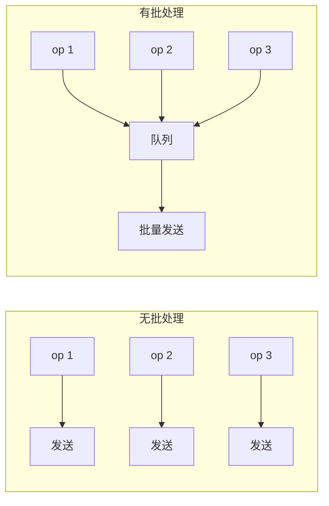

| 属性 | 值 |
|------|------|
| 吞吐量 | 摊销每项开销 — N 项接近 1 项的成本 |
| 延迟 | 每项增加（等待批次填满或计时器触发） |
| 刷写触发 | 大小阈值、时间截止、或显式刷写 |
| 空间 | O(批次大小) — 待处理项的有界缓冲区 |

**动手试试** — 添加项目并观察它们批量积累，然后一起刷写：

<BatchProcessingViz />

## 生产验证

| 项目 | 源码 | 用途 |
|------|------|------|
| Apache Kafka | [RecordAccumulator.java#L69-L120](https://github.com/apache/kafka/blob/b7b1c0a83d856766390ee0c05e33b63711eee80e/clients/src/main/java/org/apache/kafka/clients/producer/internals/RecordAccumulator.java#L69-L120) | Kafka 生产者按分区累积记录为批次。`append()` 添加记录，sender 线程排空就绪批次。这是 Kafka 实现百万消息/秒的关键。 |
| Linux Kernel | [blk-merge.c#L350-L395](https://github.com/torvalds/linux/blob/acb7500801e98639f6d8c2d796ed9f64cba83d3a/block/blk-merge.c#L350-L395) | `blk_attempt_req_merge` — 块层将相邻 I/O 请求合并为批量操作，摊薄寻道时间。合并前检查两个请求是否有连续扇区和兼容标志。 |

::: info
React 的 `setState` 批处理是另一个知名例子——同一事件处理器中的多次 `setState` 被批处理为一次重渲染。
:::

## 实现

::: code-group

```typescript [TypeScript]
class BatchProcessor<T, R> {
  private queue: Array<{ item: T; resolve: (r: R) => void }> = [];
  private timer: ReturnType<typeof setTimeout> | null = null;

  constructor(
    private processBatch: (items: T[]) => Promise<R[]>,
    private maxSize: number = 10,
    private maxWaitMs: number = 50,
  ) {}

  async add(item: T): Promise<R> {
    return new Promise<R>((resolve) => {
      this.queue.push({ item, resolve });
      if (this.queue.length >= this.maxSize) {
        this.flush();
      } else if (!this.timer) {
        this.timer = setTimeout(() => this.flush(), this.maxWaitMs);
      }
    });
  }

  private async flush(): Promise<void> {
    if (this.timer) { clearTimeout(this.timer); this.timer = null; }
    const batch = this.queue.splice(0);
    if (batch.length === 0) return;
    const results = await this.processBatch(batch.map((b) => b.item));
    batch.forEach((b, i) => b.resolve(results[i]!));
  }
}
```

```rust [Rust]
use std::sync::{Arc, Mutex};

struct BatchProcessor<T, R> {
    queue: Mutex<Vec<T>>,
    process: Box<dyn Fn(Vec<T>) -> Vec<R> + Send + Sync>,
    max_size: usize,
}

impl<T, R> BatchProcessor<T, R> {
    fn new(
        process: impl Fn(Vec<T>) -> Vec<R> + Send + Sync + 'static,
        max_size: usize,
    ) -> Arc<Self> {
        Arc::new(Self {
            queue: Mutex::new(Vec::new()),
            process: Box::new(process),
            max_size,
        })
    }

    fn add(&self, item: T) -> Option<Vec<R>> {
        let mut queue = self.queue.lock().unwrap();
        queue.push(item);
        if queue.len() >= self.max_size {
            let batch: Vec<T> = queue.drain(..).collect();
            Some((self.process)(batch))
        } else {
            None
        }
    }

    fn flush(&self) -> Vec<R> {
        let mut queue = self.queue.lock().unwrap();
        let batch: Vec<T> = queue.drain(..).collect();
        if batch.is_empty() { return Vec::new(); }
        (self.process)(batch)
    }
}
```

```go [Go]
type BatchProcessor[T any, R any] struct {
	queue   []batchEntry[T, R]
	process func([]T) []R
	maxSize int
	mu      sync.Mutex
}

type batchEntry[T any, R any] struct {
	item T
	ch   chan R
}

func (bp *BatchProcessor[T, R]) Add(item T) R {
	bp.mu.Lock()
	ch := make(chan R, 1)
	bp.queue = append(bp.queue, batchEntry[T, R]{item, ch})
	if len(bp.queue) >= bp.maxSize {
		bp.flush()
	}
	bp.mu.Unlock()
	return <-ch
}

func (bp *BatchProcessor[T, R]) flush() {
	items := make([]T, len(bp.queue))
	for i, e := range bp.queue { items[i] = e.item }
	results := bp.process(items)
	for i, e := range bp.queue { e.ch <- results[i] }
	bp.queue = bp.queue[:0]
}
```

```python [Python]
import asyncio
from typing import TypeVar, Callable, Awaitable

T = TypeVar("T")
R = TypeVar("R")

class BatchProcessor:
    def __init__(self, process_batch, max_size=10, max_wait=0.05):
        self._process = process_batch
        self._max_size = max_size
        self._max_wait = max_wait
        self._queue = []
        self._timer = None

    async def add(self, item):
        future = asyncio.get_event_loop().create_future()
        self._queue.append((item, future))
        if len(self._queue) >= self._max_size:
            await self._flush()
        elif not self._timer:
            self._timer = asyncio.get_event_loop().call_later(
                self._max_wait, lambda: asyncio.ensure_future(self._flush()))
        return await future

    async def _flush(self):
        if self._timer: self._timer.cancel(); self._timer = None
        batch = self._queue[:]; self._queue.clear()
        results = await self._process([item for item, _ in batch])
        for (_, future), result in zip(batch, results):
            future.set_result(result)
```

:::

## 练习

| 难度 | 练习 | 文件 |
|------|------|------|
| 基础 | 实现基于大小的批处理器 | `exercises/typescript/batch-processing/01-basic.test.ts` |
| 进阶 | 超时刷新 — 按大小或时间触发刷新 | `exercises/typescript/batch-processing/02-intermediate.test.ts` |

运行练习：`pnpm test:ts`（TypeScript）· `cargo test`（Rust）· `go test ./...`（Go）· `pytest`（Python）

练习文件： Rust `exercises/rust/src/batch_processing/mod.rs` · Go `exercises/go/batch_processing/batch_processing_test.go` · Python `exercises/python/batch_processing/test_batch_processing.py`

## 何时使用

- **数据库写入** — 批量 INSERT 替代 N 次单条 INSERT
- **API 调用** — 批量请求减少往返
- **消息队列** — Kafka、SQS 批量发送/接收
- **UI 更新** — React 批量 setState
- **网络 I/O** — TCP Nagle 算法、HTTP/2 多路复用

## 何时不用

- **延迟敏感** — 批处理增加延迟
- **小量级** — 很少超过 1 个项时，批处理增加复杂性无收益
- **部分失败隔离** — 批量中一项失败需要重试/死信处理逻辑
- **无限内存** — 无大小限制时，流量高峰期批量可能无限增长

## 更多生产案例

- [React 自动批处理](https://github.com/facebook/react/blob/34b78a2897cc208260a88e6b62ecaf9ca2a9dfe4/packages/react-reconciler/src/ReactFiberWorkLoop.js#L588-L600) — React 18+ 默认批处理所有状态更新
- [DataLoader](https://github.com/graphql/dataloader) — GraphQL N+1
- [Redis](https://github.com/redis/redis) — Pipeline
- [Elasticsearch](https://github.com/elastic/elasticsearch) — Bulk API

## 相关模式

| 模式 | 关系 |
|---------|-------------|
| [环形缓冲区 (Ring Buffer)](/zh/patterns/ring-buffer/) | 环形缓冲区累积项目供批量消费 |
| [背压 / 流控 (Backpressure)](/zh/patterns/backpressure/) | 批处理平滑突发输入，与背压机制协同工作 |
| [指数退避重试 (Retry with Backoff)](/zh/patterns/retry-backoff/) | 单个批处理项在失败时可以进行指数退避重试 |

## 挑战题

::: details Q1: 你的批处理器使用 maxSize=100 和 maxWaitMs=50ms。流量降到每秒 1 个请求。会发生什么？如何修复？
**答案：** 每个请求都要等待完整的 50ms 超时才刷新一个只有 1 条数据的批次，增加了不必要的延迟。

因为批次永远达不到 100 条，超时会在队列中只有一条数据时触发。修复方法是让批次大小和/或超时自适应——例如，当队列空闲时立即刷新，或者当队列深度较低时使用更短的超时。Kafka 的 `linger.ms` 就是这样工作的：它只在预期还有更多记录时才延迟。
:::

::: details Q2: 一个包含 100 条数据库插入的批次失败了，因为第 57 行违反了唯一约束。其余 99 行应该怎么处理？
**答案：** 取决于你是否需要原子性。如果批次在单个事务中运行，所有 100 行都会回滚。如果不是，你需要逐条错误处理。

常见的生产方案是返回一个包含每条数据成功/失败状态的结果数组（就像 Elasticsearch 的 Bulk API 那样）。这样调用方只需重试失败的条目。如果你为了原子性将整个批次包在一个事务中，一条坏数据就会让整个批次失败——虽然更简单但浪费了工作。
:::

::: details Q3: 你同时设置了数量触发器（maxSize=50）和时间触发器（maxWaitMs=100ms）。一个 200 条数据的突发在 10ms 内到达。会触发多少个批次？何时触发？
**答案：** 4 个各 50 条的批次会立即触发，全部在那 10ms 的突发期内。时间触发器永远不会激活。

每当队列达到 maxSize 时，数量触发器会优先触发。随着数据涌入，队列达到 50，刷新，再达到 50，再刷新，以此类推。计时器只在队列有数据但未达到 maxSize 时才有意义——它是"不要永远等待"的安全网，而非高负载下的主要触发器。
:::

::: details Q4: 为什么 Kafka 按分区批处理，而不是使用跨所有分区的单一全局批次？
**答案：** 因为每个分区是特定 broker 上的独立追加日志。单一的跨分区批次在发送时无论如何都需要拆分。

按分区批处理意味着每个批次指向特定的 broker（分区 leader）。Sender 随后将目标为同一 broker 的多个分区批次合并为一个 `ProduceRequest`，最大限度减少网络往返。它还保留了每分区的顺序保证。全局批次会失去天然的分区→broker 映射，增加了复杂度但没有吞吐量收益。
:::


================================================
FILE: docs/zh/patterns/bitmask/index.md
================================================
---
title: "模式：位掩码 (Bitmask)"
description: "将多个布尔标志打包到一个整数中，通过位运算实现常数时间的集合操作。"
difficulty: "beginner"
---

# 模式：位掩码 (Bitmask)

<DifficultyBadge />

## 一句话

将多个布尔标志打包到一个整数中，通过位运算实现常数时间的集合操作。

<DemoBadge />

## 现实类比

一排墙上的开关面板。每个开关要么开要么关。你可以独立拨动任何一个，一眼就能看出哪些是开的。不管有 8 个还是 32 个开关，面板占的墙面空间都一样。

## 核心思想

不使用布尔数组或多字段对象，位掩码将每个标志编码为整数中的一个比特位。这带来 O(1) 的设置/检查/清除/切换操作，以及轻松的多标志组合。

```text
 bit  7     6     5     4     3     2     1     0
    ┌─────┬─────┬─────┬─────┬─────┬─────┬─────┬─────┐
    │     │     │     │ SN  │ CB  │ RF  │ UP  │ PL  │
    └─────┴─────┴─────┴──┬──┴──┬──┴──┬──┴──┬──┴──┬──┘
                         │     │     │     │     └── Placement  1 << 0
                         │     │     │     └──────── Update     1 << 1
                         │     │     └────────────── Ref        1 << 2
                         │     └──────────────────── Callback   1 << 3
                         └────────────────────────── Snapshot   1 << 4
```

**核心操作** — 均为 O(1)，无分支：

| 目的 | 写法 | 原理 |
|------|------|------|
| 设置标志 | `flags \|= FLAG` | OR 开启目标位，其他不变 |
| 检查标志 | `(flags & FLAG) !== 0` | AND 隔离目标位 — 非零即已设置 |
| 清除标志 | `flags &= ~FLAG` | AND 反转掩码关闭目标位 |
| 切换标志 | `flags ^= FLAG` | XOR 翻转目标位 |
| 组合标志 | `flags = A \| B \| C` | OR 将多个标志合并为一个值 |
| 检查全部 | `(flags & mask) === mask` | mask 中每一位都被设置才为 true |
| 检查任一 | `(flags & mask) !== 0` | mask 中至少一位被设置即为 true |
| 计数置位 | `n.toString(2).split('1').length - 1` | 位计数 (popcnt) |

核心洞察：一次 `&` 操作就能同时检查任意标志组合 — 无循环、无分支。

| 属性 | 值 |
|------|---|
| 设置 / 检查 / 清除 | O(1) — 单次位运算，无分支 |
| 组合多个标志 | O(1) — 一次 `\|` 或 `&`，与标志数量无关 |
| 最大标志数 | 字宽 — 大多数平台上为 32 或 64 |
| 空间 | O(1) — 一个整数存储所有标志 |

**动手试试** — 切换权限位，观察掩码值在二进制、十进制、十六进制中的变化：

<BitmaskViz />

## 生产验证

| 项目 | 源码 | 用途 |
|------|------|------|
| React | [ReactFiberFlags.js#L14-L36](https://github.com/facebook/react/blob/34b78a2897cc208260a88e6b62ecaf9ca2a9dfe4/packages/react-reconciler/src/ReactFiberFlags.js#L14-L36) | Fiber 节点的副作用标志 — 追踪协调过程中每个 fiber 上待处理的效果（Placement、Update、Deletion、Ref 等） |
| Linux 内核 | [stat.h#L25-L33](https://github.com/torvalds/linux/blob/acb7500801e98639f6d8c2d796ed9f64cba83d3a/include/uapi/linux/stat.h#L25-L33) | 文件权限位 — 经典的 `rwxrwxrwx`（所有者/组/其他的读/写/执行）编码为 9 位掩码 |
| Go 标准库 | [types.go#L32-L46](https://github.com/golang/go/blob/f5cdf4745455415c7a43cfc7d925214d4511489b/src/os/types.go#L32-L46) | `os.FileMode` — Go 的文件模式位使用 iota 位移的类型常量镜像 Unix 权限标志 |

## 实现

::: code-group

```typescript [TypeScript]
// Define flags as powers of 2
const Flags = {
  Read:    1 << 0,  // 0b0001
  Write:   1 << 1,  // 0b0010
  Execute: 1 << 2,  // 0b0100
  Delete:  1 << 3,  // 0b1000
} as const;

type FlagSet = number;

const hasFlag = (set: FlagSet, flag: number): boolean =>
  (set & flag) === flag;

const hasAny = (set: FlagSet, mask: number): boolean =>
  (set & mask) !== 0;

const setFlag = (set: FlagSet, flag: number): FlagSet =>
  set | flag;

const clearFlag = (set: FlagSet, flag: number): FlagSet =>
  set & ~flag;

const toggleFlag = (set: FlagSet, flag: number): FlagSet =>
  set ^ flag;

// Usage: combine multiple flags
const editorPerms = Flags.Read | Flags.Write;
hasFlag(editorPerms, Flags.Read);    // true
hasFlag(editorPerms, Flags.Delete);  // false
```

```rust [Rust]
// Idiomatic Rust: typed constants, bitwise ops on u32
pub const READ:    u32 = 1 << 0;
pub const WRITE:   u32 = 1 << 1;
pub const EXECUTE: u32 = 1 << 2;
pub const DELETE:  u32 = 1 << 3;

pub fn has_flag(flags: u32, flag: u32) -> bool {
    (flags & flag) == flag
}

pub fn has_any(flags: u32, mask: u32) -> bool {
    (flags & mask) != 0
}

pub fn set_flag(flags: u32, flag: u32) -> u32 {
    flags | flag
}

pub fn clear_flag(flags: u32, flag: u32) -> u32 {
    flags & !flag
}

pub fn toggle_flag(flags: u32, flag: u32) -> u32 {
    flags ^ flag
}

// Usage
let editor = READ | WRITE;
assert!(has_flag(editor, READ));     // true
assert!(!has_flag(editor, DELETE));  // false
```

```go [Go]
// Idiomatic Go: typed constants with iota
type Permission uint32

const (
    Read    Permission = 1 << iota // 0b0001
    Write                          // 0b0010
    Execute                        // 0b0100
    Delete                         // 0b1000
)

func HasFlag(flags, flag Permission) bool {
    return flags&flag == flag
}

func HasAny(flags, mask Permission) bool {
    return flags&mask != 0
}

func SetFlag(flags, flag Permission) Permission {
    return flags | flag
}

func ClearFlag(flags, flag Permission) Permission {
    return flags &^ flag // Go's AND NOT operator
}

func ToggleFlag(flags, flag Permission) Permission {
    return flags ^ flag
}

// Usage
editor := Read | Write
HasFlag(editor, Read)    // true
HasFlag(editor, Delete)  // false
```

```python [Python]
# Python: native bitwise operators, no size limit on integers
READ    = 1 << 0  # 0b0001
WRITE   = 1 << 1  # 0b0010
EXECUTE = 1 << 2  # 0b0100
DELETE  = 1 << 3  # 0b1000

def has_flag(flags: int, flag: int) -> bool:
    return (flags & flag) == flag

def has_any(flags: int, mask: int) -> bool:
    return (flags & mask) != 0

def set_flag(flags: int, flag: int) -> int:
    return flags | flag

def clear_flag(flags: int, flag: int) -> int:
    return flags & ~flag

def toggle_flag(flags: int, flag: int) -> int:
    return flags ^ flag

# Usage
editor = READ | WRITE
assert has_flag(editor, READ)       # True
assert not has_flag(editor, DELETE)  # True
```

:::

## 练习

| 难度 | 练习 | 文件 |
|------|------|------|
| 基础 | 基本位运算标志操作（设置、检查、清除、切换） | `exercises/typescript/bitmask/01-basic.test.ts` |
| 进阶 | 构建基于角色的权限系统 | `exercises/typescript/bitmask/02-permission-system.test.ts` |
| 高级 | React 风格的 Fiber 标志与子树冒泡 | `exercises/typescript/bitmask/03-react-flags.test.ts` |

运行练习：`pnpm test:ts`（TypeScript）· `cargo test`（Rust）· `go test ./...`（Go）· `pytest`（Python）

练习文件： Rust `exercises/rust/src/bitmask/mod.rs` · Go `exercises/go/bitmask/bitmask_test.go` · Python `exercises/python/bitmask/test_bitmask.py`

## 何时使用

- **热路径上的多布尔标志** — 一个整数替代 N 个布尔值，节省内存并支持批量操作
- **组合状态** — 需要一次操作检查"这些中的任一个"或"这些全部"
- **序列化** — 单个整数的存储、传输和比较都很简单
- **权限系统** — Unix 的 `rwx` 模型就是位掩码
- **ECS（实体组件系统）** — 游戏引擎中的组件成员掩码

## 何时不用

- **超过 32 个标志** — JavaScript 的位运算操作在 32 位整数上；超出则使用 `BigInt` 或 `Set`
- **互斥状态** — 如果同一时间只能有一个值激活，使用 `enum`
- **可读性比性能更重要** — 命名布尔字段对大多数开发者更清晰
- **动态标志集** — 如果可能的标志集在编译时未知，使用 `Set<string>`

## 更多生产案例

- [Chromium](https://chromium.googlesource.com/chromium/src) — layer compositing flags
- [SQLite](https://www.sqlite.org/src) — VFS flags
- [Nginx](https://github.com/nginx/nginx) — event flags
- [Bevy ECS](https://github.com/bevyengine/bevy/blob/fd4f66fc36ec9f8181afe85d65e22c52b14e86a9/crates/bevy_ecs/src/archetype.rs) — 原型 ECS 中的组件成员掩码
- [Linux fcntl](https://github.com/torvalds/linux/blob/acb7500801e98639f6d8c2d796ed9f64cba83d3a/include/uapi/asm-generic/fcntl.h#L5-L30) — `O_RDONLY`、`O_WRONLY`、`O_CREAT` 文件控制标志

## 相关模式

| 模式 | 关系 |
|---------|-------------|
| [标签联合体 (Tagged Union / Variant)](/zh/patterns/tagged-union/) | 两者都将类型信息编码为紧凑的整数表示 |
| [脏标记 (Dirty Flag)](/zh/patterns/dirty-flag/) | 脏标记通常作为位掩码中的位来存储 |
| [双缓冲 (Double Buffering)](/zh/patterns/double-buffering/) | React 在双缓冲树的每个 Fiber 节点上使用位掩码标志追踪工作 |

## 挑战题

::: details Q1: 你的团队在 JavaScript 配置系统中用 Bitmask 定义了 40 个功能开关。QA 报告第 32-39 号开关行为异常——即使设置了某个开关，检查时有时返回 false。出了什么问题？
**答案：** JavaScript 位运算符只能处理 32 位整数，因此第 32 位及以上的标志会被静默截断。

`|`、`&`、`^` 和 `~` 运算符在内部将操作数转换为有符号 32 位整数。`1 << 32` 会回绕为 `1`（等同于 `1 << 0`），这意味着第 32 号标志与第 0 号标志冲突。超过 32 个标志时，你需要使用 `BigInt` 进行位运算，或者改用 `Set<string>` 方案。
:::

::: details Q2: 你有 `permissions = Read | Write | Execute`。一个初级开发者写了 `if (permissions === Read)` 来检查用户是否有读权限。这在单元测试中通过了，但在生产环境中失败了。为什么？
**答案：** `===` 检查的是精确相等，因此只有当 permissions *恰好*是 `Read` 且没有其他权限时才返回 true。

在生产环境中，用户通常有多个组合权限。`permissions === Read` 对于 `Read | Write`（值为 3 vs 值为 1）会返回 false。正确的检查方式是 `(permissions & Read) !== 0` 或 `(permissions & Read) === Read`，它只隔离和测试 Read 位，不受其他标志影响。
:::

::: details Q3: React 使用 Bitmask 标志来跟踪 fiber 的副作用。为什么 React 选择 Bitmask 而不是像 `['placement', 'update', 'ref']` 这样的字符串数组来追踪 fiber 需要哪些 effect？
**答案：** Bitmask 让 React 能用单次整数运算检查、组合和传播多个 effect 标志，而不需要遍历数组。

在协调过程中，React 使用 `parent.subtreeFlags |= child.flags` 将子节点的 effect "冒泡"到父 fiber。如果用数组，这需要去重和拼接操作。Bitmask 方案还能用单次 `subtreeFlags !== 0` 比较来检查"这个子树是否有任何工作要做"——这在每帧需要遍历数千个 fiber 节点时至关重要。
:::

::: details Q4: 你正在设计一个权限系统，其中角色是互斥的——用户只能是 Admin、Editor 或 Viewer 之一。一位同事建议使用 Bitmask。这个模式选对了吗？
**答案：** 不对。互斥状态应该使用枚举（enum），而不是 Bitmask。

Bitmask 适用于标志可以自由组合的场景（`Read | Write | Execute`）。对于互斥角色，Bitmask 允许你意外设置 `Admin | Viewer`，这是一个无意义的状态。枚举在类型层面强制只有一个值，使无效状态无法表示。Bitmask 适用于组合标志；枚举适用于互斥状态。
:::


================================================
FILE: docs/zh/patterns/bloom-filter/index.md
================================================
[Binary file]


================================================
FILE: docs/zh/patterns/checkpointing/index.md
================================================
---
title: "模式：检查点 (Checkpointing)"
description: "定期快照一致性状态，使恢复只需从检查点开始重放——而不是从时间的起点。"
difficulty: "intermediate"
---

# 模式：检查点 (Checkpointing)

<DifficultyBadge />

## 一句话

定期快照一致性状态，使恢复只需从检查点开始重放——而不是从时间的起点。

<DemoBadge />

## 现实类比

游戏存档。玩一会儿，按「保存」，如果死了就从最近的存档点重来，而不是从头开始。存档越频繁，丢失的进度越少——但每次存档都需要时间。

## 核心思想

检查点在已知时间点捕获当前系统状态的一致性快照。崩溃后，恢复加载最后的检查点，只重放之后记录的操作。没有检查点，基于 WAL 的系统必须在每次重启时重放整个历史——这会无限增长。检查点将恢复时间限制在最后一个检查点以来的时间间隔内。

```text
  Time ──────────────────────────────────────────────►

  WAL:  [op1] [op2] [op3] [op4] [op5] [op6] [op7] [op8]
                          ▲                    ▲
                     Checkpoint 1         Checkpoint 2
                     (state snapshot)     (state snapshot)

  Without checkpointing:
    Recovery replays: op1, op2, op3, op4, op5, op6, op7, op8

  With checkpointing:
    Recovery loads Checkpoint 2, replays: op7, op8 only
```

| 属性 | 值 |
|------|------|
| 恢复时间 | 与上次检查点以来的操作数成正比 |
| 检查点代价 | O(state_size) 序列化当前状态 |
| WAL 截断 | 可安全丢弃检查点之前的日志条目 |
| 一致性 | 检查点必须捕获一致性快照 |

**动手试试** — 递增状态、创建检查点、模拟崩溃，然后从检查点恢复：

<CheckpointingViz />

## 生产验证

| 项目 | 源码 | 用途 |
|------|------|------|
| PostgreSQL | [checkpointer.c#L218-L360](https://github.com/postgres/postgres/blob/e18b0cb7344cb4bd28468f6c0aeeb9b9241d30aa/src/backend/postmaster/checkpointer.c#L218-L360) | `CheckpointerMain` — 检查点后台进程。在循环中等待检查点请求或 `checkpoint_timeout`（默认 5 分钟）。调用 `CreateCheckPoint` 将所有脏缓冲区刷写到磁盘，写入检查点 WAL 记录，并用检查点位置更新 `pg_control`。崩溃恢复时，PostgreSQL 读取 `pg_control` 找到最后的检查点，只从该点开始重放 WAL。 |
| Redis | [rdb.c#L1414-L1529](https://github.com/redis/redis/blob/df63a65d4d4ee33ae67e9f101885074febe0bccb/src/rdb.c#L1414-L1529) | `rdbSaveRio` 将整个 Redis 数据集序列化到 RDB 文件——一个时间点快照。Redis fork 一个子进程（`rdbSaveBackground`）来写入快照而不阻塞主线程。RDB 文件就是一个完整的检查点：重启时，Redis 加载它来即时恢复状态。结合 AOF（仅追加文件），Redis 只需重放在最后一次 RDB 快照之后写入的 AOF 条目。 |

## 实现

::: code-group

```typescript [TypeScript]
interface LogEntry {
  id: number;
  operation: string;
  data: Record<string, unknown>;
}

class CheckpointableStore {
  private state: Map<string, unknown> = new Map();
  private wal: LogEntry[] = [];
  private nextId = 1;
  private checkpoint: { state: Map<string, unknown>; walPosition: number } | null = null;

  /** Apply an operation, logging it to the WAL first. */
  apply(operation: string, key: string, value: unknown): void {
    const entry: LogEntry = {
      id: this.nextId++,
      operation,
      data: { key, value },
    };
    this.wal.push(entry);
    this.executeOp(entry);
  }

  get(key: string): unknown {
    return this.state.get(key);
  }

  /** Take a checkpoint: snapshot current state and record WAL position. */
  takeCheckpoint(): void {
    this.checkpoint = {
      state: new Map(this.state),
      walPosition: this.wal.length,
    };
  }

  /** Simulate crash: wipe in-memory state but keep WAL and checkpoint. */
  simulateCrash(): void {
    this.state = new Map();
  }

  /** Recover from crash using checkpoint + WAL replay. */
  recover(): number {
    if (this.checkpoint) {
      this.state = new Map(this.checkpoint.state);
      let replayed = 0;
      for (let i = this.checkpoint.walPosition; i < this.wal.length; i++) {
        this.executeOp(this.wal[i]!);
        replayed++;
      }
      return replayed;
    }
    // No checkpoint: replay entire WAL
    this.state = new Map();
    for (const entry of this.wal) {
      this.executeOp(entry);
    }
    return this.wal.length;
  }

  private executeOp(entry: LogEntry): void {
    const { key, value } = entry.data as { key: string; value: unknown };
    if (entry.operation === 'SET') {
      this.state.set(key, value);
    } else if (entry.operation === 'DELETE') {
      this.state.delete(key);
    }
  }

  get walLength(): number { return this.wal.length; }
  get stateSize(): number { return this.state.size; }
}
```

```rust [Rust]
use std::collections::HashMap;

pub struct LogEntry {
    pub id: usize,
    pub operation: String,
    pub key: String,
    pub value: Option<String>,
}

struct Snapshot {
    state: HashMap<String, String>,
    wal_position: usize,
}

pub struct CheckpointableStore {
    state: HashMap<String, String>,
    wal: Vec<LogEntry>,
    next_id: usize,
    checkpoint: Option<Snapshot>,
}

impl CheckpointableStore {
    pub fn new() -> Self {
        CheckpointableStore {
            state: HashMap::new(),
            wal: Vec::new(),
            next_id: 1,
            checkpoint: None,
        }
    }

    pub fn apply(&mut self, operation: &str, key: &str, value: Option<&str>) {
        let entry = LogEntry {
            id: self.next_id,
            operation: operation.to_string(),
            key: key.to_string(),
            value: value.map(|v| v.to_string()),
        };
        self.next_id += 1;
        self.execute_op(&entry);
        self.wal.push(entry);
    }

    pub fn get(&self, key: &str) -> Option<&str> {
        self.state.get(key).map(|s| s.as_str())
    }

    pub fn take_checkpoint(&mut self) {
        self.checkpoint = Some(Snapshot {
            state: self.state.clone(),
            wal_position: self.wal.len(),
        });
    }

    pub fn simulate_crash(&mut self) {
        self.state.clear();
    }

    pub fn recover(&mut self) -> usize {
        if let Some(ref snap) = self.checkpoint {
            self.state = snap.state.clone();
            let start = snap.wal_position;
            let mut replayed = 0;
            for i in start..self.wal.len() {
                self.execute_op_by_index(i);
                replayed += 1;
            }
            return replayed;
        }
        self.state.clear();
        for i in 0..self.wal.len() {
            self.execute_op_by_index(i);
        }
        self.wal.len()
    }

    fn execute_op(&mut self, entry: &LogEntry) {
        if entry.operation == "SET" {
            if let Some(ref v) = entry.value {
                self.state.insert(entry.key.clone(), v.clone());
            }
        } else if entry.operation == "DELETE" {
            self.state.remove(&entry.key);
        }
    }

    fn execute_op_by_index(&mut self, idx: usize) {
        let op = self.wal[idx].operation.clone();
        let key = self.wal[idx].key.clone();
        let value = self.wal[idx].value.clone();
        if op == "SET" {
            if let Some(v) = value {
                self.state.insert(key, v);
            }
        } else if op == "DELETE" {
            self.state.remove(&key);
        }
    }

    pub fn wal_length(&self) -> usize { self.wal.len() }
    pub fn state_size(&self) -> usize { self.state.len() }
}
```

```go [Go]
package checkpoint

type LogEntry struct {
	ID        int
	Operation string
	Key       string
	Value     any
}

type stateSnapshot struct {
	state       map[string]any
	walPosition int
}

type CheckpointableStore struct {
	state      map[string]any
	wal        []LogEntry
	nextID     int
	checkpoint *stateSnapshot
}

func NewStore() *CheckpointableStore {
	return &CheckpointableStore{
		state:  make(map[string]any),
		nextID: 1,
	}
}

func (s *CheckpointableStore) Apply(operation, key string, value any) {
	entry := LogEntry{ID: s.nextID, Operation: operation, Key: key, Value: value}
	s.nextID++
	s.wal = append(s.wal, entry)
	s.executeOp(entry)
}

func (s *CheckpointableStore) Get(key string) (any, bool) {
	v, ok := s.state[key]
	return v, ok
}

func (s *CheckpointableStore) TakeCheckpoint() {
	snap := make(map[string]any, len(s.state))
	for k, v := range s.state {
		snap[k] = v
	}
	s.checkpoint = &stateSnapshot{state: snap, walPosition: len(s.wal)}
}

func (s *CheckpointableStore) SimulateCrash() {
	s.state = make(map[string]any)
}

func (s *CheckpointableStore) Recover() int {
	if s.checkpoint != nil {
		s.state = make(map[string]any, len(s.checkpoint.state))
		for k, v := range s.checkpoint.state {
			s.state[k] = v
		}
		replayed := 0
		for i := s.checkpoint.walPosition; i < len(s.wal); i++ {
			s.executeOp(s.wal[i])
			replayed++
		}
		return replayed
	}
	s.state = make(map[string]any)
	for _, entry := range s.wal {
		s.executeOp(entry)
	}
	return len(s.wal)
}

func (s *CheckpointableStore) executeOp(entry LogEntry) {
	if entry.Operation == "SET" {
		s.state[entry.Key] = entry.Value
	} else if entry.Operation == "DELETE" {
		delete(s.state, entry.Key)
	}
}

func (s *CheckpointableStore) WALLength() int   { return len(s.wal) }
func (s *CheckpointableStore) StateSize() int    { return len(s.state) }
```

```python [Python]
from dataclasses import dataclass, field
from typing import Any

@dataclass
class LogEntry:
    id: int
    operation: str
    key: str
    value: Any = None

class CheckpointableStore:
    def __init__(self):
        self._state: dict[str, Any] = {}
        self._wal: list[LogEntry] = []
        self._next_id = 1
        self._checkpoint: dict | None = None  # {state, wal_position}

    def apply(self, operation: str, key: str, value: Any = None) -> None:
        entry = LogEntry(id=self._next_id, operation=operation, key=key, value=value)
        self._next_id += 1
        self._wal.append(entry)
        self._execute_op(entry)

    def get(self, key: str) -> Any:
        return self._state.get(key)

    def take_checkpoint(self) -> None:
        self._checkpoint = {
            "state": dict(self._state),
            "wal_position": len(self._wal),
        }

    def simulate_crash(self) -> None:
        self._state = {}

    def recover(self) -> int:
        if self._checkpoint is not None:
            self._state = dict(self._checkpoint["state"])
            replayed = 0
            for i in range(self._checkpoint["wal_position"], len(self._wal)):
                self._execute_op(self._wal[i])
                replayed += 1
            return replayed
        self._state = {}
        for entry in self._wal:
            self._execute_op(entry)
        return len(self._wal)

    def _execute_op(self, entry: LogEntry) -> None:
        if entry.operation == "SET":
            self._state[entry.key] = entry.value
        elif entry.operation == "DELETE":
            self._state.pop(entry.key, None)

    @property
    def wal_length(self) -> int:
        return len(self._wal)

    @property
    def state_size(self) -> int:
        return len(self._state)
```

:::

## 练习

| 难度 | 练习 | 文件 |
|------|------|------|
| 基础 | 实现带检查点和恢复的 WAL | `exercises/typescript/checkpointing/01-basic.test.ts` |
| 进阶 | 增量检查点（仅脏页） | `exercises/typescript/checkpointing/02-intermediate.test.ts` |

运行练习：`pnpm test:ts`（TypeScript）· `cargo test`（Rust）· `go test ./...`（Go）· `pytest`（Python）

练习文件： Rust `exercises/rust/src/checkpointing/mod.rs` · Go `exercises/go/checkpointing/checkpointing_test.go` · Python `exercises/python/checkpointing/test_checkpointing.py`

## 何时使用

- **数据库崩溃恢复** — 限制 WAL 重放时间（PostgreSQL、MySQL）
- **内存缓存** — 持久化状态以在重启后存活（Redis RDB）
- **流处理** — 保存处理位置以实现精确一次保证（Flink、Kafka）
- **长时间运行的计算** — 保存进度以在故障后恢复（ML 训练）
- **游戏存档** — 在安全点快照游戏状态

## 何时不用

- **无状态服务** — 没有需要检查点的状态
- **非常小的状态** — 如果 WAL 重放时间 < 1 秒，检查点增加复杂性但收益很小
- **快速变化的状态** — 如果整个状态在检查点之间都变了，快照和重放 WAL 一样昂贵
- **分布式状态** — 跨节点协调一致性检查点需要分布式快照协议（Chandy-Lamport）

## 更多生产案例

- [Apache Flink](https://github.com/apache/flink) — 分布式快照实现精确一次的流处理
- [etcd](https://github.com/etcd-io/etcd) — 定期快照以压缩 Raft 日志
- [SQLite WAL 模式](https://www.sqlite.org/wal.html) — WAL 检查点将页面传回数据库文件
- [PyTorch](https://github.com/pytorch/pytorch) — 模型检查点以在中断后恢复训练

## 相关模式

| 模式 | 关系 |
|---------|-------------|
| [预写日志 (Write-Ahead Log)](/zh/patterns/write-ahead-log/) | 检查点截断 WAL——恢复只从最新检查点重放 |
| [写时复制 (Copy-on-Write)](/zh/patterns/copy-on-write/) | 写时复制在不停止写入的情况下实现一致快照 |
| [逻辑时钟 / Epoch (Logical Clock)](/zh/patterns/logical-clock/) | 检查点与逻辑时钟位置关联以保证一致性 |
| [Merkle 树 (Merkle Tree)](/zh/patterns/merkle-tree/) | Merkle 树通过检测哪些子树发生变化来验证检查点完整性 |

## 挑战题

::: details Q1: 你的 PostgreSQL 数据库配置了 checkpoint_timeout = 30 分钟。服务器崩溃了。最坏情况的恢复时间是多少，如何减少？
**答案：** 最坏情况：重放最多 30 分钟的 WAL 条目。减少方法：降低 checkpoint_timeout（例如改为 5 分钟）或 checkpoint_completion_target。

权衡很明显：更频繁的检查点意味着更快的恢复但正常运行时更多的 I/O 开销。每次检查点将所有脏页刷写到磁盘，可能导致写入突发。PostgreSQL 的 `checkpoint_completion_target`（默认 0.9）将 I/O 分散到检查点间隔的 90% 以避免尖峰。在高吞吐系统中，你可能每 1-5 分钟检查点一次；对于低流量系统，30 分钟或更长时间是合适的。
:::

::: details Q2: Redis 使用 fork() 创建子进程来进行 RDB 快照。数据库有 10GB。Redis 在快照期间需要 20GB 的内存吗？
**答案：** 不需要，这要感谢写时复制（COW）。fork 出的子进程共享父进程的内存页面。只有父进程在 fork 之后修改的页面才会被复制。在实践中，快照期间的内存开销通常是数据集的 10-30%，而不是 100%。

操作系统内核对 fork 的进程页面使用 COW。子进程读取冻结的状态，而父进程继续处理写入。只有父进程修改的页面会被复制（通过内核的 COW 机制）。如果快照期间写入量低，内存开销是最小的。然而，在高写入负载下，COW 页面复制在最坏情况下可以接近 100%。这就是为什么 Redis 建议在后台保存期间监控 `rss`。
:::

::: details Q3: 你正在为流处理系统实现检查点。每次检查点需要 5 秒钟来写入，但系统每秒处理 10 万个事件。在检查点创建期间到达的 50 万个事件会怎样？
**答案：** 系统必须在检查点创建期间继续处理事件。检查点捕获的是开始那一刻的状态一致性快照，而不是完成时的。传入的事件正常处理并记录到 WAL。

这就是"一致性快照"问题。解决方案：(1) 使用写时复制快照（如 Redis fork）——检查点在 fork 时捕获状态，新写入进入 COW 页面；(2) 使用模糊检查点加"重做日志"——开始快照，跟踪快照期间更改的页面，并在检查点元数据中包含这些更改；(3) 使用屏障——短暂暂停处理以获取一致性切割，然后恢复。Apache Flink 使用受 Chandy-Lamport 算法启发的异步屏障快照。
:::

::: details Q4: 你的系统每小时做一次检查点，但检查点文件有 50GB。磁盘写入速度是 200MB/s，所以写入需要约 4 分钟。在这 4 分钟内，你能安全地截断 WAL 吗？
**答案：** 不能。你只能在检查点完全写入并确认持久化（fsync）之后才能截断检查点之前的 WAL 条目。如果系统在检查点写入期间崩溃，你需要 WAL 来恢复。

这是一个常见错误：在检查点完成之前截断 WAL。如果检查点写入中途失败（磁盘满、崩溃、断电），你既丢失了不完整的检查点，又丢失了恢复所需的 WAL 条目。安全的顺序是：(1) 将检查点写入临时文件，(2) fsync 临时文件，(3) 原子地将其重命名为检查点文件，(4) 然后才截断 WAL。PostgreSQL 严格遵循这个协议，etcd 的快照机制也是如此。
:::


================================================
FILE: docs/zh/patterns/circuit-breaker/index.md
================================================
---
title: "模式：熔断器 (Circuit Breaker)"
description: "通过跟踪错误次数自动跳闸——快速失败，而不是堆积超时等待。"
difficulty: "intermediate"
---

# 模式：熔断器 (Circuit Breaker)

<DifficultyBadge />

## 一句话

通过跟踪错误次数自动跳闸——快速失败，而不是堆积超时等待。

<DemoBadge />

## 现实类比

家里的保险丝。电流过大（反复故障）时，保险丝熔断，立即切断电路——保护线路。冷却后（超时），你可以复位再试。

## 核心思想

熔断器用状态机包装远程调用，有三种状态。**关闭 (CLOSED)** 状态下调用正常通过。连续失败达到阈值后，熔断器**跳闸 (OPEN)**，所有调用立即失败而不尝试操作。冷却期过后，进入**半开 (HALF_OPEN)** 状态，允许一次探测调用以测试下游服务是否恢复。

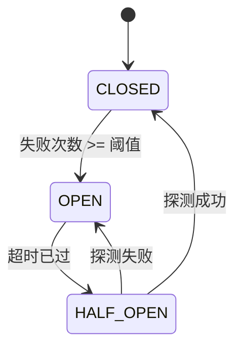

| 状态 | 行为 |
|------|------|
| CLOSED | 调用正常通过，计数连续失败 |
| OPEN | 调用立即失败（`CircuitOpenError`），计时器运行中 |
| HALF_OPEN | 允许一次探测调用。成功 → CLOSED，失败 → OPEN |

| 属性 | 值 |
|------|---|
| 调用检查 | O(1) — 比较状态 + 失败计数器 |
| 状态转换 | O(1) — 原子状态变更 |
| 状态数 | 3 — 关闭、打开、半开 |
| 空间 | O(1) — 计数器 + 定时器 + 状态枚举 |

**动手试试** — 发送成功和失败请求，观察状态机转换过程：

<CircuitBreakerViz />

## 生产验证

| 项目 | 源码 | 用途 |
|------|------|------|
| Netflix Hystrix | [HystrixCircuitBreaker.java#L138-L289](https://github.com/Netflix/Hystrix/blob/5ce3bc58c38e7ca60ef2fe0e516e390e294ad941/hystrix-core/src/main/java/com/netflix/hystrix/HystrixCircuitBreaker.java#L138-L289) | `HystrixCircuitBreakerImpl` — 经典熔断器实现。三态枚举（L142），`markSuccess`/`markNonSuccess` 驱动 HALF_OPEN 转换（L204-L224），`attemptExecution` 通过 `compareAndSet` 在睡眠窗口后实现 OPEN→HALF_OPEN（L264-L289）。Netflix 全部微服务架构使用。 |
| Sony gobreaker | [gobreaker.go#L117-L131](https://github.com/sony/gobreaker/blob/fed8e9eb35f9cd3e5c2a67842c924346c3e1fbdd/gobreaker.go#L117-L131) | `CircuitBreaker` 结构体，含状态、代计数器、计数和互斥锁。`onSuccess`/`onFailure`（L310-L332）驱动状态转换；基于代的过期检测（L334-L380）防止对过期状态读取进行操作。Sony 生产环境使用。 |
| Resilience4j | [CircuitBreakerStateMachine.java#L1062-L1107](https://github.com/resilience4j/resilience4j/blob/94982b82577d06e7e76ef5fe0e4a7329b8fb2ddd/resilience4j-circuitbreaker/src/main/java/io/github/resilience4j/circuitbreaker/internal/CircuitBreakerStateMachine.java#L1062-L1107) | `HalfOpenState` 内部类——`AtomicInteger permittedNumberOfCalls` 由 `permittedNumberOfCallsInHalfOpenState`（默认 10）初始化。`tryAcquirePermission()` 通过 `getAndUpdate` 原子性地递减计数器，在 HALF_OPEN 期间充当显式的许可门控。OPEN→HALF_OPEN 转换在 `ReentrantLock` 下使用 `isOpen.compareAndSet(true, false)`（L803-L808）。Spring Boot/Micronaut 服务的默认熔断库。 |

## 实现

::: code-group

```typescript [TypeScript]
type State = 'CLOSED' | 'OPEN' | 'HALF_OPEN';

class CircuitBreaker {
  private state: State = 'CLOSED';
  private failureCount = 0;
  private lastFailureTime = 0;

  constructor(
    private threshold: number,
    private resetTimeout: number,
  ) {}

  getState(): State {
    if (this.state === 'OPEN' && Date.now() - this.lastFailureTime >= this.resetTimeout) {
      this.state = 'HALF_OPEN';
    }
    return this.state;
  }

  async call<T>(fn: () => Promise<T>): Promise<T> {
    if (this.getState() === 'OPEN') throw new Error('Circuit is OPEN');
    try {
      const result = await fn();
      this.failureCount = 0;
      this.state = 'CLOSED';
      return result;
    } catch (err) {
      this.failureCount++;
      this.lastFailureTime = Date.now();
      if (this.failureCount >= this.threshold) this.state = 'OPEN';
      throw err;
    }
  }
}
```

```rust [Rust]
use std::time::Instant;

pub enum State { Closed, Open, HalfOpen }

pub struct CircuitBreaker {
    threshold: u32,
    reset_timeout_ms: u128,
    state: State,
    failure_count: u32,
    last_failure: Option<Instant>,
}

impl CircuitBreaker {
    pub fn new(threshold: u32, reset_timeout_ms: u128) -> Self {
        CircuitBreaker {
            threshold, reset_timeout_ms,
            state: State::Closed, failure_count: 0, last_failure: None,
        }
    }

    pub fn get_state(&mut self) -> &State {
        if let State::Open = self.state {
            if let Some(t) = self.last_failure {
                if t.elapsed().as_millis() >= self.reset_timeout_ms {
                    self.state = State::HalfOpen;
                }
            }
        }
        &self.state
    }

    pub fn call<T, E>(&mut self, f: impl FnOnce() -> Result<T, E>) -> Result<T, String>
    where E: std::fmt::Display {
        if matches!(self.get_state(), State::Open) {
            return Err("Circuit is OPEN".into());
        }
        match f() {
            Ok(v) => { self.failure_count = 0; self.state = State::Closed; Ok(v) }
            Err(e) => {
                self.failure_count += 1;
                self.last_failure = Some(Instant::now());
                if self.failure_count >= self.threshold { self.state = State::Open; }
                Err(e.to_string())
            }
        }
    }
}
```

```go [Go]
type State int

const (
	StateClosed   State = iota
	StateOpen
	StateHalfOpen
)

type CircuitBreaker struct {
	threshold    int
	resetTimeout int64
	state        State
	failureCount int
	lastFailure  int64
}

func NewCircuitBreaker(threshold int, resetTimeoutMs int64) *CircuitBreaker {
	return &CircuitBreaker{threshold: threshold, resetTimeout: resetTimeoutMs}
}

func now() int64 { return time.Now().UnixMilli() }

func (cb *CircuitBreaker) GetState() State {
	if cb.state == StateOpen && now()-cb.lastFailure >= cb.resetTimeout {
		cb.state = StateHalfOpen
	}
	return cb.state
}

func (cb *CircuitBreaker) Call(fn func() error) error {
	if cb.GetState() == StateOpen {
		return fmt.Errorf("circuit is OPEN")
	}
	if err := fn(); err != nil {
		cb.failureCount++
		cb.lastFailure = now()
		if cb.failureCount >= cb.threshold {
			cb.state = StateOpen
		}
		return err
	}
	cb.failureCount = 0
	cb.state = StateClosed
	return nil
}
```

```python [Python]
import time

class CircuitBreaker:
    def __init__(self, threshold: int = 5, reset_timeout: float = 30.0):
        self.threshold = threshold
        self.reset_timeout = reset_timeout
        self.state = "CLOSED"
        self.failure_count = 0
        self.last_failure_time = 0.0

    def get_state(self) -> str:
        if self.state == "OPEN" and time.time() - self.last_failure_time >= self.reset_timeout:
            self.state = "HALF_OPEN"
        return self.state

    def call(self, fn):
        if self.get_state() == "OPEN":
            raise RuntimeError("Circuit is OPEN")
        try:
            result = fn()
            self.failure_count = 0
            self.state = "CLOSED"
            return result
        except Exception:
            self.failure_count += 1
            self.last_failure_time = time.time()
            if self.failure_count >= self.threshold:
                self.state = "OPEN"
            raise
```

:::

## 练习

| 难度 | 练习 | 文件 |
|------|------|------|
| 基础 | 实现包含三种状态的熔断器 | `exercises/typescript/circuit-breaker/01-basic.test.ts` |
| 进阶 | 基于失败率和滚动窗口的熔断器 | `exercises/typescript/circuit-breaker/02-intermediate.test.ts` |

运行练习：`pnpm test:ts`（TypeScript）· `cargo test`（Rust）· `go test ./...`（Go）· `pytest`（Python）

练习文件： Rust `exercises/rust/src/circuit_breaker/mod.rs` · Go `exercises/go/circuit_breaker/circuit_breaker_test.go` · Python `exercises/python/circuit_breaker/test_circuit_breaker.py`

## 何时使用

- **微服务调用** — 防止下游服务宕机时的级联故障
- **数据库连接** — 在数据库过载时停止持续请求
- **外部 API** — 优雅处理第三方服务中断
- **共享资源** — 保护任何可能暂时不可用的共享资源

## 何时不用

- **进程内调用** — 熔断器增加开销，本地函数调用直接用错误处理即可
- **非幂等操作** — 如果半开后重试可能产生重复数据，先加去重
- **单消费者系统** — 只有一个调用者时，退避/重试比完整状态机更简单
- **发射后不管** — 如果不等待响应，就没有需要熔断的东西

## 更多生产案例

- [resilience4j](https://github.com/resilience4j/resilience4j) — Java 熔断器库，适用于 Spring/Micronaut
- [Polly](https://github.com/App-vNext/Polly) — .NET 弹性库，含熔断策略
- [Envoy Proxy](https://github.com/envoyproxy/envoy) — 异常检测充当分布式熔断器
- [AWS SDK](https://github.com/aws/aws-sdk-js-v3) — 带熔断的服务端点重试

## 相关模式

| 模式 | 关系 |
|---------|-------------|
| [指数退避重试 (Retry with Backoff)](/zh/patterns/retry-backoff/) | 熔断器在服务已知不可用时阻止重试 |
| [状态机 (State Machine)](/zh/patterns/state-machine/) | 熔断器是一个状态机：关闭 -> 打开 -> 半开 |
| [限流器 / 令牌桶 (Rate Limiter)](/zh/patterns/rate-limiter/) | 两者都保护服务——限流器控制吞吐量，熔断器停止故障 |

## 挑战题

::: details Q1: 你的熔断器有 30 秒的重置超时。下游服务的平均恢复时间是 5 秒。一位同事建议将超时降低到 5 秒以便更快恢复请求。这个权衡是什么？
**答案：** 更短的超时意味着你会更早探测服务，但如果服务还没恢复，每次失败的探测都会重置计时器并给已经处于困境中的服务增加额外负载。

重置超时是恢复速度与保护之间的权衡。如果你探测得太早且失败了，你会重新打开熔断器并等待又一个完整的超时周期。同时，失败的探测给不健康的服务增加了负载。好的超时应该长于典型恢复时间——通常是 2-3 倍——给下游服务喘息空间。一些实现对超时本身使用指数退避。
:::

::: details Q2: 服务 A 调用服务 B，服务 B 调用服务 C。服务 C 宕机了。没有熔断器的话，尽管服务 A 并不直接依赖 C，它会发生什么？
**答案：** 服务 A 的线程堆积等待服务 B，而服务 B 本身也阻塞在等待服务 C——这就是级联故障。

从 A 到 B 的每次调用都在 B 等待 C 超时时占用一个线程（或连接）。当 B 的线程耗尽后，B 也开始超时，导致 A 的线程堆积。很快 A 对它自己的调用者来说也像是宕机了。这正是 Netflix 构建 Hystrix 的原因：在每个服务边界上的熔断器会让 B 对 C 的调用快速失败并立即返回错误给 A，保持 A 的线程空闲。没有它，一个下游故障可以推倒整个调用链。
:::

::: details Q3: 你的熔断器进入 HALF_OPEN 状态并允许一个探测请求。但在高流量系统中，200 个并发请求在同一毫秒内到达。所有 200 个都看到状态为 HALF_OPEN 并同时发送探测请求。你如何防止这种惊群效应？
**答案：** 使用原子性的比较并交换（CAS）操作来对入口进行门控——然后在 HALF_OPEN 期间显式阻止后续请求进入。

CAS 处理了转换瞬间的竞态：恰好一个线程赢得 `compareAndSet(OPEN, HALF_OPEN)` 并成为探测者。但保护并不会在转换完成后停止。在转换**之后**到达的请求看到状态已经是 HALF_OPEN——此时 CAS 会失败，因为期望值（OPEN）与当前状态（HALF_OPEN）不匹配。这些调用者也必须被拒绝，并且实现必须确保 CAS 失败路径返回 `false`（快速失败），而不是继续往下执行。

Netflix Hystrix 在 `attemptExecution()` 中展示了这一点：`compareAndSet(Status.OPEN, Status.HALF_OPEN)` 位于 [HystrixCircuitBreaker.java#L281](https://github.com/Netflix/Hystrix/blob/5ce3bc58c38e7ca60ef2fe0e516e390e294ad941/hystrix-core/src/main/java/com/netflix/hystrix/HystrixCircuitBreaker.java#L281) 被包裹在一个 `if/else` 语句中——只有获胜者返回 `true`，其他所有线程返回 `false`。`allowRequest()` 在 HALF_OPEN 期间通过返回 `false` ([L262-L263](https://github.com/Netflix/Hystrix/blob/5ce3bc58c38e7ca60ef2fe0e516e390e294ad941/hystrix-core/src/main/java/com/netflix/hystrix/HystrixCircuitBreaker.java#L262-L263)) 来单独进行拦截，而探测失败后 `markNonSuccess` 再次使用 CAS 将 HALF_OPEN 转换为 OPEN ([L219-L224](https://github.com/Netflix/Hystrix/blob/5ce3bc58c38e7ca60ef2fe0e516e390e294ad941/hystrix-core/src/main/java/com/netflix/hystrix/HystrixCircuitBreaker.java#L219-L224))，这会重启睡眠窗口。

成熟的库增加了**第二层**保护——在 HALF_OPEN 期间使用显式的许可计数器。Sony 的 gobreaker 使用 `counts.Requests >= maxRequests` ([gobreaker.go#L334-L340](https://github.com/sony/gobreaker/blob/fed8e9eb35f9cd3e5c2a67842c924346c3e1fbdd/gobreaker.go#L334-L340)) 作为互斥锁和代计数器之外的额外门控。Resilience4j 的 `CircuitBreakerStateMachine` 在其 `HalfOpenState` 内部类中通过 `AtomicInteger` 跟踪 `permittedNumberOfCalls`——`tryAcquirePermission()` 原子性地递减计数器，并在计数器归零时返回 `false` ([CircuitBreakerStateMachine.java#L1064-L1107](https://github.com/resilience4j/resilience4j/blob/94982b82577d06e7e76ef5fe0e4a7329b8fb2ddd/resilience4j-circuitbreaker/src/main/java/io/github/resilience4j/circuitbreaker/internal/CircuitBreakerStateMachine.java#L1064-L1107))。

弄错这一点会造成真实后果。Resilience4j v1.7.0 存在一个已确认的 bug ([#1432](https://github.com/resilience4j/resilience4j/issues/1432))，其中多个线程绕过了 CAS 门控，因为丢失 CAS 的线程仍然返回了 `true`——`permittedNumberOfCallsInHalfOpenState` 实际上被忽略了。Polly v5.0.4 存在同一类 bug ([#216](https://github.com/App-vNext/Polly/issues/216))：多个 `Execute()` 调用在半开期间被放行。两者都通过将 CAS 结果与许可决策耦合、并添加显式的并发限流来修复。

关键洞察是 HALF_OPEN 需要**两重**并发控制：(1) CAS 用于 OPEN → HALF_OPEN 转换，以及 (2) 一个显式的门控（许可计数器、互斥锁或 CAS 语义检查），在探测完成之前拒绝所有后续请求。
:::

::: details Q4: 你的团队对数据库调用使用熔断器。一个开发者注意到在例行数据库迁移期间（导致 5 秒的延迟升高但零实际错误），熔断器被触发断开。熔断器是否应该追踪延迟而不仅仅是错误？
**答案：** 是的，但需要谨慎。基于延迟的触发保护调用者免受慢响应的影响，但你需要为"慢"和"失败"设置不同的阈值，以避免在正常波动时误触发。

一个耗时 10 秒但最终成功的请求仍然会占用一个线程 10 秒。在线程池模型中，慢响应在功能上等同于失败，因为它们耗尽了容量。Hystrix 将错误和超时都视为失败。微妙之处在于选择延迟阈值：设得太低，正常的 P99 方差就会触发熔断器；设得太高则无法提供保护。
:::


================================================
FILE: docs/zh/patterns/consistent-hashing/index.md
================================================
---
title: "模式：一致性哈希 (Consistent Hashing)"
description: "将键分布到虚拟环上的节点，添加或移除节点时只重映射约 1/n 的键。"
difficulty: "advanced"
---

# 模式：一致性哈希 (Consistent Hashing)

<DifficultyBadge />

## 一句话

将键分布到虚拟环上的节点，添加或移除节点时只重映射约 1/n 的键。

<DemoBadge />

## 现实类比

环形城市地图上分配快递区域。每个快递员负责一段弧线。新快递员加入时，只接管一小段相邻区域——其他快递员几乎不受影响。有人离开时，只有相邻的快递员分担他的区域。

## 核心思想

传统模哈希（`hash(key) % n`）在 `n` 变化时几乎重映射所有键。一致性哈希将节点和键都放在循环环上。每个键映射到其位置顺时针方向的第一个节点。添加或移除节点只影响它和前驱之间弧段的键。

```text
  Hash ring (0 to 2^32, wraps around):

  0         Node A    ●k1     Node B          ●k2     Node C    2^32→0
  ├───────────┼─────────┼───────┼───────────────┼───────┼─────────┤
              ▲         │       ▲               │       ▲         │
              │         │       │               │       │         │
              │         └───►───┘               └───►───┘         │
              │              ↑                       ↑            │
              │         k1→Node B              k2→Node C          │
              └───────────────────────────────────────────────────┘
                              k3 wraps around → Node A

  ●k1 = key "user:42"     → next node clockwise = Node B
  ●k2 = key "session:99"  → next node clockwise = Node C
  ●k3 = key "order:7" (between Node C and 2^32) → wraps → Node A
```

| 属性 | 值 |
|------|------|
| 添加/移除时键重映射 | 约 1/n（模哈希为 100%） |
| 虚拟节点（副本） | 改善均衡性——每个物理节点映射到环上 k 个位置 |
| 查找 | O(log n)，在排序环上二分搜索 |

**动手试试** — 添加键值，然后增减节点，观察最小化的键重分布：

<ConsistentHashViz />

## 生产验证

| 项目 | 源码 | 用途 |
|------|------|------|
| Go groupcache | [consistenthash.go#L28-L81](https://github.com/golang/groupcache/blob/2c02b8208cf8c02a3e358cb1d9b60950647543fc/consistenthash/consistenthash.go#L28-L81) | `Map` 结构体（L28-L33）含排序键和 hashMap。`Add`（L53-L62）插入虚拟节点。`Get`（L65-L81）用 `sort.Search` 二分搜索找最近顺时针节点。作者 Brad Fitzpatrick（memcached 创造者）。 |
| HAProxy | [lb_chash.c#L415-L491](https://github.com/haproxy/haproxy/blob/fb38e40ad5751090992cde15d919866b1e91b8aa/src/lb_chash.c#L415-L491) | `chash_get_server_hash` — 使用弹性二叉树（eb-trees）在一致性哈希环上找最近服务器，O(log n) 查找。支持有界负载均衡和服务器可用性检查。 |

## 实现

::: code-group

```typescript [TypeScript]
class HashRing {
  private ring = new Map<number, string>();
  private sortedKeys: number[] = [];

  constructor(private replicas = 100) {}

  private hash(key: string): number {
    let h = 2166136261;
    for (let i = 0; i < key.length; i++) {
      h ^= key.charCodeAt(i);
      h = Math.imul(h, 16777619);
    }
    return h >>> 0;
  }

  addNode(node: string): void {
    for (let i = 0; i < this.replicas; i++) {
      const h = this.hash(`${node}:${i}`);
      this.ring.set(h, node);
      this.sortedKeys.push(h);
    }
    this.sortedKeys.sort((a, b) => a - b);
  }

  removeNode(node: string): void {
    for (let i = 0; i < this.replicas; i++) {
      this.ring.delete(this.hash(`${node}:${i}`));
    }
    this.sortedKeys = this.sortedKeys.filter((k) => this.ring.has(k));
  }

  getNode(key: string): string | undefined {
    if (this.sortedKeys.length === 0) return undefined;
    const h = this.hash(key);
    for (const k of this.sortedKeys) {
      if (k >= h) return this.ring.get(k);
    }
    return this.ring.get(this.sortedKeys[0]!);
  }
}
```

```rust [Rust]
pub struct HashRing {
    replicas: usize,
    keys: Vec<u32>,
    ring: std::collections::HashMap<u32, String>,
}

impl HashRing {
    pub fn new(replicas: usize) -> Self {
        HashRing { replicas, keys: Vec::new(), ring: std::collections::HashMap::new() }
    }

    fn hash(key: &str) -> u32 {
        let mut h: u32 = 2166136261;
        for b in key.bytes() {
            h ^= b as u32;
            h = h.wrapping_mul(16777619);
        }
        h
    }

    pub fn add_node(&mut self, node: &str) {
        for i in 0..self.replicas {
            let h = Self::hash(&format!("{}:{}", node, i));
            self.ring.insert(h, node.to_string());
            self.keys.push(h);
        }
        self.keys.sort();
    }

    pub fn get_node(&self, key: &str) -> Option<&str> {
        if self.keys.is_empty() { return None; }
        let h = Self::hash(key);
        let idx = self.keys.partition_point(|&k| k < h);
        let idx = if idx >= self.keys.len() { 0 } else { idx };
        self.ring.get(&self.keys[idx]).map(|s| s.as_str())
    }
}
```

```go [Go]
type HashRing struct {
	replicas int
	keys     []int
	hashMap  map[int]string
}

func fnv1a(s string) int {
	h := 2166136261
	for i := 0; i < len(s); i++ {
		h ^= int(s[i])
		h *= 16777619
	}
	if h < 0 {
		h = -h
	}
	return h
}

func NewHashRing(replicas int) *HashRing {
	return &HashRing{replicas: replicas, hashMap: make(map[int]string)}
}

func (r *HashRing) AddNode(node string) {
	for i := 0; i < r.replicas; i++ {
		h := fnv1a(fmt.Sprintf("%s:%d", node, i))
		r.keys = append(r.keys, h)
		r.hashMap[h] = node
	}
	sort.Ints(r.keys)
}

func (r *HashRing) GetNode(key string) string {
	if len(r.keys) == 0 {
		return ""
	}
	h := fnv1a(key)
	idx := sort.SearchInts(r.keys, h)
	if idx >= len(r.keys) {
		idx = 0
	}
	return r.hashMap[r.keys[idx]]
}
```

```python [Python]
import bisect

class HashRing:
    def __init__(self, replicas: int = 100):
        self.replicas = replicas
        self.ring: dict[int, str] = {}
        self.sorted_keys: list[int] = []

    def _hash(self, key: str) -> int:
        h = 2166136261
        for ch in key:
            h ^= ord(ch)
            h = (h * 16777619) & 0xFFFFFFFF
        return h

    def add_node(self, node: str) -> None:
        for i in range(self.replicas):
            h = self._hash(f"{node}:{i}")
            self.ring[h] = node
            bisect.insort(self.sorted_keys, h)

    def get_node(self, key: str) -> str | None:
        if not self.sorted_keys:
            return None
        h = self._hash(key)
        idx = bisect.bisect_left(self.sorted_keys, h)
        if idx >= len(self.sorted_keys):
            idx = 0
        return self.ring[self.sorted_keys[idx]]
```

:::

## 练习

| 难度 | 练习 | 文件 |
|------|------|------|
| 基础 | 实现带 addNode/getNode 的哈希环 | `exercises/typescript/consistent-hashing/01-basic.test.ts` |
| 进阶 | 带虚拟节点的一致性哈希环 | `exercises/typescript/consistent-hashing/02-intermediate.test.ts` |

运行练习：`pnpm test:ts`（TypeScript）· `cargo test`（Rust）· `go test ./...`（Go）· `pytest`（Python）

练习文件： Rust `exercises/rust/src/consistent_hashing/mod.rs` · Go `exercises/go/consistent_hashing/consistent_hashing_test.go` · Python `exercises/python/consistent_hashing/test_consistent_hashing.py`

## 何时使用

- **分布式缓存** — 路由键到缓存服务器，扩缩容时最小化缓存失效
- **负载均衡** — 后端变化时最小扰动分发请求
- **分片数据库** — 将数据分区分配到节点
- **CDN** — 根据 URL 哈希路由内容到边缘服务器

## 何时不用

- **静态拓扑** — 如果节点不会变化，模哈希更简单
- **小集群** — 少于 5 个节点时，随机或轮询可能够用
- **严格排序** — 一致性哈希不保留键的顺序
- **要求均匀分布** — 没有虚拟节点时分布可能不均

## 更多生产案例

- [serialx/hashring](https://github.com/serialx/hashring/blob/22c0c7ab6b1be4be7b950bae8b117767da7b18b6/hashring.go#L31-L37) — Go 哈希环，支持加权节点
- [Apache Cassandra](https://github.com/apache/cassandra) — 分区器使用一致性哈希的 token 环
- [Amazon DynamoDB](https://www.allthingsdistributed.com/2007/10/amazons_dynamo.html) — 一致性哈希在生产中的原始论文
- [Memcached](https://github.com/memcached/memcached) — 客户端一致性哈希（ketama 算法）

## 相关模式

| 模式 | 关系 |
|---------|-------------|
| [注册表 / 自注册 (Registry)](/zh/patterns/registry/) | 注册表发现服务；一致性哈希路由到它们 |
| [LRU 缓存 (LRU Cache)](/zh/patterns/lru-cache/) | 分布式 LRU 缓存使用一致性哈希将键路由到正确的节点 |
| [限流器 / 令牌桶 (Rate Limiter)](/zh/patterns/rate-limiter/) | 一致性哈希集群中的节点级限流 |

## 挑战题

::: details Q1: 你有一个包含 3 个物理节点的哈希环，每个节点只有 1 个虚拟节点（没有副本）。一个节点占了 60% 的键空间，其余两个各占 20%。虚拟节点如何解决这个问题？为什么 groupcache 默认使用较高的副本数？
**答案：** 虚拟节点将每个物理节点分散到环上的多个位置，随着虚拟节点数量的增加，分布趋向均匀。

每个节点只有 1 个位置时，节点间的弧长由哈希值决定——本质上是随机的，导致高方差。当每个物理节点有 100-200 个虚拟节点时，大数定律开始起作用，每个物理节点大约拥有环的 1/n。groupcache 默认使用较高的副本数是因为统计均匀性需要大量样本。权衡在于内存：更多虚拟节点意味着更大的排序键数组和环映射。
:::

::: details Q2: 节点 B 崩溃并从 5 节点的环中移除。哪些节点吸收了它的流量？每个剩余节点是否均匀分担负载？
**答案：** 只有环上 B 顺时针方向的下一个节点吸收了 B 的所有键——其他三个节点完全不受影响。

这既是一致性哈希的优势也是其劣势。当 B 被移除时，映射到 B 的键现在"落到"下一个顺时针节点。没有虚拟节点时，一个节点吸收 100% 的重新分配负载，可能使其流量翻倍。有了虚拟节点，B 的多个环位置是分散的，因此它的键会分散到多个后继节点——更接近均匀分配。这是虚拟节点存在的关键原因：它们将"一个邻居吸收全部"的故障转变为"多个邻居分担负载"的故障。
:::

::: details Q3: 你的缓存集群使用一致性哈希。新产品上线导致一个特定键（"homepage_banner"）收到正常请求率 100 倍的流量。一致性哈希将它映射到节点 C，该节点现在过载而其他节点空闲。一致性哈希能解决热点问题吗？
**答案：** 不能。一致性哈希将键均匀分配到节点上，但当单个键的请求率差异巨大时，它无法均匀分配负载。

一致性哈希解决的是键的*分配*问题，而非键的*热度*问题。单个热键总是映射到一个节点。解决方案包括：读副本（在多个节点上缓存热键）、请求级负载均衡（将热键的读取随机路由）或键分片（将 "homepage_banner" 拆分为 "homepage_banner:1" 到 "homepage_banner:10" 分布在多个节点上）。一致性哈希的有界负载扩展通过将溢出流量重定向到环上的下一个节点来解决此问题。
:::

::: details Q4: 你需要将缓存集群从 3 个节点零停机迁移到 5 个节点。迁移期间新旧节点共存。一个被重映射到新节点的键返回缓存未命中，尽管数据还在旧节点上。如何处理？
**答案：** 迁移期间使用双读策略：先在新环上查找键，未命中则回退到旧环。

一致性哈希保证最小重映射（约 1/n 的键移动），但被移动的键在新节点上被填充之前会未命中。迁移策略是：(1) 在新旧两个环上分别计算键的归属节点，(2) 先从新节点读取，(3) 未命中时从旧节点读取并回填到新节点。所有键迁移完成（或 TTL 自然过期）后，移除旧环。Memcached（ketama 算法）和 Cassandra 在重分片时就采用这种方案——一致性哈希环定义了目标状态，过渡期负责弥合差距。（注意：Redis Cluster 使用固定的 16,384 槽位哈希方案，并非一致性哈希。）
:::


================================================
FILE: docs/zh/patterns/cooperative-scheduling/index.md
================================================
[Binary file]


================================================
FILE: docs/zh/patterns/copy-on-write/index.md
================================================
---
title: "模式：写时复制 (Copy-on-Write)"
description: "通过引用共享数据，直到有人修改时才创建私有副本——为读多写少的场景节省内存和分配开销。"
difficulty: "intermediate"
---

# 模式：写时复制 (Copy-on-Write)

<DifficultyBadge />

## 一句话

通过引用共享数据，直到有人修改时才创建私有副本——为读多写少的场景节省内存和分配开销。

<DemoBadge />

## 现实类比

一个设为「仅查看」的共享 Google 文档链接。所有人读的都是同一份文档。当有人想编辑时，系统为他创建一份副本。在写操作发生之前，只存在一份。

## 核心思想

写时复制将复制的开销推迟到实际发生修改时。多个读取方可以共享同一份数据。当写入方需要修改时，系统为该写入方创建副本，其他引用不受影响。

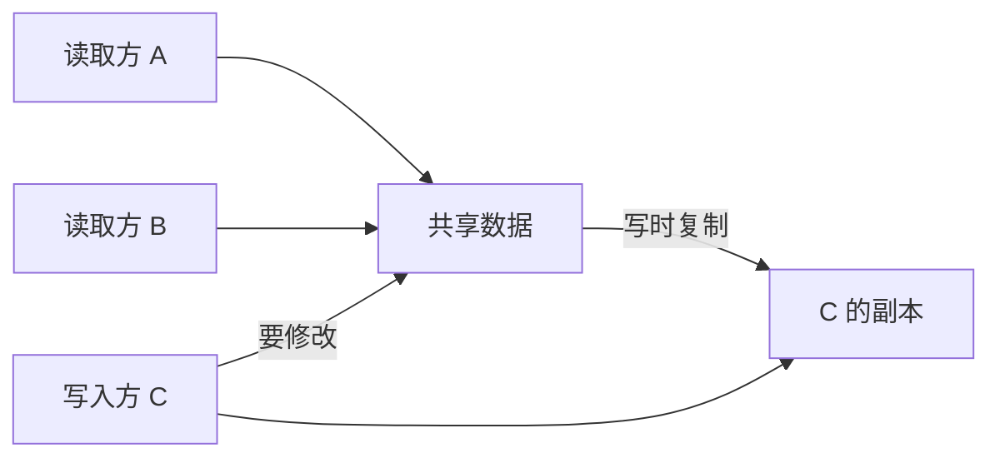

核心洞察：**大多数数据被读取的次数远多于被写入的次数**。CoW 利用这种不对称——读取免费共享，写入按需付费。

| 属性 | 值 |
|------|------|
| 读取（共享） | O(1) — 直接引用，无需复制 |
| 写入（首次修改） | O(n) — 完整复制数据 |
| 写入（已拥有） | O(1) — 原地修改 |
| 空间（无写入时） | O(1) — 所有读者共享一份拷贝 |

**动手试试** — 点击任意读者的"Write"按钮触发写时复制，观察引用计数的变化：

<CopyOnWriteViz />

## 生产验证

| 项目 | 源码 | 用途 |
|------|------|------|
| Git | [object-file.c#L719-L730](https://github.com/git/git/blob/1ff279f3404a482a83fb04c7457e41ab26884aea/object-file.c#L719-L730) | Git 对象是不可变的内容寻址 blob。分支时不复制文件——共享相同对象。新 commit 只为变更的文件创建新对象。 |
| Rust 标准库 | [borrow.rs#L169-L220](https://github.com/rust-lang/rust/blob/d56483a91d6cf5041351a3208b8d08f98f0c8b56/library/alloc/src/borrow.rs#L169-L220) | `Cow<'a, B>` — 持有 `Borrowed` 引用或 `Owned` 值的枚举。`to_mut()` 仅在当前是借用时才克隆。广泛用于零拷贝解析。 |

## 实现

::: code-group

```typescript [TypeScript]
class Cow<T extends object> {
  private data: T;
  private shared: boolean;

  constructor(data: T) {
    this.data = data;
    this.shared = false;
  }

  static from<T extends object>(data: T): Cow<T> {
    const cow = new Cow(data);
    cow.shared = true;
    return cow;
  }

  read(): Readonly<T> {
    return this.data;
  }

  write(): T {
    if (this.shared) {
      this.data = structuredClone(this.data);
      this.shared = false;
    }
    return this.data;
  }

  isOwned(): boolean {
    return !this.shared;
  }
}
```

```rust [Rust]
use std::borrow::Cow;

fn process(input: &str) -> Cow<'_, str> {
    if input.contains("bad") {
        // Only allocate when modification needed
        Cow::Owned(input.replace("bad", "good"))
    } else {
        // Zero-copy: just borrow the original
        Cow::Borrowed(input)
    }
}

// Usage
let clean = process("hello world");     // Borrowed, no allocation
let fixed = process("hello bad world"); // Owned, allocated
```

```go [Go]
type CowSlice[T any] struct {
	data   []T
	shared bool
}

func Share[T any](data []T) *CowSlice[T] {
	return &CowSlice[T]{data: data, shared: true}
}

func (c *CowSlice[T]) Read() []T {
	return c.data
}

func (c *CowSlice[T]) Write() []T {
	if c.shared {
		copied := make([]T, len(c.data))
		copy(copied, c.data)
		c.data = copied
		c.shared = false
	}
	return c.data
}
```

```python [Python]
import copy

class Cow:
    """Copy-on-Write wrapper."""
    def __init__(self, data, shared=False):
        self._data = data
        self._shared = shared

    @classmethod
    def share(cls, data):
        return cls(data, shared=True)

    def read(self):
        return self._data

    def write(self):
        if self._shared:
            self._data = copy.deepcopy(self._data)
            self._shared = False
        return self._data

# Usage
original = {"users": ["alice", "bob"]}
view = Cow.share(original)
print(view.read() is original)  # True — same object, no copy

mutable = view.write()          # NOW it copies
mutable["users"].append("charlie")
print(original["users"])        # ["alice", "bob"] — unchanged
```

:::

## 练习

| 难度 | 练习 | 文件 |
|------|------|------|
| 基础 | 实现写时复制包装器 | `exercises/typescript/copy-on-write/01-basic.test.ts` |
| 进阶 | 带 CoW fork 的版本化配置存储 | `exercises/typescript/copy-on-write/02-intermediate.test.ts` |

运行练习：`pnpm test:ts`（TypeScript）· `cargo test`（Rust）· `go test ./...`（Go）· `pytest`（Python）

练习文件： Rust `exercises/rust/src/copy_on_write/mod.rs` · Go `exercises/go/copy_on_write/copy_on_write_test.go` · Python `exercises/python/copy_on_write/test_copy_on_write.py`

## 何时使用

- **读多写少** — 配置对象、解析后的 AST、缓存响应
- **分支/版本控制** — Git 对象模型、数据库快照
- **零拷贝解析** — Rust 的 `Cow<str>` 在输入已有效时避免分配
- **撤销系统** — 共享状态快照，仅在修改时复制
- **不可变优先架构** — React state、Redux reducers

## 何时不用

- **写多读少** — 每次写入触发复制，抵消收益
- **小数据** — 复制小结构比 CoW 记账更便宜
- **并发写入** — CoW 不解决并发修改问题
- **深层结构** — 浅 CoW 可能导致共享可变子对象

## 更多生产案例

- [Linux fork()](https://github.com/torvalds/linux/blob/acb7500801e98639f6d8c2d796ed9f64cba83d3a/kernel/fork.c#L580-L620) — 通过 `copy_page_range` 实现页表 CoW
- [Swift](https://github.com/swiftlang/swift) — value types
- [Redis](https://github.com/redis/redis) — `BGSAVE`
- [ZFS](https://github.com/openzfs/zfs) / Btrfs — filesystem snapshots

## 相关模式

| 模式 | 关系 |
|---------|-------------|
| [双缓冲 (Double Buffering)](/zh/patterns/double-buffering/) | 两者都延迟成本——CoW 在写入时复制，双缓冲准备第二份副本 |
| [享元 / 驻留 (Flyweight / Interning)](/zh/patterns/flyweight/) | 享元共享不可变数据；CoW 共享可变数据直到修改 |
| [Merkle 树 (Merkle Tree)](/zh/patterns/merkle-tree/) | Merkle 树实现高效 CoW——只需重新哈希从变更节点到根的路径 |
| [引用计数 (Reference Counting)](/zh/patterns/reference-counting/) | 引用计数追踪 CoW 共享——当引用计数 > 1 且写入时复制 |
| [检查点 (Checkpointing)](/zh/patterns/checkpointing/) | 检查点捕获 CoW 快照——CoW 使快照创建为 O(1) |
| [差分与补丁 (Diff & Patch)](/zh/patterns/diff-patch/) | 差分补丁计算 CoW 快照之间的变更以实现增量更新 |
| [多版本并发控制 (MVCC)](/zh/patterns/mvcc/) | MVCC 使用 CoW 为并发读者创建版本快照 |

## 挑战题

::: details Q1: 你的 CoW 包装器在写入时进行浅拷贝。读者和写者共享一个嵌套对象 `{ users: [{ name: "alice" }] }`。写者调用 `write()` 并修改 `users[0].name`。读者会看到这个修改吗？
**答案：** 会的——浅拷贝只复制顶层对象，因此嵌套的 `users` 数组及其元素仍然是共享引用。

这就是"浅 CoW 陷阱"。`write()` 之后，写者有了一个新的顶层对象，但 `writer.users === reader.users` 仍然成立。修改 `users[0].name` 会影响双方。要实现真正的隔离，你需要深拷贝（代价高）、结构共享（像 immutable.js 那样只复制修改路径的骨干）或规定 CoW 对象只包含原始类型。React 和 Redux 通过要求不可变更新模式来解决这个问题：`{ ...state, users: [...state.users] }`。
:::

::: details Q2: Linux `fork()` 使用 CoW 处理进程内存页。子进程立即调用 `exec()` 替换其内存。为什么 CoW 在这里至关重要？
**答案：** 没有 CoW 的话，`fork()` 会复制整个父进程地址空间，然后在 `exec()` 加载新程序时立即丢弃——巨大的浪费。

`fork()` + `exec()` 模式是 Unix 中最常见的操作之一。父进程可能有数 GB 的内存。CoW 使得 `fork()` 几乎是瞬时的：它只是复制页表条目并将所有页面标记为只读。当 `exec()` 运行时，它无论如何都会替换所有映射，因此没有页面真正需要复制。没有 CoW，从大型应用（如 web 服务器 fork 工作进程）中生成进程将会慢得无法接受且内存密集。
:::

::: details Q3: 一个系统对配置对象使用 CoW。100 个读者共享配置；一个写者每秒更新一次。在什么工作负载模式下，CoW 比简单的互斥锁保护的共享对象更浪费内存？
**答案：** 当每次读取后都跟着一次写入（100% 写入比率）时，CoW 在每次访问时都创建完整副本，使用的内存比一个锁保护的单一共享对象更多。

CoW 的优势与读写比成正比。99% 读取时，100 个读者共享一份副本，只有偶尔的写者才为克隆付出代价——非常好。50% 读取时，一半的访问触发复制——收益微乎其微。100% 写入时，每次访问都会复制——你把单一共享对象变成了 N 个独立副本，没有任何共享优势，还加上了追踪共享状态的开销。平衡点取决于对象大小，但原则不变：CoW 适用于读多写少的工作负载。
:::

::: details Q4: Rust 的 `Cow<'a, str>` 是一个枚举，包含 `Borrowed(&'a str)` 和 `Owned(String)`。为什么这比总是克隆字符串更有用？
**答案：** 它让函数在输入已经是正确形式时无需分配就能接受和返回字符串数据，在常见情况下实现零拷贝。

考虑一个 URL 解码器：大多数 URL 没有百分号编码字符，可以原样返回（`Borrowed`）。只有包含 `%20` 等的 URL 才需要新的 `String`（`Owned`）。使用 `Cow` 时，函数签名是 `fn decode(input: &str) -> Cow<str>`——调用者在 90% 的情况下得到原始引用，零分配。没有 `Cow`，你要么总是克隆（浪费），要么手动返回一个枚举（这正是 `Cow` 本身，还有标准库集成）。
:::


================================================
FILE: docs/zh/patterns/dependency-graph/index.md
================================================
---
title: "模式：依赖图 (Dependency Graph)"
description: "将依赖关系建模为有向无环图，拓扑排序确定合法执行顺序——在死锁前检测循环。"
difficulty: "intermediate"
---

# 模式：依赖图 (Dependency Graph)

<DifficultyBadge />

## 一句话

将依赖关系建模为有向无环图，拓扑排序确定合法执行顺序——在死锁前检测循环。

<DemoBadge />

## 现实类比

大学课程目录里的先修课表。你不能没上「基础物理」就去上「高级物理」。你从前置课程跟到高级课程，确保不跳过任何必修步骤。

## 核心思想

依赖图将项目表示为节点，排序约束表示为有向边。`addEdge(A, B)` 表示"A 必须在 B 之前"——A 是 B 的前置条件。Kahn 算法反复移除入度为 0 的节点，产生一个每个前置条件都在其依赖者之前的顺序。

```text
  addEdge(wash, dry)     wash ──► dry ──► fold
  addEdge(dry, fold)          0        1       2
  addEdge(wash, fold)         │                ▲
                              └────────────────┘

  入度:   wash=0   dry=1   fold=2
  输出:   wash  →  dry  →  fold
  (入度为 0 的先输出)

  循环:  a → b → c → a  ← 错误：不存在合法顺序
```

| 属性 | 值 |
|------|------|
| 添加节点/边 | O(1) |
| 拓扑排序 | O(V + E) — 每个节点和边访问一次 |
| 循环检测 | 内置于拓扑排序（剩余节点 = 循环） |
| 空间 | O(V + E) — 邻接表 |

**动手试试** — 添加节点和边，然后运行拓扑排序，观察 Kahn 算法逐步处理：

<DependencyGraphViz />

## 生产验证

| 项目 | 源码 | 用途 |
|------|------|------|
| Cargo (Rust) | [dep_cache.rs#L143-L175](https://github.com/rust-lang/cargo/blob/b50aa179d3d1099b53548bc8693dd17ddd019ab4/src/cargo/core/resolver/dep_cache.rs#L143-L175) | `RegistryQueryer` 管理 Rust 包的依赖解析图。依赖形成通过回溯解析的 DAG，`build_deps`（L207）产生每个候选包激活的依赖集合。 |
| pnpm | [graph-sequencer#L22-L125](https://github.com/pnpm/pnpm/blob/46fd26afc9926b4391636a851ae32493f9b2c9ff/deps/graph-sequencer/src/index.ts#L22-L125) | `graphSequencer` — 按工作区包的相互依赖关系进行拓扑排序并检测循环。被 `pnpm -r` 递归命令使用，在 monorepo 中遵循依赖顺序。 |

## 实现

::: code-group

```typescript [TypeScript]
class DependencyGraph<T> {
  private adjacency = new Map<T, Set<T>>();

  addNode(node: T): void {
    if (!this.adjacency.has(node)) this.adjacency.set(node, new Set());
  }

  addEdge(from: T, to: T): void {
    this.addNode(from);
    this.addNode(to);
    this.adjacency.get(from)!.add(to);
  }

  topologicalSort(): T[] {
    const inDegree = new Map<T, number>();
    for (const node of this.adjacency.keys()) inDegree.set(node, 0);
    for (const [, deps] of this.adjacency) {
      for (const dep of deps) {
        inDegree.set(dep, (inDegree.get(dep) ?? 0) + 1);
      }
    }

    const queue: T[] = [];
    for (const [node, degree] of inDegree) {
      if (degree === 0) queue.push(node);
    }

    const result: T[] = [];
    while (queue.length > 0) {
      const node = queue.shift()!;
      result.push(node);
      for (const dep of this.adjacency.get(node) ?? []) {
        const newDegree = inDegree.get(dep)! - 1;
        inDegree.set(dep, newDegree);
        if (newDegree === 0) queue.push(dep);
      }
    }

    if (result.length !== this.adjacency.size) {
      throw new Error('Cycle detected');
    }
    return result;
  }
}
```

```rust [Rust]
use std::collections::HashMap;

pub struct DependencyGraph {
    adj: HashMap<String, Vec<String>>,
}

impl DependencyGraph {
    pub fn new() -> Self {
        DependencyGraph { adj: HashMap::new() }
    }

    pub fn add_node(&mut self, node: &str) {
        self.adj.entry(node.to_string()).or_default();
    }

    pub fn add_edge(&mut self, from: &str, to: &str) {
        self.add_node(from);
        self.add_node(to);
        self.adj.get_mut(from).unwrap().push(to.to_string());
    }

    pub fn topological_sort(&self) -> Result<Vec<String>, &'static str> {
        let mut in_degree: HashMap<&str, usize> = HashMap::new();
        for node in self.adj.keys() {
            in_degree.entry(node.as_str()).or_insert(0);
        }
        for deps in self.adj.values() {
            for dep in deps {
                *in_degree.entry(dep.as_str()).or_insert(0) += 1;
            }
        }

        let mut queue: Vec<&str> = in_degree.iter()
            .filter(|(_, &d)| d == 0)
            .map(|(&n, _)| n)
            .collect();
        queue.sort();

        let mut result = Vec::new();
        while let Some(node) = queue.first().copied() {
            queue.remove(0);
            result.push(node.to_string());
            if let Some(deps) = self.adj.get(node) {
                for dep in deps {
                    let d = in_degree.get_mut(dep.as_str()).unwrap();
                    *d -= 1;
                    if *d == 0 {
                        queue.push(dep.as_str());
                        queue.sort();
                    }
                }
            }
        }

        if result.len() != self.adj.len() {
            return Err("Cycle detected");
        }
        Ok(result)
    }
}
```

```go [Go]
type DependencyGraph struct {
	adj map[string][]string
}

func NewDependencyGraph() *DependencyGraph {
	return &DependencyGraph{adj: make(map[string][]string)}
}

func (g *DependencyGraph) AddNode(node string) {
	if _, ok := g.adj[node]; !ok {
		g.adj[node] = nil
	}
}

func (g *DependencyGraph) AddEdge(from, to string) {
	g.AddNode(from)
	g.AddNode(to)
	g.adj[from] = append(g.adj[from], to)
}

func (g *DependencyGraph) TopologicalSort() ([]string, error) {
	inDegree := make(map[string]int)
	for node := range g.adj {
		inDegree[node] = 0
	}
	for _, deps := range g.adj {
		for _, dep := range deps {
			inDegree[dep]++
		}
	}

	var queue []string
	for node, deg := range inDegree {
		if deg == 0 {
			queue = append(queue, node)
		}
	}
	sort.Strings(queue)

	var result []string
	for len(queue) > 0 {
		node := queue[0]
		queue = queue[1:]
		result = append(result, node)
		for _, dep := range g.adj[node] {
			inDegree[dep]--
			if inDegree[dep] == 0 {
				queue = append(queue, dep)
			}
		}
	}

	if len(result) != len(g.adj) {
		return nil, fmt.Errorf("cycle detected")
	}
	return result, nil
}
```

```python [Python]
from collections import deque

class DependencyGraph:
    def __init__(self):
        self.adj: dict[str, list[str]] = {}

    def add_node(self, node: str) -> None:
        if node not in self.adj:
            self.adj[node] = []

    def add_edge(self, from_node: str, to_node: str) -> None:
        self.add_node(from_node)
        self.add_node(to_node)
        self.adj[from_node].append(to_node)

    def topological_sort(self) -> list[str]:
        in_degree: dict[str, int] = {n: 0 for n in self.adj}
        for deps in self.adj.values():
            for dep in deps:
                in_degree[dep] = in_degree.get(dep, 0) + 1

        queue = deque(n for n, d in in_degree.items() if d == 0)
        result: list[str] = []

        while queue:
            node = queue.popleft()
            result.append(node)
            for dep in self.adj.get(node, []):
                in_degree[dep] -= 1
                if in_degree[dep] == 0:
                    queue.append(dep)

        if len(result) != len(self.adj):
            raise ValueError("Cycle detected")
        return result
```

:::

## 练习

| 难度 | 练习 | 文件 |
|------|------|------|
| 基础 | 实现带循环检测的拓扑排序 | `exercises/typescript/dependency-graph/01-basic.test.ts` |
| 进阶 | 并行执行规划器 — 计算执行波次 | `exercises/typescript/dependency-graph/02-intermediate.test.ts` |

运行练习：`pnpm test:ts`（TypeScript）· `cargo test`（Rust）· `go test ./...`（Go）· `pytest`（Python）

练习文件： Rust `exercises/rust/src/dependency_graph/mod.rs` · Go `exercises/go/dependency_graph/dependency_graph_test.go` · Python `exercises/python/dependency_graph/test_dependency_graph.py`

## 何时使用

- **构建系统** — 依赖先于被依赖者编译（Make、Bazel、Cargo）
- **包管理器** — 工作区包的安装/构建顺序（pnpm、npm、yarn）
- **任务调度** — 带前置条件的作业编排（Airflow、CI/CD 流水线）
- **模块打包器** — 确定代码分割和加载顺序（webpack、Rollup）
- **数据库迁移** — 按依赖顺序应用 schema 变更

## 何时不用

- **设计上存在循环依赖** — 使用不同模型（如事件驱动、惰性求值）
- **不需要排序** — 任务独立时简单列表即可
- **动态依赖** — 运行时边变化时，增量方法更好
- **超大图** — 考虑并行算法（Kahn 算法天然串行，需要改造）

## 更多生产案例

- [Make (GNU)](https://github.com/mirror/make) — 前置条件 DAG 决定目标重建顺序
- [Bazel](https://github.com/bazelbuild/bazel) — action 图的拓扑执行阶段
- [webpack](https://github.com/webpack/webpack) — `ModuleGraph` 用于代码分割和 tree shaking
- [Terraform](https://github.com/hashicorp/terraform) — 资源依赖图实现并行 apply

## 相关模式

| 模式 | 关系 |
|---------|-------------|
| [访问者 / 树遍历器 (Visitor / Tree Walker)](/zh/patterns/visitor/) | 依赖图上的树遍历分发到类型特定的处理器 |
| [迭代器 / 惰性求值 (Iterator)](/zh/patterns/iterator/) | 拓扑迭代生成按依赖顺序的惰性节点序列 |
| [脏标记 (Dirty Flag)](/zh/patterns/dirty-flag/) | 脏传播沿依赖边标记下游节点以进行重计算 |
| [注册表 (Registry)](/zh/patterns/registry/) | 注册表追踪组件元数据；依赖图追踪它们之间的关系 |

## 挑战题

::: details Q1: 给定一个依赖图，其中 A->C、B->C，且 A 和 B 没有依赖。可以并行运行多少个任务？拓扑排序如何揭示这一点？
**答案：** A 和 B 可以并行运行（两者入度都为 0）。C 必须等待两者完成。最大并行度为 2。

使用 Kahn 算法的拓扑排序自然地暴露了并行性：在任何给定步骤中，所有入度为 0 的节点可以同时执行。在这个例子中，第一"波"是 {A, B}（都是入度 0），第二波是 {C}（在 A 和 B 都完成后入度降为 0）。像 Bazel 和 Make 这样的构建系统正是通过并行处理每一波来利用这一点的。
:::

::: details Q2: 包 D 依赖 B 和 C。B 依赖 A。C 也依赖 A。这是一个"菱形依赖"。拓扑排序能正确处理吗？
**答案：** 可以。拓扑排序正确处理菱形依赖，因为它追踪的是入度而不是路径。A 先运行，然后 B 和 C（并行），最后 D。

菱形不是环——它只是两条路径汇聚到同一个节点。Kahn 算法处理 A（入度 0），将 B 和 C 的入度减为 0，处理两者，然后将 D 的入度减为 0 并处理它。潜在问题不在于排序，而在于版本冲突：如果 B 需要 A v1 而 C 需要 A v2，你就有了一个仅靠图结构无法解决的兼容性问题。
:::

::: details Q3: 你在一个大项目中修改了文件 `utils.ts`。增量构建系统只重新编译依赖 `utils.ts` 的文件。依赖图是如何实现这一点的？
**答案：** 构建系统从 `utils.ts` 出发沿依赖图正向遍历，收集所有传递依赖者。只有这些文件（加上 `utils.ts` 本身）需要重新编译。

这是维护依赖图相比于扁平文件列表的关键优势。没有图，你要么重新编译所有文件，要么手动维护依赖列表。有了图，你可以在 O(V+E) 时间内计算受影响的子图。像 webpack 的 `ModuleGraph` 和 Bazel 的 action graph 这样的工具正是这样做的——它们追踪哪些输出依赖于哪些输入，只使受影响的子树失效。
:::

::: details Q4: 一个开发者添加了从模块 A 到模块 B 的依赖，但 B 已经传递依赖 A（B -> C -> A）。构建系统应该怎么做？
**答案：** 拒绝这个变更。添加 A -> B 会形成环（A -> B -> C -> A），这意味着不存在有效的构建顺序。

Kahn 算法会检测到这一点：在处理完所有入度为零的节点后，仍有一些节点的入度非零——这些节点形成了环。构建系统应该报告确切的环路径，以便开发者重新设计依赖关系（例如将共享代码提取到新模块中、使用依赖反转，或使用延迟/动态导入来打破编译时的循环）。
:::


================================================
FILE: docs/zh/patterns/diff-patch/index.md
================================================
---
title: "模式：差异/补丁 (Diff / Patch)"
description: "比较两个序列，计算将一个转换为另一个所需的最小操作集（插入、删除、移动）。"
difficulty: "intermediate"
---

# 模式：差异/补丁 (Diff / Patch)

<DifficultyBadge />

## 一句话

比较两个序列，计算将一个转换为另一个所需的最小操作集（插入、删除、移动）。

<DemoBadge />

## 现实类比

Word 文档的修订模式。不是发送整个文档，而是只发红色标记的修改：「删除第 3 段，在第 5 段后插入这句话。」接收方将补丁应用到自己的副本上。

## 核心思想

给定旧列表和新列表，diff 算法确定哪些元素被添加、删除或移动。结果是一个"补丁"— 一组最小的变更操作。

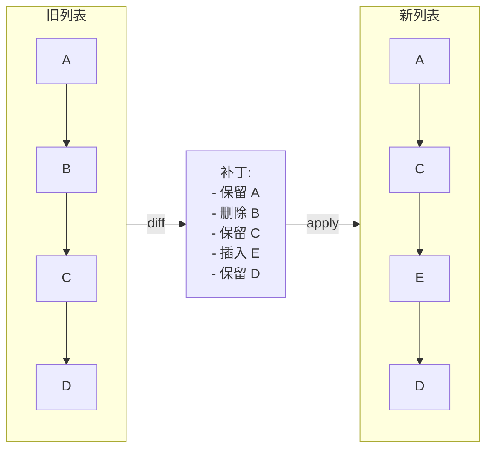

React 的协调器用此确定要创建、更新或删除哪些 DOM 节点。Git 用此显示提交之间的变更。

| 属性 | 值 |
|------|------|
| Diff（Myers 算法） | O(n·d)，d = 编辑距离；相似时 O(n) |
| Diff（带 key 的列表） | O(n) — 基于 key 的匹配避免二次搜索 |
| 应用补丁 | O(补丁大小) — 每个操作 O(1) |
| 空间 | O(n) — 用于编辑脚本 / 补丁 |

**动手试试** — 编辑新旧文本，然后计算并应用差异：

<DiffPatchViz />

## 生产验证

| 项目 | 源码 | 用途 |
|------|------|------|
| React | [ReactChildFiber.js#L1169-L1340](https://github.com/facebook/react/blob/34b78a2897cc208260a88e6b62ecaf9ca2a9dfe4/packages/react-reconciler/src/ReactChildFiber.js#L1169-L1340) | `reconcileChildrenArray` 对比新旧子节点，~行1294 调用 `mapRemainingChildren` 构建 key→fiber 映射，检测移动、插入和删除。 |
| Git | [diff.c#L5020-L5060](https://github.com/git/git/blob/1ff279f3404a482a83fb04c7457e41ab26884aea/diff.c#L5020-L5060) | `run_diff` 分派文件对比，`builtin_diff`（行3839）处理实际 diff。Git 内部使用优化版 Myers 算法（在 `xdiff/` 中）。 |

## 实现

::: info 关于算法
下面的实现使用**贪心前向扫描**——简单清晰，适合学习。生产系统如 Git 使用 [Myers 差异算法](https://blog.jcoglan.com/2017/02/12/the-myers-diff-algorithm-part-1/)保证最小编辑序列。React 使用基于 key 的方法，专为 UI 列表协调优化。
:::

::: code-group

```typescript [TypeScript]
type Op<T> =
  | { type: 'keep'; value: T }
  | { type: 'insert'; value: T }
  | { type: 'delete'; value: T };

function diff<T>(oldList: T[], newList: T[], eq: (a: T, b: T) => boolean = (a, b) => a === b): Op<T>[] {
  const ops: Op<T>[] = [];
  let oldIdx = 0;
  let newIdx = 0;

  // Build a map of old items by value for O(1) lookup
  const oldMap = new Map<string, number>();
  oldList.forEach((item, i) => oldMap.set(String(item), i));

  while (oldIdx < oldList.length && newIdx < newList.length) {
    if (eq(oldList[oldIdx]!, newList[newIdx]!)) {
      ops.push({ type: 'keep', value: oldList[oldIdx]! });
      oldIdx++;
      newIdx++;
    } else if (!newList.some((n, ni) => ni >= newIdx && eq(n, oldList[oldIdx]!))) {
      ops.push({ type: 'delete', value: oldList[oldIdx]! });
      oldIdx++;
    } else {
      ops.push({ type: 'insert', value: newList[newIdx]! });
      newIdx++;
    }
  }

  while (oldIdx < oldList.length) {
    ops.push({ type: 'delete', value: oldList[oldIdx]! });
    oldIdx++;
  }

  while (newIdx < newList.length) {
    ops.push({ type: 'insert', value: newList[newIdx]! });
    newIdx++;
  }

  return ops;
}

function patch<T>(oldList: T[], ops: Op<T>[]): T[] {
  const result: T[] = [];
  for (const op of ops) {
    if (op.type === 'keep' || op.type === 'insert') result.push(op.value);
  }
  return result;
}
```

```rust [Rust]
#[derive(Debug, PartialEq)]
pub enum Op<T> {
    Keep(T),
    Insert(T),
    Delete(T),
}

pub fn diff<T: PartialEq + Clone>(old: &[T], new: &[T]) -> Vec<Op<T>> {
    let mut ops = Vec::new();
    let (mut oi, mut ni) = (0, 0);

    while oi < old.len() && ni < new.len() {
        if old[oi] == new[ni] {
            ops.push(Op::Keep(old[oi].clone()));
            oi += 1;
            ni += 1;
        } else if !new[ni..].contains(&old[oi]) {
            ops.push(Op::Delete(old[oi].clone()));
            oi += 1;
        } else {
            ops.push(Op::Insert(new[ni].clone()));
            ni += 1;
        }
    }

    while oi < old.len() { ops.push(Op::Delete(old[oi].clone())); oi += 1; }
    while ni < new.len() { ops.push(Op::Insert(new[ni].clone())); ni += 1; }

    ops
}

pub fn patch<T: Clone>(ops: &[Op<T>]) -> Vec<T> {
    ops.iter().filter_map(|op| match op {
        Op::Keep(v) | Op::Insert(v) => Some(v.clone()),
        Op::Delete(_) => None,
    }).collect()
}
```

```go [Go]
type OpType int

const (
	Keep OpType = iota
	Insert
	Delete
)

type Op struct {
	Type  OpType
	Value string
}

func contains(slice []string, val string) bool {
	for _, s := range slice {
		if s == val {
			return true
		}
	}
	return false
}

func Diff(old, new []string) []Op {
	var ops []Op
	oi, ni := 0, 0

	for oi < len(old) && ni < len(new) {
		if old[oi] == new[ni] {
			ops = append(ops, Op{Keep, old[oi]})
			oi++
			ni++
		} else if !contains(new[ni:], old[oi]) {
			ops = append(ops, Op{Delete, old[oi]})
			oi++
		} else {
			ops = append(ops, Op{Insert, new[ni]})
			ni++
		}
	}

	for oi < len(old) {
		ops = append(ops, Op{Delete, old[oi]})
		oi++
	}
	for ni < len(new) {
		ops = append(ops, Op{Insert, new[ni]})
		ni++
	}
	return ops
}

func Patch(ops []Op) []string {
	var result []string
	for _, op := range ops {
		if op.Type != Delete {
			result = append(result, op.Value)
		}
	}
	return result
}
```

```python [Python]
from typing import TypeVar, List, Tuple, Literal

T = TypeVar("T")
Op = Tuple[Literal["keep", "insert", "delete"], T]

def diff(old: List[T], new: List[T]) -> List[Op]:
    ops: List[Op] = []
    oi, ni = 0, 0

    while oi < len(old) and ni < len(new):
        if old[oi] == new[ni]:
            ops.append(("keep", old[oi]))
            oi += 1; ni += 1
        elif old[oi] not in new[ni:]:
            ops.append(("delete", old[oi]))
            oi += 1
        else:
            ops.append(("insert", new[ni]))
            ni += 1

    while oi < len(old): ops.append(("delete", old[oi])); oi += 1
    while ni < len(new): ops.append(("insert", new[ni])); ni += 1
    return ops

def patch(ops: List[Op]) -> List[T]:
    return [val for op_type, val in ops if op_type != "delete"]

# Usage
ops = diff(["a", "b", "c", "d"], ["a", "c", "e", "d"])
assert patch(ops) == ["a", "c", "e", "d"]
```

:::

## 练习

| 难度 | 练习 | 文件 |
|------|------|------|
| 基础 | 实现产生 keep/insert/delete 操作的列表 diff | `exercises/typescript/diff-patch/01-basic.test.ts` |
| 进阶 | 应用补丁从旧列表重建新列表 | `exercises/typescript/diff-patch/02-patch-apply.test.ts` |

运行练习：`pnpm test:ts`（TypeScript）· `cargo test`（Rust）· `go test ./...`（Go）· `pytest`（Python）

练习文件： Rust `exercises/rust/src/diff_patch/mod.rs` · Go `exercises/go/diff_patch/diff_patch_test.go` · Python `exercises/python/diff_patch/test_diff_patch.py`

## 何时使用

- **UI 协调** — 通过 diff 虚拟树最小化 DOM 变更
- **版本控制** — 计算提交之间的文件变更
- **协同编辑** — 通过操作转换或 CRDT diff 合并并发编辑
- **状态同步** — 通过网络仅发送增量而非完整状态
- **撤销/重做** — 用 diff 作为紧凑的撤销条目，而非完整快照

## 何时不用

- **完全不同的列表** — 如果超过 80% 的元素变化，直接替换整个列表
- **无序集合** — diff 假设顺序重要；对集合使用交集/差集
- **实时流** — 逐个到达的项用增量方式比批量 diff 更好
- **大列表无 key** — 没有稳定标识符时，diff 退化为 O(n²)

## 更多生产案例

- [VS Code](https://github.com/microsoft/vscode) — text buffer diff
- [jsdiff](https://github.com/kpdecker/jsdiff)
- [Vue 3](https://github.com/vuejs/core) — template diff
- [Git](https://github.com/git/git/blob/1ff279f3404a482a83fb04c7457e41ab26884aea/diff.c) — core diff engine for commits, merges, and patches

## 相关模式

| 模式 | 关系 |
|---------|-------------|
| [写时复制 (Copy-on-Write)](/zh/patterns/copy-on-write/) | 差异/补丁计算变更内容；CoW 将实际复制延迟到需要时 |
| [Merkle 树 (Merkle Tree)](/zh/patterns/merkle-tree/) | Merkle 树识别哪些子树发生了变化，缩小差异比较范围 |
| [双缓冲 (Double Buffering)](/zh/patterns/double-buffering/) | React 将当前树与正在进行的双缓冲进行差异比较 |

## 挑战题

::: details Q1: React 的 diff 生成插入/删除/更新操作，但没有"移动"操作。它如何处理仅仅重新排序的列表？
**答案：** React 不发出显式的"移动"操作。它通过 `insertBefore` 复用现有 DOM 节点并重新定位。

没有 key 时，React 按位置比较子元素——重新排序看起来像每个元素都变了。有 key 时，React 构建 `key -> fiber` 的映射，按 key 匹配新旧子元素，复用现有 DOM 节点。它追踪 `lastPlacedIndex` 并标记需要重新定位的 fiber——浏览器移动 DOM 节点而不是销毁并重建。这比计算最小编辑距离的移动序列更简单，但对于典型 UI 列表能产生接近最优的 DOM 变更。
:::

::: details Q2: 本模式中的贪心 diff 算法最坏情况为 O(n*m)。是什么导致了这种情况？Myers 算法如何改进？
**答案：** 贪心算法的 `some()` 调用为每个旧元素扫描剩余的新列表，产生 O(n*m) 次比较。Myers 算法的复杂度为 O((n+m) * d)，其中 d 是编辑距离。

Myers 的关键洞察是通过在编辑图中探索对角线来搜索最短编辑脚本。当两个列表相似（d 较小）时，它近似以 O(n+m) 运行。贪心方法没有这种优化——它不最小化编辑序列，当列表中有很多分散的差异时退化严重。
:::

::: details Q3: 两个开发者独立编辑同一个文件。开发者 A 删除了第 5 行；开发者 B 修改了第 5 行。基于 diff 的合并如何处理这个冲突？
**答案：** 这是一个真正的冲突，无法自动解决——合并工具必须标记它供人工审查。

三路合并计算两个 diff：（基准 -> A）和（基准 -> B）。如果两个 diff 都涉及同一区域，就产生冲突。A 的 diff 说"删除第 5 行"，B 的 diff 说"替换第 5 行"。这是同一个代码块上的互斥操作。合并工具插入冲突标记（`<<<<<<<`、`=======`、`>>>>>>>`），由开发者决定。不同区域的非重叠变更可以干净地合并。
:::

::: details Q4: 你需要在服务器和 10,000 个连接的客户端之间同步状态。你应该对完整状态做 diff 并发送补丁，还是使用不同的方法？
**答案：** 对每个客户端做完整状态的 diff 无法扩展。使用事件溯源或操作转换，在变更发生时发送单个变更操作。

计算 diff 需要同时持有新旧状态，且 diff 成本与状态大小成正比。有 10,000 个客户端时，每次更新你要计算 10,000 个 diff。相反，将每个变更捕获为小操作（例如"set user.name = X"）并广播。客户端增量应用操作。Diff-patch 更适合周期性对账（如 React 的渲染周期）或离线同步，不适合实时高扇出分发。
:::


================================================
FILE: docs/zh/patterns/dirty-flag/index.md
================================================
[Binary file]


================================================
FILE: docs/zh/patterns/double-buffering/index.md
================================================
---
title: "模式：双缓冲 (Double Buffering)"
description: "维护两份状态副本，在它们之间原子切换，让读取方始终看到一致的快照。"
difficulty: "beginner"
---

# 模式：双缓冲 (Double Buffering)

<DifficultyBadge />

## 一句话

维护两份状态副本，在它们之间原子切换，让读取方始终看到一致的快照。

<DemoBadge />

## 现实类比

有两个出餐窗口的餐厅厨房。厨师在一边准备下一单，服务员从另一边取走当前的单。新的做好了就交换——顾客永远看不到做了一半的菜。

## 核心思想

双缓冲保持数据结构的两个版本：一个"当前"（正在被读取）和一个"工作中"（正在被写入）。写入完成后，两者原子交换。读取方永远不会看到写到一半的状态。

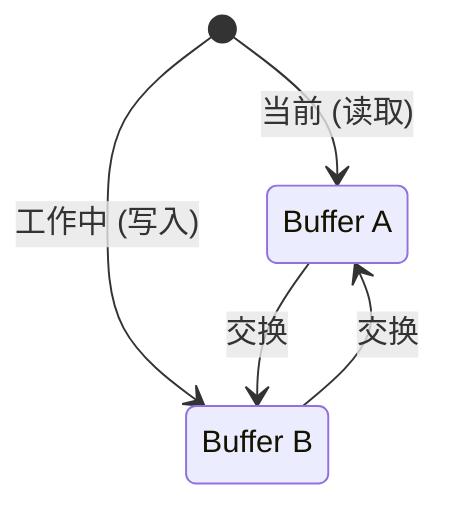

交换后：旧"当前"变为新"工作中"（被复用，不会被 GC）。同样的两个对象永远被回收利用 — 热路径上**零分配**。

| 属性 | 值 |
|------|------|
| 交换 | O(1) — 指针/引用交换 |
| 热路径分配 | 零 — 两个缓冲区预分配并循环使用 |
| 内存 | 2× 单缓冲区 — 恰好两份拷贝 |
| 撕裂 | 不可能 — 读者看到一致的快照 |

**动手试试** — 绘制帧并交换缓冲区，观察双缓冲如何防止画面撕裂：

<DoubleBufferingViz />

## 生产验证

| 项目 | 源码 | 用途 |
|------|------|------|
| React | [ReactFiber.js#L327-L355](https://github.com/facebook/react/blob/34b78a2897cc208260a88e6b62ecaf9ca2a9dfe4/packages/react-reconciler/src/ReactFiber.js#L327-L355) | `createWorkInProgress` — 创建或复用 alternate fiber。注释写道：*"We use a double buffering pooling technique because we know that we'll only ever need at most two versions of a tree."* |
| SDL | [SDL_render.c#L5535-L5570](https://github.com/libsdl-org/SDL/blob/14b0e9d922da78001223e563efd2f54f473a4115/src/render/SDL_render.c#L5535-L5570) | `SDL_RenderPresent` — 刷新排队的渲染命令，调用后端的 `RenderPresent` 交换前后缓冲区实现无撕裂帧呈现，处理 vsync 模拟。 |

## 实现

::: code-group

```typescript [TypeScript]
class DoubleBuffer<T> {
  private buffers: [T, T];
  private currentIndex: 0 | 1 = 0;

  constructor(createBuffer: () => T) {
    this.buffers = [createBuffer(), createBuffer()];
  }

  current(): T {
    return this.buffers[this.currentIndex];
  }

  next(): T {
    return this.buffers[this.currentIndex === 0 ? 1 : 0];
  }

  swap(): void {
    this.currentIndex = this.currentIndex === 0 ? 1 : 0;
  }
}

// React-style fiber double buffering
interface Fiber {
  tag: string;
  pendingProps: Record<string, unknown>;
  memoizedState: unknown;
  alternate: Fiber | null;
}

function createWorkInProgress(current: Fiber, pendingProps: Record<string, unknown>): Fiber {
  let wip = current.alternate;

  if (wip === null) {
    // First render: create the alternate
    wip = {
      tag: current.tag,
      pendingProps,
      memoizedState: current.memoizedState,
      alternate: current,
    };
    current.alternate = wip;
  } else {
    // Subsequent renders: reuse the alternate (zero allocation)
    wip.pendingProps = pendingProps;
    wip.memoizedState = current.memoizedState;
  }

  return wip;
}
```

```rust [Rust]
pub struct DoubleBuffer<T> {
    buffers: [T; 2],
    current: usize,
}

impl<T: Default + Clone> DoubleBuffer<T> {
    pub fn new(init: T) -> Self {
        DoubleBuffer {
            buffers: [init.clone(), init],
            current: 0,
        }
    }

    pub fn current(&self) -> &T {
        &self.buffers[self.current]
    }

    pub fn next(&mut self) -> &mut T {
        &mut self.buffers[1 - self.current]
    }

    pub fn swap(&mut self) {
        self.current = 1 - self.current;
    }
}
```

```go [Go]
type DoubleBuffer[T any] struct {
	buffers [2]T
	current int
}

func NewDoubleBuffer[T any](init T, clone func(T) T) *DoubleBuffer[T] {
	return &DoubleBuffer[T]{
		buffers: [2]T{clone(init), init},
		current: 0,
	}
}

func (db *DoubleBuffer[T]) Current() *T {
	return &db.buffers[db.current]
}

func (db *DoubleBuffer[T]) Next() *T {
	return &db.buffers[1-db.current]
}

func (db *DoubleBuffer[T]) Swap() {
	db.current = 1 - db.current
}
```

```python [Python]
class DoubleBuffer:
    def __init__(self, create_buffer):
        self._buffers = [create_buffer(), create_buffer()]
        self._current = 0

    def current(self):
        return self._buffers[self._current]

    def next(self):
        return self._buffers[1 - self._current]

    def swap(self):
        self._current = 1 - self._current

# Usage
buf = DoubleBuffer(lambda: {"pixels": [0, 0]})
buf.next()["pixels"] = [255, 128]  # write to back buffer
assert buf.current()["pixels"] == [0, 0]  # front unchanged
buf.swap()
assert buf.current()["pixels"] == [255, 128]  # now visible
```

:::

## 练习

| 难度 | 练习 | 文件 |
|------|------|------|
| 基础 | 实现通用双缓冲与交换 | `exercises/typescript/double-buffering/01-basic.test.ts` |
| 进阶 | 构建 React 风格的 fiber alternate | `exercises/typescript/double-buffering/02-fiber-alternate.test.ts` |

运行练习：`pnpm test:ts`（TypeScript）· `cargo test`（Rust）· `go test ./...`（Go）· `pytest`（Python）

练习文件： Rust `exercises/rust/src/double_buffering/mod.rs` · Go `exercises/go/double_buffering/double_buffering_test.go` · Python `exercises/python/double_buffering/test_double_buffering.py`

## 何时使用

- **渲染管线** — GPU 前后 buffer、游戏帧渲染
- **并发读写** — 读取方看到一致状态，写入方准备下一版本
- **树协调** — React 的 fiber 架构用此来 diff 新旧树
- **零分配热路径** — 永远复用两个 buffer 而非分配新的
- **数据库 MVCC** — 读取方看到快照，写入方准备新版本

## 何时不用

- **简单状态更新** — 如果状态是单值且更新是原子的，双缓冲增加了不必要的复杂性
- **内存受限环境** — 需要 2 倍内存开销
- **需要实时读取进行中的写入** — 双缓冲会隐藏更新直到交换完成

## 更多生产案例

- [OpenGL](https://www.khronos.org/opengl/) / Vulkan — swap chains
- [PostgreSQL](https://github.com/postgres/postgres) — MVCC snapshot isolation
- [Godot Engine](https://github.com/godotengine/godot/blob/ec67cbe92628bdaf979b10594359ba6f02cf8838/servers/rendering/renderer_rd/renderer_scene_render_rd.cpp) — 双缓冲帧渲染
- [Linux fbdev](https://github.com/torvalds/linux/blob/acb7500801e98639f6d8c2d796ed9f64cba83d3a/drivers/video/fbdev/core/fbmem.c) — 帧缓冲双缓冲，用于控制台和显示输出

## 相关模式

| 模式 | 关系 |
|---------|-------------|
| [写时复制 (Copy-on-Write)](/zh/patterns/copy-on-write/) | 两者都延迟变更成本——双缓冲交换整份副本，CoW 在写入时复制 |
| [环形缓冲区 (Ring Buffer)](/zh/patterns/ring-buffer/) | 环形缓冲区可视为双缓冲的多槽位泛化 |
| [脏标记 (Dirty Flag)](/zh/patterns/dirty-flag/) | 脏标记追踪哪个缓冲区已变更并需要交换 |
| [位掩码 (Bitmask)](/zh/patterns/bitmask/) | 位掩码可以追踪双缓冲方案中哪个缓冲区处于活跃状态 |
| [差分与补丁 (Diff & Patch)](/zh/patterns/diff-patch/) | 差分补丁可以计算前后缓冲区之间的差异 |

## 挑战题

::: details Q1: 如果双缓冲消除了撕裂，为什么 GPU 还要使用三缓冲？
**答案：** 三缓冲将交换时机与 vsync 解耦，在不重新引入撕裂的情况下降低输入延迟。

在启用 vsync 的双缓冲中，如果 GPU 提前完成一帧，它必须等到下一个 vsync 间隔才能交换——CPU/GPU 管线停滞。第三个缓冲区让 GPU 可以继续渲染到备用后缓冲区，同时前缓冲区等待 vsync。显示器总是得到最近完成的帧，所以延迟降低而撕裂仍然被消除。
:::

::: details Q2: 一个初级开发者提议在写入后缓冲区的过程中调用 `swap()` 来"发布部分进展"。会出什么问题？
**答案：** 这会重新引入双缓冲设计用来防止的撕裂问题。

双缓冲的要点在于交换只在后缓冲区完全写入后才发生。如果你在写入中途交换，读者会看到一个半更新的缓冲区——一些像素来自旧帧，一些来自新帧。不变量是：后缓冲区在交换使其原子性公开之前，对写者是私有的。
:::

::: details Q3: React 的 fiber 树使用双缓冲，但它实际上从不交换两个屏幕缓冲区。被"交换"的是什么？为什么它仍然符合双缓冲模式？
**答案：** React 通过重新赋值单个指针（`root.current = finishedWork`）来交换哪棵 fiber 树是"当前的"、哪棵是"进行中的"。

这个模式是结构性的，而非视觉性的。React 通过 `.alternate` 维护两棵关联的 fiber 树。渲染期间，它构建进行中的树而不影响当前显示的内容。提交时，它原子性地将 WIP 树指定为"当前"。旧的当前树变成下一个 WIP 树（回收利用，不是 GC）。这与 GPU 缓冲区交换是同一个原理：私密准备，原子发布，回收旧版本。
:::

::: details Q4: 双缓冲使用 2 倍内存。在什么条件下这个开销实际上变为零？
**答案：** 当你无论如何都需要一个单独的"草稿"缓冲区来准备下一个状态时。

如果双缓冲的替代方案是每帧分配一个新缓冲区然后丢弃旧的，那么双缓冲通过永远复用两个固定缓冲区实际上节省了内存。2 倍的开销只在与原地更新场景比较时才显得痛苦——而原地更新有撕裂风险。因此真正的比较是：2 个持久缓冲区 vs N 个短生命周期的分配加上 GC 压力。
:::


================================================
FILE: docs/zh/patterns/event-loop/index.md
================================================
[Binary file]


================================================
FILE: docs/zh/patterns/flyweight/index.md
================================================
---
title: "模式：享元 / 驻留 (Flyweight / Interning)"
description: "共享相同的不可变对象而非创建重复实例，用查找开销换取大量内存节省。"
difficulty: "beginner"
---

# 模式：享元 / 驻留 (Flyweight / Interning)

<DifficultyBadge />

## 一句话

共享相同的不可变对象而非创建重复实例，用查找开销换取大量内存节省。

<DemoBadge />

## 现实类比

剧团的戏服衣橱。只有一套海盗服、一件王袍、一身农夫装。每个演这个角色的演员穿同一套共享戏服，而不是每人做一套私人定制的。

## 核心思想

当成千上万对象有相同值时，逐个分配浪费内存。Flyweight 维护一个规范实例池，对相同值返回相同引用。

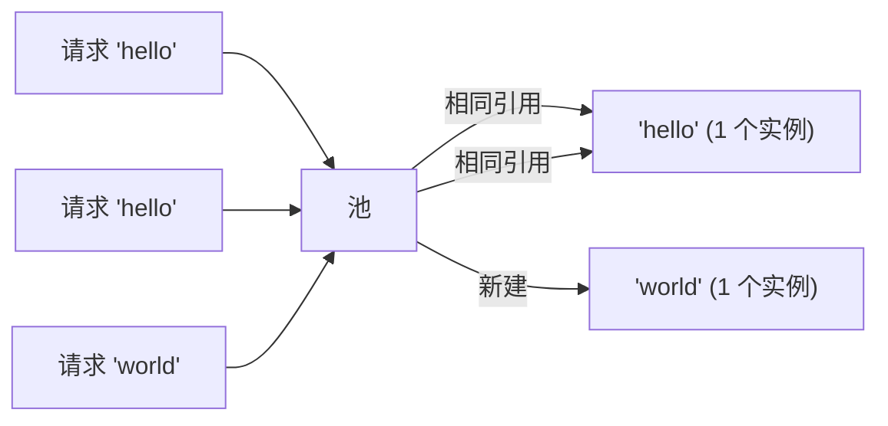

| 属性 | 值 |
|------|------|
| 查找/驻留 | O(1) 摊销 — 哈希表查找 |
| 内存节省 | O(唯一值) 而非 O(总实例数) |
| 相等性检查 | O(1) — 指针比较代替值比较 |
| 权衡 | 池内存 + 查找成本 vs. 逐对象分配成本 |

**动手试试** — 添加字符，观察享元对象如何被共享复用：

<FlyweightViz />

## 生产验证

| 项目 | 源码 | 用途 |
|------|------|------|
| Python (CPython) | [longobject.c#L61-L75](https://github.com/python/cpython/blob/ff64d8de66ab7f8e56b5d410796a7d76c955280c/Objects/longobject.c#L61-L75) | `get_small_int` 返回 -5 到 256 的预缓存整数对象。`a = 42; b = 42; a is b` 为 `True`。 |
| Go 标准库 | [pool.go#L52-L97](https://github.com/golang/go/blob/f5cdf4745455415c7a43cfc7d925214d4511489b/src/sync/pool.go#L52-L97) | `sync.Pool` — 临时对象的享元模式。`Get()` 返回缓存实例，`Put()` 归还复用。广泛用于 `fmt`、`encoding/json`。 |

::: info 说明
Java 的 `String.intern()`、JavaScript 引擎字符串表（V8）和 Rust 的 `&'static str` 都实现了此模式的变体。JVM 自动驻留所有字符串字面量。
:::

## 实现

::: code-group

```typescript [TypeScript]
class Interner<T> {
  private pool = new Map<string, T>();

  intern(key: string, create: () => T): T {
    if (this.pool.has(key)) {
      return this.pool.get(key)!;
    }
    const value = create();
    this.pool.set(key, value);
    return value;
  }

  has(key: string): boolean {
    return this.pool.has(key);
  }

  get size(): number {
    return this.pool.size;
  }
}
```

```rust [Rust]
use std::collections::HashMap;

pub struct Interner {
    pool: HashMap<String, usize>,
    strings: Vec<String>,
}

impl Interner {
    pub fn new() -> Self {
        Interner { pool: HashMap::new(), strings: Vec::new() }
    }

    pub fn intern(&mut self, s: &str) -> usize {
        if let Some(&id) = self.pool.get(s) {
            return id;
        }
        let id = self.strings.len();
        self.strings.push(s.to_string());
        self.pool.insert(s.to_string(), id);
        id
    }

    pub fn resolve(&self, id: usize) -> &str {
        &self.strings[id]
    }
}
```

```go [Go]
type Interner struct {
	pool map[string]int
	data []string
}

func NewInterner() *Interner {
	return &Interner{pool: make(map[string]int)}
}

func (in *Interner) Intern(s string) int {
	if id, ok := in.pool[s]; ok {
		return id
	}
	id := len(in.data)
	in.data = append(in.data, s)
	in.pool[s] = id
	return id
}

func (in *Interner) Resolve(id int) string {
	return in.data[id]
}
```

```python [Python]
import sys

class Interner:
    def __init__(self):
        self._pool: dict[str, object] = {}

    def intern(self, key: str, factory=None):
        if key in self._pool:
            return self._pool[key]
        value = factory() if factory else key
        self._pool[key] = value
        return value

    @property
    def size(self) -> int:
        return len(self._pool)

# Python already interns small integers:
a = 256
b = 256
print(a is b)  # True — same object, flyweight!
print(sys.getrefcount(256))  # many references to the same int
```

:::

## 练习

| 难度 | 练习 | 文件 |
|------|------|------|
| 基础 | 实现字符串驻留器 | `exercises/typescript/flyweight/01-basic.test.ts` |
| 进阶 | 按名称去重的图标注册表 | `exercises/typescript/flyweight/02-intermediate.test.ts` |

运行练习：`pnpm test:ts`（TypeScript）· `cargo test`（Rust）· `go test ./...`（Go）· `pytest`（Python）

练习文件： Rust `exercises/rust/src/flyweight/mod.rs` · Go `exercises/go/flyweight/flyweight_test.go` · Python `exercises/python/flyweight/test_flyweight.py`

## 何时使用

- **重复相同值** — 字符串、颜色、类型标签
- **内存受限环境** — 嵌入式系统、移动端、浏览器标签页
- **编译器/解释器** — 符号表、字符串驻留
- **游戏引擎** — 共享网格、纹理、材质
- **数据库查询结果** — 去重重复的列值

## 何时不用

- **值全部唯一** — 池增加查找开销
- **可变对象** — 享元假设共享对象不可变
- **短生命周期数据** — 快速创建和丢弃的对象，驻留开销超过收益
- **线程安全** — 并发驻留需要同步机制

## 更多生产案例

- [Java String.intern()](https://github.com/openjdk/jdk/blob/4b3ec455c85314d051800a8f46dd8f5c93881e3a/src/java.base/share/classes/java/lang/String.java) — JVM 字符串池去重相同的字符串字面量
- [Python small int cache](https://github.com/python/cpython/blob/ff64d8de66ab7f8e56b5d410796a7d76c955280c/Objects/longobject.c) — CPython 预分配 -5 到 256 的整数
- [Rust string_cache](https://crates.io/crates/string_cache) crate
- [.NET string interning](https://github.com/dotnet/runtime/blob/bee7953796edc09e516e847e3c9006b486ab0f6d/src/libraries/System.Private.CoreLib/src/System/String.cs) — `String.Intern()` 维护 CLR 级别的驻留池
- [Chromium CSS](https://github.com/chromium/chromium/blob/5cffea3f665b7762369a0fa84d2f208875e7225e/third_party/blink/renderer/core/css/) — Blink 渲染引擎中的 CSS 值去重

## 相关模式

| 模式 | 关系 |
|---------|-------------|
| [驻留 / 符号表 (Interning / Symbol Table)](/zh/patterns/interning/) | 驻留是实现享元的机制——去重相同的值 |
| [写时复制 (Copy-on-Write)](/zh/patterns/copy-on-write/) | 两者都共享数据——享元共享不可变对象，CoW 共享直到变更 |
| [LRU 缓存 (LRU Cache)](/zh/patterns/lru-cache/) | LRU 缓存可以存储享元实例，淘汰最少使用的共享对象 |

## 挑战题

::: details Q1: 有人对一个可变对象（比如配置字典）进行了驻留，然后又修改了它。会出什么问题？
**答案：** 所有共享该引用的消费者都会看到这个修改，导致系统中不相关的部分出现不可预测的行为。

Flyweight 的整个前提是共享实例是相同的和可互换的。如果一个调用者修改了共享对象，所有其他调用者都会无声地获取到修改后的值。这就是为什么驻留/Flyweight 对象必须是不可变的。如果你需要修改，使用写时复制或不要驻留。
:::

::: details Q2: Python 将 -5 到 256 的整数缓存为 Flyweight。为什么不缓存所有整数？
**答案：** 因为预分配所有可能整数的内存开销远超共享带来的节省。缓存只在频繁出现的值上才有回报。

-5 到 256 的范围是经验选择的——涵盖了循环计数器、数组索引、布尔类值和常见常量。缓存 `1_000_000` 会浪费内存，因为大多数大整数只出现一次。Flyweight 模式只在重复项常见时才能节省内存。
:::

::: details Q3: 你为编译器构建了一个字符串驻留器。处理 10,000 个源文件后，驻留器持有 200 万个字符串并使用了 500MB。出了什么问题？
**答案：** 驻留器从不淘汰条目，因此它积累了所有曾经见过的字符串——包括那些一次性的标识符和再也不会被引用的字符串字面量。

生产级驻留器需要一个作用域策略：要么按编译单元清除，要么使用弱引用以便未引用的字符串被回收，要么只对标识符（频繁重复）进行驻留而跳过任意字符串字面量。无限增长是 Flyweight 的经典陷阱。
:::

::: details Q4: 两个线程同时调用 `intern("hello")`，且都发现池中没有该条目。会出什么问题？
**答案：** 两个线程各自创建一个新实例并插入，导致同一个键对应两个不同的对象——破坏了"相同值相同引用"的保证。

没有同步机制时，你会遇到竞态：线程 A 检查池，没找到，创建对象；线程 B 在 A 插入之前做了同样的事。现在不同线程上的消费者持有 `"hello"` 的不同引用，身份比较（`===` / `is`）失效。修复方法是在检查和插入操作周围加锁，或使用支持 `putIfAbsent` 语义的并发 map。
:::


================================================
FILE: docs/zh/patterns/free-list/index.md
================================================
[Binary file]


================================================
FILE: docs/zh/patterns/interning/index.md
================================================
---
title: "模式：驻留 / 符号表 (Interning / Symbol Table)"
description: "通过规范化查找表去重不可变值——用 O(1) 的指针比较替代 O(n) 的内容比较。"
difficulty: "intermediate"
---

# 模式：驻留 / 符号表 (Interning / Symbol Table)

<DifficultyBadge />

## 一句话

通过规范化查找表去重不可变值——用 O(1) 的指针比较替代 O(n) 的内容比较。

<DemoBadge />

## 现实类比

邮局只存储一份每个邮编的副本，给所有人一个引用。不是每封信都带一份「94105」，它们都指向同一个共享条目。

## 核心思想

驻留将每个唯一值在表中只存储一次，并分发轻量级标识符（符号、ID 或驻留指针）指向规范副本。结构上相等的两个值获得相同的标识符，因此相等性检查变成 O(1) 的指针/整数比较，而不是 O(n) 的内容比较。这用前期去重成本换取重复相等性检查的巨大节省。

```text
  intern("hello") → 0     intern("world") → 1     intern("hello") → 0
                                                     (reuse!)

  ┌───────────────────────┐
  │    Symbol Table       │
  ├────┬──────────────────┤
  │ ID │  Value           │
  ├────┼──────────────────┤
  │  0 │  "hello"         │
  │  1 │  "world"         │
  │  2 │  "foo"           │
  └────┴──────────────────┘

  Equality: symbol_a == symbol_b  (integer comparison, O(1))
  Instead of: strcmp(str_a, str_b) (character scan, O(n))
```

| 属性 | 值 |
|------|------|
| intern() | 首次 O(n)（哈希 + 存储），命中时 O(1) 均摊 |
| 相等性 | O(1) — 整数/指针比较 |
| 内存 | 去重——每个唯一值只存储一次 |
| 权衡 | 驻留表单调增长（值永不释放） |

**动手试试** — 驻留字符串，观察重复值如何解析为同一 ID：

<InterningViz />

## 生产验证

| 项目 | 源码 | 用途 |
|------|------|------|
| Rust 编译器 (rustc) | [symbol.rs#L24-L79](https://github.com/rust-lang/rust/blob/ab26b175979ee7b2cb3302dce204b99df96f7efb/compiler/rustc_span/src/symbol.rs#L24-L79) | `Symbol`（L24）是 `u32` 的 newtype——全局驻留表的索引。`Interner`（L56-L79）在 `Vec` 中存储字符串，通过 `HashMap` 去重。Rust 编译器中的所有标识符都是 `Symbol`——相等性是一次 `u32` 比较。 |
| CPython | [unicodeobject.c#L14416-L14472](https://github.com/python/cpython/blob/ff64d8de66ab7f8e56b5d410796a7d76c955280c/Objects/unicodeobject.c#L14416-L14472) | `PyUnicode_InternInPlace`（L14416）通过将 Python 字符串存储在全局 dict 中来驻留。如果字符串已存在，返回现有对象并递减新对象的引用计数。所有标识符字符串（变量名、属性名）自动驻留以实现 O(1) 的 dict 查找。 |

## 实现

::: code-group

```typescript [TypeScript]
class StringInterner {
  private strToId = new Map<string, number>();
  private idToStr: string[] = [];

  intern(s: string): number {
    const existing = this.strToId.get(s);
    if (existing !== undefined) return existing;
    const id = this.idToStr.length;
    this.strToId.set(s, id);
    this.idToStr.push(s);
    return id;
  }

  resolve(id: number): string | undefined {
    return this.idToStr[id];
  }

  get size(): number {
    return this.idToStr.length;
  }
}
```

```rust [Rust]
use std::collections::HashMap;

pub struct Interner {
    str_to_id: HashMap<String, u32>,
    id_to_str: Vec<String>,
}

impl Interner {
    pub fn new() -> Self {
        Interner { str_to_id: HashMap::new(), id_to_str: Vec::new() }
    }

    pub fn intern(&mut self, s: &str) -> u32 {
        if let Some(&id) = self.str_to_id.get(s) {
            return id;
        }
        let id = self.id_to_str.len() as u32;
        self.str_to_id.insert(s.to_string(), id);
        self.id_to_str.push(s.to_string());
        id
    }

    pub fn resolve(&self, id: u32) -> Option<&str> {
        self.id_to_str.get(id as usize).map(|s| s.as_str())
    }
}
```

```go [Go]
type Interner struct {
	strToID map[string]int
	idToStr []string
}

func NewInterner() *Interner {
	return &Interner{strToID: make(map[string]int)}
}

func (it *Interner) Intern(s string) int {
	if id, ok := it.strToID[s]; ok {
		return id
	}
	id := len(it.idToStr)
	it.strToID[s] = id
	it.idToStr = append(it.idToStr, s)
	return id
}

func (it *Interner) Resolve(id int) (string, bool) {
	if id < 0 || id >= len(it.idToStr) {
		return "", false
	}
	return it.idToStr[id], true
}
```

```python [Python]
class StringInterner:
    def __init__(self):
        self._str_to_id: dict[str, int] = {}
        self._id_to_str: list[str] = []

    def intern(self, s: str) -> int:
        if s in self._str_to_id:
            return self._str_to_id[s]
        sym_id = len(self._id_to_str)
        self._str_to_id[s] = sym_id
        self._id_to_str.append(s)
        return sym_id

    def resolve(self, sym_id: int) -> str | None:
        if 0 <= sym_id < len(self._id_to_str):
            return self._id_to_str[sym_id]
        return None
```

:::

## 练习

| 难度 | 练习 | 文件 |
|------|------|------|
| 基础 | 实现带 intern/resolve 的字符串驻留器 | `exercises/typescript/interning/01-basic.test.ts` |
| 进阶 | 带结构相等性的类型驻留器 | `exercises/typescript/interning/02-intermediate.test.ts` |

运行练习：`pnpm test:ts`（TypeScript）· `cargo test`（Rust）· `go test ./...`（Go）· `pytest`（Python）

练习文件： Rust `exercises/rust/src/interning/mod.rs` · Go `exercises/go/interning/interning_test.go` · Python `exercises/python/interning/test_interning.py`

## 何时使用

- **编译器和解释器** — 驻留标识符、关键字和类型描述符以实现快速相等性检查
- **数据库查询引擎** — 驻留列名、表名以加速查询规划中的比较
- **序列化** — 驻留 JSON/XML 中重复的字段名以减少内存
- **游戏引擎** — 驻留资源名称、材质 ID、动画状态
- **字符串密集型工作负载** — 任何需要比较相同字符串数百万次的系统

## 何时不用

- **短生命周期字符串** — 如果字符串被快速创建和丢弃，驻留开销大于收益
- **大多数字符串唯一** — 如果很少有重复字符串，驻留表浪费内存而不节省比较
- **有清理需求的内存受限场景** — 经典驻留表单调增长；如果需要清理，考虑弱引用

## 更多生产案例

- [Java String.intern()](https://github.com/openjdk/jdk) — JVM 级别的字符串池驻留
- [V8 Internalized Strings](https://chromium.googlesource.com/v8/v8/+/refs/heads/main/src/objects/string.h) — V8 驻留用作属性名的字符串以实现 O(1) 属性查找
- [Ruby Symbol](https://github.com/ruby/ruby) — `Symbol` 是永不被垃圾回收的驻留字符串
- [LLVM StringPool](https://github.com/llvm/llvm-project) — 编译器管线中标识符的驻留字符串

## 相关模式

| 模式 | 关系 |
|---------|-------------|
| [享元 / 驻留 (Flyweight / Interning)](/zh/patterns/flyweight/) | 驻留是享元背后的机制——去重相同的不可变值 |
| [LRU 缓存 (LRU Cache)](/zh/patterns/lru-cache/) | 驻留表可以使用 LRU 淘汰来限制内存使用 |
| [布隆过滤器 (Bloom Filter)](/zh/patterns/bloom-filter/) | 布隆过滤器可以在昂贵的驻留表查找前做预检查 |

## 挑战题

::: details Q1: 你的编译器驻留了 100,000 个标识符。与存储原始字符串相比，驻留如何影响内存？
**答案：** 每个唯一字符串在驻留表中只存储一次。每个引用是一个 `u32`（4 字节），而不是指针 + 长度 + 堆分配（在 64 位系统上通常每个字符串 24+ 字节）。

如果平均标识符是 12 个字符且有 5 倍重复，原始存储成本 100,000 * (24 + 12) = 3.6MB。使用驻留，你存储 20,000 个唯一字符串（720KB）+ 100,000 个 ID 各 4 字节（400KB）= 1.12MB。内存减少约 3 倍，外加 O(1) 的相等性检查。
:::

::: details Q2: Ruby Symbol 被驻留且永不被垃圾回收。有什么安全风险？
**答案：** 攻击者可以通过生成无限的唯一 Symbol（例如通过 `to_sym` 将用户输入转换为 Symbol）来耗尽服务器内存。由于 Symbol 永不被 GC，每个唯一输入都会永久占用内存。

Symbol 表耗尽是 Ruby 中已知的攻击向量（相关漏洞包括 JSON gem 中的 CVE-2013-0269）。修复方法：永远不要驻留用户控制的输入。对外部数据使用字符串，仅对已知常量使用 Symbol。Ruby 2.2+ 引入了"可回收 Symbol"——动态创建的 Symbol（包括通过 `to_sym`）现在可以被垃圾回收。只有源码中直接出现的字面量 Symbol 仍是不可回收的。
:::

::: details Q3: 为什么 Rust 编译器使用 u32 而不是 u64 或 usize 作为 Symbol？
**答案：** u32 将编译器限制在约 40 亿个唯一 Symbol，对任何真实程序都绰绰有余。好处是每个 `Symbol` 只有 4 字节——在 64 位系统上是 `u64` 的一半。

由于 Symbol 出现在编译器数据结构的各处（AST 节点、类型、作用域），将其大小减半能带来有意义的缓存效率提升。这是刻意的空间-时间权衡：编译器性能受内存带宽限制，更小的数据 = 更少的缓存未命中。
:::

::: details Q4: 你的多线程应用使用互斥锁保护的全局字符串驻留器。性能分析显示驻留锁是最大的竞争热点。如何在不放弃驻留的前提下降低竞争？
**答案：** 热路径使用线程局部（thread-local）驻留器，仅在需要跨线程比较时才合并到全局表。

单一全局驻留器在多线程并发驻留时会成为序列化瓶颈。解决方案是分片或线程局部驻留：每个线程维护自己的驻留器，实现快速、无锁的驻留。不同线程局部驻留器的符号不能直接比较，所以跨线程比较需要合并步骤或两级方案（本地 ID + 线程 ID）。Rust 编译器使用每个会话的作用域驻留器，一些 JVM 使用带条带锁的并发哈希表来降低竞争。关键洞察是大多数相等性检查都是线程局部的（在单个编译单元或查询内），因此为每次驻留付出全局同步的代价是浪费的。
:::


================================================
FILE: docs/zh/patterns/iterator/index.md
================================================
[Binary file]


================================================
FILE: docs/zh/patterns/logical-clock/index.md
================================================
[Binary file]


================================================
FILE: docs/zh/patterns/lru-cache/index.md
================================================
---
title: "模式：LRU 缓存 (LRU Cache)"
description: "缓存满时淘汰最近最少使用的条目——用哈希表加双向链表实现 O(1) 的 get 和 put。"
difficulty: "intermediate"
---

# 模式：LRU 缓存 (LRU Cache)

<DifficultyBadge />

## 一句话

缓存满时淘汰最近最少使用的条目——用哈希表加双向链表实现 O(1) 的 get 和 put。

<DemoBadge />

## 现实类比

一张空间有限的办公桌。你把最近用过的书放在桌上。需要腾地方放新书时，把最久没碰过的那本放回书架。

## 核心思想

LRU 缓存将哈希表（O(1) 键查找）与双向链表（O(1) 访问顺序跟踪）结合。每次访问时，条目移到前端。缓存超出容量时，最后面（最近最少使用）的条目被淘汰。

```text
  最近访问                                    最久未访问
  ┌─────┐    ┌─────┐    ┌─────┐    ┌─────┐    ┌─────┐
  │  E  │◄──►│  D  │◄──►│  C  │◄──►│  B  │◄──►│  A  │  ← 淘汰这个
  └─────┘    └─────┘    └─────┘    └─────┘    └─────┘

  get("B") → 移动 B 到前端:
  ┌─────┐    ┌─────┐    ┌─────┐    ┌─────┐    ┌─────┐
  │  B  │◄──►│  E  │◄──►│  D  │◄──►│  C  │◄──►│  A  │
  └─────┘    └─────┘    └─────┘    └─────┘    └─────┘
```

| 属性 | 值 |
|------|------|
| get | O(1) — 哈希查找 + 移到前端 |
| put | O(1) — 哈希插入 + 超容量淘汰 |
| 淘汰策略 | 最近最少使用（链表尾部） |
| 空间 | O(capacity) |

**动手试试** — 执行 put 和 get 操作，观察 LRU 淘汰机制如何工作：

<LRUCacheViz />

## 生产验证

| 项目 | 源码 | 用途 |
|------|------|------|
| Go groupcache | [lru.go#L23-L104](https://github.com/golang/groupcache/blob/2c02b8208cf8c02a3e358cb1d9b60950647543fc/lru/lru.go#L23-L104) | `Cache` 结构体（L23-L34），含双向链表 + 哈希表。`Add`（L56-L71）插入/更新并移到前端；`Get`（L74-L83）命中时移到前端；`RemoveOldest`（L96-L104）从尾部淘汰。作者 Brad Fitzpatrick（memcached 创造者）。 |
| Redis | [evict.c#L55-L83](https://github.com/redis/redis/blob/df63a65d4d4ee33ae67e9f101885074febe0bccb/src/evict.c#L55-L83) | 近似 LRU——缩减位宽的 LRU 时钟和带绕回处理的空闲时间估算。`evictionPoolPopulate`（L134-L225）采样 N 个键插入排序淘汰池。工程权衡：以放弃精确 LRU 为代价，换取规模化下的 O(1) 内存开销。 |

## 实现

::: code-group

```typescript [TypeScript]
class LRUCache<K, V> {
  private map = new Map<K, V>();

  constructor(private capacity: number) {}

  get(key: K): V | undefined {
    if (!this.map.has(key)) return undefined;
    const value = this.map.get(key)!;
    this.map.delete(key);
    this.map.set(key, value);
    return value;
  }

  put(key: K, value: V): void {
    if (this.map.has(key)) this.map.delete(key);
    this.map.set(key, value);
    if (this.map.size > this.capacity) {
      const oldest = this.map.keys().next().value!;
      this.map.delete(oldest);
    }
  }
}
```

```rust [Rust]
use std::collections::HashMap;

pub struct LRUCache {
    capacity: usize,
    order: Vec<String>,
    map: HashMap<String, String>,
}

impl LRUCache {
    pub fn new(capacity: usize) -> Self {
        LRUCache { capacity, order: Vec::new(), map: HashMap::new() }
    }

    pub fn get(&mut self, key: &str) -> Option<&str> {
        if !self.map.contains_key(key) { return None; }
        self.order.retain(|k| k != key);
        self.order.push(key.to_string());
        self.map.get(key).map(|v| v.as_str())
    }

    pub fn put(&mut self, key: &str, value: &str) {
        self.order.retain(|k| k != key);
        self.order.push(key.to_string());
        self.map.insert(key.to_string(), value.to_string());
        if self.map.len() > self.capacity {
            if let Some(oldest) = self.order.first().cloned() {
                self.order.remove(0);
                self.map.remove(&oldest);
            }
        }
    }
}
```

```go [Go]
type entry struct {
	key   string
	value any
}

type LRUCache struct {
	capacity int
	ll       *list.List
	cache    map[string]*list.Element
}

func NewLRUCache(capacity int) *LRUCache {
	return &LRUCache{capacity: capacity, ll: list.New(), cache: make(map[string]*list.Element)}
}

func (c *LRUCache) Get(key string) (any, bool) {
	if ele, ok := c.cache[key]; ok {
		c.ll.MoveToFront(ele)
		return ele.Value.(*entry).value, true
	}
	return nil, false
}

func (c *LRUCache) Put(key string, value any) {
	if ele, ok := c.cache[key]; ok {
		c.ll.MoveToFront(ele)
		ele.Value.(*entry).value = value
		return
	}
	ele := c.ll.PushFront(&entry{key, value})
	c.cache[key] = ele
	if c.ll.Len() > c.capacity {
		oldest := c.ll.Back()
		c.ll.Remove(oldest)
		delete(c.cache, oldest.Value.(*entry).key)
	}
}
```

```python [Python]
from collections import OrderedDict

class LRUCache:
    def __init__(self, capacity: int):
        self.capacity = capacity
        self.cache: OrderedDict[str, object] = OrderedDict()

    def get(self, key: str):
        if key not in self.cache:
            return None
        self.cache.move_to_end(key)
        return self.cache[key]

    def put(self, key: str, value: object) -> None:
        if key in self.cache:
            self.cache.move_to_end(key)
        self.cache[key] = value
        if len(self.cache) > self.capacity:
            self.cache.popitem(last=False)
```

:::

## 练习

| 难度 | 练习 | 文件 |
|------|------|------|
| 基础 | 实现带 get/put 和淘汰的 LRU 缓存 | `exercises/typescript/lru-cache/01-basic.test.ts` |
| 进阶 | 带 TTL 过期的 LRU 缓存 | `exercises/typescript/lru-cache/02-intermediate.test.ts` |

运行练习：`pnpm test:ts`（TypeScript）· `cargo test`（Rust）· `go test ./...`（Go）· `pytest`（Python）

练习文件： Rust `exercises/rust/src/lru_cache/mod.rs` · Go `exercises/go/lru_cache/lru_cache_test.go` · Python `exercises/python/lru_cache/test_lru_cache.py`

## 何时使用

- **数据库查询缓存** — 缓存热查询，淘汰冷查询
- **DNS 解析** — 缓存最近的查找结果
- **Web 浏览器** — 有界内存的页面/资源缓存
- **API 响应缓存** — 保持频繁请求的响应温热
- **操作系统** — 页面缓存、dentry 缓存、inode 缓存

## 何时不用

- **抗扫描工作负载** — 全表扫描会淘汰所有有用条目（用 LRU-K 或 ARC 替代）
- **需要基于时间过期** — LRU 按访问时间淘汰，不是按年龄（需单独加 TTL 层）
- **频率更重要** — 如果突发的唯一请求淘汰了热门条目，用 LFU
- **可以无限增长** — 如果内存不受限，简单哈希表更简单

## 更多生产案例

- [Redis](https://github.com/redis/redis) — `maxmemory-policy allkeys-lru` LRU 淘汰
- [Guava Cache](https://github.com/google/guava) — `CacheBuilder.maximumSize()` LRU 淘汰
- [Python functools](https://github.com/python/cpython) — `@lru_cache` 装饰器
- [Caffeine](https://github.com/ben-manes/caffeine) — 高性能 Java 缓存（Window TinyLfu）

## 相关模式

| 模式 | 关系 |
|---------|-------------|
| [空闲链表 (Free List)](/zh/patterns/free-list/) | LRU 淘汰释放节点；空闲链表回收它们而无需调用分配器 |
| [享元 / 驻留 (Flyweight / Interning)](/zh/patterns/flyweight/) | 两者都减少内存——LRU 限制缓存大小，享元共享相同对象 |
| [一致性哈希 (Consistent Hashing)](/zh/patterns/consistent-hashing/) | 分布式缓存使用一致性哈希将键路由到正确的 LRU 实例 |
| [墓碑 / 延迟删除 (Tombstone)](/zh/patterns/tombstone/) | 墓碑在分布式 LRU 缓存中标记已删除的条目 |
| [布隆过滤器 (Bloom Filter)](/zh/patterns/bloom-filter/) | 布隆过滤器在昂贵的 LRU 缓存查找前做预检查以避免缓存未命中 |
| [驻留 / 符号表 (Interning)](/zh/patterns/interning/) | 驻留表可以使用 LRU 淘汰来限制内存使用 |

## 挑战题

::: details Q1: 容量为 3 的 LRU 缓存。操作：put(A), put(B), put(C), put(D), get(B)。缓存中有什么？
**答案：** `{B, D, C}`

put(A,B,C) 后缓存满了。put(D) 淘汰 A（最近最少使用）。现在是 `{D, C, B}`。get(B) 将 B 移到最前。最终从最近到最久的顺序：`B, D, C`。

关键洞察：`get()` 也算作"使用"——它将条目移到最前，而不仅仅是返回它。
:::

::: details Q2: 你的 Web 服务器使用 LRU 缓存存储 API 响应。一个爬虫访问了每个页面一次。会发生什么？
**答案：** 爬虫会淘汰你所有的热缓存条目。

每个被爬取的页面只访问一次，推到前面，并淘汰一个频繁使用的页面。爬取结束后，你的缓存里全是没人会再请求的页面。这就是**抗扫描性**问题——LRU 容易受到顺序扫描的影响。解决方案：LRU-K（只有访问次数 < K 次才淘汰）、ARC（自适应）或双层缓存。
:::

::: details Q3: 为什么 Redis 使用"近似 LRU"而不是精确 LRU？
**答案：** 精确 LRU 需要每个键维护一个双向链表——在 64 位系统上仅排序就需要 2 个指针（每键 16 字节）。数百万个键时，这是很大的开销。

Redis 改为每个键存储一个 24 位 LRU 时钟（3 字节），在需要淘汰时随机采样 N 个键，淘汰时钟最旧的那个。这用完美的淘汰顺序换取每键 O(1) 的内存开销。实际中，采样 10 个键的结果与精确 LRU 非常接近。
:::

::: details Q4: 你能在 O(1) 时间内构建一个不用双向链表的 LRU 缓存吗？
**答案：** 可以——使用有序哈希表的语言。在 JavaScript 中，`Map` 保持插入顺序。在访问时先删除再重新插入即可移到"最近使用"位置。这正是上面 TypeScript 实现的做法。

在没有有序 map 的语言（C、Go）中，你需要经典的哈希表 + 双向链表方法。Go 的 `groupcache` 使用 `container/list` 来实现这一点。
:::


================================================
FILE: docs/zh/patterns/lsm-tree/index.md
================================================
---
title: "模式：LSM 树 (Log-Structured Merge Tree)"
description: "将写入缓冲在内存中，刷写到磁盘的有序文件，后台合并文件——用读放大换取快速写入。"
difficulty: "advanced"
---

# 模式：LSM 树 (Log-Structured Merge Tree)

<DifficultyBadge />

## 一句话

将写入缓冲在内存中，刷写到磁盘的有序文件，后台合并文件——用读放大换取快速写入。

<DemoBadge />

## 现实类比

一套归档系统：先把笔记写在便签纸上（memtable），定期整理到排好序的文件夹里（SSTable）。隔一段时间，在空闲时把小文件夹合并成大的（compaction）。

## 核心思想

LSM 树将写入吸收到内存中的有序结构（memtable）中。当 memtable 达到大小阈值时，被刷写到磁盘作为不可变的有序段（SSTable）。后台 compaction 合并多个有序段以限制文件数量并回收已删除/覆盖的键的空间。读取先检查 memtable，然后检查每个层级的有序段。

```text
  Write Path                          Read Path
  ──────────                          ─────────
  PUT k=v ──►  ┌────────────┐         GET k
               │  Memtable  │ ◄──── 1. Check memtable
               │ (sorted,   │
               │  in-memory)│
               └─────┬──────┘
          flush when  │
          size > limit│
                      ▼
               ┌────────────┐
               │  Level 0   │ ◄──── 2. Check L0 files
               │  (SSTables)│
               └─────┬──────┘
          compact     │
          when full   │
                      ▼
               ┌────────────┐
               │  Level 1   │ ◄──── 3. Check L1 files
               │  (merged)  │
               └─────┬──────┘
                      ▼
                     ...
```

| 属性 | 值 |
|------|------|
| 写放大 | 由于 compaction 为 O(level_count) |
| 读放大 | 最坏情况 O(level_count) |
| 写入吞吐 | 非常高——仅顺序 I/O |
| 空间放大 | compaction 期间临时数据重复 |

**动手试试** — 写入键到 memtable，观察刷写到 SSTable，并进行层级压缩：

<LSMTreeViz />

## 生产验证

| 项目 | 源码 | 用途 |
|------|------|------|
| LevelDB | [db_impl.cc#L1241-L1368](https://github.com/google/leveldb/blob/7ee830d02b623e8ffe0b95d59a74db1e58da04c5/db/db_impl.cc#L1241-L1368) | `DBImpl::Write` — 核心写入路径。将写入批量分组（L1241-L1288），追加到 WAL（L1311），插入 memtable（L1337-L1354）。当 memtable 超过 `write_buffer_size` 时，`MakeRoomForWrite`（L1368）触发刷写：当前 memtable 变为不可变并创建新的。后台 compaction 然后跨层级合并 SSTable 文件。 |
| RocksDB | [memtable.cc#L458-L534](https://github.com/facebook/rocksdb/blob/7affaee1c49ebc80cb213ad86fe7d2a3ad447da2/db/memtable.cc#L458-L534) | `MemTable::Add` 将带有序列号和类型的键值对插入基于跳表的 memtable。memtable 是所有写入的第一个目的地。当达到 `write_buffer_size` 时变为不可变并安排刷写到 L0 SST 文件。RocksDB 扩展了 LevelDB 的设计，支持并发 memtable 写入、column family 和可插拔的 memtable 实现。 |

## 实现

::: code-group

```typescript [TypeScript]
interface KVEntry {
  key: string;
  value: string | null; // null = tombstone (deleted)
  seq: number;
}

class Memtable {
  private entries: Map<string, KVEntry> = new Map();
  private _size = 0;

  put(key: string, value: string, seq: number): void {
    this.entries.set(key, { key, value, seq });
    this._size++;
  }

  delete(key: string, seq: number): void {
    this.entries.set(key, { key, value: null, seq });
    this._size++;
  }

  get(key: string): KVEntry | undefined {
    return this.entries.get(key);
  }

  get size(): number { return this._size; }

  flush(): KVEntry[] {
    const sorted = [...this.entries.values()].sort((a, b) => a.key.localeCompare(b.key));
    this.entries.clear();
    this._size = 0;
    return sorted;
  }
}

type SortedRun = KVEntry[];

class LSMTree {
  private memtable = new Memtable();
  private runs: SortedRun[] = []; // L0 sorted runs, newest first
  private seq = 0;
  private readonly flushThreshold: number;
  private readonly maxRuns: number;

  constructor(flushThreshold = 4, maxRuns = 4) {
    this.flushThreshold = flushThreshold;
    this.maxRuns = maxRuns;
  }

  put(key: string, value: string): void {
    this.memtable.put(key, value, this.seq++);
    if (this.memtable.size >= this.flushThreshold) {
      this.flushMemtable();
    }
  }

  delete(key: string): void {
    this.memtable.delete(key, this.seq++);
    if (this.memtable.size >= this.flushThreshold) {
      this.flushMemtable();
    }
  }

  get(key: string): string | undefined {
    // Check memtable first
    const memEntry = this.memtable.get(key);
    if (memEntry) return memEntry.value ?? undefined;

    // Check sorted runs (newest first)
    for (const run of this.runs) {
      const entry = this.binarySearch(run, key);
      if (entry) return entry.value ?? undefined;
    }
    return undefined;
  }

  private binarySearch(run: SortedRun, key: string): KVEntry | undefined {
    let lo = 0, hi = run.length - 1;
    while (lo <= hi) {
      const mid = (lo + hi) >> 1;
      const cmp = run[mid]!.key.localeCompare(key);
      if (cmp === 0) return run[mid];
      if (cmp < 0) lo = mid + 1;
      else hi = mid - 1;
    }
    return undefined;
  }

  private flushMemtable(): void {
    const run = this.memtable.flush();
    this.runs.unshift(run); // newest first
    if (this.runs.length > this.maxRuns) {
      this.compact();
    }
  }

  private compact(): void {
    // Merge all runs into one
    const merged = new Map<string, KVEntry>();
    // Process oldest first so newest wins
    for (let i = this.runs.length - 1; i >= 0; i--) {
      for (const entry of this.runs[i]!) {
        merged.set(entry.key, entry);
      }
    }
    // Remove tombstones and sort
    const compacted = [...merged.values()]
      .filter((e) => e.value !== null)
      .sort((a, b) => a.key.localeCompare(b.key));
    this.runs = compacted.length > 0 ? [compacted] : [];
  }

  get runCount(): number { return this.runs.length; }
}
```

```rust [Rust]
use std::collections::BTreeMap;

#[derive(Clone, Debug)]
pub struct KVEntry {
    pub key: String,
    pub value: Option<String>, // None = tombstone
    pub seq: usize,
}

pub struct Memtable {
    entries: BTreeMap<String, KVEntry>,
    size: usize,
}

impl Memtable {
    pub fn new() -> Self {
        Memtable { entries: BTreeMap::new(), size: 0 }
    }

    pub fn put(&mut self, key: &str, value: &str, seq: usize) {
        self.entries.insert(key.to_string(), KVEntry {
            key: key.to_string(), value: Some(value.to_string()), seq,
        });
        self.size += 1;
    }

    pub fn delete(&mut self, key: &str, seq: usize) {
        self.entries.insert(key.to_string(), KVEntry {
            key: key.to_string(), value: None, seq,
        });
        self.size += 1;
    }

    pub fn get(&self, key: &str) -> Option<&KVEntry> {
        self.entries.get(key)
    }

    pub fn size(&self) -> usize { self.size }

    pub fn flush(&mut self) -> Vec<KVEntry> {
        let result: Vec<KVEntry> = self.entries.values().cloned().collect();
        self.entries.clear();
        self.size = 0;
        result
    }
}

pub struct LSMTree {
    memtable: Memtable,
    runs: Vec<Vec<KVEntry>>,
    seq: usize,
    flush_threshold: usize,
    max_runs: usize,
}

impl LSMTree {
    pub fn new(flush_threshold: usize, max_runs: usize) -> Self {
        LSMTree {
            memtable: Memtable::new(),
            runs: Vec::new(),
            seq: 0,
            flush_threshold,
            max_runs,
        }
    }

    pub fn put(&mut self, key: &str, value: &str) {
        self.memtable.put(key, value, self.seq);
        self.seq += 1;
        if self.memtable.size() >= self.flush_threshold {
            self.flush_memtable();
        }
    }

    pub fn delete(&mut self, key: &str) {
        self.memtable.delete(key, self.seq);
        self.seq += 1;
        if self.memtable.size() >= self.flush_threshold {
            self.flush_memtable();
        }
    }

    pub fn get(&self, key: &str) -> Option<&str> {
        if let Some(entry) = self.memtable.get(key) {
            return entry.value.as_deref();
        }
        for run in &self.runs {
            if let Ok(idx) = run.binary_search_by(|e| e.key.as_str().cmp(key)) {
                return run[idx].value.as_deref();
            }
        }
        None
    }

    fn flush_memtable(&mut self) {
        let run = self.memtable.flush();
        self.runs.insert(0, run);
        if self.runs.len() > self.max_runs {
            self.compact();
        }
    }

    fn compact(&mut self) {
        let mut merged = BTreeMap::new();
        for run in self.runs.iter().rev() {
            for entry in run {
                merged.insert(entry.key.clone(), entry.clone());
            }
        }
        let result: Vec<KVEntry> = merged.into_values()
            .filter(|e| e.value.is_some())
            .collect();
        self.runs = if result.is_empty() { vec![] } else { vec![result] };
    }

    pub fn run_count(&self) -> usize { self.runs.len() }
}
```

```go [Go]
package lsm

import "sort"

type KVEntry struct {
	Key   string
	Value *string // nil = tombstone
	Seq   int
}

type Memtable struct {
	entries map[string]KVEntry
	size    int
}

func NewMemtable() *Memtable {
	return &Memtable{entries: make(map[string]KVEntry)}
}

func (m *Memtable) Put(key, value string, seq int) {
	m.entries[key] = KVEntry{Key: key, Value: &value, Seq: seq}
	m.size++
}

func (m *Memtable) Delete(key string, seq int) {
	m.entries[key] = KVEntry{Key: key, Value: nil, Seq: seq}
	m.size++
}

func (m *Memtable) Get(key string) (KVEntry, bool) {
	e, ok := m.entries[key]
	return e, ok
}

func (m *Memtable) Flush() []KVEntry {
	result := make([]KVEntry, 0, len(m.entries))
	for _, e := range m.entries {
		result = append(result, e)
	}
	sort.Slice(result, func(i, j int) bool {
		return result[i].Key < result[j].Key
	})
	m.entries = make(map[string]KVEntry)
	m.size = 0
	return result
}

type LSMTree struct {
	memtable       *Memtable
	runs           [][]KVEntry
	seq            int
	flushThreshold int
	maxRuns        int
}

func NewLSMTree(flushThreshold, maxRuns int) *LSMTree {
	return &LSMTree{
		memtable:       NewMemtable(),
		flushThreshold: flushThreshold,
		maxRuns:        maxRuns,
	}
}

func (t *LSMTree) Put(key, value string) {
	t.memtable.Put(key, value, t.seq)
	t.seq++
	if t.memtable.size >= t.flushThreshold {
		t.flushMemtable()
	}
}

func (t *LSMTree) Delete(key string) {
	t.memtable.Delete(key, t.seq)
	t.seq++
	if t.memtable.size >= t.flushThreshold {
		t.flushMemtable()
	}
}

func (t *LSMTree) Get(key string) (string, bool) {
	if e, ok := t.memtable.Get(key); ok {
		if e.Value == nil {
			return "", false
		}
		return *e.Value, true
	}
	for _, run := range t.runs {
		if e := binarySearch(run, key); e != nil {
			if e.Value == nil {
				return "", false
			}
			return *e.Value, true
		}
	}
	return "", false
}

func binarySearch(run []KVEntry, key string) *KVEntry {
	lo, hi := 0, len(run)-1
	for lo <= hi {
		mid := (lo + hi) / 2
		if run[mid].Key == key {
			return &run[mid]
		}
		if run[mid].Key < key {
			lo = mid + 1
		} else {
			hi = mid - 1
		}
	}
	return nil
}

func (t *LSMTree) flushMemtable() {
	run := t.memtable.Flush()
	t.runs = append([][]KVEntry{run}, t.runs...)
	if len(t.runs) > t.maxRuns {
		t.compact()
	}
}

func (t *LSMTree) compact() {
	merged := make(map[string]KVEntry)
	for i := len(t.runs) - 1; i >= 0; i-- {
		for _, e := range t.runs[i] {
			merged[e.Key] = e
		}
	}
	result := make([]KVEntry, 0)
	for _, e := range merged {
		if e.Value != nil {
			result = append(result, e)
		}
	}
	sort.Slice(result, func(i, j int) bool {
		return result[i].Key < result[j].Key
	})
	if len(result) > 0 {
		t.runs = [][]KVEntry{result}
	} else {
		t.runs = nil
	}
}

func (t *LSMTree) RunCount() int {
	return len(t.runs)
}
```

```python [Python]
from dataclasses import dataclass, field
from bisect import bisect_left

@dataclass
class KVEntry:
    key: str
    value: str | None  # None = tombstone
    seq: int = 0

class Memtable:
    def __init__(self):
        self._entries: dict[str, KVEntry] = {}
        self._size = 0

    def put(self, key: str, value: str, seq: int) -> None:
        self._entries[key] = KVEntry(key=key, value=value, seq=seq)
        self._size += 1

    def delete(self, key: str, seq: int) -> None:
        self._entries[key] = KVEntry(key=key, value=None, seq=seq)
        self._size += 1

    def get(self, key: str) -> KVEntry | None:
        return self._entries.get(key)

    @property
    def size(self) -> int:
        return self._size

    def flush(self) -> list[KVEntry]:
        result = sorted(self._entries.values(), key=lambda e: e.key)
        self._entries.clear()
        self._size = 0
        return result

class LSMTree:
    def __init__(self, flush_threshold: int = 4, max_runs: int = 4):
        self._memtable = Memtable()
        self._runs: list[list[KVEntry]] = []
        self._seq = 0
        self._flush_threshold = flush_threshold
        self._max_runs = max_runs

    def put(self, key: str, value: str) -> None:
        self._memtable.put(key, value, self._seq)
        self._seq += 1
        if self._memtable.size >= self._flush_threshold:
            self._flush()

    def delete(self, key: str) -> None:
        self._memtable.delete(key, self._seq)
        self._seq += 1
        if self._memtable.size >= self._flush_threshold:
            self._flush()

    def get(self, key: str) -> str | None:
        entry = self._memtable.get(key)
        if entry is not None:
            return entry.value

        for run in self._runs:
            entry = self._binary_search(run, key)
            if entry is not None:
                return entry.value
        return None

    def _binary_search(self, run: list[KVEntry], key: str) -> KVEntry | None:
        keys = [e.key for e in run]
        i = bisect_left(keys, key)
        if i < len(run) and run[i].key == key:
            return run[i]
        return None

    def _flush(self) -> None:
        run = self._memtable.flush()
        self._runs.insert(0, run)
        if len(self._runs) > self._max_runs:
            self._compact()

    def _compact(self) -> None:
        merged: dict[str, KVEntry] = {}
        for run in reversed(self._runs):
            for entry in run:
                merged[entry.key] = entry
        result = [e for e in merged.values() if e.value is not None]
        result.sort(key=lambda e: e.key)
        self._runs = [result] if result else []

    @property
    def run_count(self) -> int:
        return len(self._runs)
```

:::

## 练习

| 难度 | 练习 | 文件 |
|------|------|------|
| 基础 | 实现带刷写到有序段的内存 memtable | `exercises/typescript/lsm-tree/01-basic.test.ts` |
| 进阶 | 多层 compaction 与大小触发的合并 | `exercises/typescript/lsm-tree/02-intermediate.test.ts` |

运行练习：`pnpm test:ts`（TypeScript）· `cargo test`（Rust）· `go test ./...`（Go）· `pytest`（Python）

练习文件： Rust `exercises/rust/src/lsm_tree/mod.rs` · Go `exercises/go/lsm_tree/lsm_tree_test.go` · Python `exercises/python/lsm_tree/test_lsm_tree.py`

## 何时使用

- **写密集工作负载** — 日志记录、时序数据、事件流
- **键值存储** — LevelDB、RocksDB、Cassandra、HBase
- **嵌入式数据库** — 空间高效、实现简单
- **追加为主的数据** — IoT 传感器数据、分析事件
- **SSD 优化存储** — 顺序写入最大化 SSD 寿命

## 何时不用

- **读密集工作负载** — 读取可能需要检查多个层级；快速读取请用 B+ 树
- **小数据集** — LSM 的开销（compaction、多文件）对于能放入 B+ 树的数据不值得
- **有严格延迟要求的范围扫描** — compaction 可能导致延迟尖峰
- **频繁更新 + 点读** — 对同一键的重复更新在 compaction 期间产生写放大

## 更多生产案例

- [Apache Cassandra](https://github.com/apache/cassandra) — 基于 LSM 的分布式 NoSQL 数据库
- [ScyllaDB](https://github.com/scylladb/scylladb) — 高性能 Cassandra 兼容的 LSM 存储
- [BadgerDB](https://github.com/dgraph-io/badger) — Go 原生的 LSM 键值存储，支持值分离
- [SQLite LSM 扩展](https://www.sqlite.org/lsm.html) — SQLite 的基于 LSM 的存储后端

## 相关模式

| 模式 | 关系 |
|---------|-------------|
| [跳表 (Skip List)](/zh/patterns/skip-list/) | 跳表充当 LSM 树中的内存有序缓冲区（memtable） |
| [布隆过滤器 (Bloom Filter)](/zh/patterns/bloom-filter/) | 每个 SSTable 上的布隆过滤器避免查找时不必要的磁盘读取 |
| [合并迭代器 (Merge Iterator / K-Way Merge)](/zh/patterns/merge-iterator/) | 压缩使用合并迭代器合并多个有序 SSTable |
| [预写日志 (Write-Ahead Log)](/zh/patterns/write-ahead-log/) | WAL 确保 memtable 写入在刷盘到 SSTable 前幸存崩溃 |
| [墓碑 / 延迟删除 (Tombstone)](/zh/patterns/tombstone/) | LSM 树使用墓碑标记删除，在压缩时清理 |
| [B+ 树 (B+ Tree)](/zh/patterns/b-plus-tree/) | B+ 树提供读优化的索引；LSM 树针对写密集型工作负载优化 |

## 挑战题

::: details Q1: 你的 LSM 树有 5 个层级（L0-L4）。读取键 "user:999" 没有找到结果。它可能需要检查多少个文件？
**答案：** 最坏情况下，所有层级的所有文件。L0 文件可能重叠，所以需要检查所有 L0 文件。L1-L4 文件在层级内不重叠，所以每层最多检查一个文件。总计：所有 L0 文件 + 4（其余每层一个）。

这就是"读放大"——LSM 树的根本权衡。解决方案：(1) 在每个 SSTable 上使用 Bloom filter 来跳过肯定不包含该键的文件（LevelDB/RocksDB 就是这么做的）；(2) 通过积极 compaction 最小化 L0 文件；(3) 使用前缀索引跳过整个层级。RocksDB 的 Bloom filter 通常将读取减少到 1-2 次文件读取，即使有很多层级。
:::

::: details Q2: 你从 LSM 树中删除了一个键。该键仍然存在于磁盘上较旧的 SSTable 中。空间是否立即释放？
**答案：** 不是。删除操作向 memtable 写入一个 tombstone 标记。原始的键值对保留在旧的 SSTable 中，直到 compaction 合并该 SSTable 并遇到 tombstone，此时两者都被丢弃。

这就是为什么 LSM 树有"空间放大"。已删除的数据在 compaction 到达之前一直占用磁盘空间。在极端情况下（删除密集的工作负载），磁盘使用量可能暂时显著超过逻辑数据大小。RocksDB 通过定期的 compaction filter 和手动 compaction 触发来解决这个问题。tombstone 本身也占用空间，必须保留足够长的时间以遮蔽所有层级中该键的所有旧副本。
:::

::: details Q3: 你的 LSM 树每秒接收 10 万次写入。Compaction 跟不上——L0 积累文件的速度超过合并速度。会发生什么，如何修复？
**答案：** 写入停顿。当 L0 超过文件限制时，系统必须限流或暂停传入写入，直到 compaction 赶上。这导致延迟尖峰。

LevelDB 的 `MakeRoomForWrite` 明确检查 L0 文件数量，超过 `kL0_SlowdownWritesTrigger`（8 个文件）时休眠，在 `kL0_StopWritesTrigger`（12 个文件）时完全停止写入。解决方案：(1) 增加 compaction 并行度（RocksDB 支持并发 compaction 线程）；(2) 使用 leveled compaction 代替 size-tiered 来限制 L0 增长；(3) 增大 memtable 大小以减少刷写频率；(4) 使用写入速率限制来平滑突发而不是触及硬限制。
:::

::: details Q4: LevelDB 使用单线程 compaction 模型。RocksDB 改为多线程 compaction。这解决了什么问题，又产生了什么新问题？
**答案：** 多线程 compaction 解决了吞吐量瓶颈——通过并行运行多个合并操作，compaction 可以跟上更高的写入速率。新问题：对重叠键范围的并发 compaction 可能导致写入冲突，需要仔细协调。

使用单线程 compaction 时，一个慢合并会阻塞所有其他合并——在高负载下写入停顿变得常见。多线程 compaction 允许 L0→L1 和 L2→L3 的合并同时进行。然而，两个触及相同键范围的 compaction 任务会产生冲突的输出。RocksDB 通过跟踪哪些键范围被活动 compaction "锁定"，只调度不重叠的 compaction 任务来解决此问题。这种协调增加了复杂性，但显著提高了持续写入吞吐量。
:::


================================================
FILE: docs/zh/patterns/merge-iterator/index.md
================================================
---
title: "模式：合并迭代器 (Merge Iterator / K-Way Merge)"
description: '使用最小堆将 K 个有序流合并为一个有序输出——跨多个数据源创建"统一视图"的通用方法。'
difficulty: "advanced"
---

# 模式：合并迭代器 (Merge Iterator / K-Way Merge)

<DifficultyBadge />

## 一句话

使用最小堆将 K 个有序流合并为一个有序输出——跨多个数据源创建"统一视图"的通用方法。

<DemoBadge />

## 现实类比

合并来自不同教室的已排序试卷。看每一叠最上面那张，挑学号最小的，放入合并堆，重复。你始终只比较各叠的顶部。

## 核心思想

合并迭代器维护一个大小为 K 的最小堆，每个条目跟踪当前元素和它来自哪个流。每次调用 `next()` 时，弹出最小元素，推进该流，并将该流的下一个元素推回堆中。这以 O(n log K) 的时间复杂度产生全局有序输出，其中 n 是元素总数。

```text
  Stream 0: [1, 5, 9]
  Stream 1: [2, 6, 7]
  Stream 2: [3, 4, 8]

  Min-Heap (tracks smallest from each stream):
  ┌─────────────────────────┐
  │  pop min → push next    │
  │  ┌───┐                  │
  │  │ 1 │ ← Stream 0      │
  │  ├───┤                  │
  │  │ 2 │ ← Stream 1      │
  │  ├───┤                  │
  │  │ 3 │ ← Stream 2      │
  │  └───┘                  │
  └─────────────────────────┘

  Output: 1, 2, 3, 4, 5, 6, 7, 8, 9
```

| 属性 | 值 |
|------|------|
| 时间复杂度 | 总共 n 个元素、K 个流：O(n log K) |
| 空间复杂度 | 堆 O(K) |
| 流的要求 | 每个输入流必须有序 |
| 输出保证 | 全局有序，相同键内稳定 |

**动手试试** — 添加有序流并将它们合并为一个全局有序的输出：

<MergeIteratorViz />

## 生产验证

| 项目 | 源码 | 用途 |
|------|------|------|
| LevelDB | [merger.cc#L17-L100](https://github.com/google/leveldb/blob/7ee830d02b623e8ffe0b95d59a74db1e58da04c5/table/merger.cc#L17-L100) | `MergingIterator` 将多个有序表迭代器（memtable + 多个 SSTable 层级）合并为单一有序视图。`FindSmallest()`（L84-L100）扫描子迭代器找到具有最小当前键的迭代器。这是 LevelDB 的核心读取路径——每个 `Get()` 和 `Seek()` 都通过此合并器来呈现分布在多个文件和内存中的数据的统一视图。 |
| RocksDB | [merge_helper.cc#L87-L156](https://github.com/facebook/rocksdb/blob/7affaee1c49ebc80cb213ad86fe7d2a3ad447da2/db/merge_helper.cc#L87-L156) | `TimedFullMerge` 实现合并操作符，将同一键的多个版本组合起来。在 compaction 期间，`MergeHelper::MergeUntil` 遍历有序条目的迭代器，合并重复键的值。这就是 RocksDB 在 compaction 期间高效支持用户自定义合并操作（如 append、increment）的方式。 |

## 实现

::: code-group

```typescript [TypeScript]
class MinHeap<T> {
  private data: T[] = [];
  constructor(private compare: (a: T, b: T) => number) {}

  push(val: T): void {
    this.data.push(val);
    this.bubbleUp(this.data.length - 1);
  }

  pop(): T | undefined {
    if (this.data.length === 0) return undefined;
    const top = this.data[0]!;
    const last = this.data.pop()!;
    if (this.data.length > 0) {
      this.data[0] = last;
      this.sinkDown(0);
    }
    return top;
  }

  get size(): number { return this.data.length; }

  private bubbleUp(i: number): void {
    while (i > 0) {
      const parent = (i - 1) >> 1;
      if (this.compare(this.data[i]!, this.data[parent]!) >= 0) break;
      [this.data[i], this.data[parent]] = [this.data[parent]!, this.data[i]!];
      i = parent;
    }
  }

  private sinkDown(i: number): void {
    const n = this.data.length;
    while (true) {
      let smallest = i;
      const left = 2 * i + 1;
      const right = 2 * i + 2;
      if (left < n && this.compare(this.data[left]!, this.data[smallest]!) < 0) smallest = left;
      if (right < n && this.compare(this.data[right]!, this.data[smallest]!) < 0) smallest = right;
      if (smallest === i) break;
      [this.data[i], this.data[smallest]] = [this.data[smallest]!, this.data[i]!];
      i = smallest;
    }
  }
}

function mergeKSorted(streams: number[][]): number[] {
  const heap = new MinHeap<{ val: number; stream: number; index: number }>(
    (a, b) => a.val - b.val,
  );

  for (let s = 0; s < streams.length; s++) {
    if (streams[s]!.length > 0) {
      heap.push({ val: streams[s]![0]!, stream: s, index: 0 });
    }
  }

  const result: number[] = [];
  while (heap.size > 0) {
    const { val, stream, index } = heap.pop()!;
    result.push(val);
    const nextIndex = index + 1;
    if (nextIndex < streams[stream]!.length) {
      heap.push({ val: streams[stream]![nextIndex]!, stream, index: nextIndex });
    }
  }
  return result;
}
```

```rust [Rust]
use std::collections::BinaryHeap;
use std::cmp::Reverse;

pub fn merge_k_sorted(streams: &[Vec<i32>]) -> Vec<i32> {
    // (value, stream_index, element_index)
    let mut heap: BinaryHeap<Reverse<(i32, usize, usize)>> = BinaryHeap::new();

    for (s, stream) in streams.iter().enumerate() {
        if !stream.is_empty() {
            heap.push(Reverse((stream[0], s, 0)));
        }
    }

    let mut result = Vec::new();
    while let Some(Reverse((val, stream_idx, elem_idx))) = heap.pop() {
        result.push(val);
        let next_idx = elem_idx + 1;
        if next_idx < streams[stream_idx].len() {
            heap.push(Reverse((streams[stream_idx][next_idx], stream_idx, next_idx)));
        }
    }
    result
}
```

```go [Go]
package mergeiter

type heapEntry struct {
	val    int
	stream int
	index  int
}

type minHeap struct {
	data []heapEntry
}

func (h *minHeap) Len() int            { return len(h.data) }
func (h *minHeap) Less(i, j int) bool  { return h.data[i].val < h.data[j].val }
func (h *minHeap) Swap(i, j int)       { h.data[i], h.data[j] = h.data[j], h.data[i] }
func (h *minHeap) Push(x heapEntry)    { h.data = append(h.data, x); h.bubbleUp(len(h.data) - 1) }

func (h *minHeap) Pop() heapEntry {
	top := h.data[0]
	last := h.data[len(h.data)-1]
	h.data = h.data[:len(h.data)-1]
	if len(h.data) > 0 {
		h.data[0] = last
		h.sinkDown(0)
	}
	return top
}

func (h *minHeap) bubbleUp(i int) {
	for i > 0 {
		parent := (i - 1) / 2
		if h.data[i].val >= h.data[parent].val {
			break
		}
		h.data[i], h.data[parent] = h.data[parent], h.data[i]
		i = parent
	}
}

func (h *minHeap) sinkDown(i int) {
	n := len(h.data)
	for {
		smallest := i
		left, right := 2*i+1, 2*i+2
		if left < n && h.data[left].val < h.data[smallest].val {
			smallest = left
		}
		if right < n && h.data[right].val < h.data[smallest].val {
			smallest = right
		}
		if smallest == i {
			break
		}
		h.data[i], h.data[smallest] = h.data[smallest], h.data[i]
		i = smallest
	}
}

func MergeKSorted(streams [][]int) []int {
	h := &minHeap{}
	for s, stream := range streams {
		if len(stream) > 0 {
			h.Push(heapEntry{val: stream[0], stream: s, index: 0})
		}
	}

	var result []int
	for h.Len() > 0 {
		entry := h.Pop()
		result = append(result, entry.val)
		nextIdx := entry.index + 1
		if nextIdx < len(streams[entry.stream]) {
			h.Push(heapEntry{val: streams[entry.stream][nextIdx], stream: entry.stream, index: nextIdx})
		}
	}
	return result
}
```

```python [Python]
import heapq

def merge_k_sorted(streams: list[list[int]]) -> list[int]:
    heap: list[tuple[int, int, int]] = []  # (value, stream_idx, element_idx)

    for s, stream in enumerate(streams):
        if stream:
            heapq.heappush(heap, (stream[0], s, 0))

    result: list[int] = []
    while heap:
        val, stream_idx, elem_idx = heapq.heappop(heap)
        result.append(val)
        next_idx = elem_idx + 1
        if next_idx < len(streams[stream_idx]):
            heapq.heappush(heap, (streams[stream_idx][next_idx], stream_idx, next_idx))

    return result
```

:::

## 练习

| 难度 | 练习 | 文件 |
|------|------|------|
| 基础 | 将 K 个有序数组合并为一个有序数组 | `exercises/typescript/merge-iterator/01-basic.test.ts` |
| 进阶 | 带去重的合并（按 key 取最新值） | `exercises/typescript/merge-iterator/02-intermediate.test.ts` |

运行练习：`pnpm test:ts`（TypeScript）· `cargo test`（Rust）· `go test ./...`（Go）· `pytest`（Python）

练习文件： Rust `exercises/rust/src/merge_iterator/mod.rs` · Go `exercises/go/merge_iterator/merge_iterator_test.go` · Python `exercises/python/merge_iterator/test_merge_iterator.py`

## 何时使用

- **LSM 树读取** — 将 memtable + 多个 SSTable 层级合并为一个有序视图（LevelDB、RocksDB）
- **外部排序** — 合并无法放入内存的有序段
- **日志聚合** — 合并来自多个服务的按时间排序的日志
- **数据库连接** — 预排序表的归并连接
- **搜索引擎** — 合并来自多个索引段的倒排列表

## 何时不用

- **无序输入** — K 路归并需要预排序的流；先排序或使用其他方法
- **K = 2** — 简单的双指针归并更简单，避免堆的开销
- **随机访问模式** — 合并迭代器用于顺序扫描，不适合点查询
- **K 很大但流很短** — 当流很短时堆的开销占主导

## 更多生产案例

- [TiKV](https://github.com/tikv/tikv) — 跨多个 RocksDB column family 的合并迭代器
- [Apache Lucene](https://github.com/apache/lucene) — 索引优化期间合并段
- [ClickHouse](https://github.com/ClickHouse/ClickHouse) — MergingSortedTransform 用于合并有序数据部分
- [CockroachDB](https://github.com/cockroachdb/cockroach) — 归并连接和跨多个 range 的范围扫描

## 相关模式

| 模式 | 关系 |
|---------|-------------|
| [最小堆 / 优先队列 (Min Heap)](/zh/patterns/min-heap/) | 最小堆是驱动 K 路合并的核心数据结构 |
| [LSM 树 (Log-Structured Merge Tree)](/zh/patterns/lsm-tree/) | LSM 压缩使用合并迭代器合并多个有序 SSTable |
| [迭代器 / 惰性求值 (Iterator)](/zh/patterns/iterator/) | 合并迭代器是迭代器模式在多个源上的组合 |
| [跳表 (Skip List)](/zh/patterns/skip-list/) | 跳表提供合并迭代器消费的有序输入流 |
| [B+ 树 (B+ Tree)](/zh/patterns/b-plus-tree/) | 合并迭代器组合来自多个 B+ 树叶子扫描的有序范围 |

## 挑战题

::: details Q1: 你正在合并 100 个有序流，每个有 100 万个元素。堆操作的总数是多少？为什么这比对所有 1 亿个元素排序更好？
**答案：** 大约 2 亿次堆操作（每个元素各推入和弹出一次），每次代价 O(log 100) ≈ 7 次比较。总计约 14 亿次比较。用归并排序对 1 亿个元素排序：O(1亿 × log(1亿)) ≈ 1亿 × 27 ≈ 27 亿次比较。K 路归并大约快 2 倍。

关键优势不仅仅是更少的比较——而是流式处理的特性。K 路归并使用 O(K) 内存，不受数据总量影响。你可以用几 KB 的堆空间合并 TB 级的有序数据。完全排序需要将所有数据加载到内存中，或实现多遍外部排序——这本质上就是 K 路归并。
:::

::: details Q2: LevelDB 的 MergingIterator 使用线性扫描（FindSmallest）而不是堆来找最小值。什么时候这实际上比堆更快？
**答案：** 当 K 很小时（通常 K < 10）。线性扫描 K 个元素每次 next() 代价 O(K) 次比较，但有更好的缓存局部性且没有指针追踪。堆代价 O(log K) 但常数因子更大。

LevelDB 通常合并 2-7 个层级，所以 K 非常小。在 K=4 时，线性扫描每次 next() 做 4 次比较，堆约 2 次，但避免了堆的簿记开销且有更好的分支预测。对于大 K（数百个流，如外部排序），堆明显更好。这是典型的微优化：了解你的典型 K 值比渐近复杂度更重要。
:::

::: details Q3: 你的合并迭代器正在合并来自不同数据库分片的流。两个分片返回相同的键 "user:123" 但值和时间戳不同。合并器应该如何处理？
**答案：** 使用时间戳作为决胜条件：当键相同时，时间戳最新的条目获胜。弹出所有具有相同键的条目，只保留最新的。

这是 LSM 树使用的"最新获胜"去重策略。在合并期间，当遇到重复键时，比较序列号或时间戳，只保留最新的值。在 LevelDB 中，较新的条目（更高的序列号）遮蔽较旧的。这必须在合并期间完成——而不是之后——因为你需要知道每个条目来自哪个流以确定新旧。
:::

::: details Q4: 你正在使用合并迭代器对 50 个微服务进行实时日志聚合。每个服务产生约 1000 事件/秒。合并输出突然落后了。发生了什么？
**答案：** 一个慢/停滞的流阻塞了合并。堆不能输出任何大于所有流中当前最小元素的元素，所以如果一个流停止产生数据，合并就会停滞等待它。

这就是流式合并中的"掉队者问题"。解决方案：(1) 为每个流设置超时——如果 T 毫秒内没有数据到达，临时跳过该流；(2) 使用水位线——即使某些流尚未报告，也输出低于某个时间戳的所有事件；(3) 使用窗口缓冲和重排序而非严格的全局排序。Apache Flink 和 Google Dataflow 正是因为这个原因使用基于水位线的方法。
:::


================================================
FILE: docs/zh/patterns/merkle-tree/index.md
================================================
[Binary file]


================================================
FILE: docs/zh/patterns/middleware-chain/index.md
================================================
---
title: "模式：中间件 / 管道链 (Middleware / Pipeline Chain)"
description: "组合处理器，每个包裹下一个——前处理、调用 next、后处理——形成双向管道。"
difficulty: "intermediate"
---

# 模式：中间件 / 管道链 (Middleware / Pipeline Chain)

<DifficultyBadge />

## 一句话

组合处理器，每个包裹下一个——前处理、调用 next、后处理——形成双向管道。

<DemoBadge />

## 现实类比

机场安检通道。你的包先过 X 光机（日志记录），然后过金属探测器（身份认证），再查验证件（参数校验）。每个关卡只做一件事，然后送你到下一个。任何一个关卡都可以拒绝你。

## 核心思想

每个中间件接收一个上下文和一个 `next()` 函数。调用 `next()` 将控制传递给链中下一个中间件。`next()` 返回后，中间件可以运行后处理逻辑。不调用 `next()` 则短路整个链。这创建了一个"洋葱模型"——请求向内流入，响应向外流出。

```text
  Request ──────────────────────────────────────► Response

  ┌─────────────────────────────────────────────────┐
  │  Middleware A (logging)                         │
  │  ┌─────────────────────────────────────────┐    │
  │  │  Middleware B (auth)                    │    │
  │  │  ┌─────────────────────────────────┐    │    │
  │  │  │  Middleware C (handler)         │    │    │
  │  │  │                                 │    │    │
  │  │  │  process request → response     │    │    │
  │  │  │                                 │    │    │
  │  │  └─────────────────────────────────┘    │    │
  │  │  post-process (add auth headers)        │    │
  │  └─────────────────────────────────────────┘    │
  │  post-process (log duration)                    │
  └─────────────────────────────────────────────────┘

  Execution order:
  A.pre → B.pre → C.pre → C.post → B.post → A.post
```

| 属性 | 值 |
|------|------|
| 组合 | 每请求执行 O(n) 个中间件 |
| 短路 | 任何中间件可通过不调用 `next()` 跳过后续 |
| 上下文共享 | 所有中间件共享同一个可变上下文对象 |
| 方向 | 双向——进入时前处理，返回时后处理 |

**动手试试** — 发送请求通过中间件链，观察请求和响应的正向与反向流转：

<MiddlewareChainViz />

## 生产验证

| 项目 | 源码 | 用途 |
|------|------|------|
| gRPC-Go | [server.go#L1224-L1260](https://github.com/grpc/grpc-go/blob/f1864955bbb48efa131f6652933fa8b2189d9305/server.go#L1224-L1260) | `chainUnaryServerInterceptors`（L1224）将拦截器链接为单一处理器。`getChainUnaryHandler`（L1252）递归构建链——每个拦截器接收请求和 `handler` 函数（相当于 `next`）。用于生产 gRPC 服务中的认证、日志、追踪和限流。 |
| Koa.js | [application.js#L152-L204](https://github.com/koajs/koa/blob/78efdc87df1f8d49a494f313d478814d67c3f00f/lib/application.js#L152-L204) | `use()`（L152-L157）将中间件推入数组。`callback()`（L168）通过 `koa-compose` 将它们组合为单一函数。`handleRequest`（L198-L205）执行组合后的链。Koa 开创了异步洋葱模型——每个 `await next()` 创建一个栈帧，使下游中间件可以使用干净的 try/catch/finally。 |

## 实现

::: code-group

```typescript [TypeScript]
type Middleware<T> = (ctx: T, next: () => void) => void;

class Pipeline<T> {
  private middlewares: Middleware<T>[] = [];

  /** Add a middleware to the end of the chain. */
  use(middleware: Middleware<T>): void {
    this.middlewares.push(middleware);
  }

  /** Execute the middleware chain with the given context. */
  execute(ctx: T): void {
    let index = 0;

    const next = (): void => {
      if (index < this.middlewares.length) {
        const mw = this.middlewares[index]!;
        index++;
        mw(ctx, next);
      }
    };

    next();
  }
}
```

```rust [Rust]
use std::collections::HashMap;

type Ctx = HashMap<String, String>;
type Next<'a> = Box<dyn FnOnce(&mut Ctx) + 'a>;
type MiddlewareFn = Box<dyn Fn(&mut Ctx, Next<'_>)>;

pub struct Pipeline {
    middlewares: Vec<MiddlewareFn>,
}

impl Pipeline {
    pub fn new() -> Self {
        Pipeline { middlewares: Vec::new() }
    }

    pub fn use_mw(&mut self, mw: impl Fn(&mut Ctx, Next<'_>) + 'static) {
        self.middlewares.push(Box::new(mw));
    }

    pub fn execute(&self, ctx: &mut Ctx) {
        self.run(ctx, 0);
    }

    fn run(&self, ctx: &mut Ctx, index: usize) {
        if index < self.middlewares.len() {
            let mw = &self.middlewares[index];
            let next: Next<'_> = Box::new(|c: &mut Ctx| {
                self.run(c, index + 1);
            });
            mw(ctx, next);
        }
    }
}
```

```go [Go]
type Handler func(ctx map[string]any)

type Middleware func(ctx map[string]any, next Handler)

func Chain(middlewares ...Middleware) Handler {
	return func(ctx map[string]any) {
		var run func(i int)
		run = func(i int) {
			if i < len(middlewares) {
				middlewares[i](ctx, func(c map[string]any) {
					run(i + 1)
				})
			}
		}
		run(0)
	}
}
```

```python [Python]
from typing import Any, Callable

Ctx = dict[str, Any]
NextFn = Callable[[], None]
MiddlewareFn = Callable[[Ctx, NextFn], None]

class Pipeline:
    def __init__(self) -> None:
        self._middlewares: list[MiddlewareFn] = []

    def use(self, middleware: MiddlewareFn) -> None:
        self._middlewares.append(middleware)

    def execute(self, ctx: Ctx) -> None:
        index = 0

        def next_fn() -> None:
            nonlocal index
            if index < len(self._middlewares):
                mw = self._middlewares[index]
                index += 1
                mw(ctx, next_fn)

        next_fn()
```

:::

## 练习

| 难度 | 练习 | 文件 |
|------|------|------|
| 基础 | 构建带 use/execute 和短路功能的同步中间件管道 | `exercises/typescript/middleware-chain/01-basic.test.ts` |
| 进阶 | 扩展异步中间件、错误捕获和洋葱模型清理 | `exercises/typescript/middleware-chain/02-intermediate.test.ts` |

运行练习：`pnpm test:ts`（TypeScript）· `cargo test`（Rust）· `go test ./...`（Go）· `pytest`（Python）

练习文件： Rust `exercises/rust/src/middleware_chain/mod.rs` · Go `exercises/go/middleware_chain/middleware_chain_test.go` · Python `exercises/python/middleware_chain/test_middleware_chain.py`

## 何时使用

- **HTTP 请求处理** — 认证、日志、CORS、压缩、限流作为可组合层（Express、Koa、Gin、ASP.NET）
- **RPC 拦截器** — gRPC 拦截器用于追踪、认证、重试和指标，包裹每次调用而不修改业务逻辑
- **构建/编译管道** — Webpack loader、Babel 转换、PostCSS 插件各自处理后传递给下一个
- **CLI 命令处理** — 参数解析、验证、帮助生成作为实际命令处理器之前的中间件

## 何时不用

- **事件扇出（一对多）** — 如果需要多个独立处理器响应同一事件，使用观察者模式。中间件是链（一条路径），不是广播。
- **无状态转换** — 如果每步只是转换数据而不需要包裹下一步（无前/后处理），使用简单的 `array.map().filter().reduce()` 管道。中间件的力量在于双向包裹；没有它，你付出了复杂性却没有收益。
- **性能关键热路径** — 每个中间件增加一次函数调用和闭包分配。在处理数百万项的紧密循环中，这些开销很重要。使用直接函数调用。

## 更多生产案例

- [Express.js](https://github.com/expressjs/express) — `app.use()` 链接中间件用于 HTTP 请求处理
- [Redux](https://github.com/reduxjs/redux) — `applyMiddleware` 包裹 `dispatch` 用于日志、thunks、sagas
- [ASP.NET Core](https://github.com/dotnet/aspnetcore) — `IApplicationBuilder.Use()` 中间件管道
- [Gin](https://github.com/gin-gonic/gin) — Go HTTP 框架，带 `Use()` 中间件和 `c.Next()`/`c.Abort()`

## 相关模式

| 模式 | 关系 |
|---------|-------------|
| [迭代器 / 惰性求值 (Iterator)](/zh/patterns/iterator/) | 中间件链像迭代器遍历序列一样遍历处理器 |
| [观察者 / 发布-订阅 (Observer / Pub-Sub)](/zh/patterns/observer/) | 中间件可以观察和修改流经管道的请求/响应 |
| [虚函数表 / 操作分发 (Vtable / Ops Dispatch)](/zh/patterns/vtable/) | 每个中间件是实现通用接口的函数指针，类似虚函数表条目 |
| [注册表 (Registry)](/zh/patterns/registry/) | 注册表可以存储和管理链中的中间件组件 |

## 挑战题

::: details Q1: 你有中间件 A（日志）、B（认证）、C（处理器）。用户发送了一个带无效 token 的请求。B 通过不调用 next() 来拒绝它。A 的后处理会看到什么？
**答案：** A 的后处理仍然会运行。当 B 不调用 `next()` 时，C 永远不会执行。但 B 的函数正常返回给 A（因为 A 调用了 `next()` 来调用 B）。A 在 `next()` 调用之后的代码照常执行。

这就是洋葱模型的运作方式：A 包裹 B，B 包裹 C。即使 B 短路了，A 的包裹仍然完好。这就是为什么日志中间件即使对被拒绝的请求也能正确工作——它记录持续时间和状态，无论下游中间件是否运行。
:::

::: details Q2: 你交换了认证中间件和限流中间件的顺序。这会产生什么安全问题？
**答案：** 如果限流在认证之前运行，未认证的请求会消耗限流配额。攻击者可以通过发送大量无效请求来耗尽合法用户的限流配额，对已认证用户造成拒绝服务。

如果认证先运行，无效请求会被立即拒绝（开销低）且永远不会到达限流器。限流器则只计算已认证的请求，这才是正确的行为。**中间件顺序是安全问题**，而不仅仅是正确性问题。
:::

::: details Q3: Koa 使用 `async/await` 中间件。Express 使用回调风格的 `(req, res, next)`。这对错误处理有什么实际区别？
**答案：** 在 Koa 中，`await next()` 意味着下游中间件的错误会通过 Promise rejection 自动传播。外层中间件中的单个 try/catch 即可捕获所有下游错误：

```javascript
app.use(async (ctx, next) => {
  try { await next(); }
  catch (err) { ctx.status = 500; }
});
```

在 Express 中，错误必须通过 `next(err)` 显式传递，且必须注册一个特殊的 4 参数错误处理器 `(err, req, res, next)`。如果中间件同步抛出异常或异步回调 reject 但没有调用 `next(err)`，错误就会丢失且请求挂起。

async/await 模型使洋葱模式自然契合——try/catch/finally 直接映射到设置/处理/清理。
:::

::: details Q4: 你能实现只对特定路由运行某些中间件的中间件排序吗（像 Express 的 `app.get('/api', authMiddleware, handler)`）？
**答案：** 可以——为每个中间件添加一个在执行前检查上下文的谓词。管道将每个中间件包裹在条件判断中：

```javascript
function routeMiddleware(path, mw) {
  return (ctx, next) => {
    if (ctx.path.startsWith(path)) { mw(ctx, next); }
    else { next(); } // skip this middleware
  };
}
```

Express 通过为每个路由维护单独的中间件栈来实现这一点。当请求到达时，它找到匹配的路由并只运行该路由的中间件链。这本质上是管道的树形结构而非单一的扁平链。
:::


================================================
FILE: docs/zh/patterns/min-heap/index.md
================================================
[Binary file]


================================================
FILE: docs/zh/patterns/mvcc/index.md
================================================
[Binary file]


================================================
FILE: docs/zh/patterns/object-pool/index.md
================================================
---
title: "模式：对象池 (Object Pool)"
description: "预分配一组可复用对象，避免热路径上重复分配和垃圾回收的开销。"
difficulty: "beginner"
---

# 模式：对象池 (Object Pool)

<DifficultyBadge />

## 一句话

预分配一组可复用对象，避免热路径上重复分配和垃圾回收的开销。

<DemoBadge />

## 现实类比

共享单车站点。不用每次出行都买一辆新车，你从停靠点取一辆，骑完还回去。这些车是预先购置的，被很多骑行者复用。

## 核心思想

创建和销毁对象很昂贵——内存分配、构造逻辑、GC 压力。对象池维护一组预初始化的对象。需要时"获取"，用完"归还"而不是丢弃。

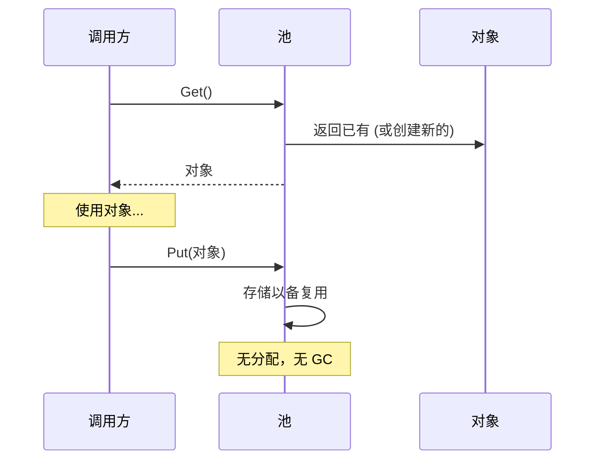

核心权衡：内存占用（空闲对象占着池）vs CPU/GC 节省（热路径零分配）。

| 属性 | 值 |
|------|------|
| Get（池有空闲） | O(1) — 返回已有对象 |
| Get（池为空） | O(alloc) — 创建新对象 |
| Put（归还） | O(1) — 推入空闲列表 + 重置 |
| 内存 | O(池大小) — 空闲对象保留在储备中 |

**动手试试** — 从池中获取连接，观察池耗尽时的等待行为：

<ObjectPoolViz />

## 生产验证

| 项目 | 源码 | 用途 |
|------|------|------|
| Go 标准库 | [pool.go#L52-L97](https://github.com/golang/go/blob/f5cdf4745455415c7a43cfc7d925214d4511489b/src/sync/pool.go#L52-L97) | `sync.Pool` — `Get()`（行132）先从 per-P 本地池取（无锁），回退到从其他 P 偷取。广泛用于 `fmt`、`encoding/json`、HTTP 处理器。 |
| Godot 引擎 | [pooled_list.h#L35-L100](https://github.com/godotengine/godot/blob/ec67cbe92628bdaf979b10594359ba6f02cf8838/core/templates/pooled_list.h#L35-L100) | `PooledList` — 基于 freelist 的对象池，元素在连续页中分配并通过 freelist 回收，避免每帧为实体、粒子、物理体分配内存。 |

## 实现

::: code-group

```typescript [TypeScript]
class ObjectPool<T> {
  private pool: T[] = [];
  private factory: () => T;
  private reset: (obj: T) => void;

  constructor(factory: () => T, reset: (obj: T) => void, initialSize = 0) {
    this.factory = factory;
    this.reset = reset;
    for (let i = 0; i < initialSize; i++) {
      this.pool.push(factory());
    }
  }

  get(): T {
    if (this.pool.length > 0) {
      return this.pool.pop()!;
    }
    return this.factory();
  }

  release(obj: T): void {
    this.reset(obj);
    this.pool.push(obj);
  }

  get size(): number {
    return this.pool.length;
  }
}
```

```rust [Rust]
pub struct ObjectPool<T> {
    pool: Vec<T>,
    factory: Box<dyn Fn() -> T>,
}

impl<T> ObjectPool<T> {
    pub fn new(factory: impl Fn() -> T + 'static, initial: usize) -> Self {
        let factory = Box::new(factory);
        let pool = (0..initial).map(|_| (factory)()).collect();
        ObjectPool { pool, factory }
    }

    pub fn get(&mut self) -> T {
        self.pool.pop().unwrap_or_else(|| (self.factory)())
    }

    pub fn release(&mut self, obj: T) {
        self.pool.push(obj);
    }
}
```

```go [Go]
package pool

import "sync"

// In production, use sync.Pool directly:
var bufPool = sync.Pool{
	New: func() any {
		return make([]byte, 0, 4096)
	},
}

func ProcessRequest(data []byte) []byte {
	buf := bufPool.Get().([]byte)
	buf = buf[:0] // reset length, keep capacity
	buf = append(buf, data...)
	// ... process ...
	result := make([]byte, len(buf))
	copy(result, buf)
	bufPool.Put(buf) // return to pool
	return result
}
```

```python [Python]
from typing import TypeVar, Callable, List

T = TypeVar("T")

class ObjectPool:
    def __init__(self, factory: Callable[[], T], reset: Callable[[T], None], initial: int = 0):
        self._factory = factory
        self._reset = reset
        self._pool: List[T] = [factory() for _ in range(initial)]

    def get(self) -> T:
        if self._pool:
            return self._pool.pop()
        return self._factory()

    def release(self, obj: T) -> None:
        self._reset(obj)
        self._pool.append(obj)
```

:::

## 练习

| 难度 | 练习 | 文件 |
|------|------|------|
| 基础 | 实现通用对象池 get/release | `exercises/typescript/object-pool/01-basic.test.ts` |
| 进阶 | 构建带最大连接数的连接池 | `exercises/typescript/object-pool/02-connection-pool.test.ts` |

运行练习：`pnpm test:ts`（TypeScript）· `cargo test`（Rust）· `go test ./...`（Go）· `pytest`（Python）

练习文件： Rust `exercises/rust/src/object_pool/mod.rs` · Go `exercises/go/object_pool/object_pool_test.go` · Python `exercises/python/object_pool/test_object_pool.py`

## 何时使用

- **高频分配** — 游戏循环、请求处理、粒子系统
- **昂贵构造** — 数据库连接、线程上下文、大缓冲区
- **GC 敏感** — 实时系统、游戏引擎、低延迟服务
- **固定资源限制** — 连接池、线程池、文件描述符池

## 何时不用

- **廉价对象** — 如果分配快且 GC 不是问题，池增加了不必要的复杂性
- **不同生命周期** — 如果对象被持有较长且不可预测的时间，池帮不上忙
- **小规模** — 少量对象时，池的开销超过节省
- **不可变对象** — 池只对需要重置的可变对象有意义

## 更多生产案例

- [Java ThreadPoolExecutor](https://github.com/openjdk/jdk/blob/4b3ec455c85314d051800a8f46dd8f5c93881e3a/src/java.base/share/classes/java/util/concurrent/ThreadPoolExecutor.java) — 带核心/最大线程数和可配置拒绝策略的线程池
- [.NET ArrayPool\<T\>](https://github.com/dotnet/runtime/blob/bee7953796edc09e516e847e3c9006b486ab0f6d/src/libraries/System.Private.CoreLib/src/System/Buffers/ArrayPool.cs) — 可复用数组的共享池
- [HikariCP](https://github.com/brettwooldridge/HikariCP) — JDBC connection pool
- [Unity ObjectPool](https://github.com/Unity-Technologies/UnityCsReference) — `ObjectPool<T>` 用于可复用的游戏对象

## 相关模式

| 模式 | 关系 |
|---------|-------------|
| [空闲链表 (Free List)](/zh/patterns/free-list/) | 空闲链表管理池内部的槽位分配 |
| [Arena 分配器 (Arena Allocator)](/zh/patterns/arena-allocator/) | Arena 分配器为池对象批量分配；两者都避免逐对象 malloc |
| [信号量 / 有界并发 (Semaphore)](/zh/patterns/semaphore/) | 池大小充当信号量限制并发对象使用 |
| [引用计数 (Reference Counting)](/zh/patterns/reference-counting/) | 引用计数追踪何时可以将池化对象归还到池中 |
| [工作窃取 (Work Stealing)](/zh/patterns/work-stealing/) | 工作窃取队列可以池化任务对象以减少分配开销 |

## 挑战题

::: details Q1: 你的池初始化了 10 个对象，但峰值负载时需要 100 个。池应该动态增长还是拒绝超过 10 个的请求？
**答案：** 取决于资源类型。对于廉价对象（缓冲区）动态增长；对于昂贵/有限资源（数据库连接）强制硬上限。

缓冲区池应该按需增长并在空闲时可选地缩小——分配额外缓冲区的成本很低。数据库连接池应该强制 `maxSize`，因为每个连接消耗服务器内存、文件描述符和认证状态。超过上限的请求应该排队等待（带超时）而不是创建无限连接导致数据库崩溃。HikariCP 正是因为这个原因默认最大 10 个连接。
:::

::: details Q2: 开发者调用了 `pool.get()` 但从未调用 `pool.release()`。这种"对象泄漏"如何表现？如何检测？
**答案：** 池逐渐变空并开始每次都分配新对象，失去了其作用并可能耗尽资源。

检测策略：(1) 使用 Set 追踪未归还对象，当数量超过阈值时记录警告，(2) 使用弱引用和终结器来检测被 GC 回收但未归还的对象，(3) 将池化对象包装在超时后自动释放的代理中。Go 的 `sync.Pool` 完全回避了这个问题——它不保证对象保留并让 GC 回收空闲的池条目，使泄漏不那么灾难性但池也不那么可预测。
:::

::: details Q3: 两个 goroutine 同时调用 `pool.Get()`。是什么使 Go 的 `sync.Pool` 在这里不需要显式的 mutex 就是安全的？
**答案：** `sync.Pool` 使用每 P（每处理器）的本地池进行无锁访问，只有当本地池为空时才回退到带 mutex 的共享池。

每个 P（Go 调度器中的逻辑处理器，不同于代表 OS 线程的 M）有自己的私有池槽。`Get()` 首先检查本地槽（不需要锁——一个 P 上一次只运行一个 goroutine）。如果为空，它在锁保护下从其他 P 的池中偷取。`Put()` 也先去本地槽。这种每 P 分片模式最大限度地减少了竞争。对于手工编写的多线程环境池，你需要 mutex 或像并发栈这样的无锁数据结构。
:::

::: details Q4: 你在 Node.js 服务器中为 HTTP 请求对象构建了一个对象池。性能分析后发现它比直接使用 `new Request()` 更慢。出了什么问题？
**答案：** 在 V8 的分代 GC 中，短生命周期的小对象几乎可以免费分配和回收——池的重置逻辑和簿记成本比它避免的分配还要高。

V8 的新生代 GC 使用指针碰撞分配（本质上是免费的）并通过复制存活者来收集短生命周期对象，而不是扫描垃圾。如果你的 `Request` 对象很小、按请求创建、立即丢弃，GC 能高效处理。池增加了额外开销：维护空闲链表、重置对象状态、阻止 V8 优化对象形状。对象池适用于昂贵的构造函数（数据库连接、编译后的正则表达式）或对 GC 暂停敏感的上下文（游戏循环），不适用于现代 GC 运行时中的廉价对象。
:::


================================================
FILE: docs/zh/patterns/observer/index.md
================================================
---
title: "模式：观察者 / 发布-订阅 (Observer / Pub-Sub)"
description: "让对象订阅事件并在事件发生时收到通知，实现生产者与消费者的解耦——发送方不需要知道谁在监听。"
difficulty: "beginner"
---

# 模式：观察者 / 发布-订阅 (Observer / Pub-Sub)

<DifficultyBadge />

## 一句话

让对象订阅事件并在事件发生时收到通知，实现生产者与消费者的解耦——发送方不需要知道谁在监听。

<DemoBadge />

## 现实类比

报纸订阅。你订阅一次，每天早上报纸就送到门口。你不需要跑到报摊去查——出版商主动推送给所有订阅者。随时可以取消。

## 核心思想

观察者模式创建一对多依赖：当主题状态改变时，所有注册的观察者都会收到通知。主题不知道观察者会做什么——只是调用它们。

```mermaid
flowchart LR
    S["发送方 / 发射器"] -->|"通知"| O1["观察者 A"]
    S -->|"通知"| O2["观察者 B"]
    S -->|"通知"| O3["观察者 C"]
    O1 -.->|"订阅"| S
    O2 -.->|"订阅"| S
    O3 -.->|"订阅"| S
```

这种解耦是该模式无处不在的原因：从 DOM `addEventListener` 到 Redux `store.subscribe` 到 Node.js `EventEmitter` 到 React 的 `useEffect` 清理模式。

| 属性 | 值 |
|------|------|
| 订阅 | O(1) — 添加到监听器集合 |
| 取消订阅 | O(1) — 从监听器集合移除 |
| 发射/通知 | O(n) — 调用 n 个监听器中的每一个 |
| 空间 | O(监听器数) 每事件类型 |

**动手试试** — 发射事件，观察它们扇出到所有订阅者：

<ObserverViz />

## 生产验证

| 项目 | 源码 | 用途 |
|------|------|------|
| Node.js | [events.js#L456-L520](https://github.com/nodejs/node/blob/19c46abbefdb8711b913d7237b3c1299367f87d7/lib/events.js#L456-L520) | `EventEmitter.prototype.emit` — 遍历注册的监听器并逐个调用。第 209 行定义了 EventEmitter 构造函数。Node 事件驱动架构的基础。 |
| Redux | [createStore.ts#L211-L280](https://github.com/reduxjs/redux/blob/1d761f471cf58faabe88c50ea16645212d986cd0/src/createStore.ts#L211-L280) | `subscribe()` 添加监听器，`dispatch()`（第 280 行）执行 reducer 后调用所有监听器。Redux 在 dispatch 前快照监听器数组以安全处理订阅/取消。 |

## 实现

::: code-group

```typescript [TypeScript]
type Listener<T> = (data: T) => void;

class EventEmitter<Events extends Record<string, unknown>> {
  private listeners = new Map<keyof Events, Set<Listener<any>>>();

  on<K extends keyof Events>(event: K, listener: Listener<Events[K]>): () => void {
    if (!this.listeners.has(event)) {
      this.listeners.set(event, new Set());
    }
    this.listeners.get(event)!.add(listener);

    return () => this.off(event, listener);
  }

  off<K extends keyof Events>(event: K, listener: Listener<Events[K]>): void {
    this.listeners.get(event)?.delete(listener);
  }

  emit<K extends keyof Events>(event: K, data: Events[K]): void {
    this.listeners.get(event)?.forEach((listener) => listener(data));
  }

  listenerCount(event: keyof Events): number {
    return this.listeners.get(event)?.size ?? 0;
  }
}
```

```rust [Rust]
use std::collections::HashMap;

pub struct EventEmitter {
    listeners: HashMap<String, Vec<Box<dyn Fn(&str)>>>,
}

impl EventEmitter {
    pub fn new() -> Self {
        EventEmitter { listeners: HashMap::new() }
    }

    pub fn on(&mut self, event: &str, listener: impl Fn(&str) + 'static) {
        self.listeners
            .entry(event.to_string())
            .or_default()
            .push(Box::new(listener));
    }

    pub fn emit(&self, event: &str, data: &str) {
        if let Some(listeners) = self.listeners.get(event) {
            for listener in listeners {
                listener(data);
            }
        }
    }
}
```

```go [Go]
type Listener func(data any)

type EventEmitter struct {
	listeners map[string][]Listener
}

func NewEmitter() *EventEmitter {
	return &EventEmitter{listeners: make(map[string][]Listener)}
}

func (e *EventEmitter) On(event string, listener Listener) {
	e.listeners[event] = append(e.listeners[event], listener)
}

func (e *EventEmitter) Emit(event string, data any) {
	for _, listener := range e.listeners[event] {
		listener(data)
	}
}
```

```python [Python]
from collections import defaultdict
from typing import Callable, Any

class EventEmitter:
    def __init__(self):
        self._listeners: dict[str, list[Callable]] = defaultdict(list)

    def on(self, event: str, listener: Callable) -> Callable:
        self._listeners[event].append(listener)
        return lambda: self._listeners[event].remove(listener)

    def emit(self, event: str, data: Any = None) -> None:
        for listener in self._listeners[event]:
            listener(data)

    def listener_count(self, event: str) -> int:
        return len(self._listeners[event])

# Usage
emitter = EventEmitter()

messages = []
unsub = emitter.on("message", lambda data: messages.append(data))

emitter.emit("message", "hello")
emitter.emit("message", "world")
print(messages)  # ["hello", "world"]

unsub()  # unsubscribe
emitter.emit("message", "ignored")
print(messages)  # ["hello", "world"] — unchanged
```

:::

## 练习

| 难度 | 练习 | 文件 |
|------|------|------|
| 基础 | 实现 on/off/emit 事件发射器 | `exercises/typescript/observer/01-basic.test.ts` |
| 进阶 | 类型安全的事件总线 on/once/off/emit | `exercises/typescript/observer/02-intermediate.test.ts` |

运行练习：`pnpm test:ts`（TypeScript）· `cargo test`（Rust）· `go test ./...`（Go）· `pytest`（Python）

练习文件： Rust `exercises/rust/src/observer/mod.rs` · Go `exercises/go/observer/observer_test.go` · Python `exercises/python/observer/test_observer.py`

## 何时使用

- **事件驱动系统** — UI 事件、网络事件、消息队列
- **模块解耦** — 插件、中间件、扩展点
- **状态管理** — Redux store、MobX observables、Vue reactivity
- **日志/监控** — 发射事件而不关心谁在收集
- **实时更新** — WebSocket 消息分发、实时数据流

## 何时不用

- **同步管线** — 如果处理顺序和完成很重要，直接调用函数
- **事件风暴** — 太多事件难以调试；考虑批处理
- **循环依赖** — A 观察 B，B 观察 A → 无限循环
- **强顺序保证** — 观察者通知顺序可能不确定

## 更多生产案例

- [RxJS](https://github.com/ReactiveX/rxjs) — reactive streams
- [Vue 3](https://github.com/vuejs/core) — reactivity system
- [MobX](https://github.com/mobxjs/mobx)
- [Chromium EventTarget](https://github.com/chromium/chromium/blob/5cffea3f665b7762369a0fa84d2f208875e7225e/third_party/blink/renderer/core/dom/events/event_target.cc) — Blink 中 DOM `addEventListener` 的实现
- [.NET events](https://github.com/dotnet/runtime/blob/bee7953796edc09e516e847e3c9006b486ab0f6d/src/libraries/System.Private.CoreLib/src/System/EventHandler.cs) — C# `event` 关键字委托

## 相关模式

| 模式 | 关系 |
|---------|-------------|
| [事件循环 / 反应器 (Event Loop / Reactor)](/zh/patterns/event-loop/) | 事件循环将事件分发给为特定事件类型注册的观察者 |
| [脏标记 (Dirty Flag)](/zh/patterns/dirty-flag/) | 观察者触发通知；脏标记延迟昂贵的反应 |
| [中间件 / 管道链 (Middleware / Pipeline Chain)](/zh/patterns/middleware-chain/) | 中间件观察和转换流经管道的数据 |
| [Actor 模型 (Actor Model)](/zh/patterns/actor-model/) | 两者都解耦生产者和消费者——观察者通过回调，Actor 通过消息传递 |

## 挑战题

::: details Q1: 一个 React 组件在 `useEffect` 中订阅了 store，但忘记返回清理函数。组件卸载时会发生什么？
**答案：** 监听器仍然保持注册状态，导致内存泄漏和对已卸载组件的幽灵更新。

store 持有监听器回调的引用，而该回调闭包捕获了组件的状态。组件已卸载但永远不会被垃圾回收，因为 store 仍然引用它。更糟糕的是，当 store 发出事件时，过期的监听器会运行并可能在已卸载的组件上调用 `setState`。这是经典的 Observer 内存泄漏——每个 `subscribe` 都必须有对应的 `unsubscribe`，而 `useEffect` 的清理函数就是 React 为此提供的机制。
:::

::: details Q2: 你有 3 个观察者：A 记录日志到文件，B 更新 UI，C 发送网络请求。它们被通知的顺序重要吗？
**答案：** 在大多数实现中，观察者按注册顺序调用，但你不应该依赖这一点——该模式不保证顺序。

如果 B 的 UI 更新依赖于 A 的日志先完成，那你就有了一个隐式耦合，而 Observer 模式本应消除这种耦合。每个观察者应该是独立的。如果顺序很重要，你需要不同的模式：中间件链、管道或显式依赖声明。Node.js 的 `EventEmitter` 按注册顺序调用监听器，但 Redux 显式地快照监听器数组以避免在 dispatch 过程中 subscribe/unsubscribe 导致的顺序依赖 bug。
:::

::: details Q3: 一次 `emit('data', payload)` 调用触发了 50 个同步观察者，其中一个抛出了异常。第 2-50 个观察者会怎样？
**答案：** 在简单实现中，第 2-50 个观察者永远不会执行——异常向上传播并中止了 `emit` 循环。

这就是为什么生产级实现会用 try-catch 包裹每个监听器调用。Node.js `EventEmitter` 默认不这样做——一个抛出异常的监听器会杀死其余的。你必须自己处理错误。RxJS 为每个订阅者使用错误边界。设计选择是：快速失败（一个坏观察者停止一切）vs 容错（隔离故障，继续通知）。对于关键系统，始终隔离观察者失败。
:::

::: details Q4: Observer 通知应该是同步的还是异步的？如果从同步切换到异步会破坏什么？
**答案：** 同步通知保证在 `emit()` 返回之前所有观察者都已处理完事件；切换到异步会破坏任何假设在发出事件后状态立即更新的代码。

同步时：`emit('change'); readState()` 能看到更新后的状态，因为观察者是内联运行的。异步时：`emit('change'); readState()` 看到的是旧状态，因为观察者被排队了。这会破坏像 Redux 这样的模式，其中 `dispatch()` 预期在返回时已完全完成。异步通知对性能更好（非阻塞），但要求系统处理 emit 和观察者执行之间的"最终一致性"间隙。
:::


================================================
FILE: docs/zh/patterns/rate-limiter/index.md
================================================
---
title: "模式：限流器 / 令牌桶 (Rate Limiter)"
description: "通过维护一个按固定速率补充的令牌桶来控制吞吐量——每次操作消耗一个令牌，桶空时拒绝请求。"
difficulty: "intermediate"
---

# 模式：限流器 / 令牌桶 (Rate Limiter)

<DifficultyBadge />

## 一句话

通过维护一个按固定速率补充的令牌桶来控制吞吐量——每次操作消耗一个令牌，桶空时拒绝请求。

<DemoBadge />

## 现实类比

地铁站的闸机。每次刷卡放一个人通过，节奏可控。人群涌来时排队。闸机不会加速——它强制执行稳定的速率。

## 核心思想

令牌桶初始满载 `capacity` 个令牌，以 `rate` 个/秒的速度补充。每个请求消耗一个令牌。桶空时请求被拒绝或延迟。这天然允许突发（最多到容量）同时限制平均速率。

```text
  令牌桶 (capacity=5, rate=2/sec)

  时间 0s:   [●][●][●][●][●]  5 令牌 (满)
  请求:      [●][●][●][●][ ]  4 令牌 (消耗 1)
  请求:      [●][●][●][ ][ ]  3 令牌
  请求:      [●][●][ ][ ][ ]  2 令牌

  +1 秒:     [●][●][●][●][ ]  4 令牌 (补充 2)
  +2 秒:     [●][●][●][●][●]  5 令牌 (封顶)
```

| 变体 | 行为 |
|------|------|
| **令牌桶** | 令牌累积；允许突发到容量上限 |
| **漏桶** | 请求以恒定速率流出；平滑突发 |
| **滑动窗口** | 统计时间窗口内请求数；无突发控制 |
| **固定窗口** | 按时间间隔统计请求数；边界突发问题 |

| 属性 | 值 |
|------|---|
| allow() 检查 | O(1) — 计算已过令牌数并比较 |
| 突发容忍 | 最多 `capacity` 个请求可瞬时通过 |
| 持续速率 | 每秒 `refillRate` 个请求 |
| 空间 | O(1) — 每个限流器一个令牌计数 + 时间戳 |

**动手试试** — 发送请求观察令牌从桶中消耗，然后启动自动补充：

<RateLimiterViz />

## 生产验证

| 项目 | 源码 | 用途 |
|------|------|------|
| Go x/time/rate | [rate.go#L57-L66](https://github.com/golang/time/blob/812b343c8714c317b0dad633efa6d103e554c006/rate/rate.go#L57-L66) | `Limiter` 结构体——含 `tokens`、`limit`、`burst` 和 `last` 时间戳的令牌桶。`reserveN`（L337-L381）是核心算法：按经过时间推进令牌，减去请求的 `n`，计算等待时长。整个 Go 生态广泛使用。 |
| Nginx | [ngx_http_limit_req_module.c#L405-L532](https://github.com/nginx/nginx/blob/d994f5b8220847eb8f7e4400be5f7e6eb4538e46/src/http/modules/ngx_http_limit_req_module.c#L405-L532) | `ngx_http_limit_req_lookup` — 漏桶实现。L454：`excess = lr->excess - ctx->rate * ms / 1000 + 1000` 按经过时间排空 excess 并添加一个请求。驱动保护数百万 Nginx 服务器的 `limit_req` 指令。 |

## 实现

::: code-group

```typescript [TypeScript]
class TokenBucket {
  private tokens: number;
  private lastRefill: number;

  constructor(
    private capacity: number,
    private refillRate: number,
  ) {
    this.tokens = capacity;
    this.lastRefill = Date.now();
  }

  private refill(): void {
    const now = Date.now();
    const elapsed = (now - this.lastRefill) / 1000;
    this.tokens = Math.min(this.capacity, this.tokens + elapsed * this.refillRate);
    this.lastRefill = now;
  }

  tryAcquire(tokens = 1): boolean {
    this.refill();
    if (this.tokens >= tokens) {
      this.tokens -= tokens;
      return true;
    }
    return false;
  }
}
```

```rust [Rust]
use std::time::Instant;

pub struct TokenBucket {
    capacity: f64,
    refill_rate: f64,
    tokens: f64,
    last_refill: Instant,
}

impl TokenBucket {
    pub fn new(capacity: f64, refill_rate: f64) -> Self {
        TokenBucket { capacity, refill_rate, tokens: capacity, last_refill: Instant::now() }
    }

    fn refill(&mut self) {
        let elapsed = self.last_refill.elapsed().as_secs_f64();
        self.tokens = (self.tokens + elapsed * self.refill_rate).min(self.capacity);
        self.last_refill = Instant::now();
    }

    pub fn try_acquire(&mut self, n: f64) -> bool {
        self.refill();
        if self.tokens >= n {
            self.tokens -= n;
            true
        } else {
            false
        }
    }
}
```

```go [Go]
type TokenBucket struct {
	capacity   float64
	refillRate float64
	tokens     float64
	lastRefill time.Time
}

func NewTokenBucket(capacity, refillRate float64) *TokenBucket {
	return &TokenBucket{capacity: capacity, refillRate: refillRate, tokens: capacity, lastRefill: time.Now()}
}

func (tb *TokenBucket) TryAcquire() bool {
	now := time.Now()
	elapsed := now.Sub(tb.lastRefill).Seconds()
	tb.tokens = min(tb.capacity, tb.tokens+elapsed*tb.refillRate)
	tb.lastRefill = now
	if tb.tokens >= 1 {
		tb.tokens--
		return true
	}
	return false
}

func min(a, b float64) float64 {
	if a < b {
		return a
	}
	return b
}
```

```python [Python]
import time

class TokenBucket:
    def __init__(self, capacity: float, refill_rate: float):
        self.capacity = capacity
        self.refill_rate = refill_rate
        self.tokens = capacity
        self.last_refill = time.time()

    def _refill(self):
        now = time.time()
        elapsed = now - self.last_refill
        self.tokens = min(self.capacity, self.tokens + elapsed * self.refill_rate)
        self.last_refill = now

    def try_acquire(self, tokens: float = 1) -> bool:
        self._refill()
        if self.tokens >= tokens:
            self.tokens -= tokens
            return True
        return False
```

:::

## 练习

| 难度 | 练习 | 文件 |
|------|------|------|
| 基础 | 实现令牌桶限流器 | `exercises/typescript/rate-limiter/01-basic.test.ts` |
| 进阶 | 滑动窗口计数限流器 | `exercises/typescript/rate-limiter/02-intermediate.test.ts` |

运行练习：`pnpm test:ts`（TypeScript）· `cargo test`（Rust）· `go test ./...`（Go）· `pytest`（Python）

练习文件： Rust `exercises/rust/src/rate_limiter/mod.rs` · Go `exercises/go/rate_limiter/rate_limiter_test.go` · Python `exercises/python/rate_limiter/test_rate_limiter.py`

## 何时使用

- **API 限流** — 保护端点免受滥用（GitHub、Twitter、Stripe）
- **网络流量整形** — 控制带宽分配（Linux tc、Nginx）
- **资源保护** — 限制数据库查询、文件 I/O 或 CPU 密集操作
- **公平使用** — 确保多租户系统提供公平的访问

## 何时不用

- **二元访问控制** — 如果只需要允许/拒绝，用认证而非限流
- **精确计数** — 令牌桶是近似的；精确限制用计数器
- **无协调的分布式** — 每节点令牌桶不能执行全局速率（用 Redis 支持的限流器）
- **延迟敏感路径** — 每次请求的补充计算增加开销

## 更多生产案例

- [Linux TBF](https://github.com/torvalds/linux/blob/acb7500801e98639f6d8c2d796ed9f64cba83d3a/net/sched/sch_tbf.c#L98-L114) — 内核令牌桶过滤器用于流量控制
- [Guava RateLimiter](https://github.com/google/guava/blob/3e65944ec9207ca652128969fd1334e9920dde07/guava/src/com/google/common/util/concurrent/SmoothRateLimiter.java#L357-L369) — 带预热的平滑限流
- [Envoy](https://github.com/envoyproxy/envoy) — 服务网格的本地/全局限流
- [AWS API Gateway](https://github.com/aws/aws-sdk-js-v3) — API 端点的令牌桶节流

## 相关模式

| 模式 | 关系 |
|---------|-------------|
| [信号量 / 有界并发 (Semaphore)](/zh/patterns/semaphore/) | 信号量限制并发；限流器限制时间维度的吞吐量 |
| [背压 / 流控 (Backpressure)](/zh/patterns/backpressure/) | 限流是在系统边界应用的一种背压形式 |
| [熔断器 (Circuit Breaker)](/zh/patterns/circuit-breaker/) | 熔断器在故障时停止所有流量；限流器控制正常流量 |
| [一致性哈希 (Consistent Hashing)](/zh/patterns/consistent-hashing/) | 一致性哈希将速率限制状态分布到多个节点 |
| [指数退避重试 (Retry with Backoff)](/zh/patterns/retry-backoff/) | 指数退避重试根据速率限制器的反馈调整客户端行为 |

## 挑战题

::: details Q1: 你的 API 使用固定窗口计数器允许每分钟 100 个请求。在 11:00:59 客户端发送了 100 个请求，在 11:01:01 又发送了 100 个请求。两个窗口都允许。这 2 秒内的实际速率是多少？令牌桶会如何不同地处理这个问题？
**答案：** 客户端在 2 秒内发送了 200 个请求（有效速率 6,000/分钟），远超 100/分钟的限制。令牌桶会拒绝第二次突发的大部分请求，因为只补充了约 3 个令牌。

这是固定窗口计数器的"边界突发"问题。窗口在尖锐边界处重置，允许在接缝处出现双倍突发。容量为 100、速率为 100/分钟的令牌桶以约 1.67 令牌/秒的速度补充。在 11:00:59 耗尽到 0 后，11:01:01 时只有约 3 个令牌可用——其余 97 个请求会被拒绝。滑动窗口计数器也通过在相邻窗口之间插值来解决这个问题。
:::

::: details Q2: 你运行了 8 个 API 服务器实例，每个都有自己的令牌桶，允许 100 请求/秒。一个客户端发现了这一点并将请求分布到所有 8 个服务器。它们体验到的有效速率限制是多少？
**答案：** 客户端可以达到 800 请求/秒——预期限制的 8 倍——因为每节点的令牌桶不强制全局速率。

分布式限流需要共享状态。常见解决方案：(1) 使用 Redis 等集中存储配合原子 `INCR` 和 `EXPIRE`，(2) 专用限流服务（Envoy、Kong），或 (3) "分割预算"方式，每个节点获得总速率的 1/n（100/8 = 12.5 请求/秒/节点）。选项 3 简单但脆弱——如果流量分布不均匀，一些节点会浪费预算而其他节点拒绝有效请求。
:::

::: details Q3: 你的令牌桶容量为 50，补充速率为 10/秒。一个合法的批处理任务需要一次性发送 50 个请求，然后等待 10 秒，再发送 50 个。令牌桶能适应这种模式吗？还是应该使用不同的算法？
**答案：** 令牌桶完美处理这种情况——它设计用来允许不超过容量的突发同时强制平均速率。

开始时，桶满有 50 个令牌，允许整个批次。接下来 10 秒补充 100 个令牌但上限为 50（容量）。第二批 50 个再次耗尽桶。平均速率是 100 请求 / 10 秒 = 10/秒，恰好匹配补充速率。这种对突发友好的行为是令牌桶在突发但有界的工作负载中优于漏桶的原因。漏桶会强制 50 个请求以 10/秒的速率流出，需要 5 秒——不适合批处理模式。
:::

::: details Q4: Nginx 对 `limit_req` 使用漏桶。Go 的 `x/time/rate` 使用令牌桶。两者都限制请求速率。你何时会选择漏桶而非令牌桶？
**答案：** 当你需要将流量平滑为稳定的流时选择漏桶，防止任何突发到达下游服务。

令牌桶允许不超过容量的突发——非常适合偶尔有突发流量的面向用户的 API。漏桶强制恒定的流出速率，保护无法处理任何流量尖峰的后端（例如在并发写入下性能降低的数据库）。Nginx 使用漏桶因为反向代理位于需要可预测、稳态负载的后端前面。权衡：漏桶在突发时增加延迟（请求排队），而令牌桶立即拒绝多余请求。
:::


================================================
FILE: docs/zh/patterns/reference-counting/index.md
================================================
---
title: "模式：引用计数 (Reference Counting)"
description: "通过原子计数器追踪所有者，归零时自动清理——无需垃圾回收的确定性资源生命周期管理。"
difficulty: "beginner"
---

# 模式：引用计数 (Reference Counting)

<DifficultyBadge />

## 一句话

通过原子计数器追踪所有者，归零时自动清理——无需垃圾回收的确定性资源生命周期管理。

<DemoBadge />

## 现实类比

合租的 Netflix 账号。你记录有多少人在用。最后一个人退出时，订阅自动取消。不需要后台检查——计数归零就是信号。

## 核心思想

引用计数为每个共享资源分配一个计数器。每个新所有者（clone）使计数加一；每次释放（drop）使计数减一。当计数归零时，资源立即被清理——没有 GC 停顿，没有终结器队列，完全确定性。

```text
  ┌────────────┐
  │  Resource  │   refcount = 1
  │  (value)   │
  └─────┬──────┘
        │
     owner A

  A.clone() → B
  ┌────────────┐
  │  Resource  │   refcount = 2
  │  (value)   │
  └──┬─────┬───┘
     │     │
  owner A  owner B

  A.drop()
  ┌────────────┐
  │  Resource  │   refcount = 1
  │  (value)   │
  └─────┬──────┘
        │
     owner B

  B.drop()
  ┌────────────┐
  │  Resource  │   refcount = 0 → cleanup()!
  │  (value)   │
  └────────────┘
```

| 属性 | 值 |
|------|------|
| Clone | O(1) — 计数器加一 |
| Drop | O(1) — 计数器减一，条件性清理 |
| 清理触发 | 确定性——最后一个所有者 drop 时立即触发 |
| 线程安全 | 多线程使用需要原子操作（或互斥锁） |

**动手试试** — 丢弃引用减少引用计数，观察 rc=0 时对象被释放：

<ReferenceCountingViz />

## 生产验证

| 项目 | 源码 | 用途 |
|------|------|------|
| CPython | [refcount.h#L255-L310](https://github.com/python/cpython/blob/ff64d8de66ab7f8e56b5d410796a7d76c955280c/Include/refcount.h#L255-L310) | `Py_INCREF`（L255-L310）是递增 `ob_refcnt` 的内联函数。`Py_DECREF`（L417-L430）递减并在归零时调用 `_Py_Dealloc`。每个 Python 对象在 `PyObject`（[object.h#L127-L150](https://github.com/python/cpython/blob/ff64d8de66ab7f8e56b5d410796a7d76c955280c/Include/object.h#L127-L150)）中携带 `ob_refcnt`。这是主要的内存管理机制——GC 仅用于打破引用循环。 |
| Rust std | [sync.rs#L269-L276](https://github.com/rust-lang/rust/blob/ab26b175979ee7b2cb3302dce204b99df96f7efb/library/alloc/src/sync.rs#L269-L276) | `Arc<T>`（原子引用计数）结构体定义在 L269。`Drop` 实现（L2799-L2875）对强计数调用 `fetch_sub(1, Release)`，Acquire 屏障，归零时调用 `drop_slow()`。在 Tokio、Actix 和操作系统级 Rust 代码中广泛使用。 |

## 实现

::: code-group

```typescript [TypeScript]
type CleanupFn<T> = (value: T) => void;

interface RefCountedInner<T> {
  value: T;
  count: number;
  dropped: boolean;
  cleanup: CleanupFn<T>;
}

class RefCounted<T> {
  private inner: RefCountedInner<T>;
  private owned: boolean;

  constructor(value: T, cleanup: CleanupFn<T>) {
    this.inner = { value, count: 1, dropped: false, cleanup };
    this.owned = true;
  }

  /** Create a new owner sharing the same value. */
  clone(): RefCounted<T> {
    if (!this.owned) throw new Error('Cannot clone a dropped reference');
    this.inner.count++;
    const cloned = Object.create(RefCounted.prototype) as RefCounted<T>;
    cloned.inner = this.inner;
    cloned.owned = true;
    return cloned;
  }

  /** Release this owner's reference. Triggers cleanup when count hits 0. */
  drop(): void {
    if (!this.owned) return; // double-drop is a no-op
    this.owned = false;
    this.inner.count--;
    if (this.inner.count === 0 && !this.inner.dropped) {
      this.inner.dropped = true;
      this.inner.cleanup(this.inner.value);
    }
  }

  refCount(): number { return this.inner.count; }

  value(): T {
    if (!this.owned) throw new Error('Reference has been dropped');
    return this.inner.value;
  }
}
```

```rust [Rust]
use std::cell::Cell;

struct RcInner<T> {
    value: T,
    count: Cell<usize>,
}

pub struct Rc<T> {
    inner: *const RcInner<T>,
}

impl<T> Rc<T> {
    pub fn new(value: T) -> Self {
        let inner = Box::into_raw(Box::new(RcInner {
            value,
            count: Cell::new(1),
        }));
        Rc { inner }
    }

    pub fn strong_count(&self) -> usize {
        unsafe { (*self.inner).count.get() }
    }

    pub fn value(&self) -> &T {
        unsafe { &(*self.inner).value }
    }
}

impl<T> Clone for Rc<T> {
    fn clone(&self) -> Self {
        unsafe {
            let c = (*self.inner).count.get();
            (*self.inner).count.set(c + 1);
        }
        Rc { inner: self.inner }
    }
}

impl<T> Drop for Rc<T> {
    fn drop(&mut self) {
        unsafe {
            let c = (*self.inner).count.get();
            (*self.inner).count.set(c - 1);
            if c == 1 {
                drop(Box::from_raw(self.inner as *mut RcInner<T>));
            }
        }
    }
}
```

```go [Go]
type RefCounted[T any] struct {
	mu      sync.Mutex
	value   T
	count   int
	cleanup func(T)
}

func NewRefCounted[T any](value T, cleanup func(T)) *RefCounted[T] {
	return &RefCounted[T]{value: value, count: 1, cleanup: cleanup}
}

func (rc *RefCounted[T]) Clone() *RefCounted[T] {
	rc.mu.Lock()
	defer rc.mu.Unlock()
	rc.count++
	return rc // same pointer, shared state
}

func (rc *RefCounted[T]) Drop() {
	rc.mu.Lock()
	defer rc.mu.Unlock()
	rc.count--
	if rc.count == 0 {
		rc.cleanup(rc.value)
	}
}

func (rc *RefCounted[T]) Count() int {
	rc.mu.Lock()
	defer rc.mu.Unlock()
	return rc.count
}
```

```python [Python]
from typing import TypeVar, Generic, Callable, Optional

T = TypeVar("T")

class RefCounted(Generic[T]):
    def __init__(self, value: T, cleanup: Callable[[T], None]):
        self._value = value
        self._count = 1
        self._dropped = False
        self._cleanup = cleanup
        self._owned = True

    def clone(self) -> "RefCounted[T]":
        if not self._owned:
            raise RuntimeError("Cannot clone a dropped reference")
        self._count += 1
        copy = object.__new__(RefCounted)
        # Share internal state by reference
        copy.__dict__ = self.__dict__
        copy._owned = True
        return copy

    def drop(self) -> None:
        if not self._owned:
            return
        self._owned = False
        self._count -= 1
        if self._count == 0 and not self._dropped:
            self._dropped = True
            self._cleanup(self._value)

    @property
    def ref_count(self) -> int:
        return self._count

    @property
    def value(self) -> T:
        if not self._owned:
            raise RuntimeError("Reference has been dropped")
        return self._value
```

:::

## 练习

| 难度 | 练习 | 文件 |
|------|------|------|
| 基础 | 实现带 clone/drop 和清理回调的引用计数值 | `exercises/typescript/reference-counting/01-basic.test.ts` |
| 进阶 | 扩展弱引用，不阻止清理 | `exercises/typescript/reference-counting/02-intermediate.test.ts` |

运行练习：`pnpm test:ts`（TypeScript）· `cargo test`（Rust）· `go test ./...`（Go）· `pytest`（Python）

练习文件： Rust `exercises/rust/src/reference_counting/mod.rs` · Go `exercises/go/reference_counting/reference_counting_test.go` · Python `exercises/python/reference_counting/test_reference_counting.py`

## 何时使用

- **需要确定性清理的共享所有权** — 代码的多个部分需要同一资源，且需要在最后一个用户完成时立即释放（文件句柄、GPU 缓冲区、数据库连接）
- **避免 GC 停顿** — 实时系统（游戏、音频）中无法接受 stop-the-world GC
- **跨语言互操作** — CPython 的引用计数让 C 扩展自然管理 Python 对象；COM 在 DLL 边界使用 `AddRef`/`Release`
- **短期共享状态** — 对象主要由一处拥有但偶尔短暂共享（Rust 的 `Rc`/`Arc` 模式）

## 何时不用

- **循环数据结构** — 父子循环（如双向链表、图节点）会泄漏，因为计数永远不会归零。使用弱引用或追踪式 GC。
- **高竞争共享** — 如果多个线程频繁 clone/drop 同一对象，原子计数器会成为缓存行瓶颈。考虑基于 epoch 的回收或风险指针。
- **批量分配模式** — 如果分配/释放数千个小对象，每个对象的计数器增加额外开销。使用 arena 分配替代。

## 更多生产案例

- [Swift ARC](https://github.com/apple/swift) — Swift 的整个内存模型基于自动引用计数（编译器插入的 retain/release）
- [COM IUnknown](https://learn.microsoft.com/en-us/windows/win32/api/unknwn/nn-unknwn-iunknown) — Windows 中每个 COM 对象的 `AddRef`/`Release`
- [Linux kernel kobject](https://github.com/torvalds/linux/blob/acb7500801e98639f6d8c2d796ed9f64cba83d3a/lib/kobject.c) — `kref` 为内核对象提供引用计数
- [Objective-C ARC](https://clang.llvm.org/docs/AutomaticReferenceCounting.html) — 编译器管理的 `retain`/`release` 调用

## 相关模式

| 模式 | 关系 |
|---------|-------------|
| [写时复制 (Copy-on-Write)](/zh/patterns/copy-on-write/) | 引用计数决定何时需要复制 CoW 值 |
| [对象池 (Object Pool)](/zh/patterns/object-pool/) | 池提供引用计数的替代方案——归还对象而不是释放 |
| [墓碑 / 延迟删除 (Tombstone)](/zh/patterns/tombstone/) | 墓碑延迟清理，类似引用计数延迟释放 |
| [Arena 分配器 (Arena Allocator)](/zh/patterns/arena-allocator/) | Arena 通过在作用域结束时释放所有内容来避免逐对象引用计数 |

## 挑战题

::: details Q1: 对象 A 引用 B，B 引用 A。两者的引用计数都是 2。你释放了对 A 的句柄。会发生什么？
**答案：** 内存泄漏。释放你对 A 的句柄将 A 的引用计数减为 1（B 仍然引用 A）。A 的引用计数永远不会到 0，所以 A 永远不会被释放。由于 A 永远不会被释放，它永远不会释放对 B 的引用，所以 B 的引用计数也永远保持在 1。

这就是**引用循环问题**——引用计数的根本弱点。解决方案：(1) 对反向指针使用弱引用（Rust 的 `Weak<T>`、Python 的 `weakref`），(2) 在上层添加循环检测 GC（CPython 就是这样做的），(3) 重新设计以完全避免循环。
:::

::: details Q2: CPython 使用引用计数作为主要的 GC 策略，但它仍然有循环收集器。为什么不只使用引用计数？
**答案：** 仅靠引用计数无法回收引用循环。任何有相互引用的数据结构（父子关系、图的边、捕获 `self` 的闭包）都会泄漏。

CPython 的循环收集器（`gc` 模块）定期遍历*可能*形成循环的对象（如 list、dict、有 `__dict__` 的对象等容器）并识别不可达的组。引用计数处理约 95% 不参与循环的对象，使循环收集器的工作更轻松。这种混合方法为大多数对象提供确定性清理，同时仍然处理循环。
:::

::: details Q3: Rust 的 `Arc` 在 Clone 时使用 `fetch_add(1, Relaxed)`，但在 Drop 时使用 `fetch_sub(1, Release)`。为什么使用不同的内存序？
**答案：** Clone 只需要确保计数器递增——不访问或释放数据，所以 `Relaxed`（最便宜的内存序）就够了。计数器只需要原子地增加。

Drop 不同：在释放资源之前，所有线程的所有先前写入必须可见。在递减上使用 `Release` 确保执行最终清理的线程（使用 `Acquire` 屏障）能看到每个曾持有引用的线程写入的所有数据。没有这个保证，析构函数可能读到过期数据。

在 x86（全序存储，TSO）上，`Relaxed` 和 `Release` 的 RMW 操作编译为相同的 `lock xadd` 指令——在 x86 上两者没有区别。排序差异在 ARM 等弱序架构上才有意义，`Release` 需要存储屏障。Rust 对 clone 使用 `Relaxed`、对 drop 使用 `Release` 是为了确保在所有架构上的正确性。
:::

::: details Q4: 你正在构建一个资源池。应该使用引用计数还是终结器/析构函数？
**答案：** 两者单独都不适合池。引用计数在归零时触发清理，但池化资源的"清理"应该意味着"返回到池中"，而不是"销毁"。

正确的模式是：将池化项包装在引用计数句柄中，其中"清理"回调将项返回到池中而不是释放它。这正是数据库连接池的工作方式——句柄上的 `Drop` 返回连接而不是关闭它。池本身管理实际的销毁（例如在关闭时或连接过期时）。
:::


================================================
FILE: docs/zh/patterns/registry/index.md
================================================
---
title: "模式：注册表 / 自注册 (Registry)"
description: "组件按名称将自身注册到全局查找表——消费者在运行时发现实现，无需硬编码依赖。"
difficulty: "beginner"
---

# 模式：注册表 / 自注册 (Registry)

<DifficultyBadge />

## 一句话

组件按名称将自身注册到全局查找表——消费者在运行时发现实现，无需硬编码依赖。

<DemoBadge />

## 现实类比

酒店前台。客人用名字登记入住，任何人都可以问前台「Alice 住哪个房间？」前台不关心房间里发生了什么——它只负责名字到房间号的映射。

## 核心思想

注册表是名称（字符串）到实现（函数、类、工厂）的中心映射。生产者在启动时自注册——通常通过装饰器、宏或 init 函数。消费者在运行时按名称查找实现，消除编译时耦合。这实现了插件架构，新功能无需修改现有代码即可添加。

```text
  Registration (startup):

  ┌──────────┐    register("json")    ┌────────────────────┐
  │ JsonCodec│─────────────────────►  │     Registry       │
  └──────────┘                        │                    │
  ┌──────────┐    register("xml")     │  "json" → JsonCodec│
  │ XmlCodec │─────────────────────►  │  "xml"  → XmlCodec │
  └──────────┘                        │  "csv"  → CsvCodec │
  ┌──────────┐    register("csv")     │                    │
  │ CsvCodec │─────────────────────►  └────────────────────┘
  └──────────┘
                                             │
  Lookup (runtime):                          │
                                             ▼
  ┌──────────┐    get("json")         ┌────────────┐
  │ Consumer │─────────────────────►  │ JsonCodec  │
  └──────────┘                        └────────────┘
```

| 属性 | 值 |
|------|------|
| 注册 | O(1) — 哈希表插入 |
| 查找 | O(1) — 哈希表查找 |
| 耦合度 | 生产者和消费者之间零编译时依赖 |
| 可扩展性 | 无需修改现有代码即可添加新实现 |

**动手试试** — 按名称注册处理器，并在运行时查找它们：

<RegistryViz />

## 生产验证

| 项目 | 源码 | 用途 |
|------|------|------|
| TensorFlow | [op.h#L258-L290](https://github.com/tensorflow/tensorflow/blob/b4c7e9a660badf8c8c81075fe9f781d23ed6f28a/tensorflow/core/framework/op.h#L258-L290) | `REGISTER_OP` 宏将新操作注册到全局 `OpRegistry`。每个 op 定义名称、输入、输出和形状函数。运行时在构建计算图时按名称查找 op，因此新 op 可以在不修改图执行器的情况下添加。 |
| gRPC-Go | [server.go#L154-L170](https://github.com/grpc/grpc-go/blob/f1864955bbb48efa131f6652933fa8b2189d9305/server.go#L154-L170) | `RegisterService` 将服务描述（方法、处理函数）添加到服务器的服务映射中。当 RPC 到达时，服务器在此注册表中查找方法以分派到正确的处理程序。服务在 init 期间自注册。 |

## 实现

::: code-group

```typescript [TypeScript]
type Factory<T> = (...args: any[]) => T;

class Registry<T> {
  private entries = new Map<string, Factory<T>>();

  register(name: string, factory: Factory<T>): void {
    if (this.entries.has(name)) {
      throw new Error(`"${name}" is already registered`);
    }
    this.entries.set(name, factory);
  }

  get(name: string): Factory<T> {
    const factory = this.entries.get(name);
    if (!factory) {
      throw new Error(`"${name}" is not registered`);
    }
    return factory;
  }

  create(name: string, ...args: any[]): T {
    return this.get(name)(...args);
  }

  has(name: string): boolean {
    return this.entries.has(name);
  }

  list(): string[] {
    return [...this.entries.keys()];
  }
}
```

```rust [Rust]
use std::collections::HashMap;

pub struct Registry<T> {
    entries: HashMap<String, Box<dyn Fn() -> T>>,
}

impl<T> Registry<T> {
    pub fn new() -> Self {
        Registry { entries: HashMap::new() }
    }

    pub fn register<F: Fn() -> T + 'static>(
        &mut self, name: &str, factory: F,
    ) -> Result<(), String> {
        if self.entries.contains_key(name) {
            return Err(format!("\"{}\" is already registered", name));
        }
        self.entries.insert(name.to_string(), Box::new(factory));
        Ok(())
    }

    pub fn create(&self, name: &str) -> Result<T, String> {
        self.entries.get(name)
            .map(|f| f())
            .ok_or_else(|| format!("\"{}\" is not registered", name))
    }

    pub fn has(&self, name: &str) -> bool {
        self.entries.contains_key(name)
    }

    pub fn list(&self) -> Vec<&str> {
        self.entries.keys().map(|s| s.as_str()).collect()
    }
}
```

```go [Go]
type Factory func(args ...any) any

type Registry struct {
	mu      sync.RWMutex
	entries map[string]Factory
}

func NewRegistry() *Registry {
	return &Registry{entries: make(map[string]Factory)}
}

func (r *Registry) Register(name string, factory Factory) error {
	r.mu.Lock()
	defer r.mu.Unlock()
	if _, ok := r.entries[name]; ok {
		return fmt.Errorf("%q is already registered", name)
	}
	r.entries[name] = factory
	return nil
}

func (r *Registry) Get(name string) (Factory, error) {
	r.mu.RLock()
	defer r.mu.RUnlock()
	factory, ok := r.entries[name]
	if !ok {
		return nil, fmt.Errorf("%q is not registered", name)
	}
	return factory, nil
}

func (r *Registry) Create(name string, args ...any) (any, error) {
	factory, err := r.Get(name)
	if err != nil {
		return nil, err
	}
	return factory(args...), nil
}

func (r *Registry) Has(name string) bool {
	r.mu.RLock()
	defer r.mu.RUnlock()
	_, ok := r.entries[name]
	return ok
}

func (r *Registry) List() []string {
	r.mu.RLock()
	defer r.mu.RUnlock()
	names := make([]string, 0, len(r.entries))
	for name := range r.entries {
		names = append(names, name)
	}
	return names
}
```

```python [Python]
from typing import Any, Callable

class Registry:
    def __init__(self):
        self._entries: dict[str, Callable[..., Any]] = {}

    def register(self, name: str, factory: Callable[..., Any]) -> None:
        if name in self._entries:
            raise ValueError(f'"{name}" is already registered')
        self._entries[name] = factory

    def get(self, name: str) -> Callable[..., Any]:
        if name not in self._entries:
            raise KeyError(f'"{name}" is not registered')
        return self._entries[name]

    def create(self, name: str, *args: Any, **kwargs: Any) -> Any:
        return self.get(name)(*args, **kwargs)

    def has(self, name: str) -> bool:
        return name in self._entries

    def list(self) -> list[str]:
        return list(self._entries.keys())

    def decorator(self, name: str):
        """Use as @registry.decorator("name") to auto-register."""
        def wrapper(cls):
            self.register(name, cls)
            return cls
        return wrapper
```

:::

## 练习

| 难度 | 练习 | 文件 |
|------|------|------|
| 基础 | 实现带注册/查找/列表的类型化注册表 | `exercises/typescript/registry/01-basic.test.ts` |
| 进阶 | 添加基于装饰器的自注册和依赖验证 | `exercises/typescript/registry/02-intermediate.test.ts` |

运行练习：`pnpm test:ts`（TypeScript）· `cargo test`（Rust）· `go test ./...`（Go）· `pytest`（Python）

练习文件： Rust `exercises/rust/src/registry/mod.rs` · Go `exercises/go/registry/registry_test.go` · Python `exercises/python/registry/test_registry.py`

## 何时使用

- **插件系统** — 按名称加载和发现插件，无需编译时耦合
- **序列化编解码器** — 注册 JSON、XML、Protobuf 编解码器；按内容类型查找
- **命令/处理器分派** — CLI 命令、RPC 方法、事件处理器自注册
- **测试夹具** — 按名称注册测试工厂，用于参数化测试
- **ML 框架操作** — TensorFlow、PyTorch 注册可组合到图中的算子

## 何时不用

- **实现数量少且固定** — 只有 2-3 个已知实现时，switch/match 更简单
- **类型安全至关重要** — 基于字符串的查找失去编译时类型检查；改用依赖注入或泛型
- **顺序重要** — 注册表通常是无序的；如果初始化顺序重要，使用显式排序

## 更多生产案例

- [Terraform](https://github.com/hashicorp/terraform) — 提供者注册表：每个云提供商注册资源类型和数据源
- [Babel](https://github.com/babel/babel) — 插件注册表：转换器按访问者模式名称自注册
- [pytest](https://github.com/pytest-dev/pytest) — 夹具注册表：`@pytest.fixture` 注册可通过参数名发现的函数
- [Docker](https://github.com/moby/moby) — 驱动注册表：存储、网络和日志驱动在守护进程启动时注册

## 相关模式

| 模式 | 关系 |
|---------|-------------|
| [中间件 / 管道链 (Middleware / Pipeline Chain)](/zh/patterns/middleware-chain/) | 中间件处理器通常将自身注册到注册表中 |
| [依赖图 (Dependency Graph)](/zh/patterns/dependency-graph/) | 注册表可以追踪已注册组件之间的依赖关系 |
| [一致性哈希 (Consistent Hashing)](/zh/patterns/consistent-hashing/) | 服务注册表为一致性哈希提供可用节点列表 |
| [Trie 前缀树](/zh/patterns/trie/) | 前缀树可以作为基于前缀的注册表查询的底层查找结构 |

## 挑战题

::: details Q1: 两个插件都尝试注册名称 "json"。应该发生什么？
**答案：** 在注册时快速失败并报错。

静默覆盖会隐藏 bug——第一个插件的处理器无声地消失，导致微妙的运行时故障。"最后写入者获胜"策略适用于配置但对代码分派是危险的。

正确的做法：在重复注册时抛出/返回错误。如果需要有意替换，提供显式的 `override()` 或 `replace()` 方法来表明意图。
:::

::: details Q2: 你的注册表使用字符串键。如何防止像 "josn" 这样的拼写错误导致运行时错误？
**答案：** 多种策略：

1. **常量**：将键定义为导出常量（`const JSON = "json"`），这样编译器能捕获拼写错误。
2. **枚举**：使用枚举类型替代原始字符串——在编译时限制键空间。
3. **注册验证**：启动时验证所有预期的键都已注册，然后再接受流量。
4. **模糊匹配**：查找失败时，建议相似的已注册名称（Levenshtein 距离）。

最佳方法取决于注册表是开放的（插件添加键）还是封闭的（键在编译时已知）。封闭注册表应该使用枚举；开放注册表应该在启动时验证。
:::

::: details Q3: TensorFlow 的 REGISTER_OP 使用 C++ 宏在静态初始化时注册操作。风险是什么？
**答案：** 静态初始化顺序灾难。

在 C++ 中，跨编译单元的静态初始化顺序是未定义的。如果操作 A 的注册依赖于操作 B 先注册，而它们在不同的 .cc 文件中，程序可能崩溃或静默失败。

TensorFlow 通过使注册与顺序无关来缓解这个问题——每个操作独立注册，不依赖其他操作。`OpRegistry` 单例在首次使用时创建（Meyers 单例），避免了注册表本身的"静态初始化顺序灾难"。
:::

::: details Q4: 注册表与依赖注入（DI）有什么区别？
**答案：** 控制流方向不同。

- **注册表**：消费者主动按名称拉取实现。消费者知道名称并调用 `registry.get("json")`。
- **DI**：框架将依赖推送到消费者中。消费者声明它需要什么（通过构造函数参数或注解），DI 容器负责组装。

注册表更简单但将消费者耦合到注册表 API 和字符串名称。DI 进一步解耦但增加了框架复杂性。实际中，DI 容器内部通常使用一个注册表。
:::


================================================
FILE: docs/zh/patterns/retry-backoff/index.md
================================================
---
title: "模式：指数退避重试 (Retry with Backoff)"
description: "操作失败时以指数增长的延迟重试，加随机抖动避免惊群效应。"
difficulty: "beginner"
---

# 模式：指数退避重试 (Retry with Backoff)

<DifficultyBadge />

## 一句话

操作失败时以指数增长的延迟重试，加随机抖动避免惊群效应。

<DemoBadge />

## 现实类比

给一家忙碌的餐厅打电话订位。打一次，占线；等一分钟，再打。还是占线？等两分钟。然后四分钟。你还会稍微错开时间，这样所有被占线的人不会同一秒回拨。

## 核心思想

不立即重试（会压垮故障服务），也不直接放弃，而是每次重试加倍等待时间。加抖动让成千上万客户端不同时重试。

```text
  Time ────────────────────────────────────────────────►

  Attempt 1  ✗ ├─┤ 1s
  Attempt 2  ✗ ├───┤ 2s
  Attempt 3  ✗ ├───────┤ 4s
  Attempt 4  ✗ ├───────────────┤ 8s
  Attempt 5  ✗ ├───────────────────────────────┤ 16s (cap)
  Attempt 6  ✓

  Each bar = wait before next retry (doubles each time)
  + jitter: randomize within each bar to avoid thundering herd
```

| 属性 | 值 |
|------|------|
| 延迟增长 | 指数级 — 每次尝试翻倍 |
| 最大延迟 | 有上限（通常 30–60 秒）以限制最坏情况等待 |
| 抖动 | 随机化以防止惊群效应 |
| 总尝试次数 | 有限（通常 3–10 次）以避免无限循环 |

**动手试试** — 发送请求，观察指数退避与抖动的实际效果：

<RetryBackoffViz />

## 生产验证

| 项目 | 源码 | 用途 |
|------|------|------|
| Kubernetes | [backoff.go#L30-L50](https://github.com/kubernetes/kubernetes/blob/586cc904093af4fe7492e564908a796f0b107f97/staging/src/k8s.io/apimachinery/pkg/util/wait/backoff.go#L30-L50) | `Backoff` 结构定义退避参数。`ExponentialBackoff`（行475）实现重试。用于 pod 重启、API 服务器重试。 |
| gRPC-Go | [backoff.go#L56-L75](https://github.com/grpc/grpc-go/blob/f1864955bbb48efa131f6652933fa8b2189d9305/internal/backoff/backoff.go#L56-L75) | `Exponential.Backoff()` — 计算带抖动的指数延迟。基础延迟每次重试翻倍，上限为 `MaxDelay`。`RunF`（L86-L109）是带上下文取消的重试编排循环。 |

## 实现

::: code-group

```typescript [TypeScript]
interface BackoffConfig {
  maxRetries: number;
  baseDelay: number;
  maxDelay: number;
  jitter: number; // 0-1
}

async function retryWithBackoff<T>(
  fn: () => Promise<T>,
  config: BackoffConfig = { maxRetries: 5, baseDelay: 1000, maxDelay: 30000, jitter: 0.5 },
): Promise<T> {
  let lastError: Error | undefined;

  for (let attempt = 0; attempt <= config.maxRetries; attempt++) {
    try {
      return await fn();
    } catch (err) {
      lastError = err as Error;
      if (attempt === config.maxRetries) break;

      const exponential = config.baseDelay * Math.pow(2, attempt);
      const jitter = exponential * config.jitter * Math.random();
      const delay = Math.min(exponential + jitter, config.maxDelay);

      await new Promise((r) => setTimeout(r, delay));
    }
  }

  throw lastError;
}
```

```rust [Rust]
use std::time::Duration;

pub struct Backoff {
    pub max_retries: u32,
    pub base_delay: Duration,
    pub max_delay: Duration,
}

impl Backoff {
    pub fn delay_for(&self, attempt: u32) -> Duration {
        let exponential = self.base_delay.as_millis() as u64 * 2u64.pow(attempt);
        let capped = exponential.min(self.max_delay.as_millis() as u64);
        Duration::from_millis(capped)
    }
}
```

```go [Go]
package backoff

import (
	"math"
	"math/rand"
	"time"
)

type Config struct {
	MaxRetries int
	BaseDelay  time.Duration
	MaxDelay   time.Duration
	Jitter     float64
}

func Retry(fn func() error, cfg Config) error {
	var lastErr error
	for attempt := 0; attempt <= cfg.MaxRetries; attempt++ {
		lastErr = fn()
		if lastErr == nil {
			return nil
		}
		if attempt == cfg.MaxRetries {
			break
		}
		exp := float64(cfg.BaseDelay) * math.Pow(2, float64(attempt))
		jitter := exp * cfg.Jitter * rand.Float64()
		delay := time.Duration(math.Min(exp+jitter, float64(cfg.MaxDelay)))
		time.Sleep(delay)
	}
	return lastErr
}
```

```python [Python]
import time
import random

def retry_with_backoff(fn, max_retries=5, base_delay=1.0, max_delay=30.0, jitter=0.5):
    last_error = None
    for attempt in range(max_retries + 1):
        try:
            return fn()
        except Exception as e:
            last_error = e
            if attempt == max_retries:
                break
            exponential = base_delay * (2 ** attempt)
            delay = min(exponential + exponential * jitter * random.random(), max_delay)
            time.sleep(delay)
    raise last_error
```

:::

## 练习

| 难度 | 练习 | 文件 |
|------|------|------|
| 基础 | 实现可配置退避的重试 | `exercises/typescript/retry-backoff/01-basic.test.ts` |
| 进阶 | 集成熔断器的重试机制 | `exercises/typescript/retry-backoff/02-intermediate.test.ts` |

运行练习：`pnpm test:ts`（TypeScript）· `cargo test`（Rust）· `go test ./...`（Go）· `pytest`（Python）

练习文件： Rust `exercises/rust/src/retry_backoff/mod.rs` · Go `exercises/go/retry_backoff/retry_backoff_test.go` · Python `exercises/python/retry_backoff/test_retry_backoff.py`

## 何时使用

- **网络请求** — HTTP、数据库连接、RPC
- **分布式系统** — 可能暂时失败的服务间调用
- **限流 API** — 命中频率限制时退避（429 响应）
- **队列消费者** — 重试失败的消息处理

## 何时不用

- **非瞬时错误** — 400 Bad Request 重试也不会成功
- **非幂等操作** — 重试非幂等 POST 可能创建重复数据
- **用户等待场景** — 指数退避意味着 30+ 秒等待
- **本地操作** — 文件未找到、解析错误——这些不会自行修复

## 更多生产案例

- [AWS SDK](https://github.com/aws/aws-sdk-js-v3)
- [Azure SDK](https://github.com/Azure/azure-sdk-for-js)
- [Google Cloud](https://github.com/googleapis/google-cloud-node)
- [Envoy](https://github.com/envoyproxy/envoy) — proxy
- [Celery](https://github.com/celery/celery) — Python task queue

## 相关模式

| 模式 | 关系 |
|---------|-------------|
| [熔断器 (Circuit Breaker)](/zh/patterns/circuit-breaker/) | 熔断器告诉你何时完全停止重试 |
| [批处理 (Batch Processing)](/zh/patterns/batch-processing/) | 失败的批处理项可以独立地进行退避重试 |
| [限流器 / 令牌桶 (Rate Limiter)](/zh/patterns/rate-limiter/) | 抖动退避防止重试风暴，目标与限流类似 |

## 挑战题

::: details Q1: 你从重试逻辑中移除了抖动（jitter）以使延迟"可预测"。在惊群场景下，会发生什么？
**答案：** 所有在同一时间失败的客户端会以完全相同的间隔重试，以同步的波次反复过载正在恢复的服务。

没有抖动，10,000 个在 t=0 收到 503 的客户端全部在 t=1s 重试，然后 t=2s，然后 t=4s——产生周期性的流量尖峰阻止恢复。抖动将重试分散到延迟窗口内，使恢复中的服务看到平滑的涓流而非同步的爆发。这就是为什么每个生产级重试库都包含抖动。
:::

::: details Q2: 你的服务重试一个非幂等的 POST /create-order 端点。第一次尝试超时但实际上已在服务器上成功。重试时会发生什么？
**答案：** 重试创建了一个重复订单。客户被收费两次。

超时不意味着请求失败——它意味着你不知道是否成功了。重试非幂等操作有重复的风险。修复方法是使用幂等键使操作幂等：客户端生成唯一 ID，服务器进行去重。没有幂等性保证，就不应该重试写操作。
:::

::: details Q3: 下游服务返回 HTTP 400 Bad Request。你应该用指数退避重试吗？
**答案：** 不应该。400 是客户端错误，表示输入有误。重试相同的请求每次都会产生相同的错误。

指数退避重试是为瞬态故障设计的——503 Service Unavailable、429 Too Many Requests、网络超时、连接重置。400 意味着"你的请求格式错误"，它不会随时间自行修复。重试它浪费资源并延迟真正的修复（纠正输入）。在决定重试之前，始终先对错误分类。
:::

::: details Q4: 你的重试配置使用 baseDelay=1s、maxDelay=30s、maxRetries=10。一个初级工程师问："为什么不设 maxRetries=1000 这样我们就永远不会丢失请求？"这有什么问题？
**答案：** 指数退避上限为 30s 加上 1000 次重试，客户端将花费 8 小时以上重试单个请求，整个过程一直占用资源。

高重试次数消耗连接池槽位、内存、goroutine/线程，并且通常持有数据库事务或锁。如果下游服务确实宕机了，这些重试不会有帮助——你需要熔断器来快速失败并卸载负载。实践中，3-5 次带退避的重试足以处理瞬态抖动；更长时间的情况应该由带死信语义的持久队列来处理。
:::


================================================
FILE: docs/zh/patterns/ring-buffer/index.md
================================================
---
title: "模式：环形缓冲区 (Ring Buffer)"
description: "固定大小的缓冲区通过模运算实现循环，提供常数时间的入队出队且无需内存分配。"
difficulty: "beginner"
---

# 模式：环形缓冲区 (Ring Buffer)

<DifficultyBadge />

## 一句话

固定大小的缓冲区通过模运算实现循环，提供常数时间的入队出队且无需内存分配。

<DemoBadge />

## 现实类比

回转寿司的传送带。传送带上只能放固定数量的盘子。厨师在一头放新盘子，食客在经过时拿走。传送带满了厨师等，空了食客等。传送带循环往复，永不停歇。

## 核心思想

环形缓冲区使用固定数组加两个指针——`head`（下次读取位置）和 `tail`（下次写入位置）。当指针到达末尾时回绕到开头。无移位、无扩容、无分配。

```text
  容量: 8       head=2, tail=6

  ┌───┬───┬───┬───┬───┬───┬───┬───┐
  │   │   │ A │ B │ C │ D │   │   │
  └───┴───┴─▲─┴───┴───┴───┴─▲─┴───┘
            │               │
          head            tail

  写入 'E' 到 tail (索引 6)，然后 tail = (6+1) % 8 = 7
  读取 'A' 从 head (索引 2)，然后 head = (2+1) % 8 = 3
```

`index % capacity` 的回绕使其成为"环"——永远不会用完数组空间。

| 属性 | 值 |
|------|------|
| 入队/写入 | O(1) — 在 tail 写入，推进指针 |
| 出队/读取 | O(1) — 在 head 读取，推进指针 |
| 空间 | O(容量) — 固定，预分配 |
| 溢出策略 | 阻塞（有界队列）或覆盖最旧数据（日志缓冲区） |

**动手试试** — 入队和出队操作，观察 head/tail 指针如何环绕：

<RingBufferViz />

## 生产验证

| 项目 | 源码 | 用途 |
|------|------|------|
| LMAX Disruptor | [RingBuffer.java#L84-L130](https://github.com/LMAX-Exchange/disruptor/blob/c871ca49826a6be7ada6957f6fbafcfecf7b1f87/src/main/java/com/lmax/disruptor/RingBuffer.java#L84-L130) | Disruptor 的核心数据结构，支撑 LMAX 交易所每秒处理 600 万笔订单。使用 2 的幂大小以位运算取模。 |
| Linux 内核 | [ring_buffer.h#L12-L70](https://github.com/torvalds/linux/blob/acb7500801e98639f6d8c2d796ed9f64cba83d3a/include/linux/ring_buffer.h#L12-L70) | 内核 tracing 子系统 (ftrace) 使用环形缓冲区进行无锁事件记录，per-CPU 缓冲区实现零竞争。 |

## 实现

::: code-group

```typescript [TypeScript]
class RingBuffer<T> {
  private buffer: (T | undefined)[];
  private head = 0;
  private tail = 0;
  private count = 0;
  private capacity: number;

  constructor(capacity: number) {
    this.capacity = capacity;
    this.buffer = new Array(capacity);
  }

  enqueue(item: T): boolean {
    if (this.count === this.capacity) return false;
    this.buffer[this.tail] = item;
    this.tail = (this.tail + 1) % this.capacity;
    this.count++;
    return true;
  }

  dequeue(): T | undefined {
    if (this.count === 0) return undefined;
    const item = this.buffer[this.head];
    this.buffer[this.head] = undefined;
    this.head = (this.head + 1) % this.capacity;
    this.count--;
    return item;
  }

  peek(): T | undefined {
    return this.count > 0 ? this.buffer[this.head] : undefined;
  }

  get size(): number { return this.count; }
  get isFull(): boolean { return this.count === this.capacity; }
  get isEmpty(): boolean { return this.count === 0; }
}
```

```rust [Rust]
pub struct RingBuffer<T> {
    buffer: Vec<Option<T>>,
    head: usize,
    tail: usize,
    count: usize,
    capacity: usize,
}

impl<T> RingBuffer<T> {
    pub fn new(capacity: usize) -> Self {
        let mut buffer = Vec::with_capacity(capacity);
        buffer.resize_with(capacity, || None);
        RingBuffer { buffer, head: 0, tail: 0, count: 0, capacity }
    }

    pub fn enqueue(&mut self, item: T) -> bool {
        if self.count == self.capacity { return false; }
        self.buffer[self.tail] = Some(item);
        self.tail = (self.tail + 1) % self.capacity;
        self.count += 1;
        true
    }

    pub fn dequeue(&mut self) -> Option<T> {
        if self.count == 0 { return None; }
        let item = self.buffer[self.head].take();
        self.head = (self.head + 1) % self.capacity;
        self.count -= 1;
        item
    }

    pub fn len(&self) -> usize { self.count }
    pub fn is_full(&self) -> bool { self.count == self.capacity }
}
```

```go [Go]
type RingBuffer[T any] struct {
	buf  []T
	head int
	tail int
	cnt  int
	cap  int
}

func NewRingBuffer[T any](capacity int) *RingBuffer[T] {
	return &RingBuffer[T]{buf: make([]T, capacity), cap: capacity}
}

func (r *RingBuffer[T]) Enqueue(item T) bool {
	if r.cnt == r.cap { return false }
	r.buf[r.tail] = item
	r.tail = (r.tail + 1) % r.cap
	r.cnt++
	return true
}

func (r *RingBuffer[T]) Dequeue() (T, bool) {
	var zero T
	if r.cnt == 0 { return zero, false }
	item := r.buf[r.head]
	r.head = (r.head + 1) % r.cap
	r.cnt--
	return item, true
}

func (r *RingBuffer[T]) Len() int { return r.cnt }
```

```python [Python]
class RingBuffer:
    def __init__(self, capacity: int):
        self._buf = [None] * capacity
        self._head = 0
        self._tail = 0
        self._count = 0
        self._cap = capacity

    def enqueue(self, item) -> bool:
        if self._count == self._cap:
            return False
        self._buf[self._tail] = item
        self._tail = (self._tail + 1) % self._cap
        self._count += 1
        return True

    def dequeue(self):
        if self._count == 0:
            return None
        item = self._buf[self._head]
        self._head = (self._head + 1) % self._cap
        self._count -= 1
        return item

    def __len__(self):
        return self._count
```

:::

## 练习

| 难度 | 练习 | 文件 |
|------|------|------|
| 基础 | 实现环形缓冲区 enqueue/dequeue | `exercises/typescript/ring-buffer/01-basic.test.ts` |
| 进阶 | 基于环形缓冲区的流式移动平均 | `exercises/typescript/ring-buffer/02-intermediate.test.ts` |

运行练习：`pnpm test:ts`（TypeScript）· `cargo test`（Rust）· `go test ./...`（Go）· `pytest`（Python）

练习文件： Rust `exercises/rust/src/ring_buffer/mod.rs` · Go `exercises/go/ring_buffer/ring_buffer_test.go` · Python `exercises/python/ring_buffer/test_ring_buffer.py`

## 何时使用

- **固定大小队列** — 有界生产者-消费者缓冲区
- **流数据** — 日志缓冲、音视频帧、网络包
- **无锁并发** — 原子 head/tail 实现 wait-free SPSC 队列
- **覆盖最旧** — 遥测数据、最近 N 条缓存
- **嵌入式/实时** — 无堆分配、确定性时序

## 何时不用

- **无界增长** — 无法预测最大大小时用链表或 deque
- **按 key 随机访问** — 环形缓冲区是顺序的，用哈希表
- **变长元素** — 打包不同大小的项很复杂；用消息缓冲区

## 更多生产案例

- Linux [io_uring](https://github.com/axboe/liburing)
- [ZeroMQ](https://github.com/zeromq/libzmq)
- [Kafka](https://github.com/apache/kafka) — log segments
- [PortAudio](https://github.com/portaudio/portaudio/blob/b0fe9de7ec86ebe5a26086f1d662ab74d7ebfae4/src/common/pa_ringbuffer.c) — 实时音频无锁 SPSC 环形缓冲区

## 相关模式

| 模式 | 关系 |
|---------|-------------|
| [背压 / 流控 (Backpressure)](/zh/patterns/backpressure/) | 有界环形缓冲区满时自然产生背压 |
| [事件循环 / 反应器 (Event Loop / Reactor)](/zh/patterns/event-loop/) | 事件循环使用环形缓冲区作为 I/O 事件队列 |
| [双缓冲 (Double Buffering)](/zh/patterns/double-buffering/) | 两者都避免分配——环形缓冲区复用槽位，双缓冲交换指针 |
| [批处理 (Batch Processing)](/zh/patterns/batch-processing/) | 环形缓冲区累积事件供批量消费 |
| [空闲链表 (Free List)](/zh/patterns/free-list/) | 两者都提供 O(1) 的槽位管理——环形缓冲区通过模索引，空闲链表通过链式链接 |

## 挑战题

::: details Q1: 你实现了一个容量为 8 的环形缓冲区，但没有单独的 `count` 字段——你只追踪 `head` 和 `tail`。当 `head === tail` 时，你无法区分缓冲区是完全满还是完全空。生产系统如何解决这个问题？
**答案：** 最常见的解决方案是维护一个单独的计数，或者分配 capacity + 1 个槽位并将 `(tail + 1) % capacity === head` 视为满。

只用 `head` 和 `tail` 时，空和满两种状态看起来一样（`head === tail`）。LMAX Disruptor 使用单调递增的序列号而非回绕指针，因此 `tail - head` 直接给出计数。"浪费一个槽位"的方法牺牲了一个元素的容量，但避免了在并发场景中维护原子计数器的开销。
:::

::: details Q2: LMAX Disruptor 要求环形缓冲区容量必须是 2 的幂。你的同事说用 `% capacity` 就行所以任何大小都可以。为什么 LMAX 坚持要求 2 的幂？
**答案：** 2 的幂大小让你可以用位与运算（`index & (capacity - 1)`）替代取模运算，这要快得多。

取模运算符 `%` 编译为除法指令，在大多数架构上需要 20-40 个 CPU 周期。位与运算只需 1 个周期。在每秒处理 600 万个事件的系统中，每次入队和出队的这个优化累积起来很可观。这之所以可行是因为当除数是 2 的幂时，`n & (2^k - 1)` 在数学上等价于 `n % 2^k`。
:::

::: details Q3: 你的日志系统使用环形缓冲区存储最近的日志条目。在一次生产事故中，你发现调试所需的最旧日志已经被覆盖了。将缓冲区大小增加到"足够大"是不现实的。你会做什么架构上的改变？
**答案：** 添加一个在条目被覆盖之前将其刷写到持久存储的消费者，把环形缓冲区变成暂存区而非最终存储。

环形缓冲区天生是有界的——这既是它的优势（可预测的内存）也是它的局限（持续高负载下的数据丢失）。Linux 的 `io_uring` 和内核跟踪缓冲区使用的模式是有一个消费者读取条目并持久化。环形缓冲区吸收突发，消费者处理稳态吞吐。这将"写入要快"的关注点与"存储一切"的关注点分离开来。
:::

::: details Q4: 你正在为音频管线构建一个单生产者单消费者（SPSC）环形缓冲区。生产者每秒写入 48,000 个采样，消费者以 1024 个采样为一块读取。消费者偶尔会因磁盘 I/O 停顿 50ms。你如何选择容量？选错了会怎样？
**答案：** 至少 48000 × 0.05 = 2,400 个采样才能扛住 50ms 停顿，向上取整到下一个 2 的幂（4,096）。实践中翻倍或四倍（8,192 或 16,384）以应对连续停顿。

缓冲区太小，生产者会覆盖未读采样（音频爆音）或阻塞（管线停顿）。太大则增加延迟——消费者读到的总是更早写入的采样。音频系统通常将缓冲区设为最大预期停顿时长的 2-3 倍作为安全裕度。这是环形缓冲区的根本权衡：容量 = 最大突发承受力，每多一个槽位就多一个采样周期的最坏延迟。
:::


================================================
FILE: docs/zh/patterns/semaphore/index.md
================================================
---
title: "模式：信号量 / 有界并发 (Semaphore)"
description: "通过维护计数器限制并发操作数量——工作前获取，完成后释放，达到上限时阻塞。"
difficulty: "beginner"
---

# 模式：信号量 / 有界并发 (Semaphore)

<DifficultyBadge />

## 一句话

通过维护计数器限制并发操作数量——工作前获取，完成后释放，达到上限时阻塞。

<DemoBadge />

## 现实类比

带剩余车位显示的停车场。入口大屏显示还剩几个车位。车进去（计数减一），车出来（计数加一）。显示 0 时，后面的车必须在门口等。

## 核心思想

信号量是一个带两个原子操作的计数器：`acquire`（递减，为零时阻塞）和 `release`（递增）。

```mermaid
sequenceDiagram
    participant T1 as 任务 1
    participant S as 信号量 (max=2)
    participant T2 as 任务 2
    participant T3 as 任务 3

    T1->>S: acquire (计数: 2→1)
    T2->>S: acquire (计数: 1→0)
    T3->>S: acquire (阻塞 — 计数=0)
    T1->>S: release (计数: 0→1)
    S->>T3: 解除阻塞 (计数: 1→0)
```

| 属性 | 值 |
|------|------|
| acquire | O(1) 如有许可；计数为 0 时阻塞 |
| release | O(1) — 递增计数器，唤醒一个等待者 |
| 公平性 | 取决于实现（FIFO 或任意） |
| 空间 | O(1) 用于计数器 + O(等待者数) 用于阻塞任务 |

**动手试试** — 获取许可证，观察信号量满时工作线程如何排队等待：

<SemaphoreViz />

## 生产验证

| 项目 | 源码 | 用途 |
|------|------|------|
| Linux 内核 | [semaphore.h#L15-L55](https://github.com/torvalds/linux/blob/acb7500801e98639f6d8c2d796ed9f64cba83d3a/include/linux/semaphore.h#L15-L55) | `struct semaphore` — 内核计数信号量，`down()`（获取）和 `up()`（释放）。用于设备驱动访问控制。 |
| Go stdlib | [semaphore.go#L28-L107](https://github.com/golang/sync/blob/5071ed6a9f1617117556b66384f765c934de3698/semaphore/semaphore.go#L28-L107) | `Weighted` 结构体（L28-L33），含 `size`、`cur`、`mu`、`waiters`。`Acquire`（L38-L107）阻塞直到信号量权重可用或上下文取消。 |

## 实现

::: code-group

```typescript [TypeScript]
class Semaphore {
  private queue: (() => void)[] = [];
  private count: number;

  constructor(private max: number) {
    this.count = max;
  }

  async acquire(): Promise<void> {
    if (this.count > 0) {
      this.count--;
      return;
    }
    return new Promise<void>((resolve) => this.queue.push(resolve));
  }

  release(): void {
    const next = this.queue.shift();
    if (next) {
      next();
    } else {
      this.count++;
    }
  }

  get available(): number {
    return this.count;
  }
}

async function withSemaphore<T>(sem: Semaphore, fn: () => Promise<T>): Promise<T> {
  await sem.acquire();
  try { return await fn(); }
  finally { sem.release(); }
}
```

```rust [Rust]
use std::sync::{Arc, Mutex, Condvar};

pub struct Semaphore {
    count: Mutex<usize>,
    cvar: Condvar,
}

impl Semaphore {
    pub fn new(max: usize) -> Self {
        Semaphore { count: Mutex::new(max), cvar: Condvar::new() }
    }

    pub fn acquire(&self) {
        let mut count = self.count.lock().unwrap();
        while *count == 0 { count = self.cvar.wait(count).unwrap(); }
        *count -= 1;
    }

    pub fn release(&self) {
        *self.count.lock().unwrap() += 1;
        self.cvar.notify_one();
    }
}
```

```go [Go]
// Idiomatic Go: buffered channel as semaphore
func process(s string) { /* work */ }

func processWithLimit(items []string, maxConcurrent int) {
	sem := make(chan struct{}, maxConcurrent)
	var wg sync.WaitGroup

	for _, item := range items {
		wg.Add(1)
		sem <- struct{}{} // acquire
		go func(s string) {
			defer wg.Done()
			defer func() { <-sem }() // release
			process(s)
		}(item)
	}
	wg.Wait()
}
```

```python [Python]
import asyncio

async def fetch_with_limit(urls: list[str], max_concurrent: int = 5):
    sem = asyncio.Semaphore(max_concurrent)
    async def fetch_one(url: str):
        async with sem:  # acquire + release via context manager
            return await do_fetch(url)
    return await asyncio.gather(*(fetch_one(u) for u in urls))
```

:::

## 练习

| 难度 | 练习 | 文件 |
|------|------|------|
| 基础 | 实现带 acquire/release 的计数信号量 | `exercises/typescript/semaphore/01-basic.test.ts` |
| 进阶 | 信号量守护的连接池 | `exercises/typescript/semaphore/02-intermediate.test.ts` |

运行练习：`pnpm test:ts`（TypeScript）· `cargo test`（Rust）· `go test ./...`（Go）· `pytest`（Python）

练习文件： Rust `exercises/rust/src/semaphore/mod.rs` · Go `exercises/go/semaphore/semaphore_test.go` · Python `exercises/python/semaphore/test_semaphore.py`

## 何时使用

- **限流** — 限制并发 API 调用、数据库连接
- **资源池** — 控制对固定数量资源的访问
- **背压** — 防止压垮下游服务
- **节流** — 限制并发文件 I/O、网络请求

## 何时不用

- **互斥** — 如果需要独占访问（max=1），用 mutex
- **简单计数** — 不需要阻塞就用原子计数器
- **基于队列的流控** — 如果顺序重要，用有界队列代替

## 更多生产案例

- [Java Semaphore](https://github.com/openjdk/jdk/blob/4b3ec455c85314d051800a8f46dd8f5c93881e3a/src/java.base/share/classes/java/util/concurrent/Semaphore.java) — 公平/非公平计数信号量
- [Python threading.Semaphore](https://github.com/python/cpython/blob/ff64d8de66ab7f8e56b5d410796a7d76c955280c/Lib/threading.py) — 基于条件变量的信号量
- [Nginx](https://github.com/nginx/nginx) — worker connections
- [PostgreSQL](https://github.com/postgres/postgres) — `max_connections`

## 相关模式

| 模式 | 关系 |
|---------|-------------|
| [限流器 / 令牌桶 (Rate Limiter)](/zh/patterns/rate-limiter/) | 限流器控制时间维度的吞吐量；信号量控制并发访问数量 |
| [背压 / 流控 (Backpressure)](/zh/patterns/backpressure/) | 信号量通过在达到上限时阻塞来实现背压 |
| [对象池 (Object Pool)](/zh/patterns/object-pool/) | 池大小本质上是一个信号量——获取对象，完成后释放 |

## 挑战题

::: details Q1: 最大值为 1 的信号量行为类似互斥锁。为什么你要用互斥锁而不是 semaphore(1)？
**答案：** 互斥锁有所有权语义——只有获取它的线程才能释放它——这防止了其他线程的意外释放并启用了优先级继承。

信号量是匿名计数器：任何线程都可以调用 `release()`，无论谁调用了 `acquire()`。这意味着线程 B 意外释放线程 A 的信号量这种 bug 不会被检测到。互斥锁追踪其所有者，所以非所有者的解锁是错误（或 panic）。此外，互斥锁的所有权启用了优先级继承：如果高优先级线程在等待低优先级线程持有的互斥锁，操作系统可以临时提升持有者的优先级。信号量做不到这一点，因为没有"持有者"。
:::

::: details Q2: 三个高优先级任务和一个低优先级任务共享 semaphore(1)。低优先级任务获取了信号量，然后一个中优先级任务抢占了它。高优先级任务现在被阻塞了。这叫什么？如何解决？
**答案：** 这是优先级反转——高优先级任务被中优先级任务间接阻塞，后者抢占了持有锁的低优先级任务。

经典例子是火星探路者（Mars Pathfinder）bug。中优先级任务无限运行因为它不需要信号量，阻止了低优先级任务完成并释放信号量。解决方案：(1) 优先级继承——临时将锁持有者提升到最高等待者的优先级，(2) 优先级天花板——为信号量分配一个等于使用它的最高优先级任务的天花板优先级，(3) 避免在抢占点之间持有信号量。
:::

::: details Q3: 你使用 semaphore(10) 来限制并发数据库连接。在负载下，你发现连接在快速地创建和销毁。这个设计有什么问题？
**答案：** 信号量只限制并发度，不提供复用。你需要将连接池（对象池模式）与信号量结合使用，而不是单独使用信号量。

信号量允许最多 10 个任务继续执行，但不管理连接本身。每个任务创建一个新连接，使用它，然后销毁——信号量只是控制有多少任务可以同时这样做。连接池持有 10 个预创建的连接并借出它们。池在内部使用信号量（或等效的阻塞机制）使所有连接都被借出时让调用者等待。信号量是并发原语；池是资源管理器。
:::

::: details Q4: Go 使用带缓冲的 channel 作为信号量（`sem := make(chan struct{}, N)`）。相比传统信号量实现，这有什么优势？
**答案：** 它与 Go 的 `select` 语句自然组合，无需额外 API 即可实现超时、取消和多资源获取。

使用基于 channel 的信号量，你可以写 `select { case sem <- struct{}{}: /* 获取成功 */ case <-ctx.Done(): /* 已取消 */ }`——在一个构造中组合获取与上下文取消。传统信号量需要单独的 `TryAcquire` 或 `AcquireWithTimeout` 方法。channel 方式还受益于 Go 的运行时调度器：在 channel 操作上阻塞的 goroutine 被高效挂起而不消耗 OS 线程。权衡是在简单场景下 channel 比基于 mutex 的计数器有稍高的开销。
:::


================================================
FILE: docs/zh/patterns/skip-list/index.md
================================================
[Binary file]


================================================
FILE: docs/zh/patterns/state-machine/index.md
================================================
[Binary file]


================================================
FILE: docs/zh/patterns/tagged-union/index.md
================================================
[Binary file]


================================================
FILE: docs/zh/patterns/tombstone/index.md
================================================
---
title: "模式：墓碑 / 延迟删除 (Tombstone)"
description: "用墓碑标记代替直接删除条目——后台进程稍后回收空间。"
difficulty: "beginner"
---

# 模式：墓碑 / 延迟删除 (Tombstone)

<DifficultyBadge />

## 一句话

用墓碑标记代替直接删除条目——后台进程稍后回收空间。

<DemoBadge />

## 现实类比

图书馆里贴了「已下架」贴纸但还在书架上的书。读者看到就知道不能借了，图书管理员在月度整理时统一收走下架的书。

## 核心思想

不立即删除数据，而是写入一条特殊的"墓碑"记录来覆盖原始数据。读取时检查墓碑标记，将已标记的条目视为已删除。后台压缩进程随后物理删除墓碑和被覆盖的数据，真正回收空间。这将快速路径（标记删除）与慢速路径（回收空间）解耦。

```text
  Write path:                      Read path:

  delete("B")                      get("B")
      │                                │
      ▼                                ▼
  ┌──────────┐                   ┌───────────┐
  │ Log/SST  │                   │  Lookup   │
  ├──────────┤                   ├───────────┤
  │ A = "v1" │                   │ Found:    │
  │ B = tomb │ ◄── tombstone     │ B = tomb  │──► return NOT FOUND
  │ C = "v3" │                   │           │
  └──────────┘                   └───────────┘

  Compaction (background):
  ┌──────────┐      ┌──────────┐
  │ A = "v1" │      │ A = "v1" │
  │ B = "v2" │ ──►  │ C = "v3" │  B removed (tombstone + original)
  │ B = tomb │      └──────────┘
  │ C = "v3" │
  └──────────┘
```

| 属性 | 值 |
|------|------|
| 删除 | O(1) — 仅追加墓碑标记 |
| 空间回收 | 延迟 — 后台压缩 |
| 读开销 | 需要检查墓碑标记 |
| 一致性 | 墓碑必须传播到所有副本后才能移除 |

**动手试试** — 写入条目，用墓碑标记删除，然后压缩回收空间：

<TombstoneViz />

## 生产验证

| 项目 | 源码 | 用途 |
|------|------|------|
| LevelDB | [dbformat.h#L39-L43](https://github.com/google/leveldb/blob/7ee830d02b623e8ffe0b95d59a74db1e58da04c5/db/dbformat.h#L39-L43) | `kTypeDeletion`（值 0x0）在预写日志和 SSTable 中标记键已删除。压缩期间（db_impl.cc 中的 `DoCompactionWork`），当没有更早的快照引用该键时，墓碑被丢弃。 |
| Apache Cassandra | [DeletionTime.java#L37-L99](https://github.com/apache/cassandra/blob/3831d8265d748c21c0fef9d31d4777b134b20637/src/java/org/apache/cassandra/db/DeletionTime.java#L37-L99) | `DeletionTime` 类用 `markedForDeleteAt` 时间戳表示墓碑。`isLive()`（L99）在读取时检查墓碑状态。墓碑在 `gc_grace_seconds`（默认 10 天，L89 引用）期间传播到各副本，之后压缩才清除它们。 |

## 实现

::: code-group

```typescript [TypeScript]
interface Entry<V> {
  value: V | null;
  deleted: boolean;
  timestamp: number;
}

class TombstoneStore<V> {
  private store = new Map<string, Entry<V>>();
  private tombstoneCount = 0;

  put(key: string, value: V): void {
    this.store.set(key, {
      value,
      deleted: false,
      timestamp: Date.now(),
    });
  }

  get(key: string): V | undefined {
    const entry = this.store.get(key);
    if (!entry || entry.deleted) return undefined;
    return entry.value!;
  }

  delete(key: string): boolean {
    const entry = this.store.get(key);
    if (!entry || entry.deleted) return false;
    entry.deleted = true;
    entry.value = null;
    entry.timestamp = Date.now();
    this.tombstoneCount++;
    return true;
  }

  /** Compact: remove tombstones older than maxAge ms. */
  compact(maxAge: number): number {
    const cutoff = Date.now() - maxAge;
    let removed = 0;
    for (const [key, entry] of this.store) {
      if (entry.deleted && entry.timestamp < cutoff) {
        this.store.delete(key);
        removed++;
        this.tombstoneCount--;
      }
    }
    return removed;
  }

  get size(): number {
    let count = 0;
    for (const entry of this.store.values()) {
      if (!entry.deleted) count++;
    }
    return count;
  }

  get pendingTombstones(): number {
    return this.tombstoneCount;
  }
}
```

```rust [Rust]
use std::collections::HashMap;
use std::time::{SystemTime, UNIX_EPOCH};

struct Entry {
    value: Option<String>,
    deleted: bool,
    timestamp: u128,
}

pub struct TombstoneStore {
    store: HashMap<String, Entry>,
    tombstone_count: usize,
}

impl TombstoneStore {
    pub fn new() -> Self {
        TombstoneStore { store: HashMap::new(), tombstone_count: 0 }
    }

    fn now_ms() -> u128 {
        SystemTime::now().duration_since(UNIX_EPOCH).unwrap().as_millis()
    }

    pub fn put(&mut self, key: &str, value: &str) {
        self.store.insert(key.to_string(), Entry {
            value: Some(value.to_string()),
            deleted: false,
            timestamp: Self::now_ms(),
        });
    }

    pub fn get(&self, key: &str) -> Option<&str> {
        self.store.get(key)
            .filter(|e| !e.deleted)
            .and_then(|e| e.value.as_deref())
    }

    pub fn delete(&mut self, key: &str) -> bool {
        if let Some(entry) = self.store.get_mut(key) {
            if !entry.deleted {
                entry.deleted = true;
                entry.value = None;
                entry.timestamp = Self::now_ms();
                self.tombstone_count += 1;
                return true;
            }
        }
        false
    }

    pub fn compact(&mut self, max_age_ms: u128) -> usize {
        let cutoff = Self::now_ms().saturating_sub(max_age_ms);
        let to_remove: Vec<String> = self.store.iter()
            .filter(|(_, e)| e.deleted && e.timestamp < cutoff)
            .map(|(k, _)| k.clone())
            .collect();
        let count = to_remove.len();
        for key in to_remove {
            self.store.remove(&key);
        }
        self.tombstone_count -= count;
        count
    }

    pub fn size(&self) -> usize {
        self.store.values().filter(|e| !e.deleted).count()
    }
}
```

```go [Go]
type Entry struct {
	Value     string
	Deleted   bool
	Timestamp int64
}

type TombstoneStore struct {
	store          map[string]*Entry
	tombstoneCount int
}

func NewTombstoneStore() *TombstoneStore {
	return &TombstoneStore{store: make(map[string]*Entry)}
}

func (s *TombstoneStore) Put(key, value string) {
	s.store[key] = &Entry{Value: value, Deleted: false, Timestamp: time.Now().UnixMilli()}
}

func (s *TombstoneStore) Get(key string) (string, bool) {
	entry, ok := s.store[key]
	if !ok || entry.Deleted {
		return "", false
	}
	return entry.Value, true
}

func (s *TombstoneStore) Delete(key string) bool {
	entry, ok := s.store[key]
	if !ok || entry.Deleted {
		return false
	}
	entry.Deleted = true
	entry.Value = ""
	entry.Timestamp = time.Now().UnixMilli()
	s.tombstoneCount++
	return true
}

func (s *TombstoneStore) Compact(maxAgeMs int64) int {
	cutoff := time.Now().UnixMilli() - maxAgeMs
	removed := 0
	for key, entry := range s.store {
		if entry.Deleted && entry.Timestamp < cutoff {
			delete(s.store, key)
			removed++
			s.tombstoneCount--
		}
	}
	return removed
}

func (s *TombstoneStore) Size() int {
	count := 0
	for _, entry := range s.store {
		if !entry.Deleted {
			count++
		}
	}
	return count
}
```

```python [Python]
import time

class TombstoneStore:
    def __init__(self):
        self._store: dict[str, dict] = {}
        self._tombstone_count = 0

    def put(self, key: str, value: str) -> None:
        self._store[key] = {
            "value": value,
            "deleted": False,
            "timestamp": time.time() * 1000,
        }

    def get(self, key: str) -> str | None:
        entry = self._store.get(key)
        if entry is None or entry["deleted"]:
            return None
        return entry["value"]

    def delete(self, key: str) -> bool:
        entry = self._store.get(key)
        if entry is None or entry["deleted"]:
            return False
        entry["deleted"] = True
        entry["value"] = None
        entry["timestamp"] = time.time() * 1000
        self._tombstone_count += 1
        return True

    def compact(self, max_age_ms: float) -> int:
        cutoff = time.time() * 1000 - max_age_ms
        to_remove = [
            k for k, e in self._store.items()
            if e["deleted"] and e["timestamp"] < cutoff
        ]
        for k in to_remove:
            del self._store[k]
        self._tombstone_count -= len(to_remove)
        return len(to_remove)

    @property
    def size(self) -> int:
        return sum(1 for e in self._store.values() if not e["deleted"])

    @property
    def pending_tombstones(self) -> int:
        return self._tombstone_count
```

:::

## 练习

| 难度 | 练习 | 文件 |
|------|------|------|
| 基础 | 实现带墓碑删除的键值存储 | `exercises/typescript/tombstone/01-basic.test.ts` |
| 进阶 | 添加基于时间的压缩和墓碑指标 | `exercises/typescript/tombstone/02-intermediate.test.ts` |

运行练习：`pnpm test:ts`（TypeScript）· `cargo test`（Rust）· `go test ./...`（Go）· `pytest`（Python）

练习文件： Rust `exercises/rust/src/tombstone/mod.rs` · Go `exercises/go/tombstone/tombstone_test.go` · Python `exercises/python/tombstone/test_tombstone.py`

## 何时使用

- **LSM 树存储引擎** — LevelDB、RocksDB、Cassandra 追加墓碑；压缩负责清理
- **分布式数据库** — 墓碑在物理删除前将删除意图传播到所有副本
- **应用层软删除** — 标记记录为已删除但保留审计记录；保留期后清除
- **不可变/仅追加日志** — 无法修改现有条目，删除需要影子记录
- **并发数据结构** — 标记节点已删除以避免并发读取期间不安全的指针操作

## 何时不用

- **可原地修改的存储** — 如果可以直接删除条目（哈希表、可变数组），直接删除即可
- **内存受限系统** — 墓碑在压缩前占用空间；空间紧张时立即删除更好
- **无后台处理** — 压缩需要后台线程/进程；如不可用，墓碑会无限积累

## 更多生产案例

- [RocksDB](https://github.com/facebook/rocksdb) — `kTypeDeletion` 和 `kTypeSingleDeletion` 墓碑，可配置压缩触发器
- [Apache HBase](https://github.com/apache/hbase) — 删除标记在主压缩期间传播到所有存储文件
- [CockroachDB](https://github.com/cockroachdb/cockroach) — 用于范围删除的 MVCC 墓碑，由后台任务 GC
- [Elasticsearch](https://github.com/elastic/elasticsearch) — 软删除文档用 `_deleted` 标记，段合并时清除

## 相关模式

| 模式 | 关系 |
|---------|-------------|
| [LSM 树 (Log-Structured Merge Tree)](/zh/patterns/lsm-tree/) | LSM 树大量使用墓碑——在压缩时清理 |
| [MVCC 多版本并发控制](/zh/patterns/mvcc/) | MVCC 用墓碑标记旧版本以供垃圾回收 |
| [空闲链表 (Free List)](/zh/patterns/free-list/) | 墓碑清理后，释放的槽位可以由空闲链表管理 |
| [LRU 缓存 (LRU Cache)](/zh/patterns/lru-cache/) | LRU 缓存在分布式场景中使用墓碑标记已删除的条目 |
| [引用计数 (Reference Counting)](/zh/patterns/reference-counting/) | 引用计数确定何时可以安全回收被墓碑标记的对象 |

## 挑战题

::: details Q1: 一个 Cassandra 集群设置 gc_grace_seconds=10 天。节点 C 宕机了 15 天。当 C 恢复上线时会发生什么？
**答案：** 节点 C 可能会复活已删除的数据。

在 C 宕机期间，其他节点删除了一些键，它们的墓碑已过期（gc_grace_seconds=10 天）。当 C 恢复时，它仍然拥有没有墓碑的原始数据。在反熵修复期间，C 的"活"数据获胜，因为没有墓碑来否定它。已删除的数据在整个集群中重新出现。

修复：在 gc_grace_seconds 过期前运行 `nodetool repair`，或者增加 gc_grace_seconds 使其超过预期的最大宕机时间。
:::

::: details Q2: 你的 LSM-tree 数据库有"墓碑累积"问题——读取变得越来越慢。为什么？
**答案：** 读取时必须检查墓碑。

当你读取一个键时，数据库必须从最新的 SSTable 扫描到最旧的。如果找到墓碑，它知道键已被删除——但它仍然需要读取所有层级才能找到它。更糟糕的是，范围扫描必须检查范围内的每个墓碑以过滤已删除的键。

如果压缩落后或删除率很高，墓碑会在各层级堆积。解决方案：对墓碑较多的 SSTable 更积极地触发压缩，或使用 "single delete"（RocksDB），它精确取消一次 put，避免墓碑持久化。
:::

::: details Q3: 为什么不能在所有副本确认删除后立即删除墓碑？
**答案：** 因为读修复和反熵。

即使所有当前在线的副本都确认了删除，一个临时离线的副本可能仍然持有原始数据。当它恢复时，它会重新引入数据。墓碑必须持续足够长的时间，以在冲突解决中"赢过"来自任何宕机副本的过期数据。

这就是 Cassandra 使用 `gc_grace_seconds` 的原因——它是节点离线的最大预期时间。墓碑至少存活这么长时间，以保证它比任何过期副本存活更久。
:::

::: details Q4: 你的应用使用墓碑批量删除了 1000 万行。删除后，对已删除范围的范围扫描花了 30 秒而不是预期的 0 秒。解释为什么范围扫描不是瞬时完成的，即使所有行都"已删除"。
**答案：** 墓碑本身就是数据，扫描时必须被逐条读取和评估。

范围扫描不知道哪些键已删除，直到读取每条记录并检查墓碑标记。1000 万个墓碑意味着扫描要读取 1000 万条记录，逐一评估，最后返回零结果。这就是"墓碑扫描"问题——工作量与墓碑数量成正比，而非与存活结果数量成正比。解决方案包括：范围墓碑（RocksDB 的 `DeleteRange` 用单个标记将整个键范围标记为已删除，而非逐键设墓碑）、对受影响范围立即执行压缩，或使用仅追踪存活键的独立索引。
:::


================================================
FILE: docs/zh/patterns/trie/index.md
================================================
[Binary file]


================================================
FILE: docs/zh/patterns/visitor/index.md
================================================
---
title: "模式：访问者 / 树遍历器 (Visitor / Tree Walker)"
description: "将树遍历与操作解耦，通过分发到类型特定的回调——使新操作无需修改树结构。"
difficulty: "advanced"
---

# 模式：访问者 / 树遍历器 (Visitor / Tree Walker)

<DifficultyBadge />

## 一句话

将树遍历与操作解耦，通过分发到类型特定的回调——使新操作无需修改树结构。

<DemoBadge />

## 现实类比

一个巡查不同类型房间的建筑检查员。检查员对每种房间有不同的检查清单——厨房和浴室的检查方式不同。房间不需要知道怎么检查自己；它们只需开门，让检查员根据房间类型做正确的事。

## 核心思想

访问者模式将"如何遍历树"与"在每个节点做什么"分离。树定义一个 `accept(visitor)` 方法，分发到访问者的类型特定回调（如 `visitAdd`、`visitMultiply`）。要添加新操作（求值、打印、优化），只需创建新的访问者——无需修改树节点类。

```text
  AST:         +               Eval Visitor:
              / \                visitNumber(n) → n
             *   4              visitAdd(l, r)  → visit(l) + visit(r)
            / \                 visitMul(l, r)  → visit(l) * visit(r)
           2   3

  visit(tree, evalVisitor):
    visitAdd(
      visitMul(visitNumber(2), visitNumber(3)),   → 6
      visitNumber(4)                               → 4
    ) → 10

  Print Visitor (new operation, zero tree changes):
    visitAdd(l, r) → "(" + visit(l) + " + " + visit(r) + ")"
    → "((2 * 3) + 4)"
```

| 属性 | 值 |
|------|------|
| 添加操作 | 容易——编写新的访问者 |
| 添加节点类型 | 困难——必须更新所有访问者（表达式问题） |
| 遍历控制 | 由访问者或 accept() 方法控制 |
| 模式分类 | 行为型——与 Strategy 和 Iterator 相关 |

**动手试试** — 选择访问者类型并遍历 AST，观察每个节点被访问：

<VisitorViz />

## 生产验证

| 项目 | 源码 | 用途 |
|------|------|------|
| LLVM | [InstVisitor.h#L45-L107](https://github.com/llvm/llvm-project/blob/1dc53bacd24fb555dfd2ec030a5ee33f5db3fadf/llvm/include/llvm/IR/InstVisitor.h#L45-L107) | `InstVisitor<SubClass, RetTy>`（L45）是对所有 LLVM IR 指令类型的 CRTP 访问者。通过 `visit(Instruction &I)` 按操作码分发到 `visitAdd`、`visitBr`、`visitCall` 等。用于指令计数、常量折叠和优化遍历。默认行为委托给父类访问者。 |
| Vue.js | [transforms/vIf.ts#L35-L60](https://github.com/vuejs/core/blob/48ad452dd61926a59e358da3c74c5ef750ae21c4/packages/compiler-core/src/transforms/vIf.ts#L35-L60) | `transformIf` 是一个遍历模板 AST 的 `NodeTransform` 访问者。编译器的 `traverseNode`（在 transform.ts 中）将每个 AST 节点分发到注册的转换访问者。每个转换（v-if、v-for、v-bind）都是一个访问者，在不修改 AST 结构代码的情况下重写节点。 |

## 实现

::: code-group

```typescript [TypeScript]
type Expr =
  | { type: 'number'; value: number }
  | { type: 'add'; left: Expr; right: Expr }
  | { type: 'multiply'; left: Expr; right: Expr };

interface ExprVisitor<T> {
  visitNumber: (value: number) => T;
  visitAdd: (left: Expr, right: Expr) => T;
  visitMultiply: (left: Expr, right: Expr) => T;
}

function visit<T>(expr: Expr, v: ExprVisitor<T>): T {
  switch (expr.type) {
    case 'number': return v.visitNumber(expr.value);
    case 'add': return v.visitAdd(expr.left, expr.right);
    case 'multiply': return v.visitMultiply(expr.left, expr.right);
  }
}

// Eval visitor
const evalVisitor: ExprVisitor<number> = {
  visitNumber: (n) => n,
  visitAdd: (l, r) => visit(l, evalVisitor) + visit(r, evalVisitor),
  visitMultiply: (l, r) => visit(l, evalVisitor) * visit(r, evalVisitor),
};
```

```rust [Rust]
enum Expr {
    Number(f64),
    Add(Box<Expr>, Box<Expr>),
    Multiply(Box<Expr>, Box<Expr>),
}

trait ExprVisitor {
    type Output;
    fn visit_number(&mut self, value: f64) -> Self::Output;
    fn visit_add(&mut self, left: &Expr, right: &Expr) -> Self::Output;
    fn visit_multiply(&mut self, left: &Expr, right: &Expr) -> Self::Output;
}

fn visit<V: ExprVisitor>(expr: &Expr, v: &mut V) -> V::Output {
    match expr {
        Expr::Number(n) => v.visit_number(*n),
        Expr::Add(l, r) => v.visit_add(l, r),
        Expr::Multiply(l, r) => v.visit_multiply(l, r),
    }
}

struct Evaluator;
impl ExprVisitor for Evaluator {
    type Output = f64;
    fn visit_number(&mut self, value: f64) -> f64 { value }
    fn visit_add(&mut self, left: &Expr, right: &Expr) -> f64 {
        visit(left, self) + visit(right, self)
    }
    fn visit_multiply(&mut self, left: &Expr, right: &Expr) -> f64 {
        visit(left, self) * visit(right, self)
    }
}
```

```go [Go]
type Expr interface{ exprNode() }

type NumberExpr struct{ Value float64 }
type AddExpr struct{ Left, Right Expr }
type MulExpr struct{ Left, Right Expr }

func (NumberExpr) exprNode() {}
func (AddExpr) exprNode()    {}
func (MulExpr) exprNode()    {}

func Eval(e Expr) float64 {
	switch n := e.(type) {
	case NumberExpr:
		return n.Value
	case AddExpr:
		return Eval(n.Left) + Eval(n.Right)
	case MulExpr:
		return Eval(n.Left) * Eval(n.Right)
	default:
		panic("unknown node")
	}
}
```

```python [Python]
from dataclasses import dataclass
from typing import Protocol, TypeVar

T = TypeVar("T")

@dataclass
class Number:
    value: float

@dataclass
class Add:
    left: "Expr"
    right: "Expr"

@dataclass
class Multiply:
    left: "Expr"
    right: "Expr"

Expr = Number | Add | Multiply

def visit(expr: Expr, visitor: dict) -> float:
    if isinstance(expr, Number):
        return visitor["number"](expr.value)
    elif isinstance(expr, Add):
        return visitor["add"](expr.left, expr.right)
    elif isinstance(expr, Multiply):
        return visitor["multiply"](expr.left, expr.right)
    raise TypeError(f"Unknown expr: {expr}")

eval_visitor = {
    "number": lambda v: v,
    "add": lambda l, r: visit(l, eval_visitor) + visit(r, eval_visitor),
    "multiply": lambda l, r: visit(l, eval_visitor) * visit(r, eval_visitor),
}
```

:::

## 练习

| 难度 | 练习 | 文件 |
|------|------|------|
| 基础 | 数学表达式的 AST 访问者（求值 + 打印） | `exercises/typescript/visitor/01-basic.test.ts` |
| 进阶 | 重写树的转换访问者（常量折叠） | `exercises/typescript/visitor/02-intermediate.test.ts` |

运行练习：`pnpm test:ts`（TypeScript）· `cargo test`（Rust）· `go test ./...`（Go）· `pytest`（Python）

练习文件： Rust `exercises/rust/src/visitor/mod.rs` · Go `exercises/go/visitor/visitor_test.go` · Python `exercises/python/visitor/test_visitor.py`

## 何时使用

- **编译器和解释器** — 对 AST 进行求值、类型检查、优化遍历
- **代码检查和格式化** — 遍历代码 AST 以检测模式或重新格式化
- **序列化** — 遍历对象图以生成 JSON、XML 或二进制格式
- **UI 框架** — 遍历组件树进行渲染、diff 或无障碍检查
- **查询规划器** — 遍历和优化 SQL 查询计划

## 何时不用

- **节点类型频繁变化** — 如果经常添加节点类型，每个访问者都必须更新（表达式问题）
- **简单的单遍逻辑** — 如果只需要一个操作，简单的递归函数比完整访问者更清晰
- **平面数据** — 访问者在树/图结构上发光；对于平面列表，简单循环就够了

## 更多生产案例

- [Babel](https://github.com/babel/babel) — JavaScript AST 转换使用基于访问者的插件架构
- [ESLint](https://github.com/eslint/eslint) — lint 规则是遍历 AST 并报告违规的访问者
- [Roslyn](https://github.com/dotnet/roslyn) — C# 编译器的语法树访问者用于分析和代码生成
- [rustc](https://github.com/rust-lang/rust) — HIR 和 MIR 访问者 trait 用于借用检查、优化和代码生成

## 相关模式

| 模式 | 关系 |
|---------|-------------|
| [迭代器 / 惰性求值 (Iterator)](/zh/patterns/iterator/) | 两者都遍历结构——访问者分发回调，迭代器产出元素 |
| [虚函数表 / 操作分发 (Vtable / Ops Dispatch)](/zh/patterns/vtable/) | 访问者的分发表在概念上是按节点类型索引的虚函数表 |
| [依赖图 (Dependency Graph)](/zh/patterns/dependency-graph/) | 访问者遍历依赖图以正确顺序处理节点 |
| [标签联合体 (Tagged Union / Variant)](/zh/patterns/tagged-union/) | 访问者分发匹配标签联合的类型标签 |
| [状态机 (State Machine)](/zh/patterns/state-machine/) | 访问者可以遍历状态机节点；状态机可以驱动访问者分发 |

## 挑战题

::: details Q1: 你正在构建一个有 20 种 AST 节点类型和 15 个优化遍历的编译器。应该用访问者还是 switch 语句？
**答案：** 访问者。有 15 个遍历（操作）和 20 种节点类型，你需要 15 个单独的 switch 语句，每个处理 20 种情况。用访问者，每个遍历是一个自包含的访问者类。

如果添加新遍历，你写一个访问者。如果用 switch，你添加一个有 20 种情况的函数。访问者让每个遍历的逻辑保持内聚。然而，如果添加新节点类型，你必须更新所有 15 个访问者——这是经典的权衡。
:::

::: details Q2: Babel 插件是访问者。如果两个插件访问相同的节点类型并冲突会怎样？
**答案：** 插件顺序很重要。Babel 按配置中列出的顺序运行访问者。如果插件 A 转换了插件 B 也期望的节点，第一个插件的输出变成第二个插件的输入。

这可能导致微妙的 bug：插件 A 将 `import` 重写为 `require`，然后插件 B（期望 `import`）不匹配。解决方案：(1) 记录插件排序要求，(2) 使用访问者优先级，(3) 在不同遍历中运行冲突的插件。Babel 的 `pre`/`post` 钩子有助于协调。
:::

::: details Q3: 练习中的转换访问者创建新节点而不是修改。为什么不可变性在这里很重要？
**答案：** 不可变转换更安全，因为原始树被保留。这使得以下操作成为可能：(1) 对同一输入运行多个转换，(2) 比较前后以便调试，(3) 如果转换失败则回滚，(4) 对同一棵树进行并行转换。

可变访问者更快（无分配）但危险——一个访问者的修改可能破坏正在读取同一棵树的另一个访问者。LLVM 为性能使用可变访问者，但 Vue 的编译器为安全使用不可变转换。
:::

::: details Q4: LLVM 的 InstVisitor 有一个调用父指令类访问者的默认 case。这为什么有用？
**答案：** 它通过类层次结构实现回退行为。如果你没有覆盖 `visitAdd`，它回退到 `visitBinaryOperator`，然后到 `visitInstruction`，然后到空操作。

这意味着你只需要覆盖你关心的情况。指令计数器可以只覆盖 `visitInstruction` 来计数所有指令。二元操作优化器可以只覆盖 `visitBinaryOperator` 来一次处理 add、sub、mul、div，而不用逐一列出。这是应用于访问者的"模板方法"模式。
:::


================================================
FILE: docs/zh/patterns/vtable/index.md
================================================
[Binary file]


================================================
FILE: docs/zh/patterns/work-stealing/index.md
================================================
[Binary file]


================================================
FILE: docs/zh/patterns/write-ahead-log/index.md
================================================
---
title: "模式：预写日志 (Write-Ahead Log)"
description: "在应用变更前先将每个变更记录到持久存储——重放日志即可从崩溃中恢复，零数据丢失。"
difficulty: "intermediate"
---

# 模式：预写日志 (Write-Ahead Log)

<DifficultyBadge />

## 一句话

在应用变更前先将每个变更记录到持久存储——重放日志即可从崩溃中恢复，零数据丢失。

<DemoBadge />

## 现实类比

船长日志。在改变航向之前，船长先把计划写在日志里。如果船中途断电，船员可以读日志来完成或撤销操作。日志是唯一的事实来源。

## 核心思想

预写日志在实际修改状态之前，将每个状态变更作为顺序追加记录下来。如果系统在操作中途崩溃，日志会幸存并可以重放以重建精确状态。关键洞察：**顺序写入很快**（对磁盘友好），**重放是幂等的**（可以安全重做）。

```text
  客户端                  WAL (磁盘上)              状态 (内存中)
  ──────                  ────────────              ─────────────
  SET x=1  ──────►  [1] SET x=1    ──────►  { x: 1 }
  SET y=2  ──────►  [2] SET y=2    ──────►  { x: 1, y: 2 }
  DEL x    ──────►  [3] DEL x      ──────►  { y: 2 }
                         ▲
              *** 此处崩溃 ***

  恢复: 重放日志条目 1, 2, 3 → { y: 2 } ✓
```

| 属性 | 值 |
|------|------|
| 写入模式 | 顺序追加（磁盘最优） |
| 持久性 | 崩溃后存活——日志在持久存储上 |
| 恢复 | 从头或从上一个检查点重放 |
| 开销 | 每次变更多一次写入（日志 + 状态） |

**动手试试** — 写入操作到 WAL，刷新到表，然后模拟崩溃并恢复：

<WriteAheadLogViz />

## 生产验证

| 项目 | 源码 | 用途 |
|------|------|------|
| etcd | [wal.go#L72-L95](https://github.com/etcd-io/etcd/blob/e9b62f804766edf77cfa918d600cb6fb2c56b401/server/storage/wal/wal.go#L72-L95) | `WAL` 结构体（L72）持有目录、编码器、互斥锁和文件管道。`Save` 方法（L958-L1000）持久化 Raft 硬状态和条目，同步到磁盘，超过 `SegmentSizeBytes` 时轮转段。WAL 是 etcd 分布式共识的事实来源。 |
| PostgreSQL | [xlog.c#L783-L1128](https://github.com/postgres/postgres/blob/e18b0cb7344cb4bd28468f6c0aeeb9b9241d30aa/src/backend/access/transam/xlog.c#L783-L1128) | `XLogInsertRecord` — WAL 核心插入入口。预留空间，将记录数据复制到 WAL 缓冲区，按需触发刷盘。`XLogWrite`（L2324-L2622）将 WAL 页从共享缓冲区写入磁盘。支持崩溃恢复、复制和 PITR。 |

## 实现

::: code-group

```typescript [TypeScript]
interface LogEntry {
  id: number;
  operation: string;
  data: Record<string, unknown>;
  applied: boolean;
}

class WriteAheadLog {
  private entries: LogEntry[] = [];
  private nextId = 1;

  append(operation: string, data: Record<string, unknown>): number {
    const id = this.nextId++;
    this.entries.push({ id, operation, data, applied: false });
    return id;
  }

  apply(applyFn: (entry: LogEntry) => void): number {
    let count = 0;
    for (const entry of this.entries) {
      if (!entry.applied) {
        applyFn(entry);
        entry.applied = true;
        count++;
      }
    }
    return count;
  }

  recover(applyFn: (entry: LogEntry) => void): number {
    let count = 0;
    for (const entry of this.entries) {
      applyFn(entry);
      entry.applied = true;
      count++;
    }
    return count;
  }
}
```

```rust [Rust]
use std::collections::HashMap;

pub struct LogEntry {
    pub id: usize,
    pub operation: String,
    pub data: HashMap<String, String>,
    pub applied: bool,
}

pub struct WriteAheadLog {
    entries: Vec<LogEntry>,
    next_id: usize,
}

impl WriteAheadLog {
    pub fn new() -> Self {
        WriteAheadLog { entries: Vec::new(), next_id: 1 }
    }

    pub fn append(&mut self, operation: &str, data: HashMap<String, String>) -> usize {
        let id = self.next_id;
        self.next_id += 1;
        self.entries.push(LogEntry {
            id, operation: operation.to_string(), data, applied: false,
        });
        id
    }

    pub fn apply(&mut self, apply_fn: &dyn Fn(&LogEntry)) -> usize {
        let mut count = 0;
        for entry in &mut self.entries {
            if !entry.applied {
                apply_fn(entry);
                entry.applied = true;
                count += 1;
            }
        }
        count
    }

    pub fn recover(&mut self, apply_fn: &dyn Fn(&LogEntry)) -> usize {
        let mut count = 0;
        for entry in &mut self.entries {
            apply_fn(entry);
            entry.applied = true;
            count += 1;
        }
        count
    }
}
```

```go [Go]
type LogEntry struct {
	ID        int
	Operation string
	Data      map[string]any
	Applied   bool
}

type WAL struct {
	entries []LogEntry
	nextID  int
}

func NewWAL() *WAL {
	return &WAL{nextID: 1}
}

func (w *WAL) Append(op string, data map[string]any) int {
	id := w.nextID
	w.nextID++
	w.entries = append(w.entries, LogEntry{ID: id, Operation: op, Data: data})
	return id
}

func (w *WAL) Apply(fn func(LogEntry)) int {
	count := 0
	for i := range w.entries {
		if !w.entries[i].Applied {
			fn(w.entries[i])
			w.entries[i].Applied = true
			count++
		}
	}
	return count
}

func (w *WAL) Recover(fn func(LogEntry)) int {
	count := 0
	for i := range w.entries {
		fn(w.entries[i])
		w.entries[i].Applied = true
		count++
	}
	return count
}
```

```python [Python]
from dataclasses import dataclass, field
from typing import Any

@dataclass
class LogEntry:
    id: int
    operation: str
    data: dict[str, Any]
    applied: bool = False

class WriteAheadLog:
    def __init__(self):
        self._entries: list[LogEntry] = []
        self._next_id = 1

    def append(self, operation: str, data: dict[str, Any]) -> int:
        entry = LogEntry(id=self._next_id, operation=operation, data=data)
        self._next_id += 1
        self._entries.append(entry)
        return entry.id

    def apply(self, apply_fn) -> int:
        count = 0
        for entry in self._entries:
            if not entry.applied:
                apply_fn(entry)
                entry.applied = True
                count += 1
        return count

    def recover(self, apply_fn) -> int:
        count = 0
        for entry in self._entries:
            apply_fn(entry)
            entry.applied = True
            count += 1
        return count
```

:::

## 练习

| 难度 | 练习 | 文件 |
|------|------|------|
| 基础 | 实现内存中的预写日志 | `exercises/typescript/write-ahead-log/01-basic.test.ts` |
| 进阶 | 检查点恢复 — 仅重放最后检查点之后的条目 | `exercises/typescript/write-ahead-log/02-intermediate.test.ts` |

运行练习：`pnpm test:ts`（TypeScript）· `cargo test`（Rust）· `go test ./...`（Go）· `pytest`（Python）

练习文件： Rust `exercises/rust/src/write_ahead_log/mod.rs` · Go `exercises/go/write_ahead_log/write_ahead_log_test.go` · Python `exercises/python/write_ahead_log/test_write_ahead_log.py`

## 何时使用

- **数据库** — 事务崩溃恢复（PostgreSQL、SQLite、MySQL InnoDB）
- **分布式共识** — Raft/Paxos 日志复制（etcd、ZooKeeper）
- **消息队列** — 持久消息存储（Kafka、Pulsar）
- **文件系统** — 元数据完整性日志（ext4、NTFS）
- **事件溯源** — 事件日志本身就是预写日志

## 何时不用

- **临时数据** — 缓存条目或会话数据不需要崩溃恢复
- **幂等操作** — 如果可以安全地重新推导状态，WAL 增加不必要的开销
- **同一键的高频更新** — WAL 增长很快；考虑 LSM 树或定期快照
- **读密集工作负载** — WAL 针对写优化；读取仍然通过内存状态

## 更多生产案例

- [SQLite](https://www.sqlite.org/wal.html) — WAL 模式实现单写多读并发
- [RocksDB](https://github.com/facebook/rocksdb) — 基于 LSM 树存储的 WAL
- [CockroachDB](https://github.com/cockroachdb/cockroach) — 分布式 SQL 的 Raft WAL
- [Apache Kafka](https://github.com/apache/kafka) — 提交日志作为核心存储抽象

## 相关模式

| 模式 | 关系 |
|---------|-------------|
| [检查点 (Checkpointing)](/zh/patterns/checkpointing/) | 检查点截断 WAL——从检查点恢复 + 重放剩余日志 |
| [LSM 树 (Log-Structured Merge Tree)](/zh/patterns/lsm-tree/) | LSM 树使用 WAL 确保 memtable 写入在刷盘前幸存崩溃 |
| [Merkle 树 (Merkle Tree)](/zh/patterns/merkle-tree/) | Merkle 树验证 WAL 在恢复后帮助重建的状态 |
| [逻辑时钟 / Epoch (Logical Clock)](/zh/patterns/logical-clock/) | WAL 条目按逻辑时钟排序以保证顺序 |
| [多版本并发控制 (MVCC)](/zh/patterns/mvcc/) | WAL 记录 MVCC 版本所基于的所有变更，实现崩溃恢复 |

## 挑战题

::: details Q1: 你的 WAL 实现调用了 write() 但没有调用 fsync()。操作系统崩溃（不仅仅是进程崩溃）。你的数据安全吗？
**答案：** 不安全。没有 fsync，数据可能在 OS 页面缓存中但不在磁盘上。OS 崩溃或断电会丢失未刷写的写入。

`write()` 将数据传输到内核的页面缓存，这是易失性内存。只有 `fsync()`（或 `fdatasync()`）才强制写入持久存储。这就是为什么像 PostgreSQL 这样的数据库有 `synchronous_commit`，etcd 在每次 WAL 写入后调用 `sync()`。权衡：每次写入都 fsync 很慢（尤其在机械硬盘上），所以很多系统批量写入并定期 fsync，接受一个小的潜在数据丢失窗口。
:::

::: details Q2: 你的 WAL 已经运行了 6 个月，包含 2 亿条日志条目。崩溃后的恢复需要 45 分钟。如何修复？
**答案：** 定期对当前状态进行快照（检查点）并截断到该点的 WAL。恢复只重放最后一次快照之后的条目。

这是日志压缩或检查点。不是重放整个历史，而是将当前状态序列化到快照文件，记录 WAL 位置，然后删除更旧的日志条目。恢复加载快照并只重放之后的条目。etcd 通过其快照机制做到这一点；PostgreSQL 使用检查点。没有它，基于 WAL 的系统恢复会越来越慢。
:::

::: details Q3: 一个队友建议用定期的全状态快照替代 WAL。"每 5 秒快照一次就行了。"WAL 给你什么是仅靠快照无法实现的？
**答案：** WAL 给你零数据丢失的时间点恢复。5 秒的快照间隔意味着崩溃时你可能丢失最多 5 秒的写入。

快照在离散的时间间隔捕获状态，所以最后一次快照和崩溃之间的任何写入都会丢失。WAL 记录每个单独的变更，所以恢复会重放到最后一条成功写入的条目——通常最多丢失一个操作。大多数生产系统两者都使用：快照之间用 WAL 保证持久性，快照用来限制 WAL 大小和加速恢复。
:::

::: details Q4: WAL 中有两个操作：(1) SET balance=100，(2) SET balance=200。恢复期间，系统重放两者。重放顺序重要吗？为什么？
**答案：** 是的，顺序很重要。先重放 (2) 再重放 (1) 会将 balance 设为 100，这是不正确的。WAL 条目必须按写入的精确顺序重放。

WAL 的正确性依赖于顺序重放能重现与原始执行完全相同的状态转换。这就是为什么 WAL 是有序的、仅追加的日志——而不是无序操作的集合。如果操作是可交换的且幂等的（如"增加 5"），顺序可能不重要，但大多数真实变更（SET、DELETE）是顺序依赖的。
:::


================================================
FILE: docs/.vitepress/config.ts
================================================
import { defineConfig, type HeadConfig } from 'vitepress';
import { mermaidMarkdownPlugin } from './plugins/mermaid-markdown-it';

const SITE_URL = 'https://totoro-jam.github.io/battle-tested-patterns';
const DEFAULT_TITLE = 'Battle-Tested Patterns — Code from React, Linux, Go & More';
const DEFAULT_DESC =
  '46 production-proven patterns with interactive visualizations, precise source links, multi-language implementations, and exercises.';
const OG_IMAGE = `${SITE_URL}/og-image.png`;

export default defineConfig({
  title: 'Battle-Tested Patterns',
  description:
    'Battle-tested programming patterns from production codebases. Interactive visualizations, precise source links, multi-language implementations.',

  base: '/battle-tested-patterns/',

  sitemap: {
    hostname: 'https://totoro-jam.github.io',
    transformItems: (items) =>
      items.map((item) => ({
        ...item,
        url: `battle-tested-patterns/${item.url}`,
        links: item.links?.map((link) => ({
          ...link,
          url: `battle-tested-patterns/${link.url}`,
        })),
      })),
  },

  transformHead({ pageData }) {
    const head: HeadConfig[] = [];
    const title = pageData.title ? `${pageData.title} | Battle-Tested Patterns` : DEFAULT_TITLE;
    const desc = pageData.frontmatter.description || DEFAULT_DESC;
    const url = `${SITE_URL}/${pageData.relativePath.replace(/index\.md$/, '').replace(/\.md$/, '')}`;

    head.push(['meta', { property: 'og:title', content: title }]);
    head.push(['meta', { property: 'og:description', content: desc }]);
    head.push(['meta', { property: 'og:url', content: url }]);
    head.push(['meta', { name: 'twitter:title', content: title }]);
    head.push(['meta', { name: 'twitter:description', content: desc }]);

    const isZh = pageData.relativePath.startsWith('zh/');
    const enPath = isZh ? pageData.relativePath.replace(/^zh\//, '') : pageData.relativePath;
    const zhPath = isZh ? pageData.relativePath : `zh/${pageData.relativePath}`;
    head.push([
      'link',
      {
        rel: 'canonical',
        href: `${SITE_URL}/${enPath.replace(/index\.md$/, '').replace(/\.md$/, '')}`,
      },
    ]);
    head.push([
      'link',
      {
        rel: 'alternate',
        hreflang: 'en',
        href: `${SITE_URL}/${enPath.replace(/index\.md$/, '').replace(/\.md$/, '')}`,
      },
    ]);
    head.push([
      'link',
      {
        rel: 'alternate',
        hreflang: 'zh',
        href: `${SITE_URL}/${zhPath.replace(/index\.md$/, '').replace(/\.md$/, '')}`,
      },
    ]);
    head.push([
      'link',
      {
        rel: 'alternate',
        hreflang: 'x-default',
        href: `${SITE_URL}/${enPath.replace(/index\.md$/, '').replace(/\.md$/, '')}`,
      },
    ]);

    const isPattern = /^(zh\/)?patterns\/[^/]+\/index\.md$/.test(pageData.relativePath);
    const isHome = pageData.relativePath === 'index.md' || pageData.relativePath === 'zh/index.md';

    if (isHome) {
      const ld = {
        '@context': 'https://schema.org',
        '@type': 'WebSite',
        name: 'Battle-Tested Patterns',
        url: SITE_URL,
        description: DEFAULT_DESC,
        author: { '@type': 'Person', name: 'Totoro-jam' },
        inLanguage: isZh ? 'zh-CN' : 'en',
      };
      head.push(['script', { type: 'application/ld+json' }, JSON.stringify(ld)]);
    } else if (isPattern) {
      const breadcrumbs = {
        '@context': 'https://schema.org',
        '@type': 'BreadcrumbList',
        itemListElement: [
          {
            '@type': 'ListItem',
            position: 1,
            name: isZh ? '首页' : 'Home',
            item: isZh ? `${SITE_URL}/zh/` : `${SITE_URL}/`,
          },
          {
            '@type': 'ListItem',
            position: 2,
            name: isZh ? '模式' : 'Patterns',
            item: isZh ? `${SITE_URL}/zh/patterns/` : `${SITE_URL}/patterns/`,
          },
          { '@type': 'ListItem', position: 3, name: pageData.title },
        ],
      };
      const article = {
        '@context': 'https://schema.org',
        '@type': 'TechArticle',
        headline: pageData.title,
        description: desc,
        url,
        author: { '@type': 'Person', name: 'Totoro-jam' },
        publisher: { '@type': 'Organization', name: 'Battle-Tested Patterns' },
        inLanguage: isZh ? 'zh-CN' : 'en',
        ...(pageData.lastUpdated
          ? { dateModified: new Date(pageData.lastUpdated).toISOString() }
          : {}),
      };
      head.push(['script', { type: 'application/ld+json' }, JSON.stringify(breadcrumbs)]);
      head.push(['script', { type: 'application/ld+json' }, JSON.stringify(article)]);
    }

    return head;
  },

  head: [
    ['link', { rel: 'icon', type: 'image/svg+xml', href: '/battle-tested-patterns/favicon.svg' }],
    ['meta', { name: 'theme-color', content: '#3b82f6' }],
    ['meta', { property: 'og:type', content: 'website' }],
    ['meta', { property: 'og:site_name', content: 'Battle-Tested Patterns' }],
    ['meta', { property: 'og:image', content: OG_IMAGE }],
    ['meta', { property: 'og:image:width', content: '1200' }],
    ['meta', { property: 'og:image:height', content: '630' }],
    ['meta', { property: 'og:locale', content: 'en' }],
    ['meta', { property: 'og:locale:alternate', content: 'zh_CN' }],
    ['meta', { name: 'twitter:card', content: 'summary_large_image' }],
    ['meta', { name: 'twitter:image', content: OG_IMAGE }],
    ['meta', { name: 'author', content: 'Totoro-jam' }],
    [
      'meta',
      {
        name: 'keywords',
        content:
          'programming patterns, design patterns, interactive visualizations, system design, data structures, concurrency patterns, algorithms, React, Linux, Go, Rust, TypeScript, Python, Redis, PostgreSQL, Kafka, production code, computer science, software engineering',
      },
    ],
    // Privacy-friendly analytics (Umami Cloud, no cookies, no PII). The
    // website-id is a public identifier, not a secret. Loaded with `defer` so
    // a failed fetch never blocks page rendering.
    [
      'script',
      {
        defer: '',
        src: 'https://cloud.umami.is/script.js',
        'data-website-id': 'b5a7c694-8975-4f11-a9c9-5982bf2a4248',
      },
    ],
  ],

  locales: {
    root: {
      label: 'English',
      lang: 'en',
      themeConfig: {
        nav: [
          { text: 'Guide', link: '/guide/what-is-this' },
          { text: 'Patterns', link: '/patterns/' },
          { text: 'By Project', link: '/by-project/react' },
          { text: 'Case Studies', link: '/case-studies/react-fiber' },
        ],
        sidebar: {
          '/guide/': [
            {
              text: 'Getting Started',
              items: [
                { text: 'What is This?', link: '/guide/what-is-this' },
                { text: 'Learning Paths', link: '/guide/learning-paths' },
                { text: 'Exercise Guide', link: '/guide/exercises' },
              ],
            },
            {
              text: 'Explore',
              items: [
                { text: 'Pattern Connections', link: '/guide/pattern-connections' },
                { text: 'Pattern Comparison', link: '/guide/pattern-comparison' },
                { text: 'Pattern Timeline', link: '/guide/timeline' },
                { text: 'Use Cases', link: '/guide/use-cases' },
              ],
            },
            {
              text: 'Reference',
              items: [
                { text: 'Cheat Sheet', link: '/guide/cheatsheet' },
                { text: 'Complexity Cheat Sheet', link: '/guide/complexity' },
                { text: 'Interview Guide', link: '/guide/interview' },
              ],
            },
            {
              text: 'Community',
              items: [{ text: 'How to Contribute', link: '/guide/how-to-contribute' }],
            },
          ],
          '/patterns/': [
            {
              text: 'Data Structures',
              collapsed: false,
              items: [
                { text: 'Bitmask', link: '/patterns/bitmask/' },
                { text: 'Min Heap', link: '/patterns/min-heap/' },
                { text: 'Ring Buffer', link: '/patterns/ring-buffer/' },
                { text: 'Trie (Prefix Tree)', link: '/patterns/trie/' },
                { text: 'Skip List', link: '/patterns/skip-list/' },
                { text: 'Bloom Filter', link: '/patterns/bloom-filter/' },
                { text: 'LRU Cache', link: '/patterns/lru-cache/' },
                { text: 'B+ Tree', link: '/patterns/b-plus-tree/' },
                { text: 'Tagged Union', link: '/patterns/tagged-union/' },
                { text: 'Merkle Tree', link: '/patterns/merkle-tree/' },
                { text: 'Merge Iterator', link: '/patterns/merge-iterator/' },
              ],
            },
            {
              text: 'Concurrency',
              collapsed: false,
              items: [
                { text: 'Semaphore', link: '/patterns/semaphore/' },
                { text: 'Actor Model', link: '/patterns/actor-model/' },
                { text: 'Work Stealing', link: '/patterns/work-stealing/' },
                { text: 'MVCC', link: '/patterns/mvcc/' },
                { text: 'Cooperative Scheduling', link: '/patterns/cooperative-scheduling/' },
                { text: 'Double Buffering', link: '/patterns/double-buffering/' },
                { text: 'Backpressure', link: '/patterns/backpressure/' },
                { text: 'Event Loop', link: '/patterns/event-loop/' },
                { text: 'Logical Clock', link: '/patterns/logical-clock/' },
              ],
            },
            {
              text: 'System',
              collapsed: false,
              items: [
                { text: 'Circuit Breaker', link: '/patterns/circuit-breaker/' },
                { text: 'Rate Limiter', link: '/patterns/rate-limiter/' },
                { text: 'Retry with Exponential Backoff', link: '/patterns/retry-backoff/' },
                { text: 'Write-Ahead Log', link: '/patterns/write-ahead-log/' },
                { text: 'Batch Processing', link: '/patterns/batch-processing/' },
                { text: 'Consistent Hashing', link: '/patterns/consistent-hashing/' },
                { text: 'Dependency Graph', link: '/patterns/dependency-graph/' },
                { text: 'Middleware / Pipeline Chain', link: '/patterns/middleware-chain/' },
                { text: 'Registry', link: '/patterns/registry/' },
                { text: 'Dirty Flag', link: '/patterns/dirty-flag/' },
                { text: 'LSM Tree', link: '/patterns/lsm-tree/' },
                { text: 'Checkpointing', link: '/patterns/checkpointing/' },
              ],
            },
            {
              text: 'Memory',
              collapsed: false,
              items: [
                { text: 'Object Pool', link: '/patterns/object-pool/' },
                { text: 'Flyweight', link: '/patterns/flyweight/' },
                { text: 'Arena Allocator', link: '/patterns/arena-allocator/' },
                { text: 'Free List', link: '/patterns/free-list/' },
                { text: 'Copy-on-Write', link: '/patterns/copy-on-write/' },
                { text: 'Reference Counting', link: '/patterns/reference-counting/' },
                { text: 'Tombstone', link: '/patterns/tombstone/' },
                { text: 'Interning', link: '/patterns/interning/' },
              ],
            },
            {
              text: 'Behavioral',
              collapsed: false,
              items: [
                { text: 'State Machine', link: '/patterns/state-machine/' },
                { text: 'Observer / Pub-Sub', link: '/patterns/observer/' },
                { text: 'Iterator / Lazy Evaluation', link: '/patterns/iterator/' },
                { text: 'Diff / Patch', link: '/patterns/diff-patch/' },
                { text: 'Vtable / Ops Dispatch', link: '/patterns/vtable/' },
                { text: 'Visitor / Tree Walker', link: '/patterns/visitor/' },
              ],
            },
          ],
          '/by-project/': [
            {
              text: 'By Source Project',
              items: [
                { text: 'React', link: '/by-project/react' },
                { text: 'Linux Kernel', link: '/by-project/linux' },
                { text: 'Go', link: '/by-project/go-runtime' },
                { text: 'Git', link: '/by-project/git' },
                { text: 'Node.js Ecosystem', link: '/by-project/nodejs' },
                { text: 'Rust', link: '/by-project/rust' },
                { text: 'Game Engines', link: '/by-project/game-engines' },
                { text: 'Distributed Systems', link: '/by-project/distributed-systems' },
                { text: 'More Projects', link: '/by-project/more-projects' },
              ],
            },
          ],
          '/case-studies/': [
            {
              text: 'Case Studies',
              items: [
                { text: 'React Fiber: Three Patterns', link: '/case-studies/react-fiber' },
                { text: 'Git Commit: Three Patterns', link: '/case-studies/git-commit' },
                { text: 'Go Scheduler: Three Patterns', link: '/case-studies/go-scheduler' },
                { text: 'Linux read(): Three Patterns', link: '/case-studies/linux-read' },
                { text: 'Node.js Request: Three Patterns', link: '/case-studies/nodejs-request' },
                {
                  text: 'Redis Single Thread: Three Patterns',
                  link: '/case-studies/redis-single-thread',
                },
                { text: 'PostgreSQL MVCC: Three Patterns', link: '/case-studies/postgres-mvcc' },
                { text: 'LevelDB LSM: Three Patterns', link: '/case-studies/leveldb-lsm' },
                { text: 'SQLite WAL: Three Patterns', link: '/case-studies/sqlite-wal' },
                { text: 'Kafka Log: Three Patterns', link: '/case-studies/kafka-log' },
                { text: 'Lucene Index: Three Patterns', link: '/case-studies/lucene-index' },
              ],
            },
          ],
        },
      },
    },
    zh: {
      label: '简体中文',
      lang: 'zh-CN',
      themeConfig: {
        nav: [
          { text: '指南', link: '/zh/guide/what-is-this' },
          { text: '模式', link: '/zh/patterns/' },
          { text: '按项目', link: '/zh/by-project/react' },
          { text: '案例研究', link: '/zh/case-studies/react-fiber' },
        ],
        sidebar: {
          '/zh/guide/': [
            {
              text: '快速开始',
              items: [
                { text: '这是什么？', link: '/zh/guide/what-is-this' },
                { text: '学习路径', link: '/zh/guide/learning-paths' },
                { text: '练习指南', link: '/zh/guide/exercises' },
              ],
            },
            {
              text: '探索',
              items: [
                { text: '模式如何协作', link: '/zh/guide/pattern-connections' },
                { text: '模式对比', link: '/zh/guide/pattern-comparison' },
                { text: '模式时间线', link: '/zh/guide/timeline' },
                { text: '使用场景', link: '/zh/guide/use-cases' },
              ],
            },
            {
              text: '参考',
              items: [
                { text: '速查表', link: '/zh/guide/cheatsheet' },
                { text: '复杂度速查表', link: '/zh/guide/complexity' },
                { text: '面试指南', link: '/zh/guide/interview' },
              ],
            },
            {
              text: '社区',
              items: [{ text: '如何贡献', link: '/zh/guide/how-to-contribute' }],
            },
          ],
          '/zh/patterns/': [
            {
              text: '数据结构',
              collapsed: false,
              items: [
                { text: '位掩码 (Bitmask)', link: '/zh/patterns/bitmask/' },
                { text: '最小堆 (Min Heap)', link: '/zh/patterns/min-heap/' },
                { text: '环形缓冲区 (Ring Buffer)', link: '/zh/patterns/ring-buffer/' },
                { text: '前缀树 (Trie)', link: '/zh/patterns/trie/' },
                { text: '跳表 (Skip List)', link: '/zh/patterns/skip-list/' },
                { text: '布隆过滤器 (Bloom Filter)', link: '/zh/patterns/bloom-filter/' },
                { text: 'LRU 缓存 (LRU Cache)', link: '/zh/patterns/lru-cache/' },
                { text: 'B+ 树 (B+ Tree)', link: '/zh/patterns/b-plus-tree/' },
                { text: '标签联合体 (Tagged Union)', link: '/zh/patterns/tagged-union/' },
                { text: 'Merkle 树 (Merkle Tree)', link: '/zh/patterns/merkle-tree/' },
                { text: '合并迭代器 (Merge Iterator)', link: '/zh/patterns/merge-iterator/' },
              ],
            },
            {
              text: '并发',
              collapsed: false,
              items: [
                { text: '信号量 (Semaphore)', link: '/zh/patterns/semaphore/' },
                { text: 'Actor 模型 (Actor Model)', link: '/zh/patterns/actor-model/' },
                { text: '工作窃取 (Work Stealing)', link: '/zh/patterns/work-stealing/' },
                { text: 'MVCC 多版本并发控制 (MVCC)', link: '/zh/patterns/mvcc/' },
                {
                  text: '协作调度 (Cooperative Scheduling)',
                  link: '/zh/patterns/cooperative-scheduling/',
                },
                { text: '双缓冲 (Double Buffering)', link: '/zh/patterns/double-buffering/' },
                { text: '背压 (Backpressure)', link: '/zh/patterns/backpressure/' },
                { text: '事件循环 (Event Loop)', link: '/zh/patterns/event-loop/' },
                { text: '逻辑时钟 (Logical Clock)', link: '/zh/patterns/logical-clock/' },
              ],
            },
            {
              text: '系统',
              collapsed: false,
              items: [
                { text: '熔断器 (Circuit Breaker)', link: '/zh/patterns/circuit-breaker/' },
                { text: '限流器 (Rate Limiter)', link: '/zh/patterns/rate-limiter/' },
                { text: '指数退避重试 (Retry with Backoff)', link: '/zh/patterns/retry-backoff/' },
                { text: '预写日志 (Write-Ahead Log)', link: '/zh/patterns/write-ahead-log/' },
                { text: '批处理 (Batch Processing)', link: '/zh/patterns/batch-processing/' },
                {
                  text: '一致性哈希 (Consistent Hashing)',
                  link: '/zh/patterns/consistent-hashing/',
                },
                { text: '依赖图 (Dependency Graph)', link: '/zh/patterns/dependency-graph/' },
                {
                  text: '中间件 / 管道链 (Middleware / Pipeline Chain)',
                  link: '/zh/patterns/middleware-chain/',
                },
                { text: '注册表 (Registry)', link: '/zh/patterns/registry/' },
                { text: '脏标记 (Dirty Flag)', link: '/zh/patterns/dirty-flag/' },
                { text: 'LSM 树 (Log-Structured Merge Tree)', link: '/zh/patterns/lsm-tree/' },
                { text: '检查点 (Checkpointing)', link: '/zh/patterns/checkpointing/' },
              ],
            },
            {
              text: '内存',
              collapsed: false,
              items: [
                { text: '对象池 (Object Pool)', link: '/zh/patterns/object-pool/' },
                { text: '享元 / 驻留 (Flyweight)', link: '/zh/patterns/flyweight/' },
                { text: 'Arena 分配器 (Arena Allocator)', link: '/zh/patterns/arena-allocator/' },
                { text: '空闲链表 (Free List)', link: '/zh/patterns/free-list/' },
                { text: '写时复制 (Copy-on-Write)', link: '/zh/patterns/copy-on-write/' },
                { text: '引用计数 (Reference Counting)', link: '/zh/patterns/reference-counting/' },
                { text: '墓碑 (Tombstone)', link: '/zh/patterns/tombstone/' },
                { text: '驻留 (Interning)', link: '/zh/patterns/interning/' },
              ],
            },
            {
              text: '行为型',
              collapsed: false,
              items: [
                { text: '状态机 (State Machine)', link: '/zh/patterns/state-machine/' },
                { text: '观察者 (Observer)', link: '/zh/patterns/observer/' },
                { text: '迭代器 (Iterator)', link: '/zh/patterns/iterator/' },
                { text: '差异/补丁 (Diff / Patch)', link: '/zh/patterns/diff-patch/' },
                { text: '虚函数表 (Vtable)', link: '/zh/patterns/vtable/' },
                { text: '访问者 (Visitor)', link: '/zh/patterns/visitor/' },
              ],
            },
          ],
          '/zh/by-project/': [
            {
              text: '按来源项目',
              items: [
                { text: 'React', link: '/zh/by-project/react' },
                { text: 'Linux 内核', link: '/zh/by-project/linux' },
                { text: 'Go', link: '/zh/by-project/go-runtime' },
                { text: 'Git', link: '/zh/by-project/git' },
                { text: 'Node.js 生态', link: '/zh/by-project/nodejs' },
                { text: 'Rust', link: '/zh/by-project/rust' },
                { text: '游戏引擎', link: '/zh/by-project/game-engines' },
                { text: '分布式系统', link: '/zh/by-project/distributed-systems' },
                { text: '更多项目', link: '/zh/by-project/more-projects' },
              ],
            },
          ],
          '/zh/case-studies/': [
            {
              text: '案例研究',
              items: [
                { text: 'React Fiber：三种模式', link: '/zh/case-studies/react-fiber' },
                { text: 'Git Commit：三种模式', link: '/zh/case-studies/git-commit' },
                { text: 'Go 调度器：三种模式', link: '/zh/case-studies/go-scheduler' },
                { text: 'Linux read()：三种模式', link: '/zh/case-studies/linux-read' },
                { text: 'Node.js 请求：三种模式', link: '/zh/case-studies/nodejs-request' },
                { text: 'Redis 单线程：三种模式', link: '/zh/case-studies/redis-single-thread' },
                { text: 'PostgreSQL MVCC：三种模式', link: '/zh/case-studies/postgres-mvcc' },
                { text: 'LevelDB LSM：三种模式', link: '/zh/case-studies/leveldb-lsm' },
                { text: 'SQLite WAL：三种模式', link: '/zh/case-studies/sqlite-wal' },
                { text: 'Kafka 日志：三种模式', link: '/zh/case-studies/kafka-log' },
                { text: 'Lucene 索引：三种模式', link: '/zh/case-studies/lucene-index' },
              ],
            },
          ],
        },
        editLink: {
          pattern: 'https://github.com/Totoro-jam/battle-tested-patterns/edit/main/docs/:path',
          text: '在 GitHub 上编辑此页',
        },
        outline: {
          level: [2, 3],
          label: '页面导航',
        },
        lastUpdated: {
          text: '最后更新于',
        },
        docFooter: {
          prev: '上一页',
          next: '下一页',
        },
        darkModeSwitchLabel: '主题',
        sidebarMenuLabel: '菜单',
        returnToTopLabel: '回到顶部',
        footer: {
          message: '基于 MIT 许可证发布。',
          copyright: 'Copyright © 2026 Totoro-jam',
        },
        notFound: {
          title: '页面未找到',
          quote: '看起来你迷路了。不过别担心，46 个模式正在等你探索。',
          linkLabel: '返回首页',
          linkText: '返回首页',
        },
      },
    },
  },

  lastUpdated: true,

  themeConfig: {
    socialLinks: [{ icon: 'github', link: 'https://github.com/Totoro-jam/battle-tested-patterns' }],
    notFound: {
      title: 'Page Not Found',
      quote:
        "Looks like you wandered off the path. But don't worry — 46 battle-tested patterns are waiting for you.",
      linkLabel: 'Go to home page',
      linkText: 'Take me home',
    },

    search: {
      provider: 'local',
      options: {
        detailedView: true,
        miniSearch: {
          options: {
            tokenize(text: string) {
              const segmenter = (Intl as any).Segmenter;
              if (segmenter) {
                const seg = new segmenter('zh-CN', { granularity: 'word' });
                return [...seg.segment(text)]
                  .filter((s: any) => s.isWordLike)
                  .map((s: any) => s.segment.toLowerCase());
              }
              return text
                .split(/[\s-]+/)
                .filter(Boolean)
                .map((w) => w.toLowerCase());
            },
          },
          searchOptions: {
            combineWith: 'AND',
            fuzzy: 0.2,
            boost: { title: 4, text: 2 },
          },
        },
        locales: {
          zh: {
            translations: {
              button: { buttonText: '搜索文档', buttonAriaLabel: '搜索文档' },
              modal: {
                noResultsText: '无法找到相关结果',
                resetButtonTitle: '清除查询条件',
                footer: { selectText: '选择', navigateText: '切换', closeText: '关闭' },
              },
            },
          },
        },
      },
    },

    outline: { level: [2, 3] },

    editLink: {
      pattern: 'https://github.com/Totoro-jam/battle-tested-patterns/edit/main/docs/:path',
      text: 'Edit this page on GitHub',
    },

    footer: {
      message: 'Released under the MIT License.',
      copyright: 'Copyright © 2026 Totoro-jam',
    },
  },

  vite: {
    build: {
      chunkSizeWarningLimit: 500,
    },
  },

  markdown: {
    config: (md) => {
      md.use(mermaidMarkdownPlugin);
    },
  },
});


================================================
FILE: docs/.vitepress/related-patterns.json
================================================
{
  "bitmask": {
    "en": [
      ["tagged-union", "Both encode type information in compact integer representations"],
      ["dirty-flag", "Dirty flags are often stored as bitmask bits"],
      [
        "double-buffering",
        "React uses bitmask flags on each Fiber node to track work in its double-buffered tree"
      ]
    ],
    "zh": [
      ["tagged-union", "两者都将类型信息编码为紧凑的整数表示"],
      ["dirty-flag", "脏标记通常作为位掩码中的位来存储"],
      ["double-buffering", "React 在双缓冲树的每个 Fiber 节点上使用位掩码标志追踪工作"]
    ]
  },
  "min-heap": {
    "en": [
      [
        "merge-iterator",
        "K-way merge uses a min-heap to select the smallest element across streams"
      ],
      [
        "cooperative-scheduling",
        "React's scheduler uses a min-heap to pick the highest-priority task"
      ],
      [
        "event-loop",
        "Timer queues in event loops often use min-heaps for earliest-deadline scheduling"
      ],
      [
        "b-plus-tree",
        "Alternative ordered structure — B+ trees optimize for disk, heaps for priority access"
      ]
    ],
    "zh": [
      ["merge-iterator", "K 路合并使用最小堆从多个流中选取最小元素"],
      ["cooperative-scheduling", "React 调度器使用最小堆选择最高优先级任务"],
      ["event-loop", "事件循环中的定时器队列通常使用最小堆实现最早截止时间调度"],
      ["b-plus-tree", "另一种有序结构——B+ 树优化磁盘访问，堆优化优先级访问"]
    ]
  },
  "ring-buffer": {
    "en": [
      ["backpressure", "Bounded ring buffers naturally create backpressure when full"],
      ["event-loop", "Event loops use ring buffers for I/O event queues"],
      [
        "double-buffering",
        "Both avoid allocation — ring buffers reuse slots, double buffering swaps pointers"
      ],
      ["batch-processing", "Ring buffers accumulate events for batch consumption"]
    ],
    "zh": [
      ["backpressure", "有界环形缓冲区满时自然产生背压"],
      ["event-loop", "事件循环使用环形缓冲区作为 I/O 事件队列"],
      ["double-buffering", "两者都避免分配——环形缓冲区复用槽位，双缓冲交换指针"],
      ["batch-processing", "环形缓冲区累积事件供批量消费"]
    ]
  },
  "trie": {
    "en": [
      ["bloom-filter", "Bloom filters pre-filter before expensive trie lookups"],
      ["registry", "Tries can implement registries with prefix-based routing"],
      [
        "skip-list",
        "Alternative sorted lookup — skip lists are ordered by value, tries by key characters"
      ]
    ],
    "zh": [
      ["bloom-filter", "布隆过滤器在昂贵的 Trie 查找前做预过滤"],
      ["registry", "Trie 可以实现基于前缀路由的注册表"],
      ["skip-list", "另一种有序查找——跳表按值排序，Trie 按键字符排序"]
    ]
  },
  "skip-list": {
    "en": [
      ["lsm-tree", "LSM trees use skip lists as their in-memory sorted buffer (memtable)"],
      [
        "b-plus-tree",
        "B+ trees guarantee O(log n); skip lists achieve it probabilistically with simpler code"
      ],
      [
        "bloom-filter",
        "Both are probabilistic — bloom filters for membership, skip lists for ordering"
      ],
      [
        "free-list",
        "Skip list nodes need allocation management; free lists provide O(1) alloc for fixed-size nodes"
      ]
    ],
    "zh": [
      ["lsm-tree", "LSM 树使用跳表作为内存中的有序缓冲区（memtable）"],
      ["b-plus-tree", "B+ 树保证 O(log n)；跳表以更简单的代码概率性地实现"],
      ["bloom-filter", "两者都是概率性的——布隆过滤器用于成员判定，跳表用于排序"],
      ["free-list", "跳表节点需要分配管理；空闲链表为固定大小节点提供 O(1) 分配"]
    ]
  },
  "bloom-filter": {
    "en": [
      [
        "lsm-tree",
        "LSM trees attach bloom filters to each SSTable to avoid unnecessary disk reads"
      ],
      ["trie", "Bloom filter pre-screens before expensive trie traversal"],
      [
        "lru-cache",
        "Both speed up lookups — bloom filters eliminate negatives, LRU caches store positives"
      ]
    ],
    "zh": [
      ["lsm-tree", "LSM 树为每个 SSTable 附加布隆过滤器以避免不必要的磁盘读取"],
      ["trie", "布隆过滤器在昂贵的 Trie 遍历前做预筛选"],
      ["lru-cache", "两者都加速查找——布隆过滤器排除否定，LRU 缓存存储肯定"]
    ]
  },
  "lru-cache": {
    "en": [
      [
        "free-list",
        "LRU eviction frees nodes; free lists recycle them without calling the allocator"
      ],
      [
        "flyweight",
        "Both reduce memory — LRU limits cache size, flyweight shares identical objects"
      ],
      [
        "consistent-hashing",
        "Distributed caches use consistent hashing to route keys to the right LRU instance"
      ],
      ["tombstone", "Tombstones mark deleted cache entries in distributed LRU caches"]
    ],
    "zh": [
      ["free-list", "LRU 淘汰释放节点；空闲链表回收它们而无需调用分配器"],
      ["flyweight", "两者都减少内存——LRU 限制缓存大小，享元共享相同对象"],
      ["consistent-hashing", "分布式缓存使用一致性哈希将键路由到正确的 LRU 实例"],
      ["tombstone", "墓碑在分布式 LRU 缓存中标记已删除的条目"]
    ]
  },
  "b-plus-tree": {
    "en": [
      ["skip-list", "Simpler probabilistic alternative with comparable O(log n) performance"],
      [
        "lsm-tree",
        "LSM trees buffer writes for speed; B+ trees optimize reads with balanced structure"
      ],
      [
        "merkle-tree",
        "Both are tree structures — Merkle for integrity verification, B+ for ordered storage"
      ],
      ["merge-iterator", "B+ tree range scans use iterator patterns similar to merge iterators"]
    ],
    "zh": [
      ["skip-list", "更简单的概率性替代方案，具有相当的 O(log n) 性能"],
      ["lsm-tree", "LSM 树缓冲写入以提高速度；B+ 树通过平衡结构优化读取"],
      ["merkle-tree", "两者都是树结构——Merkle 用于完整性验证，B+ 用于有序存储"],
      ["merge-iterator", "B+ 树范围扫描使用类似归并迭代器的迭代模式"]
    ]
  },
  "tagged-union": {
    "en": [
      [
        "vtable",
        "Both enable runtime polymorphism — tagged unions via switch, vtables via function pointers"
      ],
      [
        "bitmask",
        "Bitmask flags can serve as type tags in lightweight tagged union implementations"
      ],
      ["visitor", "Visitors dispatch on node types, which are often represented as tagged unions"]
    ],
    "zh": [
      ["vtable", "两者都实现运行时多态——标签联合通过 switch，虚函数表通过函数指针"],
      ["bitmask", "位掩码标志可以在轻量级标签联合实现中充当类型标签"],
      ["visitor", "访问者按节点类型分发，而节点类型通常表示为标签联合"]
    ]
  },
  "merkle-tree": {
    "en": [
      [
        "copy-on-write",
        "Merkle trees enable efficient copy-on-write — only rehash the changed path"
      ],
      [
        "write-ahead-log",
        "WAL records changes; Merkle trees verify the resulting state is consistent"
      ],
      ["checkpointing", "Merkle roots serve as integrity proofs for checkpoint snapshots"],
      ["b-plus-tree", "Both are tree structures — Merkle for verification, B+ for ordered access"]
    ],
    "zh": [
      ["copy-on-write", "Merkle 树实现高效的写时复制——只需重新哈希变更路径"],
      ["write-ahead-log", "WAL 记录变更；Merkle 树验证结果状态的一致性"],
      ["checkpointing", "Merkle 根作为检查点快照的完整性证明"],
      ["b-plus-tree", "两者都是树结构——Merkle 用于验证，B+ 用于有序访问"]
    ]
  },
  "merge-iterator": {
    "en": [
      ["min-heap", "The min-heap is the core data structure powering K-way merge"],
      ["lsm-tree", "LSM compaction merges multiple sorted SSTables using merge iterators"],
      [
        "iterator",
        "Merge iterator is a composition of the iterator pattern across multiple sources"
      ],
      ["skip-list", "Skip lists provide the sorted input streams that merge iterators consume"]
    ],
    "zh": [
      ["min-heap", "最小堆是驱动 K 路合并的核心数据结构"],
      ["lsm-tree", "LSM 压缩使用归并迭代器合并多个有序 SSTable"],
      ["iterator", "归并迭代器是迭代器模式在多个源上的组合"],
      ["skip-list", "跳表提供归并迭代器消费的有序输入流"]
    ]
  },
  "semaphore": {
    "en": [
      [
        "rate-limiter",
        "Rate limiters control throughput over time; semaphores control concurrent access count"
      ],
      ["backpressure", "Semaphores implement backpressure by blocking when the limit is reached"],
      ["object-pool", "Pool size is effectively a semaphore — acquire an object, release when done"]
    ],
    "zh": [
      ["rate-limiter", "限流器控制时间维度的吞吐量；信号量控制并发访问数量"],
      ["backpressure", "信号量通过在达到上限时阻塞来实现背压"],
      ["object-pool", "池大小本质上是一个信号量——获取对象，完成后释放"]
    ]
  },
  "actor-model": {
    "en": [
      [
        "observer",
        "Actors communicate via messages, similar to observer's publish/subscribe pattern"
      ],
      [
        "event-loop",
        "Each actor processes its mailbox sequentially, like a single-threaded event loop"
      ],
      [
        "state-machine",
        "Actor behavior often follows a state machine pattern for its internal logic"
      ]
    ],
    "zh": [
      ["observer", "Actor 通过消息通信，类似观察者的发布/订阅模式"],
      ["event-loop", "每个 Actor 按顺序处理其信箱，类似单线程事件循环"],
      ["state-machine", "Actor 行为通常遵循状态机模式管理其内部逻辑"]
    ]
  },
  "work-stealing": {
    "en": [
      [
        "cooperative-scheduling",
        "Work stealing distributes tasks across threads; cooperative scheduling yields within a thread"
      ],
      ["object-pool", "Worker threads use per-thread object pools to avoid contention"],
      [
        "free-list",
        "Per-thread free lists complement work stealing by providing lock-free allocation"
      ]
    ],
    "zh": [
      ["cooperative-scheduling", "工作窃取在线程间分配任务；协作调度在线程内让出"],
      ["object-pool", "工作线程使用线程本地对象池避免争用"],
      ["free-list", "线程本地空闲链表通过提供无锁分配来补充工作窃取"]
    ]
  },
  "mvcc": {
    "en": [
      ["copy-on-write", "MVCC creates new versions on write, similar to copy-on-write semantics"],
      ["logical-clock", "Logical clocks provide the version timestamps that MVCC depends on"],
      ["tombstone", "MVCC marks deleted versions with tombstones for later garbage collection"],
      ["write-ahead-log", "WAL ensures MVCC version changes survive crashes"]
    ],
    "zh": [
      ["copy-on-write", "MVCC 在写入时创建新版本，类似写时复制语义"],
      ["logical-clock", "逻辑时钟提供 MVCC 依赖的版本时间戳"],
      ["tombstone", "MVCC 用墓碑标记已删除版本，供后续垃圾回收"],
      ["write-ahead-log", "WAL 确保 MVCC 版本变更在崩溃后幸存"]
    ]
  },
  "cooperative-scheduling": {
    "en": [
      [
        "event-loop",
        "Event loops rely on cooperative scheduling — long tasks must yield to keep I/O flowing"
      ],
      [
        "work-stealing",
        "Cooperative scheduling works within a thread; work stealing distributes across threads"
      ],
      ["min-heap", "React's scheduler uses a min-heap to select which cooperative task runs next"]
    ],
    "zh": [
      ["event-loop", "事件循环依赖协作调度——长任务必须让出以保持 I/O 流畅"],
      ["work-stealing", "协作调度在线程内工作；工作窃取在线程间分配"],
      ["min-heap", "React 调度器使用最小堆选择下一个运行的协作任务"]
    ]
  },
  "double-buffering": {
    "en": [
      [
        "copy-on-write",
        "Both defer mutation costs — double buffering swaps whole copies, CoW copies on write"
      ],
      ["ring-buffer", "Ring buffers can be seen as multi-slot generalizations of double buffering"],
      ["dirty-flag", "Dirty flags track which buffer has changed and needs to be swapped"]
    ],
    "zh": [
      ["copy-on-write", "两者都延迟变更成本——双缓冲交换整份副本，CoW 在写入时复制"],
      ["ring-buffer", "环形缓冲区可视为双缓冲的多槽位泛化"],
      ["dirty-flag", "脏标记追踪哪个缓冲区已变更并需要交换"]
    ]
  },
  "backpressure": {
    "en": [
      ["ring-buffer", "Bounded ring buffers are a common mechanism for implementing backpressure"],
      [
        "rate-limiter",
        "Rate limiting controls intake speed; backpressure signals the producer to slow down"
      ],
      ["semaphore", "Semaphores can implement backpressure by limiting outstanding work"],
      ["batch-processing", "Batching smooths bursty input, complementing backpressure mechanisms"]
    ],
    "zh": [
      ["ring-buffer", "有界环形缓冲区是实现背压的常见机制"],
      ["rate-limiter", "限流控制摄入速度；背压信号生产者减速"],
      ["semaphore", "信号量可以通过限制未完成工作来实现背压"],
      ["batch-processing", "批处理平滑突发输入，补充背压机制"]
    ]
  },
  "event-loop": {
    "en": [
      [
        "cooperative-scheduling",
        "Event loops require cooperative scheduling — handlers must not block"
      ],
      ["observer", "Event loops dispatch events to registered observers/callbacks"],
      ["ring-buffer", "Event queues are typically implemented as ring buffers"],
      ["actor-model", "Each actor is essentially a single-threaded event loop over its mailbox"]
    ],
    "zh": [
      ["cooperative-scheduling", "事件循环要求协作调度——处理器不能阻塞"],
      ["observer", "事件循环将事件分发给注册的观察者/回调"],
      ["ring-buffer", "事件队列通常实现为环形缓冲区"],
      ["actor-model", "每个 Actor 本质上是其信箱上的单线程事件循环"]
    ]
  },
  "logical-clock": {
    "en": [
      ["mvcc", "MVCC uses logical timestamps as version identifiers"],
      ["write-ahead-log", "WAL entries are ordered by logical clock sequence numbers"],
      ["checkpointing", "Checkpoints are taken at specific logical clock positions"]
    ],
    "zh": [
      ["mvcc", "MVCC 使用逻辑时间戳作为版本标识符"],
      ["write-ahead-log", "WAL 条目按逻辑时钟序列号排序"],
      ["checkpointing", "检查点在特定的逻辑时钟位置获取"]
    ]
  },
  "circuit-breaker": {
    "en": [
      ["retry-backoff", "Circuit breaker prevents retries when the service is known to be down"],
      ["state-machine", "Circuit breaker is a state machine: closed -> open -> half-open"],
      [
        "rate-limiter",
        "Both protect services — rate limiter controls throughput, circuit breaker stops failures"
      ]
    ],
    "zh": [
      ["retry-backoff", "熔断器在服务已知不可用时阻止重试"],
      ["state-machine", "熔断器是一个状态机：关闭 -> 打开 -> 半开"],
      ["rate-limiter", "两者都保护服务——限流器控制吞吐量，熔断器停止故障"]
    ]
  },
  "rate-limiter": {
    "en": [
      ["semaphore", "Semaphore limits concurrency; rate limiter limits throughput over time"],
      ["backpressure", "Rate limiting is a form of backpressure applied at system boundaries"],
      [
        "circuit-breaker",
        "Circuit breaker stops all traffic on failure; rate limiter controls healthy traffic volume"
      ]
    ],
    "zh": [
      ["semaphore", "信号量限制并发；限流器限制时间维度的吞吐量"],
      ["backpressure", "限流是在系统边界应用的一种背压形式"],
      ["circuit-breaker", "熔断器在故障时停止所有流量；限流器控制正常流量"]
    ]
  },
  "retry-backoff": {
    "en": [
      ["circuit-breaker", "Circuit breaker tells you when to stop retrying entirely"],
      ["batch-processing", "Failed batch items can be retried with backoff independently"],
      ["rate-limiter", "Jittered backoff prevents retry storms, similar to rate limiting's goal"]
    ],
    "zh": [
      ["circuit-breaker", "熔断器告诉你何时完全停止重试"],
      ["batch-processing", "失败的批处理项可以独立地进行退避重试"],
      ["rate-limiter", "抖动退避防止重试风暴，目标与限流类似"]
    ]
  },
  "write-ahead-log": {
    "en": [
      [
        "checkpointing",
        "Checkpoints truncate the WAL — recover from checkpoint + replay remaining log"
      ],
      ["lsm-tree", "LSM trees use WAL to ensure memtable writes survive crashes before flushing"],
      ["merkle-tree", "Merkle trees verify the state that WAL helps reconstruct after recovery"],
      ["logical-clock", "WAL entries are sequenced by logical clock for ordering guarantees"]
    ],
    "zh": [
      ["checkpointing", "检查点截断 WAL——从检查点恢复 + 重放剩余日志"],
      ["lsm-tree", "LSM 树使用 WAL 确保 memtable 写入在刷盘前幸存崩溃"],
      ["merkle-tree", "Merkle 树验证 WAL 在恢复后帮助重建的状态"],
      ["logical-clock", "WAL 条目按逻辑时钟排序以保证顺序"]
    ]
  },
  "batch-processing": {
    "en": [
      ["ring-buffer", "Ring buffers accumulate items for batch consumption"],
      ["backpressure", "Batching smooths bursty input and works with backpressure mechanisms"],
      ["retry-backoff", "Individual batch items can be retried with exponential backoff on failure"]
    ],
    "zh": [
      ["ring-buffer", "环形缓冲区累积项目供批量消费"],
      ["backpressure", "批处理平滑突发输入，与背压机制协同工作"],
      ["retry-backoff", "单个批处理项在失败时可以进行指数退避重试"]
    ]
  },
  "consistent-hashing": {
    "en": [
      ["registry", "Registry discovers services; consistent hashing routes to them"],
      [
        "lru-cache",
        "Distributed LRU caches use consistent hashing to route keys to the right node"
      ],
      ["rate-limiter", "Per-node rate limiting in consistent hashing clusters"]
    ],
    "zh": [
      ["registry", "注册表发现服务；一致性哈希路由到它们"],
      ["lru-cache", "分布式 LRU 缓存使用一致性哈希将键路由到正确的节点"],
      ["rate-limiter", "一致性哈希集群中的节点级限流"]
    ]
  },
  "dependency-graph": {
    "en": [
      ["visitor", "Tree traversal over dependency graphs dispatches to type-specific handlers"],
      ["iterator", "Topological iteration produces a lazy sequence of nodes in dependency order"],
      [
        "dirty-flag",
        "Dirty propagation follows dependency edges to mark downstream nodes for recomputation"
      ]
    ],
    "zh": [
      ["visitor", "依赖图上的树遍历分发到类型特定的处理器"],
      ["iterator", "拓扑迭代生成按依赖顺序的惰性节点序列"],
      ["dirty-flag", "脏传播沿依赖边标记下游节点以进行重计算"]
    ]
  },
  "middleware-chain": {
    "en": [
      ["iterator", "Middleware chain iterates through handlers like an iterator over a sequence"],
      [
        "observer",
        "Middleware can observe and modify requests/responses flowing through the pipeline"
      ],
      [
        "vtable",
        "Each middleware is a function pointer implementing a common interface, like a vtable entry"
      ]
    ],
    "zh": [
      ["iterator", "中间件链像迭代器遍历序列一样遍历处理器"],
      ["observer", "中间件可以观察和修改流经管道的请求/响应"],
      ["vtable", "每个中间件是实现通用接口的函数指针，类似虚函数表条目"]
    ]
  },
  "registry": {
    "en": [
      ["middleware-chain", "Middleware handlers often register themselves into a registry"],
      ["dependency-graph", "Registries can track dependencies between registered components"],
      ["consistent-hashing", "Service registries feed consistent hashing with available node lists"]
    ],
    "zh": [
      ["middleware-chain", "中间件处理器通常将自身注册到注册表中"],
      ["dependency-graph", "注册表可以追踪已注册组件之间的依赖关系"],
      ["consistent-hashing", "服务注册表为一致性哈希提供可用节点列表"]
    ]
  },
  "dirty-flag": {
    "en": [
      [
        "observer",
        "Observer notifies when state changes; dirty flag defers the reaction until needed"
      ],
      ["bitmask", "Dirty flags are efficiently stored as bits in a bitmask"],
      [
        "dependency-graph",
        "Dirty propagation follows dependency graph edges to mark downstream nodes"
      ]
    ],
    "zh": [
      ["observer", "观察者在状态变更时通知；脏标记将反应延迟到需要时"],
      ["bitmask", "脏标记作为位掩码中的位高效存储"],
      ["dependency-graph", "脏传播沿依赖图边标记下游节点"]
    ]
  },
  "lsm-tree": {
    "en": [
      ["skip-list", "Skip lists serve as the in-memory sorted buffer (memtable) in LSM trees"],
      ["bloom-filter", "Bloom filters on each SSTable avoid unnecessary disk reads during lookups"],
      ["merge-iterator", "Compaction merges multiple sorted SSTables using merge iterators"],
      [
        "write-ahead-log",
        "WAL ensures memtable writes survive crashes before flushing to SSTables"
      ],
      [
        "tombstone",
        "LSM trees use tombstones to mark deletions that are cleaned up during compaction"
      ]
    ],
    "zh": [
      ["skip-list", "跳表充当 LSM 树中的内存有序缓冲区（memtable）"],
      ["bloom-filter", "每个 SSTable 上的布隆过滤器避免查找时不必要的磁盘读取"],
      ["merge-iterator", "压缩使用归并迭代器合并多个有序 SSTable"],
      ["write-ahead-log", "WAL 确保 memtable 写入在刷盘到 SSTable 前幸存崩溃"],
      ["tombstone", "LSM 树使用墓碑标记删除，在压缩时清理"]
    ]
  },
  "checkpointing": {
    "en": [
      [
        "write-ahead-log",
        "Checkpoints truncate the WAL — recovery replays only from the latest checkpoint"
      ],
      ["copy-on-write", "Copy-on-write enables consistent snapshots without stopping writes"],
      ["logical-clock", "Checkpoints are associated with logical clock positions for consistency"]
    ],
    "zh": [
      ["write-ahead-log", "检查点截断 WAL——恢复只从最新检查点重放"],
      ["copy-on-write", "写时复制在不停止写入的情况下实现一致快照"],
      ["logical-clock", "检查点与逻辑时钟位置关联以保证一致性"]
    ]
  },
  "object-pool": {
    "en": [
      ["free-list", "Free lists manage the pool's internal allocation of slots"],
      [
        "arena-allocator",
        "Arena allocators batch-allocate for pool objects; both avoid per-object malloc"
      ],
      ["semaphore", "Pool size acts as a semaphore limiting concurrent object usage"]
    ],
    "zh": [
      ["free-list", "空闲链表管理池内部的槽位分配"],
      ["arena-allocator", "Arena 分配器为池对象批量分配；两者都避免逐对象 malloc"],
      ["semaphore", "池大小充当信号量限制并发对象使用"]
    ]
  },
  "flyweight": {
    "en": [
      [
        "interning",
        "Interning is the mechanism that implements flyweight — deduplicate identical values"
      ],
      [
        "copy-on-write",
        "Both share data — flyweight shares immutable objects, CoW shares until mutation"
      ],
      ["lru-cache", "LRU caches can store flyweight instances, evicting least-used shared objects"]
    ],
    "zh": [
      ["interning", "驻留是实现享元的机制——去重相同的值"],
      ["copy-on-write", "两者都共享数据——享元共享不可变对象，CoW 共享直到变更"],
      ["lru-cache", "LRU 缓存可以存储享元实例，淘汰最少使用的共享对象"]
    ]
  },
  "arena-allocator": {
    "en": [
      ["free-list", "Free lists recycle individual objects; arenas bulk-free all at once"],
      [
        "object-pool",
        "Object pools pre-allocate; arenas bump-allocate — both reduce malloc overhead"
      ],
      [
        "reference-counting",
        "Arenas avoid per-object reference counting by freeing everything at scope end"
      ]
    ],
    "zh": [
      ["free-list", "空闲链表回收单个对象；Arena 一次性批量释放"],
      ["object-pool", "对象池预分配；Arena 推进指针分配——两者都减少 malloc 开销"],
      ["reference-counting", "Arena 通过在作用域结束时释放所有内容来避免逐对象引用计数"]
    ]
  },
  "free-list": {
    "en": [
      ["arena-allocator", "Arena bulk-frees; free lists recycle individual slots for O(1) reuse"],
      ["object-pool", "Object pools use free lists internally to track available objects"],
      [
        "ring-buffer",
        "Both provide O(1) slot management — ring buffers via modular index, free lists via linked chain"
      ]
    ],
    "zh": [
      ["arena-allocator", "Arena 批量释放；空闲链表回收单个槽位实现 O(1) 复用"],
      ["object-pool", "对象池内部使用空闲链表追踪可用对象"],
      ["ring-buffer", "两者都提供 O(1) 槽位管理——环形缓冲区通过模索引，空闲链表通过链表"]
    ]
  },
  "copy-on-write": {
    "en": [
      [
        "double-buffering",
        "Both defer costs — CoW copies on write, double buffering prepares a second copy"
      ],
      ["flyweight", "Flyweight shares immutable data; CoW shares mutable data until modification"],
      [
        "merkle-tree",
        "Merkle trees enable efficient CoW — only rehash the path from changed node to root"
      ],
      [
        "reference-counting",
        "Reference counting tracks CoW sharing — copy when ref count > 1 and writing"
      ]
    ],
    "zh": [
      ["double-buffering", "两者都延迟成本——CoW 在写入时复制，双缓冲准备第二份副本"],
      ["flyweight", "享元共享不可变数据；CoW 共享可变数据直到修改"],
      ["merkle-tree", "Merkle 树实现高效 CoW——只需重新哈希从变更节点到根的路径"],
      ["reference-counting", "引用计数追踪 CoW 共享——当引用计数 > 1 且写入时复制"]
    ]
  },
  "reference-counting": {
    "en": [
      ["copy-on-write", "Reference counting determines when a CoW value needs to be copied"],
      [
        "object-pool",
        "Pools provide an alternative to reference counting — return objects instead of freeing"
      ],
      ["tombstone", "Tombstones defer cleanup like reference counting defers deallocation"]
    ],
    "zh": [
      ["copy-on-write", "引用计数决定何时需要复制 CoW 值"],
      ["object-pool", "池提供引用计数的替代方案——归还对象而不是释放"],
      ["tombstone", "墓碑延迟清理，类似引用计数延迟释放"]
    ]
  },
  "tombstone": {
    "en": [
      ["lsm-tree", "LSM trees use tombstones extensively — they're cleaned up during compaction"],
      ["mvcc", "MVCC marks old versions with tombstones for garbage collection"],
      ["free-list", "After tombstone cleanup, freed slots can be managed by a free list"]
    ],
    "zh": [
      ["lsm-tree", "LSM 树大量使用墓碑——在压缩时清理"],
      ["mvcc", "MVCC 用墓碑标记旧版本以供垃圾回收"],
      ["free-list", "墓碑清理后，释放的槽位可以由空闲链表管理"]
    ]
  },
  "interning": {
    "en": [
      [
        "flyweight",
        "Interning is the mechanism behind flyweight — deduplicate identical immutable values"
      ],
      ["lru-cache", "Intern tables can use LRU eviction to bound memory usage"],
      ["bloom-filter", "Bloom filters can pre-check before expensive intern table lookups"]
    ],
    "zh": [
      ["flyweight", "驻留是享元背后的机制——去重相同的不可变值"],
      ["lru-cache", "驻留表可以使用 LRU 淘汰来限制内存使用"],
      ["bloom-filter", "布隆过滤器可以在昂贵的驻留表查找前做预检查"]
    ]
  },
  "state-machine": {
    "en": [
      ["actor-model", "Actors often use state machines to manage their internal behavior"],
      [
        "circuit-breaker",
        "Circuit breaker is a classic state machine: closed -> open -> half-open"
      ],
      ["visitor", "Visitors can dispatch differently based on state machine's current state"]
    ],
    "zh": [
      ["actor-model", "Actor 通常使用状态机管理其内部行为"],
      ["circuit-breaker", "熔断器是经典的状态机：关闭 -> 打开 -> 半开"],
      ["visitor", "访问者可以根据状态机的当前状态进行不同的分发"]
    ]
  },
  "observer": {
    "en": [
      [
        "event-loop",
        "Event loops dispatch events to observers registered for specific event types"
      ],
      ["dirty-flag", "Observer triggers notification; dirty flag defers the expensive reaction"],
      ["middleware-chain", "Middleware observes and transforms data flowing through a pipeline"]
    ],
    "zh": [
      ["event-loop", "事件循环将事件分发给为特定事件类型注册的观察者"],
      ["dirty-flag", "观察者触发通知；脏标记延迟昂贵的反应"],
      ["middleware-chain", "中间件观察和转换流经管道的数据"]
    ]
  },
  "iterator": {
    "en": [
      ["merge-iterator", "Merge iterator composes multiple iterators into one sorted output"],
      [
        "visitor",
        "Both traverse data structures — iterators yield elements, visitors dispatch callbacks"
      ],
      ["middleware-chain", "Middleware chains iterate through handler sequences"]
    ],
    "zh": [
      ["merge-iterator", "归并迭代器将多个迭代器组合为一个有序输出"],
      ["visitor", "两者都遍历数据结构——迭代器产出元素，访问者分发回调"],
      ["middleware-chain", "中间件链遍历处理器序列"]
    ]
  },
  "diff-patch": {
    "en": [
      [
        "copy-on-write",
        "Diff/patch computes what changed; CoW defers the actual copying until needed"
      ],
      ["merkle-tree", "Merkle trees identify which subtrees changed, narrowing where to diff"],
      [
        "double-buffering",
        "React diffs the current tree against the work-in-progress double buffer"
      ]
    ],
    "zh": [
      ["copy-on-write", "差异/补丁计算变更内容；CoW 将实际复制延迟到需要时"],
      ["merkle-tree", "Merkle 树识别哪些子树发生了变化，缩小差异比较范围"],
      ["double-buffering", "React 将当前树与正在进行的双缓冲进行差异比较"]
    ]
  },
  "vtable": {
    "en": [
      [
        "tagged-union",
        "Both enable polymorphism — vtable via indirection, tagged union via switch"
      ],
      ["visitor", "Visitors dispatch on type, often via vtable-like function pointer lookups"],
      [
        "middleware-chain",
        "Each middleware handler is a function pointer, forming a dynamic vtable"
      ]
    ],
    "zh": [
      ["tagged-union", "两者都实现多态——虚函数表通过间接调用，标签联合通过 switch"],
      ["visitor", "访问者按类型分发，通常通过类似虚函数表的函数指针查找"],
      ["middleware-chain", "每个中间件处理器是一个函数指针，形成动态虚函数表"]
    ]
  },
  "visitor": {
    "en": [
      [
        "iterator",
        "Both traverse structures — visitors dispatch callbacks, iterators yield elements"
      ],
      ["vtable", "Visitor's dispatch table is conceptually a vtable indexed by node type"],
      ["dependency-graph", "Visitors walk dependency graphs to process nodes in correct order"],
      ["tagged-union", "Visitor dispatch matches on tagged union's type tag"]
    ],
    "zh": [
      ["iterator", "两者都遍历结构——访问者分发回调，迭代器产出元素"],
      ["vtable", "访问者的分发表在概念上是按节点类型索引的虚函数表"],
      ["dependency-graph", "访问者遍历依赖图以正确顺序处理节点"],
      ["tagged-union", "访问者分发匹配标签联合的类型标签"]
    ]
  }
}


================================================
FILE: docs/.vitepress/plugins/mermaid-markdown-it.ts
================================================
import type MarkdownIt from 'markdown-it';

/**
 * Custom markdown-it plugin that converts ```mermaid code blocks
 * into <pre class="mermaid">...</pre> elements for client-side rendering.
 *
 * This replaces vitepress-plugin-mermaid's markdown processing while
 * allowing conditional loading of the mermaid library.
 */
export function mermaidMarkdownPlugin(md: MarkdownIt) {
  const defaultFence = md.renderer.rules.fence!.bind(md.renderer.rules);

  md.renderer.rules.fence = (tokens, idx, options, env, self) => {
    const token = tokens[idx]!;
    if (token.info.trim() === 'mermaid') {
      const content = token.content.trim();
      return `<pre class="mermaid">${md.utils.escapeHtml(content)}</pre>\n`;
    }
    return defaultFence(tokens, idx, options, env, self);
  };
}


================================================
FILE: docs/.vitepress/theme/chunk-error-handler.ts
================================================
/**
 * Stale deployment chunk error handler.
 *
 * When a new version is deployed to GitHub Pages, old content-hashed chunk
 * files are deleted. Users with the old app loaded in their browser will get
 * 404s on dynamic imports when navigating between pages.
 *
 * This handler listens for Vite's `vite:preloadError` event, which fires
 * whenever ANY dynamic import() fails in production builds — including
 * route navigation chunks, defineAsyncComponent loaders, Mermaid, and
 * search index imports.
 *
 * On stale chunk error:
 * 1. Calls event.preventDefault() to suppress the error
 * 2. Reloads the page so the browser fetches fresh assets
 * 3. Uses sessionStorage to prevent infinite reload loops
 *
 * Note: VitePress's Router does NOT have an onError method (it's a custom
 * router, not Vue Router). The built-in hashmap.json retry only covers
 * page-level navigation, not component-level imports. This handler fills
 * that gap.
 *
 * @see https://vite.dev/guide/build#load-error-handling
 * @see https://github.com/vitejs/vite/pull/12084
 */

const RETRY_KEY = 'btp-chunk-retry';
const MAX_RETRIES = 2;

function shouldRetry(): boolean {
  const count = parseInt(sessionStorage.getItem(RETRY_KEY) || '0', 10);
  if (count >= MAX_RETRIES) {
    sessionStorage.removeItem(RETRY_KEY);
    return false;
  }
  sessionStorage.setItem(RETRY_KEY, String(count + 1));
  return true;
}

export function setupChunkErrorHandler(): void {
  window.addEventListener('vite:preloadError', (event: Event) => {
    event.preventDefault(); // Prevent error from reaching defineAsyncComponent/onErrorCaptured

    if (!shouldRetry()) {
      console.error(
        '[btp:chunk-error] Failed to load chunk after multiple retries.',
        'Please refresh the page manually.',
        (event as CustomEvent<Error>).detail?.message,
      );
      return;
    }

    const attempt = sessionStorage.getItem(RETRY_KEY);
    console.warn(
      `[btp:chunk-error] Stale chunk detected, reloading (attempt ${attempt}/${MAX_RETRIES})`,
    );

    // Use reload() instead of location.href = path to preserve base URL
    // (VitePress route.path strips base prefix, which breaks GitHub Pages URLs)
    window.location.reload();
  });

  // Clear retry counter on successful page load
  window.addEventListener('load', () => {
    sessionStorage.removeItem(RETRY_KEY);
  });
}


================================================
FILE: docs/.vitepress/theme/custom.css
================================================
/* Interactive visualizer shared styles — Apple HIG aligned */
.viz-container {
  /* Semantic color tokens */
  --viz-bg: #f8f9fa;
  --viz-border: #e2e8f0;
  --viz-primary: #3b82f6;
  --viz-success: #10b981;
  --viz-warning: #f59e0b;
  --viz-danger: #ef4444;
  --viz-text: #1e293b;
  --viz-muted: #64748b;
  --viz-cell-empty: #e2e8f0;
  --viz-cell-filled: #3b82f6;

  /* Spacing (4pt grid) */
  --viz-space-xs: 4px;
  --viz-space-sm: 8px;
  --viz-space-md: 16px;
  --viz-space-lg: 24px;

  /* Radius scale */
  --viz-radius: 12px;
  --viz-radius-sm: 6px;
  --viz-radius-md: 10px;
  --viz-radius-lg: 14px;

  /* Shadows — Apple dual-shadow style */
  --viz-shadow-sm: 0 1px 2px rgb(0 0 0 / 6%), 0 1px 3px rgb(0 0 0 / 8%);
  --viz-shadow-md: 0 2px 4px rgb(0 0 0 / 6%), 0 4px 12px rgb(0 0 0 / 10%);

  /* Motion — Apple HIG easing */
  --viz-ease: cubic-bezier(0, 0, 0.58, 1);
  --viz-ease-spring: cubic-bezier(0.175, 0.885, 0.32, 1.275);
  --viz-duration: 250ms;
  --viz-transition: 250ms cubic-bezier(0, 0, 0.58, 1);

  margin: 1.5rem 0;
  padding: 1.25rem;
  border: 1px solid var(--viz-border);
  border-radius: var(--viz-radius);
  background: var(--viz-bg);
  box-shadow: var(--viz-shadow-sm);
  font-family: var(--vp-font-family-base);

  /* Visualization elements are demonstrative, not editable text:
     suppress the text I-beam cursor and accidental text selection. */
  cursor: default;
  user-select: none;
  -webkit-user-select: none;
}

/* Re-enable selection + native cursor for content readers may want to copy:
   inputs (editable), log entries, and the status message. */
.viz-container input,
.viz-container textarea,
.viz-container .viz-log,
.viz-container .viz-status {
  cursor: auto;
  user-select: text;
  -webkit-user-select: text;
}

.viz-container input[type='range'] {
  cursor: pointer;
}

.dark .viz-container {
  --viz-bg: #1c1c1e;
  --viz-border: #38383a;
  --viz-primary: #64a9ff;
  --viz-success: #30d158;
  --viz-warning: #ffd60a;
  --viz-danger: #ff453a;
  --viz-text: #f5f5f7;
  --viz-muted: #a1a1a6;
  --viz-cell-empty: #2c2c2e;
  --viz-cell-filled: #64a9ff;
  --viz-shadow-sm: 0 1px 2px rgb(0 0 0 / 20%), 0 1px 3px rgb(0 0 0 / 25%);
  --viz-shadow-md: 0 2px 4px rgb(0 0 0 / 20%), 0 4px 12px rgb(0 0 0 / 35%);
}

.viz-title {
  font-size: 0.6875rem;
  font-weight: 600;
  text-transform: uppercase;
  letter-spacing: 0.06em;
  color: var(--viz-muted);
  margin-bottom: 1rem;
}

.viz-controls {
  display: flex;
  gap: 0.5rem;
  flex-wrap: wrap;
  margin-top: 1rem;
  align-items: center;
}

.viz-btn {
  padding: 0.4375rem 0.875rem;
  border: 1px solid var(--viz-border);
  border-radius: var(--viz-radius-md);
  background: var(--vp-c-bg);
  color: var(--viz-text);
  font-size: 0.8125rem;
  font-family: var(--vp-font-family-base);
  cursor: pointer;
  transition: all var(--viz-transition);
  user-select: none;
  min-height: 36px;
}

.viz-btn:hover {
  border-color: var(--viz-primary);
  color: var(--viz-primary);
  box-shadow: var(--viz-shadow-sm);
}

.viz-btn:active {
  transform: scale(0.97);
  transition-duration: 80ms;
}

.viz-btn:focus-visible {
  outline: 2px solid var(--viz-primary);
  outline-offset: 2px;
}

.viz-btn--primary {
  background: var(--viz-primary);
  border-color: var(--viz-primary);
  color: #fff;
}

.viz-btn--primary:hover {
  filter: brightness(1.1);
  color: #fff;
  box-shadow: var(--viz-shadow-sm);
}

.viz-btn--danger {
  background: var(--viz-danger);
  border-color: var(--viz-danger);
  color: #fff;
}

.viz-btn--danger:hover {
  filter: brightness(1.1);
  color: #fff;
}

.viz-btn--warning {
  background: var(--viz-warning);
  border-color: var(--viz-warning);
  color: #fff;
}

.viz-btn--warning:hover {
  filter: brightness(1.1);
  color: #fff;
}

.viz-btn:disabled {
  opacity: 0.4;
  cursor: not-allowed;
  pointer-events: none;
}

.viz-label {
  font-size: 0.75rem;
  color: var(--viz-muted);
}

/* The earlier `.viz-container .viz-status` only sets cursor/user-select, so
   there is no real property conflict with this lower-specificity rule. */
/* stylelint-disable-next-line no-descending-specificity */
.viz-status {
  margin-top: 0.75rem;
  padding: 0.5rem 0.75rem;
  border-radius: var(--viz-radius-sm);
  font-size: 0.8125rem;
  font-family: var(--vp-font-family-mono);
  background: var(--vp-c-bg);
  color: var(--viz-text);
  border: 1px solid var(--viz-border);
  min-height: 2rem;
  display: flex;
  align-items: center;
  animation: viz-slide-in 0.25s var(--viz-ease);
}

.viz-status--hit {
  border-left: 3px solid var(--viz-success);
}

.viz-status--miss {
  border-left: 3px solid var(--viz-danger);
}

.viz-status--evict {
  border-left: 3px solid var(--viz-warning);
}

/* Preset buttons row */
.viz-presets {
  display: flex;
  gap: 0.375rem;
  flex-wrap: wrap;
  margin-top: 0.5rem;
}

.viz-presets .viz-btn {
  font-size: 0.75rem;
  padding: 0.25rem 0.625rem;
  border-style: dashed;
  min-height: 28px;
}

.viz-presets .viz-btn:hover {
  border-style: solid;
}

/* Speed control */
.viz-speed {
  display: flex;
  align-items: center;
  gap: 0.5rem;
  margin-left: auto;
  flex-shrink: 0;
}

.viz-speed input[type='range'] {
  width: 72px;
  height: 4px;
  accent-color: var(--viz-primary);
  cursor: pointer;
}

.viz-speed-val {
  font-size: 0.6875rem;
  font-family: var(--vp-font-family-mono);
  font-weight: 600;
  color: var(--viz-muted);
  min-width: 2rem;
  text-align: right;
}

/* Shared keyframes */
@keyframes viz-pulse {
  0%,
  100% {
    transform: scale(1);
  }

  50% {
    transform: scale(1.12);
  }
}

@keyframes viz-slide-in {
  from {
    opacity: 0;
    transform: translateY(-6px);
  }

  to {
    opacity: 1;
    transform: translateY(0);
  }
}

@keyframes viz-fade {
  0%,
  100% {
    opacity: 1;
  }

  50% {
    opacity: 0.3;
  }
}

/* Responsive: Apple HIG touch targets on mobile */
@media (width <= 640px) {
  .viz-container {
    padding: 0.75rem;
    margin: 1rem 0;
  }

  .viz-btn {
    padding: 0.375rem 0.625rem;
    font-size: 0.75rem;
    min-height: 44px;
  }

  .viz-status {
    font-size: 0.75rem;
    padding: 0.375rem 0.5rem;
  }

  .viz-presets .viz-btn {
    font-size: 0.6875rem;
    padding: 0.25rem 0.5rem;
    min-height: 36px;
  }

  .viz-speed input[type='range'] {
    width: 56px;
  }
}

/* Homepage feature icon images */
.VPFeature .VPImage {
  width: 100px;
  height: 100px;
  object-fit: contain;
}

/* Error boundary for non-Viz components (CompositionFlow, DecisionTree, etc.) */
.error-boundary {
  display: flex;
  flex-direction: column;
  align-items: center;
  justify-content: center;
  min-height: 120px;
  gap: 10px;
  padding: 24px 20px;
  color: var(--vp-c-text-1);
  background: var(
    --vp-c-danger-soft-bg,
    color-mix(in srgb, var(--vp-c-red-1, #f00) 4%, transparent)
  );
  border: 1px solid var(--vp-c-divider);
  border-radius: 8px;
}

.error-boundary-title {
  font-weight: 600;
  font-size: 14px;
  margin: 0;
}

.error-boundary-hint {
  font-size: 13px;
  line-height: 1.5;
  color: var(--vp-c-text-2);
  margin: 0;
  max-width: 360px;
  text-align: center;
}

.error-boundary-actions {
  display: flex;
  gap: 10px;
  margin-top: 4px;
  flex-wrap: wrap;
  justify-content: center;
  align-items: center;
}

.error-boundary-btn {
  padding: 6px 14px;
  border: 1px solid var(--vp-c-divider);
  border-radius: 6px;
  background: var(--vp-c-bg-soft);
  color: var(--vp-c-text-1);
  font-size: 13px;
  font-weight: 500;
  cursor: pointer;
  transition: all 0.15s ease;
  user-select: none;
  min-height: 32px;
}

.error-boundary-btn:hover {
  border-color: var(--vp-c-brand-1);
  color: var(--vp-c-brand-1);
}

.error-boundary-btn--outline {
  background: transparent;
  border: 1px solid var(--vp-c-brand-1);
  color: var(--vp-c-brand-1);
  text-decoration: none;
}

.error-boundary-btn--outline:hover {
  background: var(--vp-c-brand-1);
  color: #fff;
}

.error-boundary-details {
  font-family: var(--vp-font-family-mono, monospace);
  font-size: 12px;
  line-height: 1.45;
  color: var(--vp-c-text-2);
  background: var(--vp-c-bg-soft);
  border: 1px solid var(--vp-c-divider);
  border-radius: 6px;
  padding: 8px 12px;
  margin: 4px 0 0;
  max-width: 90%;
  word-break: break-word;
  white-space: pre-wrap;
  overflow-x: auto;
}

.error-boundary-details summary {
  cursor: pointer;
  font-size: 12px;
  color: var(--vp-c-text-3);
  margin-bottom: 4px;
}

/* Error boundary for Viz components — Apple HIG inspired */
.viz-error-boundary {
  display: flex;
  flex-direction: column;
  align-items: center;
  justify-content: center;
  min-height: 160px;
  gap: 12px;
  padding: 28px 24px;
  color: var(--viz-text);
  background: color-mix(in srgb, var(--viz-danger) 4%, transparent);
  border: 1px solid color-mix(in srgb, var(--viz-danger) 20%, transparent);
  border-radius: 12px;
  backdrop-filter: blur(8px);
  -webkit-backdrop-filter: blur(8px);
}

.viz-error-title {
  font-weight: 600;
  font-size: 15px;
  letter-spacing: -0.01em;
  margin: 0;
  color: var(--viz-text);
}

.viz-error-hint {
  font-size: 13px;
  line-height: 1.5;
  color: var(--viz-muted);
  margin: 0;
  max-width: 360px;
  text-align: center;
}

.viz-error-actions {
  display: flex;
  gap: 10px;
  margin-top: 4px;
  flex-wrap: wrap;
  justify-content: center;
  align-items: center;
}

.viz-error-details {
  font-family: 'SF Mono', ui-monospace, SFMono-Regular, Menlo, monospace;
  font-size: 11.5px;
  line-height: 1.45;
  color: var(--viz-muted);
  background: color-mix(in srgb, var(--viz-border) 30%, transparent);
  border: 1px solid var(--viz-border);
  border-radius: 8px;
  padding: 10px 14px;
  margin: 4px 0 0;
  max-width: 90%;
  word-break: break-word;
  white-space: pre-wrap;
  overflow-x: auto;
}

.viz-btn--outline {
  background: transparent;
  border: 1px solid var(--viz-primary);
  color: var(--viz-primary);
  border-radius: 6px;
  padding: 6px 14px;
  font-size: 13px;
  font-weight: 500;
  transition: all 0.15s ease;
}

.viz-btn--outline:hover {
  background: var(--viz-primary);
  color: #fff;
  transform: scale(1.02);
}

.viz-btn--ghost {
  background: transparent;
  border: none;
  color: var(--viz-muted);
  text-decoration: none;
  padding: 6px 10px;
  font-size: 12.5px;
  cursor: pointer;
  border-radius: 6px;
  transition: all 0.15s ease;
}

.viz-btn--ghost:hover {
  color: var(--viz-text);
  background: color-mix(in srgb, var(--viz-border) 40%, transparent);
}

/* ─── Mermaid FOUC prevention ─────────────────────────────────────────────────
 * Hide raw mermaid source text until the library renders it into SVG.
 * Uses visibility (not display:none) to preserve layout space and avoid CLS.
 * Fallback: if mermaid fails, the loader marks data-mermaid-status="error"
 * which restores visibility so the user can still read the diagram source.
 *
 * Loading style: Apple HIG skeleton shimmer — subtle pulse gradient that
 * adapts to light/dark mode via VitePress CSS variables.
 */
pre.mermaid:not([data-mermaid-status]) {
  visibility: hidden;
  min-height: 6rem;
  position: relative;
  margin: 1rem 0;
}

/* Skeleton shimmer placeholder — Apple HIG inspired
 * Light mode: warm gray base with a bright white highlight band sweeping across.
 * Dark mode: deep base with translucent white highlight for visible contrast.
 * The highlight band is narrow (10% width) to create a crisp "light sweep" effect. */
pre.mermaid:not([data-mermaid-status])::after {
  content: '';
  visibility: visible;
  position: absolute;
  inset: 0;
  border-radius: 12px;
  background-color: var(--vp-c-bg-soft, #f5f5f7);
  background-image: linear-gradient(
    110deg,
    transparent 25%,
    rgb(255 255 255 / 90%) 37%,
    transparent 50%
  );
  background-size: 250% 100%;
  animation: mermaid-shimmer 2s ease-in-out infinite;
  border: 1px solid var(--vp-c-divider, rgb(60 60 67 / 12%));
}

/* Dark mode: Apple-style translucent white highlight sweep over deep base */
.dark pre.mermaid:not([data-mermaid-status])::after {
  background-color: var(--vp-c-bg-soft, #161618);
  background-image: linear-gradient(
    110deg,
    transparent 25%,
    rgb(255 255 255 / 8%) 37%,
    transparent 50%
  );
  background-size: 250% 100%;
  border-color: var(--vp-c-divider, rgb(84 84 88 / 36%));
}

@keyframes mermaid-shimmer {
  0% {
    background-position: 200% 0;
  }

  100% {
    background-position: -200% 0;
  }
}

/* Once rendered (SVG injected) or explicitly marked — show */
pre.mermaid[data-mermaid-status='rendered'],
pre.mermaid[data-mermaid-status='error'] {
  visibility: visible;
  min-height: auto;
}

pre.mermaid[data-mermaid-status]::after {
  display: none;
}

/* ── Back to Top (mobile floating button) ──────────────────────────────────
   VitePress' default theme exposes a "return to top" affordance only in the
   desktop aside/outline. On mobile there's no quick way back up a long pattern
   page. This floating button fills that gap. Hidden ≥960px (where the aside
   handles it) to avoid duplicate controls. Styled with the shared --viz tokens
   for Apple-HIG consistency. */
.back-to-top {
  position: fixed;
  right: 16px;
  bottom: calc(16px + env(safe-area-inset-bottom, 0px));
  z-index: 30;
  display: flex;
  align-items: center;
  justify-content: center;
  width: 44px;
  height: 44px;
  border: 1px solid var(--vp-c-divider);
  border-radius: 50%;

  /* Frosted surface + brand-tinted arrow: legible in both themes without the
     heavy "solid blue blob" look. The translucent bg picks up the page behind
     it, and the subtle ring keeps it defined against dark backgrounds. */
  background: var(--vp-c-bg-elv);
  color: var(--vp-c-brand-1);
  box-shadow:
    0 1px 2px rgb(0 0 0 / 8%),
    0 6px 16px rgb(0 0 0 / 12%);
  cursor: pointer;
  -webkit-backdrop-filter: saturate(180%) blur(12px);
  backdrop-filter: saturate(180%) blur(12px);
  transition:
    transform 250ms cubic-bezier(0.175, 0.885, 0.32, 1.275),
    border-color 250ms cubic-bezier(0, 0, 0.58, 1),
    background-color 250ms cubic-bezier(0, 0, 0.58, 1),
    box-shadow 250ms cubic-bezier(0, 0, 0.58, 1);
}

/* Gate :hover behind `hover: hover` so it only fires on real pointer devices
   (mouse). On touchscreens a tap leaves :hover "stuck" until you tap elsewhere,
   which made the button keep its highlighted blue state after clicking. */
@media (hover: hover) {
  .back-to-top:hover {
    border-color: var(--vp-c-brand-1);
    background: var(--vp-c-brand-soft);
    box-shadow:
      0 2px 4px rgb(0 0 0 / 10%),
      0 10px 24px rgb(0 0 0 / 16%);
  }
}

.back-to-top:active {
  transform: scale(0.92);
}

.back-to-top:focus-visible {
  outline: 2px solid var(--vp-c-brand-1);
  outline-offset: 2px;
}

.dark .back-to-top {
  box-shadow:
    0 1px 2px rgb(0 0 0 / 40%),
    0 6px 16px rgb(0 0 0 / 50%);
}

/* Show on all viewports: VitePress only offers a "return to top" link inside
   the mobile local-nav outline dropdown (VPLocalNavOutlineDropdown), and even
   that is conditional. Desktop has no back-to-top affordance at all. Per NN/g
   guidelines, long pages should offer a fixed bottom-right button across
   breakpoints. */

/* Enter/leave fade+rise — respects reduced-motion below. */
.back-to-top-fade-enter-active,
.back-to-top-fade-leave-active {
  transition:
    opacity 250ms ease,
    transform 250ms cubic-bezier(0.175, 0.885, 0.32, 1.275);
}

.back-to-top-fade-enter-from,
.back-to-top-fade-leave-to {
  opacity: 0;
  transform: translateY(8px);
}

@media (prefers-reduced-motion: reduce) {
  .back-to-top,
  .back-to-top-fade-enter-active,
  .back-to-top-fade-leave-active {
    transition: opacity 150ms linear;
  }

  .back-to-top:active {
    transform: none;
  }

  .back-to-top-fade-enter-from,
  .back-to-top-fade-leave-to {
    transform: none;
  }
}

/* ── Mobile sticky navigation ──────────────────────────────────────────────
   Pin both the global nav (VPNav) and the local-nav (VPLocalNav) on mobile.
   `.Layout` raises specificity above VitePress' scoped `.VPNav[data-v-*]`. */
@media (width <= 959px) {
  .Layout .VPNav {
    position: fixed;
    top: 0;
    left: 0;
    right: 0;
  }

  /* Pinned home navbar would otherwise be transparent and let the hero text
     bleed through, so give it an opaque background. */
  .Layout .VPNavBar {
    background-color: var(--vp-nav-bg-color);
  }

  .Layout .VPLocalNav {
    top: var(--vp-nav-height);
  }

  .Layout .VPContent {
    padding-top: var(--vp-nav-height);
  }
}

/* Align the mobile menu backdrop with our 960px layout breakpoint (VitePress
   only hides it at >=1280px, leaving it lingering in the 960-1279px band). */
@media (width >= 960px) {
  .Layout .VPBackdrop {
    display: none;
  }
}


================================================
FILE: docs/.vitepress/theme/index.ts
================================================
import DefaultTheme from 'vitepress/theme';
import type { Theme } from 'vitepress';
import { defineAsyncComponent, defineComponent, h, ref, onMounted } from 'vue';
import VizSkeleton from './components/VizSkeleton.vue';
import MinHeapSkeleton from './components/MinHeapSkeleton.vue';
import TimelineSkeleton from './components/TimelineSkeleton.vue';
import VizErrorBoundary from './components/VizErrorBoundary';
import ErrorBoundary from './components/ErrorBoundary';
import DemoBadge from './components/DemoBadge.vue';
import DifficultyBadge from './components/DifficultyBadge.vue';
import CompositionFlow from './components/CompositionFlow.vue';
import DecisionTree from './components/DecisionTree.vue';
import BackToTop from './components/BackToTop.vue';
import { initMermaidLoader } from './mermaid-loader';
import { setupChunkErrorHandler } from './chunk-error-handler';
import './custom.css';

const vizComponents: Record<string, () => Promise<any>> = {
  RingBufferViz: () => import('./components/RingBufferViz.vue'),
  LRUCacheViz: () => import('./components/LRUCacheViz.vue'),
  BloomFilterViz: () => import('./components/BloomFilterViz.vue'),
  CircuitBreakerViz: () => import('./components/CircuitBreakerViz.vue'),
  ConsistentHashViz: () => import('./components/ConsistentHashViz.vue'),
  MinHeapViz: () => import('./components/MinHeapViz.vue'),
  SkipListViz: () => import('./components/SkipListViz.vue'),
  TrieViz: () => import('./components/TrieViz.vue'),
  StateMachineViz: () => import('./components/StateMachineViz.vue'),
  EventLoopViz: () => import('./components/EventLoopViz.vue'),
  RateLimiterViz: () => import('./components/RateLimiterViz.vue'),
  MerkleTreeViz: () => import('./components/MerkleTreeViz.vue'),
  BPlusTreeViz: () => import('./components/BPlusTreeViz.vue'),
  DependencyGraphViz: () => import('./components/DependencyGraphViz.vue'),
  ObserverViz: () => import('./components/ObserverViz.vue'),
  BackpressureViz: () => import('./components/BackpressureViz.vue'),
  CopyOnWriteViz: () => import('./components/CopyOnWriteViz.vue'),
  SemaphoreViz: () => import('./components/SemaphoreViz.vue'),
  RetryBackoffViz: () => import('./components/RetryBackoffViz.vue'),
  DoubleBufferingViz: () => import('./components/DoubleBufferingViz.vue'),
  FlyweightViz: () => import('./components/FlyweightViz.vue'),
  ObjectPoolViz: () => import('./components/ObjectPoolViz.vue'),
  BitmaskViz: () => import('./components/BitmaskViz.vue'),
  MiddlewareChainViz: () => import('./components/MiddlewareChainViz.vue'),
  WorkStealingViz: () => import('./components/WorkStealingViz.vue'),
  WriteAheadLogViz: () => import('./components/WriteAheadLogViz.vue'),
  DirtyFlagViz: () => import('./components/DirtyFlagViz.vue'),
  LogicalClockViz: () => import('./components/LogicalClockViz.vue'),
  ReferenceCountingViz: () => import('./components/ReferenceCountingViz.vue'),
  ActorModelViz: () => import('./components/ActorModelViz.vue'),
  ArenaAllocatorViz: () => import('./components/ArenaAllocatorViz.vue'),
  BatchProcessingViz: () => import('./components/BatchProcessingViz.vue'),
  CheckpointingViz: () => import('./components/CheckpointingViz.vue'),
  CooperativeSchedulingViz: () => import('./components/CooperativeSchedulingViz.vue'),
  DiffPatchViz: () => import('./components/DiffPatchViz.vue'),
  FreeListViz: () => import('./components/FreeListViz.vue'),
  InterningViz: () => import('./components/InterningViz.vue'),
  MergeIteratorViz: () => import('./components/MergeIteratorViz.vue'),
  MVCCViz: () => import('./components/MVCCViz.vue'),
  VisitorViz: () => import('./components/VisitorViz.vue'),
  VTableViz: () => import('./components/VTableViz.vue'),
  IteratorViz: () => import('./components/IteratorViz.vue'),
  LSMTreeViz: () => import('./components/LSMTreeViz.vue'),
  RegistryViz: () => import('./components/RegistryViz.vue'),
  TaggedUnionViz: () => import('./components/TaggedUnionViz.vue'),
  TombstoneViz: () => import('./components/TombstoneViz.vue'),
  PatternTimelineViz: () => import('./components/PatternTimelineViz.vue'),
  PatternConnectionsViz: () => import('./components/PatternConnectionsViz.vue'),
};

const skeletonOverrides: Record<string, any> = {
  MinHeapViz: MinHeapSkeleton,
  PatternTimelineViz: TimelineSkeleton,
};

function clientOnly(loader: () => Promise<any>, skeleton?: any, componentName?: string) {
  const loadingComp = skeleton || VizSkeleton;
  const AsyncComp = defineAsyncComponent({
    loader,
    loadingComponent: loadingComp,
    delay: 0,
  });
  return defineComponent({
    name: 'VizClientOnly',
    setup() {
      const mounted = ref(false);
      onMounted(() => {
        mounted.value = true;
      });
      return () =>
        h(
          VizErrorBoundary,
          { name: componentName, component: mounted.value ? AsyncComp : null },
          () => (mounted.value ? null : h(loadingComp)),
        );
    },
  });
}

export default {
  extends: DefaultTheme,
  // Inject the mobile back-to-top button into the layout bottom slot so it
  // sits above all pages without touching individual markdown files.
  Layout() {
    return h(DefaultTheme.Layout, null, {
      'layout-bottom': () => h(BackToTop),
    });
  },
  enhanceApp({ app, router }) {
    app.component('DemoBadge', DemoBadge);
    app.component('DifficultyBadge', DifficultyBadge);

    // Wrap synchronous interactive components with ErrorBoundary
    app.component(
      'CompositionFlow',
      defineComponent({
        name: 'CompositionFlowGuarded',
        setup() {
          return () => h(ErrorBoundary, { name: 'CompositionFlow', component: CompositionFlow });
        },
      }),
    );
    app.component(
      'DecisionTree',
      defineComponent({
        name: 'DecisionTreeGuarded',
        setup() {
          return () => h(ErrorBoundary, { name: 'DecisionTree', component: DecisionTree });
        },
      }),
    );

    // Viz components: async loading + VizErrorBoundary + skeleton
    for (const [name, loader] of Object.entries(vizComponents)) {
      app.component(name, clientOnly(loader, skeletonOverrides[name], name));
    }

    // Global error handler — catches errors not intercepted by ErrorBoundary
    app.config.errorHandler = (err, _instance, info) => {
      console.error('[GlobalErrorHandler]', err, info);
    };

    // Stale deployment chunk error handler — reload on stale chunk 404s
    if (typeof window !== 'undefined') {
      setupChunkErrorHandler();
    }

    // Mermaid conditional loading: only loads library on pages with diagrams
    if (typeof window !== 'undefined') {
      const renderMermaid = initMermaidLoader();
      // Render on initial page load (after DOM is ready)
      if (document.readyState === 'complete') {
        renderMermaid();
      } else {
        window.addEventListener('load', () => renderMermaid());
      }
      // Re-render on VitePress SPA navigation
      router.onAfterRouteChanged = () => {
        // Small delay to ensure DOM is updated after route change
        setTimeout(() => renderMermaid(), 100);
      };
    }
  },
} satisfies Theme;


================================================
FILE: docs/.vitepress/theme/mermaid-loader.ts
================================================
/**
 * Mermaid conditional loader.
 *
 * - Only loads the mermaid library on pages that contain .mermaid elements
 * - Listens for VitePress theme toggle (.dark class) and re-renders with correct theme
 * - Handles VitePress SPA navigation (re-checks on route change)
 *
 * Returns the render function with an attached `dispose()` that disconnects the
 * theme-change MutationObserver. Production uses a single long-lived loader so
 * dispose is optional there; tests call it in teardown to stop the observer from
 * firing floating re-renders across test boundaries (which otherwise leak a
 * real-mermaid render attempt and a stray console.warn into the next test).
 */
export type MermaidRenderer = (() => Promise<void>) & { dispose: () => void };

export function initMermaidLoader(): MermaidRenderer {
  if (typeof window === 'undefined') {
    const noop = (async () => {}) as MermaidRenderer;
    noop.dispose = () => {};
    return noop;
  }

  let mermaidModule: typeof import('mermaid') | null = null;

  async function renderMermaid() {
    const elements = document.querySelectorAll<HTMLPreElement>('pre.mermaid');
    if (elements.length === 0) return;

    try {
      // Lazy load mermaid only when needed
      if (!mermaidModule) {
        mermaidModule = await import('mermaid');
      }

      const isDark = document.documentElement.classList.contains('dark');
      mermaidModule.default.initialize({
        startOnLoad: false,
        theme: isDark ? 'dark' : 'default',
      });

      // Preserve original source for re-rendering on theme change
      elements.forEach((el) => {
        if (!el.dataset.mermaidSource) {
          el.dataset.mermaidSource = el.textContent || '';
        }
      });

      // Restore original definitions before re-rendering
      elements.forEach((el) => {
        if (el.dataset.mermaidSource) {
          el.textContent = el.dataset.mermaidSource;
          el.removeAttribute('data-processed');
          // Reset status so CSS hides source during re-render (theme switch)
          delete el.dataset.mermaidStatus;
        }
      });

      await mermaidModule.default.run({ nodes: elements });

      // Mark all elements as rendered — CSS uses this to reveal the SVG
      elements.forEach((el) => {
        el.dataset.mermaidStatus = 'rendered';
      });
    } catch (err) {
      // A malformed diagram (or a library error) must never crash the page or
      // break SPA navigation. Log for observability and restore visibility so
      // the user can still read the raw diagram source.
      console.warn('[mermaid-loader] Failed to render diagram(s):', err);
      elements.forEach((el) => {
        el.dataset.mermaidStatus = 'error';
      });
    }
  }

  // Watch for theme changes (.dark class toggle on <html>)
  const observer = new MutationObserver((mutations) => {
    for (const mutation of mutations) {
      if (mutation.attributeName === 'class') {
        // renderMermaid handles its own errors internally; mark the floating
        // promise as intentionally unawaited.
        void renderMermaid();
        break;
      }
    }
  });
  observer.observe(document.documentElement, {
    attributes: true,
    attributeFilter: ['class'],
  });

  const renderer = renderMermaid as MermaidRenderer;
  renderer.dispose = () => observer.disconnect();
  return renderer;
}


================================================
FILE: docs/.vitepress/theme/components/ActorModelViz.vue
================================================
<script setup lang="ts">
import { ref, computed } from 'vue';
import { useI18n } from '../composables/useI18n';
import { useVizTimers } from '../composables/useVizTimers';
import { useVizLog } from '../composables/useVizLog';
import { useVizHistory } from '../composables/useVizHistory';
import VizLog from './VizLog.vue';
import VizPlaybackBar from './VizPlaybackBar.vue';

const { t } = useI18n();
const { safeTimeout, clearAll, delay, speed, isAborted } = useVizTimers();
const { entries: logEntries, log, clear: clearLog } = useVizLog();

interface Message {
  id: number;
  from: string;
  to: string;
  content: string;
  state: 'queued' | 'processing' | 'done';
}

interface Actor {
  name: string;
  color: string;
  mailbox: Message[];
  state: string;
  processing: boolean;
  counter: number;
  log: string[];
}

let nextMsgId = 1;

const ACTOR_NAMES = ['Actor A', 'Actor B', 'Actor C'];

const actors = ref<Actor[]>([
  {
    name: 'Actor A',
    color: 'var(--viz-primary)',
    mailbox: [],
    state: 'idle',
    processing: false,
    counter: 0,
    log: [],
  },
  {
    name: 'Actor B',
    color: 'var(--viz-success)',
    mailbox: [],
    state: 'idle',
    processing: false,
    counter: 0,
    log: [],
  },
  {
    name: 'Actor C',
    color: 'var(--viz-warning)',
    mailbox: [],
    state: 'idle',
    processing: false,
    counter: 0,
    log: [],
  },
]);

const selectedFrom = ref(0);
const selectedTo = ref(1);
const selectedMsg = ref('increment');
const customMsg = ref('');

const totalSent = ref(0);
const totalProcessed = ref(0);
const message = ref(
  t(
    'Send messages between actors — each processes its mailbox sequentially, one at a time',
    '在 Actor 之间发送消息 — 每个 Actor 按顺序逐个处理邮箱中的消息',
  ),
);
let presetRunning = false;

interface ActorSnapshot {
  actors: Actor[];
  totalSent: number;
  totalProcessed: number;
}

const history = useVizHistory<ActorSnapshot>(
  { actors: actors.value, totalSent: 0, totalProcessed: 0 },
  {
    getMessage: () => message.value,
    onRestore(snap, msg) {
      presetRunning = false;
      clearAll();
      actors.value = snap.actors;
      totalSent.value = snap.totalSent;
      totalProcessed.value = snap.totalProcessed;
      if (msg !== undefined) message.value = msg;
    },
  },
);

const msgTypes = [
  { value: 'increment', label: 'increment (+1)', labelZh: 'increment（+1）' },
  { value: 'decrement', label: 'decrement (-1)', labelZh: 'decrement（-1）' },
  { value: 'reset', label: 'reset (→ 0)', labelZh: 'reset（→ 0）' },
  { value: 'double', label: 'double (×2)', labelZh: 'double（×2）' },
  { value: 'custom', label: 'custom text…', labelZh: '自定义文本…' },
];

const toOptions = computed(() =>
  ACTOR_NAMES.map((n, i) => ({ value: i, label: n })).filter((_, i) => i !== selectedFrom.value),
);

function fixTo() {
  if (selectedTo.value === selectedFrom.value) {
    selectedTo.value = toOptions.value[0]?.value ?? 0;
  }
}

function sendMessage() {
  fixTo();
  const sender = actors.value[selectedFrom.value];
  const receiver = actors.value[selectedTo.value];
  const content =
    selectedMsg.value === 'custom' ? customMsg.value.trim() || 'hello' : selectedMsg.value;

  const msg: Message = {
    id: nextMsgId++,
    from: sender.name,
    to: receiver.name,
    content,
    state: 'queued',
  };

  receiver.mailbox = [...receiver.mailbox, msg];
  totalSent.value++;
  message.value = t(
    `${sender.name} → ${receiver.name}: "${content}". Messages are enqueued — the actor processes them one at a time, ensuring no shared mutable state.`,
    `${sender.name} → ${receiver.name}："${content}"。消息被排入队列 — Actor 逐个处理，确保没有共享可变状态。`,
  );
  log(message.value, 'info');
  history.commit(
    { actors: actors.value, totalSent: totalSent.value, totalProcessed: totalProcessed.value },
    `send: ${content}`,
  );

  if (!receiver.processing) {
    processNext(selectedTo.value);
  }
}

function flood() {
  const target = selectedTo.value;
  const sender = actors.value[selectedFrom.value];
  const receiver = actors.value[target];
  const msgs: Message[] = [];

  for (let i = 0; i < 5; i++) {
    const msg: Message = {
      id: nextMsgId++,
      from: sender.name,
      to: receiver.name,
      content: 'increment',
      state: 'queued',
    };
    msgs.push(msg);
  }

  receiver.mailbox = [...receiver.mailbox, ...msgs];
  totalSent.value += 5;
  message.value = t(
    `Flooded ${receiver.name} with 5 messages — mailbox acts as a backpressure buffer. Erlang/OTP processes handle millions of queued messages this way.`,
    `向 ${receiver.name} 洪泛 5 条消息 — 邮箱充当背压缓冲区。Erlang/OTP 进程以这种方式处理数百万排队消息。`,
  );
  log(message.value, 'warning');
  history.commit(
    { actors: actors.value, totalSent: totalSent.value, totalProcessed: totalProcessed.value },
    'flood x5',
  );

  if (!receiver.processing) {
    processNext(target);
  }
}

function processNext(actorIdx: number) {
  const actor = actors.value[actorIdx];
  const pending = actor.mailbox.find((m) => m.state === 'queued');
  if (!pending) {
    actor.processing = false;
    actor.state = 'idle';
    history.commit(
      { actors: actors.value, totalSent: totalSent.value, totalProcessed: totalProcessed.value },
      `idle: ${actor.name}`,
    );
    return;
  }

  actor.processing = true;
  actor.state = `→ ${pending.content}`;
  pending.state = 'processing';

  safeTimeout(() => {
    pending.state = 'done';
    totalProcessed.value++;

    switch (pending.content) {
      case 'increment':
        actor.counter++;
        break;
      case 'decrement':
        actor.counter--;
        break;
      case 'reset':
        actor.counter = 0;
        break;
      case 'double':
        actor.counter *= 2;
        break;
      default:
        break;
    }
    actor.log = [...actor.log.slice(-4), `${pending.content} (from ${pending.from})`];
    history.commit(
      { actors: actors.value, totalSent: totalSent.value, totalProcessed: totalProcessed.value },
      `process: ${pending.content}`,
    );

    safeTimeout(() => {
      actor.mailbox = actor.mailbox.filter((m) => m.id !== pending.id);
      processNext(actorIdx);
    }, 300);
  }, 600);
}

function reset() {
  clearAll();
  nextMsgId = 1;
  actors.value = [
    {
      name: 'Actor A',
      color: 'var(--viz-primary)',
      mailbox: [],
      state: 'idle',
      processing: false,
      counter: 0,
      log: [],
    },
    {
      name: 'Actor B',
      color: 'var(--viz-success)',
      mailbox: [],
      state: 'idle',
      processing: false,
      counter: 0,
      log: [],
    },
    {
      name: 'Actor C',
      color: 'var(--viz-warning)',
      mailbox: [],
      state: 'idle',
      processing: false,
      counter: 0,
      log: [],
    },
  ];
  totalSent.value = 0;
  totalProcessed.value = 0;
  presetRunning = false;
  message.value = t('Reset — actors ready', '已重置 — Actor 就绪');
  clearLog();
  history.reset();
}

async function presetPingPong() {
  if (presetRunning) return;
  reset();
  presetRunning = true;
  clearLog();
  message.value = t(
    'Ping-pong: A sends to B, B sends to C, C sends back to A. This circular message flow is how Erlang supervision trees propagate health checks.',
    'Ping-pong：A 发送给 B，B 发送给 C，C 发回给 A。这种循环消息流就是 Erlang 监督树传播健康检查的方式。',
  );
  await delay(800);
  if (!presetRunning || isAborted()) return;

  // A -> B
  selectedFrom.value = 0;
  selectedTo.value = 1;
  selectedMsg.value = 'increment';
  sendMessage();
  await delay(1000);
  if (!presetRunning || isAborted()) return;

  // B -> C
  selectedFrom.value = 1;
  selectedTo.value = 2;
  selectedMsg.value = 'increment';
  sendMessage();
  await delay(1000);
  if (!presetRunning || isAborted()) return;

  // C -> A
  selectedFrom.value = 2;
  selectedTo.value = 0;
  selectedMsg.value = 'increment';
  sendMessage();
  await delay(1200);
  if (!presetRunning || isAborted()) return;

  message.value = t(
    'All 3 actors processed one message each — no locks needed! Each actor is single-threaded internally. Akka (JVM) and Orleans (.NET) use this exact pattern for distributed systems.',
    '所有 3 个 Actor 各处理了一条消息 — 不需要锁！每个 Actor 内部是单线程的。Akka (JVM) 和 Orleans (.NET) 在分布式系统中使用完全相同的模式。',
  );
  log(message.value, 'success');
  log(
    t(
      'Actor model eliminates shared state — each actor processes messages sequentially without locks.',
      'Actor 模型消除共享状态 — 每个 Actor 按顺序处理消息，无需锁。',
    ),
    'highlight',
  );
  presetRunning = false;
}

async function presetMailboxOverflow() {
  if (presetRunning) return;
  reset();
  presetRunning = true;
  clearLog();
  message.value = t(
    'Flooding Actor B — watch the mailbox queue grow. In production, mailbox overflow causes backpressure. Erlang kills processes with oversized mailboxes by default.',
    '洪泛 Actor B — 观察邮箱队列增长。生产环境中，邮箱溢出导致背压。Erlang 默认会杀死邮箱过大的进程。',
  );
  await delay(800);
  if (!presetRunning || isAborted()) return;

  selectedFrom.value = 0;
  selectedTo.value = 1;
  flood();
  await delay(600);
  if (!presetRunning || isAborted()) return;

  selectedFrom.value = 2;
  flood();
  await delay(1500);
  if (!presetRunning || isAborted()) return;

  message.value = t(
    '10 messages queued in B\'s mailbox — processed FIFO. Without backpressure, this is how "hot actor" problems cause memory exhaustion in distributed systems.',
    '10 条消息排入 B 的邮箱 — FIFO 处理。没有背压时，这就是"热 Actor"问题在分布式系统中导致内存耗尽的方式。',
  );
  log(message.value, 'highlight');
  presetRunning = false;
}

async function presetFanOut() {
  if (presetRunning) return;
  reset();
  presetRunning = true;
  clearLog();
  message.value = t(
    'Fan-out: A broadcasts to B and C simultaneously. This is the pub/sub pattern — used in event-driven architectures like NATS and Kafka consumer groups.',
    'Fan-out：A 同时广播给 B 和 C。这是发布/订阅模式 — 用于 NATS 和 Kafka 消费者组等事件驱动架构。',
  );
  await delay(800);
  if (!presetRunning || isAborted()) return;

  selectedFrom.value = 0;
  selectedMsg.value = 'increment';
  selectedTo.value = 1;
  sendMessage();
  await delay(200);
  if (!presetRunning || isAborted()) return;
  selectedTo.value = 2;
  sendMessage();
  await delay(1200);
  if (!presetRunning || isAborted()) return;

  selectedMsg.value = 'double';
  selectedTo.value = 1;
  sendMessage();
  await delay(200);
  if (!presetRunning || isAborted()) return;
  selectedTo.value = 2;
  sendMessage();
  await delay(1500);
  if (!presetRunning || isAborted()) return;

  message.value = t(
    "Fan-out complete — B and C received identical messages but process independently. Location transparency: the sender doesn't care if recipients are local or remote.",
    'Fan-out 完成 — B 和 C 收到相同消息但独立处理。位置透明性：发送者不关心接收者是本地还是远程。',
  );
  log(message.value, 'success');
  log(
    t(
      'Fan-out decouples sender from receivers — location transparency enables distributed scaling.',
      'Fan-out 将发送者与接收者解耦 — 位置透明性支持分布式扩展。',
    ),
    'highlight',
  );
  presetRunning = false;
}
</script>

<template>
  <div class="viz-container">
    <div class="viz-title">{{ t('Interactive Actor Model', '交互式 Actor 模型') }}</div>

    <!-- Stats -->
    <div class="am-stats">
      <div class="am-stat">
        <span class="am-stat-value">{{ totalSent }}</span>
        <span class="viz-label">{{ t('Sent', '已发送') }}</span>
      </div>
      <div class="am-stat">
        <span class="am-stat-value am-stat--success">{{ totalProcessed }}</span>
        <span class="viz-label">{{ t('Processed', '已处理') }}</span>
      </div>
      <div class="am-stat">
        <span class="am-stat-value am-stat--warning">{{ totalSent - totalProcessed }}</span>
        <span class="viz-label">{{ t('Pending', '待处理') }}</span>
      </div>
    </div>

    <!-- Send controls -->
    <div class="am-send-row">
      <div class="am-send-group">
        <label class="am-send-label">{{ t('From', '发送方') }}</label>
        <select v-model.number="selectedFrom" class="am-select" @change="fixTo">
          <option v-for="(name, i) in ACTOR_NAMES" :key="i" :value="i">{{ name }}</option>
        </select>
      </div>
      <div class="am-send-arrow">→</div>
      <div class="am-send-group">
        <label class="am-send-label">{{ t('To', '接收方') }}</label>
        <select v-model.number="selectedTo" class="am-select">
          <option v-for="opt in toOptions" :key="opt.value" :value="opt.value">
            {{ opt.label }}
          </option>
        </select>
      </div>
      <div class="am-send-group am-send-group--msg">
        <label class="am-send-label">{{ t('Message', '消息') }}</label>
        <select v-model="selectedMsg" class="am-select">
          <option v-for="mt in msgTypes" :key="mt.value" :value="mt.value">
            {{ t(mt.label, mt.labelZh) }}
          </option>
        </select>
      </div>
    </div>

    <div v-if="selectedMsg === 'custom'" class="am-custom-row">
      <input
        v-model="customMsg"
        class="am-input"
        :placeholder="t('Type a message…', '输入消息…')"
        maxlength="20"
        @keyup.enter="sendMessage"
      />
    </div>

    <div class="viz-controls">
      <button class="viz-btn viz-btn--primary" @click="sendMessage">{{ t('Send', '发送') }}</button>
      <button class="viz-btn viz-btn--warning" @click="flood">
        {{ t('Flood ×5', '洪泛 ×5') }}
      </button>
      <button class="viz-btn viz-btn--danger" @click="reset">{{ t('Reset', '重置') }}</button>
      <div class="viz-speed">
        <input type="range" min="0.5" max="3" step="0.5" v-model.number="speed" />
        <span class="viz-speed-val">{{ speed }}x</span>
      </div>
    </div>

    <div class="viz-presets">
      <span class="viz-label">{{ t('Scenarios:', '场景：') }}</span>
      <button class="viz-btn" @click="presetPingPong">{{ t('Ping-Pong', 'Ping-Pong') }}</button>
      <button class="viz-btn" @click="presetMailboxOverflow">
        {{ t('Mailbox Flood', '邮箱洪泛') }}
      </button>
      <button class="viz-btn" @click="presetFanOut">{{ t('Fan-Out', 'Fan-Out') }}</button>
    </div>

    <!-- Actors -->
    <div class="am-actors">
      <div
        v-for="actor in actors"
        :key="actor.name"
        class="am-actor"
        :class="{ 'am-actor--active': actor.processing }"
      >
        <div class="am-actor-header">
          <div class="am-actor-dot" :style="{ background: actor.color }"></div>
          <span class="am-actor-name">{{ actor.name }}</span>
          <span class="am-actor-counter" :style="{ color: actor.color }">{{ actor.counter }}</span>
        </div>

        <div class="am-actor-state">
          <span class="am-state-label">{{ t('State', '状态') }}:</span>
          <span class="am-state-value" :class="{ 'am-state--processing': actor.processing }">
            {{ actor.state }}
          </span>
        </div>

        <!-- Mailbox -->
        <div class="am-mailbox">
          <div class="am-mailbox-label">
            {{ t('Mailbox', '邮箱') }} ({{ actor.mailbox.length }})
          </div>
          <div class="am-mailbox-items">
            <div
              v-for="msg in actor.mailbox"
              :key="msg.id"
              class="am-msg"
              :class="{
                'am-msg--queued': msg.state === 'queued',
                'am-msg--processing': msg.state === 'processing',
                'am-msg--done': msg.state === 'done',
              }"
            >
              <span class="am-msg-content">{{ msg.content }}</span>
              <span class="am-msg-from">← {{ msg.from }}</span>
            </div>
            <div v-if="actor.mailbox.length === 0" class="am-mailbox-empty">
              {{ t('empty', '空') }}
            </div>
          </div>
        </div>

        <!-- Log -->
        <div v-if="actor.log.length > 0" class="am-log">
          <div class="am-log-label">{{ t('History', '历史') }}</div>
          <div v-for="(entry, i) in actor.log" :key="i" class="am-log-entry">{{ entry }}</div>
        </div>
      </div>
    </div>

    <div class="viz-status" aria-live="polite">{{ message }}</div>
    <VizPlaybackBar :history="history" :speed="speed" />
    <VizLog :entries="logEntries" @clear="clearLog" />
  </div>
</template>

<style scoped>
.am-stats {
  display: flex;
  gap: 1rem;
  justify-content: center;
  margin-bottom: 0.75rem;
  flex-wrap: wrap;
}

.am-stat {
  display: flex;
  flex-direction: column;
  align-items: center;
  gap: 0.125rem;
  min-width: 56px;
}

.am-stat-value {
  font-size: 1.25rem;
  font-weight: 700;
  font-family: var(--vp-font-family-mono);
  color: var(--viz-text);
}

.am-stat--success {
  color: var(--viz-success);
}

.am-stat--warning {
  color: var(--viz-warning);
}

/* Send controls */
.am-send-row {
  display: flex;
  align-items: flex-end;
  gap: 0.5rem;
  flex-wrap: wrap;
  justify-content: center;
  margin-bottom: 0.5rem;
}

.am-send-group {
  display: flex;
  flex-direction: column;
  gap: 0.125rem;
}

.am-send-group--msg {
  flex: 1;
  min-width: 140px;
}

.am-send-label {
  font-size: 0.625rem;
  font-weight: 700;
  text-transform: uppercase;
  color: var(--viz-muted);
}

.am-send-arrow {
  font-size: 1rem;
  font-weight: 700;
  color: var(--viz-muted);
  padding-bottom: 0.25rem;
}

.am-select {
  padding: 0.3rem 0.5rem;
  border: 1px solid var(--viz-border);
  border-radius: var(--viz-radius-sm);
  font-size: 0.75rem;
  font-family: var(--vp-font-family-mono);
  background: var(--vp-c-bg);
  color: var(--viz-text);
  cursor: pointer;
}

.am-select:focus {
  outline: none;
  border-color: var(--viz-primary);
}

.am-custom-row {
  display: flex;
  justify-content: center;
  margin-bottom: 0.5rem;
}

.am-input {
  width: 240px;
  padding: 0.3rem 0.5rem;
  border: 1px solid var(--viz-border);
  border-radius: var(--viz-radius-sm);
  font-size: 0.75rem;
  font-family: var(--vp-font-family-mono);
  background: var(--vp-c-bg);
  color: var(--viz-text);
}

.am-input:focus {
  outline: none;
  border-color: var(--viz-primary);
}

/* Actors */
.am-actors {
  display: flex;
  gap: 0.75rem;
  justify-content: center;
  flex-wrap: wrap;
  margin: 0.75rem 0;
}

.am-actor {
  flex: 1;
  min-width: 150px;
  max-width: 220px;
  border: 1px solid var(--viz-border);
  border-radius: var(--viz-radius-sm);
  padding: 0.625rem;
  background: var(--vp-c-bg);
  transition:
    border-color var(--viz-transition),
    box-shadow 0.3s ease;
}

.am-actor--active {
  border-color: var(--viz-primary);
  box-shadow: 0 0 0 2px rgb(59 130 246 / 15%);
}

.am-actor-header {
  display: flex;
  align-items: center;
  gap: 0.375rem;
  margin-bottom: 0.375rem;
}

.am-actor-dot {
  width: 10px;
  height: 10px;
  border-radius: 50%;
  flex-shrink: 0;
}

.am-actor-name {
  font-size: 0.8125rem;
  font-weight: 700;
  font-family: var(--vp-font-family-mono);
  color: var(--viz-text);
  flex: 1;
}

.am-actor-counter {
  font-size: 1.25rem;
  font-weight: 800;
  font-family: var(--vp-font-family-mono);
}

.am-actor-state {
  font-size: 0.6875rem;
  margin-bottom: 0.375rem;
  display: flex;
  gap: 0.25rem;
  align-items: baseline;
}

.am-state-label {
  color: var(--viz-muted);
  font-weight: 600;
}

.am-state-value {
  color: var(--viz-text);
  font-family: var(--vp-font-family-mono);
  font-size: 0.625rem;
}

.am-state--processing {
  color: var(--viz-primary);
  font-weight: 700;
}

.am-mailbox {
  border-top: 1px solid var(--viz-border);
  padding-top: 0.375rem;
}

.am-mailbox-label {
  font-size: 0.625rem;
  font-weight: 700;
  text-transform: uppercase;
  color: var(--viz-muted);
  margin-bottom: 0.25rem;
}

.am-mailbox-items {
  display: flex;
  flex-direction: column;
  gap: 2px;
  min-height: 28px;
}

.am-msg {
  display: flex;
  justify-content: space-between;
  align-items: center;
  padding: 2px 6px;
  border-radius: var(--viz-radius-sm);
  font-size: 0.625rem;
  font-family: var(--vp-font-family-mono);
  animation: viz-slide-in 0.3s ease;
}

.am-msg--queued {
  background: rgb(59 130 246 / 8%);
  border: 1px solid transparent;
}

.am-msg--processing {
  background: rgb(59 130 246 / 15%);
  border: 1px solid var(--viz-primary);
  animation: viz-pulse 0.6s ease-in-out infinite;
}

.am-msg--done {
  background: rgb(16 185 129 / 10%);
  border: 1px solid var(--viz-success);
  opacity: 0.6;
}

.am-msg-content {
  font-weight: 600;
  color: var(--viz-text);
}

.am-msg-from {
  color: var(--viz-muted);
  font-size: 0.5625rem;
}

.am-mailbox-empty {
  font-size: 0.625rem;
  color: var(--viz-muted);
  font-style: italic;
  text-align: center;
  padding: 0.375rem;
}

.am-log {
  border-top: 1px solid var(--viz-border);
  padding-top: 0.25rem;
  margin-top: 0.25rem;
}

.am-log-label {
  font-size: 0.5625rem;
  font-weight: 700;
  text-transform: uppercase;
  color: var(--viz-muted);
  margin-bottom: 0.125rem;
}

.am-log-entry {
  font-size: 0.5625rem;
  font-family: var(--vp-font-family-mono);
  color: var(--viz-muted);
  padding: 1px 0;
}

@media (width <= 640px) {
  .am-actors {
    flex-direction: column;
    align-items: stretch;
  }

  .am-actor {
    max-width: none;
  }

  .am-send-row {
    flex-direction: column;
    align-items: stretch;
  }

  .am-send-arrow {
    text-align: center;
  }
}
</style>


================================================
FILE: docs/.vitepress/theme/components/ArenaAllocatorViz.vue
================================================
<script setup lang="ts">
import { ref, computed, reactive } from 'vue';
import { useI18n } from '../composables/useI18n';
import { useVizTimers } from '../composables/useVizTimers';
import { useVizLog } from '../composables/useVizLog';
import { useVizHistory } from '../composables/useVizHistory';
import VizLog from './VizLog.vue';
import VizPlaybackBar from './VizPlaybackBar.vue';

const { t } = useI18n();
const { delay, clearAll: clearTimers, speed, isAborted } = useVizTimers();
const { entries: logEntries, log, clear: clearLog } = useVizLog();

interface Allocation {
  id: number;
  offset: number;
  size: number;
  color: string;
  label: string;
  arenaIndex: number;
}

interface Arena {
  id: number;
  capacity: number;
  pointer: number;
  allocations: Allocation[];
}

const ARENA_CAPACITY = 32;
const COLORS = [
  'var(--viz-primary)',
  'var(--viz-success)',
  'var(--viz-warning)',
  '#8b5cf6',
  '#ec4899',
  '#14b8a6',
  '#f97316',
  '#06b6d4',
  '#84cc16',
  '#e11d48',
];

const SIZE_OPTIONS = [
  { label: () => t('Small (1)', '小 (1)'), value: 1 },
  { label: () => t('Medium (2)', '中 (2)'), value: 2 },
  { label: () => t('Large (4)', '大 (4)'), value: 4 },
];

let globalAllocId = 1;
let globalColorIdx = 0;
let arenaIdCounter = 1;

const selectedSize = ref(2);
const customLabel = ref('');
let presetRunning = false;

const arenas = ref<Arena[]>([
  { id: arenaIdCounter++, capacity: ARENA_CAPACITY, pointer: 0, allocations: [] },
]);

const activeArenaIndex = ref(0);

interface ArenaSnapshot {
  arenas: Arena[];
  activeArenaIndex: number;
}

const vizHistory = useVizHistory<ArenaSnapshot>(
  { arenas: arenas.value, activeArenaIndex: activeArenaIndex.value },
  {
    getMessage: () => message.value,
    onRestore(snapshot, msg) {
      presetRunning = false;
      arenas.value = snapshot.arenas;
      activeArenaIndex.value = snapshot.activeArenaIndex;
      if (msg !== undefined) message.value = msg;
    },
  },
);

interface HistoryEntry {
  action: 'alloc' | 'reset' | 'new-arena';
  arenaId: number;
  label?: string;
  offset?: number;
  size?: number;
  timestamp: number;
}

const history = reactive<HistoryEntry[]>([]);

const message = ref(
  t(
    "Arena allocator: bump a pointer forward to allocate, free everything at once. Used by compilers (LLVM), game engines (Unreal), and Go's escape analysis.",
    'Arena 分配器：向前移动指针来分配，一次性释放所有内容。编译器（LLVM）、游戏引擎（Unreal）和 Go 的逃逸分析都使用此模式。',
  ),
);

const activeArena = computed(() => arenas.value[activeArenaIndex.value]);

const totalCapacity = computed(() => arenas.value.reduce((sum, a) => sum + a.capacity, 0));
const totalUsed = computed(() => arenas.value.reduce((sum, a) => sum + a.pointer, 0));
const totalAllocations = computed(() =>
  arenas.value.reduce((sum, a) => sum + a.allocations.length, 0),
);

function nextColor(): string {
  const c = COLORS[globalColorIdx % COLORS.length];
  globalColorIdx++;
  return c;
}

function generateLabel(): string {
  if (customLabel.value.trim()) {
    const lbl = customLabel.value.trim();
    customLabel.value = '';
    return lbl;
  }
  return `obj${globalAllocId}`;
}

function allocate() {
  const size = selectedSize.value;
  const arena = activeArena.value;

  if (arena.pointer + size > arena.capacity) {
    message.value = t(
      `Cannot allocate ${size} unit(s) in Arena #${arena.id} — only ${arena.capacity - arena.pointer} free. Add a new arena (chaining) or reset.`,
      `无法在 Arena #${arena.id} 中分配 ${size} 个单元 — 仅剩 ${arena.capacity - arena.pointer} 可用。添加新 Arena（链式）或重置。`,
    );
    log(message.value, 'warning');
    return;
  }

  const label = generateLabel();
  const alloc: Allocation = {
    id: globalAllocId++,
    offset: arena.pointer,
    size,
    color: nextColor(),
    label,
    arenaIndex: activeArenaIndex.value,
  };

  arena.allocations = [...arena.allocations, alloc];
  arena.pointer += size;

  history.push({
    action: 'alloc',
    arenaId: arena.id,
    label: alloc.label,
    offset: alloc.offset,
    size: alloc.size,
    timestamp: Date.now(),
  });

  message.value = t(
    `Allocated "${alloc.label}" (${size} unit(s)) at offset ${alloc.offset} — pointer bumped to ${arena.pointer}. O(1) allocation: just increment a pointer, no free-list traversal.`,
    `已分配 "${alloc.label}" (${size} 个单元) 在偏移量 ${alloc.offset} — 指针移至 ${arena.pointer}。O(1) 分配：只需递增指针，无需遍历空闲链表。`,
  );
  log(message.value, 'info');
  vizHistory.commit(
    { arenas: arenas.value, activeArenaIndex: activeArenaIndex.value },
    `alloc ${alloc.label}`,
  );
}

function resetArena(index: number) {
  const arena = arenas.value[index];
  arena.pointer = 0;
  arena.allocations = [];

  history.push({
    action: 'reset',
    arenaId: arena.id,
    timestamp: Date.now(),
  });

  message.value = t(
    `Arena #${arena.id} reset — all memory freed in O(1). No per-object destructor calls. This is why arena allocation is 10-100x faster than malloc/free.`,
    `Arena #${arena.id} 已重置 — 所有内存 O(1) 释放。没有逐对象析构调用。这就是 arena 分配比 malloc/free 快 10-100 倍的原因。`,
  );
  log(message.value, 'warning');
  vizHistory.commit(
    { arenas: arenas.value, activeArenaIndex: activeArenaIndex.value },
    `free arena #${arena.id}`,
  );
}

function resetAll() {
  clearTimers();
  arenas.value = [{ id: arenaIdCounter++, capacity: ARENA_CAPACITY, pointer: 0, allocations: [] }];
  activeArenaIndex.value = 0;
  globalAllocId = 1;
  globalColorIdx = 0;
  history.length = 0;
  presetRunning = false;
  vizHistory.reset();

  message.value = t(
    'All arenas reset — fresh start with a single empty arena',
    '所有 Arena 已重置 — 以单个空 Arena 重新开始',
  );
  clearLog();
}

function addArena() {
  const newArena: Arena = {
    id: arenaIdCounter++,
    capacity: ARENA_CAPACITY,
    pointer: 0,
    allocations: [],
  };
  arenas.value = [...arenas.value, newArena];
  activeArenaIndex.value = arenas.value.length - 1;

  history.push({
    action: 'new-arena',
    arenaId: newArena.id,
    timestamp: Date.now(),
  });

  message.value = t(
    `New Arena #${newArena.id} created (chained). When one arena fills up, chain a new one — like Go's arena allocator or Rust's bumpalo crate.`,
    `新 Arena #${newArena.id} 已创建（链式）。当一个 arena 满时，链接新的 — 类似 Go 的 arena 分配器或 Rust 的 bumpalo crate。`,
  );
  log(message.value, 'success');
  vizHistory.commit(
    { arenas: arenas.value, activeArenaIndex: activeArenaIndex.value },
    `new arena #${newArena.id}`,
  );
}

function slotAllocation(arena: Arena, index: number): Allocation | null {
  return arena.allocations.find((a) => index >= a.offset && index < a.offset + a.size) || null;
}

function isFirstCellOfAlloc(arena: Arena, index: number): Allocation | null {
  return arena.allocations.find((a) => a.offset === index) || null;
}

function usagePercent(arena: Arena): number {
  return Math.round((arena.pointer / arena.capacity) * 100);
}

function formatTime(ts: number): string {
  const d = new Date(ts);
  return d.toLocaleTimeString([], { hour: '2-digit', minute: '2-digit', second: '2-digit' });
}

async function presetFillAndChain() {
  if (presetRunning) return;
  resetAll();
  presetRunning = true;
  message.value = t(
    'Filling an arena to capacity, then chaining a new one. LLVM does this for AST nodes — each compilation phase gets its own arena, freed atomically when done.',
    '将 arena 填满，然后链接新的。LLVM 对 AST 节点这样做 — 每个编译阶段有自己的 arena，完成后原子释放。',
  );
  await delay(600);
  if (!presetRunning || isAborted()) return;
  selectedSize.value = 4;
  for (let i = 0; i < 8; i++) {
    if (!presetRunning || isAborted()) return;
    allocate();
    await delay(300);
    if (!presetRunning || isAborted()) return;
  }
  message.value = t(
    'Arena full (32/32)! Adding a chained arena...',
    'Arena 已满 (32/32)！添加链式 arena...',
  );
  await delay(600);
  if (!presetRunning || isAborted()) return;
  addArena();
  await delay(400);
  if (!presetRunning || isAborted()) return;
  selectedSize.value = 2;
  allocate();
  await delay(300);
  if (!presetRunning || isAborted()) return;
  allocate();
  message.value = t(
    'Chained arena working. When both phases are done, reset both arenas in O(1) each — no per-object cleanup.',
    '链式 arena 正常工作。当两个阶段完成时，每个 arena O(1) 重置 — 无需逐对象清理。',
  );
  log(message.value, 'success');
  log(
    t(
      'Arena chaining enables unlimited allocation while preserving O(1) per-arena reset.',
      'Arena 链式分配支持无限制分配，同时保持每个 arena O(1) 重置。',
    ),
    'highlight',
  );
  presetRunning = false;
}

async function presetCompilerPhase() {
  if (presetRunning) return;
  resetAll();
  presetRunning = true;
  message.value = t(
    'Compiler phase simulation: allocate AST nodes for parsing, then reset the entire arena when done. This is how Zig, Rust (rustc), and Go compilers manage memory.',
    '编译器阶段模拟：为解析分配 AST 节点，完成后重置整个 arena。Zig、Rust (rustc) 和 Go 编译器就是这样管理内存的。',
  );
  await delay(600);
  if (!presetRunning || isAborted()) return;

  const nodeNames = ['FnDecl', 'Param', 'Block', 'Return', 'Expr', 'Ident', 'Literal'];
  const sizes = [4, 1, 2, 2, 1, 1, 1];
  for (let i = 0; i < nodeNames.length; i++) {
    if (!presetRunning || isAborted()) return;
    customLabel.value = nodeNames[i];
    selectedSize.value = sizes[i];
    allocate();
    await delay(350);
    if (!presetRunning || isAborted()) return;
  }
  message.value = t(
    'Parse phase complete — 7 AST nodes allocated. Now resetting the arena. In a real compiler, this frees hundreds of thousands of nodes instantly.',
    '解析阶段完成 — 7 个 AST 节点已分配。现在重置 arena。在真实编译器中，这会瞬间释放数十万个节点。',
  );
  await delay(1200);
  if (!presetRunning || isAborted()) return;
  resetArena(0);
  log(
    t(
      'Arena-per-phase frees hundreds of thousands of objects in a single pointer reset.',
      '每阶段 Arena 通过一次指针重置释放数十万个对象。',
    ),
    'highlight',
  );
  presetRunning = false;
}

async function presetMixedSizes() {
  if (presetRunning) return;
  resetAll();
  presetRunning = true;
  message.value = t(
    'Mixed allocation sizes: unlike malloc, arena allocation has zero internal fragmentation — each object is placed contiguously after the last.',
    '混合分配大小：与 malloc 不同，arena 分配零内部碎片 — 每个对象连续放置在上一个之后。',
  );
  await delay(600);
  if (!presetRunning || isAborted()) return;

  const pattern = [1, 4, 2, 1, 4, 2, 1, 1, 2, 4];
  for (const size of pattern) {
    if (!presetRunning || isAborted()) return;
    selectedSize.value = size;
    allocate();
    await delay(300);
    if (!presetRunning || isAborted()) return;
  }
  message.value = t(
    `${totalAllocations.value} allocations, ${totalUsed.value}/${totalCapacity.value} used. Zero fragmentation — every byte is utilized. malloc would have metadata overhead per allocation (16-32 bytes each on 64-bit).`,
    `${totalAllocations.value} 次分配，${totalUsed.value}/${totalCapacity.value} 已使用。零碎片 — 每个字节都被利用。malloc 每次分配会有元数据开销（64 位系统每次 16-32 字节）。`,
  );
  log(message.value, 'highlight');
  presetRunning = false;
}
</script>

<template>
  <div class="viz-container">
    <div class="viz-title">{{ t('Interactive Arena Allocator', '交互式 Arena 分配器') }}</div>

    <!-- Global Stats -->
    <div class="arena-stats">
      <div class="arena-stat">
        <span class="arena-stat-value arena-stat--primary">{{ totalUsed }}</span>
        <span class="viz-label">{{ t('Used', '已使用') }}</span>
      </div>
      <div class="arena-stat">
        <span class="arena-stat-value arena-stat--success">{{ totalCapacity - totalUsed }}</span>
        <span class="viz-label">{{ t('Free', '空闲') }}</span>
      </div>
      <div class="arena-stat">
        <span class="arena-stat-value">{{ totalCapacity }}</span>
        <span class="viz-label">{{ t('Total', '总计') }}</span>
      </div>
      <div class="arena-stat">
        <span class="arena-stat-value">{{ totalAllocations }}</span>
        <span class="viz-label">{{ t('Allocations', '分配次数') }}</span>
      </div>
      <div class="arena-stat">
        <span class="arena-stat-value">{{ arenas.length }}</span>
        <span class="viz-label">{{ t('Arenas', 'Arena 数') }}</span>
      </div>
    </div>

    <!-- Allocation Controls -->
    <div class="arena-alloc-controls">
      <div class="arena-size-row">
        <span class="viz-label">{{ t('Size:', '大小:') }}</span>
        <button
          v-for="opt in SIZE_OPTIONS"
          :key="opt.value"
          class="arena-size-btn"
          :class="{ 'arena-size-btn--active': selectedSize === opt.value }"
          @click="selectedSize = opt.value"
        >
          {{ opt.label() }}
        </button>
      </div>
      <div class="arena-label-row">
        <span class="viz-label">{{ t('Label:', '标签:') }}</span>
        <input
          v-model="customLabel"
          class="arena-label-input"
          :placeholder="t(`auto: obj${globalAllocId}`, `自动: obj${globalAllocId}`)"
          maxlength="12"
          @keyup.enter="allocate"
        />
      </div>
    </div>

    <div class="viz-controls">
      <button class="viz-btn viz-btn--primary" @click="allocate">
        {{ t('Allocate', '分配') }}
      </button>
      <button class="viz-btn" @click="addArena">
        {{ t('+ New Arena', '+ 新 Arena') }}
      </button>
      <button class="viz-btn viz-btn--danger" @click="resetAll">
        {{ t('Reset All', '全部重置') }}
      </button>
      <div class="viz-speed">
        <input type="range" min="0.5" max="3" step="0.5" v-model.number="speed" />
        <span class="viz-speed-val">{{ speed }}x</span>
      </div>
    </div>

    <div class="viz-presets">
      <span class="viz-label">{{ t('Scenarios:', '场景：') }}</span>
      <button class="viz-btn" @click="presetFillAndChain">
        {{ t('Fill & Chain', '填满链接') }}
      </button>
      <button class="viz-btn" @click="presetCompilerPhase">
        {{ t('Compiler Phase', '编译阶段') }}
      </button>
      <button class="viz-btn" @click="presetMixedSizes">{{ t('Mixed Sizes', '混合大小') }}</button>
    </div>

    <div class="viz-status" aria-live="polite">{{ message }}</div>
    <VizPlaybackBar :history="vizHistory" :speed="speed" />
    <VizLog :entries="logEntries" @clear="clearLog" />

    <!-- Arena Tabs -->
    <div v-if="arenas.length > 1" class="arena-tabs">
      <button
        v-for="(arena, idx) in arenas"
        :key="arena.id"
        class="arena-tab"
        :class="{ 'arena-tab--active': activeArenaIndex === idx }"
        @click="activeArenaIndex = idx"
      >
        {{ t(`Arena #${arena.id}`, `Arena #${arena.id}`) }}
        <span class="arena-tab-usage">{{ usagePercent(arena) }}%</span>
      </button>
    </div>

    <!-- Arena Visualizations -->
    <div
      v-for="(arena, arenaIdx) in arenas"
      :key="arena.id"
      class="arena-block"
      :class="{ 'arena-block--active': activeArenaIndex === arenaIdx }"
    >
      <div class="arena-block-header">
        <span class="arena-block-title">
          {{ t(`Arena #${arena.id}`, `Arena #${arena.id}`) }}
          <span v-if="arenaIdx > 0" class="arena-chain-badge">
            {{ t('chained', '链式') }}
          </span>
        </span>
        <span class="arena-block-usage">
          {{ arena.pointer }}/{{ arena.capacity }} ({{ usagePercent(arena) }}%)
        </span>
        <button
          class="arena-reset-btn"
          @click="resetArena(arenaIdx)"
          :title="t('Reset this arena', '重置此 Arena')"
        >
          {{ t('Reset', '重置') }}
        </button>
      </div>

      <!-- Progress bar -->
      <div class="arena-progress">
        <div
          class="arena-progress-fill"
          :style="{ width: usagePercent(arena) + '%' }"
          :class="{
            'arena-progress--warning': usagePercent(arena) >= 75 && usagePercent(arena) < 100,
            'arena-progress--full': usagePercent(arena) >= 100,
          }"
        ></div>
      </div>

      <!-- Memory bar -->
      <div class="arena-bar-wrap">
        <div class="arena-bar">
          <template v-for="i in arena.capacity" :key="i - 1">
            <div
              class="arena-cell"
              :class="{
                'arena-cell--pointer': i - 1 === arena.pointer && arena.pointer < arena.capacity,
                'arena-cell--filled': slotAllocation(arena, i - 1) !== null,
                'arena-cell--alloc-start': isFirstCellOfAlloc(arena, i - 1) !== null,
              }"
              :style="
                slotAllocation(arena, i - 1)
                  ? { background: slotAllocation(arena, i - 1)!.color }
                  : {}
              "
              :title="
                slotAllocation(arena, i - 1)
                  ? `${slotAllocation(arena, i - 1)!.label} [${slotAllocation(arena, i - 1)!.offset}..${slotAllocation(arena, i - 1)!.offset + slotAllocation(arena, i - 1)!.size - 1}]`
                  : t(`Free (offset ${i - 1})`, `空闲 (偏移量 ${i - 1})`)
              "
            >
              <span
                v-if="
                  isFirstCellOfAlloc(arena, i - 1) && isFirstCellOfAlloc(arena, i - 1)!.size >= 2
                "
                class="arena-cell-label"
                >{{ isFirstCellOfAlloc(arena, i - 1)!.label }}</span
              >
            </div>
          </template>
        </div>

        <!-- Pointer indicator -->
        <div class="arena-pointer-track">
          <div
            class="arena-pointer-marker"
            :style="{ left: (arena.pointer / arena.capacity) * 100 + '%' }"
          >
            <div class="arena-pointer-arrow"></div>
            <div class="arena-pointer-label">ptr={{ arena.pointer }}</div>
          </div>
        </div>
      </div>

      <!-- Allocation legend for this arena -->
      <div v-if="arena.allocations.length > 0" class="arena-legend">
        <div v-for="alloc in arena.allocations" :key="alloc.id" class="arena-legend-item">
          <span class="arena-legend-swatch" :style="{ background: alloc.color }"></span>
          <span class="arena-legend-text">
            {{ alloc.label }} ({{ alloc.size }}) @{{ alloc.offset }}
          </span>
        </div>
      </div>
    </div>

    <!-- Allocation History -->
    <div v-if="history.length > 0" class="arena-history">
      <div class="arena-history-title">
        {{ t('Allocation History', '分配历史') }}
      </div>
      <div class="arena-history-list">
        <div
          v-for="(entry, idx) in [...history].reverse()"
          :key="idx"
          class="arena-history-entry"
          :class="`arena-history--${entry.action}`"
        >
          <span class="arena-history-time">{{ formatTime(entry.timestamp) }}</span>
          <span v-if="entry.action === 'alloc'" class="arena-history-desc">
            <span class="arena-history-badge arena-history-badge--alloc">ALLOC</span>
            "{{ entry.label }}"
            {{
              t(
                `${entry.size} unit(s) at offset ${entry.offset}`,
                `${entry.size} 个单元在偏移量 ${entry.offset}`,
              )
            }}
            <span class="arena-history-arena">Arena #{{ entry.arenaId }}</span>
          </span>
          <span v-else-if="entry.action === 'reset'" class="arena-history-desc">
            <span class="arena-history-badge arena-history-badge--reset">RESET</span>
            {{ t(`Arena #${entry.arenaId} freed`, `Arena #${entry.arenaId} 已释放`) }}
          </span>
          <span v-else-if="entry.action === 'new-arena'" class="arena-history-desc">
            <span class="arena-history-badge arena-history-badge--new">NEW</span>
            {{ t(`Arena #${entry.arenaId} created`, `Arena #${entry.arenaId} 已创建`) }}
          </span>
        </div>
      </div>
    </div>
  </div>
</template>

<style scoped>
/* --- Allocation Controls --- */
.arena-alloc-controls {
  display: flex;
  flex-direction: column;
  gap: 0.5rem;
  margin-bottom: 0.75rem;
  padding: 0.75rem;
  border: 1px solid var(--viz-border);
  border-radius: var(--viz-radius-sm);
  background: var(--vp-c-bg-soft);
}

.arena-size-row,
.arena-label-row {
  display: flex;
  align-items: center;
  gap: 0.5rem;
  flex-wrap: wrap;
}

.arena-size-btn {
  padding: 0.25rem 0.75rem;
  border: 1px solid var(--viz-border);
  border-radius: var(--viz-radius-sm);
  background: var(--vp-c-bg);
  color: var(--viz-text);
  font-family: var(--vp-font-family-base);
  font-size: 0.8rem;
  cursor: pointer;
  transition: all 0.2s;
}

.arena-size-btn:hover {
  border-color: var(--viz-primary);
  color: var(--viz-primary);
}

.arena-size-btn--active {
  background: var(--viz-primary);
  color: #fff;
  border-color: var(--viz-primary);
}

.arena-label-input {
  flex: 1;
  min-width: 100px;
  max-width: 180px;
  padding: 0.25rem 0.5rem;
  border: 1px solid var(--viz-border);
  border-radius: var(--viz-radius-sm);
  background: var(--vp-c-bg);
  color: var(--viz-text);
  font-family: var(--vp-font-family-mono);
  font-size: 0.8rem;
  outline: none;
  transition: border-color 0.2s;
}

.arena-label-input:focus {
  border-color: var(--viz-primary);
}

.arena-label-input::placeholder {
  color: var(--viz-muted);
}

/* --- Stats --- */
.arena-stats {
  display: flex;
  gap: 1rem;
  justify-content: center;
  margin-bottom: 1rem;
  flex-wrap: wrap;
}

.arena-stat {
  display: flex;
  flex-direction: column;
  align-items: center;
  gap: 0.125rem;
  min-width: 48px;
}

.arena-stat-value {
  font-size: 1.25rem;
  font-weight: 700;
  font-family: var(--vp-font-family-mono);
  color: var(--viz-text);
}

.arena-stat--primary {
  color: var(--viz-primary);
}

.arena-stat--success {
  color: var(--viz-success);
}

/* --- Arena Tabs --- */
.arena-tabs {
  display: flex;
  gap: 0.25rem;
  margin-bottom: 0.5rem;
  flex-wrap: wrap;
}

.arena-tab {
  display: flex;
  align-items: center;
  gap: 0.375rem;
  padding: 0.25rem 0.75rem;
  border: 1px solid var(--viz-border);
  border-bottom: none;
  border-radius: 6px 6px 0 0;
  background: var(--vp-c-bg-soft);
  color: var(--viz-muted);
  font-family: var(--vp-font-family-mono);
  font-size: 0.75rem;
  cursor: pointer;
  transition: all 0.2s;
}

.arena-tab:hover {
  color: var(--viz-text);
}

.arena-tab--active {
  background: var(--vp-c-bg);
  color: var(--viz-primary);
  border-color: var(--viz-primary);
  font-weight: 600;
}

.arena-tab-usage {
  font-size: 0.625rem;
  opacity: 0.7;
}

/* --- Arena Block --- */
.arena-block {
  border: 1px solid var(--viz-border);
  border-radius: var(--viz-radius-sm);
  padding: 0.75rem;
  margin-bottom: 0.75rem;
  background: var(--vp-c-bg);
  transition: border-color 0.2s;
}

.arena-block--active {
  border-color: var(--viz-primary);
  box-shadow: 0 0 0 1px var(--viz-primary);
}

.arena-block-header {
  display: flex;
  align-items: center;
  gap: 0.5rem;
  margin-bottom: 0.375rem;
  flex-wrap: wrap;
}

.arena-block-title {
  font-family: var(--vp-font-family-mono);
  font-weight: 600;
  font-size: 0.85rem;
  color: var(--viz-text);
}

.arena-chain-badge {
  display: inline-block;
  padding: 0.0625rem 0.375rem;
  font-size: 0.6rem;
  font-weight: 500;
  border-radius: var(--viz-radius-sm);
  background: var(--viz-warning);
  color: #fff;
  vertical-align: middle;
  margin-left: 0.25rem;
}

.arena-block-usage {
  font-family: var(--vp-font-family-mono);
  font-size: 0.75rem;
  color: var(--viz-muted);
  margin-left: auto;
}

.arena-reset-btn {
  padding: 0.125rem 0.5rem;
  border: 1px solid var(--viz-border);
  border-radius: var(--viz-radius-sm);
  background: transparent;
  color: var(--viz-muted);
  font-size: 0.7rem;
  cursor: pointer;
  transition: all 0.2s;
}

.arena-reset-btn:hover {
  border-color: var(--viz-danger);
  color: var(--viz-danger);
}

/* --- Progress Bar --- */
.arena-progress {
  height: 4px;
  background: var(--vp-c-bg-soft);
  border-radius: 2px;
  margin-bottom: 0.5rem;
  overflow: hidden;
}

.arena-progress-fill {
  height: 100%;
  background: var(--viz-primary);
  border-radius: 2px;
  transition: width var(--viz-transition);
}

.arena-progress--warning {
  background: var(--viz-warning);
}

.arena-progress--full {
  background: var(--viz-danger);
}

/* --- Memory Bar --- */
.arena-bar-wrap {
  position: relative;
  margin-bottom: 0.5rem;
}

.arena-bar {
  display: flex;
  border: 1px solid var(--viz-border);
  border-radius: var(--viz-radius-sm);
  overflow: hidden;
  height: 36px;
}

.arena-cell {
  flex: 1;
  background: var(--viz-cell-empty);
  border-right: 1px solid var(--viz-border);
  transition: background var(--viz-transition);
  position: relative;
  display: flex;
  align-items: center;
  justify-content: center;
  overflow: hidden;
}

.arena-cell:last-child {
  border-right: none;
}

.arena-cell--filled {
  animation: arena-fill 0.3s ease;
}

.arena-cell--alloc-start {
  border-left: 2px solid rgb(255 255 255 / 40%);
}

.arena-cell-label {
  font-size: 0.5rem;
  font-family: var(--vp-font-family-mono);
  color: #fff;
  white-space: nowrap;
  text-overflow: ellipsis;
  overflow: hidden;
  text-shadow: 0 1px 2px rgb(0 0 0 / 40%);
  pointer-events: none;
  max-width: 100%;
  padding: 0 1px;
}

.arena-pointer-track {
  position: relative;
  height: 28px;
  margin-top: 2px;
}

.arena-pointer-marker {
  position: absolute;
  transform: translateX(-50%);
  display: flex;
  flex-direction: column;
  align-items: center;
  transition: left var(--viz-transition);
}

.arena-pointer-arrow {
  width: 0;
  height: 0;
  border-left: 5px solid transparent;
  border-right: 5px solid transparent;
  border-bottom: 6px solid var(--viz-danger);
}

.arena-pointer-label {
  font-size: 0.625rem;
  font-weight: 700;
  font-family: var(--vp-font-family-mono);
  color: var(--viz-danger);
  white-space: nowrap;
}

/* --- Legend --- */
.arena-legend {
  display: flex;
  flex-wrap: wrap;
  gap: 0.5rem;
  justify-content: center;
  margin-top: 0.25rem;
}

.arena-legend-item {
  display: flex;
  align-items: center;
  gap: 0.25rem;
}

.arena-legend-swatch {
  width: 10px;
  height: 10px;
  border-radius: 2px;
  flex-shrink: 0;
}

.arena-legend-text {
  font-size: 0.625rem;
  font-family: var(--vp-font-family-mono);
  color: var(--viz-text);
}

/* --- Allocation History --- */
.arena-history {
  margin-top: 0.75rem;
  border: 1px solid var(--viz-border);
  border-radius: var(--viz-radius-sm);
  overflow: hidden;
}

.arena-history-title {
  padding: 0.5rem 0.75rem;
  font-size: 0.8rem;
  font-weight: 600;
  background: var(--vp-c-bg-soft);
  color: var(--viz-text);
  border-bottom: 1px solid var(--viz-border);
}

.arena-history-list {
  max-height: 180px;
  overflow-y: auto;
}

.arena-history-entry {
  display: flex;
  align-items: center;
  gap: 0.5rem;
  padding: 0.375rem 0.75rem;
  font-size: 0.7rem;
  border-bottom: 1px solid var(--viz-border);
}

.arena-history-entry:last-child {
  border-bottom: none;
}

.arena-history-time {
  font-family: var(--vp-font-family-mono);
  color: var(--viz-muted);
  flex-shrink: 0;
  font-size: 0.65rem;
}

.arena-history-desc {
  display: flex;
  align-items: center;
  gap: 0.375rem;
  flex-wrap: wrap;
  font-family: var(--vp-font-family-mono);
  color: var(--viz-text);
}

.arena-history-badge {
  display: inline-block;
  padding: 0.0625rem 0.375rem;
  font-size: 0.575rem;
  font-weight: 700;
  border-radius: var(--viz-radius-sm);
  color: #fff;
  letter-spacing: 0.025em;
  flex-shrink: 0;
}

.arena-history-badge--alloc {
  background: var(--viz-primary);
}

.arena-history-badge--reset {
  background: var(--viz-danger);
}

.arena-history-badge--new {
  background: var(--viz-success);
}

.arena-history-arena {
  font-size: 0.6rem;
  color: var(--viz-muted);
}

@keyframes arena-fill {
  from {
    opacity: 0;
    transform: scaleY(0.5);
  }

  to {
    opacity: 1;
    transform: scaleY(1);
  }
}

/* --- Mobile --- */
@media (width <= 640px) {
  .arena-bar {
    height: 28px;
  }

  .arena-cell-label {
    display: none;
  }

  .arena-alloc-controls {
    padding: 0.5rem;
  }

  .arena-size-btn {
    padding: 0.2rem 0.5rem;
    font-size: 0.7rem;
  }

  .arena-label-input {
    max-width: 140px;
    font-size: 0.7rem;
  }

  .arena-stats {
    gap: 0.5rem;
  }

  .arena-stat-value {
    font-size: 1rem;
  }

  .arena-history-entry {
    font-size: 0.625rem;
    padding: 0.25rem 0.5rem;
  }

  .arena-history-time {
    font-size: 0.575rem;
  }

  .arena-block {
    padding: 0.5rem;
  }

  .arena-block-header {
    gap: 0.25rem;
  }
}
</style>


================================================
FILE: docs/.vitepress/theme/components/BackpressureViz.vue
================================================
<script setup lang="ts">
import { ref, watch } from 'vue';
import { useI18n } from '../composables/useI18n';
import { useVizTimers } from '../composables/useVizTimers';
import { useVizLog } from '../composables/useVizLog';
import { useVizHistory } from '../composables/useVizHistory';
import VizLog from './VizLog.vue';
import VizPlaybackBar from './VizPlaybackBar.vue';

const { t } = useI18n();
const { safeInterval, safeTimeout, clearAll, speed } = useVizTimers();
const { entries: logEntries, log, clear: clearLog } = useVizLog();

const QUEUE_CAP = 12;
const queue = ref<number[]>([]);
const produced = ref(0);
const consumed = ref(0);
const dropped = ref(0);
const blocked = ref(0);
// Strategy mirrors the pattern's strategy table: Block (default, lossless —
// producer waits for space) vs Drop (lossy — discard when full).
const strategy = ref<'block' | 'drop'>('block');
const producerWaiting = ref(false);
const producerRate = ref(3);
const consumerRate = ref(1);
const message = ref(
  t(
    'Start producer & consumer to see backpressure — or pick a scenario below',
    '启动生产者和消费者观察 Backpressure — 或选择下方场景',
  ),
);
const producerActive = ref(false);
const consumerActive = ref(false);
let nextItem = 1;
let presetRunning = false;
let producerTimerId: ReturnType<typeof setInterval> | null = null;
let consumerTimerId: ReturnType<typeof setInterval> | null = null;

interface BackpressureSnapshot {
  queue: number[];
  produced: number;
  consumed: number;
  dropped: number;
  blocked: number;
  producerWaiting: boolean;
}

const history = useVizHistory<BackpressureSnapshot>(
  { queue: [], produced: 0, consumed: 0, dropped: 0, blocked: 0, producerWaiting: false },
  {
    getMessage: () => message.value,
    onRestore(snap, msg) {
      presetRunning = false;
      clearAll();
      queue.value = snap.queue;
      produced.value = snap.produced;
      consumed.value = snap.consumed;
      dropped.value = snap.dropped;
      blocked.value = snap.blocked;
      producerWaiting.value = snap.producerWaiting;
      producerActive.value = false;
      consumerActive.value = false;
      if (msg !== undefined) message.value = msg;
    },
  },
);

function snapshot(): BackpressureSnapshot {
  return {
    queue: [...queue.value],
    produced: produced.value,
    consumed: consumed.value,
    dropped: dropped.value,
    blocked: blocked.value,
    producerWaiting: producerWaiting.value,
  };
}

function producerTick() {
  if (!producerActive.value) return;
  if (queue.value.length >= QUEUE_CAP) {
    if (strategy.value === 'block') {
      // Block strategy (default, lossless): the producer does NOT discard —
      // it waits for the consumer to free a slot. No item is produced this
      // tick; nothing is lost. This is what Go channels and Node.js streams
      // (write() returning false → wait for 'drain') actually do.
      blocked.value++;
      producerWaiting.value = true;
      message.value = t(
        `BACKPRESSURE! Producer BLOCKED — queue full at ${QUEUE_CAP}. The producer waits for a free slot instead of dropping. (Go channels & Node.js streams' 'drain' work this way.)`,
        `背压！生产者被阻塞 —— 队列已满（${QUEUE_CAP}）。生产者等待空位而非丢弃数据。（Go channel 与 Node.js streams 的 'drain' 即如此。）`,
      );
      log(message.value, 'warning');
      history.commit(snapshot(), `block (waiting)`);
      return;
    }
    // Drop strategy (lossy, opt-in): discard the newest item when full.
    dropped.value++;
    message.value = t(
      `Item #${nextItem} DROPPED — queue full at ${QUEUE_CAP}. Drop is the lossy strategy (metrics/telemetry); the buffer is bounded but data is lost.`,
      `项目 #${nextItem} 被丢弃 —— 队列已满（${QUEUE_CAP}）。丢弃是有损策略（用于指标/遥测）；缓冲区有界但数据会丢失。`,
    );
    log(message.value, 'error');
    history.commit(snapshot(), `drop #${nextItem}`);
    nextItem++;
  } else {
    producerWaiting.value = false;
    queue.value.push(nextItem);
    produced.value++;
    const fill = Math.round((queue.value.length / QUEUE_CAP) * 100);
    if (fill >= 80) {
      message.value = t(
        `Produced #${nextItem} — queue at ${fill}%! Approaching backpressure threshold.`,
        `已生产 #${nextItem} — 队列 ${fill}%！即将触发背压阈值。`,
      );
      log(message.value, 'warning');
    } else {
      message.value = t(
        `Produced #${nextItem} — queue at ${fill}%`,
        `已生产 #${nextItem} — 队列 ${fill}%`,
      );
      log(message.value, 'info');
    }
    history.commit(snapshot(), `produce #${nextItem}`);
    nextItem++;
  }
}

function consumerTick() {
  if (!consumerActive.value) return;
  if (queue.value.length > 0) {
    const item = queue.value.shift()!;
    consumed.value++;
    // Draining a slot releases a blocked producer (Block strategy).
    if (producerWaiting.value) producerWaiting.value = false;
    message.value = t(`Consumed #${item}`, `已消费 #${item}`);
    log(message.value, 'success');
    history.commit(snapshot(), `consume #${item}`);
  }
}

function startProducer() {
  if (producerActive.value) return;
  producerActive.value = true;
  producerTimerId = safeInterval(producerTick, 1000 / producerRate.value);
}

function startConsumer() {
  if (consumerActive.value) return;
  consumerActive.value = true;
  consumerTimerId = safeInterval(consumerTick, 1000 / consumerRate.value);
}

watch(producerRate, () => {
  if (producerActive.value) {
    if (producerTimerId !== null) clearInterval(producerTimerId);
    producerTimerId = safeInterval(producerTick, 1000 / producerRate.value);
  }
});

watch(consumerRate, () => {
  if (consumerActive.value) {
    if (consumerTimerId !== null) clearInterval(consumerTimerId);
    consumerTimerId = safeInterval(consumerTick, 1000 / consumerRate.value);
  }
});

function stopAll() {
  clearAll();
  producerActive.value = false;
  consumerActive.value = false;
  producerTimerId = null;
  consumerTimerId = null;
  presetRunning = false;
  message.value = t('Stopped — producer and consumer paused.', '已停止 — 生产者和消费者已暂停。');
}

function reset() {
  stopAll();
  queue.value = [];
  produced.value = 0;
  consumed.value = 0;
  dropped.value = 0;
  blocked.value = 0;
  producerWaiting.value = false;
  nextItem = 1;
  message.value = t('Reset! Configure rates and start.', '已重置！配置速率并开始。');
  clearLog();
  history.reset();
}

function presetOverload() {
  if (presetRunning) return;
  reset();
  presetRunning = true;
  strategy.value = 'block';
  producerRate.value = 5;
  consumerRate.value = 1;
  startProducer();
  startConsumer();
  message.value = t(
    'Overload (Block strategy): producer 5x faster than consumer. The queue fills, then the producer BLOCKS and waits for space — no data lost. This is why Node.js streams have highWaterMark + drain.',
    '过载（阻塞策略）：生产者比消费者快 5 倍。队列填满后生产者阻塞、等待空位 —— 不丢数据。这就是 Node.js streams 有 highWaterMark + drain 的原因。',
  );
  log(message.value, 'highlight');
}

function presetBalanced() {
  if (presetRunning) return;
  reset();
  presetRunning = true;
  strategy.value = 'block';
  producerRate.value = 2;
  consumerRate.value = 2;
  startProducer();
  startConsumer();
  message.value = t(
    'Balanced: producer and consumer at same rate. Queue stays stable — this is the ideal steady state.',
    '平衡：生产者和消费者速率相同。队列保持稳定 — 这是理想的稳态。',
  );
  log(message.value, 'highlight');
}

function presetBurst() {
  if (presetRunning) return;
  reset();
  presetRunning = true;
  strategy.value = 'block';
  producerRate.value = 5;
  consumerRate.value = 3;
  startProducer();
  message.value = t(
    'Burst: producer fills the buffer alone first. Consumer starts after 2s to drain. The queue absorbs the burst — this is why Kafka partitions act as shock absorbers.',
    '突发：生产者先独自填充缓冲区。2 秒后消费者启动排空。队列吸收突发 — 这就是 Kafka 分区充当减震器的原因。',
  );
  safeTimeout(() => {
    if (!presetRunning) return;
    startConsumer();
    message.value = t(
      "Consumer started! Watch the queue drain. With rate 3/s vs 5/s producer, the consumer can't keep up — the producer blocks until space frees up.",
      '消费者已启动！观察队列排空。消费速率 3/s vs 生产 5/s，消费者跟不上 — 生产者将阻塞，直到有空位。',
    );
    log(
      t(
        'The queue absorbs burst traffic as a shock absorber — but a sustained rate mismatch eventually blocks the producer (lossless), not drops.',
        '队列作为减震器吸收突发流量 — 但持续的速率不匹配最终会阻塞生产者（无损），而非丢弃。',
      ),
      'highlight',
    );
  }, 2000);
}

function fillPercent() {
  return (queue.value.length / QUEUE_CAP) * 100;
}

function fillColor() {
  const pct = fillPercent();
  if (pct >= 80) return 'var(--viz-danger)';
  if (pct >= 50) return 'var(--viz-warning)';
  return 'var(--viz-primary)';
}
</script>

<template>
  <div class="viz-container">
    <div class="viz-title">
      {{ t('Interactive Backpressure', '交互式 Backpressure') }} · cap={{ QUEUE_CAP }}
    </div>

    <div class="bp-flow">
      <!-- Producer -->
      <div class="bp-actor bp-producer" :class="{ 'bp-actor-waiting': producerWaiting }">
        <div class="bp-actor-label">{{ t('Producer', '生产者') }}</div>
        <div class="bp-actor-rate">{{ producerRate }}/s</div>
        <div v-if="producerWaiting" class="bp-actor-state">{{ t('WAITING', '等待中') }}</div>
      </div>

      <div class="bp-arrow">→</div>

      <!-- Queue -->
      <div class="bp-queue-wrap">
        <div class="bp-queue-label">
          {{ t('Queue', '队列') }} ({{ queue.length }}/{{ QUEUE_CAP }})
        </div>
        <div class="bp-queue">
          <div
            v-for="i in QUEUE_CAP"
            :key="i"
            class="bp-slot"
            :class="{ 'bp-slot-filled': i <= queue.length }"
            :style="{ background: i <= queue.length ? fillColor() : undefined }"
          ></div>
        </div>
        <div class="bp-queue-bar">
          <div
            class="bp-queue-fill"
            :style="{ width: fillPercent() + '%', background: fillColor() }"
          ></div>
        </div>
      </div>

      <div class="bp-arrow">→</div>

      <!-- Consumer -->
      <div class="bp-actor bp-consumer">
        <div class="bp-actor-label">{{ t('Consumer', '消费者') }}</div>
        <div class="bp-actor-rate">{{ consumerRate }}/s</div>
      </div>
    </div>

    <!-- Stats -->
    <div class="bp-stats">
      <span class="bp-stat"
        >{{ t('Produced:', '已生产:') }} <strong>{{ produced }}</strong></span
      >
      <span class="bp-stat"
        >{{ t('Consumed:', '已消费:') }} <strong>{{ consumed }}</strong></span
      >
      <span v-if="strategy === 'block'" class="bp-stat bp-stat-block"
        >{{ t('Blocked:', '已阻塞:') }} <strong>{{ blocked }}</strong></span
      >
      <span v-else class="bp-stat bp-stat-drop"
        >{{ t('Dropped:', '已丢弃:') }} <strong>{{ dropped }}</strong></span
      >
    </div>

    <!-- Strategy toggle -->
    <div class="bp-strategy">
      <span class="viz-label">{{ t('When full:', '满时策略：') }}</span>
      <button
        class="viz-btn"
        :class="{ 'viz-btn--primary': strategy === 'block' }"
        @click="strategy = 'block'"
      >
        {{ t('Block (lossless)', '阻塞（无损）') }}
      </button>
      <button
        class="viz-btn"
        :class="{ 'viz-btn--primary': strategy === 'drop' }"
        @click="strategy = 'drop'"
      >
        {{ t('Drop (lossy)', '丢弃（有损）') }}
      </button>
    </div>

    <!-- Rate controls -->
    <div class="bp-rates">
      <label class="bp-rate-label">
        <span class="viz-label">{{ t('Producer rate:', '生产速率：') }}</span>
        <input
          type="range"
          min="1"
          max="5"
          step="1"
          v-model.number="producerRate"
          class="bp-rate-slider"
        />
        <span class="bp-rate-val">{{ producerRate }}/s</span>
      </label>
      <label class="bp-rate-label">
        <span class="viz-label">{{ t('Consumer rate:', '消费速率：') }}</span>
        <input
          type="range"
          min="1"
          max="5"
          step="1"
          v-model.number="consumerRate"
          class="bp-rate-slider"
        />
        <span class="bp-rate-val">{{ consumerRate }}/s</span>
      </label>
    </div>

    <div class="viz-controls">
      <button class="viz-btn viz-btn--primary" @click="startProducer" :disabled="producerActive">
        {{ t('Start Producer', '启动生产者') }}
      </button>
      <button class="viz-btn" @click="startConsumer" :disabled="consumerActive">
        {{ t('Start Consumer', '启动消费者') }}
      </button>
      <button class="viz-btn" @click="stopAll">{{ t('Stop All', '全部停止') }}</button>
      <button class="viz-btn viz-btn--danger" @click="reset">{{ t('Reset', '重置') }}</button>
    </div>

    <div class="viz-presets">
      <span class="viz-label">{{ t('Scenarios:', '场景：') }}</span>
      <button class="viz-btn" @click="presetOverload">{{ t('Overload', '过载') }}</button>
      <button class="viz-btn" @click="presetBalanced">{{ t('Balanced', '平衡') }}</button>
      <button class="viz-btn" @click="presetBurst">{{ t('Burst', '突发') }}</button>
    </div>

    <div class="viz-speed">
      <input type="range" min="0.5" max="3" step="0.5" v-model.number="speed" />
      <span class="viz-speed-val">{{ speed }}x</span>
    </div>

    <div class="viz-status" aria-live="polite">{{ message }}</div>
    <VizPlaybackBar :history="history" :speed="speed" />
    <VizLog :entries="logEntries" @clear="clearLog" />
  </div>
</template>

<style scoped>
.bp-flow {
  display: flex;
  align-items: center;
  gap: 0.5rem;
  padding: 1rem 0;
  justify-content: center;
}

@media (width <= 640px) {
  .bp-flow {
    flex-direction: column;
  }
}

.bp-actor {
  display: flex;
  flex-direction: column;
  align-items: center;
  gap: 2px;
  padding: 0.6rem 1rem;
  border-radius: var(--viz-radius-sm);
  border: 2px solid var(--viz-border);
  background: var(--vp-c-bg);
  min-width: 70px;
}

.bp-producer {
  border-color: var(--viz-primary);
}

.bp-actor-waiting {
  border-color: var(--viz-warning);
  animation: bp-wait-pulse 0.8s ease-in-out infinite;
}

.bp-actor-state {
  font-size: 0.6rem;
  font-weight: 700;
  text-transform: uppercase;
  color: var(--viz-warning);
  letter-spacing: 0.05em;
}

@keyframes bp-wait-pulse {
  0%,
  100% {
    opacity: 1;
  }

  50% {
    opacity: 0.55;
  }
}

.bp-consumer {
  border-color: var(--viz-success);
}

.bp-actor-label {
  font-size: 0.7rem;
  font-weight: 700;
  text-transform: uppercase;
  color: var(--viz-text);
}

.bp-actor-rate {
  font-size: 0.75rem;
  font-family: var(--vp-font-family-mono);
  color: var(--viz-muted);
}

.bp-arrow {
  font-size: 1.2rem;
  color: var(--viz-muted);
}

.bp-queue-wrap {
  text-align: center;
}

.bp-queue-label {
  font-size: 0.7rem;
  font-weight: 600;
  color: var(--viz-muted);
  margin-bottom: 4px;
}

.bp-queue {
  display: flex;
  gap: 2px;
}

.bp-slot {
  width: 16px;
  height: 24px;
  border-radius: var(--viz-radius-sm);
  background: var(--viz-cell-empty);
  transition: background 0.15s;
}

.bp-slot-filled {
  animation: bp-pop 0.15s ease;
}

.bp-queue-bar {
  margin-top: 4px;
  height: 4px;
  border-radius: 2px;
  background: var(--viz-cell-empty);
  overflow: hidden;
}

.bp-queue-fill {
  height: 100%;
  border-radius: 2px;
  transition:
    width 0.2s,
    background 0.2s;
}

.bp-stats {
  display: flex;
  gap: 1rem;
  padding: 0.5rem 0;
  flex-wrap: wrap;
}

.bp-stat {
  font-size: 0.75rem;
  color: var(--viz-text);
  font-family: var(--vp-font-family-mono);
}

.bp-stat-drop {
  color: var(--viz-danger);
}

.bp-stat-block {
  color: var(--viz-warning);
}

.bp-strategy {
  display: flex;
  align-items: center;
  gap: 0.5rem;
  flex-wrap: wrap;
  margin-bottom: 0.5rem;
}

.bp-rates {
  display: flex;
  gap: 1.5rem;
  flex-wrap: wrap;
  margin-bottom: 0.5rem;
}

.bp-rate-label {
  display: flex;
  align-items: center;
  gap: 0.5rem;
}

.bp-rate-slider {
  width: 80px;
  accent-color: var(--viz-primary);
}

.bp-rate-val {
  font-family: var(--vp-font-family-mono);
  font-size: 0.75rem;
  font-weight: 600;
  color: var(--viz-text);
  min-width: 2rem;
}

@keyframes bp-pop {
  from {
    transform: scaleY(0.5);
  }

  to {
    transform: scaleY(1);
  }
}
</style>


================================================
FILE: docs/.vitepress/theme/components/BackToTop.vue
================================================
<script setup lang="ts">
import { ref, onMounted, onUnmounted } from 'vue';
import { useData } from 'vitepress';

const { lang } = useData();
const visible = ref(false);

// Show after scrolling roughly half a viewport. NN/g advises revealing the
// control only once the user has scrolled a meaningful distance; uxpatterns.dev
// warns a flat 300px fires on short pages. Half a viewport (clamped to ≥400px)
// balances both: short pages stay uncluttered, long pages reveal it early.
let ticking = false;
function onScroll() {
  if (ticking) return;
  ticking = true;
  requestAnimationFrame(() => {
    const threshold = Math.max(window.innerHeight * 0.5, 400);
    visible.value = window.scrollY > threshold;
    ticking = false;
  });
}

function scrollToTop() {
  const reduce = window.matchMedia('(prefers-reduced-motion: reduce)').matches;
  window.scrollTo({ top: 0, behavior: reduce ? 'auto' : 'smooth' });
}

onMounted(() => {
  window.addEventListener('scroll', onScroll, { passive: true });
  onScroll();
});
onUnmounted(() => window.removeEventListener('scroll', onScroll));

const label = () => (lang.value.startsWith('zh') ? '回到顶部' : 'Back to top');
</script>

<template>
  <Transition name="back-to-top-fade">
    <button
      v-show="visible"
      class="back-to-top"
      type="button"
      :aria-label="label()"
      :title="label()"
      @click="scrollToTop"
    >
      <svg
        width="20"
        height="20"
        viewBox="0 0 24 24"
        fill="none"
        stroke="currentColor"
        stroke-width="2.2"
        stroke-linecap="round"
        stroke-linejoin="round"
        aria-hidden="true"
      >
        <path d="M12 19V5" />
        <path d="M5 12l7-7 7 7" />
      </svg>
    </button>
  </Transition>
</template>


================================================
FILE: docs/.vitepress/theme/components/BatchProcessingViz.vue
================================================
<script setup lang="ts">
import { ref, computed } from 'vue';
import { useI18n } from '../composables/useI18n';
import { useVizTimers } from '../composables/useVizTimers';
import { useVizLog } from '../composables/useVizLog';
import { useVizHistory } from '../composables/useVizHistory';
import VizLog from './VizLog.vue';
import VizPlaybackBar from './VizPlaybackBar.vue';

const { t } = useI18n();
const { safeTimeout, clearAll, delay, speed, isAborted } = useVizTimers();
const { entries: logEntries, log, clear: clearLog } = useVizLog();

interface Item {
  id: number;
  label: string;
  state: 'buffered' | 'flushing';
}

interface BatchRecord {
  id: number;
  size: number;
  items: string[];
}

const BATCH_THRESHOLD = 5;

let nextItemId = 1;
let nextBatchId = 1;

const buffer = ref<Item[]>([]);
const batches = ref<BatchRecord[]>([]);
const totalItems = ref(0);
const message = ref(
  t(
    "Items collect in the buffer — auto-flush at 5 items. This amortizes per-item overhead, the same principle behind TCP Nagle's algorithm and database bulk inserts.",
    '元素在缓冲区中收集 — 达到 5 个时自动刷新。这分摊了每项开销，与 TCP Nagle 算法和数据库批量插入的原理相同。',
  ),
);
const flushing = ref(false);
let presetRunning = false;

interface BatchSnapshot {
  buffer: Item[];
  batches: BatchRecord[];
  totalItems: number;
}

const history = useVizHistory<BatchSnapshot>(
  { buffer: [], batches: [], totalItems: 0 },
  {
    getMessage: () => message.value,
    onRestore(snap, msg) {
      presetRunning = false;
      buffer.value = snap.buffer;
      batches.value = snap.batches;
      totalItems.value = snap.totalItems;
      flushing.value = false;
      if (msg !== undefined) message.value = msg;
    },
  },
);

const batchCount = computed(() => batches.value.length);
const avgPerBatch = computed(() => {
  if (batches.value.length === 0) return 0;
  const total = batches.value.reduce((sum, b) => sum + b.size, 0);
  return (total / batches.value.length).toFixed(1);
});

function addItem() {
  const item: Item = {
    id: nextItemId++,
    label: `item-${nextItemId - 1}`,
    state: 'buffered',
  };
  buffer.value = [...buffer.value, item];
  totalItems.value++;
  message.value = t(
    `Added ${item.label} — buffer ${buffer.value.length}/${BATCH_THRESHOLD}. Each item alone would need a full round-trip; batching reduces N calls to 1.`,
    `已添加 ${item.label} — 缓冲区 ${buffer.value.length}/${BATCH_THRESHOLD}。每个元素单独需要完整的往返；批处理将 N 次调用减少为 1 次。`,
  );
  log(message.value, 'info');
  history.commit(
    { buffer: buffer.value, batches: batches.value, totalItems: totalItems.value },
    `add ${item.label}`,
  );

  if (!flushing.value && buffer.value.length >= BATCH_THRESHOLD) {
    flushBatch();
  }
}

function flushBatch() {
  if (buffer.value.length === 0) {
    message.value = t('Buffer empty — nothing to flush', '缓冲区为空 — 无需刷新');
    log(message.value, 'warning');
    return;
  }
  if (flushing.value) return;

  flushing.value = true;
  const items = [...buffer.value];
  buffer.value = [];
  message.value = t(
    `Flushing batch of ${items.length} items... In databases, this is the difference between INSERT per row vs. INSERT ... VALUES (bulk). 10-100x throughput gain.`,
    `正在刷新 ${items.length} 个元素的批次... 在数据库中，这就是单行 INSERT 与 INSERT ... VALUES（批量）的区别。吞吐量提升 10-100 倍。`,
  );

  safeTimeout(() => {
    const batch: BatchRecord = {
      id: nextBatchId++,
      size: items.length,
      items: items.map((i) => i.label),
    };
    batches.value = [...batches.value, batch];
    flushing.value = false;
    message.value = t(
      `Batch #${batch.id} flushed (${batch.size} items) — buffer cleared. React batches setState calls the same way: multiple updates, one re-render.`,
      `批次 #${batch.id} 已刷新（${batch.size} 个元素）— 缓冲区已清空。React 以相同方式批量处理 setState 调用：多次更新，一次重渲染。`,
    );
    log(message.value, 'success');
    history.commit(
      { buffer: buffer.value, batches: batches.value, totalItems: totalItems.value },
      `flush batch #${batch.id}`,
    );
    if (buffer.value.length >= BATCH_THRESHOLD) {
      flushBatch();
    }
  }, 600);
}

function reset() {
  clearAll();
  buffer.value = [];
  batches.value = [];
  totalItems.value = 0;
  nextItemId = 1;
  nextBatchId = 1;
  flushing.value = false;
  presetRunning = false;
  message.value = t(
    `Reset — add items to fill the buffer (threshold: ${BATCH_THRESHOLD})`,
    `已重置 — 添加元素填满缓冲区（阈值: ${BATCH_THRESHOLD}）`,
  );
  clearLog();
  history.reset();
}

async function presetAutoFill() {
  if (presetRunning) return;
  reset();
  presetRunning = true;
  message.value = t(
    'Auto-filling buffer to threshold — watch it auto-flush. This is exactly how Kafka producers batch records: fill buffer, send when full or timeout.',
    '自动填充缓冲区至阈值 — 观察自动刷新。这正是 Kafka 生产者批量处理记录的方式：填充缓冲区，满时或超时发送。',
  );
  await delay(600);
  for (let i = 0; i < 5; i++) {
    if (!presetRunning || isAborted()) return;
    addItem();
    await delay(400);
    if (!presetRunning || isAborted()) return;
  }
  await delay(1000);
  if (!presetRunning || isAborted()) return;
  message.value = t(
    'Buffer reached threshold and auto-flushed. In Kafka, linger.ms and batch.size control this tradeoff between latency and throughput.',
    '缓冲区达到阈值并自动刷新。在 Kafka 中，linger.ms 和 batch.size 控制延迟与吞吐量之间的权衡。',
  );
  log(message.value, 'success');
  log(
    t(
      'Threshold-based auto-flush amortizes per-item overhead into one batched operation.',
      '基于阈值的自动刷新将逐项开销分摊到一次批处理操作中。',
    ),
    'highlight',
  );
  presetRunning = false;
}

async function presetPartialFlush() {
  if (presetRunning) return;
  reset();
  presetRunning = true;
  message.value = t(
    'Adding 3 items then force-flushing before threshold. This is the "timeout flush" — don\'t wait forever for a full batch. HTTP/2 and gRPC use deadline-based flushing.',
    '添加 3 个元素然后在阈值前强制刷新。这是"超时刷新" — 不要永远等待满批。HTTP/2 和 gRPC 使用基于截止时间的刷新。',
  );
  await delay(600);
  for (let i = 0; i < 3; i++) {
    if (!presetRunning || isAborted()) return;
    addItem();
    await delay(400);
    if (!presetRunning || isAborted()) return;
  }
  message.value = t(
    'Buffer has 3/5 items — force flushing a partial batch. Better to send 3 items now than wait indefinitely for 5.',
    '缓冲区有 3/5 个元素 — 强制刷新部分批次。现在发送 3 个比无限期等待 5 个要好。',
  );
  await delay(800);
  if (!presetRunning || isAborted()) return;
  flushBatch();
  log(
    t(
      'Timeout-based partial flush prevents unbounded latency when the buffer never fills.',
      '基于超时的部分刷新防止缓冲区永不满时的无限延迟。',
    ),
    'highlight',
  );
  presetRunning = false;
}

async function presetMultiBatch() {
  if (presetRunning) return;
  reset();
  presetRunning = true;
  message.value = t(
    'Adding 12 items — will produce 2 full batches + 2 remaining. Watch the batch count grow. PostgreSQL COPY command uses unbounded batching for maximum throughput.',
    '添加 12 个元素 — 将产生 2 个完整批次 + 2 个剩余。观察批次数增长。PostgreSQL COPY 命令使用无界批处理以获得最大吞吐量。',
  );
  await delay(600);
  for (let i = 0; i < 12; i++) {
    if (!presetRunning || isAborted()) return;
    addItem();
    await delay(250);
    if (!presetRunning || isAborted()) return;
  }
  await delay(800);
  if (!presetRunning || isAborted()) return;
  message.value = t(
    `${batchCount.value} batches processed, ${buffer.value.length} items remaining in buffer. Total throughput: ${totalItems.value} items. Force flush to clear remaining.`,
    `${batchCount.value} 个批次已处理，缓冲区剩余 ${buffer.value.length} 个元素。总吞吐量：${totalItems.value} 个元素。强制刷新以清除剩余。`,
  );
  log(message.value, 'highlight');
  presetRunning = false;
}
</script>

<template>
  <div class="viz-container">
    <div class="viz-title">{{ t('Interactive Batch Processing', '交互式批处理') }}</div>

    <!-- Stats -->
    <div class="bp-stats">
      <div class="bp-stat">
        <span class="bp-stat-value">{{ totalItems }}</span>
        <span class="viz-label">{{ t('Total Items', '总元素') }}</span>
      </div>
      <div class="bp-stat">
        <span class="bp-stat-value bp-stat--primary">{{ batchCount }}</span>
        <span class="viz-label">{{ t('Batches', '批次') }}</span>
      </div>
      <div class="bp-stat">
        <span class="bp-stat-value bp-stat--success">{{ avgPerBatch }}</span>
        <span class="viz-label">{{ t('Avg/Batch', '均值/批') }}</span>
      </div>
    </div>

    <div class="bp-layout">
      <!-- Buffer -->
      <div class="bp-section">
        <div class="bp-section-title">
          {{ t('Buffer', '缓冲区') }} ({{ buffer.length }}/{{ BATCH_THRESHOLD }})
        </div>
        <div class="bp-buffer">
          <div class="bp-slots">
            <div
              v-for="i in BATCH_THRESHOLD"
              :key="i"
              class="bp-slot"
              :class="{
                'bp-slot--filled': buffer[i - 1],
                'bp-slot--flushing': buffer[i - 1]?.state === 'flushing',
              }"
            >
              <span v-if="buffer[i - 1]" class="bp-slot-label">{{ buffer[i - 1].label }}</span>
              <span v-else class="bp-slot-empty">{{ i }}</span>
            </div>
          </div>
          <!-- Progress bar under buffer -->
          <div class="bp-progress">
            <div
              class="bp-progress-fill"
              :class="{ 'bp-progress--full': buffer.length >= BATCH_THRESHOLD }"
              :style="{ width: (buffer.length / BATCH_THRESHOLD) * 100 + '%' }"
            ></div>
          </div>
        </div>
      </div>

      <!-- Arrow -->
      <div class="bp-arrow" :class="{ 'bp-arrow--active': flushing }">
        {{ flushing ? t('flushing...', '刷新中...') : t('flush', '刷新') }} &#8594;
      </div>

      <!-- Processed batches -->
      <div class="bp-section">
        <div class="bp-section-title">{{ t('Processed Batches', '已处理批次') }}</div>
        <div class="bp-batches">
          <div v-for="batch in batches" :key="batch.id" class="bp-batch">
            <span class="bp-batch-id">Batch #{{ batch.id }}</span>
            <span class="bp-batch-size">{{ batch.size }} {{ t('items', '个元素') }}</span>
          </div>
          <div v-if="batches.length === 0" class="bp-empty">
            {{ t('no batches yet', '暂无批次') }}
          </div>
        </div>
      </div>
    </div>

    <div class="viz-controls">
      <button class="viz-btn viz-btn--primary" @click="addItem">
        {{ t('Add Item', '添加元素') }}
      </button>
      <button class="viz-btn" @click="flushBatch" :disabled="flushing || buffer.length === 0">
        {{ t('Force Flush', '强制刷新') }}
      </button>
      <button class="viz-btn viz-btn--danger" @click="reset">{{ t('Reset', '重置') }}</button>
      <div class="viz-speed">
        <input type="range" min="0.5" max="3" step="0.5" v-model.number="speed" />
        <span class="viz-speed-val">{{ speed }}x</span>
      </div>
    </div>

    <div class="viz-presets">
      <span class="viz-label">{{ t('Scenarios:', '场景：') }}</span>
      <button class="viz-btn" @click="presetAutoFill">{{ t('Auto Fill', '自动填充') }}</button>
      <button class="viz-btn" @click="presetPartialFlush">
        {{ t('Partial Flush', '部分刷新') }}
      </button>
      <button class="viz-btn" @click="presetMultiBatch">{{ t('Multi-Batch', '多批次') }}</button>
    </div>

    <div class="viz-status" aria-live="polite">{{ message }}</div>
    <VizPlaybackBar :history="history" :speed="speed" />
    <VizLog :entries="logEntries" @clear="clearLog" />
  </div>
</template>

<style scoped>
.bp-stats {
  display: flex;
  gap: 1rem;
  justify-content: center;
  margin-bottom: 1rem;
  flex-wrap: wrap;
}

.bp-stat {
  display: flex;
  flex-direction: column;
  align-items: center;
  gap: 0.125rem;
  min-width: 56px;
}

.bp-stat-value {
  font-size: 1.25rem;
  font-weight: 700;
  font-family: var(--vp-font-family-mono);
  color: var(--viz-text);
}

.bp-stat--primary {
  color: var(--viz-primary);
}

.bp-stat--success {
  color: var(--viz-success);
}

.bp-layout {
  display: flex;
  align-items: flex-start;
  gap: 0.75rem;
  margin: 1rem 0;
}

.bp-section {
  flex: 1;
  border: 1px solid var(--viz-border);
  border-radius: var(--viz-radius-sm);
  padding: 0.5rem;
  background: var(--vp-c-bg);
}

.bp-section-title {
  font-size: 0.7rem;
  font-weight: 700;
  text-transform: uppercase;
  color: var(--viz-muted);
  margin-bottom: 0.375rem;
}

.bp-slots {
  display: flex;
  gap: 4px;
  flex-wrap: wrap;
}

.bp-slot {
  width: 52px;
  height: 36px;
  border: 1px dashed var(--viz-border);
  border-radius: var(--viz-radius-sm);
  display: flex;
  align-items: center;
  justify-content: center;
  transition: all var(--viz-transition);
  background: var(--viz-cell-empty);
}

.bp-slot--filled {
  border-style: solid;
  border-color: var(--viz-primary);
  background: rgb(59 130 246 / 10%);
  animation: viz-slide-in 0.3s ease;
}

.bp-slot--flushing {
  border-color: var(--viz-success);
  background: rgb(16 185 129 / 15%);
  animation: viz-pulse 0.5s ease;
}

.bp-slot-label {
  font-size: 0.5625rem;
  font-weight: 600;
  font-family: var(--vp-font-family-mono);
  color: var(--viz-text);
}

.bp-slot-empty {
  font-size: 0.625rem;
  color: var(--viz-muted);
}

.bp-progress {
  height: 4px;
  border-radius: 2px;
  background: var(--viz-cell-empty);
  margin-top: 0.375rem;
  overflow: hidden;
}

.bp-progress-fill {
  height: 100%;
  border-radius: 2px;
  background: var(--viz-primary);
  transition: width var(--viz-transition);
}

.bp-progress--full {
  background: var(--viz-success);
}

.bp-arrow {
  display: flex;
  align-items: center;
  font-size: 0.7rem;
  color: var(--viz-muted);
  padding-top: 1.5rem;
  white-space: nowrap;
  transition: color var(--viz-transition);
}

.bp-arrow--active {
  color: var(--viz-success);
  font-weight: 700;
}

.bp-batches {
  display: flex;
  flex-direction: column;
  gap: 4px;
  min-height: 60px;
}

.bp-batch {
  display: flex;
  justify-content: space-between;
  align-items: center;
  padding: 4px 8px;
  border-radius: var(--viz-radius-sm);
  background: rgb(16 185 129 / 8%);
  font-size: 0.7rem;
  font-family: var(--vp-font-family-mono);
  animation: viz-slide-in 0.3s ease;
}

.bp-batch-id {
  font-weight: 700;
  color: var(--viz-success);
}

.bp-batch-size {
  color: var(--viz-text);
}

.bp-empty {
  font-size: 0.7rem;
  color: var(--viz-muted);
  font-style: italic;
  text-align: center;
  padding: 1rem;
}

@media (width <= 640px) {
  .bp-layout {
    flex-direction: column;
    align-items: stretch;
  }

  .bp-arrow {
    justify-content: center;
    padding-top: 0;
  }
}
</style>


================================================
FILE: docs/.vitepress/theme/components/BitmaskViz.vue
================================================
<script setup lang="ts">
import { ref, computed } from 'vue';
import { useI18n } from '../composables/useI18n';
import { useVizTimers } from '../composables/useVizTimers';
import { useVizLog } from '../composables/useVizLog';
import { useVizHistory } from '../composables/useVizHistory';
import VizLog from './VizLog.vue';
import VizPlaybackBar from './VizPlaybackBar.vue';

const { t } = useI18n();
const { delay, clearAll: clearTimers, speed, isAborted } = useVizTimers();
const { entries: logEntries, log, clear: clearLog } = useVizLog();

const LABELS = ['READ', 'WRITE', 'EXEC', 'ADMIN', 'LOG', 'NET', 'GPU', 'IO'];
const bits = ref(0);
const message = ref(
  t(
    'Toggle bits to build a permission mask — each bit is a yes/no flag packed into a single integer',
    '切换位来构建权限掩码 — 每个位都是打包到单个整数中的是/否标志',
  ),
);
const history = useVizHistory<number>(0, {
  getMessage: () => message.value,
  onRestore: (snap, msg) => {
    presetRunning = false;
    bits.value = snap;
    if (msg !== undefined) message.value = msg;
  },
});
let presetRunning = false;

function toggle(idx: number) {
  bits.value ^= 1 << idx;
  const label = LABELS[idx];
  const on = (bits.value >> idx) & 1;
  message.value = t(
    `${label} ${on ? 'ON' : 'OFF'} — mask is now 0b${bits.value.toString(2).padStart(8, '0')} (${bits.value}). XOR (^) flips a single bit without touching others — O(1) set/clear.`,
    `${label} ${on ? '开启' : '关闭'} — 掩码现为 0b${bits.value.toString(2).padStart(8, '0')} (${bits.value})。XOR (^) 翻转单个位而不影响其他位 — O(1) 设置/清除。`,
  );
  log(message.value, on ? 'success' : 'info');
  history.commit(bits.value, `toggle(${label})`);
}

function setAll() {
  bits.value = 0xff;
  message.value = t(
    'All flags set — mask = 0xFF (255). One integer stores 8 booleans. Linux file permissions use exactly this: rwxrwxrwx = 9 bits in a single mode_t.',
    '所有标志已设置 — 掩码 = 0xFF (255)。一个整数存储 8 个布尔值。Linux 文件权限正是这样用的：rwxrwxrwx = 一个 mode_t 中的 9 位。',
  );
  log(message.value, 'highlight');
  history.commit(bits.value, 'setAll');
}

function clearAllBits() {
  clearTimers();
  bits.value = 0;
  presetRunning = false;
  message.value = t(
    'All flags cleared — mask = 0x00 (0). Assignment is O(1) — no need to iterate over individual flags.',
    '所有标志已清除 — 掩码 = 0x00 (0)。赋值是 O(1) — 不需要遍历各个标志。',
  );
  clearLog();
  history.reset();
}

const binaryStr = computed(() => bits.value.toString(2).padStart(8, '0'));
const hexStr = computed(() => '0x' + bits.value.toString(16).toUpperCase().padStart(2, '0'));

function testOp() {
  const a = bits.value;
  const b = 0b00000101; // READ | EXEC
  const andResult = a & b;
  const orResult = a | b;
  message.value = t(
    `AND masks out: mask & 0x05 = ${andResult} (${andResult.toString(2).padStart(8, '0')}). OR combines: mask | 0x05 = ${orResult} (${orResult.toString(2).padStart(8, '0')}). React uses this for fiber flags: PerformedWork | Placement.`,
    `AND 掩码过滤：掩码 & 0x05 = ${andResult} (${andResult.toString(2).padStart(8, '0')})。OR 组合：掩码 | 0x05 = ${orResult} (${orResult.toString(2).padStart(8, '0')})。React 将此用于 fiber 标志：PerformedWork | Placement。`,
  );
  log(message.value, 'highlight');
}

async function presetUnixPerms() {
  if (presetRunning) return;
  clearTimers();
  presetRunning = true;
  bits.value = 0;
  clearLog();
  message.value = t(
    'Unix permissions demo: READ + WRITE + EXEC = rwx for owner. Linux stores this as 3 bits per user/group/other — 9 bits total in one integer.',
    'Unix 权限演示：READ + WRITE + EXEC = 所有者的 rwx。Linux 将其存储为每个用户/组/其他 3 位 — 总共 9 位在一个整数中。',
  );
  log(message.value, 'highlight');
  await delay(800);
  if (!presetRunning || isAborted()) return;
  bits.value |= 1 << 0; // READ
  message.value = t(
    'READ (bit 0) set — like chmod\'s "r" flag',
    'READ（位 0）已设置 — 类似 chmod 的 "r" 标志',
  );
  log(message.value, 'success');
  history.commit(bits.value, 'READ');
  await delay(600);
  if (!presetRunning || isAborted()) return;
  bits.value |= 1 << 1; // WRITE
  message.value = t(
    'WRITE (bit 1) set — like chmod\'s "w" flag',
    'WRITE（位 1）已设置 — 类似 chmod 的 "w" 标志',
  );
  log(message.value, 'success');
  history.commit(bits.value, 'WRITE');
  await delay(600);
  if (!presetRunning || isAborted()) return;
  bits.value |= 1 << 2; // EXEC
  message.value = t(
    "EXEC (bit 2) set — rwx = 0b00000111 = 7. That's why chmod 755 means owner=rwx, group=rx, other=rx. Three octal digits, nine bits.",
    'EXEC（位 2）已设置 — rwx = 0b00000111 = 7。这就是 chmod 755 意味着所有者=rwx，组=rx，其他=rx 的原因。三个八进制数字，九个位。',
  );
  log(message.value, 'success');
  history.commit(bits.value, 'EXEC');
  presetRunning = false;
}

async function presetReactFlags() {
  if (presetRunning) return;
  clearTimers();
  presetRunning = true;
  bits.value = 0;
  clearLog();
  message.value = t(
    'React Fiber flags: React stores work types as bitmask flags in ReactFiberFlags.js. Placement=2, Update=4, Deletion=8 — checked with (flags & Placement) !== 0.',
    'React Fiber 标志：React 在 ReactFiberFlags.js 中将工作类型存储为位掩码标志。Placement=2，Update=4，Deletion=8 — 通过 (flags & Placement) !== 0 检查。',
  );
  log(message.value, 'highlight');
  await delay(800);
  if (!presetRunning || isAborted()) return;
  bits.value = 0b00000110; // Placement + Update
  message.value = t(
    'Placement | Update = 0b00000110 = 6. React checks if a fiber needs placement with: (flags & Placement) !== 0. Single CPU instruction!',
    'Placement | Update = 0b00000110 = 6。React 通过 (flags & Placement) !== 0 检查 fiber 是否需要放置。单条 CPU 指令！',
  );
  log(message.value, 'success');
  history.commit(bits.value, 'Placement|Update');
  await delay(1000);
  if (!presetRunning || isAborted()) return;
  bits.value = 0b00001110; // + Deletion
  message.value = t(
    'Added Deletion flag: 0b00001110 = 14. Three operations encoded in one integer. Bitmasks let React batch-check multiple effects in constant time.',
    '添加 Deletion 标志：0b00001110 = 14。三个操作编码在一个整数中。位掩码让 React 在常数时间内批量检查多个效果。',
  );
  log(message.value, 'success');
  history.commit(bits.value, '+Deletion');
  presetRunning = false;
}

async function presetMaskCheck() {
  if (presetRunning) return;
  clearTimers();
  presetRunning = true;
  clearLog();
  bits.value = 0b10100101;
  message.value = t(
    'Checking if specific flags are set — the core operation. READ=1, EXEC=4, NET=32, IO=128. Testing with AND: (mask & flag) !== 0.',
    '检查特定标志是否设置 — 核心操作。READ=1，EXEC=4，NET=32，IO=128。使用 AND 测试：(mask & flag) !== 0。',
  );
  log(message.value, 'highlight');
  history.commit(bits.value, 'maskCheck');
  await delay(800);
  if (!presetRunning || isAborted()) return;
  const hasRead = (bits.value & 1) !== 0;
  const hasWrite = (bits.value & 2) !== 0;
  message.value = t(
    `mask=0b${bits.value.toString(2).padStart(8, '0')}: READ=${hasRead}, WRITE=${hasWrite}. AND with a single bit extracts just that flag. This is how network firewalls check packet flags — TCP SYN/ACK/FIN are bitmask fields.`,
    `掩码=0b${bits.value.toString(2).padStart(8, '0')}：READ=${hasRead}，WRITE=${hasWrite}。与单个位进行 AND 只提取该标志。网络防火墙就是这样检查数据包标志的 — TCP SYN/ACK/FIN 是位掩码字段。`,
  );
  log(message.value, 'info');
  presetRunning = false;
}
</script>

<template>
  <div class="viz-container">
    <div class="viz-title">{{ t('Interactive Bitmask', '交互式 Bitmask') }}</div>

    <div class="bm-display">
      <div class="bm-binary">
        <span
          v-for="(ch, i) in binaryStr.split('')"
          :key="i"
          class="bm-bit"
          :class="{ 'bm-bit-on': ch === '1' }"
          role="switch"
          :aria-checked="ch === '1'"
          :aria-label="LABELS[7 - i]"
          tabindex="0"
          @click="toggle(7 - i)"
          @keydown.enter.prevent="toggle(7 - i)"
          @keydown.space.prevent="toggle(7 - i)"
          >{{ ch }}</span
        >
      </div>
      <div class="bm-values">
        <span class="bm-val"
          >dec: <strong>{{ bits }}</strong></span
        >
        <span class="bm-val"
          >hex: <strong>{{ hexStr }}</strong></span
        >
      </div>
    </div>

    <div class="bm-flags">
      <button
        v-for="(label, i) in LABELS"
        :key="label"
        class="bm-flag"
        :class="{ 'bm-flag-on': (bits >> i) & 1 }"
        @click="toggle(i)"
      >
        <span class="bm-flag-bit">{{ (bits >> i) & 1 }}</span>
        <span class="bm-flag-label">{{ label }}</span>
      </button>
    </div>

    <div class="viz-controls">
      <button class="viz-btn viz-btn--primary" @click="testOp">
        {{ t('Test AND/OR with 0x05', '测试 AND/OR 与 0x05') }}
      </button>
      <button class="viz-btn" @click="setAll">{{ t('Set All', '全部设置') }}</button>
      <button class="viz-btn viz-btn--danger" @click="clearAllBits">
        {{ t('Clear All', '全部清除') }}
      </button>
      <div class="viz-speed">
        <input type="range" min="0.5" max="3" step="0.5" v-model.number="speed" />
        <span class="viz-speed-val">{{ speed }}x</span>
      </div>
    </div>

    <div class="viz-presets">
      <span class="viz-label">{{ t('Scenarios:', '场景：') }}</span>
      <button class="viz-btn" @click="presetUnixPerms">{{ t('Unix Perms', 'Unix 权限') }}</button>
      <button class="viz-btn" @click="presetReactFlags">
        {{ t('React Flags', 'React 标志') }}
      </button>
      <button class="viz-btn" @click="presetMaskCheck">{{ t('Mask Check', '掩码检查') }}</button>
    </div>

    <div class="viz-status" aria-live="polite">{{ message }}</div>
    <VizPlaybackBar :history="history" :speed="speed" />
    <VizLog :entries="logEntries" @clear="clearLog" />
  </div>
</template>

<style scoped>
.bm-display {
  text-align: center;
  padding: 1rem 0;
}

.bm-binary {
  display: inline-flex;
  gap: 2px;
  margin-bottom: 0.5rem;
}

.bm-bit {
  display: inline-flex;
  align-items: center;
  justify-content: center;
  width: 32px;
  height: 36px;
  font-size: 1.1rem;
  font-weight: 700;
  font-family: var(--vp-font-family-mono);
  border: 2px solid var(--viz-border);
  border-radius: var(--viz-radius-sm);
  background: var(--vp-c-bg);
  color: var(--viz-muted);
  cursor: pointer;
  transition: all 0.15s;
  user-select: none;
}

.bm-bit-on {
  background: var(--viz-primary);
  border-color: var(--viz-primary);
  color: #fff;
}

.bm-bit:hover {
  border-color: var(--viz-primary);
}

.bm-values {
  display: flex;
  justify-content: center;
  gap: 1.5rem;
}

.bm-val {
  font-size: 0.8rem;
  font-family: var(--vp-font-family-mono);
  color: var(--viz-text);
}

.bm-flags {
  display: flex;
  flex-wrap: wrap;
  gap: 6px;
  padding: 0.5rem 0;
  justify-content: center;
}

.bm-flag {
  display: flex;
  flex-direction: column;
  align-items: center;
  gap: 2px;
  padding: 0.4rem 0.6rem;
  border: 2px solid var(--viz-border);
  border-radius: var(--viz-radius-sm);
  background: var(--vp-c-bg);
  cursor: pointer;
  transition: all 0.15s;
  min-width: 52px;
}

.bm-flag:hover {
  border-color: var(--viz-primary);
}

.bm-flag-on {
  border-color: var(--viz-success);
  background: var(--viz-success);
}

.bm-flag-on .bm-flag-label,
.bm-flag-on .bm-flag-bit {
  color: #fff;
}

.bm-flag-bit {
  font-size: 0.9rem;
  font-weight: 700;
  font-family: var(--vp-font-family-mono);
  color: var(--viz-muted);
}

.bm-flag-label {
  font-size: 0.6rem;
  font-weight: 600;
  text-transform: uppercase;
  color: var(--viz-text);
}

@media (width <= 640px) {
  .bm-bit {
    width: 28px;
    height: 32px;
    font-size: 0.95rem;
  }

  .bm-flag {
    min-width: 44px;
    padding: 0.3rem 0.4rem;
  }
}
</style>


================================================
FILE: docs/.vitepress/theme/components/BloomFilterViz.vue
================================================
<script setup lang="ts">
import { ref, reactive, computed } from 'vue';
import { useI18n } from '../composables/useI18n';
import { useVizTimers } from '../composables/useVizTimers';
import { useVizLog } from '../composables/useVizLog';
import { useVizHistory } from '../composables/useVizHistory';
import VizLog from './VizLog.vue';
import VizPlaybackBar from './VizPlaybackBar.vue';

const { t } = useI18n();
const { delay, safeTimeout, clearAll, speed, isAborted } = useVizTimers();
const { entries: logEntries, log, clear: clearLog } = useVizLog();

const BIT_COUNT = 16;
const HASH_COUNT = 3;

const bits = reactive<boolean[]>(Array(BIT_COUNT).fill(false));
const items = ref<string[]>([]);

interface BloomSnapshot {
  bits: boolean[];
  items: string[];
}
const history = useVizHistory<BloomSnapshot>(
  { bits: Array(BIT_COUNT).fill(false), items: [] },
  {
    getMessage: () => message.value,
    onRestore: (s, msg) => {
      presetRunning = false;
      s.bits.forEach((v, i) => {
        bits[i] = v;
      });
      items.value = [...s.items];
      highlightBits.value = [];
      highlightType.value = '';
      if (msg !== undefined) message.value = msg;
    },
  },
);
function commitSnapshot(label: string) {
  history.commit({ bits: [...bits], items: [...items.value] }, label);
}

const message = ref(
  t(
    'Add items to the Bloom filter, then test membership — or pick a scenario to see false positives in action',
    '向 Bloom Filter 添加元素，然后测试成员关系 — 或选择场景观看假阳性演示',
  ),
);
const highlightBits = ref<number[]>([]);
const highlightType = ref<'add' | 'hit' | 'miss' | 'false-positive' | ''>('');
const inputText = ref('');
let presetRunning = false;

const fillRate = computed(() => bits.filter(Boolean).length / BIT_COUNT);

function hash(str: string, seed: number): number {
  let h = seed;
  for (let i = 0; i < str.length; i++) {
    h = ((h << 5) - h + str.charCodeAt(i)) | 0;
  }
  return ((h % BIT_COUNT) + BIT_COUNT) % BIT_COUNT;
}

function getHashes(str: string): number[] {
  return Array.from({ length: HASH_COUNT }, (_, i) => hash(str, (i + 1) * 31));
}

function add(item?: string) {
  const val = (item ?? inputText.value.trim()).toLowerCase();
  if (!val) {
    message.value = t('Enter a value first', '请先输入一个值');
    return;
  }

  const hashes = getHashes(val);
  hashes.forEach((h) => {
    bits[h] = true;
  });
  if (!items.value.includes(val)) items.value.push(val);

  highlightBits.value = hashes;
  highlightType.value = 'add';
  const fill = Math.round(fillRate.value * 100);
  message.value = t(
    `Added "${val}" → bits [${hashes.join(', ')}] set to 1. Fill rate: ${fill}% — higher fill = more false positives.`,
    `已添加 "${val}" → 位 [${hashes.join(', ')}] 置 1。填充率：${fill}% — 填充率越高，假阳性越多。`,
  );
  log(message.value, 'info');
  inputText.value = '';
  safeTimeout(() => {
    highlightBits.value = [];
    highlightType.value = '';
  }, 600);
  commitSnapshot(`add("${val}")`);
}

function test(item?: string) {
  const val = (item ?? inputText.value.trim()).toLowerCase();
  if (!val) {
    message.value = t('Enter a value to test', '请输入要测试的值');
    return;
  }

  const hashes = getHashes(val);
  const allSet = hashes.every((h) => bits[h]);
  const actuallyExists = items.value.includes(val);

  highlightBits.value = hashes;

  if (allSet && actuallyExists) {
    highlightType.value = 'hit';
    message.value = t(
      `"${val}" → TRUE POSITIVE. All bits [${hashes.join(', ')}] are 1 and "${val}" was added. This is the "probably yes" answer.`,
      `"${val}" → 真阳性。位 [${hashes.join(', ')}] 均为 1 且 "${val}" 已添加。这是"可能存在"的回答。`,
    );
    log(message.value, 'success');
  } else if (allSet && !actuallyExists) {
    highlightType.value = 'false-positive';
    message.value = t(
      `"${val}" → FALSE POSITIVE! Bits [${hashes.join(', ')}] are all 1, but "${val}" was never added! Other items' bits overlap — this is the fundamental trade-off of Bloom filters.`,
      `"${val}" → 假阳性！位 [${hashes.join(', ')}] 均为 1，但 "${val}" 从未被添加！其他元素的位重叠 — 这是 Bloom Filter 的根本权衡。`,
    );
    log(message.value, 'warning');
  } else {
    const zeroBits = hashes.filter((h) => !bits[h]);
    highlightType.value = 'miss';
    message.value = t(
      `"${val}" → DEFINITELY NOT in set. Bit${zeroBits.length > 1 ? 's' : ''} [${zeroBits.join(', ')}] ${zeroBits.length > 1 ? 'are' : 'is'} 0. Bloom filters never have false negatives — if any bit is 0, the item was never added.`,
      `"${val}" → 确定不在集合中。位 [${zeroBits.join(', ')}] 为 0。Bloom Filter 永远不会有假阴性 — 只要有一位为 0，该元素就一定未被添加。`,
    );
    log(message.value, 'error');
  }
  inputText.value = '';
  safeTimeout(() => {
    highlightBits.value = [];
    highlightType.value = '';
  }, 800);
}

function reset() {
  clearAll();
  bits.fill(false);
  items.value = [];
  highlightBits.value = [];
  highlightType.value = '';
  presetRunning = false;
  message.value = t('Filter cleared!', '过滤器已清空！');
  clearLog();
  history.reset();
}

async function presetUrlDedup() {
  if (presetRunning) return;
  reset();
  presetRunning = true;
  const urls = ['google', 'github', 'reddit', 'twitter', 'github'];
  for (const url of urls) {
    if (!presetRunning || isAborted()) return;
    if (url === urls[4]) {
      test(url);
      message.value = t(
        `Duplicate check: "${url}" is already in filter — skip crawling! This is how web crawlers avoid re-visiting URLs (Google uses Bloom filters at scale).`,
        `重复检查："${url}" 已在过滤器中 — 跳过爬取！这就是网络爬虫避免重复访问 URL 的方式（Google 大规模使用 Bloom Filter）。`,
      );
    } else {
      add(url);
    }
    await delay(800);
    if (!presetRunning || isAborted()) return;
  }
  log(
    t(
      'Bloom filters: O(k) lookup, zero false negatives, tunable false positives',
      'Bloom Filter：O(k) 查找，零假阴性，可调假阳性',
    ),
    'highlight',
  );
  presetRunning = false;
}

async function presetFalsePositive() {
  if (presetRunning) return;
  reset();
  presetRunning = true;
  const addItems = ['cat', 'dog', 'bird'];
  for (const item of addItems) {
    if (!presetRunning || isAborted()) return;
    add(item);
    await delay(700);
    if (!presetRunning || isAborted()) return;
  }
  message.value = t(
    'Now testing items that were NEVER added — watch for false positives...',
    '现在测试从未添加的元素 — 注意观察假阳性...',
  );
  await delay(900);
  if (!presetRunning || isAborted()) return;
  const testItems = ['rat', 'fox', 'ant', 'cow'];
  for (const item of testItems) {
    if (!presetRunning || isAborted()) return;
    test(item);
    await delay(1000);
    if (!presetRunning || isAborted()) return;
  }
  message.value = t(
    'Notice: some items show false positives because their hash bits overlap with added items. The formula: P(fp) ≈ (1 - e^(-kn/m))^k.',
    '注意：某些元素显示假阳性，因为它们的哈希位与已添加元素重叠。公式：P(fp) ≈ (1 - e^(-kn/m))^k。',
  );
  log(
    t(
      'False positives are the cost of space efficiency — no false negatives ever',
      '假阳性是空间效率的代价 — 永远没有假阴性',
    ),
    'highlight',
  );
  presetRunning = false;
}

async function presetCapacityLimit() {
  if (presetRunning) return;
  reset();
  presetRunning = true;
  const addItems = ['a', 'b', 'c', 'd', 'e', 'f', 'g', 'h'];
  for (const item of addItems) {
    if (!presetRunning || isAborted()) return;
    add(item);
    await delay(600);
    if (!presetRunning || isAborted()) return;
  }
  message.value = t(
    `Fill rate: ${Math.round(fillRate.value * 100)}%! At high fill rates, almost every test returns "probably yes." This is why you must size Bloom filters for your expected dataset — undersizing destroys usefulness.`,
    `填充率：${Math.round(fillRate.value * 100)}%！在高填充率下，几乎每次测试都返回"可能存在"。这就是为什么必须根据预期数据集大小调整 Bloom Filter — 尺寸不足会使其失去价值。`,
  );
  await delay(1200);
  if (!presetRunning || isAborted()) return;
  const testItems = ['x', 'y', 'z'];
  for (const item of testItems) {
    if (!presetRunning || isAborted()) return;
    test(item);
    await delay(900);
    if (!presetRunning || isAborted()) return;
  }
  log(
    t(
      'Size matters: undersized Bloom filter ≈ always "yes" — useless',
      '大小很重要：过小的 Bloom Filter ≈ 永远"是" — 无用',
    ),
    'highlight',
  );
  presetRunning = false;
}

const presetTests = ['cat', 'rat', 'fox', 'ant'];
</script>

<template>
  <div class="viz-container">
    <div class="viz-title">
      {{ t('Interactive Bloom Filter', '交互式 Bloom Filter') }} · {{ BIT_COUNT }}
      {{ t('bits', '位') }} · {{ HASH_COUNT }} {{ t('hash functions', '个哈希函数') }}
    </div>

    <!-- Bit array -->
    <div class="bloom-bits">
      <div
        v-for="(bit, i) in bits"
        :key="i"
        class="bloom-bit"
        :class="{
          'bloom-bit--set': bit,
          'bloom-bit--highlight-add': highlightBits.includes(i) && highlightType === 'add',
          'bloom-bit--highlight-hit':
            highlightBits.includes(i) &&
            (highlightType === 'hit' || highlightType === 'false-positive'),
          'bloom-bit--highlight-miss': highlightBits.includes(i) && highlightType === 'miss',
        }"
      >
        <span class="bloom-bit-val">{{ bit ? '1' : '0' }}</span>
        <span class="bloom-bit-idx">{{ i }}</span>
      </div>
    </div>

    <!-- Fill rate bar -->
    <div class="bloom-fill">
      <div
        class="bloom-fill-bar"
        :style="{
          width: fillRate * 100 + '%',
          background:
            fillRate > 0.7
              ? 'var(--viz-danger)'
              : fillRate > 0.4
                ? 'var(--viz-warning)'
                : 'var(--viz-success)',
        }"
      ></div>
      <span class="bloom-fill-label"
        >{{ Math.round(fillRate * 100) }}% {{ t('filled', '已填充') }}</span
      >
    </div>

    <!-- Added items -->
    <div v-if="items.length" class="bloom-items">
      <span class="bloom-items-label">{{ t('In filter:', '已添加：') }}</span>
      <span v-for="item in items" :key="item" class="bloom-tag">{{ item }}</span>
    </div>

    <!-- Controls -->
    <div class="bloom-control-row">
      <input
        v-model="inputText"
        class="bloom-input"
        :placeholder="t('Enter value...', '输入值...')"
        @keyup.enter="add()"
      />
      <div class="viz-controls" style="margin-top: 0">
        <button class="viz-btn viz-btn--primary" @click="add()">{{ t('Add', '添加') }}</button>
        <button class="viz-btn" @click="test()">{{ t('Test', '测试') }}</button>
        <button class="viz-btn viz-btn--danger" @click="reset">{{ t('Reset', '重置') }}</button>
        <div class="viz-speed">
          <input type="range" min="0.5" max="3" step="0.5" v-model.number="speed" />
          <span class="viz-speed-val">{{ speed }}x</span>
        </div>
      </div>
    </div>

    <div class="bloom-presets">
      <span class="viz-label">{{ t('Quick test:', '快速测试：') }}&nbsp;</span>
      <button v-for="pt in presetTests" :key="pt" class="bloom-preset-btn" @click="test(pt)">
        test("{{ pt }}")
      </button>
    </div>

    <div class="viz-presets">
      <span class="viz-label">{{ t('Scenarios:', '场景：') }}</span>
      <button class="viz-btn" @click="presetUrlDedup">{{ t('URL Dedup', 'URL 去重') }}</button>
      <button class="viz-btn" @click="presetFalsePositive">
        {{ t('False Positive Demo', '假阳性演示') }}
      </button>
      <button class="viz-btn" @click="presetCapacityLimit">
        {{ t('Capacity Limit', '容量极限') }}
      </button>
    </div>

    <div
      class="viz-status"
      aria-live="polite"
      :class="{
        'viz-status--hit': highlightType === 'hit',
        'viz-status--miss': highlightType === 'miss',
        'viz-status--fp': highlightType === 'false-positive',
        'viz-status--add': highlightType === 'add',
      }"
    >
      {{ message }}
    </div>
    <VizPlaybackBar :history="history" :speed="speed" />
    <VizLog :entries="logEntries" @clear="clearLog" />
  </div>
</template>

<style scoped>
.bloom-bits {
  display: grid;
  grid-template-columns: repeat(16, 1fr);
  gap: 6px;
  padding: 0.75rem 0 1rem;
}

.bloom-bit {
  display: flex;
  flex-direction: column;
  align-items: center;
  justify-content: center;
  gap: 3px;
  min-width: 0;
  aspect-ratio: 3 / 4;
  padding: 4px 0;
  border: 1.5px solid var(--viz-border);
  border-radius: var(--viz-radius-sm);
  background: var(--vp-c-bg);
  transition: all var(--viz-transition);
}

.bloom-bit--set {
  background: var(--viz-primary);
  border-color: var(--viz-primary);
}

.bloom-bit--set .bloom-bit-val {
  color: #fff;
}

.bloom-bit--set .bloom-bit-idx {
  color: rgb(255 255 255 / 60%);
}

.bloom-bit--highlight-add {
  animation: viz-pulse 0.6s ease;
  box-shadow: 0 0 10px rgb(59 130 246 / 40%);
}

.bloom-bit--highlight-hit {
  animation: viz-pulse 0.6s ease;
  box-shadow: 0 0 10px rgb(16 185 129 / 40%);
  border-color: var(--viz-success) !important;
}

.bloom-bit--highlight-miss {
  animation: viz-pulse 0.6s ease;
  box-shadow: 0 0 10px rgb(239 68 68 / 40%);
  border-color: var(--viz-danger) !important;
}

.bloom-bit-val {
  font-size: 0.875rem;
  font-weight: 700;
  font-family: var(--vp-font-family-mono);
  color: var(--viz-text);
  line-height: 1;
}

.bloom-bit-idx {
  font-size: 0.625rem;
  line-height: 1;
  color: var(--viz-muted);
  font-family: var(--vp-font-family-mono);
}

.bloom-fill {
  position: relative;
  height: 22px;
  background: var(--viz-bg);
  border: 1px solid var(--viz-border);
  border-radius: 11px;
  overflow: hidden;
  margin-bottom: 0.5rem;
}

.bloom-fill-bar {
  height: 100%;
  border-radius: 11px;
  transition: all var(--viz-transition);
}

.bloom-fill-label {
  position: absolute;
  top: 50%;
  left: 50%;
  transform: translate(-50%, -50%);
  font-size: 0.75rem;
  font-weight: 700;
  color: var(--viz-text);
  font-family: var(--vp-font-family-mono);
  text-shadow:
    0 0 3px var(--vp-c-bg),
    0 0 3px var(--vp-c-bg);
}

.bloom-items {
  display: flex;
  align-items: center;
  gap: 0.375rem;
  flex-wrap: wrap;
  padding: 0.375rem 0;
}

.bloom-items-label {
  font-size: 0.75rem;
  color: var(--viz-muted);
}

.bloom-tag {
  padding: 0.125rem 0.5rem;
  border-radius: 99px;
  background: var(--viz-primary);
  color: #fff;
  font-size: 0.75rem;
  font-family: var(--vp-font-family-mono);
}

.bloom-control-row {
  display: flex;
  align-items: center;
  gap: 0.75rem;
  flex-wrap: wrap;
  margin-top: 0.5rem;
}

.bloom-input {
  width: 140px;
  padding: 0.375rem 0.75rem;
  border: 1px solid var(--viz-border);
  border-radius: var(--viz-radius-sm);
  font-size: 0.8125rem;
  font-family: var(--vp-font-family-mono);
  background: var(--vp-c-bg);
  color: var(--viz-text);
}

.bloom-input:focus {
  outline: none;
  border-color: var(--viz-primary);
}

.bloom-presets {
  display: flex;
  align-items: center;
  gap: 0.375rem;
  flex-wrap: wrap;
  margin-top: 0.5rem;
}

.bloom-preset-btn {
  padding: 0.125rem 0.5rem;
  border: 1px solid var(--viz-border);
  border-radius: var(--viz-radius-sm);
  background: transparent;
  color: var(--viz-muted);
  font-size: 0.6875rem;
  font-family: var(--vp-font-family-mono);
  cursor: pointer;
  transition: all var(--viz-transition);
}

.bloom-preset-btn:hover {
  color: var(--viz-primary);
  border-color: var(--viz-primary);
}

.viz-status--fp {
  border-left: 3px solid var(--viz-warning);
}

.viz-status--add {
  border-left: 3px solid var(--viz-primary);
}

/* Narrow screens: fold the 16-bit row into 8 columns × 2 rows */
@media (width <= 640px) {
  .bloom-bits {
    grid-template-columns: repeat(8, 1fr);
    gap: 5px;
  }
}
</style>


================================================
FILE: docs/.vitepress/theme/components/BPlusTreeViz.vue
================================================
[Binary file]


================================================
FILE: docs/.vitepress/theme/components/CheckpointingViz.vue
================================================
<script setup lang="ts">
import { ref, computed } from 'vue';
import { useI18n } from '../composables/useI18n';
import { useVizTimers } from '../composables/useVizTimers';
import { useVizLog } from '../composables/useVizLog';
import { useVizHistory } from '../composables/useVizHistory';
import VizLog from './VizLog.vue';
import VizPlaybackBar from './VizPlaybackBar.vue';

const { t } = useI18n();
const { safeTimeout, clearAll, delay, speed, isAborted } = useVizTimers();
const { entries: logEntries, log: vizLog, clear: clearLog } = useVizLog();

interface LogEntry {
  id: number;
  op: string;
  value: number;
  afterCheckpoint: boolean;
}

interface Checkpoint {
  id: number;
  stateValue: number;
  afterLogId: number;
  timestamp: string;
}

let nextEntryId = 1;
let nextCpId = 1;

const stateValue = ref(0);
const log = ref<LogEntry[]>([]);
const checkpoints = ref<Checkpoint[]>([]);
const crashed = ref(false);
const recovering = ref(false);
const replayedCount = ref(0);
const totalEntries = ref(0);
const highlightedEntries = ref<Set<number>>(new Set());

interface CpSnapshot {
  stateValue: number;
  log: LogEntry[];
  checkpoints: Checkpoint[];
  crashed: boolean;
  // Recovery stats must travel with the snapshot, otherwise restoring a
  // crash/recovery step shows a stats panel that mismatches the historical step.
  replayedCount: number;
  totalEntries: number;
}

const vizHistory = useVizHistory<CpSnapshot>(
  { stateValue: 0, log: [], checkpoints: [], crashed: false, replayedCount: 0, totalEntries: 0 },
  {
    getMessage: () => message.value,
    onRestore(snapshot, msg) {
      presetRunning = false;
      clearAll();
      recovering.value = false;
      stateValue.value = snapshot.stateValue;
      log.value = snapshot.log;
      checkpoints.value = snapshot.checkpoints;
      crashed.value = snapshot.crashed;
      replayedCount.value = snapshot.replayedCount;
      totalEntries.value = snapshot.totalEntries;
      highlightedEntries.value = new Set();
      if (msg !== undefined) message.value = msg;
    },
  },
);

function snapshotState(): CpSnapshot {
  return {
    stateValue: stateValue.value,
    log: log.value,
    checkpoints: checkpoints.value,
    crashed: crashed.value,
    replayedCount: replayedCount.value,
    totalEntries: totalEntries.value,
  };
}

const message = ref(
  t(
    'Perform operations to build a WAL, then checkpoint to save snapshots — or pick a scenario below',
    '执行操作以构建 WAL，然后通过 Checkpoint 保存快照 — 或选择下方场景',
  ),
);
let presetRunning = false;

function now(): string {
  const d = new Date();
  return d.toLocaleTimeString([], { hour: '2-digit', minute: '2-digit', second: '2-digit' });
}

const lastCheckpoint = computed(() => {
  return checkpoints.value.length > 0 ? checkpoints.value[checkpoints.value.length - 1] : null;
});

const ops = [
  { label: '+3', delta: 3 },
  { label: '+7', delta: 7 },
  { label: '*2', delta: 0, mul: true },
  { label: '-5', delta: -5 },
];

function applyOp(op: (typeof ops)[0]) {
  if (crashed.value) {
    message.value = t(
      'State is corrupted! Recover from checkpoint first',
      '状态已损坏！请先从 Checkpoint 恢复',
    );
    return;
  }
  const before = stateValue.value;
  if (op.mul) {
    stateValue.value = stateValue.value * 2;
  } else {
    stateValue.value += op.delta;
  }
  const entry: LogEntry = {
    id: nextEntryId++,
    op: op.label,
    value: stateValue.value,
    afterCheckpoint: false,
  };
  log.value = [...log.value, entry];
  message.value = t(
    `Op ${op.label}: ${before} -> ${stateValue.value} (entry #${entry.id}). Each operation is logged sequentially — the WAL is the source of truth, not the in-memory state.`,
    `操作 ${op.label}：${before} -> ${stateValue.value}（条目 #${entry.id}）。每个操作按顺序记录 — WAL 是真相来源，而非内存状态。`,
  );
  vizHistory.commit(snapshotState(), `op ${op.label}`);
}

function checkpoint() {
  if (crashed.value) {
    message.value = t('Cannot checkpoint corrupted state', '无法对损坏状态进行 Checkpoint');
    return;
  }
  const cp: Checkpoint = {
    id: nextCpId++,
    stateValue: stateValue.value,
    afterLogId: log.value.length > 0 ? log.value[log.value.length - 1].id : 0,
    timestamp: now(),
  };
  checkpoints.value = [...checkpoints.value, cp];
  log.value = log.value.map((e) => ({ ...e, afterCheckpoint: false }));
  message.value = t(
    `Checkpoint #${cp.id} saved at state=${cp.stateValue}. Entries before this can be garbage collected. PostgreSQL's CHECKPOINT command does exactly this.`,
    `Checkpoint #${cp.id} 已保存，state=${cp.stateValue}。此前的条目可被垃圾回收。PostgreSQL 的 CHECKPOINT 命令正是这样做的。`,
  );
  vizHistory.commit(snapshotState(), `checkpoint #${cp.id}`);
}

function crash() {
  if (crashed.value) return;
  crashed.value = true;
  stateValue.value = -1;
  totalEntries.value = log.value.length;
  message.value = t(
    'CRASH! In-memory state lost. But the WAL on disk is intact — recovery will restore from last checkpoint + replay. This is ARIES recovery protocol used by all major databases.',
    'CRASH！内存状态丢失。但磁盘上的 WAL 完好无损 — 恢复将从最后检查点 + 重放还原。这是所有主流数据库使用的 ARIES 恢复协议。',
  );
  vizHistory.commit(snapshotState(), 'crash');
}

function recover() {
  if (!crashed.value) return;
  const cp = lastCheckpoint.value;
  if (!cp) {
    message.value = t(
      'No checkpoint available! All data lost. This is why periodic checkpointing is critical — Redis RDB snapshots prevent this scenario.',
      '没有可用的 Checkpoint！所有数据已丢失。这就是定期检查点至关重要的原因 — Redis RDB 快照防止了这种情况。',
    );
    crashed.value = false;
    stateValue.value = 0;
    log.value = [];
    vizHistory.commit(snapshotState(), 'recover (data lost)');
    return;
  }

  recovering.value = true;
  crashed.value = false;
  stateValue.value = cp.stateValue;

  const entriesAfterCp = log.value.filter((e) => e.id > cp.afterLogId);
  replayedCount.value = entriesAfterCp.length;

  log.value = log.value.map((e) => ({
    ...e,
    afterCheckpoint: e.id > cp.afterLogId,
  }));

  highlightedEntries.value = new Set();
  let replayIdx = 0;

  function replayNext() {
    if (isAborted()) return;
    if (replayIdx >= entriesAfterCp.length) {
      recovering.value = false;
      message.value = t(
        `Recovery complete! Replayed ${replayedCount.value} of ${totalEntries.value} entries. Checkpoint saved ${totalEntries.value - replayedCount.value} replays — the larger the WAL, the more checkpoints save.`,
        `恢复完成！重放了 ${totalEntries.value} 条中的 ${replayedCount.value} 条。检查点节省了 ${totalEntries.value - replayedCount.value} 次重放 — WAL 越大，检查点节省越多。`,
      );
      vizHistory.commit(snapshotState(), 'recover');
      return;
    }
    const entry = entriesAfterCp[replayIdx];
    highlightedEntries.value = new Set([...highlightedEntries.value, entry.id]);
    stateValue.value = entry.value;
    message.value = t(
      `Replaying entry #${entry.id}: ${entry.op} -> state=${entry.value}`,
      `重放条目 #${entry.id}：${entry.op} -> state=${entry.value}`,
    );
    replayIdx++;
    safeTimeout(replayNext, 400);
  }

  message.value = t(
    `Restored checkpoint #${cp.id} (state=${cp.stateValue}). Replaying ${entriesAfterCp.length} entries...`,
    `已恢复 Checkpoint #${cp.id}（state=${cp.stateValue}）。正在重放 ${entriesAfterCp.length} 条记录...`,
  );
  safeTimeout(replayNext, 500);
}

function reset() {
  clearAll();
  stateValue.value = 0;
  log.value = [];
  checkpoints.value = [];
  crashed.value = false;
  recovering.value = false;
  replayedCount.value = 0;
  totalEntries.value = 0;
  highlightedEntries.value = new Set();
  nextEntryId = 1;
  nextCpId = 1;
  presetRunning = false;
  vizHistory.reset();
  message.value = t('Reset. Perform operations to build a WAL', '已重置。执行操作以构建 WAL');
  clearLog();
}

function isCheckpointAfter(entryId: number): number | null {
  for (const cp of checkpoints.value) {
    if (cp.afterLogId === entryId) return cp.id;
  }
  return null;
}

async function presetCrashRecovery() {
  if (presetRunning) return;
  reset();
  presetRunning = true;
  message.value = t(
    'Full crash recovery demo: build WAL, checkpoint, add more ops, crash, then recover. This is the ARIES algorithm — analyze, redo, undo.',
    '完整崩溃恢复演示：构建 WAL，检查点，添加更多操作，崩溃，然后恢复。这是 ARIES 算法 — 分析、重做、撤销。',
  );
  await delay(800);
  if (!presetRunning || isAborted()) return;
  applyOp(ops[0]); // +3
  vizLog(t('op +3 → state=3', '操作 +3 → state=3'), 'info');
  await delay(500);
  if (!presetRunning || isAborted()) return;
  applyOp(ops[1]); // +7
  vizLog(t('op +7 → state=10', '操作 +7 → state=10'), 'info');
  await delay(500);
  if (!presetRunning || isAborted()) return;
  checkpoint();
  vizLog(t('checkpoint saved (state=10)', '检查点已保存 (state=10)'), 'info');
  await delay(800);
  if (!presetRunning || isAborted()) return;
  applyOp(ops[2]); // *2
  vizLog(t('op *2 → state=20', '操作 *2 → state=20'), 'info');
  await delay(500);
  if (!presetRunning || isAborted()) return;
  applyOp(ops[3]); // -5
  vizLog(t('op -5 → state=15', '操作 -5 → state=15'), 'info');
  await delay(800);
  if (!presetRunning || isAborted()) return;
  crash();
  vizLog(t('CRASH! state corrupted', '崩溃！状态损坏'), 'warning');
  await delay(1500);
  if (!presetRunning || isAborted()) return;
  recover();
  vizLog(
    t(
      'Checkpoint + WAL replay restores full state after crash — this is the ARIES recovery protocol used by all major databases.',
      '检查点 + WAL 重放在崩溃后恢复完整状态 — 这是所有主流数据库使用的 ARIES 恢复协议。',
    ),
    'highlight',
  );
  presetRunning = false;
}

async function presetNoCheckpoint() {
  if (presetRunning) return;
  reset();
  presetRunning = true;
  message.value = t(
    'Crash without checkpoint — all data lost! This shows why periodic checkpointing is essential. InnoDB auto-checkpoints every innodb_log_file_size bytes.',
    '无检查点崩溃 — 所有数据丢失！这说明了定期检查点的重要性。InnoDB 每 innodb_log_file_size 字节自动检查点。',
  );
  await delay(800);
  if (!presetRunning || isAborted()) return;
  applyOp(ops[0]);
  vizLog(t('op +3 → state=3', '操作 +3 → state=3'), 'info');
  await delay(400);
  if (!presetRunning || isAborted()) return;
  applyOp(ops[1]);
  vizLog(t('op +7 → state=10', '操作 +7 → state=10'), 'info');
  await delay(400);
  if (!presetRunning || isAborted()) return;
  applyOp(ops[2]);
  vizLog(t('op *2 → state=20', '操作 *2 → state=20'), 'info');
  await delay(600);
  if (!presetRunning || isAborted()) return;
  message.value = t(
    'No checkpoint created — crashing now will lose everything. In production, this is a disaster.',
    '未创建检查点 — 现在崩溃将丢失所有数据。在生产环境中，这是灾难。',
  );
  await delay(1000);
  if (!presetRunning || isAborted()) return;
  crash();
  vizLog(t('CRASH! no checkpoint to recover from', '崩溃！无检查点可恢复'), 'warning');
  await delay(1500);
  if (!presetRunning || isAborted()) return;
  recover();
  vizLog(
    t(
      'Without checkpoints, crash recovery has no restore point — all WAL data is lost because there is no base state to replay from.',
      '没有检查点时，崩溃恢复没有还原点 — 所有 WAL 数据丢失，因为没有可重放的基础状态。',
    ),
    'highlight',
  );
  presetRunning = false;
}

async function presetFrequentCheckpoints() {
  if (presetRunning) return;
  reset();
  presetRunning = true;
  message.value = t(
    'Frequent checkpoints: checkpoint after every 2 operations. Minimizes replay time but increases I/O. PostgreSQL tunes this with checkpoint_timeout and max_wal_size.',
    '频繁检查点：每 2 次操作后检查点。最小化重放时间但增加 I/O。PostgreSQL 通过 checkpoint_timeout 和 max_wal_size 调整。',
  );
  await delay(800);
  if (!presetRunning || isAborted()) return;
  applyOp(ops[0]);
  vizLog(t('op +3', '操作 +3'), 'info');
  await delay(400);
  if (!presetRunning || isAborted()) return;
  applyOp(ops[1]);
  vizLog(t('op +7', '操作 +7'), 'info');
  await delay(400);
  if (!presetRunning || isAborted()) return;
  checkpoint();
  vizLog(t('checkpoint #1 saved', '检查点 #1 已保存'), 'info');
  await delay(600);
  if (!presetRunning || isAborted()) return;
  applyOp(ops[2]);
  vizLog(t('op *2', '操作 *2'), 'info');
  await delay(400);
  if (!presetRunning || isAborted()) return;
  applyOp(ops[3]);
  vizLog(t('op -5', '操作 -5'), 'info');
  await delay(400);
  if (!presetRunning || isAborted()) return;
  checkpoint();
  vizLog(t('checkpoint #2 saved', '检查点 #2 已保存'), 'info');
  await delay(600);
  if (!presetRunning || isAborted()) return;
  applyOp(ops[0]);
  vizLog(t('op +3 (after CP#2)', '操作 +3（CP#2 后）'), 'info');
  await delay(400);
  if (!presetRunning || isAborted()) return;
  message.value = t(
    'Only 1 entry after last checkpoint. If we crash now, recovery replays just 1 op instead of 5. Tradeoff: more checkpoint I/O vs. faster recovery.',
    '最后检查点后只有 1 条记录。如果现在崩溃，恢复只重放 1 个操作而非 5 个。权衡：更多检查点 I/O vs 更快恢复。',
  );
  vizLog(
    t(
      'Frequent checkpoints trade I/O cost for faster crash recovery — PostgreSQL tunes this with checkpoint_timeout and max_wal_size.',
      '频繁检查点以 I/O 成本换取更快的崩溃恢复 — PostgreSQL 通过 checkpoint_timeout 和 max_wal_size 来调整。',
    ),
    'highlight',
  );
  presetRunning = false;
}
</script>

<template>
  <div class="viz-container">
    <div class="viz-title">{{ t('Interactive Checkpointing', '交互式 Checkpointing') }}</div>

    <div class="cp-layout">
      <!-- WAL Log (left) -->
      <div class="cp-wal">
        <div class="cp-section-label">{{ t('Write-Ahead Log', '预写日志') }}</div>
        <div class="cp-log-list">
          <div v-if="log.length === 0" class="cp-empty">{{ t('no entries yet', '暂无条目') }}</div>
          <template v-for="entry in log" :key="entry.id">
            <div
              class="cp-log-entry"
              :class="{
                'cp-log-entry--replaying': highlightedEntries.has(entry.id),
                'cp-log-entry--after': entry.afterCheckpoint && !highlightedEntries.has(entry.id),
              }"
            >
              <span class="cp-log-id">#{{ entry.id }}</span>
              <span class="cp-log-op">{{ entry.op }}</span>
              <span class="cp-log-arrow">-></span>
              <span class="cp-log-val">{{ entry.value }}</span>
            </div>
            <!-- Checkpoint marker -->
            <div v-if="isCheckpointAfter(entry.id)" class="cp-marker">
              <svg
                width="100%"
                height="20"
                viewBox="0 0 200 20"
                preserveAspectRatio="none"
                aria-hidden="true"
              >
                <line
                  x1="0"
                  y1="10"
                  x2="60"
                  y2="10"
                  stroke="var(--viz-success)"
                  stroke-width="2"
                  stroke-dasharray="4,3"
                />
                <polygon points="62,5 72,10 62,15" fill="var(--viz-success)" />
                <line
                  x1="128"
                  y1="10"
                  x2="200"
                  y2="10"
                  stroke="var(--viz-success)"
                  stroke-width="2"
                  stroke-dasharray="4,3"
                />
              </svg>
              <span class="cp-marker-label">CP #{{ isCheckpointAfter(entry.id) }}</span>
            </div>
          </template>
          <div
            v-if="
              lastCheckpoint &&
              log.length > 0 &&
              lastCheckpoint.afterLogId === log[log.length - 1]?.id
            "
          />
          <div v-if="lastCheckpoint && log.length === 0" class="cp-marker">
            <span class="cp-marker-label">CP #{{ lastCheckpoint.id }} (empty)</span>
          </div>
        </div>
      </div>

      <!-- State box (right) -->
      <div class="cp-state-panel">
        <div class="cp-section-label">{{ t('Current State', '当前状态') }}</div>
        <div
          class="cp-state-box"
          :class="{ 'cp-state-box--crashed': crashed, 'cp-state-box--recovering': recovering }"
        >
          <div v-if="!crashed" class="cp-state-value">{{ stateValue }}</div>
          <div v-else class="cp-state-corrupted">{{ t('CORRUPTED', '已损坏') }}</div>
        </div>

        <!-- Recovery stats -->
        <div v-if="replayedCount > 0 && !recovering" class="cp-recovery-stats">
          <div class="cp-recovery-stat">
            <span class="cp-recovery-num">{{ replayedCount }}</span>
            <span class="cp-recovery-label">{{ t('entries replayed', '条已重放') }}</span>
          </div>
          <div class="cp-recovery-stat">
            <span class="cp-recovery-num">{{ totalEntries }}</span>
            <span class="cp-recovery-label">{{ t('total entries', '总条目') }}</span>
          </div>
          <div class="cp-recovery-stat">
            <span class="cp-recovery-num cp-recovery-saved">{{
              totalEntries - replayedCount
            }}</span>
            <span class="cp-recovery-label">{{
              t('skipped (in checkpoint)', '已跳过（在 Checkpoint 中）')
            }}</span>
          </div>
        </div>

        <!-- Checkpoint list -->
        <div v-if="checkpoints.length > 0" class="cp-snapshots">
          <div class="cp-section-label">{{ t('Snapshots', '快照') }}</div>
          <div v-for="cp in [...checkpoints].reverse()" :key="cp.id" class="cp-snapshot">
            <span class="cp-snap-id">#{{ cp.id }}</span>
            <span class="cp-snap-val">state={{ cp.stateValue }}</span>
            <span class="cp-snap-time">{{ cp.timestamp }}</span>
          </div>
        </div>
      </div>
    </div>

    <div class="viz-controls">
      <button
        v-for="op in ops"
        :key="op.label"
        class="viz-btn"
        :disabled="crashed || recovering"
        @click="applyOp(op)"
      >
        {{ op.label }}
      </button>
      <button
        class="viz-btn viz-btn--primary"
        :disabled="crashed || recovering"
        @click="checkpoint"
      >
        {{ t('Checkpoint', '创建快照') }}
      </button>
      <button class="viz-btn viz-btn--danger" :disabled="crashed || recovering" @click="crash">
        {{ t('Crash', '模拟崩溃') }}
      </button>
      <button v-if="crashed" class="viz-btn viz-btn--primary" @click="recover">
        {{ t('Recover', '恢复') }}
      </button>
      <button class="viz-btn" @click="reset">{{ t('Reset', '重置') }}</button>
      <div class="viz-speed">
        <input type="range" min="0.5" max="3" step="0.5" v-model.number="speed" />
        <span class="viz-speed-val">{{ speed }}x</span>
      </div>
    </div>

    <div class="viz-presets">
      <span class="viz-label">{{ t('Scenarios:', '场景：') }}</span>
      <button class="viz-btn" @click="presetCrashRecovery">
        {{ t('Crash & Recover', '崩溃恢复') }}
      </button>
      <button class="viz-btn" @click="presetNoCheckpoint">
        {{ t('No Checkpoint', '无检查点') }}
      </button>
      <button class="viz-btn" @click="presetFrequentCheckpoints">
        {{ t('Frequent CP', '频繁检查点') }}
      </button>
    </div>

    <div class="viz-status" aria-live="polite" :class="{ 'cp-status--crash': crashed }">
      {{ message }}
    </div>
    <VizPlaybackBar :history="vizHistory" :speed="speed" />
    <VizLog :entries="logEntries" @clear="clearLog" />
  </div>
</template>

<style scoped>
.cp-layout {
  display: flex;
  gap: 1rem;
  margin: 0.5rem 0;
}

.cp-wal {
  flex: 1;
  min-width: 0;
}

.cp-state-panel {
  flex: 0 0 160px;
  display: flex;
  flex-direction: column;
  gap: 0.5rem;
}

.cp-section-label {
  font-size: 0.6875rem;
  font-weight: 700;
  text-transform: uppercase;
  color: var(--viz-muted);
  margin-bottom: 0.25rem;
  letter-spacing: 0.03em;
}

.cp-log-list {
  display: flex;
  flex-direction: column;
  gap: 2px;
  max-height: 240px;
  overflow-y: auto;
  padding-right: 4px;
}

.cp-log-entry {
  display: flex;
  align-items: center;
  gap: 0.375rem;
  padding: 3px 6px;
  border-radius: var(--viz-radius-sm);
  font-size: 0.75rem;
  font-family: var(--vp-font-family-mono);
  background: var(--vp-c-bg);
  border: 1px solid var(--viz-border);
  transition: all var(--viz-transition);
}

.cp-log-entry--replaying {
  border-color: var(--viz-warning);
  background: rgb(245 158 11 / 12%);
  animation: cp-replay-flash 0.4s ease;
}

.cp-log-entry--after {
  border-color: var(--viz-warning);
  opacity: 0.7;
}

.cp-log-id {
  font-weight: 700;
  color: var(--viz-muted);
  min-width: 22px;
}

.cp-log-op {
  font-weight: 700;
  color: var(--viz-primary);
  min-width: 20px;
}

.cp-log-arrow {
  color: var(--viz-muted);
}

.cp-log-val {
  color: var(--viz-text);
  font-weight: 600;
}

.cp-marker {
  display: flex;
  align-items: center;
  gap: 0.25rem;
  padding: 2px 0;
  position: relative;
}

.cp-marker svg {
  flex-shrink: 0;
  width: 60px;
  height: 16px;
}

.cp-marker-label {
  font-size: 0.625rem;
  font-weight: 700;
  color: var(--viz-success);
  white-space: nowrap;
}

.cp-state-box {
  display: flex;
  align-items: center;
  justify-content: center;
  padding: 1.25rem 0.5rem;
  border: 2px solid var(--viz-border);
  border-radius: var(--viz-radius-sm);
  background: var(--vp-c-bg);
  transition: all var(--viz-transition);
}

.cp-state-box--crashed {
  border-color: var(--viz-danger);
  background: rgb(239 68 68 / 6%);
  animation: cp-shake 0.4s ease;
}

.cp-state-box--recovering {
  border-color: var(--viz-warning);
  background: rgb(245 158 11 / 6%);
}

.cp-state-value {
  font-size: 2rem;
  font-weight: 700;
  font-family: var(--vp-font-family-mono);
  color: var(--viz-text);
}

.cp-state-corrupted {
  font-size: 1rem;
  font-weight: 700;
  color: var(--viz-danger);
  letter-spacing: 0.05em;
}

.cp-recovery-stats {
  display: flex;
  flex-direction: column;
  gap: 2px;
}

.cp-recovery-stat {
  display: flex;
  align-items: baseline;
  gap: 0.25rem;
}

.cp-recovery-num {
  font-size: 0.875rem;
  font-weight: 700;
  font-family: var(--vp-font-family-mono);
  color: var(--viz-text);
}

.cp-recovery-saved {
  color: var(--viz-success);
}

.cp-recovery-label {
  font-size: 0.625rem;
  color: var(--viz-muted);
}

.cp-snapshots {
  margin-top: 0.25rem;
}

.cp-snapshot {
  display: flex;
  flex-direction: column;
  padding: 3px 6px;
  border-radius: var(--viz-radius-sm);
  background: rgb(16 185 129 / 8%);
  border: 1px solid rgb(16 185 129 / 20%);
  margin-bottom: 2px;
}

.cp-snap-id {
  font-size: 0.6875rem;
  font-weight: 700;
  color: var(--viz-success);
  font-family: var(--vp-font-family-mono);
}

.cp-snap-val {
  font-size: 0.625rem;
  color: var(--viz-text);
  font-family: var(--vp-font-family-mono);
}

.cp-snap-time {
  font-size: 0.5625rem;
  color: var(--viz-muted);
}

.cp-empty {
  font-size: 0.75rem;
  color: var(--viz-muted);
  font-style: italic;
  text-align: center;
  padding: 1.5rem 0;
}

.cp-status--crash {
  color: var(--viz-danger) !important;
  font-weight: 700;
}

@keyframes cp-shake {
  0%,
  100% {
    transform: translateX(0);
  }

  20% {
    transform: translateX(-4px);
  }

  40% {
    transform: translateX(4px);
  }

  60% {
    transform: translateX(-3px);
  }

  80% {
    transform: translateX(2px);
  }
}

@keyframes cp-replay-flash {
  0% {
    background: rgb(245 158 11 / 30%);
  }

  100% {
    background: rgb(245 158 11 / 12%);
  }
}

@media (width <= 640px) {
  .cp-layout {
    flex-direction: column;
  }

  .cp-state-panel {
    flex: none;
  }

  .cp-log-list {
    max-height: 160px;
  }
}
</style>


================================================
FILE: docs/.vitepress/theme/components/CircuitBreakerViz.vue
================================================
[Binary file]


================================================
FILE: docs/.vitepress/theme/components/CompositionFlow.vue
================================================
<script setup lang="ts">
import { computed } from 'vue';
import { withBase } from 'vitepress';
import { useI18n } from '../composables/useI18n';

const { isZh } = useI18n();

const props = defineProps<{ variant: string }>();

interface Step {
  pattern: string;
  path: string;
  en: string;
  zh: string;
}

interface Flow {
  header: { en: string; zh: string };
  footer?: { en: string; zh: string };
  steps: Step[];
}

const zhNames: Record<string, string> = {
  'Min Heap': '最小堆',
  'Cooperative Scheduling': '协作式调度',
  'Diff / Patch': '差异/补丁',
  Bitmask: '位掩码',
  'Double Buffering': '双缓冲',
  'Event Loop': '事件循环',
  'Object Pool + Free List': '对象池 + 空闲链表',
  'Dirty Flag': '脏标记',
  'State Machine': '状态机',
  'Batch Processing': '批处理',
  'Arena Allocator': 'Arena 分配器',
  Vtable: '虚函数表',
  'Reference Counting': '引用计数',
  'Ring Buffer': '环形缓冲区',
  'Free List': '空闲链表',
  'Object Pool': '对象池',
  'Work Stealing': '工作窃取',
  Semaphore: '信号量',
  'Rate Limiter': '限流器',
  'Middleware Chain': '中间件链',
  Observer: '观察者',
  Backpressure: '背压',
  'Dependency Graph': '依赖图',
  Interning: '驻留',
  'Copy-on-Write': '写时复制',
  'Merkle Tree': '默克尔树',
  'Bloom Filter': '布隆过滤器',
  'Consistent Hashing': '一致性哈希',
  'Write-Ahead Log': '预写日志',
  'Logical Clock': '逻辑时钟',
  MVCC: 'MVCC',
  Checkpointing: '检查点',
};

function patternName(en: string): string {
  return isZh.value ? zhNames[en] || en : en;
}

const flows: Record<string, Flow> = {
  'react-render': {
    header: { en: 'setState()', zh: 'setState()' },
    footer: { en: 'DOM updated (commit phase)', zh: 'DOM 更新（commit 阶段）' },
    steps: [
      {
        pattern: 'Min Heap',
        path: '/patterns/min-heap/',
        en: 'Scheduler inserts an update task with priority (lanes). The heap ensures the highest-priority update runs first.',
        zh: '调度器将带有优先级（lanes）的更新任务插入堆中。堆确保最高优先级的更新先执行。',
      },
      {
        pattern: 'Cooperative Scheduling',
        path: '/patterns/cooperative-scheduling/',
        en: 'workLoopConcurrent processes one fiber at a time, checking shouldYield() every 5ms. If the browser needs the thread, React pauses and resumes later.',
        zh: 'workLoopConcurrent 逐个处理 fiber，每 5ms 检查 shouldYield()。若浏览器需要线程，React 暂停并稍后恢复。',
      },
      {
        pattern: 'Diff / Patch',
        path: '/patterns/diff-patch/',
        en: 'For each fiber, reconcileChild compares old children vs new children. It finds the minimal set of DOM operations.',
        zh: '对每个 fiber，reconcileChild 比较新旧 children 列表，找出最小 DOM 操作集。',
      },
      {
        pattern: 'Bitmask',
        path: '/patterns/bitmask/',
        en: "Each diffed fiber gets side-effect flags set: Placement|Update|Deletion. Flags are OR'd together and bubble up the tree.",
        zh: '每个 diff 过的 fiber 设置副作用标志：Placement|Update|Deletion。标志通过 OR 运算向上冒泡。',
      },
      {
        pattern: 'Double Buffering',
        path: '/patterns/double-buffering/',
        en: 'The entire render builds on the workInProgress tree. On commit, React swaps current ↔ workInProgress atomically. The old tree becomes the next workInProgress.',
        zh: '整个渲染在 workInProgress 树上构建。commit 时 React 原子交换 current ↔ workInProgress。旧树变为下一个 workInProgress。',
      },
    ],
  },
  'game-frame': {
    header: { en: 'Frame N starts', zh: '第 N 帧开始' },
    steps: [
      {
        pattern: 'Event Loop',
        path: '/patterns/event-loop/',
        en: 'The main loop ticks: process input, run physics, update game state, render. Fixed timestep ensures deterministic simulation.',
        zh: '主循环驱动：处理输入、运行物理、更新游戏状态、渲染。固定时间步保证确定性模拟。',
      },
      {
        pattern: 'Object Pool + Free List',
        path: '/patterns/object-pool/',
        en: 'Spawning a bullet grabs a slot from the pool (O(1)), not malloc. Destroyed entities return to the free list.',
        zh: '生成子弹从对象池获取槽位（O(1)），而非 malloc。销毁的实体返回空闲链表。',
      },
      {
        pattern: 'Dirty Flag',
        path: '/patterns/dirty-flag/',
        en: 'Moving a parent transform marks children dirty. Only recompute world matrices for nodes that actually changed this frame.',
        zh: '移动父变换会将子节点标记为脏。仅重新计算本帧实际变化的节点的世界矩阵。',
      },
      {
        pattern: 'State Machine',
        path: '/patterns/state-machine/',
        en: 'Character animation transitions (idle → run → jump) driven by state machine. Each state knows its blend tree and exit rules.',
        zh: '角色动画过渡（idle → run → jump）由状态机驱动。每个状态知道其混合树和退出规则。',
      },
      {
        pattern: 'Batch Processing',
        path: '/patterns/batch-processing/',
        en: 'Draw calls are batched by material/texture to minimize GPU state changes. 100 sprites with same texture = 1 draw call.',
        zh: '按材质/纹理批量合并 draw call 以减少 GPU 状态切换。100 个相同纹理的精灵 = 1 次 draw call。',
      },
      {
        pattern: 'Double Buffering',
        path: '/patterns/double-buffering/',
        en: 'The back buffer is swapped to front atomically. Players see a complete frame, never a half-drawn one.',
        zh: '后缓冲区原子交换到前台。玩家看到完整帧，永远不会看到半画的画面。',
      },
      {
        pattern: 'Arena Allocator',
        path: '/patterns/arena-allocator/',
        en: 'Per-frame temp allocations (particles, debug draws) use a bump allocator. At frame end: reset pointer to zero. Done.',
        zh: '每帧临时分配（粒子、调试绘制）使用 bump 分配器。帧结束时：指针归零，搞定。',
      },
    ],
  },
  'linux-read': {
    header: { en: 'read(fd, buf, count)', zh: 'read(fd, buf, count)' },
    footer: { en: 'Data returned to userspace', zh: '数据返回用户空间' },
    steps: [
      {
        pattern: 'Vtable',
        path: '/patterns/vtable/',
        en: "The VFS layer looks up the file's file_operations struct and calls .read(). ext4, NFS, procfs each provide their own implementation behind the same interface.",
        zh: 'VFS 层查找文件的 file_operations 结构体并调用 .read()。ext4、NFS、procfs 各自在相同接口后提供自己的实现。',
      },
      {
        pattern: 'Bitmask',
        path: '/patterns/bitmask/',
        en: "The kernel checks file permission bits (rwxrwxrwx) against the process's UID/GID. A single AND operation decides access.",
        zh: '内核检查文件权限位（rwxrwxrwx）与进程的 UID/GID。单次 AND 运算决定访问权限。',
      },
      {
        pattern: 'Reference Counting',
        path: '/patterns/reference-counting/',
        en: "Opening the file incremented its inode refcount. The kernel won't free the inode while any fd references it.",
        zh: '打开文件会增加其 inode 引用计数。只要有 fd 引用，内核就不会释放 inode。',
      },
      {
        pattern: 'Batch Processing',
        path: '/patterns/batch-processing/',
        en: 'If the read triggers disk I/O, the block layer merges adjacent requests to minimize seek time before dispatching.',
        zh: '若读取触发磁盘 I/O，块层合并相邻请求以减少寻道时间。',
      },
      {
        pattern: 'Ring Buffer',
        path: '/patterns/ring-buffer/',
        en: 'ftrace logs the syscall entry/exit into a per-CPU ring buffer for tracing.',
        zh: 'ftrace 将系统调用的进入/退出记录到 per-CPU 环形缓冲区用于追踪。',
      },
    ],
  },
  'go-goroutine': {
    header: { en: 'go func() { ... }', zh: 'go func() { ... }' },
    steps: [
      {
        pattern: 'Free List',
        path: '/patterns/free-list/',
        en: 'The runtime allocates goroutine stacks from a fixed-size allocator (fixalloc). No malloc/free per goroutine — just grab a node from the free list.',
        zh: '运行时通过固定大小分配器（fixalloc）分配 goroutine 栈。无需每个 goroutine 调用 malloc/free — 直接从空闲链表获取节点。',
      },
      {
        pattern: 'Object Pool',
        path: '/patterns/object-pool/',
        en: 'sync.Pool provides per-P local pools for temporary objects (like fmt buffers). Each P has a private pool → no lock contention.',
        zh: 'sync.Pool 提供 per-P 本地池用于临时对象（如 fmt 缓冲区）。每个 P 有私有池 → 无锁竞争。',
      },
      {
        pattern: 'Cooperative Scheduling',
        path: '/patterns/cooperative-scheduling/',
        en: 'The goroutine runs until it hits a preemption point (function call, channel op, or async preemption signal). Then the scheduler picks the next goroutine.',
        zh: 'goroutine 运行到抢占点（函数调用、channel 操作或异步抢占信号）。然后调度器选择下一个 goroutine。',
      },
      {
        pattern: 'Work Stealing',
        path: '/patterns/work-stealing/',
        en: "When a P's local run queue is empty, it steals goroutines from another P's queue. stealWork() grabs half the victim's queue in one batch, keeping all cores busy.",
        zh: '当 P 的本地运行队列为空时，从其他 P 的队列窃取 goroutine。stealWork() 一次性拿走受害者队列的一半，保持所有核心忙碌。',
      },
      {
        pattern: 'Semaphore',
        path: '/patterns/semaphore/',
        en: 'When goroutines need bounded concurrency (e.g., errgroup with limit), the weighted semaphore controls how many run at once.',
        zh: '当 goroutine 需要有界并发（如带限制的 errgroup）时，加权信号量控制同时运行的数量。',
      },
    ],
  },
  'nodejs-request': {
    header: { en: 'Incoming HTTP request', zh: '收到 HTTP 请求' },
    footer: { en: 'Response sent to client', zh: '响应发送给客户端' },
    steps: [
      {
        pattern: 'Event Loop',
        path: '/patterns/event-loop/',
        en: "libuv's uv_run() picks up the socket event from epoll/kqueue. The request is dispatched to the JS callback on the main thread. No threads blocked.",
        zh: 'libuv 的 uv_run() 从 epoll/kqueue 获取 socket 事件。请求被分发到主线程的 JS 回调。无线程阻塞。',
      },
      {
        pattern: 'Rate Limiter',
        path: '/patterns/rate-limiter/',
        en: 'express-rate-limit checks the token bucket. If the client exceeded their quota, respond 429 immediately.',
        zh: 'express-rate-limit 检查令牌桶。若客户端超出配额，立即返回 429。',
      },
      {
        pattern: 'Middleware Chain',
        path: '/patterns/middleware-chain/',
        en: 'Koa-compose runs middleware in onion order: auth → validate → handler → log. Each calls next() to proceed or short-circuits on error.',
        zh: 'Koa-compose 按洋葱模型运行中间件：auth → validate → handler → log。每层调用 next() 继续或遇错短路。',
      },
      {
        pattern: 'Observer',
        path: '/patterns/observer/',
        en: "The handler emits events (e.g., 'userCreated'). EventEmitter notifies all subscribers: cache invalidation, audit log, notification service — all decoupled.",
        zh: "处理器发出事件（如 'userCreated'）。EventEmitter 通知所有订阅者：缓存失效、审计日志、通知服务 — 全部解耦。",
      },
      {
        pattern: 'Backpressure',
        path: '/patterns/backpressure/',
        en: "If the response streams a large file, the Writable stream applies highWaterMark. When the client reads slowly, the 'drain' event pauses the producer to prevent memory blowup.",
        zh: "若响应流式传输大文件，Writable 流应用 highWaterMark。当客户端读取慢时，'drain' 事件暂停生产者以防内存爆炸。",
      },
    ],
  },
  'rust-build': {
    header: { en: 'cargo build', zh: 'cargo build' },
    steps: [
      {
        pattern: 'Dependency Graph',
        path: '/patterns/dependency-graph/',
        en: 'Cargo resolves the crate dependency DAG and determines compilation order. Independent crates compile in parallel.',
        zh: 'Cargo 解析 crate 依赖 DAG 并确定编译顺序。独立 crate 并行编译。',
      },
      {
        pattern: 'Interning',
        path: '/patterns/interning/',
        en: 'rustc interns all identifiers into a global table. Every variable name, type name, and keyword becomes a u32 index. Comparison is O(1) integer equality instead of string compare.',
        zh: 'rustc 将所有标识符驻留到全局表中。每个变量名、类型名和关键字变为 u32 索引。比较是 O(1) 整数相等而非字符串比较。',
      },
      {
        pattern: 'Arena Allocator',
        path: '/patterns/arena-allocator/',
        en: 'The compiler allocates AST nodes and type info in per-query arenas. When a query completes, the entire arena is freed — no per-node deallocation overhead.',
        zh: '编译器在 per-query arena 中分配 AST 节点和类型信息。查询完成后整个 arena 释放 — 无逐节点释放开销。',
      },
      {
        pattern: 'Work Stealing',
        path: '/patterns/work-stealing/',
        en: "Tokio's multi-thread runtime (used by async Rust programs) steals tasks from idle workers' queues to keep all cores busy.",
        zh: 'Tokio 的多线程运行时（async Rust 程序使用）从空闲 worker 的队列窃取任务以保持所有核心忙碌。',
      },
      {
        pattern: 'Reference Counting',
        path: '/patterns/reference-counting/',
        en: "Arc<T> enables shared ownership across threads without a GC. The compiler's type system guarantees no data races.",
        zh: 'Arc<T> 实现跨线程共享所有权而无需 GC。编译器的类型系统保证无数据竞争。',
      },
    ],
  },
  'git-commit': {
    header: { en: 'git commit -m "fix bug"', zh: 'git commit -m "fix bug"' },
    footer: {
      en: 'New commit object (immutable, content-addressed)',
      zh: '新的 commit 对象（不可变，内容寻址）',
    },
    steps: [
      {
        pattern: 'Diff / Patch',
        path: '/patterns/diff-patch/',
        en: 'Git computes the diff between the index (staging area) and the working tree to determine what changed.',
        zh: 'Git 计算索引（暂存区）与工作树之间的 diff 以确定变更内容。',
      },
      {
        pattern: 'Copy-on-Write',
        path: '/patterns/copy-on-write/',
        en: 'Changed files become new blob objects. Unchanged files are shared by reference (same SHA-1 → same object). No data is copied unless it actually changed.',
        zh: '变更的文件成为新的 blob 对象。未变更的文件通过引用共享（相同 SHA-1 → 相同对象）。除非实际变更，否则不复制数据。',
      },
      {
        pattern: 'Merkle Tree',
        path: '/patterns/merkle-tree/',
        en: 'Tree objects hash their children. A changed blob changes its parent tree hash, which changes the commit hash. Any tampering anywhere is detectable from the root.',
        zh: 'tree 对象对其子节点哈希。一个 blob 的变更会改变父 tree 的哈希，进而改变 commit 哈希。任何位置的篡改都可从根节点检测。',
      },
      {
        pattern: 'Bloom Filter',
        path: '/patterns/bloom-filter/',
        en: "The commit-graph file stores changed-path bloom filters. Future git log queries can skip commits that didn't touch a given path without reading the tree.",
        zh: 'commit-graph 文件存储变更路径的布隆过滤器。后续 git log 查询可跳过未触及指定路径的 commit，无需读取 tree。',
      },
    ],
  },
  'distributed-write': {
    header: { en: 'Client: PUT /key "value"', zh: '客户端: PUT /key "value"' },
    footer: {
      en: 'ACK → client (write is durable + replicated)',
      zh: 'ACK → 客户端（写入已持久化 + 已复制）',
    },
    steps: [
      {
        pattern: 'Rate Limiter',
        path: '/patterns/rate-limiter/',
        en: 'The gateway applies a token bucket to prevent any single client from overwhelming the cluster.',
        zh: '网关应用令牌桶防止单个客户端压垮集群。',
      },
      {
        pattern: 'Consistent Hashing',
        path: '/patterns/consistent-hashing/',
        en: 'The router determines which node owns this key. Virtual nodes ensure load stays balanced even when nodes join/leave.',
        zh: '路由器确定哪个节点拥有此 key。虚拟节点确保即使节点加入/离开时负载仍保持均衡。',
      },
      {
        pattern: 'Write-Ahead Log',
        path: '/patterns/write-ahead-log/',
        en: 'Before modifying state, the leader appends the operation to a WAL on disk. If the process crashes, replay recovers state.',
        zh: '修改状态前，leader 将操作追加到磁盘上的 WAL。若进程崩溃，重放恢复状态。',
      },
      {
        pattern: 'Logical Clock',
        path: '/patterns/logical-clock/',
        en: 'The write gets a monotonic revision number. No wall-clock sync needed — all nodes agree on ordering via the revision.',
        zh: '写入获得单调递增的修订号。无需墙钟同步 — 所有节点通过修订号达成排序共识。',
      },
      {
        pattern: 'MVCC',
        path: '/patterns/mvcc/',
        en: 'The new version is stored alongside old versions. Concurrent readers see a consistent snapshot without blocking the write.',
        zh: '新版本与旧版本并存。并发读者看到一致性快照而不阻塞写入。',
      },
      {
        pattern: 'Checkpointing',
        path: '/patterns/checkpointing/',
        en: 'Periodically, the system takes a snapshot. Future crash recovery replays only the WAL entries after the last checkpoint.',
        zh: '系统定期生成快照。后续崩溃恢复仅重放最后一个检查点之后的 WAL 条目。',
      },
    ],
  },
};

const flow = computed(() => flows[props.variant]);
const prefix = computed(() => (isZh.value ? '/zh' : ''));
</script>

<template>
  <div v-if="flow" class="comp-flow viz-container">
    <div class="comp-flow-header">
      <code>{{ isZh ? flow.header.zh : flow.header.en }}</code>
      <span class="comp-flow-arrow">&#x25BC;</span>
    </div>

    <div class="comp-flow-pipeline">
      <div v-for="(step, i) in flow.steps" :key="i" class="comp-flow-step">
        <div class="comp-flow-dot">{{ i + 1 }}</div>
        <div class="comp-flow-body">
          <a :href="withBase(prefix + step.path)" class="comp-flow-pattern">{{
            patternName(step.pattern)
          }}</a>
          <p class="comp-flow-desc">{{ isZh ? step.zh : step.en }}</p>
        </div>
        <div v-if="i < flow.steps.length - 1" class="comp-flow-connector">
          <span class="comp-flow-line"></span>
        </div>
      </div>
    </div>

    <div v-if="flow.footer" class="comp-flow-footer">
      <span class="comp-flow-arrow">&#x25BC;</span>
      <code>{{ isZh ? flow.footer.zh : flow.footer.en }}</code>
    </div>
  </div>
</template>

<style scoped>
.comp-flow {
  padding: 1.25rem;
}

.comp-flow-header,
.comp-flow-footer {
  display: flex;
  flex-direction: column;
  align-items: center;
  gap: 0.375rem;
}

.comp-flow-header code,
.comp-flow-footer code {
  font-family: var(--vp-font-family-mono);
  font-size: 0.875rem;
  font-weight: 600;
  color: var(--viz-text);
  background: var(--vp-c-bg);
  padding: 0.25rem 0.75rem;
  border-radius: var(--viz-radius-sm);
  border: 1px solid var(--viz-border);
}

.comp-flow-arrow {
  color: var(--viz-muted);
  font-size: 0.75rem;
  line-height: 1;
}

.comp-flow-pipeline {
  margin: 0.75rem 0;
}

.comp-flow-step {
  position: relative;
  display: flex;
  align-items: flex-start;
  gap: 0.75rem;
  padding: 0.75rem;
  margin: 0;
  background: var(--vp-c-bg);
  border: 1px solid var(--viz-border);
  border-radius: var(--viz-radius-sm);
  transition: border-color var(--viz-transition);
}

.comp-flow-step:hover {
  border-color: var(--viz-primary);
}

.comp-flow-step + .comp-flow-step {
  margin-top: 0;
  border-top-left-radius: 0;
  border-top-right-radius: 0;
}

.comp-flow-step:not(:last-child) {
  border-bottom-left-radius: 0;
  border-bottom-right-radius: 0;
  border-bottom-style: dashed;
}

.comp-flow-dot {
  flex-shrink: 0;
  width: 1.5rem;
  height: 1.5rem;
  border-radius: 50%;
  background: var(--viz-primary);
  color: #fff;
  font-size: 0.75rem;
  font-weight: 700;
  display: flex;
  align-items: center;
  justify-content: center;
  margin-top: 0.125rem;
}

.comp-flow-body {
  flex: 1;
  min-width: 0;
}

.comp-flow-pattern {
  font-weight: 600;
  font-size: 0.875rem;
  color: var(--viz-primary);
  text-decoration: none;
}

.comp-flow-pattern:hover {
  text-decoration: underline;
}

.comp-flow-desc {
  margin: 0.25rem 0 0;
  font-size: 0.8125rem;
  line-height: 1.5;
  color: var(--viz-text);
  opacity: 0.85;
}

.comp-flow-connector {
  display: none;
}
</style>


================================================
FILE: docs/.vitepress/theme/components/ConsistentHashViz.vue
================================================
<script setup lang="ts">
import { ref, computed } from 'vue';
import { useI18n } from '../composables/useI18n';
import { useVizTimers } from '../composables/useVizTimers';
import { useVizLog } from '../composables/useVizLog';
import { useVizHistory } from '../composables/useVizHistory';
import VizLog from './VizLog.vue';
import VizPlaybackBar from './VizPlaybackBar.vue';

const { t } = useI18n();
const { delay, safeTimeout, clearAll, speed, isAborted } = useVizTimers();
const { entries: logEntries, log, clear: clearLog } = useVizLog();

const CX = 150,
  CY = 150,
  R = 110;

interface Node {
  id: string;
  hash: number;
  color: string;
}
interface Key {
  id: string;
  hash: number;
}

const COLORS = ['#3b82f6', '#10b981', '#f59e0b', '#ef4444', '#8b5cf6', '#ec4899'];

const nodes = ref<Node[]>([
  { id: 'A', hash: 0.0, color: COLORS[0] },
  { id: 'B', hash: 0.33, color: COLORS[1] },
  { id: 'C', hash: 0.66, color: COLORS[2] },
]);

const keys = ref<Key[]>([]);
const message = ref(
  t(
    'Add keys to see which node owns them — or pick a scenario to see minimal redistribution',
    '添加键来查看哪个节点拥有它们 — 或选择场景观看最小重分布',
  ),
);
const animHash = ref(-1);
let nextKeyId = 1;
let presetRunning = false;

interface ConsistentHashSnapshot {
  nodes: { id: string; hash: number; color: string }[];
  keys: { id: string; hash: number }[];
}
const history = useVizHistory<ConsistentHashSnapshot>(
  { nodes: JSON.parse(JSON.stringify(nodes.value)), keys: [] },
  {
    getMessage: () => message.value,
    onRestore: (s, msg) => {
      presetRunning = false;
      nodes.value = s.nodes;
      keys.value = s.keys;
      animHash.value = -1;
      if (msg !== undefined) message.value = msg;
    },
  },
);
function commitSnapshot(label: string) {
  history.commit(
    {
      nodes: JSON.parse(JSON.stringify(nodes.value)),
      keys: JSON.parse(JSON.stringify(keys.value)),
    },
    label,
  );
}

function hashPos(h: number) {
  const angle = h * 2 * Math.PI - Math.PI / 2;
  return { x: CX + R * Math.cos(angle), y: CY + R * Math.sin(angle) };
}

function simpleHash(s: string): number {
  // FNV-1a inspired hash — much better distribution than naive polynomial
  let h = 2166136261;
  for (let i = 0; i < s.length; i++) {
    h ^= s.charCodeAt(i);
    h = Math.imul(h, 16777619);
  }
  return ((h >>> 0) % 10000) / 10000;
}

function findOwner(keyHash: number): Node | null {
  if (nodes.value.length === 0) return null;
  const sorted = [...nodes.value].sort((a, b) => a.hash - b.hash);
  for (const n of sorted) {
    if (keyHash <= n.hash) return n;
  }
  return sorted[0];
}

const keyOwnership = computed(() =>
  keys.value.map((k) => ({
    ...k,
    owner: findOwner(k.hash),
    pos: hashPos(k.hash),
  })),
);

const nodePositions = computed(() =>
  nodes.value.map((n) => ({
    ...n,
    pos: hashPos(n.hash),
  })),
);

function addKey() {
  const id = `k${nextKeyId++}`;
  const h = simpleHash(id);
  keys.value.push({ id, hash: h });
  const owner = findOwner(h);
  animHash.value = h;
  message.value = t(
    `Key "${id}" hashes to ${h.toFixed(2)} → walks clockwise to the first node at or past it (node ${owner?.id ?? 'none'}). Production rings binary-search the sorted positions for O(log N) lookup.`,
    `键 "${id}" 哈希到 ${h.toFixed(2)} → 顺时针走到第一个位置 ≥ 它的节点（节点 ${owner?.id ?? '无'}）。生产环境在排序好的位置上做二分查找，达到 O(log N)。`,
  );
  log(message.value, 'info');
  safeTimeout(() => {
    animHash.value = -1;
  }, 500);
  commitSnapshot(`addKey ${id}`);
}

function addNode() {
  if (nodes.value.length >= 6) {
    message.value = t('Max 6 nodes', '最多 6 个节点');
    return;
  }
  const id = String.fromCharCode(65 + nodes.value.length);
  const h = simpleHash(id + Date.now());
  const oldOwnership = keys.value.map((k) => findOwner(k.hash)?.id);
  nodes.value.push({ id, hash: h, color: COLORS[nodes.value.length] });
  const newOwnership = keys.value.map((k) => findOwner(k.hash)?.id);
  const moved = oldOwnership.filter((old, i) => old !== newOwnership[i]).length;
  message.value = t(
    `Added node ${id} at ${h.toFixed(2)}. Only ${moved}/${keys.value.length} keys moved — this is consistent hashing's key property: O(K/N) redistribution.`,
    `已添加节点 ${id}，位置 ${h.toFixed(2)}。仅 ${moved}/${keys.value.length} 个键迁移 — 这是一致性哈希的核心特性：O(K/N) 重分布。`,
  );
  log(message.value, 'success');
  commitSnapshot(`addNode ${id}`);
}

function removeNode() {
  if (nodes.value.length <= 1) {
    message.value = t('Need at least 1 node', '至少需要 1 个节点');
    return;
  }
  const removed = nodes.value[nodes.value.length - 1];
  const movedKeys = keys.value.filter((k) => findOwner(k.hash)?.id === removed.id);
  nodes.value.pop();
  message.value = t(
    `Removed node ${removed.id}. Only ${movedKeys.length} keys redistributed to neighbors — other keys are untouched. Compare with modular hashing where ALL keys would move.`,
    `已删除节点 ${removed.id}。仅 ${movedKeys.length} 个键重分布到邻居节点 — 其他键不受影响。对比取模哈希，所有键都会移动。`,
  );
  log(message.value, 'warning');
  commitSnapshot(`removeNode ${removed.id}`);
}

function reset() {
  clearAll();
  nodes.value = [
    { id: 'A', hash: 0.0, color: COLORS[0] },
    { id: 'B', hash: 0.33, color: COLORS[1] },
    { id: 'C', hash: 0.66, color: COLORS[2] },
  ];
  keys.value = [];
  nextKeyId = 1;
  presetRunning = false;
  message.value = t(
    'Reset! Add keys to see consistent hashing in action.',
    '已重置！添加键来查看一致性哈希的效果。',
  );
  clearLog();
  history.reset();
}

async function presetScaleOut() {
  if (presetRunning) return;
  reset();
  presetRunning = true;
  for (let i = 0; i < 8; i++) {
    if (!presetRunning || isAborted()) return;
    addKey();
    await delay(400);
    if (!presetRunning || isAborted()) return;
  }
  message.value = t(
    '8 keys distributed across 3 nodes. Now adding a 4th node — watch how few keys move...',
    '8 个键分布在 3 个节点上。现在添加第 4 个节点 — 观察有多少键移动...',
  );
  await delay(1200);
  if (!presetRunning || isAborted()) return;
  addNode();
  await delay(1500);
  if (!presetRunning || isAborted()) return;
  addNode();
  message.value = t(
    'Scale-out complete. Amazon DynamoDB and Cassandra use this to add nodes without reshuffling the entire cluster.',
    '扩容完成。Amazon DynamoDB 和 Cassandra 使用此方法添加节点而无需重新分布整个集群。',
  );
  log(message.value, 'success');
  log(
    t(
      'Adding nodes redistributes only O(K/N) keys — the rest stay on their current nodes.',
      '添加节点只重新分配 O(K/N) 个键 — 其余保持在当前节点。',
    ),
    'highlight',
  );
  presetRunning = false;
}

async function presetNodeFailure() {
  if (presetRunning) return;
  reset();
  presetRunning = true;
  addNode();
  await delay(300);
  if (!presetRunning || isAborted()) return;
  for (let i = 0; i < 10; i++) {
    if (!presetRunning || isAborted()) return;
    addKey();
    await delay(300);
    if (!presetRunning || isAborted()) return;
  }
  message.value = t(
    '10 keys across 4 nodes. Simulating node failure — removing the last node...',
    '10 个键分布在 4 个节点上。模拟节点故障 — 移除最后一个节点...',
  );
  await delay(1200);
  if (!presetRunning || isAborted()) return;
  removeNode();
  await delay(1000);
  if (!presetRunning || isAborted()) return;
  message.value = t(
    "Node failure handled gracefully. Only the failed node's keys moved to its clockwise neighbor — the rest of the cluster is unaffected.",
    '节点故障被优雅处理。只有故障节点的键移动到其顺时针邻居 — 集群其余部分不受影响。',
  );
  log(message.value, 'success');
  log(
    t(
      'Node failure only affects keys owned by the failed node — the rest of the cluster is unaffected.',
      '节点故障只影响故障节点拥有的键 — 集群其余部分不受影响。',
    ),
    'highlight',
  );
  presetRunning = false;
}

async function presetHotSpot() {
  if (presetRunning) return;
  reset();
  presetRunning = true;
  for (let i = 0; i < 12; i++) {
    if (!presetRunning || isAborted()) return;
    addKey();
    await delay(300);
    if (!presetRunning || isAborted()) return;
  }
  const distribution = nodes.value.map((n) => ({
    id: n.id,
    count: keys.value.filter((k) => findOwner(k.hash)?.id === n.id).length,
  }));
  const max = Math.max(...distribution.map((d) => d.count));
  const min = Math.min(...distribution.map((d) => d.count));
  message.value = t(
    `Distribution: ${distribution.map((d) => `${d.id}=${d.count}`).join(', ')}. Skew: ${max - min}. Virtual nodes (vnodes) solve this — each physical node gets 100+ positions on the ring.`,
    `分布：${distribution.map((d) => `${d.id}=${d.count}`).join(', ')}。偏差：${max - min}。虚拟节点 (vnodes) 解决此问题 — 每个物理节点在环上获得 100+ 个位置。`,
  );
  log(message.value, 'highlight');
  presetRunning = false;
}
</script>

<template>
  <div class="viz-container">
    <div class="viz-title">
      {{ t('Interactive Consistent Hashing Ring', '交互式一致性哈希环') }}
    </div>

    <svg
      viewBox="0 0 300 300"
      class="ch-svg"
      role="img"
      :aria-label="t('Consistent hash ring visualization', '一致性哈希环可视化')"
    >
      <circle :cx="CX" :cy="CY" :r="R" fill="none" stroke="var(--viz-border)" stroke-width="1.5" />

      <!-- Ownership arcs -->
      <template v-for="ko in keyOwnership" :key="'line-' + ko.id">
        <line
          v-if="ko.owner"
          :x1="ko.pos.x"
          :y1="ko.pos.y"
          :x2="hashPos(ko.owner.hash).x"
          :y2="hashPos(ko.owner.hash).y"
          :stroke="ko.owner.color"
          stroke-width="1"
          stroke-dasharray="3,3"
          opacity="0.4"
        />
      </template>

      <!-- Nodes -->
      <g v-for="np in nodePositions" :key="'node-' + np.id" class="ch-node">
        <circle
          :cx="np.pos.x"
          :cy="np.pos.y"
          r="16"
          :fill="np.color"
          stroke="#fff"
          stroke-width="2"
        />
        <text
          :x="np.pos.x"
          :y="np.pos.y + 1"
          text-anchor="middle"
          dominant-baseline="central"
          fill="#fff"
          font-size="11"
          font-weight="700"
        >
          {{ np.id }}
        </text>
      </g>

      <!-- Keys -->
      <g v-for="ko in keyOwnership" :key="'key-' + ko.id" class="ch-key">
        <circle
          :cx="ko.pos.x"
          :cy="ko.pos.y"
          r="6"
          :fill="ko.owner?.color ?? 'var(--viz-muted)'"
          opacity="0.8"
          :class="{ 'ch-key-pop': ko.hash === animHash }"
        />
        <text
          :x="ko.pos.x"
          :y="ko.pos.y - 10"
          text-anchor="middle"
          :fill="ko.owner?.color ?? 'var(--viz-muted)'"
          font-size="7"
          font-weight="600"
        >
          {{ ko.id }}
        </text>
      </g>

      <!-- Center label -->
      <text
        :x="CX"
        :y="CY - 6"
        text-anchor="middle"
        fill="var(--viz-text)"
        font-size="12"
        font-weight="700"
      >
        {{ nodes.length }} {{ t('nodes', '个节点') }}
      </text>
      <text :x="CX" :y="CY + 10" text-anchor="middle" fill="var(--viz-muted)" font-size="10">
        {{ keys.length }} {{ t('keys', '个键') }}
      </text>
    </svg>

    <div class="viz-controls">
      <button class="viz-btn viz-btn--primary" @click="addKey">{{ t('Add Key', '添加键') }}</button>
      <button class="viz-btn" @click="addNode">{{ t('Add Node', '添加节点') }}</button>
      <button class="viz-btn" @click="removeNode">{{ t('Remove Node', '删除节点') }}</button>
      <button class="viz-btn viz-btn--danger" @click="reset">{{ t('Reset', '重置') }}</button>
      <div class="viz-speed">
        <input type="range" min="0.5" max="3" step="0.5" v-model.number="speed" />
        <span class="viz-speed-val">{{ speed }}x</span>
      </div>
    </div>

    <div class="viz-presets">
      <span class="viz-label">{{ t('Scenarios:', '场景：') }}</span>
      <button class="viz-btn" @click="presetScaleOut">{{ t('Scale Out', '扩容') }}</button>
      <button class="viz-btn" @click="presetNodeFailure">
        {{ t('Node Failure', '节点故障') }}
      </button>
      <button class="viz-btn" @click="presetHotSpot">{{ t('Hot Spot', '热点') }}</button>
    </div>

    <div class="viz-status" aria-live="polite">{{ message }}</div>
    <VizPlaybackBar :history="history" :speed="speed" />
    <VizLog :entries="logEntries" @clear="clearLog" />
  </div>
</template>

<style scoped>
.ch-svg {
  width: 100%;
  max-width: 300px;
  height: auto;
  display: block;
  margin: 0 auto;
}

.ch-node {
  transition: all var(--viz-transition);
}

.ch-key {
  transition: all var(--viz-transition);
}

.ch-key-pop {
  animation: viz-pulse 0.5s ease;
}
</style>


================================================
FILE: docs/.vitepress/theme/components/CooperativeSchedulingViz.vue
================================================
<script setup lang="ts">
import { ref, watch } from 'vue';
import { useI18n } from '../composables/useI18n';
import { useVizTimers } from '../composables/useVizTimers';
import { useVizLog } from '../composables/useVizLog';
import { useVizHistory } from '../composables/useVizHistory';
import VizLog from './VizLog.vue';
import VizPlaybackBar from './VizPlaybackBar.vue';

const { t } = useI18n();
const { safeTimeout, safeInterval, clearAll, speed, delay, isAborted } = useVizTimers();
const { entries: logEntries, log, clear: clearLog } = useVizLog();

const TOTAL_UNITS = 20;
const CHUNK_SIZE = 4;
const TICK_MS = 150;

const cooperative = ref(false);
const running = ref(false);
const progress = ref(0);
const blocked = ref(false);
const yieldGap = ref(false);
const ballY = ref(0);
const ballDir = ref(1);
const ballAnimating = ref(true);
const timeline = ref<Array<{ type: 'work' | 'yield' | 'idle'; chunk: number }>>([]);
const message = ref(
  t(
    'Toggle mode and click "Start Long Task" — or pick a scenario to compare blocking vs cooperative',
    '切换模式并点击"启动长任务" — 或选择场景对比阻塞与协作调度',
  ),
);
let presetRunning = false;

interface CsSnapshot {
  cooperative: boolean;
  progress: number;
  timeline: Array<{ type: string; chunk: number }>;
}

const vizHistory = useVizHistory<CsSnapshot>(
  { cooperative: false, progress: 0, timeline: [] },
  {
    getMessage: () => message.value,
    onRestore(snapshot, msg) {
      presetRunning = false;
      clearAll();
      cooperative.value = snapshot.cooperative;
      progress.value = snapshot.progress;
      timeline.value = snapshot.timeline as Array<{
        type: 'work' | 'yield' | 'idle';
        chunk: number;
      }>;
      running.value = false;
      blocked.value = false;
      yieldGap.value = false;
      if (msg !== undefined) message.value = msg;
    },
  },
);

function startBallAnimation() {
  safeInterval(() => {
    if (!ballAnimating.value) return;
    ballY.value += ballDir.value * 3;
    if (ballY.value >= 40) {
      ballY.value = 40;
      ballDir.value = -1;
    }
    if (ballY.value <= 0) {
      ballY.value = 0;
      ballDir.value = 1;
    }
  }, 30);
}

startBallAnimation();

function startTask() {
  if (running.value) return;
  running.value = true;
  progress.value = 0;
  timeline.value = [];
  blocked.value = false;
  yieldGap.value = false;

  if (cooperative.value) {
    runCooperative(0);
  } else {
    runBlocking();
  }
}

function runBlocking() {
  blocked.value = true;
  ballAnimating.value = false;
  message.value = t(
    'BLOCKING: Main thread is frozen! UI cannot update (ball stops). This is what happens with long synchronous loops in JavaScript.',
    '阻塞中：主线程被冻结！UI 无法更新（球停止）。这就是 JavaScript 中长同步循环会发生的情况。',
  );
  log(message.value, 'error');

  let done = 0;
  function tick() {
    if (done >= TOTAL_UNITS) {
      blocked.value = false;
      ballAnimating.value = true;
      running.value = false;
      message.value = t(
        `Done! All ${TOTAL_UNITS} units processed in one blocking run. UI was frozen the entire time — a 200ms task would cause visible jank in a 60fps app.`,
        `完成！所有 ${TOTAL_UNITS} 个单元在一次阻塞运行中处理完毕。UI 全程冻结 — 200ms 的任务会在 60fps 应用中造成明显卡顿。`,
      );
      log(message.value, 'warning');
      vizHistory.commit(
        { cooperative: cooperative.value, progress: progress.value, timeline: timeline.value },
        'blocking done',
      );
      return;
    }
    done++;
    progress.value = done;
    timeline.value = [...timeline.value, { type: 'work', chunk: 0 }];
    safeTimeout(tick, TICK_MS);
  }
  tick();
}

function runCooperative(startUnit: number) {
  const chunkNum = Math.floor(startUnit / CHUNK_SIZE);
  blocked.value = false;
  ballAnimating.value = true;
  yieldGap.value = false;

  let done = startUnit;
  const chunkEnd = Math.min(startUnit + CHUNK_SIZE, TOTAL_UNITS);

  message.value = t(
    `Chunk ${chunkNum + 1}: processing units ${startUnit + 1}-${chunkEnd}. The "yield" gap lets the browser paint, handle events, and run requestAnimationFrame.`,
    `分块 ${chunkNum + 1}：正在处理第 ${startUnit + 1}-${chunkEnd} 个单元。"让出"间隙让浏览器绘制、处理事件和运行 requestAnimationFrame。`,
  );
  log(message.value, 'info');

  function tick() {
    if (done >= chunkEnd) {
      if (done >= TOTAL_UNITS) {
        running.value = false;
        ballAnimating.value = true;
        message.value = t(
          `Done! ${TOTAL_UNITS} units in ${Math.ceil(TOTAL_UNITS / CHUNK_SIZE)} chunks. UI stayed responsive throughout! React's fiber scheduler uses this exact pattern — work in 5ms chunks, then yield to the browser.`,
          `完成！${TOTAL_UNITS} 个单元分 ${Math.ceil(TOTAL_UNITS / CHUNK_SIZE)} 块处理。UI 全程保持响应！React 的 fiber 调度器使用完全相同的模式 — 每次工作 5ms，然后让出给浏览器。`,
        );
        log(message.value, 'success');
        vizHistory.commit(
          { cooperative: cooperative.value, progress: progress.value, timeline: timeline.value },
          'cooperative done',
        );
        return;
      }
      yieldGap.value = true;
      ballAnimating.value = true;
      timeline.value = [...timeline.value, { type: 'yield', chunk: chunkNum }];
      message.value = t(
        "Yielding... UI can update (ball bounces). This is like React's shouldYield() — check if the browser needs the main thread back.",
        '让出中...UI 可以更新（球在跳动）。这类似 React 的 shouldYield() — 检查浏览器是否需要回收主线程。',
      );
      vizHistory.commit(
        { cooperative: cooperative.value, progress: progress.value, timeline: timeline.value },
        `yield chunk ${chunkNum + 1}`,
      );
      safeTimeout(() => {
        yieldGap.value = false;
        runCooperative(done);
      }, TICK_MS * 3);
      return;
    }
    done++;
    progress.value = done;
    timeline.value = [...timeline.value, { type: 'work', chunk: chunkNum }];
    safeTimeout(tick, TICK_MS);
  }
  tick();
}

function reset() {
  clearAll();
  running.value = false;
  progress.value = 0;
  blocked.value = false;
  yieldGap.value = false;
  ballAnimating.value = true;
  timeline.value = [];
  presetRunning = false;
  vizHistory.reset();
  message.value = t('Reset. Toggle mode and start again.', '已重置。切换模式并重新开始。');
  clearLog();
  startBallAnimation();
}

watch(cooperative, () => {
  if (!running.value) {
    message.value = cooperative.value
      ? t(
          'Cooperative mode: work split into chunks of 4, yielding between each. Used by React Fiber, scheduler.postTask(), and requestIdleCallback().',
          '协作模式：工作分为 4 个一组，每组间让出控制权。React Fiber、scheduler.postTask() 和 requestIdleCallback() 使用此模式。',
        )
      : t(
          'Blocking mode: all 20 units run without yielding. Simulates a long synchronous task on the main thread.',
          '阻塞模式：20 个单元不间断运行。模拟主线程上的长同步任务。',
        );
  }
});

async function presetSideBySide() {
  if (presetRunning) return;
  reset();
  presetRunning = true;
  clearLog();
  message.value = t(
    "First: blocking mode — watch the ball freeze. Then: cooperative mode — ball stays smooth. This is the core insight behind React's concurrent rendering.",
    '首先：阻塞模式 — 观察球冻结。然后：协作模式 — 球保持流畅。这是 React 并发渲染的核心洞察。',
  );
  log(message.value, 'highlight');
  await delay(1000);
  if (!presetRunning || isAborted()) return;
  cooperative.value = false;
  startTask();

  const waitForDone = () =>
    new Promise<void>((resolve) => {
      const check = () => {
        if (!running.value) {
          resolve();
          return;
        }
        safeTimeout(check, 100);
      };
      safeTimeout(check, 100);
    });
  await waitForDone();
  if (!presetRunning || isAborted()) return;

  message.value = t(
    'Blocking done — UI was frozen. Now switching to cooperative mode...',
    '阻塞完成 — UI 已冻结。现在切换到协作模式...',
  );
  await delay(1200);
  if (!presetRunning || isAborted()) return;
  progress.value = 0;
  timeline.value = [];
  cooperative.value = true;
  startTask();
  presetRunning = false;
}

async function presetReactFiber() {
  if (presetRunning) return;
  reset();
  presetRunning = true;
  cooperative.value = true;
  clearLog();
  message.value = t(
    'React Fiber simulation: work is split into "units of work". After each chunk, React calls shouldYield() to check if the browser needs the thread. If yes, it pauses and resumes later.',
    'React Fiber 模拟：工作被分成"工作单元"。每块完成后，React 调用 shouldYield() 检查浏览器是否需要线程。如果是，暂停并稍后恢复。',
  );
  log(message.value, 'highlight');
  await delay(800);
  if (!presetRunning || isAborted()) return;
  startTask();
  presetRunning = false;
}

async function presetInputLatency() {
  if (presetRunning) return;
  reset();
  presetRunning = true;
  cooperative.value = false;
  clearLog();
  message.value = t(
    "Input latency demo: in blocking mode, user clicks and keystrokes are queued until the task finishes. Google's INP (Interaction to Next Paint) metric penalizes this — tasks > 50ms hurt your Core Web Vitals score.",
    '输入延迟演示：阻塞模式下，用户的点击和按键被排队直到任务完成。Google 的 INP（下次绘制的交互）指标会对此惩罚 — 超过 50ms 的任务会影响 Core Web Vitals 分数。',
  );
  log(message.value, 'highlight');
  await delay(800);
  if (!presetRunning || isAborted()) return;
  startTask();
  presetRunning = false;
}

const chunkColors = [
  'var(--viz-primary)',
  'var(--viz-success)',
  'var(--viz-warning)',
  '#8b5cf6',
  '#ec4899',
];
</script>

<template>
  <div class="viz-container">
    <div class="viz-title">
      {{ t('Interactive Cooperative Scheduling', '交互式 Cooperative Scheduling') }}
    </div>

    <div class="cs-top-row">
      <!-- Mode toggle -->
      <div class="cs-toggle-wrap">
        <button
          class="cs-toggle"
          :class="{ 'cs-toggle--on': cooperative }"
          @click="cooperative = !cooperative"
          :disabled="running"
        >
          <span class="cs-toggle-knob"></span>
        </button>
        <span class="cs-toggle-label">{{
          cooperative ? t('Cooperative', '协作') : t('Blocking', '阻塞')
        }}</span>
      </div>

      <!-- Bouncing ball -->
      <div class="cs-ball-area">
        <div class="cs-ball-label">{{ t('UI Responsiveness', 'UI 响应性') }}</div>
        <div class="cs-ball-track">
          <div
            class="cs-ball"
            :class="{ 'cs-ball--frozen': blocked && !cooperative }"
            :style="{ transform: `translateY(${ballY}px)` }"
          ></div>
        </div>
        <div
          class="cs-ball-status"
          :class="blocked && !cooperative ? 'cs-ball-status--blocked' : 'cs-ball-status--ok'"
        >
          {{ blocked && !cooperative ? t('FROZEN', '冻结') : t('SMOOTH', '流畅') }}
        </div>
      </div>
    </div>

    <!-- Progress bar -->
    <div class="cs-progress-section">
      <div class="cs-progress-header">
        <span class="cs-section-label">{{ t('Main Thread', '主线程') }}</span>
        <span class="cs-progress-count">{{ progress }} / {{ TOTAL_UNITS }}</span>
      </div>
      <div class="cs-progress-track">
        <div
          class="cs-progress-fill"
          :class="{
            'cs-progress-fill--blocked': blocked && !cooperative,
            'cs-progress-fill--cooperative': cooperative,
          }"
          :style="{ width: (progress / TOTAL_UNITS) * 100 + '%' }"
        ></div>
      </div>
    </div>

    <!-- Timeline visualization -->
    <div class="cs-timeline">
      <div class="cs-section-label">{{ t('Timeline', '时间线') }}</div>
      <div class="cs-timeline-bar">
        <div
          v-for="(entry, i) in timeline"
          :key="i"
          class="cs-timeline-unit"
          :class="{
            'cs-timeline-unit--work': entry.type === 'work',
            'cs-timeline-unit--yield': entry.type === 'yield',
          }"
          :style="
            entry.type === 'work'
              ? {
                  background: cooperative
                    ? chunkColors[entry.chunk % chunkColors.length]
                    : 'var(--viz-danger)',
                }
              : {}
          "
        >
          <span v-if="entry.type === 'yield'" class="cs-yield-label">UI</span>
        </div>
        <div v-if="timeline.length === 0" class="cs-timeline-empty">
          {{ t('waiting...', '等待中...') }}
        </div>
      </div>
      <div class="cs-timeline-legend">
        <span v-if="!cooperative" class="cs-legend-item">
          <span class="cs-legend-dot" style="background: var(--viz-danger)"></span>
          {{ t('Blocking work', '阻塞工作') }}
        </span>
        <template v-else>
          <span class="cs-legend-item">
            <span class="cs-legend-dot" style="background: var(--viz-primary)"></span>
            {{ t('Work chunk', '工作块') }}
          </span>
          <span class="cs-legend-item">
            <span class="cs-legend-dot cs-legend-dot--yield"></span>
            {{ t('Yield (UI runs)', '让出（UI 运行）') }}
          </span>
        </template>
      </div>
    </div>

    <div class="viz-controls">
      <button class="viz-btn viz-btn--primary" @click="startTask" :disabled="running">
        {{ t('Start Long Task', '启动长任务') }}
      </button>
      <button class="viz-btn viz-btn--danger" @click="reset">{{ t('Reset', '重置') }}</button>
      <div class="viz-speed">
        <input type="range" min="0.5" max="3" step="0.5" v-model.number="speed" />
        <span class="viz-speed-val">{{ speed }}x</span>
      </div>
    </div>

    <div class="viz-presets">
      <span class="viz-label">{{ t('Scenarios:', '场景：') }}</span>
      <button class="viz-btn" @click="presetSideBySide">
        {{ t('Block → Coop', '阻塞 → 协作') }}
      </button>
      <button class="viz-btn" @click="presetReactFiber">
        {{ t('React Fiber', 'React Fiber') }}
      </button>
      <button class="viz-btn" @click="presetInputLatency">
        {{ t('Input Latency', '输入延迟') }}
      </button>
    </div>

    <div class="viz-status" aria-live="polite">{{ message }}</div>
    <VizPlaybackBar :history="vizHistory" :speed="speed" />
    <VizLog :entries="logEntries" @clear="clearLog" />
  </div>
</template>

<style scoped>
.cs-top-row {
  display: flex;
  align-items: flex-start;
  justify-content: space-between;
  gap: 1rem;
  margin-bottom: 1rem;
}

.cs-toggle-wrap {
  display: flex;
  align-items: center;
  gap: 0.5rem;
}

.cs-toggle {
  position: relative;
  width: 44px;
  height: 24px;
  border: none;
  border-radius: var(--viz-radius);
  background: var(--viz-border);
  cursor: pointer;
  transition: background var(--viz-transition);
  padding: 0;
}

.cs-toggle--on {
  background: var(--viz-success);
}

.cs-toggle:disabled {
  opacity: 0.5;
  cursor: not-allowed;
}

.cs-toggle-knob {
  position: absolute;
  top: 3px;
  left: 3px;
  width: 18px;
  height: 18px;
  border-radius: 50%;
  background: #fff;
  transition: transform var(--viz-transition);
}

.cs-toggle--on .cs-toggle-knob {
  transform: translateX(20px);
}

.cs-toggle-label {
  font-size: 0.8125rem;
  font-weight: 700;
  color: var(--viz-text);
}

/* Bouncing ball */
.cs-ball-area {
  display: flex;
  flex-direction: column;
  align-items: center;
  gap: 0.25rem;
}

.cs-ball-label {
  font-size: 0.625rem;
  font-weight: 700;
  text-transform: uppercase;
  color: var(--viz-muted);
}

.cs-ball-track {
  width: 28px;
  height: 52px;
  border: 1px solid var(--viz-border);
  border-radius: var(--viz-radius-lg);
  position: relative;
  background: var(--vp-c-bg);
  overflow: hidden;
}

.cs-ball {
  width: 12px;
  height: 12px;
  border-radius: 50%;
  background: var(--viz-success);
  position: absolute;
  left: 50%;
  top: 0;
  margin-left: -6px;
  transition: background var(--viz-transition);
}

.cs-ball--frozen {
  background: var(--viz-danger);
}

.cs-ball-status {
  font-size: 0.5625rem;
  font-weight: 700;
  text-transform: uppercase;
  letter-spacing: 0.04em;
}

.cs-ball-status--ok {
  color: var(--viz-success);
}

.cs-ball-status--blocked {
  color: var(--viz-danger);
}

/* Progress */
.cs-progress-section {
  margin-bottom: 0.75rem;
}

.cs-progress-header {
  display: flex;
  justify-content: space-between;
  align-items: center;
  margin-bottom: 0.25rem;
}

.cs-section-label {
  font-size: 0.6875rem;
  font-weight: 700;
  text-transform: uppercase;
  color: var(--viz-muted);
  letter-spacing: 0.03em;
}

.cs-progress-count {
  font-size: 0.75rem;
  font-weight: 700;
  font-family: var(--vp-font-family-mono);
  color: var(--viz-text);
}

.cs-progress-track {
  height: 12px;
  border-radius: var(--viz-radius-sm);
  background: var(--viz-cell-empty);
  overflow: hidden;
}

.cs-progress-fill {
  height: 100%;
  border-radius: var(--viz-radius-sm);
  transition: width var(--viz-transition);
  background: var(--viz-primary);
}

.cs-progress-fill--blocked {
  background: var(--viz-danger);
}

.cs-progress-fill--cooperative {
  background: var(--viz-success);
}

/* Timeline */
.cs-timeline {
  margin: 0.5rem 0;
}

.cs-timeline-bar {
  display: flex;
  gap: 1px;
  min-height: 28px;
  padding: 4px;
  border: 1px solid var(--viz-border);
  border-radius: var(--viz-radius-sm);
  background: var(--vp-c-bg);
  overflow-x: auto;
  align-items: stretch;
  margin-top: 0.25rem;
}

.cs-timeline-unit {
  flex: 0 0 14px;
  min-height: 20px;
  border-radius: 2px;
  display: flex;
  align-items: center;
  justify-content: center;
  animation: cs-unit-appear 0.15s ease;
}

.cs-timeline-unit--work {
  background: var(--viz-danger);
}

.cs-timeline-unit--yield {
  background: rgb(16 185 129 / 15%);
  border: 1px dashed var(--viz-success);
  flex: 0 0 28px;
}

.cs-yield-label {
  font-size: 0.5rem;
  font-weight: 700;
  color: var(--viz-success);
}

.cs-timeline-empty {
  font-size: 0.75rem;
  color: var(--viz-muted);
  font-style: italic;
  display: flex;
  align-items: center;
  padding: 0 0.5rem;
}

.cs-timeline-legend {
  display: flex;
  gap: 0.75rem;
  margin-top: 0.375rem;
}

.cs-legend-item {
  display: flex;
  align-items: center;
  gap: 0.25rem;
  font-size: 0.625rem;
  color: var(--viz-muted);
}

.cs-legend-dot {
  width: 8px;
  height: 8px;
  border-radius: 2px;
  flex-shrink: 0;
}

.cs-legend-dot--yield {
  background: rgb(16 185 129 / 15%);
  border: 1px dashed var(--viz-success);
}

@keyframes cs-unit-appear {
  from {
    opacity: 0;
    transform: scaleY(0.5);
  }

  to {
    opacity: 1;
    transform: scaleY(1);
  }
}

@media (width <= 640px) {
  .cs-top-row {
    flex-direction: column;
    align-items: stretch;
  }

  .cs-ball-area {
    flex-direction: row;
    gap: 0.5rem;
  }

  .cs-ball-track {
    width: 52px;
    height: 28px;
  }

  .cs-ball {
    top: 50%;
    left: 0;
    margin-top: -6px;
    margin-left: 0;
  }

  .cs-timeline-unit {
    flex: 0 0 10px;
  }

  .cs-timeline-unit--yield {
    flex: 0 0 20px;
  }
}
</style>


================================================
FILE: docs/.vitepress/theme/components/CopyOnWriteViz.vue
================================================
<script setup lang="ts">
import { ref, computed } from 'vue';
import { useI18n } from '../composables/useI18n';
import { useVizTimers } from '../composables/useVizTimers';
import { useVizLog } from '../composables/useVizLog';
import { useVizHistory } from '../composables/useVizHistory';
import VizLog from './VizLog.vue';
import VizPlaybackBar from './VizPlaybackBar.vue';

const { t } = useI18n();
const { delay, clearAll: clearTimers, speed, isAborted } = useVizTimers();
const { entries: logEntries, log: vizLog, clear: clearLog } = useVizLog();

interface DataVersion {
  id: number;
  version: number;
  items: string[];
  status: 'current' | 'old' | 'draft';
  modifiedIndex: number | null;
}

interface Reader {
  name: string;
  versionId: number;
  color: string;
}

interface HistoryEntry {
  actor: string;
  color: string;
  type: 'cow' | 'swap' | 'refresh' | 'gc';
  detail: string;
}

type Phase = 'idle' | 'copied' | 'swapped';

const INITIAL_ITEMS = ['A', 'B', 'C', 'D'];

let nextId = 0;
let nextVersion = 1;

const versions = ref<DataVersion[]>([
  {
    id: nextId++,
    version: nextVersion,
    items: [...INITIAL_ITEMS],
    status: 'current',
    modifiedIndex: null,
  },
]);

const readers = ref<Reader[]>([
  { name: 'R1', versionId: 0, color: 'var(--viz-primary)' },
  { name: 'R2', versionId: 0, color: 'var(--viz-success)' },
  { name: 'R3', versionId: 0, color: 'var(--viz-warning)' },
]);

const phase = ref<Phase>('idle');
const selectedIndex = ref(0);
const newValue = ref('');
const history = ref<HistoryEntry[]>([]);
const message = ref(
  t(
    'All readers share v1. Write creates a copy, swap makes it current, refresh updates readers. Linux fork() and Java CopyOnWriteArrayList use this exact pattern.',
    '所有读取者共享 v1。写入创建副本，交换使其成为当前版本，刷新更新读取者。Linux fork() 和 Java CopyOnWriteArrayList 使用完全相同的模式。',
  ),
);
let presetRunning = false;

interface CoWSnapshot {
  versions: DataVersion[];
  readers: Reader[];
  phase: string;
  opHistory: HistoryEntry[];
}

const vizHistory = useVizHistory<CoWSnapshot>(
  {
    versions: versions.value,
    readers: readers.value,
    phase: phase.value,
    opHistory: history.value,
  },
  {
    getMessage: () => message.value,
    onRestore(snap, msg) {
      presetRunning = false;
      versions.value = snap.versions;
      readers.value = snap.readers;
      phase.value = snap.phase as Phase;
      history.value = snap.opHistory;
      if (msg !== undefined) message.value = msg;
    },
  },
);

function commitVizSnapshot(label: string) {
  vizHistory.commit(
    {
      versions: versions.value,
      readers: readers.value,
      phase: phase.value,
      opHistory: history.value,
    },
    label,
  );
}

const currentVersion = computed(() => versions.value.find((v) => v.status === 'current'));

function getVersionForReader(r: Reader): DataVersion | undefined {
  return versions.value.find((v) => v.id === r.versionId);
}

function readersForVersion(vId: number): Reader[] {
  return readers.value.filter((r) => r.versionId === vId);
}

const versionGroups = computed(() => {
  return [...versions.value]
    .sort((a, b) => a.version - b.version)
    .map((v) => ({
      version: v,
      readers: readersForVersion(v.id),
      readerCount: readersForVersion(v.id).length,
    }));
});

const canWrite = computed(() => phase.value !== 'copied');
const canSwap = computed(() => phase.value === 'copied');
const canRefresh = computed(() => {
  if (phase.value === 'copied') return false;
  const cur = currentVersion.value;
  if (!cur) return false;
  return readers.value.some((r) => r.versionId !== cur.id);
});

function addHistory(entry: HistoryEntry) {
  history.value = [entry, ...history.value].slice(0, 12);
}

function doWrite() {
  if (!canWrite.value) return;

  const val = newValue.value.trim();
  if (!val) {
    message.value = t('Enter a new value first.', '请先输入新值。');
    return;
  }

  const current = currentVersion.value;
  if (!current) return;

  const oldVal = current.items[selectedIndex.value];
  nextVersion++;
  const copy: DataVersion = {
    id: nextId++,
    version: nextVersion,
    items: [...current.items],
    status: 'draft',
    modifiedIndex: selectedIndex.value,
  };
  copy.items[selectedIndex.value] = val;
  versions.value.push(copy);
  phase.value = 'copied';

  addHistory({
    actor: 'W',
    color: 'var(--viz-danger)',
    type: 'cow',
    detail: t(
      `Copy v${current.version} -> v${copy.version}, [${selectedIndex.value}]: "${oldVal}" -> "${val}"`,
      `复制 v${current.version} -> v${copy.version}，[${selectedIndex.value}]："${oldVal}" -> "${val}"`,
    ),
  });

  message.value = t(
    `Copied v${current.version} -> v${copy.version}, changed [${selectedIndex.value}] to "${val}". Readers still see v${current.version} — zero reader disruption. Click "Swap" for atomic pointer update.`,
    `已复制 v${current.version} -> v${copy.version}，将 [${selectedIndex.value}] 改为 "${val}"。读取者仍然看到 v${current.version} — 零读取中断。点击"交换"进行原子指针更新。`,
  );
  vizLog(message.value, 'info');
  commitVizSnapshot('copy');
}

function doSwap() {
  if (!canSwap.value) return;

  const draft = versions.value.find((v) => v.status === 'draft');
  const current = currentVersion.value;
  if (!draft || !current) return;

  current.status = 'old';
  draft.status = 'current';
  phase.value = 'swapped';
  newValue.value = '';

  addHistory({
    actor: 'W',
    color: 'var(--viz-danger)',
    type: 'swap',
    detail: t(
      `Atomic swap: v${draft.version} is now current, v${current.version} is old`,
      `原子交换：v${draft.version} 变为当前版本，v${current.version} 变为旧版`,
    ),
  });

  message.value = t(
    `Swapped! v${draft.version} is now current. Old readers still see v${current.version} safely — this is the RCU (Read-Copy-Update) grace period used in Linux kernel.`,
    `已交换！v${draft.version} 现在是当前版本。旧读取者仍然安全地看到 v${current.version} — 这是 Linux 内核中使用的 RCU（读-复制-更新）宽限期。`,
  );
  vizLog(message.value, 'success');
  commitVizSnapshot('swap');
}

function refreshReaders() {
  const current = currentVersion.value;
  if (!current) return;

  const staleReaders = readers.value.filter((r) => r.versionId !== current.id);
  const staleNames = staleReaders.map((r) => r.name).join(', ');

  for (const r of readers.value) {
    r.versionId = current.id;
  }

  const before = versions.value.length;
  versions.value = versions.value.filter(
    (v) => v.status === 'current' || v.status === 'draft' || readersForVersion(v.id).length > 0,
  );
  const gcCount = before - versions.value.length;

  phase.value = 'idle';

  if (staleNames) {
    addHistory({
      actor: staleNames,
      color: 'var(--viz-primary)',
      type: 'refresh',
      detail: t(
        `${staleNames} updated to v${current.version}`,
        `${staleNames} 已更新到 v${current.version}`,
      ),
    });
  }

  if (gcCount > 0) {
    addHistory({
      actor: 'GC',
      color: 'var(--viz-muted)',
      type: 'gc',
      detail: t(`${gcCount} unreferenced version(s) collected`, `${gcCount} 个未引用版本已回收`),
    });
  }

  message.value = t(
    `All readers now see v${current.version}. ${gcCount > 0 ? `${gcCount} old version(s) garbage collected — no readers referenced them.` : ''} In Linux RCU, this is synchronize_rcu() — wait for all readers to exit the critical section.`,
    `所有读取者现在看到 v${current.version}。${gcCount > 0 ? `${gcCount} 个旧版本已垃圾回收 — 没有读取者引用它们。` : ''}在 Linux RCU 中，这是 synchronize_rcu() — 等待所有读取者退出临界区。`,
  );
  vizLog(message.value, 'success');
  commitVizSnapshot('refresh');
}

function reset() {
  clearTimers();
  nextId = 0;
  nextVersion = 1;
  versions.value = [
    {
      id: nextId++,
      version: nextVersion,
      items: [...INITIAL_ITEMS],
      status: 'current',
      modifiedIndex: null,
    },
  ];
  readers.value = [
    { name: 'R1', versionId: 0, color: 'var(--viz-primary)' },
    { name: 'R2', versionId: 0, color: 'var(--viz-success)' },
    { name: 'R3', versionId: 0, color: 'var(--viz-warning)' },
  ];
  phase.value = 'idle';
  selectedIndex.value = 0;
  newValue.value = '';
  history.value = [];
  presetRunning = false;
  message.value = t('Reset. All readers share v1 again.', '已重置。所有读取者再次共享 v1。');
  clearLog();
  vizHistory.reset();
}

async function presetFullCycle() {
  if (presetRunning) return;
  reset();
  presetRunning = true;
  message.value = t(
    "Full CoW cycle: write → copy → swap → refresh → GC. This is exactly how Linux fork() works — the child gets a CoW copy of the parent's page tables.",
    '完整 CoW 周期：写入 → 复制 → 交换 → 刷新 → GC。这正是 Linux fork() 的工作方式 — 子进程获得父进程页表的 CoW 副本。',
  );
  await delay(800);
  if (!presetRunning || isAborted()) return;

  newValue.value = 'X';
  selectedIndex.value = 1;
  doWrite();
  await delay(1000);
  if (!presetRunning || isAborted()) return;

  doSwap();
  await delay(1000);
  if (!presetRunning || isAborted()) return;

  refreshReaders();
  await delay(800);
  if (!presetRunning || isAborted()) return;

  message.value = t(
    'Complete cycle done. Key insight: readers were never blocked. This is why CoW enables lock-free reads — the foundation of MVCC in databases (PostgreSQL, CockroachDB).',
    '完整周期完成。核心洞察：读取者从未被阻塞。这就是 CoW 实现无锁读取的原因 — 数据库 MVCC 的基础（PostgreSQL、CockroachDB）。',
  );
  vizLog(message.value, 'success');
  vizLog(
    t(
      'CoW: readers never block — the foundation of lock-free reads',
      'CoW：读者永不阻塞 — 无锁读取的基础',
    ),
    'highlight',
  );
  presetRunning = false;
}

async function presetMultipleWrites() {
  if (presetRunning) return;
  reset();
  presetRunning = true;
  message.value = t(
    'Multiple writes without refresh — old versions accumulate. This is the memory pressure problem in MVCC: PostgreSQL needs VACUUM to clean up old tuple versions.',
    '多次写入不刷新 — 旧版本积累。这是 MVCC 中的内存压力问题：PostgreSQL 需要 VACUUM 来清理旧的元组版本。',
  );
  await delay(800);
  if (isAborted()) return;

  const writes = [
    { idx: 0, val: 'X' },
    { idx: 2, val: 'Y' },
    { idx: 3, val: 'Z' },
  ];

  for (const w of writes) {
    if (!presetRunning || isAborted()) return;
    newValue.value = w.val;
    selectedIndex.value = w.idx;
    doWrite();
    await delay(600);
    if (!presetRunning || isAborted()) return;
    doSwap();
    await delay(600);
    if (!presetRunning || isAborted()) return;
  }

  message.value = t(
    `${versions.value.length} versions exist — readers still on v1 prevent GC. Click "Refresh Readers" to release old versions. This is why long-running queries in PostgreSQL block VACUUM.`,
    `${versions.value.length} 个版本存在 — 读取者仍在 v1 上阻止 GC。点击"刷新读取者"释放旧版本。这就是 PostgreSQL 中长时间查询阻止 VACUUM 的原因。`,
  );
  vizLog(message.value, 'warning');
  vizLog(
    t(
      'Version accumulation: long-lived readers block GC (PostgreSQL VACUUM)',
      '版本积累：长生命周期读者阻止 GC（PostgreSQL VACUUM）',
    ),
    'highlight',
  );
  presetRunning = false;
}

async function presetConcurrentRead() {
  if (presetRunning) return;
  reset();
  presetRunning = true;
  message.value = t(
    'Concurrent read demo: a write happens while readers are active. Readers continue seeing the old version — zero contention. This is snapshot isolation in databases.',
    '并发读取演示：读取者活跃时发生写入。读取者继续看到旧版本 — 零争用。这是数据库中的快照隔离。',
  );
  await delay(800);
  if (!presetRunning || isAborted()) return;

  newValue.value = 'NEW';
  selectedIndex.value = 0;
  doWrite();
  message.value = t(
    'Write created v2 (draft) — but R1, R2, R3 still safely read v1. No locks, no blocking, no torn reads. This is the power of copy-on-write.',
    '写入创建了 v2（草稿）— 但 R1、R2、R3 仍安全读取 v1。没有锁，没有阻塞，没有撕裂读取。这就是写时复制的力量。',
  );
  await delay(1200);
  if (!presetRunning || isAborted()) return;

  doSwap();
  await delay(1000);
  if (!presetRunning || isAborted()) return;

  message.value = t(
    'v2 is now current. New readers would see v2, but existing R1/R2/R3 still have v1. In Java CopyOnWriteArrayList, iterators hold a snapshot of the array at creation time.',
    'v2 现在是当前版本。新读取者看到 v2，但现有 R1/R2/R3 仍持有 v1。在 Java CopyOnWriteArrayList 中，迭代器持有创建时数组的快照。',
  );
  vizLog(
    t('Snapshot isolation: writers and readers never contend', '快照隔离：写者与读者永不争用'),
    'highlight',
  );
  presetRunning = false;
}
</script>

<template>
  <div class="viz-container">
    <div class="viz-title">{{ t('Interactive Copy-on-Write', '交互式 Copy-on-Write') }}</div>

    <!-- Step progress -->
    <div class="cow-steps">
      <div
        class="cow-step"
        :class="{
          'cow-step--active': phase === 'idle',
          'cow-step--done': phase === 'copied' || phase === 'swapped',
        }"
      >
        <span class="cow-step-num">1</span>
        <span class="cow-step-text">{{ t('Write', '写入') }}</span>
      </div>
      <div class="cow-step-arrow">&rarr;</div>
      <div
        class="cow-step"
        :class="{
          'cow-step--active': phase === 'copied',
          'cow-step--done': phase === 'swapped',
        }"
      >
        <span class="cow-step-num">2</span>
        <span class="cow-step-text">{{ t('Swap', '交换') }}</span>
      </div>
      <div class="cow-step-arrow">&rarr;</div>
      <div class="cow-step" :class="{ 'cow-step--active': phase === 'swapped' }">
        <span class="cow-step-num">3</span>
        <span class="cow-step-text">{{ t('Refresh', '刷新') }}</span>
      </div>
    </div>

    <!-- Main visualization: version groups with clustered readers -->
    <div class="cow-groups">
      <div
        v-for="group in versionGroups"
        :key="group.version.id"
        class="cow-group"
        :class="{
          'cow-group--current': group.version.status === 'current',
          'cow-group--old': group.version.status === 'old',
          'cow-group--draft': group.version.status === 'draft',
        }"
      >
        <!-- Version block -->
        <div class="cow-version">
          <div class="cow-version-header">
            <span class="cow-version-label">v{{ group.version.version }}</span>
            <span
              class="cow-version-badge"
              :class="{
                'cow-badge--current': group.version.status === 'current',
                'cow-badge--old': group.version.status === 'old',
                'cow-badge--draft': group.version.status === 'draft',
              }"
            >
              {{
                group.version.status === 'current'
                  ? t('current', '当前')
                  : group.version.status === 'old'
                    ? t('old', '旧版')
                    : t('copy', '副本')
              }}
            </span>
            <span
              class="cow-rc-badge"
              :class="{
                'cow-rc--shared': group.readerCount > 1,
                'cow-rc--exclusive': group.readerCount === 1,
                'cow-rc--zero': group.readerCount === 0,
              }"
            >
              {{ t('refs', '引用') }}={{ group.readerCount }}
            </span>
          </div>
          <div class="cow-items">
            <div
              v-for="(item, i) in group.version.items"
              :key="i"
              class="cow-item"
              :class="{ 'cow-item--modified': group.version.modifiedIndex === i }"
            >
              <div class="cow-item-idx">[{{ i }}]</div>
              <div class="cow-item-val">{{ item }}</div>
            </div>
          </div>
        </div>

        <div class="cow-connectors" v-if="group.readerCount > 0">
          <div
            v-for="r in group.readers"
            :key="'line-' + r.name"
            class="cow-connector"
            :style="{ background: r.color }"
          ></div>
        </div>

        <div class="cow-readers-cluster">
          <div
            v-for="r in group.readers"
            :key="'r-' + r.name"
            class="cow-reader"
            :style="{ borderColor: r.color }"
          >
            <span class="cow-reader-dot" :style="{ background: r.color }">{{ r.name }}</span>
            <span class="cow-reader-ref">&rarr; v{{ getVersionForReader(r)?.version ?? '?' }}</span>
          </div>
          <div v-if="group.readerCount === 0" class="cow-no-readers">
            {{ t('no readers', '无读取者') }}
          </div>
        </div>
      </div>
    </div>

    <!-- Edit controls -->
    <div class="cow-edit-area">
      <div class="cow-section-title">{{ t('Write Operation', '写入操作') }}</div>
      <div class="cow-edit-row">
        <label class="viz-label">{{ t('Element:', '元素：') }}</label>
        <select v-model.number="selectedIndex" class="cow-select" :disabled="phase === 'copied'">
          <option v-for="(item, i) in currentVersion?.items ?? []" :key="i" :value="i">
            [{{ i }}] {{ item }}
          </option>
        </select>
        <span class="cow-edit-arrow">&rarr;</span>
        <input
          v-model="newValue"
          class="cow-input"
          :placeholder="t('new value', '新值')"
          :disabled="phase === 'copied'"
          maxlength="12"
          @keyup.enter="doWrite"
        />
      </div>
    </div>

    <!-- Action buttons -->
    <div class="viz-controls">
      <button class="viz-btn viz-btn--primary" :disabled="!canWrite" @click="doWrite">
        {{ t('Write (Copy+Modify)', '写入 (复制+修改)') }}
      </button>
      <button class="viz-btn viz-btn--primary" :disabled="!canSwap" @click="doSwap">
        {{ t('Swap', '交换') }}
      </button>
      <button class="viz-btn" :disabled="!canRefresh" @click="refreshReaders">
        {{ t('Refresh Readers', '刷新读取者') }}
      </button>
      <button class="viz-btn viz-btn--danger" @click="reset">
        {{ t('Reset', '重置') }}
      </button>
      <div class="viz-speed">
        <input type="range" min="0.5" max="3" step="0.5" v-model.number="speed" />
        <span class="viz-speed-val">{{ speed }}x</span>
      </div>
    </div>

    <div class="viz-presets">
      <span class="viz-label">{{ t('Scenarios:', '场景：') }}</span>
      <button class="viz-btn" @click="presetFullCycle">{{ t('Full Cycle', '完整周期') }}</button>
      <button class="viz-btn" @click="presetMultipleWrites">
        {{ t('Version Pile-up', '版本堆积') }}
      </button>
      <button class="viz-btn" @click="presetConcurrentRead">
        {{ t('Concurrent Read', '并发读取') }}
      </button>
    </div>

    <div class="viz-status" aria-live="polite">{{ message }}</div>
    <VizPlaybackBar :history="vizHistory" :speed="speed" />
    <VizLog :entries="logEntries" @clear="clearLog" />

    <!-- Operation history -->
    <div class="cow-history" v-if="history.length > 0">
      <div class="cow-section-title">{{ t('Operation History', '操作历史') }}</div>
      <div class="cow-history-list">
        <div
          v-for="(entry, i) in history"
          :key="i"
          class="cow-history-entry"
          :class="{ 'cow-history-entry--latest': i === 0 }"
        >
          <span class="cow-history-who" :style="{ color: entry.color }">{{ entry.actor }}</span>
          <span
            class="cow-history-type"
            :class="{
              'cow-ht--cow': entry.type === 'cow',
              'cow-ht--swap': entry.type === 'swap',
              'cow-ht--refresh': entry.type === 'refresh',
              'cow-ht--gc': entry.type === 'gc',
            }"
          >
            {{
              entry.type === 'cow'
                ? t('CoW', 'CoW')
                : entry.type === 'swap'
                  ? t('Swap', '交换')
                  : entry.type === 'refresh'
                    ? t('Refresh', '刷新')
                    : t('GC', 'GC')
            }}
          </span>
          <span class="cow-history-detail">{{ entry.detail }}</span>
        </div>
      </div>
    </div>
  </div>
</template>

<style scoped>
/* Step progress indicator */
.cow-steps {
  display: flex;
  align-items: center;
  gap: 0.5rem;
  padding: 0.5rem 0;
  flex-wrap: wrap;
}

.cow-step {
  display: flex;
  align-items: center;
  gap: 0.25rem;
  padding: 0.25rem 0.625rem;
  border: 2px solid var(--viz-border);
  border-radius: 999px;
  font-size: 0.75rem;
  font-family: var(--vp-font-family-mono);
  color: var(--viz-muted);
  transition: all var(--viz-transition);
}

.cow-step--active {
  border-color: var(--viz-primary);
  color: var(--viz-primary);
  background: color-mix(in srgb, var(--viz-primary) 8%, var(--vp-c-bg));
}

.cow-step--done {
  border-color: var(--viz-success);
  color: var(--viz-success);
  background: color-mix(in srgb, var(--viz-success) 8%, var(--vp-c-bg));
}

.cow-step-num {
  display: inline-flex;
  align-items: center;
  justify-content: center;
  width: 18px;
  height: 18px;
  border-radius: 50%;
  background: var(--viz-border);
  color: var(--vp-c-bg);
  font-size: 0.625rem;
  font-weight: 700;
}

.cow-step--active .cow-step-num {
  background: var(--viz-primary);
}

.cow-step--done .cow-step-num {
  background: var(--viz-success);
}

.cow-step-text {
  font-weight: 600;
}

.cow-step-arrow {
  color: var(--viz-muted);
  font-size: 0.75rem;
}

/* Section titles */
.cow-section-title {
  font-size: 0.7rem;
  font-weight: 700;
  text-transform: uppercase;
  letter-spacing: 0.05em;
  color: var(--viz-muted);
  margin-bottom: 0.375rem;
}

/* --- Main grouped layout --- */
.cow-groups {
  display: flex;
  gap: 1rem;
  flex-wrap: wrap;
  padding: 0.75rem 0;
}

.cow-group {
  display: flex;
  flex-direction: column;
  align-items: center;
  gap: 0;
  min-width: 140px;
  flex: 1;
  max-width: 240px;
}

.cow-group--draft {
  animation: cow-appear 0.4s ease;
}

.cow-group--old {
  opacity: 0.55;
}

/* --- Version block --- */
.cow-version {
  width: 100%;
  padding: 0.5rem 0.75rem;
  border: 2px solid var(--viz-border);
  border-radius: var(--viz-radius-sm);
  background: var(--vp-c-bg);
  transition: all var(--viz-transition);
}

.cow-group--current .cow-version {
  border-color: var(--viz-primary);
}

.cow-group--draft .cow-version {
  border-color: var(--viz-warning);
  border-style: dashed;
}

.cow-version-header {
  display: flex;
  align-items: center;
  gap: 0.375rem;
  margin-bottom: 0.375rem;
  flex-wrap: wrap;
}

.cow-version-label {
  font-size: 0.875rem;
  font-weight: 700;
  font-family: var(--vp-font-family-mono);
  color: var(--viz-text);
}

.cow-version-badge {
  font-size: 0.6rem;
  font-weight: 600;
  text-transform: uppercase;
  padding: 0.1rem 0.35rem;
  border-radius: var(--viz-radius-sm);
}

.cow-badge--current {
  background: color-mix(in srgb, var(--viz-primary) 15%, var(--vp-c-bg));
  color: var(--viz-primary);
}

.cow-badge--old {
  background: color-mix(in srgb, var(--viz-muted) 15%, var(--vp-c-bg));
  color: var(--viz-muted);
}

.cow-badge--draft {
  background: color-mix(in srgb, var(--viz-warning) 15%, var(--vp-c-bg));
  color: var(--viz-warning);
}

/* Ref count badge */
.cow-rc-badge {
  margin-left: auto;
  font-size: 0.65rem;
  font-weight: 700;
  font-family: var(--vp-font-family-mono);
  padding: 0.1rem 0.4rem;
  border-radius: var(--viz-radius-md);
  line-height: 1.4;
}

.cow-rc--shared {
  background: var(--viz-warning);
  color: #fff;
}

.cow-rc--exclusive {
  background: var(--viz-success);
  color: #fff;
}

.cow-rc--zero {
  background: var(--viz-border);
  color: var(--viz-muted);
}

/* Data items */
.cow-items {
  display: flex;
  gap: 0.375rem;
  flex-wrap: wrap;
}

.cow-item {
  display: flex;
  flex-direction: column;
  align-items: center;
  min-width: 36px;
  padding: 0.2rem 0.4rem;
  border: 1px solid var(--viz-border);
  border-radius: var(--viz-radius-sm);
  background: var(--vp-c-bg);
  transition: all var(--viz-transition);
}

.cow-item--modified {
  border-color: var(--viz-warning);
  background: color-mix(in srgb, var(--viz-warning) 12%, var(--vp-c-bg));
  animation: cow-highlight 0.5s ease;
}

.cow-item-idx {
  font-size: 0.6rem;
  font-family: var(--vp-font-family-mono);
  color: var(--viz-muted);
}

.cow-item-val {
  font-size: 0.8rem;
  font-weight: 700;
  font-family: var(--vp-font-family-mono);
  color: var(--viz-text);
}

/* --- Connection lines --- */
.cow-connectors {
  display: flex;
  gap: 6px;
  padding: 2px 0;
}

.cow-connector {
  width: 3px;
  height: 16px;
  border-radius: 2px;
  opacity: 0.7;
}

/* --- Clustered readers --- */
.cow-readers-cluster {
  display: flex;
  flex-direction: column;
  gap: 4px;
  width: 100%;
}

.cow-reader {
  display: flex;
  align-items: center;
  gap: 6px;
  padding: 0.3rem 0.5rem;
  border: 2px solid;
  border-radius: var(--viz-radius-sm);
  background: var(--vp-c-bg);
  transition: all var(--viz-transition);
}

.cow-reader-dot {
  display: inline-flex;
  align-items: center;
  justify-content: center;
  width: 22px;
  height: 22px;
  border-radius: 50%;
  font-size: 0.65rem;
  font-weight: 700;
  color: #fff;
  flex-shrink: 0;
}

.cow-reader-ref {
  font-size: 0.7rem;
  font-family: var(--vp-font-family-mono);
  color: var(--viz-muted);
}

.cow-no-readers {
  font-size: 0.65rem;
  color: var(--viz-muted);
  font-style: italic;
  text-align: center;
  padding: 4px 0;
}

/* --- Edit area --- */
.cow-edit-area {
  padding: 0.5rem 0.75rem;
  border: 1px solid var(--viz-border);
  border-radius: var(--viz-radius-sm);
  background: var(--vp-c-bg-soft);
  margin-bottom: 0.5rem;
}

.cow-edit-row {
  display: flex;
  align-items: center;
  gap: 0.375rem;
  flex-wrap: wrap;
}

.cow-select {
  padding: 0.35rem 0.5rem;
  border: 1px solid var(--viz-border);
  border-radius: var(--viz-radius-sm);
  font-size: 0.8125rem;
  font-family: var(--vp-font-family-mono);
  background: var(--vp-c-bg);
  color: var(--viz-text);
}

.cow-input {
  width: 90px;
  padding: 0.35rem 0.5rem;
  border: 1px solid var(--viz-border);
  border-radius: var(--viz-radius-sm);
  font-size: 0.8125rem;
  font-family: var(--vp-font-family-mono);
  background: var(--vp-c-bg);
  color: var(--viz-text);
}

.cow-select:focus,
.cow-input:focus {
  outline: none;
  border-color: var(--viz-primary);
}

.cow-select:disabled,
.cow-input:disabled {
  opacity: 0.5;
  cursor: not-allowed;
}

.cow-edit-arrow {
  color: var(--viz-muted);
  font-size: 0.875rem;
}

/* --- Operation history --- */
.cow-history {
  margin-top: 0.75rem;
}

.cow-history-list {
  display: flex;
  flex-direction: column;
  gap: 2px;
  max-height: 130px;
  overflow-y: auto;
  padding: 0.4rem 0.6rem;
  border: 1px solid var(--viz-border);
  border-radius: var(--viz-radius-sm);
  background: var(--vp-c-bg);
}

.cow-history-entry {
  display: flex;
  align-items: center;
  gap: 6px;
  font-size: 0.7rem;
  font-family: var(--vp-font-family-mono);
  color: var(--viz-muted);
  padding: 2px 0;
  opacity: 0.65;
}

.cow-history-entry--latest {
  opacity: 1;
  font-weight: 600;
}

.cow-history-who {
  font-weight: 700;
  min-width: 16px;
  flex-shrink: 0;
}

.cow-history-type {
  padding: 0 4px;
  border-radius: var(--viz-radius-sm);
  font-size: 0.6rem;
  font-weight: 700;
  white-space: nowrap;
  flex-shrink: 0;
}

.cow-ht--cow {
  background: var(--viz-warning);
  color: #fff;
}

.cow-ht--swap {
  background: var(--viz-primary);
  color: #fff;
}

.cow-ht--refresh {
  background: var(--viz-success);
  color: #fff;
}

.cow-ht--gc {
  background: var(--viz-border);
  color: var(--viz-muted);
}

.cow-history-detail {
  color: var(--viz-text);
  overflow: hidden;
  text-overflow: ellipsis;
  white-space: nowrap;
}

/* Animations */
@keyframes cow-appear {
  from {
    opacity: 0;
    transform: translateY(8px);
  }

  to {
    opacity: 1;
    transform: translateY(0);
  }
}

@keyframes cow-highlight {
  0% {
    transform: scale(1);
  }

  40% {
    transform: scale(1.1);
  }

  100% {
    transform: scale(1);
  }
}

/* Responsive */
@media (width <= 640px) {
  .cow-steps {
    gap: 0.25rem;
  }

  .cow-step {
    padding: 0.2rem 0.5rem;
    font-size: 0.6875rem;
  }

  .cow-groups {
    flex-direction: column;
  }

  .cow-group {
    max-width: 100%;
  }

  .cow-items {
    gap: 0.25rem;
  }

  .cow-item {
    min-width: 30px;
    padding: 0.15rem 0.3rem;
  }

  .cow-item-val {
    font-size: 0.75rem;
  }

  .cow-edit-row {
    gap: 0.25rem;
  }

  .cow-input {
    width: 70px;
  }

  .cow-history-entry {
    flex-wrap: wrap;
    gap: 3px;
  }

  .cow-history-detail {
    white-space: normal;
  }
}
</style>


================================================
FILE: docs/.vitepress/theme/components/DecisionTree.vue
================================================
[Binary file]


================================================
FILE: docs/.vitepress/theme/components/DemoBadge.vue
================================================
<script setup>
import { computed } from 'vue';
import { useData } from 'vitepress';

const { lang } = useData();
const isZh = computed(() => lang.value.startsWith('zh'));

function scrollToDemo() {
  try {
    const viz = document.querySelector('.viz-container:not(.viz-skeleton)');
    if (viz) {
      viz.scrollIntoView({ behavior: 'smooth', block: 'center' });
      viz.classList.add('viz-highlight');
      setTimeout(() => viz.classList.remove('viz-highlight'), 1500);
    }
  } catch (err) {
    // scrollIntoView / classList are well-supported, but guard defensively so
    // a badge click can never throw an unhandled error that disrupts the page.
    console.error('[DemoBadge] scrollToDemo failed:', err);
  }
}
</script>

<template>
  <a class="demo-badge" @click.prevent="scrollToDemo" href="#interactive-demo">
    <span class="demo-badge-icon">&#9654;</span>
    {{ isZh ? '互动演示' : 'Interactive Demo' }}
    <span class="demo-badge-arrow">↓</span>
  </a>
</template>

<style scoped>
.demo-badge {
  display: inline-flex;
  align-items: center;
  gap: 0.375rem;
  padding: 0.25rem 0.875rem;
  font-size: 0.8125rem;
  font-weight: 500;
  border: 1.5px dashed var(--vp-c-brand-1);
  border-radius: 999px;
  color: var(--vp-c-brand-1);
  cursor: pointer;
  text-decoration: none !important;
  transition: all var(--viz-transition);
  margin: 0.25rem 0 0.5rem;
  line-height: 1.5;
}

.demo-badge:hover {
  background: var(--vp-c-brand-soft);
  border-style: solid;
  text-decoration: none !important;
}

.demo-badge-icon {
  font-size: 0.625rem;
}

.demo-badge-arrow {
  font-size: 0.75rem;
  animation: demo-bounce 2s ease-in-out infinite;
}

@keyframes demo-bounce {
  0%,
  100% {
    transform: translateY(0);
  }

  50% {
    transform: translateY(2px);
  }
}
</style>

<style>
.viz-highlight {
  box-shadow:
    0 0 0 3px var(--vp-c-brand-soft),
    0 0 12px var(--vp-c-brand-soft);
  transition: box-shadow var(--viz-transition);
}
</style>


================================================
FILE: docs/.vitepress/theme/components/DependencyGraphViz.vue
================================================
<script setup lang="ts">
import { ref, computed } from 'vue';
import { useI18n } from '../composables/useI18n';
import { useVizTimers } from '../composables/useVizTimers';
import { useVizLog } from '../composables/useVizLog';
import { useVizHistory } from '../composables/useVizHistory';
import VizLog from './VizLog.vue';
import VizPlaybackBar from './VizPlaybackBar.vue';

const { t } = useI18n();
const { delay, clearAll, speed, isAborted } = useVizTimers();
const { entries: logEntries, log, clear: clearLog } = useVizLog();

interface GNode {
  id: string;
  x: number;
  y: number;
}

interface GEdge {
  from: string;
  to: string;
}

const nodes = ref<GNode[]>([
  { id: 'A', x: 60, y: 50 },
  { id: 'B', x: 180, y: 30 },
  { id: 'C', x: 180, y: 110 },
  { id: 'D', x: 300, y: 70 },
]);

const edges = ref<GEdge[]>([
  { from: 'A', to: 'B' },
  { from: 'A', to: 'C' },
  { from: 'B', to: 'D' },
  { from: 'C', to: 'D' },
]);

const sortedOrder = ref<string[]>([]);
const highlightNode = ref<string>('');
const message = ref(
  t(
    'Click "Topo Sort" to find valid execution order — used by build systems, package managers, and task schedulers',
    '点击"拓扑排序"查找有效执行顺序 — 构建系统、包管理器和任务调度器都使用此算法',
  ),
);
const sorting = ref(false);
let presetRunning = false;

interface DGSnapshot {
  nodes: GNode[];
  edges: GEdge[];
  sortedOrder: string[];
}

const history = useVizHistory<DGSnapshot>(
  { nodes: nodes.value, edges: edges.value, sortedOrder: sortedOrder.value },
  {
    getMessage: () => message.value,
    onRestore(snap, msg) {
      presetRunning = false;
      nodes.value = snap.nodes;
      edges.value = snap.edges;
      sortedOrder.value = snap.sortedOrder;
      highlightNode.value = '';
      sorting.value = false;
      if (msg !== undefined) message.value = msg;
    },
  },
);

function commitSnapshot(label: string) {
  history.commit({ nodes: nodes.value, edges: edges.value, sortedOrder: sortedOrder.value }, label);
}

function getNode(id: string) {
  return nodes.value.find((n) => n.id === id)!;
}

async function topoSort() {
  if (sorting.value) return;
  sorting.value = true;
  sortedOrder.value = [];
  highlightNode.value = '';

  const inDegree: Record<string, number> = {};
  const adj: Record<string, string[]> = {};
  for (const n of nodes.value) {
    inDegree[n.id] = 0;
    adj[n.id] = [];
  }
  for (const e of edges.value) {
    adj[e.from].push(e.to);
    inDegree[e.to]++;
  }

  const queue: string[] = [];
  for (const n of nodes.value) {
    if (inDegree[n.id] === 0) queue.push(n.id);
  }

  message.value = t(
    `Kahn's algorithm: start with zero in-degree nodes: ${queue.join(', ')}. These have no dependencies — safe to execute first.`,
    `Kahn 算法：从入度为零的节点开始：${queue.join(', ')}。这些没有依赖 — 可以安全先执行。`,
  );
  await delay(600);
  if (isAborted()) {
    sorting.value = false;
    return;
  }

  while (queue.length > 0) {
    const id = queue.shift()!;
    highlightNode.value = id;
    sortedOrder.value = [...sortedOrder.value, id];
    message.value = t(
      `Processing ${id} — removing its edges, decrementing neighbors' in-degree. This is how Make, Webpack, and Gradle resolve build order.`,
      `处理 ${id} — 移除其边，递减邻居的入度。Make、Webpack 和 Gradle 就是这样解析构建顺序的。`,
    );
    await delay(500);
    if (isAborted()) {
      sorting.value = false;
      return;
    }

    for (const next of adj[id]) {
      inDegree[next]--;
      if (inDegree[next] === 0) queue.push(next);
    }
  }

  if (sortedOrder.value.length < nodes.value.length) {
    message.value = t(
      'Cycle detected — not all nodes processed! Circular dependencies are the #1 cause of deadlocks in package managers (npm, pip) and build systems.',
      '检测到环 — 未处理所有节点！循环依赖是包管理器（npm、pip）和构建系统中死锁的首要原因。',
    );
    log(message.value, 'error');
  } else {
    message.value = t(
      `Topological order: ${sortedOrder.value.join(' → ')}. O(V+E) time. Any DAG has at least one valid ordering — some have many.`,
      `拓扑排序：${sortedOrder.value.join(' → ')}。O(V+E) 时间。任何 DAG 至少有一个有效排序 — 有些有多个。`,
    );
    log(message.value, 'success');
  }
  highlightNode.value = '';
  sorting.value = false;
  commitSnapshot('topoSort');
}

function addEdge() {
  const ids = nodes.value.map((n) => n.id);
  const from = ids[Math.floor(Math.random() * ids.length)];
  let to = ids[Math.floor(Math.random() * ids.length)];
  if (from === to) to = ids[(ids.indexOf(to) + 1) % ids.length];

  if (edges.value.some((e) => e.from === from && e.to === to)) {
    message.value = t(`Edge ${from}→${to} already exists`, `边 ${from}→${to} 已存在`);
    return;
  }

  edges.value.push({ from, to });
  sortedOrder.value = [];
  message.value = t(
    `Added edge ${from} → ${to}. This might create a cycle — run topo sort to find out!`,
    `已添加边 ${from} → ${to}。这可能创建环 — 运行拓扑排序来确认！`,
  );
  commitSnapshot(`addEdge ${from}→${to}`);
}

function addNode() {
  const nextChar = String.fromCharCode(65 + nodes.value.length);
  if (nodes.value.length >= 8) {
    message.value = t('Maximum 8 nodes', '最多 8 个节点');
    return;
  }
  const angles = [
    0,
    Math.PI / 3,
    Math.PI / 2,
    Math.PI,
    (4 * Math.PI) / 3,
    (5 * Math.PI) / 3,
    Math.PI / 6,
    (5 * Math.PI) / 6,
  ];
  const a = angles[nodes.value.length % angles.length];
  nodes.value.push({
    id: nextChar,
    x: 180 + Math.cos(a) * 100 + Math.random() * 30,
    y: 80 + Math.sin(a) * 60 + Math.random() * 20,
  });
  sortedOrder.value = [];
  message.value = t(
    `Added node ${nextChar} — add edges to create dependencies`,
    `已添加节点 ${nextChar} — 添加边来创建依赖`,
  );
  commitSnapshot(`addNode ${nextChar}`);
}

function reset() {
  clearAll();
  nodes.value = [
    { id: 'A', x: 60, y: 50 },
    { id: 'B', x: 180, y: 30 },
    { id: 'C', x: 180, y: 110 },
    { id: 'D', x: 300, y: 70 },
  ];
  edges.value = [
    { from: 'A', to: 'B' },
    { from: 'A', to: 'C' },
    { from: 'B', to: 'D' },
    { from: 'C', to: 'D' },
  ];
  sortedOrder.value = [];
  highlightNode.value = '';
  sorting.value = false;
  presetRunning = false;
  message.value = t('Graph reset', '图已重置');
  clearLog();
  history.reset();
}

async function presetDiamondDep() {
  if (presetRunning) return;
  reset();
  presetRunning = true;
  message.value = t(
    'Diamond dependency: A→B, A→C, B→D, C→D. The classic pattern in build systems — D depends on both B and C. Running topo sort shows D must come last.',
    '菱形依赖：A→B，A→C，B→D，C→D。构建系统中的经典模式 — D 依赖 B 和 C。拓扑排序显示 D 必须在最后。',
  );
  await delay(800);
  if (!presetRunning || isAborted()) return;
  await topoSort();
  await delay(1000);
  if (!presetRunning || isAborted()) return;
  message.value = t(
    'B and C can run in parallel — they have no mutual dependency. This is how Bazel and Turborepo parallelize builds: find independent tasks in the DAG.',
    'B 和 C 可以并行运行 — 它们没有相互依赖。这就是 Bazel 和 Turborepo 并行构建的方式：在 DAG 中找到独立任务。',
  );
  log(message.value, 'highlight');
  presetRunning = false;
}

async function presetCycleDetection() {
  if (presetRunning) return;
  reset();
  presetRunning = true;
  message.value = t(
    'Adding a back-edge D→A to create a cycle. Cycles make topological sort impossible — this is how npm detects circular dependencies.',
    '添加反向边 D→A 创建环。环使拓扑排序不可能 — npm 就是这样检测循环依赖的。',
  );
  await delay(800);
  if (!presetRunning || isAborted()) return;
  edges.value.push({ from: 'D', to: 'A' });
  sortedOrder.value = [];
  commitSnapshot('preset: add cycle edge D→A');
  message.value = t(
    'Cycle created: A→B→D→A. Now running topo sort — it will detect the cycle because not all nodes reach in-degree 0.',
    '环已创建：A→B→D→A。现在运行拓扑排序 — 它将检测到环，因为不是所有节点都能达到入度 0。',
  );
  await delay(1000);
  if (!presetRunning || isAborted()) return;
  await topoSort();
  log(
    t(
      "Kahn's algorithm detects cycles by checking if all nodes reach in-degree zero.",
      'Kahn 算法通过检查所有节点是否达到入度零来检测环。',
    ),
    'highlight',
  );
  presetRunning = false;
}

async function presetLinearChain() {
  if (presetRunning) return;
  reset();
  presetRunning = true;
  nodes.value = [
    { id: 'A', x: 40, y: 70 },
    { id: 'B', x: 120, y: 70 },
    { id: 'C', x: 200, y: 70 },
    { id: 'D', x: 280, y: 70 },
    { id: 'E', x: 350, y: 70 },
  ];
  edges.value = [
    { from: 'A', to: 'B' },
    { from: 'B', to: 'C' },
    { from: 'C', to: 'D' },
    { from: 'D', to: 'E' },
  ];
  sortedOrder.value = [];
  commitSnapshot('preset: linear chain');
  message.value = t(
    'Linear chain: A→B→C→D→E. Only one valid order. No parallelism possible — this is the worst case for build performance. Critical path = total time.',
    '线性链：A→B→C→D→E。只有一个有效排序。无法并行 — 这是构建性能的最差情况。关键路径 = 总时间。',
  );
  await delay(800);
  if (!presetRunning || isAborted()) return;
  await topoSort();
  log(
    t(
      'Linear dependency chains are the worst case — zero parallelism, critical path equals total time.',
      '线性依赖链是最坏情况 — 零并行性，关键路径等于总时间。',
    ),
    'highlight',
  );
  presetRunning = false;
}

const sortedIdx = computed(() => {
  const map: Record<string, number> = {};
  sortedOrder.value.forEach((id, i) => {
    map[id] = i;
  });
  return map;
});
</script>

<template>
  <div class="viz-container">
    <div class="viz-title">{{ t('Interactive Dependency Graph', '交互式依赖图') }}</div>

    <svg
      viewBox="0 0 380 160"
      class="depgraph-svg"
      role="img"
      :aria-label="t('Dependency graph visualization', '依赖图可视化')"
    >
      <defs>
        <marker id="dg-arrow" markerWidth="8" markerHeight="6" refX="7" refY="3" orient="auto">
          <polygon points="0 0, 8 3, 0 6" fill="var(--viz-border)" />
        </marker>
      </defs>

      <!-- Edges -->
      <line
        v-for="(e, i) in edges"
        :key="'e' + i"
        :x1="getNode(e.from).x"
        :y1="getNode(e.from).y"
        :x2="getNode(e.to).x"
        :y2="getNode(e.to).y"
        stroke="var(--viz-border)"
        stroke-width="1.5"
        marker-end="url(#dg-arrow)"
      />

      <!-- Nodes -->
      <g v-for="n in nodes" :key="n.id" :transform="`translate(${n.x}, ${n.y})`">
        <circle
          r="18"
          :fill="
            highlightNode === n.id
              ? 'var(--viz-warning)'
              : sortedIdx[n.id] !== undefined
                ? 'var(--viz-success)'
                : 'var(--viz-primary)'
          "
          stroke="#fff"
          stroke-width="2"
        />
        <text
          text-anchor="middle"
          dominant-baseline="central"
          fill="#fff"
          font-size="13"
          font-weight="700"
          font-family="var(--vp-font-family-mono)"
        >
          {{ n.id }}
        </text>
        <text
          v-if="sortedIdx[n.id] !== undefined"
          y="26"
          text-anchor="middle"
          fill="var(--viz-text)"
          font-size="9"
          font-weight="600"
          font-family="var(--vp-font-family-mono)"
        >
          #{{ sortedIdx[n.id] + 1 }}
        </text>
      </g>
    </svg>

    <!-- Sorted order display -->
    <div v-if="sortedOrder.length > 0" class="dg-order">
      <span class="viz-label">{{ t('Order:', '顺序:') }}&nbsp;</span>
      <span v-for="(id, i) in sortedOrder" :key="id" class="dg-order-item">
        {{ id }}<span v-if="i < sortedOrder.length - 1"> → </span>
      </span>
    </div>

    <div class="viz-controls">
      <button class="viz-btn viz-btn--primary" @click="topoSort" :disabled="sorting">
        {{ t('Topo Sort', '拓扑排序') }}
      </button>
      <button class="viz-btn" @click="addNode" :disabled="sorting">
        {{ t('+ Node', '+ 节点') }}
      </button>
      <button class="viz-btn" @click="addEdge" :disabled="sorting">
        {{ t('+ Edge', '+ 边') }}
      </button>
      <button class="viz-btn viz-btn--danger" @click="reset">{{ t('Reset', '重置') }}</button>
      <div class="viz-speed">
        <input type="range" min="0.5" max="3" step="0.5" v-model.number="speed" />
        <span class="viz-speed-val">{{ speed }}x</span>
      </div>
    </div>

    <div class="viz-presets">
      <span class="viz-label">{{ t('Scenarios:', '场景：') }}</span>
      <button class="viz-btn" @click="presetDiamondDep">{{ t('Diamond Dep', '菱形依赖') }}</button>
      <button class="viz-btn" @click="presetCycleDetection">
        {{ t('Cycle Detection', '环检测') }}
      </button>
      <button class="viz-btn" @click="presetLinearChain">{{ t('Linear Chain', '线性链') }}</button>
    </div>

    <div class="viz-status" aria-live="polite">{{ message }}</div>
    <VizPlaybackBar :history="history" :speed="speed" />
    <VizLog :entries="logEntries" @clear="clearLog" />
  </div>
</template>

<style scoped>
.depgraph-svg {
  width: 100%;
  max-width: 400px;
  height: auto;
  display: block;
  margin: 0 auto;
  min-height: 120px;
}

.dg-order {
  display: flex;
  align-items: center;
  gap: 2px;
  padding: 0.5rem 0;
  font-size: 0.85rem;
  font-family: var(--vp-font-family-mono);
  font-weight: 600;
  color: var(--viz-text);
}

.dg-order-item {
  color: var(--viz-success);
}
</style>


================================================
FILE: docs/.vitepress/theme/components/DifficultyBadge.vue
================================================
<script setup>
import { computed } from 'vue';
import { useData } from 'vitepress';

const { frontmatter, lang } = useData();
const isZh = computed(() => lang.value.startsWith('zh'));

const difficulty = computed(() => frontmatter.value.difficulty || '');

const label = computed(() => {
  const labels = {
    beginner: isZh.value ? '入门' : 'Beginner',
    intermediate: isZh.value ? '进阶' : 'Intermediate',
    advanced: isZh.value ? '高级' : 'Advanced',
  };
  return labels[difficulty.value] || difficulty.value;
});
</script>

<template>
  <span v-if="difficulty" :class="['difficulty-badge', `difficulty-${difficulty}`]">
    {{ label }}
  </span>
</template>

<style scoped>
.difficulty-badge {
  display: inline-flex;
  align-items: center;
  padding: 0.125rem 0.625rem;
  font-size: 0.75rem;
  font-weight: 600;
  border-radius: 999px;
  line-height: 1.5;
  letter-spacing: 0.02em;
  margin: 0.25rem 0.375rem 0.5rem 0;
  vertical-align: middle;
}

.difficulty-beginner {
  background: var(--vp-c-green-soft);
  color: var(--vp-c-green-2);
  border: 1px solid var(--vp-c-green-dimm-1, rgb(16 185 129 / 20%));
}

.difficulty-intermediate {
  background: var(--vp-c-yellow-soft);
  color: var(--vp-c-yellow-2);
  border: 1px solid var(--vp-c-yellow-dimm-1, rgb(234 179 8 / 20%));
}

.difficulty-advanced {
  background: var(--vp-c-red-soft);
  color: var(--vp-c-red-2);
  border: 1px solid var(--vp-c-red-dimm-1, rgb(244 63 94 / 20%));
}
</style>


================================================
FILE: docs/.vitepress/theme/components/DiffPatchViz.vue
================================================
<script setup lang="ts">
import { ref } from 'vue';
import { useI18n } from '../composables/useI18n';
import { useVizTimers } from '../composables/useVizTimers';
import { useVizLog } from '../composables/useVizLog';
import { useVizHistory } from '../composables/useVizHistory';
import VizLog from './VizLog.vue';
import VizPlaybackBar from './VizPlaybackBar.vue';

const { t } = useI18n();
const { delay, clearAll, speed, isAborted } = useVizTimers();
const { entries: logEntries, log, clear: clearLog } = useVizLog();

interface DiffLine {
  type: 'keep' | 'add' | 'del';
  text: string;
}

const originalLines = ref<string[]>([
  'function greet(name) {',
  '  console.log("Hello, " + name);',
  '  return true;',
  '}',
]);

const modifiedLines = ref<string[]>([...originalLines.value]);
const diffResult = ref<DiffLine[]>([]);
const message = ref(
  t(
    'Click "Modify" to make random edits, then "Diff" to compare — or pick a scenario below',
    '点击"修改"进行随机编辑，然后点击"Diff"进行对比 — 或选择下方场景',
  ),
);
const hasDiff = ref(false);
const patched = ref(false);
let presetRunning = false;

interface DPSnapshot {
  originalLines: string[];
  modifiedLines: string[];
  diffResult: DiffLine[];
  hasDiff: boolean;
  patched: boolean;
}

const history = useVizHistory<DPSnapshot>(
  {
    originalLines: originalLines.value,
    modifiedLines: modifiedLines.value,
    diffResult: diffResult.value,
    hasDiff: hasDiff.value,
    patched: patched.value,
  },
  {
    getMessage: () => message.value,
    onRestore(snap, msg) {
      presetRunning = false;
      originalLines.value = snap.originalLines;
      modifiedLines.value = snap.modifiedLines;
      diffResult.value = snap.diffResult;
      hasDiff.value = snap.hasDiff;
      patched.value = snap.patched;
      if (msg !== undefined) message.value = msg;
    },
  },
);

function commitSnapshot(label: string) {
  history.commit(
    {
      originalLines: originalLines.value,
      modifiedLines: modifiedLines.value,
      diffResult: diffResult.value,
      hasDiff: hasDiff.value,
      patched: patched.value,
    },
    label,
  );
}

const insertions = [
  '  // validate input',
  '  if (!name) throw new Error("missing");',
  '  const ts = Date.now();',
  '  logger.info("called greet");',
  '  name = name.trim();',
];

const replacements = [
  'function greet(user) {',
  '  console.warn("Hi, " + name);',
  '  return false;',
  '  console.log(`Hello, ${name}!`);',
  'function sayHello(name) {',
];

function modify() {
  const lines = [...originalLines.value];
  const ops = 1 + Math.floor(Math.random() * 3);
  for (let i = 0; i < ops; i++) {
    const action = Math.random();
    if (action < 0.33 && lines.length > 1) {
      const idx = Math.floor(Math.random() * lines.length);
      lines.splice(idx, 1);
    } else if (action < 0.66) {
      const idx = Math.floor(Math.random() * (lines.length + 1));
      const ins = insertions[Math.floor(Math.random() * insertions.length)];
      lines.splice(idx, 0, ins);
    } else {
      const idx = Math.floor(Math.random() * lines.length);
      const rep = replacements[Math.floor(Math.random() * replacements.length)];
      lines[idx] = rep;
    }
  }
  modifiedLines.value = lines;
  diffResult.value = [];
  hasDiff.value = false;
  patched.value = false;
  message.value = t(
    'Modified panel updated — click "Diff" to compute a greedy forward-scan diff (the algorithm shown in this pattern). Git uses Myers\' diff internally for a minimal script.',
    '修改面板已更新 — 点击"Diff"用贪心前向扫描计算差异（即本模式展示的算法）。Git 内部使用 Myers diff 以得到最小脚本。',
  );
  commitSnapshot('modify');
}

function computeDiff() {
  const a = originalLines.value;
  const b = modifiedLines.value;

  // Greedy forward scan — the same algorithm shown in the pattern's
  // Implementation section. Walk both lists with two pointers:
  //   - lines match            → keep, advance both
  //   - old line not ahead in b → delete, advance old
  //   - otherwise              → insert, advance new
  // then drain whatever remains. Simple and clear; not a minimal edit
  // script (production tools like git use Myers' diff for that).
  const result: DiffLine[] = [];
  let oldIdx = 0;
  let newIdx = 0;

  while (oldIdx < a.length && newIdx < b.length) {
    if (a[oldIdx] === b[newIdx]) {
      result.push({ type: 'keep', text: a[oldIdx]! });
      oldIdx++;
      newIdx++;
    } else if (!b.some((line, bi) => bi >= newIdx && line === a[oldIdx])) {
      result.push({ type: 'del', text: a[oldIdx]! });
      oldIdx++;
    } else {
      result.push({ type: 'add', text: b[newIdx]! });
      newIdx++;
    }
  }
  while (oldIdx < a.length) {
    result.push({ type: 'del', text: a[oldIdx]! });
    oldIdx++;
  }
  while (newIdx < b.length) {
    result.push({ type: 'add', text: b[newIdx]! });
    newIdx++;
  }

  diffResult.value = result;
  hasDiff.value = true;

  const adds = result.filter((l) => l.type === 'add').length;
  const dels = result.filter((l) => l.type === 'del').length;
  const keeps = result.filter((l) => l.type === 'keep').length;
  message.value = t(
    `Diff computed via a greedy forward scan: +${adds} additions, -${dels} deletions, ${keeps} unchanged. Time complexity: O(n·m) — simple and clear, though not a guaranteed-minimal edit script.`,
    `通过贪心前向扫描计算差异：+${adds} 新增，-${dels} 删除，${keeps} 未变。时间复杂度：O(n·m) —— 简单清晰，但不保证是最小编辑脚本。`,
  );
  log(message.value, 'success');
  commitSnapshot('computeDiff');
}

function patch() {
  if (!hasDiff.value) {
    message.value = t('Generate a diff first', '请先生成 Diff');
    return;
  }
  originalLines.value = [...modifiedLines.value];
  patched.value = true;
  message.value = t(
    'Patch applied — original now matches modified. In production, patches are transmitted instead of full files. Git stores deltas (packfiles) using this principle.',
    'Patch 已应用 — 原始文件已与修改后一致。生产环境中传输 patch 而非完整文件。Git 使用此原理存储增量（packfiles）。',
  );
  log(message.value, 'success');
  commitSnapshot('applyPatch');
}

function reset() {
  clearAll();
  originalLines.value = [
    'function greet(name) {',
    '  console.log("Hello, " + name);',
    '  return true;',
    '}',
  ];
  modifiedLines.value = [...originalLines.value];
  diffResult.value = [];
  hasDiff.value = false;
  patched.value = false;
  presetRunning = false;
  message.value = t('Reset to initial state', '已重置为初始状态');
  clearLog();
  history.reset();
}

async function presetMinimalDiff() {
  if (presetRunning) return;
  reset();
  presetRunning = true;
  message.value = t(
    'Minimal change: renaming a parameter. The diff will show exactly 1 deletion + 1 addition. This is how code review tools highlight what actually changed.',
    '最小改动：重命名参数。差异将显示恰好 1 个删除 + 1 个添加。这就是代码审查工具高亮实际变更的方式。',
  );
  await delay(800);
  if (!presetRunning || isAborted()) return;
  modifiedLines.value = [
    'function greet(user) {',
    '  console.log("Hello, " + name);',
    '  return true;',
    '}',
  ];
  commitSnapshot('preset: minimal change');
  await delay(600);
  if (!presetRunning || isAborted()) return;
  computeDiff();
  log(
    t(
      'The greedy forward scan keeps matching lines and pairs the rest as delete/insert — clear, though not the provably minimal edit distance.',
      '贪心前向扫描保留匹配的行、将其余配为删除/插入 —— 清晰，但不是可证明的最小编辑距离。',
    ),
    'highlight',
  );
  presetRunning = false;
}

async function presetInsertBlock() {
  if (presetRunning) return;
  reset();
  presetRunning = true;
  message.value = t(
    'Inserting a validation block — the diff finds that existing lines are "kept" and new lines are "added". The greedy scan keeps the unchanged lines and inserts the rest.',
    '插入验证代码块 — 差异发现现有行被"保留"而新行被"添加"。贪心扫描保留未变的行、插入其余的行。',
  );
  await delay(800);
  if (!presetRunning || isAborted()) return;
  modifiedLines.value = [
    'function greet(name) {',
    '  if (!name) {',
    '    throw new Error("name required");',
    '  }',
    '  console.log("Hello, " + name);',
    '  return true;',
    '}',
  ];
  commitSnapshot('preset: insert block');
  await delay(600);
  if (!presetRunning || isAborted()) return;
  computeDiff();
  await delay(1200);
  if (!presetRunning || isAborted()) return;
  message.value = t(
    'Notice: 3 lines added, 0 deleted, 4 kept. The patch would be just 3 lines — much smaller than sending the whole file. This is why git push only transfers deltas.',
    '注意：3 行添加，0 行删除，4 行保留。补丁只有 3 行 — 比发送整个文件小得多。这就是 git push 只传输增量的原因。',
  );
  log(message.value, 'highlight');
  presetRunning = false;
}

async function presetFullRewrite() {
  if (presetRunning) return;
  reset();
  presetRunning = true;
  message.value = t(
    'Complete rewrite — every line changes. The diff shows all original lines deleted and all new lines added. When the diff is larger than the file, git stores the whole file instead.',
    '完全重写 — 每行都改变。差异显示所有原始行被删除，所有新行被添加。当差异大于文件本身时，git 存储完整文件。',
  );
  await delay(800);
  if (!presetRunning || isAborted()) return;
  modifiedLines.value = [
    'const sayHello = (name: string) => {',
    '  const msg = `Hello, ${name}!`;',
    '  console.info(msg);',
    '  return msg;',
    '};',
  ];
  commitSnapshot('preset: full rewrite');
  await delay(600);
  if (!presetRunning || isAborted()) return;
  computeDiff();
  log(
    t(
      'When every line changes, diff equals full file size — git switches to storing the whole blob.',
      '当每行都变更时，diff 等于完整文件大小 — git 转为存储整个 blob。',
    ),
    'highlight',
  );
  presetRunning = false;
}

const diffPrefix = (type: string) => {
  if (type === 'add') return '+';
  if (type === 'del') return '-';
  return ' ';
};
</script>

<template>
  <div class="viz-container">
    <div class="viz-title">{{ t('Interactive Diff & Patch', '交互式 Diff & Patch') }}</div>

    <div class="dp-panels">
      <div class="dp-panel">
        <div class="dp-panel-header">{{ t('Original', '原始') }}</div>
        <div class="dp-panel-body">
          <div v-for="(line, i) in originalLines" :key="'o-' + i" class="dp-line">
            <span class="dp-line-num">{{ i + 1 }}</span>
            <span class="dp-line-text">{{ line }}</span>
          </div>
          <div v-if="originalLines.length === 0" class="dp-empty">
            {{ t('(empty)', '（空）') }}
          </div>
        </div>
      </div>

      <div class="dp-panel">
        <div class="dp-panel-header">{{ t('Modified', '修改后') }}</div>
        <div class="dp-panel-body">
          <div v-for="(line, i) in modifiedLines" :key="'m-' + i" class="dp-line">
            <span class="dp-line-num">{{ i + 1 }}</span>
            <span class="dp-line-text">{{ line }}</span>
          </div>
        </div>
      </div>
    </div>

    <div v-if="diffResult.length > 0" class="dp-diff">
      <div class="dp-panel-header">{{ t('Diff Output', 'Diff 输出') }}</div>
      <div class="dp-diff-body">
        <div
          v-for="(line, i) in diffResult"
          :key="'d-' + i"
          class="dp-diff-line"
          :class="{
            'dp-diff-line--add': line.type === 'add',
            'dp-diff-line--del': line.type === 'del',
          }"
        >
          <span class="dp-diff-prefix">{{ diffPrefix(line.type) }}</span>
          <span class="dp-diff-text">{{ line.text }}</span>
        </div>
      </div>
    </div>

    <div class="viz-controls">
      <button class="viz-btn" @click="modify">{{ t('Modify', '修改') }}</button>
      <button class="viz-btn viz-btn--primary" @click="computeDiff">{{ t('Diff', 'Diff') }}</button>
      <button class="viz-btn viz-btn--primary" :disabled="!hasDiff || patched" @click="patch">
        {{ t('Patch', 'Patch') }}
      </button>
      <button class="viz-btn viz-btn--danger" @click="reset">{{ t('Reset', '重置') }}</button>
      <div class="viz-speed">
        <input type="range" min="0.5" max="3" step="0.5" v-model.number="speed" />
        <span class="viz-speed-val">{{ speed }}x</span>
      </div>
    </div>

    <div class="viz-presets">
      <span class="viz-label">{{ t('Scenarios:', '场景：') }}</span>
      <button class="viz-btn" @click="presetMinimalDiff">
        {{ t('Minimal Change', '最小改动') }}
      </button>
      <button class="viz-btn" @click="presetInsertBlock">
        {{ t('Insert Block', '插入代码块') }}
      </button>
      <button class="viz-btn" @click="presetFullRewrite">
        {{ t('Full Rewrite', '完全重写') }}
      </button>
    </div>

    <div class="viz-status" aria-live="polite">{{ message }}</div>
    <VizPlaybackBar :history="history" :speed="speed" />
    <VizLog :entries="logEntries" @clear="clearLog" />
  </div>
</template>

<style scoped>
.dp-panels {
  display: grid;
  grid-template-columns: 1fr 1fr;
  gap: 0.75rem;
}

.dp-panel {
  border: 1px solid var(--viz-border);
  border-radius: var(--viz-radius-sm);
  overflow: hidden;
  background: var(--vp-c-bg);
}

.dp-panel-header {
  font-size: 0.6875rem;
  font-weight: 700;
  text-transform: uppercase;
  letter-spacing: 0.05em;
  padding: 0.375rem 0.625rem;
  background: var(--viz-border);
  color: var(--viz-text);
}

.dp-panel-body {
  padding: 0.375rem 0;
  max-height: 200px;
  overflow-y: auto;
}

.dp-line {
  display: flex;
  align-items: baseline;
  padding: 1px 0.625rem;
  font-size: 0.75rem;
  font-family: var(--vp-font-family-mono);
  line-height: 1.5;
}

.dp-line-num {
  width: 1.5rem;
  flex-shrink: 0;
  color: var(--viz-muted);
  text-align: right;
  margin-right: 0.5rem;
  user-select: none;
}

.dp-line-text {
  color: var(--viz-text);
  white-space: pre;
}

.dp-empty {
  padding: 0.5rem 0.625rem;
  color: var(--viz-muted);
  font-size: 0.75rem;
  font-style: italic;
}

.dp-diff {
  margin-top: 0.75rem;
  border: 1px solid var(--viz-border);
  border-radius: var(--viz-radius-sm);
  overflow: hidden;
  background: var(--vp-c-bg);
}

.dp-diff-body {
  padding: 0.375rem 0;
  max-height: 220px;
  overflow-y: auto;
}

.dp-diff-line {
  display: flex;
  align-items: baseline;
  padding: 1px 0.625rem;
  font-size: 0.75rem;
  font-family: var(--vp-font-family-mono);
  line-height: 1.5;
}

.dp-diff-line--add {
  background: rgb(16 185 129 / 12%);
}

.dp-diff-line--del {
  background: rgb(239 68 68 / 12%);
}

.dp-diff-prefix {
  width: 1rem;
  flex-shrink: 0;
  font-weight: 700;
  margin-right: 0.375rem;
  user-select: none;
}

.dp-diff-line--add .dp-diff-prefix {
  color: var(--viz-success);
}

.dp-diff-line--del .dp-diff-prefix {
  color: var(--viz-danger);
}

.dp-diff-text {
  color: var(--viz-text);
  white-space: pre;
}

@media (width <= 640px) {
  .dp-panels {
    grid-template-columns: 1fr;
  }
}
</style>


================================================
FILE: docs/.vitepress/theme/components/DirtyFlagViz.vue
================================================
<script setup lang="ts">
import { ref, computed } from 'vue';
import { useI18n } from '../composables/useI18n';
import { useVizTimers } from '../composables/useVizTimers';
import { useVizLog } from '../composables/useVizLog';
import { useVizHistory } from '../composables/useVizHistory';
import VizLog from './VizLog.vue';
import VizPlaybackBar from './VizPlaybackBar.vue';

const { t } = useI18n();
const { delay, clearAll, speed, isAborted } = useVizTimers();
const { entries: logEntries, log, clear: clearLog } = useVizLog();

interface Entity {
  id: number;
  name: string;
  x: number;
  y: number;
  dirty: boolean;
  lastComputed: string;
}

let nextId = 1;

const entities = ref<Entity[]>([
  { id: nextId++, name: 'Player', x: 100, y: 80, dirty: false, lastComputed: '(100,80)' },
  { id: nextId++, name: 'Enemy', x: 200, y: 60, dirty: false, lastComputed: '(200,60)' },
  { id: nextId++, name: 'NPC', x: 300, y: 100, dirty: false, lastComputed: '(300,100)' },
]);

const message = ref(
  t(
    'Move entities to mark them dirty, then recompute only what changed — used by React, Unity, and every game engine',
    '移动实体标记为脏，然后仅重新计算变更部分 — React、Unity 和所有游戏引擎都使用此模式',
  ),
);
const recomputeCount = ref(0);
const skipCount = ref(0);
let presetRunning = false;

interface DirtyFlagSnapshot {
  entities: Entity[];
  recomputeCount: number;
  skipCount: number;
}
const history = useVizHistory<DirtyFlagSnapshot>(
  { entities: JSON.parse(JSON.stringify(entities.value)), recomputeCount: 0, skipCount: 0 },
  {
    getMessage: () => message.value,
    onRestore: (s, msg) => {
      presetRunning = false;
      entities.value = s.entities;
      recomputeCount.value = s.recomputeCount;
      skipCount.value = s.skipCount;
      if (msg !== undefined) message.value = msg;
    },
  },
);
function commitSnapshot(label: string) {
  history.commit(
    {
      entities: JSON.parse(JSON.stringify(entities.value)),
      recomputeCount: recomputeCount.value,
      skipCount: skipCount.value,
    },
    label,
  );
}

function moveEntity(idx: number) {
  const e = entities.value[idx];
  e.x = Math.round(50 + Math.random() * 280);
  e.y = Math.round(30 + Math.random() * 100);
  e.dirty = true;
  message.value = t(
    `${e.name} moved to (${e.x},${e.y}) — marked DIRTY. Only this entity needs recomputation, not all ${entities.value.length}.`,
    `${e.name} 移动到 (${e.x},${e.y}) - 标记为脏。只有这个实体需要重算，而非全部 ${entities.value.length} 个。`,
  );
  commitSnapshot(`move ${e.name}`);
}

function recompute() {
  let computed = 0;
  let skipped = 0;

  for (const e of entities.value) {
    if (e.dirty) {
      e.lastComputed = `(${e.x},${e.y})`;
      e.dirty = false;
      computed++;
    } else {
      skipped++;
    }
  }

  recomputeCount.value += computed;
  skipCount.value += skipped;
  message.value = t(
    `Recomputed: ${computed} dirty | Skipped: ${skipped} clean — total saved: ${skipCount.value}. This is how React.memo and shouldComponentUpdate work.`,
    `已重算: ${computed} 个脏 | 跳过: ${skipped} 个干净 - 累计节省: ${skipCount.value}。React.memo 和 shouldComponentUpdate 就是这样工作的。`,
  );
  log(message.value, 'success');
  commitSnapshot(`recompute (${computed} dirty, ${skipped} skipped)`);
}

function recomputeAll() {
  for (const e of entities.value) {
    e.lastComputed = `(${e.x},${e.y})`;
    e.dirty = false;
  }
  recomputeCount.value += entities.value.length;
  message.value = t(
    `Recomputed ALL ${entities.value.length} entities (no dirty flag optimization) — this is the naive approach that dirty flags avoid.`,
    `重算全部 ${entities.value.length} 个实体（无 Dirty Flag 优化）— 这是脏标记要避免的朴素方法。`,
  );
  log(message.value, 'warning');
  commitSnapshot(`recomputeAll (${entities.value.length})`);
}

function reset() {
  clearAll();
  nextId = 1;
  entities.value = [
    { id: nextId++, name: 'Player', x: 100, y: 80, dirty: false, lastComputed: '(100,80)' },
    { id: nextId++, name: 'Enemy', x: 200, y: 60, dirty: false, lastComputed: '(200,60)' },
    { id: nextId++, name: 'NPC', x: 300, y: 100, dirty: false, lastComputed: '(300,100)' },
  ];
  recomputeCount.value = 0;
  skipCount.value = 0;
  presetRunning = false;
  message.value = t('Reset — move entities and recompute', '已重置 - 移动实体并重新计算');
  clearLog();
  history.reset();
}

const dirtyCount = computed(() => entities.value.filter((e) => e.dirty).length);

async function presetSelectiveUpdate() {
  if (presetRunning) return;
  reset();
  presetRunning = true;
  message.value = t(
    "Selective update: move 1 of 3 entities, then recompute. Only the dirty entity gets recalculated — React's reconciler does exactly this with fiber dirty flags.",
    '选择性更新：移动 3 个实体中的 1 个，然后重算。只有脏实体被重新计算 — React 的协调器用 fiber 脏标记做同样的事。',
  );
  await delay(800);
  if (!presetRunning || isAborted()) return;
  moveEntity(0);
  await delay(600);
  if (!presetRunning || isAborted()) return;
  recompute();
  await delay(800);
  if (!presetRunning || isAborted()) return;
  message.value = t(
    'Result: 1 recomputed, 2 skipped. In a scene with 10,000 objects, dirty flags turn O(n) into O(k) where k = changed count.',
    '结果：1 个重算，2 个跳过。在有 10,000 个对象的场景中，脏标记将 O(n) 变为 O(k)，k = 变更数量。',
  );
  log(message.value, 'highlight');
  presetRunning = false;
}

async function presetBatchVsNaive() {
  if (presetRunning) return;
  reset();
  presetRunning = true;
  message.value = t(
    "Batch vs naive: move all 3 entities, then compare dirty-only vs recompute-all. Unity's transform system batches dirty transforms before physics step.",
    '批量 vs 朴素：移动全部 3 个实体，然后比较仅脏数据 vs 全部重算。Unity 的变换系统在物理步骤前批量处理脏变换。',
  );
  await delay(800);
  if (!presetRunning || isAborted()) return;
  for (let i = 0; i < entities.value.length; i++) {
    moveEntity(i);
    await delay(400);
    if (!presetRunning || isAborted()) return;
  }
  message.value = t(
    'All dirty — recomputing with dirty flags processes all 3, same as naive. Dirty flags shine when only a subset changes.',
    '全部为脏 — 使用脏标记处理全部 3 个，与朴素方法相同。脏标记在只有子集变更时才发挥优势。',
  );
  await delay(800);
  if (!presetRunning || isAborted()) return;
  recompute();
  log(
    t(
      'When all entities are dirty, dirty flags add no benefit — the optimization shines when only a subset changes.',
      '当所有实体都是脏的时，脏标记无优势 — 该优化在只有子集变更时才发挥作用。',
    ),
    'highlight',
  );
  presetRunning = false;
}

async function presetCascadingDirty() {
  if (presetRunning) return;
  reset();
  presetRunning = true;
  message.value = t(
    'Cascading dirty: move Player, recompute, move again, recompute. Shows how dirty flags handle rapid successive changes — CSS layout invalidation works this way.',
    '级联脏标记：移动 Player，重算，再次移动，重算。展示脏标记如何处理快速连续变更 — CSS 布局失效就是这样工作的。',
  );
  await delay(800);
  if (!presetRunning || isAborted()) return;
  moveEntity(0);
  await delay(500);
  if (!presetRunning || isAborted()) return;
  recompute();
  await delay(600);
  if (!presetRunning || isAborted()) return;
  moveEntity(0);
  moveEntity(1);
  await delay(500);
  if (!presetRunning || isAborted()) return;
  recompute();
  await delay(600);
  if (!presetRunning || isAborted()) return;
  message.value = t(
    'Two rounds: 1 + 2 = 3 recomputed, 2 + 1 = 3 skipped. Each cycle only processes what changed since last recompute.',
    '两轮：1 + 2 = 3 个重算，2 + 1 = 3 个跳过。每轮只处理自上次重算以来变更的内容。',
  );
  log(
    t(
      'Each recompute cycle only processes changes since the last cycle — incremental updates compound savings.',
      '每个重算周期只处理自上次周期以来的变更 — 增量更新的节省效果不断累积。',
    ),
    'highlight',
  );
  presetRunning = false;
}
</script>

<template>
  <div class="viz-container">
    <div class="viz-title">{{ t('Interactive Dirty Flag', '交互式 Dirty Flag') }}</div>

    <svg
      viewBox="0 0 380 150"
      class="df-svg"
      role="img"
      :aria-label="t('Dirty flag tree visualization', '脏标记树可视化')"
    >
      <g v-for="(e, i) in entities" :key="e.id">
        <circle
          :cx="e.x"
          :cy="e.y"
          r="20"
          :fill="e.dirty ? 'var(--viz-warning)' : 'var(--viz-success)'"
          stroke="#fff"
          stroke-width="2"
          style="cursor: pointer; transition: all 0.3s"
          role="button"
          tabindex="0"
          :aria-label="e.name"
          @click="moveEntity(i)"
          @keydown.enter.prevent="moveEntity(i)"
          @keydown.space.prevent="moveEntity(i)"
        />
        <text
          :x="e.x"
          :y="e.y - 1"
          text-anchor="middle"
          dominant-baseline="central"
          fill="#fff"
          font-size="10"
          font-weight="700"
          font-family="var(--vp-font-family-mono)"
          style="pointer-events: none"
        >
          {{ e.name }}
        </text>
        <text
          v-if="e.dirty"
          :x="e.x + 16"
          :y="e.y - 16"
          fill="var(--viz-danger)"
          font-size="12"
          font-weight="700"
        >
          *
        </text>
        <text
          :x="e.x"
          :y="e.y + 30"
          text-anchor="middle"
          fill="var(--viz-muted)"
          font-size="8"
          font-family="var(--vp-font-family-mono)"
        >
          {{ t('cached:', '缓存:') }} {{ e.lastComputed }}
        </text>
      </g>
    </svg>

    <div class="df-stats">
      <span class="df-stat"
        >{{ t('Dirty:', '脏:') }}
        <strong :style="{ color: dirtyCount > 0 ? 'var(--viz-warning)' : 'var(--viz-success)' }">{{
          dirtyCount
        }}</strong></span
      >
      <span class="df-stat"
        >{{ t('Recomputed:', '已重算:') }} <strong>{{ recomputeCount }}</strong></span
      >
      <span class="df-stat"
        >{{ t('Skipped:', '已跳过:') }}
        <strong style="color: var(--viz-success)">{{ skipCount }}</strong></span
      >
    </div>

    <div class="df-hint">
      {{ t('Click entities to move them (marks dirty)', '点击实体移动它们（标记为脏）') }}
    </div>

    <div class="viz-controls">
      <button class="viz-btn viz-btn--primary" @click="recompute">
        {{ t('Recompute (dirty only)', '重算（仅脏数据）') }}
      </button>
      <button class="viz-btn" @click="recomputeAll">
        {{ t('Recompute ALL (no optimization)', '重算全部（无优化）') }}
      </button>
      <button class="viz-btn viz-btn--danger" @click="reset">{{ t('Reset', '重置') }}</button>
      <div class="viz-speed">
        <input type="range" min="0.5" max="3" step="0.5" v-model.number="speed" />
        <span class="viz-speed-val">{{ speed }}x</span>
      </div>
    </div>

    <div class="viz-presets">
      <span class="viz-label">{{ t('Scenarios:', '场景：') }}</span>
      <button class="viz-btn" @click="presetSelectiveUpdate">
        {{ t('Selective Update', '选择性更新') }}
      </button>
      <button class="viz-btn" @click="presetBatchVsNaive">{{ t('All Dirty', '全部脏') }}</button>
      <button class="viz-btn" @click="presetCascadingDirty">{{ t('Cascading', '级联') }}</button>
    </div>

    <div class="viz-status" aria-live="polite">{{ message }}</div>
    <VizPlaybackBar :history="history" :speed="speed" />
    <VizLog :entries="logEntries" @clear="clearLog" />
  </div>
</template>

<style scoped>
.df-svg {
  width: 100%;
  max-width: 400px;
  height: auto;
  display: block;
  margin: 0 auto;
  min-height: 120px;
  background: var(--viz-cell-empty);
  border-radius: var(--viz-radius-sm);
}

.df-stats {
  display: flex;
  gap: 1rem;
  padding: 0.5rem 0;
  flex-wrap: wrap;
  justify-content: center;
}

.df-stat {
  font-size: 0.75rem;
  color: var(--viz-text);
  font-family: var(--vp-font-family-mono);
}

.df-hint {
  font-size: 0.65rem;
  color: var(--viz-muted);
  text-align: center;
}
</style>


================================================
FILE: docs/.vitepress/theme/components/DoubleBufferingViz.vue
================================================
<script setup lang="ts">
import { ref } from 'vue';
import { useI18n } from '../composables/useI18n';
import { useVizTimers } from '../composables/useVizTimers';
import { useVizLog } from '../composables/useVizLog';
import { useVizHistory } from '../composables/useVizHistory';
import VizLog from './VizLog.vue';
import VizPlaybackBar from './VizPlaybackBar.vue';

const { t } = useI18n();
const { delay, safeInterval, safeTimeout, clearAll, speed, isAborted } = useVizTimers();
const { entries: logEntries, log, clear: clearLog } = useVizLog();

const COLS = 4;
const ROWS = 3;
const CELL_COUNT = COLS * ROWS;

const PALETTE = [
  'var(--viz-primary)',
  'var(--viz-success)',
  'var(--viz-warning)',
  'var(--viz-danger)',
  '#8b5cf6',
  '#ec4899',
  '#06b6d4',
  '#f97316',
];

type BufferData = (string | null)[];

function emptyBuffer(): BufferData {
  return Array(CELL_COUNT).fill(null);
}

function generateFrame(frame: number): BufferData {
  const buf: BufferData = Array(CELL_COUNT).fill(null);
  const pattern = frame % 5;

  if (pattern === 0) {
    for (let i = 0; i < Math.min(ROWS, COLS); i++) {
      buf[i * COLS + i] = PALETTE[frame % PALETTE.length];
    }
  } else if (pattern === 1) {
    for (let c = 0; c < COLS; c++) {
      buf[c] = PALETTE[(frame + 1) % PALETTE.length];
      buf[(ROWS - 1) * COLS + c] = PALETTE[(frame + 2) % PALETTE.length];
    }
  } else if (pattern === 2) {
    for (let r = 0; r < ROWS; r++) {
      for (let c = 0; c < COLS; c++) {
        if ((r + c) % 2 === 0) {
          buf[r * COLS + c] = PALETTE[(frame + r) % PALETTE.length];
        }
      }
    }
  } else if (pattern === 3) {
    for (let r = 0; r < ROWS; r++) {
      for (let c = 0; c < COLS; c++) {
        if (r === 0 || r === ROWS - 1 || c === 0 || c === COLS - 1) {
          buf[r * COLS + c] = PALETTE[(frame + c) % PALETTE.length];
        }
      }
    }
  } else {
    const col = frame % COLS;
    for (let r = 0; r < ROWS; r++) {
      buf[r * COLS + col] = PALETTE[(frame + r) % PALETTE.length];
    }
  }

  return buf;
}

const frontBuffer = ref<BufferData>(emptyBuffer());
const backBuffer = ref<BufferData>(emptyBuffer());
const frameCount = ref(0);
const nextFrame = ref(1);
const swapping = ref(false);
const autoMode = ref(false);
const message = ref(
  t(
    'Draw a frame in the back buffer, then swap to display — or pick a scenario below',
    '在后端缓冲区绘制帧，然后交换以显示 — 或选择下方场景',
  ),
);
let presetRunning = false;

interface Snapshot {
  frontBuffer: BufferData;
  backBuffer: BufferData;
  frameCount: number;
  nextFrame: number;
}

const history = useVizHistory<Snapshot>(
  { frontBuffer: emptyBuffer(), backBuffer: emptyBuffer(), frameCount: 0, nextFrame: 1 },
  {
    getMessage: () => message.value,
    onRestore(s, msg) {
      presetRunning = false;
      clearAll();
      frontBuffer.value = s.frontBuffer;
      backBuffer.value = s.backBuffer;
      frameCount.value = s.frameCount;
      nextFrame.value = s.nextFrame;
      swapping.value = false;
      autoMode.value = false;
      if (msg !== undefined) message.value = msg;
    },
  },
);

function drawFrame() {
  const frame = nextFrame.value++;
  backBuffer.value = generateFrame(frame);
  frameCount.value++;
  message.value = t(
    `Frame #${frameCount.value} drawn in back buffer — invisible to the user. The front buffer keeps displaying the previous frame with zero tearing.`,
    `帧 #${frameCount.value} 已绘制到后端缓冲区 — 用户不可见。前端缓冲区继续显示上一帧，零撕裂。`,
  );
  log(message.value, 'info');
  history.commit(
    {
      frontBuffer: frontBuffer.value,
      backBuffer: backBuffer.value,
      frameCount: frameCount.value,
      nextFrame: nextFrame.value,
    },
    `Draw frame #${frameCount.value}`,
  );
}

function swapBuffers() {
  if (swapping.value) return;
  swapping.value = true;

  safeTimeout(() => {
    const temp = frontBuffer.value;
    frontBuffer.value = backBuffer.value;
    backBuffer.value = temp;
    swapping.value = false;
    message.value = t(
      `Buffers swapped — O(1) pointer swap, not a copy. This is why OpenGL uses glSwapBuffers() and React swaps fiber trees.`,
      `缓冲区已交换 — O(1) 指针交换，非复制。这就是 OpenGL 使用 glSwapBuffers() 和 React 交换 fiber 树的原因。`,
    );
    log(message.value, 'success');
    history.commit(
      {
        frontBuffer: frontBuffer.value,
        backBuffer: backBuffer.value,
        frameCount: frameCount.value,
        nextFrame: nextFrame.value,
      },
      'Swap buffers',
    );
  }, 300);
}

function toggleAuto() {
  autoMode.value = !autoMode.value;
  if (autoMode.value) {
    message.value = t(
      'Auto mode: continuous draw + swap loop. This is what a GPU does at 60 FPS — draw to back, swap to front, repeat.',
      '自动模式：连续绘制 + 交换循环。这就是 GPU 以 60 FPS 运行的方式 — 绘制到后端，交换到前端，循环。',
    );
    safeInterval(() => {
      drawFrame();
      safeTimeout(() => swapBuffers(), 200);
    }, 500);
  } else {
    clearAll();
    message.value = t('Auto mode stopped', '自动模式已停止');
  }
}

function reset() {
  clearAll();
  autoMode.value = false;
  frontBuffer.value = emptyBuffer();
  backBuffer.value = emptyBuffer();
  frameCount.value = 0;
  nextFrame.value = 1;
  swapping.value = false;
  presetRunning = false;
  message.value = t('Reset! Draw a frame to start.', '已重置！绘制帧以开始。');
  clearLog();
  history.reset();
}

async function presetTearDemo() {
  if (presetRunning) return;
  reset();
  presetRunning = true;
  message.value = t(
    'Without double buffering, drawing directly to the display causes "tearing" — the user sees a half-drawn frame. Watch the back buffer fill first...',
    '没有双缓冲时，直接绘制到显示器会导致"撕裂" — 用户看到半绘制的帧。观察后端缓冲区先被填充...',
  );
  await delay(1000);
  if (!presetRunning || isAborted()) return;
  drawFrame();
  await delay(800);
  if (!presetRunning || isAborted()) return;
  message.value = t(
    'Frame drawn in back buffer — user sees nothing yet. Now swapping atomically...',
    '帧已绘制到后端缓冲区 — 用户什么都看不到。现在原子交换...',
  );
  await delay(600);
  if (!presetRunning || isAborted()) return;
  swapBuffers();
  await delay(600);
  if (!presetRunning || isAborted()) return;
  drawFrame();
  await delay(800);
  if (!presetRunning || isAborted()) return;
  swapBuffers();
  await delay(600);
  if (!presetRunning || isAborted()) return;
  message.value = t(
    "Two frames rendered with zero tearing. The key: users never see incomplete state. React's concurrent mode uses the same principle — render to a hidden tree, then commit.",
    '两帧渲染，零撕裂。关键：用户永远不会看到不完整状态。React 的并发模式使用相同原理 — 渲染到隐藏树，然后提交。',
  );
  log(message.value, 'highlight');
  presetRunning = false;
}

async function presetHighFPS() {
  if (presetRunning) return;
  reset();
  presetRunning = true;
  message.value = t(
    "Simulating 5 rapid frames — each drawn then swapped. In real GPUs, VSYNC synchronizes the swap with the monitor's refresh rate to prevent tearing.",
    '模拟 5 个快速帧 — 每帧绘制后交换。在真实 GPU 中，VSYNC 将交换与显示器刷新率同步以防止撕裂。',
  );
  await delay(800);
  for (let i = 0; i < 5; i++) {
    if (!presetRunning || isAborted()) return;
    drawFrame();
    await delay(400);
    if (!presetRunning || isAborted()) return;
    swapBuffers();
    await delay(400);
    if (!presetRunning || isAborted()) return;
  }
  message.value = t(
    `5 frames rendered at ${frameCount.value} total. Triple buffering adds a third buffer to reduce latency — used by modern game engines like Unreal.`,
    `5 帧渲染完成，共 ${frameCount.value} 帧。三重缓冲添加第三个缓冲区以减少延迟 — 现代游戏引擎如 Unreal 使用此技术。`,
  );
  log(message.value, 'highlight');
  presetRunning = false;
}

async function presetReactCommit() {
  if (presetRunning) return;
  reset();
  presetRunning = true;
  message.value = t(
    'React\'s commit phase is double buffering: the "work-in-progress" fiber tree (back buffer) is built off-screen, then swapped with the "current" tree (front buffer) in one synchronous step.',
    'React 的提交阶段就是双缓冲："工作中"的 fiber 树（后端缓冲区）在屏幕外构建，然后在一个同步步骤中与"当前"树（前端缓冲区）交换。',
  );
  await delay(1200);
  if (!presetRunning || isAborted()) return;
  drawFrame();
  message.value = t(
    'Step 1: React builds the new fiber tree (back buffer). User sees the old UI.',
    '步骤 1：React 构建新的 fiber 树（后端缓冲区）。用户看到旧 UI。',
  );
  await delay(1000);
  if (!presetRunning || isAborted()) return;
  swapBuffers();
  await delay(800);
  if (!presetRunning || isAborted()) return;
  message.value = t(
    'Step 2: commitRoot() swaps current ↔ workInProgress — the DOM updates atomically. No intermediate states visible. This is React\'s "double buffering of fiber trees".',
    '步骤 2：commitRoot() 交换 current ↔ workInProgress — DOM 原子更新。没有中间状态可见。这就是 React 的"fiber 树双缓冲"。',
  );
  log(message.value, 'highlight');
  presetRunning = false;
}
</script>

<template>
  <div class="viz-container">
    <div class="viz-title">{{ t('Interactive Double Buffering', '交互式 Double Buffering') }}</div>

    <div class="db-layout" :class="{ 'db-swapping': swapping }">
      <!-- Front Buffer -->
      <div class="db-buffer">
        <div class="db-buffer-label">
          <span class="db-dot db-dot--front"></span>
          {{ t('Front Buffer (Display)', '前端缓冲区（显示）') }}
        </div>
        <div class="db-grid">
          <div
            v-for="(color, i) in frontBuffer"
            :key="'f-' + i"
            class="db-cell"
            :class="{ 'db-cell--filled': color }"
            :style="color ? { backgroundColor: color } : {}"
          />
        </div>
        <div class="db-badge db-badge--active">{{ t('VISIBLE', '可见') }}</div>
      </div>

      <!-- Swap Arrow -->
      <div class="db-swap-arrow" :class="{ 'db-swap-arrow--animating': swapping }">
        <svg width="48" height="48" viewBox="0 0 48 48" aria-hidden="true">
          <path
            d="M8 18h24l-8-8"
            fill="none"
            stroke="var(--viz-primary)"
            stroke-width="2.5"
            stroke-linecap="round"
            stroke-linejoin="round"
          />
          <path
            d="M40 30H16l8 8"
            fill="none"
            stroke="var(--viz-success)"
            stroke-width="2.5"
            stroke-linecap="round"
            stroke-linejoin="round"
          />
        </svg>
      </div>

      <!-- Back Buffer -->
      <div class="db-buffer">
        <div class="db-buffer-label">
          <span class="db-dot db-dot--back"></span>
          {{ t('Back Buffer (Drawing)', '后端缓冲区（绘制）') }}
        </div>
        <div class="db-grid">
          <div
            v-for="(color, i) in backBuffer"
            :key="'b-' + i"
            class="db-cell"
            :class="{ 'db-cell--filled': color }"
            :style="color ? { backgroundColor: color } : {}"
          />
        </div>
        <div class="db-badge db-badge--drawing">{{ t('DRAWING', '绘制中') }}</div>
      </div>
    </div>

    <div class="db-frame-counter">
      {{ t('Frame:', '帧：') }} <span class="db-frame-number">{{ frameCount }}</span>
    </div>

    <div class="viz-controls">
      <button class="viz-btn" :disabled="autoMode" @click="drawFrame">
        {{ t('Draw Frame', '绘制帧') }}
      </button>
      <button
        class="viz-btn viz-btn--primary"
        :disabled="autoMode || swapping"
        @click="swapBuffers"
      >
        {{ t('Swap', '交换') }}
      </button>
      <button class="viz-btn" :class="{ 'db-btn--auto-active': autoMode }" @click="toggleAuto">
        {{ autoMode ? t('Stop Auto', '停止自动') : t('Auto', '自动') }}
      </button>
      <button class="viz-btn viz-btn--danger" @click="reset">{{ t('Reset', '重置') }}</button>
      <div class="viz-speed">
        <input type="range" min="0.5" max="3" step="0.5" v-model.number="speed" />
        <span class="viz-speed-val">{{ speed }}x</span>
      </div>
    </div>

    <div class="viz-presets">
      <span class="viz-label">{{ t('Scenarios:', '场景：') }}</span>
      <button class="viz-btn" @click="presetTearDemo">{{ t('Zero Tearing', '零撕裂') }}</button>
      <button class="viz-btn" @click="presetHighFPS">{{ t('High FPS', '高帧率') }}</button>
      <button class="viz-btn" @click="presetReactCommit">
        {{ t('React Commit', 'React 提交') }}
      </button>
    </div>

    <div class="viz-status" aria-live="polite">{{ message }}</div>
    <VizPlaybackBar :history="history" :speed="speed" />
    <VizLog :entries="logEntries" @clear="clearLog" />
  </div>
</template>

<style scoped>
.db-layout {
  display: flex;
  align-items: center;
  justify-content: center;
  gap: 1rem;
  flex-wrap: wrap;
  transition: opacity var(--viz-transition);
}

.db-buffer {
  display: flex;
  flex-direction: column;
  align-items: center;
  gap: 0.5rem;
  padding: 0.75rem;
  border: 2px solid var(--viz-border);
  border-radius: var(--viz-radius);
  background: var(--vp-c-bg);
  transition:
    border-color var(--viz-transition),
    box-shadow 0.3s ease;
  position: relative;
}

.db-swapping .db-buffer {
  animation: db-buffer-flash 0.3s ease;
}

.db-buffer-label {
  display: flex;
  align-items: center;
  gap: 0.375rem;
  font-size: 0.75rem;
  font-weight: 600;
  color: var(--viz-text);
  white-space: nowrap;
}

.db-dot {
  width: 8px;
  height: 8px;
  border-radius: 50%;
  display: inline-block;
  flex-shrink: 0;
}

.db-dot--front {
  background: var(--viz-success);
}

.db-dot--back {
  background: var(--viz-warning);
}

.db-grid {
  display: grid;
  grid-template-columns: repeat(4, 1fr);
  gap: 3px;
}

.db-cell {
  width: 36px;
  height: 28px;
  border-radius: var(--viz-radius-sm);
  background: var(--viz-cell-empty);
  transition:
    background-color var(--viz-transition),
    transform 0.2s ease;
}

.db-cell--filled {
  animation: db-cell-appear 0.3s ease;
}

.db-badge {
  font-size: 0.625rem;
  font-weight: 700;
  letter-spacing: 0.08em;
  padding: 0.125rem 0.5rem;
  border-radius: var(--viz-radius-sm);
  text-transform: uppercase;
}

.db-badge--active {
  background: var(--viz-success);
  color: #fff;
}

.db-badge--drawing {
  background: var(--viz-warning);
  color: #fff;
}

.db-swap-arrow {
  flex-shrink: 0;
  display: flex;
  align-items: center;
  justify-content: center;
  opacity: 0.6;
  transition:
    opacity var(--viz-transition),
    transform 0.3s ease;
}

.db-swap-arrow--animating {
  opacity: 1;
  animation: db-arrow-pulse 0.3s ease;
}

.db-frame-counter {
  text-align: center;
  margin-top: 0.75rem;
  font-size: 0.8125rem;
  color: var(--viz-muted);
  font-family: var(--vp-font-family-mono);
}

.db-frame-number {
  font-weight: 700;
  color: var(--viz-primary);
  font-size: 1rem;
}

.db-btn--auto-active {
  background: var(--viz-success);
  border-color: var(--viz-success);
  color: #fff;
}

.db-btn--auto-active:hover {
  opacity: 0.9;
  color: #fff;
}

@keyframes db-cell-appear {
  0% {
    transform: scale(0.7);
    opacity: 0.4;
  }

  100% {
    transform: scale(1);
    opacity: 1;
  }
}

@keyframes db-buffer-flash {
  0%,
  100% {
    box-shadow: none;
  }

  50% {
    box-shadow: 0 0 0 3px rgb(59 130 246 / 30%);
  }
}

@keyframes db-arrow-pulse {
  0%,
  100% {
    transform: scale(1);
  }

  50% {
    transform: scale(1.2);
  }
}

@media (width <= 640px) {
  .db-layout {
    flex-direction: column;
  }

  .db-swap-arrow {
    transform: rotate(90deg);
  }

  .db-swap-arrow--animating {
    animation: db-arrow-pulse-mobile 0.3s ease;
  }

  .db-cell {
    width: 32px;
    height: 24px;
  }
}

@keyframes db-arrow-pulse-mobile {
  0%,
  100% {
    transform: rotate(90deg) scale(1);
  }

  50% {
    transform: rotate(90deg) scale(1.2);
  }
}
</style>


================================================
FILE: docs/.vitepress/theme/components/ErrorBoundary.ts
================================================
import { defineComponent, h, ref, onErrorCaptured, type Component, type PropType } from 'vue';
import ErrorFallback from './ErrorFallback.vue';

/**
 * Generic ErrorBoundary — wraps non-Viz synchronous components
 * (CompositionFlow, DecisionTree, etc.).
 *
 * Implemented as a plain .ts defineComponent (NOT an SFC) because
 * @vitejs/plugin-vue's SFC compilation interferes with onErrorCaptured
 * registration under the vitest/jsdom environment — errors from the child
 * rendered via h(props.component) are not reliably captured when the
 * boundary is compiled as a .vue file. A plain .ts module captures them
 * correctly. The fallback UI is delegated to the ErrorFallback.vue SFC
 * (pure UI, no onErrorCaptured), which is unaffected by this issue.
 *
 * Observability: the boundary logs the error with console.error and then
 * returns false to isolate the crash. It does NOT manually forward to
 * app.config.errorHandler — that is an anti-pattern (it double-reports and
 * fights test-utils' default handler). Error monitoring services such as
 * Sentry/Flare should be wired at the plugin layer where they wrap
 * app.config.errorHandler globally, capturing every bubbling error. The
 * global handler in index.ts remains the catch-all for errors not
 * intercepted by any boundary (e.g. unguarded Badge components).
 */
export default defineComponent({
  name: 'ErrorBoundary',
  props: {
    component: { type: [Object, Function] as PropType<Component>, required: true },
    name: { type: String, default: undefined },
  },
  setup(props) {
    const hasError = ref(false);
    const errorMsg = ref('');
    const retryKey = ref(0);

    onErrorCaptured((err: Error, _instance, info) => {
      hasError.value = true;
      errorMsg.value = err?.message || 'Unknown error';
      console.error(`[ErrorBoundary] ${props.name || 'Component'} failed (${info}):`, err);
      return false; // isolate the crash to this boundary
    });

    function retry() {
      hasError.value = false;
      errorMsg.value = '';
      // Bump the key so the child is fully remounted (fresh instance), not just
      // re-shown — a crash often leaves the child's internal state corrupted.
      retryKey.value++;
    }

    return () => {
      if (hasError.value) {
        return h(ErrorFallback, {
          hasError: true,
          errorMsg: errorMsg.value,
          name: props.name,
          variant: 'generic',
          onRetry: retry,
        });
      }
      return h(props.component, { key: retryKey.value });
    };
  },
});


================================================
FILE: docs/.vitepress/theme/components/ErrorFallback.vue
================================================
<script setup lang="ts">
import { ref, computed } from 'vue';
import { useI18n } from '../composables/useI18n';

const props = defineProps<{
  hasError: boolean;
  errorMsg?: string;
  name?: string;
  variant?: 'generic' | 'viz';
}>();

const emit = defineEmits<{
  retry: [];
}>();

const { isZh } = useI18n();
const isViz = computed(() => props.variant === 'viz');
const showDetails = ref(false);

function toggleDetails() {
  showDetails.value = !showDetails.value;
}

const issueTitle = computed(() => {
  const label = isViz.value ? 'Viz' : props.name || 'Component';
  return encodeURIComponent(`[Bug] ${label} render error: ${(props.errorMsg || '').slice(0, 60)}`);
});

const issueBody = computed(() =>
  encodeURIComponent(
    `## Component\n${props.name || 'Unknown'}\n\n## Error\n\`\`\`\n${props.errorMsg || ''}\n\`\`\`\n\n## Steps to reproduce\n1. Open the page containing ${props.name || 'this component'}\n2. (describe what you did)\n\n## Environment\n- Browser: \n- OS: \n`,
  ),
);

const issueUrl = computed(() => {
  const labels = isViz.value ? 'bug,viz' : 'bug';
  return `https://github.com/nicepkg/battle-tested-patterns/issues/new?title=${issueTitle.value}&body=${issueBody.value}&labels=${labels}`;
});
</script>

<template>
  <!-- Generic error boundary fallback -->
  <div v-if="!isViz" class="error-boundary" role="alert" aria-atomic="true">
    <p class="error-boundary-title">
      {{ isZh ? '⚠ 组件加载失败' : '⚠ Component failed to render' }}
    </p>
    <p class="error-boundary-hint">
      {{
        isZh
          ? '这不会影响页面其他内容。你可以尝试重试，或反馈此问题帮助我们改进。'
          : "This won't affect the rest of the page. You can retry or report this issue to help us improve."
      }}
    </p>
    <div class="error-boundary-actions">
      <button class="error-boundary-btn" @click="emit('retry')">
        {{ isZh ? '重试' : 'Retry' }}
      </button>
      <a
        class="error-boundary-btn error-boundary-btn--outline"
        :href="issueUrl"
        target="_blank"
        rel="noopener noreferrer"
      >
        {{ isZh ? '反馈问题' : 'Report Issue' }}
      </a>
    </div>
    <details v-if="errorMsg" class="error-boundary-details">
      <summary>{{ isZh ? '查看详情' : 'Show Details' }}</summary>
      <pre>[{{ name || 'Unknown' }}] {{ errorMsg }}</pre>
    </details>
  </div>

  <!-- Viz error boundary fallback -->
  <div v-else class="viz-container viz-error-boundary" role="alert" aria-atomic="true">
    <p class="viz-error-title">
      {{ isZh ? '⚠ 可视化组件渲染失败' : '⚠ Visualization failed to render' }}
    </p>
    <p class="viz-error-hint">
      {{
        isZh
          ? '这不会影响页面其他内容。你可以尝试重试，或反馈此问题帮助我们改进。'
          : "This won't affect the rest of the page. You can retry or report this issue to help us improve."
      }}
    </p>
    <div class="viz-error-actions">
      <button class="viz-btn" @click="emit('retry')">
        {{ isZh ? '重试' : 'Retry' }}
      </button>
      <a
        class="viz-btn viz-btn--outline"
        :href="issueUrl"
        target="_blank"
        rel="noopener noreferrer"
      >
        {{ isZh ? '反馈问题' : 'Report Issue' }}
      </a>
      <button class="viz-btn viz-btn--ghost" @click="toggleDetails">
        {{
          showDetails ? (isZh ? '收起详情' : 'Hide Details') : isZh ? '查看详情' : 'Show Details'
        }}
      </button>
    </div>
    <pre v-if="showDetails" class="viz-error-details">[{{ name || 'Unknown' }}] {{ errorMsg }}</pre>
  </div>
</template>


================================================
FILE: docs/.vitepress/theme/components/EventLoopViz.vue
================================================
<script setup lang="ts">
import { ref, computed } from 'vue';
import { useI18n } from '../composables/useI18n';
import { useVizTimers } from '../composables/useVizTimers';
import { useVizLog } from '../composables/useVizLog';
import { useVizHistory } from '../composables/useVizHistory';
import VizLog from './VizLog.vue';
import VizPlaybackBar from './VizPlaybackBar.vue';

const { t } = useI18n();
const { delay, clearAll, speed, isAborted } = useVizTimers();
const { entries: logEntries, log: vizLog, clear: clearLog } = useVizLog();

interface Task {
  label: string;
  type: 'sync' | 'macro' | 'micro';
  id: number;
}

let nextId = 0;

const callStack = ref<Task[]>([]);
const macroQueue = ref<Task[]>([]);
const microQueue = ref<Task[]>([]);
const log = ref<string[]>([]);
const message = ref(
  t(
    'Add tasks and step through the event loop — or pick a scenario to see key behaviors',
    '添加任务并逐步执行 Event Loop — 或选择场景查看关键行为',
  ),
);
const running = ref(false);
const currentPhase = ref<'idle' | 'stack' | 'micro' | 'macro'>('idle');

interface EventLoopSnapshot {
  callStack: Task[];
  macroQueue: Task[];
  microQueue: Task[];
  log: string[];
  currentPhase: string;
}

const history = useVizHistory<EventLoopSnapshot>(
  { callStack: [], macroQueue: [], microQueue: [], log: [], currentPhase: 'idle' },
  {
    getMessage: () => message.value,
    onRestore(snapshot, msg) {
      clearAll();
      running.value = false;
      callStack.value = snapshot.callStack;
      macroQueue.value = snapshot.macroQueue;
      microQueue.value = snapshot.microQueue;
      log.value = snapshot.log;
      currentPhase.value = snapshot.currentPhase as typeof currentPhase.value;
      if (msg !== undefined) message.value = msg;
    },
  },
);

function addSync() {
  callStack.value.push({ label: `fn${nextId}()`, type: 'sync', id: nextId++ });
  message.value = t(
    'Synchronous function pushed to call stack. It will execute before any queued tasks.',
    '同步函数已压入调用栈。它将在任何排队任务之前执行。',
  );
  history.commit(
    {
      callStack: callStack.value,
      macroQueue: macroQueue.value,
      microQueue: microQueue.value,
      log: log.value,
      currentPhase: currentPhase.value,
    },
    'addSync',
  );
}

function addMacro() {
  const labels = ['setTimeout cb', 'setInterval cb', 'I/O callback', 'click handler'];
  const label = labels[nextId % labels.length];
  macroQueue.value.push({ label, type: 'macro', id: nextId++ });
  message.value = t(
    `"${label}" queued as macrotask. Only one macrotask runs per event loop iteration.`,
    `"${label}" 作为宏任务入队。每次事件循环迭代只运行一个宏任务。`,
  );
  history.commit(
    {
      callStack: callStack.value,
      macroQueue: macroQueue.value,
      microQueue: microQueue.value,
      log: log.value,
      currentPhase: currentPhase.value,
    },
    'addMacro',
  );
}

function addMicro() {
  const labels = ['Promise.then', 'queueMicrotask', 'MutationObserver', 'await resume'];
  const label = labels[nextId % labels.length];
  microQueue.value.push({ label, type: 'micro', id: nextId++ });
  message.value = t(
    `"${label}" queued as microtask. ALL microtasks drain before the next macrotask — this is the key rule.`,
    `"${label}" 作为微任务入队。所有微任务在下一个宏任务之前全部执行 — 这是核心规则。`,
  );
  history.commit(
    {
      callStack: callStack.value,
      macroQueue: macroQueue.value,
      microQueue: microQueue.value,
      log: log.value,
      currentPhase: currentPhase.value,
    },
    'addMicro',
  );
}

function loadDemo() {
  reset();
  callStack.value.push({ label: 'main()', type: 'sync', id: nextId++ });
  macroQueue.value.push(
    { label: 'setTimeout cb', type: 'macro', id: nextId++ },
    { label: 'click handler', type: 'macro', id: nextId++ },
  );
  microQueue.value.push(
    { label: 'Promise.then', type: 'micro', id: nextId++ },
    { label: 'await resume', type: 'micro', id: nextId++ },
  );
  message.value = t(
    'Demo loaded — click Step to walk through. Watch: microtasks run BEFORE macrotasks.',
    '示例已加载 — 点击"单步"逐步执行。注意：微任务在宏任务之前运行。',
  );
  vizLog(message.value, 'highlight');
  history.commit(
    {
      callStack: callStack.value,
      macroQueue: macroQueue.value,
      microQueue: microQueue.value,
      log: log.value,
      currentPhase: currentPhase.value,
    },
    'loadDemo',
  );
}

async function loadPromiseChain() {
  reset();
  callStack.value.push({ label: 'main()', type: 'sync', id: nextId++ });
  macroQueue.value.push({ label: 'setTimeout(A, 0)', type: 'macro', id: nextId++ });
  microQueue.value.push(
    { label: 'Promise.then(B)', type: 'micro', id: nextId++ },
    { label: '.then(C)', type: 'micro', id: nextId++ },
    { label: '.then(D)', type: 'micro', id: nextId++ },
  );
  message.value = t(
    'Promise chain vs setTimeout(0): B→C→D run before A. Microtasks always drain first — even with setTimeout(fn, 0).',
    'Promise 链 vs setTimeout(0)：B→C→D 在 A 之前运行。微任务总是先排空 — 即使 setTimeout(fn, 0) 也不例外。',
  );
  vizLog(message.value, 'highlight');
  history.commit(
    {
      callStack: callStack.value,
      macroQueue: macroQueue.value,
      microQueue: microQueue.value,
      log: log.value,
      currentPhase: currentPhase.value,
    },
    'loadPromiseChain',
  );
}

async function loadStarvation() {
  reset();
  callStack.value.push({ label: 'main()', type: 'sync', id: nextId++ });
  macroQueue.value.push({ label: 'UI repaint', type: 'macro', id: nextId++ });
  microQueue.value.push(
    { label: 'micro 1', type: 'micro', id: nextId++ },
    { label: 'micro 2', type: 'micro', id: nextId++ },
    { label: 'micro 3', type: 'micro', id: nextId++ },
    { label: 'micro 4', type: 'micro', id: nextId++ },
    { label: 'micro 5', type: 'micro', id: nextId++ },
  );
  message.value = t(
    'Microtask starvation: 5 microtasks block the "UI repaint" macrotask. In real apps, recursive microtasks can freeze the UI.',
    '微任务饥饿：5 个微任务阻塞了"UI repaint"宏任务。在实际应用中，递归微任务可能冻结 UI。',
  );
  vizLog(message.value, 'warning');
  history.commit(
    {
      callStack: callStack.value,
      macroQueue: macroQueue.value,
      microQueue: microQueue.value,
      log: log.value,
      currentPhase: currentPhase.value,
    },
    'loadStarvation',
  );
}

async function step() {
  if (running.value) return;
  running.value = true;

  if (callStack.value.length > 0) {
    currentPhase.value = 'stack';
    const task = callStack.value.pop()!;
    log.value.push(`▶ ${task.label}`);
    message.value = t(
      `Executing "${task.label}" — synchronous code always runs to completion before checking queues.`,
      `正在执行 "${task.label}" — 同步代码总是运行完毕后才检查队列。`,
    );
    await delay(400);
    if (isAborted()) return;
    running.value = false;
    if (
      callStack.value.length === 0 &&
      microQueue.value.length === 0 &&
      macroQueue.value.length === 0
    ) {
      currentPhase.value = 'idle';
    }
    vizLog(t(`exec "${task.label}" (stack)`, `执行 "${task.label}"（调用栈）`), 'info');
    history.commit(
      {
        callStack: callStack.value,
        macroQueue: macroQueue.value,
        microQueue: microQueue.value,
        log: log.value,
        currentPhase: currentPhase.value,
      },
      'step:stack',
    );
    return;
  }

  if (microQueue.value.length > 0) {
    currentPhase.value = 'micro';
    const microCount = microQueue.value.length;
    while (microQueue.value.length > 0) {
      const task = microQueue.value.shift()!;
      callStack.value.push(task);
      message.value = t(
        `Draining microtask "${task.label}" → stack. ALL ${microCount} microtasks run before next macrotask.`,
        `排空微任务 "${task.label}" → 栈。全部 ${microCount} 个微任务在下一个宏任务前运行。`,
      );
      await delay(300);
      if (isAborted()) return;
      callStack.value.pop();
      log.value.push(`▶ ${task.label}`);
      await delay(200);
      if (isAborted()) return;
    }
    running.value = false;
    if (macroQueue.value.length === 0) currentPhase.value = 'idle';
    vizLog(t(`drained ${microCount} microtask(s)`, `排空 ${microCount} 个微任务`), 'info');
    history.commit(
      {
        callStack: callStack.value,
        macroQueue: macroQueue.value,
        microQueue: microQueue.value,
        log: log.value,
        currentPhase: currentPhase.value,
      },
      'step:micro',
    );
    return;
  }

  if (macroQueue.value.length > 0) {
    currentPhase.value = 'macro';
    const task = macroQueue.value.shift()!;
    callStack.value.push(task);
    message.value = t(
      `Macrotask "${task.label}" → stack. Only ONE macrotask per iteration — then check microtasks again.`,
      `宏任务 "${task.label}" → 栈。每次迭代只处理一个宏任务 — 然后再检查微任务。`,
    );
    await delay(300);
    if (isAborted()) return;
    callStack.value.pop();
    log.value.push(`▶ ${task.label}`);
    await delay(200);
    if (isAborted()) return;
    running.value = false;
    currentPhase.value = 'idle';
    vizLog(t(`macrotask "${task.label}" executed`, `宏任务 "${task.label}" 已执行`), 'info');
    history.commit(
      {
        callStack: callStack.value,
        macroQueue: macroQueue.value,
        microQueue: microQueue.value,
        log: log.value,
        currentPhase: currentPhase.value,
      },
      'step:macro',
    );
    return;
  }

  message.value = t(
    'All queues empty — event loop is idle. In Node.js/browsers, it polls for new I/O events here.',
    '所有队列为空 — 事件循环空闲。在 Node.js/浏览器中，它在此轮询新的 I/O 事件。',
  );
  vizLog(message.value, 'success');
  currentPhase.value = 'idle';
  running.value = false;
}

async function runAll() {
  if (running.value) return;
  while (callStack.value.length > 0 || microQueue.value.length > 0 || macroQueue.value.length > 0) {
    await step();
    if (isAborted()) return;
    await delay(100);
    if (isAborted()) return;
  }
}

function reset() {
  clearAll();
  callStack.value = [];
  macroQueue.value = [];
  microQueue.value = [];
  log.value = [];
  currentPhase.value = 'idle';
  running.value = false;
  message.value = t('Event loop reset.', 'Event Loop 已重置。');
  nextId = 0;
  clearLog();
  history.reset();
}

const phaseLabel = computed(() => {
  switch (currentPhase.value) {
    case 'stack':
      return t('EXECUTING STACK', '执行调用栈');
    case 'micro':
      return t('DRAINING MICROTASKS', '清空微任务');
    case 'macro':
      return t('PROCESSING MACROTASK', '处理宏任务');
    default:
      return t('IDLE', '空闲');
  }
});

const phaseColor = computed(() => {
  switch (currentPhase.value) {
    case 'stack':
      return 'var(--viz-primary)';
    case 'micro':
      return 'var(--viz-success)';
    case 'macro':
      return 'var(--viz-warning)';
    default:
      return 'var(--viz-muted)';
  }
});
</script>

<template>
  <div class="viz-container">
    <div class="viz-title">{{ t('Interactive Event Loop', '交互式 Event Loop') }}</div>

    <div class="el-phase" :style="{ borderColor: phaseColor }">
      <span class="el-phase-dot" :style="{ background: phaseColor }"></span>
      {{ phaseLabel }}
    </div>

    <div class="el-columns">
      <div class="el-column">
        <div class="el-col-header">{{ t('Call Stack', '调用栈') }}</div>
        <div class="el-stack">
          <div v-if="callStack.length === 0" class="el-empty">{{ t('empty', '空') }}</div>
          <div
            v-for="task in [...callStack].reverse()"
            :key="task.id"
            class="el-item el-item--sync"
          >
            {{ task.label }}
          </div>
        </div>
      </div>

      <div class="el-column">
        <div class="el-col-header">{{ t('Microtask Queue', '微任务队列') }}</div>
        <div class="el-queue">
          <div v-if="microQueue.length === 0" class="el-empty">{{ t('empty', '空') }}</div>
          <div v-for="task in microQueue" :key="task.id" class="el-item el-item--micro">
            {{ task.label }}
          </div>
        </div>
      </div>

      <div class="el-column">
        <div class="el-col-header">{{ t('Macrotask Queue', '宏任务队列') }}</div>
        <div class="el-queue">
          <div v-if="macroQueue.length === 0" class="el-empty">{{ t('empty', '空') }}</div>
          <div v-for="task in macroQueue" :key="task.id" class="el-item el-item--macro">
            {{ task.label }}
          </div>
        </div>
      </div>
    </div>

    <div v-if="log.length > 0" class="el-log">
      <span class="viz-label">{{ t('Log:', '日志:') }}&nbsp;</span>
      <span v-for="(entry, i) in log.slice(-8)" :key="i" class="el-log-entry">{{ entry }}</span>
    </div>

    <div class="viz-controls">
      <button class="viz-btn" @click="addSync">{{ t('+ Sync', '+ 同步') }}</button>
      <button class="viz-btn" @click="addMacro">{{ t('+ Macro', '+ 宏任务') }}</button>
      <button class="viz-btn" @click="addMicro">{{ t('+ Micro', '+ 微任务') }}</button>
      <button class="viz-btn viz-btn--primary" @click="step" :disabled="running">
        {{ t('Step', '单步') }}
      </button>
      <button class="viz-btn" @click="runAll" :disabled="running">
        {{ t('Run All', '全部执行') }}
      </button>
      <button class="viz-btn viz-btn--danger" @click="reset">{{ t('Reset', '重置') }}</button>
      <div class="viz-speed">
        <input type="range" min="0.5" max="3" step="0.5" v-model.number="speed" />
        <span class="viz-speed-val">{{ speed }}x</span>
      </div>
    </div>

    <div class="viz-presets">
      <span class="viz-label">{{ t('Scenarios:', '场景：') }}</span>
      <button class="viz-btn" @click="loadDemo">{{ t('Basic Demo', '基础演示') }}</button>
      <button class="viz-btn" @click="loadPromiseChain">
        {{ t('Promise vs setTimeout', 'Promise vs setTimeout') }}
      </button>
      <button class="viz-btn" @click="loadStarvation">
        {{ t('Microtask Starvation', '微任务饥饿') }}
      </button>
    </div>

    <div class="viz-status" aria-live="polite">{{ message }}</div>
    <VizPlaybackBar :history="history" :speed="speed" />
    <VizLog :entries="logEntries" @clear="clearLog" />
  </div>
</template>

<style scoped>
.el-phase {
  display: flex;
  align-items: center;
  gap: 6px;
  padding: 0.35rem 0.75rem;
  border: 2px solid var(--viz-muted);
  border-radius: var(--viz-radius-sm);
  font-size: 0.7rem;
  font-weight: 700;
  font-family: var(--vp-font-family-mono);
  letter-spacing: 0.05em;
  color: var(--viz-text);
  margin-bottom: 1rem;
  transition: border-color 0.3s;
}

.el-phase-dot {
  width: 8px;
  height: 8px;
  border-radius: 50%;
  transition: background 0.3s;
}

.el-columns {
  display: grid;
  grid-template-columns: 1fr 1fr 1fr;
  gap: 0.75rem;
}

@media (width <= 640px) {
  .el-columns {
    grid-template-columns: 1fr;
  }
}

.el-column {
  border: 1px solid var(--viz-border);
  border-radius: var(--viz-radius-sm);
  background: var(--vp-c-bg);
  overflow: hidden;
}

.el-col-header {
  padding: 0.4rem 0.6rem;
  font-size: 0.7rem;
  font-weight: 700;
  text-transform: uppercase;
  letter-spacing: 0.04em;
  color: var(--viz-muted);
  background: var(--viz-bg);
  border-bottom: 1px solid var(--viz-border);
}

.el-stack,
.el-queue {
  min-height: 80px;
  padding: 0.4rem;
  display: flex;
  flex-direction: column;
  gap: 3px;
}

.el-empty {
  color: var(--viz-muted);
  font-size: 0.75rem;
  font-style: italic;
  padding: 0.5rem;
  text-align: center;
}

.el-item {
  padding: 0.3rem 0.5rem;
  border-radius: var(--viz-radius-sm);
  font-size: 0.75rem;
  font-family: var(--vp-font-family-mono);
  font-weight: 600;
  color: #fff;
  animation: viz-slide-in 0.2s ease;
}

.el-item--sync {
  background: var(--viz-primary);
}

.el-item--micro {
  background: var(--viz-success);
}

.el-item--macro {
  background: var(--viz-warning);
}

.el-log {
  display: flex;
  align-items: center;
  gap: 4px;
  flex-wrap: wrap;
  padding: 0.5rem 0;
}

.el-log-entry {
  display: inline-block;
  padding: 2px 6px;
  border-radius: var(--viz-radius-sm);
  font-size: 0.7rem;
  font-family: var(--vp-font-family-mono);
  background: var(--viz-bg);
  color: var(--viz-text);
  border: 1px solid var(--viz-border);
}
</style>


================================================
FILE: docs/.vitepress/theme/components/FlyweightViz.vue
================================================
<script setup lang="ts">
import { ref, computed } from 'vue';
import { useI18n } from '../composables/useI18n';
import { useVizTimers } from '../composables/useVizTimers';
import { useVizLog } from '../composables/useVizLog';
import { useVizHistory } from '../composables/useVizHistory';
import VizLog from './VizLog.vue';
import VizPlaybackBar from './VizPlaybackBar.vue';

const { t } = useI18n();
const { safeTimeout, delay, clearAll, speed, isAborted } = useVizTimers();
const { entries: logEntries, log, clear: clearLog } = useVizLog();

/* ── Flyweight data model ── */

interface Flyweight {
  char: string;
  intrinsicSize: number;
}

interface CharInstance {
  id: number;
  char: string;
  position: number;
  hue: number;
}

const INTRINSIC_BYTES = 256;
const EXTRINSIC_BYTES = 16;

let nextId = 0;

const flyweightPool = ref<Map<string, Flyweight>>(new Map());
const instances = ref<CharInstance[]>([]);
const inputText = ref('Hello Flyweight');
const selectedChar = ref<string | null>(null);
const message = ref('');
const cacheHits = ref(0);
const cacheMisses = ref(0);
const lastAddedIds = ref<Set<number>>(new Set());
let presetRunning = false;

/* ── Time-travel history ── */
interface FlyweightSnapshot {
  pool: [string, Flyweight][];
  instances: CharInstance[];
  cacheHits: number;
  cacheMisses: number;
  lastAddedIds: number[];
}

const vizHistory = useVizHistory<FlyweightSnapshot>(
  { pool: [], instances: [], cacheHits: 0, cacheMisses: 0, lastAddedIds: [] },
  {
    getMessage: () => message.value,
    onRestore(snap, msg) {
      presetRunning = false;
      flyweightPool.value = new Map(snap.pool);
      instances.value = snap.instances;
      cacheHits.value = snap.cacheHits;
      cacheMisses.value = snap.cacheMisses;
      lastAddedIds.value = new Set(snap.lastAddedIds);
      selectedChar.value = null;
      if (msg !== undefined) message.value = msg;
    },
  },
);

/* ── Derived stats ── */

const totalInstances = computed(() => instances.value.length);
const uniqueCount = computed(() => flyweightPool.value.size);

const memoryWithout = computed(() => totalInstances.value * (INTRINSIC_BYTES + EXTRINSIC_BYTES));
const memoryWith = computed(
  () => uniqueCount.value * INTRINSIC_BYTES + totalInstances.value * EXTRINSIC_BYTES,
);
const memorySavedPct = computed(() => {
  if (memoryWithout.value === 0) return 0;
  return Math.round((1 - memoryWith.value / memoryWithout.value) * 100);
});

const hitRate = computed(() => {
  const total = cacheHits.value + cacheMisses.value;
  if (total === 0) return 0;
  return Math.round((cacheHits.value / total) * 100);
});

const usageCounts = computed(() => {
  const counts: Record<string, number> = {};
  for (const inst of instances.value) {
    counts[inst.char] = (counts[inst.char] || 0) + 1;
  }
  return counts;
});

/* ── Core flyweight logic ── */

function getOrCreateFlyweight(char: string): Flyweight {
  const existing = flyweightPool.value.get(char);
  if (existing) {
    cacheHits.value++;
    return existing;
  }
  cacheMisses.value++;
  const fw: Flyweight = { char, intrinsicSize: INTRINSIC_BYTES };
  flyweightPool.value.set(char, fw);
  return fw;
}

function processText(text: string) {
  const newIds = new Set<number>();
  for (let i = 0; i < text.length; i++) {
    const char = text[i];
    getOrCreateFlyweight(char);
    const id = nextId++;
    instances.value.push({
      id,
      char,
      position: instances.value.length,
      hue: (char.charCodeAt(0) * 47) % 360,
    });
    newIds.add(id);
  }
  lastAddedIds.value = newIds;
  safeTimeout(() => {
    lastAddedIds.value = new Set();
  }, 500);
}

/* ── User actions ── */

function applyText() {
  const text = inputText.value;
  if (!text) {
    message.value = t('Type something first.', '请先输入内容。');
    return;
  }
  flyweightPool.value = new Map();
  instances.value = [];
  cacheHits.value = 0;
  cacheMisses.value = 0;
  nextId = 0;
  selectedChar.value = null;

  processText(text);

  const unique = flyweightPool.value.size;
  const total = instances.value.length;
  message.value = t(
    `Processed ${total} characters with only ${unique} unique flyweight objects. Each glyph bitmap stored once — Java's String.intern() and Python's string interning work the same way.`,
    `处理了 ${total} 个字符，仅使用 ${unique} 个唯一的 Flyweight 对象。每个字形位图只存储一次 — Java 的 String.intern() 和 Python 的字符串驻留原理相同。`,
  );
  log(message.value, 'success');
  vizHistory.commit(
    {
      pool: [...flyweightPool.value.entries()],
      instances: instances.value,
      cacheHits: cacheHits.value,
      cacheMisses: cacheMisses.value,
      lastAddedIds: [...lastAddedIds.value],
    },
    `setText "${text}"`,
  );
}

function appendText() {
  const text = inputText.value;
  if (!text) {
    message.value = t('Type something to append.', '请输入要追加的内容。');
    return;
  }
  const poolBefore = flyweightPool.value.size;
  processText(text);
  const poolAfter = flyweightPool.value.size;
  const newFlyweights = poolAfter - poolBefore;

  if (newFlyweights === 0) {
    message.value = t(
      `Appended ${text.length} instances. All characters already in pool — 100% cache hit! This is the steady-state behavior.`,
      `追加了 ${text.length} 个实例。所有字符已在池中 — 100% 缓存命中！这是稳态行为。`,
    );
  } else {
    message.value = t(
      `Appended ${text.length} instances. ${newFlyweights} new flyweight(s) created, ${text.length - newFlyweights} reused.`,
      `追加了 ${text.length} 个实例。创建了 ${newFlyweights} 个新 Flyweight，复用了 ${text.length - newFlyweights} 个。`,
    );
  }
  vizHistory.commit(
    {
      pool: [...flyweightPool.value.entries()],
      instances: instances.value,
      cacheHits: cacheHits.value,
      cacheMisses: cacheMisses.value,
      lastAddedIds: [...lastAddedIds.value],
    },
    `append "${text}"`,
  );
}

function selectChar(char: string) {
  selectedChar.value = selectedChar.value === char ? null : char;
}

function reset() {
  clearAll();
  flyweightPool.value = new Map();
  instances.value = [];
  cacheHits.value = 0;
  cacheMisses.value = 0;
  nextId = 0;
  selectedChar.value = null;
  lastAddedIds.value = new Set();
  presetRunning = false;
  message.value = t('Reset. Type a sentence and click Apply.', '已重置。输入一句话并点击应用。');
  clearLog();
  vizHistory.reset();
}

function formatBytes(bytes: number): string {
  if (bytes < 1024) return `${bytes} B`;
  return `${(bytes / 1024).toFixed(1)} KB`;
}

function charColor(char: string): string {
  const hue = (char.charCodeAt(0) * 47) % 360;
  return `hsl(${hue}, 65%, 50%)`;
}

async function presetTextEditor() {
  if (presetRunning) return;
  reset();
  presetRunning = true;
  inputText.value = 'AAABBBCCC';
  message.value = t(
    'Text editor scenario: "AAABBBCCC" — 9 characters but only 3 unique glyphs. This is how text editors like VS Code render millions of characters with shared glyph atlases.',
    '文本编辑器场景："AAABBBCCC" — 9 个字符但只有 3 个唯一字形。VS Code 等文本编辑器就是用共享字形图集渲染数百万字符的。',
  );
  await delay(800);
  if (!presetRunning || isAborted()) return;
  applyText();
  await delay(1000);
  if (!presetRunning || isAborted()) return;
  message.value = t(
    `3 flyweights store 768B of glyph data. Without sharing: 9 copies = 2,304B. Saved ${memorySavedPct.value}%. Game engines use this for particle systems — millions of particles share one texture.`,
    `3 个 flyweight 存储 768B 字形数据。不共享：9 份 = 2,304B。节省 ${memorySavedPct.value}%。游戏引擎用此模式处理粒子系统 — 数百万粒子共享一个纹理。`,
  );
  log(message.value, 'highlight');
  presetRunning = false;
}

async function presetHighRedundancy() {
  if (presetRunning) return;
  reset();
  presetRunning = true;
  inputText.value = 'aaaaaaaaaaaaaaaaaa';
  message.value = t(
    'Maximum redundancy: 18 instances of "a". One flyweight serves all 18 — this is the best case for flyweight pattern.',
    '最大冗余：18 个 "a" 实例。一个 flyweight 服务全部 18 个 — 这是 flyweight 模式的最佳场景。',
  );
  await delay(800);
  if (!presetRunning || isAborted()) return;
  applyText();
  await delay(1000);
  if (!presetRunning || isAborted()) return;
  message.value = t(
    `1 flyweight for 18 instances: ${memorySavedPct.value}% memory saved. CSS applies the same principle — one style rule shared across thousands of DOM elements.`,
    `1 个 flyweight 服务 18 个实例：节省 ${memorySavedPct.value}% 内存。CSS 应用相同原则 — 一条样式规则在数千个 DOM 元素间共享。`,
  );
  log(message.value, 'highlight');
  presetRunning = false;
}

async function presetAppendDemo() {
  if (presetRunning) return;
  reset();
  presetRunning = true;
  inputText.value = 'Hello';
  message.value = t(
    'Append demo: apply "Hello", then append it again. Second time = 100% cache hits. This models how a document grows — early chars build the pool, later chars reuse it.',
    '追加演示：应用 "Hello"，然后再次追加。第二次 = 100% 缓存命中。这模拟文档增长 — 早期字符构建池，后续字符复用它。',
  );
  await delay(800);
  if (!presetRunning || isAborted()) return;
  applyText();
  await delay(800);
  if (!presetRunning || isAborted()) return;
  appendText();
  await delay(800);
  if (!presetRunning || isAborted()) return;
  message.value = t(
    `After appending: ${totalInstances.value} instances, ${uniqueCount.value} flyweights, ${hitRate.value}% hit rate. The pool amortizes creation cost over the document's lifetime.`,
    `追加后：${totalInstances.value} 个实例，${uniqueCount.value} 个 flyweight，${hitRate.value}% 命中率。池在文档生命周期内摊销创建成本。`,
  );
  log(message.value, 'highlight');
  presetRunning = false;
}

/* ── Initialize on mount ── */
applyText();
</script>

<template>
  <div class="viz-container">
    <div class="viz-title">{{ t('Interactive Flyweight', '交互式 Flyweight') }}</div>

    <!-- Text input -->
    <div class="fw-input-row">
      <label class="viz-label" for="fw-input">{{ t('Text input:', '文本输入:') }}</label>
      <input
        id="fw-input"
        v-model="inputText"
        class="fw-input"
        type="text"
        :placeholder="t('Type a sentence...', '输入一句话...')"
        @keyup.enter="applyText"
      />
      <button class="viz-btn viz-btn--primary" @click="applyText">{{ t('Apply', '应用') }}</button>
      <button class="viz-btn" @click="appendText">{{ t('Append', '追加') }}</button>
      <button class="viz-btn viz-btn--danger" @click="reset">{{ t('Reset', '重置') }}</button>
    </div>

    <!-- Stats panel -->
    <div class="fw-stats-panel">
      <div class="fw-stat-card">
        <div class="fw-stat-number">{{ totalInstances }}</div>
        <div class="fw-stat-desc">{{ t('Total Instances', '总实例数') }}</div>
      </div>
      <div class="fw-stat-card">
        <div class="fw-stat-number fw-stat-unique">{{ uniqueCount }}</div>
        <div class="fw-stat-desc">{{ t('Unique Flyweights', '唯一 Flyweight') }}</div>
      </div>
      <div class="fw-stat-card">
        <div class="fw-stat-number fw-stat-saved">{{ memorySavedPct }}%</div>
        <div class="fw-stat-desc">{{ t('Memory Saved', '内存节省') }}</div>
      </div>
      <div class="fw-stat-card">
        <div class="fw-stat-number" :class="hitRate >= 50 ? 'fw-stat-hit-good' : 'fw-stat-hit-low'">
          {{ hitRate }}%
        </div>
        <div class="fw-stat-desc">{{ t('Cache Hit Rate', '缓存命中率') }}</div>
      </div>
    </div>

    <!-- Memory comparison -->
    <div class="fw-memory-compare">
      <div class="fw-mem-col fw-mem-without">
        <div class="fw-mem-header">{{ t('Without Flyweight', '不使用 Flyweight') }}</div>
        <div class="fw-mem-bar-track">
          <div class="fw-mem-bar fw-mem-bar--waste" :style="{ width: '100%' }"></div>
        </div>
        <div class="fw-mem-detail">
          {{ totalInstances }} x ({{ INTRINSIC_BYTES }}+{{ EXTRINSIC_BYTES }}) =
          <strong>{{ formatBytes(memoryWithout) }}</strong>
        </div>
        <div class="fw-mem-note">
          {{ t('Each instance stores its own glyph data', '每个实例存储自己的字形数据') }}
        </div>
      </div>
      <div class="fw-mem-col fw-mem-with">
        <div class="fw-mem-header">{{ t('With Flyweight', '使用 Flyweight') }}</div>
        <div class="fw-mem-bar-track">
          <div
            class="fw-mem-bar fw-mem-bar--shared"
            :style="{ width: memoryWithout > 0 ? (memoryWith / memoryWithout) * 100 + '%' : '0%' }"
          ></div>
        </div>
        <div class="fw-mem-detail">
          {{ uniqueCount }} x {{ INTRINSIC_BYTES }} + {{ totalInstances }} x {{ EXTRINSIC_BYTES }} =
          <strong>{{ formatBytes(memoryWith) }}</strong>
        </div>
        <div class="fw-mem-note">
          {{
            t('Shared intrinsic + tiny extrinsic per instance', '共享内在数据 + 每实例微量外在数据')
          }}
        </div>
      </div>
    </div>

    <div class="fw-layout">
      <!-- Flyweight pool -->
      <div class="fw-pool">
        <div class="fw-section-label">
          {{ t('Flyweight Pool (intrinsic)', 'Flyweight 池（内在状态）') }}
        </div>
        <div class="fw-pool-grid">
          <div
            v-for="[char] in flyweightPool"
            :key="char"
            class="fw-pool-chip"
            :class="{
              'fw-pool-chip--selected': selectedChar === char,
            }"
            :style="{ borderColor: selectedChar === char ? charColor(char) : undefined }"
            role="button"
            :aria-pressed="selectedChar === char"
            tabindex="0"
            @click="selectChar(char)"
            @keydown.enter.prevent="selectChar(char)"
            @keydown.space.prevent="selectChar(char)"
          >
            <span class="fw-chip-char" :style="{ color: charColor(char) }">{{
              char === ' ' ? '␣' : char
            }}</span>
            <span class="fw-chip-count">{{ usageCounts[char] || 0 }}x</span>
          </div>
          <div v-if="flyweightPool.size === 0" class="fw-pool-empty">
            {{ t('Empty pool', '空池') }}
          </div>
        </div>
      </div>

      <!-- Instance grid -->
      <div class="fw-grid-section">
        <div class="fw-section-label">
          {{
            t(
              `Instances (extrinsic state) — click pool items to highlight`,
              `实例（外在状态）— 点击池中项目以高亮`,
            )
          }}
        </div>
        <div class="fw-grid">
          <div
            v-for="inst in instances"
            :key="inst.id"
            class="fw-grid-cell"
            :class="{
              'fw-grid-cell--highlight': selectedChar !== null && inst.char === selectedChar,
              'fw-grid-cell--dim': selectedChar !== null && inst.char !== selectedChar,
              'fw-grid-cell--new': lastAddedIds.has(inst.id),
            }"
            :style="{
              '--cell-color': charColor(inst.char),
              borderColor: selectedChar === inst.char ? charColor(inst.char) : undefined,
            }"
            :title="`#${inst.position} '${inst.char === ' ' ? 'space' : inst.char}' → flyweight@${inst.char.charCodeAt(0)}`"
            role="button"
            tabindex="0"
            @click="selectChar(inst.char)"
            @keydown.enter.prevent="selectChar(inst.char)"
            @keydown.space.prevent="selectChar(inst.char)"
          >
            {{ inst.char === ' ' ? '␣' : inst.char }}
          </div>
          <div v-if="instances.length === 0" class="fw-grid-empty">
            {{
              t('No instances yet. Type text and click Apply.', '暂无实例。输入文本并点击应用。')
            }}
          </div>
        </div>
        <div v-if="selectedChar !== null" class="fw-highlight-info">
          <span class="fw-highlight-char" :style="{ color: charColor(selectedChar) }">
            {{ selectedChar === ' ' ? '␣' : selectedChar }}
          </span>
          {{
            t(
              `${usageCounts[selectedChar] || 0} instances share 1 flyweight object (${INTRINSIC_BYTES} B shared, ${(usageCounts[selectedChar] || 0) * EXTRINSIC_BYTES} B extrinsic)`,
              `${usageCounts[selectedChar] || 0} 个实例共享 1 个 Flyweight 对象（共享 ${INTRINSIC_BYTES} B，外在 ${(usageCounts[selectedChar] || 0) * EXTRINSIC_BYTES} B）`,
            )
          }}
        </div>
      </div>
    </div>

    <div class="viz-controls">
      <div class="viz-speed">
        <input type="range" min="0.5" max="3" step="0.5" v-model.number="speed" />
        <span class="viz-speed-val">{{ speed }}x</span>
      </div>
    </div>

    <div class="viz-presets">
      <span class="viz-label">{{ t('Scenarios:', '场景：') }}</span>
      <button class="viz-btn" @click="presetTextEditor">
        {{ t('Text Editor', '文本编辑器') }}
      </button>
      <button class="viz-btn" @click="presetHighRedundancy">
        {{ t('Max Redundancy', '最大冗余') }}
      </button>
      <button class="viz-btn" @click="presetAppendDemo">
        {{ t('Append Growth', '追加增长') }}
      </button>
    </div>

    <div class="viz-status" aria-live="polite">{{ message }}</div>
    <VizPlaybackBar :history="vizHistory" :speed="speed" />
    <VizLog :entries="logEntries" @clear="clearLog" />
  </div>
</template>

<style scoped>
/* ── Input row ── */
.fw-input-row {
  display: flex;
  align-items: center;
  gap: 0.5rem;
  flex-wrap: wrap;
  margin-bottom: 1rem;
}

.fw-input {
  flex: 1;
  min-width: 140px;
  padding: 0.4rem 0.6rem;
  border: 1px solid var(--viz-border);
  border-radius: var(--viz-radius-sm);
  background: var(--vp-c-bg);
  color: var(--viz-text);
  font-family: var(--vp-font-family-mono);
  font-size: 0.85rem;
  outline: none;
  transition: border-color 0.15s;
}

.fw-input:focus {
  border-color: var(--viz-primary);
}

/* ── Stats panel ── */
.fw-stats-panel {
  display: grid;
  grid-template-columns: repeat(4, 1fr);
  gap: 0.5rem;
  margin-bottom: 1rem;
}

@media (width <= 640px) {
  .fw-stats-panel {
    grid-template-columns: repeat(2, 1fr);
  }
}

.fw-stat-card {
  text-align: center;
  padding: 0.5rem 0.4rem;
  border: 1px solid var(--viz-border);
  border-radius: var(--viz-radius-sm);
  background: var(--vp-c-bg);
}

.fw-stat-number {
  font-size: 1.4rem;
  font-weight: 700;
  font-family: var(--vp-font-family-mono);
  color: var(--viz-text);
  line-height: 1.2;
}

.fw-stat-unique {
  color: var(--viz-primary);
}

.fw-stat-saved {
  color: var(--viz-success);
}

.fw-stat-hit-good {
  color: var(--viz-success);
}

.fw-stat-hit-low {
  color: var(--viz-warning);
}

.fw-stat-desc {
  font-size: 0.65rem;
  color: var(--viz-muted);
  text-transform: uppercase;
  letter-spacing: 0.03em;
  margin-top: 0.15rem;
}

/* ── Memory comparison ── */
.fw-memory-compare {
  display: grid;
  grid-template-columns: 1fr 1fr;
  gap: 0.75rem;
  margin-bottom: 1rem;
}

@media (width <= 640px) {
  .fw-memory-compare {
    grid-template-columns: 1fr;
  }
}

.fw-mem-col {
  padding: 0.6rem 0.75rem;
  border: 1px solid var(--viz-border);
  border-radius: var(--viz-radius-sm);
  background: var(--vp-c-bg);
}

.fw-mem-header {
  font-size: 0.75rem;
  font-weight: 600;
  margin-bottom: 0.4rem;
  color: var(--viz-text);
}

.fw-mem-without .fw-mem-header {
  color: var(--viz-danger);
}

.fw-mem-with .fw-mem-header {
  color: var(--viz-success);
}

.fw-mem-bar-track {
  height: 10px;
  background: var(--vp-c-bg-soft);
  border-radius: var(--viz-radius-sm);
  overflow: hidden;
  margin-bottom: 0.35rem;
}

.fw-mem-bar {
  height: 100%;
  border-radius: var(--viz-radius-sm);
  transition: width var(--viz-transition);
}

.fw-mem-bar--waste {
  background: var(--viz-danger);
  opacity: 0.7;
}

.fw-mem-bar--shared {
  background: var(--viz-success);
  opacity: 0.8;
}

.fw-mem-detail {
  font-size: 0.7rem;
  font-family: var(--vp-font-family-mono);
  color: var(--viz-text);
  margin-bottom: 0.2rem;
}

.fw-mem-detail strong {
  font-weight: 700;
}

.fw-mem-note {
  font-size: 0.65rem;
  color: var(--viz-muted);
}

/* ── Layout: pool + grid ── */
.fw-layout {
  display: flex;
  gap: 1rem;
  align-items: flex-start;
  margin-bottom: 0.75rem;
}

@media (width <= 640px) {
  .fw-layout {
    flex-direction: column;
    align-items: stretch;
  }
}

.fw-section-label {
  font-size: 0.7rem;
  font-weight: 600;
  text-transform: uppercase;
  letter-spacing: 0.04em;
  color: var(--viz-muted);
  margin-bottom: 0.5rem;
}

/* ── Flyweight pool ── */
.fw-pool {
  flex: 0 0 auto;
  min-width: 140px;
  max-width: 220px;
}

.fw-pool-grid {
  display: flex;
  flex-wrap: wrap;
  gap: 4px;
}

.fw-pool-chip {
  display: flex;
  align-items: center;
  gap: 3px;
  padding: 0.2rem 0.45rem;
  border: 2px solid var(--viz-border);
  border-radius: var(--viz-radius-sm);
  background: var(--vp-c-bg);
  cursor: pointer;
  transition: all var(--viz-transition);
  font-size: 0.75rem;
}

.fw-pool-chip:hover {
  background: var(--vp-c-bg-soft);
}

.fw-pool-chip--selected {
  border-width: 2px;
  background: var(--vp-c-bg-soft);
  box-shadow: 0 0 0 1px var(--viz-primary);
}

.fw-chip-char {
  font-weight: 700;
  font-family: var(--vp-font-family-mono);
  font-size: 0.85rem;
  min-width: 14px;
  text-align: center;
}

.fw-chip-count {
  font-size: 0.6rem;
  font-family: var(--vp-font-family-mono);
  color: var(--viz-muted);
}

.fw-pool-empty {
  font-size: 0.75rem;
  color: var(--viz-muted);
  padding: 0.5rem;
}

/* ── Instance grid ── */
.fw-grid-section {
  flex: 1;
  min-width: 0;
}

.fw-grid {
  display: flex;
  flex-wrap: wrap;
  gap: 3px;
  padding: 0.5rem;
  border: 1px solid var(--viz-border);
  border-radius: var(--viz-radius-sm);
  background: var(--vp-c-bg);
  min-height: 60px;
  align-content: flex-start;
}

.fw-grid-cell {
  width: 28px;
  height: 28px;
  display: flex;
  align-items: center;
  justify-content: center;
  font-family: var(--vp-font-family-mono);
  font-weight: 600;
  font-size: 0.8rem;
  border: 1.5px solid var(--viz-border);
  border-radius: var(--viz-radius-sm);
  background: var(--vp-c-bg-soft);
  color: var(--cell-color, var(--viz-text));
  cursor: pointer;
  transition: all var(--viz-transition);
  user-select: none;
}

.fw-grid-cell:hover {
  transform: scale(1.15);
  z-index: 1;
}

.fw-grid-cell--highlight {
  border-color: var(--cell-color);
  box-shadow: 0 0 0 1px var(--cell-color);
  background: var(--vp-c-bg);
  transform: scale(1.05);
}

.fw-grid-cell--dim {
  opacity: 0.25;
}

.fw-grid-cell--new {
  animation: viz-slide-in 0.35s cubic-bezier(0.34, 1.56, 0.64, 1);
}

.fw-grid-empty {
  width: 100%;
  text-align: center;
  color: var(--viz-muted);
  font-size: 0.8rem;
  padding: 1rem 0;
}

.fw-highlight-info {
  margin-top: 0.4rem;
  font-size: 0.75rem;
  color: var(--viz-text);
  padding: 0.3rem 0.5rem;
  border: 1px dashed var(--viz-border);
  border-radius: var(--viz-radius-sm);
  background: var(--vp-c-bg-soft);
}

.fw-highlight-char {
  font-weight: 700;
  font-family: var(--vp-font-family-mono);
  font-size: 1rem;
  margin-right: 0.3rem;
}
</style>


================================================
FILE: docs/.vitepress/theme/components/FreeListViz.vue
================================================
<script setup lang="ts">
import { ref, computed } from 'vue';
import { useI18n } from '../composables/useI18n';
import { useVizTimers } from '../composables/useVizTimers';
import { useVizLog } from '../composables/useVizLog';
import { useVizHistory } from '../composables/useVizHistory';
import VizLog from './VizLog.vue';
import VizPlaybackBar from './VizPlaybackBar.vue';

const { t } = useI18n();
const { delay, clearAll, speed, isAborted } = useVizTimers();
const { entries: logEntries, log, clear: clearLog } = useVizLog();

const BLOCK_COUNT = 10;

interface Block {
  id: number;
  allocated: boolean;
  label: string;
}

const blocks = ref<Block[]>(initBlocks());
const freeListOrder = ref<number[]>(Array.from({ length: BLOCK_COUNT }, (_, i) => i));
let allocCounter = 0;
const customLabel = ref('');
const message = ref(
  t(
    'All blocks free — type a label and click "Allocate". Free lists power malloc, game engines, and kernel slab allocators.',
    '所有块空闲 — 输入标签后点击"分配"。Free List 驱动 malloc、游戏引擎和内核 slab 分配器。',
  ),
);
let presetRunning = false;

interface Snapshot {
  blocks: Block[];
  freeListOrder: number[];
}

const vizHistory = useVizHistory<Snapshot>(
  { blocks: initBlocks(), freeListOrder: Array.from({ length: BLOCK_COUNT }, (_, i) => i) },
  {
    getMessage: () => message.value,
    onRestore(s, msg) {
      presetRunning = false;
      blocks.value = s.blocks;
      freeListOrder.value = s.freeListOrder;
      if (msg !== undefined) message.value = msg;
    },
  },
);

function initBlocks(): Block[] {
  return Array.from({ length: BLOCK_COUNT }, (_, i) => ({
    id: i,
    allocated: false,
    label: '',
  }));
}

const freeHead = computed(() => (freeListOrder.value.length > 0 ? freeListOrder.value[0] : null));
const allocatedCount = computed(() => blocks.value.filter((b) => b.allocated).length);
const freeCount = computed(() => freeListOrder.value.length);

function allocate() {
  if (freeListOrder.value.length === 0) {
    message.value = t(
      'Out of memory! No free blocks available. This is what happens when malloc returns NULL — the kernel OOM killer may intervene.',
      '内存耗尽！没有可用的空闲块。这就是 malloc 返回 NULL 时发生的事 — 内核 OOM killer 可能介入。',
    );
    return;
  }

  const blockId = freeListOrder.value[0];
  freeListOrder.value = freeListOrder.value.slice(1);

  const label = customLabel.value.trim() || `obj${++allocCounter}`;
  customLabel.value = '';

  blocks.value[blockId].allocated = true;
  blocks.value[blockId].label = label;

  const newHead = freeHead.value;
  message.value = t(
    `Allocated block ${blockId} as "${label}" — O(1) pop from head. New head: ${newHead !== null ? newHead : 'null'}. LIFO order means recently freed blocks are reused first (cache-friendly).`,
    `已分配块 ${blockId} 为 "${label}" — O(1) 从头部弹出。新 head: ${newHead !== null ? newHead : 'null'}。LIFO 顺序意味着最近释放的块优先复用（缓存友好）。`,
  );
  log(message.value, 'info');
  vizHistory.commit(
    { blocks: blocks.value, freeListOrder: freeListOrder.value },
    `Allocate block ${blockId}`,
  );
}

function freeBlock(id: number) {
  const block = blocks.value[id];
  if (!block.allocated) return;

  const oldLabel = block.label;
  block.allocated = false;
  block.label = '';

  freeListOrder.value = [id, ...freeListOrder.value];

  message.value = t(
    `Freed block ${id} ("${oldLabel}") — O(1) prepend to head. LIFO: block ${id} will be allocated next. This is how jemalloc and tcmalloc work.`,
    `已释放块 ${id}（"${oldLabel}"）— O(1) 插入头部。LIFO：块 ${id} 将被下次分配。jemalloc 和 tcmalloc 就是这样工作的。`,
  );
  log(message.value, 'success');
  vizHistory.commit(
    { blocks: blocks.value, freeListOrder: freeListOrder.value },
    `Free block ${id}`,
  );
}

function freeAll() {
  const freedIds: number[] = [];
  for (const block of blocks.value) {
    if (block.allocated) {
      block.allocated = false;
      block.label = '';
      freedIds.push(block.id);
    }
  }
  if (freedIds.length === 0) {
    message.value = t(
      'Nothing to free — all blocks are already free',
      '无需释放 — 所有块已经是空闲的',
    );
    return;
  }
  freeListOrder.value = [...freedIds.reverse(), ...freeListOrder.value];
  message.value = t(
    `Freed ${freedIds.length} block(s) — all returned to free list`,
    `已释放 ${freedIds.length} 个块 — 全部归还到 Free List`,
  );
  vizHistory.commit(
    { blocks: blocks.value, freeListOrder: freeListOrder.value },
    `Free all (${freedIds.length})`,
  );
}

function reset() {
  clearAll();
  blocks.value = initBlocks();
  freeListOrder.value = Array.from({ length: BLOCK_COUNT }, (_, i) => i);
  allocCounter = 0;
  customLabel.value = '';
  presetRunning = false;
  message.value = t(
    'Reset complete — free list restored to initial order [0 → 1 → ... → 9 → null]',
    '重置完成 — Free List 恢复初始顺序 [0 → 1 → ... → 9 → null]',
  );
  clearLog();
  vizHistory.reset();
}

function handleKeydown(e: KeyboardEvent) {
  if (e.key === 'Enter') allocate();
}

async function presetAllocFree() {
  if (presetRunning) return;
  reset();
  presetRunning = true;
  message.value = t(
    'Alloc-free cycle: allocate 3 blocks, free the middle one, allocate again. The freed block gets reused — LIFO ensures temporal locality. This is the core loop of any memory allocator.',
    '分配-释放循环：分配 3 个块，释放中间的，再分配。被释放的块被复用 — LIFO 确保时间局部性。这是任何内存分配器的核心循环。',
  );
  await delay(800);
  if (!presetRunning || isAborted()) return;
  allocate();
  await delay(500);
  if (!presetRunning || isAborted()) return;
  allocate();
  await delay(500);
  if (!presetRunning || isAborted()) return;
  allocate();
  await delay(600);
  if (!presetRunning || isAborted()) return;
  freeBlock(1);
  await delay(600);
  if (!presetRunning || isAborted()) return;
  allocate();
  await delay(600);
  if (!presetRunning || isAborted()) return;
  message.value = t(
    'Block 1 was freed and immediately reused — LIFO order. Hot cache lines stay warm. Linux kernel slab allocator uses this exact pattern for struct allocation.',
    '块 1 被释放后立即复用 — LIFO 顺序。热缓存行保持温度。Linux 内核 slab 分配器用完全相同的模式分配 struct。',
  );
  log(message.value, 'highlight');
  presetRunning = false;
}

async function presetExhaustion() {
  if (presetRunning) return;
  reset();
  presetRunning = true;
  message.value = t(
    'Pool exhaustion: allocate all 10 blocks, then try one more. Fixed-size pools prevent heap fragmentation but require capacity planning.',
    '池耗尽：分配全部 10 个块，然后再尝试一个。固定大小的池防止堆碎片化，但需要容量规划。',
  );
  await delay(800);
  if (!presetRunning || isAborted()) return;
  for (let i = 0; i < BLOCK_COUNT; i++) {
    if (!presetRunning || isAborted()) return;
    allocate();
    await delay(300);
  }
  if (!presetRunning || isAborted()) return;
  await delay(400);
  if (!presetRunning || isAborted()) return;
  allocate();
  log(
    t(
      'Fixed-size pools trade flexibility for predictability — capacity must be planned upfront to avoid exhaustion.',
      '固定大小池以灵活性换取可预测性 — 必须预先规划容量以避免耗尽。',
    ),
    'highlight',
  );
  presetRunning = false;
}

async function presetFragmentation() {
  if (presetRunning) return;
  reset();
  presetRunning = true;
  message.value = t(
    'Fragmentation demo: allocate 5, free odds (1,3), allocate 2. Free list reuses gaps — no external fragmentation. This is why game engines prefer pool allocators over general-purpose malloc.',
    '碎片化演示：分配 5 个，释放奇数位（1,3），分配 2 个。Free list 复用间隙 — 无外部碎片化。这就是游戏引擎偏好池分配器而非通用 malloc 的原因。',
  );
  await delay(800);
  if (!presetRunning || isAborted()) return;
  for (let i = 0; i < 5; i++) {
    if (!presetRunning || isAborted()) return;
    allocate();
    await delay(300);
  }
  if (!presetRunning || isAborted()) return;
  freeBlock(1);
  await delay(400);
  if (!presetRunning || isAborted()) return;
  freeBlock(3);
  await delay(400);
  if (!presetRunning || isAborted()) return;
  allocate();
  await delay(400);
  if (!presetRunning || isAborted()) return;
  allocate();
  await delay(400);
  if (!presetRunning || isAborted()) return;
  message.value = t(
    'Freed slots 1 and 3 were filled by new allocations. Zero fragmentation — every block is the same size. Unity ECS and Unreal use this for component storage.',
    '释放的槽位 1 和 3 被新分配填充。零碎片化 — 每个块大小相同。Unity ECS 和 Unreal 用此方式存储组件。',
  );
  log(message.value, 'highlight');
  presetRunning = false;
}
</script>

<template>
  <div class="viz-container">
    <div class="viz-title">{{ t('Interactive Free List', '交互式 Free List') }}</div>

    <!-- Stats -->
    <div class="fl-stats">
      <div class="fl-stat">
        <span class="fl-stat-value">{{ BLOCK_COUNT }}</span>
        <span class="viz-label">{{ t('Total', '总计') }}</span>
      </div>
      <div class="fl-stat">
        <span class="fl-stat-value fl-stat--alloc">{{ allocatedCount }}</span>
        <span class="viz-label">{{ t('Allocated', '已分配') }}</span>
      </div>
      <div class="fl-stat">
        <span class="fl-stat-value fl-stat--free">{{ freeCount }}</span>
        <span class="viz-label">{{ t('Free', '空闲') }}</span>
      </div>
      <div class="fl-stat">
        <span class="fl-stat-value fl-stat--head">{{ freeHead !== null ? freeHead : '---' }}</span>
        <span class="viz-label">head</span>
      </div>
    </div>

    <!-- Memory blocks -->
    <div class="fl-memory">
      <div
        v-for="block in blocks"
        :key="block.id"
        class="fl-block"
        :class="{
          'fl-block--allocated': block.allocated,
          'fl-block--head': freeHead === block.id,
          'fl-block--free': !block.allocated,
        }"
        @click="block.allocated ? freeBlock(block.id) : undefined"
        @keydown.enter.prevent="block.allocated ? freeBlock(block.id) : undefined"
        @keydown.space.prevent="block.allocated ? freeBlock(block.id) : undefined"
        :role="block.allocated ? 'button' : undefined"
        :tabindex="block.allocated ? 0 : undefined"
        :title="
          block.allocated
            ? t(
                'Click to free block ' + block.id + ' (' + block.label + ')',
                '点击释放块 ' + block.id + '（' + block.label + '）',
              )
            : t('Free block', '空闲块')
        "
      >
        <div class="fl-block-id">#{{ block.id }}</div>
        <div class="fl-block-content">
          <template v-if="block.allocated">{{ block.label }}</template>
          <template v-else>{{ t('free', '空闲') }}</template>
        </div>
        <div v-if="block.allocated" class="fl-block-hint">
          {{ t('click to free', '点击释放') }}
        </div>
        <div v-if="freeHead === block.id && !block.allocated" class="fl-block-head-badge">head</div>
      </div>
    </div>

    <!-- Free list chain -->
    <div class="fl-chain">
      <span class="fl-chain-label">{{ t('Free list chain:', 'Free List 链:') }}</span>
      <template v-if="freeListOrder.length > 0">
        <span class="fl-chain-item fl-chain-head">head</span>
        <template v-for="id in freeListOrder" :key="'fl-' + id">
          <svg class="fl-chain-arrow" viewBox="0 0 24 12" width="24" height="12" aria-hidden="true">
            <path
              d="M2 6 L18 6 M14 2 L18 6 L14 10"
              stroke="var(--viz-primary)"
              stroke-width="1.5"
              fill="none"
            />
          </svg>
          <span class="fl-chain-item">{{ id }}</span>
        </template>
        <svg class="fl-chain-arrow" viewBox="0 0 24 12" width="24" height="12" aria-hidden="true">
          <path
            d="M2 6 L18 6 M14 2 L18 6 L14 10"
            stroke="var(--viz-muted)"
            stroke-width="1.5"
            fill="none"
          />
        </svg>
        <span class="fl-chain-item fl-chain-null">null</span>
      </template>
      <template v-else>
        <span class="fl-chain-item fl-chain-null">
          {{ t('empty (all blocks allocated)', '空（所有块已分配）') }}
        </span>
      </template>
    </div>

    <!-- Controls -->
    <div class="fl-controls">
      <div class="fl-input-group">
        <input
          v-model="customLabel"
          class="fl-input"
          type="text"
          maxlength="8"
          :placeholder="t('Label (optional)', '标签（可选）')"
          @keydown="handleKeydown"
        />
        <button class="viz-btn viz-btn--primary" @click="allocate">
          {{ t('Allocate', '分配') }}
        </button>
      </div>
      <div class="fl-btn-group">
        <button class="viz-btn viz-btn--secondary" @click="freeAll">
          {{ t('Free All', '全部释放') }}
        </button>
        <button class="viz-btn viz-btn--danger" @click="reset">
          {{ t('Reset', '重置') }}
        </button>
        <div class="viz-speed">
          <input type="range" min="0.5" max="3" step="0.5" v-model.number="speed" />
          <span class="viz-speed-val">{{ speed }}x</span>
        </div>
      </div>
    </div>

    <div class="viz-presets">
      <span class="viz-label">{{ t('Scenarios:', '场景：') }}</span>
      <button class="viz-btn" @click="presetAllocFree">
        {{ t('Alloc/Free Cycle', '分配/释放循环') }}
      </button>
      <button class="viz-btn" @click="presetExhaustion">
        {{ t('Pool Exhaustion', '池耗尽') }}
      </button>
      <button class="viz-btn" @click="presetFragmentation">
        {{ t('Zero Fragmentation', '零碎片化') }}
      </button>
    </div>

    <div class="viz-status" aria-live="polite">{{ message }}</div>
    <VizPlaybackBar :history="vizHistory" :speed="speed" />
    <VizLog :entries="logEntries" @clear="clearLog" />
  </div>
</template>

<style scoped>
/* --- Stats --- */
.fl-stats {
  display: flex;
  gap: 1rem;
  justify-content: center;
  margin-bottom: 0.75rem;
  flex-wrap: wrap;
}

.fl-stat {
  display: flex;
  flex-direction: column;
  align-items: center;
  gap: 0.125rem;
  min-width: 52px;
}

.fl-stat-value {
  font-size: 1.25rem;
  font-weight: 700;
  font-family: var(--vp-font-family-mono);
  color: var(--viz-text);
}

.fl-stat--alloc {
  color: var(--viz-cell-filled);
}

.fl-stat--free {
  color: var(--viz-success);
}

.fl-stat--head {
  color: var(--viz-primary);
}

/* --- Memory blocks --- */
.fl-memory {
  display: flex;
  gap: 3px;
  padding: 0.75rem 0;
  overflow-x: auto;
}

.fl-block {
  display: flex;
  flex-direction: column;
  align-items: center;
  justify-content: center;
  min-width: 56px;
  flex: 1;
  border: 2px solid var(--viz-border);
  border-radius: var(--viz-radius-sm);
  padding: 0.375rem 0.25rem;
  background: var(--vp-c-bg);
  transition: all var(--viz-transition);
  cursor: default;
  position: relative;
}

.fl-block--free {
  background: var(--viz-cell-empty);
}

.fl-block--allocated {
  border-color: var(--viz-cell-filled);
  background: var(--viz-cell-filled);
  cursor: pointer;
  animation: fl-alloc-in 0.3s ease;
}

.fl-block--allocated:hover {
  opacity: 0.8;
  transform: translateY(-2px);
  box-shadow: var(--viz-shadow-md);
}

.fl-block--head {
  border-color: var(--viz-primary);
  box-shadow: 0 0 0 2px rgb(59 130 246 / 25%);
}

.fl-block-id {
  font-size: 0.625rem;
  font-weight: 700;
  color: var(--viz-muted);
  font-family: var(--vp-font-family-mono);
  margin-bottom: 1px;
}

.fl-block--allocated .fl-block-id {
  color: rgb(255 255 255 / 70%);
}

.fl-block-content {
  font-size: 0.8125rem;
  font-weight: 700;
  font-family: var(--vp-font-family-mono);
  color: var(--viz-text);
  max-width: 60px;
  overflow: hidden;
  text-overflow: ellipsis;
  white-space: nowrap;
}

.fl-block--allocated .fl-block-content {
  color: #fff;
}

.fl-block-hint {
  font-size: 0.5rem;
  color: rgb(255 255 255 / 60%);
  margin-top: 2px;
  white-space: nowrap;
}

.fl-block-head-badge {
  position: absolute;
  top: -8px;
  right: -6px;
  font-size: 0.5rem;
  font-weight: 700;
  font-family: var(--vp-font-family-mono);
  color: #fff;
  background: var(--viz-primary);
  padding: 0 4px;
  border-radius: var(--viz-radius-sm);
  line-height: 1.4;
}

/* --- Free list chain --- */
.fl-chain {
  display: flex;
  align-items: center;
  gap: 0.2rem;
  padding: 0.5rem 0;
  overflow-x: auto;
  flex-wrap: nowrap;
}

.fl-chain-label {
  font-size: 0.6875rem;
  font-weight: 700;
  text-transform: uppercase;
  color: var(--viz-muted);
  margin-right: 0.25rem;
  white-space: nowrap;
}

.fl-chain-item {
  font-size: 0.75rem;
  font-weight: 600;
  font-family: var(--vp-font-family-mono);
  padding: 0.15rem 0.4rem;
  border: 1px solid var(--viz-primary);
  border-radius: var(--viz-radius-sm);
  color: var(--viz-primary);
  background: var(--vp-c-bg);
  white-space: nowrap;
}

.fl-chain-head {
  background: var(--viz-primary);
  color: #fff;
}

.fl-chain-null {
  border-color: var(--viz-muted);
  color: var(--viz-muted);
  font-style: italic;
}

.fl-chain-arrow {
  flex-shrink: 0;
}

/* --- Controls --- */
.fl-controls {
  display: flex;
  gap: 0.5rem;
  flex-wrap: wrap;
  align-items: center;
  justify-content: center;
  padding: 0.5rem 0;
}

.fl-input-group {
  display: flex;
  gap: 0.375rem;
  align-items: center;
}

.fl-input {
  font-family: var(--vp-font-family-mono);
  font-size: 0.8125rem;
  padding: 0.375rem 0.625rem;
  border: 1px solid var(--viz-border);
  border-radius: var(--viz-radius-sm);
  background: var(--vp-c-bg);
  color: var(--viz-text);
  width: 120px;
  outline: none;
  transition: border-color var(--viz-transition);
}

.fl-input:focus {
  border-color: var(--viz-primary);
  box-shadow: 0 0 0 2px rgb(59 130 246 / 15%);
}

.fl-input::placeholder {
  color: var(--viz-muted);
  font-size: 0.75rem;
}

.fl-btn-group {
  display: flex;
  gap: 0.375rem;
  align-items: center;
}

.viz-btn--secondary {
  background: var(--vp-c-bg);
  border-color: var(--viz-primary);
  color: var(--viz-primary);
}

.viz-btn--secondary:hover {
  background: var(--viz-primary);
  color: #fff;
}

/* --- Animations --- */
@keyframes fl-alloc-in {
  from {
    opacity: 0.5;
    transform: scale(0.92);
  }

  to {
    opacity: 1;
    transform: scale(1);
  }
}

/* --- Responsive --- */
@media (width <= 640px) {
  .fl-block {
    min-width: 42px;
    padding: 0.25rem 0.15rem;
  }

  .fl-block-content {
    font-size: 0.6875rem;
  }

  .fl-block-hint {
    display: none;
  }

  .fl-input {
    width: 90px;
  }

  .fl-controls {
    flex-direction: column;
  }
}
</style>


================================================
FILE: docs/.vitepress/theme/components/InterningViz.vue
================================================
<script setup lang="ts">
import { ref, computed, reactive } from 'vue';
import { useI18n } from '../composables/useI18n';
import { useVizTimers } from '../composables/useVizTimers';
import { useVizLog } from '../composables/useVizLog';
import { useVizHistory } from '../composables/useVizHistory';
import VizLog from './VizLog.vue';
import VizPlaybackBar from './VizPlaybackBar.vue';

const { t } = useI18n();
const { safeTimeout, safeInterval, delay, clearAll, speed, isAborted } = useVizTimers();
const { entries: logEntries, log, clear: clearLog } = useVizLog();

/* ── Data model ──────────────────────────────── */
interface InternEntry {
  value: string;
  id: number;
}

interface VarRef {
  name: string;
  targetValue: string;
  id: number;
}

const pool = ref<InternEntry[]>([]);
const variables = ref<VarRef[]>([]);
const message = ref(
  t(
    'Type a string and click "Intern" to add it to the pool — used by Java JVM, Python, and V8 for string deduplication',
    '输入字符串并点击 "Intern" 将其添加到池中 — Java JVM、Python 和 V8 用此进行字符串去重',
  ),
);
const highlightValue = ref('');
const highlightAction = ref<'new' | 'reuse' | 'remove' | 'gc' | ''>('');
const inputText = ref('');
let entryIdCounter = 0;
let varIdCounter = 0;
let varNameCounter = 0;
let presetRunning = false;

const varNames = 'abcdefghijklmnopqrstuvwxyz'.split('');

/* ── Time-travel history ── */
interface InterningSnapshot {
  pool: InternEntry[];
  variables: VarRef[];
}

const vizHistory = useVizHistory<InterningSnapshot>(
  { pool: [], variables: [] },
  {
    getMessage: () => message.value,
    onRestore(snap, msg) {
      presetRunning = false;
      clearAll();
      pool.value = snap.pool;
      variables.value = snap.variables;
      highlightValue.value = '';
      highlightAction.value = '';
      compareA.value = null;
      compareB.value = null;
      compareResult.value = '';
      compareSteps.length = 0;
      comparingCharIdx.value = -1;
      isComparing.value = false;
      if (msg !== undefined) message.value = msg;
    },
  },
);

/* ── Comparison demo state ───────────────────── */
const compareA = ref<VarRef | null>(null);
const compareB = ref<VarRef | null>(null);
const compareResult = ref('');
const compareSteps = reactive<string[]>([]);
const comparingCharIdx = ref(-1);
const isComparing = ref(false);

/* ── Computed stats ──────────────────────────── */
const uniqueCount = computed(() => pool.value.length);
const totalRefs = computed(() => variables.value.length);

const memorySaved = computed(() => {
  let saved = 0;
  for (const entry of pool.value) {
    const refCount = refsForEntry(entry.value).length;
    if (refCount > 1) {
      saved += (refCount - 1) * entry.value.length * 2;
    }
  }
  return saved;
});

const memorySavingsDetail = computed(() => {
  const details: Array<{ value: string; refs: number; saved: number }> = [];
  for (const entry of pool.value) {
    const refCount = refsForEntry(entry.value).length;
    if (refCount > 1) {
      details.push({
        value: entry.value,
        refs: refCount,
        saved: (refCount - 1) * entry.value.length * 2,
      });
    }
  }
  return details;
});

/* ── Preset strings for quick add ────────────── */
const presetStrings = ['hello', 'world', 'foo', 'bar'];

/* ── Core operations ─────────────────────────── */
function intern(str?: string) {
  const val = str ?? inputText.value.trim();
  if (!val) {
    message.value = t('Enter a string first', '请先输入一个字符串');
    return;
  }

  const varName = varNames[varNameCounter % varNames.length];
  varNameCounter++;

  const existing = pool.value.find((e) => e.value === val);
  if (existing) {
    variables.value.push({
      name: varName,
      targetValue: val,
      id: ++varIdCounter,
    });
    highlightValue.value = val;
    highlightAction.value = 'reuse';
    message.value = t(
      `intern("${val}") -> reused existing pool entry, assigned to ${varName}. O(1) pointer equality now possible.`,
      `intern("${val}") -> 复用已有池条目，赋值给 ${varName}。现在可以使用 O(1) 指针相等性。`,
    );
    log(message.value, 'success');
  } else {
    pool.value.push({ value: val, id: ++entryIdCounter });
    variables.value.push({
      name: varName,
      targetValue: val,
      id: ++varIdCounter,
    });
    highlightValue.value = val;
    highlightAction.value = 'new';
    message.value = t(
      `intern("${val}") -> NEW entry added to pool, assigned to ${varName}`,
      `intern("${val}") -> 新条目已添加到池中，赋值给 ${varName}`,
    );
    log(message.value, 'info');
  }
  inputText.value = '';
  safeTimeout(() => {
    highlightValue.value = '';
    highlightAction.value = '';
  }, 700);
  vizHistory.commit({ pool: [...pool.value], variables: [...variables.value] }, `intern "${val}"`);
}

function removeVariable(v: VarRef) {
  const idx = variables.value.findIndex((x) => x.id === v.id);
  if (idx === -1) return;
  variables.value.splice(idx, 1);

  const remaining = refsForEntry(v.targetValue).length;
  highlightValue.value = v.targetValue;
  highlightAction.value = 'remove';

  if (compareA.value?.id === v.id) compareA.value = null;
  if (compareB.value?.id === v.id) compareB.value = null;

  if (remaining === 0) {
    const poolIdx = pool.value.findIndex((e) => e.value === v.targetValue);
    if (poolIdx !== -1) {
      pool.value.splice(poolIdx, 1);
      highlightAction.value = 'gc';
      message.value = t(
        `Removed ${v.name}. refcount("${v.targetValue}") = 0 -> GC'd from pool. This is how weak interning works in Go's sync.Pool.`,
        `已移除 ${v.name}。refcount("${v.targetValue}") = 0 -> 已从池中回收。Go 的 sync.Pool 弱驻留就是这样工作的。`,
      );
      log(message.value, 'warning');
    }
  } else {
    message.value = t(
      `Removed ${v.name}. refcount("${v.targetValue}") = ${remaining}`,
      `已移除 ${v.name}。refcount("${v.targetValue}") = ${remaining}`,
    );
  }
  safeTimeout(() => {
    highlightValue.value = '';
    highlightAction.value = '';
  }, 700);
  vizHistory.commit(
    { pool: [...pool.value], variables: [...variables.value] },
    `release ${v.name}`,
  );
}

function reset() {
  clearAll();
  pool.value = [];
  variables.value = [];
  message.value = t('Pool cleared', '池已清空');
  highlightValue.value = '';
  highlightAction.value = '';
  inputText.value = '';
  varNameCounter = 0;
  compareA.value = null;
  compareB.value = null;
  compareResult.value = '';
  compareSteps.length = 0;
  comparingCharIdx.value = -1;
  isComparing.value = false;
  presetRunning = false;
  clearLog();
  vizHistory.reset();
}

function refsForEntry(value: string): VarRef[] {
  return variables.value.filter((v) => v.targetValue === value);
}

/* ── Comparison demo ─────────────────────────── */
function selectForCompare(v: VarRef) {
  if (isComparing.value) return;
  if (!compareA.value) {
    compareA.value = v;
    compareResult.value = '';
    compareSteps.length = 0;
    message.value = t(
      `Selected ${v.name} as first operand. Click another variable as second.`,
      `已选择 ${v.name} 作为第一操作数。点击另一个变量作为第二操作数。`,
    );
  } else if (compareA.value.id === v.id) {
    compareA.value = null;
    compareResult.value = '';
    message.value = t('Comparison cancelled', '比较已取消');
  } else {
    compareB.value = v;
    runComparison();
  }
}

function runComparison() {
  if (!compareA.value || !compareB.value) return;
  const a = compareA.value;
  const b = compareB.value;

  isComparing.value = true;
  compareSteps.length = 0;
  compareResult.value = '';
  comparingCharIdx.value = -1;

  const sameInterned = a.targetValue === b.targetValue;

  compareSteps.push(
    t(
      `Step 1: Pointer check — do ${a.name} and ${b.name} reference the same pool entry?`,
      `步骤 1：指针检查 — ${a.name} 和 ${b.name} 是否引用同一池条目？`,
    ),
  );

  safeTimeout(() => {
    if (sameInterned) {
      compareSteps.push(
        t(
          `-> YES! Both point to "${a.targetValue}" in pool. O(1) — done! Java's == operator on interned strings does exactly this.`,
          `-> 是！两者均指向池中的 "${a.targetValue}"。O(1) — 完成！Java 对 interned 字符串的 == 运算符就是这样做的。`,
        ),
      );
      compareResult.value = t(
        `${a.name} === ${b.name} is TRUE (same interned reference, O(1))`,
        `${a.name} === ${b.name} 为 TRUE（相同的 intern 引用，O(1)）`,
      );
      isComparing.value = false;
    } else {
      compareSteps.push(
        t(
          `-> NO. ${a.name} -> "${a.targetValue}", ${b.name} -> "${b.targetValue}". Different pool entries.`,
          `-> 否。${a.name} -> "${a.targetValue}"，${b.name} -> "${b.targetValue}"。不同池条目。`,
        ),
      );
      compareSteps.push(
        t(
          `Step 2: Without interning, would need char-by-char comparison O(n):`,
          `步骤 2：若无 interning，需逐字符比较 O(n)：`,
        ),
      );

      const maxLen = Math.max(a.targetValue.length, b.targetValue.length);
      let charIdx = 0;
      safeInterval(function charStep(_intervalId?: ReturnType<typeof setInterval>) {
        if (charIdx >= maxLen) {
          comparingCharIdx.value = -1;
          compareResult.value = t(
            `${a.name} !== ${b.name} (different values, needed ${maxLen} char comparisons without interning)`,
            `${a.name} !== ${b.name}（不同值，若无 interning 需要 ${maxLen} 次字符比较）`,
          );
          isComparing.value = false;
          return;
        }
        comparingCharIdx.value = charIdx;
        const chA = a.targetValue[charIdx] ?? '-';
        const chB = b.targetValue[charIdx] ?? '-';
        if (chA !== chB) {
          compareSteps.push(
            t(
              `  [${charIdx}] '${chA}' != '${chB}' -> mismatch found after ${charIdx + 1} comparison(s)`,
              `  [${charIdx}] '${chA}' != '${chB}' -> 在 ${charIdx + 1} 次比较后发现不匹配`,
            ),
          );
          comparingCharIdx.value = -1;
          compareResult.value = t(
            `${a.name} !== ${b.name} (mismatch at index ${charIdx}, O(n) without interning)`,
            `${a.name} !== ${b.name}（在索引 ${charIdx} 处不匹配，无 interning 则 O(n)）`,
          );
          isComparing.value = false;
          return;
        }
        compareSteps.push(
          t(
            `  [${charIdx}] '${chA}' == '${chB}' -> match, continue...`,
            `  [${charIdx}] '${chA}' == '${chB}' -> 匹配，继续...`,
          ),
        );
        charIdx++;
      }, 350);
    }
  }, 500);
}

function clearCompare() {
  compareA.value = null;
  compareB.value = null;
  compareResult.value = '';
  compareSteps.length = 0;
  comparingCharIdx.value = -1;
  isComparing.value = false;
}

async function presetDeduplication() {
  if (presetRunning) return;
  reset();
  presetRunning = true;
  message.value = t(
    'String deduplication: intern "hello" twice. Second call reuses the pool entry — no new allocation. Java -XX:+UseStringDeduplication does this at GC time.',
    '字符串去重：两次 intern "hello"。第二次调用复用池条目 — 无新分配。Java -XX:+UseStringDeduplication 在 GC 时做此操作。',
  );
  await delay(800);
  if (!presetRunning || isAborted()) return;
  intern('hello');
  await delay(600);
  if (!presetRunning || isAborted()) return;
  intern('hello');
  await delay(600);
  if (!presetRunning || isAborted()) return;
  intern('world');
  await delay(600);
  if (!presetRunning || isAborted()) return;
  intern('hello');
  await delay(600);
  if (!presetRunning || isAborted()) return;
  message.value = t(
    '3 references to "hello" share 1 pool entry. Memory saved: 2 copies avoided. V8 interns all identifiers in JavaScript source code the same way.',
    '3 个 "hello" 引用共享 1 个池条目。内存节省：避免了 2 份副本。V8 对 JavaScript 源代码中的所有标识符做同样的处理。',
  );
  log(message.value, 'highlight');
  presetRunning = false;
}

async function presetGarbageCollection() {
  if (presetRunning) return;
  reset();
  presetRunning = true;
  message.value = t(
    "GC demo: intern strings, then remove all references. When refcount hits 0, the pool entry is garbage collected — like weak references in Java's WeakHashMap.",
    'GC 演示：驻留字符串，然后移除所有引用。当引用计数为 0 时，池条目被垃圾回收 — 类似 Java WeakHashMap 中的弱引用。',
  );
  await delay(800);
  if (!presetRunning || isAborted()) return;
  intern('temp');
  await delay(500);
  if (!presetRunning || isAborted()) return;
  intern('keep');
  await delay(500);
  if (!presetRunning || isAborted()) return;
  intern('keep');
  await delay(500);
  if (!presetRunning || isAborted()) return;
  const tempVar = variables.value.find((v) => v.targetValue === 'temp');
  if (tempVar) {
    removeVariable(tempVar);
    await delay(800);
  }
  if (!presetRunning || isAborted()) return;
  message.value = t(
    '"temp" removed from pool (refcount=0). "keep" stays (refcount=2). This prevents intern tables from growing unbounded — a real concern in long-running servers.',
    '"temp" 从池中移除（refcount=0）。"keep" 保留（refcount=2）。这防止 intern 表无限增长 — 长时间运行的服务器的真实问题。',
  );
  log(message.value, 'highlight');
  presetRunning = false;
}

async function presetComparisonDemo() {
  if (presetRunning) return;
  reset();
  presetRunning = true;
  message.value = t(
    'O(1) vs O(n) comparison: intern two identical strings, then compare. With interning: pointer equality O(1). Without: char-by-char O(n). Click == buttons after setup.',
    'O(1) vs O(n) 比较：驻留两个相同字符串，然后比较。有 interning：指针相等 O(1)。没有：逐字符 O(n)。设置后点击 == 按钮。',
  );
  await delay(800);
  if (!presetRunning || isAborted()) return;
  intern('longstring');
  await delay(500);
  if (!presetRunning || isAborted()) return;
  intern('longstring');
  await delay(500);
  if (!presetRunning || isAborted()) return;
  intern('different');
  await delay(500);
  if (!presetRunning || isAborted()) return;
  message.value = t(
    'Setup complete. Click == on any variable to start comparison. Try comparing same strings (O(1)) vs different strings (O(n) fallback).',
    '设置完成。点击任意变量上的 == 开始比较。试试比较相同字符串（O(1)）和不同字符串（O(n) 回退）。',
  );
  log(
    t(
      'Interning trades insertion cost for O(1) equality checks via pointer comparison instead of O(n) string comparison.',
      'Interning 以插入成本换取 O(1) 等值检查 — 通过指针比较而非 O(n) 字符串比较。',
    ),
    'highlight',
  );
  presetRunning = false;
}
</script>

<template>
  <div class="viz-container">
    <div class="viz-title">{{ t('Interactive String Interning', '交互式字符串 Interning') }}</div>

    <!-- Stats bar -->
    <div class="in-stats">
      <span class="in-stat">
        {{ t('pool size', '池大小') }}: <strong>{{ uniqueCount }}</strong>
      </span>
      <span class="in-stat">
        {{ t('references', '引用数') }}: <strong>{{ totalRefs }}</strong>
      </span>
      <span class="in-stat in-stat--saved" v-if="memorySaved > 0">
        {{ t('saved', '已节省') }}: <strong>{{ memorySaved }}B</strong>
      </span>
    </div>

    <!-- Input controls -->
    <div class="in-input-row">
      <input
        v-model="inputText"
        class="in-input"
        :placeholder="t('Type a string...', '输入字符串...')"
        @keyup.enter="intern()"
        :disabled="isComparing"
      />
      <button class="viz-btn viz-btn--primary" @click="intern()" :disabled="isComparing">
        {{ t('Intern', 'Intern') }}
      </button>
      <button class="viz-btn viz-btn--danger" @click="reset">{{ t('Reset', '重置') }}</button>
    </div>

    <div class="in-presets-quick">
      <span class="viz-label">{{ t('Quick add:', '快速添加：') }}&nbsp;</span>
      <button
        v-for="ps in presetStrings"
        :key="ps"
        class="in-preset-btn"
        @click="intern(ps)"
        :disabled="isComparing"
      >
        "{{ ps }}"
      </button>
    </div>

    <!-- Main layout: Variables + Pool -->
    <div class="in-layout">
      <!-- Variables column -->
      <div class="in-section">
        <div class="in-section-header">{{ t('Variables', '变量') }}</div>
        <div class="in-vars">
          <div
            v-for="v in variables"
            :key="v.id"
            class="in-var"
            :class="{
              'in-var--highlight-new':
                highlightValue === v.targetValue && highlightAction === 'new',
              'in-var--highlight-reuse':
                highlightValue === v.targetValue && highlightAction === 'reuse',
              'in-var--highlight-remove':
                highlightValue === v.targetValue && highlightAction === 'remove',
              'in-var--compare-selected': compareA?.id === v.id || compareB?.id === v.id,
            }"
          >
            <span class="in-var-name">{{ v.name }}</span>
            <svg class="in-ref-arrow" viewBox="0 0 28 12" width="28" height="12" aria-hidden="true">
              <path
                d="M0 6 L22 6 M18 2 L22 6 L18 10"
                stroke="var(--viz-primary)"
                stroke-width="1.5"
                fill="none"
              />
            </svg>
            <span class="in-var-target">"{{ v.targetValue }}"</span>
            <button
              class="in-var-action in-var-action--compare"
              :title="t('Compare', '比较')"
              @click="selectForCompare(v)"
              :disabled="isComparing"
            >
              ==
            </button>
            <button
              class="in-var-action in-var-action--remove"
              :title="t('Remove reference', '移除引用')"
              @click="removeVariable(v)"
              :disabled="isComparing"
            >
              &times;
            </button>
          </div>
          <div v-if="variables.length === 0" class="in-empty">
            {{
              t('No variables yet — intern a string above', '暂无变量 — 请在上方 intern 一个字符串')
            }}
          </div>
        </div>
      </div>

      <!-- Pool column -->
      <div class="in-section">
        <div class="in-section-header">{{ t('Intern Pool', 'Intern 池') }}</div>
        <div class="in-pool">
          <div
            v-for="entry in pool"
            :key="entry.id"
            class="in-entry"
            :class="{
              'in-entry--highlight-new':
                highlightValue === entry.value && highlightAction === 'new',
              'in-entry--highlight-reuse':
                highlightValue === entry.value && highlightAction === 'reuse',
              'in-entry--highlight-remove':
                highlightValue === entry.value && highlightAction === 'remove',
            }"
          >
            <span class="in-entry-value">"{{ entry.value }}"</span>
            <span
              class="in-entry-refs"
              :class="{
                'in-entry-refs--warn': refsForEntry(entry.value).length === 1,
              }"
            >
              {{ refsForEntry(entry.value).length }}
              {{ t(refsForEntry(entry.value).length !== 1 ? 'refs' : 'ref', '个引用') }}
            </span>
          </div>
          <div v-if="pool.length === 0" class="in-empty">
            {{ t('Pool is empty', '池为空') }}
          </div>
        </div>
      </div>
    </div>

    <!-- Memory savings detail -->
    <div v-if="memorySavingsDetail.length > 0" class="in-savings">
      <div class="in-savings-title">{{ t('Memory Savings', '内存节省') }}</div>
      <div v-for="d in memorySavingsDetail" :key="d.value" class="in-savings-row">
        <span class="in-savings-label">"{{ d.value }}"</span>
        <span class="in-savings-detail">
          {{ d.refs }} {{ t('refs', '个引用') }} &rarr; {{ t('stored once', '存储一次') }},
          {{ t(`saved ${d.refs - 1} copies`, `节省 ${d.refs - 1} 份副本`) }}
          <strong>({{ d.saved }}B)</strong>
        </span>
      </div>
    </div>

    <!-- Comparison demo -->
    <div v-if="compareA || compareSteps.length" class="in-compare">
      <div class="in-compare-header">
        <span class="in-compare-title">{{ t('Equality Comparison', '等值比较') }}</span>
        <button class="in-compare-clear" @click="clearCompare" v-if="!isComparing">
          {{ t('Clear', '清除') }}
        </button>
      </div>

      <div class="in-compare-operands">
        <div class="in-compare-slot" :class="{ 'in-compare-slot--filled': compareA }">
          {{
            compareA
              ? `${compareA.name} = "${compareA.targetValue}"`
              : t('Click == on a variable', '点击变量上的 ==')
          }}
        </div>
        <span class="in-compare-vs">vs</span>
        <div class="in-compare-slot" :class="{ 'in-compare-slot--filled': compareB }">
          {{
            compareB
              ? `${compareB.name} = "${compareB.targetValue}"`
              : t('Click == on another', '点击另一个变量的 ==')
          }}
        </div>
      </div>

      <div v-if="compareSteps.length" class="in-compare-steps">
        <div
          v-for="(step, i) in compareSteps"
          :key="i"
          class="in-compare-step"
          :class="{
            'in-compare-step--heading': step.startsWith('Step') || step.startsWith('步骤'),
            'in-compare-step--match': step.includes('match') || step.includes('匹配'),
            'in-compare-step--mismatch':
              step.includes('mismatch') || step.includes('不匹配') || step.includes('!='),
            'in-compare-step--success': step.includes('YES') || step.includes('是！'),
            'in-compare-step--fail': step.includes('NO.') || step.includes('否。'),
          }"
        >
          {{ step }}
        </div>
      </div>

      <div
        v-if="compareResult"
        class="in-compare-result"
        :class="{
          'in-compare-result--equal': compareResult.includes('TRUE'),
          'in-compare-result--not-equal': compareResult.includes('!=='),
        }"
      >
        {{ compareResult }}
      </div>
    </div>

    <div class="viz-controls">
      <div class="viz-speed">
        <input type="range" min="0.5" max="3" step="0.5" v-model.number="speed" />
        <span class="viz-speed-val">{{ speed }}x</span>
      </div>
    </div>

    <div class="viz-presets">
      <span class="viz-label">{{ t('Scenarios:', '场景：') }}</span>
      <button class="viz-btn" @click="presetDeduplication">{{ t('Deduplication', '去重') }}</button>
      <button class="viz-btn" @click="presetGarbageCollection">
        {{ t('GC Cleanup', 'GC 清理') }}
      </button>
      <button class="viz-btn" @click="presetComparisonDemo">
        {{ t('O(1) Compare', 'O(1) 比较') }}
      </button>
    </div>

    <!-- Status message -->
    <div
      class="viz-status"
      aria-live="polite"
      :class="{
        'in-status--new': highlightAction === 'new',
        'in-status--reuse': highlightAction === 'reuse',
        'in-status--remove': highlightAction === 'remove',
        'in-status--gc': highlightAction === 'gc',
      }"
    >
      {{ message }}
    </div>
    <VizPlaybackBar :history="vizHistory" :speed="speed" />
    <VizLog :entries="logEntries" @clear="clearLog" />
  </div>
</template>

<style scoped>
/* ── Stats ──────────────────────────────── */
.in-stats {
  display: flex;
  gap: 0.5rem;
  margin-bottom: 0.75rem;
  flex-wrap: wrap;
}

.in-stat {
  font-size: 0.75rem;
  font-family: var(--vp-font-family-mono);
  color: var(--viz-text);
  padding: 0.2rem 0.5rem;
  border: 1px solid var(--viz-border);
  border-radius: var(--viz-radius-sm);
  background: var(--vp-c-bg);
}

.in-stat strong {
  color: var(--viz-primary);
}

.in-stat--saved strong {
  color: var(--viz-success);
}

/* ── Input row ──────────────────────────── */
.in-input-row {
  display: flex;
  align-items: center;
  gap: 0.5rem;
  flex-wrap: wrap;
  margin-bottom: 0.5rem;
}

.in-input {
  flex: 1;
  min-width: 120px;
  max-width: 220px;
  padding: 0.375rem 0.75rem;
  border: 1px solid var(--viz-border);
  border-radius: var(--viz-radius-sm);
  font-size: 0.8125rem;
  font-family: var(--vp-font-family-mono);
  background: var(--vp-c-bg);
  color: var(--viz-text);
}

.in-input:focus {
  outline: none;
  border-color: var(--viz-primary);
}

/* ── Quick add presets ─────────────────────────────── */
.in-presets-quick {
  display: flex;
  align-items: center;
  gap: 0.375rem;
  flex-wrap: wrap;
  margin-bottom: 0.75rem;
}

.in-preset-btn {
  padding: 0.125rem 0.5rem;
  border: 1px solid var(--viz-border);
  border-radius: var(--viz-radius-sm);
  background: transparent;
  color: var(--viz-muted);
  font-size: 0.6875rem;
  font-family: var(--vp-font-family-mono);
  cursor: pointer;
  transition: all var(--viz-transition);
}

.in-preset-btn:hover:not(:disabled) {
  color: var(--viz-primary);
  border-color: var(--viz-primary);
}

.in-preset-btn:disabled {
  opacity: 0.4;
  cursor: not-allowed;
}

/* ── Main layout ────────────────────────── */
.in-layout {
  display: grid;
  grid-template-columns: 1fr 1fr;
  gap: 0.75rem;
  margin-bottom: 0.75rem;
}

.in-section {
  border: 1px solid var(--viz-border);
  border-radius: var(--viz-radius-sm);
  overflow: hidden;
  background: var(--vp-c-bg);
}

.in-section-header {
  font-size: 0.6875rem;
  font-weight: 700;
  text-transform: uppercase;
  letter-spacing: 0.05em;
  padding: 0.375rem 0.625rem;
  background: var(--viz-border);
  color: var(--viz-text);
}

/* ── Variables ───────────────────────────── */
.in-vars {
  padding: 0.375rem 0.5rem;
  max-height: 260px;
  overflow-y: auto;
}

.in-var {
  display: flex;
  align-items: center;
  gap: 0.25rem;
  padding: 0.2rem 0.25rem;
  border-radius: var(--viz-radius-sm);
  transition: background 0.3s;
}

.in-var--highlight-new {
  background: rgb(59 130 246 / 12%);
  animation: viz-pulse 0.5s ease;
}

.in-var--highlight-reuse {
  background: rgb(16 185 129 / 12%);
  animation: viz-pulse 0.5s ease;
}

.in-var--highlight-remove {
  background: rgb(239 68 68 / 10%);
}

.in-var--compare-selected {
  outline: 2px solid var(--viz-warning);
  outline-offset: 1px;
  border-radius: var(--viz-radius-sm);
}

.in-var-name {
  font-size: 0.8125rem;
  font-weight: 700;
  font-family: var(--vp-font-family-mono);
  color: var(--viz-text);
  min-width: 0.875rem;
}

.in-ref-arrow {
  flex-shrink: 0;
}

.in-var-target {
  font-size: 0.75rem;
  font-family: var(--vp-font-family-mono);
  color: var(--viz-primary);
  flex: 1;
  min-width: 0;
  overflow: hidden;
  text-overflow: ellipsis;
  white-space: nowrap;
}

.in-var-action {
  flex-shrink: 0;
  width: 22px;
  height: 22px;
  display: flex;
  align-items: center;
  justify-content: center;
  border: 1px solid var(--viz-border);
  border-radius: var(--viz-radius-sm);
  background: transparent;
  font-size: 0.6875rem;
  font-family: var(--vp-font-family-mono);
  cursor: pointer;
  transition: all var(--viz-transition);
  padding: 0;
  line-height: 1;
}

.in-var-action:disabled {
  opacity: 0.3;
  cursor: not-allowed;
}

.in-var-action--compare {
  color: var(--viz-warning);
}

.in-var-action--compare:hover:not(:disabled) {
  background: var(--viz-warning);
  color: #fff;
  border-color: var(--viz-warning);
}

.in-var-action--remove {
  color: var(--viz-danger);
  font-size: 0.875rem;
}

.in-var-action--remove:hover:not(:disabled) {
  background: var(--viz-danger);
  color: #fff;
  border-color: var(--viz-danger);
}

/* ── Pool ────────────────────────────────── */
.in-pool {
  padding: 0.375rem 0.5rem;
  max-height: 260px;
  overflow-y: auto;
}

.in-entry {
  display: flex;
  align-items: center;
  justify-content: space-between;
  padding: 0.3rem 0.4rem;
  margin-bottom: 2px;
  border: 1px solid var(--viz-border);
  border-radius: var(--viz-radius-sm);
  transition: all 0.3s;
}

.in-entry--highlight-new {
  border-color: var(--viz-primary);
  background: rgb(59 130 246 / 8%);
  animation: viz-pulse 0.5s ease;
}

.in-entry--highlight-reuse {
  border-color: var(--viz-success);
  background: rgb(16 185 129 / 8%);
  animation: viz-pulse 0.5s ease;
}

.in-entry--highlight-remove {
  border-color: var(--viz-danger);
  background: rgb(239 68 68 / 6%);
}

.in-entry-value {
  font-size: 0.8125rem;
  font-weight: 600;
  font-family: var(--vp-font-family-mono);
  color: var(--viz-text);
}

.in-entry-refs {
  font-size: 0.6875rem;
  color: var(--viz-muted);
  font-family: var(--vp-font-family-mono);
}

.in-entry-refs--warn {
  color: var(--viz-warning);
}

.in-empty {
  padding: 0.75rem 0.25rem;
  color: var(--viz-muted);
  font-size: 0.75rem;
  font-style: italic;
}

/* ── Memory savings ──────────────────────── */
.in-savings {
  border: 1px solid var(--viz-border);
  border-radius: var(--viz-radius-sm);
  padding: 0.5rem 0.75rem;
  margin-bottom: 0.75rem;
  background: var(--vp-c-bg);
}

.in-savings-title {
  font-size: 0.6875rem;
  font-weight: 700;
  text-transform: uppercase;
  letter-spacing: 0.05em;
  color: var(--viz-success);
  margin-bottom: 0.375rem;
}

.in-savings-row {
  display: flex;
  align-items: center;
  gap: 0.5rem;
  font-size: 0.75rem;
  font-family: var(--vp-font-family-mono);
  padding: 0.125rem 0;
  flex-wrap: wrap;
}

.in-savings-label {
  color: var(--viz-text);
  font-weight: 600;
}

.in-savings-detail {
  color: var(--viz-muted);
}

.in-savings-detail strong {
  color: var(--viz-success);
}

/* ── Comparison demo ─────────────────────── */
.in-compare {
  border: 1px solid var(--viz-border);
  border-radius: var(--viz-radius-sm);
  padding: 0.5rem 0.75rem;
  margin-bottom: 0.75rem;
  background: var(--vp-c-bg);
}

.in-compare-header {
  display: flex;
  align-items: center;
  justify-content: space-between;
  margin-bottom: 0.375rem;
}

.in-compare-title {
  font-size: 0.6875rem;
  font-weight: 700;
  text-transform: uppercase;
  letter-spacing: 0.05em;
  color: var(--viz-warning);
}

.in-compare-clear {
  padding: 0.1rem 0.4rem;
  border: 1px solid var(--viz-border);
  border-radius: var(--viz-radius-sm);
  background: transparent;
  color: var(--viz-muted);
  font-size: 0.625rem;
  cursor: pointer;
  transition: all 0.15s;
}

.in-compare-clear:hover {
  color: var(--viz-danger);
  border-color: var(--viz-danger);
}

.in-compare-operands {
  display: flex;
  align-items: center;
  gap: 0.5rem;
  margin-bottom: 0.375rem;
  flex-wrap: wrap;
}

.in-compare-slot {
  flex: 1;
  min-width: 100px;
  padding: 0.25rem 0.5rem;
  border: 1px dashed var(--viz-border);
  border-radius: var(--viz-radius-sm);
  font-size: 0.75rem;
  font-family: var(--vp-font-family-mono);
  color: var(--viz-muted);
  text-align: center;
}

.in-compare-slot--filled {
  border-style: solid;
  border-color: var(--viz-warning);
  color: var(--viz-text);
  background: rgb(245 158 11 / 6%);
}

.in-compare-vs {
  font-size: 0.6875rem;
  font-weight: 700;
  color: var(--viz-muted);
}

.in-compare-steps {
  border-top: 1px solid var(--viz-border);
  padding-top: 0.375rem;
  margin-top: 0.25rem;
}

.in-compare-step {
  font-size: 0.6875rem;
  font-family: var(--vp-font-family-mono);
  color: var(--viz-muted);
  padding: 0.1rem 0;
  white-space: pre-wrap;
}

.in-compare-step--heading {
  color: var(--viz-text);
  font-weight: 600;
}

.in-compare-step--success {
  color: var(--viz-success);
}

.in-compare-step--fail {
  color: var(--viz-danger);
}

.in-compare-step--mismatch {
  color: var(--viz-danger);
}

.in-compare-result {
  margin-top: 0.375rem;
  padding: 0.3rem 0.5rem;
  border-radius: var(--viz-radius-sm);
  font-size: 0.75rem;
  font-family: var(--vp-font-family-mono);
  font-weight: 600;
}

.in-compare-result--equal {
  background: rgb(16 185 129 / 10%);
  color: var(--viz-success);
  border: 1px solid var(--viz-success);
}

.in-compare-result--not-equal {
  background: rgb(239 68 68 / 8%);
  color: var(--viz-danger);
  border: 1px solid var(--viz-danger);
}

/* ── Status modifiers ────────────────────── */
.in-status--new {
  border-left: 3px solid var(--viz-primary);
}

.in-status--reuse {
  border-left: 3px solid var(--viz-success);
}

.in-status--remove {
  border-left: 3px solid var(--viz-warning);
}

.in-status--gc {
  border-left: 3px solid var(--viz-danger);
}

/* ── Mobile ──────────────────────────────── */
@media (width <= 640px) {
  .in-layout {
    grid-template-columns: 1fr;
  }

  .in-input {
    max-width: none;
  }

  .in-compare-operands {
    flex-direction: column;
    align-items: stretch;
  }

  .in-compare-vs {
    text-align: center;
  }

  .in-compare-slot {
    min-width: auto;
  }

  .in-savings-row {
    flex-direction: column;
    align-items: flex-start;
    gap: 0.125rem;
  }
}
</style>


================================================
FILE: docs/.vitepress/theme/components/IteratorViz.vue
================================================
<script setup lang="ts">
import { ref, reactive } from 'vue';
import { useI18n } from '../composables/useI18n';
import { useVizTimers } from '../composables/useVizTimers';
import { useVizLog } from '../composables/useVizLog';
import { useVizHistory } from '../composables/useVizHistory';
import VizLog from './VizLog.vue';
import VizPlaybackBar from './VizPlaybackBar.vue';

const { t } = useI18n();
const { delay, clearAll, speed, isAborted } = useVizTimers();
const { entries: logEntries, log, clear: clearLog } = useVizLog();

const SOURCE = [1, 2, 3, 4, 5, 6, 7, 8, 9, 10];
const TAKE_COUNT = 3;

interface PipelineState {
  sourceIdx: number;
  filterPassed: number[];
  filterRejected: number[];
  mapResults: number[];
  taken: number[];
  collected: number[];
  elementsProcessed: number;
  done: boolean;
}

const state = reactive<PipelineState>({
  sourceIdx: -1,
  filterPassed: [],
  filterRejected: [],
  mapResults: [],
  taken: [],
  collected: [],
  elementsProcessed: 0,
  done: false,
});

const activeStage = ref<string | null>(null);
const activeValue = ref<number | null>(null);
const animating = ref(false);
const message = ref(
  t(
    'Click "Pull Next" to pull one element through the lazy pipeline — this is how Rust iterators, Java Streams, and Python generators work',
    '点击"拉取下一个"将一个元素拉过惰性管道 — Rust 迭代器、Java Streams 和 Python 生成器就是这样工作的',
  ),
);
let presetRunning = false;

/* ── Time-travel history ── */
type IteratorSnapshot = PipelineState;

const vizHistory = useVizHistory<IteratorSnapshot>(
  {
    sourceIdx: -1,
    filterPassed: [],
    filterRejected: [],
    mapResults: [],
    taken: [],
    collected: [],
    elementsProcessed: 0,
    done: false,
  },
  {
    getMessage: () => message.value,
    onRestore(snap, msg) {
      presetRunning = false;
      state.sourceIdx = snap.sourceIdx;
      state.filterPassed = snap.filterPassed;
      state.filterRejected = snap.filterRejected;
      state.mapResults = snap.mapResults;
      state.taken = snap.taken;
      state.collected = snap.collected;
      state.elementsProcessed = snap.elementsProcessed;
      state.done = snap.done;
      activeStage.value = null;
      activeValue.value = null;
      animating.value = false;
      if (msg !== undefined) message.value = msg;
    },
  },
);

async function pullNext() {
  if (state.done || animating.value) return;

  if (state.taken.length >= TAKE_COUNT) {
    state.done = true;
    message.value = t(
      `Take(${TAKE_COUNT}) satisfied! Pipeline complete. Only ${state.elementsProcessed} of ${SOURCE.length} source elements were touched — laziness saved ${SOURCE.length - state.elementsProcessed} evaluations.`,
      `Take(${TAKE_COUNT}) 已满足！管道完成。仅访问了 ${SOURCE.length} 个源元素中的 ${state.elementsProcessed} 个 — 惰性求值节省了 ${SOURCE.length - state.elementsProcessed} 次计算。`,
    );
    activeStage.value = null;
    activeValue.value = null;
    vizHistory.commit({ ...state }, `done (${state.taken.length}/${TAKE_COUNT})`);
    return;
  }

  animating.value = true;

  while (state.sourceIdx < SOURCE.length - 1 && state.taken.length < TAKE_COUNT) {
    state.sourceIdx++;
    state.elementsProcessed++;
    const val = SOURCE[state.sourceIdx];

    activeStage.value = 'source';
    activeValue.value = val;
    message.value = t(`Source: pulling element ${val}`, `Source：拉取元素 ${val}`);
    await delay(400);
    if (isAborted()) return;

    activeStage.value = 'filter';
    message.value = t(`Filter(isOdd): checking ${val}...`, `Filter(isOdd)：检查 ${val}...`);
    await delay(400);
    if (isAborted()) return;

    if (val % 2 === 0) {
      state.filterRejected = [...state.filterRejected, val];
      activeStage.value = 'filter-reject';
      message.value = t(
        `Filter: ${val} is even -> rejected. Pulling next from source. No downstream work wasted.`,
        `Filter：${val} 是偶数 -> 已过滤。从 Source 拉取下一个。不浪费下游工作。`,
      );
      await delay(300);
      if (isAborted()) return;
      continue;
    }

    state.filterPassed = [...state.filterPassed, val];
    message.value = t(`Filter: ${val} is odd -> passed!`, `Filter：${val} 是奇数 -> 通过！`);
    await delay(300);
    if (isAborted()) return;

    activeStage.value = 'map';
    const mapped = val * 10;
    message.value = t(`Map(*10): ${val} -> ${mapped}`, `Map(*10)：${val} -> ${mapped}`);
    activeValue.value = mapped;
    await delay(400);
    if (isAborted()) return;
    state.mapResults = [...state.mapResults, mapped];

    activeStage.value = 'take';
    message.value = t(
      `Take(${TAKE_COUNT}): collected ${state.taken.length + 1} of ${TAKE_COUNT}`,
      `Take(${TAKE_COUNT})：已收集 ${state.taken.length + 1}/${TAKE_COUNT}`,
    );
    await delay(300);
    if (isAborted()) return;
    state.taken = [...state.taken, mapped];

    activeStage.value = 'collect';
    state.collected = [...state.collected, mapped];
    message.value = t(
      `Collected: [${state.collected.join(', ')}]`,
      `已收集：[${state.collected.join(', ')}]`,
    );
    await delay(300);
    if (isAborted()) return;

    break;
  }

  if (state.taken.length >= TAKE_COUNT) {
    state.done = true;
    message.value = t(
      `Pipeline complete! Result: [${state.collected.join(', ')}]. Processed ${state.elementsProcessed} of ${SOURCE.length} elements. This is pull-based evaluation — Rust's .iter().filter().map().take().collect() chain.`,
      `管道完成！结果：[${state.collected.join(', ')}]。处理了 ${SOURCE.length} 个元素中的 ${state.elementsProcessed} 个。这是基于拉取的求值 — Rust 的 .iter().filter().map().take().collect() 链。`,
    );
    log(message.value, 'success');
  } else if (state.sourceIdx >= SOURCE.length - 1 && state.taken.length < TAKE_COUNT) {
    state.done = true;
    message.value = t(
      `Source exhausted. Got [${state.collected.join(', ')}] (${state.taken.length} of ${TAKE_COUNT} requested)`,
      `Source 已耗尽。获得 [${state.collected.join(', ')}]（请求 ${TAKE_COUNT} 个，实际 ${state.taken.length} 个）`,
    );
  }

  activeStage.value = null;
  activeValue.value = null;
  animating.value = false;
  vizHistory.commit({ ...state }, `step ${state.elementsProcessed}`);
}

function reset() {
  clearAll();
  state.sourceIdx = -1;
  state.filterPassed = [];
  state.filterRejected = [];
  state.mapResults = [];
  state.taken = [];
  state.collected = [];
  state.elementsProcessed = 0;
  state.done = false;
  activeStage.value = null;
  activeValue.value = null;
  animating.value = false;
  presetRunning = false;
  message.value = t(
    'Reset. Click "Pull Next" to start pulling elements lazily.',
    '已重置。点击"拉取下一个"开始惰性拉取元素。',
  );
  clearLog();
  vizHistory.reset();
}

function stageActive(name: string): boolean {
  return activeStage.value === name;
}

function sourceState(idx: number): string {
  if (idx === state.sourceIdx && activeStage.value === 'source') return 'active';
  if (idx <= state.sourceIdx) return 'consumed';
  return 'waiting';
}

async function presetFullRun() {
  if (presetRunning) return;
  reset();
  presetRunning = true;
  message.value = t(
    'Auto-run: pulling all 3 elements through the pipeline. Watch how even elements are rejected early — no map() call wasted on them.',
    '自动运行：拉取全部 3 个元素通过管道。观察偶数元素如何被提前过滤 — 不在它们上浪费 map() 调用。',
  );
  await delay(600);
  if (!presetRunning || isAborted()) return;
  while (!state.done) {
    if (!presetRunning || isAborted()) return;
    await pullNext();
    await delay(300);
  }
  log(
    t(
      'Lazy evaluation skips even-number map() calls entirely — work is only done for elements that pass the filter.',
      '惰性求值完全跳过偶数的 map() 调用 — 仅对通过过滤器的元素执行工作。',
    ),
    'highlight',
  );
  presetRunning = false;
}

async function presetShortCircuit() {
  if (presetRunning) return;
  reset();
  presetRunning = true;
  message.value = t(
    'Short-circuit demo: Take(3) stops the pipeline after 3 results. Elements 6-10 are never touched. This is why .find() on a lazy iterator is O(k), not O(n).',
    '短路演示：Take(3) 在 3 个结果后停止管道。元素 6-10 永远不会被访问。这就是惰性迭代器上的 .find() 是 O(k) 而非 O(n) 的原因。',
  );
  await delay(800);
  if (!presetRunning || isAborted()) return;
  while (!state.done) {
    if (!presetRunning || isAborted()) return;
    await pullNext();
    await delay(200);
  }
  await delay(600);
  if (!presetRunning || isAborted()) return;
  message.value = t(
    `Done! ${state.elementsProcessed} elements processed, ${SOURCE.length - state.elementsProcessed} never touched. An eager pipeline would process all ${SOURCE.length} first, then take 3 — wasting ${SOURCE.length - state.elementsProcessed} map() calls.`,
    `完成！${state.elementsProcessed} 个元素被处理，${SOURCE.length - state.elementsProcessed} 个未被访问。急切管道会先处理全部 ${SOURCE.length} 个，再取 3 个 — 浪费 ${SOURCE.length - state.elementsProcessed} 次 map() 调用。`,
  );
  log(message.value, 'highlight');
  presetRunning = false;
}

async function presetStepByStep() {
  if (presetRunning) return;
  reset();
  presetRunning = true;
  message.value = t(
    'Step-by-step: pull just one element, pause to observe. Each pull triggers source -> filter -> map -> take -> collect for one item. This is the iterator protocol: next() returns one value at a time.',
    '逐步：只拉取一个元素，暂停观察。每次拉取触发一个元素的 source -> filter -> map -> take -> collect。这就是迭代器协议：next() 每次返回一个值。',
  );
  await delay(800);
  if (!presetRunning || isAborted()) return;
  await pullNext();
  await delay(800);
  if (!presetRunning || isAborted()) return;
  message.value = t(
    `First result collected. Notice: source processed ${state.elementsProcessed} element(s) to get 1 output (even numbers were filtered). Click "Pull Next" to continue manually.`,
    `第一个结果已收集。注意：源处理了 ${state.elementsProcessed} 个元素才得到 1 个输出（偶数被过滤了）。点击"拉取下一个"手动继续。`,
  );
  log(
    t(
      'Pull-based iteration processes one element at a time through the full pipeline before pulling the next.',
      '基于拉取的迭代每次将一个元素通过完整管道处理后再拉取下一个。',
    ),
    'highlight',
  );
  presetRunning = false;
}
</script>

<template>
  <div class="viz-container">
    <div class="viz-title">
      {{ t('Interactive Lazy Iterator Pipeline', '交互式惰性 Iterator 管道') }}
    </div>

    <!-- Stats bar -->
    <div class="it-stats">
      <div class="it-stat">
        <span class="it-stat-value">{{ state.elementsProcessed }}</span>
        <span class="viz-label">{{ t('Processed', '已处理') }}</span>
      </div>
      <div class="it-stat">
        <span class="it-stat-value">{{ SOURCE.length }}</span>
        <span class="viz-label">{{ t('In Source', '源中总数') }}</span>
      </div>
      <div class="it-stat">
        <span class="it-stat-value it-stat-value--success">{{ state.collected.length }}</span>
        <span class="viz-label">{{ t('Collected', '已收集') }}</span>
      </div>
      <div class="it-stat">
        <span class="it-stat-value it-stat-value--saved">{{
          SOURCE.length - state.elementsProcessed
        }}</span>
        <span class="viz-label">{{ t('Never Touched', '未访问') }}</span>
      </div>
    </div>

    <!-- Pipeline stages -->
    <div class="it-pipeline">
      <div class="it-stage" :class="{ 'it-stage--active': stageActive('source') }">
        <div class="it-stage-header">Source</div>
        <div class="it-stage-items">
          <span
            v-for="(n, i) in SOURCE"
            :key="'s' + i"
            class="it-item"
            :class="{
              'it-item--active': sourceState(i) === 'active',
              'it-item--consumed':
                sourceState(i) === 'consumed' &&
                !(activeStage === 'source' && i === state.sourceIdx),
              'it-item--waiting': sourceState(i) === 'waiting',
            }"
            >{{ n }}</span
          >
        </div>
      </div>

      <div
        class="it-arrow"
        :class="{ 'it-arrow--active': stageActive('filter') || stageActive('source') }"
      >
        <svg width="24" height="20" viewBox="0 0 24 20" aria-hidden="true">
          <path
            d="M2 10 L18 10 M14 5 L20 10 L14 15"
            stroke="currentColor"
            stroke-width="2"
            fill="none"
            stroke-linecap="round"
            stroke-linejoin="round"
          />
        </svg>
      </div>

      <div
        class="it-stage"
        :class="{
          'it-stage--active': stageActive('filter'),
          'it-stage--reject': stageActive('filter-reject'),
        }"
      >
        <div class="it-stage-header">Filter <span class="it-stage-desc">(isOdd)</span></div>
        <div class="it-stage-items">
          <span v-for="n in state.filterPassed" :key="'fp' + n" class="it-item it-item--passed">{{
            n
          }}</span>
          <span
            v-for="n in state.filterRejected"
            :key="'fr' + n"
            class="it-item it-item--rejected"
            >{{ n }}</span
          >
          <span
            v-if="state.filterPassed.length === 0 && state.filterRejected.length === 0"
            class="it-item it-item--empty"
            >-</span
          >
        </div>
      </div>

      <div class="it-arrow" :class="{ 'it-arrow--active': stageActive('map') }">
        <svg width="24" height="20" viewBox="0 0 24 20" aria-hidden="true">
          <path
            d="M2 10 L18 10 M14 5 L20 10 L14 15"
            stroke="currentColor"
            stroke-width="2"
            fill="none"
            stroke-linecap="round"
            stroke-linejoin="round"
          />
        </svg>
      </div>

      <div class="it-stage" :class="{ 'it-stage--active': stageActive('map') }">
        <div class="it-stage-header">Map <span class="it-stage-desc">(*10)</span></div>
        <div class="it-stage-items">
          <span v-for="n in state.mapResults" :key="'m' + n" class="it-item it-item--mapped">{{
            n
          }}</span>
          <span v-if="state.mapResults.length === 0" class="it-item it-item--empty">-</span>
        </div>
      </div>

      <div class="it-arrow" :class="{ 'it-arrow--active': stageActive('take') }">
        <svg width="24" height="20" viewBox="0 0 24 20" aria-hidden="true">
          <path
            d="M2 10 L18 10 M14 5 L20 10 L14 15"
            stroke="currentColor"
            stroke-width="2"
            fill="none"
            stroke-linecap="round"
            stroke-linejoin="round"
          />
        </svg>
      </div>

      <div class="it-stage" :class="{ 'it-stage--active': stageActive('take') }">
        <div class="it-stage-header">
          Take <span class="it-stage-desc">({{ TAKE_COUNT }})</span>
        </div>
        <div class="it-stage-items">
          <span v-for="n in state.taken" :key="'t' + n" class="it-item it-item--taken">{{
            n
          }}</span>
          <span
            v-for="i in TAKE_COUNT - state.taken.length"
            :key="'te' + i"
            class="it-item it-item--slot"
            >?</span
          >
        </div>
      </div>

      <div class="it-arrow" :class="{ 'it-arrow--active': stageActive('collect') }">
        <svg width="24" height="20" viewBox="0 0 24 20" aria-hidden="true">
          <path
            d="M2 10 L18 10 M14 5 L20 10 L14 15"
            stroke="currentColor"
            stroke-width="2"
            fill="none"
            stroke-linecap="round"
            stroke-linejoin="round"
          />
        </svg>
      </div>

      <div
        class="it-stage it-stage--collect"
        :class="{ 'it-stage--active': stageActive('collect') }"
      >
        <div class="it-stage-header">Collect</div>
        <div class="it-stage-items">
          <span class="it-collected">[{{ state.collected.join(', ') || '...' }}]</span>
        </div>
      </div>
    </div>

    <!-- Active value indicator -->
    <div v-if="activeValue !== null" class="it-active-indicator">
      <span class="it-active-label">{{ t('Current value:', '当前值：') }}</span>
      <span class="it-active-val">{{ activeValue }}</span>
    </div>

    <div class="viz-controls">
      <button
        class="viz-btn viz-btn--primary"
        @click="pullNext"
        :disabled="state.done || animating"
      >
        {{ t('Pull Next', '拉取下一个') }}
      </button>
      <button class="viz-btn viz-btn--danger" @click="reset">{{ t('Reset', '重置') }}</button>
      <div class="viz-speed">
        <input type="range" min="0.5" max="3" step="0.5" v-model.number="speed" />
        <span class="viz-speed-val">{{ speed }}x</span>
      </div>
    </div>

    <div class="viz-presets">
      <span class="viz-label">{{ t('Scenarios:', '场景：') }}</span>
      <button class="viz-btn" @click="presetFullRun">{{ t('Auto Run', '自动运行') }}</button>
      <button class="viz-btn" @click="presetShortCircuit">{{ t('Short Circuit', '短路') }}</button>
      <button class="viz-btn" @click="presetStepByStep">{{ t('Step by Step', '逐步') }}</button>
    </div>

    <div class="viz-status" aria-live="polite">{{ message }}</div>
    <VizPlaybackBar :history="vizHistory" :speed="speed" />
    <VizLog :entries="logEntries" @clear="clearLog" />
  </div>
</template>

<style scoped>
.it-stats {
  display: flex;
  gap: 1rem;
  justify-content: center;
  margin-bottom: 1rem;
  flex-wrap: wrap;
}

.it-stat {
  display: flex;
  flex-direction: column;
  align-items: center;
  gap: 0.125rem;
}

.it-stat-value {
  font-size: 1.25rem;
  font-weight: 700;
  font-family: var(--vp-font-family-mono);
  color: var(--viz-text);
}

.it-stat-value--success {
  color: var(--viz-success);
}

.it-stat-value--saved {
  color: var(--viz-muted);
}

.it-pipeline {
  display: flex;
  align-items: flex-start;
  gap: 0;
  overflow-x: auto;
  padding: 0.5rem 0;
}

.it-stage {
  display: flex;
  flex-direction: column;
  align-items: center;
  gap: 0.375rem;
  padding: 0.5rem;
  border: 2px solid var(--viz-border);
  border-radius: var(--viz-radius-sm);
  background: var(--vp-c-bg);
  min-width: 64px;
  transition: all var(--viz-transition);
  flex-shrink: 0;
}

.it-stage--active {
  border-color: var(--viz-primary);
  box-shadow: 0 0 12px rgb(59 130 246 / 15%);
}

.it-stage--reject {
  border-color: var(--viz-danger);
  box-shadow: 0 0 12px rgb(239 68 68 / 12%);
}

.it-stage--collect {
  border-style: dashed;
}

.it-stage-header {
  font-size: 0.6875rem;
  font-weight: 700;
  text-transform: uppercase;
  color: var(--viz-text);
  white-space: nowrap;
}

.it-stage-desc {
  font-weight: 500;
  color: var(--viz-muted);
  text-transform: none;
}

.it-stage-items {
  display: flex;
  flex-wrap: wrap;
  gap: 2px;
  justify-content: center;
  max-width: 80px;
}

.it-item {
  display: inline-flex;
  align-items: center;
  justify-content: center;
  width: 24px;
  height: 24px;
  border-radius: var(--viz-radius-sm);
  font-size: 0.6875rem;
  font-weight: 700;
  font-family: var(--vp-font-family-mono);
  border: 1px solid var(--viz-border);
  transition: all var(--viz-transition);
}

.it-item--waiting {
  background: var(--vp-c-bg);
  color: var(--viz-text);
}

.it-item--active {
  background: var(--viz-primary);
  border-color: var(--viz-primary);
  color: #fff;
  animation: viz-pulse 0.4s ease;
}

.it-item--consumed {
  background: var(--viz-cell-empty);
  color: var(--viz-muted);
  opacity: 0.5;
}

.it-item--passed {
  background: rgb(16 185 129 / 12%);
  border-color: var(--viz-success);
  color: var(--viz-success);
}

.it-item--rejected {
  background: rgb(239 68 68 / 8%);
  border-color: var(--viz-danger);
  color: var(--viz-danger);
  text-decoration: line-through;
}

.it-item--mapped {
  background: rgb(59 130 246 / 10%);
  border-color: var(--viz-primary);
  color: var(--viz-primary);
  width: auto;
  min-width: 24px;
  padding: 0 3px;
}

.it-item--taken {
  background: var(--viz-success);
  border-color: var(--viz-success);
  color: #fff;
  width: auto;
  min-width: 24px;
  padding: 0 3px;
}

.it-item--slot {
  background: var(--vp-c-bg);
  color: var(--viz-muted);
  border-style: dashed;
}

.it-item--empty {
  background: none;
  border: none;
  color: var(--viz-muted);
}

.it-collected {
  font-size: 0.75rem;
  font-weight: 700;
  font-family: var(--vp-font-family-mono);
  color: var(--viz-text);
}

.it-arrow {
  display: flex;
  align-items: center;
  padding: 0 2px;
  color: var(--viz-border);
  transition: color var(--viz-transition);
  flex-shrink: 0;
  margin-top: 1.5rem;
}

.it-arrow--active {
  color: var(--viz-primary);
}

.it-active-indicator {
  display: flex;
  align-items: center;
  justify-content: center;
  gap: 0.375rem;
  padding: 0.375rem 0.75rem;
  border-radius: var(--viz-radius-sm);
  background: rgb(59 130 246 / 8%);
  border: 1px solid var(--viz-primary);
  margin: 0.5rem auto;
  width: fit-content;
  animation: viz-slide-in 0.2s ease;
}

.it-active-label {
  font-size: 0.6875rem;
  color: var(--viz-muted);
}

.it-active-val {
  font-size: 1rem;
  font-weight: 700;
  font-family: var(--vp-font-family-mono);
  color: var(--viz-primary);
}

@media (width <= 640px) {
  .it-pipeline {
    flex-wrap: wrap;
    justify-content: center;
    gap: 4px;
  }

  .it-arrow {
    margin-top: 0;
  }

  .it-arrow svg {
    width: 18px;
  }

  .it-stage {
    min-width: 56px;
    padding: 0.375rem;
  }

  .it-item {
    width: 20px;
    height: 20px;
    font-size: 0.6rem;
  }

  .it-stats {
    gap: 0.5rem;
  }

  .it-stat-value {
    font-size: 1rem;
  }
}
</style>


================================================
FILE: docs/.vitepress/theme/components/LogicalClockViz.vue
================================================
<script setup lang="ts">
import { ref } from 'vue';
import { useI18n } from '../composables/useI18n';
import { useVizTimers } from '../composables/useVizTimers';
import { useVizLog } from '../composables/useVizLog';
import { useVizHistory } from '../composables/useVizHistory';
import VizLog from './VizLog.vue';
import VizPlaybackBar from './VizPlaybackBar.vue';

const { t } = useI18n();
const { delay, clearAll, speed, isAborted } = useVizTimers();
const { entries: logEntries, log, clear: clearLog } = useVizLog();

interface Process {
  name: string;
  color: string;
  clock: number;
  events: { type: 'local' | 'send' | 'recv'; clock: number; label: string }[];
}

const processes = ref<Process[]>([
  { name: 'P1', color: 'var(--viz-primary)', clock: 0, events: [] },
  { name: 'P2', color: 'var(--viz-success)', clock: 0, events: [] },
  { name: 'P3', color: 'var(--viz-warning)', clock: 0, events: [] },
]);

const message = ref(
  t(
    'Perform local events and send messages between processes — Lamport clocks establish causal ordering in distributed systems like DynamoDB and Cassandra',
    '执行本地事件并在进程间发送消息 — Lamport 时钟在 DynamoDB 和 Cassandra 等分布式系统中建立因果顺序',
  ),
);
const pendingMessages = ref<{ from: number; clock: number }[]>([]);
let presetRunning = false;

interface Snapshot {
  processes: Process[];
  pendingMessages: { from: number; clock: number }[];
}

const vizHistory = useVizHistory<Snapshot>(
  {
    processes: [
      { name: 'P1', color: 'var(--viz-primary)', clock: 0, events: [] },
      { name: 'P2', color: 'var(--viz-success)', clock: 0, events: [] },
      { name: 'P3', color: 'var(--viz-warning)', clock: 0, events: [] },
    ],
    pendingMessages: [],
  },
  {
    getMessage: () => message.value,
    onRestore(s, msg) {
      presetRunning = false;
      processes.value = s.processes;
      pendingMessages.value = s.pendingMessages;
      if (msg !== undefined) message.value = msg;
    },
  },
);

function localEvent(idx: number) {
  const p = processes.value[idx];
  p.clock++;
  p.events = [...p.events, { type: 'local', clock: p.clock, label: 'local' }];
  message.value = t(
    `${p.name}: local event → clock = ${p.clock}. Rule: increment on every event. This timestamps the event for causal ordering.`,
    `${p.name}：本地事件 → 时钟 = ${p.clock}。规则：每个事件递增。这为因果排序标记时间戳。`,
  );
  vizHistory.commit(
    { processes: processes.value, pendingMessages: pendingMessages.value },
    `${p.name} local event`,
  );
}

function sendMessage(fromIdx: number) {
  const from = processes.value[fromIdx];
  from.clock++;
  from.events = [...from.events, { type: 'send', clock: from.clock, label: 'send' }];
  pendingMessages.value = [...pendingMessages.value, { from: fromIdx, clock: from.clock }];
  message.value = t(
    `${from.name}: sent message (clock=${from.clock}) — click "Receive" on another process. The message carries the sender's timestamp.`,
    `${from.name}：已发送消息 (clock=${from.clock}) — 在其他进程上点击"接收"。消息携带发送方的时间戳。`,
  );
  vizHistory.commit(
    { processes: processes.value, pendingMessages: pendingMessages.value },
    `${from.name} send`,
  );
}

function receiveMessage(toIdx: number) {
  if (pendingMessages.value.length === 0) {
    message.value = t('No pending messages — send one first', '没有待处理消息 — 请先发送一条');
    return;
  }
  const msg = pendingMessages.value[0];
  if (msg.from === toIdx) {
    message.value = t(
      'Cannot receive your own message — pick a different process',
      '不能接收自己的消息 — 请选择其他进程',
    );
    return;
  }
  pendingMessages.value = pendingMessages.value.slice(1);

  const to = processes.value[toIdx];
  const prevClock = to.clock;
  to.clock = Math.max(to.clock, msg.clock) + 1;
  to.events = [...to.events, { type: 'recv', clock: to.clock, label: `recv(${msg.clock})` }];
  message.value = t(
    `${to.name}: received (sender clock=${msg.clock}) → max(${prevClock}, ${msg.clock}) + 1 = ${to.clock}. The max() ensures causal ordering: if A→B, then clock(A) < clock(B).`,
    `${to.name}：已接收 (发送方 clock=${msg.clock}) → max(${prevClock}, ${msg.clock}) + 1 = ${to.clock}。max() 确保因果顺序：如果 A→B，则 clock(A) < clock(B)。`,
  );
  log(message.value, 'success');
  vizHistory.commit(
    { processes: processes.value, pendingMessages: pendingMessages.value },
    `${to.name} receive`,
  );
}

function reset() {
  clearAll();
  processes.value = [
    { name: 'P1', color: 'var(--viz-primary)', clock: 0, events: [] },
    { name: 'P2', color: 'var(--viz-success)', clock: 0, events: [] },
    { name: 'P3', color: 'var(--viz-warning)', clock: 0, events: [] },
  ];
  pendingMessages.value = [];
  presetRunning = false;
  message.value = t(
    'Reset — perform events to see Lamport clocks',
    '已重置 — 执行事件以查看 Lamport 时钟',
  );
  clearLog();
  vizHistory.reset();
}

async function presetCausalChain() {
  if (presetRunning) return;
  reset();
  presetRunning = true;
  message.value = t(
    'Causal chain: P1 does work, sends to P2, P2 does work, sends to P3. Each receive merges clocks — this is how "happens-before" ordering works in distributed databases.',
    '因果链：P1 工作，发送给 P2，P2 工作，发送给 P3。每次接收合并时钟 — 这就是分布式数据库中"先于"排序的工作方式。',
  );
  await delay(800);
  if (!presetRunning || isAborted()) return;
  localEvent(0);
  await delay(400);
  if (!presetRunning || isAborted()) return;
  sendMessage(0);
  await delay(500);
  if (!presetRunning || isAborted()) return;
  receiveMessage(1);
  await delay(500);
  if (!presetRunning || isAborted()) return;
  localEvent(1);
  await delay(400);
  if (!presetRunning || isAborted()) return;
  sendMessage(1);
  await delay(500);
  if (!presetRunning || isAborted()) return;
  receiveMessage(2);
  await delay(500);
  if (!presetRunning || isAborted()) return;
  message.value = t(
    "Causal chain complete: P1 send(2)→P2 recv(3)→P2 send(5)→P3 recv(6). Each receive's clock is strictly greater than the send — this guarantees if A caused B, clock(A) < clock(B). Used by Spanner, CockroachDB, and TiDB.",
    '因果链完成：P1 send(2)→P2 recv(3)→P2 send(5)→P3 recv(6)。每次接收的时钟严格大于发送 — 保证如果 A 导致了 B，则 clock(A) < clock(B)。Spanner、CockroachDB 和 TiDB 使用此原理。',
  );
  log(message.value, 'highlight');
  presetRunning = false;
}

async function presetConcurrentEvents() {
  if (presetRunning) return;
  reset();
  presetRunning = true;
  message.value = t(
    'Concurrent events: P1, P2, P3 all do local events independently. Their clocks advance separately — these events are concurrent (no causal relationship). Lamport clocks cannot distinguish concurrent events from causally related ones.',
    '并发事件：P1、P2、P3 各自独立做本地事件。它们的时钟分别推进 — 这些事件是并发的（无因果关系）。Lamport 时钟无法区分并发事件和因果相关事件。',
  );
  await delay(800);
  if (!presetRunning || isAborted()) return;
  localEvent(0);
  log(t('P1 local event', 'P1 本地事件'), 'info');
  await delay(300);
  if (!presetRunning || isAborted()) return;
  localEvent(1);
  log(t('P2 local event', 'P2 本地事件'), 'info');
  await delay(300);
  if (!presetRunning || isAborted()) return;
  localEvent(2);
  log(t('P3 local event', 'P3 本地事件'), 'info');
  await delay(300);
  if (!presetRunning || isAborted()) return;
  localEvent(0);
  log(t('P1 local event #2', 'P1 本地事件 #2'), 'info');
  await delay(300);
  if (!presetRunning || isAborted()) return;
  localEvent(2);
  log(t('P3 local event #2', 'P3 本地事件 #2'), 'info');
  await delay(500);
  if (!presetRunning || isAborted()) return;
  message.value = t(
    "All three processes have clock=1 or clock=2 — same value but no causal link. This is Lamport clocks' limitation: equal timestamps don't mean simultaneous. Vector clocks (used by DynamoDB) solve this by tracking per-process counters.",
    '三个进程的时钟都是 1 或 2 — 相同值但无因果关系。这是 Lamport 时钟的局限：相等的时间戳不意味着同时发生。向量时钟（DynamoDB 使用）通过跟踪每个进程的计数器解决此问题。',
  );
  log(message.value, 'highlight');
  presetRunning = false;
}

async function presetClockSkew() {
  if (presetRunning) return;
  reset();
  presetRunning = true;
  message.value = t(
    "Clock synchronization: P1 does 5 local events (clock=5), then sends to P2 (clock becomes 6 on send). P2's clock jumps to 7 — the max() rule synchronizes clocks across the system.",
    '时钟同步：P1 做 5 个本地事件（clock=5），发送时 clock 变为 6。P2 的时钟跳到 7 — max() 规则在系统间同步时钟。',
  );
  await delay(800);
  if (!presetRunning || isAborted()) return;
  for (let i = 0; i < 5; i++) {
    localEvent(0);
    log(t(`P1 local event #${i + 1}`, `P1 本地事件 #${i + 1}`), 'info');
    await delay(250);
    if (!presetRunning || isAborted()) return;
  }
  sendMessage(0);
  log(t('P1 send → clock incremented', 'P1 发送 → 时钟递增'), 'info');
  await delay(500);
  if (!presetRunning || isAborted()) return;
  receiveMessage(1);
  await delay(500);
  if (!presetRunning || isAborted()) return;
  message.value = t(
    "P2 jumped from 0 to 7: max(0, 6) + 1 = 7. The send incremented P1's clock to 6, and the message carries that value. This ensures P2's future events are ordered after P1's message.",
    'P2 从 0 跳到 7：max(0, 6) + 1 = 7。发送时 P1 的时钟递增到 6，消息携带该值。这确保 P2 的未来事件排在 P1 的消息之后。',
  );
  log(message.value, 'highlight');
  presetRunning = false;
}
</script>

<template>
  <div class="viz-container">
    <div class="viz-title">{{ t('Interactive Lamport Clock', '交互式 Lamport 时钟') }}</div>

    <div class="lc-processes">
      <div
        v-for="(p, i) in processes"
        :key="p.name"
        class="lc-process"
        :style="{ borderColor: p.color }"
      >
        <div class="lc-header">
          <span class="lc-name" :style="{ color: p.color }">{{ p.name }}</span>
          <span class="lc-clock">{{ t('clock:', '时钟：') }} {{ p.clock }}</span>
        </div>

        <div class="lc-timeline">
          <span
            v-for="(ev, j) in p.events.slice(-6)"
            :key="j"
            class="lc-event"
            :class="'lc-event-' + ev.type"
          >
            <span class="lc-event-clock">{{ ev.clock }}</span>
            <span class="lc-event-label">{{ ev.label }}</span>
          </span>
        </div>

        <div class="lc-actions">
          <button class="viz-btn lc-btn" @click="localEvent(i)">{{ t('Local', '本地') }}</button>
          <button class="viz-btn lc-btn" @click="sendMessage(i)">{{ t('Send', '发送') }}</button>
          <button class="viz-btn lc-btn" @click="receiveMessage(i)">
            {{ t('Receive', '接收') }}
          </button>
        </div>
      </div>
    </div>

    <div v-if="pendingMessages.length > 0" class="lc-pending">
      {{ t('Pending messages:', '待处理消息：') }}
      {{
        pendingMessages
          .map((m) =>
            t(
              `from ${processes[m.from].name}(${m.clock})`,
              `来自 ${processes[m.from].name}(${m.clock})`,
            ),
          )
          .join(', ')
      }}
    </div>

    <div class="viz-controls">
      <button class="viz-btn viz-btn--danger" @click="reset">{{ t('Reset', '重置') }}</button>
      <div class="viz-speed">
        <input type="range" min="0.5" max="3" step="0.5" v-model.number="speed" />
        <span class="viz-speed-val">{{ speed }}x</span>
      </div>
    </div>

    <div class="viz-presets">
      <span class="viz-label">{{ t('Scenarios:', '场景：') }}</span>
      <button class="viz-btn" @click="presetCausalChain">{{ t('Causal Chain', '因果链') }}</button>
      <button class="viz-btn" @click="presetConcurrentEvents">{{ t('Concurrent', '并发') }}</button>
      <button class="viz-btn" @click="presetClockSkew">{{ t('Clock Sync', '时钟同步') }}</button>
    </div>

    <div class="viz-status" aria-live="polite">{{ message }}</div>
    <VizPlaybackBar :history="vizHistory" :speed="speed" />
    <VizLog :entries="logEntries" @clear="clearLog" />
  </div>
</template>

<style scoped>
.lc-processes {
  display: flex;
  gap: 8px;
  padding: 1rem 0;
}

@media (width <= 640px) {
  .lc-processes {
    flex-direction: column;
  }
}

.lc-process {
  flex: 1;
  border: 2px solid;
  border-radius: var(--viz-radius-sm);
  padding: 0.5rem;
  background: var(--vp-c-bg);
}

.lc-header {
  display: flex;
  justify-content: space-between;
  align-items: center;
  margin-bottom: 6px;
}

.lc-name {
  font-size: 0.8rem;
  font-weight: 700;
  font-family: var(--vp-font-family-mono);
}

.lc-clock {
  font-size: 0.7rem;
  font-family: var(--vp-font-family-mono);
  color: var(--viz-muted);
}

.lc-timeline {
  display: flex;
  gap: 3px;
  flex-wrap: wrap;
  min-height: 32px;
  margin-bottom: 6px;
}

.lc-event {
  display: flex;
  flex-direction: column;
  align-items: center;
  padding: 2px 5px;
  border-radius: var(--viz-radius-sm);
  font-size: 0.6rem;
  font-family: var(--vp-font-family-mono);
  animation: viz-slide-in 0.2s ease;
}

.lc-event-local {
  background: rgb(59 130 246 / 15%);
  color: var(--viz-primary);
}

.lc-event-send {
  background: rgb(245 158 11 / 15%);
  color: var(--viz-warning);
}

.lc-event-recv {
  background: rgb(16 185 129 / 15%);
  color: var(--viz-success);
}

.lc-event-clock {
  font-weight: 700;
  font-size: 0.75rem;
}

.lc-event-label {
  font-size: 0.5rem;
}

.lc-actions {
  display: flex;
  gap: 3px;
}

.lc-btn {
  flex: 1;
  font-size: 0.6rem;
  padding: 0.2rem 0.3rem;
}

.lc-pending {
  font-size: 0.7rem;
  font-family: var(--vp-font-family-mono);
  color: var(--viz-warning);
  text-align: center;
  padding: 0.3rem;
  background: rgb(245 158 11 / 10%);
  border-radius: var(--viz-radius-sm);
}
</style>


================================================
FILE: docs/.vitepress/theme/components/LRUCacheViz.vue
================================================
<script setup lang="ts">
import { ref, computed } from 'vue';
import { useI18n } from '../composables/useI18n';
import { useVizTimers } from '../composables/useVizTimers';
import { useVizLog } from '../composables/useVizLog';
import { useVizHistory } from '../composables/useVizHistory';
import VizLog from './VizLog.vue';
import VizPlaybackBar from './VizPlaybackBar.vue';

const { t } = useI18n();
const { safeTimeout, clearAll, speed } = useVizTimers();
const { entries: logEntries, log, clear: clearLog } = useVizLog();

const CAPACITY = 4;

interface CacheEntry {
  key: string;
  value: string;
  id: number;
}

const entries = ref<CacheEntry[]>([]);
const history = useVizHistory<CacheEntry[]>([], {
  getMessage: () => message.value,
  onRestore: (snap, msg) => {
    presetRunning = false;
    entries.value = snap;
    animKey.value = '';
    animAction.value = '';
    if (msg !== undefined) message.value = msg;
  },
});
const message = ref(
  t(
    'Try get("A") or put("A","1") — or pick a preset scenario below',
    '试试 get("A") 或 put("A","1") — 或选择下方的预设场景',
  ),
);
const animKey = ref('');
const animAction = ref<'hit' | 'miss' | 'evict' | 'insert' | ''>('');
const inputKey = ref('');
const inputValue = ref('');
let idCounter = 0;
let presetRunning = false;

function put(key?: string, value?: string) {
  const k = key ?? inputKey.value.trim().toUpperCase();
  const v = value ?? inputValue.value.trim();
  if (!k) {
    message.value = t('Enter a key first', '请先输入键');
    return;
  }
  const val = v || String(idCounter + 1);

  const existIdx = entries.value.findIndex((e) => e.key === k);
  if (existIdx >= 0) {
    entries.value.splice(existIdx, 1);
    entries.value.unshift({ key: k, value: val, id: ++idCounter });
    animKey.value = k;
    animAction.value = 'hit';
    message.value = t(
      `put("${k}") → already exists — moved to MRU end. LRU assumes recent access predicts future access.`,
      `put("${k}") → 已存在 — 移至 MRU 端。LRU 假设最近访问的数据未来更可能再次被访问。`,
    );
    log(message.value, 'success');
  } else {
    if (entries.value.length >= CAPACITY) {
      const evicted = entries.value.pop()!;
      animKey.value = evicted.key;
      animAction.value = 'evict';
      message.value = t(
        `put("${k}") → cache full! Evicted "${evicted.key}" (least recently used). This is O(1) with a hash map + doubly-linked list.`,
        `put("${k}") → 缓存已满！淘汰 "${evicted.key}"（最近最少使用）。通过哈希表 + 双向链表实现 O(1)。`,
      );
      log(message.value, 'warning');
    } else {
      message.value = t(
        `put("${k}", "${val}") → inserted at MRU position (front of list).`,
        `put("${k}", "${val}") → 插入到 MRU 位置（链表头部）。`,
      );
      log(message.value, 'info');
    }
    entries.value.unshift({ key: k, value: val, id: ++idCounter });
    safeTimeout(() => {
      animKey.value = k;
      animAction.value = 'insert';
    }, 50);
  }
  inputKey.value = '';
  inputValue.value = '';
  safeTimeout(() => {
    animKey.value = '';
    animAction.value = '';
  }, 500);
  history.commit([...entries.value], `put("${k}")`);
}

function get(key?: string) {
  const k = key ?? inputKey.value.trim().toUpperCase();
  if (!k) {
    message.value = t('Enter a key first', '请先输入键');
    return;
  }

  const idx = entries.value.findIndex((e) => e.key === k);
  if (idx >= 0) {
    const entry = entries.value.splice(idx, 1)[0];
    entries.value.unshift(entry);
    animKey.value = k;
    animAction.value = 'hit';
    message.value = t(
      `get("${k}") → HIT! Moved to front — recently used items stay in cache longer.`,
      `get("${k}") → 命中！移至头部 — 最近使用的项在缓存中保留更久。`,
    );
    log(message.value, 'success');
  } else {
    animKey.value = k;
    animAction.value = 'miss';
    message.value = t(
      `get("${k}") → MISS! Not in cache. In production, this triggers a slower fetch from the backing store.`,
      `get("${k}") → 未命中！不在缓存中。在生产中，这会触发一次较慢的后端存储查询。`,
    );
    log(message.value, 'error');
  }
  inputKey.value = '';
  safeTimeout(() => {
    animKey.value = '';
    animAction.value = '';
  }, 500);
  history.commit([...entries.value], `get("${k}")`);
}

function reset() {
  clearAll();
  entries.value = [];
  message.value = t('Cache cleared!', '缓存已清空！');
  animKey.value = '';
  animAction.value = '';
  presetRunning = false;
  clearLog();
  history.reset();
}

async function runPreset(steps: Array<{ op: 'put' | 'get'; key: string; val?: string }>) {
  if (presetRunning) return;
  reset();
  presetRunning = true;
  for (const step of steps) {
    if (!presetRunning) return;
    await new Promise<void>((r) => safeTimeout(r, 800));
    if (!presetRunning) return;
    if (step.op === 'put') put(step.key, step.val ?? step.key.toLowerCase());
    else get(step.key);
  }
  presetRunning = false;
}

async function presetWebCache() {
  await runPreset([
    { op: 'put', key: 'A', val: 'page1' },
    { op: 'put', key: 'B', val: 'page2' },
    { op: 'put', key: 'C', val: 'page3' },
    { op: 'put', key: 'D', val: 'page4' },
    { op: 'get', key: 'A' },
    { op: 'get', key: 'B' },
    { op: 'put', key: 'E', val: 'page5' },
    { op: 'get', key: 'C' },
  ]);
  log(
    t(
      'LRU evicts the least-recently-used entry — O(1) via hash map + doubly linked list',
      'LRU 淘汰最近最少使用的条目 — 通过哈希表 + 双向链表实现 O(1)',
    ),
    'highlight',
  );
}

async function presetThrashing() {
  await runPreset([
    { op: 'put', key: 'A', val: '1' },
    { op: 'put', key: 'B', val: '2' },
    { op: 'put', key: 'C', val: '3' },
    { op: 'put', key: 'D', val: '4' },
    { op: 'put', key: 'E', val: '5' },
    { op: 'get', key: 'A' },
    { op: 'put', key: 'F', val: '6' },
    { op: 'get', key: 'B' },
  ]);
  log(
    t(
      'Thrashing: working set > cache size — every access evicts, hit rate collapses',
      '抖动：工作集 > 缓存大小 — 每次访问都淘汰，命中率崩塌',
    ),
    'highlight',
  );
}

async function presetZipf() {
  await runPreset([
    { op: 'put', key: 'A', val: 'hot' },
    { op: 'put', key: 'B', val: 'warm' },
    { op: 'put', key: 'C', val: 'cool' },
    { op: 'put', key: 'D', val: 'cold' },
    { op: 'get', key: 'A' },
    { op: 'get', key: 'A' },
    { op: 'get', key: 'B' },
    { op: 'get', key: 'A' },
    { op: 'put', key: 'E', val: 'new' },
    { op: 'get', key: 'A' },
  ]);
  log(
    t(
      'Zipf distribution: hot keys stay cached, cold keys get evicted — real-world access patterns',
      'Zipf 分布：热键留在缓存，冷键被淘汰 — 真实世界的访问模式',
    ),
    'highlight',
  );
}

const emptySlots = computed(() => Math.max(0, CAPACITY - entries.value.length));
</script>

<template>
  <div class="viz-container">
    <div class="viz-title">
      {{ t('Interactive LRU Cache', '交互式 LRU Cache') }} · {{ t('capacity', '容量') }}={{
        CAPACITY
      }}
    </div>

    <!-- Visual: Doubly Linked List -->
    <div class="lru-chain">
      <div class="lru-label lru-label--mru">MRU</div>
      <template v-for="(entry, i) in entries" :key="entry.id">
        <div
          class="lru-node"
          :class="{
            'lru-node--hit': animKey === entry.key && animAction === 'hit',
            'lru-node--insert': animKey === entry.key && animAction === 'insert',
          }"
        >
          <div class="lru-node-key">{{ entry.key }}</div>
          <div class="lru-node-val">{{ entry.value }}</div>
        </div>
        <svg
          v-if="i < entries.length - 1 || emptySlots > 0"
          class="lru-arrow"
          viewBox="0 0 24 12"
          width="24"
          height="12"
          aria-hidden="true"
        >
          <path
            d="M0 6 L18 6 M14 2 L18 6 L14 10"
            stroke="var(--viz-muted)"
            stroke-width="1.5"
            fill="none"
          />
        </svg>
      </template>
      <template v-for="j in emptySlots" :key="'empty-' + j">
        <div class="lru-node lru-node--empty">
          <div class="lru-node-key">-</div>
          <div class="lru-node-val">&nbsp;</div>
        </div>
        <svg
          v-if="j < emptySlots"
          class="lru-arrow"
          viewBox="0 0 24 12"
          width="24"
          height="12"
          aria-hidden="true"
        >
          <path
            d="M0 6 L18 6 M14 2 L18 6 L14 10"
            stroke="var(--viz-border)"
            stroke-width="1.5"
            fill="none"
          />
        </svg>
      </template>
      <div class="lru-label lru-label--lru">LRU</div>
    </div>

    <!-- Controls -->
    <div class="lru-control-row">
      <div class="lru-input-group">
        <input
          v-model="inputKey"
          class="lru-input"
          :placeholder="t('Key', '键')"
          maxlength="3"
          @keyup.enter="put()"
        />
        <input
          v-model="inputValue"
          class="lru-input"
          :placeholder="t('Val', '值')"
          maxlength="4"
          @keyup.enter="put()"
        />
      </div>
      <div class="viz-controls" style="margin-top: 0">
        <button class="viz-btn viz-btn--primary" @click="put()">Put</button>
        <button class="viz-btn" @click="get()">Get</button>
        <button class="viz-btn viz-btn--danger" @click="reset">{{ t('Reset', '重置') }}</button>
        <div class="viz-speed">
          <input type="range" min="0.5" max="3" step="0.5" v-model.number="speed" />
          <span class="viz-speed-val">{{ speed }}x</span>
        </div>
      </div>
    </div>

    <div class="viz-presets">
      <span class="viz-label">{{ t('Scenarios:', '场景：') }}</span>
      <button class="viz-btn" @click="presetWebCache">{{ t('Web Cache', 'Web 缓存') }}</button>
      <button class="viz-btn" @click="presetThrashing">{{ t('Thrashing', '缓存抖动') }}</button>
      <button class="viz-btn" @click="presetZipf">
        {{ t('Zipf (Hot Keys)', 'Zipf（热键）') }}
      </button>
    </div>

    <div
      class="viz-status"
      aria-live="polite"
      :class="{
        'viz-status--hit': animAction === 'hit',
        'viz-status--miss': animAction === 'miss',
        'viz-status--evict': animAction === 'evict',
      }"
    >
      {{ message }}
    </div>
    <VizPlaybackBar :history="history" :speed="speed" />
    <VizLog :entries="logEntries" @clear="clearLog" />
  </div>
</template>

<style scoped>
.lru-chain {
  display: flex;
  align-items: center;
  gap: 0.25rem;
  padding: 1rem 0;
  overflow-x: auto;
  flex-wrap: nowrap;
}

.lru-label {
  font-size: 0.6875rem;
  font-weight: 700;
  text-transform: uppercase;
  letter-spacing: 0.05em;
  white-space: nowrap;
  padding: 0 0.25rem;
}

.lru-label--mru {
  color: var(--viz-success);
}

.lru-label--lru {
  color: var(--viz-danger);
}

.lru-node {
  display: flex;
  flex-direction: column;
  align-items: center;
  min-width: 48px;
  border: 2px solid var(--viz-primary);
  border-radius: var(--viz-radius-sm);
  padding: 0.375rem 0.5rem;
  background: var(--vp-c-bg);
  transition: all var(--viz-transition);
}

.lru-node--empty {
  border-color: var(--viz-border);
  border-style: dashed;
  opacity: 0.5;
}

.lru-node--hit {
  animation: viz-pulse 0.5s ease;
  border-color: var(--viz-success);
  box-shadow: 0 0 12px rgb(16 185 129 / 30%);
}

.lru-node--insert {
  animation: viz-slide-in 0.4s ease;
}

.lru-node-key {
  font-size: 0.875rem;
  font-weight: 700;
  color: var(--viz-text);
  font-family: var(--vp-font-family-mono);
}

.lru-node-val {
  font-size: 0.6875rem;
  color: var(--viz-muted);
  font-family: var(--vp-font-family-mono);
}

.lru-arrow {
  flex-shrink: 0;
}

.lru-control-row {
  display: flex;
  align-items: center;
  gap: 0.75rem;
  flex-wrap: wrap;
}

.lru-input-group {
  display: flex;
  gap: 0.375rem;
}

.lru-input {
  width: 56px;
  padding: 0.375rem 0.5rem;
  border: 1px solid var(--viz-border);
  border-radius: var(--viz-radius-sm);
  font-size: 0.8125rem;
  font-family: var(--vp-font-family-mono);
  background: var(--vp-c-bg);
  color: var(--viz-text);
  text-align: center;
  text-transform: uppercase;
}

.lru-input:focus {
  outline: none;
  border-color: var(--viz-primary);
}
</style>


================================================
FILE: docs/.vitepress/theme/components/LSMTreeViz.vue
================================================
<script setup lang="ts">
import { ref, computed } from 'vue';
import { useI18n } from '../composables/useI18n';
import { useVizTimers } from '../composables/useVizTimers';
import { useVizLog } from '../composables/useVizLog';
import { useVizHistory } from '../composables/useVizHistory';
import VizLog from './VizLog.vue';
import VizPlaybackBar from './VizPlaybackBar.vue';

const { t } = useI18n();
const { delay, clearAll, speed, isAborted } = useVizTimers();
const { entries: logEntries, log, clear: clearLog } = useVizLog();

interface KV {
  key: string;
  value: string;
}

interface SSTable {
  id: number;
  entries: KV[];
}

const MEMTABLE_CAPACITY = 4;

let nextSstId = 1;

const memtable = ref<KV[]>([]);
const level0 = ref<SSTable[]>([]);
const level1 = ref<SSTable[]>([]);

const writeKey = ref('');
const writeValue = ref('');
const readKey = ref('');
const searchPath = ref<string[]>([]);
const searchResult = ref<{ found: boolean; value: string; level: string } | null>(null);
const highlightLevel = ref<string | null>(null);
const highlightKey = ref<string | null>(null);
const flushing = ref(false);
const compacting = ref(false);
const message = ref(
  t(
    'Write key-value pairs. Memtable auto-flushes at 4 entries. This is how RocksDB, LevelDB, Cassandra, and HBase store data.',
    '写入键值对。Memtable 在 4 条时自动刷盘。RocksDB、LevelDB、Cassandra 和 HBase 就是这样存储数据的。',
  ),
);
let presetRunning = false;

interface LSMSnapshot {
  memtable: KV[];
  level0: SSTable[];
  level1: SSTable[];
}
const history = useVizHistory<LSMSnapshot>(
  { memtable: [], level0: [], level1: [] },
  {
    getMessage: () => message.value,
    onRestore: (s, msg) => {
      presetRunning = false;
      clearAll();
      flushing.value = false;
      compacting.value = false;
      memtable.value = s.memtable;
      level0.value = s.level0;
      level1.value = s.level1;
      searchPath.value = [];
      searchResult.value = null;
      highlightLevel.value = null;
      highlightKey.value = null;
      if (msg !== undefined) message.value = msg;
    },
  },
);
function commitSnapshot(label: string) {
  history.commit(
    { memtable: [...memtable.value], level0: [...level0.value], level1: [...level1.value] },
    label,
  );
}

const memtableSorted = computed(() => {
  return [...memtable.value].sort((a, b) => a.key.localeCompare(b.key));
});

function insertSorted(arr: KV[], kv: KV): KV[] {
  const filtered = arr.filter((e) => e.key !== kv.key);
  filtered.push(kv);
  return filtered.sort((a, b) => a.key.localeCompare(b.key));
}

async function write() {
  const k = writeKey.value.trim();
  const v = writeValue.value.trim();
  if (!k || !v) {
    message.value = t('Enter both key and value', '请输入键和值');
    return;
  }

  searchPath.value = [];
  searchResult.value = null;
  highlightLevel.value = null;
  highlightKey.value = null;

  memtable.value = insertSorted(memtable.value, { key: k, value: v });
  writeKey.value = '';
  writeValue.value = '';
  message.value = t(
    `Wrote "${k}=${v}" to memtable (${memtable.value.length}/${MEMTABLE_CAPACITY}). Writes are always O(log n) to the in-memory sorted structure.`,
    `已写入 "${k}=${v}" 到 Memtable（${memtable.value.length}/${MEMTABLE_CAPACITY}）。写入总是 O(log n) 到内存排序结构。`,
  );
  log(
    t(
      `put ${k}=${v} → memtable (${memtable.value.length}/${MEMTABLE_CAPACITY})`,
      `写入 ${k}=${v} → Memtable（${memtable.value.length}/${MEMTABLE_CAPACITY}）`,
    ),
    'info',
  );
  commitSnapshot(`put ${k}=${v}`);

  if (memtable.value.length >= MEMTABLE_CAPACITY) {
    await delay(400);
    if (isAborted()) return;
    await flush();
  }
}

async function flush() {
  if (memtable.value.length === 0 || flushing.value) return;
  flushing.value = true;
  message.value = t(
    'Flushing memtable to Level 0 SSTable...',
    '正在将 Memtable 刷盘到 Level 0 SSTable...',
  );
  await delay(500);
  if (isAborted()) {
    flushing.value = false;
    return;
  }

  const sst: SSTable = {
    id: nextSstId++,
    entries: [...memtableSorted.value],
  };
  level0.value = [...level0.value, sst];
  memtable.value = [];
  flushing.value = false;
  message.value = t(
    `Flushed! Created SSTable #${sst.id} in Level 0 with ${sst.entries.length} entries. SSTables are immutable — once written, never modified.`,
    `已刷盘！在 Level 0 创建 SSTable #${sst.id}，含 ${sst.entries.length} 条记录。SSTable 是不可变的 — 一旦写入，永不修改。`,
  );
  log(message.value, 'info');
  commitSnapshot(`flush SSTable #${sst.id}`);
}

async function compact() {
  if (level0.value.length === 0 || compacting.value) return;
  compacting.value = true;
  message.value = t(
    'Compacting: merging Level 0 SSTables into Level 1. This is the background merge that gives LSM trees their name — Log-Structured Merge.',
    '压缩中：将 Level 0 SSTable 合并到 Level 1。这就是给 LSM 树命名的后台合并 — Log-Structured Merge。',
  );
  await delay(600);
  if (isAborted()) {
    compacting.value = false;
    return;
  }

  const allEntries: Map<string, string> = new Map();

  for (const sst of level1.value) {
    for (const entry of sst.entries) {
      allEntries.set(entry.key, entry.value);
    }
  }

  for (const sst of level0.value) {
    for (const entry of sst.entries) {
      allEntries.set(entry.key, entry.value);
    }
  }

  const merged: KV[] = Array.from(allEntries.entries())
    .map(([key, value]) => ({ key, value }))
    .sort((a, b) => a.key.localeCompare(b.key));

  const sst: SSTable = {
    id: nextSstId++,
    entries: merged,
  };

  const l0Count = level0.value.length;
  level1.value = [sst];
  level0.value = [];
  compacting.value = false;
  message.value = t(
    `Compaction done! Merged ${l0Count} L0 SSTable(s) into Level 1 SSTable #${sst.id} (${merged.length} entries). Newer values override older ones — this is how updates and deletes work.`,
    `压缩完成！将 ${l0Count} 个 L0 SSTable 合并为 Level 1 SSTable #${sst.id}（${merged.length} 条记录）。新值覆盖旧值 — 更新和删除就是这样工作的。`,
  );
  log(message.value, 'success');
  commitSnapshot(`compact to L1 SSTable #${sst.id}`);
}

async function read() {
  const k = readKey.value.trim();
  if (!k) {
    message.value = t('Enter a key to search', '请输入要搜索的键');
    return;
  }

  searchPath.value = [];
  searchResult.value = null;
  highlightKey.value = k;

  highlightLevel.value = 'memtable';
  searchPath.value = ['memtable'];
  message.value = t(`Searching memtable for "${k}"...`, `正在 Memtable 中搜索 "${k}"...`);
  await delay(400);
  if (isAborted()) return;

  const memEntry = memtable.value.find((e) => e.key === k);
  if (memEntry) {
    searchResult.value = { found: true, value: memEntry.value, level: 'Memtable' };
    message.value = t(
      `Found "${k}=${memEntry.value}" in Memtable (fastest path!). Reads check memtable first — this is why recent writes are fast.`,
      `在 Memtable 中找到 "${k}=${memEntry.value}"（最快路径！）。读取首先检查 memtable — 这就是最近写入快速的原因。`,
    );
    log(
      t(
        `read "${k}" → "${memEntry.value}" (Memtable)`,
        `读取 "${k}" → "${memEntry.value}"（Memtable）`,
      ),
      'success',
    );
    return;
  }

  for (let i = level0.value.length - 1; i >= 0; i--) {
    const sst = level0.value[i];
    highlightLevel.value = `l0-${sst.id}`;
    searchPath.value = [...searchPath.value, `l0-${sst.id}`];
    message.value = t(
      `Searching L0 SSTable #${sst.id} for "${k}"...`,
      `正在 L0 SSTable #${sst.id} 中搜索 "${k}"...`,
    );
    await delay(400);
    if (isAborted()) return;

    const entry = sst.entries.find((e) => e.key === k);
    if (entry) {
      searchResult.value = { found: true, value: entry.value, level: `L0 SSTable #${sst.id}` };
      message.value = t(
        `Found "${k}=${entry.value}" in L0 SSTable #${sst.id}`,
        `在 L0 SSTable #${sst.id} 中找到 "${k}=${entry.value}"`,
      );
      log(
        t(
          `read "${k}" → "${entry.value}" (L0 SSTable #${sst.id})`,
          `读取 "${k}" → "${entry.value}"（L0 SSTable #${sst.id}）`,
        ),
        'success',
      );
      return;
    }
  }

  for (const sst of level1.value) {
    highlightLevel.value = `l1-${sst.id}`;
    searchPath.value = [...searchPath.value, `l1-${sst.id}`];
    message.value = t(
      `Searching L1 SSTable #${sst.id} for "${k}"...`,
      `正在 L1 SSTable #${sst.id} 中搜索 "${k}"...`,
    );
    await delay(400);
    if (isAborted()) return;

    const entry = sst.entries.find((e) => e.key === k);
    if (entry) {
      searchResult.value = { found: true, value: entry.value, level: `L1 SSTable #${sst.id}` };
      message.value = t(
        `Found "${k}=${entry.value}" in L1 SSTable #${sst.id}`,
        `在 L1 SSTable #${sst.id} 中找到 "${k}=${entry.value}"`,
      );
      log(
        t(
          `read "${k}" → "${entry.value}" (L1 SSTable #${sst.id})`,
          `读取 "${k}" → "${entry.value}"（L1 SSTable #${sst.id}）`,
        ),
        'success',
      );
      return;
    }
  }

  searchResult.value = { found: false, value: '', level: '' };
  highlightLevel.value = null;
  message.value = t(
    `Key "${k}" not found. Searched ${searchPath.value.length} level(s). Bloom filters (used by RocksDB) skip SSTables that definitely don't contain the key.`,
    `未找到键 "${k}"。已搜索 ${searchPath.value.length} 个层级。布隆过滤器（RocksDB 使用）跳过肯定不包含该键的 SSTable。`,
  );
  log(
    t(
      `read "${k}" → not found (searched ${searchPath.value.length} level(s))`,
      `读取 "${k}" → 未找到（已搜索 ${searchPath.value.length} 个层级）`,
    ),
    'warning',
  );
}

function reset() {
  clearAll();
  memtable.value = [];
  level0.value = [];
  level1.value = [];
  writeKey.value = '';
  writeValue.value = '';
  readKey.value = '';
  searchPath.value = [];
  searchResult.value = null;
  highlightLevel.value = null;
  highlightKey.value = null;
  flushing.value = false;
  compacting.value = false;
  nextSstId = 1;
  presetRunning = false;
  message.value = t('Reset. Write key-value pairs to begin.', '已重置。写入键值对以开始。');
  clearLog();
  history.reset();
}

function isLevelHighlighted(levelId: string): boolean {
  return highlightLevel.value === levelId;
}

function isInSearchPath(levelId: string): boolean {
  return searchPath.value.includes(levelId);
}

async function presetWriteHeavy() {
  if (presetRunning) return;
  reset();
  presetRunning = true;
  message.value = t(
    'Write-heavy workload: 8 writes trigger 2 flushes. LSM trees optimize for writes — all writes go to memtable (in-memory), then batch-flush to disk. This is why Cassandra handles 100K+ writes/sec.',
    '写密集型负载：8 次写入触发 2 次刷盘。LSM 树为写入优化 — 所有写入先到 memtable（内存），然后批量刷盘。这就是 Cassandra 处理 10 万+ 次/秒写入的原因。',
  );
  await delay(800);
  if (!presetRunning || isAborted()) return;
  const data = [
    ['a', '1'],
    ['b', '2'],
    ['c', '3'],
    ['d', '4'],
    ['e', '5'],
    ['f', '6'],
    ['g', '7'],
    ['h', '8'],
  ];
  for (const [k, v] of data) {
    if (!presetRunning || isAborted()) return;
    writeKey.value = k;
    writeValue.value = v;
    await write();
    await delay(400);
  }
  if (!presetRunning || isAborted()) return;
  message.value = t(
    '8 writes done, 2 SSTables in L0. Without compaction, reads get slower (must check each SSTable). Compaction merges them — the classic write amplification tradeoff.',
    '8 次写入完成，L0 中有 2 个 SSTable。不压缩的话，读取变慢（必须检查每个 SSTable）。压缩合并它们 — 经典的写放大权衡。',
  );
  log(message.value, 'highlight');
  presetRunning = false;
}

async function presetCompactionDemo() {
  if (presetRunning) return;
  reset();
  presetRunning = true;
  message.value = t(
    'Compaction demo: write 8 entries (2 L0 SSTables), then compact to L1. Compaction merges sorted runs — this is the "merge" in Log-Structured Merge tree.',
    '压缩演示：写入 8 条记录（2 个 L0 SSTable），然后压缩到 L1。压缩合并排序的运行 — 这就是 Log-Structured Merge 树中的"merge"。',
  );
  await delay(800);
  if (!presetRunning || isAborted()) return;
  const data = [
    ['a', '1'],
    ['c', '3'],
    ['e', '5'],
    ['g', '7'],
    ['b', '2'],
    ['d', '4'],
    ['f', '6'],
    ['h', '8'],
  ];
  for (const [k, v] of data) {
    if (!presetRunning || isAborted()) return;
    writeKey.value = k;
    writeValue.value = v;
    await write();
    await delay(300);
  }
  if (!presetRunning || isAborted()) return;
  await delay(500);
  await compact();
  if (!presetRunning || isAborted()) return;
  message.value = t(
    'Compaction merged 2 L0 SSTables into 1 sorted L1 SSTable. Keys a-h now in one place — reads only check 1 SSTable instead of 2. RocksDB does this in background threads.',
    '压缩将 2 个 L0 SSTable 合并为 1 个排序的 L1 SSTable。键 a-h 现在在一个位置 — 读取只需检查 1 个 SSTable 而非 2 个。RocksDB 在后台线程中执行此操作。',
  );
  log(message.value, 'highlight');
  presetRunning = false;
}

async function presetUpdateOverwrite() {
  if (presetRunning) return;
  reset();
  presetRunning = true;
  message.value = t(
    'Update semantics: write key "x" twice with different values. The newer value wins during compaction — LSM trees never update in place, they append and merge later.',
    '更新语义：用不同的值写入键 "x" 两次。压缩时新值胜出 — LSM 树从不就地更新，而是追加后合并。',
  );
  await delay(800);
  if (!presetRunning || isAborted()) return;
  writeKey.value = 'x';
  writeValue.value = 'old';
  await write();
  await delay(400);
  if (!presetRunning || isAborted()) return;
  writeKey.value = 'y';
  writeValue.value = '1';
  await write();
  await delay(400);
  if (!presetRunning || isAborted()) return;
  writeKey.value = 'z';
  writeValue.value = '1';
  await write();
  await delay(400);
  if (!presetRunning || isAborted()) return;
  writeKey.value = 'w';
  writeValue.value = '1';
  await write();
  await delay(600);
  if (!presetRunning || isAborted()) return;
  writeKey.value = 'x';
  writeValue.value = 'NEW';
  await write();
  await delay(600);
  if (!presetRunning || isAborted()) return;
  readKey.value = 'x';
  await read();
  if (!presetRunning || isAborted()) return;
  message.value = t(
    'Reading "x" returns "NEW" from memtable (most recent write). The "old" value in L0 SSTable is shadowed. Compaction will eventually discard the old value.',
    '读取 "x" 从 memtable 返回 "NEW"（最近的写入）。L0 SSTable 中的 "old" 值被遮蔽。压缩最终会丢弃旧值。',
  );
  log(message.value, 'highlight');
  presetRunning = false;
}
</script>

<template>
  <div class="viz-container">
    <div class="viz-title">{{ t('Interactive LSM-Tree', '交互式 LSM Tree') }}</div>

    <!-- Layers -->
    <div class="lsm-layers">
      <div
        class="lsm-layer"
        :class="{
          'lsm-layer--highlight': isLevelHighlighted('memtable'),
          'lsm-layer--searched': isInSearchPath('memtable') && !isLevelHighlighted('memtable'),
          'lsm-layer--flushing': flushing,
        }"
      >
        <div class="lsm-layer-header">
          <span class="lsm-layer-name">Memtable</span>
          <span class="lsm-layer-tag lsm-tag--mem">IN-MEMORY</span>
          <span class="lsm-layer-count">{{ memtable.length }}/{{ MEMTABLE_CAPACITY }}</span>
        </div>
        <div class="lsm-entries">
          <div
            v-for="entry in memtableSorted"
            :key="'mem-' + entry.key"
            class="lsm-entry"
            :class="{
              'lsm-entry--found': highlightKey === entry.key && isLevelHighlighted('memtable'),
            }"
          >
            <span class="lsm-key">{{ entry.key }}</span>
            <span class="lsm-sep">=</span>
            <span class="lsm-val">{{ entry.value }}</span>
          </div>
          <div v-if="memtable.length === 0" class="lsm-empty">{{ t('empty', '空') }}</div>
        </div>
        <div class="lsm-capacity-track">
          <div
            class="lsm-capacity-fill"
            :style="{ width: (memtable.length / MEMTABLE_CAPACITY) * 100 + '%' }"
            :class="{ 'lsm-capacity-fill--full': memtable.length >= MEMTABLE_CAPACITY }"
          ></div>
        </div>
      </div>

      <div class="lsm-arrow" :class="{ 'lsm-arrow--active': flushing }">
        <svg width="24" height="28" viewBox="0 0 24 28" aria-hidden="true">
          <path
            d="M12 2 L12 20 M7 16 L12 22 L17 16"
            stroke="currentColor"
            stroke-width="2"
            fill="none"
            stroke-linecap="round"
            stroke-linejoin="round"
          />
        </svg>
        <span class="lsm-arrow-label">{{ t('flush', '刷盘') }}</span>
      </div>

      <div class="lsm-level">
        <div class="lsm-level-header">
          <span class="lsm-level-name">Level 0</span>
          <span class="lsm-layer-tag lsm-tag--disk">ON-DISK</span>
          <span class="lsm-level-info">{{ level0.length }} SSTable(s)</span>
        </div>
        <div class="lsm-sstables">
          <div
            v-for="sst in level0"
            :key="'l0-' + sst.id"
            class="lsm-layer lsm-layer--sst"
            :class="{
              'lsm-layer--highlight': isLevelHighlighted(`l0-${sst.id}`),
              'lsm-layer--searched':
                isInSearchPath(`l0-${sst.id}`) && !isLevelHighlighted(`l0-${sst.id}`),
            }"
          >
            <div class="lsm-sst-header">SSTable #{{ sst.id }}</div>
            <div class="lsm-entries lsm-entries--compact">
              <div
                v-for="entry in sst.entries"
                :key="'l0e-' + sst.id + '-' + entry.key"
                class="lsm-entry lsm-entry--small"
                :class="{
                  'lsm-entry--found':
                    highlightKey === entry.key && isLevelHighlighted(`l0-${sst.id}`),
                }"
              >
                <span class="lsm-key">{{ entry.key }}</span>
                <span class="lsm-sep">=</span>
                <span class="lsm-val">{{ entry.value }}</span>
              </div>
            </div>
          </div>
          <div v-if="level0.length === 0" class="lsm-empty-level">
            {{ t('no SSTables', '无 SSTable') }}
          </div>
        </div>
      </div>

      <div class="lsm-arrow" :class="{ 'lsm-arrow--active': compacting }">
        <svg width="24" height="28" viewBox="0 0 24 28" aria-hidden="true">
          <path
            d="M12 2 L12 20 M7 16 L12 22 L17 16"
            stroke="currentColor"
            stroke-width="2"
            fill="none"
            stroke-linecap="round"
            stroke-linejoin="round"
          />
        </svg>
        <span class="lsm-arrow-label">{{ t('compact', '压缩') }}</span>
      </div>

      <div class="lsm-level">
        <div class="lsm-level-header">
          <span class="lsm-level-name">Level 1</span>
          <span class="lsm-layer-tag lsm-tag--disk">ON-DISK</span>
          <span class="lsm-level-info">{{ level1.length }} SSTable(s)</span>
        </div>
        <div class="lsm-sstables">
          <div
            v-for="sst in level1"
            :key="'l1-' + sst.id"
            class="lsm-layer lsm-layer--sst"
            :class="{
              'lsm-layer--highlight': isLevelHighlighted(`l1-${sst.id}`),
              'lsm-layer--searched':
                isInSearchPath(`l1-${sst.id}`) && !isLevelHighlighted(`l1-${sst.id}`),
            }"
          >
            <div class="lsm-sst-header">SSTable #{{ sst.id }}</div>
            <div class="lsm-entries lsm-entries--compact">
              <div
                v-for="entry in sst.entries"
                :key="'l1e-' + sst.id + '-' + entry.key"
                class="lsm-entry lsm-entry--small"
                :class="{
                  'lsm-entry--found':
                    highlightKey === entry.key && isLevelHighlighted(`l1-${sst.id}`),
                }"
              >
                <span class="lsm-key">{{ entry.key }}</span>
                <span class="lsm-sep">=</span>
                <span class="lsm-val">{{ entry.value }}</span>
              </div>
            </div>
          </div>
          <div v-if="level1.length === 0" class="lsm-empty-level">
            {{ t('no SSTables', '无 SSTable') }}
          </div>
        </div>
      </div>
    </div>

    <!-- Search result -->
    <div
      v-if="searchResult"
      class="lsm-search-result"
      :class="searchResult.found ? 'lsm-search-result--found' : 'lsm-search-result--miss'"
    >
      <span v-if="searchResult.found"
        >Found: <strong>{{ highlightKey }}={{ searchResult.value }}</strong> in
        {{ searchResult.level }}</span
      >
      <span v-else
        >Key "<strong>{{ highlightKey }}</strong
        >" not found</span
      >
      <span class="lsm-search-path">{{
        t(
          `Search path: ${searchPath.length} level(s) checked`,
          `搜索路径：已检查 ${searchPath.length} 个层级`,
        )
      }}</span>
    </div>

    <!-- Controls -->
    <div class="lsm-controls-grid">
      <div class="lsm-control-group">
        <span class="lsm-control-label">{{ t('Write', '写入') }}</span>
        <div class="lsm-input-row">
          <input
            v-model="writeKey"
            class="lsm-input"
            :placeholder="t('key', '键')"
            maxlength="6"
            @keydown.enter="write"
          />
          <input
            v-model="writeValue"
            class="lsm-input"
            :placeholder="t('value', '值')"
            maxlength="6"
            @keydown.enter="write"
          />
          <button
            class="viz-btn viz-btn--primary"
            @click="write"
            :disabled="flushing || compacting"
          >
            {{ t('Write', '写入') }}
          </button>
        </div>
      </div>
      <div class="lsm-control-group">
        <span class="lsm-control-label">{{ t('Read', '读取') }}</span>
        <div class="lsm-input-row">
          <input
            v-model="readKey"
            class="lsm-input"
            :placeholder="t('search key', '搜索键')"
            maxlength="6"
            @keydown.enter="read"
          />
          <button class="viz-btn" @click="read">{{ t('Read', '读取') }}</button>
        </div>
      </div>
    </div>

    <div class="viz-controls">
      <button
        class="viz-btn"
        @click="compact"
        :disabled="level0.length === 0 || compacting || flushing"
      >
        {{ t('Compact L0 -> L1', '压缩 L0 -> L1') }}
      </button>
      <button class="viz-btn viz-btn--danger" @click="reset">{{ t('Reset', '重置') }}</button>
      <div class="viz-speed">
        <input type="range" min="0.5" max="3" step="0.5" v-model.number="speed" />
        <span class="viz-speed-val">{{ speed }}x</span>
      </div>
    </div>

    <div class="viz-presets">
      <span class="viz-label">{{ t('Scenarios:', '场景：') }}</span>
      <button class="viz-btn" @click="presetWriteHeavy">{{ t('Write Heavy', '写密集') }}</button>
      <button class="viz-btn" @click="presetCompactionDemo">{{ t('Compaction', '压缩') }}</button>
      <button class="viz-btn" @click="presetUpdateOverwrite">
        {{ t('Update Key', '更新键') }}
      </button>
    </div>

    <div class="viz-status" aria-live="polite">{{ message }}</div>
    <VizPlaybackBar :history="history" :speed="speed" />
    <VizLog :entries="logEntries" @clear="clearLog" />
  </div>
</template>

<style scoped>
.lsm-layers {
  display: flex;
  flex-direction: column;
  align-items: center;
  gap: 0;
  margin: 0.5rem 0;
}

.lsm-layer {
  width: 100%;
  padding: 0.5rem 0.625rem;
  border: 2px solid var(--viz-border);
  border-radius: var(--viz-radius-sm);
  background: var(--vp-c-bg);
  transition: all var(--viz-transition);
}

.lsm-layer--sst {
  border-width: 1px;
  border-radius: var(--viz-radius-sm);
  padding: 0.375rem 0.5rem;
}

.lsm-layer--highlight {
  border-color: var(--viz-primary);
  box-shadow: 0 0 12px rgb(59 130 246 / 20%);
}

.lsm-layer--searched {
  border-color: var(--viz-muted);
  opacity: 0.7;
}

.lsm-layer--flushing {
  border-color: var(--viz-warning);
  animation: lsm-flush-pulse 0.5s ease infinite;
}

.lsm-layer-header {
  display: flex;
  align-items: center;
  gap: 0.5rem;
  margin-bottom: 0.375rem;
}

.lsm-layer-name {
  font-size: 0.75rem;
  font-weight: 700;
  color: var(--viz-text);
}

.lsm-layer-tag {
  font-size: 0.5625rem;
  font-weight: 700;
  text-transform: uppercase;
  padding: 1px 5px;
  border-radius: var(--viz-radius-sm);
  letter-spacing: 0.04em;
}

.lsm-tag--mem {
  background: rgb(245 158 11 / 12%);
  color: var(--viz-warning);
  border: 1px solid rgb(245 158 11 / 25%);
}

.lsm-tag--disk {
  background: rgb(59 130 246 / 8%);
  color: var(--viz-primary);
  border: 1px solid rgb(59 130 246 / 20%);
}

.lsm-layer-count {
  font-size: 0.6875rem;
  font-family: var(--vp-font-family-mono);
  color: var(--viz-muted);
  margin-left: auto;
}

.lsm-entries {
  display: flex;
  flex-wrap: wrap;
  gap: 4px;
  min-height: 28px;
  align-items: center;
}

.lsm-entries--compact {
  gap: 3px;
  min-height: 22px;
}

.lsm-entry {
  display: inline-flex;
  align-items: center;
  gap: 2px;
  padding: 3px 6px;
  border-radius: var(--viz-radius-sm);
  font-size: 0.75rem;
  font-family: var(--vp-font-family-mono);
  background: rgb(59 130 246 / 6%);
  border: 1px solid var(--viz-border);
  transition: all var(--viz-transition);
  animation: viz-slide-in 0.25s ease;
}

.lsm-entry--small {
  padding: 2px 4px;
  font-size: 0.6875rem;
}

.lsm-entry--found {
  border-color: var(--viz-success);
  background: rgb(16 185 129 / 15%);
  box-shadow: 0 0 8px rgb(16 185 129 / 20%);
  animation: viz-pulse 0.4s ease;
}

.lsm-key {
  font-weight: 700;
  color: var(--viz-primary);
}

.lsm-sep {
  color: var(--viz-muted);
}

.lsm-val {
  color: var(--viz-text);
}

.lsm-empty {
  font-size: 0.75rem;
  color: var(--viz-muted);
  font-style: italic;
}

.lsm-capacity-track {
  height: 4px;
  border-radius: 2px;
  background: var(--viz-cell-empty);
  margin-top: 0.375rem;
  overflow: hidden;
}

.lsm-capacity-fill {
  height: 100%;
  border-radius: 2px;
  background: var(--viz-success);
  transition: width var(--viz-transition);
}

.lsm-capacity-fill--full {
  background: var(--viz-danger);
}

.lsm-arrow {
  display: flex;
  align-items: center;
  gap: 0.25rem;
  color: var(--viz-muted);
  padding: 0.125rem 0;
  transition: color var(--viz-transition);
}

.lsm-arrow--active {
  color: var(--viz-warning);
}

.lsm-arrow-label {
  font-size: 0.5625rem;
  font-weight: 700;
  text-transform: uppercase;
  letter-spacing: 0.04em;
}

.lsm-level {
  width: 100%;
}

.lsm-level-header {
  display: flex;
  align-items: center;
  gap: 0.5rem;
  margin-bottom: 0.25rem;
}

.lsm-level-name {
  font-size: 0.6875rem;
  font-weight: 700;
  text-transform: uppercase;
  color: var(--viz-muted);
}

.lsm-level-info {
  font-size: 0.625rem;
  color: var(--viz-muted);
  margin-left: auto;
}

.lsm-sstables {
  display: flex;
  flex-direction: column;
  gap: 4px;
}

.lsm-sst-header {
  font-size: 0.625rem;
  font-weight: 700;
  color: var(--viz-muted);
  margin-bottom: 2px;
}

.lsm-empty-level {
  font-size: 0.6875rem;
  color: var(--viz-muted);
  font-style: italic;
  padding: 0.5rem;
  text-align: center;
  border: 1px dashed var(--viz-border);
  border-radius: var(--viz-radius-sm);
}

.lsm-search-result {
  display: flex;
  flex-direction: column;
  gap: 0.125rem;
  padding: 0.375rem 0.625rem;
  border-radius: var(--viz-radius-sm);
  margin: 0.5rem 0;
  font-size: 0.8125rem;
  font-family: var(--vp-font-family-mono);
  animation: viz-slide-in 0.3s ease;
}

.lsm-search-result--found {
  background: rgb(16 185 129 / 8%);
  border: 1px solid var(--viz-success);
  color: var(--viz-text);
}

.lsm-search-result--miss {
  background: rgb(239 68 68 / 6%);
  border: 1px solid var(--viz-danger);
  color: var(--viz-text);
}

.lsm-search-path {
  font-size: 0.625rem;
  color: var(--viz-muted);
}

.lsm-controls-grid {
  display: flex;
  gap: 1rem;
  margin-top: 0.75rem;
  flex-wrap: wrap;
}

.lsm-control-group {
  flex: 1;
  min-width: 180px;
}

.lsm-control-label {
  font-size: 0.6875rem;
  font-weight: 700;
  text-transform: uppercase;
  color: var(--viz-muted);
  margin-bottom: 0.25rem;
  display: block;
}

.lsm-input-row {
  display: flex;
  gap: 4px;
  align-items: center;
}

.lsm-input {
  padding: 0.3rem 0.5rem;
  border: 1px solid var(--viz-border);
  border-radius: var(--viz-radius-sm);
  font-size: 0.8125rem;
  font-family: var(--vp-font-family-mono);
  background: var(--vp-c-bg);
  color: var(--viz-text);
  width: 70px;
  transition: border-color var(--viz-transition);
}

.lsm-input:focus {
  outline: none;
  border-color: var(--viz-primary);
}

.lsm-input::placeholder {
  color: var(--viz-muted);
  opacity: 0.6;
}

@keyframes lsm-flush-pulse {
  0%,
  100% {
    border-color: var(--viz-warning);
  }

  50% {
    border-color: var(--viz-danger);
  }
}

@media (width <= 640px) {
  .lsm-controls-grid {
    flex-direction: column;
    gap: 0.5rem;
  }

  .lsm-control-group {
    min-width: unset;
  }

  .lsm-input {
    width: 60px;
  }

  .lsm-entry {
    font-size: 0.6875rem;
    padding: 2px 4px;
  }
}
</style>


================================================
FILE: docs/.vitepress/theme/components/MergeIteratorViz.vue
================================================
<script setup lang="ts">
import { ref, computed } from 'vue';
import { useI18n } from '../composables/useI18n';
import { useVizTimers } from '../composables/useVizTimers';
import { useVizLog } from '../composables/useVizLog';
import { useVizHistory } from '../composables/useVizHistory';
import VizLog from './VizLog.vue';
import VizPlaybackBar from './VizPlaybackBar.vue';

const { t } = useI18n();
const { delay, clearAll, speed, isAborted } = useVizTimers();
const { entries: logEntries, log, clear: clearLog } = useVizLog();

interface Iterator {
  label: string;
  items: number[];
  pos: number;
}

const output = ref<number[]>([]);
const message = ref(
  t(
    'Press "Next" to pick the minimum head and advance — this is the k-way merge used by LSM-tree compaction, external sort, and merge sort',
    '按"下一个"选择最小的头元素并推进 — 这是 LSM 树压缩、外部排序和归并排序使用的 k 路合并',
  ),
);
const highlightIdx = ref(-1);
const pickedValue = ref<number | null>(null);
const done = ref(false);
let presetRunning = false;

const initialData: number[][] = [
  [1, 4, 7, 10, 13],
  [2, 5, 8, 11, 14],
  [3, 6, 9, 12, 15],
];

const iterators = ref<Iterator[]>(
  initialData.map((items, i) => ({
    label: `Iter ${i + 1}`,
    items: [...items],
    pos: 0,
  })),
);

interface Snapshot {
  iterators: Iterator[];
  output: number[];
  done: boolean;
}

const vizHistory = useVizHistory<Snapshot>(
  {
    iterators: initialData.map((items, i) => ({
      label: `Iter ${i + 1}`,
      items: [...items],
      pos: 0,
    })),
    output: [],
    done: false,
  },
  {
    getMessage: () => message.value,
    onRestore(s, msg) {
      presetRunning = false;
      iterators.value = s.iterators;
      output.value = s.output;
      done.value = s.done;
      highlightIdx.value = -1;
      pickedValue.value = null;
      if (msg !== undefined) message.value = msg;
    },
  },
);

const heads = computed(() =>
  iterators.value.map((it) => (it.pos < it.items.length ? it.items[it.pos] : null)),
);

function next() {
  if (done.value) return;

  let minVal = Infinity;
  let minIdx = -1;
  heads.value.forEach((h, i) => {
    if (h !== null && h < minVal) {
      minVal = h;
      minIdx = i;
    }
  });

  if (minIdx === -1) {
    done.value = true;
    message.value = t(
      `Merge complete! All iterators exhausted. Output: [${output.value.join(', ')}]. Time: O(n log k) with a min-heap, where k = number of iterators.`,
      `合并完成！所有迭代器已耗尽。输出：[${output.value.join(', ')}]。时间：O(n log k)，使用最小堆，k = 迭代器数量。`,
    );
    log(message.value, 'success');
    highlightIdx.value = -1;
    pickedValue.value = null;
    vizHistory.commit(
      { iterators: iterators.value, output: output.value, done: done.value },
      'Merge complete',
    );
    return;
  }

  highlightIdx.value = minIdx;
  pickedValue.value = minVal;
  const activeHeadCount = heads.value.filter((h) => h !== null).length;
  iterators.value[minIdx].pos++;
  output.value.push(minVal);

  const remaining = iterators.value.filter((it) => it.pos < it.items.length).length;
  message.value = t(
    `Picked ${minVal} from ${iterators.value[minIdx].label} (min of ${activeHeadCount} heads). ${remaining} iterator(s) still active.`,
    `从 ${iterators.value[minIdx].label} 选取 ${minVal}（${activeHeadCount} 个头元素的最小值）。${remaining} 个迭代器仍活跃。`,
  );

  if (remaining === 0) {
    done.value = true;
    message.value = t(
      `Picked ${minVal}. Merge complete! Output: [${output.value.join(', ')}]. This is how RocksDB compaction, SQL ORDER BY with multiple indexes, and hadoop MapReduce shuffle work.`,
      `选取 ${minVal}。合并完成！输出：[${output.value.join(', ')}]。RocksDB 压缩、SQL ORDER BY 多索引和 Hadoop MapReduce shuffle 就是这样工作的。`,
    );
    log(message.value, 'success');
  }
  vizHistory.commit(
    { iterators: iterators.value, output: output.value, done: done.value },
    `Pick ${minVal}`,
  );
}

function reset() {
  clearAll();
  iterators.value = initialData.map((items, i) => ({
    label: `Iter ${i + 1}`,
    items: [...items],
    pos: 0,
  }));
  output.value = [];
  highlightIdx.value = -1;
  pickedValue.value = null;
  done.value = false;
  presetRunning = false;
  message.value = t(
    'Press "Next" to pick the minimum head and advance',
    '按"下一个"选择最小的头元素并推进',
  );
  clearLog();
  vizHistory.reset();
}

async function presetAutoRun() {
  if (presetRunning) return;
  reset();
  presetRunning = true;
  message.value = t(
    'Auto-merging all 15 elements. Watch how the algorithm always picks the smallest head — a min-heap makes this O(log k) per pick instead of O(k).',
    '自动合并全部 15 个元素。观察算法如何总是选择最小的头元素 — 最小堆使每次选取从 O(k) 变为 O(log k)。',
  );
  await delay(600);
  if (!presetRunning || isAborted()) return;
  while (!done.value) {
    if (!presetRunning || isAborted()) return;
    next();
    if (!done.value && pickedValue.value !== null) {
      log(t(`pick ${pickedValue.value}`, `选取 ${pickedValue.value}`), 'info');
    }
    await delay(350);
  }
  log(
    t(
      'k-way merge: O(n log k) via min-heap — the core of LSM compaction',
      'k 路归并：通过最小堆实现 O(n log k) — LSM 压缩的核心',
    ),
    'highlight',
  );
  presetRunning = false;
}

async function presetUnbalanced() {
  if (presetRunning) return;
  reset();
  presetRunning = true;
  iterators.value = [
    { label: 'Short', items: [1, 100], pos: 0 },
    { label: 'Medium', items: [2, 3, 4, 5], pos: 0 },
    { label: 'Long', items: [6, 7, 8, 9, 10, 11, 12], pos: 0 },
  ];
  output.value = [];
  done.value = false;
  message.value = t(
    'Unbalanced iterators: 2, 4, and 7 elements. The short iterator exhausts first. The algorithm handles this gracefully — exhausted iterators are simply skipped. LSM compaction often merges SSTables of very different sizes.',
    '不均衡迭代器：2、4 和 7 个元素。短迭代器先耗尽。算法优雅处理 — 耗尽的迭代器直接跳过。LSM 压缩经常合并大小差异很大的 SSTable。',
  );
  await delay(800);
  if (!presetRunning || isAborted()) return;
  while (!done.value) {
    if (!presetRunning || isAborted()) return;
    next();
    if (!done.value && pickedValue.value !== null) {
      log(t(`pick ${pickedValue.value}`, `选取 ${pickedValue.value}`), 'info');
    }
    await delay(350);
  }
  log(
    t(
      'Graceful exhaustion: short iterators finish early, merge continues seamlessly',
      '优雅耗尽：短迭代器先结束，归并无缝继续',
    ),
    'highlight',
  );
  presetRunning = false;
}

async function presetDuplicates() {
  if (presetRunning) return;
  reset();
  presetRunning = true;
  iterators.value = [
    { label: 'Iter 1', items: [1, 3, 5, 7], pos: 0 },
    { label: 'Iter 2', items: [1, 3, 5, 9], pos: 0 },
    { label: 'Iter 3', items: [2, 3, 6, 8], pos: 0 },
  ];
  output.value = [];
  done.value = false;
  message.value = t(
    'Duplicate keys: values 1, 3, 5 appear in multiple iterators. The merge produces duplicates — LSM compaction resolves this by keeping only the newest version. In SQL, UNION ALL preserves duplicates; UNION removes them.',
    '重复键：值 1、3、5 出现在多个迭代器中。合并产生重复 — LSM 压缩通过只保留最新版本来解决。在 SQL 中，UNION ALL 保留重复；UNION 移除它们。',
  );
  await delay(800);
  if (!presetRunning || isAborted()) return;
  while (!done.value) {
    if (!presetRunning || isAborted()) return;
    next();
    if (!done.value && pickedValue.value !== null) {
      log(t(`pick ${pickedValue.value}`, `选取 ${pickedValue.value}`), 'info');
    }
    await delay(350);
  }
  log(
    t(
      'Duplicates preserved in merge — LSM resolves by keeping newest version',
      '归并保留重复 — LSM 通过保留最新版本解决',
    ),
    'highlight',
  );
  presetRunning = false;
}
</script>

<template>
  <div class="viz-container">
    <div class="viz-title">{{ t('Interactive Merge Iterator', '交互式 Merge Iterator') }}</div>

    <div class="mi-iterators">
      <div
        v-for="(it, idx) in iterators"
        :key="idx"
        class="mi-row"
        :class="{ 'mi-row--active': highlightIdx === idx }"
      >
        <div class="mi-label">{{ it.label }}</div>
        <div class="mi-cells">
          <div
            v-for="(val, j) in it.items"
            :key="j"
            class="mi-cell"
            :class="{
              'mi-cell--consumed': j < it.pos,
              'mi-cell--head': j === it.pos,
              'mi-cell--picked': j === it.pos - 1 && highlightIdx === idx && pickedValue === val,
              'mi-cell--min': j === it.pos && highlightIdx === idx,
            }"
          >
            {{ val }}
          </div>
        </div>
        <div class="mi-head-indicator">
          <template v-if="it.pos < it.items.length"> head={{ it.items[it.pos] }} </template>
          <template v-else>
            <span class="mi-exhausted">{{ t('done', '完成') }}</span>
          </template>
        </div>
      </div>
    </div>

    <div class="mi-merge-arrow">
      <svg viewBox="0 0 24 24" width="20" height="20" aria-hidden="true">
        <path
          d="M12 4 L12 18 M8 14 L12 18 L16 14"
          stroke="var(--viz-primary)"
          stroke-width="2"
          fill="none"
        />
      </svg>
      <span>{{ t('merge (pick min)', '合并（选最小值）') }}</span>
    </div>

    <div class="mi-output">
      <div class="mi-output-label">{{ t('Output', '输出') }}</div>
      <div class="mi-output-cells">
        <div
          v-for="(val, i) in output"
          :key="i"
          class="mi-cell mi-cell--output"
          :class="{ 'mi-cell--just-added': i === output.length - 1 }"
        >
          {{ val }}
        </div>
        <div v-if="output.length === 0" class="mi-cell mi-cell--empty">...</div>
      </div>
    </div>

    <div class="viz-controls">
      <button class="viz-btn viz-btn--primary" :disabled="done" @click="next">
        {{ t('Next', '下一个') }}
      </button>
      <button class="viz-btn viz-btn--danger" @click="reset">{{ t('Reset', '重置') }}</button>
      <div class="viz-speed">
        <input type="range" min="0.5" max="3" step="0.5" v-model.number="speed" />
        <span class="viz-speed-val">{{ speed }}x</span>
      </div>
    </div>

    <div class="viz-presets">
      <span class="viz-label">{{ t('Scenarios:', '场景：') }}</span>
      <button class="viz-btn" @click="presetAutoRun">{{ t('Auto Merge', '自动合并') }}</button>
      <button class="viz-btn" @click="presetUnbalanced">{{ t('Unbalanced', '不均衡') }}</button>
      <button class="viz-btn" @click="presetDuplicates">{{ t('Duplicates', '重复键') }}</button>
    </div>

    <div class="viz-status" aria-live="polite">{{ message }}</div>
    <VizPlaybackBar :history="vizHistory" :speed="speed" />
    <VizLog :entries="logEntries" @clear="clearLog" />
  </div>
</template>

<style scoped>
.mi-iterators {
  display: flex;
  flex-direction: column;
  gap: 0.5rem;
  padding: 0.75rem 0;
}

.mi-row {
  display: flex;
  align-items: center;
  gap: 0.5rem;
  padding: 0.375rem 0.5rem;
  border-radius: var(--viz-radius-sm);
  border: 2px solid transparent;
  transition: all var(--viz-transition);
}

.mi-row--active {
  border-color: var(--viz-primary);
  background: color-mix(in srgb, var(--viz-primary) 8%, transparent);
}

.mi-label {
  font-size: 0.75rem;
  font-weight: 700;
  font-family: var(--vp-font-family-mono);
  color: var(--viz-text);
  min-width: 3rem;
}

.mi-cells {
  display: flex;
  gap: 3px;
}

.mi-cell {
  display: inline-flex;
  align-items: center;
  justify-content: center;
  width: 36px;
  height: 32px;
  font-size: 0.8125rem;
  font-weight: 600;
  font-family: var(--vp-font-family-mono);
  border: 2px solid var(--viz-border);
  border-radius: var(--viz-radius-sm);
  background: var(--vp-c-bg);
  color: var(--viz-text);
  transition: all var(--viz-transition);
}

.mi-cell--consumed {
  background: var(--viz-cell-empty);
  color: var(--viz-muted);
  opacity: 0.35;
  border-color: transparent;
  text-decoration: line-through;
}

.mi-cell--head {
  border-color: var(--viz-warning);
  font-weight: 700;
}

.mi-cell--min {
  border-color: var(--viz-success);
  background: var(--viz-success);
  color: #fff;
  animation: viz-pulse 0.4s ease;
}

.mi-cell--output {
  border-color: var(--viz-primary);
  background: color-mix(in srgb, var(--viz-primary) 12%, var(--vp-c-bg));
}

.mi-cell--just-added {
  animation: viz-slide-in 0.35s ease;
}

.mi-cell--empty {
  border-style: dashed;
  color: var(--viz-muted);
}

.mi-head-indicator {
  font-size: 0.6875rem;
  font-family: var(--vp-font-family-mono);
  color: var(--viz-muted);
  white-space: nowrap;
}

.mi-exhausted {
  color: var(--viz-danger);
  font-weight: 600;
}

.mi-merge-arrow {
  display: flex;
  align-items: center;
  gap: 0.375rem;
  padding: 0.25rem 0;
  font-size: 0.75rem;
  color: var(--viz-primary);
  font-weight: 600;
}

.mi-output {
  display: flex;
  align-items: center;
  gap: 0.5rem;
  padding: 0.5rem 0;
}

.mi-output-label {
  font-size: 0.75rem;
  font-weight: 700;
  font-family: var(--vp-font-family-mono);
  color: var(--viz-success);
  min-width: 3rem;
}

.mi-output-cells {
  display: flex;
  gap: 3px;
  flex-wrap: wrap;
}

@media (width <= 640px) {
  .mi-cell {
    width: 30px;
    height: 28px;
    font-size: 0.75rem;
  }

  .mi-label,
  .mi-output-label {
    min-width: 2.5rem;
    font-size: 0.6875rem;
  }
}
</style>


================================================
FILE: docs/.vitepress/theme/components/MerkleTreeViz.vue
================================================
<script setup lang="ts">
import { ref, computed } from 'vue';
import { useI18n } from '../composables/useI18n';
import { useVizTimers } from '../composables/useVizTimers';
import { useVizLog } from '../composables/useVizLog';
import { useVizHistory } from '../composables/useVizHistory';
import VizLog from './VizLog.vue';
import VizPlaybackBar from './VizPlaybackBar.vue';

const { t } = useI18n();
const { delay, clearAll, speed, isAborted } = useVizTimers();
const { entries: logEntries, log, clear: clearLog } = useVizLog();

const leaves = ref<string[]>(['A', 'B', 'C', 'D']);
const highlightPath = ref<Set<number>>(new Set());
const tampered = ref<number | null>(null);
const message = ref(
  t(
    'A Merkle tree of 4 data blocks — click Verify or Tamper. Used by Git, Bitcoin, and IPFS to detect data corruption in O(log n) time.',
    '4 个数据块的 Merkle Tree — 点击验证或篡改。Git、Bitcoin 和 IPFS 使用它在 O(log n) 时间内检测数据损坏。',
  ),
);
let presetRunning = false;

interface MerkleSnapshot {
  leaves: string[];
  tampered: number | null;
}
const history = useVizHistory<MerkleSnapshot>(
  { leaves: ['A', 'B', 'C', 'D'], tampered: null },
  {
    getMessage: () => message.value,
    onRestore: (s, msg) => {
      presetRunning = false;
      leaves.value = s.leaves;
      tampered.value = s.tampered;
      highlightPath.value = new Set();
      if (msg !== undefined) message.value = msg;
    },
  },
);
function commitSnapshot(label: string) {
  history.commit({ leaves: [...leaves.value], tampered: tampered.value }, label);
}

function simpleHash(s: string): string {
  let h = 0;
  for (let i = 0; i < s.length; i++) {
    h = ((h << 5) - h + s.charCodeAt(i)) | 0;
  }
  return Math.abs(h).toString(16).slice(0, 6).padStart(6, '0');
}

const tree = computed(() => {
  const n = 7;
  const nodes: string[] = new Array(n).fill('');
  const leafHashes = leaves.value.map((d) => simpleHash(d));

  nodes[3] = leafHashes[0];
  nodes[4] = leafHashes[1];
  nodes[5] = leafHashes[2];
  nodes[6] = leafHashes[3];

  nodes[1] = simpleHash(nodes[3] + nodes[4]);
  nodes[2] = simpleHash(nodes[5] + nodes[6]);
  nodes[0] = simpleHash(nodes[1] + nodes[2]);

  return nodes;
});

const positions: { x: number; y: number }[] = [
  { x: 200, y: 30 },
  { x: 110, y: 100 },
  { x: 290, y: 100 },
  { x: 65, y: 170 },
  { x: 155, y: 170 },
  { x: 245, y: 170 },
  { x: 335, y: 170 },
];

const edges = [
  [0, 1],
  [0, 2],
  [1, 3],
  [1, 4],
  [2, 5],
  [2, 6],
];

const labels = computed(() => [
  'Root',
  'H12',
  'H34',
  `H(${leaves.value[0]})`,
  `H(${leaves.value[1]})`,
  `H(${leaves.value[2]})`,
  `H(${leaves.value[3]})`,
]);

async function verifyLeaf(leafIdx: number) {
  highlightPath.value = new Set();
  tampered.value = null;
  const treeIdx = leafIdx + 3;
  message.value = t(
    `Verifying Data ${leaves.value[leafIdx]}... Only need log₂(n) = 2 sibling hashes to verify any leaf.`,
    `正在验证数据 ${leaves.value[leafIdx]}... 验证任何叶子只需 log₂(n) = 2 个兄弟哈希。`,
  );

  highlightPath.value = new Set([treeIdx]);
  await delay(400);
  if (isAborted()) return;

  const sibling = treeIdx % 2 === 0 ? treeIdx - 1 : treeIdx + 1;
  highlightPath.value = new Set([treeIdx, sibling]);
  await delay(400);
  if (isAborted()) return;

  const parent = treeIdx <= 4 ? 1 : 2;
  highlightPath.value = new Set([treeIdx, sibling, parent]);
  await delay(400);
  if (isAborted()) return;

  const uncle = parent === 1 ? 2 : 1;
  highlightPath.value = new Set([treeIdx, sibling, parent, uncle, 0]);
  await delay(400);
  if (isAborted()) return;

  message.value = t(
    `Verified: root hash matches — Data ${leaves.value[leafIdx]} is intact. This "Merkle proof" is how light clients verify Bitcoin transactions without downloading the full blockchain.`,
    `验证通过：根哈希匹配 — 数据 ${leaves.value[leafIdx]} 完整。这种"Merkle 证明"是轻客户端无需下载完整区块链即可验证 Bitcoin 交易的方式。`,
  );
  log(message.value, 'success');
  commitSnapshot(`verify ${leaves.value[leafIdx]}`);
  await delay(1200);
  if (isAborted()) return;
  highlightPath.value = new Set();
}

async function tamperLeaf() {
  highlightPath.value = new Set();
  const idx = Math.floor(Math.random() * 4);
  const original = leaves.value[idx];
  leaves.value[idx] = original + '!';
  tampered.value = idx + 3;
  message.value = t(
    `Tampered Data ${original} → ${leaves.value[idx]} — root hash changed! Every node on the path to root is invalidated. This is how Git detects corrupted objects.`,
    `篡改数据 ${original} → ${leaves.value[idx]} — 根哈希已改变！到根的路径上每个节点都失效了。Git 就是这样检测损坏对象的。`,
  );
  log(message.value, 'warning');
  commitSnapshot(`tamper ${original} → ${leaves.value[idx]}`);
}

function reset() {
  clearAll();
  leaves.value = ['A', 'B', 'C', 'D'];
  highlightPath.value = new Set();
  tampered.value = null;
  presetRunning = false;
  message.value = t(
    'Merkle tree reset — verify leaves or tamper data',
    'Merkle Tree 已重置 — 验证叶子或篡改数据',
  );
  clearLog();
  history.reset();
}

async function presetVerifyAll() {
  if (presetRunning) return;
  reset();
  presetRunning = true;
  message.value = t(
    'Verifying all 4 leaves one by one. Each verification walks leaf→root using O(log n) sibling hashes — this is the "Merkle proof" used by Ethereum, IPFS, and certificate transparency logs.',
    '逐一验证全部 4 个叶子。每次验证使用 O(log n) 个兄弟哈希从叶子走到根 — 这是 Ethereum、IPFS 和证书透明日志使用的"Merkle 证明"。',
  );
  await delay(800);
  if (!presetRunning || isAborted()) return;
  for (let i = 0; i < 4; i++) {
    if (!presetRunning || isAborted()) return;
    await verifyLeaf(i);
    await delay(400);
  }
  if (!presetRunning || isAborted()) return;
  message.value = t(
    'All 4 leaves verified with only 2 hashes each. A tree with 1M leaves would still need only 20 hashes per proof — that is the power of Merkle trees.',
    '全部 4 个叶子验证完成，每个只需 2 个哈希。有 100 万叶子的树每个证明仍然只需 20 个哈希 — 这就是 Merkle 树的力量。',
  );
  log(message.value, 'highlight');
  presetRunning = false;
}

async function presetTamperAndDetect() {
  if (presetRunning) return;
  reset();
  presetRunning = true;
  message.value = t(
    'Tamper detection demo: we will tamper a block, then verify it. The root hash mismatch instantly exposes the corruption — this is how S3, Azure Blob, and GCS verify data integrity.',
    '篡改检测演示：我们将篡改一个块，然后验证它。根哈希不匹配立即暴露损坏 — S3、Azure Blob 和 GCS 就是这样验证数据完整性的。',
  );
  await delay(800);
  if (!presetRunning || isAborted()) return;
  const savedRoot = tree.value[0];
  tamperLeaf();
  await delay(800);
  if (!presetRunning || isAborted()) return;
  await verifyLeaf(0);
  await delay(500);
  if (!presetRunning || isAborted()) return;
  message.value = t(
    `Root hash changed from ${savedRoot.slice(0, 6)} to ${tree.value[0].slice(0, 6)} — tampering detected! In Git, this is like "git fsck" finding a corrupted commit.`,
    `根哈希从 ${savedRoot.slice(0, 6)} 变为 ${tree.value[0].slice(0, 6)} — 检测到篡改！在 Git 中，这就像 "git fsck" 发现损坏的提交。`,
  );
  log(message.value, 'highlight');
  presetRunning = false;
}

async function presetDiffSync() {
  if (presetRunning) return;
  reset();
  presetRunning = true;
  message.value = t(
    'Diff sync demo: compare two trees to find which blocks differ. By comparing internal nodes top-down, we skip entire subtrees that match — this is how rsync and anti-entropy protocols work.',
    '差异同步演示：比较两棵树找出不同的块。通过自顶向下比较内部节点，我们跳过匹配的整个子树 — rsync 和反熵协议就是这样工作的。',
  );
  await delay(1000);
  if (!presetRunning || isAborted()) return;
  highlightPath.value = new Set([0]);
  message.value = t(
    'Step 1: Compare roots. They match? If not, drill down.',
    '步骤 1：比较根。匹配吗？不匹配则向下钻取。',
  );
  await delay(600);
  if (!presetRunning || isAborted()) return;
  leaves.value[2] = 'C!';
  tampered.value = 5;
  commitSnapshot('diff sync: tamper C');
  message.value = t(
    'Block C changed → root hash changed. Compare children to narrow down.',
    'Block C 改变 → 根哈希改变。比较子节点以缩小范围。',
  );
  await delay(600);
  if (!presetRunning || isAborted()) return;
  highlightPath.value = new Set([0, 1, 2]);
  message.value = t(
    'Step 2: H12 matches old value, but H34 differs → difference is in right subtree.',
    '步骤 2：H12 匹配旧值，但 H34 不同 → 差异在右子树。',
  );
  await delay(800);
  if (!presetRunning || isAborted()) return;
  highlightPath.value = new Set([0, 2, 5, 6]);
  message.value = t(
    'Step 3: H(C) differs, H(D) matches → only block C changed. Found the diff in O(log n) comparisons! Cassandra anti-entropy uses exactly this approach.',
    '步骤 3：H(C) 不同，H(D) 匹配 → 只有 Block C 改变。在 O(log n) 次比较中找到差异！Cassandra 反熵正是使用这种方法。',
  );
  log(message.value, 'highlight');
  presetRunning = false;
}
</script>

<template>
  <div class="viz-container">
    <div class="viz-title">{{ t('Interactive Merkle Tree', '交互式 Merkle Tree') }}</div>

    <svg
      viewBox="0 0 400 230"
      class="merkle-svg"
      role="img"
      :aria-label="t('Merkle tree visualization', 'Merkle 树可视化')"
    >
      <!-- Edges -->
      <line
        v-for="[from, to] in edges"
        :key="`${from}-${to}`"
        :x1="positions[from].x"
        :y1="positions[from].y"
        :x2="positions[to].x"
        :y2="positions[to].y"
        stroke="var(--viz-border)"
        stroke-width="1.5"
      />

      <!-- Nodes -->
      <g v-for="(pos, i) in positions" :key="i" :transform="`translate(${pos.x}, ${pos.y})`">
        <rect
          x="-30"
          y="-14"
          width="60"
          height="28"
          rx="6"
          :fill="
            tampered === i
              ? 'var(--viz-danger)'
              : highlightPath.has(i)
                ? 'var(--viz-warning)'
                : i >= 3
                  ? 'var(--viz-primary)'
                  : 'var(--viz-muted)'
          "
          :class="{ 'merkle-pulse': highlightPath.has(i) }"
        />
        <text
          text-anchor="middle"
          dominant-baseline="central"
          fill="#fff"
          font-size="9"
          font-weight="700"
          font-family="var(--vp-font-family-mono)"
        >
          {{ tree[i].slice(0, 6) }}
        </text>
        <text
          :y="-20"
          text-anchor="middle"
          fill="var(--viz-muted)"
          font-size="8"
          font-family="var(--vp-font-family-mono)"
        >
          {{ labels[i] }}
        </text>
      </g>
    </svg>

    <div class="viz-controls">
      <button class="viz-btn viz-btn--primary" @click="verifyLeaf(0)">
        {{ t('Verify A', '验证 A') }}
      </button>
      <button class="viz-btn viz-btn--primary" @click="verifyLeaf(2)">
        {{ t('Verify C', '验证 C') }}
      </button>
      <button class="viz-btn viz-btn--danger" @click="tamperLeaf">
        {{ t('Tamper!', '篡改！') }}
      </button>
      <button class="viz-btn" @click="reset">{{ t('Reset', '重置') }}</button>
      <div class="viz-speed">
        <input type="range" min="0.5" max="3" step="0.5" v-model.number="speed" />
        <span class="viz-speed-val">{{ speed }}x</span>
      </div>
    </div>

    <div class="viz-presets">
      <span class="viz-label">{{ t('Scenarios:', '场景：') }}</span>
      <button class="viz-btn" @click="presetVerifyAll">{{ t('Verify All', '验证全部') }}</button>
      <button class="viz-btn" @click="presetTamperAndDetect">
        {{ t('Tamper & Detect', '篡改检测') }}
      </button>
      <button class="viz-btn" @click="presetDiffSync">{{ t('Diff Sync', '差异同步') }}</button>
    </div>

    <div class="viz-status" aria-live="polite">{{ message }}</div>
    <VizPlaybackBar :history="history" :speed="speed" />
    <VizLog :entries="logEntries" @clear="clearLog" />
  </div>
</template>

<style scoped>
.merkle-svg {
  width: 100%;
  max-width: 420px;
  height: auto;
  display: block;
  margin: 0 auto;
  min-height: 160px;
}

.merkle-pulse {
  animation: viz-pulse 0.4s ease;
}
</style>


================================================
FILE: docs/.vitepress/theme/components/MiddlewareChainViz.vue
================================================
<script setup lang="ts">
import { ref, computed, reactive } from 'vue';
import { useI18n } from '../composables/useI18n';
import { useVizTimers } from '../composables/useVizTimers';
import { useVizLog } from '../composables/useVizLog';
import { useVizHistory } from '../composables/useVizHistory';
import VizLog from './VizLog.vue';
import VizPlaybackBar from './VizPlaybackBar.vue';

const { t } = useI18n();
const { delay, clearAll, speed, isAborted } = useVizTimers();
const { entries: logEntries, log: vizLog, clear: clearLog } = useVizLog();

type MiddlewareBehavior = 'pass' | 'reject';

interface Middleware {
  name: string;
  label: { en: string; zh: string };
  color: string;
  enabled: boolean;
  behavior: MiddlewareBehavior;
  configurable: boolean;
  desc: { en: string; zh: string };
}

const middlewares = reactive<Middleware[]>([
  {
    name: 'Logger',
    label: { en: 'Logger', zh: '日志' },
    color: 'var(--viz-success)',
    enabled: true,
    behavior: 'pass',
    configurable: false,
    desc: {
      en: 'Logs request (outermost — wraps everything)',
      zh: '记录请求（最外层 —— 包裹一切）',
    },
  },
  {
    name: 'Auth',
    label: { en: 'Auth', zh: '认证' },
    color: 'var(--viz-primary)',
    enabled: true,
    behavior: 'pass',
    configurable: true,
    desc: { en: 'Checks authentication token', zh: '检查认证令牌' },
  },
  {
    name: 'RateLimit',
    label: { en: 'RateLimit', zh: '限流' },
    color: 'var(--viz-warning)',
    enabled: true,
    behavior: 'pass',
    configurable: true,
    desc: { en: 'Enforces request rate limits', zh: '执行请求频率限制' },
  },
  {
    name: 'Validator',
    label: { en: 'Validator', zh: '校验' },
    color: '#8b5cf6',
    enabled: true,
    behavior: 'pass',
    configurable: true,
    desc: { en: 'Validates request body', zh: '验证请求体' },
  },
  {
    name: 'Handler',
    label: { en: 'Handler', zh: '处理器' },
    color: 'var(--viz-danger)',
    enabled: true,
    behavior: 'pass',
    configurable: false,
    desc: { en: 'Processes the request', zh: '处理请求' },
  },
]);

const activeIdx = ref(-1);
const phase = ref<'idle' | 'forward' | 'backward'>('idle');
const running = ref(false);
const rejected = ref(false);
const rejectAt = ref(-1);
const requestCount = ref(0);
let presetRunning = false;

interface MiddlewareSnapshot {
  middlewares: Array<{ name: string; enabled: boolean; behavior: string }>;
  requestCount: number;
  activeIdx: number;
  phase: 'idle' | 'forward' | 'backward';
  rejected: boolean;
  rejectAt: number;
}

function snapNow(): MiddlewareSnapshot {
  return {
    middlewares: middlewares.map((x) => ({
      name: x.name,
      enabled: x.enabled,
      behavior: x.behavior,
    })),
    requestCount: requestCount.value,
    activeIdx: activeIdx.value,
    phase: phase.value,
    rejected: rejected.value,
    rejectAt: rejectAt.value,
  };
}

const history = useVizHistory<MiddlewareSnapshot>(
  {
    middlewares: middlewares.map((m) => ({
      name: m.name,
      enabled: m.enabled,
      behavior: m.behavior,
    })),
    requestCount: 0,
    activeIdx: -1,
    phase: 'idle',
    rejected: false,
    rejectAt: -1,
  },
  {
    getMessage: () => message.value,
    onRestore(snap, msg) {
      presetRunning = false;
      snap.middlewares.forEach((s, i) => {
        middlewares[i].enabled = s.enabled;
        middlewares[i].behavior = s.behavior as MiddlewareBehavior;
      });
      requestCount.value = snap.requestCount;
      activeIdx.value = snap.activeIdx;
      phase.value = snap.phase;
      running.value = false;
      rejected.value = snap.rejected;
      rejectAt.value = snap.rejectAt;
      if (msg !== undefined) message.value = msg;
    },
  },
);

const message = ref(
  t(
    'Configure middleware and click "Send Request" — this is how Express, Koa, and ASP.NET Core process HTTP requests',
    '配置 Middleware 后点击"发送请求" — Express、Koa 和 ASP.NET Core 就是这样处理 HTTP 请求的',
  ),
);

const enabledCount = computed(() => middlewares.filter((m) => m.enabled).length);

async function sendRequest() {
  if (running.value) return;
  running.value = true;
  rejected.value = false;
  rejectAt.value = -1;
  requestCount.value++;
  phase.value = 'forward';

  const reqNum = requestCount.value;
  vizLog(t(`[#${reqNum}] Request entering chain...`, `[#${reqNum}] 请求进入链...`), 'info');
  message.value = t('Request entering middleware chain...', '请求正在进入 Middleware 链...');

  for (let i = 0; i < middlewares.length; i++) {
    const m = middlewares[i];
    if (!m.enabled) continue;

    activeIdx.value = i;
    message.value = t(`>> ${m.name}: processing request...`, `>> ${m.name}: 正在处理请求...`);
    await delay(450);
    if (isAborted()) return;

    if (m.behavior === 'reject') {
      rejected.value = true;
      rejectAt.value = i;
      vizLog(t(`[#${reqNum}] ${m.name}: REJECTED`, `[#${reqNum}] ${m.name}: 已拒绝`), 'error');
      message.value = t(`X ${m.name}: REJECTED the request`, `X ${m.name}: 拒绝了请求`);
      history.commit(snapNow(), `#${reqNum} ${m.name} rejected`);
      await delay(500);
      if (isAborted()) return;
      break;
    }

    if (m.name === 'Logger') {
      vizLog(
        t(`[#${reqNum}] ${m.name}: logged request`, `[#${reqNum}] ${m.name}: 已记录请求`),
        'warning',
      );
    } else {
      vizLog(t(`[#${reqNum}] ${m.name}: passed`, `[#${reqNum}] ${m.name}: 通过`), 'success');
    }
    history.commit(snapNow(), `#${reqNum} ${m.name} →`);
  }

  phase.value = 'backward';
  if (!rejected.value) {
    vizLog(
      t(`[#${reqNum}] Handler done — response flowing back`, `[#${reqNum}] 处理完成 — 响应返回中`),
      'info',
    );
    message.value = t('Response flowing back through chain...', '响应正在沿链路返回...');
    history.commit(snapNow(), `#${reqNum} backward start`);
    await delay(300);
    if (isAborted()) return;
  }

  const startFrom = rejected.value ? rejectAt.value : middlewares.length - 1;
  for (let i = startFrom; i >= 0; i--) {
    const m = middlewares[i];
    if (!m.enabled) continue;
    activeIdx.value = i;

    if (m.name === 'Logger') {
      vizLog(
        t(
          `[#${reqNum}] ${m.name}: logged response (${rejected.value ? 'error' : 'ok'})`,
          `[#${reqNum}] ${m.name}: 已记录响应 (${rejected.value ? '错误' : '正常'})`,
        ),
        'warning',
      );
    }

    message.value = t(
      `<< ${m.name}: ${rejected.value ? 'forwarding error' : 'adding headers'}...`,
      `<< ${m.name}: ${rejected.value ? '转发错误' : '添加响应头'}...`,
    );
    await delay(350);
    if (isAborted()) return;
    history.commit(snapNow(), `#${reqNum} ← ${m.name}`);
  }

  activeIdx.value = -1;
  phase.value = 'idle';
  if (rejected.value) {
    const rejectedName = middlewares[rejectAt.value].name;
    message.value = t(
      `Request #${reqNum} rejected by ${rejectedName}`,
      `请求 #${reqNum} 被 ${rejectedName} 拒绝`,
    );
    vizLog(
      t(
        `[#${reqNum}] DONE — rejected by ${rejectedName}`,
        `[#${reqNum}] 完成 — 被 ${rejectedName} 拒绝`,
      ),
      'error',
    );
  } else {
    message.value = t(`Request #${reqNum} completed successfully`, `请求 #${reqNum} 成功完成`);
    vizLog(t(`[#${reqNum}] DONE — 200 OK`, `[#${reqNum}] 完成 — 200 OK`), 'success');
  }
  running.value = false;
  history.commit(snapNow(), `#${reqNum} done`);
}

function toggleEnabled(idx: number) {
  if (running.value) return;
  const m = middlewares[idx];
  if (m.name === 'Handler') {
    message.value = t('Handler cannot be disabled', 'Handler 不能被禁用');
    return;
  }
  m.enabled = !m.enabled;
  message.value = t(
    `${m.name} ${m.enabled ? 'enabled' : 'disabled'}`,
    `${m.name} ${m.enabled ? '已启用' : '已禁用'}`,
  );
  history.commit(snapNow(), `toggle ${m.name}`);
}

function toggleBehavior(idx: number) {
  if (running.value) return;
  const m = middlewares[idx];
  if (!m.configurable) return;
  m.behavior = m.behavior === 'pass' ? 'reject' : 'pass';
  message.value = t(
    `${m.name} will ${m.behavior === 'pass' ? 'PASS' : 'REJECT'} requests`,
    `${m.name} 将${m.behavior === 'pass' ? '通过' : '拒绝'}请求`,
  );
  history.commit(snapNow(), `${m.name} -> ${m.behavior}`);
}

function reset() {
  clearAll();
  activeIdx.value = -1;
  phase.value = 'idle';
  running.value = false;
  rejected.value = false;
  rejectAt.value = -1;
  requestCount.value = 0;
  presetRunning = false;
  clearLog();
  middlewares.forEach((m) => {
    m.enabled = true;
    m.behavior = 'pass';
  });
  history.reset();
  message.value = t(
    'Reset — configure middleware and send a request',
    '已重置 — 配置 Middleware 后发送请求',
  );
}

async function presetHappyPath() {
  if (presetRunning) return;
  reset();
  presetRunning = true;
  message.value = t(
    'Happy path: all middleware passes. Watch the request flow forward through Logger→Auth→RateLimit→Validator→Handler, then the response flows backward (Handler→…→Logger). Logger is outermost so it wraps and times everything. This is the "onion model" used by Koa and ASP.NET Core.',
    '正常路径：所有 Middleware 通过。观察请求向前流经 Logger→Auth→RateLimit→Validator→Handler，然后响应向后流（Handler→…→Logger）。日志在最外层，因此它包裹并计时一切。这是 Koa 和 ASP.NET Core 使用的"洋葱模型"。',
  );
  await delay(800);
  if (!presetRunning || isAborted()) return;
  await sendRequest();
  if (!presetRunning || isAborted()) return;
  vizLog(
    t(
      'Onion model: forward through chain, backward with response',
      '洋葱模型：正向通过链，反向携带响应',
    ),
    'highlight',
  );
  presetRunning = false;
}

async function presetAuthReject() {
  if (presetRunning) return;
  reset();
  presetRunning = true;
  const auth = middlewares.find((m) => m.name === 'Auth');
  if (auth) auth.behavior = 'reject';
  message.value = t(
    'Auth rejection: Logger (outermost) records the request, then Auth — the first gate that can reject — short-circuits. RateLimit, Validator, and Handler never run. This is the "fail fast" principle: rejecting early saves downstream CPU.',
    'Auth 拒绝：Logger（最外层）记录请求，随后 Auth —— 第一个会拒绝的关卡 —— 短路。RateLimit、Validator 和 Handler 都不执行。这是"快速失败"原则：尽早拒绝为下游节省 CPU。',
  );
  await delay(800);
  if (!presetRunning || isAborted()) return;
  await sendRequest();
  await delay(500);
  if (!presetRunning || isAborted()) return;
  message.value = t(
    'Logger ran (it observes, never rejects), then Auth rejected immediately — RateLimit, Validator, and Handler were never invoked. Short-circuiting saves resources. This is why API gateways put auth as the first rejecting gate, just inside logging.',
    'Logger 执行了（它只观察、从不拒绝），随后 Auth 立即拒绝 —— RateLimit、Validator 和 Handler 从未调用。短路节省资源。这就是 API 网关把 auth 作为第一个拒绝关卡（紧贴日志内侧）的原因。',
  );
  vizLog(
    t(
      'Fail fast: auth rejects early (just inside logging) to save downstream CPU',
      '快速失败：auth 尽早拒绝（紧贴日志内侧）以节省下游 CPU',
    ),
    'highlight',
  );
  presetRunning = false;
}

async function presetSkipMiddleware() {
  if (presetRunning) return;
  reset();
  presetRunning = true;
  const rateLimit = middlewares.find((m) => m.name === 'RateLimit');
  const validator = middlewares.find((m) => m.name === 'Validator');
  if (rateLimit) rateLimit.enabled = false;
  if (validator) validator.enabled = false;
  message.value = t(
    'Minimal pipeline: RateLimit and Validator disabled. Only Logger→Auth→Handler remain. This shows how middleware is composable — you pick what you need per route. Express uses app.use() for global and router.use() for per-route.',
    '最小管道：RateLimit 和 Validator 已禁用。只剩 Logger→Auth→Handler。这展示了 Middleware 的可组合性 — 每个路由选择需要的。Express 使用 app.use() 全局和 router.use() 按路由。',
  );
  await delay(800);
  if (!presetRunning || isAborted()) return;
  await sendRequest();
  await delay(500);
  if (!presetRunning || isAborted()) return;
  message.value = t(
    'Only 3 middleware ran instead of 5. Per-route middleware selection is how frameworks keep internal APIs fast while public APIs get full auth + rate limiting + validation.',
    '只有 3 个 Middleware 执行而不是 5 个。按路由选择 Middleware 是框架保持内部 API 快速而公共 API 获得完整 auth + 限流 + 验证的方式。',
  );
  vizLog(
    t('Composable: per-route middleware selection', '可组合：按路由选择 Middleware'),
    'highlight',
  );
  presetRunning = false;
}
</script>

<template>
  <div class="viz-container">
    <div class="viz-title">{{ t('Interactive Middleware Chain', '交互式 Middleware 链') }}</div>

    <!-- Configuration panel -->
    <div class="mw-config-panel">
      <div class="mw-config-header">
        <span class="viz-label">{{ t('Middleware Pipeline', 'Middleware 管道') }}</span>
        <span class="mw-config-count"
          >{{ enabledCount }}/{{ middlewares.length }} {{ t('active', '启用') }}</span
        >
      </div>

      <div class="mw-config-list">
        <div
          v-for="(m, i) in middlewares"
          :key="m.name"
          class="mw-config-item"
          :class="{ 'mw-config-item-disabled': !m.enabled }"
        >
          <label
            class="mw-toggle"
            :class="{ 'mw-toggle-disabled': running || m.name === 'Handler' }"
          >
            <input
              type="checkbox"
              :checked="m.enabled"
              :disabled="running || m.name === 'Handler'"
              @change="toggleEnabled(i)"
            />
            <span class="mw-toggle-slider" :style="m.enabled ? { background: m.color } : {}"></span>
          </label>

          <span class="mw-config-name" :style="{ color: m.enabled ? m.color : 'var(--viz-muted)' }">
            {{ m.name }}
          </span>
          <span class="mw-config-desc">{{ t(m.desc.en, m.desc.zh) }}</span>

          <button
            v-if="m.configurable && m.enabled"
            class="mw-behavior-btn"
            :class="m.behavior === 'reject' ? 'mw-behavior-reject' : 'mw-behavior-pass'"
            :disabled="running"
            @click="toggleBehavior(i)"
          >
            {{ m.behavior === 'pass' ? t('Pass', '通过') : t('Reject', '拒绝') }}
          </button>
          <span v-else-if="m.enabled" class="mw-behavior-fixed">
            {{ t('Pass', '通过') }}
          </span>
        </div>
      </div>
    </div>

    <!-- Visual chain -->
    <div class="mw-chain">
      <div class="mw-endpoint" :class="{ 'mw-endpoint-active': phase === 'forward' }">
        <span class="mw-endpoint-icon">REQ</span>
        <span class="mw-endpoint-label">#{{ requestCount || '?' }}</span>
      </div>

      <template v-for="(m, i) in middlewares" :key="'chain-' + m.name">
        <div
          class="mw-arrow"
          :class="{ 'mw-arrow-active': activeIdx === i, 'mw-arrow-dim': !m.enabled }"
        >
          {{ !m.enabled ? '  ' : phase === 'backward' && activeIdx <= i ? '<<' : '>>' }}
        </div>
        <div
          class="mw-node"
          :class="{
            'mw-node-active': activeIdx === i,
            'mw-node-disabled': !m.enabled,
            'mw-node-rejected': rejected && rejectAt === i,
            'mw-node-will-reject': m.behavior === 'reject' && m.enabled && phase === 'idle',
          }"
          :style="{ borderColor: m.enabled ? m.color : 'var(--viz-border)' }"
        >
          <div class="mw-node-name" :style="{ color: m.enabled ? m.color : 'var(--viz-muted)' }">
            {{ m.name }}
          </div>
          <div v-if="!m.enabled" class="mw-node-badge mw-node-skip">{{ t('OFF', '关') }}</div>
          <div v-else-if="m.behavior === 'reject'" class="mw-node-badge mw-node-badge-reject">
            {{ t('DENY', '拒') }}
          </div>
          <div v-else class="mw-node-badge mw-node-badge-pass">{{ t('OK', '通') }}</div>
        </div>
      </template>

      <div class="mw-arrow" :class="{ 'mw-arrow-active': phase === 'backward' && !rejected }">
        {{ phase === 'backward' ? '<<' : '>>' }}
      </div>
      <div
        class="mw-endpoint"
        :class="{
          'mw-endpoint-active': phase === 'backward' && !rejected,
          'mw-endpoint-error': phase === 'backward' && rejected,
        }"
      >
        <span class="mw-endpoint-icon">{{ rejected ? 'ERR' : 'RES' }}</span>
        <span class="mw-endpoint-label">{{ rejected ? '4xx' : '200' }}</span>
      </div>
    </div>

    <!-- Controls -->
    <div class="viz-controls">
      <button class="viz-btn viz-btn--primary" :disabled="running" @click="sendRequest">
        {{ t('Send Request', '发送请求') }}
      </button>
      <button class="viz-btn viz-btn--danger" @click="reset">
        {{ t('Reset', '重置') }}
      </button>
      <div class="viz-speed">
        <input type="range" min="0.5" max="3" step="0.5" v-model.number="speed" />
        <span class="viz-speed-val">{{ speed }}x</span>
      </div>
    </div>

    <div class="viz-presets">
      <span class="viz-label">{{ t('Scenarios:', '场景：') }}</span>
      <button class="viz-btn" @click="presetHappyPath">{{ t('Happy Path', '正常路径') }}</button>
      <button class="viz-btn" @click="presetAuthReject">{{ t('Auth Reject', 'Auth 拒绝') }}</button>
      <button class="viz-btn" @click="presetSkipMiddleware">{{ t('Minimal', '最小管道') }}</button>
    </div>

    <div class="viz-status" aria-live="polite">{{ message }}</div>
    <VizPlaybackBar :history="history" :speed="speed" />
    <VizLog :entries="logEntries" @clear="clearLog" />
  </div>
</template>

<style scoped>
.mw-config-panel {
  border: 1px solid var(--viz-border);
  border-radius: var(--viz-radius-sm);
  padding: 0.6rem;
  margin-bottom: 0.8rem;
  background: var(--vp-c-bg);
}

.mw-config-header {
  display: flex;
  justify-content: space-between;
  align-items: center;
  margin-bottom: 0.5rem;
}

.mw-config-count {
  font-size: 0.7rem;
  color: var(--viz-muted);
  font-family: var(--vp-font-family-mono);
}

.mw-config-list {
  display: flex;
  flex-direction: column;
  gap: 0.35rem;
}

.mw-config-item {
  display: flex;
  align-items: center;
  gap: 0.5rem;
  padding: 0.35rem 0.5rem;
  border-radius: var(--viz-radius-sm);
  background: var(--viz-bg);
  transition: opacity 0.2s;
}

.mw-config-item-disabled {
  opacity: 0.5;
}

.mw-config-name {
  font-size: 0.75rem;
  font-weight: 700;
  font-family: var(--vp-font-family-mono);
  min-width: 70px;
}

.mw-config-desc {
  font-size: 0.65rem;
  color: var(--viz-muted);
  flex: 1;
  min-width: 0;
  overflow: hidden;
  text-overflow: ellipsis;
  white-space: nowrap;
}

.mw-toggle {
  position: relative;
  display: inline-block;
  width: 32px;
  height: 18px;
  flex-shrink: 0;
  cursor: pointer;
}

.mw-toggle-disabled {
  cursor: not-allowed;
  opacity: 0.5;
}

.mw-toggle input {
  opacity: 0;
  width: 0;
  height: 0;
  position: absolute;
}

.mw-toggle-slider {
  position: absolute;
  inset: 0;
  background: var(--viz-border);
  border-radius: 18px;
  transition: background 0.2s;
}

.mw-toggle-slider::before {
  content: '';
  position: absolute;
  width: 14px;
  height: 14px;
  left: 2px;
  bottom: 2px;
  background: #fff;
  border-radius: 50%;
  transition: transform 0.2s;
}

.mw-toggle input:checked + .mw-toggle-slider::before {
  transform: translateX(14px);
}

.mw-behavior-btn {
  flex-shrink: 0;
  padding: 1px 8px;
  border-radius: var(--viz-radius-sm);
  font-size: 0.6rem;
  font-weight: 700;
  font-family: var(--vp-font-family-mono);
  border: 1px solid;
  cursor: pointer;
  transition: all 0.15s;
  background: var(--vp-c-bg);
}

.mw-behavior-btn:disabled {
  cursor: not-allowed;
  opacity: 0.5;
}

.mw-behavior-pass {
  color: var(--viz-success);
  border-color: var(--viz-success);
}

.mw-behavior-pass:hover:not(:disabled) {
  background: var(--viz-success);
  color: #fff;
}

.mw-behavior-reject {
  border-color: var(--viz-danger);
  background: var(--viz-danger);
  color: #fff;
}

.mw-behavior-reject:hover:not(:disabled) {
  opacity: 0.85;
}

.mw-behavior-fixed {
  flex-shrink: 0;
  padding: 1px 8px;
  font-size: 0.6rem;
  font-weight: 600;
  color: var(--viz-muted);
  font-family: var(--vp-font-family-mono);
}

.mw-chain {
  display: flex;
  align-items: center;
  gap: 4px;
  padding: 0.8rem 0;
  overflow-x: auto;
  justify-content: center;
}

@media (width <= 640px) {
  .mw-chain {
    flex-wrap: wrap;
    justify-content: center;
  }
}

.mw-endpoint {
  display: flex;
  flex-direction: column;
  align-items: center;
  padding: 0.4rem 0.6rem;
  border-radius: var(--viz-radius-sm);
  border: 2px solid var(--viz-border);
  background: var(--vp-c-bg);
  transition: all 0.2s;
}

.mw-endpoint-icon {
  font-size: 0.7rem;
  font-weight: 700;
  font-family: var(--vp-font-family-mono);
  color: var(--viz-text);
}

.mw-endpoint-label {
  font-size: 0.55rem;
  color: var(--viz-muted);
  font-family: var(--vp-font-family-mono);
}

.mw-endpoint-active {
  border-color: var(--viz-primary);
  box-shadow: 0 0 8px rgb(59 130 246 / 30%);
}

.mw-endpoint-error {
  border-color: var(--viz-danger);
  box-shadow: 0 0 8px rgb(239 68 68 / 30%);
}

.mw-arrow {
  font-size: 0.75rem;
  color: var(--viz-muted);
  transition: color 0.2s;
  min-width: 16px;
  text-align: center;
  font-family: var(--vp-font-family-mono);
  font-weight: 700;
}

.mw-arrow-active {
  color: var(--viz-warning);
}

.mw-arrow-dim {
  opacity: 0.25;
}

.mw-node {
  display: flex;
  flex-direction: column;
  align-items: center;
  gap: 2px;
  padding: 0.4rem 0.5rem;
  border: 2px solid;
  border-radius: var(--viz-radius-sm);
  background: var(--vp-c-bg);
  transition: all 0.2s;
  min-width: 52px;
}

.mw-node-active {
  box-shadow: 0 0 12px rgb(245 158 11 / 40%);
  transform: scale(1.08);
}

.mw-node-disabled {
  opacity: 0.35;
}

.mw-node-rejected {
  box-shadow: 0 0 12px rgb(239 68 68 / 50%) !important;
  animation: mw-shake 0.3s ease;
}

.mw-node-will-reject {
  border-style: dashed;
}

.mw-node-name {
  font-size: 0.65rem;
  font-weight: 700;
  font-family: var(--vp-font-family-mono);
}

.mw-node-badge {
  font-size: 0.5rem;
  font-weight: 700;
  font-family: var(--vp-font-family-mono);
  padding: 0 4px;
  border-radius: 2px;
  line-height: 1.4;
}

.mw-node-skip {
  color: var(--viz-muted);
}

.mw-node-badge-pass {
  color: var(--viz-success);
}

.mw-node-badge-reject {
  color: #fff;
  background: var(--viz-danger);
  border-radius: var(--viz-radius-sm);
}

@keyframes mw-shake {
  0%,
  100% {
    transform: translateX(0) scale(1.08);
  }

  25% {
    transform: translateX(-3px) scale(1.08);
  }

  75% {
    transform: translateX(3px) scale(1.08);
  }
}
</style>


================================================
FILE: docs/.vitepress/theme/components/MinHeapSkeleton.vue
================================================
<script setup lang="ts">
import { useI18n } from '../composables/useI18n';
const { t } = useI18n();
</script>

<template>
  <div
    class="viz-container viz-skeleton"
    role="status"
    :aria-label="t('Loading visualization', '加载可视化中')"
  >
    <div class="viz-skel-title"></div>

    <div class="heap-skel-tree">
      <svg viewBox="0 0 400 180" class="heap-skel-svg">
        <line x1="200" y1="35" x2="120" y2="85" class="heap-skel-edge" />
        <line x1="200" y1="35" x2="280" y2="85" class="heap-skel-edge" />
        <line x1="120" y1="85" x2="80" y2="135" class="heap-skel-edge" />
        <line x1="120" y1="85" x2="160" y2="135" class="heap-skel-edge" />
        <line x1="280" y1="85" x2="240" y2="135" class="heap-skel-edge" />
        <line x1="280" y1="85" x2="320" y2="135" class="heap-skel-edge" />
        <circle cx="200" cy="35" r="18" class="heap-skel-node" />
        <circle cx="120" cy="85" r="18" class="heap-skel-node" />
        <circle cx="280" cy="85" r="18" class="heap-skel-node" />
        <circle cx="80" cy="135" r="18" class="heap-skel-node" />
        <circle cx="160" cy="135" r="18" class="heap-skel-node" />
        <circle cx="240" cy="135" r="18" class="heap-skel-node" />
        <circle cx="320" cy="135" r="18" class="heap-skel-node" />
      </svg>
    </div>

    <div class="heap-skel-array">
      <div class="heap-skel-cell" v-for="i in 7" :key="i"></div>
    </div>

    <div class="viz-skel-controls">
      <div class="viz-skel-btn"></div>
      <div class="viz-skel-btn"></div>
      <div class="viz-skel-btn viz-skel-btn--danger"></div>
      <div class="heap-skel-slider"></div>
    </div>

    <div class="viz-skel-controls">
      <div class="viz-skel-btn viz-skel-btn--short"></div>
      <div class="viz-skel-btn"></div>
      <div class="viz-skel-btn"></div>
      <div class="viz-skel-btn"></div>
    </div>

    <div class="viz-skel-status"></div>
  </div>
</template>

<style scoped>
@keyframes viz-shimmer {
  0% {
    background-position: -200% 0;
  }

  100% {
    background-position: 200% 0;
  }
}

.viz-skeleton {
  animation: none;
}

.viz-skel-title,
.viz-skel-btn,
.viz-skel-status,
.heap-skel-cell,
.heap-skel-slider {
  background: linear-gradient(
    90deg,
    var(--viz-cell-empty) 25%,
    color-mix(in srgb, var(--viz-cell-empty) 50%, transparent) 50%,
    var(--viz-cell-empty) 75%
  );
  background-size: 200% 100%;
  animation: viz-shimmer 1.8s ease infinite;
  border-radius: var(--viz-radius-md, 8px);
}

.viz-skel-title {
  width: 40%;
  height: 14px;
  margin-bottom: 1rem;
}

.heap-skel-tree {
  display: flex;
  justify-content: center;
  margin-bottom: 0.75rem;
}

.heap-skel-svg {
  width: 100%;
  max-width: 420px;
  height: auto;
}

.heap-skel-edge {
  stroke: var(--viz-cell-empty);
  stroke-width: 1.5;
}

.heap-skel-node {
  fill: var(--viz-cell-empty);
  stroke: none;
  animation: viz-shimmer 1.8s ease infinite;
}

.heap-skel-array {
  display: flex;
  gap: 2px;
  padding: 0.5rem 0;
}

.heap-skel-cell {
  width: 30px;
  height: 26px;
  border-radius: var(--viz-radius-sm);
}

.viz-skel-controls {
  display: flex;
  gap: 0.5rem;
  align-items: center;
  margin-bottom: 0.75rem;
}

.viz-skel-btn {
  width: 80px;
  height: 30px;
}

.viz-skel-btn--danger {
  width: 56px;
}

.viz-skel-btn--short {
  width: 56px;
}

.heap-skel-slider {
  width: 100px;
  height: 20px;
  border-radius: var(--viz-radius-md);
}

.viz-skel-status {
  width: 90%;
  height: 36px;
}
</style>


================================================
FILE: docs/.vitepress/theme/components/MinHeapViz.vue
================================================
[Binary file]


================================================
FILE: docs/.vitepress/theme/components/MVCCViz.vue
================================================
<script setup lang="ts">
import { ref } from 'vue';
import { useI18n } from '../composables/useI18n';
import { useVizTimers } from '../composables/useVizTimers';
import { useVizLog } from '../composables/useVizLog';
import { useVizHistory } from '../composables/useVizHistory';
import VizLog from './VizLog.vue';
import VizPlaybackBar from './VizPlaybackBar.vue';

const { t } = useI18n();
const { safeTimeout, delay, clearAll, speed, isAborted } = useVizTimers();
const { entries: logEntries, log, clear: clearLog } = useVizLog();

interface Version {
  ver: number;
  value: string;
  txnId: number;
}

interface KeyVersions {
  key: string;
  versions: Version[];
}

interface Transaction {
  id: number;
  snapshotVer: number;
  status: 'active' | 'committed' | 'aborted';
  writes: { key: string; value: string }[];
}

const globalVer = ref(1);
let txnCounter = 0;
let presetRunning = false;

const store = ref<KeyVersions[]>([
  { key: 'user', versions: [{ ver: 1, value: '"alice"', txnId: 0 }] },
  { key: 'balance', versions: [{ ver: 1, value: '100', txnId: 0 }] },
]);

const transactions = ref<Transaction[]>([]);

interface MVCCSnapshot {
  globalVer: number;
  store: KeyVersions[];
  transactions: Transaction[];
}

const vizHistory = useVizHistory<MVCCSnapshot>(
  {
    globalVer: 1,
    store: JSON.parse(JSON.stringify(store.value)),
    transactions: [],
  },
  {
    getMessage: () => message.value,
    onRestore(snap, msg) {
      presetRunning = false;
      globalVer.value = snap.globalVer;
      store.value = snap.store;
      transactions.value = snap.transactions;
      highlightKey.value = '';
      highlightVer.value = -1;
      selectedTxn.value = null;
      if (msg !== undefined) message.value = msg;
    },
  },
);

const message = ref(
  t(
    'Begin a transaction to start. Each gets a snapshot version — this is how PostgreSQL, MySQL InnoDB, and CockroachDB achieve isolation without locks.',
    '开始一个事务。每个事务获取一个快照版本 — PostgreSQL、MySQL InnoDB 和 CockroachDB 就是这样无锁实现隔离的。',
  ),
);
const highlightKey = ref('');
const highlightVer = ref(-1);

function beginTxn() {
  txnCounter++;
  const txn: Transaction = {
    id: txnCounter,
    snapshotVer: globalVer.value,
    status: 'active',
    writes: [],
  };
  transactions.value.push(txn);
  message.value = t(
    `T${txn.id} started at snapshot version ${txn.snapshotVer}. It will read data as of v${txn.snapshotVer} — later commits are invisible.`,
    `T${txn.id} 在快照版本 ${txn.snapshotVer} 启动。它将读取 v${txn.snapshotVer} 时的数据 — 之后的提交不可见。`,
  );
  vizHistory.commit(
    {
      globalVer: globalVer.value,
      store: JSON.parse(JSON.stringify(store.value)),
      transactions: JSON.parse(JSON.stringify(transactions.value)),
    },
    `begin T${txn.id}`,
  );
}

const selectedTxn = ref<number | null>(null);
const writeKey = ref('user');
const writeValue = ref('');

function selectTxn(id: number) {
  selectedTxn.value = id;
  const txn = transactions.value.find((t) => t.id === id);
  if (txn) {
    message.value = t(
      `Selected T${id} (snapshot v${txn.snapshotVer}). Use Read/Write below.`,
      `已选择 T${id}（快照 v${txn.snapshotVer}）。使用下方的读/写操作。`,
    );
  }
}

function readKey(key: string) {
  if (selectedTxn.value === null) {
    message.value = t('Select a transaction first.', '请先选择一个事务。');
    return;
  }
  const txn = transactions.value.find((t) => t.id === selectedTxn.value);
  if (!txn || txn.status !== 'active') {
    message.value = t('Transaction is not active.', '事务未处于活跃状态。');
    return;
  }

  const kv = store.value.find((s) => s.key === key);
  if (!kv) {
    message.value = t(
      `T${txn.id} READ "${key}" -> key not found`,
      `T${txn.id} READ "${key}" -> 键未找到`,
    );
    return;
  }

  const ownWrite = txn.writes.find((w) => w.key === key);
  if (ownWrite) {
    highlightKey.value = key;
    highlightVer.value = -1;
    message.value = t(
      `T${txn.id} READ "${key}" -> ${ownWrite.value} (own uncommitted write)`,
      `T${txn.id} READ "${key}" -> ${ownWrite.value}（自身未提交写入）`,
    );
    safeTimeout(() => {
      highlightKey.value = '';
    }, 600);
    return;
  }

  const visible = kv.versions.filter((v) => v.ver <= txn.snapshotVer).sort((a, b) => b.ver - a.ver);

  if (visible.length === 0) {
    message.value = t(
      `T${txn.id} READ "${key}" -> no visible version at v${txn.snapshotVer}`,
      `T${txn.id} READ "${key}" -> 在 v${txn.snapshotVer} 无可见版本`,
    );
    return;
  }

  const found = visible[0];
  highlightKey.value = key;
  highlightVer.value = found.ver;
  message.value = t(
    `T${txn.id} READ "${key}" -> ${found.value} (version ${found.ver}). Newer versions invisible to snapshot v${txn.snapshotVer}.`,
    `T${txn.id} READ "${key}" -> ${found.value}（版本 ${found.ver}）。更新版本对快照 v${txn.snapshotVer} 不可见。`,
  );
  safeTimeout(() => {
    highlightKey.value = '';
    highlightVer.value = -1;
  }, 800);
}

function writeToKey() {
  if (selectedTxn.value === null) {
    message.value = t('Select a transaction first.', '请先选择一个事务。');
    return;
  }
  const txn = transactions.value.find((t) => t.id === selectedTxn.value);
  if (!txn || txn.status !== 'active') {
    message.value = t('Transaction is not active.', '事务未处于活跃状态。');
    return;
  }
  const val = writeValue.value.trim();
  if (!val) {
    message.value = t('Enter a value to write.', '请输入要写入的值。');
    return;
  }

  txn.writes.push({ key: writeKey.value, value: val });
  message.value = t(
    `T${txn.id} staged WRITE "${writeKey.value}" = ${val}. Not visible to others until commit.`,
    `T${txn.id} 暂存写入 "${writeKey.value}" = ${val}。提交前对其他事务不可见。`,
  );
  writeValue.value = '';
  vizHistory.commit(
    {
      globalVer: globalVer.value,
      store: JSON.parse(JSON.stringify(store.value)),
      transactions: JSON.parse(JSON.stringify(transactions.value)),
    },
    `T${txn.id} write ${writeKey.value}`,
  );
}

function commitTxn() {
  if (selectedTxn.value === null) {
    message.value = t('Select a transaction first.', '请先选择一个事务。');
    return;
  }
  const txn = transactions.value.find((t) => t.id === selectedTxn.value);
  if (!txn || txn.status !== 'active') {
    message.value = t('Transaction is not active.', '事务未处于活跃状态。');
    return;
  }

  globalVer.value++;
  const newVer = globalVer.value;

  for (const w of txn.writes) {
    let kv = store.value.find((s) => s.key === w.key);
    if (!kv) {
      kv = { key: w.key, versions: [] };
      store.value.push(kv);
    }
    kv.versions.push({ ver: newVer, value: w.value, txnId: txn.id });
  }

  txn.status = 'committed';
  const writeCount = txn.writes.length;
  message.value = t(
    `T${txn.id} COMMITTED at version ${newVer}. ${writeCount} write(s) now visible to new transactions.`,
    `T${txn.id} 在版本 ${newVer} 提交。${writeCount} 个写入现在对新事务可见。`,
  );
  log(message.value, 'success');
  selectedTxn.value = null;
  vizHistory.commit(
    {
      globalVer: globalVer.value,
      store: JSON.parse(JSON.stringify(store.value)),
      transactions: JSON.parse(JSON.stringify(transactions.value)),
    },
    `commit T${txn.id}`,
  );
}

function abortTxn() {
  if (selectedTxn.value === null) {
    message.value = t('Select a transaction first.', '请先选择一个事务。');
    return;
  }
  const txn = transactions.value.find((t) => t.id === selectedTxn.value);
  if (!txn || txn.status !== 'active') {
    message.value = t('Transaction is not active.', '事务未处于活跃状态。');
    return;
  }
  txn.status = 'aborted';
  message.value = t(
    `T${txn.id} ABORTED. All staged writes discarded.`,
    `T${txn.id} 已中止。所有暂存写入已丢弃。`,
  );
  log(message.value, 'warning');
  selectedTxn.value = null;
  vizHistory.commit(
    {
      globalVer: globalVer.value,
      store: JSON.parse(JSON.stringify(store.value)),
      transactions: JSON.parse(JSON.stringify(transactions.value)),
    },
    `abort T${txn.id}`,
  );
}

function reset() {
  clearAll();
  globalVer.value = 1;
  txnCounter = 0;
  presetRunning = false;
  store.value = [
    { key: 'user', versions: [{ ver: 1, value: '"alice"', txnId: 0 }] },
    { key: 'balance', versions: [{ ver: 1, value: '100', txnId: 0 }] },
  ];
  transactions.value = [];
  selectedTxn.value = null;
  highlightKey.value = '';
  highlightVer.value = -1;
  message.value = t(
    'Begin a transaction to start. Each gets a snapshot version.',
    '开始一个事务。每个事务获取一个快照版本。',
  );
  clearLog();
  vizHistory.reset();
}

async function presetSnapshotIsolation() {
  if (presetRunning) return;
  reset();
  presetRunning = true;
  message.value = t(
    "Snapshot isolation: T1 reads, T2 writes and commits, then T1 reads again — T1 still sees the old value. This is PostgreSQL's default REPEATABLE READ level.",
    '快照隔离：T1 读取，T2 写入并提交，然后 T1 再次读取 — T1 仍看到旧值。这是 PostgreSQL 默认的 REPEATABLE READ 级别。',
  );
  await delay(800);
  if (!presetRunning || isAborted()) return;

  beginTxn(); // T1
  await delay(400);
  if (!presetRunning || isAborted()) return;
  selectTxn(1);
  readKey('balance');
  await delay(600);
  if (!presetRunning || isAborted()) return;

  beginTxn(); // T2
  await delay(400);
  if (!presetRunning || isAborted()) return;
  selectTxn(2);
  writeKey.value = 'balance';
  writeValue.value = '200';
  writeToKey();
  await delay(400);
  if (!presetRunning || isAborted()) return;
  commitTxn();
  await delay(600);
  if (!presetRunning || isAborted()) return;

  selectTxn(1);
  readKey('balance');
  await delay(600);
  if (!presetRunning || isAborted()) return;
  message.value = t(
    'T1 still reads balance=100 even though T2 committed 200! T1\'s snapshot (v1) is frozen — it never sees T2\'s changes. This prevents "phantom reads" and is how PostgreSQL, CockroachDB, and TiDB implement MVCC.',
    'T1 仍然读到 balance=100，即使 T2 已提交 200！T1 的快照 (v1) 被冻结 — 永远看不到 T2 的变更。这防止了"幻读"，是 PostgreSQL、CockroachDB 和 TiDB 实现 MVCC 的方式。',
  );
  log(message.value, 'highlight');
  presetRunning = false;
}

async function presetWriteConflict() {
  if (presetRunning) return;
  reset();
  presetRunning = true;
  message.value = t(
    'Write conflict: T1 and T2 both try to update the same key. In real MVCC databases, one would abort due to write-write conflict detection.',
    '写冲突：T1 和 T2 都尝试更新同一个键。在真实 MVCC 数据库中，其中一个会因写-写冲突检测而中止。',
  );
  await delay(800);
  if (!presetRunning || isAborted()) return;

  beginTxn(); // T1
  beginTxn(); // T2
  await delay(400);
  if (!presetRunning || isAborted()) return;

  selectTxn(1);
  writeKey.value = 'balance';
  writeValue.value = '300';
  writeToKey();
  await delay(400);
  if (!presetRunning || isAborted()) return;

  selectTxn(2);
  writeKey.value = 'balance';
  writeValue.value = '500';
  writeToKey();
  await delay(400);
  if (!presetRunning || isAborted()) return;

  selectTxn(1);
  commitTxn();
  await delay(400);
  if (!presetRunning || isAborted()) return;

  selectTxn(2);
  abortTxn();
  await delay(400);
  if (!presetRunning || isAborted()) return;
  message.value = t(
    'T1 committed, T2 aborted — only one writer wins. PostgreSQL uses "first-updater-wins" rule; CockroachDB uses timestamp ordering. Both prevent lost updates without row-level locks.',
    'T1 提交，T2 中止 — 只有一个写入者胜出。PostgreSQL 使用"先更新者获胜"规则；CockroachDB 使用时间戳排序。两者都无需行级锁即可防止丢失更新。',
  );
  log(message.value, 'highlight');
  presetRunning = false;
}

async function presetVersionChainGrowth() {
  if (presetRunning) return;
  reset();
  presetRunning = true;
  message.value = t(
    'Version chain growth: multiple commits create multiple versions. Old versions are kept for active snapshots — this is why VACUUM is critical in PostgreSQL.',
    '版本链增长：多次提交创建多个版本。旧版本为活跃快照保留 — 这就是 PostgreSQL 中 VACUUM 至关重要的原因。',
  );
  await delay(800);
  if (!presetRunning || isAborted()) return;

  for (let i = 0; i < 3; i++) {
    if (!presetRunning || isAborted()) return;
    beginTxn();
    log(t(`Txn ${txnCounter} started`, `事务 ${txnCounter} 已开始`), 'info');
    await delay(300);
    if (!presetRunning || isAborted()) return;
    selectTxn(txnCounter);
    writeKey.value = 'user';
    writeValue.value = `"user_v${i + 2}"`;
    writeToKey();
    log(t(`write user = "user_v${i + 2}"`, `写入 user = "user_v${i + 2}"`), 'info');
    await delay(300);
    if (!presetRunning || isAborted()) return;
    commitTxn();
    await delay(400);
  }
  if (!presetRunning || isAborted()) return;
  message.value = t(
    'The "user" key now has 4 versions. In PostgreSQL, VACUUM removes versions no active transaction needs. In MySQL InnoDB, purge threads clean the undo log. Without cleanup, the version chain grows unbounded — this is "MVCC bloat".',
    '"user" 键现在有 4 个版本。在 PostgreSQL 中，VACUUM 移除没有活跃事务需要的版本。在 MySQL InnoDB 中，purge 线程清理 undo log。不清理的话，版本链无限增长 — 这就是"MVCC 膨胀"。',
  );
  log(message.value, 'highlight');
  presetRunning = false;
}
</script>

<template>
  <div class="viz-container">
    <div class="viz-title">{{ t('Interactive MVCC', '交互式 MVCC') }}</div>

    <div class="mv-global">
      {{ t('Global Version:', '全局版本：') }} <strong>v{{ globalVer }}</strong>
    </div>

    <!-- Version chains -->
    <div class="mv-store">
      <div class="mv-store-title">{{ t('Version Chains', '版本链') }}</div>
      <div v-for="kv in store" :key="kv.key" class="mv-chain">
        <div class="mv-chain-key" :class="{ 'mv-chain-key--hl': highlightKey === kv.key }">
          {{ kv.key }}
        </div>
        <div class="mv-chain-arrow">-></div>
        <div class="mv-versions">
          <div
            v-for="v in [...kv.versions].reverse()"
            :key="v.ver"
            class="mv-ver"
            :class="{
              'mv-ver--hl': highlightKey === kv.key && highlightVer === v.ver,
              'mv-ver--latest': v.ver === kv.versions[kv.versions.length - 1]?.ver,
            }"
          >
            <span class="mv-ver-num">v{{ v.ver }}</span>
            <span class="mv-ver-val">{{ v.value }}</span>
          </div>
        </div>
      </div>
    </div>

    <!-- Transactions -->
    <div class="mv-txns">
      <div class="mv-txns-title">{{ t('Transactions', '事务') }}</div>
      <div v-if="transactions.length === 0" class="mv-txn-empty">
        {{ t('No transactions yet', '暂无事务') }}
      </div>
      <div
        v-for="txn in transactions"
        :key="txn.id"
        class="mv-txn"
        :class="{
          'mv-txn--active': txn.status === 'active',
          'mv-txn--committed': txn.status === 'committed',
          'mv-txn--aborted': txn.status === 'aborted',
          'mv-txn--selected': selectedTxn === txn.id,
        }"
        @click="txn.status === 'active' ? selectTxn(txn.id) : undefined"
        @keydown.enter.prevent="txn.status === 'active' ? selectTxn(txn.id) : undefined"
        @keydown.space.prevent="txn.status === 'active' ? selectTxn(txn.id) : undefined"
        :role="txn.status === 'active' ? 'button' : undefined"
        :tabindex="txn.status === 'active' ? 0 : undefined"
      >
        <div class="mv-txn-header">
          <span class="mv-txn-id">T{{ txn.id }}</span>
          <span class="mv-txn-snap">snap=v{{ txn.snapshotVer }}</span>
          <span class="mv-txn-status">{{ txn.status }}</span>
        </div>
        <div v-if="txn.writes.length > 0" class="mv-txn-writes">
          <span v-for="(w, i) in txn.writes" :key="i" class="mv-txn-write">
            {{ w.key }}={{ w.value }}
          </span>
        </div>
      </div>
    </div>

    <!-- Controls -->
    <div class="viz-controls">
      <button class="viz-btn viz-btn--primary" @click="beginTxn">
        {{ t('Begin Txn', '开始事务') }}
      </button>
      <button class="viz-btn" :disabled="selectedTxn === null" @click="readKey('user')">
        {{ t('Read user', '读取 user') }}
      </button>
      <button class="viz-btn" :disabled="selectedTxn === null" @click="readKey('balance')">
        {{ t('Read balance', '读取 balance') }}
      </button>
      <button class="viz-btn" :disabled="selectedTxn === null" @click="commitTxn">
        {{ t('Commit', '提交') }}
      </button>
      <button class="viz-btn viz-btn--danger" :disabled="selectedTxn === null" @click="abortTxn">
        {{ t('Abort', '中止') }}
      </button>
      <button class="viz-btn viz-btn--danger" @click="reset">{{ t('Reset', '重置') }}</button>
      <div class="viz-speed">
        <input type="range" min="0.5" max="3" step="0.5" v-model.number="speed" />
        <span class="viz-speed-val">{{ speed }}x</span>
      </div>
    </div>

    <div v-if="selectedTxn !== null" class="mv-write-row">
      <select v-model="writeKey" class="mv-select">
        <option value="user">user</option>
        <option value="balance">balance</option>
      </select>
      <input
        v-model="writeValue"
        class="mv-input"
        :placeholder="t('value', '值')"
        @keyup.enter="writeToKey"
      />
      <button class="viz-btn viz-btn--primary" @click="writeToKey">{{ t('Write', '写入') }}</button>
    </div>

    <div class="viz-presets">
      <span class="viz-label">{{ t('Scenarios:', '场景：') }}</span>
      <button class="viz-btn" @click="presetSnapshotIsolation">
        {{ t('Snapshot Isolation', '快照隔离') }}
      </button>
      <button class="viz-btn" @click="presetWriteConflict">
        {{ t('Write Conflict', '写冲突') }}
      </button>
      <button class="viz-btn" @click="presetVersionChainGrowth">
        {{ t('Version Growth', '版本增长') }}
      </button>
    </div>

    <div class="viz-status" aria-live="polite">{{ message }}</div>
    <VizPlaybackBar :history="vizHistory" :speed="speed" />
    <VizLog :entries="logEntries" @clear="clearLog" />
  </div>
</template>

<style scoped>
.mv-global {
  font-size: 0.8125rem;
  font-family: var(--vp-font-family-mono);
  color: var(--viz-text);
  padding: 0.375rem 0;
}

.mv-store {
  padding: 0.5rem 0;
}

.mv-store-title,
.mv-txns-title {
  font-size: 0.75rem;
  font-weight: 700;
  text-transform: uppercase;
  letter-spacing: 0.05em;
  color: var(--viz-muted);
  margin-bottom: 0.375rem;
}

.mv-chain {
  display: flex;
  align-items: center;
  gap: 0.375rem;
  padding: 0.25rem 0;
}

.mv-chain-key {
  font-size: 0.8125rem;
  font-weight: 700;
  font-family: var(--vp-font-family-mono);
  color: var(--viz-primary);
  min-width: 4rem;
  transition: all 0.3s;
}

.mv-chain-key--hl {
  color: var(--viz-success);
  transform: scale(1.05);
}

.mv-chain-arrow {
  font-family: var(--vp-font-family-mono);
  color: var(--viz-muted);
  font-size: 0.75rem;
}

.mv-versions {
  display: flex;
  gap: 4px;
}

.mv-ver {
  display: flex;
  flex-direction: column;
  align-items: center;
  padding: 0.25rem 0.5rem;
  border: 2px solid var(--viz-border);
  border-radius: var(--viz-radius-sm);
  background: var(--vp-c-bg);
  transition: all var(--viz-transition);
  min-width: 48px;
}

.mv-ver--latest {
  border-color: var(--viz-primary);
}

.mv-ver--hl {
  border-color: var(--viz-success);
  background: var(--viz-success);
  color: #fff;
  animation: viz-pulse 0.5s ease;
}

.mv-ver--hl .mv-ver-num,
.mv-ver--hl .mv-ver-val {
  color: #fff;
}

.mv-ver-num {
  font-size: 0.625rem;
  font-weight: 600;
  font-family: var(--vp-font-family-mono);
  color: var(--viz-muted);
}

.mv-ver-val {
  font-size: 0.8125rem;
  font-weight: 700;
  font-family: var(--vp-font-family-mono);
  color: var(--viz-text);
}

.mv-txns {
  padding: 0.5rem 0;
}

.mv-txn-empty {
  font-size: 0.75rem;
  color: var(--viz-muted);
  font-style: italic;
}

.mv-txn {
  display: flex;
  flex-direction: column;
  gap: 0.125rem;
  padding: 0.375rem 0.5rem;
  border: 2px solid var(--viz-border);
  border-radius: var(--viz-radius-sm);
  margin-bottom: 0.375rem;
  background: var(--vp-c-bg);
  transition: all var(--viz-transition);
}

.mv-txn--active {
  border-color: var(--viz-primary);
  cursor: pointer;
}

.mv-txn--active:hover {
  background: color-mix(in srgb, var(--viz-primary) 6%, var(--vp-c-bg));
}

.mv-txn--selected {
  border-color: var(--viz-warning);
  box-shadow: 0 0 8px color-mix(in srgb, var(--viz-warning) 30%, transparent);
}

.mv-txn--committed {
  border-color: var(--viz-success);
  opacity: 0.6;
}

.mv-txn--aborted {
  border-color: var(--viz-danger);
  opacity: 0.4;
}

.mv-txn-header {
  display: flex;
  align-items: center;
  gap: 0.5rem;
}

.mv-txn-id {
  font-size: 0.8125rem;
  font-weight: 700;
  font-family: var(--vp-font-family-mono);
  color: var(--viz-text);
}

.mv-txn-snap {
  font-size: 0.6875rem;
  font-family: var(--vp-font-family-mono);
  color: var(--viz-muted);
}

.mv-txn-status {
  font-size: 0.625rem;
  font-weight: 600;
  text-transform: uppercase;
  margin-left: auto;
}

.mv-txn--active .mv-txn-status {
  color: var(--viz-primary);
}

.mv-txn--committed .mv-txn-status {
  color: var(--viz-success);
}

.mv-txn--aborted .mv-txn-status {
  color: var(--viz-danger);
}

.mv-txn-writes {
  display: flex;
  gap: 0.375rem;
  flex-wrap: wrap;
}

.mv-txn-write {
  font-size: 0.6875rem;
  font-family: var(--vp-font-family-mono);
  color: var(--viz-warning);
  background: color-mix(in srgb, var(--viz-warning) 10%, var(--vp-c-bg));
  padding: 0.125rem 0.375rem;
  border-radius: var(--viz-radius-sm);
}

.mv-write-row {
  display: flex;
  align-items: center;
  gap: 0.375rem;
  padding: 0.375rem 0;
  flex-wrap: wrap;
}

.mv-select {
  padding: 0.375rem 0.5rem;
  border: 1px solid var(--viz-border);
  border-radius: var(--viz-radius-sm);
  font-size: 0.8125rem;
  font-family: var(--vp-font-family-mono);
  background: var(--vp-c-bg);
  color: var(--viz-text);
}

.mv-input {
  width: 80px;
  padding: 0.375rem 0.5rem;
  border: 1px solid var(--viz-border);
  border-radius: var(--viz-radius-sm);
  font-size: 0.8125rem;
  font-family: var(--vp-font-family-mono);
  background: var(--vp-c-bg);
  color: var(--viz-text);
}

.mv-select:focus,
.mv-input:focus {
  outline: none;
  border-color: var(--viz-primary);
}

@media (width <= 640px) {
  .mv-ver {
    min-width: 40px;
    padding: 0.2rem 0.375rem;
  }

  .mv-chain-key {
    min-width: 3rem;
    font-size: 0.75rem;
  }
}
</style>


================================================
FILE: docs/.vitepress/theme/components/ObjectPoolViz.vue
================================================
<script setup lang="ts">
import { ref, computed } from 'vue';
import { useI18n } from '../composables/useI18n';
import { useVizTimers } from '../composables/useVizTimers';
import { useVizLog } from '../composables/useVizLog';
import { useVizHistory } from '../composables/useVizHistory';
import VizLog from './VizLog.vue';
import VizPlaybackBar from './VizPlaybackBar.vue';

const { t } = useI18n();
const { safeInterval, delay, clearAll, speed, isAborted } = useVizTimers();
const { entries: logEntries, log, clear: clearLog } = useVizLog();

interface PoolObject {
  id: number;
  name: string;
  state: 'available' | 'in-use';
  purpose: string;
  remaining: number;
  timerId: ReturnType<typeof setInterval> | undefined;
}

const INITIAL_POOL_SIZE = 5;
const USE_DURATION = 4000;
const TICK = 100;
const GROW_AMOUNT = 2;

let nextId = 1;
let presetRunning = false;

function makeObject(): PoolObject {
  const id = nextId++;
  return {
    id,
    name: `Obj-${id}`,
    state: 'available',
    purpose: '',
    remaining: 0,
    timerId: undefined,
  };
}

function createPool(size: number): PoolObject[] {
  return Array.from({ length: size }, () => makeObject());
}

const pool = ref<PoolObject[]>(createPool(INITIAL_POOL_SIZE));
const purposeInput = ref('');
const message = ref(
  t(
    'Pool ready — click "Acquire" to check out an object. Used by database connection pools (HikariCP, pgBouncer), thread pools (Java ExecutorService), and HTTP client pools.',
    'Object Pool 就绪 — 点击"获取"来签出对象。数据库连接池 (HikariCP、pgBouncer)、线程池 (Java ExecutorService) 和 HTTP 客户端池都使用此模式。',
  ),
);

const totalAcquires = ref(0);
const totalReleases = ref(0);
const poolHits = ref(0);
const poolMisses = ref(0);

interface ObjectPoolSnapshot {
  pool: Array<{ id: number; name: string; state: string; purpose: string; remaining: number }>;
  totalAcquires: number;
  totalReleases: number;
  poolHits: number;
  poolMisses: number;
}

function snapshotPool(): ObjectPoolSnapshot {
  return {
    pool: pool.value.map((o) => ({
      id: o.id,
      name: o.name,
      state: o.state,
      purpose: o.purpose,
      remaining: o.remaining,
    })),
    totalAcquires: totalAcquires.value,
    totalReleases: totalReleases.value,
    poolHits: poolHits.value,
    poolMisses: poolMisses.value,
  };
}

const history = useVizHistory<ObjectPoolSnapshot>(
  {
    pool: createPool(INITIAL_POOL_SIZE).map((o) => ({
      id: o.id,
      name: o.name,
      state: o.state,
      purpose: o.purpose,
      remaining: o.remaining,
    })),
    totalAcquires: 0,
    totalReleases: 0,
    poolHits: 0,
    poolMisses: 0,
  },
  {
    getMessage: () => message.value,
    onRestore(state, msg) {
      presetRunning = false;
      // Clear existing timers before restoring
      for (const obj of pool.value) {
        if (obj.timerId !== undefined) {
          clearInterval(obj.timerId);
          obj.timerId = undefined;
        }
      }
      pool.value = state.pool.map((o) => ({
        id: o.id,
        name: o.name,
        state: o.state as PoolObject['state'],
        purpose: o.purpose,
        remaining: o.remaining,
        timerId: undefined,
      }));
      totalAcquires.value = state.totalAcquires;
      totalReleases.value = state.totalReleases;
      poolHits.value = state.poolHits;
      poolMisses.value = state.poolMisses;
      if (msg !== undefined) message.value = msg;
    },
  },
);

const inUseCount = computed(() => pool.value.filter((o) => o.state === 'in-use').length);
const availableCount = computed(() => pool.value.filter((o) => o.state === 'available').length);
const poolSize = computed(() => pool.value.length);
const isExhausted = computed(() => availableCount.value === 0);

const defaultPurposes = [
  'HTTP conn',
  'DB conn',
  'Worker thread',
  'File handle',
  'Socket',
  'gRPC channel',
];
let purposeIndex = 0;

function getNextPurpose(): string {
  if (purposeInput.value.trim()) return purposeInput.value.trim();
  const p = defaultPurposes[purposeIndex % defaultPurposes.length];
  purposeIndex++;
  return p;
}

function acquire() {
  const purpose = getNextPurpose();
  const obj = pool.value.find((o) => o.state === 'available');
  if (!obj) {
    poolMisses.value++;
    message.value = t(
      `Pool exhausted! All ${poolSize.value} objects in use. Grow the pool or wait for a release.`,
      `池已耗尽！全部 ${poolSize.value} 个对象使用中。请扩容或等待归还。`,
    );
    history.commit(snapshotPool(), 'acquire: pool exhausted');
    return;
  }
  poolHits.value++;
  checkOut(obj, purpose);
  log(message.value, 'info');
  purposeInput.value = '';
  history.commit(snapshotPool(), `acquire: ${purpose}`);
}

function checkOut(obj: PoolObject, purpose: string) {
  totalAcquires.value++;
  obj.state = 'in-use';
  obj.purpose = purpose;
  obj.remaining = USE_DURATION;
  message.value = t(
    `${obj.name} acquired for "${purpose}" (auto-returns in ${(USE_DURATION / 1000).toFixed(0)}s, or click to return)`,
    `${obj.name} 已获取，用途"${purpose}"（${(USE_DURATION / 1000).toFixed(0)}s 后自动归还，或点击归还）`,
  );

  obj.timerId = safeInterval(() => {
    obj.remaining -= TICK;
    if (obj.remaining <= 0) {
      obj.remaining = 0;
      returnObject(obj, true);
    }
  }, TICK);
}

function returnObject(obj: PoolObject, auto = false) {
  if (obj.state !== 'in-use') return;
  if (obj.timerId !== undefined) {
    clearInterval(obj.timerId);
    obj.timerId = undefined;
  }
  const oldPurpose = obj.purpose;
  obj.state = 'available';
  obj.purpose = '';
  obj.remaining = 0;
  totalReleases.value++;

  if (auto) {
    message.value = t(
      `${obj.name} auto-returned after finishing "${oldPurpose}"`,
      `${obj.name} 完成"${oldPurpose}"后自动归还`,
    );
  } else {
    message.value = t(
      `${obj.name} manually returned (was: "${oldPurpose}")`,
      `${obj.name} 手动归还（用途："${oldPurpose}"）`,
    );
  }
  log(message.value, 'success');
  history.commit(snapshotPool(), `release: ${obj.name}`);
}

function growPool() {
  for (let i = 0; i < GROW_AMOUNT; i++) {
    pool.value.push(makeObject());
  }
  message.value = t(
    `Pool grown by ${GROW_AMOUNT} — now ${poolSize.value} total capacity`,
    `池扩容 ${GROW_AMOUNT} 个 — 当前总容量 ${poolSize.value}`,
  );
  history.commit(snapshotPool(), `grow pool (+${GROW_AMOUNT})`);
}

function reset() {
  clearAll();
  nextId = 1;
  purposeIndex = 0;
  presetRunning = false;
  pool.value = createPool(INITIAL_POOL_SIZE);
  purposeInput.value = '';
  totalAcquires.value = 0;
  totalReleases.value = 0;
  poolHits.value = 0;
  poolMisses.value = 0;
  message.value = t('Pool reset — all objects available', '池已重置 — 所有对象可用');
  clearLog();
  history.reset();
}

function stateColor(s: PoolObject['state']): string {
  return s === 'available' ? 'var(--viz-success)' : 'var(--viz-primary)';
}

function progressPercent(obj: PoolObject): number {
  if (obj.state !== 'in-use') return 0;
  return Math.max(0, (obj.remaining / USE_DURATION) * 100);
}

async function presetHighLoad() {
  if (presetRunning) return;
  reset();
  presetRunning = true;
  message.value = t(
    "High load: acquiring all 5 objects rapidly. Watch the pool exhaust — this is what happens when HikariCP's maximumPoolSize is too small for your traffic.",
    '高负载：快速获取全部 5 个对象。观察池耗尽 — 当 HikariCP 的 maximumPoolSize 对流量来说太小时就会发生这种情况。',
  );
  await delay(600);
  if (!presetRunning || isAborted()) return;
  for (let i = 0; i < 5; i++) {
    if (!presetRunning || isAborted()) return;
    acquire();
    await delay(300);
  }
  await delay(300);
  if (!presetRunning || isAborted()) return;
  acquire();
  message.value = t(
    'Pool exhausted! The 6th request failed. Options: grow the pool (dynamic sizing), queue the request (bounded waiting), or reject fast (fail-open). HikariCP uses connectionTimeout to decide when to give up.',
    '池耗尽！第 6 个请求失败。选项：扩容（动态调整）、排队请求（有界等待）或快速拒绝（快速失败）。HikariCP 使用 connectionTimeout 决定何时放弃。',
  );
  log(message.value, 'highlight');
  presetRunning = false;
}

async function presetAcquireRelease() {
  if (presetRunning) return;
  reset();
  presetRunning = true;
  message.value = t(
    'Acquire-release cycle: acquire 3 objects, return 2, acquire 2 more. The returned objects are reused — no allocation cost. This is the core value proposition of object pooling.',
    '获取-归还循环：获取 3 个对象，归还 2 个，再获取 2 个。归还的对象被重用 — 无分配成本。这是对象池的核心价值主张。',
  );
  await delay(600);
  if (!presetRunning || isAborted()) return;
  for (let i = 0; i < 3; i++) {
    if (!presetRunning || isAborted()) return;
    acquire();
    await delay(400);
  }
  await delay(500);
  if (!presetRunning || isAborted()) return;
  const inUse = pool.value.filter((o) => o.state === 'in-use');
  if (inUse.length >= 2) {
    returnObject(inUse[0]);
    await delay(300);
    if (!presetRunning || isAborted()) return;
    returnObject(inUse[1]);
    await delay(500);
    if (!presetRunning || isAborted()) return;
  }
  acquire();
  await delay(300);
  if (!presetRunning || isAborted()) return;
  acquire();
  await delay(300);
  if (!presetRunning || isAborted()) return;
  message.value = t(
    'Objects were reused — no new allocation needed. In JDBC pools, creating a new connection takes 5-50ms (TCP + TLS + auth). Reuse takes <0.1ms. That is 50-500x faster.',
    '对象被重用 — 无需新分配。在 JDBC 池中，创建新连接需 5-50ms (TCP + TLS + auth)。重用只需 <0.1ms。快 50-500 倍。',
  );
  log(message.value, 'highlight');
  presetRunning = false;
}

async function presetDynamicGrowth() {
  if (presetRunning) return;
  reset();
  presetRunning = true;
  message.value = t(
    "Dynamic growth: exhaust the pool, then grow it. This models HikariCP's minimumIdle vs maximumPoolSize — start small, grow on demand, shrink when idle.",
    '动态增长：耗尽池，然后扩容。这模拟了 HikariCP 的 minimumIdle 与 maximumPoolSize — 小规模开始，按需增长，空闲时收缩。',
  );
  await delay(600);
  if (!presetRunning || isAborted()) return;
  for (let i = 0; i < 5; i++) {
    if (!presetRunning || isAborted()) return;
    acquire();
    await delay(250);
  }
  await delay(400);
  if (!presetRunning || isAborted()) return;
  growPool();
  await delay(400);
  if (!presetRunning || isAborted()) return;
  acquire();
  await delay(300);
  if (!presetRunning || isAborted()) return;
  message.value = t(
    "Pool grew from 5 to 7. The new object was acquired immediately. But beware: unbounded growth causes resource exhaustion. pgBouncer caps at max_client_conn; Go's database/sql has SetMaxOpenConns.",
    '池从 5 增长到 7。新对象立即被获取。但注意：无限增长会导致资源耗尽。pgBouncer 限制 max_client_conn；Go 的 database/sql 有 SetMaxOpenConns。',
  );
  log(message.value, 'highlight');
  presetRunning = false;
}
</script>

<template>
  <div class="viz-container">
    <div class="viz-title">{{ t('Interactive Object Pool', '交互式 Object Pool') }}</div>

    <!-- Capacity bar -->
    <div class="op-capacity">
      <div class="op-capacity-bar">
        <div
          class="op-capacity-fill"
          :style="{ width: poolSize > 0 ? `${(inUseCount / poolSize) * 100}%` : '0%' }"
          :class="{ 'op-capacity-fill--danger': isExhausted && poolSize > 0 }"
        ></div>
      </div>
      <div class="op-capacity-label">
        {{ inUseCount }}/{{ poolSize }} {{ t('in use', '使用中') }}
      </div>
    </div>

    <!-- Stats bar -->
    <div class="op-stats">
      <div class="op-stat">
        <span class="op-stat-value">{{ poolSize }}</span>
        <span class="viz-label">{{ t('Capacity', '容量') }}</span>
      </div>
      <div class="op-stat">
        <span class="op-stat-value op-stat--primary">{{ inUseCount }}</span>
        <span class="viz-label">{{ t('In Use', '使用中') }}</span>
      </div>
      <div class="op-stat">
        <span class="op-stat-value op-stat--success">{{ availableCount }}</span>
        <span class="viz-label">{{ t('Available', '可用') }}</span>
      </div>
      <div class="op-stat">
        <span class="op-stat-value op-stat--success">{{ poolHits }}</span>
        <span class="viz-label">{{ t('Hits', '命中') }}</span>
      </div>
      <div class="op-stat">
        <span class="op-stat-value op-stat--danger">{{ poolMisses }}</span>
        <span class="viz-label">{{ t('Misses', '未命中') }}</span>
      </div>
    </div>

    <!-- Pool visualization -->
    <div class="op-pool">
      <div
        v-for="obj in pool"
        :key="obj.id"
        class="op-card"
        :class="{
          'op-card--available': obj.state === 'available',
          'op-card--in-use': obj.state === 'in-use',
        }"
        @click="obj.state === 'in-use' ? returnObject(obj) : undefined"
        @keydown.enter.prevent="obj.state === 'in-use' ? returnObject(obj) : undefined"
        @keydown.space.prevent="obj.state === 'in-use' ? returnObject(obj) : undefined"
        :role="obj.state === 'in-use' ? 'button' : undefined"
        :tabindex="obj.state === 'in-use' ? 0 : undefined"
      >
        <div
          v-if="obj.state === 'in-use'"
          class="op-card-progress"
          :style="{ width: `${progressPercent(obj)}%` }"
        ></div>

        <div class="op-card-content">
          <div class="op-card-header">
            <span class="op-card-name">{{ obj.name }}</span>
            <span class="op-card-badge" :style="{ background: stateColor(obj.state) }">
              {{ obj.state === 'in-use' ? t('IN USE', '使用中') : t('IDLE', '空闲') }}
            </span>
          </div>

          <div v-if="obj.state === 'in-use'" class="op-card-detail">
            <div class="op-card-purpose">"{{ obj.purpose }}"</div>
            <div class="op-card-timer">{{ (obj.remaining / 1000).toFixed(1) }}s</div>
            <div class="op-card-hint">{{ t('click to return', '点击归还') }}</div>
          </div>
          <div v-else class="op-card-detail">
            <div class="op-card-idle">{{ t('Ready', '就绪') }}</div>
          </div>
        </div>
      </div>
    </div>

    <!-- Pool exhaustion warning -->
    <div v-if="isExhausted && poolSize > 0" class="op-exhausted">
      <span class="op-exhausted-icon">&#9888;</span>
      <span>{{ t('Pool exhausted! All objects are in use.', '池已耗尽！所有对象使用中。') }}</span>
      <button class="viz-btn op-grow-btn" @click="growPool">
        {{ t(`Grow +${GROW_AMOUNT}`, `扩容 +${GROW_AMOUNT}`) }}
      </button>
    </div>

    <!-- Controls -->
    <div class="op-acquire-row">
      <input
        v-model="purposeInput"
        type="text"
        class="op-input"
        :placeholder="t('Purpose (e.g. HTTP conn, DB query)', '用途（如 HTTP 连接、DB 查询）')"
        @keyup.enter="acquire"
      />
      <button class="viz-btn viz-btn--primary" @click="acquire">{{ t('Acquire', '获取') }}</button>
    </div>
    <div class="viz-controls">
      <button class="viz-btn" @click="growPool">
        {{ t(`Grow Pool +${GROW_AMOUNT}`, `扩容 +${GROW_AMOUNT}`) }}
      </button>
      <button class="viz-btn viz-btn--danger" @click="reset">{{ t('Reset', '重置') }}</button>
      <div class="viz-speed">
        <input type="range" min="0.5" max="3" step="0.5" v-model.number="speed" />
        <span class="viz-speed-val">{{ speed }}x</span>
      </div>
    </div>

    <div class="viz-presets">
      <span class="viz-label">{{ t('Scenarios:', '场景：') }}</span>
      <button class="viz-btn" @click="presetHighLoad">{{ t('High Load', '高负载') }}</button>
      <button class="viz-btn" @click="presetAcquireRelease">
        {{ t('Acquire & Release', '获取归还') }}
      </button>
      <button class="viz-btn" @click="presetDynamicGrowth">
        {{ t('Dynamic Growth', '动态增长') }}
      </button>
    </div>

    <div class="viz-status" aria-live="polite">{{ message }}</div>
    <VizPlaybackBar :history="history" :speed="speed" />
    <VizLog :entries="logEntries" @clear="clearLog" />
  </div>
</template>

<style scoped>
.op-capacity {
  margin-bottom: 0.75rem;
}

.op-capacity-bar {
  height: 8px;
  background: var(--vp-c-bg-soft);
  border-radius: var(--viz-radius-sm);
  overflow: hidden;
  border: 1px solid var(--viz-border);
}

.op-capacity-fill {
  height: 100%;
  background: var(--viz-primary);
  border-radius: var(--viz-radius-sm);
  transition: width var(--viz-transition);
}

.op-capacity-fill--danger {
  background: var(--viz-danger);
}

.op-capacity-label {
  text-align: center;
  font-size: 0.75rem;
  font-weight: 600;
  font-family: var(--vp-font-family-mono);
  color: var(--viz-muted);
  margin-top: 0.25rem;
}

.op-stats {
  display: flex;
  gap: 0.5rem;
  justify-content: center;
  margin-bottom: 1rem;
  flex-wrap: wrap;
}

.op-stat {
  display: flex;
  flex-direction: column;
  align-items: center;
  gap: 0.125rem;
  min-width: 48px;
}

.op-stat-value {
  font-size: 1.125rem;
  font-weight: 700;
  font-family: var(--vp-font-family-mono);
  color: var(--viz-text);
}

.op-stat--primary {
  color: var(--viz-primary);
}

.op-stat--success {
  color: var(--viz-success);
}

.op-stat--danger {
  color: var(--viz-danger);
}

.op-pool {
  display: grid;
  grid-template-columns: repeat(auto-fill, minmax(140px, 1fr));
  gap: 0.5rem;
  margin: 0.75rem 0;
}

.op-card {
  position: relative;
  border: 2px solid var(--viz-border);
  border-radius: var(--viz-radius-sm);
  overflow: hidden;
  transition: all var(--viz-transition);
  background: var(--vp-c-bg);
}

.op-card--available {
  border-color: var(--viz-success);
  animation: viz-slide-in 0.4s ease;
}

.op-card--in-use {
  border-color: var(--viz-primary);
  cursor: pointer;
  animation: viz-pulse 0.3s ease;
}

.op-card--in-use:hover {
  border-color: var(--viz-warning);
  box-shadow: 0 0 0 2px color-mix(in srgb, var(--viz-warning) 25%, transparent);
}

.op-card--in-use:active {
  transform: scale(0.97);
}

.op-card-progress {
  position: absolute;
  top: 0;
  left: 0;
  height: 100%;
  background: color-mix(in srgb, var(--viz-primary) 10%, transparent);
  transition: width 0.1s linear;
  pointer-events: none;
}

.op-card-content {
  position: relative;
  padding: 0.5rem;
  z-index: 1;
}

.op-card-header {
  display: flex;
  justify-content: space-between;
  align-items: center;
  margin-bottom: 0.375rem;
}

.op-card-name {
  font-size: 0.8125rem;
  font-weight: 700;
  font-family: var(--vp-font-family-mono);
  color: var(--viz-text);
}

.op-card-badge {
  font-size: 0.5625rem;
  font-weight: 700;
  color: #fff;
  padding: 1px 6px;
  border-radius: var(--viz-radius-sm);
  text-transform: uppercase;
  letter-spacing: 0.04em;
  white-space: nowrap;
}

.op-card-detail {
  min-height: 2rem;
}

.op-card-purpose {
  font-size: 0.75rem;
  font-weight: 600;
  color: var(--viz-primary);
  font-style: italic;
  white-space: nowrap;
  overflow: hidden;
  text-overflow: ellipsis;
}

.op-card-timer {
  font-size: 0.8125rem;
  font-weight: 700;
  font-family: var(--vp-font-family-mono);
  color: var(--viz-text);
  margin-top: 0.125rem;
}

.op-card-hint {
  font-size: 0.625rem;
  color: var(--viz-muted);
  margin-top: 0.125rem;
}

.op-card-idle {
  font-size: 0.75rem;
  color: var(--viz-success);
  font-weight: 600;
}

.op-exhausted {
  display: flex;
  align-items: center;
  justify-content: center;
  gap: 0.5rem;
  padding: 0.625rem 0.75rem;
  margin: 0.5rem 0;
  border-radius: var(--viz-radius-sm);
  background: var(--viz-danger);
  color: #fff;
  font-size: 0.8125rem;
  font-weight: 600;
  flex-wrap: wrap;
}

.op-exhausted-icon {
  font-size: 1.125rem;
}

.op-grow-btn {
  background: rgb(255 255 255 / 20%) !important;
  color: #fff !important;
  border-color: rgb(255 255 255 / 40%) !important;
  font-size: 0.75rem !important;
  padding: 0.2rem 0.6rem !important;
}

.op-grow-btn:hover {
  background: rgb(255 255 255 / 35%) !important;
}

.op-acquire-row {
  display: flex;
  gap: 0.5rem;
  margin-bottom: 0.5rem;
}

.op-input {
  flex: 1;
  padding: 0.4rem 0.75rem;
  border: 1px solid var(--viz-border);
  border-radius: var(--viz-radius-sm);
  background: var(--vp-c-bg);
  color: var(--viz-text);
  font-size: 0.8125rem;
  font-family: var(--vp-font-family-base);
  outline: none;
  transition: border-color var(--viz-transition);
}

.op-input:focus {
  border-color: var(--viz-primary);
}

.op-input::placeholder {
  color: var(--viz-muted);
}

@media (width <= 640px) {
  .op-stats {
    gap: 0.375rem;
  }

  .op-stat {
    min-width: 40px;
  }

  .op-stat-value {
    font-size: 1rem;
  }

  .op-pool {
    grid-template-columns: repeat(auto-fill, minmax(120px, 1fr));
    gap: 0.375rem;
  }

  .op-card-content {
    padding: 0.375rem;
  }

  .op-card-name {
    font-size: 0.75rem;
  }

  .op-acquire-row {
    flex-direction: column;
  }

  .op-exhausted {
    font-size: 0.75rem;
    gap: 0.375rem;
  }
}
</style>


================================================
FILE: docs/.vitepress/theme/components/ObserverViz.vue
================================================
<script setup lang="ts">
import { ref } from 'vue';
import { useI18n } from '../composables/useI18n';
import { useVizTimers } from '../composables/useVizTimers';
import { useVizLog } from '../composables/useVizLog';
import { useVizHistory } from '../composables/useVizHistory';
import VizLog from './VizLog.vue';
import VizPlaybackBar from './VizPlaybackBar.vue';

const { t } = useI18n();
const { delay, clearAll, speed, isAborted } = useVizTimers();
const { entries: logEntries, log, clear: clearLog } = useVizLog();

interface Subscriber {
  id: number;
  name: string;
  messages: string[];
}

let nextId = 0;
let presetRunning = false;

const subscribers = ref<Subscriber[]>([
  { id: nextId++, name: 'Logger', messages: [] },
  { id: nextId++, name: 'UI', messages: [] },
  { id: nextId++, name: 'Analytics', messages: [] },
]);

const events = ['click', 'submit', 'error', 'login'];
const lastEvent = ref('');
const broadcasting = ref(false);
const message = ref(
  t(
    'Click "Emit Event" to broadcast to all subscribers — this is how DOM addEventListener, Node.js EventEmitter, and RxJS Subjects work',
    '点击"发送事件"向所有订阅者广播 — DOM addEventListener、Node.js EventEmitter 和 RxJS Subject 就是这样工作的',
  ),
);

interface ObserverSnapshot {
  subscribers: Subscriber[];
  lastEvent: string;
}

const history = useVizHistory<ObserverSnapshot>(
  { subscribers: subscribers.value, lastEvent: lastEvent.value },
  {
    getMessage: () => message.value,
    onRestore(state, msg) {
      presetRunning = false;
      subscribers.value = state.subscribers;
      lastEvent.value = state.lastEvent;
      broadcasting.value = false;
      if (msg !== undefined) message.value = msg;
    },
  },
);

async function emitEvent() {
  if (broadcasting.value) return;
  broadcasting.value = true;
  const event = events[Math.floor(Math.random() * events.length)];
  lastEvent.value = event;
  message.value = t(
    `Broadcasting "${event}" to ${subscribers.value.length} subscribers...`,
    `正在向 ${subscribers.value.length} 个订阅者广播 "${event}"...`,
  );

  for (const sub of subscribers.value) {
    sub.messages = [...sub.messages, event];
    if (sub.messages.length > 5) sub.messages = sub.messages.slice(-5);
    await delay(200);
    if (isAborted()) return;
  }

  message.value = t(`"${event}" delivered to all subscribers`, `"${event}" 已送达所有订阅者`);
  log(message.value, 'success');
  await delay(400);
  if (isAborted()) return;
  lastEvent.value = '';
  broadcasting.value = false;
  history.commit(
    { subscribers: subscribers.value, lastEvent: lastEvent.value },
    `broadcast "${event}"`,
  );
}

function addSubscriber() {
  const names = ['DB Writer', 'Cache', 'Notifier', 'Metrics', 'Auditor'];
  const name = names[subscribers.value.length % names.length];
  if (subscribers.value.length >= 6) {
    message.value = t('Maximum 6 subscribers', '最多 6 个订阅者');
    return;
  }
  subscribers.value.push({ id: nextId++, name, messages: [] });
  message.value = t(`${name} subscribed`, `${name} 已订阅`);
  history.commit(
    { subscribers: subscribers.value, lastEvent: lastEvent.value },
    `subscribe ${name}`,
  );
}

function removeSubscriber() {
  if (subscribers.value.length <= 1) {
    message.value = t('Need at least 1 subscriber', '至少需要 1 个订阅者');
    return;
  }
  const removed = subscribers.value.pop()!;
  message.value = t(`${removed.name} unsubscribed`, `${removed.name} 已取消订阅`);
  history.commit(
    { subscribers: subscribers.value, lastEvent: lastEvent.value },
    `unsubscribe ${removed.name}`,
  );
}

function reset() {
  clearAll();
  nextId = 0;
  presetRunning = false;
  subscribers.value = [
    { id: nextId++, name: 'Logger', messages: [] },
    { id: nextId++, name: 'UI', messages: [] },
    { id: nextId++, name: 'Analytics', messages: [] },
  ];
  lastEvent.value = '';
  broadcasting.value = false;
  message.value = t('Observer reset', 'Observer 已重置');
  clearLog();
  history.reset();
}

async function presetFanOut() {
  if (presetRunning) return;
  reset();
  presetRunning = true;
  addSubscriber();
  addSubscriber();
  message.value = t(
    'Fan-out: 5 subscribers receive every event. This is the pub/sub pattern — one publisher, many consumers. Used by Kafka topics, Redis pub/sub, and AWS SNS.',
    'Fan-out：5 个订阅者接收每个事件。这是发布/订阅模式 — 一个发布者，多个消费者。Kafka topics、Redis pub/sub 和 AWS SNS 都使用此模式。',
  );
  await delay(800);
  if (!presetRunning || isAborted()) return;
  await emitEvent();
  await delay(400);
  if (!presetRunning || isAborted()) return;
  await emitEvent();
  await delay(400);
  if (!presetRunning || isAborted()) return;
  message.value = t(
    'All 5 subscribers received both events. The publisher does not know or care who is listening — this decoupling is the key benefit. Adding a 6th subscriber requires zero changes to the publisher.',
    '全部 5 个订阅者接收了两个事件。发布者不知道也不关心谁在监听 — 这种解耦是核心优势。添加第 6 个订阅者不需要修改发布者。',
  );
  log(message.value, 'highlight');
  presetRunning = false;
}

async function presetDynamicSubscription() {
  if (presetRunning) return;
  reset();
  presetRunning = true;
  message.value = t(
    'Dynamic subscription: emit an event, then unsubscribe Analytics, then emit again. The second event reaches fewer subscribers — this is how React useEffect cleanup and removeEventListener work.',
    '动态订阅：发送事件，然后取消 Analytics 订阅，再次发送。第二个事件到达更少的订阅者 — React useEffect cleanup 和 removeEventListener 就是这样工作的。',
  );
  await delay(800);
  if (!presetRunning || isAborted()) return;
  await emitEvent();
  await delay(500);
  if (!presetRunning || isAborted()) return;
  removeSubscriber();
  await delay(500);
  if (!presetRunning || isAborted()) return;
  await emitEvent();
  await delay(400);
  if (!presetRunning || isAborted()) return;
  message.value = t(
    'Analytics missed the second event after unsubscribing. Forgetting to unsubscribe causes memory leaks — this is why React warns about updating unmounted components and why RxJS has takeUntil/unsubscribe.',
    'Analytics 取消订阅后错过了第二个事件。忘记取消订阅会导致内存泄漏 — 这就是 React 警告更新已卸载组件以及 RxJS 有 takeUntil/unsubscribe 的原因。',
  );
  log(message.value, 'highlight');
  presetRunning = false;
}

async function presetEventStorm() {
  if (presetRunning) return;
  reset();
  presetRunning = true;
  message.value = t(
    'Event storm: rapid-fire 5 events. Watch the message queues grow. In production, this is why you need backpressure — RxJS uses operators like throttleTime, debounceTime, and bufferCount.',
    '事件风暴：快速连发 5 个事件。观察消息队列增长。在生产中，这就是为什么需要背压 — RxJS 使用 throttleTime、debounceTime 和 bufferCount 等操作符。',
  );
  await delay(600);
  if (!presetRunning || isAborted()) return;
  for (let i = 0; i < 5; i++) {
    if (!presetRunning || isAborted()) return;
    await emitEvent();
    await delay(200);
  }
  if (!presetRunning || isAborted()) return;
  message.value = t(
    '5 events broadcast to 3 subscribers = 15 deliveries total. Without throttling, a mousemove handler can fire 60+ events/sec. debounce(300) reduces this to ~3/sec — 20x fewer handler invocations.',
    '5 个事件广播给 3 个订阅者 = 共 15 次投递。不做节流的话，mousemove 处理程序每秒可触发 60+ 次。debounce(300) 将其减少到约 3 次/秒 — 减少 20 倍处理程序调用。',
  );
  log(message.value, 'highlight');
  presetRunning = false;
}
</script>

<template>
  <div class="viz-container">
    <div class="viz-title">{{ t('Interactive Observer Pattern', '交互式 Observer 模式') }}</div>

    <div class="obs-layout">
      <!-- Publisher -->
      <div class="obs-publisher" :class="{ 'obs-active': broadcasting }">
        <div class="obs-pub-label">{{ t('Publisher', '发布者') }}</div>
        <div v-if="lastEvent" class="obs-event-badge">{{ lastEvent }}</div>
      </div>

      <!-- Fan-out arrows -->
      <div class="obs-arrows">
        <div v-for="sub in subscribers" :key="sub.id" class="obs-arrow">
          <span class="obs-arrow-line" :class="{ 'obs-arrow-active': broadcasting }">→</span>
        </div>
      </div>

      <!-- Subscribers -->
      <div class="obs-subscribers">
        <div
          v-for="sub in subscribers"
          :key="sub.id"
          class="obs-subscriber"
          :class="{ 'obs-sub-receiving': broadcasting }"
        >
          <div class="obs-sub-name">{{ sub.name }}</div>
          <div class="obs-sub-msgs">
            <span v-for="(m, i) in sub.messages.slice(-3)" :key="i" class="obs-msg-tag">{{
              m
            }}</span>
          </div>
        </div>
      </div>
    </div>

    <div class="viz-controls">
      <button class="viz-btn viz-btn--primary" @click="emitEvent" :disabled="broadcasting">
        {{ t('Emit Event', '发送事件') }}
      </button>
      <button class="viz-btn" @click="addSubscriber" :disabled="broadcasting">
        {{ t('+ Subscribe', '+ 订阅') }}
      </button>
      <button class="viz-btn" @click="removeSubscriber" :disabled="broadcasting">
        {{ t('- Unsubscribe', '- 取消订阅') }}
      </button>
      <button class="viz-btn viz-btn--danger" @click="reset">{{ t('Reset', '重置') }}</button>
      <div class="viz-speed">
        <input type="range" min="0.5" max="3" step="0.5" v-model.number="speed" />
        <span class="viz-speed-val">{{ speed }}x</span>
      </div>
    </div>

    <div class="viz-presets">
      <span class="viz-label">{{ t('Scenarios:', '场景：') }}</span>
      <button class="viz-btn" @click="presetFanOut">{{ t('Fan-Out', 'Fan-Out') }}</button>
      <button class="viz-btn" @click="presetDynamicSubscription">
        {{ t('Unsubscribe', '取消订阅') }}
      </button>
      <button class="viz-btn" @click="presetEventStorm">{{ t('Event Storm', '事件风暴') }}</button>
    </div>

    <div class="viz-status" aria-live="polite">{{ message }}</div>
    <VizPlaybackBar :history="history" :speed="speed" />
    <VizLog :entries="logEntries" @clear="clearLog" />
  </div>
</template>

<style scoped>
.obs-layout {
  display: flex;
  align-items: center;
  gap: 1rem;
  padding: 1rem 0;
}

@media (width <= 640px) {
  .obs-layout {
    flex-direction: column;
  }
}

.obs-publisher {
  display: flex;
  flex-direction: column;
  align-items: center;
  gap: 4px;
  padding: 1rem 1.5rem;
  border: 2px solid var(--viz-primary);
  border-radius: var(--viz-radius-sm);
  background: var(--vp-c-bg);
  min-width: 90px;
  transition:
    border-color 0.2s,
    box-shadow 0.2s;
}

.obs-active {
  border-color: var(--viz-warning);
  box-shadow: 0 0 12px rgb(245 158 11 / 30%);
}

.obs-pub-label {
  font-size: 0.75rem;
  font-weight: 700;
  text-transform: uppercase;
  color: var(--viz-primary);
}

.obs-event-badge {
  padding: 2px 8px;
  border-radius: var(--viz-radius-md);
  background: var(--viz-warning);
  color: #fff;
  font-size: 0.7rem;
  font-weight: 700;
  font-family: var(--vp-font-family-mono);
  animation: viz-slide-in 0.3s ease;
}

.obs-arrows {
  display: flex;
  flex-direction: column;
  gap: 6px;
  color: var(--viz-muted);
  font-size: 1.2rem;
}

.obs-arrow-active {
  color: var(--viz-warning);
}

.obs-subscribers {
  display: flex;
  flex-direction: column;
  gap: 6px;
  flex: 1;
}

.obs-subscriber {
  display: flex;
  align-items: center;
  gap: 8px;
  padding: 0.4rem 0.6rem;
  border: 1px solid var(--viz-border);
  border-radius: var(--viz-radius-sm);
  background: var(--vp-c-bg);
  transition: border-color 0.2s;
}

.obs-sub-receiving {
  border-color: var(--viz-success);
}

.obs-sub-name {
  font-size: 0.75rem;
  font-weight: 700;
  color: var(--viz-text);
  min-width: 70px;
}

.obs-sub-msgs {
  display: flex;
  gap: 3px;
  flex-wrap: wrap;
}

.obs-msg-tag {
  padding: 1px 5px;
  border-radius: var(--viz-radius-sm);
  font-size: 0.65rem;
  font-family: var(--vp-font-family-mono);
  background: var(--viz-primary);
  color: #fff;
}
</style>


================================================
FILE: docs/.vitepress/theme/components/PatternConnectionsViz.vue
================================================
<script setup lang="ts">
import { ref, computed } from 'vue';
import { withBase } from 'vitepress';
import { useI18n } from '../composables/useI18n';

const { t, isZh } = useI18n();

interface PatternUsage {
  pattern: string;
  patternZh: string;
  link: string;
  where: string;
  whereZh: string;
  why: string;
  whyZh: string;
}

interface SystemEntry {
  id: string;
  name: string;
  nameZh: string;
  icon: string;
  color: string;
  desc: string;
  descZh: string;
  patterns: PatternUsage[];
}

const systems: SystemEntry[] = [
  {
    id: 'react',
    name: 'React',
    nameZh: 'React',
    icon: '⚛',
    color: '#61dafb',
    desc: 'Five patterns compose into one render cycle',
    descZh: '五个模式组合成一次渲染周期',
    patterns: [
      {
        pattern: 'Min Heap',
        patternZh: '最小堆',
        link: '/patterns/min-heap/',
        where: 'Scheduler picks highest-priority task',
        whereZh: '调度器选择最高优先级任务',
        why: 'O(1) extract-min for expiration-sorted updates',
        whyZh: 'O(1) 提取过期时间最早的更新',
      },
      {
        pattern: 'Cooperative Scheduling',
        patternZh: '协作调度',
        link: '/patterns/cooperative-scheduling/',
        where: 'workLoopConcurrent yields every 5ms',
        whereZh: 'workLoopConcurrent 每 5ms 让出',
        why: 'Keeps UI responsive during long renders',
        whyZh: '在长渲染期间保持 UI 响应',
      },
      {
        pattern: 'Diff / Patch',
        patternZh: '差异/补丁',
        link: '/patterns/diff-patch/',
        where: 'reconcileChildFibers compares trees',
        whereZh: 'reconcileChildFibers 对比新旧树',
        why: 'Minimizes DOM mutations',
        whyZh: '最小化 DOM 变更',
      },
      {
        pattern: 'Bitmask',
        patternZh: '位掩码',
        link: '/patterns/bitmask/',
        where: 'Fiber flags: Placement | Update | Ref',
        whereZh: 'Fiber 标志：Placement | Update | Ref',
        why: 'Track effects in a single integer, bubble up via OR',
        whyZh: '用单个整数追踪副作用，通过 OR 向上冒泡',
      },
      {
        pattern: 'Double Buffering',
        patternZh: '双缓冲',
        link: '/patterns/double-buffering/',
        where: 'current ↔ workInProgress tree swap',
        whereZh: 'current ↔ workInProgress 树交换',
        why: 'Atomic commit — users never see partial renders',
        whyZh: '原子提交——用户永远看不到部分渲染',
      },
    ],
  },
  {
    id: 'redis',
    name: 'Redis',
    nameZh: 'Redis',
    icon: '🗄',
    color: '#dc382d',
    desc: 'Speed through data structure composition',
    descZh: '通过数据结构组合实现极致速度',
    patterns: [
      {
        pattern: 'Skip List',
        patternZh: '跳表',
        link: '/patterns/skip-list/',
        where: 'Sorted sets (zset) — t_zset.c',
        whereZh: '有序集合（zset）— t_zset.c',
        why: 'O(log N) insert + range queries, simpler than balanced trees',
        whyZh: 'O(log N) 插入 + 范围查询，比平衡树简单',
      },
      {
        pattern: 'LRU Cache',
        patternZh: 'LRU 缓存',
        link: '/patterns/lru-cache/',
        where: 'maxmemory-policy — evict.c',
        whereZh: 'maxmemory-policy — evict.c',
        why: 'Approximate LRU via random sampling of 5 keys',
        whyZh: '通过随机采样 5 个键近似 LRU',
      },
      {
        pattern: 'Trie (RAX)',
        patternZh: 'Trie (RAX)',
        link: '/patterns/trie/',
        where: 'Cluster slot routing — rax.c',
        whereZh: '集群键槽路由 — rax.c',
        why: 'Memory-efficient prefix lookups for routing',
        whyZh: '内存高效的前缀查找用于路由',
      },
      {
        pattern: 'Checkpointing',
        patternZh: '检查点',
        link: '/patterns/checkpointing/',
        where: 'rdb.c — fork + serialize dataset to RDB file',
        whereZh: 'rdb.c — fork 子进程序列化数据集到 RDB 文件',
        why: 'Point-in-time snapshot for crash recovery without blocking',
        whyZh: '无阻塞的时间点快照用于崩溃恢复',
      },
      {
        pattern: 'Batch Processing',
        patternZh: '批处理',
        link: '/patterns/batch-processing/',
        where: 'PIPELINE, MULTI/EXEC',
        whereZh: 'PIPELINE、MULTI/EXEC',
        why: 'Batch N commands into one network round-trip',
        whyZh: '将 N 条命令批量打包为一次网络往返',
      },
    ],
  },
  {
    id: 'go',
    name: 'Go Runtime',
    nameZh: 'Go 运行时',
    icon: '🐹',
    color: '#00add8',
    desc: 'Scheduling and memory at scale',
    descZh: '大规模调度与内存管理',
    patterns: [
      {
        pattern: 'Work Stealing',
        patternZh: '工作窃取',
        link: '/patterns/work-stealing/',
        where: 'proc.go:findRunnable() — idle P steals',
        whereZh: 'proc.go:findRunnable() — 空闲 P 偷取',
        why: 'Balance goroutines across threads without global lock',
        whyZh: '无需全局锁即可均衡 goroutine 调度',
      },
      {
        pattern: 'Free List',
        patternZh: '空闲链表',
        link: '/patterns/free-list/',
        where: 'mcache.go — per-P free lists by size class',
        whereZh: 'mcache.go — 按大小类别的 per-P 空闲链表',
        why: 'O(1) small object allocation, no contention',
        whyZh: 'O(1) 小对象分配，无竞争',
      },
      {
        pattern: 'Semaphore',
        patternZh: '信号量',
        link: '/patterns/semaphore/',
        where: 'sema.go — sync.Mutex, sync.WaitGroup',
        whereZh: 'sema.go — sync.Mutex、sync.WaitGroup',
        why: 'Counting semaphore with treap-based wait queue',
        whyZh: '带 treap 等待队列的计数信号量',
      },
      {
        pattern: 'Cooperative Scheduling',
        patternZh: '协作调度',
        link: '/patterns/cooperative-scheduling/',
        where: 'proc.go:goschedImpl — yield at prologues',
        whereZh: 'proc.go:goschedImpl — 函数序言处让出',
        why: 'Combined with async preemption since Go 1.14',
        whyZh: '自 Go 1.14 起结合异步抢占',
      },
      {
        pattern: 'Object Pool',
        patternZh: '对象池',
        link: '/patterns/object-pool/',
        where: 'sync.Pool — per-P private + shared pools',
        whereZh: 'sync.Pool — per-P 私有池 + 共享池',
        why: 'Amortize allocation cost, cleared every 2 GC cycles',
        whyZh: '摊薄分配成本，每两个 GC 周期清理',
      },
      {
        pattern: 'Min Heap',
        patternZh: '最小堆',
        link: '/patterns/min-heap/',
        where: 'time.go — per-P timer heaps',
        whereZh: 'time.go — per-P 定时器堆',
        why: 'Per-P heaps reduce lock contention vs global heap',
        whyZh: 'per-P 堆减少锁竞争',
      },
    ],
  },
  {
    id: 'linux',
    name: 'Linux Kernel',
    nameZh: 'Linux 内核',
    icon: '🐧',
    color: '#f5c542',
    desc: '30+ years of optimization across subsystems',
    descZh: '30 多年跨子系统的优化积累',
    patterns: [
      {
        pattern: 'Bitmask',
        patternZh: '位掩码',
        link: '/patterns/bitmask/',
        where: 'File permissions, capability flags, GFP_*',
        whereZh: '文件权限、能力标志、GFP_*',
        why: 'Encode multiple booleans in a single integer',
        whyZh: '用单个整数编码多个布尔状态',
      },
      {
        pattern: 'Min Heap',
        patternZh: '最小堆',
        link: '/patterns/min-heap/',
        where: 'lib/min_heap.h — perf_event, hrtimer',
        whereZh: 'lib/min_heap.h — perf_event、hrtimer',
        why: 'Generic min heap since kernel 5.8',
        whyZh: '自内核 5.8 起的通用最小堆',
      },
      {
        pattern: 'Ring Buffer',
        patternZh: '环形缓冲区',
        link: '/patterns/ring-buffer/',
        where: 'io_uring, perf event buffer, ftrace',
        whereZh: 'io_uring、perf 事件缓冲区、ftrace',
        why: 'Zero-copy, lockless kernel↔userspace data passing',
        whyZh: '零拷贝、无锁的内核↔用户空间数据传递',
      },
      {
        pattern: 'State Machine',
        patternZh: '状态机',
        link: '/patterns/state-machine/',
        where: 'Process states, TCP states, device power',
        whereZh: '进程状态、TCP 状态、设备电源',
        why: 'Every kernel lifecycle is an explicit state machine',
        whyZh: '内核中每个生命周期都是显式状态机',
      },
      {
        pattern: 'Free List',
        patternZh: '空闲链表',
        link: '/patterns/free-list/',
        where: 'SLAB/SLUB — per-CPU free lists',
        whereZh: 'SLAB/SLUB — per-CPU 空闲链表',
        why: 'O(1) kernel object allocation without lock contention',
        whyZh: 'O(1) 内核对象分配，无锁竞争',
      },
      {
        pattern: 'Trie',
        patternZh: 'Trie 前缀树',
        link: '/patterns/trie/',
        where: 'fib_trie.c — LC-trie for IPv4 routing',
        whereZh: 'fib_trie.c — IPv4 路由的 LC-trie',
        why: 'Longest-prefix match in O(W), handles millions of routes',
        whyZh: 'O(W) 最长前缀匹配，处理数百万条路由',
      },
      {
        pattern: 'Backpressure',
        patternZh: '背压',
        link: '/patterns/backpressure/',
        where: 'TCP window, cgroups, SO_RCVBUF',
        whereZh: 'TCP 窗口、cgroups、SO_RCVBUF',
        why: 'Prevent fast producers from overwhelming slow consumers',
        whyZh: '防止快速生产者压垮慢速消费者',
      },
      {
        pattern: 'Semaphore',
        patternZh: '信号量',
        link: '/patterns/semaphore/',
        where: 'rw_semaphore for VFS inode locking',
        whereZh: 'rw_semaphore 用于 VFS inode 锁',
        why: 'Concurrent reads, serialized writes',
        whyZh: '并发读取，序列化写入',
      },
    ],
  },
  {
    id: 'postgresql',
    name: 'PostgreSQL',
    nameZh: 'PostgreSQL',
    icon: '🐘',
    color: '#336791',
    desc: 'ACID through pattern composition',
    descZh: '通过模式组合实现 ACID',
    patterns: [
      {
        pattern: 'MVCC',
        patternZh: 'MVCC',
        link: '/patterns/mvcc/',
        where: 'heapam.c — xmin/xmax per tuple',
        whereZh: 'heapam.c — 每元组 xmin/xmax',
        why: 'Readers never block writers — snapshot isolation',
        whyZh: '读不阻塞写——快照隔离',
      },
      {
        pattern: 'Write-Ahead Log',
        patternZh: '预写日志',
        link: '/patterns/write-ahead-log/',
        where: 'xlog.c — all changes logged before page modification',
        whereZh: 'xlog.c — 所有变更在页面修改前写入',
        why: 'Crash recovery + replication',
        whyZh: '崩溃恢复 + 复制',
      },
      {
        pattern: 'LRU Cache',
        patternZh: 'LRU 缓存',
        link: '/patterns/lru-cache/',
        where: 'bufmgr.c — shared_buffers with clock-sweep',
        whereZh: 'bufmgr.c — shared_buffers + clock-sweep',
        why: '8KB page cache with low-overhead eviction',
        whyZh: '低开销淘汰的 8KB 页缓存',
      },
      {
        pattern: 'Bloom Filter',
        patternZh: '布隆过滤器',
        link: '/patterns/bloom-filter/',
        where: 'contrib/bloom — bloom index access method',
        whereZh: 'contrib/bloom — bloom 索引访问方法',
        why: 'Multi-column equality filter via signature indexing',
        whyZh: '基于签名索引的多列等值过滤',
      },
    ],
  },
  {
    id: 'kafka',
    name: 'Kafka',
    nameZh: 'Kafka',
    icon: '📨',
    color: '#231f20',
    desc: 'Millions of messages/sec through batching and flow control',
    descZh: '通过批处理和流控实现百万消息/秒',
    patterns: [
      {
        pattern: 'Batch Processing',
        patternZh: '批处理',
        link: '/patterns/batch-processing/',
        where: 'RecordAccumulator — linger.ms + batch.size',
        whereZh: 'RecordAccumulator — linger.ms + batch.size',
        why: 'Amortize network overhead, thousands of records per request',
        whyZh: '摊薄网络开销，每请求携带数千条记录',
      },
      {
        pattern: 'Ring Buffer',
        patternZh: '环形缓冲区',
        link: '/patterns/ring-buffer/',
        where: 'OS page cache + zero-copy sendfile()',
        whereZh: 'OS 页缓存 + 零拷贝 sendfile()',
        why: 'Log-structured storage as append-only ring',
        whyZh: '日志结构存储本质上是仅追加的环',
      },
      {
        pattern: 'Backpressure',
        patternZh: '背压',
        link: '/patterns/backpressure/',
        where: 'Consumer pause()/resume() per partition',
        whereZh: 'Consumer 按分区 pause()/resume()',
        why: 'Prevent slow consumers from triggering rebalances',
        whyZh: '防止慢消费者触发再平衡',
      },
      {
        pattern: 'Retry Backoff',
        patternZh: '指数退避重试',
        link: '/patterns/retry-backoff/',
        where: 'Producer retries + retry.backoff.ms',
        whereZh: 'Producer retries + retry.backoff.ms',
        why: 'Exponential backoff + jitter avoids thundering herd',
        whyZh: '指数退避加抖动避免惊群',
      },
      {
        pattern: 'Consistent Hashing',
        patternZh: '一致性哈希',
        link: '/patterns/consistent-hashing/',
        where: 'DefaultPartitioner hashes keys to partitions',
        whereZh: 'DefaultPartitioner 将键哈希到分区',
        why: 'Key ordering within partition, minimal redistribution',
        whyZh: '分区内键有序，最小化重分布',
      },
    ],
  },
];

const activeSystem = ref('react');
const currentSystem = computed(() => systems.find((s) => s.id === activeSystem.value)!);

function patternLink(link: string) {
  const path = isZh.value ? `/zh${link}` : link;
  return withBase(path);
}
</script>

<template>
  <div class="viz-container pc-container">
    <div class="viz-title">{{ t('Pattern Composition Explorer', '模式组合探索器') }}</div>

    <div class="pc-tabs">
      <button
        v-for="sys in systems"
        :key="sys.id"
        class="pc-tab"
        :class="{ 'pc-tab--active': activeSystem === sys.id }"
        :style="activeSystem === sys.id ? { borderColor: sys.color, color: sys.color } : {}"
        @click="activeSystem = sys.id"
      >
        <span class="pc-tab-icon">{{ sys.icon }}</span>
        <span class="pc-tab-name">{{ isZh ? sys.nameZh : sys.name }}</span>
      </button>
    </div>

    <div class="viz-status" aria-live="polite">
      {{
        t(
          'Click a tab to explore how each system composes patterns',
          '点击标签查看每个系统如何组合模式',
        )
      }}
    </div>

    <div class="pc-system">
      <div class="pc-system-header">
        <span class="pc-system-icon" :style="{ background: currentSystem.color }">{{
          currentSystem.icon
        }}</span>
        <div>
          <div class="pc-system-name">{{ isZh ? currentSystem.nameZh : currentSystem.name }}</div>
          <div class="pc-system-desc">{{ isZh ? currentSystem.descZh : currentSystem.desc }}</div>
        </div>
        <span class="pc-pattern-count"
          >{{ currentSystem.patterns.length }} {{ t('patterns', '个模式') }}</span
        >
      </div>

      <div class="pc-patterns">
        <a
          v-for="(p, i) in currentSystem.patterns"
          :key="p.pattern"
          :href="patternLink(p.link)"
          class="pc-pattern"
          :style="{ '--delay': `${i * 50}ms`, borderLeftColor: currentSystem.color }"
        >
          <div class="pc-pattern-header">
            <span class="pc-pattern-name">{{ isZh ? p.patternZh : p.pattern }}</span>
            <span class="pc-pattern-arrow">→</span>
          </div>
          <div class="pc-pattern-where">{{ isZh ? p.whereZh : p.where }}</div>
          <div class="pc-pattern-why">{{ isZh ? p.whyZh : p.why }}</div>
        </a>
      </div>
    </div>
  </div>
</template>

<style scoped>
.pc-container {
  max-width: 720px;
  margin: 0 auto;
}

.pc-tabs {
  display: flex;
  gap: 0.375rem;
  flex-wrap: wrap;
  justify-content: center;
  margin-bottom: 1rem;
}

.pc-tab {
  display: flex;
  align-items: center;
  gap: 0.25rem;
  padding: 0.375rem 0.75rem;
  border: 1.5px solid var(--viz-border);
  border-radius: var(--viz-radius-sm);
  background: transparent;
  font-size: 0.75rem;
  font-weight: 600;
  cursor: pointer;
  transition: all var(--viz-transition);
  color: var(--viz-muted);
  font-family: var(--vp-font-family-base);
}

.pc-tab:hover {
  border-color: var(--viz-text);
  color: var(--viz-text);
}

.pc-tab--active {
  background: var(--vp-c-bg);
  box-shadow: var(--viz-shadow-sm);
}

.pc-tab-icon {
  font-size: 1rem;
}

.pc-tab-name {
  font-family: var(--vp-font-family-mono);
}

.pc-system {
  border: 1px solid var(--viz-border);
  border-radius: var(--viz-radius-md);
  overflow: hidden;
  margin-bottom: 0.75rem;
  animation: pc-fadein 0.25s ease;
}

.pc-system-header {
  display: flex;
  align-items: center;
  gap: 0.75rem;
  padding: 0.75rem 1rem;
  background: var(--vp-c-bg-soft);
  border-bottom: 1px solid var(--viz-border);
}

.pc-system-icon {
  width: 36px;
  height: 36px;
  border-radius: var(--viz-radius-sm);
  display: flex;
  align-items: center;
  justify-content: center;
  font-size: 1.25rem;
  flex-shrink: 0;
}

.pc-system-name {
  font-size: 1rem;
  font-weight: 700;
  font-family: var(--vp-font-family-mono);
  color: var(--viz-text);
}

.pc-system-desc {
  font-size: 0.75rem;
  color: var(--viz-muted);
}

.pc-pattern-count {
  margin-left: auto;
  font-size: 0.6875rem;
  font-weight: 700;
  color: var(--viz-muted);
  white-space: nowrap;
}

.pc-patterns {
  display: flex;
  flex-direction: column;
}

.pc-pattern {
  display: block;
  padding: 0.625rem 1rem;
  border-left: 3px solid transparent;
  border-bottom: 1px solid var(--viz-border);
  transition: background var(--viz-transition);
  animation: pc-slidein 0.3s ease both;
  animation-delay: var(--delay);
  text-decoration: none;
  color: inherit;
}

.pc-pattern:last-child {
  border-bottom: none;
}

.pc-pattern:hover {
  background: var(--vp-c-bg-soft);
}

.pc-pattern-header {
  display: flex;
  align-items: center;
  justify-content: space-between;
  margin-bottom: 0.25rem;
}

.pc-pattern-name {
  font-size: 0.8125rem;
  font-weight: 700;
  font-family: var(--vp-font-family-mono);
  color: var(--viz-text);
}

.pc-pattern-arrow {
  font-size: 0.75rem;
  color: var(--viz-muted);
  opacity: 0;
  transition: opacity var(--viz-transition);
}

.pc-pattern:hover .pc-pattern-arrow {
  opacity: 1;
}

.pc-pattern-where {
  font-size: 0.6875rem;
  font-family: var(--vp-font-family-mono);
  color: var(--viz-primary);
  margin-bottom: 0.125rem;
}

.pc-pattern-why {
  font-size: 0.6875rem;
  color: var(--viz-muted);
}

@keyframes pc-fadein {
  from {
    opacity: 0;
  }

  to {
    opacity: 1;
  }
}

@keyframes pc-slidein {
  from {
    opacity: 0;
    transform: translateY(6px);
  }

  to {
    opacity: 1;
    transform: translateY(0);
  }
}

@media (width <= 640px) {
  .pc-tabs {
    gap: 0.25rem;
  }

  .pc-tab {
    padding: 0.25rem 0.5rem;
    font-size: 0.6875rem;
  }

  .pc-tab-icon {
    display: none;
  }

  .pc-system-header {
    flex-wrap: wrap;
    gap: 0.5rem;
  }
}
</style>


================================================
FILE: docs/.vitepress/theme/components/PatternTimelineViz.vue
================================================
<script setup lang="ts">
import { ref, computed } from 'vue';
import { withBase } from 'vitepress';
import { useI18n } from '../composables/useI18n';

const { t, isZh } = useI18n();

type Category = 'data' | 'concurrency' | 'system' | 'memory' | 'behavioral';

interface TimelineEntry {
  year: number;
  approx: boolean;
  name: string;
  nameZh: string;
  origin: string;
  originZh: string;
  category: Category;
  link: string;
}

const categoryMeta: Record<Category, { label: string; labelZh: string; color: string }> = {
  data: { label: 'Data Structures', labelZh: '数据结构', color: '#10b981' },
  concurrency: { label: 'Concurrency', labelZh: '并发', color: '#3b82f6' },
  system: { label: 'System', labelZh: '系统', color: '#8b5cf6' },
  memory: { label: 'Memory', labelZh: '内存', color: '#f59e0b' },
  behavioral: { label: 'Behavioral', labelZh: '行为', color: '#ef4444' },
};

const entries: TimelineEntry[] = [
  {
    year: 1943,
    approx: true,
    name: 'State Machine',
    nameZh: '状态机',
    category: 'behavioral',
    link: '/patterns/state-machine/',
    origin: 'McCulloch & Pitts — neurons as finite automata',
    originZh: 'McCulloch & Pitts — 神经元建模为有限自动机',
  },
  {
    year: 1945,
    approx: true,
    name: 'Bitmask',
    nameZh: '位掩码',
    category: 'data',
    link: '/patterns/bitmask/',
    origin: "von Neumann's EDVAC — bit-level operations",
    originZh: 'von Neumann EDVAC — 位级操作',
  },
  {
    year: 1953,
    approx: true,
    name: 'Double Buffering',
    nameZh: '双缓冲',
    category: 'concurrency',
    link: '/patterns/double-buffering/',
    origin: 'IBM 701/709 I/O subsystems',
    originZh: 'IBM 701/709 I/O 子系统',
  },
  {
    year: 1956,
    approx: true,
    name: 'Batch Processing',
    nameZh: '批处理',
    category: 'system',
    link: '/patterns/batch-processing/',
    origin: 'GM-NAA I/O monitor for IBM 704',
    originZh: 'GM-NAA I/O 监控器（IBM 704）',
  },
  {
    year: 1958,
    approx: false,
    name: 'Free List',
    nameZh: '空闲链表',
    category: 'memory',
    link: '/patterns/free-list/',
    origin: "McCarthy's LISP — cons cell allocation",
    originZh: 'McCarthy LISP — cons cell 分配',
  },
  {
    year: 1958,
    approx: false,
    name: 'Cooperative Scheduling',
    nameZh: '协作调度',
    category: 'concurrency',
    link: '/patterns/cooperative-scheduling/',
    origin: 'Conway coroutines (published 1963)',
    originZh: 'Conway 协程（1963 年发表）',
  },
  {
    year: 1959,
    approx: false,
    name: 'Trie',
    nameZh: 'Trie 前缀树',
    category: 'data',
    link: '/patterns/trie/',
    origin: 'de la Briandais; Fredkin coined "trie" (1960)',
    originZh: 'de la Briandais；Fredkin 命名"trie"（1960）',
  },
  {
    year: 1960,
    approx: true,
    name: 'Ring Buffer',
    nameZh: '环形缓冲区',
    category: 'data',
    link: '/patterns/ring-buffer/',
    origin: 'Telecom and real-time I/O systems',
    originZh: '电信和实时 I/O 系统',
  },
  {
    year: 1960,
    approx: true,
    name: 'Arena Allocator',
    nameZh: 'Arena 分配器',
    category: 'memory',
    link: '/patterns/arena-allocator/',
    origin: 'Region-based allocation in compilers',
    originZh: '编译器中的区域分配',
  },
  {
    year: 1960,
    approx: false,
    name: 'Reference Counting',
    nameZh: '引用计数',
    category: 'memory',
    link: '/patterns/reference-counting/',
    origin: 'George Collins — automatic storage reclamation',
    originZh: 'George Collins — 自动存储回收',
  },
  {
    year: 1960,
    approx: true,
    name: 'Interning',
    nameZh: '驻留',
    category: 'memory',
    link: '/patterns/interning/',
    origin: 'LISP symbol interning',
    originZh: 'LISP 符号驻留',
  },
  {
    year: 1962,
    approx: false,
    name: 'Dependency Graph',
    nameZh: '依赖图',
    category: 'system',
    link: '/patterns/dependency-graph/',
    origin: "Kahn's topological sorting (CACM)",
    originZh: 'Kahn 拓扑排序（CACM）',
  },
  {
    year: 1964,
    approx: false,
    name: 'Min Heap',
    nameZh: '最小堆',
    category: 'data',
    link: '/patterns/min-heap/',
    origin: 'Williams — binary heap for heapsort',
    originZh: 'Williams — 堆排序的二叉堆',
  },
  {
    year: 1965,
    approx: false,
    name: 'Semaphore',
    nameZh: '信号量',
    category: 'concurrency',
    link: '/patterns/semaphore/',
    origin: 'Dijkstra — P() and V() for THE OS',
    originZh: 'Dijkstra — THE 操作系统的 P() 和 V()',
  },
  {
    year: 1965,
    approx: true,
    name: 'Dirty Flag',
    nameZh: '脏标记',
    category: 'system',
    link: '/patterns/dirty-flag/',
    origin: 'Virtual memory dirty bits',
    originZh: '虚拟内存脏位',
  },
  {
    year: 1966,
    approx: false,
    name: 'LRU Cache',
    nameZh: 'LRU 缓存',
    category: 'data',
    link: '/patterns/lru-cache/',
    origin: 'Belady — replacement algorithm study',
    originZh: 'Belady — 替换算法研究',
  },
  {
    year: 1966,
    approx: true,
    name: 'Tagged Union',
    nameZh: '标签联合',
    category: 'data',
    link: '/patterns/tagged-union/',
    origin: 'Algol 68 discriminated unions',
    originZh: 'Algol 68 判别联合体',
  },
  {
    year: 1967,
    approx: false,
    name: 'Vtable',
    nameZh: '虚函数表',
    category: 'behavioral',
    link: '/patterns/vtable/',
    origin: 'Simula 67 virtual method dispatch',
    originZh: 'Simula 67 虚方法分派',
  },
  {
    year: 1967,
    approx: true,
    name: 'Event Loop',
    nameZh: '事件循环',
    category: 'concurrency',
    link: '/patterns/event-loop/',
    origin: 'Early interactive systems',
    originZh: '早期交互系统',
  },
  {
    year: 1970,
    approx: false,
    name: 'Bloom Filter',
    nameZh: '布隆过滤器',
    category: 'data',
    link: '/patterns/bloom-filter/',
    origin: 'Burton Bloom (CACM)',
    originZh: 'Burton Bloom（CACM）',
  },
  {
    year: 1970,
    approx: true,
    name: 'B+ Tree',
    nameZh: 'B+ 树',
    category: 'data',
    link: '/patterns/b-plus-tree/',
    origin: 'Bayer & McCreight',
    originZh: 'Bayer & McCreight',
  },
  {
    year: 1971,
    approx: true,
    name: 'Copy-on-Write',
    nameZh: '写时复制',
    category: 'memory',
    link: '/patterns/copy-on-write/',
    origin: 'IBM VM/370 virtual memory',
    originZh: 'IBM VM/370 虚拟内存',
  },
  {
    year: 1973,
    approx: false,
    name: 'Actor Model',
    nameZh: 'Actor 模型',
    category: 'concurrency',
    link: '/patterns/actor-model/',
    origin: 'Hewitt, Bishop, Steiger',
    originZh: 'Hewitt, Bishop, Steiger',
  },
  {
    year: 1973,
    approx: false,
    name: 'Retry with Backoff',
    nameZh: '指数退避重试',
    category: 'system',
    link: '/patterns/retry-backoff/',
    origin: "Metcalfe's Ethernet CSMA/CD",
    originZh: 'Metcalfe 以太网 CSMA/CD',
  },
  {
    year: 1974,
    approx: false,
    name: 'Diff / Patch',
    nameZh: '差异/补丁',
    category: 'behavioral',
    link: '/patterns/diff-patch/',
    origin: 'McIlroy — diff for Unix V5',
    originZh: 'McIlroy — Unix V5 的 diff',
  },
  {
    year: 1974,
    approx: true,
    name: 'Backpressure',
    nameZh: '背压',
    category: 'concurrency',
    link: '/patterns/backpressure/',
    origin: 'TCP flow control (Cerf & Kahn)',
    originZh: 'TCP 流控（Cerf & Kahn）',
  },
  {
    year: 1975,
    approx: false,
    name: 'Iterator',
    nameZh: '迭代器',
    category: 'behavioral',
    link: '/patterns/iterator/',
    origin: "Liskov's CLU language",
    originZh: 'Liskov CLU 语言',
  },
  {
    year: 1975,
    approx: true,
    name: 'Tombstone',
    nameZh: '墓碑',
    category: 'memory',
    link: '/patterns/tombstone/',
    origin: 'Database delete markers',
    originZh: '数据库删除标记',
  },
  {
    year: 1976,
    approx: true,
    name: 'Write-Ahead Log',
    nameZh: '预写日志',
    category: 'system',
    link: '/patterns/write-ahead-log/',
    origin: 'IBM System R',
    originZh: 'IBM System R',
  },
  {
    year: 1976,
    approx: true,
    name: 'Checkpointing',
    nameZh: '检查点',
    category: 'system',
    link: '/patterns/checkpointing/',
    origin: 'System R crash recovery',
    originZh: 'System R 崩溃恢复',
  },
  {
    year: 1978,
    approx: false,
    name: 'MVCC',
    nameZh: 'MVCC',
    category: 'concurrency',
    link: '/patterns/mvcc/',
    origin: "David Reed's MIT PhD",
    originZh: 'David Reed MIT 博士论文',
  },
  {
    year: 1978,
    approx: false,
    name: 'Logical Clock',
    nameZh: '逻辑时钟',
    category: 'concurrency',
    link: '/patterns/logical-clock/',
    origin: 'Lamport timestamps',
    originZh: 'Lamport 时间戳',
  },
  {
    year: 1979,
    approx: false,
    name: 'Observer / Pub-Sub',
    nameZh: '观察者',
    category: 'behavioral',
    link: '/patterns/observer/',
    origin: "Reenskaug's MVC at Xerox PARC",
    originZh: 'Reenskaug 在 Xerox PARC 的 MVC',
  },
  {
    year: 1979,
    approx: false,
    name: 'Merkle Tree',
    nameZh: '默克尔树',
    category: 'data',
    link: '/patterns/merkle-tree/',
    origin: 'Ralph Merkle — hash tree patent',
    originZh: 'Ralph Merkle — 哈希树专利',
  },
  {
    year: 1981,
    approx: false,
    name: 'Work Stealing',
    nameZh: '工作窃取',
    category: 'concurrency',
    link: '/patterns/work-stealing/',
    origin: 'Burton & Sleep — parallel graph reduction',
    originZh: 'Burton & Sleep — 并行图归约',
  },
  {
    year: 1986,
    approx: true,
    name: 'Rate Limiter',
    nameZh: '限流器',
    category: 'system',
    link: '/patterns/rate-limiter/',
    origin: 'Turner — leaky bucket for traffic shaping',
    originZh: 'Turner — 漏桶算法',
  },
  {
    year: 1989,
    approx: false,
    name: 'Skip List',
    nameZh: '跳表',
    category: 'data',
    link: '/patterns/skip-list/',
    origin: 'Pugh (CACM)',
    originZh: 'Pugh（CACM）',
  },
  {
    year: 1990,
    approx: false,
    name: 'Flyweight',
    nameZh: '享元',
    category: 'memory',
    link: '/patterns/flyweight/',
    origin: 'Calder & Linton (USENIX)',
    originZh: 'Calder & Linton（USENIX）',
  },
  {
    year: 1993,
    approx: true,
    name: 'Middleware Chain',
    nameZh: '中间件链',
    category: 'system',
    link: '/patterns/middleware-chain/',
    origin: 'CORBA / web frameworks',
    originZh: 'CORBA / Web 框架',
  },
  {
    year: 1993,
    approx: true,
    name: 'Registry',
    nameZh: '注册表',
    category: 'system',
    link: '/patterns/registry/',
    origin: 'COM / CORBA component discovery',
    originZh: 'COM / CORBA 组件发现',
  },
  {
    year: 1994,
    approx: true,
    name: 'Object Pool',
    nameZh: '对象池',
    category: 'memory',
    link: '/patterns/object-pool/',
    origin: "Bonwick's slab allocator (Solaris)",
    originZh: 'Bonwick Solaris slab 分配器',
  },
  {
    year: 1994,
    approx: false,
    name: 'Visitor',
    nameZh: '访问者',
    category: 'behavioral',
    link: '/patterns/visitor/',
    origin: 'GoF Design Patterns',
    originZh: 'GoF《设计模式》',
  },
  {
    year: 1996,
    approx: false,
    name: 'LSM Tree',
    nameZh: 'LSM 树',
    category: 'system',
    link: '/patterns/lsm-tree/',
    origin: "O'Neil et al.",
    originZh: "O'Neil 等人",
  },
  {
    year: 1997,
    approx: false,
    name: 'Consistent Hashing',
    nameZh: '一致性哈希',
    category: 'system',
    link: '/patterns/consistent-hashing/',
    origin: 'Karger et al. (STOC)',
    originZh: 'Karger 等人（STOC）',
  },
  {
    year: 2003,
    approx: true,
    name: 'Merge Iterator',
    nameZh: '归并迭代器',
    category: 'data',
    link: '/patterns/merge-iterator/',
    origin: 'LevelDB / BigTable K-way merge',
    originZh: 'LevelDB / BigTable K 路合并',
  },
  {
    year: 2007,
    approx: false,
    name: 'Circuit Breaker',
    nameZh: '熔断器',
    category: 'system',
    link: '/patterns/circuit-breaker/',
    origin: 'Nygard — Release It!',
    originZh: 'Nygard《Release It!》',
  },
];

const activeCategory = ref<Category | 'all'>('all');

const filteredEntries = computed(() => {
  if (activeCategory.value === 'all') return entries;
  return entries.filter((e) => e.category === activeCategory.value);
});

const decades = computed(() => {
  const map = new Map<number, TimelineEntry[]>();
  for (const e of filteredEntries.value) {
    const decade = Math.floor(e.year / 10) * 10;
    if (!map.has(decade)) map.set(decade, []);
    map.get(decade)!.push(e);
  }
  return Array.from(map.entries()).sort((a, b) => a[0] - b[0]);
});

const stats = computed(() => ({
  total: entries.length,
  span: entries[entries.length - 1].year - entries[0].year,
  categories: Object.keys(categoryMeta).length,
}));

function linkFor(entry: TimelineEntry) {
  const path = isZh.value ? `/zh${entry.link}` : entry.link;
  return withBase(path);
}
</script>

<template>
  <div class="viz-container tl-container">
    <div class="viz-title">{{ t('Interactive Pattern Timeline', '交互式模式时间线') }}</div>

    <div class="tl-stats">
      <div class="tl-stat">
        <span class="tl-stat-value">{{ stats.total }}</span>
        <span class="viz-label">{{ t('Patterns', '模式') }}</span>
      </div>
      <div class="tl-stat">
        <span class="tl-stat-value">{{ stats.span }}+</span>
        <span class="viz-label">{{ t('Years', '年') }}</span>
      </div>
      <div class="tl-stat">
        <span class="tl-stat-value">{{ stats.categories }}</span>
        <span class="viz-label">{{ t('Categories', '类别') }}</span>
      </div>
    </div>

    <!-- Category filter -->
    <div class="tl-filters">
      <button
        class="tl-filter"
        :class="{ 'tl-filter--active': activeCategory === 'all' }"
        @click="activeCategory = 'all'"
      >
        {{ t('All', '全部') }} ({{ entries.length }})
      </button>
      <button
        v-for="(meta, key) in categoryMeta"
        :key="key"
        class="tl-filter"
        :class="{ 'tl-filter--active': activeCategory === key }"
        :style="
          activeCategory === key
            ? { background: meta.color, borderColor: meta.color, color: '#fff' }
            : { borderColor: meta.color, color: meta.color }
        "
        @click="activeCategory = activeCategory === key ? 'all' : (key as Category)"
      >
        {{ isZh ? meta.labelZh : meta.label }} ({{
          entries.filter((e) => e.category === key).length
        }})
      </button>
    </div>

    <div class="viz-status" aria-live="polite">
      {{
        t('Click any pattern card to view its full documentation', '点击任意模式卡片查看完整文档')
      }}
    </div>

    <!-- Timeline -->
    <div class="tl-timeline">
      <div class="tl-line"></div>

      <div v-for="[decade, items] in decades" :key="decade" class="tl-decade">
        <div class="tl-decade-label">{{ decade }}s</div>

        <div
          v-for="(entry, i) in items"
          :key="entry.name"
          class="tl-entry"
          :class="i % 2 === 0 ? 'tl-entry--left' : 'tl-entry--right'"
        >
          <div class="tl-node" :style="{ background: categoryMeta[entry.category].color }"></div>
          <a :href="linkFor(entry)" class="tl-card">
            <div class="tl-card-header">
              <span class="tl-year">{{ entry.approx ? '~' : '' }}{{ entry.year }}</span>
              <span
                class="tl-cat-dot"
                :style="{ background: categoryMeta[entry.category].color }"
              ></span>
            </div>
            <div class="tl-card-name">{{ isZh ? entry.nameZh : entry.name }}</div>
            <div class="tl-card-origin">{{ isZh ? entry.originZh : entry.origin }}</div>
          </a>
        </div>
      </div>
    </div>
  </div>
</template>

<style scoped>
.tl-container {
  max-width: 720px;
  margin: 0 auto;
}

.tl-stats {
  display: flex;
  gap: 1.5rem;
  justify-content: center;
  margin-bottom: 1rem;
}

.tl-stat {
  display: flex;
  flex-direction: column;
  align-items: center;
  gap: 0.125rem;
}

.tl-stat-value {
  font-size: 1.5rem;
  font-weight: 800;
  font-family: var(--vp-font-family-mono);
  color: var(--viz-text);
}

.tl-filters {
  display: flex;
  gap: 0.375rem;
  flex-wrap: wrap;
  justify-content: center;
  margin-bottom: 1.25rem;
}

.tl-filter {
  padding: 0.25rem 0.625rem;
  border: 1.5px solid var(--viz-border);
  border-radius: 999px;
  background: transparent;
  font-size: 0.75rem;
  font-weight: 600;
  cursor: pointer;
  transition: all var(--viz-transition);
  font-family: var(--vp-font-family-base);
  color: var(--viz-muted);
}

.tl-filter:hover {
  opacity: 0.85;
}

.tl-filter--active {
  background: var(--viz-primary) !important;
  border-color: var(--viz-primary) !important;
  color: #fff !important;
}

/* Timeline structure */
.tl-timeline {
  position: relative;
  padding: 0 0 1rem;
}

.tl-line {
  position: absolute;
  left: 50%;
  top: 0;
  bottom: 0;
  width: 2px;
  background: var(--viz-border);
  transform: translateX(-50%);
}

.tl-decade {
  position: relative;
  margin-bottom: 0.5rem;
}

.tl-decade-label {
  position: relative;
  z-index: 2;
  display: inline-block;
  left: 50%;
  transform: translateX(-50%);
  background: var(--vp-c-bg);
  border: 2px solid var(--viz-border);
  border-radius: 999px;
  padding: 0.125rem 0.75rem;
  font-size: 0.75rem;
  font-weight: 800;
  font-family: var(--vp-font-family-mono);
  color: var(--viz-muted);
  margin-bottom: 0.5rem;
}

.tl-entry {
  position: relative;
  display: flex;
  align-items: flex-start;
  margin-bottom: 0.5rem;
  min-height: 36px;
}

.tl-entry--left {
  flex-direction: row-reverse;
}

.tl-entry--left .tl-card {
  margin-right: calc(50% + 14px);
  margin-left: 0;
  text-align: right;
}

.tl-entry--right .tl-card {
  margin-left: calc(50% + 14px);
  margin-right: 0;
  text-align: left;
}

.tl-node {
  position: absolute;
  left: 50%;
  top: 8px;
  width: 10px;
  height: 10px;
  border-radius: 50%;
  transform: translateX(-50%);
  z-index: 2;
  border: 2px solid var(--vp-c-bg);
  box-shadow: 0 0 0 2px var(--viz-border);
  transition: transform var(--viz-transition);
}

.tl-entry:hover .tl-node {
  transform: translateX(-50%) scale(1.4);
}

.tl-card {
  display: block;
  padding: 0.5rem 0.75rem;
  border: 1px solid var(--viz-border);
  border-radius: var(--viz-radius-sm);
  background: var(--vp-c-bg);
  text-decoration: none;
  transition: all var(--viz-transition);
  max-width: calc(50% - 20px);
  box-sizing: border-box;
}

.tl-card:hover {
  border-color: var(--viz-primary);
  box-shadow: var(--viz-shadow-md);
  transform: translateY(-1px);
}

.tl-card-header {
  display: flex;
  align-items: center;
  gap: 0.375rem;
  margin-bottom: 0.125rem;
}

.tl-entry--left .tl-card-header {
  flex-direction: row-reverse;
}

.tl-year {
  font-size: 0.6875rem;
  font-weight: 700;
  font-family: var(--vp-font-family-mono);
  color: var(--viz-muted);
}

.tl-cat-dot {
  width: 7px;
  height: 7px;
  border-radius: 50%;
  flex-shrink: 0;
}

.tl-card-name {
  font-size: 0.8125rem;
  font-weight: 700;
  color: var(--viz-text);
  line-height: 1.3;
}

.tl-card-origin {
  font-size: 0.6875rem;
  color: var(--viz-muted);
  line-height: 1.35;
  margin-top: 0.125rem;
}

@media (width <= 640px) {
  .tl-line {
    left: 16px;
  }

  .tl-decade-label {
    left: 16px;
    transform: none;
  }

  .tl-entry,
  .tl-entry--left {
    flex-direction: row;
  }

  .tl-node {
    left: 16px;
  }

  .tl-entry--left .tl-card,
  .tl-entry--right .tl-card {
    margin-left: 38px;
    margin-right: 0;
    text-align: left;
    max-width: calc(100% - 44px);
  }

  .tl-entry--left .tl-card-header {
    flex-direction: row;
  }
}
</style>


================================================
FILE: docs/.vitepress/theme/components/RateLimiterViz.vue
================================================
<script setup lang="ts">
import { ref } from 'vue';
import { useI18n } from '../composables/useI18n';
import { useVizTimers } from '../composables/useVizTimers';
import { useVizLog } from '../composables/useVizLog';
import { useVizHistory } from '../composables/useVizHistory';
import VizLog from './VizLog.vue';
import VizPlaybackBar from './VizPlaybackBar.vue';

const { t } = useI18n();
const { safeInterval, safeTimeout, delay, clearAll, speed, isAborted } = useVizTimers();
const { entries: logEntries, log, clear: clearLog } = useVizLog();

const capacity = 5;
const refillRate = 2;
const tokens = ref(capacity);
const requestLog = ref<{ time: number; accepted: boolean }[]>([]);
const message = ref(
  t(
    'Click "Send Request" to consume tokens — this is the token bucket algorithm used by Nginx, API Gateway, and Stripe\'s API rate limiting',
    '点击"发送请求"消耗令牌 — 这是 Nginx、API Gateway 和 Stripe API 限流使用的令牌桶算法',
  ),
);
const running = ref(false);
let presetRunning = false;

interface RateLimiterSnapshot {
  tokens: number;
  requestLog: { time: number; accepted: boolean }[];
}

const history = useVizHistory<RateLimiterSnapshot>(
  { tokens: capacity, requestLog: [] },
  {
    getMessage: () => message.value,
    onRestore(state, msg) {
      presetRunning = false;
      clearAll();
      running.value = false;
      tokens.value = state.tokens;
      requestLog.value = state.requestLog;
      if (msg !== undefined) message.value = msg;
    },
  },
);

function startRefill() {
  if (running.value) return;
  running.value = true;
  safeInterval(() => {
    if (tokens.value < capacity) {
      tokens.value = Math.min(capacity, tokens.value + 1);
    }
  }, 1000 / refillRate);
  message.value = t(
    `Auto-refilling at ${refillRate} tokens/sec`,
    `自动补充中，${refillRate} 令牌/秒`,
  );
}

function stopRefill() {
  clearAll();
  running.value = false;
  message.value = t('Auto-refill stopped', '自动补充已停止');
}

function sendRequest() {
  const now = Date.now();
  if (tokens.value > 0) {
    tokens.value--;
    requestLog.value.push({ time: now, accepted: true });
    message.value = t(
      `Request accepted (${tokens.value} tokens left)`,
      `请求已接受（剩余 ${tokens.value} 令牌）`,
    );
    log(message.value, 'success');
  } else {
    requestLog.value.push({ time: now, accepted: false });
    message.value = t('Request REJECTED — bucket empty!', '请求被拒绝 — 令牌桶为空！');
    log(message.value, 'error');
  }
  if (requestLog.value.length > 20) {
    requestLog.value = requestLog.value.slice(-20);
  }
  history.commit({ tokens: tokens.value, requestLog: [...requestLog.value] }, message.value);
}

function sendBurst() {
  for (let i = 0; i < 5; i++) {
    safeTimeout(() => sendRequest(), i * 80);
  }
}

function reset() {
  clearAll();
  running.value = false;
  presetRunning = false;
  tokens.value = capacity;
  requestLog.value = [];
  message.value = t('Bucket refilled to capacity', '令牌桶已补满');
  clearLog();
  history.reset();
}

function tokenColor(i: number) {
  if (i < tokens.value) return 'var(--viz-primary)';
  return 'var(--viz-cell-empty)';
}

async function presetBurstAndRecover() {
  if (presetRunning) return;
  reset();
  presetRunning = true;
  message.value = t(
    'Burst and recover: send 10 requests rapidly, then watch tokens refill. The bucket absorbs bursts up to capacity, then rejects — this is how token bucket differs from fixed-window rate limiting.',
    '突发与恢复：快速发送 10 个请求，然后观察令牌补充。桶吸收最多容量的突发，然后拒绝 — 这就是令牌桶与固定窗口限流的区别。',
  );
  await delay(600);
  if (!presetRunning || isAborted()) return;
  for (let i = 0; i < 10; i++) {
    if (!presetRunning || isAborted()) return;
    sendRequest();
    await delay(100);
  }
  await delay(400);
  if (!presetRunning || isAborted()) return;
  startRefill();
  message.value = t(
    "5 accepted (bucket capacity), 5 rejected. Now refilling at 2/sec. In ~2.5 seconds the bucket will be full again. Stripe's API allows bursts of 25 requests, then refills at 25/sec — generous for integration testing, strict for abuse.",
    '5 个接受（桶容量），5 个拒绝。现在以 2/秒补充。约 2.5 秒后桶将再次满。Stripe API 允许 25 个请求的突发，然后以 25/秒补充 — 对集成测试宽松，对滥用严格。',
  );
  log(message.value, 'highlight');
  presetRunning = false;
}

async function presetSteadyState() {
  if (presetRunning) return;
  reset();
  presetRunning = true;
  startRefill();
  message.value = t(
    'Steady state: refill running at 2/sec while sending 1 request/sec. Tokens stay stable because consumption < refill rate. This is normal API usage within rate limits.',
    '稳态：以 2/秒补充，同时每秒发送 1 个请求。令牌保持稳定因为消耗 < 补充速率。这是限流内的正常 API 使用。',
  );
  await delay(600);
  if (!presetRunning || isAborted()) return;
  for (let i = 0; i < 6; i++) {
    if (!presetRunning || isAborted()) return;
    sendRequest();
    await delay(1000);
  }
  if (!presetRunning || isAborted()) return;
  message.value = t(
    'All 6 requests accepted — tokens stayed near full because refill (2/sec) outpaces consumption (1/sec). This is the ideal: clients stay within their quota and never see 429 Too Many Requests.',
    '全部 6 个请求被接受 — 令牌保持接近满，因为补充（2/秒）超过消耗（1/秒）。这是理想状态：客户端保持在配额内，永远不会看到 429 Too Many Requests。',
  );
  log(message.value, 'highlight');
  presetRunning = false;
}

async function presetDrainAndBlock() {
  if (presetRunning) return;
  reset();
  presetRunning = true;
  message.value = t(
    'Drain and block: empty the bucket completely, then try to send more. Every request after drain is rejected until refill starts. This models a DDoS scenario — attacker exhausts the bucket, legitimate requests get blocked.',
    '耗尽并阻塞：完全清空桶，然后尝试发送更多。耗尽后每个请求都被拒绝直到开始补充。这模拟了 DDoS 场景 — 攻击者耗尽桶，合法请求被阻塞。',
  );
  await delay(600);
  if (!presetRunning || isAborted()) return;
  for (let i = 0; i < 8; i++) {
    if (!presetRunning || isAborted()) return;
    sendRequest();
    await delay(50);
  }
  await delay(300);
  if (!presetRunning || isAborted()) return;
  for (let i = 0; i < 4; i++) {
    if (!presetRunning || isAborted()) return;
    sendRequest();
    await delay(200);
  }
  await delay(400);
  if (!presetRunning || isAborted()) return;
  message.value = t(
    'Bucket drained — all subsequent requests rejected (HTTP 429). Solutions: per-IP buckets (Cloudflare), sliding window counters (Redis MULTI), or leaky bucket (constant drain rate). Nginx uses limit_req with burst parameter.',
    '桶已耗尽 — 所有后续请求被拒绝 (HTTP 429)。解决方案：按 IP 分桶 (Cloudflare)、滑动窗口计数器 (Redis MULTI)、或漏桶（恒定流出速率）。Nginx 使用 limit_req 的 burst 参数。',
  );
  log(message.value, 'highlight');
  presetRunning = false;
}
</script>

<template>
  <div class="viz-container">
    <div class="viz-title">
      {{ t('Interactive Token Bucket Rate Limiter', '交互式令牌桶 Rate Limiter') }}
    </div>

    <!-- Bucket visualization -->
    <div class="rl-bucket-wrap">
      <div class="rl-bucket-label">{{ tokens }}/{{ capacity }} {{ t('tokens', '令牌') }}</div>
      <svg
        :viewBox="`0 0 ${capacity * 32 + 16} 48`"
        class="rl-svg"
        role="img"
        :aria-label="t('Token bucket visualization', '令牌桶可视化')"
      >
        <rect
          v-for="i in capacity"
          :key="i"
          :x="(i - 1) * 32 + 8"
          y="8"
          width="26"
          height="32"
          rx="4"
          :fill="tokenColor(i - 1)"
          stroke="var(--viz-border)"
          stroke-width="1"
          :class="{ 'rl-token-active': i - 1 < tokens }"
        />
        <text
          v-for="i in capacity"
          :key="'t' + i"
          :x="(i - 1) * 32 + 21"
          y="28"
          text-anchor="middle"
          dominant-baseline="central"
          :fill="i - 1 < tokens ? '#fff' : 'var(--viz-muted)'"
          font-size="11"
          font-weight="700"
          font-family="var(--vp-font-family-mono)"
        >
          {{ i - 1 < tokens ? '●' : '○' }}
        </text>
      </svg>
    </div>

    <!-- Request log -->
    <div v-if="requestLog.length > 0" class="rl-log">
      <span class="viz-label">{{ t('Requests:', '请求:') }}&nbsp;</span>
      <span
        v-for="(req, i) in requestLog.slice(-12)"
        :key="i"
        class="rl-log-dot"
        :class="req.accepted ? 'rl-dot-ok' : 'rl-dot-reject'"
        :title="req.accepted ? t('Accepted', '已接受') : t('Rejected', '已拒绝')"
        >{{ req.accepted ? '✓' : '✗' }}</span
      >
    </div>

    <div class="viz-controls">
      <button class="viz-btn viz-btn--primary" @click="sendRequest">
        {{ t('Send Request', '发送请求') }}
      </button>
      <button class="viz-btn" @click="sendBurst">{{ t('Burst (×5)', '突发 (×5)') }}</button>
      <button v-if="!running" class="viz-btn" @click="startRefill">
        {{ t('Start Refill', '开始补充') }}
      </button>
      <button v-else class="viz-btn viz-btn--danger" @click="stopRefill">
        {{ t('Stop Refill', '停止补充') }}
      </button>
      <button class="viz-btn viz-btn--danger" @click="reset">{{ t('Reset', '重置') }}</button>
      <div class="viz-speed">
        <input type="range" min="0.5" max="3" step="0.5" v-model.number="speed" />
        <span class="viz-speed-val">{{ speed }}x</span>
      </div>
    </div>

    <div class="viz-presets">
      <span class="viz-label">{{ t('Scenarios:', '场景：') }}</span>
      <button class="viz-btn" @click="presetBurstAndRecover">
        {{ t('Burst & Recover', '突发恢复') }}
      </button>
      <button class="viz-btn" @click="presetSteadyState">{{ t('Steady State', '稳态') }}</button>
      <button class="viz-btn" @click="presetDrainAndBlock">
        {{ t('Drain & Block', '耗尽阻塞') }}
      </button>
    </div>

    <div class="viz-status" aria-live="polite">{{ message }}</div>
    <VizPlaybackBar :history="history" :speed="speed" />
    <VizLog :entries="logEntries" @clear="clearLog" />
  </div>
</template>

<style scoped>
.rl-bucket-wrap {
  text-align: center;
  margin: 0.5rem 0;
}

.rl-bucket-label {
  font-size: 0.8rem;
  font-weight: 600;
  font-family: var(--vp-font-family-mono);
  color: var(--viz-text);
  margin-bottom: 0.25rem;
}

.rl-svg {
  width: 100%;
  max-width: 320px;
  height: auto;
  display: block;
  margin: 0 auto;
}

.rl-token-active {
  animation: viz-slide-in 0.2s ease;
}

.rl-log {
  display: flex;
  align-items: center;
  gap: 3px;
  flex-wrap: wrap;
  padding: 0.5rem 0;
}

.rl-log-dot {
  display: inline-flex;
  align-items: center;
  justify-content: center;
  width: 20px;
  height: 20px;
  border-radius: 50%;
  font-size: 0.65rem;
  font-weight: 700;
}

.rl-dot-ok {
  background: var(--viz-success);
  color: #fff;
}

.rl-dot-reject {
  background: var(--viz-danger);
  color: #fff;
}
</style>


================================================
FILE: docs/.vitepress/theme/components/ReferenceCountingViz.vue
================================================
<script setup lang="ts">
import { ref, computed } from 'vue';
import { useI18n } from '../composables/useI18n';
import { useVizTimers } from '../composables/useVizTimers';
import { useVizLog } from '../composables/useVizLog';
import { useVizHistory } from '../composables/useVizHistory';
import VizLog from './VizLog.vue';
import VizPlaybackBar from './VizPlaybackBar.vue';

const { t } = useI18n();
const { safeTimeout, delay, clearAll, speed, isAborted } = useVizTimers();
const { entries: logEntries, log, clear: clearLog } = useVizLog();

interface RCObject {
  id: number;
  name: string;
  refCount: number;
  freed: boolean;
}

interface Reference {
  from: string;
  toId: number;
  color: string;
}

let nextObjId = 1;
let presetRunning = false;

const objects = ref<RCObject[]>([
  { id: nextObjId++, name: 'Obj A', refCount: 2, freed: false },
  { id: nextObjId++, name: 'Obj B', refCount: 1, freed: false },
]);

const references = ref<Reference[]>([
  { from: 'var x', toId: 1, color: 'var(--viz-primary)' },
  { from: 'var y', toId: 1, color: 'var(--viz-success)' },
  { from: 'var z', toId: 2, color: 'var(--viz-warning)' },
]);

interface RCSnapshot {
  objects: RCObject[];
  references: Reference[];
}

const history = useVizHistory<RCSnapshot>(
  {
    objects: JSON.parse(JSON.stringify(objects.value)),
    references: JSON.parse(JSON.stringify(references.value)),
  },
  {
    getMessage: () => message.value,
    onRestore(snap, msg) {
      presetRunning = false;
      objects.value = snap.objects;
      references.value = snap.references;
      lastFreed.value = -1;
      if (msg !== undefined) message.value = msg;
    },
  },
);

const message = ref(
  t(
    "Drop references to decrement ref counts. Objects are freed at rc=0 — this is how CPython, Objective-C ARC, and Rust's Rc<T>/Arc<T> manage memory",
    '删除引用以减少引用计数。rc=0 时对象将被释放 — CPython、Objective-C ARC 和 Rust 的 Rc<T>/Arc<T> 就是这样管理内存的',
  ),
);
const lastFreed = ref(-1);

function dropRef(refIdx: number) {
  const r = references.value[refIdx];
  const obj = objects.value.find((o) => o.id === r.toId);
  if (!obj || obj.freed) return;

  references.value = references.value.filter((_, i) => i !== refIdx);
  obj.refCount--;

  if (obj.refCount <= 0) {
    obj.freed = true;
    lastFreed.value = obj.id;
    message.value = t(
      `Dropped ${r.from} → ${obj.name} — rc=0, FREED!`,
      `已删除 ${r.from} → ${obj.name} — rc=0，已释放！`,
    );
    log(t(`${obj.name} freed (rc=0)`, `${obj.name} 已释放 (rc=0)`), 'success');
    safeTimeout(() => {
      lastFreed.value = -1;
    }, 600);
  } else {
    message.value = t(
      `Dropped ${r.from} → ${obj.name} — rc=${obj.refCount}`,
      `已删除 ${r.from} → ${obj.name} — rc=${obj.refCount}`,
    );
    log(
      t(
        `drop ${r.from} → ${obj.name}, rc=${obj.refCount}`,
        `删除 ${r.from} → ${obj.name}, rc=${obj.refCount}`,
      ),
      'info',
    );
  }
  history.commit(
    {
      objects: JSON.parse(JSON.stringify(objects.value)),
      references: JSON.parse(JSON.stringify(references.value)),
    },
    `drop ${r.from}`,
  );
}

function addRef(targetId?: number) {
  const liveObjs = objects.value.filter((o) => !o.freed);
  if (liveObjs.length === 0) {
    message.value = t('No live objects to reference', '没有可引用的存活对象');
    return;
  }
  const target = targetId
    ? liveObjs.find((o) => o.id === targetId) || liveObjs[0]
    : liveObjs[Math.floor(Math.random() * liveObjs.length)];
  const varName = `var ${String.fromCharCode(97 + references.value.length)}`;
  const colors = [
    'var(--viz-primary)',
    'var(--viz-success)',
    'var(--viz-warning)',
    'var(--viz-danger)',
  ];
  const color = colors[references.value.length % colors.length];

  references.value = [...references.value, { from: varName, toId: target.id, color }];
  target.refCount++;
  message.value = t(
    `Added ${varName} → ${target.name} — rc=${target.refCount}`,
    `已添加 ${varName} → ${target.name} — rc=${target.refCount}`,
  );
  history.commit(
    {
      objects: JSON.parse(JSON.stringify(objects.value)),
      references: JSON.parse(JSON.stringify(references.value)),
    },
    `add ${varName}`,
  );
}

function addObject() {
  if (objects.value.filter((o) => !o.freed).length >= 5) {
    message.value = t('Maximum 5 live objects', '最多 5 个存活对象');
    return;
  }
  const obj: RCObject = {
    id: nextObjId++,
    name: `Obj ${String.fromCharCode(64 + nextObjId - 1)}`,
    refCount: 0,
    freed: false,
  };
  objects.value = [...objects.value, obj];
  message.value = t(
    `Created ${obj.name} with rc=0 — add a reference or it stays unreachable`,
    `已创建 ${obj.name}，rc=0 — 添加引用否则将不可达`,
  );
  history.commit(
    {
      objects: JSON.parse(JSON.stringify(objects.value)),
      references: JSON.parse(JSON.stringify(references.value)),
    },
    `add ${obj.name}`,
  );
}

function reset() {
  clearAll();
  nextObjId = 1;
  presetRunning = false;
  objects.value = [
    { id: nextObjId++, name: 'Obj A', refCount: 2, freed: false },
    { id: nextObjId++, name: 'Obj B', refCount: 1, freed: false },
  ];
  references.value = [
    { from: 'var x', toId: 1, color: 'var(--viz-primary)' },
    { from: 'var y', toId: 1, color: 'var(--viz-success)' },
    { from: 'var z', toId: 2, color: 'var(--viz-warning)' },
  ];
  lastFreed.value = -1;
  clearLog();
  history.reset();
  message.value = t(
    'Reset — drop references to see ref counting in action',
    '已重置 — 删除引用以查看引用计数的工作过程',
  );
}

const liveCount = computed(() => objects.value.filter((o) => !o.freed).length);
const freedCount = computed(() => objects.value.filter((o) => o.freed).length);

async function presetDropAll() {
  if (presetRunning) return;
  reset();
  presetRunning = true;
  message.value = t(
    "Drop all refs: remove every reference one by one. Each drop decrements rc — when rc hits 0, the object is immediately freed. This is CPython's primary GC mechanism: no pause, deterministic deallocation.",
    '逐一删除：逐个移除所有引用。每次删除减少 rc — rc 到 0 时对象立即释放。这是 CPython 的主要 GC 机制：无暂停，确定性释放。',
  );
  await delay(800);
  if (!presetRunning || isAborted()) return;

  while (references.value.length > 0) {
    if (!presetRunning || isAborted()) return;
    dropRef(0);
    await delay(500);
  }
  if (!presetRunning || isAborted()) return;
  message.value = t(
    'All objects freed deterministically — no GC pause needed. CPython frees objects the instant rc=0. Compare with tracing GC (Java, Go): objects survive until the next mark-sweep cycle, causing latency spikes. The tradeoff: reference counting cannot detect cycles (A→B→A).',
    '所有对象确定性释放 — 无需 GC 暂停。CPython 在 rc=0 时立即释放。对比追踪式 GC (Java, Go)：对象存活到下一次标记-清除周期，导致延迟抖动。代价：引用计数无法检测循环引用 (A→B→A)。',
  );
  log(t('Deterministic deallocation — no GC pause', '确定性释放 — 无 GC 暂停'), 'highlight');
  presetRunning = false;
}

async function presetSharedOwnership() {
  if (presetRunning) return;
  reset();
  presetRunning = true;
  message.value = t(
    "Shared ownership: multiple variables point to the same object, incrementing its rc. This is Rust's Rc<T> (single-thread) and Arc<T> (atomic, multi-thread) — the object lives until the last owner drops.",
    '共享所有权：多个变量指向同一对象，递增其 rc。这就是 Rust 的 Rc<T>（单线程）和 Arc<T>（原子，多线程）— 对象存活到最后一个所有者释放。',
  );
  await delay(800);
  if (!presetRunning || isAborted()) return;

  addRef(1);
  log(t('addRef → Obj A (rc+1)', 'addRef → Obj A (rc+1)'), 'info');
  await delay(400);
  if (!presetRunning || isAborted()) return;
  addRef(1);
  log(t('addRef → Obj A (rc+1)', 'addRef → Obj A (rc+1)'), 'info');
  await delay(400);
  if (!presetRunning || isAborted()) return;

  message.value = t(
    "Obj A now has rc=4. Dropping one reference won't free it — 3 owners remain. Watch as we drop 3 refs, leaving it alive with rc=1.",
    'Obj A 现在 rc=4。删除一个引用不会释放它 — 还有 3 个所有者。观察我们删除 3 个引用，它仍以 rc=1 存活。',
  );
  await delay(600);
  if (!presetRunning || isAborted()) return;

  for (let i = 0; i < 3; i++) {
    if (!presetRunning || isAborted()) return;
    const idx = references.value.findIndex((r) => r.toId === 1);
    if (idx >= 0) dropRef(idx);
    await delay(500);
  }
  if (!presetRunning || isAborted()) return;
  message.value = t(
    "Obj A survives at rc=1 — the last owner keeps it alive. In Rust, Rc::strong_count() lets you inspect this. In Objective-C ARC, the compiler inserts retain/release calls automatically. Swift's ARC works the same way — every strong property is an rc increment.",
    'Obj A 以 rc=1 存活 — 最后一个所有者保持它存活。在 Rust 中，Rc::strong_count() 可以检查这个值。在 Objective-C ARC 中，编译器自动插入 retain/release 调用。Swift 的 ARC 也一样 — 每个 strong 属性都是一次 rc 递增。',
  );
  log(
    t('Shared ownership: last owner keeps object alive', '共享所有权：最后一个所有者保持对象存活'),
    'highlight',
  );
  presetRunning = false;
}

async function presetDanglingZero() {
  if (presetRunning) return;
  reset();
  presetRunning = true;
  message.value = t(
    'Zero-rc danger: create an object with no references. It has rc=0 but is never freed — this is a memory leak. Reference counting only frees when rc *decrements* to 0, not when it starts at 0.',
    '零引用危险：创建没有引用的对象。它 rc=0 但永远不会被释放 — 这是内存泄漏。引用计数只在 rc *递减*到 0 时释放，而不是一开始就是 0。',
  );
  await delay(800);
  if (!presetRunning || isAborted()) return;

  addObject();
  log(t('New object created with rc=0', '创建新对象 rc=0'), 'info');
  await delay(500);
  if (!presetRunning || isAborted()) return;

  message.value = t(
    'New object sits at rc=0 — unreachable but not freed. Now drop all refs to the original objects. They get freed, but the orphan stays.',
    '新对象 rc=0 — 不可达但未释放。现在删除原始对象的所有引用。它们被释放了，但孤儿留下了。',
  );
  await delay(600);
  if (!presetRunning || isAborted()) return;

  while (references.value.length > 0) {
    if (!presetRunning || isAborted()) return;
    dropRef(0);
    await delay(400);
  }
  if (!presetRunning || isAborted()) return;
  message.value = t(
    'Obj A and B freed, but the orphan object leaks! In CPython, the cyclic GC catches these. In C++ shared_ptr, you must ensure at least one shared_ptr is created — raw new without shared_ptr = leak. Weak references (weak_ptr, weakref) break cycles without incrementing rc.',
    'Obj A 和 B 已释放，但孤儿对象泄漏了！在 CPython 中，循环 GC 会捕获这些。在 C++ shared_ptr 中，必须确保至少创建一个 shared_ptr — 不用 shared_ptr 的 raw new = 泄漏。弱引用 (weak_ptr, weakref) 在不递增 rc 的情况下打破循环。',
  );
  log(
    t('Orphan object leaked — rc=0 but never freed', '孤儿对象泄漏 — rc=0 但未释放'),
    'highlight',
  );
  presetRunning = false;
}
</script>

<template>
  <div class="viz-container">
    <div class="viz-title">
      {{ t('Interactive Reference Counting', '交互式 Reference Counting') }}
    </div>

    <div class="rc-layout">
      <!-- References -->
      <div class="rc-refs">
        <div class="rc-section-title">{{ t('Variables', '变量') }}</div>
        <div
          v-for="(r, i) in references"
          :key="i"
          class="rc-ref"
          :style="{ borderColor: r.color }"
          @click="dropRef(i)"
          @keydown.enter.prevent="dropRef(i)"
          @keydown.space.prevent="dropRef(i)"
          role="button"
          tabindex="0"
        >
          <span class="rc-ref-name" :style="{ color: r.color }">{{ r.from }}</span>
          <span class="rc-ref-arrow">→</span>
          <span class="rc-ref-target">{{ objects.find((o) => o.id === r.toId)?.name }}</span>
        </div>
        <div v-if="references.length === 0" class="rc-empty">
          {{ t('no references', '无引用') }}
        </div>
        <div class="rc-hint">{{ t('Click to drop', '点击删除') }}</div>
      </div>

      <!-- Objects -->
      <div class="rc-objects">
        <div class="rc-section-title">{{ t('Heap Objects', '堆对象') }}</div>
        <div
          v-for="obj in objects"
          :key="obj.id"
          class="rc-object"
          :class="{
            'rc-object-freed': obj.freed,
            'rc-object-freeing': lastFreed === obj.id,
          }"
        >
          <span class="rc-obj-name">{{ obj.name }}</span>
          <span class="rc-obj-rc" :class="{ 'rc-obj-rc-zero': obj.refCount <= 0 }">
            rc={{ obj.refCount }}
          </span>
          <span v-if="obj.freed" class="rc-freed-badge">{{ t('FREED', '已释放') }}</span>
        </div>
      </div>
    </div>

    <div class="rc-stats">
      <span class="rc-stat"
        >{{ t('Live:', '存活：') }} <strong>{{ liveCount }}</strong></span
      >
      <span class="rc-stat"
        >{{ t('Freed:', '已释放：') }}
        <strong style="color: var(--viz-danger)">{{ freedCount }}</strong></span
      >
      <span class="rc-stat"
        >{{ t('Refs:', '引用：') }} <strong>{{ references.length }}</strong></span
      >
    </div>

    <div class="viz-controls">
      <button class="viz-btn viz-btn--primary" @click="addRef()">
        {{ t('+ Reference', '+ 引用') }}
      </button>
      <button class="viz-btn" @click="addObject">{{ t('+ Object', '+ 对象') }}</button>
      <button class="viz-btn viz-btn--danger" @click="reset">{{ t('Reset', '重置') }}</button>
      <div class="viz-speed">
        <input type="range" min="0.5" max="3" step="0.5" v-model.number="speed" />
        <span class="viz-speed-val">{{ speed }}x</span>
      </div>
    </div>

    <div class="viz-presets">
      <span class="viz-label">{{ t('Scenarios:', '场景：') }}</span>
      <button class="viz-btn" @click="presetDropAll">{{ t('Drop All', '全部删除') }}</button>
      <button class="viz-btn" @click="presetSharedOwnership">
        {{ t('Shared Ownership', '共享所有权') }}
      </button>
      <button class="viz-btn" @click="presetDanglingZero">
        {{ t('Orphan Leak', '孤儿泄漏') }}
      </button>
    </div>

    <div class="viz-status" aria-live="polite">{{ message }}</div>
    <VizPlaybackBar :history="history" :speed="speed" />
    <VizLog :entries="logEntries" @clear="clearLog" />
  </div>
</template>

<style scoped>
.rc-layout {
  display: flex;
  gap: 1rem;
  padding: 1rem 0;
}

@media (width <= 640px) {
  .rc-layout {
    flex-direction: column;
  }
}

.rc-section-title {
  font-size: 0.7rem;
  font-weight: 700;
  text-transform: uppercase;
  color: var(--viz-muted);
  margin-bottom: 6px;
}

.rc-refs {
  display: flex;
  flex-direction: column;
  gap: 4px;
  min-width: 120px;
}

.rc-ref {
  display: flex;
  align-items: center;
  gap: 4px;
  padding: 4px 8px;
  border: 2px solid;
  border-radius: var(--viz-radius-sm);
  background: var(--vp-c-bg);
  cursor: pointer;
  font-size: 0.7rem;
  font-family: var(--vp-font-family-mono);
  transition: all 0.15s;
}

.rc-ref:hover {
  opacity: 0.7;
  transform: scale(0.97);
}

.rc-ref-name {
  font-weight: 700;
}

.rc-ref-arrow {
  color: var(--viz-muted);
}

.rc-ref-target {
  color: var(--viz-text);
}

.rc-hint {
  font-size: 0.6rem;
  color: var(--viz-muted);
  font-style: italic;
  text-align: center;
}

.rc-objects {
  flex: 1;
  display: flex;
  flex-direction: column;
  gap: 4px;
}

.rc-object {
  display: flex;
  align-items: center;
  gap: 8px;
  padding: 6px 10px;
  border: 1px solid var(--viz-border);
  border-radius: var(--viz-radius-sm);
  background: var(--vp-c-bg);
  transition: all 0.3s;
}

.rc-object-freed {
  opacity: 0.3;
  background: rgb(239 68 68 / 5%);
  text-decoration: line-through;
}

.rc-object-freeing {
  animation: viz-pulse 0.5s ease;
}

.rc-obj-name {
  font-size: 0.75rem;
  font-weight: 700;
  font-family: var(--vp-font-family-mono);
  color: var(--viz-text);
}

.rc-obj-rc {
  font-size: 0.7rem;
  font-family: var(--vp-font-family-mono);
  color: var(--viz-muted);
}

.rc-obj-rc-zero {
  color: var(--viz-danger);
  font-weight: 700;
}

.rc-freed-badge {
  font-size: 0.6rem;
  font-weight: 700;
  color: var(--viz-danger);
  margin-left: auto;
}

.rc-empty {
  font-size: 0.7rem;
  color: var(--viz-muted);
  font-style: italic;
}

.rc-stats {
  display: flex;
  gap: 1rem;
  padding: 0.3rem 0;
  justify-content: center;
}

.rc-stat {
  font-size: 0.75rem;
  font-family: var(--vp-font-family-mono);
  color: var(--viz-text);
}
</style>


================================================
FILE: docs/.vitepress/theme/components/RegistryViz.vue
================================================
<script setup lang="ts">
import { ref, computed } from 'vue';
import { useI18n } from '../composables/useI18n';
import { useVizTimers } from '../composables/useVizTimers';
import { useVizLog } from '../composables/useVizLog';
import { useVizHistory } from '../composables/useVizHistory';
import VizLog from './VizLog.vue';
import VizPlaybackBar from './VizPlaybackBar.vue';

const { t } = useI18n();
const { safeTimeout, delay, clearAll, speed, isAborted } = useVizTimers();
const { entries: logEntries, log, clear: clearLog } = useVizLog();

interface Handler {
  name: string;
  description: string;
  id: number;
  registeredAt: number;
}

let nextId = 0;
let order = 0;
let presetRunning = false;

const availablePlugins = ref([
  { name: 'JSONHandler', description: 'Parse & serialize JSON', registered: false },
  { name: 'XMLHandler', description: 'Parse & serialize XML', registered: false },
  { name: 'CSVHandler', description: 'Parse & serialize CSV', registered: false },
  { name: 'YAMLHandler', description: 'Parse & serialize YAML', registered: false },
  { name: 'TOMLHandler', description: 'Parse & serialize TOML', registered: false },
]);

const registry = ref<Handler[]>([]);

interface RegistrySnapshot {
  availablePlugins: Array<{ name: string; description: string; registered: boolean }>;
  registry: Handler[];
}

const history = useVizHistory<RegistrySnapshot>(
  {
    availablePlugins: JSON.parse(JSON.stringify(availablePlugins.value)),
    registry: [],
  },
  {
    getMessage: () => message.value,
    onRestore(snap, msg) {
      presetRunning = false;
      availablePlugins.value = snap.availablePlugins;
      registry.value = snap.registry;
      lookupResult.value = null;
      lookupNotFound.value = false;
      flashId.value = -1;
      dispatchTarget.value = null;
      if (msg !== undefined) message.value = msg;
    },
  },
);

const lookupQuery = ref('');
const message = ref(
  t(
    'Register handlers into the registry, then look them up by name.',
    '将处理器注册到注册表中，然后按名称查找。',
  ),
);
const lookupResult = ref<Handler | null>(null);
const lookupNotFound = ref(false);
const dispatchTarget = ref<string | null>(null);
const flashId = ref(-1);

function registerHandler(pluginName: string) {
  const plugin = availablePlugins.value.find((p) => p.name === pluginName);
  if (!plugin || plugin.registered) return;

  const handler: Handler = {
    name: plugin.name,
    description: plugin.description,
    id: ++nextId,
    registeredAt: ++order,
  };
  registry.value.push(handler);
  plugin.registered = true;
  flashId.value = handler.id;
  lookupResult.value = null;
  lookupNotFound.value = false;
  message.value = t(
    `Registered "${plugin.name}" (order #${handler.registeredAt}). Registry now has ${registry.value.length} handler(s).`,
    `已注册 "${plugin.name}"（顺序 #${handler.registeredAt}）。注册表现有 ${registry.value.length} 个处理器。`,
  );
  log(
    t(
      `register "${plugin.name}" (#${handler.registeredAt})`,
      `注册 "${plugin.name}" (#${handler.registeredAt})`,
    ),
    'info',
  );
  safeTimeout(() => {
    flashId.value = -1;
  }, 600);
  history.commit(
    {
      availablePlugins: JSON.parse(JSON.stringify(availablePlugins.value)),
      registry: JSON.parse(JSON.stringify(registry.value)),
    },
    `register ${plugin.name}`,
  );
}

function unregisterHandler(handler: Handler) {
  const idx = registry.value.findIndex((h) => h.id === handler.id);
  if (idx < 0) return;
  registry.value.splice(idx, 1);
  const plugin = availablePlugins.value.find((p) => p.name === handler.name);
  if (plugin) plugin.registered = false;
  if (lookupResult.value?.id === handler.id) {
    lookupResult.value = null;
  }
  message.value = t(
    `Unregistered "${handler.name}". ${registry.value.length} handler(s) remain.`,
    `已注销 "${handler.name}"。剩余 ${registry.value.length} 个处理器。`,
  );
  history.commit(
    {
      availablePlugins: JSON.parse(JSON.stringify(availablePlugins.value)),
      registry: JSON.parse(JSON.stringify(registry.value)),
    },
    `unregister ${handler.name}`,
  );
}

function doLookup() {
  const q = lookupQuery.value.trim();
  if (!q) {
    message.value = t('Type a handler name to look up.', '输入处理器名称以查找。');
    return;
  }
  dispatchTarget.value = q;
  const found = registry.value.find((h) => h.name.toLowerCase() === q.toLowerCase());
  safeTimeout(() => {
    if (found) {
      lookupResult.value = found;
      lookupNotFound.value = false;
      flashId.value = found.id;
      message.value = t(
        `FOUND: "${found.name}" -> ${found.description}`,
        `已找到："${found.name}" -> ${found.description}`,
      );
      log(t(`lookup "${found.name}" → found`, `查找 "${found.name}" → 已找到`), 'success');
      safeTimeout(() => {
        flashId.value = -1;
      }, 600);
    } else {
      lookupResult.value = null;
      lookupNotFound.value = true;
      message.value = t(
        `NOT FOUND: No handler registered for "${q}".`,
        `未找到：没有为 "${q}" 注册的处理器。`,
      );
      log(t(`lookup "${q}" → not found`, `查找 "${q}" → 未找到`), 'warning');
    }
    safeTimeout(() => {
      dispatchTarget.value = null;
    }, 800);
  }, 300);
  lookupQuery.value = '';
  history.commit(
    {
      availablePlugins: JSON.parse(JSON.stringify(availablePlugins.value)),
      registry: JSON.parse(JSON.stringify(registry.value)),
    },
    `lookup ${q}`,
  );
}

function registerAll() {
  availablePlugins.value.forEach((p) => {
    if (!p.registered) registerHandler(p.name);
  });
}

function reset() {
  clearAll();
  presetRunning = false;
  nextId = 0;
  order = 0;
  registry.value = [];
  availablePlugins.value.forEach((p) => {
    p.registered = false;
  });
  lookupQuery.value = '';
  lookupResult.value = null;
  lookupNotFound.value = false;
  dispatchTarget.value = null;
  flashId.value = -1;
  clearLog();
  history.reset();
  message.value = t(
    'Registry cleared. Register handlers to begin.',
    '注册表已清空。注册处理器以开始。',
  );
}

const registeredCount = computed(() => registry.value.length);

/* ---------- Preset scenarios ---------- */

async function presetRegisterAndLookup() {
  if (presetRunning) return;
  reset();
  presetRunning = true;
  message.value = t(
    'Preset: registering all plugins, then resolving each by name...',
    '预设：注册所有插件，然后按名称逐一解析...',
  );

  // Register all plugins one by one
  for (const plugin of availablePlugins.value) {
    await delay(500);
    if (!presetRunning || isAborted()) return;
    registerHandler(plugin.name);
  }

  await delay(600);
  if (!presetRunning || isAborted()) return;

  // Lookup each one
  for (const plugin of availablePlugins.value) {
    await delay(500);
    if (!presetRunning || isAborted()) return;
    lookupQuery.value = plugin.name;
    doLookup();
  }

  await delay(800);
  if (!presetRunning || isAborted()) return;
  message.value = t(
    'Register-then-resolve is the service locator pattern — Java ServiceLoader, Spring @Component scanning, and VSCode extension host all use a registry to decouple providers from consumers. Lookup is O(1) by name.',
    '先注册再解析是服务定位器模式 — Java ServiceLoader、Spring @Component 扫描和 VSCode 扩展主机都使用注册表来解耦提供者和消费者。按名称查找是 O(1)。',
  );
  log(
    t('Service locator: register then resolve O(1)', '服务定位器：注册后 O(1) 解析'),
    'highlight',
  );
  presetRunning = false;
}

async function presetLateBind() {
  if (presetRunning) return;
  reset();
  presetRunning = true;
  message.value = t(
    'Preset: demonstrating late binding — register some, lookup, then register more...',
    '预设：演示延迟绑定 — 先注册一些，查找，然后注册更多...',
  );

  // Register first 2
  await delay(500);
  if (!presetRunning || isAborted()) return;
  registerHandler('JSONHandler');

  await delay(500);
  if (!presetRunning || isAborted()) return;
  registerHandler('XMLHandler');

  // Lookup one of them
  await delay(600);
  if (!presetRunning || isAborted()) return;
  lookupQuery.value = 'JSONHandler';
  doLookup();

  await delay(800);
  if (!presetRunning || isAborted()) return;
  message.value = t(
    'Two handlers registered. Now registering more at runtime...',
    '已注册两个处理器。现在在运行时注册更多...',
  );

  // Register 2 more
  await delay(500);
  if (!presetRunning || isAborted()) return;
  registerHandler('CSVHandler');

  await delay(500);
  if (!presetRunning || isAborted()) return;
  registerHandler('YAMLHandler');

  // Lookup one of the new ones
  await delay(600);
  if (!presetRunning || isAborted()) return;
  lookupQuery.value = 'YAMLHandler';
  doLookup();

  await delay(800);
  if (!presetRunning || isAborted()) return;
  message.value = t(
    'Late binding: plugins registered at runtime, not compile time. This is how Express middleware (app.use), Webpack loaders (module.rules), and browser custom elements (customElements.define) work — register anytime, resolve on demand.',
    '延迟绑定：插件在运行时注册，而非编译时。Express 中间件（app.use）、Webpack 加载器（module.rules）和浏览器自定义元素（customElements.define）都是这样工作的 — 随时注册，按需解析。',
  );
  log(
    t('Late binding: register at runtime, resolve on demand', '延迟绑定：运行时注册，按需解析'),
    'highlight',
  );
  presetRunning = false;
}

async function presetMissAndFallback() {
  if (presetRunning) return;
  reset();
  presetRunning = true;
  message.value = t(
    "Preset: register 2 handlers, then look up a name that doesn't exist...",
    '预设：注册 2 个处理器，然后查找一个不存在的名称...',
  );

  // Register 2 handlers
  await delay(500);
  if (!presetRunning || isAborted()) return;
  registerHandler('JSONHandler');

  await delay(500);
  if (!presetRunning || isAborted()) return;
  registerHandler('XMLHandler');

  await delay(600);
  if (!presetRunning || isAborted()) return;
  message.value = t(
    'Two handlers registered. Now looking up "ProtobufHandler" which was never registered...',
    '已注册两个处理器。现在查找从未注册的 "ProtobufHandler"...',
  );

  // Lookup a name that doesn't exist
  await delay(600);
  if (!presetRunning || isAborted()) return;
  lookupQuery.value = 'ProtobufHandler';
  doLookup();

  await delay(1000);
  if (!presetRunning || isAborted()) return;
  message.value = t(
    'Key not found — the registry has no fallback. In production: HTTP returns 404, MIME sniffing kicks in, or a default handler catches unregistered types. Kubernetes uses admission webhooks as a registry with deny-by-default.',
    '键未找到 — 注册表没有回退机制。在生产环境中：HTTP 返回 404，MIME 嗅探介入，或默认处理器捕获未注册的类型。Kubernetes 使用准入 webhook 作为默认拒绝的注册表。',
  );
  log(
    t(
      'Miss with no fallback — production needs default handlers',
      '未命中无回退 — 生产环境需要默认处理器',
    ),
    'highlight',
  );
  presetRunning = false;
}
</script>

<template>
  <div class="viz-container">
    <div class="viz-title">{{ t('Interactive Registry', '交互式 Registry') }}</div>

    <div class="rg-layout">
      <!-- Left: available plugins -->
      <div class="rg-panel rg-panel--plugins">
        <div class="rg-panel-header">{{ t('Available Plugins', '可用插件') }}</div>
        <div class="rg-plugin-list">
          <div
            v-for="plugin in availablePlugins"
            :key="plugin.name"
            class="rg-plugin"
            :class="{ 'rg-plugin--registered': plugin.registered }"
          >
            <div class="rg-plugin-info">
              <span class="rg-plugin-name">{{ plugin.name }}</span>
              <span class="rg-plugin-desc">{{ plugin.description }}</span>
            </div>
            <button
              v-if="!plugin.registered"
              class="viz-btn viz-btn--primary rg-btn-sm"
              @click="registerHandler(plugin.name)"
            >
              {{ t('Register', '注册') }}
            </button>
            <span v-else class="rg-registered-badge">{{ t('registered', '已注册') }}</span>
          </div>
        </div>
      </div>

      <!-- Center: registry table -->
      <div class="rg-panel rg-panel--registry">
        <div class="rg-panel-header">
          {{ t('Registry Table', '注册表') }}
          <span class="rg-count">({{ registeredCount }})</span>
        </div>

        <!-- Dispatch arrow animation -->
        <div v-if="dispatchTarget" class="rg-dispatch-indicator">
          <span class="rg-dispatch-arrow">--&gt;</span>
          {{ t(`looking up "${dispatchTarget}"...`, `正在查找 "${dispatchTarget}"...`) }}
        </div>

        <div class="rg-table-wrap">
          <table class="rg-table">
            <thead>
              <tr>
                <th>#</th>
                <th>{{ t('Name', '名称') }}</th>
                <th>{{ t('Handler', '处理器') }}</th>
                <th></th>
              </tr>
            </thead>
            <tbody>
              <tr v-if="registry.length === 0">
                <td colspan="4" class="rg-empty">
                  {{ t('No handlers registered', '暂无注册的处理器') }}
                </td>
              </tr>
              <tr
                v-for="handler in registry"
                :key="handler.id"
                class="rg-row"
                :class="{
                  'rg-row--flash': flashId === handler.id,
                  'rg-row--match': lookupResult?.id === handler.id,
                }"
              >
                <td class="rg-order">{{ handler.registeredAt }}</td>
                <td class="rg-name">{{ handler.name }}</td>
                <td class="rg-desc">{{ handler.description }}</td>
                <td>
                  <button
                    class="rg-action rg-action--rm"
                    :title="t('Unregister', '注销')"
                    @click="unregisterHandler(handler)"
                  >
                    {{ t('unregister', '注销') }}
                  </button>
                </td>
              </tr>
            </tbody>
          </table>
        </div>
      </div>

      <!-- Right: lookup -->
      <div class="rg-panel rg-panel--lookup">
        <div class="rg-panel-header">{{ t('Lookup', '查找') }}</div>
        <div class="rg-lookup-form">
          <input
            v-model="lookupQuery"
            class="rg-input"
            placeholder="e.g. JSONHandler"
            maxlength="24"
            @keyup.enter="doLookup"
          />
          <button class="viz-btn viz-btn--primary rg-btn-sm" @click="doLookup">
            {{ t('Resolve', '解析') }}
          </button>
        </div>

        <!-- Lookup result -->
        <div v-if="lookupResult" class="rg-lookup-result rg-lookup-result--found">
          <div class="rg-result-label">{{ t('Resolved:', '已解析：') }}</div>
          <div class="rg-result-name">{{ lookupResult.name }}</div>
          <div class="rg-result-desc">{{ lookupResult.description }}</div>
        </div>
        <div v-else-if="lookupNotFound" class="rg-lookup-result rg-lookup-result--miss">
          <div class="rg-result-label">{{ t('Not Found', '未找到') }}</div>
          <div class="rg-result-desc">
            {{ t('No handler matches this key', '没有匹配此键的处理器') }}
          </div>
        </div>

        <!-- Quick lookup buttons -->
        <div class="rg-quick-lookups">
          <div class="rg-quick-label">{{ t('Quick lookup:', '快速查找：') }}</div>
          <button
            v-for="plugin in availablePlugins"
            :key="plugin.name"
            class="rg-quick-btn"
            :class="{ 'rg-quick-btn--active': plugin.registered }"
            @click="
              lookupQuery = plugin.name;
              doLookup();
            "
          >
            {{ plugin.name.replace('Handler', '') }}
          </button>
        </div>
      </div>
    </div>

    <div class="viz-controls">
      <button class="viz-btn" @click="registerAll">{{ t('Register All', '全部注册') }}</button>
      <button class="viz-btn viz-btn--danger" @click="reset">{{ t('Reset', '重置') }}</button>
      <div class="viz-speed">
        <input type="range" min="0.5" max="3" step="0.5" v-model.number="speed" />
        <span class="viz-speed-val">{{ speed }}x</span>
      </div>
    </div>

    <div class="viz-presets">
      <span class="viz-label">{{ t('Scenarios:', '场景：') }}</span>
      <button class="viz-btn" @click="presetRegisterAndLookup">
        {{ t('Register & Lookup', '注册查找') }}
      </button>
      <button class="viz-btn" @click="presetLateBind">{{ t('Late Binding', '延迟绑定') }}</button>
      <button class="viz-btn" @click="presetMissAndFallback">
        {{ t('Key Miss', '键未命中') }}
      </button>
    </div>

    <div class="viz-status" aria-live="polite">{{ message }}</div>
    <VizPlaybackBar :history="history" :speed="speed" />
    <VizLog :entries="logEntries" @clear="clearLog" />
  </div>
</template>

<style scoped>
.rg-layout {
  display: grid;
  grid-template-columns: 1fr 1.5fr 1fr;
  gap: 0.75rem;
  margin: 0.5rem 0;
}

.rg-panel {
  border: 1px solid var(--viz-border);
  border-radius: var(--viz-radius-sm);
  padding: 0.625rem;
  background: var(--vp-c-bg);
}

.rg-panel-header {
  font-size: 0.6875rem;
  font-weight: 700;
  text-transform: uppercase;
  letter-spacing: 0.05em;
  color: var(--viz-muted);
  margin-bottom: 0.5rem;
  padding-bottom: 0.375rem;
  border-bottom: 1px solid var(--viz-border);
}

.rg-count {
  color: var(--viz-primary);
}

/* Plugins panel */
.rg-plugin-list {
  display: flex;
  flex-direction: column;
  gap: 0.375rem;
}

.rg-plugin {
  display: flex;
  align-items: center;
  justify-content: space-between;
  gap: 0.375rem;
  padding: 0.375rem 0.5rem;
  border: 1px solid var(--viz-border);
  border-radius: var(--viz-radius-sm);
  transition: all var(--viz-transition);
}

.rg-plugin--registered {
  opacity: 0.5;
  border-style: dashed;
}

.rg-plugin-info {
  display: flex;
  flex-direction: column;
  min-width: 0;
}

.rg-plugin-name {
  font-size: 0.75rem;
  font-weight: 700;
  font-family: var(--vp-font-family-mono);
  color: var(--viz-text);
  white-space: nowrap;
  overflow: hidden;
  text-overflow: ellipsis;
}

.rg-plugin-desc {
  font-size: 0.625rem;
  color: var(--viz-muted);
}

.rg-registered-badge {
  font-size: 0.5625rem;
  font-weight: 600;
  color: var(--viz-success);
  white-space: nowrap;
}

.rg-btn-sm {
  padding: 0.25rem 0.5rem;
  font-size: 0.6875rem;
}

/* Registry table */
.rg-dispatch-indicator {
  font-size: 0.75rem;
  font-family: var(--vp-font-family-mono);
  color: var(--viz-warning);
  padding: 0.25rem 0;
  animation: viz-pulse 0.6s ease infinite;
}

.rg-dispatch-arrow {
  font-weight: 700;
}

.rg-table-wrap {
  overflow-x: auto;
}

.rg-table {
  width: 100%;
  border-collapse: collapse;
  font-size: 0.75rem;
  font-family: var(--vp-font-family-mono);
}

.rg-table th {
  text-align: left;
  font-size: 0.625rem;
  font-weight: 700;
  text-transform: uppercase;
  letter-spacing: 0.05em;
  color: var(--viz-muted);
  padding: 0.25rem 0.375rem;
  border-bottom: 2px solid var(--viz-border);
}

.rg-table td {
  padding: 0.25rem 0.375rem;
  border-bottom: 1px solid var(--viz-border);
  color: var(--viz-text);
}

.rg-empty {
  text-align: center;
  color: var(--viz-muted);
  font-style: italic;
  padding: 1rem 0.375rem;
}

.rg-row {
  transition: all var(--viz-transition);
}

.rg-row--flash {
  background: color-mix(in srgb, var(--viz-primary) 15%, transparent);
  animation: rg-flash 0.5s ease;
}

.rg-row--match {
  background: color-mix(in srgb, var(--viz-success) 12%, transparent);
}

.rg-order {
  color: var(--viz-muted);
  font-size: 0.625rem;
}

.rg-name {
  font-weight: 700;
  color: var(--viz-primary);
}

.rg-desc {
  font-size: 0.625rem;
  color: var(--viz-muted);
}

.rg-action {
  background: none;
  border: none;
  font-size: 0.625rem;
  font-family: var(--vp-font-family-mono);
  color: var(--viz-muted);
  cursor: pointer;
  padding: 0.125rem 0.25rem;
  border-radius: var(--viz-radius-sm);
  transition: all 0.15s;
}

.rg-action--rm:hover {
  color: var(--viz-danger);
  background: color-mix(in srgb, var(--viz-danger) 10%, transparent);
}

/* Lookup panel */
.rg-lookup-form {
  display: flex;
  gap: 0.375rem;
  margin-bottom: 0.5rem;
}

.rg-input {
  flex: 1;
  min-width: 0;
  padding: 0.375rem 0.5rem;
  border: 1px solid var(--viz-border);
  border-radius: var(--viz-radius-sm);
  font-size: 0.75rem;
  font-family: var(--vp-font-family-mono);
  background: var(--vp-c-bg);
  color: var(--viz-text);
}

.rg-input:focus {
  outline: none;
  border-color: var(--viz-primary);
}

.rg-lookup-result {
  padding: 0.5rem;
  border-radius: var(--viz-radius-sm);
  margin-bottom: 0.5rem;
  animation: rg-fade-in 0.3s ease;
}

.rg-lookup-result--found {
  border: 1px solid var(--viz-success);
  background: color-mix(in srgb, var(--viz-success) 8%, var(--vp-c-bg));
}

.rg-lookup-result--miss {
  border: 1px solid var(--viz-danger);
  background: color-mix(in srgb, var(--viz-danger) 8%, var(--vp-c-bg));
}

.rg-result-label {
  font-size: 0.625rem;
  font-weight: 700;
  text-transform: uppercase;
  color: var(--viz-muted);
}

.rg-result-name {
  font-size: 0.8125rem;
  font-weight: 700;
  font-family: var(--vp-font-family-mono);
  color: var(--viz-primary);
}

.rg-result-desc {
  font-size: 0.6875rem;
  color: var(--viz-muted);
}

.rg-quick-lookups {
  display: flex;
  flex-direction: column;
  gap: 0.25rem;
}

.rg-quick-label {
  font-size: 0.625rem;
  font-weight: 600;
  color: var(--viz-muted);
}

.rg-quick-btn {
  background: none;
  border: 1px solid var(--viz-border);
  border-radius: var(--viz-radius-sm);
  padding: 0.1875rem 0.375rem;
  font-size: 0.625rem;
  font-family: var(--vp-font-family-mono);
  color: var(--viz-muted);
  cursor: pointer;
  transition: all 0.15s;
  text-align: left;
}

.rg-quick-btn:hover {
  border-color: var(--viz-primary);
  color: var(--viz-primary);
}

.rg-quick-btn--active {
  border-color: var(--viz-success);
  color: var(--viz-success);
}

@keyframes rg-flash {
  0% {
    background: color-mix(in srgb, var(--viz-primary) 30%, transparent);
  }

  100% {
    background: color-mix(in srgb, var(--viz-primary) 15%, transparent);
  }
}

@keyframes rg-fade-in {
  from {
    opacity: 0;
    transform: translateY(-4px);
  }

  to {
    opacity: 1;
    transform: translateY(0);
  }
}

@media (width <= 640px) {
  .rg-layout {
    grid-template-columns: 1fr;
  }

  .rg-table {
    font-size: 0.6875rem;
  }

  .rg-plugin-name {
    font-size: 0.6875rem;
  }

  .rg-input {
    font-size: 0.6875rem;
  }
}
</style>


================================================
FILE: docs/.vitepress/theme/components/RetryBackoffViz.vue
================================================
<script setup lang="ts">
import { ref, computed } from 'vue';
import { useI18n } from '../composables/useI18n';
import { useVizTimers } from '../composables/useVizTimers';
import { useVizLog } from '../composables/useVizLog';
import { useVizHistory } from '../composables/useVizHistory';
import VizLog from './VizLog.vue';
import VizPlaybackBar from './VizPlaybackBar.vue';

const { t } = useI18n();
const { delay, clearAll, speed, isAborted } = useVizTimers();
const { entries: logEntries, log, clear: clearLog } = useVizLog();

interface Attempt {
  number: number;
  delay: number;
  jitter: number;
  totalDelay: number;
  result: 'pending' | 'waiting' | 'success' | 'fail';
}

const MAX_RETRIES = 5;
const BASE_DELAY = 1000;

const failureRate = ref(70);
const running = ref(false);
const attempts = ref<Attempt[]>([]);
const message = ref(
  t(
    'Configure failure rate and click "Send Request" — or pick a scenario below',
    '配置失败率并点击"发送请求" — 或选择下方场景',
  ),
);
const finalOutcome = ref<'idle' | 'success' | 'exhausted'>('idle');
let presetRunning = false;

interface RetryBackoffSnapshot {
  attempts: Attempt[];
  finalOutcome: string;
}

const history = useVizHistory<RetryBackoffSnapshot>(
  { attempts: [], finalOutcome: 'idle' },
  {
    getMessage: () => message.value,
    onRestore(state, msg) {
      presetRunning = false;
      attempts.value = state.attempts;
      finalOutcome.value = state.finalOutcome as 'idle' | 'success' | 'exhausted';
      running.value = false;
      if (msg !== undefined) message.value = msg;
    },
  },
);

const maxPossibleDelay = computed(() => {
  let total = 0;
  for (let i = 0; i < MAX_RETRIES; i++) {
    total += BASE_DELAY * Math.pow(2, i);
  }
  return total;
});

function addJitter(baseDelay: number): { jitter: number; total: number } {
  // Additive (one-directional) jitter, matching the pattern's formula
  //   delay = base * 2^attempt + random(0, jitter)
  // Jitter is always >= 0; it never shortens the base backoff.
  const maxJitter = baseDelay * 0.3;
  const jitter = Math.round(Math.random() * maxJitter);
  return { jitter, total: Math.max(50, baseDelay + jitter) };
}

function simulateCall(): boolean {
  return Math.random() * 100 >= failureRate.value;
}

async function startRequest() {
  if (running.value) return;

  running.value = true;
  attempts.value = [];
  finalOutcome.value = 'idle';
  message.value = t(
    'Sending initial request... First attempt has zero delay — only retries back off.',
    '正在发送初始请求... 首次尝试零延迟 — 仅重试时退避。',
  );

  for (let i = 0; i < MAX_RETRIES; i++) {
    const attemptDelay = i === 0 ? 0 : BASE_DELAY * Math.pow(2, i - 1);
    const { jitter, total: totalDelay } =
      i === 0 ? { jitter: 0, total: 0 } : addJitter(attemptDelay);

    const attempt: Attempt = {
      number: i + 1,
      delay: attemptDelay,
      jitter,
      totalDelay,
      result: i === 0 ? 'pending' : 'waiting',
    };
    attempts.value.push(attempt);

    if (i > 0) {
      message.value = t(
        `Waiting ${totalDelay}ms before attempt #${i + 1} — retry #${i} backs off ${BASE_DELAY}ms × 2^${i - 1} = ${attemptDelay}ms + ${jitter}ms jitter. Exponential backoff prevents thundering herd.`,
        `等待 ${totalDelay}ms 后进行第 ${i + 1} 次尝试 —— 第 ${i} 次重试退避 ${BASE_DELAY}ms × 2^${i - 1} = ${attemptDelay}ms + ${jitter}ms 抖动。指数退避防止惊群效应。`,
      );
      const scaledDelay = Math.min(totalDelay / 2, 1500);
      await delay(scaledDelay);
      if (!running.value || isAborted()) return;
    }

    attempts.value[i].result = 'pending';
    message.value = t(
      `Attempt #${i + 1} — sending request...`,
      `第 ${i + 1} 次尝试 — 正在发送请求...`,
    );
    await delay(300);
    if (!running.value || isAborted()) return;

    const success = simulateCall();

    if (success) {
      attempts.value[i].result = 'success';
      finalOutcome.value = 'success';
      message.value = t(
        `Success on attempt #${i + 1}!${i > 0 ? ` Recovered after ${i} ${i === 1 ? 'retry' : 'retries'}. AWS SDKs and gRPC use this exact backoff strategy.` : ' First try succeeded — no backoff needed.'}`,
        `第 ${i + 1} 次尝试成功！${i > 0 ? `经过 ${i} 次重试后恢复。AWS SDK 和 gRPC 使用完全相同的退避策略。` : '首次尝试即成功 — 无需退避。'}`,
      );
      log(t(`attempt #${i + 1} succeeded`, `第 ${i + 1} 次尝试成功`), 'success');
      history.commit(
        { attempts: [...attempts.value], finalOutcome: finalOutcome.value },
        `attempt #${i + 1} succeeded`,
      );
      running.value = false;
      return;
    }

    attempts.value[i].result = 'fail';
    log(t(`attempt #${i + 1} failed`, `第 ${i + 1} 次尝试失败`), 'warning');
    if (i === MAX_RETRIES - 1) {
      finalOutcome.value = 'exhausted';
      message.value = t(
        `All ${MAX_RETRIES} attempts failed — circuit breaker should open now. Total backoff time: ${timelineTotalMs.value}ms. Without a cap, exponential growth becomes dangerous.`,
        `全部 ${MAX_RETRIES} 次尝试均失败 — 断路器应该开启。总退避时间：${timelineTotalMs.value}ms。没有上限时，指数增长会变得危险。`,
      );
      log(t(`all ${MAX_RETRIES} retries exhausted`, `全部 ${MAX_RETRIES} 次重试耗尽`), 'error');
    }
    history.commit(
      { attempts: [...attempts.value], finalOutcome: finalOutcome.value },
      `attempt #${i + 1} failed`,
    );
  }

  running.value = false;
}

function reset() {
  clearAll();
  running.value = false;
  attempts.value = [];
  finalOutcome.value = 'idle';
  presetRunning = false;
  clearLog();
  history.reset();
  message.value = t(
    'Configure failure rate and click "Send Request" — or pick a scenario below',
    '配置失败率并点击"发送请求" — 或选择下方场景',
  );
}

const timelineTotalMs = computed(() => {
  if (attempts.value.length === 0) return 0;
  let sum = 0;
  for (const a of attempts.value) {
    sum += a.totalDelay;
  }
  return sum;
});

function barWidth(attempt: Attempt): string {
  if (attempt.totalDelay === 0 || maxPossibleDelay.value === 0) return '2%';
  const pct = (attempt.totalDelay / maxPossibleDelay.value) * 100;
  return `${Math.max(2, Math.min(pct, 100))}%`;
}

function barColor(result: Attempt['result']): string {
  switch (result) {
    case 'success':
      return 'var(--viz-success)';
    case 'fail':
      return 'var(--viz-danger)';
    case 'waiting':
      return 'var(--viz-warning)';
    case 'pending':
      return 'var(--viz-primary)';
  }
}

function resultLabel(result: Attempt['result']): string {
  switch (result) {
    case 'success':
      return t('OK', '成功');
    case 'fail':
      return t('FAIL', '失败');
    case 'waiting':
      return t('WAIT', '等待');
    case 'pending':
      return '...';
  }
}

const statusBorderColor = computed(() => {
  switch (finalOutcome.value) {
    case 'success':
      return 'var(--viz-success)';
    case 'exhausted':
      return 'var(--viz-danger)';
    default:
      return running.value ? 'var(--viz-warning)' : 'var(--viz-border)';
  }
});

async function presetGuaranteedFail() {
  if (presetRunning) return;
  reset();
  presetRunning = true;
  failureRate.value = 100;
  await delay(300);
  if (!presetRunning || isAborted()) return;
  message.value = t(
    '100% failure rate — all 5 attempts will fail. Watch the exponential delay growth: 1s → 2s → 4s → 8s. This is why you need a max backoff cap.',
    '100% 失败率 — 全部 5 次尝试都会失败。观察指数延迟增长：1s → 2s → 4s → 8s。这就是为什么你需要最大退避上限。',
  );
  await delay(600);
  if (!presetRunning || isAborted()) return;
  await startRequest();
  log(
    t(
      'Exponential backoff: 1s → 2s → 4s → 8s — always cap the max delay',
      '指数退避：1s → 2s → 4s → 8s — 始终设置最大延迟上限',
    ),
    'highlight',
  );
  presetRunning = false;
}

async function presetFlaky() {
  if (presetRunning) return;
  reset();
  presetRunning = true;
  failureRate.value = 50;
  await delay(300);
  if (!presetRunning || isAborted()) return;
  message.value = t(
    '50% failure rate — simulates a flaky network. Jitter randomizes retry timing so clients don\'t retry in sync — preventing the "thundering herd" that crashed early AWS services.',
    '50% 失败率 — 模拟不稳定网络。抖动随机化重试时间，使客户端不会同步重试 — 防止早期 AWS 服务遭遇的"惊群效应"崩溃。',
  );
  await delay(600);
  if (!presetRunning || isAborted()) return;
  await startRequest();
  log(
    t(
      'Jitter prevents thundering herd — clients retry at random times',
      '抖动防止惊群效应 — 客户端在随机时间重试',
    ),
    'highlight',
  );
  presetRunning = false;
}

async function presetNoBackoff() {
  if (presetRunning) return;
  reset();
  presetRunning = true;
  failureRate.value = 70;
  await delay(300);
  if (!presetRunning || isAborted()) return;
  message.value = t(
    'Watch the delay bars grow exponentially: each retry waits 2x longer. Without this, a failing server receives retry storms at full rate — making recovery impossible.',
    '观察延迟条指数增长：每次重试等待时间翻倍。如果没有这个机制，故障服务器会以全速接收重试风暴 — 使恢复变得不可能。',
  );
  await delay(600);
  if (!presetRunning || isAborted()) return;
  await startRequest();
  log(
    t(
      'Without backoff, retries hammer the server at full rate — recovery impossible',
      '没有退避，重试以全速冲击服务器 — 恢复不可能',
    ),
    'highlight',
  );
  presetRunning = false;
}
</script>

<template>
  <div class="viz-container">
    <div class="viz-title">{{ t('Interactive Retry with Backoff', '交互式 Retry Backoff') }}</div>

    <!-- Failure rate slider -->
    <div class="rb-config">
      <label class="rb-slider-label">
        <span class="viz-label">{{ t('Failure Rate:', '失败率：') }}</span>
        <input
          type="range"
          min="0"
          max="100"
          step="5"
          v-model.number="failureRate"
          :disabled="running"
          class="rb-slider"
        />
        <span class="rb-slider-value">{{ failureRate }}%</span>
      </label>
      <div class="rb-config-info">
        <span class="viz-label">{{ t('Base delay:', '基础延迟：') }} {{ BASE_DELAY / 1000 }}s</span>
        <span class="viz-label">{{ t('Max retries:', '最大重试：') }} {{ MAX_RETRIES }}</span>
      </div>
    </div>

    <!-- Formula display -->
    <div class="rb-formula">
      delay = min(base &times; 2<sup>attempt</sup> + random(0, jitter), cap)
    </div>

    <!-- Attempt timeline -->
    <div v-if="attempts.length" class="rb-timeline">
      <div
        v-for="attempt in attempts"
        :key="attempt.number"
        class="rb-attempt"
        :class="{
          'rb-attempt--success': attempt.result === 'success',
          'rb-attempt--fail': attempt.result === 'fail',
          'rb-attempt--waiting': attempt.result === 'waiting',
          'rb-attempt--pending': attempt.result === 'pending',
        }"
      >
        <div class="rb-attempt-header">
          <span class="rb-attempt-num">#{{ attempt.number }}</span>
          <span class="rb-attempt-badge" :style="{ background: barColor(attempt.result) }">{{
            resultLabel(attempt.result)
          }}</span>
        </div>

        <!-- Delay bar -->
        <div class="rb-bar-track">
          <div
            class="rb-bar-fill"
            :style="{
              width: barWidth(attempt),
              background: barColor(attempt.result),
            }"
          ></div>
        </div>

        <div class="rb-attempt-detail">
          <span v-if="attempt.number === 1" class="viz-label">{{
            t('No delay (first attempt)', '无延迟（首次尝试）')
          }}</span>
          <span v-else class="viz-label">
            {{ attempt.delay }}ms
            <span class="rb-jitter"
              >{{ attempt.jitter >= 0 ? '+' : '' }}{{ attempt.jitter }}ms
              {{ t('jitter', '抖动') }}</span
            >
            = {{ attempt.totalDelay }}ms
          </span>
        </div>
      </div>
    </div>

    <!-- Empty state -->
    <div v-else class="rb-empty">
      <svg
        viewBox="0 0 280 80"
        class="rb-empty-svg"
        role="img"
        :aria-label="t('Retry timeline placeholder', '重试时间线占位')"
      >
        <text x="140" y="20" text-anchor="middle" fill="var(--viz-muted)" font-size="11">
          {{ t('Retry timeline will appear here', '重试时间线将在此显示') }}
        </text>
        <g v-for="i in 5" :key="i">
          <rect
            :x="26 + (i - 1) * 50"
            y="35"
            width="40"
            height="8"
            rx="3"
            fill="var(--viz-cell-empty)"
            opacity="0.5"
          />
          <text
            :x="46 + (i - 1) * 50"
            y="58"
            text-anchor="middle"
            fill="var(--viz-muted)"
            font-size="8"
          >
            #{{ i }}
          </text>
        </g>
      </svg>
    </div>

    <!-- Summary -->
    <div v-if="attempts.length && !running" class="rb-summary">
      <span class="viz-label">
        {{ t('Total attempts:', '总尝试：') }} {{ attempts.length }} |
        {{ t('Total wait:', '总等待：') }} {{ timelineTotalMs }}ms |
        {{ t('Outcome:', '结果：') }}
        <strong
          :style="{
            color: finalOutcome === 'success' ? 'var(--viz-success)' : 'var(--viz-danger)',
          }"
        >
          {{ finalOutcome === 'success' ? t('Succeeded', '成功') : t('Exhausted', '已耗尽') }}
        </strong>
      </span>
    </div>

    <!-- Controls -->
    <div class="viz-controls">
      <button class="viz-btn viz-btn--primary" @click="startRequest" :disabled="running">
        {{ running ? t('Running...', '运行中...') : t('Send Request', '发送请求') }}
      </button>
      <button class="viz-btn viz-btn--danger" @click="reset">{{ t('Reset', '重置') }}</button>
      <div class="viz-speed">
        <input type="range" min="0.5" max="3" step="0.5" v-model.number="speed" />
        <span class="viz-speed-val">{{ speed }}x</span>
      </div>
    </div>

    <div class="viz-presets">
      <span class="viz-label">{{ t('Scenarios:', '场景：') }}</span>
      <button class="viz-btn" @click="presetGuaranteedFail">{{ t('All Fail', '全部失败') }}</button>
      <button class="viz-btn" @click="presetFlaky">{{ t('Flaky Network', '不稳定网络') }}</button>
      <button class="viz-btn" @click="presetNoBackoff">
        {{ t('Exponential Growth', '指数增长') }}
      </button>
    </div>

    <div
      class="viz-status"
      aria-live="polite"
      :style="{ borderLeft: `3px solid ${statusBorderColor}` }"
    >
      {{ message }}
    </div>
    <VizPlaybackBar :history="history" :speed="speed" />
    <VizLog :entries="logEntries" @clear="clearLog" />
  </div>
</template>

<style scoped>
.rb-config {
  margin-bottom: 0.75rem;
}

.rb-slider-label {
  display: flex;
  align-items: center;
  gap: 0.5rem;
}

.rb-slider {
  flex: 1;
  max-width: 200px;
  height: 4px;
  accent-color: var(--viz-primary);
  cursor: pointer;
}

.rb-slider:disabled {
  opacity: 0.5;
  cursor: not-allowed;
}

.rb-slider-value {
  font-family: var(--vp-font-family-mono);
  font-size: 0.8125rem;
  font-weight: 600;
  color: var(--viz-text);
  min-width: 3rem;
}

.rb-config-info {
  display: flex;
  gap: 1rem;
  margin-top: 0.25rem;
}

.rb-formula {
  font-family: var(--vp-font-family-mono);
  font-size: 0.75rem;
  color: var(--viz-muted);
  background: var(--vp-c-bg);
  border: 1px solid var(--viz-border);
  border-radius: var(--viz-radius-sm);
  padding: 0.375rem 0.75rem;
  margin-bottom: 1rem;
  text-align: center;
}

.rb-timeline {
  display: flex;
  flex-direction: column;
  gap: 0.5rem;
  margin: 0.5rem 0;
}

.rb-attempt {
  border: 1px solid var(--viz-border);
  border-radius: var(--viz-radius-sm);
  padding: 0.5rem 0.625rem;
  background: var(--vp-c-bg);
  animation: viz-slide-in 0.3s ease;
}

.rb-attempt--success {
  border-color: var(--viz-success);
}

.rb-attempt--fail {
  border-color: var(--viz-danger);
}

.rb-attempt--waiting {
  border-color: var(--viz-warning);
  animation: viz-pulse 1s ease infinite;
}

.rb-attempt--pending {
  border-color: var(--viz-primary);
  animation: viz-pulse 0.6s ease infinite;
}

.rb-attempt-header {
  display: flex;
  align-items: center;
  justify-content: space-between;
  margin-bottom: 0.375rem;
}

.rb-attempt-num {
  font-family: var(--vp-font-family-mono);
  font-size: 0.8125rem;
  font-weight: 700;
  color: var(--viz-text);
}

.rb-attempt-badge {
  font-size: 0.6875rem;
  font-weight: 700;
  color: #fff;
  padding: 0.125rem 0.5rem;
  border-radius: var(--viz-radius-md);
  letter-spacing: 0.03em;
}

.rb-bar-track {
  height: 6px;
  background: var(--viz-cell-empty);
  border-radius: var(--viz-radius-sm);
  overflow: hidden;
  margin-bottom: 0.25rem;
}

.rb-bar-fill {
  height: 100%;
  border-radius: var(--viz-radius-sm);
  transition: width var(--viz-transition);
}

.rb-attempt-detail {
  display: flex;
  align-items: center;
}

.rb-jitter {
  color: var(--viz-warning);
  font-weight: 600;
}

.rb-empty {
  text-align: center;
  padding: 0.5rem 0;
}

.rb-empty-svg {
  width: 100%;
  max-width: 280px;
  height: auto;
  display: block;
  margin: 0 auto;
}

.rb-summary {
  padding: 0.375rem 0;
  border-top: 1px solid var(--viz-border);
  margin-top: 0.25rem;
}
</style>


================================================
FILE: docs/.vitepress/theme/components/RingBufferViz.vue
================================================
<script setup lang="ts">
import { ref, computed } from 'vue';
import { useI18n } from '../composables/useI18n';
import { useVizTimers } from '../composables/useVizTimers';
import { useVizLog } from '../composables/useVizLog';
import { useVizHistory } from '../composables/useVizHistory';
import VizLog from './VizLog.vue';
import VizPlaybackBar from './VizPlaybackBar.vue';

const { t } = useI18n();
const { delay, safeTimeout, clearAll, speed, isAborted } = useVizTimers();
const { entries: logEntries, log, clear: clearLog } = useVizLog();

const SIZE = 8;
const buffer = ref<(string | null)[]>(Array(SIZE).fill(null));
const head = ref(0);
const tail = ref(0);
const count = ref(0);

interface RingSnapshot {
  buffer: (string | null)[];
  head: number;
  tail: number;
  count: number;
  nextVal: number;
}
const history = useVizHistory<RingSnapshot>(
  { buffer: Array(SIZE).fill(null), head: 0, tail: 0, count: 0, nextVal: 1 },
  {
    getMessage: () => message.value,
    onRestore: (s, msg) => {
      presetRunning = false;
      buffer.value = [...s.buffer];
      head.value = s.head;
      tail.value = s.tail;
      count.value = s.count;
      nextValue.value = s.nextVal;
      animatingIndex.value = -1;
      animationType.value = '';
      if (msg !== undefined) message.value = msg;
    },
  },
);

function commitSnapshot(label: string) {
  history.commit(
    {
      buffer: [...buffer.value],
      head: head.value,
      tail: tail.value,
      count: count.value,
      nextVal: nextValue.value,
    },
    label,
  );
}
const message = ref(
  t(
    'Click Enqueue to add items — or pick a scenario to see circular reuse in action',
    '点击"入队"添加元素 — 或选择场景观看循环复用过程',
  ),
);
const nextValue = ref(1);
const animatingIndex = ref(-1);
const animationType = ref<'enqueue' | 'dequeue' | ''>('');
let presetRunning = false;

const CX = 140,
  CY = 140,
  R = 100;

const cells = computed(() =>
  Array.from({ length: SIZE }, (_, i) => {
    const angle = (i / SIZE) * 2 * Math.PI - Math.PI / 2;
    return {
      x: CX + R * Math.cos(angle),
      y: CY + R * Math.sin(angle),
      value: buffer.value[i],
      isHead: i === head.value && count.value > 0,
      isTail: i === tail.value,
      filled: buffer.value[i] !== null,
      index: i,
    };
  }),
);

function pointerPos(index: number, offset: number) {
  const angle = (index / SIZE) * 2 * Math.PI - Math.PI / 2;
  return { x: CX + offset * Math.cos(angle), y: CY + offset * Math.sin(angle) };
}

const headPos = computed(() => pointerPos(head.value, 135));
const tailPos = computed(() => pointerPos(tail.value, 135));
const headLabelPos = computed(() => pointerPos(head.value, 158));
const tailLabelPos = computed(() => pointerPos(tail.value, 158));

function enqueue() {
  if (count.value >= SIZE) {
    message.value = t(
      'Buffer full! Must dequeue first. In io_uring, this would trigger backpressure on the producer.',
      '缓冲区已满！必须先出队。在 io_uring 中，这会对生产者触发背压。',
    );
    log(message.value, 'warning');
    return;
  }
  const val = `${nextValue.value++}`;
  buffer.value[tail.value] = val;
  animatingIndex.value = tail.value;
  animationType.value = 'enqueue';
  const oldTail = tail.value;
  tail.value = (tail.value + 1) % SIZE;
  count.value++;
  message.value = t(
    `Enqueued "${val}" at slot ${oldTail}. Tail wraps: ${oldTail} → ${tail.value} (mod ${SIZE}). No allocation needed — slot reuse is the key insight.`,
    `在槽 ${oldTail} 入队 "${val}"。尾指针回绕：${oldTail} → ${tail.value}（mod ${SIZE}）。无需分配 — 槽位复用是核心洞察。`,
  );
  log(message.value, 'info');
  safeTimeout(() => {
    animatingIndex.value = -1;
    animationType.value = '';
  }, 400);
  commitSnapshot(`enqueue("${val}")`);
}

function dequeue() {
  if (count.value <= 0) {
    message.value = t('Buffer empty! Enqueue first.', '缓冲区为空！请先入队。');
    log(message.value, 'warning');
    return;
  }
  const val = buffer.value[head.value];
  animatingIndex.value = head.value;
  animationType.value = 'dequeue';
  buffer.value[head.value] = null;
  const oldHead = head.value;
  head.value = (head.value + 1) % SIZE;
  count.value--;
  message.value = t(
    `Dequeued "${val}" from slot ${oldHead}. Head advances: ${oldHead} → ${head.value}. The slot is now free for reuse — zero-copy, O(1).`,
    `从槽 ${oldHead} 出队 "${val}"。头指针前进：${oldHead} → ${head.value}。该槽位现在可以复用 — 零拷贝，O(1)。`,
  );
  log(message.value, 'info');
  safeTimeout(() => {
    animatingIndex.value = -1;
    animationType.value = '';
  }, 400);
  commitSnapshot(`dequeue`);
}

function reset() {
  clearAll();
  buffer.value = Array(SIZE).fill(null);
  head.value = 0;
  tail.value = 0;
  count.value = 0;
  nextValue.value = 1;
  animatingIndex.value = -1;
  animationType.value = '';
  presetRunning = false;
  message.value = t('Reset! Click Enqueue to start.', '已重置！点击"入队"开始。');
  clearLog();
  history.reset();
}

async function presetFillDrain() {
  if (presetRunning) return;
  reset();
  presetRunning = true;
  for (let i = 0; i < SIZE; i++) {
    if (!presetRunning || isAborted()) return;
    enqueue();
    await delay(500);
    if (!presetRunning || isAborted()) return;
  }
  message.value = t(
    'Buffer full! Now draining — watch the head pointer chase the tail around the ring.',
    '缓冲区已满！现在排空 — 观察头指针绕环追赶尾指针。',
  );
  log(message.value, 'highlight');
  await delay(800);
  for (let i = 0; i < SIZE; i++) {
    if (!presetRunning || isAborted()) return;
    dequeue();
    await delay(500);
    if (!presetRunning || isAborted()) return;
  }
  message.value = t(
    'Fill & drain complete. Head caught up with tail — both back at start. The ring structure means memory is always reused.',
    '填充和排空完成。头指针追上尾指针 — 两者回到起点。环形结构意味着内存始终被复用。',
  );
  log(message.value, 'success');
  presetRunning = false;
}

async function presetProducerConsumer() {
  if (presetRunning) return;
  reset();
  presetRunning = true;
  const ops = ['E', 'E', 'D', 'E', 'E', 'D', 'E', 'D', 'D', 'E', 'E', 'D'];
  for (const op of ops) {
    if (!presetRunning || isAborted()) return;
    if (op === 'E') enqueue();
    else dequeue();
    await delay(600);
    if (!presetRunning || isAborted()) return;
  }
  message.value = t(
    'Producer-consumer pattern: producer enqueues faster than consumer dequeues. This is how LMAX Disruptor achieves millions of ops/sec.',
    '生产者-消费者模式：生产者入队速度快于消费者出队。LMAX Disruptor 就是这样实现百万级 ops/sec。',
  );
  log(message.value, 'success');
  log(
    t(
      'Interleaved produce/consume keeps the buffer from filling up — balanced rates are key to avoiding backpressure.',
      '交替生产/消费防止缓冲区填满 — 平衡的速率是避免背压的关键。',
    ),
    'highlight',
  );
  presetRunning = false;
}

async function presetOverflow() {
  if (presetRunning) return;
  reset();
  presetRunning = true;
  for (let i = 0; i < SIZE; i++) {
    if (!presetRunning || isAborted()) return;
    enqueue();
    await delay(400);
    if (!presetRunning || isAborted()) return;
  }
  await delay(400);
  if (!presetRunning || isAborted()) return;
  enqueue();
  message.value = t(
    'Overflow rejected! Fixed size = predictable memory. In io_uring, overflow triggers CQ overflow handling. This is the trade-off: bounded memory vs. unbounded queues.',
    '溢出被拒绝！固定大小 = 可预测的内存。在 io_uring 中，溢出会触发 CQ 溢出处理。这就是权衡：有界内存 vs 无界队列。',
  );
  log(message.value, 'highlight');
  presetRunning = false;
}
</script>

<template>
  <div class="viz-container">
    <div class="viz-title">
      {{ t('Interactive Ring Buffer', '交互式环形缓冲区') }} · size={{ SIZE }}
    </div>
    <div class="ringbuf-layout">
      <svg
        viewBox="0 0 280 280"
        class="ringbuf-svg"
        role="img"
        :aria-label="t('Ring buffer visualization', '环形缓冲区可视化')"
      >
        <circle
          :cx="CX"
          :cy="CY"
          :r="R"
          fill="none"
          stroke="var(--viz-border)"
          stroke-width="1"
          stroke-dasharray="4,4"
        />

        <g v-for="cell in cells" :key="cell.index">
          <g :transform="`translate(${cell.x}, ${cell.y})`">
            <circle
              r="22"
              :fill="cell.filled ? 'var(--viz-cell-filled)' : 'var(--viz-cell-empty)'"
              :stroke="
                cell.isHead
                  ? 'var(--viz-success)'
                  : cell.isTail
                    ? 'var(--viz-warning)'
                    : 'transparent'
              "
              :stroke-width="cell.isHead || cell.isTail ? 2.5 : 0"
              :class="{
                'ringbuf-cell-pop': animatingIndex === cell.index && animationType === 'enqueue',
                'ringbuf-cell-fade': animatingIndex === cell.index && animationType === 'dequeue',
              }"
            />
            <text
              text-anchor="middle"
              dominant-baseline="central"
              :fill="cell.filled ? '#fff' : 'var(--viz-muted)'"
              font-size="12"
              font-weight="600"
              font-family="var(--vp-font-family-mono)"
            >
              {{ cell.filled ? cell.value : cell.index }}
            </text>
          </g>
        </g>

        <g
          v-if="count > 0"
          :transform="`translate(${headPos.x}, ${headPos.y})`"
          class="ringbuf-pointer"
        >
          <circle r="4" fill="var(--viz-success)" />
        </g>
        <text
          v-if="count > 0"
          :x="headLabelPos.x"
          :y="headLabelPos.y"
          text-anchor="middle"
          dominant-baseline="central"
          fill="var(--viz-success)"
          font-size="9"
          font-weight="700"
        >
          H
        </text>

        <g :transform="`translate(${tailPos.x}, ${tailPos.y})`" class="ringbuf-pointer">
          <circle r="4" fill="var(--viz-warning)" />
        </g>
        <text
          :x="tailLabelPos.x"
          :y="tailLabelPos.y"
          text-anchor="middle"
          dominant-baseline="central"
          fill="var(--viz-warning)"
          font-size="9"
          font-weight="700"
        >
          T
        </text>

        <text
          :x="CX"
          :y="CY - 8"
          text-anchor="middle"
          fill="var(--viz-text)"
          font-size="24"
          font-weight="700"
        >
          {{ count }}
        </text>
        <text :x="CX" :y="CY + 12" text-anchor="middle" fill="var(--viz-muted)" font-size="10">
          /{{ SIZE }}
        </text>
      </svg>

      <div class="ringbuf-info">
        <div class="ringbuf-legend">
          <span class="ringbuf-legend-item"
            ><span class="ringbuf-dot ringbuf-dot--head"></span>
            {{ t('Head (read)', 'Head（读取）') }}</span
          >
          <span class="ringbuf-legend-item"
            ><span class="ringbuf-dot ringbuf-dot--tail"></span>
            {{ t('Tail (write)', 'Tail（写入）') }}</span
          >
        </div>
        <div class="viz-controls">
          <button class="viz-btn viz-btn--primary" @click="enqueue">
            {{ t('Enqueue', '入队') }}
          </button>
          <button class="viz-btn" @click="dequeue">{{ t('Dequeue', '出队') }}</button>
          <button class="viz-btn viz-btn--danger" @click="reset">{{ t('Reset', '重置') }}</button>
          <div class="viz-speed">
            <input type="range" min="0.5" max="3" step="0.5" v-model.number="speed" />
            <span class="viz-speed-val">{{ speed }}x</span>
          </div>
        </div>
        <div class="viz-presets">
          <span class="viz-label">{{ t('Scenarios:', '场景：') }}</span>
          <button class="viz-btn" @click="presetFillDrain">
            {{ t('Fill & Drain', '填充排空') }}
          </button>
          <button class="viz-btn" @click="presetProducerConsumer">
            {{ t('Producer-Consumer', '生产消费') }}
          </button>
          <button class="viz-btn" @click="presetOverflow">{{ t('Overflow', '溢出') }}</button>
        </div>
        <div class="viz-status" aria-live="polite">{{ message }}</div>
        <VizPlaybackBar :history="history" :speed="speed" />
        <VizLog :entries="logEntries" @clear="clearLog" />
      </div>
    </div>
  </div>
</template>

<style scoped>
.ringbuf-layout {
  display: flex;
  align-items: center;
  gap: 1.5rem;
  flex-wrap: wrap;
  justify-content: center;
}

.ringbuf-svg {
  width: 220px;
  height: 220px;
  flex-shrink: 0;
  max-width: 100%;
}

.ringbuf-info {
  flex: 1;
  min-width: 180px;
}

.ringbuf-legend {
  display: flex;
  gap: 1rem;
  margin-bottom: 0.75rem;
}

.ringbuf-legend-item {
  display: flex;
  align-items: center;
  gap: 0.375rem;
  font-size: 0.8125rem;
  color: var(--viz-text);
}

.ringbuf-dot {
  width: 8px;
  height: 8px;
  border-radius: 50%;
  display: inline-block;
}

.ringbuf-dot--head {
  background: var(--viz-success);
}

.ringbuf-dot--tail {
  background: var(--viz-warning);
}

.ringbuf-cell-pop {
  animation: viz-pulse 0.4s ease;
  transform-origin: center;
}

.ringbuf-cell-fade {
  animation: viz-fade 0.4s ease;
}

.ringbuf-pointer {
  transition: transform var(--viz-transition);
}

@media (width <= 640px) {
  .ringbuf-layout {
    flex-direction: column;
  }

  .ringbuf-svg {
    width: 200px;
    height: 200px;
  }
}
</style>


================================================
FILE: docs/.vitepress/theme/components/SemaphoreViz.vue
================================================
<script setup lang="ts">
import { ref, computed } from 'vue';
import { useI18n } from '../composables/useI18n';
import { useVizTimers } from '../composables/useVizTimers';
import { useVizLog } from '../composables/useVizLog';
import { useVizHistory } from '../composables/useVizHistory';
import VizLog from './VizLog.vue';
import VizPlaybackBar from './VizPlaybackBar.vue';
const { t } = useI18n();
const { safeInterval, delay, clearAll, speed, isAborted } = useVizTimers();
const { entries: logEntries, log, clear: clearLog } = useVizLog();

interface Worker {
  id: number;
  state: 'active' | 'waiting' | 'done';
  permitIndex: number;
  remainingMs: number;
  totalMs: number;
}

const MAX_PERMITS = ref(3);
const workers = ref<Worker[]>([]);
const message = ref(
  t(
    'Click "Acquire" to spawn a worker that claims a permit',
    '点击"获取"生成一个申请许可的工作线程',
  ),
);
let nextId = 1;
let presetRunning = false;

interface WorkerSnapshot {
  id: number;
  state: 'active' | 'waiting' | 'done';
  permitIndex: number;
  remainingMs: number;
  totalMs: number;
}

// MAX_PERMITS is a user-tunable structural parameter that the permit-slot
// rendering depends on, so it must travel with the snapshot — otherwise
// restoring an old step would mismatch slot count vs worker.permitIndex.
interface SemaphoreSnapshot {
  maxPermits: number;
  workers: WorkerSnapshot[];
}

const vizHistory = useVizHistory<SemaphoreSnapshot>(
  { maxPermits: MAX_PERMITS.value, workers: [] },
  {
    getMessage: () => message.value,
    onRestore(snapshot, msg) {
      presetRunning = false;
      clearAll();
      // Restored workers are frozen snapshots — no timers running
      MAX_PERMITS.value = snapshot.maxPermits;
      workers.value = snapshot.workers.map((w) => ({ ...w }));
      if (msg !== undefined) message.value = msg;
    },
  },
);

function snapshotState(): SemaphoreSnapshot {
  return {
    maxPermits: MAX_PERMITS.value,
    workers: workers.value.map((w) => ({ ...w })),
  };
}

const activeWorkers = computed(() => workers.value.filter((w) => w.state === 'active'));
const waitingWorkers = computed(() => workers.value.filter((w) => w.state === 'waiting'));
const availablePermits = computed(() => MAX_PERMITS.value - activeWorkers.value.length);

const permits = computed(() => {
  const slots: { taken: boolean; workerId: number | null }[] = [];
  for (let i = 0; i < MAX_PERMITS.value; i++) {
    const occupant = activeWorkers.value.find((w) => w.permitIndex === i);
    slots.push({
      taken: !!occupant,
      workerId: occupant ? occupant.id : null,
    });
  }
  return slots;
});

function findFreePermit(): number {
  for (let i = 0; i < MAX_PERMITS.value; i++) {
    if (!activeWorkers.value.some((w) => w.permitIndex === i)) return i;
  }
  return -1;
}

function tryPromoteWaiting() {
  const slot = findFreePermit();
  if (slot === -1) return;
  const next = waitingWorkers.value[0];
  if (!next) return;
  next.state = 'active';
  next.permitIndex = slot;
  const dur = randomDuration();
  next.totalMs = dur;
  next.remainingMs = dur;
  message.value = t(
    `Worker #${next.id} acquired permit ${slot + 1} from queue`,
    `工作线程 #${next.id} 从队列获取了许可 ${slot + 1}`,
  );
  startWorkerTimer(next);
}

function randomDuration(): number {
  return Math.floor(Math.random() * 2000) + 1000;
}

function startWorkerTimer(w: Worker) {
  const tick = 100;
  const timer = safeInterval(() => {
    const target = workers.value.find((x) => x.id === w.id);
    if (!target || target.state !== 'active') {
      clearInterval(timer);
      return;
    }
    target.remainingMs = Math.max(0, target.remainingMs - tick);
    if (target.remainingMs <= 0) {
      clearInterval(timer);
      releaseWorker(target);
    }
  }, tick);
}

function releaseWorker(w: Worker) {
  message.value = t(
    `Worker #${w.id} released permit ${w.permitIndex + 1}`,
    `工作线程 #${w.id} 释放了许可 ${w.permitIndex + 1}`,
  );
  log(
    t(`W#${w.id} released permit ${w.permitIndex + 1}`, `W#${w.id} 释放许可 ${w.permitIndex + 1}`),
    'success',
  );
  w.state = 'done';
  workers.value = workers.value.filter((x) => x.id !== w.id);
  tryPromoteWaiting();
  vizHistory.commit(snapshotState(), `release #${w.id}`);
}

function acquire() {
  const id = nextId++;
  const slot = findFreePermit();
  if (slot !== -1) {
    const dur = randomDuration();
    const w: Worker = {
      id,
      state: 'active',
      permitIndex: slot,
      totalMs: dur,
      remainingMs: dur,
    };
    workers.value.push(w);
    message.value = t(
      `Worker #${id} acquired permit ${slot + 1}`,
      `工作线程 #${id} 获取了许可 ${slot + 1}`,
    );
    log(t(`W#${id} acquired permit ${slot + 1}`, `W#${id} 获取许可 ${slot + 1}`), 'info');
    startWorkerTimer(w);
    vizHistory.commit(snapshotState(), `acquire #${id}`);
  } else {
    const w: Worker = {
      id,
      state: 'waiting',
      permitIndex: -1,
      totalMs: 0,
      remainingMs: 0,
    };
    workers.value.push(w);
    message.value = t(
      `No permits available — Worker #${id} is waiting in queue`,
      `无可用许可 — 工作线程 #${id} 正在队列中等待`,
    );
    log(t(`W#${id} waiting (no permits)`, `W#${id} 等待中（无许可）`), 'warning');
    vizHistory.commit(snapshotState(), `wait #${id}`);
  }
}

function reset() {
  clearAll();
  presetRunning = false;
  workers.value = [];
  nextId = 1;
  clearLog();
  vizHistory.reset();
  message.value = t('Reset — all workers cleared', '已重置 — 所有工作线程已清除');
}

function permitColor(taken: boolean): string {
  return taken ? 'var(--viz-danger)' : 'var(--viz-success)';
}

function progressPercent(w: Worker): number {
  if (w.totalMs <= 0) return 0;
  return Math.max(0, Math.min(100, ((w.totalMs - w.remainingMs) / w.totalMs) * 100));
}

/* ---------- Preset scenarios ---------- */

async function presetSaturation() {
  if (presetRunning) return;
  reset();
  presetRunning = true;
  MAX_PERMITS.value = 3;

  message.value = t(
    "Full saturation: all permits claimed, new workers queue. This is PostgreSQL's max_connections (default 100) — connection 101 waits in the pg_stat_activity queue until one finishes.",
    '完全饱和：所有许可已占用，新工作线程排队。这就是 PostgreSQL 的 max_connections（默认 100）— 第 101 个连接在 pg_stat_activity 队列中等待直到有连接释放。',
  );

  for (let i = 0; i < MAX_PERMITS.value; i++) {
    acquire();
    await delay(400);
    if (!presetRunning || isAborted()) return;
  }

  await delay(600);
  if (!presetRunning || isAborted()) return;

  acquire();
  await delay(400);
  if (!presetRunning || isAborted()) return;

  acquire();
  await delay(1500);
  if (!presetRunning || isAborted()) return;

  message.value = t(
    "Workers queued. In Java, Semaphore.tryAcquire(timeout) lets callers give up after waiting too long. Go's semaphore in sema.go uses a treap-based wait queue for O(log n) priority ordering.",
    '工作线程已排队。Java 中 Semaphore.tryAcquire(timeout) 允许调用者等待超时后放弃。Go 的 sema.go 使用基于 treap 的等待队列实现 O(log n) 优先级排序。',
  );
  log(
    t('Saturation: excess workers queue until permits free', '饱和：多余工作线程排队等待许可释放'),
    'highlight',
  );

  presetRunning = false;
}

async function presetQueueDrain() {
  if (presetRunning) return;
  reset();
  presetRunning = true;
  MAX_PERMITS.value = 3;

  message.value = t(
    'Queue drain: as active workers complete, queued workers get promoted. This is how thread pool executors (Java ThreadPoolExecutor, .NET ThreadPool) manage bounded concurrency — the work queue absorbs bursts.',
    '队列排空：当活跃工作线程完成时，排队的工作线程被提升。这就是线程池执行器（Java ThreadPoolExecutor、.NET ThreadPool）管理有界并发的方式 — 工作队列吸收突发流量。',
  );

  for (let i = 0; i < MAX_PERMITS.value; i++) {
    acquire();
    await delay(300);
    if (!presetRunning || isAborted()) return;
  }

  await delay(400);
  if (!presetRunning || isAborted()) return;

  for (let i = 0; i < 3; i++) {
    acquire();
    await delay(300);
    if (!presetRunning || isAborted()) return;
  }

  await delay(6000);
  if (!presetRunning || isAborted()) return;

  message.value = t(
    "All queued workers eventually got permits. If drain rate < arrival rate, the queue grows unbounded — that's why Nginx has worker_connections and Java has LinkedBlockingQueue(capacity).",
    '所有排队的工作线程最终都获得了许可。如果排空速率 < 到达速率，队列将无限增长 — 这就是为什么 Nginx 有 worker_connections，Java 有 LinkedBlockingQueue(capacity)。',
  );
  log(
    t('Queue drained: all waiters eventually served', '队列排空：所有等待者最终被服务'),
    'highlight',
  );

  presetRunning = false;
}

async function presetMutex() {
  if (presetRunning) return;
  reset();
  presetRunning = true;
  MAX_PERMITS.value = 1;

  message.value = t(
    'Binary semaphore = mutex: with 1 permit, only one worker runs at a time. Dijkstra invented P()/V() in 1965 for THE OS. Today: Go sync.Mutex, POSIX pthread_mutex, Java ReentrantLock — all are semaphore(1).',
    '二元信号量 = 互斥锁：只有 1 个许可时，同一时间只有一个工作线程运行。Dijkstra 在 1965 年为 THE OS 发明了 P()/V()。如今：Go sync.Mutex、POSIX pthread_mutex、Java ReentrantLock — 都是 semaphore(1)。',
  );

  await delay(800);
  if (!presetRunning || isAborted()) return;

  acquire();
  await delay(1000);
  if (!presetRunning || isAborted()) return;

  acquire();
  await delay(4000);
  if (!presetRunning || isAborted()) return;

  message.value = t(
    'The second worker had to wait — mutual exclusion enforced. Binary semaphores are the foundation of all locking primitives in modern operating systems.',
    '第二个工作线程必须等待 — 互斥排他性得到保证。二元信号量是现代操作系统中所有锁原语的基础。',
  );
  log(t('Binary semaphore = mutex: permits=1', '二元信号量 = 互斥锁：permits=1'), 'highlight');

  presetRunning = false;
}
</script>

<template>
  <div class="viz-container">
    <div class="viz-title">{{ t('Interactive Semaphore', '交互式 Semaphore') }}</div>

    <!-- Stats bar -->
    <div class="sem-stats">
      <span class="sem-stat">
        {{ t('Active:', '活跃：') }} <strong>{{ activeWorkers.length }}</strong>
      </span>
      <span class="sem-stat">
        {{ t('Waiting:', '等待：') }} <strong>{{ waitingWorkers.length }}</strong>
      </span>
      <span class="sem-stat sem-stat--permits">
        {{ t('Available:', '可用：') }} <strong>{{ availablePermits }}/{{ MAX_PERMITS }}</strong>
      </span>
    </div>

    <!-- SVG visualization -->
    <div class="sem-canvas">
      <svg
        :viewBox="`0 0 400 ${204 + Math.max(0, waitingWorkers.length - 1) * 34}`"
        class="sem-svg"
        xmlns="http://www.w3.org/2000/svg"
        role="img"
        :aria-label="t('Semaphore slot visualization', '信号量槽位可视化')"
      >
        <!-- Semaphore box -->
        <rect
          x="120"
          y="10"
          width="160"
          height="50"
          rx="8"
          fill="var(--vp-c-bg)"
          stroke="var(--viz-border)"
          stroke-width="1.5"
        />
        <text x="200" y="28" text-anchor="middle" class="sem-svg-label">
          {{ t('Semaphore', 'Semaphore') }} ({{ MAX_PERMITS }})
        </text>

        <!-- Permit circles -->
        <g v-for="(p, i) in permits" :key="'p' + i">
          <circle
            :cx="200 + (i - (MAX_PERMITS - 1) / 2) * 36"
            cy="46"
            r="10"
            :fill="permitColor(p.taken)"
            :stroke="p.taken ? 'var(--viz-danger)' : 'var(--viz-success)'"
            stroke-width="1.5"
            :class="{ 'sem-permit-pulse': p.taken }"
          />
          <text
            v-if="p.workerId"
            :x="200 + (i - (MAX_PERMITS - 1) / 2) * 36"
            y="50"
            text-anchor="middle"
            class="sem-svg-id"
          >
            #{{ p.workerId }}
          </text>
        </g>

        <!-- Active workers area -->
        <text x="200" y="86" text-anchor="middle" class="sem-svg-section">
          {{ t('Active Workers', '活跃工作线程') }}
        </text>

        <g v-for="(w, i) in activeWorkers" :key="'a' + w.id">
          <rect
            :x="200 + (i - (activeWorkers.length - 1) / 2) * 80 - 32"
            y="94"
            width="64"
            height="36"
            rx="6"
            fill="var(--vp-c-bg)"
            stroke="var(--viz-primary)"
            stroke-width="1.5"
            class="sem-worker-box"
          />
          <text
            :x="200 + (i - (activeWorkers.length - 1) / 2) * 80"
            y="109"
            text-anchor="middle"
            class="sem-svg-worker"
          >
            #{{ w.id }}
          </text>
          <!-- progress bar background -->
          <rect
            :x="200 + (i - (activeWorkers.length - 1) / 2) * 80 - 24"
            y="116"
            width="48"
            height="4"
            rx="2"
            fill="var(--viz-cell-empty)"
          />
          <!-- progress bar fill -->
          <rect
            :x="200 + (i - (activeWorkers.length - 1) / 2) * 80 - 24"
            y="116"
            :width="(48 * progressPercent(w)) / 100"
            height="4"
            rx="2"
            fill="var(--viz-primary)"
          />
        </g>

        <text
          v-if="activeWorkers.length === 0"
          x="200"
          y="116"
          text-anchor="middle"
          class="sem-svg-empty"
        >
          {{ t('none', '无') }}
        </text>

        <!-- Waiting queue area -->
        <line
          x1="40"
          :y1="142"
          x2="360"
          :y2="142"
          stroke="var(--viz-border)"
          stroke-width="1"
          stroke-dasharray="4 3"
        />
        <text x="200" :y="160" text-anchor="middle" class="sem-svg-section">
          {{ t('Waiting Queue', '等待队列') }}
        </text>

        <g v-for="(w, i) in waitingWorkers" :key="'w' + w.id">
          <rect
            :x="148"
            :y="168 + i * 34"
            width="104"
            height="28"
            rx="6"
            fill="var(--vp-c-bg)"
            stroke="var(--viz-warning)"
            stroke-width="1.5"
            stroke-dasharray="4 2"
            class="sem-waiting-box"
          />
          <text
            x="200"
            :y="186 + i * 34"
            text-anchor="middle"
            class="sem-svg-worker sem-svg-waiting"
          >
            #{{ w.id }} {{ t('waiting...', '等待中...') }}
          </text>
        </g>

        <text
          v-if="waitingWorkers.length === 0"
          x="200"
          :y="182"
          text-anchor="middle"
          class="sem-svg-empty"
        >
          {{ t('empty', '空') }}
        </text>
      </svg>
    </div>

    <!-- Controls -->
    <div class="viz-controls">
      <button class="viz-btn viz-btn--primary" @click="acquire">
        {{ t('Acquire', '获取') }}
      </button>
      <button class="viz-btn viz-btn--danger" @click="reset">
        {{ t('Reset', '重置') }}
      </button>
      <label class="sem-permit-label">
        <span class="viz-label">{{ t('Max permits', '最大许可数') }}</span>
        <select v-model.number="MAX_PERMITS" class="sem-select" @change="reset">
          <option :value="1">1</option>
          <option :value="2">2</option>
          <option :value="3">3</option>
          <option :value="4">4</option>
          <option :value="5">5</option>
        </select>
      </label>
      <div class="viz-speed">
        <input type="range" min="0.5" max="3" step="0.5" v-model.number="speed" />
        <span class="viz-speed-val">{{ speed }}x</span>
      </div>
    </div>

    <div class="viz-presets">
      <span class="viz-label">{{ t('Scenarios:', '场景：') }}</span>
      <button class="viz-btn" @click="presetSaturation">{{ t('Saturation', '饱和') }}</button>
      <button class="viz-btn" @click="presetQueueDrain">{{ t('Queue Drain', '队列排空') }}</button>
      <button class="viz-btn" @click="presetMutex">{{ t('Mutex (1 Permit)', '互斥锁') }}</button>
    </div>

    <div class="viz-status" aria-live="polite">{{ message }}</div>
    <VizPlaybackBar :history="vizHistory" :speed="speed" />
    <VizLog :entries="logEntries" @clear="clearLog" />
  </div>
</template>

<style scoped>
.sem-stats {
  display: flex;
  gap: 1rem;
  flex-wrap: wrap;
  margin-bottom: 0.75rem;
}

.sem-stat {
  font-size: 0.75rem;
  color: var(--viz-text);
  font-family: var(--vp-font-family-mono);
}

.sem-stat--permits {
  color: var(--viz-success);
}

.sem-canvas {
  display: flex;
  justify-content: center;
  padding: 0.25rem 0;
}

.sem-svg {
  width: 100%;
  max-width: 420px;
  height: auto;
}

.sem-svg-label {
  font-size: 11px;
  font-weight: 600;
  fill: var(--viz-text);
  font-family: var(--vp-font-family-mono);
}

.sem-svg-section {
  font-size: 9px;
  font-weight: 600;
  text-transform: uppercase;
  letter-spacing: 0.06em;
  fill: var(--viz-muted);
}

.sem-svg-id {
  font-size: 8px;
  font-weight: 700;
  fill: #fff;
  font-family: var(--vp-font-family-mono);
}

.sem-svg-worker {
  font-size: 10px;
  font-weight: 600;
  fill: var(--viz-text);
  font-family: var(--vp-font-family-mono);
}

.sem-svg-waiting {
  fill: var(--viz-warning);
}

.sem-svg-empty {
  font-size: 10px;
  fill: var(--viz-muted);
  font-style: italic;
}

.sem-worker-box {
  animation: viz-slide-in 0.2s ease;
}

.sem-waiting-box {
  animation: viz-slide-in 0.2s ease;
}

.sem-permit-pulse {
  animation: sem-pulse 1.5s ease-in-out infinite;
}

.sem-permit-label {
  display: flex;
  align-items: center;
  gap: 0.375rem;
  margin-left: auto;
}

.sem-select {
  padding: 0.25rem 0.5rem;
  border: 1px solid var(--viz-border);
  border-radius: var(--viz-radius-sm);
  background: var(--vp-c-bg);
  color: var(--viz-text);
  font-size: 0.8125rem;
  font-family: var(--vp-font-family-mono);
  cursor: pointer;
}

@keyframes sem-pulse {
  0%,
  100% {
    opacity: 1;
  }

  50% {
    opacity: 0.6;
  }
}

@media (width <= 640px) {
  .sem-stats {
    gap: 0.5rem;
  }

  .sem-stat {
    font-size: 0.7rem;
  }

  .sem-svg {
    max-width: 100%;
  }

  .sem-permit-label {
    margin-left: 0;
    margin-top: 0.25rem;
  }
}
</style>


================================================
FILE: docs/.vitepress/theme/components/SkipListViz.vue
================================================
<script setup lang="ts">
import { ref, computed } from 'vue';
import { useI18n } from '../composables/useI18n';
import { useVizTimers } from '../composables/useVizTimers';
import { useVizLog } from '../composables/useVizLog';
import { useVizHistory } from '../composables/useVizHistory';
import VizLog from './VizLog.vue';
import VizPlaybackBar from './VizPlaybackBar.vue';

const { t } = useI18n();
const { delay, clearAll, speed, isAborted } = useVizTimers();
const { entries: logEntries, log, clear: clearLog } = useVizLog();

interface SkipNode {
  val: number;
  levels: number;
}

const nodes = ref<SkipNode[]>([]);
const message = ref(
  t(
    'Insert values to build a skip list — or pick a scenario to see O(log n) search in action',
    '插入值来构建 Skip List — 或选择场景观看 O(log n) 搜索过程',
  ),
);
const highlightPath = ref<{ nodeIdx: number; level: number }[]>([]);
const searchTarget = ref<number | null>(null);
let presetRunning = false;

const history = useVizHistory<SkipNode[]>([], {
  getMessage: () => message.value,
  onRestore(snapshot, msg) {
    presetRunning = false;
    nodes.value = snapshot;
    highlightPath.value = [];
    searchTarget.value = null;
    if (msg !== undefined) message.value = msg;
  },
});

const MAX_LEVEL = 4;
const NODE_W = 36;
const NODE_H = 22;
const GAP = 8;
const LEFT_PAD = 50;
const TOP_PAD = 20;

function randomLevel(): number {
  let lvl = 1;
  while (lvl < MAX_LEVEL && Math.random() < 0.5) lvl++;
  return lvl;
}

const maxLevel = computed(() =>
  nodes.value.length === 0 ? 1 : Math.max(...nodes.value.map((n) => n.levels)),
);

const svgW = computed(() =>
  Math.max(320, LEFT_PAD + (nodes.value.length + 2) * (NODE_W + GAP) + 40),
);
const svgH = computed(() => TOP_PAD + maxLevel.value * (NODE_H + 6) + 30);

function nodeX(idx: number) {
  return LEFT_PAD + (idx + 1) * (NODE_W + GAP);
}
function levelY(level: number) {
  return TOP_PAD + (maxLevel.value - level) * (NODE_H + 6);
}

function isHighlighted(nodeIdx: number, level: number) {
  return highlightPath.value.some((h) => h.nodeIdx === nodeIdx && h.level === level);
}

async function insert(val?: number) {
  const v = val ?? Math.floor(Math.random() * 99) + 1;
  if (nodes.value.some((n) => n.val === v)) {
    message.value = t(`${v} already exists — try again`, `${v} 已存在 — 请重试`);
    return;
  }
  const levels = randomLevel();
  const newNode: SkipNode = { val: v, levels };

  const insertIdx = nodes.value.findIndex((n) => n.val > v);
  if (insertIdx === -1) {
    nodes.value.push(newNode);
  } else {
    nodes.value.splice(insertIdx, 0, newNode);
  }

  const actualIdx = insertIdx === -1 ? nodes.value.length - 1 : insertIdx;
  highlightPath.value = [{ nodeIdx: actualIdx, level: 0 }];
  message.value = t(
    `Inserted ${v} with ${levels} level${levels > 1 ? 's' : ''}. Higher levels = express lanes that skip over nodes for O(log n) search.`,
    `已插入 ${v}，${levels} 层。高层 = 快速通道，跳过节点实现 O(log n) 搜索。`,
  );
  log(message.value, 'info');
  history.commit(nodes.value, `insert ${v}`);
  await delay(500);
  if (isAborted()) return;
  highlightPath.value = [];
}

async function search(target?: number) {
  if (nodes.value.length === 0) {
    message.value = t('Skip list is empty!', 'Skip List 为空！');
    return;
  }
  const tgt = target ?? nodes.value[Math.floor(Math.random() * nodes.value.length)].val;
  searchTarget.value = tgt;
  highlightPath.value = [];
  message.value = t(
    `Searching for ${tgt}... start at top level and move right, drop down when value exceeds target.`,
    `正在搜索 ${tgt}... 从最高层开始向右移动，当值超过目标时下降到下一层。`,
  );

  let stepsCount = 0;
  let currentLevel = maxLevel.value - 1;
  let currentIdx = -1;

  while (currentLevel >= 0) {
    let nextIdx = currentIdx + 1;
    while (nextIdx < nodes.value.length) {
      if (nodes.value[nextIdx].levels > currentLevel) {
        if (nodes.value[nextIdx].val <= tgt) {
          stepsCount++;
          highlightPath.value = [...highlightPath.value, { nodeIdx: nextIdx, level: currentLevel }];
          message.value = t(
            `L${currentLevel}: visit ${nodes.value[nextIdx].val} (step ${stepsCount}). ${nodes.value[nextIdx].val === tgt ? 'Found!' : nodes.value[nextIdx].val < tgt ? 'Move right →' : 'Too far, drop down ↓'}`,
            `L${currentLevel}: 访问 ${nodes.value[nextIdx].val}（步骤 ${stepsCount}）。${nodes.value[nextIdx].val === tgt ? '找到了！' : nodes.value[nextIdx].val < tgt ? '继续右移 →' : '超过目标，下降 ↓'}`,
          );
          await delay(400);
          if (isAborted()) return;
          if (nodes.value[nextIdx].val === tgt) {
            message.value = t(
              `Found ${tgt} in ${stepsCount} steps! A sorted linked list would need O(n) traversal. Skip list: O(log n) average with O(log n) insert/delete.`,
              `在 ${stepsCount} 步中找到 ${tgt}！有序链表需要 O(n) 遍历。Skip List：平均 O(log n) 搜索，且插入/删除同为 O(log n)。`,
            );
            log(message.value, 'success');
            searchTarget.value = null;
            await delay(800);
            if (isAborted()) return;
            highlightPath.value = [];
            return;
          }
          currentIdx = nextIdx;
          nextIdx++;
        } else {
          break;
        }
      } else {
        nextIdx++;
      }
    }
    if (currentLevel > 0) {
      message.value = t(
        `L${currentLevel}: can't go further right → drop to L${currentLevel - 1}. This "drop down" is what makes skip lists fast.`,
        `L${currentLevel}: 无法继续右移 → 下降到 L${currentLevel - 1}。"下降"是 Skip List 快速的关键。`,
      );
      await delay(300);
      if (isAborted()) return;
    }
    currentLevel--;
  }
  message.value = t(
    `${tgt} not found after ${stepsCount} steps`,
    `${stepsCount} 步后未找到 ${tgt}`,
  );
  log(message.value, 'warning');
  searchTarget.value = null;
  await delay(800);
  if (isAborted()) return;
  highlightPath.value = [];
}

function reset() {
  clearAll();
  nodes.value = [];
  highlightPath.value = [];
  searchTarget.value = null;
  presetRunning = false;
  message.value = t('Skip list cleared!', 'Skip List 已清空！');
  clearLog();
  history.reset();
}

async function presetBuildAndSearch() {
  if (presetRunning) return;
  reset();
  presetRunning = true;
  const vals = [10, 30, 50, 20, 40, 60, 15, 45];
  for (const v of vals) {
    if (!presetRunning || isAborted()) return;
    await insert(v);
    await delay(300);
    if (!presetRunning || isAborted()) return;
  }
  message.value = t(
    'Skip list built! Now searching — watch how higher levels let us skip over many nodes at once.',
    'Skip List 已构建！现在搜索 — 观察高层如何让我们一次跳过多个节点。',
  );
  await delay(800);
  if (!presetRunning || isAborted()) return;
  await search(45);
  if (!presetRunning || isAborted()) return;
  await delay(600);
  if (!presetRunning || isAborted()) return;
  await search(15);
  message.value = t(
    'Redis sorted sets use skip lists instead of balanced BSTs. Why? Simpler implementation, comparable performance, and range queries are natural.',
    'Redis 有序集合使用 Skip List 而非平衡 BST。为什么？实现更简单，性能相当，范围查询天然支持。',
  );
  log(message.value, 'success');
  log(
    t(
      'Skip list: O(log n) search via random level promotion — no rotations, no rebalancing',
      'Skip List：通过随机层级提升实现 O(log n) 搜索 — 无旋转，无重平衡',
    ),
    'highlight',
  );
  presetRunning = false;
}

async function presetRangeScan() {
  if (presetRunning) return;
  reset();
  presetRunning = true;
  const vals = [5, 12, 18, 25, 33, 40, 48, 55, 62, 70];
  for (const v of vals) {
    if (!presetRunning || isAborted()) return;
    await insert(v);
    await delay(200);
    if (!presetRunning || isAborted()) return;
  }
  message.value = t(
    'Range scan: finding all values in [20, 50]. First search for the start, then walk the bottom level — this is Redis ZRANGEBYSCORE.',
    '范围扫描：查找 [20, 50] 内的所有值。先搜索起点，然后遍历底层 — 这就是 Redis 的 ZRANGEBYSCORE。',
  );
  await delay(1000);
  if (!presetRunning || isAborted()) return;

  const rangeStart = 20,
    rangeEnd = 50;
  const results: number[] = [];
  highlightPath.value = [];

  for (let i = 0; i < nodes.value.length; i++) {
    if (!presetRunning || isAborted()) return;
    const val = nodes.value[i].val;
    if (val >= rangeStart && val <= rangeEnd) {
      highlightPath.value = [...highlightPath.value, { nodeIdx: i, level: 0 }];
      results.push(val);
      message.value = t(
        `Range scan: found ${val} (${results.length} so far). Walking bottom level — O(1) per node.`,
        `范围扫描：找到 ${val}（已找到 ${results.length} 个）。遍历底层 — 每个节点 O(1)。`,
      );
      await delay(400);
      if (!presetRunning || isAborted()) return;
    } else if (val > rangeEnd) {
      break;
    }
  }

  message.value = t(
    `Range [${rangeStart}, ${rangeEnd}] complete: found ${results.length} values (${results.join(', ')}). O(log n) to find start + O(k) to scan k results.`,
    `范围 [${rangeStart}, ${rangeEnd}] 完成：找到 ${results.length} 个值（${results.join(', ')}）。O(log n) 查找起点 + O(k) 扫描 k 个结果。`,
  );
  log(
    t(
      'Range scan: O(log n + k) — skip list links make range queries natural, why Redis chose it over BSTs',
      '范围扫描：O(log n + k) — 跳表链接使范围查询天然高效，Redis 选择它而非 BST 的原因',
    ),
    'highlight',
  );
  await delay(800);
  if (isAborted()) return;
  highlightPath.value = [];
  presetRunning = false;
}

async function presetLevelTraversal() {
  if (presetRunning) return;
  reset();
  presetRunning = true;
  const vals = [5, 15, 25, 35, 45, 55, 65, 75];
  for (const v of vals) {
    if (!presetRunning || isAborted()) return;
    await insert(v);
    await delay(200);
    if (!presetRunning || isAborted()) return;
  }
  message.value = t(
    'Notice the level distribution: ~50% have 1 level, ~25% have 2, ~12.5% have 3... This geometric distribution creates the O(log n) structure automatically — no rebalancing needed!',
    '注意层级分布：约 50% 有 1 层，约 25% 有 2 层，约 12.5% 有 3 层... 这种几何分布自动创建 O(log n) 结构 — 无需重新平衡！',
  );
  log(message.value, 'highlight');
  presetRunning = false;
}
</script>

<template>
  <div class="viz-container">
    <div class="viz-title">{{ t('Interactive Skip List', '交互式 Skip List') }}</div>

    <svg
      :viewBox="`0 0 ${svgW} ${svgH}`"
      class="skiplist-svg"
      role="img"
      :aria-label="t('Skip list visualization', 'Skip List 可视化')"
    >
      <!-- Level labels -->
      <text
        v-for="lvl in maxLevel"
        :key="'label-' + lvl"
        :x="12"
        :y="levelY(lvl - 1) + NODE_H / 2"
        text-anchor="middle"
        dominant-baseline="central"
        fill="var(--viz-muted)"
        font-size="10"
        font-family="var(--vp-font-family-mono)"
      >
        L{{ lvl - 1 }}
      </text>

      <!-- HEAD column -->
      <g v-for="lvl in maxLevel" :key="'head-' + lvl">
        <rect
          :x="LEFT_PAD - NODE_W / 2"
          :y="levelY(lvl - 1)"
          :width="NODE_W"
          :height="NODE_H"
          rx="3"
          fill="var(--viz-muted)"
          opacity="0.3"
        />
        <text
          :x="LEFT_PAD"
          :y="levelY(lvl - 1) + NODE_H / 2"
          text-anchor="middle"
          dominant-baseline="central"
          fill="var(--viz-text)"
          font-size="9"
          font-family="var(--vp-font-family-mono)"
        >
          HD
        </text>
      </g>

      <!-- Nodes -->
      <g v-for="(node, i) in nodes" :key="'node-' + i">
        <g v-for="lvl in node.levels" :key="'cell-' + i + '-' + lvl">
          <rect
            :x="nodeX(i) - NODE_W / 2"
            :y="levelY(lvl - 1)"
            :width="NODE_W"
            :height="NODE_H"
            rx="3"
            :fill="isHighlighted(i, lvl - 1) ? 'var(--viz-warning)' : 'var(--viz-primary)'"
            stroke="var(--viz-border)"
            stroke-width="1"
            :class="{ 'skip-node-pulse': isHighlighted(i, lvl - 1) }"
          />
          <text
            :x="nodeX(i)"
            :y="levelY(lvl - 1) + NODE_H / 2"
            text-anchor="middle"
            dominant-baseline="central"
            fill="#fff"
            font-size="11"
            font-weight="700"
            font-family="var(--vp-font-family-mono)"
          >
            {{ node.val }}
          </text>
        </g>

        <!-- Vertical connectors between levels -->
        <line
          v-for="lvl in node.levels - 1"
          :key="'vert-' + i + '-' + lvl"
          :x1="nodeX(i)"
          :y1="levelY(lvl - 1) + NODE_H"
          :x2="nodeX(i)"
          :y2="levelY(lvl)"
          stroke="var(--viz-border)"
          stroke-width="1"
          stroke-dasharray="2,2"
        />
      </g>

      <!-- Horizontal arrows at each level -->
      <g v-for="lvl in maxLevel" :key="'arrows-' + lvl">
        <!-- HEAD to first node at this level -->
        <line
          v-if="nodes.some((n) => n.levels >= lvl)"
          :x1="LEFT_PAD + NODE_W / 2"
          :y1="levelY(lvl - 1) + NODE_H / 2"
          :x2="nodeX(nodes.findIndex((n) => n.levels >= lvl)) - NODE_W / 2"
          :y2="levelY(lvl - 1) + NODE_H / 2"
          stroke="var(--viz-border)"
          stroke-width="1"
          marker-end="url(#arrowhead)"
        />
        <!-- Between nodes at this level -->
        <template v-for="(node, i) in nodes" :key="'harrow-' + i + '-' + lvl">
          <line
            v-if="node.levels >= lvl && nodes.slice(i + 1).some((n) => n.levels >= lvl)"
            :x1="nodeX(i) + NODE_W / 2"
            :y1="levelY(lvl - 1) + NODE_H / 2"
            :x2="nodeX(i + 1 + nodes.slice(i + 1).findIndex((n) => n.levels >= lvl)) - NODE_W / 2"
            :y2="levelY(lvl - 1) + NODE_H / 2"
            stroke="var(--viz-border)"
            stroke-width="1"
            marker-end="url(#arrowhead)"
          />
        </template>
      </g>

      <!-- Arrow marker -->
      <defs>
        <marker id="arrowhead" markerWidth="6" markerHeight="4" refX="5" refY="2" orient="auto">
          <polygon points="0 0, 6 2, 0 4" fill="var(--viz-border)" />
        </marker>
      </defs>

      <!-- Empty state -->
      <text
        v-if="nodes.length === 0"
        :x="svgW / 2"
        :y="svgH / 2"
        text-anchor="middle"
        fill="var(--viz-muted)"
        font-size="13"
      >
        {{ t('Empty — click Insert or pick a scenario', '空 — 点击插入或选择一个场景') }}
      </text>
    </svg>

    <div class="viz-controls">
      <button class="viz-btn viz-btn--primary" @click="insert()">
        {{ t('Insert Random', '插入随机值') }}
      </button>
      <button class="viz-btn" @click="search()">{{ t('Search Random', '搜索随机值') }}</button>
      <button class="viz-btn viz-btn--danger" @click="reset">{{ t('Reset', '重置') }}</button>
      <div class="viz-speed">
        <input type="range" min="0.5" max="3" step="0.5" v-model.number="speed" />
        <span class="viz-speed-val">{{ speed }}x</span>
      </div>
    </div>

    <div class="viz-presets">
      <span class="viz-label">{{ t('Scenarios:', '场景：') }}</span>
      <button class="viz-btn" @click="presetBuildAndSearch">
        {{ t('Build & Search', '构建搜索') }}
      </button>
      <button class="viz-btn" @click="presetRangeScan">{{ t('Range Scan', '范围扫描') }}</button>
      <button class="viz-btn" @click="presetLevelTraversal">
        {{ t('Level Distribution', '层级分布') }}
      </button>
    </div>

    <div class="viz-status" aria-live="polite">{{ message }}</div>
    <VizPlaybackBar :history="history" :speed="speed" />
    <VizLog :entries="logEntries" @clear="clearLog" />
  </div>
</template>

<style scoped>
.skiplist-svg {
  width: 100%;
  max-width: 600px;
  height: auto;
  display: block;
  margin: 0 auto;
  min-height: 100px;
  overflow-x: auto;
}

.skip-node-pulse {
  animation: viz-pulse 0.3s ease;
}
</style>


================================================
FILE: docs/.vitepress/theme/components/StateMachineViz.vue
================================================
<script setup lang="ts">
import { ref, computed } from 'vue';
import { useI18n } from '../composables/useI18n';
import { useVizTimers } from '../composables/useVizTimers';
import { useVizLog } from '../composables/useVizLog';
import { useVizHistory } from '../composables/useVizHistory';
import VizLog from './VizLog.vue';
import VizPlaybackBar from './VizPlaybackBar.vue';

const { t } = useI18n();
const { delay, clearAll, speed, isAborted } = useVizTimers();
const { entries: logEntries, log, clear: clearLog } = useVizLog();

type State = 'idle' | 'loading' | 'success' | 'error';
type Event = 'FETCH' | 'RESOLVE' | 'REJECT' | 'RETRY' | 'RESET';

const transitions: Record<State, Partial<Record<Event, State>>> = {
  idle: { FETCH: 'loading' },
  loading: { RESOLVE: 'success', REJECT: 'error' },
  success: { RESET: 'idle' },
  error: { RETRY: 'loading' },
};

const currentState = ref<State>('idle');
const history = ref<{ from: State; event: Event; to: State }[]>([]);
const message = ref(
  t(
    'Click an event button to trigger a state transition — or pick a scenario to see real-world patterns',
    '点击事件按钮触发状态转换 — 或选择场景查看实际模式',
  ),
);
const lastTransition = ref<string>('');
let presetRunning = false;

type VizSnapshot = {
  currentState: State;
  transitions: { from: string; event: string; to: string }[];
};

const vizHistory = useVizHistory<VizSnapshot>(
  { currentState: 'idle', transitions: [] },
  {
    getMessage: () => message.value,
    onRestore(snap, msg) {
      presetRunning = false;
      currentState.value = snap.currentState;
      history.value = snap.transitions as typeof history.value;
      lastTransition.value = '';
      if (msg !== undefined) message.value = msg;
    },
  },
);

const statePositions: Record<State, { x: number; y: number }> = {
  idle: { x: 80, y: 80 },
  loading: { x: 280, y: 80 },
  success: { x: 280, y: 200 },
  error: { x: 80, y: 200 },
};

const stateColors: Record<State, string> = {
  idle: 'var(--viz-muted)',
  loading: 'var(--viz-warning)',
  success: 'var(--viz-success)',
  error: 'var(--viz-danger)',
};

const availableEvents = computed<Event[]>(() => {
  const events = transitions[currentState.value];
  return Object.keys(events) as Event[];
});

const allEvents: Event[] = ['FETCH', 'RESOLVE', 'REJECT', 'RETRY', 'RESET'];

function triggerEvent(event: Event) {
  const nextState = transitions[currentState.value][event];
  if (!nextState) {
    message.value = t(
      `Cannot trigger ${event} from ${currentState.value.toUpperCase()} — invalid transitions are impossible by design, not caught at runtime.`,
      `无法从 ${currentState.value.toUpperCase()} 触发 ${event} — 无效转换在设计上就不可能发生，而非运行时捕获。`,
    );
    log(message.value, 'warning');
    return;
  }

  const from = currentState.value;
  currentState.value = nextState;
  lastTransition.value = `${from}-${event}-${nextState}`;
  history.value.push({ from, event, to: nextState });

  const explanations: Record<string, { en: string; zh: string }> = {
    'idle-FETCH-loading': {
      en: `IDLE → LOADING. The key insight: while loading, FETCH is invalid — prevents duplicate requests without needing a "isLoading" boolean.`,
      zh: `IDLE → LOADING。关键洞察：加载期间 FETCH 无效 — 无需 "isLoading" 布尔变量即可防止重复请求。`,
    },
    'loading-RESOLVE-success': {
      en: `LOADING → SUCCESS. Only LOADING can transition to SUCCESS — you can never reach SUCCESS from IDLE directly.`,
      zh: `LOADING → SUCCESS。只有 LOADING 能转换到 SUCCESS — 你永远无法直接从 IDLE 到达 SUCCESS。`,
    },
    'loading-REJECT-error': {
      en: `LOADING → ERROR. From ERROR, only RETRY is valid — users can't accidentally trigger FETCH on a broken request.`,
      zh: `LOADING → ERROR。从 ERROR 只有 RETRY 有效 — 用户不会意外地对一个失败请求触发 FETCH。`,
    },
    'error-RETRY-loading': {
      en: `ERROR → LOADING via RETRY. Unlike a free-form flag approach, the retry path is explicit and auditable.`,
      zh: `ERROR → LOADING（通过 RETRY）。与自由形式的标志方法不同，重试路径是显式且可审计的。`,
    },
    'success-RESET-idle': {
      en: `SUCCESS → IDLE via RESET. The full cycle is complete. Every state has exactly the transitions it needs — no more, no less.`,
      zh: `SUCCESS → IDLE（通过 RESET）。完整循环结束。每个状态恰好拥有所需的转换 — 不多不少。`,
    },
  };

  const key = `${from}-${event}-${nextState}`;
  const explanation = explanations[key];
  message.value = explanation
    ? t(explanation.en, explanation.zh)
    : t(
        `${from.toUpperCase()} —[${event}]→ ${nextState.toUpperCase()}`,
        `${from.toUpperCase()} —[${event}]→ ${nextState.toUpperCase()}`,
      );
  log(message.value, 'success');

  if (history.value.length > 10) {
    history.value = history.value.slice(-10);
  }
  vizHistory.commit(
    { currentState: currentState.value, transitions: history.value },
    `${from} → ${nextState}`,
  );
}

function reset() {
  clearAll();
  currentState.value = 'idle';
  history.value = [];
  lastTransition.value = '';
  presetRunning = false;
  message.value = t('State machine reset to IDLE', '状态机已重置为 IDLE');
  clearLog();
  vizHistory.reset();
}

async function presetHappyPath() {
  if (presetRunning) return;
  reset();
  presetRunning = true;
  const steps: { event: Event; msg: { en: string; zh: string } }[] = [
    {
      event: 'FETCH',
      msg: {
        en: 'User clicks "Load Data" — transition to LOADING.',
        zh: '用户点击"加载数据" — 转换到 LOADING。',
      },
    },
    {
      event: 'RESOLVE',
      msg: {
        en: 'API returns 200 OK — transition to SUCCESS. Data is displayed.',
        zh: 'API 返回 200 OK — 转换到 SUCCESS。数据已显示。',
      },
    },
    {
      event: 'RESET',
      msg: {
        en: 'User navigates away or clicks refresh — back to IDLE. Ready for next request.',
        zh: '用户导航离开或点击刷新 — 回到 IDLE。准备好处理下一个请求。',
      },
    },
  ];
  for (const step of steps) {
    if (!presetRunning || isAborted()) return;
    await delay(900);
    if (!presetRunning || isAborted()) return;
    message.value = t(step.msg.en, step.msg.zh);
    await delay(400);
    if (!presetRunning || isAborted()) return;
    triggerEvent(step.event);
  }
  message.value = t(
    'Happy path complete! The state machine guarantees this exact sequence. Compare with boolean flags: isLoading, isError, isSuccess — 8 possible combinations, most invalid.',
    '正常路径完成！状态机保证了这个精确序列。对比布尔标志：isLoading、isError、isSuccess — 8 种可能组合，大多数无效。',
  );
  log(message.value, 'highlight');
  presetRunning = false;
}

async function presetErrorRecovery() {
  if (presetRunning) return;
  reset();
  presetRunning = true;
  const steps: { event: Event; msg: { en: string; zh: string } }[] = [
    {
      event: 'FETCH',
      msg: { en: 'First attempt — FETCH triggered.', zh: '第一次尝试 — 触发 FETCH。' },
    },
    {
      event: 'REJECT',
      msg: {
        en: 'Network error! API returns 500 — transition to ERROR.',
        zh: '网络错误！API 返回 500 — 转换到 ERROR。',
      },
    },
    {
      event: 'RETRY',
      msg: {
        en: 'User clicks "Retry" — back to LOADING. Second attempt.',
        zh: '用户点击"重试" — 回到 LOADING。第二次尝试。',
      },
    },
    {
      event: 'REJECT',
      msg: {
        en: 'Still failing! Another 500. Back to ERROR.',
        zh: '仍然失败！又一个 500。回到 ERROR。',
      },
    },
    {
      event: 'RETRY',
      msg: { en: 'Third attempt — RETRY again.', zh: '第三次尝试 — 再次 RETRY。' },
    },
    {
      event: 'RESOLVE',
      msg: {
        en: 'Success on third try! The retry loop is built into the state machine — no ad-hoc counter needed.',
        zh: '第三次成功！重试循环内置在状态机中 — 无需临时计数器。',
      },
    },
    { event: 'RESET', msg: { en: 'Done. Back to IDLE.', zh: '完成。回到 IDLE。' } },
  ];
  for (const step of steps) {
    if (!presetRunning || isAborted()) return;
    await delay(900);
    if (!presetRunning || isAborted()) return;
    message.value = t(step.msg.en, step.msg.zh);
    await delay(400);
    if (!presetRunning || isAborted()) return;
    triggerEvent(step.event);
  }
  message.value = t(
    'Error recovery complete! XState and Robot use this exact pattern. The ERROR→RETRY→LOADING loop is explicit — no "impossible state" bugs.',
    '错误恢复完成！XState 和 Robot 使用完全相同的模式。ERROR→RETRY→LOADING 循环是显式的 — 没有"不可能状态"的 bug。',
  );
  log(message.value, 'highlight');
  presetRunning = false;
}

async function presetImpossibleStates() {
  if (presetRunning) return;
  reset();
  presetRunning = true;
  const attempts: { event: Event; valid: boolean; msg: { en: string; zh: string } }[] = [
    {
      event: 'RESOLVE',
      valid: false,
      msg: {
        en: "Try RESOLVE from IDLE — blocked! You can't succeed without first loading.",
        zh: '尝试从 IDLE 触发 RESOLVE — 被阻止！你不能不加载就成功。',
      },
    },
    {
      event: 'RETRY',
      valid: false,
      msg: {
        en: 'Try RETRY from IDLE — blocked! Nothing to retry.',
        zh: '尝试从 IDLE 触发 RETRY — 被阻止！没有什么可重试的。',
      },
    },
    {
      event: 'FETCH',
      valid: true,
      msg: {
        en: "FETCH from IDLE — valid! Now we're LOADING.",
        zh: 'IDLE 触发 FETCH — 有效！现在是 LOADING。',
      },
    },
    {
      event: 'FETCH',
      valid: false,
      msg: {
        en: 'Try FETCH while LOADING — blocked! Prevents duplicate requests. With booleans, this bug is easy to introduce.',
        zh: '加载时尝试 FETCH — 被阻止！防止重复请求。使用布尔值时，这种 bug 很容易引入。',
      },
    },
    {
      event: 'RESET',
      valid: false,
      msg: {
        en: "Try RESET while LOADING — blocked! Can't cancel mid-flight in this model.",
        zh: '加载时尝试 RESET — 被阻止！在此模型中不能取消进行中的操作。',
      },
    },
    {
      event: 'RESOLVE',
      valid: true,
      msg: { en: 'RESOLVE — valid! Done loading.', zh: 'RESOLVE — 有效！加载完成。' },
    },
  ];
  for (const attempt of attempts) {
    if (!presetRunning || isAborted()) return;
    await delay(1000);
    if (!presetRunning || isAborted()) return;
    message.value = t(attempt.msg.en, attempt.msg.zh);
    if (attempt.valid) {
      await delay(400);
      if (!presetRunning || isAborted()) return;
      triggerEvent(attempt.event);
    }
  }
  message.value = t(
    'State machines make impossible states impossible. With 4 states and 5 events, only 5 transitions are valid out of 20 possible — 75% of bugs eliminated by design.',
    '状态机使不可能的状态变得不可能。4 个状态和 5 个事件，20 种可能中只有 5 种转换有效 — 设计上消除了 75% 的 bug。',
  );
  log(message.value, 'highlight');
  presetRunning = false;
}

const edgeData = [
  { from: 'idle', to: 'loading', event: 'FETCH', curve: 0 },
  { from: 'loading', to: 'success', event: 'RESOLVE', curve: 0 },
  { from: 'loading', to: 'error', event: 'REJECT', curve: -20 },
  { from: 'error', to: 'loading', event: 'RETRY', curve: 20 },
  { from: 'success', to: 'idle', event: 'RESET', curve: 0 },
] as const;

function edgePath(from: State, to: State, curve: number): string {
  const p1 = statePositions[from];
  const p2 = statePositions[to];
  const mx = (p1.x + p2.x) / 2 + curve;
  const my = (p1.y + p2.y) / 2 + curve;
  return `M ${p1.x} ${p1.y} Q ${mx} ${my} ${p2.x} ${p2.y}`;
}

function edgeLabelPos(from: State, to: State, curve: number): { x: number; y: number } {
  const p1 = statePositions[from];
  const p2 = statePositions[to];
  return {
    x: (p1.x + p2.x) / 2 + curve * 0.7,
    y: (p1.y + p2.y) / 2 + curve * 0.7 - 8,
  };
}
</script>

<template>
  <div class="viz-container">
    <div class="viz-title">{{ t('Interactive State Machine', '交互式状态机') }}</div>

    <svg
      viewBox="0 0 380 280"
      class="sm-svg"
      role="img"
      :aria-label="t('State machine diagram', '状态机图')"
    >
      <defs>
        <marker id="sm-arrow" markerWidth="8" markerHeight="6" refX="7" refY="3" orient="auto">
          <polygon points="0 0, 8 3, 0 6" fill="var(--viz-border)" />
        </marker>
        <marker id="sm-arrow-hl" markerWidth="8" markerHeight="6" refX="7" refY="3" orient="auto">
          <polygon points="0 0, 8 3, 0 6" fill="var(--viz-warning)" />
        </marker>
      </defs>

      <!-- Edges -->
      <g v-for="edge in edgeData" :key="edge.event">
        <path
          :d="edgePath(edge.from as State, edge.to as State, edge.curve)"
          fill="none"
          :stroke="
            lastTransition === `${edge.from}-${edge.event}-${edge.to}`
              ? 'var(--viz-warning)'
              : 'var(--viz-border)'
          "
          :stroke-width="lastTransition === `${edge.from}-${edge.event}-${edge.to}` ? 2.5 : 1.5"
          :marker-end="
            lastTransition === `${edge.from}-${edge.event}-${edge.to}`
              ? 'url(#sm-arrow-hl)'
              : 'url(#sm-arrow)'
          "
        />
        <text
          :x="edgeLabelPos(edge.from as State, edge.to as State, edge.curve).x"
          :y="edgeLabelPos(edge.from as State, edge.to as State, edge.curve).y"
          text-anchor="middle"
          fill="var(--viz-text)"
          font-size="9"
          font-family="var(--vp-font-family-mono)"
          font-weight="600"
        >
          {{ edge.event }}
        </text>
      </g>

      <!-- State nodes -->
      <g
        v-for="(pos, state) in statePositions"
        :key="state"
        :transform="`translate(${pos.x}, ${pos.y})`"
      >
        <circle
          r="30"
          :fill="currentState === state ? stateColors[state as State] : 'var(--vp-c-bg)'"
          :stroke="stateColors[state as State]"
          stroke-width="2.5"
          :class="{ 'sm-node-active': currentState === state }"
        />
        <text
          text-anchor="middle"
          dominant-baseline="central"
          :fill="currentState === state ? '#fff' : 'var(--viz-text)'"
          font-size="11"
          font-weight="700"
          font-family="var(--vp-font-family-mono)"
        >
          {{ (state as string).toUpperCase() }}
        </text>
      </g>
    </svg>

    <!-- Event history -->
    <div v-if="history.length > 0" class="sm-history">
      <span class="viz-label">{{ t('Log:', '日志：') }}&nbsp;</span>
      <span v-for="(h, i) in history.slice(-6)" :key="i" class="sm-history-item">{{
        h.event
      }}</span>
    </div>

    <div class="viz-controls">
      <button
        v-for="event in allEvents"
        :key="event"
        class="viz-btn"
        :class="{
          'viz-btn--primary': availableEvents.includes(event),
        }"
        :disabled="!availableEvents.includes(event)"
        @click="triggerEvent(event)"
      >
        {{ event }}
      </button>
      <button class="viz-btn viz-btn--danger" @click="reset">{{ t('Reset', '重置') }}</button>
      <div class="viz-speed">
        <input type="range" min="0.5" max="3" step="0.5" v-model.number="speed" />
        <span class="viz-speed-val">{{ speed }}x</span>
      </div>
    </div>

    <div class="viz-presets">
      <span class="viz-label">{{ t('Scenarios:', '场景：') }}</span>
      <button class="viz-btn" @click="presetHappyPath">{{ t('Happy Path', '正常路径') }}</button>
      <button class="viz-btn" @click="presetErrorRecovery">
        {{ t('Error Recovery', '错误恢复') }}
      </button>
      <button class="viz-btn" @click="presetImpossibleStates">
        {{ t('Impossible States', '不可能状态') }}
      </button>
    </div>

    <div class="viz-status" aria-live="polite">{{ message }}</div>
    <VizPlaybackBar :history="vizHistory" :speed="speed" />
    <VizLog :entries="logEntries" @clear="clearLog" />
  </div>
</template>

<style scoped>
.sm-svg {
  width: 100%;
  max-width: 400px;
  height: auto;
  display: block;
  margin: 0 auto;
  min-height: 200px;
}

.sm-node-active {
  animation: viz-pulse 0.5s ease;
}

.sm-history {
  display: flex;
  align-items: center;
  gap: 4px;
  flex-wrap: wrap;
  padding: 0.5rem 0;
}

.sm-history-item {
  display: inline-block;
  padding: 2px 6px;
  border-radius: var(--viz-radius-sm);
  font-size: 0.7rem;
  font-family: var(--vp-font-family-mono);
  font-weight: 600;
  background: var(--viz-bg);
  color: var(--viz-text);
  border: 1px solid var(--viz-border);
}
</style>


================================================
FILE: docs/.vitepress/theme/components/TaggedUnionViz.vue
================================================
<script setup lang="ts">
import { ref, computed, watch } from 'vue';
import { useI18n } from '../composables/useI18n';
import { useVizTimers } from '../composables/useVizTimers';
import { useVizLog } from '../composables/useVizLog';
import { useVizHistory } from '../composables/useVizHistory';
import VizLog from './VizLog.vue';
import VizPlaybackBar from './VizPlaybackBar.vue';

const { t } = useI18n();
const { delay, clearAll, speed, isAborted } = useVizTimers();
const { entries: logEntries, log, clear: clearLog } = useVizLog();

let presetRunning = false;

type Tag = 'Number' | 'String' | 'Bool' | 'None';

const vizHistory = useVizHistory<Tag>('Number', {
  getMessage: () => message.value,
  onRestore(snapshot, msg) {
    presetRunning = false;
    currentTag.value = snapshot;
    matchHighlight.value = null;
    showMatchResult.value = false;
    if (msg !== undefined) message.value = msg;
  },
});

interface TaggedValue {
  tag: Tag;
  display: string;
  rawBytes: string[];
}

const currentTag = ref<Tag>('Number');
const message = ref(
  t(
    'Click a type button to set the variable. Watch the tag and value change together.',
    '点击类型按钮设置变量。观察标签和值一起变化。',
  ),
);
const matchHighlight = ref<Tag | null>(null);
const showMatchResult = ref(false);
const matchResultText = ref('');

const tagMeta: Record<Tag, { color: string; byte: string; description: string }> = {
  Number: {
    color: 'var(--viz-primary)',
    byte: '0x01',
    description: t('IEEE 754 double', 'IEEE 754 双精度'),
  },
  String: {
    color: 'var(--viz-success)',
    byte: '0x02',
    description: t('UTF-8 pointer + length', 'UTF-8 指针 + 长度'),
  },
  Bool: {
    color: 'var(--viz-warning)',
    byte: '0x03',
    description: t('Single byte 0/1', '单字节 0/1'),
  },
  None: {
    color: 'var(--viz-muted)',
    byte: '0x00',
    description: t('No data (unit type)', '无数据（单元类型）'),
  },
};

const values: Record<Tag, TaggedValue> = {
  Number: {
    tag: 'Number',
    display: '42',
    rawBytes: ['0x01', '00', '00', '00', '00', '00', '00', '45', '40'],
  },
  String: {
    tag: 'String',
    display: '"hello"',
    rawBytes: ['0x02', '68', '65', '6C', '6C', '6F', '00', '00', '00'],
  },
  Bool: {
    tag: 'Bool',
    display: 'true',
    rawBytes: ['0x03', '01', '00', '00', '00', '00', '00', '00', '00'],
  },
  None: {
    tag: 'None',
    display: 'None',
    rawBytes: ['0x00', '00', '00', '00', '00', '00', '00', '00', '00'],
  },
};

const current = computed(() => values[currentTag.value]);
const meta = computed(() => tagMeta[currentTag.value]);

const matchBranches = computed(() => [
  { tag: 'Number' as Tag, code: 'Number(n) => format!("got number: {n}")' },
  { tag: 'String' as Tag, code: 'String(s) => format!("got string: {s}")' },
  { tag: 'Bool' as Tag, code: 'Bool(b) => format!("got bool: {b}")' },
  { tag: 'None' as Tag, code: 'None => "got nothing".to_string()' },
]);

const matchOutputs: Record<Tag, string> = {
  Number: '"got number: 42"',
  String: '"got string: hello"',
  Bool: '"got bool: true"',
  None: '"got nothing"',
};

function setTag(tag: Tag) {
  currentTag.value = tag;
  showMatchResult.value = false;
  matchHighlight.value = null;
  message.value = t(
    `Variable set to ${tag}(${values[tag].display}). Tag byte = ${tagMeta[tag].byte}.`,
    `变量设置为 ${tag}(${values[tag].display})。标签字节 = ${tagMeta[tag].byte}。`,
  );
  vizHistory.commit(tag, `set ${tag}`);
}

function runMatch() {
  matchHighlight.value = currentTag.value;
  showMatchResult.value = true;
  matchResultText.value = matchOutputs[currentTag.value];
  message.value = t(
    `match dispatched to ${currentTag.value} branch -> ${matchResultText.value}`,
    `match 分派到 ${currentTag.value} 分支 -> ${matchResultText.value}`,
  );
  log(
    t(
      `match ${currentTag.value} → ${matchResultText.value}`,
      `match ${currentTag.value} → ${matchResultText.value}`,
    ),
    'info',
  );
  vizHistory.commit(currentTag.value, `match ${currentTag.value}`);
}

watch(currentTag, () => {
  showMatchResult.value = false;
  matchHighlight.value = null;
});

function reset() {
  clearAll();
  presetRunning = false;
  currentTag.value = 'Number';
  matchHighlight.value = null;
  showMatchResult.value = false;
  matchResultText.value = '';
  clearLog();
  vizHistory.reset();
  message.value = t(
    'Click a type button to set the variable. Watch the tag and value change together.',
    '点击类型按钮设置变量。观察标签和值一起变化。',
  );
}

const allTags: Tag[] = ['Number', 'String', 'Bool', 'None'];

async function presetMatchDispatch() {
  if (presetRunning) return;
  reset();
  presetRunning = true;
  message.value = t(
    "Type Switch: Rust's match on enums guarantees exhaustiveness at compile time — you cannot forget a variant. Unlike C union + switch, the compiler enforces that every case is handled.",
    '类型切换：Rust 的 match 对枚举做编译期穷尽检查——你不可能遗漏某个变体。不像 C 的 union + switch，编译器强制要求处理每个分支。',
  );
  await delay(1200);
  if (!presetRunning || isAborted()) return;
  for (const tag of allTags) {
    setTag(tag);
    await delay(800);
    if (!presetRunning || isAborted()) return;
    runMatch();
    await delay(1000);
    if (!presetRunning || isAborted()) return;
  }
  message.value = t(
    'This is also how TypeScript discriminated unions work with switch(x.kind), and how Haskell/OCaml pattern matching dispatches on constructors. The compiler verifies all branches are covered.',
    '这也是 TypeScript 可辨识联合通过 switch(x.kind) 工作的方式，以及 Haskell/OCaml 模式匹配在构造器上分派的方式。编译器验证所有分支都被覆盖。',
  );
  log(
    t('Exhaustive match: compiler verifies all branches', '穷尽匹配：编译器验证所有分支'),
    'highlight',
  );
  presetRunning = false;
}

async function presetMemoryLayout() {
  if (presetRunning) return;
  reset();
  presetRunning = true;
  message.value = t(
    'Memory Layout: Tagged unions store a discriminant (tag byte) + payload. The tag tells the runtime how to interpret the payload bytes. This is how Rust enums, Protobuf oneof, and GraphQL unions work internally.',
    '内存布局：Tagged Union 存储一个判别式（标签字节）+ 有效载荷。标签告诉运行时如何解释载荷字节。这是 Rust 枚举、Protobuf oneof 和 GraphQL union 的内部工作方式。',
  );
  await delay(1500);
  if (!presetRunning || isAborted()) return;
  for (const tag of allTags) {
    setTag(tag);
    log(
      t(
        `${tag}: tag byte ${tagMeta[tag].byte} — ${tagMeta[tag].description}`,
        `${tag}：标签字节 ${tagMeta[tag].byte} — ${tagMeta[tag].description}`,
      ),
      'info',
    );
    await delay(1200);
    if (!presetRunning || isAborted()) return;
  }
  message.value = t(
    "The total size equals max(variant sizes) + tag size. Rust's Option<&T> uses null-pointer optimization: None = 0x00 pointer, Some = non-null pointer, so no extra tag byte is needed — the same size as a raw pointer.",
    '总大小 = max(各变体大小) + 标签大小。Rust 的 Option<&T> 使用空指针优化：None = 0x00 指针，Some = 非空指针，因此不需要额外的标签字节——与裸指针大小相同。',
  );
  log(
    t(
      'Size = max(variants) + tag; Option<&T> is zero-cost',
      '大小 = max(变体) + 标签; Option<&T> 零开销',
    ),
    'highlight',
  );
  presetRunning = false;
}

async function presetExhaustiveness() {
  if (presetRunning) return;
  reset();
  presetRunning = true;
  message.value = t(
    "Exhaustive Match: This is the key safety benefit. Rust, Haskell, and OCaml refuse to compile if you miss a case. TypeScript's never type achieves the same at compile time — an unhandled variant becomes type never, causing a type error.",
    '穷尽匹配：这是关键的安全保障。Rust、Haskell 和 OCaml 会在你遗漏分支时拒绝编译。TypeScript 的 never 类型在编译期达成同样效果——未处理的变体变为 never 类型，产生类型错误。',
  );
  await delay(1500);
  if (!presetRunning || isAborted()) return;
  for (const tag of allTags) {
    setTag(tag);
    await delay(600);
    if (!presetRunning || isAborted()) return;
    runMatch();
    await delay(1000);
    if (!presetRunning || isAborted()) return;
  }
  message.value = t(
    'C/C++ unions with manual tag checking have none of this safety — reading the wrong union member is undefined behavior. Swift enums and Kotlin sealed classes also enforce exhaustiveness, making invalid states unrepresentable.',
    'C/C++ 的 union 加手动标签检查没有这些安全保障——读取错误的 union 成员是未定义行为。Swift 枚举和 Kotlin 密封类同样强制穷尽性，使无效状态不可表达。',
  );
  log(
    t('Exhaustiveness makes invalid states unrepresentable', '穷尽性使无效状态不可表达'),
    'highlight',
  );
  presetRunning = false;
}
</script>

<template>
  <div class="viz-container">
    <div class="viz-title">{{ t('Interactive Tagged Union', '交互式 Tagged Union') }}</div>

    <!-- Type selector buttons -->
    <div class="tu-selector">
      <div class="tu-selector-label">{{ t('Set variable to:', '设置变量为：') }}</div>
      <div class="tu-type-btns">
        <button
          v-for="tag in ['Number', 'String', 'Bool', 'None'] as Tag[]"
          :key="tag"
          class="tu-type-btn"
          :class="{ 'tu-type-btn--active': currentTag === tag }"
          :style="
            currentTag === tag
              ? { borderColor: tagMeta[tag].color, background: tagMeta[tag].color }
              : {}
          "
          @click="setTag(tag)"
        >
          {{ tag }}({{ values[tag].display }})
        </button>
      </div>
    </div>

    <!-- Variable box -->
    <div class="tu-variable-box" :style="{ borderColor: meta.color }">
      <div class="tu-var-header">
        <span class="tu-var-label">{{ t('Variable', '变量') }}</span>
      </div>
      <div class="tu-var-content">
        <span class="tu-tag-badge" :style="{ background: meta.color }">{{ current.tag }}</span>
        <span class="tu-var-value" :style="{ color: meta.color }">{{ current.display }}</span>
      </div>
      <div class="tu-var-meta">{{ meta.description }}</div>
    </div>

    <!-- Memory layout -->
    <div class="tu-memory">
      <div class="tu-memory-title">
        {{ t('Memory Layout (tag byte + value bytes)', '内存布局（标签字节 + 值字节）') }}
      </div>
      <div class="tu-memory-cells">
        <div
          v-for="(byte, i) in current.rawBytes"
          :key="i"
          class="tu-mem-cell"
          :class="{
            'tu-mem-cell--tag': i === 0,
            'tu-mem-cell--data':
              i > 0 && !((currentTag === 'None' && i > 0) || (currentTag === 'Bool' && i > 1)),
            'tu-mem-cell--unused':
              (currentTag === 'None' && i > 0) || (currentTag === 'Bool' && i > 1),
          }"
          :style="i === 0 ? { borderColor: meta.color } : {}"
        >
          <div class="tu-mem-val">{{ byte }}</div>
          <div class="tu-mem-label">
            {{ i === 0 ? 'TAG' : `+${i}` }}
          </div>
        </div>
      </div>
      <div class="tu-mem-legend">
        <span class="tu-legend-item">
          <span class="tu-legend-dot tu-legend-dot--tag"></span>
          {{ t('Tag (determines type)', 'Tag（决定类型）') }}
        </span>
        <span class="tu-legend-item">
          <span class="tu-legend-dot tu-legend-dot--data"></span>
          {{ t('Value (interpreted per tag)', 'Value（按标签解释）') }}
        </span>
      </div>
    </div>

    <!-- Match block -->
    <div class="tu-match">
      <div class="tu-match-header"><span class="tu-match-keyword">match</span> variable {</div>
      <div
        v-for="branch in matchBranches"
        :key="branch.tag"
        class="tu-match-arm"
        :class="{
          'tu-match-arm--active': matchHighlight === branch.tag,
          'tu-match-arm--dim': matchHighlight !== null && matchHighlight !== branch.tag,
        }"
        :style="matchHighlight === branch.tag ? { borderLeftColor: tagMeta[branch.tag].color } : {}"
      >
        <span class="tu-arm-code">{{ branch.code }}</span>
        <span
          v-if="matchHighlight === branch.tag"
          class="tu-arm-indicator"
          :style="{ color: tagMeta[branch.tag].color }"
          >&lt;-- {{ t('executes', '执行') }}</span
        >
      </div>
      <div class="tu-match-footer">}</div>
    </div>

    <!-- Match result -->
    <div v-if="showMatchResult" class="tu-match-result">
      <span class="tu-result-label">{{ t('Output:', '输出：') }}</span>
      <span class="tu-result-value">{{ matchResultText }}</span>
    </div>

    <div class="viz-controls">
      <button class="viz-btn viz-btn--primary" @click="runMatch">
        {{ t('Run match', '运行 match') }}
      </button>
      <button class="viz-btn viz-btn--danger" @click="reset">{{ t('Reset', '重置') }}</button>
      <div class="viz-speed">
        <input type="range" min="0.5" max="3" step="0.5" v-model.number="speed" />
        <span class="viz-speed-val">{{ speed }}x</span>
      </div>
    </div>

    <div class="viz-presets">
      <span class="viz-label">{{ t('Scenarios:', '场景：') }}</span>
      <button class="viz-btn" @click="presetMatchDispatch">
        {{ t('Type Switch', '类型切换') }}
      </button>
      <button class="viz-btn" @click="presetMemoryLayout">
        {{ t('Memory Layout', '内存布局') }}
      </button>
      <button class="viz-btn" @click="presetExhaustiveness">
        {{ t('Exhaustive Match', '穷尽匹配') }}
      </button>
    </div>

    <div class="viz-status" aria-live="polite">{{ message }}</div>
    <VizPlaybackBar :history="vizHistory" :speed="speed" />
    <VizLog :entries="logEntries" @clear="clearLog" />
  </div>
</template>

<style scoped>
/* Selector */
.tu-selector {
  padding: 0.5rem 0;
}

.tu-selector-label {
  font-size: 0.75rem;
  font-weight: 600;
  color: var(--viz-muted);
  margin-bottom: 0.375rem;
}

.tu-type-btns {
  display: flex;
  gap: 0.375rem;
  flex-wrap: wrap;
}

.tu-type-btn {
  padding: 0.375rem 0.75rem;
  border: 2px solid var(--viz-border);
  border-radius: var(--viz-radius-sm);
  background: var(--vp-c-bg);
  font-size: 0.8125rem;
  font-weight: 600;
  font-family: var(--vp-font-family-mono);
  color: var(--viz-text);
  cursor: pointer;
  transition: all var(--viz-transition);
}

.tu-type-btn:hover {
  border-color: var(--viz-primary);
}

.tu-type-btn--active {
  color: #fff;
}

/* Variable box */
.tu-variable-box {
  border: 2px solid var(--viz-border);
  border-radius: var(--viz-radius-sm);
  padding: 0.75rem;
  margin: 0.5rem 0;
  transition: border-color var(--viz-transition);
  background: var(--vp-c-bg);
}

.tu-var-header {
  margin-bottom: 0.375rem;
}

.tu-var-label {
  font-size: 0.6875rem;
  font-weight: 700;
  text-transform: uppercase;
  letter-spacing: 0.05em;
  color: var(--viz-muted);
}

.tu-var-content {
  display: flex;
  align-items: center;
  gap: 0.75rem;
}

.tu-tag-badge {
  display: inline-block;
  padding: 0.25rem 0.625rem;
  border-radius: var(--viz-radius-sm);
  font-size: 0.75rem;
  font-weight: 700;
  font-family: var(--vp-font-family-mono);
  color: #fff;
  transition: background var(--viz-transition);
}

.tu-var-value {
  font-size: 1.25rem;
  font-weight: 700;
  font-family: var(--vp-font-family-mono);
  transition: color var(--viz-transition);
}

.tu-var-meta {
  font-size: 0.625rem;
  color: var(--viz-muted);
  margin-top: 0.25rem;
  font-family: var(--vp-font-family-mono);
}

/* Memory layout */
.tu-memory {
  padding: 0.5rem 0;
}

.tu-memory-title {
  font-size: 0.6875rem;
  font-weight: 700;
  text-transform: uppercase;
  letter-spacing: 0.05em;
  color: var(--viz-muted);
  margin-bottom: 0.375rem;
}

.tu-memory-cells {
  display: flex;
  gap: 2px;
}

.tu-mem-cell {
  display: flex;
  flex-direction: column;
  align-items: center;
  padding: 0.375rem 0.25rem;
  border: 2px solid var(--viz-border);
  border-radius: var(--viz-radius-sm);
  background: var(--vp-c-bg);
  transition: all var(--viz-transition);
  flex: 1;
  min-width: 0;
}

.tu-mem-cell--tag {
  background: color-mix(in srgb, var(--viz-warning) 12%, var(--vp-c-bg));
  border-color: var(--viz-warning);
}

.tu-mem-cell--data {
  background: color-mix(in srgb, var(--viz-primary) 6%, var(--vp-c-bg));
  border-color: color-mix(in srgb, var(--viz-primary) 40%, var(--viz-border));
}

.tu-mem-cell--unused {
  opacity: 0.35;
  border-style: dashed;
}

.tu-mem-val {
  font-size: 0.625rem;
  font-weight: 700;
  font-family: var(--vp-font-family-mono);
  color: var(--viz-text);
}

.tu-mem-label {
  font-size: 0.5rem;
  font-weight: 600;
  color: var(--viz-muted);
  text-transform: uppercase;
}

.tu-mem-legend {
  display: flex;
  gap: 1rem;
  margin-top: 0.375rem;
}

.tu-legend-item {
  display: flex;
  align-items: center;
  gap: 0.25rem;
  font-size: 0.5625rem;
  color: var(--viz-muted);
}

.tu-legend-dot {
  width: 8px;
  height: 8px;
  border-radius: 2px;
}

.tu-legend-dot--tag {
  background: var(--viz-warning);
}

.tu-legend-dot--data {
  background: var(--viz-primary);
}

/* Match block */
.tu-match {
  margin: 0.5rem 0;
  border: 1px solid var(--viz-border);
  border-radius: var(--viz-radius-sm);
  overflow: hidden;
  font-family: var(--vp-font-family-mono);
  font-size: 0.75rem;
  background: var(--vp-c-bg);
}

.tu-match-header,
.tu-match-footer {
  padding: 0.375rem 0.625rem;
  color: var(--viz-muted);
  font-weight: 600;
}

.tu-match-keyword {
  color: var(--viz-primary);
  font-weight: 700;
}

.tu-match-arm {
  padding: 0.375rem 0.625rem 0.375rem 1.25rem;
  border-left: 3px solid transparent;
  transition: all var(--viz-transition);
  display: flex;
  align-items: center;
  justify-content: space-between;
  gap: 0.5rem;
}

.tu-match-arm--active {
  background: color-mix(in srgb, var(--viz-success) 10%, var(--vp-c-bg));
  animation: viz-pulse 0.5s ease;
}

.tu-match-arm--dim {
  opacity: 0.35;
}

.tu-arm-code {
  color: var(--viz-text);
}

.tu-arm-indicator {
  font-size: 0.625rem;
  font-weight: 700;
  white-space: nowrap;
  animation: viz-slide-in 0.3s ease;
}

/* Match result */
.tu-match-result {
  display: flex;
  align-items: center;
  gap: 0.5rem;
  padding: 0.5rem 0.75rem;
  border: 2px solid var(--viz-success);
  border-radius: var(--viz-radius-sm);
  background: color-mix(in srgb, var(--viz-success) 8%, var(--vp-c-bg));
  animation: viz-fade 0.3s ease;
}

.tu-result-label {
  font-size: 0.6875rem;
  font-weight: 700;
  color: var(--viz-muted);
}

.tu-result-value {
  font-size: 0.8125rem;
  font-weight: 700;
  font-family: var(--vp-font-family-mono);
  color: var(--viz-success);
}

@media (width <= 640px) {
  .tu-type-btns {
    gap: 0.25rem;
  }

  .tu-type-btn {
    padding: 0.25rem 0.5rem;
    font-size: 0.6875rem;
  }

  .tu-var-value {
    font-size: 1rem;
  }

  .tu-memory-cells {
    overflow-x: auto;
  }

  .tu-mem-val {
    font-size: 0.5625rem;
  }

  .tu-match {
    font-size: 0.625rem;
  }

  .tu-arm-code {
    overflow: hidden;
    text-overflow: ellipsis;
    white-space: nowrap;
  }
}
</style>


================================================
FILE: docs/.vitepress/theme/components/TimelineSkeleton.vue
================================================
<script setup lang="ts">
import { useI18n } from '../composables/useI18n';
const { t } = useI18n();
</script>

<template>
  <div
    class="viz-container viz-skeleton tl-skel"
    role="status"
    :aria-label="t('Loading timeline', '加载时间线中')"
  >
    <div class="viz-skel-title"></div>

    <div class="tl-skel-stats">
      <div class="tl-skel-stat" v-for="i in 3" :key="i">
        <div class="tl-skel-stat-value"></div>
        <div class="tl-skel-stat-label"></div>
      </div>
    </div>

    <div class="tl-skel-filters">
      <div
        class="tl-skel-pill"
        v-for="i in 6"
        :key="i"
        :style="{ width: i === 1 ? '52px' : `${56 + (i % 3) * 16}px` }"
      ></div>
    </div>

    <div class="tl-skel-status"></div>

    <div class="tl-skel-timeline">
      <div class="tl-skel-line"></div>
      <div class="tl-skel-decade">
        <div class="tl-skel-decade-label"></div>
      </div>
      <div
        v-for="i in 6"
        :key="i"
        class="tl-skel-entry"
        :class="i % 2 === 0 ? 'tl-skel-entry--left' : 'tl-skel-entry--right'"
      >
        <div class="tl-skel-node"></div>
        <div class="tl-skel-card">
          <div class="tl-skel-card-year"></div>
          <div class="tl-skel-card-name"></div>
          <div class="tl-skel-card-origin"></div>
        </div>
      </div>
      <div class="tl-skel-decade">
        <div class="tl-skel-decade-label"></div>
      </div>
      <div
        v-for="i in 4"
        :key="'b' + i"
        class="tl-skel-entry"
        :class="i % 2 === 0 ? 'tl-skel-entry--left' : 'tl-skel-entry--right'"
      >
        <div class="tl-skel-node"></div>
        <div class="tl-skel-card">
          <div class="tl-skel-card-year"></div>
          <div class="tl-skel-card-name"></div>
          <div class="tl-skel-card-origin"></div>
        </div>
      </div>
    </div>
  </div>
</template>

<style scoped>
@keyframes viz-shimmer {
  0% {
    background-position: -200% 0;
  }

  100% {
    background-position: 200% 0;
  }
}

.viz-skeleton {
  animation: none;
}

.tl-skel {
  max-width: 720px;
  margin: 0 auto;
}

.viz-skel-title,
.tl-skel-stat-value,
.tl-skel-stat-label,
.tl-skel-pill,
.tl-skel-status,
.tl-skel-decade-label,
.tl-skel-node,
.tl-skel-card-year,
.tl-skel-card-name,
.tl-skel-card-origin {
  background: linear-gradient(
    90deg,
    var(--viz-cell-empty) 25%,
    color-mix(in srgb, var(--viz-cell-empty) 50%, transparent) 50%,
    var(--viz-cell-empty) 75%
  );
  background-size: 200% 100%;
  animation: viz-shimmer 1.8s ease infinite;
  border-radius: var(--viz-radius-md, 8px);
}

.viz-skel-title {
  width: 50%;
  height: 14px;
  margin: 0 auto 1rem;
}

.tl-skel-stats {
  display: flex;
  gap: 1.5rem;
  justify-content: center;
  margin-bottom: 1rem;
}

.tl-skel-stat {
  display: flex;
  flex-direction: column;
  align-items: center;
  gap: 0.25rem;
}

.tl-skel-stat-value {
  width: 40px;
  height: 24px;
  border-radius: var(--viz-radius-sm);
}

.tl-skel-stat-label {
  width: 52px;
  height: 12px;
  border-radius: var(--viz-radius-sm);
}

.tl-skel-filters {
  display: flex;
  gap: 0.375rem;
  flex-wrap: wrap;
  justify-content: center;
  margin-bottom: 1rem;
}

.tl-skel-pill {
  height: 26px;
  border-radius: 999px;
}

.tl-skel-status {
  width: 60%;
  height: 14px;
  margin: 0 auto 1.25rem;
}

.tl-skel-timeline {
  position: relative;
  padding: 0 0 1rem;
}

.tl-skel-line {
  position: absolute;
  left: 50%;
  top: 0;
  bottom: 0;
  width: 2px;
  background: var(--viz-cell-empty);
  transform: translateX(-50%);
}

.tl-skel-decade {
  position: relative;
  display: flex;
  justify-content: center;
  margin-bottom: 0.5rem;
}

.tl-skel-decade-label {
  width: 60px;
  height: 24px;
  border-radius: 999px;
  z-index: 2;
}

.tl-skel-entry {
  position: relative;
  display: flex;
  margin-bottom: 0.5rem;
  min-height: 56px;
}

.tl-skel-entry--left {
  flex-direction: row-reverse;
}

.tl-skel-node {
  position: absolute;
  left: 50%;
  top: 8px;
  width: 10px;
  height: 10px;
  border-radius: 50%;
  transform: translateX(-50%);
  z-index: 2;
}

.tl-skel-card {
  padding: 0.5rem 0.75rem;
  border: 1px solid var(--viz-cell-empty);
  border-radius: var(--viz-radius-sm);
  max-width: calc(50% - 20px);
  box-sizing: border-box;
  display: flex;
  flex-direction: column;
  gap: 0.25rem;
}

.tl-skel-entry--left .tl-skel-card {
  margin-right: calc(50% + 14px);
  margin-left: 0;
}

.tl-skel-entry--right .tl-skel-card {
  margin-left: calc(50% + 14px);
  margin-right: 0;
}

.tl-skel-card-year {
  width: 36px;
  height: 11px;
  border-radius: var(--viz-radius-sm);
}

.tl-skel-card-name {
  width: 100px;
  height: 13px;
  border-radius: var(--viz-radius-sm);
}

.tl-skel-card-origin {
  width: 140px;
  height: 11px;
  border-radius: var(--viz-radius-sm);
}

@media (width <= 640px) {
  .tl-skel-line {
    left: 16px;
  }

  .tl-skel-decade {
    justify-content: flex-start;
    padding-left: 16px;
  }

  .tl-skel-decade-label {
    transform: none;
  }

  .tl-skel-node {
    left: 16px;
  }

  .tl-skel-entry,
  .tl-skel-entry--left {
    flex-direction: row;
  }

  .tl-skel-entry--left .tl-skel-card,
  .tl-skel-entry--right .tl-skel-card {
    margin-left: 38px;
    margin-right: 0;
    max-width: calc(100% - 44px);
  }
}
</style>


================================================
FILE: docs/.vitepress/theme/components/TombstoneViz.vue
================================================
<script setup lang="ts">
import { ref, computed } from 'vue';
import { useI18n } from '../composables/useI18n';
import { useVizTimers } from '../composables/useVizTimers';
import { useVizLog } from '../composables/useVizLog';
import { useVizHistory } from '../composables/useVizHistory';
import VizLog from './VizLog.vue';
import VizPlaybackBar from './VizPlaybackBar.vue';

const { t } = useI18n();
const { safeTimeout, delay, clearAll, speed, isAborted } = useVizTimers();
const { entries: logEntries, log, clear: clearLog } = useVizLog();

let presetRunning = false;

interface Entry {
  key: string;
  value: string;
  status: 'active' | 'tombstoned' | 'free';
  id: number;
}

let nextId = 0;
const CAPACITY = 12;

const store = ref<Entry[]>(createInitial());
const message = ref(
  t(
    'A key-value store using tombstone deletion. Write, delete, read, and compact.',
    '使用墓碑删除的键值存储。写入、删除、读取和压缩。',
  ),
);
const writeKey = ref('');
const writeValue = ref('');
const readKey = ref('');
const readResult = ref<{ found: boolean; value?: string; tombstoned?: boolean } | null>(null);
const flashId = ref(-1);
const compacting = ref(false);

const vizHistory = useVizHistory<Entry[]>([], {
  getMessage: () => message.value,
  onRestore(snapshot, msg) {
    presetRunning = false;
    clearAll();
    compacting.value = false;
    store.value = snapshot.map((e) => ({ ...e }));
    flashId.value = -1;
    // Clear transient read result so a restored step shows no stale outcome.
    readResult.value = null;
    if (msg !== undefined) message.value = msg;
  },
});

function createInitial(): Entry[] {
  nextId = 0;
  const data: [string, string][] = [
    ['user:1', 'Alice'],
    ['user:2', 'Bob'],
    ['user:3', 'Carol'],
    ['cfg:theme', 'dark'],
  ];
  const entries: Entry[] = data.map(([k, v]) => ({
    key: k,
    value: v,
    status: 'active' as const,
    id: ++nextId,
  }));
  while (entries.length < CAPACITY) {
    entries.push({ key: '', value: '', status: 'free' as const, id: ++nextId });
  }
  return entries;
}

const presetWrites: [string, string][] = [
  ['user:4', 'Dave'],
  ['cfg:lang', 'en'],
  ['log:last', '2024-01'],
  ['user:5', 'Eve'],
  ['cfg:tz', 'UTC'],
];
let presetIdx = 0;

const stats = computed(() => {
  const active = store.value.filter((e) => e.status === 'active').length;
  const tombstoned = store.value.filter((e) => e.status === 'tombstoned').length;
  const free = store.value.filter((e) => e.status === 'free').length;
  const total = store.value.length;
  return { active, tombstoned, free, total };
});

const usagePercent = computed(() => {
  const used = stats.value.active + stats.value.tombstoned;
  return Math.round((used / stats.value.total) * 100);
});

function doWrite() {
  let key = writeKey.value.trim();
  let value = writeValue.value.trim();

  if (!key || !value) {
    if (presetIdx < presetWrites.length) {
      [key, value] = presetWrites[presetIdx++];
    } else {
      message.value = t('Enter a key and value to write.', '请输入键和值以写入。');
      return;
    }
  }

  // Check if key already exists (overwrite)
  const existing = store.value.find((e) => e.key === key && e.status === 'active');
  if (existing) {
    existing.value = value;
    flashId.value = existing.id;
    message.value = t(
      `Updated "${key}" = "${value}" (overwrite).`,
      `已更新 "${key}" = "${value}"（覆写）。`,
    );
    log(message.value, 'info');
    writeKey.value = '';
    writeValue.value = '';
    safeTimeout(() => {
      flashId.value = -1;
    }, 600);
    vizHistory.commit(
      store.value.map((e) => ({ ...e })),
      `write ${key}`,
    );
    return;
  }

  // Find first free slot
  const freeSlot = store.value.find((e) => e.status === 'free');
  if (!freeSlot) {
    message.value = t(
      'Store is full! Compact to reclaim tombstoned slots.',
      '存储已满！压缩以回收已标记删除的槽位。',
    );
    return;
  }

  freeSlot.key = key;
  freeSlot.value = value;
  freeSlot.status = 'active';
  flashId.value = freeSlot.id;
  message.value = t(
    `Wrote "${key}" = "${value}". ${stats.value.free - 1} free slot(s) remaining.`,
    `已写入 "${key}" = "${value}"。剩余 ${stats.value.free - 1} 个空闲槽位。`,
  );
  log(message.value, 'success');
  writeKey.value = '';
  writeValue.value = '';
  safeTimeout(() => {
    flashId.value = -1;
  }, 600);
  vizHistory.commit(
    store.value.map((e) => ({ ...e })),
    `write ${key}`,
  );
}

function doDelete(entry: Entry) {
  if (entry.status !== 'active') return;
  entry.status = 'tombstoned';
  flashId.value = entry.id;
  message.value = t(
    `Tombstoned "${entry.key}". Data remains but is marked deleted. Compact to reclaim.`,
    `已标记删除 "${entry.key}"。数据仍在但已标记为删除。压缩以回收。`,
  );
  log(message.value, 'warning');
  if (readResult.value) {
    readResult.value = null;
  }
  safeTimeout(() => {
    flashId.value = -1;
  }, 600);
  vizHistory.commit(
    store.value.map((e) => ({ ...e })),
    `delete ${entry.key}`,
  );
}

function doRead() {
  const key = readKey.value.trim();
  if (!key) {
    message.value = t('Enter a key to read.', '请输入要读取的键。');
    return;
  }

  const entry = store.value.find(
    (e) => e.key === key && (e.status === 'active' || e.status === 'tombstoned'),
  );
  if (!entry) {
    readResult.value = { found: false };
    message.value = t(
      `Read "${key}": NOT FOUND (key does not exist).`,
      `读取 "${key}"：未找到（键不存在）。`,
    );
    log(message.value, 'error');
  } else if (entry.status === 'tombstoned') {
    readResult.value = { found: false, tombstoned: true };
    flashId.value = entry.id;
    message.value = t(
      `Read "${key}": NOT FOUND (tombstoned). Data exists but is logically deleted.`,
      `读取 "${key}"：未找到（已标记删除）。数据存在但已逻辑删除。`,
    );
    log(message.value, 'warning');
    safeTimeout(() => {
      flashId.value = -1;
    }, 600);
  } else {
    readResult.value = { found: true, value: entry.value };
    flashId.value = entry.id;
    message.value = t(
      `Read "${key}": FOUND -> "${entry.value}"`,
      `读取 "${key}"：找到 -> "${entry.value}"`,
    );
    log(message.value, 'success');
    safeTimeout(() => {
      flashId.value = -1;
    }, 600);
  }
  readKey.value = '';
}

async function doCompact() {
  if (compacting.value) return;
  compacting.value = true;

  const tombstoned = store.value.filter((e) => e.status === 'tombstoned');
  if (tombstoned.length === 0) {
    message.value = t(
      'Nothing to compact. No tombstoned entries.',
      '无需压缩。没有已标记删除的条目。',
    );
    compacting.value = false;
    return;
  }

  message.value = t(
    `Compacting... removing ${tombstoned.length} tombstoned entry(s).`,
    `压缩中...移除 ${tombstoned.length} 个已标记删除的条目。`,
  );

  // Animate each tombstoned entry removal
  for (const entry of tombstoned) {
    flashId.value = entry.id;
    await delay(300);
    if (isAborted()) return;
    entry.key = '';
    entry.value = '';
    entry.status = 'free';
  }

  // Shift active entries to fill gaps
  const active = store.value.filter((e) => e.status === 'active');
  const freeCount = CAPACITY - active.length;
  const newStore: Entry[] = active.map((e) => ({ ...e }));
  for (let i = 0; i < freeCount; i++) {
    newStore.push({ key: '', value: '', status: 'free' as const, id: ++nextId });
  }
  store.value = newStore;

  flashId.value = -1;
  compacting.value = false;
  message.value = t(
    `Compaction done. Reclaimed ${tombstoned.length} slot(s). Active entries shifted left.`,
    `压缩完成。回收了 ${tombstoned.length} 个槽位。活跃条目已左移。`,
  );
  log(message.value, 'highlight');
  vizHistory.commit(
    store.value.map((e) => ({ ...e })),
    'compact',
  );
}

function reset() {
  clearAll();
  presetRunning = false;
  store.value = createInitial();
  presetIdx = 0;
  writeKey.value = '';
  writeValue.value = '';
  readKey.value = '';
  readResult.value = null;
  flashId.value = -1;
  compacting.value = false;
  message.value = t(
    'Store reset. Write, delete, read, and compact to explore tombstone deletion.',
    '存储已重置。写入、删除、读取和压缩以探索墓碑删除。',
  );
  clearLog();
  vizHistory.reset();
}

/* ---------- Preset scenarios ---------- */

function programmaticWrite(key: string, value: string) {
  const existing = store.value.find((e) => e.key === key && e.status === 'active');
  if (existing) {
    existing.value = value;
    flashId.value = existing.id;
    safeTimeout(() => {
      flashId.value = -1;
    }, 600);
    return;
  }
  const freeSlot = store.value.find((e) => e.status === 'free');
  if (!freeSlot) return;
  freeSlot.key = key;
  freeSlot.value = value;
  freeSlot.status = 'active';
  flashId.value = freeSlot.id;
  safeTimeout(() => {
    flashId.value = -1;
  }, 600);
}

function programmaticDelete(key: string) {
  const entry = store.value.find((e) => e.key === key && e.status === 'active');
  if (!entry) return;
  entry.status = 'tombstoned';
  flashId.value = entry.id;
  safeTimeout(() => {
    flashId.value = -1;
  }, 600);
}

function programmaticRead(key: string) {
  const entry = store.value.find(
    (e) => e.key === key && (e.status === 'active' || e.status === 'tombstoned'),
  );
  if (!entry) {
    readResult.value = { found: false };
  } else if (entry.status === 'tombstoned') {
    readResult.value = { found: false, tombstoned: true };
    flashId.value = entry.id;
    safeTimeout(() => {
      flashId.value = -1;
    }, 600);
  } else {
    readResult.value = { found: true, value: entry.value };
    flashId.value = entry.id;
    safeTimeout(() => {
      flashId.value = -1;
    }, 600);
  }
}

async function presetWriteDeleteCompact() {
  if (presetRunning) return;
  reset();
  presetRunning = true;

  message.value = t(
    'Write-delete-compact cycle: the core lifecycle of tombstone-based storage. Cassandra writes tombstones on DELETE, then removes them during compaction after gc_grace_seconds (default 10 days).',
    '写-删-压缩循环：基于墓碑存储的核心生命周期。Cassandra 在 DELETE 时写入墓碑，然后在 gc_grace_seconds（默认 10 天）后的压缩中移除它们。',
  );
  log(message.value, 'highlight');
  vizHistory.commit(
    store.value.map((e) => ({ ...e })),
    'preset:intro',
  );

  await delay(800);
  if (!presetRunning || isAborted()) return;

  // Write 3 entries
  programmaticWrite('order:1', 'pending');
  message.value = t('Writing order:1 = "pending"...', '写入 order:1 = "pending"...');
  log(message.value, 'info');
  vizHistory.commit(
    store.value.map((e) => ({ ...e })),
    'write order:1',
  );
  await delay(600);
  if (!presetRunning || isAborted()) return;

  programmaticWrite('order:2', 'shipped');
  message.value = t('Writing order:2 = "shipped"...', '写入 order:2 = "shipped"...');
  log(message.value, 'info');
  vizHistory.commit(
    store.value.map((e) => ({ ...e })),
    'write order:2',
  );
  await delay(600);
  if (!presetRunning || isAborted()) return;

  programmaticWrite('order:3', 'delivered');
  message.value = t('Writing order:3 = "delivered"...', '写入 order:3 = "delivered"...');
  log(message.value, 'info');
  vizHistory.commit(
    store.value.map((e) => ({ ...e })),
    'write order:3',
  );
  await delay(800);
  if (!presetRunning || isAborted()) return;

  // Delete 2
  programmaticDelete('order:1');
  message.value = t(
    'Deleting order:1 — tombstone placed. Data still occupies the slot.',
    '删除 order:1 — 放置墓碑。数据仍占用槽位。',
  );
  log(message.value, 'warning');
  vizHistory.commit(
    store.value.map((e) => ({ ...e })),
    'delete order:1',
  );
  await delay(700);
  if (!presetRunning || isAborted()) return;

  programmaticDelete('order:2');
  message.value = t(
    'Deleting order:2 — another tombstone. 2 slots wasted until compaction.',
    '删除 order:2 — 又一个墓碑。在压缩之前浪费 2 个槽位。',
  );
  log(message.value, 'warning');
  vizHistory.commit(
    store.value.map((e) => ({ ...e })),
    'delete order:2',
  );
  await delay(800);
  if (!presetRunning || isAborted()) return;

  // Compact
  message.value = t(
    'Starting compaction to reclaim tombstoned slots...',
    '开始压缩以回收墓碑槽位...',
  );
  log(message.value, 'highlight');
  vizHistory.commit(
    store.value.map((e) => ({ ...e })),
    'compact:start',
  );
  await delay(400);
  if (!presetRunning || isAborted()) return;
  await doCompact();
  if (!presetRunning || isAborted()) return;

  await delay(400);
  if (!presetRunning || isAborted()) return;

  message.value = t(
    'Compaction reclaimed 2 slots. In LSM trees (RocksDB, LevelDB), compaction merges tombstones with live data — without it, read amplification grows because every read must check if a tombstone shadows the value.',
    '压缩回收了 2 个槽位。在 LSM 树（RocksDB、LevelDB）中，压缩将墓碑与活跃数据合并——如果没有压缩，读放大会增长，因为每次读取都必须检查墓碑是否遮蔽了值。',
  );
  presetRunning = false;
}

async function presetSpaceAmplification() {
  if (presetRunning) return;
  reset();
  presetRunning = true;

  message.value = t(
    'Space amplification: filling most slots, then deleting all but 2 to show wasted space. In RocksDB, space_amp = total_size / live_data_size.',
    '空间放大：填满大部分槽位，然后删除除 2 个外的所有条目以展示浪费的空间。在 RocksDB 中，space_amp = total_size / live_data_size。',
  );

  await delay(800);
  if (!presetRunning || isAborted()) return;

  // Fill slots — we already have 4 from createInitial, add more
  const fills: [string, string][] = [
    ['item:1', 'alpha'],
    ['item:2', 'beta'],
    ['item:3', 'gamma'],
    ['item:4', 'delta'],
    ['item:5', 'epsilon'],
    ['item:6', 'zeta'],
    ['item:7', 'eta'],
    ['item:8', 'theta'],
  ];

  for (const [k, v] of fills) {
    programmaticWrite(k, v);
    await delay(250);
    if (!presetRunning || isAborted()) return;
  }

  message.value = t(
    'Store is full with 12 entries. Now deleting 10 of them...',
    '存储已满，共 12 个条目。现在删除其中 10 个...',
  );
  await delay(800);
  if (!presetRunning || isAborted()) return;

  // Delete all except user:1 and user:2 (keep 2 alive)
  const toDelete = store.value.filter(
    (e) => e.status === 'active' && e.key !== 'user:1' && e.key !== 'user:2',
  );
  for (const entry of toDelete) {
    programmaticDelete(entry.key);
    await delay(200);
    if (!presetRunning || isAborted()) return;
  }

  await delay(600);
  if (!presetRunning || isAborted()) return;

  message.value = t(
    'Space amplification: 10 tombstoned entries waste 83% of capacity. In RocksDB, space_amp = total_size / live_data_size. SSDs use TRIM to reclaim tombstoned blocks. Without compaction, storage cost grows linearly with total writes, not live data.',
    '空间放大：10 个墓碑条目浪费了 83% 的容量。在 RocksDB 中，space_amp = total_size / live_data_size。SSD 使用 TRIM 回收墓碑块。如果没有压缩，存储成本随总写入量线性增长，而非活跃数据量。',
  );
  presetRunning = false;
}

async function presetReadThroughTombstone() {
  if (presetRunning) return;
  reset();
  presetRunning = true;

  message.value = t(
    'Read-through-tombstone: demonstrating how deleted keys are still found during scan but return NOT FOUND.',
    '读穿墓碑：演示已删除的键在扫描时仍被找到但返回"未找到"。',
  );

  await delay(800);
  if (!presetRunning || isAborted()) return;

  // Write a key
  programmaticWrite('session:42', 'active');
  message.value = t('Writing session:42 = "active"...', '写入 session:42 = "active"...');
  await delay(700);
  if (!presetRunning || isAborted()) return;

  // Read it — should be found
  programmaticRead('session:42');
  message.value = t(
    'Reading session:42 — FOUND: "active". The key exists and is live.',
    '读取 session:42 — 找到："active"。键存在且为活跃状态。',
  );
  await delay(800);
  if (!presetRunning || isAborted()) return;

  // Delete it
  readResult.value = null;
  programmaticDelete('session:42');
  message.value = t(
    'Deleting session:42 — tombstone placed. The slot is still occupied.',
    '删除 session:42 — 放置墓碑。槽位仍被占用。',
  );
  await delay(800);
  if (!presetRunning || isAborted()) return;

  // Read it again — tombstoned
  programmaticRead('session:42');
  message.value = t(
    'Reading session:42 — NOT FOUND (tombstoned). The entry is found in storage but the tombstone marks it deleted.',
    '读取 session:42 — 未找到（已标记删除）。条目在存储中被找到但墓碑将其标记为已删除。',
  );
  await delay(1000);
  if (!presetRunning || isAborted()) return;

  message.value = t(
    'Read-through-tombstone: the deleted key still occupies space and is found during scan — but returns NOT FOUND. In distributed systems (Dynamo, Cassandra), tombstones must propagate to all replicas before removal, or deleted data reappears — the "zombie resurrection" problem.',
    '读穿墓碑：已删除的键仍占用空间，在扫描时被找到——但返回"未找到"。在分布式系统（Dynamo、Cassandra）中，墓碑必须传播到所有副本后才能移除，否则已删除的数据会重新出现——即"僵尸复活"问题。',
  );
  presetRunning = false;
}
</script>

<template>
  <div class="viz-container">
    <div class="viz-title">{{ t('Interactive Tombstone Deletion', '交互式 Tombstone 删除') }}</div>

    <!-- Space usage bar -->
    <div class="ts-usage">
      <div class="ts-usage-bar">
        <div
          class="ts-usage-fill ts-usage-fill--active"
          :style="{ width: (stats.active / stats.total) * 100 + '%' }"
        ></div>
        <div
          class="ts-usage-fill ts-usage-fill--tombstoned"
          :style="{ width: (stats.tombstoned / stats.total) * 100 + '%' }"
        ></div>
      </div>
      <div class="ts-usage-stats">
        <span class="ts-stat">
          <span class="ts-stat-dot ts-stat-dot--active"></span>
          {{ t('Active:', '活跃：') }} {{ stats.active }}
        </span>
        <span class="ts-stat">
          <span class="ts-stat-dot ts-stat-dot--tombstoned"></span>
          {{ t('Tombstoned:', '已标记删除：') }} {{ stats.tombstoned }}
        </span>
        <span class="ts-stat">
          <span class="ts-stat-dot ts-stat-dot--free"></span>
          {{ t('Free:', '空闲：') }} {{ stats.free }}
        </span>
        <span class="ts-stat ts-stat--pct">{{ usagePercent }}% {{ t('used', '已用') }}</span>
      </div>
    </div>

    <!-- Store grid -->
    <div class="ts-grid">
      <div
        v-for="entry in store"
        :key="entry.id"
        class="ts-cell"
        :class="{
          'ts-cell--active': entry.status === 'active',
          'ts-cell--tombstoned': entry.status === 'tombstoned',
          'ts-cell--free': entry.status === 'free',
          'ts-cell--flash': flashId === entry.id,
        }"
      >
        <template v-if="entry.status === 'free'">
          <div class="ts-cell-empty">{{ t('FREE', '空闲') }}</div>
        </template>
        <template v-else>
          <div class="ts-cell-header">
            <span class="ts-cell-key">{{ entry.key }}</span>
            <button
              v-if="entry.status === 'active'"
              class="ts-delete-btn"
              :title="t('Delete (tombstone)', '删除（墓碑标记）')"
              @click="doDelete(entry)"
            >
              x
            </button>
          </div>
          <div class="ts-cell-value">
            <template v-if="entry.status === 'tombstoned'">
              <span class="ts-tombstone-icon">&#x2620;</span>
            </template>
            <template v-else>
              {{ entry.value }}
            </template>
          </div>
          <div class="ts-cell-status">
            <span v-if="entry.status === 'active'" class="ts-badge ts-badge--active">{{
              t('active', '活跃')
            }}</span>
            <span v-else class="ts-badge ts-badge--tombstoned">{{
              t('tombstoned', '已标记删除')
            }}</span>
          </div>
        </template>
      </div>
    </div>

    <!-- Controls row -->
    <div class="ts-controls-grid">
      <!-- Write -->
      <div class="ts-control-panel">
        <div class="ts-control-label">{{ t('Write', '写入') }}</div>
        <div class="ts-control-row">
          <input
            v-model="writeKey"
            class="ts-input"
            :placeholder="t('key', '键')"
            maxlength="12"
            @keyup.enter="doWrite"
          />
          <input
            v-model="writeValue"
            class="ts-input"
            :placeholder="t('value', '值')"
            maxlength="12"
            @keyup.enter="doWrite"
          />
          <button class="viz-btn viz-btn--primary ts-btn-sm" @click="doWrite">
            {{ t('Write', '写入') }}
          </button>
        </div>
      </div>

      <!-- Read -->
      <div class="ts-control-panel">
        <div class="ts-control-label">{{ t('Read', '读取') }}</div>
        <div class="ts-control-row">
          <input
            v-model="readKey"
            class="ts-input ts-input--wide"
            :placeholder="t('key to read', '要读取的键')"
            maxlength="12"
            @keyup.enter="doRead"
          />
          <button class="viz-btn ts-btn-sm" @click="doRead">{{ t('Read', '读取') }}</button>
        </div>
        <!-- Read result -->
        <div
          v-if="readResult"
          class="ts-read-result"
          :class="{
            'ts-read-result--found': readResult.found,
            'ts-read-result--miss': !readResult.found,
          }"
        >
          <template v-if="readResult.found">
            {{ t('FOUND:', '找到：') }} "{{ readResult.value }}"
          </template>
          <template v-else-if="readResult.tombstoned">
            {{ t('NOT FOUND (tombstoned)', '未找到（已标记删除）') }}
          </template>
          <template v-else>
            {{ t('NOT FOUND', '未找到') }}
          </template>
        </div>
      </div>
    </div>

    <div class="viz-controls">
      <button
        class="viz-btn viz-btn--primary"
        :disabled="compacting || stats.tombstoned === 0"
        @click="doCompact"
      >
        {{
          compacting
            ? t('Compacting...', '压缩中...')
            : t(`Compact (reclaim ${stats.tombstoned})`, `压缩（回收 ${stats.tombstoned}）`)
        }}
      </button>
      <button class="viz-btn viz-btn--danger" @click="reset">{{ t('Reset', '重置') }}</button>
      <div class="viz-speed">
        <input type="range" min="0.5" max="3" step="0.5" v-model.number="speed" />
        <span class="viz-speed-val">{{ speed }}x</span>
      </div>
    </div>

    <div class="viz-presets">
      <span class="viz-label">{{ t('Scenarios:', '场景：') }}</span>
      <button class="viz-btn" @click="presetWriteDeleteCompact">
        {{ t('Write-Delete-Compact', '写删压缩') }}
      </button>
      <button class="viz-btn" @click="presetSpaceAmplification">
        {{ t('Space Bloat', '空间膨胀') }}
      </button>
      <button class="viz-btn" @click="presetReadThroughTombstone">
        {{ t('Read Tombstone', '读取墓碑') }}
      </button>
    </div>

    <div class="viz-status" aria-live="polite">{{ message }}</div>
    <VizPlaybackBar :history="vizHistory" :speed="speed" />
    <VizLog :entries="logEntries" @clear="clearLog" />
  </div>
</template>

<style scoped>
/* Usage bar */
.ts-usage {
  margin: 0.5rem 0;
}

.ts-usage-bar {
  display: flex;
  height: 8px;
  border-radius: var(--viz-radius-sm);
  background: color-mix(in srgb, var(--viz-border) 50%, var(--vp-c-bg));
  overflow: hidden;
}

.ts-usage-fill {
  transition: width var(--viz-transition);
}

.ts-usage-fill--active {
  background: var(--viz-success);
}

.ts-usage-fill--tombstoned {
  background: var(--viz-danger);
  opacity: 0.6;
}

.ts-usage-stats {
  display: flex;
  gap: 1rem;
  margin-top: 0.375rem;
  flex-wrap: wrap;
}

.ts-stat {
  display: flex;
  align-items: center;
  gap: 0.25rem;
  font-size: 0.6875rem;
  font-family: var(--vp-font-family-mono);
  color: var(--viz-text);
}

.ts-stat--pct {
  margin-left: auto;
  color: var(--viz-muted);
}

.ts-stat-dot {
  width: 8px;
  height: 8px;
  border-radius: 2px;
}

.ts-stat-dot--active {
  background: var(--viz-success);
}

.ts-stat-dot--tombstoned {
  background: var(--viz-danger);
  opacity: 0.6;
}

.ts-stat-dot--free {
  background: var(--viz-border);
}

/* Store grid */
.ts-grid {
  display: grid;
  grid-template-columns: repeat(4, 1fr);
  gap: 4px;
  margin: 0.5rem 0;
}

.ts-cell {
  border: 2px solid var(--viz-border);
  border-radius: var(--viz-radius-sm);
  padding: 0.375rem;
  min-height: 60px;
  display: flex;
  flex-direction: column;
  transition: all var(--viz-transition);
  background: var(--vp-c-bg);
}

.ts-cell--active {
  border-color: color-mix(in srgb, var(--viz-success) 50%, var(--viz-border));
}

.ts-cell--tombstoned {
  border-color: var(--viz-danger);
  border-style: dashed;
  opacity: 0.6;
  background: color-mix(in srgb, var(--viz-danger) 5%, var(--vp-c-bg));
}

.ts-cell--free {
  border-style: dashed;
  opacity: 0.4;
}

.ts-cell--flash {
  animation: viz-pulse 0.5s ease;
}

.ts-cell-empty {
  display: flex;
  align-items: center;
  justify-content: center;
  flex: 1;
  font-size: 0.625rem;
  font-weight: 600;
  font-family: var(--vp-font-family-mono);
  color: var(--viz-muted);
}

.ts-cell-header {
  display: flex;
  align-items: center;
  justify-content: space-between;
  gap: 0.25rem;
}

.ts-cell-key {
  font-size: 0.625rem;
  font-weight: 700;
  font-family: var(--vp-font-family-mono);
  color: var(--viz-primary);
  overflow: hidden;
  text-overflow: ellipsis;
  white-space: nowrap;
}

.ts-delete-btn {
  background: none;
  border: 1px solid var(--viz-border);
  border-radius: var(--viz-radius-sm);
  width: 18px;
  height: 18px;
  font-size: 0.625rem;
  font-weight: 700;
  color: var(--viz-muted);
  cursor: pointer;
  display: flex;
  align-items: center;
  justify-content: center;
  transition: all 0.15s;
  flex-shrink: 0;
  padding: 0;
  line-height: 1;
}

.ts-delete-btn:hover {
  border-color: var(--viz-danger);
  color: var(--viz-danger);
  background: color-mix(in srgb, var(--viz-danger) 10%, transparent);
}

.ts-cell-value {
  font-size: 0.8125rem;
  font-weight: 600;
  font-family: var(--vp-font-family-mono);
  color: var(--viz-text);
  padding: 0.125rem 0;
  flex: 1;
  display: flex;
  align-items: center;
}

.ts-tombstone-icon {
  font-size: 1.125rem;
  opacity: 0.7;
}

.ts-cell-status {
  margin-top: auto;
}

.ts-badge {
  display: inline-block;
  font-size: 0.5rem;
  font-weight: 700;
  text-transform: uppercase;
  letter-spacing: 0.05em;
  padding: 0.0625rem 0.25rem;
  border-radius: 2px;
}

.ts-badge--active {
  color: var(--viz-success);
  background: color-mix(in srgb, var(--viz-success) 12%, transparent);
}

.ts-badge--tombstoned {
  color: var(--viz-danger);
  background: color-mix(in srgb, var(--viz-danger) 12%, transparent);
}

/* Controls */
.ts-controls-grid {
  display: grid;
  grid-template-columns: 1fr 1fr;
  gap: 0.75rem;
  margin: 0.5rem 0;
}

.ts-control-panel {
  border: 1px solid var(--viz-border);
  border-radius: var(--viz-radius-sm);
  padding: 0.5rem;
}

.ts-control-label {
  font-size: 0.625rem;
  font-weight: 700;
  text-transform: uppercase;
  letter-spacing: 0.05em;
  color: var(--viz-muted);
  margin-bottom: 0.375rem;
}

.ts-control-row {
  display: flex;
  gap: 0.25rem;
  flex-wrap: wrap;
}

.ts-input {
  width: 80px;
  padding: 0.3125rem 0.5rem;
  border: 1px solid var(--viz-border);
  border-radius: var(--viz-radius-sm);
  font-size: 0.75rem;
  font-family: var(--vp-font-family-mono);
  background: var(--vp-c-bg);
  color: var(--viz-text);
}

.ts-input--wide {
  flex: 1;
  min-width: 80px;
}

.ts-input:focus {
  outline: none;
  border-color: var(--viz-primary);
}

.ts-btn-sm {
  padding: 0.25rem 0.5rem;
  font-size: 0.6875rem;
}

.ts-read-result {
  margin-top: 0.375rem;
  padding: 0.25rem 0.5rem;
  border-radius: var(--viz-radius-sm);
  font-size: 0.6875rem;
  font-weight: 600;
  font-family: var(--vp-font-family-mono);
  animation: ts-fade-in 0.3s ease;
}

.ts-read-result--found {
  color: var(--viz-success);
  background: color-mix(in srgb, var(--viz-success) 8%, var(--vp-c-bg));
  border: 1px solid color-mix(in srgb, var(--viz-success) 30%, var(--viz-border));
}

.ts-read-result--miss {
  color: var(--viz-danger);
  background: color-mix(in srgb, var(--viz-danger) 8%, var(--vp-c-bg));
  border: 1px solid color-mix(in srgb, var(--viz-danger) 30%, var(--viz-border));
}

@keyframes ts-fade-in {
  from {
    opacity: 0;
    transform: translateY(-4px);
  }

  to {
    opacity: 1;
    transform: translateY(0);
  }
}

@media (width <= 640px) {
  .ts-grid {
    grid-template-columns: repeat(3, 1fr);
  }

  .ts-controls-grid {
    grid-template-columns: 1fr;
  }

  .ts-cell-key {
    font-size: 0.5625rem;
  }

  .ts-cell-value {
    font-size: 0.6875rem;
  }

  .ts-input {
    width: 60px;
    font-size: 0.6875rem;
  }
}
</style>


================================================
FILE: docs/.vitepress/theme/components/TrieViz.vue
================================================
<script setup lang="ts">
import { ref, computed } from 'vue';
import { useI18n } from '../composables/useI18n';
import { useVizTimers } from '../composables/useVizTimers';
import { useVizLog } from '../composables/useVizLog';
import { useVizHistory } from '../composables/useVizHistory';
import VizLog from './VizLog.vue';
import VizPlaybackBar from './VizPlaybackBar.vue';

const { t } = useI18n();
const { safeTimeout, delay, clearAll, speed, isAborted } = useVizTimers();
const { entries: logEntries, log, clear: clearLog } = useVizLog();

let presetRunning = false;

interface TrieNode {
  char: string;
  children: Map<string, TrieNode>;
  isEnd: boolean;
  id: number;
}

let nextId = 0;

function createNode(char: string): TrieNode {
  return { char, children: new Map(), isEnd: false, id: nextId++ };
}

const root = ref<TrieNode>(createNode(''));
const inputWord = ref('');
const message = ref(t('Type a word and insert it into the trie', '输入一个单词并插入到 Trie 中'));
const highlightIds = ref<Set<number>>(new Set());
const words = ref<string[]>([]);

// History uses words list as snapshot; trie is rebuilt on undo/redo
const history = useVizHistory<string[]>([], {
  getMessage: () => message.value,
  onRestore: (snap, msg) => {
    presetRunning = false;
    nextId = 0;
    root.value = createNode('');
    words.value = [];
    for (const w of snap) {
      let current = root.value;
      for (const ch of w) {
        if (!current.children.has(ch)) current.children.set(ch, createNode(ch));
        current = current.children.get(ch)!;
      }
      current.isEnd = true;
      words.value.push(w);
    }
    highlightIds.value = new Set();
    if (msg !== undefined) message.value = msg;
  },
});

function insertWord() {
  const word = inputWord.value.trim().toLowerCase();
  if (!word || !/^[a-z]+$/.test(word)) {
    message.value = t('Enter lowercase letters only', '请只输入小写字母');
    return;
  }
  if (words.value.includes(word)) {
    message.value = t(`"${word}" already exists`, `"${word}" 已存在`);
    return;
  }

  let current = root.value;
  const path: number[] = [current.id];
  for (const ch of word) {
    if (!current.children.has(ch)) {
      current.children.set(ch, createNode(ch));
    }
    current = current.children.get(ch)!;
    path.push(current.id);
  }
  current.isEnd = true;
  words.value.push(word);

  highlightIds.value = new Set(path);
  message.value = t(
    `Inserted "${word}" (${word.length} nodes traversed)`,
    `已插入 "${word}"（遍历 ${word.length} 个节点）`,
  );
  log(message.value, 'info');
  inputWord.value = '';

  safeTimeout(() => {
    highlightIds.value = new Set();
  }, 800);
  history.commit([...words.value], `insert("${word}")`);
}

async function searchWord() {
  const word = inputWord.value.trim().toLowerCase();
  if (!word) {
    message.value = t('Enter a word to search', '请输入要搜索的单词');
    return;
  }

  let current = root.value;
  const path: number[] = [current.id];

  for (const ch of word) {
    highlightIds.value = new Set(path);
    await delay(200);
    if (isAborted()) return;
    if (!current.children.has(ch)) {
      message.value = t(
        `"${word}" not found — no '${ch}' edge from current node`,
        `未找到 "${word}" — 当前节点无 '${ch}' 边`,
      );
      log(message.value, 'error');
      safeTimeout(() => {
        highlightIds.value = new Set();
      }, 800);
      return;
    }
    current = current.children.get(ch)!;
    path.push(current.id);
  }

  highlightIds.value = new Set(path);
  if (current.isEnd) {
    message.value = t(`Found "${word}"!`, `找到 "${word}"！`);
    log(message.value, 'success');
  } else {
    message.value = t(
      `"${word}" is a prefix but not a stored word`,
      `"${word}" 是前缀但不是已存储的单词`,
    );
    log(message.value, 'warning');
  }
  safeTimeout(() => {
    highlightIds.value = new Set();
  }, 1200);
}

function addPresets() {
  reset();
  for (const w of ['cat', 'car', 'card', 'care', 'dog', 'do']) {
    inputWord.value = w;
    insertWord();
  }
  inputWord.value = '';
  message.value = t(
    'Added preset words: cat, car, card, care, dog, do',
    '已添加预设单词：cat, car, card, care, dog, do',
  );
}

function reset() {
  clearAll();
  presetRunning = false;
  nextId = 0;
  root.value = createNode('');
  words.value = [];
  highlightIds.value = new Set();
  message.value = t('Trie cleared!', 'Trie 已清空！');
  clearLog();
  inputWord.value = '';
  history.reset();
}

async function presetPrefixSharing() {
  if (presetRunning) return;
  reset();
  presetRunning = true;
  message.value = t(
    "Prefix sharing: 'cat', 'car', 'card', 'care' share the prefix 'ca'. The trie stores shared prefixes once — 4 words but only 7 unique nodes instead of 14 characters.",
    "前缀共享：'cat'、'car'、'card'、'care' 共享前缀 'ca'。Trie 只存储一次共享前缀 — 4 个单词仅需 7 个唯一节点，而非 14 个字符。",
  );
  await delay(600);
  if (!presetRunning || isAborted()) return;

  for (const word of ['cat', 'car', 'card', 'care']) {
    inputWord.value = word;
    insertWord();
    await delay(500);
    if (!presetRunning || isAborted()) return;
  }

  message.value = t(
    'Prefix sharing saved 50% storage (7 nodes vs 14 characters). Linux uses LC-trie (fib_trie.c) for IPv4 routing — millions of routes compressed via shared prefixes. Autocomplete systems (Google Search, IDE IntelliSense) use tries for O(k) prefix lookup where k = query length.',
    '前缀共享节省了 50% 存储（7 个节点 vs 14 个字符）。Linux 使用 LC-trie（fib_trie.c）进行 IPv4 路由 — 数百万条路由通过共享前缀压缩。自动补全系统（Google 搜索、IDE IntelliSense）使用 Trie 实现 O(k) 前缀查找，其中 k = 查询长度。',
  );
  log(message.value, 'success');
  log(
    t(
      'Shared prefixes compress storage by 50% — the more words share common beginnings, the greater the savings.',
      '共享前缀压缩了 50% 的存储 — 共享相同开头的单词越多，节省越大。',
    ),
    'highlight',
  );
  presetRunning = false;
}

async function presetSearchPath() {
  if (presetRunning) return;
  reset();
  presetRunning = true;
  message.value = t(
    'Search traversal: following edges character by character. Each step is O(1) — total search is O(k) where k = word length, regardless of how many words are stored. Compare with hash table O(k) for hashing + O(1) lookup, but tries also support prefix queries.',
    '搜索遍历：逐字符沿边查找。每步 O(1) — 总搜索为 O(k)，其中 k = 单词长度，与存储的单词数量无关。对比哈希表 O(k) 哈希 + O(1) 查找，但 Trie 还支持前缀查询。',
  );
  await delay(600);
  if (!presetRunning || isAborted()) return;

  for (const word of ['cat', 'car', 'card', 'care']) {
    inputWord.value = word;
    insertWord();
    await delay(400);
    if (!presetRunning || isAborted()) return;
  }

  inputWord.value = 'card';
  await searchWord();
  await delay(600);
  if (!presetRunning || isAborted()) return;

  inputWord.value = 'cap';
  await searchWord();
  await delay(400);
  if (!presetRunning || isAborted()) return;

  message.value = t(
    `'card' found, 'cap' not found — failed at 'p' edge from 'ca'. Tries give precise failure points; hash tables just say 'not found'. DNS resolvers use tries for domain name lookup (right-to-left: com → example → www).`,
    `找到 'card'，未找到 'cap' — 在 'ca' 处的 'p' 边失败。Trie 给出精确失败点；哈希表只会说”未找到”。DNS 解析器使用 Trie 进行域名查找（从右到左：com → example → www）。`,
  );
  log(message.value, 'highlight');
  presetRunning = false;
}

async function presetDenseTree() {
  if (presetRunning) return;
  reset();
  presetRunning = true;
  message.value = t(
    "Dense subtree: all words share 'do' prefix. Radix tries (Patricia tries) compress single-child chains: 'd-o-g' becomes one node 'dog'. Redis RAX does this for memory-efficient key storage. Go's HTTP router (httprouter) uses radix tries for O(k) URL matching.",
    "密集子树：所有单词共享 'do' 前缀。基数树（Patricia 树）压缩单子链：'d-o-g' 变为一个节点 'dog'。Redis RAX 以此实现内存高效的键存储。Go 的 HTTP 路由器（httprouter）使用基数树实现 O(k) URL 匹配。",
  );
  await delay(600);
  if (!presetRunning || isAborted()) return;

  for (const word of ['do', 'dog', 'dot', 'dote', 'dots']) {
    inputWord.value = word;
    insertWord();
    await delay(500);
    if (!presetRunning || isAborted()) return;
  }

  message.value = t(
    "Dense subtree built: 5 words, all branching from 'do'. Radix tries (Patricia tries) compress single-child chains: 'd-o-g' becomes one node 'dog'. Redis RAX does this for memory-efficient key storage. Go's HTTP router (httprouter) uses radix tries for O(k) URL matching.",
    "密集子树已构建：5 个单词，全部从 'do' 分支。基数树（Patricia 树）压缩单子链：'d-o-g' 变为一个节点 'dog'。Redis RAX 以此实现内存高效的键存储。Go 的 HTTP 路由器（httprouter）使用基数树实现 O(k) URL 匹配。",
  );
  log(message.value, 'highlight');
  presetRunning = false;
}

interface TreeLayout {
  node: TrieNode;
  x: number;
  y: number;
  children: TreeLayout[];
}

function layoutTree(node: TrieNode, depth: number, xOffset: { val: number }): TreeLayout {
  const children: TreeLayout[] = [];
  const sortedKeys = [...node.children.keys()].sort();

  for (const key of sortedKeys) {
    const child = node.children.get(key)!;
    children.push(layoutTree(child, depth + 1, xOffset));
  }

  let x: number;
  if (children.length === 0) {
    x = xOffset.val;
    xOffset.val += 40;
  } else {
    x = (children[0].x + children[children.length - 1].x) / 2;
  }

  return { node, x, y: depth * 45 + 25, children };
}

const treeLayout = computed(() => {
  const xOffset = { val: 30 };
  return layoutTree(root.value, 0, xOffset);
});

function flattenLayout(layout: TreeLayout): TreeLayout[] {
  const result: TreeLayout[] = [layout];
  for (const child of layout.children) {
    result.push(...flattenLayout(child));
  }
  return result;
}

const allNodes = computed(() => flattenLayout(treeLayout.value));
const svgW = computed(() =>
  Math.max(300, allNodes.value.reduce((max, n) => Math.max(max, n.x), 0) + 50),
);
const svgH = computed(() =>
  Math.max(120, allNodes.value.reduce((max, n) => Math.max(max, n.y), 0) + 40),
);

function edgesFromLayout(layout: TreeLayout): { from: TreeLayout; to: TreeLayout }[] {
  const edges: { from: TreeLayout; to: TreeLayout }[] = [];
  for (const child of layout.children) {
    edges.push({ from: layout, to: child });
    edges.push(...edgesFromLayout(child));
  }
  return edges;
}

const edges = computed(() => edgesFromLayout(treeLayout.value));
</script>

<template>
  <div class="viz-container">
    <div class="viz-title">{{ t('Interactive Trie (Prefix Tree)', '交互式 Trie（前缀树）') }}</div>

    <svg
      :viewBox="`0 0 ${svgW} ${svgH}`"
      class="trie-svg"
      role="img"
      :aria-label="t('Trie tree visualization', 'Trie 树可视化')"
    >
      <!-- Edges -->
      <line
        v-for="(e, i) in edges"
        :key="'edge-' + i"
        :x1="e.from.x"
        :y1="e.from.y"
        :x2="e.to.x"
        :y2="e.to.y"
        stroke="var(--viz-border)"
        stroke-width="1.5"
      />

      <!-- Nodes -->
      <g v-for="n in allNodes" :key="n.node.id" :transform="`translate(${n.x}, ${n.y})`">
        <circle
          r="15"
          :fill="
            highlightIds.has(n.node.id)
              ? 'var(--viz-warning)'
              : n.node.isEnd
                ? 'var(--viz-success)'
                : 'var(--viz-primary)'
          "
          stroke="#fff"
          stroke-width="1.5"
          :class="{ 'trie-node-pulse': highlightIds.has(n.node.id) }"
        />
        <text
          text-anchor="middle"
          dominant-baseline="central"
          fill="#fff"
          font-size="12"
          font-weight="700"
          font-family="var(--vp-font-family-mono)"
        >
          {{ n.node.char || '·' }}
        </text>
        <!-- End marker -->
        <circle
          v-if="n.node.isEnd"
          r="18"
          fill="none"
          stroke="var(--viz-success)"
          stroke-width="2"
          stroke-dasharray="3,2"
        />
      </g>

      <!-- Empty state -->
      <text
        v-if="words.length === 0"
        :x="svgW / 2"
        :y="svgH / 2"
        text-anchor="middle"
        fill="var(--viz-muted)"
        font-size="13"
      >
        {{ t('Empty — insert words to build the trie', '空 — 插入单词来构建 Trie') }}
      </text>
    </svg>

    <!-- Stored words -->
    <div v-if="words.length > 0" class="trie-words">
      <span class="viz-label">{{ t('Words:', '单词：') }}&nbsp;</span>
      <span v-for="w in words" :key="w" class="trie-word-tag">{{ w }}</span>
    </div>

    <div class="viz-controls">
      <input
        v-model="inputWord"
        class="viz-input"
        :placeholder="t('word', '单词')"
        maxlength="10"
        @keydown.enter="insertWord"
      />
      <button class="viz-btn viz-btn--primary" @click="insertWord">
        {{ t('Insert', '插入') }}
      </button>
      <button class="viz-btn" @click="searchWord">{{ t('Search', '搜索') }}</button>
      <button class="viz-btn" @click="addPresets">{{ t('Demo', '演示') }}</button>
      <button class="viz-btn viz-btn--danger" @click="reset">{{ t('Reset', '重置') }}</button>
      <div class="viz-speed">
        <input type="range" min="0.5" max="3" step="0.5" v-model.number="speed" />
        <span class="viz-speed-val">{{ speed }}x</span>
      </div>
    </div>

    <div class="viz-presets">
      <span class="viz-label">{{ t('Scenarios:', '场景：') }}</span>
      <button class="viz-btn" @click="presetPrefixSharing">
        {{ t('Prefix Sharing', '前缀共享') }}
      </button>
      <button class="viz-btn" @click="presetSearchPath">{{ t('Search Path', '搜索路径') }}</button>
      <button class="viz-btn" @click="presetDenseTree">{{ t('Dense Tree', '密集树') }}</button>
    </div>

    <div class="viz-status" aria-live="polite">{{ message }}</div>
    <VizPlaybackBar :history="history" :speed="speed" />
    <VizLog :entries="logEntries" @clear="clearLog" />
  </div>
</template>

<style scoped>
.trie-svg {
  width: 100%;
  max-width: 500px;
  height: auto;
  display: block;
  margin: 0 auto;
  min-height: 120px;
}

.trie-node-pulse {
  animation: viz-pulse 0.3s ease;
}

.trie-words {
  display: flex;
  align-items: center;
  flex-wrap: wrap;
  gap: 4px;
  padding: 0.5rem 0;
}

.trie-word-tag {
  display: inline-block;
  padding: 2px 8px;
  border-radius: var(--viz-radius-md);
  font-size: 0.75rem;
  font-family: var(--vp-font-family-mono);
  font-weight: 600;
  background: var(--viz-primary);
  color: #fff;
}

.viz-input {
  padding: 0.35rem 0.6rem;
  border: 1px solid var(--viz-border);
  border-radius: var(--viz-radius-sm);
  font-size: 0.8rem;
  font-family: var(--vp-font-family-mono);
  background: var(--vp-c-bg);
  color: var(--viz-text);
  width: 100px;
}
</style>


================================================
FILE: docs/.vitepress/theme/components/VisitorViz.vue
================================================
<script setup lang="ts">
import { ref, reactive, computed } from 'vue';
import { useI18n } from '../composables/useI18n';
import { useVizTimers } from '../composables/useVizTimers';
import { useVizLog } from '../composables/useVizLog';
import { useVizHistory } from '../composables/useVizHistory';
import VizLog from './VizLog.vue';
import VizPlaybackBar from './VizPlaybackBar.vue';

const { t } = useI18n();
const { delay, clearAll, speed, isAborted } = useVizTimers();
const { entries: logEntries, log, clear: clearLog } = useVizLog();

interface AstNode {
  id: number;
  type: string;
  children: AstNode[];
  visited: boolean;
}

let nextId = 0;
let presetRunning = false;

function makeNode(type: string, children: AstNode[] = []): AstNode {
  return { id: nextId++, type, children, visited: false };
}

function buildTree(): AstNode {
  nextId = 0;
  return makeNode('Program', [
    makeNode('Function', [
      makeNode('Statement', [makeNode('Expression'), makeNode('Expression')]),
      makeNode('Statement', [makeNode('Expression')]),
    ]),
    makeNode('Function', [makeNode('Statement', [makeNode('Expression')])]),
  ]);
}

const tree = ref<AstNode>(buildTree());
const visiting = ref(false);
const currentNodeId = ref(-1);
const visitorType = ref<'print' | 'count'>('print');
const output = reactive<string[]>([]);
const nodeCount = ref(0);
const message = ref(
  t(
    'Select a visitor type and click "Visit" to traverse the AST',
    '选择访问者类型并点击"访问"以遍历 AST',
  ),
);

/* ── Time-travel history ── */
interface VisitorSnapshot {
  tree: AstNode;
  output: string[];
  nodeCount: number;
  visitorType: string;
}

const vizHistory = useVizHistory<VisitorSnapshot>(
  { tree: buildTree(), output: [], nodeCount: 0, visitorType: 'print' },
  {
    getMessage: () => message.value,
    onRestore(snap, msg) {
      presetRunning = false;
      tree.value = snap.tree;
      output.length = 0;
      output.push(...snap.output);
      nodeCount.value = snap.nodeCount;
      visitorType.value = snap.visitorType as 'print' | 'count';
      currentNodeId.value = -1;
      visiting.value = false;
      if (msg !== undefined) message.value = msg;
    },
  },
);

function flatten(node: AstNode): AstNode[] {
  const result: AstNode[] = [node];
  for (const child of node.children) {
    result.push(...flatten(child));
  }
  return result;
}

const allNodes = computed(() => flatten(tree.value));
const totalNodes = computed(() => allNodes.value.length);
const visitedCount = computed(() => allNodes.value.filter((n) => n.visited).length);

async function visitNode(node: AstNode, depth: number) {
  currentNodeId.value = node.id;
  await delay(420);
  if (isAborted()) return;

  if (visitorType.value === 'print') {
    const indent = '  '.repeat(depth);
    output.push(`${indent}visit(${node.type})`);
  } else {
    nodeCount.value++;
    output.push(`count = ${nodeCount.value}  (${node.type})`);
  }

  node.visited = true;

  for (const child of node.children) {
    await visitNode(child, depth + 1);
  }
}

async function startVisit() {
  if (visiting.value) return;
  visiting.value = true;
  output.length = 0;
  nodeCount.value = 0;

  const label = visitorType.value === 'print' ? 'Print Visitor' : 'Count Visitor';
  message.value = t(`${label} traversing...`, `${label} 遍历中...`);

  for (const n of allNodes.value) {
    n.visited = false;
  }

  await visitNode(tree.value, 0);

  currentNodeId.value = -1;
  if (visitorType.value === 'print') {
    message.value = t(
      `Print Visitor finished — visited ${totalNodes.value} nodes`,
      `Print Visitor 完成 — 访问了 ${totalNodes.value} 个节点`,
    );
    log(
      t(`Print Visitor: ${totalNodes.value} nodes`, `Print Visitor：${totalNodes.value} 个节点`),
      'success',
    );
  } else {
    message.value = t(
      `Count Visitor finished — total: ${nodeCount.value} nodes`,
      `Count Visitor 完成 — 总计：${nodeCount.value} 个节点`,
    );
    log(
      t(`Count Visitor: total=${nodeCount.value}`, `Count Visitor：总计=${nodeCount.value}`),
      'success',
    );
  }
  visiting.value = false;
  vizHistory.commit(
    {
      tree: tree.value,
      output: [...output],
      nodeCount: nodeCount.value,
      visitorType: visitorType.value,
    },
    `visit ${visitorType.value}`,
  );
}

function reset() {
  clearAll();
  presetRunning = false;
  tree.value = buildTree();
  visiting.value = false;
  currentNodeId.value = -1;
  output.length = 0;
  nodeCount.value = 0;
  clearLog();
  message.value = t(
    'Select a visitor type and click "Visit" to traverse the AST',
    '选择访问者类型并点击"访问"以遍历 AST',
  );
  vizHistory.reset();
}

/* ---- Tree layout for SVG ---- */
interface LayoutNode {
  node: AstNode;
  x: number;
  y: number;
  children: LayoutNode[];
}

function layoutTree(node: AstNode, depth: number, xOff: { val: number }): LayoutNode {
  const children: LayoutNode[] = [];
  for (const child of node.children) {
    children.push(layoutTree(child, depth + 1, xOff));
  }

  let x: number;
  if (children.length === 0) {
    x = xOff.val;
    xOff.val += 72;
  } else {
    x = (children[0].x + children[children.length - 1].x) / 2;
  }

  return { node, x, y: depth * 60 + 30, children };
}

const treeLayout = computed(() => {
  const xOff = { val: 50 };
  return layoutTree(tree.value, 0, xOff);
});

function flattenLayout(l: LayoutNode): LayoutNode[] {
  const result: LayoutNode[] = [l];
  for (const c of l.children) {
    result.push(...flattenLayout(c));
  }
  return result;
}

const layoutNodes = computed(() => flattenLayout(treeLayout.value));

interface Edge {
  from: LayoutNode;
  to: LayoutNode;
}

function collectEdges(l: LayoutNode): Edge[] {
  const edges: Edge[] = [];
  for (const c of l.children) {
    edges.push({ from: l, to: c });
    edges.push(...collectEdges(c));
  }
  return edges;
}

const edges = computed(() => collectEdges(treeLayout.value));
const svgW = computed(() =>
  Math.max(360, layoutNodes.value.reduce((m, n) => Math.max(m, n.x), 0) + 70),
);
const svgH = computed(() =>
  Math.max(160, layoutNodes.value.reduce((m, n) => Math.max(m, n.y), 0) + 50),
);

function nodeColor(n: AstNode): string {
  if (n.id === currentNodeId.value) return 'var(--viz-warning)';
  if (n.visited) return 'var(--viz-success)';
  return 'var(--viz-primary)';
}

function nodeRadius(type: string): number {
  if (type === 'Program') return 22;
  if (type === 'Function') return 20;
  if (type === 'Statement') return 18;
  return 16;
}

function shortLabel(type: string): string {
  if (type === 'Program') return 'Prog';
  if (type === 'Function') return 'Func';
  if (type === 'Statement') return 'Stmt';
  if (type === 'Expression') return 'Expr';
  return type;
}

async function presetPrintVisitor() {
  if (presetRunning) return;
  reset();
  presetRunning = true;
  message.value = t(
    'The classic Visitor pattern separates the algorithm from the object structure. Babel uses visitors to transform AST nodes — babel-plugin-transform-arrow-functions visits ArrowFunctionExpression. ESLint rules are visitors that check AST nodes for violations.',
    '经典的 Visitor 模式将算法与对象结构分离。Babel 使用访问者来转换 AST 节点 — babel-plugin-transform-arrow-functions 访问 ArrowFunctionExpression。ESLint 规则就是检查 AST 节点是否违规的访问者。',
  );
  await delay(800);
  if (!presetRunning || isAborted()) return;
  visitorType.value = 'print';
  await startVisit();
  if (!presetRunning || isAborted()) return;
  message.value = t(
    'The visitor traversed depth-first (pre-order). Each node type can have its own handler. Adding a new operation (like type-checking) means adding a new visitor class, not modifying the AST node classes — this is the Open/Closed Principle.',
    '访问者进行了深度优先（前序）遍历。每种节点类型可以有自己的处理程序。添加新操作（如类型检查）意味着添加新的访问者类，而不是修改 AST 节点类 — 这就是开闭原则。',
  );
  log(
    t('Open/Closed: new visitor, not new node methods', '开闭原则：新增访问者，不修改节点方法'),
    'highlight',
  );
  presetRunning = false;
}

async function presetCountVisitor() {
  if (presetRunning) return;
  reset();
  presetRunning = true;
  message.value = t(
    'A counting visitor demonstrates accumulation across the tree. This is how code coverage tools work — Istanbul/NYC traverse the AST and count nodes to instrument. rustc uses visitors to count and verify various properties during compilation.',
    '计数访问者展示了跨树的累积操作。代码覆盖率工具就是这样工作的 — Istanbul/NYC 遍历 AST 并计数节点进行插桩。rustc 使用访问者在编译期间计数和验证各种属性。',
  );
  await delay(800);
  if (!presetRunning || isAborted()) return;
  visitorType.value = 'count';
  await startVisit();
  if (!presetRunning || isAborted()) return;
  message.value = t(
    "Both visitors traverse the same tree structure but produce different results. This is the key insight: the structure is stable, the operations vary. Java's FileVisitor and Python's ast.NodeVisitor follow this same pattern.",
    '两个访问者遍历相同的树结构但产生不同的结果。这是关键洞察：结构是稳定的，操作是变化的。Java 的 FileVisitor 和 Python 的 ast.NodeVisitor 遵循相同的模式。',
  );
  log(
    t('Same structure, different visitors — stable vs varying', '同结构不同访问者 — 稳定 vs 变化'),
    'highlight',
  );
  presetRunning = false;
}

async function presetBothVisitors() {
  if (presetRunning) return;
  reset();
  presetRunning = true;
  message.value = t(
    "Running two different visitors on the same AST shows the pattern's power — the tree doesn't change, only the visitor does. This is double dispatch: the call depends on both the node type AND the visitor type.",
    '在同一个 AST 上运行两个不同的访问者展示了模式的威力 — 树不变，只有访问者变。这就是双重分派：调用同时取决于节点类型和访问者类型。',
  );
  await delay(800);
  if (!presetRunning || isAborted()) return;
  visitorType.value = 'print';
  await startVisit();
  if (!presetRunning || isAborted()) return;
  await delay(600);
  if (!presetRunning || isAborted()) return;
  visitorType.value = 'count';
  tree.value = buildTree();
  await startVisit();
  if (!presetRunning || isAborted()) return;
  message.value = t(
    'In real compilers, the AST is visited many times — once for type checking, once for optimization, once for code generation. Clang/LLVM uses the CRTP visitor pattern (RecursiveASTVisitor) for this exact purpose.',
    '在真实的编译器中，AST 会被多次访问 — 一次用于类型检查，一次用于优化，一次用于代码生成。Clang/LLVM 使用 CRTP 访问者模式（RecursiveASTVisitor）正是为了这个目的。',
  );
  log(
    t('Double dispatch: node type × visitor type', '双重分派：节点类型 × 访问者类型'),
    'highlight',
  );
  presetRunning = false;
}
</script>

<template>
  <div class="viz-container">
    <div class="viz-title">{{ t('Interactive Visitor Pattern', '交互式 Visitor 模式') }}</div>

    <!-- AST Tree -->
    <svg
      :viewBox="`0 0 ${svgW} ${svgH}`"
      class="vv-svg"
      role="img"
      :aria-label="t('Visitor pattern AST visualization', '访问者模式 AST 可视化')"
    >
      <line
        v-for="(e, i) in edges"
        :key="'e-' + i"
        :x1="e.from.x"
        :y1="e.from.y"
        :x2="e.to.x"
        :y2="e.to.y"
        stroke="var(--viz-border)"
        stroke-width="1.5"
      />

      <g v-for="ln in layoutNodes" :key="ln.node.id" :transform="`translate(${ln.x}, ${ln.y})`">
        <circle
          :r="nodeRadius(ln.node.type)"
          :fill="nodeColor(ln.node)"
          stroke="#fff"
          stroke-width="1.5"
          :class="{ 'vv-pulse': ln.node.id === currentNodeId }"
        />
        <text
          text-anchor="middle"
          dominant-baseline="central"
          fill="#fff"
          font-size="10"
          font-weight="700"
          font-family="var(--vp-font-family-mono)"
        >
          {{ shortLabel(ln.node.type) }}
        </text>
        <!-- Visited badge -->
        <g v-if="ln.node.visited && ln.node.id !== currentNodeId">
          <circle
            :cx="nodeRadius(ln.node.type) - 2"
            :cy="-nodeRadius(ln.node.type) + 2"
            r="6"
            fill="var(--viz-success)"
            stroke="#fff"
            stroke-width="1"
          />
          <text
            :x="nodeRadius(ln.node.type) - 2"
            :y="-nodeRadius(ln.node.type) + 3"
            text-anchor="middle"
            dominant-baseline="central"
            fill="#fff"
            font-size="7"
            font-weight="700"
          >
            &#x2713;
          </text>
        </g>
      </g>
    </svg>

    <!-- Visitor type selector -->
    <div class="vv-visitor-select">
      <span class="vv-label">{{ t('Visitor:', '访问者：') }}</span>
      <button
        class="vv-type-btn"
        :class="{ 'vv-type-active': visitorType === 'print' }"
        :disabled="visiting"
        @click="visitorType = 'print'"
      >
        Print Visitor
      </button>
      <button
        class="vv-type-btn"
        :class="{ 'vv-type-active': visitorType === 'count' }"
        :disabled="visiting"
        @click="visitorType = 'count'"
      >
        Count Visitor
      </button>
    </div>

    <!-- Visitor output log -->
    <div v-if="output.length > 0" class="vv-output">
      <div class="vv-output-header">
        {{ t('Visitor Output', '访问者输出') }}
        <span class="vv-output-count">{{ visitedCount }}/{{ totalNodes }}</span>
      </div>
      <div class="vv-output-lines">
        <div v-for="(line, i) in output" :key="i" class="vv-output-line">{{ line }}</div>
      </div>
    </div>

    <div class="viz-controls">
      <button class="viz-btn viz-btn--primary" :disabled="visiting" @click="startVisit">
        {{ t('Visit', '访问') }}
      </button>
      <button class="viz-btn viz-btn--danger" :disabled="visiting" @click="reset">
        {{ t('Reset', '重置') }}
      </button>
      <div class="viz-speed">
        <input type="range" min="0.5" max="3" step="0.5" v-model.number="speed" />
        <span class="viz-speed-val">{{ speed }}x</span>
      </div>
    </div>

    <div class="viz-presets">
      <button class="viz-btn" :disabled="visiting && !presetRunning" @click="presetPrintVisitor">
        {{ t('Print Traversal', '打印遍历') }}
      </button>
      <button class="viz-btn" :disabled="visiting && !presetRunning" @click="presetCountVisitor">
        {{ t('Count Traversal', '计数遍历') }}
      </button>
      <button class="viz-btn" :disabled="visiting && !presetRunning" @click="presetBothVisitors">
        {{ t('Compare Visitors', '对比访问者') }}
      </button>
    </div>

    <div class="viz-status" aria-live="polite">{{ message }}</div>
    <VizPlaybackBar :history="vizHistory" :speed="speed" />
    <VizLog :entries="logEntries" @clear="clearLog" />
  </div>
</template>

<style scoped>
.vv-svg {
  width: 100%;
  max-width: 520px;
  height: auto;
  display: block;
  margin: 0 auto;
  min-height: 140px;
}

.vv-pulse {
  animation: viz-pulse 0.4s ease;
}

.vv-visitor-select {
  display: flex;
  align-items: center;
  gap: 6px;
  padding: 0.5rem 0;
  flex-wrap: wrap;
}

.vv-label {
  font-size: 0.75rem;
  font-weight: 700;
  color: var(--viz-text);
}

.vv-type-btn {
  padding: 0.3rem 0.7rem;
  border: 2px solid var(--viz-border);
  border-radius: var(--viz-radius-sm);
  background: var(--vp-c-bg);
  font-size: 0.75rem;
  font-weight: 600;
  color: var(--viz-text);
  cursor: pointer;
  transition: all 0.15s;
}

.vv-type-btn:hover:not(:disabled) {
  border-color: var(--viz-primary);
}

.vv-type-btn:disabled {
  opacity: 0.5;
  cursor: not-allowed;
}

.vv-type-active {
  border-color: var(--viz-primary);
  background: var(--viz-primary);
  color: #fff;
}

.vv-output {
  border: 1px solid var(--viz-border);
  border-radius: var(--viz-radius-sm);
  overflow: hidden;
  margin: 0.5rem 0;
}

.vv-output-header {
  display: flex;
  align-items: center;
  justify-content: space-between;
  padding: 0.35rem 0.7rem;
  background: var(--viz-border);
  font-size: 0.7rem;
  font-weight: 700;
  color: var(--viz-text);
  text-transform: uppercase;
}

.vv-output-count {
  font-family: var(--vp-font-family-mono);
  font-size: 0.7rem;
  color: var(--viz-muted);
}

.vv-output-lines {
  max-height: 180px;
  overflow-y: auto;
  padding: 0.4rem 0.7rem;
  background: var(--vp-c-bg);
}

.vv-output-line {
  font-size: 0.72rem;
  font-family: var(--vp-font-family-mono);
  color: var(--viz-text);
  line-height: 1.6;
  white-space: pre;
}

@media (width <= 640px) {
  .vv-svg {
    max-width: 100%;
  }
}
</style>


================================================
FILE: docs/.vitepress/theme/components/VizErrorBoundary.ts
================================================
import { defineComponent, h, ref, onErrorCaptured, type Component, type PropType } from 'vue';
import ErrorFallback from './ErrorFallback.vue';

/**
 * VizErrorBoundary — wraps Viz async components (Mermaid, Flowchart, etc.).
 * Handles synchronous render errors from the loaded component. Loading /
 * skeleton state is supplied by the parent (clientOnly) via the default
 * slot while `component` is null.
 *
 * Implemented as a plain .ts defineComponent (NOT an SFC) because
 * @vitejs/plugin-vue's SFC compilation interferes with onErrorCaptured
 * registration under the vitest/jsdom environment — errors from the child
 * rendered via h(props.component) are not reliably captured when the
 * boundary is compiled as a .vue file. A plain .ts module captures them
 * correctly. The fallback UI is delegated to the ErrorFallback.vue SFC
 * (pure UI, no onErrorCaptured), which is unaffected by this issue.
 *
 * Observability: logs with console.error then returns false to isolate the
 * crash to this single Viz component. It does NOT manually forward to
 * app.config.errorHandler (anti-pattern — see ErrorBoundary.ts). Monitoring
 * services should wrap the global handler at the plugin layer.
 */
export default defineComponent({
  name: 'VizErrorBoundary',
  props: {
    component: { type: [Object, Function] as PropType<Component | null>, default: null },
    name: { type: String, default: undefined },
  },
  setup(props, { slots }) {
    const hasError = ref(false);
    const errorMsg = ref('');
    const retryKey = ref(0);

    onErrorCaptured((err: Error, _instance, info) => {
      hasError.value = true;
      errorMsg.value = err?.message || 'Unknown error';
      console.error(`[VizErrorBoundary] ${props.name || 'Viz'} failed (${info}):`, err);
      return false; // isolate the crash to this single Viz component
    });

    function retry() {
      hasError.value = false;
      errorMsg.value = '';
      retryKey.value++;
    }

    return () => {
      if (hasError.value) {
        return h(ErrorFallback, {
          hasError: true,
          errorMsg: errorMsg.value,
          name: props.name,
          variant: 'viz',
          onRetry: retry,
        });
      }

      // No component yet (SSR / pre-mount) — render the loading slot if any.
      if (!props.component) {
        return slots.default?.();
      }

      return h(props.component, { key: retryKey.value });
    };
  },
});


================================================
FILE: docs/.vitepress/theme/components/VizLog.vue
================================================
<script setup lang="ts">
import { ref, watch, nextTick, onMounted } from 'vue';
import type { LogEntry } from '../composables/useVizLog';
import { useI18n } from '../composables/useI18n';

const { t } = useI18n();

const props = withDefaults(
  defineProps<{
    entries: LogEntry[];
    maxHeight?: number;
    collapsible?: boolean;
  }>(),
  {
    maxHeight: 160,
    collapsible: true,
  },
);

const emit = defineEmits<{
  clear: [];
}>();

const collapsed = ref(false);
const listRef = ref<HTMLElement | null>(null);
const userScrolled = ref(false);

function scrollToBottom() {
  if (!listRef.value || userScrolled.value) return;
  nextTick(() => {
    if (listRef.value) {
      listRef.value.scrollTop = listRef.value.scrollHeight;
    }
  });
}

function onScroll() {
  if (!listRef.value) return;
  const { scrollTop, scrollHeight, clientHeight } = listRef.value;
  userScrolled.value = scrollHeight - scrollTop - clientHeight > 8;
}

watch(
  () => props.entries.length,
  () => {
    userScrolled.value = false;
    scrollToBottom();
  },
);

onMounted(scrollToBottom);

function toggle() {
  if (props.collapsible) collapsed.value = !collapsed.value;
}
</script>

<template>
  <div
    class="viz-log"
    :class="{ 'viz-log--collapsed': collapsed }"
    role="region"
    :aria-label="t('Log', '日志')"
  >
    <div
      class="viz-log-header"
      role="button"
      :tabindex="collapsible ? 0 : undefined"
      :aria-expanded="!collapsed"
      @click="toggle"
      @keydown.enter.prevent="toggle"
      @keydown.space.prevent="toggle"
    >
      <span class="viz-log-title">
        <span v-if="collapsible" class="viz-log-arrow" aria-hidden="true">{{
          collapsed ? '▶' : '▼'
        }}</span>
        {{ t('Log', '日志') }}
        <span class="viz-log-count">({{ entries.length }})</span>
      </span>
      <button
        v-if="!collapsed && entries.length > 0"
        class="viz-log-clear"
        @click.stop="emit('clear')"
        :aria-label="t('Clear log', '清除日志')"
      >
        {{ t('Clear', '清除') }}
      </button>
    </div>
    <div
      v-show="!collapsed"
      ref="listRef"
      class="viz-log-entries"
      role="log"
      aria-live="polite"
      :style="{ maxHeight: maxHeight + 'px' }"
      @scroll="onScroll"
    >
      <div
        v-for="entry in entries"
        :key="entry.index"
        class="viz-log-entry"
        :class="'viz-log-entry--' + entry.type"
      >
        <span class="viz-log-index">#{{ entry.index }}</span>
        <span class="viz-log-text">{{ entry.text }}</span>
      </div>
      <div v-if="entries.length === 0" class="viz-log-empty">
        {{ t('No log entries yet', '暂无日志记录') }}
      </div>
    </div>
  </div>
</template>

<style scoped>
.viz-log {
  margin-top: 0.5rem;
  border: 1px solid var(--viz-border);
  border-radius: var(--viz-radius-sm);
  background: var(--vp-c-bg);
  overflow: hidden;
}

.viz-log-header {
  display: flex;
  align-items: center;
  justify-content: space-between;
  padding: 0.375rem 0.625rem;
  background: var(--viz-bg);
  border-bottom: 1px solid var(--viz-border);
  cursor: pointer;
  user-select: none;
}

.viz-log--collapsed .viz-log-header {
  border-bottom: none;
}

.viz-log-title {
  font-size: 0.6875rem;
  font-weight: 600;
  text-transform: uppercase;
  letter-spacing: 0.04em;
  color: var(--viz-muted);
}

.viz-log-arrow {
  display: inline-block;
  font-size: 0.5625rem;
  margin-right: 0.25rem;
  transition: transform var(--viz-transition);
}

.viz-log-count {
  font-weight: 400;
  opacity: 0.7;
}

.viz-log-clear {
  padding: 0.125rem 0.5rem;
  border: 1px solid var(--viz-border);
  border-radius: var(--viz-radius-sm);
  background: transparent;
  color: var(--viz-muted);
  font-size: 0.625rem;
  font-family: var(--vp-font-family-base);
  cursor: pointer;
  transition: all var(--viz-transition);
}

.viz-log-clear:hover {
  border-color: var(--viz-danger);
  color: var(--viz-danger);
}

.viz-log-entries {
  overflow-y: auto;
  overscroll-behavior: contain;
}

.viz-log-entry {
  display: flex;
  align-items: baseline;
  gap: 0.5rem;
  padding: 0.25rem 0.625rem;
  font-size: 0.75rem;
  font-family: var(--vp-font-family-mono);
  line-height: 1.5;
  border-left: 3px solid transparent;
  animation: viz-slide-in 0.2s ease;
}

.viz-log-entry + .viz-log-entry {
  border-top: 1px solid color-mix(in srgb, var(--viz-border) 50%, transparent);
}

.viz-log-entry--success {
  border-left-color: var(--viz-success);
}

.viz-log-entry--warning {
  border-left-color: var(--viz-warning);
}

.viz-log-entry--error {
  border-left-color: var(--viz-danger);
}

.viz-log-entry--highlight {
  border-left-color: var(--viz-primary);
  background: color-mix(in srgb, var(--viz-primary) 8%, transparent);
}

.viz-log-index {
  flex-shrink: 0;
  color: var(--viz-muted);
  font-size: 0.625rem;
  min-width: 1.75rem;
  opacity: 0.6;
}

.viz-log-text {
  color: var(--viz-text);
  word-break: break-word;
}

.viz-log-empty {
  padding: 0.75rem 0.625rem;
  font-size: 0.75rem;
  color: var(--viz-muted);
  font-style: italic;
  text-align: center;
}

.viz-log-entries::-webkit-scrollbar {
  width: 4px;
}

.viz-log-entries::-webkit-scrollbar-track {
  background: transparent;
}

.viz-log-entries::-webkit-scrollbar-thumb {
  background: var(--viz-muted);
  border-radius: 2px;
  opacity: 0.3;
}
</style>


================================================
FILE: docs/.vitepress/theme/components/VizPlaybackBar.vue
================================================
<script setup lang="ts">
/**
 * VizPlaybackBar — Universal playback control bar for Viz components.
 *
 * Provides: Skip to start / Step back / Play-Pause / Step forward / Skip to end
 * + progress scrubber + step counter.
 *
 * Follows USFCA/VisuAlgo standard layout. Appears after first user action
 * (progressive disclosure). Keyboard: ←/→ step, Space play/pause.
 *
 * Icons are inline SVG (Lucide-style stroke paths) using `currentColor` so they
 * stay crisp and theme-aware — no emoji (which render inconsistently across OSes)
 * and no icon-library dependency (only five glyphs are needed). This matches the
 * project's existing convention of inlining SVG in the Viz components.
 */
import { computed, onMounted, onUnmounted } from 'vue';
import { useI18n } from '../composables/useI18n';
import type { VizHistory } from '../composables/useVizHistory';

const props = defineProps<{
  history: VizHistory<any>;
  speed?: number;
}>();

const { t } = useI18n();

const progress = computed(() =>
  props.history.totalSteps.value > 1
    ? props.history.currentIndex.value / (props.history.totalSteps.value - 1)
    : 0,
);

// Fill the scrubber track up to the current position (percentage for gradient).
const progressPct = computed(() => `${(progress.value * 100).toFixed(2)}%`);

function onScrub(e: Event) {
  const input = e.target as HTMLInputElement;
  const idx = Math.round(parseFloat(input.value) * (props.history.totalSteps.value - 1));
  props.history.goto(idx);
}

function handleKeydown(e: KeyboardEvent) {
  if (e.target instanceof HTMLInputElement || e.target instanceof HTMLTextAreaElement) return;
  switch (e.key) {
    case 'ArrowLeft':
      e.preventDefault();
      props.history.undo();
      break;
    case 'ArrowRight':
      e.preventDefault();
      props.history.redo();
      break;
    case ' ':
      e.preventDefault();
      if (props.history.isPlaying.value) props.history.pause();
      else props.history.play();
      break;
  }
}

onMounted(() => document.addEventListener('keydown', handleKeydown));
onUnmounted(() => document.removeEventListener('keydown', handleKeydown));
</script>

<template>
  <div
    v-if="history.totalSteps.value > 1"
    class="viz-playback"
    role="toolbar"
    :aria-label="t('Playback controls', '播放控制')"
  >
    <!-- Skip to start -->
    <button
      class="viz-playback__btn"
      :disabled="!history.canUndo.value"
      :aria-label="t('Skip to start', '跳到开头')"
      :title="t('Skip to start', '跳到开头')"
      @click="history.goto(0)"
    >
      <svg
        viewBox="0 0 24 24"
        fill="none"
        stroke="currentColor"
        stroke-width="2"
        stroke-linecap="round"
        stroke-linejoin="round"
        aria-hidden="true"
      >
        <polygon points="19 20 9 12 19 4 19 20" fill="currentColor" stroke="none" />
        <line x1="5" y1="19" x2="5" y2="5" />
      </svg>
    </button>

    <!-- Step back -->
    <button
      class="viz-playback__btn"
      :disabled="!history.canUndo.value"
      :aria-label="t('Step back', '后退一步')"
      :title="t('Step back', '后退一步')"
      @click="history.undo()"
    >
      <svg
        viewBox="0 0 24 24"
        fill="none"
        stroke="currentColor"
        stroke-width="2.2"
        stroke-linecap="round"
        stroke-linejoin="round"
        aria-hidden="true"
      >
        <polyline points="15 18 9 12 15 6" />
      </svg>
    </button>

    <!-- Play / Pause -->
    <button
      class="viz-playback__btn viz-playback__btn--play"
      :aria-label="history.isPlaying.value ? t('Pause', '暂停') : t('Play', '播放')"
      :title="history.isPlaying.value ? t('Pause', '暂停') : t('Play', '播放')"
      @click="history.isPlaying.value ? history.pause() : history.play()"
    >
      <svg
        v-if="history.isPlaying.value"
        viewBox="0 0 24 24"
        fill="currentColor"
        stroke="none"
        aria-hidden="true"
      >
        <rect x="6" y="5" width="4" height="14" rx="1" />
        <rect x="14" y="5" width="4" height="14" rx="1" />
      </svg>
      <svg v-else viewBox="0 0 24 24" fill="currentColor" stroke="none" aria-hidden="true">
        <polygon points="7 4 20 12 7 20 7 4" />
      </svg>
    </button>

    <!-- Step forward -->
    <button
      class="viz-playback__btn"
      :disabled="!history.canRedo.value"
      :aria-label="t('Step forward', '前进一步')"
      :title="t('Step forward', '前进一步')"
      @click="history.redo()"
    >
      <svg
        viewBox="0 0 24 24"
        fill="none"
        stroke="currentColor"
        stroke-width="2.2"
        stroke-linecap="round"
        stroke-linejoin="round"
        aria-hidden="true"
      >
        <polyline points="9 18 15 12 9 6" />
      </svg>
    </button>

    <!-- Skip to end -->
    <button
      class="viz-playback__btn"
      :disabled="!history.canRedo.value"
      :aria-label="t('Skip to end', '跳到末尾')"
      :title="t('Skip to end', '跳到末尾')"
      @click="history.goto(history.totalSteps.value - 1)"
    >
      <svg
        viewBox="0 0 24 24"
        fill="none"
        stroke="currentColor"
        stroke-width="2"
        stroke-linecap="round"
        stroke-linejoin="round"
        aria-hidden="true"
      >
        <polygon points="5 4 15 12 5 20 5 4" fill="currentColor" stroke="none" />
        <line x1="19" y1="5" x2="19" y2="19" />
      </svg>
    </button>

    <!-- Scrubber -->
    <input
      type="range"
      class="viz-playback__scrubber"
      :style="{ '--viz-playback-fill': progressPct }"
      min="0"
      max="1"
      step="0.001"
      :value="progress"
      :aria-label="t('Progress', '进度')"
      :title="t('Progress', '进度')"
      :aria-valuetext="`${history.currentIndex.value + 1} / ${history.totalSteps.value}`"
      @input="onScrub"
    />

    <!-- Step counter -->
    <span class="viz-playback__counter" :title="t('Current step / total steps', '当前步 / 总步数')">
      {{ history.currentIndex.value + 1 }}/{{ history.totalSteps.value }}
    </span>
  </div>
</template>

<style scoped>
/* Minimal playback bar — Apple Music-inspired: thin track, subtle controls,
   blends with viz-container without competing for attention. */
.viz-playback {
  display: flex;
  align-items: center;
  gap: 0.25rem;
  padding: 0.5rem 0;
  margin-top: 0.625rem;
  border-top: 1px solid var(--viz-border, #e2e8f0);
}

.viz-playback__btn {
  width: 28px;
  height: 28px;
  border: none;
  border-radius: var(--viz-radius-sm, 6px);
  background: transparent;
  cursor: pointer;
  display: flex;
  align-items: center;
  justify-content: center;
  color: var(--viz-muted, #64748b);
  transition: all var(--viz-transition, 250ms ease);
  user-select: none;
  padding: 0;
}

.viz-playback__btn svg {
  width: 16px;
  height: 16px;
  display: block;
}

.viz-playback__btn:hover:not(:disabled) {
  background: var(--vp-c-bg-soft, #f5f5f7);
  color: var(--viz-text, #1e293b);
}

.viz-playback__btn:active:not(:disabled) {
  transform: scale(0.9);
  transition-duration: 80ms;
}

.viz-playback__btn:focus-visible {
  outline: 2px solid var(--viz-primary, #3b82f6);
  outline-offset: 2px;
}

.viz-playback__btn:disabled {
  opacity: 0.25;
  cursor: not-allowed;
}

.viz-playback__btn--play {
  width: 32px;
  height: 32px;
  color: var(--viz-primary, #3b82f6);
}

.viz-playback__btn--play svg {
  width: 18px;
  height: 18px;
}

.viz-playback__btn--play:hover:not(:disabled) {
  background: color-mix(in srgb, var(--viz-primary, #3b82f6) 10%, transparent);
  color: var(--viz-primary, #3b82f6);
}

/* Scrubber: thin 2px track with a filled "played" portion + 10px thumb. */
.viz-playback__scrubber {
  flex: 1;
  min-width: 40px;
  height: 20px;
  margin: 0 0.375rem;
  cursor: pointer;
  appearance: none;
  -webkit-appearance: none;
  background: transparent;

  /* Fallback fill (set inline per-instance via --viz-playback-fill) */
  --viz-playback-fill: 0%;
}

.viz-playback__scrubber::-webkit-slider-runnable-track {
  height: 3px;
  border-radius: 2px;

  /* Played portion in primary, remainder in border color */
  background: linear-gradient(
    to right,
    var(--viz-primary, #3b82f6) var(--viz-playback-fill),
    var(--viz-border, #e2e8f0) var(--viz-playback-fill)
  );
}

.viz-playback__scrubber::-webkit-slider-thumb {
  -webkit-appearance: none;
  width: 11px;
  height: 11px;
  margin-top: -4px;
  border-radius: 50%;
  background: var(--viz-primary, #3b82f6);
  border: 2px solid var(--vp-c-bg, #fff);
  box-shadow: 0 0.5px 2px rgb(0 0 0 / 20%);
  transition: transform 0.15s ease;
}

.viz-playback__scrubber:hover::-webkit-slider-thumb {
  transform: scale(1.25);
}

/* Firefox */
.viz-playback__scrubber::-moz-range-track {
  height: 3px;
  border-radius: 2px;
  background: var(--viz-border, #e2e8f0);
  border: none;
}

.viz-playback__scrubber::-moz-range-progress {
  height: 3px;
  border-radius: 2px;
  background: var(--viz-primary, #3b82f6);
}

.viz-playback__scrubber::-moz-range-thumb {
  width: 11px;
  height: 11px;
  border-radius: 50%;
  background: var(--viz-primary, #3b82f6);
  border: 2px solid var(--vp-c-bg, #fff);
  box-shadow: 0 0.5px 2px rgb(0 0 0 / 20%);
}

.viz-playback__counter {
  font-family: var(--vp-font-family-mono, monospace);
  font-size: 0.6875rem;
  color: var(--viz-muted, #64748b);
  white-space: nowrap;
  min-width: 34px;
  text-align: right;
  opacity: 0.85;
  font-variant-numeric: tabular-nums;
}

/* Mobile: Apple HIG 44px touch targets (aligns with custom.css). */
@media (width <= 640px) {
  .viz-playback {
    gap: 0.125rem;
  }

  .viz-playback__btn {
    width: 44px;
    height: 44px;
  }

  .viz-playback__btn svg {
    width: 20px;
    height: 20px;
  }

  .viz-playback__btn--play {
    width: 46px;
    height: 46px;
  }

  .viz-playback__btn--play svg {
    width: 22px;
    height: 22px;
  }

  .viz-playback__scrubber {
    height: 44px;
  }
}
</style>


================================================
FILE: docs/.vitepress/theme/components/VizSkeleton.vue
================================================
<script setup lang="ts">
import { useI18n } from '../composables/useI18n';
const { t } = useI18n();
</script>

<template>
  <div
    class="viz-container viz-skeleton"
    role="status"
    :aria-label="t('Loading visualization', '加载可视化中')"
  >
    <div class="viz-skel-title"></div>
    <div class="viz-skel-content"></div>
    <div class="viz-skel-controls">
      <div class="viz-skel-btn"></div>
      <div class="viz-skel-btn"></div>
      <div class="viz-skel-btn viz-skel-btn--short"></div>
    </div>
    <div class="viz-skel-status"></div>
  </div>
</template>

<style scoped>
@keyframes viz-shimmer {
  0% {
    background-position: -200% 0;
  }

  100% {
    background-position: 200% 0;
  }
}

.viz-skeleton {
  animation: none;
}

.viz-skel-title,
.viz-skel-content,
.viz-skel-btn,
.viz-skel-status {
  background: linear-gradient(
    90deg,
    var(--viz-cell-empty) 25%,
    color-mix(in srgb, var(--viz-cell-empty) 50%, transparent) 50%,
    var(--viz-cell-empty) 75%
  );
  background-size: 200% 100%;
  animation: viz-shimmer 1.8s ease infinite;
  border-radius: var(--viz-radius-md, 8px);
}

.viz-skel-title {
  width: 40%;
  height: 14px;
  margin-bottom: 1rem;
}

.viz-skel-content {
  width: 100%;
  height: 120px;
  border-radius: var(--viz-radius-sm);
  margin-bottom: 1rem;
}

.viz-skel-controls {
  display: flex;
  gap: 0.5rem;
  margin-bottom: 0.75rem;
}

.viz-skel-btn {
  width: 80px;
  height: 30px;
}

.viz-skel-btn--short {
  width: 56px;
}

.viz-skel-status {
  width: 70%;
  height: 36px;
}
</style>


================================================
FILE: docs/.vitepress/theme/components/VTableViz.vue
================================================
<script setup lang="ts">
import { ref, computed, reactive } from 'vue';
import { useI18n } from '../composables/useI18n';
import { useVizTimers } from '../composables/useVizTimers';
import { useVizLog } from '../composables/useVizLog';
import { useVizHistory } from '../composables/useVizHistory';
import VizLog from './VizLog.vue';
import VizPlaybackBar from './VizPlaybackBar.vue';

const { t } = useI18n();
const { delay, clearAll, speed, isAborted } = useVizTimers();
const { entries: logEntries, log, clear: clearLog } = useVizLog();

let presetRunning = false;

interface VTableEntry {
  methodName: string;
  implLabel: string;
  output: string;
  overridden: boolean;
}

interface ClassDef {
  name: string;
  color: string;
  vtable: VTableEntry[];
}

const methods = ['speak()', 'move()', 'eat()'] as const;
type MethodName = (typeof methods)[number];

const classes: ClassDef[] = [
  {
    name: 'Animal',
    color: 'var(--viz-muted)',
    vtable: [
      { methodName: 'speak()', implLabel: 'Animal::speak', output: '"..."', overridden: false },
      { methodName: 'move()', implLabel: 'Animal::move', output: '"moves"', overridden: false },
      { methodName: 'eat()', implLabel: 'Animal::eat', output: '"eats"', overridden: false },
    ],
  },
  {
    name: 'Dog',
    color: 'var(--viz-success)',
    vtable: [
      { methodName: 'speak()', implLabel: 'Dog::speak', output: '"Woof!"', overridden: true },
      { methodName: 'move()', implLabel: 'Dog::move', output: '"bounds"', overridden: true },
      { methodName: 'eat()', implLabel: 'Animal::eat', output: '"eats"', overridden: false },
    ],
  },
  {
    name: 'Cat',
    color: 'var(--viz-primary)',
    vtable: [
      { methodName: 'speak()', implLabel: 'Cat::speak', output: '"Meow!"', overridden: true },
      { methodName: 'move()', implLabel: 'Cat::move', output: '"slinks"', overridden: true },
      { methodName: 'eat()', implLabel: 'Cat::eat', output: '"nibbles"', overridden: true },
    ],
  },
  {
    name: 'Bird',
    color: 'var(--viz-warning)',
    vtable: [
      { methodName: 'speak()', implLabel: 'Bird::speak', output: '"Tweet!"', overridden: true },
      { methodName: 'move()', implLabel: 'Bird::move', output: '"flies"', overridden: true },
      { methodName: 'eat()', implLabel: 'Animal::eat', output: '"eats"', overridden: false },
    ],
  },
];

const subclasses = computed(() => classes.filter((c) => c.name !== 'Animal'));

const selectedClassName = ref('Dog');
const selectedMethod = ref<MethodName>('speak()');

const dispatching = ref(false);
const activeStep = ref(0);
const dispatchResult = ref('');
const dispatchOutput = ref('');
const message = ref(
  t(
    'Select an object and method, then click "Call Method" to see vtable dispatch',
    '选择对象和方法，然后点击「调用方法」查看 vtable 分派',
  ),
);

const history = reactive<{ obj: string; method: string; impl: string; output: string }[]>([]);

interface VTableSnapshot {
  className: string;
  method: string;
}

const vizHistory = useVizHistory<VTableSnapshot>(
  { className: 'Dog', method: 'speak()' },
  {
    getMessage: () => message.value,
    onRestore(snapshot, msg) {
      presetRunning = false;
      selectedClassName.value = snapshot.className;
      selectedMethod.value = snapshot.method as MethodName;
      dispatching.value = false;
      activeStep.value = 0;
      dispatchResult.value = '';
      dispatchOutput.value = '';
      history.splice(0);
      if (msg !== undefined) message.value = msg;
    },
  },
);

function getClassDef(name: string): ClassDef {
  return classes.find((c) => c.name === name)!;
}

function getClassColor(name: string): string {
  return getClassDef(name).color;
}

const selectedClass = computed(() => getClassDef(selectedClassName.value));

const selectedEntry = computed(
  () => selectedClass.value.vtable.find((e) => e.methodName === selectedMethod.value)!,
);

async function callMethod() {
  if (dispatching.value) return;
  dispatching.value = true;
  dispatchResult.value = '';
  dispatchOutput.value = '';

  const cls = selectedClass.value;
  const entry = selectedEntry.value;
  const objLabel = selectedClassName.value.toLowerCase() + '1';

  activeStep.value = 1;
  message.value = t(
    `${objLabel}.${selectedMethod.value} called -- reading vptr from the object...`,
    `${objLabel}.${selectedMethod.value} 被调用 -- 从对象读取 vptr...`,
  );
  await delay(800);
  if (isAborted()) return;

  activeStep.value = 2;
  message.value = t(`vptr points to ${cls.name}'s vtable`, `vptr 指向 ${cls.name} 的 vtable`);
  await delay(800);
  if (isAborted()) return;

  activeStep.value = 3;
  message.value = t(
    `Looking up ${selectedMethod.value} in ${cls.name} vtable...`,
    `在 ${cls.name} vtable 中查找 ${selectedMethod.value}...`,
  );
  await delay(800);
  if (isAborted()) return;

  activeStep.value = 4;
  dispatchResult.value = entry.implLabel;
  dispatchOutput.value = entry.output;
  const inheritNote = entry.overridden
    ? t('(overridden)', '(已重写)')
    : t('(inherited from Animal)', '(继承自 Animal)');
  message.value = t(
    `Dispatched to ${entry.implLabel} ${inheritNote} -- returns ${entry.output}`,
    `分派到 ${entry.implLabel} ${inheritNote} -- 返回 ${entry.output}`,
  );
  log(
    t(
      `${objLabel}.${selectedMethod.value} → ${entry.implLabel} = ${entry.output}`,
      `${objLabel}.${selectedMethod.value} → ${entry.implLabel} = ${entry.output}`,
    ),
    'info',
  );

  history.push({
    obj: objLabel,
    method: selectedMethod.value,
    impl: entry.implLabel,
    output: entry.output,
  });
  if (history.length > 6) {
    history.splice(0, history.length - 6);
  }

  vizHistory.commit(
    { className: selectedClassName.value, method: selectedMethod.value },
    `${objLabel}.${selectedMethod.value}`,
  );

  await delay(1500);
  if (isAborted()) return;

  activeStep.value = 0;
  dispatching.value = false;
}

function reset() {
  clearAll();
  presetRunning = false;
  dispatching.value = false;
  activeStep.value = 0;
  dispatchResult.value = '';
  dispatchOutput.value = '';
  selectedClassName.value = 'Dog';
  selectedMethod.value = 'speak()';
  history.splice(0);
  clearLog();
  vizHistory.reset();
  message.value = t(
    'Select an object and method, then click "Call Method" to see vtable dispatch',
    '选择对象和方法，然后点击「调用方法」查看 vtable 分派',
  );
}

async function presetPolymorphicDispatch() {
  if (presetRunning) return;
  reset();
  presetRunning = true;
  message.value = t(
    'Polymorphic dispatch is the runtime mechanism behind animal.speak() calling Dog::speak or Cat::speak depending on the actual type. This is how C++ virtual functions, Java interface dispatch, and Rust dyn Trait work.',
    '多态分派是 animal.speak() 在运行时根据实际类型调用 Dog::speak 或 Cat::speak 的机制。C++ 虚函数、Java 接口分派和 Rust dyn Trait 都基于此原理。',
  );
  await delay(800);
  if (!presetRunning || isAborted()) return;

  selectedClassName.value = 'Dog';
  selectedMethod.value = 'speak()';
  await callMethod();
  if (!presetRunning || isAborted()) return;
  await delay(600);
  if (!presetRunning || isAborted()) return;

  selectedClassName.value = 'Cat';
  selectedMethod.value = 'speak()';
  await callMethod();
  if (!presetRunning || isAborted()) return;
  await delay(600);
  if (!presetRunning || isAborted()) return;

  selectedClassName.value = 'Bird';
  selectedMethod.value = 'speak()';
  await callMethod();
  if (!presetRunning || isAborted()) return;

  message.value = t(
    'The same method call resolves to different implementations at runtime. C++ stores a vptr in every polymorphic object (8 bytes overhead on x64). Java uses a similar vtable but also has interface method tables (itable). Rust dyn Trait uses fat pointers: (data_ptr, vtable_ptr).',
    '同一方法调用在运行时解析到不同实现。C++ 在每个多态对象中存储 vptr（x64 上 8 字节开销）。Java 使用类似的 vtable，还有接口方法表（itable）。Rust 的 dyn Trait 使用胖指针：(data_ptr, vtable_ptr)。',
  );
  log(
    t('Same call, different impls — runtime polymorphism', '同一调用不同实现 — 运行时多态'),
    'highlight',
  );
  presetRunning = false;
}

async function presetInheritedVsOverridden() {
  if (presetRunning) return;
  reset();
  presetRunning = true;
  message.value = t(
    "Inherited methods reuse the parent's function pointer -- the vtable entry points to Animal::eat. Overridden methods replace the pointer -- Dog::speak replaces Animal::speak. The object size doesn't change either way.",
    '继承的方法复用父类的函数指针——vtable 条目指向 Animal::eat。重写的方法替换指针——Dog::speak 替换 Animal::speak。无论哪种方式，对象大小都不变。',
  );
  await delay(800);
  if (!presetRunning || isAborted()) return;

  selectedClassName.value = 'Dog';
  selectedMethod.value = 'eat()';
  await callMethod();
  if (!presetRunning || isAborted()) return;
  await delay(600);
  if (!presetRunning || isAborted()) return;

  selectedClassName.value = 'Dog';
  selectedMethod.value = 'speak()';
  await callMethod();
  if (!presetRunning || isAborted()) return;
  await delay(600);
  if (!presetRunning || isAborted()) return;

  selectedClassName.value = 'Cat';
  selectedMethod.value = 'eat()';
  await callMethod();
  if (!presetRunning || isAborted()) return;

  message.value = t(
    "In C++, forgetting `virtual` on the base class makes the method non-virtual -- the vtable entry won't exist and dispatch is static (resolved at compile time). Java makes all methods virtual by default; `final` prevents overriding. Rust has no inheritance -- traits provide vtable dispatch via dyn Trait.",
    '在 C++ 中，基类忘记加 `virtual` 会使方法成为非虚方法——vtable 中不会有该条目，分派是静态的（编译时确定）。Java 默认所有方法都是虚的；`final` 阻止重写。Rust 没有继承——trait 通过 dyn Trait 提供 vtable 分派。',
  );
  log(
    t('Inherited reuses parent ptr; overridden replaces it', '继承复用父类指针；重写替换指针'),
    'highlight',
  );
  presetRunning = false;
}

async function presetSameMethodDifferentImpl() {
  if (presetRunning) return;
  reset();
  presetRunning = true;
  message.value = t(
    'Calling the same method on different types shows the Liskov Substitution Principle -- any subtype can be used where the base type is expected. This is the contract of virtual dispatch.',
    '对不同类型调用相同方法体现了里氏替换原则——任何子类型都可以在期望基类型的地方使用。这是虚分派的契约。',
  );
  await delay(800);
  if (!presetRunning || isAborted()) return;

  selectedClassName.value = 'Dog';
  selectedMethod.value = 'move()';
  await callMethod();
  if (!presetRunning || isAborted()) return;
  await delay(600);
  if (!presetRunning || isAborted()) return;

  selectedClassName.value = 'Cat';
  selectedMethod.value = 'move()';
  await callMethod();
  if (!presetRunning || isAborted()) return;
  await delay(600);
  if (!presetRunning || isAborted()) return;

  selectedClassName.value = 'Bird';
  selectedMethod.value = 'move()';
  await callMethod();
  if (!presetRunning || isAborted()) return;

  message.value = t(
    'This is how game engines work -- Entity::update() calls the right update function for each entity type. Unreal Engine uses UObject vtables. Unity uses component vtables. The CPU cost is one extra memory indirection per call (vtable lookup), roughly 1-5ns on modern hardware.',
    '游戏引擎正是这样工作的——Entity::update() 为每种实体类型调用正确的更新函数。Unreal Engine 使用 UObject vtable。Unity 使用组件 vtable。CPU 开销是每次调用多一次内存间接寻址（vtable 查找），在现代硬件上约 1-5ns。',
  );
  log(
    t('Liskov Substitution: any subtype fits the base', '里氏替换：任何子类型适配基类型'),
    'highlight',
  );
  presetRunning = false;
}
</script>

<template>
  <div class="viz-container">
    <div class="viz-title">{{ t('Interactive VTable Dispatch', '交互式 VTable 分派') }}</div>

    <!-- Controls row -->
    <div class="vt-controls">
      <div class="vt-control-group">
        <label class="vt-label">{{ t('Object:', '对象：') }}</label>
        <select v-model="selectedClassName" :disabled="dispatching" class="vt-select">
          <option v-for="cls in subclasses" :key="cls.name" :value="cls.name">
            {{ cls.name.toLowerCase() }}1 : {{ cls.name }}
          </option>
        </select>
      </div>

      <div class="vt-control-group">
        <label class="vt-label">{{ t('Method:', '方法：') }}</label>
        <div class="vt-method-btns">
          <button
            v-for="m in methods"
            :key="m"
            class="vt-method-btn"
            :class="{ 'vt-method-btn--selected': m === selectedMethod }"
            :disabled="dispatching"
            @click="selectedMethod = m"
          >
            {{ m }}
          </button>
        </div>
      </div>

      <button
        class="viz-btn viz-btn--primary vt-call-btn"
        :disabled="dispatching"
        @click="callMethod"
      >
        {{ dispatching ? t('Dispatching...', '分派中...') : t('Call Method', '调用方法') }}
      </button>
    </div>

    <!-- Main visualization -->
    <div class="vt-layout">
      <!-- Object column -->
      <div class="vt-col">
        <div class="vt-col-label">{{ t('Object', '对象') }}</div>
        <div
          class="vt-obj"
          :class="{ 'vt-obj-active': activeStep >= 1 }"
          :style="{ borderColor: activeStep >= 1 ? getClassColor(selectedClassName) : undefined }"
        >
          <div class="vt-obj-name">{{ selectedClassName.toLowerCase() }}1</div>
          <div class="vt-obj-type" :style="{ color: getClassColor(selectedClassName) }">
            : {{ selectedClassName }}
          </div>
          <div class="vt-obj-vptr">
            vptr
            <span class="vt-arrow" :class="{ 'vt-arrow-lit': activeStep >= 2 }">&#x2192;</span>
          </div>
          <div v-if="activeStep >= 1" class="vt-obj-call">
            <span class="vt-call-text">.{{ selectedMethod }}</span>
          </div>
        </div>
      </div>

      <!-- Arrow column -->
      <div class="vt-arrow-col">
        <span class="vt-ptr-line" :class="{ 'vt-ptr-lit': activeStep >= 2 }"
          >&#x2500;&#x2500;&#x25B6;</span
        >
      </div>

      <!-- VTable column -->
      <div class="vt-col">
        <div class="vt-col-label">{{ t('VTable', 'VTable') }}</div>
        <div
          class="vt-vtable"
          :class="{ 'vt-vtable-active': activeStep >= 2 }"
          :style="{ borderColor: activeStep >= 2 ? getClassColor(selectedClassName) : undefined }"
        >
          <div class="vt-vtable-header" :style="{ background: getClassColor(selectedClassName) }">
            {{ selectedClassName }} vtable
          </div>
          <div
            v-for="entry in selectedClass.vtable"
            :key="entry.methodName"
            class="vt-vtable-row"
            :class="{
              'vt-row-hit': activeStep >= 3 && entry.methodName === selectedMethod,
            }"
          >
            <span class="vt-method-name">{{ entry.methodName }}</span>
            <span class="vt-method-ptr">&#x2192;</span>
            <span class="vt-method-impl">{{ entry.implLabel }}</span>
            <span v-if="!entry.overridden" class="vt-inherited-badge">
              {{ t('inherited', '继承') }}
            </span>
          </div>
        </div>
      </div>

      <!-- Resolution arrow -->
      <div class="vt-arrow-col">
        <span class="vt-ptr-line" :class="{ 'vt-ptr-lit': activeStep >= 4 }"
          >&#x2500;&#x2500;&#x25B6;</span
        >
      </div>

      <!-- Function column -->
      <div class="vt-col">
        <div class="vt-col-label">{{ t('Function', '函数') }}</div>
        <div class="vt-func" :class="{ 'vt-func-active': activeStep >= 4 }">
          <div class="vt-func-name">{{ activeStep >= 4 ? dispatchResult : '???' }}</div>
          <div v-if="activeStep >= 4" class="vt-func-output">
            {{ t('returns', '返回') }} {{ dispatchOutput }}
          </div>
        </div>
      </div>
    </div>

    <!-- Dispatch chain diagram -->
    <div class="vt-chain">
      <span class="vt-chain-step" :class="{ 'vt-step-active': activeStep >= 1 }">
        {{ t('object', '对象') }}
      </span>
      <span class="vt-chain-arrow" :class="{ 'vt-step-active': activeStep >= 2 }">&#x2192;</span>
      <span class="vt-chain-step" :class="{ 'vt-step-active': activeStep >= 2 }"> vptr </span>
      <span class="vt-chain-arrow" :class="{ 'vt-step-active': activeStep >= 3 }">&#x2192;</span>
      <span class="vt-chain-step" :class="{ 'vt-step-active': activeStep >= 3 }">
        vtable[{{ selectedMethod }}]
      </span>
      <span class="vt-chain-arrow" :class="{ 'vt-step-active': activeStep >= 4 }">&#x2192;</span>
      <span class="vt-chain-step" :class="{ 'vt-step-active': activeStep >= 4 }">
        {{ activeStep >= 4 ? dispatchResult : t('function', '函数') }}
      </span>
    </div>

    <!-- Dispatch result -->
    <div v-if="dispatchResult && activeStep >= 4" class="vt-result">
      <span class="vt-result-label">{{ t('Result:', '结果：') }}</span>
      <span class="vt-result-value"
        >{{ dispatchResult }} {{ t('returns', '返回') }} {{ dispatchOutput }}</span
      >
      <span v-if="!selectedEntry.overridden" class="vt-result-note">
        {{ t('(inherited -- not overridden by ', '(继承 -- 未被 ') }}{{ selectedClassName
        }}{{ t(' )', ' 重写)') }}
      </span>
    </div>

    <!-- All VTables comparison -->
    <details class="vt-details">
      <summary class="vt-summary">{{ t('Compare All VTables', '对比所有 VTable') }}</summary>
      <div class="vt-compare">
        <div v-for="cls in classes" :key="cls.name" class="vt-compare-table">
          <div class="vt-vtable-header" :style="{ background: cls.color }">
            {{ cls.name }} vtable
          </div>
          <div
            v-for="entry in cls.vtable"
            :key="entry.methodName"
            class="vt-vtable-row"
            :class="{ 'vt-row-overridden': entry.overridden }"
          >
            <span class="vt-method-name">{{ entry.methodName }}</span>
            <span class="vt-method-ptr">&#x2192;</span>
            <span class="vt-method-impl">{{ entry.implLabel }}</span>
            <span v-if="cls.name !== 'Animal' && !entry.overridden" class="vt-inherited-badge">
              {{ t('inherited', '继承') }}
            </span>
          </div>
        </div>
      </div>
    </details>

    <!-- History -->
    <div v-if="history.length > 0" class="vt-history">
      <div class="vt-history-title">{{ t('Dispatch History', '分派历史') }}</div>
      <div class="vt-history-list">
        <div v-for="(h, i) in history" :key="i" class="vt-history-item">
          <span class="vt-history-call">{{ h.obj }}.{{ h.method }}</span>
          <span class="vt-history-arrow">&#x2192;</span>
          <span class="vt-history-impl">{{ h.impl }}</span>
          <span class="vt-history-arrow">&#x2192;</span>
          <span class="vt-history-output">{{ h.output }}</span>
        </div>
      </div>
    </div>

    <div class="viz-controls">
      <button class="viz-btn viz-btn--danger" @click="reset">{{ t('Reset', '重置') }}</button>
      <div class="viz-speed">
        <input type="range" min="0.5" max="3" step="0.5" v-model.number="speed" />
        <span class="viz-speed-val">{{ speed }}x</span>
      </div>
    </div>

    <div class="viz-presets">
      <span class="viz-label">{{ t('Scenarios:', '场景：') }}</span>
      <button class="viz-btn" @click="presetPolymorphicDispatch">
        {{ t('Polymorphic Dispatch', '多态分派') }}
      </button>
      <button class="viz-btn" @click="presetInheritedVsOverridden">
        {{ t('Inherited vs Overridden', '继承 vs 重写') }}
      </button>
      <button class="viz-btn" @click="presetSameMethodDifferentImpl">
        {{ t('Same Interface, Different Behavior', '同接口不同行为') }}
      </button>
    </div>

    <div class="viz-status" aria-live="polite">{{ message }}</div>
    <VizPlaybackBar :history="vizHistory" :speed="speed" />
    <VizLog :entries="logEntries" @clear="clearLog" />
  </div>
</template>

<style scoped>
/* --- Controls --- */
.vt-controls {
  display: flex;
  align-items: center;
  gap: 1rem;
  padding: 0.75rem;
  margin-bottom: 0.5rem;
  border: 1px solid var(--viz-border);
  border-radius: var(--viz-radius-sm);
  background: var(--vp-c-bg-soft);
  flex-wrap: wrap;
}

.vt-control-group {
  display: flex;
  align-items: center;
  gap: 0.4rem;
}

.vt-label {
  font-size: 0.75rem;
  font-weight: 700;
  color: var(--viz-text);
  white-space: nowrap;
}

.vt-select {
  padding: 0.3rem 0.5rem;
  border: 1px solid var(--viz-border);
  border-radius: var(--viz-radius-sm);
  background: var(--vp-c-bg);
  font-size: 0.75rem;
  font-family: var(--vp-font-family-mono);
  font-weight: 600;
  color: var(--viz-text);
  cursor: pointer;
  outline: none;
  transition: border-color 0.2s;
}

.vt-select:focus {
  border-color: var(--viz-primary);
}

.vt-select:disabled {
  opacity: 0.5;
  cursor: not-allowed;
}

.vt-method-btns {
  display: flex;
  gap: 4px;
}

.vt-method-btn {
  padding: 0.25rem 0.5rem;
  border: 1px solid var(--viz-border);
  border-radius: var(--viz-radius-sm);
  background: var(--vp-c-bg);
  font-size: 0.7rem;
  font-family: var(--vp-font-family-mono);
  font-weight: 600;
  color: var(--viz-text);
  cursor: pointer;
  transition: all 0.15s;
}

.vt-method-btn:hover:not(:disabled) {
  border-color: var(--viz-primary);
  color: var(--viz-primary);
}

.vt-method-btn--selected {
  background: var(--viz-primary);
  color: #fff;
  border-color: var(--viz-primary);
}

.vt-method-btn:disabled {
  opacity: 0.4;
  cursor: not-allowed;
}

.vt-call-btn {
  margin-left: auto;
}

/* --- Layout --- */
.vt-layout {
  display: flex;
  align-items: flex-start;
  gap: 0.5rem;
  padding: 0.75rem 0;
  overflow-x: auto;
}

.vt-col {
  display: flex;
  flex-direction: column;
  gap: 8px;
  min-width: 0;
}

.vt-col-label {
  font-size: 0.65rem;
  font-weight: 700;
  text-transform: uppercase;
  color: var(--viz-muted);
  letter-spacing: 0.05em;
  padding-bottom: 2px;
}

/* --- Object --- */
.vt-obj {
  display: flex;
  flex-direction: column;
  gap: 2px;
  padding: 0.5rem 0.65rem;
  border: 2px solid var(--viz-border);
  border-radius: var(--viz-radius-sm);
  background: var(--vp-c-bg);
  transition:
    border-color 0.25s,
    box-shadow 0.25s;
  min-width: 110px;
}

.vt-obj-active {
  box-shadow: 0 0 14px rgb(59 130 246 / 25%);
}

.vt-obj-name {
  font-size: 0.82rem;
  font-weight: 700;
  font-family: var(--vp-font-family-mono);
  color: var(--viz-text);
}

.vt-obj-type {
  font-size: 0.72rem;
  font-family: var(--vp-font-family-mono);
  font-weight: 600;
}

.vt-obj-vptr {
  font-size: 0.65rem;
  font-family: var(--vp-font-family-mono);
  color: var(--viz-muted);
  margin-top: 2px;
}

.vt-arrow {
  transition: color 0.2s;
}

.vt-arrow-lit {
  color: var(--viz-warning);
  font-weight: 700;
}

.vt-obj-call {
  margin-top: 4px;
  animation: viz-fade 0.35s ease;
}

.vt-call-text {
  font-size: 0.72rem;
  font-family: var(--vp-font-family-mono);
  font-weight: 700;
  color: var(--viz-primary);
  background: rgb(59 130 246 / 8%);
  padding: 1px 6px;
  border-radius: var(--viz-radius-sm);
}

/* --- Arrow column --- */
.vt-arrow-col {
  display: flex;
  flex-direction: column;
  align-items: center;
  justify-content: center;
  padding-top: 26px;
  min-height: 80px;
}

.vt-ptr-line {
  font-size: 0.9rem;
  color: var(--viz-border);
  transition: color 0.2s;
  font-family: var(--vp-font-family-mono);
}

.vt-ptr-lit {
  color: var(--viz-warning);
  animation: viz-fade 0.5s ease;
}

/* --- VTable --- */
.vt-vtable {
  border: 2px solid var(--viz-border);
  border-radius: var(--viz-radius-sm);
  overflow: hidden;
  background: var(--vp-c-bg);
  transition:
    border-color 0.25s,
    box-shadow 0.25s;
  min-width: 170px;
}

.vt-vtable-active {
  box-shadow: 0 0 14px rgb(59 130 246 / 25%);
}

.vt-vtable-header {
  padding: 0.3rem 0.5rem;
  font-size: 0.7rem;
  font-weight: 700;
  color: #fff;
  text-align: center;
  font-family: var(--vp-font-family-mono);
}

.vt-vtable-row {
  display: flex;
  align-items: center;
  gap: 4px;
  padding: 0.3rem 0.5rem;
  border-top: 1px solid var(--viz-border);
  font-size: 0.68rem;
  font-family: var(--vp-font-family-mono);
  transition:
    background 0.25s,
    color 0.25s;
}

.vt-row-hit {
  background: var(--viz-warning);
  color: #fff;
}

.vt-row-hit .vt-method-name,
.vt-row-hit .vt-method-ptr,
.vt-row-hit .vt-method-impl,
.vt-row-hit .vt-inherited-badge {
  color: #fff;
}

.vt-row-overridden {
  /* subtle indicator in the comparison view */
}

.vt-method-name {
  font-weight: 700;
  color: var(--viz-text);
}

.vt-method-ptr {
  color: var(--viz-muted);
}

.vt-method-impl {
  color: var(--viz-primary);
  font-weight: 600;
}

.vt-inherited-badge {
  font-size: 0.55rem;
  color: var(--viz-muted);
  font-style: italic;
  margin-left: auto;
}

/* --- Function result --- */
.vt-func {
  display: flex;
  flex-direction: column;
  gap: 4px;
  padding: 0.5rem 0.65rem;
  border: 2px dashed var(--viz-border);
  border-radius: var(--viz-radius-sm);
  background: var(--vp-c-bg);
  transition:
    border-color 0.25s,
    box-shadow 0.25s;
  min-width: 110px;
  min-height: 60px;
  justify-content: center;
  align-items: center;
}

.vt-func-active {
  border-color: var(--viz-success);
  border-style: solid;
  box-shadow: 0 0 14px rgb(34 197 94 / 25%);
  animation: viz-fade 0.4s ease;
}

.vt-func-name {
  font-size: 0.78rem;
  font-weight: 700;
  font-family: var(--vp-font-family-mono);
  color: var(--viz-text);
  text-align: center;
}

.vt-func-output {
  font-size: 0.7rem;
  font-family: var(--vp-font-family-mono);
  color: var(--viz-success);
  font-weight: 700;
}

/* --- Dispatch result --- */
.vt-result {
  display: flex;
  align-items: center;
  gap: 6px;
  padding: 0.5rem 0.7rem;
  margin: 0.5rem 0;
  border: 2px solid var(--viz-success);
  border-radius: var(--viz-radius-sm);
  background: var(--vp-c-bg);
  animation: viz-fade 0.4s ease;
  flex-wrap: wrap;
}

.vt-result-label {
  font-size: 0.7rem;
  font-weight: 700;
  text-transform: uppercase;
  color: var(--viz-success);
}

.vt-result-value {
  font-size: 0.8rem;
  font-weight: 700;
  font-family: var(--vp-font-family-mono);
  color: var(--viz-text);
}

.vt-result-note {
  font-size: 0.65rem;
  color: var(--viz-muted);
  font-style: italic;
}

/* --- Dispatch chain --- */
.vt-chain {
  display: flex;
  align-items: center;
  gap: 6px;
  padding: 0.5rem 0;
  flex-wrap: wrap;
  justify-content: center;
}

.vt-chain-step {
  padding: 0.25rem 0.5rem;
  border: 2px solid var(--viz-border);
  border-radius: var(--viz-radius-sm);
  font-size: 0.68rem;
  font-weight: 700;
  font-family: var(--vp-font-family-mono);
  color: var(--viz-muted);
  background: var(--vp-c-bg);
  transition: all 0.2s;
}

.vt-chain-arrow {
  font-size: 0.9rem;
  color: var(--viz-border);
  transition: color 0.2s;
}

.vt-step-active {
  color: var(--viz-warning);
  border-color: var(--viz-warning);
}

/* --- Comparison view --- */
.vt-details {
  margin: 0.75rem 0;
}

.vt-summary {
  font-size: 0.75rem;
  font-weight: 700;
  color: var(--viz-primary);
  cursor: pointer;
  padding: 0.3rem 0;
  user-select: none;
}

.vt-summary:hover {
  text-decoration: underline;
}

.vt-compare {
  display: flex;
  gap: 8px;
  padding: 0.5rem 0;
  overflow-x: auto;
}

.vt-compare-table {
  border: 1px solid var(--viz-border);
  border-radius: var(--viz-radius-sm);
  overflow: hidden;
  min-width: 150px;
  flex-shrink: 0;
}

/* --- History --- */
.vt-history {
  margin: 0.5rem 0;
  padding: 0.5rem 0.7rem;
  border: 1px solid var(--viz-border);
  border-radius: var(--viz-radius-sm);
  background: var(--vp-c-bg-soft);
}

.vt-history-title {
  font-size: 0.65rem;
  font-weight: 700;
  text-transform: uppercase;
  color: var(--viz-muted);
  letter-spacing: 0.05em;
  margin-bottom: 4px;
}

.vt-history-list {
  display: flex;
  flex-direction: column;
  gap: 2px;
}

.vt-history-item {
  display: flex;
  align-items: center;
  gap: 4px;
  font-size: 0.65rem;
  font-family: var(--vp-font-family-mono);
}

.vt-history-call {
  color: var(--viz-text);
  font-weight: 600;
}

.vt-history-arrow {
  color: var(--viz-muted);
}

.vt-history-impl {
  color: var(--viz-primary);
  font-weight: 600;
}

.vt-history-output {
  color: var(--viz-success);
  font-weight: 700;
}

@media (width <= 640px) {
  .vt-controls {
    flex-direction: column;
    align-items: stretch;
  }

  .vt-call-btn {
    margin-left: 0;
  }

  .vt-layout {
    flex-direction: column;
    align-items: stretch;
  }

  .vt-arrow-col {
    flex-direction: row;
    justify-content: center;
    padding-top: 0;
    min-height: auto;
  }

  .vt-arrow-col .vt-ptr-line {
    transform: rotate(90deg);
  }

  .vt-compare {
    flex-direction: column;
  }
}
</style>


================================================
FILE: docs/.vitepress/theme/components/WorkStealingViz.vue
================================================
<script setup lang="ts">
import { ref } from 'vue';
import { useI18n } from '../composables/useI18n';
import { useVizTimers } from '../composables/useVizTimers';
import { useVizLog } from '../composables/useVizLog';
import { useVizHistory } from '../composables/useVizHistory';
import VizLog from './VizLog.vue';
import VizPlaybackBar from './VizPlaybackBar.vue';

const { t } = useI18n();
const { safeInterval, safeTimeout, clearAll, speed } = useVizTimers();
const { entries: logEntries, log, clear: clearLog } = useVizLog();

interface Task {
  id: number;
  progress: number;
}

interface Worker {
  name: string;
  color: string;
  queue: Task[];
  stolen: number;
}

let nextTaskId = 1;

const workers = ref<Worker[]>([
  { name: 'W1', color: 'var(--viz-primary)', queue: [], stolen: 0 },
  { name: 'W2', color: 'var(--viz-success)', queue: [], stolen: 0 },
  { name: 'W3', color: 'var(--viz-warning)', queue: [], stolen: 0 },
]);

const message = ref(
  t(
    'Add tasks to workers, then start — idle workers steal from busy ones. Pick a scenario below.',
    '向工作线程添加任务，然后开始 — 空闲线程从繁忙线程窃取任务。选择下方场景。',
  ),
);
const running = ref(false);
const stealHighlight = ref('');
let presetRunning = false;

const history = useVizHistory<Worker[]>(workers.value, {
  getMessage: () => message.value,
  onRestore(state, msg) {
    presetRunning = false;
    workers.value = state;
    stealHighlight.value = '';
    running.value = false;
    if (msg !== undefined) message.value = msg;
  },
});

function addTasks(workerIdx: number, count = 4) {
  const w = workers.value[workerIdx];
  for (let i = 0; i < count; i++) {
    w.queue.push({ id: nextTaskId++, progress: 0 });
  }
  message.value = t(
    `Added ${count} tasks to ${w.name} (queue: ${w.queue.length}). Uneven distribution triggers work stealing.`,
    `已添加 ${count} 个任务到 ${w.name}（队列：${w.queue.length}）。不均匀分布会触发 work stealing。`,
  );
  history.commit(workers.value, `addTask ${w.name} +${count}`);
}

function startProcessing() {
  if (running.value) return;
  running.value = true;
  message.value = t(
    'Processing... watch idle workers steal from busy ones.',
    '处理中... 观察空闲线程从繁忙线程窃取任务。',
  );
  stealHighlight.value = '';

  safeInterval(() => {
    if (!running.value) return;
    let anyWork = false;

    for (const w of workers.value) {
      if (w.queue.length > 0) {
        anyWork = true;
        w.queue[0].progress += 25;
        if (w.queue[0].progress >= 100) {
          w.queue.shift();
        }
      } else {
        const busiest = workers.value
          .filter((other) => other.name !== w.name && other.queue.length > 1)
          .sort((a, b) => b.queue.length - a.queue.length)[0];

        if (busiest) {
          const stolen = busiest.queue.pop()!;
          stolen.progress = 0;
          w.queue.push(stolen);
          w.stolen++;
          stealHighlight.value = `${busiest.name}->${w.name}`;
          log(
            t(
              `${w.name} stole #${stolen.id} from ${busiest.name}`,
              `${w.name} 从 ${busiest.name} 窃取 #${stolen.id}`,
            ),
            'warning',
          );
          message.value = t(
            `${w.name} stole task #${stolen.id} from ${busiest.name}! Stealing from the TAIL of the deque minimizes contention — this is the key to Go's goroutine scheduler.`,
            `${w.name} 从 ${busiest.name} 窃取了任务 #${stolen.id}！从双端队列的尾部窃取最小化竞争 — 这是 Go goroutine 调度器的关键。`,
          );
          anyWork = true;
          history.commit(workers.value, `steal ${busiest.name}->${w.name}`);
          safeTimeout(() => {
            stealHighlight.value = '';
          }, 400);
        }
      }
    }

    if (!anyWork) {
      stopProcessing();
      const totalStolen = workers.value.reduce((sum, w) => sum + w.stolen, 0);
      message.value = t(
        `All tasks completed! ${totalStolen} steals occurred. Without stealing, W1 would finish first while others idle — wasting CPU.`,
        `所有任务已完成！发生了 ${totalStolen} 次窃取。没有窃取的话，W1 会先完成而其他线程空闲 — 浪费 CPU。`,
      );
      log(t(`done: ${totalStolen} steals`, `完成：${totalStolen} 次窃取`), 'success');
      log(
        t(
          'Steal from tail, process from head — deque minimizes contention',
          '从尾部窃取，从头部处理 — 双端队列最小化争用',
        ),
        'highlight',
      );
    } else {
      history.commit(workers.value, 'process step');
    }
  }, 300);
}

function stopProcessing() {
  clearAll();
  running.value = false;
}

function reset() {
  stopProcessing();
  nextTaskId = 1;
  presetRunning = false;
  workers.value = [
    { name: 'W1', color: 'var(--viz-primary)', queue: [], stolen: 0 },
    { name: 'W2', color: 'var(--viz-success)', queue: [], stolen: 0 },
    { name: 'W3', color: 'var(--viz-warning)', queue: [], stolen: 0 },
  ];
  stealHighlight.value = '';
  clearLog();
  history.reset();
  message.value = t('Reset — add tasks and start processing', '已重置 — 添加任务并开始处理');
}

function presetImbalanced() {
  if (presetRunning) return;
  reset();
  presetRunning = true;
  addTasks(0, 8);
  log(t('W1: +8 tasks (queue: 8) — heavily loaded', 'W1：+8 任务（队列：8）— 重负载'), 'info');
  addTasks(1, 2);
  log(t('W2: +2 tasks (queue: 2) — lightly loaded', 'W2：+2 任务（队列：2）— 轻负载'), 'info');
  message.value = t(
    'Imbalanced: W1 has 8 tasks, W2 has 2, W3 has 0. Click Start — watch W3 steal from W1 to balance the load.',
    '不平衡：W1 有 8 个任务，W2 有 2 个，W3 有 0 个。点击开始 — 观察 W3 从 W1 窃取以平衡负载。',
  );
  presetRunning = false;
}

function presetAllBusy() {
  if (presetRunning) return;
  reset();
  presetRunning = true;
  addTasks(0, 4);
  log(t('W1: +4 tasks (queue: 4)', 'W1：+4 任务（队列：4）'), 'info');
  addTasks(1, 4);
  log(t('W2: +4 tasks (queue: 4)', 'W2：+4 任务（队列：4）'), 'info');
  addTasks(2, 4);
  log(t('W3: +4 tasks (queue: 4)', 'W3：+4 任务（队列：4）'), 'info');
  message.value = t(
    'All workers equally loaded — no stealing needed. This is the ideal initial distribution. Work stealing is a fallback, not the primary strategy.',
    '所有工作线程负载均等 — 无需窃取。这是理想的初始分布。Work stealing 是后备策略，而非主要策略。',
  );
  presetRunning = false;
}

function presetOneWorker() {
  if (presetRunning) return;
  reset();
  presetRunning = true;
  addTasks(0, 12);
  log(
    t(
      'W1: +12 tasks (queue: 12) — all work on one thread',
      'W1：+12 任务（队列：12）— 所有工作集中在一个线程',
    ),
    'info',
  );
  message.value = t(
    'Worst case: all 12 tasks on W1. W2 and W3 will steal aggressively. This models recursive task spawning (e.g., fork-join) where one thread generates all work.',
    '最坏情况：所有 12 个任务在 W1 上。W2 和 W3 会积极窃取。这模拟了递归任务生成（如 fork-join），其中一个线程生成所有工作。',
  );
  presetRunning = false;
}
</script>

<template>
  <div class="viz-container">
    <div class="viz-title">{{ t('Interactive Work Stealing', '交互式 Work Stealing') }}</div>

    <div class="ws-workers">
      <div
        v-for="(w, i) in workers"
        :key="w.name"
        class="ws-worker"
        :class="{ 'ws-worker-stealing': stealHighlight.endsWith('->' + w.name) }"
        :style="{ borderColor: w.color }"
      >
        <div class="ws-worker-header">
          <span class="ws-worker-name" :style="{ color: w.color }">{{ w.name }}</span>
          <span class="ws-worker-stats">
            {{ t('queue:', '队列：') }} {{ w.queue.length }} | {{ t('stolen:', '窃取：') }}
            {{ w.stolen }}
          </span>
        </div>

        <div class="ws-queue">
          <div v-for="task in w.queue" :key="task.id" class="ws-task">
            <div class="ws-task-label">#{{ task.id }}</div>
            <div class="ws-task-bar">
              <div
                class="ws-task-fill"
                :style="{ width: task.progress + '%', background: w.color }"
              ></div>
            </div>
          </div>
          <div v-if="w.queue.length === 0" class="ws-empty">{{ t('idle', '空闲') }}</div>
        </div>

        <button class="viz-btn ws-add-btn" @click="addTasks(i)" :disabled="running">
          {{ t('+ 4 Tasks', '+ 4 任务') }}
        </button>
      </div>
    </div>

    <div class="viz-controls">
      <button class="viz-btn viz-btn--primary" @click="startProcessing" :disabled="running">
        {{ t('Start', '开始') }}
      </button>
      <button class="viz-btn" @click="stopProcessing" :disabled="!running">
        {{ t('Stop', '停止') }}
      </button>
      <button class="viz-btn viz-btn--danger" @click="reset">{{ t('Reset', '重置') }}</button>
      <div class="viz-speed">
        <input type="range" min="0.5" max="3" step="0.5" v-model.number="speed" />
        <span class="viz-speed-val">{{ speed }}x</span>
      </div>
    </div>

    <div class="viz-presets">
      <span class="viz-label">{{ t('Scenarios:', '场景：') }}</span>
      <button class="viz-btn" @click="presetImbalanced">{{ t('Imbalanced', '不平衡') }}</button>
      <button class="viz-btn" @click="presetAllBusy">{{ t('All Busy', '全忙') }}</button>
      <button class="viz-btn" @click="presetOneWorker">{{ t('One Worker', '单线程') }}</button>
    </div>

    <div class="viz-status" aria-live="polite">{{ message }}</div>
    <VizPlaybackBar :history="history" :speed="speed" />
    <VizLog :entries="logEntries" @clear="clearLog" />
  </div>
</template>

<style scoped>
.ws-workers {
  display: flex;
  gap: 8px;
  padding: 1rem 0;
}

@media (width <= 640px) {
  .ws-workers {
    flex-direction: column;
  }
}

.ws-worker {
  flex: 1;
  border: 2px solid;
  border-radius: var(--viz-radius-sm);
  padding: 0.5rem;
  background: var(--vp-c-bg);
  transition: box-shadow 0.3s;
}

.ws-worker-stealing {
  box-shadow: 0 0 12px rgb(245 158 11 / 40%);
  animation: ws-steal-flash 0.4s ease;
}

.ws-worker-header {
  display: flex;
  justify-content: space-between;
  align-items: center;
  margin-bottom: 6px;
}

.ws-worker-name {
  font-size: 0.8rem;
  font-weight: 700;
  font-family: var(--vp-font-family-mono);
}

.ws-worker-stats {
  font-size: 0.6rem;
  color: var(--viz-muted);
  font-family: var(--vp-font-family-mono);
}

.ws-queue {
  min-height: 60px;
  display: flex;
  flex-direction: column;
  gap: 3px;
}

.ws-task {
  display: flex;
  align-items: center;
  gap: 6px;
}

.ws-task-label {
  font-size: 0.65rem;
  font-family: var(--vp-font-family-mono);
  color: var(--viz-text);
  min-width: 24px;
}

.ws-task-bar {
  flex: 1;
  height: 10px;
  background: var(--viz-cell-empty);
  border-radius: var(--viz-radius-sm);
  overflow: hidden;
}

.ws-task-fill {
  height: 100%;
  border-radius: var(--viz-radius-sm);
  transition: width 0.2s;
}

.ws-empty {
  font-size: 0.7rem;
  color: var(--viz-muted);
  font-style: italic;
  text-align: center;
  padding: 1rem 0;
}

.ws-add-btn {
  width: 100%;
  margin-top: 6px;
  font-size: 0.65rem;
  padding: 0.25rem;
}

@keyframes ws-steal-flash {
  0% {
    background: var(--vp-c-bg);
  }

  50% {
    background: rgb(245 158 11 / 10%);
  }

  100% {
    background: var(--vp-c-bg);
  }
}
</style>


================================================
FILE: docs/.vitepress/theme/components/WriteAheadLogViz.vue
================================================
<script setup lang="ts">
import { ref } from 'vue';
import { useI18n } from '../composables/useI18n';
import { useVizTimers } from '../composables/useVizTimers';
import { useVizLog } from '../composables/useVizLog';
import { useVizHistory } from '../composables/useVizHistory';
import VizLogPanel from './VizLog.vue';
import VizPlaybackBar from './VizPlaybackBar.vue';

const { t } = useI18n();
const { delay, clearAll, speed, isAborted } = useVizTimers();
const { entries: logEntries, log: vizLog, clear: clearLog } = useVizLog();

interface LogEntry {
  lsn: number;
  op: string;
  data: string;
  flushed: boolean;
}

interface TableRow {
  key: string;
  value: string;
}

let nextLSN = 1;

const log = ref<LogEntry[]>([]);
const table = ref<TableRow[]>([]);
const message = ref(
  t(
    'Write operations go to WAL first, then to the table — or pick a scenario to see crash recovery',
    '写入操作先进入 WAL，然后再写入表 — 或选择场景观看崩溃恢复',
  ),
);
const crashed = ref(false);
const lastAction = ref('');
let presetRunning = false;

interface WALSnapshot {
  log: LogEntry[];
  table: TableRow[];
  crashed: boolean;
}

const history = useVizHistory<WALSnapshot>(
  { log: log.value, table: table.value, crashed: crashed.value },
  {
    getMessage: () => message.value,
    onRestore(state, msg) {
      presetRunning = false;
      log.value = state.log;
      table.value = state.table;
      crashed.value = state.crashed;
      lastAction.value = '';
      if (msg !== undefined) message.value = msg;
    },
  },
);

function writeOp(key: string, value: string) {
  if (crashed.value) {
    message.value = t(
      'System crashed! Click "Recover" to replay the WAL',
      '系统已崩溃！点击"恢复"重放 WAL',
    );
    return;
  }
  const entry: LogEntry = {
    lsn: nextLSN++,
    op: 'SET',
    data: `${key}=${value}`,
    flushed: false,
  };
  log.value = [...log.value, entry];
  lastAction.value = `write-${entry.lsn}`;
  message.value = t(
    `WAL: logged SET ${key}=${value} (LSN ${entry.lsn}). Sequential write to disk — O(1) append, not random I/O. Data is durable even before flush.`,
    `WAL：已记录 SET ${key}=${value} (LSN ${entry.lsn})。顺序写入磁盘 — O(1) 追加，非随机 I/O。数据在刷写前就已持久化。`,
  );
  vizLog(
    t(`SET ${key}=${value} (LSN ${entry.lsn})`, `SET ${key}=${value} (LSN ${entry.lsn})`),
    'info',
  );
  history.commit(
    { log: log.value, table: table.value, crashed: crashed.value },
    `write ${key}=${value}`,
  );
}

function flush() {
  if (crashed.value) {
    message.value = t('System crashed! Recover first', '系统已崩溃！请先恢复');
    return;
  }
  const unflushed = log.value.filter((e) => !e.flushed);
  if (unflushed.length === 0) {
    message.value = t('Nothing to flush — WAL is clean', '无需刷写 — WAL 已是最新');
    return;
  }

  for (const entry of unflushed) {
    const [key, value] = entry.data.split('=');
    const existing = table.value.find((r) => r.key === key);
    if (existing) {
      existing.value = value;
    } else {
      table.value = [...table.value, { key, value }];
    }
    entry.flushed = true;
  }
  lastAction.value = 'flush';
  message.value = t(
    `Flushed ${unflushed.length} entries → table. This is the "checkpoint" — after this, the WAL entries can be garbage collected.`,
    `已刷写 ${unflushed.length} 条记录到表。这就是"检查点" — 之后，WAL 记录可以被垃圾回收。`,
  );
  vizLog(
    t(
      `flushed ${unflushed.length} entries (checkpoint)`,
      `刷写 ${unflushed.length} 条记录（检查点）`,
    ),
    'success',
  );
  history.commit({ log: log.value, table: table.value, crashed: crashed.value }, 'flush');
}

function simulateCrash() {
  const unflushed = log.value.filter((e) => !e.flushed);
  const flushedEntries = log.value.filter((e) => e.flushed);
  const restoredTable = new Map<string, string>();
  for (const entry of flushedEntries) {
    const [key, value] = entry.data.split('=');
    restoredTable.set(key, value);
  }
  table.value = Array.from(restoredTable.entries()).map(([key, value]) => ({ key, value }));
  crashed.value = true;
  lastAction.value = 'crash';
  message.value = t(
    `CRASH! ${unflushed.length} unflushed entries lost from table — but WAL on disk is intact. This is the key insight: WAL survives crashes because it's append-only on disk.`,
    `崩溃！${unflushed.length} 条未刷写记录从表中丢失 — 但磁盘上的 WAL 完好无损。核心洞察：WAL 因为是磁盘上的追加写入而能在崩溃中存活。`,
  );
  vizLog(
    t(
      `CRASH! ${unflushed.length} unflushed entries lost from table`,
      `崩溃！${unflushed.length} 条未刷写记录从表中丢失`,
    ),
    'error',
  );
  history.commit({ log: log.value, table: table.value, crashed: crashed.value }, 'crash');
}

function recover() {
  if (!crashed.value) return;
  const unflushed = log.value.filter((e) => !e.flushed);
  for (const entry of unflushed) {
    const [key, value] = entry.data.split('=');
    const existing = table.value.find((r) => r.key === key);
    if (existing) {
      existing.value = value;
    } else {
      table.value = [...table.value, { key, value }];
    }
    entry.flushed = true;
  }
  crashed.value = false;
  lastAction.value = 'recover';
  message.value = t(
    `Recovered! Replayed ${unflushed.length} WAL entries — data fully restored. PostgreSQL, SQLite, and etcd all use this exact recovery process.`,
    `已恢复！重放了 ${unflushed.length} 条 WAL 记录 — 数据完全还原。PostgreSQL、SQLite 和 etcd 都使用完全相同的恢复过程。`,
  );
  vizLog(
    t(
      `recovered: replayed ${unflushed.length} WAL entries`,
      `已恢复：重放 ${unflushed.length} 条 WAL 记录`,
    ),
    'success',
  );
  history.commit({ log: log.value, table: table.value, crashed: crashed.value }, 'recover');
}

function reset() {
  clearAll();
  nextLSN = 1;
  log.value = [];
  table.value = [];
  crashed.value = false;
  lastAction.value = '';
  presetRunning = false;
  clearLog();
  history.reset();
  message.value = t('Reset — start writing operations', '已重置 — 开始写入操作');
}

const presets = [
  { key: 'name', value: 'Alice' },
  { key: 'age', value: '30' },
  { key: 'city', value: 'NYC' },
  { key: 'name', value: 'Bob' },
];
let presetIdx = 0;

function autoWrite() {
  const p = presets[presetIdx % presets.length];
  presetIdx++;
  writeOp(p.key, p.value);
}

async function presetCrashRecovery() {
  if (presetRunning) return;
  reset();
  presetRunning = true;
  writeOp('name', 'Alice');
  await delay(600);
  if (!presetRunning || isAborted()) return;
  writeOp('age', '30');
  await delay(600);
  if (!presetRunning || isAborted()) return;
  flush();
  await delay(800);
  if (!presetRunning || isAborted()) return;
  writeOp('city', 'NYC');
  await delay(600);
  if (!presetRunning || isAborted()) return;
  writeOp('name', 'Bob');
  await delay(800);
  if (!presetRunning || isAborted()) return;
  message.value = t(
    '2 flushed + 2 unflushed entries. Now crashing — unflushed data disappears from table but stays in WAL...',
    '2 条已刷写 + 2 条未刷写记录。现在崩溃 — 未刷写数据从表中消失但保留在 WAL 中...',
  );
  await delay(1200);
  if (!presetRunning || isAborted()) return;
  simulateCrash();
  await delay(1500);
  if (!presetRunning || isAborted()) return;
  recover();
  vizLog(
    t(
      'WAL replay restores unflushed data after crash — sequential append + replay is the foundation of database durability.',
      'WAL 重放在崩溃后恢复未刷写数据 — 顺序追加 + 重放是数据库持久性的基础。',
    ),
    'highlight',
  );
  presetRunning = false;
}

async function presetUpdateInPlace() {
  if (presetRunning) return;
  reset();
  presetRunning = true;
  writeOp('counter', '1');
  await delay(600);
  if (!presetRunning || isAborted()) return;
  flush();
  await delay(600);
  if (!presetRunning || isAborted()) return;
  writeOp('counter', '2');
  await delay(600);
  if (!presetRunning || isAborted()) return;
  writeOp('counter', '3');
  await delay(600);
  if (!presetRunning || isAborted()) return;
  flush();
  await delay(800);
  if (!presetRunning || isAborted()) return;
  message.value = t(
    'WAL preserves update history: counter went 1→2→3. Each LSN is immutable. This is why WAL enables point-in-time recovery in databases.',
    'WAL 保留更新历史：counter 从 1→2→3。每个 LSN 都是不可变的。这就是 WAL 在数据库中实现时间点恢复的原因。',
  );
  vizLog(
    t('Immutable LSNs enable point-in-time recovery', '不可变 LSN 实现时间点恢复'),
    'highlight',
  );
  presetRunning = false;
}

async function presetBatchFlush() {
  if (presetRunning) return;
  reset();
  presetRunning = true;
  const ops = [
    { key: 'a', value: '1' },
    { key: 'b', value: '2' },
    { key: 'c', value: '3' },
    { key: 'd', value: '4' },
    { key: 'e', value: '5' },
  ];
  for (const op of ops) {
    if (!presetRunning || isAborted()) return;
    writeOp(op.key, op.value);
    await delay(400);
    if (!presetRunning || isAborted()) return;
  }
  message.value = t(
    '5 writes buffered in WAL — all sequential appends. Now flushing in one batch. Batching amortizes disk I/O cost: 1 random write vs 5.',
    '5 次写入缓存在 WAL 中 — 全部顺序追加。现在批量刷写。批处理分摊了磁盘 I/O 成本：1 次随机写入 vs 5 次。',
  );
  await delay(1000);
  if (!presetRunning || isAborted()) return;
  flush();
  vizLog(
    t(
      'Batching WAL entries into one flush amortizes random I/O cost — 1 disk seek instead of N.',
      '将 WAL 条目批量刷写分摊随机 I/O 成本 — 1 次磁盘寻道而非 N 次。',
    ),
    'highlight',
  );
  presetRunning = false;
}
</script>

<template>
  <div class="viz-container">
    <div class="viz-title">{{ t('Interactive Write-Ahead Log', '交互式 Write-Ahead Log') }}</div>

    <div class="wal-layout">
      <!-- WAL -->
      <div class="wal-section">
        <div class="wal-section-title">{{ t('WAL (on disk)', 'WAL（磁盘）') }}</div>
        <div class="wal-entries">
          <div
            v-for="entry in log"
            :key="entry.lsn"
            class="wal-entry"
            :class="{
              'wal-entry-flushed': entry.flushed,
              'wal-entry-new': lastAction === 'write-' + entry.lsn,
            }"
          >
            <span class="wal-lsn">{{ entry.lsn }}</span>
            <span class="wal-op">{{ entry.op }}</span>
            <span class="wal-data">{{ entry.data }}</span>
            <span class="wal-flush-badge" :class="entry.flushed ? 'wal-yes' : 'wal-no'">
              {{ entry.flushed ? '✓' : '○' }}
            </span>
          </div>
          <div v-if="log.length === 0" class="wal-empty">{{ t('empty', '空') }}</div>
        </div>
      </div>

      <!-- Arrow -->
      <div class="wal-arrow">
        <span v-if="!crashed">{{ t('flush →', '刷写 →') }}</span>
        <span v-else class="wal-crash-label">{{ t('CRASH ✗', '崩溃 ✗') }}</span>
      </div>

      <!-- Table -->
      <div class="wal-section">
        <div class="wal-section-title">{{ t('Table (in memory)', '表（内存）') }}</div>
        <div class="wal-table">
          <div v-for="row in table" :key="row.key" class="wal-row">
            <span class="wal-key">{{ row.key }}</span>
            <span class="wal-value">{{ row.value }}</span>
          </div>
          <div v-if="table.length === 0" class="wal-empty">{{ t('empty', '空') }}</div>
        </div>
      </div>
    </div>

    <div class="viz-controls">
      <button class="viz-btn viz-btn--primary" @click="autoWrite" :disabled="crashed">
        {{ t('Write', '写入') }}
      </button>
      <button class="viz-btn" @click="flush" :disabled="crashed">
        {{ t('Flush to Table', '刷写到表') }}
      </button>
      <button
        class="viz-btn viz-btn--danger"
        @click="simulateCrash"
        :disabled="crashed || log.length === 0"
      >
        {{ t('Crash!', '崩溃！') }}
      </button>
      <button v-if="crashed" class="viz-btn viz-btn--primary" @click="recover">
        {{ t('Recover', '恢复') }}
      </button>
      <button class="viz-btn viz-btn--danger" @click="reset">{{ t('Reset', '重置') }}</button>
      <div class="viz-speed">
        <input type="range" min="0.5" max="3" step="0.5" v-model.number="speed" />
        <span class="viz-speed-val">{{ speed }}x</span>
      </div>
    </div>

    <div class="viz-presets">
      <span class="viz-label">{{ t('Scenarios:', '场景：') }}</span>
      <button class="viz-btn" @click="presetCrashRecovery">
        {{ t('Crash & Recover', '崩溃恢复') }}
      </button>
      <button class="viz-btn" @click="presetUpdateInPlace">
        {{ t('Update History', '更新历史') }}
      </button>
      <button class="viz-btn" @click="presetBatchFlush">{{ t('Batch Flush', '批量刷写') }}</button>
    </div>

    <div class="viz-status" aria-live="polite" :class="{ 'wal-crash-status': crashed }">
      {{ message }}
    </div>
    <VizPlaybackBar :history="history" :speed="speed" />
    <VizLogPanel :entries="logEntries" @clear="clearLog" />
  </div>
</template>

<style scoped>
.wal-layout {
  display: flex;
  align-items: flex-start;
  gap: 0.75rem;
  padding: 1rem 0;
}

@media (width <= 640px) {
  .wal-layout {
    flex-direction: column;
    align-items: stretch;
  }
}

.wal-section {
  flex: 1;
  border: 1px solid var(--viz-border);
  border-radius: var(--viz-radius-sm);
  padding: 0.5rem;
  background: var(--vp-c-bg);
}

.wal-section-title {
  font-size: 0.7rem;
  font-weight: 700;
  text-transform: uppercase;
  color: var(--viz-muted);
  margin-bottom: 6px;
}

.wal-entries {
  display: flex;
  flex-direction: column;
  gap: 3px;
  min-height: 60px;
}

.wal-entry {
  display: flex;
  align-items: center;
  gap: 6px;
  padding: 3px 6px;
  border-radius: var(--viz-radius-sm);
  font-size: 0.7rem;
  font-family: var(--vp-font-family-mono);
  background: rgb(59 130 246 / 8%);
  border: 1px solid transparent;
}

.wal-entry-flushed {
  opacity: 0.5;
  background: rgb(16 185 129 / 8%);
}

.wal-entry-new {
  animation: wal-appear 0.3s ease;
  border-color: var(--viz-primary);
}

.wal-lsn {
  color: var(--viz-muted);
  min-width: 16px;
}

.wal-op {
  font-weight: 700;
  color: var(--viz-primary);
}

.wal-data {
  color: var(--viz-text);
  flex: 1;
}

.wal-flush-badge {
  font-size: 0.75rem;
}

.wal-yes {
  color: var(--viz-success);
}

.wal-no {
  color: var(--viz-warning);
}

.wal-arrow {
  display: flex;
  align-items: center;
  font-size: 0.7rem;
  color: var(--viz-muted);
  padding-top: 2rem;
  white-space: nowrap;
}

.wal-crash-label {
  color: var(--viz-danger);
  font-weight: 700;
}

.wal-table {
  display: flex;
  flex-direction: column;
  gap: 3px;
  min-height: 60px;
}

.wal-row {
  display: flex;
  gap: 8px;
  padding: 3px 6px;
  border-radius: var(--viz-radius-sm);
  font-size: 0.7rem;
  font-family: var(--vp-font-family-mono);
  background: rgb(16 185 129 / 8%);
}

.wal-key {
  font-weight: 700;
  color: var(--viz-text);
  min-width: 40px;
}

.wal-value {
  color: var(--viz-success);
}

.wal-empty {
  font-size: 0.7rem;
  color: var(--viz-muted);
  font-style: italic;
  text-align: center;
  padding: 1rem;
}

.wal-crash-status {
  color: var(--viz-danger) !important;
  font-weight: 700;
}

@keyframes wal-appear {
  from {
    opacity: 0;
    transform: translateY(-6px);
  }

  to {
    opacity: 1;
    transform: translateY(0);
  }
}
</style>


================================================
FILE: docs/.vitepress/theme/composables/useI18n.ts
================================================
import { computed } from 'vue';
import { useData } from 'vitepress';

export function useI18n() {
  const { lang } = useData();
  const isZh = computed(() => lang.value === 'zh-CN');

  function t(en: string, zh: string): string {
    return isZh.value ? zh : en;
  }

  return { isZh, t };
}


================================================
FILE: docs/.vitepress/theme/composables/useVizHistory.ts
================================================
import { ref, computed, watch, onUnmounted, type ComputedRef, type Ref } from 'vue';

export interface VizHistoryEntry<T> {
  state: T;
  label: string;
  /**
   * Optional status-bar message captured at commit time. Lets time travel
   * faithfully restore the per-step narration shown in the `.viz-status` bar.
   * Populated automatically when `getMessage` is provided in options.
   */
  message?: string;
}

export interface VizHistoryOptions<T = unknown> {
  /** Maximum number of history entries. Default: 200. */
  maxHistory?: number;
  /** Custom clone function. Default: JSON round-trip. */
  clone?: <V>(v: V) => V;
  /**
   * Called when the user navigates history (undo/redo/goto/play).
   * Receives the restored state snapshot — component applies it to its reactive data.
   * The second argument is the status-bar message captured at the restored
   * step (present only when `getMessage` was provided at commit time), so the
   * component can restore its `.viz-status` text to match the historical step.
   * When provided, the composable auto-watches currentIndex changes from PlaybackBar,
   * eliminating the need for manual watch + skipWatch boilerplate in each component.
   */
  onRestore?: (state: T, message?: string) => void;
  /**
   * Captures the current status-bar message at commit/reset time. The returned
   * string is stored on the snapshot and handed back via `onRestore`, so the
   * status text travels with the state. Strings are immutable and small, so
   * they are stored by reference (not cloned).
   */
  getMessage?: () => string;
}

export interface VizHistory<T> {
  /** Whether undo is available (index > 0). */
  canUndo: ComputedRef<boolean>;
  /** Whether redo is available (index < last). */
  canRedo: ComputedRef<boolean>;
  /** Current position in history (0-based). */
  currentIndex: ComputedRef<number>;
  /** Total number of recorded steps. */
  totalSteps: ComputedRef<number>;
  /** Label of the current step. */
  currentLabel: ComputedRef<string>;

  /** Record a state snapshot. Truncates any redo history. */
  commit(state: T, label?: string): void;
  /** Go back one step. Returns the restored state or undefined if at start. */
  undo(): T | undefined;
  /** Go forward one step. Returns the restored state or undefined if at end. */
  redo(): T | undefined;
  /** Jump to a specific index. Returns the state at that index. */
  goto(index: number): T | undefined;
  /** Clear all history and reset to initial state. */
  reset(initialState?: T): void;

  /** Whether auto-play is active. */
  isPlaying: Ref<boolean>;
  /** Start auto-playing forward from current position. */
  play(): void;
  /** Pause auto-play. */
  pause(): void;
}

/**
 * Universal state history composable for Viz components.
 *
 * Implements the Memento Pattern: each user action commits a full state
 * snapshot. Undo/redo simply switches the index — no inverse operations needed.
 *
 * Designed for states <1KB (typical for all 48 Viz components). At maxHistory=200,
 * memory usage is bounded at ~200KB per component instance.
 *
 * Integration:
 * - Works with useVizTimers (speed ref controls play interval)
 * - Works with useVizLog (commit labels can be forwarded to log)
 * - Preset scenarios automatically enter the same history stack
 */
export function useVizHistory<T>(
  initialState: T,
  options: VizHistoryOptions<T> = {},
): VizHistory<T> {
  // Default clone uses JSON round-trip: safe for Vue Proxy-wrapped objects
  // and sufficient for <1KB states typical of all 48 Viz components.
  const defaultClone = <V>(v: V): V => JSON.parse(JSON.stringify(v));
  const { maxHistory = 200, clone = defaultClone, onRestore, getMessage } = options;

  const history = ref<VizHistoryEntry<T>[]>([
    // Initial snapshot intentionally omits getMessage(): it runs during component
    // setup, where the component's `message` ref may not be initialized yet
    // (declaration-order TDZ). The initial message is just a placeholder prompt,
    // so its absence is harmless. commit()/reset() capture messages safely
    // because they only run after setup, once all refs exist.
    { state: clone(initialState), label: 'initial' },
  ]) as Ref<VizHistoryEntry<T>[]>;
  const index = ref(0);
  const isPlaying = ref(false);
  let playTimerId: ReturnType<typeof setTimeout> | null = null;
  // Prevents onRestore from firing during commit() — avoids circular updates
  let skipRestore = false;

  const canUndo = computed(() => index.value > 0);
  const canRedo = computed(() => index.value < history.value.length - 1);
  const currentIndex = computed(() => index.value);
  const totalSteps = computed(() => history.value.length);
  const currentLabel = computed(() => history.value[index.value]?.label ?? '');

  function commit(state: T, label = ''): void {
    skipRestore = true;
    // Truncate any redo history (standard undo/redo behavior)
    if (index.value < history.value.length - 1) {
      history.value = history.value.slice(0, index.value + 1);
    }
    // Add new snapshot (message captured so the status bar can travel with it)
    history.value.push({ state: clone(state), label, message: getMessage?.() });
    // Enforce max history limit
    if (history.value.length > maxHistory) {
      history.value = history.value.slice(history.value.length - maxHistory);
    }
    index.value = history.value.length - 1;
    skipRestore = false;
  }

  function undo(): T | undefined {
    if (!canUndo.value) return undefined;
    index.value--;
    return clone(history.value[index.value]!.state);
  }

  function redo(): T | undefined {
    if (!canRedo.value) return undefined;
    index.value++;
    return clone(history.value[index.value]!.state);
  }

  function goto(targetIndex: number): T | undefined {
    if (targetIndex < 0 || targetIndex >= history.value.length) return undefined;
    index.value = targetIndex;
    return clone(history.value[index.value]!.state);
  }

  function reset(newInitialState?: T): void {
    pause();
    skipRestore = true;
    const initial = newInitialState !== undefined ? newInitialState : initialState;
    history.value = [{ state: clone(initial), label: 'initial', message: getMessage?.() }];
    index.value = 0;
    skipRestore = false;
  }

  function play(): void {
    if (isPlaying.value) return;
    if (!canRedo.value) {
      // If at end, restart from beginning
      index.value = 0;
    }
    isPlaying.value = true;
    scheduleNext();
  }

  function pause(): void {
    isPlaying.value = false;
    if (playTimerId) {
      clearTimeout(playTimerId);
      playTimerId = null;
    }
  }

  function scheduleNext(): void {
    if (!isPlaying.value) return;
    if (!canRedo.value) {
      isPlaying.value = false;
      return;
    }
    playTimerId = setTimeout(() => {
      playTimerId = null;
      if (!isPlaying.value) return;
      index.value++;
      scheduleNext();
    }, 800); // Base interval; components can override via useVizTimers speed
  }

  // Auto-watch: when onRestore is provided, watch index changes from PlaybackBar
  // (undo/redo/goto/play) and call onRestore with the cloned snapshot.
  // This eliminates the manual watch + skipWatch boilerplate in each component.
  if (onRestore) {
    watch(
      index,
      (newIdx) => {
        if (skipRestore) return;
        const entry = history.value[newIdx];
        if (entry) {
          skipRestore = true;
          onRestore(clone(entry.state), entry.message);
          skipRestore = false;
        }
      },
      { flush: 'sync' },
    );
  }

  onUnmounted(() => {
    if (playTimerId) {
      clearTimeout(playTimerId);
      playTimerId = null;
    }
  });

  return {
    canUndo,
    canRedo,
    currentIndex,
    totalSteps,
    currentLabel,
    commit,
    undo,
    redo,
    goto,
    reset,
    isPlaying,
    play,
    pause,
  };
}


================================================
FILE: docs/.vitepress/theme/composables/useVizLog.ts
================================================
import { ref } from 'vue';

export interface LogEntry {
  text: string;
  type: 'info' | 'success' | 'warning' | 'error' | 'highlight';
  index: number;
}

export function useVizLog(max = 60) {
  const entries = ref<LogEntry[]>([]);
  let counter = 0;

  function log(text: string, type: LogEntry['type'] = 'info') {
    entries.value.push({ text, type, index: ++counter });
    if (entries.value.length > max) {
      entries.value = entries.value.slice(-max);
    }
  }

  function clear() {
    entries.value = [];
    counter = 0;
  }

  return { entries, log, clear };
}


================================================
FILE: docs/.vitepress/theme/composables/useVizTimers.ts
================================================
import { ref, onUnmounted } from 'vue';

export function useVizTimers() {
  let aborted = false;
  const pendingTimers = new Set<ReturnType<typeof setTimeout>>();
  const speed = ref(1);

  onUnmounted(() => {
    aborted = true;
    for (const tid of pendingTimers) clearTimeout(tid);
    pendingTimers.clear();
  });

  function delay(ms: number): Promise<void> {
    return new Promise((resolve) => {
      if (aborted) return;
      const tid = setTimeout(() => {
        pendingTimers.delete(tid);
        if (!aborted) resolve();
      }, ms / speed.value);
      pendingTimers.add(tid);
    });
  }

  function safeTimeout(fn: (...args: any[]) => void, ms: number): ReturnType<typeof setTimeout> {
    const tid = setTimeout(() => {
      pendingTimers.delete(tid);
      if (!aborted) fn();
    }, ms / speed.value);
    pendingTimers.add(tid);
    return tid;
  }

  function safeInterval(fn: () => void, ms: number): ReturnType<typeof setInterval> {
    const tid = setInterval(() => {
      if (aborted) {
        clearInterval(tid);
        pendingTimers.delete(tid);
        return;
      }
      fn();
    }, ms / speed.value);
    pendingTimers.add(tid);
    return tid;
  }

  function clearAll() {
    for (const tid of pendingTimers) {
      clearTimeout(tid);
      clearInterval(tid);
    }
    pendingTimers.clear();
  }

  function isAborted(): boolean {
    return aborted;
  }

  return { delay, safeTimeout, safeInterval, clearAll, speed, isAborted };
}


================================================
FILE: exercises/package.json
================================================
{
  "name": "@battle-tested-patterns/exercises",
  "version": "0.0.1",
  "private": true,
  "scripts": {
    "test": "vitest run",
    "test:watch": "vitest",
    "typecheck": "tsc --noEmit"
  },
  "devDependencies": {
    "@types/node": "^26.0.1",
    "typescript": "^5.7.3",
    "vitest": "^4.1.9"
  }
}


================================================
FILE: exercises/tsconfig.json
================================================
{
  "compilerOptions": {
    "target": "ES2022",
    "module": "ESNext",
    "moduleResolution": "bundler",
    "strict": true,
    "noUncheckedIndexedAccess": true,
    "noEmit": true,
    "skipLibCheck": true,
    "types": ["vitest/globals", "node"]
  },
  "include": ["typescript/**/*.ts"]
}


================================================
FILE: exercises/vitest.config.ts
================================================
import { defineConfig } from 'vitest/config';

export default defineConfig({
  test: {
    include: ['typescript/**/*.test.ts'],
    reporters: ['verbose'],
  },
});


================================================
FILE: exercises/answers/README.md
================================================
# Exercise Answers

This directory contains reference implementations for all 46 patterns in 4 languages.

These are the **complete, working solutions** extracted from each pattern's documentation page. Use them to check your work after attempting the exercises.

## Structure

```
answers/
├── typescript/   # 46 .ts files
├── rust/         # 46 .rs files
├── go/           # 46 .go files
└── python/       # 46 .py files
```

## Usage

1. Attempt the exercise in `exercises/<language>/`
2. Compare your solution with the reference in `exercises/answers/<language>/`

Each file contains only the implementation code (no tests).


================================================
FILE: exercises/answers/go/actor_model/actor_model.go
================================================
package answers

type Actor struct {
	state   interface{}
	mailbox chan interface{}
	handler func(state interface{}, msg interface{}) interface{}
}

func NewActor(initial interface{}, handler func(interface{}, interface{}) interface{}) *Actor {
	a := &Actor{
		state:   initial,
		mailbox: make(chan interface{}, 100),
		handler: handler,
	}
	go a.run()
	return a
}

func (a *Actor) Send(msg interface{}) {
	a.mailbox <- msg
}

func (a *Actor) run() {
	for msg := range a.mailbox {
		a.state = a.handler(a.state, msg)
	}
}


================================================
FILE: exercises/answers/go/arena_allocator/arena_allocator.go
================================================
package answers

type Arena struct {
	buf    []byte
	offset int
}

func NewArena(capacity int) *Arena {
	return &Arena{buf: make([]byte, capacity)}
}

func (a *Arena) Alloc(size int) []byte {
	if a.offset+size > len(a.buf) {
		return nil
	}
	start := a.offset
	a.offset += size
	return a.buf[start : start+size]
}

func (a *Arena) Reset() { a.offset = 0 }

func (a *Arena) Used() int { return a.offset }


================================================
FILE: exercises/answers/go/b_plus_tree/b_plus_tree.go
================================================
package answers

type BPlusTree struct {
	order int
	root  bpNode
}

type bpNode interface {
	isLeaf() bool
}

type bpLeaf struct {
	keys   []int
	values []string
	next   *bpLeaf
}

type bpInternal struct {
	keys     []int
	children []bpNode
}

func (l *bpLeaf) isLeaf() bool     { return true }
func (n *bpInternal) isLeaf() bool  { return false }

func NewBPlusTree(order int) *BPlusTree {
	return &BPlusTree{order: order, root: &bpLeaf{}}
}

func (t *BPlusTree) Search(key int) (string, bool) {
	node := t.root
	for !node.isLeaf() {
		internal := node.(*bpInternal)
		i := 0
		for i < len(internal.keys) && key >= internal.keys[i] {
			i++
		}
		node = internal.children[i]
	}
	leaf := node.(*bpLeaf)
	for i, k := range leaf.keys {
		if k == key {
			return leaf.values[i], true
		}
	}
	return "", false
}

func (t *BPlusTree) RangeQuery(start, end int) []string {
	node := t.root
	for !node.isLeaf() {
		internal := node.(*bpInternal)
		i := 0
		for i < len(internal.keys) && start >= internal.keys[i] {
			i++
		}
		node = internal.children[i]
	}
	var results []string
	leaf := node.(*bpLeaf)
	for leaf != nil {
		for i, k := range leaf.keys {
			if k > end {
				return results
			}
			if k >= start {
				results = append(results, leaf.values[i])
			}
		}
		leaf = leaf.next
	}
	return results
}


================================================
FILE: exercises/answers/go/backpressure/backpressure.go
================================================
package answers

// Go: bounded channels provide backpressure natively
func producer(ch chan<- int) {
	for i := 0; ; i++ {
		ch <- i // blocks when channel is full
	}
}

func consumer(ch <-chan int) {
	for v := range ch {
		fmt.Println(v) // process at consumer's pace
	}
}

func Run() {
	ch := make(chan int, 10) // bounded buffer of 10
	go producer(ch)
	consumer(ch)
}


================================================
FILE: exercises/answers/go/batch_processing/batch_processing.go
================================================
package answers

import "sync"

type BatchProcessor[T any, R any] struct {
	queue   []batchEntry[T, R]
	process func([]T) []R
	maxSize int
	mu      sync.Mutex
}

type batchEntry[T any, R any] struct {
	item T
	ch   chan R
}

func (bp *BatchProcessor[T, R]) Add(item T) R {
	bp.mu.Lock()
	ch := make(chan R, 1)
	bp.queue = append(bp.queue, batchEntry[T, R]{item, ch})
	if len(bp.queue) >= bp.maxSize {
		bp.flush()
	}
	bp.mu.Unlock()
	return <-ch
}

func (bp *BatchProcessor[T, R]) flush() {
	items := make([]T, len(bp.queue))
	for i, e := range bp.queue { items[i] = e.item }
	results := bp.process(items)
	for i, e := range bp.queue { e.ch <- results[i] }
	bp.queue = bp.queue[:0]
}


================================================
FILE: exercises/answers/go/bitmask/bitmask.go
================================================
package answers

// Idiomatic Go: typed constants with iota
type Permission uint32

const (
    Read    Permission = 1 << iota // 0b0001
    Write                          // 0b0010
    Execute                        // 0b0100
    Delete                         // 0b1000
)

func HasFlag(flags, flag Permission) bool {
    return flags&flag == flag
}

func HasAny(flags, mask Permission) bool {
    return flags&mask != 0
}

func SetFlag(flags, flag Permission) Permission {
    return flags | flag
}

func ClearFlag(flags, flag Permission) Permission {
    return flags &^ flag // Go's AND NOT operator
}

func ToggleFlag(flags, flag Permission) Permission {
    return flags ^ flag
}


================================================
FILE: exercises/answers/go/bloom_filter/bloom_filter.go
================================================
package answers

type BloomFilter struct {
	bits      []bool
	size      int
	hashCount int
}

func NewBloomFilter(size, hashCount int) *BloomFilter {
	return &BloomFilter{bits: make([]bool, size), size: size, hashCount: hashCount}
}

func (bf *BloomFilter) hashes(item string) []int {
	h1, h2 := 0, 0
	for _, b := range []byte(item) {
		h1 = h1*31 + int(b)
		h2 = h2*37 + int(b)
	}
	result := make([]int, bf.hashCount)
	for i := range result {
		result[i] = ((h1 + i*h2) % bf.size + bf.size) % bf.size
	}
	return result
}

func (bf *BloomFilter) Add(item string) {
	for _, pos := range bf.hashes(item) {
		bf.bits[pos] = true
	}
}

func (bf *BloomFilter) MightContain(item string) bool {
	for _, pos := range bf.hashes(item) {
		if !bf.bits[pos] {
			return false
		}
	}
	return true
}


================================================
FILE: exercises/answers/go/checkpointing/checkpointing.go
================================================
package answers

type LogEntry struct {
	ID        int
	Operation string
	Key       string
	Value     any
}

type stateSnapshot struct {
	state       map[string]any
	walPosition int
}

type CheckpointableStore struct {
	state      map[string]any
	wal        []LogEntry
	nextID     int
	checkpoint *stateSnapshot
}

func NewStore() *CheckpointableStore {
	return &CheckpointableStore{
		state:  make(map[string]any),
		nextID: 1,
	}
}

func (s *CheckpointableStore) Apply(operation, key string, value any) {
	entry := LogEntry{ID: s.nextID, Operation: operation, Key: key, Value: value}
	s.nextID++
	s.wal = append(s.wal, entry)
	s.executeOp(entry)
}

func (s *CheckpointableStore) Get(key string) (any, bool) {
	v, ok := s.state[key]
	return v, ok
}

func (s *CheckpointableStore) TakeCheckpoint() {
	snap := make(map[string]any, len(s.state))
	for k, v := range s.state {
		snap[k] = v
	}
	s.checkpoint = &stateSnapshot{state: snap, walPosition: len(s.wal)}
}

func (s *CheckpointableStore) SimulateCrash() {
	s.state = make(map[string]any)
}

func (s *CheckpointableStore) Recover() int {
	if s.checkpoint != nil {
		s.state = make(map[string]any, len(s.checkpoint.state))
		for k, v := range s.checkpoint.state {
			s.state[k] = v
		}
		replayed := 0
		for i := s.checkpoint.walPosition; i < len(s.wal); i++ {
			s.executeOp(s.wal[i])
			replayed++
		}
		return replayed
	}
	s.state = make(map[string]any)
	for _, entry := range s.wal {
		s.executeOp(entry)
	}
	return len(s.wal)
}

func (s *CheckpointableStore) executeOp(entry LogEntry) {
	if entry.Operation == "SET" {
		s.state[entry.Key] = entry.Value
	} else if entry.Operation == "DELETE" {
		delete(s.state, entry.Key)
	}
}

func (s *CheckpointableStore) WALLength() int   { return len(s.wal) }
func (s *CheckpointableStore) StateSize() int    { return len(s.state) }


================================================
FILE: exercises/answers/go/circuit_breaker/circuit_breaker.go
================================================
package answers

import (
	"fmt"
	"time"
)

type State int

const (
	StateClosed   State = iota
	StateOpen
	StateHalfOpen
)

type CircuitBreaker struct {
	threshold    int
	resetTimeout int64
	state        State
	failureCount int
	lastFailure  int64
}

func NewCircuitBreaker(threshold int, resetTimeoutMs int64) *CircuitBreaker {
	return &CircuitBreaker{threshold: threshold, resetTimeout: resetTimeoutMs}
}

func now() int64 { return time.Now().UnixMilli() }

func (cb *CircuitBreaker) GetState() State {
	if cb.state == StateOpen && now()-cb.lastFailure >= cb.resetTimeout {
		cb.state = StateHalfOpen
	}
	return cb.state
}

func (cb *CircuitBreaker) Call(fn func() error) error {
	if cb.GetState() == StateOpen {
		return fmt.Errorf("circuit is OPEN")
	}
	if err := fn(); err != nil {
		cb.failureCount++
		cb.lastFailure = now()
		if cb.failureCount >= cb.threshold {
			cb.state = StateOpen
		}
		return err
	}
	cb.failureCount = 0
	cb.state = StateClosed
	return nil
}


================================================
FILE: exercises/answers/go/consistent_hashing/consistent_hashing.go
================================================
package answers

import (
	"fmt"
	"sort"
)

type HashRing struct {
	replicas int
	keys     []int
	hashMap  map[int]string
}

func fnv1a(s string) int {
	h := 2166136261
	for i := 0; i < len(s); i++ {
		h ^= int(s[i])
		h *= 16777619
	}
	if h < 0 {
		h = -h
	}
	return h
}

func NewHashRing(replicas int) *HashRing {
	return &HashRing{replicas: replicas, hashMap: make(map[int]string)}
}

func (r *HashRing) AddNode(node string) {
	for i := 0; i < r.replicas; i++ {
		h := fnv1a(fmt.Sprintf("%s:%d", node, i))
		r.keys = append(r.keys, h)
		r.hashMap[h] = node
	}
	sort.Ints(r.keys)
}

func (r *HashRing) GetNode(key string) string {
	if len(r.keys) == 0 {
		return ""
	}
	h := fnv1a(key)
	idx := sort.SearchInts(r.keys, h)
	if idx >= len(r.keys) {
		idx = 0
	}
	return r.hashMap[r.keys[idx]]
}


================================================
FILE: exercises/answers/go/cooperative_scheduling/cooperative_scheduling.go
================================================
package answers

import "time"

type Task func() bool // returns true when done

type Scheduler struct {
	YieldInterval time.Duration
	queue         []Task
}

func NewScheduler(yieldInterval time.Duration) *Scheduler {
	return &Scheduler{YieldInterval: yieldInterval}
}

func (s *Scheduler) Schedule(task Task) {
	s.queue = append(s.queue, task)
}

// WorkLoop processes tasks, yielding when the time slice expires.
// Returns true if all work is done, false if yielded.
func (s *Scheduler) WorkLoop() bool {
	start := time.Now()

	for len(s.queue) > 0 {
		if time.Since(start) >= s.YieldInterval {
			return false // yield
		}

		done := s.queue[0]()
		if done {
			s.queue = s.queue[1:]
		}
	}

	return true // all done
}


================================================
FILE: exercises/answers/go/copy_on_write/copy_on_write.go
================================================
package answers

type CowSlice[T any] struct {
	data   []T
	shared bool
}

func Share[T any](data []T) *CowSlice[T] {
	return &CowSlice[T]{data: data, shared: true}
}

func (c *CowSlice[T]) Read() []T {
	return c.data
}

func (c *CowSlice[T]) Write() []T {
	if c.shared {
		copied := make([]T, len(c.data))
		copy(copied, c.data)
		c.data = copied
		c.shared = false
	}
	return c.data
}


================================================
FILE: exercises/answers/go/dependency_graph/dependency_graph.go
================================================
package answers

import (
	"fmt"
	"sort"
)

type DependencyGraph struct {
	adj map[string][]string
}

func NewDependencyGraph() *DependencyGraph {
	return &DependencyGraph{adj: make(map[string][]string)}
}

func (g *DependencyGraph) AddNode(node string) {
	if _, ok := g.adj[node]; !ok {
		g.adj[node] = nil
	}
}

func (g *DependencyGraph) AddEdge(from, to string) {
	g.AddNode(from)
	g.AddNode(to)
	g.adj[from] = append(g.adj[from], to)
}

func (g *DependencyGraph) TopologicalSort() ([]string, error) {
	inDegree := make(map[string]int)
	for node := range g.adj {
		inDegree[node] = 0
	}
	for _, deps := range g.adj {
		for _, dep := range deps {
			inDegree[dep]++
		}
	}

	var queue []string
	for node, deg := range inDegree {
		if deg == 0 {
			queue = append(queue, node)
		}
	}
	sort.Strings(queue)

	var result []string
	for len(queue) > 0 {
		node := queue[0]
		queue = queue[1:]
		result = append(result, node)
		for _, dep := range g.adj[node] {
			inDegree[dep]--
			if inDegree[dep] == 0 {
				queue = append(queue, dep)
			}
		}
	}

	if len(result) != len(g.adj) {
		return nil, fmt.Errorf("cycle detected")
	}
	return result, nil
}


================================================
FILE: exercises/answers/go/diff_patch/diff_patch.go
================================================
package answers

// Op represents a diff operation.
type OpType int

const (
	OpKeep OpType = iota
	OpInsert
	OpDelete
)

type DiffOp[T comparable] struct {
	Type  OpType
	Value T
}

// Diff computes the operations needed to transform old into new.
func Diff[T comparable](old, new []T) []DiffOp[T] {
	var ops []DiffOp[T]
	oi, ni := 0, 0

	for oi < len(old) && ni < len(new) {
		if old[oi] == new[ni] {
			ops = append(ops, DiffOp[T]{Type: OpKeep, Value: old[oi]})
			oi++
			ni++
		} else if !contains(new[ni:], old[oi]) {
			ops = append(ops, DiffOp[T]{Type: OpDelete, Value: old[oi]})
			oi++
		} else {
			ops = append(ops, DiffOp[T]{Type: OpInsert, Value: new[ni]})
			ni++
		}
	}

	for oi < len(old) {
		ops = append(ops, DiffOp[T]{Type: OpDelete, Value: old[oi]})
		oi++
	}
	for ni < len(new) {
		ops = append(ops, DiffOp[T]{Type: OpInsert, Value: new[ni]})
		ni++
	}

	return ops
}

// Patch applies diff operations to produce the new list.
func Patch[T comparable](ops []DiffOp[T]) []T {
	var result []T
	for _, op := range ops {
		if op.Type == OpKeep || op.Type == OpInsert {
			result = append(result, op.Value)
		}
	}
	return result
}

func contains[T comparable](slice []T, item T) bool {
	for _, v := range slice {
		if v == item {
			return true
		}
	}
	return false
}


================================================
FILE: exercises/answers/go/dirty_flag/dirty_flag.go
================================================
package answers

type DirtyFlag[T any] struct {
	dirty   bool
	cached  T
	compute func() T
}

func NewDirtyFlag[T any](compute func() T) *DirtyFlag[T] {
	return &DirtyFlag[T]{dirty: true, compute: compute}
}

func (d *DirtyFlag[T]) MarkDirty() {
	d.dirty = true
}

func (d *DirtyFlag[T]) Get() T {
	if d.dirty {
		d.cached = d.compute()
		d.dirty = false
	}
	return d.cached
}

func (d *DirtyFlag[T]) IsDirty() bool {
	return d.dirty
}


================================================
FILE: exercises/answers/go/double_buffering/double_buffering.go
================================================
package answers

type DoubleBuffer[T any] struct {
	buffers [2]T
	current int
}

func NewDoubleBuffer[T any](init T, clone func(T) T) *DoubleBuffer[T] {
	return &DoubleBuffer[T]{
		buffers: [2]T{clone(init), init},
		current: 0,
	}
}

func (db *DoubleBuffer[T]) Current() *T {
	return &db.buffers[db.current]
}

func (db *DoubleBuffer[T]) Next() *T {
	return &db.buffers[1-db.current]
}

func (db *DoubleBuffer[T]) Swap() {
	db.current = 1 - db.current
}


================================================
FILE: exercises/answers/go/event_loop/event_loop.go
================================================
package answers

type EventLoop struct {
	handlers map[int]func()
}

func NewEventLoop() *EventLoop {
	return &EventLoop{handlers: make(map[int]func())}
}

func (el *EventLoop) AddHandler(fd int, handler func()) {
	el.handlers[fd] = handler
}

func (el *EventLoop) RemoveHandler(fd int) {
	delete(el.handlers, fd)
}

func (el *EventLoop) Tick() int {
	count := len(el.handlers)
	for _, handler := range el.handlers {
		handler()
	}
	return count
}

func (el *EventLoop) Run(maxTicks int) int {
	ticksRun := 0
	for i := 0; i < maxTicks; i++ {
		if len(el.handlers) == 0 {
			break
		}
		el.Tick()
		ticksRun++
	}
	return ticksRun
}


================================================
FILE: exercises/answers/go/flyweight/flyweight.go
================================================
package answers

type FlyweightInterner struct {
	pool map[string]int
	data []string
}

func NewFlyweight() *FlyweightInterner {
	return &FlyweightInterner{pool: make(map[string]int)}
}

func (in *FlyweightInterner) Intern(s string) int {
	if id, ok := in.pool[s]; ok {
		return id
	}
	id := len(in.data)
	in.data = append(in.data, s)
	in.pool[s] = id
	return id
}

func (in *FlyweightInterner) Resolve(id int) string {
	return in.data[id]
}


================================================
FILE: exercises/answers/go/free_list/free_list.go
================================================
package answers

type FreeList struct {
	capacity int
	nextSlot int
	free     []int
}

func NewFreeList(capacity int) *FreeList {
	return &FreeList{capacity: capacity, free: nil}
}

func (fl *FreeList) Alloc() (int, bool) {
	if len(fl.free) > 0 {
		slot := fl.free[len(fl.free)-1]
		fl.free = fl.free[:len(fl.free)-1]
		return slot, true
	}
	if fl.nextSlot >= fl.capacity {
		return 0, false
	}
	slot := fl.nextSlot
	fl.nextSlot++
	return slot, true
}

func (fl *FreeList) Free(slot int) {
	fl.free = append(fl.free, slot)
}

func (fl *FreeList) Available() int {
	return len(fl.free) + (fl.capacity - fl.nextSlot)
}

func (fl *FreeList) Allocated() int {
	return fl.nextSlot - len(fl.free)
}


================================================
FILE: exercises/answers/go/interning/interning.go
================================================
package answers

type Interner struct {
	strToID map[string]int
	idToStr []string
}

func NewInterner() *Interner {
	return &Interner{strToID: make(map[string]int)}
}

func (it *Interner) Intern(s string) int {
	if id, ok := it.strToID[s]; ok {
		return id
	}
	id := len(it.idToStr)
	it.strToID[s] = id
	it.idToStr = append(it.idToStr, s)
	return id
}

func (it *Interner) Resolve(id int) (string, bool) {
	if id < 0 || id >= len(it.idToStr) {
		return "", false
	}
	return it.idToStr[id], true
}


================================================
FILE: exercises/answers/go/iterator/iterator.go
================================================
// Go 1.23+ iter.Seq for lazy iteration
package answers

import "iter"

func Filter[T any](seq iter.Seq[T], pred func(T) bool) iter.Seq[T] {
	return func(yield func(T) bool) {
		for v := range seq {
			if pred(v) && !yield(v) {
				return
			}
		}
	}
}

func Map[T, U any](seq iter.Seq[T], fn func(T) U) iter.Seq[U] {
	return func(yield func(U) bool) {
		for v := range seq {
			if !yield(fn(v)) {
				return
			}
		}
	}
}

func Take[T any](seq iter.Seq[T], n int) iter.Seq[T] {
	return func(yield func(T) bool) {
		i := 0
		for v := range seq {
			if i >= n || !yield(v) {
				return
			}
			i++
		}
	}
}

func Collect[T any](seq iter.Seq[T]) []T {
	var out []T
	for v := range seq {
		out = append(out, v)
	}
	return out
}

// Usage: lazy pipeline — only processes 5 elements to find 3 odd ones
// source := slices.Values([]int{1,2,3,4,5,6,7,8,9,10})
// result := Collect(Take(Map(Filter(source, isOdd), times10), 3))
// → [10, 30, 50]


================================================
FILE: exercises/answers/go/logical_clock/logical_clock.go
================================================
package answers

import "sync"

type LamportClock struct {
	mu   sync.Mutex
	time uint64
}

func (c *LamportClock) Tick() uint64 {
	c.mu.Lock()
	defer c.mu.Unlock()
	c.time++
	return c.time
}

func (c *LamportClock) Send() uint64 {
	c.mu.Lock()
	defer c.mu.Unlock()
	c.time++
	return c.time
}

func (c *LamportClock) Receive(remote uint64) uint64 {
	c.mu.Lock()
	defer c.mu.Unlock()
	if remote > c.time {
		c.time = remote
	}
	c.time++
	return c.time
}

func (c *LamportClock) Now() uint64 {
	c.mu.Lock()
	defer c.mu.Unlock()
	return c.time
}


================================================
FILE: exercises/answers/go/lru_cache/lru_cache.go
================================================
package answers

import "container/list"

type entry struct {
	key   string
	value any
}

type LRUCache struct {
	capacity int
	ll       *list.List
	cache    map[string]*list.Element
}

func NewLRUCache(capacity int) *LRUCache {
	return &LRUCache{capacity: capacity, ll: list.New(), cache: make(map[string]*list.Element)}
}

func (c *LRUCache) Get(key string) (any, bool) {
	if ele, ok := c.cache[key]; ok {
		c.ll.MoveToFront(ele)
		return ele.Value.(*entry).value, true
	}
	return nil, false
}

func (c *LRUCache) Put(key string, value any) {
	if ele, ok := c.cache[key]; ok {
		c.ll.MoveToFront(ele)
		ele.Value.(*entry).value = value
		return
	}
	ele := c.ll.PushFront(&entry{key, value})
	c.cache[key] = ele
	if c.ll.Len() > c.capacity {
		oldest := c.ll.Back()
		c.ll.Remove(oldest)
		delete(c.cache, oldest.Value.(*entry).key)
	}
}


================================================
FILE: exercises/answers/go/lsm_tree/lsm_tree.go
================================================
package answers

import "sort"

type KVEntry struct {
	Key   string
	Value *string // nil = tombstone
	Seq   int
}

type Memtable struct {
	entries map[string]KVEntry
	size    int
}

func NewMemtable() *Memtable {
	return &Memtable{entries: make(map[string]KVEntry)}
}

func (m *Memtable) Put(key, value string, seq int) {
	m.entries[key] = KVEntry{Key: key, Value: &value, Seq: seq}
	m.size++
}

func (m *Memtable) Delete(key string, seq int) {
	m.entries[key] = KVEntry{Key: key, Value: nil, Seq: seq}
	m.size++
}

func (m *Memtable) Get(key string) (KVEntry, bool) {
	e, ok := m.entries[key]
	return e, ok
}

func (m *Memtable) Flush() []KVEntry {
	result := make([]KVEntry, 0, len(m.entries))
	for _, e := range m.entries {
		result = append(result, e)
	}
	sort.Slice(result, func(i, j int) bool {
		return result[i].Key < result[j].Key
	})
	m.entries = make(map[string]KVEntry)
	m.size = 0
	return result
}

type LSMTree struct {
	memtable       *Memtable
	runs           [][]KVEntry
	seq            int
	flushThreshold int
	maxRuns        int
}

func NewLSMTree(flushThreshold, maxRuns int) *LSMTree {
	return &LSMTree{
		memtable:       NewMemtable(),
		flushThreshold: flushThreshold,
		maxRuns:        maxRuns,
	}
}

func (t *LSMTree) Put(key, value string) {
	t.memtable.Put(key, value, t.seq)
	t.seq++
	if t.memtable.size >= t.flushThreshold {
		t.flushMemtable()
	}
}

func (t *LSMTree) Delete(key string) {
	t.memtable.Delete(key, t.seq)
	t.seq++
	if t.memtable.size >= t.flushThreshold {
		t.flushMemtable()
	}
}

func (t *LSMTree) Get(key string) (string, bool) {
	if e, ok := t.memtable.Get(key); ok {
		if e.Value == nil {
			return "", false
		}
		return *e.Value, true
	}
	for _, run := range t.runs {
		if e := binarySearch(run, key); e != nil {
			if e.Value == nil {
				return "", false
			}
			return *e.Value, true
		}
	}
	return "", false
}

func binarySearch(run []KVEntry, key string) *KVEntry {
	lo, hi := 0, len(run)-1
	for lo <= hi {
		mid := (lo + hi) / 2
		if run[mid].Key == key {
			return &run[mid]
		}
		if run[mid].Key < key {
			lo = mid + 1
		} else {
			hi = mid - 1
		}
	}
	return nil
}

func (t *LSMTree) flushMemtable() {
	run := t.memtable.Flush()
	t.runs = append([][]KVEntry{run}, t.runs...)
	if len(t.runs) > t.maxRuns {
		t.compact()
	}
}

func (t *LSMTree) compact() {
	merged := make(map[string]KVEntry)
	for i := len(t.runs) - 1; i >= 0; i-- {
		for _, e := range t.runs[i] {
			merged[e.Key] = e
		}
	}
	result := make([]KVEntry, 0)
	for _, e := range merged {
		if e.Value != nil {
			result = append(result, e)
		}
	}
	sort.Slice(result, func(i, j int) bool {
		return result[i].Key < result[j].Key
	})
	if len(result) > 0 {
		t.runs = [][]KVEntry{result}
	} else {
		t.runs = nil
	}
}

func (t *LSMTree) RunCount() int {
	return len(t.runs)
}


================================================
FILE: exercises/answers/go/merge_iterator/merge_iterator.go
================================================
package answers

type heapEntry struct {
	val    int
	stream int
	index  int
}

type minHeap struct {
	data []heapEntry
}

func (h *minHeap) Len() int            { return len(h.data) }
func (h *minHeap) Less(i, j int) bool  { return h.data[i].val < h.data[j].val }
func (h *minHeap) Swap(i, j int)       { h.data[i], h.data[j] = h.data[j], h.data[i] }
func (h *minHeap) Push(x heapEntry)    { h.data = append(h.data, x); h.bubbleUp(len(h.data) - 1) }

func (h *minHeap) Pop() heapEntry {
	top := h.data[0]
	last := h.data[len(h.data)-1]
	h.data = h.data[:len(h.data)-1]
	if len(h.data) > 0 {
		h.data[0] = last
		h.sinkDown(0)
	}
	return top
}

func (h *minHeap) bubbleUp(i int) {
	for i > 0 {
		parent := (i - 1) / 2
		if h.data[i].val >= h.data[parent].val {
			break
		}
		h.data[i], h.data[parent] = h.data[parent], h.data[i]
		i = parent
	}
}

func (h *minHeap) sinkDown(i int) {
	n := len(h.data)
	for {
		smallest := i
		left, right := 2*i+1, 2*i+2
		if left < n && h.data[left].val < h.data[smallest].val {
			smallest = left
		}
		if right < n && h.data[right].val < h.data[smallest].val {
			smallest = right
		}
		if smallest == i {
			break
		}
		h.data[i], h.data[smallest] = h.data[smallest], h.data[i]
		i = smallest
	}
}

func MergeKSorted(streams [][]int) []int {
	h := &minHeap{}
	for s, stream := range streams {
		if len(stream) > 0 {
			h.Push(heapEntry{val: stream[0], stream: s, index: 0})
		}
	}

	var result []int
	for h.Len() > 0 {
		entry := h.Pop()
		result = append(result, entry.val)
		nextIdx := entry.index + 1
		if nextIdx < len(streams[entry.stream]) {
			h.Push(heapEntry{val: streams[entry.stream][nextIdx], stream: entry.stream, index: nextIdx})
		}
	}
	return result
}


================================================
FILE: exercises/answers/go/merkle_tree/merkle_tree.go
================================================
package answers

import (
	"crypto/sha256"
	"encoding/hex"
)

func hashStr(data string) string {
	h := sha256.Sum256([]byte(data))
	return hex.EncodeToString(h[:])
}

type ProofStep struct {
	Hash     string
	Position string // "left" or "right"
}

type MerkleTree struct {
	layers [][]string
}

func NewMerkleTree(data []string) *MerkleTree {
	leaves := make([]string, len(data))
	for i, d := range data {
		leaves[i] = hashStr(d)
	}
	t := &MerkleTree{layers: [][]string{leaves}}
	t.buildTree()
	return t
}

func (t *MerkleTree) buildTree() {
	current := t.layers[0]
	for len(current) > 1 {
		next := make([]string, 0, (len(current)+1)/2)
		for i := 0; i < len(current); i += 2 {
			left := current[i]
			right := left
			if i+1 < len(current) {
				right = current[i+1]
			}
			next = append(next, hashStr(left+right))
		}
		t.layers = append(t.layers, next)
		current = next
	}
}

func (t *MerkleTree) Root() string {
	top := t.layers[len(t.layers)-1]
	return top[0]
}

func (t *MerkleTree) GetProof(index int) []ProofStep {
	var proof []ProofStep
	idx := index
	for i := 0; i < len(t.layers)-1; i++ {
		layer := t.layers[i]
		isRight := idx%2 == 1
		siblingIdx := idx + 1
		if isRight {
			siblingIdx = idx - 1
		}
		if siblingIdx < len(layer) {
			pos := "right"
			if isRight {
				pos = "left"
			}
			proof = append(proof, ProofStep{Hash: layer[siblingIdx], Position: pos})
		} else {
			proof = append(proof, ProofStep{Hash: layer[idx], Position: "right"})
		}
		idx = idx / 2
	}
	return proof
}

func Verify(leaf string, proof []ProofStep, root string) bool {
	current := hashStr(leaf)
	for _, step := range proof {
		if step.Position == "left" {
			current = hashStr(step.Hash + current)
		} else {
			current = hashStr(current + step.Hash)
		}
	}
	return current == root
}


================================================
FILE: exercises/answers/go/middleware_chain/middleware_chain.go
================================================
package answers

type Handler func(ctx map[string]any)

type Middleware func(ctx map[string]any, next Handler)

func Chain(middlewares ...Middleware) Handler {
	return func(ctx map[string]any) {
		var run func(i int)
		run = func(i int) {
			if i < len(middlewares) {
				middlewares[i](ctx, func(c map[string]any) {
					run(i + 1)
				})
			}
		}
		run(0)
	}
}


================================================
FILE: exercises/answers/go/min_heap/min_heap.go
================================================
package answers

type HeapNode struct {
	SortIndex int
	ID        int
}

type MinHeap struct {
	data []HeapNode
}

func (h *MinHeap) Peek() (HeapNode, bool) {
	if len(h.data) == 0 { return HeapNode{}, false }
	return h.data[0], true
}

func (h *MinHeap) Push(node HeapNode) {
	h.data = append(h.data, node)
	h.siftUp(len(h.data) - 1)
}

func (h *MinHeap) Pop() (HeapNode, bool) {
	if len(h.data) == 0 { return HeapNode{}, false }
	val := h.data[0]
	last := len(h.data) - 1
	h.data[0] = h.data[last]
	h.data = h.data[:last]
	if len(h.data) > 0 { h.siftDown(0) }
	return val, true
}

func (h *MinHeap) siftUp(i int) {
	for i > 0 {
		parent := (i - 1) / 2
		if h.less(i, parent) { h.data[i], h.data[parent] = h.data[parent], h.data[i]; i = parent } else { break }
	}
}

func (h *MinHeap) siftDown(i int) {
	n := len(h.data)
	for {
		left, right, smallest := 2*i+1, 2*i+2, i
		if left < n && h.less(left, smallest) { smallest = left }
		if right < n && h.less(right, smallest) { smallest = right }
		if smallest != i { h.data[i], h.data[smallest] = h.data[smallest], h.data[i]; i = smallest } else { break }
	}
}

func (h *MinHeap) less(i, j int) bool {
	if h.data[i].SortIndex != h.data[j].SortIndex { return h.data[i].SortIndex < h.data[j].SortIndex }
	return h.data[i].ID < h.data[j].ID
}


================================================
FILE: exercises/answers/go/mvcc/mvcc.go
================================================
package answers

type Version struct {
	Timestamp int
	Value     string
	Deleted   bool
}

type MVCCStore struct {
	data map[string][]Version
}

func NewMVCCStore() *MVCCStore {
	return &MVCCStore{data: make(map[string][]Version)}
}

func (s *MVCCStore) Put(key, value string, ts int) {
	s.data[key] = append(s.data[key], Version{Timestamp: ts, Value: value})
}

func (s *MVCCStore) Get(key string, ts int) (string, bool) {
	versions := s.data[key]
	var best *Version
	for i := range versions {
		v := &versions[i]
		if v.Timestamp <= ts && (best == nil || v.Timestamp > best.Timestamp) {
			best = v
		}
	}
	if best == nil || best.Deleted {
		return "", false
	}
	return best.Value, true
}

func (s *MVCCStore) Delete(key string, ts int) {
	s.data[key] = append(s.data[key], Version{Timestamp: ts, Deleted: true})
}


================================================
FILE: exercises/answers/go/object_pool/object_pool.go
================================================
package answers

import "sync"

// In production, use sync.Pool directly:
var bufPool = sync.Pool{
	New: func() any {
		return make([]byte, 0, 4096)
	},
}

func ProcessRequest(data []byte) []byte {
	buf := bufPool.Get().([]byte)
	buf = buf[:0] // reset length, keep capacity
	buf = append(buf, data...)
	// ... process ...
	result := make([]byte, len(buf))
	copy(result, buf)
	bufPool.Put(buf) // return to pool
	return result
}


================================================
FILE: exercises/answers/go/observer/observer.go
================================================
package answers

type Listener func(data any)

type EventEmitter struct {
	listeners map[string][]Listener
}

func NewEmitter() *EventEmitter {
	return &EventEmitter{listeners: make(map[string][]Listener)}
}

func (e *EventEmitter) On(event string, listener Listener) {
	e.listeners[event] = append(e.listeners[event], listener)
}

func (e *EventEmitter) Emit(event string, data any) {
	for _, listener := range e.listeners[event] {
		listener(data)
	}
}


================================================
FILE: exercises/answers/go/rate_limiter/rate_limiter.go
================================================
package answers

import "time"

type TokenBucket struct {
	capacity   float64
	refillRate float64
	tokens     float64
	lastRefill time.Time
}

func NewTokenBucket(capacity, refillRate float64) *TokenBucket {
	return &TokenBucket{capacity: capacity, refillRate: refillRate, tokens: capacity, lastRefill: time.Now()}
}

func (tb *TokenBucket) TryAcquire() bool {
	now := time.Now()
	elapsed := now.Sub(tb.lastRefill).Seconds()
	tb.tokens = min(tb.capacity, tb.tokens+elapsed*tb.refillRate)
	tb.lastRefill = now
	if tb.tokens >= 1 {
		tb.tokens--
		return true
	}
	return false
}

func min(a, b float64) float64 {
	if a < b {
		return a
	}
	return b
}


================================================
FILE: exercises/answers/go/reference_counting/reference_counting.go
================================================
package answers

import "sync"

type RefCounted[T any] struct {
	mu      sync.Mutex
	value   T
	count   int
	cleanup func(T)
}

func NewRefCounted[T any](value T, cleanup func(T)) *RefCounted[T] {
	return &RefCounted[T]{value: value, count: 1, cleanup: cleanup}
}

func (rc *RefCounted[T]) Clone() *RefCounted[T] {
	rc.mu.Lock()
	defer rc.mu.Unlock()
	rc.count++
	return rc // same pointer, shared state
}

func (rc *RefCounted[T]) Drop() {
	rc.mu.Lock()
	defer rc.mu.Unlock()
	rc.count--
	if rc.count == 0 {
		rc.cleanup(rc.value)
	}
}

func (rc *RefCounted[T]) Count() int {
	rc.mu.Lock()
	defer rc.mu.Unlock()
	return rc.count
}


================================================
FILE: exercises/answers/go/registry/registry.go
================================================
package answers

import (
	"fmt"
	"sync"
)

type Factory func(args ...any) any

type Registry struct {
	mu      sync.RWMutex
	entries map[string]Factory
}

func NewRegistry() *Registry {
	return &Registry{entries: make(map[string]Factory)}
}

func (r *Registry) Register(name string, factory Factory) error {
	r.mu.Lock()
	defer r.mu.Unlock()
	if _, ok := r.entries[name]; ok {
		return fmt.Errorf("%q is already registered", name)
	}
	r.entries[name] = factory
	return nil
}

func (r *Registry) Get(name string) (Factory, error) {
	r.mu.RLock()
	defer r.mu.RUnlock()
	factory, ok := r.entries[name]
	if !ok {
		return nil, fmt.Errorf("%q is not registered", name)
	}
	return factory, nil
}

func (r *Registry) Create(name string, args ...any) (any, error) {
	factory, err := r.Get(name)
	if err != nil {
		return nil, err
	}
	return factory(args...), nil
}

func (r *Registry) Has(name string) bool {
	r.mu.RLock()
	defer r.mu.RUnlock()
	_, ok := r.entries[name]
	return ok
}

func (r *Registry) List() []string {
	r.mu.RLock()
	defer r.mu.RUnlock()
	names := make([]string, 0, len(r.entries))
	for name := range r.entries {
		names = append(names, name)
	}
	return names
}


================================================
FILE: exercises/answers/go/retry_backoff/retry_backoff.go
================================================
package answers

import (
	"math"
	"math/rand"
	"time"
)

type Config struct {
	MaxRetries int
	BaseDelay  time.Duration
	MaxDelay   time.Duration
	Jitter     float64
}

func Retry(fn func() error, cfg Config) error {
	var lastErr error
	for attempt := 0; attempt <= cfg.MaxRetries; attempt++ {
		lastErr = fn()
		if lastErr == nil {
			return nil
		}
		if attempt == cfg.MaxRetries {
			break
		}
		exp := float64(cfg.BaseDelay) * math.Pow(2, float64(attempt))
		jitter := exp * cfg.Jitter * rand.Float64()
		delay := time.Duration(math.Min(exp+jitter, float64(cfg.MaxDelay)))
		time.Sleep(delay)
	}
	return lastErr
}


================================================
FILE: exercises/answers/go/ring_buffer/ring_buffer.go
================================================
package answers

type RingBuffer[T any] struct {
	buf  []T
	head int
	tail int
	cnt  int
	cap  int
}

func NewRingBuffer[T any](capacity int) *RingBuffer[T] {
	return &RingBuffer[T]{buf: make([]T, capacity), cap: capacity}
}

func (r *RingBuffer[T]) Enqueue(item T) bool {
	if r.cnt == r.cap { return false }
	r.buf[r.tail] = item
	r.tail = (r.tail + 1) % r.cap
	r.cnt++
	return true
}

func (r *RingBuffer[T]) Dequeue() (T, bool) {
	var zero T
	if r.cnt == 0 { return zero, false }
	item := r.buf[r.head]
	r.head = (r.head + 1) % r.cap
	r.cnt--
	return item, true
}

func (r *RingBuffer[T]) Len() int { return r.cnt }


================================================
FILE: exercises/answers/go/semaphore/semaphore.go
================================================
package answers

import "sync"

// Idiomatic Go: buffered channel as semaphore
func process(s string) { /* work */ }

func processWithLimit(items []string, maxConcurrent int) {
	sem := make(chan struct{}, maxConcurrent)
	var wg sync.WaitGroup

	for _, item := range items {
		wg.Add(1)
		sem <- struct{}{} // acquire
		go func(s string) {
			defer wg.Done()
			defer func() { <-sem }() // release
			process(s)
		}(item)
	}
	wg.Wait()
}


================================================
FILE: exercises/answers/go/skip_list/skip_list.go
================================================
package answers

type SkipNode struct {
	key     int
	value   string
	forward []*SkipNode
}

type SkipList struct {
	header   *SkipNode
	level    int
	maxLevel int
}

func NewSkipList() *SkipList {
	header := &SkipNode{forward: make([]*SkipNode, 17)}
	return &SkipList{header: header, maxLevel: 16}
}

func (sl *SkipList) Insert(key int, value string) {
	update := make([]*SkipNode, sl.maxLevel+1)
	cur := sl.header
	for i := sl.level; i >= 0; i-- {
		for cur.forward[i] != nil && cur.forward[i].key < key {
			cur = cur.forward[i]
		}
		update[i] = cur
	}
	if cur.forward[0] != nil && cur.forward[0].key == key {
		cur.forward[0].value = value
		return
	}
	lvl := 0
	for lvl < sl.maxLevel && rand.Float64() < 0.5 {
		lvl++
	}
	if lvl > sl.level {
		for i := sl.level + 1; i <= lvl; i++ {
			update[i] = sl.header
		}
		sl.level = lvl
	}
	node := &SkipNode{key: key, value: value, forward: make([]*SkipNode, lvl+1)}
	for i := 0; i <= lvl; i++ {
		node.forward[i] = update[i].forward[i]
		update[i].forward[i] = node
	}
}

func (sl *SkipList) Search(key int) (string, bool) {
	cur := sl.header
	for i := sl.level; i >= 0; i-- {
		for cur.forward[i] != nil && cur.forward[i].key < key {
			cur = cur.forward[i]
		}
	}
	if cur.forward[0] != nil && cur.forward[0].key == key {
		return cur.forward[0].value, true
	}
	return "", false
}


================================================
FILE: exercises/answers/go/state_machine/state_machine.go
================================================
package answers

type StateMachine struct {
	current     string
	transitions map[string]map[string]string // state -> event -> next
}

func NewStateMachine(initial string) *StateMachine {
	return &StateMachine{
		current:     initial,
		transitions: make(map[string]map[string]string),
	}
}

func (sm *StateMachine) AddTransition(from, event, to string) {
	if sm.transitions[from] == nil {
		sm.transitions[from] = make(map[string]string)
	}
	sm.transitions[from][event] = to
}

func (sm *StateMachine) Send(event string) string {
	if next, ok := sm.transitions[sm.current][event]; ok {
		sm.current = next
	}
	return sm.current
}

func (sm *StateMachine) Can(event string) bool {
	_, ok := sm.transitions[sm.current][event]
	return ok
}

func (sm *StateMachine) State() string { return sm.current }


================================================
FILE: exercises/answers/go/tagged_union/tagged_union.go
================================================
package answers

import "fmt"

type Tag int

const (
	TagNull Tag = iota
	TagBool
	TagNumber
	TagString
)

type TaggedValue struct {
	Tag    Tag
	Bool   bool
	Number float64
	Str    string
}

func Display(tv TaggedValue) string {
	switch tv.Tag {
	case TagNull:
		return "null"
	case TagBool:
		if tv.Bool {
			return "true"
		}
		return "false"
	case TagNumber:
		return fmt.Sprintf("%g", tv.Number)
	case TagString:
		return fmt.Sprintf("%q", tv.Str)
	default:
		return "unknown"
	}
}


================================================
FILE: exercises/answers/go/tombstone/tombstone.go
================================================
package answers

import "time"

type Entry struct {
	Value     string
	Deleted   bool
	Timestamp int64
}

type TombstoneStore struct {
	store          map[string]*Entry
	tombstoneCount int
}

func NewTombstoneStore() *TombstoneStore {
	return &TombstoneStore{store: make(map[string]*Entry)}
}

func (s *TombstoneStore) Put(key, value string) {
	s.store[key] = &Entry{Value: value, Deleted: false, Timestamp: time.Now().UnixMilli()}
}

func (s *TombstoneStore) Get(key string) (string, bool) {
	entry, ok := s.store[key]
	if !ok || entry.Deleted {
		return "", false
	}
	return entry.Value, true
}

func (s *TombstoneStore) Delete(key string) bool {
	entry, ok := s.store[key]
	if !ok || entry.Deleted {
		return false
	}
	entry.Deleted = true
	entry.Value = ""
	entry.Timestamp = time.Now().UnixMilli()
	s.tombstoneCount++
	return true
}

func (s *TombstoneStore) Compact(maxAgeMs int64) int {
	cutoff := time.Now().UnixMilli() - maxAgeMs
	removed := 0
	for key, entry := range s.store {
		if entry.Deleted && entry.Timestamp < cutoff {
			delete(s.store, key)
			removed++
			s.tombstoneCount--
		}
	}
	return removed
}

func (s *TombstoneStore) Size() int {
	count := 0
	for _, entry := range s.store {
		if !entry.Deleted {
			count++
		}
	}
	return count
}


================================================
FILE: exercises/answers/go/trie/trie.go
================================================
package answers

type TrieNode struct {
	children map[byte]*TrieNode
	isEnd    bool
}

type Trie struct {
	root *TrieNode
}

func NewTrie() *Trie {
	return &Trie{root: &TrieNode{children: make(map[byte]*TrieNode)}}
}

func (t *Trie) Insert(word string) {
	node := t.root
	for i := 0; i < len(word); i++ {
		ch := word[i]
		if _, ok := node.children[ch]; !ok {
			node.children[ch] = &TrieNode{children: make(map[byte]*TrieNode)}
		}
		node = node.children[ch]
	}
	node.isEnd = true
}

func (t *Trie) Search(word string) bool {
	node := t.find(word)
	return node != nil && node.isEnd
}

func (t *Trie) StartsWith(prefix string) bool {
	return t.find(prefix) != nil
}

func (t *Trie) find(s string) *TrieNode {
	node := t.root
	for i := 0; i < len(s); i++ {
		if next, ok := node.children[s[i]]; ok {
			node = next
		} else {
			return nil
		}
	}
	return node
}


================================================
FILE: exercises/answers/go/visitor/visitor.go
================================================
package answers

type Expr interface{ exprNode() }

type NumberExpr struct{ Value float64 }
type AddExpr struct{ Left, Right Expr }
type MulExpr struct{ Left, Right Expr }

func (NumberExpr) exprNode() {}
func (AddExpr) exprNode()    {}
func (MulExpr) exprNode()    {}

func Eval(e Expr) float64 {
	switch n := e.(type) {
	case NumberExpr:
		return n.Value
	case AddExpr:
		return Eval(n.Left) + Eval(n.Right)
	case MulExpr:
		return Eval(n.Left) * Eval(n.Right)
	default:
		panic("unknown node")
	}
}


================================================
FILE: exercises/answers/go/vtable/vtable.go
================================================
package answers

import "math"

type ShapeOps struct {
	Area      func(data []float64) float64
	Perimeter func(data []float64) float64
}

type Shape struct {
	Ops  *ShapeOps
	Data []float64
}

var CircleOps = &ShapeOps{
	Area:      func(d []float64) float64 { return math.Pi * d[0] * d[0] },
	Perimeter: func(d []float64) float64 { return 2 * math.Pi * d[0] },
}

var RectOps = &ShapeOps{
	Area:      func(d []float64) float64 { return d[0] * d[1] },
	Perimeter: func(d []float64) float64 { return 2 * (d[0] + d[1]) },
}

func NewCircle(r float64) Shape { return Shape{Ops: CircleOps, Data: []float64{r}} }
func NewRect(w, h float64) Shape { return Shape{Ops: RectOps, Data: []float64{w, h}} }


================================================
FILE: exercises/answers/go/work_stealing/work_stealing.go
================================================
package answers

type WorkStealingScheduler struct {
	queues [][]int
}

func NewWorkStealingScheduler(workerCount int) *WorkStealingScheduler {
	queues := make([][]int, workerCount)
	for i := range queues {
		queues[i] = []int{}
	}
	return &WorkStealingScheduler{queues: queues}
}

func (s *WorkStealingScheduler) Submit(task, workerIdx int) {
	s.queues[workerIdx] = append(s.queues[workerIdx], task)
}

func (s *WorkStealingScheduler) Run(process func(int) int) []int {
	var results []int
	for {
		anyWork := false
		for w := 0; w < len(s.queues); w++ {
			if len(s.queues[w]) > 0 {
				anyWork = true
				last := len(s.queues[w]) - 1
				task := s.queues[w][last]
				s.queues[w] = s.queues[w][:last]
				results = append(results, process(task))
			} else {
				for other := 0; other < len(s.queues); other++ {
					if other != w && len(s.queues[other]) > 1 {
						anyWork = true
						stolen := s.queues[other][0]
						s.queues[other] = s.queues[other][1:]
						results = append(results, process(stolen))
						break
					}
				}
			}
		}
		if !anyWork {
			break
		}
	}
	return results
}


================================================
FILE: exercises/answers/go/write_ahead_log/write_ahead_log.go
================================================
package answers

type WALEntry struct {
	ID        int
	Operation string
	Data      map[string]any
	Applied   bool
}

type WAL struct {
	entries []WALEntry
	nextID  int
}

func NewWAL() *WAL {
	return &WAL{nextID: 1}
}

func (w *WAL) Append(op string, data map[string]any) int {
	id := w.nextID
	w.nextID++
	w.entries = append(w.entries, WALEntry{ID: id, Operation: op, Data: data})
	return id
}

func (w *WAL) Apply(fn func(WALEntry)) int {
	count := 0
	for i := range w.entries {
		if !w.entries[i].Applied {
			fn(w.entries[i])
			w.entries[i].Applied = true
			count++
		}
	}
	return count
}

func (w *WAL) Recover(fn func(WALEntry)) int {
	count := 0
	for i := range w.entries {
		fn(w.entries[i])
		w.entries[i].Applied = true
		count++
	}
	return count
}


================================================
FILE: exercises/answers/python/actor_model/actor_model.py
================================================
from collections import deque
from typing import Any, Callable

class Actor:
    def __init__(self, initial_state: Any, handler: Callable[[Any, Any], Any]):
        self.state = initial_state
        self.handler = handler
        self._mailbox: deque[Any] = deque()
        self._processing = False

    def send(self, msg: Any) -> None:
        self._mailbox.append(msg)
        if not self._processing:
            self._process_mailbox()

    def _process_mailbox(self) -> None:
        self._processing = True
        while self._mailbox:
            msg = self._mailbox.popleft()
            self.state = self.handler(self.state, msg)
        self._processing = False

    def get_state(self) -> Any:
        return self.state


================================================
FILE: exercises/answers/python/arena_allocator/arena_allocator.py
================================================
class Arena:
    def __init__(self, capacity: int):
        self.buf = bytearray(capacity)
        self.offset = 0

    def alloc(self, size: int) -> memoryview | None:
        if self.offset + size > len(self.buf):
            return None
        start = self.offset
        self.offset += size
        return memoryview(self.buf)[start:start + size]

    def reset(self) -> None:
        self.offset = 0

    @property
    def used(self) -> int:
        return self.offset


================================================
FILE: exercises/answers/python/b_plus_tree/b_plus_tree.py
================================================
class BPlusLeaf:
    def __init__(self):
        self.keys: list[int] = []
        self.values: list[str] = []
        self.next: "BPlusLeaf | None" = None

class BPlusInternal:
    def __init__(self):
        self.keys: list[int] = []
        self.children: list = []

class BPlusTree:
    def __init__(self, order: int):
        self.order = order
        self.root: BPlusLeaf | BPlusInternal = BPlusLeaf()

    def search(self, key: int) -> str | None:
        node = self.root
        while isinstance(node, BPlusInternal):
            i = 0
            while i < len(node.keys) and key >= node.keys[i]:
                i += 1
            node = node.children[i]
        leaf: BPlusLeaf = node
        for i, k in enumerate(leaf.keys):
            if k == key:
                return leaf.values[i]
        return None

    def insert(self, key: int, value: str) -> None:
        result = self._insert(self.root, key, value)
        if result:
            new_root = BPlusInternal()
            new_root.keys = [result[0]]
            new_root.children = [self.root, result[1]]
            self.root = new_root

    def _insert(self, node, key, value):
        if isinstance(node, BPlusLeaf):
            i = 0
            while i < len(node.keys) and node.keys[i] < key:
                i += 1
            if i < len(node.keys) and node.keys[i] == key:
                node.values[i] = value
                return None
            node.keys.insert(i, key)
            node.values.insert(i, value)
            if len(node.keys) >= self.order:
                return self._split_leaf(node)
            return None

        internal: BPlusInternal = node
        i = 0
        while i < len(internal.keys) and key >= internal.keys[i]:
            i += 1
        result = self._insert(internal.children[i], key, value)
        if result is None:
            return None
        internal.keys.insert(i, result[0])
        internal.children.insert(i + 1, result[1])
        if len(internal.keys) >= self.order:
            return self._split_internal(internal)
        return None

    def _split_leaf(self, leaf: BPlusLeaf):
        mid = len(leaf.keys) // 2
        new_leaf = BPlusLeaf()
        new_leaf.keys = leaf.keys[mid:]
        new_leaf.values = leaf.values[mid:]
        leaf.keys = leaf.keys[:mid]
        leaf.values = leaf.values[:mid]
        new_leaf.next = leaf.next
        leaf.next = new_leaf
        return (new_leaf.keys[0], new_leaf)

    def _split_internal(self, node: BPlusInternal):
        mid = len(node.keys) // 2
        promote_key = node.keys[mid]
        new_node = BPlusInternal()
        new_node.keys = node.keys[mid + 1:]
        new_node.children = node.children[mid + 1:]
        node.keys = node.keys[:mid]
        node.children = node.children[:mid + 1]
        return (promote_key, new_node)

    def range_query(self, start: int, end: int) -> list[str]:
        node = self.root
        while isinstance(node, BPlusInternal):
            i = 0
            while i < len(node.keys) and start >= node.keys[i]:
                i += 1
            node = node.children[i]
        results: list[str] = []
        leaf: BPlusLeaf | None = node
        while leaf is not None:
            for i, k in enumerate(leaf.keys):
                if k > end:
                    return results
                if k >= start:
                    results.append(leaf.values[i])
            leaf = leaf.next
        return results


================================================
FILE: exercises/answers/python/backpressure/backpressure.py
================================================
import asyncio

async def producer(queue: asyncio.Queue[int]):
    for i in range(100):
        await queue.put(i)  # blocks when queue is full

async def consumer(queue: asyncio.Queue[int]):
    while True:
        item = await queue.get()  # blocks when queue is empty
        await asyncio.sleep(0.1)  # simulate slow processing

async def main():
    queue: asyncio.Queue[int] = asyncio.Queue(maxsize=5)  # bounded
    await asyncio.gather(producer(queue), consumer(queue))


================================================
FILE: exercises/answers/python/batch_processing/batch_processing.py
================================================
import asyncio
from typing import TypeVar, Callable, Awaitable

T = TypeVar("T")
R = TypeVar("R")

class BatchProcessor:
    def __init__(self, process_batch, max_size=10, max_wait=0.05):
        self._process = process_batch
        self._max_size = max_size
        self._max_wait = max_wait
        self._queue = []
        self._timer = None

    async def add(self, item):
        future = asyncio.get_event_loop().create_future()
        self._queue.append((item, future))
        if len(self._queue) >= self._max_size:
            await self._flush()
        elif not self._timer:
            self._timer = asyncio.get_event_loop().call_later(
                self._max_wait, lambda: asyncio.ensure_future(self._flush()))
        return await future

    async def _flush(self):
        if self._timer: self._timer.cancel(); self._timer = None
        batch = self._queue[:]; self._queue.clear()
        results = await self._process([item for item, _ in batch])
        for (_, future), result in zip(batch, results):
            future.set_result(result)


================================================
FILE: exercises/answers/python/bitmask/bitmask.py
================================================
# Python: native bitwise operators, no size limit on integers
READ    = 1 << 0  # 0b0001
WRITE   = 1 << 1  # 0b0010
EXECUTE = 1 << 2  # 0b0100
DELETE  = 1 << 3  # 0b1000

def has_flag(flags: int, flag: int) -> bool:
    return (flags & flag) == flag

def has_any(flags: int, mask: int) -> bool:
    return (flags & mask) != 0

def set_flag(flags: int, flag: int) -> int:
    return flags | flag

def clear_flag(flags: int, flag: int) -> int:
    return flags & ~flag

def toggle_flag(flags: int, flag: int) -> int:
    return flags ^ flag

# Usage
editor = READ | WRITE
assert has_flag(editor, READ)       # True
assert not has_flag(editor, DELETE)  # True


================================================
FILE: exercises/answers/python/bloom_filter/bloom_filter.py
================================================
class BloomFilter:
    def __init__(self, size: int, hash_count: int = 3):
        self.size = size
        self.hash_count = hash_count
        self.bits = [False] * size

    def _hashes(self, item: str) -> list[int]:
        h1, h2 = 0, 0
        for ch in item:
            h1 = (h1 * 31 + ord(ch)) & 0xFFFFFFFF
            h2 = (h2 * 37 + ord(ch)) & 0xFFFFFFFF
        return [(h1 + i * h2) % self.size for i in range(self.hash_count)]

    def add(self, item: str) -> None:
        for pos in self._hashes(item):
            self.bits[pos] = True

    def might_contain(self, item: str) -> bool:
        return all(self.bits[pos] for pos in self._hashes(item))


================================================
FILE: exercises/answers/python/checkpointing/checkpointing.py
================================================
from dataclasses import dataclass, field
from typing import Any

@dataclass
class LogEntry:
    id: int
    operation: str
    key: str
    value: Any = None

class CheckpointableStore:
    def __init__(self):
        self._state: dict[str, Any] = {}
        self._wal: list[LogEntry] = []
        self._next_id = 1
        self._checkpoint: dict | None = None  # {state, wal_position}

    def apply(self, operation: str, key: str, value: Any = None) -> None:
        entry = LogEntry(id=self._next_id, operation=operation, key=key, value=value)
        self._next_id += 1
        self._wal.append(entry)
        self._execute_op(entry)

    def get(self, key: str) -> Any:
        return self._state.get(key)

    def take_checkpoint(self) -> None:
        self._checkpoint = {
            "state": dict(self._state),
            "wal_position": len(self._wal),
        }

    def simulate_crash(self) -> None:
        self._state = {}

    def recover(self) -> int:
        if self._checkpoint is not None:
            self._state = dict(self._checkpoint["state"])
            replayed = 0
            for i in range(self._checkpoint["wal_position"], len(self._wal)):
                self._execute_op(self._wal[i])
                replayed += 1
            return replayed
        self._state = {}
        for entry in self._wal:
            self._execute_op(entry)
        return len(self._wal)

    def _execute_op(self, entry: LogEntry) -> None:
        if entry.operation == "SET":
            self._state[entry.key] = entry.value
        elif entry.operation == "DELETE":
            self._state.pop(entry.key, None)

    @property
    def wal_length(self) -> int:
        return len(self._wal)

    @property
    def state_size(self) -> int:
        return len(self._state)


================================================
FILE: exercises/answers/python/circuit_breaker/circuit_breaker.py
================================================
import time

class CircuitBreaker:
    def __init__(self, threshold: int = 5, reset_timeout: float = 30.0):
        self.threshold = threshold
        self.reset_timeout = reset_timeout
        self.state = "CLOSED"
        self.failure_count = 0
        self.last_failure_time = 0.0

    def get_state(self) -> str:
        if self.state == "OPEN" and time.time() - self.last_failure_time >= self.reset_timeout:
            self.state = "HALF_OPEN"
        return self.state

    def call(self, fn):
        if self.get_state() == "OPEN":
            raise RuntimeError("Circuit is OPEN")
        try:
            result = fn()
            self.failure_count = 0
            self.state = "CLOSED"
            return result
        except Exception:
            self.failure_count += 1
            self.last_failure_time = time.time()
            if self.failure_count >= self.threshold:
                self.state = "OPEN"
            raise


================================================
FILE: exercises/answers/python/consistent_hashing/consistent_hashing.py
================================================
import bisect

class HashRing:
    def __init__(self, replicas: int = 100):
        self.replicas = replicas
        self.ring: dict[int, str] = {}
        self.sorted_keys: list[int] = []

    def _hash(self, key: str) -> int:
        h = 2166136261
        for ch in key:
            h ^= ord(ch)
            h = (h * 16777619) & 0xFFFFFFFF
        return h

    def add_node(self, node: str) -> None:
        for i in range(self.replicas):
            h = self._hash(f"{node}:{i}")
            self.ring[h] = node
            bisect.insort(self.sorted_keys, h)

    def get_node(self, key: str) -> str | None:
        if not self.sorted_keys:
            return None
        h = self._hash(key)
        idx = bisect.bisect_left(self.sorted_keys, h)
        if idx >= len(self.sorted_keys):
            idx = 0
        return self.ring[self.sorted_keys[idx]]


================================================
FILE: exercises/answers/python/cooperative_scheduling/cooperative_scheduling.py
================================================
import time

def work_loop(items, process_item, yield_ms=5):
    """Process items, yielding when time budget exceeded."""
    start = time.monotonic()
    completed = 0

    while completed < len(items):
        elapsed_ms = (time.monotonic() - start) * 1000
        if elapsed_ms >= yield_ms:
            return items[completed:]  # return remaining work

        process_item(items[completed])
        completed += 1

    return []  # all done

# Usage
results = []
remaining = work_loop(
    list(range(100)),
    lambda x: results.append(x * 2),
    yield_ms=5
)
# remaining contains items not yet processed (if any)


================================================
FILE: exercises/answers/python/copy_on_write/copy_on_write.py
================================================
import copy

class Cow:
    """Copy-on-Write wrapper."""
    def __init__(self, data, shared=False):
        self._data = data
        self._shared = shared

    @classmethod
    def share(cls, data):
        return cls(data, shared=True)

    def read(self):
        return self._data

    def write(self):
        if self._shared:
            self._data = copy.deepcopy(self._data)
            self._shared = False
        return self._data

# Usage
original = {"users": ["alice", "bob"]}
view = Cow.share(original)
print(view.read() is original)  # True — same object, no copy

mutable = view.write()          # NOW it copies
mutable["users"].append("charlie")
print(original["users"])        # ["alice", "bob"] — unchanged


================================================
FILE: exercises/answers/python/dependency_graph/dependency_graph.py
================================================
from collections import deque

class DependencyGraph:
    def __init__(self):
        self.adj: dict[str, list[str]] = {}

    def add_node(self, node: str) -> None:
        if node not in self.adj:
            self.adj[node] = []

    def add_edge(self, from_node: str, to_node: str) -> None:
        self.add_node(from_node)
        self.add_node(to_node)
        self.adj[from_node].append(to_node)

    def topological_sort(self) -> list[str]:
        in_degree: dict[str, int] = {n: 0 for n in self.adj}
        for deps in self.adj.values():
            for dep in deps:
                in_degree[dep] = in_degree.get(dep, 0) + 1

        queue = deque(n for n, d in in_degree.items() if d == 0)
        result: list[str] = []

        while queue:
            node = queue.popleft()
            result.append(node)
            for dep in self.adj.get(node, []):
                in_degree[dep] -= 1
                if in_degree[dep] == 0:
                    queue.append(dep)

        if len(result) != len(self.adj):
            raise ValueError("Cycle detected")
        return result


================================================
FILE: exercises/answers/python/diff_patch/diff_patch.py
================================================
from typing import TypeVar, List, Tuple, Literal

T = TypeVar("T")
Op = Tuple[Literal["keep", "insert", "delete"], T]

def diff(old: List[T], new: List[T]) -> List[Op]:
    ops: List[Op] = []
    oi, ni = 0, 0

    while oi < len(old) and ni < len(new):
        if old[oi] == new[ni]:
            ops.append(("keep", old[oi]))
            oi += 1; ni += 1
        elif old[oi] not in new[ni:]:
            ops.append(("delete", old[oi]))
            oi += 1
        else:
            ops.append(("insert", new[ni]))
            ni += 1

    while oi < len(old): ops.append(("delete", old[oi])); oi += 1
    while ni < len(new): ops.append(("insert", new[ni])); ni += 1
    return ops

def patch(ops: List[Op]) -> List[T]:
    return [val for op_type, val in ops if op_type != "delete"]

# Usage
ops = diff(["a", "b", "c", "d"], ["a", "c", "e", "d"])
assert patch(ops) == ["a", "c", "e", "d"]


================================================
FILE: exercises/answers/python/dirty_flag/dirty_flag.py
================================================
from typing import TypeVar, Generic, Callable

T = TypeVar("T")

class DirtyFlag(Generic[T]):
    def __init__(self, compute: Callable[[], T]):
        self._compute = compute
        self._dirty = True
        self._cached: T | None = None

    def mark_dirty(self) -> None:
        self._dirty = True

    def get(self) -> T:
        if self._dirty:
            self._cached = self._compute()
            self._dirty = False
        return self._cached  # type: ignore

    @property
    def is_dirty(self) -> bool:
        return self._dirty


================================================
FILE: exercises/answers/python/double_buffering/double_buffering.py
================================================
class DoubleBuffer:
    def __init__(self, create_buffer):
        self._buffers = [create_buffer(), create_buffer()]
        self._current = 0

    def current(self):
        return self._buffers[self._current]

    def next(self):
        return self._buffers[1 - self._current]

    def swap(self):
        self._current = 1 - self._current

# Usage
buf = DoubleBuffer(lambda: {"pixels": [0, 0]})
buf.next()["pixels"] = [255, 128]  # write to back buffer
assert buf.current()["pixels"] == [0, 0]  # front unchanged
buf.swap()
assert buf.current()["pixels"] == [255, 128]  # now visible


================================================
FILE: exercises/answers/python/event_loop/event_loop.py
================================================
from typing import Callable

class EventLoop:
    def __init__(self) -> None:
        self._handlers: dict[int, Callable[[], None]] = {}

    def add_handler(self, fd: int, callback: Callable[[], None]) -> None:
        self._handlers[fd] = callback

    def remove_handler(self, fd: int) -> None:
        self._handlers.pop(fd, None)

    def tick(self) -> int:
        count = len(self._handlers)
        for handler in list(self._handlers.values()):
            handler()
        return count

    def run(self, max_ticks: int) -> int:
        ticks_run = 0
        for _ in range(max_ticks):
            if not self._handlers:
                break
            self.tick()
            ticks_run += 1
        return ticks_run


================================================
FILE: exercises/answers/python/flyweight/flyweight.py
================================================
import sys

class Interner:
    def __init__(self):
        self._pool: dict[str, object] = {}

    def intern(self, key: str, factory=None):
        if key in self._pool:
            return self._pool[key]
        value = factory() if factory else key
        self._pool[key] = value
        return value

    @property
    def size(self) -> int:
        return len(self._pool)

# Python already interns small integers:
a = 256
b = 256
print(a is b)  # True — same object, flyweight!
print(sys.getrefcount(256))  # many references to the same int


================================================
FILE: exercises/answers/python/free_list/free_list.py
================================================
class FreeList:
    def __init__(self, capacity: int):
        self.capacity = capacity
        self._next_slot = 0
        self._free: list[int] = []

    def alloc(self) -> int | None:
        if self._free:
            return self._free.pop()
        if self._next_slot >= self.capacity:
            return None
        slot = self._next_slot
        self._next_slot += 1
        return slot

    def free(self, slot: int) -> None:
        self._free.append(slot)

    @property
    def available(self) -> int:
        return len(self._free) + (self.capacity - self._next_slot)

    @property
    def allocated(self) -> int:
        return self._next_slot - len(self._free)


================================================
FILE: exercises/answers/python/interning/interning.py
================================================
class StringInterner:
    def __init__(self):
        self._str_to_id: dict[str, int] = {}
        self._id_to_str: list[str] = []

    def intern(self, s: str) -> int:
        if s in self._str_to_id:
            return self._str_to_id[s]
        sym_id = len(self._id_to_str)
        self._str_to_id[s] = sym_id
        self._id_to_str.append(s)
        return sym_id

    def resolve(self, sym_id: int) -> str | None:
        if 0 <= sym_id < len(self._id_to_str):
            return self._id_to_str[sym_id]
        return None


================================================
FILE: exercises/answers/python/iterator/iterator.py
================================================
# Python generators are native lazy iterators
def fibonacci():
    a, b = 0, 1
    while True:
        yield a
        a, b = b, a + b

# Take first 10 even Fibonacci numbers — lazy, infinite-safe
evens = (x for x in fibonacci() if x % 2 == 0)
first_10 = [next(evens) for _ in range(10)]


================================================
FILE: exercises/answers/python/logical_clock/logical_clock.py
================================================
class LamportClock:
    def __init__(self) -> None:
        self._time = 0

    def tick(self) -> None:
        self._time += 1

    def send(self) -> int:
        self._time += 1
        return self._time

    def receive(self, remote_timestamp: int) -> None:
        self._time = max(self._time, remote_timestamp) + 1

    def now(self) -> int:
        return self._time


================================================
FILE: exercises/answers/python/lru_cache/lru_cache.py
================================================
from collections import OrderedDict

class LRUCache:
    def __init__(self, capacity: int):
        self.capacity = capacity
        self.cache: OrderedDict[str, object] = OrderedDict()

    def get(self, key: str):
        if key not in self.cache:
            return None
        self.cache.move_to_end(key)
        return self.cache[key]

    def put(self, key: str, value: object) -> None:
        if key in self.cache:
            self.cache.move_to_end(key)
        self.cache[key] = value
        if len(self.cache) > self.capacity:
            self.cache.popitem(last=False)


================================================
FILE: exercises/answers/python/lsm_tree/lsm_tree.py
================================================
from dataclasses import dataclass, field
from bisect import bisect_left

@dataclass
class KVEntry:
    key: str
    value: str | None  # None = tombstone
    seq: int = 0

class Memtable:
    def __init__(self):
        self._entries: dict[str, KVEntry] = {}
        self._size = 0

    def put(self, key: str, value: str, seq: int) -> None:
        self._entries[key] = KVEntry(key=key, value=value, seq=seq)
        self._size += 1

    def delete(self, key: str, seq: int) -> None:
        self._entries[key] = KVEntry(key=key, value=None, seq=seq)
        self._size += 1

    def get(self, key: str) -> KVEntry | None:
        return self._entries.get(key)

    @property
    def size(self) -> int:
        return self._size

    def flush(self) -> list[KVEntry]:
        result = sorted(self._entries.values(), key=lambda e: e.key)
        self._entries.clear()
        self._size = 0
        return result

class LSMTree:
    def __init__(self, flush_threshold: int = 4, max_runs: int = 4):
        self._memtable = Memtable()
        self._runs: list[list[KVEntry]] = []
        self._seq = 0
        self._flush_threshold = flush_threshold
        self._max_runs = max_runs

    def put(self, key: str, value: str) -> None:
        self._memtable.put(key, value, self._seq)
        self._seq += 1
        if self._memtable.size >= self._flush_threshold:
            self._flush()

    def delete(self, key: str) -> None:
        self._memtable.delete(key, self._seq)
        self._seq += 1
        if self._memtable.size >= self._flush_threshold:
            self._flush()

    def get(self, key: str) -> str | None:
        entry = self._memtable.get(key)
        if entry is not None:
            return entry.value

        for run in self._runs:
            entry = self._binary_search(run, key)
            if entry is not None:
                return entry.value
        return None

    def _binary_search(self, run: list[KVEntry], key: str) -> KVEntry | None:
        keys = [e.key for e in run]
        i = bisect_left(keys, key)
        if i < len(run) and run[i].key == key:
            return run[i]
        return None

    def _flush(self) -> None:
        run = self._memtable.flush()
        self._runs.insert(0, run)
        if len(self._runs) > self._max_runs:
            self._compact()

    def _compact(self) -> None:
        merged: dict[str, KVEntry] = {}
        for run in reversed(self._runs):
            for entry in run:
                merged[entry.key] = entry
        result = [e for e in merged.values() if e.value is not None]
        result.sort(key=lambda e: e.key)
        self._runs = [result] if result else []

    @property
    def run_count(self) -> int:
        return len(self._runs)


================================================
FILE: exercises/answers/python/merge_iterator/merge_iterator.py
================================================
import heapq

def merge_k_sorted(streams: list[list[int]]) -> list[int]:
    heap: list[tuple[int, int, int]] = []  # (value, stream_idx, element_idx)

    for s, stream in enumerate(streams):
        if stream:
            heapq.heappush(heap, (stream[0], s, 0))

    result: list[int] = []
    while heap:
        val, stream_idx, elem_idx = heapq.heappop(heap)
        result.append(val)
        next_idx = elem_idx + 1
        if next_idx < len(streams[stream_idx]):
            heapq.heappush(heap, (streams[stream_idx][next_idx], stream_idx, next_idx))

    return result


================================================
FILE: exercises/answers/python/merkle_tree/merkle_tree.py
================================================
import hashlib

def sha256_hash(data: str) -> str:
    return hashlib.sha256(data.encode()).hexdigest()

class MerkleTree:
    def __init__(self, data: list[str]):
        self._leaves = [sha256_hash(d) for d in data]
        self._layers: list[list[str]] = [self._leaves[:]]
        self._build_tree()

    def _build_tree(self) -> None:
        current = self._leaves
        while len(current) > 1:
            next_layer: list[str] = []
            for i in range(0, len(current), 2):
                left = current[i]
                right = current[i + 1] if i + 1 < len(current) else left
                next_layer.append(sha256_hash(left + right))
            self._layers.append(next_layer)
            current = next_layer

    @property
    def root(self) -> str:
        return self._layers[-1][0]

    def get_proof(self, index: int) -> list[dict[str, str]]:
        proof: list[dict[str, str]] = []
        idx = index
        for i in range(len(self._layers) - 1):
            layer = self._layers[i]
            is_right = idx % 2 == 1
            sibling_idx = idx - 1 if is_right else idx + 1
            if sibling_idx < len(layer):
                pos = "left" if is_right else "right"
                proof.append({"hash": layer[sibling_idx], "position": pos})
            else:
                proof.append({"hash": layer[idx], "position": "right"})
            idx = idx // 2
        return proof

    @staticmethod
    def verify(leaf: str, proof: list[dict[str, str]], root: str) -> bool:
        current = sha256_hash(leaf)
        for step in proof:
            if step["position"] == "left":
                current = sha256_hash(step["hash"] + current)
            else:
                current = sha256_hash(current + step["hash"])
        return current == root


================================================
FILE: exercises/answers/python/middleware_chain/middleware_chain.py
================================================
from typing import Any, Callable

Ctx = dict[str, Any]
NextFn = Callable[[], None]
MiddlewareFn = Callable[[Ctx, NextFn], None]

class Pipeline:
    def __init__(self) -> None:
        self._middlewares: list[MiddlewareFn] = []

    def use(self, middleware: MiddlewareFn) -> None:
        self._middlewares.append(middleware)

    def execute(self, ctx: Ctx) -> None:
        index = 0

        def next_fn() -> None:
            nonlocal index
            if index < len(self._middlewares):
                mw = self._middlewares[index]
                index += 1
                mw(ctx, next_fn)

        next_fn()


================================================
FILE: exercises/answers/python/min_heap/min_heap.py
================================================
import heapq

# Python's heapq module implements a min heap on a list
heap = []

heapq.heappush(heap, (10, "low-priority"))
heapq.heappush(heap, (1, "urgent"))
heapq.heappush(heap, (5, "medium"))

# peek: heap[0] is always the minimum
assert heap[0] == (1, "urgent")

# pop in priority order
assert heapq.heappop(heap) == (1, "urgent")
assert heapq.heappop(heap) == (5, "medium")
assert heapq.heappop(heap) == (10, "low-priority")

# Custom: from-scratch implementation
class MinHeap:
    def __init__(self):
        self._data = []

    def push(self, val):
        self._data.append(val)
        self._sift_up(len(self._data) - 1)

    def pop(self):
        if not self._data:
            return None
        self._data[0], self._data[-1] = self._data[-1], self._data[0]
        val = self._data.pop()
        if self._data:
            self._sift_down(0)
        return val

    def peek(self):
        return self._data[0] if self._data else None

    def _sift_up(self, i):
        while i > 0:
            parent = (i - 1) // 2
            if self._data[i] < self._data[parent]:
                self._data[i], self._data[parent] = self._data[parent], self._data[i]
                i = parent
            else:
                break

    def _sift_down(self, i):
        n = len(self._data)
        while True:
            smallest, left, right = i, 2*i+1, 2*i+2
            if left < n and self._data[left] < self._data[smallest]:
                smallest = left
            if right < n and self._data[right] < self._data[smallest]:
                smallest = right
            if smallest != i:
                self._data[i], self._data[smallest] = self._data[smallest], self._data[i]
                i = smallest
            else:
                break


================================================
FILE: exercises/answers/python/mvcc/mvcc.py
================================================
from dataclasses import dataclass
from typing import Any

@dataclass
class Version:
    timestamp: int
    value: Any
    deleted: bool = False

class MVCCStore:
    def __init__(self):
        self._data: dict[str, list[Version]] = {}

    def put(self, key: str, value: Any, timestamp: int) -> None:
        self._data.setdefault(key, []).append(Version(timestamp, value))

    def get(self, key: str, timestamp: int) -> Any:
        versions = self._data.get(key, [])
        best = None
        for v in versions:
            if v.timestamp <= timestamp and (best is None or v.timestamp > best.timestamp):
                best = v
        if best is None or best.deleted:
            return None
        return best.value

    def delete(self, key: str, timestamp: int) -> None:
        self._data.setdefault(key, []).append(Version(timestamp, None, deleted=True))


================================================
FILE: exercises/answers/python/object_pool/object_pool.py
================================================
from typing import TypeVar, Callable, List

T = TypeVar("T")

class ObjectPool:
    def __init__(self, factory: Callable[[], T], reset: Callable[[T], None], initial: int = 0):
        self._factory = factory
        self._reset = reset
        self._pool: List[T] = [factory() for _ in range(initial)]

    def get(self) -> T:
        if self._pool:
            return self._pool.pop()
        return self._factory()

    def release(self, obj: T) -> None:
        self._reset(obj)
        self._pool.append(obj)


================================================
FILE: exercises/answers/python/observer/observer.py
================================================
from collections import defaultdict
from typing import Callable, Any

class EventEmitter:
    def __init__(self):
        self._listeners: dict[str, list[Callable]] = defaultdict(list)

    def on(self, event: str, listener: Callable) -> Callable:
        self._listeners[event].append(listener)
        return lambda: self._listeners[event].remove(listener)

    def emit(self, event: str, data: Any = None) -> None:
        for listener in self._listeners[event]:
            listener(data)

    def listener_count(self, event: str) -> int:
        return len(self._listeners[event])

# Usage
emitter = EventEmitter()

messages = []
unsub = emitter.on("message", lambda data: messages.append(data))

emitter.emit("message", "hello")
emitter.emit("message", "world")
print(messages)  # ["hello", "world"]

unsub()  # unsubscribe
emitter.emit("message", "ignored")
print(messages)  # ["hello", "world"] — unchanged


================================================
FILE: exercises/answers/python/rate_limiter/rate_limiter.py
================================================
import time

class TokenBucket:
    def __init__(self, capacity: float, refill_rate: float):
        self.capacity = capacity
        self.refill_rate = refill_rate
        self.tokens = capacity
        self.last_refill = time.time()

    def _refill(self):
        now = time.time()
        elapsed = now - self.last_refill
        self.tokens = min(self.capacity, self.tokens + elapsed * self.refill_rate)
        self.last_refill = now

    def try_acquire(self, tokens: float = 1) -> bool:
        self._refill()
        if self.tokens >= tokens:
            self.tokens -= tokens
            return True
        return False


================================================
FILE: exercises/answers/python/reference_counting/reference_counting.py
================================================
from typing import TypeVar, Generic, Callable, Optional

T = TypeVar("T")

class RefCounted(Generic[T]):
    def __init__(self, value: T, cleanup: Callable[[T], None]):
        self._value = value
        self._count = 1
        self._dropped = False
        self._cleanup = cleanup
        self._owned = True

    def clone(self) -> "RefCounted[T]":
        if not self._owned:
            raise RuntimeError("Cannot clone a dropped reference")
        self._count += 1
        copy = object.__new__(RefCounted)
        # Share internal state by reference
        copy.__dict__ = self.__dict__
        copy._owned = True
        return copy

    def drop(self) -> None:
        if not self._owned:
            return
        self._owned = False
        self._count -= 1
        if self._count == 0 and not self._dropped:
            self._dropped = True
            self._cleanup(self._value)

    @property
    def ref_count(self) -> int:
        return self._count

    @property
    def value(self) -> T:
        if not self._owned:
            raise RuntimeError("Reference has been dropped")
        return self._value


================================================
FILE: exercises/answers/python/registry/registry.py
================================================
from typing import Any, Callable

class Registry:
    def __init__(self):
        self._entries: dict[str, Callable[..., Any]] = {}

    def register(self, name: str, factory: Callable[..., Any]) -> None:
        if name in self._entries:
            raise ValueError(f'"{name}" is already registered')
        self._entries[name] = factory

    def get(self, name: str) -> Callable[..., Any]:
        if name not in self._entries:
            raise KeyError(f'"{name}" is not registered')
        return self._entries[name]

    def create(self, name: str, *args: Any, **kwargs: Any) -> Any:
        return self.get(name)(*args, **kwargs)

    def has(self, name: str) -> bool:
        return name in self._entries

    def list(self) -> list[str]:
        return list(self._entries.keys())

    def decorator(self, name: str):
        """Use as @registry.decorator("name") to auto-register."""
        def wrapper(cls):
            self.register(name, cls)
            return cls
        return wrapper


================================================
FILE: exercises/answers/python/retry_backoff/retry_backoff.py
================================================
import time
import random

def retry_with_backoff(fn, max_retries=5, base_delay=1.0, max_delay=30.0, jitter=0.5):
    last_error = None
    for attempt in range(max_retries + 1):
        try:
            return fn()
        except Exception as e:
            last_error = e
            if attempt == max_retries:
                break
            exponential = base_delay * (2 ** attempt)
            delay = min(exponential + exponential * jitter * random.random(), max_delay)
            time.sleep(delay)
    raise last_error


================================================
FILE: exercises/answers/python/ring_buffer/ring_buffer.py
================================================
class RingBuffer:
    def __init__(self, capacity: int):
        self._buf = [None] * capacity
        self._head = 0
        self._tail = 0
        self._count = 0
        self._cap = capacity

    def enqueue(self, item) -> bool:
        if self._count == self._cap:
            return False
        self._buf[self._tail] = item
        self._tail = (self._tail + 1) % self._cap
        self._count += 1
        return True

    def dequeue(self):
        if self._count == 0:
            return None
        item = self._buf[self._head]
        self._head = (self._head + 1) % self._cap
        self._count -= 1
        return item

    def __len__(self):
        return self._count


================================================
FILE: exercises/answers/python/semaphore/semaphore.py
================================================
import asyncio

async def fetch_with_limit(urls: list[str], max_concurrent: int = 5):
    sem = asyncio.Semaphore(max_concurrent)
    async def fetch_one(url: str):
        async with sem:  # acquire + release via context manager
            return await do_fetch(url)
    return await asyncio.gather(*(fetch_one(u) for u in urls))


================================================
FILE: exercises/answers/python/skip_list/skip_list.py
================================================
import random

class SkipNode:
    def __init__(self, key: int, value: str, level: int):
        self.key = key
        self.value = value
        self.forward: list[SkipNode | None] = [None] * (level + 1)

class SkipList:
    def __init__(self, max_level: int = 16, p: float = 0.5):
        self.max_level = max_level
        self.p = p
        self.level = 0
        self.header = SkipNode(-1, '', max_level)

    def _random_level(self) -> int:
        lvl = 0
        while lvl < self.max_level and random.random() < self.p:
            lvl += 1
        return lvl

    def insert(self, key: int, value: str) -> None:
        update = [self.header] * (self.max_level + 1)
        cur = self.header
        for i in range(self.level, -1, -1):
            while cur.forward[i] and cur.forward[i].key < key:
                cur = cur.forward[i]
            update[i] = cur
        if cur.forward[0] and cur.forward[0].key == key:
            cur.forward[0].value = value
            return
        lvl = self._random_level()
        if lvl > self.level:
            for i in range(self.level + 1, lvl + 1):
                update[i] = self.header
            self.level = lvl
        node = SkipNode(key, value, lvl)
        for i in range(lvl + 1):
            node.forward[i] = update[i].forward[i]
            update[i].forward[i] = node

    def search(self, key: int) -> str | None:
        cur = self.header
        for i in range(self.level, -1, -1):
            while cur.forward[i] and cur.forward[i].key < key:
                cur = cur.forward[i]
        if cur.forward[0] and cur.forward[0].key == key:
            return cur.forward[0].value
        return None


================================================
FILE: exercises/answers/python/state_machine/state_machine.py
================================================
class StateMachine:
    def __init__(self, config: dict, initial: str):
        self._config = config
        self._current = initial

    @property
    def state(self) -> str:
        return self._current

    def send(self, event: str) -> str:
        transitions = self._config.get(self._current, {}).get("on", {})
        if event in transitions:
            self._current = transitions[event]
        return self._current

    def can(self, event: str) -> bool:
        return event in self._config.get(self._current, {}).get("on", {})

# Usage
traffic_light = StateMachine({
    "green":  {"on": {"TIMER": "yellow"}},
    "yellow": {"on": {"TIMER": "red"}},
    "red":    {"on": {"TIMER": "green"}},
}, initial="green")

traffic_light.send("TIMER")  # "yellow"
traffic_light.send("TIMER")  # "red"
traffic_light.send("TIMER")  # "green"


================================================
FILE: exercises/answers/python/tagged_union/tagged_union.py
================================================
from dataclasses import dataclass
from typing import Union

@dataclass
class TaggedValue:
    tag: str  # "null", "bool", "number", "string"
    value: Union[None, bool, int, float, str]

def display(tv: TaggedValue) -> str:
    if tv.tag == "null":
        return "null"
    elif tv.tag == "bool":
        return str(tv.value).lower()
    elif tv.tag == "number":
        return str(tv.value)
    elif tv.tag == "string":
        return f'"{tv.value}"'
    raise ValueError(f"Unknown tag: {tv.tag}")

def try_add(a: TaggedValue, b: TaggedValue) -> TaggedValue | None:
    if a.tag != "number" or b.tag != "number":
        return None
    return TaggedValue("number", a.value + b.value)


================================================
FILE: exercises/answers/python/tombstone/tombstone.py
================================================
import time

class TombstoneStore:
    def __init__(self):
        self._store: dict[str, dict] = {}
        self._tombstone_count = 0

    def put(self, key: str, value: str) -> None:
        self._store[key] = {
            "value": value,
            "deleted": False,
            "timestamp": time.time() * 1000,
        }

    def get(self, key: str) -> str | None:
        entry = self._store.get(key)
        if entry is None or entry["deleted"]:
            return None
        return entry["value"]

    def delete(self, key: str) -> bool:
        entry = self._store.get(key)
        if entry is None or entry["deleted"]:
            return False
        entry["deleted"] = True
        entry["value"] = None
        entry["timestamp"] = time.time() * 1000
        self._tombstone_count += 1
        return True

    def compact(self, max_age_ms: float) -> int:
        cutoff = time.time() * 1000 - max_age_ms
        to_remove = [
            k for k, e in self._store.items()
            if e["deleted"] and e["timestamp"] < cutoff
        ]
        for k in to_remove:
            del self._store[k]
        self._tombstone_count -= len(to_remove)
        return len(to_remove)

    @property
    def size(self) -> int:
        return sum(1 for e in self._store.values() if not e["deleted"])

    @property
    def pending_tombstones(self) -> int:
        return self._tombstone_count


================================================
FILE: exercises/answers/python/trie/trie.py
================================================
class TrieNode:
    def __init__(self):
        self.children: dict[str, TrieNode] = {}
        self.is_end = False

class Trie:
    def __init__(self):
        self.root = TrieNode()

    def insert(self, word: str) -> None:
        node = self.root
        for ch in word:
            if ch not in node.children:
                node.children[ch] = TrieNode()
            node = node.children[ch]
        node.is_end = True

    def search(self, word: str) -> bool:
        node = self._find(word)
        return node is not None and node.is_end

    def starts_with(self, prefix: str) -> bool:
        return self._find(prefix) is not None

    def _find(self, s: str):
        node = self.root
        for ch in s:
            if ch not in node.children:
                return None
            node = node.children[ch]
        return node


================================================
FILE: exercises/answers/python/visitor/visitor.py
================================================
from dataclasses import dataclass
from typing import Protocol, TypeVar

T = TypeVar("T")

@dataclass
class Number:
    value: float

@dataclass
class Add:
    left: "Expr"
    right: "Expr"

@dataclass
class Multiply:
    left: "Expr"
    right: "Expr"

Expr = Number | Add | Multiply

def visit(expr: Expr, visitor: dict) -> float:
    if isinstance(expr, Number):
        return visitor["number"](expr.value)
    elif isinstance(expr, Add):
        return visitor["add"](expr.left, expr.right)
    elif isinstance(expr, Multiply):
        return visitor["multiply"](expr.left, expr.right)
    raise TypeError(f"Unknown expr: {expr}")

eval_visitor = {
    "number": lambda v: v,
    "add": lambda l, r: visit(l, eval_visitor) + visit(r, eval_visitor),
    "multiply": lambda l, r: visit(l, eval_visitor) * visit(r, eval_visitor),
}


================================================
FILE: exercises/answers/python/vtable/vtable.py
================================================
from dataclasses import dataclass
from typing import Callable

@dataclass
class ShapeVtable:
    area: Callable[[list[float]], float]
    perimeter: Callable[[list[float]], float]

@dataclass
class Shape:
    vtable: ShapeVtable
    data: list[float]

import math

circle_vtable = ShapeVtable(
    area=lambda d: math.pi * d[0] ** 2,
    perimeter=lambda d: 2 * math.pi * d[0],
)

rect_vtable = ShapeVtable(
    area=lambda d: d[0] * d[1],
    perimeter=lambda d: 2 * (d[0] + d[1]),
)

def create_circle(r: float) -> Shape:
    return Shape(vtable=circle_vtable, data=[r])

def create_rect(w: float, h: float) -> Shape:
    return Shape(vtable=rect_vtable, data=[w, h])


================================================
FILE: exercises/answers/python/work_stealing/work_stealing.py
================================================
from collections import deque

class WorkStealingScheduler:
    def __init__(self, worker_count: int):
        self.queues: list[deque[int]] = [deque() for _ in range(worker_count)]

    def submit(self, task: int, worker_idx: int) -> None:
        self.queues[worker_idx].append(task)

    def run(self, process) -> list[int]:
        results: list[int] = []
        while True:
            any_work = False
            for w in range(len(self.queues)):
                if self.queues[w]:
                    any_work = True
                    task = self.queues[w].pop()
                    results.append(process(task))
                else:
                    for other in range(len(self.queues)):
                        if other != w and len(self.queues[other]) > 1:
                            any_work = True
                            stolen = self.queues[other].popleft()
                            results.append(process(stolen))
                            break
            if not any_work:
                break
        return results


================================================
FILE: exercises/answers/python/write_ahead_log/write_ahead_log.py
================================================
from dataclasses import dataclass, field
from typing import Any

@dataclass
class LogEntry:
    id: int
    operation: str
    data: dict[str, Any]
    applied: bool = False

class WriteAheadLog:
    def __init__(self):
        self._entries: list[LogEntry] = []
        self._next_id = 1

    def append(self, operation: str, data: dict[str, Any]) -> int:
        entry = LogEntry(id=self._next_id, operation=operation, data=data)
        self._next_id += 1
        self._entries.append(entry)
        return entry.id

    def apply(self, apply_fn) -> int:
        count = 0
        for entry in self._entries:
            if not entry.applied:
                apply_fn(entry)
                entry.applied = True
                count += 1
        return count

    def recover(self, apply_fn) -> int:
        count = 0
        for entry in self._entries:
            apply_fn(entry)
            entry.applied = True
            count += 1
        return count


================================================
FILE: exercises/answers/rust/actor_model/actor_model.rs
================================================
use std::collections::VecDeque;

pub struct Actor<M, S> {
    state: S,
    mailbox: VecDeque<M>,
}

impl<M, S> Actor<M, S> {
    pub fn new(initial_state: S) -> Self {
        Actor { state: initial_state, mailbox: VecDeque::new() }
    }

    pub fn send(&mut self, msg: M) {
        self.mailbox.push_back(msg);
    }

    pub fn process<F>(&mut self, handler: F)
    where F: Fn(&S, M) -> S {
        while let Some(msg) = self.mailbox.pop_front() {
            self.state = handler(&self.state, msg);
        }
    }

    pub fn state(&self) -> &S {
        &self.state
    }
}


================================================
FILE: exercises/answers/rust/arena_allocator/arena_allocator.rs
================================================
pub struct Arena {
    buf: Vec<u8>,
    offset: usize,
}

impl Arena {
    pub fn new(capacity: usize) -> Self {
        Arena { buf: vec![0; capacity], offset: 0 }
    }

    pub fn alloc(&mut self, size: usize) -> Option<&mut [u8]> {
        if self.offset + size > self.buf.len() { return None; }
        let start = self.offset;
        self.offset += size;
        Some(&mut self.buf[start..start + size])
    }

    pub fn reset(&mut self) { self.offset = 0; }

    pub fn used(&self) -> usize { self.offset }
}


================================================
FILE: exercises/answers/rust/b_plus_tree/b_plus_tree.rs
================================================
pub struct BPlusTree {
    order: usize,
    root: BPlusNode,
}

enum BPlusNode {
    Leaf(LeafNode),
    Internal(InternalNode),
}

struct LeafNode {
    keys: Vec<i64>,
    values: Vec<String>,
}

struct InternalNode {
    keys: Vec<i64>,
    children: Vec<BPlusNode>,
}

impl BPlusTree {
    pub fn new(order: usize) -> Self {
        BPlusTree {
            order,
            root: BPlusNode::Leaf(LeafNode { keys: vec![], values: vec![] }),
        }
    }

    pub fn search(&self, key: i64) -> Option<&str> {
        let mut node = &self.root;
        loop {
            match node {
                BPlusNode::Internal(n) => {
                    let mut i = 0;
                    while i < n.keys.len() && key >= n.keys[i] { i += 1; }
                    node = &n.children[i];
                }
                BPlusNode::Leaf(leaf) => {
                    for (i, &k) in leaf.keys.iter().enumerate() {
                        if k == key { return Some(&leaf.values[i]); }
                    }
                    return None;
                }
            }
        }
    }

    pub fn insert(&mut self, key: i64, value: String) {
        let order = self.order;
        let root = std::mem::replace(
            &mut self.root,
            BPlusNode::Leaf(LeafNode { keys: vec![], values: vec![] }),
        );
        let (new_root, split) = Self::insert_node(root, key, value, order);
        if let Some((promote_key, right)) = split {
            let left = new_root;
            self.root = BPlusNode::Internal(InternalNode {
                keys: vec![promote_key],
                children: vec![left, right],
            });
        } else {
            self.root = new_root;
        }
    }

    fn insert_node(
        node: BPlusNode, key: i64, value: String, order: usize,
    ) -> (BPlusNode, Option<(i64, BPlusNode)>) {
        match node {
            BPlusNode::Leaf(mut leaf) => {
                let pos = leaf.keys.iter().position(|&k| k >= key);
                match pos {
                    Some(i) if leaf.keys[i] == key => {
                        leaf.values[i] = value;
                        (BPlusNode::Leaf(leaf), None)
                    }
                    Some(i) => {
                        leaf.keys.insert(i, key);
                        leaf.values.insert(i, value);
                        Self::maybe_split_leaf(leaf, order)
                    }
                    None => {
                        leaf.keys.push(key);
                        leaf.values.push(value);
                        Self::maybe_split_leaf(leaf, order)
                    }
                }
            }
            BPlusNode::Internal(mut internal) => {
                let mut i = 0;
                while i < internal.keys.len() && key >= internal.keys[i] { i += 1; }
                let child = internal.children.remove(i);
                let (new_child, split) = Self::insert_node(child, key, value, order);
                internal.children.insert(i, new_child);
                if let Some((promote_key, right)) = split {
                    internal.keys.insert(i, promote_key);
                    internal.children.insert(i + 1, right);
                    if internal.keys.len() >= order {
                        return Self::split_internal(internal);
                    }
                }
                (BPlusNode::Internal(internal), None)
            }
        }
    }

    fn maybe_split_leaf(
        mut leaf: LeafNode, order: usize,
    ) -> (BPlusNode, Option<(i64, BPlusNode)>) {
        if leaf.keys.len() < order {
            return (BPlusNode::Leaf(leaf), None);
        }
        let mid = leaf.keys.len() / 2;
        let new_leaf = LeafNode {
            keys: leaf.keys.split_off(mid),
            values: leaf.values.split_off(mid),
        };
        let promote = new_leaf.keys[0];
        (BPlusNode::Leaf(leaf), Some((promote, BPlusNode::Leaf(new_leaf))))
    }

    fn split_internal(
        mut node: InternalNode,
    ) -> (BPlusNode, Option<(i64, BPlusNode)>) {
        let mid = node.keys.len() / 2;
        let promote = node.keys[mid];
        let right_keys = node.keys.split_off(mid + 1);
        node.keys.pop();
        let right_children = node.children.split_off(mid + 1);
        let right = InternalNode { keys: right_keys, children: right_children };
        (BPlusNode::Internal(node), Some((promote, BPlusNode::Internal(right))))
    }
}


================================================
FILE: exercises/answers/rust/backpressure/backpressure.rs
================================================
use std::sync::{Arc, Mutex, Condvar};

pub struct BoundedQueue<T> {
    data: Mutex<Vec<T>>,
    capacity: usize,
    not_full: Condvar,
    not_empty: Condvar,
}

impl<T> BoundedQueue<T> {
    pub fn new(capacity: usize) -> Self {
        BoundedQueue {
            data: Mutex::new(Vec::new()),
            capacity,
            not_full: Condvar::new(),
            not_empty: Condvar::new(),
        }
    }

    pub fn push(&self, item: T) {
        let mut buf = self.data.lock().unwrap();
        while buf.len() >= self.capacity {
            buf = self.not_full.wait(buf).unwrap();
        }
        buf.push(item);
        self.not_empty.notify_one();
    }

    pub fn pull(&self) -> T {
        let mut buf = self.data.lock().unwrap();
        while buf.is_empty() {
            buf = self.not_empty.wait(buf).unwrap();
        }
        let item = buf.remove(0);
        self.not_full.notify_one();
        item
    }
}


================================================
FILE: exercises/answers/rust/batch_processing/batch_processing.rs
================================================
/// Batch — collects items and flushes them in groups.
///
/// A synchronous, Vec-based implementation that batches items
/// until a size threshold is reached, then automatically flushes.

struct Batch<T> {
    size: usize,
    buffer: Vec<T>,
    batches: Vec<Vec<T>>,
}

impl<T: Clone> Batch<T> {
    fn new(size: usize) -> Self {
        Self {
            size,
            buffer: Vec::new(),
            batches: Vec::new(),
        }
    }

    fn add(&mut self, item: T) {
        self.buffer.push(item);
        if self.buffer.len() >= self.size {
            self.flush();
        }
    }

    fn flush(&mut self) {
        if self.buffer.is_empty() {
            return;
        }
        let batch: Vec<T> = self.buffer.drain(..).collect();
        self.batches.push(batch);
    }

    fn batches(&self) -> &[Vec<T>] {
        &self.batches
    }
}


================================================
FILE: exercises/answers/rust/bitmask/bitmask.rs
================================================
// Idiomatic Rust: typed constants, bitwise ops on u32
pub const READ:    u32 = 1 << 0;
pub const WRITE:   u32 = 1 << 1;
pub const EXECUTE: u32 = 1 << 2;
pub const DELETE:  u32 = 1 << 3;

pub fn has_flag(flags: u32, flag: u32) -> bool {
    (flags & flag) == flag
}

pub fn has_any(flags: u32, mask: u32) -> bool {
    (flags & mask) != 0
}

pub fn set_flag(flags: u32, flag: u32) -> u32 {
    flags | flag
}

pub fn clear_flag(flags: u32, flag: u32) -> u32 {
    flags & !flag
}

pub fn toggle_flag(flags: u32, flag: u32) -> u32 {
    flags ^ flag
}

// Usage
let editor = READ | WRITE;
assert!(has_flag(editor, READ));     // true
assert!(!has_flag(editor, DELETE));  // false


================================================
FILE: exercises/answers/rust/bloom_filter/bloom_filter.rs
================================================
pub struct BloomFilter {
    bits: Vec<bool>,
    size: usize,
    hash_count: usize,
}

impl BloomFilter {
    pub fn new(size: usize, hash_count: usize) -> Self {
        BloomFilter { bits: vec![false; size], size, hash_count }
    }

    fn hashes(&self, item: &str) -> Vec<usize> {
        let mut h1: i32 = 0;
        let mut h2: i32 = 0;
        for b in item.bytes() {
            h1 = h1.wrapping_mul(31).wrapping_add(b as i32);
            h2 = h2.wrapping_mul(37).wrapping_add(b as i32);
        }
        (0..self.hash_count)
            .map(|i| ((h1.wrapping_add((i as i32).wrapping_mul(h2))) as usize) % self.size)
            .collect()
    }

    pub fn add(&mut self, item: &str) {
        for pos in self.hashes(item) {
            self.bits[pos] = true;
        }
    }

    pub fn might_contain(&self, item: &str) -> bool {
        self.hashes(item).iter().all(|&pos| self.bits[pos])
    }
}


================================================
FILE: exercises/answers/rust/checkpointing/checkpointing.rs
================================================
use std::collections::HashMap;

pub struct LogEntry {
    pub id: usize,
    pub operation: String,
    pub key: String,
    pub value: Option<String>,
}

struct Snapshot {
    state: HashMap<String, String>,
    wal_position: usize,
}

pub struct CheckpointableStore {
    state: HashMap<String, String>,
    wal: Vec<LogEntry>,
    next_id: usize,
    checkpoint: Option<Snapshot>,
}

impl CheckpointableStore {
    pub fn new() -> Self {
        CheckpointableStore {
            state: HashMap::new(),
            wal: Vec::new(),
            next_id: 1,
            checkpoint: None,
        }
    }

    pub fn apply(&mut self, operation: &str, key: &str, value: Option<&str>) {
        let entry = LogEntry {
            id: self.next_id,
            operation: operation.to_string(),
            key: key.to_string(),
            value: value.map(|v| v.to_string()),
        };
        self.next_id += 1;
        self.execute_op(&entry);
        self.wal.push(entry);
    }

    pub fn get(&self, key: &str) -> Option<&str> {
        self.state.get(key).map(|s| s.as_str())
    }

    pub fn take_checkpoint(&mut self) {
        self.checkpoint = Some(Snapshot {
            state: self.state.clone(),
            wal_position: self.wal.len(),
        });
    }

    pub fn simulate_crash(&mut self) {
        self.state.clear();
    }

    pub fn recover(&mut self) -> usize {
        if let Some(ref snap) = self.checkpoint {
            self.state = snap.state.clone();
            let start = snap.wal_position;
            let mut replayed = 0;
            for i in start..self.wal.len() {
                self.execute_op_by_index(i);
                replayed += 1;
            }
            return replayed;
        }
        self.state.clear();
        for i in 0..self.wal.len() {
            self.execute_op_by_index(i);
        }
        self.wal.len()
    }

    fn execute_op(&mut self, entry: &LogEntry) {
        if entry.operation == "SET" {
            if let Some(ref v) = entry.value {
                self.state.insert(entry.key.clone(), v.clone());
            }
        } else if entry.operation == "DELETE" {
            self.state.remove(&entry.key);
        }
    }

    fn execute_op_by_index(&mut self, idx: usize) {
        let op = self.wal[idx].operation.clone();
        let key = self.wal[idx].key.clone();
        let value = self.wal[idx].value.clone();
        if op == "SET" {
            if let Some(v) = value {
                self.state.insert(key, v);
            }
        } else if op == "DELETE" {
            self.state.remove(&key);
        }
    }

    pub fn wal_length(&self) -> usize { self.wal.len() }
    pub fn state_size(&self) -> usize { self.state.len() }
}


================================================
FILE: exercises/answers/rust/circuit_breaker/circuit_breaker.rs
================================================
use std::time::Instant;

pub enum State { Closed, Open, HalfOpen }

pub struct CircuitBreaker {
    threshold: u32,
    reset_timeout_ms: u128,
    state: State,
    failure_count: u32,
    last_failure: Option<Instant>,
}

impl CircuitBreaker {
    pub fn new(threshold: u32, reset_timeout_ms: u128) -> Self {
        CircuitBreaker {
            threshold, reset_timeout_ms,
            state: State::Closed, failure_count: 0, last_failure: None,
        }
    }

    pub fn get_state(&mut self) -> &State {
        if let State::Open = self.state {
            if let Some(t) = self.last_failure {
                if t.elapsed().as_millis() >= self.reset_timeout_ms {
                    self.state = State::HalfOpen;
                }
            }
        }
        &self.state
    }

    pub fn call<T, E>(&mut self, f: impl FnOnce() -> Result<T, E>) -> Result<T, String>
    where E: std::fmt::Display {
        if matches!(self.get_state(), State::Open) {
            return Err("Circuit is OPEN".into());
        }
        match f() {
            Ok(v) => { self.failure_count = 0; self.state = State::Closed; Ok(v) }
            Err(e) => {
                self.failure_count += 1;
                self.last_failure = Some(Instant::now());
                if self.failure_count >= self.threshold { self.state = State::Open; }
                Err(e.to_string())
            }
        }
    }
}


================================================
FILE: exercises/answers/rust/consistent_hashing/consistent_hashing.rs
================================================
pub struct HashRing {
    replicas: usize,
    keys: Vec<u32>,
    ring: std::collections::HashMap<u32, String>,
}

impl HashRing {
    pub fn new(replicas: usize) -> Self {
        HashRing { replicas, keys: Vec::new(), ring: std::collections::HashMap::new() }
    }

    fn hash(key: &str) -> u32 {
        let mut h: u32 = 2166136261;
        for b in key.bytes() {
            h ^= b as u32;
            h = h.wrapping_mul(16777619);
        }
        h
    }

    pub fn add_node(&mut self, node: &str) {
        for i in 0..self.replicas {
            let h = Self::hash(&format!("{}:{}", node, i));
            self.ring.insert(h, node.to_string());
            self.keys.push(h);
        }
        self.keys.sort();
    }

    pub fn get_node(&self, key: &str) -> Option<&str> {
        if self.keys.is_empty() { return None; }
        let h = Self::hash(key);
        let idx = self.keys.partition_point(|&k| k < h);
        let idx = if idx >= self.keys.len() { 0 } else { idx };
        self.ring.get(&self.keys[idx]).map(|s| s.as_str())
    }
}


================================================
FILE: exercises/answers/rust/cooperative_scheduling/cooperative_scheduling.rs
================================================
use std::time::{Duration, Instant};

pub struct CooperativeScheduler {
    yield_interval: Duration,
}

impl CooperativeScheduler {
    pub fn new(yield_ms: u64) -> Self {
        CooperativeScheduler {
            yield_interval: Duration::from_millis(yield_ms),
        }
    }

    pub fn run<F>(&self, mut work_units: Vec<F>) -> Vec<F>
    where
        F: FnMut() -> bool,
    {
        let start = Instant::now();

        while !work_units.is_empty() {
            if start.elapsed() >= self.yield_interval {
                // Yield: return remaining work to caller
                return work_units;
            }

            let done = (work_units[0])();
            if done {
                work_units.remove(0);
            }
        }

        work_units // empty = all done
    }
}


================================================
FILE: exercises/answers/rust/copy_on_write/copy_on_write.rs
================================================
use std::borrow::Cow;

fn process(input: &str) -> Cow<'_, str> {
    if input.contains("bad") {
        // Only allocate when modification needed
        Cow::Owned(input.replace("bad", "good"))
    } else {
        // Zero-copy: just borrow the original
        Cow::Borrowed(input)
    }
}

// Usage
let clean = process("hello world");     // Borrowed, no allocation
let fixed = process("hello bad world"); // Owned, allocated


================================================
FILE: exercises/answers/rust/dependency_graph/dependency_graph.rs
================================================
use std::collections::HashMap;

pub struct DependencyGraph {
    adj: HashMap<String, Vec<String>>,
}

impl DependencyGraph {
    pub fn new() -> Self {
        DependencyGraph { adj: HashMap::new() }
    }

    pub fn add_node(&mut self, node: &str) {
        self.adj.entry(node.to_string()).or_default();
    }

    pub fn add_edge(&mut self, from: &str, to: &str) {
        self.add_node(from);
        self.add_node(to);
        self.adj.get_mut(from).unwrap().push(to.to_string());
    }

    pub fn topological_sort(&self) -> Result<Vec<String>, &'static str> {
        let mut in_degree: HashMap<&str, usize> = HashMap::new();
        for node in self.adj.keys() {
            in_degree.entry(node.as_str()).or_insert(0);
        }
        for deps in self.adj.values() {
            for dep in deps {
                *in_degree.entry(dep.as_str()).or_insert(0) += 1;
            }
        }

        let mut queue: Vec<&str> = in_degree.iter()
            .filter(|(_, &d)| d == 0)
            .map(|(&n, _)| n)
            .collect();
        queue.sort();

        let mut result = Vec::new();
        while let Some(node) = queue.first().copied() {
            queue.remove(0);
            result.push(node.to_string());
            if let Some(deps) = self.adj.get(node) {
                for dep in deps {
                    let d = in_degree.get_mut(dep.as_str()).unwrap();
                    *d -= 1;
                    if *d == 0 {
                        queue.push(dep.as_str());
                        queue.sort();
                    }
                }
            }
        }

        if result.len() != self.adj.len() {
            return Err("Cycle detected");
        }
        Ok(result)
    }
}


================================================
FILE: exercises/answers/rust/diff_patch/diff_patch.rs
================================================
#[derive(Debug, PartialEq)]
pub enum Op<T> {
    Keep(T),
    Insert(T),
    Delete(T),
}

pub fn diff<T: PartialEq + Clone>(old: &[T], new: &[T]) -> Vec<Op<T>> {
    let mut ops = Vec::new();
    let (mut oi, mut ni) = (0, 0);

    while oi < old.len() && ni < new.len() {
        if old[oi] == new[ni] {
            ops.push(Op::Keep(old[oi].clone()));
            oi += 1;
            ni += 1;
        } else if !new[ni..].contains(&old[oi]) {
            ops.push(Op::Delete(old[oi].clone()));
            oi += 1;
        } else {
            ops.push(Op::Insert(new[ni].clone()));
            ni += 1;
        }
    }

    while oi < old.len() { ops.push(Op::Delete(old[oi].clone())); oi += 1; }
    while ni < new.len() { ops.push(Op::Insert(new[ni].clone())); ni += 1; }

    ops
}

pub fn patch<T: Clone>(ops: &[Op<T>]) -> Vec<T> {
    ops.iter().filter_map(|op| match op {
        Op::Keep(v) | Op::Insert(v) => Some(v.clone()),
        Op::Delete(_) => None,
    }).collect()
}


================================================
FILE: exercises/answers/rust/dirty_flag/dirty_flag.rs
================================================
pub struct DirtyFlag<T, F: Fn() -> T> {
    dirty: bool,
    cached: Option<T>,
    compute: F,
}

impl<T, F: Fn() -> T> DirtyFlag<T, F> {
    pub fn new(compute: F) -> Self {
        DirtyFlag { dirty: true, cached: None, compute }
    }

    pub fn mark_dirty(&mut self) {
        self.dirty = true;
    }

    pub fn get(&mut self) -> &T {
        if self.dirty {
            self.cached = Some((self.compute)());
            self.dirty = false;
        }
        self.cached.as_ref().unwrap()
    }

    pub fn is_dirty(&self) -> bool {
        self.dirty
    }
}


================================================
FILE: exercises/answers/rust/double_buffering/double_buffering.rs
================================================
pub struct DoubleBuffer<T> {
    buffers: [T; 2],
    current: usize,
}

impl<T: Default + Clone> DoubleBuffer<T> {
    pub fn new(init: T) -> Self {
        DoubleBuffer {
            buffers: [init.clone(), init],
            current: 0,
        }
    }

    pub fn current(&self) -> &T {
        &self.buffers[self.current]
    }

    pub fn next(&mut self) -> &mut T {
        &mut self.buffers[1 - self.current]
    }

    pub fn swap(&mut self) {
        self.current = 1 - self.current;
    }
}


================================================
FILE: exercises/answers/rust/event_loop/event_loop.rs
================================================
use std::collections::HashMap;

pub struct EventLoop {
    handlers: HashMap<i32, Box<dyn FnMut()>>,
}

impl EventLoop {
    pub fn new() -> Self {
        EventLoop { handlers: HashMap::new() }
    }

    pub fn add_handler(&mut self, fd: i32, handler: impl FnMut() + 'static) {
        self.handlers.insert(fd, Box::new(handler));
    }

    pub fn remove_handler(&mut self, fd: i32) {
        self.handlers.remove(&fd);
    }

    pub fn tick(&mut self) -> usize {
        let count = self.handlers.len();
        for handler in self.handlers.values_mut() {
            handler();
        }
        count
    }

    pub fn run(&mut self, max_ticks: usize) -> usize {
        let mut ticks_run = 0;
        for _ in 0..max_ticks {
            if self.handlers.is_empty() {
                break;
            }
            self.tick();
            ticks_run += 1;
        }
        ticks_run
    }
}


================================================
FILE: exercises/answers/rust/flyweight/flyweight.rs
================================================
use std::collections::HashMap;

pub struct Interner {
    pool: HashMap<String, usize>,
    strings: Vec<String>,
}

impl Interner {
    pub fn new() -> Self {
        Interner { pool: HashMap::new(), strings: Vec::new() }
    }

    pub fn intern(&mut self, s: &str) -> usize {
        if let Some(&id) = self.pool.get(s) {
            return id;
        }
        let id = self.strings.len();
        self.strings.push(s.to_string());
        self.pool.insert(s.to_string(), id);
        id
    }

    pub fn resolve(&self, id: usize) -> &str {
        &self.strings[id]
    }
}


================================================
FILE: exercises/answers/rust/free_list/free_list.rs
================================================
pub struct FreeList {
    capacity: usize,
    next_slot: usize,
    free: Vec<usize>,
}

impl FreeList {
    pub fn new(capacity: usize) -> Self {
        FreeList { capacity, next_slot: 0, free: Vec::new() }
    }

    pub fn alloc(&mut self) -> Option<usize> {
        if let Some(slot) = self.free.pop() {
            return Some(slot);
        }
        if self.next_slot >= self.capacity {
            return None;
        }
        let slot = self.next_slot;
        self.next_slot += 1;
        Some(slot)
    }

    pub fn free(&mut self, slot: usize) {
        self.free.push(slot);
    }

    pub fn available(&self) -> usize {
        self.free.len() + (self.capacity - self.next_slot)
    }

    pub fn allocated(&self) -> usize {
        self.next_slot - self.free.len()
    }
}


================================================
FILE: exercises/answers/rust/interning/interning.rs
================================================
use std::collections::HashMap;

pub struct Interner {
    str_to_id: HashMap<String, u32>,
    id_to_str: Vec<String>,
}

impl Interner {
    pub fn new() -> Self {
        Interner { str_to_id: HashMap::new(), id_to_str: Vec::new() }
    }

    pub fn intern(&mut self, s: &str) -> u32 {
        if let Some(&id) = self.str_to_id.get(s) {
            return id;
        }
        let id = self.id_to_str.len() as u32;
        self.str_to_id.insert(s.to_string(), id);
        self.id_to_str.push(s.to_string());
        id
    }

    pub fn resolve(&self, id: u32) -> Option<&str> {
        self.id_to_str.get(id as usize).map(|s| s.as_str())
    }
}


================================================
FILE: exercises/answers/rust/iterator/iterator.rs
================================================
// Rust's Iterator trait is built-in. Usage:
fn example() {
    let result: Vec<i32> = (1..=10)
        .filter(|x| x % 2 == 0)
        .map(|x| x * x)
        .collect();
    // [4, 16, 36, 64, 100] — no intermediate Vec allocated
}


================================================
FILE: exercises/answers/rust/logical_clock/logical_clock.rs
================================================
use std::sync::atomic::{AtomicU64, Ordering};

pub struct LamportClock {
    time: AtomicU64,
}

impl LamportClock {
    pub fn new() -> Self {
        LamportClock { time: AtomicU64::new(0) }
    }

    pub fn tick(&self) -> u64 {
        self.time.fetch_add(1, Ordering::SeqCst) + 1
    }

    pub fn send(&self) -> u64 {
        self.tick()
    }

    pub fn receive(&self, remote: u64) -> u64 {
        loop {
            let current = self.time.load(Ordering::SeqCst);
            let new_time = std::cmp::max(current, remote) + 1;
            if self.time.compare_exchange(
                current, new_time, Ordering::SeqCst, Ordering::SeqCst
            ).is_ok() {
                return new_time;
            }
        }
    }

    pub fn now(&self) -> u64 {
        self.time.load(Ordering::SeqCst)
    }
}


================================================
FILE: exercises/answers/rust/lru_cache/lru_cache.rs
================================================
use std::collections::HashMap;

pub struct LRUCache {
    capacity: usize,
    order: Vec<String>,
    map: HashMap<String, String>,
}

impl LRUCache {
    pub fn new(capacity: usize) -> Self {
        LRUCache { capacity, order: Vec::new(), map: HashMap::new() }
    }

    pub fn get(&mut self, key: &str) -> Option<&str> {
        if !self.map.contains_key(key) { return None; }
        self.order.retain(|k| k != key);
        self.order.push(key.to_string());
        self.map.get(key).map(|v| v.as_str())
    }

    pub fn put(&mut self, key: &str, value: &str) {
        self.order.retain(|k| k != key);
        self.order.push(key.to_string());
        self.map.insert(key.to_string(), value.to_string());
        if self.map.len() > self.capacity {
            if let Some(oldest) = self.order.first().cloned() {
                self.order.remove(0);
                self.map.remove(&oldest);
            }
        }
    }
}


================================================
FILE: exercises/answers/rust/lsm_tree/lsm_tree.rs
================================================
use std::collections::BTreeMap;

#[derive(Clone, Debug)]
pub struct KVEntry {
    pub key: String,
    pub value: Option<String>, // None = tombstone
    pub seq: usize,
}

pub struct Memtable {
    entries: BTreeMap<String, KVEntry>,
    size: usize,
}

impl Memtable {
    pub fn new() -> Self {
        Memtable { entries: BTreeMap::new(), size: 0 }
    }

    pub fn put(&mut self, key: &str, value: &str, seq: usize) {
        self.entries.insert(key.to_string(), KVEntry {
            key: key.to_string(), value: Some(value.to_string()), seq,
        });
        self.size += 1;
    }

    pub fn delete(&mut self, key: &str, seq: usize) {
        self.entries.insert(key.to_string(), KVEntry {
            key: key.to_string(), value: None, seq,
        });
        self.size += 1;
    }

    pub fn get(&self, key: &str) -> Option<&KVEntry> {
        self.entries.get(key)
    }

    pub fn size(&self) -> usize { self.size }

    pub fn flush(&mut self) -> Vec<KVEntry> {
        let result: Vec<KVEntry> = self.entries.values().cloned().collect();
        self.entries.clear();
        self.size = 0;
        result
    }
}

pub struct LSMTree {
    memtable: Memtable,
    runs: Vec<Vec<KVEntry>>,
    seq: usize,
    flush_threshold: usize,
    max_runs: usize,
}

impl LSMTree {
    pub fn new(flush_threshold: usize, max_runs: usize) -> Self {
        LSMTree {
            memtable: Memtable::new(),
            runs: Vec::new(),
            seq: 0,
            flush_threshold,
            max_runs,
        }
    }

    pub fn put(&mut self, key: &str, value: &str) {
        self.memtable.put(key, value, self.seq);
        self.seq += 1;
        if self.memtable.size() >= self.flush_threshold {
            self.flush_memtable();
        }
    }

    pub fn delete(&mut self, key: &str) {
        self.memtable.delete(key, self.seq);
        self.seq += 1;
        if self.memtable.size() >= self.flush_threshold {
            self.flush_memtable();
        }
    }

    pub fn get(&self, key: &str) -> Option<&str> {
        if let Some(entry) = self.memtable.get(key) {
            return entry.value.as_deref();
        }
        for run in &self.runs {
            if let Ok(idx) = run.binary_search_by(|e| e.key.as_str().cmp(key)) {
                return run[idx].value.as_deref();
            }
        }
        None
    }

    fn flush_memtable(&mut self) {
        let run = self.memtable.flush();
        self.runs.insert(0, run);
        if self.runs.len() > self.max_runs {
            self.compact();
        }
    }

    fn compact(&mut self) {
        let mut merged = BTreeMap::new();
        for run in self.runs.iter().rev() {
            for entry in run {
                merged.insert(entry.key.clone(), entry.clone());
            }
        }
        let result: Vec<KVEntry> = merged.into_values()
            .filter(|e| e.value.is_some())
            .collect();
        self.runs = if result.is_empty() { vec![] } else { vec![result] };
    }

    pub fn run_count(&self) -> usize { self.runs.len() }
}


================================================
FILE: exercises/answers/rust/merge_iterator/merge_iterator.rs
================================================
use std::collections::BinaryHeap;
use std::cmp::Reverse;

pub fn merge_k_sorted(streams: &[Vec<i32>]) -> Vec<i32> {
    // (value, stream_index, element_index)
    let mut heap: BinaryHeap<Reverse<(i32, usize, usize)>> = BinaryHeap::new();

    for (s, stream) in streams.iter().enumerate() {
        if !stream.is_empty() {
            heap.push(Reverse((stream[0], s, 0)));
        }
    }

    let mut result = Vec::new();
    while let Some(Reverse((val, stream_idx, elem_idx))) = heap.pop() {
        result.push(val);
        let next_idx = elem_idx + 1;
        if next_idx < streams[stream_idx].len() {
            heap.push(Reverse((streams[stream_idx][next_idx], stream_idx, next_idx)));
        }
    }
    result
}


================================================
FILE: exercises/answers/rust/merkle_tree/merkle_tree.rs
================================================
fn hash_str(data: &str) -> String {
    let mut h: u64 = 0xcbf29ce484222325;
    for b in data.bytes() {
        h ^= b as u64;
        h = h.wrapping_mul(0x100000001b3);
    }
    format!("{:016x}", h)
}

pub struct ProofStep {
    pub hash: String,
    pub position: String, // "left" or "right"
}

pub struct MerkleTree {
    layers: Vec<Vec<String>>,
}

impl MerkleTree {
    pub fn new(data: &[&str]) -> Self {
        let leaves: Vec<String> = data.iter().map(|d| hash_str(d)).collect();
        let mut tree = MerkleTree { layers: vec![leaves] };
        tree.build_tree();
        tree
    }

    fn build_tree(&mut self) {
        let mut current = self.layers[0].clone();
        while current.len() > 1 {
            let mut next = Vec::new();
            for i in (0..current.len()).step_by(2) {
                let left = &current[i];
                let right = if i + 1 < current.len() { &current[i + 1] } else { left };
                next.push(hash_str(&format!("{}{}", left, right)));
            }
            self.layers.push(next.clone());
            current = next;
        }
    }

    pub fn root(&self) -> &str {
        &self.layers.last().unwrap()[0]
    }

    pub fn get_proof(&self, index: usize) -> Vec<ProofStep> {
        let mut proof = Vec::new();
        let mut idx = index;
        for i in 0..self.layers.len() - 1 {
            let layer = &self.layers[i];
            let is_right = idx % 2 == 1;
            let sibling_idx = if is_right { idx - 1 } else { idx + 1 };
            if sibling_idx < layer.len() {
                let pos = if is_right { "left" } else { "right" };
                proof.push(ProofStep {
                    hash: layer[sibling_idx].clone(),
                    position: pos.to_string(),
                });
            } else {
                proof.push(ProofStep {
                    hash: layer[idx].clone(),
                    position: "right".to_string(),
                });
            }
            idx /= 2;
        }
        proof
    }

    pub fn verify(leaf: &str, proof: &[ProofStep], root: &str) -> bool {
        let mut current = hash_str(leaf);
        for step in proof {
            if step.position == "left" {
                current = hash_str(&format!("{}{}", step.hash, current));
            } else {
                current = hash_str(&format!("{}{}", current, step.hash));
            }
        }
        current == root
    }
}


================================================
FILE: exercises/answers/rust/middleware_chain/middleware_chain.rs
================================================
use std::collections::HashMap;

type Ctx = HashMap<String, String>;
type Next<'a> = Box<dyn FnOnce(&mut Ctx) + 'a>;
type MiddlewareFn = Box<dyn Fn(&mut Ctx, Next<'_>)>;

pub struct Pipeline {
    middlewares: Vec<MiddlewareFn>,
}

impl Pipeline {
    pub fn new() -> Self {
        Pipeline { middlewares: Vec::new() }
    }

    pub fn use_mw(&mut self, mw: impl Fn(&mut Ctx, Next<'_>) + 'static) {
        self.middlewares.push(Box::new(mw));
    }

    pub fn execute(&self, ctx: &mut Ctx) {
        self.run(ctx, 0);
    }

    fn run(&self, ctx: &mut Ctx, index: usize) {
        if index < self.middlewares.len() {
            let mw = &self.middlewares[index];
            let next: Next<'_> = Box::new(|c: &mut Ctx| {
                self.run(c, index + 1);
            });
            mw(ctx, next);
        }
    }
}


================================================
FILE: exercises/answers/rust/min_heap/min_heap.rs
================================================
pub struct MinHeap<T: Ord> {
    data: Vec<T>,
}

impl<T: Ord> MinHeap<T> {
    pub fn new() -> Self { MinHeap { data: Vec::new() } }

    pub fn peek(&self) -> Option<&T> { self.data.first() }

    pub fn push(&mut self, val: T) {
        self.data.push(val);
        self.sift_up(self.data.len() - 1);
    }

    pub fn pop(&mut self) -> Option<T> {
        if self.data.is_empty() { return None; }
        let last = self.data.len() - 1;
        self.data.swap(0, last);
        let val = self.data.pop();
        if !self.data.is_empty() { self.sift_down(0); }
        val
    }

    fn sift_up(&mut self, mut i: usize) {
        while i > 0 {
            let parent = (i - 1) / 2;
            if self.data[i] < self.data[parent] {
                self.data.swap(i, parent);
                i = parent;
            } else { break; }
        }
    }

    fn sift_down(&mut self, mut i: usize) {
        let len = self.data.len();
        loop {
            let (left, right) = (2 * i + 1, 2 * i + 2);
            let mut smallest = i;
            if left < len && self.data[left] < self.data[smallest] { smallest = left; }
            if right < len && self.data[right] < self.data[smallest] { smallest = right; }
            if smallest != i { self.data.swap(i, smallest); i = smallest; }
            else { break; }
        }
    }
}


================================================
FILE: exercises/answers/rust/mvcc/mvcc.rs
================================================
pub struct Version {
    pub timestamp: u64,
    pub value: Option<String>,
}

pub struct MVCCStore {
    data: std::collections::HashMap<String, Vec<Version>>,
}

impl MVCCStore {
    pub fn new() -> Self {
        MVCCStore { data: std::collections::HashMap::new() }
    }

    pub fn put(&mut self, key: &str, value: &str, ts: u64) {
        self.data.entry(key.to_string()).or_default()
            .push(Version { timestamp: ts, value: Some(value.to_string()) });
    }

    pub fn get(&self, key: &str, ts: u64) -> Option<&str> {
        let versions = self.data.get(key)?;
        let mut best: Option<&Version> = None;
        for v in versions {
            if v.timestamp <= ts && best.map_or(true, |b| v.timestamp > b.timestamp) {
                best = Some(v);
            }
        }
        best.and_then(|v| v.value.as_deref())
    }

    pub fn delete(&mut self, key: &str, ts: u64) {
        self.data.entry(key.to_string()).or_default()
            .push(Version { timestamp: ts, value: None });
    }
}


================================================
FILE: exercises/answers/rust/object_pool/object_pool.rs
================================================
pub struct ObjectPool<T> {
    pool: Vec<T>,
    factory: Box<dyn Fn() -> T>,
}

impl<T> ObjectPool<T> {
    pub fn new(factory: impl Fn() -> T + 'static, initial: usize) -> Self {
        let factory = Box::new(factory);
        let pool = (0..initial).map(|_| (factory)()).collect();
        ObjectPool { pool, factory }
    }

    pub fn get(&mut self) -> T {
        self.pool.pop().unwrap_or_else(|| (self.factory)())
    }

    pub fn release(&mut self, obj: T) {
        self.pool.push(obj);
    }
}


================================================
FILE: exercises/answers/rust/observer/observer.rs
================================================
use std::collections::HashMap;

pub struct EventEmitter {
    listeners: HashMap<String, Vec<Box<dyn Fn(&str)>>>,
}

impl EventEmitter {
    pub fn new() -> Self {
        EventEmitter { listeners: HashMap::new() }
    }

    pub fn on(&mut self, event: &str, listener: impl Fn(&str) + 'static) {
        self.listeners
            .entry(event.to_string())
            .or_default()
            .push(Box::new(listener));
    }

    pub fn emit(&self, event: &str, data: &str) {
        if let Some(listeners) = self.listeners.get(event) {
            for listener in listeners {
                listener(data);
            }
        }
    }
}


================================================
FILE: exercises/answers/rust/rate_limiter/rate_limiter.rs
================================================
use std::time::Instant;

pub struct TokenBucket {
    capacity: f64,
    refill_rate: f64,
    tokens: f64,
    last_refill: Instant,
}

impl TokenBucket {
    pub fn new(capacity: f64, refill_rate: f64) -> Self {
        TokenBucket { capacity, refill_rate, tokens: capacity, last_refill: Instant::now() }
    }

    fn refill(&mut self) {
        let elapsed = self.last_refill.elapsed().as_secs_f64();
        self.tokens = (self.tokens + elapsed * self.refill_rate).min(self.capacity);
        self.last_refill = Instant::now();
    }

    pub fn try_acquire(&mut self, n: f64) -> bool {
        self.refill();
        if self.tokens >= n {
            self.tokens -= n;
            true
        } else {
            false
        }
    }
}


================================================
FILE: exercises/answers/rust/reference_counting/reference_counting.rs
================================================
use std::cell::Cell;

struct RcInner<T> {
    value: T,
    count: Cell<usize>,
}

pub struct Rc<T> {
    inner: *const RcInner<T>,
}

impl<T> Rc<T> {
    pub fn new(value: T) -> Self {
        let inner = Box::into_raw(Box::new(RcInner {
            value,
            count: Cell::new(1),
        }));
        Rc { inner }
    }

    pub fn strong_count(&self) -> usize {
        unsafe { (*self.inner).count.get() }
    }

    pub fn value(&self) -> &T {
        unsafe { &(*self.inner).value }
    }
}

impl<T> Clone for Rc<T> {
    fn clone(&self) -> Self {
        unsafe {
            let c = (*self.inner).count.get();
            (*self.inner).count.set(c + 1);
        }
        Rc { inner: self.inner }
    }
}

impl<T> Drop for Rc<T> {
    fn drop(&mut self) {
        unsafe {
            let c = (*self.inner).count.get();
            (*self.inner).count.set(c - 1);
            if c == 1 {
                drop(Box::from_raw(self.inner as *mut RcInner<T>));
            }
        }
    }
}


================================================
FILE: exercises/answers/rust/registry/registry.rs
================================================
use std::collections::HashMap;

pub struct Registry<T> {
    entries: HashMap<String, Box<dyn Fn() -> T>>,
}

impl<T> Registry<T> {
    pub fn new() -> Self {
        Registry { entries: HashMap::new() }
    }

    pub fn register<F: Fn() -> T + 'static>(
        &mut self, name: &str, factory: F,
    ) -> Result<(), String> {
        if self.entries.contains_key(name) {
            return Err(format!("\"{}\" is already registered", name));
        }
        self.entries.insert(name.to_string(), Box::new(factory));
        Ok(())
    }

    pub fn create(&self, name: &str) -> Result<T, String> {
        self.entries.get(name)
            .map(|f| f())
            .ok_or_else(|| format!("\"{}\" is not registered", name))
    }

    pub fn has(&self, name: &str) -> bool {
        self.entries.contains_key(name)
    }

    pub fn list(&self) -> Vec<&str> {
        self.entries.keys().map(|s| s.as_str()).collect()
    }
}


================================================
FILE: exercises/answers/rust/retry_backoff/retry_backoff.rs
================================================
use std::time::Duration;

pub struct Backoff {
    pub max_retries: u32,
    pub base_delay: Duration,
    pub max_delay: Duration,
}

impl Backoff {
    pub fn delay_for(&self, attempt: u32) -> Duration {
        let exponential = self.base_delay.as_millis() as u64 * 2u64.pow(attempt);
        let capped = exponential.min(self.max_delay.as_millis() as u64);
        Duration::from_millis(capped)
    }
}


================================================
FILE: exercises/answers/rust/ring_buffer/ring_buffer.rs
================================================
pub struct RingBuffer<T> {
    buffer: Vec<Option<T>>,
    head: usize,
    tail: usize,
    count: usize,
    capacity: usize,
}

impl<T> RingBuffer<T> {
    pub fn new(capacity: usize) -> Self {
        let mut buffer = Vec::with_capacity(capacity);
        buffer.resize_with(capacity, || None);
        RingBuffer { buffer, head: 0, tail: 0, count: 0, capacity }
    }

    pub fn enqueue(&mut self, item: T) -> bool {
        if self.count == self.capacity { return false; }
        self.buffer[self.tail] = Some(item);
        self.tail = (self.tail + 1) % self.capacity;
        self.count += 1;
        true
    }

    pub fn dequeue(&mut self) -> Option<T> {
        if self.count == 0 { return None; }
        let item = self.buffer[self.head].take();
        self.head = (self.head + 1) % self.capacity;
        self.count -= 1;
        item
    }

    pub fn len(&self) -> usize { self.count }
    pub fn is_full(&self) -> bool { self.count == self.capacity }
}


================================================
FILE: exercises/answers/rust/semaphore/semaphore.rs
================================================
use std::sync::{Arc, Mutex, Condvar};

pub struct Semaphore {
    count: Mutex<usize>,
    cvar: Condvar,
}

impl Semaphore {
    pub fn new(max: usize) -> Self {
        Semaphore { count: Mutex::new(max), cvar: Condvar::new() }
    }

    pub fn acquire(&self) {
        let mut count = self.count.lock().unwrap();
        while *count == 0 { count = self.cvar.wait(count).unwrap(); }
        *count -= 1;
    }

    pub fn release(&self) {
        *self.count.lock().unwrap() += 1;
        self.cvar.notify_one();
    }
}


================================================
FILE: exercises/answers/rust/skip_list/skip_list.rs
================================================
const MAX_LEVEL: usize = 4;

struct SkipNode {
    key: i32,
    value: String,
    next: Vec<Option<usize>>,
}

pub struct SkipList {
    nodes: Vec<SkipNode>,
    head: usize,
    level: usize,
    seed: u64,
}

impl SkipList {
    pub fn new() -> Self {
        let head_node = SkipNode {
            key: i32::MIN,
            value: String::new(),
            next: vec![None; MAX_LEVEL],
        };
        SkipList {
            nodes: vec![head_node],
            head: 0,
            level: 0,
            seed: 42,
        }
    }

    fn random_level(&mut self) -> usize {
        let mut lvl = 0;
        while lvl < MAX_LEVEL - 1 {
            self.seed ^= self.seed << 13;
            self.seed ^= self.seed >> 7;
            self.seed ^= self.seed << 17;
            if self.seed % 2 == 0 {
                lvl += 1;
            } else {
                break;
            }
        }
        lvl
    }

    pub fn insert(&mut self, key: i32, value: &str) {
        let mut update = [0usize; MAX_LEVEL];
        let mut cur = self.head;

        for i in (0..=self.level).rev() {
            while let Some(next_idx) = self.nodes[cur].next[i] {
                if self.nodes[next_idx].key < key {
                    cur = next_idx;
                } else {
                    break;
                }
            }
            update[i] = cur;
        }

        if let Some(next_idx) = self.nodes[cur].next[0] {
            if self.nodes[next_idx].key == key {
                self.nodes[next_idx].value = value.to_string();
                return;
            }
        }

        let lvl = self.random_level();
        if lvl > self.level {
            for i in (self.level + 1)..=lvl {
                update[i] = self.head;
            }
            self.level = lvl;
        }

        let new_idx = self.nodes.len();
        self.nodes.push(SkipNode {
            key,
            value: value.to_string(),
            next: vec![None; lvl + 1],
        });

        for i in 0..=lvl {
            self.nodes[new_idx].next[i] = self.nodes[update[i]].next[i];
            self.nodes[update[i]].next[i] = Some(new_idx);
        }
    }

    pub fn search(&self, key: i32) -> Option<&str> {
        let mut cur = self.head;
        for i in (0..=self.level).rev() {
            while let Some(next_idx) = self.nodes[cur].next[i] {
                if self.nodes[next_idx].key < key {
                    cur = next_idx;
                } else {
                    break;
                }
            }
        }
        if let Some(next_idx) = self.nodes[cur].next[0] {
            if self.nodes[next_idx].key == key {
                return Some(&self.nodes[next_idx].value);
            }
        }
        None
    }

    pub fn delete(&mut self, key: i32) -> bool {
        let mut update = [0usize; MAX_LEVEL];
        let mut cur = self.head;

        for i in (0..=self.level).rev() {
            while let Some(next_idx) = self.nodes[cur].next[i] {
                if self.nodes[next_idx].key < key {
                    cur = next_idx;
                } else {
                    break;
                }
            }
            update[i] = cur;
        }

        let target = match self.nodes[cur].next[0] {
            Some(idx) if self.nodes[idx].key == key => idx,
            _ => return false,
        };

        for i in 0..=self.level {
            if self.nodes[update[i]].next[i] != Some(target) {
                break;
            }
            self.nodes[update[i]].next[i] = self.nodes[target].next[i];
        }

        while self.level > 0 && self.nodes[self.head].next[self.level].is_none() {
            self.level -= 1;
        }
        true
    }
}


================================================
FILE: exercises/answers/rust/state_machine/state_machine.rs
================================================
use std::collections::HashMap;

pub struct StateMachine {
    current: String,
    transitions: HashMap<(String, String), String>,
}

impl StateMachine {
    pub fn new(initial: &str) -> Self {
        StateMachine {
            current: initial.to_string(),
            transitions: HashMap::new(),
        }
    }

    pub fn add_transition(&mut self, from: &str, event: &str, to: &str) {
        self.transitions.insert(
            (from.to_string(), event.to_string()),
            to.to_string(),
        );
    }

    pub fn send(&mut self, event: &str) -> &str {
        let key = (self.current.clone(), event.to_string());
        if let Some(next) = self.transitions.get(&key) {
            self.current = next.clone();
        }
        &self.current
    }

    pub fn can(&self, event: &str) -> bool {
        let key = (self.current.clone(), event.to_string());
        self.transitions.contains_key(&key)
    }

    pub fn state(&self) -> &str {
        &self.current
    }
}


================================================
FILE: exercises/answers/rust/tagged_union/tagged_union.rs
================================================
enum Value {
    Null,
    Bool(bool),
    Number(f64),
    Str(String),
}

impl Value {
    fn display(&self) -> String {
        match self {
            Value::Null => "null".to_string(),
            Value::Bool(b) => b.to_string(),
            Value::Number(n) => n.to_string(),
            Value::Str(s) => format!("\"{}\"", s),
        }
    }

    fn try_add(&self, other: &Value) -> Option<Value> {
        match (self, other) {
            (Value::Number(a), Value::Number(b)) => Some(Value::Number(a + b)),
            _ => None,
        }
    }
}


================================================
FILE: exercises/answers/rust/tombstone/tombstone.rs
================================================
use std::collections::HashMap;
use std::time::{SystemTime, UNIX_EPOCH};

struct Entry {
    value: Option<String>,
    deleted: bool,
    timestamp: u128,
}

pub struct TombstoneStore {
    store: HashMap<String, Entry>,
    tombstone_count: usize,
}

impl TombstoneStore {
    pub fn new() -> Self {
        TombstoneStore { store: HashMap::new(), tombstone_count: 0 }
    }

    fn now_ms() -> u128 {
        SystemTime::now().duration_since(UNIX_EPOCH).unwrap().as_millis()
    }

    pub fn put(&mut self, key: &str, value: &str) {
        self.store.insert(key.to_string(), Entry {
            value: Some(value.to_string()),
            deleted: false,
            timestamp: Self::now_ms(),
        });
    }

    pub fn get(&self, key: &str) -> Option<&str> {
        self.store.get(key)
            .filter(|e| !e.deleted)
            .and_then(|e| e.value.as_deref())
    }

    pub fn delete(&mut self, key: &str) -> bool {
        if let Some(entry) = self.store.get_mut(key) {
            if !entry.deleted {
                entry.deleted = true;
                entry.value = None;
                entry.timestamp = Self::now_ms();
                self.tombstone_count += 1;
                return true;
            }
        }
        false
    }

    pub fn compact(&mut self, max_age_ms: u128) -> usize {
        let cutoff = Self::now_ms().saturating_sub(max_age_ms);
        let to_remove: Vec<String> = self.store.iter()
            .filter(|(_, e)| e.deleted && e.timestamp < cutoff)
            .map(|(k, _)| k.clone())
            .collect();
        let count = to_remove.len();
        for key in to_remove {
            self.store.remove(&key);
        }
        self.tombstone_count -= count;
        count
    }

    pub fn size(&self) -> usize {
        self.store.values().filter(|e| !e.deleted).count()
    }
}


================================================
FILE: exercises/answers/rust/trie/trie.rs
================================================
use std::collections::HashMap;

pub struct TrieNode {
    children: HashMap<char, TrieNode>,
    is_end: bool,
}

impl TrieNode {
    fn new() -> Self { TrieNode { children: HashMap::new(), is_end: false } }
}

pub struct Trie { root: TrieNode }

impl Trie {
    pub fn new() -> Self { Trie { root: TrieNode::new() } }

    pub fn insert(&mut self, word: &str) {
        let mut node = &mut self.root;
        for ch in word.chars() {
            node = node.children.entry(ch).or_insert_with(TrieNode::new);
        }
        node.is_end = true;
    }

    pub fn search(&self, word: &str) -> bool {
        self.find(word).map_or(false, |n| n.is_end)
    }

    pub fn starts_with(&self, prefix: &str) -> bool {
        self.find(prefix).is_some()
    }

    fn find(&self, s: &str) -> Option<&TrieNode> {
        let mut node = &self.root;
        for ch in s.chars() {
            match node.children.get(&ch) {
                Some(next) => node = next,
                None => return None,
            }
        }
        Some(node)
    }
}


================================================
FILE: exercises/answers/rust/visitor/visitor.rs
================================================
enum Expr {
    Number(f64),
    Add(Box<Expr>, Box<Expr>),
    Multiply(Box<Expr>, Box<Expr>),
}

trait ExprVisitor {
    type Output;
    fn visit_number(&mut self, value: f64) -> Self::Output;
    fn visit_add(&mut self, left: &Expr, right: &Expr) -> Self::Output;
    fn visit_multiply(&mut self, left: &Expr, right: &Expr) -> Self::Output;
}

fn visit<V: ExprVisitor>(expr: &Expr, v: &mut V) -> V::Output {
    match expr {
        Expr::Number(n) => v.visit_number(*n),
        Expr::Add(l, r) => v.visit_add(l, r),
        Expr::Multiply(l, r) => v.visit_multiply(l, r),
    }
}

struct Evaluator;
impl ExprVisitor for Evaluator {
    type Output = f64;
    fn visit_number(&mut self, value: f64) -> f64 { value }
    fn visit_add(&mut self, left: &Expr, right: &Expr) -> f64 {
        visit(left, self) + visit(right, self)
    }
    fn visit_multiply(&mut self, left: &Expr, right: &Expr) -> f64 {
        visit(left, self) * visit(right, self)
    }
}


================================================
FILE: exercises/answers/rust/vtable/vtable.rs
================================================
struct ShapeVtable {
    area: fn(&[f64]) -> f64,
    perimeter: fn(&[f64]) -> f64,
}

struct Shape {
    vtable: &'static ShapeVtable,
    data: Vec<f64>,
}

static CIRCLE_VTABLE: ShapeVtable = ShapeVtable {
    area: |d| std::f64::consts::PI * d[0] * d[0],
    perimeter: |d| 2.0 * std::f64::consts::PI * d[0],
};

static RECT_VTABLE: ShapeVtable = ShapeVtable {
    area: |d| d[0] * d[1],
    perimeter: |d| 2.0 * (d[0] + d[1]),
};

fn create_circle(r: f64) -> Shape {
    Shape { vtable: &CIRCLE_VTABLE, data: vec![r] }
}

fn create_rect(w: f64, h: f64) -> Shape {
    Shape { vtable: &RECT_VTABLE, data: vec![w, h] }
}


================================================
FILE: exercises/answers/rust/work_stealing/work_stealing.rs
================================================
use std::collections::VecDeque;

pub struct WorkStealingScheduler {
    queues: Vec<VecDeque<i32>>,
}

impl WorkStealingScheduler {
    pub fn new(worker_count: usize) -> Self {
        WorkStealingScheduler {
            queues: (0..worker_count).map(|_| VecDeque::new()).collect(),
        }
    }

    pub fn submit(&mut self, task: i32, worker_idx: usize) {
        self.queues[worker_idx].push_back(task);
    }

    pub fn run(&mut self, process: fn(i32) -> i32) -> Vec<i32> {
        let mut results = Vec::new();
        loop {
            let mut any_work = false;
            for w in 0..self.queues.len() {
                if !self.queues[w].is_empty() {
                    any_work = true;
                    let task = self.queues[w].pop_back().unwrap();
                    results.push(process(task));
                } else {
                    let len = self.queues.len();
                    for other in 0..len {
                        if other != w && self.queues[other].len() > 1 {
                            any_work = true;
                            let stolen = self.queues[other].pop_front().unwrap();
                            results.push(process(stolen));
                            break;
                        }
                    }
                }
            }
            if !any_work { break; }
        }
        results
    }
}


================================================
FILE: exercises/answers/rust/write_ahead_log/write_ahead_log.rs
================================================
use std::collections::HashMap;

pub struct LogEntry {
    pub id: usize,
    pub operation: String,
    pub data: HashMap<String, String>,
    pub applied: bool,
}

pub struct WriteAheadLog {
    entries: Vec<LogEntry>,
    next_id: usize,
}

impl WriteAheadLog {
    pub fn new() -> Self {
        WriteAheadLog { entries: Vec::new(), next_id: 1 }
    }

    pub fn append(&mut self, operation: &str, data: HashMap<String, String>) -> usize {
        let id = self.next_id;
        self.next_id += 1;
        self.entries.push(LogEntry {
            id, operation: operation.to_string(), data, applied: false,
        });
        id
    }

    pub fn apply(&mut self, apply_fn: &dyn Fn(&LogEntry)) -> usize {
        let mut count = 0;
        for entry in &mut self.entries {
            if !entry.applied {
                apply_fn(entry);
                entry.applied = true;
                count += 1;
            }
        }
        count
    }

    pub fn recover(&mut self, apply_fn: &dyn Fn(&LogEntry)) -> usize {
        let mut count = 0;
        for entry in &mut self.entries {
            apply_fn(entry);
            entry.applied = true;
            count += 1;
        }
        count
    }
}


================================================
FILE: exercises/answers/typescript/actor-model/actor-model.ts
================================================
type MessageHandler<S> = (state: S, msg: unknown) => S;

class Actor<S> {
  private state: S;
  private mailbox: unknown[] = [];
  private processing = false;

  constructor(
    initialState: S,
    private handler: MessageHandler<S>,
  ) {
    this.state = initialState;
  }

  send(msg: unknown): void {
    this.mailbox.push(msg);
    if (!this.processing) this.processMailbox();
  }

  private processMailbox(): void {
    this.processing = true;
    while (this.mailbox.length > 0) {
      const msg = this.mailbox.shift()!;
      this.state = this.handler(this.state, msg);
    }
    this.processing = false;
  }

  getState(): S {
    return this.state;
  }
}


================================================
FILE: exercises/answers/typescript/arena-allocator/arena-allocator.ts
================================================
class Arena {
  private buffer: ArrayBuffer;
  private view: DataView;
  private offset = 0;

  constructor(capacity: number) {
    this.buffer = new ArrayBuffer(capacity);
    this.view = new DataView(this.buffer);
  }

  alloc(size: number): { start: number; size: number } | null {
    if (this.offset + size > this.buffer.byteLength) return null;
    const start = this.offset;
    this.offset += size;
    return { start, size };
  }

  writeU32(offset: number, value: number): void {
    this.view.setUint32(offset, value);
  }

  readU32(offset: number): number {
    return this.view.getUint32(offset);
  }

  reset(): void {
    this.offset = 0;
  }

  get used(): number {
    return this.offset;
  }
  get capacity(): number {
    return this.buffer.byteLength;
  }
}


================================================
FILE: exercises/answers/typescript/b-plus-tree/b-plus-tree.ts
================================================
class BPlusLeaf<K, V> {
  keys: K[] = [];
  values: V[] = [];
  next: BPlusLeaf<K, V> | null = null;
}

class BPlusInternal<K> {
  keys: K[] = [];
  children: (BPlusInternal<K> | BPlusLeaf<K, any>)[] = [];
}

type BPlusNode<K, V> = BPlusInternal<K> | BPlusLeaf<K, V>;

class BPlusTree<V> {
  private root: BPlusNode<number, V>;

  constructor(private order: number) {
    this.root = new BPlusLeaf<number, V>();
  }

  search(key: number): V | undefined {
    let node = this.root;
    while (node instanceof BPlusInternal) {
      let i = 0;
      while (i < node.keys.length && key >= node.keys[i]) i++;
      node = node.children[i];
    }
    const leaf = node as BPlusLeaf<number, V>;
    const idx = leaf.keys.indexOf(key);
    return idx >= 0 ? leaf.values[idx] : undefined;
  }

  insert(key: number, value: V): void {
    const result = this.insertNode(this.root, key, value);
    if (result) {
      const newRoot = new BPlusInternal<number>();
      newRoot.keys = [result.key];
      newRoot.children = [this.root, result.node];
      this.root = newRoot;
    }
  }

  rangeQuery(start: number, end: number): V[] {
    let node = this.root;
    while (node instanceof BPlusInternal) {
      let i = 0;
      while (i < node.keys.length && start >= node.keys[i]) i++;
      node = node.children[i];
    }
    const results: V[] = [];
    let leaf: BPlusLeaf<number, V> | null = node as BPlusLeaf<number, V>;
    while (leaf) {
      for (let i = 0; i < leaf.keys.length; i++) {
        if (leaf.keys[i] > end) return results;
        if (leaf.keys[i] >= start) results.push(leaf.values[i]);
      }
      leaf = leaf.next;
    }
    return results;
  }

  private insertNode(
    node: BPlusNode<number, V>,
    key: number,
    value: V,
  ): { key: number; node: BPlusNode<number, V> } | null {
    if (node instanceof BPlusLeaf) {
      let i = 0;
      while (i < node.keys.length && node.keys[i] < key) i++;
      if (i < node.keys.length && node.keys[i] === key) {
        node.values[i] = value;
        return null;
      }
      node.keys.splice(i, 0, key);
      node.values.splice(i, 0, value);
      if (node.keys.length >= this.order) {
        return this.splitLeaf(node);
      }
      return null;
    }
    const internal = node as BPlusInternal<number>;
    let i = 0;
    while (i < internal.keys.length && key >= internal.keys[i]) i++;
    const result = this.insertNode(internal.children[i], key, value);
    if (!result) return null;
    internal.keys.splice(i, 0, result.key);
    internal.children.splice(i + 1, 0, result.node);
    if (internal.keys.length >= this.order) {
      return this.splitInternal(internal);
    }
    return null;
  }

  private splitLeaf(leaf: BPlusLeaf<number, V>) {
    const mid = Math.ceil(leaf.keys.length / 2);
    const newLeaf = new BPlusLeaf<number, V>();
    newLeaf.keys = leaf.keys.splice(mid);
    newLeaf.values = leaf.values.splice(mid);
    newLeaf.next = leaf.next;
    leaf.next = newLeaf;
    return { key: newLeaf.keys[0], node: newLeaf as BPlusNode<number, V> };
  }

  private splitInternal(node: BPlusInternal<number>) {
    const mid = Math.floor(node.keys.length / 2);
    const promoteKey = node.keys[mid];
    const newNode = new BPlusInternal<number>();
    newNode.keys = node.keys.splice(mid + 1);
    newNode.children = node.children.splice(mid + 1);
    node.keys.pop();
    return { key: promoteKey, node: newNode as BPlusNode<number, any> };
  }
}


================================================
FILE: exercises/answers/typescript/backpressure/backpressure.ts
================================================
class BoundedQueue<T> {
  private buffer: T[] = [];
  private pushWaiters: Array<() => void> = [];
  private pullWaiters: Array<(value: T) => void> = [];

  constructor(private capacity: number) {}

  async push(item: T): Promise<void> {
    if (this.pullWaiters.length > 0) {
      this.pullWaiters.shift()!(item);
      return;
    }
    if (this.buffer.length >= this.capacity) {
      await new Promise<void>((r) => this.pushWaiters.push(r));
    }
    this.buffer.push(item);
  }

  async pull(): Promise<T> {
    if (this.buffer.length > 0) {
      const item = this.buffer.shift()!;
      if (this.pushWaiters.length > 0) this.pushWaiters.shift()!();
      return item;
    }
    return new Promise<T>((r) => this.pullWaiters.push(r));
  }
}


================================================
FILE: exercises/answers/typescript/batch-processing/batch-processing.ts
================================================
class BatchProcessor<T, R> {
  private queue: Array<{ item: T; resolve: (r: R) => void }> = [];
  private timer: ReturnType<typeof setTimeout> | null = null;

  constructor(
    private processBatch: (items: T[]) => Promise<R[]>,
    private maxSize: number = 10,
    private maxWaitMs: number = 50,
  ) {}

  async add(item: T): Promise<R> {
    return new Promise<R>((resolve) => {
      this.queue.push({ item, resolve });
      if (this.queue.length >= this.maxSize) {
        this.flush();
      } else if (!this.timer) {
        this.timer = setTimeout(() => this.flush(), this.maxWaitMs);
      }
    });
  }

  private async flush(): Promise<void> {
    if (this.timer) {
      clearTimeout(this.timer);
      this.timer = null;
    }
    const batch = this.queue.splice(0);
    if (batch.length === 0) return;
    const results = await this.processBatch(batch.map((b) => b.item));
    batch.forEach((b, i) => b.resolve(results[i]!));
  }
}


================================================
FILE: exercises/answers/typescript/bitmask/bitmask.ts
================================================
// Define flags as powers of 2
const Flags = {
  Read: 1 << 0, // 0b0001
  Write: 1 << 1, // 0b0010
  Execute: 1 << 2, // 0b0100
  Delete: 1 << 3, // 0b1000
} as const;

type FlagSet = number;

const hasFlag = (set: FlagSet, flag: number): boolean => (set & flag) === flag;

const hasAny = (set: FlagSet, mask: number): boolean => (set & mask) !== 0;

const setFlag = (set: FlagSet, flag: number): FlagSet => set | flag;

const clearFlag = (set: FlagSet, flag: number): FlagSet => set & ~flag;

const toggleFlag = (set: FlagSet, flag: number): FlagSet => set ^ flag;

// Usage: combine multiple flags
const editorPerms = Flags.Read | Flags.Write;
hasFlag(editorPerms, Flags.Read); // true
hasFlag(editorPerms, Flags.Delete); // false


================================================
FILE: exercises/answers/typescript/bloom-filter/bloom-filter.ts
================================================
class BloomFilter {
  private bits: Uint8Array;
  private size: number;
  private hashCount: number;

  constructor(size: number, hashCount = 3) {
    this.size = size;
    this.hashCount = hashCount;
    this.bits = new Uint8Array(size);
  }

  private hashes(item: string): number[] {
    let h1 = 0;
    let h2 = 0;
    for (let i = 0; i < item.length; i++) {
      h1 = (h1 * 31 + item.charCodeAt(i)) | 0;
      h2 = (h2 * 37 + item.charCodeAt(i)) | 0;
    }
    const result: number[] = [];
    for (let i = 0; i < this.hashCount; i++) {
      result.push((((h1 + i * h2) % this.size) + this.size) % this.size);
    }
    return result;
  }

  add(item: string): void {
    for (const pos of this.hashes(item)) {
      this.bits[pos] = 1;
    }
  }

  mightContain(item: string): boolean {
    return this.hashes(item).every((pos) => this.bits[pos] === 1);
  }
}


================================================
FILE: exercises/answers/typescript/checkpointing/checkpointing.ts
================================================
interface LogEntry {
  id: number;
  operation: string;
  data: Record<string, unknown>;
}

class CheckpointableStore {
  private state: Map<string, unknown> = new Map();
  private wal: LogEntry[] = [];
  private nextId = 1;
  private checkpoint: { state: Map<string, unknown>; walPosition: number } | null = null;

  /** Apply an operation, logging it to the WAL first. */
  apply(operation: string, key: string, value: unknown): void {
    const entry: LogEntry = {
      id: this.nextId++,
      operation,
      data: { key, value },
    };
    this.wal.push(entry);
    this.executeOp(entry);
  }

  get(key: string): unknown {
    return this.state.get(key);
  }

  /** Take a checkpoint: snapshot current state and record WAL position. */
  takeCheckpoint(): void {
    this.checkpoint = {
      state: new Map(this.state),
      walPosition: this.wal.length,
    };
  }

  /** Simulate crash: wipe in-memory state but keep WAL and checkpoint. */
  simulateCrash(): void {
    this.state = new Map();
  }

  /** Recover from crash using checkpoint + WAL replay. */
  recover(): number {
    if (this.checkpoint) {
      this.state = new Map(this.checkpoint.state);
      let replayed = 0;
      for (let i = this.checkpoint.walPosition; i < this.wal.length; i++) {
        this.executeOp(this.wal[i]!);
        replayed++;
      }
      return replayed;
    }
    // No checkpoint: replay entire WAL
    this.state = new Map();
    for (const entry of this.wal) {
      this.executeOp(entry);
    }
    return this.wal.length;
  }

  private executeOp(entry: LogEntry): void {
    const { key, value } = entry.data as { key: string; value: unknown };
    if (entry.operation === 'SET') {
      this.state.set(key, value);
    } else if (entry.operation === 'DELETE') {
      this.state.delete(key);
    }
  }

  get walLength(): number {
    return this.wal.length;
  }
  get stateSize(): number {
    return this.state.size;
  }
}


================================================
FILE: exercises/answers/typescript/circuit-breaker/circuit-breaker.ts
================================================
type State = 'CLOSED' | 'OPEN' | 'HALF_OPEN';

class CircuitBreaker {
  private state: State = 'CLOSED';
  private failureCount = 0;
  private lastFailureTime = 0;

  constructor(
    private threshold: number,
    private resetTimeout: number,
  ) {}

  getState(): State {
    if (this.state === 'OPEN' && Date.now() - this.lastFailureTime >= this.resetTimeout) {
      this.state = 'HALF_OPEN';
    }
    return this.state;
  }

  async call<T>(fn: () => Promise<T>): Promise<T> {
    if (this.getState() === 'OPEN') throw new Error('Circuit is OPEN');
    try {
      const result = await fn();
      this.failureCount = 0;
      this.state = 'CLOSED';
      return result;
    } catch (err) {
      this.failureCount++;
      this.lastFailureTime = Date.now();
      if (this.failureCount >= this.threshold) this.state = 'OPEN';
      throw err;
    }
  }
}


================================================
FILE: exercises/answers/typescript/consistent-hashing/consistent-hashing.ts
================================================
class HashRing {
  private ring = new Map<number, string>();
  private sortedKeys: number[] = [];

  constructor(private replicas = 100) {}

  private hash(key: string): number {
    let h = 2166136261;
    for (let i = 0; i < key.length; i++) {
      h ^= key.charCodeAt(i);
      h = Math.imul(h, 16777619);
    }
    return h >>> 0;
  }

  addNode(node: string): void {
    for (let i = 0; i < this.replicas; i++) {
      const h = this.hash(`${node}:${i}`);
      this.ring.set(h, node);
      this.sortedKeys.push(h);
    }
    this.sortedKeys.sort((a, b) => a - b);
  }

  removeNode(node: string): void {
    for (let i = 0; i < this.replicas; i++) {
      this.ring.delete(this.hash(`${node}:${i}`));
    }
    this.sortedKeys = this.sortedKeys.filter((k) => this.ring.has(k));
  }

  getNode(key: string): string | undefined {
    if (this.sortedKeys.length === 0) return undefined;
    const h = this.hash(key);
    for (const k of this.sortedKeys) {
      if (k >= h) return this.ring.get(k);
    }
    return this.ring.get(this.sortedKeys[0]!);
  }
}


================================================
FILE: exercises/answers/typescript/cooperative-scheduling/cooperative-scheduling.ts
================================================
type Task = () => boolean; // returns true if more work remains

interface Scheduler {
  scheduleTask(task: Task): void;
  flush(): void;
}

function createScheduler(yieldInterval: number = 5): Scheduler {
  const queue: Task[] = [];
  let isRunning = false;

  function shouldYield(startTime: number): boolean {
    return performance.now() - startTime >= yieldInterval;
  }

  function workLoop(): void {
    const startTime = performance.now();

    while (queue.length > 0) {
      if (shouldYield(startTime)) {
        // Yield to the host — schedule continuation
        setTimeout(workLoop, 0);
        return;
      }

      const task = queue[0]!;
      const hasMoreWork = task();

      if (!hasMoreWork) {
        queue.shift();
      }
    }

    isRunning = false;
  }

  return {
    scheduleTask(task: Task) {
      queue.push(task);
      if (!isRunning) {
        isRunning = true;
        setTimeout(workLoop, 0);
      }
    },
    flush() {
      while (queue.length > 0) {
        const task = queue[0]!;
        if (!task()) queue.shift();
      }
      isRunning = false;
    },
  };
}


================================================
FILE: exercises/answers/typescript/copy-on-write/copy-on-write.ts
================================================
class Cow<T extends object> {
  private data: T;
  private shared: boolean;

  constructor(data: T) {
    this.data = data;
    this.shared = false;
  }

  static from<T extends object>(data: T): Cow<T> {
    const cow = new Cow(data);
    cow.shared = true;
    return cow;
  }

  read(): Readonly<T> {
    return this.data;
  }

  write(): T {
    if (this.shared) {
      this.data = structuredClone(this.data);
      this.shared = false;
    }
    return this.data;
  }

  isOwned(): boolean {
    return !this.shared;
  }
}


================================================
FILE: exercises/answers/typescript/dependency-graph/dependency-graph.ts
================================================
class DependencyGraph<T> {
  private adjacency = new Map<T, Set<T>>();

  addNode(node: T): void {
    if (!this.adjacency.has(node)) this.adjacency.set(node, new Set());
  }

  addEdge(from: T, to: T): void {
    this.addNode(from);
    this.addNode(to);
    this.adjacency.get(from)!.add(to);
  }

  topologicalSort(): T[] {
    const inDegree = new Map<T, number>();
    for (const node of this.adjacency.keys()) inDegree.set(node, 0);
    for (const [, deps] of this.adjacency) {
      for (const dep of deps) {
        inDegree.set(dep, (inDegree.get(dep) ?? 0) + 1);
      }
    }

    const queue: T[] = [];
    for (const [node, degree] of inDegree) {
      if (degree === 0) queue.push(node);
    }

    const result: T[] = [];
    while (queue.length > 0) {
      const node = queue.shift()!;
      result.push(node);
      for (const dep of this.adjacency.get(node) ?? []) {
        const newDegree = inDegree.get(dep)! - 1;
        inDegree.set(dep, newDegree);
        if (newDegree === 0) queue.push(dep);
      }
    }

    if (result.length !== this.adjacency.size) {
      throw new Error('Cycle detected');
    }
    return result;
  }
}


================================================
FILE: exercises/answers/typescript/diff-patch/diff-patch.ts
================================================
type Op<T> =
  | { type: 'keep'; value: T }
  | { type: 'insert'; value: T }
  | { type: 'delete'; value: T };

function diff<T>(
  oldList: T[],
  newList: T[],
  eq: (a: T, b: T) => boolean = (a, b) => a === b,
): Op<T>[] {
  const ops: Op<T>[] = [];
  let oldIdx = 0;
  let newIdx = 0;

  // Build a map of old items by value for O(1) lookup
  const oldMap = new Map<string, number>();
  oldList.forEach((item, i) => oldMap.set(String(item), i));

  while (oldIdx < oldList.length && newIdx < newList.length) {
    if (eq(oldList[oldIdx]!, newList[newIdx]!)) {
      ops.push({ type: 'keep', value: oldList[oldIdx]! });
      oldIdx++;
      newIdx++;
    } else if (!newList.some((n, ni) => ni >= newIdx && eq(n, oldList[oldIdx]!))) {
      ops.push({ type: 'delete', value: oldList[oldIdx]! });
      oldIdx++;
    } else {
      ops.push({ type: 'insert', value: newList[newIdx]! });
      newIdx++;
    }
  }

  while (oldIdx < oldList.length) {
    ops.push({ type: 'delete', value: oldList[oldIdx]! });
    oldIdx++;
  }

  while (newIdx < newList.length) {
    ops.push({ type: 'insert', value: newList[newIdx]! });
    newIdx++;
  }

  return ops;
}

function patch<T>(oldList: T[], ops: Op<T>[]): T[] {
  const result: T[] = [];
  for (const op of ops) {
    if (op.type === 'keep' || op.type === 'insert') result.push(op.value);
  }
  return result;
}


================================================
FILE: exercises/answers/typescript/dirty-flag/dirty-flag.ts
================================================
class DirtyFlag<T> {
  private dirty = true;
  private cached: T | undefined;

  constructor(private compute: () => T) {}

  /** Mark as dirty — next get() will recompute. */
  markDirty(): void {
    this.dirty = true;
  }

  /** Get the value. Recomputes only if dirty. */
  get(): T {
    if (this.dirty) {
      this.cached = this.compute();
      this.dirty = false;
    }
    return this.cached!;
  }

  get isDirty(): boolean {
    return this.dirty;
  }
}

/** A transform node with dirty-flag-based world matrix caching. */
class TransformNode {
  private localX = 0;
  private localY = 0;
  private worldDirty = true;
  private worldX = 0;
  private worldY = 0;
  private children: TransformNode[] = [];
  private parent: TransformNode | null = null;

  setPosition(x: number, y: number): void {
    this.localX = x;
    this.localY = y;
    this.markWorldDirty();
  }

  getWorldPosition(): { x: number; y: number } {
    if (this.worldDirty) {
      if (this.parent) {
        const pw = this.parent.getWorldPosition();
        this.worldX = pw.x + this.localX;
        this.worldY = pw.y + this.localY;
      } else {
        this.worldX = this.localX;
        this.worldY = this.localY;
      }
      this.worldDirty = false;
    }
    return { x: this.worldX, y: this.worldY };
  }

  addChild(child: TransformNode): void {
    child.parent = this;
    this.children.push(child);
    child.markWorldDirty();
  }

  private markWorldDirty(): void {
    this.worldDirty = true;
    for (const child of this.children) {
      child.markWorldDirty();
    }
  }
}


================================================
FILE: exercises/answers/typescript/double-buffering/double-buffering.ts
================================================
class DoubleBuffer<T> {
  private buffers: [T, T];
  private currentIndex: 0 | 1 = 0;

  constructor(createBuffer: () => T) {
    this.buffers = [createBuffer(), createBuffer()];
  }

  current(): T {
    return this.buffers[this.currentIndex];
  }

  next(): T {
    return this.buffers[this.currentIndex === 0 ? 1 : 0];
  }

  swap(): void {
    this.currentIndex = this.currentIndex === 0 ? 1 : 0;
  }
}

// React-style fiber double buffering
interface Fiber {
  tag: string;
  pendingProps: Record<string, unknown>;
  memoizedState: unknown;
  alternate: Fiber | null;
}

function createWorkInProgress(current: Fiber, pendingProps: Record<string, unknown>): Fiber {
  let wip = current.alternate;

  if (wip === null) {
    // First render: create the alternate
    wip = {
      tag: current.tag,
      pendingProps,
      memoizedState: current.memoizedState,
      alternate: current,
    };
    current.alternate = wip;
  } else {
    // Subsequent renders: reuse the alternate (zero allocation)
    wip.pendingProps = pendingProps;
    wip.memoizedState = current.memoizedState;
  }

  return wip;
}


================================================
FILE: exercises/answers/typescript/event-loop/event-loop.ts
================================================
type Handler = () => void;

class EventLoop {
  private handlers = new Map<number, Handler>();

  /** Register a handler for a file descriptor. */
  addHandler(fd: number, callback: Handler): void {
    this.handlers.set(fd, callback);
  }

  /** Remove a handler for a file descriptor. */
  removeHandler(fd: number): void {
    this.handlers.delete(fd);
  }

  /** Execute one tick: call all registered handlers once. */
  tick(): number {
    const count = this.handlers.size;
    for (const [, handler] of this.handlers) {
      handler();
    }
    return count;
  }

  /** Run the event loop for up to maxTicks. Stops early if no handlers. */
  run(maxTicks: number): number {
    let ticksRun = 0;
    for (let i = 0; i < maxTicks; i++) {
      if (this.handlers.size === 0) break;
      this.tick();
      ticksRun++;
    }
    return ticksRun;
  }

  get handlerCount(): number {
    return this.handlers.size;
  }
}


================================================
FILE: exercises/answers/typescript/flyweight/flyweight.ts
================================================
class Interner<T> {
  private pool = new Map<string, T>();

  intern(key: string, create: () => T): T {
    if (this.pool.has(key)) {
      return this.pool.get(key)!;
    }
    const value = create();
    this.pool.set(key, value);
    return value;
  }

  has(key: string): boolean {
    return this.pool.has(key);
  }

  get size(): number {
    return this.pool.size;
  }
}


================================================
FILE: exercises/answers/typescript/free-list/free-list.ts
================================================
class FreeList {
  private freeSlots: number[] = [];
  private nextSlot: number;

  constructor(private capacity: number) {
    this.nextSlot = 0;
  }

  alloc(): number | null {
    if (this.freeSlots.length > 0) {
      return this.freeSlots.pop()!;
    }
    if (this.nextSlot >= this.capacity) return null;
    return this.nextSlot++;
  }

  free(slot: number): void {
    this.freeSlots.push(slot);
  }

  get available(): number {
    return this.freeSlots.length + (this.capacity - this.nextSlot);
  }

  get allocated(): number {
    return this.nextSlot - this.freeSlots.length;
  }
}


================================================
FILE: exercises/answers/typescript/interning/interning.ts
================================================
class StringInterner {
  private strToId = new Map<string, number>();
  private idToStr: string[] = [];

  intern(s: string): number {
    const existing = this.strToId.get(s);
    if (existing !== undefined) return existing;
    const id = this.idToStr.length;
    this.strToId.set(s, id);
    this.idToStr.push(s);
    return id;
  }

  resolve(id: number): string | undefined {
    return this.idToStr[id];
  }

  get size(): number {
    return this.idToStr.length;
  }
}


================================================
FILE: exercises/answers/typescript/iterator/iterator.ts
================================================
class Iter<T> {
  constructor(private source: () => Generator<T>) {}

  static from<T>(items: T[]): Iter<T> {
    return new Iter(function* () {
      yield* items;
    });
  }

  map<U>(fn: (x: T) => U): Iter<U> {
    const source = this.source;
    return new Iter(function* () {
      for (const item of source()) yield fn(item);
    });
  }

  filter(pred: (x: T) => boolean): Iter<T> {
    const source = this.source;
    return new Iter(function* () {
      for (const item of source()) if (pred(item)) yield item;
    });
  }

  take(n: number): Iter<T> {
    const source = this.source;
    return new Iter(function* () {
      let i = 0;
      for (const item of source()) {
        if (i++ >= n) break;
        yield item;
      }
    });
  }

  collect(): T[] {
    return [...this.source()];
  }

  fold<U>(init: U, fn: (acc: U, x: T) => U): U {
    let acc = init;
    for (const item of this.source()) acc = fn(acc, item);
    return acc;
  }
}


================================================
FILE: exercises/answers/typescript/logical-clock/logical-clock.ts
================================================
class LamportClock {
  private time = 0;

  /** Increment the clock for a local event. */
  tick(): void {
    this.time++;
  }

  /** Record a send event and return the timestamp. */
  send(): number {
    this.time++;
    return this.time;
  }

  /** Receive a message with a remote timestamp. */
  receive(remoteTimestamp: number): void {
    this.time = Math.max(this.time, remoteTimestamp) + 1;
  }

  /** Current clock value. */
  now(): number {
    return this.time;
  }
}


================================================
FILE: exercises/answers/typescript/lru-cache/lru-cache.ts
================================================
class LRUCache<K, V> {
  private map = new Map<K, V>();

  constructor(private capacity: number) {}

  get(key: K): V | undefined {
    if (!this.map.has(key)) return undefined;
    const value = this.map.get(key)!;
    this.map.delete(key);
    this.map.set(key, value);
    return value;
  }

  put(key: K, value: V): void {
    if (this.map.has(key)) this.map.delete(key);
    this.map.set(key, value);
    if (this.map.size > this.capacity) {
      const oldest = this.map.keys().next().value!;
      this.map.delete(oldest);
    }
  }
}


================================================
FILE: exercises/answers/typescript/lsm-tree/lsm-tree.ts
================================================
interface KVEntry {
  key: string;
  value: string | null; // null = tombstone (deleted)
  seq: number;
}

class Memtable {
  private entries: Map<string, KVEntry> = new Map();
  private _size = 0;

  put(key: string, value: string, seq: number): void {
    this.entries.set(key, { key, value, seq });
    this._size++;
  }

  delete(key: string, seq: number): void {
    this.entries.set(key, { key, value: null, seq });
    this._size++;
  }

  get(key: string): KVEntry | undefined {
    return this.entries.get(key);
  }

  get size(): number {
    return this._size;
  }

  flush(): KVEntry[] {
    const sorted = [...this.entries.values()].sort((a, b) => a.key.localeCompare(b.key));
    this.entries.clear();
    this._size = 0;
    return sorted;
  }
}

type SortedRun = KVEntry[];

class LSMTree {
  private memtable = new Memtable();
  private runs: SortedRun[] = []; // L0 sorted runs, newest first
  private seq = 0;
  private readonly flushThreshold: number;
  private readonly maxRuns: number;

  constructor(flushThreshold = 4, maxRuns = 4) {
    this.flushThreshold = flushThreshold;
    this.maxRuns = maxRuns;
  }

  put(key: string, value: string): void {
    this.memtable.put(key, value, this.seq++);
    if (this.memtable.size >= this.flushThreshold) {
      this.flushMemtable();
    }
  }

  delete(key: string): void {
    this.memtable.delete(key, this.seq++);
    if (this.memtable.size >= this.flushThreshold) {
      this.flushMemtable();
    }
  }

  get(key: string): string | undefined {
    // Check memtable first
    const memEntry = this.memtable.get(key);
    if (memEntry) return memEntry.value ?? undefined;

    // Check sorted runs (newest first)
    for (const run of this.runs) {
      const entry = this.binarySearch(run, key);
      if (entry) return entry.value ?? undefined;
    }
    return undefined;
  }

  private binarySearch(run: SortedRun, key: string): KVEntry | undefined {
    let lo = 0,
      hi = run.length - 1;
    while (lo <= hi) {
      const mid = (lo + hi) >> 1;
      const cmp = run[mid]!.key.localeCompare(key);
      if (cmp === 0) return run[mid];
      if (cmp < 0) lo = mid + 1;
      else hi = mid - 1;
    }
    return undefined;
  }

  private flushMemtable(): void {
    const run = this.memtable.flush();
    this.runs.unshift(run); // newest first
    if (this.runs.length > this.maxRuns) {
      this.compact();
    }
  }

  private compact(): void {
    // Merge all runs into one
    const merged = new Map<string, KVEntry>();
    // Process oldest first so newest wins
    for (let i = this.runs.length - 1; i >= 0; i--) {
      for (const entry of this.runs[i]!) {
        merged.set(entry.key, entry);
      }
    }
    // Remove tombstones and sort
    const compacted = [...merged.values()]
      .filter((e) => e.value !== null)
      .sort((a, b) => a.key.localeCompare(b.key));
    this.runs = compacted.length > 0 ? [compacted] : [];
  }

  get runCount(): number {
    return this.runs.length;
  }
}


================================================
FILE: exercises/answers/typescript/merge-iterator/merge-iterator.ts
================================================
class MinHeap<T> {
  private data: T[] = [];
  constructor(private compare: (a: T, b: T) => number) {}

  push(val: T): void {
    this.data.push(val);
    this.bubbleUp(this.data.length - 1);
  }

  pop(): T | undefined {
    if (this.data.length === 0) return undefined;
    const top = this.data[0]!;
    const last = this.data.pop()!;
    if (this.data.length > 0) {
      this.data[0] = last;
      this.sinkDown(0);
    }
    return top;
  }

  get size(): number {
    return this.data.length;
  }

  private bubbleUp(i: number): void {
    while (i > 0) {
      const parent = (i - 1) >> 1;
      if (this.compare(this.data[i]!, this.data[parent]!) >= 0) break;
      [this.data[i], this.data[parent]] = [this.data[parent]!, this.data[i]!];
      i = parent;
    }
  }

  private sinkDown(i: number): void {
    const n = this.data.length;
    while (true) {
      let smallest = i;
      const left = 2 * i + 1;
      const right = 2 * i + 2;
      if (left < n && this.compare(this.data[left]!, this.data[smallest]!) < 0) smallest = left;
      if (right < n && this.compare(this.data[right]!, this.data[smallest]!) < 0) smallest = right;
      if (smallest === i) break;
      [this.data[i], this.data[smallest]] = [this.data[smallest]!, this.data[i]!];
      i = smallest;
    }
  }
}

function mergeKSorted(streams: number[][]): number[] {
  const heap = new MinHeap<{ val: number; stream: number; index: number }>((a, b) => a.val - b.val);

  for (let s = 0; s < streams.length; s++) {
    if (streams[s]!.length > 0) {
      heap.push({ val: streams[s]![0]!, stream: s, index: 0 });
    }
  }

  const result: number[] = [];
  while (heap.size > 0) {
    const { val, stream, index } = heap.pop()!;
    result.push(val);
    const nextIndex = index + 1;
    if (nextIndex < streams[stream]!.length) {
      heap.push({ val: streams[stream]![nextIndex]!, stream, index: nextIndex });
    }
  }
  return result;
}


================================================
FILE: exercises/answers/typescript/merkle-tree/merkle-tree.ts
================================================
function hash(data: string): string {
  let h = 0x811c9dc5;
  for (let i = 0; i < data.length; i++) {
    h ^= data.charCodeAt(i);
    h = Math.imul(h, 0x01000193);
  }
  return (h >>> 0).toString(16).padStart(8, '0');
}

class MerkleTree {
  private leaves: string[];
  private layers: string[][];

  constructor(data: string[]) {
    this.leaves = data.map((d) => hash(d));
    this.layers = [this.leaves];
    this.buildTree();
  }

  private buildTree(): void {
    let current = this.leaves;
    while (current.length > 1) {
      const next: string[] = [];
      for (let i = 0; i < current.length; i += 2) {
        const left = current[i]!;
        const right = current[i + 1] ?? left; // duplicate last if odd
        next.push(hash(left + right));
      }
      this.layers.push(next);
      current = next;
    }
  }

  get root(): string {
    return this.layers[this.layers.length - 1]![0]!;
  }

  getProof(index: number): Array<{ hash: string; position: 'left' | 'right' }> {
    const proof: Array<{ hash: string; position: 'left' | 'right' }> = [];
    let idx = index;
    for (let i = 0; i < this.layers.length - 1; i++) {
      const layer = this.layers[i]!;
      const isRight = idx % 2 === 1;
      const siblingIdx = isRight ? idx - 1 : idx + 1;
      if (siblingIdx < layer.length) {
        proof.push({
          hash: layer[siblingIdx]!,
          position: isRight ? 'left' : 'right',
        });
      } else {
        proof.push({ hash: layer[idx]!, position: 'right' });
      }
      idx = Math.floor(idx / 2);
    }
    return proof;
  }

  static verify(
    leaf: string,
    proof: Array<{ hash: string; position: 'left' | 'right' }>,
    root: string,
  ): boolean {
    let current = hash(leaf);
    for (const step of proof) {
      if (step.position === 'left') {
        current = hash(step.hash + current);
      } else {
        current = hash(current + step.hash);
      }
    }
    return current === root;
  }
}


================================================
FILE: exercises/answers/typescript/middleware-chain/middleware-chain.ts
================================================
type Middleware<T> = (ctx: T, next: () => void) => void;

class Pipeline<T> {
  private middlewares: Middleware<T>[] = [];

  /** Add a middleware to the end of the chain. */
  use(middleware: Middleware<T>): void {
    this.middlewares.push(middleware);
  }

  /** Execute the middleware chain with the given context. */
  execute(ctx: T): void {
    let index = 0;

    const next = (): void => {
      if (index < this.middlewares.length) {
        const mw = this.middlewares[index]!;
        index++;
        mw(ctx, next);
      }
    };

    next();
  }
}


================================================
FILE: exercises/answers/typescript/min-heap/min-heap.ts
================================================
interface HeapNode {
  sortIndex: number;
  id: number;
}

class MinHeap<T extends HeapNode> {
  private heap: T[] = [];

  peek(): T | null {
    return this.heap[0] ?? null;
  }

  push(node: T): void {
    this.heap.push(node);
    this.siftUp(this.heap.length - 1);
  }

  pop(): T | null {
    if (this.heap.length === 0) return null;
    const first = this.heap[0]!;
    const last = this.heap.pop()!;
    if (this.heap.length > 0) {
      this.heap[0] = last;
      this.siftDown(0);
    }
    return first;
  }

  get size(): number {
    return this.heap.length;
  }

  private siftUp(i: number): void {
    while (i > 0) {
      const parent = (i - 1) >>> 1;
      if (this.compare(this.heap[i]!, this.heap[parent]!) < 0) {
        this.swap(i, parent);
        i = parent;
      } else break;
    }
  }

  private siftDown(i: number): void {
    const len = this.heap.length;
    const half = len >>> 1;
    while (i < half) {
      let smallest = i;
      const left = 2 * i + 1;
      const right = 2 * i + 2;
      if (left < len && this.compare(this.heap[left]!, this.heap[smallest]!) < 0) smallest = left;
      if (right < len && this.compare(this.heap[right]!, this.heap[smallest]!) < 0)
        smallest = right;
      if (smallest !== i) {
        this.swap(i, smallest);
        i = smallest;
      } else break;
    }
  }

  private compare(a: T, b: T): number {
    const diff = a.sortIndex - b.sortIndex;
    return diff !== 0 ? diff : a.id - b.id;
  }

  private swap(i: number, j: number): void {
    [this.heap[i], this.heap[j]] = [this.heap[j]!, this.heap[i]!];
  }
}


================================================
FILE: exercises/answers/typescript/mvcc/mvcc.ts
================================================
interface Version<T> {
  timestamp: number;
  value: T;
  deleted: boolean;
}

class MVCCStore<T> {
  private store = new Map<string, Version<T>[]>();

  put(key: string, value: T, timestamp: number): void {
    if (!this.store.has(key)) this.store.set(key, []);
    this.store.get(key)!.push({ timestamp, value, deleted: false });
  }

  get(key: string, timestamp: number): T | undefined {
    const versions = this.store.get(key);
    if (!versions) return undefined;
    let best: Version<T> | undefined;
    for (const v of versions) {
      if (v.timestamp <= timestamp && (!best || v.timestamp > best.timestamp)) {
        best = v;
      }
    }
    return best && !best.deleted ? best.value : undefined;
  }

  delete(key: string, timestamp: number): void {
    if (!this.store.has(key)) this.store.set(key, []);
    this.store.get(key)!.push({ timestamp, value: undefined as T, deleted: true });
  }
}


================================================
FILE: exercises/answers/typescript/object-pool/object-pool.ts
================================================
class ObjectPool<T> {
  private pool: T[] = [];
  private factory: () => T;
  private reset: (obj: T) => void;

  constructor(factory: () => T, reset: (obj: T) => void, initialSize = 0) {
    this.factory = factory;
    this.reset = reset;
    for (let i = 0; i < initialSize; i++) {
      this.pool.push(factory());
    }
  }

  get(): T {
    if (this.pool.length > 0) {
      return this.pool.pop()!;
    }
    return this.factory();
  }

  release(obj: T): void {
    this.reset(obj);
    this.pool.push(obj);
  }

  get size(): number {
    return this.pool.length;
  }
}


================================================
FILE: exercises/answers/typescript/observer/observer.ts
================================================
type Listener<T> = (data: T) => void;

class EventEmitter<Events extends Record<string, unknown>> {
  private listeners = new Map<keyof Events, Set<Listener<any>>>();

  on<K extends keyof Events>(event: K, listener: Listener<Events[K]>): () => void {
    if (!this.listeners.has(event)) {
      this.listeners.set(event, new Set());
    }
    this.listeners.get(event)!.add(listener);

    return () => this.off(event, listener);
  }

  off<K extends keyof Events>(event: K, listener: Listener<Events[K]>): void {
    this.listeners.get(event)?.delete(listener);
  }

  emit<K extends keyof Events>(event: K, data: Events[K]): void {
    this.listeners.get(event)?.forEach((listener) => listener(data));
  }

  listenerCount(event: keyof Events): number {
    return this.listeners.get(event)?.size ?? 0;
  }
}


================================================
FILE: exercises/answers/typescript/rate-limiter/rate-limiter.ts
================================================
class TokenBucket {
  private tokens: number;
  private lastRefill: number;

  constructor(
    private capacity: number,
    private refillRate: number,
  ) {
    this.tokens = capacity;
    this.lastRefill = Date.now();
  }

  private refill(): void {
    const now = Date.now();
    const elapsed = (now - this.lastRefill) / 1000;
    this.tokens = Math.min(this.capacity, this.tokens + elapsed * this.refillRate);
    this.lastRefill = now;
  }

  tryAcquire(tokens = 1): boolean {
    this.refill();
    if (this.tokens >= tokens) {
      this.tokens -= tokens;
      return true;
    }
    return false;
  }
}


================================================
FILE: exercises/answers/typescript/reference-counting/reference-counting.ts
================================================
type CleanupFn<T> = (value: T) => void;

interface RefCountedInner<T> {
  value: T;
  count: number;
  dropped: boolean;
  cleanup: CleanupFn<T>;
}

class RefCounted<T> {
  private inner: RefCountedInner<T>;
  private owned: boolean;

  constructor(value: T, cleanup: CleanupFn<T>) {
    this.inner = { value, count: 1, dropped: false, cleanup };
    this.owned = true;
  }

  /** Create a new owner sharing the same value. */
  clone(): RefCounted<T> {
    if (!this.owned) throw new Error('Cannot clone a dropped reference');
    this.inner.count++;
    const cloned = Object.create(RefCounted.prototype) as RefCounted<T>;
    cloned.inner = this.inner;
    cloned.owned = true;
    return cloned;
  }

  /** Release this owner's reference. Triggers cleanup when count hits 0. */
  drop(): void {
    if (!this.owned) return; // double-drop is a no-op
    this.owned = false;
    this.inner.count--;
    if (this.inner.count === 0 && !this.inner.dropped) {
      this.inner.dropped = true;
      this.inner.cleanup(this.inner.value);
    }
  }

  refCount(): number {
    return this.inner.count;
  }

  value(): T {
    if (!this.owned) throw new Error('Reference has been dropped');
    return this.inner.value;
  }
}


================================================
FILE: exercises/answers/typescript/registry/registry.ts
================================================
type Factory<T> = (...args: any[]) => T;

class Registry<T> {
  private entries = new Map<string, Factory<T>>();

  register(name: string, factory: Factory<T>): void {
    if (this.entries.has(name)) {
      throw new Error(`"${name}" is already registered`);
    }
    this.entries.set(name, factory);
  }

  get(name: string): Factory<T> {
    const factory = this.entries.get(name);
    if (!factory) {
      throw new Error(`"${name}" is not registered`);
    }
    return factory;
  }

  create(name: string, ...args: any[]): T {
    return this.get(name)(...args);
  }

  has(name: string): boolean {
    return this.entries.has(name);
  }

  list(): string[] {
    return [...this.entries.keys()];
  }
}


================================================
FILE: exercises/answers/typescript/retry-backoff/retry-backoff.ts
================================================
interface BackoffConfig {
  maxRetries: number;
  baseDelay: number;
  maxDelay: number;
  jitter: number; // 0-1
}

async function retryWithBackoff<T>(
  fn: () => Promise<T>,
  config: BackoffConfig = { maxRetries: 5, baseDelay: 1000, maxDelay: 30000, jitter: 0.5 },
): Promise<T> {
  let lastError: Error | undefined;

  for (let attempt = 0; attempt <= config.maxRetries; attempt++) {
    try {
      return await fn();
    } catch (err) {
      lastError = err as Error;
      if (attempt === config.maxRetries) break;

      const exponential = config.baseDelay * Math.pow(2, attempt);
      const jitter = exponential * config.jitter * Math.random();
      const delay = Math.min(exponential + jitter, config.maxDelay);

      await new Promise((r) => setTimeout(r, delay));
    }
  }

  throw lastError;
}


================================================
FILE: exercises/answers/typescript/ring-buffer/ring-buffer.ts
================================================
class RingBuffer<T> {
  private buffer: (T | undefined)[];
  private head = 0;
  private tail = 0;
  private count = 0;
  private capacity: number;

  constructor(capacity: number) {
    this.capacity = capacity;
    this.buffer = new Array(capacity);
  }

  enqueue(item: T): boolean {
    if (this.count === this.capacity) return false;
    this.buffer[this.tail] = item;
    this.tail = (this.tail + 1) % this.capacity;
    this.count++;
    return true;
  }

  dequeue(): T | undefined {
    if (this.count === 0) return undefined;
    const item = this.buffer[this.head];
    this.buffer[this.head] = undefined;
    this.head = (this.head + 1) % this.capacity;
    this.count--;
    return item;
  }

  peek(): T | undefined {
    return this.count > 0 ? this.buffer[this.head] : undefined;
  }

  get size(): number {
    return this.count;
  }
  get isFull(): boolean {
    return this.count === this.capacity;
  }
  get isEmpty(): boolean {
    return this.count === 0;
  }
}


================================================
FILE: exercises/answers/typescript/semaphore/semaphore.ts
================================================
class Semaphore {
  private queue: (() => void)[] = [];
  private count: number;

  constructor(private max: number) {
    this.count = max;
  }

  async acquire(): Promise<void> {
    if (this.count > 0) {
      this.count--;
      return;
    }
    return new Promise<void>((resolve) => this.queue.push(resolve));
  }

  release(): void {
    const next = this.queue.shift();
    if (next) {
      next();
    } else {
      this.count++;
    }
  }

  get available(): number {
    return this.count;
  }
}

async function withSemaphore<T>(sem: Semaphore, fn: () => Promise<T>): Promise<T> {
  await sem.acquire();
  try {
    return await fn();
  } finally {
    sem.release();
  }
}


================================================
FILE: exercises/answers/typescript/skip-list/skip-list.ts
================================================
class SkipNode {
  forward: (SkipNode | null)[];
  constructor(
    public key: number,
    public value: string,
    level: number,
  ) {
    this.forward = new Array(level + 1).fill(null);
  }
}

class SkipList {
  private maxLevel = 16;
  private level = 0;
  private header = new SkipNode(-Infinity, '', 16);

  private randomLevel(): number {
    let lvl = 0;
    while (lvl < this.maxLevel && Math.random() < 0.5) lvl++;
    return lvl;
  }

  insert(key: number, value: string): void {
    const update: (SkipNode | null)[] = new Array(this.maxLevel + 1).fill(null);
    let cur = this.header;
    for (let i = this.level; i >= 0; i--) {
      while (cur.forward[i] && cur.forward[i]!.key < key) cur = cur.forward[i]!;
      update[i] = cur;
    }
    if (cur.forward[0]?.key === key) {
      cur.forward[0]!.value = value;
      return;
    }
    const newLvl = this.randomLevel();
    if (newLvl > this.level) {
      for (let i = this.level + 1; i <= newLvl; i++) update[i] = this.header;
      this.level = newLvl;
    }
    const node = new SkipNode(key, value, newLvl);
    for (let i = 0; i <= newLvl; i++) {
      node.forward[i] = update[i]!.forward[i];
      update[i]!.forward[i] = node;
    }
  }

  search(key: number): string | undefined {
    let cur = this.header;
    for (let i = this.level; i >= 0; i--) {
      while (cur.forward[i] && cur.forward[i]!.key < key) cur = cur.forward[i]!;
    }
    return cur.forward[0]?.key === key ? cur.forward[0]!.value : undefined;
  }
}


================================================
FILE: exercises/answers/typescript/state-machine/state-machine.ts
================================================
type StateConfig<S extends string, E extends string> = {
  [state in S]: {
    on: Partial<Record<E, S>>;
  };
};

class StateMachine<S extends string, E extends string> {
  private current: S;

  constructor(
    private config: StateConfig<S, E>,
    initial: S,
  ) {
    this.current = initial;
  }

  get state(): S {
    return this.current;
  }

  send(event: E): S {
    const transitions = this.config[this.current].on;
    const next = transitions[event];
    if (next !== undefined) {
      this.current = next;
    }
    return this.current;
  }

  can(event: E): boolean {
    return this.config[this.current].on[event] !== undefined;
  }
}


================================================
FILE: exercises/answers/typescript/tagged-union/tagged-union.ts
================================================
type Tag = 'null' | 'boolean' | 'number' | 'string' | 'array' | 'object';

interface TaggedValue {
  tag: Tag;
  value: null | boolean | number | string | TaggedValue[] | Record<string, TaggedValue>;
}

function stringify(tv: TaggedValue): string {
  switch (tv.tag) {
    case 'null':
      return 'null';
    case 'boolean':
      return String(tv.value);
    case 'number':
      return String(tv.value);
    case 'string':
      return `"${tv.value}"`;
    case 'array': {
      const items = (tv.value as TaggedValue[]).map(stringify);
      return `[${items.join(',')}]`;
    }
    case 'object': {
      const obj = tv.value as Record<string, TaggedValue>;
      const pairs = Object.keys(obj).map((k) => `"${k}":${stringify(obj[k])}`);
      return `{${pairs.join(',')}}`;
    }
  }
}


================================================
FILE: exercises/answers/typescript/tombstone/tombstone.ts
================================================
interface Entry<V> {
  value: V | null;
  deleted: boolean;
  timestamp: number;
}

class TombstoneStore<V> {
  private store = new Map<string, Entry<V>>();
  private tombstoneCount = 0;

  put(key: string, value: V): void {
    this.store.set(key, {
      value,
      deleted: false,
      timestamp: Date.now(),
    });
  }

  get(key: string): V | undefined {
    const entry = this.store.get(key);
    if (!entry || entry.deleted) return undefined;
    return entry.value!;
  }

  delete(key: string): boolean {
    const entry = this.store.get(key);
    if (!entry || entry.deleted) return false;
    entry.deleted = true;
    entry.value = null;
    entry.timestamp = Date.now();
    this.tombstoneCount++;
    return true;
  }

  /** Compact: remove tombstones older than maxAge ms. */
  compact(maxAge: number): number {
    const cutoff = Date.now() - maxAge;
    let removed = 0;
    for (const [key, entry] of this.store) {
      if (entry.deleted && entry.timestamp < cutoff) {
        this.store.delete(key);
        removed++;
        this.tombstoneCount--;
      }
    }
    return removed;
  }

  get size(): number {
    let count = 0;
    for (const entry of this.store.values()) {
      if (!entry.deleted) count++;
    }
    return count;
  }

  get pendingTombstones(): number {
    return this.tombstoneCount;
  }
}


================================================
FILE: exercises/answers/typescript/trie/trie.ts
================================================
class TrieNode {
  children = new Map<string, TrieNode>();
  isEnd = false;
}

class Trie {
  private root = new TrieNode();

  insert(word: string): void {
    let node = this.root;
    for (const ch of word) {
      if (!node.children.has(ch)) node.children.set(ch, new TrieNode());
      node = node.children.get(ch)!;
    }
    node.isEnd = true;
  }

  search(word: string): boolean {
    const node = this.findNode(word);
    return node !== null && node.isEnd;
  }

  startsWith(prefix: string): boolean {
    return this.findNode(prefix) !== null;
  }

  private findNode(s: string): TrieNode | null {
    let node = this.root;
    for (const ch of s) {
      if (!node.children.has(ch)) return null;
      node = node.children.get(ch)!;
    }
    return node;
  }
}


================================================
FILE: exercises/answers/typescript/visitor/visitor.ts
================================================
type Expr =
  | { type: 'number'; value: number }
  | { type: 'add'; left: Expr; right: Expr }
  | { type: 'multiply'; left: Expr; right: Expr };

interface ExprVisitor<T> {
  visitNumber: (value: number) => T;
  visitAdd: (left: Expr, right: Expr) => T;
  visitMultiply: (left: Expr, right: Expr) => T;
}

function visit<T>(expr: Expr, v: ExprVisitor<T>): T {
  switch (expr.type) {
    case 'number':
      return v.visitNumber(expr.value);
    case 'add':
      return v.visitAdd(expr.left, expr.right);
    case 'multiply':
      return v.visitMultiply(expr.left, expr.right);
  }
}

// Eval visitor
const evalVisitor: ExprVisitor<number> = {
  visitNumber: (n) => n,
  visitAdd: (l, r) => visit(l, evalVisitor) + visit(r, evalVisitor),
  visitMultiply: (l, r) => visit(l, evalVisitor) * visit(r, evalVisitor),
};


================================================
FILE: exercises/answers/typescript/vtable/vtable.ts
================================================
interface ShapeVtable {
  area: (data: number[]) => number;
  perimeter: (data: number[]) => number;
}

interface Shape {
  vtable: ShapeVtable;
  data: number[];
}

const circleVtable: ShapeVtable = {
  area: (d) => Math.PI * d[0] * d[0],
  perimeter: (d) => 2 * Math.PI * d[0],
};

const rectVtable: ShapeVtable = {
  area: (d) => d[0] * d[1],
  perimeter: (d) => 2 * (d[0] + d[1]),
};

function createCircle(r: number): Shape {
  return { vtable: circleVtable, data: [r] };
}

function createRect(w: number, h: number): Shape {
  return { vtable: rectVtable, data: [w, h] };
}

// Polymorphic dispatch — works for any shape
function totalArea(shapes: Shape[]): number {
  return shapes.reduce((sum, s) => sum + s.vtable.area(s.data), 0);
}


================================================
FILE: exercises/answers/typescript/work-stealing/work-stealing.ts
================================================
class WorkStealingScheduler {
  private queues: number[][];

  constructor(workerCount: number) {
    this.queues = Array.from({ length: workerCount }, () => []);
  }

  submit(task: number, workerIdx: number): void {
    this.queues[workerIdx]!.push(task);
  }

  run(process: (task: number) => number): number[] {
    const results: number[] = [];
    let anyWork = true;
    while (anyWork) {
      anyWork = false;
      for (let w = 0; w < this.queues.length; w++) {
        if (this.queues[w]!.length > 0) {
          anyWork = true;
          const task = this.queues[w]!.pop()!;
          results.push(process(task));
        } else {
          for (let other = 0; other < this.queues.length; other++) {
            if (other !== w && this.queues[other]!.length > 1) {
              anyWork = true;
              const stolen = this.queues[other]!.shift()!;
              results.push(process(stolen));
              break;
            }
          }
        }
      }
    }
    return results;
  }
}


================================================
FILE: exercises/answers/typescript/write-ahead-log/write-ahead-log.ts
================================================
interface LogEntry {
  id: number;
  operation: string;
  data: Record<string, unknown>;
  applied: boolean;
}

class WriteAheadLog {
  private entries: LogEntry[] = [];
  private nextId = 1;

  append(operation: string, data: Record<string, unknown>): number {
    const id = this.nextId++;
    this.entries.push({ id, operation, data, applied: false });
    return id;
  }

  apply(applyFn: (entry: LogEntry) => void): number {
    let count = 0;
    for (const entry of this.entries) {
      if (!entry.applied) {
        applyFn(entry);
        entry.applied = true;
        count++;
      }
    }
    return count;
  }

  recover(applyFn: (entry: LogEntry) => void): number {
    let count = 0;
    for (const entry of this.entries) {
      applyFn(entry);
      entry.applied = true;
      count++;
    }
    return count;
  }
}


================================================
FILE: exercises/go/go.mod
================================================
module github.com/Totoro-jam/battle-tested-patterns/exercises/go

go 1.23


================================================
FILE: exercises/go/actor_model/actor_model_test.go
================================================
package actor_model

import (
	"sync"
	"testing"
)

type Message struct {
	Type    string
	Payload int
}

type Actor struct {
	mailbox chan Message
	state   int
	mu      sync.Mutex
	done    chan struct{}
}

func NewActor() *Actor { // TODO: implement
	a := &Actor{
		mailbox: make(chan Message, 100),
		done:    make(chan struct{}),
	}
	go a.run()
	return a
}

func (a *Actor) run() { // TODO: implement
	for msg := range a.mailbox {
		a.mu.Lock()
		switch msg.Type {
		case "add":
			a.state += msg.Payload
		case "reset":
			a.state = 0
		}
		a.mu.Unlock()
	}
	close(a.done)
}

func (a *Actor) Send(msg Message) { // TODO: implement
	a.mailbox <- msg
}

func (a *Actor) Stop() { // TODO: implement
	close(a.mailbox)
	<-a.done
}

func (a *Actor) State() int { // TODO: implement
	a.mu.Lock()
	defer a.mu.Unlock()
	return a.state
}

func TestActorProcessesMessages(t *testing.T) {
	a := NewActor()
	a.Send(Message{"add", 10})
	a.Send(Message{"add", 20})
	a.Stop()

	if a.State() != 30 {
		t.Errorf("expected 30, got %d", a.State())
	}
}

func TestActorReset(t *testing.T) {
	a := NewActor()
	a.Send(Message{"add", 100})
	a.Send(Message{"reset", 0})
	a.Send(Message{"add", 5})
	a.Stop()

	if a.State() != 5 {
		t.Errorf("expected 5, got %d", a.State())
	}
}

func TestActorConcurrentSenders(t *testing.T) {
	a := NewActor()
	var wg sync.WaitGroup
	for i := 0; i < 100; i++ {
		wg.Add(1)
		go func() {
			defer wg.Done()
			a.Send(Message{"add", 1})
		}()
	}
	wg.Wait()
	a.Stop()

	if a.State() != 100 {
		t.Errorf("expected 100, got %d", a.State())
	}
}


================================================
FILE: exercises/go/arena_allocator/arena_allocator_test.go
================================================
package arena_allocator

import "testing"

type Arena struct {
	buf []byte
	off int
}

func NewArena(size int) *Arena { // TODO: implement
	return &Arena{buf: make([]byte, size)}
}

func (a *Arena) Alloc(n int) ([]byte, bool) { // TODO: implement
	if a.off+n > len(a.buf) {
		return nil, false
	}
	slice := a.buf[a.off : a.off+n]
	a.off += n
	return slice, true
}

func (a *Arena) Reset() { // TODO: implement
	a.off = 0
}

func (a *Arena) Used() int  { return a.off }
func (a *Arena) Cap() int   { return len(a.buf) }
func (a *Arena) Avail() int { return len(a.buf) - a.off }

func TestArenaAlloc(t *testing.T) {
	a := NewArena(64)
	s1, ok := a.Alloc(16)
	if !ok || len(s1) != 16 {
		t.Fatal("first alloc should succeed")
	}
	s2, ok := a.Alloc(32)
	if !ok || len(s2) != 32 {
		t.Fatal("second alloc should succeed")
	}
	if a.Used() != 48 {
		t.Errorf("expected used=48, got %d", a.Used())
	}
}

func TestArenaOverflow(t *testing.T) {
	a := NewArena(32)
	_, ok := a.Alloc(16)
	if !ok {
		t.Fatal("should succeed")
	}
	_, ok = a.Alloc(20)
	if ok {
		t.Error("should fail when not enough space")
	}
}

func TestArenaReset(t *testing.T) {
	a := NewArena(64)
	a.Alloc(32)
	a.Alloc(16)
	a.Reset()
	if a.Used() != 0 {
		t.Errorf("expected used=0 after reset, got %d", a.Used())
	}
	if a.Avail() != 64 {
		t.Errorf("expected avail=64 after reset, got %d", a.Avail())
	}
}

func TestArenaDisjoint(t *testing.T) {
	a := NewArena(64)
	s1, _ := a.Alloc(8)
	s2, _ := a.Alloc(8)
	// Write to s1 shouldn't affect s2
	for i := range s1 {
		s1[i] = 0xFF
	}
	for _, b := range s2 {
		if b != 0 {
			t.Error("allocations should be disjoint")
		}
	}
}


================================================
FILE: exercises/go/b_plus_tree/b_plus_tree_test.go
================================================
package b_plus_tree

import (
	"sort"
	"testing"
)

type BPlusLeaf struct {
	keys   []int
	values []string
}

type BPlusTree struct {
	order  int
	leaves []*BPlusLeaf
}

func NewBPlusTree(order int) *BPlusTree { // TODO: implement
	return &BPlusTree{
		order:  order,
		leaves: []*BPlusLeaf{{}},
	}
}

func (t *BPlusTree) findLeaf(key int) *BPlusLeaf { // TODO: implement
	for _, leaf := range t.leaves {
		if len(leaf.keys) == 0 || key <= leaf.keys[len(leaf.keys)-1] {
			return leaf
		}
	}
	return t.leaves[len(t.leaves)-1]
}

func (t *BPlusTree) Insert(key int, value string) { // TODO: implement
	leaf := t.findLeaf(key)

	// Update existing
	for i, k := range leaf.keys {
		if k == key {
			leaf.values[i] = value
			return
		}
	}

	// Insert sorted
	pos := sort.SearchInts(leaf.keys, key)
	leaf.keys = append(leaf.keys, 0)
	leaf.values = append(leaf.values, "")
	copy(leaf.keys[pos+1:], leaf.keys[pos:])
	copy(leaf.values[pos+1:], leaf.values[pos:])
	leaf.keys[pos] = key
	leaf.values[pos] = value

	// Split if full
	if len(leaf.keys) > t.order {
		mid := len(leaf.keys) / 2
		newLeaf := &BPlusLeaf{
			keys:   append([]int{}, leaf.keys[mid:]...),
			values: append([]string{}, leaf.values[mid:]...),
		}
		leaf.keys = leaf.keys[:mid]
		leaf.values = leaf.values[:mid]

		// Insert new leaf after current
		for i, l := range t.leaves {
			if l == leaf {
				t.leaves = append(t.leaves[:i+1], append([]*BPlusLeaf{newLeaf}, t.leaves[i+1:]...)...)
				break
			}
		}
	}
}

func (t *BPlusTree) Search(key int) (string, bool) { // TODO: implement
	for _, leaf := range t.leaves {
		for i, k := range leaf.keys {
			if k == key {
				return leaf.values[i], true
			}
		}
	}
	return "", false
}

func (t *BPlusTree) RangeScan(low, high int) []string { // TODO: implement
	var result []string
	for _, leaf := range t.leaves {
		for i, k := range leaf.keys {
			if k >= low && k <= high {
				result = append(result, leaf.values[i])
			}
		}
	}
	return result
}

func TestBPlusTreeInsertAndSearch(t *testing.T) {
	tree := NewBPlusTree(3)
	tree.Insert(5, "five")
	tree.Insert(3, "three")
	tree.Insert(7, "seven")
	tree.Insert(1, "one")

	val, ok := tree.Search(3)
	if !ok || val != "three" {
		t.Errorf("expected three, got %q", val)
	}
	_, ok = tree.Search(99)
	if ok {
		t.Error("should not find nonexistent key")
	}
}

func TestBPlusTreeRangeScan(t *testing.T) {
	tree := NewBPlusTree(4)
	for i := 1; i <= 10; i++ {
		tree.Insert(i, string(rune('a'+i-1)))
	}

	result := tree.RangeScan(3, 6)
	if len(result) != 4 {
		t.Errorf("expected 4 results, got %d: %v", len(result), result)
	}
}

func TestBPlusTreeUpdate(t *testing.T) {
	tree := NewBPlusTree(3)
	tree.Insert(1, "old")
	tree.Insert(1, "new")

	val, ok := tree.Search(1)
	if !ok || val != "new" {
		t.Errorf("expected 'new', got %q", val)
	}
}

func TestBPlusTreeSplit(t *testing.T) {
	tree := NewBPlusTree(3) // splits after 3 keys
	for i := 1; i <= 10; i++ {
		tree.Insert(i, "v")
	}
	// All keys should still be findable
	for i := 1; i <= 10; i++ {
		_, ok := tree.Search(i)
		if !ok {
			t.Errorf("key %d should exist after splits", i)
		}
	}
}


================================================
FILE: exercises/go/backpressure/backpressure_test.go
================================================
package backpressure

import (
	"errors"
	"testing"
)

type BoundedQueue struct {
	buf  []int
	cap  int
}

func NewBoundedQueue(capacity int) *BoundedQueue { // TODO: implement
	return &BoundedQueue{cap: capacity}
}

func (q *BoundedQueue) Push(item int) error { // TODO: implement
	if len(q.buf) >= q.cap {
		return errors.New("queue full: backpressure")
	}
	q.buf = append(q.buf, item)
	return nil
}

func (q *BoundedQueue) Pop() (int, bool) { // TODO: implement
	if len(q.buf) == 0 {
		return 0, false
	}
	item := q.buf[0]
	q.buf = q.buf[1:]
	return item, true
}

func (q *BoundedQueue) Len() int { return len(q.buf) }

func TestBackpressureAccepts(t *testing.T) {
	q := NewBoundedQueue(3)
	for i := 0; i < 3; i++ {
		if err := q.Push(i); err != nil {
			t.Errorf("push %d should succeed: %v", i, err)
		}
	}
}

func TestBackpressureRejects(t *testing.T) {
	q := NewBoundedQueue(2)
	q.Push(1)
	q.Push(2)
	if err := q.Push(3); err == nil {
		t.Error("should reject when full")
	}
}

func TestBackpressureDrain(t *testing.T) {
	q := NewBoundedQueue(2)
	q.Push(1)
	q.Push(2)
	q.Pop()
	if err := q.Push(3); err != nil {
		t.Error("should accept after draining")
	}
}

func TestBackpressureOrder(t *testing.T) {
	q := NewBoundedQueue(5)
	for i := 1; i <= 3; i++ {
		q.Push(i)
	}
	for i := 1; i <= 3; i++ {
		got, ok := q.Pop()
		if !ok || got != i {
			t.Errorf("Pop() = %d, want %d", got, i)
		}
	}
}


================================================
FILE: exercises/go/batch_processing/batch_processing_test.go
================================================
package batch_processing

import "testing"

type Batch[T any] struct {
	size    int
	buffer  []T
	batches [][]T
}

func NewBatch[T any](size int) *Batch[T] { // TODO: implement
	return &Batch[T]{size: size}
}

func (b *Batch[T]) Add(item T) { // TODO: implement
	b.buffer = append(b.buffer, item)
	if len(b.buffer) >= b.size {
		b.flush()
	}
}

func (b *Batch[T]) flush() { // TODO: implement
	if len(b.buffer) == 0 {
		return
	}
	cp := make([]T, len(b.buffer))
	copy(cp, b.buffer)
	b.batches = append(b.batches, cp)
	b.buffer = b.buffer[:0]
}

func (b *Batch[T]) Flush() { // TODO: implement
	b.flush()
}

func (b *Batch[T]) Batches() [][]T { // TODO: implement
	return b.batches
}

func TestBatchAutoFlush(t *testing.T) {
	b := NewBatch[int](3)
	for i := 1; i <= 6; i++ {
		b.Add(i)
	}

	batches := b.Batches()
	if len(batches) != 2 {
		t.Fatalf("expected 2 batches, got %d", len(batches))
	}
	if len(batches[0]) != 3 || batches[0][0] != 1 {
		t.Errorf("batch 0: %v", batches[0])
	}
}

func TestBatchManualFlush(t *testing.T) {
	b := NewBatch[string](10)
	b.Add("a")
	b.Add("b")
	b.Flush()

	batches := b.Batches()
	if len(batches) != 1 || len(batches[0]) != 2 {
		t.Errorf("expected 1 batch of 2, got %v", batches)
	}
}

func TestBatchEmptyFlush(t *testing.T) {
	b := NewBatch[int](5)
	b.Flush()
	if len(b.Batches()) != 0 {
		t.Error("flushing empty buffer should produce no batch")
	}
}

func TestBatchPartialAndFull(t *testing.T) {
	b := NewBatch[int](3)
	for i := 1; i <= 7; i++ {
		b.Add(i)
	}
	b.Flush() // flush remaining [7]

	batches := b.Batches()
	if len(batches) != 3 {
		t.Fatalf("expected 3 batches, got %d", len(batches))
	}
	if len(batches[2]) != 1 {
		t.Errorf("last batch should have 1 item, got %d", len(batches[2]))
	}
}


================================================
FILE: exercises/go/bitmask/bitmask_test.go
================================================
package bitmask

import "testing"

// Permission flags — Go idiomatic: typed constants with iota
type Permission uint32

const (
	Read    Permission = 1 << iota // 0b0001
	Write                          // 0b0010
	Execute                        // 0b0100
	Delete                         // 0b1000
)

func HasFlag(flags, flag Permission) bool { // TODO: implement
	return flags&flag == flag
}

func HasAny(flags, mask Permission) bool { // TODO: implement
	return flags&mask != 0
}

func SetFlag(flags, flag Permission) Permission { // TODO: implement
	return flags | flag
}

func ClearFlag(flags, flag Permission) Permission { // TODO: implement
	return flags &^ flag // Go's AND NOT operator
}

func ToggleFlag(flags, flag Permission) Permission {
	return flags ^ flag
}

func TestSetAndCheckFlag(t *testing.T) {
	flags := SetFlag(0, Read)
	if !HasFlag(flags, Read) {
		t.Error("expected Read flag to be set")
	}
	if HasFlag(flags, Write) {
		t.Error("expected Write flag to not be set")
	}
}

func TestMultipleFlags(t *testing.T) {
	flags := Read | Write
	tests := []struct {
		name   string
		flag   Permission
		expect bool
	}{
		{"Read", Read, true},
		{"Write", Write, true},
		{"Execute", Execute, false},
	}
	for _, tc := range tests {
		t.Run(tc.name, func(t *testing.T) {
			if got := HasFlag(flags, tc.flag); got != tc.expect {
				t.Errorf("HasFlag(%b, %b) = %v, want %v", flags, tc.flag, got, tc.expect)
			}
		})
	}
}

func TestClearFlag(t *testing.T) {
	flags := Read | Write | Execute
	flags = ClearFlag(flags, Write)
	if HasFlag(flags, Write) {
		t.Error("Write should be cleared")
	}
	if !HasFlag(flags, Read) || !HasFlag(flags, Execute) {
		t.Error("Read and Execute should still be set")
	}
}

func TestToggleFlag(t *testing.T) {
	flags := Permission(Read)
	flags = ToggleFlag(flags, Write)
	if !HasFlag(flags, Write) {
		t.Error("Write should be set after toggle")
	}
	flags = ToggleFlag(flags, Write)
	if HasFlag(flags, Write) {
		t.Error("Write should be cleared after second toggle")
	}
}

func TestHasAny(t *testing.T) {
	dangerous := Write | Delete
	if HasAny(Read, dangerous) {
		t.Error("Read-only should not match dangerous ops")
	}
	if !HasAny(Read|Write, dangerous) {
		t.Error("Read+Write should match dangerous ops")
	}
}

func TestCompoundPermission(t *testing.T) {
	required := Read | Write
	editor := Read | Write | Execute
	viewer := Permission(Read)

	if !HasFlag(editor, required) {
		t.Error("editor should have all required permissions")
	}
	if HasFlag(viewer, required) {
		t.Error("viewer should not have all required permissions")
	}
}


================================================
FILE: exercises/go/bloom_filter/bloom_filter_test.go
================================================
package bloom_filter

import (
	"hash/fnv"
	"testing"
)

type BloomFilter struct {
	bits []bool
	size uint32
	k    int
}

func NewBloomFilter(size uint32, numHashes int) *BloomFilter { // TODO: implement
	return &BloomFilter{bits: make([]bool, size), size: size, k: numHashes}
}

func (bf *BloomFilter) hashes(item string) []uint32 { // TODO: implement
	h := fnv.New32a()
	h.Write([]byte(item))
	h1 := h.Sum32()
	h.Reset()
	h.Write([]byte(item + "#"))
	h2 := h.Sum32()

	indices := make([]uint32, bf.k)
	for i := 0; i < bf.k; i++ {
		indices[i] = (h1 + uint32(i)*h2) % bf.size
	}
	return indices
}

func (bf *BloomFilter) Add(item string) { // TODO: implement
	for _, idx := range bf.hashes(item) {
		bf.bits[idx] = true
	}
}

func (bf *BloomFilter) MayContain(item string) bool { // TODO: implement
	for _, idx := range bf.hashes(item) {
		if !bf.bits[idx] {
			return false
		}
	}
	return true
}

func TestBloomFilterAddAndCheck(t *testing.T) {
	bf := NewBloomFilter(1024, 3)
	bf.Add("hello")
	bf.Add("world")

	if !bf.MayContain("hello") {
		t.Error("should contain hello")
	}
	if !bf.MayContain("world") {
		t.Error("should contain world")
	}
}

func TestBloomFilterNoFalseNegative(t *testing.T) {
	bf := NewBloomFilter(4096, 5)
	items := []string{"alpha", "beta", "gamma", "delta", "epsilon"}
	for _, item := range items {
		bf.Add(item)
	}
	for _, item := range items {
		if !bf.MayContain(item) {
			t.Errorf("false negative for %q", item)
		}
	}
}

func TestBloomFilterProbablyAbsent(t *testing.T) {
	bf := NewBloomFilter(4096, 5)
	bf.Add("present")

	absent := []string{"absent1", "absent2", "absent3", "missing", "nope"}
	falsePositives := 0
	for _, item := range absent {
		if bf.MayContain(item) {
			falsePositives++
		}
	}
	if falsePositives == len(absent) {
		t.Error("all absent items reported as present — filter is broken")
	}
}


================================================
FILE: exercises/go/checkpointing/checkpointing_test.go
================================================
package checkpointing

import "testing"

type Checkpoint[T any] struct {
	history []T
}

func NewCheckpoint[T any]() *Checkpoint[T] { // TODO: implement
	return &Checkpoint[T]{}
}

func (c *Checkpoint[T]) Save(state T) { // TODO: implement
	c.history = append(c.history, state)
}

func (c *Checkpoint[T]) Restore(index int) (T, bool) { // TODO: implement
	if index < 0 || index >= len(c.history) {
		var zero T
		return zero, false
	}
	return c.history[index], true
}

func (c *Checkpoint[T]) Latest() (T, bool) { // TODO: implement
	if len(c.history) == 0 {
		var zero T
		return zero, false
	}
	return c.history[len(c.history)-1], true
}

func (c *Checkpoint[T]) Len() int { return len(c.history) }

func TestCheckpointSaveAndRestore(t *testing.T) {
	cp := NewCheckpoint[int]()
	cp.Save(10)
	cp.Save(20)
	cp.Save(30)

	val, ok := cp.Restore(0)
	if !ok || val != 10 {
		t.Errorf("expected 10, got %d", val)
	}
	val, ok = cp.Restore(2)
	if !ok || val != 30 {
		t.Errorf("expected 30, got %d", val)
	}
}

func TestCheckpointLatest(t *testing.T) {
	cp := NewCheckpoint[string]()
	cp.Save("v1")
	cp.Save("v2")

	val, ok := cp.Latest()
	if !ok || val != "v2" {
		t.Errorf("expected v2, got %s", val)
	}
}

func TestCheckpointEmpty(t *testing.T) {
	cp := NewCheckpoint[int]()
	_, ok := cp.Latest()
	if ok {
		t.Error("empty checkpoint should return false")
	}
	_, ok = cp.Restore(0)
	if ok {
		t.Error("restore from empty should return false")
	}
}

func TestCheckpointOutOfBounds(t *testing.T) {
	cp := NewCheckpoint[int]()
	cp.Save(1)
	_, ok := cp.Restore(5)
	if ok {
		t.Error("out of bounds restore should return false")
	}
	_, ok = cp.Restore(-1)
	if ok {
		t.Error("negative index should return false")
	}
}


================================================
FILE: exercises/go/circuit_breaker/circuit_breaker_test.go
================================================
package circuit_breaker

import (
	"errors"
	"testing"
	"time"
)

type CBState int

const (
	CBClosed CBState = iota
	CBOpen
	CBHalfOpen
)

type CircuitBreaker struct {
	state     CBState
	failures  int
	threshold int
	timeout   time.Duration
	openedAt  time.Time
}

func NewCircuitBreaker(threshold int, timeout time.Duration) *CircuitBreaker { // TODO: implement
	return &CircuitBreaker{state: CBClosed, threshold: threshold, timeout: timeout}
}

func (cb *CircuitBreaker) Call(fn func() error) error { // TODO: implement
	switch cb.state {
	case CBOpen:
		if time.Since(cb.openedAt) > cb.timeout {
			cb.state = CBHalfOpen
		} else {
			return errors.New("circuit open")
		}
	}

	err := fn()
	if err != nil {
		cb.failures++
		if cb.failures >= cb.threshold {
			cb.state = CBOpen
			cb.openedAt = time.Now()
		}
		return err
	}

	cb.failures = 0
	cb.state = CBClosed
	return nil
}

func (cb *CircuitBreaker) State() CBState { return cb.state }

func TestCircuitBreakerClosedOnSuccess(t *testing.T) {
	cb := NewCircuitBreaker(3, time.Second)
	err := cb.Call(func() error { return nil })
	if err != nil {
		t.Errorf("unexpected error: %v", err)
	}
	if cb.State() != CBClosed {
		t.Error("should remain closed on success")
	}
}

func TestCircuitBreakerOpensOnFailures(t *testing.T) {
	cb := NewCircuitBreaker(3, time.Second)
	fail := func() error { return errors.New("fail") }

	cb.Call(fail)
	cb.Call(fail)
	if cb.State() != CBClosed {
		t.Error("should still be closed before threshold")
	}

	cb.Call(fail)
	if cb.State() != CBOpen {
		t.Error("should be open after threshold failures")
	}
}

func TestCircuitBreakerRejectsWhenOpen(t *testing.T) {
	cb := NewCircuitBreaker(1, time.Hour)
	cb.Call(func() error { return errors.New("fail") })

	err := cb.Call(func() error { return nil })
	if err == nil || err.Error() != "circuit open" {
		t.Error("should reject calls when open")
	}
}

func TestCircuitBreakerRecovery(t *testing.T) {
	cb := NewCircuitBreaker(1, time.Millisecond)
	cb.Call(func() error { return errors.New("fail") })

	time.Sleep(5 * time.Millisecond)

	err := cb.Call(func() error { return nil })
	if err != nil {
		t.Errorf("should allow call after timeout: %v", err)
	}
	if cb.State() != CBClosed {
		t.Error("should be closed after successful half-open call")
	}
}


================================================
FILE: exercises/go/consistent_hashing/consistent_hashing_test.go
================================================
package consistent_hashing

import (
	"fmt"
	"hash/fnv"
	"sort"
	"testing"
)

type HashRing struct {
	ring     []uint32
	nodeMap  map[uint32]string
	replicas int
}

func NewHashRing(replicas int) *HashRing { // TODO: implement
	return &HashRing{replicas: replicas, nodeMap: make(map[uint32]string)}
}

func hashKey(key string) uint32 { // TODO: implement
	h := fnv.New32a()
	h.Write([]byte(key))
	return h.Sum32()
}

func (hr *HashRing) AddNode(node string) { // TODO: implement
	for i := 0; i < hr.replicas; i++ {
		vkey := fmt.Sprintf("%s#%d", node, i)
		hash := hashKey(vkey)
		hr.ring = append(hr.ring, hash)
		hr.nodeMap[hash] = node
	}
	sort.Slice(hr.ring, func(i, j int) bool { return hr.ring[i] < hr.ring[j] })
}

func (hr *HashRing) RemoveNode(node string) { // TODO: implement
	var newRing []uint32
	for _, hash := range hr.ring {
		if hr.nodeMap[hash] != node {
			newRing = append(newRing, hash)
		} else {
			delete(hr.nodeMap, hash)
		}
	}
	hr.ring = newRing
}

func (hr *HashRing) GetNode(key string) string { // TODO: implement
	if len(hr.ring) == 0 {
		return ""
	}
	hash := hashKey(key)
	idx := sort.Search(len(hr.ring), func(i int) bool { return hr.ring[i] >= hash })
	if idx == len(hr.ring) {
		idx = 0
	}
	return hr.nodeMap[hr.ring[idx]]
}

func TestHashRingBasic(t *testing.T) {
	hr := NewHashRing(3)
	hr.AddNode("server-a")
	hr.AddNode("server-b")
	hr.AddNode("server-c")

	node := hr.GetNode("my-key")
	if node == "" {
		t.Error("should return a node")
	}
}

func TestHashRingConsistency(t *testing.T) {
	hr := NewHashRing(50)
	hr.AddNode("server-a")
	hr.AddNode("server-b")
	hr.AddNode("server-c")

	results := make(map[string]string)
	keys := []string{"user:1", "user:2", "user:3", "session:abc", "order:999"}
	for _, k := range keys {
		results[k] = hr.GetNode(k)
	}

	for _, k := range keys {
		if hr.GetNode(k) != results[k] {
			t.Errorf("same key %q mapped to different node", k)
		}
	}
}

func TestHashRingMinimalDisruption(t *testing.T) {
	hr := NewHashRing(50)
	hr.AddNode("server-a")
	hr.AddNode("server-b")

	before := make(map[string]string)
	keys := make([]string, 100)
	for i := range keys {
		keys[i] = fmt.Sprintf("key-%d", i)
		before[keys[i]] = hr.GetNode(keys[i])
	}

	hr.AddNode("server-c")
	moved := 0
	for _, k := range keys {
		if hr.GetNode(k) != before[k] {
			moved++
		}
	}

	if moved == len(keys) {
		t.Error("adding a node should not remap all keys")
	}
}

func TestHashRingRemoveNode(t *testing.T) {
	hr := NewHashRing(10)
	hr.AddNode("server-a")
	hr.AddNode("server-b")
	hr.RemoveNode("server-a")

	for _, k := range []string{"k1", "k2", "k3"} {
		if hr.GetNode(k) != "server-b" {
			t.Errorf("after removing server-a, all keys should go to server-b")
		}
	}
}


================================================
FILE: exercises/go/cooperative_scheduling/cooperative_scheduling_test.go
================================================
package cooperative_scheduling

import "testing"

type CoopTask struct {
	name  string
	steps []func() string
}

type Scheduler struct {
	tasks   []CoopTask
	results []string
}

func NewScheduler() *Scheduler { // TODO: implement
	return &Scheduler{}
}

func (s *Scheduler) AddTask(name string, steps []func() string) { // TODO: implement
	s.tasks = append(s.tasks, CoopTask{name: name, steps: steps})
}

func (s *Scheduler) Run() []string { // TODO: implement
	cursors := make([]int, len(s.tasks))
	s.results = nil

	for {
		progress := false
		for i := range s.tasks {
			if cursors[i] < len(s.tasks[i].steps) {
				result := s.tasks[i].steps[cursors[i]]()
				s.results = append(s.results, result)
				cursors[i]++
				progress = true
			}
		}
		if !progress {
			break
		}
	}
	return s.results
}

func TestCoopSchedulerInterleaving(t *testing.T) {
	s := NewScheduler()
	s.AddTask("A", []func() string{
		func() string { return "A1" },
		func() string { return "A2" },
	})
	s.AddTask("B", []func() string{
		func() string { return "B1" },
		func() string { return "B2" },
	})

	results := s.Run()
	want := []string{"A1", "B1", "A2", "B2"}
	if len(results) != len(want) {
		t.Fatalf("got %v, want %v", results, want)
	}
	for i, v := range results {
		if v != want[i] {
			t.Errorf("results[%d] = %s, want %s", i, v, want[i])
		}
	}
}

func TestCoopSchedulerUnequalSteps(t *testing.T) {
	s := NewScheduler()
	s.AddTask("A", []func() string{
		func() string { return "A1" },
		func() string { return "A2" },
		func() string { return "A3" },
	})
	s.AddTask("B", []func() string{
		func() string { return "B1" },
	})

	results := s.Run()
	// A1, B1, A2, A3
	if len(results) != 4 {
		t.Fatalf("expected 4 results, got %d: %v", len(results), results)
	}
	if results[0] != "A1" || results[1] != "B1" {
		t.Errorf("first round wrong: %v", results[:2])
	}
}

func TestCoopSchedulerEmpty(t *testing.T) {
	s := NewScheduler()
	results := s.Run()
	if len(results) != 0 {
		t.Error("empty scheduler should produce no results")
	}
}


================================================
FILE: exercises/go/copy_on_write/copy_on_write_test.go
================================================
package copy_on_write

import "testing"

type COWList struct {
	data    []int
	refCount *int
}

func NewCOWList(items []int) COWList { // TODO: implement
	cp := make([]int, len(items))
	copy(cp, items)
	rc := 1
	return COWList{data: cp, refCount: &rc}
}

func (c COWList) Clone() COWList { // TODO: implement
	*c.refCount++
	return COWList{data: c.data, refCount: c.refCount}
}

func (c *COWList) ensureUnique() { // TODO: implement
	if *c.refCount > 1 {
		*c.refCount--
		cp := make([]int, len(c.data))
		copy(cp, c.data)
		c.data = cp
		rc := 1
		c.refCount = &rc
	}
}

func (c *COWList) Set(index int, value int) { // TODO: implement
	c.ensureUnique()
	c.data[index] = value
}

func (c COWList) Get(index int) int { // TODO: implement
	return c.data[index]
}

func (c COWList) Len() int { // TODO: implement
	return len(c.data)
}

func TestCOWSharedRead(t *testing.T) {
	a := NewCOWList([]int{1, 2, 3})
	b := a.Clone()

	if a.Get(0) != b.Get(0) {
		t.Error("clones should share same data")
	}
}

func TestCOWCopyOnWrite(t *testing.T) {
	a := NewCOWList([]int{1, 2, 3})
	b := a.Clone()

	b.Set(0, 99)

	if a.Get(0) != 1 {
		t.Errorf("original should be unchanged, got %d", a.Get(0))
	}
	if b.Get(0) != 99 {
		t.Errorf("clone should reflect mutation, got %d", b.Get(0))
	}
}

func TestCOWNoUnnecessaryCopy(t *testing.T) {
	a := NewCOWList([]int{10, 20})
	a.Set(0, 99) // sole owner, no copy needed
	if a.Get(0) != 99 {
		t.Errorf("should mutate in place when sole owner, got %d", a.Get(0))
	}
}


================================================
FILE: exercises/go/dependency_graph/dependency_graph_test.go
================================================
package dependency_graph

import (
	"errors"
	"testing"
)

type DepGraph struct {
	edges map[string][]string
}

func NewDepGraph() *DepGraph { // TODO: implement
	return &DepGraph{edges: make(map[string][]string)}
}

func (g *DepGraph) AddDep(node, dep string) { // TODO: implement
	g.edges[node] = append(g.edges[node], dep)
	if _, ok := g.edges[dep]; !ok {
		g.edges[dep] = nil
	}
}

func (g *DepGraph) TopoSort() ([]string, error) { // TODO: implement
	visited := make(map[string]int) // 0=unvisited, 1=visiting, 2=done
	var result []string

	var visit func(string) error
	visit = func(node string) error {
		if visited[node] == 1 {
			return errors.New("cycle detected")
		}
		if visited[node] == 2 {
			return nil
		}
		visited[node] = 1
		for _, dep := range g.edges[node] {
			if err := visit(dep); err != nil {
				return err
			}
		}
		visited[node] = 2
		result = append(result, node)
		return nil
	}

	for node := range g.edges {
		if err := visit(node); err != nil {
			return nil, err
		}
	}
	return result, nil
}

func TestDepGraphTopoSort(t *testing.T) {
	g := NewDepGraph()
	g.AddDep("app", "router")
	g.AddDep("app", "db")
	g.AddDep("router", "logger")
	g.AddDep("db", "logger")

	order, err := g.TopoSort()
	if err != nil {
		t.Fatal(err)
	}

	pos := make(map[string]int)
	for i, n := range order {
		pos[n] = i
	}
	if pos["logger"] > pos["router"] || pos["logger"] > pos["db"] {
		t.Error("logger should come before router and db")
	}
	if pos["router"] > pos["app"] || pos["db"] > pos["app"] {
		t.Error("router and db should come before app")
	}
}

func TestDepGraphCycleDetection(t *testing.T) {
	g := NewDepGraph()
	g.AddDep("a", "b")
	g.AddDep("b", "c")
	g.AddDep("c", "a")

	_, err := g.TopoSort()
	if err == nil {
		t.Error("should detect cycle")
	}
}

func TestDepGraphSingleNode(t *testing.T) {
	g := NewDepGraph()
	g.AddDep("solo", "solo") // self-cycle

	_, err := g.TopoSort()
	if err == nil {
		t.Error("self-cycle should be detected")
	}
}


================================================
FILE: exercises/go/diff_patch/diff_patch_test.go
================================================
package diff_patch

import "testing"

type EditOp struct {
	Kind string // "keep", "add", "remove"
	Text string
}

func DiffLines(old, new []string) []EditOp { // TODO: implement
	m, n := len(old), len(new)
	// LCS DP
	dp := make([][]int, m+1)
	for i := range dp {
		dp[i] = make([]int, n+1)
	}
	for i := 1; i <= m; i++ {
		for j := 1; j <= n; j++ {
			if old[i-1] == new[j-1] {
				dp[i][j] = dp[i-1][j-1] + 1
			} else if dp[i-1][j] > dp[i][j-1] {
				dp[i][j] = dp[i-1][j]
			} else {
				dp[i][j] = dp[i][j-1]
			}
		}
	}

	// Backtrack
	var ops []EditOp
	i, j := m, n
	for i > 0 || j > 0 {
		if i > 0 && j > 0 && old[i-1] == new[j-1] {
			ops = append(ops, EditOp{"keep", old[i-1]})
			i--
			j--
		} else if j > 0 && (i == 0 || dp[i][j-1] >= dp[i-1][j]) {
			ops = append(ops, EditOp{"add", new[j-1]})
			j--
		} else {
			ops = append(ops, EditOp{"remove", old[i-1]})
			i--
		}
	}

	// Reverse
	for l, r := 0, len(ops)-1; l < r; l, r = l+1, r-1 {
		ops[l], ops[r] = ops[r], ops[l]
	}
	return ops
}

func Patch(old []string, ops []EditOp) []string { // TODO: implement
	var result []string
	for _, op := range ops {
		switch op.Kind {
		case "keep":
			result = append(result, op.Text)
		case "add":
			result = append(result, op.Text)
		case "remove":
			// skip
		}
	}
	return result
}

func TestDiffNoChange(t *testing.T) {
	lines := []string{"a", "b", "c"}
	ops := DiffLines(lines, lines)
	for _, op := range ops {
		if op.Kind != "keep" {
			t.Errorf("no change should only produce keep ops, got %s", op.Kind)
		}
	}
}

func TestDiffAddRemove(t *testing.T) {
	old := []string{"a", "b", "c"}
	new := []string{"a", "x", "c"}
	ops := DiffLines(old, new)

	hasRemove, hasAdd := false, false
	for _, op := range ops {
		if op.Kind == "remove" && op.Text == "b" {
			hasRemove = true
		}
		if op.Kind == "add" && op.Text == "x" {
			hasAdd = true
		}
	}
	if !hasRemove || !hasAdd {
		t.Errorf("should detect remove b and add x: %v", ops)
	}
}

func TestPatchApply(t *testing.T) {
	old := []string{"a", "b", "c"}
	new := []string{"a", "x", "c", "d"}
	ops := DiffLines(old, new)
	result := Patch(old, ops)

	if len(result) != len(new) {
		t.Fatalf("expected %v, got %v", new, result)
	}
	for i, v := range result {
		if v != new[i] {
			t.Errorf("result[%d] = %s, want %s", i, v, new[i])
		}
	}
}

func TestDiffEmpty(t *testing.T) {
	ops := DiffLines(nil, []string{"a", "b"})
	addCount := 0
	for _, op := range ops {
		if op.Kind == "add" {
			addCount++
		}
	}
	if addCount != 2 {
		t.Errorf("expected 2 adds, got %d", addCount)
	}
}


================================================
FILE: exercises/go/dirty_flag/dirty_flag_test.go
================================================
package dirty_flag

import (
	"strings"
	"testing"
)

type Transform struct {
	x, y    float64
	dirty   bool
	cachedS string
}

func NewTransform(x, y float64) *Transform { // TODO: implement
	return &Transform{x: x, y: y, dirty: true}
}

func (t *Transform) SetPosition(x, y float64) { // TODO: implement
	if t.x != x || t.y != y {
		t.x = x
		t.y = y
		t.dirty = true
	}
}

func (t *Transform) WorldMatrix() string { // TODO: implement
	if t.dirty {
		t.cachedS = strings.Repeat(".", int(t.x+t.y)) // simulate expensive computation
		t.dirty = false
	}
	return t.cachedS
}

func (t *Transform) IsDirty() bool { return t.dirty }

func TestDirtyFlagInitiallyDirty(t *testing.T) {
	tr := NewTransform(1, 2)
	if !tr.IsDirty() {
		t.Error("should be dirty initially")
	}
}

func TestDirtyFlagClearedAfterCompute(t *testing.T) {
	tr := NewTransform(1, 2)
	tr.WorldMatrix()
	if tr.IsDirty() {
		t.Error("should be clean after computation")
	}
}

func TestDirtyFlagSetOnChange(t *testing.T) {
	tr := NewTransform(1, 2)
	tr.WorldMatrix()
	tr.SetPosition(5, 6)
	if !tr.IsDirty() {
		t.Error("should be dirty after position change")
	}
}

func TestDirtyFlagNoRedundantDirty(t *testing.T) {
	tr := NewTransform(1, 2)
	tr.WorldMatrix()
	tr.SetPosition(1, 2) // same position
	if tr.IsDirty() {
		t.Error("should not mark dirty for same values")
	}
}

func TestDirtyFlagCacheReuse(t *testing.T) {
	tr := NewTransform(3, 0)
	r1 := tr.WorldMatrix()
	r2 := tr.WorldMatrix()
	if r1 != r2 {
		t.Error("cached result should be reused")
	}
}


================================================
FILE: exercises/go/double_buffering/double_buffering_test.go
================================================
package double_buffering

import "testing"

type DoubleBuffer struct {
	buffers [2][]byte
	front   int
}

func NewDoubleBuffer(size int) *DoubleBuffer { // TODO: implement
	return &DoubleBuffer{
		buffers: [2][]byte{make([]byte, size), make([]byte, size)},
		front:   0,
	}
}

func (db *DoubleBuffer) Back() []byte { // TODO: implement
	return db.buffers[1-db.front]
}

func (db *DoubleBuffer) Front() []byte { // TODO: implement
	return db.buffers[db.front]
}

func (db *DoubleBuffer) Swap() { // TODO: implement
	db.front = 1 - db.front
}

func TestDoubleBufferSwap(t *testing.T) {
	db := NewDoubleBuffer(4)
	back := db.Back()
	back[0] = 'A'
	back[1] = 'B'

	db.Swap()
	front := db.Front()
	if front[0] != 'A' || front[1] != 'B' {
		t.Error("after swap, front should contain back's data")
	}
}

func TestDoubleBufferIndependence(t *testing.T) {
	db := NewDoubleBuffer(4)
	db.Back()[0] = 'X'
	if db.Front()[0] == 'X' {
		t.Error("front and back should be independent before swap")
	}
}

func TestDoubleBufferMultipleSwaps(t *testing.T) {
	db := NewDoubleBuffer(2)
	db.Back()[0] = 1
	db.Swap()
	db.Back()[0] = 2
	db.Swap()

	if db.Front()[0] != 2 {
		t.Errorf("expected 2, got %d", db.Front()[0])
	}
}


================================================
FILE: exercises/go/event_loop/event_loop_test.go
================================================
package event_loop

import "testing"

type Task struct {
	name string
	fn   func()
}

type EventLoop struct {
	queue []Task
}

func NewEventLoop() *EventLoop { // TODO: implement
	return &EventLoop{}
}

func (el *EventLoop) Enqueue(name string, fn func()) { // TODO: implement
	el.queue = append(el.queue, Task{name: name, fn: fn})
}

func (el *EventLoop) Run() []string { // TODO: implement
	var executed []string
	for len(el.queue) > 0 {
		task := el.queue[0]
		el.queue = el.queue[1:]
		task.fn()
		executed = append(executed, task.name)
	}
	return executed
}

func (el *EventLoop) Pending() int { return len(el.queue) }

func TestEventLoopOrder(t *testing.T) {
	el := NewEventLoop()
	var log []int
	el.Enqueue("a", func() { log = append(log, 1) })
	el.Enqueue("b", func() { log = append(log, 2) })
	el.Enqueue("c", func() { log = append(log, 3) })

	names := el.Run()
	if len(names) != 3 || names[0] != "a" || names[1] != "b" || names[2] != "c" {
		t.Errorf("expected [a,b,c], got %v", names)
	}
	want := []int{1, 2, 3}
	for i, v := range log {
		if v != want[i] {
			t.Errorf("log[%d] = %d, want %d", i, v, want[i])
		}
	}
}

func TestEventLoopEnqueueDuringRun(t *testing.T) {
	el := NewEventLoop()
	var log []string
	el.Enqueue("first", func() {
		log = append(log, "first")
		el.Enqueue("nested", func() { log = append(log, "nested") })
	})

	el.Run()
	if len(log) != 2 || log[0] != "first" || log[1] != "nested" {
		t.Errorf("expected [first, nested], got %v", log)
	}
}

func TestEventLoopEmpty(t *testing.T) {
	el := NewEventLoop()
	names := el.Run()
	if len(names) != 0 {
		t.Error("empty loop should produce no results")
	}
}


================================================
FILE: exercises/go/flyweight/flyweight_test.go
================================================
package flyweight

import "testing"

type Color struct {
	R, G, B byte
}

type ColorFactory struct {
	cache map[string]*Color
}

func NewColorFactory() *ColorFactory { // TODO: implement
	return &ColorFactory{cache: make(map[string]*Color)}
}

func (f *ColorFactory) Get(name string) *Color { // TODO: implement
	if c, ok := f.cache[name]; ok {
		return c
	}
	var c Color
	switch name {
	case "red":
		c = Color{255, 0, 0}
	case "green":
		c = Color{0, 255, 0}
	case "blue":
		c = Color{0, 0, 255}
	default:
		c = Color{0, 0, 0}
	}
	f.cache[name] = &c
	return &c
}

func TestFlyweightSharedInstance(t *testing.T) {
	f := NewColorFactory()
	r1 := f.Get("red")
	r2 := f.Get("red")

	if r1 != r2 {
		t.Error("same color name should return same pointer")
	}
}

func TestFlyweightDifferentInstances(t *testing.T) {
	f := NewColorFactory()
	r := f.Get("red")
	g := f.Get("green")

	if r == g {
		t.Error("different colors should be different pointers")
	}
}

func TestFlyweightCorrectValues(t *testing.T) {
	f := NewColorFactory()
	r := f.Get("red")
	if r.R != 255 || r.G != 0 || r.B != 0 {
		t.Errorf("red should be (255,0,0), got (%d,%d,%d)", r.R, r.G, r.B)
	}
}

func TestFlyweightMemorySaving(t *testing.T) {
	f := NewColorFactory()
	for i := 0; i < 1000; i++ {
		f.Get("blue")
	}
	if len(f.cache) != 1 {
		t.Errorf("cache should have 1 entry, got %d", len(f.cache))
	}
}


================================================
FILE: exercises/go/free_list/free_list_test.go
================================================
package free_list

import "testing"

type FreeList struct {
	pool []int
	free []int
}

func NewFreeList(size int) *FreeList { // TODO: implement
	free := make([]int, size)
	for i := range free {
		free[i] = size - 1 - i // stack: top = 0
	}
	return &FreeList{
		pool: make([]int, size),
		free: free,
	}
}

func (fl *FreeList) Alloc() (int, bool) { // TODO: implement
	if len(fl.free) == 0 {
		return -1, false
	}
	idx := fl.free[len(fl.free)-1]
	fl.free = fl.free[:len(fl.free)-1]
	return idx, true
}

func (fl *FreeList) Free(idx int) { // TODO: implement
	fl.free = append(fl.free, idx)
	fl.pool[idx] = 0
}

func (fl *FreeList) Set(idx, val int) { fl.pool[idx] = val }
func (fl *FreeList) Get(idx int) int   { return fl.pool[idx] }
func (fl *FreeList) Available() int    { return len(fl.free) }

func TestFreeListAllocAndFree(t *testing.T) {
	fl := NewFreeList(4)
	if fl.Available() != 4 {
		t.Fatalf("expected 4 available, got %d", fl.Available())
	}

	i1, ok := fl.Alloc()
	if !ok {
		t.Fatal("alloc should succeed")
	}
	fl.Set(i1, 42)
	if fl.Get(i1) != 42 {
		t.Error("should read back value")
	}
	if fl.Available() != 3 {
		t.Errorf("expected 3 available, got %d", fl.Available())
	}
}

func TestFreeListExhaustion(t *testing.T) {
	fl := NewFreeList(2)
	fl.Alloc()
	fl.Alloc()
	_, ok := fl.Alloc()
	if ok {
		t.Error("should fail when exhausted")
	}
}

func TestFreeListReuse(t *testing.T) {
	fl := NewFreeList(2)
	i1, _ := fl.Alloc()
	fl.Set(i1, 100)
	fl.Free(i1)

	i2, ok := fl.Alloc()
	if !ok {
		t.Fatal("should reuse freed slot")
	}
	if fl.Get(i2) != 0 {
		t.Error("freed slot should be zeroed")
	}
}

func TestFreeListAllAllocAndFree(t *testing.T) {
	fl := NewFreeList(8)
	indices := make([]int, 8)
	for i := 0; i < 8; i++ {
		idx, ok := fl.Alloc()
		if !ok {
			t.Fatal("should allocate all slots")
		}
		indices[i] = idx
	}
	if fl.Available() != 0 {
		t.Error("all slots should be used")
	}
	for _, idx := range indices {
		fl.Free(idx)
	}
	if fl.Available() != 8 {
		t.Error("all slots should be free after freeing all")
	}
}


================================================
FILE: exercises/go/interning/interning_test.go
================================================
package interning

import "testing"

type Interner struct {
	pool map[string]*string
}

func NewInterner() *Interner { // TODO: implement
	return &Interner{pool: make(map[string]*string)}
}

func (in *Interner) Intern(s string) *string { // TODO: implement
	if ptr, ok := in.pool[s]; ok {
		return ptr
	}
	cp := s
	in.pool[s] = &cp
	return &cp
}

func (in *Interner) Len() int { return len(in.pool) }

func TestInternerSamePointer(t *testing.T) {
	interner := NewInterner()
	p1 := interner.Intern("hello")
	p2 := interner.Intern("hello")
	if p1 != p2 {
		t.Error("same string should return same pointer")
	}
}

func TestInternerDifferentStrings(t *testing.T) {
	interner := NewInterner()
	p1 := interner.Intern("hello")
	p2 := interner.Intern("world")
	if p1 == p2 {
		t.Error("different strings should return different pointers")
	}
	if interner.Len() != 2 {
		t.Errorf("expected pool size 2, got %d", interner.Len())
	}
}

func TestInternerValue(t *testing.T) {
	interner := NewInterner()
	p := interner.Intern("test")
	if *p != "test" {
		t.Errorf("expected 'test', got %q", *p)
	}
}

func TestInternerManyStrings(t *testing.T) {
	interner := NewInterner()
	strs := []string{"alpha", "beta", "gamma", "alpha", "beta"}
	ptrs := make([]*string, len(strs))
	for i, s := range strs {
		ptrs[i] = interner.Intern(s)
	}

	if interner.Len() != 3 {
		t.Errorf("expected 3 unique, got %d", interner.Len())
	}
	// "alpha" at index 0 and 3 should be same pointer
	if ptrs[0] != ptrs[3] {
		t.Error("alpha pointers should match")
	}
	// "beta" at index 1 and 4 should be same pointer
	if ptrs[1] != ptrs[4] {
		t.Error("beta pointers should match")
	}
}


================================================
FILE: exercises/go/iterator/iterator_test.go
================================================
package iterator

import (
	"iter"
	"slices"
	"testing"
)

func FilterSeq[T any](seq iter.Seq[T], pred func(T) bool) iter.Seq[T] { // TODO: implement
	return func(yield func(T) bool) {
		for v := range seq {
			if pred(v) && !yield(v) {
				return
			}
		}
	}
}

func MapSeq[T, U any](seq iter.Seq[T], fn func(T) U) iter.Seq[U] { // TODO: implement
	return func(yield func(U) bool) {
		for v := range seq {
			if !yield(fn(v)) {
				return
			}
		}
	}
}

func TakeSeq[T any](seq iter.Seq[T], n int) iter.Seq[T] {
	return func(yield func(T) bool) {
		i := 0
		for v := range seq {
			if i >= n || !yield(v) {
				return
			}
			i++
		}
	}
}

func CollectSeq[T any](seq iter.Seq[T]) []T { // TODO: implement
	var out []T
	for v := range seq {
		out = append(out, v)
	}
	return out
}

func TestIteratorFilter(t *testing.T) {
	source := slices.Values([]int{1, 2, 3, 4, 5, 6})
	odds := CollectSeq(FilterSeq(source, func(x int) bool { return x%2 != 0 }))
	want := []int{1, 3, 5}
	if len(odds) != len(want) {
		t.Fatalf("got %v, want %v", odds, want)
	}
	for i, v := range odds {
		if v != want[i] {
			t.Errorf("odds[%d] = %d, want %d", i, v, want[i])
		}
	}
}

func TestIteratorMapAndTake(t *testing.T) {
	source := slices.Values([]int{1, 2, 3, 4, 5})
	doubled := CollectSeq(TakeSeq(MapSeq(source, func(x int) int { return x * 2 }), 3))
	want := []int{2, 4, 6}
	if len(doubled) != len(want) {
		t.Fatalf("got %v, want %v", doubled, want)
	}
	for i, v := range doubled {
		if v != want[i] {
			t.Errorf("doubled[%d] = %d, want %d", i, v, want[i])
		}
	}
}

func TestIteratorPipeline(t *testing.T) {
	source := slices.Values([]int{1, 2, 3, 4, 5, 6, 7, 8, 9, 10})
	isOdd := func(x int) bool { return x%2 != 0 }
	times10 := func(x int) int { return x * 10 }
	result := CollectSeq(TakeSeq(MapSeq(FilterSeq(source, isOdd), times10), 3))
	want := []int{10, 30, 50}
	if len(result) != len(want) {
		t.Fatalf("got %v, want %v", result, want)
	}
	for i, v := range result {
		if v != want[i] {
			t.Errorf("result[%d] = %d, want %d", i, v, want[i])
		}
	}
}

func TestIteratorEmpty(t *testing.T) {
	source := slices.Values([]int{})
	result := CollectSeq(FilterSeq(source, func(x int) bool { return true }))
	if len(result) != 0 {
		t.Errorf("expected empty, got %v", result)
	}
}


================================================
FILE: exercises/go/logical_clock/logical_clock_test.go
================================================
package logical_clock

import "testing"

type LamportClock struct {
	time uint64
}

func NewLamportClock() *LamportClock { // TODO: implement
	return &LamportClock{}
}

func (c *LamportClock) Tick() uint64 { // TODO: implement
	c.time++
	return c.time
}

func (c *LamportClock) Send() uint64 { // TODO: implement
	c.time++
	return c.time
}

func (c *LamportClock) Receive(remote uint64) uint64 { // TODO: implement
	if remote > c.time {
		c.time = remote
	}
	c.time++
	return c.time
}

func (c *LamportClock) Time() uint64 { return c.time }

func TestLamportClockTick(t *testing.T) {
	c := NewLamportClock()
	t1 := c.Tick()
	t2 := c.Tick()
	if t2 <= t1 {
		t.Error("each tick should increase the clock")
	}
}

func TestLamportClockSendReceive(t *testing.T) {
	a := NewLamportClock()
	b := NewLamportClock()

	a.Tick()
	a.Tick()
	msgTime := a.Send()

	recvTime := b.Receive(msgTime)
	if recvTime <= msgTime {
		t.Error("receive should produce time > message time")
	}
}

func TestLamportClockCausality(t *testing.T) {
	a := NewLamportClock()
	b := NewLamportClock()

	a.Tick() // a=1
	a.Tick() // a=2
	a.Tick() // a=3

	b.Tick() // b=1

	msg := a.Send() // a=4, msg=4
	recv := b.Receive(msg) // b=max(1,4)+1=5

	if recv <= msg {
		t.Errorf("recv(%d) should be > msg(%d)", recv, msg)
	}
}

func TestLamportClockMonotonic(t *testing.T) {
	c := NewLamportClock()
	prev := c.Time()
	for i := 0; i < 100; i++ {
		curr := c.Tick()
		if curr <= prev {
			t.Errorf("clock not monotonic at step %d", i)
		}
		prev = curr
	}
}


================================================
FILE: exercises/go/lru_cache/lru_cache_test.go
================================================
package lru_cache

import "testing"

type lruEntry struct {
	key        string
	value      int
	prev, next *lruEntry
}

type LRUCache struct {
	cap   int
	items map[string]*lruEntry
	head  *lruEntry
	tail  *lruEntry
}

func NewLRUCache(capacity int) *LRUCache { // TODO: implement
	head := &lruEntry{}
	tail := &lruEntry{}
	head.next = tail
	tail.prev = head
	return &LRUCache{cap: capacity, items: make(map[string]*lruEntry), head: head, tail: tail}
}

func (c *LRUCache) remove(e *lruEntry) { // TODO: implement
	e.prev.next = e.next
	e.next.prev = e.prev
}

func (c *LRUCache) pushFront(e *lruEntry) { // TODO: implement
	e.next = c.head.next
	e.prev = c.head
	c.head.next.prev = e
	c.head.next = e
}

func (c *LRUCache) Get(key string) (int, bool) { // TODO: implement
	e, ok := c.items[key]
	if !ok {
		return 0, false
	}
	c.remove(e)
	c.pushFront(e)
	return e.value, true
}

func (c *LRUCache) Put(key string, value int) { // TODO: implement
	if e, ok := c.items[key]; ok {
		e.value = value
		c.remove(e)
		c.pushFront(e)
		return
	}
	if len(c.items) == c.cap {
		evict := c.tail.prev
		c.remove(evict)
		delete(c.items, evict.key)
	}
	e := &lruEntry{key: key, value: value}
	c.pushFront(e)
	c.items[key] = e
}

func TestLRUCacheBasic(t *testing.T) {
	c := NewLRUCache(2)
	c.Put("a", 1)
	c.Put("b", 2)

	if v, ok := c.Get("a"); !ok || v != 1 {
		t.Errorf("Get(a) = %d, want 1", v)
	}

	c.Put("c", 3) // evicts "b"
	if _, ok := c.Get("b"); ok {
		t.Error("b should have been evicted")
	}
}

func TestLRUCacheUpdate(t *testing.T) {
	c := NewLRUCache(2)
	c.Put("a", 1)
	c.Put("b", 2)
	c.Put("a", 10) // update, promotes "a"
	c.Put("c", 3)  // evicts "b" (LRU)

	if v, ok := c.Get("a"); !ok || v != 10 {
		t.Errorf("Get(a) = %d, want 10", v)
	}
	if _, ok := c.Get("b"); ok {
		t.Error("b should have been evicted")
	}
}

func TestLRUCacheAccessOrder(t *testing.T) {
	c := NewLRUCache(3)
	c.Put("a", 1)
	c.Put("b", 2)
	c.Put("c", 3)
	c.Get("a")     // promotes "a"
	c.Put("d", 4)  // evicts "b" (LRU)

	if _, ok := c.Get("b"); ok {
		t.Error("b should have been evicted")
	}
	if _, ok := c.Get("a"); !ok {
		t.Error("a should still be present")
	}
}


================================================
FILE: exercises/go/lsm_tree/lsm_tree_test.go
================================================
package lsm_tree

import (
	"sort"
	"testing"
)

type LSMTree struct {
	memTable  map[string]string
	threshold int
	sstables  []map[string]string
}

func NewLSMTree(threshold int) *LSMTree { // TODO: implement
	return &LSMTree{
		memTable:  make(map[string]string),
		threshold: threshold,
	}
}

func (l *LSMTree) Put(key, value string) { // TODO: implement
	l.memTable[key] = value
	if len(l.memTable) >= l.threshold {
		l.flush()
	}
}

func (l *LSMTree) flush() { // TODO: implement
	if len(l.memTable) == 0 {
		return
	}
	frozen := l.memTable
	l.memTable = make(map[string]string)
	l.sstables = append(l.sstables, frozen)
}

func (l *LSMTree) Get(key string) (string, bool) { // TODO: implement
	// Check memtable first (newest)
	if v, ok := l.memTable[key]; ok {
		return v, true
	}
	// Check sstables from newest to oldest
	for i := len(l.sstables) - 1; i >= 0; i-- {
		if v, ok := l.sstables[i][key]; ok {
			return v, true
		}
	}
	return "", false
}

func (l *LSMTree) Flush() { l.flush() }

func (l *LSMTree) SSTCount() int { return len(l.sstables) }

func (l *LSMTree) AllKeys() []string { // TODO: implement
	seen := make(map[string]bool)
	for k := range l.memTable {
		seen[k] = true
	}
	for _, sst := range l.sstables {
		for k := range sst {
			seen[k] = true
		}
	}
	keys := make([]string, 0, len(seen))
	for k := range seen {
		keys = append(keys, k)
	}
	sort.Strings(keys)
	return keys
}

func TestLSMTreePutGet(t *testing.T) {
	l := NewLSMTree(10)
	l.Put("foo", "bar")
	l.Put("baz", "qux")

	v, ok := l.Get("foo")
	if !ok || v != "bar" {
		t.Errorf("expected bar, got %q", v)
	}
}

func TestLSMTreeAutoFlush(t *testing.T) {
	l := NewLSMTree(3)
	l.Put("a", "1")
	l.Put("b", "2")
	l.Put("c", "3") // triggers flush

	if l.SSTCount() != 1 {
		t.Errorf("expected 1 sstable, got %d", l.SSTCount())
	}
	// All keys still findable
	v, ok := l.Get("a")
	if !ok || v != "1" {
		t.Errorf("expected 1, got %q", v)
	}
}

func TestLSMTreeOverwrite(t *testing.T) {
	l := NewLSMTree(10)
	l.Put("key", "old")
	l.Flush()
	l.Put("key", "new")

	v, ok := l.Get("key")
	if !ok || v != "new" {
		t.Errorf("expected new (memtable), got %q", v)
	}
}

func TestLSMTreeMissing(t *testing.T) {
	l := NewLSMTree(10)
	l.Put("a", "1")
	_, ok := l.Get("z")
	if ok {
		t.Error("should not find nonexistent key")
	}
}


================================================
FILE: exercises/go/merge_iterator/merge_iterator_test.go
================================================
package merge_iterator

import (
	"container/heap"
	"testing"
)

type mergeItem struct {
	value    int
	listIdx  int
	elemIdx  int
}

type mergeHeap []mergeItem

func (h mergeHeap) Len() int            { return len(h) }
func (h mergeHeap) Less(i, j int) bool   { return h[i].value < h[j].value }
func (h mergeHeap) Swap(i, j int)        { h[i], h[j] = h[j], h[i] }
func (h *mergeHeap) Push(x any)          { *h = append(*h, x.(mergeItem)) }
func (h *mergeHeap) Pop() any { // TODO: implement
	old := *h
	n := len(old)
	item := old[n-1]
	*h = old[:n-1]
	return item
}

func MergeKSorted(lists [][]int) []int { // TODO: implement
	h := &mergeHeap{}
	heap.Init(h)

	for i, list := range lists {
		if len(list) > 0 {
			heap.Push(h, mergeItem{value: list[0], listIdx: i, elemIdx: 0})
		}
	}

	var result []int
	for h.Len() > 0 {
		item := heap.Pop(h).(mergeItem)
		result = append(result, item.value)
		next := item.elemIdx + 1
		if next < len(lists[item.listIdx]) {
			heap.Push(h, mergeItem{value: lists[item.listIdx][next], listIdx: item.listIdx, elemIdx: next})
		}
	}
	return result
}

func TestMergeKSorted(t *testing.T) {
	lists := [][]int{
		{1, 4, 7},
		{2, 5, 8},
		{3, 6, 9},
	}
	result := MergeKSorted(lists)
	want := []int{1, 2, 3, 4, 5, 6, 7, 8, 9}
	if len(result) != len(want) {
		t.Fatalf("got %v, want %v", result, want)
	}
	for i, v := range result {
		if v != want[i] {
			t.Errorf("result[%d] = %d, want %d", i, v, want[i])
		}
	}
}

func TestMergeKSortedUnequal(t *testing.T) {
	lists := [][]int{
		{1, 10},
		{2, 3, 4, 5},
		{6},
	}
	result := MergeKSorted(lists)
	for i := 1; i < len(result); i++ {
		if result[i] < result[i-1] {
			t.Errorf("not sorted at index %d: %v", i, result)
			break
		}
	}
}

func TestMergeKSortedEmpty(t *testing.T) {
	result := MergeKSorted([][]int{{}, {}, {}})
	if len(result) != 0 {
		t.Error("merging empty lists should produce empty result")
	}
}

func TestMergeKSortedSingleList(t *testing.T) {
	result := MergeKSorted([][]int{{5, 10, 15}})
	want := []int{5, 10, 15}
	for i, v := range result {
		if v != want[i] {
			t.Errorf("result[%d] = %d, want %d", i, v, want[i])
		}
	}
}


================================================
FILE: exercises/go/merkle_tree/merkle_tree_test.go
================================================
package merkle_tree

import (
	"crypto/sha256"
	"encoding/hex"
	"testing"
)

func hashLeaf(data string) string { // TODO: implement
	h := sha256.Sum256([]byte(data))
	return hex.EncodeToString(h[:])
}

func hashPair(a, b string) string { // TODO: implement
	h := sha256.Sum256([]byte(a + b))
	return hex.EncodeToString(h[:])
}

type MerkleTree struct {
	root   string
	leaves []string
	layers [][]string
}

func BuildMerkle(data []string) *MerkleTree { // TODO: implement
	if len(data) == 0 {
		return &MerkleTree{}
	}

	leaves := make([]string, len(data))
	for i, d := range data {
		leaves[i] = hashLeaf(d)
	}

	layers := [][]string{leaves}
	current := leaves

	for len(current) > 1 {
		var next []string
		for i := 0; i < len(current); i += 2 {
			if i+1 < len(current) {
				next = append(next, hashPair(current[i], current[i+1]))
			} else {
				next = append(next, current[i]) // odd node promoted
			}
		}
		layers = append(layers, next)
		current = next
	}

	return &MerkleTree{
		root:   current[0],
		leaves: leaves,
		layers: layers,
	}
}

func (m *MerkleTree) Root() string     { return m.root }
func (m *MerkleTree) LeafCount() int   { return len(m.leaves) }
func (m *MerkleTree) Depth() int       { return len(m.layers) }

func TestMerkleRoot(t *testing.T) {
	tree := BuildMerkle([]string{"a", "b", "c", "d"})
	if tree.Root() == "" {
		t.Error("root should not be empty")
	}
	if tree.LeafCount() != 4 {
		t.Errorf("expected 4 leaves, got %d", tree.LeafCount())
	}
}

func TestMerkleDeterministic(t *testing.T) {
	t1 := BuildMerkle([]string{"x", "y", "z"})
	t2 := BuildMerkle([]string{"x", "y", "z"})
	if t1.Root() != t2.Root() {
		t.Error("same data should produce same root")
	}
}

func TestMerkleChangeSensitivity(t *testing.T) {
	t1 := BuildMerkle([]string{"a", "b", "c"})
	t2 := BuildMerkle([]string{"a", "b", "d"})
	if t1.Root() == t2.Root() {
		t.Error("different data should produce different root")
	}
}

func TestMerkleSingleElement(t *testing.T) {
	tree := BuildMerkle([]string{"only"})
	expected := hashLeaf("only")
	if tree.Root() != expected {
		t.Errorf("single element root should be its hash")
	}
}


================================================
FILE: exercises/go/middleware_chain/middleware_chain_test.go
================================================
package middleware_chain

import (
	"strings"
	"testing"
)

type Context struct {
	Request  string
	Response string
	Log      []string
}

type Middleware func(ctx *Context, next func())

type Pipeline struct {
	middlewares []Middleware
}

func NewPipeline() *Pipeline { // TODO: implement
	return &Pipeline{}
}

func (p *Pipeline) Use(mw Middleware) { // TODO: implement
	p.middlewares = append(p.middlewares, mw)
}

func (p *Pipeline) Execute(ctx *Context) { // TODO: implement
	index := 0
	var run func()
	run = func() {
		if index < len(p.middlewares) {
			mw := p.middlewares[index]
			index++
			mw(ctx, run)
		}
	}
	run()
}

func TestMiddlewareOrder(t *testing.T) {
	p := NewPipeline()
	p.Use(func(ctx *Context, next func()) {
		ctx.Log = append(ctx.Log, "A-before")
		next()
		ctx.Log = append(ctx.Log, "A-after")
	})
	p.Use(func(ctx *Context, next func()) {
		ctx.Log = append(ctx.Log, "B-before")
		next()
		ctx.Log = append(ctx.Log, "B-after")
	})
	p.Use(func(ctx *Context, next func()) {
		ctx.Log = append(ctx.Log, "handler")
		ctx.Response = "OK"
	})

	ctx := &Context{Request: "test"}
	p.Execute(ctx)

	want := "A-before,B-before,handler,B-after,A-after"
	got := strings.Join(ctx.Log, ",")
	if got != want {
		t.Errorf("got %q, want %q", got, want)
	}
}

func TestMiddlewareShortCircuit(t *testing.T) {
	p := NewPipeline()
	p.Use(func(ctx *Context, next func()) {
		ctx.Response = "blocked"
		// don't call next()
	})
	p.Use(func(ctx *Context, next func()) {
		ctx.Response = "should not reach"
		next()
	})

	ctx := &Context{}
	p.Execute(ctx)

	if ctx.Response != "blocked" {
		t.Errorf("expected blocked, got %q", ctx.Response)
	}
}

func TestMiddlewareEmpty(t *testing.T) {
	p := NewPipeline()
	ctx := &Context{Request: "test"}
	p.Execute(ctx)
	if ctx.Response != "" {
		t.Error("empty pipeline should not set response")
	}
}


================================================
FILE: exercises/go/min_heap/min_heap_test.go
================================================
package min_heap

import "testing"

// MinHeap — Go idiomatic implementation using a slice.
type MinHeap struct {
	data []int
}

func NewMinHeap() *MinHeap { // TODO: implement
	return &MinHeap{}
}

func (h *MinHeap) Len() int { // TODO: implement
	return len(h.data)
}

func (h *MinHeap) Peek() (int, bool) { // TODO: implement
	if len(h.data) == 0 {
		return 0, false
	}
	return h.data[0], true
}

func (h *MinHeap) Push(val int) { // TODO: implement
	h.data = append(h.data, val)
	h.siftUp(len(h.data) - 1)
}

func (h *MinHeap) Pop() (int, bool) { // TODO: implement
	if len(h.data) == 0 {
		return 0, false
	}
	val := h.data[0]
	last := len(h.data) - 1
	h.data[0] = h.data[last]
	h.data = h.data[:last]
	if len(h.data) > 0 {
		h.siftDown(0)
	}
	return val, true
}

func (h *MinHeap) siftUp(i int) { // TODO: implement
	for i > 0 {
		parent := (i - 1) / 2
		if h.data[i] < h.data[parent] {
			h.data[i], h.data[parent] = h.data[parent], h.data[i]
			i = parent
		} else {
			break
		}
	}
}

func (h *MinHeap) siftDown(i int) { // TODO: implement
	n := len(h.data)
	for {
		left := 2*i + 1
		right := 2*i + 2
		smallest := i

		if left < n && h.data[left] < h.data[smallest] {
			smallest = left
		}
		if right < n && h.data[right] < h.data[smallest] {
			smallest = right
		}
		if smallest != i {
			h.data[i], h.data[smallest] = h.data[smallest], h.data[i]
			i = smallest
		} else {
			break
		}
	}
}

func TestMinHeapPushAndPeek(t *testing.T) {
	h := NewMinHeap()
	h.Push(5)
	h.Push(3)
	h.Push(7)
	if val, ok := h.Peek(); !ok || val != 3 {
		t.Errorf("Peek() = %d, want 3", val)
	}
}

func TestMinHeapPopOrder(t *testing.T) {
	h := NewMinHeap()
	h.Push(5)
	h.Push(1)
	h.Push(3)
	h.Push(2)
	h.Push(4)

	expected := []int{1, 2, 3, 4, 5}
	for _, want := range expected {
		got, ok := h.Pop()
		if !ok || got != want {
			t.Errorf("Pop() = %d, want %d", got, want)
		}
	}

	if _, ok := h.Pop(); ok {
		t.Error("Pop() should return false for empty heap")
	}
}

func TestMinHeapEmpty(t *testing.T) {
	h := NewMinHeap()
	if h.Len() != 0 {
		t.Error("new heap should be empty")
	}
	if _, ok := h.Pop(); ok {
		t.Error("Pop() on empty heap should return false")
	}
	if _, ok := h.Peek(); ok {
		t.Error("Peek() on empty heap should return false")
	}
}


================================================
FILE: exercises/go/mvcc/mvcc_test.go
================================================
package mvcc

import "testing"

type Version struct {
	value     string
	timestamp uint64
	deleted   bool
}

type MVCCStore struct {
	data    map[string][]Version
	clock   uint64
}

func NewMVCCStore() *MVCCStore { // TODO: implement
	return &MVCCStore{data: make(map[string][]Version)}
}

func (s *MVCCStore) Put(key, value string) uint64 { // TODO: implement
	s.clock++
	s.data[key] = append(s.data[key], Version{value: value, timestamp: s.clock})
	return s.clock
}

func (s *MVCCStore) Get(key string, asOf uint64) (string, bool) { // TODO: implement
	versions := s.data[key]
	for i := len(versions) - 1; i >= 0; i-- {
		if versions[i].timestamp <= asOf {
			if versions[i].deleted {
				return "", false
			}
			return versions[i].value, true
		}
	}
	return "", false
}

func (s *MVCCStore) Delete(key string) uint64 { // TODO: implement
	s.clock++
	s.data[key] = append(s.data[key], Version{deleted: true, timestamp: s.clock})
	return s.clock
}

func (s *MVCCStore) Clock() uint64 { return s.clock }

func TestMVCCBasic(t *testing.T) {
	s := NewMVCCStore()
	ts := s.Put("key", "v1")

	v, ok := s.Get("key", ts)
	if !ok || v != "v1" {
		t.Errorf("expected v1, got %q", v)
	}
}

func TestMVCCTimeTravel(t *testing.T) {
	s := NewMVCCStore()
	ts1 := s.Put("key", "v1")
	ts2 := s.Put("key", "v2")
	_ = s.Put("key", "v3")

	v, _ := s.Get("key", ts1)
	if v != "v1" {
		t.Errorf("at ts1, expected v1, got %q", v)
	}
	v, _ = s.Get("key", ts2)
	if v != "v2" {
		t.Errorf("at ts2, expected v2, got %q", v)
	}
}

func TestMVCCDelete(t *testing.T) {
	s := NewMVCCStore()
	ts1 := s.Put("key", "alive")
	tsD := s.Delete("key")

	_, ok := s.Get("key", tsD)
	if ok {
		t.Error("should not find deleted key at delete timestamp")
	}
	v, ok := s.Get("key", ts1)
	if !ok || v != "alive" {
		t.Error("should still see key before deletion")
	}
}

func TestMVCCFuture(t *testing.T) {
	s := NewMVCCStore()
	s.Put("key", "v1")

	_, ok := s.Get("key", 0) // before any write
	if ok {
		t.Error("should not find key before it was written")
	}
}


================================================
FILE: exercises/go/object_pool/object_pool_test.go
================================================
package object_pool

import (
	"sync"
	"testing"
)

type ObjectPool[T any] struct {
	pool sync.Pool
}

func NewObjectPool[T any](factory func() T) *ObjectPool[T] { // TODO: implement
	return &ObjectPool[T]{
		pool: sync.Pool{New: func() any { return factory() }},
	}
}

func (p *ObjectPool[T]) Get() T { // TODO: implement
	return p.pool.Get().(T)
}

func (p *ObjectPool[T]) Put(obj T) { // TODO: implement
	p.pool.Put(obj)
}

func TestObjectPoolGetAndPut(t *testing.T) {
	pool := NewObjectPool(func() []byte { return make([]byte, 1024) })

	buf := pool.Get()
	if len(buf) != 1024 {
		t.Errorf("expected 1024-byte buffer, got %d", len(buf))
	}
	buf[0] = 42
	pool.Put(buf)
}

func TestObjectPoolReuse(t *testing.T) {
	createCount := 0
	pool := NewObjectPool(func() *int {
		createCount++
		v := 0
		return &v
	})

	obj := pool.Get()
	*obj = 999
	pool.Put(obj)

	obj2 := pool.Get()
	// May or may not reuse depending on GC, but factory should have been called at most 2 times
	_ = obj2
}

func TestObjectPoolConcurrent(t *testing.T) {
	pool := NewObjectPool(func() []byte { return make([]byte, 64) })
	var wg sync.WaitGroup
	for i := 0; i < 100; i++ {
		wg.Add(1)
		go func() {
			defer wg.Done()
			buf := pool.Get()
			buf[0] = 1
			pool.Put(buf)
		}()
	}
	wg.Wait()
}


================================================
FILE: exercises/go/observer/observer_test.go
================================================
package observer

import "testing"

type Observer interface {
	Update(event string)
}

type EventBus struct {
	listeners map[string][]Observer
}

func NewEventBus() *EventBus { // TODO: implement
	return &EventBus{listeners: make(map[string][]Observer)}
}

func (eb *EventBus) Subscribe(event string, obs Observer) { // TODO: implement
	eb.listeners[event] = append(eb.listeners[event], obs)
}

func (eb *EventBus) Unsubscribe(event string, obs Observer) { // TODO: implement
	subs := eb.listeners[event]
	for i, o := range subs {
		if o == obs {
			eb.listeners[event] = append(subs[:i], subs[i+1:]...)
			return
		}
	}
}

func (eb *EventBus) Publish(event string) { // TODO: implement
	for _, obs := range eb.listeners[event] {
		obs.Update(event)
	}
}

type recorder struct {
	events []string
}

func (r *recorder) Update(event string) { // TODO: implement
	r.events = append(r.events, event)
}

func TestObserverReceivesEvents(t *testing.T) {
	bus := NewEventBus()
	r := &recorder{}
	bus.Subscribe("click", r)
	bus.Publish("click")
	bus.Publish("click")

	if len(r.events) != 2 {
		t.Errorf("expected 2 events, got %d", len(r.events))
	}
}

func TestObserverMultipleSubscribers(t *testing.T) {
	bus := NewEventBus()
	r1 := &recorder{}
	r2 := &recorder{}
	bus.Subscribe("resize", r1)
	bus.Subscribe("resize", r2)
	bus.Publish("resize")

	if len(r1.events) != 1 || len(r2.events) != 1 {
		t.Error("both subscribers should receive the event")
	}
}

func TestObserverNoFalseNotifications(t *testing.T) {
	bus := NewEventBus()
	r := &recorder{}
	bus.Subscribe("click", r)
	bus.Publish("scroll")

	if len(r.events) != 0 {
		t.Error("should not receive events for unsubscribed topics")
	}
}

func TestObserverUnsubscribe(t *testing.T) {
	bus := NewEventBus()
	r := &recorder{}
	bus.Subscribe("click", r)
	bus.Publish("click")
	if len(r.events) != 1 {
		t.Fatalf("expected 1 event, got %d", len(r.events))
	}
	bus.Unsubscribe("click", r)
	bus.Publish("click")
	if len(r.events) != 1 {
		t.Errorf("expected 1 event after unsubscribe, got %d", len(r.events))
	}
}


================================================
FILE: exercises/go/rate_limiter/rate_limiter_test.go
================================================
package rate_limiter

import (
	"testing"
	"time"
)

type TokenBucket struct {
	tokens     float64
	maxTokens  float64
	refillRate float64
	lastRefill time.Time
}

func NewTokenBucket(maxTokens float64, refillRate float64) *TokenBucket { // TODO: implement
	return &TokenBucket{
		tokens:     maxTokens,
		maxTokens:  maxTokens,
		refillRate: refillRate,
		lastRefill: time.Now(),
	}
}

func (tb *TokenBucket) refill() { // TODO: implement
	now := time.Now()
	elapsed := now.Sub(tb.lastRefill).Seconds()
	tb.tokens += elapsed * tb.refillRate
	if tb.tokens > tb.maxTokens {
		tb.tokens = tb.maxTokens
	}
	tb.lastRefill = now
}

func (tb *TokenBucket) Allow() bool { // TODO: implement
	tb.refill()
	if tb.tokens >= 1 {
		tb.tokens--
		return true
	}
	return false
}

func TestTokenBucketAllows(t *testing.T) {
	tb := NewTokenBucket(3, 1)
	if !tb.Allow() {
		t.Error("should allow with tokens available")
	}
}

func TestTokenBucketExhaustion(t *testing.T) {
	tb := NewTokenBucket(2, 0)
	tb.Allow()
	tb.Allow()
	if tb.Allow() {
		t.Error("should deny when tokens exhausted")
	}
}

func TestTokenBucketRefill(t *testing.T) {
	tb := NewTokenBucket(1, 1000) // 1000 tokens/sec
	tb.Allow()                     // drain
	time.Sleep(5 * time.Millisecond)
	if !tb.Allow() {
		t.Error("should allow after refill")
	}
}

func TestTokenBucketMaxCap(t *testing.T) {
	tb := NewTokenBucket(2, 1000)
	time.Sleep(10 * time.Millisecond) // would add many tokens
	tb.Allow()
	tb.Allow()
	if tb.Allow() {
		t.Error("should not exceed max capacity")
	}
}


================================================
FILE: exercises/go/reference_counting/reference_counting_test.go
================================================
package reference_counting

import (
	"sync/atomic"
	"testing"
)

type RcInner[T any] struct {
	value    T
	refCount int64
	dropped  *bool
}

type Rc[T any] struct {
	inner *RcInner[T]
}

func NewRc[T any](value T, dropped *bool) Rc[T] { // TODO: implement
	return Rc[T]{inner: &RcInner[T]{value: value, refCount: 1, dropped: dropped}}
}

func (r Rc[T]) Clone() Rc[T] { // TODO: implement
	atomic.AddInt64(&r.inner.refCount, 1)
	return Rc[T]{inner: r.inner}
}

func (r Rc[T]) Drop() { // TODO: implement
	if atomic.AddInt64(&r.inner.refCount, -1) == 0 {
		*r.inner.dropped = true
	}
}

func (r Rc[T]) RefCount() int64 { // TODO: implement
	return atomic.LoadInt64(&r.inner.refCount)
}

func (r Rc[T]) Value() T { // TODO: implement
	return r.inner.value
}

func TestRcBasic(t *testing.T) {
	dropped := false
	r := NewRc(42, &dropped)
	if r.Value() != 42 {
		t.Errorf("expected 42, got %d", r.Value())
	}
	if r.RefCount() != 1 {
		t.Errorf("expected refcount 1, got %d", r.RefCount())
	}
	r.Drop()
	if !dropped {
		t.Error("should be dropped when refcount reaches 0")
	}
}

func TestRcClone(t *testing.T) {
	dropped := false
	r1 := NewRc("hello", &dropped)
	r2 := r1.Clone()

	if r1.RefCount() != 2 {
		t.Errorf("expected refcount 2, got %d", r1.RefCount())
	}

	r1.Drop()
	if dropped {
		t.Error("should not be dropped while r2 still holds a ref")
	}
	if r2.RefCount() != 1 {
		t.Errorf("expected refcount 1, got %d", r2.RefCount())
	}

	r2.Drop()
	if !dropped {
		t.Error("should be dropped when last ref is gone")
	}
}

func TestRcMultipleClones(t *testing.T) {
	dropped := false
	r := NewRc(99, &dropped)
	clones := make([]Rc[int], 5)
	for i := range clones {
		clones[i] = r.Clone()
	}
	if r.RefCount() != 6 {
		t.Errorf("expected refcount 6, got %d", r.RefCount())
	}
	for _, c := range clones {
		c.Drop()
	}
	if dropped {
		t.Error("should not be dropped, original still alive")
	}
	r.Drop()
	if !dropped {
		t.Error("should be dropped after all refs gone")
	}
}


================================================
FILE: exercises/go/registry/registry_test.go
================================================
package registry

import (
	"fmt"
	"testing"
)

type Handler func(data string) string

type Registry struct {
	handlers map[string]Handler
}

func NewRegistry() *Registry { // TODO: implement
	return &Registry{handlers: make(map[string]Handler)}
}

func (r *Registry) Register(name string, h Handler) error { // TODO: implement
	if _, exists := r.handlers[name]; exists {
		return fmt.Errorf("handler %q already registered", name)
	}
	r.handlers[name] = h
	return nil
}

func (r *Registry) Get(name string) (Handler, bool) { // TODO: implement
	h, ok := r.handlers[name]
	return h, ok
}

func (r *Registry) Names() []string { // TODO: implement
	names := make([]string, 0, len(r.handlers))
	for k := range r.handlers {
		names = append(names, k)
	}
	return names
}

func (r *Registry) Len() int { return len(r.handlers) }

func TestRegistryRegisterAndGet(t *testing.T) {
	r := NewRegistry()
	err := r.Register("json", func(data string) string {
		return fmt.Sprintf("{%q}", data)
	})
	if err != nil {
		t.Fatal(err)
	}

	h, ok := r.Get("json")
	if !ok {
		t.Fatal("should find registered handler")
	}
	result := h("test")
	if result != `{"test"}` {
		t.Errorf("unexpected result: %s", result)
	}
}

func TestRegistryDuplicate(t *testing.T) {
	r := NewRegistry()
	r.Register("xml", func(data string) string { return data })
	err := r.Register("xml", func(data string) string { return data })
	if err == nil {
		t.Error("duplicate registration should return error")
	}
}

func TestRegistryMissing(t *testing.T) {
	r := NewRegistry()
	_, ok := r.Get("nonexistent")
	if ok {
		t.Error("should not find unregistered handler")
	}
}

func TestRegistryMultiple(t *testing.T) {
	r := NewRegistry()
	r.Register("a", func(d string) string { return "a:" + d })
	r.Register("b", func(d string) string { return "b:" + d })
	r.Register("c", func(d string) string { return "c:" + d })

	if r.Len() != 3 {
		t.Errorf("expected 3 handlers, got %d", r.Len())
	}

	h, _ := r.Get("b")
	if h("x") != "b:x" {
		t.Error("handler b should work correctly")
	}
}


================================================
FILE: exercises/go/retry_backoff/retry_backoff_test.go
================================================
package retry_backoff

import (
	"errors"
	"testing"
	"time"
)

type RetryConfig struct {
	MaxRetries int
	BaseDelay  time.Duration
}

func WithRetry(cfg RetryConfig, fn func() error) (int, error) { // TODO: implement
	var lastErr error
	for attempt := 0; attempt <= cfg.MaxRetries; attempt++ {
		lastErr = fn()
		if lastErr == nil {
			return attempt + 1, nil
		}
		if attempt < cfg.MaxRetries {
			delay := cfg.BaseDelay * (1 << attempt)
			time.Sleep(delay)
		}
	}
	return cfg.MaxRetries + 1, lastErr
}

func TestRetrySucceedsFirst(t *testing.T) {
	attempts, err := WithRetry(RetryConfig{MaxRetries: 3, BaseDelay: time.Millisecond}, func() error {
		return nil
	})
	if err != nil || attempts != 1 {
		t.Errorf("expected 1 attempt with no error, got %d attempts, err=%v", attempts, err)
	}
}

func TestRetrySucceedsAfterFailures(t *testing.T) {
	count := 0
	attempts, err := WithRetry(RetryConfig{MaxRetries: 5, BaseDelay: time.Millisecond}, func() error {
		count++
		if count < 3 {
			return errors.New("transient")
		}
		return nil
	})
	if err != nil {
		t.Errorf("should succeed, got %v", err)
	}
	if attempts != 3 {
		t.Errorf("expected 3 attempts, got %d", attempts)
	}
}

func TestRetryExhausted(t *testing.T) {
	_, err := WithRetry(RetryConfig{MaxRetries: 2, BaseDelay: time.Millisecond}, func() error {
		return errors.New("permanent")
	})
	if err == nil {
		t.Error("should return error after exhausting retries")
	}
}

func TestRetryExponentialBackoff(t *testing.T) {
	cfg := RetryConfig{MaxRetries: 3, BaseDelay: 5 * time.Millisecond}
	start := time.Now()
	WithRetry(cfg, func() error { return errors.New("fail") })
	elapsed := time.Since(start)
	// 5ms + 10ms + 20ms = 35ms minimum
	if elapsed < 30*time.Millisecond {
		t.Errorf("expected at least 30ms of backoff, got %v", elapsed)
	}
}


================================================
FILE: exercises/go/ring_buffer/ring_buffer_test.go
================================================
package ring_buffer

import "testing"

type RingBuffer[T any] struct {
	buf  []T
	head int
	tail int
	cnt  int
	cap  int
}

func NewRingBuffer[T any](capacity int) *RingBuffer[T] { // TODO: implement
	return &RingBuffer[T]{buf: make([]T, capacity), cap: capacity}
}

func (r *RingBuffer[T]) Enqueue(item T) bool { // TODO: implement
	if r.cnt == r.cap {
		return false
	}
	r.buf[r.tail] = item
	r.tail = (r.tail + 1) % r.cap
	r.cnt++
	return true
}

func (r *RingBuffer[T]) Dequeue() (T, bool) { // TODO: implement
	var zero T
	if r.cnt == 0 {
		return zero, false
	}
	item := r.buf[r.head]
	r.head = (r.head + 1) % r.cap
	r.cnt--
	return item, true
}

func (r *RingBuffer[T]) Len() int  { return r.cnt }
func (r *RingBuffer[T]) IsFull() bool { return r.cnt == r.cap }

func TestRingBufferEnqueueDequeue(t *testing.T) {
	rb := NewRingBuffer[int](3)
	if !rb.Enqueue(1) || !rb.Enqueue(2) || !rb.Enqueue(3) {
		t.Fatal("enqueue should succeed")
	}
	if rb.Enqueue(4) {
		t.Error("enqueue on full buffer should fail")
	}
	for _, want := range []int{1, 2, 3} {
		got, ok := rb.Dequeue()
		if !ok || got != want {
			t.Errorf("Dequeue() = %d, want %d", got, want)
		}
	}
}

func TestRingBufferWrapAround(t *testing.T) {
	rb := NewRingBuffer[string](2)
	rb.Enqueue("a")
	rb.Enqueue("b")
	rb.Dequeue()
	rb.Enqueue("c")

	got, _ := rb.Dequeue()
	if got != "b" {
		t.Errorf("got %q, want %q", got, "b")
	}
	got, _ = rb.Dequeue()
	if got != "c" {
		t.Errorf("got %q, want %q", got, "c")
	}
}

func TestRingBufferEmpty(t *testing.T) {
	rb := NewRingBuffer[int](4)
	if rb.Len() != 0 {
		t.Error("new buffer should be empty")
	}
	if _, ok := rb.Dequeue(); ok {
		t.Error("dequeue on empty should fail")
	}
}

func TestRingBufferFullCycle(t *testing.T) {
	rb := NewRingBuffer[int](4)
	for cycle := 0; cycle < 10; cycle++ {
		for i := 0; i < 4; i++ {
			if !rb.Enqueue(cycle*4 + i) {
				t.Fatalf("cycle %d: enqueue %d failed", cycle, i)
			}
		}
		if !rb.IsFull() {
			t.Fatalf("cycle %d: should be full", cycle)
		}
		for i := 0; i < 4; i++ {
			got, ok := rb.Dequeue()
			if !ok || got != cycle*4+i {
				t.Fatalf("cycle %d: dequeue got %d, want %d", cycle, got, cycle*4+i)
			}
		}
		if rb.Len() != 0 {
			t.Fatalf("cycle %d: should be empty", cycle)
		}
	}
}


================================================
FILE: exercises/go/semaphore/semaphore_test.go
================================================
package semaphore

import (
	"sync"
	"sync/atomic"
	"testing"
	"time"
)

type Semaphore struct {
	ch chan struct{}
}

func NewSemaphore(permits int) *Semaphore { // TODO: implement
	return &Semaphore{ch: make(chan struct{}, permits)}
}

func (s *Semaphore) Acquire() { // TODO: implement
	s.ch <- struct{}{}
}

func (s *Semaphore) Release() { // TODO: implement
	<-s.ch
}

func TestSemaphoreAcquireRelease(t *testing.T) {
	sem := NewSemaphore(2)
	sem.Acquire()
	sem.Acquire()
	sem.Release()
	sem.Acquire() // should not block
}

func TestSemaphoreLimits(t *testing.T) {
	sem := NewSemaphore(2)
	var maxConcurrent int64
	var current int64
	var wg sync.WaitGroup

	for i := 0; i < 10; i++ {
		wg.Add(1)
		go func() {
			defer wg.Done()
			sem.Acquire()
			c := atomic.AddInt64(&current, 1)
			for {
				old := atomic.LoadInt64(&maxConcurrent)
				if c <= old || atomic.CompareAndSwapInt64(&maxConcurrent, old, c) {
					break
				}
			}
			time.Sleep(time.Millisecond)
			atomic.AddInt64(&current, -1)
			sem.Release()
		}()
	}
	wg.Wait()

	if maxConcurrent > 2 {
		t.Errorf("max concurrent %d exceeded semaphore limit 2", maxConcurrent)
	}
}

func TestSemaphoreAvailableSlots(t *testing.T) {
	sem := NewSemaphore(3)
	sem.Acquire()
	sem.Acquire()
	sem.Release()
	sem.Release()
	sem.Acquire()
	sem.Acquire()
	sem.Acquire()
	sem.Release()
	sem.Release()
	sem.Release()
}


================================================
FILE: exercises/go/skip_list/skip_list_test.go
================================================
package skip_list

import (
	"math/rand"
	"testing"
)

const skipMaxLevel = 4

type skipNode struct {
	key   int
	value string
	next  []*skipNode
}

type SkipList struct {
	head  *skipNode
	level int
	rng   *rand.Rand
}

func NewSkipList() *SkipList { // TODO: implement
	head := &skipNode{next: make([]*skipNode, skipMaxLevel)}
	return &SkipList{head: head, level: 0, rng: rand.New(rand.NewSource(42))}
}

func (sl *SkipList) randomLevel() int { // TODO: implement
	lvl := 0
	for lvl < skipMaxLevel-1 && sl.rng.Float64() < 0.5 {
		lvl++
	}
	return lvl
}

func (sl *SkipList) Insert(key int, value string) { // TODO: implement
	update := make([]*skipNode, skipMaxLevel)
	cur := sl.head
	for i := sl.level; i >= 0; i-- {
		for cur.next[i] != nil && cur.next[i].key < key {
			cur = cur.next[i]
		}
		update[i] = cur
	}

	if cur.next[0] != nil && cur.next[0].key == key {
		cur.next[0].value = value
		return
	}

	lvl := sl.randomLevel()
	if lvl > sl.level {
		for i := sl.level + 1; i <= lvl; i++ {
			update[i] = sl.head
		}
		sl.level = lvl
	}

	node := &skipNode{key: key, value: value, next: make([]*skipNode, lvl+1)}
	for i := 0; i <= lvl; i++ {
		node.next[i] = update[i].next[i]
		update[i].next[i] = node
	}
}

func (sl *SkipList) Search(key int) (string, bool) { // TODO: implement
	cur := sl.head
	for i := sl.level; i >= 0; i-- {
		for cur.next[i] != nil && cur.next[i].key < key {
			cur = cur.next[i]
		}
	}
	cur = cur.next[0]
	if cur != nil && cur.key == key {
		return cur.value, true
	}
	return "", false
}

func (sl *SkipList) Delete(key int) bool { // TODO: implement
	update := make([]*skipNode, skipMaxLevel)
	cur := sl.head
	for i := sl.level; i >= 0; i-- {
		for cur.next[i] != nil && cur.next[i].key < key {
			cur = cur.next[i]
		}
		update[i] = cur
	}

	target := cur.next[0]
	if target == nil || target.key != key {
		return false
	}
	for i := 0; i <= sl.level; i++ {
		if update[i].next[i] != target {
			break
		}
		update[i].next[i] = target.next[i]
	}
	for sl.level > 0 && sl.head.next[sl.level] == nil {
		sl.level--
	}
	return true
}

func TestSkipListInsertAndSearch(t *testing.T) {
	sl := NewSkipList()
	sl.Insert(3, "three")
	sl.Insert(1, "one")
	sl.Insert(2, "two")

	if v, ok := sl.Search(2); !ok || v != "two" {
		t.Errorf("Search(2) = %q, want %q", v, "two")
	}
	if _, ok := sl.Search(99); ok {
		t.Error("Search(99) should return false")
	}
}

func TestSkipListDelete(t *testing.T) {
	sl := NewSkipList()
	sl.Insert(1, "one")
	sl.Insert(2, "two")
	sl.Insert(3, "three")

	if !sl.Delete(2) {
		t.Error("Delete(2) should succeed")
	}
	if _, ok := sl.Search(2); ok {
		t.Error("Search(2) should fail after delete")
	}
	if v, ok := sl.Search(1); !ok || v != "one" {
		t.Error("other keys should be unaffected")
	}
}

func TestSkipListUpdate(t *testing.T) {
	sl := NewSkipList()
	sl.Insert(1, "old")
	sl.Insert(1, "new")

	if v, ok := sl.Search(1); !ok || v != "new" {
		t.Errorf("Search(1) = %q, want %q", v, "new")
	}
}

func TestSkipListOrdering(t *testing.T) {
	sl := NewSkipList()
	for _, k := range []int{50, 10, 30, 20, 40} {
		sl.Insert(k, "")
	}
	var keys []int
	cur := sl.head.next[0]
	for cur != nil {
		keys = append(keys, cur.key)
		cur = cur.next[0]
	}
	for i := 1; i < len(keys); i++ {
		if keys[i] <= keys[i-1] {
			t.Errorf("keys not sorted: %v", keys)
			break
		}
	}
}


================================================
FILE: exercises/go/state_machine/state_machine_test.go
================================================
package state_machine

import (
	"errors"
	"testing"
)

type SMState string

const (
	Idle       SMState = "idle"
	Pending    SMState = "pending"
	Approved   SMState = "approved"
	Rejected   SMState = "rejected"
)

type transition struct {
	from  SMState
	event string
	to    SMState
}

type StateMachine struct {
	current     SMState
	transitions []transition
}

func NewStateMachine(initial SMState, transitions []transition) *StateMachine { // TODO: implement
	return &StateMachine{current: initial, transitions: transitions}
}

func (sm *StateMachine) Send(event string) error { // TODO: implement
	for _, t := range sm.transitions {
		if t.from == sm.current && t.event == event {
			sm.current = t.to
			return nil
		}
	}
	return errors.New("invalid transition")
}

func (sm *StateMachine) Can(event string) bool { // TODO: implement
	for _, t := range sm.transitions {
		if t.from == sm.current && t.event == event {
			return true
		}
	}
	return false
}

func (sm *StateMachine) Current() SMState { return sm.current }

func newApprovalMachine() *StateMachine { // TODO: implement
	return NewStateMachine(Idle, []transition{
		{Idle, "submit", Pending},
		{Pending, "approve", Approved},
		{Pending, "reject", Rejected},
		{Rejected, "resubmit", Pending},
	})
}

func TestStateMachineHappyPath(t *testing.T) {
	sm := newApprovalMachine()
	if err := sm.Send("submit"); err != nil {
		t.Fatal(err)
	}
	if sm.Current() != Pending {
		t.Errorf("expected Pending, got %s", sm.Current())
	}
	if err := sm.Send("approve"); err != nil {
		t.Fatal(err)
	}
	if sm.Current() != Approved {
		t.Errorf("expected Approved, got %s", sm.Current())
	}
}

func TestStateMachineInvalidTransition(t *testing.T) {
	sm := newApprovalMachine()
	if err := sm.Send("approve"); err == nil {
		t.Error("should reject invalid transition from idle")
	}
}

func TestStateMachineResubmit(t *testing.T) {
	sm := newApprovalMachine()
	sm.Send("submit")
	sm.Send("reject")
	if err := sm.Send("resubmit"); err != nil {
		t.Fatal(err)
	}
	if sm.Current() != Pending {
		t.Errorf("expected Pending after resubmit, got %s", sm.Current())
	}
}

func TestStateMachineCan(t *testing.T) {
	sm := newApprovalMachine()
	if !sm.Can("submit") {
		t.Error("should be able to submit from idle")
	}
	if sm.Can("approve") {
		t.Error("should not be able to approve from idle")
	}
}


================================================
FILE: exercises/go/tagged_union/tagged_union_test.go
================================================
package tagged_union

import (
	"fmt"
	"testing"
)

type ValueTag int

const (
	TagInt ValueTag = iota
	TagFloat
	TagString
)

type TaggedValue struct {
	tag    ValueTag
	intVal int
	fltVal float64
	strVal string
}

func IntValue(v int) TaggedValue      { return TaggedValue{tag: TagInt, intVal: v} }
func FloatValue(v float64) TaggedValue { return TaggedValue{tag: TagFloat, fltVal: v} }
func StringValue(v string) TaggedValue { return TaggedValue{tag: TagString, strVal: v} }

func (tv TaggedValue) Tag() ValueTag { return tv.tag }

func (tv TaggedValue) Display() string { // TODO: implement
	switch tv.tag {
	case TagInt:
		return fmt.Sprintf("Int(%d)", tv.intVal)
	case TagFloat:
		return fmt.Sprintf("Float(%.2f)", tv.fltVal)
	case TagString:
		return fmt.Sprintf("String(%q)", tv.strVal)
	default:
		return "Unknown"
	}
}

func (tv TaggedValue) IsNumeric() bool { // TODO: implement
	return tv.tag == TagInt || tv.tag == TagFloat
}

func TestTaggedUnionInt(t *testing.T) {
	v := IntValue(42)
	if v.Tag() != TagInt {
		t.Error("expected TagInt")
	}
	if v.Display() != "Int(42)" {
		t.Errorf("unexpected display: %s", v.Display())
	}
	if !v.IsNumeric() {
		t.Error("int should be numeric")
	}
}

func TestTaggedUnionFloat(t *testing.T) {
	v := FloatValue(3.14)
	if v.Tag() != TagFloat {
		t.Error("expected TagFloat")
	}
	if v.Display() != "Float(3.14)" {
		t.Errorf("unexpected display: %s", v.Display())
	}
	if !v.IsNumeric() {
		t.Error("float should be numeric")
	}
}

func TestTaggedUnionString(t *testing.T) {
	v := StringValue("hello")
	if v.Tag() != TagString {
		t.Error("expected TagString")
	}
	if v.Display() != `String("hello")` {
		t.Errorf("unexpected display: %s", v.Display())
	}
	if v.IsNumeric() {
		t.Error("string should not be numeric")
	}
}

func TestTaggedUnionCollection(t *testing.T) {
	values := []TaggedValue{
		IntValue(1),
		FloatValue(2.5),
		StringValue("three"),
	}
	numCount := 0
	for _, v := range values {
		if v.IsNumeric() {
			numCount++
		}
	}
	if numCount != 2 {
		t.Errorf("expected 2 numeric values, got %d", numCount)
	}
}


================================================
FILE: exercises/go/tombstone/tombstone_test.go
================================================
package tombstone

import "testing"

type TombstoneStore struct {
	data map[string]string
	dead map[string]bool
}

func NewTombstoneStore() *TombstoneStore { // TODO: implement
	return &TombstoneStore{
		data: make(map[string]string),
		dead: make(map[string]bool),
	}
}

func (s *TombstoneStore) Put(key, value string) { // TODO: implement
	s.data[key] = value
	delete(s.dead, key)
}

func (s *TombstoneStore) Get(key string) (string, bool) { // TODO: implement
	if s.dead[key] {
		return "", false
	}
	v, ok := s.data[key]
	return v, ok
}

func (s *TombstoneStore) Delete(key string) { // TODO: implement
	s.dead[key] = true
}

func (s *TombstoneStore) IsDeleted(key string) bool { // TODO: implement
	return s.dead[key]
}

func (s *TombstoneStore) Compact() { // TODO: implement
	for k := range s.dead {
		delete(s.data, k)
		delete(s.dead, k)
	}
}

func (s *TombstoneStore) Len() int { // TODO: implement
	count := 0
	for k := range s.data {
		if !s.dead[k] {
			count++
		}
	}
	return count
}

func TestTombstonePutGet(t *testing.T) {
	s := NewTombstoneStore()
	s.Put("a", "1")
	v, ok := s.Get("a")
	if !ok || v != "1" {
		t.Errorf("expected 1, got %q", v)
	}
}

func TestTombstoneDelete(t *testing.T) {
	s := NewTombstoneStore()
	s.Put("a", "1")
	s.Delete("a")

	_, ok := s.Get("a")
	if ok {
		t.Error("deleted key should not be found")
	}
	if !s.IsDeleted("a") {
		t.Error("should report as deleted")
	}
}

func TestTombstoneReinsert(t *testing.T) {
	s := NewTombstoneStore()
	s.Put("a", "1")
	s.Delete("a")
	s.Put("a", "2")

	v, ok := s.Get("a")
	if !ok || v != "2" {
		t.Errorf("reinserted key should return 2, got %q", v)
	}
	if s.IsDeleted("a") {
		t.Error("should not be marked deleted after reinsertion")
	}
}

func TestTombstoneCompact(t *testing.T) {
	s := NewTombstoneStore()
	s.Put("a", "1")
	s.Put("b", "2")
	s.Delete("a")
	s.Compact()

	if s.IsDeleted("a") {
		t.Error("tombstone should be removed after compact")
	}
	v, ok := s.Get("b")
	if !ok || v != "2" {
		t.Error("non-deleted key should survive compact")
	}
	if s.Len() != 1 {
		t.Errorf("expected len 1, got %d", s.Len())
	}
}


================================================
FILE: exercises/go/trie/trie_test.go
================================================
package trie

import (
	"sort"
	"testing"
)

type TrieNode struct {
	children map[byte]*TrieNode
	isEnd    bool
}

type Trie struct {
	root *TrieNode
}

func NewTrie() *Trie { // TODO: implement
	return &Trie{root: &TrieNode{children: make(map[byte]*TrieNode)}}
}

func (t *Trie) Insert(word string) { // TODO: implement
	node := t.root
	for i := 0; i < len(word); i++ {
		ch := word[i]
		if node.children[ch] == nil {
			node.children[ch] = &TrieNode{children: make(map[byte]*TrieNode)}
		}
		node = node.children[ch]
	}
	node.isEnd = true
}

func (t *Trie) Search(word string) bool { // TODO: implement
	node := t.root
	for i := 0; i < len(word); i++ {
		child, ok := node.children[word[i]]
		if !ok {
			return false
		}
		node = child
	}
	return node.isEnd
}

func (t *Trie) StartsWith(prefix string) bool { // TODO: implement
	node := t.root
	for i := 0; i < len(prefix); i++ {
		child, ok := node.children[prefix[i]]
		if !ok {
			return false
		}
		node = child
	}
	return true
}

func (t *Trie) collectWords(node *TrieNode, prefix string, results *[]string) { // TODO: implement
	if node.isEnd {
		*results = append(*results, prefix)
	}
	for ch, child := range node.children {
		t.collectWords(child, prefix+string(ch), results)
	}
}

func (t *Trie) AutoComplete(prefix string) []string { // TODO: implement
	node := t.root
	for i := 0; i < len(prefix); i++ {
		child, ok := node.children[prefix[i]]
		if !ok {
			return nil
		}
		node = child
	}
	var results []string
	t.collectWords(node, prefix, &results)
	sort.Strings(results)
	return results
}

func TestTrieInsertAndSearch(t *testing.T) {
	trie := NewTrie()
	trie.Insert("apple")
	trie.Insert("app")

	if !trie.Search("apple") {
		t.Error("should find apple")
	}
	if !trie.Search("app") {
		t.Error("should find app")
	}
	if trie.Search("ap") {
		t.Error("should not find ap (not inserted as complete word)")
	}
}

func TestTrieStartsWith(t *testing.T) {
	trie := NewTrie()
	trie.Insert("hello")

	if !trie.StartsWith("hel") {
		t.Error("should find prefix hel")
	}
	if trie.StartsWith("world") {
		t.Error("should not find prefix world")
	}
}

func TestTrieAutoComplete(t *testing.T) {
	trie := NewTrie()
	trie.Insert("car")
	trie.Insert("card")
	trie.Insert("care")
	trie.Insert("careful")
	trie.Insert("dog")

	results := trie.AutoComplete("car")
	want := []string{"car", "card", "care", "careful"}
	if len(results) != len(want) {
		t.Fatalf("AutoComplete(car) = %v, want %v", results, want)
	}
	for i, v := range results {
		if v != want[i] {
			t.Errorf("results[%d] = %q, want %q", i, v, want[i])
		}
	}
}

func TestTrieEmpty(t *testing.T) {
	trie := NewTrie()
	if trie.Search("anything") {
		t.Error("empty trie should find nothing")
	}
}


================================================
FILE: exercises/go/visitor/visitor_test.go
================================================
package visitor

import (
	"fmt"
	"testing"
)

type ASTNode interface {
	Accept(v ASTVisitor) string
}

type ASTVisitor interface {
	VisitNumber(n *NumberNode) string
	VisitBinOp(b *BinOpNode) string
}

type NumberNode struct {
	Value int
}

func (n *NumberNode) Accept(v ASTVisitor) string { return v.VisitNumber(n) }

type BinOpNode struct {
	Op    string
	Left  ASTNode
	Right ASTNode
}

func (b *BinOpNode) Accept(v ASTVisitor) string { return v.VisitBinOp(b) }

// Printer visitor
type Printer struct{}

func (p Printer) VisitNumber(n *NumberNode) string { // TODO: implement
	return fmt.Sprintf("%d", n.Value)
}

func (p Printer) VisitBinOp(b *BinOpNode) string { // TODO: implement
	return fmt.Sprintf("(%s %s %s)", b.Left.Accept(p), b.Op, b.Right.Accept(p))
}

// Evaluator visitor
type Evaluator struct{}

func (e Evaluator) VisitNumber(n *NumberNode) string { // TODO: implement
	return fmt.Sprintf("%d", n.Value)
}

func (e Evaluator) VisitBinOp(b *BinOpNode) string { // TODO: implement
	left := evalInt(b.Left.Accept(e))
	right := evalInt(b.Right.Accept(e))
	switch b.Op {
	case "+":
		return fmt.Sprintf("%d", left+right)
	case "*":
		return fmt.Sprintf("%d", left*right)
	default:
		return "0"
	}
}

func evalInt(s string) int { // TODO: implement
	var n int
	fmt.Sscanf(s, "%d", &n)
	return n
}

func TestVisitorPrinter(t *testing.T) {
	// (1 + 2)
	tree := &BinOpNode{
		Op:    "+",
		Left:  &NumberNode{1},
		Right: &NumberNode{2},
	}
	result := tree.Accept(Printer{})
	if result != "(1 + 2)" {
		t.Errorf("expected (1 + 2), got %s", result)
	}
}

func TestVisitorEvaluator(t *testing.T) {
	// (3 + (2 * 4))
	tree := &BinOpNode{
		Op:   "+",
		Left: &NumberNode{3},
		Right: &BinOpNode{
			Op:    "*",
			Left:  &NumberNode{2},
			Right: &NumberNode{4},
		},
	}
	result := tree.Accept(Evaluator{})
	if result != "11" {
		t.Errorf("expected 11, got %s", result)
	}
}

func TestVisitorNested(t *testing.T) {
	// ((1 + 2) * (3 + 4))
	tree := &BinOpNode{
		Op: "*",
		Left: &BinOpNode{
			Op:    "+",
			Left:  &NumberNode{1},
			Right: &NumberNode{2},
		},
		Right: &BinOpNode{
			Op:    "+",
			Left:  &NumberNode{3},
			Right: &NumberNode{4},
		},
	}
	result := tree.Accept(Printer{})
	if result != "((1 + 2) * (3 + 4))" {
		t.Errorf("expected ((1 + 2) * (3 + 4)), got %s", result)
	}
	eval := tree.Accept(Evaluator{})
	if eval != "21" {
		t.Errorf("expected 21, got %s", eval)
	}
}


================================================
FILE: exercises/go/vtable/vtable_test.go
================================================
package vtable

import (
	"fmt"
	"testing"
)

type VTable struct {
	typeName string
	methods  map[string]func(data any) string
}

func NewVTable(typeName string) *VTable { // TODO: implement
	return &VTable{typeName: typeName, methods: make(map[string]func(data any) string)}
}

func (vt *VTable) AddMethod(name string, fn func(data any) string) { // TODO: implement
	vt.methods[name] = fn
}

type DynObject struct {
	vtable *VTable
	data   any
}

func NewDynObject(vtable *VTable, data any) *DynObject { // TODO: implement
	return &DynObject{vtable: vtable, data: data}
}

func (o *DynObject) Call(method string) (string, bool) { // TODO: implement
	fn, ok := o.vtable.methods[method]
	if !ok {
		return "", false
	}
	return fn(o.data), true
}

func (o *DynObject) TypeName() string { return o.vtable.typeName }

func TestVTableDispatch(t *testing.T) {
	vt := NewVTable("Dog")
	vt.AddMethod("speak", func(data any) string {
		return fmt.Sprintf("%s says Woof!", data.(string))
	})

	dog := NewDynObject(vt, "Rex")
	result, ok := dog.Call("speak")
	if !ok || result != "Rex says Woof!" {
		t.Errorf("expected 'Rex says Woof!', got %q", result)
	}
}

func TestVTableShared(t *testing.T) {
	vt := NewVTable("Cat")
	vt.AddMethod("speak", func(data any) string {
		return data.(string) + " says Meow!"
	})

	cat1 := NewDynObject(vt, "Whiskers")
	cat2 := NewDynObject(vt, "Mittens")

	r1, _ := cat1.Call("speak")
	r2, _ := cat2.Call("speak")
	if r1 == r2 {
		t.Error("different data should produce different results")
	}
	if cat1.TypeName() != cat2.TypeName() {
		t.Error("shared vtable should give same type name")
	}
}

func TestVTableMissingMethod(t *testing.T) {
	vt := NewVTable("Fish")
	fish := NewDynObject(vt, nil)
	_, ok := fish.Call("fly")
	if ok {
		t.Error("should fail on missing method")
	}
}

func TestVTableMultipleMethods(t *testing.T) {
	vt := NewVTable("Calculator")
	vt.AddMethod("add", func(data any) string {
		nums := data.([2]int)
		return fmt.Sprintf("%d", nums[0]+nums[1])
	})
	vt.AddMethod("mul", func(data any) string {
		nums := data.([2]int)
		return fmt.Sprintf("%d", nums[0]*nums[1])
	})

	calc := NewDynObject(vt, [2]int{3, 4})
	add, _ := calc.Call("add")
	mul, _ := calc.Call("mul")
	if add != "7" || mul != "12" {
		t.Errorf("expected add=7 mul=12, got add=%s mul=%s", add, mul)
	}
}


================================================
FILE: exercises/go/work_stealing/work_stealing_test.go
================================================
package work_stealing

import (
	"sync"
	"testing"
)

type WorkQueue struct {
	mu    sync.Mutex
	items []int
}

func (q *WorkQueue) Push(item int) { // TODO: implement
	q.mu.Lock()
	q.items = append(q.items, item)
	q.mu.Unlock()
}

func (q *WorkQueue) Pop() (int, bool) { // TODO: implement
	q.mu.Lock()
	defer q.mu.Unlock()
	if len(q.items) == 0 {
		return 0, false
	}
	item := q.items[len(q.items)-1]
	q.items = q.items[:len(q.items)-1]
	return item, true
}

func (q *WorkQueue) Steal() (int, bool) { // TODO: implement
	q.mu.Lock()
	defer q.mu.Unlock()
	if len(q.items) == 0 {
		return 0, false
	}
	item := q.items[0]
	q.items = q.items[1:]
	return item, true
}

func (q *WorkQueue) Len() int { // TODO: implement
	q.mu.Lock()
	defer q.mu.Unlock()
	return len(q.items)
}

type WorkStealingPool struct {
	queues []*WorkQueue
}

func NewWorkStealingPool(workers int) *WorkStealingPool { // TODO: implement
	queues := make([]*WorkQueue, workers)
	for i := range queues {
		queues[i] = &WorkQueue{}
	}
	return &WorkStealingPool{queues: queues}
}

func (p *WorkStealingPool) Submit(worker, item int) { // TODO: implement
	p.queues[worker].Push(item)
}

func (p *WorkStealingPool) Process(worker int) (int, bool) { // TODO: implement
	// Try own queue first
	if item, ok := p.queues[worker].Pop(); ok {
		return item, true
	}
	// Steal from others
	for i, q := range p.queues {
		if i != worker {
			if item, ok := q.Steal(); ok {
				return item, true
			}
		}
	}
	return 0, false
}

func TestWorkStealingOwnQueue(t *testing.T) {
	pool := NewWorkStealingPool(2)
	pool.Submit(0, 10)
	pool.Submit(0, 20)

	item, ok := pool.Process(0)
	if !ok {
		t.Fatal("should get item from own queue")
	}
	if item != 20 { // LIFO pop
		t.Errorf("expected 20 (LIFO), got %d", item)
	}
}

func TestWorkStealingSteals(t *testing.T) {
	pool := NewWorkStealingPool(2)
	pool.Submit(0, 10)
	pool.Submit(0, 20)

	// Worker 1 has no work, should steal from worker 0
	item, ok := pool.Process(1)
	if !ok {
		t.Fatal("should steal work from worker 0")
	}
	if item != 10 { // FIFO steal
		t.Errorf("expected 10 (FIFO steal), got %d", item)
	}
}

func TestWorkStealingEmpty(t *testing.T) {
	pool := NewWorkStealingPool(3)
	_, ok := pool.Process(0)
	if ok {
		t.Error("should return false when all queues empty")
	}
}

func TestWorkStealingFairness(t *testing.T) {
	pool := NewWorkStealingPool(2)
	for i := 1; i <= 10; i++ {
		pool.Submit(0, i)
	}

	// Worker 1 steals all work
	var stolen []int
	for {
		item, ok := pool.Process(1)
		if !ok {
			break
		}
		stolen = append(stolen, item)
	}
	if len(stolen) != 10 {
		t.Errorf("worker 1 should steal all 10 items, got %d", len(stolen))
	}
}


================================================
FILE: exercises/go/write_ahead_log/write_ahead_log_test.go
================================================
package write_ahead_log

import (
	"fmt"
	"testing"
)

type WALEntry struct {
	LSN  int
	Op   string
	Data string
}

type WAL struct {
	log       []WALEntry
	nextLSN   int
	committed int
}

func NewWAL() *WAL { // TODO: implement
	return &WAL{committed: -1}
}

func (w *WAL) Append(op, data string) int { // TODO: implement
	lsn := w.nextLSN
	w.log = append(w.log, WALEntry{LSN: lsn, Op: op, Data: data})
	w.nextLSN++
	return lsn
}

func (w *WAL) Commit(lsn int) error { // TODO: implement
	if lsn < 0 || lsn >= w.nextLSN {
		return fmt.Errorf("invalid LSN: %d", lsn)
	}
	if lsn > w.committed {
		w.committed = lsn
	}
	return nil
}

func (w *WAL) Replay() []WALEntry { // TODO: implement
	var result []WALEntry
	for _, e := range w.log {
		if e.LSN <= w.committed {
			result = append(result, e)
		}
	}
	return result
}

func (w *WAL) Len() int { return len(w.log) }

func TestWALAppendAndReplay(t *testing.T) {
	wal := NewWAL()
	lsn1 := wal.Append("SET", "x=1")
	lsn2 := wal.Append("SET", "y=2")
	wal.Commit(lsn2)

	entries := wal.Replay()
	if len(entries) != 2 {
		t.Fatalf("expected 2 entries, got %d", len(entries))
	}
	if entries[0].LSN != lsn1 || entries[1].LSN != lsn2 {
		t.Error("replay should return committed entries in order")
	}
}

func TestWALUncommittedNotReplayed(t *testing.T) {
	wal := NewWAL()
	wal.Append("SET", "x=1")
	wal.Append("SET", "y=2")
	// no commit

	entries := wal.Replay()
	if len(entries) != 0 {
		t.Error("uncommitted entries should not be replayed")
	}
}

func TestWALPartialCommit(t *testing.T) {
	wal := NewWAL()
	lsn1 := wal.Append("SET", "x=1")
	wal.Append("SET", "y=2")
	wal.Commit(lsn1)

	entries := wal.Replay()
	if len(entries) != 1 {
		t.Fatalf("expected 1 entry, got %d", len(entries))
	}
}

func TestWALInvalidCommit(t *testing.T) {
	wal := NewWAL()
	if err := wal.Commit(999); err == nil {
		t.Error("committing invalid LSN should error")
	}
}


================================================
FILE: exercises/python/conftest.py
================================================
# pytest configuration for battle-tested-patterns exercises


================================================
FILE: exercises/python/requirements.txt
================================================
pytest>=9.1.1


================================================
FILE: exercises/python/.python-version
================================================
3.10


================================================
FILE: exercises/python/actor_model/test_actor_model.py
================================================
"""Actor Model — each actor has a mailbox and processes messages sequentially."""

from collections import deque
from typing import Any, Callable


class Actor:
    def __init__(self, initial_state: Any, handler: Callable[[Any, Any], Any]):
        self.state = initial_state  # TODO: implement
        self.handler = handler  # TODO: implement
        self._mailbox: deque[Any] = deque()  # TODO: implement
        self._processing = False

    def send(self, msg: Any) -> None:
        self._mailbox.append(msg)  # TODO: implement
        if not self._processing:
            self._process_mailbox()

    def _process_mailbox(self) -> None:
        self._processing = True  # TODO: implement
        while self._mailbox:
            msg = self._mailbox.popleft()
            self.state = self.handler(self.state, msg)
        self._processing = False

    def get_state(self) -> Any:
        return self.state  # TODO: implement


# ─── Tests (do not modify below this line) ───


def test_actor_processes_messages():
    def handler(state, msg):
        if msg["type"] == "add":
            return state + msg["payload"]
        return state

    a = Actor(0, handler)
    a.send({"type": "add", "payload": 10})
    a.send({"type": "add", "payload": 20})

    assert a.get_state() == 30


def test_actor_reset():
    def handler(state, msg):
        if msg["type"] == "add":
            return state + msg["payload"]
        elif msg["type"] == "reset":
            return 0
        return state

    a = Actor(0, handler)
    a.send({"type": "add", "payload": 100})
    a.send({"type": "reset", "payload": 0})
    a.send({"type": "add", "payload": 5})

    assert a.get_state() == 5


def test_actor_multiple_senders():
    def handler(state, msg):
        if msg["type"] == "add":
            return state + msg["payload"]
        return state

    a = Actor(0, handler)
    for i in range(100):
        a.send({"type": "add", "payload": 1})

    assert a.get_state() == 100


def test_actor_isolation():
    """Two actors with the same handler maintain independent state."""
    def handler(state, msg):
        return state + msg

    a = Actor(0, handler)
    b = Actor(0, handler)

    a.send(10)
    a.send(20)
    b.send(5)

    assert a.get_state() == 30
    assert b.get_state() == 5


================================================
FILE: exercises/python/arena_allocator/test_arena_allocator.py
================================================
"""Arena Allocator — bump-pointer allocation with bulk free."""


class Arena:
    def __init__(self, capacity: int):
        self.buf = bytearray(capacity)  # TODO: implement
        self.offset = 0  # TODO: implement

    def alloc(self, size: int) -> memoryview | None:
        if self.offset + size > len(self.buf):  # TODO: implement
            return None
        start = self.offset
        self.offset += size
        return memoryview(self.buf)[start:start + size]

    def reset(self) -> None:
        self.offset = 0  # TODO: implement

    @property
    def used(self) -> int:
        return self.offset  # TODO: implement

    @property
    def capacity(self) -> int:
        return len(self.buf)

    @property
    def available(self) -> int:
        return len(self.buf) - self.offset


# ─── Tests (do not modify below this line) ───


def test_arena_alloc():
    a = Arena(64)
    s1 = a.alloc(16)
    assert s1 is not None
    assert len(s1) == 16

    s2 = a.alloc(32)
    assert s2 is not None
    assert len(s2) == 32

    assert a.used == 48


def test_arena_overflow():
    a = Arena(32)
    s1 = a.alloc(16)
    assert s1 is not None

    s2 = a.alloc(20)
    assert s2 is None, "should fail when not enough space"


def test_arena_reset():
    a = Arena(64)
    a.alloc(32)
    a.alloc(16)
    a.reset()

    assert a.used == 0
    assert a.available == 64


def test_arena_disjoint():
    a = Arena(64)
    s1 = a.alloc(8)
    s2 = a.alloc(8)
    assert s1 is not None and s2 is not None

    # Write to s1 shouldn't affect s2
    for i in range(len(s1)):
        s1[i] = 0xFF
    for b in s2:
        assert b == 0, "allocations should be disjoint"


================================================
FILE: exercises/python/b_plus_tree/test_b_plus_tree.py
================================================
# Pattern: B+ Tree
# Difficulty: Intermediate

from __future__ import annotations


class BPlusLeaf:
    def __init__(self):
        self.keys: list[int] = []
        self.values: list[str] = []
        self.next: BPlusLeaf | None = None


class BPlusInternal:
    def __init__(self):
        self.keys: list[int] = []
        self.children: list[BPlusLeaf | BPlusInternal] = []


class BPlusTree:
    def __init__(self, order: int):  # TODO: implement
        self.order = order
        self.root: BPlusLeaf | BPlusInternal = BPlusLeaf()

    def search(self, key: int) -> str | None:  # TODO: implement
        node = self.root
        while isinstance(node, BPlusInternal):
            i = 0
            while i < len(node.keys) and key >= node.keys[i]:
                i += 1
            node = node.children[i]
        leaf: BPlusLeaf = node
        for i, k in enumerate(leaf.keys):
            if k == key:
                return leaf.values[i]
        return None

    def insert(self, key: int, value: str) -> None:  # TODO: implement
        result = self._insert(self.root, key, value)
        if result:
            new_root = BPlusInternal()
            new_root.keys = [result[0]]
            new_root.children = [self.root, result[1]]
            self.root = new_root

    def _insert(self, node, key, value):
        if isinstance(node, BPlusLeaf):
            i = 0
            while i < len(node.keys) and node.keys[i] < key:
                i += 1
            if i < len(node.keys) and node.keys[i] == key:
                node.values[i] = value
                return None
            node.keys.insert(i, key)
            node.values.insert(i, value)
            if len(node.keys) >= self.order:
                return self._split_leaf(node)
            return None

        internal: BPlusInternal = node
        i = 0
        while i < len(internal.keys) and key >= internal.keys[i]:
            i += 1
        result = self._insert(internal.children[i], key, value)
        if result is None:
            return None
        internal.keys.insert(i, result[0])
        internal.children.insert(i + 1, result[1])
        if len(internal.keys) >= self.order:
            return self._split_internal(internal)
        return None

    def _split_leaf(self, leaf: BPlusLeaf):  # TODO: implement
        mid = len(leaf.keys) // 2
        new_leaf = BPlusLeaf()
        new_leaf.keys = leaf.keys[mid:]
        new_leaf.values = leaf.values[mid:]
        leaf.keys = leaf.keys[:mid]
        leaf.values = leaf.values[:mid]
        new_leaf.next = leaf.next
        leaf.next = new_leaf
        return (new_leaf.keys[0], new_leaf)

    def _split_internal(self, node: BPlusInternal):
        mid = len(node.keys) // 2
        promote_key = node.keys[mid]
        new_node = BPlusInternal()
        new_node.keys = node.keys[mid + 1:]
        new_node.children = node.children[mid + 1:]
        node.keys = node.keys[:mid]
        node.children = node.children[:mid + 1]
        return (promote_key, new_node)

    def range_query(self, start: int, end: int) -> list[str]:  # TODO: implement
        node = self.root
        while isinstance(node, BPlusInternal):
            i = 0
            while i < len(node.keys) and start >= node.keys[i]:
                i += 1
            node = node.children[i]
        results: list[str] = []
        leaf: BPlusLeaf | None = node
        while leaf is not None:
            for i, k in enumerate(leaf.keys):
                if k > end:
                    return results
                if k >= start:
                    results.append(leaf.values[i])
            leaf = leaf.next
        return results


# ─── Tests (do not modify below this line) ───

def test_insert_and_search():
    tree = BPlusTree(3)
    tree.insert(5, "five")
    tree.insert(3, "three")
    tree.insert(7, "seven")
    tree.insert(1, "one")
    assert tree.search(3) == "three"
    assert tree.search(99) is None

def test_range_scan():
    tree = BPlusTree(4)
    for i in range(1, 11):
        tree.insert(i, chr(ord("a") + i - 1))
    result = tree.range_query(3, 6)
    assert len(result) == 4

def test_update():
    tree = BPlusTree(3)
    tree.insert(1, "old")
    tree.insert(1, "new")
    assert tree.search(1) == "new"

def test_split():
    tree = BPlusTree(3)
    for i in range(1, 11):
        tree.insert(i, "v")
    for i in range(1, 11):
        assert tree.search(i) is not None, f"key {i} should exist after splits"


================================================
FILE: exercises/python/backpressure/test_backpressure.py
================================================
"""Backpressure — bounded queue that rejects when full."""

from collections import deque


class BoundedQueue:
    def __init__(self, capacity: int):
        self._capacity = capacity  # TODO: implement
        self._buf: deque[int] = deque()  # TODO: implement

    def put(self, item: int) -> bool:
        """Add item to queue. Returns False if full (backpressure signal)."""
        if len(self._buf) >= self._capacity:  # TODO: implement
            return False
        self._buf.append(item)
        return True

    def get(self) -> int | None:
        """Remove and return front item, or None if empty."""
        if not self._buf:  # TODO: implement
            return None
        return self._buf.popleft()

    def __len__(self) -> int:
        return len(self._buf)


# ─── Tests (do not modify below this line) ───


def test_backpressure_accepts():
    q = BoundedQueue(3)
    for i in range(3):
        assert q.put(i) is True, f"push {i} should succeed"


def test_backpressure_rejects():
    q = BoundedQueue(2)
    q.put(1)
    q.put(2)
    assert q.put(3) is False, "should reject when full"


def test_backpressure_drain():
    q = BoundedQueue(2)
    q.put(1)
    q.put(2)
    q.get()
    assert q.put(3) is True, "should accept after draining"


def test_backpressure_order():
    q = BoundedQueue(5)
    for i in range(1, 4):
        q.put(i)
    for i in range(1, 4):
        assert q.get() == i


================================================
FILE: exercises/python/batch_processing/test_batch_processing.py
================================================
"""Batch Processing — accumulate items and flush as a group."""

from typing import Any


class Batcher:
    def __init__(self, size: int):
        self._size = size  # TODO: implement
        self._buffer: list[Any] = []  # TODO: implement
        self._batches: list[list[Any]] = []

    def add(self, item: Any) -> None:
        self._buffer.append(item)  # TODO: implement
        if len(self._buffer) >= self._size:
            self.flush()

    def flush(self) -> None:
        if not self._buffer:  # TODO: implement
            return
        self._batches.append(list(self._buffer))
        self._buffer.clear()

    @property
    def batches(self) -> list[list[Any]]:
        return self._batches  # TODO: implement


# ─── Tests (do not modify below this line) ───


def test_batch_auto_flush():
    b = Batcher(3)
    for i in range(1, 7):
        b.add(i)

    assert len(b.batches) == 2
    assert len(b.batches[0]) == 3
    assert b.batches[0][0] == 1


def test_batch_manual_flush():
    b = Batcher(10)
    b.add("a")
    b.add("b")
    b.flush()

    assert len(b.batches) == 1
    assert len(b.batches[0]) == 2


def test_batch_empty_flush():
    b = Batcher(5)
    b.flush()
    assert len(b.batches) == 0, "flushing empty buffer should produce no batch"


def test_batch_partial_and_full():
    b = Batcher(3)
    for i in range(1, 8):
        b.add(i)
    b.flush()  # flush remaining [7]

    assert len(b.batches) == 3
    assert len(b.batches[2]) == 1, "last batch should have 1 item"


================================================
FILE: exercises/python/bitmask/test_bitmask.py
================================================
# Pattern: Bitmask
# Difficulty: Basic -> Intermediate

READ    = 1 << 0  # 0b0001
WRITE   = 1 << 1  # 0b0010
EXECUTE = 1 << 2  # 0b0100
DELETE  = 1 << 3  # 0b1000

def has_flag(flags: int, flag: int) -> bool:  # TODO: implement
    return (flags & flag) == flag

def has_any(flags: int, mask: int) -> bool:  # TODO: implement
    return (flags & mask) != 0

def set_flag(flags: int, flag: int) -> int:  # TODO: implement
    return flags | flag

def clear_flag(flags: int, flag: int) -> int:  # TODO: implement
    return flags & ~flag

def toggle_flag(flags: int, flag: int) -> int:  # TODO: implement
    return flags ^ flag


# ─── Tests (do not modify below this line) ───

def test_set_and_check_flag():
    flags = set_flag(0, READ)
    assert has_flag(flags, READ)
    assert not has_flag(flags, WRITE)

def test_multiple_flags():
    flags = READ | WRITE
    assert has_flag(flags, READ)
    assert has_flag(flags, WRITE)
    assert not has_flag(flags, EXECUTE)

def test_clear_flag():
    flags = READ | WRITE | EXECUTE
    flags = clear_flag(flags, WRITE)
    assert not has_flag(flags, WRITE)
    assert has_flag(flags, READ)
    assert has_flag(flags, EXECUTE)

def test_toggle_flag():
    flags = READ
    flags = toggle_flag(flags, WRITE)
    assert has_flag(flags, WRITE)
    flags = toggle_flag(flags, WRITE)
    assert not has_flag(flags, WRITE)

def test_has_any():
    dangerous = WRITE | DELETE
    assert not has_any(READ, dangerous)
    assert has_any(READ | WRITE, dangerous)

def test_compound_permission():
    required = READ | WRITE
    editor = READ | WRITE | EXECUTE
    viewer = READ
    assert has_flag(editor, required)
    assert not has_flag(viewer, required)


================================================
FILE: exercises/python/bloom_filter/test_bloom_filter.py
================================================
# Pattern: Bloom Filter
# Difficulty: Basic -> Intermediate


class BloomFilter:
    def __init__(self, size: int, hash_count: int = 3):  # TODO: implement
        self.size = size
        self.hash_count = hash_count
        self.bits = [False] * size

    def _hashes(self, item: str) -> list[int]:  # TODO: implement
        h1, h2 = 0, 0
        for ch in item:
            h1 = (h1 * 31 + ord(ch)) & 0xFFFFFFFF
            h2 = (h2 * 37 + ord(ch)) & 0xFFFFFFFF
        return [(h1 + i * h2) % self.size for i in range(self.hash_count)]

    def add(self, item: str) -> None:  # TODO: implement
        for pos in self._hashes(item):
            self.bits[pos] = True

    def might_contain(self, item: str) -> bool:  # TODO: implement
        return all(self.bits[pos] for pos in self._hashes(item))


# ─── Tests (do not modify below this line) ───

def test_add_and_check():
    bf = BloomFilter(1024, 3)
    bf.add("hello")
    bf.add("world")
    assert bf.might_contain("hello")
    assert bf.might_contain("world")

def test_no_false_negatives():
    bf = BloomFilter(4096, 5)
    items = ["alpha", "beta", "gamma", "delta", "epsilon"]
    for item in items:
        bf.add(item)
    for item in items:
        assert bf.might_contain(item), f"false negative for {item!r}"

def test_probably_absent():
    bf = BloomFilter(4096, 5)
    bf.add("present")
    absent = ["absent1", "absent2", "absent3", "missing", "nope"]
    false_positives = sum(1 for item in absent if bf.might_contain(item))
    assert false_positives < len(absent), "all absent items reported as present — filter is broken"


================================================
FILE: exercises/python/checkpointing/test_checkpointing.py
================================================
"""Checkpointing pattern — snapshot consistent state for bounded recovery."""
from dataclasses import dataclass, field
from typing import Any


@dataclass
class LogEntry:
    id: int
    operation: str
    key: str
    value: Any = None


class CheckpointableStore:  # TODO: implement
    def __init__(self):
        self._state: dict[str, Any] = {}
        self._wal: list[LogEntry] = []
        self._next_id = 1
        self._checkpoint: dict | None = None  # {state, wal_position}

    def apply(self, operation: str, key: str, value: Any = None) -> None:  # TODO: implement
        entry = LogEntry(id=self._next_id, operation=operation, key=key, value=value)
        self._next_id += 1
        self._wal.append(entry)
        self._execute_op(entry)

    def get(self, key: str) -> Any:  # TODO: implement
        return self._state.get(key)

    def take_checkpoint(self) -> None:  # TODO: implement
        self._checkpoint = {
            "state": dict(self._state),
            "wal_position": len(self._wal),
        }

    def simulate_crash(self) -> None:  # TODO: implement
        self._state = {}

    def recover(self) -> int:  # TODO: implement
        if self._checkpoint is not None:
            self._state = dict(self._checkpoint["state"])
            replayed = 0
            for i in range(self._checkpoint["wal_position"], len(self._wal)):
                self._execute_op(self._wal[i])
                replayed += 1
            return replayed
        self._state = {}
        for entry in self._wal:
            self._execute_op(entry)
        return len(self._wal)

    def _execute_op(self, entry: LogEntry) -> None:
        if entry.operation == "SET":
            self._state[entry.key] = entry.value
        elif entry.operation == "DELETE":
            self._state.pop(entry.key, None)

    @property
    def wal_length(self) -> int:
        return len(self._wal)

    @property
    def state_size(self) -> int:
        return len(self._state)


# ─── Tests (do not modify below this line) ───


def test_checkpoint_save_and_restore():
    store = CheckpointableStore()
    store.apply("SET", "a", 10)
    store.apply("SET", "b", 20)
    store.apply("SET", "c", 30)
    store.take_checkpoint()
    store.apply("SET", "d", 40)
    store.apply("SET", "e", 50)

    store.simulate_crash()
    assert store.get("a") is None  # state wiped

    replayed = store.recover()
    assert replayed == 2  # only d and e replayed from checkpoint
    assert store.get("a") == 10
    assert store.get("b") == 20
    assert store.get("c") == 30
    assert store.get("d") == 40
    assert store.get("e") == 50


def test_checkpoint_latest():
    store = CheckpointableStore()
    store.apply("SET", "x", "v1")
    store.apply("SET", "x", "v2")
    store.take_checkpoint()
    store.simulate_crash()
    store.recover()
    assert store.get("x") == "v2"


def test_checkpoint_empty_no_checkpoint():
    store = CheckpointableStore()
    store.apply("SET", "a", 1)
    store.apply("SET", "b", 2)
    store.simulate_crash()
    replayed = store.recover()
    assert replayed == 2  # full WAL replay
    assert store.get("a") == 1
    assert store.get("b") == 2


def test_checkpoint_out_of_bounds():
    """Recovery with no ops after checkpoint replays zero."""
    store = CheckpointableStore()
    store.apply("SET", "a", 1)
    store.take_checkpoint()
    store.simulate_crash()
    replayed = store.recover()
    assert replayed == 0
    assert store.get("a") == 1


def test_checkpoint_delete_operation():
    store = CheckpointableStore()
    store.apply("SET", "a", 1)
    store.apply("SET", "b", 2)
    store.take_checkpoint()
    store.apply("DELETE", "a")

    store.simulate_crash()
    store.recover()
    assert store.get("a") is None
    assert store.get("b") == 2


def test_checkpoint_wal_length():
    store = CheckpointableStore()
    assert store.wal_length == 0
    store.apply("SET", "a", 1)
    store.apply("SET", "b", 2)
    assert store.wal_length == 2
    store.take_checkpoint()
    assert store.wal_length == 2  # checkpoint does not truncate WAL


================================================
FILE: exercises/python/circuit_breaker/test_circuit_breaker.py
================================================
"""Circuit Breaker — fail fast when a service is down."""

import time
import pytest


class CircuitBreaker:
    def __init__(self, threshold: int = 5, reset_timeout: float = 30.0):  # TODO: implement
        self.threshold = threshold
        self.reset_timeout = reset_timeout
        self.state = "CLOSED"
        self.failure_count = 0
        self.last_failure_time = 0.0

    def get_state(self) -> str:  # TODO: implement
        if self.state == "OPEN" and time.time() - self.last_failure_time >= self.reset_timeout:
            self.state = "HALF_OPEN"
        return self.state

    def call(self, fn):  # TODO: implement
        if self.get_state() == "OPEN":
            raise RuntimeError("Circuit is OPEN")
        try:
            result = fn()
            self._on_success()
            return result
        except Exception:
            self._on_failure()
            raise

    def _on_success(self) -> None:  # TODO: implement
        self.failure_count = 0
        self.state = "CLOSED"

    def _on_failure(self) -> None:  # TODO: implement
        self.failure_count += 1
        self.last_failure_time = time.time()
        if self.failure_count >= self.threshold:
            self.state = "OPEN"


# ─── Tests (do not modify below this line) ───


def test_circuit_breaker_closed_on_success():
    cb = CircuitBreaker(threshold=3, reset_timeout=1.0)
    result = cb.call(lambda: "ok")
    assert result == "ok"
    assert cb.get_state() == "CLOSED"


def test_circuit_breaker_opens_on_failures():
    cb = CircuitBreaker(threshold=3, reset_timeout=1.0)

    def fail():
        raise RuntimeError("fail")

    for _ in range(2):
        try:
            cb.call(fail)
        except RuntimeError:
            pass
    assert cb.get_state() == "CLOSED", "should still be closed before threshold"

    try:
        cb.call(fail)
    except RuntimeError:
        pass
    assert cb.get_state() == "OPEN", "should be open after threshold failures"


def _make_failure():
    raise RuntimeError("fail")


def test_circuit_breaker_rejects_when_open():
    cb = CircuitBreaker(threshold=1, reset_timeout=3600.0)
    try:
        cb.call(_make_failure)
    except RuntimeError:
        pass

    with pytest.raises(RuntimeError, match="Circuit is OPEN"):
        cb.call(lambda: "ok")


def test_circuit_breaker_recovery():
    cb = CircuitBreaker(threshold=1, reset_timeout=0.001)
    try:
        cb.call(_make_failure)
    except RuntimeError:
        pass

    time.sleep(0.005)

    result = cb.call(lambda: "recovered")
    assert result == "recovered"
    assert cb.get_state() == "CLOSED"


================================================
FILE: exercises/python/consistent_hashing/test_consistent_hashing.py
================================================
"""Consistent Hashing — distribute keys on a virtual ring with minimal remapping."""

import bisect


class HashRing:
    def __init__(self, replicas: int = 100):
        self.replicas = replicas  # TODO: implement
        self.ring: dict[int, str] = {}
        self.sorted_keys: list[int] = []

    def _hash(self, key: str) -> int:
        h = 2166136261  # TODO: implement
        for ch in key:
            h ^= ord(ch)
            h = (h * 16777619) & 0xFFFFFFFF
        return h

    def add_node(self, node: str) -> None:
        for i in range(self.replicas):  # TODO: implement
            h = self._hash(f"{node}:{i}")
            self.ring[h] = node
            bisect.insort(self.sorted_keys, h)

    def remove_node(self, node: str) -> None:
        new_keys = []  # TODO: implement
        for k in self.sorted_keys:
            if self.ring.get(k) == node:
                del self.ring[k]
            else:
                new_keys.append(k)
        self.sorted_keys = new_keys

    def get_node(self, key: str) -> str | None:
        if not self.sorted_keys:  # TODO: implement
            return None
        h = self._hash(key)
        idx = bisect.bisect_left(self.sorted_keys, h)
        if idx >= len(self.sorted_keys):
            idx = 0
        return self.ring[self.sorted_keys[idx]]


# ─── Tests (do not modify below this line) ───


def test_hash_ring_basic():
    hr = HashRing(replicas=3)
    hr.add_node("server-a")
    hr.add_node("server-b")
    hr.add_node("server-c")

    node = hr.get_node("my-key")
    assert node is not None and node != "", "should return a node"


def test_hash_ring_consistency():
    hr = HashRing(replicas=50)
    hr.add_node("server-a")
    hr.add_node("server-b")
    hr.add_node("server-c")

    keys = ["user:1", "user:2", "user:3", "session:abc", "order:999"]
    results = {k: hr.get_node(k) for k in keys}

    for k in keys:
        assert hr.get_node(k) == results[k], f"same key {k!r} mapped to different node"


def test_hash_ring_minimal_disruption():
    hr = HashRing(replicas=50)
    hr.add_node("server-a")
    hr.add_node("server-b")

    keys = [f"key-{i}" for i in range(100)]
    before = {k: hr.get_node(k) for k in keys}

    hr.add_node("server-c")
    moved = sum(1 for k in keys if hr.get_node(k) != before[k])

    assert moved < len(keys), "adding a node should not remap all keys"


def test_hash_ring_remove_node():
    hr = HashRing(replicas=10)
    hr.add_node("server-a")
    hr.add_node("server-b")
    hr.remove_node("server-a")

    for k in ["k1", "k2", "k3"]:
        assert hr.get_node(k) == "server-b", \
            "after removing server-a, all keys should go to server-b"


================================================
FILE: exercises/python/cooperative_scheduling/test_cooperative_scheduling.py
================================================
"""Cooperative Scheduling — round-robin task interleaving with voluntary yielding."""

from typing import Callable


class Scheduler:
    def __init__(self):
        self._tasks: list[tuple[str, list[Callable[[], str]]]] = []  # TODO: implement

    def add_task(self, name: str, steps: list[Callable[[], str]]) -> None:
        self._tasks.append((name, steps))  # TODO: implement

    def run(self) -> list[str]:
        results: list[str] = []  # TODO: implement
        cursors = [0] * len(self._tasks)

        while True:
            progress = False
            for i, (_, steps) in enumerate(self._tasks):
                if cursors[i] < len(steps):
                    result = steps[cursors[i]]()
                    results.append(result)
                    cursors[i] += 1
                    progress = True
            if not progress:
                break

        return results


# ─── Tests (do not modify below this line) ───


def test_coop_scheduler_interleaving():
    s = Scheduler()
    s.add_task("A", [lambda: "A1", lambda: "A2"])
    s.add_task("B", [lambda: "B1", lambda: "B2"])

    results = s.run()
    assert results == ["A1", "B1", "A2", "B2"]


def test_coop_scheduler_unequal_steps():
    s = Scheduler()
    s.add_task("A", [lambda: "A1", lambda: "A2", lambda: "A3"])
    s.add_task("B", [lambda: "B1"])

    results = s.run()
    assert len(results) == 4
    assert results[0] == "A1"
    assert results[1] == "B1"


def test_coop_scheduler_empty():
    s = Scheduler()
    results = s.run()
    assert results == []


================================================
FILE: exercises/python/copy_on_write/test_copy_on_write.py
================================================
"""Copy-on-Write — share data until mutation, then copy."""

import copy


class COWList:
    def __init__(self, data: list[int]):
        self._data = list(data)  # TODO: implement
        self._shared = False

    @classmethod
    def _clone(cls, source: "COWList") -> "COWList":
        """Create a shared clone (no copy until write)."""
        cow = cls.__new__(cls)
        cow._data = source._data  # share reference  # TODO: implement
        cow._shared = True
        source._shared = True
        return cow

    def read(self) -> list[int]:
        return self._data  # TODO: implement

    def write(self) -> list[int]:
        if self._shared:  # TODO: implement
            self._data = copy.copy(self._data)
            self._shared = False
        return self._data


# ─── Tests (do not modify below this line) ───


def test_cow_shared_read():
    a = COWList([1, 2, 3])
    b = COWList._clone(a)

    assert a.read()[0] == b.read()[0], "clones should share same data"
    assert a.read() is b.read(), "before write, data reference should be shared"


def test_cow_copy_on_write():
    a = COWList([1, 2, 3])
    b = COWList._clone(a)

    mutable_b = b.write()
    mutable_b[0] = 99

    assert a.read()[0] == 1, "original should be unchanged"
    assert b.read()[0] == 99, "clone should reflect mutation"


def test_cow_no_unnecessary_copy():
    a = COWList([10, 20])
    # sole owner, no clone
    mutable = a.write()
    mutable[0] = 99
    assert a.read()[0] == 99, "should mutate in place when sole owner"


================================================
FILE: exercises/python/dependency_graph/test_dependency_graph.py
================================================
"""Dependency Graph pattern — topological sort with cycle detection."""
from collections import deque


class DependencyGraph:  # TODO: implement
    def __init__(self):
        self.adj: dict[str, list[str]] = {}

    def add_node(self, node: str) -> None:  # TODO: implement
        if node not in self.adj:
            self.adj[node] = []

    def add_edge(self, from_node: str, to_node: str) -> None:  # TODO: implement
        self.add_node(from_node)
        self.add_node(to_node)
        self.adj[from_node].append(to_node)

    def topological_sort(self) -> list[str]:  # TODO: implement
        in_degree: dict[str, int] = {n: 0 for n in self.adj}
        for deps in self.adj.values():
            for dep in deps:
                in_degree[dep] = in_degree.get(dep, 0) + 1

        queue = deque(n for n, d in in_degree.items() if d == 0)
        result: list[str] = []

        while queue:
            node = queue.popleft()
            result.append(node)
            for dep in self.adj.get(node, []):
                in_degree[dep] -= 1
                if in_degree[dep] == 0:
                    queue.append(dep)

        if len(result) != len(self.adj):
            raise ValueError("Cycle detected")
        return result


# ─── Tests (do not modify below this line) ───


def test_topological_sort():
    g = DependencyGraph()
    # add_edge(from, to) means "from must come before to"
    g.add_edge("logger", "router")
    g.add_edge("logger", "db")
    g.add_edge("router", "app")
    g.add_edge("db", "app")

    order = g.topological_sort()
    pos = {n: i for i, n in enumerate(order)}
    assert pos["logger"] < pos["router"]
    assert pos["logger"] < pos["db"]
    assert pos["router"] < pos["app"]
    assert pos["db"] < pos["app"]


def test_cycle_detection():
    g = DependencyGraph()
    g.add_edge("a", "b")
    g.add_edge("b", "c")
    g.add_edge("c", "a")

    try:
        g.topological_sort()
        assert False, "Should have raised ValueError"
    except ValueError:
        pass


def test_single_node_self_cycle():
    g = DependencyGraph()
    g.add_edge("solo", "solo")

    try:
        g.topological_sort()
        assert False, "Should detect self-cycle"
    except ValueError:
        pass


def test_linear_chain():
    g = DependencyGraph()
    g.add_edge("a", "b")
    g.add_edge("b", "c")
    g.add_edge("c", "d")

    order = g.topological_sort()
    assert order.index("a") < order.index("b")
    assert order.index("b") < order.index("c")
    assert order.index("c") < order.index("d")


def test_diamond_dependency():
    g = DependencyGraph()
    g.add_edge("a", "b")
    g.add_edge("a", "c")
    g.add_edge("b", "d")
    g.add_edge("c", "d")

    order = g.topological_sort()
    pos = {n: i for i, n in enumerate(order)}
    assert pos["a"] < pos["b"]
    assert pos["a"] < pos["c"]
    assert pos["b"] < pos["d"]
    assert pos["c"] < pos["d"]


================================================
FILE: exercises/python/diff_patch/test_diff_patch.py
================================================
"""Diff/Patch pattern — compute minimal edit operations between two sequences."""
from typing import TypeVar, List, Tuple, Literal

T = TypeVar("T")
Op = Tuple[Literal["keep", "insert", "delete"], T]


def diff(old: List[T], new: List[T]) -> List[Op]:  # TODO: implement
    ops: List[Op] = []
    oi, ni = 0, 0

    while oi < len(old) and ni < len(new):
        if old[oi] == new[ni]:
            ops.append(("keep", old[oi]))
            oi += 1; ni += 1
        elif old[oi] not in new[ni:]:
            ops.append(("delete", old[oi]))
            oi += 1
        else:
            ops.append(("insert", new[ni]))
            ni += 1

    while oi < len(old): ops.append(("delete", old[oi])); oi += 1
    while ni < len(new): ops.append(("insert", new[ni])); ni += 1
    return ops


def patch(ops: List[Op]) -> List[T]:  # TODO: implement
    return [val for op_type, val in ops if op_type != "delete"]


# ─── Tests (do not modify below this line) ───


def test_diff_no_change():
    items = ["a", "b", "c"]
    ops = diff(items, items)
    for op_type, _ in ops:
        assert op_type == "keep"


def test_diff_add_remove():
    old = ["a", "b", "c"]
    new = ["a", "x", "c"]
    ops = diff(old, new)

    has_remove = any(op == ("delete", "b") for op in ops)
    has_add = any(op == ("insert", "x") for op in ops)
    assert has_remove, "Should detect removal of 'b'"
    assert has_add, "Should detect insertion of 'x'"


def test_patch_apply():
    old = ["a", "b", "c"]
    new = ["a", "c", "e", "d"]
    ops = diff(old, new)
    result = patch(ops)
    assert result == new


def test_diff_empty_old():
    ops = diff([], ["a", "b"])
    add_count = sum(1 for op_type, _ in ops if op_type == "insert")
    assert add_count == 2


def test_diff_empty_new():
    ops = diff(["a", "b"], [])
    delete_count = sum(1 for op_type, _ in ops if op_type == "delete")
    assert delete_count == 2


def test_diff_both_empty():
    ops = diff([], [])
    assert ops == []


def test_patch_roundtrip():
    old = ["a", "b", "c", "d"]
    new = ["a", "c", "e", "d"]
    ops = diff(old, new)
    result = patch(ops)
    assert result == new


================================================
FILE: exercises/python/dirty_flag/test_dirty_flag.py
================================================
"""Dirty Flag pattern — defer expensive recomputation until the value is actually needed."""
from typing import TypeVar, Generic, Callable

T = TypeVar("T")


class DirtyFlag(Generic[T]):  # TODO: implement
    def __init__(self, compute: Callable[[], T]):
        self._compute = compute
        self._dirty = True
        self._cached: T | None = None

    def mark_dirty(self) -> None:  # TODO: implement
        self._dirty = True

    def get(self) -> T:  # TODO: implement
        if self._dirty:
            self._cached = self._compute()
            self._dirty = False
        return self._cached  # type: ignore

    @property
    def is_dirty(self) -> bool:  # TODO: implement
        return self._dirty


# ─── Tests (do not modify below this line) ───


def test_initially_dirty():
    counter = {"calls": 0}

    def compute():
        counter["calls"] += 1
        return 42

    d = DirtyFlag(compute)
    assert d.is_dirty


def test_cleared_after_compute():
    d = DirtyFlag(lambda: 42)
    d.get()
    assert not d.is_dirty


def test_dirty_after_mark():
    d = DirtyFlag(lambda: 42)
    d.get()
    d.mark_dirty()
    assert d.is_dirty


def test_cache_reuse():
    counter = {"calls": 0}

    def compute():
        counter["calls"] += 1
        return 99

    d = DirtyFlag(compute)
    r1 = d.get()
    r2 = d.get()
    assert r1 == r2 == 99
    assert counter["calls"] == 1  # computed only once


def test_recompute_after_dirty():
    value = {"v": 10}

    def compute():
        return value["v"]

    d = DirtyFlag(compute)
    assert d.get() == 10

    value["v"] = 20
    d.mark_dirty()
    assert d.get() == 20


def test_multiple_dirty_cycles():
    counter = {"calls": 0}

    def compute():
        counter["calls"] += 1
        return counter["calls"]

    d = DirtyFlag(compute)
    assert d.get() == 1
    d.mark_dirty()
    d.mark_dirty()  # multiple marks still single recompute
    assert d.get() == 2
    assert counter["calls"] == 2


================================================
FILE: exercises/python/double_buffering/test_double_buffering.py
================================================
"""Double Buffering pattern — maintain two copies and swap atomically."""


class DoubleBuffer:  # TODO: implement
    def __init__(self, create_buffer):
        self._buffers = [create_buffer(), create_buffer()]
        self._current = 0

    def current(self):  # TODO: implement
        return self._buffers[self._current]

    def next(self):  # TODO: implement
        return self._buffers[1 - self._current]

    def swap(self):  # TODO: implement
        self._current = 1 - self._current


# ─── Tests (do not modify below this line) ───


def test_swap():
    buf = DoubleBuffer(lambda: {"pixels": [0, 0]})
    buf.next()["pixels"] = [255, 128]
    assert buf.current()["pixels"] == [0, 0]  # front unchanged
    buf.swap()
    assert buf.current()["pixels"] == [255, 128]  # now visible


def test_independence():
    buf = DoubleBuffer(lambda: [0, 0, 0, 0])
    buf.next()[0] = 99
    assert buf.current()[0] == 0, "Front and back should be independent before swap"


def test_multiple_swaps():
    buf = DoubleBuffer(lambda: [0, 0])
    buf.next()[0] = 1
    buf.swap()
    buf.next()[0] = 2
    buf.swap()
    assert buf.current()[0] == 2


def test_back_buffer_recycled():
    buf = DoubleBuffer(lambda: {"data": None})
    buf.next()["data"] = "frame1"
    buf.swap()
    # old front (now back) should be the original buffer
    buf.next()["data"] = "frame2"
    buf.swap()
    assert buf.current()["data"] == "frame2"


def test_swap_does_not_copy():
    """Swap should reuse the same buffer objects, not create new ones."""
    buf = DoubleBuffer(lambda: [0])
    front_before = buf.current()
    back_before = buf.next()
    buf.swap()
    assert buf.current() is back_before
    assert buf.next() is front_before


================================================
FILE: exercises/python/event_loop/test_event_loop.py
================================================
"""Event Loop — single-threaded task queue with FIFO dispatch."""

from typing import Callable


class EventLoop:
    def __init__(self) -> None:
        self._queue: list[tuple[str, Callable[[], None]]] = []  # TODO: implement

    def add_task(self, name: str, fn: Callable[[], None]) -> None:
        self._queue.append((name, fn))  # TODO: implement

    def run(self) -> list[str]:
        executed: list[str] = []  # TODO: implement
        while self._queue:
            name, fn = self._queue.pop(0)
            fn()
            executed.append(name)
        return executed

    @property
    def pending(self) -> int:
        return len(self._queue)


# ─── Tests (do not modify below this line) ───


def test_event_loop_order():
    el = EventLoop()
    log: list[int] = []
    el.add_task("a", lambda: log.append(1))
    el.add_task("b", lambda: log.append(2))
    el.add_task("c", lambda: log.append(3))

    names = el.run()
    assert names == ["a", "b", "c"]
    assert log == [1, 2, 3]


def test_event_loop_enqueue_during_run():
    el = EventLoop()
    log: list[str] = []

    def first():
        log.append("first")
        el.add_task("nested", lambda: log.append("nested"))

    el.add_task("first", first)

    el.run()
    assert log == ["first", "nested"]


def test_event_loop_empty():
    el = EventLoop()
    names = el.run()
    assert names == []


================================================
FILE: exercises/python/flyweight/test_flyweight.py
================================================
"""Flyweight / Interning pattern — share identical immutable objects."""


class Interner:  # TODO: implement
    def __init__(self):
        self._pool: dict[str, object] = {}

    def intern(self, key: str, factory=None):  # TODO: implement
        if key in self._pool:
            return self._pool[key]
        value = factory() if factory else key
        self._pool[key] = value
        return value

    @property
    def size(self) -> int:  # TODO: implement
        return len(self._pool)


# ─── Tests (do not modify below this line) ───


def test_shared_instance():
    interner = Interner()
    r1 = interner.intern("red", lambda: {"r": 255, "g": 0, "b": 0})
    r2 = interner.intern("red", lambda: {"r": 255, "g": 0, "b": 0})
    assert r1 is r2, "Same key should return same object"


def test_different_instances():
    interner = Interner()
    r = interner.intern("red", lambda: {"r": 255, "g": 0, "b": 0})
    g = interner.intern("green", lambda: {"r": 0, "g": 255, "b": 0})
    assert r is not g, "Different keys should return different objects"


def test_correct_values():
    interner = Interner()
    r = interner.intern("red", lambda: {"r": 255, "g": 0, "b": 0})
    assert r == {"r": 255, "g": 0, "b": 0}


def test_memory_saving():
    interner = Interner()
    for _ in range(1000):
        interner.intern("blue", lambda: "blue-value")
    assert interner.size == 1


def test_string_interning_default():
    interner = Interner()
    s1 = interner.intern("hello")
    s2 = interner.intern("hello")
    assert s1 is s2
    assert s1 == "hello"


def test_factory_called_only_once():
    interner = Interner()
    counter = {"calls": 0}

    def factory():
        counter["calls"] += 1
        return f"value-{counter['calls']}"

    v1 = interner.intern("key", factory)
    v2 = interner.intern("key", factory)
    assert v1 is v2
    assert counter["calls"] == 1, "Factory should be called only once"


================================================
FILE: exercises/python/free_list/test_free_list.py
================================================
"""Free List pattern — O(1) alloc and free with slot reuse."""


class FreeList:  # TODO: implement
    def __init__(self, capacity: int):
        self.capacity = capacity
        self._next_slot = 0
        self._free: list[int] = []

    def alloc(self) -> int | None:  # TODO: implement
        if self._free:
            return self._free.pop()
        if self._next_slot >= self.capacity:
            return None
        slot = self._next_slot
        self._next_slot += 1
        return slot

    def free(self, slot: int) -> None:  # TODO: implement
        self._free.append(slot)

    @property
    def available(self) -> int:  # TODO: implement
        return len(self._free) + (self.capacity - self._next_slot)

    @property
    def allocated(self) -> int:  # TODO: implement
        return self._next_slot - len(self._free)


# ─── Tests (do not modify below this line) ───


def test_alloc_and_free():
    fl = FreeList(4)
    assert fl.available == 4

    s1 = fl.alloc()
    assert s1 is not None
    assert fl.available == 3
    assert fl.allocated == 1


def test_exhaustion():
    fl = FreeList(2)
    fl.alloc()
    fl.alloc()
    assert fl.alloc() is None, "Should return None when exhausted"


def test_reuse():
    fl = FreeList(2)
    s1 = fl.alloc()
    assert s1 is not None
    fl.free(s1)
    s2 = fl.alloc()
    assert s2 is not None, "Should reuse freed slot"


def test_all_alloc_and_free():
    fl = FreeList(8)
    slots = []
    for _ in range(8):
        s = fl.alloc()
        assert s is not None
        slots.append(s)

    assert fl.available == 0
    assert fl.allocated == 8

    for s in slots:
        fl.free(s)

    assert fl.available == 8
    assert fl.allocated == 0


def test_allocated_count():
    fl = FreeList(4)
    assert fl.allocated == 0
    s1 = fl.alloc()
    s2 = fl.alloc()
    assert fl.allocated == 2
    fl.free(s1)
    assert fl.allocated == 1
    fl.free(s2)
    assert fl.allocated == 0


================================================
FILE: exercises/python/interning/test_interning.py
================================================
# Pattern: Interning
# Difficulty: Basic -> Intermediate


class StringInterner:
    def __init__(self):  # TODO: implement
        self._str_to_id: dict[str, int] = {}
        self._id_to_str: list[str] = []

    def intern(self, s: str) -> int:  # TODO: implement
        if s in self._str_to_id:
            return self._str_to_id[s]
        sym_id = len(self._id_to_str)
        self._str_to_id[s] = sym_id
        self._id_to_str.append(s)
        return sym_id

    def resolve(self, sym_id: int) -> str | None:  # TODO: implement
        if 0 <= sym_id < len(self._id_to_str):
            return self._id_to_str[sym_id]
        return None

    @property
    def size(self) -> int:
        return len(self._id_to_str)


# ─── Tests (do not modify below this line) ───

def test_same_id_for_same_string():
    interner = StringInterner()
    id1 = interner.intern("hello")
    id2 = interner.intern("hello")
    assert id1 == id2

def test_different_ids_for_different_strings():
    interner = StringInterner()
    id1 = interner.intern("hello")
    id2 = interner.intern("world")
    assert id1 != id2
    assert interner.size == 2

def test_resolve():
    interner = StringInterner()
    sym_id = interner.intern("test")
    assert interner.resolve(sym_id) == "test"

def test_resolve_invalid():
    interner = StringInterner()
    assert interner.resolve(999) is None

def test_many_strings():
    interner = StringInterner()
    strs = ["alpha", "beta", "gamma", "alpha", "beta"]
    ids = [interner.intern(s) for s in strs]
    assert interner.size == 3
    assert ids[0] == ids[3]  # "alpha" at index 0 and 3
    assert ids[1] == ids[4]  # "beta" at index 1 and 4


================================================
FILE: exercises/python/iterator/test_iterator.py
================================================
"""Iterator / Lazy Evaluation — Python Exercise

Implement a RangeIter that supports lazy iteration with map, filter, take, and collect.
Lines marked # TODO: implement are the key logic for learners to delete and rewrite.
"""


class RangeIter:
    """A lazy iterator over a range of integers with chainable transformations."""

    def __init__(self, source):
        self._source = source  # TODO: implement

    @classmethod
    def from_list(cls, items: list[int]) -> "RangeIter":
        return cls(iter(items))  # TODO: implement

    @classmethod
    def from_range(cls, start: int, stop: int) -> "RangeIter":
        return cls(iter(range(start, stop)))  # TODO: implement

    def __iter__(self):
        return self  # TODO: implement

    def __next__(self) -> int:
        return next(self._source)  # TODO: implement

    def map(self, fn):
        """Lazily apply fn to each element."""
        def _gen():  # TODO: implement
            for item in self._source:
                yield fn(item)
        return RangeIter(_gen())

    def filter(self, pred):
        """Lazily keep only elements where pred returns True."""
        def _gen():  # TODO: implement
            for item in self._source:
                if pred(item):
                    yield item
        return RangeIter(_gen())

    def take(self, n: int):
        """Lazily yield at most n elements."""
        def _gen():  # TODO: implement
            count = 0
            for item in self._source:
                if count >= n:
                    break
                yield item
                count += 1
        return RangeIter(_gen())

    def collect(self) -> list[int]:
        """Consume the iterator and return a list."""
        return list(self._source)  # TODO: implement

    def fold(self, init, fn):
        """Reduce the iterator to a single value."""
        acc = init  # TODO: implement
        for item in self._source:
            acc = fn(acc, item)
        return acc


# ─── Tests (do not modify below this line) ───


def test_filter():
    source = RangeIter.from_list([1, 2, 3, 4, 5, 6])
    odds = source.filter(lambda x: x % 2 != 0).collect()
    assert odds == [1, 3, 5]


def test_map_and_take():
    source = RangeIter.from_list([1, 2, 3, 4, 5])
    doubled = source.map(lambda x: x * 2).take(3).collect()
    assert doubled == [2, 4, 6]


def test_pipeline():
    source = RangeIter.from_list([1, 2, 3, 4, 5, 6, 7, 8, 9, 10])
    result = (
        source
        .filter(lambda x: x % 2 != 0)
        .map(lambda x: x * 10)
        .take(3)
        .collect()
    )
    assert result == [10, 30, 50]


def test_empty():
    source = RangeIter.from_list([])
    result = source.filter(lambda x: True).collect()
    assert result == []


def test_fold():
    source = RangeIter.from_list([1, 2, 3, 4, 5])
    total = source.fold(0, lambda acc, x: acc + x)
    assert total == 15


def test_from_range():
    result = RangeIter.from_range(1, 6).collect()
    assert result == [1, 2, 3, 4, 5]


def test_take_more_than_available():
    source = RangeIter.from_list([1, 2])
    result = source.take(10).collect()
    assert result == [1, 2]


================================================
FILE: exercises/python/logical_clock/test_logical_clock.py
================================================
"""Logical Clock / Lamport Clock pattern — causal event ordering without wall-clock time."""


class LamportClock:  # TODO: implement
    def __init__(self) -> None:
        self._time = 0

    def tick(self) -> None:  # TODO: implement
        self._time += 1

    def send(self) -> int:  # TODO: implement
        self._time += 1
        return self._time

    def receive(self, remote_timestamp: int) -> None:  # TODO: implement
        self._time = max(self._time, remote_timestamp) + 1

    def now(self) -> int:  # TODO: implement
        return self._time


# ─── Tests (do not modify below this line) ───


def test_tick():
    c = LamportClock()
    c.tick()
    t1 = c.now()
    c.tick()
    t2 = c.now()
    assert t2 > t1, "Each tick should increase the clock"


def test_send_receive():
    a = LamportClock()
    b = LamportClock()

    a.tick()
    a.tick()
    msg_time = a.send()

    b.receive(msg_time)
    assert b.now() > msg_time, "Receive should produce time > message time"


def test_causality():
    a = LamportClock()
    b = LamportClock()

    a.tick()  # a=1
    a.tick()  # a=2
    a.tick()  # a=3

    b.tick()  # b=1

    msg = a.send()       # a=4, msg=4
    b.receive(msg)       # b=max(1,4)+1=5

    assert b.now() > msg, f"recv({b.now()}) should be > msg({msg})"


def test_monotonic():
    c = LamportClock()
    prev = c.now()
    for _ in range(100):
        c.tick()
        curr = c.now()
        assert curr > prev, "Clock should be monotonically increasing"
        prev = curr


def test_receive_from_behind():
    """When receiving from a clock behind us, our clock still advances."""
    a = LamportClock()
    a.tick()
    a.tick()
    a.tick()  # a=3

    before = a.now()
    a.receive(1)  # remote is behind
    assert a.now() > before, "Should still advance even when remote is behind"
    assert a.now() == 4  # max(3, 1) + 1 = 4


================================================
FILE: exercises/python/lru_cache/test_lru_cache.py
================================================
# Pattern: LRU Cache
# Difficulty: Basic -> Intermediate

from collections import OrderedDict


class LRUCache:
    def __init__(self, capacity: int):  # TODO: implement
        self.capacity = capacity
        self.cache: OrderedDict[str, object] = OrderedDict()

    def get(self, key: str):  # TODO: implement
        if key not in self.cache:
            return None
        self.cache.move_to_end(key)
        return self.cache[key]

    def put(self, key: str, value: object) -> None:  # TODO: implement
        if key in self.cache:
            self.cache.move_to_end(key)
        self.cache[key] = value
        if len(self.cache) > self.capacity:
            self.cache.popitem(last=False)


# ─── Tests (do not modify below this line) ───

def test_basic_get_put():
    c = LRUCache(2)
    c.put("a", 1)
    c.put("b", 2)
    assert c.get("a") == 1
    c.put("c", 3)  # evicts "b"
    assert c.get("b") is None

def test_update_existing_key():
    c = LRUCache(2)
    c.put("a", 1)
    c.put("b", 2)
    c.put("a", 10)  # update, promotes "a"
    c.put("c", 3)   # evicts "b" (LRU)
    assert c.get("a") == 10
    assert c.get("b") is None

def test_access_reorders():
    c = LRUCache(3)
    c.put("a", 1)
    c.put("b", 2)
    c.put("c", 3)
    c.get("a")      # promotes "a"
    c.put("d", 4)   # evicts "b" (LRU)
    assert c.get("b") is None
    assert c.get("a") == 1

def test_get_nonexistent():
    c = LRUCache(2)
    assert c.get("missing") is None
    c.put("a", 1)
    assert c.get("missing") is None

def test_capacity_one():
    c = LRUCache(1)
    c.put("a", 1)
    assert c.get("a") == 1
    c.put("b", 2)
    assert c.get("a") is None
    assert c.get("b") == 2

def test_eviction_order():
    c = LRUCache(3)
    c.put("a", 1)
    c.put("b", 2)
    c.put("c", 3)
    c.put("d", 4)   # evicts "a" (oldest)
    assert c.get("a") is None
    assert c.get("b") == 2
    assert c.get("c") == 3
    assert c.get("d") == 4


================================================
FILE: exercises/python/lsm_tree/test_lsm_tree.py
================================================
"""LSM Tree (Log-Structured Merge Tree) — Python Exercise

Implement an LSM tree with in-memory memtable, flush to sorted runs, and compaction.
Lines marked # TODO: implement are the key logic for learners to delete and rewrite.
"""

from dataclasses import dataclass
from bisect import bisect_left


@dataclass
class KVEntry:
    key: str
    value: str | None  # None = tombstone
    seq: int = 0


class Memtable:
    def __init__(self):
        self._entries: dict[str, KVEntry] = {}
        self._size = 0

    def put(self, key: str, value: str, seq: int) -> None:  # TODO: implement
        self._entries[key] = KVEntry(key=key, value=value, seq=seq)
        self._size += 1

    def delete(self, key: str, seq: int) -> None:  # TODO: implement
        self._entries[key] = KVEntry(key=key, value=None, seq=seq)
        self._size += 1

    def get(self, key: str) -> KVEntry | None:  # TODO: implement
        return self._entries.get(key)

    @property
    def size(self) -> int:
        return self._size

    def flush(self) -> list[KVEntry]:  # TODO: implement
        result = sorted(self._entries.values(), key=lambda e: e.key)
        self._entries.clear()
        self._size = 0
        return result


class LSMTree:
    def __init__(self, flush_threshold: int = 4, max_runs: int = 4):
        self._memtable = Memtable()
        self._runs: list[list[KVEntry]] = []
        self._seq = 0
        self._flush_threshold = flush_threshold
        self._max_runs = max_runs

    def put(self, key: str, value: str) -> None:  # TODO: implement
        self._memtable.put(key, value, self._seq)
        self._seq += 1
        if self._memtable.size >= self._flush_threshold:
            self._flush()

    def delete(self, key: str) -> None:  # TODO: implement
        self._memtable.delete(key, self._seq)
        self._seq += 1
        if self._memtable.size >= self._flush_threshold:
            self._flush()

    def get(self, key: str) -> str | None:  # TODO: implement
        entry = self._memtable.get(key)
        if entry is not None:
            return entry.value

        for run in self._runs:
            entry = self._binary_search(run, key)
            if entry is not None:
                return entry.value
        return None

    def _binary_search(self, run: list[KVEntry], key: str) -> KVEntry | None:
        keys = [e.key for e in run]
        i = bisect_left(keys, key)
        if i < len(run) and run[i].key == key:
            return run[i]
        return None

    def _flush(self) -> None:  # TODO: implement
        run = self._memtable.flush()
        self._runs.insert(0, run)
        if len(self._runs) > self._max_runs:
            self._compact()

    def _compact(self) -> None:  # TODO: implement
        merged: dict[str, KVEntry] = {}
        for run in reversed(self._runs):
            for entry in run:
                merged[entry.key] = entry
        result = [e for e in merged.values() if e.value is not None]
        result.sort(key=lambda e: e.key)
        self._runs = [result] if result else []

    @property
    def run_count(self) -> int:
        return len(self._runs)


# ─── Tests (do not modify below this line) ───


def test_put_get():
    tree = LSMTree(flush_threshold=10)
    tree.put("foo", "bar")
    tree.put("baz", "qux")
    assert tree.get("foo") == "bar"
    assert tree.get("baz") == "qux"


def test_auto_flush():
    tree = LSMTree(flush_threshold=3)
    tree.put("a", "1")
    tree.put("b", "2")
    tree.put("c", "3")  # triggers flush
    assert tree.run_count == 1
    # All keys still findable after flush
    assert tree.get("a") == "1"
    assert tree.get("b") == "2"


def test_overwrite():
    tree = LSMTree(flush_threshold=10)
    tree.put("key", "old")
    tree._flush()
    tree.put("key", "new")
    assert tree.get("key") == "new"


def test_missing_key():
    tree = LSMTree(flush_threshold=10)
    tree.put("a", "1")
    assert tree.get("z") is None


def test_delete():
    tree = LSMTree(flush_threshold=10)
    tree.put("a", "1")
    tree.delete("a")
    assert tree.get("a") is None


def test_compaction():
    tree = LSMTree(flush_threshold=2, max_runs=2)
    tree.put("a", "1")
    tree.put("b", "2")  # flush 1
    tree.put("c", "3")
    tree.put("d", "4")  # flush 2
    tree.put("e", "5")
    tree.put("f", "6")  # flush 3 -> triggers compaction
    assert tree.run_count <= 2
    # All keys still accessible
    assert tree.get("a") == "1"
    assert tree.get("d") == "4"


================================================
FILE: exercises/python/merge_iterator/test_merge_iterator.py
================================================
# Pattern: Merge Iterator
# Difficulty: Basic -> Intermediate

import heapq


def merge_k_sorted(streams: list[list[int]]) -> list[int]:  # TODO: implement
    heap: list[tuple[int, int, int]] = []  # (value, stream_idx, element_idx)

    for s, stream in enumerate(streams):
        if stream:
            heapq.heappush(heap, (stream[0], s, 0))

    result: list[int] = []
    while heap:
        val, stream_idx, elem_idx = heapq.heappop(heap)
        result.append(val)
        next_idx = elem_idx + 1
        if next_idx < len(streams[stream_idx]):
            heapq.heappush(heap, (streams[stream_idx][next_idx], stream_idx, next_idx))

    return result


# ─── Tests (do not modify below this line) ───

def test_merge_three_sorted():
    lists = [[1, 4, 7], [2, 5, 8], [3, 6, 9]]
    result = merge_k_sorted(lists)
    assert result == [1, 2, 3, 4, 5, 6, 7, 8, 9]

def test_merge_unequal_lengths():
    lists = [[1, 10], [2, 3, 4, 5], [6]]
    result = merge_k_sorted(lists)
    for i in range(1, len(result)):
        assert result[i] >= result[i - 1], f"not sorted at index {i}: {result}"

def test_merge_empty_lists():
    result = merge_k_sorted([[], [], []])
    assert result == []

def test_merge_single_list():
    result = merge_k_sorted([[5, 10, 15]])
    assert result == [5, 10, 15]


================================================
FILE: exercises/python/merkle_tree/test_merkle_tree.py
================================================
# Pattern: Merkle Tree
# Difficulty: Intermediate

import hashlib


def sha256_hash(data: str) -> str:
    return hashlib.sha256(data.encode()).hexdigest()


class MerkleTree:
    def __init__(self, data: list[str]):  # TODO: implement
        self._leaves = [sha256_hash(d) for d in data]
        self._layers: list[list[str]] = [self._leaves[:]]
        self._build_tree()

    def _build_tree(self) -> None:  # TODO: implement
        current = self._leaves
        while len(current) > 1:
            next_layer: list[str] = []
            for i in range(0, len(current), 2):
                left = current[i]
                right = current[i + 1] if i + 1 < len(current) else left
                next_layer.append(sha256_hash(left + right))
            self._layers.append(next_layer)
            current = next_layer

    @property
    def root(self) -> str:  # TODO: implement
        return self._layers[-1][0]

    @property
    def leaf_count(self) -> int:
        return len(self._leaves)

    def get_proof(self, index: int) -> list[dict[str, str]]:  # TODO: implement
        proof: list[dict[str, str]] = []
        idx = index
        for i in range(len(self._layers) - 1):
            layer = self._layers[i]
            is_right = idx % 2 == 1
            sibling_idx = idx - 1 if is_right else idx + 1
            if sibling_idx < len(layer):
                pos = "left" if is_right else "right"
                proof.append({"hash": layer[sibling_idx], "position": pos})
            else:
                proof.append({"hash": layer[idx], "position": "right"})
            idx = idx // 2
        return proof

    @staticmethod
    def verify(leaf: str, proof: list[dict[str, str]], root: str) -> bool:  # TODO: implement
        current = sha256_hash(leaf)
        for step in proof:
            if step["position"] == "left":
                current = sha256_hash(step["hash"] + current)
            else:
                current = sha256_hash(current + step["hash"])
        return current == root


# ─── Tests (do not modify below this line) ───

def test_root_hash():
    tree = MerkleTree(["a", "b", "c", "d"])
    assert tree.root != ""
    assert tree.leaf_count == 4

def test_deterministic():
    t1 = MerkleTree(["x", "y", "z"])
    t2 = MerkleTree(["x", "y", "z"])
    assert t1.root == t2.root

def test_change_sensitivity():
    t1 = MerkleTree(["a", "b", "c"])
    t2 = MerkleTree(["a", "b", "d"])
    assert t1.root != t2.root

def test_single_element():
    tree = MerkleTree(["only"])
    expected = sha256_hash("only")
    assert tree.root == expected

def test_verify_proof():
    tree = MerkleTree(["a", "b", "c", "d"])
    proof = tree.get_proof(0)
    assert MerkleTree.verify("a", proof, tree.root)

def test_verify_detects_tampering():
    tree = MerkleTree(["a", "b", "c", "d"])
    proof = tree.get_proof(0)
    assert not MerkleTree.verify("z", proof, tree.root)


================================================
FILE: exercises/python/middleware_chain/test_middleware_chain.py
================================================
"""Middleware / Pipeline Chain pattern — compose handlers with pre/post processing."""
from typing import Any, Callable

Ctx = dict[str, Any]
NextFn = Callable[[], None]
MiddlewareFn = Callable[[Ctx, NextFn], None]


class Pipeline:  # TODO: implement
    def __init__(self) -> None:
        self._middlewares: list[MiddlewareFn] = []

    def use(self, middleware: MiddlewareFn) -> None:  # TODO: implement
        self._middlewares.append(middleware)

    def execute(self, ctx: Ctx) -> None:  # TODO: implement
        index = 0

        def next_fn() -> None:
            nonlocal index
            if index < len(self._middlewares):
                mw = self._middlewares[index]
                index += 1
                mw(ctx, next_fn)

        next_fn()


# ─── Tests (do not modify below this line) ───


def test_middleware_order():
    p = Pipeline()
    p.use(lambda ctx, next: (ctx["log"].append("A-before"), next(), ctx["log"].append("A-after")))
    p.use(lambda ctx, next: (ctx["log"].append("B-before"), next(), ctx["log"].append("B-after")))
    p.use(lambda ctx, next: (ctx["log"].append("handler"), ctx.__setitem__("response", "OK")))

    ctx: Ctx = {"request": "test", "log": []}
    p.execute(ctx)

    assert ctx["log"] == ["A-before", "B-before", "handler", "B-after", "A-after"]


def test_middleware_short_circuit():
    p = Pipeline()
    p.use(lambda ctx, next: ctx.__setitem__("response", "blocked"))  # don't call next
    p.use(lambda ctx, next: (ctx.__setitem__("response", "should not reach"), next()))

    ctx: Ctx = {}
    p.execute(ctx)
    assert ctx["response"] == "blocked"


def test_middleware_empty():
    p = Pipeline()
    ctx: Ctx = {"request": "test"}
    p.execute(ctx)
    assert "response" not in ctx


def test_middleware_context_mutation():
    """Middlewares can modify context and downstream sees changes."""
    p = Pipeline()

    def auth_mw(ctx, next):
        ctx["user"] = "admin"
        next()

    def handler(ctx, next):
        ctx["greeting"] = f"hello {ctx['user']}"

    p.use(auth_mw)
    p.use(handler)

    ctx: Ctx = {}
    p.execute(ctx)
    assert ctx["greeting"] == "hello admin"


def test_middleware_post_processing():
    """Post-processing runs in reverse order after handler."""
    p = Pipeline()

    def timing_mw(ctx, next):
        ctx["steps"].append("start-timer")
        next()
        ctx["steps"].append("stop-timer")

    def handler(ctx, next):
        ctx["steps"].append("handle")

    p.use(timing_mw)
    p.use(handler)

    ctx: Ctx = {"steps": []}
    p.execute(ctx)
    assert ctx["steps"] == ["start-timer", "handle", "stop-timer"]


================================================
FILE: exercises/python/min_heap/test_min_heap.py
================================================
# Pattern: Min Heap
# Difficulty: Basic -> Intermediate


class MinHeap:
    def __init__(self):  # TODO: implement
        self._data: list[int] = []

    def push(self, val: int) -> None:  # TODO: implement
        self._data.append(val)
        self._sift_up(len(self._data) - 1)

    def pop(self) -> int | None:  # TODO: implement
        if not self._data:
            return None
        self._data[0], self._data[-1] = self._data[-1], self._data[0]
        val = self._data.pop()
        if self._data:
            self._sift_down(0)
        return val

    def peek(self) -> int | None:  # TODO: implement
        return self._data[0] if self._data else None

    def __len__(self) -> int:
        return len(self._data)

    def _sift_up(self, i: int) -> None:  # TODO: implement
        while i > 0:
            parent = (i - 1) // 2
            if self._data[i] < self._data[parent]:
                self._data[i], self._data[parent] = self._data[parent], self._data[i]
                i = parent
            else:
                break

    def _sift_down(self, i: int) -> None:  # TODO: implement
        n = len(self._data)
        while True:
            smallest, left, right = i, 2 * i + 1, 2 * i + 2
            if left < n and self._data[left] < self._data[smallest]:
                smallest = left
            if right < n and self._data[right] < self._data[smallest]:
                smallest = right
            if smallest != i:
                self._data[i], self._data[smallest] = self._data[smallest], self._data[i]
                i = smallest
            else:
                break


# ─── Tests (do not modify below this line) ───

def test_push_and_peek():
    h = MinHeap()
    h.push(5)
    h.push(3)
    h.push(7)
    assert h.peek() == 3

def test_pop_order():
    h = MinHeap()
    h.push(5)
    h.push(1)
    h.push(3)
    h.push(2)
    h.push(4)
    expected = [1, 2, 3, 4, 5]
    for want in expected:
        assert h.pop() == want
    assert h.pop() is None

def test_empty_heap():
    h = MinHeap()
    assert len(h) == 0
    assert h.pop() is None
    assert h.peek() is None

def test_peek_does_not_remove():
    h = MinHeap()
    h.push(10)
    h.push(5)
    assert h.peek() == 5
    assert h.peek() == 5
    assert len(h) == 2


================================================
FILE: exercises/python/mvcc/test_mvcc.py
================================================
"""MVCC (Multi-Version Concurrency Control) — Python Exercise

Implement an MVCC store where each write creates a new version and readers see
a consistent snapshot based on their timestamp.
Lines marked # TODO: implement are the key logic for learners to delete and rewrite.
"""

from dataclasses import dataclass
from typing import Any


@dataclass
class Version:
    timestamp: int
    value: Any
    deleted: bool = False


class MVCCStore:
    def __init__(self):
        self._data: dict[str, list[Version]] = {}
        self._clock = 0

    def put(self, key: str, value: Any) -> int:  # TODO: implement
        self._clock += 1
        self._data.setdefault(key, []).append(Version(self._clock, value))
        return self._clock

    def get(self, key: str, timestamp: int) -> Any:  # TODO: implement
        versions = self._data.get(key, [])
        best = None
        for v in versions:
            if v.timestamp <= timestamp and (best is None or v.timestamp > best.timestamp):
                best = v
        if best is None or best.deleted:
            return None
        return best.value

    def delete(self, key: str) -> int:  # TODO: implement
        self._clock += 1
        self._data.setdefault(key, []).append(
            Version(self._clock, None, deleted=True)
        )
        return self._clock

    @property
    def clock(self) -> int:
        return self._clock


# ─── Tests (do not modify below this line) ───


def test_basic_put_get():
    store = MVCCStore()
    ts = store.put("key", "v1")
    assert store.get("key", ts) == "v1"


def test_time_travel():
    store = MVCCStore()
    ts1 = store.put("key", "v1")
    ts2 = store.put("key", "v2")
    _ts3 = store.put("key", "v3")

    assert store.get("key", ts1) == "v1"
    assert store.get("key", ts2) == "v2"


def test_delete():
    store = MVCCStore()
    ts1 = store.put("key", "alive")
    ts_del = store.delete("key")

    assert store.get("key", ts_del) is None
    assert store.get("key", ts1) == "alive"


def test_future_read():
    store = MVCCStore()
    store.put("key", "v1")
    # Reading at timestamp 0 (before any write) should return None
    assert store.get("key", 0) is None


def test_multiple_keys():
    store = MVCCStore()
    ts_a = store.put("a", "100")
    ts_b = store.put("b", "200")
    assert store.get("a", ts_a) == "100"
    assert store.get("b", ts_b) == "200"
    assert store.get("a", ts_b) == "100"  # a still visible at later timestamp


def test_overwrite_then_read_old():
    store = MVCCStore()
    ts1 = store.put("balance", 500)
    ts2 = store.put("balance", 450)

    assert store.get("balance", ts1) == 500
    assert store.get("balance", ts2) == 450


================================================
FILE: exercises/python/object_pool/test_object_pool.py
================================================
"""Object Pool — Python Exercise

Implement an object pool that pre-allocates reusable objects to avoid repeated
allocation on hot paths.
Lines marked # TODO: implement are the key logic for learners to delete and rewrite.
"""

from typing import TypeVar, Callable, List

T = TypeVar("T")


class ObjectPool:
    def __init__(
        self,
        factory: Callable[[], T],
        reset: Callable[[T], None],
        initial: int = 0,
    ):
        self._factory = factory  # TODO: implement
        self._reset = reset
        self._pool: List[T] = [factory() for _ in range(initial)]

    def acquire(self) -> T:  # TODO: implement
        if self._pool:
            return self._pool.pop()
        return self._factory()

    def release(self, obj: T) -> None:  # TODO: implement
        self._reset(obj)
        self._pool.append(obj)

    @property
    def size(self) -> int:
        return len(self._pool)


# ─── Tests (do not modify below this line) ───


def test_acquire_and_release():
    pool = ObjectPool(
        factory=lambda: bytearray(1024),
        reset=lambda buf: None,
        initial=0,
    )
    buf = pool.acquire()
    assert len(buf) == 1024
    buf[0] = 42
    pool.release(buf)
    assert pool.size == 1


def test_reuse():
    create_count = 0

    def factory():
        nonlocal create_count
        create_count += 1
        return {"id": create_count}

    pool = ObjectPool(factory=factory, reset=lambda obj: obj.clear(), initial=0)

    obj1 = pool.acquire()
    obj1_id = obj1["id"]
    pool.release(obj1)

    obj2 = pool.acquire()
    # Should reuse the same object (reset clears it, but it is the same dict)
    assert obj2 is obj1
    assert create_count == 1  # Only one object was ever created


def test_pre_allocated():
    pool = ObjectPool(
        factory=lambda: [0] * 64,
        reset=lambda buf: None,
        initial=5,
    )
    assert pool.size == 5
    obj = pool.acquire()
    assert pool.size == 4
    assert len(obj) == 64


def test_pool_grows_on_demand():
    pool = ObjectPool(
        factory=lambda: {"value": 0},
        reset=lambda obj: obj.update(value=0),
        initial=0,
    )
    assert pool.size == 0
    obj = pool.acquire()
    assert obj == {"value": 0}
    assert pool.size == 0  # Nothing left in pool

    pool.release(obj)
    assert pool.size == 1


================================================
FILE: exercises/python/observer/test_observer.py
================================================
"""Observer / Pub-Sub — decouple producers from consumers via event subscription."""

from collections import defaultdict
from typing import Callable, Any


class EventEmitter:
    def __init__(self):  # TODO: implement
        self._listeners: dict[str, list[Callable]] = defaultdict(list)

    def on(self, event: str, listener: Callable) -> Callable:  # TODO: implement
        self._listeners[event].append(listener)
        return lambda: self._listeners[event].remove(listener)

    def off(self, event: str, listener: Callable) -> None:  # TODO: implement
        try:
            self._listeners[event].remove(listener)
        except ValueError:
            pass

    def emit(self, event: str, data: Any = None) -> None:  # TODO: implement
        for listener in self._listeners[event]:
            listener(data)

    def listener_count(self, event: str) -> int:
        return len(self._listeners[event])


# ─── Tests (do not modify below this line) ───


def test_observer_receives_events():
    emitter = EventEmitter()
    events: list[str] = []
    emitter.on("click", lambda data: events.append(data))
    emitter.emit("click", "click-1")
    emitter.emit("click", "click-2")

    assert len(events) == 2


def test_observer_multiple_subscribers():
    emitter = EventEmitter()
    r1: list[str] = []
    r2: list[str] = []
    emitter.on("resize", lambda data: r1.append(data))
    emitter.on("resize", lambda data: r2.append(data))
    emitter.emit("resize", "100x200")

    assert len(r1) == 1
    assert len(r2) == 1


def test_observer_no_false_notifications():
    emitter = EventEmitter()
    events: list[str] = []
    emitter.on("click", lambda data: events.append(data))
    emitter.emit("scroll", "scrolled")

    assert len(events) == 0, "should not receive events for unsubscribed topics"


def test_observer_unsubscribe():
    emitter = EventEmitter()
    events: list[str] = []
    unsub = emitter.on("message", lambda data: events.append(data))

    emitter.emit("message", "hello")
    unsub()
    emitter.emit("message", "ignored")

    assert events == ["hello"]


def test_observer_off():
    emitter = EventEmitter()
    events: list[str] = []
    listener = lambda data: events.append(data)
    emitter.on("data", listener)
    emitter.emit("data", "a")

    emitter.off("data", listener)
    emitter.emit("data", "b")

    assert events == ["a"]
    assert emitter.listener_count("data") == 0


================================================
FILE: exercises/python/rate_limiter/test_rate_limiter.py
================================================
"""Rate Limiter (Token Bucket) — control throughput with token-based admission."""

import time


class TokenBucket:
    def __init__(self, capacity: float, refill_rate: float):
        self.capacity = capacity  # TODO: implement
        self.refill_rate = refill_rate  # TODO: implement
        self.tokens = capacity
        self.last_refill = time.time()

    def _refill(self) -> None:
        now = time.time()  # TODO: implement
        elapsed = now - self.last_refill
        self.tokens = min(self.capacity, self.tokens + elapsed * self.refill_rate)
        self.last_refill = now

    def allow(self, tokens: float = 1) -> bool:
        self._refill()  # TODO: implement
        if self.tokens >= tokens:
            self.tokens -= tokens
            return True
        return False


# ─── Tests (do not modify below this line) ───


def test_token_bucket_allows():
    tb = TokenBucket(capacity=3, refill_rate=1)
    assert tb.allow() is True, "should allow with tokens available"


def test_token_bucket_exhaustion():
    tb = TokenBucket(capacity=2, refill_rate=0)
    tb.allow()
    tb.allow()
    assert tb.allow() is False, "should deny when tokens exhausted"


def test_token_bucket_refill():
    tb = TokenBucket(capacity=1, refill_rate=1000)  # 1000 tokens/sec
    tb.allow()  # drain
    time.sleep(0.005)
    assert tb.allow() is True, "should allow after refill"


def test_token_bucket_max_cap():
    tb = TokenBucket(capacity=2, refill_rate=1000)
    time.sleep(0.010)  # would add many tokens
    tb.allow()
    tb.allow()
    assert tb.allow() is False, "should not exceed max capacity"


================================================
FILE: exercises/python/reference_counting/test_reference_counting.py
================================================
"""Reference Counting — Python Exercise

Implement a RefCounted wrapper that tracks owners via a counter and triggers
cleanup when the count reaches zero.
Lines marked # TODO: implement are the key logic for learners to delete and rewrite.
"""

from typing import TypeVar, Generic, Callable

T = TypeVar("T")


class _RcInner(Generic[T]):
    """Shared inner state for all clones of a RefCounted value."""

    def __init__(self, value: T, cleanup: Callable[[T], None]):
        self.value = value
        self.count = 1
        self.dropped = False
        self.cleanup = cleanup


class RefCounted(Generic[T]):
    def __init__(self, value: T, cleanup: Callable[[T], None]):
        self._inner = _RcInner(value, cleanup)  # TODO: implement
        self._owned = True

    @classmethod
    def _from_inner(cls, inner: _RcInner) -> "RefCounted[T]":
        obj = object.__new__(cls)
        obj._inner = inner
        obj._owned = True
        return obj

    def clone(self) -> "RefCounted[T]":  # TODO: implement
        if not self._owned:
            raise RuntimeError("Cannot clone a dropped reference")
        self._inner.count += 1
        return RefCounted._from_inner(self._inner)

    def drop(self) -> None:  # TODO: implement
        if not self._owned:
            return
        self._owned = False
        self._inner.count -= 1
        if self._inner.count == 0 and not self._inner.dropped:
            self._inner.dropped = True
            self._inner.cleanup(self._inner.value)

    @property
    def strong_count(self) -> int:
        return self._inner.count

    @property
    def value(self) -> T:
        if not self._owned:
            raise RuntimeError("Reference has been dropped")
        return self._inner.value


# ─── Tests (do not modify below this line) ───


def test_basic():
    dropped = []
    rc = RefCounted(42, cleanup=lambda v: dropped.append(v))
    assert rc.value == 42
    assert rc.strong_count == 1
    rc.drop()
    assert dropped == [42]


def test_clone():
    dropped = []
    r1 = RefCounted("hello", cleanup=lambda v: dropped.append(v))
    r2 = r1.clone()

    assert r1.strong_count == 2

    r1.drop()
    assert dropped == []  # Not dropped yet, r2 still holds a ref
    assert r2.strong_count == 1

    r2.drop()
    assert dropped == ["hello"]  # Now cleaned up


def test_multiple_clones():
    dropped = []
    rc = RefCounted(99, cleanup=lambda v: dropped.append(v))
    clones = [rc.clone() for _ in range(5)]
    assert rc.strong_count == 6

    for c in clones:
        c.drop()
    assert dropped == []  # Original still alive
    assert rc.strong_count == 1

    rc.drop()
    assert dropped == [99]


def test_double_drop_is_noop():
    dropped = []
    rc = RefCounted("data", cleanup=lambda v: dropped.append(v))
    rc.drop()
    rc.drop()  # Should be a no-op
    assert dropped == ["data"]  # Cleanup only called once


def test_clone_after_drop_raises():
    rc = RefCounted(1, cleanup=lambda v: None)
    rc.drop()
    try:
        rc.clone()
        assert False, "Should have raised RuntimeError"
    except RuntimeError:
        pass


def test_value_after_drop_raises():
    rc = RefCounted(1, cleanup=lambda v: None)
    rc.drop()
    try:
        _ = rc.value
        assert False, "Should have raised RuntimeError"
    except RuntimeError:
        pass


================================================
FILE: exercises/python/registry/test_registry.py
================================================
"""Registry / Self-Registration — Python Exercise

Implement a registry that maps string names to factory functions, supporting
register, create, and list_registered operations.
Lines marked # TODO: implement are the key logic for learners to delete and rewrite.
"""

from typing import Any, Callable


class Registry:
    def __init__(self):
        self._entries: dict[str, Callable[..., Any]] = {}  # TODO: implement

    def register(self, name: str, factory: Callable[..., Any]) -> None:  # TODO: implement
        if name in self._entries:
            raise ValueError(f'"{name}" is already registered')
        self._entries[name] = factory

    def get(self, name: str) -> Callable[..., Any]:  # TODO: implement
        if name not in self._entries:
            raise KeyError(f'"{name}" is not registered')
        return self._entries[name]

    def create(self, name: str, *args: Any, **kwargs: Any) -> Any:  # TODO: implement
        return self.get(name)(*args, **kwargs)

    def has(self, name: str) -> bool:
        return name in self._entries

    def list_registered(self) -> list[str]:  # TODO: implement
        return list(self._entries.keys())


# ─── Tests (do not modify below this line) ───


def test_register_and_get():
    reg = Registry()
    reg.register("json", lambda data: f'{{"data": "{data}"}}')

    handler = reg.get("json")
    assert handler("test") == '{"data": "test"}'


def test_duplicate_registration():
    reg = Registry()
    reg.register("xml", lambda d: d)
    try:
        reg.register("xml", lambda d: d)
        assert False, "Should have raised ValueError"
    except ValueError:
        pass


def test_missing_key():
    reg = Registry()
    try:
        reg.get("nonexistent")
        assert False, "Should have raised KeyError"
    except KeyError:
        pass


def test_create():
    reg = Registry()
    reg.register("greet", lambda name: f"Hello, {name}!")
    result = reg.create("greet", "World")
    assert result == "Hello, World!"


def test_multiple_entries():
    reg = Registry()
    reg.register("a", lambda d: "a:" + d)
    reg.register("b", lambda d: "b:" + d)
    reg.register("c", lambda d: "c:" + d)

    assert len(reg.list_registered()) == 3
    assert reg.create("b", "x") == "b:x"


def test_has():
    reg = Registry()
    reg.register("json", lambda: None)
    assert reg.has("json") is True
    assert reg.has("yaml") is False


def test_list_registered():
    reg = Registry()
    reg.register("alpha", lambda: None)
    reg.register("beta", lambda: None)
    names = reg.list_registered()
    assert "alpha" in names
    assert "beta" in names
    assert len(names) == 2


================================================
FILE: exercises/python/retry_backoff/test_retry_backoff.py
================================================
"""Retry with Exponential Backoff — Python Exercise

Implement a retry function that retries a callable with exponential backoff
and jitter upon failure.
Lines marked # TODO: implement are the key logic for learners to delete and rewrite.
"""

import time
import random
import pytest


def retry_with_backoff(  # TODO: implement
    fn,
    max_retries=5,
    base_delay=1.0,
    max_delay=30.0,
    jitter=0.5,
):
    """Retry fn with exponential backoff. Returns (result, attempts)."""
    last_error = None
    for attempt in range(max_retries + 1):
        try:
            result = fn()
            return result, attempt + 1
        except Exception as e:
            last_error = e
            if attempt == max_retries:
                break
            exponential = base_delay * (2 ** attempt)
            delay = min(exponential + exponential * jitter * random.random(), max_delay)
            time.sleep(delay)
    raise last_error


# ─── Tests (do not modify below this line) ───


def test_succeeds_first_try():
    result, attempts = retry_with_backoff(
        lambda: "ok", max_retries=3, base_delay=0.001
    )
    assert result == "ok"
    assert attempts == 1


def test_succeeds_after_failures():
    call_count = 0

    def flaky():
        nonlocal call_count
        call_count += 1
        if call_count < 3:
            raise ConnectionError("transient")
        return "recovered"

    result, attempts = retry_with_backoff(
        flaky, max_retries=5, base_delay=0.001
    )
    assert result == "recovered"
    assert attempts == 3


def _raise_value_error():
    raise ValueError("permanent")


def test_exhausts_retries():
    with pytest.raises(ValueError):
        retry_with_backoff(_raise_value_error, max_retries=2, base_delay=0.001)


def _raise_runtime_error():
    raise RuntimeError("fail")


def test_exponential_delay():
    start = time.monotonic()
    try:
        retry_with_backoff(
            _raise_runtime_error,
            max_retries=3,
            base_delay=0.005,
            max_delay=1.0,
            jitter=0.0,
        )
    except RuntimeError:
        pass
    elapsed = time.monotonic() - start
    # 5ms + 10ms + 20ms = 35ms minimum
    assert elapsed >= 0.030, f"Expected >= 30ms of backoff, got {elapsed*1000:.0f}ms"


def test_max_delay_cap():
    delays = []

    original_sleep = time.sleep

    def mock_sleep(duration):
        delays.append(duration)
        # Don't actually sleep for the test
        pass

    time.sleep = mock_sleep
    try:
        retry_with_backoff(
            _raise_runtime_error,
            max_retries=10,
            base_delay=1.0,
            max_delay=5.0,
            jitter=0.0,
        )
    except RuntimeError:
        pass
    finally:
        time.sleep = original_sleep

    # All delays should be capped at max_delay
    for d in delays:
        assert d <= 5.0, f"Delay {d} exceeds max_delay 5.0"


================================================
FILE: exercises/python/ring_buffer/test_ring_buffer.py
================================================
# Pattern: Ring Buffer
# Difficulty: Basic -> Intermediate


class RingBuffer:
    def __init__(self, capacity: int):  # TODO: implement
        self._buf = [None] * capacity
        self._head = 0
        self._tail = 0
        self._count = 0
        self._cap = capacity

    def enqueue(self, item) -> bool:  # TODO: implement
        if self._count == self._cap:
            return False
        self._buf[self._tail] = item
        self._tail = (self._tail + 1) % self._cap
        self._count += 1
        return True

    def dequeue(self):  # TODO: implement
        if self._count == 0:
            return None
        item = self._buf[self._head]
        self._head = (self._head + 1) % self._cap
        self._count -= 1
        return item

    def is_full(self) -> bool:
        return self._count == self._cap

    def __len__(self) -> int:
        return self._count


# ─── Tests (do not modify below this line) ───

def test_enqueue_dequeue():
    rb = RingBuffer(3)
    assert rb.enqueue(1)
    assert rb.enqueue(2)
    assert rb.enqueue(3)
    assert not rb.enqueue(4)  # full
    for want in [1, 2, 3]:
        assert rb.dequeue() == want

def test_wrap_around():
    rb = RingBuffer(2)
    rb.enqueue("a")
    rb.enqueue("b")
    rb.dequeue()
    rb.enqueue("c")
    assert rb.dequeue() == "b"
    assert rb.dequeue() == "c"

def test_empty_dequeue():
    rb = RingBuffer(4)
    assert len(rb) == 0
    assert rb.dequeue() is None

def test_full_cycle():
    rb = RingBuffer(4)
    for cycle in range(10):
        for i in range(4):
            assert rb.enqueue(cycle * 4 + i)
        assert rb.is_full()
        for i in range(4):
            assert rb.dequeue() == cycle * 4 + i
        assert len(rb) == 0


================================================
FILE: exercises/python/semaphore/test_semaphore.py
================================================
"""Semaphore — limit concurrent access with acquire/release."""

import threading
import time


class Semaphore:
    def __init__(self, permits: int):  # TODO: implement
        self._permits = permits
        self._lock = threading.Lock()
        self._condition = threading.Condition(self._lock)

    def acquire(self) -> None:  # TODO: implement
        with self._condition:
            while self._permits <= 0:
                self._condition.wait()
            self._permits -= 1

    def release(self) -> None:  # TODO: implement
        with self._condition:
            self._permits += 1
            self._condition.notify()

    @property
    def available(self) -> int:
        with self._lock:
            return self._permits


# ─── Tests (do not modify below this line) ───


def test_semaphore_acquire_release():
    sem = Semaphore(2)
    sem.acquire()
    sem.acquire()
    sem.release()
    sem.acquire()  # should not block


def test_semaphore_limits_concurrency():
    sem = Semaphore(2)
    max_concurrent = 0
    current = 0
    lock = threading.Lock()

    def worker():
        nonlocal max_concurrent, current
        sem.acquire()
        with lock:
            current += 1
            if current > max_concurrent:
                max_concurrent = current
        time.sleep(0.001)
        with lock:
            current -= 1
        sem.release()

    threads = [threading.Thread(target=worker) for _ in range(10)]
    for t in threads:
        t.start()
    for t in threads:
        t.join()

    assert max_concurrent <= 2, \
        f"max concurrent {max_concurrent} exceeded semaphore limit 2"


def test_semaphore_available():
    sem = Semaphore(3)
    assert sem.available == 3
    sem.acquire()
    assert sem.available == 2
    sem.release()
    assert sem.available == 3


================================================
FILE: exercises/python/skip_list/test_skip_list.py
================================================
# Pattern: Skip List
# Difficulty: Intermediate

import random


class SkipNode:
    def __init__(self, key: int, value: str, level: int):
        self.key = key
        self.value = value
        self.forward: list["SkipNode | None"] = [None] * (level + 1)


class SkipList:
    def __init__(self, max_level: int = 16, p: float = 0.5):  # TODO: implement
        self.max_level = max_level
        self.p = p
        self.level = 0
        self.header = SkipNode(-1, "", max_level)

    def _random_level(self) -> int:  # TODO: implement
        lvl = 0
        while lvl < self.max_level and random.random() < self.p:
            lvl += 1
        return lvl

    def insert(self, key: int, value: str) -> None:  # TODO: implement
        update = [self.header] * (self.max_level + 1)
        cur = self.header
        for i in range(self.level, -1, -1):
            while cur.forward[i] and cur.forward[i].key < key:
                cur = cur.forward[i]
            update[i] = cur
        if cur.forward[0] and cur.forward[0].key == key:
            cur.forward[0].value = value
            return
        lvl = self._random_level()
        if lvl > self.level:
            for i in range(self.level + 1, lvl + 1):
                update[i] = self.header
            self.level = lvl
        node = SkipNode(key, value, lvl)
        for i in range(lvl + 1):
            node.forward[i] = update[i].forward[i]
            update[i].forward[i] = node

    def search(self, key: int) -> str | None:  # TODO: implement
        cur = self.header
        for i in range(self.level, -1, -1):
            while cur.forward[i] and cur.forward[i].key < key:
                cur = cur.forward[i]
        if cur.forward[0] and cur.forward[0].key == key:
            return cur.forward[0].value
        return None

    def delete(self, key: int) -> bool:  # TODO: implement
        update = [self.header] * (self.max_level + 1)
        cur = self.header
        for i in range(self.level, -1, -1):
            while cur.forward[i] and cur.forward[i].key < key:
                cur = cur.forward[i]
            update[i] = cur
        target = cur.forward[0]
        if target is None or target.key != key:
            return False
        for i in range(self.level + 1):
            if update[i].forward[i] != target:
                break
            update[i].forward[i] = target.forward[i]
        while self.level > 0 and self.header.forward[self.level] is None:
            self.level -= 1
        return True


# ─── Tests (do not modify below this line) ───

def test_insert_and_search():
    sl = SkipList()
    sl.insert(3, "three")
    sl.insert(1, "one")
    sl.insert(2, "two")
    assert sl.search(2) == "two"
    assert sl.search(99) is None

def test_delete():
    sl = SkipList()
    sl.insert(1, "one")
    sl.insert(2, "two")
    sl.insert(3, "three")
    assert sl.delete(2)
    assert sl.search(2) is None
    assert sl.search(1) == "one"

def test_update():
    sl = SkipList()
    sl.insert(1, "old")
    sl.insert(1, "new")
    assert sl.search(1) == "new"

def test_ordering():
    sl = SkipList()
    for k in [50, 10, 30, 20, 40]:
        sl.insert(k, "")
    keys = []
    cur = sl.header.forward[0]
    while cur is not None:
        keys.append(cur.key)
        cur = cur.forward[0]
    assert keys == sorted(keys)


================================================
FILE: exercises/python/state_machine/test_state_machine.py
================================================
"""State Machine pattern — explicit states and transitions."""


class StateMachine:  # TODO: implement
    def __init__(self, config: dict, initial: str):
        self._config = config
        self._current = initial

    @property
    def state(self) -> str:  # TODO: implement
        return self._current

    def send(self, event: str) -> str:  # TODO: implement
        transitions = self._config.get(self._current, {}).get("on", {})
        if event in transitions:
            self._current = transitions[event]
        return self._current

    def can(self, event: str) -> bool:  # TODO: implement
        return event in self._config.get(self._current, {}).get("on", {})


# ─── Tests (do not modify below this line) ───


def _approval_machine() -> StateMachine:
    return StateMachine(
        {
            "idle": {"on": {"submit": "pending"}},
            "pending": {"on": {"approve": "approved", "reject": "rejected"}},
            "rejected": {"on": {"resubmit": "pending"}},
            "approved": {"on": {}},
        },
        initial="idle",
    )


def test_happy_path():
    sm = _approval_machine()
    sm.send("submit")
    assert sm.state == "pending"
    sm.send("approve")
    assert sm.state == "approved"


def test_invalid_transition():
    sm = _approval_machine()
    sm.send("approve")  # invalid from idle
    assert sm.state == "idle", "Invalid transition should keep current state"


def test_resubmit():
    sm = _approval_machine()
    sm.send("submit")
    sm.send("reject")
    assert sm.state == "rejected"
    sm.send("resubmit")
    assert sm.state == "pending"


def test_can():
    sm = _approval_machine()
    assert sm.can("submit")
    assert not sm.can("approve")

    sm.send("submit")
    assert sm.can("approve")
    assert sm.can("reject")
    assert not sm.can("submit")


def test_traffic_light():
    sm = StateMachine(
        {
            "green": {"on": {"TIMER": "yellow"}},
            "yellow": {"on": {"TIMER": "red"}},
            "red": {"on": {"TIMER": "green"}},
        },
        initial="green",
    )
    sm.send("TIMER")
    assert sm.state == "yellow"
    sm.send("TIMER")
    assert sm.state == "red"
    sm.send("TIMER")
    assert sm.state == "green"


def test_no_transition_defined():
    sm = StateMachine(
        {"only": {"on": {}}},
        initial="only",
    )
    sm.send("anything")
    assert sm.state == "only", "Unknown events should be silently ignored"


================================================
FILE: exercises/python/tagged_union/test_tagged_union.py
================================================
# Pattern: Tagged Union
# Difficulty: Basic -> Intermediate

from dataclasses import dataclass
from typing import Union


@dataclass
class TaggedValue:
    tag: str  # "null", "bool", "number", "string"
    value: Union[None, bool, int, float, str]


def display(tv: TaggedValue) -> str:  # TODO: implement
    if tv.tag == "null":
        return "null"
    elif tv.tag == "bool":
        return str(tv.value).lower()
    elif tv.tag == "number":
        return str(tv.value)
    elif tv.tag == "string":
        return f'"{tv.value}"'
    raise ValueError(f"Unknown tag: {tv.tag}")


def try_add(a: TaggedValue, b: TaggedValue) -> TaggedValue | None:  # TODO: implement
    if a.tag != "number" or b.tag != "number":
        return None
    return TaggedValue("number", a.value + b.value)


def is_numeric(tv: TaggedValue) -> bool:
    return tv.tag == "number"


# ─── Tests (do not modify below this line) ───

def test_int():
    v = TaggedValue("number", 42)
    assert display(v) == "42"
    assert is_numeric(v)

def test_float():
    v = TaggedValue("number", 3.14)
    assert display(v) == "3.14"
    assert is_numeric(v)

def test_string():
    v = TaggedValue("string", "hello")
    assert display(v) == '"hello"'
    assert not is_numeric(v)

def test_bool():
    v = TaggedValue("bool", True)
    assert display(v) == "true"
    assert not is_numeric(v)

def test_null():
    v = TaggedValue("null", None)
    assert display(v) == "null"
    assert not is_numeric(v)

def test_try_add_numbers():
    a = TaggedValue("number", 10)
    b = TaggedValue("number", 20)
    result = try_add(a, b)
    assert result is not None
    assert result.value == 30

def test_try_add_non_numbers():
    a = TaggedValue("number", 10)
    b = TaggedValue("string", "hello")
    assert try_add(a, b) is None

def test_collection():
    values = [
        TaggedValue("number", 1),
        TaggedValue("number", 2.5),
        TaggedValue("string", "three"),
    ]
    num_count = sum(1 for v in values if is_numeric(v))
    assert num_count == 2


================================================
FILE: exercises/python/tombstone/test_tombstone.py
================================================
"""Tombstone / Deferred Deletion — Python Exercise

Implement a key-value store that uses tombstone markers for deletion and
a compact operation to reclaim space.
Lines marked # TODO: implement are the key logic for learners to delete and rewrite.
"""

import time


class TombstoneMap:
    def __init__(self):  # TODO: implement
        self._store: dict[str, dict] = {}
        self._tombstone_count = 0

    def put(self, key: str, value: str) -> None:  # TODO: implement
        self._store[key] = {
            "value": value,
            "deleted": False,
            "timestamp": time.time() * 1000,
        }

    def get(self, key: str) -> str | None:  # TODO: implement
        entry = self._store.get(key)
        if entry is None or entry["deleted"]:
            return None
        return entry["value"]

    def delete(self, key: str) -> bool:  # TODO: implement
        entry = self._store.get(key)
        if entry is None or entry["deleted"]:
            return False
        entry["deleted"] = True
        entry["value"] = None
        entry["timestamp"] = time.time() * 1000
        self._tombstone_count += 1
        return True

    def compact(self, max_age_ms: float = 0) -> int:  # TODO: implement
        cutoff = time.time() * 1000 - max_age_ms
        to_remove = [
            k
            for k, e in self._store.items()
            if e["deleted"] and e["timestamp"] < cutoff
        ]
        for k in to_remove:
            del self._store[k]
        self._tombstone_count -= len(to_remove)
        return len(to_remove)

    @property
    def size(self) -> int:
        return sum(1 for e in self._store.values() if not e["deleted"])

    @property
    def pending_tombstones(self) -> int:
        return self._tombstone_count


# ─── Tests (do not modify below this line) ───


def test_put_get():
    store = TombstoneMap()
    store.put("a", "1")
    assert store.get("a") == "1"


def test_delete():
    store = TombstoneMap()
    store.put("a", "1")
    result = store.delete("a")

    assert result is True
    assert store.get("a") is None
    assert store.pending_tombstones == 1


def test_delete_nonexistent():
    store = TombstoneMap()
    result = store.delete("z")
    assert result is False


def test_reinsert_after_delete():
    store = TombstoneMap()
    store.put("a", "1")
    store.delete("a")
    store.put("a", "2")

    assert store.get("a") == "2"


def test_compact():
    store = TombstoneMap()
    store.put("a", "1")
    store.put("b", "2")
    store.delete("a")

    # Sleep briefly so tombstone timestamp is old enough
    time.sleep(0.01)

    removed = store.compact(max_age_ms=5)
    assert removed == 1
    assert store.get("b") == "2"
    assert store.size == 1
    assert store.pending_tombstones == 0


def test_size():
    store = TombstoneMap()
    store.put("a", "1")
    store.put("b", "2")
    store.put("c", "3")
    assert store.size == 3

    store.delete("b")
    assert store.size == 2


def test_compact_respects_age():
    store = TombstoneMap()
    store.put("a", "1")
    store.delete("a")

    # Compact with a very large max_age — tombstone is too recent
    removed = store.compact(max_age_ms=999_999_999)
    assert removed == 0
    assert store.pending_tombstones == 1


================================================
FILE: exercises/python/trie/test_trie.py
================================================
# Pattern: Trie
# Difficulty: Basic -> Intermediate


class TrieNode:
    def __init__(self):
        self.children: dict[str, "TrieNode"] = {}
        self.is_end = False


class Trie:
    def __init__(self):  # TODO: implement
        self.root = TrieNode()

    def insert(self, word: str) -> None:  # TODO: implement
        node = self.root
        for ch in word:
            if ch not in node.children:
                node.children[ch] = TrieNode()
            node = node.children[ch]
        node.is_end = True

    def search(self, word: str) -> bool:  # TODO: implement
        node = self._find(word)
        return node is not None and node.is_end

    def starts_with(self, prefix: str) -> bool:  # TODO: implement
        return self._find(prefix) is not None

    def _find(self, s: str) -> TrieNode | None:
        node = self.root
        for ch in s:
            if ch not in node.children:
                return None
            node = node.children[ch]
        return node

    def auto_complete(self, prefix: str) -> list[str]:  # TODO: implement
        node = self._find(prefix)
        if node is None:
            return []
        results: list[str] = []
        self._collect(node, prefix, results)
        return sorted(results)

    def _collect(self, node: TrieNode, prefix: str, results: list[str]) -> None:
        if node.is_end:
            results.append(prefix)
        for ch, child in node.children.items():
            self._collect(child, prefix + ch, results)


# ─── Tests (do not modify below this line) ───

def test_insert_and_search():
    trie = Trie()
    trie.insert("apple")
    trie.insert("app")
    assert trie.search("apple")
    assert trie.search("app")
    assert not trie.search("ap")

def test_starts_with():
    trie = Trie()
    trie.insert("hello")
    assert trie.starts_with("hel")
    assert not trie.starts_with("world")

def test_auto_complete():
    trie = Trie()
    trie.insert("car")
    trie.insert("card")
    trie.insert("care")
    trie.insert("careful")
    trie.insert("dog")
    results = trie.auto_complete("car")
    assert results == ["car", "card", "care", "careful"]

def test_empty_trie():
    trie = Trie()
    assert not trie.search("anything")


================================================
FILE: exercises/python/visitor/test_visitor.py
================================================
"""Visitor pattern — decouple tree traversal from operations."""
from dataclasses import dataclass


@dataclass
class Number:
    value: float


@dataclass
class Add:
    left: "Expr"
    right: "Expr"


@dataclass
class Multiply:
    left: "Expr"
    right: "Expr"


Expr = Number | Add | Multiply


def visit(expr: Expr, visitor: dict) -> float:  # TODO: implement
    if isinstance(expr, Number):
        return visitor["number"](expr.value)
    elif isinstance(expr, Add):
        return visitor["add"](expr.left, expr.right)
    elif isinstance(expr, Multiply):
        return visitor["multiply"](expr.left, expr.right)
    raise TypeError(f"Unknown expr: {expr}")


eval_visitor = {  # TODO: implement
    "number": lambda v: v,
    "add": lambda l, r: visit(l, eval_visitor) + visit(r, eval_visitor),
    "multiply": lambda l, r: visit(l, eval_visitor) * visit(r, eval_visitor),
}

print_visitor = {  # TODO: implement
    "number": lambda v: str(int(v)) if v == int(v) else str(v),
    "add": lambda l, r: f"({visit(l, print_visitor)} + {visit(r, print_visitor)})",
    "multiply": lambda l, r: f"({visit(l, print_visitor)} * {visit(r, print_visitor)})",
}


# ─── Tests (do not modify below this line) ───


def test_eval_number():
    assert visit(Number(42), eval_visitor) == 42


def test_eval_add():
    tree = Add(Number(1), Number(2))
    assert visit(tree, eval_visitor) == 3


def test_eval_multiply():
    tree = Multiply(Number(3), Number(4))
    assert visit(tree, eval_visitor) == 12


def test_eval_nested():
    # (3 + (2 * 4)) = 11
    tree = Add(Number(3), Multiply(Number(2), Number(4)))
    assert visit(tree, eval_visitor) == 11


def test_print_simple():
    tree = Add(Number(1), Number(2))
    assert visit(tree, print_visitor) == "(1 + 2)"


def test_print_nested():
    # ((1 + 2) * (3 + 4))
    tree = Multiply(
        Add(Number(1), Number(2)),
        Add(Number(3), Number(4)),
    )
    assert visit(tree, print_visitor) == "((1 + 2) * (3 + 4))"


def test_eval_complex():
    # ((1 + 2) * (3 + 4)) = 21
    tree = Multiply(
        Add(Number(1), Number(2)),
        Add(Number(3), Number(4)),
    )
    assert visit(tree, eval_visitor) == 21


================================================
FILE: exercises/python/vtable/test_vtable.py
================================================
"""Vtable / Ops Dispatch pattern — function pointer structs for runtime polymorphism."""
import math
from dataclasses import dataclass
from typing import Callable


@dataclass
class ShapeVtable:  # TODO: implement
    area: Callable[[list[float]], float]
    perimeter: Callable[[list[float]], float]


@dataclass
class Shape:  # TODO: implement
    vtable: ShapeVtable
    data: list[float]


circle_vtable = ShapeVtable(  # TODO: implement
    area=lambda d: math.pi * d[0] ** 2,
    perimeter=lambda d: 2 * math.pi * d[0],
)

rect_vtable = ShapeVtable(  # TODO: implement
    area=lambda d: d[0] * d[1],
    perimeter=lambda d: 2 * (d[0] + d[1]),
)


def create_circle(r: float) -> Shape:  # TODO: implement
    return Shape(vtable=circle_vtable, data=[r])


def create_rect(w: float, h: float) -> Shape:  # TODO: implement
    return Shape(vtable=rect_vtable, data=[w, h])


# ─── Tests (do not modify below this line) ───


def test_circle_area():
    c = create_circle(5.0)
    assert abs(c.vtable.area(c.data) - math.pi * 25) < 1e-9


def test_circle_perimeter():
    c = create_circle(5.0)
    assert abs(c.vtable.perimeter(c.data) - 2 * math.pi * 5) < 1e-9


def test_rect_area():
    r = create_rect(4.0, 6.0)
    assert r.vtable.area(r.data) == 24.0


def test_rect_perimeter():
    r = create_rect(4.0, 6.0)
    assert r.vtable.perimeter(r.data) == 20.0


def test_polymorphic_dispatch():
    """Heterogeneous list of shapes using vtable dispatch."""
    shapes = [create_circle(1.0), create_rect(2.0, 3.0), create_circle(2.0)]
    total = sum(s.vtable.area(s.data) for s in shapes)
    expected = math.pi * 1 + 6.0 + math.pi * 4
    assert abs(total - expected) < 1e-9


def test_shared_vtable():
    """All circles share the same vtable object."""
    c1 = create_circle(1.0)
    c2 = create_circle(2.0)
    assert c1.vtable is c2.vtable, "Same type should share vtable"


def test_different_vtables():
    c = create_circle(1.0)
    r = create_rect(1.0, 1.0)
    assert c.vtable is not r.vtable, "Different types should have different vtables"


================================================
FILE: exercises/python/work_stealing/test_work_stealing.py
================================================
"""Work Stealing — Python Exercise

Implement a work-stealing scheduler where idle workers steal tasks from busy
workers' deques.
Lines marked # TODO: implement are the key logic for learners to delete and rewrite.
"""

from collections import deque


class WorkStealingPool:
    def __init__(self, worker_count: int):  # TODO: implement
        self._queues: list[deque[int]] = [deque() for _ in range(worker_count)]

    def push(self, worker_idx: int, task: int) -> None:  # TODO: implement
        self._queues[worker_idx].append(task)

    def pop(self, worker_idx: int) -> int | None:  # TODO: implement
        """Pop from own queue (LIFO — top of deque)."""
        if self._queues[worker_idx]:
            return self._queues[worker_idx].pop()
        return None

    def steal(self, thief_idx: int) -> int | None:  # TODO: implement
        """Steal from another worker's queue (FIFO — bottom of deque)."""
        for i, q in enumerate(self._queues):
            if i != thief_idx and q:
                return q.popleft()
        return None

    def process(self, worker_idx: int) -> int | None:  # TODO: implement
        """Try own queue first, then steal from others."""
        result = self.pop(worker_idx)
        if result is not None:
            return result
        return self.steal(worker_idx)

    def queue_len(self, worker_idx: int) -> int:
        return len(self._queues[worker_idx])


# ─── Tests (do not modify below this line) ───


def test_own_queue_lifo():
    pool = WorkStealingPool(2)
    pool.push(0, 10)
    pool.push(0, 20)

    item = pool.process(0)
    assert item == 20  # LIFO pop


def test_steal_fifo():
    pool = WorkStealingPool(2)
    pool.push(0, 10)
    pool.push(0, 20)

    # Worker 1 has no work, should steal from worker 0 (FIFO)
    item = pool.process(1)
    assert item == 10  # FIFO steal from bottom


def test_empty_pool():
    pool = WorkStealingPool(3)
    result = pool.process(0)
    assert result is None


def test_steal_all():
    pool = WorkStealingPool(2)
    for i in range(1, 11):
        pool.push(0, i)

    # Worker 1 steals all work
    stolen = []
    while True:
        item = pool.process(1)
        if item is None:
            break
        stolen.append(item)

    assert len(stolen) == 10


def test_mixed_pop_and_steal():
    pool = WorkStealingPool(3)
    pool.push(0, 1)
    pool.push(0, 2)
    pool.push(1, 10)
    pool.push(1, 20)

    # Worker 0 pops its own (LIFO)
    assert pool.process(0) == 2
    # Worker 2 has nothing, steals (FIFO from first non-empty)
    item = pool.process(2)
    assert item is not None


def test_push_and_pop_preserves_order():
    pool = WorkStealingPool(1)
    pool.push(0, 1)
    pool.push(0, 2)
    pool.push(0, 3)

    # LIFO order
    assert pool.pop(0) == 3
    assert pool.pop(0) == 2
    assert pool.pop(0) == 1
    assert pool.pop(0) is None


================================================
FILE: exercises/python/write_ahead_log/test_write_ahead_log.py
================================================
"""Write-Ahead Log (WAL) — Python Exercise

Implement a write-ahead log that records mutations before applying them,
enabling crash recovery via log replay.
Lines marked # TODO: implement are the key logic for learners to delete and rewrite.
"""

from dataclasses import dataclass, field
from typing import Any, Callable


@dataclass
class LogEntry:
    id: int
    operation: str
    data: dict[str, Any]
    applied: bool = False


class WAL:
    def __init__(self):
        self._entries: list[LogEntry] = []  # TODO: implement
        self._next_id = 1

    def append(self, operation: str, data: dict[str, Any]) -> int:  # TODO: implement
        entry = LogEntry(id=self._next_id, operation=operation, data=data)
        self._next_id += 1
        self._entries.append(entry)
        return entry.id

    def apply(self, apply_fn: Callable[[LogEntry], None]) -> int:  # TODO: implement
        """Apply only unapplied entries."""
        count = 0
        for entry in self._entries:
            if not entry.applied:
                apply_fn(entry)
                entry.applied = True
                count += 1
        return count

    def recover(self, apply_fn: Callable[[LogEntry], None]) -> int:  # TODO: implement
        """Replay all entries (for crash recovery)."""
        count = 0
        for entry in self._entries:
            apply_fn(entry)
            entry.applied = True
            count += 1
        return count

    def __len__(self) -> int:
        return len(self._entries)


# ─── Tests (do not modify below this line) ───


def test_append_and_recover():
    wal = WAL()
    wal.append("SET", {"key": "x", "value": "1"})
    wal.append("SET", {"key": "y", "value": "2"})

    state = {}

    def apply_fn(entry: LogEntry):
        if entry.operation == "SET":
            state[entry.data["key"]] = entry.data["value"]

    count = wal.recover(apply_fn)
    assert count == 2
    assert state == {"x": "1", "y": "2"}


def test_apply_only_unapplied():
    wal = WAL()
    wal.append("SET", {"key": "x", "value": "1"})
    wal.append("SET", {"key": "y", "value": "2"})

    applied_ops = []

    def apply_fn(entry: LogEntry):
        applied_ops.append(entry.id)

    wal.apply(apply_fn)
    assert applied_ops == [1, 2]

    # Apply again — nothing new
    applied_ops.clear()
    wal.apply(apply_fn)
    assert applied_ops == []


def test_append_after_apply():
    wal = WAL()
    wal.append("SET", {"key": "x", "value": "1"})

    state = {}

    def apply_fn(entry: LogEntry):
        if entry.operation == "SET":
            state[entry.data["key"]] = entry.data["value"]

    wal.apply(apply_fn)
    assert state == {"x": "1"}

    wal.append("SET", {"key": "y", "value": "2"})
    wal.apply(apply_fn)
    assert state == {"x": "1", "y": "2"}


def test_recover_replays_all():
    wal = WAL()
    wal.append("SET", {"key": "x", "value": "1"})

    applied = []
    wal.apply(lambda e: applied.append(e.id))
    assert applied == [1]

    # Recover replays everything, including already-applied
    recovered = []
    wal.recover(lambda e: recovered.append(e.id))
    assert recovered == [1]


def test_sequential_ids():
    wal = WAL()
    id1 = wal.append("SET", {"key": "a", "value": "1"})
    id2 = wal.append("DEL", {"key": "a"})
    id3 = wal.append("SET", {"key": "b", "value": "2"})

    assert id1 == 1
    assert id2 == 2
    assert id3 == 3
    assert len(wal) == 3


def test_delete_operation():
    wal = WAL()
    wal.append("SET", {"key": "x", "value": "1"})
    wal.append("SET", {"key": "y", "value": "2"})
    wal.append("DEL", {"key": "x"})

    state = {}

    def apply_fn(entry: LogEntry):
        if entry.operation == "SET":
            state[entry.data["key"]] = entry.data["value"]
        elif entry.operation == "DEL":
            state.pop(entry.data["key"], None)

    wal.recover(apply_fn)
    assert state == {"y": "2"}


================================================
FILE: exercises/rust/Cargo.toml
================================================
[package]
name = "battle-tested-exercises"
version = "0.1.0"
edition = "2021"

[[bin]]
name = "exercises"
path = "src/main.rs"


================================================
FILE: exercises/rust/src/main.rs
================================================
mod actor_model;
mod arena_allocator;
mod b_plus_tree;
mod backpressure;
mod batch_processing;
mod bitmask;
mod bloom_filter;
mod checkpointing;
mod circuit_breaker;
mod consistent_hashing;
mod cooperative_scheduling;
mod copy_on_write;
mod dependency_graph;
mod diff_patch;
mod dirty_flag;
mod double_buffering;
mod event_loop;
mod flyweight;
mod free_list;
mod interning;
mod iterator;
mod logical_clock;
mod lru_cache;
mod lsm_tree;
mod merge_iterator;
mod merkle_tree;
mod middleware_chain;
mod min_heap;
mod mvcc;
mod object_pool;
mod observer;
mod rate_limiter;
mod reference_counting;
mod registry;
mod retry_backoff;
mod ring_buffer;
mod semaphore;
mod skip_list;
mod state_machine;
mod tagged_union;
mod tombstone;
mod trie;
mod visitor;
mod vtable;
mod work_stealing;
mod write_ahead_log;

fn main() {
    println!("Run `cargo test` to execute exercises.");
}


================================================
FILE: exercises/rust/src/actor_model/mod.rs
================================================
use std::sync::mpsc;
use std::sync::{Arc, Mutex};
use std::thread;

enum Message {
    Add(i64),
    Reset,
}

struct Actor {
    sender: Option<mpsc::Sender<Message>>,
    state: Arc<Mutex<i64>>,
    handle: Option<thread::JoinHandle<()>>,
}

impl Actor {
    fn new() -> Self { // TODO: implement
        let (sender, receiver) = mpsc::channel();
        let state = Arc::new(Mutex::new(0i64));
        let s = Arc::clone(&state);

        let handle = thread::spawn(move || {
            for msg in receiver {
                let mut val = s.lock().unwrap();
                match msg {
                    Message::Add(n) => *val += n,
                    Message::Reset => *val = 0,
                }
            }
        });

        Self {
            sender: Some(sender),
            state,
            handle: Some(handle),
        }
    }

    fn send(&self, msg: Message) { // TODO: implement
        self.sender.as_ref().unwrap().send(msg).unwrap();
    }

    fn stop(&mut self) { // TODO: implement
        self.sender.take();
        if let Some(h) = self.handle.take() {
            h.join().unwrap();
        }
    }

    fn state(&self) -> i64 { // TODO: implement
        *self.state.lock().unwrap()
    }
}

#[cfg(test)]
mod tests {
    use super::*;

    #[test]
    fn test_actor_processes_messages() {
        let mut a = Actor::new();
        a.send(Message::Add(10));
        a.send(Message::Add(20));
        a.stop();

        assert_eq!(a.state(), 30);
    }

    #[test]
    fn test_actor_reset() {
        let mut a = Actor::new();
        a.send(Message::Add(100));
        a.send(Message::Reset);
        a.send(Message::Add(5));
        a.stop();

        assert_eq!(a.state(), 5);
    }

    #[test]
    fn test_actor_concurrent_senders() {
        let mut a = Actor::new();
        let sender = a.sender.as_ref().unwrap().clone();

        let handles: Vec<_> = (0..100)
            .map(|_| {
                let s = sender.clone();
                thread::spawn(move || {
                    s.send(Message::Add(1)).unwrap();
                })
            })
            .collect();

        for h in handles {
            h.join().unwrap();
        }
        drop(sender);
        a.stop();

        assert_eq!(a.state(), 100);
    }
}


================================================
FILE: exercises/rust/src/arena_allocator/mod.rs
================================================
struct Arena {
    buf: Vec<u8>,
    off: usize,
}

impl Arena {
    fn new(size: usize) -> Self { // TODO: implement
        Self {
            buf: vec![0u8; size],
            off: 0,
        }
    }

    fn alloc(&mut self, n: usize) -> Option<&mut [u8]> { // TODO: implement
        if self.off + n > self.buf.len() {
            return None;
        }
        let start = self.off;
        self.off += n;
        Some(&mut self.buf[start..start + n])
    }

    fn reset(&mut self) { // TODO: implement
        self.off = 0;
    }

    fn used(&self) -> usize { // TODO: implement
        self.off
    }

    #[allow(dead_code)]
    fn cap(&self) -> usize { // TODO: implement
        self.buf.len()
    }

    fn avail(&self) -> usize { // TODO: implement
        self.buf.len() - self.off
    }
}

#[cfg(test)]
mod tests {
    use super::*;

    #[test]
    fn test_alloc() {
        let mut a = Arena::new(64);
        let s1 = a.alloc(16);
        assert!(s1.is_some());
        assert_eq!(s1.unwrap().len(), 16);

        let s2 = a.alloc(32);
        assert!(s2.is_some());
        assert_eq!(s2.unwrap().len(), 32);
        assert_eq!(a.used(), 48);
    }

    #[test]
    fn test_overflow() {
        let mut a = Arena::new(32);
        assert!(a.alloc(16).is_some());
        assert!(a.alloc(20).is_none());
    }

    #[test]
    fn test_reset() {
        let mut a = Arena::new(64);
        a.alloc(32);
        a.alloc(16);
        a.reset();
        assert_eq!(a.used(), 0);
        assert_eq!(a.avail(), 64);
    }

    #[test]
    fn test_disjoint() {
        let mut a = Arena::new(64);
        let s1 = a.alloc(8).unwrap();
        s1.fill(0xFF);

        let s2 = a.alloc(8).unwrap();
        for &b in s2.iter() {
            assert_eq!(b, 0, "allocations should be disjoint");
        }
    }
}


================================================
FILE: exercises/rust/src/b_plus_tree/mod.rs
================================================
struct BPlusLeaf {
    keys: Vec<i32>,
    values: Vec<String>,
}

struct BPlusTree {
    order: usize,
    leaves: Vec<BPlusLeaf>,
}

impl BPlusTree {
    fn new(order: usize) -> Self { // TODO: implement
        Self {
            order,
            leaves: vec![BPlusLeaf {
                keys: Vec::new(),
                values: Vec::new(),
            }],
        }
    }

    fn find_leaf_idx(&self, key: i32) -> usize { // TODO: implement
        for (i, leaf) in self.leaves.iter().enumerate() {
            if leaf.keys.is_empty() || key <= *leaf.keys.last().unwrap() {
                return i;
            }
        }
        self.leaves.len() - 1
    }

    fn insert(&mut self, key: i32, value: &str) { // TODO: implement
        let leaf_idx = self.find_leaf_idx(key);
        let leaf = &mut self.leaves[leaf_idx];

        // Update existing
        if let Some(pos) = leaf.keys.iter().position(|&k| k == key) {
            leaf.values[pos] = value.to_string();
            return;
        }

        // Insert sorted
        let pos = leaf.keys.partition_point(|&k| k < key);
        leaf.keys.insert(pos, key);
        leaf.values.insert(pos, value.to_string());

        // Split if full
        if leaf.keys.len() > self.order {
            let mid = leaf.keys.len() / 2;
            let new_leaf = BPlusLeaf {
                keys: leaf.keys[mid..].to_vec(),
                values: leaf.values[mid..].to_vec(),
            };
            leaf.keys.truncate(mid);
            leaf.values.truncate(mid);
            self.leaves.insert(leaf_idx + 1, new_leaf);
        }
    }

    fn search(&self, key: i32) -> Option<&str> { // TODO: implement
        for leaf in &self.leaves {
            if let Some(pos) = leaf.keys.iter().position(|&k| k == key) {
                return Some(&leaf.values[pos]);
            }
        }
        None
    }

    fn range_scan(&self, low: i32, high: i32) -> Vec<&str> { // TODO: implement
        let mut result = Vec::new();
        for leaf in &self.leaves {
            for (i, &k) in leaf.keys.iter().enumerate() {
                if k >= low && k <= high {
                    result.push(leaf.values[i].as_str());
                }
            }
        }
        result
    }
}

#[cfg(test)]
mod tests {
    use super::*;

    #[test]
    fn test_insert_and_search() {
        let mut tree = BPlusTree::new(3);
        tree.insert(5, "five");
        tree.insert(3, "three");
        tree.insert(7, "seven");
        tree.insert(1, "one");

        assert_eq!(tree.search(3), Some("three"));
        assert_eq!(tree.search(99), None);
    }

    #[test]
    fn test_range_scan() {
        let mut tree = BPlusTree::new(4);
        for i in 1..=10 {
            tree.insert(i, "v");
        }
        let result = tree.range_scan(3, 6);
        assert_eq!(result.len(), 4);
    }

    #[test]
    fn test_update() {
        let mut tree = BPlusTree::new(3);
        tree.insert(1, "old");
        tree.insert(1, "new");
        assert_eq!(tree.search(1), Some("new"));
    }

    #[test]
    fn test_split() {
        let mut tree = BPlusTree::new(3);
        for i in 1..=10 {
            tree.insert(i, "v");
        }
        for i in 1..=10 {
            assert!(tree.search(i).is_some(), "key {} should exist", i);
        }
    }
}


================================================
FILE: exercises/rust/src/backpressure/mod.rs
================================================
use std::collections::VecDeque;

pub struct BoundedQueue {
    buf: VecDeque<i32>,
    cap: usize,
}

impl BoundedQueue {
    pub fn new(capacity: usize) -> Self { // TODO: implement
        BoundedQueue { buf: VecDeque::with_capacity(capacity), cap: capacity }
    }

    pub fn push(&mut self, item: i32) -> Result<(), &'static str> { // TODO: implement
        if self.buf.len() >= self.cap {
            return Err("queue full: backpressure");
        }
        self.buf.push_back(item);
        Ok(())
    }

    pub fn pop(&mut self) -> Option<i32> { // TODO: implement
        self.buf.pop_front()
    }

    #[allow(dead_code)]
    pub fn len(&self) -> usize { // TODO: implement
        self.buf.len()
    }
}

#[cfg(test)]
mod tests {
    use super::*;

    #[test]
    fn test_accepts() {
        let mut q = BoundedQueue::new(3);
        for i in 0..3 {
            assert!(q.push(i).is_ok());
        }
    }

    #[test]
    fn test_rejects_when_full() {
        let mut q = BoundedQueue::new(2);
        q.push(1).unwrap();
        q.push(2).unwrap();
        assert!(q.push(3).is_err());
    }

    #[test]
    fn test_drain_then_accept() {
        let mut q = BoundedQueue::new(2);
        q.push(1).unwrap();
        q.push(2).unwrap();
        q.pop();
        assert!(q.push(3).is_ok());
    }

    #[test]
    fn test_fifo_order() {
        let mut q = BoundedQueue::new(5);
        for i in 1..=3 {
            q.push(i).unwrap();
        }
        for i in 1..=3 {
            assert_eq!(q.pop(), Some(i));
        }
    }
}


================================================
FILE: exercises/rust/src/batch_processing/mod.rs
================================================
struct Batch<T> {
    size: usize,
    buffer: Vec<T>,
    batches: Vec<Vec<T>>,
}

impl<T: Clone> Batch<T> {
    fn new(size: usize) -> Self { // TODO: implement
        Self {
            size,
            buffer: Vec::new(),
            batches: Vec::new(),
        }
    }

    fn add(&mut self, item: T) { // TODO: implement
        self.buffer.push(item);
        if self.buffer.len() >= self.size {
            self.flush();
        }
    }

    fn flush(&mut self) { // TODO: implement
        if self.buffer.is_empty() {
            return;
        }
        let batch = self.buffer.drain(..).collect();
        self.batches.push(batch);
    }

    fn batches(&self) -> &[Vec<T>] { // TODO: implement
        &self.batches
    }
}

#[cfg(test)]
mod tests {
    use super::*;

    #[test]
    fn test_batch_auto_flush() {
        let mut b = Batch::new(3);
        for i in 1..=6 {
            b.add(i);
        }
        let batches = b.batches();
        assert_eq!(batches.len(), 2);
        assert_eq!(batches[0], vec![1, 2, 3]);
        assert_eq!(batches[1], vec![4, 5, 6]);
    }

    #[test]
    fn test_batch_manual_flush() {
        let mut b = Batch::new(10);
        b.add("a");
        b.add("b");
        b.flush();

        let batches = b.batches();
        assert_eq!(batches.len(), 1);
        assert_eq!(batches[0], vec!["a", "b"]);
    }

    #[test]
    fn test_batch_empty_flush() {
        let mut b: Batch<i32> = Batch::new(5);
        b.flush();
        assert!(b.batches().is_empty());
    }

    #[test]
    fn test_batch_partial_and_full() {
        let mut b = Batch::new(3);
        for i in 1..=7 {
            b.add(i);
        }
        b.flush();

        let batches = b.batches();
        assert_eq!(batches.len(), 3);
        assert_eq!(batches[2], vec![7]);
    }
}


================================================
FILE: exercises/rust/src/bitmask/mod.rs
================================================
/// Bitmask pattern — Rust idiomatic implementation using bitflags-style constants.

pub const READ: u32 = 1 << 0;
pub const WRITE: u32 = 1 << 1;
pub const EXECUTE: u32 = 1 << 2;
pub const DELETE: u32 = 1 << 3;

pub fn has_flag(flags: u32, flag: u32) -> bool { // TODO: implement
    (flags & flag) == flag
}

pub fn has_any(flags: u32, mask: u32) -> bool { // TODO: implement
    (flags & mask) != 0
}

pub fn set_flag(flags: u32, flag: u32) -> u32 { // TODO: implement
    flags | flag
}

pub fn clear_flag(flags: u32, flag: u32) -> u32 { // TODO: implement
    flags & !flag
}

pub fn toggle_flag(flags: u32, flag: u32) -> u32 { // TODO: implement
    flags ^ flag
}

#[cfg(test)]
mod tests {
    use super::*;

    #[test]
    fn test_set_and_check_flag() {
        let flags = set_flag(0, READ);
        assert!(has_flag(flags, READ));
        assert!(!has_flag(flags, WRITE));
    }

    #[test]
    fn test_multiple_flags() {
        let flags = READ | WRITE;
        assert!(has_flag(flags, READ));
        assert!(has_flag(flags, WRITE));
        assert!(!has_flag(flags, EXECUTE));
    }

    #[test]
    fn test_clear_flag() {
        let flags = READ | WRITE | EXECUTE;
        let flags = clear_flag(flags, WRITE);
        assert!(has_flag(flags, READ));
        assert!(!has_flag(flags, WRITE));
        assert!(has_flag(flags, EXECUTE));
    }

    #[test]
    fn test_toggle_flag() {
        let flags = READ;
        let flags = toggle_flag(flags, WRITE);
        assert!(has_flag(flags, WRITE));
        let flags = toggle_flag(flags, WRITE);
        assert!(!has_flag(flags, WRITE));
    }

    #[test]
    fn test_has_any() {
        let dangerous = WRITE | DELETE;
        assert!(!has_any(READ, dangerous));
        assert!(has_any(READ | WRITE, dangerous));
    }

    #[test]
    fn test_check_compound_permission() {
        let required = READ | WRITE;
        let editor = READ | WRITE | EXECUTE;
        let viewer = READ;
        assert!(has_flag(editor, required));
        assert!(!has_flag(viewer, required));
    }
}


================================================
FILE: exercises/rust/src/bloom_filter/mod.rs
================================================
use std::collections::hash_map::DefaultHasher;
use std::hash::{Hash, Hasher};

pub struct BloomFilter {
    bits: Vec<bool>,
    size: usize,
    num_hashes: usize,
}

impl BloomFilter {
    pub fn new(size: usize, num_hashes: usize) -> Self { // TODO: implement
        BloomFilter {
            bits: vec![false; size],
            size,
            num_hashes,
        }
    }

    fn hashes(&self, item: &str) -> Vec<usize> { // TODO: implement
        let mut h1 = DefaultHasher::new();
        item.hash(&mut h1);
        let hash1 = h1.finish();

        let mut h2 = DefaultHasher::new();
        format!("{}#", item).hash(&mut h2);
        let hash2 = h2.finish();

        (0..self.num_hashes)
            .map(|i| ((hash1.wrapping_add((i as u64).wrapping_mul(hash2))) % self.size as u64) as usize)
            .collect()
    }

    pub fn add(&mut self, item: &str) { // TODO: implement
        for idx in self.hashes(item) {
            self.bits[idx] = true;
        }
    }

    pub fn may_contain(&self, item: &str) -> bool { // TODO: implement
        self.hashes(item).iter().all(|&idx| self.bits[idx])
    }
}

#[cfg(test)]
mod tests {
    use super::*;

    #[test]
    fn test_add_and_check() {
        let mut bf = BloomFilter::new(1024, 3);
        bf.add("hello");
        bf.add("world");
        assert!(bf.may_contain("hello"));
        assert!(bf.may_contain("world"));
    }

    #[test]
    fn test_no_false_negatives() {
        let mut bf = BloomFilter::new(4096, 5);
        let items = ["alpha", "beta", "gamma", "delta", "epsilon"];
        for item in &items {
            bf.add(item);
        }
        for item in &items {
            assert!(bf.may_contain(item), "false negative for {}", item);
        }
    }

    #[test]
    fn test_probably_absent() {
        let mut bf = BloomFilter::new(4096, 5);
        bf.add("present");
        let absent = ["absent1", "absent2", "absent3", "missing", "nope"];
        let false_positives: usize = absent.iter().filter(|&&item| bf.may_contain(item)).count();
        assert!(false_positives < absent.len(), "all absent items reported present — filter broken");
    }
}


================================================
FILE: exercises/rust/src/checkpointing/mod.rs
================================================
struct Checkpoint<T> {
    history: Vec<T>,
}

impl<T: Clone> Checkpoint<T> {
    fn new() -> Self { // TODO: implement
        Self {
            history: Vec::new(),
        }
    }

    fn save(&mut self, state: T) { // TODO: implement
        self.history.push(state);
    }

    fn restore(&self, index: usize) -> Option<&T> { // TODO: implement
        self.history.get(index)
    }

    fn latest(&self) -> Option<&T> { // TODO: implement
        self.history.last()
    }

    fn len(&self) -> usize { // TODO: implement
        self.history.len()
    }
}

#[cfg(test)]
mod tests {
    use super::*;

    #[test]
    fn test_save_and_restore() {
        let mut cp = Checkpoint::new();
        cp.save(10);
        cp.save(20);
        cp.save(30);

        assert_eq!(cp.restore(0), Some(&10));
        assert_eq!(cp.restore(2), Some(&30));
    }

    #[test]
    fn test_latest() {
        let mut cp = Checkpoint::new();
        cp.save("v1".to_string());
        cp.save("v2".to_string());

        assert_eq!(cp.latest(), Some(&"v2".to_string()));
    }

    #[test]
    fn test_empty() {
        let cp: Checkpoint<i32> = Checkpoint::new();
        assert!(cp.latest().is_none());
        assert!(cp.restore(0).is_none());
    }

    #[test]
    fn test_out_of_bounds() {
        let mut cp = Checkpoint::new();
        cp.save(1);
        assert!(cp.restore(5).is_none());
        assert_eq!(cp.len(), 1);
    }
}


================================================
FILE: exercises/rust/src/circuit_breaker/mod.rs
================================================
use std::time::{Duration, Instant};

#[derive(Debug, PartialEq)]
pub enum State {
    Closed,
    Open,
    HalfOpen,
}

pub struct CircuitBreaker {
    state: State,
    failures: u32,
    threshold: u32,
    timeout: Duration,
    opened_at: Option<Instant>,
}

impl CircuitBreaker {
    pub fn new(threshold: u32, timeout: Duration) -> Self { // TODO: implement
        CircuitBreaker {
            state: State::Closed,
            failures: 0,
            threshold,
            timeout,
            opened_at: None,
        }
    }

    pub fn call<F>(&mut self, f: F) -> Result<(), String> // TODO: implement
    where
        F: FnOnce() -> Result<(), String>,
    {
        if self.state == State::Open {
            if let Some(opened) = self.opened_at {
                if opened.elapsed() > self.timeout {
                    self.state = State::HalfOpen;
                } else {
                    return Err("circuit open".to_string());
                }
            }
        }

        match f() {
            Ok(()) => {
                self.failures = 0;
                self.state = State::Closed;
                Ok(())
            }
            Err(e) => {
                self.failures += 1;
                if self.failures >= self.threshold {
                    self.state = State::Open;
                    self.opened_at = Some(Instant::now());
                }
                Err(e)
            }
        }
    }

    pub fn state(&self) -> &State { // TODO: implement
        &self.state
    }
}

#[cfg(test)]
mod tests {
    use super::*;

    #[test]
    fn test_closed_on_success() {
        let mut cb = CircuitBreaker::new(3, Duration::from_secs(1));
        let result: Result<(), String> = cb.call(|| Ok(()));
        assert!(result.is_ok());
        assert_eq!(cb.state(), &State::Closed);
    }

    #[test]
    fn test_opens_on_failures() {
        let mut cb = CircuitBreaker::new(3, Duration::from_secs(1));
        let fail = || -> Result<(), String> { Err("fail".into()) };
        let _ = cb.call(fail);
        let _ = cb.call(fail);
        assert_eq!(cb.state(), &State::Closed);
        let _ = cb.call(fail);
        assert_eq!(cb.state(), &State::Open);
    }

    #[test]
    fn test_rejects_when_open() {
        let mut cb = CircuitBreaker::new(2, Duration::from_secs(60));
        let _ = cb.call(|| -> Result<(), String> { Err("fail".into()) });
        let _ = cb.call(|| -> Result<(), String> { Err("fail".into()) });
        assert_eq!(cb.state(), &State::Open);

        let result: Result<(), String> = cb.call(|| Ok(()));
        assert!(result.is_err());
        assert_eq!(result.unwrap_err(), "circuit open");
    }

    #[test]
    fn test_recovery() {
        let mut cb = CircuitBreaker::new(1, Duration::from_millis(1));
        let _ = cb.call(|| -> Result<(), String> { Err("fail".into()) });
        assert_eq!(cb.state(), &State::Open);

        std::thread::sleep(Duration::from_millis(5));

        let result: Result<(), String> = cb.call(|| Ok(()));
        assert!(result.is_ok());
        assert_eq!(cb.state(), &State::Closed);
    }
}


================================================
FILE: exercises/rust/src/consistent_hashing/mod.rs
================================================
use std::collections::{BTreeMap, HashMap};
use std::collections::hash_map::DefaultHasher;
use std::hash::{Hash, Hasher};

pub struct HashRing {
    ring: BTreeMap<u64, String>,
    replicas: usize,
    #[allow(dead_code)]
    nodes: HashMap<String, Vec<u64>>,
}

fn hash_key(key: &str) -> u64 { // TODO: implement
    let mut h = DefaultHasher::new();
    key.hash(&mut h);
    h.finish()
}

impl HashRing {
    pub fn new(replicas: usize) -> Self { // TODO: implement
        HashRing {
            ring: BTreeMap::new(),
            replicas,
            nodes: HashMap::new(),
        }
    }

    pub fn add_node(&mut self, node: &str) { // TODO: implement
        let mut hashes = vec![];
        for i in 0..self.replicas {
            let vkey = format!("{}#{}", node, i);
            let h = hash_key(&vkey);
            self.ring.insert(h, node.to_string());
            hashes.push(h);
        }
        self.nodes.insert(node.to_string(), hashes);
    }

    pub fn remove_node(&mut self, node: &str) { // TODO: implement
        if let Some(hashes) = self.nodes.remove(node) {
            for h in hashes {
                self.ring.remove(&h);
            }
        }
    }

    pub fn get_node(&self, key: &str) -> Option<&str> { // TODO: implement
        if self.ring.is_empty() {
            return None;
        }
        let h = hash_key(key);
        let node = self.ring.range(h..).next()
            .or_else(|| self.ring.iter().next())
            .map(|(_, v)| v.as_str());
        node
    }
}

#[cfg(test)]
mod tests {
    use super::*;

    #[test]
    fn test_basic() {
        let mut hr = HashRing::new(3);
        hr.add_node("server-a");
        hr.add_node("server-b");
        hr.add_node("server-c");
        assert!(hr.get_node("my-key").is_some());
    }

    #[test]
    fn test_consistency() {
        let mut hr = HashRing::new(50);
        hr.add_node("server-a");
        hr.add_node("server-b");
        hr.add_node("server-c");

        let keys = ["user:1", "user:2", "user:3", "session:abc", "order:999"];
        let results: Vec<_> = keys.iter().map(|k| hr.get_node(k).unwrap().to_string()).collect();

        for (i, k) in keys.iter().enumerate() {
            assert_eq!(hr.get_node(k).unwrap(), results[i], "inconsistent mapping for {}", k);
        }
    }

    #[test]
    fn test_minimal_disruption() {
        let mut hr = HashRing::new(50);
        hr.add_node("server-a");
        hr.add_node("server-b");

        let keys: Vec<String> = (0..100).map(|i| format!("key-{}", i)).collect();
        let before: Vec<_> = keys.iter().map(|k| hr.get_node(k).unwrap().to_string()).collect();

        hr.add_node("server-c");
        let moved = keys.iter().enumerate()
            .filter(|(i, k)| hr.get_node(k).unwrap() != before[*i])
            .count();

        assert!(moved < keys.len(), "adding a node should not remap all keys");
    }

    #[test]
    fn test_remove_node() {
        let mut hr = HashRing::new(10);
        hr.add_node("server-a");
        hr.add_node("server-b");
        hr.remove_node("server-a");

        for k in ["k1", "k2", "k3"] {
            assert_eq!(hr.get_node(k).unwrap(), "server-b");
        }
    }
}


================================================
FILE: exercises/rust/src/cooperative_scheduling/mod.rs
================================================
struct CoopTask {
    #[allow(dead_code)]
    name: String,
    steps: Vec<Box<dyn Fn() -> String>>,
}

struct Scheduler {
    tasks: Vec<CoopTask>,
}

impl Scheduler {
    fn new() -> Self { // TODO: implement
        Self { tasks: Vec::new() }
    }

    fn add_task(&mut self, name: &str, steps: Vec<Box<dyn Fn() -> String>>) { // TODO: implement
        self.tasks.push(CoopTask {
            name: name.to_string(),
            steps,
        });
    }

    fn run(&self) -> Vec<String> { // TODO: implement
        let mut cursors = vec![0usize; self.tasks.len()];
        let mut results = Vec::new();

        loop {
            let mut progress = false;
            for (i, task) in self.tasks.iter().enumerate() {
                if cursors[i] < task.steps.len() {
                    let result = (task.steps[cursors[i]])();
                    results.push(result);
                    cursors[i] += 1;
                    progress = true;
                }
            }
            if !progress {
                break;
            }
        }
        results
    }
}

#[cfg(test)]
mod tests {
    use super::*;

    #[test]
    fn test_interleaving() {
        let mut s = Scheduler::new();
        s.add_task(
            "A",
            vec![
                Box::new(|| "A1".to_string()),
                Box::new(|| "A2".to_string()),
            ],
        );
        s.add_task(
            "B",
            vec![
                Box::new(|| "B1".to_string()),
                Box::new(|| "B2".to_string()),
            ],
        );

        let results = s.run();
        assert_eq!(results, vec!["A1", "B1", "A2", "B2"]);
    }

    #[test]
    fn test_unequal_steps() {
        let mut s = Scheduler::new();
        s.add_task(
            "A",
            vec![
                Box::new(|| "A1".to_string()),
                Box::new(|| "A2".to_string()),
                Box::new(|| "A3".to_string()),
            ],
        );
        s.add_task("B", vec![Box::new(|| "B1".to_string())]);

        let results = s.run();
        assert_eq!(results.len(), 4);
        assert_eq!(results[0], "A1");
        assert_eq!(results[1], "B1");
    }

    #[test]
    fn test_empty() {
        let s = Scheduler::new();
        assert!(s.run().is_empty());
    }
}


================================================
FILE: exercises/rust/src/copy_on_write/mod.rs
================================================
use std::sync::Arc;

#[derive(Clone)]
pub struct CowList {
    data: Arc<Vec<i32>>,
}

impl CowList {
    pub fn new(items: Vec<i32>) -> Self { // TODO: implement
        CowList { data: Arc::new(items) }
    }

    pub fn get(&self, index: usize) -> i32 { // TODO: implement
        self.data[index]
    }

    pub fn set(&mut self, index: usize, value: i32) { // TODO: implement
        let data = Arc::make_mut(&mut self.data);
        data[index] = value;
    }

    #[allow(dead_code)]
    pub fn len(&self) -> usize { // TODO: implement
        self.data.len()
    }
}

#[cfg(test)]
mod tests {
    use super::*;

    #[test]
    fn test_shared_read() {
        let a = CowList::new(vec![1, 2, 3]);
        let b = a.clone();
        assert_eq!(a.get(0), b.get(0));
    }

    #[test]
    fn test_copy_on_write() {
        let a = CowList::new(vec![1, 2, 3]);
        let mut b = a.clone();
        b.set(0, 99);
        assert_eq!(a.get(0), 1);
        assert_eq!(b.get(0), 99);
    }

    #[test]
    fn test_no_unnecessary_copy() {
        let mut a = CowList::new(vec![10, 20]);
        a.set(0, 99);
        assert_eq!(a.get(0), 99);
    }
}


================================================
FILE: exercises/rust/src/dependency_graph/mod.rs
================================================
use std::collections::HashMap;

struct DepGraph {
    edges: HashMap<String, Vec<String>>,
}

impl DepGraph {
    fn new() -> Self { // TODO: implement
        Self {
            edges: HashMap::new(),
        }
    }

    fn add_dep(&mut self, node: &str, dep: &str) { // TODO: implement
        self.edges
            .entry(node.to_string())
            .or_default()
            .push(dep.to_string());
        self.edges.entry(dep.to_string()).or_default();
    }

    fn topo_sort(&self) -> Result<Vec<String>, &'static str> { // TODO: implement
        let mut state: HashMap<&str, u8> = HashMap::new(); // 0=unvisited, 1=visiting, 2=done
        let mut result = Vec::new();

        for node in self.edges.keys() {
            Self::visit(node, &self.edges, &mut state, &mut result)?;
        }
        Ok(result)
    }

    fn visit<'a>( // TODO: implement
        node: &'a str,
        edges: &'a HashMap<String, Vec<String>>,
        state: &mut HashMap<&'a str, u8>,
        result: &mut Vec<String>,
    ) -> Result<(), &'static str> {
        match state.get(node).copied().unwrap_or(0) {
            1 => return Err("cycle detected"),
            2 => return Ok(()),
            _ => {}
        }
        state.insert(node, 1);
        if let Some(deps) = edges.get(node) {
            for dep in deps {
                Self::visit(dep, edges, state, result)?;
            }
        }
        state.insert(node, 2);
        result.push(node.to_string());
        Ok(())
    }
}

#[cfg(test)]
mod tests {
    use super::*;

    #[test]
    fn test_topo_sort() {
        let mut g = DepGraph::new();
        g.add_dep("app", "router");
        g.add_dep("app", "db");
        g.add_dep("router", "logger");
        g.add_dep("db", "logger");

        let order = g.topo_sort().unwrap();
        let pos: HashMap<&str, usize> = order.iter().enumerate().map(|(i, n)| (n.as_str(), i)).collect();

        assert!(pos["logger"] < pos["router"]);
        assert!(pos["logger"] < pos["db"]);
        assert!(pos["router"] < pos["app"]);
        assert!(pos["db"] < pos["app"]);
    }

    #[test]
    fn test_cycle_detection() {
        let mut g = DepGraph::new();
        g.add_dep("a", "b");
        g.add_dep("b", "c");
        g.add_dep("c", "a");

        assert!(g.topo_sort().is_err());
    }

    #[test]
    fn test_self_cycle() {
        let mut g = DepGraph::new();
        g.add_dep("solo", "solo");

        assert!(g.topo_sort().is_err());
    }
}


================================================
FILE: exercises/rust/src/diff_patch/mod.rs
================================================
#[derive(Debug, PartialEq)]
enum EditKind {
    Keep,
    Add,
    Remove,
}

#[derive(Debug)]
struct EditOp {
    kind: EditKind,
    text: String,
}

fn diff_lines(old: &[&str], new: &[&str]) -> Vec<EditOp> { // TODO: implement
    let m = old.len();
    let n = new.len();

    let mut dp = vec![vec![0usize; n + 1]; m + 1];
    for i in 1..=m {
        for j in 1..=n {
            if old[i - 1] == new[j - 1] {
                dp[i][j] = dp[i - 1][j - 1] + 1;
            } else {
                dp[i][j] = dp[i - 1][j].max(dp[i][j - 1]);
            }
        }
    }

    let mut ops = Vec::new();
    let (mut i, mut j) = (m, n);
    while i > 0 || j > 0 {
        if i > 0 && j > 0 && old[i - 1] == new[j - 1] {
            ops.push(EditOp {
                kind: EditKind::Keep,
                text: old[i - 1].to_string(),
            });
            i -= 1;
            j -= 1;
        } else if j > 0 && (i == 0 || dp[i][j - 1] >= dp[i - 1][j]) {
            ops.push(EditOp {
                kind: EditKind::Add,
                text: new[j - 1].to_string(),
            });
            j -= 1;
        } else {
            ops.push(EditOp {
                kind: EditKind::Remove,
                text: old[i - 1].to_string(),
            });
            i -= 1;
        }
    }
    ops.reverse();
    ops
}

fn patch(ops: &[EditOp]) -> Vec<String> { // TODO: implement
    ops.iter()
        .filter(|op| op.kind != EditKind::Remove)
        .map(|op| op.text.clone())
        .collect()
}

#[cfg(test)]
mod tests {
    use super::*;

    #[test]
    fn test_no_change() {
        let lines = vec!["a", "b", "c"];
        let ops = diff_lines(&lines, &lines);
        assert!(ops.iter().all(|op| op.kind == EditKind::Keep));
    }

    #[test]
    fn test_add_remove() {
        let old = vec!["a", "b", "c"];
        let new = vec!["a", "x", "c"];
        let ops = diff_lines(&old, &new);

        let has_remove = ops.iter().any(|op| op.kind == EditKind::Remove && op.text == "b");
        let has_add = ops.iter().any(|op| op.kind == EditKind::Add && op.text == "x");
        assert!(has_remove && has_add);
    }

    #[test]
    fn test_patch_apply() {
        let old = vec!["a", "b", "c"];
        let new = vec!["a", "x", "c", "d"];
        let ops = diff_lines(&old, &new);
        let result = patch(&ops);
        let expected: Vec<String> = new.iter().map(|s| s.to_string()).collect();
        assert_eq!(result, expected);
    }

    #[test]
    fn test_diff_empty() {
        let ops = diff_lines(&[], &["a", "b"]);
        let add_count = ops.iter().filter(|op| op.kind == EditKind::Add).count();
        assert_eq!(add_count, 2);
    }
}


================================================
FILE: exercises/rust/src/dirty_flag/mod.rs
================================================
pub struct Transform {
    x: f64,
    y: f64,
    dirty: bool,
    cached: String,
}

impl Transform {
    pub fn new(x: f64, y: f64) -> Self { // TODO: implement
        Transform { x, y, dirty: true, cached: String::new() }
    }

    pub fn set_position(&mut self, x: f64, y: f64) { // TODO: implement
        if (self.x - x).abs() > f64::EPSILON || (self.y - y).abs() > f64::EPSILON {
            self.x = x;
            self.y = y;
            self.dirty = true;
        }
    }

    pub fn world_matrix(&mut self) -> &str { // TODO: implement
        if self.dirty {
            self.cached = ".".repeat((self.x + self.y) as usize);
            self.dirty = false;
        }
        &self.cached
    }

    pub fn is_dirty(&self) -> bool { // TODO: implement
        self.dirty
    }
}

#[cfg(test)]
mod tests {
    use super::*;

    #[test]
    fn test_initially_dirty() {
        let t = Transform::new(1.0, 2.0);
        assert!(t.is_dirty());
    }

    #[test]
    fn test_cleared_after_compute() {
        let mut t = Transform::new(1.0, 2.0);
        t.world_matrix();
        assert!(!t.is_dirty());
    }

    #[test]
    fn test_set_on_change() {
        let mut t = Transform::new(1.0, 2.0);
        t.world_matrix();
        t.set_position(5.0, 6.0);
        assert!(t.is_dirty());
    }

    #[test]
    fn test_no_redundant_dirty() {
        let mut t = Transform::new(1.0, 2.0);
        t.world_matrix();
        t.set_position(1.0, 2.0);
        assert!(!t.is_dirty());
    }

    #[test]
    fn test_cache_reuse() {
        let mut t = Transform::new(3.0, 0.0);
        let r1 = t.world_matrix().to_string();
        let r2 = t.world_matrix().to_string();
        assert_eq!(r1, r2);
    }
}


================================================
FILE: exercises/rust/src/double_buffering/mod.rs
================================================
pub struct DoubleBuffer {
    buffers: [Vec<u8>; 2],
    front: usize,
}

impl DoubleBuffer {
    pub fn new(size: usize) -> Self { // TODO: implement
        DoubleBuffer {
            buffers: [vec![0; size], vec![0; size]],
            front: 0,
        }
    }

    pub fn back(&mut self) -> &mut [u8] { // TODO: implement
        &mut self.buffers[1 - self.front]
    }

    pub fn front(&self) -> &[u8] { // TODO: implement
        &self.buffers[self.front]
    }

    pub fn swap(&mut self) { // TODO: implement
        self.front = 1 - self.front;
    }
}

#[cfg(test)]
mod tests {
    use super::*;

    #[test]
    fn test_swap() {
        let mut db = DoubleBuffer::new(4);
        db.back()[0] = b'A';
        db.back()[1] = b'B';
        db.swap();
        assert_eq!(db.front()[0], b'A');
        assert_eq!(db.front()[1], b'B');
    }

    #[test]
    fn test_independence() {
        let mut db = DoubleBuffer::new(4);
        db.back()[0] = b'X';
        assert_ne!(db.front()[0], b'X');
    }

    #[test]
    fn test_multiple_swaps() {
        let mut db = DoubleBuffer::new(2);
        db.back()[0] = 1;
        db.swap();
        db.back()[0] = 2;
        db.swap();
        assert_eq!(db.front()[0], 2);
    }
}


================================================
FILE: exercises/rust/src/event_loop/mod.rs
================================================
use std::collections::VecDeque;

struct Task {
    name: String,
    action: Box<dyn FnOnce(&mut EventLoop)>,
}

struct EventLoop {
    queue: VecDeque<Task>,
}

impl EventLoop {
    fn new() -> Self { // TODO: implement
        Self {
            queue: VecDeque::new(),
        }
    }

    fn enqueue(&mut self, name: &str, action: impl FnOnce(&mut EventLoop) + 'static) { // TODO: implement
        self.queue.push_back(Task {
            name: name.to_string(),
            action: Box::new(action),
        });
    }

    fn run(&mut self) -> Vec<String> { // TODO: implement
        let mut executed = Vec::new();
        while let Some(task) = self.queue.pop_front() {
            (task.action)(self);
            executed.push(task.name);
        }
        executed
    }

    fn pending(&self) -> usize { // TODO: implement
        self.queue.len()
    }
}

#[cfg(test)]
mod tests {
    use super::*;
    use std::cell::RefCell;
    use std::rc::Rc;

    #[test]
    fn test_event_loop_order() {
        let mut el = EventLoop::new();
        let log = Rc::new(RefCell::new(Vec::new()));

        let l = log.clone();
        el.enqueue("a", move |_| l.borrow_mut().push(1));
        let l = log.clone();
        el.enqueue("b", move |_| l.borrow_mut().push(2));
        let l = log.clone();
        el.enqueue("c", move |_| l.borrow_mut().push(3));

        let names = el.run();
        assert_eq!(names, vec!["a", "b", "c"]);
        assert_eq!(*log.borrow(), vec![1, 2, 3]);
    }

    #[test]
    fn test_event_loop_enqueue_during_run() {
        let mut el = EventLoop::new();
        let log = Rc::new(RefCell::new(Vec::new()));

        let l = log.clone();
        el.enqueue("first", move |el| {
            l.borrow_mut().push("first".to_string());
            let l2 = l.clone();
            el.enqueue("nested", move |_| {
                l2.borrow_mut().push("nested".to_string());
            });
        });

        el.run();
        assert_eq!(*log.borrow(), vec!["first", "nested"]);
    }

    #[test]
    fn test_event_loop_empty() {
        let mut el = EventLoop::new();
        let names = el.run();
        assert!(names.is_empty());
        assert_eq!(el.pending(), 0);
    }
}


================================================
FILE: exercises/rust/src/flyweight/mod.rs
================================================
use std::collections::HashMap;
use std::sync::Arc;

#[derive(Debug, PartialEq)]
pub struct Color {
    pub r: u8,
    pub g: u8,
    pub b: u8,
}

pub struct ColorFactory {
    cache: HashMap<String, Arc<Color>>,
}

impl ColorFactory {
    pub fn new() -> Self { // TODO: implement
        ColorFactory { cache: HashMap::new() }
    }

    pub fn get(&mut self, name: &str) -> Arc<Color> { // TODO: implement
        if let Some(c) = self.cache.get(name) {
            return c.clone();
        }
        let color = match name {
            "red" => Color { r: 255, g: 0, b: 0 },
            "green" => Color { r: 0, g: 255, b: 0 },
            "blue" => Color { r: 0, g: 0, b: 255 },
            _ => Color { r: 0, g: 0, b: 0 },
        };
        let arc = Arc::new(color);
        self.cache.insert(name.to_string(), arc.clone());
        arc
    }

    #[allow(dead_code)]
    pub fn cache_size(&self) -> usize { // TODO: implement
        self.cache.len()
    }
}

#[cfg(test)]
mod tests {
    use super::*;

    #[test]
    fn test_shared_instance() {
        let mut f = ColorFactory::new();
        let r1 = f.get("red");
        let r2 = f.get("red");
        assert!(Arc::ptr_eq(&r1, &r2));
    }

    #[test]
    fn test_different_instances() {
        let mut f = ColorFactory::new();
        let r = f.get("red");
        let g = f.get("green");
        assert!(!Arc::ptr_eq(&r, &g));
    }

    #[test]
    fn test_correct_values() {
        let mut f = ColorFactory::new();
        let r = f.get("red");
        assert_eq!(*r, Color { r: 255, g: 0, b: 0 });
    }

    #[test]
    fn test_memory_saving() {
        let mut f = ColorFactory::new();
        for _ in 0..1000 {
            f.get("blue");
        }
        assert_eq!(f.cache_size(), 1);
    }
}


================================================
FILE: exercises/rust/src/free_list/mod.rs
================================================
struct FreeList {
    pool: Vec<i32>,
    free: Vec<usize>,
}

impl FreeList {
    fn new(size: usize) -> Self { // TODO: implement
        let free: Vec<usize> = (0..size).rev().collect();
        Self {
            pool: vec![0; size],
            free,
        }
    }

    fn alloc(&mut self) -> Option<usize> { // TODO: implement
        self.free.pop()
    }

    fn free(&mut self, idx: usize) { // TODO: implement
        self.pool[idx] = 0;
        self.free.push(idx);
    }

    fn set(&mut self, idx: usize, val: i32) { // TODO: implement
        self.pool[idx] = val;
    }

    fn get(&self, idx: usize) -> i32 { // TODO: implement
        self.pool[idx]
    }

    fn available(&self) -> usize { // TODO: implement
        self.free.len()
    }
}

#[cfg(test)]
mod tests {
    use super::*;

    #[test]
    fn test_alloc_and_free() {
        let mut fl = FreeList::new(4);
        assert_eq!(fl.available(), 4);

        let i1 = fl.alloc().unwrap();
        fl.set(i1, 42);
        assert_eq!(fl.get(i1), 42);
        assert_eq!(fl.available(), 3);
    }

    #[test]
    fn test_exhaustion() {
        let mut fl = FreeList::new(2);
        fl.alloc();
        fl.alloc();
        assert!(fl.alloc().is_none());
    }

    #[test]
    fn test_reuse() {
        let mut fl = FreeList::new(2);
        let i1 = fl.alloc().unwrap();
        fl.set(i1, 100);
        fl.free(i1);

        let i2 = fl.alloc().unwrap();
        assert_eq!(fl.get(i2), 0, "freed slot should be zeroed");
    }

    #[test]
    fn test_all_alloc_and_free() {
        let mut fl = FreeList::new(8);
        let mut indices = Vec::new();
        for _ in 0..8 {
            indices.push(fl.alloc().unwrap());
        }
        assert_eq!(fl.available(), 0);
        for idx in indices {
            fl.free(idx);
        }
        assert_eq!(fl.available(), 8);
    }
}


================================================
FILE: exercises/rust/src/interning/mod.rs
================================================
use std::collections::HashMap;
use std::sync::Arc;

struct Interner {
    pool: HashMap<String, Arc<str>>,
}

impl Interner {
    fn new() -> Self { // TODO: implement
        Self {
            pool: HashMap::new(),
        }
    }

    fn intern(&mut self, s: &str) -> Arc<str> { // TODO: implement
        if let Some(existing) = self.pool.get(s) {
            return Arc::clone(existing);
        }
        let arc: Arc<str> = Arc::from(s);
        self.pool.insert(s.to_string(), Arc::clone(&arc));
        arc
    }

    fn len(&self) -> usize { // TODO: implement
        self.pool.len()
    }
}

#[cfg(test)]
mod tests {
    use super::*;

    #[test]
    fn test_same_pointer() {
        let mut interner = Interner::new();
        let p1 = interner.intern("hello");
        let p2 = interner.intern("hello");
        assert!(Arc::ptr_eq(&p1, &p2));
    }

    #[test]
    fn test_different_strings() {
        let mut interner = Interner::new();
        let p1 = interner.intern("hello");
        let p2 = interner.intern("world");
        assert!(!Arc::ptr_eq(&p1, &p2));
        assert_eq!(interner.len(), 2);
    }

    #[test]
    fn test_value() {
        let mut interner = Interner::new();
        let p = interner.intern("test");
        assert_eq!(&*p, "test");
    }

    #[test]
    fn test_many_strings() {
        let mut interner = Interner::new();
        let strs = vec!["alpha", "beta", "gamma", "alpha", "beta"];
        let ptrs: Vec<_> = strs.iter().map(|s| interner.intern(s)).collect();

        assert_eq!(interner.len(), 3);
        assert!(Arc::ptr_eq(&ptrs[0], &ptrs[3])); // alpha
        assert!(Arc::ptr_eq(&ptrs[1], &ptrs[4])); // beta
    }
}


================================================
FILE: exercises/rust/src/iterator/mod.rs
================================================
pub struct Iter<T> {
    items: Vec<T>,
}

impl<T: Clone> Iter<T> {
    pub fn from(items: Vec<T>) -> Self { // TODO: implement
        Iter { items }
    }

    pub fn filter<F>(self, pred: F) -> Iter<T> // TODO: implement
    where
        F: Fn(&T) -> bool,
    {
        Iter {
            items: self.items.into_iter().filter(|x| pred(x)).collect(),
        }
    }

    pub fn map_items<U: Clone, F>(self, f: F) -> Iter<U> // TODO: implement
    where
        F: Fn(T) -> U,
    {
        Iter {
            items: self.items.into_iter().map(f).collect(),
        }
    }

    pub fn take(self, n: usize) -> Iter<T> { // TODO: implement
        Iter {
            items: self.items.into_iter().take(n).collect(),
        }
    }

    pub fn collect(self) -> Vec<T> { // TODO: implement
        self.items
    }

    pub fn fold<U, F>(self, init: U, f: F) -> U // TODO: implement
    where
        F: Fn(U, T) -> U,
    {
        self.items.into_iter().fold(init, f)
    }
}

#[cfg(test)]
mod tests {
    use super::*;

    #[test]
    fn test_filter() {
        let result = Iter::from(vec![1, 2, 3, 4, 5, 6])
            .filter(|x| x % 2 != 0)
            .collect();
        assert_eq!(result, vec![1, 3, 5]);
    }

    #[test]
    fn test_map_and_take() {
        let result = Iter::from(vec![1, 2, 3, 4, 5])
            .map_items(|x| x * 2)
            .take(3)
            .collect();
        assert_eq!(result, vec![2, 4, 6]);
    }

    #[test]
    fn test_pipeline() {
        let result = Iter::from(vec![1, 2, 3, 4, 5, 6, 7, 8, 9, 10])
            .filter(|x| x % 2 != 0)
            .map_items(|x| x * 10)
            .take(3)
            .collect();
        assert_eq!(result, vec![10, 30, 50]);
    }

    #[test]
    fn test_fold() {
        let sum = Iter::from(vec![1, 2, 3, 4, 5])
            .fold(0, |acc, x| acc + x);
        assert_eq!(sum, 15);
    }

    #[test]
    fn test_empty() {
        let result: Vec<i32> = Iter::from(vec![])
            .filter(|_| true)
            .collect();
        assert!(result.is_empty());
    }
}


================================================
FILE: exercises/rust/src/logical_clock/mod.rs
================================================
struct LamportClock {
    time: u64,
}

impl LamportClock {
    fn new() -> Self { // TODO: implement
        Self { time: 0 }
    }

    fn tick(&mut self) -> u64 { // TODO: implement
        self.time += 1;
        self.time
    }

    fn send(&mut self) -> u64 { // TODO: implement
        self.time += 1;
        self.time
    }

    fn receive(&mut self, remote: u64) -> u64 { // TODO: implement
        if remote > self.time {
            self.time = remote;
        }
        self.time += 1;
        self.time
    }

    fn time(&self) -> u64 { // TODO: implement
        self.time
    }
}

#[cfg(test)]
mod tests {
    use super::*;

    #[test]
    fn test_tick() {
        let mut c = LamportClock::new();
        let t1 = c.tick();
        let t2 = c.tick();
        assert!(t2 > t1);
    }

    #[test]
    fn test_send_receive() {
        let mut a = LamportClock::new();
        let mut b = LamportClock::new();

        a.tick();
        a.tick();
        let msg_time = a.send();

        let recv_time = b.receive(msg_time);
        assert!(recv_time > msg_time);
    }

    #[test]
    fn test_causality() {
        let mut a = LamportClock::new();
        let mut b = LamportClock::new();

        a.tick(); // a=1
        a.tick(); // a=2
        a.tick(); // a=3

        b.tick(); // b=1

        let msg = a.send();        // a=4
        let recv = b.receive(msg); // b=max(1,4)+1=5

        assert!(recv > msg);
    }

    #[test]
    fn test_monotonic() {
        let mut c = LamportClock::new();
        let mut prev = c.time();
        for _ in 0..100 {
            let curr = c.tick();
            assert!(curr > prev);
            prev = curr;
        }
    }
}


================================================
FILE: exercises/rust/src/lru_cache/mod.rs
================================================
use std::collections::HashMap;

struct Entry {
    key: String,
    value: i32,
    prev: usize,
    next: usize,
}

pub struct LRUCache {
    capacity: usize,
    entries: Vec<Entry>,
    map: HashMap<String, usize>,
    head: usize,
    tail: usize,
}

impl LRUCache {
    pub fn new(capacity: usize) -> Self { // TODO: implement
        let mut entries = Vec::with_capacity(capacity + 2);
        entries.push(Entry { key: String::new(), value: 0, prev: 0, next: 1 }); // sentinel head
        entries.push(Entry { key: String::new(), value: 0, prev: 0, next: 1 }); // sentinel tail
        LRUCache { capacity, entries, map: HashMap::new(), head: 0, tail: 1 }
    }

    fn remove(&mut self, idx: usize) { // TODO: implement
        let prev = self.entries[idx].prev;
        let next = self.entries[idx].next;
        self.entries[prev].next = next;
        self.entries[next].prev = prev;
    }

    fn push_front(&mut self, idx: usize) { // TODO: implement
        let first = self.entries[self.head].next;
        self.entries[idx].next = first;
        self.entries[idx].prev = self.head;
        self.entries[first].prev = idx;
        self.entries[self.head].next = idx;
    }

    pub fn get(&mut self, key: &str) -> Option<i32> { // TODO: implement
        let idx = *self.map.get(key)?;
        self.remove(idx);
        self.push_front(idx);
        Some(self.entries[idx].value)
    }

    pub fn put(&mut self, key: &str, value: i32) { // TODO: implement
        if let Some(&idx) = self.map.get(key) {
            self.entries[idx].value = value;
            self.remove(idx);
            self.push_front(idx);
            return;
        }
        if self.map.len() == self.capacity {
            let evict = self.entries[self.tail].prev;
            self.remove(evict);
            let evict_key = self.entries[evict].key.clone();
            self.map.remove(&evict_key);
            self.entries[evict].key = key.to_string();
            self.entries[evict].value = value;
            self.push_front(evict);
            self.map.insert(key.to_string(), evict);
        } else {
            let idx = self.entries.len();
            self.entries.push(Entry {
                key: key.to_string(),
                value,
                prev: 0,
                next: 0,
            });
            self.push_front(idx);
            self.map.insert(key.to_string(), idx);
        }
    }
}

#[cfg(test)]
mod tests {
    use super::*;

    #[test]
    fn test_basic() {
        let mut c = LRUCache::new(2);
        c.put("a", 1);
        c.put("b", 2);
        assert_eq!(c.get("a"), Some(1));
        c.put("c", 3); // evicts "b"
        assert_eq!(c.get("b"), None);
    }

    #[test]
    fn test_update() {
        let mut c = LRUCache::new(2);
        c.put("a", 1);
        c.put("b", 2);
        c.put("a", 10);
        c.put("c", 3); // evicts "b"
        assert_eq!(c.get("a"), Some(10));
        assert_eq!(c.get("b"), None);
    }

    #[test]
    fn test_access_order() {
        let mut c = LRUCache::new(3);
        c.put("a", 1);
        c.put("b", 2);
        c.put("c", 3);
        c.get("a"); // promotes "a"
        c.put("d", 4); // evicts "b"
        assert_eq!(c.get("b"), None);
        assert_eq!(c.get("a"), Some(1));
    }
}


================================================
FILE: exercises/rust/src/lsm_tree/mod.rs
================================================
use std::collections::{BTreeSet, HashMap};

struct LSMTree {
    mem_table: HashMap<String, String>,
    threshold: usize,
    sstables: Vec<HashMap<String, String>>,
}

impl LSMTree {
    fn new(threshold: usize) -> Self { // TODO: implement
        Self {
            mem_table: HashMap::new(),
            threshold,
            sstables: Vec::new(),
        }
    }

    fn put(&mut self, key: &str, value: &str) { // TODO: implement
        self.mem_table.insert(key.to_string(), value.to_string());
        if self.mem_table.len() >= self.threshold {
            self.flush();
        }
    }

    fn flush(&mut self) { // TODO: implement
        if self.mem_table.is_empty() {
            return;
        }
        let frozen = std::mem::take(&mut self.mem_table);
        self.sstables.push(frozen);
    }

    fn get(&self, key: &str) -> Option<&str> { // TODO: implement
        if let Some(v) = self.mem_table.get(key) {
            return Some(v);
        }
        for sst in self.sstables.iter().rev() {
            if let Some(v) = sst.get(key) {
                return Some(v);
            }
        }
        None
    }

    fn sst_count(&self) -> usize { // TODO: implement
        self.sstables.len()
    }

    #[allow(dead_code)]
    fn all_keys(&self) -> Vec<String> { // TODO: implement
        let mut seen = BTreeSet::new();
        for k in self.mem_table.keys() {
            seen.insert(k.clone());
        }
        for sst in &self.sstables {
            for k in sst.keys() {
                seen.insert(k.clone());
            }
        }
        seen.into_iter().collect()
    }
}

#[cfg(test)]
mod tests {
    use super::*;

    #[test]
    fn test_put_get() {
        let mut l = LSMTree::new(10);
        l.put("foo", "bar");
        l.put("baz", "qux");
        assert_eq!(l.get("foo"), Some("bar"));
    }

    #[test]
    fn test_auto_flush() {
        let mut l = LSMTree::new(3);
        l.put("a", "1");
        l.put("b", "2");
        l.put("c", "3");
        assert_eq!(l.sst_count(), 1);
        assert_eq!(l.get("a"), Some("1"));
    }

    #[test]
    fn test_overwrite() {
        let mut l = LSMTree::new(10);
        l.put("key", "old");
        l.flush();
        l.put("key", "new");
        assert_eq!(l.get("key"), Some("new"));
    }

    #[test]
    fn test_missing() {
        let mut l = LSMTree::new(10);
        l.put("a", "1");
        assert_eq!(l.get("z"), None);
    }
}


================================================
FILE: exercises/rust/src/merge_iterator/mod.rs
================================================
use std::cmp::Reverse;
use std::collections::BinaryHeap;

fn merge_k_sorted(lists: &[Vec<i32>]) -> Vec<i32> { // TODO: implement
    let mut heap: BinaryHeap<Reverse<(i32, usize, usize)>> = BinaryHeap::new();

    for (i, list) in lists.iter().enumerate() {
        if !list.is_empty() {
            heap.push(Reverse((list[0], i, 0)));
        }
    }

    let mut result = Vec::new();
    while let Some(Reverse((val, list_idx, elem_idx))) = heap.pop() {
        result.push(val);
        let next = elem_idx + 1;
        if next < lists[list_idx].len() {
            heap.push(Reverse((lists[list_idx][next], list_idx, next)));
        }
    }
    result
}

#[cfg(test)]
mod tests {
    use super::*;

    #[test]
    fn test_merge_k_sorted() {
        let lists = vec![vec![1, 4, 7], vec![2, 5, 8], vec![3, 6, 9]];
        let result = merge_k_sorted(&lists);
        assert_eq!(result, vec![1, 2, 3, 4, 5, 6, 7, 8, 9]);
    }

    #[test]
    fn test_merge_unequal_lengths() {
        let lists = vec![vec![1, 10], vec![2, 3, 4, 5], vec![6]];
        let result = merge_k_sorted(&lists);
        for i in 1..result.len() {
            assert!(result[i] >= result[i - 1], "not sorted at index {}", i);
        }
        assert_eq!(result.len(), 7);
    }

    #[test]
    fn test_merge_empty_lists() {
        let lists: Vec<Vec<i32>> = vec![vec![], vec![], vec![]];
        let result = merge_k_sorted(&lists);
        assert!(result.is_empty());
    }

    #[test]
    fn test_merge_single_list() {
        let lists = vec![vec![5, 10, 15]];
        let result = merge_k_sorted(&lists);
        assert_eq!(result, vec![5, 10, 15]);
    }
}


================================================
FILE: exercises/rust/src/merkle_tree/mod.rs
================================================
use std::collections::hash_map::DefaultHasher;
use std::hash::{Hash, Hasher};

fn hash_leaf(data: &str) -> u64 { // TODO: implement
    let mut hasher = DefaultHasher::new();
    data.hash(&mut hasher);
    hasher.finish()
}

fn hash_pair(a: u64, b: u64) -> u64 { // TODO: implement
    let mut hasher = DefaultHasher::new();
    a.hash(&mut hasher);
    b.hash(&mut hasher);
    hasher.finish()
}

struct MerkleTree {
    root: u64,
    leaves: Vec<u64>,
    layers: Vec<Vec<u64>>,
}

impl MerkleTree {
    fn build(data: &[&str]) -> Self { // TODO: implement
        if data.is_empty() {
            return Self {
                root: 0,
                leaves: Vec::new(),
                layers: Vec::new(),
            };
        }

        let leaves: Vec<u64> = data.iter().map(|d| hash_leaf(d)).collect();
        let mut layers = vec![leaves.clone()];
        let mut current = leaves.clone();

        while current.len() > 1 {
            let mut next = Vec::new();
            let mut i = 0;
            while i < current.len() {
                if i + 1 < current.len() {
                    next.push(hash_pair(current[i], current[i + 1]));
                } else {
                    next.push(current[i]);
                }
                i += 2;
            }
            layers.push(next.clone());
            current = next;
        }

        Self {
            root: current[0],
            leaves,
            layers,
        }
    }

    fn root(&self) -> u64 { // TODO: implement
        self.root
    }

    fn leaf_count(&self) -> usize { // TODO: implement
        self.leaves.len()
    }

    #[allow(dead_code)]
    fn depth(&self) -> usize { // TODO: implement
        self.layers.len()
    }
}

#[cfg(test)]
mod tests {
    use super::*;

    #[test]
    fn test_root() {
        let tree = MerkleTree::build(&["a", "b", "c", "d"]);
        assert_ne!(tree.root(), 0);
        assert_eq!(tree.leaf_count(), 4);
    }

    #[test]
    fn test_deterministic() {
        let t1 = MerkleTree::build(&["x", "y", "z"]);
        let t2 = MerkleTree::build(&["x", "y", "z"]);
        assert_eq!(t1.root(), t2.root());
    }

    #[test]
    fn test_change_sensitivity() {
        let t1 = MerkleTree::build(&["a", "b", "c"]);
        let t2 = MerkleTree::build(&["a", "b", "d"]);
        assert_ne!(t1.root(), t2.root());
    }

    #[test]
    fn test_single_element() {
        let tree = MerkleTree::build(&["only"]);
        let expected = hash_leaf("only");
        assert_eq!(tree.root(), expected);
    }
}


================================================
FILE: exercises/rust/src/middleware_chain/mod.rs
================================================
#[allow(dead_code)]
struct Context {
    request: String,
    response: String,
    log: Vec<String>,
}

impl Context {
    fn new(request: &str) -> Self { // TODO: implement
        Self {
            request: request.to_string(),
            response: String::new(),
            log: Vec::new(),
        }
    }
}

type Middleware = Box<dyn Fn(&mut Context, &dyn Fn(&mut Context))>;

struct Pipeline {
    middlewares: Vec<Middleware>,
}

impl Pipeline {
    fn new() -> Self { // TODO: implement
        Self {
            middlewares: Vec::new(),
        }
    }

    fn use_mw(&mut self, mw: impl Fn(&mut Context, &dyn Fn(&mut Context)) + 'static) { // TODO: implement
        self.middlewares.push(Box::new(mw));
    }

    fn execute(&self, ctx: &mut Context) { // TODO: implement
        self.run(ctx, 0);
    }

    fn run(&self, ctx: &mut Context, index: usize) { // TODO: implement
        if index < self.middlewares.len() {
            let mw = &self.middlewares[index];
            mw(ctx, &|ctx| self.run(ctx, index + 1));
        }
    }
}

#[cfg(test)]
mod tests {
    use super::*;

    #[test]
    fn test_middleware_order() {
        let mut p = Pipeline::new();
        p.use_mw(|ctx, next| {
            ctx.log.push("A-before".to_string());
            next(ctx);
            ctx.log.push("A-after".to_string());
        });
        p.use_mw(|ctx, next| {
            ctx.log.push("B-before".to_string());
            next(ctx);
            ctx.log.push("B-after".to_string());
        });
        p.use_mw(|ctx, _next| {
            ctx.log.push("handler".to_string());
            ctx.response = "OK".to_string();
        });

        let mut ctx = Context::new("test");
        p.execute(&mut ctx);

        assert_eq!(ctx.log.join(","), "A-before,B-before,handler,B-after,A-after");
        assert_eq!(ctx.response, "OK");
    }

    #[test]
    fn test_middleware_short_circuit() {
        let mut p = Pipeline::new();
        p.use_mw(|ctx, _next| {
            ctx.response = "blocked".to_string();
        });
        p.use_mw(|ctx, next| {
            ctx.response = "should not reach".to_string();
            next(ctx);
        });

        let mut ctx = Context::new("");
        p.execute(&mut ctx);

        assert_eq!(ctx.response, "blocked");
    }

    #[test]
    fn test_middleware_empty() {
        let p = Pipeline::new();
        let mut ctx = Context::new("test");
        p.execute(&mut ctx);
        assert!(ctx.response.is_empty());
    }
}


================================================
FILE: exercises/rust/src/min_heap/mod.rs
================================================
/// Min Heap pattern — Rust idiomatic implementation.
/// Placeholder for future implementation.

pub struct MinHeap<T: Ord> {
    data: Vec<T>,
}

impl<T: Ord> MinHeap<T> {
    pub fn new() -> Self { // TODO: implement
        MinHeap { data: Vec::new() }
    }

    #[allow(dead_code)]
    pub fn len(&self) -> usize { // TODO: implement
        self.data.len()
    }

    #[allow(dead_code)]
    pub fn is_empty(&self) -> bool { // TODO: implement
        self.data.is_empty()
    }

    pub fn peek(&self) -> Option<&T> { // TODO: implement
        self.data.first()
    }

    pub fn push(&mut self, val: T) { // TODO: implement
        self.data.push(val);
        self.sift_up(self.data.len() - 1);
    }

    pub fn pop(&mut self) -> Option<T> { // TODO: implement
        if self.data.is_empty() {
            return None;
        }
        let last = self.data.len() - 1;
        self.data.swap(0, last);
        let val = self.data.pop();
        if !self.data.is_empty() {
            self.sift_down(0);
        }
        val
    }

    fn sift_up(&mut self, mut idx: usize) { // TODO: implement
        while idx > 0 {
            let parent = (idx - 1) / 2;
            if self.data[idx] < self.data[parent] {
                self.data.swap(idx, parent);
                idx = parent;
            } else {
                break;
            }
        }
    }

    fn sift_down(&mut self, mut idx: usize) { // TODO: implement
        let len = self.data.len();
        loop {
            let left = 2 * idx + 1;
            let right = 2 * idx + 2;
            let mut smallest = idx;

            if left < len && self.data[left] < self.data[smallest] {
                smallest = left;
            }
            if right < len && self.data[right] < self.data[smallest] {
                smallest = right;
            }
            if smallest != idx {
                self.data.swap(idx, smallest);
                idx = smallest;
            } else {
                break;
            }
        }
    }
}

#[cfg(test)]
mod tests {
    use super::*;

    #[test]
    fn test_push_and_peek() {
        let mut heap = MinHeap::new();
        heap.push(5);
        heap.push(3);
        heap.push(7);
        assert_eq!(heap.peek(), Some(&3));
    }

    #[test]
    fn test_pop_order() {
        let mut heap = MinHeap::new();
        heap.push(5);
        heap.push(1);
        heap.push(3);
        heap.push(2);
        heap.push(4);

        assert_eq!(heap.pop(), Some(1));
        assert_eq!(heap.pop(), Some(2));
        assert_eq!(heap.pop(), Some(3));
        assert_eq!(heap.pop(), Some(4));
        assert_eq!(heap.pop(), Some(5));
        assert_eq!(heap.pop(), None);
    }

    #[test]
    fn test_empty_heap() {
        let mut heap: MinHeap<i32> = MinHeap::new();
        assert!(heap.is_empty());
        assert_eq!(heap.pop(), None);
        assert_eq!(heap.peek(), None);
    }
}


================================================
FILE: exercises/rust/src/mvcc/mod.rs
================================================
use std::collections::HashMap;

struct Version {
    value: String,
    timestamp: u64,
    deleted: bool,
}

struct MVCCStore {
    data: HashMap<String, Vec<Version>>,
    clock: u64,
}

impl MVCCStore {
    fn new() -> Self { // TODO: implement
        Self {
            data: HashMap::new(),
            clock: 0,
        }
    }

    fn put(&mut self, key: &str, value: &str) -> u64 { // TODO: implement
        self.clock += 1;
        self.data
            .entry(key.to_string())
            .or_default()
            .push(Version {
                value: value.to_string(),
                timestamp: self.clock,
                deleted: false,
            });
        self.clock
    }

    fn get(&self, key: &str, as_of: u64) -> Option<&str> { // TODO: implement
        let versions = self.data.get(key)?;
        for v in versions.iter().rev() {
            if v.timestamp <= as_of {
                if v.deleted {
                    return None;
                }
                return Some(&v.value);
            }
        }
        None
    }

    fn delete(&mut self, key: &str) -> u64 { // TODO: implement
        self.clock += 1;
        self.data
            .entry(key.to_string())
            .or_default()
            .push(Version {
                value: String::new(),
                timestamp: self.clock,
                deleted: true,
            });
        self.clock
    }
}

#[cfg(test)]
mod tests {
    use super::*;

    #[test]
    fn test_basic() {
        let mut s = MVCCStore::new();
        let ts = s.put("key", "v1");
        assert_eq!(s.get("key", ts), Some("v1"));
    }

    #[test]
    fn test_time_travel() {
        let mut s = MVCCStore::new();
        let ts1 = s.put("key", "v1");
        let ts2 = s.put("key", "v2");
        let _ = s.put("key", "v3");

        assert_eq!(s.get("key", ts1), Some("v1"));
        assert_eq!(s.get("key", ts2), Some("v2"));
    }

    #[test]
    fn test_delete() {
        let mut s = MVCCStore::new();
        let ts1 = s.put("key", "alive");
        let ts_d = s.delete("key");

        assert_eq!(s.get("key", ts_d), None);
        assert_eq!(s.get("key", ts1), Some("alive"));
    }

    #[test]
    fn test_future() {
        let mut s = MVCCStore::new();
        s.put("key", "v1");
        assert_eq!(s.get("key", 0), None);
    }
}


================================================
FILE: exercises/rust/src/object_pool/mod.rs
================================================
use std::sync::Mutex;

pub struct ObjectPool<T> {
    pool: Mutex<Vec<T>>,
    factory: Box<dyn Fn() -> T + Send + Sync>,
}

impl<T> ObjectPool<T> {
    pub fn new<F: Fn() -> T + Send + Sync + 'static>(factory: F) -> Self { // TODO: implement
        ObjectPool {
            pool: Mutex::new(Vec::new()),
            factory: Box::new(factory),
        }
    }

    pub fn get(&self) -> T { // TODO: implement
        let mut pool = self.pool.lock().unwrap();
        pool.pop().unwrap_or_else(|| (self.factory)())
    }

    pub fn put(&self, obj: T) { // TODO: implement
        let mut pool = self.pool.lock().unwrap();
        pool.push(obj);
    }
}

#[cfg(test)]
mod tests {
    use super::*;
    use std::sync::Arc;
    use std::sync::atomic::{AtomicUsize, Ordering};

    #[test]
    fn test_get_and_put() {
        let pool = ObjectPool::new(|| vec![0u8; 1024]);
        let mut buf = pool.get();
        assert_eq!(buf.len(), 1024);
        buf[0] = 42;
        pool.put(buf);
    }

    #[test]
    fn test_reuse() {
        let create_count = Arc::new(AtomicUsize::new(0));
        let cc = create_count.clone();
        let pool = ObjectPool::new(move || {
            cc.fetch_add(1, Ordering::SeqCst);
            vec![0u8; 64]
        });

        let buf = pool.get();
        pool.put(buf);
        let _buf2 = pool.get();

        assert!(create_count.load(Ordering::SeqCst) <= 2);
    }

    #[test]
    fn test_concurrent() {
        let pool = Arc::new(ObjectPool::new(|| vec![0u8; 64]));
        let mut handles = vec![];

        for _ in 0..100 {
            let pool = pool.clone();
            handles.push(std::thread::spawn(move || {
                let mut buf = pool.get();
                buf[0] = 1;
                pool.put(buf);
            }));
        }

        for h in handles {
            h.join().unwrap();
        }
    }
}


================================================
FILE: exercises/rust/src/observer/mod.rs
================================================
pub struct EventBus {
    listeners: std::collections::HashMap<String, Vec<usize>>,
    logs: Vec<Vec<String>>,
}

impl EventBus {
    pub fn new() -> Self { // TODO: implement
        EventBus {
            listeners: std::collections::HashMap::new(),
            logs: Vec::new(),
        }
    }

    pub fn add_listener(&mut self) -> usize { // TODO: implement
        let id = self.logs.len();
        self.logs.push(Vec::new());
        id
    }

    pub fn subscribe(&mut self, event: &str, listener_id: usize) { // TODO: implement
        self.listeners.entry(event.to_string()).or_default().push(listener_id);
    }

    pub fn unsubscribe(&mut self, event: &str, listener_id: usize) { // TODO: implement
        if let Some(ids) = self.listeners.get_mut(event) {
            ids.retain(|&id| id != listener_id);
        }
    }

    pub fn publish(&mut self, event: &str) { // TODO: implement
        if let Some(ids) = self.listeners.get(event).cloned() {
            for id in ids {
                self.logs[id].push(event.to_string());
            }
        }
    }

    pub fn events_for(&self, listener_id: usize) -> &[String] { // TODO: implement
        &self.logs[listener_id]
    }
}

#[cfg(test)]
mod tests {
    use super::*;

    #[test]
    fn test_receives_events() {
        let mut bus = EventBus::new();
        let id = bus.add_listener();
        bus.subscribe("click", id);
        bus.publish("click");
        bus.publish("click");
        assert_eq!(bus.events_for(id).len(), 2);
    }

    #[test]
    fn test_multiple_subscribers() {
        let mut bus = EventBus::new();
        let id1 = bus.add_listener();
        let id2 = bus.add_listener();
        bus.subscribe("resize", id1);
        bus.subscribe("resize", id2);
        bus.publish("resize");
        assert_eq!(bus.events_for(id1).len(), 1);
        assert_eq!(bus.events_for(id2).len(), 1);
    }

    #[test]
    fn test_no_false_notifications() {
        let mut bus = EventBus::new();
        let id = bus.add_listener();
        bus.subscribe("click", id);
        bus.publish("scroll");
        assert!(bus.events_for(id).is_empty());
    }

    #[test]
    fn test_unsubscribe() {
        let mut bus = EventBus::new();
        let id = bus.add_listener();
        bus.subscribe("click", id);
        bus.publish("click");
        assert_eq!(bus.events_for(id).len(), 1);
        bus.unsubscribe("click", id);
        bus.publish("click");
        assert_eq!(bus.events_for(id).len(), 1);
    }
}


================================================
FILE: exercises/rust/src/rate_limiter/mod.rs
================================================
use std::time::Instant;

pub struct TokenBucket {
    tokens: f64,
    max_tokens: f64,
    refill_rate: f64,
    last_refill: Instant,
}

impl TokenBucket {
    pub fn new(max_tokens: f64, refill_rate: f64) -> Self { // TODO: implement
        TokenBucket {
            tokens: max_tokens,
            max_tokens,
            refill_rate,
            last_refill: Instant::now(),
        }
    }

    fn refill(&mut self) { // TODO: implement
        let now = Instant::now();
        let elapsed = now.duration_since(self.last_refill).as_secs_f64();
        self.tokens = (self.tokens + elapsed * self.refill_rate).min(self.max_tokens);
        self.last_refill = now;
    }

    pub fn allow(&mut self) -> bool { // TODO: implement
        self.refill();
        if self.tokens >= 1.0 {
            self.tokens -= 1.0;
            true
        } else {
            false
        }
    }
}

#[cfg(test)]
mod tests {
    use super::*;

    #[test]
    fn test_allows_with_tokens() {
        let mut tb = TokenBucket::new(3.0, 1.0);
        assert!(tb.allow());
    }

    #[test]
    fn test_exhaustion() {
        let mut tb = TokenBucket::new(2.0, 0.0);
        tb.allow();
        tb.allow();
        assert!(!tb.allow());
    }

    #[test]
    fn test_refill() {
        let mut tb = TokenBucket::new(1.0, 1000.0);
        tb.allow();
        std::thread::sleep(std::time::Duration::from_millis(5));
        assert!(tb.allow());
    }

    #[test]
    fn test_max_cap() {
        let mut tb = TokenBucket::new(2.0, 1000.0);
        std::thread::sleep(std::time::Duration::from_millis(10));
        tb.allow();
        tb.allow();
        assert!(!tb.allow());
    }
}


================================================
FILE: exercises/rust/src/reference_counting/mod.rs
================================================
use std::cell::Cell;
use std::rc::Rc as StdRc;

struct RcInner<T> {
    value: T,
    ref_count: Cell<i64>,
    dropped: StdRc<Cell<bool>>,
}

struct Rc<T> {
    inner: StdRc<RcInner<T>>,
}

impl<T> Rc<T> {
    fn new(value: T, dropped: StdRc<Cell<bool>>) -> Self { // TODO: implement
        Self {
            inner: StdRc::new(RcInner {
                value,
                ref_count: Cell::new(1),
                dropped,
            }),
        }
    }

    fn clone_rc(&self) -> Self { // TODO: implement
        self.inner.ref_count.set(self.inner.ref_count.get() + 1);
        Self {
            inner: StdRc::clone(&self.inner),
        }
    }

    fn drop_rc(&self) { // TODO: implement
        let count = self.inner.ref_count.get() - 1;
        self.inner.ref_count.set(count);
        if count == 0 {
            self.inner.dropped.set(true);
        }
    }

    fn ref_count(&self) -> i64 { // TODO: implement
        self.inner.ref_count.get()
    }

    fn value(&self) -> &T { // TODO: implement
        &self.inner.value
    }
}

#[cfg(test)]
mod tests {
    use super::*;

    #[test]
    fn test_rc_basic() {
        let dropped = StdRc::new(Cell::new(false));
        let r = Rc::new(42, dropped.clone());
        assert_eq!(*r.value(), 42);
        assert_eq!(r.ref_count(), 1);
        r.drop_rc();
        assert!(dropped.get());
    }

    #[test]
    fn test_rc_clone() {
        let dropped = StdRc::new(Cell::new(false));
        let r1 = Rc::new("hello", dropped.clone());
        let r2 = r1.clone_rc();

        assert_eq!(r1.ref_count(), 2);

        r1.drop_rc();
        assert!(!dropped.get());
        assert_eq!(r2.ref_count(), 1);

        r2.drop_rc();
        assert!(dropped.get());
    }

    #[test]
    fn test_rc_multiple_clones() {
        let dropped = StdRc::new(Cell::new(false));
        let r = Rc::new(99, dropped.clone());
        let clones: Vec<_> = (0..5).map(|_| r.clone_rc()).collect();
        assert_eq!(r.ref_count(), 6);

        for c in &clones {
            c.drop_rc();
        }
        assert!(!dropped.get());

        r.drop_rc();
        assert!(dropped.get());
    }
}


================================================
FILE: exercises/rust/src/registry/mod.rs
================================================
use std::collections::HashMap;

struct Registry {
    handlers: HashMap<String, Box<dyn Fn(&str) -> String>>,
}

impl Registry {
    fn new() -> Self { // TODO: implement
        Self {
            handlers: HashMap::new(),
        }
    }

    fn register( // TODO: implement
        &mut self,
        name: &str,
        handler: impl Fn(&str) -> String + 'static,
    ) -> Result<(), String> {
        if self.handlers.contains_key(name) {
            return Err(format!("handler {:?} already registered", name));
        }
        self.handlers.insert(name.to_string(), Box::new(handler));
        Ok(())
    }

    fn get(&self, name: &str) -> Option<&dyn Fn(&str) -> String> { // TODO: implement
        self.handlers.get(name).map(|h| h.as_ref())
    }

    fn len(&self) -> usize { // TODO: implement
        self.handlers.len()
    }
}

#[cfg(test)]
mod tests {
    use super::*;

    #[test]
    fn test_register_and_get() {
        let mut r = Registry::new();
        r.register("json", |data| format!("{{{:?}}}", data))
            .unwrap();

        let h = r.get("json").unwrap();
        let result = h("test");
        assert!(result.contains("test"));
    }

    #[test]
    fn test_duplicate() {
        let mut r = Registry::new();
        r.register("xml", |data| data.to_string()).unwrap();
        assert!(r.register("xml", |data| data.to_string()).is_err());
    }

    #[test]
    fn test_missing() {
        let r = Registry::new();
        assert!(r.get("nonexistent").is_none());
    }

    #[test]
    fn test_multiple() {
        let mut r = Registry::new();
        r.register("a", |d| format!("a:{}", d)).unwrap();
        r.register("b", |d| format!("b:{}", d)).unwrap();
        r.register("c", |d| format!("c:{}", d)).unwrap();

        assert_eq!(r.len(), 3);
        let h = r.get("b").unwrap();
        assert_eq!(h("x"), "b:x");
    }
}


================================================
FILE: exercises/rust/src/retry_backoff/mod.rs
================================================
use std::time::Duration;
use std::thread;

pub struct RetryConfig {
    pub max_retries: u32,
    pub base_delay: Duration,
}

pub fn with_retry<F>(cfg: &RetryConfig, mut f: F) -> Result<u32, String> // TODO: implement
where
    F: FnMut() -> Result<(), String>,
{
    for attempt in 0..=cfg.max_retries {
        match f() {
            Ok(()) => return Ok(attempt + 1),
            Err(e) => {
                if attempt == cfg.max_retries {
                    return Err(e);
                }
                let delay = cfg.base_delay * (1 << attempt);
                thread::sleep(delay);
            }
        }
    }
    unreachable!()
}

#[cfg(test)]
mod tests {
    use super::*;

    #[test]
    fn test_succeeds_first() {
        let cfg = RetryConfig { max_retries: 3, base_delay: Duration::from_millis(1) };
        let result = with_retry(&cfg, || Ok(()));
        assert_eq!(result, Ok(1));
    }

    #[test]
    fn test_succeeds_after_failures() {
        let cfg = RetryConfig { max_retries: 5, base_delay: Duration::from_millis(1) };
        let mut count = 0;
        let result = with_retry(&cfg, || {
            count += 1;
            if count < 3 { Err("transient".into()) } else { Ok(()) }
        });
        assert_eq!(result, Ok(3));
    }

    #[test]
    fn test_exhausted() {
        let cfg = RetryConfig { max_retries: 2, base_delay: Duration::from_millis(1) };
        let result = with_retry(&cfg, || Err("permanent".into()));
        assert!(result.is_err());
    }

    #[test]
    fn test_exponential_backoff() {
        let cfg = RetryConfig { max_retries: 3, base_delay: Duration::from_millis(5) };
        let start = std::time::Instant::now();
        let _ = with_retry(&cfg, || Err::<(), String>("fail".into()));
        assert!(start.elapsed() >= Duration::from_millis(30));
    }
}


================================================
FILE: exercises/rust/src/ring_buffer/mod.rs
================================================
pub struct RingBuffer<T> {
    buffer: Vec<Option<T>>,
    head: usize,
    tail: usize,
    count: usize,
    capacity: usize,
}

impl<T> RingBuffer<T> {
    pub fn new(capacity: usize) -> Self { // TODO: implement
        let mut buffer = Vec::with_capacity(capacity);
        buffer.resize_with(capacity, || None);
        RingBuffer { buffer, head: 0, tail: 0, count: 0, capacity }
    }

    pub fn enqueue(&mut self, item: T) -> bool { // TODO: implement
        if self.count == self.capacity {
            return false;
        }
        self.buffer[self.tail] = Some(item);
        self.tail = (self.tail + 1) % self.capacity;
        self.count += 1;
        true
    }

    pub fn dequeue(&mut self) -> Option<T> { // TODO: implement
        if self.count == 0 {
            return None;
        }
        let item = self.buffer[self.head].take();
        self.head = (self.head + 1) % self.capacity;
        self.count -= 1;
        item
    }

    #[allow(dead_code)]
    pub fn len(&self) -> usize { // TODO: implement
        self.count
    }

    #[allow(dead_code)]
    pub fn is_full(&self) -> bool { // TODO: implement
        self.count == self.capacity
    }
}

#[cfg(test)]
mod tests {
    use super::*;

    #[test]
    fn test_enqueue_dequeue() {
        let mut rb = RingBuffer::new(3);
        assert!(rb.enqueue(1));
        assert!(rb.enqueue(2));
        assert!(rb.enqueue(3));
        assert!(!rb.enqueue(4));

        assert_eq!(rb.dequeue(), Some(1));
        assert_eq!(rb.dequeue(), Some(2));
        assert_eq!(rb.dequeue(), Some(3));
        assert_eq!(rb.dequeue(), None);
    }

    #[test]
    fn test_wrap_around() {
        let mut rb = RingBuffer::new(2);
        rb.enqueue("a");
        rb.enqueue("b");
        rb.dequeue();
        rb.enqueue("c");

        assert_eq!(rb.dequeue(), Some("b"));
        assert_eq!(rb.dequeue(), Some("c"));
    }

    #[test]
    fn test_empty() {
        let rb: RingBuffer<i32> = RingBuffer::new(4);
        assert_eq!(rb.len(), 0);
        assert!(!rb.is_full());
    }

    #[test]
    fn test_full_cycle() {
        let mut rb = RingBuffer::new(3);
        for round in 0..5 {
            for i in 0..3 {
                assert!(rb.enqueue(round * 3 + i));
            }
            for i in 0..3 {
                assert_eq!(rb.dequeue(), Some(round * 3 + i));
            }
        }
    }
}


================================================
FILE: exercises/rust/src/semaphore/mod.rs
================================================
use std::sync::{Arc, Mutex, Condvar};

pub struct Semaphore {
    state: Mutex<usize>,
    cvar: Condvar,
    max: usize,
}

impl Semaphore {
    pub fn new(permits: usize) -> Self { // TODO: implement
        Semaphore {
            state: Mutex::new(0),
            cvar: Condvar::new(),
            max: permits,
        }
    }

    pub fn acquire(&self) { // TODO: implement
        let mut count = self.state.lock().unwrap();
        while *count >= self.max {
            count = self.cvar.wait(count).unwrap();
        }
        *count += 1;
    }

    pub fn release(&self) { // TODO: implement
        let mut count = self.state.lock().unwrap();
        *count -= 1;
        self.cvar.notify_one();
    }
}

#[cfg(test)]
mod tests {
    use super::*;
    use std::sync::atomic::{AtomicI64, Ordering};
    use std::thread;
    use std::time::Duration;

    #[test]
    fn test_acquire_release() {
        let sem = Semaphore::new(2);
        sem.acquire();
        sem.acquire();
        sem.release();
        sem.acquire();
    }

    #[test]
    fn test_limits_concurrency() {
        let sem = Arc::new(Semaphore::new(2));
        let max_concurrent = Arc::new(AtomicI64::new(0));
        let current = Arc::new(AtomicI64::new(0));
        let mut handles = vec![];

        for _ in 0..10 {
            let sem = sem.clone();
            let max_c = max_concurrent.clone();
            let cur = current.clone();
            handles.push(thread::spawn(move || {
                sem.acquire();
                let c = cur.fetch_add(1, Ordering::SeqCst) + 1;
                max_c.fetch_max(c, Ordering::SeqCst);
                thread::sleep(Duration::from_millis(1));
                cur.fetch_sub(1, Ordering::SeqCst);
                sem.release();
            }));
        }

        for h in handles {
            h.join().unwrap();
        }

        assert!(max_concurrent.load(Ordering::SeqCst) <= 2);
    }
}


================================================
FILE: exercises/rust/src/skip_list/mod.rs
================================================
const MAX_LEVEL: usize = 4;

struct SkipNode {
    key: i32,
    value: String,
    next: Vec<Option<usize>>,
}

pub struct SkipList {
    nodes: Vec<SkipNode>,
    head: usize,
    level: usize,
    seed: u64,
}

impl SkipList {
    pub fn new() -> Self { // TODO: implement
        let head_node = SkipNode {
            key: i32::MIN,
            value: String::new(),
            next: vec![None; MAX_LEVEL],
        };
        SkipList {
            nodes: vec![head_node],
            head: 0,
            level: 0,
            seed: 42,
        }
    }

    fn random_level(&mut self) -> usize { // TODO: implement
        let mut lvl = 0;
        while lvl < MAX_LEVEL - 1 {
            self.seed ^= self.seed << 13;
            self.seed ^= self.seed >> 7;
            self.seed ^= self.seed << 17;
            if self.seed % 2 == 0 {
                lvl += 1;
            } else {
                break;
            }
        }
        lvl
    }

    pub fn insert(&mut self, key: i32, value: &str) { // TODO: implement
        let mut update = [0usize; MAX_LEVEL];
        let mut cur = self.head;

        for i in (0..=self.level).rev() {
            while let Some(next_idx) = self.nodes[cur].next[i] {
                if self.nodes[next_idx].key < key {
                    cur = next_idx;
                } else {
                    break;
                }
            }
            update[i] = cur;
        }

        if let Some(next_idx) = self.nodes[cur].next[0] {
            if self.nodes[next_idx].key == key {
                self.nodes[next_idx].value = value.to_string();
                return;
            }
        }

        let lvl = self.random_level();
        if lvl > self.level {
            for i in (self.level + 1)..=lvl {
                update[i] = self.head;
            }
            self.level = lvl;
        }

        let new_idx = self.nodes.len();
        self.nodes.push(SkipNode {
            key,
            value: value.to_string(),
            next: vec![None; lvl + 1],
        });

        for i in 0..=lvl {
            self.nodes[new_idx].next[i] = self.nodes[update[i]].next[i];
            self.nodes[update[i]].next[i] = Some(new_idx);
        }
    }

    pub fn search(&self, key: i32) -> Option<&str> { // TODO: implement
        let mut cur = self.head;
        for i in (0..=self.level).rev() {
            while let Some(next_idx) = self.nodes[cur].next[i] {
                if self.nodes[next_idx].key < key {
                    cur = next_idx;
                } else {
                    break;
                }
            }
        }
        if let Some(next_idx) = self.nodes[cur].next[0] {
            if self.nodes[next_idx].key == key {
                return Some(&self.nodes[next_idx].value);
            }
        }
        None
    }

    pub fn delete(&mut self, key: i32) -> bool { // TODO: implement
        let mut update = [0usize; MAX_LEVEL];
        let mut cur = self.head;

        for i in (0..=self.level).rev() {
            while let Some(next_idx) = self.nodes[cur].next[i] {
                if self.nodes[next_idx].key < key {
                    cur = next_idx;
                } else {
                    break;
                }
            }
            update[i] = cur;
        }

        let target = match self.nodes[cur].next[0] {
            Some(idx) if self.nodes[idx].key == key => idx,
            _ => return false,
        };

        for i in 0..=self.level {
            if self.nodes[update[i]].next[i] != Some(target) {
                break;
            }
            self.nodes[update[i]].next[i] = self.nodes[target].next[i];
        }

        while self.level > 0 && self.nodes[self.head].next[self.level].is_none() {
            self.level -= 1;
        }
        true
    }
}

#[cfg(test)]
mod tests {
    use super::*;

    #[test]
    fn test_insert_and_search() {
        let mut sl = SkipList::new();
        sl.insert(3, "three");
        sl.insert(1, "one");
        sl.insert(2, "two");

        assert_eq!(sl.search(2), Some("two"));
        assert_eq!(sl.search(99), None);
    }

    #[test]
    fn test_delete() {
        let mut sl = SkipList::new();
        sl.insert(1, "one");
        sl.insert(2, "two");
        sl.insert(3, "three");

        assert!(sl.delete(2));
        assert_eq!(sl.search(2), None);
        assert_eq!(sl.search(1), Some("one"));
    }

    #[test]
    fn test_update() {
        let mut sl = SkipList::new();
        sl.insert(1, "old");
        sl.insert(1, "new");
        assert_eq!(sl.search(1), Some("new"));
    }

    #[test]
    fn test_ordering() {
        let mut sl = SkipList::new();
        for k in [50, 10, 30, 20, 40] {
            sl.insert(k, "");
        }
        let mut keys = vec![];
        let mut cur = sl.head;
        while let Some(next_idx) = sl.nodes[cur].next[0] {
            keys.push(sl.nodes[next_idx].key);
            cur = next_idx;
        }
        for i in 1..keys.len() {
            assert!(keys[i] > keys[i - 1], "keys not sorted: {:?}", keys);
        }
    }
}


================================================
FILE: exercises/rust/src/state_machine/mod.rs
================================================
use std::collections::HashMap;

#[derive(Debug, Clone, PartialEq, Eq, Hash)]
pub enum State {
    Idle,
    Pending,
    Approved,
    Rejected,
}

pub struct StateMachine {
    current: State,
    transitions: HashMap<(State, String), State>,
}

impl StateMachine {
    pub fn new(initial: State, transitions: Vec<(State, &str, State)>) -> Self { // TODO: implement
        let map = transitions.into_iter()
            .map(|(from, event, to)| ((from, event.to_string()), to))
            .collect();
        StateMachine { current: initial, transitions: map }
    }

    pub fn send(&mut self, event: &str) -> Result<(), &'static str> { // TODO: implement
        let key = (self.current.clone(), event.to_string());
        match self.transitions.get(&key) {
            Some(next) => {
                self.current = next.clone();
                Ok(())
            }
            None => Err("invalid transition"),
        }
    }

    pub fn can(&self, event: &str) -> bool { // TODO: implement
        let key = (self.current.clone(), event.to_string());
        self.transitions.contains_key(&key)
    }

    pub fn current(&self) -> &State { // TODO: implement
        &self.current
    }
}

fn approval_machine() -> StateMachine { // TODO: implement
    StateMachine::new(State::Idle, vec![
        (State::Idle, "submit", State::Pending),
        (State::Pending, "approve", State::Approved),
        (State::Pending, "reject", State::Rejected),
        (State::Rejected, "resubmit", State::Pending),
    ])
}

#[cfg(test)]
mod tests {
    use super::*;

    #[test]
    fn test_happy_path() {
        let mut sm = approval_machine();
        sm.send("submit").unwrap();
        assert_eq!(sm.current(), &State::Pending);
        sm.send("approve").unwrap();
        assert_eq!(sm.current(), &State::Approved);
    }

    #[test]
    fn test_invalid_transition() {
        let mut sm = approval_machine();
        assert!(sm.send("approve").is_err());
    }

    #[test]
    fn test_resubmit() {
        let mut sm = approval_machine();
        sm.send("submit").unwrap();
        sm.send("reject").unwrap();
        sm.send("resubmit").unwrap();
        assert_eq!(sm.current(), &State::Pending);
    }

    #[test]
    fn test_can() {
        let sm = approval_machine();
        assert!(sm.can("submit"));
        assert!(!sm.can("approve"));
    }
}


================================================
FILE: exercises/rust/src/tagged_union/mod.rs
================================================
use std::fmt;

enum TaggedValue {
    Int(i64),
    Float(f64),
    Str(String),
}

impl TaggedValue {
    fn is_numeric(&self) -> bool { // TODO: implement
        matches!(self, TaggedValue::Int(_) | TaggedValue::Float(_))
    }
}

impl fmt::Display for TaggedValue {
    fn fmt(&self, f: &mut fmt::Formatter<'_>) -> fmt::Result { // TODO: implement
        match self {
            TaggedValue::Int(v) => write!(f, "Int({})", v),
            TaggedValue::Float(v) => write!(f, "Float({:.2})", v),
            TaggedValue::Str(v) => write!(f, "String({:?})", v),
        }
    }
}

#[cfg(test)]
mod tests {
    use super::*;

    #[test]
    fn test_int() {
        let v = TaggedValue::Int(42);
        assert!(v.is_numeric());
        assert_eq!(v.to_string(), "Int(42)");
    }

    #[test]
    fn test_float() {
        let v = TaggedValue::Float(3.14);
        assert!(v.is_numeric());
        assert_eq!(v.to_string(), "Float(3.14)");
    }

    #[test]
    fn test_string() {
        let v = TaggedValue::Str("hello".to_string());
        assert!(!v.is_numeric());
        assert_eq!(v.to_string(), "String(\"hello\")");
    }

    #[test]
    fn test_collection() {
        let values = vec![
            TaggedValue::Int(1),
            TaggedValue::Float(2.5),
            TaggedValue::Str("three".to_string()),
        ];
        let num_count = values.iter().filter(|v| v.is_numeric()).count();
        assert_eq!(num_count, 2);
    }
}


================================================
FILE: exercises/rust/src/tombstone/mod.rs
================================================
use std::collections::{HashMap, HashSet};

struct TombstoneStore {
    data: HashMap<String, String>,
    dead: HashSet<String>,
}

impl TombstoneStore {
    fn new() -> Self { // TODO: implement
        Self {
            data: HashMap::new(),
            dead: HashSet::new(),
        }
    }

    fn put(&mut self, key: &str, value: &str) { // TODO: implement
        self.data.insert(key.to_string(), value.to_string());
        self.dead.remove(key);
    }

    fn get(&self, key: &str) -> Option<&str> { // TODO: implement
        if self.dead.contains(key) {
            return None;
        }
        self.data.get(key).map(|s| s.as_str())
    }

    fn delete(&mut self, key: &str) { // TODO: implement
        self.dead.insert(key.to_string());
    }

    fn is_deleted(&self, key: &str) -> bool { // TODO: implement
        self.dead.contains(key)
    }

    fn compact(&mut self) { // TODO: implement
        for key in self.dead.drain() {
            self.data.remove(&key);
        }
    }

    fn len(&self) -> usize { // TODO: implement
        self.data.keys().filter(|k| !self.dead.contains(k.as_str())).count()
    }
}

#[cfg(test)]
mod tests {
    use super::*;

    #[test]
    fn test_put_get() {
        let mut s = TombstoneStore::new();
        s.put("a", "1");
        assert_eq!(s.get("a"), Some("1"));
    }

    #[test]
    fn test_delete() {
        let mut s = TombstoneStore::new();
        s.put("a", "1");
        s.delete("a");
        assert_eq!(s.get("a"), None);
        assert!(s.is_deleted("a"));
    }

    #[test]
    fn test_reinsert() {
        let mut s = TombstoneStore::new();
        s.put("a", "1");
        s.delete("a");
        s.put("a", "2");
        assert_eq!(s.get("a"), Some("2"));
        assert!(!s.is_deleted("a"));
    }

    #[test]
    fn test_compact() {
        let mut s = TombstoneStore::new();
        s.put("a", "1");
        s.put("b", "2");
        s.delete("a");
        s.compact();

        assert!(!s.is_deleted("a"));
        assert_eq!(s.get("b"), Some("2"));
        assert_eq!(s.len(), 1);
    }
}


================================================
FILE: exercises/rust/src/trie/mod.rs
================================================
use std::collections::BTreeMap;

struct TrieNode {
    children: BTreeMap<u8, TrieNode>,
    is_end: bool,
}

pub struct Trie {
    root: TrieNode,
}

impl TrieNode {
    fn new() -> Self { // TODO: implement
        TrieNode { children: BTreeMap::new(), is_end: false }
    }
}

impl Trie {
    pub fn new() -> Self { // TODO: implement
        Trie { root: TrieNode::new() }
    }

    pub fn insert(&mut self, word: &str) { // TODO: implement
        let mut node = &mut self.root;
        for &b in word.as_bytes() {
            node = node.children.entry(b).or_insert_with(TrieNode::new);
        }
        node.is_end = true;
    }

    pub fn search(&self, word: &str) -> bool { // TODO: implement
        let mut node = &self.root;
        for &b in word.as_bytes() {
            match node.children.get(&b) {
                Some(child) => node = child,
                None => return false,
            }
        }
        node.is_end
    }

    pub fn starts_with(&self, prefix: &str) -> bool { // TODO: implement
        let mut node = &self.root;
        for &b in prefix.as_bytes() {
            match node.children.get(&b) {
                Some(child) => node = child,
                None => return false,
            }
        }
        true
    }

    pub fn autocomplete(&self, prefix: &str) -> Vec<String> { // TODO: implement
        let mut node = &self.root;
        for &b in prefix.as_bytes() {
            match node.children.get(&b) {
                Some(child) => node = child,
                None => return vec![],
            }
        }
        let mut results = vec![];
        Self::collect_words(node, prefix.to_string(), &mut results);
        results
    }

    fn collect_words(node: &TrieNode, prefix: String, results: &mut Vec<String>) { // TODO: implement
        if node.is_end {
            results.push(prefix.clone());
        }
        for (&ch, child) in &node.children {
            let mut next_prefix = prefix.clone();
            next_prefix.push(ch as char);
            Self::collect_words(child, next_prefix, results);
        }
    }
}

#[cfg(test)]
mod tests {
    use super::*;

    #[test]
    fn test_insert_and_search() {
        let mut t = Trie::new();
        t.insert("apple");
        t.insert("app");
        assert!(t.search("apple"));
        assert!(t.search("app"));
        assert!(!t.search("ap"));
    }

    #[test]
    fn test_starts_with() {
        let mut t = Trie::new();
        t.insert("hello");
        assert!(t.starts_with("hel"));
        assert!(!t.starts_with("world"));
    }

    #[test]
    fn test_autocomplete() {
        let mut t = Trie::new();
        t.insert("car");
        t.insert("card");
        t.insert("care");
        t.insert("careful");
        t.insert("dog");

        let results = t.autocomplete("car");
        assert_eq!(results, vec!["car", "card", "care", "careful"]);
    }

    #[test]
    fn test_empty() {
        let t = Trie::new();
        assert!(!t.search("anything"));
    }
}


================================================
FILE: exercises/rust/src/visitor/mod.rs
================================================
enum ASTNode {
    Number(i64),
    BinOp {
        op: String,
        left: Box<ASTNode>,
        right: Box<ASTNode>,
    },
}

trait ASTVisitor {
    fn visit_number(&self, value: i64) -> String;
    fn visit_bin_op(&self, op: &str, left: &ASTNode, right: &ASTNode) -> String; // TODO: implement
}

impl ASTNode {
    fn accept(&self, visitor: &dyn ASTVisitor) -> String { // TODO: implement
        match self {
            ASTNode::Number(v) => visitor.visit_number(*v),
            ASTNode::BinOp { op, left, right } => visitor.visit_bin_op(op, left, right),
        }
    }
}

struct Printer;

impl ASTVisitor for Printer {
    fn visit_number(&self, value: i64) -> String { // TODO: implement
        format!("{}", value)
    }

    fn visit_bin_op(&self, op: &str, left: &ASTNode, right: &ASTNode) -> String { // TODO: implement
        format!("({} {} {})", left.accept(self), op, right.accept(self))
    }
}

struct Evaluator;

impl ASTVisitor for Evaluator {
    fn visit_number(&self, value: i64) -> String { // TODO: implement
        format!("{}", value)
    }

    fn visit_bin_op(&self, op: &str, left: &ASTNode, right: &ASTNode) -> String { // TODO: implement
        let l: i64 = left.accept(self).parse().unwrap();
        let r: i64 = right.accept(self).parse().unwrap();
        let result = match op {
            "+" => l + r,
            "*" => l * r,
            _ => 0,
        };
        result.to_string()
    }
}

#[cfg(test)]
mod tests {
    use super::*;

    #[test]
    fn test_printer() {
        let tree = ASTNode::BinOp {
            op: "+".to_string(),
            left: Box::new(ASTNode::Number(1)),
            right: Box::new(ASTNode::Number(2)),
        };
        assert_eq!(tree.accept(&Printer), "(1 + 2)");
    }

    #[test]
    fn test_evaluator() {
        // 3 + (2 * 4) = 11
        let tree = ASTNode::BinOp {
            op: "+".to_string(),
            left: Box::new(ASTNode::Number(3)),
            right: Box::new(ASTNode::BinOp {
                op: "*".to_string(),
                left: Box::new(ASTNode::Number(2)),
                right: Box::new(ASTNode::Number(4)),
            }),
        };
        assert_eq!(tree.accept(&Evaluator), "11");
    }

    #[test]
    fn test_nested() {
        // (1 + 2) * (3 + 4)
        let tree = ASTNode::BinOp {
            op: "*".to_string(),
            left: Box::new(ASTNode::BinOp {
                op: "+".to_string(),
                left: Box::new(ASTNode::Number(1)),
                right: Box::new(ASTNode::Number(2)),
            }),
            right: Box::new(ASTNode::BinOp {
                op: "+".to_string(),
                left: Box::new(ASTNode::Number(3)),
                right: Box::new(ASTNode::Number(4)),
            }),
        };
        assert_eq!(tree.accept(&Printer), "((1 + 2) * (3 + 4))");
        assert_eq!(tree.accept(&Evaluator), "21");
    }
}


================================================
FILE: exercises/rust/src/vtable/mod.rs
================================================
use std::collections::HashMap;

struct VTable {
    type_name: String,
    methods: HashMap<String, Box<dyn Fn(&dyn std::any::Any) -> String>>,
}

impl VTable {
    fn new(type_name: &str) -> Self { // TODO: implement
        Self {
            type_name: type_name.to_string(),
            methods: HashMap::new(),
        }
    }

    fn add_method( // TODO: implement
        &mut self,
        name: &str,
        f: impl Fn(&dyn std::any::Any) -> String + 'static,
    ) {
        self.methods.insert(name.to_string(), Box::new(f));
    }
}

struct DynObject<'a> {
    vtable: &'a VTable,
    data: Box<dyn std::any::Any>,
}

impl<'a> DynObject<'a> {
    fn new(vtable: &'a VTable, data: impl std::any::Any) -> Self { // TODO: implement
        Self {
            vtable,
            data: Box::new(data),
        }
    }

    fn call(&self, method: &str) -> Option<String> { // TODO: implement
        let f = self.vtable.methods.get(method)?;
        Some(f(self.data.as_ref()))
    }

    fn type_name(&self) -> &str { // TODO: implement
        &self.vtable.type_name
    }
}

#[cfg(test)]
mod tests {
    use super::*;

    #[test]
    fn test_dispatch() {
        let mut vt = VTable::new("Dog");
        vt.add_method("speak", |data| {
            let name = data.downcast_ref::<String>().unwrap();
            format!("{} says Woof!", name)
        });

        let dog = DynObject::new(&vt, "Rex".to_string());
        assert_eq!(dog.call("speak"), Some("Rex says Woof!".to_string()));
    }

    #[test]
    fn test_shared() {
        let mut vt = VTable::new("Cat");
        vt.add_method("speak", |data| {
            let name = data.downcast_ref::<String>().unwrap();
            format!("{} says Meow!", name)
        });

        let cat1 = DynObject::new(&vt, "Whiskers".to_string());
        let cat2 = DynObject::new(&vt, "Mittens".to_string());

        assert_ne!(cat1.call("speak"), cat2.call("speak"));
        assert_eq!(cat1.type_name(), cat2.type_name());
    }

    #[test]
    fn test_missing_method() {
        let vt = VTable::new("Fish");
        let fish = DynObject::new(&vt, ());
        assert_eq!(fish.call("fly"), None);
    }

    #[test]
    fn test_multiple_methods() {
        let mut vt = VTable::new("Calculator");
        vt.add_method("add", |data| {
            let nums = data.downcast_ref::<(i32, i32)>().unwrap();
            format!("{}", nums.0 + nums.1)
        });
        vt.add_method("mul", |data| {
            let nums = data.downcast_ref::<(i32, i32)>().unwrap();
            format!("{}", nums.0 * nums.1)
        });

        let calc = DynObject::new(&vt, (3i32, 4i32));
        assert_eq!(calc.call("add"), Some("7".to_string()));
        assert_eq!(calc.call("mul"), Some("12".to_string()));
    }
}


================================================
FILE: exercises/rust/src/work_stealing/mod.rs
================================================
use std::collections::VecDeque;
use std::sync::Mutex;

struct WorkQueue {
    items: Mutex<VecDeque<i32>>,
}

impl WorkQueue {
    fn new() -> Self { // TODO: implement
        Self {
            items: Mutex::new(VecDeque::new()),
        }
    }

    fn push(&self, item: i32) { // TODO: implement
        self.items.lock().unwrap().push_back(item);
    }

    fn pop(&self) -> Option<i32> { // TODO: implement
        self.items.lock().unwrap().pop_back() // LIFO
    }

    fn steal(&self) -> Option<i32> { // TODO: implement
        self.items.lock().unwrap().pop_front() // FIFO
    }

    #[allow(dead_code)]
    fn len(&self) -> usize { // TODO: implement
        self.items.lock().unwrap().len()
    }
}

struct WorkStealingPool {
    queues: Vec<WorkQueue>,
}

impl WorkStealingPool {
    fn new(workers: usize) -> Self { // TODO: implement
        let queues = (0..workers).map(|_| WorkQueue::new()).collect();
        Self { queues }
    }

    fn submit(&self, worker: usize, item: i32) { // TODO: implement
        self.queues[worker].push(item);
    }

    fn process(&self, worker: usize) -> Option<i32> { // TODO: implement
        if let Some(item) = self.queues[worker].pop() {
            return Some(item);
        }
        for (i, q) in self.queues.iter().enumerate() {
            if i != worker {
                if let Some(item) = q.steal() {
                    return Some(item);
                }
            }
        }
        None
    }
}

#[cfg(test)]
mod tests {
    use super::*;

    #[test]
    fn test_own_queue() {
        let pool = WorkStealingPool::new(2);
        pool.submit(0, 10);
        pool.submit(0, 20);

        let item = pool.process(0).unwrap();
        assert_eq!(item, 20); // LIFO
    }

    #[test]
    fn test_steals() {
        let pool = WorkStealingPool::new(2);
        pool.submit(0, 10);
        pool.submit(0, 20);

        let item = pool.process(1).unwrap();
        assert_eq!(item, 10); // FIFO steal
    }

    #[test]
    fn test_empty() {
        let pool = WorkStealingPool::new(3);
        assert!(pool.process(0).is_none());
    }

    #[test]
    fn test_fairness() {
        let pool = WorkStealingPool::new(2);
        for i in 1..=10 {
            pool.submit(0, i);
        }

        let mut stolen = Vec::new();
        while let Some(item) = pool.process(1) {
            stolen.push(item);
        }
        assert_eq!(stolen.len(), 10);
    }
}


================================================
FILE: exercises/rust/src/write_ahead_log/mod.rs
================================================
#[allow(dead_code)]
pub struct WALEntry {
    pub lsn: usize,
    pub op: String,
    pub data: String,
}

pub struct WAL {
    log: Vec<WALEntry>,
    next_lsn: usize,
    committed: Option<usize>,
}

impl WAL {
    pub fn new() -> Self { // TODO: implement
        WAL { log: Vec::new(), next_lsn: 0, committed: None }
    }

    pub fn append(&mut self, op: &str, data: &str) -> usize { // TODO: implement
        let lsn = self.next_lsn;
        self.log.push(WALEntry {
            lsn,
            op: op.to_string(),
            data: data.to_string(),
        });
        self.next_lsn += 1;
        lsn
    }

    pub fn commit(&mut self, lsn: usize) -> Result<(), &'static str> { // TODO: implement
        if lsn >= self.next_lsn {
            return Err("invalid LSN");
        }
        match self.committed {
            Some(c) if lsn <= c => Ok(()),
            _ => {
                self.committed = Some(lsn);
                Ok(())
            }
        }
    }

    pub fn replay(&self) -> Vec<&WALEntry> { // TODO: implement
        match self.committed {
            None => vec![],
            Some(c) => self.log.iter().filter(|e| e.lsn <= c).collect(),
        }
    }

    #[allow(dead_code)]
    pub fn len(&self) -> usize { // TODO: implement
        self.log.len()
    }
}

#[cfg(test)]
mod tests {
    use super::*;

    #[test]
    fn test_append_and_replay() {
        let mut wal = WAL::new();
        let lsn1 = wal.append("SET", "x=1");
        let lsn2 = wal.append("SET", "y=2");
        wal.commit(lsn2).unwrap();

        let entries = wal.replay();
        assert_eq!(entries.len(), 2);
        assert_eq!(entries[0].lsn, lsn1);
        assert_eq!(entries[1].lsn, lsn2);
    }

    #[test]
    fn test_uncommitted_not_replayed() {
        let mut wal = WAL::new();
        wal.append("SET", "x=1");
        wal.append("SET", "y=2");
        assert!(wal.replay().is_empty());
    }

    #[test]
    fn test_partial_commit() {
        let mut wal = WAL::new();
        let lsn1 = wal.append("SET", "x=1");
        wal.append("SET", "y=2");
        wal.commit(lsn1).unwrap();
        assert_eq!(wal.replay().len(), 1);
    }

    #[test]
    fn test_invalid_commit() {
        let mut wal = WAL::new();
        assert!(wal.commit(999).is_err());
    }
}


================================================
FILE: exercises/typescript/actor-model/01-basic.test.ts
================================================
import { describe, it, expect } from 'vitest';

/**
 * Actor Model - Basic: Implement a simple actor system.
 *
 * TODO: Implement an Actor with a mailbox that processes messages
 * sequentially. Actors communicate by sending messages, never sharing state.
 */

type MessageHandler<S> = (state: S, msg: unknown) => S;

class Actor<S> {
  private state: S;
  private mailbox: unknown[] = [];
  private processing = false;

  constructor(
    initialState: S,
    private handler: MessageHandler<S>,
  ) {
    // TODO: implement
    this.state = initialState;
  }

  send(msg: unknown): void {
    // TODO: implement
    this.mailbox.push(msg);
    if (!this.processing) this.processMailbox();
  }

  private processMailbox(): void {
    this.processing = true;
    while (this.mailbox.length > 0) {
      const msg = this.mailbox.shift()!;
      this.state = this.handler(this.state, msg);
    }
    this.processing = false;
  }

  getState(): S {
    return this.state;
  }
}

// ─── Tests (do not modify below this line) ───────────────────────

describe('Actor Model - Basic', () => {
  it('should process messages and update state', () => {
    const counter = new Actor(0, (state: number, msg: unknown) => {
      if (msg === 'inc') return state + 1;
      if (msg === 'dec') return state - 1;
      return state;
    });

    counter.send('inc');
    counter.send('inc');
    counter.send('dec');
    expect(counter.getState()).toBe(1);
  });

  it('should process messages in order', () => {
    const log: string[] = [];
    const logger = new Actor(log, (state: string[], msg: unknown) => {
      state.push(msg as string);
      return state;
    });

    logger.send('first');
    logger.send('second');
    logger.send('third');
    expect(logger.getState()).toEqual(['first', 'second', 'third']);
  });

  it('should isolate state between actors', () => {
    const a = new Actor(0, (s: number) => s + 1);
    const b = new Actor(100, (s: number) => s + 1);

    a.send(null);
    a.send(null);
    b.send(null);

    expect(a.getState()).toBe(2);
    expect(b.getState()).toBe(101);
  });

  it('should handle complex state', () => {
    interface TodoState {
      items: string[];
      count: number;
    }
    const todos = new Actor<TodoState>({ items: [], count: 0 }, (state, msg) => {
      const { action, text } = msg as { action: string; text: string };
      if (action === 'add') {
        return { items: [...state.items, text], count: state.count + 1 };
      }
      return state;
    });

    todos.send({ action: 'add', text: 'Buy milk' });
    todos.send({ action: 'add', text: 'Write code' });

    const state = todos.getState();
    expect(state.items).toEqual(['Buy milk', 'Write code']);
    expect(state.count).toBe(2);
  });
});


================================================
FILE: exercises/typescript/actor-model/02-intermediate.test.ts
================================================
import { describe, it, expect } from 'vitest';

/**
 * Actor Model - Intermediate: Actor Supervision.
 *
 * TODO: Implement a supervised actor system where a parent actor
 * monitors its children. When a child crashes (throws during message
 * handling), the parent is notified and can restart the child with
 * its initial state. Other children are unaffected.
 *
 * Real-world use: Erlang/OTP supervisors, Akka supervision trees.
 */

type ChildHandler<S> = (state: S, msg: unknown) => S;

interface ChildRef {
  name: string;
  send(msg: unknown): void;
  getState(): unknown;
}

class SupervisedActor<S> {
  private children = new Map<
    string,
    {
      state: S;
      initialState: S;
      handler: ChildHandler<S>;
      mailbox: unknown[];
    }
  >();
  private restartLog: Array<{ name: string; error: string }> = [];

  // TODO: implement

  /** Spawn a named child actor with an initial state and handler. */
  spawn(name: string, initialState: S, handler: ChildHandler<S>): ChildRef {
    // TODO: implement
    this.children.set(name, {
      state: structuredClone(initialState),
      initialState: structuredClone(initialState),
      handler,
      mailbox: [],
    });

    return {
      name,
      send: (msg: unknown) => {
        const child = this.children.get(name);
        if (!child) return;
        try {
          child.state = child.handler(child.state, msg);
        } catch (err) {
          const error = err instanceof Error ? err.message : String(err);
          this.restartLog.push({ name, error });
          // Restart: reset to initial state
          child.state = structuredClone(child.initialState);
        }
      },
      getState: () => {
        return this.children.get(name)?.state;
      },
    };
  }

  /** Return the list of restart events recorded by this supervisor. */
  getRestartLog(): Array<{ name: string; error: string }> {
    return [...this.restartLog];
  }
}

// ─── Tests (do not modify below this line) ───────────────────────

describe('Actor Model - Intermediate: Actor Supervision', () => {
  it('should process messages in a child actor', () => {
    const supervisor = new SupervisedActor<number>();
    const child = supervisor.spawn('counter', 0, (state, msg) => {
      if (msg === 'inc') return state + 1;
      return state;
    });

    child.send('inc');
    child.send('inc');
    child.send('inc');
    expect(child.getState()).toBe(3);
  });

  it('should notify parent and restart child on crash', () => {
    const supervisor = new SupervisedActor<number>();
    const child = supervisor.spawn('fragile', 0, (state, msg) => {
      if (msg === 'crash') throw new Error('boom');
      return state + 1;
    });

    child.send('work');
    expect(child.getState()).toBe(1);

    child.send('crash');
    // After crash, child is restarted with initial state
    expect(child.getState()).toBe(0);

    const log = supervisor.getRestartLog();
    expect(log).toHaveLength(1);
    expect(log[0]).toEqual({ name: 'fragile', error: 'boom' });
  });

  it('should recover and continue processing after restart', () => {
    const supervisor = new SupervisedActor<number>();
    const child = supervisor.spawn('resilient', 10, (state, msg) => {
      if (msg === 'crash') throw new Error('oops');
      if (msg === 'inc') return state + 1;
      return state;
    });

    child.send('inc'); // 11
    child.send('crash'); // restart -> 10
    child.send('inc'); // 11
    child.send('inc'); // 12
    expect(child.getState()).toBe(12);
  });

  it('should keep children independent — crash in one does not affect another', () => {
    const supervisor = new SupervisedActor<number>();
    const a = supervisor.spawn('a', 0, (state, msg) => {
      if (msg === 'crash') throw new Error('a-crash');
      return state + 1;
    });
    const b = supervisor.spawn('b', 100, (state) => state + 1);

    a.send('work'); // a = 1
    b.send('work'); // b = 101
    a.send('crash'); // a restarted -> 0
    b.send('work'); // b = 102

    expect(a.getState()).toBe(0);
    expect(b.getState()).toBe(102);
  });

  it('should preserve message order after restart', () => {
    const supervisor = new SupervisedActor<string[]>();
    const child = supervisor.spawn('logger', [] as string[], (state, msg) => {
      const m = msg as string;
      if (m === 'crash') throw new Error('fail');
      state.push(m);
      return state;
    });

    child.send('first');
    child.send('crash'); // restart -> []
    child.send('after-restart');
    child.send('final');

    // After restart, state is reset, so only post-restart messages
    expect(child.getState()).toEqual(['after-restart', 'final']);
    expect(supervisor.getRestartLog()).toHaveLength(1);
  });
});


================================================
FILE: exercises/typescript/arena-allocator/01-basic.test.ts
================================================
import { describe, it, expect } from 'vitest';

/**
 * Arena Allocator - Basic: Implement a bump allocator.
 *
 * TODO: Implement an Arena that allocates from a pre-allocated buffer
 * by bumping a pointer. All allocations are freed at once via reset().
 *
 * - alloc(size): returns a view into the buffer, advances the pointer
 * - reset(): resets the pointer to 0, effectively freeing everything
 */

class Arena {
  private buffer: ArrayBuffer;
  private view: DataView;
  private offset: number;

  constructor(capacity: number) {
    // TODO: implement
    this.buffer = new ArrayBuffer(capacity);
    this.view = new DataView(this.buffer);
    this.offset = 0;
  }

  alloc(size: number): { start: number; size: number } | null {
    // TODO: implement
    if (this.offset + size > this.buffer.byteLength) return null;
    const start = this.offset;
    this.offset += size;
    return { start, size };
  }

  writeU32(offset: number, value: number): void {
    this.view.setUint32(offset, value);
  }

  readU32(offset: number): number {
    return this.view.getUint32(offset);
  }

  reset(): void {
    // TODO: implement
    this.offset = 0;
  }

  get used(): number {
    return this.offset;
  }

  get capacity(): number {
    return this.buffer.byteLength;
  }
}

// ─── Tests (do not modify below this line) ───────────────────────

describe('Arena Allocator - Basic', () => {
  it('should allocate sequentially from the buffer', () => {
    const arena = new Arena(64);
    const a = arena.alloc(16);
    const b = arena.alloc(16);

    expect(a).not.toBeNull();
    expect(b).not.toBeNull();
    expect(a!.start).toBe(0);
    expect(b!.start).toBe(16);
    expect(arena.used).toBe(32);
  });

  it('should return null when out of space', () => {
    const arena = new Arena(32);
    expect(arena.alloc(20)).not.toBeNull();
    expect(arena.alloc(20)).toBeNull();
  });

  it('should reset all allocations at once', () => {
    const arena = new Arena(64);
    arena.alloc(32);
    arena.alloc(16);
    expect(arena.used).toBe(48);

    arena.reset();
    expect(arena.used).toBe(0);

    const c = arena.alloc(64);
    expect(c).not.toBeNull();
    expect(c!.start).toBe(0);
  });

  it('should read and write values correctly', () => {
    const arena = new Arena(64);
    const slot = arena.alloc(4);
    expect(slot).not.toBeNull();

    arena.writeU32(slot!.start, 42);
    expect(arena.readU32(slot!.start)).toBe(42);
  });

  it('should allow full reuse after reset', () => {
    const arena = new Arena(16);
    arena.alloc(16);
    expect(arena.alloc(1)).toBeNull();

    arena.reset();
    expect(arena.alloc(16)).not.toBeNull();
  });
});


================================================
FILE: exercises/typescript/arena-allocator/02-intermediate.test.ts
================================================
import { describe, it, expect } from 'vitest';

/**
 * Arena Allocator - Intermediate: String Arena.
 *
 * TODO: Implement an arena that allocates strings by bumping an offset
 * into a pre-allocated buffer. alloc(str) stores the string and returns
 * a numeric handle. get(handle) retrieves the string. reset() frees all
 * allocations at once. Returns null when capacity is exhausted.
 *
 * Real-world use: compilers (string tables), game engines, parsers.
 */

class StringArena {
  private buffer: string[] = [];
  private totalBytes = 0;

  constructor(private capacityBytes: number) {} // TODO: implement

  /**
   * Allocate a string in the arena.
   * Returns a handle (index) or null if capacity exhausted.
   * Each character counts as 1 byte for simplicity.
   */
  alloc(str: string): number | null {
    // TODO: implement
    if (this.totalBytes + str.length > this.capacityBytes) return null;
    const handle = this.buffer.length;
    this.buffer.push(str);
    this.totalBytes += str.length;
    return handle;
  }

  /** Retrieve a string by handle. Returns undefined for invalid handles. */
  get(handle: number): string | undefined {
    // TODO: implement
    if (handle < 0 || handle >= this.buffer.length) return undefined;
    return this.buffer[handle];
  }

  /** Free all allocations at once. */
  reset(): void {
    // TODO: implement
    this.buffer = [];
    this.totalBytes = 0;
  }

  /** Number of bytes currently allocated. */
  get used(): number {
    return this.totalBytes;
  }

  /** Total capacity in bytes. */
  get capacity(): number {
    return this.capacityBytes;
  }
}

// ─── Tests (do not modify below this line) ───────────────────────

describe('Arena Allocator - Intermediate: String Arena', () => {
  it('should allocate strings sequentially', () => {
    const arena = new StringArena(100);
    const h0 = arena.alloc('hello');
    const h1 = arena.alloc('world');

    expect(h0).toBe(0);
    expect(h1).toBe(1);
    expect(arena.used).toBe(10); // 5 + 5
  });

  it('should retrieve correct strings by handle', () => {
    const arena = new StringArena(100);
    const h0 = arena.alloc('alpha');
    const h1 = arena.alloc('beta');
    const h2 = arena.alloc('gamma');

    expect(arena.get(h0!)).toBe('alpha');
    expect(arena.get(h1!)).toBe('beta');
    expect(arena.get(h2!)).toBe('gamma');
    expect(arena.get(999)).toBeUndefined();
  });

  it('should free all allocations on reset', () => {
    const arena = new StringArena(50);
    arena.alloc('first');
    arena.alloc('second');
    expect(arena.used).toBe(11);

    arena.reset();
    expect(arena.used).toBe(0);
    expect(arena.get(0)).toBeUndefined();
    expect(arena.get(1)).toBeUndefined();
  });

  it('should allow re-allocation after reset', () => {
    const arena = new StringArena(20);
    arena.alloc('abcdefghij'); // 10 bytes
    arena.alloc('klmnopqrst'); // 10 bytes — full
    expect(arena.alloc('x')).toBeNull(); // no space

    arena.reset();
    const h = arena.alloc('new-string'); // 10 bytes — fits again
    expect(h).toBe(0);
    expect(arena.get(h!)).toBe('new-string');
    expect(arena.used).toBe(10);
  });

  it('should return null when capacity is exhausted', () => {
    const arena = new StringArena(8);
    const h0 = arena.alloc('abcd'); // 4 bytes
    expect(h0).toBe(0);

    const h1 = arena.alloc('efgh'); // 4 bytes — exactly fills
    expect(h1).toBe(1);

    const h2 = arena.alloc('x'); // 1 byte — no room
    expect(h2).toBeNull();
    expect(arena.used).toBe(8);
    expect(arena.capacity).toBe(8);
  });
});


================================================
FILE: exercises/typescript/b-plus-tree/01-basic.test.ts
================================================
import { describe, it, expect } from 'vitest';

/**
 * B+ Tree - Basic: Implement a B+ tree with insert and search.
 *
 * TODO: Implement a BPlusTree with:
 * - insert(key, value): Insert a key-value pair, splitting nodes when full
 * - search(key): Find a value by key, returning undefined if not found
 *
 * The tree should maintain sorted order and handle node splitting
 * when a node exceeds `order` keys.
 */

class BPlusLeaf {
  keys: number[] = [];
  values: string[] = [];
  next: BPlusLeaf | null = null;
}

class BPlusInternal {
  keys: number[] = [];
  children: (BPlusInternal | BPlusLeaf)[] = [];
}

type BPlusNode = BPlusInternal | BPlusLeaf;

class BPlusTree {
  private root: BPlusNode;

  constructor(private order: number) {
    // TODO: implement
    this.root = new BPlusLeaf();
  }

  search(key: number): string | undefined {
    // TODO: implement
    let node = this.root;
    while (node instanceof BPlusInternal) {
      let i = 0;
      while (i < node.keys.length && key >= node.keys[i]!) i++;
      node = node.children[i]!;
    }
    const leaf = node as BPlusLeaf;
    const idx = leaf.keys.indexOf(key);
    return idx >= 0 ? leaf.values[idx] : undefined;
  }

  insert(key: number, value: string): void {
    // TODO: implement
    const result = this.insertNode(this.root, key, value);
    if (result) {
      const newRoot = new BPlusInternal();
      newRoot.keys = [result.key];
      newRoot.children = [this.root, result.node];
      this.root = newRoot;
    }
  }

  private insertNode(
    node: BPlusNode,
    key: number,
    value: string,
  ): { key: number; node: BPlusNode } | null {
    if (node instanceof BPlusLeaf) {
      let i = 0;
      while (i < node.keys.length && node.keys[i]! < key) i++;
      if (i < node.keys.length && node.keys[i]! === key) {
        node.values[i] = value;
        return null;
      }
      node.keys.splice(i, 0, key);
      node.values.splice(i, 0, value);
      if (node.keys.length >= this.order) {
        return this.splitLeaf(node);
      }
      return null;
    }
    const internal = node as BPlusInternal;
    let i = 0;
    while (i < internal.keys.length && key >= internal.keys[i]!) i++;
    const result = this.insertNode(internal.children[i]!, key, value);
    if (!result) return null;
    internal.keys.splice(i, 0, result.key);
    internal.children.splice(i + 1, 0, result.node);
    if (internal.keys.length >= this.order) {
      return this.splitInternal(internal);
    }
    return null;
  }

  private splitLeaf(leaf: BPlusLeaf) {
    const mid = Math.ceil(leaf.keys.length / 2);
    const newLeaf = new BPlusLeaf();
    newLeaf.keys = leaf.keys.splice(mid);
    newLeaf.values = leaf.values.splice(mid);
    newLeaf.next = leaf.next;
    leaf.next = newLeaf;
    return { key: newLeaf.keys[0]!, node: newLeaf as BPlusNode };
  }

  private splitInternal(node: BPlusInternal) {
    const mid = Math.floor(node.keys.length / 2);
    const promoteKey = node.keys[mid]!;
    const newNode = new BPlusInternal();
    newNode.keys = node.keys.splice(mid + 1);
    newNode.children = node.children.splice(mid + 1);
    node.keys.pop();
    return { key: promoteKey, node: newNode as BPlusNode };
  }
}

// --- Tests (do not modify below this line) ---

describe('B+ Tree - Basic', () => {
  it('should insert and search single key', () => {
    const tree = new BPlusTree(3);
    tree.insert(10, 'ten');
    expect(tree.search(10)).toBe('ten');
  });

  it('should return undefined for missing key', () => {
    const tree = new BPlusTree(3);
    tree.insert(10, 'ten');
    expect(tree.search(5)).toBeUndefined();
  });

  it('should handle multiple inserts in sorted order', () => {
    const tree = new BPlusTree(4);
    tree.insert(10, 'a');
    tree.insert(20, 'b');
    tree.insert(30, 'c');
    expect(tree.search(10)).toBe('a');
    expect(tree.search(20)).toBe('b');
    expect(tree.search(30)).toBe('c');
  });

  it('should handle inserts that cause splits', () => {
    const tree = new BPlusTree(3); // split after 3 keys
    for (let i = 1; i <= 10; i++) {
      tree.insert(i, `val-${i}`);
    }
    for (let i = 1; i <= 10; i++) {
      expect(tree.search(i)).toBe(`val-${i}`);
    }
  });

  it('should update value on duplicate key', () => {
    const tree = new BPlusTree(3);
    tree.insert(5, 'old');
    tree.insert(5, 'new');
    expect(tree.search(5)).toBe('new');
  });

  it('should handle reverse-order inserts', () => {
    const tree = new BPlusTree(3);
    for (let i = 20; i >= 1; i--) {
      tree.insert(i, `val-${i}`);
    }
    for (let i = 1; i <= 20; i++) {
      expect(tree.search(i)).toBe(`val-${i}`);
    }
  });
});


================================================
FILE: exercises/typescript/b-plus-tree/02-intermediate.test.ts
================================================
import { describe, it, expect } from 'vitest';

/**
 * B+ Tree - Intermediate: Range queries with linked leaf traversal.
 *
 * TODO: Extend the B+ tree with:
 * - rangeQuery(start, end): Return all values with keys in [start, end]
 *   by following the linked leaf chain.
 *
 * Real-world use: SQL `WHERE x BETWEEN a AND b` on an indexed column.
 */

class BPlusLeaf {
  keys: number[] = [];
  values: string[] = [];
  next: BPlusLeaf | null = null;
}

class BPlusInternal {
  keys: number[] = [];
  children: (BPlusInternal | BPlusLeaf)[] = [];
}

type BPlusNode = BPlusInternal | BPlusLeaf;

class BPlusTree {
  private root: BPlusNode;

  constructor(private order: number) {
    this.root = new BPlusLeaf();
  }

  search(key: number): string | undefined {
    let node = this.root;
    while (node instanceof BPlusInternal) {
      let i = 0;
      while (i < node.keys.length && key >= node.keys[i]!) i++;
      node = node.children[i]!;
    }
    const leaf = node as BPlusLeaf;
    const idx = leaf.keys.indexOf(key);
    return idx >= 0 ? leaf.values[idx]! : undefined;
  }

  insert(key: number, value: string): void {
    const result = this.insertNode(this.root, key, value);
    if (result) {
      const newRoot = new BPlusInternal();
      newRoot.keys = [result.key];
      newRoot.children = [this.root, result.node];
      this.root = newRoot;
    }
  }

  /** Return all values with keys in [start, end] using linked leaf traversal. */
  rangeQuery(start: number, end: number): string[] {
    // TODO: implement
    let node = this.root;
    while (node instanceof BPlusInternal) {
      let i = 0;
      while (i < node.keys.length && start >= node.keys[i]!) i++;
      node = node.children[i]!;
    }
    const results: string[] = [];
    let leaf: BPlusLeaf | null = node as BPlusLeaf;
    while (leaf) {
      for (let i = 0; i < leaf.keys.length; i++) {
        if (leaf.keys[i]! > end) return results;
        if (leaf.keys[i]! >= start) results.push(leaf.values[i]!);
      }
      leaf = leaf.next;
    }
    return results;
  }

  private insertNode(
    node: BPlusNode,
    key: number,
    value: string,
  ): { key: number; node: BPlusNode } | null {
    if (node instanceof BPlusLeaf) {
      let i = 0;
      while (i < node.keys.length && node.keys[i]! < key) i++;
      if (i < node.keys.length && node.keys[i]! === key) {
        node.values[i] = value;
        return null;
      }
      node.keys.splice(i, 0, key);
      node.values.splice(i, 0, value);
      if (node.keys.length >= this.order) return this.splitLeaf(node);
      return null;
    }
    const internal = node as BPlusInternal;
    let i = 0;
    while (i < internal.keys.length && key >= internal.keys[i]!) i++;
    const result = this.insertNode(internal.children[i]!, key, value);
    if (!result) return null;
    internal.keys.splice(i, 0, result.key);
    internal.children.splice(i + 1, 0, result.node);
    if (internal.keys.length >= this.order) return this.splitInternal(internal);
    return null;
  }

  private splitLeaf(leaf: BPlusLeaf) {
    const mid = Math.ceil(leaf.keys.length / 2);
    const newLeaf = new BPlusLeaf();
    newLeaf.keys = leaf.keys.splice(mid);
    newLeaf.values = leaf.values.splice(mid);
    newLeaf.next = leaf.next;
    leaf.next = newLeaf;
    return { key: newLeaf.keys[0]!, node: newLeaf as BPlusNode };
  }

  private splitInternal(node: BPlusInternal) {
    const mid = Math.floor(node.keys.length / 2);
    const promoteKey = node.keys[mid]!;
    const newNode = new BPlusInternal();
    newNode.keys = node.keys.splice(mid + 1);
    newNode.children = node.children.splice(mid + 1);
    node.keys.pop();
    return { key: promoteKey, node: newNode as BPlusNode };
  }
}

// --- Tests (do not modify below this line) ---

describe('B+ Tree - Intermediate: Range Queries', () => {
  it('should return all values in range', () => {
    const tree = new BPlusTree(3);
    for (let i = 1; i <= 20; i++) {
      tree.insert(i, `v${i}`);
    }
    const result = tree.rangeQuery(5, 10);
    expect(result).toEqual(['v5', 'v6', 'v7', 'v8', 'v9', 'v10']);
  });

  it('should return empty array for no matches', () => {
    const tree = new BPlusTree(3);
    tree.insert(1, 'a');
    tree.insert(10, 'b');
    expect(tree.rangeQuery(5, 8)).toEqual([]);
  });

  it('should handle range covering all keys', () => {
    const tree = new BPlusTree(4);
    tree.insert(3, 'c');
    tree.insert(1, 'a');
    tree.insert(2, 'b');
    expect(tree.rangeQuery(1, 3)).toEqual(['a', 'b', 'c']);
  });

  it('should handle single key in range', () => {
    const tree = new BPlusTree(3);
    for (let i = 1; i <= 10; i++) {
      tree.insert(i * 10, `val-${i * 10}`);
    }
    expect(tree.rangeQuery(50, 50)).toEqual(['val-50']);
  });

  it('should handle large range across many leaf nodes', () => {
    const tree = new BPlusTree(3);
    for (let i = 1; i <= 100; i++) {
      tree.insert(i, `v${i}`);
    }
    const result = tree.rangeQuery(25, 75);
    expect(result.length).toBe(51);
    expect(result[0]).toBe('v25');
    expect(result[result.length - 1]).toBe('v75');
  });
});


================================================
FILE: exercises/typescript/backpressure/01-basic.test.ts
================================================
import { describe, it, expect } from 'vitest';

/**
 * Backpressure - Basic: Implement a bounded async queue with flow control.
 *
 * TODO: Implement a BoundedQueue where:
 * - push() blocks (returns a Promise) when the queue is full
 * - pull() blocks when the queue is empty
 * - The producer is naturally slowed down when the consumer can't keep up
 */

class BoundedQueue<T> {
  private buffer: T[] = [];
  private pushWaiters: Array<() => void> = [];
  private pullWaiters: Array<(value: T) => void> = [];

  constructor(private capacity: number) {} // TODO: implement

  async push(item: T): Promise<void> {
    // TODO: implement
    if (this.pullWaiters.length > 0) {
      const resolve = this.pullWaiters.shift()!;
      resolve(item);
      return;
    }
    if (this.buffer.length >= this.capacity) {
      await new Promise<void>((resolve) => this.pushWaiters.push(resolve));
    }
    this.buffer.push(item);
  }

  async pull(): Promise<T> {
    // TODO: implement
    if (this.buffer.length > 0) {
      const item = this.buffer.shift()!;
      if (this.pushWaiters.length > 0) {
        const resolve = this.pushWaiters.shift()!;
        resolve();
      }
      return item;
    }
    return new Promise<T>((resolve) => this.pullWaiters.push(resolve));
  }

  get size(): number {
    return this.buffer.length;
  }
}

// ─── Tests (do not modify below this line) ───────────────────────

describe('Backpressure - Basic', () => {
  it('should push and pull items', async () => {
    const q = new BoundedQueue<number>(3);
    await q.push(1);
    await q.push(2);
    expect(await q.pull()).toBe(1);
    expect(await q.pull()).toBe(2);
  });

  it('should block push when full', async () => {
    const q = new BoundedQueue<number>(2);
    await q.push(1);
    await q.push(2);

    let pushed = false;
    const pushPromise = q.push(3).then(() => {
      pushed = true;
    });

    await new Promise((r) => setTimeout(r, 10));
    expect(pushed).toBe(false);

    await q.pull(); // free a slot
    await pushPromise;
    expect(pushed).toBe(true);
  });

  it('should block pull when empty', async () => {
    const q = new BoundedQueue<string>(5);

    let pulled = false;
    let result = '';
    const pullPromise = q.pull().then((v) => {
      pulled = true;
      result = v;
    });

    await new Promise((r) => setTimeout(r, 10));
    expect(pulled).toBe(false);

    await q.push('hello');
    await pullPromise;
    expect(pulled).toBe(true);
    expect(result).toBe('hello');
  });

  it('should respect capacity as backpressure', async () => {
    const q = new BoundedQueue<number>(2);
    const order: string[] = [];

    q.push(1).then(() => order.push('push1'));
    q.push(2).then(() => order.push('push2'));
    q.push(3).then(() => order.push('push3'));

    await new Promise((r) => setTimeout(r, 10));
    expect(q.size).toBeLessThanOrEqual(2);

    await q.pull();
    await new Promise((r) => setTimeout(r, 10));

    expect(order).toContain('push3');
  });
});


================================================
FILE: exercises/typescript/backpressure/02-intermediate.test.ts
================================================
import { describe, it, expect } from 'vitest';

/**
 * Backpressure - Intermediate: Bounded Channel.
 *
 * TODO: Implement a bounded async channel with separate send/receive
 * ends. send() returns a promise that resolves when the item is
 * accepted (blocks when buffer is full). receive() returns a promise
 * that resolves when data is available (blocks when buffer is empty).
 *
 * Real-world use: Go channels, Rust mpsc, worker thread messaging.
 */

class BoundedChannel<T> {
  private buffer: T[] = [];
  private sendWaiters: Array<{ item: T; resolve: () => void }> = [];
  private receiveWaiters: Array<(value: T) => void> = [];

  constructor(private capacity: number) {} // TODO: implement

  /** Send an item. Resolves when item is accepted into the buffer. */
  async send(item: T): Promise<void> {
    // TODO: implement
    // If a receiver is waiting, hand off directly
    if (this.receiveWaiters.length > 0) {
      const resolve = this.receiveWaiters.shift()!;
      resolve(item);
      return;
    }

    // If buffer has space, add directly
    if (this.buffer.length < this.capacity) {
      this.buffer.push(item);
      return;
    }

    // Otherwise, block until space is available
    return new Promise<void>((resolve) => {
      this.sendWaiters.push({ item, resolve });
    });
  }

  /** Receive an item. Resolves when data is available. */
  async receive(): Promise<T> {
    // TODO: implement
    // If buffer has data, return it
    if (this.buffer.length > 0) {
      const item = this.buffer.shift()!;

      // If senders are waiting, accept the next one into the buffer
      if (this.sendWaiters.length > 0) {
        const waiter = this.sendWaiters.shift()!;
        this.buffer.push(waiter.item);
        waiter.resolve();
      }

      return item;
    }

    // If senders are waiting (buffer must be 0-capacity edge case)
    if (this.sendWaiters.length > 0) {
      const waiter = this.sendWaiters.shift()!;
      waiter.resolve();
      return waiter.item;
    }

    // Otherwise, block until data arrives
    return new Promise<T>((resolve) => {
      this.receiveWaiters.push(resolve);
    });
  }

  /** Number of items currently buffered. */
  get buffered(): number {
    return this.buffer.length;
  }
}

// ─── Tests (do not modify below this line) ───────────────────────

describe('Backpressure - Intermediate: Bounded Channel', () => {
  it('should send and receive items', async () => {
    const ch = new BoundedChannel<string>(3);
    await ch.send('hello');
    await ch.send('world');
    expect(await ch.receive()).toBe('hello');
    expect(await ch.receive()).toBe('world');
  });

  it('should block send when buffer is full', async () => {
    const ch = new BoundedChannel<number>(2);
    await ch.send(1);
    await ch.send(2);

    let sent = false;
    const sendPromise = ch.send(3).then(() => {
      sent = true;
    });

    await new Promise((r) => setTimeout(r, 20));
    expect(sent).toBe(false);
    expect(ch.buffered).toBe(2);

    await ch.receive(); // free a slot
    await sendPromise;
    expect(sent).toBe(true);
  });

  it('should unblock sender when receiver drains', async () => {
    const ch = new BoundedChannel<number>(1);
    await ch.send(1); // fills buffer

    const events: string[] = [];
    const sendPromise = ch.send(2).then(() => events.push('sent-2'));

    await new Promise((r) => setTimeout(r, 10));
    expect(events).not.toContain('sent-2');

    const val = await ch.receive();
    expect(val).toBe(1);

    await sendPromise;
    expect(events).toContain('sent-2');
    expect(await ch.receive()).toBe(2);
  });

  it('should preserve FIFO order', async () => {
    const ch = new BoundedChannel<number>(3);
    await ch.send(10);
    await ch.send(20);
    await ch.send(30);

    expect(await ch.receive()).toBe(10);
    expect(await ch.receive()).toBe(20);
    expect(await ch.receive()).toBe(30);
  });

  it('should track buffered count accurately', async () => {
    const ch = new BoundedChannel<string>(5);
    expect(ch.buffered).toBe(0);

    await ch.send('a');
    await ch.send('b');
    expect(ch.buffered).toBe(2);

    await ch.receive();
    expect(ch.buffered).toBe(1);

    await ch.receive();
    expect(ch.buffered).toBe(0);
  });
});


================================================
FILE: exercises/typescript/batch-processing/01-basic.test.ts
================================================
import { describe, it, expect } from 'vitest';

/**
 * Batch Processing - Basic: Size-based batch flushing.
 *
 * TODO: Implement a SyncBatchProcessor that accumulates items
 * and flushes when the batch reaches maxSize.
 */

class SyncBatchProcessor<T, R> {
  private queue: T[] = [];
  private results: R[] = [];

  constructor(
    private processBatch: (items: T[]) => R[],
    private maxSize: number,
  ) {} // TODO: implement

  /** Add item. If batch is full, flush and return results. */
  add(item: T): R[] | null {
    this.queue.push(item); // TODO: implement
    if (this.queue.length >= this.maxSize) {
      return this.flush();
    }
    return null;
  }

  /** Process all queued items and return results */
  flush(): R[] {
    if (this.queue.length === 0) return []; // TODO: implement
    const batch = this.queue.splice(0);
    const results = this.processBatch(batch);
    this.results.push(...results);
    return results;
  }

  get pending(): number {
    return this.queue.length;
  }
  get allResults(): R[] {
    return [...this.results];
  }
}

// ─── Tests (do not modify below this line) ───────────────────────

describe('Batch Processing - Basic: Size-Based Flush', () => {
  it('should accumulate items until batch size', () => {
    const bp = new SyncBatchProcessor((items: number[]) => items.map((x) => x * 2), 3);
    expect(bp.add(1)).toBeNull();
    expect(bp.add(2)).toBeNull();
    expect(bp.pending).toBe(2);
  });

  it('should flush when batch size reached', () => {
    const bp = new SyncBatchProcessor((items: number[]) => items.map((x) => x * 2), 3);
    bp.add(1);
    bp.add(2);
    const result = bp.add(3);
    expect(result).toEqual([2, 4, 6]);
    expect(bp.pending).toBe(0);
  });

  it('should flush remaining items manually', () => {
    const bp = new SyncBatchProcessor((items: string[]) => items.map((s) => s.toUpperCase()), 5);
    bp.add('hello');
    bp.add('world');
    const result = bp.flush();
    expect(result).toEqual(['HELLO', 'WORLD']);
  });

  it('should track all results', () => {
    const bp = new SyncBatchProcessor((items: number[]) => items, 2);
    bp.add(1);
    bp.add(2); // flush
    bp.add(3);
    bp.add(4); // flush
    expect(bp.allResults).toEqual([1, 2, 3, 4]);
  });

  it('should handle empty flush', () => {
    const bp = new SyncBatchProcessor((items: number[]) => items, 5);
    expect(bp.flush()).toEqual([]);
  });
});


================================================
FILE: exercises/typescript/batch-processing/02-intermediate.test.ts
================================================
import { describe, it, expect, vi, afterEach } from 'vitest';

/**
 * Batch Processing - Intermediate: Timeout Flush.
 *
 * TODO: Implement a batch processor that flushes on EITHER:
 * 1. Batch size reaching maxSize, OR
 * 2. A timeout expiring since the first item was added.
 *
 * Whichever comes first triggers the flush. This prevents items
 * from sitting in the buffer forever during low-traffic periods.
 *
 * Real-world use: Kafka producer linger.ms, DataDog agent,
 * CloudWatch Logs batch sending.
 */

class TimeoutBatchProcessor<T> {
  private queue: T[] = [];
  private timer: ReturnType<typeof setTimeout> | null = null;
  private flushResults: T[][] = [];

  constructor(
    private onFlush: (items: T[]) => void,
    private maxSize: number,
    private timeoutMs: number,
  ) {} // TODO: implement

  /** Add an item. May trigger immediate flush if maxSize reached. */
  add(item: T): void {
    // TODO: implement
    this.queue.push(item);

    if (this.queue.length === 1) {
      // First item — start the timeout
      this.timer = setTimeout(() => this.flush(), this.timeoutMs);
    }

    if (this.queue.length >= this.maxSize) {
      this.flush();
    }
  }

  /** Force flush all queued items. */
  flush(): void {
    // TODO: implement
    if (this.timer !== null) {
      clearTimeout(this.timer);
      this.timer = null;
    }
    if (this.queue.length === 0) return;
    const batch = this.queue.splice(0);
    this.flushResults.push(batch);
    this.onFlush(batch);
  }

  /** Destroy the processor, clearing any pending timer. */
  destroy(): void {
    if (this.timer !== null) {
      clearTimeout(this.timer);
      this.timer = null;
    }
  }

  get pending(): number {
    return this.queue.length;
  }

  get flushCount(): number {
    return this.flushResults.length;
  }

  get allFlushed(): T[][] {
    return [...this.flushResults];
  }
}

// ─── Tests (do not modify below this line) ───────────────────────

describe('Batch Processing - Intermediate: Timeout Flush', () => {
  afterEach(() => {
    vi.useRealTimers();
  });

  it('should flush when maxSize is reached', () => {
    vi.useFakeTimers();
    const flushed: number[][] = [];
    const bp = new TimeoutBatchProcessor<number>((items) => flushed.push([...items]), 3, 1000);

    bp.add(1);
    bp.add(2);
    bp.add(3); // triggers size flush

    expect(flushed).toHaveLength(1);
    expect(flushed[0]).toEqual([1, 2, 3]);
    expect(bp.pending).toBe(0);
    bp.destroy();
  });

  it('should flush on timeout when maxSize not reached', () => {
    vi.useFakeTimers();
    const flushed: number[][] = [];
    const bp = new TimeoutBatchProcessor<number>((items) => flushed.push([...items]), 10, 100);

    bp.add(1);
    bp.add(2);
    expect(flushed).toHaveLength(0);

    vi.advanceTimersByTime(100);
    expect(flushed).toHaveLength(1);
    expect(flushed[0]).toEqual([1, 2]);
    expect(bp.pending).toBe(0);
    bp.destroy();
  });

  it('should handle mixed triggers — size first, then timeout', () => {
    vi.useFakeTimers();
    const flushed: number[][] = [];
    const bp = new TimeoutBatchProcessor<number>((items) => flushed.push([...items]), 2, 500);

    // First batch: size trigger
    bp.add(1);
    bp.add(2); // flush by size

    // Second batch: timeout trigger
    bp.add(3);
    vi.advanceTimersByTime(500); // flush by timeout

    expect(flushed).toHaveLength(2);
    expect(flushed[0]).toEqual([1, 2]);
    expect(flushed[1]).toEqual([3]);
    bp.destroy();
  });

  it('should skip flush when queue is empty', () => {
    vi.useFakeTimers();
    const flushed: number[][] = [];
    const bp = new TimeoutBatchProcessor<number>((items) => flushed.push([...items]), 5, 100);

    bp.flush(); // explicit flush on empty queue
    expect(flushed).toHaveLength(0);
    expect(bp.flushCount).toBe(0);
    bp.destroy();
  });

  it('should handle concurrent adds within same timeout window', () => {
    vi.useFakeTimers();
    const flushed: string[][] = [];
    const bp = new TimeoutBatchProcessor<string>((items) => flushed.push([...items]), 10, 200);

    bp.add('a');
    vi.advanceTimersByTime(50);
    bp.add('b');
    vi.advanceTimersByTime(50);
    bp.add('c');

    // Timer was set when 'a' was added. 200ms total haven't passed yet (only 100ms).
    expect(flushed).toHaveLength(0);

    vi.advanceTimersByTime(100); // now 200ms from first add
    expect(flushed).toHaveLength(1);
    expect(flushed[0]).toEqual(['a', 'b', 'c']);
    bp.destroy();
  });
});


================================================
FILE: exercises/typescript/bitmask/01-basic.test.ts
================================================
import { describe, it, expect } from 'vitest';

/**
 * Bitmask - Basic: Fundamental bitwise flag operations.
 *
 * TODO: Implement the functions below using bitwise operators.
 * Run `pnpm test` to check your work — all tests should pass.
 *
 * Hint: OR (|), AND (&), NOT (~), XOR (^)
 */

const FLAGS = {
  READ: 1 << 0, // 0b0001
  WRITE: 1 << 1, // 0b0010
  EXECUTE: 1 << 2, // 0b0100
  DELETE: 1 << 3, // 0b1000
} as const;

// TODO: Implement these functions

/** Set a flag on the given flags value */
function setFlag(flags: number, flag: number): number {
  return flags | flag; // TODO: implement (hint: use OR)
}

/** Check if a specific flag is set */
function hasFlag(flags: number, flag: number): boolean {
  return (flags & flag) !== 0; // TODO: implement (hint: use AND)
}

/** Remove a flag from the given flags value */
function clearFlag(flags: number, flag: number): number {
  return flags & ~flag; // TODO: implement (hint: use AND + NOT)
}

/** Toggle a flag on/off */
function toggleFlag(flags: number, flag: number): number {
  return flags ^ flag; // TODO: implement (hint: use XOR)
}

/** Check if ALL flags in a mask are set */
function hasAll(flags: number, mask: number): boolean {
  return (flags & mask) === mask; // TODO: implement
}

/** Check if ANY flag in a mask is set */
function hasAny(flags: number, mask: number): boolean {
  return (flags & mask) !== 0; // TODO: implement
}

// ─── Tests (do not modify below this line) ───────────────────────

describe('Bitmask - Basic: Bitwise Flag Operations', () => {
  it('should set a single flag', () => {
    expect(setFlag(0, FLAGS.READ)).toBe(1);
    expect(hasFlag(setFlag(0, FLAGS.READ), FLAGS.READ)).toBe(true);
  });

  it('should set multiple flags', () => {
    const perms = setFlag(setFlag(0, FLAGS.READ), FLAGS.WRITE);
    expect(perms).toBe(0b0011);
    expect(hasFlag(perms, FLAGS.READ)).toBe(true);
    expect(hasFlag(perms, FLAGS.WRITE)).toBe(true);
    expect(hasFlag(perms, FLAGS.EXECUTE)).toBe(false);
  });

  it('should clear a flag', () => {
    const perms = FLAGS.READ | FLAGS.WRITE | FLAGS.EXECUTE;
    const result = clearFlag(perms, FLAGS.WRITE);
    expect(hasFlag(result, FLAGS.READ)).toBe(true);
    expect(hasFlag(result, FLAGS.WRITE)).toBe(false);
    expect(hasFlag(result, FLAGS.EXECUTE)).toBe(true);
  });

  it('should toggle a flag on and off', () => {
    let perms = FLAGS.READ;
    perms = toggleFlag(perms, FLAGS.WRITE);
    expect(hasFlag(perms, FLAGS.WRITE)).toBe(true);
    perms = toggleFlag(perms, FLAGS.WRITE);
    expect(hasFlag(perms, FLAGS.WRITE)).toBe(false);
  });

  it('should check if all flags in a mask are set', () => {
    const required = FLAGS.READ | FLAGS.WRITE;
    expect(hasAll(FLAGS.READ | FLAGS.WRITE | FLAGS.EXECUTE, required)).toBe(true);
    expect(hasAll(FLAGS.READ, required)).toBe(false);
  });

  it('should check if any flag in a mask is set', () => {
    const dangerous = FLAGS.WRITE | FLAGS.DELETE;
    expect(hasAny(FLAGS.READ, dangerous)).toBe(false);
    expect(hasAny(FLAGS.READ | FLAGS.WRITE, dangerous)).toBe(true);
  });

  it('should be idempotent — setting an already-set flag changes nothing', () => {
    const perms = FLAGS.READ | FLAGS.WRITE;
    expect(setFlag(perms, FLAGS.READ)).toBe(perms);
  });

  it('should be idempotent — clearing an unset flag changes nothing', () => {
    expect(clearFlag(FLAGS.READ, FLAGS.DELETE)).toBe(FLAGS.READ);
  });
});


================================================
FILE: exercises/typescript/bitmask/02-permission-system.test.ts
================================================
import { describe, it, expect } from 'vitest';

/**
 * Bitmask - Intermediate: Build a permission system.
 *
 * TODO: Implement the functions below to create a role-based
 * permission system using bitmask flags.
 */

const Permission = {
  NONE: 0,
  READ: 1 << 0,
  WRITE: 1 << 1,
  DELETE: 1 << 2,
  ADMIN: 1 << 3,
} as const;

type PermissionFlags = number;

/** Combine multiple permissions into a single role value */
function createRole(...perms: number[]): PermissionFlags {
  return perms.reduce((acc, p) => acc | p, 0); // TODO: implement
}

/** Check if role has a specific permission (or all bits in perm) */
function hasPermission(role: PermissionFlags, perm: number): boolean {
  return (role & perm) === perm; // TODO: implement
}

/** Check if role has ANY of the permissions in mask */
function hasAnyPermission(role: PermissionFlags, mask: number): boolean {
  return (role & mask) !== 0; // TODO: implement
}

/** Add a permission to a role */
function grant(role: PermissionFlags, perm: number): PermissionFlags {
  return role | perm; // TODO: implement
}

/** Remove a permission from a role */
function revoke(role: PermissionFlags, perm: number): PermissionFlags {
  return role & ~perm; // TODO: implement
}

/** List the names of all active permissions */
function listPermissions(role: PermissionFlags): string[] {
  const names: string[] = []; // TODO: implement — check each flag, push name if set
  if (role & Permission.READ) names.push('READ');
  if (role & Permission.WRITE) names.push('WRITE');
  if (role & Permission.DELETE) names.push('DELETE');
  if (role & Permission.ADMIN) names.push('ADMIN');
  return names;
}

// ─── Tests (do not modify below this line) ───────────────────────

describe('Bitmask - Intermediate: Permission System', () => {
  const VIEWER = createRole(Permission.READ);
  const EDITOR = createRole(Permission.READ, Permission.WRITE);
  const MODERATOR = createRole(Permission.READ, Permission.WRITE, Permission.DELETE);
  const SUPER_ADMIN = createRole(
    Permission.READ,
    Permission.WRITE,
    Permission.DELETE,
    Permission.ADMIN,
  );

  it('should create roles with correct flag values', () => {
    expect(VIEWER).toBe(0b0001);
    expect(EDITOR).toBe(0b0011);
    expect(MODERATOR).toBe(0b0111);
    expect(SUPER_ADMIN).toBe(0b1111);
  });

  it('should check individual permissions', () => {
    expect(hasPermission(VIEWER, Permission.READ)).toBe(true);
    expect(hasPermission(VIEWER, Permission.WRITE)).toBe(false);
    expect(hasPermission(EDITOR, Permission.WRITE)).toBe(true);
    expect(hasPermission(EDITOR, Permission.DELETE)).toBe(false);
  });

  it('should check compound permissions', () => {
    const editAccess = Permission.READ | Permission.WRITE;
    expect(hasPermission(EDITOR, editAccess)).toBe(true);
    expect(hasPermission(VIEWER, editAccess)).toBe(false);
  });

  it('should check if any permission matches', () => {
    const writeOrDelete = Permission.WRITE | Permission.DELETE;
    expect(hasAnyPermission(VIEWER, writeOrDelete)).toBe(false);
    expect(hasAnyPermission(EDITOR, writeOrDelete)).toBe(true);
  });

  it('should grant and revoke permissions', () => {
    expect(hasPermission(grant(VIEWER, Permission.WRITE), Permission.WRITE)).toBe(true);
    expect(hasPermission(revoke(EDITOR, Permission.WRITE), Permission.WRITE)).toBe(false);
  });

  it('should list active permissions', () => {
    expect(listPermissions(VIEWER)).toEqual(['READ']);
    expect(listPermissions(EDITOR)).toEqual(['READ', 'WRITE']);
    expect(listPermissions(SUPER_ADMIN)).toEqual(['READ', 'WRITE', 'DELETE', 'ADMIN']);
    expect(listPermissions(Permission.NONE)).toEqual([]);
  });

  it('should be idempotent', () => {
    expect(grant(EDITOR, Permission.READ)).toBe(EDITOR);
    expect(revoke(VIEWER, Permission.DELETE)).toBe(VIEWER);
  });
});


================================================
FILE: exercises/typescript/bitmask/03-react-flags.test.ts
================================================
import { describe, it, expect } from 'vitest';

/**
 * Bitmask - Advanced: React-style fiber flags.
 *
 * TODO: Implement the fiber flag system used by React's reconciler.
 * Each fiber node tracks pending side effects as a bitmask.
 * Parent nodes "bubble up" their children's flags for fast subtree skipping.
 */

const FiberFlags = {
  NoFlags: 0b0000000,
  Placement: 0b0000001,
  Update: 0b0000010,
  Deletion: 0b0000100,
  ChildDeletion: 0b0001000,
  Ref: 0b0010000,
  Callback: 0b0100000,
  Snapshot: 0b1000000,
} as const;

interface SimpleFiber {
  tag: string;
  flags: number;
  subtreeFlags: number;
  children: SimpleFiber[];
}

function createFiber(tag: string): SimpleFiber {
  return { tag, flags: FiberFlags.NoFlags, subtreeFlags: FiberFlags.NoFlags, children: [] };
}

/** Mark a fiber as needing an update */
function markUpdate(fiber: SimpleFiber): void {
  fiber.flags |= FiberFlags.Update; // TODO: implement (hint: use |=)
}

/** Mark a fiber as needing placement (new node) */
function markPlacement(fiber: SimpleFiber): void {
  fiber.flags |= FiberFlags.Placement; // TODO: implement
}

/** Mark a fiber as needing ref attachment */
function markRef(fiber: SimpleFiber): void {
  fiber.flags |= FiberFlags.Ref; // TODO: implement
}

/** Check if a fiber has any pending side effects */
function hasSideEffects(fiber: SimpleFiber): boolean {
  return fiber.flags !== FiberFlags.NoFlags; // TODO: implement
}

/**
 * Bubble flags up the tree: each parent's subtreeFlags should be
 * the OR of all its children's (flags | subtreeFlags).
 * This lets React skip entire subtrees that have no work.
 */
function bubbleFlags(fiber: SimpleFiber): void {
  let subtreeFlags = FiberFlags.NoFlags; // TODO: implement
  for (const child of fiber.children) {
    bubbleFlags(child);
    subtreeFlags |= child.flags | child.subtreeFlags;
  }
  fiber.subtreeFlags = subtreeFlags;
}

/** Check if a subtree has any pending work */
function subtreeHasWork(fiber: SimpleFiber): boolean {
  return fiber.subtreeFlags !== FiberFlags.NoFlags; // TODO: implement
}

// ─── Tests (do not modify below this line) ───────────────────────

describe('Bitmask - Advanced: React-Style Fiber Flags', () => {
  it('should create fiber with no flags', () => {
    const fiber = createFiber('div');
    expect(fiber.flags).toBe(FiberFlags.NoFlags);
    expect(hasSideEffects(fiber)).toBe(false);
  });

  it('should mark and check individual effects', () => {
    const fiber = createFiber('span');
    markUpdate(fiber);
    expect((fiber.flags & FiberFlags.Update) !== 0).toBe(true);
    expect((fiber.flags & FiberFlags.Placement) !== 0).toBe(false);
    expect(hasSideEffects(fiber)).toBe(true);
  });

  it('should accumulate multiple effects on one fiber', () => {
    const fiber = createFiber('div');
    markPlacement(fiber);
    markRef(fiber);
    expect(fiber.flags).toBe(FiberFlags.Placement | FiberFlags.Ref);
  });

  it('should bubble subtree flags from children to parent', () => {
    const parent = createFiber('div');
    const child1 = createFiber('span');
    const child2 = createFiber('p');
    markUpdate(child1);
    markPlacement(child2);
    parent.children = [child1, child2];
    bubbleFlags(parent);
    expect(parent.subtreeFlags).toBe(FiberFlags.Update | FiberFlags.Placement);
    expect(subtreeHasWork(parent)).toBe(true);
  });

  it('should bubble through multiple levels', () => {
    const root = createFiber('root');
    const middle = createFiber('div');
    const leaf = createFiber('span');
    markUpdate(leaf);
    middle.children = [leaf];
    root.children = [middle];
    bubbleFlags(root);
    expect(root.subtreeFlags).toBe(FiberFlags.Update);
  });

  it('should skip clean subtrees', () => {
    const root = createFiber('root');
    const clean = createFiber('clean');
    const dirty = createFiber('dirty');
    const leaf = createFiber('leaf');
    markUpdate(leaf);
    dirty.children = [leaf];
    root.children = [clean, dirty];
    bubbleFlags(root);
    expect(subtreeHasWork(clean)).toBe(false);
    expect(subtreeHasWork(dirty)).toBe(true);
  });
});


================================================
FILE: exercises/typescript/bloom-filter/01-basic.test.ts
================================================
import { describe, it, expect } from 'vitest';

/**
 * Bloom Filter - Basic: Implement a probabilistic set membership test.
 *
 * TODO: Implement a BloomFilter with add() and mightContain() methods.
 * A bloom filter uses multiple hash functions to set bits in a bit array.
 * - add(item): hash the item k times, set those bit positions to 1
 * - mightContain(item): hash the item k times, return true only if ALL positions are 1
 *
 * False positives are possible. False negatives are NOT.
 */

function hash1(str: string, size: number): number {
  let h = 0; // TODO: implement
  for (let i = 0; i < str.length; i++) {
    h = (h * 31 + str.charCodeAt(i)) | 0;
  }
  return ((h % size) + size) % size;
}

function hash2(str: string, size: number): number {
  let h = 0; // TODO: implement
  for (let i = 0; i < str.length; i++) {
    h = (h * 37 + str.charCodeAt(i)) | 0;
  }
  return ((h % size) + size) % size;
}

function hash3(str: string, size: number): number {
  let h = 5381; // TODO: implement (djb2)
  for (let i = 0; i < str.length; i++) {
    h = ((h << 5) + h + str.charCodeAt(i)) | 0;
  }
  return ((h % size) + size) % size;
}

class BloomFilter {
  private bits: Uint8Array;
  private size: number;

  constructor(size: number) {
    // TODO: implement
    this.size = size;
    this.bits = new Uint8Array(size);
  }

  add(item: string): void {
    // TODO: implement
    this.bits[hash1(item, this.size)] = 1;
    this.bits[hash2(item, this.size)] = 1;
    this.bits[hash3(item, this.size)] = 1;
  }

  mightContain(item: string): boolean {
    // TODO: implement
    return (
      this.bits[hash1(item, this.size)] === 1 &&
      this.bits[hash2(item, this.size)] === 1 &&
      this.bits[hash3(item, this.size)] === 1
    );
  }
}

// ─── Tests (do not modify below this line) ───────────────────────

describe('Bloom Filter - Basic', () => {
  it('should return true for added items', () => {
    const bf = new BloomFilter(1024);
    bf.add('apple');
    bf.add('banana');
    bf.add('cherry');

    expect(bf.mightContain('apple')).toBe(true);
    expect(bf.mightContain('banana')).toBe(true);
    expect(bf.mightContain('cherry')).toBe(true);
  });

  it('should return false for items not added (with high probability)', () => {
    const bf = new BloomFilter(1024);
    bf.add('hello');
    bf.add('world');

    let falsePositives = 0;
    const testItems = ['foo', 'bar', 'baz', 'qux', 'quux', 'corge', 'grault', 'garply'];
    for (const item of testItems) {
      if (bf.mightContain(item)) falsePositives++;
    }
    expect(falsePositives).toBeLessThan(testItems.length);
  });

  it('should never have false negatives', () => {
    const bf = new BloomFilter(256);
    const items = Array.from({ length: 50 }, (_, i) => `item-${i}`);

    for (const item of items) bf.add(item);
    for (const item of items) {
      expect(bf.mightContain(item)).toBe(true);
    }
  });

  it('should work with an empty filter', () => {
    const bf = new BloomFilter(64);
    expect(bf.mightContain('anything')).toBe(false);
  });
});


================================================
FILE: exercises/typescript/bloom-filter/02-intermediate.test.ts
================================================
[Binary file]


================================================
FILE: exercises/typescript/checkpointing/01-basic.test.ts
================================================
import { describe, it, expect } from 'vitest';

/**
 * Checkpointing - Basic: WAL with checkpoint and recovery.
 *
 * TODO: Implement a CheckpointableStore that:
 * - apply(op, key, value): logs to WAL and applies to state
 * - takeCheckpoint(): snapshots current state + WAL position
 * - simulateCrash(): wipes in-memory state
 * - recover(): restores from checkpoint + replays post-checkpoint WAL entries
 */

interface LogEntry {
  id: number;
  operation: string;
  data: Record<string, unknown>;
}

class CheckpointableStore {
  private state: Map<string, unknown> = new Map();
  private wal: LogEntry[] = [];
  private nextId = 1;
  private checkpoint: { state: Map<string, unknown>; walPosition: number } | null = null;

  apply(operation: string, key: string, value: unknown): void {
    // TODO: log to WAL then apply
    const entry: LogEntry = {
      id: this.nextId++,
      operation,
      data: { key, value },
    };
    this.wal.push(entry);
    this.executeOp(entry);
  }

  get(key: string): unknown {
    return this.state.get(key);
  }

  takeCheckpoint(): void {
    // TODO: snapshot state and WAL position
    this.checkpoint = {
      state: new Map(this.state),
      walPosition: this.wal.length,
    };
  }

  simulateCrash(): void {
    // TODO: wipe state but keep WAL and checkpoint
    this.state = new Map();
  }

  recover(): number {
    // TODO: restore from checkpoint, replay only post-checkpoint entries
    if (this.checkpoint) {
      this.state = new Map(this.checkpoint.state);
      let replayed = 0;
      for (let i = this.checkpoint.walPosition; i < this.wal.length; i++) {
        this.executeOp(this.wal[i]!);
        replayed++;
      }
      return replayed;
    }
    this.state = new Map();
    for (const entry of this.wal) {
      this.executeOp(entry);
    }
    return this.wal.length;
  }

  private executeOp(entry: LogEntry): void {
    const { key, value } = entry.data as { key: string; value: unknown };
    if (entry.operation === 'SET') {
      this.state.set(key, value);
    } else if (entry.operation === 'DELETE') {
      this.state.delete(key);
    }
  }

  get walLength(): number {
    return this.wal.length;
  }
  get stateSize(): number {
    return this.state.size;
  }
}

// ─── Tests (do not modify below this line) ───────────────────────

describe('Checkpointing - Basic', () => {
  it('should apply operations to state via WAL', () => {
    const store = new CheckpointableStore();
    store.apply('SET', 'x', 10);
    store.apply('SET', 'y', 20);

    expect(store.get('x')).toBe(10);
    expect(store.get('y')).toBe(20);
    expect(store.walLength).toBe(2);
  });

  it('should recover entire WAL when no checkpoint exists', () => {
    const store = new CheckpointableStore();
    store.apply('SET', 'a', 1);
    store.apply('SET', 'b', 2);
    store.apply('SET', 'c', 3);

    store.simulateCrash();
    expect(store.get('a')).toBeUndefined();

    const replayed = store.recover();
    expect(replayed).toBe(3);
    expect(store.get('a')).toBe(1);
    expect(store.get('b')).toBe(2);
    expect(store.get('c')).toBe(3);
  });

  it('should replay only post-checkpoint entries on recovery', () => {
    const store = new CheckpointableStore();
    store.apply('SET', 'a', 1);
    store.apply('SET', 'b', 2);
    store.takeCheckpoint(); // checkpoint at position 2

    store.apply('SET', 'c', 3);
    store.apply('SET', 'd', 4);

    store.simulateCrash();
    const replayed = store.recover();

    expect(replayed).toBe(2); // only c and d
    expect(store.get('a')).toBe(1); // from checkpoint
    expect(store.get('b')).toBe(2); // from checkpoint
    expect(store.get('c')).toBe(3); // replayed
    expect(store.get('d')).toBe(4); // replayed
  });

  it('should handle DELETE operations across checkpoint', () => {
    const store = new CheckpointableStore();
    store.apply('SET', 'x', 100);
    store.takeCheckpoint();

    store.apply('DELETE', 'x', null);

    store.simulateCrash();
    store.recover();

    expect(store.get('x')).toBeUndefined();
  });

  it('should handle multiple checkpoints — use the latest', () => {
    const store = new CheckpointableStore();
    store.apply('SET', 'a', 1);
    store.takeCheckpoint(); // checkpoint 1

    store.apply('SET', 'b', 2);
    store.takeCheckpoint(); // checkpoint 2 (replaces 1)

    store.apply('SET', 'c', 3);

    store.simulateCrash();
    const replayed = store.recover();

    expect(replayed).toBe(1); // only 'c'
    expect(store.get('a')).toBe(1);
    expect(store.get('b')).toBe(2);
    expect(store.get('c')).toBe(3);
  });

  it('should recover nothing when checkpoint is at WAL end', () => {
    const store = new CheckpointableStore();
    store.apply('SET', 'x', 1);
    store.takeCheckpoint();

    store.simulateCrash();
    const replayed = store.recover();

    expect(replayed).toBe(0);
    expect(store.get('x')).toBe(1); // from checkpoint
  });

  it('should handle overwrites correctly', () => {
    const store = new CheckpointableStore();
    store.apply('SET', 'counter', 0);
    store.takeCheckpoint();

    store.apply('SET', 'counter', 1);
    store.apply('SET', 'counter', 2);

    store.simulateCrash();
    store.recover();

    expect(store.get('counter')).toBe(2);
  });
});


================================================
FILE: exercises/typescript/checkpointing/02-intermediate.test.ts
================================================
import { describe, it, expect } from 'vitest';

/**
 * Checkpointing - Intermediate: Incremental checkpoint (only dirty pages).
 *
 * TODO: Implement an IncrementalCheckpointStore that:
 * - Tracks which keys have been modified since last checkpoint ("dirty" keys)
 * - takeCheckpoint() only saves dirty keys to the checkpoint, not the entire state
 * - Maintains a base snapshot + incremental diffs
 * - recover() applies base snapshot + all incremental diffs + remaining WAL
 *
 * Real-world use: PostgreSQL incremental checkpoint (only write dirty buffers),
 * Redis RDB-AOF hybrid persistence.
 */

interface LogEntry {
  id: number;
  operation: string;
  key: string;
  value: unknown;
}

interface IncrementalSnapshot {
  // Keys and values that changed since the previous checkpoint
  diff: Map<string, unknown | null>; // null = deleted
  walPosition: number;
}

class IncrementalCheckpointStore {
  private state: Map<string, unknown> = new Map();
  private wal: LogEntry[] = [];
  private nextId = 1;
  private dirtyKeys: Set<string> = new Set();
  private baseSnapshot: Map<string, unknown> = new Map(); // initial full snapshot
  private incrementals: IncrementalSnapshot[] = [];
  private hasBase = false;

  apply(operation: string, key: string, value: unknown): void {
    // TODO: log, apply, and track dirty key
    const entry: LogEntry = { id: this.nextId++, operation, key, value };
    this.wal.push(entry);
    this.executeOp(entry);
    this.dirtyKeys.add(key);
  }

  get(key: string): unknown {
    return this.state.get(key);
  }

  /**
   * Take an incremental checkpoint.
   * First call: full snapshot (base).
   * Subsequent calls: only dirty keys since last checkpoint.
   */
  takeCheckpoint(): { type: 'full' | 'incremental'; keyCount: number } {
    // TODO: implement
    if (!this.hasBase) {
      // First checkpoint: full snapshot
      this.baseSnapshot = new Map(this.state);
      this.hasBase = true;
      this.dirtyKeys.clear();
      this.incrementals = [];
      // Record WAL position for the base
      this.incrementals.push({
        diff: new Map(), // empty diff, base has everything
        walPosition: this.wal.length,
      });
      return { type: 'full', keyCount: this.baseSnapshot.size };
    }

    // Incremental: only save dirty keys
    const diff = new Map<string, unknown | null>();
    for (const key of this.dirtyKeys) {
      if (this.state.has(key)) {
        diff.set(key, this.state.get(key)!);
      } else {
        diff.set(key, null); // deleted
      }
    }
    this.incrementals.push({
      diff,
      walPosition: this.wal.length,
    });
    const keyCount = this.dirtyKeys.size;
    this.dirtyKeys.clear();
    return { type: 'incremental', keyCount };
  }

  simulateCrash(): void {
    this.state = new Map();
    this.dirtyKeys.clear();
  }

  /**
   * Recover: load base snapshot, apply all incremental diffs,
   * then replay WAL entries after the last checkpoint.
   */
  recover(): { replayed: number; fromCheckpoint: boolean } {
    // TODO: implement
    if (!this.hasBase) {
      // No checkpoint: replay entire WAL
      this.state = new Map();
      for (const entry of this.wal) {
        this.executeOp(entry);
      }
      return { replayed: this.wal.length, fromCheckpoint: false };
    }

    // Load base snapshot
    this.state = new Map(this.baseSnapshot);

    // Apply incremental diffs in order
    for (const inc of this.incrementals) {
      for (const [key, value] of inc.diff) {
        if (value === null) {
          this.state.delete(key);
        } else {
          this.state.set(key, value);
        }
      }
    }

    // Replay WAL after last checkpoint
    const lastWalPos = this.incrementals[this.incrementals.length - 1]!.walPosition;
    let replayed = 0;
    for (let i = lastWalPos; i < this.wal.length; i++) {
      this.executeOp(this.wal[i]!);
      replayed++;
    }

    return { replayed, fromCheckpoint: true };
  }

  private executeOp(entry: LogEntry): void {
    if (entry.operation === 'SET') {
      this.state.set(entry.key, entry.value);
    } else if (entry.operation === 'DELETE') {
      this.state.delete(entry.key);
    }
  }

  get walLength(): number {
    return this.wal.length;
  }
  get stateSize(): number {
    return this.state.size;
  }
  get dirtyCount(): number {
    return this.dirtyKeys.size;
  }
  get checkpointCount(): number {
    return this.hasBase ? this.incrementals.length : 0;
  }
}

// ─── Tests (do not modify below this line) ───────────────────────

describe('Checkpointing - Intermediate: Incremental Checkpoint', () => {
  it('should take a full checkpoint on first call', () => {
    const store = new IncrementalCheckpointStore();
    store.apply('SET', 'a', 1);
    store.apply('SET', 'b', 2);

    const result = store.takeCheckpoint();
    expect(result.type).toBe('full');
    expect(result.keyCount).toBe(2);
  });

  it('should take incremental checkpoint with only dirty keys', () => {
    const store = new IncrementalCheckpointStore();
    store.apply('SET', 'a', 1);
    store.apply('SET', 'b', 2);
    store.apply('SET', 'c', 3);
    store.takeCheckpoint(); // full: 3 keys

    store.apply('SET', 'a', 10); // modify only 'a'

    const result = store.takeCheckpoint();
    expect(result.type).toBe('incremental');
    expect(result.keyCount).toBe(1); // only 'a' was dirty
  });

  it('should recover from base + incremental checkpoints', () => {
    const store = new IncrementalCheckpointStore();
    store.apply('SET', 'x', 1);
    store.apply('SET', 'y', 2);
    store.takeCheckpoint(); // full

    store.apply('SET', 'x', 10); // update x
    store.takeCheckpoint(); // incremental: x=10

    store.apply('SET', 'z', 3); // after last checkpoint

    store.simulateCrash();
    const result = store.recover();

    expect(result.fromCheckpoint).toBe(true);
    expect(result.replayed).toBe(1); // only z
    expect(store.get('x')).toBe(10); // from incremental
    expect(store.get('y')).toBe(2); // from base
    expect(store.get('z')).toBe(3); // from WAL replay
  });

  it('should handle deletes in incremental checkpoint', () => {
    const store = new IncrementalCheckpointStore();
    store.apply('SET', 'a', 1);
    store.apply('SET', 'b', 2);
    store.takeCheckpoint(); // full

    store.apply('DELETE', 'a', null);
    store.takeCheckpoint(); // incremental: a=deleted

    store.simulateCrash();
    store.recover();

    expect(store.get('a')).toBeUndefined();
    expect(store.get('b')).toBe(2);
  });

  it('should recover entire WAL when no checkpoint exists', () => {
    const store = new IncrementalCheckpointStore();
    store.apply('SET', 'a', 1);
    store.apply('SET', 'b', 2);

    store.simulateCrash();
    const result = store.recover();

    expect(result.fromCheckpoint).toBe(false);
    expect(result.replayed).toBe(2);
    expect(store.get('a')).toBe(1);
  });

  it('should handle multiple incremental checkpoints', () => {
    const store = new IncrementalCheckpointStore();
    store.apply('SET', 'a', 1);
    store.takeCheckpoint(); // full

    store.apply('SET', 'b', 2);
    store.takeCheckpoint(); // incremental 1

    store.apply('SET', 'c', 3);
    store.takeCheckpoint(); // incremental 2

    store.apply('SET', 'd', 4);

    store.simulateCrash();
    const result = store.recover();

    expect(result.replayed).toBe(1); // only 'd'
    expect(store.get('a')).toBe(1);
    expect(store.get('b')).toBe(2);
    expect(store.get('c')).toBe(3);
    expect(store.get('d')).toBe(4);
  });

  it('should track dirty keys correctly across operations', () => {
    const store = new IncrementalCheckpointStore();
    store.apply('SET', 'a', 1);
    store.apply('SET', 'b', 2);
    store.takeCheckpoint();

    expect(store.dirtyCount).toBe(0); // cleared after checkpoint

    store.apply('SET', 'a', 10);
    store.apply('SET', 'c', 3);
    expect(store.dirtyCount).toBe(2);

    store.takeCheckpoint();
    expect(store.dirtyCount).toBe(0);
  });

  it('should recover nothing when last checkpoint is at WAL end', () => {
    const store = new IncrementalCheckpointStore();
    store.apply('SET', 'x', 1);
    store.takeCheckpoint();

    store.simulateCrash();
    const result = store.recover();

    expect(result.replayed).toBe(0);
    expect(store.get('x')).toBe(1);
  });
});


================================================
FILE: exercises/typescript/circuit-breaker/01-basic.test.ts
================================================
import { describe, it, expect } from 'vitest';

/**
 * Circuit Breaker - Basic: Implement a circuit breaker with three states.
 *
 * TODO: Implement a CircuitBreaker that tracks failures and transitions
 * between CLOSED (normal), OPEN (failing fast), and HALF_OPEN (testing).
 *
 * - CLOSED: calls pass through. After `threshold` consecutive failures → OPEN.
 * - OPEN: calls fail immediately. After `resetTimeout` ms → HALF_OPEN.
 * - HALF_OPEN: next call is a probe. Success → CLOSED. Failure → OPEN.
 */

type State = 'CLOSED' | 'OPEN' | 'HALF_OPEN';

class CircuitBreaker {
  private state: State = 'CLOSED';
  private failureCount = 0;
  private lastFailureTime = 0;

  constructor(
    private threshold: number,
    private resetTimeout: number,
  ) {} // TODO: implement

  getState(): State {
    if (this.state === 'OPEN' && Date.now() - this.lastFailureTime >= this.resetTimeout) {
      this.state = 'HALF_OPEN';
    }
    return this.state;
  }

  async call<T>(fn: () => Promise<T>): Promise<T> {
    // TODO: implement
    const currentState = this.getState();

    if (currentState === 'OPEN') {
      throw new Error('Circuit is OPEN');
    }

    try {
      const result = await fn();
      this.onSuccess();
      return result;
    } catch (err) {
      this.onFailure();
      throw err;
    }
  }

  private onSuccess(): void {
    this.failureCount = 0;
    this.state = 'CLOSED';
  }

  private onFailure(): void {
    this.failureCount++;
    this.lastFailureTime = Date.now();
    if (this.failureCount >= this.threshold) {
      this.state = 'OPEN';
    }
  }
}

// ─── Tests (do not modify below this line) ───────────────────────

describe('Circuit Breaker - Basic', () => {
  it('should start in CLOSED state', () => {
    const cb = new CircuitBreaker(3, 1000);
    expect(cb.getState()).toBe('CLOSED');
  });

  it('should pass through successful calls', async () => {
    const cb = new CircuitBreaker(3, 1000);
    const result = await cb.call(async () => 'ok');
    expect(result).toBe('ok');
    expect(cb.getState()).toBe('CLOSED');
  });

  it('should open after threshold failures', async () => {
    const cb = new CircuitBreaker(3, 1000);
    const fail = async () => {
      throw new Error('fail');
    };

    for (let i = 0; i < 3; i++) {
      await expect(cb.call(fail)).rejects.toThrow('fail');
    }
    expect(cb.getState()).toBe('OPEN');
  });

  it('should fail fast when OPEN', async () => {
    const cb = new CircuitBreaker(2, 5000);
    const fail = async () => {
      throw new Error('fail');
    };

    await expect(cb.call(fail)).rejects.toThrow('fail');
    await expect(cb.call(fail)).rejects.toThrow('fail');
    expect(cb.getState()).toBe('OPEN');

    await expect(cb.call(async () => 'ok')).rejects.toThrow('Circuit is OPEN');
  });

  it('should transition to HALF_OPEN after timeout', async () => {
    const cb = new CircuitBreaker(2, 50);
    const fail = async () => {
      throw new Error('fail');
    };

    await expect(cb.call(fail)).rejects.toThrow();
    await expect(cb.call(fail)).rejects.toThrow();
    expect(cb.getState()).toBe('OPEN');

    await new Promise((r) => setTimeout(r, 60));
    expect(cb.getState()).toBe('HALF_OPEN');
  });

  it('should close on successful probe in HALF_OPEN', async () => {
    const cb = new CircuitBreaker(2, 50);
    const fail = async () => {
      throw new Error('fail');
    };

    await expect(cb.call(fail)).rejects.toThrow();
    await expect(cb.call(fail)).rejects.toThrow();

    await new Promise((r) => setTimeout(r, 60));
    expect(cb.getState()).toBe('HALF_OPEN');

    const result = await cb.call(async () => 'recovered');
    expect(result).toBe('recovered');
    expect(cb.getState()).toBe('CLOSED');
  });

  it('should reopen on failed probe in HALF_OPEN', async () => {
    const cb = new CircuitBreaker(2, 50);
    const fail = async () => {
      throw new Error('fail');
    };

    await expect(cb.call(fail)).rejects.toThrow();
    await expect(cb.call(fail)).rejects.toThrow();

    await new Promise((r) => setTimeout(r, 60));
    await expect(cb.call(fail)).rejects.toThrow();
    expect(cb.getState()).toBe('OPEN');
  });
});


================================================
FILE: exercises/typescript/circuit-breaker/02-intermediate.test.ts
================================================
import { describe, it, expect } from 'vitest';

/**
 * Circuit Breaker - Intermediate: Circuit Breaker with Metrics.
 *
 * TODO: Build a circuit breaker that tracks call metrics and uses
 * a failure *rate* (not consecutive failures) within a rolling time
 * window to decide when to open. This is how production circuit
 * breakers (Hystrix, resilience4j) actually work.
 *
 * - CLOSED: calls pass through. If failure rate > threshold within
 *   the window AND minimum call count is met, transition to OPEN.
 * - OPEN: calls fail immediately. After resetTimeout ms → HALF_OPEN.
 * - HALF_OPEN: allow one probe call. Success → CLOSED. Failure → OPEN.
 */

type State = 'CLOSED' | 'OPEN' | 'HALF_OPEN';

interface Metrics {
  totalCalls: number;
  successes: number;
  failures: number;
  failureRate: number; // 0.0 to 1.0
}

class MetricsCircuitBreaker {
  private state: State = 'CLOSED';
  private callLog: { time: number; success: boolean }[] = [];
  private openedAt = 0;

  constructor(
    private failureRateThreshold: number, // e.g. 0.5 = 50%
    private windowMs: number, // rolling window in ms
    private minCalls: number, // minimum calls before evaluating rate
    private resetTimeout: number, // ms before transitioning to HALF_OPEN
  ) {} // TODO: implement

  getState(): State {
    // TODO: implement — check if OPEN should transition to HALF_OPEN
    if (this.state === 'OPEN' && Date.now() - this.openedAt >= this.resetTimeout) {
      this.state = 'HALF_OPEN';
    }
    return this.state;
  }

  getMetrics(): Metrics {
    // TODO: implement — compute metrics from calls within the window
    const now = Date.now();
    const windowStart = now - this.windowMs;
    const recent = this.callLog.filter((c) => c.time >= windowStart);

    const totalCalls = recent.length;
    const successes = recent.filter((c) => c.success).length;
    const failures = totalCalls - successes;
    const failureRate = totalCalls === 0 ? 0 : failures / totalCalls;

    return { totalCalls, successes, failures, failureRate };
  }

  async call<T>(fn: () => Promise<T>): Promise<T> {
    // TODO: implement
    const currentState = this.getState();

    if (currentState === 'OPEN') {
      throw new Error('Circuit is OPEN');
    }

    try {
      const result = await fn();
      this.recordCall(true);

      if (currentState === 'HALF_OPEN') {
        this.state = 'CLOSED';
        this.callLog = [];
      }

      return result;
    } catch (err) {
      this.recordCall(false);

      if (currentState === 'HALF_OPEN') {
        this.state = 'OPEN';
        this.openedAt = Date.now();
      }

      throw err;
    }
  }

  private recordCall(success: boolean): void {
    this.callLog.push({ time: Date.now(), success });
    this.evaluateState();
  }

  private evaluateState(): void {
    if (this.state !== 'CLOSED') return;

    const metrics = this.getMetrics();
    if (metrics.totalCalls >= this.minCalls && metrics.failureRate > this.failureRateThreshold) {
      this.state = 'OPEN';
      this.openedAt = Date.now();
    }
  }
}

// ─── Tests (do not modify below this line) ───────────────────────

describe('Circuit Breaker - Intermediate: Metrics-based', () => {
  const succeed = async () => 'ok';
  const fail = async () => {
    throw new Error('service down');
  };

  it('should stay CLOSED when failure rate is under threshold', async () => {
    // threshold = 60%, min 5 calls. 2 failures out of 5 = 40% < 60%
    const cb = new MetricsCircuitBreaker(0.6, 5000, 5, 1000);

    await cb.call(succeed);
    await cb.call(succeed);
    await cb.call(succeed);
    await expect(cb.call(fail)).rejects.toThrow();
    await expect(cb.call(fail)).rejects.toThrow();

    expect(cb.getState()).toBe('CLOSED');
    expect(cb.getMetrics().failureRate).toBeCloseTo(0.4, 1);
  });

  it('should OPEN when failure rate exceeds threshold with enough calls', async () => {
    // threshold = 50%, min 4 calls. 3 failures out of 4 = 75% > 50%
    const cb = new MetricsCircuitBreaker(0.5, 5000, 4, 1000);

    await cb.call(succeed);
    await expect(cb.call(fail)).rejects.toThrow();
    await expect(cb.call(fail)).rejects.toThrow();
    await expect(cb.call(fail)).rejects.toThrow();

    expect(cb.getState()).toBe('OPEN');
    await expect(cb.call(succeed)).rejects.toThrow('Circuit is OPEN');
  });

  it('should not OPEN before minimum call count is reached', async () => {
    // threshold = 50%, min 10 calls. Even with 100% failures, need 10+ calls.
    const cb = new MetricsCircuitBreaker(0.5, 5000, 10, 1000);

    for (let i = 0; i < 5; i++) {
      await expect(cb.call(fail)).rejects.toThrow('service down');
    }

    // 5 calls, all failures (100%), but minCalls = 10 → still CLOSED
    expect(cb.getState()).toBe('CLOSED');
  });

  it('should transition OPEN → HALF_OPEN → CLOSED on recovery', async () => {
    const cb = new MetricsCircuitBreaker(0.5, 5000, 2, 50);

    // Trip the breaker: 2 failures, 0 successes → 100% > 50%
    await expect(cb.call(fail)).rejects.toThrow();
    await expect(cb.call(fail)).rejects.toThrow();
    expect(cb.getState()).toBe('OPEN');

    // Wait for resetTimeout
    await new Promise((r) => setTimeout(r, 60));
    expect(cb.getState()).toBe('HALF_OPEN');

    // Successful probe → CLOSED
    const result = await cb.call(succeed);
    expect(result).toBe('ok');
    expect(cb.getState()).toBe('CLOSED');
  });

  it('should report accurate metrics within the window', async () => {
    const cb = new MetricsCircuitBreaker(0.8, 5000, 10, 1000);

    // 7 successes, 3 failures
    for (let i = 0; i < 7; i++) await cb.call(succeed);
    for (let i = 0; i < 3; i++) await expect(cb.call(fail)).rejects.toThrow();

    const m = cb.getMetrics();
    expect(m.totalCalls).toBe(10);
    expect(m.successes).toBe(7);
    expect(m.failures).toBe(3);
    expect(m.failureRate).toBeCloseTo(0.3, 1);
  });
});


================================================
FILE: exercises/typescript/consistent-hashing/01-basic.test.ts
================================================
import { describe, it, expect } from 'vitest';

/**
 * Consistent Hashing - Basic: Implement a hash ring.
 *
 * TODO: Implement a HashRing that distributes keys across nodes.
 * Adding/removing a node should only remap ~1/n of the keys.
 */

class HashRing {
  private ring = new Map<number, string>();
  private sortedKeys: number[] = [];

  constructor(private replicas = 100) {} // TODO: implement

  private hash(key: string): number {
    let h = 2166136261;
    for (let i = 0; i < key.length; i++) {
      h ^= key.charCodeAt(i);
      h = Math.imul(h, 16777619);
    }
    return h >>> 0;
  }

  addNode(node: string): void {
    // TODO: implement
    for (let i = 0; i < this.replicas; i++) {
      const h = this.hash(`${node}:${i}`);
      this.ring.set(h, node);
      this.sortedKeys.push(h);
    }
    this.sortedKeys.sort((a, b) => a - b);
  }

  removeNode(node: string): void {
    // TODO: implement
    for (let i = 0; i < this.replicas; i++) {
      const h = this.hash(`${node}:${i}`);
      this.ring.delete(h);
    }
    this.sortedKeys = this.sortedKeys.filter((k) => this.ring.has(k));
  }

  getNode(key: string): string | undefined {
    // TODO: implement
    if (this.sortedKeys.length === 0) return undefined;
    const h = this.hash(key);
    for (const k of this.sortedKeys) {
      if (k >= h) return this.ring.get(k);
    }
    return this.ring.get(this.sortedKeys[0]!);
  }
}

// ─── Tests (do not modify below this line) ───────────────────────

describe('Consistent Hashing - Basic', () => {
  it('should assign keys to nodes', () => {
    const ring = new HashRing(50);
    ring.addNode('server-1');
    ring.addNode('server-2');

    const node = ring.getNode('my-key');
    expect(node).toBeDefined();
    expect(['server-1', 'server-2']).toContain(node);
  });

  it('should return undefined for empty ring', () => {
    const ring = new HashRing();
    expect(ring.getNode('key')).toBeUndefined();
  });

  it('should distribute keys across nodes', () => {
    const ring = new HashRing(100);
    ring.addNode('A');
    ring.addNode('B');
    ring.addNode('C');

    const counts: Record<string, number> = { A: 0, B: 0, C: 0 };
    for (let i = 0; i < 300; i++) {
      const node = ring.getNode(`key-${i}`)!;
      counts[node] = (counts[node] ?? 0) + 1;
    }
    expect(counts['A']).toBeGreaterThan(0);
    expect(counts['B']).toBeGreaterThan(0);
    expect(counts['C']).toBeGreaterThan(0);
  });

  it('should minimize remapping when a node is removed', () => {
    const ring = new HashRing(100);
    ring.addNode('A');
    ring.addNode('B');
    ring.addNode('C');

    const before = Array.from({ length: 100 }, (_, i) => ring.getNode(`k${i}`));
    ring.removeNode('C');
    const after = Array.from({ length: 100 }, (_, i) => ring.getNode(`k${i}`));

    let changed = 0;
    for (let i = 0; i < 100; i++) {
      if (before[i] !== after[i]) changed++;
    }
    expect(changed).toBeLessThan(60);
  });

  it('should be consistent for same key', () => {
    const ring = new HashRing(50);
    ring.addNode('X');
    ring.addNode('Y');

    const node1 = ring.getNode('stable-key');
    const node2 = ring.getNode('stable-key');
    expect(node1).toBe(node2);
  });
});


================================================
FILE: exercises/typescript/consistent-hashing/02-intermediate.test.ts
================================================
import { describe, it, expect } from 'vitest';

/**
 * Consistent Hashing - Intermediate: Virtual Nodes.
 *
 * TODO: Implement a consistent hash ring with configurable virtual nodes
 * per physical node. More vnodes = better distribution. Supports add,
 * remove, and lookup with a nodeCount accessor.
 *
 * Real-world use: DynamoDB partitioning, Cassandra vnodes, load balancers.
 */

class VNodeHashRing {
  private ring = new Map<number, string>();
  private sortedHashes: number[] = [];
  private nodes = new Set<string>();

  constructor(private vnodeCount: number = 150) {} // TODO: implement

  private hash(key: string): number {
    let h = 2166136261;
    for (let i = 0; i < key.length; i++) {
      h ^= key.charCodeAt(i);
      h = Math.imul(h, 16777619);
    }
    return h >>> 0;
  }

  /** Add a physical node with its virtual nodes. */
  addNode(node: string): void {
    // TODO: implement
    if (this.nodes.has(node)) return;
    this.nodes.add(node);
    for (let i = 0; i < this.vnodeCount; i++) {
      const h = this.hash(`${node}#${i}`);
      this.ring.set(h, node);
    }
    this.rebuildSorted();
  }

  /** Remove a physical node and all its virtual nodes. */
  removeNode(node: string): void {
    // TODO: implement
    if (!this.nodes.has(node)) return;
    this.nodes.delete(node);
    for (let i = 0; i < this.vnodeCount; i++) {
      const h = this.hash(`${node}#${i}`);
      this.ring.delete(h);
    }
    this.rebuildSorted();
  }

  /** Find which node owns the given key. */
  getNode(key: string): string | undefined {
    // TODO: implement
    if (this.sortedHashes.length === 0) return undefined;
    const h = this.hash(key);

    // Binary search for first hash >= h
    let lo = 0;
    let hi = this.sortedHashes.length;
    while (lo < hi) {
      const mid = (lo + hi) >>> 1;
      if (this.sortedHashes[mid]! < h) lo = mid + 1;
      else hi = mid;
    }

    const idx = lo < this.sortedHashes.length ? lo : 0;
    return this.ring.get(this.sortedHashes[idx]!);
  }

  /** Number of physical nodes in the ring. */
  get nodeCount(): number {
    return this.nodes.size;
  }

  private rebuildSorted(): void {
    this.sortedHashes = Array.from(this.ring.keys()).sort((a, b) => a - b);
  }
}

// ─── Tests (do not modify below this line) ───────────────────────

describe('Consistent Hashing - Intermediate: Virtual Nodes', () => {
  it('should achieve better distribution with more vnodes', () => {
    const fewVnodes = new VNodeHashRing(3);
    const manyVnodes = new VNodeHashRing(200);

    for (const ring of [fewVnodes, manyVnodes]) {
      ring.addNode('A');
      ring.addNode('B');
      ring.addNode('C');
    }

    const count = (ring: VNodeHashRing) => {
      const c: Record<string, number> = { A: 0, B: 0, C: 0 };
      for (let i = 0; i < 3000; i++) {
        const n = ring.getNode(`key-${i}`)!;
        c[n] = (c[n] ?? 0) + 1;
      }
      return c;
    };

    const fewCounts = count(fewVnodes);
    const manyCounts = count(manyVnodes);

    // With many vnodes, std deviation should be lower (better distribution)
    const stddev = (c: Record<string, number>) => {
      const vals = Object.values(c);
      const mean = vals.reduce((a, b) => a + b, 0) / vals.length;
      return Math.sqrt(vals.reduce((s, v) => s + (v - mean) ** 2, 0) / vals.length);
    };

    expect(stddev(manyCounts)).toBeLessThan(stddev(fewCounts));
  });

  it('should only remap affected keys on node removal', () => {
    const ring = new VNodeHashRing(150);
    ring.addNode('node-alpha');
    ring.addNode('node-beta');
    ring.addNode('node-gamma');

    const keys = Array.from({ length: 1000 }, (_, i) => `item-${i}`);
    const before = keys.map((k) => ring.getNode(k));

    ring.removeNode('node-beta');
    const after = keys.map((k) => ring.getNode(k));

    let changed = 0;
    for (let i = 0; i < keys.length; i++) {
      if (before[i] !== after[i]) changed++;
    }

    // Only keys that were on node-beta should remap (roughly 1/3 of 1000)
    // With consistent hashing, far fewer than all keys should change
    expect(changed).toBeLessThan(600);
    expect(changed).toBeGreaterThan(0); // some must change

    // No key should be mapped to removed node
    for (const node of after) {
      expect(node).not.toBe('node-beta');
    }
  });

  it('should redistribute proportionally when adding a node', () => {
    const ring = new VNodeHashRing(150);
    ring.addNode('A');
    ring.addNode('B');

    const keys = Array.from({ length: 600 }, (_, i) => `data-${i}`);
    const before = keys.map((k) => ring.getNode(k));

    ring.addNode('C');
    const after = keys.map((k) => ring.getNode(k));

    let remapped = 0;
    for (let i = 0; i < keys.length; i++) {
      if (before[i] !== after[i]) remapped++;
    }

    // Adding 1 node to 2 should remap roughly 1/3
    expect(remapped).toBeGreaterThan(50);
    expect(remapped).toBeLessThan(400);
  });

  it('should produce deterministic mapping', () => {
    const ring = new VNodeHashRing(50);
    ring.addNode('X');
    ring.addNode('Y');

    const results = Array.from({ length: 5 }, () => ring.getNode('stable-key'));
    // All lookups of the same key should return the same node
    expect(new Set(results).size).toBe(1);
  });

  it('should return undefined for empty ring', () => {
    const ring = new VNodeHashRing(100);
    expect(ring.getNode('anything')).toBeUndefined();
    expect(ring.nodeCount).toBe(0);
  });
});


================================================
FILE: exercises/typescript/cooperative-scheduling/01-basic.test.ts
================================================
import { describe, it, expect } from 'vitest';

/**
 * Cooperative Scheduling - Basic: Time-sliced work loop.
 *
 * TODO: Implement workLoop that processes items one by one,
 * but yields (returns early) when shouldYield() returns true.
 */

interface WorkResult {
  completed: number;
  yielded: boolean;
}

/** Process items from the list, yielding when shouldYield() is true */
function workLoop(
  items: number[],
  processItem: (item: number) => void,
  shouldYield: () => boolean,
): WorkResult {
  let completed = 0; // TODO: implement the loop

  while (completed < items.length) {
    if (shouldYield()) {
      return { completed, yielded: true };
    }
    processItem(items[completed]!);
    completed++;
  }

  return { completed, yielded: false };
}

// ─── Tests (do not modify below this line) ───────────────────────

describe('Cooperative Scheduling - Basic: Work Loop', () => {
  it('should process all items when no yield needed', () => {
    const processed: number[] = [];
    const result = workLoop(
      [1, 2, 3, 4, 5],
      (x) => processed.push(x),
      () => false,
    );
    expect(result.completed).toBe(5);
    expect(result.yielded).toBe(false);
    expect(processed).toEqual([1, 2, 3, 4, 5]);
  });

  it('should yield after shouldYield returns true', () => {
    const processed: number[] = [];
    let calls = 0;
    const result = workLoop(
      [10, 20, 30, 40, 50],
      (x) => processed.push(x),
      () => ++calls > 3,
    );
    expect(result.completed).toBe(3);
    expect(result.yielded).toBe(true);
    expect(processed).toEqual([10, 20, 30]);
  });

  it('should yield immediately if shouldYield starts true', () => {
    const processed: number[] = [];
    const result = workLoop(
      [1, 2, 3],
      (x) => processed.push(x),
      () => true,
    );
    expect(result.completed).toBe(0);
    expect(result.yielded).toBe(true);
  });

  it('should handle empty list', () => {
    const result = workLoop(
      [],
      () => {},
      () => false,
    );
    expect(result).toEqual({ completed: 0, yielded: false });
  });

  it('should support resuming with remaining items', () => {
    const items = [1, 2, 3, 4, 5, 6];
    const processed: number[] = [];
    let calls = 0;
    const r1 = workLoop(
      items,
      (x) => processed.push(x),
      () => ++calls > 2,
    );
    const remaining = items.slice(r1.completed);
    calls = 0;
    workLoop(
      remaining,
      (x) => processed.push(x),
      () => false,
    );
    expect(processed).toEqual([1, 2, 3, 4, 5, 6]);
  });
});


================================================
FILE: exercises/typescript/cooperative-scheduling/02-priority-scheduler.test.ts
================================================
import { describe, it, expect } from 'vitest';

/**
 * Cooperative Scheduling - Intermediate: Priority scheduler.
 *
 * TODO: Implement PriorityScheduler that processes tasks
 * by priority (lower number = higher priority) and yields
 * when shouldYield() returns true.
 */

interface ScheduledTask {
  id: string;
  priority: number;
  work: () => boolean; // returns true when done
}

class PriorityScheduler {
  private queue: ScheduledTask[] = [];
  private completed: string[] = [];

  /** Add a task, keeping the queue sorted by priority */
  schedule(task: ScheduledTask): void {
    this.queue.push(task); // TODO: implement (hint: sort after push)
    this.queue.sort((a, b) => a.priority - b.priority);
  }

  /** Process tasks until done or yielded */
  workLoop(shouldYield: () => boolean): { done: boolean; completedIds: string[] } {
    while (this.queue.length > 0) {
      // TODO: implement
      if (shouldYield()) {
        return { done: false, completedIds: [...this.completed] };
      }
      const task = this.queue[0]!;
      if (task.work()) {
        this.completed.push(task.id);
        this.queue.shift();
      }
    }
    return { done: true, completedIds: [...this.completed] };
  }

  pending(): number {
    return this.queue.length;
  }
}

// ─── Tests (do not modify below this line) ───────────────────────

describe('Cooperative Scheduling - Intermediate: Priority Scheduler', () => {
  it('should process tasks in priority order', () => {
    const s = new PriorityScheduler();
    const order: string[] = [];
    s.schedule({
      id: 'low',
      priority: 3,
      work: () => {
        order.push('low');
        return true;
      },
    });
    s.schedule({
      id: 'high',
      priority: 1,
      work: () => {
        order.push('high');
        return true;
      },
    });
    s.schedule({
      id: 'med',
      priority: 2,
      work: () => {
        order.push('med');
        return true;
      },
    });
    s.workLoop(() => false);
    expect(order).toEqual(['high', 'med', 'low']);
  });

  it('should yield between tasks', () => {
    const s = new PriorityScheduler();
    let calls = 0;
    s.schedule({ id: 'a', priority: 1, work: () => true });
    s.schedule({ id: 'b', priority: 2, work: () => true });
    s.schedule({ id: 'c', priority: 3, work: () => true });
    const result = s.workLoop(() => ++calls > 2);
    expect(result.done).toBe(false);
    expect(result.completedIds).toEqual(['a', 'b']);
    expect(s.pending()).toBe(1);
  });

  it('should resume after yield', () => {
    const s = new PriorityScheduler();
    let calls = 0;
    s.schedule({ id: 'x', priority: 1, work: () => true });
    s.schedule({ id: 'y', priority: 2, work: () => true });
    s.workLoop(() => ++calls > 1);
    calls = 0;
    const result = s.workLoop(() => false);
    expect(result.done).toBe(true);
    expect(result.completedIds).toEqual(['x', 'y']);
  });

  it('should handle multi-step tasks', () => {
    const s = new PriorityScheduler();
    let steps = 0;
    s.schedule({
      id: 'multi',
      priority: 1,
      work: () => {
        steps++;
        return steps >= 3;
      },
    });
    s.workLoop(() => false);
    expect(steps).toBe(3);
  });
});


================================================
FILE: exercises/typescript/copy-on-write/01-basic.test.ts
================================================
import { describe, it, expect } from 'vitest';

/**
 * Copy-on-Write - Basic: Defer copying until mutation.
 *
 * TODO: Implement a Cow class that shares data by reference
 * for reads, and only copies when write() is called.
 */

class Cow<T extends Record<string, unknown>> {
  private data: T;
  private shared: boolean;

  private constructor(data: T, shared: boolean) {
    this.data = data; // TODO: implement
    this.shared = shared;
  }

  static owned<T extends Record<string, unknown>>(data: T): Cow<T> {
    return new Cow(data, false);
  }

  static share<T extends Record<string, unknown>>(data: T): Cow<T> {
    return new Cow(data, true); // TODO: implement
  }

  /** Read without copying — returns the shared reference */
  read(): Readonly<T> {
    return this.data; // TODO: implement
  }

  /** Get mutable access — copies if shared, then returns owned data */
  write(): T {
    if (this.shared) {
      // TODO: implement
      this.data = structuredClone(this.data);
      this.shared = false;
    }
    return this.data;
  }

  isOwned(): boolean {
    return !this.shared;
  }
}

// ─── Tests (do not modify below this line) ───────────────────────

describe('Copy-on-Write - Basic: Deferred Copy', () => {
  it('should share data for reads (no copy)', () => {
    const original = { name: 'alice', scores: [100, 200] };
    const cow = Cow.share(original);
    expect(cow.read()).toBe(original);
    expect(cow.isOwned()).toBe(false);
  });

  it('should copy on first write', () => {
    const original = { name: 'alice', scores: [100, 200] };
    const cow = Cow.share(original);
    const mutable = cow.write();
    expect(mutable).not.toBe(original);
    expect(mutable).toEqual(original);
    expect(cow.isOwned()).toBe(true);
  });

  it('should not copy again on subsequent writes', () => {
    const cow = Cow.share({ x: 1 });
    const first = cow.write();
    const second = cow.write();
    expect(second).toBe(first);
  });

  it('should not affect original after write', () => {
    const original = { items: ['a', 'b'] };
    const cow = Cow.share(original);
    const mutable = cow.write();
    (mutable.items as string[]).push('c');
    expect(original.items).toEqual(['a', 'b']);
    expect((cow.read() as any).items).toEqual(['a', 'b', 'c']);
  });

  it('owned Cow should not copy on write', () => {
    const data = { value: 42 };
    const cow = Cow.owned(data);
    expect(cow.isOwned()).toBe(true);
    expect(cow.write()).toBe(data);
  });
});


================================================
FILE: exercises/typescript/copy-on-write/02-intermediate.test.ts
================================================
import { describe, it, expect } from 'vitest';

/**
 * Copy-on-Write - Intermediate: Versioned Config.
 *
 * TODO: Implement a CoW config store where fork() creates a new version
 * that shares data with the original. Writing to a fork copies only the
 * modified keys — the original remains unchanged.
 *
 * Real-world use: Docker image layers, git branches, OS process fork().
 */

class VersionedConfig {
  private own = new Map<string, string>();
  private parent: VersionedConfig | null;

  constructor(parent: VersionedConfig | null = null) {
    // TODO: implement
    this.parent = parent;
  }

  /** Create a new version sharing this config's data. */
  fork(): VersionedConfig {
    // TODO: implement
    return new VersionedConfig(this);
  }

  /** Set a key. Only stores in this version's own layer. */
  set(key: string, value: string): void {
    // TODO: implement
    this.own.set(key, value);
  }

  /** Get a key. Walks up the parent chain if not found locally. */
  get(key: string): string | undefined {
    // TODO: implement
    if (this.own.has(key)) return this.own.get(key);
    if (this.parent) return this.parent.get(key);
    return undefined;
  }

  /** Check if a key exists in this version or any ancestor. */
  has(key: string): boolean {
    // TODO: implement
    if (this.own.has(key)) return true;
    if (this.parent) return this.parent.has(key);
    return false;
  }

  /** Number of keys owned directly by this version (not inherited). */
  get ownSize(): number {
    return this.own.size;
  }
}

// ─── Tests (do not modify below this line) ───────────────────────

describe('Copy-on-Write - Intermediate: Versioned Config', () => {
  it('should share data between original and fork', () => {
    const base = new VersionedConfig();
    base.set('host', 'localhost');
    base.set('port', '3000');

    const fork = base.fork();
    expect(fork.get('host')).toBe('localhost');
    expect(fork.get('port')).toBe('3000');
    expect(fork.ownSize).toBe(0); // fork hasn't written anything
  });

  it('should not affect original when writing to fork', () => {
    const base = new VersionedConfig();
    base.set('db', 'postgres');
    base.set('port', '5432');

    const staging = base.fork();
    staging.set('db', 'sqlite'); // override in fork only

    expect(staging.get('db')).toBe('sqlite');
    expect(base.get('db')).toBe('postgres'); // original unchanged
    expect(staging.get('port')).toBe('5432'); // inherited
  });

  it('should keep multiple forks independent', () => {
    const base = new VersionedConfig();
    base.set('env', 'production');

    const fork1 = base.fork();
    const fork2 = base.fork();

    fork1.set('env', 'staging');
    fork2.set('env', 'development');

    expect(fork1.get('env')).toBe('staging');
    expect(fork2.get('env')).toBe('development');
    expect(base.get('env')).toBe('production');
  });

  it('should preserve original after multiple fork writes', () => {
    const base = new VersionedConfig();
    base.set('a', '1');
    base.set('b', '2');
    base.set('c', '3');

    const child = base.fork();
    child.set('a', 'x');
    child.set('b', 'y');
    child.set('d', '4'); // new key only in child

    expect(base.get('a')).toBe('1');
    expect(base.get('b')).toBe('2');
    expect(base.get('c')).toBe('3');
    expect(base.has('d')).toBe(false);
    expect(child.ownSize).toBe(3);
  });

  it('should support nested fork chains', () => {
    const v1 = new VersionedConfig();
    v1.set('version', '1.0');
    v1.set('feature', 'basic');

    const v2 = v1.fork();
    v2.set('version', '2.0');

    const v3 = v2.fork();
    v3.set('feature', 'advanced');

    // v3 sees version from v2 and its own feature override
    expect(v3.get('version')).toBe('2.0');
    expect(v3.get('feature')).toBe('advanced');

    // v2 still has original feature
    expect(v2.get('feature')).toBe('basic');
    expect(v2.get('version')).toBe('2.0');

    // v1 untouched
    expect(v1.get('version')).toBe('1.0');
    expect(v1.get('feature')).toBe('basic');
  });
});


================================================
FILE: exercises/typescript/dependency-graph/01-basic.test.ts
================================================
import { describe, it, expect } from 'vitest';

/**
 * Dependency Graph - Basic: Implement topological sort.
 *
 * TODO: Implement a DependencyGraph with addEdge() and topologicalSort().
 * topologicalSort returns nodes in an order where every node comes after
 * its dependencies. Throws if a cycle is detected.
 */

class DependencyGraph<T> {
  private adjacency = new Map<T, Set<T>>();

  addNode(node: T): void {
    if (!this.adjacency.has(node)) this.adjacency.set(node, new Set());
  }

  addEdge(from: T, to: T): void {
    // TODO: implement — `from` depends on `to` (to must come before from)
    this.addNode(from);
    this.addNode(to);
    this.adjacency.get(from)!.add(to);
  }

  topologicalSort(): T[] {
    // TODO: implement (Kahn's algorithm)
    const inDegree = new Map<T, number>();
    for (const node of this.adjacency.keys()) inDegree.set(node, 0);
    for (const [, deps] of this.adjacency) {
      for (const dep of deps) {
        inDegree.set(dep, (inDegree.get(dep) ?? 0) + 1);
      }
    }

    const queue: T[] = [];
    for (const [node, degree] of inDegree) {
      if (degree === 0) queue.push(node);
    }

    const result: T[] = [];
    while (queue.length > 0) {
      const node = queue.shift()!;
      result.push(node);
      for (const dep of this.adjacency.get(node) ?? []) {
        const newDegree = inDegree.get(dep)! - 1;
        inDegree.set(dep, newDegree);
        if (newDegree === 0) queue.push(dep);
      }
    }

    if (result.length !== this.adjacency.size) {
      throw new Error('Cycle detected');
    }
    return result;
  }
}

// ─── Tests (do not modify below this line) ───────────────────────

describe('Dependency Graph - Basic', () => {
  it('should sort simple dependencies', () => {
    const g = new DependencyGraph<string>();
    g.addEdge('app', 'utils');
    g.addEdge('app', 'config');
    g.addEdge('utils', 'config');

    const order = g.topologicalSort();
    expect(order.indexOf('app')).toBeLessThan(order.indexOf('utils'));
    expect(order.indexOf('app')).toBeLessThan(order.indexOf('config'));
    expect(order.indexOf('utils')).toBeLessThan(order.indexOf('config'));
  });

  it('should handle independent nodes', () => {
    const g = new DependencyGraph<string>();
    g.addNode('a');
    g.addNode('b');
    g.addNode('c');

    const order = g.topologicalSort();
    expect(order).toHaveLength(3);
    expect(order).toContain('a');
    expect(order).toContain('b');
    expect(order).toContain('c');
  });

  it('should detect cycles', () => {
    const g = new DependencyGraph<string>();
    g.addEdge('a', 'b');
    g.addEdge('b', 'c');
    g.addEdge('c', 'a');

    expect(() => g.topologicalSort()).toThrow('Cycle detected');
  });

  it('should handle linear chain', () => {
    const g = new DependencyGraph<number>();
    g.addEdge(1, 2);
    g.addEdge(2, 3);
    g.addEdge(3, 4);

    const order = g.topologicalSort();
    expect(order.indexOf(1)).toBeLessThan(order.indexOf(2));
    expect(order.indexOf(2)).toBeLessThan(order.indexOf(3));
    expect(order.indexOf(3)).toBeLessThan(order.indexOf(4));
  });
});


================================================
FILE: exercises/typescript/dependency-graph/02-intermediate.test.ts
================================================
import { describe, it, expect } from 'vitest';

/**
 * Dependency Graph - Intermediate: Parallel Execution Planner.
 *
 * TODO: Given a dependency graph, compute execution "waves" — groups
 * of nodes that can run in parallel. Wave 0 contains nodes with no
 * dependencies; wave 1 contains nodes whose deps are all in wave 0;
 * and so on. Each wave is sorted alphabetically for determinism.
 *
 * Real-world use: CI/CD pipeline stages, Makefile -j parallelism,
 * Terraform resource graph, monorepo build ordering.
 */

class ExecutionPlanner {
  private adjacency = new Map<string, Set<string>>();

  addNode(node: string): void {
    if (!this.adjacency.has(node)) this.adjacency.set(node, new Set());
  }

  /** Declare that `from` depends on `to` (to must complete before from). */
  addDependency(from: string, to: string): void {
    // TODO: implement
    this.addNode(from);
    this.addNode(to);
    this.adjacency.get(from)!.add(to);
  }

  /**
   * Return execution waves. Each wave is an array of nodes that can
   * run concurrently. Waves are ordered so that all dependencies of
   * wave N are in waves < N. Nodes within a wave are sorted alphabetically.
   * Throws if a cycle is detected.
   */
  planWaves(): string[][] {
    // TODO: implement
    // Compute in-degree for each node
    const inDegree = new Map<string, number>();
    for (const node of this.adjacency.keys()) inDegree.set(node, 0);

    for (const [, deps] of this.adjacency) {
      for (const dep of deps) {
        inDegree.set(dep, (inDegree.get(dep) ?? 0) + 1);
      }
    }

    // BFS by levels (waves)
    const waves: string[][] = [];
    let currentWave: string[] = [];

    for (const [node, degree] of inDegree) {
      if (degree === 0) currentWave.push(node);
    }

    let processed = 0;

    while (currentWave.length > 0) {
      currentWave.sort();
      waves.push(currentWave);
      processed += currentWave.length;

      const nextWave: string[] = [];
      for (const node of currentWave) {
        for (const dep of this.adjacency.get(node) ?? []) {
          const newDegree = inDegree.get(dep)! - 1;
          inDegree.set(dep, newDegree);
          if (newDegree === 0) nextWave.push(dep);
        }
      }
      currentWave = nextWave;
    }

    if (processed !== this.adjacency.size) {
      throw new Error('Cycle detected');
    }

    // Reverse: the first wave should have leaf dependencies (no deps),
    // the last wave should have the root nodes
    return waves.reverse();
  }
}

// ─── Tests (do not modify below this line) ───────────────────────

describe('Dependency Graph - Intermediate: Parallel Execution Planner', () => {
  it('should produce one node per wave for a linear chain', () => {
    const planner = new ExecutionPlanner();
    planner.addDependency('build', 'compile');
    planner.addDependency('compile', 'parse');

    const waves = planner.planWaves();
    expect(waves).toEqual([['parse'], ['compile'], ['build']]);
  });

  it('should parallelize independent branches in a diamond', () => {
    const planner = new ExecutionPlanner();
    // deploy depends on test-unit and test-e2e
    // both test-unit and test-e2e depend on build
    planner.addDependency('deploy', 'test-unit');
    planner.addDependency('deploy', 'test-e2e');
    planner.addDependency('test-unit', 'build');
    planner.addDependency('test-e2e', 'build');

    const waves = planner.planWaves();
    expect(waves).toHaveLength(3);
    expect(waves[0]).toEqual(['build']);
    expect(waves[1]).toEqual(['test-e2e', 'test-unit']); // parallel, sorted
    expect(waves[2]).toEqual(['deploy']);
  });

  it('should put all independent nodes in a single wave', () => {
    const planner = new ExecutionPlanner();
    planner.addNode('lint');
    planner.addNode('format');
    planner.addNode('typecheck');
    planner.addNode('audit');

    const waves = planner.planWaves();
    expect(waves).toHaveLength(1);
    expect(waves[0]).toEqual(['audit', 'format', 'lint', 'typecheck']);
  });

  it('should handle mixed parallel and sequential deps', () => {
    const planner = new ExecutionPlanner();
    planner.addDependency('publish', 'test');
    planner.addDependency('publish', 'lint');
    planner.addDependency('test', 'build');
    planner.addDependency('lint', 'build');
    planner.addDependency('build', 'install');

    const waves = planner.planWaves();
    expect(waves).toHaveLength(4);
    expect(waves[0]).toEqual(['install']);
    expect(waves[1]).toEqual(['build']);
    expect(waves[2]).toEqual(['lint', 'test']); // parallel
    expect(waves[3]).toEqual(['publish']);
  });

  it('should return empty array for empty graph', () => {
    const planner = new ExecutionPlanner();
    expect(planner.planWaves()).toEqual([]);
  });
});


================================================
FILE: exercises/typescript/diff-patch/01-basic.test.ts
================================================
import { describe, it, expect } from 'vitest';

/**
 * Diff/Patch - Basic: Compute keep/insert/delete operations.
 *
 * TODO: Implement diff() that compares two lists and returns
 * the minimal sequence of operations to transform old into new.
 */

type Op<T> =
  | { type: 'keep'; value: T }
  | { type: 'insert'; value: T }
  | { type: 'delete'; value: T };

/** Compute the diff between oldList and newList */
function diff<T>(oldList: T[], newList: T[]): Op<T>[] {
  const ops: Op<T>[] = []; // TODO: implement
  let oi = 0;
  let ni = 0;

  while (oi < oldList.length && ni < newList.length) {
    if (oldList[oi] === newList[ni]) {
      ops.push({ type: 'keep', value: oldList[oi]! });
      oi++;
      ni++;
    } else if (!newList.slice(ni).includes(oldList[oi]!)) {
      ops.push({ type: 'delete', value: oldList[oi]! });
      oi++;
    } else {
      ops.push({ type: 'insert', value: newList[ni]! });
      ni++;
    }
  }
  while (oi < oldList.length) {
    ops.push({ type: 'delete', value: oldList[oi]! });
    oi++;
  }
  while (ni < newList.length) {
    ops.push({ type: 'insert', value: newList[ni]! });
    ni++;
  }

  return ops;
}

// ─── Tests (do not modify below this line) ───────────────────────

describe('Diff/Patch - Basic: List Diff', () => {
  it('should keep all for identical lists', () => {
    const ops = diff([1, 2, 3], [1, 2, 3]);
    expect(ops.every((o) => o.type === 'keep')).toBe(true);
    expect(ops.length).toBe(3);
  });

  it('should detect insertions', () => {
    const ops = diff(['a', 'c'], ['a', 'b', 'c']);
    expect(ops).toEqual([
      { type: 'keep', value: 'a' },
      { type: 'insert', value: 'b' },
      { type: 'keep', value: 'c' },
    ]);
  });

  it('should detect deletions', () => {
    const ops = diff(['a', 'b', 'c'], ['a', 'c']);
    expect(ops).toEqual([
      { type: 'keep', value: 'a' },
      { type: 'delete', value: 'b' },
      { type: 'keep', value: 'c' },
    ]);
  });

  it('should handle appending', () => {
    const ops = diff([1, 2], [1, 2, 3, 4]);
    expect(ops.filter((o) => o.type === 'insert').length).toBe(2);
  });

  it('should handle empty lists', () => {
    expect(diff([], [1, 2])).toEqual([
      { type: 'insert', value: 1 },
      { type: 'insert', value: 2 },
    ]);
    expect(diff([1, 2], [])).toEqual([
      { type: 'delete', value: 1 },
      { type: 'delete', value: 2 },
    ]);
  });
});


================================================
FILE: exercises/typescript/diff-patch/02-patch-apply.test.ts
================================================
import { describe, it, expect } from 'vitest';

/**
 * Diff/Patch - Intermediate: Apply a patch to reconstruct the new list.
 *
 * TODO: Implement both diff() and patch(). The patch function takes
 * diff operations and produces the new list by keeping keeps and
 * inserts, dropping deletes.
 */

type Op<T> =
  | { type: 'keep'; value: T }
  | { type: 'insert'; value: T }
  | { type: 'delete'; value: T };

function diff<T>(oldList: T[], newList: T[]): Op<T>[] {
  const ops: Op<T>[] = []; // TODO: implement (same as 01-basic)
  let oi = 0,
    ni = 0;
  while (oi < oldList.length && ni < newList.length) {
    if (oldList[oi] === newList[ni]) {
      ops.push({ type: 'keep', value: oldList[oi]! });
      oi++;
      ni++;
    } else if (!newList.slice(ni).includes(oldList[oi]!)) {
      ops.push({ type: 'delete', value: oldList[oi]! });
      oi++;
    } else {
      ops.push({ type: 'insert', value: newList[ni]! });
      ni++;
    }
  }
  while (oi < oldList.length) {
    ops.push({ type: 'delete', value: oldList[oi]! });
    oi++;
  }
  while (ni < newList.length) {
    ops.push({ type: 'insert', value: newList[ni]! });
    ni++;
  }
  return ops;
}

/** Apply patch operations to produce the new list */
function patch<T>(ops: Op<T>[]): T[] {
  return ops // TODO: implement (hint: filter out deletes, map to values)
    .filter(
      (op): op is Extract<Op<T>, { type: 'keep' | 'insert' }> =>
        op.type === 'keep' || op.type === 'insert',
    )
    .map((op) => op.value);
}

// ─── Tests (do not modify below this line) ───────────────────────

describe('Diff/Patch - Intermediate: Patch Apply', () => {
  it('should reconstruct new list from diff ops', () => {
    const ops = diff(['a', 'b', 'c', 'd'], ['a', 'c', 'e', 'd']);
    expect(patch(ops)).toEqual(['a', 'c', 'e', 'd']);
  });

  it('should handle insertion-only patch', () => {
    const ops = diff([1], [1, 2, 3]);
    expect(patch(ops)).toEqual([1, 2, 3]);
  });

  it('should handle deletion-only patch', () => {
    const ops = diff([1, 2, 3], [1]);
    expect(patch(ops)).toEqual([1]);
  });

  it('should roundtrip identical lists', () => {
    expect(patch(diff(['x', 'y', 'z'], ['x', 'y', 'z']))).toEqual(['x', 'y', 'z']);
  });

  it('should roundtrip empty↔populated', () => {
    expect(patch(diff([], [1, 2, 3]))).toEqual([1, 2, 3]);
    expect(patch(diff([1, 2, 3], []))).toEqual([]);
  });

  it('should produce minimal ops for small edits', () => {
    const ops = diff(['a', 'b', 'c', 'd', 'e'], ['a', 'b', 'x', 'd', 'e']);
    const keeps = ops.filter((o) => o.type === 'keep').length;
    expect(keeps).toBe(4);
    expect(patch(ops)).toEqual(['a', 'b', 'x', 'd', 'e']);
  });
});


================================================
FILE: exercises/typescript/dirty-flag/01-basic.test.ts
================================================
import { describe, it, expect, vi } from 'vitest';

/**
 * Dirty Flag - Basic: Lazy computation wrapper.
 *
 * TODO: Implement a DirtyFlag wrapper that:
 * - Takes a compute function in the constructor
 * - get(): Returns the computed value, recomputing only if dirty
 * - markDirty(): Marks the value as needing recomputation
 * - isDirty: Boolean indicating whether recomputation is pending
 *
 * The initial state should be dirty (first get() triggers compute).
 */

class DirtyFlag<T> {
  private dirty = true;
  private cached: T | undefined;

  constructor(private compute: () => T) {}

  markDirty(): void {
    // TODO: implement
    this.dirty = true;
  }

  get(): T {
    // TODO: implement
    if (this.dirty) {
      this.cached = this.compute();
      this.dirty = false;
    }
    return this.cached!;
  }

  get isDirty(): boolean {
    return this.dirty;
  }
}

// --- Tests (do not modify below this line) ---

describe('Dirty Flag - Basic', () => {
  it('should compute on first get', () => {
    const compute = vi.fn(() => 42);
    const flag = new DirtyFlag(compute);
    expect(flag.isDirty).toBe(true);
    expect(flag.get()).toBe(42);
    expect(compute).toHaveBeenCalledTimes(1);
    expect(flag.isDirty).toBe(false);
  });

  it('should cache value on subsequent gets', () => {
    const compute = vi.fn(() => 'expensive');
    const flag = new DirtyFlag(compute);
    flag.get();
    flag.get();
    flag.get();
    expect(compute).toHaveBeenCalledTimes(1);
  });

  it('should recompute after markDirty', () => {
    let counter = 0;
    const compute = vi.fn(() => ++counter);
    const flag = new DirtyFlag(compute);

    expect(flag.get()).toBe(1);
    expect(flag.get()).toBe(1); // cached

    flag.markDirty();
    expect(flag.isDirty).toBe(true);
    expect(flag.get()).toBe(2); // recomputed
    expect(compute).toHaveBeenCalledTimes(2);
  });

  it('should not recompute if not dirty', () => {
    const compute = vi.fn(() => Math.random());
    const flag = new DirtyFlag(compute);
    const first = flag.get();
    const second = flag.get();
    expect(first).toBe(second);
    expect(compute).toHaveBeenCalledTimes(1);
  });

  it('should handle multiple dirty-clean cycles', () => {
    let val = 'a';
    const compute = vi.fn(() => val);
    const flag = new DirtyFlag(compute);

    expect(flag.get()).toBe('a');

    val = 'b';
    flag.markDirty();
    expect(flag.get()).toBe('b');

    val = 'c';
    flag.markDirty();
    expect(flag.get()).toBe('c');

    expect(compute).toHaveBeenCalledTimes(3);
  });
});


================================================
FILE: exercises/typescript/dirty-flag/02-intermediate.test.ts
================================================
import { describe, it, expect } from 'vitest';

/**
 * Dirty Flag - Intermediate: Transform hierarchy with world position caching.
 *
 * TODO: Implement a TransformNode with:
 * - setPosition(x, y): Set local position, mark self and all descendants dirty
 * - getWorldPosition(): Return {x, y} in world space (parent + local), using dirty flag caching
 * - addChild(child): Add a child node, setting its parent
 *
 * Real-world use: Game scene graphs, UI layout engines, 3D transform hierarchies.
 */

class TransformNode {
  private localX = 0;
  private localY = 0;
  private worldDirty = true;
  private worldX = 0;
  private worldY = 0;
  private children: TransformNode[] = [];
  private parent: TransformNode | null = null;

  setPosition(x: number, y: number): void {
    // TODO: implement
    this.localX = x;
    this.localY = y;
    this.markWorldDirty();
  }

  getWorldPosition(): { x: number; y: number } {
    // TODO: implement
    if (this.worldDirty) {
      if (this.parent) {
        const pw = this.parent.getWorldPosition();
        this.worldX = pw.x + this.localX;
        this.worldY = pw.y + this.localY;
      } else {
        this.worldX = this.localX;
        this.worldY = this.localY;
      }
      this.worldDirty = false;
    }
    return { x: this.worldX, y: this.worldY };
  }

  addChild(child: TransformNode): void {
    // TODO: implement
    child.parent = this;
    this.children.push(child);
    child.markWorldDirty();
  }

  get isDirty(): boolean {
    return this.worldDirty;
  }

  private markWorldDirty(): void {
    this.worldDirty = true;
    for (const child of this.children) {
      child.markWorldDirty();
    }
  }
}

// --- Tests (do not modify below this line) ---

describe('Dirty Flag - Intermediate: Transform Hierarchy', () => {
  it('should compute world position for root node', () => {
    const root = new TransformNode();
    root.setPosition(10, 20);
    expect(root.getWorldPosition()).toEqual({ x: 10, y: 20 });
  });

  it('should compute world position relative to parent', () => {
    const parent = new TransformNode();
    const child = new TransformNode();
    parent.setPosition(100, 200);
    parent.addChild(child);
    child.setPosition(10, 20);
    expect(child.getWorldPosition()).toEqual({ x: 110, y: 220 });
  });

  it('should cascade dirty flag to children when parent moves', () => {
    const root = new TransformNode();
    const child = new TransformNode();
    const grandchild = new TransformNode();
    root.addChild(child);
    child.addChild(grandchild);

    root.setPosition(0, 0);
    child.setPosition(10, 0);
    grandchild.setPosition(5, 0);

    expect(grandchild.getWorldPosition()).toEqual({ x: 15, y: 0 });

    // Move root — all descendants should become dirty
    root.setPosition(100, 0);
    expect(child.isDirty).toBe(true);
    expect(grandchild.isDirty).toBe(true);
    expect(grandchild.getWorldPosition()).toEqual({ x: 115, y: 0 });
  });

  it('should cache world position when clean', () => {
    const root = new TransformNode();
    const child = new TransformNode();
    root.addChild(child);
    root.setPosition(10, 10);
    child.setPosition(5, 5);

    // First call computes
    const pos1 = child.getWorldPosition();
    expect(pos1).toEqual({ x: 15, y: 15 });
    expect(child.isDirty).toBe(false);

    // Second call returns cached (no recompute)
    const pos2 = child.getWorldPosition();
    expect(pos2).toEqual({ x: 15, y: 15 });
  });

  it('should handle deep hierarchy', () => {
    const nodes: TransformNode[] = [];
    for (let i = 0; i < 5; i++) {
      const node = new TransformNode();
      node.setPosition(10, 0);
      if (i > 0) nodes[i - 1]!.addChild(node);
      nodes.push(node);
    }
    // Each adds 10 to x: 10 + 10 + 10 + 10 + 10 = 50
    expect(nodes[4]!.getWorldPosition()).toEqual({ x: 50, y: 0 });

    // Move root by 100
    nodes[0]!.setPosition(110, 0);
    expect(nodes[4]!.getWorldPosition()).toEqual({ x: 150, y: 0 });
  });
});


================================================
FILE: exercises/typescript/double-buffering/01-basic.test.ts
================================================
import { describe, it, expect } from 'vitest';

/**
 * Double Buffering - Basic: Generic double buffer with swap.
 *
 * TODO: Implement the DoubleBuffer class that maintains two copies,
 * allowing writes to the "back" buffer while "front" stays stable.
 */

class DoubleBuffer<T> {
  private buffers: [T, T];
  private currentIndex: 0 | 1 = 0;

  constructor(a: T, b: T) {
    this.buffers = [a, b]; // TODO: store two buffers
  }

  /** Return the current (front) buffer — stable for readers */
  current(): T {
    return this.buffers[this.currentIndex]; // TODO: implement
  }

  /** Return the next (back) buffer — safe for writers */
  next(): T {
    return this.buffers[this.currentIndex === 0 ? 1 : 0]; // TODO: implement
  }

  /** Atomically swap front and back */
  swap(): void {
    this.currentIndex = this.currentIndex === 0 ? 1 : 0; // TODO: implement
  }
}

// ─── Tests (do not modify below this line) ───────────────────────

describe('Double Buffering - Basic: Swap Mechanics', () => {
  it('should return initial current value', () => {
    const buf = new DoubleBuffer('frame-A', 'frame-B');
    expect(buf.current()).toBe('frame-A');
  });

  it('should return next (back) buffer', () => {
    const buf = new DoubleBuffer('frame-A', 'frame-B');
    expect(buf.next()).toBe('frame-B');
  });

  it('should swap current and next', () => {
    const buf = new DoubleBuffer('frame-A', 'frame-B');
    buf.swap();
    expect(buf.current()).toBe('frame-B');
    expect(buf.next()).toBe('frame-A');
  });

  it('should return to original after double swap', () => {
    const buf = new DoubleBuffer(1, 2);
    buf.swap();
    buf.swap();
    expect(buf.current()).toBe(1);
  });

  it('should allow writing to back buffer without affecting front', () => {
    const buf = new DoubleBuffer({ pixels: [0, 0] }, { pixels: [0, 0] });
    buf.next().pixels = [255, 128];
    expect(buf.current().pixels).toEqual([0, 0]);
    buf.swap();
    expect(buf.current().pixels).toEqual([255, 128]);
  });

  it('should reuse objects (zero allocation)', () => {
    const objA = { value: 'a' };
    const objB = { value: 'b' };
    const buf = new DoubleBuffer(objA, objB);
    buf.swap();
    expect(buf.current()).toBe(objB);
    expect(buf.next()).toBe(objA);
  });
});


================================================
FILE: exercises/typescript/double-buffering/02-fiber-alternate.test.ts
================================================
import { describe, it, expect } from 'vitest';

/**
 * Double Buffering - Intermediate: React-style fiber alternates.
 *
 * TODO: Implement createWorkInProgress that reuses an alternate fiber
 * instead of allocating a new one each render — the "pooling" technique
 * React describes in its source code.
 */

interface Fiber {
  tag: string;
  pendingProps: Record<string, unknown>;
  memoizedState: unknown;
  alternate: Fiber | null;
}

function createFiber(tag: string, props: Record<string, unknown>): Fiber {
  return { tag, pendingProps: props, memoizedState: null, alternate: null };
}

/**
 * Create or reuse a work-in-progress fiber.
 * - If current has no alternate: create one, link them mutually
 * - If current already has an alternate: reuse it (zero allocation)
 */
function createWorkInProgress(current: Fiber, pendingProps: Record<string, unknown>): Fiber {
  let wip = current.alternate; // TODO: implement

  if (wip === null) {
    wip = createFiber(current.tag, pendingProps);
    wip.memoizedState = current.memoizedState;
    wip.alternate = current;
    current.alternate = wip;
  } else {
    wip.pendingProps = pendingProps;
    wip.memoizedState = current.memoizedState;
  }

  return wip;
}

// ─── Tests (do not modify below this line) ───────────────────────

describe('Double Buffering - Intermediate: Fiber Alternates', () => {
  it('should create alternate on first call', () => {
    const current = createFiber('div', { className: 'old' });
    current.memoizedState = 'state-v1';
    const wip = createWorkInProgress(current, { className: 'new' });
    expect(wip.alternate).toBe(current);
    expect(current.alternate).toBe(wip);
    expect(wip.pendingProps).toEqual({ className: 'new' });
    expect(wip.memoizedState).toBe('state-v1');
  });

  it('should reuse alternate on subsequent calls (zero allocation)', () => {
    const current = createFiber('span', { text: 'v1' });
    const wip1 = createWorkInProgress(current, { text: 'v2' });
    const wip2 = createWorkInProgress(wip1, { text: 'v3' });
    expect(wip2).toBe(current);
  });

  it('should maintain mutual alternate links', () => {
    const a = createFiber('div', {});
    const b = createWorkInProgress(a, { updated: true });
    expect(a.alternate).toBe(b);
    expect(b.alternate).toBe(a);
  });

  it('should carry memoizedState from current to wip', () => {
    const current = createFiber('Counter', {});
    current.memoizedState = { count: 42 };
    const wip = createWorkInProgress(current, {});
    expect(wip.memoizedState).toEqual({ count: 42 });
  });
});


================================================
FILE: exercises/typescript/event-loop/01-basic.test.ts
================================================
import { describe, it, expect } from 'vitest';

/**
 * Event Loop - Basic: Mini Event Loop.
 *
 * TODO: Implement a minimal event loop (reactor pattern). File descriptors
 * (modeled as numeric IDs) can be registered with callbacks. tick() invokes
 * all registered handlers once. run(maxTicks) calls tick() repeatedly up
 * to a maximum number of iterations.
 *
 * Real-world use: Node.js libuv, Nginx event loop, Redis ae, Tokio reactor.
 */

type Handler = () => void;

class EventLoop {
  private handlers = new Map<number, Handler>();

  /** Register a handler for a file descriptor. */
  addHandler(fd: number, callback: Handler): void {
    // TODO: implement
    this.handlers.set(fd, callback);
  }

  /** Remove a handler for a file descriptor. */
  removeHandler(fd: number): void {
    // TODO: implement
    this.handlers.delete(fd);
  }

  /** Execute one tick: call all registered handlers once. Returns handler count. */
  tick(): number {
    // TODO: implement
    const count = this.handlers.size;
    for (const [, handler] of this.handlers) {
      handler();
    }
    return count;
  }

  /** Run the event loop for up to maxTicks iterations. Stops early if no handlers. */
  run(maxTicks: number): number {
    // TODO: implement
    let ticksRun = 0;
    for (let i = 0; i < maxTicks; i++) {
      if (this.handlers.size === 0) break;
      this.tick();
      ticksRun++;
    }
    return ticksRun;
  }

  /** Number of currently registered handlers. */
  get handlerCount(): number {
    return this.handlers.size;
  }
}

// ─── Tests (do not modify below this line) ───────────────────────

describe('Event Loop - Basic: Mini Event Loop', () => {
  it('should register and fire a handler on tick', () => {
    const loop = new EventLoop();
    let called = 0;
    loop.addHandler(1, () => called++);

    loop.tick();
    expect(called).toBe(1);

    loop.tick();
    expect(called).toBe(2);
  });

  it('should stop firing after handler is removed', () => {
    const loop = new EventLoop();
    let called = 0;
    loop.addHandler(1, () => called++);

    loop.tick();
    expect(called).toBe(1);

    loop.removeHandler(1);
    loop.tick();
    expect(called).toBe(1); // not called again
  });

  it('should handle multiple handlers independently', () => {
    const loop = new EventLoop();
    const counts = { a: 0, b: 0, c: 0 };

    loop.addHandler(1, () => counts.a++);
    loop.addHandler(2, () => counts.b++);
    loop.addHandler(3, () => counts.c++);

    loop.tick();
    expect(counts).toEqual({ a: 1, b: 1, c: 1 });

    loop.removeHandler(2);
    loop.tick();
    expect(counts).toEqual({ a: 2, b: 1, c: 2 });
  });

  it('should respect maxTicks limit in run()', () => {
    const loop = new EventLoop();
    let called = 0;
    loop.addHandler(1, () => called++);

    const ticksRun = loop.run(3);
    expect(ticksRun).toBe(3);
    expect(called).toBe(3);
  });

  it('should stop run() early when no handlers remain', () => {
    const loop = new EventLoop();
    let called = 0;
    loop.addHandler(1, () => {
      called++;
      if (called >= 2) loop.removeHandler(1);
    });

    const ticksRun = loop.run(10);
    expect(ticksRun).toBe(2); // stopped after handler removed itself
    expect(called).toBe(2);
  });
});


================================================
FILE: exercises/typescript/event-loop/02-intermediate.test.ts
================================================
import { describe, it, expect } from 'vitest';

/**
 * Event Loop - Intermediate: Timer + I/O Event Loop.
 *
 * TODO: Extend the event loop with timer support. Timers fire when
 * currentTime >= scheduledTime. tick(currentTime) processes both
 * I/O handlers and ready timers. Timers are one-shot: they fire once
 * and are removed. I/O handlers persist across ticks.
 *
 * Real-world use: libuv timer phase, Tokio time driver, browser
 * setTimeout integration with the microtask queue.
 */

type Handler = () => void;

interface Timer {
  id: number;
  fireAt: number;
  callback: Handler;
}

class TimerEventLoop {
  private ioHandlers = new Map<number, Handler>();
  private timers = new Map<number, Timer>();
  private nextTimerId = 1;

  /** Register a persistent I/O handler. */
  addHandler(fd: number, callback: Handler): void {
    // TODO: implement
    this.ioHandlers.set(fd, callback);
  }

  /** Remove an I/O handler. */
  removeHandler(fd: number): void {
    // TODO: implement
    this.ioHandlers.delete(fd);
  }

  /** Schedule a one-shot timer. Returns a timer ID for cancellation. */
  setTimeout(callback: Handler, delay: number, currentTime: number): number {
    // TODO: implement
    const id = this.nextTimerId++;
    this.timers.set(id, { id, fireAt: currentTime + delay, callback });
    return id;
  }

  /** Cancel a pending timer. Returns true if the timer existed. */
  clearTimeout(timerId: number): boolean {
    // TODO: implement
    return this.timers.delete(timerId);
  }

  /**
   * Execute one tick at the given time.
   * Fires all ready timers (sorted by fireAt), then all I/O handlers.
   * Returns the total number of callbacks invoked.
   */
  tick(currentTime: number): number {
    // TODO: implement
    let invoked = 0;

    // Collect and sort ready timers by scheduled time
    const readyTimers: Timer[] = [];
    for (const [, timer] of this.timers) {
      if (currentTime >= timer.fireAt) {
        readyTimers.push(timer);
      }
    }
    readyTimers.sort((a, b) => a.fireAt - b.fireAt || a.id - b.id);

    // Fire timers (one-shot: remove after firing)
    for (const timer of readyTimers) {
      this.timers.delete(timer.id);
      timer.callback();
      invoked++;
    }

    // Fire I/O handlers
    for (const [, handler] of this.ioHandlers) {
      handler();
      invoked++;
    }

    return invoked;
  }

  /** Number of pending timers. */
  get pendingTimers(): number {
    return this.timers.size;
  }
}

// ─── Tests (do not modify below this line) ───────────────────────

describe('Event Loop - Intermediate: Timer + I/O Event Loop', () => {
  it('should fire timer at the correct time', () => {
    const loop = new TimerEventLoop();
    let fired = false;

    loop.setTimeout(
      () => {
        fired = true;
      },
      100,
      0,
    ); // fires at t=100

    loop.tick(50); // too early
    expect(fired).toBe(false);

    loop.tick(100); // exact time
    expect(fired).toBe(true);
  });

  it('should interleave I/O handlers and timers', () => {
    const loop = new TimerEventLoop();
    const order: string[] = [];

    loop.setTimeout(() => order.push('timer'), 0, 0); // ready immediately
    loop.addHandler(1, () => order.push('io'));

    loop.tick(0);
    // Timers fire before I/O in each tick
    expect(order).toEqual(['timer', 'io']);

    // Timer is one-shot; only I/O fires on next tick
    order.length = 0;
    loop.tick(1);
    expect(order).toEqual(['io']);
  });

  it('should support timer cancellation', () => {
    const loop = new TimerEventLoop();
    let fired = false;

    const id = loop.setTimeout(
      () => {
        fired = true;
      },
      50,
      0,
    );
    expect(loop.pendingTimers).toBe(1);

    const cancelled = loop.clearTimeout(id);
    expect(cancelled).toBe(true);
    expect(loop.pendingTimers).toBe(0);

    loop.tick(100);
    expect(fired).toBe(false);
  });

  it('should fire timers in scheduled order when multiple are ready', () => {
    const loop = new TimerEventLoop();
    const order: string[] = [];

    loop.setTimeout(() => order.push('late'), 200, 0); // fires at t=200
    loop.setTimeout(() => order.push('early'), 50, 0); // fires at t=50
    loop.setTimeout(() => order.push('mid'), 100, 0); // fires at t=100

    // All three are ready at t=300
    loop.tick(300);
    expect(order).toEqual(['early', 'mid', 'late']);
  });

  it('timers are one-shot and do not repeat', () => {
    const loop = new TimerEventLoop();
    let count = 0;

    loop.setTimeout(() => count++, 10, 0);

    loop.tick(10);
    expect(count).toBe(1);

    loop.tick(20);
    expect(count).toBe(1); // should not fire again

    loop.tick(100);
    expect(count).toBe(1);
  });
});


================================================
FILE: exercises/typescript/flyweight/01-basic.test.ts
================================================
import { describe, it, expect } from 'vitest';

/**
 * Flyweight / Interning - Basic: String interner.
 *
 * TODO: Implement an Interner that returns the same object
 * reference for equal keys, avoiding duplicate allocations.
 */

class Interner<T> {
  private pool = new Map<string, T>();

  /** Return cached instance or create and cache a new one */
  intern(key: string, create: () => T): T {
    if (this.pool.has(key)) return this.pool.get(key)!; // TODO: implement
    const value = create();
    this.pool.set(key, value);
    return value;
  }

  has(key: string): boolean {
    return this.pool.has(key); // TODO: implement
  }

  get size(): number {
    return this.pool.size; // TODO: implement
  }
}

// ─── Tests (do not modify below this line) ───────────────────────

describe('Flyweight - Basic: String Interner', () => {
  it('should return same reference for same key', () => {
    const interner = new Interner<{ name: string }>();
    const a = interner.intern('alice', () => ({ name: 'alice' }));
    const b = interner.intern('alice', () => ({ name: 'alice-duplicate' }));
    expect(a).toBe(b); // same reference
    expect(a.name).toBe('alice'); // factory not called second time
  });

  it('should return different objects for different keys', () => {
    const interner = new Interner<number>();
    const a = interner.intern('x', () => 1);
    const b = interner.intern('y', () => 2);
    expect(a).not.toBe(b);
    expect(a).toBe(1);
    expect(b).toBe(2);
  });

  it('should track pool size', () => {
    const interner = new Interner<string>();
    expect(interner.size).toBe(0);
    interner.intern('a', () => 'A');
    interner.intern('b', () => 'B');
    interner.intern('a', () => 'A2'); // duplicate, not added
    expect(interner.size).toBe(2);
  });

  it('should report whether key exists', () => {
    const interner = new Interner<number>();
    expect(interner.has('x')).toBe(false);
    interner.intern('x', () => 42);
    expect(interner.has('x')).toBe(true);
  });

  it('should save memory by reusing instances', () => {
    const interner = new Interner<string>();
    let created = 0;
    const factory = () => {
      created++;
      return 'shared';
    };

    interner.intern('key', factory);
    interner.intern('key', factory);
    interner.intern('key', factory);

    expect(created).toBe(1); // factory called only once
  });
});


================================================
FILE: exercises/typescript/flyweight/02-intermediate.test.ts
================================================
import { describe, it, expect } from 'vitest';

/**
 * Flyweight - Intermediate: Icon Registry.
 *
 * TODO: Implement a registry that deduplicates icon objects by name.
 * getIcon(name) returns the same object instance for the same name,
 * avoiding redundant allocations. Supports clear() to reset the pool.
 *
 * Real-world use: UI toolkits (VS Code icon cache), game sprite pools,
 * font glyph caches.
 */

interface Icon {
  name: string;
  svg: string;
}

class IconRegistry {
  private pool = new Map<string, Icon>();

  /** Return cached icon or create and cache a new one. */
  getIcon(name: string): Icon {
    // TODO: implement
    if (this.pool.has(name)) return this.pool.get(name)!;
    const icon: Icon = { name, svg: `<svg id="${name}" />` };
    this.pool.set(name, icon);
    return icon;
  }

  /** Number of unique icons in the pool. */
  get size(): number {
    // TODO: implement
    return this.pool.size;
  }

  /** Clear all cached icons. */
  clear(): void {
    // TODO: implement
    this.pool.clear();
  }

  /** Check if an icon is cached. */
  has(name: string): boolean {
    // TODO: implement
    return this.pool.has(name);
  }
}

// ─── Tests (do not modify below this line) ───────────────────────

describe('Flyweight - Intermediate: Icon Registry', () => {
  it('should return the same instance for the same icon name', () => {
    const registry = new IconRegistry();
    const a = registry.getIcon('home');
    const b = registry.getIcon('home');

    expect(a).toBe(b); // same reference
    expect(a.name).toBe('home');
  });

  it('should return different instances for different names', () => {
    const registry = new IconRegistry();
    const home = registry.getIcon('home');
    const search = registry.getIcon('search');
    const settings = registry.getIcon('settings');

    expect(home).not.toBe(search);
    expect(search).not.toBe(settings);
    expect(home.name).toBe('home');
    expect(search.name).toBe('search');
  });

  it('should count unique instances correctly', () => {
    const registry = new IconRegistry();
    registry.getIcon('star');
    registry.getIcon('heart');
    registry.getIcon('star'); // duplicate
    registry.getIcon('bell');
    registry.getIcon('heart'); // duplicate

    expect(registry.size).toBe(3);
  });

  it('should clear the registry', () => {
    const registry = new IconRegistry();
    registry.getIcon('arrow');
    expect(registry.has('arrow')).toBe(true);

    registry.clear();
    expect(registry.size).toBe(0);
    expect(registry.has('arrow')).toBe(false);
  });

  it('should create fresh instances after clear', () => {
    const registry = new IconRegistry();
    const before = registry.getIcon('menu');

    registry.clear();
    const after = registry.getIcon('menu');

    // New instance created after clear — not the same reference
    expect(after).not.toBe(before);
    expect(after.name).toBe('menu');
    expect(registry.size).toBe(1);
  });
});


================================================
FILE: exercises/typescript/free-list/01-basic.test.ts
================================================
[Binary file]


================================================
FILE: exercises/typescript/free-list/02-intermediate.test.ts
================================================
import { describe, it, expect } from 'vitest';

/**
 * Free List - Intermediate: Generation Pool.
 *
 * TODO: Implement a generational free list where each allocation
 * returns a Handle containing a slot index AND a generation counter.
 * When a slot is freed and reallocated, the generation increments.
 * Accessing a slot with a stale (old generation) handle returns an error.
 *
 * Real-world use: ECS (Entity Component Systems), GPU resource handles,
 * game engine object references (Bevy, Unity DOTS).
 */

interface Handle {
  index: number;
  generation: number;
}

type Result<T> = { ok: true; value: T } | { ok: false; error: string };

class GenerationPool<T> {
  private slots: Array<{ value: T | null; generation: number; occupied: boolean }> = [];
  private freeList: number[] = [];

  constructor(private capacity: number) {
    // TODO: implement
    for (let i = 0; i < capacity; i++) {
      this.slots.push({ value: null, generation: 0, occupied: false });
      this.freeList.push(i);
    }
  }

  /** Allocate a slot, store value, return a handle with current generation. */
  alloc(value: T): Handle | null {
    // TODO: implement
    if (this.freeList.length === 0) return null;
    const index = this.freeList.pop()!;
    const slot = this.slots[index]!;
    slot.value = value;
    slot.occupied = true;
    return { index, generation: slot.generation };
  }

  /** Free a slot. Increments generation so old handles become stale. */
  free(handle: Handle): boolean {
    // TODO: implement
    const slot = this.slots[handle.index];
    if (!slot || !slot.occupied) return false;
    if (slot.generation !== handle.generation) return false;
    slot.value = null;
    slot.occupied = false;
    slot.generation++;
    this.freeList.push(handle.index);
    return true;
  }

  /** Get value by handle. Returns error if handle is stale or slot is empty. */
  get(handle: Handle): Result<T> {
    // TODO: implement
    const slot = this.slots[handle.index];
    if (!slot) return { ok: false, error: 'invalid index' };
    if (!slot.occupied) return { ok: false, error: 'slot is empty' };
    if (slot.generation !== handle.generation) {
      return { ok: false, error: 'stale handle' };
    }
    return { ok: true, value: slot.value! };
  }

  get allocated(): number {
    return this.slots.filter((s) => s.occupied).length;
  }
}

// ─── Tests (do not modify below this line) ───────────────────────

describe('Free List - Intermediate: Generation Pool', () => {
  it('should increment generation on reuse', () => {
    const pool = new GenerationPool<string>(4);
    const h1 = pool.alloc('first')!;
    expect(h1.generation).toBe(0);

    pool.free(h1);
    const h2 = pool.alloc('second')!;

    // Same slot reused, but generation incremented
    expect(h2.index).toBe(h1.index);
    expect(h2.generation).toBe(1);
  });

  it('should detect stale handles', () => {
    const pool = new GenerationPool<string>(4);
    const h1 = pool.alloc('hello')!;

    pool.free(h1);
    pool.alloc('world'); // reuses same slot

    // Old handle is now stale
    const result = pool.get(h1);
    expect(result.ok).toBe(false);
    if (!result.ok) expect(result.error).toBe('stale handle');
  });

  it('should allow access with fresh handle', () => {
    const pool = new GenerationPool<number>(4);
    const h1 = pool.alloc(42)!;
    pool.free(h1);

    const h2 = pool.alloc(99)!;
    const result = pool.get(h2);
    expect(result).toEqual({ ok: true, value: 99 });
  });

  it('should handle double-free safely', () => {
    const pool = new GenerationPool<string>(4);
    const h = pool.alloc('test')!;

    expect(pool.free(h)).toBe(true);
    // Second free should fail — slot is already free
    expect(pool.free(h)).toBe(false);
    expect(pool.allocated).toBe(0);
  });

  it('should reuse freed slots for new allocations', () => {
    const pool = new GenerationPool<string>(2);
    const h1 = pool.alloc('a')!;
    pool.alloc('b');
    expect(pool.alloc('c')).toBeNull(); // full

    pool.free(h1);
    const h3 = pool.alloc('c')!;
    expect(h3).not.toBeNull();
    expect(pool.get(h3)).toEqual({ ok: true, value: 'c' });
    expect(pool.allocated).toBe(2);
  });
});


================================================
FILE: exercises/typescript/interning/01-basic.test.ts
================================================
import { describe, it, expect } from 'vitest';

/**
 * Interning - Basic: Implement a string interner.
 *
 * TODO: Implement a StringInterner that deduplicates strings.
 * intern() returns a numeric symbol ID for a string.
 * resolve() converts a symbol ID back to the original string.
 * Two calls to intern() with the same string must return the same ID.
 */

class StringInterner {
  private strToId = new Map<string, number>();
  private idToStr: string[] = [];

  /** Intern a string, returning its unique symbol ID */
  intern(s: string): number {
    // TODO: implement
    const existing = this.strToId.get(s);
    if (existing !== undefined) return existing;
    const id = this.idToStr.length;
    this.strToId.set(s, id);
    this.idToStr.push(s);
    return id;
  }

  /** Resolve a symbol ID back to its string */
  resolve(id: number): string | undefined {
    // TODO: implement
    return this.idToStr[id];
  }

  /** Number of unique strings interned */
  get size(): number {
    return this.idToStr.length;
  }
}

// ─── Tests (do not modify below this line) ───────────────────────

describe('Interning - Basic', () => {
  it('should return the same ID for the same string', () => {
    const interner = new StringInterner();
    const id1 = interner.intern('hello');
    const id2 = interner.intern('hello');
    expect(id1).toBe(id2);
  });

  it('should return different IDs for different strings', () => {
    const interner = new StringInterner();
    const id1 = interner.intern('hello');
    const id2 = interner.intern('world');
    expect(id1).not.toBe(id2);
  });

  it('should resolve IDs back to strings', () => {
    const interner = new StringInterner();
    const id = interner.intern('test');
    expect(interner.resolve(id)).toBe('test');
  });

  it('should return undefined for unknown IDs', () => {
    const interner = new StringInterner();
    expect(interner.resolve(999)).toBeUndefined();
  });

  it('should track the number of unique strings', () => {
    const interner = new StringInterner();
    interner.intern('a');
    interner.intern('b');
    interner.intern('a'); // duplicate
    interner.intern('c');
    expect(interner.size).toBe(3);
  });
});


================================================
FILE: exercises/typescript/interning/02-intermediate.test.ts
================================================
import { describe, it, expect } from 'vitest';

/**
 * Interning - Intermediate: Type interner with structural equality.
 *
 * TODO: Implement a TypeInterner that deduplicates type descriptors
 * based on structural equality. Two types with the same structure
 * (e.g., Array<Int> and Array<Int>) should get the same ID, even
 * if constructed separately.
 *
 * Real-world use: Rust compiler type interning, database query planners.
 */

type TypeKind = 'int' | 'float' | 'string' | 'bool' | 'array' | 'tuple' | 'fn';

interface TypeDesc {
  kind: TypeKind;
  params: number[]; // symbol IDs of parameter types (e.g., element type for array)
}

class TypeInterner {
  private keyToId = new Map<string, number>();
  private types: TypeDesc[] = [];

  /** Create a canonical key from a type descriptor */
  private toKey(desc: TypeDesc): string {
    // TODO: implement — produce a unique string key from kind + params
    return `${desc.kind}(${desc.params.join(',')})`;
  }

  /** Intern a type, returning its unique ID */
  intern(desc: TypeDesc): number {
    // TODO: implement
    const key = this.toKey(desc);
    const existing = this.keyToId.get(key);
    if (existing !== undefined) return existing;
    const id = this.types.length;
    this.keyToId.set(key, id);
    this.types.push(desc);
    return id;
  }

  /** Resolve a type ID back to its descriptor */
  resolve(id: number): TypeDesc | undefined {
    // TODO: implement
    return this.types[id];
  }

  /** Helper: intern a primitive type */
  primitive(kind: 'int' | 'float' | 'string' | 'bool'): number {
    return this.intern({ kind, params: [] });
  }

  /** Helper: intern an array type */
  array(elementTypeId: number): number {
    return this.intern({ kind: 'array', params: [elementTypeId] });
  }

  /** Helper: intern a function type (params... -> return) */
  fn(paramTypeIds: number[], returnTypeId: number): number {
    return this.intern({ kind: 'fn', params: [...paramTypeIds, returnTypeId] });
  }

  get size(): number {
    return this.types.length;
  }
}

// ─── Tests (do not modify below this line) ───────────────────────

describe('Interning - Intermediate: Type Interner', () => {
  it('should deduplicate identical primitive types', () => {
    const ti = new TypeInterner();
    const int1 = ti.primitive('int');
    const int2 = ti.primitive('int');
    expect(int1).toBe(int2);
    expect(ti.size).toBe(1);
  });

  it('should distinguish different primitive types', () => {
    const ti = new TypeInterner();
    const intId = ti.primitive('int');
    const strId = ti.primitive('string');
    expect(intId).not.toBe(strId);
  });

  it('should deduplicate structurally identical compound types', () => {
    const ti = new TypeInterner();
    const intId = ti.primitive('int');
    const arr1 = ti.array(intId);
    const arr2 = ti.array(intId);
    expect(arr1).toBe(arr2);
  });

  it('should distinguish differently parameterized compound types', () => {
    const ti = new TypeInterner();
    const intId = ti.primitive('int');
    const strId = ti.primitive('string');
    const arrInt = ti.array(intId);
    const arrStr = ti.array(strId);
    expect(arrInt).not.toBe(arrStr);
  });

  it('should handle nested types like fn(Array<Int>, String) -> Bool', () => {
    const ti = new TypeInterner();
    const intId = ti.primitive('int');
    const strId = ti.primitive('string');
    const boolId = ti.primitive('bool');
    const arrInt = ti.array(intId);
    const fnType1 = ti.fn([arrInt, strId], boolId);
    const fnType2 = ti.fn([arrInt, strId], boolId);
    expect(fnType1).toBe(fnType2);
    expect(ti.resolve(fnType1)!.kind).toBe('fn');
  });
});


================================================
FILE: exercises/typescript/iterator/01-basic.test.ts
================================================
import { describe, it, expect } from 'vitest';

/**
 * Iterator - Basic: Lazy sequence processing.
 *
 * TODO: Implement a lazy Iter class with map, filter, and collect.
 * No intermediate arrays should be created during chaining.
 */

class Iter<T> {
  constructor(private source: () => Generator<T>) {}

  static from<T>(items: T[]): Iter<T> {
    return new Iter(function* () {
      yield* items;
    }); // TODO: implement
  }

  map<U>(fn: (x: T) => U): Iter<U> {
    const source = this.source; // TODO: implement (hint: return new Iter with generator)
    return new Iter(function* () {
      for (const item of source()) yield fn(item);
    });
  }

  filter(pred: (x: T) => boolean): Iter<T> {
    const source = this.source; // TODO: implement
    return new Iter(function* () {
      for (const item of source()) if (pred(item)) yield item;
    });
  }

  take(n: number): Iter<T> {
    const source = this.source; // TODO: implement
    return new Iter(function* () {
      let i = 0;
      for (const item of source()) {
        if (i++ >= n) break;
        yield item;
      }
    });
  }

  collect(): T[] {
    return [...this.source()]; // TODO: implement
  }

  fold<U>(init: U, fn: (acc: U, x: T) => U): U {
    let acc = init; // TODO: implement
    for (const item of this.source()) acc = fn(acc, item);
    return acc;
  }
}

// ─── Tests (do not modify below this line) ───────────────────────

describe('Iterator - Basic: Lazy Sequence', () => {
  it('should collect all items', () => {
    expect(Iter.from([1, 2, 3]).collect()).toEqual([1, 2, 3]);
  });

  it('should map lazily', () => {
    expect(
      Iter.from([1, 2, 3])
        .map((x) => x * 10)
        .collect(),
    ).toEqual([10, 20, 30]);
  });

  it('should filter lazily', () => {
    expect(
      Iter.from([1, 2, 3, 4, 5])
        .filter((x) => x % 2 === 0)
        .collect(),
    ).toEqual([2, 4]);
  });

  it('should chain map + filter', () => {
    const result = Iter.from([1, 2, 3, 4, 5])
      .filter((x) => x > 2)
      .map((x) => x * 10)
      .collect();
    expect(result).toEqual([30, 40, 50]);
  });

  it('should take N elements', () => {
    expect(Iter.from([1, 2, 3, 4, 5]).take(3).collect()).toEqual([1, 2, 3]);
  });

  it('should fold to a single value', () => {
    const sum = Iter.from([1, 2, 3, 4]).fold(0, (acc, x) => acc + x);
    expect(sum).toBe(10);
  });

  it('should handle empty source', () => {
    expect(
      Iter.from([])
        .map((x: number) => x * 2)
        .collect(),
    ).toEqual([]);
  });
});


================================================
FILE: exercises/typescript/iterator/02-intermediate.test.ts
================================================
import { describe, it, expect } from 'vitest';

/**
 * Iterator - Intermediate: Lazy Pipeline.
 *
 * TODO: Implement a composable lazy iterator with flatMap, take, and reduce.
 * Track how many times the source is evaluated to prove laziness —
 * chaining should NOT eagerly consume the entire source.
 *
 * Real-world use: Rust's Iterator trait, Java Streams, LINQ.
 */

class LazyIter<T> {
  constructor(private source: () => Generator<T>) {}

  static from<T>(items: T[]): LazyIter<T> {
    // TODO: implement
    return new LazyIter(function* () {
      yield* items;
    });
  }

  static infinite(start = 0): LazyIter<number> {
    // TODO: implement — infinite counter starting at `start`
    return new LazyIter(function* () {
      let i = start;
      while (true) yield i++;
    });
  }

  map<U>(fn: (x: T) => U): LazyIter<U> {
    // TODO: implement
    const source = this.source;
    return new LazyIter(function* () {
      for (const item of source()) yield fn(item);
    });
  }

  filter(pred: (x: T) => boolean): LazyIter<T> {
    // TODO: implement
    const source = this.source;
    return new LazyIter(function* () {
      for (const item of source()) if (pred(item)) yield item;
    });
  }

  flatMap<U>(fn: (x: T) => U[]): LazyIter<U> {
    // TODO: implement — lazily expand each item into multiple items
    const source = this.source;
    return new LazyIter(function* () {
      for (const item of source()) {
        yield* fn(item);
      }
    });
  }

  take(n: number): LazyIter<T> {
    // TODO: implement — stop after n items
    const source = this.source;
    return new LazyIter(function* () {
      let count = 0;
      for (const item of source()) {
        if (count++ >= n) break;
        yield item;
      }
    });
  }

  reduce<U>(init: U, fn: (acc: U, x: T) => U): U {
    // TODO: implement — terminal operation
    let acc = init;
    for (const item of this.source()) {
      acc = fn(acc, item);
    }
    return acc;
  }

  collect(): T[] {
    return [...this.source()];
  }
}

// ─── Tests (do not modify below this line) ───────────────────────

describe('Iterator - Intermediate: Lazy Pipeline', () => {
  it('should evaluate chained ops lazily', () => {
    let evalCount = 0;
    const tracked = new LazyIter(function* () {
      for (const x of [1, 2, 3, 4, 5, 6, 7, 8, 9, 10]) {
        evalCount++;
        yield x;
      }
    });

    const result = tracked
      .filter((x) => x % 2 === 0)
      .map((x) => x * 10)
      .take(2)
      .collect();

    expect(result).toEqual([20, 40]);
    // Should NOT have iterated all 10 items — laziness means early stop
    expect(evalCount).toBeLessThan(10);
  });

  it('should flatMap to expand each item', () => {
    const result = LazyIter.from([1, 2, 3])
      .flatMap((x) => [x, x * 10])
      .collect();

    expect(result).toEqual([1, 10, 2, 20, 3, 30]);
  });

  it('should take short-circuit an infinite source', () => {
    const result = LazyIter.infinite(1).take(5).collect();

    expect(result).toEqual([1, 2, 3, 4, 5]);
  });

  it('should reduce as a terminal operation', () => {
    const sum = LazyIter.from([1, 2, 3, 4, 5])
      .filter((x) => x > 2)
      .reduce(0, (acc, x) => acc + x);

    expect(sum).toBe(12); // 3 + 4 + 5
  });

  it('should handle infinite source with filter + take + reduce', () => {
    // Sum of first 4 even numbers starting from 0: 0+2+4+6 = 12
    const sum = LazyIter.infinite(0)
      .filter((x) => x % 2 === 0)
      .take(4)
      .reduce(0, (acc, x) => acc + x);

    expect(sum).toBe(12);
  });
});


================================================
FILE: exercises/typescript/logical-clock/01-basic.test.ts
================================================
import { describe, it, expect } from 'vitest';

/**
 * Logical Clock - Basic: Lamport Clock.
 *
 * TODO: Implement a Lamport clock that maintains a monotonically
 * increasing counter. tick() increments locally, send() returns
 * the current timestamp for messages, receive(ts) advances the
 * clock past the remote timestamp (max(local, remote) + 1).
 *
 * Real-world use: Distributed databases (DynamoDB), event ordering
 * in message queues, conflict detection in CRDTs.
 */

class LamportClock {
  private time: number;

  constructor() {
    // TODO: implement
    this.time = 0;
  }

  /** Increment the clock for a local event. */
  tick(): void {
    // TODO: implement
    this.time++;
  }

  /** Record a send event and return the timestamp to attach to the message. */
  send(): number {
    // TODO: implement
    this.time++;
    return this.time;
  }

  /** Receive a message with a remote timestamp and advance the clock. */
  receive(remoteTimestamp: number): void {
    // TODO: implement
    this.time = Math.max(this.time, remoteTimestamp) + 1;
  }

  /** Current clock value. */
  now(): number {
    return this.time;
  }
}

// ─── Tests (do not modify below this line) ───────────────────────

describe('Logical Clock - Basic: Lamport Clock', () => {
  it('should be monotonically increasing', () => {
    const clock = new LamportClock();
    const values: number[] = [];

    clock.tick();
    values.push(clock.now());
    clock.tick();
    values.push(clock.now());
    clock.tick();
    values.push(clock.now());

    for (let i = 1; i < values.length; i++) {
      expect(values[i]!).toBeGreaterThan(values[i - 1]!);
    }
  });

  it('should return current time on send', () => {
    const clock = new LamportClock();
    clock.tick(); // time = 1
    const ts = clock.send(); // time = 2, returns 2
    expect(ts).toBe(clock.now());
    expect(ts).toBeGreaterThan(0);
  });

  it('should advance past remote timestamp on receive', () => {
    const clock = new LamportClock();
    clock.tick(); // time = 1
    clock.receive(10); // time = max(1, 10) + 1 = 11
    expect(clock.now()).toBe(11);
  });

  it('should handle concurrent clocks that diverge then sync', () => {
    const clockA = new LamportClock();
    const clockB = new LamportClock();

    // Independent local events
    clockA.tick(); // A: 1
    clockA.tick(); // A: 2
    clockB.tick(); // B: 1

    // Clocks are diverged
    expect(clockA.now()).not.toBe(clockB.now());

    // A sends to B
    const tsFromA = clockA.send(); // A: 3
    clockB.receive(tsFromA); // B: max(1, 3) + 1 = 4

    // B is now ahead of A (causally after A's message)
    expect(clockB.now()).toBeGreaterThan(clockA.now());
  });

  it('should not go backward on receive with older timestamp', () => {
    const clock = new LamportClock();
    clock.tick(); // 1
    clock.tick(); // 2
    clock.tick(); // 3

    const before = clock.now();
    clock.receive(1); // remote is behind — should still advance
    expect(clock.now()).toBeGreaterThan(before);
  });
});


================================================
FILE: exercises/typescript/logical-clock/02-intermediate.test.ts
================================================
import { describe, it, expect } from 'vitest';

/**
 * Logical Clock - Intermediate: Version Vector.
 *
 * TODO: Implement a version vector for tracking causality across
 * N nodes in a distributed system. Each node maintains a counter.
 * increment(nodeId) ticks the local node, merge(other) takes the
 * component-wise max. happensBefore(other) and concurrent(other)
 * detect causal relationships.
 *
 * Real-world use: Amazon DynamoDB conflict detection, Riak CRDTs,
 * distributed version control (git merge-base).
 */

class VersionVector {
  private counters: Map<string, number>;

  constructor() {
    // TODO: implement
    this.counters = new Map();
  }

  /** Increment the counter for a specific node. */
  increment(nodeId: string): void {
    // TODO: implement
    const current = this.counters.get(nodeId) ?? 0;
    this.counters.set(nodeId, current + 1);
  }

  /** Merge with another version vector (component-wise max). */
  merge(other: VersionVector): void {
    // TODO: implement
    for (const [nodeId, count] of other.counters) {
      const current = this.counters.get(nodeId) ?? 0;
      this.counters.set(nodeId, Math.max(current, count));
    }
  }

  /** Get the counter for a specific node (0 if unseen). */
  get(nodeId: string): number {
    return this.counters.get(nodeId) ?? 0;
  }

  /** Returns true if this vector causally happens before other. */
  happensBefore(other: VersionVector): boolean {
    // TODO: implement
    // this <= other (all components) AND this != other
    let strictlyLess = false;

    for (const [nodeId, count] of this.counters) {
      const otherCount = other.get(nodeId);
      if (count > otherCount) return false;
      if (count < otherCount) strictlyLess = true;
    }

    // Check if other has any nodes we don't
    for (const [nodeId] of other.counters) {
      if (!this.counters.has(nodeId)) {
        strictlyLess = true;
      }
    }

    return strictlyLess;
  }

  /** Returns true if neither vector happens before the other. */
  concurrent(other: VersionVector): boolean {
    // TODO: implement
    return !this.happensBefore(other) && !other.happensBefore(this) && !this.equals(other);
  }

  /** Returns true if both vectors are identical. */
  equals(other: VersionVector): boolean {
    if (this.counters.size !== other.counters.size) return false;
    for (const [nodeId, count] of this.counters) {
      if (other.get(nodeId) !== count) return false;
    }
    return true;
  }

  /** Create an independent copy. */
  clone(): VersionVector {
    const copy = new VersionVector();
    for (const [nodeId, count] of this.counters) {
      copy.counters.set(nodeId, count);
    }
    return copy;
  }
}

// ─── Tests (do not modify below this line) ───────────────────────

describe('Logical Clock - Intermediate: Version Vector', () => {
  it('should detect basic causality (happens-before)', () => {
    const vv1 = new VersionVector();
    vv1.increment('A'); // { A: 1 }

    const vv2 = vv1.clone();
    vv2.increment('A'); // { A: 2 }

    expect(vv1.happensBefore(vv2)).toBe(true);
    expect(vv2.happensBefore(vv1)).toBe(false);
  });

  it('should detect concurrent versions', () => {
    const vv1 = new VersionVector();
    vv1.increment('A'); // { A: 1 }

    const vv2 = new VersionVector();
    vv2.increment('B'); // { B: 1 }

    expect(vv1.concurrent(vv2)).toBe(true);
    expect(vv1.happensBefore(vv2)).toBe(false);
    expect(vv2.happensBefore(vv1)).toBe(false);
  });

  it('should merge by taking component-wise max', () => {
    const vv1 = new VersionVector();
    vv1.increment('A'); // { A: 1 }
    vv1.increment('A'); // { A: 2 }

    const vv2 = new VersionVector();
    vv2.increment('A'); // { A: 1 }
    vv2.increment('B'); // { A: 1, B: 1 }

    vv1.merge(vv2); // { A: 2, B: 1 }
    expect(vv1.get('A')).toBe(2); // max(2, 1)
    expect(vv1.get('B')).toBe(1); // max(0, 1)
  });

  it('should support transitivity of happens-before', () => {
    const vv1 = new VersionVector();
    vv1.increment('A'); // { A: 1 }

    const vv2 = vv1.clone();
    vv2.increment('B'); // { A: 1, B: 1 }

    const vv3 = vv2.clone();
    vv3.increment('C'); // { A: 1, B: 1, C: 1 }

    // Transitivity: vv1 < vv2 < vv3 implies vv1 < vv3
    expect(vv1.happensBefore(vv2)).toBe(true);
    expect(vv2.happensBefore(vv3)).toBe(true);
    expect(vv1.happensBefore(vv3)).toBe(true);
  });

  it('should not be concurrent after merge resolves conflict', () => {
    const vv1 = new VersionVector();
    vv1.increment('A'); // { A: 1 }

    const vv2 = new VersionVector();
    vv2.increment('B'); // { B: 1 }

    expect(vv1.concurrent(vv2)).toBe(true);

    // Merge resolves the concurrency
    const merged = vv1.clone();
    merged.merge(vv2); // { A: 1, B: 1 }
    merged.increment('A'); // { A: 2, B: 1 }

    expect(vv1.happensBefore(merged)).toBe(true);
    expect(vv2.happensBefore(merged)).toBe(true);
    expect(merged.concurrent(vv1)).toBe(false);
  });
});


================================================
FILE: exercises/typescript/lru-cache/01-basic.test.ts
================================================
import { describe, it, expect } from 'vitest';

/**
 * LRU Cache - Basic: Implement a Least Recently Used cache.
 *
 * TODO: Implement an LRUCache with get() and put() that evicts
 * the least recently used entry when capacity is exceeded.
 * Both get and put should be O(1).
 */

class LRUCache<K, V> {
  private map = new Map<K, V>();

  constructor(private capacity: number) {} // TODO: implement

  get(key: K): V | undefined {
    // TODO: implement
    if (!this.map.has(key)) return undefined;
    const value = this.map.get(key)!;
    this.map.delete(key);
    this.map.set(key, value);
    return value;
  }

  put(key: K, value: V): void {
    // TODO: implement
    if (this.map.has(key)) this.map.delete(key);
    this.map.set(key, value);
    if (this.map.size > this.capacity) {
      const oldest = this.map.keys().next().value!;
      this.map.delete(oldest);
    }
  }

  get size(): number {
    return this.map.size;
  }
}

// ─── Tests (do not modify below this line) ───────────────────────

describe('LRU Cache - Basic', () => {
  it('should store and retrieve values', () => {
    const cache = new LRUCache<string, number>(3);
    cache.put('a', 1);
    cache.put('b', 2);
    expect(cache.get('a')).toBe(1);
    expect(cache.get('b')).toBe(2);
  });

  it('should return undefined for missing keys', () => {
    const cache = new LRUCache<string, number>(3);
    expect(cache.get('x')).toBeUndefined();
  });

  it('should evict least recently used on overflow', () => {
    const cache = new LRUCache<string, number>(2);
    cache.put('a', 1);
    cache.put('b', 2);
    cache.put('c', 3); // evicts 'a'
    expect(cache.get('a')).toBeUndefined();
    expect(cache.get('b')).toBe(2);
    expect(cache.get('c')).toBe(3);
  });

  it('should update recency on get', () => {
    const cache = new LRUCache<string, number>(2);
    cache.put('a', 1);
    cache.put('b', 2);
    cache.get('a'); // 'a' is now most recent
    cache.put('c', 3); // evicts 'b' (not 'a')
    expect(cache.get('a')).toBe(1);
    expect(cache.get('b')).toBeUndefined();
  });

  it('should update value on duplicate put', () => {
    const cache = new LRUCache<string, number>(2);
    cache.put('a', 1);
    cache.put('a', 10);
    expect(cache.get('a')).toBe(10);
    expect(cache.size).toBe(1);
  });
});


================================================
FILE: exercises/typescript/lru-cache/02-intermediate.test.ts
================================================
import { describe, it, expect } from 'vitest';

/**
 * LRU Cache - Intermediate: TTL-aware LRU Cache.
 *
 * TODO: Implement an LRU cache where each entry expires after a
 * configurable TTL (time-to-live) in milliseconds. Expired entries
 * are treated as missing: get() returns undefined. Capacity-based
 * eviction still removes the least recently used *non-expired* entry.
 *
 * Real-world use: DNS resolvers, session stores, CDN edge caches.
 */

interface CacheEntry<V> {
  value: V;
  expiresAt: number;
}

class TTLCache<K, V> {
  private map = new Map<K, CacheEntry<V>>();

  constructor(
    private capacity: number,
    private defaultTTL: number, // milliseconds
  ) {} // TODO: implement

  /** Get a value. Returns undefined if missing or expired. */
  get(key: K): V | undefined {
    // TODO: implement
    const entry = this.map.get(key);
    if (!entry) return undefined;

    if (Date.now() > entry.expiresAt) {
      this.map.delete(key);
      return undefined;
    }

    // Refresh LRU position (re-insert at end of Map iteration order)
    this.map.delete(key);
    this.map.set(key, entry);
    return entry.value;
  }

  /** Store a value with optional per-key TTL override. */
  put(key: K, value: V, ttl?: number): void {
    // TODO: implement
    const effectiveTTL = ttl ?? this.defaultTTL;
    const entry: CacheEntry<V> = {
      value,
      expiresAt: Date.now() + effectiveTTL,
    };

    if (this.map.has(key)) {
      this.map.delete(key);
    }

    this.map.set(key, entry);
    this.evictIfNeeded();
  }

  /** Remove expired entries, then evict LRU if still over capacity. */
  private evictIfNeeded(): void {
    // First pass: remove all expired entries
    const now = Date.now();
    for (const [k, e] of this.map) {
      if (now > e.expiresAt) this.map.delete(k);
    }

    // Second pass: evict LRU (oldest in iteration order) if over capacity
    while (this.map.size > this.capacity) {
      const oldest = this.map.keys().next().value!;
      this.map.delete(oldest);
    }
  }

  get size(): number {
    return this.map.size;
  }
}

// ─── Tests (do not modify below this line) ───────────────────────

describe('LRU Cache - Intermediate: TTL-aware Cache', () => {
  it('should expire entries after TTL', async () => {
    const cache = new TTLCache<string, number>(10, 50); // 50ms TTL
    cache.put('a', 1);
    expect(cache.get('a')).toBe(1);

    await new Promise((r) => setTimeout(r, 60));
    expect(cache.get('a')).toBeUndefined();
  });

  it('should support per-key TTL override', async () => {
    const cache = new TTLCache<string, number>(10, 200);
    cache.put('short', 1, 30); // expires in 30ms
    cache.put('long', 2, 500); // expires in 500ms

    await new Promise((r) => setTimeout(r, 50));
    expect(cache.get('short')).toBeUndefined();
    expect(cache.get('long')).toBe(2);
  });

  it('should refresh LRU position on get but NOT reset TTL', async () => {
    const cache = new TTLCache<string, number>(2, 80);
    cache.put('a', 1); // expires at t+80ms
    cache.put('b', 2);

    await new Promise((r) => setTimeout(r, 40));
    cache.get('a'); // refreshes LRU order, but TTL stays at original t+80ms

    cache.put('c', 3); // evicts 'b' (LRU), not 'a' (recently accessed)
    expect(cache.get('b')).toBeUndefined();
    expect(cache.get('a')).toBe(1);

    // But 'a' still expires based on original insertion time
    await new Promise((r) => setTimeout(r, 50));
    expect(cache.get('a')).toBeUndefined();
  });

  it('should evict LRU entries when at capacity (ignoring expired)', async () => {
    const cache = new TTLCache<string, number>(2, 30);
    cache.put('x', 1); // will expire
    cache.put('y', 2); // will expire

    await new Promise((r) => setTimeout(r, 40));
    // Both expired — inserting 2 new items should work without hitting capacity
    cache.put('a', 10, 5000);
    cache.put('b', 20, 5000);
    expect(cache.get('a')).toBe(10);
    expect(cache.get('b')).toBe(20);
    expect(cache.size).toBe(2);
  });

  it('should handle mixed TTL-expired and LRU-evicted entries', async () => {
    const cache = new TTLCache<string, number>(3, 5000);
    cache.put('a', 1, 30); // short TTL
    cache.put('b', 2, 5000); // long TTL
    cache.put('c', 3, 5000); // long TTL

    await new Promise((r) => setTimeout(r, 40));
    // 'a' has expired. Adding 'd' should not evict 'b' or 'c'
    // because cleaning expired 'a' frees a slot.
    cache.put('d', 4, 5000);
    expect(cache.get('a')).toBeUndefined();
    expect(cache.get('b')).toBe(2);
    expect(cache.get('c')).toBe(3);
    expect(cache.get('d')).toBe(4);
  });
});


================================================
FILE: exercises/typescript/lsm-tree/01-basic.test.ts
================================================
import { describe, it, expect } from 'vitest';

/**
 * LSM Tree - Basic: In-memory memtable with flush to sorted runs.
 *
 * TODO: Implement a simple LSM tree with:
 * - put(key, value): write to memtable
 * - get(key): read from memtable first, then sorted runs
 * - delete(key): write a tombstone
 * - Auto-flush memtable to a sorted run when it reaches a size threshold
 */

interface KVEntry {
  key: string;
  value: string | null; // null = tombstone
  seq: number;
}

class Memtable {
  private entries: Map<string, KVEntry> = new Map();
  private _size = 0;

  put(key: string, value: string, seq: number): void {
    // TODO: implement
    this.entries.set(key, { key, value, seq });
    this._size++;
  }

  delete(key: string, seq: number): void {
    // TODO: implement
    this.entries.set(key, { key, value: null, seq });
    this._size++;
  }

  get(key: string): KVEntry | undefined {
    // TODO: implement
    return this.entries.get(key);
  }

  get size(): number {
    return this._size;
  }

  flush(): KVEntry[] {
    // TODO: return sorted entries and clear memtable
    const sorted = [...this.entries.values()].sort((a, b) => a.key.localeCompare(b.key));
    this.entries.clear();
    this._size = 0;
    return sorted;
  }
}

type SortedRun = KVEntry[];

class LSMTree {
  private memtable = new Memtable();
  private runs: SortedRun[] = [];
  private seq = 0;
  private readonly flushThreshold: number;

  constructor(flushThreshold = 4) {
    this.flushThreshold = flushThreshold;
  }

  put(key: string, value: string): void {
    // TODO: implement
    this.memtable.put(key, value, this.seq++);
    if (this.memtable.size >= this.flushThreshold) {
      this.flushMemtable();
    }
  }

  delete(key: string): void {
    // TODO: implement
    this.memtable.delete(key, this.seq++);
    if (this.memtable.size >= this.flushThreshold) {
      this.flushMemtable();
    }
  }

  get(key: string): string | undefined {
    // TODO: check memtable first, then sorted runs newest-first
    const memEntry = this.memtable.get(key);
    if (memEntry) return memEntry.value ?? undefined;

    for (const run of this.runs) {
      const entry = this.binarySearch(run, key);
      if (entry) return entry.value ?? undefined;
    }
    return undefined;
  }

  private binarySearch(run: SortedRun, key: string): KVEntry | undefined {
    let lo = 0,
      hi = run.length - 1;
    while (lo <= hi) {
      const mid = (lo + hi) >> 1;
      const cmp = run[mid]!.key.localeCompare(key);
      if (cmp === 0) return run[mid];
      if (cmp < 0) lo = mid + 1;
      else hi = mid - 1;
    }
    return undefined;
  }

  private flushMemtable(): void {
    const run = this.memtable.flush();
    this.runs.unshift(run);
  }

  get runCount(): number {
    return this.runs.length;
  }
}

// ─── Tests (do not modify below this line) ───────────────────────

describe('LSM Tree - Basic', () => {
  it('should put and get values from memtable', () => {
    const lsm = new LSMTree(10); // high threshold, no flush
    lsm.put('a', '1');
    lsm.put('b', '2');

    expect(lsm.get('a')).toBe('1');
    expect(lsm.get('b')).toBe('2');
    expect(lsm.get('c')).toBeUndefined();
  });

  it('should overwrite existing keys', () => {
    const lsm = new LSMTree(10);
    lsm.put('a', 'old');
    lsm.put('a', 'new');

    expect(lsm.get('a')).toBe('new');
  });

  it('should handle delete with tombstone', () => {
    const lsm = new LSMTree(10);
    lsm.put('a', '1');
    lsm.delete('a');

    expect(lsm.get('a')).toBeUndefined();
  });

  it('should flush memtable when threshold is reached', () => {
    const lsm = new LSMTree(3); // flush after 3 entries
    expect(lsm.runCount).toBe(0);

    lsm.put('a', '1');
    lsm.put('b', '2');
    lsm.put('c', '3'); // triggers flush

    expect(lsm.runCount).toBe(1);
  });

  it('should read from flushed sorted runs', () => {
    const lsm = new LSMTree(2);
    lsm.put('a', '1');
    lsm.put('b', '2'); // flush

    // Data now in sorted run, memtable is empty
    expect(lsm.get('a')).toBe('1');
    expect(lsm.get('b')).toBe('2');
  });

  it('should prefer memtable over sorted runs for same key', () => {
    const lsm = new LSMTree(2);
    lsm.put('a', 'old');
    lsm.put('x', 'pad'); // flush: a=old, x=pad go to run

    lsm.put('a', 'new'); // now in memtable

    expect(lsm.get('a')).toBe('new');
  });

  it('should handle delete after flush', () => {
    const lsm = new LSMTree(2);
    lsm.put('a', '1');
    lsm.put('b', '2'); // flush

    lsm.delete('a'); // tombstone in memtable

    expect(lsm.get('a')).toBeUndefined();
    expect(lsm.get('b')).toBe('2');
  });

  it('should handle multiple flushes', () => {
    const lsm = new LSMTree(2);
    lsm.put('a', '1');
    lsm.put('b', '2'); // flush 1

    lsm.put('c', '3');
    lsm.put('d', '4'); // flush 2

    expect(lsm.runCount).toBe(2);
    expect(lsm.get('a')).toBe('1');
    expect(lsm.get('d')).toBe('4');
  });
});


================================================
FILE: exercises/typescript/lsm-tree/02-intermediate.test.ts
================================================
import { describe, it, expect } from 'vitest';

/**
 * LSM Tree - Intermediate: Multi-level compaction with size-triggered merge.
 *
 * TODO: Implement an LSM tree where:
 * - When the number of sorted runs exceeds maxRuns, compact all runs
 *   into a single merged run
 * - Compaction removes tombstones and deduplicates by keeping newest entry
 * - After compaction, runCount should be 0 or 1
 *
 * Real-world use: LevelDB/RocksDB compaction -- background merge of
 * SSTable files to bound read amplification and reclaim disk space.
 */

interface KVEntry {
  key: string;
  value: string | null;
  seq: number;
}

class Memtable {
  private entries: Map<string, KVEntry> = new Map();
  private _size = 0;

  put(key: string, value: string, seq: number): void {
    this.entries.set(key, { key, value, seq });
    this._size++;
  }

  delete(key: string, seq: number): void {
    this.entries.set(key, { key, value: null, seq });
    this._size++;
  }

  get(key: string): KVEntry | undefined {
    return this.entries.get(key);
  }

  get size(): number {
    return this._size;
  }

  flush(): KVEntry[] {
    const sorted = [...this.entries.values()].sort((a, b) => a.key.localeCompare(b.key));
    this.entries.clear();
    this._size = 0;
    return sorted;
  }
}

type SortedRun = KVEntry[];

class LSMTreeWithCompaction {
  private memtable = new Memtable();
  private runs: SortedRun[] = [];
  private seq = 0;
  private readonly flushThreshold: number;
  private readonly maxRuns: number;

  constructor(flushThreshold = 3, maxRuns = 3) {
    this.flushThreshold = flushThreshold;
    this.maxRuns = maxRuns;
  }

  put(key: string, value: string): void {
    // TODO: implement
    this.memtable.put(key, value, this.seq++);
    if (this.memtable.size >= this.flushThreshold) {
      this.flushMemtable();
    }
  }

  delete(key: string): void {
    // TODO: implement
    this.memtable.delete(key, this.seq++);
    if (this.memtable.size >= this.flushThreshold) {
      this.flushMemtable();
    }
  }

  get(key: string): string | undefined {
    // TODO: implement
    const memEntry = this.memtable.get(key);
    if (memEntry) return memEntry.value ?? undefined;

    for (const run of this.runs) {
      const entry = this.binarySearch(run, key);
      if (entry) return entry.value ?? undefined;
    }
    return undefined;
  }

  private binarySearch(run: SortedRun, key: string): KVEntry | undefined {
    let lo = 0,
      hi = run.length - 1;
    while (lo <= hi) {
      const mid = (lo + hi) >> 1;
      const cmp = run[mid]!.key.localeCompare(key);
      if (cmp === 0) return run[mid];
      if (cmp < 0) lo = mid + 1;
      else hi = mid - 1;
    }
    return undefined;
  }

  private flushMemtable(): void {
    const run = this.memtable.flush();
    this.runs.unshift(run);
    if (this.runs.length > this.maxRuns) {
      this.compact();
    }
  }

  private compact(): void {
    // TODO: merge all runs, keep newest entry per key, remove tombstones
    const merged = new Map<string, KVEntry>();
    for (let i = this.runs.length - 1; i >= 0; i--) {
      for (const entry of this.runs[i]!) {
        merged.set(entry.key, entry);
      }
    }
    const compacted = [...merged.values()]
      .filter((e) => e.value !== null)
      .sort((a, b) => a.key.localeCompare(b.key));
    this.runs = compacted.length > 0 ? [compacted] : [];
  }

  get runCount(): number {
    return this.runs.length;
  }
}

// ─── Tests (do not modify below this line) ───────────────────────

describe('LSM Tree - Intermediate: Compaction', () => {
  it('should trigger compaction when runs exceed maxRuns', () => {
    const lsm = new LSMTreeWithCompaction(2, 2); // flush every 2, compact at 3 runs

    lsm.put('a', '1');
    lsm.put('b', '2'); // flush → run 1
    expect(lsm.runCount).toBe(1);

    lsm.put('c', '3');
    lsm.put('d', '4'); // flush → run 2
    expect(lsm.runCount).toBe(2);

    lsm.put('e', '5');
    lsm.put('f', '6'); // flush → run 3 → triggers compaction → run 1
    expect(lsm.runCount).toBe(1);
  });

  it('should preserve all values after compaction', () => {
    const lsm = new LSMTreeWithCompaction(2, 2);

    lsm.put('a', '1');
    lsm.put('b', '2'); // flush
    lsm.put('c', '3');
    lsm.put('d', '4'); // flush
    lsm.put('e', '5');
    lsm.put('f', '6'); // flush → compact

    expect(lsm.get('a')).toBe('1');
    expect(lsm.get('b')).toBe('2');
    expect(lsm.get('c')).toBe('3');
    expect(lsm.get('d')).toBe('4');
    expect(lsm.get('e')).toBe('5');
    expect(lsm.get('f')).toBe('6');
  });

  it('should keep newest value during compaction (dedup)', () => {
    const lsm = new LSMTreeWithCompaction(2, 2);

    lsm.put('a', 'v1');
    lsm.put('b', 'v1'); // flush
    lsm.put('a', 'v2');
    lsm.put('c', 'v1'); // flush: a has newer value
    lsm.put('a', 'v3');
    lsm.put('d', 'v1'); // flush → compact

    expect(lsm.get('a')).toBe('v3'); // newest wins
  });

  it('should remove tombstones during compaction', () => {
    const lsm = new LSMTreeWithCompaction(2, 2);

    lsm.put('a', '1');
    lsm.put('b', '2'); // flush
    lsm.delete('a');
    lsm.put('c', '3'); // flush: tombstone for 'a'
    lsm.put('d', '4');
    lsm.put('e', '5'); // flush → compact (tombstone removed)

    expect(lsm.get('a')).toBeUndefined();
    expect(lsm.get('b')).toBe('2');
  });

  it('should handle put-delete-put cycle across compactions', () => {
    const lsm = new LSMTreeWithCompaction(2, 2);

    lsm.put('x', 'first');
    lsm.put('y', '1'); // flush
    lsm.delete('x');
    lsm.put('z', '1'); // flush
    lsm.put('x', 'second');
    lsm.put('w', '1'); // flush → compact

    expect(lsm.get('x')).toBe('second');
  });

  it('should handle all keys deleted', () => {
    const lsm = new LSMTreeWithCompaction(2, 2);

    lsm.put('a', '1');
    lsm.put('b', '2'); // flush
    lsm.delete('a');
    lsm.delete('b'); // flush
    lsm.put('_pad1', 'x');
    lsm.put('_pad2', 'y'); // flush → compact

    expect(lsm.get('a')).toBeUndefined();
    expect(lsm.get('b')).toBeUndefined();
    // Compaction removed tombstones, only _pad entries remain
    expect(lsm.get('_pad1')).toBe('x');
  });

  it('should continue working normally after compaction', () => {
    const lsm = new LSMTreeWithCompaction(2, 2);

    // First compaction cycle
    lsm.put('a', '1');
    lsm.put('b', '2');
    lsm.put('c', '3');
    lsm.put('d', '4');
    lsm.put('e', '5');
    lsm.put('f', '6'); // compact

    // New writes after compaction
    lsm.put('g', '7');
    expect(lsm.get('g')).toBe('7');
    expect(lsm.get('a')).toBe('1');
  });
});


================================================
FILE: exercises/typescript/merge-iterator/01-basic.test.ts
================================================
import { describe, it, expect } from 'vitest';

/**
 * Merge Iterator - Basic: Merge K sorted arrays into one sorted array.
 *
 * TODO: Implement mergeKSorted using a min-heap to efficiently
 * merge K pre-sorted arrays into a single sorted output.
 */

class MinHeap<T> {
  private data: T[] = [];
  constructor(private compare: (a: T, b: T) => number) {}

  push(val: T): void {
    // TODO: implement
    this.data.push(val);
    this.bubbleUp(this.data.length - 1);
  }

  pop(): T | undefined {
    // TODO: implement
    if (this.data.length === 0) return undefined;
    const top = this.data[0]!;
    const last = this.data.pop()!;
    if (this.data.length > 0) {
      this.data[0] = last;
      this.sinkDown(0);
    }
    return top;
  }

  get size(): number {
    return this.data.length;
  }

  private bubbleUp(i: number): void {
    while (i > 0) {
      const parent = (i - 1) >> 1;
      if (this.compare(this.data[i]!, this.data[parent]!) >= 0) break;
      [this.data[i], this.data[parent]] = [this.data[parent]!, this.data[i]!];
      i = parent;
    }
  }

  private sinkDown(i: number): void {
    const n = this.data.length;
    while (true) {
      let smallest = i;
      const left = 2 * i + 1;
      const right = 2 * i + 2;
      if (left < n && this.compare(this.data[left]!, this.data[smallest]!) < 0) smallest = left;
      if (right < n && this.compare(this.data[right]!, this.data[smallest]!) < 0) smallest = right;
      if (smallest === i) break;
      [this.data[i], this.data[smallest]] = [this.data[smallest]!, this.data[i]!];
      i = smallest;
    }
  }
}

function mergeKSorted(streams: number[][]): number[] {
  // TODO: use MinHeap to merge K sorted arrays
  const heap = new MinHeap<{ val: number; stream: number; index: number }>((a, b) => a.val - b.val);

  for (let s = 0; s < streams.length; s++) {
    if (streams[s]!.length > 0) {
      heap.push({ val: streams[s]![0]!, stream: s, index: 0 });
    }
  }

  const result: number[] = [];
  while (heap.size > 0) {
    const { val, stream, index } = heap.pop()!;
    result.push(val);
    const nextIndex = index + 1;
    if (nextIndex < streams[stream]!.length) {
      heap.push({ val: streams[stream]![nextIndex]!, stream, index: nextIndex });
    }
  }
  return result;
}

// ─── Tests (do not modify below this line) ───────────────────────

describe('Merge Iterator - Basic', () => {
  it('should merge two sorted arrays', () => {
    const result = mergeKSorted([
      [1, 3, 5],
      [2, 4, 6],
    ]);
    expect(result).toEqual([1, 2, 3, 4, 5, 6]);
  });

  it('should merge three sorted arrays', () => {
    const result = mergeKSorted([
      [1, 5, 9],
      [2, 6, 7],
      [3, 4, 8],
    ]);
    expect(result).toEqual([1, 2, 3, 4, 5, 6, 7, 8, 9]);
  });

  it('should handle empty arrays', () => {
    const result = mergeKSorted([[], [1, 2], [], [3]]);
    expect(result).toEqual([1, 2, 3]);
  });

  it('should handle all empty arrays', () => {
    const result = mergeKSorted([[], [], []]);
    expect(result).toEqual([]);
  });

  it('should handle single array', () => {
    const result = mergeKSorted([[1, 2, 3]]);
    expect(result).toEqual([1, 2, 3]);
  });

  it('should handle arrays of different lengths', () => {
    const result = mergeKSorted([[1], [2, 3, 4, 5], [6, 7]]);
    expect(result).toEqual([1, 2, 3, 4, 5, 6, 7]);
  });

  it('should handle duplicate values across streams', () => {
    const result = mergeKSorted([
      [1, 3, 5],
      [1, 3, 5],
      [2, 4, 6],
    ]);
    expect(result).toEqual([1, 1, 2, 3, 3, 4, 5, 5, 6]);
  });

  it('should handle negative numbers', () => {
    const result = mergeKSorted([
      [-5, -1, 3],
      [-3, 0, 2],
    ]);
    expect(result).toEqual([-5, -3, -1, 0, 2, 3]);
  });
});


================================================
FILE: exercises/typescript/merge-iterator/02-intermediate.test.ts
================================================
import { describe, it, expect } from 'vitest';

/**
 * Merge Iterator - Intermediate: Merge with deduplication (latest-wins by key).
 *
 * TODO: Implement mergeWithDedup that merges K sorted streams of key-value
 * entries. When duplicate keys appear, keep only the entry from the
 * highest-numbered stream (latest wins). Streams are sorted by key.
 *
 * Real-world use: LSM-tree compaction (LevelDB, RocksDB) where newer
 * levels shadow older values for the same key.
 */

interface KVEntry {
  key: string;
  value: string;
}

class MinHeap<T> {
  private data: T[] = [];
  constructor(private compare: (a: T, b: T) => number) {}

  push(val: T): void {
    this.data.push(val);
    this.bubbleUp(this.data.length - 1);
  }

  pop(): T | undefined {
    if (this.data.length === 0) return undefined;
    const top = this.data[0]!;
    const last = this.data.pop()!;
    if (this.data.length > 0) {
      this.data[0] = last;
      this.sinkDown(0);
    }
    return top;
  }

  peek(): T | undefined {
    return this.data[0];
  }

  get size(): number {
    return this.data.length;
  }

  private bubbleUp(i: number): void {
    while (i > 0) {
      const parent = (i - 1) >> 1;
      if (this.compare(this.data[i]!, this.data[parent]!) >= 0) break;
      [this.data[i], this.data[parent]] = [this.data[parent]!, this.data[i]!];
      i = parent;
    }
  }

  private sinkDown(i: number): void {
    const n = this.data.length;
    while (true) {
      let smallest = i;
      const left = 2 * i + 1;
      const right = 2 * i + 2;
      if (left < n && this.compare(this.data[left]!, this.data[smallest]!) < 0) smallest = left;
      if (right < n && this.compare(this.data[right]!, this.data[smallest]!) < 0) smallest = right;
      if (smallest === i) break;
      [this.data[i], this.data[smallest]] = [this.data[smallest]!, this.data[i]!];
      i = smallest;
    }
  }
}

interface HeapEntry {
  key: string;
  value: string;
  stream: number; // higher stream number = newer data
  index: number;
}

function mergeWithDedup(streams: KVEntry[][]): KVEntry[] {
  // TODO: merge K sorted streams, dedup by key (highest stream number wins)
  const heap = new MinHeap<HeapEntry>((a, b) => {
    const keyCompare = a.key.localeCompare(b.key);
    if (keyCompare !== 0) return keyCompare;
    // For same key, higher stream number should come first (win)
    return b.stream - a.stream;
  });

  for (let s = 0; s < streams.length; s++) {
    if (streams[s]!.length > 0) {
      const entry = streams[s]![0]!;
      heap.push({ key: entry.key, value: entry.value, stream: s, index: 0 });
    }
  }

  const result: KVEntry[] = [];
  while (heap.size > 0) {
    const winner = heap.pop()!;

    // Skip all other entries with the same key (they are older)
    while (heap.size > 0 && heap.peek()!.key === winner.key) {
      const dup = heap.pop()!;
      const nextIdx = dup.index + 1;
      if (nextIdx < streams[dup.stream]!.length) {
        const next = streams[dup.stream]![nextIdx]!;
        heap.push({ key: next.key, value: next.value, stream: dup.stream, index: nextIdx });
      }
    }

    result.push({ key: winner.key, value: winner.value });

    // Advance the winning stream
    const nextIdx = winner.index + 1;
    if (nextIdx < streams[winner.stream]!.length) {
      const next = streams[winner.stream]![nextIdx]!;
      heap.push({ key: next.key, value: next.value, stream: winner.stream, index: nextIdx });
    }
  }

  return result;
}

// ─── Tests (do not modify below this line) ───────────────────────

describe('Merge Iterator - Intermediate: Deduplication', () => {
  it('should merge without duplicates when keys are unique', () => {
    const result = mergeWithDedup([
      [
        { key: 'a', value: '1' },
        { key: 'c', value: '3' },
      ],
      [
        { key: 'b', value: '2' },
        { key: 'd', value: '4' },
      ],
    ]);
    expect(result).toEqual([
      { key: 'a', value: '1' },
      { key: 'b', value: '2' },
      { key: 'c', value: '3' },
      { key: 'd', value: '4' },
    ]);
  });

  it('should keep latest value for duplicate keys (higher stream wins)', () => {
    const result = mergeWithDedup([
      [{ key: 'x', value: 'old' }], // stream 0 (oldest)
      [{ key: 'x', value: 'new' }], // stream 1 (newest)
    ]);
    expect(result).toEqual([{ key: 'x', value: 'new' }]);
  });

  it('should handle duplicates across three streams', () => {
    const result = mergeWithDedup([
      [
        { key: 'a', value: 'v0' },
        { key: 'b', value: 'v0' },
      ], // stream 0
      [{ key: 'a', value: 'v1' }], // stream 1
      [
        { key: 'b', value: 'v2' },
        { key: 'c', value: 'v2' },
      ], // stream 2
    ]);
    expect(result).toEqual([
      { key: 'a', value: 'v1' }, // stream 1 wins for 'a'
      { key: 'b', value: 'v2' }, // stream 2 wins for 'b'
      { key: 'c', value: 'v2' },
    ]);
  });

  it('should handle all streams having the same key', () => {
    const result = mergeWithDedup([
      [{ key: 'k', value: 'a' }],
      [{ key: 'k', value: 'b' }],
      [{ key: 'k', value: 'c' }],
    ]);
    // Stream 2 (highest) wins
    expect(result).toEqual([{ key: 'k', value: 'c' }]);
  });

  it('should handle empty streams', () => {
    const result = mergeWithDedup([[], [{ key: 'a', value: '1' }], []]);
    expect(result).toEqual([{ key: 'a', value: '1' }]);
  });

  it('should handle mixed unique and duplicate keys', () => {
    const result = mergeWithDedup([
      [
        { key: 'a', value: 'old-a' },
        { key: 'c', value: 'only-c' },
      ],
      [
        { key: 'a', value: 'new-a' },
        { key: 'b', value: 'only-b' },
      ],
    ]);
    expect(result).toEqual([
      { key: 'a', value: 'new-a' },
      { key: 'b', value: 'only-b' },
      { key: 'c', value: 'only-c' },
    ]);
  });

  it('should produce sorted output', () => {
    const result = mergeWithDedup([
      [
        { key: 'b', value: '1' },
        { key: 'd', value: '2' },
      ],
      [
        { key: 'a', value: '3' },
        { key: 'c', value: '4' },
      ],
      [
        { key: 'b', value: '5' },
        { key: 'e', value: '6' },
      ],
    ]);
    const keys = result.map((e) => e.key);
    expect(keys).toEqual([...keys].sort());
  });
});


================================================
FILE: exercises/typescript/merkle-tree/01-basic.test.ts
================================================
import { describe, it, expect } from 'vitest';
import { createHash } from 'node:crypto';

/**
 * Merkle Tree - Basic: Build a Merkle tree, get root hash, verify proof.
 *
 * TODO: Implement a MerkleTree that:
 * - Constructs a binary hash tree from data blocks
 * - Returns the root hash (fingerprint of entire dataset)
 * - Generates a proof path for any leaf
 * - Verifies a leaf against the root using a proof
 */

function hash(data: string): string {
  return createHash('sha256').update(data).digest('hex');
}

class MerkleTree {
  private leaves: string[];
  private layers: string[][];

  constructor(data: string[]) {
    // TODO: hash each data item to form leaf layer, then build tree
    this.leaves = data.map((d) => hash(d));
    this.layers = [this.leaves];
    this.buildTree();
  }

  private buildTree(): void {
    // TODO: hash pairs upward until reaching a single root
    let current = this.leaves;
    while (current.length > 1) {
      const next: string[] = [];
      for (let i = 0; i < current.length; i += 2) {
        const left = current[i]!;
        const right = current[i + 1] ?? left; // duplicate last if odd
        next.push(hash(left + right));
      }
      this.layers.push(next);
      current = next;
    }
  }

  get root(): string {
    // TODO: return the root hash
    return this.layers[this.layers.length - 1]![0]!;
  }

  getProof(index: number): Array<{ hash: string; position: 'left' | 'right' }> {
    // TODO: return sibling hashes from leaf to root
    const proof: Array<{ hash: string; position: 'left' | 'right' }> = [];
    let idx = index;
    for (let i = 0; i < this.layers.length - 1; i++) {
      const layer = this.layers[i]!;
      const isRight = idx % 2 === 1;
      const siblingIdx = isRight ? idx - 1 : idx + 1;
      if (siblingIdx < layer.length) {
        proof.push({
          hash: layer[siblingIdx]!,
          position: isRight ? 'left' : 'right',
        });
      } else {
        proof.push({ hash: layer[idx]!, position: 'right' });
      }
      idx = Math.floor(idx / 2);
    }
    return proof;
  }

  static verify(
    leaf: string,
    proof: Array<{ hash: string; position: 'left' | 'right' }>,
    root: string,
  ): boolean {
    // TODO: walk proof from leaf hash to root, compare
    let current = hash(leaf);
    for (const step of proof) {
      if (step.position === 'left') {
        current = hash(step.hash + current);
      } else {
        current = hash(current + step.hash);
      }
    }
    return current === root;
  }
}

// ─── Tests (do not modify below this line) ───────────────────────

describe('Merkle Tree - Basic', () => {
  it('should build a tree and produce a root hash', () => {
    const tree = new MerkleTree(['a', 'b', 'c', 'd']);
    expect(tree.root).toBeDefined();
    expect(typeof tree.root).toBe('string');
    expect(tree.root.length).toBe(64); // SHA-256 hex
  });

  it('should produce different roots for different data', () => {
    const tree1 = new MerkleTree(['a', 'b', 'c', 'd']);
    const tree2 = new MerkleTree(['a', 'b', 'c', 'e']);
    expect(tree1.root).not.toBe(tree2.root);
  });

  it('should produce same root for same data', () => {
    const tree1 = new MerkleTree(['x', 'y', 'z']);
    const tree2 = new MerkleTree(['x', 'y', 'z']);
    expect(tree1.root).toBe(tree2.root);
  });

  it('should generate a valid proof for a leaf', () => {
    const data = ['alpha', 'beta', 'gamma', 'delta'];
    const tree = new MerkleTree(data);

    const proof = tree.getProof(0);
    expect(proof.length).toBeGreaterThan(0);

    const valid = MerkleTree.verify('alpha', proof, tree.root);
    expect(valid).toBe(true);
  });

  it('should verify all leaves in a 4-leaf tree', () => {
    const data = ['w', 'x', 'y', 'z'];
    const tree = new MerkleTree(data);

    for (let i = 0; i < data.length; i++) {
      const proof = tree.getProof(i);
      expect(MerkleTree.verify(data[i]!, proof, tree.root)).toBe(true);
    }
  });

  it('should reject tampered data', () => {
    const data = ['a', 'b', 'c', 'd'];
    const tree = new MerkleTree(data);
    const proof = tree.getProof(1);

    // Verify original passes
    expect(MerkleTree.verify('b', proof, tree.root)).toBe(true);
    // Verify tampered fails
    expect(MerkleTree.verify('TAMPERED', proof, tree.root)).toBe(false);
  });

  it('should handle odd number of leaves', () => {
    const data = ['a', 'b', 'c'];
    const tree = new MerkleTree(data);

    expect(tree.root.length).toBe(64);
    for (let i = 0; i < data.length; i++) {
      const proof = tree.getProof(i);
      expect(MerkleTree.verify(data[i]!, proof, tree.root)).toBe(true);
    }
  });

  it('should handle single-element tree', () => {
    const tree = new MerkleTree(['only']);
    expect(tree.root).toBe(hash('only'));
  });
});


================================================
FILE: exercises/typescript/merkle-tree/02-intermediate.test.ts
================================================
import { describe, it, expect } from 'vitest';
import { createHash } from 'node:crypto';

/**
 * Merkle Tree - Intermediate: Detect tampered leaf and generate minimal proof.
 *
 * TODO: Implement a MerkleTree with:
 * - findTampered(newData): compares against original tree to find tampered indices
 * - getMultiProof(indices): generates a minimal combined proof for multiple leaves
 *
 * Real-world use: Git's tree diff (only walk changed subtrees),
 * blockchain light client batch verification.
 */

function hash(data: string): string {
  return createHash('sha256').update(data).digest('hex');
}

class MerkleTree {
  private leaves: string[];
  private layers: string[][];

  constructor(data: string[]) {
    this.leaves = data.map((d) => hash(d));
    this.layers = [this.leaves];
    this.buildTree();
  }

  private buildTree(): void {
    let current = this.leaves;
    while (current.length > 1) {
      const next: string[] = [];
      for (let i = 0; i < current.length; i += 2) {
        const left = current[i]!;
        const right = current[i + 1] ?? left;
        next.push(hash(left + right));
      }
      this.layers.push(next);
      current = next;
    }
  }

  get root(): string {
    return this.layers[this.layers.length - 1]![0]!;
  }

  get leafCount(): number {
    return this.leaves.length;
  }

  getLeafHash(index: number): string {
    return this.leaves[index]!;
  }

  /**
   * Compare with new data, return indices of leaves that differ.
   * Uses top-down traversal: if a subtree hash matches, skip it entirely.
   */
  findTampered(newData: string[]): number[] {
    // TODO: build a new tree from newData, compare subtrees top-down
    const newTree = new MerkleTree(newData);
    const tampered: number[] = [];

    const compare = (layerIdx: number, nodeIdx: number): void => {
      if (layerIdx === 0) {
        // Leaf layer
        if (nodeIdx < this.leaves.length) {
          if (this.leaves[nodeIdx] !== newTree.leaves[nodeIdx]) {
            tampered.push(nodeIdx);
          }
        }
        return;
      }

      // If subtree hashes match, skip entire subtree
      const oldHash = this.layers[layerIdx]?.[nodeIdx];
      const newHash = newTree.layers[layerIdx]?.[nodeIdx];
      if (oldHash === newHash) {
        return;
      }

      // Recurse into children
      compare(layerIdx - 1, nodeIdx * 2);
      compare(layerIdx - 1, nodeIdx * 2 + 1);
    };

    compare(this.layers.length - 1, 0);
    return tampered.sort((a, b) => a - b);
  }

  /**
   * Generate proof for a single leaf.
   */
  getProof(index: number): Array<{ hash: string; position: 'left' | 'right' }> {
    const proof: Array<{ hash: string; position: 'left' | 'right' }> = [];
    let idx = index;
    for (let i = 0; i < this.layers.length - 1; i++) {
      const layer = this.layers[i]!;
      const isRight = idx % 2 === 1;
      const siblingIdx = isRight ? idx - 1 : idx + 1;
      if (siblingIdx < layer.length) {
        proof.push({
          hash: layer[siblingIdx]!,
          position: isRight ? 'left' : 'right',
        });
      } else {
        proof.push({ hash: layer[idx]!, position: 'right' });
      }
      idx = Math.floor(idx / 2);
    }
    return proof;
  }

  static verify(
    leaf: string,
    proof: Array<{ hash: string; position: 'left' | 'right' }>,
    root: string,
  ): boolean {
    let current = hash(leaf);
    for (const step of proof) {
      if (step.position === 'left') {
        current = hash(step.hash + current);
      } else {
        current = hash(current + step.hash);
      }
    }
    return current === root;
  }
}

// ─── Tests (do not modify below this line) ───────────────────────

describe('Merkle Tree - Intermediate: Tamper Detection', () => {
  it('should detect no tampering when data is identical', () => {
    const data = ['a', 'b', 'c', 'd'];
    const tree = new MerkleTree(data);

    const tampered = tree.findTampered(['a', 'b', 'c', 'd']);
    expect(tampered).toEqual([]);
  });

  it('should detect a single tampered leaf', () => {
    const data = ['a', 'b', 'c', 'd'];
    const tree = new MerkleTree(data);

    const tampered = tree.findTampered(['a', 'b', 'TAMPERED', 'd']);
    expect(tampered).toEqual([2]);
  });

  it('should detect multiple tampered leaves', () => {
    const data = ['a', 'b', 'c', 'd', 'e', 'f', 'g', 'h'];
    const tree = new MerkleTree(data);

    const tampered = tree.findTampered(['a', 'X', 'c', 'd', 'e', 'f', 'Y', 'h']);
    expect(tampered).toEqual([1, 6]);
  });

  it('should detect all leaves tampered', () => {
    const data = ['a', 'b', 'c', 'd'];
    const tree = new MerkleTree(data);

    const tampered = tree.findTampered(['w', 'x', 'y', 'z']);
    expect(tampered).toEqual([0, 1, 2, 3]);
  });

  it('should skip unchanged subtrees efficiently', () => {
    // With 8 leaves, if only leaf 0 changed, the algorithm should
    // not need to compare leaves 2-3 or 4-7 (their subtree hashes match)
    const data = ['a', 'b', 'c', 'd', 'e', 'f', 'g', 'h'];
    const tree = new MerkleTree(data);

    const tampered = tree.findTampered(['X', 'b', 'c', 'd', 'e', 'f', 'g', 'h']);
    expect(tampered).toEqual([0]);
  });

  it('should generate valid proofs for tampered indices', () => {
    const original = ['a', 'b', 'c', 'd'];
    const modified = ['a', 'b', 'CHANGED', 'd'];
    const tree = new MerkleTree(original);
    const newTree = new MerkleTree(modified);

    const tampered = tree.findTampered(modified);
    expect(tampered).toEqual([2]);

    // The proof for the changed leaf should verify against the new root
    const proof = newTree.getProof(2);
    expect(MerkleTree.verify('CHANGED', proof, newTree.root)).toBe(true);
    // But not against the old root
    expect(MerkleTree.verify('CHANGED', proof, tree.root)).toBe(false);
  });

  it('should work with odd number of leaves', () => {
    const data = ['a', 'b', 'c', 'd', 'e'];
    const tree = new MerkleTree(data);

    const tampered = tree.findTampered(['a', 'b', 'c', 'd', 'X']);
    expect(tampered).toEqual([4]);
  });
});


================================================
FILE: exercises/typescript/middleware-chain/01-basic.test.ts
================================================
import { describe, it, expect } from 'vitest';

/**
 * Middleware / Pipeline Chain - Basic: Middleware Pipeline.
 *
 * TODO: Implement a Pipeline<T> that chains middleware functions.
 * Each middleware receives a context and a next() function. Calling
 * next() passes control to the next middleware. Not calling next()
 * short-circuits the chain. Context mutations are visible downstream.
 *
 * Real-world use: Express.js, Koa, Redux middleware, ASP.NET pipeline.
 */

type Middleware<T> = (ctx: T, next: () => void) => void;

class Pipeline<T> {
  private middlewares: Middleware<T>[] = [];

  /** Add a middleware to the end of the chain. */
  use(middleware: Middleware<T>): void {
    // TODO: implement
    this.middlewares.push(middleware);
  }

  /** Execute the middleware chain with the given context. */
  execute(ctx: T): void {
    // TODO: implement
    let index = 0;

    const next = (): void => {
      if (index < this.middlewares.length) {
        const mw = this.middlewares[index]!;
        index++;
        mw(ctx, next);
      }
    };

    next();
  }
}

// ─── Tests (do not modify below this line) ───────────────────────

interface RequestCtx {
  path: string;
  headers: Record<string, string>;
  body: string;
  log: string[];
}

describe('Middleware / Pipeline Chain - Basic', () => {
  it('should execute a single middleware', () => {
    const pipeline = new Pipeline<RequestCtx>();
    pipeline.use((ctx, next) => {
      ctx.log.push('only');
      next();
    });

    const ctx: RequestCtx = { path: '/', headers: {}, body: '', log: [] };
    pipeline.execute(ctx);
    expect(ctx.log).toEqual(['only']);
  });

  it('should execute middleware in use() order', () => {
    const pipeline = new Pipeline<RequestCtx>();
    pipeline.use((ctx, next) => {
      ctx.log.push('first');
      next();
    });
    pipeline.use((ctx, next) => {
      ctx.log.push('second');
      next();
    });
    pipeline.use((ctx, next) => {
      ctx.log.push('third');
      next();
    });

    const ctx: RequestCtx = { path: '/', headers: {}, body: '', log: [] };
    pipeline.execute(ctx);
    expect(ctx.log).toEqual(['first', 'second', 'third']);
  });

  it('should short-circuit when next() is not called', () => {
    const pipeline = new Pipeline<RequestCtx>();
    pipeline.use((ctx, next) => {
      ctx.log.push('auth');
      next();
    });
    pipeline.use((ctx, _next) => {
      ctx.log.push('denied');
      // deliberately not calling next() — short circuit
    });
    pipeline.use((ctx, next) => {
      ctx.log.push('handler');
      next();
    });

    const ctx: RequestCtx = { path: '/', headers: {}, body: '', log: [] };
    pipeline.execute(ctx);
    expect(ctx.log).toEqual(['auth', 'denied']);
    expect(ctx.log).not.toContain('handler');
  });

  it('should pass context mutations through the chain', () => {
    const pipeline = new Pipeline<RequestCtx>();
    pipeline.use((ctx, next) => {
      ctx.headers['x-request-id'] = 'abc-123';
      next();
    });
    pipeline.use((ctx, next) => {
      ctx.body = `id=${ctx.headers['x-request-id'] ?? 'unknown'}`;
      next();
    });

    const ctx: RequestCtx = { path: '/', headers: {}, body: '', log: [] };
    pipeline.execute(ctx);
    expect(ctx.headers['x-request-id']).toBe('abc-123');
    expect(ctx.body).toBe('id=abc-123');
  });

  it('should handle empty pipeline gracefully', () => {
    const pipeline = new Pipeline<RequestCtx>();
    const ctx: RequestCtx = { path: '/', headers: {}, body: '', log: [] };
    pipeline.execute(ctx); // should not throw
    expect(ctx.log).toEqual([]);
  });
});


================================================
FILE: exercises/typescript/middleware-chain/02-intermediate.test.ts
================================================
import { describe, it, expect } from 'vitest';

/**
 * Middleware / Pipeline Chain - Intermediate: Async Middleware with Error Handling.
 *
 * TODO: Implement an async middleware pipeline where each middleware is
 * an async function. If any middleware throws, subsequent middleware is
 * skipped and the error is captured in the result. This follows Koa's
 * "onion model" where middleware can run code before AND after next().
 *
 * Real-world use: Koa.js, Fetch API interceptors, gRPC interceptors,
 * AWS Lambda middleware (middy).
 */

type AsyncMiddleware<T> = (ctx: T, next: () => Promise<void>) => Promise<void>;

interface PipelineResult {
  success: boolean;
  error?: Error;
}

class AsyncPipeline<T> {
  private middlewares: AsyncMiddleware<T>[] = [];

  /** Add an async middleware to the end of the chain. */
  use(middleware: AsyncMiddleware<T>): void {
    // TODO: implement
    this.middlewares.push(middleware);
  }

  /** Execute the async middleware chain. Captures errors in result. */
  async execute(ctx: T): Promise<PipelineResult> {
    // TODO: implement
    let index = 0;

    const next = async (): Promise<void> => {
      if (index < this.middlewares.length) {
        const mw = this.middlewares[index]!;
        index++;
        await mw(ctx, next);
      }
    };

    try {
      await next();
      return { success: true };
    } catch (err) {
      return {
        success: false,
        error: err instanceof Error ? err : new Error(String(err)),
      };
    }
  }
}

// ─── Tests (do not modify below this line) ───────────────────────

interface AsyncCtx {
  values: string[];
  user?: string;
  error?: string;
}

describe('Middleware / Pipeline Chain - Intermediate: Async Middleware', () => {
  it('should execute async middleware in order', async () => {
    const pipeline = new AsyncPipeline<AsyncCtx>();
    pipeline.use(async (ctx, next) => {
      ctx.values.push('a');
      await next();
    });
    pipeline.use(async (ctx, next) => {
      ctx.values.push('b');
      await next();
    });
    pipeline.use(async (ctx, next) => {
      ctx.values.push('c');
      await next();
    });

    const ctx: AsyncCtx = { values: [] };
    const result = await pipeline.execute(ctx);
    expect(result.success).toBe(true);
    expect(ctx.values).toEqual(['a', 'b', 'c']);
  });

  it('should stop chain and capture error when middleware throws', async () => {
    const pipeline = new AsyncPipeline<AsyncCtx>();
    pipeline.use(async (ctx, next) => {
      ctx.values.push('before');
      await next();
    });
    pipeline.use(async (_ctx, _next) => {
      throw new Error('auth failed');
    });
    pipeline.use(async (ctx, next) => {
      ctx.values.push('should-not-run');
      await next();
    });

    const ctx: AsyncCtx = { values: [] };
    const result = await pipeline.execute(ctx);
    expect(result.success).toBe(false);
    expect(result.error?.message).toBe('auth failed');
    expect(ctx.values).toEqual(['before']);
    expect(ctx.values).not.toContain('should-not-run');
  });

  it('should return error object in result without throwing', async () => {
    const pipeline = new AsyncPipeline<AsyncCtx>();
    pipeline.use(async () => {
      throw new Error('something broke');
    });

    const ctx: AsyncCtx = { values: [] };
    // execute() should NOT throw — it captures the error in the result
    const result = await pipeline.execute(ctx);
    expect(result.success).toBe(false);
    expect(result.error).toBeInstanceOf(Error);
    expect(result.error?.message).toBe('something broke');
  });

  it('should support cleanup (finally) pattern via onion model', async () => {
    const pipeline = new AsyncPipeline<AsyncCtx>();
    const timeline: string[] = [];

    // Outer middleware: runs code before AND after inner middleware
    pipeline.use(async (ctx, next) => {
      timeline.push('setup-start');
      try {
        await next();
      } finally {
        timeline.push('cleanup');
      }
    });

    pipeline.use(async (_ctx, next) => {
      timeline.push('handler');
      await next();
    });

    const ctx: AsyncCtx = { values: [] };
    await pipeline.execute(ctx);
    expect(timeline).toEqual(['setup-start', 'handler', 'cleanup']);
  });

  it('should run cleanup even when inner middleware throws', async () => {
    const pipeline = new AsyncPipeline<AsyncCtx>();
    const timeline: string[] = [];

    pipeline.use(async (_ctx, next) => {
      timeline.push('open-connection');
      try {
        await next();
      } finally {
        timeline.push('close-connection');
      }
    });

    pipeline.use(async () => {
      timeline.push('before-crash');
      throw new Error('db error');
    });

    const ctx: AsyncCtx = { values: [] };
    const result = await pipeline.execute(ctx);
    expect(result.success).toBe(false);
    expect(result.error?.message).toBe('db error');
    expect(timeline).toEqual(['open-connection', 'before-crash', 'close-connection']);
  });
});


================================================
FILE: exercises/typescript/min-heap/01-basic.test.ts
================================================
import { describe, it, expect } from 'vitest';

/**
 * Min Heap - Basic: Implement push, pop, peek with sift operations.
 *
 * TODO: Implement a min heap where the smallest element is always at index 0.
 * Use siftUp after push, siftDown after pop.
 */

interface HeapNode {
  sortIndex: number;
  id: number;
}

class MinHeap {
  private heap: HeapNode[] = [];

  peek(): HeapNode | null {
    return this.heap[0] ?? null; // TODO: implement
  }

  push(node: HeapNode): void {
    this.heap.push(node); // TODO: implement (hint: push then siftUp)
    this.siftUp(this.heap.length - 1);
  }

  pop(): HeapNode | null {
    if (this.heap.length === 0) return null; // TODO: implement
    const first = this.heap[0]!;
    const last = this.heap.pop()!;
    if (this.heap.length > 0) {
      this.heap[0] = last;
      this.siftDown(0);
    }
    return first;
  }

  get size(): number {
    return this.heap.length;
  }

  /** Bubble element up until parent is smaller */
  private siftUp(i: number): void {
    while (i > 0) {
      // TODO: implement
      const parent = (i - 1) >>> 1;
      if (this.compare(this.heap[i]!, this.heap[parent]!) < 0) {
        [this.heap[i], this.heap[parent]] = [this.heap[parent]!, this.heap[i]!];
        i = parent;
      } else break;
    }
  }

  /** Push element down until both children are larger */
  private siftDown(i: number): void {
    const len = this.heap.length; // TODO: implement
    while (true) {
      let smallest = i;
      const left = 2 * i + 1;
      const right = 2 * i + 2;
      if (left < len && this.compare(this.heap[left]!, this.heap[smallest]!) < 0) smallest = left;
      if (right < len && this.compare(this.heap[right]!, this.heap[smallest]!) < 0)
        smallest = right;
      if (smallest !== i) {
        [this.heap[i], this.heap[smallest]] = [this.heap[smallest]!, this.heap[i]!];
        i = smallest;
      } else break;
    }
  }

  private compare(a: HeapNode, b: HeapNode): number {
    const diff = a.sortIndex - b.sortIndex;
    return diff !== 0 ? diff : a.id - b.id;
  }
}

// ─── Tests (do not modify below this line) ───────────────────────

describe('Min Heap - Basic: Core Operations', () => {
  it('should return null for empty heap', () => {
    const h = new MinHeap();
    expect(h.peek()).toBeNull();
    expect(h.pop()).toBeNull();
  });

  it('should peek at minimum', () => {
    const h = new MinHeap();
    h.push({ sortIndex: 5, id: 1 });
    h.push({ sortIndex: 3, id: 2 });
    h.push({ sortIndex: 7, id: 3 });
    expect(h.peek()!.sortIndex).toBe(3);
  });

  it('should pop in sorted order', () => {
    const h = new MinHeap();
    [5, 1, 3, 2, 4].forEach((s, i) => h.push({ sortIndex: s, id: i }));
    const result = [];
    while (h.size > 0) result.push(h.pop()!.sortIndex);
    expect(result).toEqual([1, 2, 3, 4, 5]);
  });

  it('should break ties by id', () => {
    const h = new MinHeap();
    h.push({ sortIndex: 1, id: 99 });
    h.push({ sortIndex: 1, id: 10 });
    h.push({ sortIndex: 1, id: 50 });
    expect(h.pop()!.id).toBe(10);
    expect(h.pop()!.id).toBe(50);
    expect(h.pop()!.id).toBe(99);
  });

  it('should maintain heap property after mixed push/pop', () => {
    const h = new MinHeap();
    h.push({ sortIndex: 10, id: 1 });
    h.push({ sortIndex: 5, id: 2 });
    h.pop();
    h.push({ sortIndex: 3, id: 3 });
    h.push({ sortIndex: 8, id: 4 });
    h.pop();
    expect(h.peek()!.sortIndex).toBe(8);
  });
});


================================================
FILE: exercises/typescript/min-heap/02-task-scheduler.test.ts
================================================
import { describe, it, expect } from 'vitest';

/**
 * Min Heap - Intermediate: React-style task scheduler.
 *
 * TODO: Build a scheduler that uses a min heap to always
 * process the most urgent (lowest expirationTime) task first.
 */

interface Task {
  id: number;
  expirationTime: number;
  callback: () => string;
}

class TaskScheduler {
  private heap: Task[] = [];
  private idCounter = 0;

  /** Schedule a task with a given expiration time */
  schedule(expirationTime: number, callback: () => string): number {
    const id = ++this.idCounter; // TODO: implement (push + siftUp)
    this.heap.push({ id, expirationTime, callback });
    this.siftUp(this.heap.length - 1);
    return id;
  }

  /** Process and remove the most urgent task */
  processNext(): string | null {
    if (this.heap.length === 0) return null; // TODO: implement (pop + siftDown)
    const task = this.heap[0]!;
    const last = this.heap.pop()!;
    if (this.heap.length > 0) {
      this.heap[0] = last;
      this.siftDown(0);
    }
    return task.callback();
  }

  peekExpiration(): number | null {
    return this.heap[0]?.expirationTime ?? null;
  }

  get pending(): number {
    return this.heap.length;
  }

  private siftUp(i: number): void {
    while (i > 0) {
      const p = (i - 1) >>> 1;
      if (this.heap[i]!.expirationTime < this.heap[p]!.expirationTime) {
        [this.heap[i], this.heap[p]] = [this.heap[p]!, this.heap[i]!];
        i = p;
      } else break;
    }
  }

  private siftDown(i: number): void {
    const n = this.heap.length;
    while (true) {
      let s = i;
      const l = 2 * i + 1;
      const r = 2 * i + 2;
      if (l < n && this.heap[l]!.expirationTime < this.heap[s]!.expirationTime) s = l;
      if (r < n && this.heap[r]!.expirationTime < this.heap[s]!.expirationTime) s = r;
      if (s !== i) {
        [this.heap[i], this.heap[s]] = [this.heap[s]!, this.heap[i]!];
        i = s;
      } else break;
    }
  }
}

// ─── Tests (do not modify below this line) ───────────────────────

describe('Min Heap - Intermediate: Task Scheduler', () => {
  it('should process most urgent task first', () => {
    const s = new TaskScheduler();
    s.schedule(100, () => 'low');
    s.schedule(10, () => 'high');
    s.schedule(50, () => 'medium');
    expect(s.processNext()).toBe('high');
    expect(s.processNext()).toBe('medium');
    expect(s.processNext()).toBe('low');
  });

  it('should peek without removing', () => {
    const s = new TaskScheduler();
    s.schedule(30, () => 'a');
    s.schedule(10, () => 'b');
    expect(s.peekExpiration()).toBe(10);
    expect(s.pending).toBe(2);
  });

  it('should handle dynamic scheduling', () => {
    const s = new TaskScheduler();
    s.schedule(50, () => 'first');
    s.processNext();
    s.schedule(20, () => 'second');
    s.schedule(10, () => 'third');
    expect(s.processNext()).toBe('third');
    expect(s.processNext()).toBe('second');
  });

  it('should process many tasks in order', () => {
    const s = new TaskScheduler();
    [50, 30, 70, 10, 90, 20, 60, 40, 80].forEach((exp) => s.schedule(exp, () => `t-${exp}`));
    const results: string[] = [];
    while (s.pending > 0) results.push(s.processNext()!);
    expect(results).toEqual([
      't-10',
      't-20',
      't-30',
      't-40',
      't-50',
      't-60',
      't-70',
      't-80',
      't-90',
    ]);
  });
});


================================================
FILE: exercises/typescript/mvcc/01-basic.test.ts
================================================
import { describe, it, expect } from 'vitest';

/**
 * MVCC - Basic: Implement multi-version concurrency control.
 *
 * TODO: Implement an MVCCStore where each write creates a new version.
 * Reads at a specific timestamp see the latest version <= that timestamp.
 */

interface Version<T> {
  timestamp: number;
  value: T;
  deleted: boolean;
}

class MVCCStore<T> {
  private store = new Map<string, Version<T>[]>();

  put(key: string, value: T, timestamp: number): void {
    // TODO: implement
    if (!this.store.has(key)) this.store.set(key, []);
    this.store.get(key)!.push({ timestamp, value, deleted: false });
  }

  get(key: string, timestamp: number): T | undefined {
    // TODO: implement
    const versions = this.store.get(key);
    if (!versions) return undefined;
    let result: Version<T> | undefined;
    for (const v of versions) {
      if (v.timestamp <= timestamp && (!result || v.timestamp > result.timestamp)) {
        result = v;
      }
    }
    if (!result || result.deleted) return undefined;
    return result.value;
  }

  delete(key: string, timestamp: number): void {
    // TODO: implement
    if (!this.store.has(key)) this.store.set(key, []);
    this.store.get(key)!.push({ timestamp, value: undefined as T, deleted: true });
  }
}

// ─── Tests (do not modify below this line) ───────────────────────

describe('MVCC - Basic', () => {
  it('should read the latest version at a timestamp', () => {
    const store = new MVCCStore<number>();
    store.put('x', 1, 100);
    store.put('x', 2, 200);
    store.put('x', 3, 300);

    expect(store.get('x', 150)).toBe(1);
    expect(store.get('x', 250)).toBe(2);
    expect(store.get('x', 350)).toBe(3);
  });

  it('should return undefined before first write', () => {
    const store = new MVCCStore<string>();
    store.put('k', 'v', 100);
    expect(store.get('k', 50)).toBeUndefined();
  });

  it('should handle deletes as tombstones', () => {
    const store = new MVCCStore<string>();
    store.put('k', 'alive', 100);
    store.delete('k', 200);

    expect(store.get('k', 150)).toBe('alive');
    expect(store.get('k', 250)).toBeUndefined();
  });

  it('should support multiple keys independently', () => {
    const store = new MVCCStore<number>();
    store.put('a', 1, 100);
    store.put('b', 2, 100);

    expect(store.get('a', 100)).toBe(1);
    expect(store.get('b', 100)).toBe(2);
    expect(store.get('c', 100)).toBeUndefined();
  });

  it('should return exact timestamp match', () => {
    const store = new MVCCStore<string>();
    store.put('k', 'v1', 100);
    expect(store.get('k', 100)).toBe('v1');
  });
});


================================================
FILE: exercises/typescript/mvcc/02-intermediate.test.ts
================================================
import { describe, it, expect } from 'vitest';

/**
 * MVCC - Intermediate: Snapshot Transactions.
 *
 * TODO: Build on basic MVCC to support beginTransaction() that captures
 * a snapshot timestamp. All reads within the transaction see consistent
 * data as of the snapshot, regardless of concurrent writes. Commits
 * advance the global timestamp.
 */

interface Version<T> {
  timestamp: number;
  value: T;
  deleted: boolean;
}

class SnapshotStore<T> {
  private store = new Map<string, Version<T>[]>();
  private clock = 0;

  /** Get the current global timestamp */
  get now(): number {
    return this.clock; // TODO: implement
  }

  /** Advance and return a new timestamp */
  private tick(): number {
    return ++this.clock; // TODO: implement
  }

  /** Write a value directly (outside transaction) */
  put(key: string, value: T): number {
    const ts = this.tick(); // TODO: implement
    if (!this.store.has(key)) this.store.set(key, []);
    this.store.get(key)!.push({ timestamp: ts, value, deleted: false });
    return ts;
  }

  /** Read the latest version visible at a given timestamp */
  getAt(key: string, timestamp: number): T | undefined {
    const versions = this.store.get(key); // TODO: implement
    if (!versions) return undefined;
    let result: Version<T> | undefined;
    for (const v of versions) {
      if (v.timestamp <= timestamp && (!result || v.timestamp > result.timestamp)) {
        result = v;
      }
    }
    if (!result || result.deleted) return undefined;
    return result.value;
  }

  /** Apply a batch of writes atomically at a single timestamp */
  applyWrites(writes: Map<string, { value: T; deleted: boolean }>): number {
    const ts = this.tick(); // TODO: implement
    for (const [key, entry] of writes) {
      if (!this.store.has(key)) this.store.set(key, []);
      this.store.get(key)!.push({ timestamp: ts, value: entry.value, deleted: entry.deleted });
    }
    return ts;
  }

  /** Begin a snapshot transaction */
  beginTransaction(): Transaction<T> {
    return new Transaction(this, this.clock); // TODO: implement
  }
}

class Transaction<T> {
  private snapshotTs: number;
  private store: SnapshotStore<T>;
  private localWrites = new Map<string, { value: T; deleted: boolean }>();
  private committed = false;

  constructor(store: SnapshotStore<T>, snapshotTs: number) {
    this.store = store; // TODO: implement
    this.snapshotTs = snapshotTs;
  }

  /** Read a key: local writes first, then snapshot */
  get(key: string): T | undefined {
    if (this.localWrites.has(key)) {
      // TODO: implement
      const local = this.localWrites.get(key)!;
      return local.deleted ? undefined : local.value;
    }
    return this.store.getAt(key, this.snapshotTs);
  }

  /** Buffer a write within this transaction */
  put(key: string, value: T): void {
    this.localWrites.set(key, { value, deleted: false }); // TODO: implement
  }

  /** Buffer a delete within this transaction */
  delete(key: string): void {
    this.localWrites.set(key, { value: undefined as T, deleted: true }); // TODO: implement
  }

  /** Commit all buffered writes atomically */
  commit(): number {
    if (this.committed) throw new Error('Transaction already committed'); // TODO: implement
    this.committed = true;
    if (this.localWrites.size === 0) return this.snapshotTs;
    return this.store.applyWrites(this.localWrites);
  }
}

// ─── Tests (do not modify below this line) ───────────────────────

describe('MVCC - Intermediate: Snapshot Transactions', () => {
  it('should read own writes within a transaction', () => {
    const store = new SnapshotStore<string>();
    store.put('name', 'original');

    const tx = store.beginTransaction();
    tx.put('name', 'modified');
    expect(tx.get('name')).toBe('modified');

    // Store still sees original until commit
    expect(store.getAt('name', store.now)).toBe('original');

    tx.commit();
  });

  it('should provide snapshot isolation from concurrent writes', () => {
    const store = new SnapshotStore<number>();
    store.put('counter', 1);

    // Start transaction — sees counter=1
    const tx = store.beginTransaction();
    expect(tx.get('counter')).toBe(1);

    // Another write happens outside the transaction
    store.put('counter', 42);

    // Transaction still sees its snapshot value
    expect(tx.get('counter')).toBe(1);

    tx.commit();
  });

  it('should advance timestamp on commit', () => {
    const store = new SnapshotStore<string>();
    store.put('a', 'v1'); // ts=1

    const tx = store.beginTransaction();
    tx.put('a', 'v2');
    const commitTs = tx.commit();

    // Commit creates a new timestamp
    expect(commitTs).toBeGreaterThan(1);

    // Reading at the new timestamp sees the committed value
    expect(store.getAt('a', commitTs)).toBe('v2');

    // Reading at the old timestamp still sees the old value
    expect(store.getAt('a', 1)).toBe('v1');
  });

  it('should support multiple concurrent transactions with isolation', () => {
    const store = new SnapshotStore<number>();
    store.put('x', 10);
    store.put('y', 20);

    const tx1 = store.beginTransaction();
    const tx2 = store.beginTransaction();

    // tx1 modifies x
    tx1.put('x', 100);
    // tx2 still sees original x
    expect(tx2.get('x')).toBe(10);

    tx1.commit();

    // tx2 still sees snapshot (before tx1 committed)
    expect(tx2.get('x')).toBe(10);
    expect(tx2.get('y')).toBe(20);

    // tx2 modifies y and commits
    tx2.put('y', 200);
    const ts2 = tx2.commit();

    // After both commits, latest values are visible
    expect(store.getAt('x', ts2)).toBe(100);
    expect(store.getAt('y', ts2)).toBe(200);
  });
});


================================================
FILE: exercises/typescript/object-pool/01-basic.test.ts
================================================
import { describe, it, expect } from 'vitest';

/**
 * Object Pool - Basic: Reusable object pool.
 *
 * TODO: Implement an ObjectPool that creates objects on demand,
 * returns them to the pool on release, and reuses them on next get.
 */

class ObjectPool<T> {
  private pool: T[] = [];
  private factory: () => T;
  private resetFn: (obj: T) => void;

  constructor(factory: () => T, reset: (obj: T) => void, initialSize = 0) {
    this.factory = factory; // TODO: implement
    this.resetFn = reset;
    for (let i = 0; i < initialSize; i++) {
      this.pool.push(factory());
    }
  }

  /** Get an object from pool, or create a new one */
  get(): T {
    return this.pool.length > 0 ? this.pool.pop()! : this.factory(); // TODO: implement
  }

  /** Return object to pool after resetting it */
  release(obj: T): void {
    this.resetFn(obj); // TODO: implement
    this.pool.push(obj);
  }

  get size(): number {
    return this.pool.length;
  }
}

// ─── Tests (do not modify below this line) ───────────────────────

describe('Object Pool - Basic: Reusable Pool', () => {
  it('should create object when pool is empty', () => {
    let created = 0;
    const pool = new ObjectPool(
      () => {
        created++;
        return { id: created };
      },
      () => {},
    );
    const obj = pool.get();
    expect(obj.id).toBe(1);
    expect(created).toBe(1);
  });

  it('should reuse released objects', () => {
    let created = 0;
    const pool = new ObjectPool(
      () => {
        created++;
        return { id: created, data: '' };
      },
      (o) => {
        o.data = '';
      },
    );
    const obj1 = pool.get();
    obj1.data = 'used';
    pool.release(obj1);
    const obj2 = pool.get();
    expect(obj2).toBe(obj1);
    expect(obj2.data).toBe('');
    expect(created).toBe(1);
  });

  it('should pre-allocate initial objects', () => {
    const pool = new ObjectPool(
      () => ({ value: 0 }),
      (o) => {
        o.value = 0;
      },
      5,
    );
    expect(pool.size).toBe(5);
  });

  it('should reset objects on release', () => {
    const pool = new ObjectPool(
      () => ({ buffer: new Array(100).fill(0) }),
      (o) => {
        o.buffer.fill(0);
      },
    );
    const obj = pool.get();
    obj.buffer[0] = 42;
    pool.release(obj);
    const reused = pool.get();
    expect(reused.buffer[0]).toBe(0);
  });

  it('should grow beyond initial size', () => {
    const pool = new ObjectPool(
      () => ({}),
      () => {},
      2,
    );
    const a = pool.get();
    const b = pool.get();
    const c = pool.get();
    expect(pool.size).toBe(0);
    pool.release(a);
    pool.release(b);
    pool.release(c);
    expect(pool.size).toBe(3);
  });
});


================================================
FILE: exercises/typescript/object-pool/02-connection-pool.test.ts
================================================
import { describe, it, expect } from 'vitest';

/**
 * Object Pool - Intermediate: Connection pool with max size.
 *
 * TODO: Implement a ConnectionPool that limits the maximum number
 * of connections and reuses idle ones.
 */

interface Connection {
  id: number;
  inUse: boolean;
}

class ConnectionPool {
  private idle: Connection[] = [];
  private active = new Set<Connection>();
  private maxSize: number;
  private nextId = 0;

  constructor(maxSize: number) {
    this.maxSize = maxSize; // TODO: implement
  }

  /** Acquire a connection — reuse idle or create new (up to maxSize) */
  acquire(): Connection | null {
    if (this.idle.length > 0) {
      // TODO: implement
      const conn = this.idle.pop()!;
      conn.inUse = true;
      this.active.add(conn);
      return conn;
    }
    if (this.active.size >= this.maxSize) return null;
    const conn: Connection = { id: ++this.nextId, inUse: true };
    this.active.add(conn);
    return conn;
  }

  /** Release a connection back to idle */
  release(conn: Connection): void {
    conn.inUse = false; // TODO: implement
    this.active.delete(conn);
    this.idle.push(conn);
  }

  get activeCount(): number {
    return this.active.size;
  }
  get idleCount(): number {
    return this.idle.length;
  }
  get totalCreated(): number {
    return this.nextId;
  }
}

// ─── Tests (do not modify below this line) ───────────────────────

describe('Object Pool - Intermediate: Connection Pool', () => {
  it('should create connections up to max size', () => {
    const pool = new ConnectionPool(3);
    const c1 = pool.acquire();
    const c2 = pool.acquire();
    const c3 = pool.acquire();
    expect(c1).not.toBeNull();
    expect(c2).not.toBeNull();
    expect(c3).not.toBeNull();
    expect(pool.acquire()).toBeNull();
    expect(pool.activeCount).toBe(3);
  });

  it('should reuse released connections', () => {
    const pool = new ConnectionPool(2);
    const c1 = pool.acquire()!;
    pool.release(c1);
    const c2 = pool.acquire()!;
    expect(c2).toBe(c1);
    expect(pool.totalCreated).toBe(1);
  });

  it('should track active and idle counts', () => {
    const pool = new ConnectionPool(5);
    const c1 = pool.acquire()!;
    pool.acquire();
    expect(pool.activeCount).toBe(2);
    expect(pool.idleCount).toBe(0);
    pool.release(c1);
    expect(pool.activeCount).toBe(1);
    expect(pool.idleCount).toBe(1);
  });

  it('should allow re-acquiring after release frees a slot', () => {
    const pool = new ConnectionPool(1);
    const c1 = pool.acquire()!;
    expect(pool.acquire()).toBeNull();
    pool.release(c1);
    const c2 = pool.acquire();
    expect(c2).not.toBeNull();
  });
});


================================================
FILE: exercises/typescript/observer/01-basic.test.ts
================================================
import { describe, it, expect } from 'vitest';

/**
 * Observer - Basic: Event emitter with subscribe/unsubscribe/emit.
 *
 * TODO: Implement an EventEmitter where listeners subscribe to
 * named events and get called when those events are emitted.
 */

type Listener = (data: unknown) => void;

class EventEmitter {
  private listeners = new Map<string, Set<Listener>>();

  /** Subscribe to an event. Returns an unsubscribe function. */
  on(event: string, listener: Listener): () => void {
    if (!this.listeners.has(event)) this.listeners.set(event, new Set()); // TODO: implement
    this.listeners.get(event)!.add(listener);
    return () => this.off(event, listener);
  }

  /** Unsubscribe a listener */
  off(event: string, listener: Listener): void {
    this.listeners.get(event)?.delete(listener); // TODO: implement
  }

  /** Notify all listeners of an event */
  emit(event: string, data: unknown): void {
    this.listeners.get(event)?.forEach((fn) => fn(data)); // TODO: implement
  }

  /** Count listeners for an event */
  listenerCount(event: string): number {
    return this.listeners.get(event)?.size ?? 0; // TODO: implement
  }
}

// ─── Tests (do not modify below this line) ───────────────────────

describe('Observer - Basic: EventEmitter', () => {
  it('should call listeners on emit', () => {
    const emitter = new EventEmitter();
    const received: unknown[] = [];
    emitter.on('msg', (data) => received.push(data));
    emitter.emit('msg', 'hello');
    emitter.emit('msg', 'world');
    expect(received).toEqual(['hello', 'world']);
  });

  it('should support multiple listeners', () => {
    const emitter = new EventEmitter();
    const a: unknown[] = [];
    const b: unknown[] = [];
    emitter.on('click', (d) => a.push(d));
    emitter.on('click', (d) => b.push(d));
    emitter.emit('click', 'btn');
    expect(a).toEqual(['btn']);
    expect(b).toEqual(['btn']);
  });

  it('should unsubscribe via returned function', () => {
    const emitter = new EventEmitter();
    const received: unknown[] = [];
    const unsub = emitter.on('data', (d) => received.push(d));
    emitter.emit('data', 1);
    unsub();
    emitter.emit('data', 2);
    expect(received).toEqual([1]);
  });

  it('should unsubscribe via off()', () => {
    const emitter = new EventEmitter();
    const received: unknown[] = [];
    const listener = (d: unknown) => received.push(d);
    emitter.on('x', listener);
    emitter.emit('x', 'a');
    emitter.off('x', listener);
    emitter.emit('x', 'b');
    expect(received).toEqual(['a']);
  });

  it('should not fail on emit with no listeners', () => {
    const emitter = new EventEmitter();
    expect(() => emitter.emit('nothing', null)).not.toThrow();
  });

  it('should track listener count', () => {
    const emitter = new EventEmitter();
    expect(emitter.listenerCount('x')).toBe(0);
    const unsub = emitter.on('x', () => {});
    expect(emitter.listenerCount('x')).toBe(1);
    unsub();
    expect(emitter.listenerCount('x')).toBe(0);
  });

  it('should isolate events', () => {
    const emitter = new EventEmitter();
    const a: unknown[] = [];
    const b: unknown[] = [];
    emitter.on('a', (d) => a.push(d));
    emitter.on('b', (d) => b.push(d));
    emitter.emit('a', 1);
    expect(a).toEqual([1]);
    expect(b).toEqual([]);
  });
});


================================================
FILE: exercises/typescript/observer/02-intermediate.test.ts
================================================
import { describe, it, expect } from 'vitest';

/**
 * Observer - Intermediate: Typed Event Bus.
 *
 * TODO: Implement a type-safe event bus where each event name maps to
 * a specific payload type. Support on(), once(), off(), and emit().
 */

interface EventMap {
  login: { userId: string; timestamp: number };
  logout: { userId: string };
  message: { from: string; body: string };
  error: { code: number; message: string };
}

type Handler<T> = (data: T) => void;

class TypedEventBus<E extends Record<string, any>> {
  private listeners = new Map<keyof E, Set<Handler<any>>>();
  private onceSet = new WeakSet<Handler<any>>();

  /** Subscribe to a typed event. Returns an unsubscribe function. */
  on<K extends keyof E>(event: K, handler: Handler<E[K]>): () => void {
    if (!this.listeners.has(event)) this.listeners.set(event, new Set()); // TODO: implement
    this.listeners.get(event)!.add(handler);
    return () => this.off(event, handler);
  }

  /** Subscribe to an event, but fire handler only once */
  once<K extends keyof E>(event: K, handler: Handler<E[K]>): () => void {
    this.onceSet.add(handler); // TODO: implement
    return this.on(event, handler);
  }

  /** Remove a specific handler from an event */
  off<K extends keyof E>(event: K, handler: Handler<E[K]>): void {
    this.listeners.get(event)?.delete(handler); // TODO: implement
  }

  /** Emit a typed event to all registered handlers */
  emit<K extends keyof E>(event: K, data: E[K]): void {
    const handlers = this.listeners.get(event); // TODO: implement
    if (!handlers) return;
    for (const handler of [...handlers]) {
      handler(data);
      if (this.onceSet.has(handler)) {
        handlers.delete(handler);
        this.onceSet.delete(handler);
      }
    }
  }

  /** Return the number of listeners for a given event */
  listenerCount<K extends keyof E>(event: K): number {
    return this.listeners.get(event)?.size ?? 0; // TODO: implement
  }
}

// ─── Tests (do not modify below this line) ───────────────────────

describe('Observer - Intermediate: Typed Event Bus', () => {
  it('should emit and receive typed events', () => {
    const bus = new TypedEventBus<EventMap>();
    const logins: EventMap['login'][] = [];
    bus.on('login', (data) => logins.push(data));

    bus.emit('login', { userId: 'alice', timestamp: 1000 });
    bus.emit('login', { userId: 'bob', timestamp: 2000 });

    expect(logins).toEqual([
      { userId: 'alice', timestamp: 1000 },
      { userId: 'bob', timestamp: 2000 },
    ]);
  });

  it('should fire once() handler only one time', () => {
    const bus = new TypedEventBus<EventMap>();
    const errors: EventMap['error'][] = [];
    bus.once('error', (data) => errors.push(data));

    bus.emit('error', { code: 500, message: 'Internal' });
    bus.emit('error', { code: 404, message: 'Not Found' });

    expect(errors).toEqual([{ code: 500, message: 'Internal' }]);
    expect(bus.listenerCount('error')).toBe(0);
  });

  it('should remove specific handler with off()', () => {
    const bus = new TypedEventBus<EventMap>();
    const received: string[] = [];
    const handler = (data: EventMap['message']) => received.push(data.body);

    bus.on('message', handler);
    bus.emit('message', { from: 'sys', body: 'hello' });
    bus.off('message', handler);
    bus.emit('message', { from: 'sys', body: 'world' });

    expect(received).toEqual(['hello']);
  });

  it('should isolate different event types', () => {
    const bus = new TypedEventBus<EventMap>();
    const logins: string[] = [];
    const logouts: string[] = [];

    bus.on('login', (d) => logins.push(d.userId));
    bus.on('logout', (d) => logouts.push(d.userId));

    bus.emit('login', { userId: 'alice', timestamp: 1 });
    bus.emit('logout', { userId: 'bob' });

    expect(logins).toEqual(['alice']);
    expect(logouts).toEqual(['bob']);
  });

  it('should call listeners in registration order', () => {
    const bus = new TypedEventBus<EventMap>();
    const order: number[] = [];

    bus.on('error', () => order.push(1));
    bus.on('error', () => order.push(2));
    bus.on('error', () => order.push(3));

    bus.emit('error', { code: 0, message: 'test' });

    expect(order).toEqual([1, 2, 3]);
  });
});


================================================
FILE: exercises/typescript/rate-limiter/01-basic.test.ts
================================================
import { describe, it, expect } from 'vitest';

/**
 * Rate Limiter - Basic: Implement a token bucket rate limiter.
 *
 * TODO: Implement a TokenBucket that allows up to `rate` operations
 * per second with burst capacity.
 */

class TokenBucket {
  private tokens: number;
  private lastRefill: number;

  constructor(
    private capacity: number,
    private refillRate: number,
  ) {
    // TODO: implement
    this.tokens = capacity;
    this.lastRefill = Date.now();
  }

  private refill(): void {
    const now = Date.now();
    const elapsed = (now - this.lastRefill) / 1000;
    this.tokens = Math.min(this.capacity, this.tokens + elapsed * this.refillRate);
    this.lastRefill = now;
  }

  tryAcquire(tokens = 1): boolean {
    // TODO: implement
    this.refill();
    if (this.tokens >= tokens) {
      this.tokens -= tokens;
      return true;
    }
    return false;
  }

  get available(): number {
    this.refill();
    return Math.floor(this.tokens);
  }
}

// ─── Tests (do not modify below this line) ───────────────────────

describe('Rate Limiter - Basic', () => {
  it('should allow requests within capacity', () => {
    const bucket = new TokenBucket(5, 1);
    expect(bucket.tryAcquire()).toBe(true);
    expect(bucket.tryAcquire()).toBe(true);
    expect(bucket.tryAcquire()).toBe(true);
  });

  it('should reject when tokens exhausted', () => {
    const bucket = new TokenBucket(2, 0.1);
    expect(bucket.tryAcquire()).toBe(true);
    expect(bucket.tryAcquire()).toBe(true);
    expect(bucket.tryAcquire()).toBe(false);
  });

  it('should refill tokens over time', async () => {
    const bucket = new TokenBucket(2, 100); // 100 tokens/sec
    bucket.tryAcquire();
    bucket.tryAcquire();
    expect(bucket.tryAcquire()).toBe(false);

    await new Promise((r) => setTimeout(r, 50)); // wait 50ms = ~5 tokens
    expect(bucket.tryAcquire()).toBe(true);
  });

  it('should not exceed capacity', async () => {
    const bucket = new TokenBucket(3, 1000);
    await new Promise((r) => setTimeout(r, 50)); // lots of refill
    expect(bucket.available).toBeLessThanOrEqual(3);
  });

  it('should support multi-token acquire', () => {
    const bucket = new TokenBucket(10, 1);
    expect(bucket.tryAcquire(5)).toBe(true);
    expect(bucket.tryAcquire(5)).toBe(true);
    expect(bucket.tryAcquire(1)).toBe(false);
  });
});


================================================
FILE: exercises/typescript/rate-limiter/02-intermediate.test.ts
================================================
import { describe, it, expect } from 'vitest';

/**
 * Rate Limiter - Intermediate: Sliding Window Rate Limiter.
 *
 * TODO: Implement a sliding window counter rate limiter. Unlike
 * token bucket (refills at a fixed rate), this tracks individual
 * request timestamps and enforces "at most N requests per window."
 *
 * Real-world use: API gateways (Kong, Envoy), GitHub API rate
 * limits, Redis-based rate limiters (sliding window log algorithm).
 *
 * Each key (e.g. user ID, IP address) has its own independent limit.
 */

class SlidingWindowLimiter {
  private windows = new Map<string, number[]>();

  constructor(
    private maxRequests: number,
    private windowMs: number,
  ) {} // TODO: implement

  /**
   * Try to record a request for the given key.
   * Returns true if allowed, false if rate limit exceeded.
   */
  tryRequest(key: string, now?: number): boolean {
    // TODO: implement
    const currentTime = now ?? Date.now();

    if (!this.windows.has(key)) {
      this.windows.set(key, []);
    }

    const timestamps = this.windows.get(key)!;
    const windowStart = currentTime - this.windowMs;

    // Remove expired timestamps (before the window start)
    while (timestamps.length > 0 && timestamps[0]! <= windowStart) {
      timestamps.shift();
    }

    if (timestamps.length >= this.maxRequests) {
      return false;
    }

    timestamps.push(currentTime);
    return true;
  }

  /** How many requests remain for this key in the current window. */
  remaining(key: string, now?: number): number {
    // TODO: implement
    const currentTime = now ?? Date.now();
    const timestamps = this.windows.get(key);
    if (!timestamps) return this.maxRequests;

    const windowStart = currentTime - this.windowMs;
    const active = timestamps.filter((t) => t > windowStart).length;
    return Math.max(0, this.maxRequests - active);
  }

  /** When the next request will be allowed (ms from now), or 0 if allowed now. */
  retryAfter(key: string, now?: number): number {
    // TODO: implement
    const currentTime = now ?? Date.now();
    const timestamps = this.windows.get(key);
    if (!timestamps || timestamps.length < this.maxRequests) return 0;

    const windowStart = currentTime - this.windowMs;
    const active = timestamps.filter((t) => t > windowStart);
    if (active.length < this.maxRequests) return 0;

    // Earliest active timestamp + windowMs = when that slot expires
    return active[0]! + this.windowMs - currentTime;
  }
}

// ─── Tests (do not modify below this line) ───────────────────────

describe('Rate Limiter - Intermediate: Sliding Window', () => {
  it('should allow requests up to the limit', () => {
    const limiter = new SlidingWindowLimiter(3, 1000);
    const now = 1000;

    expect(limiter.tryRequest('user1', now)).toBe(true);
    expect(limiter.tryRequest('user1', now + 10)).toBe(true);
    expect(limiter.tryRequest('user1', now + 20)).toBe(true);
    expect(limiter.remaining('user1', now + 20)).toBe(0);
  });

  it('should reject requests over the limit', () => {
    const limiter = new SlidingWindowLimiter(2, 1000);
    const now = 1000;

    expect(limiter.tryRequest('api-key', now)).toBe(true);
    expect(limiter.tryRequest('api-key', now + 100)).toBe(true);
    expect(limiter.tryRequest('api-key', now + 200)).toBe(false);
    expect(limiter.tryRequest('api-key', now + 300)).toBe(false);
  });

  it('should allow requests again after the window slides', () => {
    const limiter = new SlidingWindowLimiter(2, 1000);
    const now = 1000;

    expect(limiter.tryRequest('ip', now)).toBe(true); // t=1000
    expect(limiter.tryRequest('ip', now + 100)).toBe(true); // t=1100
    expect(limiter.tryRequest('ip', now + 200)).toBe(false); // full

    // At t=2001, the request at t=1000 has left the window
    expect(limiter.tryRequest('ip', now + 1001)).toBe(true);
    expect(limiter.remaining('ip', now + 1001)).toBe(0); // 2 active: t=1100, t=2001
  });

  it('should isolate keys from each other', () => {
    const limiter = new SlidingWindowLimiter(1, 1000);
    const now = 1000;

    expect(limiter.tryRequest('alice', now)).toBe(true);
    expect(limiter.tryRequest('alice', now + 10)).toBe(false); // alice is limited

    expect(limiter.tryRequest('bob', now + 10)).toBe(true); // bob is independent
    expect(limiter.tryRequest('bob', now + 20)).toBe(false); // bob is now limited
  });

  it('should report correct retryAfter time', () => {
    const limiter = new SlidingWindowLimiter(2, 1000);
    const now = 5000;

    limiter.tryRequest('svc', now); // t=5000
    limiter.tryRequest('svc', now + 200); // t=5200

    // At t=5300, both requests are active, window full
    expect(limiter.retryAfter('svc', now + 300)).toBe(700);
    // The earliest request (t=5000) expires at t=6000, so wait 700ms from t=5300

    // At t=6001, the first request expired
    expect(limiter.retryAfter('svc', now + 1001)).toBe(0);
  });
});


================================================
FILE: exercises/typescript/reference-counting/01-basic.test.ts
================================================
import { describe, it, expect } from 'vitest';

/**
 * Reference Counting - Basic: Ref-Counted Value.
 *
 * TODO: Implement a RefCounted<T> wrapper that tracks how many owners
 * share a value. clone() creates a new owner (increments the count),
 * drop() releases ownership (decrements). When the count reaches zero,
 * a cleanup callback is invoked. Dropping more than once is a no-op.
 *
 * Real-world use: Rust's Rc<T>, Python object lifecycle, shared GPU buffers.
 */

type CleanupFn<T> = (value: T) => void;

interface RefCountedInner<T> {
  value: T;
  count: number;
  dropped: boolean;
  cleanup: CleanupFn<T>;
}

class RefCounted<T> {
  private inner: RefCountedInner<T>;
  private owned: boolean;

  constructor(value: T, cleanup: CleanupFn<T>) {
    // TODO: implement
    this.inner = { value, count: 1, dropped: false, cleanup };
    this.owned = true;
  }

  private constructor_clone(inner: RefCountedInner<T>) {
    this.inner = inner;
    this.owned = true;
  }

  /** Create a new owner sharing the same value. */
  clone(): RefCounted<T> {
    // TODO: implement
    if (!this.owned) throw new Error('Cannot clone a dropped reference');
    this.inner.count++;
    const cloned = Object.create(RefCounted.prototype) as RefCounted<T>;
    cloned.inner = this.inner;
    cloned.owned = true;
    return cloned;
  }

  /** Release this owner's reference. Triggers cleanup when count hits 0. */
  drop(): void {
    // TODO: implement
    if (!this.owned) return; // double-drop is a no-op
    this.owned = false;
    this.inner.count--;
    if (this.inner.count === 0 && !this.inner.dropped) {
      this.inner.dropped = true;
      this.inner.cleanup(this.inner.value);
    }
  }

  /** Current number of live owners. */
  refCount(): number {
    return this.inner.count;
  }

  /** Access the underlying value. Throws if this reference was dropped. */
  value(): T {
    if (!this.owned) throw new Error('Reference has been dropped');
    return this.inner.value;
  }
}

// ─── Tests (do not modify below this line) ───────────────────────

describe('Reference Counting - Basic', () => {
  it('should start with refCount 1', () => {
    const rc = new RefCounted(42, () => {});
    expect(rc.refCount()).toBe(1);
    expect(rc.value()).toBe(42);
  });

  it('should increment refCount on clone', () => {
    const rc = new RefCounted('hello', () => {});
    const rc2 = rc.clone();
    expect(rc.refCount()).toBe(2);
    expect(rc2.refCount()).toBe(2);
    expect(rc2.value()).toBe('hello');
  });

  it('should decrement refCount on drop', () => {
    const rc = new RefCounted(10, () => {});
    const rc2 = rc.clone();
    expect(rc.refCount()).toBe(2);
    rc2.drop();
    expect(rc.refCount()).toBe(1);
  });

  it('should trigger cleanup when last owner drops', () => {
    const cleaned: string[] = [];
    const rc = new RefCounted('resource', (v) => cleaned.push(v));
    const rc2 = rc.clone();

    rc.drop();
    expect(cleaned).toEqual([]); // still one owner
    rc2.drop();
    expect(cleaned).toEqual(['resource']); // last owner gone
  });

  it('should be safe to double-drop', () => {
    let cleanupCount = 0;
    const rc = new RefCounted(99, () => cleanupCount++);

    rc.drop();
    expect(cleanupCount).toBe(1);
    rc.drop(); // no-op
    rc.drop(); // no-op
    expect(cleanupCount).toBe(1);
  });
});


================================================
FILE: exercises/typescript/reference-counting/02-intermediate.test.ts
================================================
import { describe, it, expect } from 'vitest';

/**
 * Reference Counting - Intermediate: Weak References.
 *
 * TODO: Extend reference counting with WeakHandle<T> — a non-owning
 * reference that does not prevent cleanup. upgrade() returns the value
 * if strong references still exist, or undefined if the value has been
 * cleaned up. This prevents reference cycles and enables caches.
 *
 * Real-world use: Rust's Weak<T>, Java's WeakReference, weak caches.
 */

type CleanupFn<T> = (value: T) => void;

interface SharedInner<T> {
  value: T;
  strongCount: number;
  dropped: boolean;
  cleanup: CleanupFn<T>;
}

class StrongRef<T> {
  private inner: SharedInner<T>;
  private owned: boolean;

  constructor(value: T, cleanup: CleanupFn<T>) {
    // TODO: implement
    this.inner = { value, count: 1, dropped: false, cleanup } as unknown as SharedInner<T>;
    this.inner.strongCount = 1;
    this.owned = true;
  }

  clone(): StrongRef<T> {
    // TODO: implement
    if (!this.owned) throw new Error('Cannot clone a dropped reference');
    this.inner.strongCount++;
    const cloned = Object.create(StrongRef.prototype) as StrongRef<T>;
    cloned.inner = this.inner;
    cloned.owned = true;
    return cloned;
  }

  drop(): void {
    // TODO: implement
    if (!this.owned) return;
    this.owned = false;
    this.inner.strongCount--;
    if (this.inner.strongCount === 0 && !this.inner.dropped) {
      this.inner.dropped = true;
      this.inner.cleanup(this.inner.value);
    }
  }

  /** Create a weak (non-owning) handle to this value. */
  downgrade(): WeakHandle<T> {
    // TODO: implement
    if (!this.owned) throw new Error('Cannot downgrade a dropped reference');
    return new WeakHandle(this.inner);
  }

  strongCount(): number {
    return this.inner.strongCount;
  }

  value(): T {
    if (!this.owned) throw new Error('Reference has been dropped');
    return this.inner.value;
  }
}

class WeakHandle<T> {
  private inner: SharedInner<T>;

  constructor(inner: SharedInner<T>) {
    // TODO: implement
    this.inner = inner;
  }

  /** Returns the value if still alive, undefined if cleaned up. */
  upgrade(): T | undefined {
    // TODO: implement
    if (this.inner.dropped) return undefined;
    return this.inner.value;
  }

  /** Check if the underlying value is still alive. */
  isAlive(): boolean {
    return !this.inner.dropped;
  }
}

// ─── Tests (do not modify below this line) ───────────────────────

describe('Reference Counting - Intermediate: Weak References', () => {
  it('should access value through weak ref while strong ref alive', () => {
    const strong = new StrongRef('data', () => {});
    const weak = strong.downgrade();

    expect(weak.upgrade()).toBe('data');
    expect(weak.isAlive()).toBe(true);
  });

  it('should return undefined from weak ref after last strong drops', () => {
    const cleaned: string[] = [];
    const strong = new StrongRef('resource', (v) => cleaned.push(v));
    const weak = strong.downgrade();

    strong.drop();
    expect(weak.upgrade()).toBeUndefined();
    expect(weak.isAlive()).toBe(false);
    expect(cleaned).toEqual(['resource']);
  });

  it('should support multiple weak refs to the same value', () => {
    const strong = new StrongRef(42, () => {});
    const w1 = strong.downgrade();
    const w2 = strong.downgrade();

    expect(w1.upgrade()).toBe(42);
    expect(w2.upgrade()).toBe(42);

    strong.drop();
    expect(w1.upgrade()).toBeUndefined();
    expect(w2.upgrade()).toBeUndefined();
  });

  it('should keep value alive while any strong ref exists', () => {
    const strong1 = new StrongRef('shared', () => {});
    const strong2 = strong1.clone();
    const weak = strong1.downgrade();

    strong1.drop();
    expect(weak.upgrade()).toBe('shared'); // strong2 still alive

    strong2.drop();
    expect(weak.upgrade()).toBeUndefined(); // all strong refs gone
  });

  it('weak ref does not prevent cleanup', () => {
    let cleanedUp = false;
    const strong = new StrongRef('temp', () => {
      cleanedUp = true;
    });
    const _weak = strong.downgrade();

    // Weak ref exists but should not prevent cleanup
    expect(strong.strongCount()).toBe(1);
    strong.drop();
    expect(cleanedUp).toBe(true);
  });
});


================================================
FILE: exercises/typescript/registry/01-basic.test.ts
================================================
import { describe, it, expect } from 'vitest';

/**
 * Registry - Basic: Implement a typed registry with register/get/list.
 *
 * TODO: Implement a Registry with:
 * - register(name, factory): Register a factory function by name (throw on duplicate)
 * - get(name): Return the factory (throw if not found)
 * - create(name, ...args): Call the factory and return the result
 * - has(name): Check if a name is registered
 * - list(): Return all registered names
 */

type Factory<T> = (...args: any[]) => T;

class Registry<T> {
  private entries = new Map<string, Factory<T>>();

  register(name: string, factory: Factory<T>): void {
    // TODO: implement
    if (this.entries.has(name)) {
      throw new Error(`"${name}" is already registered`);
    }
    this.entries.set(name, factory);
  }

  get(name: string): Factory<T> {
    // TODO: implement
    const factory = this.entries.get(name);
    if (!factory) {
      throw new Error(`"${name}" is not registered`);
    }
    return factory;
  }

  create(name: string, ...args: any[]): T {
    // TODO: implement
    return this.get(name)(...args);
  }

  has(name: string): boolean {
    return this.entries.has(name);
  }

  list(): string[] {
    return [...this.entries.keys()];
  }
}

// --- Tests (do not modify below this line) ---

describe('Registry - Basic', () => {
  it('should register and retrieve a factory', () => {
    const registry = new Registry<string>();
    registry.register('greeting', (name: string) => `Hello, ${name}!`);
    const factory = registry.get('greeting');
    expect(factory('World')).toBe('Hello, World!');
  });

  it('should create instances via create()', () => {
    const registry = new Registry<number>();
    registry.register('add', (a: number, b: number) => a + b);
    expect(registry.create('add', 3, 4)).toBe(7);
  });

  it('should throw on duplicate registration', () => {
    const registry = new Registry<string>();
    registry.register('x', () => 'first');
    expect(() => registry.register('x', () => 'second')).toThrow();
  });

  it('should throw on missing key lookup', () => {
    const registry = new Registry<string>();
    expect(() => registry.get('missing')).toThrow();
  });

  it('should check existence with has()', () => {
    const registry = new Registry<string>();
    registry.register('a', () => 'A');
    expect(registry.has('a')).toBe(true);
    expect(registry.has('b')).toBe(false);
  });

  it('should list all registered names', () => {
    const registry = new Registry<string>();
    registry.register('json', () => 'json');
    registry.register('xml', () => 'xml');
    registry.register('csv', () => 'csv');
    expect(registry.list().sort()).toEqual(['csv', 'json', 'xml']);
  });
});


================================================
FILE: exercises/typescript/registry/02-intermediate.test.ts
================================================
import { describe, it, expect } from 'vitest';

/**
 * Registry - Intermediate: Decorator-based auto-registration and validation.
 *
 * TODO: Extend the Registry with:
 * - A decorator method that returns a function to auto-register classes/functions
 * - validate(required): Verify all required names are registered, throw with missing list
 * - unregister(name): Remove a registration
 *
 * Real-world use: TensorFlow REGISTER_OP, pytest fixtures, plugin systems.
 */

type Factory<T> = (...args: any[]) => T;

class Registry<T> {
  private entries = new Map<string, Factory<T>>();

  register(name: string, factory: Factory<T>): void {
    if (this.entries.has(name)) {
      throw new Error(`"${name}" is already registered`);
    }
    this.entries.set(name, factory);
  }

  get(name: string): Factory<T> {
    const factory = this.entries.get(name);
    if (!factory) throw new Error(`"${name}" is not registered`);
    return factory;
  }

  create(name: string, ...args: any[]): T {
    return this.get(name)(...args);
  }

  has(name: string): boolean {
    return this.entries.has(name);
  }

  list(): string[] {
    return [...this.entries.keys()];
  }

  /** Remove a registration. Returns true if it existed. */
  unregister(name: string): boolean {
    // TODO: implement
    return this.entries.delete(name);
  }

  /** Return a function that auto-registers the given factory under `name`. */
  decorator(name: string): (factory: Factory<T>) => Factory<T> {
    // TODO: implement
    return (factory: Factory<T>) => {
      this.register(name, factory);
      return factory;
    };
  }

  /** Verify all required names are registered. Throw with missing list if not. */
  validate(required: string[]): void {
    // TODO: implement
    const missing = required.filter((name) => !this.entries.has(name));
    if (missing.length > 0) {
      throw new Error(`Missing registrations: ${missing.join(', ')}`);
    }
  }
}

// --- Tests (do not modify below this line) ---

describe('Registry - Intermediate: Decorators & Validation', () => {
  it('should auto-register via decorator', () => {
    const registry = new Registry<string>();
    const greet = registry.decorator('greet')((name: string) => `Hi, ${name}`);

    expect(registry.has('greet')).toBe(true);
    expect(greet('Alice')).toBe('Hi, Alice');
    expect(registry.create('greet', 'Bob')).toBe('Hi, Bob');
  });

  it('should validate required registrations', () => {
    const registry = new Registry<string>();
    registry.register('json', () => '{}');
    registry.register('xml', () => '</>');

    // Should pass — both are registered
    expect(() => registry.validate(['json', 'xml'])).not.toThrow();

    // Should fail — csv is missing
    expect(() => registry.validate(['json', 'csv', 'yaml'])).toThrow(/csv/);
  });

  it('should unregister entries', () => {
    const registry = new Registry<string>();
    registry.register('temp', () => 'temporary');
    expect(registry.has('temp')).toBe(true);
    expect(registry.unregister('temp')).toBe(true);
    expect(registry.has('temp')).toBe(false);
    expect(registry.unregister('temp')).toBe(false); // already gone
  });

  it('should allow re-registration after unregister', () => {
    const registry = new Registry<number>();
    registry.register('counter', () => 1);
    registry.unregister('counter');
    registry.register('counter', () => 2);
    expect(registry.create('counter')).toBe(2);
  });

  it('should handle multiple decorators', () => {
    const registry = new Registry<number>();
    registry.decorator('add')((a: number, b: number) => a + b);
    registry.decorator('mul')((a: number, b: number) => a * b);
    registry.decorator('neg')((a: number) => -a);

    expect(registry.list().sort()).toEqual(['add', 'mul', 'neg']);
    expect(registry.create('add', 2, 3)).toBe(5);
    expect(registry.create('mul', 2, 3)).toBe(6);
    expect(registry.create('neg', 5)).toBe(-5);
  });
});


================================================
FILE: exercises/typescript/retry-backoff/01-basic.test.ts
================================================
import { describe, it, expect } from 'vitest';

/**
 * Retry with Backoff - Basic: Configurable retry with exponential delay.
 *
 * TODO: Implement retryWithBackoff that retries a function on failure
 * with exponentially increasing delays.
 */

interface BackoffConfig {
  maxRetries: number;
  baseDelay: number;
  maxDelay: number;
}

async function retryWithBackoff<T>(fn: () => Promise<T>, config: BackoffConfig): Promise<T> {
  let lastError: Error | undefined; // TODO: implement

  for (let attempt = 0; attempt <= config.maxRetries; attempt++) {
    try {
      return await fn();
    } catch (err) {
      lastError = err as Error;
      if (attempt === config.maxRetries) break;
      const delay = Math.min(config.baseDelay * Math.pow(2, attempt), config.maxDelay);
      await new Promise((r) => setTimeout(r, delay));
    }
  }

  throw lastError;
}

// ─── Tests (do not modify below this line) ───────────────────────

describe('Retry with Backoff - Basic', () => {
  it('should succeed on first try', async () => {
    const result = await retryWithBackoff(async () => 'ok', {
      maxRetries: 3,
      baseDelay: 10,
      maxDelay: 100,
    });
    expect(result).toBe('ok');
  });

  it('should retry and eventually succeed', async () => {
    let attempts = 0;
    const result = await retryWithBackoff(
      async () => {
        attempts++;
        if (attempts < 3) throw new Error('fail');
        return 'recovered';
      },
      { maxRetries: 5, baseDelay: 1, maxDelay: 10 },
    );
    expect(result).toBe('recovered');
    expect(attempts).toBe(3);
  });

  it('should throw after max retries exhausted', async () => {
    await expect(
      retryWithBackoff(
        async () => {
          throw new Error('permanent');
        },
        { maxRetries: 2, baseDelay: 1, maxDelay: 10 },
      ),
    ).rejects.toThrow('permanent');
  });

  it('should cap delay at maxDelay', async () => {
    const delays: number[] = [];
    let attempts = 0;
    const start = Date.now();

    try {
      await retryWithBackoff(
        async () => {
          attempts++;
          if (attempts > 1) delays.push(Date.now() - start);
          throw new Error('fail');
        },
        { maxRetries: 3, baseDelay: 5, maxDelay: 15 },
      );
    } catch {
      // Expected: the operation always throws; we assert on attempt count below.
    }

    // All delays should be reasonable (not growing beyond maxDelay significantly)
    expect(attempts).toBe(4); // initial + 3 retries
  });
});


================================================
FILE: exercises/typescript/retry-backoff/02-intermediate.test.ts
================================================
import { describe, it, expect } from 'vitest';

/**
 * Retry with Backoff - Intermediate: Retry with Circuit Breaker.
 *
 * TODO: Implement a RetryWithCircuitBreaker that combines retry-with-backoff
 * and circuit breaker logic. After N consecutive failures the circuit opens
 * and all subsequent calls fail immediately until a cooldown period elapses.
 */

interface RetryCircuitConfig {
  maxRetries: number;
  baseDelay: number;
  failureThreshold: number; // consecutive failures before circuit opens
  cooldownMs: number; // how long the circuit stays open
}

interface CallResult<T> {
  value: T;
  attempts: number;
}

class RetryWithCircuitBreaker {
  private consecutiveFailures = 0;
  private circuitOpenedAt: number | null = null;
  private config: RetryCircuitConfig;

  constructor(config: RetryCircuitConfig) {
    this.config = config; // TODO: implement
  }

  get isCircuitOpen(): boolean {
    if (this.circuitOpenedAt === null) return false; // TODO: implement
    if (Date.now() - this.circuitOpenedAt >= this.config.cooldownMs) {
      // Cooldown elapsed — half-open, allow next attempt
      return false;
    }
    return true;
  }

  /** Reset the circuit to closed state (used after successful call during half-open) */
  private resetCircuit(): void {
    this.consecutiveFailures = 0; // TODO: implement
    this.circuitOpenedAt = null;
  }

  /** Record a failure and possibly open the circuit */
  private recordFailure(): void {
    this.consecutiveFailures++; // TODO: implement
    if (this.consecutiveFailures >= this.config.failureThreshold) {
      this.circuitOpenedAt = Date.now();
    }
  }

  async call<T>(fn: () => Promise<T>): Promise<CallResult<T>> {
    if (this.isCircuitOpen) {
      // TODO: implement
      throw new Error('Circuit is open');
    }

    let lastError: Error | undefined;
    let attempts = 0;

    for (let i = 0; i <= this.config.maxRetries; i++) {
      attempts++;
      try {
        const value = await fn();
        this.resetCircuit();
        return { value, attempts };
      } catch (err) {
        lastError = err as Error;
        this.recordFailure();
        if (this.isCircuitOpen) {
          throw new Error('Circuit is open');
        }
        if (i < this.config.maxRetries) {
          const delay = this.config.baseDelay * Math.pow(2, i);
          await new Promise((r) => setTimeout(r, delay));
        }
      }
    }

    throw lastError;
  }
}

// ─── Tests (do not modify below this line) ───────────────────────

describe('Retry with Backoff - Intermediate: Retry with Circuit Breaker', () => {
  it('should retry and succeed eventually', async () => {
    const breaker = new RetryWithCircuitBreaker({
      maxRetries: 5,
      baseDelay: 1,
      failureThreshold: 10,
      cooldownMs: 1000,
    });

    let calls = 0;
    const result = await breaker.call(async () => {
      calls++;
      if (calls < 3) throw new Error('transient');
      return 'ok';
    });

    expect(result.value).toBe('ok');
    expect(result.attempts).toBe(3);
  });

  it('should open circuit after failure threshold', async () => {
    const breaker = new RetryWithCircuitBreaker({
      maxRetries: 1,
      baseDelay: 1,
      failureThreshold: 3,
      cooldownMs: 5000,
    });

    // First call: 2 failures (initial + 1 retry) — circuit still closed
    await expect(
      breaker.call(async () => {
        throw new Error('fail');
      }),
    ).rejects.toThrow('fail');

    // Second call: 1 more failure hits threshold (3 total) — circuit opens
    await expect(
      breaker.call(async () => {
        throw new Error('fail');
      }),
    ).rejects.toThrow('Circuit is open');

    expect(breaker.isCircuitOpen).toBe(true);
  });

  it('should block calls while circuit is open', async () => {
    const breaker = new RetryWithCircuitBreaker({
      maxRetries: 0,
      baseDelay: 1,
      failureThreshold: 2,
      cooldownMs: 5000,
    });

    // 2 failures to open circuit
    await expect(
      breaker.call(async () => {
        throw new Error('f1');
      }),
    ).rejects.toThrow();
    await expect(
      breaker.call(async () => {
        throw new Error('f2');
      }),
    ).rejects.toThrow();

    // Even a function that would succeed gets blocked
    await expect(breaker.call(async () => 'should not run')).rejects.toThrow('Circuit is open');
  });

  it('should reset circuit after cooldown and successful call', async () => {
    const breaker = new RetryWithCircuitBreaker({
      maxRetries: 0,
      baseDelay: 1,
      failureThreshold: 2,
      cooldownMs: 50,
    });

    // Open the circuit
    await expect(
      breaker.call(async () => {
        throw new Error('f');
      }),
    ).rejects.toThrow();
    await expect(
      breaker.call(async () => {
        throw new Error('f');
      }),
    ).rejects.toThrow();
    expect(breaker.isCircuitOpen).toBe(true);

    // Wait for cooldown
    await new Promise((r) => setTimeout(r, 60));
    expect(breaker.isCircuitOpen).toBe(false);

    // Successful call resets the circuit
    const result = await breaker.call(async () => 'recovered');
    expect(result.value).toBe('recovered');
    expect(breaker.isCircuitOpen).toBe(false);
  });

  it('should report attempt count on success', async () => {
    const breaker = new RetryWithCircuitBreaker({
      maxRetries: 5,
      baseDelay: 1,
      failureThreshold: 20,
      cooldownMs: 1000,
    });

    // Succeeds immediately
    const r1 = await breaker.call(async () => 'instant');
    expect(r1.attempts).toBe(1);

    // Succeeds on 4th attempt
    let count = 0;
    const r2 = await breaker.call(async () => {
      count++;
      if (count < 4) throw new Error('retry');
      return 'delayed';
    });
    expect(r2.attempts).toBe(4);
    expect(r2.value).toBe('delayed');
  });
});


================================================
FILE: exercises/typescript/ring-buffer/01-basic.test.ts
================================================
import { describe, it, expect } from 'vitest';

/**
 * Ring Buffer - Basic: Fixed-size circular queue.
 *
 * TODO: Implement a RingBuffer using modular arithmetic
 * for wrap-around. No resizing, no shifting.
 */

class RingBuffer<T> {
  private buffer: (T | undefined)[];
  private head = 0;
  private tail = 0;
  private count = 0;
  private capacity: number;

  constructor(capacity: number) {
    this.capacity = capacity; // TODO: implement
    this.buffer = new Array(capacity);
  }

  enqueue(item: T): boolean {
    if (this.count === this.capacity) return false; // TODO: implement
    this.buffer[this.tail] = item;
    this.tail = (this.tail + 1) % this.capacity;
    this.count++;
    return true;
  }

  dequeue(): T | undefined {
    if (this.count === 0) return undefined; // TODO: implement
    const item = this.buffer[this.head];
    this.head = (this.head + 1) % this.capacity;
    this.count--;
    return item;
  }

  peek(): T | undefined {
    return this.count > 0 ? this.buffer[this.head] : undefined;
  }

  get size(): number {
    return this.count;
  }
  get isFull(): boolean {
    return this.count === this.capacity;
  }
  get isEmpty(): boolean {
    return this.count === 0;
  }
}

// ─── Tests (do not modify below this line) ───────────────────────

describe('Ring Buffer - Basic: Circular Queue', () => {
  it('should enqueue and dequeue in FIFO order', () => {
    const rb = new RingBuffer<number>(4);
    rb.enqueue(1);
    rb.enqueue(2);
    rb.enqueue(3);
    expect(rb.dequeue()).toBe(1);
    expect(rb.dequeue()).toBe(2);
    expect(rb.dequeue()).toBe(3);
  });

  it('should return false when full', () => {
    const rb = new RingBuffer<string>(2);
    expect(rb.enqueue('a')).toBe(true);
    expect(rb.enqueue('b')).toBe(true);
    expect(rb.enqueue('c')).toBe(false);
    expect(rb.isFull).toBe(true);
  });

  it('should return undefined when empty', () => {
    const rb = new RingBuffer<number>(3);
    expect(rb.dequeue()).toBeUndefined();
    expect(rb.isEmpty).toBe(true);
  });

  it('should wrap around correctly', () => {
    const rb = new RingBuffer<number>(3);
    rb.enqueue(1);
    rb.enqueue(2);
    rb.enqueue(3);
    rb.dequeue();
    rb.dequeue();
    rb.enqueue(4);
    rb.enqueue(5);
    expect(rb.dequeue()).toBe(3);
    expect(rb.dequeue()).toBe(4);
    expect(rb.dequeue()).toBe(5);
  });

  it('should track size correctly through wrap-around', () => {
    const rb = new RingBuffer<number>(2);
    expect(rb.size).toBe(0);
    rb.enqueue(1);
    expect(rb.size).toBe(1);
    rb.enqueue(2);
    expect(rb.size).toBe(2);
    rb.dequeue();
    expect(rb.size).toBe(1);
    rb.enqueue(3);
    expect(rb.size).toBe(2);
    rb.dequeue();
    expect(rb.size).toBe(1);
    rb.dequeue();
    expect(rb.size).toBe(0);
  });

  it('should peek without removing', () => {
    const rb = new RingBuffer<string>(3);
    rb.enqueue('x');
    expect(rb.peek()).toBe('x');
    expect(rb.size).toBe(1);
  });
});


================================================
FILE: exercises/typescript/ring-buffer/02-intermediate.test.ts
================================================
import { describe, it, expect } from 'vitest';

/**
 * Ring Buffer - Intermediate: Streaming Moving Average.
 *
 * TODO: Use a ring buffer to compute a moving average over the
 * last N values in a data stream. This is used in monitoring
 * dashboards, signal processing, and network throughput metrics.
 *
 * When fewer than N values have been added, the average is over
 * all values seen so far (partial window).
 */

class MovingAverage {
  private buffer: number[];
  private head = 0;
  private count = 0;
  private sum = 0;
  private windowSize: number;

  constructor(windowSize: number) {
    // TODO: implement
    this.windowSize = windowSize;
    this.buffer = new Array(windowSize).fill(0);
  }

  /** Add a value to the stream and return the updated moving average. */
  push(value: number): number {
    // TODO: implement — overwrite oldest, update sum, compute average
    if (this.count >= this.windowSize) {
      // Subtract the value being overwritten
      this.sum -= this.buffer[this.head]!;
    }

    this.buffer[this.head] = value;
    this.sum += value;
    this.head = (this.head + 1) % this.windowSize;

    if (this.count < this.windowSize) {
      this.count++;
    }

    return this.sum / this.count;
  }

  /** Return the current moving average without adding a value. */
  average(): number {
    // TODO: implement
    if (this.count === 0) return 0;
    return this.sum / this.count;
  }

  /** How many values are currently in the window. */
  get filled(): number {
    return this.count;
  }
}

// ─── Tests (do not modify below this line) ───────────────────────

describe('Ring Buffer - Intermediate: Streaming Moving Average', () => {
  it('should compute average during partial fill', () => {
    const ma = new MovingAverage(5);
    expect(ma.push(10)).toBeCloseTo(10); // avg of [10]
    expect(ma.push(20)).toBeCloseTo(15); // avg of [10, 20]
    expect(ma.push(30)).toBeCloseTo(20); // avg of [10, 20, 30]
    expect(ma.filled).toBe(3);
  });

  it('should compute correct average when buffer is full', () => {
    const ma = new MovingAverage(3);
    ma.push(10); // [10]
    ma.push(20); // [10, 20]
    ma.push(30); // [10, 20, 30] → avg = 20
    expect(ma.average()).toBeCloseTo(20);

    ma.push(40); // overwrites 10 → [40, 20, 30] → avg = 30
    expect(ma.average()).toBeCloseTo(30);

    ma.push(50); // overwrites 20 → [40, 50, 30] → avg = 40
    expect(ma.average()).toBeCloseTo(40);
  });

  it('should handle a single-element window', () => {
    const ma = new MovingAverage(1);
    expect(ma.push(42)).toBeCloseTo(42);
    expect(ma.push(100)).toBeCloseTo(100);
    expect(ma.push(7)).toBeCloseTo(7);
  });

  it('should maintain accuracy over many overwrites', () => {
    const ma = new MovingAverage(4);
    // Push 1..8, final window should be [5, 6, 7, 8]
    for (let i = 1; i <= 8; i++) ma.push(i);
    expect(ma.average()).toBeCloseTo(6.5); // (5+6+7+8)/4
    expect(ma.filled).toBe(4);
  });

  it('should return 0 average when empty', () => {
    const ma = new MovingAverage(10);
    expect(ma.average()).toBe(0);
    expect(ma.filled).toBe(0);
  });
});


================================================
FILE: exercises/typescript/semaphore/01-basic.test.ts
================================================
import { describe, it, expect } from 'vitest';

/**
 * Semaphore - Basic: Bounded concurrency control.
 *
 * TODO: Implement a Semaphore that limits concurrent access.
 */

class Semaphore {
  private queue: (() => void)[] = [];
  private count: number;

  constructor(max: number) {
    this.count = max; // TODO: implement
  }

  async acquire(): Promise<void> {
    if (this.count > 0) {
      this.count--;
      return;
    } // TODO: implement
    return new Promise<void>((resolve) => this.queue.push(resolve));
  }

  release(): void {
    const next = this.queue.shift(); // TODO: implement
    if (next) {
      next();
    } else {
      this.count++;
    }
  }

  get available(): number {
    return this.count;
  }
}

// ─── Tests (do not modify below this line) ───────────────────────

describe('Semaphore - Basic: Bounded Concurrency', () => {
  it('should allow up to max concurrent acquires', async () => {
    const sem = new Semaphore(2);
    await sem.acquire();
    await sem.acquire();
    expect(sem.available).toBe(0);
  });

  it('should block when limit reached and unblock on release', async () => {
    const sem = new Semaphore(1);
    await sem.acquire();

    let unblocked = false;
    const blocked = sem.acquire().then(() => {
      unblocked = true;
    });

    expect(unblocked).toBe(false);
    sem.release();
    await blocked;
    expect(unblocked).toBe(true);
  });

  it('should process waiters in FIFO order', async () => {
    const sem = new Semaphore(1);
    await sem.acquire();

    const order: number[] = [];
    const p1 = sem.acquire().then(() => order.push(1));
    const p2 = sem.acquire().then(() => order.push(2));

    sem.release();
    await p1;
    sem.release();
    await p2;

    expect(order).toEqual([1, 2]);
  });

  it('should restore count after release', async () => {
    const sem = new Semaphore(3);
    await sem.acquire();
    await sem.acquire();
    expect(sem.available).toBe(1);
    sem.release();
    expect(sem.available).toBe(2);
    sem.release();
    expect(sem.available).toBe(3);
  });
});


================================================
FILE: exercises/typescript/semaphore/02-intermediate.test.ts
================================================
import { describe, it, expect } from 'vitest';

/**
 * Semaphore - Intermediate: Connection Pool.
 *
 * TODO: Implement a connection pool of N connections guarded by a semaphore.
 * acquire() returns an available connection (or waits if all are busy).
 * release(conn) returns the connection to the pool.
 *
 * Real-world use: Database connection pools, HTTP client pools,
 * worker thread pools.
 */

interface Connection {
  id: number;
}

class ConnectionPool {
  private available: Connection[] = [];
  private waitQueue: Array<(conn: Connection) => void> = [];
  private _inUse = 0;

  constructor(size: number) {
    // TODO: implement — create `size` connections
    for (let i = 0; i < size; i++) {
      this.available.push({ id: i + 1 });
    }
  }

  /** Acquire a connection. Resolves immediately if one is available, waits otherwise. */
  async acquire(): Promise<Connection> {
    // TODO: implement
    if (this.available.length > 0) {
      const conn = this.available.shift()!;
      this._inUse++;
      return conn;
    }
    return new Promise<Connection>((resolve) => {
      this.waitQueue.push(resolve);
    });
  }

  /** Release a connection back to the pool. Unblocks the next waiter if any. */
  release(conn: Connection): void {
    // TODO: implement
    if (this.waitQueue.length > 0) {
      const next = this.waitQueue.shift()!;
      next(conn);
    } else {
      this._inUse--;
      this.available.push(conn);
    }
  }

  get inUse(): number {
    return this._inUse;
  }

  get freeCount(): number {
    return this.available.length;
  }

  get waitingCount(): number {
    return this.waitQueue.length;
  }
}

// ─── Tests (do not modify below this line) ───────────────────────

describe('Semaphore - Intermediate: Connection Pool', () => {
  it('should allow up to N concurrent connections', async () => {
    const pool = new ConnectionPool(3);
    const c1 = await pool.acquire();
    const c2 = await pool.acquire();
    const c3 = await pool.acquire();

    expect(pool.inUse).toBe(3);
    expect(pool.freeCount).toBe(0);
    expect(c1.id).not.toBe(c2.id);
    expect(c2.id).not.toBe(c3.id);
  });

  it('should block at N+1 and unblock on release', async () => {
    const pool = new ConnectionPool(2);
    const c1 = await pool.acquire();
    await pool.acquire();

    let blocked = true;
    const pending = pool.acquire().then((conn) => {
      blocked = false;
      return conn;
    });

    // Still blocked
    await Promise.resolve();
    expect(blocked).toBe(true);
    expect(pool.waitingCount).toBe(1);

    pool.release(c1);
    const c3 = await pending;
    expect(blocked).toBe(false);
    expect(c3.id).toBe(c1.id); // got the released connection
  });

  it('should unblock waiters in FIFO order', async () => {
    const pool = new ConnectionPool(1);
    const c1 = await pool.acquire();

    const order: number[] = [];
    const p1 = pool.acquire().then((conn) => {
      order.push(1);
      return conn;
    });
    const p2 = pool.acquire().then((conn) => {
      order.push(2);
      return conn;
    });

    pool.release(c1);
    const conn1 = await p1;
    pool.release(conn1);
    await p2;

    expect(order).toEqual([1, 2]);
  });

  it('should release connection back to the pool', async () => {
    const pool = new ConnectionPool(2);
    const c1 = await pool.acquire();
    await pool.acquire();

    expect(pool.freeCount).toBe(0);
    pool.release(c1);
    expect(pool.freeCount).toBe(1);
    expect(pool.inUse).toBe(1);
  });

  it('should track pool size correctly through acquire/release cycles', async () => {
    const pool = new ConnectionPool(3);
    expect(pool.freeCount).toBe(3);
    expect(pool.inUse).toBe(0);

    const c1 = await pool.acquire();
    const c2 = await pool.acquire();
    expect(pool.freeCount).toBe(1);
    expect(pool.inUse).toBe(2);

    pool.release(c1);
    pool.release(c2);
    expect(pool.freeCount).toBe(3);
    expect(pool.inUse).toBe(0);
  });
});


================================================
FILE: exercises/typescript/skip-list/01-basic.test.ts
================================================
import { describe, it, expect } from 'vitest';

/**
 * Skip List - Basic: Implement a probabilistic sorted data structure.
 *
 * TODO: Implement a SkipList with insert(), search(), and delete().
 * A skip list uses multiple layers of linked lists with random promotion
 * to achieve O(log n) average search/insert/delete.
 */

class SkipNode {
  forward: (SkipNode | null)[];
  constructor(
    public key: number,
    public value: string,
    level: number,
  ) {
    this.forward = new Array(level + 1).fill(null);
  }
}

class SkipList {
  private maxLevel = 16;
  private level = 0;
  private header: SkipNode;
  private p = 0.5;

  constructor() {
    // TODO: implement
    this.header = new SkipNode(-Infinity, '', this.maxLevel);
  }

  private randomLevel(): number {
    let lvl = 0;
    while (lvl < this.maxLevel && Math.random() < this.p) lvl++;
    return lvl;
  }

  insert(key: number, value: string): void {
    // TODO: implement
    const update: (SkipNode | null)[] = new Array(this.maxLevel + 1).fill(null);
    let current = this.header;

    for (let i = this.level; i >= 0; i--) {
      while (current.forward[i] && current.forward[i]!.key < key) {
        current = current.forward[i]!;
      }
      update[i] = current;
    }

    const next = current.forward[0];
    if (next && next.key === key) {
      next.value = value;
      return;
    }

    const newLevel = this.randomLevel();
    if (newLevel > this.level) {
      for (let i = this.level + 1; i <= newLevel; i++) update[i] = this.header;
      this.level = newLevel;
    }

    const node = new SkipNode(key, value, newLevel);
    for (let i = 0; i <= newLevel; i++) {
      node.forward[i] = update[i]!.forward[i] ?? null;
      update[i]!.forward[i] = node;
    }
  }

  search(key: number): string | undefined {
    // TODO: implement
    let current = this.header;
    for (let i = this.level; i >= 0; i--) {
      while (current.forward[i] && current.forward[i]!.key < key) {
        current = current.forward[i]!;
      }
    }
    const next = current.forward[0];
    return next && next.key === key ? next.value : undefined;
  }

  delete(key: number): boolean {
    // TODO: implement
    const update: (SkipNode | null)[] = new Array(this.maxLevel + 1).fill(null);
    let current = this.header;

    for (let i = this.level; i >= 0; i--) {
      while (current.forward[i] && current.forward[i]!.key < key) {
        current = current.forward[i]!;
      }
      update[i] = current;
    }

    const target = current.forward[0];
    if (!target || target.key !== key) return false;

    for (let i = 0; i <= this.level; i++) {
      if (update[i]!.forward[i] !== target) break;
      update[i]!.forward[i] = target.forward[i] ?? null;
    }
    while (this.level > 0 && !this.header.forward[this.level]) this.level--;
    return true;
  }
}

// ─── Tests (do not modify below this line) ───────────────────────

describe('Skip List - Basic', () => {
  it('should insert and search elements', () => {
    const sl = new SkipList();
    sl.insert(3, 'three');
    sl.insert(1, 'one');
    sl.insert(2, 'two');

    expect(sl.search(1)).toBe('one');
    expect(sl.search(2)).toBe('two');
    expect(sl.search(3)).toBe('three');
  });

  it('should return undefined for missing keys', () => {
    const sl = new SkipList();
    sl.insert(1, 'one');
    expect(sl.search(99)).toBeUndefined();
  });

  it('should update value on duplicate insert', () => {
    const sl = new SkipList();
    sl.insert(1, 'old');
    sl.insert(1, 'new');
    expect(sl.search(1)).toBe('new');
  });

  it('should delete elements', () => {
    const sl = new SkipList();
    sl.insert(1, 'one');
    sl.insert(2, 'two');
    sl.insert(3, 'three');

    expect(sl.delete(2)).toBe(true);
    expect(sl.search(2)).toBeUndefined();
    expect(sl.search(1)).toBe('one');
    expect(sl.search(3)).toBe('three');
  });

  it('should return false when deleting non-existent key', () => {
    const sl = new SkipList();
    expect(sl.delete(42)).toBe(false);
  });
});


================================================
FILE: exercises/typescript/skip-list/02-intermediate.test.ts
================================================
import { describe, it, expect } from 'vitest';

/**
 * Skip List - Intermediate: Range Query.
 *
 * TODO: Implement a skip list with a range(low, high) method that
 * returns all values whose keys fall within [low, high] (inclusive).
 * Results must be sorted by key ascending.
 *
 * Real-world use: database index scans, time-series range queries,
 * Redis sorted sets (ZRANGEBYSCORE).
 */

class SkipNode {
  forward: (SkipNode | null)[];
  constructor(
    public key: number,
    public value: string,
    level: number,
  ) {
    this.forward = new Array(level + 1).fill(null);
  }
}

class RangeSkipList {
  private maxLevel = 16;
  private level = 0;
  private header: SkipNode;
  private p = 0.5;

  constructor() {
    // TODO: implement
    this.header = new SkipNode(-Infinity, '', this.maxLevel);
  }

  private randomLevel(): number {
    let lvl = 0;
    while (lvl < this.maxLevel && Math.random() < this.p) lvl++;
    return lvl;
  }

  insert(key: number, value: string): void {
    // TODO: implement
    const update: (SkipNode | null)[] = new Array(this.maxLevel + 1).fill(null);
    let current = this.header;

    for (let i = this.level; i >= 0; i--) {
      while (current.forward[i] && current.forward[i]!.key < key) {
        current = current.forward[i]!;
      }
      update[i] = current;
    }

    const next = current.forward[0];
    if (next && next.key === key) {
      next.value = value;
      return;
    }

    const newLevel = this.randomLevel();
    if (newLevel > this.level) {
      for (let i = this.level + 1; i <= newLevel; i++) update[i] = this.header;
      this.level = newLevel;
    }

    const node = new SkipNode(key, value, newLevel);
    for (let i = 0; i <= newLevel; i++) {
      node.forward[i] = update[i]!.forward[i] ?? null;
      update[i]!.forward[i] = node;
    }
  }

  /**
   * Return all values whose keys are in [low, high] (inclusive),
   * sorted by key ascending.
   */
  range(low: number, high: number): string[] {
    // TODO: implement
    const results: string[] = [];

    // Use skip list levels to find starting position
    let current = this.header;
    for (let i = this.level; i >= 0; i--) {
      while (current.forward[i] && current.forward[i]!.key < low) {
        current = current.forward[i]!;
      }
    }

    // Walk level 0 from here, collecting values in range
    current = current.forward[0]!;
    while (current && current.key <= high) {
      results.push(current.value);
      current = current.forward[0]!;
    }

    return results;
  }
}

// ─── Tests (do not modify below this line) ───────────────────────

describe('Skip List - Intermediate: Range Query', () => {
  it('should return values in a basic range', () => {
    const sl = new RangeSkipList();
    sl.insert(10, 'ten');
    sl.insert(20, 'twenty');
    sl.insert(30, 'thirty');
    sl.insert(40, 'forty');
    sl.insert(50, 'fifty');

    expect(sl.range(20, 40)).toEqual(['twenty', 'thirty', 'forty']);
  });

  it('should return empty array when no keys in range', () => {
    const sl = new RangeSkipList();
    sl.insert(1, 'one');
    sl.insert(2, 'two');
    sl.insert(10, 'ten');

    expect(sl.range(5, 9)).toEqual([]);
    expect(sl.range(100, 200)).toEqual([]);
  });

  it('should return all values for a full range', () => {
    const sl = new RangeSkipList();
    sl.insert(3, 'c');
    sl.insert(1, 'a');
    sl.insert(2, 'b');

    expect(sl.range(1, 3)).toEqual(['a', 'b', 'c']);
    expect(sl.range(0, 100)).toEqual(['a', 'b', 'c']);
  });

  it('should handle range containing a single element', () => {
    const sl = new RangeSkipList();
    sl.insert(5, 'five');
    sl.insert(15, 'fifteen');
    sl.insert(25, 'twenty-five');

    expect(sl.range(15, 15)).toEqual(['fifteen']);
    expect(sl.range(5, 5)).toEqual(['five']);
  });

  it('should include boundary values (inclusive range)', () => {
    const sl = new RangeSkipList();
    sl.insert(10, 'start');
    sl.insert(11, 'mid-a');
    sl.insert(12, 'mid-b');
    sl.insert(13, 'mid-c');
    sl.insert(14, 'end');

    const result = sl.range(10, 14);
    expect(result[0]).toBe('start');
    expect(result[result.length - 1]).toBe('end');
    expect(result).toHaveLength(5);
  });
});


================================================
FILE: exercises/typescript/state-machine/01-basic.test.ts
================================================
import { describe, it, expect } from 'vitest';

/**
 * State Machine - Basic: Finite state transitions.
 *
 * TODO: Implement a StateMachine class that accepts a config
 * of states and transitions, and processes events.
 */

type StateConfig = Record<string, { on: Record<string, string> }>;

class StateMachine {
  private current: string;
  private config: StateConfig;

  constructor(config: StateConfig, initial: string) {
    this.config = config; // TODO: implement
    this.current = initial;
  }

  get state(): string {
    return this.current; // TODO: implement
  }

  /** Transition to next state if the event is valid */
  send(event: string): string {
    const next = this.config[this.current]?.on[event]; // TODO: implement
    if (next !== undefined) this.current = next;
    return this.current;
  }

  /** Check if an event is valid from current state */
  can(event: string): boolean {
    return this.config[this.current]?.on[event] !== undefined; // TODO: implement
  }
}

// ─── Tests (do not modify below this line) ───────────────────────

describe('State Machine - Basic: Finite State Transitions', () => {
  const trafficConfig: StateConfig = {
    green: { on: { TIMER: 'yellow' } },
    yellow: { on: { TIMER: 'red' } },
    red: { on: { TIMER: 'green' } },
  };

  it('should start in initial state', () => {
    const sm = new StateMachine(trafficConfig, 'green');
    expect(sm.state).toBe('green');
  });

  it('should transition on valid event', () => {
    const sm = new StateMachine(trafficConfig, 'green');
    expect(sm.send('TIMER')).toBe('yellow');
    expect(sm.send('TIMER')).toBe('red');
    expect(sm.send('TIMER')).toBe('green');
  });

  it('should ignore invalid events', () => {
    const sm = new StateMachine(trafficConfig, 'green');
    expect(sm.send('INVALID')).toBe('green');
  });

  it('should report which events are valid', () => {
    const sm = new StateMachine(trafficConfig, 'green');
    expect(sm.can('TIMER')).toBe(true);
    expect(sm.can('RESET')).toBe(false);
  });

  it('should enforce impossible transitions', () => {
    const fetchConfig: StateConfig = {
      idle: { on: { FETCH: 'loading' } },
      loading: { on: { RESOLVE: 'success', REJECT: 'error' } },
      success: { on: { RESET: 'idle' } },
      error: { on: { RETRY: 'loading' } },
    };

    const sm = new StateMachine(fetchConfig, 'idle');
    sm.send('FETCH');
    expect(sm.state).toBe('loading');

    // Can't go directly from loading to idle
    sm.send('RESET');
    expect(sm.state).toBe('loading');

    sm.send('RESOLVE');
    expect(sm.state).toBe('success');

    // Can't go from success to error
    sm.send('REJECT');
    expect(sm.state).toBe('success');
  });
});


================================================
FILE: exercises/typescript/state-machine/02-intermediate.test.ts
================================================
import { describe, it, expect } from 'vitest';

/**
 * State Machine - Intermediate: Traffic Light Controller.
 *
 * TODO: Implement a traffic light state machine with states
 * green/yellow/red and timed transitions. A pedestrian_request
 * event forces transition to red (via yellow if currently green).
 * Track full state history.
 */

type TrafficState = 'green' | 'yellow' | 'red';
type TrafficEvent = 'TIMER' | 'PEDESTRIAN_REQUEST';

interface TransitionResult {
  from: TrafficState;
  to: TrafficState;
  event: TrafficEvent;
}

class TrafficLightController {
  private current: TrafficState;
  private history: TransitionResult[] = [];

  private readonly transitions: Record<TrafficState, Partial<Record<TrafficEvent, TrafficState>>> =
    {
      green: { TIMER: 'yellow', PEDESTRIAN_REQUEST: 'yellow' },
      yellow: { TIMER: 'red', PEDESTRIAN_REQUEST: 'red' },
      red: { TIMER: 'green' },
    };

  constructor(initial: TrafficState = 'green') {
    this.current = initial; // TODO: implement
  }

  get state(): TrafficState {
    return this.current; // TODO: implement
  }

  /** Process an event. Returns true if a transition occurred. */
  send(event: TrafficEvent): boolean {
    const next = this.transitions[this.current][event]; // TODO: implement
    if (next === undefined) return false;
    this.history.push({ from: this.current, to: next, event });
    this.current = next;
    return true;
  }

  /** Check if an event is valid from the current state */
  can(event: TrafficEvent): boolean {
    return this.transitions[this.current][event] !== undefined; // TODO: implement
  }

  /** Return the full transition history */
  getHistory(): TransitionResult[] {
    return [...this.history]; // TODO: implement
  }

  /** Run a full normal cycle: green -> yellow -> red -> green */
  runCycle(): TrafficState[] {
    const states: TrafficState[] = [this.current]; // TODO: implement
    this.send('TIMER');
    states.push(this.current);
    this.send('TIMER');
    states.push(this.current);
    this.send('TIMER');
    states.push(this.current);
    return states;
  }
}

// ─── Tests (do not modify below this line) ───────────────────────

describe('State Machine - Intermediate: Traffic Light Controller', () => {
  it('should complete a normal cycle', () => {
    const light = new TrafficLightController('green');
    const cycle = light.runCycle();
    expect(cycle).toEqual(['green', 'yellow', 'red', 'green']);
  });

  it('should handle pedestrian request during green', () => {
    const light = new TrafficLightController('green');
    expect(light.send('PEDESTRIAN_REQUEST')).toBe(true);
    expect(light.state).toBe('yellow');
    // Continue to red on next TIMER
    expect(light.send('TIMER')).toBe(true);
    expect(light.state).toBe('red');
  });

  it('should ignore pedestrian request during red', () => {
    const light = new TrafficLightController('red');
    expect(light.send('PEDESTRIAN_REQUEST')).toBe(false);
    expect(light.state).toBe('red');
  });

  it('should reject invalid transitions', () => {
    const light = new TrafficLightController('green');
    expect(light.can('TIMER')).toBe(true);
    expect(light.can('PEDESTRIAN_REQUEST')).toBe(true);

    const redLight = new TrafficLightController('red');
    expect(redLight.can('PEDESTRIAN_REQUEST')).toBe(false);
    expect(redLight.can('TIMER')).toBe(true);
  });

  it('should track full state history', () => {
    const light = new TrafficLightController('green');
    light.send('TIMER');
    light.send('PEDESTRIAN_REQUEST'); // yellow -> red (pedestrian shortcut)
    light.send('TIMER');

    const history = light.getHistory();
    expect(history).toEqual([
      { from: 'green', to: 'yellow', event: 'TIMER' },
      { from: 'yellow', to: 'red', event: 'PEDESTRIAN_REQUEST' },
      { from: 'red', to: 'green', event: 'TIMER' },
    ]);
  });
});


================================================
FILE: exercises/typescript/tagged-union/01-basic.test.ts
================================================
[Binary file]


================================================
FILE: exercises/typescript/tagged-union/02-intermediate.test.ts
================================================
import { describe, it, expect } from 'vitest';

/**
 * Tagged Union - Intermediate: JSON-like value type with nesting.
 *
 * TODO: Implement a JsonValue tagged union that supports null, boolean,
 * number, string, array (JsonValue[]), and object (Record<string, JsonValue>).
 * Implement stringify and deepEqual using tag-based dispatch.
 *
 * Real-world use: Godot Variant, PyTorch IValue, database drivers.
 */

type JsonTag = 'null' | 'boolean' | 'number' | 'string' | 'array' | 'object';

interface JsonValue {
  tag: JsonTag;
  value: null | boolean | number | string | JsonValue[] | Record<string, JsonValue>;
}

function jsonNull(): JsonValue {
  // TODO: implement
  return { tag: 'null', value: null };
}

function jsonBool(b: boolean): JsonValue {
  // TODO: implement
  return { tag: 'boolean', value: b };
}

function jsonNum(n: number): JsonValue {
  // TODO: implement
  return { tag: 'number', value: n };
}

function jsonStr(s: string): JsonValue {
  // TODO: implement
  return { tag: 'string', value: s };
}

function jsonArr(items: JsonValue[]): JsonValue {
  // TODO: implement
  return { tag: 'array', value: items };
}

function jsonObj(entries: Record<string, JsonValue>): JsonValue {
  // TODO: implement
  return { tag: 'object', value: entries };
}

/** Serialize a JsonValue to a JSON string using tag-based dispatch */
function stringify(jv: JsonValue): string {
  // TODO: implement — recursive dispatch on jv.tag
  switch (jv.tag) {
    case 'null':
      return 'null';
    case 'boolean':
      return String(jv.value);
    case 'number':
      return String(jv.value);
    case 'string':
      return `"${jv.value}"`;
    case 'array': {
      const items = (jv.value as JsonValue[]).map(stringify);
      return `[${items.join(',')}]`;
    }
    case 'object': {
      const obj = jv.value as Record<string, JsonValue>;
      const pairs = Object.keys(obj)
        .sort()
        .map((k) => `"${k}":${stringify(obj[k]!)}`);
      return `{${pairs.join(',')}}`;
    }
  }
}

/** Deep equality check using tag-based dispatch */
function deepEqual(a: JsonValue, b: JsonValue): boolean {
  // TODO: implement — compare tags, then recurse for nested types
  if (a.tag !== b.tag) return false;

  switch (a.tag) {
    case 'null':
      return true;
    case 'boolean':
    case 'number':
    case 'string':
      return a.value === b.value;
    case 'array': {
      const arrA = a.value as JsonValue[];
      const arrB = b.value as JsonValue[];
      if (arrA.length !== arrB.length) return false;
      return arrA.every((v, i) => deepEqual(v, arrB[i]!));
    }
    case 'object': {
      const objA = a.value as Record<string, JsonValue>;
      const objB = b.value as Record<string, JsonValue>;
      const keysA = Object.keys(objA).sort();
      const keysB = Object.keys(objB).sort();
      if (keysA.length !== keysB.length) return false;
      return keysA.every((k, i) => k === keysB[i] && deepEqual(objA[k]!, objB[k]!));
    }
  }
}

// ─── Tests (do not modify below this line) ───────────────────────

describe('Tagged Union - Intermediate: JSON Value', () => {
  it('should stringify primitive types', () => {
    expect(stringify(jsonNull())).toBe('null');
    expect(stringify(jsonBool(true))).toBe('true');
    expect(stringify(jsonNum(42))).toBe('42');
    expect(stringify(jsonStr('hello'))).toBe('"hello"');
  });

  it('should stringify nested arrays', () => {
    const arr = jsonArr([jsonNum(1), jsonStr('two'), jsonBool(false)]);
    expect(stringify(arr)).toBe('[1,"two",false]');
  });

  it('should stringify nested objects', () => {
    const obj = jsonObj({
      name: jsonStr('Alice'),
      age: jsonNum(30),
      active: jsonBool(true),
    });
    expect(stringify(obj)).toBe('{"active":true,"age":30,"name":"Alice"}');
  });

  it('should deeply compare equal values', () => {
    const a = jsonObj({ x: jsonArr([jsonNum(1), jsonNull()]) });
    const b = jsonObj({ x: jsonArr([jsonNum(1), jsonNull()]) });
    expect(deepEqual(a, b)).toBe(true);
  });

  it('should detect deep inequality', () => {
    const a = jsonObj({ x: jsonArr([jsonNum(1)]) });
    const b = jsonObj({ x: jsonArr([jsonNum(2)]) });
    expect(deepEqual(a, b)).toBe(false);
    expect(deepEqual(jsonStr('a'), jsonNum(1))).toBe(false);
  });
});


================================================
FILE: exercises/typescript/tombstone/01-basic.test.ts
================================================
import { describe, it, expect } from 'vitest';

/**
 * Tombstone Store - Basic: Implement a key-value store with tombstone deletion.
 *
 * TODO: Implement a TombstoneStore with:
 * - put(key, value): Store a key-value pair
 * - get(key): Return value or undefined (treat tombstoned entries as missing)
 * - delete(key): Mark entry as deleted with a tombstone (don't physically remove)
 * - size: Number of live (non-deleted) entries
 */

interface Entry {
  value: string | null;
  deleted: boolean;
}

class TombstoneStore {
  private store = new Map<string, Entry>();

  put(key: string, value: string): void {
    // TODO: implement
    this.store.set(key, { value, deleted: false });
  }

  get(key: string): string | undefined {
    // TODO: implement
    const entry = this.store.get(key);
    if (!entry || entry.deleted) return undefined;
    return entry.value!;
  }

  delete(key: string): boolean {
    // TODO: implement
    const entry = this.store.get(key);
    if (!entry || entry.deleted) return false;
    entry.deleted = true;
    entry.value = null;
    return true;
  }

  get size(): number {
    let count = 0;
    for (const entry of this.store.values()) {
      if (!entry.deleted) count++;
    }
    return count;
  }

  /** Number of tombstoned entries still in the store */
  get tombstoneCount(): number {
    let count = 0;
    for (const entry of this.store.values()) {
      if (entry.deleted) count++;
    }
    return count;
  }
}

// --- Tests (do not modify below this line) ---

describe('Tombstone Store - Basic', () => {
  it('should store and retrieve values', () => {
    const store = new TombstoneStore();
    store.put('a', 'hello');
    store.put('b', 'world');
    expect(store.get('a')).toBe('hello');
    expect(store.get('b')).toBe('world');
  });

  it('should return undefined for missing keys', () => {
    const store = new TombstoneStore();
    expect(store.get('x')).toBeUndefined();
  });

  it('should mark entry as deleted (tombstone)', () => {
    const store = new TombstoneStore();
    store.put('a', 'hello');
    expect(store.delete('a')).toBe(true);
    expect(store.get('a')).toBeUndefined();
  });

  it('should not double-delete', () => {
    const store = new TombstoneStore();
    store.put('a', 'hello');
    expect(store.delete('a')).toBe(true);
    expect(store.delete('a')).toBe(false);
  });

  it('should keep tombstone in internal storage', () => {
    const store = new TombstoneStore();
    store.put('a', 'hello');
    store.delete('a');
    expect(store.size).toBe(0);
    expect(store.tombstoneCount).toBe(1);
  });

  it('should allow re-inserting a tombstoned key', () => {
    const store = new TombstoneStore();
    store.put('a', 'v1');
    store.delete('a');
    store.put('a', 'v2');
    expect(store.get('a')).toBe('v2');
    expect(store.size).toBe(1);
  });
});


================================================
FILE: exercises/typescript/tombstone/02-intermediate.test.ts
================================================
import { describe, it, expect } from 'vitest';

/**
 * Tombstone Store - Intermediate: Time-based compaction.
 *
 * TODO: Extend the TombstoneStore with:
 * - Timestamps on all entries (put and delete)
 * - compact(maxAgeMs): Remove tombstones older than maxAgeMs, return count removed
 * - pendingTombstones: Number of tombstones awaiting compaction
 *
 * Real-world use: LSM-tree compaction in LevelDB, Cassandra gc_grace_seconds.
 */

interface Entry {
  value: string | null;
  deleted: boolean;
  timestamp: number;
}

class TombstoneStore {
  private store = new Map<string, Entry>();
  private _tombstoneCount = 0;

  put(key: string, value: string): void {
    // TODO: implement
    this.store.set(key, { value, deleted: false, timestamp: Date.now() });
  }

  get(key: string): string | undefined {
    // TODO: implement
    const entry = this.store.get(key);
    if (!entry || entry.deleted) return undefined;
    return entry.value!;
  }

  delete(key: string): boolean {
    // TODO: implement
    const entry = this.store.get(key);
    if (!entry || entry.deleted) return false;
    entry.deleted = true;
    entry.value = null;
    entry.timestamp = Date.now();
    this._tombstoneCount++;
    return true;
  }

  /** Remove tombstones older than maxAgeMs. Returns number removed. */
  compact(maxAgeMs: number): number {
    // TODO: implement
    const cutoff = Date.now() - maxAgeMs;
    let removed = 0;
    for (const [key, entry] of this.store) {
      if (entry.deleted && entry.timestamp < cutoff) {
        this.store.delete(key);
        removed++;
        this._tombstoneCount--;
      }
    }
    return removed;
  }

  get size(): number {
    let count = 0;
    for (const entry of this.store.values()) {
      if (!entry.deleted) count++;
    }
    return count;
  }

  get pendingTombstones(): number {
    return this._tombstoneCount;
  }
}

// --- Tests (do not modify below this line) ---

describe('Tombstone Store - Intermediate: Compaction', () => {
  it('should compact old tombstones', async () => {
    const store = new TombstoneStore();
    store.put('a', 'v1');
    store.put('b', 'v2');
    store.delete('a');
    store.delete('b');

    expect(store.pendingTombstones).toBe(2);

    // Wait for tombstones to age
    await new Promise((r) => setTimeout(r, 50));

    const removed = store.compact(30); // remove tombstones older than 30ms
    expect(removed).toBe(2);
    expect(store.pendingTombstones).toBe(0);
  });

  it('should not compact recent tombstones', () => {
    const store = new TombstoneStore();
    store.put('a', 'v1');
    store.delete('a');

    const removed = store.compact(10_000); // 10 second window
    expect(removed).toBe(0);
    expect(store.pendingTombstones).toBe(1);
  });

  it('should only compact tombstones, not live entries', async () => {
    const store = new TombstoneStore();
    store.put('live', 'value');
    store.put('dead', 'value');
    store.delete('dead');

    await new Promise((r) => setTimeout(r, 50));
    store.compact(30);

    expect(store.get('live')).toBe('value');
    expect(store.size).toBe(1);
  });

  it('should handle mixed ages of tombstones', async () => {
    const store = new TombstoneStore();
    store.put('old', 'v1');
    store.delete('old');

    await new Promise((r) => setTimeout(r, 60));

    store.put('new', 'v2');
    store.delete('new');

    // Only compact tombstones older than 40ms
    const removed = store.compact(40);
    expect(removed).toBe(1); // only 'old' compacted
    expect(store.pendingTombstones).toBe(1); // 'new' still pending
  });

  it('should track tombstone count correctly through lifecycle', () => {
    const store = new TombstoneStore();
    store.put('a', '1');
    store.put('b', '2');
    store.put('c', '3');
    expect(store.pendingTombstones).toBe(0);

    store.delete('a');
    expect(store.pendingTombstones).toBe(1);

    store.delete('b');
    expect(store.pendingTombstones).toBe(2);

    // Re-insert 'a' — replaces tombstone with live entry
    store.put('a', 'new');
    expect(store.get('a')).toBe('new');
    expect(store.size).toBe(2); // a (live), c (live) — b still tombstoned
  });
});


================================================
FILE: exercises/typescript/trie/01-basic.test.ts
================================================
[Binary file]


================================================
FILE: exercises/typescript/trie/02-intermediate.test.ts
================================================
import { describe, it, expect } from 'vitest';

/**
 * Trie - Intermediate: Autocomplete with ranked results.
 *
 * TODO: Implement a Trie that supports autocomplete(prefix, limit).
 * Each word has a frequency score set at insert time. autocomplete()
 * returns up to `limit` words matching the prefix, sorted by frequency
 * descending (highest first). Ties broken alphabetically.
 *
 * Real-world use: search bars, IDE code completion, command palettes.
 */

class TrieNode {
  children = new Map<string, TrieNode>();
  isEnd = false;
  frequency = 0;
}

class AutocompleteTrie {
  private root = new TrieNode();

  /** Insert a word with its frequency score. */
  insert(word: string, frequency: number): void {
    // TODO: implement
    let node = this.root;
    for (const ch of word) {
      if (!node.children.has(ch)) node.children.set(ch, new TrieNode());
      node = node.children.get(ch)!;
    }
    node.isEnd = true;
    node.frequency = frequency;
  }

  /**
   * Return up to `limit` words that start with `prefix`,
   * sorted by frequency descending, then alphabetically.
   * If prefix is empty, return top words from entire trie.
   */
  autocomplete(prefix: string, limit: number): string[] {
    // TODO: implement
    const node = this.findNode(prefix);
    if (!node) return [];

    const results: Array<{ word: string; frequency: number }> = [];
    this.collectWords(node, prefix, results);

    results.sort((a, b) => {
      if (b.frequency !== a.frequency) return b.frequency - a.frequency;
      return a.word.localeCompare(b.word);
    });

    return results.slice(0, limit).map((r) => r.word);
  }

  private findNode(prefix: string): TrieNode | null {
    let node = this.root;
    for (const ch of prefix) {
      if (!node.children.has(ch)) return null;
      node = node.children.get(ch)!;
    }
    return node;
  }

  private collectWords(
    node: TrieNode,
    current: string,
    results: Array<{ word: string; frequency: number }>,
  ): void {
    if (node.isEnd) {
      results.push({ word: current, frequency: node.frequency });
    }
    for (const [ch, child] of node.children) {
      this.collectWords(child, current + ch, results);
    }
  }
}

// ─── Tests (do not modify below this line) ───────────────────────

describe('Trie - Intermediate: Autocomplete', () => {
  it('should return basic completions sorted by frequency', () => {
    const trie = new AutocompleteTrie();
    trie.insert('apple', 50);
    trie.insert('application', 80);
    trie.insert('apply', 30);

    const results = trie.autocomplete('app', 10);
    expect(results).toEqual(['application', 'apple', 'apply']);
  });

  it('should limit the number of results', () => {
    const trie = new AutocompleteTrie();
    trie.insert('cat', 10);
    trie.insert('car', 50);
    trie.insert('card', 40);
    trie.insert('care', 30);
    trie.insert('cart', 20);

    const results = trie.autocomplete('car', 2);
    expect(results).toHaveLength(2);
    expect(results).toEqual(['car', 'card']);
  });

  it('should return empty array when no matches exist', () => {
    const trie = new AutocompleteTrie();
    trie.insert('hello', 10);
    trie.insert('help', 20);

    expect(trie.autocomplete('xyz', 5)).toEqual([]);
    expect(trie.autocomplete('hero', 5)).toEqual([]);
  });

  it('should return all words when prefix is empty', () => {
    const trie = new AutocompleteTrie();
    trie.insert('banana', 30);
    trie.insert('apple', 50);
    trie.insert('cherry', 10);

    const results = trie.autocomplete('', 10);
    expect(results).toEqual(['apple', 'banana', 'cherry']);
  });

  it('should handle shared prefixes with correct ranking', () => {
    const trie = new AutocompleteTrie();
    trie.insert('react', 100);
    trie.insert('reactive', 40);
    trie.insert('reactor', 40);
    trie.insert('read', 60);
    trie.insert('readme', 80);

    const results = trie.autocomplete('rea', 5);
    // react(100), readme(80), read(60), reactive(40), reactor(40)
    // reactive vs reactor: same freq, alphabetical order
    expect(results).toEqual(['react', 'readme', 'read', 'reactive', 'reactor']);
  });
});


================================================
FILE: exercises/typescript/visitor/01-basic.test.ts
================================================
import { describe, it, expect } from 'vitest';

/**
 * Visitor - Basic: AST visitor for math expressions.
 *
 * TODO: Implement a simple AST for math expressions (numbers, add, multiply)
 * and a visitor that evaluates and pretty-prints expressions without
 * modifying the AST node classes.
 */

type Expr =
  | { type: 'number'; value: number }
  | { type: 'add'; left: Expr; right: Expr }
  | { type: 'multiply'; left: Expr; right: Expr };

interface ExprVisitor<T> {
  visitNumber: (value: number) => T;
  visitAdd: (left: Expr, right: Expr) => T;
  visitMultiply: (left: Expr, right: Expr) => T;
}

/** Walk an expression tree, dispatching to the visitor */
function visit<T>(expr: Expr, visitor: ExprVisitor<T>): T {
  // TODO: implement — dispatch based on expr.type
  switch (expr.type) {
    case 'number':
      return visitor.visitNumber(expr.value);
    case 'add':
      return visitor.visitAdd(expr.left, expr.right);
    case 'multiply':
      return visitor.visitMultiply(expr.left, expr.right);
  }
}

/** Evaluate visitor — computes the numeric result */
function makeEvalVisitor(): ExprVisitor<number> {
  // TODO: implement
  return {
    visitNumber: (value) => value,
    visitAdd: (left, right) => visit(left, makeEvalVisitor()) + visit(right, makeEvalVisitor()),
    visitMultiply: (left, right) =>
      visit(left, makeEvalVisitor()) * visit(right, makeEvalVisitor()),
  };
}

/** Pretty-print visitor — returns a string representation */
function makePrintVisitor(): ExprVisitor<string> {
  // TODO: implement
  return {
    visitNumber: (value) => String(value),
    visitAdd: (left, right) =>
      `(${visit(left, makePrintVisitor())} + ${visit(right, makePrintVisitor())})`,
    visitMultiply: (left, right) =>
      `(${visit(left, makePrintVisitor())} * ${visit(right, makePrintVisitor())})`,
  };
}

// ─── Tests (do not modify below this line) ───────────────────────

describe('Visitor - Basic', () => {
  const num = (n: number): Expr => ({ type: 'number', value: n });
  const add = (l: Expr, r: Expr): Expr => ({ type: 'add', left: l, right: r });
  const mul = (l: Expr, r: Expr): Expr => ({ type: 'multiply', left: l, right: r });

  it('should evaluate a single number', () => {
    expect(visit(num(42), makeEvalVisitor())).toBe(42);
  });

  it('should evaluate addition', () => {
    const expr = add(num(3), num(7));
    expect(visit(expr, makeEvalVisitor())).toBe(10);
  });

  it('should evaluate nested expressions', () => {
    // (2 + 3) * 4 = 20
    const expr = mul(add(num(2), num(3)), num(4));
    expect(visit(expr, makeEvalVisitor())).toBe(20);
  });

  it('should pretty-print expressions', () => {
    const expr = mul(add(num(2), num(3)), num(4));
    expect(visit(expr, makePrintVisitor())).toBe('((2 + 3) * 4)');
  });

  it('should pretty-print nested expressions', () => {
    const expr = add(mul(num(1), num(2)), mul(num(3), num(4)));
    expect(visit(expr, makePrintVisitor())).toBe('((1 * 2) + (3 * 4))');
  });
});


================================================
FILE: exercises/typescript/visitor/02-intermediate.test.ts
================================================
import { describe, it, expect } from 'vitest';

/**
 * Visitor - Intermediate: Transform visitor that rewrites the tree.
 *
 * TODO: Implement a transform visitor that can rewrite AST nodes
 * during traversal. Use cases: constant folding (evaluate known
 * expressions at compile time), variable substitution.
 *
 * Real-world use: LLVM InstVisitor, Vue compiler transforms,
 * Babel AST transforms.
 */

type Expr =
  | { type: 'number'; value: number }
  | { type: 'variable'; name: string }
  | { type: 'add'; left: Expr; right: Expr }
  | { type: 'multiply'; left: Expr; right: Expr }
  | { type: 'negate'; operand: Expr };

/** A transform visitor returns a (possibly different) Expr for each node */
interface TransformVisitor {
  visitNumber: (value: number) => Expr;
  visitVariable: (name: string) => Expr;
  visitAdd: (left: Expr, right: Expr) => Expr;
  visitMultiply: (left: Expr, right: Expr) => Expr;
  visitNegate: (operand: Expr) => Expr;
}

/** Walk and transform the tree */
function transform(expr: Expr, visitor: TransformVisitor): Expr {
  // TODO: implement
  switch (expr.type) {
    case 'number':
      return visitor.visitNumber(expr.value);
    case 'variable':
      return visitor.visitVariable(expr.name);
    case 'add':
      return visitor.visitAdd(transform(expr.left, visitor), transform(expr.right, visitor));
    case 'multiply':
      return visitor.visitMultiply(transform(expr.left, visitor), transform(expr.right, visitor));
    case 'negate':
      return visitor.visitNegate(transform(expr.operand, visitor));
  }
}

/** Identity visitor — returns nodes unchanged (base for overrides) */
function identityVisitor(): TransformVisitor {
  return {
    visitNumber: (v) => ({ type: 'number', value: v }),
    visitVariable: (n) => ({ type: 'variable', name: n }),
    visitAdd: (l, r) => ({ type: 'add', left: l, right: r }),
    visitMultiply: (l, r) => ({ type: 'multiply', left: l, right: r }),
    visitNegate: (o) => ({ type: 'negate', operand: o }),
  };
}

/** Constant folding — evaluate operations on known numbers at compile time */
function constantFoldVisitor(): TransformVisitor {
  // TODO: implement — fold add/multiply/negate when all operands are numbers
  const base = identityVisitor();
  return {
    ...base,
    visitAdd: (left, right) => {
      if (left.type === 'number' && right.type === 'number') {
        return { type: 'number', value: left.value + right.value };
      }
      return { type: 'add', left, right };
    },
    visitMultiply: (left, right) => {
      if (left.type === 'number' && right.type === 'number') {
        return { type: 'number', value: left.value * right.value };
      }
      return { type: 'multiply', left, right };
    },
    visitNegate: (operand) => {
      if (operand.type === 'number') {
        return { type: 'number', value: -operand.value };
      }
      return { type: 'negate', operand };
    },
  };
}

/** Variable substitution — replace variable names with values from an env */
function substituteVisitor(env: Record<string, number>): TransformVisitor {
  // TODO: implement — replace variables found in env with number nodes
  const base = identityVisitor();
  return {
    ...base,
    visitVariable: (name) => {
      if (name in env) {
        return { type: 'number', value: env[name]! };
      }
      return { type: 'variable', name };
    },
  };
}

// ─── Tests (do not modify below this line) ───────────────────────

describe('Visitor - Intermediate: Transform Visitor', () => {
  const num = (n: number): Expr => ({ type: 'number', value: n });
  const varr = (n: string): Expr => ({ type: 'variable', name: n });
  const add = (l: Expr, r: Expr): Expr => ({ type: 'add', left: l, right: r });
  const mul = (l: Expr, r: Expr): Expr => ({ type: 'multiply', left: l, right: r });

  it('should fold constant addition', () => {
    const expr = add(num(3), num(7));
    const result = transform(expr, constantFoldVisitor());
    expect(result).toEqual({ type: 'number', value: 10 });
  });

  it('should fold nested constants', () => {
    // (2 + 3) * 4 → 5 * 4 → 20
    const expr = mul(add(num(2), num(3)), num(4));
    const result = transform(expr, constantFoldVisitor());
    expect(result).toEqual({ type: 'number', value: 20 });
  });

  it('should not fold expressions with variables', () => {
    const expr = add(varr('x'), num(5));
    const result = transform(expr, constantFoldVisitor());
    expect(result.type).toBe('add');
  });

  it('should substitute variables from environment', () => {
    const expr = add(varr('x'), mul(varr('y'), num(2)));
    const substituted = transform(expr, substituteVisitor({ x: 10, y: 3 }));
    const folded = transform(substituted, constantFoldVisitor());
    expect(folded).toEqual({ type: 'number', value: 16 });
  });

  it('should handle partial substitution and folding', () => {
    // x + (3 * 4) with x unknown → x + 12
    const expr = add(varr('x'), mul(num(3), num(4)));
    const folded = transform(expr, constantFoldVisitor());
    expect(folded.type).toBe('add');
    expect((folded as { type: 'add'; left: Expr; right: Expr }).left).toEqual(varr('x'));
    expect((folded as { type: 'add'; left: Expr; right: Expr }).right).toEqual(num(12));
  });
});


================================================
FILE: exercises/typescript/vtable/01-basic.test.ts
================================================
import { describe, it, expect } from 'vitest';

/**
 * Vtable - Basic: Implement vtable dispatch for shapes.
 *
 * TODO: Implement a vtable-based polymorphism system where shapes
 * (circle, rectangle) have their own function tables for area()
 * and perimeter(). Dispatch operations through the vtable, not
 * through class inheritance.
 */

/** A vtable is a record of function pointers for shape operations */
interface ShapeVtable {
  area: (data: number[]) => number;
  perimeter: (data: number[]) => number;
  name: () => string;
}

/** A shape is just data + a pointer to its vtable */
interface Shape {
  vtable: ShapeVtable;
  data: number[];
}

/** Vtable for circles — data[0] = radius */
const circleVtable: ShapeVtable = {
  // TODO: implement
  area: (data) => Math.PI * data[0]! * data[0]!,
  perimeter: (data) => 2 * Math.PI * data[0]!,
  name: () => 'Circle',
};

/** Vtable for rectangles — data[0] = width, data[1] = height */
const rectVtable: ShapeVtable = {
  // TODO: implement
  area: (data) => data[0]! * data[1]!,
  perimeter: (data) => 2 * (data[0]! + data[1]!),
  name: () => 'Rectangle',
};

/** Create a circle with given radius */
function createCircle(radius: number): Shape {
  // TODO: implement
  return { vtable: circleVtable, data: [radius] };
}

/** Create a rectangle with given width and height */
function createRect(width: number, height: number): Shape {
  // TODO: implement
  return { vtable: rectVtable, data: [width, height] };
}

/** Dispatch area() through the vtable */
function area(shape: Shape): number {
  // TODO: implement
  return shape.vtable.area(shape.data);
}

/** Dispatch perimeter() through the vtable */
function perimeter(shape: Shape): number {
  // TODO: implement
  return shape.vtable.perimeter(shape.data);
}

// ─── Tests (do not modify below this line) ───────────────────────

describe('Vtable - Basic', () => {
  it('should compute circle area via vtable dispatch', () => {
    const c = createCircle(5);
    expect(area(c)).toBeCloseTo(Math.PI * 25);
  });

  it('should compute rectangle area via vtable dispatch', () => {
    const r = createRect(4, 6);
    expect(area(r)).toBeCloseTo(24);
  });

  it('should compute perimeters via vtable dispatch', () => {
    const c = createCircle(3);
    const r = createRect(5, 10);
    expect(perimeter(c)).toBeCloseTo(2 * Math.PI * 3);
    expect(perimeter(r)).toBeCloseTo(30);
  });

  it('should dispatch polymorphically on mixed shape arrays', () => {
    const shapes: Shape[] = [createCircle(1), createRect(2, 3), createCircle(4)];
    const areas = shapes.map(area);
    expect(areas[0]).toBeCloseTo(Math.PI);
    expect(areas[1]).toBeCloseTo(6);
    expect(areas[2]).toBeCloseTo(Math.PI * 16);
  });

  it('should report shape name through vtable', () => {
    expect(createCircle(1).vtable.name()).toBe('Circle');
    expect(createRect(1, 1).vtable.name()).toBe('Rectangle');
  });
});


================================================
FILE: exercises/typescript/vtable/02-intermediate.test.ts
================================================
import { describe, it, expect } from 'vitest';

/**
 * Vtable - Intermediate: Plugin system with vtable-based extension.
 *
 * TODO: Implement a storage plugin system where each plugin provides
 * a vtable of operations (read, write, delete, list). New storage
 * backends can be added without modifying the core framework.
 *
 * Real-world use: Linux file_operations, database storage engines.
 */

interface StorageOps {
  read: (key: string) => string | undefined;
  write: (key: string, value: string) => void;
  remove: (key: string) => boolean;
  list: () => string[];
}

interface StoragePlugin {
  name: string;
  ops: StorageOps;
}

/** Create an in-memory storage plugin */
function createMemoryPlugin(): StoragePlugin {
  // TODO: implement
  const store = new Map<string, string>();
  return {
    name: 'memory',
    ops: {
      read: (key) => store.get(key),
      write: (key, value) => {
        store.set(key, value);
      },
      remove: (key) => store.delete(key),
      list: () => [...store.keys()],
    },
  };
}

/** Create a prefixed storage plugin that wraps another plugin */
function createPrefixedPlugin(inner: StoragePlugin, prefix: string): StoragePlugin {
  // TODO: implement — wrap inner ops, prefixing all keys
  return {
    name: `prefixed(${inner.name})`,
    ops: {
      read: (key) => inner.ops.read(prefix + key),
      write: (key, value) => inner.ops.write(prefix + key, value),
      remove: (key) => inner.ops.remove(prefix + key),
      list: () =>
        inner.ops
          .list()
          .filter((k) => k.startsWith(prefix))
          .map((k) => k.slice(prefix.length)),
    },
  };
}

/** A storage manager that dispatches through plugin vtables */
class StorageManager {
  private plugins = new Map<string, StoragePlugin>();

  register(plugin: StoragePlugin): void {
    // TODO: implement
    this.plugins.set(plugin.name, plugin);
  }

  /** Dispatch read to the named plugin */
  read(pluginName: string, key: string): string | undefined {
    // TODO: implement
    const plugin = this.plugins.get(pluginName);
    if (!plugin) return undefined;
    return plugin.ops.read(key);
  }

  /** Dispatch write to the named plugin */
  write(pluginName: string, key: string, value: string): void {
    // TODO: implement
    const plugin = this.plugins.get(pluginName);
    if (!plugin) throw new Error(`Unknown plugin: ${pluginName}`);
    plugin.ops.write(key, value);
  }

  /** Dispatch list to the named plugin */
  list(pluginName: string): string[] {
    // TODO: implement
    const plugin = this.plugins.get(pluginName);
    if (!plugin) return [];
    return plugin.ops.list();
  }
}

// ─── Tests (do not modify below this line) ───────────────────────

describe('Vtable - Intermediate: Plugin System', () => {
  it('should read and write through memory plugin vtable', () => {
    const mem = createMemoryPlugin();
    mem.ops.write('key1', 'value1');
    expect(mem.ops.read('key1')).toBe('value1');
    expect(mem.ops.read('missing')).toBeUndefined();
  });

  it('should list keys through plugin vtable', () => {
    const mem = createMemoryPlugin();
    mem.ops.write('a', '1');
    mem.ops.write('b', '2');
    expect(mem.ops.list().sort()).toEqual(['a', 'b']);
  });

  it('should dispatch through StorageManager to registered plugins', () => {
    const manager = new StorageManager();
    const mem = createMemoryPlugin();
    manager.register(mem);

    manager.write('memory', 'greeting', 'hello');
    expect(manager.read('memory', 'greeting')).toBe('hello');
  });

  it('should support prefixed plugin wrapping another plugin', () => {
    const mem = createMemoryPlugin();
    const prefixed = createPrefixedPlugin(mem, 'user:');

    prefixed.ops.write('name', 'Alice');
    // The inner store has "user:name"
    expect(mem.ops.read('user:name')).toBe('Alice');
    // The prefixed plugin strips the prefix on read
    expect(prefixed.ops.read('name')).toBe('Alice');
    expect(prefixed.ops.list()).toEqual(['name']);
  });

  it('should handle multiple plugins independently', () => {
    const manager = new StorageManager();
    const plugin1 = createMemoryPlugin();
    const plugin2 = createMemoryPlugin();
    // Override names to distinguish
    (plugin1 as { name: string }).name = 'store-a';
    (plugin2 as { name: string }).name = 'store-b';

    manager.register(plugin1);
    manager.register(plugin2);

    manager.write('store-a', 'x', '100');
    manager.write('store-b', 'x', '200');
    expect(manager.read('store-a', 'x')).toBe('100');
    expect(manager.read('store-b', 'x')).toBe('200');
  });
});


================================================
FILE: exercises/typescript/work-stealing/01-basic.test.ts
================================================
import { describe, it, expect } from 'vitest';

/**
 * Work Stealing - Basic: Implement a work-stealing scheduler.
 *
 * TODO: Implement a scheduler where each worker has its own deque.
 * Workers pop from their own deque; idle workers steal from others.
 */

class WorkStealingScheduler {
  private queues: number[][];

  constructor(workerCount: number) {
    // TODO: implement
    this.queues = Array.from({ length: workerCount }, () => []);
  }

  submit(task: number, workerIdx: number): void {
    // TODO: implement
    this.queues[workerIdx]!.push(task);
  }

  run(process: (task: number) => number): number[] {
    // TODO: implement
    const results: number[] = [];
    let anyWork = true;
    while (anyWork) {
      anyWork = false;
      for (let w = 0; w < this.queues.length; w++) {
        if (this.queues[w]!.length > 0) {
          anyWork = true;
          const task = this.queues[w]!.pop()!;
          results.push(process(task));
        } else {
          for (let other = 0; other < this.queues.length; other++) {
            if (other !== w && this.queues[other]!.length > 1) {
              anyWork = true;
              const stolen = this.queues[other]!.shift()!;
              results.push(process(stolen));
              break;
            }
          }
        }
      }
    }
    return results;
  }

  queueSize(workerIdx: number): number {
    return this.queues[workerIdx]!.length;
  }
}

// ─── Tests (do not modify below this line) ───────────────────────

describe('Work Stealing - Basic', () => {
  it('should process all tasks', () => {
    const scheduler = new WorkStealingScheduler(2);
    scheduler.submit(1, 0);
    scheduler.submit(2, 0);
    scheduler.submit(3, 1);

    const results = scheduler.run((t) => t * 10);
    expect(results.sort((a, b) => a - b)).toEqual([10, 20, 30]);
  });

  it('should steal work from busy workers', () => {
    const scheduler = new WorkStealingScheduler(3);
    scheduler.submit(1, 0);
    scheduler.submit(2, 0);
    scheduler.submit(3, 0);
    scheduler.submit(4, 0);

    const results = scheduler.run((t) => t);
    expect(results).toHaveLength(4);
    expect(results.sort((a, b) => a - b)).toEqual([1, 2, 3, 4]);
  });

  it('should handle empty scheduler', () => {
    const scheduler = new WorkStealingScheduler(2);
    const results = scheduler.run((t) => t);
    expect(results).toEqual([]);
  });

  it('should track queue sizes', () => {
    const scheduler = new WorkStealingScheduler(2);
    scheduler.submit(1, 0);
    scheduler.submit(2, 0);
    scheduler.submit(3, 1);

    expect(scheduler.queueSize(0)).toBe(2);
    expect(scheduler.queueSize(1)).toBe(1);
  });
});


================================================
FILE: exercises/typescript/work-stealing/02-intermediate.test.ts
================================================
import { describe, it, expect } from 'vitest';

/**
 * Work Stealing - Intermediate: Priority Work Stealing.
 *
 * TODO: Implement a work-stealing scheduler where tasks have priorities.
 * Workers process high-priority tasks first from their own queue, but
 * steal any available task when idle.
 */

interface PriorityTask {
  id: number;
  priority: number; // lower number = higher priority
}

class PriorityWorkStealingScheduler {
  private queues: PriorityTask[][];

  constructor(workerCount: number) {
    this.queues = Array.from({ length: workerCount }, () => []); // TODO: implement
  }

  /** Submit a task to a specific worker's queue, keeping it sorted by priority */
  submit(task: PriorityTask, workerIdx: number): void {
    this.queues[workerIdx]!.push(task); // TODO: implement
    this.queues[workerIdx]!.sort((a, b) => a.priority - b.priority);
  }

  /** Run all tasks. Workers process their own high-priority tasks first,
   *  steal from others when idle. Returns task IDs in processing order. */
  run(): number[] {
    const results: number[] = []; // TODO: implement
    let anyWork = true;

    while (anyWork) {
      anyWork = false;
      for (let w = 0; w < this.queues.length; w++) {
        if (this.queues[w]!.length > 0) {
          anyWork = true;
          // Take highest priority (first element due to sort)
          const task = this.queues[w]!.shift()!;
          results.push(task.id);
        } else {
          // Try to steal from another worker
          for (let other = 0; other < this.queues.length; other++) {
            if (other !== w && this.queues[other]!.length > 1) {
              anyWork = true;
              // Steal from the back (lowest priority from victim)
              const stolen = this.queues[other]!.pop()!;
              results.push(stolen.id);
              break;
            }
          }
        }
      }
    }
    return results;
  }

  /** Get the total number of pending tasks across all workers */
  totalPending(): number {
    return this.queues.reduce((sum, q) => sum + q.length, 0); // TODO: implement
  }

  /** Get the queue size for a specific worker */
  queueSize(workerIdx: number): number {
    return this.queues[workerIdx]!.length; // TODO: implement
  }
}

// ─── Tests (do not modify below this line) ───────────────────────

describe('Work Stealing - Intermediate: Priority Work Stealing', () => {
  it('should process high-priority tasks first locally', () => {
    const scheduler = new PriorityWorkStealingScheduler(1);
    scheduler.submit({ id: 1, priority: 3 }, 0); // low priority
    scheduler.submit({ id: 2, priority: 1 }, 0); // high priority
    scheduler.submit({ id: 3, priority: 2 }, 0); // medium priority

    const results = scheduler.run();
    // Single worker, processes in priority order (1 < 2 < 3)
    expect(results).toEqual([2, 3, 1]);
  });

  it('should steal work when a worker is idle', () => {
    const scheduler = new PriorityWorkStealingScheduler(2);
    // All tasks go to worker 0
    scheduler.submit({ id: 1, priority: 1 }, 0);
    scheduler.submit({ id: 2, priority: 2 }, 0);
    scheduler.submit({ id: 3, priority: 3 }, 0);
    scheduler.submit({ id: 4, priority: 4 }, 0);

    const results = scheduler.run();
    // All tasks eventually complete (order depends on stealing)
    expect(results.sort((a, b) => a - b)).toEqual([1, 2, 3, 4]);
    // Worker 1 should have stolen at least one task
    expect(results.length).toBe(4);
  });

  it('should complete all tasks regardless of distribution', () => {
    const scheduler = new PriorityWorkStealingScheduler(3);
    scheduler.submit({ id: 1, priority: 1 }, 0);
    scheduler.submit({ id: 2, priority: 2 }, 0);
    scheduler.submit({ id: 3, priority: 1 }, 1);
    scheduler.submit({ id: 4, priority: 3 }, 2);
    scheduler.submit({ id: 5, priority: 2 }, 2);

    const results = scheduler.run();
    expect(results.sort((a, b) => a - b)).toEqual([1, 2, 3, 4, 5]);
  });

  it('should balance load across workers', () => {
    const scheduler = new PriorityWorkStealingScheduler(3);
    // Overload worker 0 with 6 tasks, leave others empty
    for (let i = 1; i <= 6; i++) {
      scheduler.submit({ id: i, priority: i }, 0);
    }

    expect(scheduler.queueSize(0)).toBe(6);
    expect(scheduler.queueSize(1)).toBe(0);
    expect(scheduler.queueSize(2)).toBe(0);

    const results = scheduler.run();
    // All tasks processed
    expect(results.sort((a, b) => a - b)).toEqual([1, 2, 3, 4, 5, 6]);
    // Idle workers should have stolen work — more than 1 worker contributed
    expect(results.length).toBe(6);
  });

  it('should handle empty scheduler gracefully', () => {
    const scheduler = new PriorityWorkStealingScheduler(4);
    expect(scheduler.totalPending()).toBe(0);
    const results = scheduler.run();
    expect(results).toEqual([]);
  });
});


================================================
FILE: exercises/typescript/write-ahead-log/01-basic.test.ts
================================================
import { describe, it, expect } from 'vitest';

/**
 * Write-Ahead Log - Basic: Implement an in-memory WAL.
 *
 * TODO: Implement a WriteAheadLog that:
 * - append(entry): logs a mutation before applying it
 * - apply(applyFn): applies all unapplied entries
 * - recover(applyFn): replays the entire log (simulates crash recovery)
 */

interface LogEntry {
  id: number;
  operation: string;
  data: Record<string, unknown>;
  applied: boolean;
}

class WriteAheadLog {
  private entries: LogEntry[] = [];
  private nextId = 1;

  append(operation: string, data: Record<string, unknown>): number {
    // TODO: implement
    const id = this.nextId++;
    this.entries.push({ id, operation, data, applied: false });
    return id;
  }

  apply(applyFn: (entry: LogEntry) => void): number {
    // TODO: implement
    let count = 0;
    for (const entry of this.entries) {
      if (!entry.applied) {
        applyFn(entry);
        entry.applied = true;
        count++;
      }
    }
    return count;
  }

  recover(applyFn: (entry: LogEntry) => void): number {
    // TODO: implement
    let count = 0;
    for (const entry of this.entries) {
      applyFn(entry);
      entry.applied = true;
      count++;
    }
    return count;
  }

  get length(): number {
    return this.entries.length;
  }

  get pending(): number {
    return this.entries.filter((e) => !e.applied).length;
  }
}

// ─── Tests (do not modify below this line) ───────────────────────

describe('Write-Ahead Log - Basic', () => {
  it('should append entries with sequential IDs', () => {
    const wal = new WriteAheadLog();
    const id1 = wal.append('INSERT', { key: 'a', value: 1 });
    const id2 = wal.append('UPDATE', { key: 'a', value: 2 });

    expect(id1).toBe(1);
    expect(id2).toBe(2);
    expect(wal.length).toBe(2);
    expect(wal.pending).toBe(2);
  });

  it('should apply unapplied entries', () => {
    const wal = new WriteAheadLog();
    const state: Record<string, number> = {};

    wal.append('SET', { key: 'x', value: 10 });
    wal.append('SET', { key: 'y', value: 20 });

    const applied = wal.apply((entry) => {
      state[entry.data.key as string] = entry.data.value as number;
    });

    expect(applied).toBe(2);
    expect(state).toEqual({ x: 10, y: 20 });
    expect(wal.pending).toBe(0);
  });

  it('should not re-apply already applied entries', () => {
    const wal = new WriteAheadLog();
    let count = 0;

    wal.append('INC', {});
    wal.apply(() => {
      count++;
    });
    expect(count).toBe(1);

    wal.apply(() => {
      count++;
    });
    expect(count).toBe(1); // should not increment again
  });

  it('should recover by replaying all entries', () => {
    const wal = new WriteAheadLog();
    const state: Record<string, number> = {};

    wal.append('SET', { key: 'a', value: 1 });
    wal.append('SET', { key: 'b', value: 2 });
    wal.apply((entry) => {
      state[entry.data.key as string] = entry.data.value as number;
    });

    // Simulate crash: state is wiped
    const newState: Record<string, number> = {};
    const recovered = wal.recover((entry) => {
      newState[entry.data.key as string] = entry.data.value as number;
    });

    expect(recovered).toBe(2);
    expect(newState).toEqual({ a: 1, b: 2 });
  });

  it('should handle append after apply', () => {
    const wal = new WriteAheadLog();

    wal.append('A', {});
    wal.apply(() => {});
    wal.append('B', {});

    expect(wal.pending).toBe(1);
    expect(wal.length).toBe(2);
  });
});


================================================
FILE: exercises/typescript/write-ahead-log/02-intermediate.test.ts
================================================
import { describe, it, expect } from 'vitest';

/**
 * Write-Ahead Log - Intermediate: Checkpoint Recovery.
 *
 * TODO: Implement a WAL with checkpoint() and recover().
 * checkpoint() marks a point in the log. recover() replays
 * only entries AFTER the last checkpoint — entries before it
 * are considered already persisted and safe.
 *
 * Real-world use: PostgreSQL checkpoints, SQLite WAL mode,
 * Redis AOF rewrite.
 */

interface WalEntry {
  id: number;
  operation: string;
  data: Record<string, unknown>;
}

class CheckpointWAL {
  private entries: WalEntry[] = [];
  private nextId = 1;
  private lastCheckpointIndex = -1; // index into entries, -1 means no checkpoint

  // TODO: implement

  /** Append an entry to the log. */
  append(operation: string, data: Record<string, unknown>): number {
    // TODO: implement
    const id = this.nextId++;
    this.entries.push({ id, operation, data });
    return id;
  }

  /** Mark the current log position as a checkpoint. */
  checkpoint(): void {
    // TODO: implement
    this.lastCheckpointIndex = this.entries.length - 1;
  }

  /**
   * Recover by replaying only entries after the last checkpoint.
   * Returns the number of entries replayed.
   */
  recover(applyFn: (entry: WalEntry) => void): number {
    // TODO: implement
    const startIndex = this.lastCheckpointIndex + 1;
    let count = 0;
    for (let i = startIndex; i < this.entries.length; i++) {
      applyFn(this.entries[i]!);
      count++;
    }
    return count;
  }

  get length(): number {
    return this.entries.length;
  }

  get entriesSinceCheckpoint(): number {
    return this.entries.length - (this.lastCheckpointIndex + 1);
  }
}

// ─── Tests (do not modify below this line) ───────────────────────

describe('Write-Ahead Log - Intermediate: Checkpoint Recovery', () => {
  it('should recover all entries when no checkpoint exists', () => {
    const wal = new CheckpointWAL();
    wal.append('SET', { key: 'a', value: 1 });
    wal.append('SET', { key: 'b', value: 2 });

    const state: Record<string, unknown> = {};
    const count = wal.recover((entry) => {
      state[entry.data.key as string] = entry.data.value;
    });

    expect(count).toBe(2);
    expect(state).toEqual({ a: 1, b: 2 });
  });

  it('should skip entries before checkpoint on recovery', () => {
    const wal = new CheckpointWAL();
    wal.append('SET', { key: 'old1', value: 1 });
    wal.append('SET', { key: 'old2', value: 2 });
    wal.checkpoint(); // entries before here are "safe"

    wal.append('SET', { key: 'new1', value: 3 });
    wal.append('SET', { key: 'new2', value: 4 });

    const state: Record<string, unknown> = {};
    const count = wal.recover((entry) => {
      state[entry.data.key as string] = entry.data.value;
    });

    expect(count).toBe(2);
    expect(state).toEqual({ new1: 3, new2: 4 });
    expect(wal.entriesSinceCheckpoint).toBe(2);
  });

  it('should handle multiple checkpoints — only replay after last', () => {
    const wal = new CheckpointWAL();
    wal.append('SET', { key: 'a', value: 1 });
    wal.checkpoint();

    wal.append('SET', { key: 'b', value: 2 });
    wal.checkpoint();

    wal.append('SET', { key: 'c', value: 3 });

    const state: Record<string, unknown> = {};
    const count = wal.recover((entry) => {
      state[entry.data.key as string] = entry.data.value;
    });

    expect(count).toBe(1);
    expect(state).toEqual({ c: 3 });
  });

  it('should recover nothing from empty WAL', () => {
    const wal = new CheckpointWAL();
    let count = 0;
    const recovered = wal.recover(() => {
      count++;
    });

    expect(recovered).toBe(0);
    expect(count).toBe(0);
  });

  it('should recover nothing when checkpoint is at the end', () => {
    const wal = new CheckpointWAL();
    wal.append('SET', { key: 'a', value: 1 });
    wal.append('SET', { key: 'b', value: 2 });
    wal.checkpoint(); // checkpoint right at the end

    const state: Record<string, unknown> = {};
    const count = wal.recover((entry) => {
      state[entry.data.key as string] = entry.data.value;
    });

    expect(count).toBe(0);
    expect(state).toEqual({});
    expect(wal.entriesSinceCheckpoint).toBe(0);
  });
});


================================================
FILE: plugins/pattern-skills/skills/adopt-pattern/SKILL.md
================================================
---
name: adopt-pattern
description: >-
  Use when a developer wants to apply a low-level, systems, or concurrency
  design pattern in their own code, drawing on the Battle-Tested Patterns
  catalog of 46 production-proven patterns.
  Triggers three ways: they name a pattern (ring buffer, circuit breaker,
  actor model, LRU cache, rate limiter, trie, bloom filter, WAL, semaphore,
  ...); they describe a problem one solves without naming it (fixed-size
  buffer that overwrites the oldest entry, cascading failures across
  services, throttling requests, deduplicating identical strings, ordering
  events without wall-clock time, snapshot isolation, prefix search, set
  membership without storing every key, ...); or they ask which pattern fits
  a problem or how two related patterns differ.
---

# Adopt a Pattern

## Overview

The Battle-Tested Patterns catalog documents 46 patterns, each in a GitHub
source doc (URLs in the catalog below) with a `When to Use` / `When NOT to Use` /
`Related Patterns` decision guide, a `Production Proof` table of real source
links, and a multi-language `Implementation`. **Those doc pages are the source
of truth** — fetch the relevant one rather than relying on memory. This skill
routes a developer's problem to the right pattern and then drives a disciplined
adoption into _their_ codebase; it does not reproduce the pattern content here.

Two principles do the work:

1. **A pattern is only worth adopting if it fits** — the common failure is
   reaching for a named pattern that doesn't match the problem; the fit-gate
   catches that before any code is written.
2. **A pattern adopted without a durable test for its invariant is not done** —
   a correct-looking implementation that leaves no regression test lets the
   invariant rot on the next edit. The verify step leaves that test behind.

## When to use

- A developer names a pattern and wants it in their code.
- A developer describes a problem (see the catalog cues) without naming a pattern.
- A developer asks "which pattern fits?" or "X vs Y — which?".

**When NOT to use:** general feature work with no pattern in play, or a problem
no catalog entry matches (say so plainly rather than forcing a fit).

## Workflow

Work the four steps in order. Do not skip the fit-gate.

### 1. Match

Map the problem to candidate patterns using the catalog below. If the developer
named a pattern, still confirm it against the cue. If a problem matches several
(e.g. "throttle requests" → Rate Limiter, Semaphore, Backpressure), keep 2–3
candidates for the fit-gate.

### 2. Fit-gate

Fetch **only the candidate patterns'** doc pages (the Doc URL in the catalog)
and focus on `When to Use`, `When NOT to Use`, and `Related Patterns`.

- If the pattern fits, continue to step 3.
- If `When NOT to Use` describes the developer's situation, **stop and steer**
  to the better-fit pattern named in `Related Patterns`. Explain why in one or
  two sentences.
- If nothing fits, say so. Do not adopt a pattern to satisfy the request.

Do not fetch all 46 docs. Fetch the 1–3 you are actually deciding between.

### 3. Adapt

Read the chosen doc's `Implementation` (in the developer's language) and skim
`Production Proof` for how real systems shape it. Then write it **into their
codebase** — match their naming, types, error handling, and module boundaries.

- Adapt, do not copy-paste. The reference impl is a teaching version; production
  code needs the project's conventions and edge-case handling.
- Carry over the invariants the doc calls out (e.g. a ring buffer's overwrite-on-
  full rule, a circuit breaker's half-open probe). Those are the point.

### 4. Verify — leave a durable invariant test

This is where adoption is won or lost: a capable agent will usually pick the
right pattern and implement it correctly, then "confirm it works" with a
throwaway check and move on — leaving nothing that protects the invariant on the
next edit.

Write a focused test **as a committed file** in the developer's own project and
runner that exercises the pattern's defining behavior — use the doc's `Exercises`
and `Challenge Questions` as a checklist of cases (the boundary conditions, not
the happy path). Run it. An inline or throwaway check does not count. A pattern
adopted without a durable test for its invariant is not done.

## Pattern catalog

Each row links to the pattern's doc source on GitHub — fetch it during the fit-gate.
(Maintainers: this block is generated; see the skill's source repo.)

<!-- CATALOG:START -->

_46 patterns. Match the developer's problem to a row, then fetch only that pattern's doc URL._

### 🧠 Data Structures

| Pattern | Reach for it when | Level | Doc URL |
| --- | --- | --- | --- |
| **Bitmask** | flags in one int — Pack multiple boolean flags into a single integer and manipulate them with bitwise operators for constant-time set operations. | beginner | <https://github.com/Totoro-jam/battle-tested-patterns/blob/main/docs/patterns/bitmask/index.md> |
| **Min Heap** | priority queue — A binary tree stored in an array where the smallest element is always at the root, enabling O(1) peek and O(log n) insert/remove. | intermediate | <https://github.com/Totoro-jam/battle-tested-patterns/blob/main/docs/patterns/min-heap/index.md> |
| **Ring Buffer** | fixed-size FIFO — A fixed-size buffer that wraps around using modular arithmetic, enabling constant-time enqueue and dequeue without memory allocation. | beginner | <https://github.com/Totoro-jam/battle-tested-patterns/blob/main/docs/patterns/ring-buffer/index.md> |
| **Trie** | prefix search — Store strings in a tree where each edge represents a character — shared prefixes share nodes, enabling O(k) lookup by key length. | intermediate | <https://github.com/Totoro-jam/battle-tested-patterns/blob/main/docs/patterns/trie/index.md> |
| **Skip List** | probabilistic order — A probabilistic sorted data structure with O(log n) search, insert, and delete — simpler to implement than balanced trees with comparable performance. | advanced | <https://github.com/Totoro-jam/battle-tested-patterns/blob/main/docs/patterns/skip-list/index.md> |
| **Bloom Filter** | set membership — Test set membership in O(k) time with zero false negatives — at the cost of a tunable false positive rate. | intermediate | <https://github.com/Totoro-jam/battle-tested-patterns/blob/main/docs/patterns/bloom-filter/index.md> |
| **LRU Cache** | eviction policy — Evict the least recently used entry when the cache is full — O(1) get and put using a hash map plus a doubly linked list. | intermediate | <https://github.com/Totoro-jam/battle-tested-patterns/blob/main/docs/patterns/lru-cache/index.md> |
| **B+ Tree** | disk-optimized index — Self-balancing tree with high branching factor — internal nodes guide, leaf nodes store, all leaves linked for efficient range scans. | advanced | <https://github.com/Totoro-jam/battle-tested-patterns/blob/main/docs/patterns/b-plus-tree/index.md> |
| **Tagged Union** | type-safe dispatch — Store a type tag alongside a value union so one variable safely holds different types, dispatching behavior via the tag. | beginner | <https://github.com/Totoro-jam/battle-tested-patterns/blob/main/docs/patterns/tagged-union/index.md> |
| **Merkle Tree** | integrity proof — Hash leaves, then hash pairs upward to a root — verify any leaf's integrity in O(log n) without re-hashing the entire dataset. | advanced | <https://github.com/Totoro-jam/battle-tested-patterns/blob/main/docs/patterns/merkle-tree/index.md> |
| **Merge Iterator** | k-way merge — Combine K sorted streams into one sorted output using a min-heap — the universal "unified view" over multiple data sources. | advanced | <https://github.com/Totoro-jam/battle-tested-patterns/blob/main/docs/patterns/merge-iterator/index.md> |

### ⚡ Concurrency

| Pattern | Reach for it when | Level | Doc URL |
| --- | --- | --- | --- |
| **Semaphore** | bounded access — Limit the number of concurrent operations by maintaining a counter — acquire before work, release after, block when the limit is reached. | beginner | <https://github.com/Totoro-jam/battle-tested-patterns/blob/main/docs/patterns/semaphore/index.md> |
| **Actor Model** | message passing — Each actor has a mailbox and processes messages sequentially — no shared state, no locks, just message passing for safe concurrency. | advanced | <https://github.com/Totoro-jam/battle-tested-patterns/blob/main/docs/patterns/actor-model/index.md> |
| **Work Stealing** | load balance — Idle threads steal tasks from busy threads' queues — balancing load dynamically without central coordination. | advanced | <https://github.com/Totoro-jam/battle-tested-patterns/blob/main/docs/patterns/work-stealing/index.md> |
| **MVCC** | snapshot isolation — Keep multiple timestamped versions of each value so readers never block writers — each transaction sees a consistent snapshot without locks. | advanced | <https://github.com/Totoro-jam/battle-tested-patterns/blob/main/docs/patterns/mvcc/index.md> |
| **Cooperative Scheduling** | yield control — Break long-running work into small chunks, yielding control back to the host between each chunk to keep the system responsive. | advanced | <https://github.com/Totoro-jam/battle-tested-patterns/blob/main/docs/patterns/cooperative-scheduling/index.md> |
| **Double Buffering** | atomic swap — Maintain two copies of state and atomically swap between them so readers always see a consistent snapshot. | beginner | <https://github.com/Totoro-jam/battle-tested-patterns/blob/main/docs/patterns/double-buffering/index.md> |
| **Backpressure** | flow control — Slow down producers when consumers can't keep up — use bounded buffers and demand signals to prevent resource exhaustion. | intermediate | <https://github.com/Totoro-jam/battle-tested-patterns/blob/main/docs/patterns/backpressure/index.md> |
| **Event Loop** | I/O multiplexing — A single-threaded loop that multiplexes I/O via epoll/kqueue, dispatching ready events to callbacks — thousands of connections without threads. | intermediate | <https://github.com/Totoro-jam/battle-tested-patterns/blob/main/docs/patterns/event-loop/index.md> |
| **Logical Clock** | event ordering — A monotonically increasing counter that orders events without wall-clock time — enabling consistent snapshots and staleness detection. | advanced | <https://github.com/Totoro-jam/battle-tested-patterns/blob/main/docs/patterns/logical-clock/index.md> |

### 🏗️ Systems

| Pattern | Reach for it when | Level | Doc URL |
| --- | --- | --- | --- |
| **Circuit Breaker** | fault tolerance — Stop calling a failing service by tracking errors and tripping open — fail fast instead of piling up timeouts. | intermediate | <https://github.com/Totoro-jam/battle-tested-patterns/blob/main/docs/patterns/circuit-breaker/index.md> |
| **Rate Limiter** | throttle — Protect services from overload by draining tokens from a bucket that refills at a fixed rate — reject requests when empty. | intermediate | <https://github.com/Totoro-jam/battle-tested-patterns/blob/main/docs/patterns/rate-limiter/index.md> |
| **Retry Backoff** | resilience — When an operation fails, retry it with progressively longer delays plus random jitter to avoid thundering herd. | beginner | <https://github.com/Totoro-jam/battle-tested-patterns/blob/main/docs/patterns/retry-backoff/index.md> |
| **Write-Ahead Log** | durability — Log every mutation to durable storage before applying it — replay the log to recover from crashes without data loss. | intermediate | <https://github.com/Totoro-jam/battle-tested-patterns/blob/main/docs/patterns/write-ahead-log/index.md> |
| **Batch Processing** | throughput — Accumulate individual operations and execute them together as a group, amortizing per-operation overhead across the batch. | beginner | <https://github.com/Totoro-jam/battle-tested-patterns/blob/main/docs/patterns/batch-processing/index.md> |
| **Consistent Hashing** | distribution — Distribute keys across nodes on a virtual ring so that adding or removing a node only remaps ~1/n of the keys. | advanced | <https://github.com/Totoro-jam/battle-tested-patterns/blob/main/docs/patterns/consistent-hashing/index.md> |
| **Dependency Graph** | ordering — Model dependencies as a directed acyclic graph and topologically sort to determine a valid execution order — detecting cycles before they deadlock. | intermediate | <https://github.com/Totoro-jam/battle-tested-patterns/blob/main/docs/patterns/dependency-graph/index.md> |
| **Middleware Chain** | pipeline — Compose handlers where each wraps the next — pre-process, call next, post-process — forming a bidirectional pipeline. | intermediate | <https://github.com/Totoro-jam/battle-tested-patterns/blob/main/docs/patterns/middleware-chain/index.md> |
| **Registry** | self-register — Components register themselves into a global lookup table by name — consumers discover implementations at runtime without hardcoded dependencies. | beginner | <https://github.com/Totoro-jam/battle-tested-patterns/blob/main/docs/patterns/registry/index.md> |
| **Dirty Flag** | deferred recompute — Mark objects as "dirty" on mutation, defer expensive recomputation until the value is actually needed, then clear the flag. | beginner | <https://github.com/Totoro-jam/battle-tested-patterns/blob/main/docs/patterns/dirty-flag/index.md> |
| **LSM Tree** | write-optimized store — Buffer writes in memory, flush to sorted files on disk, merge files in background — trading read amplification for fast writes. | advanced | <https://github.com/Totoro-jam/battle-tested-patterns/blob/main/docs/patterns/lsm-tree/index.md> |
| **Checkpointing** | snapshot recovery — Periodically snapshot consistent state so recovery replays only from the checkpoint — not from the beginning of time. | intermediate | <https://github.com/Totoro-jam/battle-tested-patterns/blob/main/docs/patterns/checkpointing/index.md> |

### ♻️ Memory

| Pattern | Reach for it when | Level | Doc URL |
| --- | --- | --- | --- |
| **Object Pool** | reuse instances — Pre-allocate a set of reusable objects to avoid the cost of repeated allocation and garbage collection on hot paths. | beginner | <https://github.com/Totoro-jam/battle-tested-patterns/blob/main/docs/patterns/object-pool/index.md> |
| **Flyweight** | share immutables — Share identical immutable objects instead of creating duplicates, trading a lookup cost for massive memory savings when many instances have the same value. | beginner | <https://github.com/Totoro-jam/battle-tested-patterns/blob/main/docs/patterns/flyweight/index.md> |
| **Arena Allocator** | bump alloc — Allocate objects by bumping a pointer in a pre-allocated region — free everything at once when the region is no longer needed. | intermediate | <https://github.com/Totoro-jam/battle-tested-patterns/blob/main/docs/patterns/arena-allocator/index.md> |
| **Free List** | O(1) alloc/free — Maintain a linked list of freed slots so allocation and deallocation are O(1) — reuse memory without calling the system allocator. | intermediate | <https://github.com/Totoro-jam/battle-tested-patterns/blob/main/docs/patterns/free-list/index.md> |
| **Copy-on-Write** | defer copy — Share data by reference until someone modifies it — only then make a private copy, saving memory and allocation cost for read-heavy workloads. | intermediate | <https://github.com/Totoro-jam/battle-tested-patterns/blob/main/docs/patterns/copy-on-write/index.md> |
| **Reference Counting** | auto-cleanup — Track owners via atomic counter, auto-cleanup at zero — deterministic resource lifetime without garbage collection. | beginner | <https://github.com/Totoro-jam/battle-tested-patterns/blob/main/docs/patterns/reference-counting/index.md> |
| **Tombstone** | deferred deletion — Mark deleted entries with a tombstone marker instead of removing them — a background process reclaims space later. | beginner | <https://github.com/Totoro-jam/battle-tested-patterns/blob/main/docs/patterns/tombstone/index.md> |
| **Interning** | deduplicate values — Deduplicate immutable values through a canonical lookup table — O(1) equality by pointer comparison instead of O(n) content comparison. | intermediate | <https://github.com/Totoro-jam/battle-tested-patterns/blob/main/docs/patterns/interning/index.md> |

### 🔄 Behavioral

| Pattern | Reach for it when | Level | Doc URL |
| --- | --- | --- | --- |
| **State Machine** | transitions — Model an entity's lifecycle as a set of states with explicit transitions, making impossible states unrepresentable and every state change auditable. | beginner | <https://github.com/Totoro-jam/battle-tested-patterns/blob/main/docs/patterns/state-machine/index.md> |
| **Observer** | pub/sub — Decouple producers from consumers by letting objects subscribe to events and get notified when something happens, without the source knowing who's listening. | beginner | <https://github.com/Totoro-jam/battle-tested-patterns/blob/main/docs/patterns/observer/index.md> |
| **Iterator** | lazy eval — Process sequences one element at a time without materializing the entire collection, enabling composable transformations with zero intermediate allocations. | beginner | <https://github.com/Totoro-jam/battle-tested-patterns/blob/main/docs/patterns/iterator/index.md> |
| **Diff / Patch** | minimal edits — Compare two sequences to compute the minimal set of operations (insert, delete, move) needed to transform one into the other. | intermediate | <https://github.com/Totoro-jam/battle-tested-patterns/blob/main/docs/patterns/diff-patch/index.md> |
| **Vtable** | manual polymorphism — Group function pointers into a struct to achieve runtime polymorphism — the manual foundation behind interfaces, traits, and virtual methods. | advanced | <https://github.com/Totoro-jam/battle-tested-patterns/blob/main/docs/patterns/vtable/index.md> |
| **Visitor** | tree traversal dispatch — Decouple tree traversal from operations by dispatching to type-specific callbacks — enabling new operations without modifying the tree. | advanced | <https://github.com/Totoro-jam/battle-tested-patterns/blob/main/docs/patterns/visitor/index.md> |

<!-- CATALOG:END -->

## Common mistakes

- **Skipping the fit-gate** because the developer named a pattern. Named ≠ correct
  — confirm against `When NOT to Use` first.
- **Copy-pasting the reference implementation** verbatim. It teaches the shape; it
  is not drop-in production code.
- **Loading many pattern docs at once.** Match from the catalog cues, then open
  only the 1–3 candidates.
- **Choosing by familiarity** ("I know LRU") instead of fit. Check `Related
  Patterns` — the better tool is often one row away.
- **Declaring done without a test** for the pattern's invariant.

## Example

> Developer: "Downloads are hammering the API — I want to cap it at 5 in flight."

1. **Match** — "cap concurrent access" → candidates: Semaphore, Rate Limiter,
   Backpressure.
2. **Fit-gate** — the Semaphore doc's `When to Use` directly lists "control
   access to a fixed number of resources" and "limit concurrent network
   requests" — a _concurrency cap_, which is what the developer asked for. Rate
   Limiter's `When to Use` governs _rate over time_ (API rate limiting, traffic
   shaping), a different axis. → **Semaphore**.
3. **Adapt** — port the doc's TypeScript semaphore into their download module,
   wrapping the fetch call in `acquire()/release()` with their existing
   error/cleanup handling so a failed download always releases its permit.
4. **Verify** — test that with the cap at 5 and 20 queued downloads, no more than
   5 run concurrently and all 20 eventually complete.


================================================
FILE: plugins/pattern-skills/skills/audit-pattern/SKILL.md
================================================
---
name: audit-pattern
description: >-
  Use when reviewing or auditing an existing codebase against production-proven
  implementation patterns — checking whether the patterns it already implements
  (actor model, rate limiter, circuit breaker, LRU cache, write-ahead log,
  semaphore, ...) actually honor the canonical invariants, whether any are
  mislabeled (a "semaphore" that is really a mutex; an "MVCC" that keeps one
  version), whether any diverge from the reference, and which catalog patterns
  are absent. Triggers on "audit our architecture against best practices", "do
  we implement X correctly", "are our patterns right", "pattern conformance",
  "is this really a <pattern>?". This grades patterns already present; its
  companion adopt-pattern adds new ones.
---

# Audit Patterns

## Overview

Grade a codebase against the Battle-Tested Patterns catalog: for each pattern it
implements, fetch the canonical doc page and check the implementation against
that doc's invariants — **not against the name the codebase gave it.** The most
valuable output of an audit is not a score; it is the **mislabel** — code called
a "semaphore" that is actually a mutex, an "MVCC" that keeps a single version.
Those are the claims that mislead developers into expecting guarantees the code
does not provide.

**Companion skill:** Inventory using the `adopt-pattern` skill's catalog, or the
pattern docs at <https://github.com/Totoro-jam/battle-tested-patterns/tree/main/docs/patterns>.
This skill is the inverse of `adopt-pattern`: that one runs the catalog forward
(add a pattern); this one runs it backward (grade patterns already there).

## When to use

- A reviewer asks whether a codebase's patterns are implemented correctly.
- Someone asks "is this really a `<pattern>`?" or "do we honor X's invariants?".
- A periodic conformance check after a release, to catch new mislabels/drift.

**When NOT to use:** adding a new pattern (use `adopt-pattern`), or general code
review with no pattern claim in play.

## Workflow

### 1. Inventory

List the catalog patterns the codebase implements. Match by **shape, not name** —
a class named `RateLimiter` may be a different pattern, and a circuit breaker may
exist unnamed. Hunt by shape: retry/backoff loops, lock or lease primitives,
caches with eviction, state enums with transition switches, ring/circular
buffers, breaker/trip counters, subscriber lists. Record the file(s) for each
candidate. Only inventory patterns the codebase actually engages; do not pad the
audit with absent ones.

### 2. Conformance — fetch the doc, never grade from memory

For each candidate, fetch the canonical doc page and read `Core Idea` (the
invariant), `When NOT to Use`, and `Production Proof` (the reference shape). Then
read the actual implementation. Grade against the doc's **headline invariant**.

### 3. Gap analysis — classify the deviation

Assign a verdict (scale below). The judgment is distinguishing _faithful_ from
_divergent_ from _mislabeled_:

- Meets the invariant faithfully → ✅
- Meets the _intent_ a different way (different algorithm/model) → 🟡
- The developer/framework enables it but does not provide it → 🔵
- It is actually a _different_ catalog pattern → 🔁 (the mislabel — flag loudly)
- Not present → ⚪ (absence is N/A, not a failure, unless the pattern is clearly needed)

### 4. Evidence — cite code + doc

Every verdict cites a `file:line` in the codebase and the doc invariant it was
graded against. A verdict without a citation is an opinion, not an audit.

## Verdict scale

| Symbol | Meaning                                                              |
| ------ | ------------------------------------------------------------------- |
| ✅     | Faithful — honors the doc's headline invariant.                     |
| 🟡     | Intent met, model/algorithm diverges from the reference.            |
| 🔵     | Enabled, not provided — the developer brings it.                    |
| 🔁     | Mislabeled — it is actually a different catalog pattern.            |
| ⚪     | Absent / N-A — not present (only a gap if the pattern is needed).   |

## Scorecard format (the output)

Produce one table, optionally grouped by catalog category:

| Pattern | Verdict | Evidence & note                                              |
| ------- | ------- | ------------------------------------------------------------ |
| _name_  | _sym_   | `path:line` — one-line check against the doc's invariant     |

Then **2–4 headline findings**, leading with the mislabels (🔁) and real gaps —
those are what the audit is for. Faithful rows are reassurance, not the point.

## Common mistakes

- **Grading from memory** instead of fetching the doc — invents invariants. Fetch
  every candidate's doc page.
- **Accepting the code's own label** — you will rubber-stamp a mutex called
  "Semaphore." Grade against the doc, not the class name.
- **Treating absence as a bug** — a pattern not present is ⚪/N-A unless the
  codebase clearly needs it.
- **Verdicts without `file:line`** — an audit is evidence, not vibes.
- **Auditing all 46** — grade only the patterns the codebase engages.

## Example (compressed)

Auditing an HTTP/MCP framework:

| Pattern        | Verdict | Evidence & note                                                                                            |
| -------------- | ------- | --------------------------------------------------------------------------------------------------------- |
| Actor Model    | ✅      | `in-memory-runtime.ts:144,156` — per-identity serialized turns; handler gets a clone, rollback on throw.  |
| Semaphore      | 🔁      | `redis-actor-runtime.ts:18` — the lease is `SET NX` (count=1) = **mutex**; the doc routes max=1 → mutex.   |
| MVCC           | 🟡      | `in-memory-runtime.ts:113` — lease-free reads never block writers, but only one version is kept (snapshot read, not multi-version). |
| Circuit Breaker| ⚪      | Absent across all packages — a real gap for an outbound-heavy framework.                                   |

Headline: two over-claims (Semaphore→mutex, MVCC→single-version) that would
mislead a developer expecting counting-semaphore or multi-version guarantees;
one genuine gap (no circuit breaker).


================================================
FILE: plugins/pattern-skills/.claude-plugin/plugin.json
================================================
{
  "name": "pattern-skills",
  "version": "0.1.0",
  "description": "Adopt and audit production-proven implementation patterns: adopt-pattern routes a problem to the right pattern and adapts it with a regression test; audit-pattern grades an existing codebase and flags mislabels.",
  "author": { "name": "Totoro-jam", "url": "https://github.com/Totoro-jam" },
  "homepage": "https://github.com/Totoro-jam/battle-tested-patterns",
  "repository": "https://github.com/Totoro-jam/battle-tested-patterns",
  "license": "MIT",
  "keywords": ["patterns", "agent-skills", "code-review", "architecture"]
}


================================================
FILE: scripts/check-exercises.ts
================================================
/**
 * check-exercises.ts — Teaching loop completeness check.
 *
 * Validates:
 * - E1: TypeScript test file exists
 * - E2: Rust exercise module exists
 * - E3: Go test file exists
 * - E4: Python test file exists
 * - E5: Answer files exist for all 4 languages
 * - E6: Answer files are not empty stubs (warning)
 *
 * Usage:
 *   tsx scripts/check-exercises.ts
 *   tsx scripts/check-exercises.ts --pattern circuit-breaker
 *   tsx scripts/check-exercises.ts --verbose
 */

import { readFileSync, readdirSync, statSync } from 'node:fs';
import { join } from 'node:path';
import {
  ROOT,
  discoverPatterns,
  toSnakeCase,
  report,
  summarize,
  type PatternFile,
} from './lib/patterns.js';

const args = process.argv.slice(2);
const filterPattern = args.find((_, i, a) => a[i - 1] === '--pattern') || '';
const verbose = args.includes('--verbose');

const EXERCISES_DIR = join(ROOT, 'exercises');
const ANSWERS_DIR = join(ROOT, 'exercises/answers');

function fileExists(path: string): boolean {
  return !!statSync(path, { throwIfNoEntry: false })?.isFile();
}

function dirHasTestFiles(dir: string, ext: string): boolean {
  if (!statSync(dir, { throwIfNoEntry: false })?.isDirectory()) return false;
  return readdirSync(dir).some((f) => f.endsWith(ext));
}

function isStubFile(path: string): boolean {
  if (!fileExists(path)) return true;
  const content = readFileSync(path, 'utf-8');
  // A stub file is very short or contains TODO markers
  const lines = content.split('\n').filter((l) => l.trim().length > 0);
  if (lines.length < 5) return true;
  if (/\/\/\s*TODO|#\s*TODO|\/\*\s*TODO/.test(content)) return true;
  return false;
}

function checkExercises(pf: PatternFile): void {
  const slug = pf.slug;
  const snake = toSnakeCase(slug);

  // E1: TypeScript
  const tsDir = join(EXERCISES_DIR, 'typescript', slug);
  if (!dirHasTestFiles(tsDir, '.test.ts')) {
    report({
      file: pf.enPath,
      severity: 'error',
      message: `Missing TypeScript exercise: exercises/typescript/${slug}/*.test.ts`,
      rule: 'E1',
    });
  }

  // E2: Rust
  const rustFile = join(EXERCISES_DIR, 'rust/src', snake, 'mod.rs');
  if (!fileExists(rustFile)) {
    report({
      file: pf.enPath,
      severity: 'error',
      message: `Missing Rust exercise: exercises/rust/src/${snake}/mod.rs`,
      rule: 'E2',
    });
  }

  // E3: Go
  const goFile = join(EXERCISES_DIR, 'go', snake, `${snake}_test.go`);
  if (!fileExists(goFile)) {
    report({
      file: pf.enPath,
      severity: 'error',
      message: `Missing Go exercise: exercises/go/${snake}/${snake}_test.go`,
      rule: 'E3',
    });
  }

  // E4: Python
  const pyFile = join(EXERCISES_DIR, 'python', snake, `test_${snake}.py`);
  if (!fileExists(pyFile)) {
    report({
      file: pf.enPath,
      severity: 'error',
      message: `Missing Python exercise: exercises/python/${snake}/test_${snake}.py`,
      rule: 'E4',
    });
  }

  // E5: Answer files
  const answerPaths = [
    join(ANSWERS_DIR, 'typescript', slug, `${slug}.ts`),
    join(ANSWERS_DIR, 'rust', snake, `${snake}.rs`),
    join(ANSWERS_DIR, 'go', snake, `${snake}.go`),
    join(ANSWERS_DIR, 'python', snake, `${snake}.py`),
  ];

  for (const ansPath of answerPaths) {
    if (!fileExists(ansPath)) {
      const relPath = ansPath.replace(ROOT + '/', '');
      report({
        file: pf.enPath,
        severity: 'error',
        message: `Missing answer file: ${relPath}`,
        rule: 'E5',
      });
    }
  }

  // E6: Answer not a stub (warning)
  for (const ansPath of answerPaths) {
    if (fileExists(ansPath) && isStubFile(ansPath)) {
      const relPath = ansPath.replace(ROOT + '/', '');
      report({
        file: pf.enPath,
        severity: 'warning',
        message: `Answer file appears to be a stub (< 5 lines or contains TODO): ${relPath}`,
        rule: 'E6',
      });
    }
  }

  if (verbose) {
    console.log(`  ✓ ${slug}: exercises complete`);
  }
}

// ─── Main ────────────────────────────────────────────────────────────────────

function main(): void {
  console.log('check-exercises: Verifying teaching loop completeness...\n');

  const patterns = discoverPatterns();
  const filtered = filterPattern ? patterns.filter((p) => p.slug === filterPattern) : patterns;

  if (filtered.length === 0) {
    console.error(`No patterns found${filterPattern ? ` matching "${filterPattern}"` : ''}`);
    process.exit(1);
  }

  console.log(`Checking ${filtered.length} pattern(s)...\n`);

  for (const pf of filtered) {
    checkExercises(pf);
  }

  process.exit(summarize('check-exercises'));
}

main();


================================================
FILE: scripts/check-relations.ts
================================================
/**
 * check-relations.ts — Pattern relationship integrity check.
 *
 * Validates:
 * - R1: Related Patterns bidirectionality (A→B implies B→A)
 * - R2: Sidebar consistency (all patterns in docs/patterns/ appear in config.ts sidebar)
 * - R3: Catalog consistency (docs/patterns/index.md + ZH mirror list every pattern)
 *
 * Usage:
 *   tsx scripts/check-relations.ts
 *   tsx scripts/check-relations.ts --verbose
 */

import { readFileSync, statSync } from 'node:fs';
import { join } from 'node:path';
import { DOCS_DIR, discoverPatterns, extractSections, report, summarize } from './lib/patterns.js';

const args = process.argv.slice(2);
const verbose = args.includes('--verbose');

// ─── R1: Related Patterns Bidirectionality ───────────────────────────────────

function checkBidirectionalRelations(): void {
  const patterns = discoverPatterns();
  // Build a map: slug → set of related slugs
  const relationsMap = new Map<string, Set<string>>();

  for (const pf of patterns) {
    const content = readFileSync(pf.enPath, 'utf-8');
    const sections = extractSections(content);
    const relatedSection = sections.find((s) => s.heading === 'Related Patterns');
    if (!relatedSection) continue;

    const related = new Set<string>();
    // Extract pattern links from table: [Pattern Name](/patterns/slug/)
    const linkRe = /\[([^\]]+)\]\(\/(?:battle-tested-patterns\/)?patterns\/([^/)]+)/g;
    let m: RegExpExecArray | null;
    while ((m = linkRe.exec(relatedSection.content)) !== null) {
      related.add(m[2]!);
    }
    // Also match relative links: [Name](../slug/) or [Name](../slug/index.md)
    const relLinkRe = /\[([^\]]+)\]\(\.\.\/([^/)]+)/g;
    while ((m = relLinkRe.exec(relatedSection.content)) !== null) {
      related.add(m[2]!);
    }
    relationsMap.set(pf.slug, related);
  }

  // Check bidirectionality
  for (const [slug, related] of relationsMap) {
    for (const target of related) {
      const targetRelations = relationsMap.get(target);
      if (targetRelations && !targetRelations.has(slug)) {
        const pf = patterns.find((p) => p.slug === slug)!;
        report({
          file: pf.enPath,
          severity: 'warning',
          message: `"${slug}" references "${target}" in Related Patterns, but "${target}" does not reference back`,
          rule: 'R1',
        });
      }
    }
  }

  if (verbose) {
    console.log(`  ✓ R1: Checked ${relationsMap.size} patterns for bidirectional relations`);
  }
}

// ─── R2: Sidebar Consistency ─────────────────────────────────────────────────

function checkSidebarConsistency(): void {
  const configPath = join(DOCS_DIR, '.vitepress/config.ts');
  if (!statSync(configPath, { throwIfNoEntry: false })?.isFile()) {
    report({
      file: configPath,
      severity: 'error',
      message: 'Cannot find .vitepress/config.ts',
      rule: 'R2',
    });
    return;
  }

  const configContent = readFileSync(configPath, 'utf-8');
  const patterns = discoverPatterns();

  // Extract pattern slugs referenced in sidebar
  const sidebarSlugs = new Set<string>();
  const sidebarRe = /\/patterns\/([a-z][a-z0-9-]+)/g;
  let m: RegExpExecArray | null;
  while ((m = sidebarRe.exec(configContent)) !== null) {
    // Clean trailing slashes or index
    const slug = m[1]!.replace(/\/index$/, '').replace(/\/$/, '');
    if (slug) sidebarSlugs.add(slug);
  }

  // Check each pattern appears in sidebar
  for (const pf of patterns) {
    if (!sidebarSlugs.has(pf.slug)) {
      report({
        file: pf.enPath,
        severity: 'error',
        message: `Pattern "${pf.slug}" exists in docs/patterns/ but not found in config.ts sidebar`,
        rule: 'R2',
      });
    }
  }

  // Check sidebar doesn't reference non-existent patterns
  const patternSlugs = new Set(patterns.map((p) => p.slug));
  for (const slug of sidebarSlugs) {
    if (!patternSlugs.has(slug)) {
      report({
        file: configPath,
        severity: 'warning',
        message: `Sidebar references pattern "${slug}" but docs/patterns/${slug}/index.md does not exist`,
        rule: 'R2',
      });
    }
  }

  if (verbose) {
    console.log(
      `  ✓ R2: ${patterns.length} patterns checked against sidebar (${sidebarSlugs.size} sidebar entries)`,
    );
  }
}

// ─── R3: Catalog Page Consistency ────────────────────────────────────────────

/**
 * Verify a catalog page (docs/patterns/index.md or its ZH mirror) lists every
 * pattern exactly once. The catalog tables use relative links like
 * `[Name](./bitmask/)`, so the homepage hero page (docs/index.md) is NOT the
 * source of truth — it renders patterns via a Vue component and has no per-
 * pattern links. Checking index.md here would silently pass (0 links found).
 */
function checkCatalogPage(catalogPath: string): void {
  if (!statSync(catalogPath, { throwIfNoEntry: false })?.isFile()) return;

  const content = readFileSync(catalogPath, 'utf-8');
  const patterns = discoverPatterns();

  // Extract slugs from markdown links: [Name](./slug/) | [Name](slug/) |
  // [Name](/patterns/slug/) | [Name](../slug/) — covers relative & absolute.
  const catalogSlugs = new Set<string>();
  const linkRe = /\]\((?:\.{0,2}\/)?(?:patterns\/)?([a-z][a-z0-9-]+)\/?\)/g;
  let m: RegExpExecArray | null;
  while ((m = linkRe.exec(content)) !== null) {
    const slug = m[1]!.replace(/\/index$/, '').replace(/\/$/, '');
    if (slug) catalogSlugs.add(slug);
  }

  const patternSlugs = new Set(patterns.map((p) => p.slug));

  // Every pattern must appear in the catalog.
  for (const pf of patterns) {
    if (!catalogSlugs.has(pf.slug)) {
      report({
        file: catalogPath,
        severity: 'error',
        message: `Pattern "${pf.slug}" exists in docs/patterns/ but is not listed in this catalog page`,
        rule: 'R3',
      });
    }
  }

  // Catalog must not list non-existent patterns.
  for (const slug of catalogSlugs) {
    if (!patternSlugs.has(slug)) {
      report({
        file: catalogPath,
        severity: 'warning',
        message: `Catalog page links pattern "${slug}" but docs/patterns/${slug}/index.md does not exist`,
        rule: 'R3',
      });
    }
  }

  if (verbose) {
    console.log(
      `  ✓ R3: ${catalogSlugs.size} patterns listed in ${catalogPath.replace(DOCS_DIR, 'docs')}, ${patterns.length} total`,
    );
  }
}

function checkCatalogConsistency(): void {
  checkCatalogPage(join(DOCS_DIR, 'patterns/index.md'));
  checkCatalogPage(join(DOCS_DIR, 'zh/patterns/index.md'));
}

// ─── Main ────────────────────────────────────────────────────────────────────

function main(): void {
  console.log('check-relations: Verifying pattern relationship integrity...\n');

  checkBidirectionalRelations();
  checkSidebarConsistency();
  checkCatalogConsistency();

  process.exit(summarize('check-relations'));
}

main();


================================================
FILE: scripts/check-structure.ts
================================================
/**
 * check-structure.ts — Pattern document structure completeness check.
 *
 * Validates:
 * - S1: Frontmatter completeness (title, description, difficulty for patterns)
 * - S2: Required sections (10 mandatory sections per pattern)
 * - S3: Code-group tab order (TypeScript > Rust > Go > Python)
 * - S4: Property Table existence in Core Idea
 * - S5: Production Proof link quality (≥2 links with #L)
 * - S6: No #L1 file-level links in Production Proof
 * - S7: Challenge Questions format (:::details syntax)
 * - S8: Real-World Analogy section existence
 *
 * Case studies (docs/case-studies/) use a lighter skeleton (C1–C5):
 * - C1: Frontmatter (title, description)
 * - C2: Required sections (Production Proof, Takeaways, Further Reading, Study These Patterns)
 * - C3: A "The Problem … Solves" framing section
 * - C4: A "How … Compose" section
 * - C5: ≥2 "Pattern N —" sections
 *
 * Usage:
 *   tsx scripts/check-structure.ts              # Check all patterns
 *   tsx scripts/check-structure.ts --pattern circuit-breaker  # Check one
 *   tsx scripts/check-structure.ts --verbose    # Show passing checks too
 */

import { readFileSync } from 'node:fs';
import { join } from 'node:path';
import {
  DOCS_DIR,
  discoverPatterns,
  discoverCaseStudies,
  findMarkdownFiles,
  parseFrontmatter,
  extractSections,
  extractGitHubLinks,
  report,
  summarize,
  type PatternFile,
} from './lib/patterns.js';

const args = process.argv.slice(2);
const filterPattern = args.find((_, i, a) => a[i - 1] === '--pattern') || '';
const verbose = args.includes('--verbose');

// ─── Required Sections ───────────────────────────────────────────────────────

const REQUIRED_SECTIONS_EN = [
  'One Liner',
  'Core Idea',
  'Production Proof',
  'Implementation',
  'Exercises',
  'When to Use',
  'When NOT to Use',
  'More Production Uses',
  'Related Patterns',
  'Challenge Questions',
];

const REQUIRED_SECTIONS_ZH = [
  '一句话',
  '核心思想',
  '生产验证',
  '实现',
  '练习',
  '何时使用',
  '何时不用',
  '更多生产案例',
  '相关模式',
  '挑战题',
];

const LANG_ORDER = ['TypeScript', 'Rust', 'Go', 'Python'];

// ─── Check Functions ─────────────────────────────────────────────────────────

function checkPatternStructure(pf: PatternFile): void {
  const files = [{ path: pf.enPath, lang: 'en' }];
  if (pf.hasZh) files.push({ path: pf.zhPath, lang: 'zh' });

  for (const { path, lang } of files) {
    const content = readFileSync(path, 'utf-8');
    const requiredSections = lang === 'en' ? REQUIRED_SECTIONS_EN : REQUIRED_SECTIONS_ZH;

    // S1: Frontmatter
    const fm = parseFrontmatter(content);
    if (!fm) {
      report({ file: path, severity: 'error', message: 'Missing frontmatter', rule: 'S1' });
    } else {
      for (const field of ['title', 'description', 'difficulty']) {
        if (!fm.fields.has(field)) {
          report({
            file: path,
            severity: 'error',
            message: `Missing frontmatter field: ${field}`,
            rule: 'S1',
          });
        }
      }
    }

    // S2: Required sections
    const sections = extractSections(content);
    const headings = new Set(sections.map((s) => s.heading));
    for (const required of requiredSections) {
      if (!headings.has(required)) {
        report({
          file: path,
          severity: 'error',
          message: `Missing required section: "${required}"`,
          rule: 'S2',
        });
      }
    }

    // S3: Code-group tab order
    const codeGroupRe = /::: code-group\n([\s\S]*?)\n:::/g;
    let groupMatch: RegExpExecArray | null;
    let groupIdx = 0;
    while ((groupMatch = codeGroupRe.exec(content)) !== null) {
      groupIdx++;
      const groupContent = groupMatch[1]!;
      const tabLabels = [...groupContent.matchAll(/```\w+\s+\[(\w+)\]/g)].map((m) => m[1]!);
      const present = LANG_ORDER.filter((l) => tabLabels.includes(l));
      const actual = tabLabels.filter((l) => LANG_ORDER.includes(l));
      if (actual.length > 0 && JSON.stringify(actual) !== JSON.stringify(present)) {
        report({
          file: path,
          severity: 'error',
          message: `Code-group #${groupIdx} tab order is [${actual.join(', ')}], expected [${present.join(', ')}]`,
          rule: 'S3',
        });
      }
    }

    // S4: Property Table in Core Idea (warning)
    const coreIdea = sections.find((s) => s.heading === 'Core Idea' || s.heading === '核心思想');
    if (coreIdea) {
      const hasTable = /\|.*\|.*\|/.test(coreIdea.content) && /\|[-:]+\|/.test(coreIdea.content);
      if (!hasTable) {
        report({
          file: path,
          severity: 'warning',
          message: 'Core Idea section has no Property Table',
          rule: 'S4',
        });
      }
    }

    // S5 & S6: Production Proof link quality
    const proofSection = sections.find(
      (s) => s.heading === 'Production Proof' || s.heading === '生产验证',
    );
    if (proofSection) {
      const links = extractGitHubLinks(proofSection.content, proofSection.startLine);
      const linksWithL = links.filter((l) => l.hasLineNumber && !l.isL1Only);
      if (linksWithL.length < 2) {
        report({
          file: path,
          severity: 'error',
          message: `Production Proof has only ${linksWithL.length} link(s) with line numbers (minimum 2)`,
          rule: 'S5',
        });
      }
      // S6: #L1 links
      const l1Links = links.filter((l) => l.isL1Only);
      for (const l of l1Links) {
        report({
          file: path,
          line: l.line,
          severity: 'error',
          message: `#L1 file-level link in Production Proof: ${l.url.slice(0, 80)}...`,
          rule: 'S6',
        });
      }
    }

    // S7: Challenge Questions format (warning)
    const challengeSection = sections.find(
      (s) => s.heading === 'Challenge Questions' || s.heading === '挑战问题',
    );
    if (challengeSection) {
      const detailsCount = (challengeSection.content.match(/^::: details/gm) || []).length;
      if (detailsCount < 3) {
        report({
          file: path,
          severity: 'warning',
          message: `Challenge Questions has only ${detailsCount} :::details blocks (expected ≥3)`,
          rule: 'S7',
        });
      }
    }

    // S8: Real-World Analogy (warning, EN only)
    if (lang === 'en') {
      const hasAnalogy = headings.has('Real-World Analogy');
      if (!hasAnalogy) {
        report({
          file: path,
          severity: 'warning',
          message: 'Missing "Real-World Analogy" section',
          rule: 'S8',
        });
      }
    } else {
      const hasAnalogy = headings.has('现实类比');
      if (!hasAnalogy) {
        report({
          file: path,
          severity: 'warning',
          message: 'Missing "现实类比" section',
          rule: 'S8',
        });
      }
    }

    if (verbose) {
      console.log(`  ✓ ${pf.slug} (${lang})`);
    }
  }
}

// ─── Case Study Structure ────────────────────────────────────────────────────
//
// Case studies (docs/case-studies/<slug>.md) follow the SOP 15 shape, which is
// looser than the pattern template. We enforce a lightweight skeleton so every
// study keeps the evidence-driven structure the existing five established.

const CASE_REQUIRED_SECTIONS_EN = [
  'Production Proof',
  'Takeaways',
  'Further Reading',
  'Study These Patterns',
];
const CASE_REQUIRED_SECTIONS_ZH = ['生产验证', '要点', '延伸阅读', '延伸学习这些模式'];

function checkCaseStudyStructure(cs: PatternFile): void {
  const files = [{ path: cs.enPath, lang: 'en' }];
  if (cs.hasZh) files.push({ path: cs.zhPath, lang: 'zh' });

  for (const { path, lang } of files) {
    const content = readFileSync(path, 'utf-8');
    const isEn = lang === 'en';

    // C1: Frontmatter (title + description; difficulty is not required here)
    const fm = parseFrontmatter(content);
    if (!fm) {
      report({ file: path, severity: 'error', message: 'Missing frontmatter', rule: 'C1' });
    } else {
      for (const field of ['title', 'description']) {
        if (!fm.fields.has(field)) {
          report({
            file: path,
            severity: 'error',
            message: `Missing frontmatter field: ${field}`,
            rule: 'C1',
          });
        }
      }
    }

    const sections = extractSections(content);
    const headings = sections.map((s) => s.heading);
    const headingSet = new Set(headings);

    // C2: Exact-match required sections
    const required = isEn ? CASE_REQUIRED_SECTIONS_EN : CASE_REQUIRED_SECTIONS_ZH;
    for (const r of required) {
      if (!headingSet.has(r)) {
        report({
          file: path,
          severity: 'error',
          message: `Missing required section: "${r}"`,
          rule: 'C2',
        });
      }
    }

    // C3: A problem-framing section (title varies by project)
    const hasProblem = isEn
      ? headings.some((h) => h.startsWith('The Problem'))
      : headings.some((h) => h.endsWith('解决的问题'));
    if (!hasProblem) {
      report({
        file: path,
        severity: 'error',
        message: isEn
          ? 'Missing a "The Problem … Solves" framing section'
          : '缺少「… 解决的问题」开篇章节',
        rule: 'C3',
      });
    }

    // C4: A composition section (the core of a multi-pattern study)
    const hasCompose = isEn
      ? headings.some((h) => h.includes('Compose'))
      : headings.some((h) => h.includes('如何组合'));
    if (!hasCompose) {
      report({
        file: path,
        severity: 'error',
        message: isEn ? 'Missing a "How … Compose" section' : '缺少「… 如何组合」章节',
        rule: 'C4',
      });
    }

    // C5: At least two per-pattern sections (a study composes ≥2 patterns)
    const patternSections = isEn
      ? headings.filter((h) => /^Pattern\s+\d+\s+[—-]/.test(h))
      : headings.filter((h) => /^模式\s*\d+\s*[—-]/.test(h));
    if (patternSections.length < 2) {
      report({
        file: path,
        severity: 'error',
        message: `A case study must compose ≥2 patterns; found ${patternSections.length} "Pattern N —" section(s)`,
        rule: 'C5',
      });
    }

    if (verbose) {
      console.log(`  ✓ ${cs.slug} (${lang})`);
    }
  }
}

function checkGuideFrontmatter(): void {
  const guideDirs = [
    join(DOCS_DIR, 'guide'),
    join(DOCS_DIR, 'zh/guide'),
    join(DOCS_DIR, 'by-project'),
    join(DOCS_DIR, 'zh/by-project'),
  ];

  for (const dir of guideDirs) {
    for (const file of findMarkdownFiles(dir)) {
      const content = readFileSync(file, 'utf-8');
      const fm = parseFrontmatter(content);
      if (!fm) {
        report({ file, severity: 'error', message: 'Missing frontmatter', rule: 'S1b' });
        continue;
      }
      for (const field of ['title', 'description']) {
        if (!fm.fields.has(field)) {
          report({
            file,
            severity: 'error',
            message: `Missing frontmatter field: ${field}`,
            rule: 'S1b',
          });
        }
      }
    }
  }
}

// ─── Main ────────────────────────────────────────────────────────────────────

function main(): void {
  console.log('check-structure: Verifying document structure completeness...\n');

  const patterns = discoverPatterns();
  const filtered = filterPattern ? patterns.filter((p) => p.slug === filterPattern) : patterns;

  if (filtered.length === 0) {
    console.error(`No patterns found${filterPattern ? ` matching "${filterPattern}"` : ''}`);
    process.exit(1);
  }

  console.log(`Checking ${filtered.length} pattern(s)...\n`);

  for (const pf of filtered) {
    checkPatternStructure(pf);
  }

  // Case studies (skip when filtering to a single pattern)
  if (!filterPattern) {
    const caseStudies = discoverCaseStudies();
    if (caseStudies.length > 0) {
      console.log(`Checking ${caseStudies.length} case study(ies)...\n`);
      for (const cs of caseStudies) {
        checkCaseStudyStructure(cs);
      }
    }
  }

  // Also check guide/by-project frontmatter
  checkGuideFrontmatter();

  process.exit(summarize('check-structure'));
}

main();


================================================
FILE: scripts/check-zh-parity.ts
================================================
/**
 * check-zh-parity.ts — EN/ZH bilingual content parity check.
 *
 * Validates:
 * - P1: Code block count matches between EN and ZH
 * - P2: Code block content is byte-identical
 * - P3: Code block language labels match
 * - P4: Production Proof links are identical
 * - P5: More Production Uses links are identical
 * - P6: Related Patterns row count matches (warning)
 * - P7: Mermaid diagram participant count matches (warning)
 *
 * Usage:
 *   tsx scripts/check-zh-parity.ts
 *   tsx scripts/check-zh-parity.ts --pattern circuit-breaker
 *   tsx scripts/check-zh-parity.ts --verbose
 */

import { readFileSync } from 'node:fs';
import {
  discoverPatterns,
  discoverCaseStudies,
  discoverByProject,
  extractCodeBlocks,
  extractSections,
  extractGitHubLinks,
  report,
  summarize,
  type PatternFile,
} from './lib/patterns.js';

const args = process.argv.slice(2);
const filterPattern = args.find((_, i, a) => a[i - 1] === '--pattern') || '';
const verbose = args.includes('--verbose');

// ─── Mermaid Block Extraction ────────────────────────────────────────────────

function extractMermaidBlocks(content: string): string[] {
  const blocks: string[] = [];
  const re = /```mermaid\n([\s\S]*?)```/g;
  let m: RegExpExecArray | null;
  while ((m = re.exec(content)) !== null) {
    blocks.push(m[1]!);
  }
  return blocks;
}

function countMermaidParticipants(block: string): number {
  // Count participants, actors, nodes in various diagram types
  const participantLines = block.split('\n').filter(
    (line) => /^\s*(participant|actor|subgraph)\s/.test(line) || /^\s*\w+[[({|]/.test(line), // flowchart nodes
  );
  return participantLines.length;
}

// ─── Check Functions ─────────────────────────────────────────────────────────

function checkParity(pf: PatternFile): void {
  if (!pf.hasZh) {
    report({
      file: pf.enPath,
      severity: 'error',
      message: `Missing ZH translation: docs/zh/patterns/${pf.slug}/index.md`,
      rule: 'P0',
    });
    return;
  }

  const enContent = readFileSync(pf.enPath, 'utf-8');
  const zhContent = readFileSync(pf.zhPath, 'utf-8');

  // P1-P3: Code blocks
  const enBlocks = extractCodeBlocks(enContent);
  const zhBlocks = extractCodeBlocks(zhContent);

  if (enBlocks.length !== zhBlocks.length) {
    report({
      file: pf.zhPath,
      severity: 'error',
      message: `Code block count mismatch: EN=${enBlocks.length}, ZH=${zhBlocks.length}`,
      rule: 'P1',
    });
  } else {
    for (let i = 0; i < enBlocks.length; i++) {
      const en = enBlocks[i]!;
      const zh = zhBlocks[i]!;
      if (en.language !== zh.language) {
        report({
          file: pf.zhPath,
          line: zh.startLine,
          severity: 'error',
          message: `Block ${i + 1} language mismatch: EN=${en.language}, ZH=${zh.language}`,
          rule: 'P3',
        });
      } else if (en.content !== zh.content) {
        report({
          file: pf.zhPath,
          line: zh.startLine,
          severity: 'error',
          message: `Block ${i + 1} [${en.language}] content differs from EN`,
          rule: 'P2',
        });
      }
    }
  }

  // P4: Production Proof links
  const enSections = extractSections(enContent);
  const zhSections = extractSections(zhContent);

  const enProof = enSections.find((s) => s.heading === 'Production Proof');
  const zhProof = zhSections.find((s) => s.heading === '生产验证');

  if (enProof && zhProof) {
    const enLinks = new Set(extractGitHubLinks(enProof.content).map((l) => l.url));
    const zhLinks = new Set(extractGitHubLinks(zhProof.content).map((l) => l.url));

    for (const url of enLinks) {
      if (!zhLinks.has(url)) {
        report({
          file: pf.zhPath,
          severity: 'error',
          message: `Production Proof link missing in ZH: ${url.slice(0, 80)}...`,
          rule: 'P4',
        });
      }
    }
    for (const url of zhLinks) {
      if (!enLinks.has(url)) {
        report({
          file: pf.zhPath,
          severity: 'error',
          message: `Production Proof link in ZH not found in EN: ${url.slice(0, 80)}...`,
          rule: 'P4',
        });
      }
    }
  }

  // P5: More Production Uses links
  const enMore = enSections.find((s) => s.heading === 'More Production Uses');
  const zhMore = zhSections.find((s) => s.heading === '更多生产案例');

  if (enMore && zhMore) {
    const enLinks = new Set(extractGitHubLinks(enMore.content).map((l) => l.url));
    const zhLinks = new Set(extractGitHubLinks(zhMore.content).map((l) => l.url));

    for (const url of enLinks) {
      if (!zhLinks.has(url)) {
        report({
          file: pf.zhPath,
          severity: 'error',
          message: `More Production Uses link missing in ZH: ${url.slice(0, 80)}...`,
          rule: 'P5',
        });
      }
    }
  }

  // P6: Related Patterns row count (warning)
  const enRelated = enSections.find((s) => s.heading === 'Related Patterns');
  const zhRelated = zhSections.find((s) => s.heading === '相关模式');

  if (enRelated && zhRelated) {
    const enRows = (enRelated.content.match(/^\|[^-]/gm) || []).length;
    const zhRows = (zhRelated.content.match(/^\|[^-]/gm) || []).length;
    if (enRows !== zhRows) {
      report({
        file: pf.zhPath,
        severity: 'warning',
        message: `Related Patterns row count mismatch: EN=${enRows}, ZH=${zhRows}`,
        rule: 'P6',
      });
    }
  }

  // P7: Mermaid participant count (warning)
  const enMermaid = extractMermaidBlocks(enContent);
  const zhMermaid = extractMermaidBlocks(zhContent);

  if (enMermaid.length === zhMermaid.length) {
    for (let i = 0; i < enMermaid.length; i++) {
      const enCount = countMermaidParticipants(enMermaid[i]!);
      const zhCount = countMermaidParticipants(zhMermaid[i]!);
      if (enCount !== zhCount) {
        report({
          file: pf.zhPath,
          severity: 'warning',
          message: `Mermaid diagram #${i + 1} participant count mismatch: EN=${enCount}, ZH=${zhCount}`,
          rule: 'P7',
        });
      }
    }
  }

  if (verbose) {
    console.log(`  ✓ ${pf.slug}: EN/ZH parity OK`);
  }
}

// ─── Main ────────────────────────────────────────────────────────────────────

function main(): void {
  console.log('check-zh-parity: Verifying EN/ZH content parity...\n');

  const patterns = discoverPatterns();
  const caseStudies = discoverCaseStudies();
  const byProject = discoverByProject();
  const all = [...patterns, ...caseStudies, ...byProject];
  const filtered = filterPattern ? all.filter((p) => p.slug === filterPattern) : all;

  if (filtered.length === 0) {
    console.error(`No patterns found${filterPattern ? ` matching "${filterPattern}"` : ''}`);
    process.exit(1);
  }

  console.log(
    `Checking ${patterns.length} pattern(s) + ${caseStudies.length} case study(ies) + ${byProject.length} by-project page(s)...\n`,
  );

  for (const pf of filtered) {
    checkParity(pf);
  }

  process.exit(summarize('check-zh-parity'));
}

main();


================================================
FILE: scripts/convert-to-sha-links.ts
================================================
/**
 * Convert GitHub branch-based URLs to SHA permalink URLs.
 *
 * Authentication (in priority order):
 *   1. `gh auth token` — reads from system keyring (recommended, no plaintext)
 *   2. GITHUB_TOKEN env var — fallback for CI environments
 *
 * Usage:
 *   tsx scripts/convert-to-sha-links.ts --dry-run    # preview changes, no file writes
 *   tsx scripts/convert-to-sha-links.ts              # execute conversion
 *   tsx scripts/convert-to-sha-links.ts --verify-only # spot-check existing URLs (no auth needed)
 *
 * Exit code: 0 = success, 1 = errors found
 */

import { readFileSync, writeFileSync, readdirSync, statSync, mkdirSync, rmSync } from 'node:fs';
import { join } from 'node:path';
import { execSync } from 'node:child_process';

const ROOT = join(import.meta.dirname, '..');
const TMP_DIR = join(ROOT, 'tmp');
const DOCS_DIR = join(ROOT, 'docs');
const ROOT_READMES = ['README.md', 'README.zh-CN.md'].map((f) => join(ROOT, f));
const DRY_RUN = process.argv.includes('--dry-run');
const VERIFY_ONLY = process.argv.includes('--verify-only');

// Resolve token: prefer `gh auth token` (no plaintext), fallback to env var
function resolveToken(): string {
  // 1. Try gh CLI (secure — reads from system keyring)
  try {
    const token = execSync('gh auth token', { encoding: 'utf-8' }).trim();
    if (token) return token;
  } catch {
    // gh CLI unavailable or not authed — fall through to env var.
  }
  // 2. Fallback to environment variable
  return process.env.GITHUB_TOKEN || '';
}

// Match: https://github.com/{owner}/{repo}/(blob|tree)/{branch}/{path}
const GITHUB_REF_URL_RE =
  /https:\/\/github\.com\/([^/]+)\/([^/]+)\/(blob|tree)\/([^/]+)\/([\w\-./]+(?:#[^\s)>\]]*)?)/g;

// Known branch names (not SHAs)
const BRANCH_NAMES = new Set([
  'main',
  'master',
  'dev',
  'develop',
  'trunk',
  'unstable',
  'v1.x',
  'v2.x',
  'v3.x',
  'next',
  'canary',
  'release',
]);

function isBranch(ref: string): boolean {
  if (/^[0-9a-f]{40}$/.test(ref)) return false; // Already a SHA
  if (/^[0-9a-f]{7,12}$/.test(ref)) return false; // Short SHA
  return BRANCH_NAMES.has(ref) || !/^v?\d+\.\d+/.test(ref); // Not a version tag
}

// ─── File discovery ───
function findMarkdownFiles(dir: string): string[] {
  const results: string[] = [];
  for (const entry of readdirSync(dir)) {
    const full = join(dir, entry);
    if (entry === 'node_modules' || entry === '.vitepress') continue;
    if (statSync(full).isDirectory()) {
      results.push(...findMarkdownFiles(full));
    } else if (entry.endsWith('.md')) {
      results.push(full);
    }
  }
  return results;
}

// ─── GitHub API ───
interface RepoRef {
  owner: string;
  repo: string;
  branch: string;
}

const shaCache = new Map<string, string>();

async function resolveSHA(
  owner: string,
  repo: string,
  branch: string,
  token: string,
  retries = 2,
): Promise<string | null> {
  const key = `${owner}/${repo}@${branch}`;
  if (shaCache.has(key)) return shaCache.get(key)!;

  const url = `https://api.github.com/repos/${owner}/${repo}/commits/${branch}`;
  const headers: Record<string, string> = {
    Accept: 'application/vnd.github.sha',
    'User-Agent': 'battle-tested-patterns-link-converter',
  };
  if (token) {
    headers['Authorization'] = `Bearer ${token}`;
  }

  try {
    const res = await fetch(url, { headers, signal: AbortSignal.timeout(15_000) });
    if (res.status === 403) {
      const remaining = res.headers.get('x-ratelimit-remaining');
      if (remaining === '0') {
        const reset = Number(res.headers.get('x-ratelimit-reset')) * 1000;
        const wait = Math.min(Math.max(reset - Date.now(), 1000), 60_000);
        console.log(`  Rate limited. Waiting ${Math.ceil(wait / 1000)}s...`);
        await new Promise((r) => setTimeout(r, wait));
        if (retries > 0) {
          return resolveSHA(owner, repo, branch, token, retries - 1); // Retry
        }
        console.error(`  ✗ ${key}: rate limit retry exhausted`);
        return null;
      }
    }
    if (!res.ok) {
      console.error(`  ✗ ${key}: HTTP ${res.status}`);
      return null;
    }
    const sha = (await res.text()).trim();
    if (/^[0-9a-f]{40}$/.test(sha)) {
      shaCache.set(key, sha);
      return sha;
    }
    console.error(`  ✗ ${key}: unexpected response "${sha.substring(0, 50)}"`);
    return null;
  } catch (e: unknown) {
    console.error(`  ✗ ${key}: ${e instanceof Error ? e.message : e}`);
    return null;
  }
}

// ─── URL extraction ───
interface UrlMatch {
  file: string;
  fullUrl: string;
  owner: string;
  repo: string;
  type: string; // 'blob' or 'tree'
  branch: string;
  path: string;
}

function extractBranchUrls(files: string[]): UrlMatch[] {
  const matches: UrlMatch[] = [];
  for (const file of files) {
    const content = readFileSync(file, 'utf-8');
    let m: RegExpExecArray | null;
    const re = new RegExp(GITHUB_REF_URL_RE.source, 'g');
    while ((m = re.exec(content)) !== null) {
      const [fullUrl, owner, repo, type, branch, path] = m as unknown as [
        string,
        string,
        string,
        string,
        string,
        string,
      ];
      if (isBranch(branch)) {
        matches.push({
          file,
          fullUrl,
          owner: owner!,
          repo: repo!,
          type: type!,
          branch: branch!,
          path: path!,
        });
      }
    }
  }
  return matches;
}

// ─── Main ───
async function main() {
  // Clean up previous mapping file
  const mappingPath = join(TMP_DIR, 'sha-mapping.json');
  rmSync(mappingPath, { force: true });

  const token = resolveToken();

  if (!token && !VERIFY_ONLY) {
    console.error('Error: No GitHub token found.');
    console.error('Options:');
    console.error('  1. gh auth login   (recommended — token stored in system keyring)');
    console.error('  2. Set GITHUB_TOKEN env var (for CI environments)');
    process.exit(1);
  }

  const files = [
    ...findMarkdownFiles(DOCS_DIR),
    ...ROOT_READMES.filter((f) => {
      try {
        statSync(f);
        return true;
      } catch {
        return false;
      }
    }),
  ];
  console.log(`\nScanning ${files.length} markdown files...\n`);

  const matches = extractBranchUrls(files);
  const uniqueUrls = [...new Set(matches.map((m) => m.fullUrl))];
  console.log(`Found ${uniqueUrls.length} unique branch-based URLs`);

  if (VERIFY_ONLY) {
    console.log('\n--verify-only mode: checking existing URLs...');
    let broken = 0;
    for (const url of uniqueUrls.slice(0, 10)) {
      const res = await fetch(url, {
        method: 'HEAD',
        redirect: 'follow',
        signal: AbortSignal.timeout(15_000),
      });
      const status = res.ok ? '✓' : '✗';
      if (!res.ok) broken++;
      console.log(`  ${status} ${res.status} ${url.substring(0, 80)}...`);
    }
    console.log(`\nChecked 10/${uniqueUrls.length} URLs. ${broken} broken.`);
    process.exit(broken > 0 ? 1 : 0);
  }

  // Group by repo+branch
  const repoRefs = new Map<string, RepoRef>();
  for (const m of matches) {
    const key = `${m.owner}/${m.repo}@${m.branch}`;
    if (!repoRefs.has(key)) {
      repoRefs.set(key, { owner: m.owner, repo: m.repo, branch: m.branch });
    }
  }

  console.log(`Resolving SHA for ${repoRefs.size} repo/branch combinations...\n`);

  // Resolve SHAs
  const shaMap = new Map<string, string>();
  let resolved = 0,
    failed = 0;
  for (const [key, ref] of repoRefs) {
    const sha = await resolveSHA(ref.owner, ref.repo, ref.branch, token);
    if (sha) {
      shaMap.set(key, sha);
      resolved++;
      console.log(`  ✓ ${key} → ${sha.substring(0, 7)}`);
    } else {
      failed++;
    }
  }

  console.log(`\nResolved: ${resolved}, Failed: ${failed}`);

  if (failed > 0) {
    console.warn(
      `\n⚠ ${failed} repo/branch combinations could not be resolved. Those URLs will be skipped.`,
    );
  }

  // Build replacement map
  const replacements = new Map<string, string>();
  for (const m of matches) {
    const key = `${m.owner}/${m.repo}@${m.branch}`;
    const sha = shaMap.get(key);
    if (sha) {
      const newUrl = m.fullUrl.replace(`/${m.type}/${m.branch}/`, `/${m.type}/${sha}/`);
      replacements.set(m.fullUrl, newUrl);
    }
  }

  console.log(`\n${replacements.size} URLs to convert.\n`);

  if (DRY_RUN) {
    console.log('=== DRY RUN — no files modified ===\n');
    for (const [old, newUrl] of [...replacements].slice(0, 20)) {
      console.log(`  ${old.substring(0, 80)}...`);
      console.log(`  → ${newUrl.substring(0, 80)}...\n`);
    }
    if (replacements.size > 20) {
      console.log(`  ... and ${replacements.size - 20} more.`);
    }

    if (shaMap.size > 0) {
      const mapping: Record<string, Record<string, string>> = {};
      for (const [key, sha] of shaMap) {
        const [repoFull, branch] = key.split('@');
        if (!mapping[repoFull!]) mapping[repoFull!] = {};
        mapping[repoFull!]![branch!] = sha;
      }
      mkdirSync(TMP_DIR, { recursive: true });
      writeFileSync(mappingPath, JSON.stringify(mapping, null, 2));
      console.log('\nSaved tmp/sha-mapping.json');
    }
    process.exit(0);
  }

  // Execute replacements
  let filesModified = 0;
  for (const file of files) {
    let content = readFileSync(file, 'utf-8');
    let modified = false;
    for (const [oldUrl, newUrl] of replacements) {
      if (content.includes(oldUrl)) {
        content = content.replaceAll(oldUrl, newUrl);
        modified = true;
      }
    }
    if (modified) {
      writeFileSync(file, content);
      filesModified++;
    }
  }

  console.log(`\n✓ Modified ${filesModified} files.`);
  console.log(`✓ Converted ${replacements.size} unique URLs to SHA permalinks.`);

  // Save mapping only when conversions occurred
  if (shaMap.size > 0) {
    const mapping: Record<string, Record<string, string>> = {};
    for (const [key, sha] of shaMap) {
      const [repoFull, branch] = key.split('@');
      if (!mapping[repoFull!]) mapping[repoFull!] = {};
      mapping[repoFull!]![branch!] = sha;
    }
    mkdirSync(TMP_DIR, { recursive: true });
    writeFileSync(mappingPath, JSON.stringify(mapping, null, 2));
    console.log('✓ Saved tmp/sha-mapping.json');
  }
}

main();


================================================
FILE: scripts/generate-skill-catalog.mjs
================================================
// Generates the pattern catalog block inside
// plugins/pattern-skills/skills/adopt-pattern/SKILL.md.
//
// Source of truth: the "46 Patterns at a Glance" table in README.md (category
// + symptom cue + slug) enriched with each pattern doc's frontmatter
// (difficulty + one-liner description). Run after adding or editing a pattern
// so the adopt-pattern skill's router never drifts from the docs:
//
//   node scripts/generate-skill-catalog.mjs           # rewrite the block
//   node scripts/generate-skill-catalog.mjs --check    # CI: fail if stale
//
// The catalog is written between the CATALOG:START / CATALOG:END markers.

import { readFileSync, writeFileSync, existsSync } from 'node:fs';
import { fileURLToPath } from 'node:url';
import { dirname, join } from 'node:path';

const repoRoot = join(dirname(fileURLToPath(import.meta.url)), '..');
const readmePath = join(repoRoot, 'README.md');
const skillPath = join(
  repoRoot,
  'plugins',
  'pattern-skills',
  'skills',
  'adopt-pattern',
  'SKILL.md',
);

const START = '<!-- CATALOG:START -->';
const END = '<!-- CATALOG:END -->';

// Doc links point at the GitHub source markdown (not the Pages domain): stable
// across a future custom domain or a failed site deploy, and consistent with
// the project's "precise source links → GitHub" house style.
const DOC_BASE = 'https://github.com/Totoro-jam/battle-tested-patterns/blob/main/docs/patterns';

/** Pull `description` and `difficulty` out of a pattern doc's YAML frontmatter. */
function readFrontmatter(slug) {
  const docPath = join(repoRoot, 'docs', 'patterns', slug, 'index.md');
  if (!existsSync(docPath)) return { description: '', difficulty: '' };
  const fm = readFileSync(docPath, 'utf8').match(/^---\n([\s\S]*?)\n---/);
  const block = fm ? fm[1] : '';
  const field = (name) => {
    const m = block.match(new RegExp(`^${name}:\\s*(.*?)\\s*$`, 'm'));
    if (!m) return '';
    // Strip a single matching pair of surrounding quotes (YAML uses '' or "").
    return m[1].replace(/^(['"])(.*)\1$/, '$2').trim();
  };
  return { description: field('description'), difficulty: field('difficulty') };
}

/**
 * Parse the "46 Patterns at a Glance" section of the README into ordered
 * categories. Category headers look like `**🧠 Data Structures**`; entries
 * look like `- [Name](.../patterns/<slug>/) — <cue>`.
 */
function parseReadme() {
  const md = readFileSync(readmePath, 'utf8');
  const start = md.indexOf('## 46 Patterns at a Glance');
  const end = md.indexOf('## The Gap This Fills');
  if (start === -1 || end === -1) {
    throw new Error('Could not locate the glance table in README.md');
  }
  const section = md.slice(start, end);

  const categories = [];
  let current = null;
  for (const line of section.split('\n')) {
    const header = line.match(/^\*\*(.+?)\*\*\s*$/);
    if (header) {
      const label = header[1].trim();
      if (/Proven In/i.test(label)) {
        current = null; // not a pattern category
        continue;
      }
      current = { label, patterns: [] };
      categories.push(current);
      continue;
    }
    const item = line.match(
      /^-\s*\[(.+?)\]\((https?:\/\/.*?\/patterns\/([\w-]+)\/?)\)\s*—\s*(.+?)\s*$/,
    );
    if (item && current) {
      const [, name, url, slug, cue] = item;
      current.patterns.push({ name, slug, url, cue, ...readFrontmatter(slug) });
    }
  }
  return categories.filter((c) => c.patterns.length > 0);
}

/** Render the catalog markdown grouped by category. */
function renderCatalog(categories) {
  const total = categories.reduce((n, c) => n + c.patterns.length, 0);
  const out = [
    START,
    '',
    `_${total} patterns. Match the developer's problem to a row, then fetch only that pattern's doc URL._`,
    '',
  ];
  for (const cat of categories) {
    out.push(`### ${cat.label}`, '');
    out.push('| Pattern | Reach for it when | Level | Doc URL |');
    out.push('| --- | --- | --- | --- |');
    for (const p of cat.patterns) {
      const blurb = p.description || p.cue;
      // Angle-bracket the URL: an autolink keeps the raw URL visible for the
      // agent while satisfying markdownlint MD034 (no bare URLs).
      const doc = `${DOC_BASE}/${p.slug}/index.md`;
      out.push(`| **${p.name}** | ${p.cue} — ${blurb} | ${p.difficulty || '—'} | <${doc}> |`);
    }
    out.push('');
  }
  out.push(END);
  return out.join('\n');
}

function main() {
  const check = process.argv.includes('--check');
  const categories = parseReadme();
  const catalog = renderCatalog(categories);

  const skill = readFileSync(skillPath, 'utf8');
  const startIdx = skill.indexOf(START);
  const endIdx = skill.indexOf(END);
  if (startIdx === -1 || endIdx === -1) {
    throw new Error(`Missing ${START} / ${END} markers in ${skillPath}`);
  }
  const next = skill.slice(0, startIdx) + catalog + skill.slice(endIdx + END.length);

  if (check) {
    if (next !== skill) {
      console.error('SKILL.md catalog is stale. Run: node scripts/generate-skill-catalog.mjs');
      process.exit(1);
    }
    console.log('SKILL.md catalog is up to date.');
    return;
  }

  writeFileSync(skillPath, next);
  const total = categories.reduce((n, c) => n + c.patterns.length, 0);
  console.log(`Wrote ${total} patterns across ${categories.length} categories to ${skillPath}`);
}

main();


================================================
FILE: scripts/run-python.ts
================================================
/**
 * run-python.ts — Find the best available Python interpreter (≥ 3.10) and
 * run pytest in exercises/python.
 *
 * Why this exists:
 *   On macOS, `python3` often resolves to the system CommandLineTools Python
 *   (3.9.x) even when conda/pyenv/homebrew provides a newer version as `python`.
 *   This script probes multiple candidates in priority order and uses the first
 *   one that satisfies the minimum version requirement.
 *
 * Probe order:
 *   1. $PYTHON env var (explicit override)
 *   2. `python` (conda/pyenv typically set this)
 *   3. `python3` (system fallback)
 *   4. `python3.12`, `python3.11`, `python3.10` (versioned binaries)
 */
import { execFileSync, spawnSync } from 'node:child_process';
import { join } from 'node:path';

const MIN_VERSION: [number, number] = [3, 10];
const EXERCISES_PYTHON = join(import.meta.dirname, '..', 'exercises', 'python');

const candidates: string[] = [
  ...(process.env.PYTHON ? [process.env.PYTHON] : []),
  'python',
  'python3',
  'python3.13',
  'python3.12',
  'python3.11',
  'python3.10',
];

interface PythonInfo {
  cmd: string;
  path: string;
  version: [number, number, number];
}

function probe(cmd: string): PythonInfo | null {
  try {
    const out = execFileSync(cmd, ['-c', 'import sys; print(sys.executable, sys.version_info.major, sys.version_info.minor, sys.version_info.micro)'], {
      timeout: 5000,
      encoding: 'utf8',
      stdio: ['pipe', 'pipe', 'pipe'],
    }).trim();
    const [path, major, minor, micro] = out.split(' ');
    return { cmd, path, version: [Number(major), Number(minor), Number(micro)] };
  } catch {
    return null;
  }
}

function main() {
  let chosen: PythonInfo | null = null;

  for (const cmd of candidates) {
    const info = probe(cmd);
    if (!info) continue;
    if (info.version[0] > MIN_VERSION[0] || (info.version[0] === MIN_VERSION[0] && info.version[1] >= MIN_VERSION[1])) {
      chosen = info;
      break;
    }
  }

  if (!chosen) {
    const tried = candidates.join(', ');
    console.error(`❌ No Python ≥ ${MIN_VERSION[0]}.${MIN_VERSION[1]} found.`);
    console.error(`   Tried: ${tried}`);
    console.error(`   Install Python 3.10+ or set PYTHON=/path/to/python3.10+`);
    console.error(`   macOS tip: if using conda, ensure \`conda init\` is in your shell profile.`);
    process.exit(1);
  }

  console.log(`Using: ${chosen.path} (Python ${chosen.version.join('.')})`);

  const result = spawnSync(chosen.path, ['-m', 'pytest', '-q'], {
    cwd: EXERCISES_PYTHON,
    stdio: 'inherit',
  });

  process.exit(result.status ?? 1);
}

main();


================================================
FILE: scripts/sync-code-blocks.mjs
================================================
import fs from 'fs';
import path from 'path';

const enDir = 'docs/patterns';
const zhDir = 'docs/zh/patterns';

function extractCodeBlocks(content) {
  const blocks = {};
  const regex = /```(\w+) \[(\w+)\]\n([\s\S]*?)```/g;
  let match;
  while ((match = regex.exec(content)) !== null) {
    blocks[match[2]] = { lang: match[1], label: match[2], code: match[3] };
  }
  return blocks;
}

function findCodeGroupEnd(content) {
  const start = content.indexOf('::: code-group');
  if (start === -1) return { start: -1, end: -1 };

  // Find the matching ::: that closes the code-group
  // It's a line that's just ":::" (possibly with whitespace)
  const lines = content.slice(start).split('\n');
  let depth = 0;
  let pos = start;
  for (let i = 0; i < lines.length; i++) {
    const line = lines[i];
    if (i === 0) {
      // This is "::: code-group"
      depth = 1;
      pos += line.length + 1;
      continue;
    }
    if (line.match(/^:::\s*$/)) {
      depth--;
      if (depth === 0) {
        return { start, end: pos };
      }
    } else if (line.match(/^:::/)) {
      depth++;
    }
    pos += line.length + 1;
  }
  return { start, end: -1 };
}

let totalFixed = 0;

const slugs = fs.readdirSync(enDir).filter((f) => {
  const fp = path.join(enDir, f, 'index.md');
  return fs.existsSync(fp);
});

for (const slug of slugs) {
  const enPath = path.join(enDir, slug, 'index.md');
  const zhPath = path.join(zhDir, slug, 'index.md');
  if (!fs.existsSync(zhPath)) continue;

  const enContent = fs.readFileSync(enPath, 'utf8');
  const zhContent = fs.readFileSync(zhPath, 'utf8');

  const enBlocks = extractCodeBlocks(enContent);
  const zhBlocks = extractCodeBlocks(zhContent);

  const enLangs = Object.keys(enBlocks);
  const zhLangs = Object.keys(zhBlocks);
  const missing = enLangs.filter((l) => !zhLangs.includes(l));

  if (missing.length === 0) continue;

  // Find the closing ::: of the code-group in ZH
  const { end: codeGroupEndPos } = findCodeGroupEnd(zhContent);
  if (codeGroupEndPos === -1) {
    console.log(`SKIP ${slug}: could not find code-group end`);
    continue;
  }

  // Insert missing blocks before the closing :::
  let insertions = '';
  for (const lang of missing) {
    const block = enBlocks[lang];
    insertions += `\n\`\`\`${block.lang} [${block.label}]\n${block.code}\`\`\`\n`;
  }

  const newZhContent =
    zhContent.slice(0, codeGroupEndPos) + insertions + zhContent.slice(codeGroupEndPos);
  fs.writeFileSync(zhPath, newZhContent);
  console.log(`${slug}: added ${missing.join(', ')}`);
  totalFixed++;
}

console.log(`\nFixed ${totalFixed} files.`);


================================================
FILE: scripts/test-exercises.ts
================================================
/**
 * test-exercises.ts — Run the exercise test suites across all four languages
 * (TypeScript / Rust / Go / Python) with one command, mirroring what CI does
 * across its separate test-ts / test-rust / test-go / test-python jobs.
 *
 * This script backs `pnpm test:exercises` (and therefore `pnpm test`).
 *
 * Why this exists:
 *   Historically `pnpm test` / `pnpm test:exercises` only ran the TypeScript
 *   (Vitest) suite, while CI also runs cargo / go test / pytest. That left a gap
 *   where a broken Rust/Go/Python exercise passed locally and only failed in CI.
 *   This script closes that gap for contributors who have the toolchains.
 *
 * Policy (shared with verify-code-blocks via scripts/lib/toolchain.ts):
 *   • Locally  — a missing toolchain is SKIPPED (no need to install all four).
 *   • In CI    — a missing toolchain is a HARD FAILURE.
 *
 * Output is streamed live (inherited stdio) so the native test runners' own
 * progress/formatting is preserved. Exit code is non-zero if any suite fails.
 *
 * Scope note: this runs the *exercise* suites only (TS via the exercises
 * package + Rust/Go/Python). Vue component tests live in `pnpm test:docs`.
 */
import { spawn } from 'node:child_process';
import { join } from 'node:path';
import { resolveToolchains, findPython, type ToolchainSpec } from './lib/toolchain.ts';

const ROOT = join(import.meta.dirname, '..');
const EXERCISES = join(ROOT, 'exercises');

interface Suite {
  label: string;
  /** Toolchain that must be present to run this suite (undefined = always). */
  toolchain?: ToolchainSpec;
  cmd: string;
  args: string[];
  cwd: string;
}

function buildSuites(pythonCmd: string | null): Suite[] {
  const suites: Suite[] = [
    {
      label: 'TypeScript (Vitest)',
      cmd: 'pnpm',
      args: ['--filter', 'exercises', 'test'],
      cwd: ROOT,
    },
    {
      label: 'Rust (cargo test)',
      toolchain: { cmd: 'cargo', label: 'Rust' },
      cmd: 'cargo',
      args: ['test'],
      cwd: join(EXERCISES, 'rust'),
    },
    {
      label: 'Go (go test ./...)',
      toolchain: { cmd: 'go', args: ['version'], label: 'Go' },
      cmd: 'go',
      args: ['test', './...'],
      cwd: join(EXERCISES, 'go'),
    },
  ];

  if (pythonCmd) {
    suites.push({
      label: 'Python (pytest)',
      toolchain: { cmd: pythonCmd, label: 'Python', minVersion: [3, 10] },
      cmd: pythonCmd,
      args: ['-m', 'pytest', '-q'],
      cwd: join(EXERCISES, 'python'),
    });
  }

  return suites;
}

function run(suite: Suite): Promise<number> {
  return new Promise((resolve) => {
    console.log(`\n──────── ${suite.label} ────────`);
    const child = spawn(suite.cmd, suite.args, {
      cwd: suite.cwd,
      stdio: 'inherit',
      shell: false,
    });
    child.on('error', (err) => {
      console.error(`❌ Failed to launch ${suite.label}: ${err.message}`);
      resolve(1);
    });
    child.on('close', (code) => resolve(code ?? 1));
  });
}

async function main() {
  // Find the best Python interpreter (may be `python` instead of `python3`).
  const pythonCmd = await findPython([3, 10]);
  if (!pythonCmd) {
    console.log('⚠️  No Python ≥ 3.10 found — Python exercises skipped locally');
  }

  const SUITES = buildSuites(pythonCmd);

  // Probe the non-TS toolchains up front; this also enforces CI fail-hard.
  const probed = SUITES.map((s) => s.toolchain).filter((t): t is ToolchainSpec => Boolean(t));
  const statuses = await resolveToolchains(probed);
  const available = new Map(statuses.map((s) => [s.spec.cmd, s.available]));

  const results: { label: string; status: 'pass' | 'fail' | 'skip' }[] = [];

  if (!pythonCmd) {
    results.push({ label: 'Python (pytest)', status: 'skip' });
  }

  // Run sequentially so the streamed output stays readable per language.
  for (const suite of SUITES) {
    if (suite.toolchain && !available.get(suite.toolchain.cmd)) {
      results.push({ label: suite.label, status: 'skip' });
      continue;
    }
    const code = await run(suite);
    results.push({ label: suite.label, status: code === 0 ? 'pass' : 'fail' });
  }

  console.log('\n──────── Summary ────────');
  for (const r of results) {
    const label = r.status === 'skip' ? `${r.label} (skipped)` : r.label;
    const icon = r.status === 'pass' ? '✓' : r.status === 'skip' ? '-' : '✗';
    console.log(`  ${icon} ${label}`);
  }

  const failed = results.filter((r) => r.status === 'fail').length;
  process.exit(failed > 0 ? 1 : 0);
}

main().catch((err) => {
  console.error(`❌ test-exercises crashed: ${err instanceof Error ? err.stack : String(err)}`);
  process.exit(1);
});


================================================
FILE: scripts/verify-code-blocks.ts
================================================
/**
 * verify-code-blocks.ts — Compile-check every fenced code block in the pattern
 * docs (TypeScript / Rust / Go / Python) so documentation code can never rot.
 *
 * Design goals (high availability / maintainability / reliability):
 *   • FAST    — one TypeScript Program for all TS blocks (lib.d.ts loaded once),
 *               `rustc --emit=metadata` (skips codegen+link), one shared Go module
 *               checked in a single `go vet ./...`, and bounded per-language
 *               concurrency. ~115s → ~10-20s locally.
 *   • RELIABLE— a code block may opt out with the `verify-skip` info-string flag
 *               (escape hatch for conceptual snippets). When a toolchain is
 *               missing we SKIP locally but FAIL in CI (env CI=true) so the docs'
 *               Rust/Go/Python examples are actually exercised by the pipeline.
 *   • MAINTAINABLE — extraction, wrapping and per-language verifiers are isolated
 *               pure-ish functions; adding a language is a localized change.
 *
 * Prior art this mirrors:
 *   • rustdoc / mdBook  — auto-wrap snippets lacking `fn main`, `--cap-lints allow`
 *   • TypeScript Twoslash — drive the compiler in-process, isolate blocks as modules
 *   • Go testable examples — many packages in one module, checked together
 */
import { readFileSync, readdirSync, statSync, writeFileSync, mkdirSync, rmSync } from 'node:fs';
import { join, basename } from 'node:path';
import { execFile } from 'node:child_process';
import { promisify } from 'node:util';
import { cpus } from 'node:os';
import ts from 'typescript';
import { IS_CI, resolveToolchains } from './lib/toolchain.ts';

const execFileAsync = promisify(execFile);

const ROOT = join(import.meta.dirname, '..');
const DOCS_DIR = join(ROOT, 'docs', 'patterns');
const TMP_DIR = join(ROOT, '.tmp-code-verify');

/** Bounded concurrency for compiler subprocesses (Rust/Python). */
const CONCURRENCY = Math.max(2, Math.min(cpus().length, 8));

type Lang = 'typescript' | 'rust' | 'go' | 'python';

interface CodeBlock {
  file: string;
  pattern: string;
  lang: Lang;
  code: string;
  line: number;
  /** From the info string, e.g. ```` ```rust verify-skip ````. */
  skip: boolean;
}

interface BlockResult {
  block: CodeBlock;
  status: 'pass' | 'fail' | 'skip';
  error?: string;
  reason?: string;
}

// ─── Extraction ──────────────────────────────────────────────────────────────

function findPatternDocs(dir: string): string[] {
  const results: string[] = [];
  for (const entry of readdirSync(dir)) {
    const full = join(dir, entry);
    if (statSync(full).isDirectory()) {
      const index = join(full, 'index.md');
      try {
        statSync(index);
        results.push(index);
      } catch {
        /* directory without index.md — ignore */
      }
    }
  }
  return results;
}

const LANG_ALIASES: Record<string, Lang> = {
  typescript: 'typescript',
  ts: 'typescript',
  rust: 'rust',
  rs: 'rust',
  go: 'go',
  python: 'python',
  py: 'python',
};

/**
 * Extract fenced code blocks for the four verified languages. The info string
 * after the language token is parsed for the `verify-skip` flag, e.g.:
 *   ```rust verify-skip
 *   // conceptual pseudo-snippet, not meant to compile
 *   ```
 */
function extractCodeBlocks(file: string): CodeBlock[] {
  const content = readFileSync(file, 'utf-8');
  const lines = content.split('\n');
  const blocks: CodeBlock[] = [];
  const pattern = basename(join(file, '..'));

  let inBlock = false;
  let lang: Lang | null = null;
  let skip = false;
  let code: string[] = [];
  let startLine = 0;

  for (let i = 0; i < lines.length; i++) {
    const line = lines[i]!;
    const open = !inBlock ? /^```(\w+)(.*)$/.exec(line) : null;

    if (open && LANG_ALIASES[open[1]!.toLowerCase()]) {
      inBlock = true;
      lang = LANG_ALIASES[open[1]!.toLowerCase()]!;
      skip = /\bverify-skip\b/.test(open[2] ?? '');
      code = [];
      startLine = i + 1;
    } else if (inBlock && line === '```') {
      inBlock = false;
      if (code.length > 0 && lang) {
        blocks.push({ file, pattern, lang, code: code.join('\n'), line: startLine, skip });
      }
      lang = null;
    } else if (inBlock) {
      code.push(line);
    } else if (!inBlock && /^```/.test(line)) {
      // A fenced block in some other language — skip its body so an inner
      // ``` (rare) or a "go"-looking line cannot be mis-detected.
      for (i++; i < lines.length && lines[i] !== '```'; i++) {
        /* consume until close */
      }
    }
  }
  return blocks;
}

// ─── TypeScript: one Program for all blocks ──────────────────────────────────

const TS_OPTIONS: ts.CompilerOptions = {
  noEmit: true,
  strict: true,
  target: ts.ScriptTarget.ES2022,
  module: ts.ModuleKind.ESNext,
  moduleResolution: ts.ModuleResolutionKind.Bundler,
  skipLibCheck: true,
  lib: ['lib.es2022.d.ts', 'lib.dom.d.ts'],
};

/**
 * Check every TypeScript block in a single in-memory Program. Each block becomes
 * a distinct virtual file ending in `export {}` so it is an ES module — this
 * isolates top-level identifiers between blocks (a name declared in one block
 * does not collide with the same name in another).
 */
function verifyTypeScriptBatch(blocks: CodeBlock[]): Map<CodeBlock, string | null> {
  const results = new Map<CodeBlock, string | null>();
  if (blocks.length === 0) return results;

  const fileToBlock = new Map<string, CodeBlock>();
  const sources = new Map<string, string>();
  blocks.forEach((block, i) => {
    const fileName = `/__snippet_${i}.ts`;
    fileToBlock.set(fileName, block);
    // Trailing `export {}` forces module scope → per-block identifier isolation.
    sources.set(fileName, `${block.code}\nexport {};\n`);
  });

  const defaultHost = ts.createCompilerHost(TS_OPTIONS, true);
  const host: ts.CompilerHost = {
    ...defaultHost,
    fileExists: (f) => sources.has(f) || defaultHost.fileExists(f),
    readFile: (f) => (sources.has(f) ? sources.get(f) : defaultHost.readFile(f)),
    getSourceFile: (f, langVersion, onError, shouldCreate) => {
      const virtual = sources.get(f);
      if (virtual !== undefined) {
        return ts.createSourceFile(f, virtual, langVersion, true);
      }
      return defaultHost.getSourceFile(f, langVersion, onError, shouldCreate);
    },
  };

  const program = ts.createProgram([...sources.keys()], TS_OPTIONS, host);

  for (const [fileName, block] of fileToBlock) {
    const sourceFile = program.getSourceFile(fileName)!;
    const diagnostics = [
      ...program.getSyntacticDiagnostics(sourceFile),
      ...program.getSemanticDiagnostics(sourceFile),
    ];
    if (diagnostics.length === 0) {
      results.set(block, null);
    } else {
      const text = ts.formatDiagnostics(diagnostics, {
        getCurrentDirectory: () => '/',
        getCanonicalFileName: (f) => f,
        getNewLine: () => '\n',
      });
      results.set(block, text);
    }
  }
  return results;
}

// ─── Rust: --emit=metadata (no codegen/link), rustdoc-style wrapping ─────────

/**
 * Wrap a Rust snippet so it type-checks standalone, mirroring rustdoc's doctest
 * preprocessing: keep item-level declarations at top level and move statements
 * into a synthesized `fn main`. Item detection is line-prefix based (like
 * rustdoc) rather than brace-depth counting, which is robust against braces
 * inside strings/comments.
 */
function wrapRustSnippet(src: string): string {
  const prelude = '#![allow(dead_code, unused_variables, unused_imports, unused_mut)]\n';
  if (src.includes('fn main')) return prelude + src;

  const hasItem = /\b(struct|impl|enum|trait)\s/.test(src);
  if (hasItem) {
    // Top-level items already; just give it an entrypoint.
    return prelude + src + '\n\nfn main() {}';
  }

  const lines = src.split('\n');
  const decls: string[] = [];
  const stmts: string[] = [];
  let depth = 0;
  const ITEM_START = /^(pub\s+)?(fn|use|const|static|type|mod|trait|struct|enum|impl|extern)\b/;

  for (const line of lines) {
    const trimmed = line.trim();
    const opens = (line.match(/\{/g) || []).length;
    const closes = (line.match(/\}/g) || []).length;
    if (depth > 0) {
      decls.push(line);
      depth += opens - closes;
    } else if (
      ITEM_START.test(trimmed) ||
      trimmed === '' ||
      trimmed.startsWith('//') ||
      trimmed.startsWith('#[') ||
      trimmed.startsWith('#![')
    ) {
      decls.push(line);
      depth += opens - closes;
    } else {
      stmts.push(line);
    }
  }

  const body =
    stmts.length > 0
      ? `\n\nfn main() {\n${stmts.map((l) => '    ' + l).join('\n')}\n}`
      : '\n\nfn main() {}';
  return prelude + decls.join('\n') + body;
}

async function verifyRust(block: CodeBlock, index: number): Promise<string | null> {
  const file = join(TMP_DIR, `rust_${block.pattern}_${index}.rs`);
  writeFileSync(file, wrapRustSnippet(block.code));
  try {
    await execFileAsync(
      'rustc',
      [
        '--edition',
        '2021',
        '--emit=metadata', // type-check only: skip LLVM codegen + linking
        '--cap-lints',
        'allow', // documentation code should not fail on style lints
        '--crate-type',
        'lib', // metadata of a lib; no entrypoint requirement for emit
        '-o',
        file.replace('.rs', '.rmeta'),
        file,
      ],
      { timeout: 30000 },
    );
    return null;
  } catch (e) {
    const err = e as { stderr?: Buffer; stdout?: Buffer; message?: string };
    return (err.stderr?.toString() || err.stdout?.toString() || err.message || 'rustc failed')
      .split('\n')
      .slice(0, 6)
      .join('\n');
  }
}

// ─── Go: one shared module, checked with a single `go vet ./...` ─────────────

const GO_IMPORT_HINTS: Array<[RegExp, string]> = [
  [/\bsync\./, '"sync"'],
  [/\bfmt\./, '"fmt"'],
  [/\btime\./, '"time"'],
  [/\bcontext\./, '"context"'],
  [/\bsort\./, '"sort"'],
  [/\brand\./, '"math/rand"'],
  [/\blist\./, '"container/list"'],
  [/\bstrconv\./, '"strconv"'],
  [/\bmath\./, '"math"'],
  [/\bio\./, '"io"'],
  [/\bbytes\./, '"bytes"'],
  [/\bstrings\./, '"strings"'],
  [/\berrors\./, '"errors"'],
  [/\bos\./, '"os"'],
  [/\batomic\./, '"sync/atomic"'],
];

function wrapGoSnippet(src: string): string {
  let code = src;

  if (!code.includes('package ')) {
    const imports = GO_IMPORT_HINTS.filter(([re]) => re.test(code)).map(([, pkg]) => pkg);
    const importBlock =
      imports.length > 0 ? `import (\n${imports.map((i) => '\t' + i).join('\n')}\n)\n\n` : '';
    code = `package main\n\n${importBlock}${code}`;
  }

  if (!code.includes('func main')) {
    const lines = code.split('\n');
    const decls: string[] = [];
    const stmts: string[] = [];
    let depth = 0;
    for (const line of lines) {
      const trimmed = line.trim();
      const opens = (line.match(/\{/g) || []).length;
      const closes = (line.match(/\}/g) || []).length;
      if (depth > 0) {
        decls.push(line);
        depth += opens - closes;
      } else if (
        /^(package |import |func |type |const |var |\/\/|\))/.test(trimmed) ||
        /^[\t ]/.test(line) ||
        trimmed === ''
      ) {
        decls.push(line);
        depth += opens - closes;
      } else {
        stmts.push(line);
      }
    }
    code =
      stmts.length > 0
        ? `${decls.join('\n')}\n\nfunc main() {\n${stmts.map((l) => '\t' + l).join('\n')}\n}`
        : `${code}\n\nfunc main() {}`;
  }
  return code;
}

/**
 * Write every Go block into its own package directory inside ONE module, then
 * run a single `go vet ./...`. `go vet` runs the full type-checker before its
 * analyzers, so a type error fails the vet; this avoids 46 separate `go build`
 * invocations and reuses Go's build cache.
 */
async function verifyGoBatch(blocks: CodeBlock[]): Promise<Map<CodeBlock, string | null>> {
  const results = new Map<CodeBlock, string | null>();
  if (blocks.length === 0) return results;

  const moduleDir = join(TMP_DIR, 'go-module');
  mkdirSync(moduleDir, { recursive: true });
  writeFileSync(join(moduleDir, 'go.mod'), 'module verify\n\ngo 1.23\n');

  // dirName → block, so we can attribute `# verify/<dir>` errors back to blocks.
  const dirToBlock = new Map<string, CodeBlock>();
  blocks.forEach((block, i) => {
    const dirName = `s${i}`;
    const dir = join(moduleDir, dirName);
    mkdirSync(dir, { recursive: true });
    writeFileSync(join(dir, 'main.go'), wrapGoSnippet(block.code));
    dirToBlock.set(dirName, block);
    results.set(block, null); // optimistic; flipped to error on attribution
  });

  try {
    await execFileAsync('go', ['vet', './...'], { cwd: moduleDir, timeout: 120000 });
    return results; // all clean
  } catch (e) {
    const err = e as { stderr?: Buffer; stdout?: Buffer; message?: string };
    const output = err.stderr?.toString() || err.stdout?.toString() || err.message || '';
    attributeGoErrors(output, dirToBlock, results);
    return results;
  }
}

/**
 * `go vet ./...` prints diagnostics grouped per package, e.g.:
 *   # verify/s12
 *   s12/main.go:5:10: cannot use ...
 * Map each error line back to its originating block by the `sNN` directory.
 */
function attributeGoErrors(
  output: string,
  dirToBlock: Map<string, CodeBlock>,
  results: Map<CodeBlock, string | null>,
): void {
  const byDir = new Map<string, string[]>();
  for (const rawLine of output.split('\n')) {
    const m = /(?:^|\/)(s\d+)\/main\.go:/.exec(rawLine) || /\bverify\/(s\d+)\b/.exec(rawLine);
    if (m) {
      const dir = m[1]!;
      if (!byDir.has(dir)) byDir.set(dir, []);
      byDir.get(dir)!.push(rawLine.trim());
    }
  }
  for (const [dir, msgs] of byDir) {
    const block = dirToBlock.get(dir);
    if (block) results.set(block, msgs.slice(0, 6).join('\n'));
  }
}

// ─── Python: parallel py_compile ─────────────────────────────────────────────

async function verifyPython(block: CodeBlock, index: number): Promise<string | null> {
  const file = join(TMP_DIR, `py_${block.pattern}_${index}.py`);
  writeFileSync(file, block.code);
  try {
    await execFileAsync('python3', ['-m', 'py_compile', file], { timeout: 15000 });
    return null;
  } catch (e) {
    const err = e as { stderr?: Buffer; stdout?: Buffer; message?: string };
    return (err.stderr?.toString() || err.stdout?.toString() || err.message || 'py_compile failed')
      .split('\n')
      .slice(0, 6)
      .join('\n');
  }
}

// ─── Concurrency helper ──────────────────────────────────────────────────────

async function mapLimit<T, R>(
  items: T[],
  limit: number,
  fn: (item: T, index: number) => Promise<R>,
): Promise<R[]> {
  const results: R[] = new Array(items.length);
  let cursor = 0;
  const workers = Array.from({ length: Math.min(limit, items.length) }, async () => {
    while (cursor < items.length) {
      const index = cursor++;
      results[index] = await fn(items[index]!, index);
    }
  });
  await Promise.all(workers);
  return results;
}

// ─── Orchestration ───────────────────────────────────────────────────────────

async function main() {
  const docs = findPatternDocs(DOCS_DIR);
  console.log(`Found ${docs.length} pattern documents`);
  console.log(
    `Mode: ${IS_CI ? 'CI (missing toolchains are FAILURES)' : 'local (missing toolchains are skipped)'}\n`,
  );

  rmSync(TMP_DIR, { recursive: true, force: true });
  mkdirSync(TMP_DIR, { recursive: true });

  const allBlocks = docs.flatMap(extractCodeBlocks);
  const byLang = (lang: Lang) => allBlocks.filter((b) => b.lang === lang && !b.skip);
  const skipped = allBlocks.filter((b) => b.skip);

  // Probe toolchains and enforce CI fail-hard / local-skip policy (shared lib).
  const [rust, go, python] = await resolveToolchains([
    { cmd: 'rustc', label: 'Rust' },
    { cmd: 'go', args: ['version'], label: 'Go' },
    { cmd: 'python3', label: 'Python' },
  ]);
  const hasRust = rust.available;
  const hasGo = go.available;
  const hasPython = python.available;
  console.log('');

  const results: BlockResult[] = [];

  // Run the four languages concurrently; each manages its own internal batching.
  const t0 = Date.now();
  const [tsResults, rustResults, goResults, pyResults] = await Promise.all([
    // TypeScript — single Program, synchronous but wrapped in a microtask.
    Promise.resolve().then(() => verifyTypeScriptBatch(byLang('typescript'))),
    // Rust — bounded-concurrency subprocesses.
    hasRust
      ? mapLimit(byLang('rust'), CONCURRENCY, (b, i) => verifyRust(b, i))
      : Promise.resolve<(string | null)[]>([]),
    // Go — one shared module, single vet.
    hasGo ? verifyGoBatch(byLang('go')) : Promise.resolve(new Map<CodeBlock, string | null>()),
    // Python — bounded-concurrency subprocesses.
    hasPython
      ? mapLimit(byLang('python'), CONCURRENCY, (b, i) => verifyPython(b, i))
      : Promise.resolve<(string | null)[]>([]),
  ]);
  const elapsed = ((Date.now() - t0) / 1000).toFixed(1);

  // Collect TS
  for (const block of byLang('typescript')) {
    const err = tsResults.get(block) ?? null;
    results.push({ block, status: err ? 'fail' : 'pass', error: err ?? undefined });
  }
  // Collect Rust
  if (hasRust) {
    byLang('rust').forEach((block, i) => {
      const err = rustResults[i] ?? null;
      results.push({ block, status: err ? 'fail' : 'pass', error: err ?? undefined });
    });
  } else {
    byLang('rust').forEach((block) =>
      results.push({ block, status: 'skip', reason: 'rustc not installed' }),
    );
  }
  // Collect Go
  if (hasGo) {
    for (const block of byLang('go')) {
      const err = goResults.get(block) ?? null;
      results.push({ block, status: err ? 'fail' : 'pass', error: err ?? undefined });
    }
  } else {
    byLang('go').forEach((block) =>
      results.push({ block, status: 'skip', reason: 'go not installed' }),
    );
  }
  // Collect Python
  if (hasPython) {
    byLang('python').forEach((block, i) => {
      const err = pyResults[i] ?? null;
      results.push({ block, status: err ? 'fail' : 'pass', error: err ?? undefined });
    });
  } else {
    byLang('python').forEach((block) =>
      results.push({ block, status: 'skip', reason: 'python3 not installed' }),
    );
  }
  // Record explicitly skipped blocks.
  for (const block of skipped) {
    results.push({ block, status: 'skip', reason: 'verify-skip' });
  }

  rmSync(TMP_DIR, { recursive: true, force: true });

  // ─── Report ────────────────────────────────────────────────────────────────
  const passed = results.filter((r) => r.status === 'pass');
  const failed = results.filter((r) => r.status === 'fail');
  const skippedResults = results.filter((r) => r.status === 'skip');

  for (const r of [...failed]) {
    console.log(`  ❌ ${r.block.pattern} [${r.block.lang}] (line ${r.block.line})`);
  }

  console.log(
    `\n${results.length} code blocks: ` +
      `${passed.length} passed, ${failed.length} failed, ${skippedResults.length} skipped ` +
      `(${elapsed}s)`,
  );

  if (skippedResults.length > 0) {
    const reasons = new Map<string, number>();
    for (const r of skippedResults) reasons.set(r.reason!, (reasons.get(r.reason!) ?? 0) + 1);
    console.log('  skipped: ' + [...reasons].map(([reason, n]) => `${n}×${reason}`).join(', '));
  }

  if (failed.length > 0) {
    console.log('\n❌ Failures (blocking):');
    for (const r of failed) {
      console.log(`\n  ${r.block.pattern} [${r.block.lang}] line ${r.block.line}:`);
      for (const errLine of (r.error ?? '').split('\n').slice(0, 6)) {
        console.log(`     ${errLine}`);
      }
    }
    process.exit(1);
  }
}

main().catch((e) => {
  console.error('verify-code-blocks crashed:', e);
  rmSync(TMP_DIR, { recursive: true, force: true });
  process.exit(1);
});


================================================
FILE: scripts/verify-line-ranges.ts
================================================
[Binary file]


================================================
FILE: scripts/verify-mermaid.ts
================================================
/**
 * Mermaid syntax validation script.
 *
 * Usage:
 *   tsx scripts/verify-mermaid.ts              # scan all docs/
 *   tsx scripts/verify-mermaid.ts file1.md ... # validate specific files
 *
 * Exit code: 0 = all valid, 1 = syntax errors found
 *
 * Design mirrors verify-source-links.ts and verify-code-blocks.ts.
 */

import { JSDOM } from 'jsdom';
import { readFileSync, readdirSync, statSync } from 'node:fs';
import { join, relative } from 'node:path';

// ─── DOM shim (mermaid.parse() requires minimal DOM) ───
const dom = new JSDOM('<!DOCTYPE html><html><body></body></html>', {
  url: 'http://localhost',
  pretendToBeVisual: true,
});

Object.defineProperty(globalThis, 'document', { value: dom.window.document, writable: true });
Object.defineProperty(globalThis, 'window', { value: dom.window, writable: true });
Object.defineProperty(globalThis, 'navigator', {
  value: dom.window.navigator,
  writable: true,
  configurable: true,
});
Object.defineProperty(globalThis, 'DOMParser', { value: dom.window.DOMParser, writable: true });
Object.defineProperty(globalThis, 'XMLSerializer', {
  value: dom.window.XMLSerializer,
  writable: true,
});
Object.defineProperty(globalThis, 'HTMLElement', { value: dom.window.HTMLElement, writable: true });
Object.defineProperty(globalThis, 'SVGElement', { value: dom.window.SVGElement, writable: true });

// ─── File discovery ───
const ROOT = join(import.meta.dirname, '..');
const DOCS_DIR = join(ROOT, 'docs');

function findMarkdownFiles(dir: string): string[] {
  const results: string[] = [];
  for (const entry of readdirSync(dir)) {
    const full = join(dir, entry);
    if (entry === 'node_modules' || entry === '.vitepress') continue;
    if (statSync(full).isDirectory()) {
      results.push(...findMarkdownFiles(full));
    } else if (entry.endsWith('.md')) {
      results.push(full);
    }
  }
  return results;
}

interface MermaidError {
  file: string;
  line: number;
  blockIndex: number;
  error: string;
}

async function main() {
  // Dynamic import mermaid AFTER DOM shim is in place
  const mermaid = (await import('mermaid')).default;
  mermaid.initialize({ startOnLoad: false });

  const files = process.argv.length > 2 ? process.argv.slice(2) : findMarkdownFiles(DOCS_DIR);

  const errors: MermaidError[] = [];
  let totalBlocks = 0;

  for (const file of files) {
    const content = readFileSync(file, 'utf-8');
    const regex = /```mermaid\n([\s\S]*?)```/g;
    let match: RegExpExecArray | null;
    let blockIndex = 0;

    while ((match = regex.exec(content)) !== null) {
      blockIndex++;
      totalBlocks++;
      const diagram = match[1]!;

      const result = await mermaid.parse(diagram, { suppressErrors: true });

      if (!result) {
        const line = content.substring(0, match.index).split('\n').length;
        let errorMsg = 'Unknown syntax error';
        try {
          await mermaid.parse(diagram);
        } catch (e: unknown) {
          errorMsg = e instanceof Error ? e.message : String(e);
        }
        errors.push({ file, line, blockIndex, error: errorMsg });
      }
    }
  }

  // ─── Report ───
  console.log(`\nMermaid syntax check: ${totalBlocks} block(s) in ${files.length} file(s)\n`);

  if (errors.length === 0) {
    console.log('✓ All mermaid diagrams have valid syntax.');
    process.exit(0);
  } else {
    console.error(`✗ Found ${errors.length} syntax error(s):\n`);
    for (const err of errors) {
      const rel = relative(ROOT, err.file);
      console.error(`  ${rel}:${err.line} — block #${err.blockIndex}`);
      console.error(`    ${err.error}\n`);
    }
    process.exit(1);
  }
}

main();


================================================
FILE: scripts/verify-source-links.ts
================================================
import { readFileSync, readdirSync, statSync } from 'node:fs';
import { join } from 'node:path';

const ROOT = join(import.meta.dirname, '..');
const DOCS_DIR = join(ROOT, 'docs');
const ROOT_READMES = ['README.md', 'README.zh-CN.md'].map((f) => join(ROOT, f));
const GITHUB_URL_RE = /https:\/\/github\.com\/[^\s)>\]"']+/g;

interface LinkResult {
  file: string;
  url: string;
  status: number | 'error';
  ok: boolean;
  isProductionProof: boolean;
  hasLineNumber: boolean;
  isBranchLink: boolean;
}

function findMarkdownFiles(dir: string): string[] {
  const results: string[] = [];
  for (const entry of readdirSync(dir)) {
    const full = join(dir, entry);
    if (entry === 'node_modules' || entry === '.vitepress') continue;
    if (statSync(full).isDirectory()) {
      results.push(...findMarkdownFiles(full));
    } else if (entry.endsWith('.md')) {
      results.push(full);
    }
  }
  return results;
}

function extractLinks(content: string): Array<{ url: string; isProductionProof: boolean }> {
  const links: Array<{ url: string; isProductionProof: boolean }> = [];
  const lines = content.split('\n');
  let inProofSection = false;

  for (const line of lines) {
    if (/^## Production Proof|^## 生产验证/.test(line)) {
      inProofSection = true;
    } else if (/^## /.test(line)) {
      inProofSection = false;
    }

    const urls = line.match(GITHUB_URL_RE) || [];
    for (const rawUrl of urls) {
      const url = rawUrl.replace(/[)>\]"']+$/, '');
      links.push({ url, isProductionProof: inProofSection });
    }
  }

  return links;
}

async function checkUrl(
  url: string,
  retries = 2,
): Promise<{ status: number | 'error'; ok: boolean }> {
  for (let attempt = 0; attempt <= retries; attempt++) {
    try {
      const res = await fetch(url, {
        method: 'HEAD',
        redirect: 'follow',
        signal: AbortSignal.timeout(15_000),
      });
      if (res.ok) return { status: res.status, ok: true };
      // Retry on server errors AND 429 (GitHub rate-limits anonymous requests;
      // a 429 is transient throttling, not a broken link).
      if ((res.status >= 500 || res.status === 429) && attempt < retries) {
        await new Promise((r) => setTimeout(r, 3000 * (attempt + 1)));
        continue;
      }
      return { status: res.status, ok: false };
    } catch {
      if (attempt < retries) {
        await new Promise((r) => setTimeout(r, 3000 * (attempt + 1)));
        continue;
      }
      return { status: 'error', ok: false };
    }
  }
  return { status: 'error', ok: false };
}

async function main() {
  const argv = process.argv.slice(2);
  const isCI = argv.includes('--ci');

  // `--changed <file...>`: only verify the given files (PR-diff mode). Keeps the
  // CI gate deterministic — a PR touching 2 docs checks ~handful of links, well
  // under GitHub's anonymous rate limit. With no `--changed`, scan everything
  // (unchanged default behaviour, used by the weekly cron / local full run).
  const changedIdx = argv.indexOf('--changed');
  let files: string[];
  if (changedIdx !== -1) {
    files = argv
      .slice(changedIdx + 1)
      .filter((a) => a.endsWith('.md'))
      .map((f) => (f.startsWith('/') ? f : join(ROOT, f)))
      .filter((f) => {
        try {
          return statSync(f).isFile();
        } catch {
          return false;
        }
      });
    if (files.length === 0) {
      console.log('No changed markdown files to verify.');
      process.exit(0);
    }
  } else {
    files = [
      ...findMarkdownFiles(DOCS_DIR),
      ...ROOT_READMES.filter((f) => {
        try {
          statSync(f);
          return true;
        } catch {
          return false;
        }
      }),
    ];
  }

  if (files.length === 0) {
    console.log('No markdown files found.');
    process.exit(0);
  }

  console.log(`Scanning ${files.length} files for GitHub links...\n`);

  const results: LinkResult[] = [];
  const seen = new Set<string>();

  for (const file of files) {
    const content = readFileSync(file, 'utf-8');
    const links = extractLinks(content);

    for (const { url, isProductionProof } of links) {
      if (seen.has(url)) continue;
      seen.add(url);

      const hasLineNumber = /#L\d+/.test(url) && !url.endsWith('#L1');
      const isShaLink = /\/(blob|tree)\/[\da-f]{40}(\/|$|[?#])/.test(url);
      const isBranchLink = !isShaLink && /\/(blob|tree)\//.test(url);

      const { status, ok } = await checkUrl(url);
      results.push({
        file: file.replace(process.cwd() + '/', ''),
        url,
        status,
        ok,
        isProductionProof,
        hasLineNumber,
        isBranchLink,
      });
    }
  }

  console.log('\n--- Results ---\n');

  const broken = results.filter((r) => !r.ok);
  const impreciseProofs = results.filter((r) => r.ok && r.isProductionProof && !r.hasLineNumber);
  const branchLinks = results.filter((r) => r.ok && r.isBranchLink);
  const validProofs = results.filter((r) => r.ok && r.isProductionProof && r.hasLineNumber);
  const otherLinks = results.filter((r) => r.ok && !r.isProductionProof);

  for (const r of validProofs) {
    console.log(`  ✅ [proof]  ${r.url}`);
  }
  for (const r of otherLinks) {
    console.log(`  ✅ [other]  ${r.url}`);
  }
  for (const r of impreciseProofs) {
    console.log(`  ⚠️  [proof]  ${r.url} — missing line numbers`);
  }
  if (branchLinks.length) {
    console.log(
      `\n  ℹ️  ${branchLinks.length} link(s) use branch names instead of SHA permalinks:`,
    );
    for (const r of branchLinks) {
      console.log(`     ${r.url}`);
    }
    console.log(`     Run: tsx scripts/convert-to-sha-links.ts`);
  }
  for (const r of broken) {
    console.log(`  ❌ ${r.status} ${r.url} (in ${r.file})`);
  }

  console.log(`\n${results.length} unique links:`);
  console.log(`  ✅ ${validProofs.length} production proofs (precise)`);
  console.log(`  ✅ ${otherLinks.length} other links`);
  if (impreciseProofs.length)
    console.log(`  ⚠️  ${impreciseProofs.length} production proofs without line numbers`);
  if (branchLinks.length)
    console.log(`  ℹ️  ${branchLinks.length} branch-based links (convert before release)`);
  if (broken.length) console.log(`  ❌ ${broken.length} broken`);

  if (broken.length > 0) {
    if (isCI) console.log('\nSee .sop/06-broken-link-fix.md');
    process.exit(1);
  }
}

main();


================================================
FILE: scripts/lib/patterns.ts
================================================
/**
 * Shared utilities for content quality check scripts.
 *
 * Provides:
 * - Pattern file discovery (EN + ZH)
 * - Frontmatter parsing
 * - Section extraction
 * - Code block extraction
 * - CI-compatible error/warning output
 */

import { readdirSync, statSync } from 'node:fs';
import { join, relative } from 'node:path';

export const ROOT = join(import.meta.dirname, '../..');
export const DOCS_DIR = join(ROOT, 'docs');
export const PATTERNS_DIR = join(DOCS_DIR, 'patterns');
export const ZH_PATTERNS_DIR = join(DOCS_DIR, 'zh/patterns');
export const CASE_STUDIES_DIR = join(DOCS_DIR, 'case-studies');
export const ZH_CASE_STUDIES_DIR = join(DOCS_DIR, 'zh/case-studies');
export const BY_PROJECT_DIR = join(DOCS_DIR, 'by-project');
export const ZH_BY_PROJECT_DIR = join(DOCS_DIR, 'zh/by-project');

// ─── Pattern Discovery ───────────────────────────────────────────────────────

export interface PatternFile {
  /** Pattern slug (e.g., "circuit-breaker") */
  slug: string;
  /** Absolute path to the EN file */
  enPath: string;
  /** Absolute path to the ZH file (may not exist) */
  zhPath: string;
  /** Whether the ZH file exists */
  hasZh: boolean;
}

/**
 * Discover all pattern directories and their EN/ZH file paths.
 */
export function discoverPatterns(): PatternFile[] {
  const patterns: PatternFile[] = [];
  if (!statSync(PATTERNS_DIR, { throwIfNoEntry: false })?.isDirectory()) return patterns;

  for (const slug of readdirSync(PATTERNS_DIR).sort()) {
    const enPath = join(PATTERNS_DIR, slug, 'index.md');
    const zhPath = join(ZH_PATTERNS_DIR, slug, 'index.md');
    if (!statSync(enPath, { throwIfNoEntry: false })?.isFile()) continue;
    const hasZh = !!statSync(zhPath, { throwIfNoEntry: false })?.isFile();
    patterns.push({ slug, enPath, zhPath, hasZh });
  }
  return patterns;
}

/**
 * Discover all case studies and their EN/ZH file paths.
 *
 * Case studies are single files (docs/case-studies/<slug>.md) rather than
 * directories. They reuse the PatternFile shape so the existing verification
 * tooling (line-range checks, EN/ZH parity) can process them uniformly.
 */
export function discoverCaseStudies(): PatternFile[] {
  const studies: PatternFile[] = [];
  if (!statSync(CASE_STUDIES_DIR, { throwIfNoEntry: false })?.isDirectory()) return studies;

  for (const entry of readdirSync(CASE_STUDIES_DIR).sort()) {
    if (!entry.endsWith('.md')) continue;
    const slug = entry.replace(/\.md$/, '');
    const enPath = join(CASE_STUDIES_DIR, entry);
    const zhPath = join(ZH_CASE_STUDIES_DIR, entry);
    if (!statSync(enPath, { throwIfNoEntry: false })?.isFile()) continue;
    const hasZh = !!statSync(zhPath, { throwIfNoEntry: false })?.isFile();
    studies.push({ slug, enPath, zhPath, hasZh });
  }
  return studies;
}

/**
 * Discover all by-project pages and their EN/ZH file paths.
 *
 * By-project pages are single files (docs/by-project/<slug>.md). They reuse the
 * PatternFile shape so the existing verification tooling (line-range checks,
 * EN/ZH parity) can process them uniformly.
 */
export function discoverByProject(): PatternFile[] {
  const pages: PatternFile[] = [];
  if (!statSync(BY_PROJECT_DIR, { throwIfNoEntry: false })?.isDirectory()) return pages;

  for (const entry of readdirSync(BY_PROJECT_DIR).sort()) {
    if (!entry.endsWith('.md')) continue;
    const slug = entry.replace(/\.md$/, '');
    const enPath = join(BY_PROJECT_DIR, entry);
    const zhPath = join(ZH_BY_PROJECT_DIR, entry);
    if (!statSync(enPath, { throwIfNoEntry: false })?.isFile()) continue;
    const hasZh = !!statSync(zhPath, { throwIfNoEntry: false })?.isFile();
    pages.push({ slug, enPath, zhPath, hasZh });
  }
  return pages;
}

/**
 * Find all markdown files in a directory (non-recursive for guide/by-project).
 */
export function findMarkdownFiles(dir: string): string[] {
  const results: string[] = [];
  if (!statSync(dir, { throwIfNoEntry: false })?.isDirectory()) return results;
  for (const entry of readdirSync(dir)) {
    const full = join(dir, entry);
    if (entry.endsWith('.md') && statSync(full).isFile()) {
      results.push(full);
    }
  }
  return results;
}

// ─── Frontmatter Parsing ─────────────────────────────────────────────────────

export interface Frontmatter {
  raw: string;
  fields: Map<string, string>;
}

/**
 * Extract frontmatter from markdown content.
 * Returns null if no frontmatter found.
 */
export function parseFrontmatter(content: string): Frontmatter | null {
  const match = content.match(/^---\n([\s\S]*?)\n---/);
  if (!match) return null;
  const raw = match[1]!;
  const fields = new Map<string, string>();
  for (const line of raw.split('\n')) {
    const kv = line.match(/^(\w[\w-]*):\s*(.*)$/);
    if (kv) fields.set(kv[1]!, kv[2]!.trim());
  }
  return { raw, fields };
}

// ─── Section Extraction ──────────────────────────────────────────────────────

export interface Section {
  heading: string;
  level: number;
  content: string;
  startLine: number;
}

/**
 * Extract all H2/H3 sections from markdown content.
 */
export function extractSections(content: string): Section[] {
  const lines = content.split('\n');
  const sections: Section[] = [];
  let current: Section | null = null;
  const contentLines: string[] = [];

  for (let i = 0; i < lines.length; i++) {
    const line = lines[i]!;
    const headingMatch = line.match(/^(#{2,3})\s+(.+)$/);
    if (headingMatch) {
      if (current) {
        current.content = contentLines.join('\n');
        sections.push(current);
        contentLines.length = 0;
      }
      current = {
        heading: headingMatch[2]!,
        level: headingMatch[1]!.length,
        content: '',
        startLine: i + 1,
      };
    } else if (current) {
      contentLines.push(line);
    }
  }
  if (current) {
    current.content = contentLines.join('\n');
    sections.push(current);
  }
  return sections;
}

// ─── Code Block Extraction ───────────────────────────────────────────────────

export interface CodeBlock {
  language: string;
  label?: string;
  content: string;
  startLine: number;
}

const CODE_LANGS = new Set(['typescript', 'python', 'rust', 'go', 'c', 'cpp', 'java']);

/**
 * Extract fenced code blocks from markdown content.
 * Only extracts blocks with recognized programming languages.
 */
export function extractCodeBlocks(content: string): CodeBlock[] {
  const blocks: CodeBlock[] = [];
  const lines = content.split('\n');
  let inBlock = false;
  let currentLang = '';
  let currentLabel: string | undefined;
  let currentContent: string[] = [];
  let startLine = 0;

  for (let i = 0; i < lines.length; i++) {
    const line = lines[i]!;
    if (!inBlock) {
      // Match: ```typescript [TypeScript] or ```rust
      const openMatch = line.match(/^```(\w+)(?:\s+\[([^\]]+)\])?/);
      if (openMatch && CODE_LANGS.has(openMatch[1]!)) {
        inBlock = true;
        currentLang = openMatch[1]!;
        currentLabel = openMatch[2];
        currentContent = [];
        startLine = i + 1;
      }
    } else {
      if (line === '```') {
        blocks.push({
          language: currentLang,
          label: currentLabel,
          content: currentContent.join('\n'),
          startLine,
        });
        inBlock = false;
      } else {
        currentContent.push(line);
      }
    }
  }
  return blocks;
}

// ─── GitHub Link Extraction ──────────────────────────────────────────────────

export interface GitHubLink {
  url: string;
  hasLineNumber: boolean;
  isL1Only: boolean;
  line: number;
}

const GITHUB_URL_RE = /https:\/\/github\.com\/[^\s)>\]]+/g;

/**
 * Extract GitHub URLs from a section of text.
 */
export function extractGitHubLinks(text: string, baseLineOffset = 0): GitHubLink[] {
  const links: GitHubLink[] = [];
  const lines = text.split('\n');
  for (let i = 0; i < lines.length; i++) {
    const matches = lines[i]!.match(GITHUB_URL_RE) || [];
    for (const rawUrl of matches) {
      const url = rawUrl.replace(/[)>\]]+$/, '');
      const hasLineNumber = /#L\d+/.test(url);
      const isL1Only = /#L1[^0-9]/.test(url) || url.endsWith('#L1');
      links.push({ url, hasLineNumber, isL1Only, line: baseLineOffset + i + 1 });
    }
  }
  return links;
}

// ─── CI Output Formatting ────────────────────────────────────────────────────

export type Severity = 'error' | 'warning';

export interface Diagnostic {
  file: string;
  line?: number;
  severity: Severity;
  message: string;
  rule: string;
}

const diagnostics: Diagnostic[] = [];

/**
 * Sanitize a string for use in GitHub Actions annotation commands.
 * Removes newlines (which break annotation parsing) and `::` (which is
 * the annotation delimiter and could enable injection).
 */
function sanitizeAnnotation(value: string): string {
  return value.replace(/[\r\n]/g, ' ').replace(/::/g, '');
}

/**
 * Report a diagnostic (error or warning).
 */
export function report(d: Diagnostic): void {
  diagnostics.push(d);
  const relFile = relative(ROOT, d.file);
  const lineStr = d.line ? `,line=${d.line}` : '';
  const prefix = d.severity === 'error' ? '❌' : '⚠️';

  // GitHub Actions annotation format
  if (process.env.CI) {
    console.log(
      `::${d.severity} file=${sanitizeAnnotation(relFile)}${lineStr}::${sanitizeAnnotation(d.rule)}: ${sanitizeAnnotation(d.message)}`,
    );
  } else {
    console.log(`  ${prefix} [${d.rule}] ${relFile}${d.line ? `:${d.line}` : ''} — ${d.message}`);
  }
}

/**
 * Get all collected diagnostics.
 */
export function getDiagnostics(): Diagnostic[] {
  return diagnostics;
}

/**
 * Print summary and return exit code.
 */
export function summarize(scriptName: string): number {
  const errors = diagnostics.filter((d) => d.severity === 'error');
  const warnings = diagnostics.filter((d) => d.severity === 'warning');

  console.log('');
  if (errors.length === 0 && warnings.length === 0) {
    console.log(`✅ ${scriptName}: All checks passed`);
    return 0;
  }

  if (errors.length > 0) {
    console.log(`❌ ${scriptName}: ${errors.length} error(s), ${warnings.length} warning(s)`);
    return 1;
  }

  console.log(`⚠️  ${scriptName}: ${warnings.length} warning(s) (no errors)`);
  return 0;
}

/**
 * Convert kebab-case to snake_case.
 */
export function toSnakeCase(slug: string): string {
  return slug.replace(/-/g, '_');
}


================================================
FILE: scripts/lib/toolchain.ts
================================================
/**
 * Shared toolchain detection + CI policy for scripts that exercise the
 * multi-language exercises/docs (TypeScript / Rust / Go / Python).
 *
 * Single source of truth for the project's long-standing convention:
 *   • Locally  — a missing toolchain is SKIPPED (don't force every contributor
 *                to install Rust + Go + Python just to run `pnpm test`).
 *   • In CI    — a missing toolchain is a HARD FAILURE, so the non-TS code is
 *                never silently left unverified (env CI=true).
 *
 * Extracted from verify-code-blocks.ts so test-exercises.ts can reuse the exact
 * same detection + policy (DRY: two call sites, one implementation).
 */
import { execFile } from 'node:child_process';
import { promisify } from 'node:util';

const execFileAsync = promisify(execFile);

/** Treat missing toolchains as failures in CI; skip them locally. */
export const IS_CI = process.env.CI === 'true' || process.env.CI === '1';

/**
 * Return true if `cmd` is invokable (used as a cheap "is this toolchain
 * installed?" probe). Never throws — a missing binary resolves to false.
 */
export async function hasToolchain(cmd: string, args: string[] = ['--version']): Promise<boolean> {
  try {
    await execFileAsync(cmd, args, { timeout: 10_000 });
    return true;
  } catch {
    return false;
  }
}

/** A toolchain we probe for, with the human-facing language label. */
export interface ToolchainSpec {
  /** Binary to probe, e.g. "rustc". */
  cmd: string;
  /** Probe args (some tools have no `--version`, e.g. `go version`). */
  args?: string[];
  /** Human label, e.g. "Rust". */
  label: string;
  /**
   * Optional minimum version (e.g. [3, 10] for Python 3.10+).
   * If set, the version output is parsed for the first `X.Y` match and
   * compared. A version below this is treated as "unavailable".
   */
  minVersion?: [number, number];
}

export interface ToolchainStatus {
  spec: ToolchainSpec;
  available: boolean;
  /** If available but version too low, explains why it was rejected. */
  reason?: string;
}

/**
 * Probe a set of toolchains concurrently and enforce the CI policy:
 * in CI, exit(1) listing every missing toolchain; locally, warn and continue.
 *
 * @returns the availability of each probed toolchain (caller decides what to
 *          run/skip based on `available`).
 */
/**
 * Parse the first "X.Y" version from a string (e.g. "Python 3.9.7" → [3, 9]).
 */
function parseVersion(output: string): [number, number] | null {
  const m = output.match(/(\d+)\.(\d+)/);
  return m ? [Number(m[1]), Number(m[2])] : null;
}

function versionSatisfies(actual: [number, number], min: [number, number]): boolean {
  return actual[0] > min[0] || (actual[0] === min[0] && actual[1] >= min[1]);
}

export async function resolveToolchains(specs: ToolchainSpec[]): Promise<ToolchainStatus[]> {
  const statuses = await Promise.all(
    specs.map(async (spec) => {
      const exists = await hasToolchain(spec.cmd, spec.args);
      if (!exists) return { spec, available: false };

      // Version check (if minVersion specified).
      if (spec.minVersion) {
        try {
          const { stdout } = await execFileAsync(spec.cmd, spec.args ?? ['--version'], {
            timeout: 10_000,
          });
          const ver = parseVersion(stdout);
          if (ver && !versionSatisfies(ver, spec.minVersion)) {
            return {
              spec,
              available: false,
              reason: `found ${ver[0]}.${ver[1]}, need ≥ ${spec.minVersion[0]}.${spec.minVersion[1]}`,
            };
          }
        } catch {
          // If we can't parse version, assume OK (binary exists).
        }
      }
      return { spec, available: true };
    }),
  );

  const missing = statuses.filter((s) => !s.available);

  if (IS_CI && missing.length > 0) {
    console.error(`❌ Missing toolchains in CI: ${missing.map((s) => s.spec.cmd).join(', ')}`);
    console.error('   CI must provide all toolchains so multi-language code is truly exercised.');
    process.exit(1);
  }

  for (const s of missing) {
    const detail = s.reason ? ` (${s.reason})` : '';
    console.log(`⚠️  ${s.spec.cmd} not available${detail} — ${s.spec.label} skipped locally`);
  }

  return statuses;
}

// ─── Python interpreter discovery ────────────────────────────────────────────

/**
 * Find the best Python interpreter (≥ minVersion) by probing multiple
 * candidates. On macOS, `python3` often resolves to the system 3.9 while
 * conda/pyenv provide a newer `python`. This function tries them in priority
 * order and returns the first that satisfies the version requirement.
 *
 * @returns the command string to use, or null if none found.
 */
export async function findPython(minVersion: [number, number] = [3, 10]): Promise<string | null> {
  const candidates = [
    ...(process.env.PYTHON ? [process.env.PYTHON] : []),
    'python',
    'python3',
    'python3.13',
    'python3.12',
    'python3.11',
    'python3.10',
  ];

  for (const cmd of candidates) {
    try {
      const { stdout } = await execFileAsync(cmd, ['--version'], { timeout: 5_000 });
      const ver = parseVersion(stdout);
      if (ver && versionSatisfies(ver, minVersion)) {
        return cmd;
      }
    } catch {
      // not found or not executable
    }
  }
  return null;
}


================================================
FILE: .claude/settings.json
================================================
{
  "permissions": {
    "allow": [
      "Bash(pnpm test)",
      "Bash(pnpm build)",
      "Bash(pnpm lint)",
      "Bash(pnpm typecheck)",
      "Bash(pnpm verify-links)",
      "Bash(pnpm dev)",
      "Bash(cargo test*)",
      "Bash(go test*)",
      "Bash(curl -sI*)",
      "Bash(git status*)",
      "Bash(git log*)",
      "Bash(git diff*)"
    ],
    "ask": ["Bash(git commit*)", "Bash(git push*)"]
  },
  "hooks": {
    "PreToolUse": [
      {
        "matcher": "Bash",
        "hooks": [
          {
            "type": "command",
            "command": "bash -c 'CMD=\"$CLAUDE_TOOL_INPUT\"; if echo \"$CMD\" | grep -qE \"git push|git reset --hard|git clean -f|git branch -D\"; then echo \"BLOCKED: Destructive git operation not allowed. Commit only, push manually.\" >&2; exit 2; fi'"
          }
        ]
      }
    ]
  }
}


================================================
FILE: .claude/skills/diagnose/SKILL.md
================================================
---
name: diagnose
description: Structured debugging loop for exercise tests or build failures. Reproduce → isolate → hypothesize → fix → verify.
---

# Diagnose a Failure

You are debugging a test failure or build error in this project. Follow the structured loop — do NOT jump to a fix without reproducing first.

## Loop

### 1. Reproduce

Run the failing command and capture the exact error:
```bash
pnpm test          # All tests (docs + exercises in TS/Rust/Go/Python)
pnpm test:rust     # Rust only
pnpm test:go       # Go only
pnpm test:python   # Python only (auto-finds Python ≥ 3.10)
pnpm build         # VitePress
```

### 2. Isolate

Narrow down to the smallest failing unit:
- Which test file?
- Which test case?
- Which assertion?

### 3. Hypothesize

State your hypothesis in one sentence before changing any code.

### 4. Instrument

Add minimal logging or assertions to confirm/deny your hypothesis. Do NOT change production code yet.

### 5. Fix

Apply the minimal fix. Change as little as possible.

### 6. Verify

Run the full test suite, not just the failing test:
```bash
pnpm test && pnpm build
```

If it still fails, return to step 1 with what you learned.

### 7. Regression Test

If the bug was non-trivial, add a test that would have caught it.


================================================
FILE: .claude/skills/new-pattern/SKILL.md
================================================
---
name: new-pattern
description: Guided workflow to create a new pattern following the project template and quality standards. Walks through topic validation, source verification, implementation, exercises, challenge questions, and bilingual docs.
---

# Create a New Pattern

You are creating a new pattern for battle-tested-patterns. Follow each step in order. Do NOT skip source verification. Reference SOP 01 for the full checklist.

## Step 1: Topic Validation

Ask these questions before proceeding:
1. What is the pattern name?
2. Can you name ≥ 2 production projects that use it (with source links)?
3. Is it cross-language (not specific to one language/framework)?
4. Is it a code-level technique (not purely architectural)?
5. Does it NOT duplicate an existing pattern in `docs/patterns/`?

If any answer is "no", stop and explain why this pattern doesn't fit.

## Step 2: Source Code Location

For each production project:
1. Search the project repo for the exact usage
2. Get the GitHub URL with line numbers: `https://github.com/{org}/{repo}/blob/main/{path}#L{start}-L{end}`
3. Verify with `curl -sI <url> | head -1` — must return HTTP 200
4. Read the code to confirm your understanding
5. Write a Production Proof description specific enough to learn WITHOUT clicking the link

**CRITICAL: Never fabricate a URL. If you cannot verify a link, write `<!-- TODO: verify source link -->` instead.**

## Step 3: Write the Document

Create `docs/patterns/<pattern-name>/index.md` with ALL required sections:

```
# Pattern: [Name]
## One Liner          ← ≤ 30 English words, capture WHY not just WHAT
## Core Idea          ← concept + diagram (choose best representation for this pattern)
## Production Proof   ← table with ≥ 2 verified URLs, descriptions show HOW not just WHAT
## Implementation     ← TypeScript (required) + ≥ 1 other language in ::: code-group
## Exercises          ← table with basic + intermediate exercise links
## When to Use        ← ≥ 3 concrete scenarios
## When NOT to Use    ← ≥ 2 concrete alternatives
## More Production Uses ← bullet list with repo links
## Challenge Questions ← 3-4 scenario Q&A using ::: details syntax
```

### Diagram Guidelines
- Choose the representation that best matches the pattern's nature:
  - Ring/circular → for hash rings, ring buffers
  - Timeline → for temporal patterns (WAL, MVCC, retry)
  - State diagram → for state machines, circuit breakers (use mermaid)
  - Tree → for tries, heaps, B-trees
  - Box-and-arrow → for data structures (LRU, skip list)
- ASCII `text` blocks: every box border must be vertically aligned
- ZH docs: CJK characters = 2 display columns; compensate with fewer spaces
- Verify alignment in a monospace font before committing

## Step 4: Implement

In the `::: code-group` block:
- TypeScript (required) — idiomatic, strict types, no `any`
- At least one of: Rust / Go / Python
- Each implementation must be idiomatic, not a line-by-line translation
- Go: do NOT add `import` blocks — the verify-code script auto-detects imports
- Rust: wrap standalone code in `fn main()` or use `pub struct`/`pub fn`
- Verify: `pnpm verify-code`

## Step 5: Design Exercises

Create in `exercises/typescript/<pattern>/`:
- `01-basic.test.ts` — basic pattern mechanics (required)
- `02-intermediate.test.ts` — real-world application scenario (required)
- Use TODO-stub format with `// TODO: implement` markers
- Include working implementations so CI passes
- Separator: `// ─── Tests (do not modify below this line) ───────────────────────`
- 4-5 meaningful test cases per exercise
- Verify: `pnpm test:exercises` AND `pnpm typecheck`

## Step 6: Write Challenge Questions

Add `## Challenge Questions` at the end of the EN doc:
- 3-4 questions using `::: details Q1: [question]` ... `:::` syntax
- Questions test understanding through production scenarios
- Verify factual accuracy of all answers
- Escape `|` in table cells, use `×` instead of `*` for multiplication
- Copy to ZH doc with header `## 挑战题`, translate Q&A to Chinese (keep technical terms and code in English)

## Step 7: Create Chinese Translation

Create `docs/zh/patterns/<pattern-name>/index.md`:
- Translate structural content (headings, explanations, When to Use)
- Keep code blocks identical to English
- Keep Production Proof links identical
- Challenge Questions: translate questions + answers to Chinese, keep technical terms/code in English
- ASCII diagrams: use English labels inside box-drawing diagrams (no CJK in diagrams)

## Step 8: Update Navigation

All of these must be updated:
- [ ] `docs/.vitepress/config.ts` — BOTH English and Chinese sidebar
- [ ] `docs/index.md` — English homepage pattern table
- [ ] `docs/zh/index.md` — Chinese homepage pattern table
- [ ] `README.md` — pattern table + cheat sheet table
- [ ] `README.zh-CN.md` — pattern table + cheat sheet table
- [ ] `docs/by-project/*.md` — add to ALL relevant project pages (React, Linux, Go, Redis, etc.)
- [ ] `docs/by-project/more-projects.md` — add if project not covered by specific pages
- [ ] `docs/zh/by-project/*.md` — sync Chinese versions
- [ ] `README.md` cheat sheet — add to correct category table
- [ ] `README.zh-CN.md` cheat sheet — sync Chinese version
- [ ] `docs/guide/pattern-connections.md` + ZH — update if pattern fits a system case study

## Step 9: Full Verification

Run ALL checks before committing:
```bash
pnpm check         # All checks (lint + typecheck + test + verify-code + verify-mermaid + check:content)
pnpm build         # VitePress builds
```

## Step 10: Site Accessibility Verification

After build, verify all new pages are reachable:
- `ls docs/.vitepress/dist/patterns/<name>/index.html` — EN page exists
- `ls docs/.vitepress/dist/zh/patterns/<name>/index.html` — ZH page exists
- After deploy, spot-check live URLs in both languages

## Step 11: Commit and Tag

- Commit message: `feat: add <pattern-name> pattern`
- If adding multiple patterns: one commit per batch with list
- Push and verify CI is green before tagging
- Tag: `git tag -a v1.X.0 -m "description"` + `git push origin v1.X.0`


================================================
FILE: .claude/skills/verify-source/SKILL.md
================================================
---
name: verify-source
description: Verify all production proof source links in pattern documents. Run automated checks for HTTP status, format, SHA permanence, and line-range content accuracy.
---

# Verify Source Links

You are verifying production proof links in this repository. This is the most critical quality check — every pattern's credibility depends on accurate, live source links.

## Steps

### 1. Run automated link check

```bash
pnpm verify-links
```

This scans all `docs/**/*.md` and root `README.md`/`README.zh-CN.md` files, extracts GitHub URLs, and checks:
- HTTP status (with automatic retry on 5xx)
- Whether Production Proof links include line numbers (`#L18-L22`)
- Whether links use SHA permalinks vs branch names
- Whether any `#L1` file-level links exist in Production Proof

Output categories:
- `✅ [proof]` — valid Production Proof link with line numbers
- `✅ [other]` — valid non-Production-Proof link
- `⚠️ [proof]` — Production Proof link missing line numbers
- `ℹ️` — branch-based link (not SHA permalink)
- `❌` — broken link (HTTP error)

For CI mode (exit 1 on broken links): `pnpm verify-links -- --ci`

### 2. Convert branch links to SHA permalinks

If the report shows branch-based links, convert them:

```bash
tsx scripts/convert-to-sha-links.ts --dry-run    # preview changes
tsx scripts/convert-to-sha-links.ts               # execute conversion
```

Authentication: prefers `gh auth token` (system keyring), falls back to `GITHUB_TOKEN` env var.

### 3. Verify line-range content

For links that pass HTTP checks, verify that the referenced code lines actually match the pattern:

```bash
pnpm verify-lines                    # Check all Production Proof links
pnpm verify-lines --pattern <name>   # Check a single pattern
pnpm verify-lines --verbose          # Show all results including passes
pnpm verify-lines --section all      # Also check "More Production Uses" section
pnpm verify-lines --no-cache         # Re-fetch everything (ignore cache)
```

This script performs two layers of verification:
- **L1: Range validity** — checks that line numbers are within file bounds
- **L2: Keyword presence** — checks that pattern-related keywords appear in the referenced code

Output:
- `✅` — line range valid and keywords found
- `⚠️` — line range valid but no keywords found (review manually)
- `❌ FAIL` — line range exceeds file length (must fix)
- `❌ ERROR` — fetch failed (network issue, retry)

Results are cached in `tmp/line-range-cache.json` (SHA links are immutable, so cache is permanent).

### 4. Manual verification (for warnings)

For any `⚠️` warnings from `verify-lines`, manually confirm:
- Open the GitHub link in a browser
- Verify the code at the specified lines actually demonstrates the pattern
- The usage description in the table is accurate

For `❌ FAIL` results (line range out of bounds), the link must be fixed:
1. Open the raw file at the SHA commit
2. Find the correct line range for the relevant code
3. Update the link in both EN and ZH pattern docs
4. Also check README.md / README.zh-CN.md for the same link

### 5. Report

Output a summary:
- ✅ Valid links (count)
- ⚠️ Format issues or keyword warnings (list each)
- ❌ Broken links (list each with file location)

For broken links, suggest the fix per `.sop/06-broken-link-fix.md`.

## Rules

- Never fabricate a replacement URL — if you can't find the new location, leave a `<!-- TODO -->` marker
- Always verify with automated tools first (`pnpm verify-links`, `pnpm verify-lines`), then manually for warnings
- When fixing line-range errors in pattern docs, also update README.md and README.zh-CN.md if they contain the same link
- Check the actual code content, not just HTTP status


================================================
FILE: .claude-plugin/marketplace.json
================================================
{
  "name": "battle-tested-patterns",
  "owner": { "name": "Totoro-jam" },
  "description": "Agent skills built on the Battle-Tested Patterns catalog — adopt patterns into your code, or audit your code against the catalog.",
  "plugins": [
    {
      "name": "pattern-skills",
      "source": {
        "source": "git-subdir",
        "url": "Totoro-jam/battle-tested-patterns",
        "path": "plugins/pattern-skills"
      },
      "description": "Adopt and audit production-proven implementation patterns.",
      "version": "0.1.0",
      "category": "productivity",
      "keywords": ["patterns", "agent-skills", "code-review", "architecture"]
    }
  ]
}


================================================
FILE: .github/CONTRIBUTING.md
================================================
# Contributing to Battle-Tested Patterns

Thank you for your interest in contributing! This project collects production-proven programming patterns with precise source links, multi-language implementations, and runnable exercises.

## Before You Start

### Prerequisites

| Tool | Version | Check |
|------|---------|-------|
| Node.js | ≥ 22.5 (see `.nvmrc`) | `node --version` |
| pnpm | ≥ 9 | `pnpm --version` |
| Rust | stable (latest) | `rustc --version` |
| Go | ≥ 1.23 | `go version` |
| Python | ≥ 3.12 + pytest | `python3 --version && pytest --version` |

> Rust, Go, and Python are needed for exercises and `pnpm verify-code`. If you only work on TypeScript or docs, you can skip them locally — CI will verify the rest.

1. Read the [SOPs](./../.sop/README.md) — especially [SOP 01: New Pattern](./../.sop/01-new-pattern.md)
2. Check existing [patterns](../docs/patterns/) to avoid duplicates
3. Open an Issue first to discuss new patterns before submitting a PR

## What Makes a Good Pattern?

- **Production-proven**: Used in ≥ 2 real-world projects (with verifiable source links)
- **Cross-language**: Applicable beyond a single language or framework
- **Code-level**: A concrete technique, not an abstract architecture concept
- **Teachable**: Can be explained with a diagram and practiced with exercises

## Adding a New Pattern

Follow [SOP 01: New Pattern](./../.sop/01-new-pattern.md). In short:

1. **Verify** the pattern exists in ≥ 2 production codebases
2. **Write** the pattern document following the [template](../CLAUDE.md#pattern-file-template)
3. **Implement** in TypeScript (required) + at least 1 other language
4. **Create** exercises in all 4 languages (TS, Rust, Go, Python) + answer files
5. **Verify** all source links return HTTP 200
6. **Submit** PR with a filled-out checklist

## Source Link Requirements

This is our core differentiator — every claim must be verifiable:

```text
✅ https://github.com/facebook/react/blob/main/.../ReactFiberFlags.js#L18-L22
❌ https://github.com/facebook/react/tree/main/packages/  (directory, not precise)
❌ Links to feature branches (may be deleted)
❌ Links not verified with curl -I
```

## Code Standards

- **TypeScript**: strict mode, no `any`, Vitest for tests
- **Rust**: idiomatic, `#[cfg(test)]` modules, `cargo test`
- **Go**: standard library preferred, table-driven tests, `go test`
- **Markdown HTML**: when wrapping Markdown in a hand-written container, use `<div>`, never `<p>`/`<span>` (avoids invalid `<p>`-in-`<p>` nesting; see `.sop/09`)
- **Commits**: [Conventional Commits](https://www.conventionalcommits.org/) (`feat:`, `fix:`, `docs:`, etc.)

## Running Locally

```bash
pnpm install                          # Install dependencies
pnpm dev                              # Start VitePress dev server
pnpm test                             # Run ALL tests: docs components + exercises in all 4 languages
pnpm test:exercises                   # Run exercise tests across all 4 languages (TS/Rust/Go/Python)
pnpm test:ts                          # Run TypeScript exercises only (Vitest)
pnpm test:docs                        # Run Vue component tests only
pnpm check                            # Run all checks (lint + typecheck + test + verify + content quality)
pnpm lint                             # Lint markdown + JS/TS/Vue (ESLint) + CSS (Stylelint)
pnpm typecheck                        # TypeScript type check
pnpm verify-code                      # Verify all code blocks compile
pnpm verify-mermaid                   # Validate Mermaid diagram syntax
pnpm verify-links                     # Verify source URLs (requires network)
pnpm verify-lines                     # Verify Production Proof line ranges (requires network)
pnpm check:content                    # Run all content quality checks
pnpm test:rust                        # Run Rust exercises (cd exercises/rust && cargo test)
pnpm test:go                          # Run Go exercises   (cd exercises/go && go test ./...)
pnpm test:python                      # Run Python exercises (auto-finds Python ≥ 3.10)
```

> `pnpm test` and `pnpm test:exercises` skip any language whose toolchain is
> missing locally (CI installs all four and fails hard if one is absent).

## PR Process

1. Fork and create a branch: `feat/add-<pattern-name>`
2. Follow the template and checklist in the PR template
3. Ensure CI is green
4. Wait for review (see [SOP 05](./../.sop/05-pr-review.md))

## Adding or Editing Agent Skills

Agent skills live in `plugins/pattern-skills/skills/`. Each skill is a `SKILL.md` file that AI assistants can invoke.

- **Distribution**: skills are packaged as a [Claude Code plugin](https://docs.anthropic.com/en/docs/claude-code) via `plugins/pattern-skills/.claude-plugin/plugin.json` and `.claude-plugin/marketplace.json`
- **Catalog**: the `adopt-pattern` skill embeds a pattern table generated from `README.md`. After adding or editing a pattern, run `pnpm gen:skill-catalog` to refresh it, then `pnpm check:skill-catalog` to verify (also run by `pnpm check:content`)
- **Internal skills** (`.claude/skills/`) are for maintainers only and not distributed

## Good First Contributions

Not ready for a full pattern? These are great ways to start:

- **Add a language implementation** — pick a pattern missing Rust/Go/Python and add an idiomatic version
- **Add an exercise** — write a new test scenario for an existing pattern
- **Improve a diagram** — make an ASCII diagram clearer or fix alignment
- **Fix a broken link** — source links drift as upstream repos refactor
- **Translate** — improve Chinese translations or add new content

Look for issues labeled [`good first issue`](https://github.com/Totoro-jam/battle-tested-patterns/labels/good%20first%20issue).

## Recognizing Contributors

We use the [All Contributors](https://allcontributors.org/) bot to credit every kind of contribution (code, docs, design, translation, and more). After a contribution lands, comment on any issue or PR:

```text
@all-contributors please add @username for code,doc
```

The bot opens a PR updating the contributor list; a maintainer merges it. See the [emoji key](https://allcontributors.org/docs/en/emoji-key) for contribution types.

## Reporting Issues

- **Broken link**: Use the [broken-link template](ISSUE_TEMPLATE/broken-link.md)
- **New pattern idea**: Use the [new-pattern template](ISSUE_TEMPLATE/new-pattern.md)
- **Other**: Open a regular Issue with context

## Code of Conduct

This project follows the [Contributor Covenant Code of Conduct](../CODE_OF_CONDUCT.md). Be respectful, constructive, and focused on quality. We value accuracy over speed.


================================================
FILE: .github/CONTRIBUTING.zh-CN.md
================================================
[Binary file]


================================================
FILE: .github/dependabot.yml
================================================
version: 2
updates:
  - package-ecosystem: github-actions
    directory: /
    schedule:
      interval: weekly
  - package-ecosystem: npm
    directory: /
    schedule:
      interval: weekly
    ignore:
      # The ESLint ecosystem must be upgraded as one group, gated on
      # eslint-plugin-vue supporting ESLint 10 (it still forces ESLint < 10;
      # ESLint 10 removed context.getSourceCode(), breaking vue/* rules).
      # Track vuejs/eslint-plugin-vue#3017; lift these once the plugin ships v10,
      # then bump the whole ecosystem together and verify `pnpm lint` passes.
      - dependency-name: 'eslint'
        update-types: ['version-update:semver-major']
      - dependency-name: '@eslint/js'
        update-types: ['version-update:semver-major']
      - dependency-name: 'eslint-plugin-vue'
        update-types: ['version-update:semver-major']
      - dependency-name: 'vue-eslint-parser'
        update-types: ['version-update:semver-major']
      - dependency-name: 'eslint-config-prettier'
        update-types: ['version-update:semver-major']
      - dependency-name: 'typescript-eslint'
        update-types: ['version-update:semver-major']
  - package-ecosystem: cargo
    directory: /exercises/rust
    schedule:
      interval: monthly
  - package-ecosystem: gomod
    directory: /exercises/go
    schedule:
      interval: monthly
  - package-ecosystem: pip
    directory: /exercises/python
    schedule:
      interval: monthly


================================================
FILE: .github/PULL_REQUEST_TEMPLATE.md
================================================
## What does this PR do?

<!-- Brief description of the changes -->

## Type of change

- [ ] `feat` — New pattern or language implementation
- [ ] `fix` — Fix incorrect content or broken link
- [ ] `docs` — Documentation improvement
- [ ] `ci` — Workflow change
- [ ] `chore` — Tooling, config, dependencies
- [ ] `test` — Exercise/test changes

## Quality Checklist

### Content Completeness
- [ ] All required sections present (One Liner / Core Idea / Production Proof / Implementation / Exercises / When to Use / When NOT to Use / More Production Uses / Related Patterns / Challenge Questions)
- [ ] One Liner ≤ 30 English words
- [ ] Core Idea has visual diagram + property table

### Production Proof
- [ ] ≥ 2 different projects with source links
- [ ] Links precise to line numbers (`#L18-L22`)
- [ ] Links verified HTTP 200 (`pnpm verify-links`)
- [ ] Links point to `main`/`master` branch

### Multi-Language
- [ ] TypeScript implementation present (required)
- [ ] ≥ 1 other language (Rust / Go / Python / C)
- [ ] Each implementation is idiomatic to its language
- [ ] Code blocks compile (`pnpm verify-code`)
- [ ] Mermaid diagrams valid (`pnpm verify-mermaid`)

### Exercises
- [ ] Exercise files in all 4 languages (TS, Rust, Go, Python)
- [ ] Answer files in `exercises/answers/` for all 4 languages
- [ ] Tests pass (`pnpm test` — runs docs + all 4 exercise languages)

### Related Patterns & Challenge Questions
- [ ] ≥ 2 related patterns with bidirectional links (EN + ZH)
- [ ] 3-4 scenario-based challenge questions with verified answers

### i18n
- [ ] Chinese translation exists with identical code blocks
- [ ] ZH section titles in Chinese, code-group tab order matches EN

### Code Quality
- [ ] No lint errors (`pnpm lint`)
- [ ] TypeScript strict mode passes (`pnpm typecheck`)
- [ ] Content quality checks pass (`pnpm check:content`)
- [ ] CI green

## Notes for reviewers

<!-- Any additional context, trade-offs, or things to pay attention to -->


================================================
FILE: .github/ISSUE_TEMPLATE/broken-link.md
================================================
---
name: Report Broken Link
about: Report a dead or incorrect source code link
title: "fix: broken link in [pattern name]"
labels: broken-link
---

## Pattern

<!-- Which pattern has the broken link? -->

## Broken URL

```
<!-- Paste the full URL that is broken -->
```

## Error

<!-- What happens when you visit the link? (404, redirect, wrong content, etc.) -->

## Suggested Fix

<!-- If you know the new location, paste the corrected URL here -->


================================================
FILE: .github/ISSUE_TEMPLATE/bug_report.md
================================================
---
name: Bug Report
about: Report a build failure, rendering issue, or exercise problem
title: "[Bug] "
labels: bug
---

## Describe the bug

A clear description of what's wrong.

## Steps to reproduce

1. ...
2. ...

## Expected behavior

What should happen instead.

## Environment

- OS: [e.g., macOS 15, Ubuntu 24.04]
- Node.js version: [e.g., 22.12.0]
- pnpm version: [e.g., 11.3.0]
- Rust version (if exercise issue): [e.g., 1.82.0]
- Go version (if exercise issue): [e.g., 1.23.4]
- Python version (if exercise issue): [e.g., 3.12.0]
- Browser (if docs issue): [e.g., Chrome 130]

## Screenshots / Logs

If applicable, paste error output or screenshots.


================================================
FILE: .github/ISSUE_TEMPLATE/config.yml
================================================
blank_issues_enabled: false
contact_links:
  - name: General Question
    url: https://github.com/Totoro-jam/battle-tested-patterns/discussions
    about: Ask questions in Discussions, not Issues
  - name: Pattern Suggestion
    url: https://github.com/Totoro-jam/battle-tested-patterns/issues/new?template=new-pattern.md
    about: Suggest a new pattern to add


================================================
FILE: .github/ISSUE_TEMPLATE/new-pattern.md
================================================
---
name: Propose New Pattern
about: Suggest a programming pattern to add to the collection
title: "feat: add [pattern name] pattern"
labels: new-pattern
---

## Pattern Name

<!-- What is this pattern called? -->

## One Liner

<!-- ≤ 30 English words describing the pattern -->

## Production Proof

Which production projects use this pattern? Provide precise GitHub links:

| Project | Source Link | Usage |
|---------|------------|-------|
| | | |
| | | |

<!-- Minimum 2 projects required. Links must be precise to line numbers. -->

## Languages

Implementations and exercises are required in all 4 languages:

- [ ] TypeScript (required)
- [ ] Rust
- [ ] Go
- [ ] Python

## Why is this pattern valuable?

<!-- What problem does it solve? Why should developers learn it? -->

## Additional context

<!-- Any references, articles, or prior art -->


================================================
FILE: .github/workflows/ci.yml
================================================
name: CI

on:
  pull_request:
  push:
    branches: [main]

permissions:
  contents: read

concurrency:
  group: ci-${{ github.ref }}
  cancel-in-progress: true

jobs:
  lint:
    name: Lint & Typecheck
    runs-on: ubuntu-latest
    steps:
      - uses: actions/checkout@v7
      - uses: pnpm/action-setup@v6
      - uses: actions/setup-node@v6
        with:
          node-version: 22
          cache: pnpm
      - run: pnpm install --frozen-lockfile
      - run: pnpm lint
      - run: pnpm typecheck
      - run: pnpm verify-mermaid

  # verify-code needs ALL four toolchains so that the Rust/Go/Python code blocks
  # in the docs are genuinely compiled (not silently skipped). The script fails
  # hard in CI (env CI=true) if any toolchain is missing.
  verify-code:
    name: Verify Code Blocks
    runs-on: ubuntu-latest
    steps:
      - uses: actions/checkout@v7
      - uses: pnpm/action-setup@v6
      - uses: actions/setup-node@v6
        with:
          node-version: 22
          cache: pnpm
      - uses: dtolnay/rust-toolchain@stable
      - uses: actions/setup-go@v6
        with:
          go-version: '1.23'
          cache: false # verify-code uses a temp module; no go.sum to cache
      - uses: actions/setup-python@v6
        with:
          python-version: '3.12'
      - run: pnpm install --frozen-lockfile
      - run: pnpm verify-code
        # Compile untrusted PR code blocks offline so a malicious snippet cannot
        # pull a dependency at build time (defence-in-depth; see security-audit SEC-M1).
        env:
          GOPROXY: 'off'
          GOFLAGS: '-mod=mod'
          CARGO_NET_OFFLINE: 'true'

  test-ts:
    name: Test (TypeScript)
    runs-on: ubuntu-latest
    steps:
      - uses: actions/checkout@v7
      - uses: pnpm/action-setup@v6
      - uses: actions/setup-node@v6
        with:
          node-version: 22
          cache: pnpm
      - run: pnpm install --frozen-lockfile
      - run: pnpm test:ts

  test-rust:
    name: Test (Rust)
    runs-on: ubuntu-latest
    steps:
      - uses: actions/checkout@v7
      - uses: pnpm/action-setup@v6
      - uses: actions/setup-node@v6
        with:
          node-version: 22
          cache: pnpm
      - uses: dtolnay/rust-toolchain@stable
      - run: pnpm install --frozen-lockfile
      - run: pnpm test:rust

  test-go:
    name: Test (Go)
    runs-on: ubuntu-latest
    steps:
      - uses: actions/checkout@v7
      - uses: pnpm/action-setup@v6
      - uses: actions/setup-node@v6
        with:
          node-version: 22
          cache: pnpm
      - uses: actions/setup-go@v6
        with:
          go-version: '1.23'
          cache-dependency-path: exercises/go/go.mod
      - run: pnpm install --frozen-lockfile
      - run: pnpm test:go

  test-python:
    name: Test (Python)
    runs-on: ubuntu-latest
    steps:
      - uses: actions/checkout@v7
      - uses: pnpm/action-setup@v6
      - uses: actions/setup-node@v6
        with:
          node-version: 22
          cache: pnpm
      - uses: actions/setup-python@v6
        with:
          python-version: '3.12'
      - run: pnpm install --frozen-lockfile
      - run: pip install -r exercises/python/requirements.txt
      - run: pnpm test:python

  test-components:
    name: Test (Vue Components)
    runs-on: ubuntu-latest
    steps:
      - uses: actions/checkout@v7
      - uses: pnpm/action-setup@v6
      - uses: actions/setup-node@v6
        with:
          node-version: 22
          cache: pnpm
      - run: pnpm install --frozen-lockfile
      - run: pnpm test:docs

  build:
    name: Build Docs
    runs-on: ubuntu-latest
    steps:
      - uses: actions/checkout@v7
      - uses: pnpm/action-setup@v6
      - uses: actions/setup-node@v6
        with:
          node-version: 22
          cache: pnpm
      - run: pnpm install --frozen-lockfile
      - run: pnpm build
        env:
          NODE_OPTIONS: '--max-old-space-size=4096'

  # ─── Content Quality Checks ───────────────────────────────────────────
  # Unified content quality gate: structure, parity, exercises, relations.
  # Replaces former check-template / check-zh-parity / check-frontmatter /
  # check-tab-order / check-exercises heredoc jobs with typed, locally-runnable scripts.

  check-content:
    name: Content Quality
    runs-on: ubuntu-latest
    steps:
      - uses: actions/checkout@v7
      - uses: pnpm/action-setup@v6
      - uses: actions/setup-node@v6
        with:
          node-version: 22
          cache: pnpm
      - run: pnpm install --frozen-lockfile
      - run: pnpm check:content

  # Verify source links ONLY for docs touched by this PR. Scoping to the diff
  # keeps the request count tiny (well under GitHub's anonymous rate limit).
  # This is an ADVISORY check (continue-on-error): it surfaces a broken link on
  # the PR itself for fast feedback, but external network flakiness must never
  # block a merge — links are already 100% SHA permalinks (rarely rot), and the
  # weekly verify-links.yml cron remains the authoritative full-sweep backstop.
  # Deliberately NOT in the ci-pass gate so the gate stays deterministic.
  verify-links-changed:
    name: Verify Changed Source Links (advisory)
    runs-on: ubuntu-latest
    steps:
      - uses: actions/checkout@v7
        with:
          fetch-depth: 0
      - uses: pnpm/action-setup@v6
      - uses: actions/setup-node@v6
        with:
          node-version: 22
          cache: pnpm
      - run: pnpm install --frozen-lockfile
      - name: Collect changed markdown docs
        id: changed
        run: |
          # PR: diff the whole branch against its base. Push: diff the whole
          # push range (github.event.before). Fall back to HEAD~1 for a new
          # branch's first push (before is the all-zero SHA) or any invalid ref.
          BASE="${{ github.event.pull_request.base.sha || github.event.before }}"
          if [ -z "$BASE" ] || [ "$BASE" = "0000000000000000000000000000000000000000" ] || ! git cat-file -e "$BASE^{commit}" 2>/dev/null; then
            BASE="HEAD~1"
          fi
          FILES=$(git diff --name-only --diff-filter=ACMR "$BASE" HEAD -- 'docs/**/*.md' 'README.md' 'README.zh-CN.md' | tr '\n' ' ')
          echo "files=$FILES" >> "$GITHUB_OUTPUT"
          echo "Base: $BASE | Changed docs: $FILES"
      - name: Verify changed source links
        if: steps.changed.outputs.files != ''
        run: pnpm verify-links --ci --changed ${{ steps.changed.outputs.files }}
        continue-on-error: true

  # ─── Gate Job ────────────────────────────────────────────────────────────
  # Branch Protection only needs to require this single check: "CI / CI Pass"
  # All individual jobs above run in parallel; this job waits for all of them.
  ci-pass:
    name: CI Pass
    if: always()
    needs:
      [
        lint,
        verify-code,
        test-ts,
        test-rust,
        test-go,
        test-python,
        test-components,
        build,
        check-content,
      ]
    runs-on: ubuntu-latest
    steps:
      - name: Check all jobs passed
        run: |
          if [[ "${{ contains(needs.*.result, 'failure') }}" == "true" ]] || \
             [[ "${{ contains(needs.*.result, 'cancelled') }}" == "true" ]]; then
            echo "::error::One or more CI jobs failed or were cancelled"
            exit 1
          fi
          echo "All CI jobs passed ✓"


================================================
FILE: .github/workflows/deploy.yml
================================================
name: Deploy to GitHub Pages

on:
  push:
    branches: [main]
  workflow_dispatch:

permissions:
  contents: read
  pages: write
  id-token: write

concurrency:
  group: pages
  cancel-in-progress: false

jobs:
  build:
    runs-on: ubuntu-latest
    steps:
      - uses: actions/checkout@v7
        with:
          fetch-depth: 0
      - uses: pnpm/action-setup@v6
      - uses: actions/setup-node@v6
        with:
          node-version: 22
          cache: pnpm
      - run: pnpm install --frozen-lockfile
      - run: pnpm build
        env:
          NODE_OPTIONS: '--max-old-space-size=4096'
      - uses: actions/upload-pages-artifact@v5
        with:
          path: docs/.vitepress/dist

  deploy:
    environment:
      name: github-pages
      url: ${{ steps.deployment.outputs.page_url }}
    needs: build
    runs-on: ubuntu-latest
    steps:
      - name: Deploy to GitHub Pages
        id: deployment
        uses: actions/deploy-pages@v5

  # Notify IndexNow-enabled search engines (Bing, Yandex, etc.) of the latest
  # URLs after a successful deploy. Google does NOT support IndexNow and still
  # relies on the sitemap. This is best-effort: failures never block the deploy.
  indexnow:
    needs: deploy
    runs-on: ubuntu-latest
    env:
      SITEMAP_URL: https://totoro-jam.github.io/battle-tested-patterns/sitemap.xml
      INDEXNOW_KEY: bfcd2abc8abd4e40a52162ce5d705972
      KEY_LOCATION: https://totoro-jam.github.io/battle-tested-patterns/bfcd2abc8abd4e40a52162ce5d705972.txt
      HOST: totoro-jam.github.io
    steps:
      - name: Submit URLs to IndexNow
        continue-on-error: true
        run: |
          set -euo pipefail

          # Give GitHub Pages a moment to serve the freshly deployed sitemap.
          sleep 15

          echo "Fetching sitemap: $SITEMAP_URL"
          if ! curl -sfS --retry 3 --retry-delay 5 "$SITEMAP_URL" -o sitemap.xml; then
            echo "::warning::Could not fetch sitemap; skipping IndexNow submission."
            exit 0
          fi

          # Extract all <loc> URLs from the sitemap.
          grep -oE '<loc>[^<]+</loc>' sitemap.xml \
            | sed -E 's#</?loc>##g' > urls.txt || true

          COUNT=$(wc -l < urls.txt | tr -d ' ')
          echo "Found $COUNT URL(s) in sitemap."
          if [ "$COUNT" -eq 0 ]; then
            echo "::warning::No URLs found in sitemap; skipping IndexNow submission."
            exit 0
          fi

          # Build the JSON payload (IndexNow allows up to 10,000 URLs per POST).
          URL_JSON=$(sed 's/.*/"&"/' urls.txt | paste -sd, -)
          PAYLOAD=$(cat <<EOF
          {
            "host": "$HOST",
            "key": "$INDEXNOW_KEY",
            "keyLocation": "$KEY_LOCATION",
            "urlList": [$URL_JSON]
          }
          EOF
          )

          echo "Submitting $COUNT URL(s) to IndexNow..."
          HTTP_CODE=$(curl -sS -o response.txt -w '%{http_code}' \
            -X POST 'https://api.indexnow.org/indexnow' \
            -H 'Content-Type: application/json; charset=utf-8' \
            -d "$PAYLOAD")

          echo "IndexNow responded with HTTP $HTTP_CODE"
          cat response.txt || true

          # 200 OK / 202 Accepted are both success per the IndexNow spec.
          case "$HTTP_CODE" in
            200|202) echo "IndexNow submission accepted." ;;
            *) echo "::warning::IndexNow returned HTTP $HTTP_CODE (non-fatal)." ;;
          esac


================================================
FILE: .github/workflows/release-please.yml
================================================
name: Release Please

on:
  push:
    branches: [main]

permissions:
  contents: write
  pull-requests: write

jobs:
  release-please:
    runs-on: ubuntu-latest
    steps:
      - uses: googleapis/release-please-action@v5
        with:
          config-file: release-please-config.json
          manifest-file: .release-please-manifest.json


================================================
FILE: .github/workflows/verify-links.yml
================================================
name: Verify Source Links

on:
  push:
    branches: [main]
    paths:
      - 'docs/patterns/**'
      - 'docs/by-project/**'
  schedule:
    - cron: '23 3 * * 1' # Every Monday at 03:23 UTC
  workflow_dispatch:

permissions:
  contents: read
  issues: write

jobs:
  verify:
    name: Check production source URLs
    runs-on: ubuntu-latest
    steps:
      - uses: actions/checkout@v7
      - uses: pnpm/action-setup@v6
      - uses: actions/setup-node@v6
        with:
          node-version: 22
          cache: pnpm
      - run: pnpm install --frozen-lockfile
      - name: Verify all source links
        id: verify
        run: |
          set -o pipefail
          pnpm verify-links --ci 2>&1 | tee verify-output.txt
        continue-on-error: true
      - name: Create issue for broken links
        if: steps.verify.outcome == 'failure'
        uses: actions/github-script@v9
        with:
          script: |
            const fs = require('fs');
            const output = fs.readFileSync('verify-output.txt', 'utf8');
            const today = new Date().toISOString().split('T')[0];
            const existingIssues = await github.rest.issues.listForRepo({
              owner: context.repo.owner,
              repo: context.repo.repo,
              labels: 'broken-link',
              state: 'open',
            });
            if (existingIssues.data.length > 0) {
              await github.rest.issues.createComment({
                owner: context.repo.owner,
                repo: context.repo.repo,
                issue_number: existingIssues.data[0].number,
                body: `## Update (${today})\n\n\`\`\`\n${output}\n\`\`\``,
              });
            } else {
              await github.rest.issues.create({
                owner: context.repo.owner,
                repo: context.repo.repo,
                title: `🔗 Broken source links detected (${today})`,
                body: `## Automated Link Verification Report\n\n\`\`\`\n${output}\n\`\`\`\n\nFollow [SOP 06](.sop/06-broken-link-fix.md) to fix.`,
                labels: ['broken-link', 'automated'],
              });
            }


================================================
FILE: .github/workflows/welcome.yml
================================================
name: Welcome

on:
  issues:
    types: [opened]
  pull_request_target:
    types: [opened]

permissions:
  issues: write
  pull-requests: write

jobs:
  welcome:
    # Only greet human first-time contributors; skip bots (dependabot, etc.)
    if: github.actor != 'dependabot[bot]' && github.event.sender.type != 'Bot'
    runs-on: ubuntu-latest
    steps:
      - uses: actions/first-interaction@v3
        with:
          repo_token: ${{ secrets.GITHUB_TOKEN }}
          issue_message: |
            Thanks for opening your first issue! 🎉

            If you're reporting a broken link, please include the pattern name and the URL that's failing.
            If you're suggesting a new pattern, check our [contribution guide](https://github.com/Totoro-jam/battle-tested-patterns/blob/main/.github/CONTRIBUTING.md) and [SOP 01](https://github.com/Totoro-jam/battle-tested-patterns/blob/main/.sop/01-new-pattern.md) for what makes a good pattern.

            We'll respond as soon as we can!
          pr_message: |
            Thanks for your first pull request! 🎉

            Please make sure:
            - [ ] CI is green (`pnpm check` passes locally)
            - [ ] Code blocks compile (`pnpm verify-code`)
            - [ ] Source links are SHA-pinned with line ranges

            See our [contribution guide](https://github.com/Totoro-jam/battle-tested-patterns/blob/main/.github/CONTRIBUTING.md) for details. We'll review shortly!


================================================
FILE: .husky/commit-msg
================================================
npx --no -- commitlint --edit "$1"


================================================
FILE: .husky/pre-commit
================================================
npx --no -- lint-staged


================================================
FILE: .sop/README.md
================================================
# Standard Operating Procedures

This directory contains step-by-step workflows for common tasks in this project.
Follow the relevant SOP before starting work to ensure consistency and quality.

| # | SOP | When to Use |
|---|-----|-------------|
| 01 | [New Pattern](01-new-pattern.md) | Adding a new programming pattern |
| 02 | [Verify Source](02-verify-source.md) | Verifying production source code links |
| 03 | [Multi-Language Implementation](03-multi-lang-impl.md) | Writing implementations in multiple languages |
| 04 | [Exercise Design](04-exercise-design.md) | Creating runnable exercises for a pattern |
| 05 | [PR Review](05-pr-review.md) | Reviewing pull requests |
| 06 | [Broken Link Fix](06-broken-link-fix.md) | Fixing dead source URLs |
| 07 | [CI/CD Verification](07-ci-cd-verification.md) | Post-push CI checks, secrets config, security audit |
| 08 | [Release](08-release.md) | Tagging a version release (includes AI agent pre-review) |
| 09 | [Vue Build Pitfalls](09-vue-build-pitfalls.md) | Avoiding Vue component build failures |
| 10 | [Viz Component Audit](10-viz-component-audit.md) | Auditing interactive visualization components |
| 11 | [Difficulty Classification](11-difficulty-classification.md) | Classifying pattern difficulty (beginner/intermediate/advanced) |
| 12 | [Related Patterns Audit](12-related-patterns-audit.md) | Verifying bidirectional Related Patterns links |
| 13 | [Content Quality Audit](13-content-quality-audit.md) | Multi-dimensional quality audit (EN/ZH sync, diagrams, property tables) |
| 14 | [Lint & Format Toolchain](14-lint-toolchain.md) | ESLint/Stylelint/Prettier/lint-staged config, rule-disable decisions, pitfalls |
| 15 | [Case Study Authoring](15-case-study.md) | Writing multi-pattern case studies (evidence grading, composition proof, dual-perspective review) |


================================================
FILE: .sop/01-new-pattern.md
================================================
# SOP 01: Adding a New Pattern

## Trigger

When proposing or implementing a new programming pattern for the project.

## Prerequisites

- The pattern is used in ≥ 2 different production projects (verifiable via source code)
- The pattern is cross-language (not specific to one language or framework)
- The pattern is a code-level technique (not purely architectural)
- **Open an Issue first** ([new-pattern template](https://github.com/Totoro-jam/battle-tested-patterns/issues/new?template=new-pattern.md)) to discuss before starting work

## Complete File Checklist

Adding a new pattern (e.g. `bloom-filter`) requires creating and modifying these files:

**Create:**

```text
docs/patterns/bloom-filter/index.md                        # English pattern document
docs/zh/patterns/bloom-filter/index.md                     # Chinese translation
exercises/typescript/bloom-filter/01-basic.test.ts          # TS exercise (required)
exercises/typescript/bloom-filter/02-intermediate.test.ts   # TS exercise (required)
exercises/rust/src/bloom_filter/mod.rs                      # Rust exercise (required)
exercises/go/bloom_filter/bloom_filter_test.go              # Go exercise (required)
exercises/python/bloom_filter/test_bloom_filter.py          # Python exercise (required)
exercises/answers/typescript/bloom-filter/bloom-filter.ts   # TS answer file
exercises/answers/rust/bloom_filter/bloom_filter.rs         # Rust answer file
exercises/answers/go/bloom_filter/bloom_filter.go           # Go answer file
exercises/answers/python/bloom_filter/bloom_filter.py       # Python answer file
```

**Modify:**

```text
docs/.vitepress/config.ts    # Add to BOTH English and Chinese sidebar
docs/patterns/index.md       # Add to English catalog table (+ update the "N patterns" count in the heading)
docs/zh/patterns/index.md    # Add to Chinese catalog table (+ update the count)
docs/.vitepress/theme/components/PatternTimelineViz.vue  # Add a TimelineEntry (drives the homepage "All N Patterns" timeline + total count)
README.md                    # Add to pattern table
README.zh-CN.md              # Add to pattern table
exercises/rust/src/main.rs   # Add `mod bloom_filter;`
```

> Note: `docs/index.md` / `docs/zh/index.md` are hero pages — they render
> patterns via `<PatternTimelineViz />`, NOT a hand-written table. The catalog
> tables live in `docs/patterns/index.md` (+ ZH mirror). `pnpm check:relations`
> (rule R3) verifies both catalog pages list every pattern.

## Steps

### 1. Topic Validation

- [ ] Confirm ≥ 2 top-tier projects use this pattern
- [ ] Confirm it is cross-domain (not limited to one language/platform)
- [ ] Confirm it is a distinct code-level technique (not just an architecture concept)
- [ ] Check it does not duplicate an existing pattern in `docs/patterns/`

### 2. Source Code Location

- [ ] Locate the exact usage in each target project
- [ ] Obtain GitHub permanent links (`main`/`master` branch + line numbers)
- [ ] Verify each link returns HTTP 200: `curl -sI <url> | head -1`
- [ ] Links must be precise to line numbers (`#L42-L80`), not file-level (`#L1`)
- [ ] Read surrounding context to confirm your understanding is correct

### 3. Write the Pattern Document

Create `docs/patterns/<pattern-name>/index.md` following the template:

```markdown
---
description: "≤ 1 sentence"
difficulty: "beginner | intermediate | advanced"
---
# Pattern: [Name]

<DifficultyBadge />        ← badge line: directly below title (future: add more badges here)

## One Liner          — ≤ 30 English words, capture WHY not just WHAT

<DemoBadge />               ← interactive demo link: after One Liner text

## Real-World Analogy — one everyday metaphor (parking lot, fuse, dishwasher, etc.)
## Core Idea          — concept + diagram (Mermaid, ASCII, or table — whichever fits best)
                        MUST include a `| Property | Value |` table summarizing key
                        complexity characteristics (e.g. O(1) insert, O(n) scan) placed
                        AFTER the diagram and BEFORE the "Try it yourself" line
## Production Proof   — table with ≥ 2 projects, precise GitHub URLs to line numbers
                        Description must be specific enough to learn WITHOUT clicking
## Implementation     — TypeScript (required) + ≥ 1 other (Rust / Go / Python / C)
## Exercises          — table linking to exercise files (basic + intermediate)
## When to Use        — ≥ 3 concrete scenarios
## When NOT to Use    — ≥ 2 concrete alternatives
## More Production Uses — bullet list with repo links
## Related Patterns   — table linking to ≥ 2 related patterns with relationship description
## Challenge Questions — 3-4 scenario-based Q&A using ::: details syntax
```

#### Difficulty Classification

- **beginner**: single core mechanism, minimal prerequisites (bitmask, ring-buffer, observer, semaphore)
- **intermediate**: combines 2-3 concepts, requires some background (LRU cache, circuit-breaker, trie, bloom-filter)
- **advanced**: complex multi-component systems, strong prerequisites (MVCC, LSM tree, B+ tree, work-stealing)

### 4. Write Multi-Language Implementations

Include implementations in the `:::code-group` block:

- [ ] TypeScript (required)
- [ ] At least one of: Rust / Go / Python / C
- [ ] Each implementation is idiomatic to its language (follow SOP 03)
- [ ] Verify all code blocks compile: `pnpm verify-code`

### 5. Design Exercises

Create files in `exercises/typescript/<pattern-name>/`:

- [ ] `01-basic.test.ts` — basic mechanics of the pattern (required)
- [ ] `02-intermediate.test.ts` — real-world application scenario (required)
- [ ] Use the TODO-stub format: functions with `// TODO: implement` comments containing the working solution (so CI passes), with a `// ─── Tests (do not modify) ───` separator
- [ ] Learners are expected to delete the implementations and rewrite them to pass the tests
- [ ] Each exercise: 4-5 meaningful test cases covering edge cases
- [ ] Verify all tests pass locally: `pnpm test:exercises` (runs TS/Rust/Go/Python; `pnpm test:ts` for TypeScript only)
- [ ] Verify TypeScript strict mode: `pnpm typecheck`

### 5b. Write Challenge Questions

Add `## Challenge Questions` section at the end of the pattern doc:

- [ ] 3-4 scenario-based questions using VitePress `::: details` syntax
- [ ] Questions test UNDERSTANDING through real-world scenarios, not memorization
- [ ] Answers must be factually correct — verify claims about specific technologies
- [ ] Escape `|` characters in markdown tables (use `\|` or rephrase)
- [ ] Escape `*` in math expressions (use `×` instead)
- [ ] Translate questions and answers to Chinese in the ZH doc with header `## 挑战题` (code snippets in answers stay in English)

### 6. Create Chinese Translation

- [ ] Create `docs/zh/patterns/<pattern-name>/index.md`
- [ ] Translate structural content (headings, explanations, When to Use)
- [ ] **Code blocks must be byte-identical to EN** — copy-paste from EN, never re-type or translate
- [ ] **Code-group tab order must match EN** — e.g. if EN is `[TypeScript] [Rust] [Go] [Python]`, ZH must be the same
- [ ] Production Proof table must have **identical rows** in both languages (same links, same project count)
- [ ] Info/warning callout blocks (`::: info`, `::: tip`) must exist in both languages
- [ ] Include `运行练习：\`pnpm test:ts\`` after the exercise table (matching EN's `Run exercises: \`pnpm test:ts\``)
- [ ] If you cannot translate, add `<!-- TODO: translate -->` markers

### 7. Update Navigation

- [ ] Add to `docs/.vitepress/config.ts` — both English and Chinese sidebar sections
- [ ] Add to `docs/index.md` homepage pattern table
- [ ] Add to `docs/zh/index.md` homepage pattern table
- [ ] Add to `README.md` pattern table
- [ ] Add to `README.zh-CN.md` pattern table
- [ ] Update `docs/by-project/*.md` — add pattern to ALL relevant project pages with clickable GitHub source links (not plain file names)
- [ ] Update `docs/zh/by-project/*.md` — sync Chinese versions
- [ ] Update `README.md` cheat sheet table — add to correct category (Data Structures / Concurrency / Systems / Memory / Behavioral)
- [ ] Update `README.zh-CN.md` cheat sheet table — sync Chinese version
- [ ] Regenerate the agent-skill catalog: `pnpm gen:skill-catalog` (the `adopt-pattern` skill derives its catalog from the `README.md` glance table + each doc's frontmatter)
- [ ] Update `docs/guide/pattern-connections.md` — if pattern fits an existing system case study (React/Redis/Go/Linux/PostgreSQL/Kafka), add it to the relevant section and summary table
- [ ] Update `docs/zh/guide/pattern-connections.md` — sync Chinese version

### 8. Self-Review

- [ ] Run `pnpm test` — all tests pass
- [ ] Run `pnpm verify-code` — all code blocks compile (TS/Python/Rust/Go)
- [ ] Run `pnpm verify-mermaid` — all Mermaid diagrams have valid syntax
- [ ] Run `pnpm lint` — markdown + ESLint + Stylelint clean (see [SOP 14](14-lint-toolchain.md))
- [ ] Run `pnpm check:content` — content quality checks pass (structure, parity, exercises, relations, skill-catalog freshness)
- [ ] Run `pnpm build` — docs site builds
- [ ] Run `pnpm verify-links` — source links alive

### Common Mistakes Checklist

- [ ] Go code: no `:=` at package level (must be inside `func`)
- [ ] Go code: do NOT add `import` blocks — verify-code auto-detects and adds imports
- [ ] Python code: do NOT use `match` statement (3.10+) — use `if/elif` chains instead
- [ ] Rust code: do NOT use external crates (`sha2`, `serde`, etc.) — only `std` library
- [ ] TypeScript code: do NOT import Node.js built-in modules (`crypto`, `fs`, `path`) — use pure JS
- [ ] Go code: all called functions exist (add stubs like `func process(s string) {}`)
- [ ] Rust code: top-level `let`/`assert!` wrapped in `fn main()`
- [ ] Mermaid diagrams: use `×` not `*` for multiplication (Mermaid treats `*` as special)
- [ ] Mermaid diagrams: do NOT use `timeline` chart type — it causes global render errors with vitepress-plugin-mermaid. Use ASCII text instead.
- [ ] Production Proof: links precise to line numbers (`#L42-L80`), never `#L1`
- [ ] More Production Uses: use bullet list with verified URLs, not comma-separated text
- [ ] Chinese translation: section titles in Chinese (`## 更多生产案例` not `## More Production Uses`)
- [ ] ASCII diagrams: strictly monospaced-aligned, verify in a monospace font
- [ ] ASCII in ZH docs: use ENGLISH labels inside box-drawing diagrams (CJK causes misalignment); only translate text OUTSIDE diagrams
- [ ] ASCII box borders: │ must be vertically aligned on EVERY line of the same box
- [ ] Challenge questions: no unescaped `|` in table cells, no `*` for multiplication (use `×`)
- [ ] Challenge answers: factually verified — don't claim Go is cooperative-only (async preemption since 1.14)
- [ ] Challenge answers: verify version-specific claims (e.g. goroutine stack is 2KB since Go 1.4, not "2-4KB")
- [ ] Challenge answers: verify architecture claims (e.g. x86 TSO means Release and Relaxed RMW compile identically)
- [ ] Challenge answers: don't conflate similar systems (Redis Cluster uses hash slots, NOT consistent hashing)
- [ ] Challenge answers: check for outdated claims (React 18 auto-batches; Redis 6.0 has I/O threads)
- [ ] Challenge answers: distinguish Go runtime concepts correctly (P = logical processor, M = OS thread)
- [ ] Related Patterns bidirectionality: if this pattern lists pattern X, verify that X's Related Patterns table also lists this pattern back (EN + ZH)
- [ ] Pattern connections matrix: if pattern is used in React/Redis/Go/Linux/PostgreSQL/Kafka, verify the checkmark exists AND that the Viz component data in `PatternConnectionsViz.vue` is consistent
- [ ] Sidebar: updated in BOTH English and Chinese sections of `config.ts`
- [ ] README: updated in BOTH `README.md` and `README.zh-CN.md`
- [ ] README cheat sheet: add to the categorized table in README
- [ ] by-project pages: update `docs/by-project/more-projects.md` and ZH version
- [ ] How Patterns Connect: update if the pattern relates to an existing system case study
- [ ] Markdown tables: every row must have the same column count as the header (MD056) — don't merge cells or leave columns empty
- [ ] Fenced code blocks: always specify a language (`text` for ASCII art, `typescript`/`python`/etc. for code) — MD040
- [ ] Guide pages: if adding a new guide, add to BOTH EN/ZH sidebar AND README "learning guides" row
- [ ] Implementation correctness: code must actually implement the stated data structure/algorithm (e.g. a skip list must use forward pointers and levels, not a sorted Vec with binary search)
- [ ] Real-World Analogy: use only non-technical vocabulary — no "hash", "thread", "mutex" etc. in the metaphor (save those for Core Idea)
- [ ] ZH code sync: if editing EN code blocks, immediately update the corresponding ZH file with identical code
- [ ] ZH tab order: code-group tabs must appear in the same language order as EN
- [ ] ZH structural parity: every Production Proof row, info callout, and warning box in EN must also appear in ZH
- [ ] Core Idea property table: every pattern must have a `| Property | Value |` table with key complexity characteristics after the diagram
- [ ] ZH property table: must use `| 属性 | 值 |` headers with translated descriptions but keeping O() notation unchanged

### 9. Submit PR

- [ ] Use Conventional Commit: `feat: add <pattern-name> pattern` (a whole new
      content unit is always `feat:` — see Commit Convention in CLAUDE.md)
- [ ] Fill in the PR template checklist
- [ ] Ensure CI is green

### 10. Site Accessibility Verification

After pushing, verify all pages are reachable:

- [ ] Run `pnpm build` — confirm new pattern pages appear in `docs/.vitepress/dist/`
- [ ] Verify EN page exists: `ls docs/.vitepress/dist/patterns/<name>/index.html`
- [ ] Verify ZH page exists: `ls docs/.vitepress/dist/zh/patterns/<name>/index.html`
- [ ] After deploy completes, spot-check live URLs:
  - `https://totoro-jam.github.io/battle-tested-patterns/patterns/<name>/`
  - `https://totoro-jam.github.io/battle-tested-patterns/zh/patterns/<name>/`
- [ ] Check sidebar links navigate correctly in both languages

### 11. Pre-Tag Full Audit

Before tagging a release, run a comprehensive multi-dimensional audit:

- [ ] **Tests**: `pnpm test` — all tests pass (exercises + docs components)
- [ ] **TypeScript**: `pnpm typecheck` — strict mode clean
- [ ] **Code blocks**: `pnpm verify-code` — all 4 languages compile
- [ ] **Mermaid**: `pnpm verify-mermaid` — all diagrams valid syntax
- [ ] **Lint**: `pnpm lint` — markdown + ESLint + Stylelint clean
- [ ] **Build**: `pnpm build` — VitePress builds, all pages in dist/
- [ ] **ASCII alignment**: spot-check new pattern diagrams in monospace font
- [ ] **ZH sync**: all new patterns have ZH docs with Chinese challenge questions
- [ ] **ZH code parity**: all ZH code blocks are byte-identical to EN, tab order matches
- [ ] **ZH structural parity**: every Production Proof row, info/tip callout in EN also exists in ZH
- [ ] **Implementation correctness**: each code block actually implements the stated data structure (not a simpler stand-in)
- [ ] **Property tables**: every Core Idea section has a `| Property | Value |` table; ZH uses `| 属性 | 值 |`
- [ ] **Analogy quality**: Real-World Analogy sections use only non-technical vocabulary
- [ ] **by-project**: new patterns added to ALL relevant project pages (EN+ZH)
- [ ] **pattern-connections**: summary table updated if pattern fits a system case study (EN+ZH)
- [ ] **Homepage/README**: pattern tables and cheat sheet updated (EN+ZH)
- [ ] **Source links**: `pnpm verify-links` or manual curl check on new links
- [ ] **CI**: all workflows green on latest commit

### 12. Tag Release

After audit passes:

- [ ] Tag with semantic version: `git tag -a v1.X.0 -m "vX.X.0: add N new patterns"`
- [ ] Push tag: `git push origin v1.X.0`
- [ ] Verify Release workflow creates GitHub Release
- [ ] Minor version bump for new patterns (feat:), patch for fixes (fix:)


================================================
FILE: .sop/02-verify-source.md
================================================
# SOP 02: Verifying Source Code Links

## Trigger

- Before submitting a new pattern or updating Production Proof sections
- During automated link verification (CI on push + weekly cron)
- When a broken-link Issue is opened

## Quick Method

```bash
pnpm verify-links
```

This scans all `docs/` markdown files, extracts GitHub URLs, checks HTTP status, and distinguishes Production Proof links (require line numbers) from other links.

## Manual Verification Steps

### 1. Check HTTP Status

```bash
curl -sI "<url>" | head -1
```

Expected: `HTTP/2 200`

### 2. Verify Precision

Production Proof links must include line numbers:

```text
✅ https://github.com/org/repo/blob/main/path/file.ext#L42-L80
❌ https://github.com/org/repo/blob/main/path/file.ext#L1  (file-level)
❌ https://github.com/org/repo/blob/main/path/file.ext     (no line number)
❌ https://github.com/org/repo/tree/main/path/              (directory)
```

This applies to ALL GitHub links in the Production Proof table — including supplementary references in the Usage column. If a Usage cell references another file (e.g. `object.h`), that link also needs `#L` line numbers.

### 3. Verify Content

- Open the link in browser
- Confirm the code at the specified lines actually demonstrates the pattern
- Confirm the usage description in the table is accurate
- Or run automated line-range verification:

```bash
pnpm verify-lines                    # Check all Production Proof links
pnpm verify-lines --pattern <name>   # Check a single pattern
pnpm verify-lines --verbose          # Show all results including passes
```

This fetches file content from `raw.githubusercontent.com`, checks line ranges are within bounds (L1), and verifies pattern-related keywords exist in the referenced code (L2).

### 4. Check Branch & Permalink

- Must target `main` or `master` (not a feature branch)
- **Before release**: all branch-based links must be converted to SHA permalinks
- Run `tsx scripts/convert-to-sha-links.ts --dry-run` to check unconverted links
- Run `tsx scripts/convert-to-sha-links.ts` to batch-convert

## When a Link is Broken

Follow SOP 06 (Broken Link Fix).


================================================
FILE: .sop/03-multi-lang-impl.md
================================================
# SOP 03: Multi-Language Implementation Standards

## Trigger

When writing or reviewing pattern implementations in multiple languages.

## Core Principle

Each language implementation must be **idiomatic** — not a line-by-line translation.
The algorithm/pattern is the same; the expression should feel native to each language.

## Language-Specific Guidelines

### TypeScript

- Use strict mode (`strict: true` in tsconfig)
- Prefer `const` and immutable patterns where natural
- Use proper TypeScript types (no `any`)
- Use bitwise operators directly (no wrapper classes unless the pattern requires it)
- Export functions/classes for use in tests
- Follow standard TS naming: `camelCase` for functions, `PascalCase` for types

### Rust

- Use idiomatic Rust: ownership, borrowing, pattern matching
- Implement standard traits where applicable (`Display`, `Iterator`, `From`)
- Use `#[cfg(test)]` module for tests
- Prefer `enum` + `match` over boolean flags
- Use `Result<T, E>` for error handling (not panics in library code)
- Follow Rust naming: `snake_case` for functions, `PascalCase` for types

### Go

- Use standard library as much as possible
- Write table-driven tests
- Follow Go conventions: exported names `PascalCase`, internal `camelCase`
- Use interfaces for abstraction
- Keep it simple — Go favors explicit over clever
- Use `go vet` and `gofmt`

### Python

- Use type hints for function signatures
- Standard library preferred (`heapq`, `collections`, etc.)
- Use pytest for tests
- Follow PEP 8 naming: `snake_case` for functions, `PascalCase` for classes
- Python has no integer size limit — bitwise operations work on arbitrary-precision integers

### C

- Use C11 or later
- Header + implementation file separation
- Use `static` for internal functions
- Document memory ownership in comments
- Avoid undefined behavior

## Verification Checklist

- [ ] Each implementation compiles and runs independently
- [ ] Tests pass in each language's native test framework
- [ ] Code reads naturally to a developer of that language
- [ ] No unnecessary abstraction copied from another language's idioms


================================================
FILE: .sop/04-exercise-design.md
================================================
# SOP 04: Exercise Design Standards

## Trigger

When creating runnable exercises for a pattern.

## Design Principles

1. **TODO-stub format** — functions have working implementations with `// TODO` markers; learners delete and rewrite
2. **Test-driven** — tests verify the functions; tests are immutable
3. **Self-contained** — each exercise file can run independently
4. **Progressive difficulty** — basic (01-) → intermediate (02-) → advanced (03-)

## File Structure

```text
exercises/typescript/<pattern-name>/
├── 01-basic.test.ts         # Required: core concept
└── 02-<scenario>.test.ts    # Optional: realistic application

exercises/rust/src/<pattern_name>/mod.rs            # impl + #[cfg(test)] in same file
exercises/go/<pattern_name>/<pattern_name>_test.go  # impl + Test functions in same file
exercises/python/<pattern_name>/test_<pattern_name>.py # impl + pytest functions in same file
```

Minimum: **≥ 1 exercise file** per pattern per language.

## Exercise File Format

```typescript
import { describe, it, expect } from 'vitest';

/**
 * <Pattern> - <Level>: <Title>
 *
 * TODO: Implement the functions below.
 * Run `pnpm test:ts` to check your work.
 */

/** Description of what this function should do */
function myFunction(input: number): number {
  return input * 2; // TODO: implement (hint: ...)
}

// ─── Tests (do not modify below this line) ───────────────────────

describe('<Pattern> - <Level>: <Title>', () => {
  it('should <expected behavior>', () => {
    expect(myFunction(5)).toBe(10);
  });
});
```

Key rules:
- Functions above the separator contain working solutions (so CI passes)
- `// TODO` comments mark lines the learner should rewrite
- Tests below the separator are immutable
- Learners delete function bodies and implement from scratch

## Python Exercise Format

```python
"""Pattern Name — short description."""

class MyClass:
    def my_method(self):  # TODO: implement
        ...working implementation...

# ─── Tests (do not modify below this line) ───

def test_basic_behavior():
    assert MyClass().my_method() == expected
```

Key rules (Python-specific):
- `# TODO: implement` on method signature lines, not body lines
- Use pytest assertions (no unittest classes)
- Each file is self-contained — no cross-file imports

## Answer Files

Reference implementations live in `exercises/answers/<language>/`:
- Pure implementation code, no tests
- Extracted from `docs/patterns/<name>/index.md` Implementation section
- One file per pattern per language (4 languages)

## Cross-Language Consistency

When a pattern has exercises in multiple languages, ensure API consistency:

- **Method names**: use idiomatic naming per language (camelCase in TS, snake_case in Python/Rust, PascalCase in Go) but expose equivalent operations
- **API surface**: if TS has `subscribe` and `unsubscribe`, all other languages should too
- **Test coverage**: if TS tests `can()` transitions, Go/Rust/Python should have equivalent tests
- **TODO markers**: all languages use `// TODO: implement` (or `# TODO: implement` for Python) on method signatures

## Checklist

- [ ] ≥ 1 exercise file per pattern per language
- [ ] All tests pass: `pnpm test` (runs docs + all 4 exercise languages)
- [ ] TODO-stub format with separator line
- [ ] TODO markers on method signatures, not body lines
- [ ] Test descriptions clearly state expected behavior
- [ ] Answer files exist in `exercises/answers/` for all 4 languages
- [ ] Cross-language API consistency verified (subscribe/unsubscribe, can(), etc.)
- [ ] Go files have `// TODO: implement` on all implementation function signatures


================================================
FILE: .sop/05-pr-review.md
================================================
# SOP 05: PR Review Process

## Trigger

When reviewing a pull request that adds or modifies patterns, exercises, or documentation.

## Review Dimensions

### 1. Content Accuracy

- [ ] Production Proof links are valid (click each one)
- [ ] Links are precise to line numbers (not `#L1`)
- [ ] Code descriptions match what the linked source actually does
- [ ] No fabricated claims about project usage

### 2. Template Compliance

- [ ] All required sections present (One Liner → Core Idea → Production Proof → Implementation → Exercises → When to Use → When NOT to Use → More Production Uses → Related Patterns → Challenge Questions)
- [ ] One Liner ≤ 30 English words
- [ ] Core Idea includes a diagram + property table
- [ ] Production Proof has ≥ 2 projects with line-precise links
- [ ] More Production Uses has ≥ 3 entries with verified URLs

### 3. Multi-Language

- [ ] TypeScript implementation present (required)
- [ ] ≥ 1 other language (Rust / Go / Python / C)
- [ ] Each implementation is idiomatic (not mechanical translation)
- [ ] Code uses `::: code-group` format in the document

### 4. Exercises

- [ ] Exercise files in all 4 languages (TS, Rust, Go, Python)
- [ ] Answer files in `exercises/answers/` for all 4 languages
- [ ] Tests pass: `pnpm test` (runs docs + all 4 exercise languages)
- [ ] TODO-stub format with separator line

### 5. Navigation & Sync

- [ ] Sidebar updated in `config.ts` (both English and Chinese)
- [ ] Homepage pattern table updated (`docs/index.md` + `docs/zh/index.md`)
- [ ] README pattern table updated (`README.md` + `README.zh-CN.md`)
- [ ] Chinese translation exists (`docs/zh/patterns/<name>/index.md`)
- [ ] By-project pages updated if new source project

### 6. Challenge Questions

- [ ] 3-4 scenario-based Q&A with `::: details` syntax
- [ ] Answers factually verified (version numbers, architecture claims)
- [ ] No unescaped `|` in tables, no `*` for multiplication (use `×`)

### 7. Related Patterns

- [ ] ≥ 2 related patterns with meaningful relationship descriptions
- [ ] Bidirectional: if A lists B, then B lists A (both EN and ZH)

### 8. CI Status

- [ ] All CI checks pass (`CI / CI Pass` gate job must be green)


================================================
FILE: .sop/06-broken-link-fix.md
================================================
# SOP 06: Fixing Broken Source Links

## Trigger

- Weekly `verify-links.yml` CI job reports a dead link
- A `broken-link` Issue is filed
- Manual discovery during content review

## Steps

### 1. Diagnose the Failure

```bash
curl -sI "<broken-url>" | head -5
```

Common causes:
- **404**: File was moved, renamed, or deleted
- **301/302**: Repository was renamed or transferred
- **Timeout**: Temporary network issue (re-verify before acting)

### 2. Locate the New URL

If the file was **moved or renamed**:
- Search the project repo: `https://github.com/{org}/{repo}/search?q=<function-or-variable-name>`
- Check `git log --follow` on the original path in a local clone
- Use GitHub's blame view to trace history

If the file was **deleted**:
- Check if the functionality moved to a different file
- Search for the key identifiers (function names, constants) in the repo

If the **repository was renamed**:
- GitHub usually redirects — update the URL to the new canonical form

### 3. Verify the New URL

```bash
curl -sI "<new-url>" | head -1
# Must return HTTP 200
```

- Open in browser and confirm the code still demonstrates the pattern
- Update the line numbers if the code shifted

### 4. Update the Pattern Document

- Edit the Production Proof table in `docs/patterns/<pattern>/index.md`
- Update both the URL and the usage description if the code changed
- If the code changed significantly, update the Implementation section too

### 5. Submit Fix

```bash
git commit -m "fix: update broken source link in <pattern>"
```

### 6. If No Replacement Found

- If the code was completely removed and no equivalent exists:
  - Find an alternative project that uses the same pattern
  - Ensure the pattern still has ≥ 2 valid production proofs
  - If only 1 proof remains, add `<!-- TODO: find additional production proof -->` as a reminder

## Prevention

- Prefer `main`/`master` branch links during development (easier for contributors)
- **Before release**: convert all branch links to SHA permalinks using `tsx scripts/convert-to-sha-links.ts`
- SHA permalinks are immune to file moves/renames — they point to an immutable snapshot
- The weekly CI job catches broken links early — respond within 1 week
- `pnpm verify-links` reports branch-based links as informational warnings


================================================
FILE: .sop/07-ci-cd-verification.md
================================================
# SOP 07: CI/CD Verification

## Trigger

- After every push to remote
- When setting up the repository for the first time
- When CI workflows fail

## Active Workflows

| Workflow | Trigger | Purpose |
|----------|---------|---------|
| `ci.yml` | push + PR | Lint (`pnpm lint` = markdown + ESLint + Stylelint, see [SOP 14](14-lint-toolchain.md)), typecheck, verify-code, verify-mermaid, tests (TS + Rust + Go + Python + Vue), docs build, content quality (`check-content`: structure, EN-ZH parity, exercises, relations) |
| `deploy.yml` | push to main | Build VitePress → deploy GitHub Pages |
| `verify-links.yml` | push (patterns changed) + weekly cron | HTTP check all production proof links |
| `release.yml` | push tag `v*` | Generate release notes, create GitHub Release |

## Required Repository Settings

### GitHub Pages

```text
Settings → Pages → Source → "GitHub Actions"
```

### Branch Protection (recommended)

```text
Settings → Branches → Add rule for "main"
  → Require status checks: "CI / CI Pass" (single gate job covers all 9 checks)
  → Block force pushes
```

### Permissions

All workflows declare their own `permissions` block — the repository default stays at "Read repository contents" (minimum privilege).

## Post-Push Verification

- [ ] Go to Actions tab — all triggered workflows green
- [ ] If any fails, click into it and read the error log
- [ ] Fix locally, commit, push again

## Common Failures

| Error | Cause | Fix |
|-------|-------|-----|
| `ERR_PNPM_TARBALL_INTEGRITY` | npm CDN served different tarball | `pnpm store prune`, delete lockfile, reinstall |
| `Pages not enabled` | GitHub Pages not configured | Settings → Pages → "GitHub Actions" |
| `Permission denied` pushing changelog | Workflow lacks write permission | Check `permissions: contents: write` in workflow |
| Markdown lint errors in `node_modules` | Lint command missing `--ignore` | Use `--ignore docs/node_modules` |
| `[vite:vue] Unterminated template` | Literal `"` inside backtick template in `:attr="..."` | See [SOP 09](09-vue-build-pitfalls.md) Rule 1 |
| `[vue-tsc] declared but never read` | Unused variable in `v-for` destructuring | Drop unused binding: `[key]` not `[key, val]` |
| `MD012 Multiple consecutive blank lines` | Extra blank lines in markdown (common in ZH translations) | Remove duplicate blank lines; run `pnpm lint` locally |
| `MD031 Fenced code blocks should be surrounded by blank lines` | Missing blank line before/after ` ``` ` fence | Add blank lines around all code fences |
| `verify-code` failures | TypeScript code blocks in markdown that don't compile | Ensure all `ts` code blocks are valid; see [SOP 09](09-vue-build-pitfalls.md) |
| `verify-mermaid` failures | Invalid Mermaid syntax in ` ```mermaid ` blocks | Fix diagram syntax; run `pnpm verify-mermaid` locally to see details |
| ESLint `no-unused-vars` (warn/error) | Unused import or binding | Prefix intentional ones with `_`, else remove; keep side-effect calls bare. See [SOP 14](14-lint-toolchain.md) |
| Stylelint `Unknown word (CssSyntaxError)` in `.vue` | `recommended-vue` not last in `extends` | Ensure `stylelint-config-recommended-vue` is the LAST entry. See [SOP 14](14-lint-toolchain.md) |
| Stylelint errors on VitePress classes / vendor prefixes | New rule conflicts with intent | Don't auto-fix blindly (`--fix` strips Safari prefixes); disable the rule with a comment. See [SOP 14](14-lint-toolchain.md) |


================================================
FILE: .sop/08-release.md
================================================
# SOP 08: Release Process

## Trigger

When a content milestone is reached and ready for a version tag.

Use [semver](https://semver.org/): bump **minor** for new features/patterns, **patch** for fixes-only batches.

## Pre-Release Checklist

### 1. AI Agent Review (required before every tag)

Run the following sub-agents locally via Claude Code. Each agent has a single,
well-scoped responsibility so findings are actionable and non-overlapping. Every
agent **rates each dimension 1–10** and lists concrete findings with file paths
and line numbers. Run agents in parallel where possible.

> **Gate rule:** any dimension scoring **< 7** is a blocker — fix and re-run that
> agent before tagging. Record the final scores in the release PR / commit body.

#### 1.1 Contributor Agent — onboarding friction

```text
Prompt: Walk through the contribution process as described in CONTRIBUTING.md
and .sop/01-new-pattern.md as a first-time contributor. Actually attempt the
steps. Report friction points, unclear instructions, missing prerequisites,
and any command that fails or behaves unexpectedly. Rate: clarity,
completeness, reproducibility.
```

#### 1.2 Content Reviewer Agent — pattern quality & structure

```text
Prompt: Review all pattern documents against the Pattern File Template in
CLAUDE.md. Check: all 11 required sections present, One Liner ≤ 30 words,
≥ 2 production proofs, ≥ 2 related patterns (bidirectional), challenge
questions use ::: details, difficulty labels present. Flag any stale or
placeholder (<!-- TODO -->) content. Rate: structural completeness,
explanation quality, exercise design.
```

#### 1.3 Source Proof Auditor Agent — link precision (RED LINE)

```text
Prompt: Audit every Production Proof link in docs/patterns/**. Verify each is
(a) a precise blob URL with #Lx-Ly line range, (b) SHA-pinned (not a branch),
(c) alive (HTTP 200), (d) the cited line range actually contains the claimed
code. Use scripts/verify-links.ts and scripts/verify-lines.ts as the source of
truth. NEVER accept a fabricated or directory-level link. Rate: precision,
liveness, content-match. Any fabricated/broken link is an automatic score 0.
```

#### 1.4 Multi-Language Idiom Agent — code quality across TS/Rust/Go/Python

```text
Prompt: For each pattern, review the TypeScript, Rust, Go, and Python
implementations. Verify each is idiomatic for its language (not a line-by-line
translation), compiles via `pnpm verify-code`, and the exercise answers pass
their native test runners. Flag non-idiomatic constructs, unsafe patterns, and
cross-language behavioral divergence. Rate per language: idiomaticity,
correctness, consistency.
```

#### 1.5 Bilingual Parity Agent — EN/ZH consistency

```text
Prompt: Compare every English pattern doc with its Chinese (zh-CN) counterpart.
Verify parity of: code blocks (identical), section structure, source links, and
Mermaid diagrams. Check the Chinese reads naturally (not machine-translated) and
technical terms are translated consistently across patterns. Use
`pnpm check:zh-parity` as the structural baseline. Rate: structural parity,
translation fluency, terminology consistency.
```

#### 1.6 Security Agent — scripts, dependencies, frontend

```text
Prompt: Audit for security issues. Scripts: no shell injection (execFile not
execSync, no string-interpolated commands), no unbounded recursion/timeouts,
all fetch calls have AbortSignal timeouts, no GitHub Actions annotation
injection. Frontend: Vue components handle errors without leaking internals, no
XSS via v-html/innerHTML, no secrets in source. Dependencies: check for known
CVEs in package.json / Cargo.toml / go.mod / requirements.txt. Rate: injection
safety, dependency hygiene, frontend safety. Any exploitable finding is a
blocker regardless of score.
```

#### 1.7 Frontend & A11y Agent — VitePress site quality

```text
Prompt: Review the built VitePress site. Check: `pnpm build` produces no
hydration warnings, no console errors on key pages, dark/light mode both render
correctly, interactive visualizations degrade gracefully (error boundaries),
images/diagrams have accessible text, and keyboard/screen-reader navigation
works on the homepage and a sample pattern page. Rate: build cleanliness,
runtime stability, accessibility.
```

#### Review completion checklist

- [ ] All 7 agents completed and scored
- [ ] All dimensions ≥ 7 (or blockers explicitly waived with rationale)
- [ ] Source Proof Auditor: zero fabricated/broken links (hard gate)
- [ ] Security Agent: zero exploitable findings (hard gate)
- [ ] Final scores recorded in the release commit/PR body
- [ ] All fixes committed before tagging

### 2. Quality Gates

- [ ] `pnpm test` — all tests pass (docs components + exercises in TS/Rust/Go/Python)
- [ ] `pnpm lint` — markdown + ESLint + Stylelint clean (see [SOP 14](14-lint-toolchain.md))
- [ ] `pnpm verify-code` — all code blocks compile
- [ ] `pnpm verify-mermaid` — all Mermaid diagrams valid
- [ ] `pnpm build` — docs site builds
- [ ] `pnpm check:content` — content quality checks pass (structure, parity, exercises, relations)
- [ ] `pnpm verify-links` — all production proof links alive
- [ ] `pnpm verify-lines` — line ranges valid and keywords match (requires network)
- [ ] `tsx scripts/convert-to-sha-links.ts --dry-run` — no unconverted branch links (convert if any found)
- [ ] CI green on latest commit
- [ ] No `<!-- TODO -->` markers in completed pattern docs

### 3. Content Verification

- [ ] All patterns have complete sections (One Liner through When NOT to Use)
- [ ] All patterns have ≥ 2 production proofs with precise line numbers
- [ ] All patterns have exercises with passing tests
- [ ] All patterns have Chinese translations
- [ ] README pattern table matches actual patterns
- [ ] Homepage pattern table matches actual patterns
- [ ] Sidebar navigation includes all patterns (both locales)

### 4. Tag and Release

```bash
# Update CHANGELOG.md: change "## Unreleased" → "## vX.Y.Z"
# Update compare link: v(prev)...main → v(prev)...vX.Y.Z
# Update package.json version field to match

git add CHANGELOG.md package.json
git commit -m "chore: prepare release vX.Y.Z"

git tag vX.Y.Z
git push && git push --tags
```

`release.yml` will automatically create a GitHub Release by extracting the corresponding version section from `CHANGELOG.md`. Ensure the CHANGELOG entry is complete before tagging.

### 5. Post-Release

- [ ] Verify GitHub Release was created with correct content
- [ ] Verify docs site is deployed and accessible
- [ ] Update any external references (if applicable)


================================================
FILE: .sop/09-vue-build-pitfalls.md
================================================
# SOP 09: Vue Component Build Pitfalls

## Trigger

- When writing or reviewing Vue SFC components (`.vue` files)
- When CI fails with `[vite:vue]` errors
- When adding i18n strings or dynamic attributes to Vue templates

## Rule 1: No Literal Double Quotes Inside Backtick Templates in `:attr="..."`

### The Problem

Vue template attributes use double quotes as delimiters:

```html
:title="expression"
```

If the expression is a backtick template literal containing literal double quotes, the HTML parser treats the inner `"` as the end of the attribute value, producing an "Unterminated template" build error.

### Bad (BREAKS BUILD)

```html
:title="t(`Click to free block ${id} ("${label}")`, `点击释放块 ${id}（"${label}"）`)"
```

The `("` after `${id}` terminates the `:title="..."` attribute prematurely.

### Good (string concatenation)

```html
:title="t('Click to free block ' + id + ' (' + label + ')', '点击释放块 ' + id + '（' + label + '）')"
```

### Good (single quotes only)

```html
:title="t(`Click to free block ${id} ('${label}')`, `点击释放块 ${id}（'${label}'）`)"
```

### Good (computed property)

```vue
<script setup>
const blockTitle = computed(() =>
  t(`Click to free block ${id} ("${label}")`, `...`)
);
</script>

<template>
  <div :title="blockTitle">...</div>
</template>
```

### CI Error Signature

```
[vite:vue] ComponentName.vue (LINE:COL): Error parsing JavaScript expression: Unterminated template.
```

### How to Scan

```bash
# Find backtick templates with literal double quotes inside :attr bindings
grep -rn ':[a-z-]*=".*`.*".*`' docs/.vitepress/theme/components/
```

## Rule 2: Unused Variables in `v-for` Destructuring

### The Problem

TypeScript / vue-tsc reports unused variables in `v-for` destructuring:

```html
v-for="[char, fw] in flyweightPool"  <!-- "fw" is declared but never read -->
```

### Fix

Drop the unused binding:

```html
v-for="[char] in flyweightPool"
```

## Rule 3: Mermaid Diagrams — No CJK in Subgraph IDs

### The Problem

Mermaid's parser breaks on CJK characters in subgraph identifiers. This causes rendering failures across the entire page, not just the broken diagram.

### Bad

```mermaid
subgraph 数据层
```

### Good

```mermaid
subgraph DataLayer["数据层"]
```

Use ASCII identifiers with quoted CJK labels.

## Rule 4: Mermaid `timeline` Chart Type is Unsupported

### The Problem

The `timeline` chart type in Mermaid causes global rendering errors in VitePress. It is not reliably supported.

### Fix

Use a text-based alternative (table, list, or custom Vue component) instead of `mermaid timeline`.

## Rule 5: Always Clean Up Timers with `onUnmounted`

### The Problem

Components using `setTimeout` or `setInterval` without cleanup will leak callbacks when the component unmounts during an animation or delay. This causes writes to stale reactive state and console errors.

### Bad

```ts
import { ref } from 'vue';
const highlighted = ref(false);
function flash() {
  highlighted.value = true;
  setTimeout(() => { highlighted.value = false; }, 600);  // leaks if unmounted
}
```

### Good (tracked timer set)

```ts
import { ref, onUnmounted } from 'vue';
const highlighted = ref(false);
const pendingTimers = new Set<ReturnType<typeof setTimeout>>();

onUnmounted(() => {
  for (const id of pendingTimers) clearTimeout(id);
  pendingTimers.clear();
});

function flash() {
  highlighted.value = true;
  const tid = setTimeout(() => {
    pendingTimers.delete(tid);
    highlighted.value = false;
  }, 600);
  pendingTimers.add(tid);
}
```

### Good (async with abort flag)

For async functions with `await delay()` chains:

```ts
import { onUnmounted } from 'vue';
let aborted = false;
onUnmounted(() => { aborted = true; });

async function animate() {
  step1();
  await delay(500);
  if (aborted) return;
  step2();
  await delay(500);
  if (aborted) return;
  step3();
}
```

### How to Scan

```bash
# Find components with setTimeout/setInterval but no onUnmounted
for f in docs/.vitepress/theme/components/*.vue; do
  if grep -q 'setTimeout\|setInterval' "$f" && ! grep -q 'onUnmounted' "$f"; then
    echo "MISSING CLEANUP: $f"
  fi
done
```

## Rule 6: Always Use `withBase()` for Internal Links in Vue Components

### The Problem

VitePress is configured with `base: '/battle-tested-patterns/'`. Markdown links like `[text](/path/)` get the base path prepended automatically by VitePress's markdown processor. However, raw `<a :href="...">` in Vue components do **not** get this treatment — they render as-is in the HTML.

This causes 404 errors in production because `/zh/patterns/xxx/` resolves to `https://host/zh/patterns/xxx/` instead of `https://host/battle-tested-patterns/zh/patterns/xxx/`.

### Bad (404 in production)

```html
<a :href="prefix + step.path">{{ step.pattern }}</a>
```

### Good

```ts
import { withBase } from 'vitepress';
```

```html
<a :href="withBase(prefix + step.path)">{{ step.pattern }}</a>
```

### How to Scan

```bash
# Find :href bindings that don't use withBase()
grep -rn ':href="' docs/.vitepress/theme/components/*.vue | grep -v 'withBase\|http\|#\|mailto'
```

## Rule 7: All Display Text Must Be i18n-Aware

### The Problem

When a Vue component displays text that is visible to users (pattern names, descriptions, labels), the text must be translated for the current locale. A common mistake is to use English-only strings for display text while only applying i18n to descriptions or links.

### Bad (shows English on Chinese pages)

```ts
interface Step {
  pattern: string;  // Always English like "Dependency Graph"
}
```

```html
<span>{{ step.pattern }}</span>  <!-- Always shows English -->
```

### Good (i18n mapping)

```ts
const zhNames: Record<string, string> = {
  'Dependency Graph': '依赖图',
  'Bloom Filter': '布隆过滤器',
};
function patternName(en: string): string {
  return isZh.value ? (zhNames[en] || en) : en;
}
```

```html
<span>{{ patternName(step.pattern) }}</span>
```

### Reference: Pattern Name Translations

Authoritative Chinese names are in `docs/zh/by-project/*.md` table headers. When adding a new component with pattern names, cross-reference those files for consistent translations.

## Rule 8: Use `<div>`, Not `<p>`, to Wrap Markdown in `.md` Files

### The Problem

When you hand-write an HTML container in a Markdown file and put a blank line + standalone Markdown inside it, markdown-it renders that inner content as a block-level `<p>`. If the container itself is a `<p>` (or any phrasing element like `<span>`/`<a>`), you get a `<p>` nested inside a `<p>`, which is invalid HTML. VitePress (Vue) warns at dev time and it can cause hydration errors.

### Bad (BREAKS HTML NESTING)

```md
<p style="text-align: center; margin-top: 2rem;">

[Browse all 46 patterns →](/patterns/)

</p>
```

The standalone link becomes its own `<p>`, producing `<p><p>...</p></p>`.

### Good (block-level container)

```md
<div style="text-align: center; margin-top: 2rem;">

[Browse all 46 patterns →](/patterns/)

</div>
```

### Dev Warning Signature

```
[vitepress] warning: <p> cannot be child of <p>, according to HTML specifications.
This can cause hydration errors or potentially disrupt future functionality.
```

This warning appears only in `pnpm dev` (Vue runtime) — `pnpm build` does NOT emit it, so run the dev server when editing hand-written HTML in Markdown.

### How to Scan

```bash
# Find hand-written <p>/<span> opening tags in Markdown (should be <div> if they wrap Markdown)
grep -rn '<p \|<p>\|<span ' docs --include='*.md'
```

## Checklist Before Pushing Vue Changes

- [ ] No literal `"` inside backtick templates within `:attr="..."` bindings
- [ ] No unused variables in `v-for` destructuring
- [ ] No Mermaid diagrams with CJK subgraph IDs
- [ ] No Mermaid `timeline` chart types
- [ ] All `setTimeout`/`setInterval` cleaned up with `onUnmounted`
- [ ] All `<a :href>` internal links use `withBase()` from vitepress
- [ ] All user-visible text has i18n support (not just descriptions, but names/labels too)
- [ ] Hand-written HTML containers in `.md` use `<div>`, not `<p>`/`<span>`, when wrapping Markdown
- [ ] `pnpm typecheck` passes (or verify via CI if local Node version differs)


================================================
FILE: .sop/10-viz-component-audit.md
================================================
# SOP 10: Interactive Viz Component Audit Checklist

## Trigger

- When creating or modifying any `*Viz.vue` component
- When reviewing interactive visualization components
- Before pushing changes that touch component logic

## Background

Full audit of 48 interactive components (June 2026) uncovered 11 bugs across these categories. This SOP codifies the patterns found to prevent recurrence.

## Category 1: Empty/Initial State Rendering

### The Problem

SVG elements or containers render visually even when their data is empty, showing ghost boxes, zero-width rects, or stale placeholder nodes.

### Example (BPlusTreeViz)

Empty root node rect was visible when tree had no keys.

**Fix:** Guard rendering with `v-show` or `v-if`:

```html
<!-- Bad: always renders the rect -->
<g v-for="ln in allLayoutNodes" :key="ln.node.id">
  <rect ... />
</g>

<!-- Good: hide empty nodes -->
<g v-for="ln in allLayoutNodes" v-show="ln.node.keys.length > 0" :key="ln.node.id">
  <rect ... />
</g>
```

### Audit Check

For every SVG/DOM element rendered from data: does it look correct when the data source is empty or at initial state?

## Category 2: Reactive Watchers for Dynamic Parameters

### The Problem

Slider/input values that control timer intervals don't take effect until the next start/stop cycle, because the interval was set once and never updated.

### Example (BackpressureViz)

Producer/consumer rate sliders had no `watch()` — changing rate while running had no effect.

**Fix:** Watch the rate and restart the interval:

```ts
watch(producerRate, () => {
  if (producerActive.value) {
    if (producerTimerId !== null) clearInterval(producerTimerId);
    producerTimerId = safeInterval(producerTick, 1000 / producerRate.value);
  }
});
```

### Audit Check

For every slider/input that controls timing or rate: does changing it while running take effect immediately?

## Category 3: Snapshot-Before-Mutation

### The Problem

Reading a computed value or state AFTER mutating the source it depends on yields stale or incorrect values.

### Example A (BatchProcessingViz)

Buffer was modified in-place during flush, causing an early return before the batch was recorded.

**Fix:** Snapshot the data, then clear the source:

```ts
// Bad: modifying buffer while iterating
function flush() {
  buffer.value.forEach(item => { ... });
  buffer.value = [];
}

// Good: snapshot then clear
function flush() {
  const items = [...buffer.value];
  buffer.value = [];
  // process items snapshot
}
```

### Example B (MergeIteratorViz)

`activeHeadCount` was computed after position was already mutated, showing wrong "remaining streams" count.

**Fix:** Capture derived values before the mutation that changes them:

```ts
const activeHeadCount = computeActiveHeads(); // capture BEFORE
pos[minIdx]++;                                // mutate AFTER
message.value = `... ${activeHeadCount} streams remaining`;
```

### Audit Check

For every message/display that references state: is the value captured before or after the mutation it reports on?

## Category 4: Preset Scenario Logic

### The Problem

Preset/demo scenarios must demonstrate the concept correctly. Logic errors in presets directly mislead users.

### Example A (BackpressureViz)

"Burst" preset started producer but never started consumer — the demo showed a broken scenario.

**Fix:** Use `safeTimeout` to start the consumer after a delay:

```ts
safeTimeout(() => {
  if (!presetRunning) return;
  startConsumer();
}, 2000);
```

### Example B (LogicalClockViz)

Preset clock values were incorrect (e.g., showing clock=3 when the algorithm should yield clock=5).

**Fix:** Manually trace through the algorithm to verify every preset value.

### Audit Check

For every preset scenario: run it mentally step by step. Does each intermediate state match what the algorithm would actually produce?

## Category 5: Message/Formula Accuracy

### The Problem

Status messages display calculated values (ratios, counts, formulas) that don't match the actual state or algorithm.

### Examples Found

| Component | Bug | Fix |
|-----------|-----|-----|
| MiddlewareChainViz | Auth reject message showed wrong text | Corrected message string |
| RetryBackoffViz | Delay formula in message didn't match actual calculation | Aligned formula with code |
| SemaphoreViz | Progress bar used hardcoded duration instead of actual randomized value | Used actual duration variable |
| TrieViz | Character count and compression ratio were wrong | Fixed calculation logic |

### Audit Check

For every status message that includes a number or formula: verify it matches the actual variable/computation in the code, not a hardcoded approximation.

## Category 6: Per-Entity Timer Lifecycle

### The Problem

When entities (pool objects, connections, etc.) have their own timers, the timer ID must be stored per-entity so it can be individually cancelled.

### Example (ObjectPoolViz)

Pool objects had auto-release timers but no `timerId` field — individual objects couldn't cancel their timer on early release.

**Fix:** Add a timer field to the entity:

```ts
interface PoolObject {
  id: number;
  state: 'free' | 'in-use';
  timerId: ReturnType<typeof setTimeout> | null;  // per-object timer
}
```

### Audit Check

If entities have individual timed behaviors (auto-release, expiry, cooldown): is the timer stored per-entity and properly cancelled on state change?

## Category 7: Recovery/Rebuild Logic

### The Problem

Recovery or rebuild operations must use the correct subset of data. Using "all entries" instead of "committed/flushed entries" breaks the semantic correctness.

### Example (WriteAheadLogViz)

Crash recovery rebuilt state from ALL WAL entries instead of only flushed entries. Unflushed entries should be replayed, not treated as committed.

### Audit Check

For any operation that reconstructs state (crash recovery, checkpoint restore, compaction): verify it uses the correct subset of data entries (flushed vs. pending, committed vs. uncommitted).

## Category 8: Time-Travel Integration (useVizHistory)

### The Problem

Every interactive component integrates time travel via `useVizHistory` +
`VizPlaybackBar` (undo/redo/play/scrub). A June-2026 audit found systemic bugs:
user actions that never `commit()` a snapshot, `onRestore` that fails to fully
rebuild state, orphaned timers that keep mutating state after undo, and preset
guards / status messages that don't travel with the snapshot. The result: time
travel silently shows the wrong state, or the UI locks up after an undo.

### The Contract (every interactive component MUST satisfy)

1. **Commit on every user action**: every function that mutates tracked state
   ends with `history.commit(snapshot, label)` — including early-return branches
   (e.g. extract-last-element, abort, "nothing to do" guards). A mutation that
   skips commit is invisible to playback.
2. **`getMessage` wiring**: pass `getMessage: () => message.value` so the
   status-bar text travels with each snapshot.
3. **`onRestore(state, msg)` fully rebuilds the step**:
   - apply the snapshot to all reactive state;
   - restore the message: `if (msg !== undefined) message.value = msg;`
   - reset transient/anim state (highlights, `animType`, `lastTransition`, etc.);
   - reset blocking flags (`running`, `flushing`, `compacting`, `recovering`,
     `yieldGap`, …) so the UI isn't stuck after undo;
   - reset the non-reactive `presetRunning` guard so presets aren't locked;
   - for timer-driven components, call `clearAll()` to stop orphaned
     `safeTimeout`/`safeInterval` callbacks that would mutate restored state.
4. **`reset()` calls `history.reset()`** to collapse history to the initial step.
5. **Initial snapshot has no message by design**: `useVizHistory` does NOT call
   `getMessage()` for the construction-time initial snapshot (the component's
   `message` ref may not be initialized yet — declaration-order TDZ). This is
   intentional; `commit()`/`reset()` capture messages safely afterward.

### Not bugs (do not "fix")

- The append-only **log** (`useVizLog`) does NOT rewind on time travel — it is an
  event trail, like a DevTools console. Only `message` (current-state narration)
  is restored; the log is preserved.
- `isAborted()` is true ONLY during `onUnmounted`; committing in those branches
  is dead code (the history stack is being discarded). Don't add commits there.
- **Per-step `commit` paired with a `log()` is intentional, NOT "intermediate-frame
  pollution".** Many components commit once per animation step / per read step so
  the playback bar can scrub the algorithm frame-by-frame (MinHeap bubble-up swaps,
  MiddlewareChain hops, DoubleBuffering draw/swap, Registry lookup). The rule of
  thumb: if a `commit` has a paired `log()`, the time-travel step count ≈ the log
  entry count by design — do NOT collapse these into a single "final-state" commit.
  Only commit a *mid-mutation state that violates the data structure's invariant*
  (and has no paired log) counts as pollution.

### Audit Check

Drive every interactive link (each button/preset), then undo/redo/scrub: does the
SVG/DOM, highlights, AND status message all rebuild the historical step? After an
undo mid-animation, can you still operate the component (no stuck flags/timers)?

## Category 9: Test Selector Discipline

### The Problem

Tests historically located controls by *style* class (`.viz-btn--primary`,
`.viz-btn--danger`) or by DOM index (`findAll('.viz-btn')[1]`). These are
implementation details: they break on reorder/restyle, and a silently shifted
index can make a test pass while clicking the wrong control (false green).

### The Rule

Use the shared helper `docs/__tests__/helpers/viz-interactions.ts` to locate
**behavioral controls** the way a user does:

- `clickButton(wrapper, ['EN', 'ZH'])` — click a button by visible label
- `clickReset(wrapper)` — reset by label (Reset / Reset All / Clear All)
- `clickButtonInScope(scope, label)` — when several identical labels exist across
  repeated groups (e.g. each process row's "Receive"), scope to a container then
  match by text
- playback bar: `playbackStepBack/Forward/SkipStart/SkipEnd`, `playbackCounter`,
  `playbackVisible` (located by aria-label)

**Forbidden for behavioral elements**: `.viz-btn--*` style classes and
`findAll(...)[n]` index selectors to pick a button.

**Allowed**: component-domain DOM selectors for *display/state assertions*
(`.bm-flag`, `.tu-mem-cell`, `circle[r="10"]`, inputs, `.viz-presets` counts) and
container scopes (`.lc-process`) — these are structure, not behavioral buttons.

### Audit Check

Grep the test for `viz-btn--primary|viz-btn--danger|viz-btn--secondary` and
`findAll(...)[n]` on buttons. Any hit on a *clicked* control must migrate to the
helper; index/class on display DOM may stay.

## Full Component Audit Checklist

When auditing a `*Viz.vue` component, check ALL of the following:

- [ ] **Timer patterns**: Uses `useVizTimers` composable (`safeTimeout`/`safeInterval`/`delay`)
- [ ] **Reset cleanup**: `reset()` calls `clearAll()` and resets all state
- [ ] **Preset guards**: Every preset has `if (presetRunning) return;` guard at entry
- [ ] **Abort checks**: Every `await delay()` is followed by `if (isAborted()) return;`
- [ ] **Preset loops**: Every loop body has `if (!presetRunning || isAborted()) return;`
- [ ] **Empty state**: SVG/DOM renders correctly when data is empty
- [ ] **Reactive controls**: Sliders/inputs that control timing are watched for live updates
- [ ] **Snapshot order**: State is captured before mutations it reports on
- [ ] **Preset correctness**: Each preset's values trace correctly through the algorithm
- [ ] **Message accuracy**: All displayed numbers/formulas match actual code computations
- [ ] **Per-entity timers**: Individual entity timers stored and cancellable
- [ ] **Recovery correctness**: Rebuild operations use correct data subset
- [ ] **Commit coverage**: Every state-mutating action (incl. early-return branches) ends with `history.commit()`
- [ ] **getMessage wired**: `useVizHistory` options include `getMessage: () => message.value`
- [ ] **onRestore completeness**: `onRestore(state, msg)` rebuilds state, restores `message` (`if (msg !== undefined)`), resets transient/blocking flags + `presetRunning`, and `clearAll()` for timer-driven components
- [ ] **history.reset()**: `reset()` calls `history.reset()`
- [ ] **Log not rewound**: append-only log (`useVizLog`) is intentionally preserved on time travel (not a bug)
- [ ] **Test selectors**: behavioral controls clicked via `viz-interactions` helper (label/aria/scope), never `.viz-btn--*` class or `findAll(...)[n]` index
- [ ] **Preset log coverage**: Every preset scenario's per-step `commit` must have a corresponding `log()` call in the preset body (not in the shared helper function). Prevents "time-travel has N steps but log shows only 1 entry" sparse-log UX. Log calls go in the preset loop/sequence, never in helpers shared with manual buttons (avoids duplicate logs on manual click).


================================================
FILE: .sop/11-difficulty-classification.md
================================================
# SOP 11: Pattern Difficulty Classification

## Trigger

When adding a new pattern or reviewing difficulty labels.

## Classification Criteria

### Beginner

- **Single core mechanism** with minimal prerequisites
- Can be understood in one sitting without prior pattern knowledge
- Implementation is typically < 50 lines in any language
- Examples: bitmask (bitwise ops), ring-buffer (modular arithmetic), observer (subscribe/notify), dirty-flag (boolean check)

### Intermediate

- **Combines 2-3 concepts** that must work together
- Requires understanding at least one beginner-level concept first
- Implementation involves non-trivial data structure composition or state management
- Examples: LRU cache (hash map + doubly linked list), circuit-breaker (state machine + failure counting + timeout), bloom-filter (hash functions + bit array + probability)

### Advanced

- **Complex multi-component system** with subtle invariants
- Requires understanding multiple intermediate concepts as prerequisites
- Implementation involves concurrency, disk I/O patterns, or complex tree balancing
- Correctness depends on non-obvious properties (probabilistic guarantees, lock-free invariants, crash recovery semantics)
- Examples: MVCC (versioned snapshots + garbage collection), LSM tree (memtable + SSTable + compaction + bloom filter), work-stealing (lock-free deques + cache-line awareness)

## Where Difficulty Is Stored

- Frontmatter field: `difficulty: "beginner"` / `"intermediate"` / `"advanced"` in `docs/patterns/<name>/index.md`
- Must match in both EN and ZH versions
- Displayed by `<DifficultyBadge />` component (reads frontmatter automatically)

## When to Reclassify

- If feedback shows learners consistently struggle with a "beginner" pattern → promote to intermediate
- If a "intermediate" pattern turns out to have no real prerequisites → demote to beginner
- Reclassification requires updating both EN and ZH frontmatter

## Current Distribution

Target: roughly 1/3 each across all patterns.


================================================
FILE: .sop/12-related-patterns-audit.md
================================================
# SOP 12: Related Patterns Bidirectionality Audit

## Trigger

- After adding or modifying Related Patterns tables in any pattern document
- After adding a new pattern (which creates new connections)
- Periodically as a quality check before release

## Rule

If pattern A's Related Patterns table lists pattern B, then pattern B's Related Patterns table **must** list pattern A back. This rule applies to both EN and ZH versions.

One-way links are a content defect: they suggest to the reader that only one pattern relates to the other, hiding a useful connection from the reverse direction.

## Audit Steps

### 1. Extract All Edges

For every `docs/patterns/*/index.md`, parse the `## Related Patterns` table and extract `(source, target)` pairs from the link URLs.

### 2. Check Bidirectionality

For each edge `(A, B)`, verify that `(B, A)` also exists. Any missing reverse edges are defects.

### 3. Add Missing Back-Links

For each missing `(B, A)`:

- [ ] Open `docs/patterns/B/index.md`
- [ ] Add a row to its `## Related Patterns` table linking to A
- [ ] Write a meaningful relationship description (not generic "related to")
- [ ] Do the same in `docs/zh/patterns/B/index.md` using the Chinese header `## 相关模式`
- [ ] Use Chinese relationship description in ZH version

### 4. Verify Consistency

After fixing, re-run the audit to confirm 100% bidirectionality.

## Relationship Description Guidelines

When adding a back-link, the description should explain the relationship **from the target pattern's perspective**:

```
Pattern A → B: "B provides the underlying data structure for A"
Pattern B → A: "A uses B as its underlying storage layer"
```

Both descriptions should be specific and complementary, not just "related to each other."

## Common Pitfalls

- ZH files use `## 相关模式` not `## Related Patterns`
- Grep for the pattern slug in the Related Patterns section may match code variable names — use the markdown link format `](/patterns/slug/)` for precise matching
- When a pattern has many Related Patterns entries, check for deduplication before adding

## Automation

A quick audit script (save to `$TMPDIR` and run):

```python
import os, re, glob

patterns_dir = "docs/patterns"
edges = set()
for path in glob.glob(f"{patterns_dir}/*/index.md"):
    slug = os.path.basename(os.path.dirname(path))
    with open(path) as f:
        content = f.read()
    # Find Related Patterns section
    m = re.search(r"## Related Patterns.*?\n\|.*?\n\|[-|]+\n(.*?)(?=\n##|\Z)", content, re.DOTALL)
    if not m:
        continue
    for link in re.findall(r"\(/patterns/([^/]+)/\)", m.group(1)):
        edges.add((slug, link))

missing = [(a, b) for (a, b) in edges if (b, a) not in edges]
if missing:
    print(f"Found {len(missing)} one-way links:")
    for a, b in sorted(missing):
        print(f"  {a} → {b} (but {b} does NOT link back to {a})")
else:
    print("All Related Patterns links are bidirectional.")
```


================================================
FILE: .sop/13-content-quality-audit.md
================================================
# SOP 13: Content Quality Audit

## Trigger

Before tagging a release, after adding/modifying multiple patterns, or on a periodic quality sweep.

## Purpose

Systematic multi-dimensional audit to ensure all 46+ patterns meet quality standards across EN and ZH versions. This SOP codifies the audit dimensions discovered through iterative improvement.

## Audit Dimensions

### 1. Section Completeness

Every pattern must contain all required sections per SOP 01 template:

- [ ] `# Pattern:` title
- [ ] `<DifficultyBadge />`
- [ ] `## One Liner` (≤ 30 words)
- [ ] `<DemoBadge />`
- [ ] `## Real-World Analogy`
- [ ] `## Core Idea` with diagram + property table
- [ ] `## Production Proof` (≥ 2 projects)
- [ ] `## Implementation` (TypeScript + ≥ 1 other)
- [ ] `## Exercises`
- [ ] `## When to Use` (≥ 3 scenarios)
- [ ] `## When NOT to Use` (≥ 3 alternatives)
- [ ] `## More Production Uses` (≥ 3 entries with URLs)
- [ ] `## Related Patterns` (≥ 2 patterns)
- [ ] `## Challenge Questions` (3-4 Q&A)

### 2. EN/ZH Sync

Code blocks and structural elements must be identical across languages.

**Automated checks (scriptable):**

- [ ] Code blocks (``` fenced sections) are byte-identical between EN and ZH
- [ ] Production Proof links are identical (same URLs, same line ranges)
- [ ] More Production Uses links are identical
- [ ] Related Patterns table has same pattern count

**Manual checks:**

- [ ] Code-group tab order matches (`[TypeScript] [Rust] [Go] [Python]`)
- [ ] Every Production Proof row exists in both languages
- [ ] Info/tip/warning callouts exist in both languages
- [ ] ZH section titles are Chinese (`## 更多生产案例` not `## More Production Uses`)

### 3. Diagram Structural Consistency

- [ ] Mermaid diagrams: ZH has same participants, arrows, and flow as EN
- [ ] Mermaid labels: may be translated (localization), but structure must match
- [ ] ASCII diagrams: use English labels inside box-drawing characters (CJK misaligns)
- [ ] ASCII alignment: borders (`│`, `┌`, `┐`, `└`, `┘`) vertically aligned

### 4. Property Tables

- [ ] Every Core Idea section has a `| Property | Value |` table
- [ ] Table placed after diagram, before "Try it yourself" line
- [ ] Values include O() complexity or key characteristics
- [ ] ZH uses `| 属性 | 值 |` headers with translated descriptions

### 5. Real-World Analogy Quality

- [ ] Uses only non-technical vocabulary (no "hash", "thread", "mutex", "queue")
- [ ] Metaphor is from everyday life (parking lot, restaurant, fuse box, etc.)
- [ ] Captures the core mechanism, not surface-level similarity

### 6. Related Patterns Bidirectionality

- [ ] If pattern A lists pattern B, then B's Related Patterns also lists A
- [ ] Check both EN and ZH versions
- [ ] Relationship descriptions are meaningful (not just "related")

### 7. Challenge Question Quality

- [ ] 3-4 questions per pattern
- [ ] Questions test understanding through scenarios, not memorization
- [ ] Answers are factually verified (version numbers, architecture claims)
- [ ] No unescaped `|` in markdown tables
- [ ] No `*` for multiplication (use `×`)

### 8. Source Link Quality

- [ ] Production Proof links have precise line numbers (`#L42-L80`)
- [ ] No `#L1` links (too imprecise)
- [ ] Links target `main`/`master` branch
- [ ] More Production Uses entries have verified URLs
- [ ] Run `pnpm verify-links` for automated HTTP checks

## Automated Audit Commands

All content quality checks are now implemented as TypeScript scripts in `scripts/`:

```bash
pnpm check:content      # Run all 4 checks below in sequence
pnpm check:structure    # S1-S8: frontmatter, sections, tab order, property table, source links
pnpm check:zh-parity    # P1-P7: code blocks, links, Mermaid parity between EN/ZH
pnpm check:exercises    # E1-E6: exercise + answer files, stub detection
pnpm check:relations    # R1-R3: bidirectional Related Patterns, sidebar, homepage consistency
pnpm verify-lines       # L1-L2: Production Proof line range validity + keyword presence
```

These scripts output GitHub Actions annotations in CI and human-readable format locally. All checks are also run as part of `pnpm check`.

Shared utilities live in `scripts/lib/patterns.ts` (pattern discovery, frontmatter parsing, section extraction, CI output formatting).

## Audit Frequency

- **Before every release tag**: full audit (all 8 dimensions)
- **After batch edits (>5 patterns)**: dimensions 2, 3, 4 (sync and structural)
- **After adding a new pattern**: dimensions 1, 2, 6 (completeness and integration)

## Common Findings

| Finding | Fix |
|---------|-----|
| ZH missing subscribe arrows in mermaid | Add matching arrows from EN diagram |
| ZH diagram restructured (participants removed) | Restore full participant list matching EN |
| Property table missing from Core Idea | Add `\| Property \| Value \|` table with complexity info |
| More Production Uses has < 3 entries | Add entries with verified source URLs |
| Analogy uses technical terms | Replace with everyday vocabulary |
| Related Patterns not bidirectional | Add missing back-reference in the other pattern |


================================================
FILE: .sop/14-lint-toolchain.md
================================================
# SOP 14: Lint & Format Toolchain

## Trigger

- When adding/changing lint, format, or commit-hook config
- When `pnpm lint` or the pre-commit hook fails
- When deciding whether a rule should be fixed in code or disabled in config
- When onboarding to the repo's code-quality conventions

## Overview

The toolchain separates **code quality** (linters) from **formatting** (Prettier).
Each tool owns one concern; rules that overlap are disabled so they never fight.

| Tool | Owns | Targets | Config |
|------|------|---------|--------|
| **ESLint** (flat) | JS/TS/Vue code quality | `.ts .js .mjs .cjs .vue` | `eslint.config.mjs` |
| **Stylelint** | CSS / Vue `<style>` quality | `custom.css`, `docs/.vitepress/**/*.vue` | `stylelint.config.mjs` |
| **markdownlint** | Markdown structure | `docs/**/*.md` | `.markdownlint.json` |
| **Prettier** | Formatting (all of the above) | everything | `.prettierrc.json` |
| **commitlint** | Commit message format | commit msg | `commitlint.config.ts` |
| **husky + lint-staged** | Run the above on staged files | git pre-commit / commit-msg | `.husky/`, `package.json` |

**Golden rule:** Prettier owns whitespace, quotes, semicolons, line width.
Linters own everything else. `eslint-config-prettier` (last in ESLint config) and
`stylelint-config-standard` (v36+, no stylistic rules) guarantee zero conflict.

## Commands

```bash
pnpm lint           # lint:md + lint:code + lint:css (the full gate; CI runs this)
pnpm lint:md        # markdownlint docs/**/*.md
pnpm lint:code      # eslint .
pnpm lint:css       # stylelint custom.css + Vue SFCs
pnpm lint:fix       # eslint . --fix
pnpm lint:css:fix   # stylelint --fix
pnpm format         # prettier --write .
pnpm format:check   # prettier --check .
```

`pnpm lint` is aggregated, so CI (`ci.yml` → `pnpm lint`) and the PR checklist
(`pnpm lint`) automatically cover every linter — no extra CI step is needed when
a new sub-linter is wired into `lint`.

## Pre-Commit Hook (lint-staged)

`.husky/pre-commit` runs `lint-staged`, which fixes only staged files:

| Pattern | Pipeline |
|---------|----------|
| `*.{ts,js,mjs,cjs}` | `eslint --fix` → `prettier --write` |
| `*.vue` | `eslint --fix` → `stylelint --fix` → `prettier --write` |
| `*.css` | `stylelint --fix` → `prettier --write` |
| `*.{json,yaml,yml}` | `prettier --write` |
| `*.md` | `markdownlint` |

**Order matters:** linters run before Prettier so Prettier has the last word on
formatting. `.husky/commit-msg` runs commitlint (Conventional Commits).

## Rule-Disable Decisions

When a lint rule fires, prefer fixing the code. Disable a rule **only** when it
conflicts with deliberate intent — and always leave a comment explaining why.

### ESLint (`eslint.config.mjs`)

| Rule | State | Why |
|------|-------|-----|
| `no-console` | off | Teaching codebase logs to demonstrate behavior |
| `@typescript-eslint/no-explicit-any` | off | Teaching examples use `any` for brevity |
| `@typescript-eslint/no-unused-vars` | warn, `^_` ignored | Prefix intentionally-unused with `_` |
| `vue/attributes-order` | off | Layout-only rule — Prettier's job |
| `vue/one-component-per-file` | off (tests/theme) | Inline helper components are intentional |
| `no-unused-vars` | off (`exercises/answers/**`) | Answer files are read, not imported |

### Stylelint (`stylelint.config.mjs`)

| Rule | State | Why |
|------|-------|-----|
| `selector-class-pattern` | null | VitePress ships PascalCase classes (`.VPNav`) we cannot rename |
| `property-no-vendor-prefix` | null | `-webkit-backdrop-filter` / `-webkit-user-select` required for Safari |
| `declaration-property-value-keyword-no-deprecated` | null | `word-break: break-word` is intentional |
| `no-descending-specificity` | null (`*.vue` only) | Scoped CSS `[data-v-*]` makes ordering moot |
| `selector-pseudo-class-no-unknown` | ignore `deep/global/slotted` | Vue scoped pseudo-classes |

For a one-off exception inside a file, use an inline
`/* stylelint-disable-next-line <rule> */` with a comment, not a global off.

## Pitfalls

- **`stylelint --fix` strips vendor prefixes.** The default `--fix` will delete
  `-webkit-backdrop-filter` / `-webkit-user-select`, breaking Safari. We keep
  `property-no-vendor-prefix: null` to prevent this — do not re-enable it.
- **`stylelint-config-recommended-vue` must be LAST in `extends`.** It sets the
  `postcss-html` custom syntax; if another config follows it, `.vue` parsing
  breaks with `Unknown word (CssSyntaxError)`.
- **Stylelint ignores dot-directories.** `docs/.vitepress/**` is matched only via
  an explicit path in the `lint:css` glob, not a bare `docs/**`.
- **commitlint `body-max-line-length: 100`.** Long commit bodies must be split
  into multiple short `-m` lines.
- **Side-effect calls vs unused vars.** When removing an unused `const x = fn()`
  whose call has a side effect, keep the bare call `fn();` — do not delete it.

## Adding a New Linter

1. Install the linter + its shared config as a `-Dw` devDependency.
2. Create its config at repo root; disable rules that conflict with Prettier.
3. Add a `lint:<x>` script and chain it into `lint`.
4. Add a lint-staged entry (linter `--fix` **before** `prettier --write`).
5. Clear all existing warnings to zero, then `pnpm lint` + `pnpm build` to verify.
6. Document any rule-disable decisions in the table above.


================================================
FILE: .sop/15-case-study.md
================================================
# SOP 15: Case Study Authoring

## Trigger

- Writing a new case study under `docs/case-studies/`
- Updating an existing case study's claims, sources, or structure
- Periodic re-verification of case study source links (CI cron + before release)

> **This SOP is a living document.** Case study methodology evolves as we write
> more of them. Whenever a new case study surfaces a new evidence type, review
> dimension, or tooling integration, update this SOP in the same change. Quantity
> compounds into quality — every iteration should leave the standard sharper than
> before.

## Purpose

A case study differs from a pattern doc: instead of teaching **one** pattern, it
dissects how a **real production system composes multiple patterns** to solve a
hard problem (e.g. "How React Fiber combines bitmask + min-heap + cooperative
scheduling"). Because a case study makes *combination* claims, the bar for
evidence is higher than a single pattern's Production Proof.

This SOP codifies how to keep every claim **reliable, trustworthy, and
verifiable** — the same L1 standard the rest of the project holds
(SHA permalink + line range + HTTP 200), extended to multi-pattern composition.

## Core Principle: No Claim Without Evidence

> If you are not certain, research top-tier projects and real source code first.
> Never write a claim you cannot back with a verifiable link or a clearly
> labelled inference.

Evidence reliability hierarchy (from `v2-evolution-plan.md` §4):

| Level | Standard | Reference exemplars |
|-------|----------|---------------------|
| L1 | Verifiable source link (SHA permalink + line range, HTTP 200) | Jepsen.io, this project |
| L2 | Paper / official documentation citation | DDIA (Kleppmann), aosabook.org |
| L3 | Reasonable inference (MUST be explicitly labelled) | patterns.dev, System Design Primer |

A case study's **per-pattern** claims must reach **L1**. Architecture-level
*composition* claims (how the patterns fit together) may rest on L2/L3 but MUST
be labelled (see §4).

## 0. Research Prerequisite: 20 sources before you write

Before drafting a case study, **research 20 pieces of content the community and
practitioners regard as authoritative/high-quality** for the chosen topic.
Acceptable sources: official documentation, articles or conference talks by core
maintainers, canonical books (DDIA, CSAPP, *The Linux Programming Interface*,
…), peer-reviewed papers, and top-tier engineering blogs. The goal is to absorb
how experts explain the system *before* writing, so the prose reaches the
"senior architect + domain expert" bar.

Then, for any source whose **topical match to your case study is > 80%**, add a
link to it in the case study's **Further Reading** section. Every such link must
be HTTP-200 verifiable (run `pnpm verify-links` after). Further Reading is not a
dumping ground — it is the curated subset (typically 3–6 links) of those 20 that
a reader should actually follow to go deeper, ordered as a learning path (§ the
"Further Reading" convention the existing studies follow).

> Rationale: depth comes from reading widely first. A case study written from a
> single source reads thin; one distilled from 20 authoritative sources reads
> like an expert wrote it.

## 1. Evidence Type Labelling

Every source in a case study's evidence table carries an explicit evidence type.

```markdown
| Pattern | Source | Evidence | Role in the system |
|---------|--------|----------|--------------------|
| Bitmask | [ReactFiberFlags.js#L14-L36](SHA-permalink) | source-code | Side-effect flags |
| Scheduling | [React Conf 2017](talk-url) | conference-talk | Cooperative model |
```

Evidence type enumeration (keep in sync with `check-structure.ts` C1/C2):

- `source-code` — direct source link (SHA + line range), the strongest
- `official-doc` — official documentation page
- `official-blog` — official engineering blog
- `academic-paper` — peer-reviewed or canonical paper
- `conference-talk` — recorded talk by a project maintainer/author
- `inferred` — reasonable inference; REQUIRES an explanation block (§4)

## 2. Per-Pattern Independent Evidence (the hard rule)

A case study claims "System X uses patterns A, B, C **together**". To be
trustworthy:

- **Each pattern needs its own source link.** One link MUST NOT cover multiple
  pattern claims. If you claim React Fiber uses both a min-heap and a bitmask,
  that is two separate `source-code` links, not one.
- **The composition relationship needs its own evidence** beyond the individual
  links — typically an RFC, design doc, or maintainer talk (`official-doc` /
  `academic-paper` / `conference-talk`). Individual source links prove each
  pattern exists; they do NOT prove they were *combined by design*.
- **No bundling.** Do not paraphrase a single file as evidence for an
  architectural argument it does not itself make.

**Prefer an in-source design comment over a redirecting short link.** Many
projects keep an authoritative design narrative *inside* the source tree (e.g.
the G/M/P header comment in Go's `runtime/proc.go`, or a `HACKING.md`). These
are L1 (`source-code`, SHA-pinned, HTTP 200) and never break. Avoid official
"short links" that 302-redirect to Google Docs or moved pages (e.g.
`go.dev/s/go11sched`): `verify-links` will flag them as non-200, and they rot.
If an in-source comment states the design, cite *that* as the composition
evidence; reserve external `official-doc` links for material with no in-tree
equivalent.

## 3. Version / Commit Locking

Source code drifts; SHA permalinks do not. Every source link MUST be a SHA
permalink (never a branch link), and the prose MUST state the version/commit
context when behaviour is version-specific.

```markdown
> As of React 18 (commit `abc1234`): Fiber encodes side-effect flags as a
> bitmask in `ReactFiberFlags.js`...
```

Run before committing:

```bash
tsx scripts/convert-to-sha-links.ts --dry-run   # find branch links
tsx scripts/convert-to-sha-links.ts             # batch-convert to SHA
```

## 4. Labelling Inferred Claims

Composition/architecture claims that are NOT directly provable from a single
source MUST be wrapped in an explicit inference callout, citing what they rest
on:

```markdown
::: info Architectural inference
The following describes how these patterns interact, based on the React team's
public RFC and conference talks rather than a single source file.
Source: [React Fiber Architecture](url) (Sebastian Markbåge, 2016)
:::
```

Never let an inference masquerade as a verified fact. Honesty about the
evidence boundary is the project's differentiator.

## 5. Dual-Perspective Review (mandatory before "done")

Every case study MUST pass review from **two** perspectives. Do not mark a case
study complete until both pass.

### Perspective A — The Reader (a learner new to the system)

- [ ] Can I follow the narrative without already knowing the system internals?
- [ ] Is each pattern introduced before it is used in the composition argument?
- [ ] Are diagrams clear; does the "why these patterns together" payoff land?
- [ ] Are jargon and version specifics explained, not assumed?

### Perspective B — The Senior Engineer (deep expert on this system)

- [ ] Is every claim technically correct at the cited commit?
- [ ] Does each source link actually demonstrate the claimed pattern (open it)?
- [ ] Are composition claims backed by design-level evidence, not hand-waving?
- [ ] Would I, as a maintainer of this system, sign off on this description?
- [ ] Are inferred claims honestly labelled and not overstated?
- [ ] Are precise technical terms used consistently — even in mental-model and
      colloquial passages? (e.g. Go shards per **P** (logical processor), not
      per "worker"/M (thread); conflating the two misleads expert readers.)

## 6. Toolchain Integration

A case study lives under `docs/` and is therefore covered by the existing link
verifiers — no new tooling required, but you MUST run them:

```bash
pnpm verify-links                 # HTTP 200 + Production-Proof line-number rules
pnpm verify-lines                 # line ranges in bounds + pattern keywords present
pnpm check:content                # EN/ZH parity (case studies are bilingual too)
pnpm verify-mermaid               # only if mermaid diagrams are used
```

Notes on how the verifiers see case studies:

- `verify-source-links.ts` extracts every `https://github.com/...` link. Links
  under a `## Production Proof` / `## 生产验证` heading are held to the
  line-number rule; structure your evidence table accordingly so per-pattern
  source links are treated as proofs.
- SHA permalinks are immutable, so "content drift" cannot happen by design; the
  line-range check (`verify-lines`) guards against an out-of-bounds range after
  a SHA bump.
- Case studies are bilingual: keep `docs/case-studies/<slug>.md` and
  `docs/zh/case-studies/<slug>.md` structurally in sync (`check:content`).
- `verify-lines` derives expected keywords from the file *slug*. For a case
  study (slug `go-scheduler`) or a catch-all by-project page (slug
  `more-projects`), the cited code rarely contains the slug as a literal string,
  so a **"No pattern keywords found" warning is expected and non-blocking** —
  it never exits non-zero. Only a `fail` (line range out of bounds) or `error`
  (fetch failure) blocks. Confirm such warnings are false positives by opening
  the link, then ignore them.

## 7. Authoring Checklist (run top to bottom)

- [ ] Topic chosen: a real system composing ≥ 2 documented patterns
- [ ] Researched 20 authoritative sources first; >80%-match ones added to Further Reading (§0)
- [ ] Each pattern claim has its own `source-code` SHA permalink (§2)
- [ ] Composition claim has design-level evidence (RFC/doc/talk) (§2)
- [ ] Every source is labelled with an evidence type (§1)
- [ ] Version/commit context stated where behaviour is version-specific (§3)
- [ ] Inferred claims wrapped in inference callouts (§4)
- [ ] EN + ZH versions written and structurally in sync
- [ ] `pnpm verify-links && pnpm verify-lines && pnpm check:content` all pass
- [ ] Dual-perspective review passed (Reader + Senior Engineer) (§5)
- [ ] This SOP updated if the case study surfaced a new rule or evidence type

## Related SOPs

- SOP 02 (Verify Source) — link verification mechanics
- SOP 06 (Broken Link Fix) — when a source link breaks
- SOP 13 (Content Quality Audit) — section/EN-ZH/diagram quality dimensions
- `v2-evolution-plan.md` §4 — origin of this methodology


