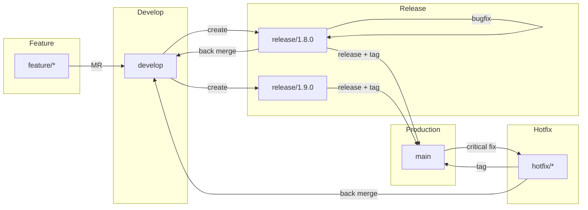
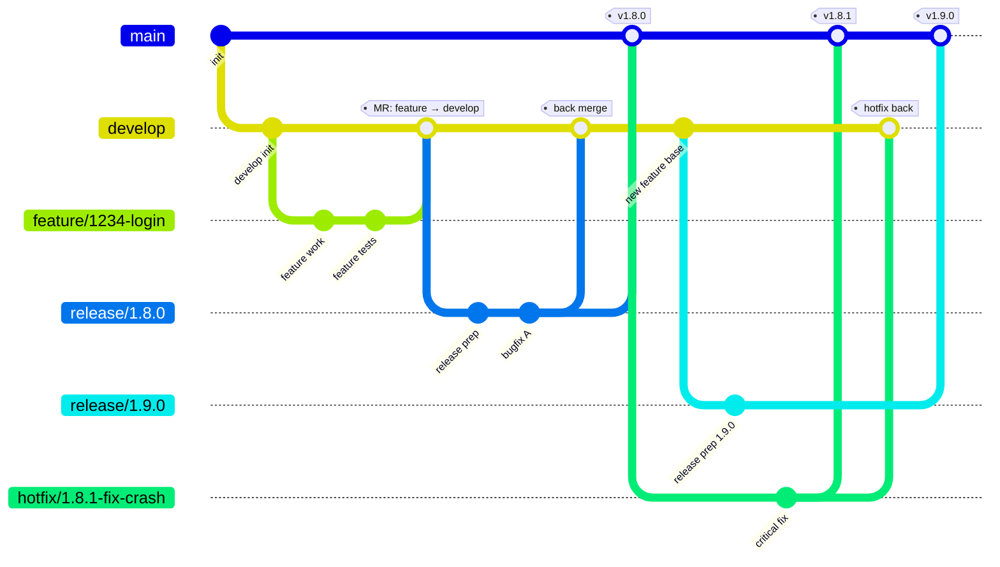

Git 分支管理规范（Git Flow for GitLab）

  

> 本文档是项目 唯一有效的 Git 分支与发布规范，适用于基于 GitLab + Merge Request + CI/CD 的研发流程，支持多发布分支并行，并通过 Tag 精确对应生产版本。

## 一、整体分支流转图

**flowchart 示例**



**gitGraph 示例**



## 二、分支类型与职责

1. main —— 生产分支

- 含义：线上真实运行状态
- 特点：
- 永远可部署、可回滚
- 与生产版本一一对应

规则：

- 禁止直接 push
- 仅允许通过 Merge Request 合并
- 仅允许合并来源：
- release/*
- hotfix/*
- 每一次合并必须创建 Tag

2. develop —— 主开发分支

- 含义：日常开发集成分支
- 特点：
- 汇总所有功能开发
- 不直接部署到生产

规则：

- 所有 feature/* 必须合并到 develop
- 所有 release/* 与 hotfix/* 的修复必须回流
- 禁止直接 push

3. feature/* —— 功能分支

• 命名规范：`feature/<issue-id>-<short-desc>`

- 规则：
- 从 develop 创建
- 只开发单一功能
- 完成后通过 MR 合并回 develop
- 合并后删除分支

4. release/* —— 发布分支（支持并行）

• 命名规范：`release/x.y.z`

职责：

- 版本冻结
- 测试 / 预发布 / 灰度
- 规则：
- 从 develop 创建
- 禁止引入新功能
- 仅允许 bug 修复、配置调整
- 发布完成后：
- 合并到 main
- 回流到 develop
- 删除分支

1. hotfix/* —— 生产紧急修复分支

• 命名规范：`hotfix/x.y.z-fix-desc`

- 规则：
- 从 main 创建
- 修复完成后：
- 合并到 main 并打 Tag
- 必须回流到 develop
- 若相关 release/* 存在，也需合并
  
## 三、版本号与 Tag 规范

版本号规则（SemVer）: `MAJOR.MINOR.PATCH`

Tag 规则

• Tag 仅创建于 main
• Tag 与生产发布一一对应

```md
v1.8.0
v1.8.1
v1.9.0
```

## 四、Merge Request 规范

- 所有代码变更必须通过 Merge Request
- 禁止直接 push 到：
- main
- develop
- release/*

MR 要求：

- 至少 1 名 Reviewer
- CI 必须通过
- 不允许未解决的讨论

## 五、典型流程

标准发布流程

1. feature/* → develop
2. develop → release/x.y.z
3. 测试与修复
4. release/x.y.z → main（打 Tag）
5. release/x.y.z → develop
6. 删除 release/x.y.z

紧急修复流程

1. main → hotfix/*
2. 修复完成
3. hotfix/* → main（打 Tag）
4. hotfix/* → develop
5. hotfix/* → 相关 release/*（如存在）

## 六、适用范围

- 多版本并行维护
- 需要生产可追溯性
- 使用 GitLab + CI/CD
- 强调流程一致性而非个人习惯

## 相关笔记

- [[buckets/work-records/git-flow]] — Git 常用工作流命令（commit / branch / tag / revert）
- [[buckets/work-records/git-blame]] — git blame 逐行追溯作者
- [[buckets/work-records/view-flowchart]] — Mermaid 流程图（本文分支图使用了 mermaid）