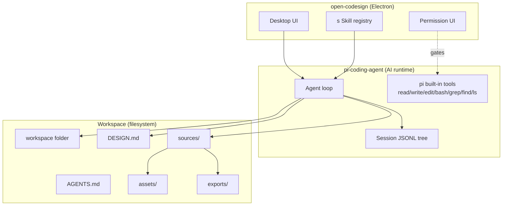

# Research: OpenCoworkAI/open-codesign

## Overview

Open CoDesign(`OpenCoworkAI/open-codesign`)是 MIT 开源桌面应用(Electron + React 19 + Vite 6 + Tailwind v4),作为 Claude Design / v0 / Lovable / Bolt.new 的开源替代品。BYOK 多模型(Claude / GPT / Gemini / Kimi / GLM / Ollama),local-first。

**v0.2.0 "Agentic Design" (2026-05-09)** 是项目里程碑:从"一次性生成器"转向"workspace-backed 设计 agent",以 **pi-coding-agent** 的 JSONL session 树为核心,叠加 8 个领域专用工具 + progressive skill disclosure + DESIGN.md shared memory。

## 研究三大问题

### Q1: AI 是如何工作?

open-codesign 的 AI 是 **workspace-backed design agent**:

| 层 | 实现 |
|---|---|
| **运行时** | pi-coding-agent(`@mariozechner/pi-coding-agent`) |
| **会话存储** | JSONL tree(`/userData/sessions/<designId>.jsonl`),header + entries (id/parentId 形成树) |
| **Tool harness** | 8 专用工具 + pi 内置 7 工具,均经 permission UI |
| **状态持久化** | workspace 文件夹(`AGENTS.md` / `DESIGN.md` / sources / assets / exports) |
| **共享记忆** | DESIGN.md 文件 —— 品牌 token + 设计系统决策 |

**关键**: 设计工作 = agent 任务,有状态、可恢复、可压缩、可分叉。**非**简单的请求-响应。

### Q2: 用了哪些 skill?

**12 个内置 markdown skill**(in `packages/core/src/skills/`):
- `data-viz-recharts` / `mobile-mock` / `pitch-deck` / `frontend-design-anti-slop`

**12 个内置 JSX design skill**(in `userData/templates/design-skills/`):
- `dashboard` / `landing-page` / `chart-svg` / `glassmorphism` / `editorial-typography` / `heroes` / `pricing` / `footers` / `chat-ui` / `data-table` / `calendar` / `slide-deck`

**加载机制**: **Progressive Disclosure** —— skill 不烤进 system prompt(只描述 ≤1536 字符),agent 通过 `skill(name)` 工具按需加载完整 body。

**用户扩展**: 在项目目录加 `SKILL.md` 即可教模型新 taste。

### Q3: Session 是如何设计?

open-codesign 直接复用 **pi-coding-agent session 格式**:

```
header (line 1): {"type":"session","version":3,"id":"...","timestamp":"...","cwd":"...","parentSession":"..."}
entries (后续):  {"type":"...","id":"8-char-hex","parentId":"...","timestamp":"...","payload":...}
```

**8 个 entry 类型**: `message` / `compaction` / `branch_summary` / `custom` / `custom_message` / `label` / `session_info` / `model_change` / `thinking_level_change`

**Compaction 机制**: `firstKeptEntryId` 标记边界 + summary 替代前段 + `tokensBefore` 记录压缩前 token 数。

**JSON stream mode**(`--mode json`): 实时事件流,`message_update` 是 delta-only(线性而非二次方)。

**v0.1 → v0.2 演进**:
- v0.1.x: SQLite + 加密 TOML + `metadata.json` + `design-v{N}.html` 累积
- v0.2.0: 替换为 pi JSONL tree + workspace 文件夹,可重放/分叉/压缩

## Key Findings

1. **[[concepts/agentic-design]]** —— v0.2.0 引入的 workspace-backed agent 抽象,3 大支柱(workspace + permissioned tool + DESIGN.md shared memory)
2. **[[concepts/jsonl-session-tree]]** —— pi-coding-agent 的 append-only JSONL 树形事件流,8 个 entry 类型 + 7 个 AgentMessage 子类型 + compaction 边界机制
3. **[[concepts/skill-progressive-disclosure]]** —— skill 文件不烤进 prompt,通过 `skill(name)` 工具按需加载;1536 字符 description 上限是产品设计而非技术限制
4. **[[concepts/design-md-shared-memory]]** —— DESIGN.md 是品牌 token + 设计系统决策的 markdown 文件,跨 session 共享 + 可 git 版本 + 设计师可编辑
5. **[[entities/open-codesign]]** —— 项目本体:MIT,Electron,BYOK 多模型,v0.2.0 关键里程碑
6. **[[entities/pi-coding-agent]]** —— open-codesign 的 AI 运行时,JSONL session tree + tool harness + JSON stream mode
7. **[[entities/mariozechner]]** —— pi-coding-agent / pi-mono 的作者

## Core Concepts

- [[concepts/agentic-design]] — workspace-backed agent 抽象
- [[concepts/jsonl-session-tree]] — append-only JSONL 树形事件流
- [[concepts/skill-progressive-disclosure]] — skill 不烤进 prompt
- [[concepts/design-md-shared-memory]] — DESIGN.md 文件作为 agent 上下文

## Entities & Tools

- [[entities/open-codesign]] — 项目本体
- [[entities/pi-coding-agent]] — AI 运行时框架
- [[entities/mariozechner]] — pi 项目作者

## 核心架构图(Mermaid)



## 跨域判断

**(J1)** open-codesign 在设计领域做的是 Claude Code 在代码领域做的事 —— 都用 pi-coding-agent(或类似 agent loop 框架)搭 workspace-backed session + permissioned tool use + DESIGN.md(或 CLAUDE.md / AGENTS.md)shared memory。

**(J2)** Skill 的 progressive disclosure + DESIGN.md 的 shared memory 是 **LLM 应用成熟化的两个标志性模式** —— 从"prompt engineering 黑魔法"变为"可读、可改、可版本的资产文件"。

**(J3)** JSONL tree + compaction 是 **agent session 的事实标准** —— CoDesign / pi / Claude Code(线性)/ dsh(append-only SessionEvent)都在用变体。共识方向:append-only + 树形 + 压缩。

**(J4)** 12 内置 skill + 1536 字符描述上限反映产品化权衡 —— 不无限扩展 skill 集,鼓励作者精简;用户可加 SKILL.md 自定义。这是低代码扩展点的设计智慧。

**(J5)** Permission UI 是产品差异 —— — 技术基建(agent loop + tool harness)开源可复用,UX 层的权限弹窗(allow/deny/always-allow-for-session 三选项)是各家产品的差异点。

## Contradictions & Open Questions

### 已解决矛盾

- **JSONL vs JSON session 格式**: 搜索结果中有"v0.1.x 用 metadata.json + chat-history.json + design-v{N}.html"的描述,这是 **v0.1 旧版**,v0.2.0 起已统一到 pi-coding-agent JSONL tree。两条信息**不矛盾**,只是版本演进。v0.2.0 supersedes v0.1 的设计。

### 未解决 / 局限

- **8 个工具的具体 input/output schema** 仅有名字,完整参数未在公开材料中找到。需源码或其他源补充。
- **userData 路径在不同 OS 的精确值** 未确认(典型 macOS: `~/Library/Application Support/@open-codesign/desktop/`)。
- **DESIGN.md 完整 schema** 未在公开材料中找到(部分设计 token 的字段名推测,非官方文档)。
- **Mario Zechner 公开信息** 较少,本页 bio 基于其项目产出反推,base_confidence 0.70。
- **与 Anthropic Claude Design 真实产品对比** 缺官方对照表,仅 README 自述。

## Sources Consulted

- [[references/open-codesign-readme]] — GitHub README (主要架构 + AI 集成声明)
- [[references/open-codesign-changelog]] — v0.1 → v0.2 演进时间线
- [[references/open-codesign-prompt-system-deepwiki]] — 技能系统 + progressive disclosure 详细
- [[references/pi-coding-agent-session-format]] — JSONL session tree 完整 schema

## 相关

- [[projects/figma/figma]] — 用户本地 figma 项目,运行于 open-codesign 客户端
- [[concepts/atomic-state-recovery]] —— vault 已有同源概念(状态破坏后的恢复)
- [[concepts/durable-session-log]] —— dsh 同源 (append-only SessionEvent)
- [[synthesis/concepts-atomic-state-recovery × projects-figma-skills-codesign-session-jsonl-recovery]] —— CoDesign 用同一 JSONL 模式的 8MB audit log